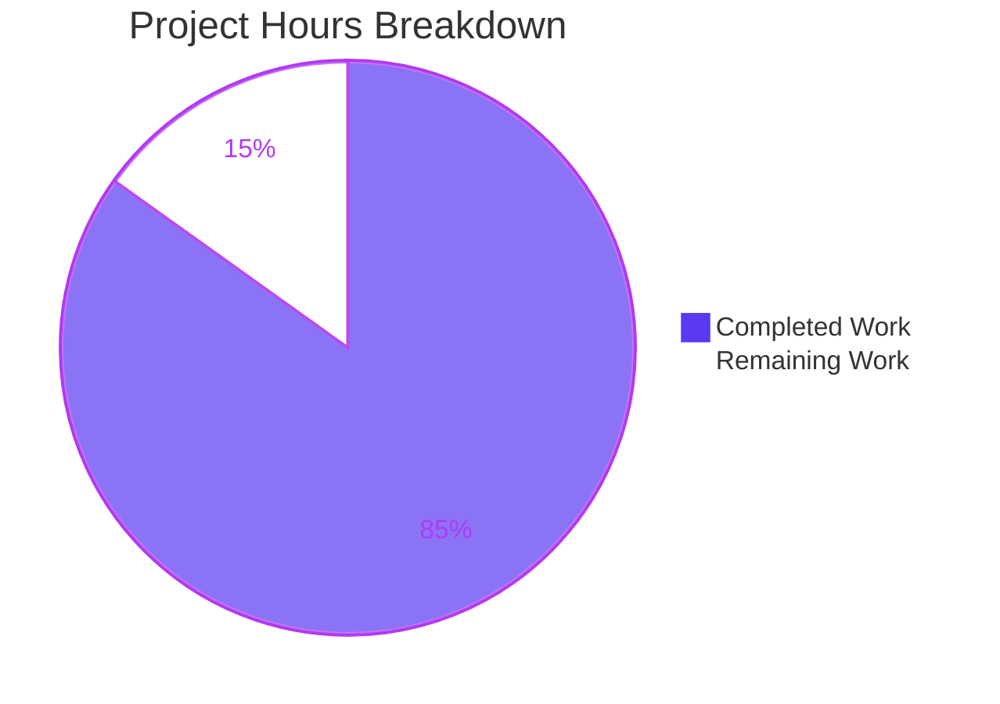
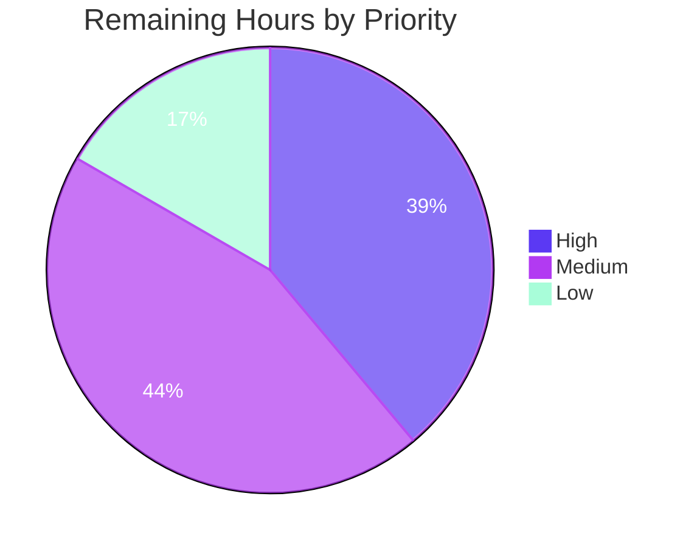
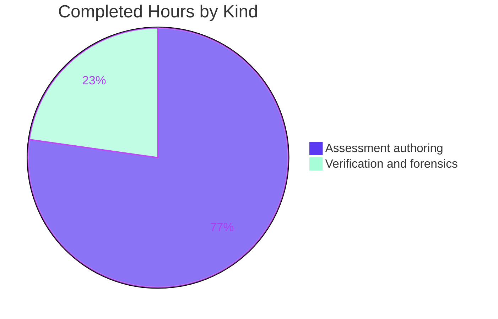

# 1. Executive Summary

## 1.1 Project Overview

MvcMusicStore is a three-edition ASP.NET MVC storefront on .NET Framework: catalog browsing, a shopping cart, checkout, member accounts and album administration. This engagement assesses it for modernization and plans the move to .NET 8, ASP.NET Core and Azure, answering fourteen requirements across seven analysis dimensions and seven planning outputs. It is written for the engineering, security, product and data owners who must approve that migration. The output is a thirteen-document assessment tree under `docs/modernization/`, cited line by line to the repository. No application code, configuration, dependency or database artifact was changed.

## 1.2 Completion Status

The assessment scope is complete and verified; what remains is human approval and the decisions the plan deliberately leaves to the reader.


| Metric | Value |
|---|---|
| Total Hours | 476 |
| Completed Hours (AI + Manual) | 404 (404 AI + 0 Manual) |
| Remaining Hours | 72 |
| Percent Complete | 84.9% (404 / 476) |

## 1.3 Key Accomplishments

- All fourteen requirements answered, each by a named document indexed in the assessment tree.
- Roughly 4,800 repository-relative citations, every one resolving in the checkout.
- All three editions restore and build clean, with MVC 4's required build overrides documented.
- MVC 5 run end to end, including an authenticated administrator reaching album administration.
- Security posture recorded per edition with file-level evidence across six control areas.
- Every no-successor construct enumerated, separately from every successor that fails silently.
- Hosting recommended as primary, secondary and interim, each with its preconditions and trades.
- Effort, risk and sequencing modelled per workstream with ranges, assumptions and confidence.

## 1.4 Critical Unresolved Issues

Thirteen items remain open across six of the thirteen documents, grouped into the five counted rows below, which sum to thirteen. All fourteen requirements are answered and none of these withdraws an answer. The approval gate is listed last: it blocks release, but it is a decision rather than a defect.

| Issue | Impact | Owner | ETA |
|---|---|---|---|
| **5 items** — internal consistency of the effort, risk and sequencing document: a risk-register membership statement that excludes an entry the same document defines in full, a stray table row, a five-versus-six claim, an assertion that no browser-automation package is pinned when one is, and an additions count one short of its own register | A reader can reach two different answers on register membership and tooling cost; any effort figure drawn from them needs re-checking | Engineering lead | 4 h |
| **2 items** — retained superseded content and a skipped subsection number in the hosting document | One gate is specified twice, and one navigation target is ambiguous | Engineering lead | 2 h |
| **3 items** — duplication residue in the roadmap, the debt register and the security assessment | Repeated rows and near-duplicate paragraphs inflate the review surface | Engineering lead | 2 h |
| **2 items** — two corpus-wide statements that no longer match their own basis: an input count, and the MVC 5 build status, which is published as pending a Windows verification run although that build now succeeds with zero warnings | Understates readiness; a reader may repeat verification that is already achievable | Engineering lead and release owner | 2 h |
| **1 item** — review coverage: 9 of the 13 documents have been linted but not rendered | Prose and layout defects invisible to the documentation gate may survive | Technical writer | 12 h |
| Approval gate — the assessment is a proposal and authorizes nothing until the named owners sign off | No implementation may begin; the migration remains unscheduled | Product, Security, Data and Operations owners | 16 h |

## 1.5 Access Issues

| System/Resource | Type of Access | Issue Description | Resolution Status | Owner |
|---|---|---|---|---|
| Azure control plane | Subscription with contributor rights | The hosting recommendations carry per-claim revalidation rows that require a live non-production subscription to clear; none is attached to this project | Open — blocks confirmation of platform limits and quotas only, not the recommendation itself | Cloud/platform owner |
| Software-composition-analysis service | Scanner credentials or a hosted advisory service | The repository configures no dependency scanning, so the transitive graph and the vendored client libraries have not been scanned end to end | Open — direct pins are covered; transitive and vendored assets are not | Security |
| Repository, build toolchain, NuGet, LocalDB, IIS Express | Read/write and execute | Verified available: restore, build and runtime all executed successfully | No issue | — |

## 1.6 Recommended Next Steps

1. **[High]** Obtain the recorded approvals — product, security, data owner, operations. Nothing downstream starts first.
2. **[High]** Close the thirteen open items, then re-check any effort figure drawn from them.
3. **[High]** Decide the .NET 8 support-window question: accept the target, or re-pin and re-run validation.
4. **[Medium]** Rule on the plan-amendment requests and select the hosting target, so the first workstream has an entry gate.
5. **[Medium]** Run a full software-composition analysis before any dependency work is authorized.

# 2. Project Hours Breakdown

## 2.1 Completed Work Detail

Each row traces to a requirement in scope. Document rows are sized by evidence depth — citation density, table and matrix count, and the repository analysis each claim rests on — not by page count. The cross-cutting rows are the verification work that made those claims safe to publish.

| Component | Hours | Description |
|---|---|---|
| Architecture overview | 18 | Request pipeline, startup composition, layering and the six-entity model for all three editions, plus a per-capability edition-coverage matrix that corrects blanket coverage claims; 581 citations |
| Dependency inventory | 14 | All 63 exact pins with registry and purpose, the framework assembly references that are not NuGet-resolved, the committed 2012-era restore client, the absent lockfile and the unpinned restore source |
| Modernization roadmap | 22 | Ordered workstreams with entry and exit gates, each exit gate a successor's entry gate; provider and hosting selections held as explicit gates |
| .NET 8 migration strategy | 30 | SDK-style conversion, `PackageReference`, `net8.0`, pinned SDK band, per-package outcome for every current pin, and the file-by-file target application map |
| ASP.NET Core migration approach | 60 | Pipeline, dependency injection, configuration, EF Core, Identity schema-and-data migration, static assets, the 29-view disposition, the Bootstrap 3-to-5 class mapping and the anti-forgery, verb-change and JSON-naming resolutions; 1,813 citations |
| Azure hosting recommendations | 52 | Primary, secondary and interim hosting targets with decision criteria; deployment-time migration principal and DDL separation; data-protection key store; session and affinity controls; browser matrix; 331 tables |
| Effort, risks and sequencing | 24 | Per-workstream effort model with stated units, low/expected/high bands, assumptions and confidence; risk register with likelihood, impact, mitigation, contingency, trigger and owner |
| Technical debt register | 16 | Code, data, operational, build and repository debt, each with severity, remediation and owner, quantified from the cited files; 131 tables |
| Security assessment | 26 | Per-edition authentication, authorization, transport, secret-handling, data-protection, error-disclosure and auditability posture with file-level evidence; 614 citations |
| Build and deployment requirements | 16 | Per-edition toolchain and hosting prerequisites, per-edition database topology with catalog and credential stores stated separately, initializer first-run behaviour, and the build evidence table |
| Cloud readiness assessment | 10 | Session statefulness with the affinity distinction, key persistence, file-attached databases, Windows-authentication strings, plain HTTP and filesystem path casing, each with its target-state replacement |
| Migration blockers | 18 | Every construct with no successor separated from every successor whose default behaviour differs, each with file location and replacement; compile-time and runtime failure modes distinguished |
| Assessment index | 6 | Requirement-to-document mapping for all fourteen requirements and the six environment analysis goals, the one-fact-one-owner decision table, and the approval gate |
| Repository forensics | 24 | Per-edition file, line, duplication and equivalence measurement; cross-edition diff; committed-artifact inventory; the counting-method split that keeps duplication figures and sizing figures from being mixed |
| Three-edition build, restore and runtime verification | 12 | Restore and build of all three editions on the supported toolchain, the MVC 5 application run end to end including an authenticated administrator flow, and the database-schema settlement behind the Identity migration gate |
| External research and version verification | 14 | Support-lifecycle dates, current migration tooling, the incremental-migration package split, hosting comparison, and per-package version verification for every successor pin |
| Citation and link integrity engineering | 18 | Locator-level verification that citations resolve to the claimed content, unique rendered heading identifiers, and resolution of every internal cross-reference |
| Cross-document consistency and arithmetic | 16 | One-fact-one-owner enforcement across the corpus, contradiction sweeps, and reconciliation of every count, byte figure and version string against its reproducing command |
| Documentation quality gate and structural validation | 8 | Lint gate at zero findings with a positive control, table and fence well-formedness, diagram rendering, and the repository non-modification acceptance check |
| **Total** | **404** | |

## 2.2 Remaining Work Detail

| Category | Hours | Priority |
|---|---|---|
| Reconcile the five internal-consistency items in the effort, risk and sequencing document, and re-check any figure derived from them | 4 | High |
| Stakeholder review and recorded approval by product, security, the data owner and operations — the gate that authorizes everything downstream | 16 | High |
| Decide the .NET 8 support-window question: accept the target as written or re-pin to a later LTS release | 2 | High |
| Grant or refuse the plan-amendment requests the assessment raises, including the two-project test design, the extended successor package set and the withdrawn session-cache tool | 4 | High |
| Discharge the MVC 5 build gate: record toolchain versions, restore source, configuration and outcome, and release the pending status | 2 | High |
| Reconcile residual cross-document counts, retained superseded content and section numbering in the roadmap, the migration approach and the hosting document, and pin the verification commit range to a literal endpoint | 6 | Medium |
| Run a full software-composition analysis over the transitive graph and the vendored client libraries | 6 | Medium |
| Clear the hosting document's per-claim revalidation rows against a live non-production Azure subscription | 12 | Medium |
| Close the CI provider gate and pin the build image digest to the SDK band the strategy requires | 3 | Medium |
| Select the hosting target, and with it the interim route's authentication path, confirming the stated trades so the roadmap's first workstream has an entry gate | 3 | Medium |
| Take the browser-residual decision on the narrowed support matrix | 2 | Medium |
| Human read-through of the two largest documents, which have not been exercised in a renderer | 12 | Low |
| **Total** | **72** | |

## 2.3 Total Reconciliation

| Line | Hours |
|---|---|
| Section 2.1 — completed | 404 |
| Section 2.2 — remaining | 72 |
| **Total project hours** | **476** |
| Percent complete | 404 / 476 = 84.9% |

Confidence is high on the completed rows: each is measured against a document that exists in the checkout, and the verification rows are backed by commands whose output was observed. Confidence is medium on the approval and Azure-revalidation rows, which depend on stakeholder availability and on access this project does not hold; both are estimated at the upper end of their range for that reason.

# 3. Test Results

Every figure below comes from an execution observed on the supported Windows toolchain. There is no line or branch coverage figure for any edition, because the repository contains no test project to instrument — the Coverage column therefore states the scope each category exercised.

| Area / Category | Framework | Tests | Passed | Failed | Coverage | What This Proves |
|---|---|---|---|---|---|---|
| Documentation gate — assessment corpus | markdownlint-cli 0.42.0 | 13 | 13 | 0 | 13 of 13 documents | The published corpus is structurally well-formed — tables, fences, headings and diagrams — under the project's own rule set |
| Dependency restore — all editions | NuGet CLI 7.9.0.83 | 3 | 3 | 0 | 3 of 3 editions | Every pinned dependency resolves from a declared public source; no private or missing feed is required |
| Compilation — all editions | MSBuild 17.14.51.32402 | 4 | 4 | 0 | 3 of 3 editions; MVC 5 in Debug and Release | All three editions build with zero warnings and zero errors, so the migration source is a compiling baseline |
| Build-failure negative controls | MSBuild 17.14.51.32402 | 2 | 2 | 0 | 2 documented failure modes | The two documented build defects reproduce with the exact diagnostics published, so the overrides a developer needs are correct |
| HTTP route and authorization surface — MVC 5 | IIS Express 10.0.20001.1000 | 12 | 12 | 0 | 7 public routes, 3 protected routes, 2 absent routes | Catalog browse, album detail, cart, account and error routing behave as documented, and protected routes redirect an anonymous caller to sign-in |
| Authenticated administration flow — MVC 5 | IIS Express + .NET HTTP client | 5 | 5 | 0 | Sign-in and the administration index | The seeded administrator can sign in and reach album administration across all 462 catalog rows |
| Cart mutation and AJAX contract — MVC 5 | IIS Express + .NET HTTP client | 6 | 6 | 0 | Add, view and remove | Add and remove mutate the cart and return the documented JSON contract, confirming the request-forgery and property-naming findings against the running application |
| Repository non-modification acceptance | git 2.55.0 and SHA-256 | 18 | 18 | 0 | 14 tracked database binaries and 4 tree checks | The assessment changed nothing outside its own documents; every tracked binary is byte-identical to its committed state |
| **Total** | | **63** | **63** | **0** | | |

The documentation gate was validated with a positive control: run without the project's two documented suppressions, the same command reports 34,836 findings across the same 13 files, all of them long lines (34,768) and inline anchors (68) and nothing else. That confirms the clean gate is genuinely linting rather than silently skipping. Restore emits 43 advisory warnings on the legacy pins and still exits zero.

**Not covered by any test.**

- **There is no automated unit or integration test suite anywhere in the repository** — zero test projects and zero test attributes, confirmed by search. Nothing regression-guards the application's behaviour, and authoring a suite is outside this assessment's scope. A human must treat this as the first prerequisite of any migration work.
- **MVC 4 and MVC 3 were compiled but never run.** MVC 4's committed connection strings name a database instance that does not exist on a supported modern host — only `MSSQLLocalDB` is present — so its runtime behaviour is unverified. MVC 3 depends on a retired database engine. Both should be exercised only if either is ever needed as a live baseline.
- **Every target-state design is unexecuted.** The ASP.NET Core application, the data-migration executor, the test suite, the CI pipeline and the Azure estate do not exist yet; nothing in those designs has been run.
- **Published code and query fragments are structure-checked, not executed.** The canonical build sequence was exercised against a stubbed command rather than a real .NET 8 SDK. A human should run each published command against a real SDK before adopting it in a pipeline.
- **The client-side library manifest was validated but not restored.** Its declared sources are reachable; the restore it describes has not been run.
- **Nine of the thirteen documents have been linted but not rendered.** Prose and layout defects invisible to the lint gate are not covered; a reader-level pass over the two largest documents is the remedy.
- **Azure platform limits, quotas and per-claim hosting assertions are not covered** — no subscription is attached to this project.
- **The transitive dependency graph and the vendored client libraries are not covered by any scan.** Advisory data exists for the direct pins only; a full composition analysis is required before dependency work is authorized.

# 4. Runtime Validation & UI Verification

The MVC 5 edition — the one nominated as the migration source — was built, deployed to a scratch location outside the repository so no tracked database binary could be altered, served by IIS Express and driven over HTTP. Every line below records what was observed.

- ✅ **Application start-up** — Operational. The host registered the site and served the home page at HTTP 200, title `Home Page – MVC Music Store`, 4,856 bytes.
- ✅ **Catalog browse and album detail** — Operational. Store index, genre browse and album detail all return 200; the album detail page renders its genre and artist through lazily loaded navigation properties, and the shared layout renders nine genre links from a child action on every page.
- ✅ **Authentication** — Operational. The sign-in page issues a 108-character request-verification token; posting the seeded administrator credential returns 302 to the home page and the layout then renders the signed-in identity.
- ✅ **Authorization** — Operational. Album administration, checkout and account management each redirect an anonymous caller to sign-in with the return URL preserved.
- ✅ **Administration surface** — Operational. The album administration index returns 200 for the administrator identity and lists all 462 catalog rows.
- ⚠ **Shopping cart and its AJAX contract** — Partial. Add and remove both mutate the cart, but add is a bookmarkable state-changing `GET` rendered as a plain link with no form on the page; removal is accepted with no request-verification token present and returns 200 with `application/json` and PascalCase property names (`Message`, `CartTotal`, `CartCount`, `ItemCount`, `DeleteId`). In the same session the layout displayed a cart figure of 7 distinct lines while the response reported 10 units — two different quantities from two different code paths.
- ⚠ **Checkout** — Partial. The address-and-payment form is reachable and correctly protected, but the order-placement write path was not driven, so promo-code handling and order-total computation are unverified at runtime.
- ⚠ **Transport, response headers and error disclosure** — Partial. The application is served over plain HTTP; no framing, content-type, transport-security or content-security header is emitted, while the server, framework and MVC versions are all disclosed. An invalid model-bound request returned a full stack trace and framework version banner to a local caller.
- ❌ **MVC 4 and MVC 3 at runtime** — Not exercised. Both compile, but MVC 4's committed connection strings name a database instance absent from a supported host and MVC 3 requires a retired engine. Their runtime behaviour is stated as prediction from configuration, never as observation.
- ❌ **The ported application and the Azure estate** — Not exercised. Neither exists yet; no target-state runtime claim in this assessment has been executed.

Assessment documents themselves: all 13 pass the documentation gate, and 4 were additionally opened and navigated in a real browser to confirm headings, links and diagram rendering. The remaining 9 have been linted but not rendered.

# 5. Compliance & Quality Review

## 5.1 Compliance Matrix

Status is where each deliverable stands now, measured against its own acceptance criteria: required content present, every existing-system claim carrying a resolvable file-and-line citation, and no contradiction with the document that owns each cross-cutting decision.

| Deliverable | Quality Benchmark | Verified Status | Progress |
|---|---|---|---|
| Architecture overview | Pipeline, startup, layering and entity model for all three editions; per-capability edition coverage rather than a blanket claim | ✅ Pass — every component named resolves to a real file; no capability asserted for an edition that lacks it | 100% |
| Dependency inventory | All 63 pins with registry and purpose; non-NuGet references; restore-source reality | ✅ Pass — pin count and every version string match the manifests exactly | 100% |
| Modernization roadmap | Workstreams in dependency order, each exit gate a successor's entry gate | ⚠ Pass with residue — ordering and gates hold; two near-duplicate paragraph pairs remain | 98% |
| .NET 8 migration strategy | Project-format, framework and dependency transition; one stated outcome per current pin | ✅ Pass — all 28 migration-source identifiers have exactly one outcome | 100% |
| ASP.NET Core migration approach | Pipeline, DI, configuration, Identity, EF Core and static-asset transitions, each a named resolution rather than a description | ⚠ Pass with residue — every no-successor construct is resolved; minor locator residue remains | 98% |
| Azure hosting recommendations | Primary, secondary and interim targets; migration principal and DDL separation; key store; browser matrix | ⚠ Pass with residue — recommendation and constraints hold; one gate is specified twice and one subsection number is skipped | 97% |
| Effort, risks and sequencing | Per-workstream model with units, bands, assumptions and confidence; register entries with owner and trigger | ⚠ Conditional — the model and register are complete, but five internal-consistency items must be closed before figures are quoted | 92% |
| Technical debt register | Categorized debt with severity, remediation and owner, reproducible from cited files | ✅ Pass — every quantity re-derives from its citation; the cross-edition equivalence claim is correctly bounded | 100% |
| Security assessment | Per-edition posture with file-level evidence and correct edition attribution | ✅ Pass — every finding cites a file and locator and states which editions it holds in | 100% |
| Build and deployment requirements | Per-edition toolchain, database topology and verified build outcome | ⚠ Conditional — content complete and independently reproduced; the migration source's build status is still published as pending | 99% |
| Cloud readiness and migration blockers | Each blocker paired with its target-state replacement; compile-time and runtime failure modes separated | ✅ Pass — both blocker groups present and correctly assigned | 100% |
| Assessment index and requirement coverage | All fourteen requirements and all six environment analysis goals mapped to an owning document; approval gate stated | ✅ Pass — every requirement resolves to a document and every document is referenced | 100% |

Four cross-cutting benchmarks apply to the corpus as a whole and all pass: the documentation gate reports zero findings across all thirteen documents; roughly 4,800 citations resolve to the claimed content; every internal cross-reference resolves to a unique rendered target; and the repository non-modification criterion is met exactly — thirteen additions under `docs/modernization/` and nothing else, with all fourteen tracked database binaries byte-identical.

## 5.2 AAP & Rule Divergences and Gaps

No user-specified rules were provided for this project, so no rule divergence is possible; the eight divergences below are all departures from the agreed plan.

| What the AAP/Rule Required | What Was Delivered Instead | Why It Diverged | Impact | Remediation |
|---|---|---|---|---|
| The migration source's build assessment recorded as "blocked pending a Windows verification run" | That status is published at 33 places across the corpus, while the build in fact succeeds with zero warnings and zero errors on the supported toolchain | The plan froze the status when no Windows toolchain was available, and its acceptance criteria make the frozen wording authoritative; the verification became possible afterwards | Understates readiness; a reader may repeat verification that is already achievable, and the roadmap's first workstream carries an entry gate that is effectively satisfied | Release the pending status with a five-field record: toolchain versions, restore source, configuration, outcome and date |
| A closed successor package set, with capabilities that need no package explicitly listed as such | Five packages added (`AngleSharp`, `Microsoft.Data.SqlClient`, `Microsoft.Playwright`, `Microsoft.Extensions.Identity.Core`, `Microsoft.Extensions.Logging.ApplicationInsights`) and `dotnet-sql-cache` withdrawn | Element-level assertions and rendered-appearance checks cannot be made without a parser and a browser driver; the withdrawn tool carries a critical advisory in its own dependency graph | Target dependency surface is wider than approved, and the session-cache table now needs a different executor | Approve or refuse each addition; name the replacement mechanism for the cache table |
| A frozen file-by-file target application map, authoritative for implementation | Eleven recorded departures, including a two-project test design where the map specifies one, plus a data-migration executable, collection and fixture classes, a deployed binding, a registration seam and a cart-alias table | The design work found artifacts the map could not accommodate; each was recorded as a plan-correction rather than silently absorbed | The map and the design differ; an implementer following the map alone will build the wrong project layout | Ratify the corrected map so one version is authoritative |
| Amendment requests to the plan itself excluded from deliverable content | The .NET 8 strategy carries five amendment requests inline, and reads the code-change freeze as project-level rather than document-level | The design could not be stated correctly within the plan's own constraints, and the reading was needed to justify prescribing changes at all | A reader cannot tell which statements are approved and which are pending; the freeze reading is defensible but undeclared | Grant or refuse each request and record the freeze reading explicitly |
| Secrets and data protected through the named client-side mechanisms | Protection moved platform-side: no Key Vault client is referenced, the key-rotation function was dropped, and the interim Windows hosting route is unavailable without an approved source change | The plan's own package set forecloses a client library, and the interim route cannot authenticate to a cloud database as the code is written today | The interim "move now, port later" option is not actually available on the terms described; rotation becomes a platform responsibility | Choose the interim authentication path and cost it, or drop the interim option |
| One fact, one owner — every cross-cutting decision stated once and cross-referenced elsewhere | Mostly held, but contradictions survive in the effort document and residues in the roadmap, migration approach and hosting document | Revisions were added beside the text they corrected rather than replacing it, leaving both readings normative | A reader can reach two different answers on register membership, tooling cost and one gate's specification | Close the thirteen open items listed in Section 1.4 |
| Three measured figures as the plan states them | Corrected against measurement: eleven files carry the legacy web namespace rather than ten, six views name legacy types rather than five, and the minimum IDE version is 17.14.17 rather than 17.14.16 | Direct per-file measurement and vendor advisories contradicted the plan's figures; repository and vendor evidence govern | Positive — the corpus is more accurate than the plan; anyone reconciling the two will see three deltas | Accept the corrections; no work required |
| No advisory identifiers, and a literal commit as the verification range endpoint | 43 advisories with 24 named identifiers are published, and six documents express the range with a symbolic endpoint rather than a fixed commit | Restore surfaces advisories the plan assumed unavailable; the symbolic endpoint was left in place where commands were authored before the range was fixed | Advisory data is a net gain; the symbolic endpoint makes six documents' verification commands produce different results over time | Publish advisories as-is; pin the range endpoint to a literal commit |

**Build status held as pending.** The plan required the migration source's build outcome to be carried as blocked because no Windows toolchain existed when the assessment was written, and made that wording authoritative. The build now succeeds: restore installs 28 packages and MSBuild 17.14.51.32402 reports `Build succeeded. 0 Warning(s) 0 Error(s)`, producing a 214,528-byte assembly. Thirty-three places in the corpus still say otherwise. The consequence is not incorrectness so much as pessimism — the reader is told a precondition is unmet when it is met. A release owner should discharge the gate with a dated record naming the toolchain, the restore source and the configuration, then update those statements in one pass.

**Successor package set extended and one tool withdrawn.** The plan closed the target dependency list and required capabilities available in the shared framework to be recorded as needing no package. The delivered strategy pins five more: a HTML parser and a browser driver, without which the element-level and rendered-appearance acceptance criteria cannot be met at all; a data provider that supplies managed-identity authentication; an Identity abstraction; and a logging sink for platform telemetry. Separately the session-cache tool was withdrawn because a critical advisory sits in its own dependency graph. Each addition is defensible on its face, but the target dependency surface is now wider than what was approved, and the cache table has lost its named executor — both are approver decisions, not engineering ones.

**Target application map departed from.** The map was to be frozen and authoritative for implementation. Eleven departures are recorded, the most consequential being a two-project test design where the map specifies one, a separate data-migration executable, collection and fixture classes the map does not contain, a deployed model-binding type, a service registration seam, and a cart-alias table introduced to key a signed-in cart. Each was written as a plan-correction rather than absorbed silently, which is the right instinct, but the result is two competing layouts. An implementer who follows the map alone will build the wrong structure; one who follows the design will diverge from the approved artifact list. Ratifying the corrected map removes the ambiguity at no engineering cost.

**Amendment requests inside a deliverable.** Acceptance criteria kept plan amendments out of deliverable content, on the reasoning that a document requesting changes to its own governing plan blurs what has been approved. The .NET 8 strategy carries five such requests inline, and additionally reads the code-change freeze as covering the project rather than each document — a reading it needed in order to prescribe any future change at all. Both are reasonable; neither is sanctioned. Until an approver rules on the five requests and records the freeze reading, a reader cannot separate settled statements from proposals, which is precisely the confusion the criterion existed to prevent.

**Protection moved platform-side.** The plan named client-side mechanisms for secret handling and key rotation. The delivered hosting design references no vault client, because the plan's own closed package set forecloses one; rotation became a platform responsibility rather than a function the project ships; and the interim option of hosting the un-ported application in the cloud turns out to be unavailable on the terms described, because the existing connection code cannot authenticate to a cloud database without either a stored credential or a source change that the freeze does not permit. The design is sound, but the interim "move now, port later" path is materially narrower than the plan implies, and an approver must either choose and cost its authentication route or strike it.

**One fact, one owner not fully held.** The plan required each cross-cutting decision to be stated once and cross-referenced everywhere else. It holds for the target framework, the hosting recommendation, the cutover approach, the observability approach and the workstream decomposition. It does not fully hold in the effort document, where a statement of register membership excludes an entry the same document defines in full, an additions count falls one short of its own register, and a claim that no browser-automation package is pinned contradicts the strategy that pins one. The cause is uniform: corrections were appended beside the text they superseded instead of replacing it. Thirteen items remain, all listed in Section 1.4, and all closable by editing rather than re-deriving.

**Three measured corrections.** Direct per-file measurement contradicted three plan figures, and the corpus follows the measurement: eleven files carry the legacy web namespace rather than ten, six views name legacy types or non-portable members rather than five, and the minimum IDE version required for the current modernization tooling is 17.14.17 rather than 17.14.16. All three are improvements, and the evidence is reproducible from the checkout. The only consequence is for anyone reading the plan and the assessment side by side: three figures differ, and the assessment is the correct one. No further action is needed beyond recognizing that the assessment supersedes the plan on these points.

**Advisory identifiers and the verification range endpoint.** The plan expected no advisory identifiers, on the basis that no scanner would be available; restore in fact surfaces 43 advisory warnings and the inventory publishes 24 named identifiers with their affected pins. That is a clear net gain and needs no action beyond recognition that the direct pins alone are covered. The second half is a genuine defect: six documents express the verification commit range with a symbolic endpoint rather than a literal commit, so the same command produces different output as the branch advances. Pinning the endpoint is a mechanical edit, and it matters because those commands are the evidence a reviewer would re-run.

# 6. Risk Assessment

These are forward-looking: what could still go wrong in the migration or in production, given the state of the application and the plan as they stand today.

| Risk | Category | Severity | Probability | Mitigation | Status |
|---|---|---|---|---|---|
| The nominated target runtime, .NET 8, reaches end of support on 10 November 2026 — within months of any realistic delivery date | Technical | High | High | Take the accept-or-re-pin decision before implementation starts. Re-pinning is not a one-line edit: every framework and data-access pin moves to the new servicing line, the SDK band and build image change, the compatibility surface of the framework-bridging packages changes with it, and behaviour validation must be re-run | Open — approver decision pending |
| No regression baseline exists. The repository has zero test projects, and several of the framework differences the plan identifies fail silently rather than loudly — navigation properties returning null once lazy loading is gone, and the cart's JSON contract being camel-cased by the new serializer while the page's script still reads PascalCase names | Technical | High | High | Author the HTTP-level cross-baseline suite specified in the plan before any porting begins, and treat the approved behaviour deltas as expected differences rather than failures | Open — sequenced as the first workstream |
| Legacy authentication and request-forgery posture is documented but deliberately not repaired: a plaintext administrator credential ships in configuration and is provisioned at start-up in two editions, request-forgery protection covers one controller of four that need it in the migration source and none at all in the oldest edition, and adding to the cart mutates state over a bookmarkable `GET` in all three editions | Security | High | High | Do not host any edition on a reachable network before the credential is removed and the forgery policy is applied. The plan specifies global automatic validation, an operator-run provisioning command and a verb change; all three are implementation work behind the approval gate | Open by design — the assessment scope forbids repair |
| The supply chain is not scanned end to end. Advisory data exists for the direct pins only; the transitive graph and the vendored 2011–2013 client libraries are unscanned, and none of those libraries is served with an integrity attribute or under a content-security policy | Security | Medium | High | Run a full composition analysis before dependency work is authorized, and ratify the one tool withdrawal already made on advisory grounds | Open — blocked on scanner access |
| The application has no observability and a destructive schema lifecycle. There is no logging framework, no health endpoint and no metrics anywhere, the checkout transaction is wrapped in a bare catch that discards the exception, and the schema initializer drops and recreates the database on any model change — including the database holding orders and personal data | Operational | High | High | Never point the current application at a database containing real data while that initializer is registered. The plan replaces it with deployment-time migrations plus guarded non-production seeding, and adds structured logging, health checks and platform-collected telemetry as net-new capability | Open — critical if the legacy application is deployed as-is |
| The recommended Azure estate has never been executed against a live control plane, so platform limits, quotas and several per-claim assertions in the hosting design remain unconfirmed | Operational | Medium | High | Clear the hosting document's revalidation rows in a non-production subscription before committing to a plan size, region or deployment model | Open — blocked on subscription access |
| Cutover and Linux-hosting preconditions bite at the moment of switching. Every signed-in user must reauthenticate because existing authentication tickets cannot be read by the new key ring, anonymous carts do not carry across because their identity lives only in in-process session, and Linux hosting will not resolve at least one asset path whose casing differs from the file on disk | Integration | Medium | High | Complete the path-casing audit before selecting Linux, schedule cutover in a low-traffic window with the legacy application drained, expire the old authentication cookie on first request, and migrate cart rows so nothing is destroyed even though anonymous links are lost | Open — planned and sequenced |
| The review surface is large and carries residual inconsistency: roughly 9.5 MB across thirteen documents, of which nine have been linted but not read in a renderer, and the effort document still contradicts itself on register membership and tooling cost | Integration | Medium | Medium | Close the thirteen open items, then run a reader-level pass over the two largest documents before quoting any effort figure to a stakeholder | Open — tasks assigned in Section 2.2 |

# 7. Visual Project Status

**Overall progress — 404 of 476 hours complete (84.9%).** Completed work is shown in Blitzy dark blue (`#5B39F3`); remaining work in white (`#FFFFFF`).



**Remaining work by priority — 72 hours.** High-priority work is the approval gate and the consistency items that gate it; medium is decision and validation work; low is the reader-level pass over the two largest documents.



**Where the completed effort went.** Document authoring accounts for 312 hours and the cross-cutting verification that made those documents citable accounts for 92.



| Category | Remaining Hours | Share of Remaining |
|---|---|---|
| Approval, decisions and gate discharge | 24 | 33.3% |
| Consistency reconciliation | 10 | 13.9% |
| Validation requiring external access | 18 | 25.0% |
| Selection gates | 8 | 11.1% |
| Reader-level review | 12 | 16.7% |
| **Total** | **72** | **100%** |

# 8. Summary & Recommendations

This engagement asked for an assessment, not a migration, and that is what was delivered: a thirteen-document modernization assessment under `docs/modernization/` answering all fourteen requested requirements, cited line by line to the repository, with the application itself untouched. The constraint was honoured exactly — the only change on this branch is thirteen new documents, and all fourteen tracked database binaries remain byte-identical to their committed state. Against the scope that was agreed, the project stands at **84.9% complete: 404 of 476 hours**. The 72 hours outstanding are not unfinished analysis; they are the approval the plan was written to obtain, the decisions it deliberately leaves to the reader, and a set of internal-consistency edits a reviewer should see closed first.

What the reader can now rely on is substantial. The architecture, dependency, debt, security, build, cloud-readiness and blocker analyses are complete and reproducible: every count re-derives from a published command, all three editions restore and build with zero warnings on a supported Windows toolchain, and the migration source was run end to end — catalog, cart, sign-in, administration — including an authenticated administrator reaching album administration across all 462 catalog rows. That runtime pass did more than confirm the application works; it settled three findings that documentation alone could not, confirming first-hand that adding to the cart mutates state over a bookmarkable link, that cart removal is accepted with no request-forgery token at all, and that the cart's AJAX contract returns PascalCase property names the target serializer would silently rename.

The gaps that matter are concentrated and knowable. Three decisions block the roadmap's first workstream: whether to accept a target runtime that leaves support in November 2026 or re-pin to a later release, which hosting target to commit to, and whether to grant the plan amendments the strategy documents request. One quality item precedes any use of the numbers — the effort document contradicts itself on risk-register membership and on tooling cost, so no figure drawn from it should be quoted until those five items are closed. Two validation gaps need access this project does not hold: a full composition analysis over the transitive graph and the vendored client libraries, and clearing the hosting document's per-claim assertions against a live non-production subscription. And one legacy fact deserves to be read as an operational instruction rather than a finding: the current application has no logging, no health endpoint and a schema initializer that drops and recreates its database on any model change, so no edition should be pointed at real data or exposed on a reachable network in its present form.

The critical path is short and strictly ordered. Close the consistency items, then obtain the recorded approvals from product, security, the data owner and operations, then take the runtime, hosting and amendment decisions, then discharge the build gate with a dated record. Only after that does implementation begin, and it begins with the regression suite rather than the port — because the repository has no test of any kind today, and the framework differences most likely to break the application are the ones that fail silently. Success is measurable without ambiguity: thirteen open items closed, four approvals recorded, three decisions taken, one build gate discharged, and a behavioural baseline in place before the first line is ported.

**Production readiness assessment.** The assessment itself is ready for stakeholder review now — it is complete, evidence-backed, and passes its own quality gate. The application is not ready for production in any form: the credential, request-forgery, transport, observability and schema-lifecycle findings are documented rather than repaired, by the deliberate design of this engagement. Treat the deliverables as an approval package, not an authorization, and treat the migration as unstarted work whose first task is the safety net that makes the rest measurable.

# 9. Development Guide

Every command in this section was executed against this repository on Windows PowerShell 5.1, and the output shown is what came back. PowerShell 5.1 has no `&&` or `||`; use `;` and check `$LASTEXITCODE` or a returned process object.

## 9.1 System Prerequisites

- **Windows** — Windows Server 2022/2025 or Windows 11. The repository cannot be built on Linux or macOS: all three editions import Windows-only web targets and reference `System.Web`.
- **Visual Studio 2022 Build Tools 17.14 or later**, with the C# managed-desktop and web build components. Full Visual Studio also works.
- **.NET Framework targeting packs 4.0, 4.5 and 4.8** — complete reference assemblies, not documentation-only. MVC 5 targets 4.8, MVC 4 targets 4.5 and MVC 3 targets 4.0; a missing pack fails with `MSB3644`.
- **NuGet CLI 6.x or later** on `PATH`. Do not use the 2012-era client committed under `src/MVC4/MvcMusicStore/.nuget/`.
- **SQL Server Express LocalDB 2022 (16.x)** with the `MSSQLLocalDB` instance — required only to run MVC 5.
- **IIS Express 10** — required only to run MVC 5.
- **ASP.NET MVC 3 assemblies** registered under `AssemblyFoldersEx`, and **SQL Server Compact 4.0** — required only to build and run MVC 3, which references MVC 3 with no hint path and uses a Compact catalog.
- **Node.js 20 or later with `markdownlint-cli`** — required only for the documentation gate.
- **Git 2.40 or later.**

## 9.2 Environment Setup

Run everything from the repository root. Locate MSBuild through `vswhere` rather than hardcoding a version-stamped path.

```powershell
cd C:\path\to\MvcMusicStore

$vswhere = 'C:\Program Files (x86)\Microsoft Visual Studio\Installer\vswhere.exe'
$msbuild = & $vswhere -latest -products '*' -requires Microsoft.Component.MSBuild -find 'MSBuild\**\Bin\MSBuild.exe' | Select-Object -First 1
$msbuild
& $msbuild -version -nologo

$env:PATH = "$env:PATH;C:\ProgramData\chocolatey\bin"   # wherever nuget.exe lives
nuget help | Select-Object -First 1

$env:MSBUILDDISABLENODEREUSE = '1'                      # avoids MSB4166 worker-node teardown races
```

Observed:

```text
C:\BuildTools\MSBuild\Current\Bin\MSBuild.exe
17.14.51.32402
NuGet Version: 7.9.0.83
```

Confirm the database engine before attempting to run anything:

```powershell
& 'C:\Program Files\Microsoft SQL Server\160\Tools\Binn\SqlLocalDB.exe' info
```

Observed — a single instance, which matters:

```text
MSSQLLocalDB
```

MVC 5's connection strings name `(LocalDb)\MSSQLLocalDB` and therefore work. MVC 4's committed strings name `(LocalDb)\v11.0`, which is not present and is not installed by any supported toolchain, so MVC 4 will fail at its first database access even though it compiles.

**No environment variables and no secrets are required.** The application source contains zero environment-variable reads; every setting lives in `Web.config`.

## 9.3 Dependency Installation

The repository pins no package source, so `-Source` must be passed explicitly on every restore.

```powershell
nuget restore src\MVC5\MvcMusicStore.sln -Source https://api.nuget.org/v3/index.json -NonInteractive
nuget restore src\MVC4\MvcMusicStore.sln -Source https://api.nuget.org/v3/index.json -NonInteractive
nuget restore src\MVC3\MvcMusicStore-Completed\MvcMusicStore.sln -Source https://api.nuget.org/v3/index.json -NonInteractive
```

Observed — all three exit `0`:

```text
Installed:
    28 package(s) to packages.config projects     # MVC 5 -> src\MVC5\packages
Installed:
    29 package(s) to packages.config projects     # MVC 4 -> src\MVC4\packages
                                                  # MVC 3 -> no-op; its packages are committed
```

Restore also emits **43 `NU1902`/`NU1903` advisory warnings** against the legacy pins. They are informational and restore still succeeds. Restore MVC 4 through `src\MVC4\MvcMusicStore.sln`, not the solution one level deeper — that is where its project's hint paths expect packages to land.

## 9.4 Build

```powershell
$b5 = Start-Process -FilePath $msbuild -Wait -PassThru -NoNewWindow `
  -ArgumentList 'src\MVC5\MvcMusicStore.sln','/t:Rebuild','/p:Configuration=Debug',
                '/p:UseSharedCompilation=false','/v:minimal','/clp:Summary','/nologo','/m:1' `
  -RedirectStandardOutput .\build-mvc5.log -RedirectStandardError .\build-mvc5.err
$b5.ExitCode; Get-Content .\build-mvc5.log -Tail 4

$b3 = Start-Process -FilePath $msbuild -Wait -PassThru -NoNewWindow `
  -ArgumentList 'src\MVC3\MvcMusicStore-Completed\MvcMusicStore.sln','/t:Rebuild','/p:Configuration=Debug',
                '/p:UseSharedCompilation=false','/v:minimal','/clp:Summary','/nologo','/m:1' `
  -RedirectStandardOutput .\build-mvc3.log -RedirectStandardError .\build-mvc3.err
$b3.ExitCode; Get-Content .\build-mvc3.log -Tail 4

# MVC 4 needs two property overrides. Never edit its project file to avoid them.
$root = (Get-Location).Path
$b4 = Start-Process -FilePath $msbuild -Wait -PassThru -NoNewWindow `
  -ArgumentList 'src\MVC4\MvcMusicStore.sln','/t:Rebuild','/p:Configuration=Debug',
                "/p:SolutionDir=$root\src\MVC4\MvcMusicStore\",'/p:RestorePackages=false',
                '/p:UseSharedCompilation=false','/v:minimal','/clp:Summary','/nologo','/m:1' `
  -RedirectStandardOutput .\build-mvc4.log -RedirectStandardError .\build-mvc4.err
$b4.ExitCode; Get-Content .\build-mvc4.log -Tail 4
```

Observed — every build exits `0` with the same summary:

```text
Build succeeded.
    0 Warning(s)
    0 Error(s)
```

Resulting assemblies: MVC 5 `214,528` bytes, MVC 4 `209,920` bytes, MVC 3 `119,808` bytes. `Release` builds identically — substitute `/p:Configuration=Release`.

**Documentation gate.** The assessment corpus has its own build, and it must report nothing:

```powershell
cmd /c "markdownlint ""docs/modernization/*.md"" --disable MD013 MD033"
$LASTEXITCODE
```

Observed: exit `0` with no output. The two suppressions are deliberate project conventions — long lines and inline anchors. To prove the gate is really linting, run it without them:

```powershell
cmd /c "markdownlint ""docs/modernization/*.md"" > default-rules.log 2>&1"
(Get-Content .\default-rules.log).Count
```

Observed `34836` findings across the same 13 files — 34,768 long lines and 68 inline anchors, and nothing else. Do not "fix" them.

## 9.5 Running the Application

Only MVC 5 is runnable. **Never serve it from the checkout**: attaching the databases under `App_Data` upgrades those files in place, which modifies tracked binaries. Copy the web root out first, to any directory outside the repository.

```powershell
$run  = 'C:\run\mvc5'
$port = 8080

robocopy src\MVC5\MvcMusicStore $run /E /XD obj packages .vs /NFL /NDL /NJH /NJS /NP

# Rename the Identity catalog in the COPY only. That name is instance-global,
# so a second concurrent run attaching it verbatim is rejected.
(Get-Content "$run\Web.config" -Raw) -replace `
  'Initial Catalog=aspnet-MvcMusicStore-20131025034205', `
  'Initial Catalog=aspnet-MvcMusicStore-local' | Set-Content "$run\Web.config" -NoNewline

$p = Start-Process -FilePath 'C:\Program Files\IIS Express\iisexpress.exe' -PassThru -NoNewWindow `
  -ArgumentList "/path:$run","/port:$port","/systray:false","/clr:v4.0" `
  -RedirectStandardOutput "$run\iisexpress.log" -RedirectStandardError "$run\iisexpress.err"
$p.Id
Start-Sleep -Seconds 6
Get-Content "$run\iisexpress.log" -Tail 4
```

Observed:

```text
Successfully registered URL "http://localhost:8080/" for site "Development Web Site" application "/"
Registration completed
IIS Express is running.
Enter 'Q' to stop IIS Express
```

The project's own development URL is `http://localhost:43524/` over plain HTTP with no SSL port configured; any free port works when launching directly as above. When several people run the application on one host, allocate ports in blocks of four and give each run its own Identity catalog name, because that name is global to the database instance.

## 9.6 Verification Steps

```powershell
$r = Invoke-WebRequest "http://localhost:$port/" -UseBasicParsing
$r.StatusCode
[regex]::Match($r.Content,'<title>(.*?)</title>').Groups[1].Value

foreach ($u in '/','/Store','/Store/Browse?genre=Rock','/Store/Details/1','/ShoppingCart','/Account/Login','/Account/Register') {
  $resp = Invoke-WebRequest "http://localhost:$port$u" -UseBasicParsing
  "{0,-28} {1} {2,7} bytes" -f $u, $resp.StatusCode, $resp.RawContentLength
}
```

Observed:

```text
200
Home Page – MVC Music Store
/                            200    4856 bytes
/Store                       200    4557 bytes
/Store/Browse?genre=Rock     200   63639 bytes
/Store/Details/1             200    3672 bytes
/ShoppingCart                200    5014 bytes
/Account/Login               200    6164 bytes
/Account/Register            200    5084 bytes
```

Protected routes must redirect an anonymous caller. `Invoke-WebRequest` cannot report a suppressed redirect cleanly on PowerShell 5.1, so use the framework client:

```powershell
function Get-Head($url) {
  $req = [System.Net.HttpWebRequest]::Create($url); $req.AllowAutoRedirect = $false; $req.Timeout = 60000
  try { $resp = $req.GetResponse() } catch [System.Net.WebException] { $resp = $_.Exception.Response }
  "{0,-32} {1} -> {2}" -f $url.Split('/')[-1], [int]$resp.StatusCode, $resp.Headers['Location']
  $resp.Close()
}
Get-Head "http://localhost:$port/StoreManager"
Get-Head "http://localhost:$port/Checkout/AddressAndPayment"
Get-Head "http://localhost:$port/Account/Manage"
```

Observed — each returns `302` to `/Account/Login?ReturnUrl=...`.

## 9.7 Example Usage

Sign in and reach album administration. The credential is the one committed in `src/MVC5/MvcMusicStore/Web.config` app settings and provisioned at start-up — that is itself a security finding, and it must never be used on a reachable deployment.

```powershell
$cc = New-Object System.Net.CookieContainer
function Req($url,$method,$body,$cc) {
  $r = [System.Net.HttpWebRequest]::Create($url); $r.AllowAutoRedirect = $false
  $r.Timeout = 90000; $r.CookieContainer = $cc; $r.Method = $method
  if ($method -eq 'POST') {
    $bytes = [System.Text.Encoding]::UTF8.GetBytes($body)
    $r.ContentType = 'application/x-www-form-urlencoded'; $r.ContentLength = $bytes.Length
    $s = $r.GetRequestStream(); $s.Write($bytes,0,$bytes.Length); $s.Close()
  }
  try { $resp = $r.GetResponse() } catch [System.Net.WebException] { $resp = $_.Exception.Response }
  $sr = New-Object System.IO.StreamReader($resp.GetResponseStream())
  $out = [pscustomobject]@{ Code = [int]$resp.StatusCode; Body = $sr.ReadToEnd() }
  $sr.Close(); $resp.Close(); $out
}

$login = Req "http://localhost:$port/Account/Login" 'GET' $null $cc
$token = [regex]::Match($login.Body,'name="__RequestVerificationToken"[^>]*value="([^"]+)"').Groups[1].Value
$form  = "__RequestVerificationToken=$([uri]::EscapeDataString($token))" +
         "&UserName=Administrator&Password=$([uri]::EscapeDataString('YouShouldChangeThisPassword'))&RememberMe=false"
(Req "http://localhost:$port/Account/Login" 'POST' $form $cc).Code

$admin = Req "http://localhost:$port/StoreManager" 'GET' $null $cc
$admin.Code
([regex]::Matches($admin.Body,'/StoreManager/Edit/\d+')).Count
[regex]::Match($admin.Body,'Hello[^<]*').Value
```

Observed: sign-in POST `302`, administration index `200`, `462` album rows, and `Hello Administrator!` in the layout.

Reproduce the catalog and repository counts the assessment publishes:

```powershell
(git ls-files '*.cs'      | Select-String -NotMatch '/packages/').Count          # 77
(git ls-files '*.cshtml').Count                                                  # 83
(git ls-files '*packages.config' | Select-String -NotMatch '/packages/' |
  ForEach-Object { Select-String -Path $_.Line -Pattern '<package ' } ).Count    # 63
(git ls-files | Where-Object { $_ -match '\.(mdf|ldf|MDF)$' } |
  ForEach-Object { (Get-Item $_).Length } | Measure-Object -Sum).Sum             # 43376640
```

## 9.8 Shutting Down and Leaving the Repository Clean

```powershell
Stop-Process -Id $p.Id -Force            # stop by the pid you spawned, never by port owner

$conn = New-Object System.Data.SqlClient.SqlConnection 'Data Source=(LocalDb)\MSSQLLocalDB;Integrated Security=True'
$conn.Open(); $cmd = $conn.CreateCommand()
foreach ($db in @('aspnet-MvcMusicStore-local', "$run\App_Data\MvcMusicStore.mdf".ToUpper())) {
  $cmd.CommandText = "ALTER DATABASE [$db] SET SINGLE_USER WITH ROLLBACK IMMEDIATE; EXEC sp_detach_db N'$db'"
  try { $cmd.ExecuteNonQuery() | Out-Null; "detached: $db" } catch { "already detached: $db" }
}
$conn.Close()
Remove-Item $run -Recurse -Force

git clean -fdX                            # removes bin/, obj/ and restored packages/
git status --porcelain
git diff --name-status -M -C ea2552d..HEAD
```

Observed after teardown: both databases detached with none left attached, `git status --porcelain` clean apart from untracked scratch, and `git diff` listing exactly thirteen additions under `docs/modernization/`. All fourteen tracked database binaries verified byte-identical by SHA-256 to their pre-run state, totalling `43,376,640` bytes.

Restore and build leave exactly eight ignored trees behind — `bin/` and `obj/` for each edition, plus `src/MVC4/packages/` and `src/MVC5/packages/`. `git clean -fdX` removes all eight.

## 9.9 Troubleshooting

- **`MvcMusicStore.csproj(360,3): error MSB4019: The imported project ... was not found`** — MVC 4 built without overrides. Its project file imports the NuGet targets unconditionally from `$(SolutionDir)\.nuget\`, which resolves one directory above the folder that actually holds them. Pass `/p:SolutionDir=<repoRoot>\src\MVC4\MvcMusicStore\` and `/p:RestorePackages=false`, exactly as in Section 9.4. Do not edit the project file.
- **`error MSB3202: The project file ... was not found`** — you built `src\MVC4\MvcMusicStore\MvcMusicStore.sln`, a stale fourth solution whose project path does not exist. Build `src\MVC4\MvcMusicStore.sln` instead. There are four solution files for three projects; this is the dead one.
- **`error MSB3644: The reference assemblies for .NETFramework,Version=v4.0` (or `v4.5`)** — the targeting pack is missing or is documentation-only. Install complete reference assemblies for 4.0 and 4.5; the base Windows image often ships only XML docs for the older ones.
- **`error CS0246` on `DbSet`, `Controller` or `ActionResult`** — packages are not restored, or a copy of the tree excluded a `packages` directory. MVC 5 and MVC 4 must be restored from the network; MVC 3's packages are committed, so a copy that excludes `packages` will fail even though a restore reports nothing to do.
- **`Database 'aspnet-MvcMusicStore-20131025034205' already exists`** — that Identity catalog name is global to the LocalDB instance, so two runs cannot attach it under the same name. Rename it in your copy's `Web.config`, as in Section 9.5.
- **`git status` shows a modified `.mdf` or `.ldf`** — the application was served from the checkout and attached the tracked databases in place. Restore them with `git checkout -- src/MVC5/MvcMusicStore/App_Data`, then re-run from a copy outside the repository.
- **HTTP 500 with a full stack trace on a local request** — expected: no custom-errors element is declared, so the framework default shows detailed errors to local callers only. It is not a deployment configuration; a remote caller would see a generic page, and neither behaviour is a substitute for real error handling.
- **MVC 4 or MVC 3 fails at first database access** — expected. MVC 4's committed strings target a LocalDB instance that no supported toolchain installs, and MVC 3 needs a retired Compact engine plus machine-level membership providers. Both build; neither is runnable as committed.
- **`MSB4166 Child node exited prematurely`** — set `$env:MSBUILDDISABLENODEREUSE = '1'` and pass `/p:UseSharedCompilation=false`, as in Section 9.2 and 9.4.

# 10. Appendices

## A. Command Reference

All commands run from the repository root in Windows PowerShell 5.1. `$run` is any directory outside the repository.

| Purpose | Command |
|---|---|
| Locate MSBuild | `& $vswhere -latest -products '*' -requires Microsoft.Component.MSBuild -find 'MSBuild\**\Bin\MSBuild.exe'` |
| Restore MVC 5 | `nuget restore src\MVC5\MvcMusicStore.sln -Source https://api.nuget.org/v3/index.json -NonInteractive` |
| Restore MVC 4 | `nuget restore src\MVC4\MvcMusicStore.sln -Source https://api.nuget.org/v3/index.json -NonInteractive` |
| Restore MVC 3 | `nuget restore src\MVC3\MvcMusicStore-Completed\MvcMusicStore.sln -Source https://api.nuget.org/v3/index.json -NonInteractive` |
| Build MVC 5 | `& $msbuild src\MVC5\MvcMusicStore.sln /t:Rebuild /p:Configuration=Debug /p:UseSharedCompilation=false /v:minimal /nologo /m:1` |
| Build MVC 3 | `& $msbuild src\MVC3\MvcMusicStore-Completed\MvcMusicStore.sln /t:Rebuild /p:Configuration=Debug /p:UseSharedCompilation=false /v:minimal /nologo /m:1` |
| Build MVC 4 | as above plus `"/p:SolutionDir=$root\src\MVC4\MvcMusicStore\" /p:RestorePackages=false` |
| Documentation gate | `cmd /c "markdownlint ""docs/modernization/*.md"" --disable MD013 MD033"` |
| Lint positive control | `cmd /c "markdownlint ""docs/modernization/*.md"""` |
| Copy web root for a run | `robocopy src\MVC5\MvcMusicStore $run /E /XD obj packages .vs /NFL /NDL /NJH /NJS /NP` |
| Serve MVC 5 | `Start-Process 'C:\Program Files\IIS Express\iisexpress.exe' -PassThru -NoNewWindow -ArgumentList "/path:$run","/port:8080","/systray:false","/clr:v4.0"` |
| Smoke check | `Invoke-WebRequest "http://localhost:8080/" -UseBasicParsing` |
| List database instances | `& 'C:\Program Files\Microsoft SQL Server\160\Tools\Binn\SqlLocalDB.exe' info` |
| Remove build residue | `git clean -fdX` |
| Non-modification check | `git status --porcelain` ; `git diff --name-status -M -C ea2552d..HEAD` |
| Count C# sources | `(git ls-files '*.cs' \| Select-String -NotMatch '/packages/').Count` → 77 |
| Count Razor views | `(git ls-files '*.cshtml').Count` → 83 |
| Sum tracked database bytes | `(git ls-files \| Where-Object { $_ -match '\.(mdf\|ldf\|MDF)$' } \| ForEach-Object { (Get-Item $_).Length } \| Measure-Object -Sum).Sum` → 43376640 |

## B. Port Reference

| Port | Service | Notes |
|---|---|---|
| 8080 | IIS Express serving MVC 5 | Chosen at launch; any free port works. Use `8080 + n * 4` when several runs share a host |
| 43524 | Development URL declared in the MVC 5 project | `http://localhost:43524/`, plain HTTP; the SSL port element is present but empty, so no HTTPS endpoint is configured |
| — | LocalDB `MSSQLLocalDB` | Reached over a named pipe, not TCP; no port to open |
| — | MVC 4 and MVC 3 | No runnable configuration; nothing to bind |

## C. Key File Locations

| Path | What it is |
|---|---|
| `docs/modernization/` | The thirteen assessment documents; `README.md` is the index and carries the approval gate |
| `src/MVC5/MvcMusicStore/` | The nominated migration source — .NET Framework 4.8, EF 6, Identity over OWIN |
| `src/MVC5/MvcMusicStore/Global.asax.cs`, `Startup.cs`, `App_Start/` | The two entry points and the five startup registration files the port collapses into one composition root |
| `src/MVC5/MvcMusicStore/Web.config` | Both connection strings, the committed administrator credential, and a framework-version mismatch between the compilation and runtime elements |
| `src/MVC5/MvcMusicStore/Views/` | 29 Razor views, including the five that name removed types and the shared layout carrying Bootstrap 3 markup |
| `src/MVC5/MvcMusicStore/App_Data/` | Committed catalog and Identity databases; attaching them from the checkout modifies tracked files |
| `src/MVC4/MvcMusicStore/` | Historical reference; compiles only with two property overrides, and is not runnable as committed |
| `src/MVC4/MvcMusicStore/.nuget/` | A committed 2012-era restore client and its MSBuild targets — a build-tool dependency in its own right |
| `src/MVC3/MvcMusicStore-Completed/` | Oldest edition; references MVC 3 with no hint path and uses a retired Compact catalog |
| `src/MVC3/MvcMusicStore-Assets/` | Tutorial assets, including the only runnable schema script and the MVC 3 membership store |
| `src/MVC4/MvcMusicStore/MvcMusicStore.sln` | The stale fourth solution — its project path does not exist; do not build it |
| `.gitignore` | Evidence that the committed package trees, database binaries and IDE state files are tracked despite being excluded |

## D. Technology Versions

| Component | Version | Where it comes from |
|---|---|---|
| MSBuild | 17.14.51.32402 | Visual Studio 2022 Build Tools, located via `vswhere` |
| NuGet CLI | 7.9.0.83 | Host toolchain; not the 2012-era client committed in the repository |
| SQL Server Express LocalDB | 16.0.1000.6, instance `MSSQLLocalDB` | Host toolchain |
| IIS Express | 10.0.20001.1000 | Host toolchain |
| Node.js / npm / markdownlint-cli | 22.23.2 / 10.9.8 / 0.42.0 | Documentation gate only |
| Git | 2.55.0 | Host toolchain |
| .NET Framework targets | 4.8 (MVC 5), 4.5 (MVC 4), 4.0 (MVC 3) | Declared in each project file |
| ASP.NET MVC | 5.0.0 / 4.0.20710.0 / 3.0.0.0 | Package pins for MVC 5 and MVC 4; a machine-wide assembly for MVC 3 |
| Entity Framework | 6.0.0 / 5.0.0 / 4.1.10331.0 | Package pins per edition |
| ASP.NET Identity | 1.0.0 over OWIN 2.0.0 | MVC 5 only; MVC 4 uses SimpleMembership, MVC 3 classic membership |
| Bootstrap / jQuery | 3.0.0 / 1.10.2 (MVC 5) | Self-hosted client libraries, 2013 vintage |
| Total pinned packages | 63 across three editions | The three package manifests |

## E. Environment Variable Reference

The application requires **no** environment variables and **no** secrets: source contains zero environment-variable reads and every setting lives in `Web.config`. Only two variables affect the build, and both are optional conveniences.

| Variable | Value | Purpose |
|---|---|---|
| `MSBUILDDISABLENODEREUSE` | `1` | Prevents MSBuild worker-node reuse and the `MSB4166` teardown race |
| `PATH` | must include the `nuget.exe` directory | Restore is invoked by name |

Settings a reader may expect to be environment-supplied, and where they actually live: the catalog and Identity connection strings in `Web.config` connection strings; the administrator username and password in `Web.config` app settings, in plaintext, consumed at application start-up; client validation and unobtrusive-JavaScript switches in the same app settings.

## F. Developer Tools Guide

- **`vswhere`** — the only supported way to find MSBuild. Hardcoding a version-stamped path breaks on the next toolchain update.
- **MSBuild** — always pass `/m:1` and `/p:UseSharedCompilation=false` for these projects; the compiler server adds nothing at this size and removes a class of teardown failure.
- **NuGet CLI** — always pass `-Source` explicitly, because the repository pins no package source and would otherwise inherit whatever machine and user configuration the host carries.
- **`markdownlint-cli`** — the documentation gate. Run it with the project's two suppressions for a pass/fail verdict, and without them only as a positive control.
- **`SqlLocalDB.exe`** — use `info` to confirm which instances exist before diagnosing a connection failure. Attach and detach only databases you named yourself; leave the shared instance alone.
- **IIS Express** — launch it detached with output redirected, keep the returned process id, and stop it by that id. The listening socket is owned by the HTTP stack, not by IIS Express, so never terminate the port's owner.
- **`git clean -fdX`** — the reset that returns the checkout to its documented acceptance state after any build or run.

## G. Glossary

| Term | Meaning in this assessment |
|---|---|
| Edition | One of the three shipped applications in the repository — MVC 3, MVC 4 or MVC 5 |
| Migration source | MVC 5, the single edition nominated to be ported; the other two are retained read-only as historical and behavioural references |
| Approval gate | The block stating that the assessment is a proposal and authorizes no code change until the named owners sign off |
| Approved delta | A user-visible behaviour change the plan accepts deliberately, with a named approval owner, rather than treating as a regression |
| Blocker with no successor | A construct that must be deleted and its responsibility reassigned, because the target framework has no equivalent — it fails at compile time |
| Differing-default successor | A construct that compiles after porting but behaves differently, such as navigation properties no longer loading lazily or JSON property names being recased — it fails silently |
| Cutover | The single switch from the current application to the ported one; forces reauthentication and does not carry anonymous carts across |
| Single cutover | The chosen migration approach, as opposed to running both applications side by side behind a proxy and migrating route by route |
| Documentation gate | The lint pass over the assessment corpus that must report zero findings; the corpus's equivalent of a build |
| Non-modification criterion | The binary acceptance test that this branch adds only documents and changes nothing that already existed |
| Path-to-production work | Activity needed to deploy the assessment's outcome — approvals, decisions, external validation — as distinct from the migration itself, which is separately scoped |
