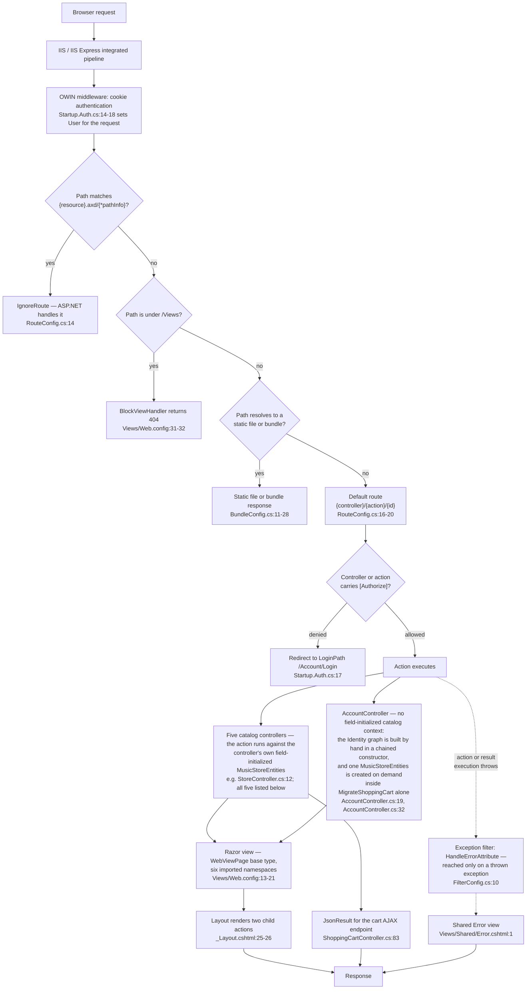
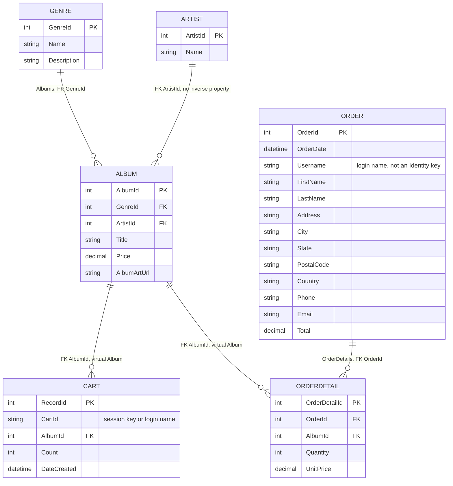

# 01 — Architecture Overview (as-is)

**Deliverable 01 of 13** · MvcMusicStore modernization assessment · foundation document

This document describes the architecture of the MvcMusicStore repository **as it exists today**. It is one of the two foundation deliverables — 01 (architecture) and 02 (dependency inventory) — that the other eleven cite.

---

## 1. Purpose, scope and provenance

### 1.1 What this document is

An evidence-based description of the shipped system: how each application starts, how a request flows through it, how its code is layered, what its domain model is, which authentication stack it uses, and which capabilities each edition actually implements.

### 1.2 What this document is not

It contains **no** target-state design, **no** migration prescription, **no** effort estimate and **no** hosting recommendation. Those are owned elsewhere: the .NET 8 strategy by deliverable 04, the ASP.NET Core approach by 05, hosting by 06, effort and risk by 07, and the enumeration of migration blockers by 12. Where a fact here has a migration consequence, this document states the fact and names the deliverable that owns the consequence — it does not decide it.

### 1.3 Provenance and authoring contract

`review_rules` returns exactly **"No user rules provided."** No project rule constrains this document. Its absence is not licence to lower the bar, and no rule is invented in its place; the assessment's own contracts bind instead, and five govern this file:

1. **Every as-is claim carries an inline `[<path>:<locator>]` citation** at the point the claim is made, repository-relative and resolving in the checkout. There is no trailing reference list — a citation collected at the end cannot be checked against the sentence it supports.
2. **Repository evidence is primary.** The Technical Specification is cited only as a secondary cross-reference, alongside a repository citation and never instead of one.
3. **Repository-wide claims — counts and absences — carry the command that reproduces them**, adjacent to the claim. A count has no single line to point at, so the command is its evidence, and it is the stronger form because a reader can re-run it.
4. **One fact, one owner.** This document owns the as-is description. It does not restate decisions owned by other deliverables.
5. **Every command is anchored at one immutable revision.** The evidence revision for this assessment is `ea2552d6eda7c20e9477a512e5c615665618cf35`, the last commit before it began; every source path cited below is byte-identical at that revision and in the delivered tree. Commands that read source name the revision explicitly rather than reading whatever the reader happens to have checked out. In prose the short form `ea2552d` is used after this first statement of it; the one command block that assigns the revision to a variable quotes the full form, so the block can be copied and run unchanged.

Markdown line length follows the corpus convention recorded in [`README.md` § 10 Markdown line-length convention](README.md#10-markdown-line-length-convention).

Section 9 records the one place where the Technical Specification and the repository disagree, and resolves it in the repository's favour.

### 1.4 How to read this document

It is a lookup reference, not a narrative. Sections 3 to 7 describe MVC 5 in depth and mark every edition delta as it arises; section 8 covers the three authentication stacks, section 9 is the per-capability edition matrix, section 10 is the cross-edition comparison with its measurements, and section 11 routes each fact to the deliverable that owns its consequence.

### 1.5 The framing that matters most: three applications, not one

The repository ships **three independent ASP.NET MVC web applications** that share a domain model and a user-facing feature set. They are not one application with three build configurations: each has its own project file, its own solution, its own configuration, its own authentication stack and its own target framework — MVC 3 at `v4.0` [src/MVC3/MvcMusicStore-Completed/MvcMusicStore/MvcMusicStore.csproj:15], MVC 4 at `v4.5` [src/MVC4/MvcMusicStore/MvcMusicStore.csproj:16], MVC 5 at `v4.8` [src/MVC5/MvcMusicStore/MvcMusicStore.csproj:16].

Two relationships hold, and conflating them is the single most likely way to misread this codebase:

- **MVC 4 and MVC 5 are one application with two authentication stacks.** Five of their six controllers are byte-identical and eight of nine shared core model files are identical; what differs materially is the **account layer** — `AccountController.cs`, and the account model files, where MVC 4 declares a second `DbContext` MVC 5 has no counterpart for (sections 6.3 and 8.2). Section 10.1 carries the measurements and states which files the "nine" are.
- **MVC 3 is not equivalent in that way.** Its shopping cart owns its own database context and commits internally, its genre menu runs a different query, its catalog seed content differs substantially, and its layout has no authentication UI at all. Sections 7 and 10.2 carry the evidence.

Consequently **every claim in this document names the edition or editions it holds in**. A claim about "the application" without an edition qualifier would be unverifiable here, and where a fact holds in all three editions this document says so explicitly.

---

## 2. Repository topology and file inventory

### 2.1 Directory layout

```text
MvcMusicStore/
├── README.md                                  three-edition framing
├── .gitignore
└── src/
    ├── MVC3/
    │   ├── MVC Music Store - Tutorial - v3.0.pdf
    │   ├── readme.txt
    │   ├── MvcMusicStore-Assets/              tutorial payload: Code/, Content/, Data/
    │   └── MvcMusicStore-Completed/           the runnable MVC 3 application
    │       ├── MvcMusicStore.sln
    │       ├── packages/                      committed restored packages
    │       └── MvcMusicStore/                 project root (web.config, Global.asax, …)
    ├── MVC4/
    │   ├── MvcMusicStore.sln                  the solution that resolves
    │   ├── MvcMusicStore-Create.sql
    │   └── MvcMusicStore/
    │       ├── MvcMusicStore.sln              a second, stale solution
    │       ├── MvcMusicStore.csproj
    │       ├── .nuget/                        NuGet.Config, NuGet.targets, NuGet.exe
    │       ├── packages/                      committed restored packages
    │       ├── App_Start/  Filters/  Controllers/  Models/  ViewModels/  Views/
    │       └── App_Data/                      committed .mdf / .ldf pairs
    └── MVC5/
        ├── MvcMusicStore.sln
        ├── README.md
        └── MvcMusicStore/
            ├── MvcMusicStore.csproj
            ├── Global.asax  Global.asax.cs  Startup.cs
            ├── App_Start/  Controllers/  Models/  ViewModels/  Views/
            ├── Content/  Scripts/  Images/  fonts/  favicon.ico
            └── App_Data/                      committed .mdf / .ldf pairs
```

There is **one application project per edition and no shared library**: no project file in the repository declares a `<ProjectReference>`, reproduced by `git grep -l 'ProjectReference' -- '*.csproj' | wc -l` → `0`. All three are leaf projects, so each edition is a single-tier monolith with no inter-project reference. Neither does any edition call out to an external service: `git grep -nE 'HttpClient|WebClient|WebRequest|SmtpClient|ServiceReference' -- 'src/MVC3/MvcMusicStore-Completed/*.cs' 'src/MVC4/MvcMusicStore/*.cs' 'src/MVC5/MvcMusicStore/*.cs' | wc -l` → `0`. The only I/O boundary any edition has is its own database, described in section 6.

### 2.2 Verified counts

Each figure below is repository-wide and therefore carries its reproducing command rather than a line citation. All counts exclude the committed `packages/` payloads.

| Metric | Value | Per-edition split | Reproducing command |
| --- | --- | --- | --- |
| C# source files | **77** | 27 MVC 5 · 27 MVC 4 · 20 MVC 3-Completed · 3 MVC 3-Assets | `git ls-files '*.cs' \| grep -v '/packages/' \| wc -l` |
| Razor views | **83** | 29 · 29 · 21 · 4 | `git ls-files '*.cshtml' \| wc -l` |
| Application configuration files | **15** | 5 per edition | `git ls-files -- '*.config' '*.Config' \| grep -v '/packages/' \| grep -v '\.nuget/' \| wc -l` |
| Static asset files | **171** | 27 · 89 · 51 · 4 | `git ls-files` over the ten asset pathspecs of section 2.3 |

Two inclusion rules govern two of those numbers, and this document states which form it uses wherever the number appears:

- **Configuration: 15 excludes `src/MVC4/MvcMusicStore/.nuget/NuGet.Config`** as a build artifact rather than an application configuration file; including it gives **16**. Every count of configuration files in this document is the **15** form. The five per edition are `Web.config`, `Web.Debug.config`, `Web.Release.config`, `Views/Web.config` and `packages.config` — with MVC 3's tracked as lowercase `web.config`, itself a portability detail that deliverable 11 owns.
- **Static assets: 171 counts the four asset directory groups** and excludes the two web-application-root icons, `src/MVC5/MvcMusicStore/favicon.ico` and `src/MVC4/MvcMusicStore/favicon.ico`, which sit outside every asset directory; including them gives **173** browser-served static files. Every count in this document is the **171** form unless it says otherwise.

### 2.3 Asset directory groups

The `Content` directories of MVC 4 and MVC 3 are nested — 54 of MVC 4's 55 `Content` files and 30 of MVC 3-Completed's 31 sit in a jQuery UI theme tree — so every asset pathspec is recursive. Per-group counts, each reproduced by `git ls-files '<path>/**' | wc -l`:

| Edition | `Content` | `Scripts` | `Images` | `fonts` | Group total |
| --- | --- | --- | --- | --- | --- |
| MVC 5 (`src/MVC5/MvcMusicStore/`) | 3 | 15 | 5 | 4 | 27 |
| MVC 4 (`src/MVC4/MvcMusicStore/`) | 55 | 16 | 18 | — | 89 |
| MVC 3-Completed (`src/MVC3/MvcMusicStore-Completed/MvcMusicStore/`) | 31 | 20 | — | — | 51 |
| MVC 3-Assets (`src/MVC3/MvcMusicStore-Assets/`) | 4 | — | — | — | 4 |

### 2.4 Code volume

Two counting methods exist in this assessment and they differ by roughly ten percent on this codebase, so each figure states its method and the two are never mixed in one sentence. **Sizing figures use non-blank lines, excluding `Properties/AssemblyInfo.cs`**; duplication comparisons use physical-line and diff-line counts and appear in section 10.

**What "physical lines" counts, stated exactly, because two files in this repository make the difference visible.** A physical-line figure in this assessment is what `wc -l` returns, which is a count of **line-feed characters** — not of content lines. The two coincide only when a file ends with a terminal newline, and two of the files this assessment measures do not, each ending on its closing `}`: `Models/SampleData.cs` [src/MVC5/MvcMusicStore/Models/SampleData.cs:827] and MVC 5's `Controllers/AccountController.cs` [src/MVC5/MvcMusicStore/Controllers/AccountController.cs:423], the latter being **422 LF / 423 content lines**. So the seed's physical-line figure is **826 LF**, while the file carries **827 content lines**, and a locator that ends at `:826` would stop one line short of the closing brace. Every seed figure in this document therefore names the metric — `826 LF` / `827 content lines` for MVC 5 and MVC 4, `430 LF` / `431 content lines` for MVC 3 — and every seed locator runs to the closing brace. Neither figure is the sizing metric: by non-blank lines the same MVC 5 file is **820** (7 blank lines), and MVC 3's is **428** (3 blank lines). All of it is reproducible, and the three commands are given rather than described because the first two disagree by exactly the one line at issue:

```bash
wc -l                    < src/MVC5/MvcMusicStore/Models/SampleData.cs   # -> 826   (LF characters)
awk 'END{print NR}'        src/MVC5/MvcMusicStore/Models/SampleData.cs   # -> 827   (content lines)
grep -cve '^[[:space:]]*$' src/MVC5/MvcMusicStore/Models/SampleData.cs   # -> 820   (non-blank; sizing)
# MVC 4's file is byte-identical (section 10.1). The same three against MVC 3's
# src/MVC3/MvcMusicStore-Completed/MvcMusicStore/Models/SampleData.cs -> 430, 431, 428.
```

| Edition | Files counted | Non-blank lines |
| --- | --- | --- |
| MVC 3-Completed | 19 | 1,326 |
| MVC 4 | 26 | 2,142 |
| MVC 5 | 26 | 2,097 |
| **Total** | **71** | **5,565** |

Reproduced per edition by listing `git ls-files '<edition>/*.cs'`, filtering `/packages/` and `Properties/AssemblyInfo.cs`, and summing `grep -cve '^[[:space:]]*$'` over the result. Within MVC 5, `AccountController.cs` alone is **382 non-blank lines** of the 2,097 — the largest single file in the edition after the seed data, and the one file with no near-identical counterpart in another edition.

### 2.5 View topology

MVC 5, MVC 4 and MVC 3-Completed each have the same `Views` folder shape — `Account`, `Checkout`, `Home`, `Shared`, `ShoppingCart`, `Store`, `StoreManager`, plus `Views/Web.config` and `Views/_ViewStart.cshtml`. MVC 5's 29 Razor files distribute as Account 9, Checkout 2, Home 3, Shared 3, ShoppingCart 2, Store 4, StoreManager 5, and `Views/_ViewStart.cshtml`, which sets the layout for every view [src/MVC5/MvcMusicStore/Views/_ViewStart.cshtml:2].

The four MVC 3-Assets Razor files are the exception to the shape: they sit under `Code/Views/Account/` rather than a top-level `Views` folder — `ChangePassword.cshtml`, `ChangePasswordSuccess.cshtml`, `LogOn.cshtml` and `Register.cshtml`, listed by `git ls-files 'src/MVC3/MvcMusicStore-Assets/*.cshtml'`. They are tutorial scaffolding to be copied into a project under construction, not a fourth application: MVC 3-Assets has no project file and no solution.

---

## 3. Startup composition

### 3.1 MVC 5 has two entry points

This is the most consequential structural fact about the migration source, because the two entry points are independent, they run in different frameworks' terms, and one of them duplicates a registration the other already made.

**Entry point one — the ASP.NET application object.** `MvcApplication` derives from `System.Web.HttpApplication` [src/MVC5/MvcMusicStore/Global.asax.cs:11] and is bound to the runtime by a separate markup file that names the class and its code-behind [src/MVC5/MvcMusicStore/Global.asax:1]. Its `Application_Start` [src/MVC5/MvcMusicStore/Global.asax.cs:13] runs **five** registrations:

| # | Registration | Locator | What it composes |
| --- | --- | --- | --- |
| 1 | `AreaRegistration.RegisterAllAreas()` | [src/MVC5/MvcMusicStore/Global.asax.cs:15] | Area discovery — no edition has an `Areas` folder, so it discovers nothing. All three call it: MVC 4 at [src/MVC4/MvcMusicStore/Global.asax.cs:19] and MVC 3 at [src/MVC3/MvcMusicStore-Completed/MvcMusicStore/Global.asax.cs:36]. `git ls-files \| grep -c '/Areas/'` returns `0` |
| 2 | `FilterConfig.RegisterGlobalFilters(GlobalFilters.Filters)` | [src/MVC5/MvcMusicStore/Global.asax.cs:16] | The global filter collection (section 4.2) |
| 3 | `RouteConfig.RegisterRoutes(RouteTable.Routes)` | [src/MVC5/MvcMusicStore/Global.asax.cs:17] | The route table (section 4.1) |
| 4 | `BundleConfig.RegisterBundles(BundleTable.Bundles)` | [src/MVC5/MvcMusicStore/Global.asax.cs:18] | The five asset bundles (section 4.5) |
| 5 | `System.Data.Entity.Database.SetInitializer(new MvcMusicStore.Models.SampleData())` | [src/MVC5/MvcMusicStore/Global.asax.cs:20] | The Entity Framework database initialization strategy (section 6.4) |

**Entry point two — the OWIN startup class.** An assembly-level attribute declares it: `[assembly: OwinStartupAttribute(typeof(MvcMusicStore.Startup))]` [src/MVC5/MvcMusicStore/Startup.cs:4]. Its `Configuration(IAppBuilder app)` [src/MVC5/MvcMusicStore/Startup.cs:9] calls `ConfigureAuth(app)` [src/MVC5/MvcMusicStore/Startup.cs:11] and then `ConfigureApp(app)` [src/MVC5/MvcMusicStore/Startup.cs:13]. Nothing in `Global.asax.cs` references it and nothing in it references `Global.asax.cs`; the two are wired independently by the host.

### 3.2 The five files in MVC 5's `App_Start`

`src/MVC5/MvcMusicStore/App_Start/` contains **exactly five** C# files, and they are two different kinds of thing:

| File | Kind | Entry member |
| --- | --- | --- |
| `BundleConfig.cs` | Static configuration class | `RegisterBundles(BundleCollection)` [src/MVC5/MvcMusicStore/App_Start/BundleConfig.cs:9] |
| `FilterConfig.cs` | Static configuration class | `RegisterGlobalFilters(GlobalFilterCollection)` [src/MVC5/MvcMusicStore/App_Start/FilterConfig.cs:8] |
| `RouteConfig.cs` | Static configuration class | `RegisterRoutes(RouteCollection)` [src/MVC5/MvcMusicStore/App_Start/RouteConfig.cs:12] |
| `Startup.App.cs` | `partial class Startup` half [src/MVC5/MvcMusicStore/App_Start/Startup.App.cs:12] | `ConfigureApp(IAppBuilder)` [src/MVC5/MvcMusicStore/App_Start/Startup.App.cs:14] |
| `Startup.Auth.cs` | `partial class Startup` half [src/MVC5/MvcMusicStore/App_Start/Startup.Auth.cs:8] | `ConfigureAuth(IAppBuilder)` [src/MVC5/MvcMusicStore/App_Start/Startup.Auth.cs:11] |

The first three are called by the application object; the last two are the OWIN entry point's own halves, compiled into the same `Startup` class the assembly attribute names. The folder therefore mixes both composition roots, which is why the two-entry-point structure is not obvious from the file listing.

### 3.3 What `ConfigureApp` does in MVC 5

Two things [src/MVC5/MvcMusicStore/App_Start/Startup.App.cs:14]: it registers the database initializer again [src/MVC5/MvcMusicStore/App_Start/Startup.App.cs:16], and it calls `CreateAdminUser()` [src/MVC5/MvcMusicStore/App_Start/Startup.App.cs:18].

`CreateAdminUser` is declared `private async void` [src/MVC5/MvcMusicStore/App_Start/Startup.App.cs:21]. It reads two application settings through `ConfigurationManager.AppSettings` — the administrator user name [src/MVC5/MvcMusicStore/App_Start/Startup.App.cs:23] and password [src/MVC5/MvcMusicStore/App_Start/Startup.App.cs:24] — takes the role name from a local literal [src/MVC5/MvcMusicStore/App_Start/Startup.App.cs:25], and then hand-constructs its entire dependency graph: a context, a `UserManager<ApplicationUser>` over a `UserStore`, and a `RoleManager<IdentityRole>` over a `RoleStore` [src/MVC5/MvcMusicStore/App_Start/Startup.App.cs:27-29]. It creates the role if it does not exist [src/MVC5/MvcMusicStore/App_Start/Startup.App.cs:32-36], then creates the user and adds the role membership **only inside the "user does not exist" branch** [src/MVC5/MvcMusicStore/App_Start/Startup.App.cs:39-44] — so a pre-existing user missing the role membership is not repaired.

The two settings it reads are declared in configuration [src/MVC5/MvcMusicStore/Web.config:16-17]. That the password is a committed plaintext value is a security finding, and deliverable 09 owns it with its evidence; this document records only the architectural fact that startup provisioning reads its credential from application settings.

### 3.4 The double initializer registration in MVC 5 — duplicated configuration, not a doubled action

`Database.SetInitializer(new SampleData())` appears **twice** in MVC 5, in two different composition roots: once in the application object [src/MVC5/MvcMusicStore/Global.asax.cs:20] and once in the OWIN startup half [src/MVC5/MvcMusicStore/App_Start/Startup.App.cs:16]. The two statements are textually identical.

State the consequence precisely, because overstating it is a real error. `Database.SetInitializer<TContext>` **sets** the initialization strategy for a context type; it does not add to a list of strategies. The second call therefore replaces the first, and **exactly one initialization runs**. This is duplicated startup configuration — two files each believing they own database bootstrapping — and it is *not* a doubled destructive path. The repository's own documentation corroborates the duplication in prose, describing `SampleData` as "configured as the database initializer in `Global.asax.cs` and `App_Start/Startup.App.cs`" [src/MVC5/README.md:31]. What the strategy itself does on first run is section 6.4; the debt entry is deliverable 08's.

### 3.5 MVC 4 runs seven registrations, not five

MVC 4's application object is also `MvcApplication : System.Web.HttpApplication` [src/MVC4/MvcMusicStore/Global.asax.cs:15] bound by the same kind of markup file [src/MVC4/MvcMusicStore/Global.asax:1], but its `Application_Start` [src/MVC4/MvcMusicStore/Global.asax.cs:17] runs **seven** registrations, and it has no OWIN entry point at all.

| # | Registration | Locator | Present in MVC 5? |
| --- | --- | --- | --- |
| 1 | `AreaRegistration.RegisterAllAreas()` | [src/MVC4/MvcMusicStore/Global.asax.cs:19] | Yes |
| 2 | `WebApiConfig.Register(GlobalConfiguration.Configuration)` | [src/MVC4/MvcMusicStore/Global.asax.cs:21] | **No — MVC 4 only** |
| 3 | `FilterConfig.RegisterGlobalFilters(GlobalFilters.Filters)` | [src/MVC4/MvcMusicStore/Global.asax.cs:22] | Yes |
| 4 | `RouteConfig.RegisterRoutes(RouteTable.Routes)` | [src/MVC4/MvcMusicStore/Global.asax.cs:23] | Yes |
| 5 | `BundleConfig.RegisterBundles(BundleTable.Bundles)` | [src/MVC4/MvcMusicStore/Global.asax.cs:24] | Yes |
| 6 | `AuthConfig.RegisterAuth()` | [src/MVC4/MvcMusicStore/Global.asax.cs:25] | **No — MVC 4 only** |
| 7 | `AppConfig.Configure()` | [src/MVC4/MvcMusicStore/Global.asax.cs:27] | **No — MVC 4 only** |

The three MVC 4-only registrations are where its startup composition genuinely differs:

- **`WebApiConfig.Register`** maps an HTTP API route template `api/{controller}/{id}` with an optional id [src/MVC4/MvcMusicStore/App_Start/WebApiConfig.cs:12-16]. Nothing implements it: `git grep -l 'ApiController' -- '*.cs' | wc -l` → `0` across the whole repository. The route is mapped and unreachable in the sense that no controller can answer it.
- **`AuthConfig.RegisterAuth`** has a body consisting **entirely of commented-out** OAuth client registrations for Microsoft, Twitter, Facebook and Google [src/MVC4/MvcMusicStore/App_Start/AuthConfig.cs:17-29]. The method is called at every startup and does nothing, and **the comment markers are the whole reason** — the four calls are not incomplete in the same way. `RegisterMicrosoftClient` [src/MVC4/MvcMusicStore/App_Start/AuthConfig.cs:17-19], `RegisterTwitterClient` [src/MVC4/MvcMusicStore/App_Start/AuthConfig.cs:21-23] and `RegisterFacebookClient` [src/MVC4/MvcMusicStore/App_Start/AuthConfig.cs:25-27] each carry a credential pair written as empty strings, whereas `OAuthWebSecurity.RegisterGoogleClient();` [src/MVC4/MvcMusicStore/App_Start/AuthConfig.cs:29] **takes no arguments at all** and is complete as written. So three of the four would additionally need credentials that exist nowhere in the repository, and one would need only the `//` removed.
- **`AppConfig.Configure`** [src/MVC4/MvcMusicStore/App_Start/AppConfig.cs:14] is MVC 4's equivalent of MVC 5's `ConfigureApp`: it registers the database initializer [src/MVC4/MvcMusicStore/App_Start/AppConfig.cs:16] and calls `CreateAdminUser()` [src/MVC4/MvcMusicStore/App_Start/AppConfig.cs:18].

Two differences inside provisioning are worth recording, because they are behavioural rather than cosmetic. MVC 4's `CreateAdminUser` is a **synchronous** `private static void` [src/MVC4/MvcMusicStore/App_Start/AppConfig.cs:21] where MVC 5's is `async void`; and MVC 4 checks user existence, role existence and role membership **independently** [src/MVC4/MvcMusicStore/App_Start/AppConfig.cs:29-36], so it repairs a user who exists without the role — the case MVC 5 skips (section 3.3). MVC 4 provisions through SimpleMembership: it primes the provider by invoking a filter attribute directly [src/MVC4/MvcMusicStore/App_Start/AppConfig.cs:27], then uses `WebSecurity` for the account [src/MVC4/MvcMusicStore/App_Start/AppConfig.cs:29-30] and the classic `Roles` static for the role [src/MVC4/MvcMusicStore/App_Start/AppConfig.cs:32-36]. It reads the same two application settings as MVC 5 [src/MVC4/MvcMusicStore/Web.config:25-26].

MVC 4 also registers its initializer **once**, in `AppConfig` [src/MVC4/MvcMusicStore/App_Start/AppConfig.cs:16], and not in `Global.asax.cs` — the double registration of section 3.4 is specific to MVC 5. MVC 4's `App_Start` folder holds **six** files: `AppConfig.cs`, `AuthConfig.cs`, `BundleConfig.cs`, `FilterConfig.cs`, `RouteConfig.cs`, `WebApiConfig.cs`.

### 3.6 MVC 3 has no `App_Start` folder — its composition is entirely in `Global.asax.cs`

Verified by `git ls-files 'src/MVC3/MvcMusicStore-Completed/MvcMusicStore/App_Start/**' | wc -l` → `0`. There is no such directory, so there is no `BundleConfig`, no `AuthConfig`, no `WebApiConfig` and no `AppConfig` in MVC 3.

Instead, MVC 3's application class carries the configuration methods itself as static members: `RegisterGlobalFilters(GlobalFilterCollection)` [src/MVC3/MvcMusicStore-Completed/MvcMusicStore/Global.asax.cs:15-18] and `RegisterRoutes(RouteCollection)` [src/MVC3/MvcMusicStore-Completed/MvcMusicStore/Global.asax.cs:20-30] are declared on `MvcApplication` [src/MVC3/MvcMusicStore-Completed/MvcMusicStore/Global.asax.cs:13] rather than in separate classes. Its `Application_Start` [src/MVC3/MvcMusicStore-Completed/MvcMusicStore/Global.asax.cs:32] runs **four** statements:

| # | Statement | Locator |
| --- | --- | --- |
| 1 | `System.Data.Entity.Database.SetInitializer(new MvcMusicStore.Models.SampleData())` | [src/MVC3/MvcMusicStore-Completed/MvcMusicStore/Global.asax.cs:34] |
| 2 | `AreaRegistration.RegisterAllAreas()` | [src/MVC3/MvcMusicStore-Completed/MvcMusicStore/Global.asax.cs:36] |
| 3 | `RegisterGlobalFilters(GlobalFilters.Filters)` | [src/MVC3/MvcMusicStore-Completed/MvcMusicStore/Global.asax.cs:38] |
| 4 | `RegisterRoutes(RouteTable.Routes)` | [src/MVC3/MvcMusicStore-Completed/MvcMusicStore/Global.asax.cs:39] |

There is **no bundle registration, no authentication configuration and no administrator provisioning of any kind** in MVC 3's startup. The provisioning absence is what makes its administration capability unreachable as shipped; section 9.3 carries that finding with its authorization evidence.

### 3.7 Startup composition at a glance

| Property | MVC 3 | MVC 4 | MVC 5 |
| --- | --- | --- | --- |
| Entry points | 1 (application object) | 1 (application object) | **2** (application object + OWIN startup) |
| `Application_Start` statements | 4 [src/MVC3/MvcMusicStore-Completed/MvcMusicStore/Global.asax.cs:32-40] | 7 [src/MVC4/MvcMusicStore/Global.asax.cs:19-27] | 5 [src/MVC5/MvcMusicStore/Global.asax.cs:15-20] |
| `App_Start` folder | **absent** | 6 files | 5 files |
| Route + filter registration lives in | the application class itself [src/MVC3/MvcMusicStore-Completed/MvcMusicStore/Global.asax.cs:15-30] | `App_Start/RouteConfig.cs`, `App_Start/FilterConfig.cs` | `App_Start/RouteConfig.cs`, `App_Start/FilterConfig.cs` |
| Initializer registration sites | 1 [src/MVC3/MvcMusicStore-Completed/MvcMusicStore/Global.asax.cs:34] | 1 [src/MVC4/MvcMusicStore/App_Start/AppConfig.cs:16] | **2** [src/MVC5/MvcMusicStore/Global.asax.cs:20], [src/MVC5/MvcMusicStore/App_Start/Startup.App.cs:16] |
| Administrator provisioning at startup | **none** | `AppConfig.CreateAdminUser` [src/MVC4/MvcMusicStore/App_Start/AppConfig.cs:21] | `Startup.CreateAdminUser` [src/MVC5/MvcMusicStore/App_Start/Startup.App.cs:21] |
| Bundle registration | **none** | [src/MVC4/MvcMusicStore/Global.asax.cs:24] | [src/MVC5/MvcMusicStore/Global.asax.cs:18] |
| HTTP API route | none | [src/MVC4/MvcMusicStore/App_Start/WebApiConfig.cs:12-16] | none |

---

## 4. Request pipeline

Described for MVC 5, with each edition delta named where it arises.

### 4.1 Routing

MVC 5 registers exactly two entries [src/MVC5/MvcMusicStore/App_Start/RouteConfig.cs:12]:

1. An ignore route for classic ASP.NET handler paths: `routes.IgnoreRoute("{resource}.axd/{*pathInfo}")` [src/MVC5/MvcMusicStore/App_Start/RouteConfig.cs:14].
2. One conventional route named `Default` [src/MVC5/MvcMusicStore/App_Start/RouteConfig.cs:16-17] with the URL pattern `{controller}/{action}/{id}` [src/MVC5/MvcMusicStore/App_Start/RouteConfig.cs:18] and defaults of controller `Home`, action `Index` and `id = UrlParameter.Optional` [src/MVC5/MvcMusicStore/App_Start/RouteConfig.cs:19].

There is no attribute routing and no route constraint in any edition — `git grep -nE 'RoutePrefix|\[Route\(|constraints:' -- '*.cs' | grep -v '/packages/' | wc -l` → `0` — and no `Areas` folder for `RegisterAllAreas` to discover. Every URL the three applications serve is produced by that single pattern, which is why the controller and action names in section 5 are also the URL surface. MVC 3 declares the identical pair, but on the application class rather than in a configuration class — ignore route at [src/MVC3/MvcMusicStore-Completed/MvcMusicStore/Global.asax.cs:22] and the `Default` route at [src/MVC3/MvcMusicStore-Completed/MvcMusicStore/Global.asax.cs:24-28]. MVC 4 adds the HTTP API route template of section 3.5 alongside it [src/MVC4/MvcMusicStore/App_Start/WebApiConfig.cs:12-16].

### 4.2 Global filters — one attribute is the entire error-handling policy

The only global filter registered in **any** edition is `HandleErrorAttribute`:

| Edition | Registration site |
| --- | --- |
| MVC 5 | `filters.Add(new HandleErrorAttribute());` [src/MVC5/MvcMusicStore/App_Start/FilterConfig.cs:10] |
| MVC 4 | `filters.Add(new HandleErrorAttribute());` [src/MVC4/MvcMusicStore/App_Start/FilterConfig.cs:10] |
| MVC 3 | `filters.Add(new HandleErrorAttribute());` [src/MVC3/MvcMusicStore-Completed/MvcMusicStore/Global.asax.cs:17] |

`HandleErrorAttribute` is an **exception filter**, so its place in the pipeline is conditional rather than serial: the single registration adds an `OnException` handler that is reached only when action or result execution throws, and a request that completes normally never involves it [src/MVC5/MvcMusicStore/App_Start/FilterConfig.cs:10]. Section 4.6 draws it accordingly.

That single registration, plus the shared error view it renders, is the whole of each application's cross-cutting error handling. In MVC 5 the view is typed to a framework type — `@model System.Web.Mvc.HandleErrorInfo` [src/MVC5/MvcMusicStore/Views/Shared/Error.cshtml:1] — and its body is generic user-facing text with no exception detail [src/MVC5/MvcMusicStore/Views/Shared/Error.cshtml:7-8]. Deliverable 12 owns the migration consequence of that model type; deliverable 09 owns error-disclosure findings, including MVC 4's, which is in its controller rather than its view.

Per-controller filters exist and are part of the pipeline description: `[Authorize]` on the checkout controller in all three editions [src/MVC5/MvcMusicStore/Controllers/CheckoutController.cs:8], [src/MVC4/MvcMusicStore/Controllers/CheckoutController.cs:8], [src/MVC3/MvcMusicStore-Completed/MvcMusicStore/Controllers/CheckoutController.cs:8]; `[Authorize(Roles = "Administrator")]` on the administration controller in all three [src/MVC5/MvcMusicStore/Controllers/StoreManagerController.cs:12], [src/MVC4/MvcMusicStore/Controllers/StoreManagerController.cs:12], [src/MVC3/MvcMusicStore-Completed/MvcMusicStore/Controllers/StoreManagerController.cs:12]; and `[Authorize]` on the account controller in MVC 5 [src/MVC5/MvcMusicStore/Controllers/AccountController.cs:15] and MVC 4, where it is paired with a SimpleMembership initialization filter [src/MVC4/MvcMusicStore/Controllers/AccountController.cs:16-17].

### 4.3 Authentication in the MVC 5 pipeline is entirely OWIN

MVC 5 disables the ASP.NET authentication feature outright — `<authentication mode="None"/>` [src/MVC5/MvcMusicStore/Web.config:32] — and removes the Forms authentication module from the IIS integrated pipeline: `<remove name="FormsAuthenticationModule"/>` [src/MVC5/MvcMusicStore/Web.config:38]. Authentication is then supplied by OWIN middleware in `ConfigureAuth` [src/MVC5/MvcMusicStore/App_Start/Startup.Auth.cs:11]:

- `app.UseCookieAuthentication(new CookieAuthenticationOptions { … })` [src/MVC5/MvcMusicStore/App_Start/Startup.Auth.cs:14-18], configured with **only two values**: the authentication type [src/MVC5/MvcMusicStore/App_Start/Startup.Auth.cs:16] and `LoginPath = new PathString("/Account/Login")` [src/MVC5/MvcMusicStore/App_Start/Startup.Auth.cs:17]. No cookie lifetime, no sliding expiration, no cookie name and no cookie security attributes are set, so every other cookie property is a framework default.
- `app.UseExternalSignInCookie(DefaultAuthenticationTypes.ExternalCookie)` [src/MVC5/MvcMusicStore/App_Start/Startup.Auth.cs:20], a temporary cookie for an external-provider sign-in that no enabled provider produces (section 9.3).
- Four external provider registrations that are **commented out** [src/MVC5/MvcMusicStore/App_Start/Startup.Auth.cs:22-35] — Microsoft Account, Twitter, Facebook and Google. As in MVC 4 (section 3.5), the four are not equivalent in what else they would need: `UseMicrosoftAccountAuthentication` [src/MVC5/MvcMusicStore/App_Start/Startup.Auth.cs:23-25], `UseTwitterAuthentication` [src/MVC5/MvcMusicStore/App_Start/Startup.Auth.cs:27-29] and `UseFacebookAuthentication` [src/MVC5/MvcMusicStore/App_Start/Startup.Auth.cs:31-33] each carry a credential pair written as empty strings, while `app.UseGoogleAuthentication();` [src/MVC5/MvcMusicStore/App_Start/Startup.Auth.cs:35] **takes no arguments**. The registrations are inactive because they are commented out, not because a credential is missing.

MVC 4 and MVC 3 do the opposite: both keep Forms authentication as the pipeline mechanism. MVC 4 declares `<authentication mode="Forms">` with `<forms loginUrl="~/Account/Login" timeout="2880" />` [src/MVC4/MvcMusicStore/Web.config:36-37]; MVC 3 declares the same mode with a different login URL, `<forms loginUrl="~/Account/LogOn" timeout="2880" />` [src/MVC3/MvcMusicStore-Completed/MvcMusicStore/web.config:26-28]. Section 8 describes the three stacks behind these settings.

### 4.4 View serving and Razor host configuration

MVC 5's `Views` folder carries its own configuration file that does two unrelated jobs [src/MVC5/MvcMusicStore/Views/Web.config:5-34]:

- **It configures the Razor host.** A section group is declared for `system.web.webPages.razor` [src/MVC5/MvcMusicStore/Views/Web.config:5-8]; the host factory is `System.Web.Mvc.MvcWebRazorHostFactory` [src/MVC5/MvcMusicStore/Views/Web.config:12]; the page base type is `System.Web.Mvc.WebViewPage` [src/MVC5/MvcMusicStore/Views/Web.config:13]; and **six** namespaces are imported into every view [src/MVC5/MvcMusicStore/Views/Web.config:14-21] — `System.Web.Mvc`, `System.Web.Mvc.Ajax`, `System.Web.Mvc.Html`, `System.Web.Optimization`, `System.Web.Routing` and `MvcMusicStore`.
- **It blocks direct HTTP access to view files.** A handler named `BlockViewHandler` is removed and re-added, mapping `path="*" verb="*"` to `System.Web.HttpNotFoundHandler` under `preCondition="integratedMode"` [src/MVC5/MvcMusicStore/Views/Web.config:31-32]. Both are IIS integrated-pipeline constructs; deliverable 12 owns their migration consequence.

### 4.5 Bundling and static assets

MVC 5 registers **five** bundles [src/MVC5/MvcMusicStore/App_Start/BundleConfig.cs:9]:

| Virtual path | Kind | Contents | Locator |
| --- | --- | --- | --- |
| `~/bundles/jquery` | Script | `~/Scripts/jquery-{version}.js` — a **`{version}` token** | [src/MVC5/MvcMusicStore/App_Start/BundleConfig.cs:11-12] |
| `~/bundles/jqueryval` | Script | `~/Scripts/jquery.validate*` — a **glob** | [src/MVC5/MvcMusicStore/App_Start/BundleConfig.cs:14-15] |
| `~/bundles/modernizr` | Script | `~/Scripts/modernizr-*` — a **glob** | [src/MVC5/MvcMusicStore/App_Start/BundleConfig.cs:19-20] |
| `~/bundles/bootstrap` | Script | `~/Scripts/bootstrap.js`, `~/Scripts/respond.js` | [src/MVC5/MvcMusicStore/App_Start/BundleConfig.cs:22-24] |
| `~/Content/css` | Style | `~/Content/bootstrap.css`, `~/Content/site.css` | [src/MVC5/MvcMusicStore/App_Start/BundleConfig.cs:26-28] |

The views consume them through the bundling helpers rather than direct tags: MVC 5's layout renders the style bundle [src/MVC5/MvcMusicStore/Views/Shared/_Layout.cshtml:7] and three script bundles [src/MVC5/MvcMusicStore/Views/Shared/_Layout.cshtml:8], [src/MVC5/MvcMusicStore/Views/Shared/_Layout.cshtml:41-42], and the account management view renders a fourth in a section [src/MVC5/MvcMusicStore/Views/Account/Manage.cshtml:28].

MVC 4 uses the same mechanism — style and script bundles in its layout [src/MVC4/MvcMusicStore/Views/Shared/_Layout.cshtml:8-9], [src/MVC4/MvcMusicStore/Views/Shared/_Layout.cshtml:49]. **MVC 3 has no bundling at all**, consistent with having no `App_Start` folder (section 3.6): its layout links assets directly by path, a stylesheet [src/MVC3/MvcMusicStore-Completed/MvcMusicStore/Views/Shared/_Layout.cshtml:5] and a versioned jQuery file [src/MVC3/MvcMusicStore-Completed/MvcMusicStore/Views/Shared/_Layout.cshtml:7], both resolved with `@Url.Content`.

### 4.6 The MVC 5 request pipeline, end to end



Two edges in that diagram are branches rather than serial stages, and reading either as a stage every request passes through would misstate the architecture:

- **`HandleErrorAttribute` is an exception filter.** It is registered once, as the only global filter in the edition [src/MVC5/MvcMusicStore/App_Start/FilterConfig.cs:10], and it contributes nothing to a request that completes normally: its handler is reached only when action or result execution throws, and what it yields is the shared error view [src/MVC5/MvcMusicStore/Views/Shared/Error.cshtml:1]. That is why it is drawn as a dashed branch off action execution and not as a node between routing and authorization.
- **The data-access edge branches by controller.** Five of MVC 5's six controllers hold a field-initialized `MusicStoreEntities` and every action on them runs against it [src/MVC5/MvcMusicStore/Controllers/HomeController.cs:11], [src/MVC5/MvcMusicStore/Controllers/StoreController.cs:12], [src/MVC5/MvcMusicStore/Controllers/ShoppingCartController.cs:10], [src/MVC5/MvcMusicStore/Controllers/CheckoutController.cs:11], [src/MVC5/MvcMusicStore/Controllers/StoreManagerController.cs:15]. `AccountController` does not: it has no field-initialized catalog context at all, holds an `ApplicationDbContext` indirectly through the `UserManager` its chained constructor builds [src/MVC5/MvcMusicStore/Controllers/AccountController.cs:19], and constructs exactly one `MusicStoreEntities` on demand inside `MigrateShoppingCart` [src/MVC5/MvcMusicStore/Controllers/AccountController.cs:32]. Section 5.4 carries the full construction-site list.

### 4.7 Pipeline deltas by edition

| Pipeline stage | MVC 3 | MVC 4 | MVC 5 |
| --- | --- | --- | --- |
| Authentication mechanism | Forms [src/MVC3/MvcMusicStore-Completed/MvcMusicStore/web.config:26-28] | Forms [src/MVC4/MvcMusicStore/Web.config:36-37] | OWIN cookie middleware, ASP.NET authentication set to `None` [src/MVC5/MvcMusicStore/Web.config:32], [src/MVC5/MvcMusicStore/App_Start/Startup.Auth.cs:14-18] |
| Ignore route | [src/MVC3/MvcMusicStore-Completed/MvcMusicStore/Global.asax.cs:22] | present | [src/MVC5/MvcMusicStore/App_Start/RouteConfig.cs:14] |
| Conventional route | [src/MVC3/MvcMusicStore-Completed/MvcMusicStore/Global.asax.cs:24-28] | present | [src/MVC5/MvcMusicStore/App_Start/RouteConfig.cs:16-20] |
| HTTP API route | none | [src/MVC4/MvcMusicStore/App_Start/WebApiConfig.cs:12-16], zero implementations | none |
| Global filter | `HandleErrorAttribute` [src/MVC3/MvcMusicStore-Completed/MvcMusicStore/Global.asax.cs:17] | `HandleErrorAttribute` [src/MVC4/MvcMusicStore/App_Start/FilterConfig.cs:10] | `HandleErrorAttribute` [src/MVC5/MvcMusicStore/App_Start/FilterConfig.cs:10] |
| Asset delivery | direct tags with `@Url.Content` [src/MVC3/MvcMusicStore-Completed/MvcMusicStore/Views/Shared/_Layout.cshtml:5-7] | bundles [src/MVC4/MvcMusicStore/Views/Shared/_Layout.cshtml:8-9] | five bundles [src/MVC5/MvcMusicStore/App_Start/BundleConfig.cs:11-28] |
| Child-action composition in the layout | `Html.RenderAction` [src/MVC3/MvcMusicStore-Completed/MvcMusicStore/Views/Shared/_Layout.cshtml:16], [src/MVC3/MvcMusicStore-Completed/MvcMusicStore/Views/Shared/_Layout.cshtml:21] | `@Html.Action` [src/MVC4/MvcMusicStore/Views/Shared/_Layout.cshtml:25], [src/MVC4/MvcMusicStore/Views/Shared/_Layout.cshtml:32] | `@Html.Action` [src/MVC5/MvcMusicStore/Views/Shared/_Layout.cshtml:25-26] |
| Sign-in UI in the layout | **none** — the nav list is four static links [src/MVC3/MvcMusicStore-Completed/MvcMusicStore/Views/Shared/_Layout.cshtml:13-18] | login partial | login partial [src/MVC5/MvcMusicStore/Views/Shared/_LoginPartial.cshtml:2-21] rendered from [src/MVC5/MvcMusicStore/Views/Shared/_Layout.cshtml:28] |

The last row is a real functional difference, not a styling one: MVC 3's `Views/Shared` folder contains only `Error.cshtml` and `_Layout.cshtml`, so it has no `_LoginPartial` and its layout offers no register, sign-in or sign-out affordance, even though the corresponding actions exist in its account controller (section 8.3).

---

## 5. Layering and code organization

### 5.1 The layers as they exist

All three editions use the same folder-based layering, and the layering is thin by design — there is no service layer, no repository abstraction and no separate domain assembly:

| Layer | Location (MVC 5) | Contents |
| --- | --- | --- |
| Composition root | `Global.asax.cs`, `Startup.cs`, `App_Start/` | 7 files; section 3 |
| Controllers | `Controllers/` | 6 controllers |
| Domain entities | `Models/` | `Album`, `Artist`, `Genre`, `Cart`, `Order`, `OrderDetail` |
| Data access | `Models/MusicStoreEntities.cs`, `Models/IdentityModels.cs` | two `DbContext` classes |
| Business logic | `Models/ShoppingCart.cs` | cart, order-creation and cart-migration logic |
| Identity model | `Models/IdentityModels.cs`, `Models/AccountViewModels.cs` | MVC 5 only |
| Seed data | `Models/SampleData.cs` | 826 LF / 827 content lines (section 2.4) |
| Presentation models | `ViewModels/` | `ShoppingCartViewModel`, `ShoppingCartRemoveViewModel` |
| Views | `Views/` | 29 Razor files |
| Assembly metadata | `Properties/AssemblyInfo.cs` | excluded from the sizing figures of section 2.4 |

Business logic lives in the `Models` folder rather than in a service layer: `ShoppingCart` computes cart counts and totals, creates orders and migrates cart ownership [src/MVC5/MvcMusicStore/Models/ShoppingCart.cs:103-158], [src/MVC5/MvcMusicStore/Models/ShoppingCart.cs:184-193]. Section 7 describes it in full because the two cart designs across editions are architecturally distinct.

**One edition's namespaces do not match its folders, and it is the account layer that breaks the pattern.** MVC 4 and MVC 5 declare every type under `MvcMusicStore.*`, including their account code [src/MVC4/MvcMusicStore/Controllers/AccountController.cs:14], [src/MVC5/MvcMusicStore/Controllers/AccountController.cs:13]. **MVC 3 does not**: two of its files sit in a namespace named after the Visual Studio project template that scaffolded them, while the other seventeen use `MvcMusicStore.*`. Nineteen of the edition's twenty C# files declare a namespace — `Properties/AssemblyInfo.cs` is the exception — and they split 2 against 17:

| File | Namespace declared |
| --- | --- |
| `Controllers/AccountController.cs` | `Mvc3ToolsUpdateWeb_Default.Controllers` [src/MVC3/MvcMusicStore-Completed/MvcMusicStore/Controllers/AccountController.cs:11] |
| `Models/AccountModels.cs` | `Mvc3ToolsUpdateWeb_Default.Models` [src/MVC3/MvcMusicStore-Completed/MvcMusicStore/Models/AccountModels.cs:8] |
| The other five controllers, nine models, two view models and `Global.asax.cs` | `MvcMusicStore`, `MvcMusicStore.Controllers`, `MvcMusicStore.Models`, `MvcMusicStore.ViewModels` — e.g. [src/MVC3/MvcMusicStore-Completed/MvcMusicStore/Controllers/StoreController.cs:8], [src/MVC3/MvcMusicStore-Completed/MvcMusicStore/Models/Album.cs:6], [src/MVC3/MvcMusicStore-Completed/MvcMusicStore/Global.asax.cs:8] |

A caveat about reproducing that 2-against-17 split: three of MVC 3's files declare their namespace on line 1 behind a byte-order mark — `Models/Artist.cs`, `Models/OrderDetail.cs` and `ViewModels/ShoppingCartRemoveViewModel.cs` — so an anchored search misses them and reports 16. Use the unanchored form over both pathspecs — `git grep -n 'namespace ' -- 'src/MVC3/MvcMusicStore-Completed/MvcMusicStore/*.cs' 'src/MVC3/MvcMusicStore-Completed/MvcMusicStore/**/*.cs'` — which returns all nineteen; the root pathspec is needed because `Global.asax.cs` sits at the project root and `**/*.cs` alone does not match it.

The seam is visible from three directions, and each is checkable:

1. **The account controller imports across it** — `using Mvc3ToolsUpdateWeb_Default.Models;` [src/MVC3/MvcMusicStore-Completed/MvcMusicStore/Controllers/AccountController.cs:8] — which no other controller in the edition needs.
2. **Three views bind their model type fully qualified**, because MVC 3's `Views/Web.config` imports **four** namespaces into every view and not one of them is an application namespace — `System.Web.Mvc`, `System.Web.Mvc.Ajax`, `System.Web.Mvc.Html` and `System.Web.Routing` [src/MVC3/MvcMusicStore-Completed/MvcMusicStore/Views/Web.config:14-19], against MVC 5's six, which include `MvcMusicStore` (section 4.4). So no view in MVC 3 can name a model type unqualified, and the account views are where that shows: `@model Mvc3ToolsUpdateWeb_Default.Models.LogOnModel` [src/MVC3/MvcMusicStore-Completed/MvcMusicStore/Views/Account/LogOn.cshtml:1], and the same shape at [src/MVC3/MvcMusicStore-Completed/MvcMusicStore/Views/Account/Register.cshtml:1] and [src/MVC3/MvcMusicStore-Completed/MvcMusicStore/Views/Account/ChangePassword.cshtml:1].
3. **The project's own `RootNamespace` disagrees with both files** — `<RootNamespace>MvcMusicStore</RootNamespace>` [src/MVC3/MvcMusicStore-Completed/MvcMusicStore/MvcMusicStore.csproj:13], the same value MVC 4 and MVC 5 declare [src/MVC4/MvcMusicStore/MvcMusicStore.csproj:14], [src/MVC5/MvcMusicStore/MvcMusicStore.csproj:14]. So a newly added file in MVC 3 would default to `MvcMusicStore.*`, and the scaffolded pair is an exception the project settings do not describe.

`git grep -n 'Mvc3ToolsUpdateWeb_Default' -- 'src/' | grep -v '/packages/'` returns **twelve** lines and no more: the six above, plus six identical ones in the tutorial-asset copy under `src/MVC3/MvcMusicStore-Assets/Code/` — the same scaffolded account files duplicated as tutorial payload (section 2.5), not a second occurrence of the seam in a running application. The string appears nowhere in MVC 4 or MVC 5.

**What this is and is not.** It is scaffold residue: the tutorial's account files were generated by the ASP.NET MVC 3 Tools Update project template and pasted in without renaming, and nothing in the application depends on the name. It is recorded because a reader inventorying MVC 3's types by namespace will not find its account layer, and because an automated port that maps namespaces mechanically will carry the template's name into the target. It is **not** a namespace to preserve: MVC 5 is the sole migration source and has no such split, so `Mvc3ToolsUpdateWeb_Default` has no place in any target namespace. Deliverable 05 owns the target namespace and project layout; this document records only that the seam exists, in MVC 3 alone, and that it stops there.

### 5.2 Controllers and the URL surface

All three editions declare the same six controllers, verified by listing `Controllers/` in each.

**The counting basis, stated once and used everywhere in this document.** Three different numbers can be called "the action count", and mixing them makes editions look more or less alike than they are, so all three are named and none is used loosely:

- **Action methods** — `public` methods declared **directly on the controller class** and returning an action result, excluding constructors, `Dispose` overrides, properties and every member of a nested type. This is the count that sizes the porting work, because each method is a separate signature to move.
- **Verb-attributed overload pairs** — action names carrying two methods: one verb-unattributed member, reachable by `GET`, and one `[HttpPost]` member. No edition declares an explicit `[HttpGet]` attribute anywhere, so the GET member of every pair is identified by the absence of a verb attribute rather than by the presence of one — `git grep -n 'HttpGet' ea2552d -- 'src/MVC3/MvcMusicStore-Completed/MvcMusicStore/Controllers/' 'src/MVC4/MvcMusicStore/Controllers/' 'src/MVC5/MvcMusicStore/Controllers/'` → no output, exit `1`. No action name in any edition carries more than two methods, so this count is exactly *methods minus distinct names*.
- **Distinct action names** — the set of those methods' names, and the count that describes the **URL surface**, because an overload pair shares one name and therefore one route-reachable action. `[ChildActionOnly]` actions are counted in it: they are declared and named exactly like the rest and are reached through `@Html.Action` (section 5.3), so excluding them would report a surface smaller than the code declares.

Every action figure in sections 5.2, 8 and 9 is written as *methods across distinct names* on that basis, and all three numbers come from the one command below. It names the evidence revision `ea2552d` of section 1.3 explicitly, so a re-run cannot silently read a different tree:

```bash
REV=ea2552d6eda7c20e9477a512e5c615665618cf35
PAT='^ {8}public (async )?(ActionResult|Task<ActionResult>|ViewResult) '
for f in src/MVC3/MvcMusicStore-Completed/MvcMusicStore/Controllers/AccountController.cs \
         src/MVC4/MvcMusicStore/Controllers/AccountController.cs \
         src/MVC5/MvcMusicStore/Controllers/AccountController.cs; do
  printf '%s methods=%s pairs=%s names=%s\n' "$f" \
    "$(git grep -cE "$PAT" $REV -- "$f" | sed 's/.*://')" \
    "$(git grep -hoE "$PAT[A-Za-z]+" $REV -- "$f" | awk '{print $NF}' | sort | uniq -d | wc -l)" \
    "$(git grep -hoE "$PAT[A-Za-z]+" $REV -- "$f" | awk '{print $NF}' | sort -u | wc -l)"
done
# -> MVC 3  methods=8   pairs=3  names=5
#    MVC 4  methods=14  pairs=3  names=11
#    MVC 5  methods=15  pairs=3  names=12
# Substituting StoreManagerController.cs for AccountController.cs in the same
# command returns methods=8 pairs=2 names=6 for all three editions.
```

The eight-space indent in the pattern is what excludes nested types, and it is the whole of the exclusion: a controller member is declared at eight spaces [src/MVC5/MvcMusicStore/Controllers/AccountController.cs:317] and a nested class's member at twelve [src/MVC5/MvcMusicStore/Controllers/AccountController.cs:411].

A second census, taken a different way, agrees with the first and is recorded because it names the lines a hand count gets wrong. `git grep -cE '^[[:space:]]+public .*\(' ea2552d -- '<edition>/Controllers/AccountController.cs'` returns the candidate lines — **20** for MVC 5, 16 for MVC 4 and 8 for MVC 3 — from which three kinds of line are excluded to reach the action count:

- **Constructors**, two in MVC 5 [src/MVC5/MvcMusicStore/Controllers/AccountController.cs:18], [src/MVC5/MvcMusicStore/Controllers/AccountController.cs:23]. MVC 4 and MVC 3 declare none.
- **The nested result class's own constructors**, two in MVC 5 [src/MVC5/MvcMusicStore/Controllers/AccountController.cs:396], [src/MVC5/MvcMusicStore/Controllers/AccountController.cs:400], one in MVC 4 [src/MVC4/MvcMusicStore/Controllers/AccountController.cs:372].
- **The nested result class's `ExecuteResult` override** — [src/MVC5/MvcMusicStore/Controllers/AccountController.cs:411] in `ChallengeResult`, and [src/MVC4/MvcMusicStore/Controllers/AccountController.cs:381] in MVC 4's `ExternalLoginResult`. These are the lines most easily miscounted as actions: they are `public`, they sit in the controller's file, and they are members of a nested result class rather than of the controller — `private class ChallengeResult` in MVC 5 [src/MVC5/MvcMusicStore/Controllers/AccountController.cs:394] and `internal class ExternalLoginResult` in MVC 4 [src/MVC4/MvcMusicStore/Controllers/AccountController.cs:370], so the accessibility differs between the editions while the exclusion does not. Deliverable 12 owns their migration consequence.

20 candidate lines minus those 5 gives MVC 5's 15 action methods, whose names collapse to 12 because `Login`, `Register` and `Manage` each have a GET/POST pair — the three pairs the command above counts. MVC 4's 16 minus its 2 gives 14, and MVC 3 declares no nested result class and no constructor at all, so its 8 candidate lines are its 8 action methods.

MVC 5's action surface:

| Controller | Actions and locators | Authorization |
| --- | --- | --- |
| `HomeController` | `Index` [src/MVC5/MvcMusicStore/Controllers/HomeController.cs:15] rendering the top six sellers computed by a private helper [src/MVC5/MvcMusicStore/Controllers/HomeController.cs:24-33] | anonymous |
| `StoreController` | `Index` [src/MVC5/MvcMusicStore/Controllers/StoreController.cs:16], `Browse` [src/MVC5/MvcMusicStore/Controllers/StoreController.cs:27], `Details` [src/MVC5/MvcMusicStore/Controllers/StoreController.cs:36], `GenreMenu` [src/MVC5/MvcMusicStore/Controllers/StoreController.cs:44] | anonymous |
| `ShoppingCartController` | `Index` [src/MVC5/MvcMusicStore/Controllers/ShoppingCartController.cs:15], `AddToCart` [src/MVC5/MvcMusicStore/Controllers/ShoppingCartController.cs:33], `RemoveFromCart` [src/MVC5/MvcMusicStore/Controllers/ShoppingCartController.cs:55], `CartSummary` [src/MVC5/MvcMusicStore/Controllers/ShoppingCartController.cs:87] | anonymous |
| `CheckoutController` | `AddressAndPayment` GET [src/MVC5/MvcMusicStore/Controllers/CheckoutController.cs:17] and POST [src/MVC5/MvcMusicStore/Controllers/CheckoutController.cs:26], `Complete` [src/MVC5/MvcMusicStore/Controllers/CheckoutController.cs:68] | `[Authorize]` [src/MVC5/MvcMusicStore/Controllers/CheckoutController.cs:8] |
| `StoreManagerController` | **8 action methods across 6 distinct names** — `Index`, `Details`, `Create` GET/POST, `Edit` GET/POST, `Delete`, `DeleteConfirmed` — e.g. [src/MVC5/MvcMusicStore/Controllers/StoreManagerController.cs:20], [src/MVC5/MvcMusicStore/Controllers/StoreManagerController.cs:30], [src/MVC5/MvcMusicStore/Controllers/StoreManagerController.cs:54]. The same 8-across-6 shape holds in MVC 4 and MVC 3 | `[Authorize(Roles = "Administrator")]` [src/MVC5/MvcMusicStore/Controllers/StoreManagerController.cs:12] |
| `AccountController` | **15 action methods across 12 distinct names** [src/MVC5/MvcMusicStore/Controllers/AccountController.cs:45-317] — `Login` GET/POST, `Register` GET/POST, `Manage` GET/POST, `Disassociate`, `ExternalLogin`, `ExternalLoginCallback`, `ExternalLoginConfirmation`, `ExternalLoginFailure`, `LinkLogin`, `LinkLoginCallback`, `LogOff`, `RemoveAccountList` | `[Authorize]` at class level [src/MVC5/MvcMusicStore/Controllers/AccountController.cs:15] with `[AllowAnonymous]` on the anonymous actions, e.g. [src/MVC5/MvcMusicStore/Controllers/AccountController.cs:44] |

Two verb facts belong to the as-is description because they characterize the surface. `AddToCart` carries **no verb attribute** and mutates state — it loads the album, adds it to the cart and saves [src/MVC5/MvcMusicStore/Controllers/ShoppingCartController.cs:33-46] — so it is reachable by `GET`, and its only call site is an `@Html.ActionLink`, that is, an ordinary hyperlink [src/MVC5/MvcMusicStore/Views/Store/Details.cshtml:28-29]. `RemoveFromCart` is `[HttpPost]` [src/MVC5/MvcMusicStore/Controllers/ShoppingCartController.cs:54] and returns `Json(results)` [src/MVC5/MvcMusicStore/Controllers/ShoppingCartController.cs:83], making it the one AJAX endpoint in the application. Both hold identically in MVC 4 (its controller file is byte-identical, section 10.1) and in MVC 3 [src/MVC3/MvcMusicStore-Completed/MvcMusicStore/Controllers/ShoppingCartController.cs:33], [src/MVC3/MvcMusicStore-Completed/MvcMusicStore/Controllers/ShoppingCartController.cs:52-53]. Deliverables 09 and 12 own the security and migration consequences respectively.

### 5.3 Child actions — a layout-level composition mechanism

Part of the request path rather than a detail: MVC 5 declares **three** `[ChildActionOnly]` actions, each rendering a fragment its caller embeds.

| Child action | Declaration | Call site | Renders |
| --- | --- | --- | --- |
| `StoreController.GenreMenu` | [src/MVC5/MvcMusicStore/Controllers/StoreController.cs:43] | [src/MVC5/MvcMusicStore/Views/Shared/_Layout.cshtml:25] | Genre navigation in the shared layout, from a nested aggregate over order-detail quantities taking the top nine [src/MVC5/MvcMusicStore/Controllers/StoreController.cs:46-52] |
| `ShoppingCartController.CartSummary` | [src/MVC5/MvcMusicStore/Controllers/ShoppingCartController.cs:86] | [src/MVC5/MvcMusicStore/Views/Shared/_Layout.cshtml:26] | Cart count and title list in the shared layout [src/MVC5/MvcMusicStore/Controllers/ShoppingCartController.cs:89-98] |
| `AccountController.RemoveAccountList` | [src/MVC5/MvcMusicStore/Controllers/AccountController.cs:316] | [src/MVC5/MvcMusicStore/Views/Account/Manage.cshtml:22] | External-login removal list [src/MVC5/MvcMusicStore/Controllers/AccountController.cs:317-322] |

Because the first two are called from `_Layout.cshtml` and `_ViewStart.cshtml` applies that layout to every view [src/MVC5/MvcMusicStore/Views/_ViewStart.cshtml:2], both queries run on **every page render** in MVC 5. Deliverable 08 owns the performance consequence.

Child-action counts differ per edition, and the difference tracks the authentication surface. **Declarations and call sites are counted separately**, because they are not the same number in MVC 4 — one of its child actions is rendered from two different views:

| Edition | Declarations | View call sites | Declarations, located |
| --- | --- | --- | --- |
| MVC 5 | 3 | 3, all `@Html.Action` | Store [src/MVC5/MvcMusicStore/Controllers/StoreController.cs:43], ShoppingCart [src/MVC5/MvcMusicStore/Controllers/ShoppingCartController.cs:86], Account [src/MVC5/MvcMusicStore/Controllers/AccountController.cs:316] |
| MVC 4 | 4 | **5**, all `@Html.Action` — `ExternalLoginsList` is called from both [src/MVC4/MvcMusicStore/Views/Account/Login.cshtml:45] and [src/MVC4/MvcMusicStore/Views/Account/Manage.cshtml:27] | Store [src/MVC4/MvcMusicStore/Controllers/StoreController.cs:43], ShoppingCart [src/MVC4/MvcMusicStore/Controllers/ShoppingCartController.cs:86], and **two** in Account — `ExternalLoginsList` [src/MVC4/MvcMusicStore/Controllers/AccountController.cs:322] and `RemoveExternalLogins` [src/MVC4/MvcMusicStore/Controllers/AccountController.cs:329] |
| MVC 3 | 2 | 2, both `Html.RenderAction` rather than `@Html.Action` [src/MVC3/MvcMusicStore-Completed/MvcMusicStore/Views/Shared/_Layout.cshtml:16], [src/MVC3/MvcMusicStore-Completed/MvcMusicStore/Views/Shared/_Layout.cshtml:21] | Store [src/MVC3/MvcMusicStore-Completed/MvcMusicStore/Controllers/StoreController.cs:49], ShoppingCart [src/MVC3/MvcMusicStore-Completed/MvcMusicStore/Controllers/ShoppingCartController.cs:82] — **none** in Account |

Nine declarations and ten call sites in total: `git grep -n 'ChildActionOnly' -- 'src/' | grep -v '/packages/' | wc -l` → `9`. Deliverable 12 owns the migration consequence of both halves.

MVC 3's `GenreMenu` is also a different query: a plain `storeDB.Genres.ToList()` [src/MVC3/MvcMusicStore-Completed/MvcMusicStore/Controllers/StoreController.cs:52], where MVC 5's ranks genres by summed order-detail quantity and takes nine [src/MVC5/MvcMusicStore/Controllers/StoreController.cs:46-52]. MVC 3's home page takes the top **five** albums [src/MVC3/MvcMusicStore-Completed/MvcMusicStore/Controllers/HomeController.cs:18] against MVC 5's **six** [src/MVC5/MvcMusicStore/Controllers/HomeController.cs:18].

### 5.4 Object construction: there is no dependency injection

No edition uses a container. Every dependency is constructed at its use site, and in MVC 5 the sites are:

- **Five controller field initializers**, one per controller other than `AccountController`: [src/MVC5/MvcMusicStore/Controllers/HomeController.cs:11], [src/MVC5/MvcMusicStore/Controllers/StoreController.cs:12], [src/MVC5/MvcMusicStore/Controllers/ShoppingCartController.cs:10], [src/MVC5/MvcMusicStore/Controllers/CheckoutController.cs:11], [src/MVC5/MvcMusicStore/Controllers/StoreManagerController.cs:15].
- **One chained constructor** that builds the whole Identity graph by hand [src/MVC5/MvcMusicStore/Controllers/AccountController.cs:18-19], with a second constructor accepting a `UserManager` [src/MVC5/MvcMusicStore/Controllers/AccountController.cs:23] and exposing it as a property [src/MVC5/MvcMusicStore/Controllers/AccountController.cs:28].
- **One ad hoc catalog context inside a method body** [src/MVC5/MvcMusicStore/Controllers/AccountController.cs:32]. `AccountController` is the exception in the list: it has no field-initialized catalog context and creates one on demand only in `MigrateShoppingCart`.
- **Three startup instantiations** — context, user manager, role manager [src/MVC5/MvcMusicStore/App_Start/Startup.App.cs:27-29].

Lifetime is managed by hand where it is managed at all: `StoreManagerController` disposes its context in a `Dispose(bool)` override in all three editions [src/MVC5/MvcMusicStore/Controllers/StoreManagerController.cs:125-128], [src/MVC4/MvcMusicStore/Controllers/StoreManagerController.cs:125-128], [src/MVC3/MvcMusicStore-Completed/MvcMusicStore/Controllers/StoreManagerController.cs:112-115], and MVC 5's `AccountController` disposes its user manager the same way [src/MVC5/MvcMusicStore/Controllers/AccountController.cs:324-332]. The other controllers dispose nothing explicitly. Deliverable 05 owns the injection design; this document records the count and location of the construction sites.

### 5.5 Async posture

MVC 5 is partly asynchronous and the two older editions are not at all. `git grep -o 'async ' -- '<edition>/*.cs' | wc -l`, and the same command with the `async` token replaced by the `await` token, return **9 and 22 for MVC 5** and **0 and 0 for both MVC 4 and MVC 3-Completed**. All of MVC 5's asynchrony is in the Identity-facing code: its account actions return `Task<ActionResult>` [src/MVC5/MvcMusicStore/Controllers/AccountController.cs:56], and startup provisioning is the one `async void` [src/MVC5/MvcMusicStore/App_Start/Startup.App.cs:21]. No data-access path in any edition is asynchronous.

---

## 6. Domain model and persistence

### 6.1 Six entities

The catalog domain is six code-first entity classes, identical in name and role across all three editions. MVC 5's declarations:

| Entity | File | Key | Scalar members |
| --- | --- | --- | --- |
| `Genre` | [src/MVC5/MvcMusicStore/Models/Genre.cs:5] | `GenreId` [src/MVC5/MvcMusicStore/Models/Genre.cs:7] | `Name`, `Description` [src/MVC5/MvcMusicStore/Models/Genre.cs:8-9] |
| `Artist` | [src/MVC5/MvcMusicStore/Models/Artist.cs:8] | `ArtistId` [src/MVC5/MvcMusicStore/Models/Artist.cs:10] | `Name` [src/MVC5/MvcMusicStore/Models/Artist.cs:11] |
| `Album` | [src/MVC5/MvcMusicStore/Models/Album.cs:7] | `AlbumId` [src/MVC5/MvcMusicStore/Models/Album.cs:10] | `GenreId`, `ArtistId`, `Title`, `Price`, `AlbumArtUrl` [src/MVC5/MvcMusicStore/Models/Album.cs:12-28] |
| `Cart` | [src/MVC5/MvcMusicStore/Models/Cart.cs:6] | `RecordId`, explicitly attributed `[Key]` [src/MVC5/MvcMusicStore/Models/Cart.cs:8-9] | `CartId`, `AlbumId`, `Count`, `DateCreated` [src/MVC5/MvcMusicStore/Models/Cart.cs:10-15] |
| `Order` | [src/MVC5/MvcMusicStore/Models/Order.cs:9] | `OrderId` [src/MVC5/MvcMusicStore/Models/Order.cs:12] | `OrderDate`, `Username`, nine address and contact fields, `Total` [src/MVC5/MvcMusicStore/Models/Order.cs:15-64] |
| `OrderDetail` | [src/MVC5/MvcMusicStore/Models/OrderDetail.cs:3] | `OrderDetailId` [src/MVC5/MvcMusicStore/Models/OrderDetail.cs:5] | `OrderId`, `AlbumId`, `Quantity`, `UnitPrice` [src/MVC5/MvcMusicStore/Models/OrderDetail.cs:6-9] |

Validation is expressed with DataAnnotations on the entities themselves rather than in separate validators — `[Required]`, `[StringLength]`, `[Range]` and `[DataType]` on `Album` [src/MVC5/MvcMusicStore/Models/Album.cs:16-27], and on `Order` an attribute on nearly every member [src/MVC5/MvcMusicStore/Models/Order.cs:11-64], including a `[RegularExpression]` email rule [src/MVC5/MvcMusicStore/Models/Order.cs:58-59]. `Order` additionally carries a class-level `[Bind(Include = …)]` naming nine bindable properties [src/MVC5/MvcMusicStore/Models/Order.cs:8], which is a model-binding control rather than a validation rule; deliverable 12 owns its migration consequence.



All relationships are inferred by Entity Framework convention from the `<Entity>Id` naming: no edition declares a `ForeignKey` attribute, a fluent mapping or an `OnModelCreating` override.

### 6.2 Navigation properties are a mix of `virtual` and non-`virtual`

Recorded because the mix is deliberate in effect if not in intent, and because it explains a query in section 5.2. In MVC 5:

| Navigation property | Declaration | `virtual`? |
| --- | --- | --- |
| `Album.Genre`, `Album.Artist`, `Album.OrderDetails` | [src/MVC5/MvcMusicStore/Models/Album.cs:30-32] | **yes** |
| `Cart.Album` | [src/MVC5/MvcMusicStore/Models/Cart.cs:17] | **yes** |
| `OrderDetail.Album`, `OrderDetail.Order` | [src/MVC5/MvcMusicStore/Models/OrderDetail.cs:11-12] | **yes** |
| `Genre.Albums` | [src/MVC5/MvcMusicStore/Models/Genre.cs:10] | no — a plain `List<Album>` |
| `Order.OrderDetails` | [src/MVC5/MvcMusicStore/Models/Order.cs:66] | no — a plain `List<OrderDetail>` |

`Artist` has no inverse navigation property at all [src/MVC5/MvcMusicStore/Models/Artist.cs:8-12]. The consequence is visible in the query code: because `Genre.Albums` is not `virtual` it cannot be populated by an EF 6 lazy-loading proxy, and `StoreController.Browse` therefore loads it explicitly with a string-based `Include("Albums")` [src/MVC5/MvcMusicStore/Controllers/StoreController.cs:30] — while `StoreController.Details` loads an album with a bare `Find(id)` and no `Include` [src/MVC5/MvcMusicStore/Controllers/StoreController.cs:38] and its view reads `@Model.Genre.Name` [src/MVC5/MvcMusicStore/Views/Store/Details.cshtml:16] and `@Model.Artist.Name` [src/MVC5/MvcMusicStore/Views/Store/Details.cshtml:20], both of which *are* `virtual` and are therefore populated implicitly at render time. MVC 3 makes the same explicit/implicit split [src/MVC3/MvcMusicStore-Completed/MvcMusicStore/Controllers/StoreController.cs:30], [src/MVC3/MvcMusicStore-Completed/MvcMusicStore/Controllers/StoreController.cs:41]. Deliverable 12 owns the migration consequence of the implicit half.

### 6.3 `DbContext` declarations — five across three editions, and two configuration conventions in MVC 5

The repository declares **five** `DbContext` classes, and the distribution is **1 / 2 / 2**, not one per edition:

```bash
git grep -nE ': DbContext|: IdentityDbContext' -- 'src/*.cs' | grep -v '/packages/'
# -> src/MVC3/MvcMusicStore-Completed/MvcMusicStore/Models/MusicStoreEntities.cs:5
#    src/MVC4/MvcMusicStore/Models/AccountModels.cs:11
#    src/MVC4/MvcMusicStore/Models/MusicStoreEntities.cs:5
#    src/MVC5/MvcMusicStore/Models/IdentityModels.cs:10
#    src/MVC5/MvcMusicStore/Models/MusicStoreEntities.cs:5
```

| Edition | Catalog context | Second context | Count |
| --- | --- | --- | --- |
| MVC 3 | `MusicStoreEntities : DbContext` [src/MVC3/MvcMusicStore-Completed/MvcMusicStore/Models/MusicStoreEntities.cs:5] | **none** — its credential store is provider-managed and declared nowhere in the repository (section 8.3) | **1** |
| MVC 4 | `MusicStoreEntities : DbContext` [src/MVC4/MvcMusicStore/Models/MusicStoreEntities.cs:5], byte-identical to MVC 5's (section 10.1) | `UsersContext : DbContext` [src/MVC4/MvcMusicStore/Models/AccountModels.cs:11] — an EF-mapped **profile** context, one `DbSet<UserProfile>` [src/MVC4/MvcMusicStore/Models/AccountModels.cs:18] over the `UserProfile` table [src/MVC4/MvcMusicStore/Models/AccountModels.cs:21-28] | **2** |
| MVC 5 | `MusicStoreEntities : DbContext` [src/MVC5/MvcMusicStore/Models/MusicStoreEntities.cs:5] | `ApplicationDbContext : IdentityDbContext<ApplicationUser>` [src/MVC5/MvcMusicStore/Models/IdentityModels.cs:10] — the credential store itself, EF-mapped | **2** |

MVC 4's second context is **not** an equivalent of MVC 5's: it maps a single profile table and sits *beside* a provider stack that owns the credentials themselves, which is the hybrid architecture section 8.2 records. What the two second contexts do share is that each names its connection string explicitly, and each names the same one — `DefaultConnection` [src/MVC4/MvcMusicStore/Models/AccountModels.cs:13-15], [src/MVC5/MvcMusicStore/Models/IdentityModels.cs:12-13].

MVC 5's pair is where the two configuration conventions sit side by side, because its two contexts resolve their connection strings by **two different mechanisms**:

- **`MusicStoreEntities : DbContext`** [src/MVC5/MvcMusicStore/Models/MusicStoreEntities.cs:5] declares six `DbSet` properties [src/MVC5/MvcMusicStore/Models/MusicStoreEntities.cs:7-12] and **nothing else**: no constructor, no `OnModelCreating`, no configuration of any kind. The whole file is 13 non-blank lines. With no constructor, EF 6 resolves its connection string by matching the **class name** to a configured connection-string name — and `Web.config` duly declares one named `MusicStoreEntities` [src/MVC5/MvcMusicStore/Web.config:13].
- **`ApplicationDbContext : IdentityDbContext<ApplicationUser>`** [src/MVC5/MvcMusicStore/Models/IdentityModels.cs:10] declares a constructor that passes the connection-string name **explicitly**: `: base("DefaultConnection")` [src/MVC5/MvcMusicStore/Models/IdentityModels.cs:12-13], matching the connection string of that name [src/MVC5/MvcMusicStore/Web.config:12]. Its user type is an empty subclass, `ApplicationUser : IdentityUser` with no added members [src/MVC5/MvcMusicStore/Models/IdentityModels.cs:6-8].

So one context depends on a naming convention and the other states its target. The convention half also holds for the other two editions' catalog contexts: MVC 4 declares no constructor either and is served by a connection string named `MusicStoreEntities` [src/MVC4/MvcMusicStore/Web.config:18], and so is MVC 3's [src/MVC3/MvcMusicStore-Completed/MvcMusicStore/web.config:56]. Deliverable 12 owns what happens to both conventions in EF Core, which honours neither.

### 6.4 Schema lifecycle and seed data

No edition ships an EF migration. Instead each registers an initializer whose base class decides first-run behaviour: `SampleData : DropCreateDatabaseIfModelChanges<MusicStoreEntities>` [src/MVC5/MvcMusicStore/Models/SampleData.cs:9], registered at the sites tabulated in section 3.7. The seed payload is hardcoded C#: MVC 5's `SampleData.cs` is **826 LF — 827 content lines** [src/MVC5/MvcMusicStore/Models/SampleData.cs:1-827], a duplication-metric figure and not the sizing metric, per section 2.4's method note, which also gives the commands and the file's 820 non-blank lines.

Seed content is one of the places MVC 3 diverges: comparing its `SampleData.cs` with MVC 5's yields 668 added and 272 removed lines (`diff … | grep -c '^>'` and `'^<'`). MVC 4's is byte-identical to MVC 5's (section 10.1).

Deliverable 10 owns the database components each edition needs to run and deliverable 08 the destructive-lifecycle debt entry; the architectural fact recorded here is that schema creation is an application-startup responsibility in all three editions, expressed through one initializer class per edition.

### 6.5 The catalog store and the credential store are coupled only by convention

There is **no foreign key** between the two stores in MVC 5, and no navigation property crosses them. The coupling is two strings compared at runtime:

- **Order ownership.** `Order.Username` is a plain string [src/MVC5/MvcMusicStore/Models/Order.cs:18] written from the authenticated principal at checkout [src/MVC5/MvcMusicStore/Controllers/CheckoutController.cs:40] and compared back to it when an order is displayed: `o.Username == User.Identity.Name` [src/MVC5/MvcMusicStore/Controllers/CheckoutController.cs:71-73]. It stores the **login name**, not the Identity primary key.
- **Cart ownership.** `Cart.CartId` is a plain string [src/MVC5/MvcMusicStore/Models/Cart.cs:10] holding either an anonymous session GUID or the login name (section 6.6).

Both are conventions the database does not enforce. Deliverable 05 owns what that implies for an Identity data migration.

### 6.6 The cart key lives in session

The cart's identity — the value that makes a `Cart` row belong to somebody — is held in ASP.NET session under a constant key, `CartSessionKey = "CartId"` [src/MVC5/MvcMusicStore/Models/ShoppingCart.cs:19], and is resolved by `GetCartId(HttpContextBase context)` [src/MVC5/MvcMusicStore/Models/ShoppingCart.cs:161]:

1. If the session slot is empty [src/MVC5/MvcMusicStore/Models/ShoppingCart.cs:163] and the request is authenticated, the session slot is set to the **login name** [src/MVC5/MvcMusicStore/Models/ShoppingCart.cs:165-167].
2. Otherwise a fresh `Guid.NewGuid()` is generated [src/MVC5/MvcMusicStore/Models/ShoppingCart.cs:172] and stored as a string [src/MVC5/MvcMusicStore/Models/ShoppingCart.cs:175].
3. The session value is returned as the cart key [src/MVC5/MvcMusicStore/Models/ShoppingCart.cs:179].

On sign-in the cart is reassigned: the account controller migrates cart rows to the user name [src/MVC5/MvcMusicStore/Controllers/AccountController.cs:30-37] and then writes the user name into the same session slot through the MVC `Controller.Session` property [src/MVC5/MvcMusicStore/Controllers/AccountController.cs:39], while `MigrateCart` itself rewrites each row's `CartId` [src/MVC5/MvcMusicStore/Models/ShoppingCart.cs:184-193]. MVC 3 does the same from its own account controller [src/MVC3/MvcMusicStore-Completed/MvcMusicStore/Controllers/AccountController.cs:22]. So session is reached two ways — as `HttpContextBase.Session` inside the model and as `Controller.Session` inside the controller — and the controller-side use is the only one in any edition: `grep -n 'Session' <edition>/Controllers/*.cs | wc -l` → `1` for each of the three, always in the account controller.

No edition declares a `<sessionState>` element or a `<machineKey>` element in any of the 15 application configuration files, so both session storage and key material are framework defaults: piping that file list through `xargs grep -lE '<sessionState|<machineKey' | wc -l` → `0`. Deliverable 11 owns the statefulness assessment.

### 6.7 Per-edition persistence topology

Architectural shape only; deliverable 10 §10.1 owns the database components required to run each edition, stated there as runtime requirements with the catalog and credential stores in separate columns. The table below is the mapping view of the same topology and is meant to be read with it.

| Edition | Catalog connection | Credential store | Contexts over the credential store | Connection strings declared |
| --- | --- | --- | --- | --- |
| MVC 5 | `MusicStoreEntities`, LocalDB `MSSQLLocalDB` with a file-attached `.mdf` [src/MVC5/MvcMusicStore/Web.config:13] | a **separate** EF-mapped Identity database via `DefaultConnection` [src/MVC5/MvcMusicStore/Web.config:12] | **one, mapping all of it** — `ApplicationDbContext` [src/MVC5/MvcMusicStore/Models/IdentityModels.cs:10-13] | 2 [src/MVC5/MvcMusicStore/Web.config:11-14] |
| MVC 4 | `MusicStoreEntities`, `(LocalDB)\v11.0` with a file-attached `.mdf` [src/MVC4/MvcMusicStore/Web.config:18-22] | a separate SimpleMembership database via `DefaultConnection` [src/MVC4/MvcMusicStore/Web.config:12-17] | **one, mapping one table of it** — `UsersContext` over `UserProfile` [src/MVC4/MvcMusicStore/Models/AccountModels.cs:11-28]; the credential tables themselves are provider-owned and reached by the `WebSecurity` statics, so the store has **two** access mechanisms (section 8.2) | 2 [src/MVC4/MvcMusicStore/Web.config:11-23] |
| MVC 3 | `MusicStoreEntities`, **SQL Server Compact 4.0** — `Data Source=\|DataDirectory\|MvcMusicStore.sdf` with `providerName="System.Data.SqlServerCe.4.0"` [src/MVC3/MvcMusicStore-Completed/MvcMusicStore/web.config:56-58] | **not declared** — classic providers resolved from machine configuration (section 8.3) | **none** | 1 [src/MVC3/MvcMusicStore-Completed/MvcMusicStore/web.config:55-59] |

Two asymmetries follow from the fourth column, and both matter more than the connection-string count. MVC 3 is the only edition whose catalog engine is not SQL Server, and the only one whose credential store is not named anywhere in the repository. MVC 4 is the only edition where **one database is reached both through an EF context and through provider APIs that bypass it** — the hybrid arrangement section 8.2 records in full.

---

## 7. Two cart unit-of-work models — distinct architectures, not a refactoring

`ShoppingCart` is the one place any edition puts business logic in a class of its own, and MVC 5 and MVC 3 implement it as **two genuinely different transaction designs**. This is not a stylistic difference: it changes who owns the database context, who decides when a change is committed, and how many commits a checkout performs.

### 7.1 MVC 5 — the context is injected and the caller commits

- The cart holds a context it did not create: a field `MusicStoreEntities _db` [src/MVC5/MvcMusicStore/Models/ShoppingCart.cs:11] assigned by a constructor that takes it as a parameter [src/MVC5/MvcMusicStore/Models/ShoppingCart.cs:14-17].
- Its factory method takes the caller's context explicitly: `GetCart(MusicStoreEntities db, HttpContextBase context)` [src/MVC5/MvcMusicStore/Models/ShoppingCart.cs:21]. A second overload takes a `Controller` and delegates to the first [src/MVC5/MvcMusicStore/Models/ShoppingCart.cs:29-32].
- **It never commits.** The file contains no `SaveChanges` call anywhere — `grep -c 'SaveChanges' src/MVC5/MvcMusicStore/Models/ShoppingCart.cs` → `0`. `AddToCart` adds or increments and returns [src/MVC5/MvcMusicStore/Models/ShoppingCart.cs:34-59], `RemoveFromCart` decrements or removes and returns a count [src/MVC5/MvcMusicStore/Models/ShoppingCart.cs:61-85], `EmptyCart` removes rows and returns [src/MVC5/MvcMusicStore/Models/ShoppingCart.cs:87-96], `CreateOrder` writes order details, sets the order total and empties the cart [src/MVC5/MvcMusicStore/Models/ShoppingCart.cs:125-158], and `MigrateCart` rewrites cart ownership [src/MVC5/MvcMusicStore/Models/ShoppingCart.cs:184-193].
- **The caller commits.** `ShoppingCartController.AddToCart` calls `storeDB.SaveChanges()` after the cart mutation [src/MVC5/MvcMusicStore/Controllers/ShoppingCartController.cs:45]; `RemoveFromCart` likewise [src/MVC5/MvcMusicStore/Controllers/ShoppingCartController.cs:67]; and the checkout composes a **single** unit of work — add the order, create the details and empty the cart, then one `SaveChanges` [src/MVC5/MvcMusicStore/Controllers/CheckoutController.cs:44-51].

So in MVC 5 the unit of work is the *request*, coordinated by the controller, and the cart is a **request-local, stateful collaborator over a context it does not own**. It is not stateless, and the distinction matters for the port: the cart carries two pieces of mutable instance state — the injected context, held in the field `MusicStoreEntities _db` [src/MVC5/MvcMusicStore/Models/ShoppingCart.cs:11], and the cart key, held in the auto-property `string ShoppingCartId { get; set; }` [src/MVC5/MvcMusicStore/Models/ShoppingCart.cs:12] which the factory assigns from session *after* construction [src/MVC5/MvcMusicStore/Models/ShoppingCart.cs:23-24]. An instance is therefore bound to one request's context and one visitor's cart key, and is meaningless outside them; it is neither shareable across requests nor safe as a singleton. What the cart does **not** own is the *commit* — no method on it calls `SaveChanges`, as the bullets above establish method by method — so the transaction boundary belongs to the controller. That caller-coordinated commit, not statelessness, is the property that distinguishes this design from MVC 3's below.

### 7.2 MVC 3 — the cart owns its context and commits internally

- The cart creates its own context in a field initializer: `MusicStoreEntities storeDB = new MusicStoreEntities();` [src/MVC3/MvcMusicStore-Completed/MvcMusicStore/Models/ShoppingCart.cs:11]. Nothing supplies it and nothing else shares it.
- Its factory methods take **no `MusicStoreEntities` parameter at all** — `GetCart(HttpContextBase context)` [src/MVC3/MvcMusicStore-Completed/MvcMusicStore/Models/ShoppingCart.cs:17] and `GetCart(Controller controller)` [src/MVC3/MvcMusicStore-Completed/MvcMusicStore/Models/ShoppingCart.cs:25] — because there is no caller context to pass.
- **It commits internally at five points:**

| Method | `SaveChanges()` site |
| --- | --- |
| `AddToCart` | [src/MVC3/MvcMusicStore-Completed/MvcMusicStore/Models/ShoppingCart.cs:57] |
| `RemoveFromCart` | [src/MVC3/MvcMusicStore-Completed/MvcMusicStore/Models/ShoppingCart.cs:82] |
| `EmptyCart` | [src/MVC3/MvcMusicStore-Completed/MvcMusicStore/Models/ShoppingCart.cs:98] |
| `CreateOrder` | [src/MVC3/MvcMusicStore-Completed/MvcMusicStore/Models/ShoppingCart.cs:156] |
| `MigrateCart` | [src/MVC3/MvcMusicStore-Completed/MvcMusicStore/Models/ShoppingCart.cs:197] |

A consequence follows directly from those sites: MVC 3's `CreateOrder` commits at [src/MVC3/MvcMusicStore-Completed/MvcMusicStore/Models/ShoppingCart.cs:156] and then calls `EmptyCart()` [src/MVC3/MvcMusicStore-Completed/MvcMusicStore/Models/ShoppingCart.cs:159], which commits again at [src/MVC3/MvcMusicStore-Completed/MvcMusicStore/Models/ShoppingCart.cs:98] — so a single MVC 3 checkout performs **two** commits through the cart's own context, in addition to whatever its controller does with its own. MVC 5's checkout performs exactly one [src/MVC5/MvcMusicStore/Controllers/CheckoutController.cs:51]. MVC 3's cart also computes order-detail unit price from the loaded navigation property [src/MVC3/MvcMusicStore-Completed/MvcMusicStore/Models/ShoppingCart.cs:141] where MVC 5 re-fetches the album first [src/MVC5/MvcMusicStore/Models/ShoppingCart.cs:134].

### 7.3 Which edition holds which design

| Property | MVC 3 | MVC 4 | MVC 5 |
| --- | --- | --- | --- |
| Context ownership | the cart creates it [src/MVC3/MvcMusicStore-Completed/MvcMusicStore/Models/ShoppingCart.cs:11] | injected — file byte-identical to MVC 5's (section 10.1) | injected [src/MVC5/MvcMusicStore/Models/ShoppingCart.cs:11-17] |
| `GetCart` signature | no `DbContext` parameter [src/MVC3/MvcMusicStore-Completed/MvcMusicStore/Models/ShoppingCart.cs:17], [src/MVC3/MvcMusicStore-Completed/MvcMusicStore/Models/ShoppingCart.cs:25] | takes the caller's context | takes the caller's context [src/MVC5/MvcMusicStore/Models/ShoppingCart.cs:21], [src/MVC5/MvcMusicStore/Models/ShoppingCart.cs:29] |
| Commits inside the cart | **5** | 0 | 0 |
| Who defines the transaction boundary | the cart, per method | the controller | the controller [src/MVC5/MvcMusicStore/Controllers/CheckoutController.cs:44-51] |
| Commits per checkout through the cart | 2 | 0 | 0 |

MVC 4 holds MVC 5's design, so the two unit-of-work models split the repository **1 against 2**, not by chronology of the folder names. Deliverable 08 records the debt view of this and deliverable 07 must not size MVC 3 by analogy with the other two.

---

## 8. Three parallel authentication stacks

Each edition authenticates through a different framework generation. The three are not variants of one mechanism: they have different APIs, different credential stores and different pipeline integration. Technical Specification section 6.4 describes the same three stacks and is a valid secondary cross-reference here; the citations below are the repository evidence.

### 8.1 MVC 5 — ASP.NET Identity over OWIN cookie authentication

- **Framework.** The `Microsoft.AspNet.Identity` family, imported directly by startup code [src/MVC5/MvcMusicStore/App_Start/Startup.App.cs:1-2] and by the account controller [src/MVC5/MvcMusicStore/Controllers/AccountController.cs:8-9]. The three Identity packages are pinned at version `1.0.0` [src/MVC5/MvcMusicStore/packages.config:8-10]; deliverable 02 owns the dependency inventory.
- **Credential store.** EF-mapped and owned by the MVC 5 application itself: `ApplicationDbContext : IdentityDbContext<ApplicationUser>` [src/MVC5/MvcMusicStore/Models/IdentityModels.cs:10] against `DefaultConnection` [src/MVC5/MvcMusicStore/Models/IdentityModels.cs:13], a separate database from the catalog (section 6.7).
- **Pipeline integration.** OWIN middleware only; ASP.NET authentication is `None` and the Forms module is removed [src/MVC5/MvcMusicStore/Web.config:32], [src/MVC5/MvcMusicStore/Web.config:38]. Cookie options set two values and inherit everything else [src/MVC5/MvcMusicStore/App_Start/Startup.Auth.cs:14-18].
- **API surface.** `UserManager<ApplicationUser>` and `RoleManager<IdentityRole>`, both hand-constructed — in the account controller's chained constructor [src/MVC5/MvcMusicStore/Controllers/AccountController.cs:18-19] and in startup provisioning [src/MVC5/MvcMusicStore/App_Start/Startup.App.cs:28-29].
- **Identification of the signed-in user in views.** By Identity helper: `User.Identity.GetUserName()` [src/MVC5/MvcMusicStore/Views/Shared/_LoginPartial.cshtml:10], with the namespace imported at [src/MVC5/MvcMusicStore/Views/Shared/_LoginPartial.cshtml:1] and the whole partial branching on `Request.IsAuthenticated` [src/MVC5/MvcMusicStore/Views/Shared/_LoginPartial.cshtml:2].
- **Account surface.** **15 action methods — 3 of them verb-attributed overload pairs — across 12 distinct action names** [src/MVC5/MvcMusicStore/Controllers/AccountController.cs:45-317], on the counting basis fixed in section 5.2, including external-login link and callback actions [src/MVC5/MvcMusicStore/Controllers/AccountController.cs:237], [src/MVC5/MvcMusicStore/Controllers/AccountController.cs:245] and a sign-out posted from the layout partial [src/MVC5/MvcMusicStore/Controllers/AccountController.cs:302], [src/MVC5/MvcMusicStore/Views/Shared/_LoginPartial.cshtml:4-12].

### 8.2 MVC 4 — a hybrid: SimpleMembership and role providers alongside an EF-mapped `UsersContext`

MVC 4 is the edition whose identity architecture is not one stack but a composite, and the composite is the substance of this section rather than a detail of it: **its credential database is reached by two mechanisms that share no unit of work.**

- **Framework.** `WebMatrix.WebData` — the SimpleMembership provider — imported by startup [src/MVC4/MvcMusicStore/App_Start/AppConfig.cs:8] and by the account controller [src/MVC4/MvcMusicStore/Controllers/AccountController.cs:10], with the classic `System.Web.Security` statics alongside it [src/MVC4/MvcMusicStore/Controllers/AccountController.cs:7] and Entity Framework alongside both [src/MVC4/MvcMusicStore/Models/AccountModels.cs:5].
- **Credential store.** A separate SimpleMembership database reached through `DefaultConnection` [src/MVC4/MvcMusicStore/Web.config:12-17]. The provider is initialized by a filter attribute, `[InitializeSimpleMembership]` on the account controller [src/MVC4/MvcMusicStore/Controllers/AccountController.cs:17], declared as `public sealed class InitializeSimpleMembershipAttribute : ActionFilterAttribute` in the edition's only `Filters` file [src/MVC4/MvcMusicStore/Filters/InitializeSimpleMembershipAttribute.cs:12] with its work in `OnActionExecuting` [src/MVC4/MvcMusicStore/Filters/InitializeSimpleMembershipAttribute.cs:18], and invoked directly by startup provisioning to prime it outside a request [src/MVC4/MvcMusicStore/App_Start/AppConfig.cs:27]. That same database is **also** EF-mapped: `UsersContext : DbContext` names `DefaultConnection` explicitly [src/MVC4/MvcMusicStore/Models/AccountModels.cs:11-15] and exposes one `DbSet<UserProfile>` [src/MVC4/MvcMusicStore/Models/AccountModels.cs:18] over the `UserProfile` table whose identity key is `UserId` [src/MVC4/MvcMusicStore/Models/AccountModels.cs:21-28] — the same table and key columns the provider is told to use, `"UserProfile"`, `"UserId"`, `"UserName"` [src/MVC4/MvcMusicStore/Filters/InitializeSimpleMembershipAttribute.cs:41]. Deliverable 10 §10.1 owns the topology as a runtime requirement; section 6.7 carries the mapping view.
- **The two mechanisms, and where the seam shows.** Credentials, external accounts and roles are reached through provider statics — `WebSecurity` for sign-in, registration and password change [src/MVC4/MvcMusicStore/Controllers/AccountController.cs:38-39], [src/MVC4/MvcMusicStore/Controllers/AccountController.cs:97-98], [src/MVC4/MvcMusicStore/Controllers/AccountController.cs:177], `OAuthWebSecurity` for external accounts [src/MVC4/MvcMusicStore/Controllers/AccountController.cs:295-296], and the classic `Roles` static for role work [src/MVC4/MvcMusicStore/App_Start/AppConfig.cs:32-36] — while the profile row is written through EF: `using (UsersContext db = new UsersContext())`, a `FirstOrDefault` existence check, an `Add` and a `SaveChanges` [src/MVC4/MvcMusicStore/Controllers/AccountController.cs:285-293]. The seam is visible in four consecutive statements of external-login confirmation: EF commits the profile row [src/MVC4/MvcMusicStore/Controllers/AccountController.cs:292-293], then the provider creates the account and signs it in [src/MVC4/MvcMusicStore/Controllers/AccountController.cs:295-296]. One logical account creation, two mechanisms, **no shared change tracker and no transaction spanning them** — so a provider-side failure after the EF commit leaves a profile row with no account behind it.
- **EF maps the profile table but owns neither the schema nor the credential tables.** The context's initializer is switched off outright — `Database.SetInitializer<UsersContext>(null)` [src/MVC4/MvcMusicStore/Filters/InitializeSimpleMembershipAttribute.cs:28] — the database is created, if missing, through the underlying `ObjectContext` rather than through an initializer [src/MVC4/MvcMusicStore/Filters/InitializeSimpleMembershipAttribute.cs:32-37], and the membership tables are created outside EF entirely by `autoCreateTables: true` on the provider's own initialization [src/MVC4/MvcMusicStore/Filters/InitializeSimpleMembershipAttribute.cs:41]. This is the one context in the repository whose schema lifecycle is not the one section 6.4 describes.
- **Within the provider half, roles are a second provider family — and the registration that binds it lives in code, not in configuration.** `Roles.RoleExists`, `Roles.CreateRole` and `Roles.AddUserToRole` are called from startup [src/MVC4/MvcMusicStore/App_Start/AppConfig.cs:32-36], and MVC 4's configuration declares **no `<membership>`, no `<roleManager>` and no `<profile>` element**: `git grep -n -iE '<membership|<roleManager|<profile' -- 'src/MVC4/MvcMusicStore/Web.config' 'src/MVC4/MvcMusicStore/Views/Web.config'` → no output, exit `1`. **That absence does not make the store unknowable**, and this is the one place in the repository where it would be easy to conclude that it does. The edition performs the binding in code instead: `WebSecurity.InitializeDatabaseConnection("DefaultConnection", "UserProfile", "UserId", "UserName", autoCreateTables: true)` [src/MVC4/MvcMusicStore/Filters/InitializeSimpleMembershipAttribute.cs:41] names the connection string, the user table and its key columns, and `autoCreateTables: true` has the provider create the membership and role tables in that same database. So **MVC 4's active user store and role storage is the `DefaultConnection` database** [src/MVC4/MvcMusicStore/Web.config:12-17], and the binding is already in force when the role calls above run, because startup primes the initializer by hand [src/MVC4/MvcMusicStore/App_Start/AppConfig.cs:27] before it reaches them. Deliverable 10 §10.1 states the same topology as a runtime requirement, and deliverable 09 §6.9 corroborates it from the committed store itself, whose printable strings include `webpages_Membership` and `webpages_Roles`.
- **What is host-inherited in MVC 4 is only the registration the SimpleMembership binding displaces.** With no provider element declared, the classic `Membership` and `Roles` statics resolve to the host's machine-level ASP.NET provider configuration until the code-side registration at [src/MVC4/MvcMusicStore/Filters/InitializeSimpleMembershipAttribute.cs:41] replaces it for the application's lifetime. That **predecessor** — what the statics would resolve to absent this edition's own registration — is a property of the host and cannot be settled from the checkout. The uncertainty stops there: it does not reach the active store, and it is not the open host-verification item, which is MVC 3's (section 8.3). Deliverable 09 owns the posture consequence; deliverable 10 owns the MVC 3 host verification.
- **Pipeline integration.** Forms authentication [src/MVC4/MvcMusicStore/Web.config:36-37].
- **Startup provisioning crosses the same two mechanisms.** `AppConfig.Configure()` [src/MVC4/MvcMusicStore/App_Start/AppConfig.cs:14] is the last statement of `Application_Start` [src/MVC4/MvcMusicStore/Global.asax.cs:27], it registers the catalog initializer [src/MVC4/MvcMusicStore/App_Start/AppConfig.cs:16] and then calls `CreateAdminUser` [src/MVC4/MvcMusicStore/App_Start/AppConfig.cs:21-37], which primes the SimpleMembership initializer by hand, creates the account through `WebSecurity` and creates the `Administrator` role and membership through `Roles`. Section 3.5 carries the statement-by-statement composition and the independent-check behaviour; what belongs here is that one provisioning routine spans two identity mechanisms. Deliverable 09 owns the credential itself.
- **Account surface.** **14 action methods across 11 distinct action names** [src/MVC4/MvcMusicStore/Controllers/AccountController.cs:24-330], on the counting basis fixed in section 5.2 — 16 candidate `public` lines less the nested `ExternalLoginResult`'s constructor [src/MVC4/MvcMusicStore/Controllers/AccountController.cs:372] and `ExecuteResult` override [src/MVC4/MvcMusicStore/Controllers/AccountController.cs:381], with `Login`, `Register` and `Manage` each contributing a GET/POST pair — including an external-login group [src/MVC4/MvcMusicStore/Controllers/AccountController.cs:228-330] built on `Microsoft.Web.WebPages.OAuth` and DotNetOpenAuth [src/MVC4/MvcMusicStore/Controllers/AccountController.cs:8-9], whose client registrations are all commented out [src/MVC4/MvcMusicStore/App_Start/AuthConfig.cs:17-29].

### 8.3 MVC 3 — classic ASP.NET Membership and Roles, resolved from machine configuration

- **Framework.** The classic statics, with no provider abstraction of its own: `Membership.ValidateUser` [src/MVC3/MvcMusicStore-Completed/MvcMusicStore/Controllers/AccountController.cs:41], `FormsAuthentication.SetAuthCookie` [src/MVC3/MvcMusicStore-Completed/MvcMusicStore/Controllers/AccountController.cs:45], `FormsAuthentication.SignOut` [src/MVC3/MvcMusicStore-Completed/MvcMusicStore/Controllers/AccountController.cs:71], `Membership.CreateUser` [src/MVC3/MvcMusicStore-Completed/MvcMusicStore/Controllers/AccountController.cs:94] and `Membership.GetUser` [src/MVC3/MvcMusicStore-Completed/MvcMusicStore/Controllers/AccountController.cs:137].
- **Pipeline integration.** Forms authentication with its own login URL [src/MVC3/MvcMusicStore-Completed/MvcMusicStore/web.config:26-28], and role management switched on with a bare `<roleManager enabled="true" />` [src/MVC3/MvcMusicStore-Completed/MvcMusicStore/web.config:15].
- **Credential store — declared nowhere in the repository.** MVC 3's `web.config` contains **no `<membership>` element, no `<providers>` element under `roleManager`, and no `LocalSqlServer` connection string**; its only connection string is the SQL Server Compact catalog entry [src/MVC3/MvcMusicStore-Completed/MvcMusicStore/web.config:55-59]. Both `Membership` and `Roles` therefore resolve to the **machine-level** ASP.NET SQL providers and the machine's own connection-string setting. That is an inherited default — a property of the host MVC 3 runs on, not of this repository — so the effective store cannot be determined from the checkout. Deliverable 10 owns the database consequence and the host verification it requires; the architectural fact recorded here is that MVC 3 is the only edition whose identity configuration is incomplete on its own.
- **Account surface.** **8 action methods — 3 of them verb-attributed overload pairs — across 5 distinct action names, and no more** — the smallest of the three on the counting basis fixed in section 5.2, which puts the three editions at MVC 3 8 methods / 5 names, MVC 4 14 / 11 and MVC 5 15 / 12, with three overload pairs in each. The names themselves also differ, not only the count: MVC 3 uses `LogOn` where the other two use `Login`, and `ChangePassword` plus `ChangePasswordSuccess` where the other two expose password change through `Manage`. All eight methods: `LogOn` GET/POST [src/MVC3/MvcMusicStore-Completed/MvcMusicStore/Controllers/AccountController.cs:28], [src/MVC3/MvcMusicStore-Completed/MvcMusicStore/Controllers/AccountController.cs:37], `LogOff` [src/MVC3/MvcMusicStore-Completed/MvcMusicStore/Controllers/AccountController.cs:69], `Register` GET/POST [src/MVC3/MvcMusicStore-Completed/MvcMusicStore/Controllers/AccountController.cs:79], [src/MVC3/MvcMusicStore-Completed/MvcMusicStore/Controllers/AccountController.cs:88], `ChangePassword` GET/POST [src/MVC3/MvcMusicStore-Completed/MvcMusicStore/Controllers/AccountController.cs:117], [src/MVC3/MvcMusicStore-Completed/MvcMusicStore/Controllers/AccountController.cs:127] and `ChangePasswordSuccess` [src/MVC3/MvcMusicStore-Completed/MvcMusicStore/Controllers/AccountController.cs:162]. **No external-login surface exists**: `git grep -lE 'OAuth|DotNetOpenAuth|ExternalLogin' -- 'src/MVC3/MvcMusicStore-Completed/*.cs' | wc -l` → `0`.
- **No authentication UI in the layout.** MVC 3's `Views/Shared` holds only `Error.cshtml` and `_Layout.cshtml`, and that layout's navigation is four static links — Home, Store, the cart summary child action and Admin [src/MVC3/MvcMusicStore-Completed/MvcMusicStore/Views/Shared/_Layout.cshtml:13-18]. The account actions above are reachable by URL and by the `[Authorize]` redirect, but nothing in the chrome offers register, sign-in or sign-out.

### 8.4 The three stacks side by side

| Property | MVC 3 | MVC 4 | MVC 5 |
| --- | --- | --- | --- |
| Stack | classic Membership / Roles | **hybrid** — SimpleMembership (`WebSecurity`) plus classic `Roles`, with an EF `UsersContext` over the profile table (section 8.2) | ASP.NET Identity `1.0.0` [src/MVC5/MvcMusicStore/packages.config:8-10] |
| Pipeline | Forms [src/MVC3/MvcMusicStore-Completed/MvcMusicStore/web.config:26-28] | Forms [src/MVC4/MvcMusicStore/Web.config:36-37] | OWIN cookie middleware [src/MVC5/MvcMusicStore/App_Start/Startup.Auth.cs:14-18] |
| ASP.NET authentication mode | `Forms` | `Forms` | `None` [src/MVC5/MvcMusicStore/Web.config:32] |
| Credential store declared in repo | **no** (machine-level providers) | yes [src/MVC4/MvcMusicStore/Web.config:12-17] | yes, EF-mapped [src/MVC5/MvcMusicStore/Models/IdentityModels.cs:10-13] |
| `DbContext` classes over that store | **none** | **one, over one table** — `UsersContext` [src/MVC4/MvcMusicStore/Models/AccountModels.cs:11]; credentials and roles stay provider-owned | **one, over all of it** — `ApplicationDbContext` [src/MVC5/MvcMusicStore/Models/IdentityModels.cs:10] |
| Role provider declared in repo | **no** — `<roleManager enabled="true" />` with no provider [src/MVC3/MvcMusicStore-Completed/MvcMusicStore/web.config:15] | **yes, in code rather than configuration** — no `<roleManager>` element exists, and the SimpleMembership registration binds the user store and role storage to `DefaultConnection` [src/MVC4/MvcMusicStore/Filters/InitializeSimpleMembershipAttribute.cs:41] (section 8.2) | yes — `RoleManager<IdentityRole>` over the same context [src/MVC5/MvcMusicStore/App_Start/Startup.App.cs:29] |
| Login URL | `~/Account/LogOn` [src/MVC3/MvcMusicStore-Completed/MvcMusicStore/web.config:27] | `~/Account/Login` [src/MVC4/MvcMusicStore/Web.config:37] | `/Account/Login` [src/MVC5/MvcMusicStore/App_Start/Startup.Auth.cs:17] |
| Account surface — **action methods (distinct action names)**, the single metric of section 5.2 used for all three | 8 (5) [src/MVC3/MvcMusicStore-Completed/MvcMusicStore/Controllers/AccountController.cs:28-162] | 14 (11) [src/MVC4/MvcMusicStore/Controllers/AccountController.cs:24-330] | 15 (12) [src/MVC5/MvcMusicStore/Controllers/AccountController.cs:45-317] |
| External-login code | **none** | present, providers disabled [src/MVC4/MvcMusicStore/App_Start/AuthConfig.cs:17-29] | present, providers disabled [src/MVC5/MvcMusicStore/App_Start/Startup.Auth.cs:22-35] |
| Startup administrator provisioning | **none** | [src/MVC4/MvcMusicStore/App_Start/AppConfig.cs:21-37] | [src/MVC5/MvcMusicStore/App_Start/Startup.App.cs:21-45] |
| Sign-in UI in the layout | **none** [src/MVC3/MvcMusicStore-Completed/MvcMusicStore/Views/Shared/_Layout.cshtml:13-18] | present | present [src/MVC5/MvcMusicStore/Views/Shared/_Layout.cshtml:28] |

Deliverable 09 owns the security posture of all three; this section records only their architecture.

---

## 9. Per-capability edition coverage

### 9.1 The correction this section makes

Technical Specification section 1.3 catalogs the delivered capabilities of MvcMusicStore and presents that catalog as applying to the repository as a whole — that is, to all three editions. **The repository contradicts that in specific, verifiable places**, three of which are established in this document with citations and commands: MVC 3 has no `App_Start` folder and therefore no bundling implementation (sections 3.6, 4.5); MVC 3 has no external-login surface and no administrator provisioning (section 8.3); and MVC 4 alone maps an HTTP API route, which nothing implements (section 3.5).

Under the assessment's citation contract, repository evidence governs. Section 1.3 is therefore cited here as a **secondary cross-reference for the capability catalog only**, and **its per-edition coverage assertion is corrected rather than inherited**. The matrix below is derived from repository evidence, and it is organized by capability as implemented — it is not a row-for-row restatement of the specification's catalog.

Three marks are used, and the third is the one that matters:

- **Implemented** — the code exists in that edition and is reachable as shipped.
- **Absent** — no implementation exists in that edition.
- **Unreachable** — the implementation exists but cannot be exercised as shipped, because a precondition it depends on is never satisfied.

### 9.2 The matrix

| # | Capability | MVC 3 | MVC 4 | MVC 5 |
| --- | --- | --- | --- | --- |
| 1 | Home page top-seller list | Implemented, top 5 [src/MVC3/MvcMusicStore-Completed/MvcMusicStore/Controllers/HomeController.cs:18] | Implemented | Implemented, top 6 [src/MVC5/MvcMusicStore/Controllers/HomeController.cs:18] |
| 2 | Genre listing | Implemented [src/MVC3/MvcMusicStore-Completed/MvcMusicStore/Controllers/StoreController.cs:17] | Implemented | Implemented [src/MVC5/MvcMusicStore/Controllers/StoreController.cs:16] |
| 3 | Genre browse with albums | Implemented [src/MVC3/MvcMusicStore-Completed/MvcMusicStore/Controllers/StoreController.cs:27] | Implemented | Implemented [src/MVC5/MvcMusicStore/Controllers/StoreController.cs:27] |
| 4 | Album detail | Implemented [src/MVC3/MvcMusicStore-Completed/MvcMusicStore/Controllers/StoreController.cs:39] | Implemented | Implemented [src/MVC5/MvcMusicStore/Controllers/StoreController.cs:36] |
| 5 | Genre navigation menu (child action) | Implemented, unranked query [src/MVC3/MvcMusicStore-Completed/MvcMusicStore/Controllers/StoreController.cs:49-52] | Implemented [src/MVC4/MvcMusicStore/Controllers/StoreController.cs:43] | Implemented, ranked top 9 [src/MVC5/MvcMusicStore/Controllers/StoreController.cs:43-52] |
| 6 | Add album to cart | Implemented [src/MVC3/MvcMusicStore-Completed/MvcMusicStore/Controllers/ShoppingCartController.cs:33] | Implemented | Implemented [src/MVC5/MvcMusicStore/Controllers/ShoppingCartController.cs:33] |
| 7 | View cart with total | Implemented [src/MVC3/MvcMusicStore-Completed/MvcMusicStore/Controllers/ShoppingCartController.cs:15] | Implemented | Implemented [src/MVC5/MvcMusicStore/Controllers/ShoppingCartController.cs:15] |
| 8 | Remove cart line over AJAX (JSON) | Implemented [src/MVC3/MvcMusicStore-Completed/MvcMusicStore/Controllers/ShoppingCartController.cs:52-53] | Implemented | Implemented [src/MVC5/MvcMusicStore/Controllers/ShoppingCartController.cs:54-55], [src/MVC5/MvcMusicStore/Controllers/ShoppingCartController.cs:83] |
| 9 | Cart count in the layout (child action) | Implemented [src/MVC3/MvcMusicStore-Completed/MvcMusicStore/Views/Shared/_Layout.cshtml:16] | Implemented [src/MVC4/MvcMusicStore/Views/Shared/_Layout.cshtml:25] | Implemented [src/MVC5/MvcMusicStore/Views/Shared/_Layout.cshtml:26] |
| 10 | Anonymous cart identity in session | Implemented [src/MVC3/MvcMusicStore-Completed/MvcMusicStore/Models/ShoppingCart.cs:166-185] | Implemented | Implemented [src/MVC5/MvcMusicStore/Models/ShoppingCart.cs:161-180] |
| 11 | Cart migration on sign-in | Implemented [src/MVC3/MvcMusicStore-Completed/MvcMusicStore/Models/ShoppingCart.cs:189-198] | Implemented | Implemented [src/MVC5/MvcMusicStore/Models/ShoppingCart.cs:184-193] |
| 12 | Checkout with promo-code gate | Implemented [src/MVC3/MvcMusicStore-Completed/MvcMusicStore/Controllers/CheckoutController.cs:12], [src/MVC3/MvcMusicStore-Completed/MvcMusicStore/Controllers/CheckoutController.cs:33] | Implemented [src/MVC4/MvcMusicStore/Controllers/CheckoutController.cs:12] | Implemented [src/MVC5/MvcMusicStore/Controllers/CheckoutController.cs:12], [src/MVC5/MvcMusicStore/Controllers/CheckoutController.cs:33] |
| 13 | Order confirmation with ownership check | Implemented [src/MVC3/MvcMusicStore-Completed/MvcMusicStore/Controllers/CheckoutController.cs:66] | Implemented | Implemented [src/MVC5/MvcMusicStore/Controllers/CheckoutController.cs:68-73] |
| 14 | Album administration CRUD | **Unreachable** — code complete [src/MVC3/MvcMusicStore-Completed/MvcMusicStore/Controllers/StoreManagerController.cs:20-104], never exercisable — see 9.3 | Implemented [src/MVC4/MvcMusicStore/Controllers/StoreManagerController.cs:12] | Implemented [src/MVC5/MvcMusicStore/Controllers/StoreManagerController.cs:20-117] |
| 15 | Role-gated administration authorization | **Unreachable** — guard declared [src/MVC3/MvcMusicStore-Completed/MvcMusicStore/Controllers/StoreManagerController.cs:12]; role never created — see 9.3 | Implemented [src/MVC4/MvcMusicStore/Controllers/StoreManagerController.cs:12] | Implemented [src/MVC5/MvcMusicStore/Controllers/StoreManagerController.cs:12] |
| 16 | User registration | Implemented [src/MVC3/MvcMusicStore-Completed/MvcMusicStore/Controllers/AccountController.cs:79-88] | Implemented [src/MVC4/MvcMusicStore/Controllers/AccountController.cs:79-90] | Implemented [src/MVC5/MvcMusicStore/Controllers/AccountController.cs:79-89] |
| 17 | Sign in and sign out | Implemented [src/MVC3/MvcMusicStore-Completed/MvcMusicStore/Controllers/AccountController.cs:28-71]; **no layout affordance** [src/MVC3/MvcMusicStore-Completed/MvcMusicStore/Views/Shared/_Layout.cshtml:13-18] | Implemented [src/MVC4/MvcMusicStore/Controllers/AccountController.cs:24-68] | Implemented [src/MVC5/MvcMusicStore/Controllers/AccountController.cs:45-302] |
| 18 | Password change / set | Implemented [src/MVC3/MvcMusicStore-Completed/MvcMusicStore/Controllers/AccountController.cs:117-162] | Implemented [src/MVC4/MvcMusicStore/Controllers/AccountController.cs:147-164] | Implemented [src/MVC5/MvcMusicStore/Controllers/AccountController.cs:131-148] |
| 19 | External (social) login | **Absent** — zero references, command in 8.3 | **Unreachable** — surface shipped [src/MVC4/MvcMusicStore/App_Start/AuthConfig.cs:17-29]; every provider registration commented out, so no sign-in can complete — see 9.3 | **Unreachable** — surface shipped [src/MVC5/MvcMusicStore/App_Start/Startup.Auth.cs:22-35]; every provider registration commented out, so no sign-in can complete — see 9.3 |
| 20 | External-login management UI (link / remove) | **Absent** — no account child action (5.3) | Implemented [src/MVC4/MvcMusicStore/Controllers/AccountController.cs:322], [src/MVC4/MvcMusicStore/Controllers/AccountController.cs:329] | Implemented [src/MVC5/MvcMusicStore/Controllers/AccountController.cs:316], [src/MVC5/MvcMusicStore/Views/Account/Manage.cshtml:22] |
| 21 | Startup administrator provisioning | **Absent** [src/MVC3/MvcMusicStore-Completed/MvcMusicStore/Global.asax.cs:32-40] | Implemented [src/MVC4/MvcMusicStore/App_Start/AppConfig.cs:21-37] | Implemented [src/MVC5/MvcMusicStore/App_Start/Startup.App.cs:21-45] |
| 22 | First-run database creation and seeding | Implemented [src/MVC3/MvcMusicStore-Completed/MvcMusicStore/Global.asax.cs:34] | Implemented [src/MVC4/MvcMusicStore/App_Start/AppConfig.cs:16] | Implemented, registered twice [src/MVC5/MvcMusicStore/Global.asax.cs:20], [src/MVC5/MvcMusicStore/App_Start/Startup.App.cs:16] |
| 23 | Script and style bundling | **Absent** — no `App_Start`, direct tags [src/MVC3/MvcMusicStore-Completed/MvcMusicStore/Views/Shared/_Layout.cshtml:5-7] | Implemented [src/MVC4/MvcMusicStore/Global.asax.cs:24] | Implemented, five bundles [src/MVC5/MvcMusicStore/App_Start/BundleConfig.cs:11-28] |
| 24 | HTTP API routing surface | **Absent** | **Unreachable** — route mapped [src/MVC4/MvcMusicStore/App_Start/WebApiConfig.cs:12-16], zero implementations (3.5) | **Absent** |
| 25 | Global error handling | Implemented [src/MVC3/MvcMusicStore-Completed/MvcMusicStore/Global.asax.cs:17] | Implemented [src/MVC4/MvcMusicStore/App_Start/FilterConfig.cs:10] | Implemented [src/MVC5/MvcMusicStore/App_Start/FilterConfig.cs:10] |

Rows marked "Implemented" without a citation in the MVC 4 column are those whose MVC 4 file is **byte-identical** to MVC 5's; section 10.1 carries that measurement and its command, so the MVC 5 citation in the same row is the evidence for both.

### 9.3 The eleven cells that are not "Implemented", with their evidence

Eleven of the matrix's **75 cells** — 25 capabilities across three editions — carry a status other than "Implemented", leaving **64 Implemented**. Only the three marks defined in section 9.1 are used: a capability that ships but cannot be exercised as shipped is **Unreachable**, whatever the reason its precondition is unmet, so no fourth state exists to be counted separately. Counted from section 9.2 exactly as it stands, the eleven are **six Absent** and **five Unreachable**:

- **Absent — six cells, all but one of them MVC 3's:** external social login (row 19), external-login management UI (row 20), startup administrator provisioning (row 21) and script and style bundling (row 23) in MVC 3; the HTTP API routing surface (row 24) in MVC 3 **and** in MVC 5.
- **Unreachable — five cells:** album administration CRUD (row 14) and role-gated administration authorization (row 15) in MVC 3; the HTTP API routing surface (row 24) in MVC 4; external social login (row 19) in MVC 4 **and** in MVC 5.

Those eleven cells rest on **three bodies of evidence**, and the remainder of this section sets out each in turn: MVC 3's administration path, which carries rows 14, 15 and 21; MVC 4's mapped HTTP API route, which carries all three cells of row 24; and external login, which carries rows 19 and 20. The one cell no paragraph below repeats is row 23, MVC 3's absent bundling: sections 3.6 and 4.5 establish it — the edition has no `App_Start` folder and therefore no bundle registration, and its layout links scripts and styles directly — and it is cross-referenced rather than restated.

**MVC 3's administration capability is Unreachable as shipped, and nothing in the edition provisions the role its guard requires — row 21's Absent mark and rows 14 and 15's Unreachable marks are the same three facts seen from two directions.** Each is independently verified:

1. `StoreManagerController` is guarded by `[Authorize(Roles = "Administrator")]` [src/MVC3/MvcMusicStore-Completed/MvcMusicStore/Controllers/StoreManagerController.cs:12], so all **8 of its action methods, across 6 distinct action names** (basis in section 5.2), require membership of a role named `Administrator` — `git grep -cE '^ {8}public (async )?(ActionResult|Task<ActionResult>|ViewResult) ' ea2552d -- 'src/MVC3/MvcMusicStore-Completed/MvcMusicStore/Controllers/StoreManagerController.cs'` → `8`, the method count on the basis and command of section 5.2; the names collapse to six because `Create` and `Edit` each have a verb-attributed overload pair.
2. **Nothing in MVC 3 ever creates that role or any user.** Its `Application_Start` runs four statements and none of them provisions anything [src/MVC3/MvcMusicStore-Completed/MvcMusicStore/Global.asax.cs:32-40]; there is no `App_Start` folder and therefore no `AppConfig` equivalent (section 3.6).
3. Its role provider is not configured in the repository either — `<roleManager enabled="true" />` with no provider element and no store connection string [src/MVC3/MvcMusicStore-Completed/MvcMusicStore/web.config:15], [src/MVC3/MvcMusicStore-Completed/MvcMusicStore/web.config:55-59] (section 8.3).

The administration code is complete and would work if the role and a member existed; as shipped, nothing in the repository brings either into being. The mark is "Unreachable", not "Absent", and the distinction matters to anyone estimating the work: the code needs no writing, only a provisioning path.

**MVC 4's HTTP API surface is Unreachable.** The route template is mapped at every startup [src/MVC4/MvcMusicStore/App_Start/WebApiConfig.cs:12-16] and no controller can serve it: `git grep -l 'ApiController' -- '*.cs' | wc -l` → `0`, repository-wide. Neither other edition maps such a route at all — `git ls-files '*WebApiConfig.cs'` returns MVC 4's file alone, and `git grep -l 'MapHttpRoute' -- '*.cs' | grep -v /packages/` returns the same single path — which is why row 24 reads **Unreachable** for MVC 4, where the surface exists but cannot be exercised, and **Absent** for MVC 3 and MVC 5, where it does not exist.

**External login is Unreachable in MVC 4 and MVC 5, and Absent in MVC 3.** MVC 5 ships the full action surface [src/MVC5/MvcMusicStore/Controllers/AccountController.cs:200-265] and an external sign-in cookie [src/MVC5/MvcMusicStore/App_Start/Startup.Auth.cs:20], with every provider registration commented out [src/MVC5/MvcMusicStore/App_Start/Startup.Auth.cs:22-35]; MVC 4 the same shape with its own registrations commented out [src/MVC4/MvcMusicStore/App_Start/AuthConfig.cs:17-29]. MVC 3 has no such code at all (command in section 8.3). **Unreachable is the exact mark for row 19's two cells, by the definition in section 9.1 rather than by judgement:** the implementation exists, and the precondition it depends on — **at least one provider registration that is actually executed** — is never satisfied, because in both editions every registration is commented out, so no user can complete an external sign-in in any edition. **The precondition is the execution of a registration and not the presence of a credential, and the difference is visible in the source rather than a matter of wording.** Three of the four calls in each edition carry a credential pair written as empty strings — `clientId`/`clientSecret`, `consumerKey`/`consumerSecret` and `appId`/`appSecret` [src/MVC5/MvcMusicStore/App_Start/Startup.Auth.cs:23-33], [src/MVC4/MvcMusicStore/App_Start/AuthConfig.cs:17-27] — and would need credentials that exist nowhere in the repository. The fourth takes **no arguments at all** in either edition — `app.UseGoogleAuthentication();` [src/MVC5/MvcMusicStore/App_Start/Startup.Auth.cs:35] and `OAuthWebSecurity.RegisterGoogleClient();` [src/MVC4/MvcMusicStore/App_Start/AuthConfig.cs:29] — and is complete as written, so a uniform "needs a client id and secret" precondition is wrong about it. What that one still lacks is execution. Whether the remote service such a credential-free call targeted still answers is a live-service question, and this document's evidence base is the checkout alone (section 1.3, contract 1); the mark rests on the source fact, which is that nothing runs. "Implemented" would be actively misleading here, and no fourth "implemented but disabled" state is introduced to hold it, because the three marks already classify it. Row 20 keeps its Implemented mark in MVC 4 and MVC 5 for a different reason: the management page itself renders for a signed-in user [src/MVC5/MvcMusicStore/Views/Account/Manage.cshtml:22]; what row 19 forecloses is completing a new external sign-in, not reaching that page.

---

## 10. Cross-edition comparison

Duplication is measured here in **diff-line counts** — the number of `^[<>]` lines `diff` reports between two files — and in physical lines. This is the duplication metric, distinct from the non-blank sizing metric of section 2.4, and the two are not combined in any sentence below. Every figure is reproduced by `diff <fileA> <fileB> | grep -c '^[<>]'`.

### 10.1 MVC 4 and MVC 5 are one application with two authentication stacks

**Controllers — five of six are byte-identical:**

| Controller | `diff` result |
| --- | --- |
| `CheckoutController.cs` | identical |
| `HomeController.cs` | identical |
| `ShoppingCartController.cs` | identical |
| `StoreController.cs` | identical |
| `StoreManagerController.cs` | identical |
| `AccountController.cs` | **397 diff lines** |

**Core model files — eight of nine are identical.** Comparing `Album`, `Artist`, `Cart`, `Genre`, `MusicStoreEntities`, `Order`, `OrderDetail`, `SampleData` and `ShoppingCart`: all identical except `Album.cs`, which shows 2 diff lines. Both editions' `ViewModels` folders hold the same two files.

**The nine are the shared set, not the whole `Models` folder**, and the residue is where the two editions genuinely differ. MVC 4 carries `Models/AccountModels.cs`, which has no MVC 5 counterpart and is the file holding its **second `DbContext`** — `UsersContext` [src/MVC4/MvcMusicStore/Models/AccountModels.cs:11] — plus its `Filters/` folder, which MVC 5 does not have at all; MVC 5 carries `Models/IdentityModels.cs` and `Models/AccountViewModels.cs`. So the equivalence claim holds for the catalog, cart and checkout layers and stops at the account layer, in the model folder exactly as it does in the controller folder.

So the material difference between MVC 4 and MVC 5 is the authentication layer and its supporting startup composition — `AccountController.cs`, the account models and view models, MVC 4's `Filters/` attribute, and the `App_Start` differences of sections 3.2 and 3.5. Everything else in the two editions is the same code, including the cart unit-of-work model of section 7, which MVC 4 shares with MVC 5 **because its `ShoppingCart.cs` is one of the eight identical files** — a per-file identity, not an inference from the editions being alike. MVC 5's `AccountController.cs` is 382 non-blank lines of its 2,097 (sizing metric, section 2.4), which is the scale of the one genuinely divergent component.

### 10.2 MVC 3 is not equivalent in that way

Against MVC 5, MVC 3's shared controllers differ by 7 to 35 diff lines each — `HomeController` 7, `CheckoutController` 12, `StoreController` 25, `ShoppingCartController` 33, `StoreManagerController` 35 — and its `AccountController` by more than 400. But the count understates the difference, because **three of MVC 3's divergences are structural rather than incidental**:

1. **A different cart unit-of-work model** — the cart owns its context and commits five times internally; section 7 carries it in full. This is the difference that makes MVC 3 a second architecture rather than an older copy of the same one.
2. **A different catalog seed** — 668 added and 272 removed lines against MVC 5's `SampleData.cs` (section 6.4), so the two editions do not even present the same catalog.
3. **A different persistence engine** — SQL Server Compact 4.0 for the catalog [src/MVC3/MvcMusicStore-Completed/MvcMusicStore/web.config:56-58] and an undeclared machine-level store for credentials (section 8.3), where the other two editions use SQL Server LocalDB for both.

Add the composition differences of section 3.6 and the capability gaps of section 9, and the correct statement is: **between MVC 4 and MVC 5 only the authentication layer differs materially; MVC 3 differs in its transaction model, its catalog content, its persistence engine, its startup composition and its capability coverage.** Any claim that generalizes from the MVC 4 / MVC 5 equivalence to MVC 3 is unsupported by this repository.

### 10.3 The three editions at a glance

| Property | MVC 3 (`MvcMusicStore-Completed`) | MVC 4 | MVC 5 |
| --- | --- | --- | --- |
| Target framework | `v4.0` [src/MVC3/MvcMusicStore-Completed/MvcMusicStore/MvcMusicStore.csproj:15] | `v4.5` [src/MVC4/MvcMusicStore/MvcMusicStore.csproj:16] | `v4.8` [src/MVC5/MvcMusicStore/MvcMusicStore.csproj:16] |
| C# files | 20 | 27 | 27 |
| Razor views | 21 | 29 | 29 |
| Non-blank lines (sizing metric) | 1,326 across 19 files | 2,142 across 26 | 2,097 across 26 |
| Static assets | 51 | 89 | 27 |
| Startup entry points | 1 | 1 | 2 |
| `Application_Start` statements | 4 | 7 | 5 |
| Controllers | 6 | 6 | 6 |
| Child actions — declarations (view call sites) — basis in 5.3 | 2 (2) | 4 (5) | 3 (3) |
| `DbContext` classes (section 6.3) | 1 | **2** — catalog plus `UsersContext` [src/MVC4/MvcMusicStore/Models/AccountModels.cs:11] | 2 — catalog plus `ApplicationDbContext` [src/MVC5/MvcMusicStore/Models/IdentityModels.cs:10] |
| Cart unit-of-work owner | the cart | the controller | the controller |
| Authentication stack | classic Membership | SimpleMembership | ASP.NET Identity over OWIN |
| Async methods / awaits | 0 / 0 | 0 / 0 | 9 / 22 |
| `ProjectReference` declarations | 0 | 0 | 0 |
| Tests | none | none | none |

The last row is the only one in this table that is not per-edition arithmetic: **no edition contains a test of any kind, and neither does any other location in the repository**, so "none" in all three columns is a single absence rather than three separate ones. Its evidence is a command that ranges over the whole index rather than over an edition, which is why it is stated here instead of inside a cell — `git grep -lE 'TestClass|\[Fact\]|xunit|NUnit|Microsoft\.VisualStudio\.TestTools' -- '*.cs' '*.csproj' | wc -l` → `0`, repository-wide. Three narrower probes agree: `git ls-files '*Test*.csproj' | wc -l` → `0`, `git ls-files '*Test*.cs' | grep -v /packages/ | wc -l` → `0`, and `git ls-files '*packages.config' | grep -v /packages/ | xargs grep -hiE 'xunit|nunit|mstest|TestPlatform|Test.Sdk' | wc -l` → `0`, so no test project, no test file and no test-runner pin exists in any edition.

The tutorial payload under `src/MVC3/MvcMusicStore-Assets/` is a fourth code location but **not** a fourth application: 3 C# files and 4 Razor files (section 2.5), with no project file and no solution, duplicating scaffolding for a project under construction.

---

## 11. Where each consequence is owned

This document is the as-is description. The facts it records have consequences owned elsewhere, and the table below is a routing aid, not a restatement of any decision.

| Fact recorded here | Section | Consequence owned by |
| --- | --- | --- |
| Two startup entry points; twelve startup and configuration files | 3 | 05 (pipeline and composition) |
| Double initializer registration | 3.4 | 08 (debt entry) |
| Single global filter; error view model type | 4.2 | 12 (no-successor constructs), 09 (error disclosure) |
| OWIN cookie configuration with two values set | 4.3, 8.1 | 05 and 09 (explicit policy) |
| Razor host registration and the view-blocking handler | 4.4 | 12 |
| Five bundles with token and glob includes | 4.5 | 05 (static assets), 12 |
| Ten manual construction sites; hand-managed disposal | 5.4 | 05 (injection design) |
| Three child actions and their call sites | 5.3 | 05 (view components) |
| Layout-level query fan-out on every page | 5.3 | 08 (performance debt) |
| Mixed `virtual` navigation properties; string-based `Include` | 6.2 | 12 (loading behaviour) |
| Five `DbContext` declarations, 1 / 2 / 2 by edition; MVC 5's two connection-string conventions | 6.3 | 05, 12 |
| MVC 4's hybrid identity architecture — one credential database, provider statics and an EF `UsersContext`, no shared unit of work; the user store and role storage bound in code to `DefaultConnection` [src/MVC4/MvcMusicStore/Filters/InitializeSimpleMembershipAttribute.cs:41] | 8.2 | 05 (Identity and profile migration), 09 (posture), 10 (§10.1 topology) |
| Destructive initializer and the 826-LF seed (metric in 2.4) | 6.4 | 08 (debt), 05 and 06 (schema lifecycle) |
| Convention-only coupling between the two stores | 6.5 | 05 (Identity data migration) |
| Session-held cart key; no `<sessionState>` or `<machineKey>` | 6.6 | 11 (statefulness) |
| Per-edition persistence topology | 6.7 | 10 (database components) |
| Two cart unit-of-work models | 7 | 08 (debt), 07 (sizing MVC 3 separately) |
| Three authentication stacks; MVC 4's code-bound SimpleMembership store and MVC 3's inherited providers | 8 | 09 (posture), 10 (MVC 3 host verification) |
| Plaintext administrator credential read at startup | 3.3, 3.5 | 09 |
| Capability gaps: MVC 3 administration, MVC 4 HTTP API, external login | 9.3 | 07 (what must not be estimated as working), 09 |
| Verb of `AddToCart`; the single AJAX JSON endpoint | 5.2 | 09 (anti-forgery), 12 (serialization) |
| No test of any kind, repository-wide | 10.3 | 08 (debt), 07 (risk) |
| Dependency versions and pins | referenced only | 02 (dependency inventory) |
| Build outcomes and toolchain per edition | not covered here | 10 |
| MVC 3's scaffold account namespace, in that edition alone | 5.1 | 05 (target namespace and layout); historical record only — nothing carries it forward |

### 11.1 The one finding-register row this deliverable discharges — F-09-18

The table above routes *outward*: a fact recorded here, and the deliverable that owns its consequence.
There is one route *inward*, and it is recorded here so the link is checkable from both ends.
**[Deliverable 09](09-security-assessment.md)'s finding register assigns exactly one row to this
document: `F-09-18`** — MVC 3's administration surface is guarded by an `Administrator` role that no code
in the edition creates, which makes it unreachable as shipped and leaves it gated on a store outside the
repository.

**It is discharged in this document at section 9.3**,
whose three numbered items establish the parts independently — the role-gated guard on
`StoreManagerController` [src/MVC3/MvcMusicStore-Completed/MvcMusicStore/Controllers/StoreManagerController.cs:12],
the absence of any provisioning statement in the edition's four-statement `Application_Start`
[src/MVC3/MvcMusicStore-Completed/MvcMusicStore/Global.asax.cs:32-40], and a `roleManager` switched on
with no provider element and no store connection string
[src/MVC3/MvcMusicStore-Completed/MvcMusicStore/web.config:15] — and it carries the architectural
consequence that matters to an estimate: **the mark is Unreachable rather than Absent**, so the
administration code needs no writing, only a provisioning path. Section 8.3
records the identity-stack half of the same fact, that MVC 3's membership and role configuration is
inherited from the host rather than declared in the checkout.

09 §8.3's consumer index is the other end of the link. The traversal terminates in both directions: from
09's register row, its Consumers cell names `01` and this sub-section names the row by identifier; from
here, `F-09-18` resolves to a row in 09 §8 whose Consumers cell names `01`. **This document states the
architectural fact and nothing more** — the severity, the security framing and the remediation ownership
are 09's, and the effort consequence is deliverable 07's, which the register row also names.

---

*Deliverable 01 of 13. Foundation document: deliverables 08, 09, 10 and 11 consume it, and 12 consumes those. Written from repository evidence at the checkout described in section 2; every count in it is reproducible by the command stated beside it.*
