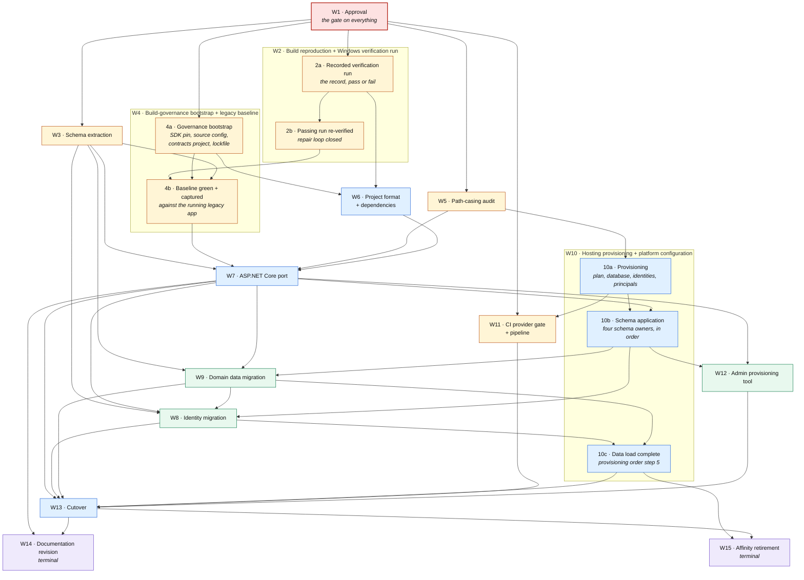
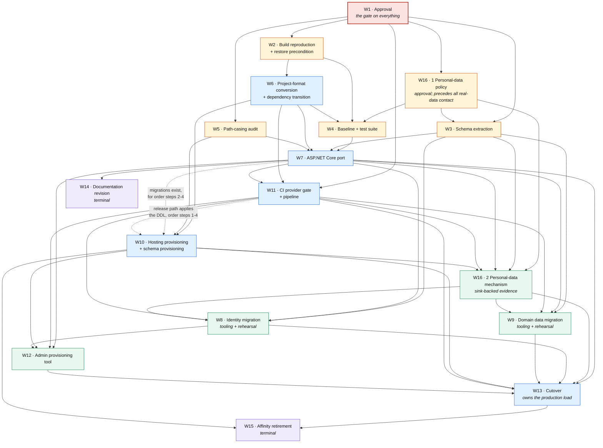

# 03 — Modernization Roadmap

**Deliverable 03 of thirteen.** Answers the user's requirement *"Modernization roadmap"*.

---

## 1. Purpose, ownership and authoring contract

### 1.1 What this document is

This document is the **sequence**. It decomposes the modernization of MvcMusicStore into named workstreams, fixes the order they must run in, and states for each one what must be true before it begins and what must be demonstrably true before it is called finished.

It is the single owner of the **workstream decomposition**. Deliverable [07](07-effort-risks-sequencing.md) estimates against the workstreams defined here, so their boundaries — not their contents — are this document's product. Deliverable [05](05-aspnet-core-migration-approach.md) §14.3 and deliverable [06](06-azure-hosting-recommendations.md) §13.4 both route "workstream decomposition and gate placement" here.

### 1.2 What this document is not

It is **not** a schedule. **Precisely: it carries no effort estimate, no duration, no calendar date and no delivery schedule for the future implementation, and it orders nothing by elapsed time.** Sequence and gates are a different thing from a plan of record with dates against it, and only the former is knowable before the assessment is approved.

The claim is stated in that narrowed form because the absolute form — "no time unit appears anywhere" — would be false, and a false absence claim is worse than a bounded one. Time units do appear here, in two places, and neither is a schedule: W10's exit condition 2 reproduces the HSTS `max-age` values of [06](06-azure-hosting-recommendations.md) §10.1.2, which are **day counts in a configuration setting** (`Hsts:MaxAgeDays`), and the same condition describes that section's ramp as **three configuration changes across three releases**, which orders three releases relative to one another without dating any of them or claiming how long the ramp takes. A configuration value denominated in days is a property of the setting, and a relative release ordering is a sequence; neither is an effort figure, a duration for a workstream, or a date. **What this document never carries is a figure for how long any workstream takes or when it happens** — those belong exclusively to deliverable [07](07-effort-risks-sequencing.md), which owns the effort model, and no gate here is satisfiable by the passage of time. Effort belongs exclusively to deliverable [07](07-effort-risks-sequencing.md), which owns the effort model, its units, its bands, its assumptions and its confidence.

It is also **not a second opinion** on any decision another deliverable owns. A roadmap is the document where every other deliverable's conclusion is most easily re-litigated by accident — a sentence of rationale here, a weighing of options there — and the result is two documents that disagree. Section 1.5 lists every such decision with its owner. Where this document needs one, it points at it.

### 1.3 Authoring contract, and the absence of user rules

`review_rules` returns exactly **"No user rules provided."** There is no project rule to name, summarize or cite, and no rule forces any file into or out of this roadmap. Their absence is not licence to lower the bar: this document is held instead to the enterprise-standard contracts the Agent Action Plan sets out, which are the operative constraints throughout.

| Contract | Source | How this document honours it |
| --- | --- | --- |
| **Citation** | AAP 0.4.1, 0.11.3 | Every **as-is** claim carries an inline `[<path>:<locator>]` citation at the point of claim. Repository-wide counts and absences carry the **command** that reproduces them instead, because no single line evidences an absence |
| **One fact, one owner** | AAP 0.11.4 | Cross-reference, never restate. Section 1.5 is the routing table; a contradiction with an owner is a defect in this document, not in the owner |
| **No effort, no schedule** | AAP 0.1.3 | No time unit and no effort figure appears anywhere below |
| **Repository non-modification** | AAP 0.2.2, 0.11.5 | This document changes no repository file. Section 2 states the constraint and section 2.3 draws the line it depends on |

Markdown line length follows the corpus convention recorded in [`README.md` § 10 Markdown line-length convention](README.md#10-markdown-line-length-convention).

### 1.4 What this document owns

Four things, and nothing else:

1. **The workstream decomposition** — the set of workstreams, their names and their scope boundaries.
2. **Gate placement** — the entry and exit gate of each workstream, and therefore the order. This includes **which gate executes which row of the test suite**: section 4.3 carries that map, because a gate that quotes a row whose runtime does not exist yet is a gate placement error rather than a testing question.
3. **The interlocking property** — the proof, in section 6, that every exit gate is some successor's entry gate or is terminal.
4. **Debt attachment** — which workstream each severity class of deliverable [08](08-technical-debt-register.md)'s register lands on, and which items land nowhere because they gate nothing.

### 1.5 What this document does not own — the routing table

Every entry below is stated in full by its owner. This document cites the owner and adds nothing.

| Fact or decision | Owner | This document's use of it |
| --- | --- | --- |
| Target framework and the SDK band | [04](04-dotnet8-migration-strategy.md) §2, §3 | Named only as "the target framework". The value and its support-window consequence are not restated |
| Project format, `PackageReference`, tooling manifests, lockfiles | [04](04-dotnet8-migration-strategy.md) §5, §6 | W6's exit gate points at them |
| Every package pin | [04](04-dotnet8-migration-strategy.md) §7–§9 | Not enumerated here |
| The future application map | [04](04-dotnet8-migration-strategy.md) §12 | W6 and W7 point at it; no file list is reproduced |
| Pipeline, DI, configuration, EF Core, views, static assets, anti-forgery, the JSON contract | [05](05-aspnet-core-migration-approach.md) §2–§9 | W7's scope points at them |
| Schema-extraction design; the two data migrations | [05](05-aspnet-core-migration-approach.md) §5 | W3, W8 and W9 point at them |
| The test suite's architecture and required coverage | [05](05-aspnet-core-migration-approach.md) §12 | W4 points at it and does not redesign it. **Which gate executes each row is this document's**, in section 4.3 — that is gate placement, not suite design, and 05 states no gate |
| The operator-host assertions and the CSP report-endpoint tests | [04](04-dotnet8-migration-strategy.md) §12.4 and [06](06-azure-hosting-recommendations.md) §10.2 | **Neither set is a row of [05](05-aspnet-core-migration-approach.md) §12.4:** the operator-host assertions appear in it nowhere, and the eleven CSP HTTP tests appear only as a **prose cross-reference** to 06 §10.2, which names them and leaves their contract — and their numbering — with 06. Section 4.3's inclusion rule places them with W12 and W7 respectively and counts them once, in the non-parity term; the assertions themselves are not restated |
| The provisioning tool's five required properties | [05](05-aspnet-core-migration-approach.md) §10.2 | W12's exit gate points at them |
| **The cutover approach and its accepted losses** | [05](05-aspnet-core-migration-approach.md) §11 | W13 **sequences** it. It is not re-opened, re-compared or re-argued here |
| **Hosting target and deployment model** | [06](06-azure-hosting-recommendations.md) §2 | Named only as "the primary hosting target". Not re-argued; a reversal here would be a defect |
| **The interim Windows hosting option** | [06](06-azure-hosting-recommendations.md) §5 | **Not sequenced here.** It is an *alternative* to this roadmap's sequence rather than a workstream inside it, so no workstream, gate or dependency below covers it; 06 §13.3 says the same from its side, and 06 §5.3 records the two approved source changes it requires, which do not become gates in this document |
| The DDL principal, and the provisioning order | [06](06-azure-hosting-recommendations.md) §6.2, §6.3 | W10's exit gate points at them |
| The data-protection key ring; session over the distributed cache | [06](06-azure-hosting-recommendations.md) §7, §8.1 | W10's exit gate points at them |
| **The observability approach** | [06](06-azure-hosting-recommendations.md) §9 | The mechanism is not restated. W7 and W10 carry its placement only |
| **The log-privacy policy** — what may and may not appear in a log record, and the pseudonymous actor | [06](06-azure-hosting-recommendations.md) §9.2 | W7's exit requires the emitted events to obey it. No field list is restated here |
| **The security-event catalog** — every event class, its identifier, actor, target, outcome, severity and permitted fields, **and the producer map that says which component emits each class** | [09](09-security-assessment.md) §6.8.1 and §6.8.1.1 | W7 emits and W10 proves collection for the **thirteen application-produced classes**; W8 for the migration-produced grants; W12 for the three the command produces. No event is enumerated here, and the split is 09's arithmetic rather than this document's: thirteen from the port plus three from tooling is sixteen |
| **The personal-data findings** — the nine `Order` fields, the identity link, and the absent retention, deletion and audit controls | [09](09-security-assessment.md) §3.11, §6.8 | W16 exists because of them. The requirement is 09's; the workstream and its gates are this document's |
| **Log and audit retention**, and the provisioning tool's audit sink | [06](06-azure-hosting-recommendations.md) §9.5 | W10's and W12's exit gates point at them |
| The cutover runbook; the browser matrix | [06](06-azure-hosting-recommendations.md) §11, §10.4 | W13 points at the runbook |
| **Per-edition build outcomes** | [10](10-build-and-deployment-requirements.md) §3, §13 | W2 points at them. Neither the outcome nor its diagnosis is restated |
| Per-edition database topology | [10](10-build-and-deployment-requirements.md) §10 | W3 and W4 point at it |
| **The effort model and its bands** | [07](07-effort-risks-sequencing.md) | Cited as the destination for every question of size. No figure is stated here |
| **The risk register**, including the support-window entry | [07](07-effort-risks-sequencing.md) | Pointed at. No risk is restated, ranked or mitigated here |
| The categorized debt register | [08](08-technical-debt-register.md) §5–§11 | Section 7 attaches its severities to workstreams without restating an entry |
| The 23 blockers and their two groups | [12](12-migration-blockers.md) §2.3, §3, §4 | W7's exit gate points at group two |
| Statefulness, transport and path casing as-is | [11](11-cloud-readiness-assessment.md) §3 | W5 and W15 point at them |
| **The data-migration artifact** — its modes, machine-readable reports and exit-code contract | [05](05-aspnet-core-migration-approach.md) §5.6 | W3, W7, W8 and W9 point at it. This document places only **which workstream builds it** and **which gates it enforces** |
| **The two test projects' identity, references, runner configuration and class topology** | [04](04-dotnet8-migration-strategy.md) §12.2, §12.3 | W4 and W7 name the project path each builds and tests **and the concrete classes each run is expected to select**, so their gates are executable. Which project references what, where each class is declared, and why a project reference alone runs nothing, are not restated |
| **The tool projects' references, the registration seam they compose through, publish separation and invocation form** | [04](04-dotnet8-migration-strategy.md) §12.2, §12.4 for the seam's file, type and signature; [05](05-aspnet-core-migration-approach.md) §2.4 for where `Program.cs` calls it | W7 and W12 build them; W11's manifest and W13's release invoke them. Their gates require the seam to **exist and be called by the application's own composition root**; the seam's type, signature and contents, **its position in the registration sequence**, the invocation form and the exclusion from the web publish are not restated |
| **The fixtures' destructive-operation controls** and the principal they run as | [05](05-aspnet-core-migration-approach.md) §12.8 | W4's and W7's exit gates require them **demonstrated**; their internals are not restated |
| The suite's execution runbook and its two-platform split | [05](05-aspnet-core-migration-approach.md) §12.10 | W4's exit requires the baseline half and its handoff record; W7's requires the target half |
| The 22 blockers and their two groups | [12](12-migration-blockers.md) §3, §4 | W7's exit gate points at group two |
| Schema-extraction design; the two data migrations; **the reconciliation standard and the executor's contract** | [05](05-aspnet-core-migration-approach.md) §5, §5.6 | W3, W8 and W9 point at them. W3's exit gate cites §5.1 step 1's **complete** extraction contract rather than restating a subset of it, and W8's cites §5.5's enumerated carried classes. Their gates *require* keyed-set-and-digest reconciliation without specifying its canonicalization or key handling, which are 05's. §5.6 also owns **the run model, the run lifecycle, the run-scoped retained classes and the per-class reconciliation projections**, each named by subject in §8.4 and cited rather than reproduced. W8's, W9's and W13's gates and W13's post-window tasks consume them and place only their ordering: they quote no sub-command count, no count of 05's retained classes, no field list and no transform. The **six** retained artifacts W8's exit condition 7 counts are this roadmap's own union of 05's run-scoped classes with [06 §6.9](06-azure-hosting-recommendations.md)'s two restore points, enumerated there and attributed to neither owner as a count of theirs |
| The Identity normalized columns' **configured collation**, the reason it is configured rather than inherited, and the collision preflight's mechanism | [05](05-aspnet-core-migration-approach.md) §5.5 | W3's exit gate reports the **source's** collation as a source fact only and claims no authority over the net-new target columns; W8's exit gate requires the **post-migration read of the target's own catalog** and the preflight run under those semantics. Neither restates the configured value, and neither asserts a default |
| The DDL principal, the provisioning order, **the two-stage catalog apply and its stage-aware history verification**, **the fixed order of the data movement** and **the release-time command sequence** | [06](06-azure-hosting-recommendations.md) §6.2, §6.3, §6.5, §6.8 | W10's exit gate points at them; the **data-movement order** is placed where the movement happens — W13's pre-window integrated rehearsal and the production run — rather than as a workstream-level wait, and its rationale is not restated; W11's exit gate authors the sequence and W13 performs it. The **decision** to split the catalog set into two stages is [05](05-aspnet-core-migration-approach.md) §5.3's and its release mechanics are §6.3's — this document places only which gate each of the two applies falls behind |
| The data-protection key ring's **owning context and its migration**; session over the distributed cache and its **release-concurrency and sweep controls**; **the layout aggregate's caching placement** | [06](06-azure-hosting-recommendations.md) §7.2, §8.1, §6.4 | W10's exit gate points at them; §7.2's F-08-03 row cites the caching decision rather than making one |
| **The interim option's selected authentication path**, its cost, its residual risks and its two exit triggers; **the branch's conditional, not-executable status and the nine required contents of the migration contract it waits on** | [06](06-azure-hosting-recommendations.md) §5.3–§5.5, §5.8 | Section 4.3 **sequences** the branch and its closure, and places the contract's authoring as a gate ahead of every other interim activity per §13.4. The selection is not re-opened, the cost is not restated, and the nine contents are cited rather than reproduced |
| The orphan-cart cleanup's manifest, its **ten gates** and the leave-in-place rule; the **exceptions to the copy-expiry rule and which artifacts outlive cutover acceptance** | [06](06-azure-hosting-recommendations.md) §11.4, §6.9, with the run-scoped retained classes owned by [05](05-aspnet-core-migration-approach.md) §5.6 | W13's exit gate reports the orphans; its post-window tasks cite the ten gates in that section's order rather than summarizing them into a shorter set, and cite the exceptions rather than re-deriving which artifacts outlive acceptance. **No count of retained artifacts is attributed to §6.9 here**: §6.9 groups them, 05 §5.8 owns the run-scoped classes, and W8's exit condition 7 states which scope each framing describes |
| The 22 blockers and their two groups | [12](12-migration-blockers.md) §3, §4 | W7's exit gate points at group two |
| **Per-edition build outcomes**, and the migration source's build status | [10](10-build-and-deployment-requirements.md) §3, §5.4, §13 | W2 points at them. Neither the status nor its diagnosis is restated |
| The 22 blockers and their two groups | [12](12-migration-blockers.md) §3, §4 | W7's exit gate points at group two |
| **The affinity setting, its two states and its retirement gate** — on **both** platforms | [06](06-azure-hosting-recommendations.md) §8.3, §8.3.1 | W15 and W16 **sequence** the retirement. Neither restates the setting, the states or the verification |
| Session affinity on the secondary platform, and its exclusivity with weighted revision routing | [06](06-azure-hosting-recommendations.md) §4.3.1, §12.1.2 | W16 exists because of it. The platform mechanics are not restated |

---

## 2. The approval gate

> ### ⛔ EVERY WORKSTREAM IN THIS DOCUMENT IS GATED ON WRITTEN APPROVAL OF THIS ASSESSMENT
>
> **No implementation work begins — not one line of code, not one repository file changed, not one Azure resource created — until the approval recorded as W1's exit gate exists.**
>
> This roadmap is a proposal to be read and approved. It is **not** an authorization to start.

### 2.1 Why the gate is stated this prominently

Because two independent inputs impose it, and because a roadmap is the document most likely to be mistaken for a green light. A reader who reaches section 5 and starts at W2 without W1 has broken the engagement's governing constraint.

### 2.2 The two directives behind it

| Source | Directive, verbatim |
| --- | --- |
| The user's prompt | *"Do not make code changes initially."* |
| The project's attached environment setup instructions (Environment 1) | *"Do not modify code until assessment and modernization plan are approved."* |

Two inputs, arrived at independently, agreeing on the same gate. The consequence recorded in AAP 0.2.2 is deliberately absolute: it extends even to the defects this assessment identifies. The plaintext administrator credential, MVC 4's broken build configuration, the partial anti-forgery coverage and the state-changing `GET` are all **documented and left in place**. Section 7 states which workstream each one is attached to, so that nothing is lost by deferring it.

### 2.3 Mutation versus specification — the line this document depends on

The prohibition is on **changing** the repository. It is not a prohibition on **planning** a change. Those are different acts, and conflating them would make the roadmap the user asked for impossible to write.

| | Forbidden now | Required now |
| --- | --- | --- |
| **Act** | Converting the project format | Naming, scoping and gating the workstream that converts it |
| **Act** | Editing a `.cs`, `.cshtml`, `.csproj`, `.config` or `.sql` file | Specifying which files change, in which workstream, behind which gate |
| **Act** | Creating an Azure resource | Sequencing the provisioning that creates it |
| **Act** | Revising a README | Recording that three of them require revision (W14) |

This document therefore **sequences the code changes a later approved phase will make, in full**. It fails in two opposite ways: by reading as authorization to begin, and by declining to sequence because the prohibition on mutating was mistaken for a prohibition on planning. Both are failures. The line above is what separates them.

**What this document creates:** one markdown file. **What producing this assessment also did**, because the acceptance check has to cover it rather than sidestep it: **unqualified restore and build operations were performed against all three editions** while the assessment was being written, and those runs wrote **gitignored payload and output trees** into the authoring checkout — restored `packages/` trees, and `bin/` and `obj/` output under the edition projects. **None of them is build evidence**, and nothing in this document rests on them: deliverable [10](10-build-and-deployment-requirements.md) §1.4 separates those operations from the evidence it retains, and its §3 owns every build outcome — MVC 5's included, and MVC 5's status remains **blocked pending a Windows verification run**, the run W2 exists to produce. Nothing tracked was touched by any of it, so no repository *modification* in the sense of section 2.3 occurred; but generated output sitting in the checkout is exactly what "nothing was left behind" is a claim about, so it had to be **removed and its absence verified** rather than assumed. It was: every such tree was deleted and the checkout re-checked with the four commands below. Appendix A enumerates which trees they were.

**Bare `git status --porcelain` cannot see any of that, which is why it is not the check.** The build output is excluded by `[Oo]bj/` and `[Bb]in/` [.gitignore:1-2], whose leading character classes match the `bin` and `obj` spellings these projects use without depending on the host's case sensitivity. The nested `packages` trees are a different and less obvious matter, and deliverable [04](04-dotnet8-migration-strategy.md) §A.6 owns the analysis: the rule that matches them is `Packages/` [.gitignore:33], because a pattern whose only separator is trailing matches a directory of that name at **any** depth — while `packages/*` [.gitignore:15] does **not** reach them at all, since a pattern with an interior separator is anchored to the repository root and so cannot match `src/MVC4/packages` or `src/MVC5/packages`. **That match is case-dependent.** It holds on this checkout because `git config core.ignorecase` reports `true`, which is what lets the uppercase rule match the lowercase directories; **on a case-sensitive host no rule ignores those trees**, and a restore performed there would leave them visible to bare porcelain as untracked paths rather than hidden from it. So the conclusion below is stated for the tree this assessment was authored in and not as a cross-platform property: here the rules did match, and porcelain stayed silent while a hundred megabytes of generated output sat in the working tree. An attestation resting on porcelain alone attests something it never looked at. The check is therefore these four commands **together**, stated against the **committed checkpoint** because that is what a reader can reproduce — an authoring-time working tree is not evidence:

```bash
# 1 — tracked working-tree state
git status --porcelain
# -> (no output)   nothing tracked modified, deleted, or newly untracked

# 2 — the same state with ignored files included: the one bare porcelain misses
git status --porcelain --ignored
# -> (no output)   no restored packages/, no bin/ and no obj/ anywhere in the tree

# 3 — what an ignore-aware clean would remove, listed rather than deleted
git clean -ndX
# -> (no output)   nothing to remove

# 4 — the tracked diff against the pre-assessment baseline
git diff --name-status ea2552d6eda7c20e9477a512e5c615665618cf35..HEAD
# -> A  docs/modernization/01-architecture-overview.md
#    A  docs/modernization/02-dependency-inventory.md
#    A  docs/modernization/03-modernization-roadmap.md
#    A  docs/modernization/04-dotnet8-migration-strategy.md
#    A  docs/modernization/05-aspnet-core-migration-approach.md
#    A  docs/modernization/06-azure-hosting-recommendations.md
#    A  docs/modernization/07-effort-risks-sequencing.md
#    A  docs/modernization/08-technical-debt-register.md
#    A  docs/modernization/09-security-assessment.md
#    A  docs/modernization/10-build-and-deployment-requirements.md
#    A  docs/modernization/11-cloud-readiness-assessment.md
#    A  docs/modernization/12-migration-blockers.md
#    A  docs/modernization/README.md
# -> exactly 13 rows, every one an A, every one under docs/modernization/
```

**All four are the criterion, and no three of them are.** Thirteen `A` rows and nothing else means no existing file was modified or deleted; commands 2 and 3 are what establish that nothing was *left behind* either — which is the half of the claim bare porcelain looked like it was making and was not.

---

## 3. How to read a workstream

Every workstream below carries the same six fields. The two gates are the load-bearing ones.

| Field | What it means |
| --- | --- |
| **Scope** | What is inside this workstream, and — where confusion is likely — what is deliberately outside it |
| **Entry gate** | What must be **true** before work begins. Not "what happens first" — a condition, checkable by someone who was not involved |
| **Exit gate** | What must be **demonstrably true** before the workstream is called finished. Demonstrable is the operative word: a claim someone can refute |
| **Depends on** | The workstreams whose exit gates this one's entry gate consumes. A **projection of §4.2.1's edge inventory**, read down the successor columns |
| **Feeds** | The workstreams that consume this one's exit gate — or **terminal**, meaning nothing downstream waits on it. Also a **projection of §4.2.1**: it is that table's row for this workstream, in words |
| **Owner role** | The role accountable for the exit gate being met. A role, not a person |

**The acceptance test for this document** (AAP 0.11.2, row 03) is that **every exit gate is some successor's entry gate, or is explicitly terminal.** A workstream whose exit nobody consumes and which is not terminal is either mis-scoped or unnecessary. Section 6 walks the graph and proves the property holds.

---

## 4. The shape of the sequence

### 4.1 Three workstreams precede the port, each for a different reason

This is the most consequential structural property of the roadmap, and the three reasons are genuinely independent — which is why collapsing them into a single "preparation" workstream would lose information.

| Before the port | Because |
| --- | --- |
| **W2** — build reproduction and the restore precondition | The sole migration source **cannot build from a clean checkout**, because it commits no restored package payload — and deliverable [10](10-build-and-deployment-requirements.md) carries its post-restore build status as **blocked pending a Windows verification run**. Deliverable [10](10-build-and-deployment-requirements.md) §13.2 and §13.3 route both the open verification item and the residual precondition here, as this roadmap's first workstream gate. You cannot plan a port against a source whose build has neither been reproduced nor verified |
| **W3** — authoritative schema extraction | The authoritative schema exists **only inside a committed binary**. An initial migration generated from the ported model creates empty tables and may silently differ from the real schema, and there is no shipped script to compare against — deliverable [12](12-migration-blockers.md) §5 and F-12-22 own that finding |
| **W4** — behavioural baseline and test suite | There is **no test of any kind** in the repository, so nothing today would detect a behaviour change — and **eight of the nine** group-two blockers in deliverable [12](12-migration-blockers.md) §4 fail *silently*, meaning the application keeps returning HTTP 200 while the behaviour is wrong. The ninth, **F-12-01**, is the loud one: SQL Server Compact is a `providerName` string in MVC 3's configuration with no project assembly reference, so it breaks no build and instead throws at provider activation on first data access. It belongs to **MVC 3**, which is never ported, so it is not what this suite exists to catch — the eight are |

```bash
# Path names alone cannot establish this, so the claim rests on five searches --
# path names, file content, package pins and project declarations -- plus a positive
# control proving the pattern shape works. All five are in Appendix A with their
# scope stated; the headline results are:
git ls-files | grep -i test | wc -l                                            # -> 0
git grep -lIiE 'xunit|nunit|mstest|TestClass|\[Fact\]|\[Theory\]' \
  -- ':!*/packages/*' ':!docs/*' | wc -l                                       # -> 0
git grep -lIiE 'Microsoft.NET.Test.Sdk|IsTestProject' -- '*.csproj' '*.sln' | wc -l  # -> 0
# no test project, no test file, no test-framework reference and no test-framework
# pin, repository-wide -- including inside the committed packages/ payload trees
```

**One approval precedes two of those three, and it is not an engineering workstream.** W3's entry requires the committed catalog *and credential* databases to be **attached**, and W4's exit requires **both store pairs restored** before every run. Both are processing of real personal data in a non-production environment, and both happen long before anything is hosted — so the rules governing that processing have to exist first. Those rules are **W16 stage 1**'s, and stage 1 depends on nothing but W1 precisely so that it can sit in front of W3 and W4: its scope is deliverable [09](09-security-assessment.md) §3.11's source-level enumeration of the nine personal-data fields, which is readable from the model source without extracting anything. Approving a copy's handling after the copy has been made is not a control.

**One of those three additionally needs a project to be compiled inside, and that is the one correction this ordering has taken since it was first drawn.** W4's product is not a document: it is the test suite deliverable [05](05-aspnet-core-migration-approach.md) §12 specifies, and deliverable [04](04-dotnet8-migration-strategy.md) §12 places that suite in a **single project inside the target project graph** — `src/MvcMusicStore.Tests`, referencing the target application project and hosting it through its public entry point. So the suite cannot be *compiled at all*, legacy-facing rows included, until that graph exists, and the graph is **W6**'s output. W4 therefore depends on W6, and §4.2's second property states the edge and what it does and does not imply.

Get those three ordered correctly, put stage 1 in front of them, and the remainder of the sequence follows from ordinary dependency: **project graph before the suite that is compiled inside it, project graph before port, port before pipeline, pipeline before the DDL it applies, data migration rehearsed before it is executed, and the execution inside the cutover.**

### 4.2 The dependency graph

**This projection is drawn at gate granularity.** Twelve of the sixteen workstreams are single nodes here and three are drawn as their internal gates — W2 as two, W4 as two, W10 as three — and the reasons are different. **W16 is not in this projection**: its two stages are drawn in the workstream-granular graph of [§4.2.2](#422-the-same-graph-drawn), whose canonical inventory is [§4.2.1](#421-the-canonical-edge-inventory--one-source-three-projections).

- **W2, because its exit has two states and they open different successors.** A recorded run that *fails* still discharges the recording obligation and still hands W6 a known starting condition; what it does not hand anyone is a legacy application that runs, and W4's baseline half exists to drive one. So the repair and re-verification that closes gate 2b sits between the record and gate 4b, and W6 consumes gate 2a without waiting for it.
- **W4, because its two halves have different entry conditions and different consumers.** Gate 4a is the build-governance bootstrap and the contracts project restored in locked mode; its entry is approval alone, and **W6** consumes it. Gate 4b is the baseline green against the legacy application; its entry additionally requires gate 2b **and W3's extraction**, and **W7** consumes it. Drawing W4 whole would either give W6 a dependency on a legacy application it never uses, or leave the locked-mode restore at 4a's exit with no committed source configuration to restore against — the two failures the split exists to avoid.
- **W10, because it is the one workstream that both precedes and follows another** — and drawing it whole is exactly what would make the graph look circular when it is not.

In all three cases the gates are sequential parts of one workstream, not new workstreams: the identifiers remain W1 through W16 throughout, and 2a, 2b, 4a, 4b, 10a, 10b and 10c are gates *inside* W2, W4 and W10.



**The graph is acyclic, and there is no partial or dashed dependency anywhere in it.** The earlier shape of this roadmap expressed W10's double position as a dashed "partial" edge, which is not a thing a gate can be: a gate is either satisfied or it is not. Splitting W10 into 10a, 10b and 10c replaces that hedge with three ordinary edges — W10a and W10b precede W8 and W9, and W10c follows them — so every edge in the diagram is a full dependency between two gates. W2's two gates work the same way rather than as a conditional edge: 2a is the record and 2b is the repair loop closed, and each of W6 and W4's baseline half consumes the one it actually needs. W4's two gates are the same device applied to the same kind of problem from the other side: 4a is governance that needs no legacy application, 4b is a baseline that needs one, and W6 and W7 each consume the one they actually need. Section 6 walks all forty of them, one row each, and states the topological order that proves acyclicity.

---

### 4.4 The interim hosting option — a conditional branch outside the sixteen

Deliverable [06 §5](06-azure-hosting-recommendations.md) presents an **interim** option: lift the un-ported application to Windows App Service without waiting for the port. It is genuinely optional, it is not one of the fifteen workstreams, and it gates none of them — so it appears here as a branch with its own ordered steps rather than as a sixteenth workstream. Its selection, its cost and its residual risks are [06 §5.3–§5.5](06-azure-hosting-recommendations.md)'s; what this roadmap owns is **where its steps sit and what closes it**.

**It is conditional in a second sense, and the table below makes that a gate rather than a caveat: as the branch currently stands it is not executable.** [06 §5.8](06-azure-hosting-recommendations.md) states the status directly — the production data move of its precondition 1 has a *shape* and not a *contract*, so a release cannot be run from it — and it separates two decisions that are easily read as one: **selecting Path A selects an authentication mechanism *for* the branch; it does not select the branch.** The consequence for this section is exact. What follows is **an ordering for a branch that may be taken, not a sequence anyone is cleared to execute**, and the first thing it orders after the approval decision is the authoring of the contract that would make execution possible.

**The authentication path is already selected and the choice is not reopened here.** [06 §5.5](06-azure-hosting-recommendations.md) selects Path A — SQL authentication credentials behind a platform secret reference — as an explicit, time-boxed exception owned by **Security**, with two exit triggers: the ported application's cutover, or twelve months from the grant, whichever comes first.

| Step | Ordering condition | Why it sits here |
| --- | --- | --- |
| **I1 — Security grants or refuses the exception** | After W1, because it is an approval decision like the others W1 collects | **A refusal is a complete answer, not a blockage.** [06 §5.5](06-azure-hosting-recommendations.md) records that refusing the exception makes the interim option unavailable and leaves the port as the only path — so the branch simply disappears and nothing in sections 4.2 or 5 changes. If granted, the grant is recorded in writing with **both trigger dates and a named reviewer**, because the twelve-month trigger is the one that does not fire by itself |
| **I2 — the branch's own production migration contract authored and approved** | After I1, and **before every other interim activity, including the credential provisioning of [06 §5.3](06-azure-hosting-recommendations.md)** — [06 §13.4](06-azure-hosting-recommendations.md) hands this gate to this document in exactly those terms, as the third of the three it names and the only conditional one | **Without it the branch is not executable, so it is a gate and not a preparatory task.** [06 §5.8](06-azure-hosting-recommendations.md) enumerates the **nine** items the contract must contain, each with the failure that follows from leaving it open, and they are **not restated here**: this gate is satisfied by that list being answered in a document authored **by engineering with operations** and approved **by the data owner jointly with Security** for the PII handling, on the same terms as the target migration's approvals. Until that exists the branch stops at this row — and where I1 refused, or the branch is simply not taken, the gate **does not arise at all** |
| **I3 — both preconditions of [06 §5.6](06-azure-hosting-recommendations.md) satisfied, with precondition 2's closure *demonstrated* by that section's four-step procedure rather than asserted** | Precondition 1 is a **data move of its own**, and it is not either of the two data workstreams. [06 §5.6](06-azure-hosting-recommendations.md)'s precondition-1 table distinguishes them row by row: the interim move carries **the un-ported application's existing schemas unchanged** — the EF 6 catalog schema and the ASP.NET Identity 1.0 store as they are today — reconciled by row counts and per-table digests against the source databases, whereas the target migration translates the same rows into the ported application's EF Core and ASP.NET Core Identity schemas. **W3 is a genuine prerequisite of the interim move**, because the extraction is what makes the copy verifiable and what the export is checked against; **W9 and W8 are not**, so among the fifteen this step sits after W3 alone — and within the branch it sits after I2, because the contract that gate approves is what defines how precondition 1's move is performed at all | The conflation is the sequencing error most likely to be made here, and [06 §5.6](06-azure-hosting-recommendations.md) states why it cannot hold: the un-ported application authenticates through ASP.NET Identity 1.0 — and through SimpleMembership in MVC 4 — so it **cannot read ASP.NET Core Identity tables**, and a target-shaped store would leave it unable to sign anybody in. Precondition 2 is the destructive initializer, and [06 §5.6](06-azure-hosting-recommendations.md) requires its closure to be demonstrated against a copy before the real database is connected |
| **I4 — the interim host goes live** | After I1, I2 and I3 — the contract gate included, because going live is what points the un-ported application at the copied data | Nothing in the fifteen depends on it, and it depends on nothing further |
| **I5 — the exception is closed** | On the **first** of its two triggers: **W13**'s completion, or the twelve-month date | On either trigger the login is disabled, the secret is deleted and **its deletion is verified** [06 §6.11](06-azure-hosting-recommendations.md), and the exception is closed in writing. If the port is not complete at the date trigger, [06 §5.5](06-azure-hosting-recommendations.md) requires an explicit re-grant for a new bounded term — there is no state in which it continues unreviewed. [07](07-effort-risks-sequencing.md) R15 carries the risk that it does |

**The interim move discharges neither W9 nor W8, and saying so plainly is the point of this paragraph.** It moves the legacy schemas as they stand so that a legacy runtime can keep reading them; the two data workstreams translate those rows into the target's two schemas so that the ported runtime can read them. Neither runtime can read the other's store, so the work is **additive rather than shared** — [06 §5.6](06-azure-hosting-recommendations.md) states it in exactly those terms. A branch that has completed I4 still faces W9 and W8 in full, and no gate of either is satisfied by an interim reconciliation.

**This roadmap sequences the authoring of the branch's migration contract at I2; it does not sequence the contract itself, and the limit is deliberate.** A contract that does not yet exist has no steps to order, no owner assignments to place and no exit criteria to gate on, so writing an ordering for its internals here would be inventing the very thing [06 §5.8](06-azure-hosting-recommendations.md) records as undecided — and I2 exists precisely so that the ordering is written once the contract is. Two consequences follow and both belong to other documents. The nine required contents are **06 §5.8's**, cited by I2 rather than reproduced, so there is one statement of them to approve against. And the effort is **not modelled**: deliverable [07](07-effort-risks-sequencing.md)'s assumption A11 records that its model assumes the branch is not taken and that **nothing in it covers either authoring or executing that contract**, so both would have to be estimated at the point the branch is selected. No figure for either appears in this document, which carries none of any kind.

**Taking the branch does, however, change what the data workstreams read, and that consequence is this roadmap's to place.** Once the interim host is live and accepting writes, [06 §5.6](06-azure-hosting-recommendations.md) makes the **interim Azure SQL databases the source of record** rather than the committed database files. So where I4 precedes them: W3's authoritative extraction, W9's and W8's rehearsals and the production run inside W13 all take those databases as their source, **under the target migration's own extraction cutoff**, and W13's drain applies to the interim host rather than to a developer's local instance — the runbook step is [06 §11.3](06-azure-hosting-recommendations.md) step 2 either way. Where the branch is refused or not taken, the committed files remain the source and nothing in section 4.2 or section 5 changes.

---

#### 4.2.1 The canonical edge inventory — one source, three projections

**This table is the graph, at workstream granularity: seventeen source rows — the sixteen workstreams with W16 as its two stages — and forty-seven edges.** The diagram in §4.2.2 and every workstream's **Feeds** and **Depends on** field in section 5 are **projections of it** and carry no edge of their own. **Section 6's per-edge table is a projection at *gate* granularity**: it splits W2, W4 and W10 into their gates, enumerates the forty edges of §4.2's drawing, and does not carry W16's — so its total is its own and this table's forty-seven is the canonical one. That rule exists because the alternative was tried and failed: while the diagram, the prose inventory and sixteen hand-maintained local lists were three independent statements of the same set, they drifted — W1's local list lost an edge the diagram carried, and a dependency stated only in a gate's *text* never reached the inventory at all, which is how a two-node cycle survived a proof that claimed to walk every edge. A reader who finds a local list disagreeing with this table should treat the local list as the defect.

Rows are in the topological order section 6 exhibits, so the acyclicity property is checkable by eye: **every target names a node that appears lower in this table than its source.**

| # | Source | Direct successors (its **Feeds**) | Edges |
| --- | --- | --- | ---: |
| 1 | **W1** Approval | W2, W16·1, W3, W5, W11 | 5 |
| 2 | **W2** Build reproduction | W4, W6 | 2 |
| 3 | **W16·1** Personal-data policy | W3, W4, W16·2 | 3 |
| 4 | **W3** Schema extraction | W7, W8, W9, W16·2 | 4 |
| 5 | **W5** Casing audit | W7, W10 | 2 |
| 6 | **W6** Project-format conversion | W4, W7, W10, W11 | 4 |
| 7 | **W4** Baseline + test suite | W7 | 1 |
| 8 | **W7** The port | W8, W9, W10 *(partial)*, W11, W12, W13, W14, W16·2 | 8 |
| 9 | **W11** CI gate + pipeline | W8, W9, W10 *(partial)*, W12, W13, W16·2 | 6 |
| 10 | **W10** Hosting + schema provisioning | W12, W13, W15, W16·2 | 4 |
| 11 | **W16·2** Personal-data mechanism | W8, W9, W13 | 3 |
| 12 | **W8** Identity migration tooling | W12, W13 | 2 |
| 13 | **W9** Domain data migration tooling | W13 | 1 |
| 14 | **W12** Admin provisioning tool | W13 | 1 |
| 15 | **W13** Cutover | W15 | 1 |
| 16 | **W14** Documentation revision | **terminal** | 0 |
| 17 | **W15** Affinity retirement | **terminal** | 0 |
| | | **Total** | **47** |

The two edges marked *(partial)* are the roadmap's only partial dependencies — `W7 → W10` and `W11 → W10` bind the DDL-applying steps of W10's provisioning order rather than its environment half, and `W7 → W10` additionally binds W10's condition 3, whose probes poll endpoints W7 builds. They are drawn dashed in §4.2.2 and are ordinary edges for every purpose of the proof.

> **Two corrections produced this inventory, and they are the reason the inventory now exists. Both were the same failure — a dependency that lived in prose and never reached the table — and they ran in opposite directions.**
>
> **One edge was removed.** Before the correction recorded in W10's exit gate, the **true** edge set carried one edge more than the inventory declared, and the undeclared one was `W16·2 → W10`: W10's exit condition 7 required the personal-data access-audit records that W16 stage 2 produces, while W16 stage 2's entry gate required W10 exited. That is a two-node cycle, and it was **absent from the published inventory** because it was stated in a gate's prose rather than drawn as an edge — which is precisely the failure mode this sub-section's one-source rule prevents. W10's condition 7 now verifies the sink against **W7's** thirteen application-produced classes, a producer that is already upstream of it, and W16 stage 2's condition 6 is the sole owner of the access-audit records.
>
> **One edge was added, and it is row 5's second successor.** `W5 → W7` was a real dependency that this document *described* — W5's own **Feeds** paragraph said the corrections the audit specifies are applied inside W7's static-asset work — while asserting that the audit's only gate edge ran to W10. That is the same defect in the benign direction: W7 consumes W5's output, so W7 cannot be entered before W5 has exited, and a port that relocated the asset set under uncorrected path casing would carry the defect W5 exists to eliminate straight into W10's case-sensitive serve. The edge is now declared, W7's entry gate names it with its reason, and the graph stays acyclic because W5 already precedes W7 in the order section 6 exhibits.
>
> The declared set and the true set therefore coincide at **47**, and section 6 re-exhibits the proof against that number.

#### 4.2.2 The same graph, drawn



The diagram above draws the **forty-seven edges of §4.2.1 and no others**; it adds nothing and omits nothing, and section 6 re-checks the two against each other source by source. The graph is **acyclic** — section 6 walks every edge and states the topological order — and five properties of it are worth reading before the workstreams themselves, because each one exists to remove a sequence that cannot be executed.

- **W6 produces a skeleton, not a green legacy build.** It creates the target project graph and the pinned dependency set; it makes **no claim that the legacy application's behaviour builds or that the W4 suite passes**, because the unchanged `System.Web` source cannot compile on the target framework and an intermediate that cannot compile cannot be gated on. That claim belongs to W7's exit and to nowhere else.
- **The W4/W6 dependency runs in exactly one direction, and both directions have been got wrong at some point in this roadmap's drafting.** W6 does **not** consume W4: an earlier reading made the W4 suite passing against the converted project a W6 exit criterion, which is unmeetable for the reason above. But the converse edge is real and was missing: **`W6 → W4`**, because the suite is a **project inside the target project graph** — deliverable [04](04-dotnet8-migration-strategy.md) §12 gives it one `.csproj`, one project reference to the target application and one entry-point dependency on that application's `Program` — and a project cannot be compiled before the graph containing it exists. This is a **compilation** dependency, not a behavioural one, which is why it does not resurrect the gate the first bullet removed: W6 still owns no behaviour, and W4 still asserts nothing about the target application. What W4 gets from W6 is somewhere for its code to live. What W4's *legacy-facing* rows assert is unchanged, because they run against the running legacy application over HTTP and the target project is merely the host that executes them.
- **The two dashed edges are the roadmap's only partial dependencies.** W10 can begin the *environment* half — plan, database, managed identity, transport, configuration — on W5 and W6 alone. The steps of the provisioning order that apply DDL additionally need W7, because those migrations are W7's output, **and** W11, because deliverable [06](06-azure-hosting-recommendations.md) §6.2 requires the DDL to run from the release path rather than from the application or an operator's session. W7 is needed for one further condition of that gate: the health probes of condition 3 poll endpoints W7 implements, so the probe configuration can be written early but cannot be *verified* before W7 has exited.
- **Migration tooling is rehearsed in W8 and W9; the production load happens once, in W13.** W8 and W9 build the tooling and prove it end to end against a **restored copy** in a non-production target database. Their *schema* comes from W11's rehearsed release-migration stage rather than from W10, which is what keeps W10's exit out of their entry conditions — see the fourth property for the one thing they do consume from W10, and why it arrives through W16 rather than directly. The final extraction, load and reconciliation runs after the legacy application is drained, inside W13, and is not duplicated anywhere else.

  **There is deliberately no edge between W8 and W9, and the ordered pair a reader might look for is inside W13 instead.** The two rehearsals restore **different stores** — the shipped credential store and the shipped catalog store — into **different** non-production targets, and neither consumes anything the other produces, so this graph imposes no order on them and either may proceed as soon as its own entry gate is met. The order that does exist is the **production** one, and it exists exactly once: W13's exit condition 2 runs the domain data load first and then the Identity data migration, in the sequence deliverable [06](06-azure-hosting-recommendations.md) §6.3 step 5 owns. Reading that production order back into the rehearsals would be an invented prerequisite — no output of one rehearsal is an input to the other — and it would serialize two workstreams for no dependency.
- **W16 is one workstream in two stages, and the split is what makes the personal-data gates satisfiable.** The **policy** stage — retention classes, the rules for non-production copies of real personal data, and legal hold — depends on nothing but W1, because its scope is deliverable [09](09-security-assessment.md) §3.11's source-level field enumeration, which can be read without touching a database. That is what lets it sit **before W3 and W4**, the two workstreams that first attach and repeatedly restore the committed credential and order data. The **mechanism** stage — a proven deletion or anonymization operation, verified backup propagation, and live access auditing — needs a settled field list, somewhere to run and somewhere for its evidence to land, so it depends on W3, W7, W11 and **W10**, whose exit condition 7 provisions the telemetry sink and verifies it against a real event of each of **W7's** thirteen application-produced classes. The stage then implements and proves **its own** access-audit records against that verified sink, which is what makes the dependency one-directional: W10 supplies a capability, and W16 stage 2 supplies the records — never the reverse. Its output gates every subsequent real-data operation: W8's and W9's rehearsal copies and W13's production load. A single-stage W16 could satisfy neither end: gated late, it would arrive after the first real copy had been restored; gated early, it would be asserting sink-backed evidence with no sink in existence.

### 4.3 Where each coverage row is executed — the complete ownership map

Six gates quote the test suite — W4's, W7's, W8's, W9's, W10's and W12's — so which rows each one may quote has to be settled once, in one table, rather than described loosely in six places. What follows is that table. It exists because the looser form was wrong: W7's gate used to require "the W4 suite green", which is unmeetable — a suite containing rows that need a completed Identity load, a completed domain load, a provisioned platform or a command nobody has built yet cannot go green at the end of the port, and a gate that asks for it is failed by a correct implementation.

#### The inclusion rule — what is a coverage row and what is not

**Deliverable [05](05-aspnet-core-migration-approach.md) §12.4's numbered table is the cross-baseline *parity* suite.** Every row of it proves a behaviour against the MVC 5 baseline: either by asserting equivalence with what the baseline does, or by asserting the target contract that deliberately replaces a baseline defect, with the legacy fixture recording the old shape so the difference is auditable. A required test that has **no MVC 5 baseline at all** is therefore not a row of that table and must not be counted as one, folded into W4, or quietly assumed to be inside the row total below. Where the owner nonetheless chooses to **cite** such a set, the citation is carried as **prose** rather than as a numbered row — as 05 §12.4 does for the eleven CSP HTTP tests, cross-referencing [06](06-azure-hosting-recommendations.md) §10.2 in the text of that sub-section. **A prose cross-reference adds no test and changes no count**: the cited tests keep their owner's numbering and their owner's contract, they are counted once where their owner is counted — in the non-parity term of the combined arithmetic below — and the citation moves no gate.

> **A pointer row was tried for that set and has been withdrawn, which is why the rule above is stated in this form.** An earlier form of 05 §12.4 carried the eleven CSP HTTP tests as a numbered row of its own — row 116 — and this sub-section counted it as one row on the ground that the row total is a mechanical count of that table. That was a **double count**: the eleven are already inside the non-parity term of **17**, so adding the pointer row to the parity term made them contribute twice to the combined total. The row is gone, the cross-reference remains as prose, and the eleven are counted exactly once, in the 17.

Two such sets exist in this assessment. Each is authored, gated and estimated **with the document that requires it, in the workstream that builds the thing it tests** — and deliverable [07](07-effort-risks-sequencing.md) §4.1 owns the rule as an estimation input, which is where the effort for both sets is accounted:

| Non-parity test set | Required by | Gated and estimated in |
| --- | --- | --- |
| The **operator-host assertions** — a hostile working directory changing nothing; every password-bearing argument form refused with the key and not the value in the message; the repair path completing in that host; the dispatcher admitting exactly the documented command lines and refusing every other class; and the credential arriving on its named environment channel while appearing in no captured output. **Five tests**, driving the built tool as a process through its real entry point, plus a sixth assertion — the lifetime spelling — discharged by the Release solution build itself at no additional cost | [04](04-dotnet8-migration-strategy.md) §12.4 | **W12**, which builds `tools/provision-admin` |
| The **CSP tests that form part of the promotion gate** — **twelve**, numbered 1 to 12 by their owner. **Eleven are HTTP tests** against the report endpoint: both report transports, the two rejected media types, the unparseable and member-absent bodies, the size bound, the batch bound, the rate-limit partition, the anti-forgery exemption with its paired `GET`, the redaction of query string, sample and referrer, and the two report bindings agreeing. **The twelfth is not an HTTP test at all** — it is the browser-execution assertion of [`G-CSP-BROWSER`](06-azure-hosting-recommendations.md#g-csp-browser) | [06](06-azure-hosting-recommendations.md) §10.2 | **Split, because the two halves need different runtimes.** The **eleven** HTTP tests: **W7**, which owns the header set and the `MapPost("/csp-report", …)` route-handler endpoint registered in the composition root. **Test 12**: **W10**, as the blocking manual gate below |

Deliverable [04](04-dotnet8-migration-strategy.md) §12.4 states the same rule from its own side — its assertions "change no count that document states" — and this sub-section is the roadmap's side of it.

**`G-CSP-BROWSER` is sequenced here, because it is the one required test no automated suite in this roadmap can run.** Deliverable [06](06-azure-hosting-recommendations.md) §10.2's twelfth test proves that a **real browser** enforces the policy, that `report-to` takes precedence over `report-uri` where both are understood, that the fallback binding is reachable where it is not, and that a single violation is **not** double-delivered. None of those is observable through an HTTP client: the report is generated by the browser rather than by the server, so a synthetic `POST` to `/csp-report` proves only that the endpoint accepts a report. It is therefore a **blocking manual gate**, run against the **deployed non-traffic target** across the agents of [06](06-azure-hosting-recommendations.md) §10.4's matrix, and its artifact is a signed record rather than a suite result.

Its position in this roadmap follows from what it needs: a deployed target with the header set live, which first exists at **W10**. It is placed in **W10's exit gate** as a named condition, it blocks promotion of the enforcing header exactly as its owner requires, and it is **not** a row of [05](05-aspnet-core-migration-approach.md) §12.4 and changes none of its counts. The other eleven stay in W7's automated suite, where the endpoint they exercise is built.

#### The row total, stated once

**Deliverable [05](05-aspnet-core-migration-approach.md) §12.4 carries 75 numbered rows.** That figure is stated here and nowhere else in this document; every subtotal and every check below is derived from it, and no gate elsewhere in this document repeats it. It is counted from the owner's own table rather than carried in as a remembered number:

```bash
awk '/^### 12\.4 /,/^### 12\.5 /' docs/modernization/05-aspnet-core-migration-approach.md \
  | grep -cE '^\| [0-9]+ \|'
# -> 75       and the same extraction piped through `sort -n | uniq | wc -l` also yields 75,
#             so the numbering is contiguous 1..75 with no duplicate and no gap
```

If that table gains or loses a row, this sub-section is the one place to re-derive, and the check at the bottom is what re-establishes the partition. The map below is keyed by **gate**, and each gate carries the explicit list of rows it executes rather than a range, because the runtimes do not cluster in the table's order: an added row is placed by asking which of the five runtimes it needs and adding it to that gate's list, and a withdrawn row is struck from exactly one list. **A row can also be withdrawn, and rows have been**: the pointer row for the eleven CSP HTTP tests, described under the inclusion rule above, is gone, and the withdrawal removed a *count*, not a test — the eleven still execute at W7.

> **The parity term moved, and this note records where the sum comes from rather than restating a constant.** The **17** is unchanged and correct — five operator-host tests plus twelve CSP tests — and 06 says so explicitly of its own contribution: *"The twelve is the only term of that sum this document owns."* The parity term is **05 §12.4's**, and it now counts **75**, so the sum is **`75 + 17 = 92`** executable scenarios. Every earlier form of that same combined arithmetic is **stale** — `103 + 17 = 120`, `108 + 17 = 125`, `116 + 17 = 133` and `115 + 17 = 132`, together with the bare totals `9`, `14` and `117` — and each is recorded here, in this one place, only so a reader who meets one elsewhere can recognize it as superseded. `133` is the newest of them and it was wrong in a way worth naming: it counted the eleven CSP HTTP tests **twice**, once inside the 17 and once again through the pointer row 05 §12.4 has since withdrawn (see the inclusion rule above). This document publishes 75 and 92 because both are reproducible from the owner's table by the command above, and it **re-reads the parity term from 05 §12.4 rather than carrying it as a constant**: the command immediately above, and not the number it printed, is what this sub-section actually publishes. That is the only form that survives the next row 05 adds or withdraws — and the term has now taken **five** values since the first form of this sum was published, 103 then 108 then 116 then 115 then 75, so a consumer that hard-codes it will be stale again rather than merely might be. Deliverable [06](06-azure-hosting-recommendations.md) §13.4 and deliverable [07](07-effort-risks-sequencing.md) state the same sum on the same basis, each naming 05 as the term's owner.

#### Authoring is W4's; execution is distributed

The two are separate claims and only the second is partitioned. **W4 authors every row**, as one suite artifact, because the fixtures, the normalization harness and the assertion helpers are shared by all of them and splitting the authoring would mean building that machinery twice. **W4 additionally runs the legacy half of every baseline-bearing row green** — the parity rows 1 to 22 and the baseline-comparison rows 87 to 89, whose pass criterion at W7 is equivalence with a capture that has to exist first.

The table below assigns the **target-side execution** of each row to the gate at which the runtime it needs first exists. A gate may not quote a row outside its own ranges, and no row may be deleted, skipped or marked ignored to obtain a green run: an unexecuted row is one waiting for its runtime, and a removed row is coverage lost.

| Rows | Executes at | The runtime that decides it |
| --- | --- | --- |
| 1–17, 19–22, 28–41, 44–46, 48–52, 62, 66–74 — **53 rows** | **W7** | The ported application over a fixture-provisioned database. Catalog browse and detail, cart add and remove under the new verb, the cart count and genre menu rendered from the shared layout, checkout and its promo-code branches, order ownership, administration authorization and writes, the not-found and token contracts, cart migration on sign-in, register/sign-in/sign-out, the login partial's two branches, the retired external-login routes, the scripted-caller contract, the query-failure census, the administration input models, the removed bundle paths, the application-level header set, the generic 500 shape, the password, lockout and cookie policies, and the checkout write under the token policy |
| 18, 56, 57, 63, 65 — **5 rows** | **W8** | A store populated by the **real Identity load**. A migrated account signing in with its original password and its hash observed rewritten, an order it placed before the migration still reachable, the normalized user-name collision refused before the run's first write, the field-origin census column by column, the normalized-email collision carried rather than refused, and the fixture administrator surviving the migration by name |
| 53, 54, 55, 58, 59, 60, 61, 64 — **8 rows** | **W9** | The **domain-data load** itself, against a restored copy. The schema-diff gate refusing on each divergence dimension and blocking the load, per-table row counts, per-order financial totals to the cent, source retention until reconciliation passes, the rollback position after a failed load, reconciliation-failure handling end to end, `dry-run` writing nothing, and an interrupted `load --scope catalog` leaving whole groups with the journal saying which |
| 23, 25, 26, 27, 42, 43, 47 — **7 rows** | **W10** | The **platform**: a case-sensitive filesystem, two running instances sharing a key table and a distributed cache, a restart across them, the health endpoints probed the way the platform probes them, and the deployed edge for HSTS and scheme enforcement |
| 24, 75 — **2 rows** | **W12** | The **operator executable's real entry points**: the `seed-catalog` verb behind the non-production seeding guard, and the provisioning command per operation |

#### The partition, checked arithmetically

Every row appears in exactly one gate's list, so **no row can fall to two gates and none can fall outside all of them**. Summing the lists: `53 + 5 + 8 + 7 + 2 = 75`, which equals the row total above, over **five** gates. The five lists are disjoint and their union is `1..75`, and both properties are checkable directly against the table's own first column rather than against a figure carried in from elsewhere.

**The map holds 75 assignments over 75 distinct rows, and the two checks are therefore the same number.** No row is assigned to two gates: where a row's assertions could be read as needing two runtimes, the map assigns it to the gate whose **own** load produces the data it writes, and a later gate that wants the evidence quotes that gate's exit rather than re-executing the row. That keeps every gate's list disjoint, needs no edge that §4.2.1 does not already declare, and leaves the two rehearsals independently reversible.


#### Two questions this map is asked, answered here rather than left to inference

**Why no row is assigned to W13, and why the platform rows are W10's.** W13 is the production cutover, and **no coverage row's runtime first appears there**: every runtime a row needs — the ported application, a completed Identity load, a completed domain load, the provisioned platform, the provisioning and seeding executable — exists at or before W12. What W13 does with the suite is **re-assert several rows' properties against the production target**, which its own exit conditions 3, 5, 6 and 8 already state; a re-run against a second database is not the row's gate. Putting rows 23 and 25 to 27 in W13 instead would be worse than merely late: W10's exit conditions 3, 4 and 5 *are* those three assertions, so the rows would either duplicate conditions W10 must already satisfy or leave those conditions with no suite evidence at all, and the first time the platform's cookie, session and probe contracts were exercised would be inside the cutover window.

**Three rows that look as though they belong to a migration workstream and do not.** Row 83 needs an account whose stored hash is in the **migrated legacy format** — but a legacy-format hash is a **fixture value**, written into the target-side dataset directly, not an output of the migration tooling, so the row executes at W7. Row 79 needs the application **restarted** between two requests, which one test host can do with a persisted key ring; row 25 is the row that needs two *instances*, which one test host cannot fake, and that is the whole difference between their gates. And rows 14, 15, 19, 48, 66, 80 and 93 all mention a migration in passing — an invariant the Identity load must preserve, or the cart migration on sign-in — while asserting only application behaviour a fixture can set up; naming a migration is not needing one to have run.

---

## 5. The workstreams

### W1 — Approval of this assessment

**Scope.** Review and formal approval of all thirteen deliverables in `docs/modernization/`, and a recorded decision to authorize implementation. The approver also accepts, or rejects, each item on the approved-delta list that deliverable [05](05-aspnet-core-migration-approach.md) §11.5 carries — those are user-visible changes with named approval owners, and an unapproved delta is an unresolved scope question rather than an implementation detail.

This workstream is **not** a technical activity. It is the decision point the whole engagement is built around.

**Entry gate.** All thirteen deliverables complete and internally consistent, with the requirement-to-deliverable map in [README](README.md) resolving all fourteen of the user's requirements.

**Exit gate.** A **documented approval to begin implementation**, identifying the approver, and recording a decision on each approved delta of [05](05-aspnet-core-migration-approach.md) §11.5 and on each risk deliverable [07](07-effort-risks-sequencing.md) escalates for an approval decision rather than a mitigation. Where an approval owner named in a delta withholds consent, the affected workstream's scope changes and this roadmap is revised before that workstream begins.

**One decision this gate carries that is not a delta and not a risk, so it would otherwise fall between
them.** Functional automation of the one engine-dependent flow — the cart page's script-issued removal
request — covers **Chromium only** ([05](05-aspnet-core-migration-approach.md) §12.11,
[04](04-dotnet8-migration-strategy.md) §7.7), while
[06](06-azure-hosting-recommendations.md) §10.4's supported-browser matrix names four products across three
engines. The functional behaviour of that flow on **Gecko and WebKit** is therefore covered by no automated
assertion, and an appearance review cannot substitute for one — it compares rendering, not the request a
script issues or the DOM it rewrites. Neither 05 nor 06 accepts that residual, and both hand it here. This
gate must record one of three outcomes, and recording none is not among them: **accept** the residual as
stated; **extend** the automated engine set, in which case 04 §7.7 pins the additional engines and
[07](07-effort-risks-sequencing.md) re-estimates; or **add a named manual functional walk** on the
uncovered engines with its own checklist, reviewer and sign-off artifact, distinct from the appearance
review of 05 §12.5. [07](07-effort-risks-sequencing.md) carries it as a mandatory approval decision.

**Depends on.** Nothing. It is the root.

**Feeds.** W2 — at its gate 2a — and W3, W5 and W11 directly, and therefore, transitively, everything.

**Owner role.** Engineering leadership, with the security, product, data and operations owners named across [05](05-aspnet-core-migration-approach.md) §11.5 as co-approvers of the deltas that fall to them.

> **No code changes before this gate.** Both directives in section 2.2 require it.

---

### W2 — MVC 5 build reproduction and the restore precondition

**Scope.** **Producing** the verification run that establishes whether the sole migration source can be built **reproducibly, from a clean checkout, on the build host that will carry the migration** — and recording the conditions under which it was done. The **AppCAT static assessment** below runs inside this workstream, because it needs exactly the same restored tree and nothing further.

**The status this workstream starts from, stated in its owner's terms.** MVC 5's build status is **blocked pending a Windows verification run** ([10](10-build-and-deployment-requirements.md)). This document restates neither the diagnosis behind that status nor any part of the per-edition detail; what matters to the sequence is the direction of the dependency. **W2 produces that verification. It does not consume a result.** A roadmap that entered W2 believing the migration source's build already established would carry no gate at all on the one fact every workstream after it rests on, and the first evidence of the mistake would arrive inside the port.

**The restore precondition sits underneath that status**, and it is a real risk to a port rather than a formality: a clean checkout of the migration source commits no restored packages at all, so every build — including the verification run this workstream produces — depends on a restore succeeding against a source the repository does not declare.

```bash
git ls-files | grep -c '^src/MVC5/.*/packages/'          # -> 0     the migration source commits nothing
git ls-files | grep -cE '^src/(MVC3|MVC4)/.*/packages/'  # -> 215   the other two editions commit their trees
```

Deliverable [02](02-dependency-inventory.md) §6 owns the finding that no package source is configured anywhere in the repository; the consequence for this workstream is that the effective source is a property of the build host, and must therefore be **recorded per run** rather than assumed.

**Also inside this workstream:** the residual build-side facts a passing build would still not cover. Most importantly, an error-free and warning-free result would say nothing about the views, because view compilation is disabled (F-08-16) — so whatever this run reports, the views carry no build-time guarantee for the port to lean on.

**AppCAT static assessment — a named, gated step inside this workstream.** Deliverable [04](04-dotnet8-migration-strategy.md) §11.1 states that the roadmap gate at which AppCAT runs is this document's, and this is that gate. Azure Migrate application and code assessment for .NET installs as the `dotnet-appcat` .NET tool and runs as `appcat analyze <path> --report <name> --serializer html` `[Microsoft Learn, *Azure Migrate application and code assessment for .NET*, https://learn.microsoft.com/azure/migrate/appcat/dotnet — verified 2026-08-28]`. It is an assessment tool run by an engineer, not a dependency of the target application — [04](04-dotnet8-migration-strategy.md) §11.1 owns that distinction and keeps it out of the application's tool manifest.

| | The AppCAT static assessment step |
| --- | --- |
| **Entry criterion** | A **restored MVC 5 tree** — the same restore this workstream establishes, and no more than that |
| **Exit criterion** | The **archived HTML report attached to this workstream**, and its findings **triaged against deliverable [12](12-migration-blockers.md)'s blocker index** — each AppCAT finding either matched to a blocker the index already carries, or raised as one it does not |
| **Why it is here and not later** | It is static analysis of the *unported* source. After W7 there is no unported source left to analyse |
| **What consumes its output** | [07](07-effort-risks-sequencing.md)'s effort model — but **after** the fact, and the direction matters. This step runs inside W2, which runs after W1, so its report arrives *after* the approval that closes this assessment. It therefore **corroborates the estimate rather than informing it**: no band in 07 rests on it, and none could. Its consequence is a named trigger — an AppCAT finding that matches no entry in [12](12-migration-blockers.md)'s blocker index is a **re-estimation trigger** back into 07, not a footnote |

> **One tooling note, because this is where a reader looks for it.** The .NET Upgrade Assistant is **officially deprecated**, superseded by the GitHub Copilot modernization agent `[Microsoft Learn, *.NET Upgrade Assistant overview*, https://learn.microsoft.com/dotnet/core/porting/upgrade-assistant-overview — verified 2026-08-28]`. No workstream in this roadmap is gated on it and none should be added; deliverable [04](04-dotnet8-migration-strategy.md) §11.2 records the same deprecation and states why the conversion in W6 is specified by its outcome rather than by a tool.

**Outside it.** Repairing MVC 4's and MVC 3's build defects. Neither is a migration source; both are retained read-only as **historical and comparative references** — **MVC 5 is the sole executable behavioural baseline**, the only edition W4's suite drives, and neither of these two is driven by it — and their defects and host-side workarounds belong to [10](10-build-and-deployment-requirements.md) §6 and §7. Recording what the verification run observed for those editions is *not* outside this workstream — the run's record covers every edition it builds — but acting on it is. The repair at gate 2b below is therefore confined to the **build environment of the migration source**, and not to the migration source itself: it is what makes MVC 5 buildable and runnable for W4, and it changes nothing in the other two editions and nothing in the tracked tree.

**Also outside it, and this is the bound a repair loop is most likely to cross: MVC 5's own tracked files.** `src/MVC5/` is the frozen reference the port is validated against. Deliverable [04](04-dotnet8-migration-strategy.md) §12.3 owns that contract — the three legacy projects are retained read-only, none is modified and none is deleted — and §5.6 adds the consequence this workstream has to honour: MVC 5 in particular must remain buildable and runnable *throughout the port*, because it is the reference implementation the port is checked against. That contract is **not** the assessment-time non-modification rule of section 1.3, which is discharged the moment the assessment is approved. It **persists through the implementation phase**, and W2 runs inside that phase. Gate 2b therefore changes what surrounds the build, never what is built.

What gate 2b may legitimately change is the whole of this list:

- **Machine-level prerequisites** — the .NET Framework 4.8 targeting pack, and anything else the run needs installed on the host.
- **The SDK and the MSBuild instance**, located through `vswhere` rather than `PATH`, exactly as the entry gate below requires.
- **A declared NuGet source**, which is the finding deliverable [02](02-dependency-inventory.md) §6 owns and the entry gate below already demands.
- **Restore reproducibility** — restoring into the location the project's own hint paths already name, and establishing that the restore *repeats* from a clean checkout rather than succeeded once.
- **Command-line and host-side compensation** — MSBuild properties, environment variables, host configuration — provided none of it is committed and all of it is recorded among gate 2a's conditions, since a run that only passes under undocumented host state is not reproducible.

What it may not change is anything tracked: **every tracked file under `src/MVC5/` stays byte-identical** — the project file, the solution, `Web.config` and its two transforms, `packages.config`, every `.cs` and `.cshtml`, and the two committed store pairs under `src/MVC5/MvcMusicStore/App_Data/` that W3 queries and W4's two-database reset restores, whose four tracked files W3's entry gate below lists. That is a criterion of the gate rather than a courtesy attached to it, and it is checkable by someone who was not involved:

```bash
git status --porcelain -- src/MVC5
git diff --stat HEAD -- src/MVC5
# -> both empty when 2b closes: the reference is byte-identical to the approved checkpoint
```

Both commands are deliberately **tracked-only and pathspec-scoped**, and that is not the oversight section 2.3 warns about. A restore and a build necessarily write ignored output under `src/MVC5/` — that is what the permitted list above authorizes — so the criterion here is about the *tracked* files, and ignored build output is expected rather than disqualifying. Where it matters that nothing generated was left behind, the ignore-aware check of section 2.3 is the instrument, and gate 2a's conditions record the tree the run was performed in.

**Why the bound costs nothing in the expected case.** What has been observed so far is a **precondition** failure rather than an application defect — a clean checkout cannot restore, which is a different statement from an application that cannot compile once restored. Deliverable [10](10-build-and-deployment-requirements.md) §3 owns both the observation and its diagnosis, and this document restates neither. Its cause is the restore precondition above: the migration source commits no restored payload, because a `packages` tree at that depth is excluded by `Packages/` [.gitignore:33] rather than by the root-anchored `packages/*` [.gitignore:15] — the rule attribution and its case dependency are section 2.3's, and the analysis behind them is [04](04-dotnet8-migration-strategy.md) §A.6's. So the repair gate 2b is expected to perform is a restore and toolchain action, which the permitted list above allows outright. The bound bites only in the case nobody is predicting, which is precisely the case in which the reference must not be quietly edited.

**If a defect genuinely does require a change to MVC 5's source, there is exactly one route, and it is not editing the reference and not working around it.**

> **Escalation to W1 for an explicit, recorded rebaseline decision.** The assessment and this roadmap are revised, whatever the approver decides becomes the reference, and it is **W1 — the approval gate — that owns the decision**; nobody re-freezes a reference inside this workstream, and no later workstream may adopt a different one. Until that decision is recorded, W2 has not exited and **W4 does not open**.

**The route this roadmap deliberately does not offer: characterizing a modified copy.** An earlier revision permitted a "disposable derivative" — a changed copy of the migration source held outside the tracked tree — to be approved as a scope change and then characterized, with W4 recording which artifact it had measured. That is withdrawn, and the reason is governance rather than tidiness. **The baseline may be captured only from the frozen, unmodified source.** A record captured from a derivative describes the derivative, and everything downstream consumes that record as though it described the reference: W7's exit compares the ported application against it, W7's group-two demonstrations are judged by it, and the manual visual review is judged against a capture taken beside it. Labelling the record's provenance does not fix that — a label is not a gate, and by the time the port disagrees with the baseline the question "which artifact was this?" is being asked long after the capture, by someone who was not there. So a derivative is not a permitted baseline source under any labelling, approval or reconciliation.

What remains permitted is investigation, and the line is drawn where the output crosses out of the workstream:

| Permitted | Prohibited |
| --- | --- |
| A scratch copy of the migration source **outside the tracked tree**, used to **diagnose** a build or restore failure — to establish what the defect is and what would fix it, which is ordinary engineering | Capturing a behavioural baseline, a visual capture or any assertion value from that copy; handing anything it produced to W4 or to any later gate; closing gate 2b on a run performed against it |
| Recording, in gate 2a's conditions, what the investigation established and what change it implies for the reference | Applying that change and proceeding. The change is a **rebaseline decision for W1**, and applying it here is the edit the bound above forbids, performed one directory over |

**So the "cannot be made to run" case has one outcome, and it is a block rather than a workaround.** If the frozen source cannot be made to build and run using only the build-environment changes gate 2b is permitted to make — the five-item list above, and nothing beyond it — then **gate 2b does not close, W4 is BLOCKED, and the block escalates to W1** as the recorded rebaseline decision described above. W4 does not proceed on a derivative, does not proceed on a partial capture, and does not proceed at all: there is no baseline to capture from, and a roadmap that let it proceed anyway would hand the port a record of the wrong artifact.

**Gate 2b authorizes none of that by itself.** It closes on **one** thing: a recorded passing run against the frozen reference. It never authorizes a tracked-tree edit, it never accepts a run against a modified copy, and it never changes the baseline — only W1's recorded rebaseline decision does that. The only workstream that touches a tracked file under these trees at all is W14, which *labels* the per-edition READMEs as historical after the cutover — documentation about the editions rather than the editions themselves, and long after W4 has captured the baseline.

**Entry gate.** W1 exited. A build host carrying the .NET Framework 4.8 targeting pack, Visual Studio 2022 MSBuild located through `vswhere` rather than `PATH`, and a **declared** NuGet source.

**Two internal gates, because this workstream's exit has two states and they open different successors.** The distinction is load-bearing, and collapsing it fails in one direction or the other. A roadmap that accepts only a green run has no gate at all for the outcome this workstream is most likely to produce, and a roadmap that accepts the record alone hands W4 an application it may not be able to stand up. Both are avoided by gating the two consumers separately.

| Gate | What closes it | Entered when |
| --- | --- | --- |
| **2a — the record** | The verification run performed and recorded in full, **whatever it reports**, with all six items below established | **W1** exited, on a build host meeting the entry gate |
| **2b — a passing run, re-verified** | **Either** 2a recorded a passing run, in which case 2b closes on that same record and there is no repair to perform, **or** the defect 2a characterized is **repaired in the build environment — never in a tracked file under `src/MVC5/` — and the run re-performed and recorded as passing** under 2a's own conditions. **The run that closes this gate is a run against the frozen, unmodified source, and there is no alternative form of it**: a run against a modified copy does not close 2b at whatever level of approval, because W4 characterizes what 2b hands it. The frozen reference is therefore a criterion of this gate: `git status --porcelain -- src/MVC5` and `git diff --stat HEAD -- src/MVC5` are both empty when it closes ([04](04-dotnet8-migration-strategy.md) §12.3). A defect that genuinely requires a source change takes the single escalation route in the scope statement above — a recorded rebaseline decision at W1 — and until that decision exists this gate stays open and W4 stays blocked | **2a** closed |

**W2 has not exited until 2b has closed.** Downstream workstreams therefore name the gate they actually need, exactly as they do for W10: **W6 needs 2a**, because a recorded failure is still a known starting condition to convert from, while **W4 needs 2b**, because it drives the running legacy application over HTTP and a build that produces no running application leaves it nothing to characterize.

**Gate 2a — the recorded Windows verification run**, this workstream's product and not its input, stating all of:

1. **The tool versions used**: MSBuild, the targeting pack, the SDK where one is involved, and the restore client.
2. **The restore source actually resolved**, not the source assumed, per the finding [02](02-dependency-inventory.md) §6 owns.
3. **The configuration or configurations built**, named individually.
4. **The outcome per edition**, with error and warning counts, so that the status deliverable [10](10-build-and-deployment-requirements.md) carries is closed by observation rather than by inference.
5. **The test result**, which is vacuous until W4 exists and is recorded as vacuous rather than omitted.
6. **A decision on any defect the run reveals**, plus confirmation that the restore is **reproducible rather than incidental**, and the AppCAT step's exit criterion above met.

> **Gate 2a can close on a failure.** "Recorded" is the operative word, not "green". A run that reproducibly fails, with the failure characterized and a decision taken on it, closes 2a and hands W6 a known starting condition. What does not close it is an unrecorded run, or a status inherited rather than observed.

**Gate 2b — the repair loop, which is a gate rather than a contingency.** Where 2a recorded a pass, 2b is already closed. Where it recorded a failure, the defect is repaired **in the build environment of the migration source, within the bound the scope statement above sets**, and the run re-performed until a **passing** result is recorded under the same stated conditions — tool versions, restore source, configurations and per-edition outcome — so the loop is bounded by evidence rather than by attempts. A repair not followed by a recorded passing run does not close 2b, and neither does a run that passes on a host whose conditions were not recorded.

**The bound is part of this gate, not advice attached to it.** A run that passes because a tracked file under `src/MVC5/` was edited does not close 2b at all: the frozen reference is what W4 characterizes and what the port is validated against, so repairing it would leave the port with a baseline describing a repaired application rather than the artifact it is checked against — and deliverable [04](04-dotnet8-migration-strategy.md) §12.3, which owns the read-only reference contract through the implementation phase, is contradicted rather than interpreted. Closing 2b therefore includes demonstrating that `git status --porcelain -- src/MVC5` and `git diff --stat HEAD -- src/MVC5` are both empty. **Moving the edit outside the tracked tree does not satisfy the bound either** — a modified copy is the same artifact substitution with a different path — so where a source change genuinely is unavoidable the single escalation route above applies and the record names it.

If the failure proves **irreparable within that bound**, that is an escalation to W1 rather than an obstacle absorbed here: W4 is **blocked**, the assessment and this roadmap are revised, and the approver's recorded rebaseline decision is what reopens the sequence. W4's exit — and therefore the port's only regression baseline — is unreachable without a legacy application that runs *and is the frozen reference*, and no later workstream can supply either.

**Exit gate.** Both internal gates closed: 2a's six-item record in hand, and 2b's passing verification run recorded under the same conditions — **with the frozen reference demonstrably intact**, meaning `git status --porcelain -- src/MVC5` and `git diff --stat HEAD -- src/MVC5` both empty. There is no second form of this exit: a run against anything other than the frozen source does not close it, and the only route past an irreparable failure is W1's recorded rebaseline decision.

**Depends on.** W1.

**Feeds.** W6 **from gate 2a** (a recorded starting condition, so a conversion failure is distinguishable from a pre-existing one) and W4 **from gate 2b** (a legacy application that can be stood up, driven and characterized).

**Owner role.** Build and release engineering.

---

### W3 — Authoritative schema extraction

**Scope.** Producing an authoritative, queried definition of **both** shipped stores — the catalog database and the Identity database — by interrogating the live catalog of an attached database, and mapping or otherwise dispositioning **every** object it finds against the intended EF Core model.

**Why this gates all three data workstreams.** An EF Core initial migration creates empty tables and moves no rows, and it cannot be trusted to match the database already in production: a migration generated from the ported model may differ from the real schema in column types, precision and length, nullability, identity and key definitions, delete rules, defaults and indexes — and in every further facet the extraction contract cited in the exit gate below covers. There is nothing in the repository to compare it against — deliverable [12](12-migration-blockers.md) §5 and F-12-22 own the finding that the migration source **ships no schema script at all**, and that MVC 4's two copies are byte-identical to each other and neither is runnable as written. Deliverable [05](05-aspnet-core-migration-approach.md) §5.1 owns the extraction design.

**The evidence limit that makes this a workstream rather than a checkbox.** Deliverable [12](12-migration-blockers.md) §5 records the Identity store's shape from a string probe of the binary and is explicit that the result is *evidence, not proof* — a probe cannot distinguish an absent column from one it fails to surface. That is precisely why the extraction must **query the catalog** rather than infer from a probe, and why its exit gate is worded as it is.

**Entry gate.** W1 exited. Read access to the committed catalog and Identity databases under `src/MVC5/MvcMusicStore/App_Data/`, attached to a supported engine, on a host that does not write to the tracked files.

```bash
git ls-files 'src/MVC5/MvcMusicStore/App_Data/*'
# -> MvcMusicStore.mdf                              catalog store
#    MvcMusicStore_log.ldf
#    aspnet-MvcMusicStore-20131025034205.mdf        credential store
#    aspnet-MvcMusicStore-20131025034205_log.ldf
```

**Exit gate.** An authoritative schema record for **both** stores, **obtained by querying the catalog rather than inferred**, satisfying **the complete extraction contract deliverable [05](05-aspnet-core-migration-approach.md) §5.1 step 1 states** — its fourteen system catalog views, tabulated there with what each one establishes and why a diff that lacks it is blind, and its rule for dispositioning what the interrogation finds. The Identity store is held to the **same** contract, not to a column query: deliverable [05](05-aspnet-core-migration-approach.md) §5.5 applies §5.1 step 1's full set to the credential store, and its own four questions — which Identity tables exist at all, which columns are identities or computed, which unique indexes constrain the insert, and which foreign keys tie the child tables to the user table — are what a column-shaped query would leave unanswered. Passing this gate settles the Identity store's shape as fact, replacing the qualified evidence of [12](12-migration-blockers.md) §5.

**The contract is cited rather than paraphrased, and the reason is that a paraphrase of it narrows it.** A facet list reading "tables, columns, keys, identity columns, indexes, defaults and delete rules" sounds complete and silently drops five things the owner requires: **computed columns**, **check constraints**, the **ordered column lists** of every index and every foreign key rather than the objects' names and table pairs, **update** referential actions alongside delete rules, and **the disposition of every non-table object** the interrogation reaches through `sys.objects` — views, procedures, triggers and functions. Each omission is a facet the generated migration could then differ in without the diff of W9 detecting it, which is the failure this workstream exists to prevent. This gate therefore takes 05's set entire, and a narrower extraction does not satisfy it.

**Two facets of that record are named at this gate, not because the contract omits them but because two later designs are gated on them by name — so a gate reviewer can see that they were reported rather than trust that a fourteen-view interrogation happened to surface them.** Both sit inside 05's `sys.columns`-joined-to-`sys.types` facet already; what is placed here is the requirement that each be **reported as a named output** of this workstream.

| Facet reported | Which later design is gated on it |
| --- | --- |
| The source **column length facet** of `Cart.CartId` and of `Order.Username` — the resolved type and its `max_length` — together with the **observed maximum length of the values actually present** | Deliverable [05](05-aspnet-core-migration-approach.md) §4.4 bounds both columns in the target mapping and **gates the bound on exactly these two inputs**, because the columns are unfaceted in the source model [src/MVC5/MvcMusicStore/Models/Cart.cs:10], [src/MVC5/MvcMusicStore/Models/Order.cs:17-18] and the target's unique cart index cannot be created over an unbounded one. A value longer than the approved bound stops the migration and becomes an approval decision, so the bound cannot be authored before this gate reports the facet |
| The **collation each character column of the source carries**, reported as a **fact about the source** | It is what makes source-side equality legible — two source values that the source considered equal, or did not, are only interpretable under the collation the source column actually carries — and it is an input to the dispositioning rule below. **What it is explicitly not is the authority for the target's collation.** The target's `NormalizedUserName` and `NormalizedEmail` columns and their unique indexes are **net-new**: they do not exist in the source store, so no extraction of the source can define them. Deliverable [05](05-aspnet-core-migration-approach.md) §5.5 owns their **explicitly configured** collation and the preflight that runs under it, and the verification is a **post-migration read of the target's own catalog**, which W8's exit gate carries. This gate reports the source facet and claims nothing further |

Neither entry widens 05's contract and neither is restated here — the bound, its arithmetic and its approval owner are §4.4's, and the configured collation, the preflight's mechanism and its post-migration verification are §5.5's. What this gate adds is that the extraction is not finished until both facets are in the schema record.

**One correction is recorded at this gate rather than left as a silent change, because an earlier version of it made a claim this workstream cannot support.** That version named the source collation as the authority for the Identity collision preflight — as though extracting the source settled the semantics the preflight would run under. It cannot: the preflight compares **target** normalized columns that the source store does not have, so their collation is a **configuration decision made in the target model**, not a fact recoverable from the source, and no "default collation" may be assumed for it either, since defaults vary by server and by database. Deliverable [05](05-aspnet-core-migration-approach.md) §5.5 configures it explicitly and W8's exit gate verifies it **against the target's own catalog after the Identity migrations are applied**. This gate therefore reports a source facet and stops there.

**Disposition is part of the gate, on 05's rule and not a looser one.** Every object the extraction discovers is **mapped to the target model, deliberately dropped with a stated reason, or recorded as a deliberate schema change** before anything is generated or loaded — and deliverable [05](05-aspnet-core-migration-approach.md) §5.1 step 1 fixes the standard in one sentence this roadmap adopts verbatim rather than softening: **"absent from the model" is a finding, not a disposition.** The case that gate reviewers most often overlook is named there too, and it belongs to this gate: an EF 6 `__MigrationHistory` table, if the extraction finds one in either store, is **recorded as found and deliberately not migrated**, because the target keeps its own two history tables and a row of EF 6 history loaded into one of them would make the target believe migrations were applied that were not. Its presence is likewise not proof of the schema's provenance, on the same evidential grounds as the binary probe above.

Two further conditions on *how* the record is obtained, both gate conditions rather than good practice. The extraction runs through the `extract-schema` sub-command of the executor deliverable [05](05-aspnet-core-migration-approach.md) §5.6 names, under a read-only principal; and the attached copy it reads, together with **the schema record itself**, is held under the artifact controls of [05 §5.6](05-aspnet-core-migration-approach.md) and [06 §6.11](06-azure-hosting-recommendations.md) — approved isolated location, encrypted, access-logged, and carrying a recorded owner and expiry from the moment it is created. The schema record of a credential store is on 05's sensitive-artifact list for the same reason the extract is.

**Depends on.** W1.

**Feeds.** W7, W8 and W9 — all three.

**Owner role.** Data engineering.

---

### W4 — Build-governance bootstrap, pre-port behavioural baseline and test suite

**Scope.** Standing up the **minimum build governance** the target repository needs in order to restore anything reproducibly, then authoring the legacy-facing half of the cross-baseline test suite whose architecture deliverable [05](05-aspnet-core-migration-approach.md) §12 owns, getting it green **against the running legacy application**, and capturing the manual visual baseline.

**This workstream has two internal gates, for the same reason W2 and W10 do: its two halves have different entry conditions and different consumers.** Gate **4a** is the governance bootstrap and the contracts project restored and built; gate **4b** is that project green against the legacy application, with the baseline record and the visual capture emitted. 4a needs approval and nothing else. 4b additionally needs a legacy application that runs, which is W2's gate 2b, **and the authoritative schema of both committed stores, which is W3's exit** — for the reason its entry gate below states. **W6 consumes 4a; W7 consumes 4b.** The identifiers stay W1 through W15 throughout — 4a and 4b are gates *inside* W4, exactly as 2a, 2b, 10a, 10b and 10c are gates inside W2 and W10.

**The governance this workstream creates, and why it is created here rather than at W6.** The exit criterion below requires this project's restore to run **in locked mode** against a **declared** package source — that is deliverable [04](04-dotnet8-migration-strategy.md) §6.2's and §6.4's requirement, not a nicety — and a locked-mode restore against a declared source is impossible without the files that pin the SDK and the source. So the minimum set is created here, at the first workstream that restores anything:

| Artifact | What this workstream creates | Where the decision lives |
| --- | --- | --- |
| `global.json` | The SDK feature band and roll-forward policy, at the repository root | [04](04-dotnet8-migration-strategy.md) §3, §6.1 |
| `NuGet.config` | The committed source configuration that clears inherited sources and declares one, at the repository root | [04](04-dotnet8-migration-strategy.md) §6.2 |
| `src/MvcMusicStore.Contracts.Tests/MvcMusicStore.Contracts.Tests.csproj` | The contracts test project itself | [04](04-dotnet8-migration-strategy.md) §12.2 |
| `src/MvcMusicStore.Contracts.Tests/packages.lock.json` | That project's committed lockfile, generated by the first restore and committed | [04](04-dotnet8-migration-strategy.md) §6.4 |

**Nothing wider is created here, and the boundary is the point.** No root solution ([04](04-dotnet8-migration-strategy.md) §5.6), no tool manifest, no lockfile for any other project, and no conversion of the migration source's project format: those are W6's, and W6 **inherits the two governance files above and extends the set** rather than creating governance from nothing. That division is why **no exit criterion of this workstream names an artifact only W6 produces** — an earlier shape of this roadmap required a locked-mode restore here while placing every file that makes one possible in W6, which is a gate that cannot be closed in the order the graph states.

**The project this workstream creates, builds and runs, named exactly, because a gate that names no artifact cannot be executed.** It is `src/MvcMusicStore.Contracts.Tests/MvcMusicStore.Contracts.Tests.csproj` — the reference-free contracts test project deliverable [04](04-dotnet8-migration-strategy.md) §12.2 maps, which owns the shared contract assertions and the legacy-baseline fixture. Two properties of that project are what make this workstream possible at this position in the sequence, and both are [04](04-dotnet8-migration-strategy.md) §12.2's to state rather than this document's:

- **It references no target project.** It carries no project reference to `src/MvcMusicStore/MvcMusicStore.csproj` and reaches whatever host it is pointed at purely over HTTP, at a base address read from configuration. So it restores, builds and runs **before W6 has converted a project format and before W7 has ported anything** — nothing in this workstream requires an artifact those two workstreams have not yet created.
- **It is built and tested by project path**, which needs no solution file. The root solution of [04](04-dotnet8-migration-strategy.md) §5.6 is not a prerequisite here and is not authored here.

**What this workstream's run actually executes, stated because "the contracts project holds the shared assertions" does not by itself say what runs.** The shared assertions are abstract bases, one per contract surface, and **an abstract class is not executed** — what this run discovers and executes is the set of **legacy-bound concrete classes declared in this same assembly**, each deriving from a base and supplying the legacy context. Deliverable [04](04-dotnet8-migration-strategy.md) §12.3 owns that topology and the discovery property behind it; this workstream's gate names the classes because a gate that says "run the project" without saying which classes it expects to see run is closable by a run that discovered none.

The in-process project — `src/MvcMusicStore.Tests/MvcMusicStore.Tests.csproj`, which references both the ported web application and this contracts project, and which **declares its own target-bound concrete classes over the same bases** rather than inheriting this project's run — is **W7's**, for the reason the split table below gives. The commands both runs use are deliverable [05](05-aspnet-core-migration-approach.md) §12.10's and are not reproduced here; what this workstream adds is the project path they are invoked against and the category that selects the baseline half.

**The suite splits across two workstreams, and the split is not a convenience — it is the only arrangement in which both halves are possible.** Deliverable [05](05-aspnet-core-migration-approach.md) §12 specifies one suite that characterizes two runtimes; this roadmap places its two halves where each can actually be built.

| Half of the suite | Where it lands | Why it cannot land in the other |
| --- | --- | --- |
| **(a) The legacy-facing baseline** — the shared contract assertions **as abstract bases**, the **legacy-bound concrete classes** that bind them to the legacy application, the legacy fixture, the two-database legacy reset, the normalized semantic assertions, the enumerated approved deltas, the `Category=Baseline` execution half and the redacted baseline record it hands forward, and the manual visual capture. **All of it in `src/MvcMusicStore.Contracts.Tests`** | **W4's gate 4b**, before the port | It is captured from the legacy application. Once the port has happened there is no untouched baseline left to capture, and a baseline reconstructed afterwards is a description of the result rather than of the starting point |
| **(b) The target-facing half** — the **target-bound concrete classes** over those same bases, the disposable engine fixture, the in-process target host, the fixture lifecycle, isolation and parallelism policy, the destructive-operation controls those two require, and the `Category=Target` execution half that runs them against the *ported* application. **All of it in `src/MvcMusicStore.Tests`, which references the ported web application and the contracts project and therefore cannot compile before both exist** | **W7's exit criteria** ([05](05-aspnet-core-migration-approach.md) §12.2, §12.6–§12.8 and §12.10 own their architecture) | They exercise a target artifact. Before W7 there is no ported application for them to host, so requiring them here would make W4 depend on the port it exists to protect. **And the concrete classes cannot be moved back into half (a) either:** they are what makes the target run discover anything, and they name a host that does not yet exist |

> **W4 is therefore not blocked on the port, and must not be read as though it were.** Its exit is half (a) and nothing more. Half (b) is named here only so that the reader can see the whole suite accounted for; it is W7's to deliver and W7's exit gate to prove.

**Why it precedes the port.** Because there is nothing to regress against. The repository contains no test of any kind — the command is in section 4.1 and returns `0` — which deliverable [08](08-technical-debt-register.md) records as F-08-15 at **Critical** severity, and §12.3 hands to deliverable [07](07-effort-risks-sequencing.md) as "the risk that determines whether any behaviour-preservation claim can be substantiated at all". The compounding factor is the failure mode: deliverable [12](12-migration-blockers.md) §4's group-two blockers do not throw. The request succeeds, the page renders, and a field reads `undefined` or a navigation renders empty. A port validated by clicking through the application will pass while being wrong.

**The suite is cited, not designed here.** Deliverable [05](05-aspnet-core-migration-approach.md) §12.2 owns the HTTP-level black-box architecture, §12.3 the three problems that must be handled explicitly, and §12.4 the required coverage. This workstream's job is to *build what §12 specifies* and to prove it runs against the legacy application before the port begins.

**Entry gate — 4a.** W1 exited, and nothing else. The bootstrap creates two root manifests and one test project and restores them; it drives no application, converts no project and needs no solution, so making it wait on anything further would delay the one thing W6 also depends on.

**Entry gate — 4b.** Three conditions, all of them.

1. **Gate 4a closed** — the governance and the contracts project this half runs.
2. **W2 exited through gate 2b** — a legacy application that builds *and runs*, not merely a recorded outcome — because this half drives that application over HTTP, and a baseline that cannot be stood up cannot be characterized. A recorded failure closes W2's gate 2a and is enough for W6; it is not enough here, which is why W2's repair loop must close before this half opens.
3. **W3 exited** — the authoritative schema of **both** committed stores, obtained by query rather than inferred. This half does not merely read those stores: it **writes** to them. Deliverable [05](05-aspnet-core-migration-approach.md) §12.3's fixture manifest is loaded into the copied legacy pair — the catalog tables emptied and the manifest's rows inserted **with explicit key values** — and its published invariants are then asserted over those stores' own columns, including per-table row counts, per-genre ordered-quantity totals with their ranks, per-album order-detail counts with their ranks, and per-order totals **to the cent**. A manifest authored and asserted against an inferred column set is the failure this condition prevents, and the credential store is where it would bite first: deliverable [12](12-migration-blockers.md) §5 holds that store's column set only as **qualified probe evidence**, so the fixture accounts' columns are not known to exist until W3's exit says they do. Decimal precision and scale are the second place: "to the cent" is a claim about a column's scale, not about the arithmetic in a loader.

**Conditions 2 and 3 bind 4b and not 4a**, which is what keeps a blocked legacy build — or an extraction still in progress — from also blocking the governance W6 consumes. Gate 4a drives no application and reads no database, so neither condition applies to it.

**And what it drives is the frozen reference — the only artifact it is permitted to drive.** Gate 2b leaves every tracked file under `src/MVC5/` byte-identical, so the baseline captured here describes the artifact the port is validated against rather than a repaired variant of it — which is the whole point of capturing it, and the reason deliverable [04](04-dotnet8-migration-strategy.md) §12.3's read-only reference contract holds through the implementation phase and not merely up to approval.

**There is no derivative case, and this is the entry condition most worth stating as a prohibition** — of gate 4b, specifically. A modified copy of the migration source — however carefully approved, labelled or reconciled — is **not** a permitted capture source: W2's scope statement withdraws that route, and everything this workstream emits is consumed downstream as a description of the reference. So the condition is binary. Either gate 2b closed against the frozen source, in which case gate 4b opens; or it did not, in which case **gate 4b is BLOCKED and the block escalates to W1** for the recorded rebaseline decision W2 names. Blocked means nothing is captured in the interim: not a partial suite, not a visual capture, not a "provisional" baseline record. A provisional baseline is the artifact everything later would silently treat as authoritative. **Gate 4a is unaffected by that block** — it never touches the legacy source — so the governance and the project it produces remain available to W6 while the rebaseline decision is taken.

**And the prohibition is enforced by the record rather than by this paragraph.** The baseline record this workstream emits carries the **source commit and a binary hash of the artifact characterized** in its metadata, and every later consumer **fails closed on a mismatch** — deliverable [05](05-aspnet-core-migration-approach.md) §12.10 owns the record's metadata and that failure behaviour. So a record produced from anything other than the frozen reference does not quietly pass into W7; it stops the run that reads it, which is the difference between a rule and a gate.

**Exit gate — 4a.** All four of the following, demonstrably. None of them involves the legacy application, which is the property that lets this gate close while gate 2b is still open:

1. **`global.json` and the root `NuGet.config` committed**, with the contents deliverable [04](04-dotnet8-migration-strategy.md) §6.1 and §6.2 specify — the SDK feature band with its roll-forward policy, and a source configuration that **clears** inherited sources before declaring one. The `<clear />` is what makes the effective source set a property of the repository rather than of the build host, so a restore performed here and a restore performed in CI consult the same sources.
2. **`src/MvcMusicStore.Contracts.Tests/MvcMusicStore.Contracts.Tests.csproj` created and building**, with the pins deliverable [04](04-dotnet8-migration-strategy.md) §7.2 fixes and no project reference to any target project.
3. **That project's `packages.lock.json` generated and committed, and its restore succeeding in locked mode** against the source configuration of criterion 1, per deliverable [04](04-dotnet8-migration-strategy.md) §6.4. This is the criterion that made the bootstrap necessary: locked mode has nothing to lock against until the lockfile exists and no declared source to restore from until the configuration does.
4. **The SDK on the host satisfies the pinned band** — checked here rather than assumed, because this is the first workstream that runs the target toolchain at all, and a band mismatch found now is a host problem rather than a mysterious restore failure inside W6.

**No other project is created, restored or built to close 4a**, and no solution file is authored: [04](04-dotnet8-migration-strategy.md) §5.6 places the root solution in W6, and nothing here needs one.

**Exit gate — 4b.** All five of the following, demonstrably — every one of them a property of the suite **running against the legacy application**:

1. **`src/MvcMusicStore.Contracts.Tests/MvcMusicStore.Contracts.Tests.csproj` green against the legacy baseline**, run at that project path under the `Category=Baseline` filter and selecting **the legacy-bound concrete classes declared in that assembly** ([04](04-dotnet8-migration-strategy.md) §12.2, and [05 §12.2](05-aspnet-core-migration-approach.md) for their shape), covering every case of deliverable [05](05-aspnet-core-migration-approach.md) §12.4's matrix that has a legacy side. Its restore and build are gate 4a's; what this criterion adds is the run and its result. **No other project is built to close this gate** — that is the criterion's second half, not a footnote to it: a gate that permitted `src/MvcMusicStore.Tests` or the web project to be built here would be unreachable, because W6 and W7 have not run.
2. The **two-database legacy reset** working — restoring *both* committed store pairs and reattaching them before each run, per the topology deliverable [10](10-build-and-deployment-requirements.md) §10 records. One database is not enough; the credential store is separate. **And the reset's destructive half is gated rather than merely careful:** the copies it creates, renames, attaches, detaches and deletes are subject to the controls deliverable [05](05-aspnet-core-migration-approach.md) §12.8 specifies, and this criterion is met only when those controls are **demonstrated** — a run in which the refusal path actually fires and the setup fails loudly, recorded as evidence. A control that has never refused anything is a design, not a control, and a reset that deletes by pattern rather than by captured identifier is one mis-set configuration value away from removing a database nobody offered it.
3. **Semantic assertions with volatile values normalized out** — anti-forgery tokens, session identifiers, authentication cookies and timestamps vary per request, so byte comparison of response bodies is not available.
4. The **approved deltas of [05](05-aspnet-core-migration-approach.md) §11.5 enumerated in the suite as expected differences**, so a deliberate change reads as approved rather than as a failure.
5. The **`Category=Baseline` execution half performed on a host that can run the legacy application, and the redacted baseline record it emits produced and retained** — the artifact half (b) consumes when it runs elsewhere. Deliverable [05](05-aspnet-core-migration-approach.md) §12.10 owns the platform split and the record's contents and §12.9 owns the redaction it passes through; neither is restated here. It is a criterion of *this* gate because the record can only be taken from the legacy application, which is the same reason criterion 2 and the visual capture sit here. **Its provenance is part of the criterion:** the record carries the source commit and the binary hash of the artifact it was captured from, and those values identify the frozen reference — a record whose provenance names anything else does not satisfy this criterion, and the consumers that fail closed on a mismatch ([05](05-aspnet-core-migration-approach.md) §12.10) are what make that checkable after the fact rather than only on the day.

Plus the **manual visual baseline capture**, which is part of gate 4b because it must happen *before* the port and cannot happen after: screenshots of **every distinct page**, taken from the legacy application at the two viewports the layout distinguishes, together with the reviewer checklist. Deliverable [05](05-aspnet-core-migration-approach.md) §12.5 scopes that set, states why the review is manual rather than automated, and owns the **capture procedure** — including the procedure the one page needs that is not reached by ordinary navigation. Deliverable [07](07-effort-risks-sequencing.md) owns the resulting state and capture counts and carries the review itself as a task; this document states neither the counts nor the procedure. **The gate is closable because every page in the set has a render path**, and nothing is carved out of it. That is worth one clause, because an earlier revision of this gate narrowed the set instead, resting on an exclusion since withdrawn at source: narrowing a gate is the wrong repair for a page whose capture needs a stated procedure rather than an exemption. Without this capture there is no baseline for the markup work in W7 to be judged against.

**Explicitly not in either of this workstream's exit gates:** the in-process test project `src/MvcMusicStore.Tests` itself, the disposable target-side engine fixture and the in-process target host — together with the fixture lifecycle and isolation policy and the destructive-operation controls *those two* require, and the `Category=Target` execution half. All of it exercises the ported application, so all of it is W7 exit criteria under half (b) above, and the project that holds it cannot even compile until W7 has produced the assembly it references. Requiring any of it here would make the pre-port baseline depend on the port. Criterion 2's demonstration obligation is not an exception to that: it applies to the **legacy reset's own file copies**, which exist and are destroyed in this workstream.

**Depends on.** W1 — for gate 4a. W2 through gate 2b, **and W3** — for gate 4b.

**Feeds.** Two workstreams, from the two gates, and the split is the whole point of having two.

- **W6, from gate 4a** — the two root manifests and the locked-mode restore they make possible. W6 **inherits and extends** them rather than creating them, as its own scope and exit gate now state. This edge did not exist in an earlier shape of this roadmap, which placed the governance in W6 while requiring a locked-mode restore here; the edge is the correction, and it is deliberately taken from **4a** so that W6 never waits on a legacy application it does not use.
- **W7, from gate 4b** — the legacy behavioural baseline the port is judged against, the redacted baseline record and the visual capture.

**W6's exit still does not include running the suite**, for the reason W6 records, so gate 4b feeds W7 and nothing else.

**Owner role.** Quality engineering, with the port team — and build and release engineering for gate 4a's two root manifests, which are the same role that owns their extension in W6.

---

### W5 — Repository-wide path-casing audit

**Scope.** Identifying every filesystem path referenced with casing that does not match the tracked file, across bundle registrations, `@Url.Content` calls, view paths, any other path literal — **and the paths that are not literals at all, but values held in the database** — and specifying the correction for each.

**Why it is a separate workstream ordered before hosting.** Deliverable [06](06-azure-hosting-recommendations.md) §3.4 makes this a **precondition** for the primary hosting target, not a caveat on it, and §13.4 hands it to this document as a gate. The reason is the failure mode: the target platform's filesystem is case-sensitive and the one the application is served from today is not. The application starts, the page returns HTTP 200, and the stylesheet 404s — the site renders unstyled, nothing throws, and nothing is logged, because today there is no logging at all (F-08-13). A defect with no signal is one that has to be eliminated before deployment rather than found after it.

At least one mismatch is demonstrated in the repository, and it is instructive because the same registration block is right about one path and wrong about the next:

```bash
grep -n 'Content/' src/MVC5/MvcMusicStore/App_Start/BundleConfig.cs
# -> 27:                      "~/Content/bootstrap.css",     matches its file exactly
#    28:                      "~/Content/site.css"));        lowercase s
git ls-files 'src/MVC5/MvcMusicStore/Content/*'
# -> src/MVC5/MvcMusicStore/Content/Site.css                 capital S
#    src/MVC5/MvcMusicStore/Content/bootstrap.css
#    src/MVC5/MvcMusicStore/Content/bootstrap.min.css
```

The style bundle registers `"~/Content/site.css"` with a lowercase `s` [src/MVC5/MvcMusicStore/App_Start/BundleConfig.cs:28], while the tracked file is `Content/Site.css` with a capital `S`; the sibling reference on the line above [src/MVC5/MvcMusicStore/App_Start/BundleConfig.cs:27] matches its file exactly. Deliverable [12](12-migration-blockers.md) F-12-17 and deliverable [06](06-azure-hosting-recommendations.md) §3.4 own the finding; deliverable [11](11-cloud-readiness-assessment.md) §3 carries it as a cloud-readiness item.

**The audit is wider than the demonstrated case.** One proven mismatch is a reason to audit, not the audit's conclusion. The bundle registrations disappear entirely under the no-bundler decision deliverable [05](05-aspnet-core-migration-approach.md) §8.1 owns, but the *paths* they name survive into static-asset references, so the audit's output is consumed by W7's asset relocation as well as by W10.

**A fourth surface, and it is the one a static audit cannot see: asset paths supplied by the database.** The audit's first three surfaces — bundle registrations, `@Url.Content` call sites and view paths, as deliverable [06](06-azure-hosting-recommendations.md) §3.4 states them — are each a **literal in a file**, findable by reading the repository. Album art is not. The path is a column value rendered straight into the `src` attribute at three sites:

- `` [src/MVC5/MvcMusicStore/Views/Home/Index.cshtml:15]
- `` [src/MVC5/MvcMusicStore/Views/Store/Browse.cshtml:17], the one site guarded by `@if (!string.IsNullOrEmpty(album.AlbumArtUrl))` [:15]
- `` [src/MVC5/MvcMusicStore/Views/Store/Details.cshtml:10]

Grepping the repository for a mis-cased album-art path returns nothing, however wrong the data is, because the value lives in `Albums.AlbumArtUrl` rather than in any file. On a case-sensitive filesystem a wrongly-cased value is a runtime 404 per affected album — a broken image on the catalog grid, the browse page and the detail page — with the same absent signal as the stylesheet case: HTTP 200 for the page, nothing thrown, nothing logged.

**The five steps, performed as part of this workstream:**

1. **Extract every distinct value.** `SELECT DISTINCT AlbumArtUrl FROM Albums` against the source database, taken with the schema extraction W3 performs, so it is one connection rather than two.
2. **Classify each distinct value into four classes, not two.** **Absent** — `null`, empty or whitespace-only, which is accepted as-is because the column is optional and has no `[Required]` constraint [src/MVC5/MvcMusicStore/Models/Album.cs:26-28]; it has no path to resolve, and what the pages render for it is deliverable [05](05-aspnet-core-migration-approach.md) §8.10's approved rule. **Application-local** — a `~/`-rooted or root-relative path, which step 3 resolves. **Absolute `https`** — which has no local file to resolve and is accepted only if its host is on the single origin allow-list deliverable [06](06-azure-hosting-recommendations.md) §3.4 defines and §10.2's `img-src` directive lists. **Everything else** — an `http://` URL, a protocol-relative `//host/...`, any other scheme, or a local path that escapes the asset root — which is **not acceptable in any form**, because the target enforces HTTPS with HSTS and an origin-restricted image policy, so such a value is mixed content or an injection vector rather than an image. §3.4 of that deliverable owns the accept and reject rule and the handling for a legacy `http://` value; this step's job is to classify every distinct value so none reaches step 5 unclassified.
3. **Resolve every application-local value case-sensitively** against the target `wwwroot` inventory deliverable [05](05-aspnet-core-migration-approach.md) §8.1.1 defines, on a case-sensitive filesystem rather than by eye.
4. **Correct or fall back, and never silently.** Where a differently-cased match exists, the value is **corrected during the data migration** (W9) so the stored data is right rather than patched at render time. Where **no** match exists at any casing, the value falls back to the placeholder asset **and the row is logged for review**. Neither branch may pass unnoticed: a silent fallback would hide exactly the defect this step exists to find.
5. **Gate deployment on the result.** Every distinct value is absent, or resolves case-sensitively, or is an absolute `https` URL on the allow-list of deliverable [06](06-azure-hosting-recommendations.md) §3.4, with the accepted set recorded. A value in the **fourth** class of step 2 does **not** pass the gate: it is rewritten, **re-hosted out of band by an operator**, or replaced by the placeholder and logged, per that section's defined handling — which admits no server-side retrieval of the submitted URL by the application, at migration time or at runtime.

**The measured baseline says the gate has exactly one value to clear today.** The committed catalog holds **462 albums with exactly one distinct `AlbumArtUrl` value, `~/Images/placeholder.png`** [src/MVC5/MvcMusicStore/App_Data/MvcMusicStore.mdf, `Albums.AlbumArtUrl`], and that value resolves case-sensitively against the tracked `src/MVC5/MvcMusicStore/Images/placeholder.png`. The seed corroborates it from source without opening the database at all: the routine declares `const string imgUrl = "~/Images/placeholder.png"` [src/MVC5/MvcMusicStore/Models/SampleData.cs:13] and assigns that single constant to every one of its 462 albums (`git grep -c 'new Album' -- src/MVC5/MvcMusicStore/Models/SampleData.cs` → `462`). So step 1 returns **one row**, and steps 2 to 5 run over that single value rather than over 462. That is a statement about the **volume of data the audit has to classify**, and deliberately not about how long the audit takes: this document carries no sizes for any workstream, and W5's band — like every other — is deliverable [07](07-effort-risks-sequencing.md)'s.

**It is still required, because the column is free text and an administrator can break it after deployment.** `AlbumArtUrl` is `[StringLength(1024)]` with no format, pattern or existence constraint [src/MVC5/MvcMusicStore/Models/Album.cs:26-28], and the administration surface renders it as a plain editor with only that length rule — `@Html.EditorFor(model => model.AlbumArtUrl)` at [src/MVC5/MvcMusicStore/Views/StoreManager/Create.cshtml:53] and [src/MVC5/MvcMusicStore/Views/StoreManager/Edit.cshtml:54] — so any string at all is accepted and stored. Two of the three render sites do not even check for emptiness. A one-time audit therefore cannot close this: it proves the data is clean at deployment and says nothing about the next album created.

**So the forward-looking half is server-side validation on the administration write path.** The submitted `AlbumArtUrl` must be one of **three** accepted cases: **absent** — `null`, empty or whitespace-only, which is accepted and stored unrewritten; **a safe application-local path** that resolves case-sensitively inside the served asset inventory; **or an absolute URL whose scheme is `https`** and whose host is on the allow-list. Any other **non-empty** value is rejected with a field-level validation message, including `http://`, a protocol-relative `//host/...`, any other scheme, and a local path that escapes the asset root. **The empty case is first because the column is optional and must stay optional**: it carries no `[Required]` [src/MVC5/MvcMusicStore/Models/Album.cs:26-28], so a rule expressed as two cases would make a field mandatory that is not — a functional change to the administration surface rather than a security control. What the pages then render for an album with no image path is deliberate too, and deliverable [05](05-aspnet-core-migration-approach.md) §8.10 owns it as an approved delta. It is a small addition to the administration surface — **one validation rule on two actions, specified as this workstream's output and implemented inside W7's port** — rather than a change to the audit, and it is what makes the gate hold after the deployment that passed it. Deliverable [06](06-azure-hosting-recommendations.md) §3.4 owns the exact accept and reject rule and the **single** origin allow-list that both this validator and §10.2's `img-src` directive read from — one list rather than two that agree by coincidence, and empty today because the committed data needs no external origin. This document states the requirement and cross-references the rule; it does not restate it, so the two cannot drift.

**Entry gate.** W1 exited — unchanged, because the three literal surfaces are auditable from the repository alone and need nothing else. The fourth surface's step 1 is a query against the source catalog, so it **consumes W3's extraction** rather than opening a second connection; W5 and W3 remain concurrent, and what follows W3 is W5's *exit*, not its start.

**Exit gate.** Every path-casing mismatch in the repository identified and its correction specified, with the audit made **repeatable as a pre-deployment check** rather than performed once — because the exit criterion deliverable [06](06-azure-hosting-recommendations.md) §13.4 states for this gate is *a case-sensitive serve with no static-asset or view 404*, and that is a property to be re-established on every deployment, not a one-time finding. **The fourth surface adds two conditions to this gate:** every distinct `AlbumArtUrl` value is absent, resolves case-sensitively, or is an absolute `https` URL on deliverable [06](06-azure-hosting-recommendations.md) §3.4's allow-list, with the accepted set recorded and every other value rewritten, **re-hosted out of band by an operator**, or replaced and logged; and the administration write-path validation above is specified, so no future write can reintroduce the defect the audit just cleared.

**Depends on.** W1 to begin. **W3's extraction to exit**, for the fourth surface's distinct-value list only — a data dependency inside the same concurrency set, not an ordering change.

**Feeds.** W10 — the hosting precondition of [06](06-azure-hosting-recommendations.md) §3.4. The corrections this audit specifies for **literal** paths are *applied* inside W7's static-asset work, and the corrections it specifies for **`AlbumArtUrl` values** are applied inside W9's data migration (step 4 above); neither W7 nor W9 gates on the audit, so the audit's only gate edge remains W10.

**Owner role.** Engineering.

---

### W6 — Project-format conversion and dependency transition

**Scope.** Moving the migration source onto the target project format and the target framework, with the dependency graph transitioned and pinned. Deliverable [04](04-dotnet8-migration-strategy.md) owns every decision inside it: the target framework and SDK band (§2, §3), the project-format transition (§5), the net-new tooling manifests (§6), and the per-package outcomes (§7–§9). None is restated here.

**This workstream inherits governance rather than creating it, and the distinction is a gate rather than a courtesy.** `global.json` and the root `NuGet.config` already exist when this workstream opens: W4's gate 4a created them, because its own locked-mode restore was impossible without them. What this workstream does with them is **extend the set they belong to** — it adds the root solution ([04](04-dotnet8-migration-strategy.md) §5.6), the tool manifest ([04](04-dotnet8-migration-strategy.md) §6.3) and a `packages.lock.json` for the converted web project, and it brings the remaining projects under the same locked-mode restore as they come into existence. Two consequences worth stating because both are checkable:

- **It may amend the two inherited files, and an amendment is not a re-creation.** If the conversion needs a source or an SDK property the bootstrap did not carry, it is added here — to the same committed file, with the same clearing of inherited sources.
- **It must not silently re-decide them.** A second `global.json`, a second source configuration, or a band that differs from the one W4 restored under would mean two workstreams restoring from different inputs, which is exactly the ambiguity deliverable [02](02-dependency-inventory.md) §6 records in the current repository and [04](04-dotnet8-migration-strategy.md) §6.2 exists to end.

**What this workstream is for, as distinct from W7.** It changes *how the application is built and what it references* — not what it does. Separating it from the port is what makes the port's failures interpretable: the format move and the dependency move are settled first, so a failure in W7 is a behaviour failure rather than a toolchain one.

**What this workstream's exit gate deliberately does not require: a build, or a test run.** This is the point most easily got wrong, and getting it wrong makes the roadmap unexecutable. On the target framework the *unported* application **cannot compile**, because the types it is built on do not exist there — `System.Web.Mvc`, `System.Web`, the Katana `IAppBuilder` family and `System.Web.Optimization` are all removed rather than renamed, and deliverable [12](12-migration-blockers.md) §3 owns the enumeration of the constructs with no successor. Removing that dependency *is* the port, which is W7. So W6 cannot exit on "it builds", and it cannot exit on the W4 suite either, because a suite cannot exercise an application that does not compile.

**What replaces those two conditions is stronger, not weaker: the expected failure is enumerated in advance.** W6's exit records the compile diagnostics the converted project produces as its **expected state** — every one traced to a construct deliverable [12](12-migration-blockers.md) §3 already names, and every such construct expected to appear. That turns the conversion into a checkable step: a diagnostic that does *not* map to a known no-successor construct is a conversion defect found here rather than a surprise found inside the port, and a named construct that produces *no* diagnostic means the conversion did not take effect where it was supposed to.

**Entry gate.** W1 exited. **W2's gate 2a closed**, so the build's starting condition and its restore are recorded facts rather than assumptions. A *recorded failure* satisfies this, which is why the conversion consumes 2a rather than 2b: what W6 needs is a known starting condition, not a passing one. **And W4's gate 4a closed**, so the SDK band and the package source are already pinned by committed files and this workstream extends a governance set rather than inventing one. That is 4a and **not** 4b: this workstream never drives the legacy application, so a baseline that is blocked at 2b does not block the conversion.

**Exit gate.** The conversion complete and its expected failure state recorded, meaning all of:

1. The **SDK-style project in place** on the target framework, per [04](04-dotnet8-migration-strategy.md) §5.
2. **Every dependency expressed as a package reference** per [04](04-dotnet8-migration-strategy.md) §8, with the per-package outcomes of §7–§9 applied.
3. The **governance set complete for the converted source**: the committed package-source configuration that ends the inherited-source ambiguity deliverable [02](02-dependency-inventory.md) §6 records and the SDK band pin — **both inherited from W4's gate 4a**, verified unchanged or amended in place rather than duplicated — plus the two artifacts this workstream adds, the tool manifest of [04](04-dotnet8-migration-strategy.md) §6.3 and the root solution of [04](04-dotnet8-migration-strategy.md) §5.6.
4. **A `packages.lock.json` for every project that exists at this point, with restore running in locked mode**, so a transitive change fails the build instead of arriving unannounced. At this point that means the contracts test project's — produced at gate 4a and re-verified here as part of the extended set — and the converted web project's; the remaining three lockfiles arrive with the projects that own them, in W7 and W12. That closes F-08-18's lockfile half on the target side as each project appears, rather than claiming five lockfiles before three of the five projects exist.
5. **Restore succeeding** against the declared source — restore is not compilation, and it must work here.
6. The **compile diagnostics enumerated as the expected state**, each mapped to a no-successor construct of [12](12-migration-blockers.md) §3, with no unmapped diagnostic left unexplained.

> **Compiling and testing on the target framework is W7's exit gate, not this one.** That is where the `System.Web` dependency is actually removed, so that is the first point at which "it builds and the suite is green" is a meaningful claim.

**Depends on.** W1, W2 through gate 2a, W4 through gate 4a.

**Feeds.** W7 — the port needs the format and the pinned dependency graph, and it resolves the diagnostics this workstream enumerated.

**It does not feed W10a, and an earlier shape of this roadmap said it did.** Provisioning creates a plan, a database, identities and principals and configures transport and secret delivery; not one of those consumes an application artifact, so "a publishable project to deploy" is not a 10a input. The first gate that needs a publishable application is **W10's gate 10b**, whose entry is W7 exited — which is where every platform condition that requires a *running* application is reached. W10's entry gate and section 6.1 state the same thing.

**Owner role.** Build and release engineering, with the port team.

---

### W7 — The ASP.NET Core port

**Scope.** Rewriting the application onto ASP.NET Core. Deliverable [05](05-aspnet-core-migration-approach.md) owns every decision inside it, and this roadmap reproduces none of them: the composition root (§2), configuration (§3), dependency injection and object lifetimes (§4), authentication policy (§6), anti-forgery (§7), views, static assets and the wire contracts (§8), the child-action-to-view-component conversions (§8.2), the checkout input model (§8.8) and the JSON contract (§8.7). The file-by-file target map is [04](04-dotnet8-migration-strategy.md) §12.

This is the largest workstream in the roadmap. Its size is a question for deliverable [07](07-effort-risks-sequencing.md), which owns the effort model and the decomposition it estimates against; this document states no size, and deliberately does not subdivide the port into sub-workstreams, because a subdivision that does not match [07](07-effort-risks-sequencing.md)'s estimation basis would put every derived figure out.

**Also inside this workstream:** the application-side half of the observability capability. Deliverable [08](08-technical-debt-register.md) §13 routes F-08-13 — no logging, tracing, metrics or health endpoint, at **Critical** severity — to "03 (workstreams and gates)" for placement and to [06](06-azure-hosting-recommendations.md) for the approach. The placement is split at the boundary between application code and platform configuration: **the instrumentation and the health endpoints themselves land here**, and **the collection path, the sink, the platform's probe configuration and the retention land in W10**. The approach itself is [06](06-azure-hosting-recommendations.md) §9's and is not restated.

> **Why the health endpoints are implemented here rather than in W10, which an earlier reading of this roadmap had.** A health endpoint is **application middleware** — a registration in the composition root and a route the application serves — and deliverable [06](06-azure-hosting-recommendations.md) §9.3 says so when it assigns their mapping, their placement in the pipeline and their anonymous access to deliverable [05](05-aspnet-core-migration-approach.md) §2.4, keeping for itself only which paths the platform polls, over which scheme, and what status it must receive. Placing their construction in W10 made a platform workstream responsible for writing application code, and it made W10's own gate circular in miniature: the platform cannot verify a probe against an endpoint whose only implementer is the workstream doing the verifying. The split is now the same one F-08-13's two halves already follow — **this workstream builds the endpoints; W10 configures the probes that poll them and verifies that they respond.**

**And with it, the application-side half of the security-event catalog.** Deliverable [09](09-security-assessment.md) §6.8.1 owns the catalog itself — every event class, its stable event identifier, its actor, its target, its outcome, its severity and the exact fields it is permitted to carry — and F-09-32 records that today **no security event of any class is recorded anywhere in any edition**. Deliverable [06](06-azure-hosting-recommendations.md) §9.2 owns the log-privacy policy the fields must obey and the collection path, and §9.5 the retention that W10 proves. The split is the same one as F-08-13's, for the same reason: the application decides what it emits, the platform decides where it lands and for how long.

> **"Application-side half" is a precise claim, and [09](09-security-assessment.md) §6.8.1.1's producer map is what makes it precise.** **Thirteen** of the sixteen classes are emitted by the ported web application and belong to this workstream: the four `AUTH-*`, the three `ACCT-*`, `AUTHZ-3003`, the three `ADMIN-*` and the two `ORDER-*`. **Three do not, and no amount of work here can produce them:** `PROV-6001` and `AUTHZ-3002` are emitted only by the provisioning command, which is W12; `AUTHZ-3001` is emitted by that command and by the Identity data migration, which is W8. Thirteen plus three is sixteen, and the arithmetic is 09's rather than this document's. Placing all sixteen in this gate would make it unpassable by a correct implementation and would invite whoever hit it to emit a placeholder from the application instead. So this workstream's gate names the thirteen, and the other three are gated where their producers are built — W8 condition 9 and W12 condition 3.
>
> **Three of the thirteen are worth naming here, because they have no emission site in ordinary controller code and are the three an implementation quietly drops.** Each records a fact that happens *inside* a framework call the controller cannot see the inside of, so each needs the named seam [09](09-security-assessment.md) §6.8.1.1 specifies rather than an instruction to log: `AUTHZ-3003`, authorization denied, decided by middleware and never reaching an action, needs a **delegating `IAuthorizationMiddlewareResultHandler`**; `ACCT-2002` in its migration-rehash form needs **two artifacts, not one** — a **decorating `IPasswordHasher<ApplicationUser>`** that *observes* the framework's rehash verdict, because the rehash happens inside the sign-in call and is invisible to the caller, **plus an override of the protected virtual `UserManager<ApplicationUser>.UpdateUserAsync`** that is the only thing permitted to *emit*, because the hasher's verdict is advice given before persistence is attempted and `CheckPasswordAsync` discards the update's `IdentityResult`, so a decorator that emitted on its own would assert a rehash the store rejected; and `AUTH-1003`, lockout, needs an **override of the virtual `UserManager<ApplicationUser>.AccessFailedAsync`**, because the lockout transition happens inside Identity's own call. This workstream implements all three, and 09 requires each to be proven to change no behaviour.

**Entry gate.** Four exits, all of them:

| Prerequisite | Why the port cannot begin without it |
| --- | --- |
| **W3** exited | The entity model must be mapped against the real schema, not against an inferred one |
| **W4** exited | Nothing else can detect a silent behaviour change, and the visual baseline this workstream is judged against is captured there |
| **W5** exited | The static-asset relocation inside this workstream is where W5's path-casing corrections are **applied**, so the enumerated list of them has to exist first. Relocating the asset set with the mismatches still unidentified would carry the defect into W10's case-sensitive serve, where its only signal is an unstyled page that returns HTTP 200 |
| **W6** exited | The project graph, target framework and pinned dependency set must exist before application code is written into them |

**Exit gate.** Seven conditions, all of them demonstrable, and all of them inside this workstream rather than after it:

1. **The application builds and publishes on the target framework.** This is the first point in the roadmap at which that claim is made, and it is made here because this is the first point at which it is true: W6 proved the build system on a skeleton, and the rewrite this workstream performs is what makes the *application* compile.
2. **Every coverage row §4.3's map assigns to this workstream green against the ported application** — the **53 rows** §4.3's map assigns to it, judged against the capture W4 took — with the approved deltas of [05](05-aspnet-core-migration-approach.md) §11.5 accounted for as expected differences rather than failures. **The twenty-two rows that map assigns elsewhere are not in this gate**, and the reason is that they are unmeetable here rather than that they are someone else's preference: rows 18, 56, 57, 63 and 65 need a completed Identity load (W8), rows 53 to 55, 58 to 61 and 64 a completed domain load (W9), rows 23, 25 to 27, 42, 43 and 47 a provisioned multi-instance platform, a case-sensitive filesystem or the deployed edge (W10), and rows 24 and 75 the seeding and provisioning executable (W12) — none of which exists at this point. **Twenty-two distinct rows, twenty-two assignments** — `5 + 8 + 7 + 2`, and `75 − 53 = 22` — because no row is assigned to two of those gates (§4.3). **The eleven HTTP CSP tests of [06](06-azure-hosting-recommendations.md) §10.2 *are* in this gate**, because the endpoint and the header set are this workstream's code; the **twelfth**, [`G-CSP-BROWSER`](06-azure-hosting-recommendations.md#g-csp-browser), is **not** — it needs a real browser against a deployed target and is W10's exit condition 9. **The eleven are not rows of §12.4 and are not among the 53**: 05 §12.4 cross-references them in prose only, and they are counted once, in the non-parity term of **17**, per §4.3's inclusion rule. So this gate executes 53 parity rows plus those eleven, and neither the parity term nor this condition's 53 changes on their account; the twelfth is a row of no suite, under the same rule.
3. **Every group-two blocker that holds in the migration source demonstrated resolved rather than assumed — the eight silent ones.** This is the substance of the gate. Deliverable [12](12-migration-blockers.md) §4's group two has **nine** entries, and they do not share one failure mode: **eight fail silently** and the ninth, **F-12-01** — SQL Server Compact as MVC 3's catalogue provider — **fails loudly**, throwing at provider activation on first data access, because it is a `providerName` string in configuration with no project assembly reference to break the build. F-12-01 belongs to **MVC 3**, an edition retained read-only and never ported (W2's scope), so it is not this gate's to resolve. **The eight silent entries all hold in the migration source and are this condition's population**, and deliverable [05](05-aspnet-core-migration-approach.md) §13.2 carries a resolution for each. Because their failure mode is silence, "demonstrated" means an assertion that fails if the resolution is absent — not a code review, and not an inspection. Two of the eight are **schema** entries rather than code ones — F-12-21, the Identity schema not being knowable from the repository, and F-12-22, no usable schema baseline existing — so their evidence is W3's extraction and W9's generated-schema diff, and this gate consumes that evidence rather than re-deriving it. The other six are resolved in this workstream's own code.
4. **Every event class the producer map of [09](09-security-assessment.md) §6.8.1.1 assigns to the ported application emitted** — the **thirteen** `AUTH-*`, `ACCT-*`, `AUTHZ-3003`, `ADMIN-*` and `ORDER-*` classes — with the fields each is permitted to carry and no field the log-privacy policy of [06](06-azure-hosting-recommendations.md) §9.2 forbids, and with **every outcome value of each class exercised**, including the failure outcomes whose actor or target is a sentinel ([09](09-security-assessment.md) §6.8.1 acceptance criterion 6). The redaction tests that policy requires pass as part of this gate rather than as a later hardening pass. **The remaining three classes are explicitly not in this gate**: `AUTHZ-3001` is produced by the provisioning command and by the Identity data migration, `AUTHZ-3002` and `PROV-6001` only by the command, and none of those components exists yet — a gate demanding them here would be failed by a correct port. And **three of the thirteen that are in this gate are satisfied only through the seams [09](09-security-assessment.md) §6.8.1.1 names**, each of which must additionally be shown to change no behaviour: the delegating `IAuthorizationMiddlewareResultHandler` for `AUTHZ-3003`, the decorating `IPasswordHasher<ApplicationUser>` for `ACCT-2002`'s rehash case, and the `AccessFailedAsync` override for `AUTH-1003`. A controller statement cannot produce any of the three, so a gate that asked only for emission would be passed by an implementation that had silently dropped them.
5. **The manual visual review completed and signed off**, against the baseline W4 captured, per [05](05-aspnet-core-migration-approach.md) §12.5, with the accepted deltas of §11.5 recorded against the reviewer and the date.
6. **Every boundary contract of [05](05-aspnet-core-migration-approach.md) §4.9 implemented and asserted, site by site.** This condition exists because the debt entry it discharges — [08](08-technical-debt-register.md) §5.4's F-08-05 — is a *census of ten query sites*, and a workstream that ported nine of them would satisfy every other condition on this list. Named individually, because a summary of them is not a gate: the genre lookup separating the **zero-row** outcome from the **duplicate-row** outcome, which is a data-integrity condition and not a request error; the public album detail; the cart add; the cart removal, whose lookup must be **scoped to the caller's own cart** and not to the row id alone; order creation's missing-album rollback; the three guarded administration reads; and `DeleteConfirmed`, whose result must be checked **before** the row is removed. Each is demonstrated by the negative assertion that fails if the contract is absent — the rows deliverable [05](05-aspnet-core-migration-approach.md) §12.4 adds for exactly this purpose — and not by inspection.
7. **Both health endpoints implemented, and each demonstrated in every outcome its owner defines for it** — the two paths, what each one checks, who consumes it and what status it must return are deliverable [06](06-azure-hosting-recommendations.md) §9.3's contract and are **not restated here**; their mapping, their pipeline placement and the reachability they need are deliverable [05](05-aspnet-core-migration-approach.md) §2.4's. What this condition adds is that the endpoints **exist as application code and behave as that contract requires**, exercised in each outcome §9.3 defines rather than in the succeeding one only. It is here because they are application middleware. **It is not the platform's probe**: W10's condition 3 configures the probes that poll these paths and verifies at deployment that they respond, and coverage row 27 — both endpoints probed the way an internal probe reaches them, over the platform's own scheme against a provisioned multi-instance deployment — stays with W10 under §4.3's map. No coverage row moves between the two gates, and this condition adds none to [05](05-aspnet-core-migration-approach.md) §12.4's total.

> **Condition 5 is inside this workstream, not after it.** The visual review and its sign-off are a **blocking exit criterion of W7**, which means they complete before W13 is entered and before any traffic is served from the ported application. Only the *baseline capture* precedes the port — it has to, since the legacy application is the thing being photographed, and W4 owns it. Scheduling the review or the sign-off after the port completes, or after cutover, would make a blocking gate unblockable: there would be no state in which the gate could be satisfied without already having shipped the thing it gates. Deliverable [07](07-effort-risks-sequencing.md) sequences the review task inside W7 accordingly.
>
> **Manual review supplements the automated suite; it never substitutes for it.** Condition 5 covers rendered appearance and nothing else, because that is the one thing the HTTP-level suite cannot assert — deliverable [05](05-aspnet-core-migration-approach.md) §12.5 states why. Conditions 2, 3, 4, 6 and 7 remain automated, deterministic and blocking in every case; a signed manual checklist is not an alternative form of evidence for any of them.

**Depends on.** W3, W4, W5, W6 — §4.2.1 rows 4, 7, 5 and 6, read as predecessors.

**Feeds.** W8, W9, W10 (the migrations the provisioning order applies), W11 (the release-migration stage needs migrations to rehearse), W12, W13, W14, W16 stage 2 (the data layer its deletion and audit mechanism is implemented in).

**Owner role.** The port team, with security for the anti-forgery and authentication policy items.

---

### W8 — Identity migration tooling, rehearsed against a copy

**Scope.** Building the tooling that populates the target Identity schema from the shipped store, and **proving it end to end against a restored copy** in a non-production target database. Deliverable [05](05-aspnet-core-migration-approach.md) §5.5 owns the design — the decision to create the tables fresh and populate them rather than alter the shipped tables in place, the normalization collision problem, the fields with no source value, the password-hash question and the reconciliation and rollback approach.

> ### What this workstream does not contain: the production migration
>
> **The final extraction from the live store, the load into the production database and its reconciliation are W13's, executed once, after the legacy application is drained.** They are not in this workstream and are not duplicated anywhere else in this roadmap.
>
> The reason is a sequencing property, not a preference. A production extract taken before the drain is stale the moment it is taken — accounts registered **after** it and before the cutover would be lost — so the extract **follows** the drain, and the drain is inside the cutover window. If this workstream both *exited before* W13 and *contained* the production load, its exit gate would be a prerequisite of the very workstream that has to run first. Splitting the work at the copy/production boundary is what removes that.
>
> What this workstream therefore delivers is **tooling that has already been proven on real data shapes**, so that the cutover window executes a rehearsed procedure rather than a first attempt.

**Why it is separate from W9.** Two stores, two failure modes, two reconciliation methods. A domain-data mismatch is a data-integrity problem; an Identity mismatch locks users out. Sequencing them separately means one can be rolled back without the other.

**Entry gate.** Four conditions:

| Prerequisite | Why |
| --- | --- |
| **W3** exited | The source schema must be fact rather than inference — which matters most here, since the qualified evidence in deliverable [12](12-migration-blockers.md) §5 concerns exactly this store |
| **W7** exited | The target Identity model and its migration set are W7's output |
| **W11** exited | The rehearsal target is provisioned by the **rehearsed release-migration stage** of W11, applying steps 1–4 of [06](06-azure-hosting-recommendations.md) §6.3 to a non-production database under the deployment principal. That is what supplies a schema — including the key table a signed-in verification needs — **without waiting on W10 for it**. The one thing this workstream does take from W10 is not a schema and arrives through the row below |
| **W16** exited **in full — both stages, all six conditions** | A restored copy of the shipped credential store is a copy of real personal data in a non-production environment. Unlike W3 and W4, which are gated on the policy stage alone because nothing more can exist that early, this workstream runs *after* the mechanism exists: by now the deletion or anonymization operation is proven against synthetic data, backup propagation is verified, and the access-audit mechanism is implemented and proved into a sink W10 has verified against a real event. There is therefore no reason to hold a rehearsal copy to a weaker control than the production load, and this gate does not. **One condition is this workstream's own rather than inherited: access auditing must be asserted live against *this* rehearsal target — one attributable access record over the restored copy's personal-data tables, observed in the sink — before the copy is used for anything else.** W16 stage 2 proved the mechanism on synthetic data because no target held real data at its gate; this is the environment where real data first arrives, so this is where liveness is asserted (W16 stage 2's statement 4) |

**Exit gate.** **A rehearsed, reconciling migration**, meaning all of:

1. The migration executed **end to end against a restored copy** of the shipped store, into a non-production target database.
2. Account, role and assignment **counts compared before and after**, and equal.
3. The **administrator's role membership specifically asserted**, rather than inferred from a count.
4. A **successful sign-in by a pre-existing account** — the acceptance test for the password-hash question, and the only evidence that settles it.
5. **Normalization collisions detected and the run stopped rather than an account silently dropped**, exercised deliberately on the copy per [05](05-aspnet-core-migration-approach.md) §5.5.
6. The **rollback proven on the copy** — source tables retained, and the rollback actually performed once, so the position is demonstrated rather than notional.
7. **The published administrator credential authenticates against no account in the neutralization set — proved without writing anything.** The published-credential accounts arrived **already neutralized** by the load, per [05](05-aspnet-core-migration-approach.md) §5.5.1, and the check is the **non-mutating, operator-side verification** that section specifies: read the stored `PasswordHash` read-only and call `IPasswordHasher<ApplicationUser>.VerifyHashedPassword` with the published value committed at `src/MVC5/MvcMusicStore/Web.config:16-17`, requiring `PasswordVerificationResult.Failed` for every account in the set, with that account's `AccessFailedCount` and `LockoutEnd` captured before and after and asserted **identical** and no `AspNetUsers` row differing in any column. The stored hash is additionally asserted to **differ** from the source store's. This is the **neutralization assertion** §4.3's map assigns to this workstream.

    > **A repeated failed sign-in is not this check, and must not be substituted for it.** The obvious form — `POST /Account/Login` with the published value — is itself a hazard against a real store: [05](05-aspnet-core-migration-approach.md) §6.1's lockout policy sets `Lockout.MaxFailedAccessAttempts = 5` with `lockoutOnFailure: true`, so a check that runs per environment, is retried by hand and is repeated for a timing sample **locks the sole administrator out of the environment it was meant to certify**. The end-to-end login form is exercised only against the **disposable fixture database**, where row 75's own two fixture-only assertions live and where 05 §4.3's per-sample reset governs. Where an environment's policy demands the end-to-end form against a real store, [05](05-aspnet-core-migration-approach.md) §5.5.1's three conditions apply — one attempt, an explicit lockout reset, and the reset asserted — and the reset assertion is part of the row.

    Condition 4 above is not a substitute for this one and does not imply it: condition 4 proves a *migrated* account can sign in, which is the property this condition needs to be **false** for exactly one account. Both are asserted here.

    **What this condition deliberately does not assert, and where the other half lives.** That the neutralized account can be made *usable again* is the recoverability half of the same control, and it cannot be demonstrated in this workstream, because the only sanctioned way to set an Identity credential is the operator command **W12** builds — and W12 depends on this workstream rather than the reverse. Asserting it here would make this gate wait on a successor's output, which is a cycle in substance whichever direction the edge is drawn. It is therefore **W12's exit condition 1**, proved against the account this rehearsal neutralizes, which is why this workstream's copy — or a restored snapshot of it, named in the runbook of condition 8 — is **retained until W12 has exited**. Until then the correct statement about the account is that it is unusable and that its recovery path exists on paper, which is exactly the state a rehearsal should leave it in.
8. The **production runbook written**, naming the extraction point, the reconciliation queries, the abort criteria and **the per-environment credential check** that W13 executes.
9. **The migration emits one `AUTHZ-3001` record per role assignment it loads**, at the identifier, actor, target and closed field set [09](09-security-assessment.md) §6.8.1 defines, **arriving in the destination [06](06-azure-hosting-recommendations.md) §9.5's producer matrix assigns this producer** — row 7: a captured pipeline-run artifact, exported into that section's audit store of record rather than into the application's sink. The export is part of the condition, not a later step: an artifact that is produced and never exported is collected nowhere the audit trail can be queried from. This class is **not** in W7's gate and is not in W10's condition 7: the producer map §6.8.1.1 assigns it to this tooling and to the provisioning command, neither of which is the web application, so this is the workstream that can first demonstrate it. The record count is asserted equal to the assignment count reconciled in condition 2, which is what makes it an audit trail of the migration rather than a log line about it.

**And the coverage rows §4.3's map assigns to this workstream execute at this gate: rows 18, 56, 57, 63 and 65.** Row 18 is a migrated account signing in with its original password, its hash observed rewritten, and an order it placed before the migration still reachable; rows 56 and 63 are the normalized user-name collision refused before the run's first write and the normalized-email collision carried rather than refused, which conditions 3 and 5 above assert in their own words; row 57 is the field-origin census column by column and row 65 is the fixture administrator surviving the migration by name — while the **recoverability half of the provisioning credential is W12's** and is not quoted here. **The Identity-side half of the change-tracking assertion is also here**, and it is here because this is the only rehearsal that holds an account with a password: a **password change on an account this load migrated** must leave that row's `rowversion` advanced and its `ModifiedUtc` at or after the request's start, the **Identity** context's `AddChangeTracking` migration must be recorded in **its own** history table, and the **catalog** context must report no pending model change afterwards — the assertion that fails an implementation which put Identity DDL in a catalog migration. **The catalog-side half is W9's** and is not quoted here. Five assignments, every one of them a whole row. They are named here because W7's gate cannot execute them — no load has run at that point — and a row nobody's gate claims is a row nobody runs.

> **Condition 7 is why this workstream, and not a later one, closes the Critical secret-handling finding.** [09](09-security-assessment.md) §3.5 requires the committed credential to authenticate nothing in **any** environment and to be discharged **before** the hosted target holds real data. A rehearsal against a restored copy of the shipped credential store is itself an environment holding a copy of real personal data, so the requirement binds here rather than at cutover — and the two steps a reader expects to close the finding, removing the `appSettings` keys and carrying every hash forward faithfully, would together carry the credential into this very rehearsal.

**What is deliberately not at this gate.** The production credential store being migrated, the production reconciliation, and the signed-in smoke test against production. All three are [06 §11.3](06-azure-hosting-recommendations.md) steps 6 and 8, and they are W13's exit conditions.

**Depends on.** W3, W7, W11, W16 — the last in full, and therefore W10 transitively, through W16 stage 2's dependency on the verified sink.

**Feeds.** W12 — whose credential-repair path is proved against the account this rehearsal neutralizes, and which therefore consumes the retained copy named in condition 8 — and W13, which executes the rehearsed procedure against production.

**Owner role.** Data engineering, with security.

---

### W9 — Domain data migration tooling, rehearsed against a copy

**Scope.** Building the tooling that moves the catalog, cart, order and order-detail data into the target schema, and **proving it end to end against a restored copy** in a non-production target database. Deliverable [05](05-aspnet-core-migration-approach.md) §5.1 owns the design, including the load order, the reconciliation method and the rollback position. Deliverable [05](05-aspnet-core-migration-approach.md) §5.2 owns the distinct point that the seed is not the data migration.

> ### The production load is W13's, for the same reason it is in W8
>
> **The final extraction, the production load and its reconciliation run once, inside the cutover window, after the drain.** Orders placed between an extract and the cutover would otherwise be lost, so the extract cannot precede the drain — and the drain is inside W13. This workstream ends at a rehearsed, reconciling run against a copy plus the runbook W13 executes.

**Entry gate — the hard gate in this roadmap.**

> **The generated-schema diff must have PASSED before any data is loaded — including into the rehearsal copy.**
>
> The diff compares the schema an initial migration generates from the ported model against the authoritative schema W3 extracted. It therefore requires W3 exited *and* W7's migrations to exist. **No row is loaded until it passes.** A diff that has not been run, or has been run and not reconciled, is the same condition as a failed diff.

The reason this is stated as a hard gate rather than a step is the consequence of getting it wrong: data loaded into a schema that differs from the source in precision, nullability or a delete rule is not detectably wrong at load time. It is detectably wrong later, in production, in a report. Rehearsing against a copy is what makes the diff's verdict actionable while the cost of acting on it is still low.

**And one input at entry that is neither a workstream exit nor a schema: a governed point-in-time normalized source Identity user-name snapshot.** Exit condition 7 below rewrites bare-GUID cart keys into the anonymous namespace and must **join** against the source's user names rather than pattern-match on shape — so the join's right-hand side is an input this workstream cannot produce and must be handed. Stating it as an input is what stops it being improvised at the point of use:

| Property of the input | What it must be |
| --- | --- |
| **Provenance** | Extracted from the **shipped Identity store** [src/MVC5/MvcMusicStore/App_Data/aspnet-MvcMusicStore-20131025034205.mdf:tracked binary; no line locator applies] — attached by **W3**, whose extraction already interrogates that store's live catalog. Not read from the target, which at this point holds no accounts |
| **Normalization** | Normalized by the same rule the migration itself applies, so the join cannot disagree with the load: [05](05-aspnet-core-migration-approach.md) §5.5's normalization and its collision detection. A snapshot normalized one way and a load normalized another produces a rewrite that is wrong only for the accounts that differ |
| **Point in time** | Taken at a **recorded instant**, and the instant recorded with it. A snapshot with no timestamp cannot be reconciled against anything later |
| **Governance** | User names are **personal data**, so the snapshot is inside W16's scope: stage 1's handling rules for non-production copies govern whether it may exist and under what restriction, and its destruction evidence is required when this rehearsal ends. It is not exempt for being a single column |
| **Cardinality** | Its **row count recorded** and reported at this gate, so the rewrite's reconciliation has a denominator |
| **Ambiguity** | Every source user name that is **GUID-shaped** enumerated explicitly — those are the accounts a shape-only rewrite would misclassify, and they are the reason the input exists at all |

**W13 needs the same input, re-taken.** A snapshot taken for this rehearsal is stale by the cutover: an account registered in the legacy application after the snapshot would be absent from it, and its cart would be relabelled anonymous. So the production rewrite joins against a snapshot **re-taken after the drain**, at the same point as the final extraction — which is the one moment at which no further account can appear — and reconciled against the accounts step 5b actually loads: every distinct cart and order owner value resolving to exactly one migrated account, which is the check [06](06-azure-hosting-recommendations.md) §6.3 already places on 5b. W13's condition 2 carries it.

Also required at entry: **W11** exited, because the rehearsal target's schema is applied by W11's rehearsed release-migration stage — steps 1–4 of [06](06-azure-hosting-recommendations.md) §6.3 against a non-production database, under the deployment principal, from the release path. And **W16** exited **in full, both stages**, because a restored copy of the shipped catalog store contains the nine personal-data fields on `Order` that deliverable [09](09-security-assessment.md) §3.11 enumerates. Stage 1's handling rules say whether such a copy may exist at all and under what restriction; stage 2 is what makes the copy *auditable and erasable* — a proven deletion or anonymization operation, verified backup propagation, and an access-audit mechanism proved into the sink W10's exit condition 7 verifies. Both are required here, which pulls W10 into this workstream's transitive entry set through W16 stage 2 and is the one thing this rehearsal takes from the production environment. **And as in W8, liveness in *this* environment is this workstream's own condition**: one attributable access record over the restored copy's `Order` personal-data fields, observed in the sink, before the copy is used for anything else — W16 stage 2's statement 4, asserted at the gate where real data first arrives rather than at the gate that built the mechanism.

**Exit gate.** Seven things, demonstrably:

1. The migration executed **end to end against a restored copy** of the shipped catalog store, into a non-production target database.
2. **Row counts per table reconciled** against the source.
3. **Financial totals per order reconciled** against the source — because an order total is computed, and a computation that survives a migration numerically is the only proof that the migration preserved it.
4. The **load order honoured**, and the **write-freeze property the production run depends on defined and its check written** — not left as an operational surprise. That definition is what W13 executes, and it is stated in the direction the window actually runs: **the drain precedes the final extraction**, per [06](06-azure-hosting-recommendations.md) §11.3 steps 2, 4 and 5, so there is **no interval between extraction and drain** to reconcile. What has to be defined here is the opposite check — **that no write reached the source between the drain/stop and the final extraction** — and it has to be defined as a property the source can actually discharge rather than as one it would be convenient to have.

    **The per-row form is withdrawn, because the source carries no per-row change evidence and no amount of querying will produce it.** An earlier reading of this condition asked for *the source's own change evidence showing no row written after the recorded freeze instant*, per row, across the six catalog and seven Identity tables [06](06-azure-hosting-recommendations.md) §11.2 step 5 enumerates. There is no such evidence to read. The shipped model declares no `rowversion`, no `[Timestamp]` and no concurrency token on any entity, and the `rowversion` and `ModifiedUtc` columns condition 5's probe reads are added by the **target-side** `AddChangeTracking` migrations, applied after the load at [06](06-azure-hosting-recommendations.md) §6.3 step 6 — so they exist on the target and say nothing about the source at any instant. Nor is the legacy store system-versioned, change-tracked or change-data-captured; nothing in it records when a row was last written. And a **row count** is not a substitute, for the reason condition 5 gives on the target side: a count cannot see an in-place update, a password change or a quantity-only cart edit. Because this is a repository-wide absence rather than a claim about one line, its evidence is the command: `git grep -lIiE 'rowversion|\[Timestamp\]|ConcurrencyCheck|IsRowVersion' -- ':!*/packages/*' ':!docs/*'` returns **0** files, and the same command shape over `src/MVC5/MvcMusicStore/Models/*.cs` with one term that *does* occur, `DataAnnotations`, returns **4** — so the zero is evidence of absence rather than of a broken pattern.

    **What is written instead is prevention plus a whole-table comparison, in three parts, each recorded.** The parts are ordered, and a failure in any of them aborts before the next runs:

    - **(a) Quiescence, asserted and recorded.** No process able to write remains: the legacy application stopped at [06](06-azure-hosting-recommendations.md) §11.3 step 4, and **zero sessions other than the operator's connected to the source database**, read from the engine's own session view and recorded with its UTC instant. A non-zero count aborts here, before the barrier is applied, so nothing is rolled through.
    - **(b) An engine-enforced write barrier for the interval.** Immediately after (a) and before the extraction, the deployment principal places the source database in a **read-only state** — `ALTER DATABASE … SET READ_ONLY` on whichever engine holds the source at that point — and the state is asserted from the engine's own catalog rather than from the statement's success. **The instant that state takes effect is the recorded freeze instant**, and it is the instant [06](06-azure-hosting-recommendations.md) §11.3 step 5 writes to the runbook log. This is prevention rather than detection: a write in the interval is refused at the engine instead of being looked for afterwards. It is a barrier and not a decommissioning — the reversal procedure of regimes A and B lifts it (`SET READ_WRITE`) as its first act, which is why condition 10's cheap reversal remains a return to a *writable* legacy store.
    - **(c) A whole-table comparison across the interval, which detects an in-place edit where a count does not.** A **per-table aggregate row hash together with a row count** — the form is `CHECKSUM_AGG(BINARY_CHECKSUM(*))` with `COUNT_BIG(*)` per table — computed over the thirteen tables at the freeze instant and recomputed immediately before the extraction, with **equality on every one of the thirteen** as the exit criterion. Where the operator has the engine's log available, the equivalent positive check is the database's **last LSN** compared at the two instants; either form satisfies this part and the runbook records which was used. This part exists to catch a barrier applied late or not at all, so it is not redundant with (b): (b) makes the violation impossible, (c) makes it visible if (b) was not in force.

    **Why "empty" is the expected result by construction rather than a hope.** Both source-side writes the runbook sanctions happen **before** the stop: the credential neutralization of [06](06-azure-hosting-recommendations.md) §11.2 step 8 is performed before the window opens, and its in-window re-verification at §11.3 step 3 is placed after the drain and before the stop deliberately, as that step says, so that it is the last transaction against the legacy application. The interval this check covers therefore contains no sanctioned write at all, and any non-empty result is by definition an unsanctioned one. **If a delta strategy is ever wanted instead** — an extraction taken *before* the drain, to shorten the window — it is a different design and this condition would have to define it explicitly: the delta's source, its capture mechanism, its ordering against the baseline load and its own reconciliation. This roadmap does not adopt it, because the drain-first order 06's runbook fixes makes the delta unnecessary.
5. The **rollback proven on the copy**, not merely stated — and, as part of the same proof, the **accepted-write detection of [06](06-azure-hosting-recommendations.md) §11.5 authored and run against the loaded copy**, confirmed to report zero. That detection is the instrument which decides, at cutover, which of that section's three reversal regimes is available, and it is **not a set of row-count probes**: counting rows cannot see a successful password change, which leaves the account count unchanged, or a quantity-only cart update, which leaves both the row count and the key set unchanged. It is therefore the union of the audit stream and the per-row `rowversion`/`ModifiedUtc` evidence that the **two** `AddChangeTracking` migrations add — **one per context, and they cannot be collapsed into one** ([06](06-azure-hosting-recommendations.md) §6.2.1, §11.5.1), so the catalog side sees a cart or order change and the Identity side sees a password change, and an instrument built on only one of them is blind to half of what it is deciding. Both are therefore **entry conditions of this workstream's own rehearsal**, not cutover afterthoughts; deliverable [05](05-aspnet-core-migration-approach.md) §5.1 owns their content, and [06](06-azure-hosting-recommendations.md) §6.3 step 6 owns when they are applied — after the load and its reconciliation, as two of that step's three targeted invocations. Authored here rather than in W13 for the same reason everything else in this workstream is: a query first executed while a reversal is being considered is not evidence.

    **And the one relief that detection can grant is rehearsed here too, because it is the thing that decides regime B.** The **reverse replay of signed-in cart writes** — [06](06-azure-hosting-recommendations.md) §11.5.2 — is authored and rehearsed against the restored copy in this same condition: its six steps run end to end with the new application stopped, its per-key verification asserted, and its **step 6 branch exercised in both directions** — a run in which every affected key verifies, and a deliberately failed run in which one key does not, so that the escalation to regime C is observed rather than assumed. A replay first attempted during a reversal is exactly the case §11.5.2 calls worse than none, because it converts a known loss into an assumed save. W13's condition 10 consumes both instruments; neither is authored there.
6. The **production runbook written**, naming the extraction point, the per-table and per-order reconciliation queries and the abort criteria.
7. **Anonymous cart keys rewritten into their own namespace, ownership-aware, with the rewrite reconciled.** Deliverable [05](05-aspnet-core-migration-approach.md) §4.3 keys anonymous carts as `"anon:" + <32 hex>` precisely so that no user name can occupy the namespace — Identity's default `AllowedUserNameCharacters` excludes `:` — but the shipped `Cart.CartId` column holds **bare** GUID strings for anonymous carts and login names for signed-in ones, in one untyped column. The load therefore rewrites the bare-GUID values to the prefixed form, and the rewrite is **joined against the normalized source user-name set** rather than pattern-matched on shape: a GUID-shaped *user name* is legal, so a shape-only rewrite would relabel a real customer's cart as anonymous and make it migratable to whoever next presents that key. **That set is the governed point-in-time snapshot this workstream's entry gate declares** — from the source Identity store, normalized by the load's own rule, with its instant and its row count recorded — and not a set inferred from the catalog store this workstream restores, which contains no account records at all. The gate is the reconciliation: rewritten-row count reported against the snapshot's cardinality, **every ambiguous row enumerated** rather than silently resolved, and zero rows left holding a bare GUID. Run **before the application first reads the table**, and after the snapshot exists, which is why it sits in this workstream rather than in the port.

**And the coverage rows §4.3's map assigns to this workstream execute at this gate: rows 53 to 55, 58 to 61 and 64 — eight rows** — the domain-data load invoked without a resolvable `LegacySourceTimeZone` writing **zero rows**; a migrated timestamp round-tripping to the wall-clock value the source row held; and **the catalog-side half of the change-tracking assertion**: both `AddChangeTracking` migrations applied to a **loaded** database, each asserted into its own history table with no pending model change left in either context, together with the row's three **catalog-owned** writes — an album edit, a signed-in cart quantity change and an order placement — each leaving the written row's `rowversion` advanced and its `ModifiedUtc` at or after the request's start, plus the synchronous-`SaveChanges` stamping, the `ExecuteUpdateAsync` cart-reassignment case that bypasses the save path, and the two exclusions (`dbo.SessionCache` and `dbo.DataProtectionKeys` carry neither column, so a session write or a key-ring write moves nothing the rollback determination reads). **Four further assertions run against that same loaded state**, and they are quoted here for the same reason: the `rowversion` column's **store type** read from `sys.columns` after both `AddChangeTracking` migrations, with the concurrency behaviour that distinguishes the mapping from the engine; a signed-in cart's **final line removed**, leaving no current row, exactly one history row carrying its final state, and that row's retained `rowversion` **below** the recorded watermark; the **post-load state at the moment the watermark is taken** — every tracked table versioned into the `history` schema, every history table **empty**, retention bounded, and a history read refused to the runtime principal; and the **`AlterTimestampColumnTypes` branch** leaving the altered table union-compatible with the history rows written before it. Every write these four drive is **catalog-owned**, and where two of them range over both contexts' tables they read schema from catalog views rather than Identity data, so this workstream can meet all four; none of them, though, can be met against an empty fixture database — two of them in particular assert an empty history *after* a load, which only a rehearsal that performs the load produces. **The Identity-owned write — a password change — is W8's** and is not quoted here, because this workstream restores the shipped **catalog** store and performs no Identity load, so it holds no account with a password to change; §4.3 records the split and why it needs no `W8 → W9` edge. Deliverable [05](05-aspnet-core-migration-approach.md) §12.4 itself puts the load's own rows in the migration workstreams' own acceptance rather than in the application's, because they exercise the migration and not a request; these further assertions it names no gate for, as it names none for any row — gate placement is this document's, per §1.5 — and §4.3 places them here on the same runtime test. And the catalog-side half in particular cannot be met anywhere earlier: a fixture-provisioned empty database is not the loaded database it names, which is why W7's gate does not claim it.

**This workstream also closes the roadmap's only Critical data item.** Deliverable [08](08-technical-debt-register.md) F-08-10 — the destructive schema lifecycle that will drop and recreate a database holding orders and PII if the model does not match — is retired here, because the target applies explicit migrations at deployment time instead. Deliverable [05](05-aspnet-core-migration-approach.md) §5.3 owns the replacement; deliverable [06](06-azure-hosting-recommendations.md) §6.2 owns who runs it.

**What is deliberately not at this gate.** The production rows being loaded, the production reconciliation, and the sealed manifest the orphan cleanup depends on. All three are [06 §11.3](06-azure-hosting-recommendations.md) step 6, and they are W13's exit conditions.

**Depends on.** W3, W7, W11, W16 — the last in full, and therefore W10 transitively, through W16 stage 2's dependency on the verified sink.

**Feeds.** W13 — which executes the rehearsed procedure against production.

**Owner role.** Data engineering, with the data owner as approver.

---

### W10 — Hosting provisioning and platform configuration

**Scope.** Standing up the target environment and configuring it. Deliverable [06](06-azure-hosting-recommendations.md) owns **every** decision inside this workstream — the hosting target and deployment model (§2), the data platform and identity (§6), the key ring (§7), session and secrets (§8), observability (§9) and transport (§10). This document neither names the alternatives nor re-argues the selection; a reversal between the two documents would be a defect in this one.

**Three internal gates, in sequence — and this is the structural device the roadmap depends on.** This is the one workstream that both precedes and follows another, because the environment must exist before a row can be written while the *rows themselves* are W8's and W9's work. Treated as a single indivisible gate that includes the data load, W10 would have to complete before W8 and W9 could start and also after they finished, which is not a sequence at all. Split into three sequential gates it is an ordinary chain, and section 6 shows the resulting graph is acyclic.

| Gate | What closes it | Entered when |
| --- | --- | --- |
| **10a — provisioning** | The resource group, the plan, the database, the managed identity and the deployment and runtime principals created and configured; transport, configuration and secret delivery in place | **W5** exited. No part of 10a needs the port, and no part of it consumes an application artifact |
| **10b — schema application** | All four schema owners created, **in the fixed order**: the session cache table, then the catalog context's migrations, then the Identity context's migrations, then the data-protection key table. Deliverable [05](05-aspnet-core-migration-approach.md) §5.3 owns that order; deliverable [06](06-azure-hosting-recommendations.md) §6.3 executes it, under §6.2's deployment principal | **10a** closed and **W7** exited, because two of the four schema owners are migration sets the port produces |
| **10c — the data load complete** | The provisioning order's data-load step executed in full and confirmed against the platform: the domain data loaded and the Identity data migrated | **W9** and then **W8** exited — in that order, per [06](06-azure-hosting-recommendations.md) §6.3's step 5. Their two migrations *are* the content of this step, so 10c closes on their reconciliation passing rather than on any separate platform action |

**W10 has not exited until 10c has closed.** Downstream workstreams therefore name the gate they actually need: W8, W9 and W12 need 10b, while W13 and W15 need W10 exited, meaning 10c.

**Entry gate.** For **10a**: W5 exited, because deliverable [06](06-azure-hosting-recommendations.md) §3.4 makes the casing audit a precondition for the primary target rather than a caveat on it. **10a consumes no application artifact** — it creates the plan, the database, the identities and the two principals and configures transport, configuration and secret delivery — so it does not wait on W6, and a roadmap that gated it on "a publishable project" would be describing a dependency the gate does not have. For **10b**: 10a closed and W7 exited, which is the first gate in this workstream that *does* need a publishable application; every exit condition below that requires a **running** one — the health endpoint at condition 3, the session round-trip at condition 5 — is therefore reached at or after 10b and never at 10a. For **10c**: 10b closed, and W9 and then W8 exited, in the order [06](06-azure-hosting-recommendations.md) §6.3's step 5 fixes.

**Exit gate.** All three internal gates closed, and with them the environment provisioned and configured, with all of:

| # | Condition | Owner of the decision |
| --- | --- | --- |
| 1 | **Managed identity** authenticating the data plane, with no stored credential | [06](06-azure-hosting-recommendations.md) §6.1 |
| 2 | **HTTPS enforced and HSTS** enabled | [06](06-azure-hosting-recommendations.md) §10.1 |
| 3 | The **health endpoint responding** | [06](06-azure-hosting-recommendations.md) §9.3 |
| 4 | The **data-protection key ring persisted**, and slot or revision isolation verified so a non-production slot cannot decrypt production cookies | [06](06-azure-hosting-recommendations.md) §7 |
| 5 | **Session over the distributed cache**, with the cross-instance round-trip passing | [06](06-azure-hosting-recommendations.md) §6.4, §8.1 |
| 6 | The **provisioning order executed in sequence — the four schema owners at 10b, then the data load at 10c — under the deployment principal**. The order is [05](05-aspnet-core-migration-approach.md) §5.3's; its execution and principal are [06](06-azure-hosting-recommendations.md) §6.2–§6.3's | [05](05-aspnet-core-migration-approach.md) §5.3, [06](06-azure-hosting-recommendations.md) §6.2, §6.3 |
| 7 | The **collection path and sink** for the application's telemetry in place | [06](06-azure-hosting-recommendations.md) §9 |

And two prohibitions that are part of the gate rather than commentary on it, both owned by deliverable [06](06-azure-hosting-recommendations.md) §6.2:

> **No migration is applied at application startup, and none under the runtime identity.** The runtime identity holds least-privileged data access only; DDL runs from the release path under a deployment principal. A provisioning run that satisfies conditions 1–7 but applies a migration from the application at startup **fails this gate.**

**And the coverage rows §4.3's map assigns to this workstream execute at this gate: rows 23, 25, 26 and 27** — case-sensitive resolution of every asset a rendered page references, cookie continuity across replicas and across a restart together with its paired cross-application-name rejection, session continuity across replicas, and both health endpoints probed the way an internal probe reaches them. They are the assertion form of conditions 3, 4 and 5 above plus the filesystem property W5's audit exists for, and this is the first gate at which the runtime they need — a configured, multi-instance deployment on the target filesystem — exists at all.

**Depends on.** W5 at 10a; W7 at 10b; W8 and W9 at 10c.

**Feeds.** W11 (10a defines the deployment principal the pipeline's migration step runs as); W8, W9 and W12 (from 10b); W13 and W15 (from 10c, meaning W10 exited).

**Owner role.** Platform and operations engineering.

---

### W11 — CI provider selection, then pipeline authoring

**This workstream is a gate, and the gate is the point.**

**Scope.** Selecting the continuous-integration provider, recording the selection, and only then authoring the pipeline manifest.

**Why selection is a gate rather than a task.** The pipeline definition's **path and format are determined by the provider**. No manifest can be written before the provider is chosen, and **this assessment does not choose one** — AAP 0.3.1 and 0.4.1 make provider selection an explicit roadmap gate, and deliverables [04](04-dotnet8-migration-strategy.md) and [06](06-azure-hosting-recommendations.md) §12.1 both defer to it. This document honours that deferral: **no provider is selected here, and none is recommended.**

**What the repository has today: nothing.** There is no pipeline definition, no publish profile and no container manifest, so this workstream is net-new authoring rather than a migration of anything existing.

```bash
git ls-files | grep -E '^\.github/|azure-pipelines|\.gitlab-ci|Jenkinsfile' | wc -l   # -> 0
git ls-files | grep -E '\.pubxml|PublishProfiles/'                          | wc -l   # -> 0
git ls-files | grep -Ei 'dockerfile|docker-compose'                         | wc -l   # -> 0
```

The absence is not accidental in one respect worth noting: the root ignore file excludes publish profiles outright [.gitignore:18], so none would be tracked even if one existed locally. Deliverable [08](08-technical-debt-register.md) F-08-14 records the whole absence — no CI, no deployment automation, no publish artifact — at **High** severity, and §12.3 notes that this makes the operational work net-new capability with no legacy volume to scale an estimate from, which is a point for deliverable [07](07-effort-risks-sequencing.md).

**Entry gate.** W1 exited.

**Exit gate.** Two parts, strictly in order:

1. **A provider selected and recorded**, with the decision and its rationale written down.
2. **Then** the manifest authored, covering build, test, publish and **the deployment-time migration step** that deliverable [06](06-azure-hosting-recommendations.md) §6.2 requires be run from the release path rather than by the application — and honouring §12.5's constraints on what the pipeline must not do. Three specifics of that stage are the owner's and are authored here rather than discovered during a release:
   - **The two context-specific migration bundles, and the distinction between building them and invoking them.** Each is **built** with an explicit `--context` in the publish stage, and the executable that comes out is **bound to that one context and is invoked without one** — the context was fixed at build time, which is precisely what makes the two artifacts distinct rather than one artifact run twice [06 §6.2](06-azure-hosting-recommendations.md). Three properties of the build are the owner's requirements and belong in the manifest rather than in an operator's memory: the `--project` and `--startup-project` are stated explicitly, or the stage declares the working directory it runs in, because with neither the command resolves them from the agent's checkout layout; the bundles are **framework-dependent**, so the runner's image must carry the matching .NET runtime, and its operating system and processor architecture must match the build stage's unless `--target-runtime` names the runner explicitly; and `--self-contained` is **absent**, because the SDK rejects it without a runtime identifier and a stage carrying a bare one produces no artifact at all.

     **Two bundles, three invocations — and the release definition has to carry that difference, because it is the part a "two bundles" summary loses.** The Identity bundle is invoked **once, to its head**, which is what [06 §6.3](06-azure-hosting-recommendations.md) states satisfies both of its numbered steps; the catalog bundle is invoked **twice**. The cache-table create and the bundles run in the fixed order of [06 §6.3](06-azure-hosting-recommendations.md), where the catalog artifact's two invocations are **step 2**, with a **target migration** as its first positional argument, which stops the apply at the pre-load stage, and **step 6**, with **no** target migration, which takes it to head. Both invocations are the same artifact recording into the same one catalog history table — deliverable [05](05-aspnet-core-migration-approach.md) §5.3 owns the split and the two stage names, and it is a split in *when the set is applied*, not in how many artifacts, migration folders or history tables exist. Three consequences belong in the manifest rather than in an operator's memory. The **arguments differ between the two applies**, so the two are authored as separate steps rather than as one reusable step invoked twice with a parameter nobody reviews. The **verification differs with them**: [06 §6.5](06-azure-hosting-recommendations.md) query 2 runs against the **stage-1** expectation after the first apply and against the whole list after the second, and its query 4 checks the stage boundary at both points. And the two applies are **not adjacent** — [06 §6.3](06-azure-hosting-recommendations.md) step 6 places the whole data movement between them and gates the second on `reconcile` having passed — so a manifest that runs them back to back has produced exactly the failure §6.3 names.
   - **`tools/migrate-data` as a release-time step where a data movement is in the release**, in the full order [06 §6.10](06-azure-hosting-recommendations.md) fixes: **`extract-schema --begin-run`, then `diff-schema`, then `load-domain`, then `migrate-identity`, then the combined `reconcile --store both`, then `seal-manifest`** — each gating the next on a zero exit, and **the run identifier the first invocation emits captured by the manifest and supplied to every later invocation, together with the store selector on every command deliverable [05](05-aspnet-core-migration-approach.md) §5.6 requires one for**, which [06 §6.10](06-azure-hosting-recommendations.md) requires of the release definition and 05 §5.6 requires of the executor, so that one release produces **one recorded run with one source descriptor per source store** rather than a set of unrelated invocations. Four properties of that sequence are the ones a release definition most often gets wrong, so each is stated rather than implied. **The sequence opens the run**, and that is why `extract-schema` appears in it: in its `--begin-run` form it is the step that creates the run descriptor and emits the identifier, and the manifest has to *capture* that value rather than pass a literal an operator typed. Its **development-time** run against a restored copy — the authority W3 produces and W9's migrations are authored against — is not a release step, and the two must not be collapsed into one stage. The **release-time `diff-schema` is a release step and a gate on the load**, not development-time work: it compares the source against the schema the applied migrations actually produced on **this** target, which is the case an extraction that has since drifted would otherwise hide, and nothing below it runs if it does not pass. `diff-schema`'s earlier development-time run belongs to W9 in the same way, and **does not substitute for the release-time one**, which compares against a target the development run never saw. And **`seal-manifest` is last of the data-movement commands**, after the combined `reconcile`, because [06 §11.4](06-azure-hosting-recommendations.md) binds the manifest to an exact-set comparison against what that reconcile committed — deliverable [05](05-aspnet-core-migration-approach.md) §5.6 enumerates the sub-commands and this document quotes no count of them. But **last of the data movement is not last in the stage**: [06 §6.3](06-azure-hosting-recommendations.md) step 6, which the runbook places at [06 §11.3](06-azure-hosting-recommendations.md) step 6b, applies the catalog artifact's second invocation after it, so the migrate stage closes on a *migration* rather than on the data movement, and a manifest whose stage ends at `seal-manifest` has left the unique cart index uncreated.

     **The run-lifecycle invocations are not migrate-stage steps, and the manifest must not schedule them as if they were.** Deliverable [05](05-aspnet-core-migration-approach.md) §5.6's acceptance and closure sub-commands are **runbook** steps: [06 §11.3](06-azure-hosting-recommendations.md) step 12 invokes the first, at the close of the window and after every gate the manifest's own stage produced evidence for, and [06 §11.6](06-azure-hosting-recommendations.md) invokes the second **after the post-window cleanup**, which is itself outside the window. A migrate stage that closed the run would destroy the evidence [06 §11.4](06-azure-hosting-recommendations.md)'s gates read; what this workstream authors is that the two are invocable from the release path under the principal 05 names, and W13 places when.
   - **The concurrency group keyed on the target environment, covering the entire provisioning sequence** rather than any single command inside it, and the **duplicate-object verification** — the two controls [06 §6.4](06-azure-hosting-recommendations.md) specifies — declared in the manifest rather than left to timing. **No cross-step database lock is declared**, because [06 §6.4](06-azure-hosting-recommendations.md) establishes that a session-scoped one cannot span the three separate processes and connections that provisioning steps 1 through 4 are, and records the single-connection orchestrator that could as the alternative not chosen. W10's exit gate verifies both controls; declaring them is this workstream's.

**Depends on.** W1.

**Feeds.** W13. Cutover requires a repeatable deployment path and the deployment-time migration step, both of which are this workstream's output.

**Owner role.** Operations and platform engineering, with engineering leadership approving the provider.

---

#### W11.1 The ten stages, each with the gate the manifest must wire and the workstream that exercises it

Every row is a stage the manifest must contain. The **gate** column is what the pipeline fails on — a stage with no failure condition is decoration — and the **exercised by** column names where in this roadmap that stage is first proved to work, so no stage is authored and then never run.

| # | Stage | The gate the manifest wires | Exercised by |
| --- | --- | --- | --- |
| 1 | **Restore** | `dotnet tool restore`, then package restore **in locked mode** against the committed `NuGet.config` and per-project lockfiles. A lockfile change fails the restore rather than resolving quietly — locked mode is the enforcement half, and without it the lockfile is documentation | W6's project conversion produced both; this stage is green from part 4's rehearsal onward |
| 2 | **Build** | Release configuration on an agent satisfying [06](06-azure-hosting-recommendations.md) §12.3. Non-zero exit fails the release | W6 |
| 3 | **Test** | The whole suite [05](05-aspnet-core-migration-approach.md) §12 specifies, **including the case-sensitivity assertion** — which is where W5's repeatable checker is wired (W5's exit condition 2). **Any** test failure fails the release; the build must not be able to succeed with a red suite | W7, whose exit condition 2 is that suite green |
| 4 | **Secret-leak gate** | The three-part gate of [06](06-azure-hosting-recommendations.md) §8.4.1, run **before** the production deploy stage: the structural scan over setting names and release variables, the sentinel sweep asserting zero matches for S-1, S-2 and S-3 across every retained channel, and the negative control asserting the one deliberately observable sentinel *is* found. Any part failing fails the release. It gates the **artifacts and platform configuration being promoted**, which is why it precedes deployment rather than sitting in Verify | W10, which is the first release this pipeline promotes into a provisioned environment |
| 5 | **Publish** | `dotnet publish -c Release` producing the artifact of [06](06-azure-hosting-recommendations.md) §3.3 — or, under the Container Apps option, an image build instead (§4.4). The Release configuration is also where the one active legacy XDT transform lands, per W6 | W6 |
| 6 | **Deploy to a non-traffic target** | A staging slot or a zero-weight revision. **Never** directly to the target serving production traffic. The stage fails if the deployment target resolves to the traffic-serving one | W10 |
| 7 | **Migrate — pre-load half** | Under the **deployment principal**, from the release path, never by the application ([06](06-azure-hosting-recommendations.md) §6.2). **Step 1 of §6.3 creates two infrastructure tables, not one, and both are separate steps of their own ahead of every bundle invocation** — neither belongs to a migration set, so neither arrives with a bundle. **(a) `dbo.SessionCache`**, by the `dotnet sql-cache create` invocation §6.4 specifies, with command echo off, output redacted at the capture boundary and its logs not retained (§6.4's four controls and its malformed-string case). **(b) `dbo.SecurityAuditLog`**, from the **reviewed DDL script of [06](06-azure-hosting-recommendations.md) §9.5** — referenced, never restated or re-authored here, because §9.5 owns the column set, the `EventKey` idempotence key, the severity check constraint and the `OccurredUtc` index. Its step is **guarded and gated on three checks rather than on the script's exit code alone**: the table and each named constraint and index **present**, queried from the engine's own catalog; the **insert** grant held by the principals §9.5 names and **no update or delete grant held by any of them**, which is that section's `DENY UPDATE, DELETE` asserted rather than assumed; and the step **idempotent**, so a steady-state release re-runs it without recreating or altering the table and without a failure. **This is the artifact W10's exit condition 7 asserts its canary record in** — one real event, in `dbo.SecurityAuditLog`, by `EventId` — so a manifest that created only the cache table would leave a downstream gate depending on an object no predecessor creates. Then the **three pre-load bundle invocations** of §6.3 in order: `efbundle-catalog` to `InitialCatalog`; `efbundle-identity` to the last pre-key migration; `efbundle-identity` to `AddDataProtectionKeys`. **Each create's and each invocation's exit code gates the release** | Part 4's rehearsal, then W10 against the real environment |
| — | *(Load-and-reconcile — one-time extension; see W11.2)* | *Guarded off in every steady-state release* | W9 rehearses it; W13 runs it once |
| 8 | **Migrate — post-load half** | **Only in a release that also performs a load, and only after that load has reconciled.** The **three targeted invocations** of [06](06-azure-hosting-recommendations.md) §6.3 step 6, in order: `efbundle-catalog` to `AddCheckoutSubmissionId`; `efbundle-catalog` to the **catalog set's head, which is branch-dependent and is never named unconditionally in this manifest** — `AlterTimestampColumnTypes` where [05](05-aspnet-core-migration-approach.md) §5.1's extraction branch generates that migration, `AddChangeTracking` where it does not, per [05](05-aspnet-core-migration-approach.md) §5.3, which owns the rule; the manifest therefore takes that target as a release variable resolved from the extraction's recorded output rather than as a literal; then `efbundle-identity` to `AddChangeTracking`, which **is** unconditional, because the Identity set carries no such branch. **The two change-tracking migrations are per-context and cannot be collapsed into one** (§6.2.1). Both contexts must report **at head** and every history table must be **empty** when the stage completes | W9 (the catalog-side half, against a loaded copy) and W8 (the Identity-side half, against its own); W13 once, in the window |
| 9 | **Provision the administrator** | A **distinct stage between Migrate and Verify, in every environment the pipeline deploys** — not production alone. It runs **W12's** operator command as a job on the in-network job compute under the deployment principal, and it is **unconditional**, because the command is convergent: a steady-state release is a no-op that still emits its four `PROV-6001` records. The stage's exit code gates the release, and so does the record assertion. The credential reaches it **only** through the step-scoped environment variable [06](06-azure-hosting-recommendations.md) §12.1 names, sourced from the Key Vault secret at census row S-2 — never as an argument. Exit `2` is a pipeline authoring defect that fails the release **without having touched the store**; exit `1` is the command refusing or failing, and its records say which operation reached what. **`--rotate-credential` is not passed by this stage**; it is passed only on the two occasions §9.5 step 4 names, each recorded in the release record | W12 builds the command and proves its four invocations; this stage is the pipeline's use of it |
| 10 | **Verify** | `/healthz/ready` polled on the non-traffic target until healthy, **plus the transport-and-header gate of [06](06-azure-hosting-recommendations.md) §10.5 in full — its eleven checks over HTTPS, in every environment** — **plus** the assertion that the **published administrator credential authenticates nothing**, with the value read from the legacy `Web.config` in the build source so it is never stored as a pipeline variable. Any assertion failing fails the release before traffic. This stage follows provisioning deliberately: *the published value fails* is only meaningful once the account exists | W10 (non-production), W13 (production, as its conditions 6 and 6a) |
| 11 | **Admit traffic** | A slot swap or traffic-weight change as **its own gated stage**, never a side effect of the deploy stage. The **ordinary** release does **not** use swap-with-preview; the **cutover** release is the one sanctioned occasion and admits traffic by *completing* the preview it opened. The three post-swap assertions of [06](06-azure-hosting-recommendations.md) §7.5 control 5 gate this stage either way — each slot resolving its own database, the two data-protection discriminators differing, and a cross-slot unprotect failing in **both** directions. A failed assertion is answered by a swap back | W10 for the mechanism on a non-traffic target; W13 for the production admission |

**Eleven numbered rows for ten stages, and the arithmetic is deliberate: rows 7 and 8 are the two halves of the single Migrate stage**, separated by the one-time extension between them. Counting stages rather than rows: `Restore, Build, Test, Secret-leak gate, Publish, Deploy, Migrate, Provision, Verify, Admit` — **ten**, which is [06](06-azure-hosting-recommendations.md) §12.1's own set, unchanged and unrenamed.

#### W11.2 Where the one-time extensions attach, and why they are extensions rather than stages

**The data load is not part of a steady-state release.** It happens **once**, in W13's cutover window, and every release before and after it deploys code against a database that is already loaded. So the load is authored as a **guarded extension of the release definition** rather than as an eleventh stage that is skipped 99 times out of 100 — a stage that is normally skipped is a stage nobody notices has broken.

| Extension | Attaches | What it does | Guard |
| --- | --- | --- | --- |
| **Load-and-reconcile** | **Between Migrate's pre-load half (stage 7) and its post-load half (stage 8)** | Steps 5a and 5b of [06](06-azure-hosting-recommendations.md) §6.3 in that order — the domain data load, then the Identity data migration — each followed by **its own reconciliation**, and the release does not continue past a reconciliation that does not pass. W13's exit condition 3 is that reconciliation against production | An explicit release parameter, defaulted off, recorded in the release record when set |
| **Migrate's post-load half** | **Stage 8, immediately after the extension above** | The three targeted bundle invocations of §6.3 step 6 | The same parameter. It is **not** independently settable: post-load migrations without a load would apply change tracking to an empty database and make W13's condition 10 measure nothing |

**Two orderings inside this are load-bearing and are stated so W13 does not have to re-derive them.** The post-load migrations run **after** reconciliation, not merely after the load, because [06](06-azure-hosting-recommendations.md) §11.5.1 needs every history table **empty at traffic admission** for a history row afterwards to mean *post-admission change*; and the provisioning stage runs **after** the Identity load in the release that performs one, which is why stage 9 sits below stage 8 rather than beside stage 7.

**A scope note for deliverable [07](07-effort-risks-sequencing.md).** This condition sizes against **ten** stages with the Migrate stage split in two and two guarded extensions authored, not against the four a previous reading named. The authoring of stages 4, 9 and 10 in particular is substantial — a three-part secret-leak gate, a provisioning job with a step-scoped secret channel, and an eleven-check transport gate — and none of it was inside this workstream's previous estimate.

> **Why part 4 exists, and why it does not depend on W10.** Deliverable [06](06-azure-hosting-recommendations.md) §6.2 leaves exactly one sanctioned executor of DDL — the release path under a deployment principal — so W10's schema provisioning cannot proceed until that path exists and has been shown to work. Rehearsing it against a **disposable** database rather than against the target environment is what keeps this workstream ahead of W10 instead of behind it: the alternative, verifying the stage against the environment W10 provisions, would make each workstream the other's prerequisite.
>
> The rehearsal is also what makes W8's, W9's and W16 stage 2's non-production targets available, which is why all three consume this exit for their *schema*. W16 stage 2 additionally consumes W10's exit condition 7, because a **verified sink** is not something a disposable database can supply; that is the one dependency on the provisioned environment in this part of the graph, and it is stated in W10's "Feeds" rather than folded in here.

**Depends on.** W1 for the provider gate; W6 and W7 for the manifest and its rehearsal.

**Feeds.** W10 (the release path that applies the DDL of provisioning-order steps 1–4), W8, W9 and W16 stage 2 (their non-production targets, provisioned by the rehearsed stage), W12 (the job the provisioning command runs as, and the retained log artifact its audit record lands in) and W13 (a repeatable deployment path).

**Owner role.** Operations and platform engineering, with engineering leadership approving the provider.

---

### W12 — Administrator provisioning tool

**Scope.** Building the operator command that replaces provisioning the administrator from application startup. Deliverable [05](05-aspnet-core-migration-approach.md) §10.2 owns the design and its **five required properties**; §10.3 owns what it retires.

**One thing inside this workstream is not about the command, and it is here for a sequencing reason rather than a thematic one.** The **deployed** arrival census for the application's twelve remaining security-event classes is exit condition 7 below. It sits here because this is the first gate at which a deployed environment holds both an administrator and a catalog — the two things the administration and order event classes need before their producers can be driven at all — and both are this workstream's own outputs rather than fixtures invented for the census. Deliverable [07](07-effort-risks-sequencing.md) sizes this workstream against that inclusion.

**What this closes.** Deliverable [08](08-technical-debt-register.md) F-08-07 — a plaintext administrator credential, consumed at startup, present in two editions — at **High** severity, with deliverable [09](09-security-assessment.md) owning the security analysis. The credential is not merely moved: deliverable [06](06-azure-hosting-recommendations.md) §8.5 records that it leaves source entirely.

**Entry gate.** W7 exited, so there is an application whose container the command can resolve the Identity services from. W10 exited, so there is a configured environment and a secret-delivery path to supply the credential through. W11 exited, because deliverable [06](06-azure-hosting-recommendations.md) §9.5 makes the command's sanctioned execution path a **release-pipeline job whose output is a retained log artifact** — a standalone console process is not collected by the application's telemetry path, so the pipeline is where its audit record actually lands. **W8 exited**, because condition 1 below is proved against **the account W8's rehearsal neutralized**, on the copy W8 retains for exactly that purpose: without it there is no account in the state the credential operation has to repair, and inventing one by hand would prove the command against a condition the migration does not actually produce.

> **This edge is the resolution of a gate that used to point backwards.** An earlier reading asserted the *recoverability* of the neutralized account inside W8's own condition 7 — which required the command this workstream builds to already exist. The dependency is now stated in the direction the work actually runs: W8 neutralizes and demonstrates that the published credential is dead; W12 demonstrates that the account is recoverable. Neither gate waits on a successor, and §6's topological order places W8 before W12 accordingly.

**Exit gate.** The operator command working, with all five properties of [05](05-aspnet-core-migration-approach.md) §10.2 demonstrated — and specifically:

1. **Per-operation convergence over all four operations** — role, user, **credential** and membership, each evaluated independently, so a prior partial run is repaired rather than skipped, and so a run that finds one operation done and another undone does the undone one. The credential operation is the one that must not be folded into the user operation, and it converges on **three named outcomes** rather than on one:

    | Store state and invocation | Credential outcome | What the command does |
    | --- | --- | --- |
    | The account is **absent**, or it exists **with no password at all** | **`Created`** | Sets the supplied credential — by the creation call in the first case, by adding a password in the second |
    | The account exists **with a password**, and the run does **not** request a rotation | **`AlreadyPresent_NotRotated`** | **Nothing.** The stored hash is left exactly as it was, and the operation still emits its record, because "nothing to do" is an audit outcome |
    | The account exists **with a password**, and the run **does** request one — `--rotate-credential` | **`Rotated`** | Rotates the credential, which rotates `SecurityStamp` and therefore signs that account's existing sessions out |

    **`AlreadyPresent_NotRotated` is a success, not a defect.** A command that reports success having left an existing credential alone satisfies this condition whenever the run did not ask for a rotation — which is every ordinary release. The outcome vocabulary is [09](09-security-assessment.md) §6.8.1's, stated there per operation; the invocation policy is [06](06-azure-hosting-recommendations.md) §12.1's; the three mechanical call shapes are [05](05-aspnet-core-migration-approach.md) §10.2 property 3's and are unchanged by any of this.

    **Which runs pass the flag, and which must not.** **Ordinary pipeline releases do not pass `--rotate-credential`**: the provisioning stage is unconditional and runs in every environment, so a release that rotated would change the administrator credential on every deployment — a credential nobody can hold, and a sign-out of that account's sessions on a schedule set by the release cadence rather than by anyone's intent. **Two occasions do pass it**, and both are deliberate acts with a named reason: the **published-credential repair**, where the account arrives from the Identity load already neutralized and the run is what gives it a usable credential ([06](06-azure-hosting-recommendations.md) §11.3 step 9); and a **post-incident rotation**, where the credential is believed disclosed and the session invalidation is the point rather than a side effect.

    > **Why this is convergence rather than weakened idempotence.** AAP 0.3.2 states the command's idempotence requirement as three operations checked independently — **create the user only if absent, create the role only if absent, add the membership only if absent** — and does **not** list resetting an existing credential among them. A fourth operation that rewrote the credential unconditionally would therefore be adding a mutation the requirement does not ask for, and adding it at the worst possible cadence: on every release, invalidating the administrator's sessions unpredictably and making the one account an operator needs during a bad deployment the one account whose password just changed. The distinction the three outcomes preserve is the one that actually matters — **an account with no usable credential is repaired, and an account with a working one is left alone unless someone asks.**

    **This condition still carries the recoverability half of W8's control, which is why W8 is in the entry gate.** The command is run against **the account W8's rehearsal neutralized**, on the copy W8 retained — that run is a **repair, so it passes `--rotate-credential` and its credential outcome is `Rotated`** — and the account is then shown to **verify against the approved credential the run set**, so the migration's outcome is *unusable pending provisioning* rather than *broken*. **That assertion is the recoverability half §4.3's map assigns to this workstream**, the half W8 cannot execute; the invocation that produces it is the third run of the provisioning census. Demonstrating it here rather than in W8 is what keeps both gates meetable: W8 proves the published credential is dead without needing a tool that does not yet exist, and this workstream proves the account is recoverable using the tool it has just built.

    **Four invocations, gated separately, because they are four different assertions and no three of them imply the fourth.** The coverage assertion requires the built tool driven as a **process** through its real entry point four times against one store, and this gate asserts each run's outcome individually rather than treating the sequence as one demonstration:

    | Run | Invocation | What it must show, and what a three-run reading loses |
    | --- | --- | --- |
    | **1 — create** | Against an **absent** account, no flag | The account, the role and the membership created; four `PROV-6001` records with the credential operation at `Created`; one `AUTHZ-3001` |
    | **2 — repair without rotating** | Against run 1's account, its **membership deliberately removed first**, no flag | Exit zero, the stored `PasswordHash` **byte-identical**, the missing membership **repaired on the same run**, the credential operation at `AlreadyPresent_NotRotated`, one `AUTHZ-3001`. **This is the run that fails a reset-every-run design**, and it is the one a three-run reading drops — without it, a command that rewrites the credential on every release passes every other condition here |
    | **3 — explicit rotation** | Against **the neutralized account** W8's rehearsal produced, **with** `--rotate-credential` | The stored hash **changed**, the account verifying against the newly supplied value afterwards — the **recoverability half** — a session established before the run **rejected** afterwards (the `SecurityStamp` consequence, asserted rather than assumed), the credential operation at `Rotated`, and **no** `AUTHZ-3001`, because the membership was already held. **This is the run that fails a create-only-if-absent design**, which would exit zero having done nothing and leave the account unusable, invisibly |
    | **4 — published value refused** | With the **published value** as the password, and the flag passed | Non-zero exit, **no change of any kind** — hash, role and membership byte-identical before and after — one `PROV-6001` at `Failed_PublishedCredentialRefused`, no `AUTHZ-3001`, and output naming the value as published **without echoing it**. This is condition 1a below, and it is asserted with the flag passed because the refusal must cover rotation as well as creation |

    Runs 2 and 3 are the pair that matters, and they fail **different** wrong designs, which is precisely why neither can stand for the other and why the census is four rather than three.

    **A scope note for deliverable [07](07-effort-risks-sequencing.md).** The census this condition owns is **four separately gated runs of the provisioning process** — four invocations of the built tool through its real entry point, against one store, each with its own asserted outcome — and **not** one run asserted four ways, and **not** three. Each run needs its own store state arranged beforehand (an absent account; run 1's account with its membership removed; the neutralized account W8's rehearsal produced; and the published value as input), and each has its own `PROV-6001` and `AUTHZ-3001` record assertions, so the four are four units of work rather than one with four checks. That is the figure to size this condition against.
1a. **The command refuses a published credential** — invoked with the value committed at `src/MVC5/MvcMusicStore/Web.config:16-17` it exits non-zero having changed nothing, so the control W8 condition 7 establishes cannot be reversed by the tool meant to complete it. This is criterion 5 of [09](09-security-assessment.md) §3.5.
2. **The secret arriving off the command line**, because an argument is visible in process listings and recorded in shell and pipeline history.
3. **An audit record with no secret in it, in the destination [06](06-azure-hosting-recommendations.md) §9.5's producer matrix assigns this producer** — row 5: the pipeline job's retained log artifact, **exported into that section's audit store of record** rather than into the application's sink. Each record carries actor, timestamp, target username, role and outcome, and the release step asserts the **exact record set** rather than the presence of output: a **provisioning run emits four `PROV-6001` records — one per operation, for role, user, credential and membership — plus one `AUTHZ-3001` where the membership is actually added**, so a re-run that finds the membership already held emits the four and no grant record; a **revoke run's record count is branch-sensitive rather than flat — one record where the named account does not resolve and the run stops at the `user` operation, two in each of the other two branches** — plus one `AUTHZ-3002` only where a **held** membership is removed. The step fails on a non-zero exit code and on a record set that does not match **the branch that ran**, and it **confirms the artifact present in the audit store afterwards** — an artifact that is produced and never exported is retained nowhere the trail can be queried from. **This workstream is where three of the sixteen event classes are first producible**, per the producer map of [09](09-security-assessment.md) §6.8.1.1: `PROV-6001` for every operation, `AUTHZ-3001` for a membership grant and `AUTHZ-3002` for a revoke — none of which W7 could emit and none of which W10's condition 7 covers, because their destination is this artifact rather than the application's sink. **Every outcome value is exercised, and that includes all six of the closed failure outcomes** — `Failed_ArgumentRejected`, `Failed_UserNotFound`, `Failed_PolicyRejected`, `Failed_PublishedCredentialRefused`, `Failed_IdentityError` and `Failed_StoreUnavailable` — each asserted to carry a category code and **no** free-form Identity or provider text ([09](09-security-assessment.md) §6.8.1 acceptance criterion 6). Six, not four: [09](09-security-assessment.md) §6.8.1 is the census, condition 1a exercises the third of them, condition 3a's third branch exercises the second, and condition 4 of the operator-host set exercises the first. An earlier reading of this condition said *four* while the condition immediately below it named a fifth, which is the shape a stale count takes — a number that its own neighbours contradict.
3a. **The revoke mode working and audited across all three of its branches** — [05](05-aspnet-core-migration-approach.md) §10.2 property 3a, and each branch exercised because the two that emit no privilege-change record are the two an implementation gets wrong: a **held** membership removed, writing two `PROV-6001` records and **one** `AUTHZ-3002`; a membership **not held**, writing two `PROV-6001` with the second at `MembershipNotHeld` and **no** `AUTHZ-3002`, because a withdrawal record naming a membership nobody held asserts a change that did not occur; and a named account that **does not resolve**, which stops at the `user` operation, writes **one** `PROV-6001` at `Failed_UserNotFound` and **no** `AUTHZ-3002`. In none of the three is the user or the role deleted, and in none is the credential touched. Without this the target can grant administrative access and never withdraw it except by hand-editing `AspNetUserRoles`, which is the unaudited path this workstream exists to remove.
4. **The credential removed from configuration entirely**, verified by its absence rather than asserted.
5. The command **not deployed with the web application**.
6. **The invocation wired into the release path at a fixed point and exercised there**, rather than left as a command someone remembers to run — **and wired without a rotation flag**, so the stage is unconditional in every environment while the credential operation converges on `AlreadyPresent_NotRotated` in the steady state. The two occasions that do pass `--rotate-credential` are named in condition 1 and are release-time decisions, not properties of the wiring. Deliverable [06](06-azure-hosting-recommendations.md) §9.5 makes the release-pipeline job its sanctioned host; this condition fixes *when* that job runs, and it is the same point in **every** environment that has an administrator — **after that environment's Identity data load, and before its post-deployment smoke verification (the health check of [06](06-azure-hosting-recommendations.md) §9.3) and before any traffic reaches it**. The ordering is forced from both sides: run it *before* the load and the load's own rows determine the account's final state, so the provisioning is either overwritten or reconciled by hand; run it *after* the smoke verification or after traffic and the environment is administratorless for that interval, which is precisely the interval in which a failed deployment needs an administrator. This condition is demonstrated in the rehearsal environment, which is the only environment this workstream has; the same job against production is W13's exit condition 5.
7. **The remaining twelve application-produced event classes demonstrated arriving in the deployed sink**, at the identifier, actor, target, outcome and closed field set [09](09-security-assessment.md) §6.8.1 defines, asserted **in `dbo.SecurityAuditLog` by `EventId`** and then **present in the audit store** after one export cycle — the assertion form [06](06-azure-hosting-recommendations.md) §9.5's producer matrix row 1 requires of the application producer.

    **Why the deployed census lands here and not at W10.** Twelve of the thirteen classes need **data or an administrator to exist** before their producer can be driven at all: the administration classes need an account holding the `Administrator` role, and the order classes need a catalog to buy from and an account to buy as. W10 provisions **empty schema and no data** by its own scope note, so a gate placed there would demand records from producers that cannot run. **This is the first gate at which both exist**, and neither is invented for the purpose: the administrator is condition 1's own output, and the catalog is the `seed-catalog` verb's — the second verb of this same executable, whose guard is coverage row 24 at this very gate.

    **The fixture is named, and its cleanup is part of the condition.** The population is the seeded non-production catalog plus **two synthetic accounts** — one administrator, one ordinary — both created through the sanctioned paths (the provisioning command and the application's own registration surface), both recorded in the runbook by name, and both **removed by the deletion operation W16 stage 2's condition 4 proved**, with the removal asserted rather than assumed. Nothing in this condition writes to a production store, and nothing it writes survives the gate. The thirteenth class is not here: it is the canary W10's condition 7 already used to prove the sink, and re-driving it would prove nothing new.

    **This condition proves *arrival in a deployed sink*, and nothing else.** That each class is **emitted** with the right identifier, actor, target, outcome and field set is **W7's** — its exit condition **4** and the coverage assertion's event-class census, fixture-driven; **not** W7's condition 7, which is the two health endpoints — and that the sink and its export path work at all is **W10's** condition 7. Three claims, three gates, each held by the workstream that can meet it; collapsing any two of them is what produced the unmeetable version of W10's gate.

**And the coverage rows §4.3's map assigns to this workstream execute at this gate: rows 24 and 75** — the non-production seeding guard driven through the `seed-catalog` verb's real entry point, the command refusing a password that violates the application's policy, the **recoverability half** proved in condition 1, and the **four-invocation** provisioning census. Row 24 is here because `seed-catalog` is the **second verb of this same executable** ([05](05-aspnet-core-migration-approach.md) §5.4, [04](04-dotnet8-migration-strategy.md) §12.6), so the workstream that builds the command is the workstream that can first run the guard. **The five operator-host assertions of [04](04-dotnet8-migration-strategy.md) §12.4 are also demonstrated here** — they are not rows of [05](05-aspnet-core-migration-approach.md) §12.4 and change none of its counts, per §4.3's inclusion rule, and the sixth assertion in that set is discharged by the Release solution build that precedes the test stage.

**Depends on.** W7, W8, W10, W11.

**Feeds.** W13.

**Owner role.** Security engineering, with operations.

---

### W13 — Cutover

**Scope.** Executing the cutover. This roadmap **sequences** it and nothing more.

> **The cutover approach is decided, and it is decided elsewhere.** Deliverable [05](05-aspnet-core-migration-approach.md) §11.1 owns the decision, §11.4 the two costs accepted with it, and §11.6 the conditional alternative and the operational conditions under which it would apply. Deliverable [06](06-azure-hosting-recommendations.md) §11 owns the runbook.
>
> **It is not re-opened here.** No comparison of approaches appears in this document, and none should be read into this workstream's position in the sequence. A reader looking for the decision or its rationale goes to [05](05-aspnet-core-migration-approach.md) §11; a reader looking for the procedure goes to [06](06-azure-hosting-recommendations.md) §11.

**What sequencing it means concretely.** The cutover is the workstream with the most entry conditions in the roadmap, and every one of them is a prerequisite rather than a preference. The two accepted costs deliverable [05](05-aspnet-core-migration-approach.md) §11.4 records have operational handling in the runbook, and that handling is what makes several of the entries below necessary.

**This workstream is also where the production data movement happens**, which is the one thing about its position that must not be misread. W9 and W8 deliver a proven executor and a clean rehearsal; the rows themselves move here, once, inside the window, against a drained source — because the drain and the final write cutoff are window steps and a load taken before them would be a load against a source still accepting writes.

**Entry gate.** Six exits, all of them:

| Prerequisite | Why cutover cannot proceed without it |
| --- | --- |
| **W7** exited | There must be a ported application, proven against the baseline |
| **W8** exited | The Identity migration must be **built and proven** — every carried class dispositioned, an **Identity** rehearsal reconciled clean, a pre-existing account's sign-in demonstrated. Together with W9's exit it is also what makes this workstream's **pre-window integrated both-store rehearsal** enterable. The **production** Identity migration is performed in this workstream |
| **W9** exited | The domain migration must be **built and proven** — the executor released, the diff gate passed, a **domain-only** rehearsal reconciled clean, the manifest mechanics demonstrated, and **its exit condition 8 satisfied**: the duplicate reconciliation and the merge lineage, which are the entry condition of the catalog context's second apply performed in this window. The **production** load is performed in this workstream |
| **W10** exited | The environment must be provisioned, configured and observable. The provisioning order is executed again, against the production database, at [06 §11.3](06-azure-hosting-recommendations.md) step 5 — **through catalog stage 1 only**, because [06 §6.3](06-azure-hosting-recommendations.md) step 6 places the catalog set's second apply after the data movement, which makes it a step of this window rather than of that order |
| **W11** exited | There must be a repeatable deployment path and the deployment-time migration step |
| **W12** exited | The administrator must be provisionable without a credential in configuration |
| **W15·C** exited — **only if the secondary hosting target of [06](06-azure-hosting-recommendations.md) §4 is selected** | On that platform traffic is admitted **by revision weight**, which requires multiple revision mode, which deliverable [06](06-azure-hosting-recommendations.md) §4.4.1 records as mutually exclusive with session affinity. So the retirement is a **precondition of admission** there, not a control closed afterwards — deliverable [06](06-azure-hosting-recommendations.md) §12.1.2 states the same thing from the release side. On the primary platform this row does not apply and W15 carries the retirement after this workstream |

**The integrated both-store rehearsal is a task of this workstream's pre-window, and it is a gate rather than a preparation.** It is the rehearsal [06 §11.2](06-azure-hosting-recommendations.md) step 6 mandates before the window: **both** `load-domain` and `migrate-identity`, in the release's own order, against a restored copy of **both** source stores, with the combined reconciliation and the manifest mechanics exercised end to end. It sits **here and not in W9 or W8** for the reason section 4.2 states — it invokes both capabilities, so it can only run once both exist, and placing it inside either data workstream is what made the earlier ordering cyclic.

| Property | This roadmap's placement |
| --- | --- |
| **Entry** | **W8 and W9 both exited**, so `load-domain` and `migrate-identity` are both built and each has been rehearsed against the store it owns. A rehearsal environment held to [06 §6.11](06-azure-hosting-recommendations.md)'s controls, and **no other logical run open** — deliverable [05](05-aspnet-core-migration-approach.md) §5.6 blocks a new run while any prior run is unclosed, which is why W9's and W8's exit gates close their own rehearsal runs |
| **Exit** | The rehearsal completed in the release's order with every exit code zero, the combined reconciliation clean, its own source fingerprint recorded, its logical run **closed**, and the environment deleted with the deletion verified [06 §11.2](06-azure-hosting-recommendations.md) step 6 and [06 §6.11](06-azure-hosting-recommendations.md) rule 7. Closing this run deletes only this run's rows, so the production run that follows opens against run tables that are still there and carry no stale rows |
| **What it is not** | It is **not** satisfied by W9's domain-only rehearsal or W8's Identity rehearsal, individually or together — neither exercises the two capabilities in one run against one pair of sources, which is the property the window depends on. And it satisfies **no exit condition of this workstream**: under [06 §11.3](06-azure-hosting-recommendations.md)'s standing rule the window's gates take the production run's own evidence only |

**What this workstream performs, in the runbook's order.** The procedure is [06 §11.3](06-azure-hosting-recommendations.md)'s and is not restated; what this roadmap places is that the whole of it — not a subset left over from W9 and W8 — happens here, in one window, in one order:

| Runbook step | What it contributes to the gate below |
| --- | --- |
| **Pre-window** — [06 §11.2](06-azure-hosting-recommendations.md) step 6, the **integrated both-store rehearsal** above, and step 7's rollback rehearsal | The precondition for opening the window. It contributes to **no exit condition below** |
| Steps 1–2 — announce, drain, and record the **final write cutoff** | The cutoff every later artifact is anchored to. Deliverable [06 §11.4](06-azure-hosting-recommendations.md) makes the manifest's extraction cutoff meaningless without it |
| Steps 3–4 — stop the legacy application; take the final restore point on **both** source stores at one common instant | The disaster-recovery position [06 §11.5](06-azure-hosting-recommendations.md) reserves for proven source corruption |
| Step 5 — provision the production database in the fixed order of [06 §6.3](06-azure-hosting-recommendations.md), inside the per-environment concurrency group, applying the catalog context's **stage 1** only | Every schema owner present and verified before a row is moved, with the unique cart index deliberately **absent** — [06 §6.5](06-azure-hosting-recommendations.md) query 4 is the check at that boundary and it is a negative one |
| Step 6 — the **production data movement**, in [06 §6.10](06-azure-hosting-recommendations.md)'s order: `extract-schema --begin-run`, `diff-schema`, `load-domain`, `migrate-identity`, the **combined** `reconcile --store both`, then `seal-manifest` — each invocation carrying the mandatory run id and store selector | Exit condition 1, whose recorded run identifier is the one this step's first invocation opened, and whose per-store source descriptors that invocation registered |
| Step 6b — the catalog context's **stage 2**: the same bundle applied to head, adding the unique cart index, entered on `reconcile` having passed and completed **before any traffic** | Exit condition 1's closing action — [06 §6.5](06-azure-hosting-recommendations.md) query 4 at the second boundary, where the migration is recorded and the index present |
| Step 8 — health, then the **signed-in smoke test as a migrated account**, before any traffic | Exit condition 2 |
| Step 9 — traffic admission on a recorded go decision | Exit condition 3, and the roll-forward-only point of [06 §11.5](06-azure-hosting-recommendations.md) |
| Steps 10–12 — expire the legacy cookie, post-cutover verification, close the window | Exit conditions 4 and 5 |

> **Every exit criterion below is satisfied by this run's own evidence and never by a rehearsal's.** That is [06 §11.3](06-azure-hosting-recommendations.md)'s standing rule, and it is enforced mechanically for the manifest: [06 §11.4](06-azure-hosting-recommendations.md) step 2 matches the manifest's source fingerprint, run id and cutoff against the production run's, so a rehearsal artifact is rejected by construction. A gate marked satisfied by a rehearsal reconciliation report or a rehearsal manifest is not satisfied.

**Exit gate.** Six conditions, demonstrably:

1. **The production data movement completed and reconciled, and the catalog set brought to head after it.** [06 §11.3](06-azure-hosting-recommendations.md) step 6, in [06 §6.10](06-azure-hosting-recommendations.md)'s order, under the deployment principal: `extract-schema --begin-run` opening the **one parent run and registering a child source descriptor for each source store**, then `diff-schema` passing against the schema the applied migrations produced, then `load-domain`, then `migrate-identity`, then the **combined `reconcile --store both`** — each exiting zero, each carrying the run identifier the first invocation emitted and the mandatory store selector [05](05-aspnet-core-migration-approach.md) §5.6 requires of it — and only then `seal-manifest`, which reads the run's member rows and writes the imported-`Cart.RecordId` manifest to its immutable store. **The combined reconcile is a condition of this gate and not a convenience**: the manifest is a claim about the whole run, so a run in which only one store had reconciled cannot be sealed [06 §6.10](06-azure-hosting-recommendations.md). The reconciliation standard is the one W9's and W8's exit gates state and deliverable [05](05-aspnet-core-migration-approach.md) §5.6 owns — including its **per-class projections** of carried, transformed and target-only fields — applied to **this** run's data; and **each source store's own fingerprint and extraction cutoff**, the durable run id and the **committed table units** are recorded in the runbook log, because [06 §11.4](06-azure-hosting-recommendations.md) step 2 is what that log entry is later checked against — per store rather than as one scalar, because the two sources are independently named and fingerprinted, and table units rather than a batch identifier, because that is the granularity at which [05](05-aspnet-core-migration-approach.md) §5.6's transaction boundary makes the claim true.

   **The condition does not close on `seal-manifest`.** [06 §11.3](06-azure-hosting-recommendations.md) step 6b applies the catalog context's **stage 2** — the same bundle as step 5's, invoked to head — once `reconcile` has passed, and this gate requires it done **before traffic** rather than as follow-up work. Both catalog boundaries are verified with [06 §6.5](06-azure-hosting-recommendations.md) query 4: after step 5 the stage-2 migration unrecorded and the unique cart index absent, after step 6b both present, with the history comparison of query 2 run against the stage-appropriate expectation at each. A window that admitted traffic with the catalog set still at stage 1 would be serving from a database missing the constraint deliverable [05](05-aspnet-core-migration-approach.md) §4.4 relies on to keep one cart line per album, and the constraint could then only be added over rows the live application had already written.
2. **Health green and the signed-in smoke test passing before any traffic** — [06](06-azure-hosting-recommendations.md) §9.3 and [06 §11.3](06-azure-hosting-recommendations.md) step 8. The smoke test is performed **as a migrated account**, because it is the single check that exercises the Identity migration, the key ring and the session cache together.
3. **Traffic admitted only on an explicitly recorded go decision** — [06 §11.3](06-azure-hosting-recommendations.md) step 9, taken by the product owner for user impact jointly with the data owner for the data position, with its timestamp and the step evidence it relied on recorded. Deliverable [06 §11.5](06-azure-hosting-recommendations.md) makes this an approved **roll-forward-only** point, so the decision recorded here is also the approval of that constraint.
4. **Traffic serving from the ported application**, with the legacy authentication cookie expired on first presentation and post-cutover verification passing against production — [06 §11.3](06-azure-hosting-recommendations.md) steps 10 and 11.
5. **Orphaned anonymous-cart rows reported — reported only, and scoped by the production manifest.** This is the operational consequence of one of the two accepted costs, handled by reporting rather than prevented. The report intersects the manifest sealed in condition 1 with the rows whose cart identifier is not a user name, per deliverable [06 §11.4](06-azure-hosting-recommendations.md). **No row is deleted at this gate**, and the manifest is what makes deletion possible later: without it a pre-cutover orphan and a cart a live anonymous visitor created after cutover are indistinguishable by query shape.
6. **The rollback position accounted for on both sides of the door.** Before condition 3 it is the redirect deliverable [06 §11.5](06-azure-hosting-recommendations.md) defines — restart the legacy application against its two untouched source stores, nothing restored — and it is **verified as still available** at that point rather than assumed, because every gate that could send the window backwards sits before traffic admission. After condition 3 there is **no approved rollback**, only roll-forward, and what this gate requires instead is that the two source stores are **retained untouched and unexpired** under [06 §6.11](06-azure-hosting-recommendations.md), so that the executable reverse migration [06 §11.5](06-azure-hosting-recommendations.md) specifies remains buildable if it is ever approved.

**Two post-window tasks, in that order, both deliberately outside the gate — and one in-window action between them and the window's close.** The in-window action is **acceptance**: deliverable [05](05-aspnet-core-migration-approach.md) §5.6's acceptance sub-command, invoked at [06 §11.3](06-azure-hosting-recommendations.md) step 12 on the gate that `seal-manifest` succeeded and the combined reconcile passed, which records that the run's evidence is complete and **destroys nothing**. Then, outside the window, deliverable [06](06-azure-hosting-recommendations.md) §11.6 places the **orphan-cart cleanup**, and this roadmap sequences it there rather than inside the window — a deletion run under window pressure is the one most likely to be scoped wrongly. **Run closure follows the cleanup**, and never precedes it: it is 05 §5.6's closure sub-command, gated on the cleanup having completed and every manifest gate having passed, and [06 §6.11](06-azure-hosting-recommendations.md) and [06 §11.6](06-azure-hosting-recommendations.md) state the hosting requirement in the same terms. All of it sits **outside W13's exit gate** as well: exit condition 5 requires the orphans *reported*, and no workstream and no gate in this roadmap waits on their deletion, on acceptance or on the closure that follows.

**Its conditions are the ten gates of [06 §11.4](06-azure-hosting-recommendations.md), cited in that section's order rather than summarized into a shorter set.** The summary is the trap: a before / during / after version of this table reads as complete while losing the two checks that actually bound the blast radius, and an assertion on the **affected row count** — which is what such a version naturally reaches for — is one [06 §11.4](06-azure-hosting-recommendations.md) explicitly rejects, because two sets of the same size are not the same set and a count cannot tell the approved set from a different set of equal cardinality. Every mechanism below remains 06's; what is placed here is the order and the fact that all ten are conditions rather than practices:

| # | Gate, in [06 §11.4](06-azure-hosting-recommendations.md)'s order |
| --- | --- |
| 1 | **Manifest integrity** — the HMAC over the canonical serialization verified before a single identifier is read, and the store still attesting the object under its immutability policy or as an unreplaced version. A failed HMAC, a missing manifest or a store that cannot attest immutability stops the cleanup entirely. **The key that HMAC is verified under is still live at this point, by design and not by luck**: deliverable [05](05-aspnet-core-migration-approach.md) §5.6 retains the logical-run verification key until the last artifact it authenticates has been destroyed and retires it **last** inside the closure sub-command placed below, and [06 §6.11](06-azure-hosting-recommendations.md) groups it with the other exceptions to its expiry rule for exactly this reason. W8's and W9's exit conditions 7 are worded to match, because a schedule that destroyed the key at cutover acceptance would leave this gate unable to run at all |
| 2 | **Provenance** — the **per-store** source fingerprints and extraction cutoffs, and the durable run id, matched to **the production run's**, against the values recorded in the runbook log at [06 §11.3](06-azure-hosting-recommendations.md) step 6 **and against the parent run descriptor and its child source descriptors that run opened**, with each cutoff at or after that section's step 2 final write cutoff, and **every contributing table unit the manifest names carrying a committed checkpoint row under that same run id**. A rehearsal manifest is rejected here by construction, and so is a manifest naming a unit whose rows never committed, or one whose second source store has no descriptor under that run |
| 3 | **Exact-set equality with the committed load** — the manifest's `RecordId` set equal to the reconciled cart set `reconcile` recorded **for the same run under its combined form**, over every committed table unit of that run and no other, **as a set, computed by symmetric difference and never by cardinality**. A run reconciled for one store only does not satisfy it, because the manifest is a claim about the whole run [06 §6.10](06-azure-hosting-recommendations.md). Because the load's merge transformation is **many-to-one**, the reconciled side is the surviving identifiers **plus the removed ones enumerated from the run-scoped merge lineage rows** deliverable [05](05-aspnet-core-migration-approach.md) §5.6 requires — read from those rows, never recomputed by re-running the transformation, which is what stops the comparison widening itself. Any element on either side of the difference stops the cleanup |
| 4 | **Scope** — the candidates are rows whose `RecordId` is in the verified manifest **and** whose cart identifier is not a user name in the migrated Identity store, intersected. A row absent from the manifest is out of scope whatever its shape, and no query-shape condition may widen the set |
| 5 | **Preview** — the **enumerated** `RecordId` set the delete would remove, bound to the manifest digest, with its cardinality carried as a secondary figure only |
| 6 | **Approval** — the **data owner** approving **the exact `RecordId` set**, recorded against the manifest digest and the preview's own digest. Not an approval of a count, not of a query, not a standing authorization and not an automatic job |
| 7 | **Backup** — a restore point on the target database taken immediately before the delete, its identifier recorded against the approval |
| 8 | **Isolation** — either a **quiesced window** with no traffic admitted for the duration, which [06 §11.4](06-azure-hosting-recommendations.md) recommends for a table this size, or **`SERIALIZABLE` with explicit key-range locks** over both the approved `Cart` rows and the Identity user-name range the gate-4 predicate reads. `SNAPSHOT` and `REPEATABLE READ` **do not satisfy this gate**, and 06 §11.4 states why: the change that invalidates the predicate is an **insertion** of a matching user name, and a row that did not exist when the predicate ran has nothing to lock and nothing to version. Default isolation does not satisfy it either |
| 9 | **Execution** — one explicit transaction: the selection predicate of gate 4 re-evaluated immediately before the delete and required to yield **exactly** the approved set; the delete keyed on `RecordId` for the approved identifiers only; and `DELETE ... OUTPUT deleted.RecordId` captured and compared to the approved set for exact equality **before commit**, rolling back on any difference in either direction. The affected row **count is recorded and is never the assertion** |
| 10 | **Post-delete verification** — every approved `RecordId` absent, and the captured `OUTPUT` set equal to the approved set. **Outside-manifest total equality is explicitly not proof of scope** and is not performed as one: under live traffic the population outside the manifest changes for legitimate reasons, so an unchanged total proves nothing and a changed one accuses the cleanup of something it did not do |

**The standing outcome when the evidence is not there is this roadmap's other contribution, and it is a sequencing statement rather than a caveat.** If the manifest is unavailable, unverifiable, provably not the production run's, or unequal to the reconciled load, **the orphans stay** — [06 §11.4](06-azure-hosting-recommendations.md) states that as the specified outcome and not as a fallback, and nothing downstream in this roadmap is placed behind the cleanup, so leaving it undone blocks no gate. A small permanent set of unreferenced cart rows costs storage; the alternative costs a customer their cart.

**Run closure is the second post-window task, it is a named sub-command rather than an unattributed step, and its position is the placement this roadmap owns.** Deliverable [05](05-aspnet-core-migration-approach.md) §5.6 defines the run lifecycle as **named, gated, idempotent sub-commands** — one that **accepts** a run and one that **closes** it — each with its own preconditions, mandatory run id, exit codes and authorizing principal, and this roadmap neither restates their actions, nor counts them, nor re-orders them. Acceptance is the in-window action named above; closure is this task. Three of 05's properties are consumed here because they are what make the placement safe, and each is cited rather than re-derived:

- **The run tables are permanent database objects and closure drops none of them.** Closure deletes **only the closing run's rows** from the run-scoped tables and retires the verification key **last**. That is what makes this roadmap's ordering sound: no task it schedules — not W9's or W8's rehearsal disposal, not this closure, not a later run's opening — destroys another run's state, and a step that dropped a shared table would do exactly that.
- **The block on opening a run is on *unclosed*, not on unaccepted, and overlap is deliberately unsupported.** So closure is not optional bookkeeping: an accepted-but-unclosed run blocks the next data movement, which is why W9's and W8's exit gates close their own rehearsal runs and why this task is scheduled rather than left implicit. 05 §5.6 retains the run descriptor row deliberately, so a run with no recorded closure is **visibly** unclosed and an omitted closure is a reportable state rather than an invisible one.
- **Closure is gated on the cleanup**, because every artifact it ends is an input to a gate above. It runs **after** the cleanup for that reason, and [06 §6.11](06-azure-hosting-recommendations.md) and [06 §11.6](06-azure-hosting-recommendations.md) state the same requirement from the hosting side: a release that closes the run early has destroyed its own evidence.

Where the standing outcome above applies and the cleanup is left undone, closure waits with it — the run-scoped artifact classes 05 §5.6 retains stay under their recorded owner and expiry, the run stays visibly unclosed, and no gate in this roadmap is blocked by either.

**Depends on.** W7, W8, W9, W10, W11, W12.

**Feeds.** W15.

**Owner role.** Operations, with engineering leadership and product as approvers of the window; the **data owner** approves the post-window cleanup, and operations performs the run closure that follows it on the data owner's schedule, per deliverable [05](05-aspnet-core-migration-approach.md) §5.6.

---

### W14 — Documentation revision

**Scope.** Revising the three repository READMEs that document the workflow the target replaces.

**This is the one thing in the roadmap that only this document records.** All three READMEs describe a Visual Studio and LocalDB developer workflow, and none of it survives the port:

| File | What it documents today |
| --- | --- |
| `README.md` | Introduces the application as a tutorial in using "ASP.NET MVC and Visual Studio for web development" [README.md:9] — while itself recommending modern .NET for new applications [README.md:3] |
| `src/MVC5/README.md` | Visual Studio 2022 and SQL Server LocalDB as prerequisites [src/MVC5/README.md:7-8]; the build-and-run workflow as opening the solution, building in the IDE and pressing F5 [src/MVC5/README.md:22-24]; a LocalDB server name and Windows Authentication for connecting [src/MVC5/README.md:45-46] |
| `src/MVC4/README.md` | The same prerequisites [src/MVC4/README.md:7-8], the same IDE workflow [src/MVC4/README.md:22-24] and the same LocalDB server name [src/MVC4/README.md:45] |

Every one of those instructions is superseded: the toolchain by [04](04-dotnet8-migration-strategy.md), the local run and the data platform by [06](06-azure-hosting-recommendations.md), and the file-attached LocalDB topology deliverable [10](10-build-and-deployment-requirements.md) §10 records by the target's single managed database.

> **This assessment does not revise them.** Recording that the revision is required *is* the deliverable, under AAP 0.4.2 and 0.5.3. The revision itself is a repository modification and therefore falls behind W1's approval gate exactly like any other. AAP 0.2.2 leaves all three files untouched, and section 2.3 is why: naming the change is required, making it is forbidden.

**A scoping note that keeps this workstream honest.** The two per-edition READMEs document editions that are **retained read-only** as historical and comparative references. Their revision is therefore a matter of *labelling them as historical* and correcting the claim that they describe a supported workflow — not of rewriting them to describe the target, which they do not implement.

**Entry gate.** Two exits, and the second is the binding one.

| Prerequisite | Why |
| --- | --- |
| **W7** exited | Documentation of the target workflow cannot be accurate before the target exists. Drafting can begin here |
| **W13** exited | The revision cannot be **correct** until the cutover has happened. Until then the legacy workflow is still the one in use, and a README that describes the target as current would be wrong on the day it was written — the one failure mode this workstream exists to remove |

**Why this is not terminal off W7 alone.** W7 produces a target that is not yet serving anything: the environment is not cut over, the legacy application is still the one users reach, and the two per-edition READMEs cannot yet be marked historical because the workflow they describe has not been superseded in fact. Placing this workstream after W13 is what makes its exit gate satisfiable rather than aspirational.

**Exit gate.** All three files revised to describe the target workflow, with the two legacy editions' READMEs marked as historical rather than current, and no instruction remaining that names a superseded prerequisite or data platform as required.

**Depends on.** W7, W13.

**Feeds.** **Terminal.** No workstream consumes this exit. It is documentation of an implementation and a cutover that are already complete, and nothing waits on it.

**Owner role.** Engineering, with technical writing.

---

### W15 — Affinity retirement

**Scope.** Disabling client affinity on the platform after the controls that make it unnecessary are live and verified.

**Why this workstream exists at all.** It is handed to this document explicitly. Deliverable [06](06-azure-hosting-recommendations.md) §8.3 states "Deliverable 03 sequences the retirement", and §13.4 lists it as the second of two gates given to this roadmap. Deliverable [11](11-cloud-readiness-assessment.md) §5 records it as a control. Deliverable [06](06-azure-hosting-recommendations.md) §8.3 owns the setting, its two states and the gate; nothing about the decision is restated here.

**Why it is not part of W10 and not part of W13.** Two reasons, both structural. It cannot be inside W10 because it must follow the verification that distributed session and the shared key ring are working in production, which W10's exit establishes but does not exercise under real traffic. And deliverable [06](06-azure-hosting-recommendations.md) §8.3 is explicit that the retirement is **never in the cutover window** — so it cannot be inside W13 either. A separate workstream after W13 is the only placement consistent with both constraints.

**Entry gate.** W13 exited, so the ported application is serving traffic. W10 exited, so distributed session and the persisted key ring are live — **and, specifically, W10's exit condition 5 second run** has passed: the cross-instance session round-trip of [06](06-azure-hosting-recommendations.md) §6.4 run **with affinity disabled on that non-production environment**, which is the evidence [06](06-azure-hosting-recommendations.md) §8.3 makes the sole gate on this change. The gate is a verification, not an elapsed interval.

> **This workstream consumes that evidence; it does not produce it, and an earlier reading of this gate left it unproduced.** The affinity-off round-trip was stated here as a condition with no predecessor obliged to run it — W10's condition 5 asserted the round-trip only in the environment's own affinity-**on** state — so the gate named an artifact nothing in the sequence created, and the first time anyone would have run affinity off was in production, which is exactly the order §8.3 forbids. Condition 5 of W10 is now the named producer, on the `W10 → W15` edge (§4.2.1 row 10) that already carries this dependency; nothing was added to the graph.
>
> **And the check has to be the affinity-off one, which one nearby check is not.** Deliverable [06](06-azure-hosting-recommendations.md) §11.3 step 13(b) verifies cookie and key continuity from *a client that discards the platform's affinity cookie* while the setting itself stays **on** — deliberately, because §8.3 keeps the setting change outside the cutover window — and it describes itself as the end-to-end check §6.4 defers to. It is a valid and necessary cutover check, and it is **not** this gate's evidence: an unpinned client proves the stores work for a caller that declines affinity, whereas §8.3 asks whether they work when the platform stops offering it. The two differ in what is disabled, and only the second is what production is about to become. That reading is recorded as a consumer-side clarification owed to 06; the placement is this document's (§1.4).

**Owner alignment.** The producer and the consumer are the same owner — platform and operations engineering, per W10's owner role — so the affinity-off run in W10 and the production change here are one team's sequence rather than a handoff, which is how [06](06-azure-hosting-recommendations.md) §8.3's single-action reversibility stays meaningful.

**Exit gate.** Affinity disabled in production, with the cross-instance session round-trip passing against the production configuration, and the reversal path confirmed — the change is a single platform setting and reversible in one action, which is what makes it safe to attempt.

**Depends on.** W10, W13.

**Feeds.** **Terminal.** It is the last control to close, and nothing depends on it.

**Owner role.** Platform and operations engineering.

---

### W15·C — Pre-admission affinity retirement (secondary hosting path; conditional, and it runs *before* W13)

**Scope.** Establishing, on the **secondary** hosting target, that session affinity is absent and that the application does not need it — **before the first weighted multi-revision admission**, which on that platform is how traffic is admitted at all. It is the same control W15 carries on the primary path, at a different position in the sequence, and it is **conditional**: if the secondary target is not selected, this workstream does not exist.

**It reads out of numeric order deliberately.** Numbering is append-only in this document so that no existing W-number changes meaning; the ordering is the edges (section 4.2). This workstream's edge runs **into W13**, so it sits before the cutover and after W10.

**Why it exists — a platform exclusivity, not a preference.** Two facts owned by deliverable [06](06-azure-hosting-recommendations.md), neither restated here beyond what the sequence needs:

| Fact | Owner |
| --- | --- |
| Session affinity on the secondary platform is cookie-based stickiness that **requires single revision mode**, and is therefore **mutually exclusive** with splitting traffic across revisions by weight | [06](06-azure-hosting-recommendations.md) §4.3.1 |
| That platform's release admits traffic by **setting revision weights**, which requires **multiple revision mode** — so a deployment that admits traffic by weight has already retired affinity | [06](06-azure-hosting-recommendations.md) §12.1.2 |

Put together: on that platform the retirement is a **precondition of admitting traffic**, whereas on the primary platform it is a control closed after traffic is already being served. W15's placement would make the secondary path unreachable — its own cutover could not admit traffic while affinity was still held. **This workstream is the only structural difference between the two hosting paths in this roadmap.**

**It is before the window, not inside it.** Deliverable [06](06-azure-hosting-recommendations.md) §13.4 item 2 requires that the retirement is *never in the cutover window*, and that requirement is honoured here rather than bent: this workstream exits before W13 begins, so the window itself contains no affinity change on either path.

**Entry gate.** All three:

1. **The secondary hosting target selected and the selection recorded**, against the triggers deliverable [06](06-azure-hosting-recommendations.md) §4.1 enumerates. This roadmap does not select a platform, and none of the triggers holds today — which is why this workstream is conditional rather than scheduled.
2. **W10 exited**, so distributed session over the SQL-backed cache and the persisted key ring are live: the two controls deliverable [06](06-azure-hosting-recommendations.md) §8.3's second state requires before affinity may go, and the ones §7.6 makes non-optional on this platform.
3. **A non-production revision of the container app available for verification with no other traffic on it**, which is the target deliverable [06](06-azure-hosting-recommendations.md) §8.3.1 requires — the check's log correlation is exact only under that isolation, so this is a precondition rather than a convenience.

**Exit gate.** All four, demonstrably, by readback rather than by assertion:

1. **The cross-worker session round-trip of [06](06-azure-hosting-recommendations.md) §8.3.1 passed** on that non-production revision — including its two-replica premise established rather than assumed, and its verification configuration torn down afterwards.
2. **Affinity absent on the production container app** — the stickiness setting unset or `none`, read back. On this platform it is off by default, so this is normally *proved absent* rather than switched off; a fallback someone enabled during bring-up is exactly what the readback catches.
3. **Multiple revision mode configured**, read back, because that is the mode weighted admission requires and the mode stickiness forbids. Asserting it here is what makes W13's admission possible at all.
4. **The reversal consequence recorded, not just the reversal path.** Re-enabling stickiness on this platform means returning to single revision mode and therefore **giving up weighted admission** — so unlike the primary path's single reversible setting, reversal here is a change of deployment model. Recording that is the gate; the decision itself belongs to deliverable [06](06-azure-hosting-recommendations.md) §4.3.1.

**Depends on.** W10, and the platform selection of [06](06-azure-hosting-recommendations.md) §4.1. **Not W13** — that is the whole point of it.

**Feeds.** W13, on this path only — the conditional edge of section 4.2.

**Owner role.** Platform and operations engineering.

---

### W16 — Personal-data governance

**This workstream is approval-gated on its own account, and it blocks the production data load.**

**Scope.** Establishing the governance controls over the personal data the application stores, and building the mechanism that enforces them. Deliverable [09](09-security-assessment.md) §3.11 and §6.8 own the finding and the requirement: the order record carries nine personal-data fields — `FirstName` [src/MVC5/MvcMusicStore/Models/Order.cs:23], `LastName` [:28], `Address` [:32], `City` [:36], `State` [:40], `PostalCode` [:45], `Country` [:49], `Phone` [:54] and `Email` [:61] — linked to an identity by `Username` [src/MVC5/MvcMusicStore/Models/Order.cs:18], with **no retention period, no deletion or anonymization path, no encryption at rest and no access audit** in any edition. This document neither re-derives the field list nor sets the periods; it owns the workstream, its gates and its position in the sequence.

**Why it is a workstream and not a checklist item inside W9.** Three reasons, each independent:

- **It is a decision requiring an approver, not an engineering task.** Retention periods and a legal-hold process are the data owner's and security's to set. Attaching them to a data-migration workstream would make an approval decision look like an implementation detail, which is exactly how such controls get deferred.
- **It gates work in three places, and the earliest is easy to miss.** Attaching the committed stores — which W3 does — and restoring both store pairs before every suite run — which W4 does — are processing of personal data before anything is hosted; restoring a real copy into a rehearsal target, which W8 and W9 do, is another; loading it into the production target in the cutover window is the third. All three need the rules to exist first, which is what the staging below makes possible.
- **Its scope crosses the two stores.** The `Order` fields are catalog-store data; the account records they link to are Identity-store data. Neither W8 nor W9 owns both.

**Two stages, and the reason the split is load-bearing rather than cosmetic.** The two stages of this workstream have different prerequisites and different consumers, and a single gate covering both is unsatisfiable in either direction — which is the defect this staging removes.

- **Stage 1, the policy** (conditions 1 to 3). Its scope is deliverable [09](09-security-assessment.md) §3.11's **source-level** field enumeration, readable from `Models/Order.cs` without attaching anything, so it needs no extraction, no data layer and no environment. It therefore depends on **W1 alone** and sits in front of every workstream that touches real personal data — beginning with W3's attach of the committed credential and catalog databases and W4's restore of both store pairs. Gate it later and the first real copy is made before anyone has said under what restriction, for how long, or with what destruction evidence.
- **Stage 2, the mechanism and its evidence** (conditions 4 to 6). A deletion operation has to run somewhere, a backup-propagation window has to be reconciled against a real backup configuration, and an access audit has to *arrive* somewhere. So this stage depends on W3 for the field list as queried fact, W7 for the data layer and migration set, W11 for a non-production environment provisioned from the release path, and **W10** — whose exit condition 7 is what verifies the telemetry sink against a real event and whose platform configuration sets the backup retention condition 5 reconciles against. Gate all six early and conditions 5 and 6 would be demanding sink-backed proof from a sink that does not yet exist.

**Both stages stay inside one workstream** because separating them into two would let the policy be approved and the mechanism never built — the exact failure this workstream exists to prevent. The staging is expressed in the graph as `W16·1` and `W16·2` because the two stages have genuinely different positions in the topological order; section 6 walks both.

**Entry gate — stage 1.** W1 exited. Nothing else: the field list comes from [09](09-security-assessment.md) §3.11's reading of the model source, and the approvers are the data owner, security and legal.

**Entry gate — stage 2.** Stage 1 exited. W3 exited, so the field-level scope is queried fact rather than inferred from source — and if the extraction surfaces a personal-data column the source model does not expose, stage 1's data classes are **re-approved before stage 2 closes** rather than quietly widened. W7 exited, so there is a data layer and a migration set to implement the mechanism in. W11 exited, so the mechanism can be built and demonstrated in a non-production environment provisioned from the release path. W10 exited, so there is a sink verified against a real event for the access audit to emit into, and a backup configuration for condition 5 to reconcile against.

**Exit gate.** Six conditions, in two stages. Conditions 1–3 close stage 1 and are what W3 and W4 consume; conditions 4–6 close stage 2, and all six are what W8, W9 and W13 consume.

| # | Condition | Approver |
| --- | --- | --- |
| 1 | **Retention periods set per data class** — order personal data, account records, security-event records and the audit trail each carry a stated period and a stated basis, with the security-event and audit retention aligned to [06](06-azure-hosting-recommendations.md) §9.5 rather than set independently | Data owner, with security |
| 2 | **Handling rules for non-production copies of personal data** — whether a real copy may be attached or restored at all, and if so under which access restriction, for how long, and with what destruction evidence when the work that needed it ends. This is the condition **W3's attach and W4's repeated restores** consume, and it is why this stage precedes them; W8's and W9's rehearsal copies consume it too, alongside conditions 4 to 6 | Data owner, with security |
| 3 | **A legal-hold process that suspends deletion**, with the mechanism by which a hold is recorded, honoured and released | Legal, with the data owner |
| 4 | **A deletion or field-level anonymization operation, implemented and demonstrated against synthetic personal data** in a non-production environment — deliberately synthetic, so that the mechanism is proven before any real personal data is processed by it. Run from the release path under the deployment principal, never from the application under the runtime identity, which is the same separation [06](06-azure-hosting-recommendations.md) §6.2 requires of DDL | Data engineering, with security |
| 5 | **Propagation of deletions into backups defined and verified** — the maximum period for which deleted personal data remains recoverable from a backup or a restore point stated explicitly, and reconciled against the backup retention [06](06-azure-hosting-recommendations.md) §6.7 sets. An undefined propagation window means a deletion that is not a deletion | Data owner, with platform engineering |
| 6 | **Access auditing over the personal-data tables implemented, and proved by a read — against synthetic personal data**, in the same non-production environment condition 4 uses, emitting into the sink [06](06-azure-hosting-recommendations.md) §9.2 defines, at the retention §9.5 sets, and obeying the log-privacy policy of §9.2, so the audit of who read personal data does not itself become a second copy of it. "Proved" means a read of the nine fields produces an **attributable** record that is asserted in `dbo.SecurityAuditLog` by `EventId` and then present in the audit store after one export cycle — which is why this condition consumes W10's exit condition 7 rather than merely its configuration. **Synthetic, for the same reason condition 4 is synthetic and stated in the same words: the mechanism is proven before any real personal data is processed by it** — and, at this point in the sequence, before any environment holds real personal data in the target at all. **This condition is the sole owner of the personal-data access-audit records** — row 2 of [06](06-azure-hosting-recommendations.md) §9.5's producer matrix — for both halves of the obligation: implementing the emission, and proving arrival. **W10's condition 7 does not verify them**, and asserting them there would make this stage's producer a prerequisite of its own prerequisite | Security, with platform engineering |

> **Four statements, in the order the sequence enforces them.**
>
> 1. **No real personal data is attached or restored anywhere until conditions 1 to 3 are met** — which is W3's and W4's entry condition, and the earliest point at which any control can exist.
> 2. **No real personal data is restored into a rehearsal target until all six are met** — which is W8's and W9's entry condition. By then the mechanism exists, so a rehearsal copy is held to the same standard as production.
> 3. **No production personal data is loaded until all six are met** — which is W13's entry condition, and the operative consequence of this workstream existing. A migration that lands nine personal-data fields into a hosted, internet-facing database with no retention period and no deletion path is a governance failure created by the migration rather than inherited from the source.
> 4. **And the access audit is asserted live in each environment at the moment that environment first holds real personal data — never before it.** Condition 6 proves the mechanism against synthetic data, because at this stage no target environment holds real data: the rehearsal targets are populated by **W8** and **W9**, and production by **W13**, all three of which this stage gates. So per-environment liveness is a **standing entry condition of those three workstreams** — one attributable access record observed against that environment's own store, before the copy or the load is used for anything else — and it is stated in each of their entry gates rather than demanded here from an environment that does not yet exist. That is the distinction between *the mechanism works* (this condition) and *the mechanism is on, here* (theirs), and collapsing the two is what made an earlier reading of this condition unmeetable at its own gate.

**Depends on.** Stage 1 (**W16·1**): W1 — §4.2.1 row 1, read as a predecessor. Stage 2 (**W16·2**): W16·1, W3, W7, W11 and W10 — §4.2.1 rows 3, 4, 8, 9 and 10, read the same way.

**Feeds.** Stage 1 (**W16·1**): W3 and W4 (conditions 1–3, before the first attach and before every restore), and **W16·2** — §4.2.1 row 3. Stage 2 (**W16·2**): W8, W9 and W13 (all six — before a rehearsal copy is restored, and before the production load) — §4.2.1 row 11. **Neither stage feeds W10**: the access-audit records W10's condition 7 once demanded are stage 2's own, and stage 2 exits after W10 rather than before it.

**Owner role.** The data owner, with security engineering and legal as co-approvers.

---

## 6. Gate interlocking — walking the graph

This section is the acceptance test AAP 0.11.2 row 03 sets for this document: **every exit gate must be some successor's entry gate, or must be explicitly terminal.** The table below walks all sixteen workstreams, in seventeen rows: W16's two stages have different consumers and different positions in the order, so a single row would hide which of them each successor actually waits on. It is a proof obligation, not a summary — a row with an empty "consumed by" column and no terminal marking would mean the workstream is mis-scoped or unnecessary.

| Workstream | Its exit gate is consumed by | Verdict |
| --- | --- | --- |
| **W1** Approval | W2, W16·1, W3, W5, W11 — as entry; and transitively every other workstream | ✅ consumed |
| **W2** Build reproduction | W4 (a runnable baseline), W6 (a recorded, restorable dependency set to convert) | ✅ consumed |
| **W3** Schema extraction | W7 (model mapping), W8 (Identity source schema), W9 (the diff baseline), W16·2 (field-level scope as fact) | ✅ consumed |
| **W4** Baseline + suite | W7 (the port is judged against the suite and the visual baseline) | ✅ consumed |
| **W5** Casing audit | W7 (the port applies the corrections inside its static-asset relocation), W10 (the hosting precondition of [06](06-azure-hosting-recommendations.md) §3.4) | ✅ consumed |
| **W6** Project-format conversion | W4 (the suite's project must exist before the suite can compile), W7 (the port needs the project graph), W10 (a publishable artifact), W11 (something to build, test and publish) | ✅ consumed |
| **W7** The port | W8, W9, W10 (the DDL-applying steps), W11 (migrations to rehearse), W12, W13, W14, W16·2 | ✅ consumed |
| **W8** Identity migration tooling + rehearsal | W12 (the neutralized account its rehearsal produces is what the provisioning command's repair path is proved against), W13 — which executes the rehearsed procedure against production | ✅ consumed |
| **W9** Domain data migration tooling + rehearsal | W13 — same | ✅ consumed |
| **W10** Hosting + schema provisioning | W12, W13, W15, W16·2 (condition 7's verified sink, and the backup retention condition 5 reconciles against) | ✅ consumed |
| **W11** CI gate + pipeline | W10 (the release path that applies the DDL), W8, W9, W16·2 (their non-production targets), W12 (the job and its retained log artifact), W13 (a repeatable deployment path) | ✅ consumed |
| **W12** Admin provisioning tool | W13 | ✅ consumed |
| **W13** Cutover | W15 | ✅ consumed |
| **W14** Documentation revision | — | ✅ **terminal**, declared |
| **W15** Affinity retirement | — | ✅ **terminal**, declared |
| **W16·1** Personal-data policy | W3 (before the first attach), W4 (before every restore), W16·2 | ✅ consumed |
| **W16·2** Personal-data mechanism + evidence | W8 and W9 (before a rehearsal copy is restored), W13 (before the production load) | ✅ consumed |
| **W6** Project format | W7 (the port needs the format), W10 (the platform needs a publishable artifact) | ✅ consumed |
| **W8** Identity migration | W13 — as the **readiness** its production Identity migration runs on, and as one of the two entry conditions of its **pre-window integrated both-store rehearsal** | ✅ consumed |
| **W9** Domain data migration | **W8** — its **exit condition 1 only**, the released executor, and explicitly not its rehearsal; and W13 — as the **readiness** its production load runs on, the second entry condition of its pre-window integrated rehearsal, and the source of exit conditions 2 through 8 no earlier workstream consumes | ✅ consumed |
| **W10** Hosting provisioning | W8, W9, W12, W13, W15 | ✅ consumed |
| **W13** Cutover | W15 | ✅ consumed |
| **W6** Project format | W7 (the port needs the format), W10 (the platform needs a publishable artifact) | ✅ consumed |
| **W8** Identity migration | W13 | ✅ consumed |
| **W9** Domain data migration | W8 (its entry gate — the domain data is loaded before the Identity data is migrated, [06](06-azure-hosting-recommendations.md) §6.3 step 5), W13 | ✅ consumed |
| **W10** Hosting provisioning | W12, W13, W15 on the exit gate itself, and W16 on the secondary hosting path; W9 and W8 on the provisioning order **through step 4** — a partial edge, consuming a prefix of this workstream rather than its exit | ✅ consumed |
| **W13** Cutover | W15 | ✅ consumed |
| **W15** Affinity retirement | — | ✅ **terminal**, declared |
| **W15·C** Pre-admission affinity retirement (secondary path) | W13 — as its seventh entry condition, **conditional on the secondary hosting target being selected** (section 4.2) | ✅ consumed, conditionally |

**The property holds: fifteen exit gates — the sixteen workstreams' exits, with W16's counted as its two stages — are consumed as entry gates, and the two that are not are explicitly terminal.**

Five further checks on the graph, each of which could have failed:

- **Acyclicity, proved by exhibiting a topological order.** Every edge in §4.2.1 runs left-to-right in the following sequence, so no edge runs backwards in it and the graph therefore contains no cycle:
  > **W1 → W2 → W16·1 → W3 → W5 → W6 → W4 → W7 → W11 → W10 → W16·2 → W8 → W9 → W12 → W13 → W14 → W15**

  Checked source by source against **§4.2.1**, in that table's row order, which is this order: `W1→{W2,W16·1,W3,W5,W11}` 5; `W2→{W4,W6}` 2; `W16·1→{W3,W4,W16·2}` 3; `W3→{W7,W8,W9,W16·2}` 4; `W5→{W7,W10}` 2; `W6→{W4,W7,W10,W11}` 4; `W4→{W7}` 1; `W7→{W8,W9,W10,W11,W12,W13,W14,W16·2}` 8; `W11→{W8,W9,W10,W12,W13,W16·2}` 6; `W10→{W12,W13,W15,W16·2}` 4; `W16·2→{W8,W9,W13}` 3; `W8→{W12,W13}` 2; `W9→{W13}` 1; `W12→{W13}` 1; `W13→{W15}` 1; `W14→{}` 0; `W15→{}` 0.

  **5 + 2 + 3 + 4 + 2 + 4 + 1 + 8 + 6 + 4 + 3 + 2 + 1 + 1 + 1 + 0 + 0 = 47 edges, and 0 of them run backwards.** The count matches §4.2.1's total and the diagram in §4.2.2 exactly, which is the property the one-source rule exists to guarantee. **Numbering is not the ordering; the edges are** — W16's two stages execute at opposite ends of the sequence, one before W3 and one after W10; W6 executes before W4, because W4's suite is a project inside W6's graph; W10 executes before W8 and W9's rehearsals rather than after them; and W8 executes before W12, because the provisioning command's credential-repair path is proved against the account W8's rehearsal neutralizes.

  **This proof previously passed while a cycle existed, and that is worth stating rather than quietly fixing.** The proof walks the *declared* edges, so a dependency asserted only inside a gate's prose was invisible to it. W10's exit condition 7 used to require the personal-data access-audit records that W16 stage 2 emits, giving a true edge `W16·2 → W10` alongside the declared `W10 → W16·2` — an **undeclared edge and a two-node cycle** that neither the diagram nor the walk above could have detected. The correction is recorded in W10's exit gate and in W16's condition 6: condition 7 now verifies the sink against **one named upstream-safe canary class**, `AUTH-1002` at `AccountNotFound`, whose producer needs no data at all, and W16 stage 2 solely owns the access-audit records — proving them against **synthetic** personal data, with per-environment liveness asserted by W8, W9 and W13 where real data first arrives. Two structural safeguards follow from it and are now part of this document: §4.2.1 is the single edge inventory every other statement projects from, and **a gate condition that names another workstream's output is an edge and must appear in that table** — which is the check this bullet would otherwise keep passing vacuously.

  **The first correction was not sufficient on its own, and the second is recorded for the same reason.** The replacement wording verified the sink against **all thirteen** of W7's application-produced classes, on the ground that W7 is upstream of W10. It removed the cycle and left an **unmeetable** gate: this workstream provisions empty schema and loads no row, so twelve of the thirteen have no administrator, no catalog and no account to be produced from — and the missing prerequisites are **W12's** own outputs, which would have re-introduced the same reversal one workstream over. The three claims are now held by three gates — emission at **W7**, sink at **W10**, deployed arrival of the remaining twelve at **W12** — and W10's exit gate carries the full account. The same class of defect is what removed the *serve* observation from **W5**'s exit: it required the ported application to be served from a case-sensitive filesystem, which needs W7 and W10, both of which W5 precedes. W5 now exits on a static audit and a repeatable checker, and the serve is observed at W10 as coverage row 23. **Neither correction changed an edge**, because in each case the correct placement lies on a dependency the table already declares.

  **The same safeguard, applied in the benign direction, is what added `W5 → W7`.** W5's **Feeds** paragraph named W7 as the place its corrections are *applied* and then declared that its only gate edge ran to W10 — a dependency stated in prose and withheld from the table, exactly the class of defect the previous paragraph describes, differing only in that its consequence was a missing prerequisite rather than a cycle. Row 5 now carries both successors, W7's entry gate names W5 with its reason, and the sum above includes the edge. It runs forwards in the exhibited order (W5 precedes W6, W4 and W7), so the acyclicity property is unaffected.
- **No workstream's exit gate is another's prerequisite in both directions.** The five pairs where an earlier draft of this roadmap created that condition are the five the redesign removed: **W10's exit no longer contains W8's or W9's load**, so nothing W10 waits on is produced by them; **W6 no longer consumes W4** (a skeleton has no legacy behaviour to test) — and the edge that replaced it runs the other way, `W6 → W4`, which is one-directional in substance as well as in the edge list, because W6's exit contains nothing W4 produces and W4's entry needs only that W6's project graph compiles; and **W13 no longer duplicates a load that W8 or W9 already performed** (they rehearse against copies; W13 executes once against production). A fourth instance of the same class was removed in the same way: **W8's exit no longer asserts that the neutralized administrator account can be signed into with the credential W12's command sets**, which required a successor's tool to exist before a predecessor's gate could close. The recoverability half now sits in W12's condition 1, W8 is in W12's entry gate, and the edge runs `W8 → W12` in one direction only.

  **The fifth is the one this document had actually closed a cycle on rather than a near-miss, and it is why the bullet above now counts five.** `W10 ↔ W16·2`: W10's exit condition 7 required W16 stage 2's access-audit records while W16 stage 2's entry required W10 exited. Unlike the other four, this one was not merely two-directional *in substance* — it was a live cycle in the true edge set, which the previous bullet explains. It is removed by giving condition 7 a producer that needs nothing this workstream has not provisioned — the `AUTH-1002` canary — and W16 stage 2 sole ownership of its records, so the pair now runs `W10 → W16·2` only. Each of the five was a two-directional dependency in substance even where the edge list showed one direction or none.

  **Two further instances of the same class were found and removed in the pass that produced this version, and both were unmeetable gates rather than declared cycles.** `W10 ↔ W12`: W10's condition 7, in its first replacement form, required a real event of each of the thirteen application classes, twelve of which need an administrator or a catalog that only **W12** creates — while W12's entry requires W10 exited. And `W5 ↔ {W7, W10}`: W5's exit required the ported application to serve correctly from a case-sensitive filesystem, which needs both of its own successors. In each case the resolution was to move the assertion to the gate whose predecessors create its evidence, along a dependency the table already declares, so **no edge was added or removed and the inventory stands at 47**. Counting them, **seven** instances of this class have now been removed from this document, and the mechanism that finds them is the safeguard in the bullet above: read every gate condition as an edge, and check it against §4.2.1.

  W10 does now precede W8 and W9, transitively, through `W10 → W16·2 → W8`. That is a one-directional dependency and not a reinstatement of the pair that was removed: what was circular was W10's exit *containing* the rehearsals' work while their entry waited on it. Here W10 supplies one thing they consume — a sink verified against a real event, so that access over a real personal-data copy is auditable — and W8 and W9 supply nothing W10 waits on. Their rehearsal *schema* still comes from W11, which is why W10's exit is not in their entry gates directly.
- **No orphan entry, and one entry condition that *was* an orphan is now produced by name.** Every entry gate names either W1 or a workstream that exits before it in the order above, and — the stronger check — every **artifact** an entry gate names has a predecessor obliged to create it. That second half is what caught **W15**: its entry required the cross-instance session round-trip to have passed *with affinity already off in a non-production environment*, and no predecessor's exit gate ran it, because W10's condition 5 asserted the round-trip only in that environment's own affinity-**on** state. The first affinity-off run would therefore have been in production, which is the order [06](06-azure-hosting-recommendations.md) §8.3 exists to forbid. W10's condition 5 now runs it **twice** and is the named producer; W15's entry consumes it. The dependency travels the declared `W10 → W15` edge, so nothing was added. Three entry conditions in this document name a non-workstream input, and each states its own provenance: W9's governed Identity user-name snapshot (from W3's extraction), W13's post-drain re-take of it (from its own window), and the approval in W1.
- **The three-before-the-port property, and the approval in front of two of them.** W2, W3 and W4 all appear in W7's transitive entry set: W3 and W4 directly, W2 through both W4 and W6, and W6 through W4 as well as directly. Section 4.1 gives the three independent reasons. W16·1 also precedes the port, through W3 and W4, and it is an approval rather than an engineering workstream — which is exactly why it can sit that early.
- **The hard gate is genuinely blocking.** W9's entry requires the generated-schema diff to have passed, and the diff requires both W3's extraction and W7's migrations. There is no path to W9 that bypasses either — and because the rehearsal load is inside W9 and the production load inside W13, there is no path to *any* load that bypasses it.

**Consistency with the deliverable dependency graph.** AAP 0.4.2 orders the *documents*: 01 and 02 are foundations, 08/09/10/11 consume them, 12 consumes 09/10/11, the three strategies consume 12, this roadmap consumes 04/05/06, and 07 consumes this roadmap and 08. The workstream order above does not contradict it — every workstream's decisions are owned by a deliverable that AAP 0.4.2 places at or before this one, and the only deliverable downstream of this document, [07](07-effort-risks-sequencing.md), consumes the decomposition rather than supplying anything to it.

---

### 6.1 Every edge, one row each

**Forty edges. Every edge in the section 4.2 diagram appears here, and every row here appears in that diagram** — the two are generated from the same graph and a mismatch between them is a defect in this document. **This is the gate-granular projection**, so W2, W4 and W10 appear as their gates and **W16's edges are not among these forty**; the canonical workstream-granular total, W16's two stages included, is [§4.2.1](#421-the-canonical-edge-inventory--one-source-three-projections)'s **forty-seven**. Read each row as: *the producer's exit gate delivers this, and the consumer's entry gate requires exactly that.*

| # | Edge | What the producer's exit delivers to the consumer's entry |
| --- | --- | --- |
| 1 | **W1 → W2a** | Approval. No implementation work of any kind may begin before it |
| 2 | **W1 → W3** | Approval, plus the accepted deltas that bound what the extraction is mapped towards |
| 3 | **W1 → W4a** | Approval, and nothing further. The governance bootstrap creates two root manifests and one test project and restores them; it drives no application and converts nothing, so approval is its only prerequisite |
| 4 | **W1 → W5** | Approval. The audit inspects the repository but its corrections are code changes |
| 5 | **W1 → W11** | Approval, and specifically the authority to select a provider |
| 6 | **W2a → W2b** | The recorded run, whatever it reported — which is what tells 2b whether there is a defect to repair or a passing result to close on |
| 7 | **W2a → W6** | The recorded starting condition, **pass or fail**, so a conversion failure is distinguishable from a pre-existing one |
| 8 | **W2b → W4b** | A legacy application that builds **and runs**, on a reproducible restore, **and that is the frozen, unmodified source** — the only artifact from which a baseline may be captured. Where 2b cannot close against it, this edge delivers nothing and gate 4b is blocked pending W1's recorded rebaseline decision. Gate 4a does not consume this edge and is not blocked with it |
| 9 | **W3 → W4b** | The authoritative schema of **both** legacy stores, obtained by query rather than inferred — which is what the fixture manifest is loaded and asserted against. Gate 4b's legacy loader empties and repopulates the committed stores' own tables with explicit key values and then asserts the manifest's published invariants over those stores' own columns ([05](05-aspnet-core-migration-approach.md) §12.3), so the column set, the identity definitions that explicit-key insertion depends on, the decimal precision and scale behind a per-order total asserted *to the cent*, and the credential store's real column set — which [12](12-migration-blockers.md) §5 holds only as qualified probe evidence — all have to be fact before this half opens. **Gate 4a does not consume this edge**: it creates and restores manifests and one test project and reads no database at all |
| 10 | **W3 → W7** | The authoritative schema the entity model is mapped against, rather than an inferred one |
| 11 | **W3 → W8** | The Identity store's real column set, replacing the qualified probe evidence of [12](12-migration-blockers.md) §5 |
| 12 | **W3 → W9** | The baseline half of the generated-schema diff that W9's hard gate requires |
| 13 | **W4a → W4b** | The committed SDK pin and source configuration, and the contracts test project restored in locked mode and building — which is what the baseline half then runs. Without this edge the baseline gate would have to restore against an undeclared source, which is the ambiguity [02](02-dependency-inventory.md) §6 records in the repository as it stands |
| 14 | **W4a → W6** | The two root governance manifests — `global.json` and `NuGet.config` — which the conversion **extends** rather than creates, together with the first committed lockfile as the pattern the remaining projects follow ([04](04-dotnet8-migration-strategy.md) §6.1, §6.2, §6.4). It is taken from **4a**, not from W4 as a whole, so the conversion never waits on a legacy application it does not drive |
| 15 | **W4b → W7** | The legacy behavioural baseline — half (a) of the suite — the redacted baseline record half (b) consumes when it runs elsewhere, and the manual visual capture the port is judged against. This edge is also a build-graph edge: `src/MvcMusicStore.Contracts.Tests` is W4's output and W7's `src/MvcMusicStore.Tests` **references** it — for the abstract contract bases it derives its own concrete classes from, which is what makes the two halves assert the same contracts rather than two copies of them ([04](04-dotnet8-migration-strategy.md) §12.2) |
| 16 | **W5 → W7** | The list of path-casing mismatches the port's asset relocation must correct rather than re-lay |
| 17 | **W5 → W10a** | The casing precondition of [06](06-azure-hosting-recommendations.md) §3.4, which the primary hosting target requires rather than tolerates |
| 18 | **W6 → W7** | The SDK-style project on the target framework, the pinned dependency graph, and the enumerated expected compile diagnostics the port resolves |
| 19 | **W7 → W10b** | The two migration sets **and the first publishable application**. Two of 10b's four schema owners are the port's output, so 10b cannot start without it — and 10b, not 10a, is where a deployable artifact is first required |
| 20 | **W7 → W8** | The target Identity model and its migration set — **and `tools/migrate-data`**, without which W8's entry condition on the diff verdict is a rule rather than a gate |
| 21 | **W7 → W9** | The ported model whose generated schema the diff compares, the catalog migration set, and **the artifact that produces the verdict W9's hard gate requires and refuses the load without it** |
| 22 | **W7 → W12** | An application whose container the operator command resolves `UserManager` and `RoleManager` from — and, specifically, the **named registration seam** through which it does so, which the port declares ([04](04-dotnet8-migration-strategy.md) §12.4, for the type and signature) and the application's own composition root calls ([05](05-aspnet-core-migration-approach.md) §2.4, for the position in the sequence). The reference alone would give the command types and no registrations |
| 23 | **W7 → W13** | A ported application proven against the baseline, which is what cutover switches traffic to |
| 24 | **W7 → W14** | A target workflow that exists and can therefore be described. Drafting may begin; correctness waits for edge 39 |
| 25 | **W10a → W10b** | The database, the identities and the deployment principal the schema steps run as |
| 26 | **W10a → W11** | The **deployment principal** the pipeline's migration step runs as — not the runtime identity, per [06](06-azure-hosting-recommendations.md) §6.2 |
| 27 | **W10b → W8** | All four schema owners applied, including the data-protection key table a signed-in verification needs |
| 28 | **W10b → W9** | The catalog schema the domain load targets |
| 29 | **W10b → W12** | A configured environment, an applied Identity schema, and a secret-delivery path for the credential |
| 30 | **W9 → W8** | The domain data loaded and reconciled, because the release ordering runs the domain load **before** the Identity data migration. Deliverable [06](06-azure-hosting-recommendations.md) §6.3 owns that ordering as step 5 of the provisioning order; this roadmap sequences to it rather than re-deriving it |
| 31 | **W9 → W10c** | The first half of the provisioning order's data-load step: the domain data loaded and reconciled |
| 32 | **W9 → W13** | Domain data present and reconciled, with the rollback position available |
| 33 | **W8 → W10c** | The second half of that step: the migrated accounts, roles and assignments, reconciled |
| 34 | **W8 → W13** | Accounts that exist in the target, with a pre-existing account proven able to sign in |
| 35 | **W10c → W13** | W10 exited: the environment provisioned, configured, observable, and its provisioning order complete |
| 36 | **W10c → W15** | Distributed session and the persisted key ring live — the two controls that make affinity unnecessary |
| 37 | **W11 → W13** | A repeatable deployment path and the deployment-time migration step |
| 38 | **W12 → W13** | An administrator provisionable without a credential in configuration |
| 39 | **W13 → W14** | A completed cutover, which is what makes "the target workflow is current" and "the legacy READMEs are historical" true statements rather than intentions |
| 40 | **W13 → W15** | A ported application serving real traffic, which is the only condition under which retiring affinity is a meaningful test |

### 6.2 Per-workstream verdict

Every exit gate is consumed as some successor's entry gate, or is explicitly terminal. A row with an empty "consumed by" column and no terminal marking would mean the workstream is mis-scoped or unnecessary.

| Workstream | Its exit gate is consumed by | Verdict |
| --- | --- | --- |
| **W1** Approval | Five direct consumers, one per edge out of it: W2 (at its gate 2a), W3, **W4 (at its gate 4a)**, W5, W11 — as entry; and transitively every other workstream. Gate 4a is in that list because it is the only half of W4 whose entry is approval alone, which is what lets the governance bootstrap start before the legacy build is reproduced | ✅ consumed |
| **W2** Build reproduction | **From gate 2a:** W6 (a recorded starting condition, pass or fail). **From gate 2b:** W4's gate 4b (a legacy application that builds and runs, **and is the frozen source**, so the baseline can be captured from the artifact the port is validated against) | ✅ consumed |
| **W3** Schema extraction | W4's gate 4b (the store shapes the fixture manifest is loaded into and asserted against), W7 (model mapping), W8 (Identity source schema), W9 (the diff baseline) | ✅ consumed |
| **W4** Governance bootstrap + legacy baseline | **From gate 4a:** W6 (the two root governance manifests it extends, and the first committed lockfile) and gate 4b itself. **From gate 4b:** W7 (the port is judged against the baseline). W6 consumes **4a only** — its exit still does not include running the suite, for the reason W6's exit gate states. On the input side the two gates differ too: 4a consumes W1 alone, while 4b additionally consumes W2's gate 2b and **W3** | ✅ consumed |
| **W5** Casing audit | W7 (the corrections the asset relocation applies), W10a (the hosting precondition) | ✅ consumed |
| **W6** Project format | W7 (format, pins and the enumerated expected diagnostics). It does **not** feed W10a: provisioning consumes no application artifact, and 10b is where a publishable application is first required. On the input side it consumes W4's gate 4a, because the governance it extends was created there | ✅ consumed |
| **W7** The port | W8, W9, W10b, W12, W13, W14 | ✅ consumed |
| **W8** Identity migration | W10c, W13 | ✅ consumed |
| **W9** Domain data migration | W8 (the release ordering's domain load before the Identity data migration, per [06](06-azure-hosting-recommendations.md) §6.3), W10c, W13 | ✅ consumed |
| **W10** Hosting provisioning | W11 (from 10a); W8, W9, W12 (from 10b); W13, W15 (from 10c) | ✅ consumed |
| **W11** CI gate + pipeline | W13 (the repeatable deployment path and the deployment-time migration step) | ✅ consumed |
| **W12** Admin provisioning tool | W13 | ✅ consumed |
| **W13** Cutover | W14, W15 | ✅ consumed |
| **W14** Documentation revision | — | ✅ **terminal**, declared |
| **W15** Affinity retirement | — | ✅ **terminal**, declared |

**The property holds: thirteen exit gates are consumed as entry gates, and the two that are not are explicitly terminal.**

### 6.3 Acyclicity, and six further checks

- **Acyclicity, proved by exhibiting a topological order.** Numbering is not the ordering — the edges are — so the proof is an order in which every one of the forty edges above runs strictly forward. This one does, with W2's, W4's and W10's internal gates in their sequence positions: **W1, 2a, 4a, 2b, W3, 4b, W5, W6, W7, 10a, W11, 10b, W12, W9, W8, 10c, W13, W14, W15.** Check the edges that look backward and are not: 2a → W6 is forward (positions 2 → 8); 4a → W6 is forward (3 → 8) and 4a → 4b is forward (3 → 6), which is why the bootstrap sits ahead of 2b in this order rather than beside the baseline it belongs to; **W3 → 4b is forward (5 → 6), which is why W3 sits ahead of 4b here rather than after it — the extraction is a prerequisite of the baseline half, and an order that placed 4b first would have made this edge the one backward edge in the set**; 10b → W9 and 10b → W8 are forward (12 → 14 and 12 → 15); 10b → W12 is forward (12 → 13); W9 → W8 is forward (14 → 15); W9 → 10c and W8 → 10c are forward (14 → 16 and 15 → 16); 10a → W11 is forward (10 → 11). Since a topological order exists, the graph has no cycle. Nothing else needs to be argued.
- **W10's double position closes no cycle.** This is the place a cycle would be, so it is worth stating separately. 10a and 10b precede W9 and W8; 10c follows them. Nothing on the path out of 10c returns to 10a or 10b — 10c feeds only W13 and W15, W13 feeds only W14 and W15, and both are terminal. And 10a's only dependency is W5, which is not reachable from W9, W8 or 10c.
- **W2's two gates close no cycle either.** 2a precedes 2b, 2b precedes 4b, and nothing on the path out of 4b returns to either: 4b feeds only W7, and W7's successors — W8, W9, 10b, W12, W13, W14 — reach neither gate. The repair loop inside 2b is bounded by a recorded passing run rather than by an edge back into the graph, which is why it is a gate and not a cycle.
- **W4's two gates close no cycle, and the one edge that could have closed one does not exist.** 4a precedes 4b and 4a precedes W6; the edge that would close a cycle is `W6 → 4a`, and there is none — the bootstrap consumes W1 alone, and W6's own output is a converted project the bootstrap never reads. Nor is there a path back: W6 feeds only W7, and W7's successors reach neither 4a nor 4b. **Gate 4b's third input closes none either:** its inputs are 4a, W2's gate 2b and W3, and W3's own only entry is `W1 → W3`, which nothing downstream of 4b reaches. The asymmetry is deliberate and it is what the split buys: **W6 depends on 4a, not on W4 as a whole**, so a baseline blocked at 2b leaves the conversion free to proceed, exactly as it did when the governance sat in W6.
- **No orphan entry.** Every entry gate names either W1 or a workstream — or an internal gate of one — that exits before it. No workstream has an entry condition nothing produces, and no workstream's exit requires something only a later workstream delivers.
- **The three-before-the-port property.** W2, W3 and W4 all appear in W7's transitive entry set: W3 and W4's gate 4b directly, W2 through both 4b (from gate 2b) and W6 (from gate 2a), W4's gate 4a a second time through W6, and W3 a second time through 4b. Section 4.1 gives the three independent reasons, and explains why W5 — which also precedes the port, through edge 16 — is not counted among them.
- **The hard gate is genuinely blocking, and now something blocks it.** W9's entry requires the generated-schema diff to have passed, and the diff requires W3's extraction, W7's migrations **and the artifact that emits the verdict** — which W7's exit criterion 3 delivers. There is no path to W9 that bypasses any of the three, and no path that reaches W9 before 10b has applied the schema it loads into. The gate's enforcement is a refusal inside the artifact rather than a rule in this document, which is what makes it survive a cutover window: W8's entry carries the same condition for the credential store, through the same artifact.

**Consistency with the deliverable dependency graph.** AAP 0.4.2 orders the *documents*: 01 and 02 are foundations, 08/09/10/11 consume them, 12 consumes 09/10/11, the three strategies consume 12, this roadmap consumes 04/05/06, and 07 consumes this roadmap and 08. The workstream order above does not contradict it — every workstream's decisions are owned by a deliverable that AAP 0.4.2 places at or before this one, and the only deliverable downstream of this document, [07](07-effort-risks-sequencing.md), consumes the decomposition rather than supplying anything to it.

---

## 7. Where the debt register attaches

Deliverable [08](08-technical-debt-register.md) owns the categorized register — 28 findings with severity, remediation and owner, distributed 3 Critical, 8 High, 7 Medium and 10 Low (§11). **Nothing in it is restated here.** What this section adds is the one thing the register deliberately leaves to this document: **which workstream each item lands on**, and which land nowhere.

**All 28 are placed, and the placement is countable rather than asserted.** The subsections below partition the register exactly once each — no item appears twice and none is omitted — so the counts must sum to 28:

| Subsection | Items | Count |
| --- | --- | --- |
| §7.1 Critical | F-08-10, F-08-13, F-08-15 | 3 |
| §7.2 High | F-08-01, F-08-03, F-08-06, F-08-07, F-08-08, F-08-11, F-08-14, F-08-19 | 8 |
| §7.3 Medium, plus the one Low-severity code item | F-08-04, F-08-05, F-08-09, F-08-12, F-08-16, F-08-17, F-08-18 — and F-08-02 (Low) | 8 |
| §7.4 Dead scaffolding (Low) | F-08-20, F-08-21, F-08-22 | 3 |
| §7.5 Repository hygiene (Low) | F-08-23, F-08-24, F-08-25, F-08-26, F-08-27, F-08-28 | 6 |
| **Total** | | **28** |

**Nine of the 28 attach to no workstream, and that is itself a placement decision rather than an omission**: F-08-01, F-08-11 and F-08-19 for the reasons §7.2 gives, plus the six hygiene items of §7.5, which form an independent stream that gates nothing. Each says so where it appears. The other nineteen attach to a named workstream.

### 7.1 The three Critical items

| Finding | Attaches to | Note |
| --- | --- | --- |
| **F-08-10** — destructive schema lifecycle over orders and PII | **W9**, with the mechanism replaced in W7 and applied in W10 | Retired by explicit deployment-time migrations. The register and deliverable [12](12-migration-blockers.md) own why the current behaviour is destructive |
| **F-08-15** — no test of any kind | **W4** | This is the reason W4 exists and the reason it precedes W7 |
| **F-08-13** — no observability of any kind | **split: W7 and W10** | Application instrumentation **and both health endpoints** in W7 (they are application middleware — the **instrumentation** is W7's exit condition **4** and the **two endpoints** are its condition 7, two conditions rather than one); collection path, sink, the platform's probe configuration and retention in W10 (its exit conditions 7 and 3). Deliverable [08](08-technical-debt-register.md) §13 routes the placement here; [06](06-azure-hosting-recommendations.md) §9 owns the approach |

### 7.2 The High-severity items

| Finding | Attaches to |
| --- | --- |
| **F-08-06** — five unvalidated state-changing POSTs, a state-changing `GET`, and an edition validating nothing | **W7** (the policy, the verb change and the token transport are [05](05-aspnet-core-migration-approach.md) §7's) |
| **F-08-07** — plaintext administrator credential consumed at startup | **W12** |
| **F-08-14** — no CI, no deployment automation, no publish artifact | **W11** |
| **F-08-03** — uncached nested aggregate and cart read on every page | **W7** (the view-component conversion) with the caching platform in **W10** |
| **F-08-08** — bare `catch` around the order write | **W7**, and only meaningful once F-08-13's instrumentation lands with it |
| **F-08-01** — triplication across editions | **No workstream.** It is a *sizing* concern that deliverable [08](08-technical-debt-register.md) §12.3 hands to [07](07-effort-risks-sequencing.md) as a scoping risk. The edition triage means two of the three editions are never ported, so the duplication is not remediated — it is retained, read-only |
| **F-08-11** — 14 committed database binaries, among them MVC 4's and MVC 5's own credential stores and one unreferenced credential-shaped tutorial database | **No workstream in this roadmap.** Remediation requires history rewriting or explicit acceptance by the repository owner, and it blocks nothing. Deliverable [09](09-security-assessment.md) owns the exposure; the attribution note below is why this row does not say "three credential stores" |
| **F-08-19** — MVC 4's committed build configuration cannot be built without command-line compensation, and one solution file points at a project path that does not exist | **No workstream.** MVC 4 is not a migration source. Deliverable [10](10-build-and-deployment-requirements.md) owns the outcomes and the host-side workarounds; the defects stay in place. This is the **build** finding; the hygiene fact that four `.sln` files exist for three projects is a separate, Low-severity item, **F-08-23** in §7.5 |

**An attribution note on F-08-11, because two of the three credential-shaped databases are an edition's own and the third is not.** The count and the set are reproducible:

```bash
git ls-files | grep -icE '\.(mdf|ldf)$'          # -> 14   committed database binaries
git ls-files | grep -iE 'aspnet.*\.mdf$'
# -> src/MVC3/MvcMusicStore-Assets/Data/ASPNETDB.MDF                          a tutorial asset
#    src/MVC4/MvcMusicStore/App_Data/aspnet-MvcMusicStore-20120831200627.mdf  MVC 4's own store
#    src/MVC5/MvcMusicStore/App_Data/aspnet-MvcMusicStore-20131025034205.mdf  MVC 5's own store
git grep -il 'ASPNETDB' -- 'src/' | wc -l        # -> 0    referenced by no tracked source or config
```

MVC 4's and MVC 5's are genuinely theirs: each sits under its own application's `App_Data` and is reached by that application's configured connection string. **The third is not MVC 3's credential store.** `src/MVC3/MvcMusicStore-Assets/Data/ASPNETDB.MDF` is a tutorial asset that no tracked configuration references — the third command above returns `0` — and MVC 3's own configuration declares no membership provider, no role provider and no `LocalSqlServer` connection string, carrying only `<roleManager enabled="true" />` [src/MVC3/MvcMusicStore-Completed/MvcMusicStore/web.config:15] and a single catalog connection string [src/MVC3/MvcMusicStore-Completed/MvcMusicStore/web.config:55-59]. Its effective runtime credential store is therefore **host-inherited and unverified**, which is a property of the machine rather than of this repository; deliverable [10](10-build-and-deployment-requirements.md) §10.1–§10.2 owns the per-edition topology and the host-verification requirement that follows from it, and this document does not restate either.

**The finding itself is not softened by the correction.** A tracked, unreferenced, credential-shaped database is committed here, it is one of the 14 binaries, and deliverable [09](09-security-assessment.md) owns its exposure. What changes is only the label: it is a committed tutorial artifact, not an edition's runtime store, and it gates no workstream either way.

### 7.3 The Medium-severity items, and the one Low-severity code item

These attach to the workstream that would touch them anyway, and none is independently gating: **F-08-04** (unbounded result sets), **F-08-05** (`Single` on unvalidated input and one unchecked `Find`) and **F-08-09** (hand-constructed contexts and their disposal overrides) to **W7**; **F-08-16** (view compilation disabled) to **W2** as a limit on what W2's verification run can prove and to **W7** for the guarantee the target restores; **F-08-17** (warning level set, enforcement absent) to **W11**, since enforcement needs somewhere to run; **F-08-18** (committed 2012-era restore client, no lockfile) to **W4's gate 4a and W6** — 4a is where the first committed lockfile and the first locked-mode restore appear, against the declared source it also creates, and W6's exit gate extends both to the converted project, so the item closes progressively as projects come into existence rather than at one gate; **F-08-12** (schema scripts not runnable, none for the migration source) to **W3**, which is the workstream that exists because of it.

**F-08-02 — the duplicated database-initializer registration — attaches to W7, and is carried here rather than with the hygiene items because it is code debt, not repository clutter.** Deliverable [08](08-technical-debt-register.md) §5.1 records it at **Low** severity with the migration workstream as its owner: two startup files both register the EF initializer, so two files each believe they own database bootstrapping. Its placement follows from the disposition of those two files rather than from a separate remediation task — both are deleted in **W7**, whose composition root replaces them, so both registration sites cease to exist there. The *mechanism* they register is a different item: F-08-10, retired by explicit migrations applied at W10's gate 10b and loaded at W9, per §7.1. Nothing about F-08-02 is independently gating, and no workstream's entry or exit condition depends on it.

### 7.4 Dead scaffolding, and the one duplicated startup registration

**F-08-20** and **F-08-21** — area registration that discovers nothing, and a mapped HTTP API route with no implementation — attach to **W7**, where they are not carried into the target: the composition root has no `AreaRegistration.RegisterAllAreas()` call and no API route, so there is nothing to port. Deliverable [05](05-aspnet-core-migration-approach.md) §13.1 carries the disposition of the constructs and [04](04-dotnet8-migration-strategy.md) §8 the disposition of the packages that exist to support them.

**F-08-22 also attaches to W7, but what W7 removes is narrower than "the external-login surface", and the distinction is load-bearing.** The register's subject is the *registrations*: every external sign-in registration is commented out with empty credentials while the packages that would serve them ship. Three separate dispositions follow, and conflating them would delete a component the target map requires.

| Disposition | What it covers | Evidence |
| --- | --- | --- |
| **Ported — three view components, `RemoveAccountList` among them** | AAP 0.3.1, 0.3.5 and 0.4.1 fix **three** view components in the target map, each a component class plus a `Default.cshtml`: `GenreMenu`, `CartSummary` and **`RemoveAccountList`**. The third is ported, not deleted. Deliverable [05](05-aspnet-core-migration-approach.md) §8.2 owns the child-action-to-view-component conversions and [04](04-dotnet8-migration-strategy.md) §12 carries the target map | The child action and the partial it renders: [src/MVC5/MvcMusicStore/Controllers/AccountController.cs:316-321], [src/MVC5/MvcMusicStore/Views/Account/_RemoveAccountPartial.cshtml:1] |
| **Removed — the four provider registrations** | Microsoft Account, Twitter, Facebook and Google, all four commented out with empty credentials. Nothing registers a provider, so nothing in the target needs to | [src/MVC5/MvcMusicStore/App_Start/Startup.Auth.cs:23-35] |
| **Removed — `ChallengeResult` and its `ExecuteResult` override** | The base type, the override signature and the OWIN challenge mechanism all have no successor, which deliverable [12](12-migration-blockers.md) §3 owns as a compile-time break rather than a cleanup | [src/MVC5/MvcMusicStore/Controllers/AccountController.cs:394], [src/MVC5/MvcMusicStore/Controllers/AccountController.cs:411] |

> **This roadmap makes no claim that the surface is unreachable today, because it is reachable.** Account management invokes the child action inside a rendered block — `@Html.Action("RemoveAccountList")` at [src/MVC5/MvcMusicStore/Views/Account/Manage.cshtml:22], inside the `<section id="externalLogins">` element at [src/MVC5/MvcMusicStore/Views/Account/Manage.cshtml:21-24] — and the sibling partial renders a visible "There are no external authentication services configured" message [src/MVC5/MvcMusicStore/Views/Account/_ExternalLoginsListPartial.cshtml:3-13]. A signed-in user reaching account management therefore *sees* this surface. What they cannot do is sign in through a provider, because none is registered — which is exactly the scope of F-08-22 and exactly the scope of what W7 removes.

### 7.5 Repository hygiene — an independent stream that gates nothing

**F-08-23 through F-08-28** — four `.sln` files for three `.csproj` projects with one stale, a schema script committed twice, 215 committed restored-package files, a multi-megabyte tutorial PDF, three IDE user-state files, and the ignore rules' own two findings.

**F-08-23 and F-08-19 are two findings about one artifact, and each is named by its own subject here.** F-08-23 is the **hygiene** fact — four solution files exist for three projects and the fourth is stale — at Low severity, owned by the repository owner. F-08-19, in §7.2, is the **build** consequence at High severity, owned by deliverable [10](10-build-and-deployment-requirements.md). Deliverable [08](08-technical-debt-register.md) §10.2 draws that line itself, recording F-08-23 as "Low as hygiene" with the build consequence routed to F-08-19. Neither reference in this document stands in for the other.

> **These gate nothing and may be deferred indefinitely.** Not one of them is an entry condition for any workstream above; deliverable [08](08-technical-debt-register.md) §13 records that none blocks the migration. They are an **independent, low-priority stream** that can be picked up at any point after W1, or never, without affecting the sequence.
>
> **AAP 0.2.2 leaves all of them in place.** No solution file is removed, no duplicate script deleted, no committed binary or package file untracked and no IDE user-state file dropped by this assessment. The root ignore file is the primary evidence that most of them are debt rather than a deliberate choice — the rules exclude `App_Data/` [.gitignore:32], `*.suo` [.gitignore:8] and `*.csproj.user` [.gitignore:12] whatever the host, and the two committed nested `packages` trees are matched by `Packages/` [.gitignore:33] rather than by the root-anchored `packages/*` [.gitignore:15] — yet files matching every one of those rules are tracked, because an ignore rule cannot untrack what was already added. Deliverable [08](08-technical-debt-register.md) §10.1 owns the rule-by-rule table and §10.7 the one qualification it carries: the package trees are reached by `Packages/` only because `core.ignorecase` is `true` on this checkout, so for those 215 files *gitignored-yet-tracked* is host-dependent while for the rest it is absolute. This document cross-references that finding rather than re-deciding it.

One caveat worth stating so that "defer indefinitely" is not misread: the stale fourth solution file — **F-08-23**'s subject as hygiene, **F-08-19**'s as a build defect — is a **trap for a build agent**, not merely clutter. Deferring its removal is safe only because deliverable [10](10-build-and-deployment-requirements.md) §6.4 records which solution must not be built, and W11's pipeline must name the correct one explicitly rather than discovering solutions by glob.

---

## 8. Roll-up

### 8.1 The roadmap in eleven statements

1. **Nothing begins until the assessment is approved.** W1 is the root of the graph and both directives in section 2.2 require it.
2. **Three workstreams precede the port, for three independent reasons** — an unproven restore precondition (W2), no trustworthy schema baseline in the repository (W3), and no test of any kind against the **eight** group-two blockers that fail silently (W4) — the ninth, F-12-01, fails loudly and belongs to an edition that is never ported.
3. **Build system before behaviour, and W6 claims nothing about behaviour.** W6 produces a compiling **skeleton** — project graph, target framework, pinned dependencies, lockfiles. It is not gated on the unchanged application building or on the W4 suite passing, because the migration source's `System.Web` API surface cannot compile on the target framework at all. "The application builds and the suite is green" is W7's exit gate. **W6 therefore precedes W4 as well as W7** — the suite is a project inside W6's graph, so it cannot be compiled before that graph exists — and that edge is a compilation dependency carrying no behavioural claim in either direction.
4. **The schema is extracted before it is generated against, and the diff is a hard gate.** No row is loaded — into a rehearsal copy or into production — until the generated schema is reconciled with the extracted one.
5. **Migration tooling is rehearsed against copies; the production load happens once, in the cutover.** W8 and W9 end at a proven, reconciling run against a restored copy plus a runbook; W13 executes it against production after the drain. Nothing about the load appears in two workstreams.
6. **DDL never runs from the application and never under the runtime identity — and therefore the pipeline precedes the provisioning that applies it.** W10's exit treats the prohibition as pass/fail, which is exactly why W11 is one of W10's prerequisites rather than a parallel activity.
7. **CI provider selection is a gate this assessment does not close, and the manifest behind it is ten stages rather than four.** W11 selects nothing; it requires a selection before a manifest exists, then the manifest covering **all ten** stages of [06](06-azure-hosting-recommendations.md) §12.1 with each stage's own failure condition, then the **two guarded one-time extensions** — the Load-and-reconcile step and the post-load half of Migrate — declared around the split migration stage, and only then the migration stage rehearsed against a disposable database before anything depends on it. §W11.1 and §W11.2 carry both, and deliverable [07](07-effort-risks-sequencing.md) sizes the workstream against them.
8. **The visual review and its sign-off are inside the port.** They are condition 5 of W7's exit, so they close before cutover is entered; only the baseline capture precedes the port, in W4. Manual review supplements the automated contracts and never substitutes for them.
9. **Personal-data governance is its own approval-gated workstream, it runs in two stages, and it blocks every contact with real personal data rather than only the production load.** W16 sets retention, deletion, legal hold, backup propagation and access auditing over the nine personal-data fields. Its **policy** stage depends on W1 alone and therefore precedes **W3's attach and W4's restores** — the roadmap's first real-data contact, and it occurs well before anything is hosted. Its **mechanism** stage depends on W10, because access-audit and deletion evidence has to arrive in a sink someone has verified, and it gates **W8's and W9's rehearsal copies** as well as W13's load. **That stage proves the mechanism against synthetic personal data**, because at its own gate no target environment holds real data yet; **per-environment liveness is asserted where real data first arrives** — in W8's and W9's entry gates and in W13's entry gate and condition 6a. A single-stage W16 could not do both jobs, and a mechanism stage that demanded live evidence from environments its own successors populate could not be met at all.
10. **The cutover is sequenced, not decided here.** W13 has seven entry conditions and no argument.
11. **Two workstreams are terminal** — the documentation revision and the affinity retirement — and both are declared as such rather than left dangling.

### 8.2 What this document creates: no implementation artifacts and no pre-existing-file mutations

One markdown file, this one. **No pre-existing repository file is modified or deleted**, no dependency changed, no Azure resource provisioned, no README revised, no defect repaired and no debt item remediated, and **nothing is added outside `docs/modernization/`**. Every change named above is specification for a later, separately approved phase, per the boundary in section 2.3. **The durable evidence is the pinned range in Appendix A** — `git diff --name-status ea2552d..28e3652` returning thirteen `A` records, all under `docs/modernization/`, with no `M`, `D` or `R` — and `git status --porcelain` is reported alongside it as **current-checkout** evidence rather than as the acceptance evidence, because a status listing describes one uncommitted moment and cannot be re-run for the same result.

### 8.3 Acceptance criteria for this deliverable

Checked against AAP 0.11.2 row 03 and the authoring contract in section 1.3.

| Criterion | Where satisfied |
| --- | --- |
| Named workstreams with entry and exit gates, in dependency order | Section 5, W1–W16 |
| Every workstream carries name, scope, entry, exit, dependencies and owner role | Section 5; the field definitions are in section 3 |
| **Every exit gate is a successor's entry gate or is terminal** | Section 6 — the graph walk, with the verdict per workstream |
| **Every gate is achievable — no workstream is gated on a state that cannot exist, and every artifact a gate names has a predecessor obliged to create it** | Section 6, second and fourth bullets, and the boxes in W6, W5 and W10. **Seven** instances of this class have been removed and each is named where it was removed rather than silently corrected: W10's exit containing W8's and W9's load; W6 consuming W4; W13 duplicating a rehearsed load; W8 asserting recoverability with a tool W12 builds; the live `W10 ↔ W16·2` cycle; W10's thirteen-class census needing W12's administrator and catalog; and W5's exit needing a serve that W7 and W10 provide. A separate defect of the same family — W15's entry naming affinity-off evidence no predecessor produced — is closed by W10's condition 5. **None of the seven, and not the eighth, changed an edge**: every correct placement lay on a dependency §4.2.1 already declared |
| **The graph is acyclic, proved by an exhibited topological order** | Section 6, first bullet — all **47** edges of §4.2.1 checked against the order source by source, summing to 47 with **0** running backwards. §4.2.1 is the single edge inventory the diagram, every local **Feeds**/**Depends on** field and this proof all project from, so the three cannot disagree; the same bullet records both corrections that produced the inventory — the undeclared `W16·2 → W10` cycle edge removed, and the undeclared `W5 → W7` prerequisite added |
| **Every coverage row of [05](05-aspnet-core-migration-approach.md) §12.4 is executed by exactly one gate, and every exception is named rather than hidden** | Section 4.3 — **twenty-two** contiguous ranges over the row total stated there, summed two ways: `75` distinct rows and `75` gate assignments, no row being assigned to two gates. Per-gate subtotals are W7 53, W8 5, W9 8, W10 7, W12 2, summing to 75, and the reason W13 receives none is stated there. W4's exit condition 1 and W7's exit condition 2 quote that map rather than the suite as a whole; W8's condition 7 quotes the neutralization half and W12's condition 1 the recoverability half; W9's coverage-row paragraph quotes the catalog-side half of the change-tracking assertion and W8's the Identity-side half; **in neither pairing does a gate quote the other's half, and neither split adds an edge** |
| All six AAP-named workstreams present | Pre-port test suite **W4**; schema extraction **W3**; domain-data migration **W9**; Identity migration **W8**; CI provider selection **W11**; cutover **W13** |
| The order does not contradict the deliverable dependency graph | Section 6, final paragraph |
| Approval-gated, stated explicitly | Section 2, with both directives in section 2.2 |
| Cross-cutting facts cited to their owners, not restated | Section 1.5 is the routing table; every workstream cites rather than restates |
| No schedule, duration or effort figure | Section 1.2 states the constraint in the form it can be checked in: **no effort estimate, no duration, no calendar date and no delivery schedule for the future implementation, and nothing ordered by elapsed time.** The two places a time *unit* appears — [06](06-azure-hosting-recommendations.md) §10.1.2's `Hsts:MaxAgeDays` day counts and its relative three-release ramp, both at W10's exit condition 2 — are named there, with the reason neither is an effort figure or a schedule |
| Debt severities attached to workstreams; hygiene marked as gating nothing | Section 7, with §7.5 for the hygiene items |
| The three READMEs recorded as requiring revision, and not revised | W14 |
| **Every prerequisite is produced before it is consumed** | Section 6.1, one row per edge; section 6.3's topological order is the proof that no edge runs backwards |
| **The AppCAT execution gate that [04](04-dotnet8-migration-strategy.md) §11.1 routes to this document is scheduled** | W2 — the *AppCAT static assessment* step, with its own entry and exit criteria |
| **No exit gate requires a capability a later workstream builds, and no entry gate waits on evidence its own output would be needed to produce** — the sequence is executable, not merely acyclic on paper | Section 4.2's two-part correction and section 6's circularity check: **W9's rehearsal domain-only**, **W8's Identity-only**, the **integrated both-store rehearsal a gated pre-window task of W13**, and **W8's entry condition 1 consuming W9's released executor alone rather than W9's rehearsal**. The earlier both-store rehearsal, and the wait on the whole of W9's exit that accompanied it, are both recorded as the cyclic version they replace, so neither can be reintroduced silently |
| The conditional interim hosting option sequenced against its selected exception and exit triggers | Section 4.3 — a branch outside the sixteen, with I1–I5 and a refusal treated as a complete answer |
| The branch's **not-executable** status carried as a gate rather than a caveat | Section 4.3 — **I2**, the migration-contract gate of [06](06-azure-hosting-recommendations.md) §5.8 handed over by §13.4, placed ahead of every other interim activity, with the nine required contents cited and not restated and no effort figure attached |

### 8.4 Cross-reference index

| Needed | Go to |
| --- | --- |
| Target framework, SDK band, project format, package pins, tooling manifests | [04](04-dotnet8-migration-strategy.md) §2, §3, §5–§9 |
| The future application map | [04](04-dotnet8-migration-strategy.md) §12 |
| Pipeline, DI, configuration, EF Core, views, anti-forgery, the JSON contract | [05](05-aspnet-core-migration-approach.md) §2–§9 |
| Schema-extraction design; the Identity and domain data migrations; the seeding guard | [05](05-aspnet-core-migration-approach.md) §5 |
| The provisioning tool's five required properties | [05](05-aspnet-core-migration-approach.md) §10.2 |
| **The cutover decision and its accepted losses** | [05](05-aspnet-core-migration-approach.md) §11 |
| The test suite's architecture, coverage, and the manual visual review's scope | [05](05-aspnet-core-migration-approach.md) §12 |
| **Hosting target and deployment model**; the cutover runbook; the browser matrix | [06](06-azure-hosting-recommendations.md) §2, §11, §10.4 |
| The casing precondition; the DDL principal; the provisioning order, the fixed order of the data movement and the release-time command sequence | [06](06-azure-hosting-recommendations.md) §3.4, §6.2, §6.3, §6.8 |
| **The catalog context's two-stage apply**, its two positions in the provisioning order, and the stage-aware history and index verification | [06](06-azure-hosting-recommendations.md) §6.3, §6.5, §11.3; the split and the stage names are [05](05-aspnet-core-migration-approach.md) §5.3's |
| **The interim option's selected authentication path**, its owner and its two exit triggers | [06](06-azure-hosting-recommendations.md) §5.3–§5.5 |
| The interim branch's **conditional, not-executable status** and the **nine required contents** of the production migration contract its execution waits on | [06](06-azure-hosting-recommendations.md) §5.8, with the gate handed over in §13.4 |
| The key ring's owning context and its migration; the session cache, its sweep and the release concurrency controls; the caching decision behind F-08-03 | [06](06-azure-hosting-recommendations.md) §7.2, §6.4 |
| The orphan-cart cleanup's manifest, its ten gates and post-window placement | [06](06-azure-hosting-recommendations.md) §11.4, §11.6 |
| **The pre-window rehearsals** — the integrated both-store rehearsal this roadmap places in W13's pre-window, and the rollback rehearsal beside it | [06](06-azure-hosting-recommendations.md) §11.2 steps 6 and 7 |
| The **run model** — the parent descriptor, its per-store source descriptors, the mandatory run id and store selector, the combined reconcile, and the run-scoped member and lineage rows | [05](05-aspnet-core-migration-approach.md) §5.6 |
| The **run lifecycle** — the gated, idempotent acceptance and closure sub-commands, the permanence of the run tables, per-run row deletion, and the block on opening a run while another is unclosed | [05](05-aspnet-core-migration-approach.md) §5.6 |
| The **per-class reconciliation projections** — carried, transformed and target-only fields, and the Cart survivor-plus-lineage exception | [05](05-aspnet-core-migration-approach.md) §5.1, §5.6 |
| The Identity normalized columns' **configured collation** and the collision preflight's semantics; W8's post-migration target verification is the gate | [05](05-aspnet-core-migration-approach.md) §5.5 |
| Which copies of the data exist, their controls, and the exceptions to the expiry rule — the platform-side restore points there, the run-scoped retained classes in [05](05-aspnet-core-migration-approach.md) §5.6 | [06](06-azure-hosting-recommendations.md) §6.9 |
| Session over the distributed cache; the affinity gate | [06](06-azure-hosting-recommendations.md) §8.1, §8.3 |
| The aggregate's invalidation write paths and its convergence property | [08](08-technical-debt-register.md) §5.2.1 |
| **The observability approach** | [06](06-azure-hosting-recommendations.md) §9 |
| **Effort model, bands, and the risk register** including the support-window entry | [07](07-effort-risks-sequencing.md) |
| Debt entries, severities, owners and the counting methods | [08](08-technical-debt-register.md) §2, §5–§11 |
| Security posture, the credential, anti-forgery coverage | [09](09-security-assessment.md) |
| **Per-edition build outcomes** and database topology | [10](10-build-and-deployment-requirements.md) §3, §10, §13 |
| Statefulness, transport, path casing as cloud-readiness items | [11](11-cloud-readiness-assessment.md) §3, §5 |
| The 22 blockers, and which fail silently | [12](12-migration-blockers.md) §3, §4 |
| Architecture as-is and per-capability edition coverage | [01](01-architecture-overview.md) |
| The 63 dependency pins and the unpinned restore source | [02](02-dependency-inventory.md) |
| The requirement-to-deliverable map for all fourteen requirements | [README](README.md) |
| The casing precondition; the DDL principal; the provisioning order | [06](06-azure-hosting-recommendations.md) §3.4, §6.2, §6.3 |
| The key ring; session over the distributed cache; the affinity gate | [06](06-azure-hosting-recommendations.md) §7, §8.1, §8.3 |
| **The observability approach**; the log-privacy policy; log and audit retention | [06](06-azure-hosting-recommendations.md) §9.1, §9.2, §9.5 |
| **The security-event catalog**, and the personal-data findings W16 exists for | [09](09-security-assessment.md) §3.11, §6.8 |
| The 23 blockers — 14 compile-time plus 9 not found by compiling, of which **eight are silent and F-12-01 is loud** | [12](12-migration-blockers.md) §2.3, §3, §4 |
| **Which gate executes which coverage row**, and where the two non-parity test sets are gated | Section 4.3 of this document |
| **The data-migration artifact** — modes, reports, exit codes, and why the tests invoke the production artifact | [05](05-aspnet-core-migration-approach.md) §5.6 |
| **The fixtures' destructive-operation controls**, the fixture lifecycle and isolation policy, and the two-platform runbook | [05](05-aspnet-core-migration-approach.md) §12.7, §12.8, §12.10 |
| The casing precondition; the DDL principal; the provisioning order | [06](06-azure-hosting-recommendations.md) §3.4, §6.2, §6.3 |
| The key ring; session over the distributed cache; the affinity gate | [06](06-azure-hosting-recommendations.md) §7, §8.1, §8.3 |
| The casing precondition; the DDL principal; the provisioning order | [06](06-azure-hosting-recommendations.md) §3.4, §6.2, §6.3 |
| The key ring; session over the distributed cache; the affinity setting and its verification procedure | [06](06-azure-hosting-recommendations.md) §7, §8.1, §8.3, §8.3.1 |
| Why the secondary hosting target cannot hold affinity and weighted revision routing at once — the reason W15·C exists | [06](06-azure-hosting-recommendations.md) §4.4.1, §12.1.2 |
| **Per-edition build outcomes**, the migration source's build status, and database topology | [10](10-build-and-deployment-requirements.md) §3, §5.4, §10, §13 |

---

## Appendix A — Reproducibility

Every command below was run against this checkout and is stated so a reader can refute it. The counts are the evidence for the absence claims in sections 4.1, 5 (W11) and 7.5; the file reads are the evidence for the citations in W5 and W14.

```bash
# --- No test of any kind, repository-wide (section 4.1, W4, F-08-15) ----------
# Five searches, because the first one alone cannot support the claim: a test in a
# generically named file, or a test-framework reference with no matching file name,
# is invisible to a search over path names. Scope is stated rather than implied --
# ':!*/packages/*' excludes the two committed restored-package payload trees, whose
# 215 files are third-party content and not this repository's tests, and ':!docs/*'
# excludes this documentation set, which names xunit and MSTest as target-state pins
# and would otherwise match itself. One search is repeated WITH the package trees
# included, so the exclusion is shown to hide nothing.

# 1. path names
git ls-files | grep -i test | wc -l
# -> 0

# 2. file CONTENT and manifests, excluding the package payloads and this doc set
git grep -lIiE 'xunit|nunit|mstest|TestClass|\[Fact\]|\[Theory\]|Microsoft\.VisualStudio\.TestTools' \
  -- ':!*/packages/*' ':!docs/*' | wc -l
# -> 0

# 3. the same search WITH the committed packages/ trees included
git grep -lIiE 'xunit|nunit|mstest|TestClass|\[Fact\]|\[Theory\]|Microsoft\.VisualStudio\.TestTools' \
  -- ':!docs/*' | wc -l
# -> 0        (so no test framework is even present as restored package content)

# 4. any package pin naming a test framework, in the three real manifests
git ls-files '*packages.config' | grep -v '/packages/' | xargs grep -hiE 'xunit|nunit|mstest' | wc -l
# -> 0

# 5. any project or solution declaring itself a test project
git grep -lIiE 'Microsoft.NET.Test.Sdk|IsTestProject|VisualStudio.QualityTools' -- '*.csproj' '*.sln' | wc -l
# -> 0

# Positive control -- the same command shape with one term that DOES occur, so that
# five zeros are evidence of absence rather than evidence of a broken pattern:
git grep -lIiE 'xunit|nunit|mstest|TestClass|\[Fact\]|\[Theory\]|ShoppingCart' \
  -- ':!*/packages/*' ':!docs/*' | wc -l
# -> 33

# --- No CI, no publish profile, no container manifest (W11, F-08-14) ---------
git ls-files | grep -E '^\.github/|azure-pipelines|\.gitlab-ci|Jenkinsfile' | wc -l
# -> 0
git ls-files | grep -E '\.pubxml|PublishProfiles/' | wc -l
# -> 0
git ls-files | grep -Ei 'dockerfile|docker-compose' | wc -l
# -> 0

# --- No lockfile in any edition (W6, F-08-18) -------------------------------
git ls-files | grep -c 'packages.lock.json'
# -> 0

# --- The path-casing mismatch (W5) ------------------------------------------
grep -n 'Content/' src/MVC5/MvcMusicStore/App_Start/BundleConfig.cs
# -> 27:                      "~/Content/bootstrap.css",
#    28:                      "~/Content/site.css"));
git ls-files 'src/MVC5/MvcMusicStore/Content/*'
# -> src/MVC5/MvcMusicStore/Content/Site.css          <- capital S
#    src/MVC5/MvcMusicStore/Content/bootstrap.css
#    src/MVC5/MvcMusicStore/Content/bootstrap.min.css

# --- Both stores present for W3's extraction and W4's two-database reset ----
git ls-files 'src/MVC5/MvcMusicStore/App_Data/*'
# -> MvcMusicStore.mdf / MvcMusicStore_log.ldf                       catalog
#    aspnet-MvcMusicStore-20131025034205.mdf / ..._log.ldf            credential

# --- The ignore rules cited in 7.5 and W11 ---------------------------------
sed -n '8p;12p;15p;18p;32p' .gitignore
# -> 8:  *.suo
#    12: *.csproj.user
#    15: packages/*
#    18: PublishProfiles/
#    32: App_Data/
```

**The constraint this work was held to, evidenced by a pinned commit range rather than by a status snapshot.** AAP 0.11.5 requires that this engagement add the thirteen deliverables and change nothing else — stated as three checkable claims: **no pre-existing repository file modified or deleted, nothing added outside `docs/modernization/`, and the thirteen additions preserved.** Two commands are reported below and they are not interchangeable. The **range** is the durable evidence, and **both of its endpoints are pinned commits**: `ea2552d` is the commit this engagement was authored from and `28e3652` is the checkpoint commit it produced. A range written `ea2552d..HEAD` would answer a different question at every later commit and would stop describing this engagement the moment anything is committed after it, which is exactly the property a durable claim cannot have. `git status --porcelain` is reported as **current-checkout** evidence only: it says that the checkout in hand carries no unexpected change at the instant it is run, and it cannot be re-run for the same result once the work is committed or while sibling work is in flight in the same tree.

```bash
# DURABLE EVIDENCE — both endpoints pinned; reproducible at any later commit.
# ea2552d = the commit this engagement was authored from
# 28e3652 = the checkpoint commit it produced
git diff --name-status ea2552d..28e3652
# -> 13 lines, every one an `A` under docs/modernization/
git diff --name-status ea2552d..28e3652 | wc -l          # -> 13
git diff --name-status ea2552d..28e3652 | grep -c '^A'   # -> 13  (thirteen additions, preserved)
git diff --name-status ea2552d..28e3652 | grep -vc '^A'  # -> 0   (no M, no D, no R:
#                                                        #        nothing pre-existing modified or deleted)
git diff --name-status ea2552d..28e3652 | grep -vc 'docs/modernization/'
#                                                        # -> 0   (nothing added outside the tree)

# CURRENT-CHECKOUT EVIDENCE — describes one moment, not the engagement.
# Empty in a clean checkout of the committed checkpoint; non-empty in any tree
# that carries uncommitted work, including the authoring tree and any tree in
# which sibling deliverables are being written concurrently.
git status --porcelain
```

Thirteen additions preserved, no pre-existing file modified or deleted, and nothing outside `docs/modernization/` — AAP 0.11.5's criterion stated in a form a reader can reproduce at any later commit from the pinned range alone. Where this document or a sibling refers to the working tree's state *during* authoring, that is a **current-checkout** observation and is labelled as one; it is not the acceptance evidence, and it is not reproducible by design.

---

*Deliverable 03 of thirteen · owns the workstream decomposition and gate placement · every workstream gated on approval of this assessment.*
