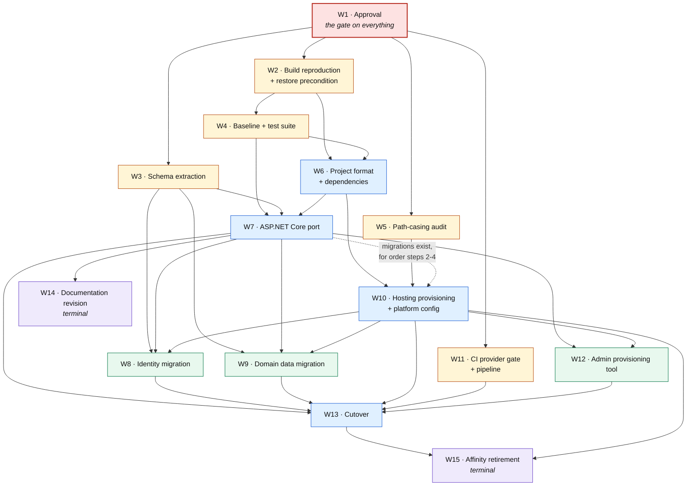

# 03 — Modernization Roadmap

**Deliverable 03 of thirteen.** Answers the user's requirement *"Modernization roadmap"*.

---

## 1. Purpose, ownership and authoring contract

### 1.1 What this document is

This document is the **sequence**. It decomposes the modernization of MvcMusicStore into named workstreams, fixes the order they must run in, and states for each one what must be true before it begins and what must be demonstrably true before it is called finished.

It is the single owner of the **workstream decomposition**. Deliverable [07](07-effort-risks-sequencing.md) estimates against the workstreams defined here, so their boundaries — not their contents — are this document's product. Deliverable [05](05-aspnet-core-migration-approach.md) §14.3 and deliverable [06](06-azure-hosting-recommendations.md) §13.4 both route "workstream decomposition and gate placement" here.

### 1.2 What this document is not

It is **not** a schedule. It carries no duration, no calendar, no ordering by elapsed time and no effort figure of any kind. Sequence and gates are a different thing from a plan of record with dates against it, and only the former is knowable before the assessment is approved. Effort belongs exclusively to deliverable [07](07-effort-risks-sequencing.md), which owns the effort model, its units, its bands, its assumptions and its confidence.

It is also **not a second opinion** on any decision another deliverable owns. A roadmap is the document where every other deliverable's conclusion is most easily re-litigated by accident — a sentence of rationale here, a weighing of options there — and the result is two documents that disagree. Section 1.5 lists every such decision with its owner. Where this document needs one, it points at it.

### 1.3 Authoring contract, and the absence of user rules

`review_rules` returns exactly **"No user rules provided."** There is no project rule to name, summarize or cite, and no rule forces any file into or out of this roadmap. Their absence is not licence to lower the bar: this document is held instead to the enterprise-standard contracts the Agent Action Plan sets out, which are the operative constraints throughout.

| Contract | Source | How this document honours it |
| --- | --- | --- |
| **Citation** | AAP 0.4.1, 0.11.3 | Every **as-is** claim carries an inline `[<path>:<locator>]` citation at the point of claim. Repository-wide counts and absences carry the **command** that reproduces them instead, because no single line evidences an absence |
| **One fact, one owner** | AAP 0.11.4 | Cross-reference, never restate. Section 1.5 is the routing table; a contradiction with an owner is a defect in this document, not in the owner |
| **No effort, no schedule** | AAP 0.1.3 | No time unit and no effort figure appears anywhere below |
| **Repository non-modification** | AAP 0.2.2, 0.11.5 | This document changes no repository file. Section 2 states the constraint and section 2.3 draws the line it depends on |

### 1.4 What this document owns

Four things, and nothing else:

1. **The workstream decomposition** — the set of workstreams, their names and their scope boundaries.
2. **Gate placement** — the entry and exit gate of each workstream, and therefore the order.
3. **The interlocking property** — the proof, in section 6, that every exit gate is some successor's entry gate or is terminal.
4. **Debt attachment** — which workstream each severity class of deliverable [08](08-technical-debt-register.md)'s register lands on, and which items land nowhere because they gate nothing.

### 1.5 What this document does not own — the routing table

Every entry below is stated in full by its owner. This document cites the owner and adds nothing.

| Fact or decision | Owner | This document's use of it |
| --- | --- | --- |
| Target framework and the SDK band | [04](04-dotnet8-migration-strategy.md) §2, §3 | Named only as "the target framework". The value and its support-window consequence are not restated |
| Project format, `PackageReference`, tooling manifests, lockfiles | [04](04-dotnet8-migration-strategy.md) §5, §6 | W6's exit gate points at them |
| Every package pin | [04](04-dotnet8-migration-strategy.md) §7–§9 | Not enumerated here |
| The future application map | [04](04-dotnet8-migration-strategy.md) §12 | W6 and W7 point at it; no file list is reproduced |
| Pipeline, DI, configuration, EF Core, views, static assets, anti-forgery, the JSON contract | [05](05-aspnet-core-migration-approach.md) §2–§9 | W7's scope points at them |
| Schema-extraction design; the two data migrations | [05](05-aspnet-core-migration-approach.md) §5 | W3, W8 and W9 point at them |
| The test suite's architecture and required coverage | [05](05-aspnet-core-migration-approach.md) §12 | W4 points at it and does not redesign it |
| The provisioning tool's five required properties | [05](05-aspnet-core-migration-approach.md) §10.2 | W12's exit gate points at them |
| **The cutover approach and its accepted losses** | [05](05-aspnet-core-migration-approach.md) §11 | W13 **sequences** it. It is not re-opened, re-compared or re-argued here |
| **Hosting target and deployment model** | [06](06-azure-hosting-recommendations.md) §2 | Named only as "the primary hosting target". Not re-argued; a reversal here would be a defect |
| The DDL principal, and the provisioning order | [06](06-azure-hosting-recommendations.md) §6.2, §6.3 | W10's exit gate points at them |
| The data-protection key ring; session over the distributed cache | [06](06-azure-hosting-recommendations.md) §7, §8.1 | W10's exit gate points at them |
| **The observability approach** | [06](06-azure-hosting-recommendations.md) §9 | The mechanism is not restated. W7 and W10 carry its placement only |
| The cutover runbook; the browser matrix | [06](06-azure-hosting-recommendations.md) §11, §10.4 | W13 points at the runbook |
| **Per-edition build outcomes** | [10](10-build-and-deployment-requirements.md) §3, §13 | W2 points at them. Neither the outcome nor its diagnosis is restated |
| Per-edition database topology | [10](10-build-and-deployment-requirements.md) §10 | W3 and W4 point at it |
| **The effort model and its bands** | [07](07-effort-risks-sequencing.md) | Cited as the destination for every question of size. No figure is stated here |
| **The risk register**, including the support-window entry | [07](07-effort-risks-sequencing.md) | Pointed at. No risk is restated, ranked or mitigated here |
| The categorized debt register | [08](08-technical-debt-register.md) §5–§11 | Section 7 attaches its severities to workstreams without restating an entry |
| The 22 blockers and their two groups | [12](12-migration-blockers.md) §3, §4 | W7's exit gate points at group two |
| Statefulness, transport and path casing as-is | [11](11-cloud-readiness-assessment.md) §3 | W5 and W15 point at them |

---

## 2. The approval gate

> ### ⛔ EVERY WORKSTREAM IN THIS DOCUMENT IS GATED ON WRITTEN APPROVAL OF THIS ASSESSMENT
>
> **No implementation work begins — not one line of code, not one repository file changed, not one Azure resource created — until the approval recorded as W1's exit gate exists.**
>
> This roadmap is a proposal to be read and approved. It is **not** an authorization to start.

### 2.1 Why the gate is stated this prominently

Because two independent inputs impose it, and because a roadmap is the document most likely to be mistaken for a green light. A reader who reaches section 5 and starts at W2 without W1 has broken the engagement's governing constraint.

### 2.2 The two directives behind it

| Source | Directive, verbatim |
| --- | --- |
| The user's prompt | *"Do not make code changes initially."* |
| The project's attached environment setup instructions (Environment 1) | *"Do not modify code until assessment and modernization plan are approved."* |

Two inputs, arrived at independently, agreeing on the same gate. The consequence recorded in AAP 0.2.2 is deliberately absolute: it extends even to the defects this assessment identifies. The plaintext administrator credential, MVC 4's broken build configuration, the partial anti-forgery coverage and the state-changing `GET` are all **documented and left in place**. Section 7 states which workstream each one is attached to, so that nothing is lost by deferring it.

### 2.3 Mutation versus specification — the line this document depends on

The prohibition is on **changing** the repository. It is not a prohibition on **planning** a change. Those are different acts, and conflating them would make the roadmap the user asked for impossible to write.

| | Forbidden now | Required now |
| --- | --- | --- |
| **Act** | Converting the project format | Naming, scoping and gating the workstream that converts it |
| **Act** | Editing a `.cs`, `.cshtml`, `.csproj`, `.config` or `.sql` file | Specifying which files change, in which workstream, behind which gate |
| **Act** | Creating an Azure resource | Sequencing the provisioning that creates it |
| **Act** | Revising a README | Recording that three of them require revision (W14) |

This document therefore **sequences the code changes a later approved phase will make, in full**. It fails in two opposite ways: by reading as authorization to begin, and by declining to sequence because the prohibition on mutating was mistaken for a prohibition on planning. Both are failures. The line above is what separates them.

**What this document creates:** one markdown file. `git status --porcelain` after this work shows exactly the new files under `docs/modernization/` and nothing else (AAP 0.11.5).

---

## 3. How to read a workstream

Every workstream below carries the same six fields. The two gates are the load-bearing ones.

| Field | What it means |
| --- | --- |
| **Scope** | What is inside this workstream, and — where confusion is likely — what is deliberately outside it |
| **Entry gate** | What must be **true** before work begins. Not "what happens first" — a condition, checkable by someone who was not involved |
| **Exit gate** | What must be **demonstrably true** before the workstream is called finished. Demonstrable is the operative word: a claim someone can refute |
| **Depends on** | The workstreams whose exit gates this one's entry gate consumes |
| **Feeds** | The workstreams that consume this one's exit gate — or **terminal**, meaning nothing downstream waits on it |
| **Owner role** | The role accountable for the exit gate being met. A role, not a person |

**The acceptance test for this document** (AAP 0.11.2, row 03) is that **every exit gate is some successor's entry gate, or is explicitly terminal.** A workstream whose exit nobody consumes and which is not terminal is either mis-scoped or unnecessary. Section 6 walks the graph and proves the property holds.

---

## 4. The shape of the sequence

### 4.1 Three workstreams precede the port, each for a different reason

This is the most consequential structural property of the roadmap, and the three reasons are genuinely independent — which is why collapsing them into a single "preparation" workstream would lose information.

| Before the port | Because |
| --- | --- |
| **W2** — build reproduction and the restore precondition | The sole migration source **cannot build from a clean checkout**. Deliverable [10](10-build-and-deployment-requirements.md) §13.3 routes that residual precondition here as this roadmap's first workstream gate. You cannot plan a port against a source you cannot reliably produce a build of |
| **W3** — authoritative schema extraction | The authoritative schema exists **only inside a committed binary**. An initial migration generated from the ported model creates empty tables and may silently differ from the real schema, and there is no shipped script to compare against — deliverable [12](12-migration-blockers.md) §5 and F-12-22 own that finding |
| **W4** — behavioural baseline and test suite | There is **no test of any kind** in the repository, so nothing today would detect a behaviour change — and deliverable [12](12-migration-blockers.md) §4's group-two blockers fail *silently*, meaning the application keeps returning HTTP 200 while the behaviour is wrong |

```bash
git ls-files | grep -i test | wc -l
# -> 0    no test project, no test file, no test-framework reference, repository-wide
```

Get those three ordered correctly and the remainder of the sequence follows from ordinary dependency: format before port, port before data, data before cutover.

### 4.2 The dependency graph



The graph is **acyclic**, and the one dashed edge is the only partial dependency in it: W10 can begin on W5 and W6 alone, but the steps of the provisioning order that apply migrations cannot run until W7 has produced them. Section 6 walks every edge.

---

## 5. The workstreams

### W1 — Approval of this assessment

**Scope.** Review and formal approval of all thirteen deliverables in `docs/modernization/`, and a recorded decision to authorize implementation. The approver also accepts, or rejects, each item on the approved-delta list that deliverable [05](05-aspnet-core-migration-approach.md) §11.5 carries — those are user-visible changes with named approval owners, and an unapproved delta is an unresolved scope question rather than an implementation detail.

This workstream is **not** a technical activity. It is the decision point the whole engagement is built around.

**Entry gate.** All thirteen deliverables complete and internally consistent, with the requirement-to-deliverable map in [README](README.md) resolving all fourteen of the user's requirements.

**Exit gate.** A **documented approval to begin implementation**, identifying the approver, and recording a decision on each approved delta of [05](05-aspnet-core-migration-approach.md) §11.5 and on each risk deliverable [07](07-effort-risks-sequencing.md) escalates for an approval decision rather than a mitigation. Where an approval owner named in a delta withholds consent, the affected workstream's scope changes and this roadmap is revised before that workstream begins.

**Depends on.** Nothing. It is the root.

**Feeds.** W2, W3, W5, W11 directly — and therefore, transitively, everything.

**Owner role.** Engineering leadership, with the security, product, data and operations owners named across [05](05-aspnet-core-migration-approach.md) §11.5 as co-approvers of the deltas that fall to them.

> **No code changes before this gate.** Both directives in section 2.2 require it.

---

### W2 — MVC 5 build reproduction and the restore precondition

**Scope.** Establishing that the sole migration source can be built **reproducibly, from a clean checkout, on the build host that will carry the migration** — and recording the conditions under which it was done.

The framing here follows its owner rather than anticipating it. Deliverable [10](10-build-and-deployment-requirements.md) §3.1 records the prescribed-toolchain verification run and §13.1 records the resulting per-edition build status; §13.2 records which of its open verification items that run discharged. **This document restates neither the outcome nor the diagnosis.** What §13.3 routes here, verbatim, is "MVC 5's verified build, and its clean-checkout restore precondition → … 03 (first workstream gate)" — so the gate this workstream carries is the **precondition**, not the build result.

That precondition is a real risk to a port and not a formality: a clean checkout of the migration source commits no restored packages, so every build depends on a restore succeeding against a source the repository does not declare. Deliverable [02](02-dependency-inventory.md) §6 owns the finding that no package source is configured anywhere in the repository; the consequence for this workstream is that the effective source is a property of the build host, and must therefore be **recorded per run** rather than assumed.

**Also inside this workstream:** the residual build-side facts deliverable [10](10-build-and-deployment-requirements.md) flags that a green build does not cover — most importantly that a zero-warning build says nothing about the views, because view compilation is disabled (F-08-16), so the views carry no build-time guarantee for the port to lean on.

**Outside it.** MVC 4 and MVC 3. Neither is a migration source; both are retained read-only as historical references and as the behavioural baseline. Their build outcomes and defects belong to [10](10-build-and-deployment-requirements.md) §6 and §7, and repairing them is not in this roadmap at all.

**Entry gate.** W1 exited. A build host carrying the .NET Framework 4.8 targeting pack, Visual Studio 2022 MSBuild located through `vswhere` rather than `PATH`, and a **declared** NuGet source.

**Exit gate.** A **recorded build result** for the migration source from a clean checkout, carrying: the tool versions used, the restore source actually resolved, the configurations built, the warning and error counts, and the test result — which is vacuous until W4 exists, and is recorded as such rather than omitted. Plus a **decision on any defect the run reveals**, and confirmation that the restore is reproducible rather than incidental.

**Depends on.** W1.

**Feeds.** W4 (a runnable legacy baseline), W6 (a build to convert).

**Owner role.** Build and release engineering.

---

### W3 — Authoritative schema extraction

**Scope.** Producing an authoritative, queried definition of **both** shipped stores — the catalog database and the Identity database — by interrogating the live catalog of an attached database, and mapping every object to the intended EF Core model.

**Why this gates all three data workstreams.** An EF Core initial migration creates empty tables and moves no rows, and it cannot be trusted to match the database already in production: a migration generated from the ported model may differ from the real schema in column types, precision and length, nullability, identity and key definitions, delete rules, defaults and indexes. There is nothing in the repository to compare it against — deliverable [12](12-migration-blockers.md) §5 and F-12-22 own the finding that the migration source **ships no schema script at all**, and that MVC 4's two copies are byte-identical to each other and neither is runnable as written. Deliverable [05](05-aspnet-core-migration-approach.md) §5.1 owns the extraction design.

**The evidence limit that makes this a workstream rather than a checkbox.** Deliverable [12](12-migration-blockers.md) §5 records the Identity store's shape from a string probe of the binary and is explicit that the result is *evidence, not proof* — a probe cannot distinguish an absent column from one it fails to surface. That is precisely why the extraction must **query the catalog** rather than infer from a probe, and why its exit gate is worded as it is.

**Entry gate.** W1 exited. Read access to the committed catalog and Identity databases under `src/MVC5/MvcMusicStore/App_Data/`, attached to a supported engine, on a host that does not write to the tracked files.

```bash
git ls-files 'src/MVC5/MvcMusicStore/App_Data/*'
# -> MvcMusicStore.mdf                              catalog store
#    MvcMusicStore_log.ldf
#    aspnet-MvcMusicStore-20131025034205.mdf        credential store
#    aspnet-MvcMusicStore-20131025034205_log.ldf
```

**Exit gate.** An authoritative schema definition for **both** stores, **obtained by querying the catalog rather than inferred**, covering tables, columns with types, precision, length and nullability, keys, identity columns, indexes, defaults and delete rules — with every object mapped to the intended EF Core model, and every unmapped object either explained or scheduled for removal. The Identity store's column set is settled as fact, replacing the qualified evidence of [12](12-migration-blockers.md) §5.

**Depends on.** W1.

**Feeds.** W7, W8 and W9 — all three.

**Owner role.** Data engineering.

---

### W4 — Pre-port behavioural baseline and test suite

**Scope.** Authoring the cross-baseline test suite whose architecture deliverable [05](05-aspnet-core-migration-approach.md) §12 owns, getting it green against the legacy application, and capturing the manual visual baseline.

**Why it precedes the port.** Because there is nothing to regress against. The repository contains no test of any kind — the command is in section 4.1 and returns `0` — which deliverable [08](08-technical-debt-register.md) records as F-08-15 at **Critical** severity, and §12.3 hands to deliverable [07](07-effort-risks-sequencing.md) as "the risk that determines whether any behaviour-preservation claim can be substantiated at all". The compounding factor is the failure mode: deliverable [12](12-migration-blockers.md) §4's group-two blockers do not throw. The request succeeds, the page renders, and a field reads `undefined` or a navigation renders empty. A port validated by clicking through the application will pass while being wrong.

**The suite is cited, not designed here.** Deliverable [05](05-aspnet-core-migration-approach.md) §12.2 owns the HTTP-level black-box architecture, §12.3 the three problems that must be handled explicitly, and §12.4 the required coverage. This workstream's job is to *build what §12 specifies* and to prove it runs against the legacy application before the port begins.

**Entry gate.** W1 exited. W2 exited, because a baseline that cannot be built cannot be characterized.

**Exit gate.** All five of the following, demonstrably:

1. An **HTTP-level suite green against the legacy baseline**, covering every surface deliverable [05](05-aspnet-core-migration-approach.md) §12.4 requires.
2. The **two-database legacy reset** working — restoring *both* committed store pairs and reattaching them before each run, per the topology deliverable [10](10-build-and-deployment-requirements.md) §10 records. One database is not enough; the credential store is separate.
3. The **disposable target-side fixture** provisioning and tearing down a real engine, because migrations and the SQL-backed session cache both require one.
4. **Semantic assertions with volatile values normalized out** — anti-forgery tokens, session identifiers, authentication cookies and timestamps vary per request, so byte comparison of response bodies is not available.
5. The **approved deltas of [05](05-aspnet-core-migration-approach.md) §11.5 enumerated in the suite as expected differences**, so a deliberate change reads as approved rather than as a failure.

Plus the **manual visual baseline capture**, which is part of this workstream because it must happen *before* the port and cannot happen after: screenshots of every distinct page taken from the legacy application at the two viewports the layout distinguishes, together with the reviewer checklist. Deliverable [05](05-aspnet-core-migration-approach.md) §12.5 scopes it and states why it is manual rather than automated; deliverable [07](07-effort-risks-sequencing.md) carries the review itself as a task. Without this capture there is no baseline for the markup work in W7 to be judged against.

**Depends on.** W1, W2.

**Feeds.** W6 (the suite must run on the converted project) and W7 (the port is judged against it).

**Owner role.** Quality engineering, with the port team.

---

### W5 — Repository-wide path-casing audit

**Scope.** Identifying every filesystem path referenced with casing that does not match the tracked file, across bundle registrations, `@Url.Content` calls, view paths and any other path literal — and specifying the correction for each.

**Why it is a separate workstream ordered before hosting.** Deliverable [06](06-azure-hosting-recommendations.md) §3.4 makes this a **precondition** for the primary hosting target, not a caveat on it, and §13.4 hands it to this document as a gate. The reason is the failure mode: the target platform's filesystem is case-sensitive and the one the application is served from today is not. The application starts, the page returns HTTP 200, and the stylesheet 404s — the site renders unstyled, nothing throws, and nothing is logged, because today there is no logging at all (F-08-13). A defect with no signal is one that has to be eliminated before deployment rather than found after it.

At least one mismatch is demonstrated in the repository, and it is instructive because the same registration block is right about one path and wrong about the next:

```bash
grep -n 'Content/' src/MVC5/MvcMusicStore/App_Start/BundleConfig.cs
# -> 27:                      "~/Content/bootstrap.css",     matches its file exactly
#    28:                      "~/Content/site.css"));        lowercase s
git ls-files 'src/MVC5/MvcMusicStore/Content/*'
# -> src/MVC5/MvcMusicStore/Content/Site.css                 capital S
#    src/MVC5/MvcMusicStore/Content/bootstrap.css
#    src/MVC5/MvcMusicStore/Content/bootstrap.min.css
```

The style bundle registers `"~/Content/site.css"` with a lowercase `s` [src/MVC5/MvcMusicStore/App_Start/BundleConfig.cs:28], while the tracked file is `Content/Site.css` with a capital `S`; the sibling reference on the line above [src/MVC5/MvcMusicStore/App_Start/BundleConfig.cs:27] matches its file exactly. Deliverable [12](12-migration-blockers.md) F-12-17 and deliverable [06](06-azure-hosting-recommendations.md) §3.4 own the finding; deliverable [11](11-cloud-readiness-assessment.md) §3 carries it as a cloud-readiness item.

**The audit is wider than the demonstrated case.** One proven mismatch is a reason to audit, not the audit's conclusion. The bundle registrations disappear entirely under the no-bundler decision deliverable [05](05-aspnet-core-migration-approach.md) §8.1 owns, but the *paths* they name survive into static-asset references, so the audit's output is consumed by W7's asset relocation as well as by W10.

**Entry gate.** W1 exited.

**Exit gate.** Every path-casing mismatch in the repository identified and its correction specified, with the audit made **repeatable as a pre-deployment check** rather than performed once — because the exit criterion deliverable [06](06-azure-hosting-recommendations.md) §13.4 states for this gate is *a case-sensitive serve with no static-asset or view 404*, and that is a property to be re-established on every deployment, not a one-time finding.

**Depends on.** W1.

**Feeds.** W10 — the hosting precondition of [06](06-azure-hosting-recommendations.md) §3.4. The corrections this audit specifies are *applied* inside W7's static-asset work, but W7 does not gate on them, so the audit's only gate edge is to W10.

**Owner role.** Engineering.

---

### W6 — Project-format conversion and dependency transition

**Scope.** Moving the migration source onto the target project format and the target framework, with the dependency graph transitioned and pinned. Deliverable [04](04-dotnet8-migration-strategy.md) owns every decision inside it: the target framework and SDK band (§2, §3), the project-format transition (§5), the net-new tooling manifests (§6), and the per-package outcomes (§7–§9). None is restated here.

**What this workstream is for, as distinct from W7.** It changes *how the application is built and what it references* — not what it does. Separating it from the port is what makes the port's failures interpretable: if the format conversion and the framework move are already green, a failure in W7 is a behaviour failure rather than a toolchain one. This ordering also means the suite from W4 runs on the new build before any application code is rewritten.

**Entry gate.** W1 exited. W2 exited, so there is a reproducible build to convert. W4 exited, so there is a suite to re-run against the converted build.

**Exit gate.** The application **builds** and the **W4 suite runs** on the target framework, with all of: the SDK-style project in place; every dependency expressed as a package reference per [04](04-dotnet8-migration-strategy.md) §8; the committed package-source configuration that ends the inherited-source ambiguity deliverable [02](02-dependency-inventory.md) §6 records; the tool manifest of [04](04-dotnet8-migration-strategy.md) §6; and **per-project lockfiles with restore running in locked mode**, so a transitive change fails the build instead of arriving unannounced. That closes F-08-18's lockfile half on the target side.

"The suite runs" is deliberately weaker than "the suite is green". Some of its assertions describe behaviour that only W7 delivers. What must be true here is that the suite **executes** on the converted project and that its legacy-baseline assertions still pass.

**Depends on.** W1, W2, W4.

**Feeds.** W7 (the port needs the format) and W10 (the platform needs a publishable artifact).

**Owner role.** Build and release engineering, with the port team.

---

### W7 — The ASP.NET Core port

**Scope.** Rewriting the application onto ASP.NET Core. Deliverable [05](05-aspnet-core-migration-approach.md) owns every decision inside it, and this roadmap reproduces none of them: the composition root (§2), configuration (§3), dependency injection and object lifetimes (§4), authentication policy (§6), anti-forgery (§7), views, static assets and the wire contracts (§8), the child-action-to-view-component conversions (§8.2), the checkout input model (§8.8) and the JSON contract (§8.7). The file-by-file target map is [04](04-dotnet8-migration-strategy.md) §12.

This is the largest workstream in the roadmap. Its size is a question for deliverable [07](07-effort-risks-sequencing.md), which owns the effort model and the decomposition it estimates against; this document states no size, and deliberately does not subdivide the port into sub-workstreams, because a subdivision that does not match [07](07-effort-risks-sequencing.md)'s estimation basis would put every derived figure out.

**Also inside this workstream:** the application-side half of the observability capability. Deliverable [08](08-technical-debt-register.md) §13 routes F-08-13 — no logging, tracing, metrics or health endpoint, at **Critical** severity — to "03 (workstreams and gates)" for placement and to [06](06-azure-hosting-recommendations.md) for the approach. The placement is split: the instrumentation in application code lands here, and the collection path, the sink and the health endpoint land in W10. The approach itself is [06](06-azure-hosting-recommendations.md) §9's and is not restated.

**Entry gate.** Three exits, all of them:

| Prerequisite | Why the port cannot begin without it |
| --- | --- |
| **W3** exited | The entity model must be mapped against the real schema, not against an inferred one |
| **W4** exited | Nothing else can detect a silent behaviour change |
| **W6** exited | The project must build on the target framework before its contents are rewritten |

**Exit gate.** The **W4 suite green against the ported application**, with the approved deltas of [05](05-aspnet-core-migration-approach.md) §11.5 accounted for as expected differences rather than failures — and, specifically, **every group-two blocker's resolution demonstrated rather than assumed**. That last clause is the substance of this gate. Deliverable [12](12-migration-blockers.md) §4 lists the constructs whose successor exists and whose default differs; deliverable [05](05-aspnet-core-migration-approach.md) §13.2 carries a resolution for each. Because their failure mode is silence, "demonstrated" means an assertion that fails if the resolution is absent — not a code review, and not an inspection.

Also required at this gate: the manual visual review against the baseline W4 captured, per [05](05-aspnet-core-migration-approach.md) §12.5, with the accepted deltas recorded and signed off.

**Depends on.** W3, W4, W6.

**Feeds.** W8, W9, W10 (the migrations the provisioning order applies), W12, W13, W14.

**Owner role.** The port team, with security for the anti-forgery and authentication policy items.

---

### W8 — Identity schema and data migration

**Scope.** Creating the target Identity schema and migrating the accounts, roles and assignments into it. Deliverable [05](05-aspnet-core-migration-approach.md) §5.5 owns the design — the decision to create the tables fresh and populate them rather than alter the shipped tables in place, the normalization collision problem, the fields with no source value, the password-hash question and the reconciliation and rollback approach.

**Why it is separate from W9.** Two stores, two failure modes, two reconciliation methods. A domain-data mismatch is a data-integrity problem; an Identity mismatch locks users out. Sequencing them separately means one can be rolled back without the other.

**Entry gate.** W3 exited, so the source schema is fact rather than inference — which matters most here, since the qualified evidence in deliverable [12](12-migration-blockers.md) §5 concerns exactly this store. W7 exited, so the target Identity tables exist. W10's provisioning order through step 4 completed, because deliverable [06](06-azure-hosting-recommendations.md) §6.3 fixes that the Identity data migration cannot precede the key table — a signed-in verification of a migrated account needs the key ring in place to issue and read a cookie.

**Exit gate.** **Reconciliation passing**, meaning all of:

1. Account, role and assignment **counts compared before and after**, and equal.
2. The **administrator's role membership specifically asserted**, rather than inferred from a count.
3. A **successful sign-in by a pre-existing account** — the acceptance test for the password-hash question, and the only evidence that settles it.
4. **Source tables retained until reconciliation passes**, so the rollback position is real and not notional.

**Depends on.** W3, W7, W10.

**Feeds.** W13.

**Owner role.** Data engineering, with security.

---

### W9 — Domain data migration

**Scope.** Moving the catalog, cart, order and order-detail data into the target schema. Deliverable [05](05-aspnet-core-migration-approach.md) §5.1 owns the design, including the load order, the reconciliation method and the rollback position. Deliverable [05](05-aspnet-core-migration-approach.md) §5.2 owns the distinct point that the seed is not the data migration.

**Entry gate — the hard gate in this roadmap.**

> **The generated-schema diff must have PASSED before any data is loaded.**
>
> The diff compares the schema an initial migration generates from the ported model against the authoritative schema W3 extracted. It therefore requires W3 exited *and* W7's migrations to exist. **No row is loaded until it passes.** A diff that has not been run, or has been run and not reconciled, is the same condition as a failed diff.

The reason this is stated as a hard gate rather than a step is the consequence of getting it wrong: data loaded into a schema that differs from the source in precision, nullability or a delete rule is not detectably wrong at load time. It is detectably wrong later, in production, in a report.

Also required at entry: W10's provisioning order through step 4 completed, because deliverable [06](06-azure-hosting-recommendations.md) §6.3 step 5 fixes that the data load cannot precede the schema.

**Exit gate.** Four things, demonstrably:

1. **Row counts per table reconciled** against the source.
2. **Financial totals per order reconciled** against the source — because an order total is computed, and a computation that survives a migration numerically is the only proof that the migration preserved it.
3. The **load order honoured**, and the handling of **rows written between extraction and cutover defined** — not left as an operational surprise.
4. The **rollback position stated** and available.

**This workstream also closes the roadmap's only Critical data item.** Deliverable [08](08-technical-debt-register.md) F-08-10 — the destructive schema lifecycle that will drop and recreate a database holding orders and PII if the model does not match — is retired here, because the target applies explicit migrations at deployment time instead. Deliverable [05](05-aspnet-core-migration-approach.md) §5.3 owns the replacement; deliverable [06](06-azure-hosting-recommendations.md) §6.2 owns who runs it.

**Depends on.** W3, W7, W10.

**Feeds.** W13.

**Owner role.** Data engineering, with the data owner as approver.

---

### W10 — Hosting provisioning and platform configuration

**Scope.** Standing up the target environment and configuring it. Deliverable [06](06-azure-hosting-recommendations.md) owns **every** decision inside this workstream — the hosting target and deployment model (§2), the data platform and identity (§6), the key ring (§7), session and secrets (§8), observability (§9) and transport (§10). This document neither names the alternatives nor re-argues the selection; a reversal between the two documents would be a defect in this one.

**A staged entry, and the roadmap's only partial dependency.** Provisioning the environment — the plan, the database, managed identity, transport, configuration — needs W5 and W6 only. The steps of the provisioning order that **apply migrations** additionally need W7, because those migrations are W7's output. That is the dashed edge in section 4.2, and it is the reason this workstream both feeds and follows parts of the port.

**Entry gate.** W5 exited, because deliverable [06](06-azure-hosting-recommendations.md) §3.4 makes the casing audit a precondition for the primary target rather than a caveat on it. W6 exited, because there must be a publishable artifact. W7's migrations available before the provisioning order reaches the steps that apply them.

**Exit gate.** The environment provisioned and configured, with all of:

| # | Condition | Owner of the decision |
| --- | --- | --- |
| 1 | **Managed identity** authenticating the data plane, with no stored credential | [06](06-azure-hosting-recommendations.md) §6.1 |
| 2 | **HTTPS enforced and HSTS** enabled | [06](06-azure-hosting-recommendations.md) §10.1 |
| 3 | The **health endpoint responding** | [06](06-azure-hosting-recommendations.md) §9.3 |
| 4 | The **data-protection key ring persisted**, and slot or revision isolation verified so a non-production slot cannot decrypt production cookies | [06](06-azure-hosting-recommendations.md) §7 |
| 5 | **Session over the distributed cache**, with the cross-instance round-trip passing | [06](06-azure-hosting-recommendations.md) §6.4, §8.1 |
| 6 | The **provisioning order of §6.3 executed in sequence — four schema owners, then the data load — under the deployment principal** | [06](06-azure-hosting-recommendations.md) §6.2, §6.3 |
| 7 | The **collection path and sink** for the application's telemetry in place | [06](06-azure-hosting-recommendations.md) §9 |

And two prohibitions that are part of the gate rather than commentary on it, both owned by deliverable [06](06-azure-hosting-recommendations.md) §6.2:

> **No migration is applied at application startup, and none under the runtime identity.** The runtime identity holds least-privileged data access only; DDL runs from the release path under a deployment principal. A provisioning run that satisfies conditions 1–7 but applies a migration from the application at startup **fails this gate.**

**Depends on.** W5, W6, and W7 for the migration-applying steps.

**Feeds.** W8, W9, W12, W13, W15.

**Owner role.** Platform and operations engineering.

---

### W11 — CI provider selection, then pipeline authoring

**This workstream is a gate, and the gate is the point.**

**Scope.** Selecting the continuous-integration provider, recording the selection, and only then authoring the pipeline manifest.

**Why selection is a gate rather than a task.** The pipeline definition's **path and format are determined by the provider**. No manifest can be written before the provider is chosen, and **this assessment does not choose one** — AAP 0.3.1 and 0.4.1 make provider selection an explicit roadmap gate, and deliverables [04](04-dotnet8-migration-strategy.md) and [06](06-azure-hosting-recommendations.md) §12.1 both defer to it. This document honours that deferral: **no provider is selected here, and none is recommended.**

**What the repository has today: nothing.** There is no pipeline definition, no publish profile and no container manifest, so this workstream is net-new authoring rather than a migration of anything existing.

```bash
git ls-files | grep -E '^\.github/|azure-pipelines|\.gitlab-ci|Jenkinsfile' | wc -l   # -> 0
git ls-files | grep -E '\.pubxml|PublishProfiles/'                          | wc -l   # -> 0
git ls-files | grep -Ei 'dockerfile|docker-compose'                         | wc -l   # -> 0
```

The absence is not accidental in one respect worth noting: the root ignore file excludes publish profiles outright [.gitignore:18], so none would be tracked even if one existed locally. Deliverable [08](08-technical-debt-register.md) F-08-14 records the whole absence — no CI, no deployment automation, no publish artifact — at **High** severity, and §12.3 notes that this makes the operational work net-new capability with no legacy volume to scale an estimate from, which is a point for deliverable [07](07-effort-risks-sequencing.md).

**Entry gate.** W1 exited.

**Exit gate.** Two parts, strictly in order:

1. **A provider selected and recorded**, with the decision and its rationale written down.
2. **Then** the manifest authored, covering build, test, publish and **the deployment-time migration step** that deliverable [06](06-azure-hosting-recommendations.md) §6.2 requires be run from the release path rather than by the application — and honouring §12.5's constraints on what the pipeline must not do.

**Depends on.** W1.

**Feeds.** W13. Cutover requires a repeatable deployment path and the deployment-time migration step, both of which are this workstream's output.

**Owner role.** Operations and platform engineering, with engineering leadership approving the provider.

---

### W12 — Administrator provisioning tool

**Scope.** Building the operator command that replaces provisioning the administrator from application startup. Deliverable [05](05-aspnet-core-migration-approach.md) §10.2 owns the design and its **five required properties**; §10.3 owns what it retires.

**What this closes.** Deliverable [08](08-technical-debt-register.md) F-08-07 — a plaintext administrator credential, consumed at startup, present in two editions — at **High** severity, with deliverable [09](09-security-assessment.md) owning the security analysis. The credential is not merely moved: deliverable [06](06-azure-hosting-recommendations.md) §8.5 records that it leaves source entirely.

**Entry gate.** W7 exited, so there is an application whose container the command can resolve the Identity services from. W10 exited, so there is a configured environment and a secret-delivery path to supply the credential through.

**Exit gate.** The operator command working, with all five properties of [05](05-aspnet-core-migration-approach.md) §10.2 demonstrated — and specifically:

1. **Per-operation idempotence** — user, role and membership each checked and created independently, so a prior partial run is repaired rather than skipped.
2. **The secret arriving off the command line**, because an argument is visible in process listings and recorded in shell and pipeline history.
3. **An audit record with no secret in it** — actor, timestamp, target, role and outcome, written to the configured sink.
4. **The credential removed from configuration entirely**, verified by its absence rather than asserted.
5. The command **not deployed with the web application**.

**Depends on.** W7, W10.

**Feeds.** W13.

**Owner role.** Security engineering, with operations.

---

### W13 — Cutover

**Scope.** Executing the cutover. This roadmap **sequences** it and nothing more.

> **The cutover approach is decided, and it is decided elsewhere.** Deliverable [05](05-aspnet-core-migration-approach.md) §11.1 owns the decision, §11.4 the two costs accepted with it, and §11.6 the conditional alternative and the operational conditions under which it would apply. Deliverable [06](06-azure-hosting-recommendations.md) §11 owns the runbook.
>
> **It is not re-opened here.** No comparison of approaches appears in this document, and none should be read into this workstream's position in the sequence. A reader looking for the decision or its rationale goes to [05](05-aspnet-core-migration-approach.md) §11; a reader looking for the procedure goes to [06](06-azure-hosting-recommendations.md) §11.

**What sequencing it means concretely.** The cutover is the workstream with the most entry conditions in the roadmap, and every one of them is a prerequisite rather than a preference. The two accepted costs deliverable [05](05-aspnet-core-migration-approach.md) §11.4 records have operational handling in the runbook, and that handling is what makes several of the entries below necessary.

**Entry gate.** Six exits, all of them:

| Prerequisite | Why cutover cannot proceed without it |
| --- | --- |
| **W7** exited | There must be a ported application, proven against the baseline |
| **W8** exited | Accounts must exist and a pre-existing account must be able to sign in |
| **W9** exited | The domain data must be present and reconciled |
| **W10** exited | The environment must be provisioned, configured and observable |
| **W11** exited | There must be a repeatable deployment path and the deployment-time migration step |
| **W12** exited | The administrator must be provisionable without a credential in configuration |

**Exit gate.** Four conditions, demonstrably:

1. **Traffic serving from the ported application.**
2. **Health checks green**, per [06](06-azure-hosting-recommendations.md) §9.3.
3. **Orphaned anonymous-cart rows reported** — the operational consequence of one of the two accepted costs, handled by reporting rather than prevented, per [06](06-azure-hosting-recommendations.md) §11.4.
4. The **rollback position verified as still available** — verified, not assumed, because a rollback plan that has not been checked after the window is a claim rather than a position.

**Depends on.** W7, W8, W9, W10, W11, W12.

**Feeds.** W15.

**Owner role.** Operations, with engineering leadership and product as approvers of the window.

---

### W14 — Documentation revision

**Scope.** Revising the three repository READMEs that document the workflow the target replaces.

**This is the one thing in the roadmap that only this document records.** All three READMEs describe a Visual Studio and LocalDB developer workflow, and none of it survives the port:

| File | What it documents today |
| --- | --- |
| `README.md` | Introduces the application as a tutorial in using "ASP.NET MVC and Visual Studio for web development" [README.md:9] — while itself recommending modern .NET for new applications [README.md:3] |
| `src/MVC5/README.md` | Visual Studio 2022 and SQL Server LocalDB as prerequisites [src/MVC5/README.md:7-8]; the build-and-run workflow as opening the solution, building in the IDE and pressing F5 [src/MVC5/README.md:22-24]; a LocalDB server name and Windows Authentication for connecting [src/MVC5/README.md:45-46] |
| `src/MVC4/README.md` | The same prerequisites [src/MVC4/README.md:7-8], the same IDE workflow [src/MVC4/README.md:22-24] and the same LocalDB server name [src/MVC4/README.md:45] |

Every one of those instructions is superseded: the toolchain by [04](04-dotnet8-migration-strategy.md), the local run and the data platform by [06](06-azure-hosting-recommendations.md), and the file-attached LocalDB topology deliverable [10](10-build-and-deployment-requirements.md) §10 records by the target's single managed database.

> **This assessment does not revise them.** Recording that the revision is required *is* the deliverable, under AAP 0.4.2 and 0.5.3. The revision itself is a repository modification and therefore falls behind W1's approval gate exactly like any other. AAP 0.2.2 leaves all three files untouched, and section 2.3 is why: naming the change is required, making it is forbidden.

**A scoping note that keeps this workstream honest.** The two per-edition READMEs document editions that are **retained read-only** as historical references. Their revision is therefore a matter of *labelling them as historical* and correcting the claim that they describe a supported workflow — not of rewriting them to describe the target, which they do not implement.

**Entry gate.** W7 exited, because documentation of the target workflow cannot be accurate before the target exists.

**Exit gate.** All three files revised to describe the target workflow, with the two legacy editions' READMEs marked as historical rather than current, and no instruction remaining that names a superseded prerequisite or data platform as required.

**Depends on.** W7.

**Feeds.** **Terminal.** No workstream consumes this exit. It is documentation of an implementation that is already complete, and nothing waits on it.

**Owner role.** Engineering, with technical writing.

---

### W15 — Affinity retirement

**Scope.** Disabling client affinity on the platform after the controls that make it unnecessary are live and verified.

**Why this workstream exists at all.** It is handed to this document explicitly. Deliverable [06](06-azure-hosting-recommendations.md) §8.3 states "Deliverable 03 sequences the retirement", and §13.4 lists it as the second of two gates given to this roadmap. Deliverable [11](11-cloud-readiness-assessment.md) §5 records it as a control. Deliverable [06](06-azure-hosting-recommendations.md) §8.3 owns the setting, its two states and the gate; nothing about the decision is restated here.

**Why it is not part of W10 and not part of W13.** Two reasons, both structural. It cannot be inside W10 because it must follow the verification that distributed session and the shared key ring are working in production, which W10's exit establishes but does not exercise under real traffic. And deliverable [06](06-azure-hosting-recommendations.md) §8.3 is explicit that the retirement is **never in the cutover window** — so it cannot be inside W13 either. A separate workstream after W13 is the only placement consistent with both constraints.

**Entry gate.** W13 exited, so the ported application is serving traffic. W10 exited, so distributed session and the persisted key ring are live. The **cross-instance session round-trip** of [06](06-azure-hosting-recommendations.md) §6.4 passing with affinity already off in a non-production environment — the gate is a verification, not an elapsed interval.

**Exit gate.** Affinity disabled in production, with the cross-instance session round-trip passing against the production configuration, and the reversal path confirmed — the change is a single platform setting and reversible in one action, which is what makes it safe to attempt.

**Depends on.** W10, W13.

**Feeds.** **Terminal.** It is the last control to close, and nothing depends on it.

**Owner role.** Platform and operations engineering.

---

## 6. Gate interlocking — walking the graph

This section is the acceptance test AAP 0.11.2 row 03 sets for this document: **every exit gate must be some successor's entry gate, or must be explicitly terminal.** The table below walks all fifteen. It is a proof obligation, not a summary — a row with an empty "consumed by" column and no terminal marking would mean the workstream is mis-scoped or unnecessary.

| Workstream | Its exit gate is consumed by | Verdict |
| --- | --- | --- |
| **W1** Approval | W2, W3, W5, W11 — as entry; and transitively every other workstream | ✅ consumed |
| **W2** Build reproduction | W4 (a runnable baseline), W6 (a build to convert) | ✅ consumed |
| **W3** Schema extraction | W7 (model mapping), W8 (Identity source schema), W9 (the diff baseline) | ✅ consumed |
| **W4** Baseline + suite | W6 (the suite must execute on the converted project), W7 (the port is judged against it) | ✅ consumed |
| **W5** Casing audit | W10 — the hosting precondition of [06](06-azure-hosting-recommendations.md) §3.4 | ✅ consumed |
| **W6** Project format | W7 (the port needs the format), W10 (the platform needs a publishable artifact) | ✅ consumed |
| **W7** The port | W8, W9, W10 (migration-applying steps), W12, W13, W14 | ✅ consumed |
| **W8** Identity migration | W13 | ✅ consumed |
| **W9** Domain data migration | W13 | ✅ consumed |
| **W10** Hosting provisioning | W8, W9, W12, W13, W15 | ✅ consumed |
| **W11** CI gate + pipeline | W13 (the repeatable deployment path and the deployment-time migration step) | ✅ consumed |
| **W12** Admin provisioning tool | W13 | ✅ consumed |
| **W13** Cutover | W15 | ✅ consumed |
| **W14** Documentation revision | — | ✅ **terminal**, declared |
| **W15** Affinity retirement | — | ✅ **terminal**, declared |

**The property holds: thirteen exit gates are consumed as entry gates, and the two that are not are explicitly terminal.**

Four further checks on the graph, each of which could have failed:

- **Acyclicity.** Every edge in section 4.2 runs from a lower-numbered workstream to a higher-numbered one **except two: W10 → W8 and W10 → W9.** Those two are backward in numbering only, and neither closes a cycle, because nothing on the path out of W8 or W9 returns to W10 — both feed only W13, and W13 feeds only W15. W10's own dependencies are W5, W6 and W7, none of which is reachable from W8 or W9. **Numbering is not the ordering; the edges are**, and a topological order exists: W1, W2, W3, W4, W5, W6, W7, W10, W8, W9, W11, W12, W13, W14, W15.
- **No orphan entry.** Every entry gate names either W1 or a workstream that exits before it. No workstream has an entry condition nothing produces.
- **The three-before-the-port property.** W2, W3 and W4 all appear in W7's transitive entry set: W3 and W4 directly, W2 through both W4 and W6. Section 4.1 gives the three independent reasons.
- **The hard gate is genuinely blocking.** W9's entry requires the generated-schema diff to have passed, and the diff requires both W3's extraction and W7's migrations. There is no path to W9 that bypasses either.

**Consistency with the deliverable dependency graph.** AAP 0.4.2 orders the *documents*: 01 and 02 are foundations, 08/09/10/11 consume them, 12 consumes 09/10/11, the three strategies consume 12, this roadmap consumes 04/05/06, and 07 consumes this roadmap and 08. The workstream order above does not contradict it — every workstream's decisions are owned by a deliverable that AAP 0.4.2 places at or before this one, and the only deliverable downstream of this document, [07](07-effort-risks-sequencing.md), consumes the decomposition rather than supplying anything to it.

---

## 7. Where the debt register attaches

Deliverable [08](08-technical-debt-register.md) owns the categorized register — 28 findings with severity, remediation and owner, distributed 3 Critical, 8 High, 7 Medium and 10 Low (§11). **Nothing in it is restated here.** What this section adds is the one thing the register deliberately leaves to this document: **which workstream each item lands on**, and which land nowhere.

### 7.1 The three Critical items

| Finding | Attaches to | Note |
| --- | --- | --- |
| **F-08-10** — destructive schema lifecycle over orders and PII | **W9**, with the mechanism replaced in W7 and applied in W10 | Retired by explicit deployment-time migrations. The register and deliverable [12](12-migration-blockers.md) own why the current behaviour is destructive |
| **F-08-15** — no test of any kind | **W4** | This is the reason W4 exists and the reason it precedes W7 |
| **F-08-13** — no observability of any kind | **split: W7 and W10** | Application instrumentation in W7; collection path, sink and health endpoint in W10. Deliverable [08](08-technical-debt-register.md) §13 routes the placement here; [06](06-azure-hosting-recommendations.md) §9 owns the approach |

### 7.2 The High-severity items

| Finding | Attaches to |
| --- | --- |
| **F-08-06** — five unvalidated state-changing POSTs, a state-changing `GET`, and an edition validating nothing | **W7** (the policy, the verb change and the token transport are [05](05-aspnet-core-migration-approach.md) §7's) |
| **F-08-07** — plaintext administrator credential consumed at startup | **W12** |
| **F-08-14** — no CI, no deployment automation, no publish artifact | **W11** |
| **F-08-03** — uncached nested aggregate and cart read on every page | **W7** (the view-component conversion) with the caching platform in **W10** |
| **F-08-08** — bare `catch` around the order write | **W7**, and only meaningful once F-08-13's instrumentation lands with it |
| **F-08-01** — triplication across editions | **No workstream.** It is a *sizing* concern that deliverable [08](08-technical-debt-register.md) §12.3 hands to [07](07-effort-risks-sequencing.md) as a scoping risk. The edition triage means two of the three editions are never ported, so the duplication is not remediated — it is retained, read-only |
| **F-08-11** — 14 committed database binaries including three credential stores | **No workstream in this roadmap.** Remediation requires history rewriting or explicit acceptance by the repository owner, and it blocks nothing. Deliverable [09](09-security-assessment.md) owns the exposure |
| **F-08-19** — MVC 4's broken build configuration and the stale fourth solution | **No workstream.** MVC 4 is not a migration source. Deliverable [10](10-build-and-deployment-requirements.md) owns the outcomes and the host-side workarounds; the defects stay in place |

### 7.3 The Medium-severity items

These attach to the workstream that would touch them anyway, and none is independently gating: **F-08-04** (unbounded result sets), **F-08-05** (`Single` on unvalidated input and one unchecked `Find`) and **F-08-09** (hand-constructed contexts and their disposal overrides) to **W7**; **F-08-16** (view compilation disabled) to **W2** as a limit on what a green build proves and to **W7** for the guarantee the target restores; **F-08-17** (warning level set, enforcement absent) to **W11**, since enforcement needs somewhere to run; **F-08-18** (committed 2012-era restore client, no lockfile) to **W6**, whose exit gate requires lockfiles and locked-mode restore; **F-08-12** (schema scripts not runnable, none for the migration source) to **W3**, which is the workstream that exists because of it.

### 7.4 Dead scaffolding

**F-08-20**, **F-08-21** and **F-08-22** — area registration with no areas, a mapped HTTP API route with no implementation, and a scaffolded but disabled external-login surface — attach to **W7**, where they are deleted rather than ported. Deliverable [05](05-aspnet-core-migration-approach.md) §13.1 carries the disposition of the constructs and [04](04-dotnet8-migration-strategy.md) §8 the disposition of the packages that exist to support them.

### 7.5 Repository hygiene — an independent stream that gates nothing

**F-08-23 through F-08-28** — four solution files for three projects with one stale, a schema script committed twice, 215 committed restored-package files, a multi-megabyte tutorial PDF, three IDE user-state files, and the ignore rules' own two findings.

> **These gate nothing and may be deferred indefinitely.** Not one of them is an entry condition for any workstream above; deliverable [08](08-technical-debt-register.md) §13 records that none blocks the migration. They are an **independent, low-priority stream** that can be picked up at any point after W1, or never, without affecting the sequence.
>
> **AAP 0.2.2 leaves all of them in place.** No solution file is removed, no duplicate script deleted, no committed binary or package file untracked and no IDE user-state file dropped by this assessment. The root ignore file is the primary evidence that most of them are debt rather than a deliberate choice — the rules exclude `packages/*` [.gitignore:15], `App_Data/` [.gitignore:32], `*.suo` [.gitignore:8] and `*.csproj.user` [.gitignore:12], yet files matching every one of those patterns are tracked, because an ignore rule cannot untrack what was already added.

One caveat worth stating so that "defer indefinitely" is not misread: the stale fourth solution file is a **trap for a build agent**, not merely clutter. Deferring its removal is safe only because deliverable [10](10-build-and-deployment-requirements.md) §6.4 records which solution must not be built, and W11's pipeline must name the correct one explicitly rather than discovering solutions by glob.

---

## 8. Roll-up

### 8.1 The roadmap in nine statements

1. **Nothing begins until the assessment is approved.** W1 is the root of the graph and both directives in section 2.2 require it.
2. **Three workstreams precede the port, for three independent reasons** — an unproven restore precondition (W2), no trustworthy schema baseline in the repository (W3), and no test of any kind against blockers that fail silently (W4).
3. **Format before behaviour.** W6 moves the build; W7 changes what the application does. Separating them makes a W7 failure interpretable as a behaviour failure.
4. **The schema is extracted before it is generated against, and the diff is a hard gate.** No row is loaded in W9 until the generated schema is reconciled with the extracted one.
5. **The two data migrations are separate workstreams**, because a domain mismatch and an Identity mismatch fail differently and roll back differently.
6. **DDL never runs from the application and never under the runtime identity.** W10's exit gate treats that as a pass/fail condition, not a guideline.
7. **CI provider selection is a gate this assessment does not close.** W11 selects nothing; it requires a selection before a manifest exists.
8. **The cutover is sequenced, not decided here.** W13 has six entry conditions and no argument.
9. **Two workstreams are terminal** — the documentation revision and the affinity retirement — and both are declared as such rather than left dangling.

### 8.2 What this document creates: nothing

One markdown file, this one. No repository file is modified, no dependency changed, no Azure resource provisioned, no README revised, no defect repaired and no debt item remediated. Every change named above is specification for a later, separately approved phase, per the boundary in section 2.3.

### 8.3 Acceptance criteria for this deliverable

Checked against AAP 0.11.2 row 03 and the authoring contract in section 1.3.

| Criterion | Where satisfied |
| --- | --- |
| Named workstreams with entry and exit gates, in dependency order | Section 5, W1–W15 |
| Every workstream carries name, scope, entry, exit, dependencies and owner role | Section 5; the field definitions are in section 3 |
| **Every exit gate is a successor's entry gate or is terminal** | Section 6 — the graph walk, with the verdict per workstream |
| All six AAP-named workstreams present | Pre-port test suite **W4**; schema extraction **W3**; domain-data migration **W9**; Identity migration **W8**; CI provider selection **W11**; cutover **W13** |
| The order does not contradict the deliverable dependency graph | Section 6, final paragraph |
| Approval-gated, stated explicitly | Section 2, with both directives in section 2.2 |
| Cross-cutting facts cited to their owners, not restated | Section 1.5 is the routing table; every workstream cites rather than restates |
| No schedule, duration or effort figure | Section 1.2 states the constraint; the document contains no time unit and no effort figure |
| Debt severities attached to workstreams; hygiene marked as gating nothing | Section 7, with §7.5 for the hygiene items |
| The three READMEs recorded as requiring revision, and not revised | W14 |

### 8.4 Cross-reference index

| Needed | Go to |
| --- | --- |
| Target framework, SDK band, project format, package pins, tooling manifests | [04](04-dotnet8-migration-strategy.md) §2, §3, §5–§9 |
| The future application map | [04](04-dotnet8-migration-strategy.md) §12 |
| Pipeline, DI, configuration, EF Core, views, anti-forgery, the JSON contract | [05](05-aspnet-core-migration-approach.md) §2–§9 |
| Schema-extraction design; the Identity and domain data migrations; the seeding guard | [05](05-aspnet-core-migration-approach.md) §5 |
| The provisioning tool's five required properties | [05](05-aspnet-core-migration-approach.md) §10.2 |
| **The cutover decision and its accepted losses** | [05](05-aspnet-core-migration-approach.md) §11 |
| The test suite's architecture, coverage, and the manual visual review's scope | [05](05-aspnet-core-migration-approach.md) §12 |
| **Hosting target and deployment model**; the cutover runbook; the browser matrix | [06](06-azure-hosting-recommendations.md) §2, §11, §10.4 |
| The casing precondition; the DDL principal; the provisioning order | [06](06-azure-hosting-recommendations.md) §3.4, §6.2, §6.3 |
| The key ring; session over the distributed cache; the affinity gate | [06](06-azure-hosting-recommendations.md) §7, §8.1, §8.3 |
| **The observability approach** | [06](06-azure-hosting-recommendations.md) §9 |
| **Effort model, bands, and the risk register** including the support-window entry | [07](07-effort-risks-sequencing.md) |
| Debt entries, severities, owners and the counting methods | [08](08-technical-debt-register.md) §2, §5–§11 |
| Security posture, the credential, anti-forgery coverage | [09](09-security-assessment.md) |
| **Per-edition build outcomes** and database topology | [10](10-build-and-deployment-requirements.md) §3, §10, §13 |
| Statefulness, transport, path casing as cloud-readiness items | [11](11-cloud-readiness-assessment.md) §3, §5 |
| The 22 blockers, and which fail silently | [12](12-migration-blockers.md) §3, §4 |
| Architecture as-is and per-capability edition coverage | [01](01-architecture-overview.md) |
| The 63 dependency pins and the unpinned restore source | [02](02-dependency-inventory.md) |
| The requirement-to-deliverable map for all fourteen requirements | [README](README.md) |

---

## Appendix A — Reproducibility

Every command below was run against this checkout and is stated so a reader can refute it. The counts are the evidence for the absence claims in sections 4.1, 5 (W11) and 7.5; the file reads are the evidence for the citations in W5 and W14.

```bash
# --- No test of any kind, repository-wide (section 4.1, W4, F-08-15) ----------
git ls-files | grep -i test | wc -l
# -> 0

# --- No CI, no publish profile, no container manifest (W11, F-08-14) ---------
git ls-files | grep -E '^\.github/|azure-pipelines|\.gitlab-ci|Jenkinsfile' | wc -l
# -> 0
git ls-files | grep -E '\.pubxml|PublishProfiles/' | wc -l
# -> 0
git ls-files | grep -Ei 'dockerfile|docker-compose' | wc -l
# -> 0

# --- No lockfile in any edition (W6, F-08-18) -------------------------------
git ls-files | grep -c 'packages.lock.json'
# -> 0

# --- The path-casing mismatch (W5) ------------------------------------------
grep -n 'Content/' src/MVC5/MvcMusicStore/App_Start/BundleConfig.cs
# -> 27:                      "~/Content/bootstrap.css",
#    28:                      "~/Content/site.css"));
git ls-files 'src/MVC5/MvcMusicStore/Content/*'
# -> src/MVC5/MvcMusicStore/Content/Site.css          <- capital S
#    src/MVC5/MvcMusicStore/Content/bootstrap.css
#    src/MVC5/MvcMusicStore/Content/bootstrap.min.css

# --- Both stores present for W3's extraction and W4's two-database reset ----
git ls-files 'src/MVC5/MvcMusicStore/App_Data/*'
# -> MvcMusicStore.mdf / MvcMusicStore_log.ldf                       catalog
#    aspnet-MvcMusicStore-20131025034205.mdf / ..._log.ldf            credential

# --- The ignore rules cited in 7.5 and W11 ---------------------------------
sed -n '8p;12p;15p;18p;32p' .gitignore
# -> 8:  *.suo
#    12: *.csproj.user
#    15: packages/*
#    18: PublishProfiles/
#    32: App_Data/
```

**The constraint this work was held to.** This document was authored without modifying any repository file. `git status --porcelain` shows only new files under `docs/modernization/`, which is the acceptance criterion AAP 0.11.5 sets for the engagement as a whole.

---

*Deliverable 03 of thirteen · owns the workstream decomposition and gate placement · every workstream gated on approval of this assessment.*
