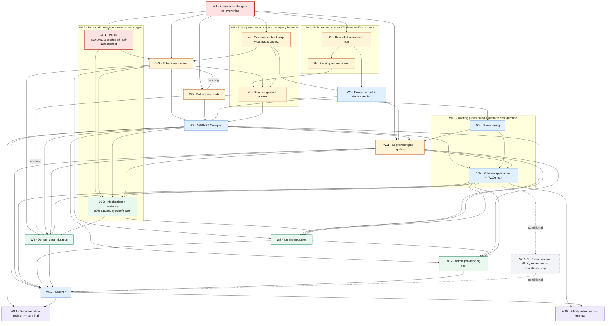

# 03 — Modernization Roadmap

**Deliverable 03 of thirteen.** Answers the user's requirement *"Modernization roadmap"*.

---

## 1. Purpose, ownership and authoring contract

### 1.1 What this document is

This document is the **sequence**. It decomposes the modernization of MvcMusicStore into named workstreams, fixes the order they must run in, and states for each one what must be true before it begins and what must be demonstrably true before it is called finished.

It is the single owner of the **workstream decomposition**. Deliverable [07](07-effort-risks-sequencing.md) estimates against the workstreams defined here, so their boundaries — not their contents — are this document's product. Deliverable [05](05-aspnet-core-migration-approach.md) §14.3 and deliverable [06](06-azure-hosting-recommendations.md) §13.4 both route "workstream decomposition and gate placement" here.

### 1.2 What this document is not

It is **not** a schedule. **Precisely: it carries no effort estimate, no duration, no calendar date and no delivery schedule for the future implementation, and it orders nothing by elapsed time.** Sequence and gates are a different thing from a plan of record with dates against it, and only the former is knowable before the assessment is approved.

The claim is stated in that narrowed form because the absolute form — "no time unit appears anywhere" — would be false, and a false absence claim is worse than a bounded one. Section 1.3's contract row and [§8.3](#83-acceptance-criteria-for-this-deliverable)'s acceptance row both state it in the same narrowed form, so all three agree; the contract row carried the absolute form until this round, which made this paragraph refute the table two sections below it. Time units do appear here, in two places, and neither is a schedule: W10's exit condition 2 reproduces the HSTS `max-age` values of [06](06-azure-hosting-recommendations.md) §10.1.2, which are **day counts in a configuration setting** (`Hsts:MaxAgeDays`), and the same condition describes that section's ramp as **three configuration changes across three releases**, which orders three releases relative to one another without dating any of them or claiming how long the ramp takes. A configuration value denominated in days is a property of the setting, and a relative release ordering is a sequence; neither is an effort figure, a duration for a workstream, or a date. **What this document never carries is a figure for how long any workstream takes or when it happens** — those belong exclusively to deliverable [07](07-effort-risks-sequencing.md), which owns the effort model, and no gate here is satisfiable by the passage of time. Effort belongs exclusively to deliverable [07](07-effort-risks-sequencing.md), which owns the effort model, its units, its bands, its assumptions and its confidence.

It is also **not a second opinion** on any decision another deliverable owns. A roadmap is the document where every other deliverable's conclusion is most easily re-litigated by accident — a sentence of rationale here, a weighing of options there — and the result is two documents that disagree. Section 1.5 lists every such decision with its owner. Where this document needs one, it points at it.

### 1.3 Authoring contract, and the absence of user rules

`review_rules` returns exactly **"No user rules provided."** There is no project rule to name, summarize or cite, and no rule forces any file into or out of this roadmap. Their absence is not licence to lower the bar: this document is held instead to the enterprise-standard contracts the Agent Action Plan sets out, which are the operative constraints throughout.

| Contract | Source | How this document honours it |
| --- | --- | --- |
| **Citation** | AAP 0.4.1, 0.11.3 | Every **as-is** claim carries an inline `[<path>:<locator>]` citation at the point of claim. Repository-wide counts and absences carry the **command** that reproduces them instead, because no single line evidences an absence |
| **One fact, one owner** | AAP 0.11.4 | Cross-reference, never restate. Section 1.5 is the routing table; a contradiction with an owner is a defect in this document, not in the owner |
| **No effort, no schedule** | AAP 0.1.3 | **No effort figure, no duration, no calendar date and no delivery schedule for the future implementation appears anywhere below, nothing is ordered by elapsed time, and no gate is satisfiable by the passage of time.** Stated in that narrowed form deliberately, and in the same form as section 1.2 and [§8.3](#83-acceptance-criteria-for-this-deliverable)'s matching acceptance row: section 1.2 names the two places a time *unit* does appear — a configuration value denominated in days, and a relative ordering of three releases — and the reason neither is an effort figure or a schedule. An absolute "no time unit appears" claim would be false, which is why this row does not make one |
| **Repository non-modification** | AAP 0.2.2, 0.11.5 | This document changes no repository file. Section 2 states the constraint and section 2.3 draws the line it depends on |

Markdown line length follows the corpus convention recorded in [`README.md` § 10 Markdown line-length convention](README.md#10-markdown-line-length-convention).

### 1.4 What this document owns

Four things, and nothing else:

1. **The workstream decomposition** — the set of workstreams, their names and their scope boundaries.
2. **Gate placement** — the entry and exit gate of each workstream, and therefore the order. This includes **which gate executes which row of the test suite**: [§4.3](#coverage-map) carries that map, because a gate that quotes a row whose runtime does not exist yet is a gate placement error rather than a testing question.
3. **The interlocking property** — the proof, in section 6, that every exit gate is some successor's entry gate or is terminal.
4. **Debt attachment** — which workstream each severity class of deliverable [08](08-technical-debt-register.md)'s register lands on, and which items land nowhere because they gate nothing.

### 1.5 What this document does not own — the routing table

Every entry below is stated in full by its owner. This document cites the owner and adds nothing.

| Fact or decision | Owner | This document's use of it |
| --- | --- | --- |
| Target framework and the SDK band | [04](04-dotnet8-migration-strategy.md) §2, §3 | Named only as "the target framework". The value and its support-window consequence are not restated |
| Project format, `PackageReference`, tooling manifests, lockfiles | [04](04-dotnet8-migration-strategy.md) §5, §6 | W6's exit gate points at them |
| Every package pin | [04](04-dotnet8-migration-strategy.md) §7–§9 | Not enumerated here |
| The future application map | [04](04-dotnet8-migration-strategy.md) §12 | W6 and W7 point at it; no file list is reproduced |
| Pipeline, DI, configuration, EF Core, views, static assets, anti-forgery, the JSON contract | [05](05-aspnet-core-migration-approach.md) §2–§9 | W7's scope points at them |
| The test suite's architecture and required coverage | [05](05-aspnet-core-migration-approach.md) §12 | W4 points at it and does not redesign it. **Which gate executes each row is this document's**, in [§4.3](#coverage-map) — that is gate placement, not suite design, and 05 states no gate |
| The published operator rows, and the report-endpoint rows | [05](05-aspnet-core-migration-approach.md) §12.4.1 and §12.4 | **Both sets are rows of 05's own index and are counted there:** the operator assertions are the ten rows `O1` to `O10` of §12.4.1, and the report-endpoint assertions are numbered rows of the main index. Section 4.3 places each row's execution at a gate and restates no assertion. The one required browser check that is **not** a row of that index — [`G-CSP-BROWSER`](06-azure-hosting-recommendations.md#g-csp-browser) — is a blocking manual gate, and 06 §10.2.2.2 owns its two runs, its agents and its artifact |
| The provisioning tool's five required properties | [05](05-aspnet-core-migration-approach.md) §10.2 | W12's exit gate points at them |
| **The cutover approach and its accepted losses** | [05](05-aspnet-core-migration-approach.md) §11 | W13 **sequences** it. It is not re-opened, re-compared or re-argued here |
| **Hosting target and deployment model** | [06](06-azure-hosting-recommendations.md) §2 | Named only as "the primary hosting target". Not re-argued; a reversal here would be a defect |
| **The interim Windows hosting option** | [06](06-azure-hosting-recommendations.md) §5 | **Not sequenced here.** It is an *alternative* to this roadmap's sequence rather than a workstream inside it, so no workstream, gate or dependency below covers it; 06 §13.3 says the same from its side, and 06 §5.3 records the two approved source changes it requires, which do not become gates in this document |
| **The observability approach** | [06](06-azure-hosting-recommendations.md) §9 | The mechanism is not restated. W7 and W10 carry its placement only |
| **The log-privacy policy** — what may and may not appear in a log record, and the pseudonymous actor | [06](06-azure-hosting-recommendations.md) §9.2 | W7's exit requires the emitted events to obey it. No field list is restated here |
| **The security-event catalog** — every event class, its identifier, actor, target, outcome, severity and permitted fields, **and the producer map that says which component emits each class** | [09](09-security-assessment.md) §6.8.1 and §6.8.1.1 | W7 emits and W10 proves collection for the **thirteen application-produced classes**; W8 for the migration-produced grants; W12 for the three the command produces. No event is enumerated here, and the split is 09's arithmetic rather than this document's: thirteen from the port plus three from tooling is sixteen |
| **The personal-data findings** — the nine `Order` fields, the identity link, and the absent retention, deletion and audit controls | [09](09-security-assessment.md) §3.11, §6.8 | W16 exists because of them. The requirement is 09's; the workstream and its gates are this document's |
| **Log and audit retention**, and the provisioning tool's audit sink | [06](06-azure-hosting-recommendations.md) §9.5 | W10's and W12's exit gates point at them |
| The cutover runbook; the browser matrix **and the required manual four-engine functional walk it obliges** | [06](06-azure-hosting-recommendations.md) §11, §10.4 | W13 points at the runbook; W10's exit condition 8 sequences the walk and states its artifact, without restating the matrix |
| Per-edition database topology | [10](10-build-and-deployment-requirements.md) §10 | W3 and W4 point at it |
| **The effort model and its bands** | [07](07-effort-risks-sequencing.md) | Cited as the destination for every question of size. No figure is stated here |
| **The risk register**, including the support-window entry | [07](07-effort-risks-sequencing.md) | Pointed at. No risk is restated, ranked or mitigated here |
| The categorized debt register | [08](08-technical-debt-register.md) §5–§11 | Section 7 attaches its severities to workstreams without restating an entry |
| The 23 blockers and their two groups | [12](12-migration-blockers.md) §2.3, §3, §4 | W7's exit gate points at group two |
| Statefulness, transport and path casing as-is | [11](11-cloud-readiness-assessment.md) §3 | W5 and W15 point at them |
| **The data-migration artifact** — its modes, machine-readable reports and exit-code contract | [05](05-aspnet-core-migration-approach.md) §5.6 | W3, W7, W8 and W9 point at it. This document places only **which workstream builds it** and **which gates it enforces** |
| **The test project's identity, references, runner configuration and class topology** | [04](04-dotnet8-migration-strategy.md) §12.2, §12.3 | W4 and W7 name the project path each gate builds and tests **and the concrete classes each run is expected to select**, so their gates are executable. That there is **one** test project carrying both halves, what it references and what each reference is needed for, where each class is declared, and why a project reference alone runs nothing, are not restated |
| **The tool projects' references, the registration seam they compose through, publish separation and invocation form** | [04](04-dotnet8-migration-strategy.md) §12.2, §12.4 for the seam's file, type and signature; [05](05-aspnet-core-migration-approach.md) §2.4 for where `Program.cs` calls it | W7 and W12 build them; W11's manifest and W13's release invoke them. Their gates require the seam to **exist and be called by the application's own composition root**; the seam's type, signature and contents, **its position in the registration sequence**, the invocation form and the exclusion from the web publish are not restated |
| **The fixtures' destructive-operation controls** and the principal they run as | [05](05-aspnet-core-migration-approach.md) §12.8 | W4's and W7's exit gates require them **demonstrated**; their internals are not restated |
| The suite's execution runbook and its two-platform split | [05](05-aspnet-core-migration-approach.md) §12.10 | W4's exit requires the baseline half and its handoff record; W7's requires the target half |
| Schema-extraction design; the two data migrations; **the reconciliation standard and the executor's contract** | [05](05-aspnet-core-migration-approach.md) §5, §5.6 | W3, W8 and W9 point at them. W3's exit gate cites §5.1 step 1's **complete** extraction contract rather than restating a subset of it, and W8's cites §5.5's enumerated carried classes. Their gates *require* keyed-set-and-digest reconciliation without specifying its canonicalization or key handling, which are 05's. §5.6 also owns **the run model, the run lifecycle, the run-scoped retained classes and the per-class reconciliation projections**, each named by subject in §8.4 and cited rather than reproduced. W8's, W9's and W13's gates and W13's post-window tasks consume them and place only their ordering: they quote no verb count beyond the nine [05 §10.2](05-aspnet-core-migration-approach.md) publishes, no count of 05's retained classes, no field list and no transform. The **six** retained artifacts — 05's four run-scoped classes together with [06 §6.11](06-azure-hosting-recommendations.md)'s two final pre-cutover database copies — are a union of two owners' sets, and **no exit gate in this document counts them**: the classes are §5.6's, the two copies are that section's, and it is the section that states the arithmetic |
| The Identity normalized columns' **configured collation**, the reason it is configured rather than inherited, and the collision preflight's mechanism | [05](05-aspnet-core-migration-approach.md) §5.5 | W3's exit gate reports the **source's** collation as a source fact only and claims no authority over the net-new target columns; W8's exit gate requires the **post-migration read of the target's own catalog** and the preflight run under those semantics. Neither restates the configured value, and neither asserts a default |
| The DDL principal, the provisioning order, **the two-stage catalog apply and its stage-aware history verification**, **the fixed order of the data movement** and **the release-time command sequence** | [06](06-azure-hosting-recommendations.md) §6.2, §6.3, §6.5, §6.8 | W10's exit gate points at them; the **data-movement order** is placed where the movement happens — W13's pre-window integrated rehearsal and the production run — rather than as a workstream-level wait, and its rationale is not restated; W11's exit gate authors the sequence and W13 performs it. The **decision** to split the catalog set into two stages is [05](05-aspnet-core-migration-approach.md) §5.3's and its release mechanics are §6.3's — this document places only which gate each of the two applies falls behind |
| The data-protection key ring's **owning context and its migration**; session over the distributed cache and its **release-concurrency and sweep controls**; **the layout aggregate's caching placement** | [06](06-azure-hosting-recommendations.md) §7.2, §8.1, §6.4 | W10's exit gate points at them; §7.2's F-08-03 row cites the caching decision rather than making one |
| **The interim option's selected authentication path**, its cost, its residual risks and its two exit triggers; **the branch's conditional, not-executable status and the nine required contents of the migration contract it waits on** | [06](06-azure-hosting-recommendations.md) §5.3–§5.5, §5.8 | [Section 4.4](#interim-branch) **sequences** the branch and its closure, and places the contract's authoring as a gate ahead of every other interim activity per §13.4. The selection is not re-opened, the cost is not restated, and the nine contents are cited rather than reproduced |
| The orphan-cart cleanup's manifest, its **ten gates** and the leave-in-place rule; the **exceptions to the copy-expiry rule and which artifacts outlive cutover acceptance** | [06](06-azure-hosting-recommendations.md) §11.4, §6.11, with the run-scoped retained classes owned by [05](05-aspnet-core-migration-approach.md) §5.6 | W13's exit gate reports the orphans; its post-window tasks cite the ten gates in that section's order rather than summarizing them into a shorter set, and cite the exceptions rather than re-deriving which artifacts outlive acceptance. **No count of retained artifacts is attributed to §6.11 here**: §6.11 groups them into its two exception sets, 05 §5.6 owns the run-scoped classes, and this table's reconciliation-standard row states which scope each framing describes |
| **Per-edition build outcomes**, and the migration source's build status | [10](10-build-and-deployment-requirements.md) §3, §5.4, §13 | W2 points at them. Neither the status nor its diagnosis is restated |
| **The affinity setting, its two states and its retirement gate** — on **both** platforms | [06](06-azure-hosting-recommendations.md) §8.3, §8.3.1 | W15 and W15·C **sequence** the retirement — the primary platform's and the secondary platform's respectively. Neither restates the setting, the states or the verification |
| Session affinity on the secondary platform, and its exclusivity with weighted revision routing | [06](06-azure-hosting-recommendations.md) §4.3.1, §12.1.2 | W15·C exists because of it. The platform mechanics are not restated |

---

## 2. The approval gate

> ### ⛔ EVERY WORKSTREAM IN THIS DOCUMENT IS GATED ON WRITTEN APPROVAL OF THIS ASSESSMENT
>
> **No implementation work begins — not one line of code, not one repository file changed, not one Azure resource created — until the approval recorded as W1's exit gate exists.**
>
> This roadmap is a proposal to be read and approved. It is **not** an authorization to start.

### 2.1 Why the gate is stated this prominently

Because two independent inputs impose it, and because a roadmap is the document most likely to be mistaken for a green light. A reader who reaches section 5 and starts at W2 without W1 has broken the engagement's governing constraint.

### 2.2 The two directives behind it

| Source | Directive, verbatim |
| --- | --- |
| The user's prompt | *"Do not make code changes initially."* |
| The project's attached environment setup instructions (Environment 1) | *"Do not modify code until assessment and modernization plan are approved."* |

Two inputs, arrived at independently, agreeing on the same gate. The consequence recorded in AAP 0.2.2 is deliberately absolute: it extends even to the defects this assessment identifies. The plaintext administrator credential, MVC 4's broken build configuration, the partial anti-forgery coverage and the state-changing `GET` are all **documented and left in place**. Section 7 states which workstream each one is attached to, so that nothing is lost by deferring it.

### 2.3 Mutation versus specification — the line this document depends on

The prohibition is on **changing** the repository. It is not a prohibition on **planning** a change. Those are different acts, and conflating them would make the roadmap the user asked for impossible to write.

| | Forbidden now | Required now |
| --- | --- | --- |
| **Act** | Converting the project format | Naming, scoping and gating the workstream that converts it |
| **Act** | Editing a `.cs`, `.cshtml`, `.csproj`, `.config` or `.sql` file | Specifying which files change, in which workstream, behind which gate |
| **Act** | Creating an Azure resource | Sequencing the provisioning that creates it |
| **Act** | Revising a README | Recording that three of them require revision (W14) |

This document therefore **sequences the code changes a later approved phase will make, in full**. It fails in two opposite ways: by reading as authorization to begin, and by declining to sequence because the prohibition on mutating was mistaken for a prohibition on planning. Both are failures. The line above is what separates them.

**What this document creates:** one markdown file. **What producing this assessment also did**, because the acceptance check has to cover it rather than sidestep it: **unqualified restore and build operations were performed against all three editions** while the assessment was being written, and those runs wrote **gitignored payload and output trees** into the authoring checkout — restored `packages/` trees, and `bin/` and `obj/` output under the edition projects. **Exactly one of those runs is build evidence** — the MVC 5 restore and rebuild deliverable [10](10-build-and-deployment-requirements.md) §3.2 records as its post-freeze Windows observation, the other trees showing only that a tool ran and never what it concluded — **and nothing in this document rests on any of them**: that section separates those operations from the evidence it retains, and its §3 owns every build outcome — MVC 5's included, and MVC 5's status remains **blocked pending a Windows verification run**, the run W2 exists to produce. Nothing tracked was touched by any of it, so no repository *modification* in the sense of section 2.3 occurred; but generated output sitting in the checkout is exactly what "nothing was left behind" is a claim about, so it had to be **removed and its absence verified** rather than assumed. Every such tree was deleted once the assessment had finished with it, and the checkout was re-checked with the four commands below at that point — which is a statement about a moment rather than a durable property of any later checkout, because ignored content returns wherever a build or a restore runs again, including a run belonging to concurrent work rather than to this assessment. Keeping the tree clear of them at the moment of commit is therefore a **standing rule on whoever commits this assessment**, stated as such by [10](10-build-and-deployment-requirements.md) §1.4, and the four commands below are **the results the check must produce rather than results this document observed**. Appendix A enumerates which trees they were.

**Bare `git status --porcelain` cannot see any of that, which is why it is not the check.** The build output is excluded by `[Oo]bj/` and `[Bb]in/` [.gitignore:1-2], whose leading character classes match the `bin` and `obj` spellings these projects use without depending on the host's case sensitivity. The nested `packages` trees are a different and less obvious matter, and deliverable [04](04-dotnet8-migration-strategy.md) §A.6 owns the analysis: the rule that matches them is `Packages/` [.gitignore:33], because a pattern whose only separator is trailing matches a directory of that name at **any** depth — while `packages/*` [.gitignore:15] does **not** reach them at all, since a pattern with an interior separator is anchored to the repository root and so cannot match `src/MVC4/packages` or `src/MVC5/packages`. **That match is case-dependent.** It holds on this checkout because `git config core.ignorecase` reports `true`, which is what lets the uppercase rule match the lowercase directories; **on a case-sensitive host no rule ignores those trees**, and a restore performed there would leave them visible to bare porcelain as untracked paths rather than hidden from it. So the conclusion below is stated for the tree this assessment was authored in and not as a cross-platform property: here the rules did match, and porcelain stayed silent while a hundred megabytes of generated output sat in the working tree. An attestation resting on porcelain alone attests something it never looked at. The check is therefore these four commands **together**, stated against the **committed checkpoint** because that is what a reader can reproduce — an authoring-time working tree is not evidence:

```bash
# 1 — tracked working-tree state
git status --porcelain
# -> (no output)   nothing tracked modified, deleted, or newly untracked

# 2 — the same state with ignored files included: the one bare porcelain misses
git status --porcelain --ignored
# -> (no output)   no restored packages/, no bin/ and no obj/ anywhere in the tree

# 3 — what an ignore-aware clean would remove, listed rather than deleted
git clean -ndX
# -> (no output)   nothing to remove

# 4 — the tracked diff against the pre-assessment baseline
git diff --name-status ea2552d6eda7c20e9477a512e5c615665618cf35..HEAD
# -> A  docs/modernization/01-architecture-overview.md
#    A  docs/modernization/02-dependency-inventory.md
#    A  docs/modernization/03-modernization-roadmap.md
#    A  docs/modernization/04-dotnet8-migration-strategy.md
#    A  docs/modernization/05-aspnet-core-migration-approach.md
#    A  docs/modernization/06-azure-hosting-recommendations.md
#    A  docs/modernization/07-effort-risks-sequencing.md
#    A  docs/modernization/08-technical-debt-register.md
#    A  docs/modernization/09-security-assessment.md
#    A  docs/modernization/10-build-and-deployment-requirements.md
#    A  docs/modernization/11-cloud-readiness-assessment.md
#    A  docs/modernization/12-migration-blockers.md
#    A  docs/modernization/README.md
# -> exactly 13 rows, every one an A, every one under docs/modernization/
#    left side: the immutable pre-assessment revision, a hash that cannot move;
#    right side: HEAD, the delivery commit the reader has checked out, named that
#    way because a document cannot cite the commit that creates it
```

**All four are the criterion, and no three of them are.** Thirteen `A` rows and nothing else means no existing file was modified or deleted; commands 2 and 3 are what establish that nothing was *left behind* either — which is the half of the claim bare porcelain looked like it was making and was not.

**Command 4 is the only revision *range* this document publishes, and both of its endpoints are defined here rather than left to inference.** Its left side is `ea2552d6eda7c20e9477a512e5c615665618cf35` — the immutable pre-assessment revision, the last commit before this assessment began, at which every source path cited anywhere in this document is byte-identical to the delivered tree — and its right side is `HEAD`, meaning **the delivery commit the reviewer has checked out**, which no document can name by hash because a document cannot cite the commit that creates it. Every other revision reference in this document is to `ea2552d` alone, short-form after this first full use, and is a point rather than a range.

---

## 3. How to read a workstream

Every workstream below carries the same six fields. The two gates are the load-bearing ones.

| Field | What it means |
| --- | --- |
| **Scope** | What is inside this workstream, and — where confusion is likely — what is deliberately outside it |
| **Entry gate** | What must be **true** before work begins. Not "what happens first" — a condition, checkable by someone who was not involved |
| **Exit gate** | What must be **demonstrably true** before the workstream is called finished. Demonstrable is the operative word: a claim someone can refute |
| **Depends on** | The workstreams whose exit gates this one's entry gate consumes. A **projection of §4.2.1's edge inventory**, read down the successor columns |
| **Feeds** | The workstreams that consume this one's exit gate — or **terminal**, meaning nothing downstream waits on it. Also a **projection of §4.2.1**: it is that table's row for this workstream, in words |
| **Owner role** | The role accountable for the exit gate being met. A role, not a person |

**The acceptance test for this document** (AAP 0.11.2, row 03) is that **every exit gate is some successor's entry gate, or is explicitly terminal.** A workstream whose exit nobody consumes and which is not terminal is either mis-scoped or unnecessary. Section 6 walks the graph and proves the property holds.

---

## 4. The shape of the sequence

<a id="workstream-inventory"></a>

**The inventory is closed, and it is stated here once so that every count in this document is derived from one table rather than remembered.** This roadmap decomposes the work into **sixteen workstreams, `W1` through `W16`, plus one conditional step, `W15·C`**. Nothing else in this document is a workstream. Section 5 carries one sub-section per row below, in this order.

| Id | Name | Kind |
| --- | --- | --- |
| **W1** | Approval of this assessment | Workstream — the root of the graph |
| **W2** | MVC 5 build reproduction and the restore precondition | Workstream, two internal gates (2a, 2b) |
| **W3** | Authoritative schema extraction | Workstream |
| **W4** | Build-governance bootstrap, pre-port behavioural baseline and test suite | Workstream, two internal gates (4a, 4b) |
| **W5** | Repository-wide path-casing audit | Workstream |
| **W6** | Project-format conversion and dependency transition | Workstream |
| **W7** | The ASP.NET Core port | Workstream |
| **W8** | Identity migration tooling, rehearsed against a copy | Workstream |
| **W9** | Domain data migration tooling, rehearsed against a copy | Workstream |
| **W10** | Hosting provisioning and platform configuration | Workstream, two internal gates (10a, 10b) |
| **W11** | CI provider selection, then pipeline authoring | Workstream |
| **W12** | Administrator provisioning tool | Workstream |
| **W13** | Cutover | Workstream |
| **W14** | Documentation revision | Workstream — terminal |
| **W15** | Affinity retirement | Workstream — terminal |
| **W16** | Personal-data governance | Workstream, two stages (W16·1, W16·2) |
| **W15·C** | Pre-admission affinity retirement, secondary hosting path | **Conditional step**, listed apart from the sixteen |

Three things follow from that table, and each is easy to get wrong:

- **`W15·C` is a conditional step, not a seventeenth workstream.** It exists only where [06 §4.1](06-azure-hosting-recommendations.md)'s secondary hosting target is selected; where the primary target is selected it does not run at all, and no workstream's gate is left unmet by its absence. It is counted separately everywhere: it is excluded from the sixteen, its two graph edges are the only conditional edges in [§4.2.1](#edge-inventory) and are excluded from every edge total, and its own sub-section states what selects it.
- **Internal gates and stages are not workstreams.** W2, W4 and W10 each expose two internal gates and W16 runs in two stages, because in each case the halves have different entry conditions and different consumers — so the graph has **twenty unconditional nodes plus one conditional node** — twenty for the sixteen workstreams, and `W15·C` as the one conditional node — and the identifiers stay `W1` … `W16` throughout. A gate is written `W4·4a`; a stage is written `W16·1`.
- **The interim hosting branch's five steps, `I1` … `I5`, sit outside this table.** They are a conditional branch of [06 §5](06-azure-hosting-recommendations.md), sequenced in [§4.4](#interim-branch), and they are neither workstreams nor nodes of the graph in §4.2.

### 4.1 Three workstreams precede the port, each for a different reason

<a id="pre-port-three"></a>

This is the most consequential structural property of the roadmap, and the three reasons are genuinely independent — which is why collapsing them into a single "preparation" workstream would lose information.

| Before the port | Because |
| --- | --- |
| **W2** — build reproduction and the restore precondition | The sole migration source **cannot build from a clean checkout**, because it commits no restored package payload — and deliverable [10](10-build-and-deployment-requirements.md) carries its post-restore build status as **blocked pending a Windows verification run**. Deliverable [10](10-build-and-deployment-requirements.md) §13.2 and §13.3 route both the open verification item and the residual precondition here, as this roadmap's first workstream gate. You cannot plan a port against a source whose build status its owner still carries as **open** — and the supplementary Windows observation that owner records at §3.2 does not change that, because whether it closes the item is [10](10-build-and-deployment-requirements.md)'s judgement and not this document's to make |
| **W3** — authoritative schema extraction | The authoritative schema exists **only inside a committed binary**. An initial migration generated from the ported model creates empty tables and may silently differ from the real schema, and there is no shipped script to compare against — deliverable [12](12-migration-blockers.md) §5 and F-12-22 own that finding |
| **W4** — behavioural baseline and test suite | There is **no test of any kind** in the repository, so nothing today would detect a behaviour change — and **eight of the nine** group-two blockers in deliverable [12](12-migration-blockers.md) §4 fail *silently*, meaning the application keeps returning HTTP 200 while the behaviour is wrong. The ninth, **F-12-01**, is the loud one: SQL Server Compact is a `providerName` string in MVC 3's configuration with no project assembly reference, so it breaks no build and instead throws at provider activation on first data access. It belongs to **MVC 3**, which is never ported, so it is not what this suite exists to catch — the eight are |

```bash
# Path names alone cannot establish this, so the claim rests on five searches --
# path names, file content, package pins and project declarations -- plus a positive
# control proving the pattern shape works. All five are in Appendix A with their
# scope stated; the headline results are:
git ls-files | grep -i test | wc -l                                            # -> 0
git grep -lIiE 'xunit|nunit|mstest|TestClass|\[Fact\]|\[Theory\]' \
  -- ':!*/packages/*' ':!docs/*' | wc -l                                       # -> 0
git grep -lIiE 'Microsoft.NET.Test.Sdk|IsTestProject' -- '*.csproj' '*.sln' | wc -l  # -> 0
# no test project, no test file, no test-framework reference and no test-framework
# pin, repository-wide -- including inside the committed packages/ payload trees
```

**One approval precedes two of those three, and it is not an engineering workstream.** W3's entry requires the committed catalog *and credential* databases to be **attached**, and W4's exit requires **both store pairs restored** before every run. Both are processing of real personal data in a non-production environment, and both happen long before anything is hosted — so the rules governing that processing have to exist first. Those rules are **W16 stage 1**'s, and stage 1 depends on nothing but W1 precisely so that it can sit in front of W3 and W4: its scope is deliverable [09](09-security-assessment.md) §3.11's source-level enumeration of the nine personal-data fields, which is readable from the model source without extracting anything. Approving a copy's handling after the copy has been made is not a control.

<a id="test-topology"></a>

**The suite is two projects, not one, and that is what makes W4 executable before the conversion rather than after it.** A single project would have to reference the target application *and* exist before the target project graph did, which is not satisfiable in either order; the topology below is stated here once and every gate in section 5 uses it. Project structure, references and file placement are deliverable [04 §12](04-dotnet8-migration-strategy.md)'s; what this roadmap fixes is which gate each project is created and run at.

| Project | References | Created and built | Run green |
| --- | --- | --- | --- |
| `src/MvcMusicStore.Contracts.Tests` | **No project reference to the web application** — it holds the abstract contract bases, the fixture manifest and the normalization harness, and it drives an application over HTTP rather than hosting one | **W4 gate 4a**, restored in locked mode against the source configuration 4a commits | **W4 gate 4b**, against the **running legacy application**, which is the only artifact a baseline may be captured from |
| `src/MvcMusicStore.Tests` | **Both** the ported application project and `src/MvcMusicStore.Contracts.Tests` — it derives concrete classes from those bases and hosts the ported application in process | **W7** | **W7**, as its own exit gate's condition on the coverage rows [§4.3](#coverage-map) assigns to that gate |

**The build order therefore runs in one direction with no cycle in it:** the contracts project at **4a** → the two root governance manifests the conversion **extends** at **W6** → the ported application at **W7** → the in-process test project at **W7**. Gate 4a creates `global.json` and `NuGet.config` and the first committed lockfile; W6 extends them rather than creating them, which is why the edge is **`W4·4a → W6`** and there is no edge from W6 back into W4. Because the contracts project references no application, it compiles before the target project graph exists — so nothing in W4 waits on the conversion, and a baseline blocked at gate 2b leaves the conversion free to proceed.

Get those three ordered correctly, put stage 1 in front of them, and the remainder of the sequence follows from ordinary dependency: **governance before the project graph that extends it, project graph before port, port before the in-process suite and before the pipeline, pipeline before the DDL it applies, data migration rehearsed before it is executed, and the execution inside the cutover.**

### 4.2 The dependency graph

<a id="edge-meaning"></a>

**One edge meaning, stated before the graph, because every projection of the graph depends on it.** `X → Y` means exactly one thing: **X's gate must be closed before Y's gate can be closed.** Four consequences follow, and each removes a hedge the notation would otherwise admit.

- **The stronger "Y cannot *begin* before X" reading is an attribute of Y's Entry gate, not of the edge.** Section 5 states it for each entry condition that has it. Where a consumer may draft, author or provision early and only its gate waits, the edge is the same edge, and that consumer's Entry gate says so.
- **No edge is partial, fractional or dashed.** A gate is satisfied or it is not, so there is nothing a fraction of an edge could mean. **Where a consumer needs only part of a producer, the producer is split into gates**, and the edge runs out of the gate that produces that part — which is why W2 is drawn as 2a and 2b, W4 as 4a and 4b, W10 as 10a and 10b, and W16 as its two stages. The two edges that most invite a *(partial)* dashed marking, `W7 → W10` and `W11 → W10`, are ordinary edges into **`W10·10b`**, the gate whose steps actually consume them.
- **Conditionality governs whether an edge exists, never how much of one holds.** Exactly two edges are conditional — `W10·10b → W15·C` and `W15·C → W13` — and both exist only where [06 §4.1](06-azure-hosting-recommendations.md)'s secondary hosting target is selected. They are listed apart in [§4.2.1](#edge-inventory) and are **excluded from every edge total in this document**. Every other edge holds unconditionally.
- **Two edges are ordering-only, and the inventory marks them.** `W3 → W5` and `W5 → W9`. In both, the producer's output is consumed by a **step** of the consumer rather than named by the consumer's gate text: W5's fourth surface queries the source catalog through W3's extraction rather than opening a second connection, and W9's load applies the `AlbumArtUrl` corrections W5 specifies. The ordering binds exactly as any other edge's does; what is absent is a gate condition restating it.

<a id="dependency-graph"></a>

**The drawing below is a projection of [§4.2.1](#edge-inventory) and carries no edge of its own: twenty unconditional nodes plus one conditional node, the fifty-six unconditional edges, and the two conditional edges drawn labelled.** Twelve of the sixteen workstreams are single nodes here; four are drawn as their internal gates or stages, for four different reasons.

- **W2, because its exit has two states and they open different successors.** A recorded run that *fails* still discharges the recording obligation and still hands W6 a known starting condition; what it does not hand anyone is a legacy application that runs, and W4's baseline half exists to drive one. So the repair and re-verification that closes gate 2b sits between the record and gate 4b, and W6 consumes gate 2a without waiting for it.
- **W4, because its two halves have different entry conditions and different consumers.** Gate 4a is the build-governance bootstrap and the contracts test project restored in locked mode and building; its entry is approval alone, and **W6** consumes it. Gate 4b is the baseline green against the running legacy application; its entry additionally requires gate 2b **and W3's extraction**, and **W7** consumes it. Drawing W4 whole would either give W6 a dependency on a legacy application it never uses, or leave the locked-mode restore at 4a's exit with no committed source configuration to restore against — the two failures the split exists to avoid, and [§4.1](#test-topology)'s topology table is what makes the direction unambiguous.
- **W10, because its two gates have different consumers.** Gate 10a provisions the plan, the database, the identities and the two principals, which is what W11 needs; gate 10b applies the schema owners of [06 §6.3](06-azure-hosting-recommendations.md)'s manifest, which is what W8, W9, W12, W13, W15 and W16·2 need. **10b is W10's exit, and there is no third gate.** A `10c` for the data load is the gate a reader may expect here, and it does not exist: the production load happens **once, in W13**, and a gate here that also loaded data would make W10 both precede *and* follow W8 and W9 — the shape that makes this graph look circular when it is not.
- **W16, because its two stages sit at opposite ends of the order.** Stage 1 is the policy: it depends on W1 alone, so it can precede the roadmap's first contact with real personal data. Stage 2 is the mechanism and its evidence: it depends on W10, and it gates every later contact. They are one workstream, and drawing them as one node would place the policy after the copies it governs.

In all four cases the gates and stages are sequential parts of one workstream and **not** new workstreams — see [the closed inventory](#workstream-inventory). The identifiers remain `W1` through `W16` throughout, and 2a, 2b, 4a, 4b, 10a, 10b, W16·1 and W16·2 are internal to W2, W4, W10 and W16.



**Every dependency drawn above is a full dependency between two gates, and the graph is acyclic.** [§6.3](#acyclicity) exhibits a topological order in which all fifty-six unconditional edges and both conditional edges run strictly forward, and [§6.1](#edge-rows) states what each edge delivers, one row per edge. The devices that make the graph executable rather than merely drawable are the four splits above: each one replaces a hedge — a dashed edge, a two-state exit, a dependency on an artifact a consumer never uses, or a policy sitting after the data it governs — with ordinary edges between gates.

#### 4.2.1 The canonical edge inventory — one source, three projections

<a id="edge-inventory"></a>

**This table is the graph.** Twenty source rows, one per **unconditional** node — the sixteen workstreams, with W2, W4 and W10 as their internal gates and W16 as its two stages — and **fifty-six unconditional edges**, with the **two conditional edges listed apart below and counted in no total**. Its three projections are the drawing in §4.2 above, every workstream's **Feeds** and **Depends on** field in section 5, and section 6's tables — [§6.1](#edge-rows) one row per edge, [§6.2](#workstream-verdict) one row per workstream, [§6.3](#acyclicity) the proof. **A projection carries no edge of its own**, and a projection that disagrees with this table is a defect in the projection.

That rule exists because the alternative was tried and failed. While the diagram, a prose inventory and sixteen hand-maintained local lists were three independent statements of the same set, they drifted: W1's local list lost an edge the diagram carried; the gate-granular table omitted six edges the workstream-granular one declared; and a dependency stated only in a gate's *text* never reached either, which is how a two-node cycle survived a proof that claimed to walk every edge. A reader who finds a local list disagreeing with this table should treat the local list as the defect.

Rows are in the topological order [§6.3](#acyclicity) exhibits **with one deliberate exception**, so acyclicity is checkable by eye everywhere else: **every target names a node that appears lower in this table than its source, except row 6's `W4·4a → W3`, whose target is row 5.**

**The exception is a property of this table's row order and not of the graph, and it is deliberate.** The exhibited order in [§6.3](#acyclicity) places `W4·4a` **before** `W3`, and all fifty-six unconditional edges run strictly forward in it, which is where acyclicity is actually proved. The rows here are not resequenced to remove the exception, because [§6.1](#edge-rows) derives its row numbers from this table's source order and **those row numbers are cited from outside this document**: moving row 6 above row 5 would change that derivation for the nine edges the two rows carry between them, renumbering nine cited rows for a presentational gain. [§6.1](#edge-rows) makes the same trade in the same direction and states it above its own table. The one place the eye-check is unavailable is therefore named here rather than left for a reader to trip over.

| # | Source | Direct successors (its **Feeds**) | Edges |
| --- | --- | --- | ---: |
| 1 | **W1** Approval | W2·2a, W16·1, W3, W4·4a, W5, W11 | 6 |
| 2 | **W2·2a** Recorded verification run | W2·2b, W6 | 2 |
| 3 | **W16·1** Personal-data policy | W3, W16·2 | 2 |
| 4 | **W2·2b** Passing run re-verified | W4·4b | 1 |
| 5 | **W3** Schema extraction | W5 *(ordering-only)*, W4·4b, W7, W8, W9, W16·2 | 6 |
| 6 | **W4·4a** Governance bootstrap | W4·4b, W6, W3 | 3 |
| 7 | **W5** Path-casing audit | W7, W9 *(ordering-only)*, W10·10a | 3 |
| 8 | **W6** Project-format conversion | W7, W11 | 2 |
| 9 | **W4·4b** Baseline green + captured | W7 | 1 |
| 10 | **W7** The port | W8, W9, W10·10b, W11, W12, W13, W14, W16·2 | 8 |
| 11 | **W10·10a** Provisioning | W10·10b, W11 | 2 |
| 12 | **W11** CI gate + pipeline | W8, W9, W10·10b, W12, W13, W16·2 | 6 |
| 13 | **W10·10b** Schema application, W10's exit | W8, W9, W12, W13, W15, W16·2 | 6 |
| 14 | **W16·2** Personal-data mechanism | W8, W9 | 2 |
| 15 | **W8** Identity migration tooling | W12, W13 | 2 |
| 16 | **W9** Domain data migration tooling | W13 | 1 |
| 17 | **W12** Admin provisioning tool | W13 | 1 |
| 18 | **W13** Cutover | W14, W15 | 2 |
| 19 | **W14** Documentation revision | **terminal** | 0 |
| 20 | **W15** Affinity retirement | **terminal** | 0 |
| | | **Total, unconditional** | **56** |

**The two conditional edges, listed apart because they are not part of that total.**

| Conditional edge | It exists only when | Counted where |
| --- | --- | --- |
| `W10·10b → W15·C` | [06 §4.1](06-azure-hosting-recommendations.md)'s **secondary** hosting target is selected. W15·C retires affinity *before* traffic is admitted, which is why it consumes W10's exit and not W13's | In no edge total in this document |
| `W15·C → W13` | The same selection. On that path W15·C is W13's seventh entry condition; where the primary target is selected, W13's entry gate has six unconditional conditions and this row does not apply | In no edge total in this document |

**Two edges in the table above are ordering-only, and two more that a reader may look for are deliberately absent.** All four are stated here so the declared set and the true ordering set coincide at fifty-six.

- **Ordering-only, and marked in the rows: `W3 → W5` (row 5) and `W5 → W9` (row 7).** Each is consumed by a step of its consumer rather than named by the consumer's gate text, per [the edge meaning](#edge-meaning). They bind the order exactly as every other edge does.
- **`W16·1 → W4·4b` is not declared, and the ordering it would impose is already carried.** W16 stage 1's handling rules must be in place before W4's repeated restores; gate 4b's entry conditions are 4a, W2's gate 2b and **W3**, and W3's own entry requires W16·1 — so `W16·1 → W3 → W4·4b` closes stage 1 before 4b can close, in the strong form, and W4's **Depends on** field names exactly the three conditions its gate names.
- **`W16·2 → W13` is not declared, for the same reason.** W16 stage 2's evidence must precede the production load; `W16·2 → W8 → W13` carries that, and W13's **Depends on** field names exactly the six unconditional predecessors its entry gate names.

> **Four corrections produced this inventory, and they are the reason the inventory now exists. Every one of them was the same failure — a dependency that lived in prose and never reached the table — and the fourth is the one where the prose went further and argued that no edge was needed.**
>
> **One edge was removed as a cycle.** Before the correction recorded in W10's exit gate, the true edge set carried one edge more than the inventory declared, and the undeclared one was `W16·2 → W10`: W10's exit condition 7 required the personal-data access-audit records that W16 stage 2 produces, while W16 stage 2's entry gate required W10 exited. That is a two-node cycle, and it was **absent from the published inventory** because it was stated in a gate's prose rather than drawn as an edge — precisely the failure this sub-section's one-source rule prevents. W10's condition 7 is now the collection path and sink being in place ([06 §9](06-azure-hosting-recommendations.md)), and W16 stage 2's condition 6 is the sole owner of the access-audit records.
>
> **One edge was added, and it is row 7's first successor.** `W5 → W7` was a real dependency this document *described* — W5's own **Feeds** paragraph said the corrections the audit specifies are applied inside W7's static-asset work — while asserting that the audit's only gate edge ran to W10. Same defect, benign direction: W7 consumes W5's output, so W7 cannot be entered before W5 has exited, and a port that relocated the asset set under uncorrected path casing would carry the defect W5 exists to eliminate straight into W10's case-sensitive serve. The edge is declared, W7's entry gate names it with its reason, and the graph stays acyclic because W5 already precedes W7 in the exhibited order.
>
> **One edge was withdrawn as an invented prerequisite: `W9 → W8`.** An earlier inventory ordered the two rehearsals against each other by reading the *production* load order back into them. The two rehearsals restore different stores into different non-production targets and neither consumes anything the other produces, so no edge belongs between them; the production order exists exactly once, inside W13, in the sequence [06 §6.3](06-azure-hosting-recommendations.md)'s manifest fixes. The gates that had grown around the invented edge — a third W10 gate for a data load W13 owns, and two edges into it — went with it.
>
> **One edge was added because the prose that should have declared it argued that none was needed: `W4·4a → W3`, row 6's third successor.** Gate 4a creates the operator console — the project, its dispatcher and its first committed lockfile ([04 §6.4](04-dotnet8-migration-strategy.md)) — and W3 **extends** that project with the `extract-schema` verb and runs the extraction through it. That is consumption, so it is an edge. The earlier reasoning failed on the wrong pair: it offered `W3 → W4·4b` as sufficient, and that edge orders W3 ahead of gate **4b** while saying nothing about **4a**, so nothing in the declared set stopped W3 from opening before the project it runs existed — with its dispatcher and its lockfile — and a workstream that cannot restore what it must invoke has no gate on the fact. One nearby statement survives the correction and is worth separating from it: **creating** the console at 4a needed no edge *on its own account*, because at that point nothing consumed it. W3's use of it is what needs one. The edge is declared, gate 4a's exit now demonstrates the three artifacts by name rather than mentioning them in explanatory prose, W3's entry gate names the dependency, and the graph stays acyclic because 4a's only predecessor is W1 and no path leaves W3 and returns to 4a.

#### 4.2.2 Properties of the graph, each removing a sequence that cannot be executed

<a id="graph-properties"></a>

Five properties of the inventory are worth reading before the workstreams themselves, because each one exists to remove a sequence that cannot be executed.

- **W6 produces a skeleton, not a green legacy build.** It creates the target project graph and the pinned dependency set; it makes **no claim that the legacy application's behaviour builds or that the suite passes**, because the unchanged `System.Web` source cannot compile on the target framework and an intermediate that cannot compile cannot be gated on. That claim belongs to W7's exit and to nowhere else.
- **The W4/W6 dependency runs in exactly one direction, and both of the wrong directions are easy to reach for.** W6 does **not** consume W4's baseline: making the suite passing against the converted project a W6 exit criterion is unmeetable, for the reason above. And the converse edge, `W6 → W4`, is **not** the fix either: it required one test project to reference the web application *and* to exist before the target project graph did. The edge is **`W4·4a → W6`** — the conversion **extends** the two root governance manifests and the first committed lockfile that gate 4a creates ([04 §6.1, §6.2, §6.4](04-dotnet8-migration-strategy.md)) — and the suite is two projects, per [§4.1](#test-topology): a contracts project with no application reference at 4a, and the in-process project at W7. W6 still owns no behaviour and W4 still asserts nothing about the target application.
- **Where a consumer needs part of a producer, the producer is split rather than the edge weakened.** W10 can provision the *environment* half — plan, database, managed identity, transport, configuration, secret delivery — on W5 alone. The steps that apply DDL additionally need W7, because two of the schema owners are migration sets the port produces, **and** W11, because [06 §6.2](06-azure-hosting-recommendations.md) requires the DDL to run from the release path rather than from the application or an operator's session. Those two dependencies land on **gate 10b**, as ordinary edges, which is what the second gate is for. W7 is needed for one further condition of that gate: the health probes of condition 3 poll endpoints W7 implements, so the probe configuration can be written early but cannot be *verified* before W7 has exited.
- **Migration tooling is rehearsed in W8 and W9; the production load happens once, in W13.** W8 and W9 build the tooling and prove it end to end against a **restored copy** in a non-production target database. Two different predecessors supply two different things and must not be collapsed into one: the **mechanism** that applies the rehearsal target's schema is W11's rehearsed release-migration stage (rows 36 and 37), while **W10's exit gate 10b is a direct predecessor of both** — row 42 for the credential-store rehearsal, which needs every pre-load schema owner applied including the data-protection key table a signed-in verification reads, and row 43 for the catalog schema the domain load targets. Both rows are in [§4.2.1](#edge-inventory) and both are named in W8's and W9's entry gates and **Depends on** fields; nothing either workstream takes from W10 arrives only through W16. The final extraction, load and reconciliation runs after the legacy application is drained, inside W13, and is not duplicated anywhere else.

  **Which workstream builds each verb of the migration executor, stated here once so that no edge row credits a verb to a workstream that builds none of them.** Deliverable [05 §5.6](05-aspnet-core-migration-approach.md) owns the executor's contract and its verb set; what this roadmap fixes is that **each verb is authored by the workstream whose own gate runs it**, so no gate waits on a capability a successor builds. `extract-schema` is W3's, whose exit gate runs it. The generated-schema diff and the catalog load are **W9's**, which is why W9's hard gate is blocked by an artifact W9 itself releases and why [§6.3](#acyclicity) states the refusal as living inside that artifact. The Identity load is **W8's**. The `admin` and `seed` verbs are **W12's**, per [§4.3](#coverage-map)'s non-parity table. The executor project's own creation and its committed lockfile are deliverable [04 §12.2, §6.4](04-dotnet8-migration-strategy.md)'s to place, and this document neither places nor re-places them.

  **There is deliberately no edge between W8 and W9, and the ordered pair a reader might look for is inside W13 instead.** The two rehearsals restore **different stores** — the shipped credential store and the shipped catalog store — into **different** non-production targets, and neither consumes anything the other produces, so this graph imposes no order on them and either may proceed as soon as its own entry gate is met. The order that does exist is the **production** one, and it exists exactly once: W13's exit runs the load in the sequence [06 §6.3](06-azure-hosting-recommendations.md)'s manifest fixes. Reading that production order back into the rehearsals would be an invented prerequisite — no output of one rehearsal is an input to the other — and it would serialize two workstreams for no dependency.
- **W16 is one workstream in two stages, and the split is what makes the personal-data gates satisfiable.** The **policy** stage — retention classes, the rules for non-production copies of real personal data, and legal hold — depends on nothing but W1, because its scope is deliverable [09 §3.11](09-security-assessment.md)'s source-level field enumeration, which can be read without attaching a database. That is what lets it sit **before W3 and W4**, the two workstreams that first attach and repeatedly restore the committed credential and order data. The **mechanism** stage — a proven deletion or anonymization operation, verified backup propagation, and live access auditing — needs a settled field list, somewhere to run and somewhere for its evidence to land, so it depends on W3, W7, W11 and **W10**, whose exit condition 7 puts the collection path and sink in place. The stage then implements and proves **its own** access-audit records against that sink, which is what makes the dependency one-directional: W10 supplies a capability, and W16 stage 2 supplies the records — never the reverse. Its output gates every subsequent real-data operation: W8's and W9's rehearsal copies, and through them W13's production load. A single-stage W16 could satisfy neither end: gated late, it would arrive after the first real copy had been restored; gated early, it would be asserting sink-backed evidence with no sink in existence.

### 4.3 Where each coverage row is executed — the complete ownership map

<a id="coverage-map"></a>

Six gates quote the test suite — W4's, W7's, W8's, W9's, W10's and W12's — so which rows each one may quote has to be settled once, in one table, rather than described loosely in six places. What follows is that table. It exists because the loose form is wrong: a W7 gate requiring "the W4 suite green" is unmeetable — a suite containing rows that need a completed Identity load, a completed domain load, a provisioned platform or a command nobody has built yet cannot go green at the end of the port, and a gate that asks for it is failed by a correct implementation.

#### The inclusion rule — what is a coverage row and what is not

<a id="coverage-inclusion-rule"></a>

**Deliverable [05](05-aspnet-core-migration-approach.md) §12.4's numbered table is the cross-baseline *parity* suite.** Every row of it proves a behaviour against the MVC 5 baseline: either by asserting equivalence with what the baseline does, or by asserting the target contract that deliberately replaces a baseline defect, with the legacy fixture recording the old shape so the difference is auditable. A required test that has **no MVC 5 baseline at all** is therefore not a row of that table and must not be counted as one, folded into W4, or quietly assumed to be inside the row total below. Where the owner nonetheless chooses to **cite** such a set, the citation is carried as **prose** rather than as a numbered row — as 05 §12.4 does for the eleven CSP HTTP tests, cross-referencing [06](06-azure-hosting-recommendations.md) §10.2 in the text of that sub-section. **A prose cross-reference adds no test and changes no count**: the cited tests keep their owner's numbering and their owner's contract, they are counted once where their owner is counted — in the non-parity term of the combined arithmetic below — and the citation moves no gate.

> **A pointer row for that set is withdrawn, which is why the rule above is stated in this form.** A numbered row of 05 §12.4 carrying the eleven CSP HTTP tests as a row of its own — as row 116 did — counts as one row on the ground that the row total is a mechanical count of that table, and that is a **double count**: the eleven are already inside the non-parity term of **17**, so a pointer row in the parity term makes them contribute twice to the combined total. No such row exists, the cross-reference is carried as prose, and the eleven are counted exactly once, in the 17.

**Two sets that this sub-section once carried as separate terms outside the index are rows of the index now, and they are placed here exactly as every other row is placed.** Neither adds anything to the total below, because both are already inside it.

| Set | Where it is indexed | Executes at |
| --- | --- | --- |
| The **operator-host assertions** — a hostile working directory changing nothing; every password-bearing argument form refused with the key and not the value in the message; the repair path completing in that host; the dispatcher admitting exactly the documented command lines and refusing every other class; and the credential arriving on its named environment channel while appearing in no captured output. **Five tests**, driving the built tool as a process through its real entry point, plus a sixth assertion — the lifetime spelling — discharged by the Release solution build itself at no additional cost | [04](04-dotnet8-migration-strategy.md) §12.4 | **W12**, which builds the `admin` and `seed` verbs of `tools/provision-admin` and is therefore the first gate that can drive them as a process — the per-verb authorship rule is in [§4.2.2](#graph-properties)'s fourth property |
| The **CSP test that forms the promotion gate** — **one**, and it is not an HTTP test at all: the browser-execution assertion of [`G-CSP-BROWSER`](06-azure-hosting-recommendations.md#g-csp-browser), walked across the 22 rendered states [07](07-effort-risks-sequencing.md) §A.4 enumerates. There is **no report endpoint to test**: [06](06-azure-hosting-recommendations.md) §10.2 publishes exactly one CSP literal with no reporting directive and no report destination, so the eleven HTTP tests a collector would require are withdrawn with the collector | [06](06-azure-hosting-recommendations.md) §10.2 | **W10**, as the blocking manual gate below. W7 still owns the header set itself, which is asserted by the header tests of its own gate rather than by a CSP-specific suite |

Deliverable [04](04-dotnet8-migration-strategy.md) §12.4 states the same boundary from its own side — its composition assertions "change no count that document states" — and this sub-section is the roadmap's side of it: the contract is 04's, the rows that assert it are 05's, and only the gate each row executes at is this document's.

**`G-CSP-BROWSER` is sequenced here, because it is the one required CSP test and no automated suite in this roadmap can run it.** Deliverable [06](06-azure-hosting-recommendations.md) §10.2's gate proves that a **real browser** enforces the policy across every rendered state the application serves — the 22 states [07](07-effort-risks-sequencing.md) §A.4 enumerates, walked once against the report-only header with zero violations observed, then again after promotion to the enforcing header. That is not observable through an HTTP client at all: a violation is detected by the browser's own policy engine while it parses and executes the page, and an HTTP client that never executes the markup cannot produce one. It is therefore a **blocking manual gate**, run against the **deployed non-traffic target** across the agents of [06](06-azure-hosting-recommendations.md) §10.4's matrix, and its artifact is a signed record rather than a suite result — the same record the manual visual review of the framework upgrade signs off, so the two exercises walk one list once. There is **no report collector and no report transport**, so nothing about report precedence, fallback bindings or duplicate delivery is asserted anywhere: those assertions belonged to a collector [06](06-azure-hosting-recommendations.md) §10.2 does not build.

**`G-CSP-BROWSER` first.** Deliverable [06](06-azure-hosting-recommendations.md) §10.2.2.2's browser-execution gate proves that a **real browser** enforces the policy, that `report-to` takes precedence over `report-uri` where both are understood, that the fallback binding is reachable where it is not, and that a single violation is **not** double-delivered. None of those is observable through an HTTP client: the report is generated by the browser rather than by the server, so a synthetic `POST` to `/csp-report` proves only that the endpoint accepts a report. It is therefore a **blocking manual gate**, run against the **deployed non-traffic target** across the agents of [06](06-azure-hosting-recommendations.md) §10.4's matrix, and its artifact is a signed record rather than a suite result.

Its position in this roadmap follows from what it needs: a deployed target with the header set live, which first exists at **W10**. It is placed in **W10's exit gate** as a named condition, it blocks promotion of the enforcing header exactly as its owner requires, and it is **not** a row of [05](05-aspnet-core-migration-approach.md) §12.4 and changes none of its counts. **The HTTP-observable half beside it is inside that index and is counted there**: numbered rows **76 to 81**, six rows carrying **twenty-four** cases between them, which stay in W7's automated suite where the endpoint they exercise is built. The two figures are not interchangeable and neither is a count of the other — six rows, twenty-four cases, and one manual gate that is not a row at all.

**And the four-engine functional walk, which is the second.** Deliverable [06](06-azure-hosting-recommendations.md) §10.4's browser matrix names four supported families — Chrome, Edge, Firefox and Safari — and records that **no automation in this programme runs in a browser engine at all**, so the one script-dependent flow in the application, the cart page's script-issued removal request [src/MVC5/MvcMusicStore/Views/ShoppingCart/Index.cshtml:7-35], has an HTTP-level contract that is fully asserted and a **browser-executed** behaviour that nothing asserts. §10.4 closes that with a **required manual functional walk in each of the four families**, with a named reviewer, each engine and its version recorded, a per-family checklist and a signed-off artifact. **It is required rather than elective**: its owner has withdrawn the outcome under which the residual is accepted with no walk at all, so it is not one of two admissible outcomes at [W1](#w1--approval-of-this-assessment). What W1 carries is an **acknowledgement** — that a manual walk is point-in-time evidence rather than repeatable automated coverage — not a choice about whether to walk.

Its position follows from the same requirement as the gate above: a **deployed** target running the ported application, which first exists at **W10**, so it is that workstream's **exit condition 8** — run there with the **enforcing** header live rather than the report-only one, so that what the reviewer walks is the configuration this environment ships. Three boundaries keep it from being confused with things it resembles. It is **not** a row of [05](05-aspnet-core-migration-approach.md) §12.4 and changes none of its counts, exactly as `G-CSP-BROWSER` is not. It is **not** the manual appearance review of [05](05-aspnet-core-migration-approach.md) §12.5 — that review compares rendering across the capture manifest that deliverable owns, and this walk exercises a request and a DOM rewrite — so it adds **no** image and no comparison to that manifest. And it is **not** discharged by a single-engine run, however capable that engine: the matrix states four supported families, and a family without a recorded walk is a family with no functional evidence of the flow at all.

#### The row total, stated once

<a id="coverage-row-total"></a>

**Deliverable [05](05-aspnet-core-migration-approach.md) §12.4 carries 104 numbered rows, and that table is the total's owner.** The figure is stated here and nowhere else in this document; every subtotal and every check below is derived from it, and no gate elsewhere in this document repeats it. It is counted from the owner's own table rather than carried in as a remembered number:

```bash
# the numbered rows of the main index
awk '/^### 12\.4 /,/^### 12\.5 /' docs/modernization/05-aspnet-core-migration-approach.md \
  | grep -cE '^\| [0-9]+ \|'
# -> 104      and the same extraction piped through `sort -n | uniq | wc -l` also yields 104,
#             so the numbering is contiguous 1..104 with no duplicate and no gap
```

If either table gains or loses a row, this sub-section is the one place to re-derive, and the check at the bottom is what re-establishes the partition. **It has gained rows, and this is what re-deriving looks like:** the matrix grew from 75 numbered rows to 104, and the twenty-nine it added — rows 76 to 104 — are placed below by the same runtime test as every row before them rather than appended to whichever gate is nearest. **The most recent two arrived by insertion rather than by appending, and that is why a row identifier is never reasoned about from memory here.** 05 §12.4's paging row was inserted *at* 102, which displaced the anonymous cart-recovery row from 102 to **103**, and the change-password row was added at **104**. A range written `96–102` against the previous numbering therefore silently stopped covering the row it was written for, while still parsing and still summing correctly — the one failure mode an arithmetic check cannot catch. The lists below were re-read against the owner's current first column, row text by row text, rather than extended at their upper bound. The map is keyed by **gate**, and each gate carries the explicit list of rows it executes rather than a range, because the runtimes do not cluster in the table's order: an added row is placed by asking which of the five runtimes it needs and adding it to that gate's list, and a withdrawn row is struck from exactly one list.

> **The parity term moved, and this note records where the sum comes from rather than restating a constant.** The **17** is unchanged and correct — five operator-host tests plus twelve CSP tests — and 06 says so explicitly of its own contribution: *"The twelve is the only term of that sum this document owns."* The parity term is **05 §12.4's**, and it now counts **104**, so the sum is **`104 + 17 = 121`** executable scenarios. Every earlier form of that same combined arithmetic is **stale** — `103 + 17 = 120`, `108 + 17 = 125`, `116 + 17 = 133`, `115 + 17 = 132`, `75 + 17 = 92` and `102 + 17 = 119`, together with the bare totals `9`, `14` and `117` — and each is recorded here, in this one place, only so a reader who meets one elsewhere can recognize it as superseded. `133` is worth naming for the reason it was wrong rather than for its age: it counted the eleven CSP HTTP tests **twice**, once inside the 17 and once again through the pointer row 05 §12.4 has since withdrawn (see the inclusion rule above). This document publishes 104 and 121 because both are reproducible from the owner's table by the command above, and it **re-reads the parity term from 05 §12.4 rather than carrying it as a constant**: the command immediately above, and not the number it printed, is what this sub-section actually publishes. That is the only form that survives the next row 05 adds or withdraws — and the term has now taken **seven** values since the first form of this sum was published, 103 then 108 then 116 then 115 then 75 then 102 then 104, so a consumer that hard-codes it will be stale again rather than merely might be. Deliverable [06](06-azure-hosting-recommendations.md) **no longer states this sum at all, and that is the correct arrangement rather than a gap**: it publishes only the two terms it owns or composes — its own twelve CSP tests, and the `5 + 12 = 17` it forms with [04](04-dotnet8-migration-strategy.md) §12.4's five operator-host tests — and cites 05 §12.4 for the parity term and this sub-section for the combined total. An earlier form of 06 published `75 + 17 = 92` and told its consumers to use `92`, which is how a figure two generations old came to be pressed on the documents that derive from it. Deliverable [07](07-effort-risks-sequencing.md) states the sum with its own third term, `104 + 17 + 8 = 129`, adding the eight operator-console rows it costs separately; the parity term is 05's in both places.

#### Authoring is W4's; execution is distributed

<a id="coverage-authoring"></a>

The two are separate claims and only the second is partitioned. **W4 authors every row**, as one suite artifact, because the fixtures, the normalization harness and the assertion helpers are shared by all of them and splitting the authoring would mean building that machinery twice. **W4 additionally runs the legacy half of every baseline-bearing row green** — every row whose class in [05](05-aspnet-core-migration-approach.md) §12.4 names a **Baseline** fixture execution, whether the row runs against both fixtures or is one of the mixed rows that runs against the baseline for part of its assertion, because those rows' pass criterion at W7 is equivalence with a capture that has to exist first. **Which rows those are is read from that table's own class column and is not enumerated here**: an enumeration in this document would be a second copy of a list 05 owns, and a written-out range such as "rows 1 to 22 and the baseline-comparison rows 87 to 89" is exactly what that copy decays into once the matrix gains rows.

The table below assigns the **target-side execution** of each row to the gate at which the runtime it needs first exists. A gate may not quote a row outside its own ranges, and no row may be deleted, skipped or marked ignored to obtain a green run: an unexecuted row is one waiting for its runtime, and a removed row is coverage lost.

| Rows | Executes at | The runtime that decides it |
| --- | --- | --- |
| 1–17, 19–22, 28–41, 44–46, 48–52, 62, 66–74, 85–93, 96–104 — **71 rows** | **W7** | The ported application over a fixture-provisioned database. Catalog browse and detail, cart add and remove under the new verb, the cart count and genre menu rendered from the shared layout, checkout and its promo-code branches, order ownership, administration authorization and writes, the not-found and token contracts, cart migration on sign-in, register/sign-in/sign-out, the login partial's two branches, the retired external-login routes, the scripted-caller contract, the query-failure census, the administration input models, the removed bundle paths, the application-level header set, the generic 500 shape, the password, lockout and cookie policies, and the checkout write under the token policy. **Eighteen of the twenty-nine added rows land here** — rows 85 to 93 and 96 to 104 — because what each of them asserts is a request against the ported application and a fixture can stand up everything it reads; their assertions are [05](05-aspnet-core-migration-approach.md) §12.4's to state. The three most recent are W7's on the same test: **102** exercises paging on the genre browse list and the administration list, **103** is the anonymous cart-recovery refusal that this range covered at its previous identifier, and **104** is the change-password contract — each a request against the ported application over a fixture-provisioned database, and none of them needing a load, a platform or the operator executable. Row **18** remains W8's for the reason it always was: it is the *migrated* account, not the account surface |
| 18, 56–57, 63, 65, 79 — **6 rows** | **W8** | A store populated by the **real Identity load**. A migrated account signing in with its original password and its hash observed rewritten, an order it placed before the migration still reachable, the normalized user-name collision refused before the run's first write, the field-origin census column by column, the normalized-email collision carried rather than refused, and the fixture administrator surviving the migration by name. **One added row lands here** — row 79 — on the same runtime test: it reads state that only a completed Identity load produces, so no fixture-provisioned store can stand in for it |
| 53–55, 58–61, 64, 76–78, 80–82, 84, 94–95 — **17 rows** | **W9** | The **domain-data load** itself, against a restored copy. The schema-diff gate refusing on each divergence dimension and blocking the load, per-table row counts, per-order financial totals to the cent, source retention until reconciliation passes, the rollback position after a failed load, reconciliation-failure handling end to end, the dry run writing nothing, and an interrupted catalog load leaving whole groups with the run record saying which. **Nine added rows land here** — rows 76 to 78, 80 to 82, 84, 94 and 95 — each of them asserting a property of the load or of the loaded database, which is the one runtime a rehearsal that performs the load produces and an empty fixture database cannot |
| 23, 25–27, 42–43, 47 — **7 rows** | **W10** | The **platform**: a case-sensitive filesystem, two running instances sharing a key table and a distributed cache, a restart across them, the health endpoints probed the way the platform probes them, and the deployed edge for HSTS and scheme enforcement. **None of the twenty-nine added rows lands here**, because none of them needs a deployed multi-instance target that the ported application over a fixture cannot provide |
| 24, 75, 83 — **3 rows** | **W12** | The **operator executable's real entry points**: the non-production seeding guard driven through the seeding verb, and the provisioning command per operation. **One added row lands here** — row 83 — because it drives that executable rather than the web application, and the workstream that builds the command is the first that can run it |

#### The partition, checked arithmetically

<a id="coverage-partition"></a>

Every row appears in exactly one gate's list, so **no row can fall to two gates and none can fall outside all of them**. Summing the lists: `71 + 6 + 17 + 7 + 3 = 104`, which equals the row total above, over **five** gates. The five lists are disjoint and their union is `1..104`, and both properties are checkable directly against the table's own first column rather than against a figure carried in from elsewhere. The lists span **twenty-eight** contiguous ranges — nine at W7, five at W8, seven at W9, four at W10 and three at W12 — and that count is a property of where the runtimes fall in the owner's numbering rather than anything this document chose; it moves whenever the matrix inserts a row next to a boundary, which is why it is derived here and not quoted as a constant anywhere else.Distributing the twenty-nine rows the matrix added kept both properties: **`18 + 1 + 9 + 0 + 1 = 29`**, so every added row went to exactly one gate and the per-gate subtotals grew from `53 + 5 + 8 + 7 + 2` to `71 + 6 + 17 + 7 + 3` by exactly those amounts.

**The map holds 104 assignments over 104 distinct rows, and the two checks are therefore the same number.** No row is assigned to two gates: where a row's assertions could be read as needing two runtimes, the map assigns it to the gate whose **own** load produces the data it writes, and a later gate that wants the evidence quotes that gate's exit rather than re-executing the row. That keeps every gate's list disjoint, needs no edge that [§4.2.1](#edge-inventory) does not already declare, and leaves the two rehearsals independently reversible.#### Two questions this map is asked, answered here rather than left to inference

#### Two questions this map is asked, answered here rather than left to inference

<a id="coverage-questions"></a>

**Why no row is assigned to W13, and why the platform rows are W10's.** W13 is the production cutover, and **no coverage row's runtime first appears there**: every runtime a row needs — the ported application, a completed Identity load, a completed domain load, the provisioned platform, the provisioning and seeding executable — exists at or before W12. What W13 does with the suite is **re-assert several rows' properties against the production target**, which its own exit conditions **1, 2 and 4** already state — the reconciled production load, health and the signed-in smoke test before traffic, and the post-cutover verification; a re-run against a second database is not the row's gate. Putting rows 23 and 25 to 27 in W13 instead would be worse than merely late: W10's exit conditions 3, 4 and 5 *are* those three assertions, so the rows would either duplicate conditions W10 must already satisfy or leave those conditions with no suite evidence at all, and the first time the platform's cookie, session and probe contracts were exercised would be inside the cutover window.

**Rows that look as though they belong to a migration workstream, and the one that genuinely does.** Eleven rows mention a migration — the `Order.Username` invariant the Identity load must preserve, or the cart migration on sign-in — while asserting only application behaviour a fixture can set up: **14, 15, 19, 20, 22, 28, 35, 36, 37, 52 and 62**, every one of them in **W7's** list above. Naming a migration is not needing one to have run, and each of those eleven can be read against the table's own text. **Row 18 is the exception, and it is W8's deliberately.** Its `18a` case asserts that a **migrated** account's stored hash is rewritten on sign-in and that its `UserName` is byte-identical to the source value — outputs of the real Identity load rather than fixture values — and [05](05-aspnet-core-migration-approach.md) §12.4 records that case as the acceptance test for the hash-format assumption. Reading a legacy-format hash as a fixture value, and executing the row at W7 on that ground, is the opposite conclusion — and it would leave the hash-format assumption unproven at the one gate that can prove it.

**Rows that look as though they belong to a migration workstream and do not, and the converse test.** Rows 14, 15, 19, 48 and 66 all mention a migration in passing — an invariant the Identity load must preserve, or the cart migration on sign-in — while asserting only application behaviour a fixture can set up; **naming a migration is not needing one to have run**, and every one of them is W7's. The test that separates W7 from W10 is as mechanical: a property a single test host can produce for itself is W7's, and a property that needs two live instances is not fakeable and is W10's — row 25, cookie and session continuity across replicas, sits on the far side of that line, and the restart half of the same continuity claim means something only because the key ring it re-reads is shared rather than per-host.

> **Row-level reasoning is sound only where it is read from the owner's row text rather than remembered, and two identifiers show why.** In the numbering the map above partitions, rows **83** and **79** are **W12's and W8's** — not W7's, which is where they land under an earlier numbering of [05](05-aspnet-core-migration-approach.md) §12.4 and the reasoning that a legacy-format hash is a fixture value and that one test host can restart itself. A claim of that kind does not merely go stale; it contradicts the partition in the same sub-section that published it. That is why the twenty-nine added rows are placed above **by the runtime each needs** and described by that runtime, with their assertions left to the document that owns them. The insertion at 102 recorded above is the same hazard in its other form: there, the identifier stayed inside a range while the row it named moved out from under it.

### 4.4 The interim hosting option — a conditional branch outside the sixteen

<a id="interim-branch"></a>

Deliverable [06 §5](06-azure-hosting-recommendations.md) presents an **interim** option: lift the un-ported application to Windows App Service without waiting for the port. It is genuinely optional, **its five steps are not workstreams** — [the closed inventory](#workstream-inventory) has sixteen and this branch is outside it — and it gates none of them, so it appears here as a branch with its own ordered steps. Its selection, its cost and its residual risks are [06 §5.3–§5.5](06-azure-hosting-recommendations.md)'s; what this roadmap owns is **where its steps sit and what closes it**.

**It is conditional in a second sense, and the table below makes that a gate rather than a caveat: as the branch currently stands it is not executable.** [06 §5.8](06-azure-hosting-recommendations.md) states the status directly — the production data move of its precondition 1 has a *shape* and not a *contract*, so a release cannot be run from it — and it separates two decisions that are easily read as one: **selecting Path A selects an authentication mechanism *for* the branch; it does not select the branch.** The consequence for this section is exact. What follows is **an ordering for a branch that may be taken, not a sequence anyone is cleared to execute**, and the first thing it orders after the approval decision is the authoring of the contract that would make execution possible.

**The authentication path is already selected and the choice is not reopened here.** [06 §5.5](06-azure-hosting-recommendations.md) selects Path A — SQL authentication credentials behind a platform secret reference — as an explicit, time-boxed exception owned by **Security**, and its five controls are **conditions of the selection**, required in force before the branch begins rather than added afterwards. This document restates none of them.

**Its two exit triggers are events and neither is a date, which changes what this section has to order.** [06 §5.3](06-azure-hosting-recommendations.md)'s A5 fixes them: **A5-1**, the exception stops being *used* when the ported application takes production traffic on the primary target; **A5-2**, the estate that supported it is deleted when the rollback window that document owns closes. **Both fire in full and neither substitutes for the other** — they are two events with a gate between them, not one trigger reached by whichever route arrives first — and that section hands this document exactly one obligation about them: **the gates those two events correspond to are this roadmap's, and the exception record must name both.** I5 below is where they are named.

> **The triggers are not "the ported application's cutover, or twelve months from the grant, whichever comes first", and both halves of that reading are withdrawn.** The twelve-month date is withdrawn at source: [06 §5.5](06-azure-hosting-recommendations.md)'s control 4 time-boxes the exception **by an event and deliberately not by a date**, on the ground that a date the port misses produces either a lapsed control or a rubber-stamped extension. And "whichever comes first" inverts the relationship between the two events that do exist — it would let traffic admission close the whole exception, including the teardown, while the rollback position that same document requires still assumes a reachable interim application and a reachable interim database. Deliverable [07](07-effort-risks-sequencing.md)'s [R17](07-effort-risks-sequencing.md#r17--the-interim-hosting-paths-stored-credential-and-a-time-box-with-no-box) carries the residual that the exception outlives its term; this section carries only the ordering.

| Step | Ordering condition | Why it sits here |
| --- | --- | --- |
| **I1 — Security grants or refuses the exception** | After W1, because it is an approval decision like the others W1 collects | **A refusal is a complete answer, not a blockage.** [06 §5.5](06-azure-hosting-recommendations.md) records that refusing the exception makes the interim option unavailable and leaves the port as the only path — so the branch simply disappears and nothing in sections 4.2 or 5 changes. If granted, the grant is recorded in writing with **both closure gates named and a named reviewer** — the two gates of [06 §5.3](06-azure-hosting-recommendations.md)'s A5, which I5 identifies — because an event-boxed exception has no date to prompt anybody and the reviewer is what makes the recurring re-review of control 3 land on a person |
| **I2 — the branch's own production migration contract authored and approved** | After I1, and **before every other interim activity, including the credential provisioning of [06 §5.3](06-azure-hosting-recommendations.md)** — [06 §13.4](06-azure-hosting-recommendations.md) hands this gate to this document in exactly those terms, as the third of the three it names and the only conditional one | **Without it the branch is not executable, so it is a gate and not a preparatory task.** [06 §5.8](06-azure-hosting-recommendations.md) enumerates the **nine** items the contract must contain, each with the failure that follows from leaving it open, and they are **not restated here**: this gate is satisfied by that list being answered in a document authored **by engineering with operations** and approved **by the data owner jointly with Security** for the PII handling, on the same terms as the target migration's approvals. Until that exists the branch stops at this row — and where I1 refused, or the branch is simply not taken, the gate **does not arise at all** |
| **I3 — all three preconditions of [06 §5.6](06-azure-hosting-recommendations.md) satisfied, with precondition 2's closure *demonstrated* by that section's four-step procedure rather than asserted** | Precondition 1 is a **data move of its own**, and it is not either of the two data workstreams. [06 §5.6](06-azure-hosting-recommendations.md)'s precondition-1 table distinguishes them row by row: the interim move carries **the un-ported application's existing schemas unchanged** — the EF 6 catalog schema and the ASP.NET Identity 1.0 store as they are today — reconciled by row counts and per-table digests against the source databases, whereas the target migration translates the same rows into the ported application's EF Core and ASP.NET Core Identity schemas. **W3 is a genuine prerequisite of the interim move**, because the extraction is what makes the copy verifiable and what the export is checked against; **W9 and W8 are not**, so among the sixteen this step sits after W3 alone — and within the branch it sits after I2, because the contract that gate approves is what defines how precondition 1's move is performed at all | The conflation is the sequencing error most likely to be made here, and [06 §5.6](06-azure-hosting-recommendations.md) states why it cannot hold: the un-ported application authenticates through ASP.NET Identity 1.0 — and through SimpleMembership in MVC 4 — so it **cannot read ASP.NET Core Identity tables**, and a target-shaped store would leave it unable to sign anybody in. Precondition 2 is the destructive initializer, and [06 §5.6](06-azure-hosting-recommendations.md) requires its closure to be demonstrated against a copy before the real database is connected; precondition 3 is the published administrator credential, whose pre-traffic gate is that section's §5.6.2 and whose closure therefore lands before I4 rather than with the data move |
| **I4 — the interim host goes live** | After I1, I2 and I3 — the contract gate included, because going live is what points the un-ported application at the copied data — **and after the first execution of the credential-rotation sequence, which [06 §5.3](06-azure-hosting-recommendations.md)'s A3 places immediately after provisioning and before the interim site carries traffic** | Nothing in the sixteen depends on it, and **among the sixteen it depends on nothing beyond what I3 already carries** — the rehearsal named in the ordering column is an activity of this branch rather than a seventeenth workstream. **The rotation ordering is the one thing this row adds beyond "everything before it is done", and it is here because it is an ordering rather than a mechanism.** A3's rotation is a **recurring commitment of a named human operator under an active PIM activation, deliberately not automated and with no identity and no scheduled component of its own** — that document withdraws the automated rotator by name — so its first run has to be *placed* by somebody, and the only correct place is ahead of traffic: a manual quarterly step that has never been executed is an intention rather than a control, and the absence-based alerts that watch it match nothing until a first record exists. Its sequence, its interval, its activation shape, its records and its alerts are [06 §5.3 and §5.5.1](06-azure-hosting-recommendations.md)'s and none is restated. Two consequences are this document's: it adds **no stage to [W11](#w11--ci-provider-selection-then-pipeline-authoring)'s pipeline** and **no workstream to [the closed sixteen](#workstream-inventory)**, because nothing about it is a deployed component; and it carries **no effort figure here**, for the reason the paragraph after this table gives for the whole branch |
| **I5 — the exception is closed, in two events with a gate between them** | **A5-1 at [W13](#w13--cutover)'s traffic admission**, and **A5-2 when the rollback window [06 §11.5.1](06-azure-hosting-recommendations.md) fixes has closed** — the gates [06 §5.3](06-azure-hosting-recommendations.md)'s A5 requires this document to identify, and the two the exception record names. **Neither is a date and neither closes the other**, so I5 is not reached until both have fired | **A5-1 stops the exception being *used*; A5-2 deletes the estate that supported it, and the order between them is a rollback property rather than tidiness.** [06 §5.3](06-azure-hosting-recommendations.md) states why they cannot be merged: a teardown at traffic admission would delete the interim application and database while that document's reversal position still assumes both are reachable, leaving a reversal with nothing to revert to — so **nothing a reversal needs is deleted before A5-2**. What each event deletes, the deletion verification of [06 §6.11](06-azure-hosting-recommendations.md), and the closure in writing are that document's; what this row settles is which gate each event is. **The rotation obligation ends with the estate**: it is a standing operator commitment rather than a deployed component, so its removal is the withdrawal of the runbook step, its standing authorization and its alerting — there is no rotator to decommission, and this document names no interval, no activation and no alert. Where the port does not complete, [06 §5.5](06-azure-hosting-recommendations.md) requires an explicit re-grant rather than continuation, and deliverable [07](07-effort-risks-sequencing.md)'s [R17](07-effort-risks-sequencing.md#r17--the-interim-hosting-paths-stored-credential-and-a-time-box-with-no-box) carries the residual that it continues unreviewed — **R15** is that register's personal-data-governance entry and not this one |

**The interim move discharges neither W9 nor W8, and saying so plainly is the point of this paragraph.** It moves the legacy schemas as they stand so that a legacy runtime can keep reading them; the two data workstreams translate those rows into the target's two schemas so that the ported runtime can read them. Neither runtime can read the other's store, so the work is **additive rather than shared** — [06 §5.6](06-azure-hosting-recommendations.md) states it in exactly those terms. A branch that has completed I4 still faces W9 and W8 in full, and no gate of either is satisfied by an interim reconciliation.

**This roadmap sequences the authoring of the branch's migration contract at I2; it does not sequence the contract itself, and the limit is deliberate.** A contract that does not yet exist has no steps to order, no owner assignments to place and no exit criteria to gate on, so writing an ordering for its internals here would be inventing the very thing [06 §5.8](06-azure-hosting-recommendations.md) records as undecided — and I2 exists precisely so that the ordering is written once the contract is. Two consequences follow and both belong to other documents. The nine required contents are **06 §5.8's**, cited by I2 rather than reproduced, so there is one statement of them to approve against. And the effort is **not modelled**: deliverable [07](07-effort-risks-sequencing.md)'s assumption A11 records that its model assumes the branch is not taken and that **nothing in it covers either authoring or executing that contract**, so both would have to be estimated at the point the branch is selected. No figure for either appears in this document, which carries none of any kind.

**Taking the branch does, however, change what the data workstreams read, and that consequence is this roadmap's to place.** Once the interim host is live and accepting writes, [06 §5.6](06-azure-hosting-recommendations.md) makes the **interim Azure SQL databases the source of record** rather than the committed database files. So where I4 precedes them: W3's authoritative extraction, W9's and W8's rehearsals and the production run inside W13 all take those databases as their source, **under the target migration's own extraction cutoff**, and W13's drain applies to the interim host rather than to a developer's local instance — the runbook step is [06 §11.3](06-azure-hosting-recommendations.md)'s stage [2 `drain`](06-azure-hosting-recommendations.md#cw-drain) either way. Where the branch is refused or not taken, the committed files remain the source and nothing in section 4.2 or section 5 changes.

---

## 5. The workstreams

### W1 — Approval of this assessment

**Scope.** Review and formal approval of all thirteen deliverables in `docs/modernization/`, and a recorded decision to authorize implementation. The approver also takes a decision on **every row of three separate registers** — not one — and this workstream's exit gate below states them, because a record that covered one or two of the three would close this gate while leaving whole classes of scope question open.

This workstream is **not** a technical activity. It is the decision point the whole engagement is built around.

**Entry gate.** All thirteen deliverables complete and internally consistent, with the requirement-to-deliverable map in [README](README.md) resolving all fourteen of the user's requirements.

<a id="approval-registers"></a>

**Exit gate.** A **documented approval to begin implementation**, identifying the approver, and carrying **a recorded decision against every row of all three registers below, plus the one decision that is on none of them.** Where an approval owner named against a row withholds consent, the affected workstream's scope changes and this roadmap is revised before that workstream begins.

| Register | Owned by | What "complete coverage" means here |
| --- | --- | --- |
| **The approved deltas** — user-visible changes to behaviour, interface or compatibility, each with a named approval owner | [05](05-aspnet-core-migration-approach.md) §11.5 | **Enumerate the register from 05 §11.5 and confirm that no row is left without a decision.** The identifiers and the row count are that register's, read from it at approval time; this document quotes neither, because a count transcribed here would be a second, silently stale statement of someone else's register the moment a row is added or renumbered. **A row the register itself marks as a retired identifier is not a decision this gate withholds consent over, and not one it may skip in silence either**: 05 §11.5 keeps such a row so that citations written before the withdrawal still resolve, so the recorded outcome against it is *acknowledged as retired, asserting no difference*, and the register's own count of live deltas — not its row count — is what the approver's decisions must exhaust. Without that rule an approver meets a row that cannot be accepted or rejected and has no recordable answer, which reads afterwards as a row nobody walked |
| **The approval-owned additions** — `A1` through `A15`, **fifteen rows**: capabilities, controls and obligations the target acquires that the legacy application never had, each of which someone must agree to own and pay for | [05](05-aspnet-core-migration-approach.md) §11.7 | The same rule, enumerated from 05 §11.7. **This register is the one most easily left out** — an exit criterion that names the deltas and the risks and stops omits it entirely — so a record that answers §11.5 and 07 and is silent on §11.7 does **not** close this gate, and neither does a partial transcription of it |
| **The escalated risks** — every risk deliverable 07 raises **for an approval decision rather than for a mitigation** | [07](07-effort-risks-sequencing.md) | Enumerate from 07's register, restricted to the entries 07 itself marks as requiring a decision. Risks 07 carries with a mitigation and an owner are not this gate's business; risks it escalates are, and 07 is the only document that says which is which |

**Three properties of that coverage are conditions of the gate rather than advice about how to run the review.**

- **Enumeration is from the owning document, at approval time.** For each register the approver opens the owning section, walks its rows, and records a decision per row. That is deliberately not "review the list reproduced in the roadmap": no such list exists here, and one would be wrong the first time a register changed. The audit question this gate has to answer is *"is there a row in any of the three with no decision against it?"*, and only the owning documents can answer it.
- **Coverage is per row, and abstention is a decision only if it is recorded as one.** A row answered by silence is indistinguishable, later, from a row nobody read. Where the answer is "accept as stated", that is recorded; where it is "reject", the roadmap revision it triggers is identified before the affected workstream begins.
- **Two of the three registers reach further than this gate**, and the workstreams that consume them say so: W4's gate 4b and W7's exit both enumerate the approved deltas **and** the approval-owned additions as expected differences, so a delta accepted here is asserted as approved in the suite rather than reported as a failure, and an addition accepted here has a gate that proves it exists.

**And one decision this gate carries that is on none of the three registers, so it would otherwise fall between them.** Functional automation of the one engine-dependent flow — the cart page's script-issued removal request — covers **Chromium only** ([05](05-aspnet-core-migration-approach.md) §12.11, [04](04-dotnet8-migration-strategy.md) §7.7), while [06](06-azure-hosting-recommendations.md) §10.4's supported-browser matrix names four products across three engines. The functional behaviour of that flow on **Gecko and WebKit** is therefore covered by no automated assertion, and an appearance review cannot substitute for one — it compares rendering, not the request a script issues or the DOM it rewrites. Neither 05 nor 06 accepts that residual, and both hand it here. **It is not a delta, not an addition and not a risk 07 escalates**, which is exactly why it is named separately rather than left to be found inside one of the three. This gate must record one of three outcomes, and recording none is not among them: **accept** the residual as stated; **extend** the automated engine set, in which case 04 §7.7 pins the additional engines and [07](07-effort-risks-sequencing.md) re-estimates; or **add a named manual functional walk** on the uncovered engines with its own checklist, reviewer and sign-off artifact, distinct from the appearance review of 05 §12.5. [07](07-effort-risks-sequencing.md) carries it as a mandatory approval decision.

**Depends on.** Nothing. It is the root.

**Feeds.** Six direct successors — [§4.2.1](#edge-inventory) row 1, and therefore, transitively, everything: **W2 at its gate 2a**, **W16·1**, **W3**, **W4 at its gate 4a**, **W5** and **W11**. Gate 4a is in that list because it is the only half of W4 whose entry is approval alone; gate 4b additionally waits on W2 and W3, so it is not a successor of this workstream.

**Owner role.** Engineering leadership, with the security, product, data and operations owners named across [05](05-aspnet-core-migration-approach.md) §11.5 **and §11.7** and §11.7 as co-approvers of the rows and additions that fall to them, and with deliverable [07](07-effort-risks-sequencing.md)'s named risk owners for the entries it escalates.

> **No code changes before this gate.** Both directives in section 2.2 require it.

---

### W2 — MVC 5 build reproduction and the restore precondition

**Scope.** **Producing** the verification run that establishes whether the sole migration source can be built **reproducibly, from a clean checkout, on the build host that will carry the migration** — and recording the conditions under which it was done. The **AppCAT static assessment** below runs inside this workstream, because it needs exactly the same restored tree and nothing further.

**The status this workstream starts from, stated in its owner's terms.** MVC 5's build status is **blocked pending a Windows verification run** ([10](10-build-and-deployment-requirements.md) §1.2, and §3.1, §3.2 and §5.4 for the runs behind it). This document restates neither the diagnosis behind that status nor any part of the per-edition detail — including the **supplementary** Windows run those two sections record, whose weight against the carried status is 10's to assess and not this document's to pre-empt; what matters to the sequence is the direction of the dependency. **W2 produces that verification. It does not consume a result.** A roadmap that entered W2 believing the migration source's build already established would carry no gate at all on the one fact every workstream after it rests on, and the first evidence of the mistake would arrive inside the port.

**The restore precondition sits underneath that status**, and it is a real risk to a port rather than a formality: a clean checkout of the migration source commits no restored packages at all, so every build — including the verification run this workstream produces — depends on a restore succeeding against a source the repository does not declare.

```bash
git ls-files | grep -c '^src/MVC5/.*/packages/'          # -> 0     the migration source commits nothing
git ls-files | grep -cE '^src/(MVC3|MVC4)/.*/packages/'  # -> 215   the other two editions commit their trees
```

Deliverable [02](02-dependency-inventory.md) §6 owns the finding that no package source is configured anywhere in the repository; the consequence for this workstream is that the effective source is a property of the build host, and must therefore be **recorded per run** rather than assumed.

**Also inside this workstream:** the residual build-side facts a passing build would still not cover. Most importantly, an error-free and warning-free result would say nothing about the views, because view compilation is disabled (F-08-16) — so whatever this run reports, the views carry no build-time guarantee for the port to lean on.

**AppCAT static assessment — a named, gated step inside this workstream.** Deliverable [04](04-dotnet8-migration-strategy.md) §11.1 states that the roadmap gate at which AppCAT runs is this document's, and this is that gate. Azure Migrate application and code assessment for .NET installs as the `dotnet-appcat` .NET tool and runs as `appcat analyze <path> --report <name> --serializer html` `[Microsoft Learn, *Azure Migrate application and code assessment for .NET*, https://learn.microsoft.com/azure/migrate/appcat/dotnet — verified 2026-08-28]`. It is an assessment tool run by an engineer, not a dependency of the target application — [04](04-dotnet8-migration-strategy.md) §11.1 owns that distinction and keeps it out of the application's tool manifest.

**And the run is only reproducible if the tool is pinned, which is why the pin is in the gate above rather than in this prose.** A static analyser's finding set is a function of its own rule set, so an unpinned global install makes two runs against the same tree legitimately disagree and makes the triage against deliverable [12](12-migration-blockers.md) unrepeatable — an AppCAT finding that "matches no blocker" would then be indistinguishable from one the previous version simply did not emit. **No version number is stated in this document, deliberately**: the pin is chosen at approval time, when a current release exists to pin to, and a figure written here would be stale by the time the gate ran and would read as an authority nobody had verified. What is fixed here is the *obligation* — an exact version chosen at approval time, the install command carrying it, and the resolved `appcat --version` archived with the report so that a reader can tell which rule set produced the findings. Until both the pin and the archived version exist, the run's output is evidence but the **run is not described as reproducible**, and no gate in this roadmap treats it as such.

| | The AppCAT static assessment step |
| --- | --- |
| **Entry criterion** | A **restored MVC 5 tree** — the same restore this workstream establishes, and no more than that — **and the tool acquired at an exact version pinned at approval time**, installed as `dotnet tool install dotnet-appcat --version <pinned>` with the pin recorded in this workstream's record. A floating install does not satisfy this criterion |
| **Exit criterion** | The **archived HTML report attached to this workstream**, **the resolved `appcat --version` output archived beside it**, and its findings **triaged against deliverable [12](12-migration-blockers.md)'s blocker index** — each AppCAT finding either matched to a blocker the index already carries, or raised as one it does not |
| **Why it is here and not later** | It is static analysis of the *unported* source. After W7 there is no unported source left to analyse |
| **What consumes its output** | [07](07-effort-risks-sequencing.md)'s effort model — but **after** the fact, and the direction matters. This step runs inside W2, which runs after W1, so its report arrives *after* the approval that closes this assessment. It therefore **corroborates the estimate rather than informing it**: no band in 07 rests on it, and none could. Its consequence is a named trigger — an AppCAT finding that matches no entry in [12](12-migration-blockers.md)'s blocker index is a **re-estimation trigger** back into 07, not a footnote |

> **One tooling note, because this is where a reader looks for it.** The .NET Upgrade Assistant is **officially deprecated**, superseded by the GitHub Copilot modernization agent `[Microsoft Learn, *.NET Upgrade Assistant overview*, https://learn.microsoft.com/dotnet/core/porting/upgrade-assistant-overview — verified 2026-08-28]`. No workstream in this roadmap is gated on it and none should be added; deliverable [04](04-dotnet8-migration-strategy.md) §11.2 records the same deprecation and states why the conversion in W6 is specified by its outcome rather than by a tool.

**Outside it.** Repairing MVC 4's and MVC 3's build defects. Neither is a migration source; both are retained read-only as **historical and comparative references** — **MVC 5 is the sole executable behavioural baseline**, the only edition W4's suite drives, and neither of these two is driven by it — and their defects and host-side workarounds belong to [10](10-build-and-deployment-requirements.md) §6 and §7. Recording what the verification run observed for those editions is *not* outside this workstream — the run's record covers every edition it builds — but acting on it is. The repair at gate 2b below is therefore confined to the **build environment of the migration source**, and not to the migration source itself: it is what makes MVC 5 buildable and runnable for W4, and it changes nothing in the other two editions and nothing in the tracked tree.

**Also outside it, and this is the bound a repair loop is most likely to cross: MVC 5's own tracked files.** `src/MVC5/` is the frozen reference the port is validated against. Deliverable [04](04-dotnet8-migration-strategy.md) §12.3 owns that contract — the three legacy projects are retained read-only, none is modified and none is deleted — and §5.6 adds the consequence this workstream has to honour: MVC 5 in particular must remain buildable and runnable *throughout the port*, because it is the reference implementation the port is checked against. That contract is **not** the assessment-time non-modification rule of section 1.3, which is discharged the moment the assessment is approved. It **persists through the implementation phase**, and W2 runs inside that phase. Gate 2b therefore changes what surrounds the build, never what is built.

What gate 2b may legitimately change is the whole of this list:

- **Machine-level prerequisites** — the .NET Framework 4.8 targeting pack, and anything else the run needs installed on the host.
- **The SDK and the MSBuild instance**, located through `vswhere` rather than `PATH`, exactly as the entry gate below requires.
- **A declared NuGet source**, which is the finding deliverable [02](02-dependency-inventory.md) §6 owns and the entry gate below already demands.
- **Restore reproducibility** — restoring into the location the project's own hint paths already name, and establishing that the restore *repeats* from a clean checkout rather than succeeded once.
- **Command-line and host-side compensation** — MSBuild properties, environment variables, host configuration — provided none of it is committed and all of it is recorded among gate 2a's conditions, since a run that only passes under undocumented host state is not reproducible.

What it may not change is anything tracked: **every tracked file under `src/MVC5/` stays byte-identical** — the project file, the solution, `Web.config` and its two transforms, `packages.config`, every `.cs` and `.cshtml`, and the two committed store pairs under `src/MVC5/MvcMusicStore/App_Data/` that W3 queries and W4's two-database reset restores, whose four tracked files W3's entry gate below lists. That is a criterion of the gate rather than a courtesy attached to it, and it is checkable by someone who was not involved:

```bash
git status --porcelain -- src/MVC5
git diff --stat HEAD -- src/MVC5
# -> both empty when 2b closes: the reference is byte-identical to the approved checkpoint
```

Both commands are deliberately **tracked-only and pathspec-scoped**, and that is not the oversight section 2.3 warns about. A restore and a build necessarily write ignored output under `src/MVC5/` — that is what the permitted list above authorizes — so the criterion here is about the *tracked* files, and ignored build output is expected rather than disqualifying. Where it matters that nothing generated was left behind, the ignore-aware check of section 2.3 is the instrument, and gate 2a's conditions record the tree the run was performed in.

**Why the bound costs nothing in the expected case.** The failure the clean-checkout observation establishes is a **precondition** failure rather than an application defect — a clean checkout cannot restore, which is a different statement from an application that cannot compile once restored — and deliverable [10](10-build-and-deployment-requirements.md) §3.2 additionally records a **supplementary** Windows run in which the restore and the rebuild were performed. Neither observation is restated here and neither is weighed here: §3.2 and §5.4 own both, and §1.2 owns the status they bear on. Its cause is the restore precondition above: the migration source commits no restored payload, because a `packages` tree at that depth is excluded by `Packages/` [.gitignore:33] rather than by the root-anchored `packages/*` [.gitignore:15] — the rule attribution and its case dependency are section 2.3's, and the analysis behind them is [04](04-dotnet8-migration-strategy.md) §A.6's. So the repair gate 2b is expected to perform is a restore and toolchain action, which the permitted list above allows outright. The bound bites only in the case nobody is predicting, which is precisely the case in which the reference must not be quietly edited.

**If a defect genuinely does require a change to MVC 5's source, there is exactly one route, and it is not editing the reference and not working around it.**

> **Escalation to W1 for an explicit, recorded rebaseline decision.** The assessment and this roadmap are revised, whatever the approver decides becomes the reference, and it is **W1 — the approval gate — that owns the decision**; nobody re-freezes a reference inside this workstream, and no later workstream may adopt a different one. Until that decision is recorded, W2 has not exited and **W4 does not open**.

**The route this roadmap deliberately does not offer: characterizing a modified copy.** A "disposable derivative" — a changed copy of the migration source held outside the tracked tree, approved as a scope change and then characterized, with W4 recording which artifact it had measured — is **not** available here, and the reason is governance rather than tidiness. **The baseline may be captured only from the frozen, unmodified source.** A record captured from a derivative describes the derivative, and everything downstream consumes that record as though it described the reference: W7's exit compares the ported application against it, W7's group-two demonstrations are judged by it, and the manual visual review is judged against a capture taken beside it. Labelling the record's provenance does not fix that — a label is not a gate, and by the time the port disagrees with the baseline the question "which artifact was this?" is being asked long after the capture, by someone who was not there. So a derivative is not a permitted baseline source under any labelling, approval or reconciliation.

What remains permitted is investigation, and the line is drawn where the output crosses out of the workstream:

| Permitted | Prohibited |
| --- | --- |
| A scratch copy of the migration source **outside the tracked tree**, used to **diagnose** a build or restore failure — to establish what the defect is and what would fix it, which is ordinary engineering | Capturing a behavioural baseline, a visual capture or any assertion value from that copy; handing anything it produced to W4 or to any later gate; closing gate 2b on a run performed against it |
| Recording, in gate 2a's conditions, what the investigation established and what change it implies for the reference | Applying that change and proceeding. The change is a **rebaseline decision for W1**, and applying it here is the edit the bound above forbids, performed one directory over |

**So the "cannot be made to run" case has one outcome, and it is a block rather than a workaround.** If the frozen source cannot be made to build and run using only the build-environment changes gate 2b is permitted to make — the five-item list above, and nothing beyond it — then **gate 2b does not close, W4 is BLOCKED, and the block escalates to W1** as the recorded rebaseline decision described above. W4 does not proceed on a derivative, does not proceed on a partial capture, and does not proceed at all: there is no baseline to capture from, and a roadmap that let it proceed anyway would hand the port a record of the wrong artifact.

**Gate 2b authorizes none of that by itself.** It closes on **one** thing: a recorded passing run against the frozen reference. It never authorizes a tracked-tree edit, it never accepts a run against a modified copy, and it never changes the baseline — only W1's recorded rebaseline decision does that. The only workstream that touches a tracked file under these trees at all is W14, which *labels* the per-edition READMEs as historical after the cutover — documentation about the editions rather than the editions themselves, and long after W4 has captured the baseline.

**Entry gate.** W1 exited. A build host carrying the .NET Framework 4.8 targeting pack, Visual Studio 2022 MSBuild located through `vswhere` rather than `PATH`, and a **declared** NuGet source.

**Two internal gates, because this workstream's exit has two states and they open different successors.** The distinction is load-bearing, and collapsing it fails in one direction or the other. A roadmap that accepts only a green run has no gate at all for the outcome this workstream is most likely to produce, and a roadmap that accepts the record alone hands W4 an application it may not be able to stand up. Both are avoided by gating the two consumers separately.

| Gate | What closes it | Entered when |
| --- | --- | --- |
| **2a — the record** | The verification run performed and recorded in full, **whatever it reports**, with all six items below established | **W1** exited, on a build host meeting the entry gate |
| **2b — a passing run, re-verified** | **Either** 2a recorded a passing run, in which case 2b closes on that same record and there is no repair to perform, **or** the defect 2a characterized is **repaired in the build environment — never in a tracked file under `src/MVC5/` — and the run re-performed and recorded as passing** under 2a's own conditions. **The run that closes this gate is a run against the frozen, unmodified source, and there is no alternative form of it**: a run against a modified copy does not close 2b at whatever level of approval, because W4 characterizes what 2b hands it. The frozen reference is therefore a criterion of this gate: `git status --porcelain -- src/MVC5` and `git diff --stat HEAD -- src/MVC5` are both empty when it closes ([04](04-dotnet8-migration-strategy.md) §12.3). A defect that genuinely requires a source change takes the single escalation route in the scope statement above — a recorded rebaseline decision at W1 — and until that decision exists this gate stays open and W4 stays blocked | **2a** closed |

**W2 has not exited until 2b has closed.** Downstream workstreams therefore name the gate they actually need, exactly as they do for W10: **W6 needs 2a**, because a recorded failure is still a known starting condition to convert from, while **W4 needs 2b**, because it drives the running legacy application over HTTP and a build that produces no running application leaves it nothing to characterize.

**Gate 2a — the recorded Windows verification run**, this workstream's product and not its input, stating all of:

1. **The tool versions used**: MSBuild, the targeting pack, the SDK where one is involved, and the restore client.
2. **The restore source actually resolved**, not the source assumed, per the finding [02](02-dependency-inventory.md) §6 owns.
3. **The configuration or configurations built**, named individually.
4. **The outcome per edition**, with error and warning counts, so that the status deliverable [10](10-build-and-deployment-requirements.md) carries is closed by observation rather than by inference.
5. **The test result**, which is vacuous until W4 exists and is recorded as vacuous rather than omitted.
6. **A decision on any defect the run reveals**, plus confirmation that the restore is **reproducible rather than incidental**, and the AppCAT step's exit criterion above met.

> **Gate 2a can close on a failure.** "Recorded" is the operative word, not "green". A run that reproducibly fails, with the failure characterized and a decision taken on it, closes 2a and hands W6 a known starting condition. What does not close it is an unrecorded run, or a status inherited rather than observed.

**Gate 2b — the repair loop, which is a gate rather than a contingency.** Where 2a recorded a pass, 2b is already closed. Where it recorded a failure, the defect is repaired **in the build environment of the migration source, within the bound the scope statement above sets**, and the run re-performed until a **passing** result is recorded under the same stated conditions — tool versions, restore source, configurations and per-edition outcome — so the loop is bounded by evidence rather than by attempts. A repair not followed by a recorded passing run does not close 2b, and neither does a run that passes on a host whose conditions were not recorded.

**The bound is part of this gate, not advice attached to it.** A run that passes because a tracked file under `src/MVC5/` was edited does not close 2b at all: the frozen reference is what W4 characterizes and what the port is validated against, so repairing it would leave the port with a baseline describing a repaired application rather than the artifact it is checked against — and deliverable [04](04-dotnet8-migration-strategy.md) §12.3, which owns the read-only reference contract through the implementation phase, is contradicted rather than interpreted. Closing 2b therefore includes demonstrating that `git status --porcelain -- src/MVC5` and `git diff --stat HEAD -- src/MVC5` are both empty. **Moving the edit outside the tracked tree does not satisfy the bound either** — a modified copy is the same artifact substitution with a different path — so where a source change genuinely is unavoidable the single escalation route above applies and the record names it.

If the failure proves **irreparable within that bound**, that is an escalation to W1 rather than an obstacle absorbed here: W4 is **blocked**, the assessment and this roadmap are revised, and the approver's recorded rebaseline decision is what reopens the sequence. W4's exit — and therefore the port's only regression baseline — is unreachable without a legacy application that runs *and is the frozen reference*, and no later workstream can supply either.

**Exit gate.** Both internal gates closed: 2a's six-item record in hand, and 2b's passing verification run recorded under the same conditions — **with the frozen reference demonstrably intact**, meaning `git status --porcelain -- src/MVC5` and `git diff --stat HEAD -- src/MVC5` both empty. There is no second form of this exit: a run against anything other than the frozen source does not close it, and the only route past an irreparable failure is W1's recorded rebaseline decision.

**Depends on.** W1.

**Feeds.** W6 **from gate 2a** (a recorded starting condition, so a conversion failure is distinguishable from a pre-existing one) and W4 **from gate 2b** (a legacy application that can be stood up, driven and characterized).

**Owner role.** Build and release engineering.

---

### W3 — Authoritative schema extraction

**Scope.** Producing an authoritative, queried definition of **both** shipped stores — the catalog database and the Identity database — by interrogating the live catalog of an attached database, and mapping or otherwise dispositioning **every** object it finds against the intended EF Core model.

**Why this gates all three data workstreams.** An EF Core initial migration creates empty tables and moves no rows, and it cannot be trusted to match the database already in production: a migration generated from the ported model may differ from the real schema in column types, precision and length, nullability, identity and key definitions, delete rules, defaults and indexes — and in every further facet the extraction contract cited in the exit gate below covers. There is nothing in the repository to compare it against — deliverable [12](12-migration-blockers.md) §5 and F-12-22 own the finding that the migration source **ships no schema script at all**, and that MVC 4's two copies are byte-identical to each other and neither is runnable as written. Deliverable [05](05-aspnet-core-migration-approach.md) §5.1 owns the extraction design.

**The evidence limit that makes this a workstream rather than a checkbox.** Deliverable [12](12-migration-blockers.md) §5 records the Identity store's shape from a string probe of the binary and is explicit that the result is *evidence, not proof* — a probe cannot distinguish an absent column from one it fails to surface. That is precisely why the extraction must **query the catalog** rather than infer from a probe, and why its exit gate is worded as it is.

**Entry gate.** W1 exited, **and W4 exited through gate 4a** — the operator console this extraction is invoked through is created and first restored there, together with the two root governance manifests that restore reads ([§4.2.1](#edge-inventory) row 6). This workstream **extends** that project with a verb; it does not create the project, so an extraction opened before gate 4a has nothing to invoke and no lockfile to restore against. **W16 stage 1 exited** — [§4.2.1](#edge-inventory) row 2 — because attaching the committed stores is the first handling of real personal data in this plan, and W16's conditions 1–3 are what set the retention classes and the rules for non-production copies **before** the first attach rather than after it. Read access to the committed catalog and Identity databases under `src/MVC5/MvcMusicStore/App_Data/`, attached to a supported engine, on a host that does not write to the tracked files.

```bash
git ls-files 'src/MVC5/MvcMusicStore/App_Data/*'
# -> MvcMusicStore.mdf                              catalog store
#    MvcMusicStore_log.ldf
#    aspnet-MvcMusicStore-20131025034205.mdf        credential store
#    aspnet-MvcMusicStore-20131025034205_log.ldf
```

**Exit gate.** An authoritative schema record for **both** stores, **obtained by querying the catalog rather than inferred**, satisfying **the complete extraction contract deliverable [05](05-aspnet-core-migration-approach.md) §5.1 step 1 states** — **the query set that step publishes**, tabulated there with what each query establishes and why a diff that lacks it is blind, and its rule for dispositioning what the interrogation finds. **This document states no count of catalog views**: the interrogation is defined by the set of catalog objects 05 §5.1 step 1 names — `sys.columns`, `sys.indexes`, `sys.key_constraints` and `sys.foreign_keys` among them — and **no count of system catalog views is asserted**, because this document has no basis for one and the contract's owner does not state one. The Identity store is held to the **same** contract, not to a column query: deliverable [05](05-aspnet-core-migration-approach.md) §5.5 applies §5.1 step 1's full set to the credential store, and its own four questions — which Identity tables exist at all, which columns are identities or computed, which unique indexes constrain the insert, and which foreign keys tie the child tables to the user table — are what a column-shaped query would leave unanswered. Passing this gate settles the Identity store's shape as fact, replacing the qualified evidence of [12](12-migration-blockers.md) §5.

**The contract is cited rather than paraphrased, and the reason is that a paraphrase of it narrows it.** A facet list reading "tables, columns, keys, identity columns, indexes, defaults and delete rules" sounds complete and silently drops five things the owner requires: **computed columns**, **check constraints**, the **ordered column lists** of every index and every foreign key rather than the objects' names and table pairs, **update** referential actions alongside delete rules, and **the disposition of every non-table object** the interrogation reaches through `sys.objects` — views, procedures, triggers and functions. Each omission is a facet the generated migration could then differ in without the diff of W9 detecting it, which is the failure this workstream exists to prevent. This gate therefore takes 05's set entire, and a narrower extraction does not satisfy it.

**Two facets of that record are named at this gate, not because the contract omits them but because two later designs are gated on them by name — so a gate reviewer can see that they were reported rather than trust that a complete interrogation happened to surface them.** Both sit inside 05's `sys.columns`-joined-to-`sys.types` facet already; what is placed here is the requirement that each be **reported as a named output** of this workstream.

| Facet reported | Which later design is gated on it |
| --- | --- |
| The source **column length facet** of `Cart.CartId` and of `Order.Username` — the resolved type and its `max_length` — together with the **observed maximum length of the values actually present** | Deliverable [05](05-aspnet-core-migration-approach.md) §4.4 bounds both columns in the target mapping and **gates the bound on exactly these two inputs**, because the columns are unfaceted in the source model [src/MVC5/MvcMusicStore/Models/Cart.cs:10], [src/MVC5/MvcMusicStore/Models/Order.cs:17-18] and the target's unique cart index cannot be created over an unbounded one. A value longer than the approved bound stops the migration and becomes an approval decision, so the bound cannot be authored before this gate reports the facet |
| The **collation each character column of the source carries**, reported as a **fact about the source** | It is what makes source-side equality legible — two source values that the source considered equal, or did not, are only interpretable under the collation the source column actually carries — and it is an input to the dispositioning rule below. **What it is explicitly not is the authority for the target's collation.** The target's `NormalizedUserName` and `NormalizedEmail` columns and their unique indexes are **net-new**: they do not exist in the source store, so no extraction of the source can define them. Deliverable [05](05-aspnet-core-migration-approach.md) §5.5 owns their **explicitly configured** collation and the preflight that runs under it, and the verification is a **post-migration read of the target's own catalog**, which W8's exit gate carries. This gate reports the source facet and claims nothing further |

Neither entry widens 05's contract and neither is restated here — the bound, its arithmetic and its approval owner are §4.4's, and the configured collation, the preflight's mechanism and its post-migration verification are §5.5's. What this gate adds is that the extraction is not finished until both facets are in the schema record.

**One boundary is recorded at this gate explicitly, because the obvious reading of it overreaches.** Naming the source collation as the authority for the Identity collision preflight would treat extracting the source as settling the semantics the preflight runs under. It does not: the preflight compares **target** normalized columns that the source store does not have, so their collation is a **configuration decision made in the target model**, not a fact recoverable from the source, and no "default collation" may be assumed for it either, since defaults vary by server and by database. Deliverable [05](05-aspnet-core-migration-approach.md) §5.5 configures it explicitly and W8's exit gate verifies it **against the target's own catalog after the Identity migrations are applied**. This gate therefore reports a source facet and stops there.

**Disposition is part of the gate, on 05's rule and not a looser one.** Every object the extraction discovers is **mapped to the target model, deliberately dropped with a stated reason, or recorded as a deliberate schema change** before anything is generated or loaded — and deliverable [05](05-aspnet-core-migration-approach.md) §5.1 step 1 fixes the standard in one sentence this roadmap adopts verbatim rather than softening: **"absent from the model" is a finding, not a disposition.** The case that gate reviewers most often overlook is named there too, and it belongs to this gate: an EF 6 `__MigrationHistory` table, if the extraction finds one in either store, is **recorded as found and deliberately not migrated**, because the target keeps its own two history tables and a row of EF 6 history loaded into one of them would make the target believe migrations were applied that were not. Its presence is likewise not proof of the schema's provenance, on the same evidential grounds as the binary probe above.

Two further conditions on *how* the record is obtained, both gate conditions rather than good practice. The extraction runs through the `extract-schema` sub-command of the executor deliverable [05](05-aspnet-core-migration-approach.md) §5.6 names — **a verb this workstream authors into the console gate 4a created, and re-locks that project after adding**, which is the edge the entry gate above names — under a read-only principal; and the attached copy it reads, together with **the schema record itself**, is held under the artifact controls of [05 §5.6](05-aspnet-core-migration-approach.md) and [06 §6.11](06-azure-hosting-recommendations.md) — approved isolated location, encrypted, access-logged, and carrying a recorded owner and expiry from the moment it is created. The schema record of a credential store is on 05's sensitive-artifact list for the same reason the extract is.

**Depends on.** W1; **W16 stage 1** — the personal-data handling rules this extraction's attach of the committed catalog and credential stores is performed under, per [§4.2.1](#edge-inventory) row 3; and **W4 at gate 4a** — the operator console, its dispatcher and its first committed lockfile, which this workstream extends rather than creates, per [§4.2.1](#edge-inventory) row 6.

**Feeds.** Six consumers — [§4.2.1](#edge-inventory) row 5. **W5** *(ordering-only)*, the distinct `AlbumArtUrl` value list taken with this extraction so the audit opens no second connection against the source; **W4 at gate 4b**, whose fixture manifest is loaded and asserted against these store shapes; **W7**, whose entity model is mapped against them; **W8** and **W9**, the Identity source column set and the diff baseline; and **W16 stage 2**, the field-level scope as queried fact.

**Owner role.** Data engineering.

---

### W4 — Build-governance bootstrap, pre-port behavioural baseline and test suite

**Scope.** Standing up the **minimum build governance** the target repository needs in order to restore anything reproducibly, then authoring the legacy-facing half of the cross-baseline test suite whose architecture deliverable [05](05-aspnet-core-migration-approach.md) §12 owns, getting it green **against the running legacy application**, and capturing the manual visual baseline.

**This workstream has two internal gates, for the same reason W2 and W10 do: its two halves have different entry conditions and different consumers.** Gate **4a** is the governance bootstrap — the two root manifests, the contracts project restored and built, and the operator console; gate **4b** creates the in-process test project inside W6's converted project graph and gets its legacy-facing half green against the legacy application, with the baseline record and the visual capture emitted. 4a needs approval and nothing else. 4b additionally needs **W6**, because the project it creates is a node of that graph, a legacy application that runs, which is W2's gate 2b, **and the authoritative schema of both committed stores, which is W3's exit** — for the reasons its entry gate below states. **W6 consumes 4a; W7 consumes 4b.** The identifiers stay `W1` through `W16` throughout, per [the closed inventory](#workstream-inventory) — 4a and 4b are gates *inside* W4, exactly as 2a and 2b are gates inside W2 and 10a and 10b are gates inside W10.

**The governance this workstream creates at gate 4a, and why it is created here rather than at W6.** Every locked-mode restore in the target repository — this workstream's own at gate 4b, and W6's first one before it — is impossible without the files that pin the SDK band and declare the package source; that is deliverable [04](04-dotnet8-migration-strategy.md) §6.2's and §6.4's requirement, not a nicety, and [04](04-dotnet8-migration-strategy.md) §5.6 places both files in this gate for exactly that reason. The second reason is who must not decide them: if the conversion created them, the band and the source policy would be set by the same workstream that is also moving the project format, which is the ambiguity deliverable [02](02-dependency-inventory.md) §6 records in the repository as it stands. So the minimum set is created here, at a gate whose only entry is approval:

| Artifact | What gate 4a creates | Where the decision lives |
| --- | --- | --- |
| `global.json` | The SDK feature band and roll-forward policy, at the repository root | [04](04-dotnet8-migration-strategy.md) §3, §6.1 |
| `NuGet.config` | The committed source configuration that clears inherited sources and declares one, at the repository root | [04](04-dotnet8-migration-strategy.md) §6.2 |

**Nothing wider is created at 4a, and the boundary is the point.** No root solution ([04](04-dotnet8-migration-strategy.md) §5.6), no tool manifest, and no conversion of the migration source's project format: the conversion and the artifacts that come with it are W6's, and W6 **inherits the two governance files above and extends the set** rather than creating governance from nothing. That division is why **no exit criterion of gate 4a names an artifact only W6 produces** — a locked-mode restore of the migration source at 4a would name one, because the only project it could restore does not exist yet, and a gate asking for it cannot be closed in the order the graph states.

**The project this workstream creates at gate 4b, named exactly, because a gate that names no artifact cannot be executed.** It is `src/MvcMusicStore.Tests/MvcMusicStore.Tests.csproj` — the **in-process** test project deliverable [04](04-dotnet8-migration-strategy.md) §12.2 maps, carrying the **target-bound** sealed concrete classes and `CoreApplicationFixture` ([05](05-aspnet-core-migration-approach.md) §12.2) — together with its single committed `src/MvcMusicStore.Tests/packages.lock.json` ([04](04-dotnet8-migration-strategy.md) §6.4). It is the **second** of the two test projects that map fixes, not the only one: the abstract contract bases, the legacy-bound concretes and `LegacyBaselineFixture` live in `src/MvcMusicStore.Contracts.Tests`, which **gate 4a** creates and this project references — exit condition 3 of that gate names it, and the split itself is [04](04-dotnet8-migration-strategy.md) §12.2's and §12.1 record 2's to state rather than this document's. It is created at **4b** rather than 4a because it is a node of the target project graph, which is W6's output; [§4.2.2](#graph-properties)'s second property states what that edge consumes. Three properties of that project are what make this half possible at this position in the sequence, and all three are [04](04-dotnet8-migration-strategy.md) §12.2's and §12.4's to state rather than this document's:

- **At this gate it declares no project reference.** [04](04-dotnet8-migration-strategy.md) §12.4's two `ProjectReference` elements — to the web application and to the operator command — enter with the halves that name them, at W7 and at W12 respectively, and the lockfile is regenerated at each entry. The legacy-facing half names neither the application's `Program` nor the command's `Cli`: its assertions are typed against the runtime-neutral observer, and its concrete classes reach the legacy host purely over HTTP, at a base address read from configuration. So this half compiles and runs **before W7 has ported anything**, which is the whole reason W4 sits where it does.
- **It is built and tested by project path**, not through the solution — and here that is a correctness condition rather than a convenience. A solution-wide build would attempt the converted web project, which cannot compile until W7 removes the `System.Web` dependency ([12](12-migration-blockers.md) §3), so a gate that built the solution would be unclosable. Building by project path is what keeps this run independent of the skeleton's compile state.
- **Its lockfile is generated under the final governance set.** W6 may amend `global.json` and the root `NuGet.config`; creating and restoring this project after W6 is what stops a committed lockfile from being locked against inputs a later workstream changed ([04](04-dotnet8-migration-strategy.md) §6.4).

**What this workstream's run actually executes, stated because "the project holds the shared assertions" does not by itself say what runs.** The shared assertions are abstract bases, one per contract surface, and **an abstract class is not executed** — what this run discovers and executes is the set of **legacy-bound sealed concrete classes declared in that assembly**, each deriving from a base and supplying the legacy context. Deliverable [04](04-dotnet8-migration-strategy.md) §12.3 owns that topology and the discovery property behind it; this workstream's gate names the classes because a gate that says "run the project" without saying which classes it expects to see run is closable by a run that discovered none.

The **target-bound** sealed concrete classes over those same bases, the in-process target host and the web application's `ProjectReference` are **W7's**, added to this same project rather than to a second one, for the reason the split table below gives. The commands both runs use are deliverable [05](05-aspnet-core-migration-approach.md) §12.10's and are not reproduced here; what this workstream adds is the project path they are invoked against and the category that selects the baseline half.

**The suite splits across two workstreams, and the split is not a convenience — it is the only arrangement in which both halves are possible.** Deliverable [05](05-aspnet-core-migration-approach.md) §12 specifies one suite that characterizes two runtimes; this roadmap places its two halves where each can actually be built.

| Half of the suite | Where it lands | Why it cannot land in the other |
| --- | --- | --- |
| **(a) The legacy-facing baseline** — the shared contract assertions **as abstract bases**, the **legacy-bound concrete classes** that bind them to the legacy application, the legacy fixture, the two-database legacy reset, the normalized semantic assertions, the enumerated approved deltas, the `Category=Baseline` execution half and the redacted baseline record it hands forward, and the manual visual capture. **All of it in `src/MvcMusicStore.Contracts.Tests`, which gate 4a creates and which declares no reference to the web application** — the property that lets this half exist and run before the port ([04](04-dotnet8-migration-strategy.md) §12.2, §12.4) | **W4's gate 4b**, before the port | It is captured from the legacy application. Once the port has happened there is no untouched baseline left to capture, and a baseline reconstructed afterwards is a description of the result rather than of the starting point |
| **(b) The target-facing half** — the **target-bound concrete classes** over those same bases, the disposable engine fixture, the in-process target host, the fixture lifecycle, isolation and parallelism policy, the destructive-operation controls those two require, and the `Category=Target` execution half that runs them against the *ported* application. **All of it added to that same project, together with the `ProjectReference` to the ported web application it needs and therefore cannot be declared before that application compiles** | **W7's exit criteria** ([05](05-aspnet-core-migration-approach.md) §12.2, §12.6–§12.8 and §12.10 own their architecture) | They exercise a target artifact. Before W7 there is no ported application for them to host, so requiring them here would make W4 depend on the port it exists to protect. **And the concrete classes cannot be moved back into half (a) either:** they are what makes the target run discover anything, and they name a host that does not yet exist |

> **W4 is therefore not blocked on the port, and must not be read as though it were.** Its exit is half (a) and nothing more. Half (b) is named here only so that the reader can see the whole suite accounted for; it is W7's to deliver and W7's exit gate to prove.

**Why it precedes the port.** Because there is nothing to regress against. The repository contains no test of any kind — the command is in section 4.1 and returns `0` — which deliverable [08](08-technical-debt-register.md) records as F-08-15 at **Critical** severity, and §12.3 hands to deliverable [07](07-effort-risks-sequencing.md) as "the risk that determines whether any behaviour-preservation claim can be substantiated at all". The compounding factor is the failure mode: deliverable [12](12-migration-blockers.md) §4's group-two blockers do not throw. The request succeeds, the page renders, and a field reads `undefined` or a navigation renders empty. A port validated by clicking through the application will pass while being wrong.

**The suite is cited, not designed here.** Deliverable [05](05-aspnet-core-migration-approach.md) §12.2 owns the HTTP-level black-box architecture, §12.3 the three problems that must be handled explicitly, and §12.4 the required coverage. This workstream's job is to *build what §12 specifies* and to prove it runs against the legacy application before the port begins.

**Entry gate — 4a.** W1 exited, and nothing else. The bootstrap creates two root manifests and one test project and restores them; it drives no application, converts no project and needs no solution, so making it wait on anything further would delay the one thing W6 also depends on.

**Entry gate — 4b.** Five conditions, all of them.

1. **Gate 4a closed** — the committed SDK band and the declared package source this half's project is restored under.
2. **W6 exited** — [§4.2.1](#edge-inventory)'s row 8 — because the project this half creates is a node of the target project graph W6 produces, is enrolled in the root solution W6 authors ([04](04-dotnet8-migration-strategy.md) §5.6), and has its lockfile generated under the governance set W6 completes and may amend ([04](04-dotnet8-migration-strategy.md) §6.4). **This condition is a compilation and governance dependency and carries no behavioural claim**: it does not require the converted project to compile — it cannot, until W7 ([12](12-migration-blockers.md) §3) — and this half neither builds nor runs it, for the reason the project's second property above gives. [§4.2.2](#graph-properties)'s second property states the whole of what the edge does and does not imply, including why the two `ProjectReference` elements enter later and why neither later entry is an edge back into this workstream.
3. **W2 exited through gate 2b** — a legacy application that builds *and runs*, not merely a recorded outcome — because this half drives that application over HTTP, and a baseline that cannot be stood up cannot be characterized. A recorded failure closes W2's gate 2a and is enough for W6; it is not enough here, which is why W2's repair loop must close before this half opens.
4. **W3 exited** — the authoritative schema of **both** committed stores, obtained by query rather than inferred. This half does not merely read those stores: it **writes** to them. Deliverable [05](05-aspnet-core-migration-approach.md) §12.3's fixture manifest is loaded into the copied legacy pair — the catalog tables emptied and the manifest's rows inserted **with explicit key values** — and its published invariants are then asserted over those stores' own columns, including per-table row counts, per-genre ordered-quantity totals with their ranks, per-album order-detail counts with their ranks, and per-order totals **to the cent**. A manifest authored and asserted against an inferred column set is the failure this condition prevents, and the credential store is where it would bite first: deliverable [12](12-migration-blockers.md) §5 holds that store's column set only as **qualified probe evidence**, so the fixture accounts' columns are not known to exist until W3's exit says they do. Decimal precision and scale are the second place: "to the cent" is a claim about a column's scale, not about the arithmetic in a loader.
5. **W16 stage 1 exited** — [§4.2.1](#edge-inventory)'s row 2 — because this half **restores the committed stores repeatedly**, once per run, and each restore is a fresh copy of real personal data in a non-production environment. W16's conditions 1–3 are what make that permissible: the retention classes, the rules for non-production copies and the legal-hold process. As with condition 4 this binds 4b and not 4a, and for the same reason — gate 4a touches no store.

**Conditions 2 through 5 bind 4b and not 4a**, which is what keeps a blocked legacy build, an extraction still in progress or an unapproved handling policy from also blocking the governance W6 consumes — and, in the case of condition 2, keeps the conversion itself out of the governance gate it depends on. Gate 4a creates no project, drives no application, reads no store and restores no copy of real personal data — which is precisely why its entry is approval alone.

**Gate 4a creates two projects, not one, and the second is the operator console — stated here because the bootstrap's own description reads as a prohibition on it.** That description is "two root manifests and one test project, restored"; the console (`tools/provision-admin`) is created and first restored here as well, per [04 §6.4](04-dotnet8-migration-strategy.md), which owns per-project placement. **The reason it is this gate and not W3** is a dependency rather than a preference: the console's first restore has to read the two root governance manifests — `global.json` for the SDK band and `NuGet.config` for the package source — and those are exactly what this gate produces, so a placement at W3 would invert the dependency. **The ordering that placement needs is declared rather than assumed: `W4·4a → W3` is [§4.2.1](#edge-inventory) row 6's third successor.** `W3 → W4·4b` is **not** sufficient in its place, because that edge orders W3 ahead of gate **4b** and says nothing about **4a**, leaving W3 free to open before the project it invokes, its dispatcher and its lockfile exist. The distinction that reading misses is between creating and consuming: creating the console here needs no edge *on its own account*, and W3 **extends and runs** it, which does. **What is created here is the project, its dispatcher and its first committed lockfile — not its verbs.** Each verb is authored by the workstream whose own gate runs it, per [§4.2.2](#graph-properties)'s rule, so `extract-schema` is W3's, the generated-schema diff and the catalog load W9's, the Identity load W8's and provisioning W12's, each extending this project and re-locking it; and the `ProjectReference` to the web application ([04 §12.2](04-dotnet8-migration-strategy.md)) is declared at **W7**, the first gate at which **the web application** compiles — so the console builds standalone from this gate until then, which is what makes W3's invocation of it possible at all. So gate 4a's exit list closes on **two** projects and its exclusion clause is worded against that list rather than against the contracts project alone: nothing about the console's creation drives an application or reads a database, which is the property conditions 2 and 3 turn on, and that is why it can be demonstrated at a gate 2b may still be blocking.

**And what it drives is the frozen reference — the only artifact it is permitted to drive.** Gate 2b leaves every tracked file under `src/MVC5/` byte-identical, so the baseline captured here describes the artifact the port is validated against rather than a repaired variant of it — which is the whole point of capturing it, and the reason deliverable [04](04-dotnet8-migration-strategy.md) §12.3's read-only reference contract holds through the implementation phase and not merely up to approval.

**There is no derivative case, and this is the entry condition most worth stating as a prohibition** — of gate 4b, specifically. A modified copy of the migration source — however carefully approved, labelled or reconciled — is **not** a permitted capture source: W2's scope statement withdraws that route, and everything this workstream emits is consumed downstream as a description of the reference. So the condition is binary. Either gate 2b closed against the frozen source, in which case gate 4b opens; or it did not, in which case **gate 4b is BLOCKED and the block escalates to W1** for the recorded rebaseline decision W2 names. Blocked means nothing is captured in the interim: not a partial suite, not a visual capture, not a "provisional" baseline record. A provisional baseline is the artifact everything later would silently treat as authoritative. **Gate 4a is unaffected by that block** — it never touches the legacy source — so the governance it produces remains available to W6 while the rebaseline decision is taken, and the conversion proceeds. What a block at 2b holds up is the project this workstream creates *after* W6, not the manifests the conversion needs.

**And the prohibition is enforced by the record rather than by this paragraph.** The baseline record this workstream emits carries the **source commit and a binary hash of the artifact characterized** in its metadata, and every later consumer **fails closed on a mismatch** — deliverable [05](05-aspnet-core-migration-approach.md) §12.10 owns the record's metadata and that failure behaviour. So a record produced from anything other than the frozen reference does not quietly pass into W7; it stops the run that reads it, which is the difference between a rule and a gate.

**Exit gate — 4a.** All five of the following, demonstrably. None of them involves the legacy application, which is the property that lets this gate close while gate 2b is still open:

1. **`global.json` and the root `NuGet.config` committed**, with the contents deliverable [04](04-dotnet8-migration-strategy.md) §6.1 and §6.2 specify — the SDK feature band with its roll-forward policy, and a source configuration that **clears** inherited sources before declaring one. The `<clear />` is what makes the effective source set a property of the repository rather than of the build host, so a restore performed here and a restore performed in CI consult the same sources.
2. **The SDK on the host satisfies the pinned band** — checked here rather than assumed, because this is the first gate in the roadmap that runs the target toolchain at all, and a band mismatch found now is a host problem rather than a mysterious restore failure inside W6.
3. **`src/MvcMusicStore.Contracts.Tests/MvcMusicStore.Contracts.Tests.csproj` created and building**, with the pins deliverable [04](04-dotnet8-migration-strategy.md) §7.2 fixes and no project reference to any target project.
4. **That project's `packages.lock.json` generated and committed, and its restore succeeding in locked mode** against the source configuration of criterion 1, per deliverable [04](04-dotnet8-migration-strategy.md) §6.4. This is the criterion that made the bootstrap necessary: locked mode has nothing to lock against until the lockfile exists and no declared source to restore from until the configuration does.
5. **`tools/provision-admin/ProvisionAdmin.csproj` created with its `Program.cs` verb dispatcher, and its own `packages.lock.json` generated, committed and restoring in locked mode** against criterion 1's source configuration — the placement, the project shape and the dispatcher-with-verbs form are [04 §6.4 and §12.2](04-dotnet8-migration-strategy.md)'s. **The project carries no verb and no `ProjectReference` at this gate**, so it builds standalone; criterion 5 is met by the project, the dispatcher and the lockfile being demonstrably present and restorable, not by any operator action being available. This criterion exists because **W3 invokes this project** and closes on having run `extract-schema` through it ([§4.2.1](#edge-inventory) row 6), so a gate that mentioned the console in explanatory prose while demonstrating nothing would leave a successor consuming an artifact no predecessor was obliged to produce.

**No project other than those two is created, restored or built to close 4a**, and no solution file is authored: [04](04-dotnet8-migration-strategy.md) §5.6 places the root solution in W6, and nothing here needs one.

**Exit gate — 4b.** All six of the following, demonstrably — every one of them a property of the **two** test projects deliverable [04](04-dotnet8-migration-strategy.md) §12.2 maps, the one gate 4a created and the one this gate creates, and of the suite **running against the legacy application**:

1. **`src/MvcMusicStore.Tests/MvcMusicStore.Tests.csproj` created, restored in locked mode and building**, with the pins deliverable [04](04-dotnet8-migration-strategy.md) §7.2 fixes, its `packages.lock.json` generated and committed per [04](04-dotnet8-migration-strategy.md) §6.4, its restore succeeding against the source configuration gate 4a committed, the project enrolled in the root solution W6 authored, and **no `ProjectReference` declared at this gate** — [04](04-dotnet8-migration-strategy.md) §12.4's two references enter at W7 and W12 with the halves that name them, and the lockfile is regenerated at each entry. Locked mode has nothing to lock against until the lockfile exists and no declared source to restore from until 4a's configuration does, which is why 4a precedes this.
2. **`src/MvcMusicStore.Contracts.Tests` green against the legacy baseline**, run at *that* project path under the `Category=Baseline` filter and selecting **the legacy-bound sealed concrete classes declared in that assembly** ([04](04-dotnet8-migration-strategy.md) §12.2, and [05 §12.2](05-aspnet-core-migration-approach.md) for their shape), covering every case of deliverable [05](05-aspnet-core-migration-approach.md) §12.4's matrix that has a legacy side. **It is the contracts project and not the in-process one that closes this half**, because the legacy-bound concretes and `LegacyBaselineFixture` are declared there and a runner discovers tests only in the assembly it runs. **No other project is built to close this gate** — that is the criterion's second half, not a footnote to it: the run is invoked **by project path**, because a gate that built the root solution would pull in the converted web project, which cannot compile until W7 removes the `System.Web` dependency ([12](12-migration-blockers.md) §3), and would therefore be unclosable.
3. The **two-database legacy reset** working — restoring *both* committed store pairs and reattaching them before each run, per the topology deliverable [10](10-build-and-deployment-requirements.md) §10 records. One database is not enough; the credential store is separate. **And the reset's destructive half is gated rather than merely careful:** the copies it creates, renames, attaches, detaches and deletes are subject to the controls deliverable [05](05-aspnet-core-migration-approach.md) §12.8 specifies, and this criterion is met only when those controls are **demonstrated** — a run in which the refusal path actually fires and the setup fails loudly, recorded as evidence. A control that has never refused anything is a design, not a control, and a reset that deletes by pattern rather than by captured identifier is one mis-set configuration value away from removing a database nobody offered it.
4. **Semantic assertions with volatile values normalized out** — anti-forgery tokens, session identifiers, authentication cookies and timestamps vary per request, so byte comparison of response bodies is not available.
5. The **approved deltas of [05](05-aspnet-core-migration-approach.md) §11.5 and the approval-owned additions of §11.7 enumerated in the suite as expected differences** — **both** registers, the ones W1's gate recorded a decision against row by row ([§W1](#approval-registers)) — so a deliberate change reads as approved rather than as a failure, and an accepted addition reads as a capability the suite expects to find rather than as an unexplained difference from the legacy baseline.
6. The **`Category=Baseline` execution half performed on a host that can run the legacy application, and the redacted baseline record it emits produced and retained** — the artifact half (b) consumes when it runs elsewhere. Deliverable [05](05-aspnet-core-migration-approach.md) §12.10 owns the platform split and the record's contents and §12.9 owns the redaction it passes through; neither is restated here. It is a criterion of *this* gate because the record can only be taken from the legacy application, which is the same reason criterion 3 and the visual capture sit here. **Its provenance is part of the criterion:** the record carries the source commit and the binary hash of the artifact it was captured from, and those values identify the frozen reference — a record whose provenance names anything else does not satisfy this criterion, and the consumers that fail closed on a mismatch ([05](05-aspnet-core-migration-approach.md) §12.10) are what make that checkable after the fact rather than only on the day.

Plus the **manual visual baseline capture**, which is part of gate 4b because it must happen *before* the port and cannot happen after: the baseline images deliverable [05](05-aspnet-core-migration-approach.md) §12.5.1's **capture manifest** names, taken from the legacy application at the widths that manifest fixes, together with the reviewer checklist. **That manifest and its one published total are 05's, and deliverable [07](07-effort-risks-sequencing.md) §7.1 prices exactly that total**; this roadmap states neither the total nor the procedure, and publishes no capture count of its own. §12.5 states why the review is manual rather than automated and owns the **capture procedure**, including the session preconditions each captured surface requires and the non-loopback request the error page needs, which ordinary navigation does not produce. **The gate is closable because every surface the manifest carries has a render path**, and the three page surfaces §12.5 excludes from capture are excluded *by the manifest itself* rather than carved out of this gate, on the criterion that document states — **the running legacy application offers no user-reachable navigation path to the surface**, which is narrower than a claim that no request whatsoever could render it: two are orphaned views no action returns, and the third has no `GET` at all, its action being `POST`-only, so no sequence of links, submissions and redirects arrives there and a request a reviewer synthesizes is not navigation. All three are still **ported**, and W7's exit condition 5 reviews each as a markup comparison of the legacy file against the ported one with the absence of a baseline recorded rather than a pass — deliverable [07](07-effort-risks-sequencing.md) §7.1 carries that component. Without this capture there is no baseline for the markup work in W7 to be judged against.

**Explicitly not in either of this workstream's exit gates:** the `ProjectReference` to the ported web application, the target-bound sealed concrete classes, the disposable target-side engine fixture and the in-process target host — together with the fixture lifecycle and isolation policy and the destructive-operation controls *those two* require, and the `Category=Target` execution half. All of it exercises the ported application, so all of it is W7 exit criteria under half (b) above, added to the project this workstream creates rather than to a second one; and the reference itself cannot be declared until W7 has made the referenced project compile. Requiring any of it here would make the pre-port baseline depend on the port. Criterion 3's demonstration obligation is not an exception to that: it applies to the **legacy reset's own file copies**, which exist and are destroyed in this workstream.

**Depends on.** W1 — for gate 4a, and nothing else. For gate 4b: **gate 4a**, **W6**, W2 through **gate 2b**, **W3**, and **W16·1** — [§4.2.1](#edge-inventory) rows 5, 8, 7, 4 and 2, read as predecessors of row 9.

**Feeds.** Three workstreams, from the two gates, and the split is the whole point of having two.

- **W3, from gate 4a** — the operator console, its dispatcher and its first committed lockfile, which W3 **extends** with `extract-schema` and then invokes ([§4.2.1](#edge-inventory) row 6). This edge is the fourth correction that section records: the artifact was always created here and consumed there, while the ordering lived in a paragraph arguing that no edge was needed.
- **W6, from gate 4a** — the two root manifests and the locked-mode restore they make possible. W6 **inherits and extends** them rather than creating them, as its own scope and exit gate state. Placing that governance in W6 instead would require a locked-mode restore here before any project existed to restore, which is why the edge exists at all; and it is taken from **4a** rather than from W4 as a whole so that W6 never waits on a legacy application it does not use. **The reverse edge `W6 → W4b` is what makes this workstream's two gates a chain rather than a single node** — [§4.2.2](#graph-properties)'s second property, and the reason gate 4b's entry names W6.
- **W7, from gate 4b** — the legacy behavioural baseline the port is judged against, the redacted baseline record and the visual capture.

**W6's exit still does not include running the suite**, for the reason W6 records, so gate 4b feeds W7 and nothing else.

**Owner role.** Quality engineering, with the port team — and build and release engineering for gate 4a's two root manifests, which are the same role that owns their extension in W6.

---

### W5 — Repository-wide path-casing audit

**Scope.** Identifying every filesystem path referenced with casing that does not match the tracked file, across bundle registrations, `@Url.Content` calls, view paths, any other path literal — **and the paths that are not literals at all, but values held in the database** — and specifying the correction for each.

**Why it is a separate workstream ordered before hosting.** Deliverable [06](06-azure-hosting-recommendations.md) §3.4 makes this a **precondition** for the primary hosting target, not a caveat on it, and §13.4 hands the obligation to this document as the **first two of the four gates** it names — **G-CASING-STATIC** and **G-CASING-SERVE**. They are two gates rather than one because their exit criteria are of different kinds, and this roadmap discharges them in two different workstreams: **this workstream closes G-CASING-STATIC**, whose criterion is static and needs nothing deployed, and **[W10](#w10--hosting-provisioning-and-platform-configuration) closes G-CASING-SERVE**, whose criterion is a runtime serve on a case-sensitive filesystem and cannot be evaluated before a deployment exists. Deliverable 06 owns both definitions and both criteria; deliverable [05](05-aspnet-core-migration-approach.md) §8.1.1 owns the target asset inventory the resolution is performed against; deliverable [07](07-effort-risks-sequencing.md) prices the correction work and carries the survived-miss failure mode as a risk, and owns neither gate. The reason the obligation exists at all is the failure mode: the target platform's filesystem is case-sensitive and the one the application is served from today is not. The application starts, the page returns HTTP 200, and the stylesheet 404s — the site renders unstyled, nothing throws, and nothing is logged, because today there is no logging at all (F-08-13). A defect with no signal is one that has to be eliminated before deployment rather than found after it.

At least one mismatch is demonstrated in the repository, and it is instructive because the same registration block is right about one path and wrong about the next:

```bash
grep -n 'Content/' src/MVC5/MvcMusicStore/App_Start/BundleConfig.cs
# -> 27:                      "~/Content/bootstrap.css",     matches its file exactly
#    28:                      "~/Content/site.css"));        lowercase s
git ls-files 'src/MVC5/MvcMusicStore/Content/*'
# -> src/MVC5/MvcMusicStore/Content/Site.css                 capital S
#    src/MVC5/MvcMusicStore/Content/bootstrap.css
#    src/MVC5/MvcMusicStore/Content/bootstrap.min.css
```

The style bundle registers `"~/Content/site.css"` with a lowercase `s` [src/MVC5/MvcMusicStore/App_Start/BundleConfig.cs:28], while the tracked file is `Content/Site.css` with a capital `S`; the sibling reference on the line above [src/MVC5/MvcMusicStore/App_Start/BundleConfig.cs:27] matches its file exactly. Deliverable [12](12-migration-blockers.md) F-12-17 and deliverable [06](06-azure-hosting-recommendations.md) §3.4 own the finding; deliverable [11](11-cloud-readiness-assessment.md) §3 carries it as a cloud-readiness item.

**The audit is wider than the demonstrated case.** One proven mismatch is a reason to audit, not the audit's conclusion. The bundle registrations disappear entirely under the no-bundler decision deliverable [05](05-aspnet-core-migration-approach.md) §8.1 owns, but the *paths* they name survive into static-asset references, so the audit's output is consumed by W7's asset relocation as well as by W10.

**A fourth surface, and it is the one a static audit cannot see: asset paths supplied by the database.** The audit's first three surfaces — bundle registrations, `@Url.Content` call sites and view paths, as deliverable [06](06-azure-hosting-recommendations.md) §3.4 states them — are each a **literal in a file**, findable by reading the repository. Album art is not. The path is a column value rendered straight into the `src` attribute at three sites:

- `` [src/MVC5/MvcMusicStore/Views/Home/Index.cshtml:15]
- `` [src/MVC5/MvcMusicStore/Views/Store/Browse.cshtml:17], the one site guarded by `@if (!string.IsNullOrEmpty(album.AlbumArtUrl))` [src/MVC5/MvcMusicStore/Views/Store/Browse.cshtml:15]
- `` [src/MVC5/MvcMusicStore/Views/Store/Details.cshtml:10]

Grepping the repository for a mis-cased album-art path returns nothing, however wrong the data is, because the value lives in `Albums.AlbumArtUrl` rather than in any file. On a case-sensitive filesystem a wrongly-cased value is a runtime 404 per affected album — a broken image on the catalog grid, the browse page and the detail page — with the same absent signal as the stylesheet case: HTTP 200 for the page, nothing thrown, nothing logged.

**The five steps, performed as part of this workstream:**

1. **Extract every distinct value.** `SELECT DISTINCT AlbumArtUrl FROM Albums` against the source database, taken with the schema extraction W3 performs, so it is one connection rather than two.
2. **Classify each distinct value into four classes, not two.** **Absent** — `null`, empty or whitespace-only, which is accepted as-is because the column is optional and has no `[Required]` constraint [src/MVC5/MvcMusicStore/Models/Album.cs:26-28]; it has no path to resolve, and what the pages render for it is deliverable [05](05-aspnet-core-migration-approach.md) §8.10's approved rule. **Application-local** — a `~/`-rooted or root-relative path, which step 3 resolves. **Absolute `https`** — which has no local file to resolve and is accepted only if its host is on the single origin allow-list deliverable [06](06-azure-hosting-recommendations.md) §3.4 defines and §10.2's `img-src` directive lists. **Everything else** — an `http://` URL, a protocol-relative `//host/...`, any other scheme, or a local path that escapes the asset root — which is **not acceptable in any form**, because the target enforces HTTPS with HSTS and an origin-restricted image policy, so such a value is mixed content or an injection vector rather than an image. §3.4 of that deliverable owns the accept and reject rule and the handling for a legacy `http://` value; this step's job is to classify every distinct value so none reaches step 5 unclassified.
3. **Resolve every application-local value case-sensitively** against the target `wwwroot` inventory deliverable [05](05-aspnet-core-migration-approach.md) §8.1.1 defines, on a case-sensitive filesystem rather than by eye.
4. **Correct where a match exists; report where none does, and rewrite nothing on a guess.** Where a differently-cased match exists, the value is **corrected during the data migration** (W9) so the stored data is right rather than patched at render time. Where **no** match exists at any casing, the value is **left exactly as it is and the row is logged for review** — the migration does not substitute a placeholder for it, and neither does the render path. Two reasons, and both cut against the intuitive substitution: substituting during the migration destroys the distinction between an album with **no** art and an album whose art **cannot be resolved**, which is the distinction this step exists to surface, and deliverable [05](05-aspnet-core-migration-approach.md) §8.1.4 accordingly carries a non-resolvable value across unchanged; and the render-time substitution of [05](05-aspnet-core-migration-approach.md) §8.10 triggers on a **null or whitespace** value, not on an unresolvable one, so it would not fire here in any case. The reported row is then resolved as **data** before deployment, because step 5's gate refuses an unresolvable value outright — which is what makes a placeholder fallback unnecessary rather than merely undesirable. Neither branch may pass unnoticed: a silent fallback would hide exactly the defect this step exists to find.
5. **Gate deployment on the result.** Every distinct value is absent, or resolves case-sensitively, or is an absolute `https` URL on the allow-list of deliverable [06](06-azure-hosting-recommendations.md) §3.4, with the accepted set recorded. A value in the **fourth** class of step 2 does **not** pass the gate: it is rewritten, **re-hosted out of band by an operator**, or replaced by the placeholder and logged, per that section's defined handling — which admits no server-side retrieval of the submitted URL by the application, at migration time or at runtime.

**The seed declares exactly one value for the gate to clear, and what the tracked database holds today is unknown until W3 queries it.** The authority here is the **seed that produced the committed catalog**, so what follows is a declaration and not a measurement: the routine declares `const string imgUrl = "~/Images/placeholder.png"` [src/MVC5/MvcMusicStore/Models/SampleData.cs:13] and assigns that single constant as the `AlbumArtUrl` of **every one of the 462 albums it declares** (`git grep -c 'new Album' -- src/MVC5/MvcMusicStore/Models/SampleData.cs` → `462`, and `git grep -c 'AlbumArtUrl = imgUrl' -- src/MVC5/MvcMusicStore/Models/SampleData.cs` → `462`, so the one constant reaches every declared album). **462 is therefore a seed-declaration count rather than a row count**, and that distinction is the point of this paragraph: the database the seed produces is a tracked binary [src/MVC5/MvcMusicStore/App_Data/MvcMusicStore.mdf:3,211,264 bytes] — cited at its size because a binary has no line to point at — and **no query was run against it**, because attaching a database is outside this assessment's scope, so nothing in this repository establishes how many album rows that file now holds or which values its `AlbumArtUrl` column now carries. **W3's queried extraction is what settles both**, which is why the gate's step 1 is a query and not a citation. The declared value does resolve case-sensitively against the tracked asset, which is a repository-wide claim and so carries its command: `git ls-files 'src/MVC5/MvcMusicStore/Images/placeholder.png'` → that one path, in that exact case. So the expectation the seed sets is that step 1 returns **one row**, with steps 2 to 5 running over that single value rather than over 462 — an expectation the extraction confirms or refutes, and a longer distinct-value list is a result this gate is written to handle rather than a contradiction of it. Either way that is a statement about the **volume of data the audit has to classify**, and deliberately not about how long the audit takes: this document carries no sizes for any workstream, and W5's band — like every other — is deliverable [07](07-effort-risks-sequencing.md)'s.

**It is still required, because the column is free text and an administrator can break it after deployment.** `AlbumArtUrl` is `[StringLength(1024)]` with no format, pattern or existence constraint [src/MVC5/MvcMusicStore/Models/Album.cs:26-28], and the administration surface renders it as a plain editor with only that length rule — `@Html.EditorFor(model => model.AlbumArtUrl)` at [src/MVC5/MvcMusicStore/Views/StoreManager/Create.cshtml:53] and [src/MVC5/MvcMusicStore/Views/StoreManager/Edit.cshtml:54] — so any string at all is accepted and stored. Two of the three render sites do not even check for emptiness. A one-time audit therefore cannot close this: it proves the data is clean at deployment and says nothing about the next album created.

**So the forward-looking half is server-side validation on the administration write path, and this document consumes that rule rather than restating it.** Deliverable [06](06-azure-hosting-recommendations.md) §3.4 owns the exact accept and reject rule and the **single** origin allow-list that both the validator and §10.2's `img-src` directive read from — one list rather than two that agree by coincidence, and empty today because the committed data needs no external origin — and deliverable [05](05-aspnet-core-migration-approach.md) §8.11 places it as an ordinary validation attribute on the member, inside the `ModelState` gate rather than as a hand-written branch in either action, with **approved delta `D-38`** recorded against it. Three of its properties are load-bearing for *this* workstream's gate, and they are the only ones stated here. **The column stays optional** — absence is accepted and stored unrewritten, because `AlbumArtUrl` carries no `[Required]` [src/MVC5/MvcMusicStore/Models/Album.cs:26-28] and a rule phrased as two cases would make a field mandatory that is not, which is a functional change to the administration surface rather than a security control. **The validator is syntax and allow-list only, and it performs no existence check of any kind** — no filesystem probe, no inventory lookup and no request to an allow-listed origin. **Existence and casing are proven instead at publish, by G-CASING-STATIC over the committed inventory** — the gate below, run where a mismatch can be corrected before anything is deployed, which is also why the fourth surface enumerates every distinct value rather than sampling. What the pages render for an album with no image path is deliverable [05](05-aspnet-core-migration-approach.md) §8.10's approved rule. It is a small addition to the administration surface — **one validation rule on two actions, specified as this workstream's output and implemented inside W7's port** — rather than a change to the audit, and what it closes is the **scheme, origin and traversal** classes of step 2's fourth class and not the casing class, which is this gate's.

**Entry gate.** W1 exited — unchanged, because the three literal surfaces are auditable from the repository alone and need nothing else. The fourth surface's step 1 is a query against the source catalog, so it **consumes W3's extraction** rather than opening a second connection; W5 and W3 remain concurrent, and what follows W3 is W5's *exit*, not its start.

**Exit gate — this is G-CASING-STATIC, and only G-CASING-STATIC.** Every path literal the enumeration finds resolves case-sensitively against the target asset inventory of deliverable [05](05-aspnet-core-migration-approach.md) §8.1.1, the enumeration is demonstrably complete, every mismatch is listed with the correction it needs, and the whole check is **re-runnable by a committed script that needs nothing deployed** — the exit criterion deliverable [06](06-azure-hosting-recommendations.md) §13.4 item 1 states, which is a static property re-established on every commit rather than a one-time finding. **The serve criterion is deliberately not this gate's.** *A case-sensitive serve with no static-asset or view 404* is **G-CASING-SERVE**'s criterion — §13.4 item 2 — and it is discharged at [W10](#w10--hosting-provisioning-and-platform-configuration) by coverage row 23, because it requires a running deployment this workstream does not have and must not wait for: importing it here would make this gate unmeetable at its own position and would put the whole audit behind the hosting work it is a precondition of. **The fourth surface adds two conditions to this gate:** every distinct `AlbumArtUrl` value is absent, resolves case-sensitively, or is an absolute `https` URL on deliverable [06](06-azure-hosting-recommendations.md) §3.4's allow-list, with the accepted set recorded and every other value rewritten, **re-hosted out of band by an operator**, or replaced and logged; and the administration write-path validation above is specified, so no future write can reintroduce the **scheme, origin or traversal** classes the audit just cleared. **The casing and existence classes are closed by this gate instead, and by its re-runnability on every commit rather than by that validator**, which performs no existence check — so the two controls are complementary and neither substitutes for the other. What neither closes is deliverable [06](06-azure-hosting-recommendations.md) §3.4's **accepted residual**: a syntactically valid local path an administrator types after deployment that names no asset is stored, and shows as a missing image on the page they just edited. That is recorded there as a visible data-entry error rather than a security or availability property, and this gate does not claim to prevent it.

**Depends on.** W1 to begin. **W3's extraction to exit**, for the fourth surface's distinct-value list only — a data dependency inside the same concurrency set, not an ordering change.

**Feeds.** Three consumers — [§4.2.1](#edge-inventory) row 7. **W10 at gate 10a**, the hosting precondition of [06](06-azure-hosting-recommendations.md) §3.4. **W7**, whose static-asset relocation is where the corrections for **literal** paths are applied — relocating the asset set with the mismatches still unidentified would carry the defect into a case-sensitive serve, so this is an ordinary edge and not a description. And **W9** *(ordering-only)*, whose load applies the corrections for **`AlbumArtUrl` values** (step 4 above) so the stored data is right rather than patched at render time. All three bind the order; what distinguishes the marked one is that the consumer's gate text does not restate it, per [the edge meaning](#edge-meaning).

**Owner role.** Engineering.

---

### W6 — Project-format conversion and dependency transition

**Scope.** Moving the migration source onto the target project format and the target framework, with the dependency graph transitioned and pinned. Deliverable [04](04-dotnet8-migration-strategy.md) owns every decision inside it: the target framework and SDK band (§2, §3), the project-format transition (§5), the net-new tooling manifests (§6), and the per-package outcomes (§7–§9). None is restated here.

**This workstream inherits governance rather than creating it, and the distinction is a gate rather than a courtesy.** `global.json` and the root `NuGet.config` already exist when this workstream opens: W4's gate 4a created them, because every locked-mode restore in the target repository is impossible without them — this workstream's own, which is the **first**, included. What this workstream does with them is **extend the set they belong to** — it adds the root solution ([04](04-dotnet8-migration-strategy.md) §5.6), the tool manifest ([04](04-dotnet8-migration-strategy.md) §6.3) and the repository's first `packages.lock.json`, for the converted web project, and it establishes the discipline the remaining two projects come under as they come into existence: the one test project W4's **gate 4b** creates inside this graph, and the operator command. Two consequences worth stating because both are checkable:

- **It may amend the two inherited files, and an amendment is not a re-creation.** If the conversion needs a source or an SDK property the bootstrap did not carry, it is added here — to the same committed file, with the same clearing of inherited sources.
- **It must not silently re-decide them.** A second `global.json`, a second source configuration, or a band that differs from the one gate 4a pinned and verified against this host would mean two workstreams restoring from different inputs, which is exactly the ambiguity deliverable [02](02-dependency-inventory.md) §6 records in the current repository and [04](04-dotnet8-migration-strategy.md) §6.2 exists to end.

**What this workstream is for, as distinct from W7.** It changes *how the application is built and what it references* — not what it does. Separating it from the port is what makes the port's failures interpretable: the format move and the dependency move are settled first, so a failure in W7 is a behaviour failure rather than a toolchain one.

**What this workstream's exit gate deliberately does not require: a build, or a test run.** This is the point most easily got wrong, and getting it wrong makes the roadmap unexecutable. On the target framework the *unported* application **cannot compile**, because the types it is built on do not exist there — `System.Web.Mvc`, `System.Web`, the Katana `IAppBuilder` family and `System.Web.Optimization` are all removed rather than renamed, and deliverable [12](12-migration-blockers.md) §3 owns the enumeration of the constructs with no successor. Removing that dependency *is* the port, which is W7. So W6 cannot exit on "it builds", and it cannot exit on the W4 suite either, because a suite cannot exercise an application that does not compile.

**What replaces those two conditions is stronger, not weaker: the expected failure is enumerated in advance.** W6's exit records the compile diagnostics the converted project produces as its **expected state** — every one traced to a construct deliverable [12](12-migration-blockers.md) §3 already names, and every such construct expected to appear. That turns the conversion into a checkable step: a diagnostic that does *not* map to a known no-successor construct is a conversion defect found here rather than a surprise found inside the port, and a named construct that produces *no* diagnostic means the conversion did not take effect where it was supposed to.

**Entry gate.** W1 exited. **W2's gate 2a closed**, so the build's starting condition and its restore are recorded facts rather than assumptions. A *recorded failure* satisfies this, which is why the conversion consumes 2a rather than 2b: what W6 needs is a known starting condition, not a passing one. **And W4's gate 4a closed**, so the SDK band and the package source are already pinned by committed files and this workstream extends a governance set rather than inventing one. That is 4a and **not** 4b: this workstream never drives the legacy application, so a baseline that is blocked at 2b does not block the conversion.

**Exit gate.** The conversion complete and its expected failure state recorded, meaning all of:

1. The **SDK-style project in place** on the target framework, per [04](04-dotnet8-migration-strategy.md) §5.
2. **Every dependency expressed as a package reference** per [04](04-dotnet8-migration-strategy.md) §8, with the per-package outcomes of §7–§9 applied.
3. The **governance set complete for the converted source**: the committed package-source configuration that ends the inherited-source ambiguity deliverable [02](02-dependency-inventory.md) §6 records and the SDK band pin — **both inherited from W4's gate 4a**, verified unchanged or amended in place rather than duplicated — plus the two artifacts this workstream adds, the tool manifest of [04](04-dotnet8-migration-strategy.md) §6.3 and the root solution of [04](04-dotnet8-migration-strategy.md) §5.6.
4. **A `packages.lock.json` for every project that exists at this point, with restore running in locked mode**, so a transitive change fails the build instead of arriving unannounced. At this point that means the contracts test project's and the operator console's — both produced at gate 4a and re-verified here as part of the extended set — and the converted web project's; the **one** remaining lockfile arrives with the project that owns it, the in-process test project at W7. That closes F-08-18's lockfile half on the target side as each project appears, rather than claiming four lockfiles before the fourth project exists. The count is stated by **ownership rather than as a running total**, because this workstream's own predecessor set leaves **W3 and W6 unordered with respect to each other** — gate 4a precedes both, and W3 re-locks the console after adding `extract-schema` to it, with nothing ordering that re-lock against this conversion — so "how many exist by now" is not a well-defined question at every point in the graph while "which gate creates this project's lockfile" always is. Either way this criterion holds: the console's lockfile exists from gate 4a, and a re-lock W3 has already performed is inside the extended set this condition restores. Deliverable [04 §6.4](04-dotnet8-migration-strategy.md) is the owner of that per-project placement; this condition consumes it.
5. **Restore succeeding** against the declared source — restore is not compilation, and it must work here.
6. The **compile diagnostics enumerated as the expected state**, each mapped to a no-successor construct of [12](12-migration-blockers.md) §3, with no unmapped diagnostic left unexplained.

> **Compiling and testing on the target framework is W7's exit gate, not this one.** That is where the `System.Web` dependency is actually removed, so that is the first point at which "it builds and the suite is green" is a meaningful claim.

**Depends on.** W2 through gate 2a, and and W4 through gate 4a — [§4.2.1](#edge-inventory) rows 2 and 6, read as predecessors. **Approval reaches this workstream through both of them rather than by an edge of its own**: W1 feeds gate 2a and gate 4a directly, and there is no `W1 → W6` row in that inventory, which is the form every transitive predecessor takes here. Approval reaches this workstream through both of them, so §4.2.1 declares no `W1 → W6` edge: no gate here checks approval separately.

**Feeds.** Two.

- **W7** — the port needs the format and the pinned dependency graph, and it resolves the diagnostics this workstream enumerated. **W7 is also where the one project reference of [04](04-dotnet8-migration-strategy.md) §12.4's final graph is added**, from the test project to the converted web project; this workstream produces the project that reference will later point at and asserts nothing about the suite.
- **W11's manifest** — the pipeline's build, test and publish stages are wired against a project graph that builds, restores in locked mode and publishes, so the manifest cannot be authored against nothing. W11's **provider gate** does not consume this edge and opens on approval alone.

**Feeds.** Two workstreams — [§4.2.1](#edge-inventory) row 8. **W7**, which needs the format and the pinned dependency graph and resolves the diagnostics this workstream enumerated. And **W11**, whose pipeline manifest names restore, build, test and publish stages **over these projects and their lockfiles**: a stage cannot be written over a project graph that does not exist, and the locked-mode restore the manifest performs is the one this gate proved.

**It does not feed W10a either, and what settles that is what 10a consumes rather than when it runs.** Provisioning creates a plan, a database, identities and principals and configures transport and secret delivery; not one of those consumes an application artifact, so "a publishable project to deploy" is not a 10a input. The first gate that needs a publishable application is **W10's gate 10b**, whose entry is W7 exited — which is where every platform condition that requires a *running* application is reached. W10's entry gate and section 6.1 state the same thing.

**Owner role.** Build and release engineering, with the port team.

---

### W7 — The ASP.NET Core port

**Scope.** Rewriting the application onto ASP.NET Core. Deliverable [05](05-aspnet-core-migration-approach.md) owns every decision inside it, and this roadmap reproduces none of them: the composition root (§2), configuration (§3), dependency injection and object lifetimes (§4), authentication policy (§6), anti-forgery (§7), views, static assets and the wire contracts (§8), the child-action-to-view-component conversions (§8.2), the checkout input model (§8.8) and the JSON contract (§8.7). The file-by-file target map is [04](04-dotnet8-migration-strategy.md) §12.

This is the largest workstream in the roadmap. Its size is a question for deliverable [07](07-effort-risks-sequencing.md), which owns the effort model and the decomposition it estimates against; this document states no size, and deliberately does not subdivide the port into sub-workstreams, because a subdivision that does not match [07](07-effort-risks-sequencing.md)'s estimation basis would put every derived figure out.

**Also inside this workstream:** the application-side half of the observability capability. Deliverable [08](08-technical-debt-register.md) §13 routes F-08-13 — no logging, tracing, metrics or health endpoint, at **Critical** severity — to "03 (workstreams and gates)" for placement and to [06](06-azure-hosting-recommendations.md) for the approach. The placement is split at the boundary between application code and platform configuration: **the instrumentation and the health endpoints themselves land here**, and **the collection path, the sink, the platform's probe configuration and the retention land in W10**. The approach itself is [06](06-azure-hosting-recommendations.md) §9's and is not restated.

> **Why the health endpoints are implemented here rather than in W10.** A health endpoint is **application middleware** — a registration in the composition root and a route the application serves — and deliverable [06](06-azure-hosting-recommendations.md) §9.3 says so when it assigns their mapping, their placement in the pipeline and their anonymous access to deliverable [05](05-aspnet-core-migration-approach.md) §2.4, keeping for itself only which paths the platform polls, over which scheme, and what status it must receive. Placing their construction in W10 would make a platform workstream responsible for writing application code, and would make W10's own gate circular in miniature: the platform cannot verify a probe against an endpoint whose only implementer is the workstream doing the verifying. The split is the same one F-08-13's two halves already follow — **this workstream builds the endpoints; W10 configures the probes that poll them and verifies that they respond.**

**And with it, the application-side half of the security-event catalog.** Deliverable [09](09-security-assessment.md) §6.8.1 owns the catalog itself — every event class, its stable event identifier, its actor, its target, its outcome, its severity and the exact fields it is permitted to carry — and F-09-32 records that today **no security event of any class is recorded anywhere in any edition**. Deliverable [06](06-azure-hosting-recommendations.md) §9.2 owns the log-privacy policy the fields must obey and the collection path, and §9.5 the retention that W10 proves. The split is the same one as F-08-13's, for the same reason: the application decides what it emits, the platform decides where it lands and for how long.

> **"Application-side half" is a precise claim, and [09](09-security-assessment.md) §6.8.1.1's producer map is what makes it precise.** **Thirteen** of the sixteen classes are emitted by the ported web application and belong to this workstream: the four `AUTH-*`, the three `ACCT-*`, `AUTHZ-3003`, the three `ADMIN-*` and the two `ORDER-*`. **Three do not, and no amount of work here can produce them — but only two of those three have a producer at all:** `PROV-6001` is emitted only by the provisioning command, which is W12, and `AUTHZ-3001` by that command and by the Identity data migration, which is W8. The sixteenth, `AUTHZ-3002`, is a **reserved identifier with no producer and therefore no workstream** — nothing in the target withdraws a role — so 09's split is `13 + 2 + 1 = 16` rather than `13 + 3`, and the arithmetic is 09's rather than this document's. Placing all sixteen in this gate would make it unpassable by a correct implementation and would invite whoever hit it to emit a placeholder from the application instead. So this workstream's gate names the thirteen, and the **two that have producers** are gated where those producers are built — W8 condition 9 and W12 condition 3. The reserved sixteenth is gated nowhere, because nothing emits it; W12's condition 3a records that residual and routes it to 09.
>
> **Three of the thirteen are worth naming here, because they have no emission site in ordinary controller code and are the three an implementation quietly drops.** Each records a fact that happens *inside* a framework call the controller cannot see the inside of, so each needs the named seam [09](09-security-assessment.md) §6.8.1.1 specifies rather than an instruction to log: `AUTHZ-3003`, authorization denied, decided by middleware and never reaching an action, needs a **delegating `IAuthorizationMiddlewareResultHandler`**; `ACCT-2002` in its migration-rehash form needs **two artifacts, not one** — a **decorating `IPasswordHasher<ApplicationUser>`** that *observes* the framework's rehash verdict, because the rehash happens inside the sign-in call and is invisible to the caller, **plus an override of the protected virtual `UserManager<ApplicationUser>.UpdateUserAsync`** that is the only thing permitted to *emit*, because the hasher's verdict is advice given before persistence is attempted and `CheckPasswordAsync` discards the update's `IdentityResult`, so a decorator that emitted on its own would assert a rehash the store rejected; and `AUTH-1003`, lockout, needs an **override of the virtual `UserManager<ApplicationUser>.AccessFailedAsync`**, because the lockout transition happens inside Identity's own call. This workstream implements all three, and 09 requires each to be proven to change no behaviour.

**Entry gate.** Four exits, all of them:

| Prerequisite | Why the port cannot begin without it |
| --- | --- |
| **W3** exited | The entity model must be mapped against the real schema, not against an inferred one |
| **W4** exited **through gate 4b** | Nothing else can detect a silent behaviour change, and the visual baseline this workstream is judged against is captured there. Gate 4a alone does not satisfy this: it delivers governance, not a characterized legacy application |
| **W5** exited | The static-asset relocation inside this workstream is where W5's path-casing corrections are **applied**, so the enumerated list of them has to exist first. Relocating the asset set with the mismatches still unidentified would carry the defect into W10's case-sensitive serve, where its only signal is an unstyled page that returns HTTP 200 |
| **W6** exited | The project graph, target framework and pinned dependency set must exist before application code is written into them |

**The one project reference in the target graph is added here, and that is a statement of [04](04-dotnet8-migration-strategy.md) §12.4's rather than of this document's.** That document gives the graph in two states: pre-port `src/MvcMusicStore.Tests` declares **no `ProjectReference`**, and at this workstream it gains **exactly one**, to `src/MvcMusicStore` — the final state, with the edge running test → application and no second reference to anything. Adding it is part of authoring the `Core/` half W4's gate 4b deliberately left here, since those concretes name the in-process host of the *ported* application. `tools/provision-admin` references the web application too and is **referenced by nothing** ([04](04-dotnet8-migration-strategy.md) §12.9), so W12's operator behaviour is exercised across the same process boundary an operator uses rather than through a second reference out of the suite. Build and analyzer assets do not travel across a project reference, which is why the test project keeps declaring its own direct pins in both states.

**Exit gate.** Seven conditions, all of them demonstrable, and all of them inside this workstream rather than after it:

1. **The application builds and publishes on the target framework, and the in-process test project exists alongside it.** This is the first point in the roadmap at which the build claim is made, and it is made here because this is the first point at which it is true: W6 proved the build system on a skeleton, and the rewrite this workstream performs is what makes the *application* compile. **`src/MvcMusicStore.Tests/MvcMusicStore.Tests.csproj` is created here** — referencing **both** the ported web application and W4 gate 4a's `src/MvcMusicStore.Contracts.Tests`, hosting the application in process, and declaring the target-bound concrete classes over the contracts project's abstract bases — with its own committed lockfile and its restore succeeding in locked mode, per criterion 4 of W6's exit read forward to the projects that arrive later. Its structure, references and file placement are deliverable [04 §12](04-dotnet8-migration-strategy.md)'s; what this criterion fixes is that **W7 is the gate it is created at**, because a project referencing the ported application cannot compile before that application exists. [§4.1](#test-topology) states the two-project topology and the build order once.
2. **Every coverage row [§4.3](#coverage-map)'s map assigns to this workstream green against the ported application** — the **71 rows** [§4.3](#coverage-map)'s map assigns to it, judged against the capture W4 took — with the approved deltas of [05](05-aspnet-core-migration-approach.md) §11.5 **and the approval-owned additions of §11.7** accounted for as expected differences rather than failures — **both** registers, as W1's gate decided them row by row ([§W1](#approval-registers)). **The thirty-three rows that map assigns elsewhere are not in this gate**, and the reason is that they are unmeetable here rather than that they are someone else's preference: rows 18, 56, 57, 63, 65 and 79 need a completed Identity load (W8), rows 53 to 55, 58 to 61, 64, 76 to 78, 80 to 82, 84, 94 and 95 a completed domain load (W9), rows 23, 25 to 27, 42, 43 and 47 a provisioned multi-instance platform, a case-sensitive filesystem or the deployed edge (W10), and rows 24, 75 and 83 the seeding and provisioning executable (W12) — none of which exists at this point. **Thirty-three distinct rows, thirty-three assignments** — `6 + 17 + 7 + 3`, and `104 − 71 = 33` — because no row is assigned to two of those gates ([§4.3](#coverage-map)). **The eleven HTTP CSP tests of [06](06-azure-hosting-recommendations.md) §10.2 *are* in this gate**, because the endpoint and the header set are this workstream's code; the **twelfth**, [`G-CSP-BROWSER`](06-azure-hosting-recommendations.md#g-csp-browser), is **not** — it needs a real browser against a deployed target and is W10's exit condition 8. **The eleven are not rows of §12.4 and are not among the 71**: 05 §12.4 cross-references them in prose only, and they are counted once, in the non-parity term of **17**, per [§4.3](#coverage-map)'s inclusion rule. So this gate executes 71 parity rows plus those eleven, and neither the parity term nor this condition's 71 changes on their account; the twelfth is a row of no suite, under the same rule.
3. **Every group-two blocker that holds in the migration source demonstrated resolved rather than assumed — the eight silent ones.** This is the substance of the gate. Deliverable [12](12-migration-blockers.md) §4's group two has **nine** entries, and they do not share one failure mode: **eight fail silently** and the ninth, **F-12-01** — SQL Server Compact as MVC 3's catalogue provider — **fails loudly**, throwing at provider activation on first data access, because it is a `providerName` string in configuration with no project assembly reference to break the build. F-12-01 belongs to **MVC 3**, an edition retained read-only and never ported (W2's scope), so it is not this gate's to resolve. **The eight silent entries all hold in the migration source and are this condition's population**, and deliverable [05](05-aspnet-core-migration-approach.md) §13.2 carries a resolution for each. Because their failure mode is silence, "demonstrated" means an assertion that fails if the resolution is absent — not a code review, and not an inspection. Two of the eight are **schema** entries rather than code ones — F-12-21, the Identity schema not being knowable from the repository, and F-12-22, no usable schema baseline existing — so their evidence is W3's extraction and W9's generated-schema diff, and this gate consumes that evidence rather than re-deriving it. The other six are resolved in this workstream's own code.
4. **Every event class the producer map of [09](09-security-assessment.md) §6.8.1.1 assigns to the ported application emitted** — the **thirteen** `AUTH-*`, `ACCT-*`, `AUTHZ-3003`, `ADMIN-*` and `ORDER-*` classes — with the fields each is permitted to carry and no field the log-privacy policy of [06](06-azure-hosting-recommendations.md) §9.2 forbids, and with **every outcome value of each class exercised**, including the failure outcomes whose actor or target is a sentinel ([09](09-security-assessment.md) §6.8.1 acceptance criterion 6). **That demand is unqualified here and qualified in W12's condition 3, and the difference is not a second rule**: criterion 6 is written against the exercisable outcomes, and all four of the reserved ones sit outside these thirteen classes — one belongs to the reserved sixteenth class and three to `PROV-6001`, which is W12's. So within this gate every outcome value is reachable and the demand is satisfiable as stated. The redaction tests that policy requires pass as part of this gate rather than as a later hardening pass. **The remaining three classes are explicitly not in this gate**: `AUTHZ-3001` is produced by the provisioning command and by the Identity data migration, `PROV-6001` only by the command, and neither component exists yet, while `AUTHZ-3002` is produced by nothing at all and is reserved — a gate demanding them here would be failed by a correct port. And **three of the thirteen that are in this gate are satisfied only through the seams [09](09-security-assessment.md) §6.8.1.1 names**, each of which must additionally be shown to change no behaviour: the delegating `IAuthorizationMiddlewareResultHandler` for `AUTHZ-3003`, the decorating `IPasswordHasher<ApplicationUser>` for `ACCT-2002`'s rehash case, and the `AccessFailedAsync` override for `AUTH-1003`. A controller statement cannot produce any of the three, so a gate that asked only for emission would be passed by an implementation that had silently dropped them.
5. **The manual visual review completed and signed off**, against the baseline W4 captured, per [05](05-aspnet-core-migration-approach.md) §12.5, with the accepted entries of **both** approval registers — the deltas of §11.5 and the additions of §11.7 — recorded against the reviewer and the date. An addition has no baseline image to differ from, which is precisely why it has to be named in the sign-off rather than left to read as an unexplained difference.
6. **Every query failure contract of [05](05-aspnet-core-migration-approach.md) §4.15's census implemented and asserted, site by site.** This condition exists because the debt entry it discharges — [08](08-technical-debt-register.md) §5.4's F-08-05 — is a *census of ten query sites*, and a workstream that ported nine of them would satisfy every other condition on this list. Named individually, because a summary of them is not a gate: the genre lookup, whose **zero-row** and **duplicate-row** outcomes are two contracts and not one, on whichever branch that document's §4.14 extraction selects; the public album detail; the cart add; the cart removal, whose lookup must be **scoped to the caller's own cart** and not to the row id alone, at **both** of its sites — the controller's and the same contract reached inside the cart service, which is what makes the source's unreachable guard reachable; order creation's missing-album rollback, which is the one entry in the census that is a data-integrity failure rather than a client error; the three guarded administration reads, whose behaviour is preserved and only whose API name changes; and `DeleteConfirmed`, the one write in that controller with no guard today, whose contract is **404 with no write** — consumed from §4.15, whose statement of it this condition does not restate and does not add a mechanism to. Each is demonstrated by the negative assertion that fails if the contract is absent — the rows deliverable [05](05-aspnet-core-migration-approach.md) §12.4 adds for exactly this purpose — and not by inspection.
7. **Both health endpoints implemented, and each demonstrated in every outcome its owner defines for it** — the two paths, what each one checks, who consumes it and what status it must return are deliverable [06](06-azure-hosting-recommendations.md) §9.3's contract and are **not restated here**; their mapping, their pipeline placement and the reachability they need are deliverable [05](05-aspnet-core-migration-approach.md) §2.4's. What this condition adds is that the endpoints **exist as application code and behave as that contract requires**, exercised in each outcome §9.3 defines rather than in the succeeding one only. It is here because they are application middleware. **It is not the platform's probe**: W10's condition 3 configures the probes that poll these paths and verifies at deployment that they respond, and coverage row 27 — both endpoints probed the way an internal probe reaches them, over the platform's own scheme against a provisioned multi-instance deployment — stays with W10 under §4.3's map. No coverage row moves between the two gates, and this condition adds none to [05](05-aspnet-core-migration-approach.md) §12.4's total.

> **Condition 5 is inside this workstream, not after it.** The visual review and its sign-off are a **blocking exit criterion of W7**, which means they complete before W13 is entered and before any traffic is served from the ported application. Only the *baseline capture* precedes the port — it has to, since the legacy application is the thing being photographed, and W4 owns it. Scheduling the review or the sign-off after the port completes, or after cutover, would make a blocking gate unblockable: there would be no state in which the gate could be satisfied without already having shipped the thing it gates. Deliverable [07](07-effort-risks-sequencing.md) sequences the review task inside W7 accordingly.
>
> **Manual review supplements the automated suite; it never substitutes for it.** Condition 5 covers rendered appearance and nothing else, because that is the one thing the HTTP-level suite cannot assert — deliverable [05](05-aspnet-core-migration-approach.md) §12.5 states why. Conditions 2, 3, 4, 6 and 7 remain automated, deterministic and blocking in every case; a signed manual checklist is not an alternative form of evidence for any of them.

**Depends on.** W3, **W4 through gate 4b**, W5, W6 — [§4.2.1](#edge-inventory) rows 5, 9, 7 and 8, read as predecessors. Gate 4b and not W4 as a whole: what this workstream consumes is the baseline record and the visual capture, both of which are 4b's output, while gate 4a's governance reaches it through W6.

**Feeds.** Eight consumers, the most of any node — [§4.2.1](#edge-inventory) row 10. W8, W9, **W10 through gate 10b** (two of that gate's schema owners are the migration sets this workstream produces, and its probe verification polls the endpoints this workstream implements), W11 (whose build, test and publish stages act on this application and whose release-migration stage rehearses its migration set), W12, W13, W14, and **W16 stage 2** (the data layer its deletion and audit mechanism is implemented in).

**Owner role.** The port team, with security for the anti-forgery and authentication policy items.

---

### W8 — Identity migration tooling, rehearsed against a copy

**Scope.** Building the tooling that populates the target Identity schema from the shipped store, and **proving it end to end against a restored copy** in a non-production target database. Deliverable [05](05-aspnet-core-migration-approach.md) §5.5 owns the design — the decision to create the tables fresh and populate them rather than alter the shipped tables in place, the normalization collision problem, the fields with no source value, the password-hash question and the reconciliation and rollback approach.

> ### What this workstream does not contain: the production migration
>
> **The final extraction from the live store, the load into the production database and its reconciliation are W13's, executed once, after the legacy application is drained.** They are not in this workstream and are not duplicated anywhere else in this roadmap.
>
> The reason is a sequencing property, not a preference. A production extract taken before the drain is stale the moment it is taken — accounts registered **after** it and before the cutover would be lost — so the extract **follows** the drain, and the drain is inside the cutover window. If this workstream both *exited before* W13 and *contained* the production load, its exit gate would be a prerequisite of the very workstream that has to run first. Splitting the work at the copy/production boundary is what removes that.
>
> What this workstream therefore delivers is **tooling that has already been proven on real data shapes**, so that the cutover window executes a rehearsed procedure rather than a first attempt.

**Why it is separate from W9.** Two stores, two failure modes, two reconciliation methods. A domain-data mismatch is a data-integrity problem; an Identity mismatch locks users out. Sequencing them separately means one can be rolled back without the other.

**Entry gate.** Five conditions — one per predecessor the inventory declares, so that this table and the **Depends on** field below state the same set:

| Prerequisite | Why |
| --- | --- |
| **W3** exited | The source schema must be fact rather than inference — which matters most here, since the qualified evidence in deliverable [12](12-migration-blockers.md) §5 concerns exactly this store |
| **W7** exited | The target Identity model and its migration set are W7's output |
| **W11** exited | The rehearsal target is provisioned by the **rehearsed release-migration stage** of W11, applying the stages of [06 §6.3](06-azure-hosting-recommendations.md#schema-object-manifest)'s manifest **through `M5`** — its baselines and its run tables, which is the point at which a load has a schema to write into and a run to record against — to a non-production database under the deployment principal. The stage list, their order and what each one applies are the manifest's; this row names its boundary and nothing else. That is the **mechanism** by which a schema is applied at all — [06 §6.2](06-azure-hosting-recommendations.md) sanctions no other executor of DDL — and it is a separate condition from the row below rather than a substitute for it |
| **W10** exited **at gate 10b** | [§4.2.1](#edge-inventory) row 42, a **direct** edge and not a transitive one: **every** schema owner of [06 §6.3](06-azure-hosting-recommendations.md#schema-object-manifest)'s manifest is applied at that gate — W10's exit condition 6 is that whole manifest, not a prefix of it — and that is the only gate at which the **data-protection key table a signed-in verification reads** exists, because the manifest creates it in its **last** migration stage rather than in a baseline one. Exit condition 4 below is a signed-in verification, so it is reached in the environment W10 provisions and not on the pre-load rehearsal target the row above supplies. **W11's stage does not supply that schema "without waiting on W10"**: omitting this row and reading it that way contradicts both the inventory and this workstream's own **Depends on** field |
| **W16** exited **in full — both stages, all six conditions** | A restored copy of the shipped credential store is a copy of real personal data in a non-production environment. Unlike W3 and W4, which are gated on the policy stage alone because nothing more can exist that early, this workstream runs *after* the mechanism exists: by now the deletion or anonymization operation is proven against synthetic data, backup propagation is verified, and the access-audit mechanism is implemented and proved into a sink W10 has verified against a real event. There is therefore no reason to hold a rehearsal copy to a weaker control than the production load, and this gate does not. **One condition is this workstream's own rather than inherited: access auditing must be asserted live against *this* rehearsal target — one attributable access record over the restored copy's personal-data tables, observed in the sink — before the copy is used for anything else.** W16 stage 2 proved the mechanism on synthetic data because no target held real data at its gate; this is the environment where real data first arrives, so this is where liveness is asserted (W16 stage 2's statement 4) |

**Exit gate.** **A rehearsed, reconciling migration**, meaning all of:

1. The migration executed **end to end against a restored copy** of the shipped store, into a non-production target database.
2. Account, role and assignment **counts compared before and after**, and equal.
3. The **administrator's role membership specifically asserted**, rather than inferred from a count.
4. A **successful sign-in by a pre-existing account** — the acceptance test for the password-hash question, and the only evidence that settles it.
5. **Normalization collisions detected and the run stopped rather than an account silently dropped**, exercised deliberately on the copy per [05](05-aspnet-core-migration-approach.md) §5.5.
6. The **rollback proven on the copy** — source tables retained, and the rollback actually performed once, so the position is demonstrated rather than notional.
7. **The published administrator credential authenticates against no account in the neutralization set — proved without writing anything.** The published-credential accounts arrived **already neutralized** by the load, per [05](05-aspnet-core-migration-approach.md) §5.5.1, and the check is the **non-mutating, operator-side verification** that section specifies: read the stored `PasswordHash` read-only and call `IPasswordHasher<ApplicationUser>.VerifyHashedPassword` with the published value committed at `src/MVC5/MvcMusicStore/Web.config:16-17`, requiring `PasswordVerificationResult.Failed` for every account in the set, with that account's `AccessFailedCount` and `LockoutEnd` captured before and after and asserted **identical** and no `AspNetUsers` row differing in any column. The stored hash is additionally asserted to **differ** from the source store's. This is the **neutralization assertion** §4.3's map assigns to this workstream.

    > **A repeated failed sign-in is not this check, and must not be substituted for it.** The obvious form — `POST /Account/Login` with the published value — is itself a hazard against a real store: [05](05-aspnet-core-migration-approach.md) §6.1's lockout policy sets `Lockout.MaxFailedAccessAttempts = 5` with `lockoutOnFailure: true`, so a check that runs per environment, is retried by hand and is repeated for a timing sample **locks the sole administrator out of the environment it was meant to certify**. The end-to-end login form is exercised only against the **disposable fixture database**, where row 75's own two fixture-only assertions live and where 05 §4.3's per-sample reset governs. Where an environment's policy demands the end-to-end form against a real store, [05](05-aspnet-core-migration-approach.md) §5.5.1's three conditions apply — one attempt, an explicit lockout reset, and the reset asserted — and the reset assertion is part of the row.

    Condition 4 above is not a substitute for this one and does not imply it: condition 4 proves a *migrated* account can sign in, which is the property this condition needs to be **false** for exactly one account. Both are asserted here.

    **What this condition deliberately does not assert, and where the other half lives.** That the neutralized account can be made *usable again* is the recoverability half of the same control, and it cannot be demonstrated in this workstream, because the only sanctioned way to set an Identity credential is the operator command **W12** builds — and W12 depends on this workstream rather than the reverse. Asserting it here would make this gate wait on a successor's output, which is a cycle in substance whichever direction the edge is drawn. It is therefore **W12's exit condition 1**, proved against the account this rehearsal neutralizes, which is why this workstream's copy — or a restored snapshot of it, named in the runbook of condition 8 — is **retained until W12 has exited**. Until then the correct statement about the account is that it is unusable and that its recovery path exists on paper, which is exactly the state a rehearsal should leave it in.
8. The **production runbook written**, naming the extraction point, the reconciliation queries, the abort criteria and **the per-environment credential check** that W13 executes.
9. **The migration emits one `AUTHZ-3001` record per role assignment it loads**, at the identifier, actor, target and closed field set [09](09-security-assessment.md) §6.8.1 defines, **arriving in the destination [06](06-azure-hosting-recommendations.md) §9.5's matrix assigns this producer** — row 7: the migration job's own captured `stdout`, **retained in the release pipeline's run record** rather than reaching the application's sink, which a console process on a pipeline agent cannot reach at all. Retention is part of the condition rather than a later step: §9.5.1's hop 3 requires the selected record to be kept in the run record for at least the audit period, or attached to the change record where the provider cannot retain it that long, and a record that is emitted and then expires is queryable nowhere. This class is **not** in W7's gate and is not in W10's condition 7: the producer map §6.8.1.1 assigns it to this tooling and to the provisioning command, neither of which is the web application, so this is the workstream that can first demonstrate it. The record count is asserted equal to the assignment count reconciled in condition 2, which is what makes it an audit trail of the migration rather than a log line about it.

**And the coverage rows [§4.3](#coverage-map)'s map assigns to this workstream execute at this gate: rows 18, 56, 57, 63, 65 and 79.** Row 18 is a migrated account signing in with its original password, its hash observed rewritten, and an order it placed before the migration still reachable; rows 56 and 63 are the normalized user-name collision refused before the run's first write and the normalized-email collision carried rather than refused, which conditions 3 and 5 above assert in their own words; row 57 is the field-origin census column by column and row 65 is the fixture administrator surviving the migration by name — while the **recoverability half of the provisioning credential is W12's** and is not quoted here. **The Identity-side half of the change-tracking assertion is also here**, and it is here because this is the only rehearsal that holds an account with a password: a **password change on an account this load migrated** must leave that row's `rowversion` advanced and its `ModifiedUtc` at or after the request's start, the **Identity** context's `AddChangeTracking` migration must be recorded in **its own** history table, and the **catalog** context must report no pending model change afterwards — the assertion that fails an implementation which put Identity DDL in a catalog migration. **The catalog-side half is W9's** and is not quoted here. **Row 79 is the sixth**, and it is here on the same runtime test rather than on a reading of its text: what it asserts is read from state a completed Identity load produces, so a fixture-provisioned store cannot stand in for it and no gate before this one holds one — its assertion is [05](05-aspnet-core-migration-approach.md) §12.4's to state and is not restated here. Six assignments, every one of them a whole row. They are named here because W7's gate cannot execute them — no load has run at that point — and a row nobody's gate claims is a row nobody runs.

> **Condition 7 is why this workstream, and not a later one, closes the Critical secret-handling finding.** [09](09-security-assessment.md) §3.5 requires the committed credential to authenticate nothing in **any** environment and to be discharged **before** the hosted target holds real data. A rehearsal against a restored copy of the shipped credential store is itself an environment holding a copy of real personal data, so the requirement binds here rather than at cutover — and the two steps a reader expects to close the finding, removing the `appSettings` keys and carrying every hash forward faithfully, would together carry the credential into this very rehearsal.

**What is deliberately not at this gate.** The production credential store being migrated, the production reconciliation, and the signed-in smoke test against production. The first two are stage [7 `run-data-load`](06-azure-hosting-recommendations.md#cw-run-data-load) of [06 §11.3](06-azure-hosting-recommendations.md) — the Identity load and the combined reconciliation are two of that stage's five invocations — and the third is stage [13 `verify-production`](06-azure-hosting-recommendations.md#cw-verify-production), the signed-in check against the production store before any traffic is admitted. All three are W13's exit conditions.

**Depends on.** W3, W7, W11, **W10 through its exit gate 10b**, and **W16 in full** — [§4.2.1](#edge-inventory) rows 5, 10, 12, 13 and 14, read as predecessors. W10's exit is a **direct** predecessor rather than a transitive one: every pre-load schema owner has to be applied before a credential-store rehearsal restores into a target, and the data-protection key table a signed-in verification needs is one of them. W16 stage 2 is the separate condition, and it is what supplies the proven deletion mechanism and the verified sink.

**Feeds.** Three nodes — [§4.2.1](#edge-inventory) row 16: **W12**, whose credential-repair path is proved against the account this rehearsal neutralizes and which therefore consumes the retained copy named in condition 8; **W10 at gate 10c**, the second half of [06](06-azure-hosting-recommendations.md) §6.3 step 5's load order; and **W13**, which executes the rehearsed procedure against production.

**Owner role.** Data engineering, with security.

---

### W9 — Domain data migration tooling, rehearsed against a copy

**Scope.** Building the tooling that moves the catalog, cart, order and order-detail data into the target schema, and **proving it end to end against a restored copy** in a non-production target database. Deliverable [05](05-aspnet-core-migration-approach.md) §5.1 owns the design, including the load order, the reconciliation method and the rollback position. Deliverable [05](05-aspnet-core-migration-approach.md) §5.2 owns the distinct point that the seed is not the data migration.

> ### The production load is W13's, for the same reason it is in W8
>
> **The final extraction, the production load and its reconciliation run once, inside the cutover window, after the drain.** Orders placed between an extract and the cutover would otherwise be lost, so the extract cannot precede the drain — and the drain is inside W13. This workstream ends at a rehearsed, reconciling run against a copy plus the runbook W13 executes.

**Entry gate — the hard gate in this roadmap.**

> **The generated-schema diff must have PASSED before any data is loaded — including into the rehearsal copy.**
>
> The diff compares the schema an initial migration generates from the ported model against the authoritative schema W3 extracted. It therefore requires W3 exited *and* W7's migrations to exist. **No row is loaded until it passes.** A diff that has not been run, or has been run and not reconciled, is the same condition as a failed diff.

The reason this is stated as a hard gate rather than a step is the consequence of getting it wrong: data loaded into a schema that differs from the source in precision, nullability or a delete rule is not detectably wrong at load time. It is detectably wrong later, in production, in a report. Rehearsing against a copy is what makes the diff's verdict actionable while the cost of acting on it is still low.

**And one input at entry that is neither a workstream exit nor a schema: a governed point-in-time normalized source Identity user-name snapshot.** Exit condition 7 below rewrites bare-GUID cart keys into the anonymous namespace and must **join** against the source's user names rather than pattern-match on shape — so the join's right-hand side is an input this workstream cannot produce and must be handed. Stating it as an input is what stops it being improvised at the point of use:

| Property of the input | What it must be |
| --- | --- |
| **Provenance** | Extracted from the **shipped Identity store** [src/MVC5/MvcMusicStore/App_Data/aspnet-MvcMusicStore-20131025034205.mdf:3,211,264 bytes] — a tracked binary, so it is cited at its size rather than at a line it does not have — attached by **W3**, whose extraction already interrogates that store's live catalog. Not read from the target, which at this point holds no accounts |
| **Normalization** | Normalized by the same rule the migration itself applies, so the join cannot disagree with the load: [05](05-aspnet-core-migration-approach.md) §5.5's normalization and its collision detection. A snapshot normalized one way and a load normalized another produces a rewrite that is wrong only for the accounts that differ |
| **Point in time** | Taken at a **recorded instant**, and the instant recorded with it. A snapshot with no timestamp cannot be reconciled against anything later |
| **Governance** | User names are **personal data**, so the snapshot is inside W16's scope: stage 1's handling rules for non-production copies govern whether it may exist and under what restriction, and its destruction evidence is required when this rehearsal ends. It is not exempt for being a single column |
| **Cardinality** | Its **row count recorded** and reported at this gate, so the rewrite's reconciliation has a denominator |
| **Ambiguity** | Every source user name that is **GUID-shaped** enumerated explicitly — those are the accounts a shape-only rewrite would misclassify, and they are the reason the input exists at all |

**W13 needs the same input, re-taken.** A snapshot taken for this rehearsal is stale by the cutover: an account registered in the legacy application after the snapshot would be absent from it, and its cart would be relabelled anonymous. So the production rewrite joins against a snapshot **re-taken after the drain**, at the same point as the final extraction — which is the one moment at which no further account can appear — and reconciled against the accounts the Identity load actually writes: every distinct cart and order owner value resolving to exactly one migrated account, which is the check [06 §6.3](06-azure-hosting-recommendations.md#schema-object-manifest)'s manifest already places on `M6`'s reconciliation. W13's condition 2 carries it.

Also required at entry: **W11** exited, because the rehearsal target's schema is applied by W11's rehearsed release-migration stage — [06 §6.3](06-azure-hosting-recommendations.md#schema-object-manifest)'s manifest **through `M5`** against a non-production database, under the deployment principal, from the release path. **W10** exited **at gate 10b**, which is a **direct** predecessor and not a transitive one: [§4.2.1](#edge-inventory) row 43 is the catalog schema this load targets, and reaching W10 only through W16 stage 2 would contradict both the inventory and this workstream's own **Depends on** field. And **W16** exited **in full, both stages**, because a restored copy of the shipped catalog store contains the nine personal-data fields on `Order` that deliverable [09](09-security-assessment.md) §3.11 enumerates. Stage 1's handling rules say whether such a copy may exist at all and under what restriction; stage 2 is what makes the copy *auditable and erasable* — a proven deletion or anonymization operation, verified backup propagation, and an access-audit mechanism proved into the sink W10's exit condition 7 verifies. So W10's exit reaches this gate twice over — once as row 43's schema and once as the sink W16 stage 2's evidence lands in — and both readings require it exited rather than either making it optional. **And as in W8, liveness in *this* environment is this workstream's own condition**: one attributable access record over the restored copy's `Order` personal-data fields, observed in the sink, before the copy is used for anything else — W16 stage 2's statement 4, asserted at the gate where real data first arrives rather than at the gate that built the mechanism.

**Exit gate.** Eight things, demonstrably:

1. The migration executed **end to end against a restored copy** of the shipped catalog store, into a non-production target database.
2. **Row counts per table reconciled** against the source.
3. **Financial totals per order reconciled** against the source — because an order total is computed, and a computation that survives a migration numerically is the only proof that the migration preserved it.
4. The **load order honoured**, and the **write-freeze property the production run depends on defined and its check written** — not left as an operational surprise. That definition is what W13 executes, and it is stated in the direction the window actually runs: **the drain precedes the final extraction**, per [06](06-azure-hosting-recommendations.md) §11.3's stages [2 `drain`](06-azure-hosting-recommendations.md#cw-drain), [4 `stop-legacy`](06-azure-hosting-recommendations.md#cw-stop-legacy) and [5 `recovery-position`](06-azure-hosting-recommendations.md#cw-recovery-position), so there is **no interval between extraction and drain** to reconcile. What has to be defined here is the opposite check — **that no write reached the source between the drain/stop and the final extraction** — and it has to be defined as a property the source can actually discharge rather than as one it would be convenient to have.

    **No per-row form of this condition is available, because the source carries no per-row change evidence and no amount of querying will produce it.** Asking for *the source's own change evidence showing no row written after the recorded freeze instant*, per row, across the six catalog and seven Identity tables [06](06-azure-hosting-recommendations.md) §11.2 step 5 enumerates, asks for evidence that does not exist. The shipped model declares no `rowversion`, no `[Timestamp]` and no concurrency token on any entity, and the `rowversion` and `ModifiedUtc` columns condition 5's probe reads are added by the **target-side** `AddChangeTracking` migrations, applied after the load by the **post-load stages `M7` and `M8`** of [06 §6.3](06-azure-hosting-recommendations.md#schema-object-manifest)'s manifest — so they exist on the target and say nothing about the source at any instant. Nor is the legacy store system-versioned, change-tracked or change-data-captured; nothing in it records when a row was last written. And a **row count** is not a substitute, for the reason condition 5 gives on the target side: a count cannot see an in-place update, a password change or a quantity-only cart edit. Because this is a repository-wide absence rather than a claim about one line, its evidence is the command: `git grep -lIiE 'rowversion|\[Timestamp\]|ConcurrencyCheck|IsRowVersion' -- ':!*/packages/*' ':!docs/*'` returns **0** files, and the same command shape over `src/MVC5/MvcMusicStore/Models/*.cs` with one term that *does* occur, `DataAnnotations`, returns **4** — so the zero is evidence of absence rather than of a broken pattern.

    **What is written instead is prevention plus a whole-table comparison, in three parts, each recorded.** The parts are ordered, and a failure in any of them aborts before the next runs:

    - **(a) Quiescence, asserted and recorded.** No process able to write remains: the legacy application stopped at [06](06-azure-hosting-recommendations.md) §11.3's stage [4 `stop-legacy`](06-azure-hosting-recommendations.md#cw-stop-legacy), and **zero sessions other than the operator's connected to the source database**, read from the engine's own session view and recorded with its UTC instant. A non-zero count aborts here, before the barrier is applied, so nothing is rolled through.
    - **(b) An engine-enforced write barrier for the interval, applied by the actor the table below names for the engine that actually holds the source.** Immediately after (a) and before the extraction, the source database is placed in a **read-only state** — `ALTER DATABASE … SET READ_ONLY` — and the state is asserted **two ways at each inspection point, both of them deliverable [05](05-aspnet-core-migration-approach.md) §5.5.1's**: the read-only state is **read back from the engine's own catalog**, never inferred from the statement returning without error, **and a probe write is attempted and its refusal observed**, because a state flag that nothing has tested is an assumption about a flag rather than a barrier. **The first `READ_ONLY` observation in that readback is the recorded freeze instant**, and it is the instant [06](06-azure-hosting-recommendations.md) §11.3's stage [5 `recovery-position`](06-azure-hosting-recommendations.md#cw-recovery-position) writes to the runbook log; a statement that succeeded but whose readback still reports `READ_WRITE` records no freeze instant and aborts here. This is prevention rather than detection: a write in the interval is refused at the engine instead of being looked for afterwards. It is a barrier and not a decommissioning — the reversal path in the same table lifts it (`SET READ_WRITE`) as its first act, which is why the cheap reversal W13's exit condition 6 accounts for of W13's exit condition 6 remains a return to a *writable* legacy store.
    - **(c) A deterministic cryptographic comparison across the writable interval, on the mechanism its owner fixes and not on an aggregate that can collide.** Deliverable [05](05-aspnet-core-migration-approach.md) §5.5.1 owns it: a **SHA-256 over a canonical projection** of every source table — rows ordered by primary key, a fixed column order and a fixed invariant literal rendering, so the digest is a function of content alone rather than of storage layout — computed at the end of the extraction stage and **recomputed at the freeze**, required **equal with zero differences inside that section's declared scope**, which is every source table and every column **except `AspNetUsers.PasswordHash`**. The row set is inside scope, so a row added, removed or re-keyed in any of the thirteen tables is still caught. **`CHECKSUM_AGG(BINARY_CHECKSUM(*))` with `COUNT_BIG(*)` is not that mechanism, and it is withdrawn at source**: 05 §5.5.1 records `CHECKSUM` and `BINARY_CHECKSUM` as non-cryptographic 32-bit functions with trivially constructible collisions and no order stability across a re-organized heap, so a matching value is not evidence of equal content and cannot carry an equality claim over a store this design also permits authorized writes to. The **last-LSN** alternative is withdrawn with it: log position is not content, and it is not the mechanism the owner fixes. This part is not redundant with (b) and the division of labour is that section's: (b) is the **primary** mechanism from the freeze onwards, because the engine refuses rather than the design asserting; (c) is what covers the interval **before** the freeze, when the store is still writable and the legacy application is still in service.

    **Who applies the barrier, and it is not one actor.** `ALTER DATABASE … SET READ_ONLY` is a statement against a specific engine, so the actor is whichever principal has database-level authority **on the engine that holds the source at that moment** — and the source is held by two different engines on the two paths this roadmap carries. Naming the deployment identity for both is unexecutable on the first row: that identity is an Azure managed identity whose credential is a token issued to a cloud principal, and the file-attached legacy store is a LocalDB database on a Windows host that has no such principal and no way to authenticate one. **Two rows, and each row's actor is the one that can authenticate to that row's engine.**

    | Where the source is held | Who applies `SET READ_ONLY`, and with what authority | Permission preflight, before (a) | Reversal, by the same actor |
    | --- | --- | --- | --- |
    | **The file-attached legacy store** — the committed `.mdf`/`.ldf` pair attached to LocalDB on the Windows verification host, which is what W2 stands up and W3 extracts from | The **LocalDB instance owner on that host**. LocalDB grants the creating Windows account instance-level authority **by construction**, so the authority is a property of the instance rather than a grant someone has to remember to make; authentication is **Windows integrated**, so **no secret is delivered, stored or rotated** for this operation | The actor reads its own effective authority from the engine — the server-level role membership and the database-level permission that `ALTER DATABASE` requires — and records the result. A preflight that cannot confirm the permission aborts **before** quiescence is asserted, so the source is never left mid-procedure | `ALTER DATABASE … SET READ_WRITE` by the same instance owner, with the state column read back to `READ_WRITE`. Nothing about the barrier detaches, moves, renames or deletes the pair, so the source remains available for the rollback window deliverable [06](06-azure-hosting-recommendations.md) owns — this document states no window length |
    | **An Azure-hosted copy of the source**, which exists only where the interim hosting branch of [§4.4](#interim-branch) has already lifted the data ahead of the port | The **deployment identity**, holding the windowed `ALTER DATABASE` authority [06 §6.2](06-azure-hosting-recommendations.md) grants it, with a **managed-identity token acquired by the release pipeline** rather than a stored credential | The same read-your-own-authority check against that engine, plus confirmation that the windowed grant is **currently open** — a grant that has closed is the failure this preflight exists to find before the window opens | `SET READ_WRITE` by the deployment identity inside the same window, read back the same way. Where the window has closed, reopening it is the operator action [06 §6.2](06-azure-hosting-recommendations.md) defines and this document does not restate |

    **The deployment identity cannot be the actor for the file-attached source, and the denial is explicit because the substitution is the plausible mistake.** It has no login on the LocalDB instance, cannot be granted one — a managed identity is not a Windows account the host recognizes — and no amount of configuration on the Azure side reaches a database file attached to a developer or verification host. Nor is the converse permitted: the LocalDB instance owner is a host-local Windows account with no authority in Azure SQL, so it cannot be the actor for the second row. **The rehearsal exercises whichever row applies to the copy it restores**, and the runbook records which row was used, which actor performed the statement, the preflight result, and the readback instant — the same four values W13's execution records.

    **Why "empty" is the expected result by construction rather than a hope — and the write set is enumerated rather than asserted away.** The sanctioned source-side writes are **exhaustively three**, and deliverable [05](05-aspnet-core-migration-approach.md) §5.5.1's lifecycle is where they are enumerated: the **credential neutralization**, performed before the window opens and re-verified in-window at [06](06-azure-hosting-recommendations.md) §11.3's stage [3 `legacy-credential-check`](06-azure-hosting-recommendations.md#cw-legacy-credential-check), placed after the drain and before the stop deliberately, as that step says, so that it is the last transaction against the legacy application; the **contingent legacy rehash**, confined to `AspNetUsers.PasswordHash` and possible only while the legacy application is still in service, which is the interval part (c) covers and the reason that one column is outside its declared scope; and the **read-only switch itself**, which is a state change rather than a data write. **A fourth write is a gate failure**, in that section's words. So the interval **after** the freeze contains no sanctioned write at all and any observation of one is by definition unsanctioned, while the interval before it contains exactly the two named mutations and the contingent rehash — which is why this condition needs both mechanisms and not one. **This document states no stage of that lifecycle**: its stages, their order, their actors per source shape, its retention window and its closure gate are 05 §5.5.1's, cited here and re-derived nowhere. **If a delta strategy is ever wanted instead** — an extraction taken *before* the drain, to shorten the window — it is a different design and this condition would have to define it explicitly: the delta's source, its capture mechanism, its ordering against the baseline load and its own reconciliation. This roadmap does not adopt it, because the drain-first order 06's runbook fixes makes the delta unnecessary.
5. The **rollback proven on the copy**, not merely stated — and, as part of the same proof, the **accepted-write detection of [06](06-azure-hosting-recommendations.md) §11.5 authored and run against the loaded copy**, confirmed to report zero. That detection is the instrument which decides, at cutover, which of that section's three reversal regimes is available, and it is **not a set of row-count probes**: counting rows cannot see a successful password change, which leaves the account count unchanged, or a quantity-only cart update, which leaves both the row count and the key set unchanged. It is therefore the union of the audit stream and the per-row `rowversion`/`ModifiedUtc` evidence that the **two** `AddChangeTracking` migrations add — **one per context, and they cannot be collapsed into one** ([06](06-azure-hosting-recommendations.md) §6.2.1, §11.5.1), so the catalog side sees a cart or order change and the Identity side sees a password change, and an instrument built on only one of them is blind to half of what it is deciding. Both are therefore **entry conditions of this workstream's own rehearsal**, not cutover afterthoughts; deliverable [05](05-aspnet-core-migration-approach.md) §5.1 owns their content, and [06 §6.3](06-azure-hosting-recommendations.md#schema-object-manifest)'s manifest owns when they are applied — after the load and its reconciliation, the catalog's as the **head of `M7`'s single invocation** and the Identity's as a **member of the set `M8`'s single invocation applies**, which is why neither arrives in an invocation of its own. Authored here rather than in W13 for the same reason everything else in this workstream is: a query first executed while a reversal is being considered is not evidence.

    **And the one relief that detection can grant is rehearsed here too, because it is the thing that decides regime B.** The **reverse replay of signed-in cart writes** — [06](06-azure-hosting-recommendations.md) §11.5.3 — is authored and rehearsed against the restored copy in this same condition: its six steps run end to end with the new application stopped, its per-key verification asserted, and its **step 6 branch exercised in both directions** — a run in which every affected key verifies, and a deliberately failed run in which one key does not, so that the escalation to regime C is observed rather than assumed. A replay first attempted during a reversal is exactly the case §11.5.3 calls worse than none, because it converts a known loss into an assumed save. W13's exit condition 6 consumes both instruments; neither is authored there.
6. The **production runbook written**, naming the extraction point, the per-table and per-order reconciliation queries and the abort criteria.
7. **Anonymous cart keys rewritten into their own namespace, ownership-aware, with the rewrite reconciled.** Deliverable [05](05-aspnet-core-migration-approach.md) §4.3 keys anonymous carts as `"anon:" + <32 hex>` precisely so that no user name can occupy the namespace — Identity's default `AllowedUserNameCharacters` excludes `:` — but the shipped `Cart.CartId` column holds **bare** GUID strings for anonymous carts and login names for signed-in ones, in one untyped column. The load therefore rewrites the bare-GUID values to the prefixed form, and the rewrite is **joined against the normalized source user-name set** rather than pattern-matched on shape: a GUID-shaped *user name* is legal, so a shape-only rewrite would relabel a real customer's cart as anonymous and make it migratable to whoever next presents that key. **That set is the governed point-in-time snapshot this workstream's entry gate declares** — from the source Identity store, normalized by the load's own rule, with its instant and its row count recorded — and not a set inferred from the catalog store this workstream restores, which contains no account records at all. The gate is the reconciliation: rewritten-row count reported against the snapshot's cardinality, **every ambiguous row enumerated** rather than silently resolved, and zero rows left holding a bare GUID. Run **before the application first reads the table**, and after the snapshot exists, which is why it sits in this workstream rather than in the port.
8. **The historical `(CartId, AlbumId)` duplicate resolution reconciled, and its merge lineage recorded for the run.** The shipped `Cart` table carries no unique constraint over that pair, so one cart can hold two rows for one album, while the target's **stage-2 unique index** — [05](05-aspnet-core-migration-approach.md) §4.4's — forbids it. The load therefore resolves those groups **many-to-one** under the sum-and-earliest rule [05](05-aspnet-core-migration-approach.md) §4.3 fixes, and [05](05-aspnet-core-migration-approach.md) §5.6 requires a **lineage record per merge**, written inside the transformation's own transaction. Neither the rule nor the record's fields are restated here; what this gate adds is that **both halves are demonstrated on the rehearsal copy rather than first exercised in the window**: the duplicate groups **enumerated** and reconciled in the union form 05 §5.6 states, with each surviving row's summed count and earliest creation instant asserted against its own lineage record and **no row vanishing without one**; and the blocking case exercised deliberately — an **over-bound sum stops the transformation with nothing merged** and returns to the data owner, which is a branch that has to be observed rather than assumed. It is this workstream's and not W13's for two reasons. It is the **entry condition of the catalog context's second apply**, which the window performs: the unique index cannot be created over rows that still contain a duplicate, and [06](06-azure-hosting-recommendations.md) §6.5 query 4 is the check at that boundary. And it is what makes the post-window cleanup computable at all — that cleanup's permitted set is **enumerated from these lineage rows** rather than recomputed by re-running the transformation, which is the property W13's cleanup gate 3 depends on.

**And the coverage rows [§4.3](#coverage-map)'s map assigns to this workstream execute at this gate: rows 53 to 55, 58 to 61, 64, 76 to 78, 80 to 82, 84, 94 and 95 — seventeen rows.** Nine of them are among the twenty-nine [05](05-aspnet-core-migration-approach.md) §12.4 added, and they are here for the reason every row in this list is here rather than on a reading of their text: each asserts a property of the load itself or of the database the load leaves behind, which is the one runtime this rehearsal produces and an empty fixture database cannot — their assertions are that document's to state. The eight that — the schema-diff gate refusing on each divergence dimension and blocking the load, per-table row counts, per-order financial totals to the cent, source retention until reconciliation passes, the rollback position after a failed load, reconciliation-failure handling end to end, the read-only steps writing nothing, and an interrupted catalog load leaving whole groups with the checkpoint rows saying which. **Three assertions that are not rows of that index are placed here too, because this rehearsal is the first runtime that can make them** were already numbered are the domain-data load invoked without a resolvable `LegacySourceTimeZone` writing **zero rows**; a migrated timestamp round-tripping to the wall-clock value the source row held; and **the catalog-side half of the change-tracking assertion**: both `AddChangeTracking` migrations applied to a **loaded** database, each asserted into its own history table with no pending model change left in either context, together with the row's three **catalog-owned** writes — an album edit, a signed-in cart quantity change and an order placement — each leaving the written row's `rowversion` advanced and its `ModifiedUtc` at or after the request's start, plus the synchronous-`SaveChanges` stamping, the `ExecuteUpdateAsync` cart-reassignment case that bypasses the save path, and the two exclusions (`dbo.SessionCache` and `dbo.DataProtectionKeys` carry neither column, so a session write or a key-ring write moves nothing the rollback determination reads). **Four further assertions run against that same loaded state**, and they are quoted here for the same reason: the `rowversion` column's **store type** read from `sys.columns` after both `AddChangeTracking` migrations, with the concurrency behaviour that distinguishes the mapping from the engine; a signed-in cart's **final line removed**, leaving no current row, exactly one history row carrying its final state, and that row's retained `rowversion` **below** the recorded watermark; the **post-load state at the moment the watermark is taken** — every tracked table versioned into the `history` schema, every history table **empty**, retention bounded, and a history read refused to the runtime principal; and the **`AlterTimestampColumnTypes` branch** leaving the altered table union-compatible with the history rows written before it. Every write these four drive is **catalog-owned**, and where two of them range over both contexts' tables they read schema from catalog views rather than Identity data, so this workstream can meet all four; none of them, though, can be met against an empty fixture database — two of them in particular assert an empty history *after* a load, which only a rehearsal that performs the load produces. **The Identity-owned write — a password change — is W8's** and is not quoted here, because this workstream restores the shipped **catalog** store and performs no Identity load, so it holds no account with a password to change; §4.3 records the split and why it needs no `W8 → W9` edge. Deliverable [05](05-aspnet-core-migration-approach.md) §12.4 itself puts the load's own rows in the migration workstreams' own acceptance rather than in the application's, because they exercise the migration and not a request; these further assertions it names no gate for, as it names none for any row — gate placement is this document's, per §1.5 — and §4.3 places them here on the same runtime test. And the catalog-side half in particular cannot be met anywhere earlier: a fixture-provisioned empty database is not the loaded database it names, which is why W7's gate does not claim it.

**This workstream also closes the roadmap's only Critical data item.** Deliverable [08](08-technical-debt-register.md) F-08-10 — the destructive schema lifecycle that will drop and recreate a database holding orders and PII if the model does not match — is retired here, because the target applies explicit migrations at deployment time instead. Deliverable [05](05-aspnet-core-migration-approach.md) §5.3 owns the replacement; deliverable [06](06-azure-hosting-recommendations.md) §6.2 owns who runs it.

**What is deliberately not at this gate.** The production rows being loaded, the production reconciliation, and the sealed manifest the orphan cleanup depends on. All three are stage [7 `run-data-load`](06-azure-hosting-recommendations.md#cw-run-data-load) of [06 §11.3](06-azure-hosting-recommendations.md) — the catalog load, the combined reconciliation and `seal-manifest` are three of that stage's five invocations — and they are W13's exit conditions.

**Depends on.** W3, **W5** *(ordering-only)*, W7, W11, **W10 through its exit gate 10b**, and **W16 in full** — [§4.2.1](#edge-inventory) rows 5, 7, 10, 12, 13 and 14, read as predecessors. W5 because the `AlbumArtUrl` corrections the audit specifies are applied inside this load; W10's exit because the catalog schema this load targets is applied there, which makes it a **direct** predecessor rather than a transitive one; and W16 stage 2 because it supplies the proven deletion mechanism and the verified sink. **There is no dependency on W8**: the two rehearsals restore different stores into different targets and neither consumes the other's output, so the production ordering lives inside W13 alone.

**Feeds.** Two nodes — [§4.2.1](#edge-inventory) row 15: **W10 at gate 10c**, the first half of [06](06-azure-hosting-recommendations.md) §6.3 step 5's load order; and **W13**, which executes the rehearsed procedure against production.

**Owner role.** Data engineering, with the data owner as approver.

---

### W10 — Hosting provisioning and platform configuration

**Scope.** Standing up the target environment and configuring it. Deliverable [06](06-azure-hosting-recommendations.md) owns **every** decision inside this workstream — the hosting target and deployment model (§2), the data platform and identity (§6), the key ring (§7), session and secrets (§8), observability (§9) and transport (§10). This document neither names the alternatives nor re-argues the selection; a reversal between the two documents would be a defect in this one.

**Two internal gates, in sequence — and this is the structural device the roadmap depends on.** This is the one workstream whose two halves have different consumers, because the environment must exist before a row can be written while the *rows themselves* are W8's, W9's and W13's work. Treated as a single indivisible gate that also loaded data, W10 would have to complete before W8 and W9 could start **and** after they finished, which is not a sequence at all. Split into two sequential gates it is an ordinary chain, and [§6.3](#acyclicity) shows the resulting graph is acyclic.

| Gate | What closes it | Entered when |
| --- | --- | --- |
| **10a — provisioning** | The resource group, the plan, the database, the managed identity and the deployment and runtime principals created and configured; transport, configuration and secret delivery in place | **W5** exited. No part of 10a needs the port, and no part of it consumes an application artifact |
| **10b — schema application, and this workstream's exit** | All four schema owners created, **in the fixed order** deliverable [05](05-aspnet-core-migration-approach.md) §5.3 owns and [06 §6.3](06-azure-hosting-recommendations.md)'s manifest executes under §6.2's deployment principal. The manifest is the single owner of the order and of every stage in it; this document names neither the stages nor their sequence | **10a** closed, **W7** exited, because two of the four schema owners are migration sets the port produces, and **W11** exited, because [06 §6.2](06-azure-hosting-recommendations.md) leaves the release path as the only sanctioned executor of DDL |

**There is no third gate, and a `10c` is the gate a reader may look for.** Closing it on the production data load would place that load in this workstream *and* in W13, and would make W10 both a predecessor and a successor of the two rehearsals — the shape that makes this graph look circular when it is not. **The production load happens once, in W13**, and **W10's exit is 10b**. Downstream workstreams name the gate they need: W11 needs 10a, and W8, W9, W12, W13, W15 and W16 stage 2 all need 10b.

**Entry gate.** For **10a**: W5 exited, because deliverable [06](06-azure-hosting-recommendations.md) §3.4 makes the casing audit a precondition for the primary target rather than a caveat on it. **10a consumes no application artifact** — it creates the plan, the database, the identities and the two principals and configures transport, configuration and secret delivery — so it does not wait on W6 or W7, and a roadmap that gated it on "a publishable project" would be describing a dependency the gate does not have. For **10b**: 10a closed, **W7 exited** — the first gate in this workstream that *does* need a publishable application — and **W11 exited**, for the release path the schema steps run from. Every exit condition below that requires a **running** application is therefore reached at or after 10b and never at 10a: the probe verification at condition 3, the session round-trip at condition 5, and the browser-executed policy check at condition 9.

**Exit gate.** Both internal gates closed, and with them the environment provisioned and configured, with all of:

| # | Condition | Owner of the decision |
| --- | --- | --- |
| 1 | **Managed identity** authenticating the data plane, with no stored credential | [06](06-azure-hosting-recommendations.md) §6.1 |
| 2 | **HTTPS enforced, and HSTS enabled, with every transport check its owner defines at its first stage** — the mandatory entry stage of the rollout oracle [06](06-azure-hosting-recommendations.md) §10.1.3.1 publishes, not the target value. The permitted values, the header each one must produce and the gate condition admitting each stage are that oracle's and are not restated here | [06](06-azure-hosting-recommendations.md) §10.1, §10.1.3.1 |
| 3 | The **platform's probes configured against the health endpoints W7 implements, and verified to respond** — the paths, the scheme and the required status are [06](06-azure-hosting-recommendations.md) §9.3's; the endpoints themselves are W7's exit condition 7 | [06](06-azure-hosting-recommendations.md) §9.3 |
| 4 | The **data-protection key ring persisted**, and slot or revision isolation verified so a non-production slot cannot decrypt production cookies | [06](06-azure-hosting-recommendations.md) §7 |
| 5 | **Session over the distributed cache, with the cross-instance round-trip passing twice** — once in this environment's affinity-**on** state, and once **with affinity off in a non-production environment**. The second run is the evidence **W15's entry consumes**, and it is a condition here rather than there because the first affinity-off run must not be in production, which is the order [06](06-azure-hosting-recommendations.md) §8.3 exists to forbid | [06](06-azure-hosting-recommendations.md) §6.4, §8.1, §8.3 |
| 6 | The **schema owners applied in the order [06 §6.3](06-azure-hosting-recommendations.md)'s manifest fixes, under the deployment principal**, with that manifest's own verification passing at each point it defines one. The order and the stage list are the manifest's; this document restates neither | [05](05-aspnet-core-migration-approach.md) §5.3, [06](06-azure-hosting-recommendations.md) §6.2, §6.3 |
| 7 | The **collection path and sink** for the application's telemetry and security events in place **and proved by one real event arriving in it rather than by configuration alone**, with the retention [06](06-azure-hosting-recommendations.md) §9.5 sets | [06](06-azure-hosting-recommendations.md) §9 |
| 8 | **`G-CSP-BROWSER` proved against the deployed non-traffic target** — [06](06-azure-hosting-recommendations.md) §10.2's **twelfth** CSP test, the one assertion in that set no HTTP client can make, run across the agent matrix of [06](06-azure-hosting-recommendations.md) §10.4 and blocking promotion of the enforcing header. It is a **manual gate whose artifact is a signed record** rather than a suite result, and it is a condition of *this* gate because a deployed target with the header set live first exists here — §4.3 sequences it and states why; the other **eleven** CSP tests are W7's, where the endpoint they exercise is built. It is **not** a row of [05](05-aspnet-core-migration-approach.md) §12.4 and changes none of its counts | [06](06-azure-hosting-recommendations.md) §10.2, §10.4 |
| 8 | The **two provisioning controls verified** — the concurrency group keyed on the target environment covering the whole provisioning sequence, and the duplicate-object verification. W11 declares them in the manifest; this gate is where they are shown to hold | [06](06-azure-hosting-recommendations.md) §6.4 |
| 9 | **[`G-CSP-BROWSER`](06-azure-hosting-recommendations.md#g-csp-browser) passed** — the browser-execution assertion of [06](06-azure-hosting-recommendations.md) §10.2's twelfth CSP test, run as a **blocking manual gate** against the deployed non-traffic target across §10.4's agent matrix, its artifact a signed record. [§4.3](#coverage-map) states why it is here and not in W7, and that it is a row of no suite | [06](06-azure-hosting-recommendations.md) §10.2, §10.4 |

And two prohibitions that are part of the gate rather than commentary on it, both owned by deliverable [06](06-azure-hosting-recommendations.md) §6.2:

> **No migration is applied at application startup, and none under the runtime identity.** The runtime identity holds least-privileged data access only; DDL runs from the release path under a deployment principal. A provisioning run that satisfies conditions 1–9 but applies a migration from the application at startup **fails this gate.**

**Two of the gate's conditions are the first step of a longer sequence rather than the whole of it, and this roadmap is where the rest of each is placed.** Deliverable [06](06-azure-hosting-recommendations.md) §13.4 hands both over as sequencing rather than as decisions, so neither the values nor the criteria are restated here — only where each remaining step sits.

- **HSTS is three configuration changes, not one** ([06](06-azure-hosting-recommendations.md) §10.1.3.1). Condition 2 above carries **stage 1**, which is mandatory and blocks the deployment. **Stages 2 and 3 are post-cutover configuration changes**, each admitted by an observation the oracle states and each reviewed as its own change: they are sequenced after **W13**, in that order, one release cycle apart at the earliest, and they are deliberately **not** in the cutover window — a hostname or certificate defect discovered at a raised value has no cheap reversal, which is the whole reason the oracle stages it. There is no automatic promotion between stages, so no gate in this roadmap can close on stage 2 or 3 being reached; what this document fixes is only that they follow the cutover and never precede or accompany it.
- **The path-casing obligation is two gates, and they close in two different workstreams.** **G-CASING-STATIC** is discharged by [W5](#w5--repository-wide-path-casing-audit); **G-CASING-SERVE** is discharged **here**, by coverage row 23 below, because its criterion is a runtime one and this is the first gate at which a case-sensitive filesystem is serving anything. Deliverable [06](06-azure-hosting-recommendations.md) §11.2 item 2 requires **both** to have passed before the cutover window opens, which is why [W13](#w13--cutover) names them rather than re-deriving them.

**And the coverage rows [§4.3](#coverage-map)'s map assigns to this workstream execute at this gate: rows 23, 25 to 27, 42, 43 and 47 — seven rows** — case-sensitive resolution of every asset a rendered page references, cookie continuity across replicas and across a restart together with its paired cross-application-name rejection, session continuity across replicas, both health endpoints probed the way an internal probe reaches them, and the **deployed edge's** transport contracts, which are the rows whose runtime is the edge itself rather than the application behind it. They are the assertion form of conditions 3, 4 and 5 above plus the filesystem property W5's audit exists for, and this is the first gate at which the runtime they need — a configured, multi-instance deployment on the target filesystem, behind the platform's own edge — exists at all. **None of the twenty-nine rows [05](05-aspnet-core-migration-approach.md) §12.4 added is in this list** — the count [§4.3](#coverage-map) states and this document uses once — so this gate's coverage obligation is unchanged by that extension.

**Depends on.** **W5 at gate 10a** — the casing precondition. **W7 and W11 at gate 10b** — two of that gate's schema owners are the port's migration sets, and [06 §6.2](06-azure-hosting-recommendations.md) requires every schema step to run from the release path. [§4.2.1](#edge-inventory) rows 7, 10 and 12, read as predecessors. **There is no third gate and no dependency on W8 or W9**: the production data load happens once, in W13, and a gate here that also loaded data made this workstream both precede and follow the two rehearsals.

**Feeds.** **From gate 10a:** W11, the deployment principal the pipeline's migration step runs as — not the runtime identity, per [06 §6.2](06-azure-hosting-recommendations.md). **From gate 10b, which is this workstream's exit:** W8, W9, W12, W13, W15 and W16 stage 2 — [§4.2.1](#edge-inventory) row 13 — and, on the secondary hosting path only, the conditional edge to W15·C.

**Owner role.** Platform and operations engineering.

---

### W11 — CI provider selection, then pipeline authoring

**This workstream is a gate, and the gate is the point.**

**Scope.** Selecting the continuous-integration provider, recording the selection, and only then authoring the pipeline manifest.

**Why selection is a gate rather than a task.** The pipeline definition's **path and format are determined by the provider**. No manifest can be written before the provider is chosen, and **this assessment does not choose one** — AAP 0.3.1 and 0.4.1 make provider selection an explicit roadmap gate, and deliverables [04](04-dotnet8-migration-strategy.md) and [06](06-azure-hosting-recommendations.md) §12.1 both defer to it. This document honours that deferral: **no provider is selected here, and none is recommended.**

**And what is authored is one definition, which is a scope boundary rather than a stylistic preference.** AAP 0.3.1 and 0.4.1 admit **one CI pipeline definition** into the target artifact set, so the ten stages of §W11.1 and the guarded one-time extensions of §W11.2 are stages and extensions **inside that single definition**. Where this workstream says "the release definition" it means that same artifact carrying the deployment-time stages, not a second one: a separate release definition, a second pipeline for the migration, or an environment-specific duplicate would each be an artifact the frozen map does not contain, and none is scheduled here. Deliverable [07](07-effort-risks-sequencing.md) prices one manifest for the same reason.

**What the repository has today: nothing.** There is no pipeline definition, no publish profile and no container manifest, so this workstream is net-new authoring rather than a migration of anything existing.

```bash
git ls-files | grep -E '^\.github/|azure-pipelines|\.gitlab-ci|Jenkinsfile' | wc -l   # -> 0
git ls-files | grep -E '\.pubxml|PublishProfiles/'                          | wc -l   # -> 0
git ls-files | grep -Ei 'dockerfile|docker-compose'                         | wc -l   # -> 0
```

The absence is not accidental in one respect worth noting: the root ignore file excludes publish profiles outright [.gitignore:18], so none would be tracked even if one existed locally. Deliverable [08](08-technical-debt-register.md) F-08-14 records the whole absence — no CI, no deployment automation, no publish artifact — at **High** severity, and §12.3 notes that this makes the operational work net-new capability with no legacy volume to scale an estimate from, which is a point for deliverable [07](07-effort-risks-sequencing.md).

**Entry gate.** Four predecessors, and they open different halves of this workstream. **W1 exited** — row 1 — opens the **provider gate**, which is a selection and needs nothing built. **W6 exited** — row 8 — and **W7 exited** — row 10 — open the **manifest**, which builds and restores this project graph and rehearses the migration sets, neither of which exists earlier. **W10's gate 10a closed** — row 11 — supplies the deployment principal the release-migration stage runs as. The provider gate may therefore close long before the manifest opens; this workstream does not **exit** until all four are in. Row numbers are [§4.2.1](#edge-inventory)'s.

**Exit gate.** Two parts, strictly in order:

1. **A provider selected and recorded**, with the decision and its rationale written down.
2. **Then** the manifest authored, covering build, test, publish and **the deployment-time migration step** that deliverable [06](06-azure-hosting-recommendations.md) §6.2 requires be run from the release path rather than by the application — and honouring §12.5's constraints on what the pipeline must not do. Three specifics of that stage are the owner's and are authored here rather than discovered during a release:
   - **The two context-specific migration bundles, and the distinction between building them and invoking them.** Each is **built** with an explicit `--context` in the publish stage, and the executable that comes out is **bound to that one context and is invoked without one** — the context was fixed at build time, which is precisely what makes the two artifacts distinct rather than one artifact run twice [06 §6.2](06-azure-hosting-recommendations.md). Three properties of the build are the owner's requirements and belong in the manifest rather than in an operator's memory: the `--project` and `--startup-project` are stated explicitly, or the stage declares the working directory it runs in, because with neither the command resolves them from the agent's checkout layout; the bundles are **framework-dependent**, so the runner's image must carry the matching .NET runtime, and its operating system and processor architecture must match the build stage's unless `--target-runtime` names the runner explicitly; and `--self-contained` is **absent**, because the SDK rejects it without a runtime identifier and a stage carrying a bare one produces no artifact at all.

     **Two bundles, four invocations — two per artifact, and the release definition has to carry that difference, because it is the part a "two bundles" summary loses.** [06 §6.3](06-azure-hosting-recommendations.md#schema-object-manifest)'s manifest makes **four targeted bundle invocations**, at its stages `M3`, `M4`, `M7` and `M8`: each bundle applies its baseline at a baseline stage and its post-load set at a post-load stage. The complete commands, with their connection argument and their exact targets, are deliverable [04](04-dotnet8-migration-strategy.md) §13.4's and are cited here rather than reproduced; what this document states is that **every one of the four names its target migration explicitly as a positional argument, and none is invoked without one**, because a bundle invoked with no target applies its whole set and would advance a context to head at a stage the manifest deliberately stops short of. An Identity bundle invoked once to its head is exactly that failure written into a release definition. Both of a bundle's invocations are the same artifact recording into that context's one history table — deliverable [05](05-aspnet-core-migration-approach.md) §5.3 owns the split and the two stage names, and it is a split in *when the set is applied*, not in how many artifacts, migration folders or history tables exist. Three consequences belong in the manifest rather than in an operator's memory. The **arguments differ between an artifact's two applies**, so each is authored as its own step rather than as one reusable step invoked twice with a parameter nobody reviews. The **verification differs with them**: [06 §6.5](06-azure-hosting-recommendations.md)'s query 2 is run per context against that context's own history table and compared against the target *that* release expects of it — the baseline after a baseline stage, the full set after a post-load stage, which is the reading [06](06-azure-hosting-recommendations.md#deployment-verification)'s check 2 states as "not always its head" — and its query 4 checks the baseline-to-post-load boundary. And an artifact's two applies are **not adjacent** — the manifest places the whole data movement of `M6` between them and gates the post-load stages on its acceptance — so a manifest that runs them back to back has produced exactly the failure §6.3 names.
   - **`tools/provision-admin` as a release-time step wherever a data movement is in the release**, running the stages of the canonical schema-object manifest [06 §6.3](06-azure-hosting-recommendations.md#schema-object-manifest) publishes — **in that manifest's order, which this document cites and restates nowhere.** The manifest owns the stage list, the stage identifiers, what each stage creates or writes and which principal performs it; a release definition is correct exactly when its stages are that manifest's stages in that manifest's order, and this document adds pipeline properties to it rather than a sequence of its own. **Each stage gates the next on a zero exit**, and **the run identifier the run-opening invocation emits is captured by the manifest and supplied to every later invocation, together with the store selector on every command deliverable [05](05-aspnet-core-migration-approach.md) §5.6 requires one for** — which 05 §5.6 requires of the executor — so that one release produces **one recorded run with one source descriptor per source store** rather than a set of unrelated invocations. Four properties of that stage are the ones a release definition most often gets wrong, so each is stated rather than implied. **The run is opened by the manifest's run-table stage**, which is why an `extract-schema` invocation appears in a release at all: in its `--begin-run` form it creates the run descriptor and emits the identifier, and the manifest has to *capture* that value rather than pass a literal an operator typed. Its **development-time** run against a restored copy — the authority W3 produces and W9's migrations are authored against — is not a release step, and the two must not be collapsed into one stage. **The release-time `diff-schema` is a gate on the load and is re-run against this target** ([06 §6.10](06-azure-hosting-recommendations.md)), not development-time work carried forward: it compares the source against the schema the applied migrations actually produced on **this** target, which is the case an extraction that has since drifted would otherwise hide, and nothing loads if it does not pass. Its earlier development-time run belongs to W9 in the same way and **does not substitute for the release-time one**, which compares against a target the development run never saw. **Sealing is bound to what the reconciliation committed**: [06 §11.4](06-azure-hosting-recommendations.md) requires the manifest seal to be an exact-set comparison against it, so a run in which only one store had reconciled cannot be sealed, and deliverable [05](05-aspnet-core-migration-approach.md) §5.6 enumerates the sub-commands while this document quotes no count of them. And **the migrate stage does not close on the data movement**: the manifest's **post-load** stages follow its data stage in both contexts, so the stage closes on a *migration*, and a manifest whose stage ends at the data movement has left the unique cart index uncreated.

     **The run-lifecycle invocations are not migrate-stage steps, and the manifest must not schedule them as if they were.** Deliverable [05](05-aspnet-core-migration-approach.md) §5.6's acceptance and closure sub-commands are **runbook** steps: [06 §11.3](06-azure-hosting-recommendations.md) invokes the first as `accept-run`, the **last of the five invocations** stage [7 `run-data-load`](06-azure-hosting-recommendations.md#cw-run-data-load) makes, so it lands immediately after `seal-manifest` in that stage rather than at the close of the window, and [06 §11.6](06-azure-hosting-recommendations.md) invokes the second **after the post-window cleanup**, which is itself outside the window. A migrate stage that closed the run would destroy the evidence [06 §11.4](06-azure-hosting-recommendations.md)'s gates read; what this workstream authors is that the two are invocable from the release path under the principal 05 names, and W13 places when.
   - **The concurrency group keyed on the target environment, covering the entire provisioning sequence** rather than any single command inside it, and the **duplicate-object verification** — declared in the manifest rather than left to timing. **The release-concurrency primitive itself is [06 §6.3.1](06-azure-hosting-recommendations.md)'s and is cited here rather than characterized**: that section fixes the lock, its resource, the one controller and control session it is held on, the closed list of elements it spans (§6.3.1.1), the alternative it rejects, and the concurrency group's subordinate position beneath it. **A cross-step database lock is declared**, so this workstream must not author a second serialization control of its own or treat cross-step serialization as absent. W10's exit gate verifies both controls; declaring them is this workstream's.

#### W11.1 The ten stages, each with the gate the manifest must wire and the workstream that exercises it

Every row is a stage the manifest must contain. The **gate** column is what the pipeline fails on — a stage with no failure condition is decoration — and the **exercised by** column names where in this roadmap that stage is first proved to work, so no stage is authored and then never run.

| # | Stage | The gate the manifest wires | Exercised by |
| --- | --- | --- | --- |
| 1 | **Restore** | `dotnet tool restore`, then package restore **in locked mode** against the committed `NuGet.config` and per-project lockfiles. A lockfile change fails the restore rather than resolving quietly — locked mode is the enforcement half, and without it the lockfile is documentation | W6's project conversion produced both; this stage is green from part 4's rehearsal onward |
| 2 | **Build** | Release configuration on an agent satisfying [06](06-azure-hosting-recommendations.md) §12.3. Non-zero exit fails the release | W6 |
| 3 | **Test** | The whole suite [05](05-aspnet-core-migration-approach.md) §12 specifies, **including the case-sensitivity assertion** — which is where W5's repeatable checker is wired (W5's exit gate requires that audit to be repeatable as a pre-deployment check rather than performed once). **Any** test failure fails the release; the build must not be able to succeed with a red suite | W7, whose exit condition 2 is that suite green |
| 4 | **Secret-leak gate** | The three-part gate of [06](06-azure-hosting-recommendations.md) §8.4.6, run **before** the production deploy stage: the structural scan over setting names and release variables, the sentinel sweep asserting zero matches for **each of S-1, S-2, S-3 and S-5** across every retained channel — the four census rows the platform holds, S-4 being excluded because it is held by a person and has no channel to plant a sentinel in — and the negative control asserting the one deliberately observable sentinel *is* found. **The census row set is that section's and is read from it rather than remembered**: a three-row sweep is the set from before the cart-key pseudonymization key was added as S-5, and §8.4.1 is not the section that carries the gate. Any part failing fails the release. It gates the **artifacts and platform configuration being promoted**, which is why it precedes deployment rather than sitting in Verify | W10, which is the first release this pipeline promotes into a provisioned environment |
| 5 | **Publish** | `dotnet publish -c Release` producing the artifact of [06](06-azure-hosting-recommendations.md) §3.3 — or, under the Container Apps option, an image build instead (§4.4). The Release configuration is also where the one active legacy XDT transform lands, per W6 | W6 |
| 6 | **Deploy to a non-traffic target** | A staging slot or a zero-weight revision. **Never** directly to the target serving production traffic. The stage fails if the deployment target resolves to the traffic-serving one | W10 |
| 7 | **Migrate — pre-load half** | Under the **deployment principal**, from the release path, never by the application ([06](06-azure-hosting-recommendations.md) §6.2). **[06 §6.3](06-azure-hosting-recommendations.md#schema-object-manifest)'s manifest opens with two infrastructure tables, not one, each its own stage — `M1` and `M2` — ahead of every bundle invocation** — neither belongs to a migration set, so neither arrives with a bundle. **(a) `dbo.SessionCache`**, by the `dotnet sql-cache create` invocation §6.4 specifies, with command echo off, output redacted at the capture boundary and its logs not retained (§6.4's four controls and its malformed-string case). **(b) `dbo.SecurityAuditLog`**, from the **reviewed DDL script of [06](06-azure-hosting-recommendations.md) §9.5** — referenced, never restated or re-authored here, because §9.5 owns the column set, the `EventKey` idempotence key, the severity check constraint and the `OccurredUtc` index. Its step is **guarded and gated on three checks rather than on the script's exit code alone**: the table and each named constraint and index **present**, queried from the engine's own catalog; the **insert** grant held by the principals §9.5 names and **no update or delete grant held by any of them**, which is that section's `DENY UPDATE, DELETE` asserted rather than assumed; and the step **idempotent**, so a steady-state release re-runs it without recreating or altering the table and without a failure. **This is the artifact W10's exit condition 7 asserts its canary record in** — one real event, in `dbo.SecurityAuditLog`, by `EventId` — so a manifest that created only the cache table would leave a downstream gate depending on an object no predecessor creates. Then the **two baseline bundle invocations** the manifest makes, in its order: `efbundle-catalog` to `InitialCatalog` at `M3`, then `efbundle-identity` to `InitialIdentity` at `M4`. Each **names that target explicitly** and each stops deliberately short of its context's head, which is what leaves [05 §5.1](05-aspnet-core-migration-approach.md)'s diff gate comparing a pure reproduction of the extracted schema; **the data-protection key table is not created here** but at the manifest's last stage, after the load. **Each create's and each invocation's exit code gates the release** | Part 4's rehearsal, then W10 against the real environment |
| — | *(Load-and-reconcile — one-time extension; see W11.2)* | *Guarded off in every steady-state release* | W9 rehearses it; W13 runs it once |
| 8 | **Migrate — post-load half** | **Only in a release that also performs a load, and only after that load has reconciled.** The **two targeted invocations** [06 §6.3](06-azure-hosting-recommendations.md#schema-object-manifest)'s manifest makes at its post-load stages, in its order: `efbundle-catalog` to `AddChangeTracking` at `M7`, then `efbundle-identity` to `AddDataProtectionKeys` at `M8`. **Each target is a literal and neither is a release variable** — the catalog *set* is branch-dependent, four members where [05](05-aspnet-core-migration-approach.md) §5.1's extraction generates `AlterTimestampColumnTypes` and three where it does not, but its **head is `AddChangeTracking` on both branches**, so a bundle invoked with that target applies whichever set exists, and the manifest's own head column is what rules out resolving that head as a release variable from the extraction's recorded output. **The two change-tracking migrations are per-context and cannot be collapsed into one** (§6.2.1), and the Identity one is a member of `M8`'s set rather than an invocation of its own. Both contexts must report **at head** and every history table must be **empty** when the stage completes | W9 (the catalog-side half, against a loaded copy) and W8 (the Identity-side half, against its own); W13 once, in the window |
| 9 | **Provision the administrator** | A **distinct stage between Migrate and Verify, in every environment the pipeline deploys** — not production alone. It runs **W12's** operator command as a job on the in-network job compute under the deployment principal, and it is **unconditional**, because the command is convergent: a steady-state release is a no-op that still emits its four `PROV-6001` records. The stage's exit code gates the release, and so does the record assertion; the exit codes' meanings are the **tool-wide table [05 §10.2](05-aspnet-core-migration-approach.md) fixes**, and this document defines none of its own and names no code outside it. A rejected precondition — a password-bearing argument form, or the published credential offered as input — fails the release **without having touched the store**, which is the property that makes an unconditional stage safe to run everywhere. The credential reaches the stage **only** through the step-scoped environment variable [06](06-azure-hosting-recommendations.md) §12.1 names, sourced from the Key Vault secret at census row S-2 — **never as an argument**. **This stage's invocation is `provision-admin admin`, with no rotation flag, in every environment and on every release** ([§W12](#provisioning-lifecycle) states the three lifecycle events and which one passes a flag) | W12 builds the command and proves its four invocations; this stage is the pipeline's use of it |
| 10 | **Verify** | `/healthz/ready` polled on the non-traffic target until healthy, **plus the transport-and-header gate of [06](06-azure-hosting-recommendations.md) §10.5 in full — its eleven checks over HTTPS, in every environment** — **plus** the assertion that the **published administrator credential authenticates nothing**, with the value read from the legacy `Web.config` in the build source so it is never stored as a pipeline variable. Any assertion failing fails the release before traffic. This stage follows provisioning deliberately: *the published value fails* is only meaningful once the account exists | W10 (non-production), W13 (production, at its exit condition 2's pre-traffic verification) |
| 11 | **Admit traffic** | A slot swap or traffic-weight change as **its own gated stage**, never a side effect of the deploy stage. The **ordinary** release does **not** use swap-with-preview; the **cutover** release is the one sanctioned occasion and admits traffic by *completing* the preview it opened. The three post-swap assertions of [06](06-azure-hosting-recommendations.md) §7.5 control 5 gate this stage either way — each slot resolving its own database, the two data-protection discriminators differing, and a cross-slot unprotect failing in **both** directions. A failed assertion is answered by a swap back | W10 for the mechanism on a non-traffic target; W13 for the production admission |

**Eleven numbered rows for ten stages, and the arithmetic is deliberate: rows 7 and 8 are the two halves of the single Migrate stage**, separated by the one-time extension between them. Counting stages rather than rows: `Restore, Build, Test, Secret-leak gate, Publish, Deploy, Migrate, Provision, Verify, Admit` — **ten**, which is [06](06-azure-hosting-recommendations.md) §12.1's own set, unchanged and unrenamed.

**Every stage that invokes the operator executable branches on one allocation, and this document publishes none of its own.** [05 §10.2](05-aspnet-core-migration-approach.md#exit-code-allocation) allocates **six** codes once for the whole executable — the same six for all nine verbs — and every branch in the table above, in W12's exit gate and in W13's runbook consumes that table rather than choosing: `0` success including a convergent no-op, `1` reserved unhandled fault, `2` refused before any host was built, `3` a precondition refused after the host was built and before any write, `4` writing began and the failing unit was rolled back, `5` a verification or reconciliation failed. The distinction the pipeline actually needs is the one that table draws for it — **whether the store was touched** — and it is readable from the code alone: `2` and `3` never wrote, `4` wrote and rolled back, `1` leaves the question open. A manifest that invents a seventh code, that reuses `1` for a check, or that treats `2` and `3` as one branch has left [05 §10.2](05-aspnet-core-migration-approach.md#exit-code-allocation)'s contract.

#### W11.2 Where the one-time extensions attach, and why they are extensions rather than stages

**The data load is not part of a steady-state release.** It happens **once**, in W13's cutover window, and every release before and after it deploys code against a database that is already loaded. So the load is authored as a **guarded extension of the release definition** rather than as an eleventh stage that is skipped 99 times out of 100 — a stage that is normally skipped is a stage nobody notices has broken.

| Extension | Attaches | What it does | Guard |
| --- | --- | --- | --- |
| **Load-and-reconcile** | **Between Migrate's pre-load half (stage 7) and its post-load half (stage 8)** | The **five invocations of [06 §6.3](06-azure-hosting-recommendations.md#schema-object-manifest)'s manifest stage `M6`, in the manifest's frozen order** — the domain data load, then the Identity data migration, then **one combined reconciliation across both stores** rather than one per load, then the manifest seal, then acceptance — and the release does not continue past a reconciliation that does not pass. The manifest's frozen order is the authority for that sequence, and it is what places the single reconciliation after both loads. W13's exit condition 3 is that reconciliation against production | An explicit release parameter, defaulted off, recorded in the release record when set |
| **Migrate's post-load half** | **Stage 8, immediately after the extension above** | The two targeted bundle invocations of the manifest's post-load stages `M7` and `M8` | The same parameter. It is **not** independently settable: post-load migrations without a load would apply change tracking to an empty database and leave the instrument W13's exit condition 6 relies on measuring nothing |

**Two orderings inside this are load-bearing and are stated so W13 does not have to re-derive them.** The post-load migrations run **after** reconciliation, not merely after the load, because [06](06-azure-hosting-recommendations.md) §11.5.1 needs every history table **empty at traffic admission** for a history row afterwards to mean *post-admission change*; and the provisioning stage runs **after** the Identity load in the release that performs one, which is why stage 9 sits below stage 8 rather than beside stage 7.

**A scope note for deliverable [07](07-effort-risks-sequencing.md).** This condition sizes against **ten** stages, with the Migrate stage split in two and two guarded extensions authored. The authoring of stages 4, 9 and 10 in particular is substantial — a three-part secret-leak gate, a provisioning job with a step-scoped secret channel, and an eleven-check transport gate — and all of it is inside this workstream.

> **Why part 4 exists, and why it does not depend on W10.** Deliverable [06](06-azure-hosting-recommendations.md) §6.2 leaves exactly one sanctioned path for DDL — the release path under a deployment principal — so W10's schema provisioning cannot proceed until that path exists and has been shown to work. Rehearsing it against a **disposable** database rather than against the target environment is what keeps this workstream ahead of W10 instead of behind it: the alternative, verifying the stage against the environment W10 provisions, would make each workstream the other's prerequisite.
>
> The rehearsal is also what makes W8's, W9's and W16 stage 2's non-production targets available, which is why all three consume this exit for their *schema*. W16 stage 2 additionally consumes **W10's gate 10b**, because a **verified sink** is not something a disposable database can supply; that is the one dependency on the provisioned environment in this part of the graph, and it is stated in W10's "Feeds" rather than folded in here.

**Depends on.** W1 for the provider gate; **W6** for the project graph and lockfiles its stages act on; **W7** for the application, the migration sets and the in-process suite those stages build, test, publish and rehearse; and **W10 at gate 10a** for the deployment principal the migration step runs as. [§4.2.1](#edge-inventory) rows 1, 8, 10 and 11, read as predecessors.

**Feeds.** Six consumers — [§4.2.1](#edge-inventory) row 12. **W10 at gate 10b** (the release path the schema steps run from), **W8**, **W9** and **W16 stage 2** (their non-production targets, provisioned by the rehearsed stage), **W12** (the job the provisioning command runs as, and the retained log artifact its audit record lands in) and **W13** (a repeatable deployment path).

**Owner role.** Operations and platform engineering, with engineering leadership approving the provider.

---

### W12 — Administrator provisioning tool

**Scope.** Building the operator command that replaces provisioning the administrator from application startup. Deliverable [05](05-aspnet-core-migration-approach.md) §10.2 owns the design and its **five required properties**; §10.3 owns what it retires. The artifact it produces is `tools/provision-admin`, the **one** tool project of deliverable [04](04-dotnet8-migration-strategy.md) §12.2's closed map, together with that project's own `packages.lock.json` — the third and last of the three.

**And with it, the published entry-point contract of the web application's guarded seed mode** — not a project, and not a verb of the tool above. Deliverable [04](04-dotnet8-migration-strategy.md) §12.4.1 fixes the grammar of both: the operator tool admits exactly one verb, `provision-admin`, and administrator provisioning is its only capability, while the seed is reached by invoking **the web application itself** with the single token `seed-catalog` as `args[0]`, as a non-serving process. The routine the seed runs and its three guard checks are W7's; what lands here is the entry-point contract that invokes them and the acceptance that drives it, which is why coverage row 24 executes at this workstream's gate.

**One thing inside this workstream is not about the command, and it is here for a sequencing reason rather than a thematic one.** The **deployed** arrival census for the application's twelve remaining security-event classes is exit condition 7 below. It sits here because this is the first gate at which a deployed environment holds both an administrator and a catalog — the two things the administration and order event classes need before their producers can be driven at all — and both are this workstream's own outputs rather than fixtures invented for the census. Deliverable [07](07-effort-risks-sequencing.md) sizes this workstream against that inclusion.

**The verb census, stated in the grammar's own terms, because two counts in this section invite a wrong one.** The target has **one** operator executable and [05 §10.2](05-aspnet-core-migration-approach.md) closes its grammar at **nine** verbs. This workstream **builds that one executable** and **exercises two of the nine** at its gate — `admin`, invoked **four** times as condition 1's census requires, and `seed`, once, behind coverage row 24's guard — and it is the first gate at which either can run. The two figures are different measurements and neither bounds the other: **four invocations of one verb**, and **two verbs of nine exercised here**. The other seven are exercised at the gates whose runtimes they need — `extract-schema` at W3, `load-catalog` at W9, `load-identity` at W8, and `reconcile`, `seal-manifest`, `accept-run` and `close-run` across the data movement and W13's run — and this workstream neither owns nor bounds them. **Two verbs exercised here is not a two-verb executable**, and nothing in this gate may be read as a count of the grammar; [05 §10.2](05-aspnet-core-migration-approach.md) is where that count lives.

**What this closes.** Deliverable [08](08-technical-debt-register.md) F-08-07 — a plaintext administrator credential, consumed at startup, present in two editions — at **High** severity, with deliverable [09](09-security-assessment.md) owning the security analysis. The credential is not merely moved: deliverable [06](06-azure-hosting-recommendations.md) §8.5 records that it leaves source entirely.

**Entry gate.** Four predecessors — [§4.2.1](#edge-inventory) rows 10, 12, 13 and 16. **W7 exited**, so there is an application whose container the command can resolve the Identity services from. **W10's gate 10b closed**, so there is a configured environment with an applied Identity schema and a secret-delivery path to supply the credential through — gate 10b and not W10's exit, because nothing this command does requires a row to have been loaded. **W11 exited**, because deliverable [06](06-azure-hosting-recommendations.md) §9.5 makes the command's sanctioned execution path a **release-pipeline job whose output is a retained log artifact** — a standalone console process is not collected by the application's telemetry path, so the pipeline is where its audit record actually lands. **W8 exited**, because condition 1 below is proved against **the account W8's rehearsal neutralized**, on the copy W8 retains for exactly that purpose: without it there is no account in the state the credential operation has to repair, and inventing one by hand would prove the command against a condition the migration does not actually produce.

> **This edge is what keeps the gate from pointing backwards.** Asserting the *recoverability* of the neutralized account inside W8's own condition 7 would require the command this workstream builds to already exist. The dependency is therefore stated in the direction the work actually runs: W8 neutralizes and demonstrates that the published credential is dead; W12 demonstrates that the account is recoverable. Neither gate waits on a successor, and §6's topological order places W8 before W12 accordingly.

**Exit gate.** The operator command working, with all five properties of [05](05-aspnet-core-migration-approach.md) §10.2 demonstrated — and specifically:

1. **Per-operation convergence over every operation the run performs**, each evaluated independently, so a prior partial run is repaired rather than skipped, and so a run that finds one operation done and another undone does the undone one. **The operations are named by their owner and not by this document**: [05 §10.2](05-aspnet-core-migration-approach.md) property 4 closes the discriminator at `create-user`, `create-role`, `add-membership` and `run`, and fixes four records per invocation. A naming of "role, user, **credential** and membership" **is not available** and must not be reintroduced: it makes the credential a record of its own — a fifth operation under a four-record contract, which is unsatisfiable — so this condition is stated against the owner's set instead. What that naming reaches for is kept in full, because it is the substance rather than the vocabulary: **the credential verdict must remain independently observable and must converge on three distinguishable audit-envelope outcomes rather than on one.** It does, and it needs no record of its own to do it — the verdict is the **`create-user` record's own outcome**, and that record carries **two** outcome fields closed by two different owners, so the property is stated against a **named field** rather than against a bare literal. On the **audit envelope**'s `State.outcome` — the field [05 §10.2](05-aspnet-core-migration-approach.md) property 4 owns, whose operation-record set is closed at `created`, `already-present`, `rotated`, `failed` and `not-attempted` — the **three** verdict literals are `created`, `already-present` and `rotated`, the remaining two being a failure and a non-attempt rather than verdicts. So a run that set a credential, a run that left an existing one alone and a run that deliberately replaced one are three different readings of that one field, which is the sense in which this condition asks for three. On the **security-event** outcome of the same record — the field [09](09-security-assessment.md) §6.8.1 owns — that same verdict is partitioned **four** ways, and the table immediately below is that field's. That is the property the runs below assert, each of them naming the field its asserted literal belongs to; folding the verdict into the user operation's *outcome* is correct, and folding it into the user operation's *existence check* — reporting the envelope's `already-present`, or the security event's `AlreadyPresent_NotRotated`, and changing nothing when a rotation was asked for — is the defect they are designed to catch:

    | Store state and invocation | Credential outcome | What the command does |
    | --- | --- | --- |
    | The account is **absent** | **`UserCreated`** | Creates the account through the creation call **that takes the password**, so the credential is set in the same call and the account never exists without one |
    | The account **resolves** and holds **no password at all** | **`Created`** | Leaves the account as it found it and **adds** the supplied credential to it, through the add-password call |
    | The account exists **with a password**, and the run does **not** request a rotation | **`AlreadyPresent_NotRotated`** | **Nothing.** The stored hash is left exactly as it was, and the operation still emits its record, because "nothing to do" is an audit outcome |
    | The account exists **with a password**, and the run **does** request one — `--rotate-credential` | **`Rotated`** | Rotates the credential, which rotates `SecurityStamp` and therefore signs that account's existing sessions out |

    **Four rows and not three, because the field these verdicts belong to partitions the operation four ways.** The column above is the `create-user` record's **security-event** outcome — the field [09](09-security-assessment.md) §6.8.1 owns, whose four non-failure values partition that operation, and whose `UserCreated` and `Created` are the two cases it separates: an account that did not exist at all, and an account that did exist holding no credential. The **audit-envelope** `State.outcome` of [05](05-aspnet-core-migration-approach.md) §10.2 property 4 records those two alike as its single `created` literal, so one verdict reads as **four** values on the security-event field and **three** on the envelope field. Neither is a respelling of the other, [06](06-azure-hosting-recommendations.md) §12.1 states the pairing, and every run below therefore asserts on a **named** field rather than on a value.

    **`AlreadyPresent_NotRotated` is a success, not a defect.** A command that reports success having left an existing credential alone satisfies this condition whenever the run did not ask for a rotation — which is every ordinary release. The outcome vocabulary is [09](09-security-assessment.md) §6.8.1's, stated there per operation; the invocation policy is [06](06-azure-hosting-recommendations.md) §12.1's; the three mechanical call shapes are [05](05-aspnet-core-migration-approach.md) §10.2 property 3's and are unchanged by any of this.

    <a id="provisioning-lifecycle"></a>

    **Three lifecycle events, three invocations, and each one stated once — because the failure this table replaces was the same event described twice with two different flags and two incompatible audit outcomes.** Every invocation below is the canonical literal `provision-admin admin …` of deliverable [05](05-aspnet-core-migration-approach.md) §10.2; **no other tool name, no `.dll` form, and in none of the three does a password appear as a command-line argument** — the credential arrives on the named environment channel in all three, per condition 2.

    **The switch grammar is deliverable [05](05-aspnet-core-migration-approach.md) §10.2's, and this table invents neither a switch nor a spelling.** Three properties of that grammar govern the cells below, and stating them here is what keeps the three events distinguishable by their flag alone:

    - **All three invocations additionally carry `--username <name>` and `--role Administrator`.** Both are **value-taking** switches in the `admin` verb's closed accepted set, `--role` carries **no default**, and that section requires a value after every value-taking switch — so a cell reading `provision-admin admin --rotate-credential` is that invocation **together with** those two rather than one that omits them. The cells vary only the rotation dimension because that is the only dimension that distinguishes the three events.
    - **`--rotate-credential` is a valueless flag of that same closed set**, and it is the only flag any of these three runs passes. It **takes no value**; §10.2's closed pre-parse recognises it against the `admin` verb's set, **records the intent, and removes it from the tokens handed on** — the treatment that section already defines for a flag rather than a value-taking switch, and for the reason it gives there: a valueless flag **cannot be expressed** by the switch-mapping configuration provider, and passed through it would consume the next token as its value.
    - **The set being closed is what makes "no flag" a statement rather than an omission.** A near-miss spelling, a switch belonging to a different verb, a repeated switch, or a value supplied after the flag is rejected by that pre-parse **before any host is built** — so the difference between the first two rows below cannot be produced by a typo in a release manifest, which is precisely the failure mode that would otherwise rotate a credential nobody asked to rotate.

    | Lifecycle event | The invocation | Credential outcome — the `create-user` record's security-event outcome field — and the audit record set |
    | --- | --- | --- |
    | **The first provisioning of an environment, after that environment's Identity data load** — a **once-per-environment** release-time act, recorded in the release record, and **not** the unconditional stage below | `provision-admin admin --rotate-credential` | **`Rotated`**, and specifically the **stored hash changed from the value the Identity load carried**, which is the whole point: the account arrives from the load with the published credential already neutralized, so a run that left the hash alone would leave the account unusable and report success. Audit: **four `PROV-6001` records, the `create-user` record's security-event outcome field reading `Rotated` and that record's audit-envelope `State.outcome` reading `rotated`, and no `AUTHZ-3001`** — the membership arrived with the load, so nothing is granted here. The `SecurityStamp` rotation's consequence is asserted as **no other account affected**, because at this instant nobody held a usable credential on this account to be signed out of |
    | **Every ordinary release, in every environment, for the life of the application** | `provision-admin admin` — **no flag** | **`AlreadyPresent_NotRotated`** in the steady state, and the operation still emits its record because "nothing to do" is an audit outcome. The pipeline stage that performs it is **unconditional and does not pass the flag** ([§W11.1](#w111-the-ten-stages-each-with-the-gate-the-manifest-must-wire-and-the-workstream-that-exercises-it) stage 9): a release that rotated would change the administrator credential on every deployment — a credential nobody can hold, and a sign-out on a schedule set by the release cadence rather than by anyone's intent. It converges on the other outcomes only where it finds work to do: `UserCreated` where the **account** is absent and is created with its credential, `Created` where the account resolves holding **no password at all** and one is set — two security-event verdicts rather than one, because [09](09-security-assessment.md) §6.8.1's four `create-user` values partition the operation — and a repaired membership where one is missing |
    | **A later deliberate rotation** — the credential is believed disclosed, or policy requires a change | `provision-admin admin --rotate-credential`, passed **out of band**: by an operator invoking the release job with the flag, or by an operator session under the same principal, never by the unconditional stage | **`Rotated`**, and here **the sign-out is the point rather than a side effect** — the `SecurityStamp` rotation invalidating that account's existing sessions is the reason the run is made. Same four-record shape, the `create-user` record's security-event outcome field reading `Rotated` and that record's audit-envelope `State.outcome` reading `rotated`, and `AUTHZ-3001` only if a membership was actually added |

    **The two flagged events are mechanically identical and differ in what is being asserted, which is why they are two rows rather than one.** The first is a **repair**: the account has no usable credential and the assertion is that it becomes usable. The third is an **invalidation**: the account has a working credential and the assertion is that the sessions holding it stop working. A single row would have to claim both, and the "no other account affected" clause is true only of the first.

    > **Why this is convergence rather than weakened idempotence.** AAP 0.3.2 states the command's idempotence requirement as three operations checked independently — **create the user only if absent, create the role only if absent, add the membership only if absent** — and does **not** list resetting an existing credential among them. A fourth operation that rewrote the credential unconditionally would therefore be adding a mutation the requirement does not ask for, and adding it at the worst possible cadence: on every release, invalidating the administrator's sessions unpredictably and making the one account an operator needs during a bad deployment the one account whose password just changed. The distinction the three audit-envelope outcomes preserve is the one that actually matters — **an account with no usable credential is repaired, and an account with a working one is left alone unless someone asks.**

    **This condition still carries the recoverability half of W8's control, which is why W8 is in the entry gate.** The command is run against **the account W8's rehearsal neutralized**, on the copy W8 retained — that run is the **first-provisioning event** of the table above, so it is `provision-admin admin --rotate-credential` and its credential outcome is `Rotated`, with the stored hash changed from the value the load carried — and the account is then shown to **verify against the approved credential the run set**, so the migration's outcome is *unusable pending provisioning* rather than *broken*. **That assertion is the recoverability half §4.3's map assigns to this workstream**, the half W8 cannot execute; the invocation that produces it is the third run of the provisioning census. Demonstrating it here rather than in W8 is what keeps both gates meetable: W8 proves the published credential is dead without needing a tool that does not yet exist, and this workstream proves the account is recoverable using the tool it has just built.

    **Four `admin` invocations, gated separately, because they are four different assertions and no three of them imply the fourth.** The coverage assertion requires the built tool driven as a **process** through its real entry point four times against one store, and this gate asserts each run's outcome individually rather than treating the sequence as one demonstration:

    | Run | Invocation | What it must show, and what a three-run reading loses |
    | --- | --- | --- |
    | **1 — create** | Against an **absent** account, no flag | The account, the role and the membership created; four `PROV-6001` records, the `create-user` record's security-event outcome field reading `UserCreated` because the account was **absent**, and that same record's audit-envelope `State.outcome` reading `created`; one `AUTHZ-3001` |
    | **2 — the ordinary-release shape** | `provision-admin admin`, **no flag**, against run 1's account with its **membership deliberately removed first** | Exit zero, the stored `PasswordHash` **byte-identical**, the missing membership **repaired on the same run**, the `create-user` record's security-event outcome field reading `AlreadyPresent_NotRotated` and that record's audit-envelope `State.outcome` reading `already-present`, one `AUTHZ-3001`. **This is the run that fails a reset-every-run design**, and it is the one a three-run reading drops — without it, a command that rewrites the credential on every release passes every other condition here |
    | **3 — the first-provisioning shape, which is mechanically the deliberate-rotation shape too** | `provision-admin admin --rotate-credential`, against **the neutralized account** W8's rehearsal produced | The stored hash **changed from the value the load carried**, the account verifying against the newly supplied value afterwards — the **recoverability half** — the `create-user` record's security-event outcome field reading `Rotated` and that record's audit-envelope `State.outcome` reading `rotated`, **four** `PROV-6001` records and **no** `AUTHZ-3001`, because the membership was already held. The `SecurityStamp` consequence is asserted in **both** of its forms, which is what makes this one run stand for two lifecycle events: **no other account affected**, which is what holds at a first provisioning because nobody held a usable credential on this one; and a session established before the run **rejected** afterwards, which is the deliberate-rotation case where that rejection is the purpose. **This is the run that fails a create-only-if-absent design**, which would exit zero having done nothing and leave the account unusable, invisibly |
    | **4 — published value refused** | `provision-admin admin --rotate-credential`, with the **published value** delivered on the credential channel | A **rejected precondition with nothing written**, at the code the tool-wide table [05 §10.2](05-aspnet-core-migration-approach.md) fixes for that class and no code this document invents — **no change of any kind**, hash, role and membership byte-identical before and after — **four** `PROV-6001` records rather than one — the cardinality [09](09-security-assessment.md) §6.8.1 fixes at four per invocation invariantly, a constant rather than a maximum, so a refused run emits the same four a successful one does — with the **`create-user`** record's security-event outcome field reading `Failed_PublishedCredentialRefused`, in that section's vocabulary rather than the audit envelope's, the `create-role` and `add-membership` records at `NotAttempted`, and the run record carrying the same failure outcome the failing operation recorded; no `AUTHZ-3001`, and output naming the value as published **without echoing it**. This is condition 1a below, and it is asserted with the flag passed because the refusal must cover rotation as well as creation |

    Runs 2 and 3 are the pair that matters, and they fail **different** wrong designs, which is precisely why neither can stand for the other and why the census is four rather than three.

    **A scope note for deliverable [07](07-effort-risks-sequencing.md).** The census this condition owns is **four separately gated runs of the `admin` verb** — four invocations of the built tool through its real entry point, against one store, each with its own asserted outcome — and **not** one run asserted four ways, and **not** three. Each run needs its own store state arranged beforehand (an absent account; run 1's account with its membership removed; the neutralized account W8's rehearsal produced; and the published value as input), and each has its own `PROV-6001` and `AUTHZ-3001` record assertions, so the four are four units of work rather than one with four checks. That is the figure to size this condition against.
1a. **The command refuses a published credential** — invoked with the value committed at `src/MVC5/MvcMusicStore/Web.config:16-17` it exits on one of [05 §10.2](05-aspnet-core-migration-approach.md#exit-code-allocation)'s two pre-write refusal codes, **having made no account, store or business mutation** — the hash, the role and the membership byte-identical before and after — so the control W8 condition 7 establishes cannot be reversed by the tool meant to complete it. **"No mutation" is not "no output"**: the rejection is a rejected invocation, and its **four `PROV-6001` records** are still emitted, on the cardinality [09](09-security-assessment.md) §6.8.1 fixes at four per invocation and the route the condition below carries. This is criterion 5 of [09](09-security-assessment.md) §3.5.
2. **The secret arriving off the command line**, because an argument is visible in process listings and recorded in shell and pipeline history.
3. **An audit record with no secret in it, in the destination [06](06-azure-hosting-recommendations.md) §9.5's producer matrix assigns this producer** — row 5: the pipeline job's retained log artifact, **exported into that section's audit store of record** rather than into the application's sink. Each record carries actor, timestamp, target username, role and outcome, and the release step asserts the **exact record set** rather than the presence of output: a **provisioning run emits four `PROV-6001` records — three operation records, for `create-user`, `create-role` and `add-membership`, plus the run record [05 §10.2](05-aspnet-core-migration-approach.md) property 4 makes the fourth, in that order — plus one `AUTHZ-3001` where the membership is actually added**, so a re-run that finds the membership already held emits the four and no grant record. **Four is a constant rather than a maximum** ([09](09-security-assessment.md) §6.8.1), so the count is identical on a run that succeeds, a run that fails partway and an invocation rejected before any host is built, which is what lets this step assert a record set without branching on how far the run got. **There is one run shape here rather than two**, because condition 3a carries no revoke mode and so no branch on which an `AUTHZ-3002` could be emitted. The step fails on a non-zero exit code and on a record set that does not match **that one shape**, and it **confirms the artifact present in the audit store afterwards** — an artifact that is produced and never exported is retained nowhere the trail can be queried from. **This workstream is where two of the sixteen event classes are first producible**, per the producer map of [09](09-security-assessment.md) §6.8.1.1: `PROV-6001` for every operation and `AUTHZ-3001` for a membership grant — neither of which W7 could emit and neither of which W10's condition 7 covers, because their destination is this artifact rather than the application's sink. **The sixteenth class is not a third of them.** `AUTHZ-3002` is a reserved identifier with **no producer and therefore no workstream**, which is why that section's split is `13 + 2 + 1 = 16` rather than `13 + 3`; condition 3a below records the residual instead of gating a capability no deliverable specifies. **Every *exercisable* outcome value is exercised, which among the closed failure outcomes means five of the six** — `Failed_ArgumentRejected`, `Failed_PolicyRejected`, `Failed_PublishedCredentialRefused`, `Failed_IdentityError` and `Failed_StoreUnavailable` — each asserted to carry a category code and **no** free-form Identity or provider text ([09](09-security-assessment.md) §6.8.1 acceptance criterion 6, which is itself written against the exercisable set, because a criterion demanding a branch no invocation can enter is unsatisfiable rather than strict). **The sixth is reserved rather than untested.** `Failed_UserNotFound` presupposes an operation that resolves an account without creating it, and this command creates the account it does not find, so no run this plan produces reaches it. [09](09-security-assessment.md) §6.8.1 owns that census — five exercisable of six on this class, forty-one of forty-five across the catalog — and this gate exercises it rather than recounting it: condition 1a produces `Failed_PublishedCredentialRefused`, and condition 4 of the operator-host set produces `Failed_ArgumentRejected`. **Five is the figure this gate is held to, and neither six nor four is available**: six would require entering a branch no invocation can reach, and four would contradict the five this sentence names.
3a. **Administrative access is withdrawable through an audited path, and this gate records that it is not** — an explicit, deliberate gap rather than an omission. Deliverable [05](05-aspnet-core-migration-approach.md) §10.2 closes the `admin` verb's switch set at four switches with no revocation among them, states in property 3 that the command **never deletes or demotes**, and defines no revoke verb and no property `3a`; deliverable [09](09-security-assessment.md) §6.8.1.1 accordingly carries the privilege-withdrawal event class as **reserved with no producer**, owned as an open finding and carried by no workstream. So **a revoke mode exercised across three branches, each with its own record cardinality, is not gated here and must not be added**: it would gate a capability no deliverable specifies, and this roadmap may not gate one. What this gate requires instead is that the residual be **recorded and routed**: the only way to withdraw an administrator today is to edit `AspNetUserRoles` by hand, that path is unaudited, and 09 owns the finding. Closing it is a scoped capability someone must approve, and approving it reopens both 05 §10.2's closed switch set and its per-invocation audit-record cardinality.
4. **The credential removed from configuration entirely**, verified by its absence rather than asserted.
5. The command **not deployed with the web application**.
6. **The invocation wired into the release path at a fixed point and exercised there**, rather than left as a command someone remembers to run — **and wired without a rotation flag**, so the stage is unconditional in every environment while the credential operation converges on `AlreadyPresent_NotRotated` in the steady state. The two flagged events are named in condition 1's lifecycle table and are release-time decisions taken out of band, not properties of the wiring. Deliverable [06](06-azure-hosting-recommendations.md) §9.5 makes the release-pipeline job its sanctioned host, and the stage's **position in the release** — after that environment's Identity data load, and before its post-deployment smoke verification and before any traffic reaches it — is fixed by [06 §6.3](06-azure-hosting-recommendations.md)'s manifest and [06 §11.3](06-azure-hosting-recommendations.md)'s runbook rather than restated here. What this condition adds is *why that position is the only one available*, forced from both sides: run it before the load and the load's own rows determine the account's final state, so the provisioning is either overwritten or reconciled by hand; run it after the smoke verification or after traffic and the environment is administratorless for exactly the interval in which a failed deployment needs an administrator. This condition is demonstrated in the rehearsal environment, which is the only environment this workstream has; **the same job against production runs inside W13's window, at the point [06 §11.3](06-azure-hosting-recommendations.md) places it**, and W13's entry gate names this workstream's exit as its prerequisite.
7. **The remaining twelve application-produced event classes demonstrated arriving in the deployed sink**, at the identifier, actor, target, outcome and closed field set [09](09-security-assessment.md) §6.8.1 defines, asserted **in the one sink of [06](06-azure-hosting-recommendations.md) §9.2 by `EventKey`**, on the unsampled console channel of §9.2.5.1 — the assertion form §9.5's matrix row 1 requires of the application producer, whose destination is the workspace table rather than any database object.

    **Why the deployed census lands here and not at W10.** Twelve of the thirteen classes need **data or an administrator to exist** before their producer can be driven at all: the administration classes need an account holding the `Administrator` role, and the order classes need a catalog to buy from and an account to buy as. W10 provisions **empty schema and no data** by its own scope note, so a gate placed there would demand records from producers that cannot run. **This is the first gate at which both exist**, and neither is invented for the purpose: the administrator is condition 1's own output, and the catalog is the guarded non-production `seed` verb's — the second verb of this same executable, whose guard is coverage row 24 at this very gate.

    **The fixture is named, and its cleanup is part of the condition.** The population is the seeded non-production catalog plus **two synthetic accounts** — one administrator, one ordinary — both created through the sanctioned paths (the provisioning command and the application's own registration surface), both recorded in the runbook by name, and both **removed by the deletion operation W16 stage 2's condition 4 proved**, with the removal asserted rather than assumed. Nothing in this condition writes to a production store, and nothing it writes survives the gate. The thirteenth class is not here: it is the canary W10's condition 7 already used to prove the sink, and re-driving it would prove nothing new.

    **This condition proves *arrival in a deployed sink*, and nothing else.** That each class is **emitted** with the right identifier, actor, target, outcome and field set is **W7's** — its exit condition **4** and the coverage assertion's event-class census, fixture-driven; **not** W7's condition 7, which is the two health endpoints — and that the sink and its export path work at all is **W10's** condition 7. Three claims, three gates, each held by the workstream that can meet it; collapsing any two of them is what produced the unmeetable version of W10's gate.

**And the coverage rows [§4.3](#coverage-map)'s map assigns to this workstream execute at this gate: rows 24, 75 and 83 — three rows** — the non-production seeding guard driven through the seeding verb's real entry point, the command refusing a password that violates the application's policy, the **recoverability half** proved in condition 1, and the **four-invocation** provisioning census. Row 24 is here because the seeding verb is the **second verb of this same executable** ([05](05-aspnet-core-migration-approach.md) §5.4, [04](04-dotnet8-migration-strategy.md) §12.6), so the workstream that builds the command is the workstream that can first run the guard. **Row 83 is here on the same ground** — it drives that executable's real entry point rather than a request against the web application, so the gate that builds the executable is the first that can run it, and what it asserts is [05](05-aspnet-core-migration-approach.md) §12.4's to state. **The five operator-host assertions of [04](04-dotnet8-migration-strategy.md) §12.4 are also demonstrated here** — they are not rows of [05](05-aspnet-core-migration-approach.md) §12.4 and change none of its counts, per [§4.3](#coverage-map)'s inclusion rule, and the sixth assertion in that set is discharged by the Release solution build that precedes the test stage.

**Depends on.** W7, W8, **W10 through its exit gate 10b**, W11 — [§4.2.1](#edge-inventory) rows 10, 15, 13 and 12, read as predecessors.

**Feeds.** W13 — [§4.2.1](#edge-inventory) row 17.

**Owner role.** Security engineering, with operations.

---

### W13 — Cutover

**Scope.** Executing the cutover. This roadmap **sequences** it and nothing more.

> **The cutover approach is decided, and it is decided elsewhere.** Deliverable [05](05-aspnet-core-migration-approach.md) §11.1 owns the decision, §11.4 the two costs accepted with it, and §11.6 the conditional alternative and the operational conditions under which it would apply. Deliverable [06](06-azure-hosting-recommendations.md) §11 owns the runbook.
>
> **It is not re-opened here.** No comparison of approaches appears in this document, and none should be read into this workstream's position in the sequence. A reader looking for the decision or its rationale goes to [05](05-aspnet-core-migration-approach.md) §11; a reader looking for the procedure goes to [06](06-azure-hosting-recommendations.md) §11.

**What sequencing it means concretely.** The cutover is the workstream with the most entry conditions in the roadmap, and every one of them is a prerequisite rather than a preference. The two accepted costs deliverable [05](05-aspnet-core-migration-approach.md) §11.4 records have operational handling in the runbook, and that handling is what makes several of the entries below necessary.

**This workstream is also where the production data movement happens**, which is the one thing about its position that must not be misread. W9 and W8 deliver a **rehearsed procedure** — the steps of deliverable [05](05-aspnet-core-migration-approach.md) §5.6 authored as reviewed T-SQL and bundle invocations and proven once each against a restored copy — and a clean reconciliation; the rows themselves move here, once, inside the window, against a drained source — because the drain and the final write cutoff are window steps and a load taken before them would be a load against a source still accepting writes.

**Entry gate.** Seven exits, all of them — the seven predecessors [§4.2.1](#edge-inventory) row 19 declares — plus one conditional:

| Prerequisite | Why cutover cannot proceed without it |
| --- | --- |
| **W7** exited | There must be a ported application, proven against the baseline |
| **W8** exited | The Identity migration must be **built and proven** — every carried class dispositioned, an **Identity** rehearsal reconciled clean, a pre-existing account's sign-in demonstrated. Together with W9's exit it is also what makes this workstream's **pre-window integrated both-store rehearsal** enterable. The **production** Identity migration is performed in this workstream |
| **W9** exited | The domain migration must be **built and proven** — the executor released, the diff gate passed, a **domain-only** rehearsal reconciled clean, the manifest mechanics demonstrated, and the **duplicate reconciliation and the merge lineage** [05](05-aspnet-core-migration-approach.md) §5.6 owns demonstrated on that rehearsal — they are the entry condition of the catalog context's second apply performed in this window. The **production** load is performed in this workstream |
| **W10** exited | The environment must be provisioned, configured and observable. That provisioning **is** W10's own exit rather than an action of this window: the [canonical manifest](06-azure-hosting-recommendations.md#schema-object-manifest)'s stages `M1` to `M5` and its `grant-gate-load` gate are established against the production database before the window opens, and stage [6 `verify-preconditions`](06-azure-hosting-recommendations.md#cw-verify-preconditions) only re-runs the idempotent confirmations — **finding the catalog context at `InitialCatalog` and deliberately not at head**, because the manifest places `M7` and `M8` after the data movement, which makes them stages of this window rather than of W10 |
| **W11** exited | There must be a repeatable deployment path and the deployment-time migration step |
| **W16** exited — **in full, both stages, all six conditions** | The production load is the first handling of real personal data in the hosted environment. Stage 2's deletion or anonymization operation, its verified backup propagation and its live access auditing must all be proven **before** that load, not after it — [09](09-security-assessment.md) §6.8.2's scope covers all three stores this cutover writes to |
| **W12** exited | The administrator must be provisionable without a credential in configuration |
| **W15·C** exited — **only if the secondary hosting target of [06](06-azure-hosting-recommendations.md) §4 is selected** | On that platform traffic is admitted **by revision weight**, which requires multiple revision mode, which deliverable [06](06-azure-hosting-recommendations.md) §4.4.1 records as mutually exclusive with session affinity. So the retirement is a **precondition of admission** there, not a control closed afterwards — deliverable [06](06-azure-hosting-recommendations.md) §12.1.2 states the same thing from the release side. On the primary platform this row does not apply and W15 carries the retirement after this workstream |

**The integrated both-store rehearsal is a task of this workstream's pre-window, and it is a gate rather than a preparation.** It is the rehearsal [06 §11.2](06-azure-hosting-recommendations.md) mandates before the window: **both** `load-catalog` and `load-identity`, in the release's own order, against a restored copy of **both** source stores, with the combined reconciliation and the manifest mechanics exercised end to end. It sits **here and not in W9 or W8** for the reason section 4.2 states — it invokes both capabilities, so it can only run once both exist, and placing it inside either data workstream is what makes the ordering cyclic.

| Property | This roadmap's placement |
| --- | --- |
| **Entry** | **W8 and W9 both exited**, so `load-catalog` and `load-identity` are both built and each has been rehearsed against the store it owns. A rehearsal environment held to [06 §6.11](06-azure-hosting-recommendations.md)'s controls, and **no other logical run open** — deliverable [05](05-aspnet-core-migration-approach.md) §5.6 blocks a new run while any prior run is unclosed, which is why W9's and W8's exit gates close their own rehearsal runs |
| **Exit** | The rehearsal completed in the release's order with every exit code zero, the combined reconciliation clean, its own source fingerprint recorded, its logical run **closed**, and the environment deleted with the deletion verified [06 §11.2](06-azure-hosting-recommendations.md) step 6 and [06 §6.11](06-azure-hosting-recommendations.md) rule 7. Closing this run deletes only this run's rows, so the production run that follows opens against run tables that are still there and carry no stale rows |
| **What it is not** | It is **not** satisfied by W9's domain-only rehearsal or W8's Identity rehearsal, individually or together — neither exercises the two capabilities in one run against one pair of sources, which is the property the window depends on. And it satisfies **no exit condition of this workstream**: under [06 §11.3](06-azure-hosting-recommendations.md)'s standing rule the window's gates take the production run's own evidence only |

**Every reference to that runbook in this document names the step rather than numbering it, and numbering it is the form that must not be used.** Deliverable [06](06-azure-hosting-recommendations.md) owns the window's procedure and therefore owns its ordering, so a step's *position* is not a stable identifier: a citation by number holds only until the sequence is extended, after which it points at a neighbouring step — the go decision at the administrator provisioning, the data movement at a verification that deliberately performs nothing. Naming the step cannot fail that way, because the name is what [06](06-azure-hosting-recommendations.md) would have to change for the reference to break, and changing it is a change of substance rather than of numbering. The rule holds for every citation of that section in this document, not only the ones in this workstream, and each quoted name is verbatim from it — nothing about a step's content is restated here.

**What this workstream performs, in the runbook's order.** The procedure is [06 §11.3](06-azure-hosting-recommendations.md)'s and is not restated; what this roadmap places is that the whole of it — not a subset left over from W9 and W8 — happens here, in one window, in one order:

| Runbook step, in [06 §11.3](06-azure-hosting-recommendations.md)'s numbering | What it contributes to the gate below |
| --- | --- |
| **Pre-window** — [06 §11.2](06-azure-hosting-recommendations.md) step 6, the **integrated both-store rehearsal** above, and step 7's rollback rehearsal | The precondition for opening the window. It contributes to **no exit condition below** |
| Stages [1 `announce`](06-azure-hosting-recommendations.md#cw-announce) and [2 `drain`](06-azure-hosting-recommendations.md#cw-drain) — announce, drain, and record the **final write cutoff** | The cutoff every later artifact is anchored to. Deliverable [06 §11.4](06-azure-hosting-recommendations.md) makes the manifest's extraction cutoff meaningless without it |
| Stages [4 `stop-legacy`](06-azure-hosting-recommendations.md#cw-stop-legacy) and [5 `recovery-position`](06-azure-hosting-recommendations.md#cw-recovery-position) — stop the legacy application; take the final pre-cutover database copy of **both** source stores at one common instant | The disaster-recovery position [06 §11.5](06-azure-hosting-recommendations.md) reserves for proven source corruption |
| Stage [6 `verify-preconditions`](06-azure-hosting-recommendations.md#cw-verify-preconditions) — confirm the [canonical manifest](06-azure-hosting-recommendations.md#schema-object-manifest)'s stages `M1` to `M5` and its `grant-gate-load` gate are **already in place**, and perform none of them here | Every schema owner present and verified before a row is moved. **The provisioning itself is this workstream's own exit, not a cutover action** — deliverable [06](06-azure-hosting-recommendations.md) assigns `M1` to `M5` to the hosting and platform workstream's exit gate, so what the window does is re-run the idempotent confirmations: each context at exactly the stage the manifest authorizes at this position, the catalog context at `InitialCatalog` and deliberately **not** at head, with the unique cart index consequently **absent** — [06 §6.5](06-azure-hosting-recommendations.md) query 4 is the check at that boundary and it is a negative one. Any mismatch aborts the window |
| Stage [7 `run-data-load`](06-azure-hosting-recommendations.md#cw-run-data-load) — the **production data movement**, being the canonical manifest's `M6` stage as [06 §6.3](06-azure-hosting-recommendations.md#schema-object-manifest) fixes it, in that manifest's phase order, which this document cites and does not restate; each invocation carrying the mandatory run id and store selector | Exit condition 1, whose recorded run identifier is the one the run-opening invocation opened, and whose per-store source descriptors that invocation registered |
| Stage [8 `post-load-migrations`](06-azure-hosting-recommendations.md#cw-post-load-migrations) — the manifest's `M7` and `M8`, then its `grant-gate-runtime` gate: two bundle invocations bringing both contexts to head, **the unique cart index arriving inside `M7`'s single invocation** rather than as a stage of its own, entered on `reconcile` having passed and completed **before any traffic** | Exit condition 1's closing action — [06 §6.5](06-azure-hosting-recommendations.md) query 4 at the second boundary, where the migration is recorded and the index present |
| Stages [11 `verify-non-traffic`](06-azure-hosting-recommendations.md#cw-verify-non-traffic) and [13 `verify-production`](06-azure-hosting-recommendations.md#cw-verify-production) — health, then the **signed-in smoke test as a migrated account**, before any traffic | Exit condition 2 |
| Stage [14 `admit-traffic`](06-azure-hosting-recommendations.md#cw-admit-traffic) — traffic admission on a recorded go decision | Exit condition 3, and the roll-forward-only point of [06 §11.5](06-azure-hosting-recommendations.md) |
| Stages [15 `expire-legacy-cookie`](06-azure-hosting-recommendations.md#cw-expire-legacy-cookie), [16 `post-cutover-verification`](06-azure-hosting-recommendations.md#cw-post-cutover-verification) and [17 `close-window`](06-azure-hosting-recommendations.md#cw-close-window) — expire the legacy cookie, post-cutover verification, close the window | Exit conditions 4 and 5 |

> **Every exit criterion below is satisfied by this run's own evidence and never by a rehearsal's.** That is [06 §11.3](06-azure-hosting-recommendations.md)'s standing rule, and it is enforced mechanically for the manifest: [06 §11.4](06-azure-hosting-recommendations.md) step 2 matches the manifest's source fingerprint, run id and cutoff against the production run's, so a rehearsal artifact is rejected by construction. A gate marked satisfied by a rehearsal reconciliation report or a rehearsal manifest is not satisfied.

**Exit gate.** Six conditions, demonstrably:

1. **The production data movement completed and reconciled, and the catalog set brought to head after it.** [06 §11.3](06-azure-hosting-recommendations.md)'s data-movement step, running the stages of the canonical manifest [06 §6.3](06-azure-hosting-recommendations.md#schema-object-manifest) publishes **in that manifest's order** — cited here and restated nowhere in this document — under the deployment principal for the stages the manifest assigns to it: the run-opening invocation creating the run tables and opening the **one parent run with a child source descriptor for each source store**, `diff-schema` passing against the schema the applied migrations produced on this target, the catalog and Identity loads, and the **combined reconciliation and its acceptance** — each exiting zero, each carrying the run identifier the run-opening invocation emitted and the mandatory store selector [05](05-aspnet-core-migration-approach.md) §5.6 requires of it — and only then the seal, which reads the run's member rows and writes the imported-`Cart.RecordId` manifest to its immutable store. **The combined reconciliation is a condition of this gate and not a convenience**: the manifest is a claim about the whole run, so a run in which only one store had reconciled cannot be sealed ([06 §11.4](06-azure-hosting-recommendations.md)). The reconciliation standard is the one W9's and W8's exit gates state and deliverable [05](05-aspnet-core-migration-approach.md) §5.6 owns — including its **per-class projections** of carried, transformed and target-only fields — applied to **this** run's data; and **each source store's own fingerprint and extraction cutoff**, the durable run id and the **committed table units** are recorded in the runbook log, because [06 §11.4](06-azure-hosting-recommendations.md) step 2 is what that log entry is later checked against — per store rather than as one scalar, because the two sources are independently named and fingerprinted, and table units rather than a batch identifier, because that is the granularity at which [05](05-aspnet-core-migration-approach.md) §5.6's transaction boundary makes the claim true.

   **The condition does not close on `seal-manifest`.** [06 §11.3](06-azure-hosting-recommendations.md)'s stage [8 `post-load-migrations`](06-azure-hosting-recommendations.md#cw-post-load-migrations) applies the manifest's `M7` — the catalog bundle invoked to head, which is where the unique cart index actually arrives — once `reconcile` has passed, and this gate requires it done **before traffic** rather than as follow-up work. Both catalog boundaries are verified with [06 §6.5](06-azure-hosting-recommendations.md) query 4: at stage [6 `verify-preconditions`](06-azure-hosting-recommendations.md#cw-verify-preconditions) the `M7` migrations unrecorded and the unique cart index absent, after stage 8 both present, with the history comparison of query 2 run against the stage-appropriate expectation at each. A window that admitted traffic with the catalog set still at its `InitialCatalog` head — the [manifest](06-azure-hosting-recommendations.md#schema-object-manifest)'s `M3` head, not a cutover ordinal — would be serving from a database missing the constraint deliverable [05](05-aspnet-core-migration-approach.md) §4.4 relies on to keep one cart line per album, and the constraint could then only be added over rows the live application had already written.
2. **Health green and the signed-in smoke test passing before any traffic** — [06](06-azure-hosting-recommendations.md) §9.3 and [06 §11.3](06-azure-hosting-recommendations.md)'s stages [11 `verify-non-traffic`](06-azure-hosting-recommendations.md#cw-verify-non-traffic) and [13 `verify-production`](06-azure-hosting-recommendations.md#cw-verify-production). The smoke test is performed **as a migrated account**, because it is the single check that exercises the Identity migration, the key ring and the session cache together.
3. **Traffic admitted only on an explicitly recorded go decision** — [06 §11.3](06-azure-hosting-recommendations.md)'s stage [14 `admit-traffic`](06-azure-hosting-recommendations.md#cw-admit-traffic), taken by the product owner for user impact jointly with the data owner for the data position, with its timestamp and the step evidence it relied on recorded. Deliverable [06 §11.5](06-azure-hosting-recommendations.md) makes this an approved **roll-forward-only** point, so the decision recorded here is also the approval of that constraint.
4. **Traffic serving from the ported application**, with the legacy authentication cookie expired on first presentation and post-cutover verification passing against production — [06 §11.3](06-azure-hosting-recommendations.md)'s stages [15 `expire-legacy-cookie`](06-azure-hosting-recommendations.md#cw-expire-legacy-cookie) and [16 `post-cutover-verification`](06-azure-hosting-recommendations.md#cw-post-cutover-verification).
5. **Orphaned anonymous-cart rows reported — reported only, and scoped by the production manifest.** This is the operational consequence of one of the two accepted costs, handled by reporting rather than prevented. The report intersects the manifest sealed in condition 1 with the rows whose cart identifier is not a user name, per deliverable [06 §11.4](06-azure-hosting-recommendations.md). **No row is deleted at this gate**, and the manifest is what makes deletion possible later: without it a pre-cutover orphan and a cart a live anonymous visitor created after cutover are indistinguishable by query shape.
6. **The rollback position accounted for on both sides of the door.** Before condition 3 it is the redirect deliverable [06 §11.5](06-azure-hosting-recommendations.md) defines — restart the legacy application against its two untouched source stores, nothing restored — and it is **verified as still available** at that point rather than assumed, because every gate that could send the window backwards sits before traffic admission. After condition 3 there is **no approved rollback**, only roll-forward, and what this gate requires instead is that the two source stores are **retained untouched and unexpired** under [06 §6.11](06-azure-hosting-recommendations.md), so that the executable reverse migration [06 §11.5](06-azure-hosting-recommendations.md) specifies remains buildable if it is ever approved.

**Two post-window tasks, in that order, both deliberately outside the gate — and one in-window action between them and the window's close.** The in-window action is **acceptance**: deliverable [05](05-aspnet-core-migration-approach.md) §5.6's acceptance sub-command, invoked as `accept-run` — the fifth and last invocation of [06 §11.3](06-azure-hosting-recommendations.md)'s stage [7 `run-data-load`](06-azure-hosting-recommendations.md#cw-run-data-load) — on the gate that `seal-manifest` succeeded and the combined reconcile passed, which records that the run's evidence is complete and **destroys nothing**. Then, outside the window, deliverable [06](06-azure-hosting-recommendations.md) §11.6 places the **orphan-cart cleanup**, and this roadmap sequences it there rather than inside the window — a deletion run under window pressure is the one most likely to be scoped wrongly. **Run closure follows the cleanup**, and never precedes it: it is 05 §5.6's closure sub-command, gated on the cleanup having completed and every manifest gate having passed, and [06 §6.11](06-azure-hosting-recommendations.md) and [06 §11.6](06-azure-hosting-recommendations.md) state the hosting requirement in the same terms. All of it sits **outside W13's exit gate** as well: exit condition 5 requires the orphans *reported*, and no workstream and no gate in this roadmap waits on their deletion, on acceptance or on the closure that follows.

**Its conditions are the ten gates of [06 §11.4](06-azure-hosting-recommendations.md), cited in that section's order rather than summarized into a shorter set.** The summary is the trap: a before / during / after version of this table reads as complete while losing the two checks that actually bound the blast radius, and an assertion on the **affected row count** — which is what such a version naturally reaches for — is one [06 §11.4](06-azure-hosting-recommendations.md) explicitly rejects, because two sets of the same size are not the same set and a count cannot tell the approved set from a different set of equal cardinality. Every mechanism below remains 06's; what is placed here is the order and the fact that all ten are conditions rather than practices:

| # | Gate, in [06 §11.4](06-azure-hosting-recommendations.md)'s order |
| --- | --- |
| 1 | **Manifest integrity** — the HMAC over the canonical serialization verified before a single identifier is read, and the store still attesting the object under its immutability policy or as an unreplaced version. A failed HMAC, a missing manifest or a store that cannot attest immutability stops the cleanup entirely. **The key that HMAC is verified under is still live at this point, by design and not by luck**: deliverable [05](05-aspnet-core-migration-approach.md) §5.6 retains the logical-run verification key until the last artifact it authenticates has been destroyed and retires it **last** inside the closure sub-command placed below, and [06 §6.11](06-azure-hosting-recommendations.md) groups it with the other exceptions to its expiry rule for exactly this reason. **No rehearsal disposal W8 or W9 schedules reaches another run's state** — the closure task below states why — because a schedule that destroyed this run's key at cutover acceptance would leave this gate unable to run at all |
| 2 | **Provenance** — the **per-store** source fingerprints and extraction cutoffs, and the durable run id, matched to **the production run's**, against the values recorded in the runbook log at [06 §11.3](06-azure-hosting-recommendations.md)'s stage [7 `run-data-load`](06-azure-hosting-recommendations.md#cw-run-data-load) **and against the parent run descriptor and its child source descriptors that run opened**, with each cutoff at or after the quiescence stage [2 `drain`](06-azure-hosting-recommendations.md#cw-drain) establishes and no later than the freeze instant stage [5 `recovery-position`](06-azure-hosting-recommendations.md#cw-recovery-position) records, and **every contributing table unit the manifest names carrying a committed checkpoint row under that same run id**. A rehearsal manifest is rejected here by construction, and so is a manifest naming a unit whose rows never committed, or one whose second source store has no descriptor under that run |
| 3 | **Exact-set equality with the committed load** — the manifest's `RecordId` set equal to the reconciled cart set `reconcile` recorded **for the same run under its combined form**, over every committed table unit of that run and no other, **as a set, computed by symmetric difference and never by cardinality**. A run reconciled for one store only does not satisfy it, because the manifest is a claim about the whole run ([06 §11.4](06-azure-hosting-recommendations.md)). Because the load's merge transformation is **many-to-one**, the reconciled side is the surviving identifiers **plus the removed ones enumerated from the run-scoped merge lineage rows** deliverable [05](05-aspnet-core-migration-approach.md) §5.6 requires — read from those rows, never recomputed by re-running the transformation, which is what stops the comparison widening itself. Any element on either side of the difference stops the cleanup |
| 4 | **Scope** — the candidates are rows whose `RecordId` is in the verified manifest **and** whose cart identifier is not a user name in the migrated Identity store, intersected. A row absent from the manifest is out of scope whatever its shape, and no query-shape condition may widen the set |
| 5 | **Preview** — the **enumerated** `RecordId` set the delete would remove, bound to the manifest digest, with its cardinality carried as a secondary figure only |
| 6 | **Approval** — the **data owner** approving **the exact `RecordId` set**, recorded against the manifest digest and the preview's own digest. Not an approval of a count, not of a query, not a standing authorization and not an automatic job |
| 7 | **Backup** — a **database copy** of the target taken immediately before the delete, by the mechanism [06 §11.4](06-azure-hosting-recommendations.md) fixes, with its name, its `creationDate`, the UTC instant its state first read `ONLINE` and the freeze instant recorded against the approval — the four values [06 §11.3](06-azure-hosting-recommendations.md)'s stage 5 writes to the runbook log, recorded here because an approval that names no recovery position approves nothing reversible. **Not a "restore point" with an identifier**: Azure SQL Database offers no such operation. **The consistency instant is the moment the copy was requested, not the moment it completed** — that request-acceptance instant is what the platform snapshots, the copy's `creationDate` records it, and `creationDate` **is** the recovery position. The instant its state first read `ONLINE` is retained for a different reason and only that one: it is when the artifact became *usable*, an availability gate rather than a consistency one. That is also why the freeze must be in place **before the request** and must hold until `ONLINE`, both halves being [06 §6.7.2](06-azure-hosting-recommendations.md)'s. Reading the consistency instant as the copy's *completion*, and `creationDate` as mere metadata, is the reading [06 §11.3](06-azure-hosting-recommendations.md)'s stage [5 `recovery-position`](06-azure-hosting-recommendations.md#cw-recovery-position) rules out by name |
| 8 | **Isolation** — either a **quiesced window** with no traffic admitted for the duration, which [06 §11.4](06-azure-hosting-recommendations.md) recommends for a table this size, or **`SERIALIZABLE` with explicit key-range locks** over both the approved `Cart` rows and the Identity user-name range the gate-4 predicate reads. `SNAPSHOT` and `REPEATABLE READ` **do not satisfy this gate**, and 06 §11.4 states why: the change that invalidates the predicate is an **insertion** of a matching user name, and a row that did not exist when the predicate ran has nothing to lock and nothing to version. Default isolation does not satisfy it either |
| 9 | **Execution** — one explicit transaction: the selection predicate of gate 4 re-evaluated immediately before the delete and required to yield **exactly** the approved set; the delete keyed on `RecordId` for the approved identifiers only; and `DELETE ... OUTPUT deleted.RecordId` captured and compared to the approved set for exact equality **before commit**, rolling back on any difference in either direction. The affected row **count is recorded and is never the assertion** |
| 10 | **Post-delete verification** — every approved `RecordId` absent, and the captured `OUTPUT` set equal to the approved set. **Outside-manifest total equality is explicitly not proof of scope** and is not performed as one: under live traffic the population outside the manifest changes for legitimate reasons, so an unchanged total proves nothing and a changed one accuses the cleanup of something it did not do |

**The standing outcome when the evidence is not there is this roadmap's other contribution, and it is a sequencing statement rather than a caveat.** If the manifest is unavailable, unverifiable, provably not the production run's, or unequal to the reconciled load, **the orphans stay** — [06 §11.4](06-azure-hosting-recommendations.md) states that as the specified outcome and not as a fallback, and nothing downstream in this roadmap is placed behind the cleanup, so leaving it undone blocks no gate. A small permanent set of unreferenced cart rows costs storage; the alternative costs a customer their cart.

**Run closure is the second post-window task, it is a named verb rather than an unattributed step, and its position is the placement this roadmap owns.** Deliverable [05](05-aspnet-core-migration-approach.md) §5.6 defines the run lifecycle as **named, gated, idempotent verbs** of the one executable — `accept-run` and `close-run`, two of the nine [05 §10.2](05-aspnet-core-migration-approach.md) publishes — each with its own preconditions, mandatory run id, exit codes and authorizing principal, and this roadmap neither restates their switches, nor re-orders them. Acceptance is the in-window action named above; closure is this task. Three of 05's properties are consumed here because they are what make the placement safe, and each is cited rather than re-derived:

- **The run tables are permanent database objects and closure drops none of them.** Closure deletes **only the closing run's rows** from the run-scoped tables and retires the verification key **last**. That is what makes this roadmap's ordering sound: no task it schedules — not W9's or W8's rehearsal disposal, not this closure, not a later run's opening — destroys another run's state, and a step that dropped a shared table would do exactly that.
- **The block on opening a run is on *unclosed*, not on unaccepted, and overlap is deliberately unsupported.** So closure is not optional bookkeeping: an accepted-but-unclosed run blocks the next data movement, which is why W9's and W8's exit gates close their own rehearsal runs and why this task is scheduled rather than left implicit. 05 §5.6 retains the run descriptor row deliberately, so a run with no recorded closure is **visibly** unclosed and an omitted closure is a reportable state rather than an invisible one.
- **Closure is gated on the cleanup**, because every artifact it ends is an input to a gate above. It runs **after** the cleanup for that reason, and [06 §6.11](06-azure-hosting-recommendations.md) and [06 §11.6](06-azure-hosting-recommendations.md) state the same requirement from the hosting side: a release that closes the run early has destroyed its own evidence.

Where the standing outcome above applies and the cleanup is left undone, closure waits with it — the run-scoped artifact classes 05 §5.6 retains stay under their recorded owner and expiry, the run stays visibly unclosed, and no gate in this roadmap is blocked by either.

**Depends on.** W7, W8, W9, W10 through its exit gate 10b, W11, W12 — six unconditional predecessors, [§4.2.1](#edge-inventory) rows 10, 15, 16, 13, 12 and 17 read as predecessors. On the secondary hosting path only, W15·C is a seventh, through the conditional edge that inventory lists apart.

**Feeds.** W14 and **W14 and W15** — [§4.2.1](#edge-inventory) row 18. W14, because a completed cutover is what makes "the target workflow is current" a statement of fact rather than of intent; W15, because a ported application serving real traffic is the only condition under which retiring affinity is a meaningful test. W14 because a completed cutover is what makes "the target workflow is current" a true statement rather than an intention; W15 because a ported application serving real traffic is the only condition under which retiring affinity is a meaningful test.

**Owner role.** Operations, with engineering leadership and product as approvers of the window; the **data owner** approves the post-window cleanup, and operations performs the run closure that follows it on the data owner's schedule, per deliverable [05](05-aspnet-core-migration-approach.md) §5.6.

---

### W14 — Documentation revision

**Scope.** Revising the three repository READMEs that document the workflow the target replaces.

**This is the one thing in the roadmap that only this document records.** All three READMEs describe a Visual Studio and LocalDB developer workflow, and none of it survives the port:

| File | What it documents today |
| --- | --- |
| `README.md` | Introduces the application as a tutorial in using "ASP.NET MVC and Visual Studio for web development" [README.md:9] — while itself recommending modern .NET for new applications [README.md:3] |
| `src/MVC5/README.md` | Visual Studio 2022 and SQL Server LocalDB as prerequisites [src/MVC5/README.md:7-8]; the build-and-run workflow as opening the solution, building in the IDE and pressing F5 [src/MVC5/README.md:22-24]; a LocalDB server name and Windows Authentication for connecting [src/MVC5/README.md:45-46] |
| `src/MVC4/README.md` | The same prerequisites [src/MVC4/README.md:7-8], the same IDE workflow [src/MVC4/README.md:22-24] and the same LocalDB server name [src/MVC4/README.md:45] |

Every one of those instructions is superseded: the toolchain by [04](04-dotnet8-migration-strategy.md), the local run and the data platform by [06](06-azure-hosting-recommendations.md), and the file-attached LocalDB topology deliverable [10](10-build-and-deployment-requirements.md) §10 records by the target's single managed database.

> **This assessment does not revise them.** Recording that the revision is required *is* the deliverable, under AAP 0.4.2 and 0.5.3. The revision itself is a repository modification and therefore falls behind W1's approval gate exactly like any other. AAP 0.2.2 leaves all three files untouched, and section 2.3 is why: naming the change is required, making it is forbidden.

**A scoping note that keeps this workstream honest.** The two per-edition READMEs document editions that are **retained read-only** as historical and comparative references. Their revision is therefore a matter of *labelling them as historical* and correcting the claim that they describe a supported workflow — not of rewriting them to describe the target, which they do not implement.

**Entry gate.** Two exits, and the second is the binding one.

| Prerequisite | Why |
| --- | --- |
| **W7** exited | Documentation of the target workflow cannot be accurate before the target exists. Drafting can begin here |
| **W13** exited | The revision cannot be **correct** until the cutover has happened. Until then the legacy workflow is still the one in use, and a README that describes the target as current would be wrong on the day it was written — the one failure mode this workstream exists to remove |

**Why this is not terminal off W7 alone.** W7 produces a target that is not yet serving anything: the environment is not cut over, the legacy application is still the one users reach, and the two per-edition READMEs cannot yet be marked historical because the workflow they describe has not been superseded in fact. Placing this workstream after W13 is what makes its exit gate satisfiable rather than aspirational.

**Exit gate.** All three files revised to describe the target workflow, with the two legacy editions' READMEs marked as historical rather than current, and no instruction remaining that names a superseded prerequisite or data platform as required.

**Depends on.** W7, W13.

**Feeds.** **Terminal.** No workstream consumes this exit. It is documentation of an implementation and a cutover that are already complete, and nothing waits on it.

**Owner role.** Engineering, with technical writing.

---

### W15 — Affinity retirement

**Scope.** Disabling client affinity on the platform after the controls that make it unnecessary are live and verified.

**Why this workstream exists at all.** It is handed to this document explicitly. Deliverable [06](06-azure-hosting-recommendations.md) §8.3 states "Deliverable 03 sequences the retirement", and §13.4 lists it as the **third of the four gates** given to this roadmap — after the two path-casing gates and before the CSP browser-execution gate. Deliverable [11](11-cloud-readiness-assessment.md) §5 records it as a control. Deliverable [06](06-azure-hosting-recommendations.md) §8.3 owns the setting, its two states and the gate; nothing about the decision is restated here.

**Why it is not part of W10 and not part of W13.** Two reasons, both structural. It cannot be inside W10 because it must follow the verification that distributed session and the shared key ring are working in production, which W10's exit establishes but does not exercise under real traffic. And deliverable [06](06-azure-hosting-recommendations.md) §8.3 is explicit that the retirement is **never in the cutover window** — so it cannot be inside W13 either. A separate workstream after W13 is the only placement consistent with both constraints.

**Entry gate.** W13 exited, so the ported application is serving traffic. W10 exited, so distributed session and the persisted key ring are live — **and, specifically, W10's exit condition 5 second run** has passed: the cross-instance session round-trip of [06](06-azure-hosting-recommendations.md) §6.4 run **with affinity disabled on that non-production environment**, which is the evidence [06](06-azure-hosting-recommendations.md) §8.3 makes the sole gate on this change. The gate is a verification, not an elapsed interval.

**And the verification's own cleanup is part of this entry gate rather than a courtesy afterwards.** Deliverable [06](06-azure-hosting-recommendations.md) §11.6 item 2 admits the retirement only with *that target's worker count, affinity setting and ingress fence all restored by that procedure's V8 **before** the production change is made* — a teardown §8.3.1 runs on every exit path including a failed one. So two things are true at once and both are conditions here: the affinity-off round-trip **passed**, and the environment it passed on is **back in the state it was found in**. A retirement performed while a non-production target still carries a pinned worker count, a disabled autoscale setting or an operator-only ingress fence would be taken on evidence whose apparatus is still in place, and §8.3.1's V8 exists precisely so that is not what happens. **Every item in that apparatus is platform configuration, and none of it is an application surface**: §8.3.1 reads the affinity cookie's presence and stability across two successive requests and the worker identifier the platform's own HTTP log already carries, and [06](06-azure-hosting-recommendations.md) §8.3.1.1 is where the conditional application diagnostic route is withdrawn. **So there is no such route to close, and closing one is not a third condition of this gate**, which is why this workstream names none.

> **This workstream consumes that evidence; it does not produce it, and the producer is named rather than assumed.** Stating the affinity-off round-trip here with no predecessor obliged to run it — with W10's condition 5 asserting the round-trip only in the environment's own affinity-**on** state — would name an artifact nothing in the sequence creates, and the first run with affinity off would be in production, which is exactly the order §8.3 forbids. **Condition 5 of W10 is the named producer**, on the `W10 → W15` edge (§4.2.1 row 10) that already carries this dependency; no edge is added to the graph.
>
> **And the check has to be the affinity-off one, which one nearby check is not.** Deliverable [06](06-azure-hosting-recommendations.md) §11.3's stage [13 `verify-production`](06-azure-hosting-recommendations.md#cw-verify-production), check (b), verifies cookie and key continuity from *a client that discards the platform's affinity cookie* while the setting itself stays **on** — deliberately, because §8.3 keeps the setting change outside the cutover window — and it describes itself as the end-to-end check §6.4 defers to. It is a valid and necessary cutover check, and it is **not** this gate's evidence: an unpinned client proves the stores work for a caller that declines affinity, whereas §8.3 asks whether they work when the platform stops offering it. The two differ in what is disabled, and only the second is what production is about to become. That reading is recorded as a consumer-side clarification owed to 06; the placement is this document's (§1.4).

**Owner alignment.** The producer and the consumer are the same owner — platform and operations engineering, per W10's owner role — so the affinity-off run in W10 and the production change here are one team's sequence rather than a handoff, which is how [06](06-azure-hosting-recommendations.md) §8.3's single-action reversibility stays meaningful.

**Exit gate.** Affinity disabled in production, with the cross-instance session round-trip passing against the production configuration, and the reversal path confirmed — the change is a single platform setting and reversible in one action, which is what makes it safe to attempt.

**Or discharged without being performed, and this document is where that is recorded.** Two closures satisfy this workstream and there is no third. On the **primary** hosting path it is the production change above. On the **secondary** path the control has already been closed before the cutover, by [W15·C](#w15c--pre-admission-affinity-retirement-secondary-hosting-path-conditional-and-it-runs-before-w13), because weighted multi-revision admission cannot coexist with stickiness — so **where the secondary target is selected, this workstream does not run and records the control as discharged by W15·C**, against that workstream's four exit conditions and no lesser evidence. Deliverable [06](06-azure-hosting-recommendations.md) §11.6 item 2 delegates exactly that statement to this document rather than making it a second decision of its own, which is why it appears here and only here.

**And the failure path is a decision rather than a hold**, per [06](06-azure-hosting-recommendations.md) §8.3.1: if two workers cannot be shown to have served across the bounded retries, **affinity stays on**, this workstream does not open, and the outcome is recorded as such. It is the one gate in this roadmap whose unmet state is a legitimate resting position rather than a blockage to clear, because the interim measure it would retire is safe to keep.

**Depends on.** **W10 through gate 10c** and W13 — [§4.2.1](#edge-inventory) rows 18 and 19, read as predecessors of row 21.

**Feeds.** **Terminal.** It is the last control to close, and nothing depends on it.

**Owner role.** Platform and operations engineering.

---

### W15·C — Pre-admission affinity retirement (secondary hosting path; conditional, and it runs *before* W13)

**Scope.** Establishing, on the **secondary** hosting target, that session affinity is absent and that the application does not need it — **before the first weighted multi-revision admission**, which on that platform is how traffic is admitted at all. It is the same control W15 carries on the primary path, at a different position in the sequence, and it is **conditional**: if the secondary target is not selected, this step does not exist.

**It reads out of numeric order deliberately.** Numbering is append-only in this document so that no existing W-number changes meaning; the ordering is the edges (section 4.2). This conditional step's edge runs **into W13**, so it sits before the cutover and after W10.

**Why it exists — a platform exclusivity, not a preference.** Two facts owned by deliverable [06](06-azure-hosting-recommendations.md), neither restated here beyond what the sequence needs:

| Fact | Owner |
| --- | --- |
| Session affinity on the secondary platform is cookie-based stickiness that **requires single revision mode**, and is therefore **mutually exclusive** with splitting traffic across revisions by weight | [06](06-azure-hosting-recommendations.md) §4.3.1 |
| That platform's release admits traffic by **setting revision weights**, which requires **multiple revision mode** — so a deployment that admits traffic by weight has already retired affinity | [06](06-azure-hosting-recommendations.md) §12.1.2 |

Put together: on that platform the retirement is a **precondition of admitting traffic**, whereas on the primary platform it is a control closed after traffic is already being served. W15's placement would make the secondary path unreachable — its own cutover could not admit traffic while affinity was still held. **This conditional step is the only structural difference between the two hosting paths in this roadmap.**

**It is before the window, not inside it.** Deliverable [06](06-azure-hosting-recommendations.md) §13.4 **item 3** — the affinity retirement gate, item 2 being the second path-casing gate — requires that the retirement is *never in the cutover window*, and that requirement is honoured here rather than bent: this conditional step exits before W13 begins, so the window itself contains no affinity change on either path.

**Entry gate.** All three:

1. **The secondary hosting target selected and the selection recorded**, against the triggers deliverable [06](06-azure-hosting-recommendations.md) §4.1 enumerates. This roadmap does not select a platform, and none of the triggers holds today — which is why this is a conditional step rather than a scheduled one.
2. **W10 exited**, so distributed session over the SQL-backed cache and the persisted key ring are live: the two controls deliverable [06](06-azure-hosting-recommendations.md) §8.3's second state requires before affinity may go, and the ones §7.6 makes non-optional on this platform.
3. **A non-production revision of the container app available for verification with no other traffic on it**, which is the target deliverable [06](06-azure-hosting-recommendations.md) §8.3.1 requires — the check's log correlation is exact only under that isolation, so this is a precondition rather than a convenience.

**Exit gate.** All four, demonstrably, by readback rather than by assertion:

1. **The cross-worker session round-trip of [06](06-azure-hosting-recommendations.md) §8.3.1 passed** on that non-production revision — including its two-replica premise established rather than assumed, and its verification configuration torn down afterwards.
2. **Affinity absent on the production container app** — the stickiness setting unset or `none`, read back. On this platform it is off by default, so this is normally *proved absent* rather than switched off; a fallback someone enabled during bring-up is exactly what the readback catches.
3. **Multiple revision mode configured**, read back, because that is the mode weighted admission requires and the mode stickiness forbids. Asserting it here is what makes W13's admission possible at all.
4. **The reversal consequence recorded, not just the reversal path.** Re-enabling stickiness on this platform means returning to single revision mode and therefore **giving up weighted admission** — so unlike the primary path's single reversible setting, reversal here is a change of deployment model. Recording that is the gate; the decision itself belongs to deliverable [06](06-azure-hosting-recommendations.md) §4.3.1.

**Depends on.** W10, and the platform selection of [06](06-azure-hosting-recommendations.md) §4.1. **Not W13** — that is the whole point of it.

**Feeds.** W13, on this path only — one of the two conditional edges [§4.2.1](#edge-inventory) lists apart and counts in no total.

**Owner role.** Platform and operations engineering.

---

### W16 — Personal-data governance

**This workstream is approval-gated on its own account, and it blocks the production data load.**

**Scope.** Establishing the governance controls over the personal data the application stores, and building the mechanism that enforces them. Deliverable [09](09-security-assessment.md) §3.11 and §6.8 own the finding and the requirement: the order record carries nine personal-data fields — `FirstName` [src/MVC5/MvcMusicStore/Models/Order.cs:23], `LastName` [src/MVC5/MvcMusicStore/Models/Order.cs:28], `Address` [src/MVC5/MvcMusicStore/Models/Order.cs:32], `City` [src/MVC5/MvcMusicStore/Models/Order.cs:36], `State` [src/MVC5/MvcMusicStore/Models/Order.cs:40], `PostalCode` [src/MVC5/MvcMusicStore/Models/Order.cs:45], `Country` [src/MVC5/MvcMusicStore/Models/Order.cs:49], `Phone` [src/MVC5/MvcMusicStore/Models/Order.cs:54] and `Email` [src/MVC5/MvcMusicStore/Models/Order.cs:61] — linked to an identity by `Username` [src/MVC5/MvcMusicStore/Models/Order.cs:18], with **no retention period, no deletion or anonymization path, no encryption at rest and no access audit** in any edition. This document neither re-derives the field list nor sets the periods; it owns the workstream, its gates and its position in the sequence.

**The scope is three personal-data stores, and every condition of this gate is read against all three.** Deliverable [09](09-security-assessment.md) §6.8.2 enumerates them and owns the requirement; this workstream consumes that enumeration rather than a phrase about fields, because that section is explicit that **a downstream workstream, gate or exit condition covering two of the three does not satisfy it**. The stores are named here for that reason and for no other — no field list, no period and no control is re-derived:

| # | Store | What this workstream governs in it | Who owns the store itself |
| --- | --- | --- | --- |
| 1 | **The catalog and order store** | The nine `Order` personal-data fields above and the `Username` link that ties an order to an account | Loaded by **W9**; the instance is [06](06-azure-hosting-recommendations.md)'s |
| 2 | **The Identity and membership store** | The account records that link resolves to — user name, email, phone where present, and the credential material beside them | Loaded by **W8**; the schema is [05](05-aspnet-core-migration-approach.md)'s |
| 3 | **The security-event store** — `dbo.SecurityAuditLog` and the audit store of record it exports to | The **`ClientIpAddress`** field the security-event catalog persists, beside a pseudonymous but resolvable actor | [06](06-azure-hosting-recommendations.md) §9.5 and §9.2, which own the store, its transport, its append-only grant and its retention |

**Store 3 is the one a governance gate loses, and it enters the sequence at a different point from the other two.** It is not a store the source application has — it exists because the security-event catalog [09](09-security-assessment.md) §6.8.1 requires it — so **no data migration loads it**, and neither W8's nor W9's entry gate is where it is caught. It first holds a `ClientIpAddress` when the **ported application first runs**, which is why the point at which all three stores are simultaneously in scope is **W13's entry condition** rather than either migration's, exactly as [09](09-security-assessment.md) §6.8.2 places it. The consequence for this document is a sequencing one and is stated in the four statements below: stage 1's conditions reach all three stores as policy, and stage 2's evidence reaches store 3 through the audit store's own controls rather than through a deletion the permission model forbids.

**Why it is a workstream and not a checklist item inside W9.** Three reasons, each independent:

- **It is a decision requiring an approver, not an engineering task.** Retention periods and a legal-hold process are the data owner's and security's to set. Attaching them to a data-migration workstream would make an approval decision look like an implementation detail, which is exactly how such controls get deferred.
- **It gates work in three places, and the earliest is easy to miss.** Attaching the committed stores — which W3 does — and restoring both store pairs before every suite run — which W4 does — are processing of personal data before anything is hosted; restoring a real copy into a rehearsal target, which W8 and W9 do, is another; loading it into the production target in the cutover window is the third. All three need the rules to exist first, which is what the staging below makes possible.
- **Its scope crosses three stores, and no migration workstream owns even two of them.** The `Order` fields are catalog-store data and the account records they link to are Identity-store data — W9's and W8's respectively, neither owning both — and the **security-event store is a third**, loaded by no migration at all and brought into existence by this assessment's own audit requirement. Deliverable [09](09-security-assessment.md) §6.8.2 reaches the same conclusion from its side: because the three stores have three different owners, no single migration workstream owns the control set.

**Two stages, and the reason the split is load-bearing rather than cosmetic.** The two stages of this workstream have different prerequisites and different consumers, and a single gate covering both is unsatisfiable in either direction — which is the defect this staging removes.

- **Stage 1, the policy** (conditions 1 to 3). Its scope is deliverable [09](09-security-assessment.md) §3.11's **source-level** field enumeration, readable from `Models/Order.cs` without attaching anything, so it needs no extraction, no data layer and no environment. It therefore depends on **W1 alone** and sits in front of every workstream that touches real personal data — beginning with W3's attach of the committed credential and catalog databases and W4's restore of both store pairs. Gate it later and the first real copy is made before anyone has said under what restriction, for how long, or with what destruction evidence. **Its conditions nonetheless reach all three stores, one of which does not yet exist** — store 3's retention, handling and hold rules are set here as *policy*, which is possible without the store, and are what stage 2's mechanism and W13's entry condition are later held to. Setting them here rather than when the store appears is the whole point of the staging: a policy written after the first `ClientIpAddress` is persisted is a policy written around a fact.
- **Stage 2, the mechanism and its evidence** (conditions 4 to 6). A deletion operation has to run somewhere, a backup-propagation window has to be reconciled against a real backup configuration, and an access audit has to *arrive* somewhere. So this stage depends on W3 for the field list as queried fact, W7 for the data layer and migration set, W11 for a non-production environment provisioned from the release path, and **W10** — whose exit condition 7 is what verifies the telemetry sink against a real event and whose platform configuration sets the backup retention condition 5 reconciles against. Gate all six early and conditions 5 and 6 would be demanding sink-backed proof from a sink that does not yet exist.

**Both stages stay inside one workstream** because separating them into two would let the policy be approved and the mechanism never built — the exact failure this workstream exists to prevent. The staging is expressed in the graph as `W16·1` and `W16·2` because the two stages have genuinely different positions in the topological order; section 6 walks both.

**Entry gate — stage 1.** W1 exited. Nothing else: the field list comes from [09](09-security-assessment.md) §3.11's reading of the model source, and the approvers are the data owner, security and legal.

**Entry gate — stage 2.** Five predecessors — [§4.2.1](#edge-inventory) rows 2, 4, 10, 12 and 13. **Stage 1 exited.** **W3 exited**, so the field-level scope is queried fact rather than inferred from source — and if the extraction surfaces a personal-data column the source model does not expose, stage 1's data classes are **re-approved before stage 2 closes** rather than quietly widened. **W7 exited**, so there is a data layer and a migration set to implement the mechanism in. **W11 exited**, so the mechanism can be built and demonstrated in a non-production environment provisioned from the release path. **W10's gate 10b closed** — and not W10's exit — so there is a sink verified against a real event for the access audit to emit into, and a backup configuration for condition 5 to reconcile against; both close at 10b, neither requires a row to have been loaded, and an entry that named W10's exit would wait on W8 and W9, which consume this stage.

**Exit gate.** Six conditions, in two stages. Conditions 1–3 close stage 1 and are what W3 and W4 consume; conditions 4–6 close stage 2, and all six are what W8, W9 and W13 consume.

| # | Condition | Approver |
| --- | --- | --- |
| 1 | **Retention periods set per data class** — order personal data, account records, security-event records and the audit trail each carry a stated period and a stated basis, with the security-event and audit retention aligned to [06](06-azure-hosting-recommendations.md) §9.5 rather than set independently. **The four classes map onto the three stores of the scope table above** — order personal data to store 1, account records to store 2, and both the security-event records and the provisioning audit trail to store 3 — so a set of periods covering two stores leaves this condition unmet | Data owner, with security |
| 2 | **Handling rules for non-production copies of personal data** — whether a real copy may be attached or restored at all, and if so under which access restriction, for how long, and with what destruction evidence when the work that needed it ends. This is the condition **W3's attach and W4's repeated restores** consume, and it is why this stage precedes them; W8's and W9's rehearsal copies consume it too, alongside conditions 4 to 6. **It is read against all three stores**: a non-production copy of audit data is a copy of `ClientIpAddress` and is governed as one, on the same terms as a restored copy of either shipped store | Data owner, with security |
| 3 | **A legal-hold process that suspends deletion**, with the mechanism by which a hold is recorded, honoured and released. **Read against all three stores**: over stores 1 and 2 the hold is honoured against condition 4's deletion operation, and over store 3 it is honoured through the audit store's own mechanism ([06](06-azure-hosting-recommendations.md) §9.5), because there is no deletion operation there for it to suspend | Legal, with the data owner |
| 4 | **A deletion or field-level anonymization operation, implemented and demonstrated against synthetic personal data** in a non-production environment — deliberately synthetic, so that the mechanism is proven before any real personal data is processed by it. Run from the release path under the deployment principal, never from the application under the runtime identity, which is the same separation [06](06-azure-hosting-recommendations.md) §6.2 requires of DDL. It must handle the case the finding names: an account deleted while its orders persist unreferenced — which is why the operation reaches **stores 1 and 2 together** rather than either alone. **Store 3 is governed differently rather than omitted**, and the distinction is [09](09-security-assessment.md) §6.8.2's rather than this document's: the audit store is **append-only by grant** ([06](06-azure-hosting-recommendations.md) §9.5), so a deletion operation does not apply to it and must not be specified as though it did. What bounds `ClientIpAddress` is **retention expiry under condition 1**, and a subject-deletion response states that the security-event trail is retained for its stated period rather than implying a deletion the permission model forbids. A gate that reported this condition met by demonstrating deletion over store 1 alone has satisfied a third of it | Data engineering, with security |
| 5 | **Propagation of deletions into backups defined and verified** — the maximum period for which deleted personal data remains recoverable from a backup or a restore point stated explicitly, and reconciled against the backup retention [06](06-azure-hosting-recommendations.md) §6.7 sets. An undefined propagation window means a deletion that is not a deletion. **Stated for all three stores**, the audit store's own backups and restore points included — they carry `ClientIpAddress` and are bounded by the same explicit window | Data owner, with platform engineering |
| 6 | **Access auditing over the personal-data tables implemented, and proved by a read — against synthetic personal data**, in the same non-production environment condition 4 uses, emitting into the sink [06](06-azure-hosting-recommendations.md) §9.2 defines, at the retention §9.5 sets, and obeying the log-privacy policy of §9.2, so the audit of who read personal data does not itself become a second copy of it. **The tables are all three stores' personal-data tables**, not store 1's: reads of the nine `Order` fields, reads of the account records the `Username` link resolves to, and reads of `ClientIpAddress` in the security-event store, each attributable on the same terms — which is what [09](09-security-assessment.md) §6.8.2 means by reading control 6 onto that field rather than adding a seventh control for it. "Proved" means a read of the nine fields produces an **attributable** record that is asserted in the one sink of [06](06-azure-hosting-recommendations.md) §9.2 by `EventKey`, on the unsampled console channel of §9.2.5.1 — which is why this condition consumes W10's exit condition 7 rather than merely its configuration. **Synthetic, for the same reason condition 4 is synthetic and stated in the same words: the mechanism is proven before any real personal data is processed by it** — and, at this point in the sequence, before any environment holds real personal data in the target at all. **This condition is the sole owner of the personal-data access-audit records** — row 2 of [06](06-azure-hosting-recommendations.md) §9.5's matrix — for both halves of the obligation: implementing the emission, and proving arrival. **W10's condition 7 does not verify them**, and asserting them there would make this stage's producer a prerequisite of its own prerequisite | Security, with platform engineering |

> **Four statements, in the order the sequence enforces them.**
>
> 1. **No real personal data is attached or restored anywhere until conditions 1 to 3 are met** — which is W3's and W4's entry condition, and the earliest point at which any control can exist.
> 2. **No real personal data is restored into a rehearsal target until all six are met** — which is W8's and W9's entry condition. By then the mechanism exists, so a rehearsal copy is held to the same standard as production.
> 3. **No production personal data is loaded until all six are met** — which is W13's entry condition, and the operative consequence of this workstream existing — **all six over all three stores**, and this is where store 3 is caught, because no migration loads it and the ported application is what first writes a `ClientIpAddress` into it. A migration that lands nine personal-data fields into a hosted, internet-facing database with no retention period and no deletion path is a governance failure created by the migration rather than inherited from the source.
> 4. **And the access audit is asserted live in each environment at the moment that environment first holds real personal data — never before it.** Condition 6 proves the mechanism against synthetic data, because at this stage no target environment holds real data: the rehearsal targets are populated by **W8** and **W9**, and production by **W13**, all three of which this stage gates. So per-environment liveness is a **standing entry condition of those three workstreams** — one attributable access record observed against that environment's own store, before the copy or the load is used for anything else — and it is stated in each of their entry gates rather than demanded here from an environment that does not yet exist. That is the distinction between *the mechanism works* (this condition) and *the mechanism is on, here* (theirs); collapsing the two would make this condition unmeetable at its own gate.

**Depends on.** Stage 1 (**W16·1**): W1 — [§4.2.1](#edge-inventory) row 1, read as a predecessor. Stage 2 (**W16·2**): W16·1, W3, W7, W11 and **W10 through gate 10b** — rows 3, 5, 10, 12 and 13, read the same way.

**Feeds.** Stage 1 (**W16·1**): **W3** and **W16·2** — [§4.2.1](#edge-inventory) row 3. It reaches **W4's gate 4b** through W3, whose own entry requires this stage, which is why the ordering is closed before every restore without a second declared edge. Stage 2 (**W16·2**): **W8** and **W9** — row 14 — before a rehearsal copy of real personal data is restored anywhere; it reaches **W13**'s production load through W8 for the same reason. **Neither stage feeds W10**: the access-audit records W10's condition 7 once demanded are stage 2's own, and stage 2 exits after W10 rather than before it.

**Owner role.** The data owner, with security engineering and legal as co-approvers.

---

## 6. Gate interlocking — walking the graph

This section is the acceptance test AAP 0.11.2 row 03 sets for this document: **every exit gate must be some successor's entry gate, or must be explicitly terminal.** It is a proof obligation rather than a summary.

**All three tables below are projections of [§4.2.1](#edge-inventory) and carry no edge of their own.** [§6.1](#edge-rows) is one row per edge and states what each edge delivers; [§6.2](#workstream-verdict) is one row per workstream and states who consumes its exit; [§6.3](#acyclicity) is the proof. Where any of the three disagrees with the inventory, the projection is the defect: the inventory is the graph, and a projection that repeats a workstream, omits an edge or orders a different graph is corrected against it rather than read alongside it.

### 6.1 Every edge, one row each

<a id="edge-rows"></a>

**Fifty-eight rows: the fifty-six unconditional edges of [§4.2.1](#edge-inventory), in that table's source order with one deliberate exception, followed by the two conditional edges listed apart.** Read each row as: *the producer's exit gate delivers this, and the consumer's entry gate requires exactly that.*

**The exception is row 56, `W4·4a → W3`, and it is appended rather than inserted.** In [§4.2.1](#edge-inventory)'s source order that edge belongs among the edges leaving node row 6, which would place it at row 6 of this table and shift fifty rows down by one. **These row numbers are cited from outside this document**, so the edge is appended at the end of the unconditional block and rows 1 to 55 keep the numbers they have always had. The row order of this table carries no meaning that the numbering does not — [§6.3](#acyclicity) is the ordering proof and [§4.2.1](#edge-inventory) is the inventory — so the cost of the exception is one sentence and the cost of the alternative is fifty renumbered citations.

| # | Edge | What the producer's exit delivers to the consumer's entry |
| --- | --- | --- |
| 1 | **W1 → W2·2a** | Approval. No implementation work of any kind may begin before it |
| 2 | **W1 → W16·1** | Approval, and specifically the data owner's, security's and legal's authority to set retention, deletion and legal-hold rules over the nine personal-data fields of [09 §3.11](09-security-assessment.md) |
| 3 | **W1 → W3** | Approval, plus the accepted deltas that bound what the extraction is mapped towards |
| 4 | **W1 → W4·4a** | Approval, and nothing further. The governance bootstrap creates two root manifests and the contracts test project and restores them; it drives no application and converts nothing, so approval is its only prerequisite |
| 5 | **W1 → W5** | Approval. The audit inspects the repository but its corrections are code changes |
| 6 | **W1 → W11** | Approval, and specifically the authority to select a provider |
| 7 | **W2·2a → W2·2b** | The recorded run, whatever it reported — which is what tells 2b whether there is a defect to repair or a passing result to close on |
| 8 | **W2·2a → W6** | The recorded starting condition, **pass or fail**, so a conversion failure is distinguishable from a pre-existing one |
| 9 | **W16·1 → W3** | The approved handling rules for real personal data in a non-production environment, which is what the attach of the committed catalog and credential stores is performed under. The same rules reach gate 4b through this edge and W3, which is 4b's own third entry condition |
| 10 | **W16·1 → W16·2** | The approved field list, retention classes and legal-hold process the mechanism is built to enforce — and, where the extraction surfaces a field the model source does not expose, the decision that reopens them |
| 11 | **W2·2b → W4·4b** | A legacy application that builds **and runs**, on a reproducible restore, **and that is the frozen, unmodified source** — the only artifact from which a baseline may be captured. Where 2b cannot close against it, this edge delivers nothing and gate 4b is blocked pending W1's recorded rebaseline decision. Gate 4a does not consume this edge and is not blocked with it |
| 12 | **W3 → W5** | *(Ordering-only.)* The distinct `AlbumArtUrl` value list, taken with the extraction, so the audit's fourth surface opens no second connection against the source |
| 13 | **W3 → W4·4b** | The authoritative schema of **both** legacy stores, obtained by query rather than inferred — which is what the fixture manifest is loaded and asserted against. Gate 4b's legacy loader empties and repopulates the committed stores' own tables with explicit key values and then asserts the manifest's published invariants over those stores' own columns ([05 §12.3](05-aspnet-core-migration-approach.md)), so the column set, the identity definitions that explicit-key insertion depends on, the decimal precision and scale behind a per-order total asserted *to the cent*, and the credential store's real column set — which [12 §5](12-migration-blockers.md) holds only as qualified probe evidence — all have to be fact before this half opens. **Gate 4a does not consume this edge**: it creates and restores manifests and one test project and reads no database at all |
| 14 | **W3 → W7** | The authoritative schema the entity model is mapped against, rather than an inferred one |
| 15 | **W3 → W8** | The Identity store's real column set, replacing the qualified probe evidence of [12 §5](12-migration-blockers.md) |
| 16 | **W3 → W9** | The baseline half of the generated-schema diff that W9's hard gate requires |
| 17 | **W3 → W16·2** | The field-level scope as **queried fact**, so a personal-data column the model source does not expose is caught before the mechanism is built against the wrong field list |
| 18 | **W4·4a → W4·4b** | The committed SDK pin and source configuration, and the contracts test project restored in locked mode and building — which is what the baseline half then runs against the legacy application. Without this edge the baseline gate would have to restore against an undeclared source, which is the ambiguity [02 §6](02-dependency-inventory.md) records in the repository as it stands |
| 19 | **W4·4a → W6** | The two root governance manifests — `global.json` and `NuGet.config` — which the conversion **extends** rather than creates, together with the first committed lockfile as the pattern the remaining projects follow ([04 §6.1, §6.2, §6.4](04-dotnet8-migration-strategy.md)). It is taken from **4a**, not from W4 as a whole, so the conversion never waits on a legacy application it does not drive |
| 20 | **W5 → W7** | The list of path-casing mismatches the port's asset relocation must correct rather than re-lay |
| 21 | **W5 → W9** | *(Ordering-only.)* The corrections the audit specifies for `AlbumArtUrl` values, applied inside the load so the stored data is right rather than patched at render time |
| 22 | **W5 → W10·10a** | The casing precondition of [06 §3.4](06-azure-hosting-recommendations.md), which the primary hosting target requires rather than tolerates |
| 23 | **W6 → W7** | The SDK-style project on the target framework, the pinned dependency graph, and the enumerated expected compile diagnostics the port resolves |
| 24 | **W6 → W11** | The project graph and its lockfiles, which the pipeline's restore, build, test and publish stages act on. A manifest cannot name stages over projects that do not exist |
| 25 | **W4·4b → W7** | The legacy behavioural baseline — the contracts project run green against the running legacy application — the redacted baseline record the target side is compared with, and the manual visual capture the port is judged against. This edge is also a build-graph edge: `src/MvcMusicStore.Contracts.Tests` is gate 4a's output and W7's `src/MvcMusicStore.Tests` **references** it, for the abstract contract bases it derives its own concrete classes from, which is what makes the two halves assert the same contracts rather than two copies of them ([04 §12.2](04-dotnet8-migration-strategy.md)) |
| 26 | **W7 → W8** | The target Identity model and its migration set — the schema this rehearsal populates, and the model the carried-class census is asserted against. **This edge delivers no tooling** — neither the built operator tool nor a diff verdict, and W8's gate takes neither as an entry condition. The Identity load verb is W8's own, per [§4.2.2](#graph-properties)'s fourth property |
| 27 | **W7 → W9** | The ported model whose generated schema the diff compares, and the catalog migration set. **The artifact that emits the verdict is W9's own** — the diff verb is authored by the workstream whose hard gate runs it ([§4.2.2](#graph-properties), fourth property), so what this edge supplies is the model side of the comparison and not the instrument that performs it |
| 28 | **W7 → W10·10b** | The two migration sets **and the first publishable application**. Two of 10b's schema owners are the port's output, so 10b cannot start without it — and 10b, not 10a, is where a deployable artifact is first required |
| 29 | **W7 → W11** | The application, its migration sets and the in-process test project the pipeline's build, test and publish stages act on, and the migration set its release-migration stage rehearses against a disposable database |
| 30 | **W7 → W12** | An application whose container the operator command resolves `UserManager` and `RoleManager` from — and, specifically, the **named registration seam** through which it does so, which the port declares ([04 §12.4](04-dotnet8-migration-strategy.md), for the type and signature) and the application's own composition root calls ([05 §2.4](05-aspnet-core-migration-approach.md), for the position in the sequence). The reference alone would give the command types and no registrations |
| 31 | **W7 → W13** | A ported application proven against the baseline, which is what cutover switches traffic to |
| 32 | **W7 → W14** | A target workflow that exists and can therefore be described. Drafting may begin; correctness waits for row 54 |
| 33 | **W7 → W16·2** | The data layer the deletion or anonymization operation is implemented in, and the application whose personal-data access the audit records describe |
| 34 | **W10·10a → W10·10b** | The database, the identities and the deployment principal the schema steps run as |
| 35 | **W10·10a → W11** | The **deployment principal** the pipeline's migration step runs as — not the runtime identity, per [06 §6.2](06-azure-hosting-recommendations.md) |
| 36 | **W11 → W8** | The rehearsed release-migration stage that provisions the non-production Identity target the rehearsal restores into — the sanctioned executor of the DDL, which is a separate prerequisite from row 42's applied schema owners rather than a replacement for them |
| 37 | **W11 → W9** | The same rehearsed stage, for the non-production catalog target |
| 38 | **W11 → W10·10b** | A release path that applies DDL, which is where [06 §6.2](06-azure-hosting-recommendations.md) requires every schema step to run from rather than from the application or an operator's session |
| 39 | **W11 → W12** | The job the provisioning command runs as, and the retained log artifact its audit record lands in |
| 40 | **W11 → W13** | A repeatable deployment path and the deployment-time migration step |
| 41 | **W11 → W16·2** | The non-production environment the mechanism is demonstrated in, provisioned from the release path rather than by hand |
| 42 | **W10·10b → W8** | Every pre-load schema owner applied, including the data-protection key table a signed-in verification needs |
| 43 | **W10·10b → W9** | The catalog schema the domain load targets |
| 44 | **W10·10b → W12** | A configured environment, an applied Identity schema, and a secret-delivery path for the credential |
| 45 | **W10·10b → W13** | W10 exited: the environment provisioned, configured and observable, with every pre-load stage of [06 §6.3](06-azure-hosting-recommendations.md)'s manifest applied |
| 46 | **W10·10b → W15** | Distributed session and the persisted key ring live, and specifically W10's exit condition 5 second run — the two controls that make affinity unnecessary |
| 47 | **W10·10b → W16·2** | The collection path and sink of W10's exit condition 7, which is where the mechanism's own access-audit records have to arrive before anyone can assert they exist |
| 48 | **W16·2 → W8** | A proven deletion or anonymization operation, verified backup propagation and live access auditing — in place before a copy of real credential data is restored anywhere |
| 49 | **W16·2 → W9** | The same three, before a copy of real order data is restored. The mechanism reaches the production load through this edge and W8 |
| 50 | **W8 → W12** | The **neutralized administrator account** its rehearsal produces, which is what the provisioning command's credential-repair path is proved against |
| 51 | **W8 → W13** | Accounts that exist in the target, with a pre-existing account proven able to sign in |
| 52 | **W9 → W13** | Domain data present and reconciled, with the rollback position available |
| 53 | **W12 → W13** | An administrator provisionable without a credential in configuration |
| 54 | **W13 → W14** | A completed cutover, which is what makes "the target workflow is current" and "the legacy READMEs are historical" true statements rather than intentions |
| 55 | **W13 → W15** | A ported application serving real traffic, which is the only condition under which retiring affinity is a meaningful test |
| 56 | **W4·4a → W3** | The operator console — `tools/provision-admin/ProvisionAdmin.csproj`, its `Program.cs` verb dispatcher and its first committed lockfile, restoring in locked mode — which W3 extends with the `extract-schema` verb and then invokes to obtain the authoritative schema record. Appended out of source order for the reason stated above this table |

**The two conditional rows, on the secondary hosting path only, counted in no total above.**

| # | Conditional edge | What it delivers, and when it exists |
| --- | --- | --- |
| 57 | **W10·10b → W15·C** | Distributed session and the persisted key ring live on a non-production revision, which is what lets affinity be retired *before* traffic is admitted. Exists only where [06 §4.1](06-azure-hosting-recommendations.md)'s secondary target is selected |
| 58 | **W15·C → W13** | Affinity already retired and verified on a revision with no other traffic on it — W13's seventh entry condition on that path, and absent from its entry gate on the primary path |

### 6.2 Per-workstream verdict

<a id="workstream-verdict"></a>

Every exit gate is consumed as some successor's entry gate, or is explicitly terminal. **Seventeen rows for the sixteen workstreams**, because W16's two stages have different consumers and different positions in the order and a single row would hide which of them each successor waits on. A row with an empty "consumed by" column and no terminal marking would mean the workstream is mis-scoped or unnecessary.

| Workstream | Its exit gate is consumed by | Verdict |
| --- | --- | --- |
| **W1** Approval | Six direct consumers, one per edge out of it: W2 at gate 2a, W16·1, W3, W4 at gate 4a, W5, W11 — and transitively every other node. Gate 4a is in that list because it is the only half of W4 whose entry is approval alone, which is what lets the governance bootstrap start before the legacy build is reproduced | ✅ consumed |
| **W2** Build reproduction | **From gate 2a:** W6, a recorded starting condition, pass or fail. **From gate 2b:** W4's gate 4b, a legacy application that builds and runs **and is the frozen source**, so the baseline can be captured from the artifact the port is validated against | ✅ consumed |
| **W3** Schema extraction | W5 (ordering-only, the distinct-value list), W4's gate 4b (the store shapes the fixture manifest is asserted against), W7 (model mapping), W8 (Identity source schema), W9 (the diff baseline), W16·2 (field-level scope as fact) | ✅ consumed |
| **W4** Governance bootstrap + legacy baseline | **From gate 4a:** W6 (the two root governance manifests it extends, and the first committed lockfile), **W3** (the operator console it invokes `extract-schema` through, which W3 extends rather than creates) and gate 4b itself. **From gate 4b:** W7 (the port is judged against the baseline). W6 consumes **4a only**, for the reason W6's exit gate states. The two gates differ on the input side too: 4a consumes W1 alone, while 4b additionally consumes W2's gate 2b and **W3** — so W4 both feeds W3 from one gate and consumes it at the other, which is legal because the two gates are distinct nodes and `W4·4a → W3 → W4·4b` runs strictly forward | ✅ consumed |
| **W5** Casing audit | W7 (the corrections the asset relocation applies), W9 (ordering-only, the `AlbumArtUrl` corrections the load applies), W10's gate 10a (the hosting precondition) | ✅ consumed |
| **W6** Project format | W7 (format, pins and the enumerated expected diagnostics) and W11 (the project graph its stages act on). It does **not** feed W10's gate 10a: provisioning consumes no application artifact, and 10b is where a publishable application is first required. On the input side it consumes W4's **gate 4a**, because the governance it extends was created there | ✅ consumed |
| **W7** The port | W8, W9, W10's gate 10b, W11, W12, W13, W14, W16·2 — eight consumers, the most of any node | ✅ consumed |
| **W8** Identity migration | W12 (the neutralized account its rehearsal produces) and W13 (which executes the rehearsed procedure against production). It is also how W16·2's mechanism reaches W13 | ✅ consumed |
| **W9** Domain data migration | W13 — and **not** W8: the two rehearsals restore different stores into different targets and neither consumes the other's output, so the production ordering lives inside W13 alone | ✅ consumed |
| **W10** Hosting provisioning | **From gate 10a:** W11 (the deployment principal). **From gate 10b, which is W10's exit:** W8, W9, W12, W13, W15 and W16·2 — and, on the secondary hosting path only, W15·C | ✅ consumed |
| **W11** CI gate + pipeline | W8 and W9 (their non-production targets, provisioned by the rehearsed stage), W10's gate 10b (the release path the DDL runs from), W12 (the job and its retained log artifact), W13 (a repeatable deployment path), W16·2 (the environment the mechanism is demonstrated in) | ✅ consumed |
| **W12** Admin provisioning tool | W13 | ✅ consumed |
| **W13** Cutover | W14 and W15 | ✅ consumed |
| **W14** Documentation revision | — | ✅ **terminal**, declared |
| **W15** Affinity retirement | — | ✅ **terminal**, declared |
| **W16·1** Personal-data policy | W3 (before the first attach — and, through W3, before gate 4b's restores) and W16·2 | ✅ consumed |
| **W16·2** Personal-data mechanism + evidence | W8 and W9, before a rehearsal copy of real personal data is restored. It reaches W13 through W8 rather than by a separate edge | ✅ consumed |

**The property holds: fifteen of the seventeen exit gates are consumed as entry gates, and the two that are not — W14 and W15 — are explicitly terminal.** The conditional step is listed apart and consumed conditionally.

| Conditional step | Its exit gate is consumed by | Verdict |
| --- | --- | --- |
| **W15·C** Pre-admission affinity retirement | W13, as its seventh entry condition, **conditional on [06 §4.1](06-azure-hosting-recommendations.md)'s secondary hosting target being selected** | ✅ consumed, conditionally |
| **W16·1** Personal-data policy | W3 (before the first attach), W4's gate 4b (before every restore), W16·2 | ✅ consumed |
| **W16·2** Personal-data mechanism + evidence | W8 and W9 (before a rehearsal copy is restored), W13 (before the production load) | ✅ consumed |

### 6.3 Acyclicity, and eight further checks

<a id="acyclicity"></a>

- **Acyclicity, proved by exhibiting a topological order.** Numbering is not the ordering — the edges are — so the proof is an order in which every one of the fifty-six unconditional edges of [§4.2.1](#edge-inventory), and both conditional edges, runs strictly forward. This one does, over the **twenty unconditional nodes plus one conditional node**: **W1, W2·2a, W16·1, W2·2b, W4·4a, W3, W5, W6, W4·4b, W7, W10·10a, W11, W10·10b, W15·C, W16·2, W8, W9, W12, W13, W14, W15.** Check the edges that look backward and are not: `W2·2a → W6` is forward (positions 2 → 8); **`W4·4a → W3` is forward (5 → 6), and it is the reason `W4·4a` precedes `W3` in this order** — the opposite placement is available only while that edge goes undeclared, and it is declared, so the order is obligatory rather than a choice; `W4·4a → W6` is forward (5 → 8) and `W4·4a → W4·4b` is forward (5 → 9), which is why the bootstrap sits ahead of 2b's re-verification rather than beside the baseline it belongs to; **`W3 → W4·4b` is forward (6 → 9), which is why W3 sits ahead of 4b here rather than after it** — the extraction is a prerequisite of the baseline half, and an order placing 4b first would have made this the one backward edge in the set; the two together put all three W4-related orderings in one chain, `W4·4a → W3 → W4·4b` at positions 5 → 6 → 9, which is the shape §4.2.1's row-order exception reports and which no ordering can shorten; `W10·10a → W11` is forward (11 → 12) while `W11 → W10·10b` is forward too (12 → 13), which is the whole reason W10 is drawn as two gates; `W10·10b → W16·2` is forward (13 → 15) and `W16·2 → W8` is forward (15 → 16), so the personal-data mechanism sits between the schema application and the first rehearsal. Since a topological order exists, the graph has no cycle. Nothing else needs to be argued.
- **W10's two gates close no cycle, and the third gate that would close one does not exist.** 10a and 10b both precede W8 and W9. That third gate would be a `10c` for the data load, placed *after* them, and it would make W10 both precede and follow the two rehearsals and put the production load in two workstreams at once. There is none: the load happens once, in W13, and W10's exit is 10b. Nothing on the path out of 10b returns to 10a — 10b's successors are W8, W9, W12, W13, W15 and W16·2, and none of them reaches either gate — and 10a's only dependency is W5, which is not reachable from any of them.
- **W2's two gates close no cycle either.** 2a precedes 2b, 2b precedes 4b, and nothing on the path out of 4b returns to either: 4b feeds only W7, and W7's successors reach neither gate. The repair loop inside 2b is bounded by a recorded passing run rather than by an edge back into the graph, which is why it is a gate and not a cycle.
- **W4's two gates close no cycle, and the two edges that could have closed one do not exist.** 4a precedes 4b and 4a precedes W6. The edges that would close a cycle are `W6 → W4·4a` and `W6 → W4·4b`, and there are none: the bootstrap consumes W1 alone, and neither project it creates references an application, so nothing in W4 waits on the converted project graph. Nor is there a path back — W6 feeds W7 and W11, and their successors reach neither gate. **Gate 4b's third input closes none either:** its inputs are 4a, W2's gate 2b and W3, and W3's own entries are `W1 → W3`, `W16·1 → W3` and `W4·4a → W3`, none of them reachable from 4b. **That third entry of W3's puts one workstream on both sides of another and still closes no cycle**, because 4a and 4b are distinct nodes: the chain is `W4·4a → W3 → W4·4b`, W4·4a's only predecessor is W1, and nothing leaving W3 reaches 4a — so the pair that would have to exist for a cycle, an edge or path from W3 back into 4a, does not. The asymmetry is deliberate and it is what the split buys: **W6 depends on 4a, not on W4 as a whole**, so a baseline blocked at 2b leaves the conversion free to proceed.
- **W16's two stages close no cycle, and this is where a live one used to be.** Stage 1 precedes W3; stage 2 follows W10's exit. The cycle was `W10 ↔ W16·2`: W10's exit condition 7 required the access-audit records stage 2 produces, while stage 2's entry required W10 exited — and the edge running back into W10 was **never in the published inventory**, because it lived in a gate's prose. Condition 7 is now the collection path and sink being in place ([06 §9](06-azure-hosting-recommendations.md)), stage 2 solely owns the records, and the pair runs `W10·10b → W16·2` only. Two structural safeguards followed and are now part of this document: §4.2.1 is the single inventory every other statement projects from, and **a gate condition that names another workstream's output is an edge and must appear in that table** — which is the check this bullet would otherwise keep passing vacuously.
- **No pair of exit gates is the other's prerequisite, in substance or in the edge list.** Five instances of that condition existed in earlier drafts and all five are removed: **W10's exit no longer contains W8's or W9's load**, so nothing W10 waits on is produced by them; **W6 no longer consumes W4**, and the replacement edge runs `W4·4a → W6`, one-directional in substance as well as in the list, because gate 4a's output is governance the conversion extends and gate 4a reads nothing W6 produces; **W13 no longer duplicates a load W8 or W9 performed** — they rehearse against copies, W13 executes once against production; **W8's exit no longer asserts that the neutralized account can be signed into with the credential W12's command sets**, which required a successor's tool before a predecessor's gate could close, so the recoverability half sits in W12's condition 1 and the edge runs `W8 → W12` only; and the live `W10 ↔ W16·2` cycle of the bullet above. Two further instances were unmeetable gates rather than cycles and were closed the same way — W10's condition 7 in an intermediate form required events only W12's administrator and catalog could produce, and W5's exit required a serve that W7 and W10 provide — so **seven** instances of this class have now been removed. **None of the seven changed an edge**: in every case the correct placement lay on a dependency §4.2.1 already declared.
- **No orphan entry, and one entry condition that *was* an orphan is now produced by name.** Every entry gate names either W1 or a node that exits before it in the order above, and — the stronger check — every **artifact** an entry gate names has a predecessor obliged to create it. That second half is what caught **W15**: its entry required the cross-instance session round-trip to have passed *with affinity already off in a non-production environment*, and no predecessor's exit ran it, because W10's condition 5 asserted the round-trip only in that environment's affinity-**on** state. The first affinity-off run would therefore have been in production, the order [06 §8.3](06-azure-hosting-recommendations.md) exists to forbid. W10's condition 5 now runs it **twice** and is the named producer; W15's entry consumes it, along the declared `W10·10b → W15` edge, so nothing was added. Three entry conditions in this document name a non-workstream input and each states its own provenance: W9's governed Identity user-name snapshot (from W3's extraction), W13's post-drain re-take of it (from its own window), and the approval in W1.
- **The three-before-the-port property.** W2, W3 and W4 all appear in W7's transitive entry set: W3 and W4's gate 4b directly, W2 through both 4b (from gate 2b) and W6 (from gate 2a), and W4's gate 4a twice over through W6 and through W3. [§4.1](#pre-port-three) gives the three independent reasons, and explains why W5 — which also precedes the port, through row 20 — is not counted among them. W16·1 precedes the port too, through W3, and it is an approval rather than an engineering workstream, which is exactly why it can sit that early.
- **The hard gate is genuinely blocking, and what blocks it is inside the workstream it gates.** W9's entry requires the generated-schema diff to have passed, and the diff requires **two predecessors' outputs** — W3's extracted schema as the baseline half (row 16) and W7's migrations as the generated half (row 27) — plus **the verb that emits the verdict, which W9 authors itself** ([§4.2.2](#graph-properties), fourth property). Crediting that verb to W7's exit would name a capability the port does not build, and it would change no edge either way, because the two edges the diff genuinely consumes are both declared. There is no path to W9 that bypasses either predecessor, and none that reaches W9 before 10b has applied the schema it loads into (row 43). The gate's enforcement is a refusal inside the artifact rather than a rule in this document, which is what makes it survive a cutover window. **W8's entry gate carries no diff condition** — its five conditions are W3, W7, W11, W10·10b and W16, and the credential store's shape is settled by W3's extraction under the same contract rather than by a second diff. And because the rehearsal loads are inside W8 and W9 while the production load is inside W13, there is no path to *any* catalog load that bypasses the diff.

**Consistency with the deliverable dependency graph.** AAP 0.4.2 orders the *documents*: 01 and 02 are foundations, 08/09/10/11 consume them, 12 consumes 09/10/11, the three strategies consume 12, this roadmap consumes 04/05/06, and 07 consumes this roadmap and 08. The workstream order above does not contradict it — every workstream's decisions are owned by a deliverable that AAP 0.4.2 places at or before this one, and the only deliverable downstream of this document, [07](07-effort-risks-sequencing.md), consumes the decomposition rather than supplying anything to it.

---

## 7. Where the debt register attaches

Deliverable [08](08-technical-debt-register.md) owns the categorized register — 28 findings with severity, remediation and owner, distributed 3 Critical, 8 High, 7 Medium and 10 Low (§11). **Nothing in it is restated here.** What this section adds is the one thing the register deliberately leaves to this document: **which workstream each item lands on**, and which land nowhere.

**All 28 are placed, and the placement is countable rather than asserted.** The subsections below partition the register exactly once each — no item appears twice and none is omitted — so the counts must sum to 28:

| Subsection | Items | Count |
| --- | --- | --- |
| §7.1 Critical | F-08-10, F-08-13, F-08-15 | 3 |
| §7.2 High | F-08-01, F-08-03, F-08-06, F-08-07, F-08-08, F-08-11, F-08-14, F-08-19 | 8 |
| §7.3 Medium, plus the one Low-severity code item | F-08-04, F-08-05, F-08-09, F-08-12, F-08-16, F-08-17, F-08-18 — and F-08-02 (Low) | 8 |
| §7.4 Dead scaffolding (Low) | F-08-20, F-08-21, F-08-22 | 3 |
| §7.5 Repository hygiene (Low) | F-08-23, F-08-24, F-08-25, F-08-26, F-08-27, F-08-28 | 6 |
| **Total** | | **28** |

**Nine of the 28 attach to no workstream, and that is itself a placement decision rather than an omission**: F-08-01, F-08-11 and F-08-19 for the reasons §7.2 gives, plus the six hygiene items of §7.5, which form an independent stream that gates nothing. Each says so where it appears. The other nineteen attach to a named workstream.

### 7.1 The three Critical items

| Finding | Attaches to | Note |
| --- | --- | --- |
| **F-08-10** — destructive schema lifecycle over orders and PII | **W9**, with the mechanism replaced in W7 and applied in W10 | Retired by explicit deployment-time migrations. The register and deliverable [12](12-migration-blockers.md) own why the current behaviour is destructive |
| **F-08-15** — no test of any kind | **W4** | This is the reason W4 exists and the reason it precedes W7 |
| **F-08-13** — no observability of any kind | **split: W7 and W10** | Application instrumentation **and both health endpoints** in W7 (they are application middleware — the **instrumentation** is W7's exit condition **4** and the **two endpoints** are its condition 7, two conditions rather than one); collection path, sink, the platform's probe configuration and retention in W10 (its exit conditions 7 and 3). Deliverable [08](08-technical-debt-register.md) §13 routes the placement here; [06](06-azure-hosting-recommendations.md) §9 owns the approach |

### 7.2 The High-severity items

| Finding | Attaches to |
| --- | --- |
| **F-08-06** — five unvalidated state-changing POSTs, a state-changing `GET`, and an edition validating nothing | **W7** (the policy, the verb change and the token transport are [05](05-aspnet-core-migration-approach.md) §7's) |
| **F-08-07** — plaintext administrator credential consumed at startup | **W12** |
| **F-08-14** — no CI, no deployment automation, no publish artifact | **W11** |
| **F-08-03** — uncached nested aggregate and cart read on every page | **W7** (the view-component conversion) with the caching platform in **W10** |
| **F-08-08** — bare `catch` around the order write | **W7**, and only meaningful once F-08-13's instrumentation lands with it |
| **F-08-01** — triplication across editions | **No workstream.** It is a *sizing* concern that deliverable [08](08-technical-debt-register.md) §12.3 hands to [07](07-effort-risks-sequencing.md) as a scoping risk. The edition triage means two of the three editions are never ported, so the duplication is not remediated — it is retained, read-only |
| **F-08-11** — 14 committed database binaries, among them MVC 4's and MVC 5's own credential stores and one unreferenced credential-shaped tutorial database | **No workstream in this roadmap.** Remediation requires history rewriting or explicit acceptance by the repository owner, and it blocks nothing. Deliverable [09](09-security-assessment.md) owns the exposure; the attribution note below is why this row does not say "three credential stores" |
| **F-08-19** — MVC 4's committed build configuration cannot be built without command-line compensation, and one solution file points at a project path that does not exist | **No workstream.** MVC 4 is not a migration source. Deliverable [10](10-build-and-deployment-requirements.md) owns the outcomes and the host-side workarounds; the defects stay in place. This is the **build** finding; the hygiene fact that four `.sln` files exist for three projects is a separate, Low-severity item, **F-08-23** in §7.5 |

**An attribution note on F-08-11, because two of the three credential-shaped databases are an edition's own and the third is not.** The count and the set are reproducible:

```bash
git ls-files | grep -icE '\.(mdf|ldf)$'          # -> 14   committed database binaries
git ls-files | grep -iE 'aspnet.*\.mdf$'
# -> src/MVC3/MvcMusicStore-Assets/Data/ASPNETDB.MDF                          a tutorial asset
#    src/MVC4/MvcMusicStore/App_Data/aspnet-MvcMusicStore-20120831200627.mdf  MVC 4's own store
#    src/MVC5/MvcMusicStore/App_Data/aspnet-MvcMusicStore-20131025034205.mdf  MVC 5's own store
git grep -il 'ASPNETDB' -- 'src/' | wc -l        # -> 0    referenced by no tracked source or config
```

MVC 4's and MVC 5's are genuinely theirs: each sits under its own application's `App_Data` and is reached by that application's configured connection string. **The third is not MVC 3's credential store.** `src/MVC3/MvcMusicStore-Assets/Data/ASPNETDB.MDF` is a tutorial asset that no tracked configuration references — the third command above returns `0` — and MVC 3's own configuration declares no membership provider, no role provider and no `LocalSqlServer` connection string, carrying only `<roleManager enabled="true" />` [src/MVC3/MvcMusicStore-Completed/MvcMusicStore/web.config:15] and a single catalog connection string [src/MVC3/MvcMusicStore-Completed/MvcMusicStore/web.config:55-59]. Its effective runtime credential store is therefore **host-inherited and unverified**, which is a property of the machine rather than of this repository; deliverable [10](10-build-and-deployment-requirements.md) §10.1–§10.2 owns the per-edition topology and the host-verification requirement that follows from it, and this document does not restate either.

**The finding itself is not softened by the correction.** A tracked, unreferenced, credential-shaped database is committed here, it is one of the 14 binaries, and deliverable [09](09-security-assessment.md) owns its exposure. What changes is only the label: it is a committed tutorial artifact, not an edition's runtime store, and it gates no workstream either way.

### 7.3 The Medium-severity items, and the one Low-severity code item

These attach to the workstream that would touch them anyway, and none is independently gating: **F-08-04** (unbounded result sets), **F-08-05** (`Single` on unvalidated input and one unchecked `Find`) and **F-08-09** (hand-constructed contexts and their disposal overrides) to **W7**; **F-08-16** (view compilation disabled) to **W2** as a limit on what W2's verification run can prove and to **W7** for the guarantee the target restores; **F-08-17** (warning level set, enforcement absent) to **W11**, since enforcement needs somewhere to run; **F-08-18** (committed 2012-era restore client, no lockfile) to **W4's gate 4a and W6** — 4a creates the SDK pin and the declared source without which no locked-mode restore is possible, and **W6's exit gate is where the first committed lockfile and the first locked-mode restore actually appear**, against that source; the other two of the three lockfiles arrive with their projects, at W4's gate 4b and with the operator command, so the item closes progressively as projects come into existence rather than at one gate; **F-08-12** (schema scripts not runnable, none for the migration source) to **W3**, which is the workstream that exists because of it.

**F-08-02 — the duplicated database-initializer registration — attaches to W7, and is carried here rather than with the hygiene items because it is code debt, not repository clutter.** Deliverable [08](08-technical-debt-register.md) §5.1 records it at **Low** severity with the migration workstream as its owner: two startup files both register the EF initializer, so two files each believe they own database bootstrapping. Its placement follows from the disposition of those two files rather than from a separate remediation task — both are deleted in **W7**, whose composition root replaces them, so both registration sites cease to exist there. The *mechanism* they register is a different item: F-08-10, retired by explicit migrations applied at W10's gate 10b and loaded at W9, per §7.1. Nothing about F-08-02 is independently gating, and no workstream's entry or exit condition depends on it.

### 7.4 Dead scaffolding, and the one duplicated startup registration

**F-08-20** and **F-08-21** — area registration that discovers nothing, and a mapped HTTP API route with no implementation — attach to **W7**, where they are not carried into the target: the composition root has no `AreaRegistration.RegisterAllAreas()` call and no API route, so there is nothing to port. Deliverable [05](05-aspnet-core-migration-approach.md) §13.1 carries the disposition of the constructs and [04](04-dotnet8-migration-strategy.md) §8 the disposition of the packages that exist to support them.

**F-08-22 also attaches to W7, but what W7 removes is narrower than "the external-login surface", and the distinction is load-bearing.** The register's subject is the *registrations*: every external sign-in registration is **commented out** — that, and not an absent credential, is what makes the surface inactive — while the packages that would serve them ship. **Three of the four additionally carry empty credential arguments; the fourth carries none because its call takes none**, so removing the comment markers is the whole of what stands between it and a live registration. Deliverable [09](09-security-assessment.md) §6.11 owns that current-state finding and this roadmap does not restate its per-provider evidence. Three separate dispositions follow, and conflating them would delete a component the target map requires.

| Disposition | What it covers | Evidence |
| --- | --- | --- |
| **Ported — three view components, `RemoveAccountList` among them** | AAP 0.3.1, 0.3.5 and 0.4.1 fix **three** view components in the target map, each a component class plus a `Default.cshtml`: `GenreMenu`, `CartSummary` and **`RemoveAccountList`**. The third is ported, not deleted. Deliverable [05](05-aspnet-core-migration-approach.md) §8.2 owns the child-action-to-view-component conversions and [04](04-dotnet8-migration-strategy.md) §12 carries the target map | The child action and the partial it renders: [src/MVC5/MvcMusicStore/Controllers/AccountController.cs:316-321], [src/MVC5/MvcMusicStore/Views/Account/_RemoveAccountPartial.cshtml:1] |
| **Removed — the four provider registrations** | Microsoft Account, Twitter, Facebook and Google, **all four inactive because they are commented out**; the first three are additionally written with empty credential arguments, while Google's `//app.UseGoogleAuthentication();` [src/MVC5/MvcMusicStore/App_Start/Startup.Auth.cs:35] takes **no arguments at all** and its MVC 4 counterpart `//OAuthWebSecurity.RegisterGoogleClient();` [src/MVC4/MvcMusicStore/App_Start/AuthConfig.cs:29] the same. Nothing registers a provider, so nothing in the target needs to — [09](09-security-assessment.md) §6.11 is the owner | [src/MVC5/MvcMusicStore/App_Start/Startup.Auth.cs:22-35] |
| **Removed — `ChallengeResult` and its `ExecuteResult` override** | The base type, the override signature and the OWIN challenge mechanism all have no successor, which deliverable [12](12-migration-blockers.md) §3 owns as a compile-time break rather than a cleanup | [src/MVC5/MvcMusicStore/Controllers/AccountController.cs:394], [src/MVC5/MvcMusicStore/Controllers/AccountController.cs:411] |

> **This roadmap makes no claim that the surface is unreachable today, because it is reachable.** Account management invokes the child action inside a rendered block — `@Html.Action("RemoveAccountList")` at [src/MVC5/MvcMusicStore/Views/Account/Manage.cshtml:22], inside the `<section id="externalLogins">` element at [src/MVC5/MvcMusicStore/Views/Account/Manage.cshtml:21-24] — and the sibling partial renders a visible "There are no external authentication services configured" message [src/MVC5/MvcMusicStore/Views/Account/_ExternalLoginsListPartial.cshtml:3-13]. A signed-in user reaching account management therefore *sees* this surface. What they cannot do is sign in through a provider, because none is registered — which is exactly the scope of F-08-22 and exactly the scope of what W7 removes.

### 7.5 Repository hygiene — an independent stream that gates nothing

**F-08-23 through F-08-28** — four `.sln` files for three `.csproj` projects with one stale, a schema script committed twice, 215 committed restored-package files, a multi-megabyte tutorial PDF, three IDE user-state files, and the ignore rules' own two findings.

**F-08-23 and F-08-19 are two findings about one artifact, and each is named by its own subject here.** F-08-23 is the **hygiene** fact — four solution files exist for three projects and the fourth is stale — at Low severity, owned by the repository owner. F-08-19, in §7.2, is the **build** consequence at High severity, owned by deliverable [10](10-build-and-deployment-requirements.md). Deliverable [08](08-technical-debt-register.md) §10.2 draws that line itself, recording F-08-23 as "Low as hygiene" with the build consequence routed to F-08-19. Neither reference in this document stands in for the other.

> **These gate nothing and may be deferred indefinitely.** Not one of them is an entry condition for any workstream above; deliverable [08](08-technical-debt-register.md) §13 records that none blocks the migration. They are an **independent, low-priority stream** that can be picked up at any point after W1, or never, without affecting the sequence.
>
> **AAP 0.2.2 leaves all of them in place.** No solution file is removed, no duplicate script deleted, no committed binary or package file untracked and no IDE user-state file dropped by this assessment. The root ignore file is the primary evidence that most of them are debt rather than a deliberate choice — the rules exclude `App_Data/` [.gitignore:32], `*.suo` [.gitignore:8] and `*.csproj.user` [.gitignore:12] whatever the host, and the two committed nested `packages` trees are matched by `Packages/` [.gitignore:33] rather than by the root-anchored `packages/*` [.gitignore:15] — yet files matching every one of those rules are tracked, because an ignore rule cannot untrack what was already added. Deliverable [08](08-technical-debt-register.md) §10.1 owns the rule-by-rule table and §10.7 the one qualification it carries: the package trees are reached by `Packages/` only because `core.ignorecase` is `true` on this checkout, so for those 215 files *gitignored-yet-tracked* is host-dependent while for the rest it is absolute. This document cross-references that finding rather than re-deciding it.

One caveat worth stating so that "defer indefinitely" is not misread: the stale fourth solution file — **F-08-23**'s subject as hygiene, **F-08-19**'s as a build defect — is a **trap for a build agent**, not merely clutter. Deferring its removal is safe only because deliverable [10](10-build-and-deployment-requirements.md) §6.4 records which solution must not be built, and W11's pipeline must name the correct one explicitly rather than discovering solutions by glob.

---

### 7.6 Where the security register attaches — the two [09](09-security-assessment.md) rows that name this document

Section 7 above attaches deliverable [08](08-technical-debt-register.md)'s register. This sub-section does the same for deliverable [09](09-security-assessment.md)'s, and it exists because that register's **Consumers** column names documents by number: **two of its thirty-eight rows name `03`**, and a consumer that is named and does not answer leaves the row with no discharging item. The shape is identical to section 7's — a register row, the workstream that discharges it, the gate that proves it — so it is placed here rather than in a section of its own. Neither row's finding text is restated: [09](09-security-assessment.md) owns the finding, its severity and its editions, and the naming line below is only enough to identify which row is meant.

| [09](09-security-assessment.md) row | The finding, named only | Discharged by | At which gate | The evidence that closes it |
| --- | --- | --- | --- | --- |
| **F-09-32** | No logging construct of any kind exists, so no authentication, authorization, administrative or order event is recorded — closed by [09](09-security-assessment.md) §6.8.1's catalog of sixteen event classes | **W7**, **W8**, **W12** and **W10**, split by producer exactly as that register row assigns it: thirteen classes emitted by the ported application, the migration's `AUTHZ-3001`, the three the operator command produces, and the proof that the collection path works at all | W7 exit condition **4** (emission of the thirteen, fixture-driven); W8 exit condition **9** (one `AUTHZ-3001` per role assignment the load writes); W12 exit conditions **3** (`PROV-6001`, `AUTHZ-3001`, `AUTHZ-3002` into the audit store of record) and **7** (the twelve remaining application classes arriving in the deployed sink); W10 exit condition **7** (the sink and its export path proved against one real canary record) | Per-class assertion **in `dbo.SecurityAuditLog` by `EventId`**, then presence in the audit store after one export cycle, at the identifier, actor, target, outcome and closed field set [09](09-security-assessment.md) §6.8.1 defines and under the log-privacy policy [06](06-azure-hosting-recommendations.md) §9.2 sets. The producer split is [09](09-security-assessment.md) §6.8.1.1's map, and no gate above quotes a class the map does not assign it |
| **F-09-33** | Nine personal-data fields stored in the clear with no retention policy, no deletion path and no access log — closed by [09](09-security-assessment.md) §6.8.2's six controls over **three** personal-data stores | **W16**, the approval-gated personal-data governance workstream, in its two stages — which is the assignment that register row makes to `03` in those words | W16 **stage 1** exit conditions **1–3** (retention per data class, non-production handling rules, legal hold), consumed by W3's attach and W4's restores; W16 **stage 2** exit conditions **4–6** (deletion or field-level anonymization, backup-propagation window, access auditing proved by a read), and **all six** consumed by W8, W9 and W13 | Each condition demonstrated rather than asserted, against **synthetic** personal data in a non-production environment, and each read against **all three** stores of W16's scope table — the catalog and order store, the Identity and membership store, and the security-event store — because [09](09-security-assessment.md) §6.8.2 is explicit that a gate satisfied for two of the three is not satisfied. The three-place gating is W16's `Feeds`: before the first attach, before a rehearsal copy, and before the production load |

**Two rows and not more, checked against the register rather than remembered.** [09](09-security-assessment.md)'s **Consumers** column names `03` on exactly these two; the rows it routes to deliverable [07](07-effort-risks-sequencing.md) for effort and risk — including these same two — are answered there and are listed in that document's own closure table, not here. Where a row names both, the two answers are different obligations: this document owns *which workstream and which gate*, and 07 owns *what it costs and what it risks*.

---

## 8. Roll-up

### 8.1 The roadmap in eleven statements

1. **Nothing begins until the assessment is approved.** W1 is the root of the graph and both directives in section 2.2 require it.
2. **Three workstreams precede the port, for three independent reasons** — an unproven restore precondition (W2), no trustworthy schema baseline in the repository (W3), and no test of any kind against the **eight** group-two blockers that fail silently (W4) — the ninth, F-12-01, fails loudly and belongs to an edition that is never ported.
3. **Build system before behaviour, and W6 claims nothing about behaviour.** W6 produces a compiling **skeleton** — project graph, target framework, pinned dependencies and the repository's first lockfile. It is not gated on the unchanged application building or on the W4 suite passing, because the migration source's `System.Web` API surface cannot compile on the target framework at all. "The application builds and the suite is green" is W7's exit gate. **The W4/W6 edge runs `W4·4a → W6`, and only that way** — the conversion *extends* the two root governance manifests and the first committed lockfile that W4's gate 4a creates. The suite is **two projects**, per [§4.1](#test-topology): a contracts project that references no application and is therefore built at 4a, before the conversion, and the in-process project that references the ported application and is therefore created at W7, after it. So the dependency is a governance dependency in one direction, and W6 still asserts nothing about behaviour while W4 still asserts nothing about the target application.
4. **The schema is extracted before it is generated against, and the diff is a hard gate.** No row is loaded — into a rehearsal copy or into production — until the generated schema is reconciled with the extracted one.
5. **Migration tooling is rehearsed against copies; the production load happens once, in the cutover.** W8 and W9 end at a proven, reconciling run against a restored copy plus a runbook; W13 executes it against production after the drain. Nothing about the load appears in two workstreams.
6. **DDL never runs from the application and never under the runtime identity — and therefore the pipeline precedes the provisioning that applies it.** W10's exit treats the prohibition as pass/fail, which is exactly why W11 is one of W10's prerequisites rather than a parallel activity.
7. **CI provider selection is a gate this assessment does not close, and the manifest behind it is ten stages rather than four.** W11 selects nothing; it requires a selection before a manifest exists, then the manifest covering **all ten** stages of [06](06-azure-hosting-recommendations.md) §12.1 with each stage's own failure condition, then the **two guarded one-time extensions** — the Load-and-reconcile step and the post-load half of Migrate — declared around the split migration stage, and only then the migration stage rehearsed against a disposable database before anything depends on it. §W11.1 and §W11.2 carry both, and deliverable [07](07-effort-risks-sequencing.md) sizes the workstream against them.
8. **The visual review and its sign-off are inside the port.** They are condition 5 of W7's exit, so they close before cutover is entered; only the baseline capture precedes the port, in W4. Manual review supplements the automated contracts and never substitutes for them.
9. **Personal-data governance is its own approval-gated workstream, it runs in two stages, and it blocks every contact with real personal data rather than only the production load.** W16 sets retention, deletion, legal hold, backup propagation and access auditing over the nine personal-data fields. Its **policy** stage depends on W1 alone and therefore precedes **W3's attach and W4's restores** — the roadmap's first real-data contact, and it occurs well before anything is hosted. Its **mechanism** stage depends on W10, because access-audit and deletion evidence has to arrive in a sink someone has verified, and it gates **W8's and W9's rehearsal copies** as well as W13's load. **That stage proves the mechanism against synthetic personal data**, because at its own gate no target environment holds real data yet; **per-environment liveness is asserted where real data first arrives** — in W8's and W9's entry gates and in W13's entry gate. A single-stage W16 could not do both jobs, and a mechanism stage that demanded live evidence from environments its own successors populate could not be met at all.
10. **The cutover is sequenced, not decided here.** W13 has seven entry conditions and no argument.
11. **Two workstreams are terminal** — the documentation revision and the affinity retirement — and both are declared as such rather than left dangling.

### 8.2 What this document creates: no implementation artifacts and no pre-existing-file mutations

One markdown file, this one. **No pre-existing repository file is modified or deleted**, no dependency changed, no Azure resource provisioned, no README revised, no defect repaired and no debt item remediated, and **nothing is added outside `docs/modernization/`**. Every change named above is specification for a later, separately approved phase, per the boundary in section 2.3. **The evidence in Appendix A is two observations about the checkout in front of the reader** — `git diff --name-status ea2552d..HEAD`, which reports only additions under `docs/modernization/`, and `git status --porcelain` — and **neither is offered as durable provenance**, because both describe the tree and the head commit at the moment they are run. `ea2552d` is named as the **authoring baseline** and is the only commit identifier this document carries. **Immutable provenance is recorded outside these documents**: a signed tag, or a build attestation over the final commit, created once that commit exists. It cannot be named here, because the identifier is not knowable while the document that would name it is still being written — so any commit identifier published here other than `ea2552d` would resolve to no object in this repository.

### 8.3 Acceptance criteria for this deliverable

Checked against AAP 0.11.2 row 03 and the authoring contract in section 1.3.

| Criterion | Where satisfied |
| --- | --- |
| Named workstreams with entry and exit gates, in dependency order | Section 5, W1–W16 |
| Every workstream carries name, scope, entry, exit, dependencies and owner role | Section 5; the field definitions are in section 3 |
| **Every exit gate is a successor's entry gate or is terminal** | [§6.1](#edge-rows) one row per edge and [§6.2](#workstream-verdict) one row per workstream, with the verdict in each |
| **Every gate is achievable — no workstream is gated on a state that cannot exist, and every artifact a gate names has a predecessor obliged to create it** | [§6.3](#acyclicity), the sixth and seventh bullets, and the properties in [§4.2.2](#graph-properties). **Seven** instances of this class have been removed and each is named where it was removed rather than silently corrected: W10's exit containing W8's and W9's load; W6 consuming W4's baseline, replaced by `W4·4a → W6`; W13 duplicating a rehearsed load; W8 asserting recoverability with a tool W12 builds; the live `W10 ↔ W16·2` cycle; W10's thirteen-class census needing W12's administrator and catalog; and W5's exit needing a serve that W7 and W10 provide. A separate defect of the same family — W15's entry naming affinity-off evidence no predecessor produced — is closed by W10's condition 5. **None of the seven, and not the eighth, changed an edge**: every correct placement lay on a dependency [§4.2.1](#edge-inventory) already declared |
| **The graph is acyclic, proved by an exhibited topological order** | [§6.3](#acyclicity), first bullet — the exhibited order over **twenty unconditional nodes plus one conditional node**, in which all **fifty-six** unconditional edges of [§4.2.1](#edge-inventory) and **both** conditional edges run strictly forward, **0** backwards. [§4.2.1](#edge-inventory) is the single edge inventory that the drawing, every local **Feeds**/**Depends on** field and this proof all project from, so the four cannot disagree; the four corrections that produced it are recorded there — the undeclared `W16·2 → W10` cycle edge removed, the undeclared `W5 → W7` prerequisite added, the invented `W9 → W8` prerequisite withdrawn along with the third W10 gate that had grown around it, and the undeclared `W4·4a → W3` prerequisite added, which a paragraph had argued needed no edge |
| **Every coverage row of [05](05-aspnet-core-migration-approach.md) §12.4 is executed by exactly one gate, and every exception is named rather than hidden** | [§4.3](#coverage-map) — **twenty-eight** contiguous ranges over the row total stated there, summed two ways: `104` distinct rows and `104` gate assignments, no row being assigned to two gates. Per-gate subtotals are W7 71, W8 6, W9 17, W10 7, W12 3, summing to 104, and the reason W13 receives none is stated there. W4's exit condition 1 at gate 4b and W7's exit condition 2 quote that map rather than the suite as a whole; W8's condition 7 quotes the neutralization half and W12's condition 1 the recoverability half; W9's coverage-row paragraph quotes the catalog-side half of the change-tracking assertion and W8's the Identity-side half; **in neither pairing does a gate quote the other's half, and neither split adds an edge** |
| All six AAP-named workstreams present | Pre-port test suite **W4**; schema extraction **W3**; domain-data migration **W9**; Identity migration **W8**; CI provider selection **W11**; cutover **W13** |
| The order does not contradict the deliverable dependency graph | [§6.3](#acyclicity), final paragraph |
| Approval-gated, stated explicitly | Section 2, with both directives in section 2.2 |
| Cross-cutting facts cited to their owners, not restated | Section 1.5 is the routing table; every workstream cites rather than restates |
| No schedule, duration or effort figure | Section 1.2 states the constraint in the form it can be checked in: **no effort estimate, no duration, no calendar date and no delivery schedule for the future implementation, and nothing ordered by elapsed time.** The two places a time *unit* appears — [06](06-azure-hosting-recommendations.md) §10.1.2's `Hsts:MaxAgeDays` day counts and its relative three-release ramp, both at W10's exit condition 2 — are named there, with the reason neither is an effort figure or a schedule |
| Debt severities attached to workstreams; hygiene marked as gating nothing | Section 7, with §7.5 for the hygiene items |
| The three READMEs recorded as requiring revision, and not revised | W14 |
| **Every prerequisite is produced before it is consumed** | [§6.1](#edge-rows), one row per edge; [§6.3](#acyclicity)'s topological order is the proof that no edge runs backwards |
| **The AppCAT execution gate that [04](04-dotnet8-migration-strategy.md) §11.1 routes to this document is scheduled** | W2 — the *AppCAT static assessment* step, with its own entry and exit criteria |
| **No exit gate requires a capability a later workstream builds, and no entry gate waits on evidence its own output would be needed to produce** — the sequence is executable, not merely acyclic on paper | [§4.2.2](#graph-properties)'s properties and [§6.3](#acyclicity)'s circularity checks: **W9's rehearsal domain-only**, **W8's Identity-only**, the **integrated both-store rehearsal a gated pre-window task of W13**, **no edge between W8 and W9 in either direction** — the invented `W9 → W8` prerequisite is withdrawn in [§4.2.1](#edge-inventory) and neither rehearsal's entry consumes the other's executor or the other's rehearsal — and **each executor verb authored by the workstream whose own gate runs it** ([§4.2.2](#graph-properties), fourth property), so W9's hard gate is blocked by an artifact W9 releases rather than by one a predecessor was wrongly credited with. The earlier both-store rehearsal, and the wait on the whole of W9's exit that accompanied it, are both recorded as the cyclic version they replace, so neither can be reintroduced silently |
| The conditional interim hosting option sequenced against its selected exception and exit triggers | [§4.4](#interim-branch) — a branch outside the sixteen, with I1–I5 and a refusal treated as a complete answer |
| The branch's **not-executable** status carried as a gate rather than a caveat | [§4.4](#interim-branch) — **I2**, the migration-contract gate of [06](06-azure-hosting-recommendations.md) §5.8 handed over by §13.4, placed ahead of every other interim activity, with the nine required contents cited and not restated and no effort figure attached |

### 8.4 Cross-reference index

**This is a reader's index, and [§1.5](#15-what-this-document-does-not-own--the-routing-table) is the ownership statement.** They are two views of one set of owners, not two sets: §1.5 names each fact this document does **not** own and records what this document does with it, while the table below answers "where do I go for X". Where both name the same fact they name the same owning section — sixteen of the rows below correspond to a §1.5 row that way — and **each dependency has exactly one owner row in each table**. A subject appearing twice in either table is a defect, not a cross-reference.

| Needed | Go to |
| --- | --- |
| Target framework, SDK band, project format, package pins, tooling manifests | [04](04-dotnet8-migration-strategy.md) §2, §3, §5–§9 |
| The future application map | [04](04-dotnet8-migration-strategy.md) §12 |
| Pipeline, DI, configuration, EF Core, views, anti-forgery, the JSON contract | [05](05-aspnet-core-migration-approach.md) §2–§9 |
| Schema-extraction design; the Identity and domain data migrations; the seeding guard | [05](05-aspnet-core-migration-approach.md) §5 |
| The provisioning tool's five required properties | [05](05-aspnet-core-migration-approach.md) §10.2 |
| **The cutover decision and its accepted losses** | [05](05-aspnet-core-migration-approach.md) §11 |
| The test suite's architecture, coverage, and the manual visual review's scope | [05](05-aspnet-core-migration-approach.md) §12 |
| **Hosting target and deployment model**; the cutover runbook; the browser matrix | [06](06-azure-hosting-recommendations.md) §2, §11, §10.4 |
| The casing precondition; the DDL principal; the provisioning order, the fixed order of the data movement and the release-time command sequence | [06](06-azure-hosting-recommendations.md) §3.4, §6.2, §6.3, §6.8 |
| **The catalog context's two-stage apply**, its two positions in the provisioning order, and the stage-aware history and index verification | [06](06-azure-hosting-recommendations.md) §6.3, §6.5, §11.3; the split and the stage names are [05](05-aspnet-core-migration-approach.md) §5.3's |
| **The interim option's selected authentication path**, its owner and its two exit triggers | [06](06-azure-hosting-recommendations.md) §5.3–§5.5 |
| The interim branch's **conditional, not-executable status** and the **nine required contents** of the production migration contract its execution waits on | [06](06-azure-hosting-recommendations.md) §5.8, with the gate handed over in §13.4 |
| The key ring's owning context and its migration; session over the distributed cache, its sweep and the release concurrency controls; the **affinity setting and its verification procedure**; the caching decision behind F-08-03 | [06](06-azure-hosting-recommendations.md) §6.4, §7, §7.2, §8.1, §8.3, §8.3.1 |
| The orphan-cart cleanup's manifest, its ten gates and post-window placement | [06](06-azure-hosting-recommendations.md) §11.4, §11.6 |
| **The pre-window rehearsals** — the integrated both-store rehearsal this roadmap places in W13's pre-window, and the rollback rehearsal beside it | [06](06-azure-hosting-recommendations.md) §11.2 steps 6 and 7 |
| The **run model** — the parent descriptor, its per-store source descriptors, the mandatory run id, the switch set each verb accepts, the whole-run reconcile, and the run-scoped member and lineage rows | [05](05-aspnet-core-migration-approach.md) §5.6 |
| The **run lifecycle** — the gated, idempotent `accept-run` and `close-run` verbs, the permanence of the run tables, per-run row deletion, and the block on opening a run while another is unclosed | [05](05-aspnet-core-migration-approach.md) §5.6 |
| The **per-class reconciliation projections** — carried, transformed and target-only fields, and the Cart survivor-plus-lineage exception | [05](05-aspnet-core-migration-approach.md) §5.1, §5.6 |
| The Identity normalized columns' **configured collation** and the collision preflight's semantics; W8's post-migration target verification is the gate | [05](05-aspnet-core-migration-approach.md) §5.5 |
| Which copies of the data exist, their controls, and the exceptions to the expiry rule — the platform-side final pre-cutover database copies there, the run-scoped retained classes in [05](05-aspnet-core-migration-approach.md) §5.6 | [06](06-azure-hosting-recommendations.md) §6.11 |
| The aggregate's invalidation write paths and its convergence property | [08](08-technical-debt-register.md) §5.2.1 |
| **Effort model, bands, and the risk register** including the support-window entry | [07](07-effort-risks-sequencing.md) |
| Debt entries, severities, owners and the counting methods | [08](08-technical-debt-register.md) §2, §5–§11 |
| Security posture, the credential, anti-forgery coverage | [09](09-security-assessment.md) |
| Statefulness, transport, path casing as cloud-readiness items | [11](11-cloud-readiness-assessment.md) §3, §5 |
| The 23 blockers, and which fail silently | [12](12-migration-blockers.md) §2.3, §3, §4 |
| Architecture as-is and per-capability edition coverage | [01](01-architecture-overview.md) |
| The 63 dependency pins and the unpinned restore source | [02](02-dependency-inventory.md) |
| The requirement-to-deliverable map for all fourteen requirements | [README](README.md) |
| **The observability approach**; the log-privacy policy; log and audit retention | [06](06-azure-hosting-recommendations.md) §9.1, §9.2, §9.5 |
| **The security-event catalog**, and the personal-data findings W16 exists for | [09](09-security-assessment.md) §3.11, §6.8 |
| The 23 blockers — 14 compile-time plus 9 not found by compiling, of which **eight are silent and F-12-01 is loud** | [12](12-migration-blockers.md) §2.3, §3, §4 |
| **Which gate executes which coverage row** — the 104 numbered rows and the ten operator rows alike — and where the **two** required items that are rows of no index are gated | [§4.3](#coverage-map) of this document |
| **The data-migration procedure's instruments** — their reports, their exit conditions, and why the tests exercise the released instruments rather than a stand-in | [05](05-aspnet-core-migration-approach.md) §5.6 |
| **The fixtures' destructive-operation controls**, the fixture lifecycle and isolation policy, and the two-platform runbook | [05](05-aspnet-core-migration-approach.md) §12.7, §12.8, §12.10 |
| Why the secondary hosting target cannot hold affinity and weighted revision routing at once — the reason W15·C exists | [06](06-azure-hosting-recommendations.md) §4.3.1, §12.1.2 |
| **Per-edition build outcomes**, the migration source's build status, and database topology | [10](10-build-and-deployment-requirements.md) §3, §5.4, §10, §13 |

---

## Appendix A — Reproducibility

Every command below was run against this checkout and is stated so a reader can refute it. The counts are the evidence for the absence claims in sections 4.1, 5 (W11) and 7.5; the file reads are the evidence for the citations in W5 and W14.

```bash
# --- No test of any kind, repository-wide (section 4.1, W4, F-08-15) ----------
# Five searches, because the first one alone cannot support the claim: a test in a
# generically named file, or a test-framework reference with no matching file name,
# is invisible to a search over path names. Scope is stated rather than implied --
# ':!*/packages/*' excludes the two committed restored-package payload trees, whose
# 215 files are third-party content and not this repository's tests, and ':!docs/*'
# excludes this documentation set, which names xunit and MSTest as target-state pins
# and would otherwise match itself. One search is repeated WITH the package trees
# included, so the exclusion is shown to hide nothing.

# 1. path names
git ls-files | grep -i test | wc -l
# -> 0

# 2. file CONTENT and manifests, excluding the package payloads and this doc set
git grep -lIiE 'xunit|nunit|mstest|TestClass|\[Fact\]|\[Theory\]|Microsoft\.VisualStudio\.TestTools' \
  -- ':!*/packages/*' ':!docs/*' | wc -l
# -> 0

# 3. the same search WITH the committed packages/ trees included
git grep -lIiE 'xunit|nunit|mstest|TestClass|\[Fact\]|\[Theory\]|Microsoft\.VisualStudio\.TestTools' \
  -- ':!docs/*' | wc -l
# -> 0        (so no test framework is even present as restored package content)

# 4. any package pin naming a test framework, in the three real manifests
git ls-files '*packages.config' | grep -v '/packages/' | xargs grep -hiE 'xunit|nunit|mstest' | wc -l
# -> 0

# 5. any project or solution declaring itself a test project
git grep -lIiE 'Microsoft.NET.Test.Sdk|IsTestProject|VisualStudio.QualityTools' -- '*.csproj' '*.sln' | wc -l
# -> 0

# Positive control -- the same command shape with one term that DOES occur, so that
# five zeros are evidence of absence rather than evidence of a broken pattern:
git grep -lIiE 'xunit|nunit|mstest|TestClass|\[Fact\]|\[Theory\]|ShoppingCart' \
  -- ':!*/packages/*' ':!docs/*' | wc -l
# -> 33

# --- No CI, no publish profile, no container manifest (W11, F-08-14) ---------
git ls-files | grep -E '^\.github/|azure-pipelines|\.gitlab-ci|Jenkinsfile' | wc -l
# -> 0
git ls-files | grep -E '\.pubxml|PublishProfiles/' | wc -l
# -> 0
git ls-files | grep -Ei 'dockerfile|docker-compose' | wc -l
# -> 0

# --- No lockfile in any edition (W6, F-08-18) -------------------------------
git ls-files | grep -c 'packages.lock.json'
# -> 0

# --- The path-casing mismatch (W5) ------------------------------------------
grep -n 'Content/' src/MVC5/MvcMusicStore/App_Start/BundleConfig.cs
# -> 27:                      "~/Content/bootstrap.css",
#    28:                      "~/Content/site.css"));
git ls-files 'src/MVC5/MvcMusicStore/Content/*'
# -> src/MVC5/MvcMusicStore/Content/Site.css          <- capital S
#    src/MVC5/MvcMusicStore/Content/bootstrap.css
#    src/MVC5/MvcMusicStore/Content/bootstrap.min.css

# --- Both stores present for W3's extraction and W4's two-database reset ----
git ls-files 'src/MVC5/MvcMusicStore/App_Data/*'
# -> MvcMusicStore.mdf / MvcMusicStore_log.ldf                       catalog
#    aspnet-MvcMusicStore-20131025034205.mdf / ..._log.ldf            credential

# --- The ignore rules cited in 7.5 and W11 ---------------------------------
sed -n '8p;12p;15p;18p;32p' .gitignore
# -> 8:  *.suo
#    12: *.csproj.user
#    15: packages/*
#    18: PublishProfiles/
#    32: App_Data/
```

**The constraint this work was held to, evidenced by observations a reader can re-run against the checkout in hand — and by an attestation this document cannot name.** AAP 0.11.5 requires that this engagement add the thirteen deliverables and change nothing else — stated as three checkable claims: **no pre-existing repository file modified or deleted, nothing added outside `docs/modernization/`, and the thirteen additions preserved.** Two commands are reported below, and **both are current-checkout observations rather than durable provenance**. `git diff --name-status ea2552d..HEAD` compares the authoring baseline with whatever the checkout's head commit is when it runs: it answers the three claims for that head and for no other, so its output changes as soon as anything is committed after this work. `git status --porcelain` is narrower still — it describes the working tree at the instant it is run, is non-empty in the authoring tree by construction, and is non-empty while sibling deliverables are being written concurrently in the same tree.

**Immutable provenance is therefore recorded outside these documents, and the reason is structural rather than a matter of taste.** The durable artifact is a **signed tag on the final commit, or a build attestation over it**, created by the process that commits this checkpoint and verified with `git verify-tag` or the attestation verifier rather than by reading a markdown file. No deliverable can carry its identifier, because the commit does not exist until after the documents it contains are final: the identifier is not knowable at authoring time. **A seven-character hex value presented here as "the checkpoint commit it produced" is therefore unavailable rather than merely undesirable**: `git cat-file -t` on any such value answers `fatal: Not a valid object name`, which would leave the central evidence for this document's own constraint unverifiable. `ea2552d` (`ea2552d6eda7c20e9477a512e5c615665618cf35`) is real, is the baseline this engagement was authored from, and is the only commit identifier named anywhere in this document.

```bash
# CURRENT-CHECKOUT OBSERVATION 1 — the authoring baseline against this checkout's head.
# ea2552d = the commit this engagement was authored from (ea2552d6eda7c20e9477a512e5c615665618cf35).
# HEAD moves, so this range is not a pin: it answers the three claims for the head
# in front of the reader and re-answers them at every later commit.
git diff --name-status ea2552d..HEAD -- .
# -> every record an `A`, every path under docs/modernization/
git diff --name-status ea2552d..HEAD | grep -vc '^A'  # -> 0   (no M, no D, no R:
#                                                     #        nothing pre-existing modified or deleted)
git diff --name-status ea2552d..HEAD | grep -vc 'docs/modernization/'
#                                                     # -> 0   (nothing added outside the tree)

# CURRENT-CHECKOUT OBSERVATION 2 — describes one moment in one working tree.
# Non-empty in the authoring tree by construction, and non-empty in any tree in
# which sibling deliverables are being written concurrently; AAP 0.11.5 reads it
# as "only docs/modernization/ appears", never as "it is empty".
git status --porcelain
```

No pre-existing file modified or deleted, nothing outside `docs/modernization/`, and the deliverables added — AAP 0.11.5's criterion, in the two forms a reader can re-run here. **Neither is the immutable record**: that is the signed tag or attestation over the final commit described above, held outside these documents and verified with its own tooling. Where this document or a sibling refers to the working tree's state, or to a range ending at `HEAD`, that is a **current-checkout** observation and is labelled as one.

---

*Deliverable 03 of thirteen · owns the workstream decomposition and gate placement · every workstream gated on approval of this assessment.*
