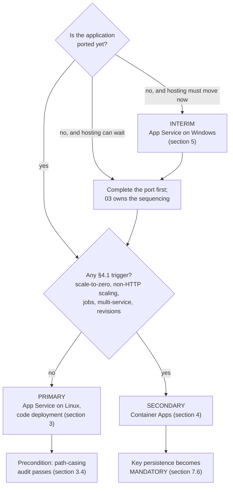

# 06 — Azure Hosting Recommendations

## 1. Purpose, ownership and authoring contract

### 1.1 What this document is

The hosting recommendation for the modernized MvcMusicStore application, and the specification of the Azure platform it runs on. It names a primary target, a secondary target and an interim option; it specifies the data platform, the identity model, the provisioning order, the key material, the telemetry, the transport policy, the supported browser matrix, the cutover runbook and the deployment mechanics.

It is one of the seven deliverables the user named directly. It consumes deliverable [12 — Migration Blockers](12-migration-blockers.md), which enumerates what must be resolved; deliverable [04 — .NET 8 Migration Strategy](04-dotnet8-migration-strategy.md), which fixes the target framework, the SDK band and every package pin; deliverable [11 — Cloud Readiness Assessment](11-cloud-readiness-assessment.md), which establishes the readiness facts this document acts on; and deliverable [10 — Build and Deployment Requirements](10-build-and-deployment-requirements.md), which establishes what the current build actually requires. It feeds deliverable [03 — Modernization Roadmap](03-modernization-roadmap.md), which sequences the work, and is cited by deliverable [05 — ASP.NET Core Migration Approach](05-aspnet-core-migration-approach.md) and by 11.

Its organizing rule is that **the recommendation is landed, not surveyed**. Research bounds the choice; this document makes it. A hosting document that lists three options with balanced advantages leaves the reader exactly where they started, and — worse — leaves the next reader free to pick differently. Every option below therefore carries a verdict, and the verdicts do not compete.

### 1.2 What this document is not

**It is not a provisioning action, and it is not an authorization to begin one.** Nothing here creates an Azure resource. Nothing here creates a file outside `docs/modernization/`.

It is not the roadmap. It states the *order* in which the four schema owners must be provisioned, because that order is a property of the platform rather than of the plan, but it states no sequence for the wider work; deliverable 03 owns that.

It is not the effort model and it is not the risk register. **No effort estimate, no delivery duration and no schedule for the future implementation appears anywhere in this document** — deliverable [07 — Effort, Risks and Sequencing](07-effort-risks-sequencing.md) owns all three, and several decisions below hand it a named risk to carry. **The claim is narrowed to that deliberately, because a blanket "no figure or duration appears here" would be plainly false**: this document sets an HSTS `max-age` and its three-stage ramp (§10.1.4), a cookie lifetime and a sliding window (§8.2), a session timeout (§8.3), a data-protection key lifetime and alert threshold (§7.4), a rotation interval (§5.5.1), a health-probe budget and cache TTL (§9.3), a rate-limit window (§10.2), an export cadence (§9.5) and several retention windows. **Every one of those is an operational control that configures the running system, and none is an estimate of how long any work takes** — which is the distinction 07 owns and this document does not cross.

It is not the cutover decision. Deliverable 05 decides that a **single cutover** is taken rather than an incremental strangler-fig migration, and 05 owns the two losses that decision accepts. Section 11 of this document is the **runbook that executes 05's decision**. It does not re-open it, does not restate the comparison, and should not be read as a second opinion on it.

### 1.3 The no-modification and no-provisioning constraint

The user directed **"Do not make code changes initially."** The environment setup instructions attached to this project independently restate the same gate: *"Do not modify code until assessment and modernization plan are approved."* Two inputs agreeing on it is why no defect named below is repaired here, including the ones this document depends on being repaired — the path-casing mismatch of section 3.4 and the destructive initializer of section 5.6 are specified as preconditions, not fixed.

**No Azure resource is provisioned by this work:** no resource group, no App Service plan, no Container Apps environment, no Azure SQL instance, no Key Vault, no managed identity, no Application Insights component, no Log Analytics workspace. **No infrastructure artifact is created:** no `Dockerfile`, no container manifest, no Bicep, ARM or Terraform template, no publish profile, no pipeline definition.

The distinction that governs this document is **mutation versus specification**, and it cuts both ways:

> This document must **prescribe** the infrastructure, the provisioning order, the grants and the runbook in full operational detail. Naming a `Dockerfile` as a conditional target artifact is required of it; creating one is forbidden to it. It fails if it reads as authorization to begin provisioning, and it fails equally if it declines to specify something because it mistook the prohibition on mutating for a prohibition on planning.

**The evidence for the constraint is a pair of commands, and each half proves a different thing — which is
why one of them has to name two fixed commits and the other must not be described as durable at all.**

- **The durable half, and its range is pinned at both ends:**
  `git diff --name-status ea2552d..28e3652` → **13 lines, every one an `A` under `docs/modernization/`**,
  with **no `M` and no `D`** against any existing repository file. `ea2552d` is the commit this deliverable
  set was authored from and `28e3652` is the commit it was recorded in. **`..HEAD` was the earlier form and
  it cannot support this claim**: `HEAD` is a moving reference, so the same command run after any later
  commit reports that commit's changes too, and a reader who re-ran it a week later would be shown a
  different answer and be entitled to conclude the document was wrong. A durability claim needs two fixed
  endpoints, and these are they.
- **The current-checkout half, and it is exactly that and nothing more:** `git status --porcelain` →
  **empty**. This is evidence about **the checkout the reader is standing in at the moment they run it** —
  that nothing is uncommitted, no build output was left behind and no file was edited outside a commit. It
  is **not** durable evidence and is never offered as such: it describes one moment, it says nothing about
  what any commit contains, and on a checkout where sibling work is in progress it will legitimately be
  non-empty without anything in *this* document's claim being false.

The first alone says nothing about the working tree; the second alone would be satisfied by a checkout in
which nothing had been written at all. Together they are the whole claim: thirteen additions between two
named commits, nothing modified, nothing deleted, and nothing left loose in the tree the reader holds. Every
appearance of either command in this document — including Appendix A's — carries that distinction with it.

Everything below is written to be read and approved first. That is the point of the exercise.

### 1.4 Authoring contract, and the absence of user rules

`review_rules` returns exactly **"No user rules provided."** There is therefore **no project rule to name, summarize, cite or comply with**, and none is invented in its place. The absence is not licence to lower the bar. This document is held to enterprise-standard practice and to four contracts that stand where rules would:

1. **Every as-is claim carries an inline `[<path>:<locator>]` citation** at the point the claim is made, repository-relative and resolving in the checkout. There is no trailing reference list, because a citation collected at the end cannot be checked against the sentence it supports.
2. **Every repository-wide claim carries its reproducing command** adjacent to the claim. Most of the current-state facts this document rests on are *absences* — no key material, no security header, no telemetry, no pipeline — and an absence has no line to point at. The command is its evidence, and it is the stronger form, because a reader can re-run it. Appendix A collects every one.
3. **Where a version is named, it is exact and it is cited, not chosen here.** Every package pin and the SDK band belong to deliverable 04. This document names them only by reference; it never introduces a version of its own and never restates one as a decision.
4. **One fact, one owner.** A decision restated in different words downstream reads as a second decision, and a reader who finds two picks one. Sections 1.5 and 1.6 draw that line explicitly.

**Two classes of command appear in this document, and they must never be read as one class.** Conflating them would let a reader run a release operation while thinking they were reproducing a count, so each is labelled wherever it appears and Appendix A separates them under distinct headings:

| Class | What it is | Safety | Where |
| --- | --- | --- | --- |
| **Evidence commands** | The commands that produce this document's counts and absence claims, run against **this repository** during the assessment | **Read-only and network-free.** None writes to the working tree, none modifies a repository file, none contacts the network, and none touches a database — the strongest form of evidence, because a reader can re-run any of them safely | Quoted beside the claim they support; collected in Appendix A §A.1 |
| **Future release operations** | The commands **prescribed** for the separately approved implementation phase, run against a provisioned Azure environment | **Mutating, and some contact the network.** They create database objects, restore tooling from package sources, and produce deployment artifacts. Not one of them is executed by this assessment, and none is safe to run casually | Specified in §6.4, §6.3 and §12.1, each with its execution scope, principal, release timing and guard; collected in Appendix A §A.2 |

Both classes are POSIX shell forms. The evidence commands were executed on this Windows verification host through the bundled Git-for-Windows `bash`, run from the repository root; the release operations belong to a release pipeline on a build agent, not to this host and not to a developer workstation.

Markdown line length follows the corpus convention recorded in [`README.md` § 10 Markdown line-length convention](README.md#10-markdown-line-length-convention).

### 1.5 What this document does not own

| Decision | Owner | What this document does instead |
| --- | --- | --- |
| **Target framework, SDK band and every package pin** | [04](04-dotnet8-migration-strategy.md) §2, §3, §7 | Cites them. The framework is referred to as "the target framework of 04" where the identity of the runtime matters and the number does not; the pins are cited by package name and section |
| **The cutover approach and the two losses it accepts** | [05](05-aspnet-core-migration-approach.md) | Section 11 writes the runbook that implements it. The decision is **not re-taken** and the alternative is **not re-argued** |
| **The two `DbContext` designs, their migration folders and the configuration transition** | [05](05-aspnet-core-migration-approach.md) | Specifies the *order* in which their migrations are applied and the *identity* that applies them. The context design itself is cited |
| **The no-bundler decision and the static-asset strategy** | [05](05-aspnet-core-migration-approach.md) | Uses it as an input to the code-deployment decision in section 3.3 — the absence of a build-time asset toolchain is what removes the argument for a container |
| **The distinction between the Release publish setting and the runtime error-handling decision** | [05](05-aspnet-core-migration-approach.md) | Records the publish half in section 12.4 and cites 05 for the runtime half rather than restating it |
| **The operator provisioning command, its secret channel and its idempotence** | [05](05-aspnet-core-migration-approach.md) | Specifies the **sink its audit record is written to** and the authenticated route it takes to reach it (sections 9.5, 9.5.1), the point in the release at which it runs, and the release-side mechanics of section 6.3.2 — principal, connection channel, target assertions and failure behaviour. Its **invocation form is quoted from 05, not defined here** |
| **Per-edition build outcomes** | [10](10-build-and-deployment-requirements.md) §3, §5–§8 | Cites them. Sections 5.4 and 12.3 take MVC 5's build status exactly as 10 §5.4 records it — ***blocked, pending a Windows verification run***, the recorded evidence being a precondition failure rather than a compiler outcome — and do not re-diagnose it or upgrade it |
| **The deployment-automation absence as a build finding** | [10](10-build-and-deployment-requirements.md) §12 | Verifies the absence independently in section 12.2, because it is the precondition of the pipeline specification, and cites 10 as the finding's owner |
| **Effort, risk register and sequencing of the wider work** | [07](07-effort-risks-sequencing.md), [03](03-modernization-roadmap.md) | Hands 07 **four** named risks and 03 **four** gates plus one scheduled follow-up, all enumerated in section 13.4 — with CI provider selection remaining 03's own gate, to which this document contributes six criteria (section 12.1.1). States no figure, duration or schedule |
| **CI provider selection** | [03](03-modernization-roadmap.md) | Specifies what the pipeline must do regardless of provider, and **explicitly does not select one** (section 12.1) |
| **Cloud-readiness findings and their framing** | [11](11-cloud-readiness-assessment.md) | Consumes them. Where this document repeats a current-state fact from 11 it is because a decision here turns on it, and 11 is cited as the owner |
| **The initializer's duplicate registration as a debt entry** | [08](08-technical-debt-register.md) | Cites it in section 5.6, where the duplication changes what "disable the initializer" operationally means |
| **The plaintext administrator credential as a security finding, and cookie policy** | [09](09-security-assessment.md) | Cites it. Section 8.4 specifies only the delivery mechanism that removes the credential from source |
| **The plaintext administrator credential as a security finding, and the current-state cookie posture** | [09](09-security-assessment.md) | Cites both. Section 8.4 specifies only the delivery mechanism that removes the credential from source. **The cookie *target* values are [05 §6.1](05-aspnet-core-migration-approach.md)'s, not 09's** — 09 is a current-state assessment and establishes what the editions emit today, which is the evidence behind 05's preservation-or-hardening labels rather than ownership of a target setting; §10.5 check 6 asserts 05's values |
| **The operator provisioning command, its secret channel, its idempotence and the *shape* of its audit record** | [05](05-aspnet-core-migration-approach.md) | Specifies the record's **destination** and nothing about its contents: the single logging provider the tool configures, the sink and workspace the record lands in, the federated credential path it authenticates with, and its retention (section 9.5) |
| **The plaintext administrator credential as a security finding, and the current-state cookie posture** | [09](09-security-assessment.md) | Cites it. Section 8.4 specifies only the delivery mechanism that removes the credential from source, and §10.1 cites [05](05-aspnet-core-migration-approach.md) for the **target** cookie policy, which is 05's to set |

### 1.6 The five decisions this document owns

These are stated once, here, in full, and are cited rather than restated everywhere else. Deliverables 03, 05 and 11 point at them.

| ID | Decision | Stated in |
| --- | --- | --- |
| **D1** | **Hosting target and deployment model.** Primary: Azure App Service on Linux, code deployment. Secondary: Azure Container Apps. Interim: Azure App Service on Windows hosting the un-ported application | §2, §3, §4, §5 |
| **D2** | **The deployment-time migration principal, and the separation of DDL rights from the runtime identity** | §6.2, §6.3, §6.6 |
| **D3** | **The data-protection key-ring location, its protect-at-rest behaviour, its rotation policy and its slot/revision isolation** | §7 |
| **D4** | **The observability approach** — structured logging through the framework abstraction, collected by the platform with **no in-process telemetry SDK**. The collection route is platform-specific and the two are not equivalent: Application Insights auto-instrumentation on App Service, and Azure Monitor diagnostic settings carrying console, system **and ingress HTTP** logs, with a reduced signal, on Container Apps. **Availability is a synthetic standard test against a user route, not a platform counter** | §9 |
| **D5** | **The network perimeter** — how the database and the vault are reachable, by which paths, and what is proven unable to reach them | §6.1.2 |

**D1 carries one sub-decision recorded separately.** **D1a** — the interim option's database authentication route (§5.5) — sits inside D1 rather than beside it, because it only exists while the interim option does; it is listed on its own row in §13.1 because it has its own approver and its own time box.

**Twelve supporting decisions** follow from the four above and are also owned here, because no other deliverable claims them, and each carries an `S` identifier in §13.1: secret delivery and the platform configuration binding (**S1**, §8.4), the session cache table and the release mechanics that create it safely (**S2**, §6.2.1–§6.3.1, §6.4), affinity retirement (**S3**, §8.3), transport, headers and the forwarded-header trust boundary (**S4**, §10.1–§10.2, §10.5), the browser matrix (**S5**, §10.4), the health surface and the pre-traffic gate (**S6**, §9.3), cache sizing (**S7**, §6.4), the build agent and base image (**S8**, §12.3), the data-plane connection and its identity types (**S9**, §6.1, §6.8), the minimum deployable topology and the network path (**S10**, §3.5.1–§3.5.3, §4.4.1, §6.9), backup, restore and the recovery position (**S11**, §6.7), and the legacy-cookie transition stage (**S12**, §11.4.1). Section 13.1 collects all seventeen rows — the four decisions, D1a, and the twelve supporting decisions — in one table.

---

## 2. The recommendation, landed

### 2.1 The decision in one table

| | **Primary** | **Secondary** | **Interim** |
| --- | --- | --- | --- |
| **Target** | Azure App Service, **Linux** plan | Azure Container Apps | Azure App Service, **Windows** plan |
| **What it hosts** | The ported application | The ported application | The **un-ported** .NET Framework 4.8 application |
| **Deployment model** | **Code** deployment (`dotnet publish` output) | Container image | Code deployment (Web Deploy / ZIP) |
| **Verdict** | **Recommended.** This is the target the roadmap builds toward | **Held in reserve.** Selected only if a named condition in §4.1 arises | **Available, and genuinely useful — but it is a stepping stone, not a destination** |
| **Precondition** | The repository-wide path-casing audit of §3.4 must pass **first** | The port must be complete — Windows containers are not supported (§4.2) | **Path A** (§5.3) is the selected authentication route and its exception must be granted by the security owner and countersigned by the data owner **before** the step begins; both preconditions in §5.6 met. An approver who cannot accept a time-boxed stored credential does **not** substitute Path B here — they skip the interim step and go directly to the port (§5.5) |
| **Container manifest** | None. No `Dockerfile` exists under this option | A `Dockerfile` is required — **conditional on this option only** (§4.4) | None |

**The recommendation is unambiguous: Azure App Service on Linux with code deployment.** Container Apps is not a co-equal alternative under evaluation; it is a documented escape hatch with an entry condition. The Windows interim option is not a different destination; it is a different *starting point* toward the same one.

### 2.2 The decision path



Read the diagram as a decision procedure, not as a set of equivalent branches. The right-hand path is the destination; the left-hand path is a way of getting hosting value before the code is ready, and it rejoins the same destination.

### 2.3 What the three options have in common

Every option below shares the same data platform, the same identity model, the same key material policy and the same transport policy — sections 6 through 10 are written once and apply to all three, with the differences called out where they exist. Four differences are worth naming up front so the later sections read cleanly:

- **The interim option cannot use managed identity for the data plane as the application is written today.** That is the whole substance of section 5.2, and it is the reason the interim option is not a lift-and-shift.
- **Container Apps escalates key persistence from advisable to mandatory** (section 7.6), because its replicas are ephemeral by construction.
- **Only Container Apps requires a container image**, and therefore only Container Apps requires a `Dockerfile` (section 4.4).
- **The telemetry collection route is not the same on the two target platforms, and the signal is not equivalent.** App Service auto-instruments; Container Apps does not, and carries a reduced signal that section 9.2.2 itemizes — reduced, but not absent on the request path, because section 9.2.2.1 enables the ingress HTTP log category the platform does publish. The application-side API is identical either way, which is why this is a collection difference rather than a design difference.
- **Container Apps escalates key persistence from a deliberate override to a precondition** (section 7.6), because it persists no default key ring — App Service does, within a deployment slot (section 7.1).

Everything else — one Azure SQL database, managed identity for the data plane where the code supports it, a SQL-backed distributed cache for session, a persisted data-protection key ring, HTTPS with HSTS, an explicit security-header set, structured logging emitted through `ILogger` and collected by the platform on whichever of the two routes above applies, and a health surface the platform probes — is common ground.

---

## 3. Primary — Azure App Service on Linux, code deployment (D1)

### 3.1 Why App Service rather than Container Apps

**Because the application's shape is the shape App Service is optimized for.** Microsoft positions App Service for web applications and Container Apps for serverless microservices and event-driven jobs, and MvcMusicStore sits squarely on the first side of that line.

The evidence is the repository's own composition, not a preference:

- **It is a single deployable unit.** `MvcMusicStore.csproj` declares no `<ProjectReference>` element and is a leaf project [src/MVC5/MvcMusicStore/MvcMusicStore.csproj:1-302]. There is nothing to decompose, and no second thing to deploy alongside it.
- **There is no background worker and no event-driven component.** All composition happens in two startup entry points — `Application_Start` [src/MVC5/MvcMusicStore/Global.asax.cs:13-21] and the OWIN startup [src/MVC5/MvcMusicStore/Startup.cs:4-14] — and neither starts a queue consumer, a timer, a scheduled job or a message handler. Every unit of work in the application is a response to an HTTP request. Deliverable [01](01-architecture-overview.md) owns the architecture description; the consequence for hosting is that there is no workload here that wants a separate scale profile.
- **There is no outbound service dependency to model.** The application talks to one database and nothing else, which deliverable 11 §4.3 records as a favourable readiness finding.

A single request-driven web application with one datastore, one scale profile and no finite-duration work of its own gains nothing from a container-orchestration platform and pays for it in operational surface: an image build, a registry, an ingress configuration and a revision model, all in service of a deployment that is one process. **The absence of a sidecar is deliberately not part of that argument** — §4.1 records that App Service hosts sidecars too, so a sidecar would not move this decision either way.

### 3.2 Why Linux rather than Windows

**Because after the port there is no Windows-specific dependency left, and Linux plans are the lower-cost option.**

The three things that tie the current application to Windows all disappear in the port, and each is named by an owner:

| Windows dependency today | Evidence | Why it is gone after the port |
| --- | --- | --- |
| `System.Web` and the IIS integrated pipeline | The application class derives from `System.Web.HttpApplication` [src/MVC5/MvcMusicStore/Global.asax.cs:11]; `Views/Web.config` installs a handler mapping under `preCondition="integratedMode"` [src/MVC5/MvcMusicStore/Views/Web.config:31-32] | Neither construct has a successor. Deliverable 12 §3 owns the blocker; the target runs on Kestrel |
| LocalDB with file attachment | `AttachDbFilename=\|DataDirectory\|\MvcMusicStore.mdf` [src/MVC5/MvcMusicStore/Web.config:13] | File attachment has no cloud analogue on any platform, Windows included. Deliverable 11 §3.3 owns the finding; section 6.1 below states the replacement |
| Windows-integrated authentication to the database | `Integrated Security=True` on both connection strings [src/MVC5/MvcMusicStore/Web.config:12-13] | Replaced by managed identity (section 6.1). Deliverable 11 §3.4 owns the finding |

Note carefully that the middle two are *not* arguments for Windows — they are arguments against the current data topology, and they must be resolved for **any** cloud target including Windows App Service. That is exactly what makes the interim option of section 5 harder than it looks.

Once the port is done, the deployable artifact is framework-agnostic managed code targeting the framework of [04](04-dotnet8-migration-strategy.md) §2, with no P/Invoke, no COM interop, no Windows-only API and no native binary. Linux App Service plans cost less than the equivalent Windows plans for the same tier, so absent a technical reason to pay the difference, Linux is selected.

**Linux carries two consequences, and neither is an argument for Windows.** They are separated here
because one is this document's to enforce and the other is not.

- **A hard precondition owned here: the repository-wide path-casing audit of section 3.4.** It must
  pass before this recommendation is viable.
- **A data-semantics consequence owned by [05](05-aspnet-core-migration-approach.md) §8.11: the host
  clock.** The source records timestamps in the host's *local* time —
  `order.OrderDate = DateTime.Now` [src/MVC5/MvcMusicStore/Controllers/CheckoutController.cs:41] and
  `DateCreated = DateTime.Now` [src/MVC5/MvcMusicStore/Models/ShoppingCart.cs:49] — while a Linux App
  Service instance runs with its clock in UTC. Selecting this platform therefore changes what those
  two columns *mean* unless a decision is made, and the decision is 05's: UTC in the database, legacy
  values converted by a **required** migration parameter that fails closed rather than guessing a
  source zone, and conversion to a configured zone for display. **This document selects the platform
  and asserts no timestamp policy of its own** — it records the consequence so that the platform
  choice is not made in ignorance of it.

### 3.3 Why code deployment rather than a container image

**Because the application has nothing a container would carry.** Three conditions would each justify an image, and none holds:

- **No native dependency and no custom system package.** The application executes no raw SQL and calls no unmanaged code — deliverable 12 §6 records both as portability findings in the application's favour. Nothing needs to be installed into an image beyond the runtime App Service already provides.
- **No build-time asset toolchain.** Under the no-bundler decision owned by [05](05-aspnet-core-migration-approach.md), static assets are served by static-file middleware with the framework's own cache-busting, and no npm, no bundler and no minification step exists in the build. The **27 MVC 5 asset files are the assessed source inventory, not the served payload**: [05](05-aspnet-core-migration-approach.md) §8.1.1 gives each of the 27 an explicit disposition, and what the target actually serves is the application-owned files that relocate plus the library files `libman.json` acquires. Deliverable 04 §9 owns that acquisition mechanism and records that the restored libraries are **committed**, so even asset acquisition is not a build-time step. There is therefore no build stage that a container image would encapsulate.
- **No runtime configuration that only an image can express.** Everything the application needs at runtime arrives through platform configuration (section 8.4).

A container under these conditions adds an image build, a registry to host it, image lifecycle and vulnerability-scanning obligations, and a second thing to version — **for no capability gained**. The deployable artifact is therefore the framework's own publish output, deployed as code.

That is a reversible decision and cheaply so: the same publish output can be containerized later without changing the application, which is precisely what makes the Container Apps escape hatch in section 4 credible.

### 3.4 The precondition — a repository-wide path-casing audit

**This is stated as a precondition, not a caveat. The Linux recommendation is not viable until the audit passes.**

Linux filesystems are case-sensitive; the Windows filesystem IIS serves from is not. The repository contains at least one demonstrated mismatch that IIS resolves silently and Linux will not:

- The style bundle registers `"~/Content/site.css"` — lowercase `s` [src/MVC5/MvcMusicStore/App_Start/BundleConfig.cs:28].
- The tracked file is `Content/Site.css` — capital `S`.

```bash
git ls-files 'src/MVC5/MvcMusicStore/Content/*'
# -> src/MVC5/MvcMusicStore/Content/Site.css        <- capital S
#    src/MVC5/MvcMusicStore/Content/bootstrap.css
#    src/MVC5/MvcMusicStore/Content/bootstrap.min.css
grep -n 'site.css' src/MVC5/MvcMusicStore/App_Start/BundleConfig.cs
# -> 28:                      "~/Content/site.css"));
```

Exactly three files, one capital letter, one mismatch. The sibling reference on the line above — `"~/Content/bootstrap.css"` [src/MVC5/MvcMusicStore/App_Start/BundleConfig.cs:27] — matches its file exactly, which is what makes this a defect rather than a convention: the same registration block is right about one path and wrong about the next.

**Why the failure mode makes this a precondition rather than a bug to fix later.** The application starts, the page returns HTTP 200, and the stylesheet 404s. The site renders unstyled. Nothing throws, nothing is logged — and today nothing *could* be logged, because there is no logging at all (section 9.4). The defect would be discovered by a user, not by a deployment. Deliverable 11 §3.7 owns the readiness finding and deliverable 12 F-12-17 carries it as a differing-default blocker, both naming this document as the owner of the audit obligation. This is that obligation, stated:

**The audit must cover four surfaces, and reference-count parity is its exit criterion:**

| Surface | Scope | Command |
| --- | --- | --- |
| Bundle registrations | All 5 registrations in MVC 5's bundle configuration [src/MVC5/MvcMusicStore/App_Start/BundleConfig.cs:11-28] — every include path, not only the CSS pair | `grep -c 'bundles.Add' src/MVC5/MvcMusicStore/App_Start/BundleConfig.cs` → `5` |
| `@Url.Content` call sites | 4 occurrences across MVC 5's views | `git grep -o '@Url.Content' -- 'src/MVC5/MvcMusicStore/Views/*.cshtml' \| wc -l` → `4` |
| View, layout and partial paths | Every `Views/...` path referenced from a controller, a layout reference or a partial invocation, plus the `wwwroot` path of every asset that relocates under [05](05-aspnet-core-migration-approach.md) §8.1.1 | Enumerated during the port; the target-state check is a case-sensitive build-and-serve |
| **Data-supplied asset paths** — `Albums.AlbumArtUrl` | Every **distinct** value in the column, not a sample. It reaches the browser through `@Url.Content(@album.AlbumArtUrl)` at [src/MVC5/MvcMusicStore/Views/Home/Index.cshtml:15], [src/MVC5/MvcMusicStore/Views/Store/Browse.cshtml:17] and [src/MVC5/MvcMusicStore/Views/Store/Details.cshtml:10], so a mis-cased **value** 404s per album on Linux exactly as a mis-cased literal does — while being invisible to every command above, because the path is in the database rather than in a file | `SELECT DISTINCT AlbumArtUrl FROM Albums`, taken with the schema extraction; each application-local value then resolved case-sensitively against the target `wwwroot` inventory. [03](03-modernization-roadmap.md) W5 owns the five-step procedure and the measured baseline |

**The fourth surface has its own parity criterion and its own handling, because a value cannot be corrected by editing a file.** Parity here is: **every distinct value is absent, or resolves case-sensitively against the served asset inventory, or is an absolute `https` URL whose host is on the canonical origin allow-list below**, with the accepted set recorded. The absent case is a pass rather than an exemption: the column is optional, so an album with no image path has nothing to resolve and renders the rule [05 §8.10](05-aspnet-core-migration-approach.md#810-absent-album-art--the-rendering-rule) defines. Handling for the failure cases is defined rather than left to the implementer — a differently-cased match is **corrected in the data migration**, and a value with no match at any casing **falls back to the placeholder asset and the row is logged for review**. Neither may pass silently, since a silent fallback hides the defect the surface exists to find. Two consequences belong to this document: **deployment gates on this criterion** alongside the three above, and an accepted absolute URL is only servable if the image content-security-policy of section 10.2 permits its origin.

**A legacy `http://` value is a third failure case, and it has its own defined handling.** It is not a casing problem, so the two branches above do not cover it, and it cannot simply be accepted: section 10.1 enforces HTTPS with HSTS, so an `http://` image on an HTTPS page is mixed content that the browser either upgrades or blocks, and section 10.2's `img-src` will not list an insecure origin. The migration therefore resolves each such value in a fixed order and records which branch it took:

1. **Rewrite the scheme to `https` if the same host serves the same path over TLS** — verified by an actual request, not assumed from the host name — and the host is added to the allow-list of section 10.2 in the same change.
2. Otherwise **re-host the image as an application asset, by an operator and out of band**: the operator retrieves the asset themselves, reviews what they retrieved, places the file under `wwwroot/images/`, and the migration rewrites the stored value to that local path. That makes it a local path and removes the origin question entirely.
3. Otherwise **fall back to the placeholder and log the row for review**, exactly as an unresolvable local path does — the same branch, because the outcome is the same: a value the application cannot render safely. **This is also the branch a value takes when step 2 has not been completed by the gate**, so an outstanding re-hosting task can never hold up a deployment or leave an unrenderable value in place.

**The application never fetches a remote URL on behalf of an administrator-supplied value — not at migration time, and not at runtime.** An earlier form of this section offered a server-side fetch as an alternative to operator re-hosting, and it is **removed**. A server-side fetch of a URL that an administrator typed is a **server-side request forgery primitive**: from an Azure workload it can reach the instance metadata endpoint, private and link-local address ranges, loopback, and any internal service the application can route to — and it can be redirected to any of them **after** passing a front-door check on the URL as submitted.

**Why the option is removed rather than constrained**, which is the part worth stating because "constrain it" sounds cheaper than it is. Doing it correctly needs a fixed allow-listed destination set, validation of the resolved IP address as well as the host name, denial of private, loopback, link-local and metadata ranges, revalidation after **every** redirect hop, an egress restriction at the platform, request timeouts, a response size limit, content-type validation, and a storage boundary keeping fetched bytes out of the application's own served tree until reviewed. That is a security component to build, review, test and maintain — for a catalogue that today holds **exactly one distinct image value**, the local placeholder ([03](03-modernization-roadmap.md) W5's measured baseline). Removing the capability removes the entire class of risk at **no functional cost**, because operator re-hosting reaches the same end state with a human deciding what enters the served inventory. If a stakeholder ever needs automated retrieval, it is a new component with its own security review and its own approval, not a line in this migration.

The committed catalog contains no such value — [03](03-modernization-roadmap.md) W5's measured baseline is one distinct value and it is the local placeholder — so this is a rule for future and non-committed data rather than a migration task with known work in it. It is stated because the audit runs against whatever source database is presented, not only against the committed one.

**The forward-looking half is the administration write path, and this is where the permitted set is expressed.** A one-time audit proves the data is clean at deployment and says nothing about the next album an administrator creates, because the column is administrator-writable free text (section 10.2). So the port validates the submitted value server-side, and the rule is written out here rather than left as "an allowed URL", because "allowed" is exactly the word that lets `http://` through:

**The column is optional, and the validator does not change that.** `AlbumArtUrl` declares `[DisplayName("Album Art URL")]` and `[StringLength(1024)]` and **no `[Required]`** [src/MVC5/MvcMusicStore/Models/Album.cs:26-28], and both administration forms render it as a plain editor carrying only that length rule — `@Html.EditorFor(model => model.AlbumArtUrl)` at [src/MVC5/MvcMusicStore/Views/StoreManager/Create.cshtml:53] and [src/MVC5/MvcMusicStore/Views/StoreManager/Edit.cshtml:54]. An album can therefore be saved with no image path at all today. A rule phrased as *one of two forms and nothing else* would silently make an optional field mandatory — a functional change to the administration surface rather than a security control, and one nobody approved — so the accepted set has **three** cases and the empty one is stated first. The `[StringLength(1024)]` limit is carried across unchanged and applies to the two non-empty cases.

**Accepted — one of three cases, and nothing else:**

- **Absent — `null`, the empty string, or a whitespace-only value.** Accepted, with the submitted value stored unrewritten, so both administration forms keep saving an album with no image path exactly as they do today. **The absent test is deliberately broader than the source's**: the catalog view guards its render with `!String.IsNullOrEmpty` [src/MVC5/MvcMusicStore/Views/Store/Browse.cshtml:15], which classifies `null` and `""` as absent but **not** a whitespace-only value, so a value of `"   "` is treated as present today and resolves to nothing useful. The validator's test is `String.IsNullOrWhiteSpace`, which makes the three forms of absence behave identically and the fallback of the next paragraph deterministic. **What the pages then render for an album with no image path is [05 §8.10](05-aspnet-core-migration-approach.md#810-absent-album-art--the-rendering-rule)'s rule**, and it is an approved delta recorded there rather than a silent fix made here.
- **A safe application-local path**: a `~/`-rooted or root-relative path that **resolves case-sensitively inside the served asset inventory** of [05](05-aspnet-core-migration-approach.md) §8.1.1. Resolution is the test, not the shape — a path that looks local and matches nothing is rejected, which is the same criterion the audit's third step applies to existing data.
- **An absolute URL whose scheme is `https` and whose host is on the canonical origin allow-list**, compared against the allow-list after parsing rather than by substring match on the raw string.

**Rejected explicitly, each for its own reason:**

| Rejected input | Why |
| --- | --- |
| `http://host/...` | Insecure transport. The application enforces HTTPS with HSTS (section 10.1), so this is mixed content the browser upgrades or blocks, and section 10.2's `img-src` will not list an insecure origin. Accepting it stores a value that cannot render |
| `//host/...` — protocol-relative | Its scheme is whatever the page's is, so it cannot be shown to be `https` at validation time. It is also the form most likely to pass a naive "starts with `http`" check by not starting with it |
| Any other scheme — `data:`, `javascript:`, `file:`, and anything not `https` | `javascript:` in an attribute the application renders is a script-injection vector; `data:` puts arbitrary administrator-supplied bytes inside a page's markup, outside the origin allow-list and outside any review of what is served, and it is capable of carrying a payload for a consumer that treats it as more than an image; `file:` names the server's or the user's filesystem. The rule is an allow-list of one scheme, so no future scheme is admitted by omission. **The `data:` rejection stands independently of section 10.2's image policy**, which admits `data:` for the library's own embedded glyphs: that allowance is what the *browser* will render, this rule is what an *administrator* may store, and the two are deliberately not the same set — a `data:` image can therefore only reach a page from the vendored stylesheet, never from user input |
| A local path that escapes the asset root — `..` traversal, or an absolute filesystem path | The value is rendered into a URL and resolved against the web root; a path that leaves the asset inventory is either a 404 or an attempt to reach something that is not an asset. Rejection is on the **resolved** path, so traversal cannot be hidden by encoding |

Rejection is a **field-level validation message on the administration form**, not a silent substitution, so the administrator sees which value was refused and why.

**The allow-list is one list with one owner.** The set of origins this validator accepts and the set section 10.2's `img-src` directive lists are **the same set**, maintained in one place, and this document owns it. Widening one without the other is the failure the coupling exists to prevent, and it fails in both directions: an origin allowed by validation but absent from `img-src` stores a value the browser then refuses to load, and an origin present in `img-src` but not accepted by validation loosens the policy for no reachable data. **Today the list is empty** — every row in the committed catalog holds the local placeholder, so no external origin is required and none is granted. Adding the first entry is a change to both the validator and the header in one commit, and it is an approval decision because it widens a security policy. [03](03-modernization-roadmap.md) W5 owns the five-step audit procedure, the measured baseline it starts from and the migration-time correction; this document owns the gate, the accept/reject rule and the single allow-list.

**The audit's exit criterion is mechanical: on a case-sensitive filesystem, every path the application can emit resolves — whether it comes from a file or from a row.** For the three literal surfaces the way to demonstrate that is to run the ported application on a case-sensitive filesystem — a Linux build agent (section 12.3) or a Linux App Service deployment slot — and assert that no request returns 404 for a static asset or a view. That assertion belongs in the test suite whose architecture 05 specifies; the requirement that it exist is this document's. For the fourth surface a serve check is **necessary but not sufficient**, because it only exercises the album-art values that the pages under test happen to render: the complete check is the distinct-value resolution above, run over the whole column, which is why deployment gates on that criterion in addition to a clean case-sensitive serve.

**Deliverable 07 carries the audit's failure mode as a risk** — a casing miss that survives the audit produces a cosmetically broken production page with no telemetry signal, and the mitigation is the case-sensitive pre-deployment check above rather than a code review.

### 3.5 Platform configuration for the primary target

The App Service settings that are decisions rather than defaults. Each is stated so that a reviewer can approve it and an operator can apply it without inferring anything.

| Setting | Value | Reason |
| --- | --- | --- |
| Operating system | Linux | §3.2 |
| Deployment model | Code (`dotnet publish` output, ZIP-deployed) | §3.3 |
| Runtime stack | The .NET runtime matching the target framework of [04](04-dotnet8-migration-strategy.md) §2 | The framework version is 04's; this document does not restate it |
| HTTPS Only | On | §10.1 |
| **Front-end request timeout** | **~240 s on Linux, platform-fixed and not configurable** (230 s on a Windows plan, which is what the interim option of §5 inherits) | This is a hosting fact rather than an application setting, and [05](05-aspnet-core-migration-approach.md) §4.10 assigns its publication here. App Service returns a timeout to the client if the application has not responded in approximately 240 seconds on Linux or 230 on Windows, because the Azure load balancer in front of it carries a four-minute default idle timeout; Microsoft documents the limit as not configurable, so it is a constraint to design inside rather than a value to set (*Web request times out in App Service*, and the App Service performance FAQ entry on the 230-second timeout). The consequence for this design is the ordering 05 §4.10 requires and this row satisfies: its 135 s worst-case retried unit sits inside its own 150 s `RequestTimeoutPolicy`, which sits inside this limit — so the application's own timeout is always the one that fires first, and a client never sees a platform cut-off in place of the application's own error handling. The secondary target of §4 is bounded the same way in practice and its own ingress value is recorded at §13.5 as a figure to confirm at provisioning rather than asserted here |
| Minimum TLS version (`minTlsVersion`) | **1.3** | §10.1.1 |
| **SCM minimum TLS version (`scmMinTlsVersion`)** | **1.3** — a separate setting from the one above | §10.1.1. It is the management-plane exposure and it does not inherit the site value |
| Client-certificate mode | Off | No mutual-TLS requirement exists |
| FTP/FTPS state | Disabled | No deployment path uses it; it is an open credentialed surface otherwise |
| SCM basic-authentication publishing credentials | Disabled | Deployment is by pipeline identity (§12.1), not by publishing profile — and [.gitignore:18] shows the repository never tracked one anyway |
| Always On | On | Removes cold-start on the first request after idle. Relevant because the current application's cold start is dominated by Razor compilation, EF initialization and database attach — all of which the port changes, but none of which it makes free |
| ARR affinity (`clientAffinityEnabled`) | **On initially, then off** — see §8.3 | It is the control that makes today's in-process session survivable, and it is retired only after distributed session and shared keys are both live |
| Managed identity | A **user-assigned** identity attached per slot — one for production, a distinct one for staging | §6.1.2 states why user-assigned rather than system-assigned, and why the two slots do not share one |
| Health-check path | `/healthz/ready` | §9.3. Removes an unhealthy instance from rotation |
| Diagnostic logging | Enabled to the workspace of §9.2 | §9 |
| Deployment slots | Exactly one staging slot, with slot-scoped key isolation | §7.5, §11. One is what the swap-based release of §11.6 needs; more would multiply the per-slot identity and grant work of §6.8 for no gain |
| `minTlsVersion` (application endpoint) | **`1.2`** | §10.1.1 |
| `scmMinTlsVersion` (SCM endpoint) | **`1.2`** | §10.1.1 |
| System-assigned managed identity | Enabled | §6.1 |
| Audit-material export | A scheduled export **from the `dbo.SecurityAuditLog` table** into the **audit store** of §9.5 — **not** from the workspace — and a pipeline export step for the tooling-produced records | The workspace is a query surface with an operational retention and may drop or duplicate a record; the durable table is the first hop and the audit store is the trail of record. §9.5's matrix assigns each producer its path |
| Minimum TLS version | The highest the platform offers as a supported minimum | §10.1 |
| System-assigned managed identity | Enabled | §6.1 |
| Minimum TLS version | The highest the platform offers as a supported minimum | §10.1 |
| System-assigned managed identity | Enabled | §6.1 |
| **Platform request timeout — recorded, not assumed** | **The value the selected platform and tier actually enforce, read from the platform's own documentation or configuration at provisioning time and recorded in the release configuration as `Data:PlatformRequestTimeoutSeconds`.** No number is stated here, because the enforced value is a property of the platform and the tier rather than of this repository, and a figure quoted from memory is the one input a startup validation must not be given | Deliverable [05](05-aspnet-core-migration-approach.md) §4.10 makes the data-access timeout and retry envelope a **startup-validated** constraint against this value: `(1 + retry count) × command timeout + retry count × maximum retry delay` must be **strictly less** than it, or the application fails to start. That validation is only as good as the recorded number, which is why supplying it is a named platform decision here rather than a default in the application. **Owner: operations records the value at provisioning and on any tier change; Engineering owns the three values validated against it** |

**One platform behaviour deserves naming because it changes application code rather than configuration.** App Service terminates TLS at its front end and forwards the request to the application over the internal network, so the application sees an HTTP request with the original scheme in a forwarded header. Any code or middleware that makes a decision based on the request scheme — HTTPS redirection, HSTS emission, absolute URL generation — must read the forwarded headers rather than the transport, and the platform's own guidance names the same set: the original scheme "is lost and must be forwarded in a header", and it matters "in redirects, authentication, link generation, policy evaluation, and client geolocation" (*Configure ASP.NET Core to work with proxy servers and load balancers*). Deliverable 11 §3.6 names forwarded-scheme handling as a required control; **§10.5 specifies both halves in full**, including the trust-boundary decision the current servicing behaviour of the middleware forces. Getting this wrong produces a redirect loop, which is a loud failure, and three quiet ones — HSTS never emitted, every logged client address being the ingress's, and any absolute URL generated as `http`. **Cookie `Secure` marking is deliberately not in either list**, for the reason §10.5 states.

#### 3.5.1 The minimum deployable topology — App Service

**Stated as a capability floor and what forces it, not as a price list.** A tier is chosen because the design needs something the lower tier does not have; where nothing in this design forces the higher option, the lower one is correct and the document says so.

| Resource | Floor | What forces it |
| --- | --- | --- |
| **App Service plan tier** | **Standard** | **Two** requirements force it, and the rationale is stated precisely because an over-attributed one is a rationale an approver can dismiss. **Deployment slots** — the swap-based release of §11.6 and the pre-traffic validation of §9.3.2 both require a staging slot, and the platform's own instruction is that to enable multiple deployment slots the app must be running in the **Standard, Premium or Isolated** tier. **Autoscale** — the platform's scale-out option matrix gives *manual* scaling as **Basic and up**, *autoscale* (rule- and schedule-based) as **Standard and up**, and automatic scaling as Premium v2–v4 only; the autoscale row below is therefore a Standard-only capability this design uses. **Two claims previously made here are withdrawn**: scale-out to more than one instance does **not** force Standard, because Basic plans scale out to as many as **3** instances, which is more than the two this design needs; and **Always On**, which §3.5's table does require, was asserted to rule out Basic without evidence and is not counted here. Neither withdrawal changes the conclusion — the two requirements above are each sufficient on their own. VNet integration is available from Basic and so does not raise the floor either, but §6.9 Posture A needs it and Standard already provides it |
| **Instance count** | **Two**, in the steady state | Not a performance decision. One instance makes every failure a full outage, makes the health check's instance-removal behaviour a no-op, and — most relevantly — **hides the two defects this design's controls exist to prevent**, since an unshared key ring and in-process session both work perfectly on a single instance. Two instances is the smallest configuration in which the cross-instance verification of §6.4 can be run at all |
| **Autoscale** | Configured. **Floor 2, ceiling 6.** Scale **out** when the plan's `CpuPercentage` averages above **70% for 10 minutes**, adding one instance, with a **10-minute** cooldown; scale **in** when it averages below **30% for 20 minutes**, removing one instance, with a **20-minute** cooldown | The floor is the correctness requirement above and is not a cost lever. **The ceiling is bounded by the database rather than by the plan**: Standard scales out to 10, but every instance opens its own pool against the one serverless database of §3.5.3, and the layout aggregate of §6.4 issues database work on *every* page — so an application that needs more than six Standard instances has a query problem §6.4 already names, not a compute shortfall, and buying instances would hide it. `CpuPercentage` is a documented `Microsoft.Web/serverfarms` metric, so the rules read a plan-level signal rather than a per-site one, which is the correct scope because all slots share the plan's instances. The asymmetry — 10 minutes out, 20 minutes in — is deliberate: shedding an instance drops its in-flight requests, and with distributed session and a shared key ring (§7, §8) there is no correctness cost to holding one longer than strictly needed. The platform owner may raise the ceiling as a cost decision, **never below 2 and never above the tier's 10** |
| **Zone redundancy** | **Not available at this tier, and therefore not configured.** The plan is **nonzonal** | Stated here rather than left to the recovery section, because it is a property of the tier chosen in this table. The platform supports zone redundancy on **Premium v2 to v4** plan types only, and states that a plan not configured as zone redundant "is considered *nonzonal*, and the underlying virtual machine (VM) instances aren't resilient to availability zone failures. They can experience downtime during an outage in any zone in that region" (*Reliability in Azure App Service*). What this tier does provide is distribution across **fault domains** within the region, which mitigates localized hardware failure and not zone loss. The consequence is quantified, and the upgrade priced, in **§6.7.1.2** — where it belongs, because it is a recovery objective rather than a capacity one |
| **Above Standard** | **Not required for capacity by this design.** Premium's larger instance sizes, more slots and higher scale limits are a capacity decision, not a capability one: this application has one deployable, no background worker and no scale profile that Standard cannot express. **One capability is the exception, and it is a live approver decision rather than a closed one** — zone redundancy exists only on Premium v2–v4, so the row above and **§6.7.1.2** together are what an approver reads to decide whether to buy it | Recorded so an approver is not asked to buy capability the design does not consume, and is not left unaware of the one capability the chosen tier does not have |

#### 3.5.2 Region selection, and the one hard constraint

**The region is chosen by the platform owner**, on criteria this document has no basis to decide: data-residency obligations, user proximity, and the availability of the specific service tiers in §3.5.3 (not every tier and not every zone-redundancy option exists in every region, so the region and the tier are chosen together rather than in sequence).

**The one constraint this document does impose: the App Service plan and the Azure SQL logical server are in the same region.** The reason is not cost — it is that the layout aggregate of §6.4 and every catalog page issue database round-trips on the request path, and a cross-region round-trip adds tens of milliseconds to each of them, on every page, permanently. It also removes the cross-region network path §6.9 would otherwise have to secure. A cross-region deployment is not forbidden by anything technical; it is simply a worse design with no compensating benefit for a single-region application, and if it is ever chosen the latency cost must be measured rather than assumed tolerable.

#### 3.5.3 The minimum deployable topology — Azure SQL Database

| Property | Value | What forces it |
| --- | --- | --- |
| **Purchasing model** | **vCore** | The DTU model's Basic and Standard tiers cannot be made zone redundant, which forecloses the redundancy decision below before it is taken |
| **Service tier** | **General Purpose** | It is the tier whose availability and performance profile matches a single web application, and it is the lowest tier that supports both the zone-redundancy option below and the full point-in-time-restore retention range of §6.7 |
| **Compute** | **Serverless**, Gen5, **maximum 4 vCores, minimum 0.5 vCores**, auto-pause **disabled** (`--auto-pause-delay -1`) | Serverless because the workload is bursty and a catalog application spends most of its time idle. **Maximum 4** because the ceiling has to absorb the worst concurrent moment this design actually creates — the §6.4 layout aggregate running on every page across the six-instance autoscale ceiling of §3.5.1, while a migration bundle or the §6.4 cache-table creation holds §6.3.1's lock on another connection — and 4 vCores is the smallest Gen5 serverless size that does so without the ceiling itself becoming the incident. **Minimum 0.5** because auto-pause is disabled, so the minimum is what is billed continuously whenever usage sits below it, and 0.5 is both the platform's documented default and the smallest value that keeps the buffer pool and `dbo.SessionCache` pages warm between requests. **The permitted minimum is a function of the configured maximum** in the serverless resource-limits table, so the pair is not assumed: §11's provisioning step reads the configured values back and asserts both, and a rejected pair is a provisioning failure rather than a silent substitution. **The readback is a control-plane read, not a `sys.*` query, and the property names are exact** — see §3.5.3.1, which replaces an earlier instruction that queried a column the platform does not expose. Auto-pause disabled because a paused database rejects connections while it resumes, which would make §9.3's readiness probe fail on a schedule the platform chooses — and would make the first user after an idle period wait for a resume; `-1` is the documented value that disables it, and an omitted setting is **not** the same thing |
| **Redundancy** | **Zone-redundant** | It is the difference between a zonal failure being a sub-minute reconnect and being an outage. §6.7 states the recovery numbers this produces |
| **Backup storage redundancy** | Stated explicitly in §6.7 rather than left at the platform default, because the choice determines whether a cross-region restore is possible at all | §6.7 |
| **Maximum data size** | **32 GB**, set explicitly — `--max-size 32GB`, which is `34359738368` bytes | §3.5.3.2 selects the figure, costs it and states what happens at it. It is set explicitly rather than left to the platform's own default for the same reason auto-pause is: an omitted setting is a value somebody else chose, and this one is the denominator of §9.2.6's **A7** storage arm |
| **Number of databases** | **One**, holding the catalog schema, the Identity schema, `dbo.SessionCache` and `dbo.DataProtectionKeys` | §6.5 records the trade in both directions and the condition under which it should be reversed |
| **Elastic pool** | **Not used.** A pool amortizes cost across many databases with uncorrelated load; there is one database | Recorded so it is a decision rather than an omission |

##### 3.5.3.1 The compute readback, with the exact property names it asserts

**A correction first, because the instruction this replaces could not have run.** An earlier revision of the row above told the provisioning step to read the serverless minimum from `sys.database_service_objectives`. That view's documented columns are `database_id`, `edition`, `service_objective` and `elastic_pool_name` — there is **no** `min_capacity` column in it, so the assertion would have failed with an invalid-column error rather than validating anything, and an assertion that cannot execute is worse than an absent one because a runbook records it as passed once someone removes the offending line. The serverless minimum is a **control-plane property of the database resource**, not a row in a data-plane catalog view, and it is read as one.

**The readback, with a pinned API version.** `az rest` is used rather than `az sql db show` for one reason: the property paths below are the ones the *documented* ARM response carries, and pinning `api-version` makes the shape the command returns the shape the documentation describes, independently of the CLI version installed on the runner:

```bash
# Run by the platform owner at §11.1 provisioning, and again after any compute change.
az rest --method get \
  --url "https://management.azure.com/subscriptions/$AZ_SUBSCRIPTION_ID/resourceGroups/$SQL_RESOURCE_GROUP/providers/Microsoft.Sql/servers/$SQL_SERVER_NAME/databases/$SQL_DATABASE_NAME?api-version=2025-01-01"
```

**What is asserted, by exact returned property name.** Each row is a hard equality against the §3.5.3 value; an **absent or null** property is a failure in its own right, not a pass, because a missing property means either the wrong resource or an API version that does not carry it:

| Property in the response | Documented meaning | Asserted value |
| --- | --- | --- |
| `properties.minCapacity` | "Minimal capacity that database will always have allocated, if not paused" — the serverless **minimum**, a `number` (double) | **0.5** |
| `properties.currentSku.capacity` | The SKU's capacity integer — for a serverless database, the configured **maximum** vCores | **4** |
| `properties.currentSku.name` and `properties.currentSku.tier` | "The name and tier of the SKU" | `GP_S_Gen5_4` and `GeneralPurpose` |
| `properties.autoPauseDelay` | "Time in minutes after which database is automatically paused. A value of `-1` means that automatic pause is disabled" | **`-1`** |
| `properties.zoneRedundant` | Whether the database is zone redundant | **`true`** |
| `properties.currentBackupStorageRedundancy` | "The storage account type used to store backups for this database" | **`GeoZone`** (§6.7.1's row) |
| `properties.maxSizeBytes` | "The max size of the database expressed in bytes" | **`34359738368`** — exactly 32 GiB, asserted as an integer equality and **not** as "the provisioned value, recorded", which is what an earlier revision of this row said and which is not an assertion at all: it passes against any number the platform happens to return, including the default nobody chose, and it leaves §9.2.6's **A7** storage arm with a percentage whose denominator is unknown. §3.5.3.2 selects the figure |

Source for every name and meaning in the table: *Databases - Get*, Azure SQL REST API. The `currentSku` distinction matters and is why both properties appear: `currentSku` is what the database **is**, `requestedServiceObjectiveName` is what was **asked for**, and a scale operation in flight makes them differ — so the assertion reads `currentSku` and a mismatch against §3.5.3 is a provisioning failure rather than a wait.

##### 3.5.3.2 The maximum data size — selected, costed and asserted

**A size that is never chosen is chosen by the platform, and two things in this document rest on it.** §9.2.6's **A7** has a `storage_percent > 80 %` arm whose denominator *is* this value, and §9.3.1's **C5** exists because reaching this value makes inserts fail while reads keep succeeding — so a percentage against an unknown denominator is an alert that fires at an unknown volume, and an earlier revision of §3.5.3.1 asserted only "the provisioned value, recorded". This subsection selects it.

| | Decision |
| --- | --- |
| **Selected value** | **32 GB — `34359738368` bytes.** Set at creation with `--max-size 32GB`; the CLI's own reference states that `--max-size` *"defaults to bytes (B)"* when no unit is given, which is why the unit is written rather than a bare integer |
| **The ceiling it is not** | The service objective's documented **maximum** for `GP_S_Gen5_4` is **1024 GB**, from the General Purpose serverless Gen5 limits table. Selecting the ceiling would be the lazy choice and is declined for the cost reason below; **it remains available without downtime**, since raising the maximum data size is an online scale operation on the same objective |
| **Why 32 GB is the right order of magnitude** | The data this database will actually hold is small and bounded by things this document has already counted: the catalog seed is 15 genres, roughly 303 artists and roughly 462 albums (§6.6); orders and order details grow with real use; `dbo.SessionCache` is bounded by concurrent sessions and its own expiry sweep (§6.4); `dbo.DataProtectionKeys` holds a handful of XML rows on a 90-day rotation (§7.2); and the legacy source it is migrated from is a **41 MB** MDF and LDF set. 32 GB is three orders of magnitude above the migrated volume, which leaves the growth head-room a catalog application needs while keeping the alert denominator meaningful — 80 % of 32 GB is roughly 26 GB, a figure whose crossing is a genuine signal, whereas 80 % of 1024 GB is a threshold this application would never reach and an alert that can never fire |
| **The cost, and the reason the ceiling is not free** | Storage in the serverless tier is billed *"in the same way as in the provisioned compute tier"* — on the **configured maximum data size**, not on bytes used — so the maximum is a standing monthly charge of `32 × <the region's General Purpose data-storage rate per GB-month>` and selecting 1024 GB would multiply that term by 32 for capacity this application will not use. Compute is billed separately per second and is unaffected by this setting. The exact per-GB rate is regional and time-sensitive: §13.5 carries the row, and the provisioning step records the figure it was costed against so a later reader can tell a price change from a size change |
| **What happens at the limit, and why it is an alert rather than an outage** | The platform's resource-limits documentation states that when data space used reaches the maximum, *"inserts and updates that increase data size fail, and clients receive an error message. SELECT and DELETE statements remain unaffected"* — the database does **not** become read-only in the sense a health check would notice. That asymmetry is exactly why §9.3.1's **C5** writes a row rather than reading one, and why A7's storage arm is the only advance warning: browsing keeps working while checkout stops |
| **Raising it** | An online change to the same service objective, applied by the platform owner with §3.5.3.1's readback re-run and the asserted value in this table updated in the same change. **A7's threshold moves with it automatically**, since `storage_percent` is computed by the platform against the configured maximum — which is the property that makes this a single-place decision |


### 3.6 What the primary target does not solve

Stated so the recommendation is not read as more than it is. Selecting App Service on Linux resolves the hosting axis and nothing else. It does not resolve:

- **Any framework-level blocker.** Every construct in deliverable 12 §3 with no successor is still there and still has to be dealt with by the port.
- **The absence of a regression baseline.** There is no test of any kind in the repository — deliverable [08](08-technical-debt-register.md) §7.3 owns that as a debt finding, **F-08-15**, at repository-wide scope — so nothing would detect a behaviour change caused by the port. Deliverable [10](10-build-and-deployment-requirements.md) §9 is cited for one narrower consequence only: the prescribed build procedure's "run unit tests if present" step is satisfied **vacuously**, there being no test command to run. Deliverable 05 specifies the test suite; deliverable 07 carries the absence as a risk.
- **The destructive schema initializer.** `SampleData : DropCreateDatabaseIfModelChanges<MusicStoreEntities>` [src/MVC5/MvcMusicStore/Models/SampleData.cs:9] is replaced by migrations under the port. Hosting choice does not touch it — and section 5.6 explains why that matters acutely on the interim path.

---

## 4. Secondary — Azure Container Apps (D1, held in reserve)

### 4.1 When it becomes the right answer

Container Apps is retained as the secondary target, to be selected if **any one** of five conditions arises. Each is a **capability** the primary platform cannot express, verified against current platform documentation rather than inherited from an older reading of the two services — because a trigger resting on a capability gap that has since closed moves a design onto a container-native platform for a reason that no longer exists.

**One trigger that used to head this list has been removed, and the correction is recorded rather than quietly applied.** The earlier form of this section said that acquiring a **sidecar** forces Container Apps, on the reasoning that App Service offers a single-container model. That is no longer the platform's position: **App Service supports sidecar containers on Linux — up to nine per app — and documents them for code-deployed apps as well as container-deployed ones.** A local cache, a reverse proxy, a log shipper or an agent therefore does **not** change the platform decision, and the primary recommendation of §3 survives the application acquiring one.

**A second non-trigger, for a related reason.** *Wanting to ship a container* is not a trigger either, because App Service accepts container deployment on the same plan as code deployment (§3.3). What separates the two platforms is everything **around** the container — scaling, revisions, jobs, service-to-service traffic — not the packaging of the application itself.

| # | Trigger | The capability that decides it | Does it hold today? |
| --- | --- | --- | --- |
| **1** | **Scale to zero becomes a requirement** | Container Apps' minimum replicas per revision defaults to **0**, and the platform charges no usage while an app sits at zero. An App Service plan's instances are allocated — and billed — whether or not a request arrives | **No.** §3.5.1 fixes **two** always-on instances deliberately, because the controls in §7 and §8 are only exercised by more than one. An application whose correctness design requires two warm instances is not a scale-to-zero candidate |
| **2** | **Scaling must respond to a non-HTTP signal** | Container Apps' scaling is KEDA-based, so a queue depth, an event-hub backlog, a Kafka lag or a Redis key can be a first-class scale rule alongside HTTP concurrency | **No.** The application has no queue, no event source and no outbound service dependency of any kind — deliverable [11](11-cloud-readiness-assessment.md) §4.3 establishes that as a current-state finding, and nothing in the target design adds one |
| **3** | **Finite-duration work needs to be its own resource** | Container Apps **jobs** are a separate resource type with **Manual, Schedule and Event** trigger types, their own image, their own replicas and their own failure surface. App Service's nearest equivalent runs **inside the web app's own instances**, sharing its plan, its scale profile and its restarts | **No, and the near miss is worth naming.** The only finite-duration work in this design is the release-time migration, and §6.2.1 runs it from the **release pipeline** rather than from the platform, precisely so that it needs no long-lived resource. If a recurring operational job ever appears — a report, a reconciliation, a cleanup — this becomes the strongest of the five |
| **4** | **The application takes on a multi-service shape** | Container Apps' **internal ingress** makes an app's FQDN reachable only from inside its own environment, so a second service can be addressed by name without being exposed publicly, and each app carries its own scale rules | **No.** One deployable, no inter-project reference, no second scale profile (11 §4.3). The moment there is a second deployable that must be addressed privately and scaled separately, the orchestration platform earns its keep |
| **5** | **The deployment model must be revision-based with weighted traffic** | Every change produces an **immutable revision**, and ingress splits inbound traffic between revisions by weight, so more than two versions can serve simultaneously without provisioning anything per version | **No.** §11 deploys by swap through the single staging slot §3.5.1 provisions, and a weighted rollout across more versions than that would need one slot per concurrently-served version. This is a bound of the chosen topology rather than an absolute of the platform, which is exactly why it is a trigger and not a defect |

**None of the five holds today** (section 3.1), which is why Container Apps is secondary rather than primary. All five are plausible futures, which is why it is retained rather than dismissed — and the two non-triggers above are recorded so that neither a sidecar nor a container image is mistaken for one.

### 4.2 The sequencing constraint — not a preference

**Azure Container Apps does not support Windows containers.** The consequence is precise and it is a *sequencing* fact rather than a *preference* fact:

> **Container Apps is unavailable for the un-ported application. It becomes available only once the port to the target framework of [04](04-dotnet8-migration-strategy.md) §2 is complete.**

The un-ported application requires the .NET Framework, which requires a Windows container, and Container Apps requires Linux-based (`linux/amd64`) container images [Microsoft Learn, *Containers in Azure Container Apps*, <https://learn.microsoft.com/azure/container-apps/containers> — verified 2026-08-28]. This is not a judgment that Container Apps is a worse fit for the legacy code; it is that the option does not exist until the code changes. Framed correctly, it removes a comparison a reader might otherwise attempt: there is no "Container Apps versus Windows App Service" decision for the interim step, because only one of the two is on the table.

It also has a direct consequence for the interim option in section 5: **if hosting must move before the port, the platform choice is Windows App Service by elimination**, not by preference.

### 4.3 What changes if Container Apps is selected

Everything in sections 6 through 10 continues to apply, with five differences:

| Concern | Under Container Apps | Where it is specified |
| --- | --- | --- |
| **Data-protection key persistence** | **Mandatory, not advisable.** Replicas are ephemeral by construction, so a filesystem key ring would not survive a revision — and the affinity Container Apps *does* offer (§4.3.1) cannot paper over that, because stickiness routes a client back to a replica rather than making the replica durable | §7.6 |
| Deployment artifact | A container image in a registry, replacing the code deployment of §3.3 | §4.4 |
| Ingress and TLS | Container Apps ingress with HTTPS enforced; the forwarded-scheme obligation of §3.5 applies identically | §10.1 |
| **Telemetry collection** | **The signal is not equivalent, and this row does not claim it is.** Auto-instrumentation is an App Service capability — Azure Monitor's own support matrix does not list Container Apps — so under Container Apps the `ILogger` stream is collected as **console logs** through Azure Monitor diagnostic settings. **The request record is not among the losses**: §9.2.2.1 enables the platform's own `ContainerAppHTTPLogs` category, which carries method, path, status, duration, revision, replica and a request identifier — so what is genuinely absent unless an in-process package is approved is **dependency telemetry, typed exception records and the distributed-trace graph**. §9.2.2 itemizes exactly what remains unavailable and states the two options; selecting this platform obliges the selector to record which one was taken | §9.2.2, §9.2.2.1 |
| Session affinity | Container Apps **does** support cookie-based sticky sessions, with a limitation that matters here, and the retirement decision in §8.3 is unchanged either way: affinity is interim on either platform, and the shared-state requirements are not weakened by having it | §4.3.1, §8.3 |

**The first row is the one that changes a status rather than a mechanism, and it is the row to read twice.** The key-ring decision escalates on Container Apps not because affinity is unavailable there — §4.3.1 establishes that it is available — but because **affinity is not a substitute for a persisted ring on that platform and is a weaker instrument there than on App Service**: it must be switched on rather than being on by default, it requires single revision mode, and a replica disappearing moves the client regardless. A revision replacement therefore takes a filesystem key ring with it whatever the affinity setting says. **§7.6 owns the escalation and states it in full** — including the deliverable-11 finding it answers — and this row does not restate it.

#### 4.3.1 Session affinity on Container Apps — available, and narrower than App Service's

**Stated once here, because a document that says affinity exists in one place and does not exist in another has decided nothing.** Container Apps **does** support session affinity, and the three properties that matter to this design are these:

| Property | Container Apps | App Service, for comparison |
| --- | --- | --- |
| **Mechanism** | Cookie-based stickiness, enabled by setting `ingress.stickySessions.affinity` to `sticky` | `clientAffinityEnabled` on the site, and **on by default** (§8.3) |
| **Precondition** | **Single revision mode, and HTTP ingress.** It is not available while traffic is split across revisions | None — it applies to the app as configured |
| **Guarantee** | A client is routed to the same replica, **but may be routed to a new one if its replica is no longer available** | Equivalent in kind: affinity pins a browser to an instance, and losing the instance loses the pin |

**Two consequences follow, and they are decisions rather than observations.**

**First, affinity and the revision-weighted rollout of §4.1 trigger 5 are mutually exclusive.** Stickiness requires single revision mode, so an application that is on Container Apps *because* it needs weighted traffic across revisions cannot also lean on affinity while it does so. That is not a problem for this design — it is a reason the design does not lean on affinity at all — but a reader who selects the secondary platform for trigger 5 and then reaches for stickiness as a fallback needs to know the two cannot be held at once.

**The exclusivity has a sequencing consequence, and it is now a scheduled gate rather than an inference.** Because that platform admits traffic *by* setting revision weights (§12.1.2), the retirement is a **precondition of admitting traffic at all** on the secondary path, not a control closed afterwards as it is on the primary one. Deliverable [03](03-modernization-roadmap.md) carries that as a conditional workstream in its own right — [**W16 — Pre-admission affinity retirement (secondary hosting path)**](03-modernization-roadmap.md#w15c--pre-admission-affinity-retirement-secondary-hosting-path-conditional-and-it-runs-before-w13), sequenced W10 → W16 → W13 so it exits **before** the cutover window opens — and its entry and exit gates are stated there and are not restated here. This subsection owns the exclusivity; that workstream owns where in the sequence the consequence is discharged.

**Second, and this is the part the shared-state requirements do not bend for: affinity being available changes nothing about what is required.** Distributed session over the SQL-backed cache (§8.1) and the persisted key ring (§7.2) are required on **both** platforms, and on Container Apps the key ring is required more strongly rather than less (§7.6, and the first row of §4.3's table). Affinity is an **interim** measure on either platform, retired on the verification gate §8.3 specifies — which is the framing §8.3 owns, and this subsection defers to it rather than restating it. The platform's own guidance points the same way: where an application does not need stickiness, leaving it off distributes requests more evenly across replicas.

### 4.4 The conditional `Dockerfile`

**A `Dockerfile` is required under this option and under no other. It is named here as a conditional target artifact; it is not created by this work.** Deliverable 04's future application map records it identically — CREATE, net-new, conditional on the container-native hosting option that this document selects or declines.

If the option is ever selected, the manifest is specified as follows, so the later phase does not re-decide it:

- A **multi-stage build**: an SDK stage that restores and publishes, and a runtime stage carrying only the publish output. The SDK image band must satisfy the `global.json` band pinned in [04](04-dotnet8-migration-strategy.md) §3 and §6.1, exactly as the build agent must (section 12.3).
- **Restore in locked mode**, consistent with 04 §6.4, so that a transitive change fails the image build rather than arriving inside it silently.
- **A non-root user** in the runtime stage.
- **No database tooling in the runtime image.** The migration executor runs from the release pipeline under the deployment principal (section 6.2) and has no business inside the application image, whose identity deliberately lacks DDL rights.
- **A `.dockerignore`** excluding the same categories the repository's own `.gitignore` excludes — build output, restored packages, IDE state [.gitignore:1-2,15,32] — so the build context does not carry the committed database binaries into an image layer. There are **14** of them, totalling **43,376,640 bytes — 43.38 MB decimal, 41.37 MiB binary**; this document states the byte figure and the decimal MB conversion, and never a bare "MB" that could be read either way:

```bash
git ls-files | grep -icE '\.(mdf|ldf)$'                                      # -> 14
git ls-files | grep -iE '\.(mdf|ldf)$' | xargs stat -c '%s' \
  | awk '{s+=$1} END {print s}'                                              # -> 43376640
```

The repository has **no container manifest of any kind today**:

```bash
git ls-files | grep -icE '(^|/)Dockerfile|docker-compose|\.dockerignore$'   # -> 0
```

Deliverable 10 §12.1 owns that absence as a build-and-deployment finding.

---

#### 4.4.1 The listening-port contract — two values that must agree

**This is the single most common way a container-hosted ASP.NET Core application fails to start serving, and it fails as a timeout rather than as an error, so it is specified rather than left to a default.** There are two independent numbers and nothing reconciles them automatically:

| | Value | Where it is set |
| --- | --- | --- |
| **The port the application listens on** | **8080** | `ASPNETCORE_HTTP_PORTS=8080` as a Container App environment variable. The .NET 8 container images already default to 8080 rather than the 80 that earlier images used, so this setting *confirms* the default rather than changing it — and it is set explicitly for exactly that reason: a default that changed once can change again, and the ingress cannot discover it |
| **The port the ingress forwards to** | **8080** | The Container App's ingress `targetPort`. It must equal the value above |

Three rules make that contract enforceable:

- **`ASPNETCORE_HTTP_PORTS` is used, not `ASPNETCORE_URLS`.** Both work; the first takes a bare port list and cannot express a binding address, which is what is wanted here — the container must bind all interfaces so the ingress can reach it, and a hand-written `ASPNETCORE_URLS` with `localhost` in it is the second-most-common form of this failure. Only one of the two is set, ever; setting both is ambiguous.
- **The `Dockerfile` does not encode the port.** `EXPOSE` is documentation and the ingress does not read it. The port lives in the app's configuration and in the ingress configuration, and the image is portable between them.
- **Ingress terminates TLS and the container serves plain HTTP.** Container Apps ingress accepts TLS 1.2 and 1.3 on 443, redirects port 80 to 443, and forwards to `targetPort` unencrypted inside the environment. So the container listens on HTTP only — configuring a certificate inside the container would be wrong — and §10.5's forwarded-header handling is what restores the scheme the application sees.

**The verification is one request.** After deployment, a request to the app's ingress FQDN over HTTPS returns 200 from `/healthz/live`; if the two numbers disagree the request times out at the ingress with no application log line at all, which is precisely why the check is explicit and why the two values appear in one table.

The repository has **no container manifest of any kind today**:

```bash
git ls-files | grep -icE '(^|/)Dockerfile|docker-compose|\.dockerignore$'   # -> 0
```

Deliverable 10 §12.1 owns that absence as a build-and-deployment finding.

---

## 5. Interim — Azure App Service on Windows, hosting the un-ported application (D1)

### 5.1 Why this option is presented at all

**Because it decouples two decisions the user may want to take at different times, and a hosting document that assumes every Azure move follows the port answers a question that was not asked.**

Windows App Service runs .NET Framework 4.8 ASP.NET applications. MVC 5 targets 4.8 [src/MVC5/MvcMusicStore/MvcMusicStore.csproj:16]. So *hosting* can modernize before the *code* does: the application can gain managed patching, managed TLS, platform scaling, deployment slots and platform telemetry, without waiting for a single line of the port.

**What that gain is, stated precisely, because the tempting overstatement is the one that matters.** The interim option removes **self-managed IIS and operating-system work** — provisioning a Windows host, installing and configuring IIS and its application pools, applying OS and framework patches, managing certificates and cipher configuration, and keeping a machine's state reproducible. It does **not** remove the application's **Windows runtime requirement**: the un-ported application still requires the .NET Framework, which still requires Windows, which is exactly why the plan is a **Windows** App Service plan and why Container Apps is unavailable for it (§4.2). Nor does it remove the **build** requirement, which remains MSBuild on Windows with the .NET Framework targeting pack — deliverable 10 §4 owns that, and deliverable 11 §3.8.4 records the build-and-run constraint as a readiness result in its own right. The constraint is not escaped by this option; it is escaped by the port. The interim option makes somebody else operate the Windows host, and that is a smaller claim than escaping Windows, which is the claim an earlier form of this section made.

That is a real and defensible position, and there are organizations for whom it is the right first move. It is presented here on its merits.

### 5.2 It is not a data move — and that is the finding

**This is where a hosting recommendation usually goes wrong.** The interim option looks like a lift-and-shift that needs only the database relocated. It is not, and the reason is one line of configuration.

The un-ported application connects with `System.Data.SqlClient` and Windows-integrated authentication:

```xml
<add name="DefaultConnection"    connectionString="Data Source=(LocalDb)\MSSQLLocalDB;AttachDbFilename=|DataDirectory|\aspnet-MvcMusicStore-20131025034205.mdf;Initial Catalog=aspnet-MvcMusicStore-20131025034205;Integrated Security=True" providerName="System.Data.SqlClient"/>
<add name="MusicStoreEntities"   connectionString="Data Source=(LocalDb)\MSSQLLocalDB;     AttachDbFilename=|DataDirectory|\MvcMusicStore.mdf;     Integrated Security=True" providerName="System.Data.SqlClient"/>
```

Both live elements, both `Integrated Security=True`, both `System.Data.SqlClient` [src/MVC5/MvcMusicStore/Web.config:12-13].

```bash
grep -n 'Integrated Security' src/MVC5/MvcMusicStore/Web.config    # -> 12, 13
```

**`Integrated Security=True` cannot authenticate to Azure SQL Database from App Service as written.** It instructs the client to present the process's Windows identity to the server through integrated authentication. An App Service worker has no domain identity to present and Azure SQL has no domain to validate one against. The setting is not merely suboptimal in the cloud; it is inoperative. Moving the data to Azure SQL and repointing the connection string produces an application that fails to open a connection.

Nor is the legacy client's provider a detail that can be left alone: `System.Data.SqlClient` does not implement Azure AD / Microsoft Entra token-based authentication for managed identity. The provider itself is part of the problem.

**Exactly one of two paths must be chosen and costed, there is no third path and no default — and this document chooses.** The selection is **Path A: SQL authentication credentials supplied through App Service configuration as a Key Vault reference, taken as an explicit, time-boxed exception to the no-stored-credentials principle of section 6.1.** Section 5.3 specifies it, section 5.4 states why Path B is rejected, and section 5.5 records the selection with its owner, its cost, its exit trigger and its residual risks. A reader who needs only the decision can stop at section 5.5's first table.

**What is selected is the authentication path, not the branch.** Section 5.8 states the branch's status: it is **conditional and not executable** until the production data move of precondition 1 has a contract of its own, authored and approved. Choosing Path A settles how the un-ported application would authenticate *if* the branch is taken; it does not settle that it is taken.

### 5.3 Path A — SQL authentication credentials behind a platform secret reference (**selected**)

Supply a SQL user name and password to the application inside each of its two connection strings, delivered through App Service configuration with the values backed by Key Vault references so no secret is ever in the deployment payload or in source.

**What it requires — the full cost, itemized, because this is the route section 5.5 selects:**

**A1 — the interim topology, settled: two databases on their own logical server, and an alternating pair of contained users in each.**

**Two databases, because the legacy application has two connection strings and Path A's premise is that no legacy source changes.** MVC 5 attaches two separate files — the catalog store through `MusicStoreEntities` and a *separate* ASP.NET Identity 1.0 store through `DefaultConnection` [src/MVC5/MvcMusicStore/Web.config:12-13] — and there is no code in the application that could read both schemas through one connection. Consolidating them would mean editing the legacy configuration beyond a connection-string rewrite, which is the line Path A does not cross. There is also a decisive second reason: the Identity 1.0 store's tables are named `AspNetUsers`, `AspNetRoles`, `AspNetUserRoles`, `AspNetUserClaims` and `AspNetUserLogins` — **the same names the target's ASP.NET Core Identity schema uses** — so any topology that ever put the interim Identity store and the target schema in one database would collide, and keeping them in a database of their own keeps the Identity 1.0 store unambiguous as the *source* for the target's Identity data migration, which 05 owns.

**Their own logical server, and this is a hardening decision rather than a naming one.** The target's logical server is configured for **Microsoft Entra-only authentication** — the setting that makes §6.1.1's "no SQL credential" prohibition structural rather than a convention someone can quietly break — and a SQL-authenticated user therefore **cannot connect** to it. **The scope of that control is stated exactly, because an earlier revision of this paragraph overstated it**: the platform's own wording is that enabling the feature "prevents any authentication based on any SQL authentication credentials", that existing SQL logins and users are **not removed**, and that "new SQL authentication logins and users can still be created by Microsoft Entra accounts with proper permissions" — they simply "won't be allowed to connect". So the guarantee is about **connections, not about existence**, and any control that rested on "no SQL user can exist there" is restated in §6.6.1 as an assertion over the user inventory rather than an assumption about it. The property worth keeping is unchanged and is the connection prohibition, so the interim databases go on a separate logical server which permits SQL authentication, has its own Entra administrator group, its own firewall rules and its own lifecycle, and is **deleted whole at A5-2**, once the rollback window of §11.5.1 has closed. Nothing about the interim credential ever touches the server that will host production.

| Resource | Name | Source | Read by |
| --- | --- | --- | --- |
| Logical server | `sql-mvcmusicstore-interim` — SQL authentication **enabled**, Entra administrator set to the operations group of §6.8, deleted at A5-2 | — | — |
| Server administrator login | `interim-bootstrap-admin`, created with the server because the platform requires an administrator login on a server that permits SQL authentication. **Its password is an interim secret with its own lifecycle and its own vault, both stated below** | Generated at provisioning | Nothing in normal operation |
| Database | `mvcmusicstore-interim-catalog` | `src/MVC5/MvcMusicStore/App_Data/MvcMusicStore.mdf` | the `MusicStoreEntities` connection |
| Database | `mvcmusicstore-interim-identity` | `src/MVC5/MvcMusicStore/App_Data/aspnet-MvcMusicStore-20131025034205.mdf` | the `DefaultConnection` connection |

**The server administrator login is a secret too, and leaving its lifecycle unstated would leave the highest-privilege credential in the interim topology as the only one nobody owns.** It exists because a logical server that permits SQL authentication is created with an administrator login, and it holds authority over both interim databases — so it is specified to the same standard as the two application secrets, and deliberately to a *stricter* access standard:

| Stage | What happens |
| --- | --- |
| **Creation** | **Set interactively by a security operator under an active PIM activation, and never present on any runner filesystem at any point.** The operator generates the value to A3.1's alphabet and complexity contract in an **in-memory** client session — the portal's own server-creation form, or an authenticated control-plane client holding the value in a process variable — submits it to the control plane from that session, and writes it **straight into `kv-mvcmusicstore-intadm`** as `interim-sql-bootstrap-admin-password` in the same activation. `kv-mvcmusicstore-intadm` is a second interim vault holding this one secret and nothing else, for the reason §6.1.2.1 gives. **Four channels are prohibited by name, because each of them is a copy nobody later deletes:** a request-body file or any other file on the runner or the operator's workstation, a command-line argument, a pipeline variable of any kind including one marked secret, and the caller's terminal or transcript. The release pipeline never holds this value in any form; where a release ever needs it, it consumes it **only as a Key Vault reference** resolved by an identity the release already has |
| **Masking** | Every invocation that must pass it does so from the vault at the moment of use; it is never an argument on a command line, never echoed, and the pipeline's secret-masking is applied to the vault-sourced value so a diagnostic that prints a connection string prints the mask. This is the same prohibition §12.5 places on every other credential, applied to the one credential that is not the application's |
| **Use** | **None in normal operation.** The `CREATE USER` block below and every subsequent administrative action are performed by a member of the operations group of §6.8 over **Entra** authentication against the interim server's Entra administrator — which is why the interim server has one. The bootstrap login is a break-glass credential for the case where directory authentication to that server is unavailable, and using it is an event that A4's audit records |
| **Rotation** | Rotated on the **same 90-day cadence** as the application secrets, and in the **same operator runbook window**, but **by a different mechanism, and an earlier formulation of this row got the mechanism wrong twice** — it first named "a single `ALTER LOGIN` on `master`", and then attributed the work to a rotation function this design no longer has. Both were wrong for one reason: A3's rotation is a **database-scoped** action, `ALTER USER … WITH PASSWORD` issued inside each of the two interim databases against a contained user, while a server administrator login is a **control-plane** object with no contained user to alter. So this rotation is a **control-plane operation by the platform owner** under an active PIM activation, with the value generated to **A3.1's** alphabet and complexity contract and written to the vault in the same step. **The form of the invocation is specified, because two obvious ones each violate a rule this row already carries:** the CLI's `az sql server update --admin-password <value>` places the credential in an **argument**, visible in a process listing and retained by shell history, which the Masking row below forbids; and `az rest … --body @<file>` moves the same value into a **file on the runner**, which the Creation row forbids for the whole lifecycle. The prescribed form is therefore the **interactive, in-memory** one the Creation row already establishes, and **the exact control-plane operation it performs is named immediately after this table** — a fenced block cannot sit inside a table row |
| **Disablement** | It cannot be removed from the server while the server permits SQL authentication, so it is **neutralized rather than deleted**: access to its vault secret is restricted to the security owner and the operations group under PIM, a `SecretGet` on it raises the A4 alert as an anomalous read, and **no automation holds any role at all over it** — which is structural rather than a convention, because the secret sits alone in `kv-mvcmusicstore-intadm`, a vault on which **no non-human principal holds any role or data action whatever** (A2), and because the principal that rotates it is a human under PIM using the control plane. Its approaching expiry is still noticed without any automation reading it, because Key Vault's own `SecretNearExpiry` event covers this vault too and the design has no automated rotator of any kind (A3) |
| **Cleanup** | Deleted with the server at **A5-2**, when the rollback window of §11.5.1 closes rather than when the ported application takes traffic — a reversal inside that window needs a reachable interim server, and this is the credential that reaches it when directory authentication to that server does not. Its vault `kv-mvcmusicstore-intadm` is then deleted **and purged** under the single deletion policy A2 states, so the interim topology leaves no credential behind in any form |

**The Rotation row's prescribed mechanism, in full — and an earlier revision of this block specified the one thing this design most needs not to happen.** It wrote the new password into a JSON file on the runner and passed that file to `az rest --method patch --body @<file>`, with the sole safeguard that the file was "written to a path readable only by the operator and deleted in the same procedure step". That is a plaintext copy of the highest-privilege credential in the interim topology, on a filesystem, guarded by an intention: it named no create-new semantics, no permissions applied *before* the first byte was written, no symlink refusal, no protected location, no cleanup on a failure or a termination signal, no scavenging of a file left behind by a previous run, and no verification afterwards that the file was actually gone. **It is withdrawn in full. The password does not reach a filesystem on any path.**

The platform operation being performed is unchanged and is named exactly, because what is being replaced is the *transport*, not the action:

```text
PATCH https://management.azure.com/subscriptions/{subscriptionId}
      /resourceGroups/{resourceGroupName}
      /providers/Microsoft.Sql/servers/sql-mvcmusicstore-interim?api-version=2025-01-01
body: { "properties": { "administratorLoginPassword": "(the value held in the caller's memory)" } }
```

`properties.administratorLoginPassword` on `Microsoft.Sql/servers` is the documented updatable property for this operation, and `2025-01-01` is the API version its reference documents. **Exactly two routes may perform it, both of which hold the value only in process memory:**

| Route | What the operator does | Why it satisfies the Creation row |
| --- | --- | --- |
| **The portal's own password-reset form on the interim logical server** — the default route | Under an active PIM activation, the operator generates the value to A3.1's contract in the same browser session, types or pastes it into the form's masked field, submits, and then writes it into `kv-mvcmusicstore-intadm` through the portal's own secret-creation form | The value exists in the browser process and in two TLS request bodies. It is never in `argv`, never in shell history, never in a pipeline variable, and never in a file |
| **An authenticated control-plane client that holds the value in a process variable** and issues the `PATCH` above with an in-memory body | The same activation; the value is generated by the client, sent as the request body from memory, and written to the vault by the same client before the variable leaves scope | Identical property, for an operator who prefers a scripted step. **The client must accept the body from memory rather than from a path** — if the tool available can only read a body from a file, the operator uses the portal route instead, which is why the portal is the default rather than the alternative |

**`az sql server update --admin-password <value>` remains prohibited** — it is the same platform action, but it places the credential in an argument, which is a process-listing and shell-history disclosure the Masking row already forbids.

**And because "no file" is a rule rather than a physical impossibility, the requirements that apply if a temporary file ever exists at all are stated here rather than left to be improvised** — they govern any future variation of this step, any diagnostic capture taken during it, and any other procedure in this document that is ever tempted to stage a credential on disk:

1. **Creation is atomic and restrictive, in that order.** The file is created with an exclusive create-new open — `O_CREAT|O_EXCL` semantics, so an existing path is an error rather than a target — with mode `0600` applied **by the create call itself**, never by a `chmod` after the first write. A `umask`-dependent create followed by a permission fix leaves a window in which the file is world-readable, and that window is the whole exposure.
2. **Symlinks are refused, not followed.** The create uses no-follow semantics and the containing directory is one the operator owns with mode `0700`, so a pre-planted link cannot redirect the write to a readable location.
3. **The location is a protected one.** Never a world-writable temporary directory, never a path inside a workspace the pipeline archives, and never a path on a volume that is snapshotted or backed up.
4. **Cleanup runs on every exit path, including the ones nobody writes code for.** A `trap`-or-`finally` handler removes the file on success, on error, on `SIGINT`, on `SIGTERM` and on `SIGHUP`. Overwrite-then-unlink is used rather than unlink alone, because an unlinked block on a copy-on-write or log-structured filesystem is not a deleted block.
5. **A file from a previous run is scavenged at startup.** The procedure's first act is to look for the path and, if it exists, treat it as an incident: remove it and treat the credential it may have held as disclosed, which means rotating it before continuing.
6. **Absence is verified and recorded, not assumed.** The final step stats the path, requires it to be absent, and lodges that outcome in the same immutable record A3 step 8 writes.
7. **Where cleanup cannot be proved — a killed process, an unreachable runner, a failed stat — the credential is rotated immediately** by this same procedure, and the failure to prove cleanup is itself recorded. "Probably deleted" is not a state this design accepts for a server administrator password.

**Two of A3's stages are genuinely unnecessary here rather than merely skipped:** there is no alternating pair and no uptake verification, because nothing holds a cached copy of this credential. And a rotation of *this* secret that is never performed is still noticed, by the two mechanisms A3 states rather than by a check of its own — the `SecretNearExpiry` subscription on **this** vault, which is unfiltered and therefore covers both of the secrets in it, and the weekly runbook step's reading of **all five** interim secrets' expiry dates.

**Two users per database, not one, because rotation needs an alternate.** A contained user holds exactly one password, so rotating in place leaves a window in which the running application holds a credential the server has already replaced — and with the platform's reference cache that window is up to 24 hours (A2). The design is therefore an **alternating pair**: `mvcmusicstore_interim_a` and `mvcmusicstore_interim_b`, created with the same names in **both** databases, exactly one of them active at any time, and A3 rotates by setting a new password on the **inactive** one and repointing the secrets to it.

**Creation uses the same construction as rotation, and an earlier revision of this block did not — which was the more dangerous of the two.** It showed `CREATE USER [mvcmusicstore_interim_a] WITH PASSWORD = N'<generated, never persisted here>'` as an *executable* statement with a placeholder in the password position, and a placeholder inside runnable SQL is an instruction to substitute by hand. Substituting by hand is exactly how the value reaches a script file, an editor buffer, a clipboard, the client's command history and every server-side surface that retains statement text — the disclosure the parenthetical was trying to forbid. There is no reason to construct the initial credential differently from its replacement, so it is constructed identically: **§5.3 A3.1's contract governs generation, quoting, transport and post-statement cleanup for `CREATE USER` exactly as it does for `ALTER USER`**, and the block below is A3.1's shape with the verb changed.

```sql
-- Run twice per interim database — once for each user of the alternating pair —
-- in mvcmusicstore-interim-catalog and in mvcmusicstore-interim-identity, by a
-- member of the operations group of §6.8 with an active PIM assignment, over
-- Entra authentication. @target_user and @new_password arrive as parameters of
-- the batch, exactly as in A3.1: each password is generated at this moment to
-- A3.1's alphabet and complexity contract, written straight into Key Vault (A2)
-- in the same step, and never typed, echoed, passed as an argument, or written
-- into a script file. CREATE USER accepts no parameter in the password
-- position, so one statement is built by concatenation and both parts are
-- quoted — the sole reason A3.1 exists.
DECLARE @user sysname       = @target_user;
DECLARE @pwd  nvarchar(128) = @new_password;

-- 1. The identifier is allow-listed against the two names this design creates.
IF @user NOT IN (N'mvcmusicstore_interim_a', N'mvcmusicstore_interim_b')
BEGIN
    ;THROW 51003, 'Interim credential user is not an allow-listed name.', 1;
END

-- 2. The password becomes a quoted literal, and a NULL is refused rather than
--    concatenated (A3.1's first contract bullet gives the reason).
DECLARE @q_pwd nvarchar(260) = QUOTENAME(@pwd, '''');
IF @q_pwd IS NULL
BEGIN
    ;THROW 51004, 'Generated password failed literal quoting.', 1;
END

DECLARE @sql nvarchar(max) =
    N'CREATE USER ' + QUOTENAME(@user) + N' WITH PASSWORD = ' + @q_pwd + N';';
EXEC sys.sp_executesql @sql;
```

The grants carry no secret, so they are ordinary literal statements, run once per database after both users exist:

```sql
ALTER ROLE db_datareader ADD MEMBER [mvcmusicstore_interim_a];
ALTER ROLE db_datawriter ADD MEMBER [mvcmusicstore_interim_a];
ALTER ROLE db_datareader ADD MEMBER [mvcmusicstore_interim_b];
ALTER ROLE db_datawriter ADD MEMBER [mvcmusicstore_interim_b];

DENY ALTER, CREATE TABLE, CREATE VIEW, CREATE PROCEDURE, REFERENCES
  TO [mvcmusicstore_interim_a];
DENY ALTER, CREATE TABLE, CREATE VIEW, CREATE PROCEDURE, REFERENCES
  TO [mvcmusicstore_interim_b];
```

**And the statement-retention cleanup of A3.1 runs here too**, in both databases, immediately after the four `CREATE USER` invocations — because the value being protected is live from the moment it is written to the vault, not from the first rotation.

**Role-based here, unlike §6.6's object-scoped runtime grants, and the difference is justified rather than inconsistent.** The un-ported application runs EF 6 against a schema this document does not own and cannot enumerate — MVC 5 ships no schema script at all, which deliverable [10](10-build-and-deployment-requirements.md) records — so an object-scoped grant list would be a guess that fails at runtime on the first table it missed. `db_datareader` and `db_datawriter` are the honest choice for an application whose object set is unknown, and the interim step's whole justification is that it is temporary. **Explicitly denied, and each for a reason this application's own history supplies:** `db_owner` and `db_ddladmin`, because the initializer of §5.6 destroys a database it has DDL rights over, and removing the right is the control that makes precondition 2 fail safely rather than depend on a code change holding; `db_securityadmin` and `db_accessadmin`, so the user cannot grant itself or anything else more; every server-level role including `dbmanager` and `loginmanager` on `master`, so it cannot create or alter databases or logins; and `db_backupoperator`, because backup is the platform's job under §6.7 and not the application's. Neither user gets an account in `master` at all, which means each must connect with `Initial Catalog` naming its database and cannot enumerate the server.

**A2 — the secret's storage and delivery path, by exact mechanism.** **There are exactly two *connection-string* secrets, and each holds a complete connection string with its password already embedded** — not a password fragment, because the legacy application has no code that could assemble one from parts, and not one secret for both, because the two connection strings name different databases:

| | Value |
| --- | --- |
| Key Vault | **`kv-mvcmusicstore-interim`** — the interim application vault of §6.1.2.1, holding these two connection-string secrets and **exactly one other, defined and lifecycled where it is introduced**: `interim-appadmin-bootstrap` (§5.6.2) — a value that is **guaranteed not to authenticate as anything**, not the interim administrator's working password. Nothing else. **No slot identity of the ported application holds any role on it**, and it is deleted at A5-2 |
| A **second** interim vault | **`kv-mvcmusicstore-intadm`**, holding **exactly two secrets: `interim-sql-bootstrap-admin-password` (A1) and `interim-appadmin-password` (§5.6.2)** — the interim logical server's administrator password and the interim application administrator's *working* password. It exists because §6.1.2.1 assigns Key Vault roles **at vault scope**, so the only way to give the interim site's identity standing read access to the application secrets it genuinely needs *without* also handing it a reusable administrative credential is to put both administrator passwords in a vault the site's identity holds no role on. **No non-human principal holds any role or any data action at this vault's scope** — not `getSecret`, not `readMetadata`, not `setSecret`, not `delete`, not `purge` — which is what makes A1's and A4's "no automated reader" claims structural rather than conventional. **That claim is exact rather than approximate, and it is what decided the shape of A3's expiry backstop**: an intermediate revision of this design added a metadata-reading managed identity here so a scheduled check could watch this secret's expiry date, which contradicted the row it was written into and introduced an executor no section named. The backstop is a platform event and a step in an existing human runbook instead (A3), so this row needs no exception. **Both secrets are read only by a human under a PIM activation** — A1's by nobody in normal operation, §5.6.2's by the operator who performs each administrator password reset |
| Key Vault secret names | **`interim-connstr-musicstoreentities`** and **`interim-connstr-defaultconnection`**. Each version carries three tags the rotation runbook of A3 reads: `credentialId` (`a` or `b`, naming which user the string authenticates as), `rotatedUtc`, and a native `expiresOn` attribute |
| The deletion policy for **both** interim vaults, stated once | **Soft-delete retention of 7 days, set at creation, and purge protection left off.** The platform's own constraints decide this rather than preference: soft delete "is on by default" and "can't be disabled"; the retention interval "can only be configured during key vault creation and can't be changed afterwards", is settable from **7 to 90 days**, and **defaults to 90** — so leaving it unset would keep an interim credential recoverable for three months after teardown. Purge protection "is an optional Key Vault behavior and is not enabled by default", and when it is on "a vault or an object in the deleted state can't be purged until the retention period passes" — which would make A5-2's "no credential left behind" a promise with a 7-to-90-day tail. So both vaults are created with `--retention-days 7` and without purge protection, and A5-2 performs **both** operations the platform requires — "a user must delete the object … Second, a user must purge the object" — with the purge authority granted only for that step. **Where organizational policy mandates purge protection**, the vault is still created with 7-day retention, A5-2 records the delete and the scheduled purge date, and the register entry of A5-2 item 8 closes on the purge rather than on the delete. That is the whole policy; no other retention or purge figure for these vaults appears in this document |
| App Service setting names | Two entries in App Service's **Connection strings** blade, named **`MusicStoreEntities`** and **`DefaultConnection`**, each of type **SQLAzure**. This is the one place in this document where that blade is used rather than an application setting (§8.4.1), and the reason is mechanical: the un-ported application reads `<connectionStrings>` through `ConfigurationManager`, App Service connection-string entries **override** `Web.config` entries of the same name for ASP.NET applications, and the `__` application-setting form means nothing to .NET Framework. The platform surfaces them to the worker as the environment variables `SQLAZURECONNSTR_MusicStoreEntities` and `SQLAZURECONNSTR_DefaultConnection`, which is the form A4's log-echo check looks for |
| Setting values | `@Microsoft.KeyVault(SecretUri=https://kv-mvcmusicstore-interim.vault.azure.net/secrets/interim-connstr-musicstoreentities)` and `@Microsoft.KeyVault(SecretUri=https://kv-mvcmusicstore-interim.vault.azure.net/secrets/interim-connstr-defaultconnection)` — both **versionless**, so a rotated secret is picked up without a configuration change |
| Slot scope | **Deployment slot setting** on every slot, so a swap cannot move a staging credential into production (§8.4) |
| Identity that resolves them | A **user-assigned managed identity** on the interim site, holding **Key Vault Secrets User** on `kv-mvcmusicstore-interim`, and named in the site's **`keyVaultReferenceIdentity`** property per §6.1.2.1 — without which the platform would resolve with a system-assigned identity that has no role on this vault and both references would degrade to literals. The interim site therefore still has a managed identity under Path A; it fetches secrets rather than authenticating to the database |
| One further app setting | **`SqlCredentialRotatedUtc`** — a marker whose only purpose is to be *changed*, which is how A3 forces immediate uptake. Its value is the rotation's UTC timestamp |

Three mechanics have to be designed for rather than assumed, and all three are platform contract:

- **A versionless reference is refreshed within approximately 24 hours**, because the platform caches referenced values and refetches them on that cycle. That is what makes rotation invisible to the application, and it is also why A3 needs an overlap rather than a cutover.
- **Any configuration change to the app causes a restart and an immediate refetch of every referenced secret.** This is the documented lever A3 uses to force uptake, and it is the reason `SqlCredentialRotatedUtc` exists. The platform also exposes an authenticated `POST …/config/configreferences/appsettings/refresh` endpoint — but that endpoint is documented for **app settings**, and these two references are **connection strings**, so this design does not rely on it. A benign configuration change is the mechanism that is documented to cover both.
- **An unresolved Key Vault reference is passed to the application as the literal `@Microsoft.KeyVault(...)` string**, not as an error: the platform does not fail the site. For the interim application that manifests as a connection-string parse failure at first use rather than at startup, so the interim runbook must include the post-deployment connection check of A3 step 6 — §9.3's readiness endpoint has no equivalent in the un-ported application — and the alert of A4.

**A3 — rotation, with a stated interval, a named performer, and the resources it needs.** **The password rotates every 90 days, on a schedule, performed by an operator under an active PIM activation as a step in the interim operations runbook — not by a purpose-built component.** Ninety days matches the data-protection key rotation cadence of §7.4 so the interim and target regimes are not on two schedules, and it is short enough that a leaked credential has a bounded life while long enough that the rotation mechanism is not itself the fragile part.

**An earlier revision of this section had an Event Grid-triggered Azure Function do this, and that design is withdrawn in full — for a boundary reason rather than a preference.** A component that holds `ALTER ANY USER` in both interim databases is **code**, and code needs a source file, a project, a build, a test, a package, a checksum and a deployment chain before anyone can state what is actually running in it. [04](04-dotnet8-migration-strategy.md) §13.4's artifact contract maps no such project, this document creates no repository artifact at all (§12.5), and inventing an unmapped privileged component to save one operator step a quarter — on a route that A5 time-boxes — is the wrong trade. **Deleted with it:** the function app and its plan, its own managed identity, its storage account and the lease blob that served as the mutual-exclusion primitive, its Key Vault Secrets Officer assignment, its HTTP trigger and the access keys that guarded it, the site access-restriction rule set that bounded its inbound path, the contained user `mvcmusicstore-interim-rotator` and the `ALTER ANY USER` grant it carried standing in both databases, and the Consumption-plan outbound-address residual its network boundary had to accept. Every one of those was a surface to secure; the replacement has none of them.

**What replaces it — one scheduled runbook step, one notification, and one narrowly-scoped activation.** Every entry is an **Azure resource or an Azure role definition provisioned by the platform owner — none is a repository artifact**, which is what keeps this design inside the documentation-only boundary of §12.5:

| Resource | Why it is needed | Cost note |
| --- | --- | --- |
| **A scheduled step in the interim operations runbook**, executed by **one member of the operations group of §6.8 under an active PIM activation**, on a 90-day cadence, owned by the platform operations role of §9.5 | The rotation has to be performed by *something*, and the only actor in this design that already holds the required database authority without a standing grant is a human under an expiring activation. The step is restartable for the same reason the withdrawn design was idempotent: every decision in the sequence below is a function of **observable state** rather than of an event | No resource and no recurring platform cost; the operator time is part of the accepted cost in A7 |
| An **Event Grid system-topic event subscription on *each* interim vault** for **`SecretNearExpiry`**, with **no subject filter**, **delivered to an Azure Monitor alert whose action group notifies the operations group** | The reminder — and **it notifies, it does not act**. Key Vault publishes this event **30 days before a secret's expiry date**, a platform-fixed offset rather than a configurable one, which is where the overlap window comes from. **The filter is deliberately absent and both vaults are subscribed**, so all **five** interim secrets notify rather than only the two the rotation sequence below writes: `interim-sql-bootstrap-admin-password` rotates by the control-plane reset of A1's rotation row, and `interim-appadmin-password` and `interim-appadmin-bootstrap` by the operator procedure of §5.6.2, and each of those paths needs the same reminder. Covering them here is what let this design delete a separate scheduled expiry check, which would have needed an executor and a metadata-reading identity that A2's second vault row explicitly has none of. The destination is a documented **no-code** Event Grid handler: the platform's own statement is that "Azure Monitor alerts as a destination in Event Grid event subscriptions is currently available only for Azure Key Vault system events" — which is exactly this case — and an action group "defines how the user wants to be notified", with "email, SMS, voice call, and mobile push notifications" available. So the event keeps its value as a trigger for *attention* while nothing executable hangs off it | First 100 000 Event Grid operations per month are free, and this is a few per quarter; the alert rule and action group sit inside the alerting cost §9.5 already carries |
| A **custom Key Vault role, `Interim Secret Rotator`**, assigned **only through a PIM activation**, at the vault scope of `kv-mvcmusicstore-interim` and of `kv-mvcmusicstore-intadm` | **The operator's data-action scope, stated as actions rather than as a role name**, because that is what an approver is actually being asked to accept. Exactly two: `Microsoft.KeyVault/vaults/secrets/readMetadata/action` — "List or view the properties of a secret, but not its value" — and `Microsoft.KeyVault/vaults/secrets/setSecret/action` — "Sets the value of a secret. If the secret does not exist, the first version is created. Otherwise, a new version is created with the specified value." **`getSecret` is deliberately absent**: rotation *composes* a new connection string from parts it already holds and never reads the old one, so the role that performs rotation cannot read any secret's value. **Its one apparently value-dependent path does not need it either** — step 6's rollback pins the App Service reference to the *previous secret version* by identifier, which is metadata, and lets the site's own identity resolve the value. **Key Vault Secrets Officer is rejected for this purpose** — it is "Perform any action on the secrets of a key vault, except manage permissions", which also carries `delete`, `recover`, `backup`, `restore` and `purge` — and is granted at A5-2 and nowhere else. Custom roles are the platform's documented mechanism for precisely this, defined by an explicit `DataActions` list | No cost |
| **No new database principal at all** | The operator connects over **Entra** authentication as a member of the interim server's Entra administrator group, and the authority `ALTER USER … WITH PASSWORD` needs is already there: the platform states that administrator accounts "are members of the `db_owner` role in every user database", and that `ALTER ANY USER` "is given to: server administrator accounts, database users with `CONTROL ON DATABASE`, and members of the `db_owner` database role". So this design adds **no standing privileged principal** to either interim database, which is the single largest difference from the withdrawn one | No cost |

**What `ALTER ANY USER` confers is unchanged by moving who holds it, so it is still stated in full — and the platform documents each consequence separately.** The permission is **database-wide over every contained principal**:

- It can set **any** contained user's password without presenting the old one — including the user the site is *currently* connected as, not only the inactive alternate the rotation sequence targets. Setting the active user's password would lock the interim site out of its own database until an operator intervened.
- It can change **any** user's default schema, and "to change the name of a user requires the `ALTER ANY USER` permission" — so it can rename principals as well.
- It is the permission `CREATE USER` and `DROP USER` require ("Requires `ALTER ANY USER` permission on the database", both statements), so it can **create and drop** contained users in those two databases.

**And in this design it arrives through `db_owner`, which is broader still and is stated rather than glossed.** The holder is a member of the interim server's Entra administrator group, so during an activation it is `dbo` in both interim databases and can read and write application data as well. That is genuinely wider than the withdrawn function's authority, which a `DENY` on `SCHEMA::dbo` held away from every application row — and it is the one respect in which the replacement is *less* narrow. It is accepted for a reason that holds only here: the alternative was an unmapped privileged component with a standing grant, two network entry points and a shared-secret authorization model, and a bounded human activation is a smaller thing to defend than that.

**So the residual is real and it is bounded by four named controls, three of which the withdrawn design could not have had:**

| Control | What it bounds |
| --- | --- |
| **The PIM activation** | **Time and attribution.** No principal holds this authority between rotations at all — there is no standing grant to steal, and nothing to reach over a network. Activation requires justification and the approval §6.8 states, expires with the activation, and leaves a directory record naming a **person**. A component identity produced no such record, which is why "who rotated this credential" was previously answerable only from the component's own logs |
| **The allow-list in step 3 below, and §5.3 A3.1's construction** | The set of principals the rotation will name at all. The user name derives from a Key Vault **tag** — mutable metadata rather than trusted input — so it is checked against two literals before any statement is built, and the statement is built by A3.1's quoting contract rather than by hand |
| **A mutual-exclusion lock the platform enforces, rather than an assumption about activations** | **Two rotations cannot interleave.** This is stated as a lock and not as "one activation at a time" because **PIM does not guarantee that only one activation of an eligible assignment is ever open** — two members of the operations group can each hold a valid activation simultaneously, and an earlier revision of this row treated the approval flow as if it were a semaphore. The primitive is instead `sp_getapplock` with `@Resource = 'MvcMusicStore-InterimRotation'`, `@LockMode = 'Exclusive'`, `@LockOwner = 'Session'` and `@LockTimeout = 0`, taken in **`mvcmusicstore-interim-catalog`** on the operator's control session and held across steps 3 to 7; a second attempt receives a **negative** return — `-1`, timeout, immediately, because the timeout is zero — and **stops** rather than proceeding. **The success condition is stated as the platform states it, not as "zero"**: `0` and `1` are both grants, and only a negative return is a refusal (§6.3.1 lists all six codes). Two state properties make a *dropped* session safe rather than merely detected: step 1 is a no-op when both secrets already expire more than 60 days out, and step 3 is idempotent on a user nothing is connected as. **This is a different lock from §6.3.1's, deliberately and not by oversight:** different server, different name, different scope. §6.3.1 serializes the target estate's release path, and no release pipeline runs against the interim databases at all — the interim application is deployed by the operator runbook of §5.6, never by the pipeline of §12.1 |
| **The interim window and the A5 teardown** | Both databases, all four credential users and the whole server are deleted at A5-2. The exposure has an end date, which is the property that makes accepting it reasonable rather than open-ended |

**And it is observed rather than trusted — with the mechanism named, because "auditing is enabled" is not a control. The action set is *restricted* rather than maximal, and that restriction is the fix for a disclosure an earlier revision of this section created.** The interim logical server has **Azure SQL auditing enabled with the Log Analytics destination**, pointed at the workspace of §9.2 so the interim server's records sit beside the rest of §9 rather than in a second place nobody opens. Five things make it a detection rather than an intention:

| | Value, exactly |
| --- | --- |
| **Action groups — and the three that are *excluded* carry more weight than the four that are enabled** | **Enabled:** `SUCCESSFUL_DATABASE_AUTHENTICATION_GROUP` and `FAILED_DATABASE_AUTHENTICATION_GROUP` — a principal "successfully logged in to a contained database" and "tried to log on to a contained database and failed", which together are the evidence that a rotated credential took effect and that an old one is still being presented; `DATABASE_PERMISSION_CHANGE_GROUP` — "raised whenever a `GRANT`, `REVOKE`, or `DENY` is issued for a statement permission … for database-only events"; and `DATABASE_ROLE_MEMBER_CHANGE_GROUP` — "raised whenever a login is added to or removed from a database role". None of the four is raised by a statement that carries a password. **Deliberately not enabled: `DATABASE_PRINCIPAL_CHANGE_GROUP`, `USER_CHANGE_PASSWORD_GROUP` and `BATCH_COMPLETED_GROUP`** |
| **Why those three are excluded, stated as the correction it is** | The first is raised "when principals, such as users, are created, altered, or dropped from a database" and the second "whenever the password of a contained database user is changed by using the `ALTER USER` statement" — which is to say, by precisely the `CREATE USER … WITH PASSWORD` of A1 and the `ALTER USER … WITH PASSWORD` of step 3. The third "audits the entire batch or stored procedure text, as sent from the client". And **every** audit record carries a `statement` field defined as the "T-SQL statement that was executed (if any)". Enabling any of the three therefore writes the **live** password into a shared workspace for the whole of §9.5's retention. An earlier revision of this section enabled the first two and undertook not to *project* `statement_s` in any query: that was not a fix. **Not projecting a column is not redaction — the retained record is the exposure**, and it is queryable by anyone with access to the table. So the root fix is that the record is never produced |
| **And no second audit policy may exist on this server** | The platform's **default** auditing policy includes `BATCH_COMPLETED_GROUP` together with the two authentication groups, and a server-level audit "exists side-by-side" with a database-level one rather than being narrowed by it. So the restricted set above is configured **at the server**, no database-level audit is configured beside it, and the presence of any additional audit policy on this server — or of the default action set — is itself a finding. This is verified at provisioning and re-verified at every rotation, and it is item 9 of the sequence below |
| **What replaces the detection that exclusion costs, honestly** | Dropping `DATABASE_PRINCIPAL_CHANGE_GROUP` loses statement-level notice that a principal was created, altered or dropped. It is replaced by **state rather than statements**: the principal-inventory query of §6.6.1 — **its shape, not its expected rows, which are the target's Entra principals and do not apply here** — is run against **both** interim databases, and any principal outside the interim expected set is treated as a security event. **The interim expected set, owned here because no other section states it:** `mvcmusicstore_interim_a` and `mvcmusicstore_interim_b` in each of the two databases, the Entra administrator group of §6.8, `dbo`, and the fixed principals the platform creates in every database (`public`, `guest`, `sys`, `INFORMATION_SCHEMA`). **Cadence, and it is weekly rather than daily for a reason that is a constraint and not a preference:** an automated daily check would need a standing contained principal in both interim databases with metadata-read rights, and "this design adds no standing privileged principal" is the property worth more than a day of latency on a time-boxed route. So the inventory is a **weekly step in the same operator runbook**, performed under the same PIM activation mechanism, plus one run at every rotation as step 9a — and its result is lodged as a record in the immutable container below, so that it was run is evidence rather than assertion. The limit is stated rather than glossed: the inventory establishes **that** an unaccounted principal exists, not **who** created it, and it bounds the notice period at seven days rather than at one. Who is recovered from the PIM activation record of §6.8 and from the rotation record below — both of which name a person, which the audit record's `database_principal_name_s` would only have done for a component identity anyway |
| **Where the records land, the alerts, and the owner** | The workspace's **`AzureDiagnostics`** table under **category `SQLSecurityAuditEvents`**; Azure SQL auditing publishes no resource-specific table for this category, so §9.5's numeric retention on `AzureDiagnostics` is the retention that applies. **Three rules** — three of the **four** scheduled query rules this subsection defines in total, the fourth being the 24-hour rotation-completion rule of the cadence paragraph below, which is the platform operations role's — all three owned by the **security owner** who holds A4's obligations for this server: any `DATABASE_PERMISSION_CHANGE_GROUP` or `DATABASE_ROLE_MEMBER_CHANGE_GROUP` record at all — **15-minute** window, **5-minute** frequency, threshold **one record**, because the expected steady-state count between rotations is zero; any lodged inventory record reporting a principal outside the interim expected set above; and **no inventory record lodged within the last 8 days**, which is what makes a weekly human step observable rather than trusted — evaluated over the record container's own write log, named in the paragraph below, because a rule that depends on the operator reporting their own absence is not a rule. The response is to correlate the record's `database_principal_name_s` and `succeeded_s` with the open PIM activations of §6.8, and to treat an unaccounted principal or an unattributed change as a security event rather than a hygiene item |

**Evidence that a rotation happened is a record this design writes, not a captured copy of the statement that performed it — and it is password-free by construction.** At the end of every rotation the operator lodges one record in the durable append-only container of §9.5, under the same **365-day time-based immutability policy** the provisioning record of §9.5.1 uses, so it cannot be edited or shortened by the person who wrote it. Its fields are fixed: the UTC timestamp, the actor's directory identifier and the identifier of the PIM activation under which they acted, both database names, the new `credentialId`, the uptake latency, and the outcome. **No password, no connection string, and no statement text, on any path including a failure path.** The write is authorized by `Storage Blob Data Contributor` **scoped to that container only**, granted with the same activation and expiring with it. This record — not the audit table — is what an approver, an auditor or a successor reads to establish that the 90-day cadence was kept. **The inventory record is the second fixed record type in the same container**, written weekly and at step 9a, and its fields are equally fixed: the UTC timestamp, the actor and activation identifier, both database names, the count of principals found, the latest-version expiry date of each of the five interim secrets read under the same activation, and the name of every principal outside the interim expected set — or an explicit empty list, because "nothing to report" has to be a written outcome for the 8-day alert to mean anything.

**Both absence rules read one signal, and it is named here rather than assumed.** The two rules that fire on a record *not* appearing — the 8-day inventory rule above and the 24-hour rotation-completion rule below — cannot query blob contents, so what they query is the container's **write log**: a diagnostic setting on the storage account routes the blob service's **`StorageWrite`** category to the workspace of §9.2, where a write to this container appears in the **`StorageBlobLogs`** table with `OperationName == "PutBlob"` and the container in `Uri`. Each rule is an ordinary scheduled query rule whose query summarizes that table over its window and returns a row when the count is zero, which is what makes an unwritten record visible rather than silent. This is the same storage account and container §9.5.1 already uses for the provisioning record, so the setting is one line of configuration rather than a new resource.

That is the detection and the evidence for the one category of misuse the four controls above deliberately leave possible, and its cost is **two** diagnostic settings — the server's audit stream and the record container's write log — **three of this subsection's four scheduled query rules** (the fourth belongs to the cadence paragraph below), and one blob per rotation and per weekly inventory.

**The sequence, and it is restartable at any point because every decision is a function of observable state rather than of a notification.** That property was worth keeping when the performer was an event handler that could be delivered to twice; it is worth keeping now for a different reason — an operator's session can drop, an approval can expire mid-run, and the step must be safe to begin again from the top:

| # | Step | Detail |
| --- | --- | --- |
| **0** | **Activate** | Activate the PIM assignment for the operations group of §6.8 and the `Interim Secret Rotator` role, with the justification the runbook step supplies. Record the activation identifier; step 8's record carries it. **Exclusivity is not asserted here** — it is taken in step 2a, because a concurrent activation is something the directory permits and this sequence therefore has to exclude for itself |
| **1** | **Decide whether anything is due, from state** | Read the **metadata** of the latest version of both secrets — `readMetadata` suffices, and the role holds no `getSecret`, so the values are not read. **If both already expire more than 60 days out**, a rotation has already happened: **record `RotationSkipped` and stop**. This is what makes a re-run minutes or hours later a no-op, and it is a state test rather than a comparison against a notification |
| **2** | **Identify the inactive user** | From the latest version's `credentialId` tag: if it is `a`, the inactive user is `b`, and vice versa. If the tag is absent or unrecognised, **stop and raise the alert** rather than guessing — an unknown active credential is not a condition to act on |
| **2a** | **Take the rotation lock, on the connection that will run the rest of the sequence** | `EXEC sp_getapplock @Resource = 'MvcMusicStore-InterimRotation', @LockMode = 'Exclusive', @LockOwner = 'Session', @LockTimeout = 0` in **`mvcmusicstore-interim-catalog`**. **`0` or `1` is a grant and proceeds; a negative return is a refusal — with `@LockTimeout = 0` it is `-1` and it means another rotation is in progress, so stop, release nothing, and record `RotationDeclined`.** `-2`, `-3` and `-999` are also refusals and are recorded as call failures rather than as contention, per the code list §6.3.1 states once. The lock is held on that one control session through step 7 and released by `sp_releaseapplock` — or by the session ending, which is why steps 1 and 3 are written to make a lost session recoverable rather than merely visible |
| **3** | **Set a new password on the inactive user, in both databases** | One generated password from a cryptographic source, to the generation and construction contract of §5.3 A3.1 below — which is not a detail: `ALTER USER … WITH PASSWORD` cannot take the password as a parameter, so this is the one statement in the whole design that must be built by string concatenation, and the value being concatenated is 40 characters of random data. **The value is generated by the tooling the runbook step invokes, never chosen or typed, and reaches the session over A3.1's no-echo channel** — it is not pasted into a query window and not passed as a command argument. Applied to `mvcmusicstore_interim_<inactive>` in `mvcmusicstore-interim-catalog` **and** in `mvcmusicstore-interim-identity`. The same password for the same-named user in both, so one `credentialId` describes both secrets and the site can never hold one old string and one new one. **A3.1's statement-retention cleanup runs immediately after, in both databases.** If the second `ALTER` fails, **re-run step 3 from the start** — the inactive user is not in use, so a half-applied step 3 is harmless and self-correcting |
| **4** | **Prove the new credential works before anything depends on it** | Open a connection to each database as the inactive user with the new password and issue `SELECT 1`. **Both must succeed** before step 5. A failure here leaves the active credential untouched and the secrets unchanged, so the site is unaffected |
| **5** | **Write both new secret versions, then force uptake** | **First, if either connection-string setting is version-pinned from an earlier failed run, return it to the versionless form** — step 6's rollback leaves that obligation and this is where it is discharged. Then compose each complete connection string with the new user and password and write it as a new version of its secret, with `credentialId=<inactive>`, `rotatedUtc=<now>` and `expiresOn=<now + 90 days>`. Then set **`SqlCredentialRotatedUtc`** to the same timestamp on every slot of the interim site — a configuration change, which is the documented mechanism that restarts the site and forces an **immediate** refetch of both references rather than waiting up to 24 hours |
| **6** | **Verify uptake, observably, before touching the old credential** | Poll `sys.dm_exec_sessions` in **both** databases for `login_name = 'mvcmusicstore_interim_<inactive>'` with a `program_name` matching the site's client, and require at least one session in each. Poll for up to **10 minutes at 15-second intervals**. This is direct evidence that the *site* has connected as the new user, which the operator's own connection test in step 4 is not. **If it does not appear, roll back by pinning, not by rewriting** — and the distinction is what makes the rollback executable at all: the operator's role holds no `getSecret`, so the previous connection string is **not readable by them**, and an earlier revision of this step asked them to write a value they cannot obtain. Instead, list each secret's versions — `readMetadata` is "List or view the properties of a secret, but not its value", which is enough to identify the version immediately preceding the one step 5 wrote — and set both App Service connection-string entries to that **version-pinned** reference, `@Microsoft.KeyVault(SecretUri=…/secrets/<name>/<previousVersionId>)`. The platform documents both forms: a `SecretUri` may "Optionally, include a version", and "If the secret version isn't specified in the reference, the app uses the latest version that exists in the key vault". The **site's own identity** resolves the pinned version, so the previous password is delivered to the worker without the operator ever seeing it, and the configuration change is itself the forced refetch. **The active user's password is not touched on this path** — altering it would break the credential the site is still successfully using and make a resolution failure worse. Then alert, leave the old credential valid, and carry one obligation forward: **both settings are returned to the versionless form at the start of the next successful rotation**, because a pinned reference would not pick up any later version. Step 7 is not reached |
| **7** | **Retire the old credential, without dropping the user** | Set the now-inactive user's password to a fresh random value nobody records, in both databases, by the same construction as step 3 and with the same cleanup after it. The user survives because it is the *next* rotation's alternate; what does not survive is the password. There is therefore no `DROP USER` in the rotation path at all — the drop happens once, at A5-2 |
| **8** | **Release the lock, then lodge the record** | `EXEC sp_releaseapplock @Resource = 'MvcMusicStore-InterimRotation', @LockOwner = 'Session'` on the control session of step 2a, before the record is written, so a retry is never blocked by a completed run. Then the password-free immutable record specified above — timestamp, actor, activation identifier, both database names, the new `credentialId`, uptake latency and outcome — written to the durable container of §9.5. **No password, no connection string, and no statement text.** **The activation is not surrendered here**: steps 9 and 9a still need it, and an earlier revision of this row stood the operator down before the two steps that require their authority |
| **9** | **Re-verify the audit configuration before standing down** | Confirm the server's audit action set is still the four groups named above and that no second audit policy and no default action set has appeared on this server. This is cheap, it is the one control whose silent change would re-create the disclosure this design removed, and a rotation is the natural moment to check it |
| **9a** | **Run the principal inventory in both databases, read the expiry set, then stand down** | The query shape of §6.6.1 against the interim expected set stated above, in `mvcmusicstore-interim-catalog` and `mvcmusicstore-interim-identity`, plus a `readMetadata` pass over the latest version of **all five** interim secrets; both results lodged as one inventory record beside step 8's. This is the rotation-time instance of the weekly step; it is placed here because the activation that permits it is already open, and because a rotation is exactly when an unaccounted principal would matter most. **Only now is the activation allowed to expire** rather than being retained for convenience — which is what returns both databases and both vaults to holding no standing privileged principal, and it is the last act of the sequence |

**The alert, with its window, because a rotation nobody performs is the characteristic failure of a manual path.** Two conditions, both owned by the platform operations role of §9.5.

The first is **a rotation that is never begun at all**, and it is detected in two independent ways rather than by a bespoke check. The platform's own **`SecretNearExpiry` event fires 30 days before expiry on every secret in both vaults** — the unfiltered subscriptions above — and reaches the operations group through an action group. Independently, **the weekly runbook step reads the latest version's expiry metadata for all five secrets** under the same activation that runs the principal inventory, and records the result; any secret inside 30 days with no corresponding rotation record is escalated at once. Weekly granularity is sufficient rather than merely convenient: the earliest either signal is due is 30 days out, so a failure of the event path is still caught with **at least 23 days** of margin, and rotation itself is a single sequence performed in one activation.

**No separate scheduled expiry check exists, and that is a decision rather than an omission.** An intermediate revision of this section specified one, evaluated every 24 hours against a 10-day threshold — which quietly required two things this design does not otherwise have: an **executor** no section named, provisioned or tore down, and a **managed identity holding `readMetadata` on both vaults**, which contradicted A2's second-vault row and A4's principal list. Both are removed. What replaces them is a platform event this design already subscribes to, a step in a runbook that already exists, and — because a human step that silently stops is worth nothing — the **automated absence rule** below, which fires when the weekly record does not appear.

The second is **any rotation that reaches step 2 or later and does not lodge step 8's record within 24 hours**, which is the rotation-failed signal: the run was begun and did not complete. The first catches a rotation that was never begun; the second catches one that was begun and abandoned. Between them there is no state in which the cadence lapses silently, which is the property the withdrawn event-driven design was meant to provide and provided less well, because its own failure to be invoked was invisible to it.

**The sequence is rehearsed once before anything depends on it, and both alert queries are validated against that rehearsal.** The **first** execution of the twelve-item sequence is performed immediately after A2's provisioning and **before the interim site carries traffic** — same activation shape, same lock, same construction, same records — because a quarterly manual step that has never been run is an intention rather than a control, and because the two conditions above fire on the *absence* of a record and would therefore match nothing at all if the record's container, path or write category were not what their queries assume. The rehearsal produces one rotation record and one inventory record, and each absence rule's query is run against them and required to return no row while they are recent, and a row once the window has passed on a deliberately withheld record in a scratch container. Its outcome is recorded against the interim option's entry evidence alongside §5.6.1's initializer test, and it is the rehearsal A7's cost row counts.

**A3.1 — password generation and statement construction, because this is the only place in the design where a generated secret is concatenated into SQL.** Everywhere else a credential travels as a parameter, an environment variable or a platform reference. Neither `CREATE USER … WITH PASSWORD` nor `ALTER USER … WITH PASSWORD` accepts a parameter in the password position, so **A1's initial creation and steps 3 and 7 of the sequence above** must each build one statement by concatenation — and an earlier formulation showed that concatenation with no contract at all on what was being concatenated or on the name it was being concatenated into, and showed the `CREATE USER` form with a placeholder inside runnable SQL. **This block is the contract for all three, and no other place in this document constructs a credential-bearing statement.**

**The generated value, with a restricted alphabet.** The point of restricting it is not that a random 40-character string is *likely* to contain a quote — it is that the statement's correctness must not depend on luck, and that a value which is safe by construction needs no reasoning about the encoding path it takes afterwards.

| Property | Value | Why |
| --- | --- | --- |
| **Source** | A cryptographic random generator, never a language default `Random` | It is a credential |
| **Length** | **40 characters**, fixed | Comfortably above the 32-character floor the earlier formulation set, and comfortably below the **128-character** input limit of the quoting function below, which returns `NULL` rather than an error for a longer input |
| **Alphabet** | `A`–`Z`, `a`–`z`, `0`–`9`, and exactly these thirteen: `! # % ( ) + . : ? @ ^ _ ~` | The excluded punctuation is excluded for named reasons rather than by taste: `'` and `"` are string delimiters in T-SQL, `;` and `=` are the delimiters of a **connection string** — which is what step 5 composes this value into — `[` and `]` delimit identifiers, `-`, `/` and `*` form the `--` and `/* */` comment openers, and `$`, `` ` ``, `\`, `&`, `\|`, `<`, `>` and the space are the characters a shell or a YAML pipeline expression would reinterpret on the way through. What remains is **75** characters, which at length 40 is ample entropy |
| **Complexity** | At least one uppercase, one lowercase, one digit and one of the thirteen, **verified after generation and regenerated if absent** | Azure SQL enforces password complexity across character categories; generating and *checking* is deterministic, where generating and hoping fails intermittently at the `ALTER` |

**The statement, built safely even though the alphabet already makes it safe.** Defence in depth here is nearly free, and the identifier half is not optional at all — the user name comes from the `credentialId` **tag** read in step 2, which is mutable vault metadata rather than trusted input:

```sql
-- @target_user and @new_password arrive as parameters of the batch, not as client-side
-- string formatting; only the innermost statement is built, and both parts are quoted.
DECLARE @user sysname        = @target_user;
DECLARE @pwd  nvarchar(128)  = @new_password;

-- 1. The identifier is allow-listed against two literals before anything is built.
--    THROW sits inside BEGIN/END: writing the IF test and the ;THROW on one line, with no
--    BEGIN/END around the throw, would make the semicolon
--    the IF body and raise unconditionally, which an earlier form of this block did.
IF @user NOT IN (N'mvcmusicstore_interim_a', N'mvcmusicstore_interim_b')
BEGIN
    ;THROW 51001, 'Rotation target is not an allow-listed interim credential user.', 1;
END

-- 2. The password is turned into a quoted string literal by the platform's own quoting
--    function, which doubles an embedded quote and returns NULL for input over 128 chars.
DECLARE @q_pwd nvarchar(260) = QUOTENAME(@pwd, '''');
IF @q_pwd IS NULL
BEGIN
    ;THROW 51002, 'Generated password failed literal quoting.', 1;
END

-- 3. The identifier is bracket-quoted by the same function, and the one statement runs.
DECLARE @sql nvarchar(max) =
    N'ALTER USER ' + QUOTENAME(@user) + N' WITH PASSWORD = ' + @q_pwd + N';';
EXEC sys.sp_executesql @sql;
```

Four properties of that block are the contract, and each is stated because it is the thing that would otherwise be left to whoever performs the step:

- **`QUOTENAME` is the quoting mechanism for both parts**, with its documented behaviour relied on explicitly: it "returns a Unicode string with the delimiters added to make the input string a valid SQL Server delimited identifier", it takes a one-character delimiter which "can be a single quotation mark", and its input "is limited to 128 characters — inputs greater than 128 characters return `NULL`". The `NULL` check is there because a `NULL` fragment would make the whole concatenation `NULL` and `sp_executesql` would fail on an empty statement rather than on the real cause.
- **The allow-list is an assertion, not a filter.** It does not sanitize the tag value; it refuses to proceed on anything but the two names the design creates. A rotation that finds anything else is the same condition step 2 already treats as unactionable — an unknown active credential — and it fails and alerts rather than guessing.
- **The channel that carries the value is named, because a hand-substituted literal defeats every other property in this block.** The password is generated by the tooling the runbook step invokes, supplied to the session **programmatically as the batch parameter above**, and written to the vault in the same step. It is never typed, never echoed, never an argument on a command line, never pasted into a query window, and never written to a file — the same prohibition §12.5 places on every other credential in this document. **If the tooling cannot supply it programmatically, the step does not proceed:** substituting a literal by hand is exactly the exposure this block exists to prevent, and it was what the earlier `CREATE USER` placeholder invited.
- **The password stays out of the *client* side, and the *server* side is handled by removing the retention rather than by promising not to look at it.** As a batch parameter it is not formatted into the command text the client library sends, so it is absent from any command echo, from an exception message quoting the failing statement, and from process or shell history. **What it is not absent from is the statement `sp_executesql` executes**, because neither `CREATE USER` nor `ALTER USER` accepts a parameter in the password position — that is the whole reason A3.1 exists — so the innermost statement text contains the quoted literal, and anything on the server that retains executed statement text could retain it. An earlier revision of this bullet accepted that retention and undertook not to *project* the audit column: **that is not a control, because the retained record is itself the exposure and it is readable by everyone with access to the table.** Three requirements replace it, and each removes a copy rather than restricting a view of one:
    - **No audit action group that captures this statement is enabled.** A3's audit row names the four groups that are enabled and the three that are not, and the two raised by `CREATE USER` and `ALTER USER … WITH PASSWORD` are among the excluded three. The record is never written, so there is no credential in `AzureDiagnostics` to restrict, project, expire or exfiltrate — and step 9 of the sequence re-verifies that on every rotation.
    - **The Query Store copy is cleared, because on this platform it cannot be switched off.** "Query Store is enabled by default for new Azure SQL Database … databases", and it "cannot be disabled in Azure SQL Database single database and Elastic Pool" — `SET QUERY_STORE = OFF` returns a warning and does nothing. So the runbook issues `ALTER DATABASE [<database>] SET QUERY_STORE CLEAR ALL;` in **each** interim database immediately after each `CREATE USER` or `ALTER USER` invocation, `CLEAR` being documented as "Remove the contents of the Query Store". This document deliberately asserts nothing about whether Query Store captures a DDL statement's text: the clear is unconditional precisely because that is not knowable from the documentation, and its only cost is a query-history reset on two databases that carry no tuning obligation.
    - **The operator's session is not a retention surface either.** The value never enters a query-window buffer, a saved script or a clipboard (the bullet above), the session is closed when the runbook step ends, and the activation that opened it expires. What remains as evidence is step 8's password-free record.

**A3.2 — the network boundary around the interim credential, and who reaches it.** This is its own block for the same reason its withdrawn predecessor was: reachability is a security control rather than a deployment detail. What changed is what there is to reach. With the rotation function deleted there is **no function endpoint, no access key, no system key, no inbound HTTP trigger and no service-tag rule** in the interim estate at all — that whole surface, and the maintenance hazard that regenerating a system key silently stopped rotation, goes with it. Three things remain reachable and each is bounded here: the two vaults, the interim logical server, and the operator's own path to both.

**How each direction authenticates — no secret in any of them.**

| Direction | Mechanism | Why this one |
| --- | --- | --- |
| **Interim site → `kv-mvcmusicstore-interim`** | The site's **user-assigned managed identity**, holding **Key Vault Secrets User** at that vault's scope and named in `keyVaultReferenceIdentity` (A2) | It only ever reads three secrets, so the read-only built-in role is the whole of what it needs. It holds **no role at all** on `kv-mvcmusicstore-intadm` |
| **Interim site → the interim databases** | The SQL credential inside the connection string it resolved — which is the exception this whole section exists to cost, not a design choice | Path A's premise. §5.4's Path B is the version of this row with no credential in it, and §5.5 records why it is not taken for the interim step |
| **Operator → both vaults** | Their own directory identity, under a **PIM activation** of the `Interim Secret Rotator` custom role for rotation, or of Key Vault Secrets Officer at A5-2 for teardown | Two data actions for the recurring case and a broader role only for the one-time case, per A3's role row. No standing assignment on either vault |
| **Operator → the interim databases** | Their own directory identity as a member of the interim server's **Entra administrator group**, under the same activation | No SQL credential is used for administration, which is why the bootstrap login of A1 stays unused in normal operation |

**The vaults' network restriction, which survives the function's deletion and is now actually implementable.** With the function gone, **the App Service site is the only non-human principal holding any data action on either vault** — and it holds one, `Key Vault Secrets User` on the application vault alone — so the table above is the whole of the machine-to-machine surface. A site's access to a restricted vault has a documented mechanism the withdrawn design's hosting plan did not:

- **Both interim vaults restrict network access** to the interim site's **regional virtual-network integration subnet**, with a `Microsoft.KeyVault` service endpoint on that subnet, plus **one named operator IP rule** for the runbook step, and **trusted-services bypass off**. Integration is available on the plan the interim site already needs — the platform lists Basic, Standard, Premium and Elastic Premium tiers, with "no extra charge for use beyond the App Service plan pricing tier charges" — and the site's outbound traffic is routed through the subnet.
- **It is a subnet rule rather than an IP rule for a documented reason, and this corrects the withdrawn design's weaker boundary.** The platform's instruction is explicit: "Vaults shouldn't depend on the app's public outbound IP addresses because the origin IP address of the secret request could be different. Instead, the vault should be configured to accept traffic from a virtual network that the app uses", and "Make sure that the vault's configuration allows the network or subnet that your app uses to access it."
- **One documented false positive is named so A4's anomalous-read alert does not fire on it.** Even when the vault is correctly configured for the virtual network, "the vault's audit logs may still show a failed (403 - Forbidden) `SecretGet` event from the app's public outbound IP. A successful `SecretGet` event from the app's private IP will follow and is by design." So the alert predicate excludes a 403 immediately followed by a success from the same identity, and treats an unpaired 403 or an unexpected identity as the real signal.

**The interim logical server's boundary, on the same subnet rather than on an address list.** The server admits the interim site by a **virtual-network rule** for that same integration subnet, plus **one named operator IP rule**, and **"Allow Azure services and resources to access this server" stays off** — exactly as §6.9.1 requires it to stay off on the target server. This is the same shape as §6.9's posture rather than a weaker interim variant, and it removes the residual the withdrawn design had to accept: there is no longer any component whose outbound address set is a property of a hosting plan rather than of a subnet.

**The precondition, stated because it is the one thing that can make the above unavailable.** A virtual network must exist when the interim option is taken. If the interim path is entered *after* §6.9's network is provisioned, the integration subnet is provisioned in that network. If it is entered *first* — which is the point of the interim option existing — then **one subnet in a single virtual network is provisioned for the interim site**, which is a materially smaller commitment than the function-plus-plan-upgrade the withdrawn design priced for the same boundary, and it is carried in A7's accepted cost. **If an approver declines the virtual network**, the fallback is the interim site's named outbound addresses as IP rules on both vaults and the server, and the residual is then explicit: an address-based boundary that the platform's own guidance calls unreliable for vault access, accepted only for the length of the interim window and recorded in the register entry of A4.


**A4 — the audit obligations that come with holding a credential at all.** These are the cost that is easiest to leave out of a comparison and hardest to add later:

- Every read of **any secret in either interim vault** — the two connection strings and `interim-appadmin-bootstrap` in `kv-mvcmusicstore-interim`, and `interim-sql-bootstrap-admin-password` and `interim-appadmin-password` in `kv-mvcmusicstore-intadm` — is logged. **Key Vault diagnostic settings are enabled on *both* vaults and the `AuditEvent` category of each is routed to the workspace of §9.2**, where it lands in the `AzureDiagnostics` table — Key Vault publishes no resource-specific table, which §9.5 accounts for when it sets that table's numeric retention. Without this, a credential exfiltrated through a vault is indistinguishable from normal operation. **The documented 403-then-success pair of A3.2 is excluded from the anomalous-read predicate** and an unpaired 403 is not.
- **The list of principals that can read each secret is a reviewed artifact**, not an accumulation — and with the rotation function deleted, **exactly one non-human principal holds any data action on either interim vault**: the interim site's identity, which can read the three application secrets' values and write nothing. For the two connection-string secrets the list has exactly **one** standing member: the interim site's user-assigned identity, holding Key Vault Secrets User at the vault's scope. The rotation path adds no standing member and, by A3's role row, holds **`readMetadata` and `setSecret` but not `getSecret`**, so the principal that rotates these secrets cannot read them at all. **For both secrets in `kv-mvcmusicstore-intadm` the list has no non-human member and no standing human member**, which is structural rather than promised: **no non-human principal holds any role or data action at that vault's scope at all** (A2) — not even a metadata read, which is the claim an intermediate revision of this design broke and A3's expiry backstop was reshaped to preserve. Every read of `interim-sql-bootstrap-admin-password` by any principal is therefore the anomalous-read case A1's disablement row names, and is alerted on rather than merely logged. `interim-appadmin-password` has exactly **one** defined read path and no other: **a PIM-activated, time-limited `getSecret` activation at that vault's scope**, taken by a member of the operations group of §6.8 for the one runbook step that requires a human to know the value — setting the *account's* password to it through the application's change-password flow, which no identity can do on their behalf (§5.6.2). A read of it that does not sit inside an open activation for that step is a security event on the same footing as a read of A1's secret. **For `interim-appadmin-bootstrap` there is exactly one standing member**, the interim site's own user-assigned identity, which resolves it as a configuration reference — and that read discloses nothing usable, because §5.6.2 makes that value one that **does not authenticate as the administrator account**. **An earlier revision of this design put the administrator's *working* password behind that same standing reference**, which meant a compromise of the interim worker yielded a reusable administrative credential valid for the whole interim and rollback window; the split above is the correction, and §5.6.2 owns it. **No slot identity of the ported application appears on any of these lists** — that is the vault split of §6.1.2.1 — and no human principal holds standing read access to any of them; a break-glass grant is PIM-activated per §6.8, time-limited and itself audited.
- **The credential is excluded from every log and error surface.** The interim application has no structured logging (§9.1), so this means specifically: connection failures must not be surfaced to the user, and the platform's own diagnostic logs must be checked once for connection-string echo — searching for `SQLAZURECONNSTR_`, the user names `mvcmusicstore_interim_a` and `mvcmusicstore_interim_b`, and the literal `Password=` — before the site is exposed, and again after the first rotation.
- **The exception is recorded in whatever register the organization keeps for accepted risks**, with the approver named, and re-reviewed at each rotation rather than at approval only.

**A5 — the time box, the two events that close it, and a teardown that names only things that exist.** The exception stops being *used* **when the ported application takes production traffic on the primary target** — the cutover of §11 — and the estate that supported it is deleted **when the rollback window of §11.5.1 closes**. Both are **events, not dates**, because a date the port misses produces either a lapsed control or a rubber-stamped extension.

**Those are two events and an earlier revision of this checklist treated them as one, which was a rollback defect rather than a tidiness one.** It began deleting the interim site's settings, the vault, the secrets, the database principals and the identities at traffic admission — while §11.5's reversal position still assumed a reachable interim application and a reachable interim database. A reversal in that state would have had nothing to revert to. So teardown is in two phases with a gate between them, and **nothing that a reversal needs is deleted in the first phase**.

**A5-1 — at traffic admission: freeze, delete nothing.** Owner: the **platform operations role** of §9.5, with the security owner notified.

| # | Freeze item | Exactly what |
| --- | --- | --- |
| 1 | **Stop the interim site** | Stopped, **not deleted**, with its configuration, its two connection-string entries, its app settings and its user-assigned identity intact. §11.5's reversal starts it again, and §11.5.1 requires it to remain startable |
| 2 | **Block ingress to it** | The access restriction of §5.6.2 stays in place while it is stopped, so a site started for any reason cannot serve a request before that section's gate has been re-run |
| 3 | **Keep rotation running** | The 90-day cadence of A3 continues to apply to a credential that still exists and still authenticates. A frozen estate with an expired credential is not a rollback position |
| 4 | **Record the freeze** | One record naming the admission timestamp, the rollback-window expiry date computed from it, and the owner of each item retained. It is lodged where A3's rotation record is lodged, so the estate's state is provable rather than remembered |

**A5-2 — when the rollback window closes: delete, in this order.** Owner: the **security owner**, because the items are credentials and principals; each deletion is proven rather than asserted.

| # | Teardown item | Exactly what |
| --- | --- | --- |
| 1 | **Confirm the window has closed** | The window of §11.5.1 has expired and §11.5's reversal is formally no longer available. This is the gate, and it is checked against the freeze record of A5-1 item 4 rather than against memory |
| 2 | **Delete the interim site's configuration, then the site** | `MusicStoreEntities` and `DefaultConnection` from the **Connection strings** blade of every slot, plus the `SqlCredentialRotatedUtc` app setting and the two administrator-override app settings of §5.6.2; then the site |
| 3 | **Delete the notification and detection machinery** | **Both** vaults' Event Grid event subscriptions, their Azure Monitor alert rule and — if it serves nothing else — its action group; **all four** of A3's log alert rules and the blob diagnostic setting that feeds the two absence rules among them, if the container serves nothing else after §9.5's provisioning record; and the one custom role definition A3 introduced, `Interim Secret Rotator`. **There is no function app, plan, storage account, lease blob, scheduled expiry check or metadata-reading identity to delete**, because A3 has none of them |
| 4 | **Drop every interim SQL principal, by §6.8's decommission order** | In **both** databases: `DROP USER [mvcmusicstore_interim_a];` and `DROP USER [mvcmusicstore_interim_b];` — **four** password-holding users across the two databases, and **no rotator user, because this design creates none**. §6.8's decommission table governs the order for the site's identity: detach and revoke before deleting, never the reverse |
| 5 | **Delete both vaults, their secrets and their assignments** | Every secret and every version in `kv-mvcmusicstore-interim` (the two connection strings and `interim-appadmin-bootstrap`) and in `kv-mvcmusicstore-intadm` (`interim-sql-bootstrap-admin-password` and `interim-appadmin-password`); the `Key Vault Secrets User` assignment for the interim site identity — the only standing assignment either vault carries; then both vaults. **Both operations the platform requires are performed** — delete, then purge — under the single deletion policy A2 states, with the purge authority (`Key Vault Purge Operator`, or Key Vault Secrets Officer for individual secrets) activated for this step only and expiring with it. Where organizational policy has forced purge protection on, the record is "deleted, purge scheduled for `<date>`" and item 8 closes on the purge |
| 6 | **Delete the interim databases and the server** | `mvcmusicstore-interim-catalog` and `mvcmusicstore-interim-identity`, then `sql-mvcmusicstore-interim` with its virtual-network and IP rules and its Entra administrator assignment. **Not before the source-retention obligation of §11.5.1 has been discharged** — these two databases are the interim topology's source of record for reconciliation, and §11.5.1 is where that window is set. An earlier revision cited §10.4 for it, which is the **browser matrix** and sets no retention of any kind; that citation was wrong and this is the correction |
| 7 | **Delete the interim identity** | The user-assigned identity used for `keyVaultReferenceIdentity` — **one identity, because A3 introduces none** — after item 2's site deletion and after item 5 removed its role assignment: the order §6.8's decommission table requires, so no orphaned assignment survives its principal |
| 8 | **Close the register entry, with proof** | Enumerated evidence rather than a statement: the four `DROP USER` results, the principal inventory of §6.6.1 returning no interim credential user in either database, both vaults absent (or soft-deleted with the purge date recorded), the server absent, the interim site identity absent and the role assignment it held absent, and the final rotation and inventory records referenced. The security owner signs the entry; the platform operations role countersigns the resource deletions |

Deliverable [03](03-modernization-roadmap.md) owns the gates these two events correspond to; **this document requires that the exception name both gates, that traffic admission trigger A5-1 in full, and that the rollback window's expiry trigger A5-2 in full.**

**A6 — the two connection strings themselves.** Each is rewritten to remove `Integrated Security=True`, remove `AttachDbFilename`, target `sql-mvcmusicstore-interim.database.windows.net` by its fully qualified name, name its own database in `Initial Catalog`, and set `Encrypt=True` with certificate validation left on. `System.Data.SqlClient` is retained — that is the whole point of Path A — and it authenticates with the SQL user name and password because that is the one mechanism it does support. The two forms differ only in `Initial Catalog`:

| Connection name | `Initial Catalog` | Stored in |
| --- | --- | --- |
| `MusicStoreEntities` | `mvcmusicstore-interim-catalog` | `interim-connstr-musicstoreentities` |
| `DefaultConnection` | `mvcmusicstore-interim-identity` | `interim-connstr-defaultconnection` |

Both carry `User ID=mvcmusicstore_interim_<active>` and `Password=…`, which is precisely what §6.1.1 forbids on the target and why this is an exception rather than a variant.

**A7 — the approver.** The exception is owned by the **security owner** and countersigned by the **data owner**, because the two costs land in different places: the security owner accepts the stored credential, and the data owner accepts that a data-plane credential exists against a database holding order records and PII. Neither can grant the other's half.

**Cost, stated plainly and itemized, because "configuration only" is what made the first version of this section wrong.** It is the faster path — the change is configuration plus **two** connection-string rewrites, with **no change to the legacy application's source** — and **it carries a credential**. What comes with the credential is not a footnote:

| Cost | What it is |
| --- | --- |
| **The credential itself** | Two complete connection strings containing a password, stored in a vault, referenced by a site, and readable by exactly one identity |
| **Two databases and a logical server** | `mvcmusicstore-interim-catalog`, `mvcmusicstore-interim-identity` and `sql-mvcmusicstore-interim` (A1) — provisioned, sized, backed up under §6.7, frozen at A5-1 and discarded at A5-2 |
| **Two vaults** | `kv-mvcmusicstore-interim`, holding three secrets, and the two-secret `kv-mvcmusicstore-intadm` (A2), each with its own network restriction, diagnostic setting and deletion policy — the price of assigning Key Vault roles at vault scope rather than per secret (§6.1.2.1) |
| **The rotation obligation** | Not a component but a **recurring operator commitment**: a quarterly PIM-activated runbook step of twelve items in both databases (A3), a weekly principal-inventory-and-expiry step, **two** notification subscriptions and **four** log alert rules, and **one** custom role definition — and **no identity and no scheduled component of its own** — plus the **one pre-traffic rehearsal of the whole sequence** A3 requires — which is the only way a quarterly manual step is known to work before it is needed, and the only way the two absence-alert queries are known to match anything |
| **The network boundary** | A virtual network and one integration subnet if none exists yet, plus a service endpoint, two vault network restrictions and one server virtual-network rule (A3.2) — or, if an approver declines the network, the address-based residual that section records |
| **The audit apparatus** | Key Vault diagnostic settings on both vaults, a **restricted** SQL audit action set with no second policy beside it, the `AzureDiagnostics` retention that follows, the **security owner's three** alert rules with the windows of A3 — the fourth, the 24-hour rotation-completion rule, belongs to the rotation obligation above — the weekly principal inventory, one immutable record per rotation and one per inventory, and the log-echo check of A4 |
| **The teardown** | **Two phases**: a four-item freeze at traffic admission and an eight-item deletion when the rollback window closes, covering configuration, four password-holding users, one role assignment, two vaults under a stated deletion policy, two databases, a server and one identity (A5) — every one of which is work that exists only because the interim step was taken |
| **The build** | It does **not** avoid building the legacy application: deploying the un-ported application to Windows App Service means restoring, building and publishing MVC 5 on a Windows toolchain, and §5.6's precondition 0 makes that an entry gate rather than an assumption |

Every stored credential is a credential that can be leaked, logged, copied into a developer's local configuration, or left behind after the port. The security posture is strictly worse than the target's, and it is accepted knowingly and temporarily or not at all.

### 5.4 Path B — upgrade the data provider and connect with managed identity (**rejected**)

Replace `System.Data.SqlClient` with the modern SQL client and authenticate the connection with the site's managed identity, exactly as the ported application will.

**The ground for preferring the modern provider is declarative expression, not incapability of the old one.** As section 5.2 records, a token can be attached to a `System.Data.SqlClient` connection in code; what only `Microsoft.Data.SqlClient` offers is the identity model expressed in the connection string itself, with token acquisition, caching and renewal handled by the provider rather than by hand-written application code that then has to be maintained and tested. That is why the provider upgrade remains the right **long-term** decision and is a step the port needs regardless — and it is also why it is a code change rather than a configuration change, which is what section 5.5 weighs.

**What it requires:**

- A **provider change in the un-ported application** — the client library referenced by the project and the `providerName` on both connection strings, plus whatever EF 6 provider configuration follows from it.
- **Connection-string changes** to select managed-identity authentication and enforce encryption in transit.
- A **build, test and regression cycle on the un-ported application**, against a codebase that has no test of any kind — deliverable [08](08-technical-debt-register.md) §7.3 owns that debt finding as **F-08-15**, while deliverable 10 §9 records only the build-procedure consequence, that the prescribed "run unit tests if present" step has no command to run — and whose **build status is blocked pending a Windows verification run** ([10](10-build-and-deployment-requirements.md)) — a clean checkout cannot build without a restore the repository does not wire, and **whether the source compiles once restored is not established by this assessment**. The residual exposure is therefore larger than an unknown package source: the provider change would be made to an application whose build this assessment has not verified and for which no test exists in the repository that could detect a regression in the very layer being changed. Two unknowns compound — a build status that is still open, and a restore that depends on a package source the repository never declares — and both are 10's findings.

**Cost, stated plainly:** it is the cleaner path in identity terms — no credential exists at any point, and the identity model is the same one the target uses, so nothing has to be unwound later. Against that, it is **a code change, which falls under the approval gate like any other**, and it is a code change to an application whose build is unverified and whose behaviour is uncovered by tests. The moment Path B is selected, the interim step is **no longer a lift-and-shift**: it is a small, targeted migration of the data-access layer, performed on the legacy codebase, and it must be approved — and regression-checked — as such. Section 5.5 weighs that against Path A and lands the recommendation.

### 5.5 Choosing between them

**The comparison is restated on a corrected basis, and the correction runs against the selected path.** An
earlier reading of this section had Path A changing no compiled code. That is false: the destructive
initializer and the startup provisioning are **hard-coded calls**, reachable by no configuration setting,
and both have to go before a hosted database is connected. Path A therefore requires **two approved,
costed source changes** — enumerated in §5.3 — and the comparison below is redrawn accordingly rather than
being defended on a claim that does not hold.

| | **Path A — SQL credential** | **Path B — modern client + managed identity** |
| --- | --- | --- |
| Application code changed? | **Yes — two changes.** Remove the `SetInitializer` registration at both sites [src/MVC5/MvcMusicStore/Global.asax.cs:20], [src/MVC5/MvcMusicStore/App_Start/Startup.App.cs:16]; remove the `CreateAdminUser()` invocation [src/MVC5/MvcMusicStore/App_Start/Startup.App.cs:18]. Both are deletions of a startup side effect | **Yes** — provider reference, both `providerName` attributes, EF 6 provider configuration and connection configuration |
| What layer the change sits in | **Startup composition only.** No request path, no query, no data-access API, no dependency swap | **The data-access layer**, through which every page's data flows |
| Falls under the approval gate? | **Yes, as a code change** — no longer configuration-only | **Yes, as a code change** |
| How the change is validated without a test suite | **By observation, in two bounded checks**: the application starts against a copy of the migrated database with a deliberate model/schema mismatch present and the database survives (§5.6, precondition 2); and the account provisioning does not run — no administrator is created against an emptied Identity store. Both are single-run, single-assertion checks | **Not validatable this way.** A provider swap changes the behaviour of every query, and the failure modes — a translation difference, a connection-resiliency difference, a transaction-scope difference — appear per page and per path, which is what a regression suite is for and there is none |
| Credential exists? | **Yes** — stored, referenced, rotated | No |
| Consistent with the target identity model (§6.1)? | No — it is an exception to it | Yes |
| Work discarded when the port completes? | Yes — the credential, its grants, its rotation machinery **and both source changes**, since the port deletes the same two call sites permanently ([05 §10.3](05-aspnet-core-migration-approach.md), [05 §5.4](05-aspnet-core-migration-approach.md)) | **Partly.** The *identity model* survives; the EF 6-era provider configuration does not, because the port re-does it against `Microsoft.Data.SqlClient` under EF Core |
| Principal risk | Credential leakage; the "temporary" exception outliving its gate; **and the initializer change being got wrong, which destroys the migrated database** (§5.6, precondition 2) | Modifying the data layer of an application with no regression baseline |
| **Selected for the interim?** | **Yes** | **No** |

> ### The selection: **Path A**, with the controls of section 5.3 made mandatory rather than advisory
>
> **If the interim step is taken at all, it is taken by Path A** — a least-privileged, data-plane-only SQL
> login supplied through App Service configuration as a Key Vault reference, under a recorded,
> event-time-boxed exception to the no-stored-credentials principle of section 6.1.
>
> **The selection survives the correction above, and the reason it survives is scope rather than
> code-versus-configuration.** Both paths are code changes; that comparison is settled and no longer
> distinguishes them. What distinguishes them is *which* code and *how much*. Path A deletes two startup
> side effects — the destructive initializer and the account-provisioning call — in a file that runs once
> per process start, and each deletion is verified by a single bounded observation (the table's
> validation row). Path B rewrites the layer through which every page's data flows, in an application with
> no test of any kind and no established post-restore build outcome. The interim option's justification is
> that it modernizes hosting **without re-platforming the legacy data layer**, and Path A still meets that
> description while Path B is that re-platform.
>
> The policy judgment that remains is genuinely the security owner's, and it is narrower than the path
> choice: **whether to take the interim step at all**, given that taking it means accepting a stored
> credential for a bounded period *and* shipping two approved source changes through the legacy toolchain.

**Why Path B is rejected for the interim, in three specific terms rather than on preference:**

- **It is a re-platform of the data layer, not a narrowing of one.** Path B changes the referenced client
  library, both `providerName` attributes and the EF 6 provider configuration of the un-ported
  application — work that touches how every query connects, retries and enlists. Path A's two changes
  delete a database-initializer registration and an account-provisioning call and touch no query at all.
  Both are code changes under the approval gate; they are not comparable in blast radius, and once Path B
  is approved the organization is already doing legacy data-layer migration work — at which point the
  correct question is whether to do the port rather than a subset of it.
- **It is the one change this codebase is least able to validate.** The application has **no test of any
  kind** (deliverable 10 §9), and its post-restore build status is **blocked pending the verification run
  of deliverable 10 §5.4**. Path B modifies the single layer through which every page's data flows, with
  no regression baseline and no established build outcome to regress against, and its failure modes are
  per-page and per-query. Path A's two changes are each provable by one observation — the database
  survives a deliberate model mismatch, and no administrator is created against an emptied Identity
  store — so the same absence of tests is survivable for Path A and is not for Path B.
- **Its supposed advantage is not lost by deferring it.** Path B's provider upgrade is work the port needs
  anyway — but the port performs it against `Microsoft.Data.SqlClient` under EF **Core**, in a codebase
  with the W4 suite already in place. Doing it early, on EF 6, produces an artefact the port then
  replaces. The only durable value Path B offers over Path A is the absence of a credential, and that is
  what the controls below are for.

**The controls, and they are conditions of the selection rather than recommendations.** Path A is
acceptable *only* with all five in place; any one missing and the interim step is not taken.

| # | Control | Concretely |
| --- | --- | --- |
| 1 | **Least privilege, data plane only** | A contained database user used by this application alone, holding exactly the grants of section 6.6 — read and write on the application's tables. **No `db_owner`, no DDL right, no server-level role.** The same grant table as the target's managed identity; only the authentication mechanism differs |
| 2 | **The secret never exists in source or in the payload** | Delivered as a Key Vault reference in App Service configuration, resolved at startup by the site's managed identity. The site therefore *has* a managed identity — it is used to fetch a secret rather than to authenticate to the database, which is a strictly better position than a credential in a config file and a strictly worse one than the target's |
| 3 | **Automated rotation on an enforced interval, by the outage-safe protocol of §5.5.1, with an expiry alert** | **The approved interval is 90 days**, and immediately on suspected exposure; the security owner may shorten it but not lengthen it without a recorded exception. A credential without rotation is a credential that lives forever, and an interval that is documented but not automated is not a control. **An interval without a sequence is not a control either** — rotating a password an application is actively using disconnects it unless the order of operations is specified, which is what §5.5.1 does. The alert exists because the failure mode is silent expiry, not misuse |
| 4 | **The exception is recorded and time-boxed by an event** | It expires when the port completes and the application moves to the primary target — deliverable [03](03-modernization-roadmap.md) owns the gate that event corresponds to. The exception record **names that gate**, and the gate's completion triggers the credential's deletion and the removal of its rotation machinery. A date-boxed exception silently renews; an event-boxed one has a defined end |
| 5 | **The connection string is rewritten, not merely repointed** | `Integrated Security=True` removed, `AttachDbFilename` removed, the Azure SQL logical server targeted, `Encrypt=True` with certificate validation on. This is unavoidable under either path — section 5.2 is why |

**The cost of the selection, stated plainly so it is not discovered later — and it is a three-part cost,
not a one-part one.**

- **It carries a credential.** A stored credential can be leaked, logged, copied into a developer's local
  configuration, or left behind after the port; controls 1 to 4 exist to bound each of those, and control
  4 is the one that matters most, because **the characteristic failure of this path is not choosing badly
  — it is choosing Path A, never completing the port, and discovering years later that the time-boxed
  exception had no box.**
- **It carries two source changes through the legacy toolchain.** They are small, but they are not free:
  each needs approval under the same gate as any other code change, a build on the toolchain of
  deliverable [10](10-build-and-deployment-requirements.md) §4 — whose MVC 5 outcome is itself blocked
  pending that document's verification run — a deployment, and the bounded observation that proves it took
  effect. **The initializer change is the one to be careful with**: `SampleData` derives from
  `DropCreateDatabaseIfModelChanges<MusicStoreEntities>` [src/MVC5/MvcMusicStore/Models/SampleData.cs:9],
  registered at two sites [src/MVC5/MvcMusicStore/Global.asax.cs:20],
  [src/MVC5/MvcMusicStore/App_Start/Startup.App.cs:16], so missing either one puts a drop-and-reseed of the
  migrated Azure SQL database one model mismatch away. The provisioning change is the **lower** risk of the
  two, and for a reason in the source rather than in judgment: the method sets a password only inside
  `if (user == null)` [src/MVC5/MvcMusicStore/App_Start/Startup.App.cs:39-44], so if that call is left in
  place by mistake against a store where the account already exists, the branch is not entered, no
  credential is written, and §5.6 precondition 3's reset is not undone. Getting the provisioning change
  wrong is recoverable; getting the initializer change wrong is not.
- **Every artefact it produces is discarded.** The login, its grants, its rotation mechanism, the exception
  record — and the two source changes themselves, since the port deletes the same two call sites
  permanently. Path A's cost buys operational modernization and nothing the target reuses.

**And the reversal position, because a time-boxed exception needs a defined way out in both directions.**
Two reversals exist and they are not the same one, so neither is left to be improvised.

- **Ending the exception on plan** is control 4's event: the port completes, the application moves to the
  primary target, and the credential, its grants, its rotation machinery and the exception record are
  deleted, together with both source changes — the artefacts the third cost bullet above already says are
  discarded. The gate whose completion triggers it is deliverable [03](03-modernization-roadmap.md)'s, and
  the exception record names it.
- **Abandoning the interim step after it has started** is the other, and it is the one nothing else in this
  section states: the un-ported application returns to the host it came from, the SQL login is deleted and
  its grants dropped, both §5.3 source changes are reverted in the legacy build, and the migrated Azure SQL
  database is either retained as the rehearsal it effectively was or discarded — with §5.6 precondition 2's
  point-in-time-restorable backup as the restore position if the initializer change was got wrong. The one
  step that is **not** reversed is §5.6 precondition 3: the administrator credential stays reset, because
  restoring a published credential to make a rollback "clean" would reinstate the exposure that precondition
  exists to remove.

Neither reversal loses data, because the preconditions place a **recovery position** — the database copy and
recorded freeze timestamp of §6.7 — in front of the only operation that can destroy any. Both are carried as
the contingency field of §13.4's interim risks.

**What the approver is actually deciding**, now that the path is settled: whether the operational benefits
of section 5.7's left-hand column are worth accepting a bounded stored credential, two approved source
changes to the legacy application, and three preconditions, one of which can destroy data if mishandled
and one of which resets a credential in the legacy store. **That decision belongs to the security owner,
jointly with operations, and it is recorded with the exception of control 4 rather than left implicit.**
Note what is *not* being deferred here: the path is chosen, its controls are fixed, and its cost is
stated — including its two source changes — only the
decision to take the step at all remains open, and it is open because the interim option is an
**alternative to** deliverable [03](03-modernization-roadmap.md)'s sequence rather than a workstream
inside it, which is why deliverable [07](07-effort-risks-sequencing.md) does not size or risk-register it.
If the answer is no, the correct action is not Path B — it is to skip the interim step and sequence the
port directly, which deliverable 03 already does.

**All three preconditions in section 5.6 apply unconditionally, and none is negotiable under the
selection**: the file-attached databases must be migrated to Azure SQL first, because file attachment has
no cloud analogue; the destructive initializer must be **demonstrably** disabled at both registration
sites before the application is ever pointed at the migrated database; and the published administrator
credential must be neutralized in the migrated Identity store before the un-ported application accepts a
request from outside the deployment network. Preconditions 2 and 3 are where §5.3's two source changes are
*proved*, not merely made — which is why the interim step is a small project rather than a configuration
edit, and why it cannot be delegated to whoever happens to be creating the App Service plan.

#### 5.5.1 Path A's rotation protocol — the alternating-principal scheme, in order, with its rollback

**Control 3 requires automated rotation and an earlier form of this document stopped there.** That is a
requirement with no mechanism behind it, and the mechanism is where rotation of a *live* database
credential either causes an outage or does not. Changing a SQL login's password while an application is
holding pooled connections authenticated by the old one invalidates every subsequent connection attempt the
moment the platform's configuration cache still returns the old value — a window whose length nobody
controls, during which every request that needs a new connection fails. The protocol below removes the
window by never leaving the application without a valid credential at any instant.

**The scheme: two alternating principals, one active at a time.** Two contained database users,
`app_interim_a` and `app_interim_b`, are created at provisioning time by the bootstrap stage of §6.6.5 and
both are made members of the least-privileged role control 1 requires. Exactly one is referenced by the
current version of the Key Vault secret at any time; the other is dormant with a password nobody holds. A
rotation moves the application to the dormant one and then invalidates the one it left. Because the
outgoing credential stays valid until the incoming one is proven, **no step of the protocol depends on the
platform's configuration cache expiring at a particular moment**.

| # | Step | Executed by | What it does | If it fails |
| --- | --- | --- | --- | --- |
| 1 | **Determine the incoming principal** | The rotation job, from the current Key Vault secret version's own metadata tag `activePrincipal` | The incoming principal is the one the tag does **not** name. Reading it from a tag rather than from the secret's value means the job never materializes the secret to make this decision | Abort, change nothing, alert |
| 2 | **Generate a new password and set it on the incoming principal** | The rotation job, under the rotation identity of the authority block below | 32 bytes from a cryptographic random generator, rendered for SQL, applied by `ALTER USER [app_interim_b] WITH PASSWORD = N'<new>'`. The value exists only in the job's memory and in step 4's secret version | Abort. The **outgoing** credential is untouched and the application is unaffected |
| 3 | **Prove the incoming credential works, before anything points at it** | The rotation job | One connection as the incoming principal from the job's own network position (§6.1.5), executing `SELECT 1` and one read against a table the role permits | Abort. Re-run step 2 or escalate; the application is still on the outgoing credential |
| 4 | **Write a new version of the Key Vault secret** | The rotation job, holding `get` and `set` on that one secret | A **new version** of `interim-sql-connection`, containing the whole connection string naming the incoming principal, tagged `activePrincipal=app_interim_b`. The previous version is **retained and enabled**, which is what makes step 7's re-write possible without the job having to hold the outgoing password anywhere else | Abort. Nothing points at the new credential; the application is unaffected |
| 5 | **Force the application to re-resolve its configuration** | The rotation job, as an operator/deployment principal on the site | **This step is required and is the one an implementer omits.** App Service resolves Key Vault references at startup and re-resolves them on its own periodic schedule, not on secret change, so a new secret version does **not** reach a running site promptly. The forced refresh is an explicit **site restart** (or, on Container Apps, a new revision), issued after step 4 and **not** before. A versionless reference is used so no configuration edit is needed to pick the version up | Abort and perform step 7. The site is still running on the outgoing credential, which is still valid |
| 6 | **Validate the application on the incoming credential** | The rotation job | Three assertions: `/healthz/ready` returns `200` (§9.3); a synthetic authenticated request completes; and `sys.dm_exec_sessions` shows sessions for the **incoming** principal and **zero** for the outgoing one after the connection-pool drain interval. The DMV read needs the visibility the authority block below grants and the objective check it names — **without it the view returns only the job's own session and this assertion passes vacuously**, which is the worse failure | Perform step 7 |
| 7 | **Rollback, and it is a forward re-write rather than a promotion** | The rotation job | **Key Vault has no operation that makes an older version current again**: `set` only ever creates a new latest version, and enabling, disabling or re-tagging an old version does not promote it. So the job reads the retained previous version **by its version id**, writes that value back as a **new latest version** re-tagged `activePrincipal=app_interim_a`, restarts the site, and re-runs step 6's assertions. **The outgoing principal's password has not been changed at this point** — that is step 8 — so the value written back is still a working credential, which is the whole reason step 8 is last. *The one other route the service admits — pinning the configuration reference to the previous version id — is deliberately not used: §5.5 control 2's reference is versionless precisely so that step 5 needs no configuration edit, and pinning it would put a configuration change on the rollback path and a second one on the way back off it* | If step 7's validation also fails, raise the failure alert of step 9 at its highest severity and treat it as an incident; the database itself is untouched throughout, so no data recovery is involved |
| 8 | **Invalidate the outgoing credential — last, never earlier** | The rotation job, under the same rotation identity | `ALTER USER [app_interim_a] WITH PASSWORD = N'<a fresh random value the job discards>'`. The outgoing principal remains a valid user with a password nobody holds, ready to be the incoming principal at the next rotation. **It is not dropped**, because dropping and recreating a user churns its grants and is the step that silently loses one | Alert. The application is healthy on the incoming credential; the residual risk is one stale credential still valid, and the remedy is to re-run step 8 |
| 9 | **Record the outcome** | The rotation job | One record naming the actor (the job's own principal), the UTC timestamp, the outgoing and incoming principal **names**, and the outcome — never a password, never a connection string. It travels on the audit channel of §9.5 | — |

**The authority the protocol needs, bound to one executor and to nothing else.** Steps 2, 6 and 8 require
permissions that the runtime identity must never hold and that the object-level runtime role of §6.6
deliberately does not include, and an earlier form of this section named an executor without naming the
authority — which is how a rotation job reaches production and fails at step 2 on a permissions error, or
worse, passes step 6 vacuously. The executor is a **single rotation identity** and it is not the deployment
principal: a user-assigned managed identity `id-rotate-interim`, created with the interim exception and
deleted with it, mapped into the interim database as a contained user `FROM EXTERNAL PROVIDER` by the
bootstrap of §6.6.5 alongside `app_interim_a` and `app_interim_b`. It holds exactly four grants:

| # | Grant | Why this and not more |
| --- | --- | --- |
| 1 | **`GRANT ALTER ANY USER TO [id-rotate-interim]`** on the interim database | This is the permission the engine requires to set **another** contained user's `PASSWORD` through `ALTER USER ... WITH PASSWORD`, which is steps 2 and 8. A principal may always change *its own* password, but the job never holds the dormant principal's password, so self-service is not available to it. It is granted as a bare statement permission rather than by adding the identity to `db_owner` or `db_securityadmin` — both of those would additionally confer role-membership and permission-granting authority over every principal in the database, which is the standing privilege §6.6 exists to avoid |
| 2 | **`GRANT VIEW DATABASE STATE TO [id-rotate-interim]`** on the interim database | Step 6's third assertion reads `sys.dm_exec_sessions`. Without this permission the view returns **only the caller's own session**, so "zero sessions for the outgoing principal" is true by construction and the assertion establishes nothing. **One provisioning check goes with the grant**, because the grant is not sufficient on every service objective: on Basic, S0 and S1, and for a database in an elastic pool, Azure SQL Database requires an administrator account or membership of the server-level `##MS_ServerStateReader##` role for this DMV instead of honouring the database-scoped permission. So either the interim database is provisioned at an objective where the database-scoped grant suffices, or the rotation identity is added to `##MS_ServerStateReader##` on the logical server; **which of the two applies is recorded with the exception of §5.5 control 4**, and the rehearsal below asserts that the DMV returns a session belonging to a principal other than the job before the protocol is relied on |
| 3 | **Key Vault `get` and `set` on the one secret `interim-sql-connection`**, by a **secret-scoped RBAC role assignment** at the scope of that secret | Steps 4 and 7 both read and write it, and step 7 reads a specific prior **version**, so `get` is required and not only `set`. The scope is a single secret rather than the vault because nothing in this protocol touches another secret. **A legacy access-policy entry cannot express that scope** — access policies are vault-wide, as §7.5.1's note states — so RBAC is the mechanism, not an alternative to one |
| 4 | **`Microsoft.Web/sites/restart/action` on the interim site alone** (on Container Apps, revision-create on the one container app) | Steps 5 and 7 restart the site. Scoped to the one resource, so the identity cannot restart anything else, and it carries no read or write authority over the site's configuration — it never needs to edit a setting, which is exactly why the reference is versionless |

None of this reaches the application: `app_interim_a` and `app_interim_b` hold only the least-privileged
role of control 1, and neither holds grant 1 or grant 2. **All four grants, the rotation identity and its
database user are removed when the exception closes** — §5.5's "ending the exception on plan" bullet lists
the credential, its grants and its rotation machinery, and these are that machinery's grants.

**Two properties of the whole protocol, stated because they are what make it safe:**

- **Every abort before step 5 changes nothing the application can observe**, and every failure at or after
  step 5 is answered by step 7, which restores a credential that is still valid because step 8 has not run.
  **There is no point in the sequence at which both credentials are invalid.**
- **The maintenance-window alternative is available and is second choice, and its ordering is stated rather
  than inherited.** Where the alternating-principal scheme cannot be used — a platform that will not admit a
  second database user, or an approval that forbids two live principals — the protocol collapses to a
  **stated maintenance window**. With one principal the ordering invariant above **cannot** be preserved:
  step 2 sets a new password on the *only* user, so it invalidates the outgoing credential at the instant it
  runs, and that is precisely why a window is required rather than an artefact of the sequence. What the
  collapse must not do is *also* lose the validate-before-you-commit rule, so the order is fixed here:
  announce the window, place the site behind the maintenance response of §11.3 step 1, then **step 2**,
  then **step 3** — the job holds the new password and proves it opens a connection before anything points
  at it — then **steps 4 and 5**, then **step 6's three assertions**, and **the notice is withdrawn only
  after step 6 passes**. **There is no step 8**: there is no second principal to retire, because step 2
  already invalidated the outgoing value. Rollback inside the window is therefore a *forward repair* rather
  than step 7's re-write — a fresh step 2 with a new value, then 4, 5 and 6 again — because the previous
  password no longer authenticates anything and no retained secret version can bring it back. It is second
  choice for the obvious reason: it converts a zero-downtime operation into a scheduled outage every 90
  days, and an operation with a cost that recurrent gets skipped.

**The failure alert has a destination, not just an existence.** A failure at any step raises an Azure
Monitor alert through the platform action group that reaches the **on-call operations rota**, and the
failure record of step 9 is written to the audit store of §9.5. **The expiry alert control 3 requires is a
separate, second signal** with the same destination: it fires when the current secret version's
`activePrincipal` tag has not changed within **100 days**, which is the dead-man's switch for a rotation
job that stopped running rather than failed — the failure mode a per-run alert cannot see. Both alerts, and
the key-ring signal of §7.4.1, share one destination deliberately, so there is one rota to reach and not
three.

**The protocol is rehearsed before it is relied on.** One full rotation is performed in the interim
environment, including a **deliberately failed step 6** — the incoming principal's role membership removed
before validation — to prove that step 7 restores service without an outage. A rotation mechanism whose
rollback has never executed is a rollback nobody can claim. **Two assertions are part of the rehearsal
rather than of the protocol**, because each proves an authority rather than a behaviour: the rotation
identity's `sys.dm_exec_sessions` read returns at least one session belonging to a principal **other than
itself** — which is what distinguishes grant 2 being effective from the DMV silently scoping itself to the
caller on an objective that does not honour it — and step 7's re-write is observed to produce a **new**
secret version whose value authenticates, rather than an attempt to promote the retained one.

### 5.6 Three preconditions that apply to either path

**Precondition 1 — the file-attached database must be migrated to Azure SQL first.** Both connection strings attach a database file from the application directory [src/MVC5/MvcMusicStore/Web.config:12-13], and there are two of them, not one — a catalog store and a separate ASP.NET Identity store, both committed as binaries:

```bash
git ls-files 'src/MVC5/MvcMusicStore/App_Data/*'
# -> MvcMusicStore.mdf, MvcMusicStore_log.ldf,
#    aspnet-MvcMusicStore-20131025034205.mdf, aspnet-MvcMusicStore-20131025034205_log.ldf
```

**File attachment has no cloud analogue** — deliverable 11 §3.3 owns that finding, and it holds on Windows App Service exactly as it does on Linux. Azure SQL is a service reached over the network; there is no directory to attach from. So the data migration that the target needs is a precondition of the *interim* step too, which is a large part of why the interim step is not free.

**Precondition 2 — the destructive initializer must be disabled before the application is ever pointed at the migrated database. This is the precondition that can destroy data.**

The application registers a database initializer whose strategy is to **drop and recreate the database whenever the model no longer matches the schema**:

```csharp
public class SampleData : DropCreateDatabaseIfModelChanges<MusicStoreEntities>
```

[src/MVC5/MvcMusicStore/Models/SampleData.cs:9]

Consider the sequence honestly. The database is migrated to Azure SQL. Some difference exists between the schema as migrated and the model as compiled — a column type inferred differently by the migration tooling, a precision or nullability difference, an index. The application starts, EF compares the model hash, finds a mismatch, and **drops the database and reseeds it from the 826-LF (827 content lines) hardcoded seed** — the physical-line metric named per [01 §2.4](01-architecture-overview.md), since the file ends on its closing brace with no terminal newline, and not the 820-non-blank sizing metric. Every order, every registered user's cart, and every row of PII created since the migration is gone. Not corrupted — gone, and replaced with sample data.

**Disabling one registration is not enough to reason about, and this is the operational trap.** The initializer is registered in **two** places:

```bash
git grep -n 'SetInitializer' -- 'src/MVC5/*'
# -> src/MVC5/MvcMusicStore/App_Start/Startup.App.cs:16
#    src/MVC5/MvcMusicStore/Global.asax.cs:20
```

[src/MVC5/MvcMusicStore/Global.asax.cs:20] and [src/MVC5/MvcMusicStore/App_Start/Startup.App.cs:16]. Deliverable [08](08-technical-debt-register.md) owns the duplication as a debt finding and establishes the mechanics — `SetInitializer<TContext>` *sets* the strategy rather than adding to a list, so the second call replaces the first and only one initialization actually runs. That is precisely why it must be treated as two sites and not one: **which** of the two is live depends on startup ordering, so an operator who disables the one they happened to find cannot demonstrate that the destructive path is closed. Both sites must be addressed, and the closure must be *demonstrated* rather than asserted.

**How to demonstrate it, since assertion is not enough for an operation with this blast radius:**

1. Both registration sites disabled or replaced with a null initializer.
2. The application started against a **copy** of the migrated database, with a deliberate model/schema mismatch present, and the database observed to survive.
3. Only then is the application pointed at the real migrated database.
4. A **point-in-time-restorable backup taken immediately before** the first connection, so that step 3 is recoverable even if steps 1 and 2 were wrong.

**Step 1 is a change to compiled source, and it is source change 1 of the two §5.3 enumerates.** No app setting, connection-string attribute or App Service configuration value reaches either call; the only way to close the destructive path is to edit the two files and rebuild. That is why §5.5 costs Path A as a code change rather than as configuration, and why this precondition is where that change is *proved* rather than merely made.

The permanent replacement — migrations plus a guarded non-production seeding routine — is owned by deliverable 05, and it is what the ported application uses. The interim path does not get that replacement, which is why it needs this procedure instead.

**Precondition 3 — the published administrator credential is neutralized in the migrated Identity store before the un-ported application accepts a request from outside the deployment network. This is the precondition the interim option turns from theoretical into immediate.**

The interim step's premise is that the un-ported application starts serving from a hosted platform sooner. That application consumes the committed credential at startup [src/MVC5/MvcMusicStore/App_Start/Startup.App.cs:21-45], the value is committed at [src/MVC5/MvcMusicStore/Web.config:16-17], and its hash is inside the committed Identity binary [src/MVC5/MvcMusicStore/App_Data/aspnet-MvcMusicStore-20131025034205.mdf: binary, 3,211,264 bytes; evidence is a printable-string inspection, not a line] that precondition 1 migrates. **That citation's locator names the evidence form rather than a line, because the file is a binary and there is no line to name** — the inspection is reproducible, and it reads UTF-16LE because SQL Server stores object names as `nvarchar`:

```bash
python -c "b=open('src/MVC5/MvcMusicStore/App_Data/aspnet-MvcMusicStore-20131025034205.mdf','rb').read(); \
print(len(b), [ (t, b.count(t.encode('utf-16-le'))) for t in ('PasswordHash','SecurityStamp','AspNetUsers') ])"
# -> 3211264 [('PasswordHash', 2), ('SecurityStamp', 3), ('AspNetUsers', 33)]
```

The probe establishes that the store holds hashed credentials in the ASP.NET Identity table shape; it does **not** decode the hash, and [12 §5](12-migration-blockers.md)'s F-12-21 carries the full probe together with the qualification that a string inspection of a binary is evidence rather than proof. Exposing that credential on a hosted endpoint publishes an administrator whose password anyone with read access to this repository already holds, guarding album create, edit and delete [src/MVC5/MvcMusicStore/Controllers/StoreManagerController.cs:12]. [09 §3.5](09-security-assessment.md) criterion 2 requires the value to authenticate in **no** environment, and a hosted interim environment is precisely the case that requirement was written for.

**What satisfies it, and how it is verified:**

1. The account's password is changed to a value that has **never** been committed and that exists only in the operator's secret channel — through the application's own account-management surface, or by the same operator procedure §11.2 step 8 uses. It is a write to the store, not a change to any repository file.
2. It is done **before** the site is reachable from outside the deployment network — either in the source store before extraction, in which case the migrated copy inherits it, or in the migrated store before the site's access restriction is lifted.
3. The verification is the negative-authentication check of §11.3 step 3, run against the **interim** host: the committed value is rejected with no authentication cookie issued, and the operator's value signs in. Outcome only is recorded; the value never is.

**Why a restart does not undo it — a property of the code, not luck.** With the provisioning invocation disabled as the second of the two source changes §5.5 requires, nothing re-provisions at all. And even where it is still present, the method sets a password only inside `if (user == null)` [src/MVC5/MvcMusicStore/App_Start/Startup.App.cs:39-44]; the role check above it [src/MVC5/MvcMusicStore/App_Start/Startup.App.cs:32-36] runs on every start and touches no credential. So an existing account's reset password is not re-established by a restart. That asymmetry is why §5.5 rates the provisioning call the **lower** risk of the two changes and the initializer the higher one: getting the provisioning change wrong is noisy and recoverable, getting the initializer change wrong destroys the database.

#### 5.6.1 Precondition 2's mechanism — the exact element, where it is applied, and the residual it does not close

**"Disabled" was a verb with no mechanism behind it.** Precondition 2 is the step that can destroy data, so the *how* is specified here to the same standard as everything else in §5, and the boundary of §12.5 — no repository file modified by *this assessment* — is respected rather than quietly crossed.

**The conclusion of this subsection changed in review, and the change is the substance rather than the wording. An approved source or build change that removes or replaces *both* imperative registrations is a PRECONDITION of the interim route, not a fallback if a rehearsal goes badly.** An earlier revision made the configuration element below the primary control, disclosed honestly that it is "necessary and not demonstrably sufficient" against a later imperative `Database.SetInitializer` call, and then accepted the gap — leaving a route whose stated safety rested on a control it had itself just said might not hold, with a permission error at first use as the backstop. **Disclosing a hole is not closing one.** Three facts make the precondition the right conclusion instead:

- **The route already requires a source-toolchain operation.** Precondition 0 requires MVC 5 to be restored, built and published on a Windows toolchain before the interim option can begin at all. Removing two `Database.SetInitializer(new SampleData())` calls is a change *inside* work the route already cannot avoid — not a new class of work, and not a second approval cycle if it is requested with the same one.
- **The remaining backstop is an outage, not a control.** With the element applied and the DDL denial in place, an initializer that still runs fails with a permission error **at first use** — which means the interim site's first real request. That is better than data loss and worse than a route that does not have the failure mode at all.
- **It is two lines, and both are already identified.** [src/MVC5/MvcMusicStore/Global.asax.cs:20] and [src/MVC5/MvcMusicStore/App_Start/Startup.App.cs:16]. Deliverable [08](08-technical-debt-register.md) owns the duplication as a debt finding; deliverable [05](05-aspnet-core-migration-approach.md) owns the permanent replacement in the ported application. What is required here is narrower than either: the destructive registration is **removed, or replaced with `Database.SetInitializer<MusicStoreEntities>(null)`**, in the source that the interim build compiles.

**Stated plainly, because an approver needs the consequence and not the caveat: without that approved change, the interim route is not available.** Not "available with a residual", not "available with a rehearsal" — unavailable, in the same way it is unavailable without precondition 0's build and without precondition 1's data migration. An approver who declines the change declines the interim option, and the correct response is §5.5's own: skip the interim step and go directly to the port. **This document does not authorize the change** — it is a code change under the same gate as everything else, requested as one and recorded as one — and nothing here modifies any repository file.

**Everything below remains required, in the order given, because the precondition is verified rather than trusted:** the change is made under approval, then the **deployed artifact** is inspected, then the rehearsal on a copy is run, then the copy is taken and the site is pointed at the real database. The configuration element and the DDL denial are retained as defence in depth — a build could be produced from the wrong branch, and a permission error is still preferable to a drop — but they are no longer the thing the route's safety rests on.

**The deployed-artifact control, and Entity Framework 6 documents both its name and its effect.** EF 6 reads a `<contexts>` element inside the `entityFramework` configuration section, and: "By default, Code First contexts are configured to use the `CreateDatabaseIfNotExists` initializer. There is a `disableDatabaseInitialization` attribute on the `context` element that can be used to disable database initialization" (*Entity Framework — Configuration File Settings*). The same page states why this route exists at all: "The configuration file option allows these settings to be easily changed during deployment without updating your code."

**Both contexts are named, not just the destructive one.** The application declares two: `MusicStoreEntities` [src/MVC5/MvcMusicStore/Models/MusicStoreEntities.cs:5-13] and `ApplicationDbContext` [src/MVC5/MvcMusicStore/Models/IdentityModels.cs:10-15]. The first carries the destructive strategy. The second carries EF's *default* strategy, which is not destructive but does attempt to create a database — an attempt that on Azure SQL has no permission behind it under §5.3 A1's grants and would surface as a first-use failure. Disabling initialization for both is therefore both safer and quieter, and the element takes one child per context:

```xml
<!-- Added inside the existing <entityFramework> section of the DEPLOYED Web.config.
     That section already exists in the shipped file [src/MVC5/MvcMusicStore/Web.config:61-70]
     with <defaultConnectionFactory> and <providers> and no <contexts> child, so this is a
     well-formed addition rather than a replacement. -->
<contexts>
  <context type="MvcMusicStore.Models.MusicStoreEntities, MvcMusicStore"
           disableDatabaseInitialization="true" />
  <context type="MvcMusicStore.Models.ApplicationDbContext, MvcMusicStore"
           disableDatabaseInitialization="true" />
</contexts>
```

The assembly-qualified names are read from the repository rather than guessed: both types are declared in namespace `MvcMusicStore.Models`, and the project's `AssemblyName` is `MvcMusicStore` [src/MVC5/MvcMusicStore/MvcMusicStore.csproj:15].

**Where it is applied, stated precisely, because this is the part that decides whether the instruction is legal.** It is a **deployed-artifact change made at publish time** — applied to the `Web.config` inside the payload the interim build produces, by the publish step or by an equivalent transform in the interim release, exactly as §12.4's live Release transform is applied — and it is **not** an edit to `src/MVC5/MvcMusicStore/Web.config`. This document cannot authorize the latter: §12.5 and the assessment's own boundary forbid modifying any repository file, and a documentation deliverable is not the instrument that lifts that. **The proof is therefore taken from the deployed file, not from the repository**: the operator reads the effective `Web.config` from the running site's content root and confirms both `<context>` children are present with the attribute set, before the site is ever pointed at the migrated database.

**Why the element cannot be the primary control, stated in the platform's own terms.** The application registers its initializer **imperatively**, twice, at startup [src/MVC5/MvcMusicStore/Global.asax.cs:20] and [src/MVC5/MvcMusicStore/App_Start/Startup.App.cs:16]. Entity Framework documents the attribute and documents that configuration-file settings exist to be changed at deployment time; it does **not** document that the attribute defeats a later imperative `Database.SetInitializer` call for the same context. So the element is **necessary and not demonstrably sufficient** — which is exactly why the approved source change above is the precondition and this is layer 2:

| Layer | What it is | What it gives |
| --- | --- | --- |
| **1** | **The approved source or build change** removing or nulling both imperative registrations, in the source the interim build compiles | **The control the route's safety rests on**, and a precondition of the route. Nothing else in this table removes the destructive registration itself |
| **2** | The `disableDatabaseInitialization` element above, in the deployed `Web.config` | The documented mechanism for the *default* initializer of both contexts, applied at publish time without touching source. Defence in depth behind layer 1, and the only control that also closes `ApplicationDbContext`'s create-if-absent attempt |
| **3** | **The absence of DDL permission** — §5.3 A1 grants `db_datareader` and `db_datawriter` only, denies `ALTER`, `CREATE TABLE`, `CREATE VIEW`, `CREATE PROCEDURE` and `REFERENCES`, and withholds `db_owner`, `db_ddladmin` and `dbmanager` | The structural backstop: an initializer that somehow still runs cannot drop or recreate anything, and the outcome is a loud first-use permission error rather than silent data destruction. **It is a backstop and not a design, because a first-use failure on a live site is an outage** — which is the reason layer 1 exists |
| **4** | The database copy of step 4 above | Recovery if layers 1 to 3 were all wrong, promoted by rename in minutes rather than restored over §6.7.1's F2 RTO |

**What is verified, and in what order — the acceptance test for the precondition.** Each step's outcome is recorded, and the route does not proceed past a step that fails:

1. **The approved change is in the source the interim build compiled**, evidenced by the change request, the approval, and the commit or build definition it was built from.
2. **The effective built artifact is inspected**, not the repository: the assemblies in the payload the interim build produced carry no `SetInitializer(new SampleData())` registration — read from the artifact, because a source change that did not reach the payload is indistinguishable from no change at all.
3. **The deployed `Web.config` is read from the running site's content root** and both `<context>` children of layer 2 are confirmed present with the attribute set.
4. **The rehearsal on a copy is run**: a **copy** of the migrated database, a deliberate model/schema mismatch present, the application started against it, and the database observed to still exist with its rows intact afterwards. This is the acceptance test for all four layers together, and it is required even though layer 1 makes the failure it looks for unexpected — an unexpected failure caught in a rehearsal is the whole point of a rehearsal.
5. **The copy of §5.6's step 4 is taken and reports `ONLINE`**, and only then is the site pointed at the real migrated database.

**The residual that genuinely remains, named plainly.** If step 4's rehearsal still shows the database being dropped or recreated after layers 1 to 3 are all in place, something is true of the application that neither this document nor the Entity Framework documentation predicts, and the route stops there: the interim option is not entered, the finding is recorded, and it becomes an input to the port rather than a risk to accept. That is a materially different residual from the one this subsection used to carry — it is "an outcome nobody expects blocks the route" rather than "a known gap is accepted before traffic".

#### 5.6.2 The pre-traffic gate — the committed administrator credential must not authenticate

**This is a gate on admitting traffic, not a fourth entry in the precondition list above.** The three preconditions bound what must be true before the interim application is *pointed at the migrated data*; this gate bounds what must be true before the interim site is *reachable by anyone else*. It is the interim equivalent of the pre-traffic gate §9.3.2 defines for the ported application, and like that one it is closed by an assertion rather than by an intention.

**The exposure, stated once.** The interim option deploys the **un-ported application**, and that application ships a working administrator credential in source-controlled configuration [src/MVC5/MvcMusicStore/Web.config:16-17] together with a startup provisioner that reads both values and creates the account and the `Administrator` role from them [src/MVC5/MvcMusicStore/App_Start/Startup.App.cs:21-45]. Deliverable [09](09-security-assessment.md) §6.2 holds the finding and the redacted evidence; **the value is not reproduced here and must not be reproduced in any runbook derived from this document**. Nothing else in §5 touches it: §5.3's Key Vault-backed SQL credential protects the *database* connection, and §10.1's TLS protects the *transport*. Neither is relevant to a credential that anyone reading a public repository already has, and §5.7's table correctly lists it among the things the lift does not buy. What §5.7 did not do — and what this gate does — is prevent it from being live.

**Step 1 — override both application settings through platform configuration, with no source change.** App Service's own documented behaviour is the mechanism: "configuring app settings in App Service is like configuring them in `<appSettings>` in `Web.config` … **The values in App Service override the ones in `Web.config`**" (*Configure an App Service app*). Two application settings are therefore created on the interim site, and the provisioner reads the overridden values through `ConfigurationManager.AppSettings` without knowing anything has changed:

| Setting | Value | Scope and source |
| --- | --- | --- |
| `DefaultAdminUsername` | **The same account name the shipped configuration names.** Deliberately *not* changed: changing it would leave the shipped account untouched and create a *second* administrator, which is one more account to reason about rather than one fewer | **Deployment slot setting** on every slot, plain value — the name is not a secret |
| `DefaultAdminPassword` | **A high-entropy value that is guaranteed not to authenticate as this account — and it is deliberately *not* the password the account ends up with.** It is generated to §5.3 A3.1's alphabet and length contract, written into `kv-mvcmusicstore-interim` as **`interim-appadmin-bootstrap`**, and delivered as a **versionless** `@Microsoft.KeyVault(SecretUri=https://kv-mvcmusicstore-interim.vault.azure.net/secrets/interim-appadmin-bootstrap)` reference resolved by the interim site's `keyVaultReferenceIdentity` (§5.3 A2). The account's **working** password is a different value, held in `kv-mvcmusicstore-intadm` as `interim-appadmin-password`, on which **the site's identity holds no role at all** | **Deployment slot setting**, so a swap cannot move it |

Both settings must exist **before the application first starts**, because the provisioner runs during OWIN startup; a configuration change restarts the site and forces an immediate reference refetch (§5.3 A2), so the order is *create the settings, then start the site*, never the reverse.

**Why the site is given a value that cannot work, rather than the one that does — and this is a correction of an earlier revision of this section rather than a refinement of it.** That revision put the account's **working** password in the interim application vault and let the site's own identity resolve it as `DefaultAdminPassword`. The runtime's only actual need is for the *setting to exist* — the provisioner reads it at startup and, in the ordinary case, does nothing with it — so that arrangement paid for a need it did not have with a standing capability nobody wanted: **any compromise of the interim worker, or of any principal able to read that vault, yielded a reusable administrative credential for the whole interim window and the whole rollback window behind it**, and the un-ported application logs no sign-in at all (§9.1), so the use of it would leave no trace. The value the site can read is therefore a **bootstrap value that is guaranteed to be rejected as this account's password**, and the working password is held where no non-human principal has any role (§5.3 A2, A4).

**What makes the rejection a guarantee rather than a hope is a dependency on this gate's own ordering, and it is stated explicitly because the whole split rests on it.** The provisioner is not an unconditional writer: it calls `FindByNameAsync` on the configured name and creates the account **only when that returns null** [src/MVC5/MvcMusicStore/App_Start/Startup.App.cs:21-45]. Step 2 establishes, **before the site is ever started**, that the account already exists — so the create branch is unreachable, the legacy startup provisioning creates nothing, and the bootstrap value is never written as anyone's password by anything. It is rejected because no stored hash was ever derived from it, and step 3's item 4 proves that by presenting it.

**Step 2 — establish which of exactly two states the Identity store is in, before the site starts.** This is a `SELECT` for the configured user name against the migrated Identity store, run under the interim data reader of §5.3 A1 while the site is still stopped:

| State | How it is established | What the gate does |
| --- | --- | --- |
| **A — the account exists** (the required and ordinary state, because precondition 1 migrates the shipped Identity store, which contains it) | The `SELECT` returns a row | **Proceed to step 3.** The provisioner's create branch is unreachable, so the bootstrap value never becomes a credential; what remains to close is that the migrated row still carries the password the repository publishes |
| **B — the account is absent** | The `SELECT` returns no row | **The gate stops and the site is not started.** This is a **precondition failure, not an alternative path**, and step 2a states the remedy. There is no branch on which the site starts against an Identity store lacking this account, because starting one would let the provisioner create the administrator *from the bootstrap value the site can read* — turning the site-readable secret into a live administrative credential, which is the exact exposure this split exists to remove |

**Step 3 — a one-off password reset of the existing account, through the supported Identity path, before anyone else can reach the site.** No new tool, no code, and no direct write to `AspNetUsers` — a hand-written hash is the one way to produce an account that cannot sign in, and a `DELETE` would orphan the `Order.Username` rows that reference the name. The supported path is the application's own change-password flow, which routes through `UserManager` and rehashes with the Identity hasher, and it is performed inside an operator-only window:

1. **Restrict inbound access to the operator before the site is started.** App Service inbound **access restrictions** are a priority-ordered allow/deny list with an implicit *deny all* at the end once any entry exists, so a single rule allowing the operator's address makes the site unreachable by anyone else. This is what makes "before traffic" a configured state rather than a hope about timing.
2. **Take the two secret reads the step needs, each under a PIM activation at its own vault's scope, and both expiring with the step.** `getSecret` on `kv-mvcmusicstore-intadm` for the working value `interim-appadmin-password` — the one defined read path §5.3 A4 states for it — and `getSecret` on `kv-mvcmusicstore-interim` for `interim-appadmin-bootstrap`, which item 4 must present in order to prove it is rejected. The operator holds **no standing role on either vault**; the third value the step uses, the committed one, is public and is not read from anywhere.
3. Start the site. Sign in as the configured administrator using the committed value — which the operator already has, because it is public — and immediately use the application's **Manage → change password** flow to set the account's password to the working value read in item 2.
4. **Verify the closure in three directions, not two.** Sign out; attempt a sign-in with the **committed** value and require it to be **rejected**; attempt a sign-in with **`interim-appadmin-bootstrap`** — the value the site itself can read — and require it to be **rejected**; attempt a sign-in with the working value and require it to **succeed**. All three attempts and their outcomes are recorded in the runbook log. The second of the three is the assertion that makes the split of step 1 real rather than nominal: it is the only evidence that the value a compromised worker can obtain is not a credential.
5. Confirm the account still holds the `Administrator` role after the change, so the reset has not cost the interim site its only administrative access.
6. **Only then remove the operator-only access restriction** and admit traffic. Removing it is the last step of the gate and the first moment the site is public.

**Step 2a — what state B means and what closes it, because an earlier revision of this section closed it the wrong way.** That revision added a branch on which the site was started once *in* state B, let the provisioner create the administrator from the bootstrap value, and then reset the password and rotated the bootstrap secret afterwards. It was internally coherent and it was wrong for the reason this whole subsection exists: it made the value the site's identity can read a **working administrative password for one window**, which is the capability the split removes, and it did so on the one path an operator reaches while improvising under pressure. **It is withdrawn. No branch of this route starts the site in state B.**

State B is a failed precondition of §5.6's own precondition 1, and it is read that way rather than worked around:

| | |
| --- | --- |
| **What it actually indicates** | Precondition 1 migrates the **shipped** Identity store to Azure SQL, and that store contains this account — it is the account whose password the repository publishes [src/MVC5/MvcMusicStore/Web.config:17]. An Identity store that lacks the row is therefore not the migrated store: the migration did not complete, it was pointed at a different database, the site's `ConnectionStrings` setting resolves somewhere other than the migrated database, or the store was reseeded after the migration |
| **The remedy** | Diagnose which of those it is, correct it, and **re-run step 2**. The interim route has no legitimate fresh-store case: it exists to host the **existing** application against the **existing** data (§5.1), so a fresh Identity store means the wrong database is in the connection string, and admitting traffic to it would serve an empty catalog and an empty order history regardless of what this gate did about the password |
| **What is explicitly not done** | The account is **not** created by starting the site, **not** created by a direct `INSERT` into `AspNetUsers` — a hand-written hash produces an account that cannot sign in — and **not** created by pointing `DefaultAdminPassword` at the working value to make the provisioner's create branch safe, which would put the working password back where the site's identity can read it and undo the split |
| **The escalation** | Where the migrated store genuinely cannot be produced, the interim option is **not taken**. It is a stepping stone that addresses no framework-level debt (§5.7), not an obligation, and a stepping stone that requires a fresh credential store is not the option that was approved |

**Storage, rotation and audit of the two values.** They are separate secrets with separate lifecycles, and conflating them is what produced the exposure above:

| | `interim-appadmin-password` — the working value | `interim-appadmin-bootstrap` — the value the site reads |
| --- | --- | --- |
| **Vault** | `kv-mvcmusicstore-intadm` (§5.3 A2) | `kv-mvcmusicstore-interim` (§5.3 A2) |
| **Who can read it** | **No non-human principal at all**, and no standing human assignment: one PIM-activated `getSecret` per reset (§5.3 A4) | The interim site's user-assigned identity, standing, as a configuration reference — and nothing else it can be used for, because it does not authenticate |
| **What a read of it means** | Someone is performing a reset, or it is a security event | Ordinary startup |
| **Rotation** | **Two halves, and they are not the same operation**: the *secret* rotates on the same 90-day cadence as §5.3 A3, and the *account's* password is changed to the new value by the operator through the same change-password flow in the same window — because the provisioner writes a password only when it creates an account, so rotating the secret alone would leave the account on the old one. Both halves are one runbook step with one record | Rotated on the same 90-day cadence, and **as a single-half operation**: there is no account-side half, because this value is never any account's password. Writing a new version and letting the site take it up (§5.3 A2) is the whole rotation. It is additionally rotated on any read of it that cannot be attributed to a site start or to a step 3 item 4 verification |
| **Also rotated and re-verified at** | **Every transition of the interim window**: traffic admission (this gate), any slot swap on the interim site, every reversal under §11.5, and the closing of the rollback window at §5.3 A5-2 — each of them through `UserManager` by the change-password flow above, with step 3 item 4's three-direction verification repeated and recorded. A credential that survives a transition unverified is a credential nobody has established the state of | The same transitions, by the rotation column above |

Every read of either secret is in the `AuditEvent` stream of §5.3 A4; every sign-in as this account is **not** — the un-ported application emits nothing (§9.1) — which is itself a reason the interim window is time-boxed by §5.3 A5, and it is why this gate requires the *pre-traffic* verification rather than relying on detecting misuse afterwards.

**This gate is re-run in full on every reversal, and an earlier revision of this section left that unsaid — which was the gap, not an omission of detail.** A reversal under §11.5 starts the legacy or interim application again, and the committed credential [src/MVC5/MvcMusicStore/Web.config:16-17] is still in the repository and still in every deployed payload. Two mechanisms would re-arm it:

- **A payload that predates the reset.** The reset of step 3 changes a *row in the Identity database*, not the artifact. But a reversal may deploy a re-published artifact, may point the site at a **restored or renamed** database (§11.5), or may target the legacy LocalDB stores — and any of those can present an Identity store whose administrator row still carries the committed hash. Reasoning about which combination predates the reset costs more than re-running the gate, and gets it wrong under pressure.
- **A teardown that removed the replacement.** If the vault, the secret or the two settings were deleted at traffic admission, a reversal has nothing to reset the account *to*. **A5-1 forbids that deletion until the rollback window closes**, and this is one of the reasons it does.

So the requirement, as six obligations rather than a caution:

1. **Ingress is blocked before the application is started** — the operator-only access restriction of step 3's first item is re-applied *first*, so no reversal ever produces a reachable site that has not passed this gate.
2. **Step 2's state test is re-run against whichever Identity store the reversal actually points at**, because a restored, renamed or legacy store may be in state B even when the store the gate first ran against was in state A. State A takes obligation 3. **State B stops the reversal at this point with the site still stopped** — step 2a applies unchanged, and the store the reversal points at is corrected before the site is started, because a reversal is exactly the moment at which starting a site against the wrong database would be least noticed.
3. **The account's password is reset through the supported change-password flow**, to the value in `interim-appadmin-password`, read under a PIM activation exactly as step 3 item 2 requires.
4. **All three directions are verified** — the committed value **rejected**, `interim-appadmin-bootstrap` **rejected**, the working value **accepted** — and the `Administrator` role confirmed, exactly as step 3's items 4 and 5 require. The outcomes are recorded in the reversal log.
5. **The working value is then rotated**, because a credential used during an incident under time pressure is a credential whose handling was not observed: the secret is rotated by this section's own two-half procedure and the account is reset again to the new value before the window closes. `interim-appadmin-bootstrap` is rotated in the same window by its own single-half procedure, because the reversal read it in order to present it at obligation 4.
6. **Only then is ingress admitted.** A reversal that cannot complete obligations 1 to 5 leaves the application **stopped with ingress blocked** and escalates, because a reachable site authenticating a published password is worse than an unavailable one.

**The estate this depends on is therefore retained for the whole rollback window** — **both** secrets and **both** vaults, the two slot settings, the site's `keyVaultReferenceIdentity` identity and its vault role assignment, and the PIM eligibility that permits the one `getSecret` activation on `kv-mvcmusicstore-intadm` — which §5.3 A5-1 freezes and §11.5.1 sets the duration of. **A reversal that can reach the site but not the working value cannot close this gate**, which is why the eligibility is part of the frozen estate rather than an assumption about directory state.

**What the gate does not do, said plainly.** It makes the committed credential **non-authenticating**; it does not make it **absent**. The value remains in the repository and in the deployed payload's `Web.config`, readable by anyone holding either, and removing it is a source change that deliverable 09 owns as a finding and that only the port actually resolves (§8.5 removes it from the target's configuration entirely). An approver reading this gate should read it as closing an exploitable path, not as closing the finding.

### 5.7 What the lift buys, and what it does not

**The conclusion, stated so it cannot be misread: the lift buys hosting modernization without addressing any framework-level debt. It is a stepping stone, not a destination.**

| Bought | Not bought |
| --- | --- |
| Managed OS and runtime patching | Any construct in deliverable 12 §3 with no successor — bundling, OWIN, `HttpApplication`, `HandleErrorAttribute`, the handler mapping |
| Managed TLS, certificates and a modern cipher policy | The 2011–2013 client-side dependency pins deliverable [02](02-dependency-inventory.md) inventories |
| Platform scaling, deployment slots, platform health probing | Session-held cart identity and its scale-out consequence (deliverable 11 §3.1) |
| Escape from **self-managed IIS and operating-system work** — no host to provision, no application pool to configure, no patch to apply, no cipher policy to maintain (§5.1) | **Escape from the application's Windows runtime requirement.** The un-ported application still requires the .NET Framework and therefore Windows — the plan is a Windows plan (§2.1) and Container Apps stays unavailable (§4.2). The **build** requirement is equally untouched: MSBuild on Windows with the .NET Framework targeting pack, per deliverable 10 §4 and the readiness result at deliverable 11 §3.8.4. Both are removed by the port, not by the lift |
| Managed backup and point-in-time restore on Azure SQL (§6.7) | The plaintext administrator credential [src/MVC5/MvcMusicStore/Web.config:16-17], which deliverable [09](09-security-assessment.md) owns and which the un-ported application still consumes at startup [src/MVC5/MvcMusicStore/App_Start/Startup.App.cs:21-45] |
| Managed transport enforcement at the platform edge | Any observability. The un-ported application still emits nothing (section 9.4) |
| Escape from **self-managed, IIS Express-shaped hosting** onto a managed platform — the web host the project file declares today is IIS Express over plain HTTP (deliverable [10](10-build-and-deployment-requirements.md) §4.3) | **The Windows dependency, on either side of the application's life.** The runtime is still Windows, because the platform is managed rather than cross-platform (§5.1), and the *build* still requires Windows and MSBuild with the Visual Studio web-application targets (deliverable [10](10-build-and-deployment-requirements.md) §4.2) — a constraint deliverable [11](11-cloud-readiness-assessment.md) §3.8.4 records as lifted by the port and by no hosting decision |
| Managed backup and point-in-time restore on Azure SQL | Any observability. The un-ported application still emits nothing (section 9.4). The plaintext administrator credential [src/MVC5/MvcMusicStore/Web.config:16-17], which deliverable [09](09-security-assessment.md) owns and which the un-ported application still consumes at startup [src/MVC5/MvcMusicStore/App_Start/Startup.App.cs:21-45] |
| Escape from the Windows-and-Visual-Studio *runtime* requirement (deliverable 11 §3.8.4) — though **not** from the *build* requirement, which is still MSBuild on Windows (deliverable 10 §4) | The plaintext administrator credential [src/MVC5/MvcMusicStore/Web.config:16-17], which deliverable [09](09-security-assessment.md) owns and which the un-ported application still consumes at startup [src/MVC5/MvcMusicStore/App_Start/Startup.App.cs:21-45] |
| Managed backup and point-in-time restore on Azure SQL | Any observability. The un-ported application still emits nothing (section 9.4) |
| Escape from the Windows-and-Visual-Studio *runtime* requirement (deliverable 11 §3.8.4) — though **not** from the *build* requirement, which is still MSBuild on Windows (deliverable 10 §4) | **Removal** of the plaintext administrator credential [src/MVC5/MvcMusicStore/Web.config:16-17], which deliverable [09](09-security-assessment.md) owns and which the un-ported application still consumes at startup [src/MVC5/MvcMusicStore/App_Start/Startup.App.cs:21-45]. **§5.6.2's pre-traffic gate makes it non-authenticating before the site is reachable, which is a different thing from making it absent** — only the port does that (§8.5) |
| Managed backup and point-in-time restore on Azure SQL | Any observability. The un-ported application still emits nothing (section 9.4) |

The interim step therefore reduces *operational* risk and leaves *technical* risk untouched. Taken with a named exit gate, it is a legitimate first move. Taken as a substitute for the port, it is a way of paying cloud prices for legacy risk — and the credential exception in section 5.3 is the mechanism by which that outcome usually arrives.

---

### 5.8 The status of this branch: conditional, and not executable on the data move as it currently stands

**The whole of section 5 is a presented option, not a scheduled step, and one specific gap decides that: precondition 1's data move has a *shape* and not a *contract*.** Section 5.6 describes it as "an export and import of each database, or the extracted schema of §6.10's `extract-schema` applied as-is followed by a row load", reconciled by "row counts and per-table digests". That is enough to establish what kind of operation it is and why it is not the target migration — which is what section 5.6 exists to do — and it is **not** enough to run against production data. The operation it describes moves two databases that hold every order and every credential the application has [src/MVC5/MvcMusicStore/Web.config:12-13], into a service where a partially completed copy has no defined position to return to, under an application whose committed initializer drops and recreates a mismatched database [src/MVC5/MvcMusicStore/Models/SampleData.cs:9].

**So the branch's status is stated here explicitly, and it is the status an approver is being asked to accept:**

| | |
| --- | --- |
| **What is decided** | That the option exists and is defensible (§5.1); that it is **not** a data move alone (§5.2); that its authentication path is **Path A**, with owner, cost, two-trigger exit and residual risks (§5.3–§5.5); and that both preconditions of §5.6 bind whichever path is taken |
| **What is not decided** | **Whether the branch is taken.** Selecting Path A selects an authentication mechanism *for* the branch; it does not select the branch |
| **What blocks execution** | The branch is **not executable until its own production migration contract has been authored and approved.** Precondition 1's description is a shape; a release cannot be run from it |
| **Who authors and approves that contract** | **Authored by engineering with operations; approved by the data owner**, jointly with **Security** for the PII handling, on the same terms as the target migration's approvals. Deliverable [03](03-modernization-roadmap.md) sequences the authoring as an **entry gate on the interim step** and cites this section rather than re-deciding it |
| **What happens if the branch is never taken** | Nothing is lost and nothing needs unwinding. Sections 3 and 4 are the path to Azure, unchanged, and §5.5's declined-exception outcome already describes that position |

**What that contract must contain. Nine items, each of which the current shape leaves open, and each of which has a defined failure if it is left open:**

1. **A named owner and a named tool.** Whether the move is performed by an export-and-import of each database, by a schema extraction plus a row load, or by a platform copy mechanism — and **who runs it, under which principal.** "Either of two mechanisms" is a choice nobody has made; the two have different failure modes, different privilege requirements and different evidence.
2. **A paired extraction cutoff covering both stores.** There are two databases, catalog and Identity [src/MVC5/MvcMusicStore/Web.config:12-13], and they are copied by separate operations. A cutoff taken independently per store admits a cart or an order whose owning account was extracted before that account existed, or an account whose orders were extracted before the order was placed. The cutoff must be **one instant applied to both**, with the drain that makes it true.
3. **Clean-target and idempotence rules.** What the target must look like before the move starts, whether a re-run against a partially populated target is permitted, and if so what it does with rows already present. Without this, the only safe response to any failure is to drop the target and start over, which is a decision to be taken deliberately rather than discovered.
4. **Checkpoints and resume behaviour.** What is recorded as each unit completes, and what a re-invocation after an interruption does. A copy of this size can be interrupted by a transient network fault; without checkpoints, "resume" and "restart" are the same operation and neither is evidenced.
5. **Key and dependency order.** The catalog's own referential order, and the ordering between the two stores — the cart and order rows reference a user name as a plain string [src/MVC5/MvcMusicStore/Models/Order.cs:17-18] rather than through a foreign key, so nothing in the schema enforces the order and it has to be stated.
6. **Exact reconciliation against both sources.** Row counts and per-table digests are the *right* check for a copy that reshapes nothing, and "row counts and per-table digests" is not yet that check: it must name the tables, the digest's canonical form, whether the comparison is exact-set or cardinality, and — because the source is a live application — what is compared when the source has moved on since the cutoff.
7. **Exit codes.** A distinct, documented code per outcome, so the release step fails on the specific thing that happened rather than on a generic non-zero, on the same principle §6.10 applies to `tools/migrate-data`.
8. **Acceptance criteria.** What must be true for the move to be declared complete, including the signed-in verification that the copied Identity 1.0 store still authenticates an existing account under the un-ported runtime — which is the property section 5.6's table identifies as the reason the two migrations cannot be one operation.
9. **A rollback position.** The point the operation returns to if reconciliation fails: the source databases retained and untouched, the repointed connection strings reversible, and the target's disposition defined. Precondition 2's step-4 backup covers the *first connection*; it does not cover a failed copy.

**The sketch is a shape rather than a contract, and the branch cannot be executed on it.** Attempting it anyway produces the one outcome this whole document is arranged to prevent: PII and financial records moved into a service, with no evidence that what arrived equals what left, no defined position to return to, and an application pointed at the result whose initializer can destroy it.

**This is the AAP-compliant outcome rather than a gap in it, and the distinction is worth naming because the two look alike from a distance.** The agent action plan (§0.3.3) requires that this option be **presented** rather than assumed away, that it be shown **not** to be viable as a data move alone, that **exactly one of the two authentication paths be chosen and costed**, and that the two preconditions be stated. Sections 5.1 through 5.7 do all four, and Path A is selected. What the plan does **not** require is that the branch be adopted as a course of action, and it does not carry a second production migration runbook — the migration contract it does carry is the **target's**, owned by deliverable [05](05-aspnet-core-migration-approach.md) §5.6 and executed by §6.10's tool, against target-shaped schemas this branch by definition does not use. Authoring a second, legacy-schema-preserving runbook here would be inventing scope, and inventing it for a branch nobody has yet decided to take. Leaving the branch conditional, with the contract's required contents enumerated so that authoring it later starts from a specification rather than from scratch, is the accurate position.

---

## 6. Data platform, identity and the DDL separation (D2)

### 6.1 Managed identity for data-plane authentication

**The application authenticates to Azure SQL Database with its platform-assigned managed identity. No database credential exists in source, in configuration, in the deployment payload or in a secret store.** The one secret the target does hold — the security-event HMAC key of §8.4 — is not a credential: it authenticates nothing and grants access to nothing, which is why holding it does not weaken this statement.

This replaces `Integrated Security=True` [src/MVC5/MvcMusicStore/Web.config:12-13], which deliverable 11 §3.4 records as a Critical readiness blocker and which section 5.2 above shows to be inoperative against Azure SQL. The replacement is not a like-for-like translation — integrated security presents an ambient Windows identity; managed identity acquires a platform-issued token for a directory principal that the database recognizes as a user. The mechanics differ; the property preserved is the one that matters, which is that **the application holds no secret**.

Three further properties of the connection are decisions rather than defaults:

- **Encryption in transit is enforced**, with server certificate validation on. `Encrypt=True` and `TrustServerCertificate=False`. This is not the platform default for every client and it is not negotiable; deliverable 11 §3.6 owns the current-state finding that the application speaks plain HTTP and has no transport protection of any kind, and there is no reason to carry that posture to the data tier.
- **File attachment is gone.** `AttachDbFilename` [src/MVC5/MvcMusicStore/Web.config:12-13] has no cloud analogue — deliverable 11 §3.3 owns that framing. The database is reached over the network by logical server name; there is no directory and no file.
- **The connection string carries no `Initial Catalog` ambiguity.** Today `DefaultConnection` names its catalog explicitly [src/MVC5/MvcMusicStore/Web.config:12] while `MusicStoreEntities` relies on EF 6 resolving a connection string by matching the context's class name [src/MVC5/MvcMusicStore/Models/MusicStoreEntities.cs:5-13] — a convention EF Core does not have. Deliverable 12 §4 owns that blocker and deliverable 05 owns the explicit `DbContextOptions` registrations that replace it. The hosting consequence is narrow and stated here: **the connection string is supplied by platform configuration under a name the application reads explicitly** (§6.1.4 names it), never by convention.

#### 6.1.4 The connection string, stated as an exact contract — because enabling a managed identity does not make the driver use it

**This sub-section exists because the two halves people assume are one thing are two things.** Assigning
the site a managed identity, granting that identity a database user, and removing every credential from
the connection string establishes that a token *could* be used. It does **not** tell
`Microsoft.Data.SqlClient` to acquire one. The driver selects its authentication method from the
connection string's own `Authentication` keyword; with that keyword absent it does not fall back to a
managed identity, it attempts the driver's default — SQL Server authentication — with an empty user and
password, and the server rejects the login. The observable failure is a **login failure on the first
connection**, at startup or at the readiness probe, on a deployment where the identity, the database user
and the grants are all correct. Every element of the arrangement can be right and the application still
never authenticates. So the mode is stated explicitly, per principal, and gated.

**One configuration key, and it is one because there is one database.**

| Property | Value |
| --- | --- |
| **Configuration key** | **`ConnectionStrings:MusicStore`** — exactly one key for the whole application. §6.5 consolidates the two stores into one Azure SQL database, so a second key would name the same database twice and create two things to keep in step |
| **How the platform supplies it** | An App Service **application setting** named **`ConnectionStrings__MusicStore`** (double underscore), which the configuration abstraction surfaces as `ConnectionStrings:MusicStore` and `GetConnectionString("MusicStore")` resolves. **Not** the portal's "Connection strings" collection: that form is injected as a type-prefixed environment variable whose translation differs between Windows and Linux App Service and has no counterpart at all under Container Apps (§4.3), so the application-setting form is the one that is identical on all three targets |
| **Read by** | Both `DbContext` registrations, the distributed SQL cache options of §6.4, and the data-protection key context of §7.2 — all four read this one key. Deliverable [05](05-aspnet-core-migration-approach.md) §3.1 states the same single-string outcome from the configuration side and owns the registrations |
| **Slot scope** | Slot-scoped, and **configured on the slot that is to hold it**: production's value on the **production** slot, the non-production value on the staging slot. Slot-scoped settings do not move in a swap, so pre-staging production's value on the staging slot leaves production without it and leaves staging permanently pointed at production — §7.5 control 3 states both failures and the swap mechanism that makes the correct arrangement work |

**The runtime value, keyword by keyword.** Every keyword below is a requirement, and the two absences are
requirements too:

```text
Server=tcp:<logical-server>.database.windows.net,1433;
Initial Catalog=<database>;
Authentication=Active Directory Managed Identity;
Encrypt=True;
TrustServerCertificate=False;
```

- **`Authentication=Active Directory Managed Identity`** is the keyword that makes the identity operative.
  It instructs the driver to acquire an access token for the Azure SQL resource using the identity assigned
  to the compute it runs on, and to present that token instead of a login.
- **The identity is the site's *system-assigned* managed identity**, so no client id is required. That is
  the decision, and it is taken because one site owns one identity and the alternative buys nothing here.
  Should a **user-assigned** identity be adopted later — the case for it would be sharing one identity
  across the site and a migration job — the string additionally carries `User Id=<the identity's client
  id>`, because with more than one identity attached the driver cannot infer which to use and fails. That
  is the only circumstance in which `User Id` appears on the primary path, and it is not a credential.
- **`Encrypt=True` with `TrustServerCertificate=False`** — §6.1's second decision above, restated here
  because it lives in the same string.
- **`Integrated Security` is absent entirely**, not set to `False`. It is what `Integrated Security=True`
  [src/MVC5/MvcMusicStore/Web.config:12-13] becomes: removed, because the ambient Windows identity it
  presents does not exist on the target.
- **`User ID`, `Password` and `Pwd` are absent entirely.** Their absence is asserted by the gate below
  rather than trusted, for the reason §8.4 gives about silent configuration drift.

**The deployment principal's mode is a separate decision, and it is not the same keyword.** The
deployment principal is not compute with an attached identity — it is the release pipeline's federated
workload identity, or a named operator principal on a break-glass run (§9.5). Both migration bundles
(§6.2) and `dotnet sql-cache create` (§6.4) accept only a connection string, so the mode has to be
expressible *in* the string.

| Principal | Runs in | `Authentication` value | Notes |
| --- | --- | --- | --- |
| **The application** | The App Service site, or the Container App revision | `Active Directory Managed Identity` | Data plane only. Never DDL (§6.2) |
| **The deployment principal — both migration bundles and `dotnet sql-cache create`** | **A one-shot job in `snet-jobs` with its own user-assigned managed identity** — a Container Apps job on the secondary target, an equivalent one-shot container job on the primary. **Not** the hosted pipeline runner; see the paragraph below | **`Active Directory Managed Identity`**, with `User Id=<the job identity's client id>` | The job identity holds the DDL grants of §6.6 and the site identity still does not, so the separation of §6.2 holds. **No secret exists**, which is what makes it acceptable — `Active Directory Service Principal` is rejected precisely because it requires a client secret in the string |
| **The break-glass operator** | An operator session on the jump host of §6.1.5 row 6, reached through Azure Bastion — **not** a session inside the application (§9.5) | `Active Directory Default` | Resolved from the operator's own just-in-time elevated Entra context on a host that carries no managed identity of its own, which is what makes the operator the audited subject. §9.5 states why an in-application session cannot achieve that |
| **The Entra administrator, bootstrap stage only** | The same jump host, under just-in-time elevation | `Active Directory Default` | The only principal that can execute `CREATE USER ... FROM EXTERNAL PROVIDER`. Runs once per environment and its elevation is allowed to expire (§6.6.5) |

**Why the deployment principal is not the hosted pipeline runner, which an earlier form of this section made
the primary path.** That earlier form put both migration bundles on the release pipeline's runner image
under `Active Directory Default`, resolved from the pipeline's OIDC login, and named an in-network job with
its own managed identity only as a *fallback* for the case where the credential chain failed to resolve.
**The network perimeter of §6.1.5 removes that path entirely**: the logical server has
`publicNetworkAccess = Disabled` and is reachable only through a private endpoint inside the virtual
network, and a hosted runner is outside it — so the runner would not fail to *authenticate*, it would fail
to *resolve and connect*, and no credential-chain outcome changes that. **The former fallback is therefore
the primary and only arrangement**, and it is stated as such in the table above rather than left as a
contingency. The credential-chain question that earlier paragraph turned on does not arise, because the job
uses the explicit managed-identity mode rather than the chain.

**What is still verified rather than assumed**: that the job identity resolves and connects at all. It is
**verified the first time it is exercised, which is §6.3 steps 1 to 4 run against the non-production
database** from that job, well before any cutover window. That run either connects or fails the release
step, and it is the whole verification — no separate rehearsal is needed, because the ordinary provisioning
sequence already performs one against a database that does not matter. It is simultaneously the verification
of §6.1.5 row 4's network path, since the two cannot be exercised separately.

**The rejected alternative, named so nobody re-proposes it.** The driver also supports supplying a token
programmatically — an access token or a token callback set on the connection. It is rejected for the
primary path on two grounds: it moves authentication into application code, adding a credential-library
dependency that deliverable 04 has deliberately not pinned (04 §10.2); and it is **unavailable to the two
steps that most need it**, because a migration bundle and `dotnet sql-cache` take a connection string and
expose no place to hand them a callback. A mechanism that cannot cover the deployment path is not the
mechanism for the runtime path either.

**The gate, because every claim above is silently falsifiable by a configuration edit.** Rows 5 and 6 of
the schema-and-grant deployment gate in §9.3 assert exactly this contract before traffic is admitted: that
the resolved string selects the managed-identity mode, and that **no SQL credential exists anywhere** in
the site's configuration, the payload or the pipeline's variables. Neither check prints a connection
string.

#### 6.1.5 The network perimeter — how the database is reachable, and by what

**This sub-section exists because an earlier form of this document decided *who* may authenticate and never
decided *from where the database is reachable at all*.** Those are independent controls and the second one
was simply absent: the identity model of §6.1 and the grants of §6.6 would have been correct on a logical
server whose public endpoint accepted connections from the internet, which is a posture nobody chose and
nobody could have audited. A perimeter is not implied by managed identity — a stolen token is presented
over whatever network path exists — so the path is decided here, and every principal that must traverse it
is enumerated, because a perimeter with an undocumented hole is worse than a documented public endpoint.

> **The decision: the Azure SQL logical server has `publicNetworkAccess = Disabled` and is reached
> exclusively through a private endpoint inside the application's virtual network. There is no public
> path, and therefore no firewall rule set to maintain.**

The alternative — narrowly constrained public access with an explicit firewall rule list — was considered
and is rejected on one decisive ground: **App Service outbound addresses are not stable and are not
per-site.** A firewall rule permitting the plan's outbound address range permits every other site on that
plan and changes when the plan scales or is moved, so the rule set would be simultaneously too wide and
liable to silent breakage. A private endpoint removes both properties: reachability is a property of the
network, not of an address list that drifts.

**The components, each with its setting, because "use a private endpoint" is three resources and two DNS
facts rather than one checkbox:**

| # | Component | Setting | Why it is not optional |
| --- | --- | --- | --- |
| 1 | **Virtual network** | One per environment, with at least three subnets: `snet-app` delegated to `Microsoft.Web/serverFarms` for App Service regional VNet integration, `snet-data` holding the private endpoints, and `snet-jobs` for the in-network deployment, rotation and monitoring compute of §6.1.4, §5.5.1 and §7.4.1 | Subnet delegation is a hard requirement of regional VNet integration; a shared subnet cannot be delegated and cannot host the integration |
| 2 | **Private endpoint on the logical server** | A private endpoint in `snet-data` with the `sqlServer` group id, resolving the server's FQDN to a private address | This is the only network path to the database once item 4 is applied |
| 3 | **Private DNS zone** | `privatelink.database.windows.net`, linked to the virtual network, with the A record the private endpoint's DNS integration creates | **Without the zone link the FQDN resolves to the public gateway address and the connection is then refused by item 4** — the single most common way this arrangement is stood up wrong. It is called out because the failure looks like an *access* problem rather than a DNS one: the name resolves, the connection reaches a real endpoint, and the rejection names public network access. Negative test 1 below is written specifically to distinguish the two |
| 4 | **`publicNetworkAccess`** | **`Disabled`** on the logical server | The control itself. With it enabled, items 2 and 3 add a private path without removing the public one |
| 5 | **"Allow Azure services and resources to access this server"** | **Off** (`0.0.0.0` firewall rule **absent**) | This setting is not a narrowing — it admits **every** Azure subscription's compute, not only this one's. It is off, and its absence is asserted rather than assumed. Item 4 makes it inert, and it is still turned off, because a later re-enable of public access must not silently restore it |
| 6 | **Server firewall rules** | **None.** The rule list is empty | Asserted as empty by the gate below. A rule surviving from a provisioning experiment is exactly the kind of residue a perimeter fails on |
| 7 | **App Service regional VNet integration** | Enabled on **every slot** into `snet-app`, with `vnetRouteAllEnabled = true` | Two distinct facts, and conflating them is how this is got wrong. **First, integration is per-slot, not per-site**: a production slot with integration and a staging slot without it is a supported and silently broken configuration, and it is why §6.1.5 row 2 of the path matrix exists. **Second, integration is what makes the virtual network's DNS — and therefore item 3's zone — the resolver for the site's outbound lookups, while `vnetRouteAllEnabled` governs which destinations are routed through the network at all.** A private endpoint sits in a private address range, so the database path would work without route-all; the platform's own resolution of the Key Vault references in item 8 does not, because the vault's endpoint is reached over a path route-all is what supplies. It is therefore set to `true` for item 8's sake and to remove per-destination reasoning from the arrangement entirely |
| 8 | **Key Vault** | Its own private endpoint in `snet-data` with the `vault` group id, its own private DNS zone `privatelink.vaultcore.azure.net` linked to the same virtual network, and `publicNetworkAccess = Disabled` with the network ACL default action `Deny` | The pseudonym key of §8.4 and, on the interim path, Path A's SQL credential are delivered as Key Vault references resolved by the site's identity. Leaving the vault publicly reachable would leave the secret store on a wider perimeter than the database it protects access to. **App Service Key Vault references resolve over the integrated network path**, which is why item 7's `vnetRouteAllEnabled` is a prerequisite for this row as well as for the database |
| 9 | **Container Apps (secondary target)** | The environment is deployed into `snet-app`'s equivalent — a subnet sized to the platform's requirement — and reaches items 2 and 8 by the same private endpoints and the same zone links | The perimeter is a property of the network, so it survives the platform change unaltered. Only the integration mechanism differs |

**Every path that must reach the database or the vault, walked. A perimeter is only as good as the
enumeration behind it, and each row states how the path is provided rather than assuming one exists.**

| # | Principal / path | What it must reach | How it reaches it under this perimeter | Gate |
| --- | --- | --- | --- | --- |
| 1 | **The runtime managed identity, production slot** | The database (data plane), Key Vault (`get` on the pseudonym-key secret) | Item 7's VNet integration on the production slot, plus items 3 and 8's zone links | `/healthz/ready` returns `200` (§9.3) — the behavioural proof that resolution and reachability both work |
| 2 | **The runtime managed identity, staging / non-traffic slot** | The **non-production** database and its own vault secret | Item 7's VNet integration configured **on the staging slot too**, because the setting does not swap. A staging slot without it fails to resolve the private FQDN, which presents as an unhealthy slot with a correct-looking configuration | `/healthz/ready` on the staging slot (§11.3 step 11) |
| 3 | **The staging slot during swap-with-preview** | The **production** database and the **production** vault secret, temporarily | Item 7 already provides the network path for the slot; what it does **not** provide is the *authorization*. That is the temporary-grant lifecycle of §7.5.1, and the network half is a prerequisite of it rather than a substitute | §7.5.1's steps 2, 5 and 7 |
| 4 | **The deployment principal — the migration executor, `dotnet sql-cache create`, and the two data operations of §6.3 steps 5a and 5b** | The database, with DDL rights | **This is the path a private endpoint breaks, and it is why §6.1.4 makes in-network compute the primary arrangement rather than a contingency.** A hosted pipeline agent runs outside the virtual network and cannot resolve or reach a private endpoint. The selected arrangement is therefore a **self-hosted agent or a container job in `snet-jobs`**: on the primary target a one-shot job with its own user-assigned managed identity, on the secondary target a Container Apps job in the environment's own network. `Authentication=Active Directory Managed Identity;User Id=<job identity client id>` is the mode, per §6.1.4 | §6.3 steps 1 to 4 executed against the non-production database from that compute — which §6.1.4 already makes the verification of the mode, and which is simultaneously the verification of the **path** |
| 5 | **The rotation job of §5.5.1 (interim path only)** | The interim database, and Key Vault `set` on one secret | The same `snet-jobs` compute as row 4, with its own identity. Step 3 of §5.5.1 — the pre-switch connection test — is executed from there, which is what makes it a test of the path the application uses rather than of a public endpoint | §5.5.1 step 3 |
| 6 | **The break-glass session of §9.5** | The database and the Identity store | **Not from inside the site**, for the identity reason §9.5 condition 1 gives. The operator connects from a **hardened jump host in a management subnet, reached through Azure Bastion**, under their own Entra identity elevated just-in-time. The jump host is inside the virtual network, so it resolves and reaches the private endpoints; it holds no standing database grant of its own | §9.5's rehearsal, which exercises the Bastion path rather than an SSH session |
| 7 | **The key-ring monitoring job of §7.4.1** | `SELECT` on `dbo.DataProtectionKeys`, and nothing else | The same `snet-jobs` compute as rows 4 and 5, under its own user-assigned managed identity, which §6.6.5 makes a member of `app_keyring_monitor` only | §7.4.1's failure test, which proves the job can read the table *and* that its alert reaches its destination |
| 8 | **Azure Monitor / the workspace** | Nothing in the database | Telemetry flows **outbound from the application** to Azure Monitor; the workspace never connects inbound to the database. Row 7 is the only monitoring path that *reads* the database, and it runs on in-network compute rather than from the monitoring service — which is why the perimeter needs no exception for observability at all | — |
| 9 | **The Entra administrator, bootstrap and preview-grant stages only** | The database, to execute `CREATE USER`, `CREATE ROLE`, `GRANT` and `ALTER ROLE` | From the same jump host as row 6, under just-in-time elevation, for §6.6.5's stage and §7.5.1's steps 2 and 7. It holds **no standing access**: the elevation expires and is not renewed | §6.6.5's verification queries, and §7.5.1's post-preview denial test |
| 10 | **Any developer, any operator outside rows 6 and 9, any other subscription** | **Nothing** — no such path is required by the design, which is why its absence costs nothing to enforce | **No standing path exists**: public network access is disabled, no firewall rule is present, no such caller is in the virtual network, and no such caller has a database principal | Asserted by the negative tests below |

**The negative reachability tests, because a perimeter is proven by what fails, not by what works.** All
five run in the provisioning verification and again after any network change. Four are a **pass only if the
attempt fails**; the first is a comparison, for the reason its row gives:

| # | Negative test | Expected result |
| --- | --- | --- |
| 1 | Resolve `<logical-server>.database.windows.net` **from inside the virtual network and again from outside it**, and compare | **From inside: a private address in `snet-data`'s range.** **From outside: the `privatelink` CNAME resolving to a public gateway address** — and that is the *expected* platform behaviour, not a finding. Creating a private endpoint rewrites the public record as a CNAME to `<server>.privatelink.database.windows.net`, which public DNS still resolves to the service's gateway; only a private DNS zone linked to the virtual network answers with the endpoint's private address. **So the assertion is the difference, not the absence**: inside must be private, outside must not be private. A resolution from *inside* that yields the public gateway address is the real failure here — it means the zone link of item 3 or the DNS path of item 7 is missing, and the application would connect over the public path and then be refused. This test is stated this way because the obvious form of it — "expect no public address" — asserts something the platform does not do and would fail on a correctly configured perimeter |
| 2 | Attempt a **login** to the logical server from a public host, using a principal that *does* hold database access | **Rejected by the platform because public network access is disabled**, with the error naming that cause rather than a credential problem. **This — not test 1 — is the test that proves the perimeter**, because test 1 establishes only that a public *name* still resolves. A successful login, or a rejection that names a credential or firewall-rule cause instead, fails this test: the first means the perimeter is not in force, the second means it is being enforced by something other than the setting test 3 reads |
| 3 | Read `publicNetworkAccess`, the firewall rule list and the "allow Azure services" flag from platform configuration | `Disabled`; **empty** list; flag off. Asserted as three separate values so one wrong value cannot pass on the strength of the others |
| 4 | Attempt a Key Vault `get` on the pseudonym-key secret **from a public host**, using a principal that *does* hold the `get` permission | **Forbidden by the network ACL**, not by the permission. This is the test that distinguishes a network control from an authorization control, and it is the one an implementation gets wrong by relying on RBAC alone |
| 5 | Attempt a database connection from the **staging** slot to the **production** database, outside a sanctioned preview | **Login failure.** The network path exists (row 2 above), so this is an authorization assertion — and that is exactly why it is listed here: it is the test that proves the perimeter is not being asked to do the job the grants of §6.6.5 do. It is the same assertion as §7.5.1's post-preview denial test, run in steady state |

**One honest cost of this perimeter, stated so it is not discovered during the first release.** Row 4 means
the release pipeline needs compute inside the network — a self-hosted agent or a job — which is real
operational surface that a public-endpoint arrangement would not need. It is accepted because the
alternative is a database reachable from an address list that drifts, and because **one `snet-jobs`
component serves four callers** — the deployment executor of row 4, the interim rotation job of row 5, the
key-ring monitor of row 7, and the data operations of §6.3 steps 5a and 5b — rather than being introduced for
a single purpose.

#### 6.1.1 The connection string, by exact keyword

**The passwordless mode is selected by a connection-string keyword, not by omitting the credential.** Removing a SQL user name and password from a connection string does not make it use managed identity; it makes it fail. The mode is named, and because §6.1.2 selects **user-assigned** identities, the string that selects a *specific* identity is the one the deployed environments use:

```text
Server=tcp:${EXPECTED_SQL_SERVER},1433;
Authentication=Active Directory Managed Identity;
User Id=${SqlIdentity__ClientId};
Database=${EXPECTED_SQL_DATABASE};
Encrypt=True;
TrustServerCertificate=False;
```

**The three substituted values are named settings rather than blanks.** `EXPECTED_SQL_SERVER` and `EXPECTED_SQL_DATABASE` are two of §12.6.2's declared per-environment values — the first already carrying the `.database.windows.net` suffix, which §6.2.2 parses and asserts — and `SqlIdentity__ClientId` is the runtime identity's client ID, marked **slot-sticky** in §8.4.1 and typed by [05](05-aspnet-core-migration-approach.md) §3.3 as the conditionally required `ClientId` member. So nothing here is left for a reader to invent: each value has a declared home, and §6.2.2 asserts all three at release time before any write.

**The form differs by identity type, and this is the reconciliation the design has to state rather than leave implied.** The driver's contract is explicit: with `Authentication=Active Directory Managed Identity` (its alias `Active Directory MSI` is equivalent) **no password is accepted at all**, a *system-assigned* identity is selected by supplying no `User Id`, and a *user-assigned* identity is selected by supplying the **client ID of the managed identity** in `User Id` — the object ID only on driver versions before 3.0, which the pinned provider line is well past.

| Identity type | `Authentication` | `User Id` | Password |
| --- | --- | --- | --- |
| **User-assigned — what §6.1.2 selects for every deployed environment** | `Active Directory Managed Identity` | **The identity's client ID**, supplied per environment | **Never** |
| System-assigned — not used here | `Active Directory Managed Identity` | Omitted | Never |
| A developer's own directory identity, `Development` only | `Active Directory Default` | Omitted | Never |

So the rule is **not** "`User Id` is prohibited". The rule is:

- **A SQL user name and a password are prohibited on the primary path.** `Password`, `Pwd`, `Integrated Security` and `Trusted_Connection` must not appear at all, and `User Id` must not hold a SQL principal name. §9.3.3's check **S4** is written against exactly that: it fails the startup endpoint, and with it the swap, on any password keyword in the composed string. **And the prohibition is enforced by the server rather than only asserted by the application:** §6.8 step 0c enables **Microsoft Entra-only authentication** on the logical server, which "prevents any authentication based on any SQL authentication credentials" for every principal including server administrators — so a connection string carrying a password has nothing to connect to. **The scope of that enforcement is *connection*, not *existence*, and an earlier formulation of this bullet claimed the stronger thing.** The platform states that enabling the feature "doesn't remove existing SQL authentication login and user accounts", that "new SQL authentication logins and users can still be created by Microsoft Entra accounts with proper permissions", and that such accounts simply "won't be allowed to connect to the server, and any database created for this server". So it is a complete control over *use* and no control at all over *presence* — which is why §6.6.1 asserts the principal inventory from the catalog rather than inferring it from this setting.
- **`User Id` holding a client-ID GUID is required** wherever a user-assigned identity is selected, which is every deployed environment. It is not a credential: a GUID naming which identity to ask the platform's token endpoint for is public information, and possessing it grants nothing.
- **The client ID is per environment, and it is supplied as configuration rather than committed.** The value is `SqlIdentity__ClientId` in platform configuration (§8.4.1), marked as a **slot setting** so a swap cannot move the staging identity's client ID onto production, and the connection string is composed from it — or, equivalently, the whole connection string is supplied as one platform value with the GUID already substituted, which is what §8.4.1 specifies for `ConnectionStrings__DefaultConnection`. Either way there is exactly one place per environment where the GUID appears and it is not source control. §9.3.3's check **S3** compares the `User Id` in the composed string against the client ID expected for that slot, so a copy-paste of production's GUID into staging fails the gate rather than silently attempting to connect as production — and it fails **before** the connection is attempted, which is the only point at which the comparison can be made on the warm-up path (§6.1.2.2).
- **`Active Directory Default` is deliberately not the deployed keyword**, and this is a change from the shape a single-string-everywhere design would prefer. It resolves through a credential chain that probes several sources in order, and the driver's own documentation warns that the multi-probe behaviour costs connection latency and advises against it "for environments that have strict service level response times". A deployed application that knows exactly which identity it is should name it. The developer row above is where the chain is genuinely useful, and `Development` configuration is the only place it appears.
- **`Encrypt=True` with `TrustServerCertificate=False`.** Encryption in transit with server certificate validation on. Deliverable 11 §3.6 owns the current-state finding that the application speaks plain HTTP and has no transport protection of any kind; there is no reason to carry that posture to the data tier, and `TrustServerCertificate=True` would silently accept an interposed server.
- **File attachment is gone.** `AttachDbFilename` [src/MVC5/MvcMusicStore/Web.config:12-13] has no cloud analogue — deliverable 11 §3.3 owns that framing. The database is reached over the network by logical server name; there is no directory and no file.

**The connection string carries no `Initial Catalog` ambiguity.** Today `DefaultConnection` names its catalog explicitly [src/MVC5/MvcMusicStore/Web.config:12] while `MusicStoreEntities` relies on EF 6 resolving a connection string by matching the context's class name [src/MVC5/MvcMusicStore/Models/MusicStoreEntities.cs:5-13] — a convention EF Core does not have. Deliverable 12 §4 owns that blocker and deliverable 05 owns the explicit `DbContextOptions` registrations that replace it. The hosting consequence is narrow: **the connection string is supplied by platform configuration under the single key `ConnectionStrings__DefaultConnection`** (§8.4.1), never by convention.

##### 6.1.1.1 The deployment principal's connection form — one selected flow, not a list

**Everything above is the *runtime* form, and the deployment principal cannot simply inherit it.** The table in §6.1.1 selects an identity type for a **slot**, and a slot is an App Service site to which a user-assigned identity is attached by the platform. The deployment principal is not a site: it is whatever executes the Migrate stage. An earlier formulation of this document left its authentication as a list of three shapes across three places — "the pipeline's own workload/federated identity, or a named user-assigned identity for a manual operator run" in §6.1.2, "federated / workload identity where the pipeline supports it" in §6.2, and the runtime keyword in §13.1's roll-up as though it covered every principal. **Three shapes and no selection is not a design**: it resolves at release time, in whichever direction the runner happens to permit, and the flow that gets chosen under time pressure is the one with a client secret in it. So the flow is selected here, once, and the two other places cite this subsection.

| | **Selected — the primary flow** | **The single fallback** |
| --- | --- | --- |
| **When it applies** | The Migrate stage runs on an **Azure surface that carries this environment's deployment user-assigned identity** (§6.1.2.3), and that surface carries no other deployment identity. §6.9.1 already requires the stage to execute from inside the virtual network, and two of its three mechanisms — a network-injected runner host, and a one-shot job started in the integration subnet — are exactly such surfaces, so this is the ordinary case rather than a special one | The runner is a **federated workload** rather than a resource with an attached identity — the case where §6.9.1's runner is hosted on a workload-identity-enabled platform and the *same* deployment identity is reached through a federated credential |
| **`Authentication`** | **`Active Directory Managed Identity`** | **`Active Directory Workload Identity`** — the driver's documented mode to "authenticate with a Microsoft Entra identity by using a federated User Assigned Managed Identity to connect to SQL Database from Azure client environments that are enabled for Workload Identity" |
| **`User Id`** | **The deployment identity's client ID**, per environment | The same client ID, because it is the same identity |
| **Password / secret** | **None.** The mode accepts no password at all (§6.1.1) | **None** |
| **Other inputs** | **None.** The mode takes the client ID from `User Id` and the token from the platform; nothing else is configured | **Three environment variables on the runner, and they are named because the mode will not work without them.** The driver documents this mode as defaulting its options "from environment variables: `AZURE_TENANT_ID`, `AZURE_CLIENT_ID`, and `AZURE_FEDERATED_TOKEN_FILE`", with **only the client ID overridable by the connection string** — so the tenant and the projected token-file path *must* come from the environment, and a runner that sets `AZURE_CLIENT_ID` alone will authenticate as something else or not at all. The token file is projected by the hosting platform, not written by the release |
| **Database user** | **This environment's deployment identity** — `mvcmusicstore-deploy-prod-identity` in the production database, `mvcmusicstore-deploy-nonprod-identity` in the non-production one — created once by §6.8 step 2 through §6.6.2's `@dp` parameter. §6.1.2.3 owns the split and states why one identity across both was a privilege-boundary defect | **The same user, unchanged.** The fallback federates onto the **same environment's** managed identity, so it presents the same directory principal and needs no second `CREATE USER` and no second grant — which is the reason this is the fallback rather than a service principal with its own user |
| **Driver precondition** | None beyond the pinned provider | **One, and it is why this is the fallback rather than the primary.** The mode is documented as "available starting in version 5.2" of the data provider, and the bundles of §6.2.1 carry whatever provider version [04](04-dotnet8-migration-strategy.md) pins. Before this fallback is used, the platform owner **confirms the bundle's provider is 5.2 or later**; if it is not, the fallback is unavailable and §6.9.1's identity-carrying runner mechanisms are the only route. The primary flow has no such floor |

**The shape, with the two environments' values shown rather than a token standing in for them.** The `User Id` differs per environment because the identity does (§6.1.2.3); every other keyword is identical.

```text
Production — User Id is the client ID of mvcmusicstore-deploy-prod-identity:
Server=tcp:$EXPECTED_SQL_SERVER,1433;
Authentication=Active Directory Managed Identity;
User Id=$DEPLOY_IDENTITY_CLIENT_ID;
Database=$EXPECTED_SQL_DATABASE;
Encrypt=True;
TrustServerCertificate=False;

Non-production — identical keywords; User Id is the client ID of
mvcmusicstore-deploy-nonprod-identity, and the server and database are that
environment's own:
Server=tcp:$EXPECTED_SQL_SERVER,1433;
Authentication=Active Directory Managed Identity;
User Id=$DEPLOY_IDENTITY_CLIENT_ID;
Database=$EXPECTED_SQL_DATABASE;
Encrypt=True;
TrustServerCertificate=False;
```

**All three names in that shape are §12.6.2's own per-environment values, and they are shown as names rather than as sample GUIDs so that no reader copies one.** `$EXPECTED_SQL_SERVER` and `$EXPECTED_SQL_DATABASE` are that table's rows, and `$DEPLOY_IDENTITY_CLIENT_ID` is a row of it too — the client ID of **this environment's** deployment identity. It is a member of the set rather than an internal detail of this string for a concrete reason: **§6.6.2's gate delivers its composed batch with a client that takes the client ID as its own option**, so the value is read at release time on its own and not only inside the connection literal. It is a different value from §12.6.2's `EXPECTED_IDENTITY_CLIENT_ID`, which belongs to the *slot's runtime* identity and is asserted against slot configuration; confusing the two is the mistake the two distinct names exist to prevent. The shape above is what each environment's declared `MIGRATION_CONNECTION` contains once the three are substituted at **declaration** time by the reviewer, never at run time.

**Each composed value is that environment's `MIGRATION_CONNECTION`, and it is declared rather than assembled at run time.** §12.6.2 defines it as a per-environment pipeline variable under the same two rules as the rest of that set — declared per environment, never derived from another environment's string — so the client ID in it is the one a reviewer approved for that environment, and a production value cannot be produced by substituting a name into the non-production string. The GUID itself is a property of the created identity resource and is read from it once at provisioning — `az identity show --name mvcmusicstore-deploy-prod-identity --resource-group "$PROD_PLATFORM_RESOURCE_GROUP" --query clientId -o tsv` for production, and the same command against `mvcmusicstore-deploy-nonprod-identity` in the non-production platform resource group — then recorded with that environment's variable set; it is not a secret (§12.6.2). The string carries no credential, which is why §6.2.1 may pass it as `--connection` on a command line at all.

**Three forms are prohibited on the release path, each for a stated reason rather than by preference:**

- **`Active Directory Default`.** It resolves through a credential chain that probes several sources in order, so on a runner that happens to carry more than one usable identity it authenticates as whichever the chain reaches first — and the release step would then hold DDL authority under an identity nobody selected. §6.2.2's principal assertion would catch it, but only *after* a connection had been opened under it. The same latency objection §6.1.1 records for the runtime path applies here too.
- **`Active Directory Service Principal` with a client secret or certificate.** A long-lived credential holding DDL rights on the production database is precisely what §12.1's second constraint exists to exclude, and rotating it would add a third secret lifecycle to a design whose primary path deliberately has none.
- **Any password keyword at all.** `Password`, `Pwd`, `Integrated Security` and `Trusted_Connection` are prohibited here for the same reason as on the runtime path, and on this server there is nothing for one to connect to (§6.8 step 0c).

**What proves the right flow was used is not the string but the assertion.** §6.2.2 asks the database who it is talking to before any DDL runs and compares the answer against `EXPECTED_SQL_PRINCIPAL`. A step that authenticated as the wrong identity — the runtime identity, a developer's own account, or an unintended member of a credential chain — fails there, with a clear message, before the lock is taken. The selection above removes the ambiguity; the assertion is what detects a violation of it.

#### 6.1.2 Which identity type, per principal, and why it matters for slots

"Managed identity" is two different things and the choice has operational consequences, so it is made here rather than left to whoever creates the resource.

| Principal | Identity type | Why |
| --- | --- | --- |
| **The runtime application** — production slot | **User-assigned** | A user-assigned identity exists independently of the site. It can be created and granted a contained database user **before** the site exists, and it survives the site being deleted and recreated. A system-assigned identity is destroyed with its site, and recreating the site means re-running `CREATE USER` and every grant — during an incident, that is the wrong time to discover it. **It is shared with nothing.** An earlier formulation of this row offered the same identity to "a future one-shot migration job without a second grant", which contradicts §6.2's contract outright and is withdrawn: **every** migration, data-load, seeding and provisioning job runs under the **deployment** identity of the row below, carries that identity's grant set and no other, and asserts `USER_NAME()` against `EXPECTED_SQL_PRINCIPAL` before its first write (§6.2.2). The sharing was not merely wider than the runtime needs — a job reaching the database as the runtime identity holds no DDL and no permission to load a row (§6.6), so it would fail rather than succeed too broadly, and withdrawing the clause removes a statement that could only ever have produced a confusing failure |
| **The runtime application** — staging slot | **A second, distinct user-assigned identity** | Slots must not share a data principal. If they did, the staging slot could read production data whenever it happened to be pointed at the production database by misconfiguration, and there would be no way to tell the two apart in an audit. Two identities means the staging identity can be granted only on the non-production database (§7.5 control 1) and denied entirely on production |
| **The deployment principal — production** | **A third, distinct user-assigned identity** — `mvcmusicstore-deploy-prod-identity` — presented by the production runner through the flow §6.1.1.1 selects | It needs DDL and must never be an identity the application can obtain a token for. §6.2 states the contract. **The identity type is decided here and does not follow from the pipeline provider**: a user-assigned identity is one directory principal with one contained database user and one grant set (§6.6) regardless of which runner presents it, which is what lets §6.9.1's runner mechanism and §6.1.1.1's fallback share a single database principal per environment instead of each needing its own |
| **The deployment principal — non-production** | **A fourth, distinct user-assigned identity** — `mvcmusicstore-deploy-nonprod-identity` | **Because a deployment identity is the widest authority in this design, and one of them spanning both environments makes the lower-assurance runner a production actor.** §6.1.2.3 states the split in full, including what an earlier single-identity formulation actually permitted |

**Managed identities do not swap between slots** — the platform keeps each slot's identity with the slot. That is the behaviour wanted here and it is what makes the two-identity design above work across a swap: after a swap, the production slot still presents the production identity, so its grants and its audit trail are unchanged.

**Four identities, and the count is load-bearing rather than incidental.** Two runtime identities (one per slot) and **two** deployment identities (one per environment) are the closed set this design is capable of naming, and it is the set §6.6.2's allow-list enumerates. A fifth name is a reviewed change to this table and to that list together.

**The four are the identities that reach this *database*, and that qualification is what keeps the count true elsewhere in the document.** One further managed identity exists in the estate — `id-mvcmusicstore-image-signer`, the image signer of §12.7.1.1 — and it is deliberately **not** a fifth name here, because it holds no contained user, no grant and no connection string, and appears in no allow-list this section writes. §6.8 step 2 therefore creates users for four identities and §6.6.2's allow-list carries four names, while §12.7.4's inventory of the estate carries five. Both counts are correct and they are counting different things; stating so here is cheaper than a reader finding the two numbers and having to work out which is wrong.

##### 6.1.2.1 Which identity resolves Key Vault references — a separate setting that must be set explicitly

**Attaching a user-assigned identity to a site does not make the platform use it to fetch secrets.** App Service resolves Key Vault references with the app's **system-assigned** identity by default; to use a user-assigned identity the site's **`keyVaultReferenceIdentity`** property must be set to that identity's **resource ID** (the literal value `SystemAssigned` reverts it). Left unset while only a user-assigned identity exists, every Key Vault reference fails to resolve — and by §8.4.4 the platform then passes the literal `@Microsoft.KeyVault(...)` string through as the setting's value rather than failing the site, so the symptom is a malformed configuration value at first use rather than a clear authorization error.

This design has references to resolve on both the primary and the interim path — `APPLICATIONINSIGHTS_CONNECTION_STRING` (§8.4.1) and, on the interim path, the two complete connection strings of §5.3 — so on **every site that carries a reference**, which is both ported slots and the interim site, the property is mandatory rather than conditional:

| | Value |
| --- | --- |
| **Property** | `keyVaultReferenceIdentity` on the site |
| **Value** | The **resource ID** of that slot's user-assigned identity — `/subscriptions/…/resourceGroups/…/providers/Microsoft.ManagedIdentity/userAssignedIdentities/<name>` — not its client ID and not its object ID |
| **Scope** | **Per slot.** A slot is its own site resource, so the property is set on the production slot and on the staging slot independently, each naming that slot's own identity. The staging slot's form, with every target named and using `az webapp update`'s generic-update `--set` parameter, is `az webapp update --subscription "$AZ_SUBSCRIPTION_ID" --resource-group "$APP_RESOURCE_GROUP" --name "$SITE_NAME" --slot staging --set keyVaultReferenceIdentity="$STAGING_IDENTITY_RESOURCE_ID"`, and the production slot's is the same command without `--slot`, naming the production identity. A slot left unset falls back to system-assigned and its references fail |
| **Prerequisite** | That identity holds **Key Vault Secrets User** on the vault the references point at, granted **before** the setting is applied, since the platform refetches on configuration change |
| **Asserted by** | §9.3.3's check **S6** — no resolved configuration value begins with `@Microsoft.KeyVault(`, which catches the whole failure class including this one, and catches it on the warm-up path before a swap completes |

**Container Apps selects the identity per secret, and the shape is different enough to state rather than infer.** There is no site-level property; each Key Vault-backed secret carries its own identity reference — `<secret-name>=keyvaultref:<secret-uri>,identityref:<identity-resource-id>` — with the literal `system` as the alternative to a resource ID, and the identity must hold **Key Vault Secrets User** on the vault. Three further properties matter for a design that keeps secrets out of revisions: the identity must be attached to the container app (`--user-assigned <identity-resource-id>`), **a system-assigned identity cannot be used on the `create` call** because it does not exist until the app does — so a user-assigned identity is required at creation time, which is a second, independent reason §6.1.2 chose user-assigned; secrets are **app-scoped rather than revision-scoped**, so adding or changing one creates no revision; and a new secret version is picked up **within 30 minutes**, with active revisions that consume it through an environment variable **restarted automatically** to take it. That last property is the one to design around: a rotation on Container Apps restarts replicas, where on App Service the same rotation is invisible until the ~24-hour refresh of §5.3 A2 or a forced refresh.

**Three application-secret vaults, and the split is the security boundary rather than a naming habit.** ("Application-secret" is the qualifier that makes the count exact: two further vaults hold no application secret at all and are tabulated immediately after this one.) Which identity may read which secret is decided by *which vault the secret is in*, because a **vault-scoped** role assignment is the unit this design uses: the platform supports assignment on an individual secret, but its own guidance is to "use a vault per application per environment" with roles "assigned at the key vault scope", and that "assigning roles on individual keys, secrets and certificates is not recommended" outside a few named cases — a set of per-secret assignments across many secrets is a set nobody audits correctly. So the contents are chosen to make **one assignment per identity** correct:

| Vault | Holds | Who holds `Key Vault Secrets User` |
| --- | --- | --- |
| **`kv-mvcmusicstore-tlm`** — one per region, per environment group | **Four secrets, and an earlier revision of this row said two.** The telemetry connection strings `appinsights-connection-production` and `appinsights-connection-staging`, **plus the two cart-key pseudonymization keys `cart-key-hash-salt-production` and `cart-key-hash-salt-staging`** — one per slot, specified in full immediately below. The ingestion strings are **write-only**; the two salts are **confidentiality-bearing**, which is a change of character for this vault rather than an addition to it, and the paragraphs after this table own the consequence | **Both** slot identities of the ported application, at vault scope. For the ingestion strings this is what §6.1.2.2 already accepts. For the two salts it is **required by the platform's swap mechanics** rather than convenient, and the residual it carries is stated below rather than left to be inferred |
| **`kv-mvcmusicstore-interim`** | **Only the interim path's *application* credentials, and there are three of them** — the two complete SQL connection strings of §5.3 A2, which contain a password, plus **`interim-appadmin-bootstrap`** (§5.6.2), which is a value that deliberately **does not authenticate**. Each is defined, rotated and torn down where it is introduced; **§5.3 A4 is the single owner of the inventory** and this row consumes it | **The interim Windows site's identity, and it alone as a standing assignment.** **No slot identity of the ported application holds any role on this vault**, and no human holds a standing one |
| **`kv-mvcmusicstore-intadm`** — added in review, and it exists **because** of this subsection's own vault-scope rule rather than in spite of it | **Exactly two secrets, both administrative passwords**: `interim-sql-bootstrap-admin-password` (§5.3 A1), the interim logical server's administrator password, and `interim-appadmin-password` (§5.6.2), the interim application administrator's working password. Nothing else | **Nobody, standing.** No non-human principal holds any role at this vault's scope at all, and no human holds a standing one. This is the point of the vault: with roles assigned at vault scope, a single interim vault would have given the interim site's identity — which needs standing read on three application secrets — standing read on **both** administrative passwords too. Splitting them out makes §5.3 A1's and A4's "no automated reader" claims **structural**, and it is what stops a compromised interim worker from obtaining a reusable administrative credential (§5.6.2). Break-glass, rotation and per-reset access are PIM-activated, time-limited and audited (§5.3 A3, A4) |

**"Three" counts the vaults that hold an *application* secret, and two further vaults exist that hold none — stated here so the table's completeness claim is exact rather than approximately right.** Both are named where they are specified, both follow the same one-assignment-per-identity-at-vault-scope rule, and neither is readable by any application identity:

| Vault | Holds | Who holds a data-plane role, and at what scope | Specified in |
| --- | --- | --- | --- |
| **`kv-mvcmusicstore-signing`** | The image-signing certificate `mvcmusicstore-image-signing` and its key. **No secret of the application, of the interim path or of any release input** | **Exactly one non-human principal, and it is the build stage's signing identity `id-mvcmusicstore-image-signer`** — `Key Vault Certificates Officer` and `Key Vault Crypto User` at vault scope. **The release stage's verifying principal holds no role here of any kind**, and an earlier revision of this row said it held `Key Vault Reader`: that is withdrawn, because the verifier needs no vault access at all. It pins the signing certificate from a reviewed public-certificate file that ships with the pipeline definition and compares that file's SHA-256 fingerprint against `SIGNING_CERT_THUMBPRINT`, so the trust root is established without reading the vault (§12.7.1, §12.7.3). **No runtime, interim, deployment or operator identity holds any role here** | §12.7.1 |
| **`kv-mvcmusicstore-cutover`** | **Exactly one secret, `legacy-source-connection`** — the credential-bearing connection string to the legacy SQL Server that §6.3.2's element-5 extract reads. Nothing else, ever | **The environment's deployment identity of §6.1.2.3, `Key Vault Secrets User` at vault scope, and only for the duration of that environment's data cutover.** The assignment is created with the cutover release and removed at its close (§6.1.2.3), so it is a **time-boxed** third role rather than a standing one, and the vault is emptied and deleted when the last environment's cutover completes | §6.9.1.2 |

**Both additions cost something and the cost is disclosed rather than absorbed.** Two more vaults to provision, restrict, audit and tear down; one more certificate lifecycle; and one role assignment whose *removal* is a step someone has to perform rather than a property that expires by itself — which is why §6.1.2.3's teardown row and §6.8's decommission step 5 both name it explicitly instead of leaving it to the reader. Both names are **exactly 24 characters**, which is the ceiling §6.7.3.1.1 records for a vault name, so neither may be lengthened and neither may take an environment suffix. Neither needs one: the signing certificate signs the one image set the whole estate admits, and the legacy source is a single system, so **both deployment identities read the same one cutover secret and neither can reach the other environment's anything through it** — which is why this is not a hole in §6.1.2.3's per-environment separation. That separation is about authority over a *target*, and this vault contains no target.

**Why not per-secret scoping, since the platform supports it.** It would keep one vault and deny the site's identity that one secret — and it is rejected for the reason this subsection already gives: the assignment set stops being reviewable at a glance, the platform itself does not recommend it, and the failure mode is silent (an assignment added at vault scope later, for convenience, quietly re-grants what the split forbids). A second vault holding two secrets is a resource; a per-secret assignment matrix is a standing review obligation. **The cost is disclosed rather than hidden**: one more vault to provision, restrict, audit and tear down, which §5.3's cost table now carries.

###### 6.1.2.1.1 The cart-key pseudonymization key — the one confidential secret the primary path does carry

**An earlier revision of this document had this secret in no inventory at all.** §8.4.1 defined the setting `Telemetry__CartKeyHashSalt` and §9.2.4 defined the keyed construction that consumes it, while the vault inventory above described itself as complete and named two write-only ingestion strings — so the key that decides whether a production cart key is recoverable from a telemetry record had **no vault, no producer, no generation procedure, no reader role, no rotation record, no audit obligation, no recovery position and no decommission step**. It is a confidentiality-bearing secret and is specified here to the same standard as every other one in this document.

| | Value, exactly |
| --- | --- |
| **What it is** | The HMAC key of §9.2.4's `cartKeyHash` construction. A signed-in cart key **is a login name** [src/MVC5/MvcMusicStore/Models/ShoppingCart.cs:163-179], so an unkeyed digest of it is reversible from a candidate list; the pseudonym is only as unlinkable as this key is unknown |
| **Secret names and vault** | **`cart-key-hash-salt-production`** and **`cart-key-hash-salt-staging`** in **`kv-mvcmusicstore-tlm`** — the same per-region, per-environment-group vault as the ingestion strings, for the swap reason below. **Two values, never one**: a shared value would make a staging pseudonym and a production pseudonym for the same cart key **equal**, so a reader holding staging telemetry and no vault role could join the two |
| **Generation** | **At least 32 random bytes from a cryptographic random generator**, Base64-encoded for transport as configuration, produced by a **security operator under an active PIM activation** of `Key Vault Secrets Officer` at this vault's scope, written straight into the vault in the same activation, and never typed, echoed, passed as an argument, or written to a file — the prohibitions §5.3 A3.1 and §12.5 already state. **Never generated by the build, never baked into the promoted bytes**: a salt compiled into an artifact would make one artifact's pseudonyms reversible in every environment that ran it, which is exactly what the setting exists to avoid |
| **How the application reads it** | **App Service:** an application setting whose value is a **versionless** Key Vault reference (§8.4.1), resolved by that slot's `keyVaultReferenceIdentity` identity holding **`Key Vault Secrets User`** — the read-only built-in role, which is the least-privileged role that can resolve a reference. **Container Apps:** an app-scoped secret bound to the environment variable, by the two commands written out in full immediately below this table |
| **Slot scope** | **A deployment slot setting**, unconditionally. Without slot-stickiness the staging slot's value would travel with the code into production on a swap, and production's telemetry would silently begin emitting pseudonyms under staging's key — a change no query and no alert would show, because both pseudonyms are well-formed. §8.4.1 carries the same requirement in the settings table |
| **Rotation** | **Versioned, and visible by construction.** A new version is written by the same PIM-activated procedure as generation; the reference is versionless, so App Service picks it up within approximately 24 hours or immediately on a configuration change (§5.3 A2), and Container Apps within 30 minutes with a replica restart. **The rotation is self-announcing rather than silent**: §9.2.4's `cartKeyHashKeyId` is derived from the key itself, so every record written after a rotation carries a different key id and no query silently compares pseudonyms across the boundary. **Not on a scheduled cadence** — it is rotated on suspected exposure and at decommission, because a rotation costs cross-rotation joinability and buys nothing against an unexposed key; §9.2.4 states that trade and this row does not restate it |
| **Audit** | The vault's Key Vault diagnostic setting routes the **`AuditEvent`** category to the workspace of §9.2, and §9.5 retains it for 365 days in the `insights-logs-auditevent` container. Two properties make a misuse visible in that stream without any new rule: a **write** to either salt outside an open PIM activation of a security operator is unattributable, and a **read of `cart-key-hash-salt-production` by the *staging* slot's identity** happens only during the swap phase described below, because staging's own configuration never points at that secret |
| **Recovery** | The vault's soft-delete retention covers an accidental delete. **A permanently lost key is not a data-loss event and is deliberately not treated as one**: nothing decrypts with it and no stored record depends on it. Recovery is to generate a new version, which changes `cartKeyHashKeyId` and ends joinability with records written before the loss — the same consequence as a rotation, and it is the whole cost |
| **Decommission** | Deleted **and purged** with the rest of the vault's contents when the component it pseudonymizes is retired, under the same delete-then-purge requirement §5.3 A2 states for the interim vaults. Because §9.5 retains telemetry for 90 days and the audit container for 365, the key is purged **after** the last record it pseudonymizes has expired, so no window exists in which a retained record and a live key coexist unnecessarily |

**The Container Apps binding, written out — and one command name corrected, because the one an earlier revision named does not carry the parameter.** `az containerapp update` has no `--secrets` parameter at all; its parameter list carries `--set-env-vars`, `--remove-env-vars`, `--replace-env-vars` and `--secret-volume-mount`, and secrets are set by **`az containerapp secret set`**, whose `--secrets` accepts exactly the `key=keyvaultref:keyvaulturl,identityref:identity` form this design needs. The two commands are therefore separate, and in this order:

```bash
set -euo pipefail
# The secondary hosting option only (§4.1). Run once per environment by the platform owner.
# AZ_SUBSCRIPTION_ID, APP_RESOURCE_GROUP and SITE_NAME are §6.7.1.5's rows; the identity is
# the runtime user-assigned identity of §6.1.2 for this environment.
RUNTIME_IDENTITY_ID="/subscriptions/$AZ_SUBSCRIPTION_ID/resourceGroups/$APP_RESOURCE_GROUP/providers/Microsoft.ManagedIdentity/userAssignedIdentities/mvcmusicstore-prod-identity"
SALT_URI='https://kv-mvcmusicstore-tlm.vault.azure.net/secrets/cart-key-hash-salt-production'

# 1. The app-scoped secret, resolved by the runtime identity. The secret NAME is
#    'cart-key-hash-salt' — 18 characters, inside the platform's 20-character limit for a
#    Container Apps secret key, which is why it is not spelled out any further.
az containerapp secret set --subscription "$AZ_SUBSCRIPTION_ID" \
  --resource-group "$APP_RESOURCE_GROUP" --name "$SITE_NAME" \
  --secrets "cart-key-hash-salt=keyvaultref:$SALT_URI,identityref:$RUNTIME_IDENTITY_ID"

# 2. The environment variable that takes its value from that secret. 'secretref:' is the
#    documented prefix for exactly this, per --set-env-vars' own description.
az containerapp update --subscription "$AZ_SUBSCRIPTION_ID" \
  --resource-group "$APP_RESOURCE_GROUP" --name "$SITE_NAME" \
  --set-env-vars "Telemetry__CartKeyHashSalt=secretref:cart-key-hash-salt"

# 3. Read the binding back. The secret's VALUE is never read back — 'secret show' would
#    disclose it — so what is asserted is that the secret exists and that the environment
#    variable points at it.
az containerapp secret list --subscription "$AZ_SUBSCRIPTION_ID" \
  --resource-group "$APP_RESOURCE_GROUP" --name "$SITE_NAME" \
  --query "[?name=='cart-key-hash-salt'].name | [0]" -o tsv \
  | grep -qx 'cart-key-hash-salt' \
  || { echo 'FAIL: the cart-key-hash-salt secret is absent' >&2; exit 1; }
```

Step 1 creates **no revision** — Container Apps secrets are app-scoped, as §6.1.2.1's Container Apps paragraph records — while step 2 changes the container template and therefore does create one, which is why the two are ordered secret-then-variable rather than the reverse: a revision referencing a secret that does not yet exist would start and fail.

**Why both slot identities can read both salts, stated as the platform constraint it is rather than as a preference.** The platform's swap sequence applies the **target** slot's slot-specific app settings to **every instance of the source slot** and restarts those instances, warms them up, and only then switches the routing rules — and **managed identities are not swapped**. So during phase 1 of a production swap, staging's instances run with *production's* `Telemetry__CartKeyHashSalt` reference while still presenting the *staging* slot's identity. §9.3.3's check **S6** fails the startup endpoint, and with it the swap, on any configuration value that still begins with `@Microsoft.KeyVault(` — which is what an unresolvable reference becomes (§8.4.4). **A design in which the staging identity cannot resolve production's salt is therefore a design in which no swap can ever complete**, and pinning the production salt into a production-only vault, or into a per-secret assignment the staging identity is excluded from, would do exactly that. The vault-scoped assignment on `kv-mvcmusicstore-tlm` is what makes the swap executable.

**The residual that buys, disclosed and bounded by four properties rather than absorbed.** The staging slot's identity — the identity attached to the slot that receives every unreviewed deployment — **can read the production salt at rest**. That is a real weakening of §6.1.2.2's isolation and it is bounded, not denied:

1. **Distinct values per slot** mean a reader who holds staging telemetry and no vault role — the larger population by far — cannot join a staging pseudonym to a production one.
2. **The disclosure grants no capability.** The key pseudonymizes a telemetry field; it decrypts nothing, authenticates nothing and authorizes nothing. Its exposure re-links telemetry records to cart keys **for someone who already holds the production telemetry**, which is a separate access this design grants separately (§9.5).
3. **The reader set is closed at the environment group.** No other environment's identities, no interim site identity, no deployment identity of §6.1.2 and no migration executor of §6.9.1 holds any role at this vault's scope. Another environment group has its own vault and its own salts.
4. **A read outside a swap is attributable.** Per the Audit row above, staging's own configuration never references the production salt, so a `SecretGet` on it by the staging identity outside an open release window has no legitimate cause and is visible in the retained `AuditEvent` stream.

**The primary path therefore carries exactly one confidentiality-bearing secret in platform configuration, and it is this one** — and an earlier revision of this subsection asserted it carried none, which was false the moment §8.4.1 defined the salt. Its database access remains passwordless by §6.1.1, and the only other reference it carries grants write-only telemetry ingestion. Both of those are what make the swap-preview resolution below work without an exception; the salt is the one setting that needed the constraint above stated rather than assumed.

##### 6.1.2.2 Swap preview and the staging identity — the conflict, and the choice made

**A distinct identity per slot and a warm-up gate that exercises production's data plane cannot both hold, and an earlier formulation of this document asserted both.** The platform's swap sequence is the reason, and it is documented behaviour rather than an edge case: on a swap, App Service **applies the target slot's slot-specific settings and connection strings to every instance of the source slot**, restarts those instances, and warms them up — under swap-with-preview, pausing there — and only afterwards switches the routing rules. **Managed identities are explicitly not swapped.** So at the moment of warm-up, an instance is running *production's* configuration while presenting the *staging* slot's identity. If the staging identity holds no user on the production database — which is exactly what §6.6 and §6.8 require, and the structural half of §7.5 control 1 — then a readiness check that opens the production connection **must** fail, and the swap aborts. Every correctly isolated release would fail its own gate.

The two ways out are not equivalent, and the choice is made here.

| | **Grant the staging identity production data access** | **Chosen: keep the isolation, and move the data-plane assertion off the warm-up path** |
| --- | --- | --- |
| What it does | Adds a contained user for the staging identity on the production database with the runtime grants, so warm-up's production connection succeeds | Warm-up asserts only what an instance under target settings with its own identity *can* assert. The production data-plane assertion is split into a **pre-swap static grant assertion** and a **post-swap live check** |
| What it costs | **A standing grant.** The staging slot — the slot that receives every unreviewed deployment, and whose whole purpose is to run code that has not been approved for production — would hold continuous read and write access to production orders, credentials, session state and the key ring. Nothing revokes it between releases, and §7.3's residual-risk statement, which depends on no non-production principal being able to read the key ring, would become false | A **window** after the routing switch in which production traffic is served by a revision whose production data-plane access has not been proven by a live connection from that revision |
| Why the verdict | Rejected. The grant is permanent, the need is momentary, and the thing protected is the entire data set | Selected. The window is bounded, the failure it could admit is enumerable, and the reversal is one operation |

**What the warm-up path asserts instead.** `WEBSITE_SWAP_WARMUP_PING_PATH` is set to **`/healthz/startup`**, not `/healthz/ready` — a third endpoint whose checks are exactly the ones an instance carrying the target slot's settings can perform with its own identity, and which §9.3 defines. In outline: the process started and 05's startup validation passed; `ASPNETCORE_ENVIRONMENT` and `DOTNET_ENVIRONMENT` are both `Production` and agree (§8.4.5); the composed connection target names the expected server and database and the expected `SqlIdentity__ClientId`; the discriminator is present and equals the expected value; and **no configuration value begins with `@Microsoft.KeyVault(`** — which resolves during preview precisely because of the vault split above, the staging identity being entitled to read production's telemetry secret. No SQL connection is opened and no vault outside the telemetry vault is touched.

**What replaces the data-plane half, in two parts, both of which run.**

- **Pre-swap, statically, under the deployment principal.** While the release still holds §6.3.1's lock, and therefore before any swap, the Migrate stage asserts the **production runtime user's actual grant set** from the catalog rather than by connecting as it: `sys.database_permissions` joined to `sys.database_principals` for `mvcmusicstore-prod-identity`, compared against the exact expected set of §6.6 — every expected grant present, every expected `DENY` present, and **no permission present that §6.6 does not list**. §6.6 states the query. This is strictly stronger than a live `SELECT 1` on two counts: it sees the `DENY` lines and the absence of extras, neither of which a successful connection reveals, and it detects a grant script that never ran against *this* environment, which is the fault the readiness check was reaching for in the first place.
- **Post-swap, live, with swap-back as the failure action.** Immediately after the routing switch, the pipeline polls **`/healthz/ready`** on the production hostname — the full five checks of §9.3.1, now running on the production slot with the production identity and production settings, which is the only configuration in which they are meaningful. A failure inside the deadline of §9.3.2 triggers an **immediate swap back**. That reversal is cheap and complete at that instant for a reason worth naming: the pre-swap application is still warm in the staging slot, having just been moved there by the same swap, so the reversal is one `az webapp deployment slot swap` and not a redeploy.

**The residual risk, stated rather than absorbed.** The window is between the routing switch and the post-swap poll's first success. What can be wrong inside it is narrow, because the runtime identity and its grants are **not** changed by a deployment: identities do not swap, and grants are changed only by the release's own §6.8 step 3 under the deployment principal — which the pre-swap assertion above verifies in the same release. So the faults the window can admit are (a) a fault that a live connection would reveal but a catalog assertion would not, of which the realistic member is the database being *unreachable* rather than the identity being unauthorized — and unreachability is already covered, because the currently-serving production instances are connecting successfully at that moment and the health check would have removed them if not; and (b) a defect in the deployed code's own use of the data plane, which no probe on any path detects and which belongs to the test suite. **The window is not a place where an unauthorized identity silently reads production data**; it is a place where an outage would be detected seconds later than a pre-swap check would have detected it, and the mitigation is the swap-back.

**Under Container Apps the warm-up conflict does not arise — but the isolation it protects has to be obtained at a different boundary, because identity there is app-scoped and not revision-scoped.** Two facts have to be held apart, and an earlier formulation of this paragraph merged them by claiming a zero-weight revision already ran "the exact identity it will serve with", which is not a property the platform offers:

- **Configuration is per revision.** Every change produces an immutable revision, so a revision created with zero traffic weight runs exactly the configuration it will serve with, and `/healthz/ready` — including its data plane — is polled on that revision by its own revision FQDN before any traffic weight is shifted.
- **Identity is not per revision.** A user-assigned identity is a standalone Azure resource **assigned to the container app**, available to every one of that app's revisions; the platform's own statement is that adding, deleting or modifying a managed identity on a running container app neither restarts it nor creates a new revision (§13.5 row 3b). There is no revision-scoped identity to grant or deny, and Key Vault-backed secrets are app-scoped for the same reason (§6.1.2.1).

**What follows for the zero-weight revision.** A zero-weight revision of the **production** container app presents the **production** app-scoped identity and therefore reaches the **production** database. That makes it a legitimate final gate and an illegitimate place to exercise an unreviewed build: it is introduced **after** the approval that §1.3's gate requires, and the pre-swap catalog assertion of the bullet above — the production runtime user's grant set read from `sys.database_permissions` under the deployment principal — is required on this platform too, for exactly the reason it is required on the primary one.

**Isolation between a reviewed and an unreviewed build is obtained at the app boundary.** The role §7.5 control 1 assigns to the staging slot on the primary platform is carried here by a **separate non-production container app** — its own app resource, its own user-assigned identity, its own contained database user on the non-production database, and no user at all on the production database. Sharing one container app between the two roles and relying on revision weighting to keep them apart does not isolate the data principal, because both revisions would present the one identity the app holds.

The three-endpoint split still exists, because liveness, startup and readiness answer three different questions, but the startup endpoint carries no gate the readiness endpoint cannot carry there.

##### 6.1.2.3 Two deployment identities, one per environment — and why one was a privilege-boundary defect rather than a simplification

**An earlier formulation of this document gave both environments one deployment identity, `mvcmusicstore-deploy-identity`, and presented that as an economy: "one directory principal with one contained database user and one grant set regardless of which runner presents it."** Every clause of that sentence was true and the conclusion did not follow. The identity in question is **the widest authority this design contains** — `db_ddladmin`, `db_datareader`, `db_datawriter` and `CONTROL ON SCHEMA::dbo` on a database holding orders, PII and the credential store (§6.6) — and a single such principal spanning production and non-production means:

- **Any runner able to present it can target production.** The non-production release path is by construction the lower-assurance one: it runs unreviewed code, it is triggered more often and by more people, and §12.1's gate on it is weaker than the production gate for exactly that reason. With one identity, a compromise of that path is a compromise of production's schema and production's data, and nothing in between has to be defeated.
- **The blast radius of one federated credential is both environments.** A federated credential binds a runner to an identity by an issuer and a `sub` claim. One identity carrying two credentials — or one credential whose subject is loose enough to match both environments' pipeline contexts — is a single misconfiguration away from a non-production trigger obtaining production's token.
- **The audit trail cannot separate them.** Every DDL statement in either database arrives from the same `principalId`, so "which environment's pipeline did this" is answered by correlating timestamps rather than by reading the actor.
- **Teardown of non-production would revoke production's authority.** Decommissioning the non-production environment means deleting its identity; with one identity shared, the decommission either strands production or is quietly skipped, and a skipped decommission is a standing principal nobody owns.

**And the assertions do not close any of it, which is the part most easily misread.** §6.2.2 compares `USER_NAME()` against `EXPECTED_SQL_PRINCIPAL`, §6.6.1 inventories the principals present, and §6.6.2's preamble refuses a name outside its allow-list. **All three are detection, and none of them is an authorization boundary.** They read values the invocation itself supplies or the database itself reports; a runner holding production's token and production's variable set satisfies every one of them, because it *is* the expected principal. Their purpose is to catch a stage that was configured wrongly — the runtime identity in a Migrate stage, a production stage copied to non-production and not re-pointed — and that purpose is real and worth keeping. What stops a non-production runner from acting on production is the **absence of a credential that yields production's token** and the **absence of a contained user for it in production's database**, and only a per-environment identity provides either. This subsection therefore adds authority boundaries and changes no assertion.

**Four provisioning values are named before the table uses them, so no command below carries a blank.** They are the platform owner's, declared per environment under §12.6.2's rule that a per-environment value is declared and never derived, and they are supplied to the provisioning commands as `$PLATFORM_RESOURCE_GROUP` — the resource group holding that environment's platform resources, which is `APP_RESOURCE_GROUP` of §6.7.1.5 read at provisioning time; `$PLATFORM_REGION` — that environment's Azure region, the same one §3.5.2 requires the database to share; `$OIDC_ISSUER_URL` — the selected CI provider's OIDC metadata URL, which exists only once [03](03-modernization-roadmap.md)'s provider gate has closed; and `$OIDC_SUBJECT` — the exact `sub` claim that provider emits for **one** protected pipeline environment. The last two are the only values in this subsection that a provider choice supplies, which is why the provider-neutrality row below states what is fixed without them.

**The two identities, specified end to end.** Everything below is per environment, and each environment's commands are run with that environment's four values bound.

| | **Production** | **Non-production** |
| --- | --- | --- |
| **Identity resource** | `mvcmusicstore-deploy-prod-identity` — a user-assigned managed identity, created by the infrastructure owner at §6.8 step 1 with `az identity create --name mvcmusicstore-deploy-prod-identity --resource-group "$PLATFORM_RESOURCE_GROUP" --location "$PLATFORM_REGION"`, both values bound to the **production** environment's | `mvcmusicstore-deploy-nonprod-identity`, created by the same command with the **non-production** environment's two values. **Not in the production resource group**, so that a production resource-group lock, policy or delete applies to one and not both |
| **Resource group and subscription** | The production platform resource group. Where the two environments occupy **separate subscriptions**, this identity exists only in the production one | The non-production platform resource group. §6.7.1.1's F3 constraint — geo-restore only within one subscription — applies to databases and does not require the two deployment identities to share a subscription |
| **Runner binding — the primary flow** | The Migrate stage runs on an Azure surface in the **production** environment's integration subnet that carries **this** identity, and reaches SQL as `Authentication=Active Directory Managed Identity` with **this** identity's client ID (§6.1.1.1). The surface is provisioned by the platform owner and carries no other deployment identity | The same shape on the **non-production** surface with **this** identity's client ID. **Neither surface is assigned the other's identity**, and that is asserted at provisioning by reading `identity.userAssignedIdentities` on the surface resource and requiring exactly one key, matching this environment's identity resource ID |
| **Runner binding — the federated fallback** | One federated identity credential on **this** identity: `az identity federated-credential create --name deploy-prod --identity-name mvcmusicstore-deploy-prod-identity --resource-group "$PLATFORM_RESOURCE_GROUP" --issuer "$OIDC_ISSUER_URL" --subject "$OIDC_SUBJECT" --audiences api://AzureADTokenExchange`, with all three bound to the **production** environment's values. The `sub` value and the incoming token's must match **exactly** — the platform states it as an exact match, not a prefix — so the subject names the production environment and nothing wider | One federated identity credential on **this** identity, `--name deploy-nonprod`, with `$OIDC_SUBJECT` bound to the **non-production** pipeline environment. **Two credentials on one identity is the shape this split exists to forbid**, and it is checked: `az identity federated-credential list --identity-name mvcmusicstore-deploy-nonprod-identity --resource-group "$PLATFORM_RESOURCE_GROUP"` — and its production counterpart — must return **exactly one** credential, whose `subject` is that environment's |
| **Provider neutrality** | **The provider is not named here and no subject format is invented.** Provider selection is a roadmap gate ([03](03-modernization-roadmap.md)) and the `sub` claim's shape is the provider's; what this document fixes is that there is **one credential per identity**, that its subject is scoped to **one** pipeline environment, and that the audience is the platform's own `api://AzureADTokenExchange` | The same |
| **Azure RBAC role assignments** | **Two standing, both read-only, plus one time-boxed third; and none of the three is on the SQL data plane.** This identity holds no Azure role on the SQL resource beyond one read: it does not create firewall rules (§6.9.1), does not read or write server settings, and does not touch the backup policies of §6.7.1.3, which belong to the recovery group of §6.7.1.4. **(1)** `Microsoft.Sql/servers/read` for §6.2.2's target assertion, carried by **`Reader` scoped to that single server resource** and to nothing above it. **(2)** **`AcrPull` on `acrmvcmusicstore`**, because §6.9.1.2's job presents this identity to the registry through `--registry-identity` and the image pull would otherwise be anonymous against a registry that permits none. It is granted **explicitly** rather than left to the CLI's "if possible, an `acrpull` role assignment will be created for the identity automatically", so that this row is the complete inventory and §6.8's decommission step 5 has something to remove. `AcrPull` is data-plane **read** on immutable content and confers no push, no delete and no control-plane right — §12.7.1's role table is where that scoping is quoted. **(3) Time-boxed and cutover-only: `Key Vault Secrets User` on `kv-mvcmusicstore-cutover`** (§6.1.2.1), so the one-shot job can resolve the legacy source connection as a Key Vault reference instead of receiving it as a command-line argument (§6.9.1.2). It is created with that environment's data-cutover release and **removed at its close**, and the removal is a named step rather than an expiry the platform performs | The same two standing roles — `Reader` on the **non-production** logical server only, and `AcrPull` on the same single registry, which both environments share because §12.7 admits one image by digest to all of them — and the same time-boxed third at that environment's own cutover. **Neither identity holds `Reader`, or any role, at subscription or resource-group scope**, which is what makes §6.2.2's control-plane read fail rather than succeed if a stage is pointed at the other environment's server |
| **Directory access** | **None.** It is not a member of the Entra administrator group, not a member of the operations group of §9.5, and it holds **none of the three Microsoft Graph read permissions** §6.8 step 0b grants to a *logical server's* identity. Its `appRoleAssignments` collection is empty, which §6.8's decommission order re-asserts | The same. A deployment identity that could read the directory could resolve principals it is not entitled to create users for |
| **Contained database user** | `CREATE USER [mvcmusicstore-deploy-prod-identity] FROM EXTERNAL PROVIDER` in the **production** database only, created by §6.8 step 2 through §6.6.2's `@dp` parameter | `CREATE USER [mvcmusicstore-deploy-nonprod-identity] FROM EXTERNAL PROVIDER` in the **non-production** database only. **Each identity has a user in exactly one database and no user in the other**, which is the structural boundary — the mirror of §7.5 control 1 for the runtime pair, and the one thing that makes a cross-environment DDL attempt fail at connection rather than at an assertion |
| **Database grants** | Exactly §6.6's deployment row, applied by §6.8 step 3a to `@dp`: `db_ddladmin`, `db_datareader`, `db_datawriter`, plus `CONTROL ON SCHEMA::dbo`. Nothing added and nothing removed by this split | The same set, in the non-production database. The grant *set* is per-environment-identical by design; the *reach* is not, and reach is the property that matters |
| **Name allow-list** | `mvcmusicstore-deploy-prod-identity` is one of the four names §6.6.2's gate permits, and its cross-check requires the name to be paired with `EXPECTED_ENVIRONMENT` = `Production` | `mvcmusicstore-deploy-nonprod-identity` is another, and the same cross-check requires it **not** to be paired with `Production`. The allow-list bounds an identifier before it is concatenated into DDL text; it does not authorize anything, per the paragraph above |
| **Network allow-list** | Reached only from the **production** integration subnet, by §6.9's Posture A rule set on the production server. The subnet is not the non-production one and the rule set names only the production subnet | Reached only from the **non-production** integration subnet. So a non-production runner holding a stolen production token still has no network path to the production server, which is the second independent boundary |
| **PIM boundary** | **None on this identity, necessarily** — a managed identity has no activation mechanism (§6.8's standing-versus-JIT table). The boundary that applies to it is **who may trigger the production release**: §12.1's gate, whose approvers are named there, and which is a *different and stricter* set from the non-production trigger's. The identity is standing; the *authority to make it act* is gated, and the two gates are now genuinely separate because the two identities are | The same shape with the non-production gate. **The point of the split is that a weaker gate now reaches a weaker principal** — under one identity, the weaker gate reached the stronger principal |
| **Expected value** | `EXPECTED_SQL_PRINCIPAL` = `mvcmusicstore-deploy-prod-identity` in the production pipeline environment's variable set (§12.6.2), and `MIGRATION_CONNECTION`'s `User Id` carries **this** identity's client ID | `EXPECTED_SQL_PRINCIPAL` = `mvcmusicstore-deploy-nonprod-identity`, and `MIGRATION_CONNECTION`'s `User Id` carries **this** identity's client ID. §12.6.2's two rules — declared per environment, never derived — mean neither value is computed from the other |
| **Audit** | Every DDL and data statement it issues is attributable to **this** `principalId` in the database audit trail of §9.5, and every release that used it is attributable through §6.3.1's lock record. The separation is what makes "which environment's pipeline changed production's schema" a single-field answer | The same for the non-production trail. A statement in the production database attributed to the **non-production** identity is impossible by the contained-user boundary, and if one ever appeared it would be a §6.6.1 inventory failure and a security event |
| **Teardown** | Delete the federated credential, the contained user, the **`Reader` and `AcrPull` assignments** and the identity resource, in that order, when the production environment is decommissioned. The cutover vault's `Key Vault Secrets User` assignment is **not** a teardown item, because it was removed at the cutover's close long before this — if a decommission finds one still present, that is a finding about the cutover release rather than a step to tick off | The same, independently, when the non-production environment is decommissioned. **This is the property one identity could not have**: non-production can be torn down in full without touching production's authority, and each teardown is complete rather than partial |

**What this does not change, stated so the split is not read as wider than it is.** The grant *set* is identical in both environments, because a migration must be able to touch any object in either; the connection *flow* is the single one §6.1.1.1 selects, in both; the runner *route* is §6.9.1's, in both; and §6.2.2's assertions run unchanged, in both, because they were never the boundary. The only things that became per-environment are the ones that carry authority: the identity, its one federated credential, its one control-plane `Reader` scope, its one contained user, and its teardown.

**And one consumer had to change with it.** §6.6.2's allow-list previously admitted a single deployment name and applied its environment match to the runtime principal alone. It now admits **two** deployment names and applies the environment match to **both** principals, so a variable set that pairs the non-production deployment identity with `Production` — or the reverse — fails in the shell gate, before a connection is opened, rather than proceeding to create a user. That is a detection improvement rather than a boundary, and it is written that way there.

#### 6.1.3 An Azure SQL connection is a network connection — retries are mandatory, not advisable

**This is a platform property, and it is the reason a connection that works in development can fail intermittently in production for reasons the application did nothing to cause.** LocalDB is a local process reached over a local pipe; a transient failure there is essentially a bug. Azure SQL is a service reached over a network, subject to **transient faults** — brief connection drops during a service-initiated failover, reconfiguration or node move — and to **throttling**, where the service rejects a request because the database's resource governance limit was reached. Both present as errors from a connection or command that would have succeeded moments earlier or later. Deliverable 11 §3.4 records the current connection posture; the consequence for the target is that **an application without bounded retries is an application that reports user-visible errors for conditions the platform expects it to absorb.**

Two requirements follow, and the second is the one that is routinely missed:

1. **Bounded retries on every connection and command.** Bounded, because unbounded retry converts a throttling condition into a self-inflicted outage: every retrying request holds a connection, and the pool exhausts. A retry policy needs a maximum attempt count and a maximum delay, and exceeding them must surface an error rather than retry forever.
2. **A transaction-compatible execution strategy.** A retry strategy cannot silently retry *part* of a multi-statement unit of work — replaying half a transaction would corrupt data — so the data-access stack refuses the combination outright: **an explicitly begun transaction under a retrying strategy fails at the point it is begun**, not at the point it is retried. Every explicit transaction must therefore be wrapped so that the *whole* unit, transaction included, is the retriable unit. This application has such transactions: §6.3 step 5's data operations, and the sign-in path's cart migration that deliverable 05 §6 sequences.

**Deliverable [05](05-aspnet-core-migration-approach.md) owns the code contract** — the retry configuration on each context registration with its bounds, and the execution-strategy wrapping of every explicit transaction with the transaction begun inside the retriable delegate. This document does not restate it. What this document requires is that **the contract exist and be exercised**: the test suite 05 §12 specifies must include a transaction path executed under the retrying strategy, because the failure mode is a runtime exception on a code path that works perfectly against a non-retrying configuration — which is exactly what a developer's local database is.

### 6.2 Who applies DDL, and with what identity — the separation is the point

**Two statements, and both halves are load-bearing:**

> **1. Migrations are NOT applied by the web application at startup, and NOT under the runtime managed identity.**
>
> **2. Migrations ARE applied by a deployment-time step, run from the release pipeline under a deployment principal that holds DDL rights and that the application never uses.**

**Why startup migration is rejected.** It is the convenient pattern and it is wrong here for four independent reasons, any one of which would be sufficient:

- **It requires the runtime identity to hold DDL rights.** An application that can `ALTER TABLE` can also `DROP TABLE`, and a request-handling process on a public endpoint is the last place that authority belongs. The whole value of managed identity is undermined if the identity it grants is over-privileged.
- **It races itself under scale-out.** Multiple instances starting concurrently would each attempt to acquire the migration lock; the best case is serialization and a slow rollout, the worst is a partially applied schema.
- **It makes a schema failure a request failure.** A migration that fails at startup produces an instance that will not serve, discovered as an outage rather than as a failed release step.
- **It removes the deployment gate.** A schema change applied by the application cannot be reviewed, approved, dry-run or rolled back independently of the code that carries it.
- **It races itself under scale-out, and at this pin nothing arbitrates the race.** Multiple instances starting concurrently would each read the same history table, find the same migrations pending, and apply them. **EF Core's migration lock arrived in EF Core 9**; the pin is 8.0.30 ([04](04-dotnet8-migration-strategy.md) §7.2), so there is no serialization to fall back on — the outcome is not "slow rollout" but concurrent DDL against one schema. §6.3.1 states the same fact from the release side, where an advisory lock is introduced precisely because the framework supplies none.

**The deployment-time step, specified.** Either mechanism is acceptable and the choice is an operational preference:

| Mechanism | What it is | When it is the better fit |
| --- | --- | --- |
| **A migration bundle** | A single-purpose executable produced at build time from the web project's migrations, carrying the migrations and no source and needing no SDK, invoked with a connection string. It is **framework-dependent**, so the runner supplies the matching .NET runtime (§12.3) | The default. It is a build artifact, so what runs in production is what was tested; it needs no SDK and no source checkout on the runner |
| **A one-shot job** | A short-lived container or job that runs the migration command and exits | Preferred if the platform is Container Apps (section 4), where a job is a first-class resource |

Either way the step runs **from the release pipeline, before the new application revision is admitted to traffic** (section 11), under the deployment principal, and its exit code gates the release.

**There are exactly two bundles, because a bundle is per-context** — and two one-shot jobs, for the same reason, if that mechanism is chosen instead. This is the detail a release definition gets wrong most often, so it is stated as a requirement rather than left to the tooling's defaults. The migration set of each context of deliverable [05](05-aspnet-core-migration-approach.md) §4.5 produces **its own bundle, built with an explicit `--context`** — and the executable that comes out is bound to that one context, which is what makes the two artifacts distinct:

```bash
# build — two artifacts, one per context, produced in the pipeline's publish stage.
# The project and startup project are stated explicitly: with neither argument the command
# resolves both from the CURRENT WORKING DIRECTORY, which is a property of the agent's
# checkout layout rather than of the release definition. Either pass them, as below, or
# run the stage with its working directory set to the web project — and say which.
# --force is passed because the migrate stage is re-runnable and the output path may
# already exist from an earlier run in the same workspace.
dotnet tool restore
dotnet ef migrations bundle --context MusicStoreEntities   --output ./artifacts/migrate-catalog  --force \
    --project src/MvcMusicStore/MvcMusicStore.csproj --startup-project src/MvcMusicStore/MvcMusicStore.csproj
dotnet ef migrations bundle --context ApplicationDbContext --output ./artifacts/migrate-identity --force \
    --project src/MvcMusicStore/MvcMusicStore.csproj --startup-project src/MvcMusicStore/MvcMusicStore.csproj

# apply — in the fixed order of §6.3, under the deployment principal's connection string.
# The bundles are framework-dependent: the runner carries the matching .NET runtime (§12.3).
# A bundle takes an optional target migration as its first argument; with none, it applies to its head.
# The CATALOG bundle is invoked TWICE, because 05 §5.3 splits the catalog set into two stages and the
# data load sits between them. The target migration is what stops the first invocation at stage 1.
./artifacts/migrate-catalog  CatalogBaseline \
    --connection "<deployment principal connection string>"                            # §6.3 step 2
./artifacts/migrate-identity --connection "<deployment principal connection string>"   # §6.3 steps 3 and 4
# ... §6.3 step 5: tools/migrate-data load-domain, migrate-identity, reconcile, seal-manifest ...
./artifacts/migrate-catalog  --connection "<deployment principal connection string>"   # §6.3 step 6, to head
```

Four properties of that arrangement are requirements, not observations:

- **`--context` is explicit on every `dotnet ef` command that takes one** — the two bundle builds above, and the `dotnet ef database update` of a one-shot job if that mechanism is chosen instead. With two contexts in one project a command that omits it does not pick a default, it fails, and that is the desirable outcome; what is *not* desirable is a release definition that has **one** artifact and quietly migrates one context while the other's tables never appear. The produced bundle executable needs no `--context` of its own, because the context was fixed when it was built — which is exactly why there must be two of them. The `dotnet ef` command comes from the `dotnet-ef` tool pinned in [04](04-dotnet8-migration-strategy.md) §6.3, restored by `dotnet tool restore`; it is **not** provided by the runtime EF Core packages.
- **Both migration sets live in the one web project**, in the separate folders 05 §4.5 fixes — `Data/Migrations/Catalog/**` and `Data/Migrations/Identity/**`. **There is no separate migrations assembly and no separate migrations project**: deliverable 04 §12.2's future application map contains no such project, and inventing one here would create a target artifact no document maps. Two folders in one project is what makes two bundles from one build.
- **Each context configures its own migrations history table in its `AddDbContext` registration**, and the configuration is verified after the release step rather than assumed — section 6.5 states the requirement and the verification.
- **The bundles are framework-dependent, and `--self-contained` is deliberately absent because the SDK rejects it on its own.** A self-contained build requires a runtime identifier; the .NET 8 SDK fails a self-contained build that specifies none, so a release definition carrying a bare `--self-contained` produces **no artifact at all** rather than a portable one — the stage fails at build time, which is a release nobody can run rather than a subtle defect. Framework-dependent is also the right answer here on its own merits: the migrate stage runs on the Linux agent of section 12.3, which **carries the matching .NET runtime as a requirement of its image**, and a framework-dependent bundle is smaller and inherits runtime servicing from the agent image rather than freezing it into the artifact. Two consequences follow and both are requirements. **First**, a bundle is produced for the build agent's own platform unless `--target-runtime` is passed, so either the migrate stage runs on the same operating system and processor architecture as the build stage, or `--target-runtime` names the runner's identifier explicitly and the runtime installed there matches it. **Second**, if a self-contained bundle is ever genuinely wanted — a runner with no .NET runtime available — it is `--self-contained` **together with** `--target-runtime <rid>`, and the pair is never split, because half of it is the failure above.

**The two identities, stated as a contract:**

| | **Deployment principal** | **Runtime managed identity** |
| --- | --- | --- |
| Who holds it | The release pipeline's service principal, or a named operator principal for a manual run | The App Service site or Container App revision |
| What it does | Creates the session cache table; applies both migration sets, the last migration of the Identity baseline being the one that creates the data-protection key table (§7.2); runs `tools/migrate-data` for the domain and Identity data movement (§6.10) | Serves requests; reads and writes application data, session cache entries and data-protection keys |
| DDL rights | **Yes** — `db_ddladmin` | **No** — explicitly denied (§6.6) |
| Data read/write rights | **Yes, and they are not optional** — the executor writes migration-history rows and `tools/migrate-data` moves data under this principal (§6.6 note 2, §6.10) | **Yes** — `db_datareader` and `db_datawriter` are its entire access |
| Lifetime of use | The duration of a release step | Continuous |
| Ever used by the application? | **Never** | Always |
| Credential | Federated / workload identity where the pipeline supports it; no long-lived secret | None — platform-issued token |

Deliverable 11 §3.3 names this document as the owner of exactly this separation, and it is stated here in full so that no downstream document has to infer it.

#### 6.2.3 There are two bundles, not one, and each names its context

**A migration bundle is context-specific, and treating it as a general-purpose migration runner is the
mistake this sub-section exists to prevent.** The bundle is generated from a **single** `DbContext`'s
migrations assembly and embeds that context's migration graph and history-table configuration at build
time; it does not discover contexts at run time and it cannot be pointed at the other one by a flag.
Deliverable [05 §4.5](05-aspnet-core-migration-approach.md) establishes two contexts with two migration
sets and two history tables, so the target has **two build artifacts** with two invocation contracts. An
earlier reading of §6.3 referred to "the same executor" applying the Identity migrations and then creating
the key table; that phrasing was compatible with a single generic runner, which does not exist, and it is
replaced by the two named artifacts below.

| Artifact | Built from | Generation command | Invoked at |
| --- | --- | --- | --- |
| **`efbundle-catalog`** | The catalog context's migrations assembly | `dotnet ef migrations bundle --context MusicStoreEntities --self-contained --target-runtime linux-x64 --configuration Release --output efbundle-catalog` | §6.3 step 2, once — and §6.3 step 6 **twice**, for the two post-load catalog invocations: `AddCheckoutSubmissionId`, then the **catalog head**. **The head is branch-dependent and is deliberately not named literally here**: it is `AlterTimestampColumnTypes` where [05 §5.1](05-aspnet-core-migration-approach.md)'s extraction branch generates that migration, and `AddChangeTracking` where it does not — 05 owns the rule and §6.3 step 6 states it in full. A bundle applies every migration up to and including its target, so the count is **two** either way |
| **`efbundle-identity`** | The Identity context's migrations assembly | `dotnet ef migrations bundle --context ApplicationDbContext --self-contained --target-runtime linux-x64 --configuration Release --output efbundle-identity` | §6.3 step 3 and step 4 — **twice, with two different targets** — and §6.3 step 6 a **third** time, for the Identity context's own `AddChangeTracking` |

**Four properties of the generation are decisions rather than defaults, and each has a reason:**

- **`--context` is mandatory, not optional.** With two contexts in the project the tooling cannot choose,
  and the failure is at generation time rather than at run time — which is the good case. Naming it is
  also what makes the two artifacts distinguishable in the release, where a mis-selected bundle would
  otherwise apply the wrong graph against the right database.
- **`--self-contained` with `--target-runtime linux-x64`.** The runtime policy follows the hosting
  decision: the bundle runs on the release runner and, on the fallback path of §6.1.4, inside a one-shot
  Linux job. Self-contained removes any requirement for a matching .NET runtime on the runner or in the
  job image, which is the whole point of preferring a bundle over `dotnet ef` — a framework-dependent
  bundle reintroduces exactly the SDK-and-runtime coupling the mechanism was chosen to avoid. The RID is
  `linux-x64` because the primary target is App Service on Linux (§3.1) and the secondary is Container
  Apps (§4). **If the release runner is Windows**, the RID becomes that of the compute the bundle actually
  executes on, not of the compute it deploys to — the bundle is a release-time tool, not a payload — and
  the release definition states which.
- **Both bundles are produced by the build, versioned with the application, and published as release
  artifacts.** What runs against production is the artifact the same build produced and the same release
  rehearsal exercised. Generating a bundle at release time from a checkout would reintroduce the SDK
  dependency and break that guarantee.
- **Neither bundle contains a connection string.** It is supplied at invocation in the deployment
  principal's mode (§6.1.4), by `--connection`, so the same artifact is used against every environment.

**The two identities, stated as a contract:**

| | **Deployment principal** | **Runtime managed identity** |
| --- | --- | --- |
| Who holds it | The user-assigned managed identity attached to the one-shot release job in `snet-jobs` (§6.1.4). A manual run uses the same job, triggered by an operator, not the operator's own principal | The App Service site or Container App revision |
| What it does | Creates the session cache table; applies both migration sets; creates the data-protection key table; runs the domain and Identity data migrations | Serves requests; reads and writes application data, session cache entries and data-protection keys |
| DDL rights | **Yes** | **No** |
| Lifetime of use | The duration of a release step | Continuous |
| Ever used by the application? | **Never** | Always |
| Credential | None — platform-issued token for the job's user-assigned managed identity, selected by `Authentication=Active Directory Managed Identity;User Id=<client id>` (§6.1.4). No long-lived secret exists | None — platform-issued token, selected by `Authentication=Active Directory Managed Identity` (§6.1.4) |
| Where it runs | Inside the virtual network, in `snet-jobs`, because the database has no public path (§6.1.5 row 4) | Inside the virtual network, by per-slot VNet integration (§6.1.5 item 7) |
| Database principal | Created by the bootstrap stage of §6.6.5; member of `db_ddladmin`, `db_datareader`, `db_datawriter` | Created by the bootstrap stage of §6.6.5; member of **`app_runtime` only** (§6.6) |

Deliverable 11 §3.3 names this document as the owner of exactly this separation, and it is stated here in full so that no downstream document has to infer it.

#### 6.2.1 The migration artifact — one bundle per context, built once and verified before it runs

**There are two artifacts, not one, and that follows from a tool constraint rather than from taste.** The application has two contexts (§6.5), and the `dotnet ef` CLI **requires `--context` when a project contains more than one** — so no single invocation applies both migration sets. A release plan that names "the migration bundle" in the singular silently omits the Identity schema, which is the half that carries the credential store and, by §7.2, the data-protection key table.

| Artifact | Context | History table | Applies |
| --- | --- | --- | --- |
| `efbundle-catalog` | `MusicStoreEntities` | `dbo.__EFMigrationsHistory_Catalog` | Step 2 of §6.3 |
| `efbundle-identity` | `ApplicationDbContext` | `dbo.__EFMigrationsHistory_Identity` | Step 3 of §6.3, which also creates `dbo.DataProtectionKeys` (§7.2) |

**The two history-table names in that column are cited, not coined here.** They are set by the application's own `AddDbContext` registrations — `MigrationsHistoryTable("__EFMigrationsHistory_Catalog", "dbo")` and `MigrationsHistoryTable("__EFMigrationsHistory_Identity", "dbo")` — and [05](05-aspnet-core-migration-approach.md) §4.5 owns that decision, states why the framework default of one shared `__EFMigrationsHistory` cannot be left in place for two contexts against one database, and is the single place either name may be changed. **Everywhere this document uses them it is consuming that decision**: the bundle table above, §6.3's step ordering and its idempotence argument, §6.6's read-only grant and its `DENY`, §6.8's permission probe, §7.2's key-table provenance, §9.3.1's containment check C4 and §6.7.3's R4a all read the same two names, so a change in 05 §4.5 is a change to all of them and none of them re-decides it. That is the reason for the citation rather than a restatement: an independently asserted table name is a second decision, and a release step pointed at the wrong history table reports success while applying nothing.

**Built once, in the build stage — but *not* out of the one Release compile, and that distinction is 04's rather than a hedge here.** [04 §13.4](04-dotnet8-migration-strategy.md#134-the-promoted-bytes-are-the-tested-bytes--the-order-and-the-per-context-commands) **withdrew the compile-identity guarantee for the two bundles**: `dotnet ef migrations bundle` generates its own SDK project and publishes it, so each bundle is the output of its own publish rather than of the compile that produced the site payload. That section now narrows the one-compile guarantee to the **site payload, the test assemblies and the operator utility**, and replaces the withdrawn claim with an **empirical** one — two builds of the same commit on the **same recorded build-image digest** must produce **byte-identical** bundles, compared through the two bundle `SHA-256` values each run records. This document consumes the guarantee in that narrowed form and asserts no compile identity for `efbundle-catalog` or `efbundle-identity`; what the release relies on is the checksum comparison before execution and the build-image digest pin behind it, which is why an unpinned build image would cost the bundles their reproducibility without costing anything a compile-identity claim could have detected. [04 §13.4](04-dotnet8-migration-strategy.md#134-the-promoted-bytes-are-the-tested-bytes--the-order-and-the-per-context-commands) remains the **single canonical command and artifact contract**: it fixes both `dotnet ef migrations bundle` invocations, both `dotnet ef migrations script --idempotent` invocations, every option on them, and the four artifact names — and it states the consequence in terms this document obeys, that a deliverable needing one of those commands "names this section; it does not print its own copy". So this subsection prints none. An earlier formulation printed its own generation block **and** a second block for the review scripts, which is the failure that rule exists to prevent: a copied command drifts on exactly the details that make it work, an omitted `--context` is a command that does not run, and a renamed artifact makes two documents describe two files where the release has one.

**The four artifact names are 04's and this document uses no others.** `efbundle-catalog` and `efbundle-identity` are what execute; `migrations-catalog.sql` and `migrations-identity.sql` are what a reviewer reads. An earlier formulation of the review artifacts named them `review-catalog.sql` and `review-identity.sql`, and that is not a spelling difference: to a reader and to a pipeline it is a **second pair of artifacts**, with no checksum, no promotion path and nothing verifying it.

**Those four are the migration members of a closed set of six, and this document adds no seventh.** [04](04-dotnet8-migration-strategy.md) §13.4 closes the promoted payload set at **six** — the four above plus `site.zip` and `provision-admin.zip`, each with its `.sha256` sidecar — and the count is load-bearing rather than descriptive: a file a deliverable invents outside that set is a file no stage checksums, no stage promotes and no stage verifies before it is used. **Nothing in this document is a seventh payload.** Two things that could be mistaken for one are not: §6.4's `sessioncache.sql` is execution-time *evidence* captured by the operator into the change record and is neither generated by the build nor promoted (§6.4), and §6.6.2's composed batch is a transient file in the executor's own ephemeral filesystem, removed on every exit path, whose every byte of SQL is runbook text in this document.

**One option in that sequence is this document's decision rather than 04's, and it is stated here because 04 consumes it from here:** `--self-contained -r linux-x64`. The bundle then carries its own runtime, so the release runner needs no .NET runtime of a matching version. The alternative — framework-dependent — makes the *release* stage a second place [04](04-dotnet8-migration-strategy.md)'s SDK and runtime band has to be satisfied, and a release runner drifting from the build runner would fail at the moment schema authority is being exercised. The cost is a larger artifact, which is the right thing to trade. `linux-x64` matches the agent of §12.3 and the primary target of §3.2. Every other option on those commands — the Release configuration, `--no-build`, `--context`, `--project`/`--startup-project`, the per-context `-o` that stops two bundles overwriting each other, and `--idempotent` on the scripts — is 04 §13.4's, with its documented reason stated there.

**Generation binds configuration, and that whole contract is [04](04-dotnet8-migration-strategy.md) §13.3's rather than this document's.** The tooling **executes application code** to construct the `DbContext`, so whatever configuration is visible at generation is what the model is built against — which is why the framework's own guidance says to set the environment when *generating* a bundle as well as when executing one, and why it names development user secrets as the specific thing an unpinned generation loads. Four of that section's properties are named here, and only because the release side depends on them — together with the one claim this document previously made about them that is wrong, named rather than quietly deleted:

- **At generation the pin is a build-only constant, and it is emphatically *not* the target's `EXPECTED_ENVIRONMENT`.** [04](04-dotnet8-migration-strategy.md) §13.3 owns the value and [04](04-dotnet8-migration-strategy.md) §13.4 owns the sequence, and this document consumes both rather than restating them. Both `ASPNETCORE_ENVIRONMENT` and `DOTNET_ENVIRONMENT` are exported equal to one constant, **`DESIGN_TIME_ENVIRONMENT`** — "a constant of that build and not the name of a target" — asserted before the first `dotnet ef` command runs; the generating steps "run **once per build**, never once per target"; and the result is that every generated artifact is **environment-agnostic**, because no environment name, no connection, no expected value and no secret is compiled into any of the six promoted files, and **one set is promoted to every environment**.
- **The claim this bullet used to make is withdrawn, and naming it matters because a reader who acted on it would have built the wrong thing.** An earlier formulation said generation set both variables to "the invocation's own `EXPECTED_ENVIRONMENT`", and asserted 04's rule "is deliberately not always `Production`". Both are wrong. `EXPECTED_ENVIRONMENT` is a *deployment* input (§12.6.2), so consuming it at generation would have produced **one artifact set per target** — precisely the outcome [04](04-dotnet8-migration-strategy.md) §13.4 forecloses when it closes the promoted set at six payloads and permits "**no per-environment variant of anything**". A `migrations-catalog-production.sql` has no checksum row, no promotion path and no place in that set. Where this document and 04 disagree about a value 04 owns, 04 governs.
- **`EXPECTED_ENVIRONMENT` still governs, and what it governs is *execution*.** The two concerns are separate and both survive intact. The **build** fixes what ships, under the constant above, once. The **deployment** supplies where it is running and whom it should find there: every release-time invocation of a bundle, of `dotnet ef database update`, of `dotnet sql-cache create` or of the §6.6.2 gate sets both framework variables to **its own** `EXPECTED_ENVIRONMENT`, has that equality validated (§12.6.1), and asserts the target server, the target database and the expected principals against §12.6.2's per-environment values before it does privileged work. Nothing in the correction above weakens a release-time check — it removes a *build-time* per-target claim that had no artifact to attach to, and leaves every execution-time assertion exactly where it was.
- **No `appsettings*.json` is placed beside a bundle, and there is no `Production` overlay to place.** The mapped configuration set is `appsettings.json` and `appsettings.Development.json` and nothing else; 04 §13.4's third rule states that **no command may require an `appsettings.Production.json` because the map contains none**, citing [05](05-aspnet-core-migration-approach.md) §3.3 as the owner of that file set. Production *values* arrive from platform configuration (§8.4). An earlier formulation of the table this paragraph replaces required that file to be present at generation, which made the contract unsatisfiable as written.
- **The design-time connection arrives as an environment variable**, `ConnectionStrings__DefaultConnection`, which is 04 §13.3's third requirement and a member of 05 §3.3's typed contract. This document does not specify a value for it, and an earlier formulation's "syntactically valid, deliberately non-resolving placeholder, asserted to be the placeholder" is withdrawn — it was a connection this document invented, declared in no variable set, asserted by no step that exists, and it competed with the owner's contract. The **execution**-time channel is the one this document owns, and it is the `--connection` argument below.

**The provider and migrations-assembly configuration the bundle must match is [05](05-aspnet-core-migration-approach.md) §4.5's registrations**, for the same reason the history-table names above are: a bundle built against a different model configuration applies migrations the application does not expect.

**Immutability and promotion, stated as a mechanism rather than as an intention:**

| Property | How |
| --- | --- |
| **Stored** | As build-stage artifacts of the pipeline run, retained with the run. Not rebuilt, not fetched from a mutable location, not reconstructed at release time |
| **Checksummed** | A SHA-256 per bundle, computed in the build stage **immediately after generation, before any other stage can read the file**, and published beside it (`efbundle-catalog.sha256`, `efbundle-identity.sha256`) |
| **Verified** | **At every consumption point, not only the last one.** The *test* stage verifies both checksums before applying either bundle to the test database, and the Migrate stage verifies them again before executing either. A mismatch fails that stage without executing anything, because a bundle that changed is not the bundle that was tested and its effect on the schema is unknown |
| **Promoted** | **One generation, one checksum, three consumers — which is what makes "the checksummed bytes are the tested bytes" true rather than asserted.** The chain is: (1) the build stage generates both bundles and both `.sha256` files and publishes them as artifacts of that run; (2) the test stage **downloads those artifacts**, verifies, and applies them to the test database — it does not generate its own; (3) the Migrate stage downloads **the same run's** artifacts, verifies, and executes. No stage regenerates, no stage fetches from a mutable location such as a shared folder or a `latest` tag, and the release stage never invokes `dotnet ef` and never needs the SDK for this purpose. §12.5 carries the prohibition on rebuilding at release; this row is the positive statement of the same rule, and the two verification points are what detect a violation of it rather than trusting the prohibition |

**Invocation at release time**, per bundle, in the §6.3 order, under the deployment principal, after §6.2.2's assertions and inside §6.3.1's lock:

```bash
sha256sum -c efbundle-catalog.sha256
ASPNETCORE_ENVIRONMENT="$EXPECTED_ENVIRONMENT" DOTNET_ENVIRONMENT="$EXPECTED_ENVIRONMENT" \
  ./efbundle-catalog --connection "$MIGRATION_CONNECTION"
```

**Both variables carry `EXPECTED_ENVIRONMENT` and neither carries a literal**, for the reason §12.6.1's validator exists: a stage with `Production` written into it is a stage that cannot be copied to another environment without acting on the wrong one, and the validator that would have caught it is comparing against the same variable this line reads. The literal appeared in an earlier formulation of this block and is corrected here rather than only in §12.6.

**For a bundle the connection is supplied one way: as the `--connection` argument, from a pipeline variable** — the other two release-side artifacts take their own channels, and §6.3.2 states why that is deliberate rather than untidy. The argument is chosen over the ambient `ConnectionStrings__DefaultConnection` because where it is omitted the bundle falls back to the application's own configuration, and that fallback is exactly the ambiguity this step cannot afford — a stale `appsettings.json` beside the artifact, or an inherited variable, would decide which database receives DDL. Under §6.1.1 the connection string carries **no credential at all**, so the usual objection to a connection string on a command line does not apply here; what it does carry is a target, and §6.2.2 asserts that target independently rather than trusting the string. No `appsettings*.json` is placed beside the bundle. Deliverable [04](04-dotnet8-migration-strategy.md) §13.3 owns the design-time half of the same concern — the environment pin for *generation*, and the tool manifest restore that precedes it.

**The exit-code contract, which is what makes this a gate:**

- **0** — applied, including the case where nothing was pending. Proceed to the next step in the §6.3 order.
- **Non-zero** — the release fails immediately. The next step does **not** run: a failed catalog bundle must not be followed by the Identity bundle, and neither must be followed by step 5's data operations. No traffic is admitted, the non-traffic target is left undeployed-to or unswapped, and the failure is a release failure rather than a runtime one — which is the whole reason §6.2 moved migrations out of application startup.

**One property of bundles has to be compensated for: they cannot be inspected.** A bundle is an executable, so a reviewer cannot read what it will do. The compensation is **mandatory rather than conditional** — an earlier formulation emitted it only "where a schema change needs review", which makes the decision about whether a change is reviewable into a judgement someone makes *before* anyone has read the change:

The two scripts **`migrations-catalog.sql`** and **`migrations-identity.sql`** are generated by [04 §13.4](04-dotnet8-migration-strategy.md#134-the-promoted-bytes-are-the-tested-bytes--the-order-and-the-per-context-commands)'s sequence, in the same build stage — and **they are inside that section's narrowed one-compile guarantee where the bundles are not**, which is a distinction rather than a detail: `dotnet ef migrations script --idempotent --no-build` emits from the migrations assembly the Release compile already produced and creates no second project, whereas each bundle command generates and publishes one. So the review artifact a reviewer reads is a product of the compile whose bytes are promoted, while the executing artifact's reproducibility rests on that section's two-build byte-identity check instead. That section owns the commands, their options and those two names, and this document does not restate them. What this document owns is what happens to them:

- **Every release, both contexts, always.** Both scripts are attached to the pipeline run as review artifacts of that run. Emission is not conditional on anyone judging the change reviewable first, which is the defect the earlier "where a schema change needs review" formulation carried.
- **`--idempotent` matters to the reader**, and 04 §13.4 states the reason it is on the command: the script is a review artifact, and idempotence is what lets a reviewer read one file rather than reason about which migrations a given database already carries. An empty release therefore produces a readable no-op rather than an error.
- **Approval is what is conditional, not emission.** A named reviewer must approve before the release proceeds for any change that **drops or retypes a column** and for the **initial migration**; other releases attach the scripts without a blocking approval. Emission is unconditional so the record exists either way.
- **The scripts are never executed.** The bundle remains the only thing that applies DDL, so there is exactly one executing path; §12.5 carries that as a prohibition.

**Under both hosting options the payload set does not change, and the bundles travel inside a contracted image.** Two earlier formulations of this passage were each wrong in one direction and both are named. The first specified a migration image here, in this subsection, as a second *artifact* — which conflated a registry manifest with a promoted payload and put a `Dockerfile` in competition with [04](04-dotnet8-migration-strategy.md)'s file map. The second withdrew the image altogether and declared that any container hosting the run was "an operational host chosen by the platform owner, outside 04's artifact map" — which removed the competition by removing the contract, leaving the most privileged identity in this design presenting arbitrary code. **§12.7 is the resolution and it is neither**: one executor image, specified end to end, which is an Azure resource rather than a repository file and therefore maps against nothing 04 closes.

**The route is the same under both hosting options: §6.9.1's Container Apps job executes the two bundles and the pinned tool.** That decision is §6.9.1's and this subsection consumes it. Four consequences are worth stating where the artifact is specified:

- **The verified payloads are still the two bundles, and there are now three verification points rather than two.** The test stage verifies before applying to the test database; **§12.7.2's image build verifies with `sha256sum --check --strict` in a `RUN` layer, so an image whose payload does not match [04](04-dotnet8-migration-strategy.md) §13.4's sidecars fails to build**; and the orchestrator verifies again before executing. Baking the payload in is what lets one identifier — the image digest — cover the bundles, the tool and the entry point together.
- **The integrity story gains a digest and does not lose the checksums.** The checksum contract above is unchanged and remains the chain from generation to consumption; the digest of §12.7.3 is what the release *admits*, and it is recorded beside the run's `image=` line. Neither replaces the other: a checksum proves the payload is the tested payload, and a digest proves the whole execution surface is the scanned and signed one.
- **The orchestrator of §6.3.1 is the image's `ENTRYPOINT` rather than a script step on an operated host**, and its nine responsibilities, its one control session and its single-flight lock are specified once in §6.3.1 and identical under both hosting options. §12.7.2's eighth property is why it is the entry point rather than an argument: an image whose entry point is a shell can be started with any command by anyone holding the release variable store.
- **There is no fallback surface and no second form.** The provider-independent fallback the earlier text offered is withdrawn with the list it belonged to (§6.9.1), so nothing in this design carries the bundles into a container this document has not specified.

The application image, where §4.1 selects the secondary platform, is emphatically **not** a migration vehicle: an application image able to apply DDL is an application image whose runtime identity needs DDL rights, which §6.6's grant model forbids outright. That is why there are two images and not one, and §12.7's second paragraph states the three requirements — the SDK, `sqlcmd` and the payloads — that make merging them impossible without breaking §4.4's fourth bullet.

#### 6.2.2 The environment and the target, both asserted at execution time

**Two things must be true before any DDL runs, and neither is true by default.**

**First, the environment is pinned and then validated — and "pinned" means both variables, not one.** Two documented defaults are in play and they are **not the same default**, which is the fact that makes this worth a paragraph rather than a line:

| | Documented default when neither variable is set | What it governs |
| --- | --- | --- |
| **The host** | **`Production`** — "If the `DOTNET_ENVIRONMENT` and `ASPNETCORE_ENVIRONMENT` environment variables aren't set, the `Production` environment is the default environment" | The deployed application's own environment name, which is why §9.3.3's startup check S2 is a defence against an *override*, not against an absent value |
| **EF Core's tooling** | **`Development`** — the framework's own migrations guidance states that EF Core design-time tooling uses the `Development` environment when neither variable is set, tells the reader to set the environment explicitly **both when generating a deployment artifact and when executing a bundle**, notes that doing so "prevents a bundle from loading development user secrets unexpectedly", and records a safer bundle default as an open upstream issue | Every release-time operation in this document that runs application code to build a `DbContext` |

So the risk is real and specific rather than theoretical: an unpinned release-time operation binds **development** configuration — a developer connection string, and user secrets a release runner should never load — while the same absent variables in the deployed application would have meant `Production`. A reader who knows only the host default would conclude the pin is unnecessary. It is not.

Deliverable [04](04-dotnet8-migration-strategy.md) §13.3 owns the design-time half of this, at generation. This document owns the release half, and it has three parts because setting a variable is not the same as knowing it is set:

- The Migrate stage sets **both** `ASPNETCORE_ENVIRONMENT` **and** `DOTNET_ENVIRONMENT` explicitly on every invocation, each to the invocation's own **`EXPECTED_ENVIRONMENT`** and neither to a literal, as shown above — `Production` for a production release, the deployment's own name for a non-production one, and **never `Production` for non-production seeding**, whose expected value cannot legitimately be that (§12.6.1 row 6). **Both**, because the framework's own reference is **self-contradictory about which wins** — one paragraph states that `DOTNET_ENVIRONMENT` takes precedence under `WebApplication` while the two paragraphs beneath it state that `ASPNETCORE_ENVIRONMENT` overrides `DOTNET_ENVIRONMENT` under both `WebApplication.CreateBuilder` and `ConfigureWebHostDefaults`. This design does not need that resolved: setting both to the same value makes precedence irrelevant, which is a better position than picking the winner from a document that disagrees with itself.
- The stage **fails before its first statement if either variable is unset, if either holds any other value, or if the two disagree.** A pipeline variable can be overridden per environment, per stage or per run, and the failure mode of an override is silent — the operation succeeds against whatever it bound. Disagreement is checked as well as presence, because two variables set to different values is the one state in which the outcome depends on a precedence rule the documentation states two ways.
- **The same contract applies to every release-time invocation, not only to the bundles** — `dotnet ef database update` where a bundle is not used, `dotnet sql-cache create` (§6.4), the §6.6.2 gate, step 5's data operations, non-production seeding and administrator provisioning. §12.6 enumerates them and states the validator once. **It does not apply to generation or to the review scripts, and that boundary is the point of the sentence rather than an aside**: both are *build*-stage operations that [04](04-dotnet8-migration-strategy.md) §13.3 pins to its own build-only `DESIGN_TIME_ENVIRONMENT` constant and §13.4 runs once per build, so neither has an `EXPECTED_ENVIRONMENT` to take and neither may be given one — §6.2.1 states the consequence, that one environment-agnostic artifact set is promoted everywhere. An earlier formulation of this bullet listed generation and the review script among the release-time invocations, which would have made the build produce a per-target artifact and put this document in conflict with the owner of the value.

**Second, the target is asserted, not assumed.** Immediately after connecting and **before acquiring the lock of §6.3.1 or issuing any DDL**, the step asks the database what it is and who it is talking to:

```sql
SELECT @@SERVERNAME AS [server], DB_NAME() AS [database], USER_NAME() AS [principal];
```

**Three facts are established against the expected values for the environment being released — `EXPECTED_SQL_SERVER`, `EXPECTED_SQL_DATABASE` and `EXPECTED_SQL_PRINCIPAL` of §12.6.2 — and any mismatch aborts before the lock is taken.** Two of them are asserted from that result set and the server is asserted on the control plane instead, for the reason the rule immediately below gives; `@@SERVERNAME` is selected because the run record wants it, not because anything is compared to it. The principal is worth as much as the other two: a step accidentally configured with the runtime identity fails here, with a clear message, instead of failing partway through step 2 with a permission error and a half-applied schema.

**The server half of that assertion is *not* a comparison of `@@SERVERNAME` against a derived label, and that is a correction rather than a refinement.** An earlier formulation of this paragraph compared `@@SERVERNAME` case-insensitively against the label of `EXPECTED_SQL_SERVER` preceding the first `.`. That assumes a shape nothing cited here guarantees. The platform documents `@@SERVERNAME` as providing "the currently configured local server name", documents `SERVERPROPERTY('ServerName')` as providing "the Windows server and instance name", says the two return "similar" rather than identical information, notes they diverge once a local name has been changed, and warns they "might cause differences … (uppercase versus lowercase)" — and **no Azure SQL Database contract cited anywhere in this document guarantees that `@@SERVERNAME` equals the first DNS label of the logical server's fully qualified name.** An assertion whose pass condition rests on an unguaranteed shape is worse than no assertion at all: it either fails on a correct target or passes on an incorrect one, and a release-critical gate then means something other than what it says. So the server fact is asserted where the platform does publish a contract for it, and the data-plane function is kept as evidence:

| Half | What it establishes | Compared against |
| --- | --- | --- |
| **Control plane — and this is the asserted one** | **The logical server named by `EXPECTED_SQL_SERVER` exists in `EXPECTED_SQL_RESOURCE_GROUP` and answers to exactly that fully qualified name.** `EXPECTED_SQL_SERVER` is parsed into its first label and its suffix; **the suffix must equal `database.windows.net`**, so a variable holding a bare label or a private-endpoint alias fails here rather than silently; and `Servers - Get` on `/subscriptions/<sub>/resourceGroups/<EXPECTED_SQL_RESOURCE_GROUP>/providers/Microsoft.Sql/servers/<label>` must return `properties.fullyQualifiedDomainName` **equal to `EXPECTED_SQL_SERVER`, case-insensitively**. That property is documented as "The fully qualified domain name of the server", which is precisely the string a connection string dials — a published contract about the shape, which is what the withdrawn rule lacked | The variable, and the server resource, read in the same step |
| **Data plane** | `DB_NAME()` equals `EXPECTED_SQL_DATABASE`, and `USER_NAME()` equals `EXPECTED_SQL_PRINCIPAL` — both case-insensitively, and a `NULL` or empty return is a **failure** rather than a match | The variables, unchanged |
| **Data plane, recorded rather than asserted** | `@@SERVERNAME` is still selected by the query above and **written into the run record**, because it is the first thing a human wants when a target assertion fails | **Nothing.** It gates nothing, which is the whole of this correction |

**Why the two halves together establish what the single comparison was reaching for.** The step's connection target is composed from `EXPECTED_SQL_SERVER` itself — §6.2's `$MIGRATION_CONNECTION` — so the string dialled and the string asserted are one value read twice inside one step, and they cannot diverge without the variable changing between the two reads. The control-plane half establishes that the value names a real logical server **in the expected resource group** rather than a look-alike in another subscription or group. The data-plane half establishes the **database name and the principal** the session actually landed on, which is what a mis-typed `Initial Catalog`, a wrong deployment identity or a connection that fell back to a different login would fail.

**What the two halves do not establish is stated as plainly as what they do, because the withdrawn comparison was reaching for exactly this and did not reach it either.** Neither half proves *from inside the session* that the server on the other end of the connection is the resource the control-plane call inspected: the binding between them is that both come from one variable read once in one step, which is composition rather than attestation. A second logical server carrying a database and a contained principal of the same names would satisfy the data-plane half, and it is the control-plane half plus the composition that make reaching it require the variable to be wrong. So **two residuals are named rather than papered over.** If `EXPECTED_SQL_SERVER` and `EXPECTED_SQL_RESOURCE_GROUP` are both wrong in the same consistent way, both halves agree and the release goes where the variables say — a failure of expected-value governance, which §12.6.1 owns, and no in-session assertion can substitute for it. And if name resolution for a correct FQDN is redirected — a private DNS zone pointing the name at another server's private endpoint — the session lands somewhere the control-plane call did not describe; that one is bounded by §6.9's network posture and by who may change a private DNS zone, not by anything a release step can read. The withdrawn `@@SERVERNAME` comparison would not have caught either case, because a redirected target's configured local server name is not the release's to trust either.

**The data-plane functions are the single form used by every target assertion in this document, and that uniformity is a correction rather than a style note.** An earlier formulation asserted the same three facts with a different API in each place — `SERVERPROPERTY('ServerName')` and `SUSER_SNAME()` in §6.3.2's release-side table, `@@SERVERNAME` and `USER_NAME()` here — which is worse than untidy: two forms mean two expected-value formats, and an operator comparing one runbook's output against another's variable has no way to know whether a difference is a fault or a different function. **`USER_NAME()` is the correct third function and `SUSER_SNAME()` is not**, for a reason specific to this design: `USER_NAME()` "returns a database user name … the current user in the current context", which is exactly the contained database user §6.8 step 2 creates and exactly the principal §6.6's grants are attached to, whereas `SUSER_SNAME()` names a **server-level login** — and §6.8 gives none of these principals a login or a user in `master` at all, so it does not name the identity being asserted. **And the two server functions are *not* interchangeable, which is a second reason to fix one form rather than a stylistic tie-break.** The platform documents them as returning "similar" rather than identical information — `SERVERPROPERTY('ServerName')` "provides the Windows server and instance name", `@@SERVERNAME` "provides the currently configured local server name", they diverge if the local name is ever changed, and their casing can differ. **Neither of them is asserted**, and that is the conclusion the rule above draws from their documented divergence: `@@SERVERNAME` is selected and recorded, `SERVERPROPERTY('ServerName')` is not used at all, and the server fact is asserted on the control plane where a shape is published. What the uniformity rule fixes is therefore the two functions that *are* asserted — `DB_NAME()` and `USER_NAME()`, in that exact form — plus the prohibition on any section substituting a variant for either. Every assertion in §6.3.2, §6.6.1, §6.7.3 and §6.8 reads this block — the query, the two-half rule and this selection — rather than restating any of it.

**Why this is an assertion rather than trust in the connection string.** A connection string can be correct in form and wrong in target, and it can be overridden by a source nobody looked at. The two failures it prevents are not symmetrical:

- **Applying to production while intending staging.** The production schema moves ahead of the code that is serving it. There is no cheap undo: EF migrations have a down path, but a down migration that drops a column drops its data, so the real recovery position is the restore of §6.7 — which is measured in the RTO of that section, not in minutes.
- **Applying to staging while intending production.** The release reports success and production is unchanged. This one is caught downstream — readiness check C4 (§9.3.1) compares both history tables against the deployed assembly's migration set and fails the pre-traffic gate — and it is by far the cheaper of the two. The assertion exists chiefly for the first.

That asymmetry is the reason the assertion is placed **before** the lock and before the first bundle rather than being left to the gate: by the time the gate notices, the expensive failure has already happened.

### 6.3 The provisioning order — the complete production sequence, owned here

**This is the authoritative statement of the production provisioning-and-load order.** Deliverable
[11](11-cloud-readiness-assessment.md) §3.3 and deliverables [03](03-modernization-roadmap.md) and
[07](07-effort-risks-sequencing.md) cite this table rather than restating it, and **no part of the order is
delegated to another deliverable** — including the relative order of the two data operations, which is
stated below as this document's own decision rather than as a reference to 05's. 05 owns the *mechanism* of
each data operation: the extraction, the transformation, the reconciliation queries and the tooling's
internals. This document owns **the sequence, the executor and the principal**, and those three are what a
release definition is written against.

**The order is fixed. It is a property of the dependencies between the objects, not a scheduling
preference.** There are four schema owners in one database — the session cache, the catalog context, the
Identity context, and the data-protection key ring — plus the audit table of §9.5, which belongs to no
migration set and is created alongside the cache. They are preceded by the principal bootstrap that makes
any of them executable, and followed by the object-level grants, two data operations and one post-load DDL
step.

**Every migration step names its bundle and its target migration.** Neither is optional: the bundle
because it is context-specific (§6.2.3), and the target because two of the **six** migration invocations
must stop short of their context's head — steps 2 and 3, each of which leaves its context deliberately
behind its head so that a later step can take it there. An invocation with neither named is the single most
likely way this order breaks silently.

| # | Step | Executor and exact invocation | Principal it runs as | Depends on |
| --- | --- | --- | --- | --- |
| **0** | **Bootstrap the database principals and the four custom roles** — users, roles and role memberships only, **no grant on any application object** | **Part A** of the reviewed script of §6.6.5, run from the jump host of §6.1.5 row 6 | **The logical server's Entra administrator group**, held just-in-time by platform engineering. **Not** the deployment principal — it is what *creates* the deployment principal's database user | The database and the private endpoint existing. **Nothing else — it is first, and every later step presumes it** |
| **1** | **Create the two infrastructure tables** — `dbo.SessionCache`, then `dbo.SecurityAuditLog`. Neither belongs to a migration set, so no migration orders either one | `dotnet sql-cache create` for the cache, pinned in [04](04-dotnet8-migration-strategy.md) §6.3 and invoked as §6.4 states; the reviewed DDL script of §9.5 for the audit table | **The deployment principal** — the `snet-jobs` job identity of §6.1.4, holding `db_ddladmin` | Step 0 having completed |
| **2** | **Apply the catalog context's baseline migration** — the initial migration only, **not** the context's head | `efbundle-catalog --connection <deployment-principal string> InitialCatalog` — targeted by name | **The deployment principal** | Step 1 having completed |
| **3** | **Apply the Identity context's migrations up to but excluding the key migration** | `efbundle-identity --connection <deployment-principal string> <last-pre-key-migration>` — targeted by name, per [05 §5.3](05-aspnet-core-migration-approach.md) | **The deployment principal** | Step 2 having completed |
| **4** | **Create the data-protection key table** | `efbundle-identity --connection <deployment-principal string> AddDataProtectionKeys` — **the same artifact as step 3, invoked a second time with a different target**. See §7.2 | **The deployment principal** | Step 3 having completed |
| **4b** | **Apply the object-level grants** to `app_runtime`, `app_provisioning` and `app_keyring_monitor` | **Part B** of the same script of §6.6.5, run from the same jump host, plus its verification queries | **The logical server's Entra administrator group** again, under a second just-in-time elevation. The deployment principal cannot do it: `db_ddladmin` confers no authority to grant on objects it does not own | **Steps 1, 2, 3 and 4 having completed** — every object named in a `GRANT` must exist by now. This is why the stage is split; see below |
| **5a** | **Load the domain data** — genres and artists, then albums, then carts, then orders and order details | The domain data-load tooling whose mechanism deliverable [05](05-aspnet-core-migration-approach.md) owns, invoked from the `snet-jobs` compute of §6.1.5 row 4 | **The deployment principal** | Steps 2, 3 and 4 having completed. **It precedes 5b** |
| **5b** | **Migrate the Identity data** — accounts, roles and assignments | The Identity migration tooling whose mechanism deliverable [05](05-aspnet-core-migration-approach.md) owns, from the same compute | **The deployment principal** | **Step 5a having completed and reconciled**, and step 4 having created the key table |
| **6** | **Apply the post-load migrations in *both* contexts — three targeted invocations, in this order.** (i) the checkout submission key's column and filtered unique index; (ii) the **catalog** context's change tracking; (iii) the **Identity** context's change tracking. Both change-tracking migrations are specified in full in §11.5 | (i) `efbundle-catalog --connection <deployment-principal string> AddCheckoutSubmissionId`; (ii) `efbundle-catalog --connection <deployment-principal string> <catalog head>` — the catalog bundle's **second and third** invocations, (ii) taking that context to its head; (iii) `efbundle-identity --connection <deployment-principal string> AddChangeTracking` — the Identity bundle's **third** invocation, taking *that* context to its head. **A context cannot be taken to its head by the other context's bundle** (§6.2.3), which is why this is three invocations and not one.<br><br>**`<catalog head>` is a target this table deliberately does not hard-code, and the count is three either way.** A bundle applies every migration **up to and including** its target, so the catalog's post-load migrations need one invocation between them, not one each. [05 §5.1](05-aspnet-core-migration-approach.md) settles which migration is the head from step 1's extraction output: where the two timestamp columns come back as `datetime`, the catalog set gains a fourth migration `AlterTimestampColumnTypes` after `AddChangeTracking` and **that** is the target; where they come back as `datetime2` the migration is never generated and the target is `AddChangeTracking`. Nothing runs between the two, so naming the head absorbs the alteration without a fourth invocation. The branch is decided before the baseline is generated, so the release knows the target name before it runs | **The deployment principal** | Step 5b having completed **and reconciled**. That dependency is load-bearing for (ii) and (iii) rather than incidental: see the note below |

**Why the bootstrap is split across steps 0 and 4b, because an earlier form of this order was not
executable.** That form ran the whole of §6.6.5 — principals, roles *and* the object-level grants — as a
single step 0, ahead of everything. It cannot work: `GRANT SELECT ON dbo.Genres TO app_runtime` names an
object that step 2 has not yet created, and a `GRANT` against a missing object fails outright rather than
being deferred. Every grant in the `app_runtime`, `app_provisioning` and `app_keyring_monitor` tables of
§6.6 has that property — the catalog and Identity tables arrive at steps 2 and 3, `dbo.DataProtectionKeys`
at step 4, and `dbo.SessionCache` and `dbo.SecurityAuditLog` at step 1. So the stage divides at exactly the
line the dependency draws:

- **Part A, step 0** — `CREATE USER`, `CREATE ROLE` and `ALTER ROLE ... ADD MEMBER`. None of these names an
  application object. The role memberships are created here even though the roles are still empty, because a
  membership is a principal-to-principal relationship and adding it later would mean two elevations for
  reasons of style rather than of dependency.
- **Part B, step 4b** — every `GRANT`, plus the verification queries of §6.6 and §6.6.5. It is the last DDL
  before data moves.

**Two consequences are load-bearing.** First, the deployment principal is usable from step 1 onward without
Part B, because its authority comes from the built-in `db_ddladmin`, `db_datareader` and `db_datawriter`
memberships Part A grants — which is what lets steps 1 to 4 run between the two halves at all. Second, **the
application cannot serve a request until Part B has run**: between steps 0 and 4b the runtime identity is a
database user with a membership in an empty role, so its first query fails with a permission error. That is
the intended shape — §11.3 admits traffic only after the pre-admission gates, long after 4b — and it is
stated because an instance that starts and then fails every query looks like a connection-string fault and
is not one.

**The 5a-before-5b order is stated here as this document's decision, and the reason is a dependency rather
than a convention.** Cart rows carry an owner key that is a login name for a signed-in cart
[src/MVC5/MvcMusicStore/Models/ShoppingCart.cs:163-179], and order rows carry `Order.Username`
[src/MVC5/MvcMusicStore/Models/Order.cs:18] — both denormalized strings, not foreign keys. So the domain
load does not *require* the Identity rows to exist, but the **reconciliation of the Identity migration
does** require the domain rows: 5b's acceptance includes confirming that every distinct owner value present
in the loaded `Carts` and `Orders` resolves to exactly one migrated account, which is the check that catches
a normalization collision before traffic is admitted rather than after an order is orphaned. Running 5b
first would leave that check with nothing to compare against. **This ordering matches
[05 §5.3](05-aspnet-core-migration-approach.md)'s, which is expected and not a coincidence — but it is
stated independently here so that a consumer needing the order has one place to cite, and so that a future
change to it is a change to this table.**

**Why steps 3 and 4 are two invocations of one artifact rather than one invocation, or two artifacts.** They
are one artifact because `AddDataProtectionKeys` lives *inside* the Identity migration set
([05 §4.5](05-aspnet-core-migration-approach.md)) — there is no third context and no third bundle. They are
two invocations because an untargeted `efbundle-identity` would apply that set's whole graph, key migration
included, at step 3 — after which step 4 has nothing to do and a gate that verifies step 4 separately is
verifying something that already happened. [05 §5.3](05-aspnet-core-migration-approach.md) states the same
two targets and names this document as the place the provisioning order agrees; this table is that
agreement. **The last pre-key migration is named by 05's migration set and carried into the release
definition by name** — this document does not invent an identifier for a migration 05 authors, and the
release definition fails rather than defaults if that target is empty.

**One naming convention, stated so the release definition and 05 do not drift.** `AddDataProtectionKeys` is
05's own name and is used verbatim. `InitialCatalog`, `AddCheckoutSubmissionId` and `AddChangeTracking` are
the names **this document uses** for the catalog context's **three** migrations — the baseline of
[05 §5.1](05-aspnet-core-migration-approach.md), the second migration of
[05 §10.1](05-aspnet-core-migration-approach.md), and the change-tracking migration this document requires
in §11.5 — and `AddChangeTracking` is equally the name used for the **Identity** context's own
change-tracking migration, which is a *different* migration in a *different* set that happens to carry the
same name. All of them are on the same terms as the history-table names of §6.5: 05 may name them otherwise
provided the catalog set has exactly three, in that order, the Identity set has its own change-tracking
migration at its head, and the release definition uses 05's names. What is **not** negotiable is that each
invocation names a target **and its context** — with two same-named migrations in two sets, an invocation
that names only `AddChangeTracking` is ambiguous to a reader and resolves against whichever bundle it was
handed.

**Why change tracking is applied *after* the load and reconciliation rather than with the baseline, because
the ordering is the point of it.** The change-tracking migration turns on **system versioning** (§11.5), and
a system-versioned table records **every** row change into its history table from the moment versioning is
enabled. Applying it at step 2 or step 3 would therefore make the domain load and the Identity data
migration — millions of row writes with nothing to do with post-cutover activity — the first and largest
contents of every history table, and the recovery reads of §11.5 would have to filter them out by timestamp,
which is exactly the kind of "everything after time T, except the parts that do not count" reasoning that
gets a recovery decision wrong. Applied at step 6 the history tables are **empty at admission**, so *any*
history row is by construction a post-provisioning change and needs no filter. Two further consequences
follow: the reconciliation of steps 5a and 5b compares the loaded data over the columns the source actually
has, with no tracking column present to explain; and the load runs without the write amplification of
history capture. **It is still before traffic is admitted** — step 6 of this order, §11.3 step 8 in the
cutover, both ahead of §11.3 step 14 — which is the other half of the requirement, because a watermark
recorded at admission is meaningless if the columns it reads do not exist yet.

**Why the two infrastructure tables are first, and not merged into the migrations.** Neither is created by a migration, so neither is part of either context's migration graph and no migration orders them. `dbo.SessionCache` is created by the `dotnet-sql-cache` tool; if it is left until after the application is deployed, the first request that touches session fails against a missing table — and session is on the cart path, which is the application's primary user journey. `dbo.SecurityAuditLog` is the durable audit channel of §9.5, created by a reviewed DDL script for the same reason it is not a migration: it is operated infrastructure that the application only ever appends to, it is deliberately outside both contexts' models so that no model change can alter it, and step 4b grants `INSERT` on it to two roles, which requires it to exist by then. Putting both first removes the ordering question entirely.

**Why the data operations are separate steps at all.** An initial migration creates empty tables; it moves no rows. Deliverable 05 owns the schema-extraction gate and the data-migration mechanism; the ordering constraints this table fixes are three: the data load cannot precede the schema (steps 2 to 4), the Identity data migration cannot precede the key table (step 4) — because a signed-in verification of a migrated account needs a durable key ring to issue a cookie against — and 5b cannot precede 5a, for the reconciliation reason stated above.

#### Step 6 is a deliberate post-load DDL step, and the alternative was rejected for a stated reason

**The problem, because an earlier reading of this section did not have one.** The catalog context has
**three** migrations, not one: the baseline reproduction of the extracted schema; a second migration adding
the checkout submission key's nullable `SubmissionId` column on `Orders` plus a unique index filtered to
`WHERE [SubmissionId] IS NOT NULL` ([05 §10.1](05-aspnet-core-migration-approach.md)); and the
change-tracking migration §11.5.4 requires, which is post-load for its own separate reason given above. The
second of the three is the one this sub-section is about. [05 §5.1](05-aspnet-core-migration-approach.md)
holds that second migration back until **after** the domain data load and after reconciliation, for a
reason that is 05's and is sound: the value of its schema-diff gate comes entirely from the baseline
migration being a *pure* reproduction of the extracted schema, so that every difference the diff reports
is an unintended one. Putting a known, intended difference into that comparison is how a genuine
discrepancy gets waved through as "expected".

Meanwhile this document applied *all* migrations before the load and gated the release on **zero pending
migrations per context**. Those two statements cannot both hold. One of them had to move, and the two
candidates were:

- **Apply both catalog migrations pre-load, and limit the baseline schema comparison** to the objects the
  baseline migration owns — excluding `SubmissionId` and its index from the diff by name. **Rejected.** It
  requires the diff to carry a by-name exclusion list, which is precisely the "expected difference"
  annotation 05 §5.1 rejects; and re-deciding a gate 05 owns, from a hosting document, would leave two
  deliverables describing one comparison differently.
- **Keep 05's ordering and give the post-load migration an explicit, gated step of its own.** **Selected.**
  It costs one extra release step and one extra runbook entry, and it leaves 05's diff gate exactly as 05
  specified it. The cost is real but it is bounded and visible, which the alternative's cost is not.

**So the decision is: step 6 exists, it is inside the cutover window, and the pre-traffic gate expects the
catalog context to be one migration short of head until it has run.** Three consequences follow, and all
three are stated rather than left for a release engineer to discover:

1. **`efbundle-catalog` is invoked three times** — §6.2.3 already reflects this: once pre-load at step 2 to
   the baseline, and twice post-load at step 6, to `AddCheckoutSubmissionId` and then to the catalog set's
   head — `AlterTimestampColumnTypes` or `AddChangeTracking` according to the branch
   [05 §5.1](05-aspnet-core-migration-approach.md) resolves from extraction.
   **No invocation is untargeted**, because an untargeted first invocation would apply all three migrations
   and defeat both arrangements at once — the diff gate's and the empty-history-at-admission one.
2. **§9.3's gate row 2 checks per-context expected targets, not "head".** A gate that demanded zero
   pending migrations before the load would fail every release by construction. The reconciled wording is
   in that row.
3. **Step 6 is rehearsed, not performed for the first time in production.** §11.2 step 6's rollback
   rehearsal runs it against the copy, so the window contains no first-time DDL. This matters more than it
   looks: the filtered unique index is created over a table that has just been loaded with migrated orders,
   every one of which carries `NULL` in the new column — the exact population the filter exists to
   accommodate — so the rehearsal is where a wrong or unfiltered index definition is caught, at a point
   where the answer is "fix the migration" rather than "the window is over-running".

**Where each step runs, because the split matters to the sequence.** Step 0 executes **once per
environment**, ahead of everything, as condition 0 of the hosting and platform workstream's exit gate
[03 §5 W10](03-modernization-roadmap.md). Steps 1 to 4 **and 4b** execute **before any cutover window**, as
condition 6 of the same gate — 4b immediately after 4, under its own elevation. Steps 5a, 5b **and 6**
execute **inside** the cutover window, after the drain, as part of the cutover workstream
[03 §5 W13](03-modernization-roadmap.md) — 5a and 5b are the one and only production data load, step 6
immediately follows 5b's reconciliation, and §11.3 is the runbook for all three. The cutover therefore
*verifies* steps 0 to 4b rather than performing them; §11.3's step 6 states that and states what happens if
the verification fails.

**Every release after the first performs steps 1 to 4 only.** Steps 0 and 4b are once per environment — except that Part B is re-run whenever a migration adds a table, to grant on it — and steps 5a, 5b and 6 are one-time: there is one production data load, and once step 6's three migrations are applied they are recorded in their own contexts' history tables, so every later invocation of either bundle to its head is a no-op. So the steady-state release runs the guarded cache-table create and three targeted bundle invocations, and §9.3's gate row 2 expects **both** contexts **at head** from that point on — which is why the row is written as an expected-target comparison rather than as a fixed count.

**Idempotence, because a release step that cannot be re-run is a release step that fails once and stays failed.** Steps 2, 3, 4 and 6 are idempotent by construction: each bundle consults **its own context's** history table and applies only what is pending up to the named target, so a re-run of an already-applied target is a no-op rather than an error. That property is one of the reasons the targets are named — a re-run of an *untargeted* invocation would not be a no-op, it would advance the context to its head. **Step 1 must be made idempotent explicitly** — see §6.4, which is the one step whose tool has no history table; the audit-table script in the same step is guarded the same way. **Step 0 is idempotent by guard and step 4b by the nature of `GRANT`** (§6.6.5). The idempotence *mechanism* for 5a and 5b is 05's to specify; the requirement that both be re-runnable without duplicating a row is stated here, because a failed load that cannot be retried inside the window is a rollback.

#### 6.3.1 Single-flight — one release at a time against one database

**The order above is safe against itself. It is not safe against a second copy of itself, and nothing in the sequence prevents one.** Two releases can overlap for entirely ordinary reasons: a re-run triggered because the first appeared to hang, two merges deployed minutes apart, a manual run started by an operator while a pipeline run is in flight. The interleavings are not exotic — release B's cache-table creation and release A's step 2 are harmless together, but B's step 3 running against a database whose catalog migrations A is halfway through, or worse, two step 5 data loads against the same empty tables, is a corrupted schema or a duplicated dataset. **Step 5 is the one that cannot be repaired by re-running anything.**

**There is no framework lock to lean on at this pin, and an earlier formulation of this subsection claimed one.** EF Core acquired a migration lock — a `__EFMigrationsLock` table taken for the duration of an apply, which serializes two concurrent applications of the same context's migrations — **in EF Core 9**. The pin this design targets is **EF Core 8.0.30** ([04](04-dotnet8-migration-strategy.md) §7.2), which has no such mechanism: two concurrent `efbundle` invocations against one database at this version are not serialized by anything the framework provides, and each would read the same history table, find the same migrations pending, and attempt to apply them. **So the advisory lock below is not a second layer over a framework guarantee. It is the only coordination that exists**, and every statement about concurrency safety in §6.3 and §6.4 rests on it alone.

That also settles what the lock has to cover. Even if a per-apply framework lock existed it would cover exactly one step at a time — it would not span step 1's cache DDL, would not treat steps 2 and 3 as one unit, and would not extend over step 5 at all. **The sequence needs a lock whose scope is the sequence**, and it needs it for the whole sequence rather than for the gaps a framework lock leaves.

**The authoritative lock is `sp_getapplock`, taken in the target database.** It is authoritative because it lives in the resource being protected, so it binds *every* actor that can reach that database — a second pipeline run, a different pipeline, an operator's session, a re-run, or a provider migration that changes the pipeline entirely. **The pipeline's own concurrency control is required as well, and is subordinate:** a single concurrency group per environment, configured not to queue more than one pending run, so the expected overlap is refused cheaply at the gate instead of ten seconds later at the database. Where the two disagree, the database lock is the one that decides. Naming which is authoritative matters, because a pipeline gate is the one people believe in and it is the one that a manual run walks straight past.

| Parameter | Value | Why this value |
| --- | --- | --- |
| `@Resource` | `MvcMusicStore-Release` | One constant name. The lock resource is **scoped to the current database**, so per-environment isolation comes from being connected to that environment's database and does not need encoding in the name — which is what stops a copy-paste from making the staging release lock production's resource or vice versa |
| `@LockMode` | `Exclusive` | One holder |
| `@LockOwner` | `Session` | **The load-bearing choice.** A transaction-owned lock ends at the first commit, and this lock must outlive every transaction in the whole sequence below — through the grants and the closing assertions, not merely to the end of the schema steps. Session-owned locks are released when the session ends, and all application locks are released if the server restarts |
| `@LockTimeout` | `10000` (10 seconds) | **Bounded, and deliberately not `-1`.** Ten seconds absorbs a genuinely momentary collision; beyond that the second release fails rather than waits, because a waiting release holds an agent and hands its own timeout to whatever kills the runner first |

```sql
DECLARE @rc int;
EXEC @rc = sp_getapplock @Resource   = 'MvcMusicStore-Release',
                         @LockMode   = 'Exclusive',
                         @LockOwner  = 'Session',
                         @LockTimeout = 10000;
IF @rc NOT IN (0, 1)
    THROW 50000, 'Another release holds MvcMusicStore-Release on this database. This release is failing rather than waiting.', 1;
```

Return codes `0` (granted) and `1` (granted after waiting) proceed. **`-1` (timeout) fails the release**, as do `-2` (cancelled), `-3` (deadlock victim) and `-999` (call error) — all four are failures with distinct messages, because "another release is running" and "the lock call itself was malformed" require different responses from whoever reads the log.

**What `Session` ownership actually scopes, stated precisely, because the intuitive reading of it is wrong and this design depends on the correct one.** An application lock taken with `@LockOwner = 'Session'` is held by **the session that took it** — one SPID, one connection. It is **not** a property of the database that other connections inherit, and it does **not** place a child process running on its own connection "inside" the lock. A second session that never calls `sp_getapplock` is not blocked by it at all; a second session that *does* call it is refused. `sp_getapplock` is therefore an **advisory mutual-exclusion primitive over compliant participants**, and the whole of its guarantee is: *no other actor that takes this lock proceeds while this session holds it*.

That is the guarantee this sequence needs, and an earlier formulation of this paragraph stated it too narrowly. It said the thing being excluded is "another release, not another statement inside this one", and then named only the Migrate stage as a participant. The elements *within* one run are indeed serial by construction — the controller runs them one after another and waits for each — but a release is **not the only actor that mutates this database**, and the three that an earlier draft placed outside the span (§6.3.1.1's closing paragraph) were consequently outside the lock as well: non-production seeding, administrator provisioning, and the human DDL of §6.8 step 3a. Each of those writes or changes authority, each reaches the database on its own connection, and none of them took the lock — so each could interleave with a release exactly as a second release could, and with the same consequences.

**So the participation rule is stated positively and without exception: every actor that mutates this database, or changes who may, takes `MvcMusicStore-Release` in it first.** "Not a release element" and "not a lock participant" are two different things, and only the first of them is true of those three.

| Actor | Takes the lock? | How, and what it excludes |
| --- | --- | --- |
| **The release controller** (§6.3.1.1) | **Yes** — first statement of the Migrate stage, held to the end of the run | Every other row of this table, for the run's duration |
| **The data-cutover controller** (§6.3.1.3) | **Yes** — it *is* the same controller, running the seven-element list instead of the six, so it is the same single flight and not a second one | Everything, including a steady-state release |
| **Non-production seeding** (§6.3.2) | **Yes**, in its own database. Prohibited from production entirely, which is a separate control and not a substitute for this one | A non-production release running while sample rows are being written into the same tables |
| **Administrator provisioning** (§6.3.2) | **Yes.** Its job takes the lock before resolving `UserManager`, and releases it when the verb exits | An Identity data migration or a release's element 5 writing Identity rows underneath it |
| **Human DDL under PIM** (§6.8 step 3a, and any approved ad-hoc statement) | **Yes, and this is the one that has to be a rule rather than a habit**, because a human session is the actor least likely to take a lock it is not forced to take. The operator issues the same `sp_getapplock` call on their own session before their first statement and `sp_releaseapplock` after their last, both inside the PIM activation, and records both in the run log. **Concurrent PIM DDL during a release is prohibited**: if the release holds the lock the operator's call fails in ten seconds and the operator waits for the release to finish; if the operator holds it the release fails and is re-run afterwards. Neither outcome is a compromise — one of the two waits, and which one is decided by the database rather than by whoever is more confident | A release applying migrations while a human is granting or denying on the same objects — the interleaving §6.8 step 3a's authority makes most damaging, since it changes the grant set element 7 is about to assert |
| **The runtime application** | **No, and it cannot need to** — §6.6 leaves it no DDL and no writes outside its named objects, so it is not a mutating actor in this sense. This is the one row where "does not take the lock" is safe, and it is safe because of the grant model rather than by convention | — |

**Four things make "every actor that could mutate this database is a compliant participant" true rather than hopeful**, and all four are needed — the lock alone would not be enough:

| Control | What it establishes |
| --- | --- |
| **The grant model (§6.6, §6.8)** | **Only the deployment principal and a PIM-activated administrator can execute DDL on this database at all.** The runtime identity holds object-scoped `SELECT`/`INSERT`/`UPDATE`/`DELETE` and explicit `DENY`s, holds no database role, and cannot `CREATE TABLE`. So the set of actors capable of interleaving destructive schema work is two principals, not "anything with a connection string" — and the table above accounts for both |
| **The pipeline contract (§12.1, §12.5)** | **Every path that uses the deployment principal goes through a stage or job that takes the lock before its first statement**, whether that is the Migrate stage, the cutover job, the seeding job or the provisioning job. §12.5 states the prohibition explicitly: applying a migration, running `dotnet sql-cache create`, or executing any DDL against a deployed environment **outside** that lock is prohibited, including from an operator session and including "just this once" |
| **The PIM runbook (§6.8)** | **A human with DDL authority is a participant, not an exception.** The activation runbook's first step after connecting is the lock acquisition and its last is the release, so the one actor the pipeline contract cannot reach is bound by the same resource the pipeline is |
| **The `sp_getapplock` call itself** | Given the three above, the lock is what makes the contract enforceable rather than documentary: a second Migrate stage — a re-run, a second merge, a different pipeline, a provider migration — or a human session, or a seeding job, is refused by the database in ten seconds, and refused *by the resource being protected* rather than by a gate someone can route around |

##### 6.3.1.1 What the lock actually spans — one controller, one control session, one lock, seven elements

**This subsection exists because an earlier formulation of §6.3.1 promised a scope its own controller did not implement.** The prose said the data loads and the grants happened inside the lock; the orchestrator table listed three child processes — the cache tool and the two bundles — and released the lock in the row immediately after the schema verification. The grants of §6.8 step 3c and the closing assertions of step 3d therefore fell **outside** it, which is the worst possible place for them: the grant step is the one that changes who can reach the schema that was just built, and its verification is the only evidence the change is correct. A second release entering between the schema steps and the grants would find a database whose objects exist and whose runtime access does not, and would apply its own grants against a schema the first release was still finishing.

**So the span is published once, here, as a closed list, and every other section cites it rather than restating it.** One controller process, one control session, one `sp_getapplock`, and these seven elements in this order:

| Element | What it is | Owned by |
| --- | --- | --- |
| **1** | Create the session cache table | §6.3 step 1, §6.4 |
| **2** | Apply the catalog context's migrations | §6.3 step 2 |
| **3** | Apply the Identity context's migrations | §6.3 step 3 |
| **4** | Verify the data-protection key table | §6.3 step 4, §7.2 |
| **5** | Load the domain data, then migrate the Identity data — **two invocations**, catalog phase then Identity phase | §6.3 step 5, §6.3.2 |
| **6** | Apply the runtime identity's object-scoped grants and denials | §6.8 step **3c** |
| **7** | Run the closing assertions — §6.6's two-principal permission comparison, the runtime identity's zero-role check, the deployment principal's exactly-three-roles check, and §6.6.1's principal inventory | §6.8 step **3d**, §6.6, §6.6.1 |

**Element 5 is the one element that is not in every run, and the numbering does not move when it is absent.** The seven above are the span of a **data-cutover run**; a **steady-state release** runs the same controller, the same control session, the same lock and the same order with element 5 simply not present — elements 6 and 7 keep their numbers, so every citation of "element 5" or "element 7" elsewhere in this document means the same thing in both kinds of run. §6.3.1.3 owns that distinction and states which run executes which elements; this table owns the list and the order.

**`sp_releaseapplock` is issued after element 7 and at no earlier point.** That is the single rule this subsection adds, and it is stated as a rule rather than as an ordering because the failure it prevents is silent: a release that closed its lock after element 4 or 5 would report success, and the grant state it left behind would be discovered by a probe rather than by the release.

**Three things are deliberately *not* release elements — which is not the same as being outside the lock, and an earlier formulation of this paragraph let the two run together.** §6.8 step **3a** — the fixed-role memberships, the `CONTROL ON SCHEMA::dbo` grant and the runtime identity's database-scoped `DENY` — runs once per environment before any release, by a human under PIM (§6.6 note 4), so it is not a release element at all. Administrator provisioning is a separately triggered job (§6.3.2), because its audit record needs an authenticated human actor. And non-production seeding is a separately triggered job in a non-production environment only, prohibited structurally from every production release path (§6.3.2, §12.5) — it is neither element 5 nor an eighth element. **All three nonetheless take `MvcMusicStore-Release` in the database they mutate**, per §6.3.1's participation table: being outside this list means they are not orchestrated by the release controller, not that they may run beside it.

**The orchestrator, named, because "the Migrate stage holds a session" is not an implementation.** The Migrate stage runs as **one process** — a single script step, whose language and host follow from the CI provider that §12.1 leaves as a gate, so no manifest path is named here — and that process is the lock holder for its whole lifetime, across **every element the run carries** — all seven above in a data-cutover run, the same six without element 5 in a steady-state release:

| # | What the orchestrator process does | Detail |
| --- | --- | --- |
| 1 | **Opens the control session and keeps the connection object alive** | One connection to the target database on the deployment principal's credentials, opened with **`Pooling=False`**. Pooling matters: a connection returned to a pool and later reused is reset, and a connection reset **releases session-scoped application locks**. Taking the connection out of the pool removes that failure mode entirely rather than relying on it not being triggered |
| 2 | **Runs §6.2.2's two target assertions on it**, then acquires the lock on it | Assertions first, so a release pointed at the wrong database fails before it locks anything |
| 3 | **Keeps the session alive for the whole span, on a serialized channel** | A background timer issues `SELECT 1` on the control session at **60-second** intervals from the moment the lock is taken until the moment it is released — covering both the intervals while children run and the three elements the controller runs on the session itself. This is not decoration: an idle connection can be reclaimed by the service gateway or by an intervening network device, and a control session that dies **silently releases the lock** while the release keeps running. **Every command issued on the control session — the keep-alive's included — is serialized behind one in-process mutex**, and an earlier formulation of this row left that unsaid, which is a defect rather than an omission: one connection cannot carry two commands at once, so an unsynchronized keep-alive tick landing during element 4's verification or element 7's assertions either throws or is throttled by the client library, and either outcome is indistinguishable from the connection loss the keep-alive exists to detect. The rule is therefore: the keep-alive **tries** to take the mutex and **skips the tick** if it cannot, because a statement already in flight is itself the traffic the tick would have generated. The result is one command at a time on the control session, always, and no false positive from contention with the release's own work |
| 3a | **Treats the first loss of the control session as a stop, not a warning** | A keep-alive tick that fails with a connection-level error, or any control-session command that does, means the lock may already be free while children are still writing. The controller therefore performs one atomic response before anything else, and in this order: **(i)** it stops the keep-alive; **(ii)** it **cancels the child process group** of the row below and **awaits every child's exit** — cancel *and* wait, because a cancelled `efbundle` that has not yet exited is still applying DDL, and a controller that proceeds to report a failure while one is running has closed nothing; **(iii)** only once every child has exited does it fail the stage. **No further element is started**, no reconnection is attempted, and the stage is reported as **failed** even if the work that had completed was correct — a run whose exclusivity lapsed is not a run whose result can be trusted. The re-run is the remedy, and §6.3's idempotence paragraph is what makes it cheap |
| 4 | **Invokes elements 1, 2 and 3 as child processes, in that order, waiting for each** | `dotnet sql-cache create` (element 1), `efbundle-catalog` (2), `efbundle-identity` (3) — each on **its own connection**, each waited for, each's exit code checked: §6.4's contract for element 1 and a non-zero-fails rule for each bundle. The children do **not** take the lock, and per the scoping paragraph above they are not "inside" it — what protects them is that no second release exists to interleave with |
| 5 | **Runs element 4's verification on the control session** | The data-protection key-table check of §6.3 step 4 and §7.2, plus §6.4's verification queries for element 1, on the control session specifically, so their answer is about the state this release produced while it still holds exclusivity. **This row sits between the schema children and the data children on purpose**: element 5 writes rows into a schema whose four owners must all be verified present first, so verifying after the data load would establish the precondition after the operation that depends on it |
| 6 | **In a data-cutover run only: invokes element 5's two child processes, in phase order, waiting for each. In a steady-state release this row does not execute** | `provision-admin load-catalog` then `provision-admin load-identity` (§6.3.2), each on its own connection, with a **per-phase** non-zero-fails rule so the log says which phase failed rather than only that the element did. Two invocations rather than one because the two phases have different reconciliation criteria and the catalog phase must complete before the Identity phase begins. **Which of the two runs this is, is not a flag the controller reads** — §6.3.1.3 states how the two are separated and what fails closed if they are ever confused. A steady-state release records that this row was not executed, so a run log never leaves the question open |
| 6a | **Re-asserts that it still holds the lock, before the two elements that change authority** | `SELECT APPLOCK_MODE('public', 'MvcMusicStore-Release', 'Session');` on the control session, immediately before row 7 and — in a cutover run — immediately before row 6. It must return `Exclusive`; **anything else, `NoLock` above all, fails the stage through row 3a's cancel-and-await path**. This is the cheap read that turns row 3's silent failure mode into a detected one at the two points where detection is worth most: element 5 is the element no re-run repairs, and element 6 is the one that changes who can reach the schema. The function is documented as operating on the current database and as reporting the mode held by the named owner for the **calling** session, which is exactly the question being asked (§13.5 row 13b-i) |
| 7 | **Applies element 6's grants on the control session** | The runtime identity's object-scoped `GRANT` and `DENY` statements of §6.8 step 3c, issued **by the controller itself rather than by a child**, because they are the one element whose authority (`CONTROL ON SCHEMA::dbo`, §6.6 note 4) belongs to the control session's own principal and whose statements are short enough that a separate process would buy nothing but a second connection to lose |
| 8 | **Runs element 7's closing assertions on the control session, and fails the release on any discrepancy** | §6.6's two-principal permission comparison, the two role-membership checks and §6.6.1's principal inventory — all read-only, all on the control session, all **before** the next row. A discrepancy here fails the stage: the schema is in place and correct, and the access to it is not what was specified, which is a state no probe should be asked to discover |
| 9 | **Releases with `sp_releaseapplock` in the same session, then closes it** | Same session, because a release from any other session fails — which is the same scoping rule, seen from the other end. **Reached only after row 8 has passed**, per §6.3.1.1's rule; on a failure at any earlier row the stage fails and the lock is released by this row or by the session dying, but the release is **not** reported as successful |

**The row order is the element order, and that is worth stating because an earlier formulation of this table got it wrong.** Rows 4 through 8 execute elements 1, 2, 3 → 4 → 5 → 6 → 7, in exactly §6.3.1.1's sequence, with rows 3a and 6a interleaved as guards rather than as elements: the child-process work is **split by row 5** rather than batched, because collapsing all five children into one row put element 5's data load ahead of element 4's key-table verification. A cutover run therefore starts five child processes (three in row 4, two in row 6) and a steady-state release starts three; what an earlier formulation got wrong is that the row order could be read as licence to run them consecutively.

**Children are started in a process group the controller can cancel as a unit, and that the runner's cancellation and the runner's destruction both take with them** — a Windows job object with kill-on-close, or a process group signalled on parent exit — so an orchestrator that is cancelled cannot leave an `efbundle` applying DDL after the lock has been released. Two properties are required of that group and only the second was stated before: it must die with the runner, **and the controller must be able to cancel it itself and then wait for it**, which is what row 3a's response depends on. In the ordinary hosted case the children are on the same agent as the orchestrator, so agent reclamation destroys both together; the explicit process group covers both the case where the orchestrator alone is killed and the case where the orchestrator is alive and has just discovered it no longer holds the lock.

**What happens if the runner dies — and why there is still no cleanup step.** A session-owned lock is released when its session ends, and the session ends when the process exits, when the connection breaks, or when the agent is reclaimed. So an abandoned release releases the lock by dying, and the next release acquires it normally. **There is no orphaned-lock table, no expiry column, no manual unlock runbook and no lease renewal**, and that absence is the reason session ownership was chosen over the obvious alternative of a row in a table — a lock whose release depends on the holder living long enough to delete a row is a lock that needs a procedure for when it did not. All application locks are also released if the server restarts.

Two consequences follow that a reader should not have to infer. The database being left **mid-sequence** is a separate problem from the lock and is handled separately: the elements are re-runnable per §6.3's idempotence paragraph, so the remedy is to re-run the release, and element 5's position after the schema elements is what keeps that remedy cheap. And an abandoned release that had *already* asserted the target and started element 2 leaves the history table as the record of how far it got — which is precisely what readiness check C4 (§9.3.1) reads, so a half-applied release cannot pass the pre-traffic gate.

**The residual, stated rather than absorbed — and narrowed by rows 3a and 6a rather than left as wide as an earlier formulation left it.** The condition is: the control session is lost partway through the sequence *and* the orchestrator survives, so the lock is free while a release is still running and a second actor could enter. An earlier formulation described that as a window the keep-alive "exists to close, not to eliminate", and stopped there — which left the orchestrator continuing to launch elements after its own exclusivity had lapsed. It no longer does. **Four bounds now apply, in the order they take effect:**

- **Detection, at the two points that matter.** Row 6a reads `APPLOCK_MODE` on the control session immediately before element 5 and immediately before element 6, so a lapsed lock is discovered *before* the element no re-run repairs and *before* the element that changes authority — not sixty seconds later at the next keep-alive tick, and not at row 9.
- **A stop rather than a continuation.** Row 3a makes the first detected loss — by either route — cancel the child process group, **await** every child's exit, and then fail the stage. The orchestrator does not launch a further element after the loss, which is the behaviour that turned this residual from a bounded window into an unbounded one.
- **No false success.** The release call in row 9 fails against a lock this session no longer holds, so a run that somehow reached it after a lapse still **fails rather than reporting success**.
- **Convergence for what did run.** Both bundles consult their own history tables, so a second release's element 2 or 3 applies only what is genuinely pending; the grants of element 6 are fixed, named statements whose re-application is a no-op; and element 7 is read-only.

**What remains genuinely residual is element 5 in a cutover run**, because it is the one element no re-run repairs — and it is doubly bounded there: row 6a reads the lock immediately before it, and §6.3.2's already-loaded refusal means a second invocation without `--resume` fails rather than duplicating the dataset. Its idempotence beyond that is 05's to specify. **A steady-state release has no element 5 at all** (§6.3.1.3), so for the runs that happen most often the residual reduces to work that converges.

##### 6.3.1.2 The same sequence, run independently against each target

**One lock does not span two databases, and nothing in this design pretends otherwise.** `sp_getapplock`'s resource is **scoped to the current database** (the `@Resource` row above), so a release holding `MvcMusicStore-Release` in the staging database excludes nothing at all in production. That is the correct behaviour and not a limitation to work around: the two databases have independent schemas, independent history tables, independent principals and independent release cadences, and a cross-database mutex would couple two environments whose whole purpose is to be uncoupled.

**What is shared is the sequence, and it is shared by being immutable rather than by being centralized.** The seven elements of §6.3.1.1, in that order, under one controller holding one control session and one lock, released only after element 7 — that same specification is executed **once per target**, and each execution is complete in itself:

| | Non-production | Production |
| --- | --- | --- |
| **Controller** | One, in that environment's Migrate stage | One, in Production's Migrate stage. **A different invocation, never a continuation of the non-production one** — no artifact, connection, session or lock is carried across |
| **Lock** | `MvcMusicStore-Release`, in that environment's database | The same resource name, in Production's database. Same name, different lock, by design (the `@Resource` row) |
| **Elements** | Whichever of §6.3.1.1's seven the **run kind** carries, in order — six for a steady-state release, seven for that target's one data cutover (§6.3.1.3) | The same, by the same rule, decided by Production's own run kind and never inherited from the non-production run that preceded it. **The list is not shortened by target or by convenience** — the grants and the closing assertions are elements of the sequence and not extras, and a target that "only needs migrations" still runs elements 6 and 7 |
| **Asserted before the first statement** | §6.2.2's three values plus §12.6's environment pair, against **that** environment's declared expected values | The same three plus the same pair, against **Production's** declared expected values. §12.6.2's variables are declared per environment and never derived from another environment's, which is what makes these two assertions genuinely independent rather than two readings of one string |
| **Admission** | That environment's own pre-traffic gate (§9.3.2) | Production's own pre-traffic gate, on Production's own readiness checks against Production's own database and identity |

**And the target assertions are re-run per database rather than inherited from the earlier run.** This is the property that makes promotion safe: the artifacts are identical and unchanged between the two runs (§6.2.1's unchanged-promotion rule), so the *only* thing that distinguishes a production release from the non-production one that preceded it is the target — which is exactly the thing §6.2.2 asserts and §12.6 supplies. A pipeline that asserted once and promoted twice would have verified the wrong half. **A successful non-production run is therefore evidence about the artifacts and no evidence at all about the production target**, and §11.3's cutover ordering treats it that way.

##### 6.3.1.3 Two run kinds, one specification — the data cutover and the steady-state release

**An earlier formulation of this design had one run kind, and it contradicted itself in two places at once.** §6.3.1.1 published a seven-element span and §6.3.1.2 said all seven execute "independently against each target"; §6.3.2 said element 5 — the domain data load and the Identity data migration — runs **once**. Both cannot be true. Read one way, every release re-runs a one-time source load; read the other, the published span overstates what a release does. And the first reading is not a theoretical problem: element 5's verbs refuse to continue when they find rows already loaded and `--resume` was not passed (§6.3.2), so the *second* ordinary release after cutover would fail at element 5 — every time, for the life of the application, with a message about resuming a load nobody asked for.

**The resolution is to separate the two run kinds rather than to make element 5 conditional on a flag.** A flag is a value someone sets, and a value someone sets is a value someone sets wrongly; separation puts the distinction where the rest of this document already puts distinctions of this weight — in *which job runs*, decided by how it is triggered.

| | **Data-cutover run** | **Steady-state release** |
| --- | --- | --- |
| **Elements** | All seven of §6.3.1.1, in order | **Six: 1, 2, 3, 4, 6, 7.** Element 5 is absent and the numbering does not shift |
| **How it is triggered** | A **separately triggered job**, once per target, at that target's data cutover — the same structural pattern §6.3.2 already uses for seeding and for administrator provisioning, and for the same reason: an operation that must not happen by default should not be reachable by default | The Migrate stage of the ordinary release pipeline |
| **Controller, session, lock** | The same controller process, the same single control session, the same `MvcMusicStore-Release` exclusive lock, the same release-after-element-7 rule | Identical. **This is one specification with two element lists, not two orchestrators** — everything §6.3.1 and §6.3.1.1 say about the lock, the keep-alive, rows 3a and 6a, the process group and the residual applies unchanged to both |
| **Mutual exclusion between the two** | Automatic, and this is a reason the separation is safe rather than merely tidy: both take the same lock in the same database, so a cutover run and a release cannot overlap even though they are different jobs (§6.3.1's participation table) | ← |
| **What the pipeline may do** | Only this job may invoke `provision-admin load-catalog` or `load-identity`. §12.5 carries the prohibition on the release stage doing so, alongside the seeding prohibition it already carries | The Migrate stage **never** invokes either verb, under any condition, including a first release against an empty database |
| **Position relative to cutover** | Inside §11.3's cutover ordering, after that target's schema elements have been established by a preceding release or by this run's own elements 1–4, and before the traffic gate | Any release thereafter |

**And the failure mode is closed rather than merely made unlikely, which is what makes the separation trustworthy.** If the two are ever confused — a cutover job re-triggered after its data is loaded, or a pipeline misconfigured to call a load verb from the release stage — the verbs themselves refuse: a run without `--resume` that finds rows already loaded **fails rather than continuing** (§6.3.2), and it fails before writing. So the worst outcome of a mode confusion is a failed job, never a duplicated dataset. That refusal is the durable postcondition this design relies on; it needs no bookkeeping table of its own, and deliberately does not introduce one, because the data it would describe and the record of it must roll back together and the loaded rows are already the record.

**Two consequences for readers of other sections.** A run log for a steady-state release records that orchestrator row 6 was **not executed** — an absent row is a stated outcome rather than a gap. And §9.3.2's step 3 assertion, which cites "element 7 of §6.3.1.1's locked span", is the same assertion in both run kinds, because element 7 is present in both.

#### 6.3.2 The three release-side data operations — invocation, principal, channel and target assertion

**Step 5 is not the only operation that writes rows from the release side, and the three that do have been named without being specified.** Deliverable [05](05-aspnet-core-migration-approach.md) owns each tool's *contract* — the domain data load's extraction gate and reconciliation ([05](05-aspnet-core-migration-approach.md) §5.1 and §5.1.2), the Identity data migration ([05](05-aspnet-core-migration-approach.md) §5.5), the seeding routine's three-check guard ([05](05-aspnet-core-migration-approach.md) §5.4) and the provisioning command's secret channel and per-operation idempotence ([05](05-aspnet-core-migration-approach.md) §10.2). This document owns **who runs each one, on which connection, from where, with what asserted before it starts, and what happens when one fails part-way**. Those five things are release mechanics, and without them a correct tool can still be pointed at the wrong database by a correct pipeline.

**One repository artifact carries all three, and this document maps no other.** [04](04-dotnet8-migration-strategy.md) §13.4's artifact contract carries exactly **one** operator console project — `tools/provision-admin` — and the three operations below are **verbs of that one project**, not three projects and not a utility beside it: the `load-catalog`, `load-identity` and `seed` verbs, and the `admin` provisioning verb itself. [05](05-aspnet-core-migration-approach.md) owns each verb's internal contract and is what folds them into the one console. The consequence matters to a reader of this section, which is why it is stated here rather than left to the map: **the three rows below differ in mechanics, not in artifact**. They share one build, one publish, one checksum, one promotion path and one host-building code path, so a release that has verified the console has verified all three, and there is no second executable to pin, scan, sign or retire. Where a row below says "the same utility" or names an invocation, it is naming a verb of that console; an earlier formulation of this subsection named a separate `migrate-data` utility as though it were an artifact in its own right, and there is no such artifact.

| | Domain data load + Identity data migration (step 5) | Non-production seeding | Administrator provisioning |
| --- | --- | --- | --- |
| **Invocation** | `provision-admin load-catalog`, then `provision-admin load-identity` — **two invocations in that order, each with its own exit code**, because a combined mode would hide which phase failed. Both take `--batch` (default 1 000) and `--resume`; a run without `--resume` that finds rows already loaded fails rather than continuing. [05](05-aspnet-core-migration-approach.md) §5.1.2 owns the form and every switch | `provision-admin seed` — the **third verb of the same mapped console**, not a separate artifact, sharing its host building, environment assertion and connection channel and nothing else ([05](05-aspnet-core-migration-approach.md) §5.4) | `provision-admin admin --username <name> --role Administrator`, with **nothing else on the command line** and `MUSICSTORE_ADMIN_PASSWORD` set for that one invocation ([05](05-aspnet-core-migration-approach.md) §10.2). `--role` has no default and must be the literal `Administrator` |
| **When** | **Once per target, in that target's separately triggered data-cutover run and in no other run** (§6.3.1.3) — **after** steps 2–4 and **before** the grants and closing assertions, as **element 5** of §6.3.1.1's span, and the one §6.3.1 names as the element no re-run repairs. **Not a stage of the ordinary release**: an earlier formulation said "once, in the Migrate stage", which is two claims that cannot both hold, since a stage that runs every release does not run something once | **Never in the production release path** (see the prohibition below). In a non-production environment, as a **separately triggered job**, after that environment's own steps 2–4 | **Not a stage of the ordinary release.** A separately triggered pipeline job — which is what gives its audit record an authenticated actor (§9.5.1) — run once per environment at bootstrap and thereafter only when an administrator must be added. Its position is fixed even so: **after step 3** of §6.3 and, where one is being performed, **after the Identity data migration of step 5**, because an administrator created before the load is an account the load then has to reconcile against a source that never contained it ([05](05-aspnet-core-migration-approach.md) §10.2) |
| **Principal** | The **deployment principal** (§6.6) — `db_ddladmin` plus the two data roles. Bulk loading needs verbs the runtime identity provably lacks: writes to tables its object-scoped grant does not name, and identity-column control on the catalog keys | The **deployment principal** of the non-production environment. Never that environment's runtime identity, for the same reason | The **deployment principal**, which is what resolves `UserManager`/`RoleManager` against the Identity store. Never the runtime identity |
| **Never the runtime identity, stated once for all three** | §6.6 grants the runtime identity `SELECT`/`INSERT`/`UPDATE`/`DELETE` on named application tables and nothing else — no DDL, no writes to the history tables, no `UPDATE` on the key table. **A release operation that would work under the runtime identity is evidence that identity is over-granted**, so "it failed, use the app's identity" is the one remedy that is never correct | ← | ← |
| **Connection channel** | **Environment variables scoped to the invocation, never arguments**: `MIGRATE_SOURCE_CONNECTION` for the extract and `MIGRATE_TARGET_CONNECTION` for the target, both from the pipeline's secret store ([05](05-aspnet-core-migration-approach.md) §5.1.2). Executed **from inside the virtual network** per §6.9.1 | `MIGRATE_TARGET_CONNECTION` only — there is no source to read — against the non-production database, same channel, same network rule | `ConnectionStrings__DefaultConnection`, supplied as an invocation-scoped variable through the pipeline's configuration channel ([05](05-aspnet-core-migration-approach.md) §10.2), because this command builds the application's own registration surface rather than taking a connection switch. The **password** arrives separately as `MUSICSTORE_ADMIN_PASSWORD`, scoped to the one invocation, and never as a command-line argument. Same network rule |
| **Target assertion, before the first write** | Four values compared against pipeline variables and **all four must match**: the three of §6.2.2's assertion — its **control-plane** server check against `properties.fullyQualifiedDomainName`, plus `DB_NAME()` and `USER_NAME()` in that exact form and not a second variant of them — plus the environment name asserted by §12.6. Any mismatch aborts before a row is written | The same four, **plus** the guard 05 §5.4 owns: environment is not `Production`, the enable flag is set, and the database name matches the allow-listed non-production pattern. Both layers must pass — this document's target assertion is not a substitute for that guard, and neither is a substitute for this | The same four, plus the target username echoed back for confirmation in the run record (§9.5.1). The command asserts it is not creating a *second* administrator silently — an existing membership is reported as already present, not as a new grant |
| **Fail-closed restart mechanics** | On any failure the stage **fails the release and does not deploy**; the lock is released by §6.3.1's row 9 or by the control session ending, and the database is left wherever the tool left it. A re-run is attempted only after the assertions above pass again and 05's reconciliation says what state the load is in. **The application is never started against a half-loaded database** — §9.3.1's checks would pass on one, because a partial data load is not a schema fault, which is exactly why the gate is here and not in the probe | On failure the job fails and the environment is left un-seeded. There is nothing to roll back, because seeding only ever runs against a database whose loss is acceptable — which is the whole content of the guard | On failure **nothing is retried automatically**: a provisioning failure is reported, audited on the failure path (§9.5.1 hop 3), and re-run by a human once the cause is known. Per-operation idempotence ([05](05-aspnet-core-migration-approach.md) §10.2) is what makes that re-run safe |

**All three take the release lock, and only the first of them is a release element.** The data load is element 5 of a data-cutover run (§6.3.1.3), so the controller's own `MvcMusicStore-Release` acquisition covers it. The seeding job and the provisioning job are separately triggered and are **not** elements of any run — and they acquire the lock themselves, in the database they mutate, before their first statement and release it when the verb exits (§6.3.1's participation table). An earlier formulation of this subsection established that all three are separately specified and left the impression that separately specified meant separately serialized, which it does not: two of them write Identity rows, one of them writes catalog rows, and any of the three overlapping a release is the interleaving §6.3.1 exists to make impossible.

**Three connection channels, and the fact that they are not one channel is deliberate.** The bundles of §6.2.1 take `--connection`; the two data-load verbs take two environment variables; `provision-admin` takes the application's own `ConnectionStrings__DefaultConnection`. That is **two artifacts and three channels**, not three artifacts: the two bundles are one kind of artifact and the two environment-variable forms belong to the two verbs of the one mapped console above. It is not an inconsistency to tidy up, and this document does not tidy it: each form is the one its consumer actually accepts, `efbundle`'s switch is [04](04-dotnet8-migration-strategy.md) §13.4's to define and the two verb forms are [05](05-aspnet-core-migration-approach.md) §5.1.2's and §10.2's, so a pipeline that "standardises" them onto one channel breaks the property each was chosen for.

**And the prohibition on the command line is stated precisely, because a blanket version of it would be false of the tools this release actually runs.** What may never appear as an argument is **a secret, and any override of the application host's configuration**: a password, an access key, a connection string carrying either, or a `--key=value` pair binding a configuration key — the first because arguments are visible in process listings and are recorded by shell and pipeline history, the second because the command-line provider is registered last and therefore outranks every other source, so a value passed there is an override absent from the deployed configuration a reviewer reads ([05](05-aspnet-core-migration-approach.md) §3.3 owns the provider order). What may appear, and does, is a **credential-free target connection** on the two pinned tools whose only input channel it is: `efbundle-*` accepts `--connection` and falls back to the artifact's own configuration when it is omitted — which is the ambiguity §6.2.1 cannot afford — and `dotnet sql-cache create` takes the connection as its **first positional argument** and accepts configuration by no other route at all (§6.4). Four properties make that safe rather than merely tolerated, and all four are required: the value comes from **`MIGRATION_CONNECTION`** (§12.6.2), it **carries no credential of any kind** because it authenticates as a managed identity in the single form §6.1.1.1 selects, it is **never echoed** into a log, a command trace or a failure message, and the server, database and principal it names are **asserted before it is used** (§6.2.2). [04](04-dotnet8-migration-strategy.md) §13.3 states the same two-part rule from the design-time side, and this paragraph is its release-side half. An earlier formulation of this passage asserted the blanket form — "no connection string … ever appears as an argument" — one paragraph after §6.2.1's invocation passes one, which is a contract the document's own release step could not obey.

What this document requires of all three channels is the same three things: the value comes from the pipeline's secret store or variable set, it is scoped to the single invocation, and the invocation runs inside the virtual network (§6.9.1). §12.6 asserts the environment and target values before any of them opens a connection.

**Seeding is prohibited in the production release path, and the prohibition is structural rather than a warning.** [05](05-aspnet-core-migration-approach.md) §5.4's guard fails closed on three checks and is the application-side control; this document adds the release-side one, because a guard inside an artifact still has to not be invoked. So: **no production release stage invokes the seeding command, under any condition, including a first release against an empty database.** An empty production catalog is a data-migration outcome (step 5), not a seeding one — the 826-line sample catalog is *sample* data and has no business in a production store even once. §12.5 carries this as a pipeline prohibition.

**Why all three sit outside the application and none of them at startup.** The same argument §6.2 makes for migrations applies unchanged: an operation that writes rows at startup runs once per instance, races itself under scale-out with nothing to arbitrate it at this pin (§6.3.1), holds the readiness probe hostage to its duration, and needs the runtime identity to hold verbs §6.6 denies. Provisioning is the sharpest case, because its startup form is what §8.5 exists to remove — it read a committed plaintext credential and its failures were unobservable.

### 6.4 The session cache table, fully specified

The runtime package reads and writes this table; **it does not create it**. Deliverable 04 §6.3 states the same distinction from the package side, and it is the reason the tool is a separate pin. A plan that lists only the runtime package produces a deployment with a session cache and no table behind it.

| Property | Value |
| --- | --- |
| **Schema** | `dbo` |
| **Table name** | `SessionCache` |
| **Created by** | The `dotnet-sql-cache` tool, at the pin in [04](04-dotnet8-migration-strategy.md) §6.3, restored by `dotnet tool restore` from the committed tool manifest |
| **Created under** | The **deployment principal** of §6.2 — this is a `CREATE TABLE`, so it is not the runtime identity's to perform |
| **When** | Step 1 of §6.3, before either migration set |
| **Read and written by** | `Microsoft.Extensions.Caching.SqlServer` at the pin in [04](04-dotnet8-migration-strategy.md) §7.2, under the **runtime** identity, which needs `SELECT`, `INSERT`, `UPDATE` and `DELETE` on it and nothing more |

**The release command:**

```bash
dotnet tool restore
dotnet sql-cache create \
  "Server=tcp:<logical-server>.database.windows.net,1433;Initial Catalog=<database>;Authentication=Active Directory Managed Identity;User Id=<job-identity-client-id>;Encrypt=True;TrustServerCertificate=False;" \
  dbo SessionCache
```

The `Authentication=Active Directory Managed Identity` keyword is not decoration: this command runs under
the deployment principal, which §6.1.4 fixes as the one-shot job in `snet-jobs` carrying its own
user-assigned managed identity, and §6.1.4 states why the mode has to be named in the string for the driver
to use that identity at all. It carries no credential. **It also cannot be run from a hosted pipeline
runner**, for the network reason §6.1.5 row 4 gives — the private endpoint is not reachable from outside the
virtual network.

**But the invocation is the one place in this document where a connection string can reach a retained log,
and saying "it carries no credential" does not dispose of that.** Three facts about this specific step
combine into a disclosure the document's own policy forbids:

- **The connection string is a process argument.** The command above passes it positionally, because the
  tool exposes no other way to supply it. It therefore appears in the invoked command line, and in any
  echo of that command line the pipeline emits before running it.
- **A malformed string is reported back through an exception message.** The tool validates the string by
  attempting a connection, and a rejected keyword, an unparsable value or an unreachable server surfaces as
  a provider exception whose `Message` quotes the offending part of the string. The tool writes that to
  standard error and exits non-zero.
- **The pipeline captures and retains standard output and standard error.** That is the convention §9.5's
  sanctioned execution path already states for the provisioning job, and it applies to a release step's
  console output generally.

**And §9.2's never-logged table lists connection strings under `Secrets`, "at any level, on any path,
including failure paths, and including inside an exception message or a serialized object".** So an
unguarded invocation of this tool would break an absolute policy this document sets, on its failure path,
with the value the failure is about. The policy is not softened to accommodate the tool.

**The tool is kept.** It is the named executor of this table — deliverable
[04](04-dotnet8-migration-strategy.md) §6.3 pins `dotnet-sql-cache` for exactly this purpose, and the
runtime caching package explicitly does not create the table (the first line of this sub-section) — so
"use something else" is not an option this document has. The four controls below are the alternative, and
**all four are required**: each closes a path the others do not, and any one of them alone leaves the
string reachable.

| # | Control | What it closes, and why the others do not |
| --- | --- | --- |
| 1 | **Prevalidate the string in the release step before the tool ever sees it.** The step parses the configured value with `SqlConnectionStringBuilder` and asserts the properties §6.1.4 requires — `DataSource` non-empty, `InitialCatalog` non-empty, the `Authentication` keyword present and equal to the deployment principal's mode, `Encrypt` true, `TrustServerCertificate` false, and `UserID`, `Password` and `Pwd` absent. A parse failure or a failed assertion **fails the step with a message naming the property and never the value** | This is the only control that prevents the disclosure rather than containing it: the tool's message quotes the string *because* the string was malformed, so a malformed string that never reaches the tool produces no such message. It does not help with a well-formed string that fails for another reason — an unreachable server, a missing firewall rule — which is why controls 2 to 4 exist |
| 2 | **Disable command echo for this step.** Whatever the provider's mechanism is once §12.1's gate selects one, the step runs with command tracing off, so the argument list is not written to the log before execution | Echo happens *before* the tool runs, so controls 1 and 3 never see it: control 1 has already passed, and control 3 redacts the tool's output, not the runner's own trace line |
| 3 | **Redact at the capture boundary, over the known keyword names.** The step's output is filtered as it is captured — not after the log is written — replacing any run of text matching the connection-string keywords (`Server`, `Data Source`, `Initial Catalog`, `Database`, `Authentication`, `User ID`, `User Id`, `Password`, `Pwd`, `Encrypt`, `TrustServerCertificate`) and their values with a fixed marker | It is the only control that covers text the step did not compose: a provider exception the tool emits, a nested driver message, a future tool version's new diagnostic. Redacting after the fact does not help, because the unredacted text has already been persisted by then |
| 4 | **Isolate the invocation in its own pipeline step whose logs are not retained.** The cache-table create is a step of its own — not folded into the Migrate stage's bundle invocations — and that step's console output is consumed for pass/fail and then discarded rather than published as a retained artifact. Its **exit code and the verification queries below** are what the release records | Retention is what turns a momentary disclosure into a stored one. This control is what makes a defect in controls 1 to 3 survivable: a value that leaks past all three exists only in a stream nothing keeps. It is also why this step is not merged with the provisioning job, whose transcript §9.5 row 5 requires to be retained and exported |

**Coverage, because three of the four controls are invisible when they work.** The pipeline's own test
adds one case: **invoke the step with a deliberately malformed connection string carrying a unique,
searchable marker in a keyword value** — a value chosen so it can appear nowhere else — and assert that
**the step fails, and that the marker appears in none of the release's retained logs or artifacts**. The
assertion is over retained output, which is the property that matters; a marker that appeared in a
discarded stream and nowhere else is control 4 working. This case belongs to the pipeline definition of
§12.1 rather than to deliverable 05's application suite, because what it exercises is a release step and
not application code.

**The verification step, which is not optional** — the command's exit code proves it ran, not that the object is correct:

```sql
-- 1. the table exists in the expected schema
SELECT s.name AS [schema], t.name AS [table]
FROM sys.tables t JOIN sys.schemas s ON s.schema_id = t.schema_id
WHERE s.name = 'dbo' AND t.name = 'SessionCache';        -- expect exactly one row

-- 2. it carries the index the cache implementation depends on for expiry scans
SELECT i.name, i.type_desc
FROM sys.indexes i
WHERE i.object_id = OBJECT_ID('dbo.SessionCache');       -- expect the primary key and the expiry index
```

followed by an **end-to-end check that is the one that actually matters**: after deployment, issue a request that writes to session, then issue a second request routed to a **different instance** with affinity disabled, and confirm the session value is read back. That single check exercises the cache table, the distributed-cache registration, and the shared key ring of section 7 simultaneously — and it is the check that fails if any one of them is wrong. It belongs in the deployment verification of section 11, and specifically in **§11.3 step 13(b)**, which performs it against the **production** store inside the no-public-traffic phase rather than against the non-production one.

**Idempotence.** The tool's create is not a no-op against an existing table. The release step therefore guards it: query for `dbo.SessionCache` first and skip the create if it exists. That guard is part of the pipeline definition specified in section 12.1.

**Sizing, and the one thing that makes it non-trivial.** Session content is small — the cart key is a single string, either a login name or a GUID [src/MVC5/MvcMusicStore/Models/ShoppingCart.cs:163-179] — so the table's row size and growth are negligible and no capacity planning is warranted for session itself. What is *not* negligible is that deliverable 11 §3.8.2 records an uncached per-request aggregate rendered from the shared layout on **every** page, and names this document as the owner of cache sizing. The decision is: **the session cache table is sized for session only, and the per-request aggregate is cached in memory per instance rather than in the SQL cache.** The aggregate is identical for all users, tolerates staleness measured in minutes, and is cheap to recompute on a cold instance; routing it through a database round-trip to avoid a database round-trip would be self-defeating. If it is ever moved to a distributed cache, that is a separate decision with its own sizing, and the SQL cache table would be the wrong home for it — a dedicated cache service would be.

### 6.5 Two contexts, one database — the trade, recorded so it can be reversed knowingly

**Both contexts target a single Azure SQL database, with separate migration folders and distinct migration history tables.**

The context design is deliverable 05's; the *hosting* consequence — one instance, one connection string, one backup — is this document's, and so is the trade.

**The reason is not a foreign key, and it would be wrong to imply one.** There is no relational link between the catalog store and the Identity store. `Order.Username` holds a login name compared against the authenticated principal [src/MVC5/MvcMusicStore/Controllers/CheckoutController.cs:71-73], and the cart's key is a login name or a session GUID [src/MVC5/MvcMusicStore/Models/ShoppingCart.cs:163-179]. Both are denormalized strings. The two stores are coupled by convention only. Consolidating them removes an *operational* dependency, not a *relational* one.

| Gained | Given up |
| --- | --- |
| **One connection string** to supply, rotate the reference for, and get wrong in only one place | **A shared blast radius.** A destructive error, a bad migration or a capacity exhaustion affects catalog, credentials, session and key material together |
| **One migration target**, so a release applies to one endpoint | **Coarser permission granularity.** Both contexts *and* the session cache *and* the key ring share one principal's grants (§6.6). A read of the catalog and a read of the key table are indistinguishable at the permission level |
| **One backup and restore story**, so a point-in-time restore recovers a consistent whole | **A single scaling unit.** Catalog read load and session write load compete for the same DTU/vCore budget and cannot be tuned apart |
| **One instance to provision**, monitor, patch, firewall and pay for | **A single availability domain.** There is no configuration in which credentials remain servable while the catalog is down |

**The verdict, and its condition: for an application of this size with one deployable unit, operational simplicity wins.** The condition under which it stops winning is stated so a future reader can act on it — if session write volume begins to contend with catalog reads, or if a compliance requirement demands that credential data sit under separate permissions from catalog data, the Identity context and the session cache are the two candidates to move out, in that order, and neither move requires an application change beyond a second connection string.

**Distinct history tables are a requirement, and the reason usually given for it is wrong — so the real one is stated instead.** The claim to avoid is that two contexts sharing one history table would see each other's migrations as unknown and would fail or re-apply them. **That does not happen.** EF Core computes what is pending by comparing the history table's rows against the migrations found in the **active migrations assembly** for the context being operated on, so rows belonging to the other context are simply not in that comparison: they do not appear pending, they are not re-applied, and they do not fail. An argument built on that behaviour would be an argument for a requirement that does not need it, and a reader who tested it would find the argument false and discard the requirement with it.

**Three real consequences of sharing, none of which the executor corrects:**

- **The audit trail stops being readable.** A shared table cannot say which context recorded a row without cross-referencing the migration assemblies, so the release verification below — the check that each context's set is exactly what its artifact contains — has nothing to verify against, and neither does a human reading the table during an incident.
- **`MigrationId` is the table's primary key, so the two contexts share one identifier namespace.** Two independently authored migrations that produce the same identifier collide on insert, and the failure surfaces as a duplicate-key error inside a release step rather than as anything a reader would recognize as a naming problem.
- **Neither context can be re-baselined or repaired independently.** Removing or correcting one context's history rows — the ordinary remedy when a migration graph is rebuilt — cannot be scoped to one context if both sets sit in one table, so a routine operation on one context becomes a risk to the other.

The requirement is therefore: **each context's migrations record into a history table unique to that context, and the two names are fixed here as `__EFMigrationsHistory_Catalog` and `__EFMigrationsHistory_Identity`** — fixed rather than recommended, because the release verification below and the exit criterion of section 7.2 are queries that have to name them. If deliverable 05 has reason to name them otherwise, the names it chooses become the names in these queries and the constraint is unchanged: two names, neither of them the framework default, each carrying one context's migrations. The key-ring migration of section 7.2 records into the **Identity** table, because it belongs to the Identity context's set; there is no third history table and no third migration graph.

**Where the distinctness is configured, and how it is verified.** The configuration point is each context's own `AddDbContext` registration — the SQL Server provider's `MigrationsHistoryTable(...)` option, set explicitly for **both** contexts rather than for one, because leaving either at the default puts one context on the framework's default table name and the other on a custom one, which is distinct by accident and stops being distinct the moment someone tidies it. Deliverable 05 owns where those registrations sit; this document owns the requirement that both be set and the check that proves they were:

```sql
-- 1. both history tables exist as distinct objects, and nothing fell back to the default name
SELECT s.name AS [schema], t.name AS [history_table]
FROM sys.tables t JOIN sys.schemas s ON s.schema_id = t.schema_id
WHERE t.name LIKE '%MigrationsHistory%';
-- expect exactly the two configured names. A row named '__EFMigrationsHistory' means one
-- context was left at the framework default, and the two are distinct only by accident

-- 2. each history table contains EXACTLY its own context's migration IDs FOR THE STAGE JUST
--    APPLIED. @expected is not typed by hand: the pipeline generates it from the migration IDs
--    embedded in the artifact that ran, captured beside that artifact at build time by
--      dotnet ef migrations list --context MusicStoreEntities --no-connect
--    (--no-connect lists the assembly's migrations without reading the database, which is
--    what makes it an independent expectation rather than a restatement of the table).
--    The Identity context is verified once, against its whole list.
--    The CATALOG context is verified TWICE, because §6.3 applies it in two stages:
--      after step 2 -> @expected is the captured list TRUNCATED AT AND INCLUDING CatalogBaseline
--      after step 6 -> @expected is the whole captured list
--    The truncation point is a literal in the release definition, not a guess: the captured
--    list is ordered, and CatalogBaseline is the named boundary 05 §5.3 fixes.
DECLARE @expected TABLE ([MigrationId] nvarchar(150) PRIMARY KEY);
INSERT INTO @expected ([MigrationId]) VALUES (N'...'), (N'...');   -- generated, one row per ID

-- 2a. applied but not expected — a foreign, stale or hand-inserted row
SELECT h.[MigrationId] AS [unexpected]
FROM [dbo].[__EFMigrationsHistory_Catalog] h
WHERE NOT EXISTS (SELECT 1 FROM @expected e WHERE e.[MigrationId] = h.[MigrationId]);

-- 2b. expected but not applied — an incomplete or partially applied release
SELECT e.[MigrationId] AS [missing]
FROM @expected e
WHERE NOT EXISTS (SELECT 1 FROM [dbo].[__EFMigrationsHistory_Catalog] h
                  WHERE h.[MigrationId] = e.[MigrationId]);
-- both expect zero rows; either result non-empty FAILS the release step.
-- Repeat 2a/2b for __EFMigrationsHistory_Identity against the Identity artifact's list.

-- 3. the key-ring migration is recorded in the Identity table and only there (§7.2)
SELECT [MigrationId] FROM [dbo].[__EFMigrationsHistory_Identity]
WHERE [MigrationId] LIKE '%AddDataProtectionKeys';                    -- expect exactly one row

-- 4. the two-stage catalog boundary, run at BOTH stage points (§6.3 steps 2 and 6).
--    After step 2: the stage-2 migration must NOT be recorded and the index must NOT exist.
--    After step 6: both must be present. Query 2 covers the history row; this covers the object,
--    because "recorded" is not "applied" and the index is the object the load depends on absent.
SELECT [MigrationId] FROM [dbo].[__EFMigrationsHistory_Catalog]
WHERE [MigrationId] LIKE '%AddCartUniquePairIndex';   -- after step 2: zero rows. After step 6: one

SELECT i.name, i.is_unique
FROM sys.indexes i JOIN sys.tables t ON t.object_id = i.object_id
WHERE t.name = 'Carts' AND i.name = 'IX_Carts_CartId_AlbumId';
-- after step 2: zero rows -- an index here means the whole catalog set was applied early and the
--   load is about to fail part-way through Carts on the first duplicate pair the source carries
-- after step 6: exactly one row, with is_unique = 1
```

**Query 2 is the substantive one, and its shape is deliberate — an overlap test between the two tables was the obvious formulation and it proves nothing.** Comparing the two history tables to each other with `INTERSECT` fails in both directions. It **false-fails**: migration identifiers are a timestamp and a name, so two independently authored migrations can legitimately carry the same identifier, and an intersection would then report prior sharing where none occurred. And it **false-passes**: two tables that really were populated from one shared table need not overlap at all, because each context's rows were distinct to begin with — an empty intersection is exactly what a correctly split pair *and* a wrongly reconstructed pair both produce. What distinguishes them is not a comparison between the two tables; it is a comparison of each table against what its own artifact contains, which is what query 2 does.

**What query 2 proves, and the ambiguity that survives it — stated because the check is otherwise easy to over-read.** An empty result from both halves proves that each history table's recorded set is exactly the set of migrations in the artifact that ran, so the release applied one context's set into one table and nothing else appears there. It does **not** resolve *why* an unexpected row exists when one does — the other context's row after prior sharing, a row from a newer artifact applied out of band, and a hand-inserted row to skip a migration are indistinguishable in the table, and diagnosing between them is an investigation rather than a query. It equally does **not** prove that the schema change ran: a history row records that a migration was *applied*, and a row can exist without its DDL having taken full effect — a hand-inserted row, or a migration containing an operation that cannot participate in the surrounding transaction. **"Recorded" is not "applied"**, which is precisely why the object, index and column verifications of sections 6.4, 7.2 and this section's query 1 are separate checks and not redundant with this one. Any non-empty result from 2a or 2b, and any row from query 1 named for the framework default, **fails the release step.**

### 6.6 Grants, stated explicitly

Least privilege is only meaningful if the grants are written down. Both principals are database-level users mapped to directory identities; neither is a SQL login with a password on the primary target.

**The runtime identity is a member of a purpose-built object-level role, not of `db_datareader` and
`db_datawriter`, and that is a correction to an earlier form of this section.** The two built-in roles are
database-wide: `db_datareader` grants `SELECT` on **every** table and view in the database and
`db_datawriter` grants `INSERT`, `UPDATE` and `DELETE` on every one of them, including tables the
application has no business touching. §6.5's one-database decision is what makes that expensive here,
because the one database holds four schema owners rather than one. Under the built-in roles the
request-handling identity on a public endpoint would hold:

- **Write access to the Identity role-assignment tables** — `AspNetUserRoles` and `AspNetRoles` — so a
  compromised application could grant itself the `Administrator` membership that guards the administration
  surface [src/MVC5/MvcMusicStore/Controllers/StoreManagerController.cs:12]. Nothing in the application
  writes those tables; §9.5's provisioning command does.
- **Write access to both migration history tables**, so it could mark a migration applied that was not, or
  unmark one that was, and make the deployment gate of §9.3 row 2 report a state that is not true.
- **`DELETE` on `dbo.DataProtectionKeys`**, which §7.4 states is the operation that signs out every user
  and invalidates every rendered anti-forgery token — an emergency action, held by the process most exposed
  to a request-borne fault.
- **`SELECT` and full DML on the security audit table of §9.5**, which is append-only by design and whose
  whole value is that the application cannot alter the record of what it did.

None of those is needed and all four are granted by the shortcut. So the grants are written at object
level.

| Principal | Database role membership | Explicit grants | Explicitly NOT granted |
| --- | --- | --- | --- |
| **Runtime** — the site's managed identity (and the staging slot's, against the non-production database) | **`app_runtime`**, a custom database role defined below. **Not** `db_datareader`, **not** `db_datawriter` | The object-level grants of the `app_runtime` table below, and nothing beyond them | `db_owner`, `db_datareader`, `db_datawriter`, `db_ddladmin`, `db_securityadmin`; any `CREATE`, `ALTER` or `DROP`; any server-level role; any grant on the two history tables; any write on the Identity role tables; any `DELETE` on the key table; any `SELECT`, `UPDATE` or `DELETE` on the audit table |
| **Jobs** — the user-assigned managed identity attached to the one-shot job in `snet-jobs` (§6.1.4, §6.1.5 row 4). **This is the only identity that ever connects to the database on the release path** | `db_datareader`, `db_datawriter`. **`db_ddladmin` is not a standing membership** — it is added and removed per release by the one-shot grant of §6.6.4, for the reason that sub-section states | `ALTER ANY SCHEMA` only if a migration creates a schema; `INSERT` on the audit table of §9.5 | `db_owner`; `db_securityadmin`; anything server-scoped; **standing DDL authority**; any authority over `dbo.SecurityAuditLog` beyond `INSERT` outside a §6.6.4 window |
| **Deployment (control plane)** — the federated service principal of §6.2 on the hosted pipeline runner | **None. It is not a database user at all** | None in the database. Its authority is the Azure control-plane role set of §6.6.5 | Everything in the database. It cannot connect, cannot apply a migration and cannot read a row — it creates and reads *resources*, and the jobs identity does the work *inside* them |
| **Audit export** — the user-assigned managed identity of the export job (§9.5) | **`app_audit_reader`**, a fourth custom role: `SELECT` on `dbo.SecurityAuditLog` and on nothing else | Nothing beyond it | Every other object in the database, every DML verb other than `SELECT` on the audit table, and every role above. It cannot write, amend or delete an audit row — it copies them outward |
| **Break-glass provisioning** — the `sg-musicstore-breakglass` Entra group, whose membership is empty except during an elevation (§9.5 condition 3) | **`app_provisioning`**, a second custom role defined below | Nothing beyond it | Everything the jobs identity holds. It cannot apply a migration, create a table, read the catalog or read the audit table — it can do exactly what the provisioning command does and nothing else |

**One naming rule, because this document says "the deployment principal" in forty places and there are two
identities behind it.** §6.2 chose a *federated* deployment identity; §6.1.4 then placed every database
operation on a one-shot job inside `snet-jobs` with **its own** user-assigned managed identity, because the
hosted runner cannot reach a private endpoint. Both facts are right and an earlier form of this table
carried the consequence badly: it granted **one row's worth of memberships to both identities**, which
created a database user for a principal that never connects and duplicated `db_ddladmin` across two
principals where one suffices. The rule that replaces it:

> **Where a later section says "the deployment principal" and the operation runs *inside the database*, it
> means the jobs identity of row 2. Where the operation is an Azure *control-plane* action, it means the
> federated service principal of row 3. §6.6.5 fixes the control-plane authority; this table fixes the
> in-database authority; and no operation in this document is attributed to both.**

That is why row 3 has no database user, and why §6.6.5's Part A no longer creates one for it. The
identity that authenticates to Azure Resource Manager and the identity that authenticates to the database
are different principals with disjoint authority, which is the property a single conflated row destroyed.

**`app_provisioning`, the second custom role, because the provisioning command needs writes `app_runtime`
deliberately withholds.** The command creates the administrator account, creates the `Administrator` role
if absent, and adds the membership [05 §10](05-aspnet-core-migration-approach.md) — and `app_runtime` grants
`SELECT` only on `AspNetRoles` and `AspNetUserRoles`, precisely so the request path cannot do this. The
pipeline stage of §12.1 runs under the **jobs identity**, whose built-in data roles already cover it; the
**break-glass** path does not have that identity available (§9.5 condition 1), so the capability is a named
role rather than an implicit consequence of who happens to be connected.

| Object | Grants to `app_provisioning` | Why |
| --- | --- | --- |
| `dbo.AspNetUsers` | `SELECT`, `INSERT`, `UPDATE` | Create the account if absent; set or rotate its password hash |
| `dbo.AspNetRoles` | `SELECT`, `INSERT` | Create the `Administrator` role if absent. **No `DELETE`** — the revoke path removes a *membership*, never the role |
| `dbo.AspNetUserRoles` | `SELECT`, `INSERT`, `DELETE` | Add the membership; remove it on the revoke path's branch (c) |
| `dbo.SecurityAuditLog` | `INSERT` | Its own `PROV-6001` and `AUTHZ-3001`/`AUTHZ-3002` records (§9.5) |
| Everything else in the database | **None** | It has no business in the catalog, the session cache, the key ring or either history table |

**`app_runtime`, object by object.** The role is created once by the bootstrap stage of §6.6.5 and is the
only membership the runtime identity ever holds. Every grant below is one the application demonstrably
needs; every absence is one it demonstrably does not.

| Object | `SELECT` | `INSERT` | `UPDATE` | `DELETE` | Why |
| --- | --- | --- | --- | --- | --- |
| `dbo.Genres`, `dbo.Artists` | ✔ | | | | Read-only catalog reference data. The application has no write path to either |
| `dbo.Albums` | ✔ | ✔ | ✔ | ✔ | The administration surface creates, edits and deletes albums under the `Administrator` policy |
| `dbo.Carts` | ✔ | ✔ | ✔ | ✔ | The cart path adds, updates quantity and removes lines |
| `dbo.Orders`, `dbo.OrderDetails` | ✔ | ✔ | | | Checkout inserts; order history reads. **No `UPDATE` and no `DELETE`**: nothing in the application amends or removes a placed order, and withholding both makes a confirmed financial record un-rewritable by the request path |
| `dbo.AspNetUsers` | ✔ | ✔ | ✔ | | Registration inserts; sign-in, password change, lockout counters and the migration rehash update. **No `DELETE`** — account deletion is the release-path operation of deliverable [09](09-security-assessment.md) §6.8.2 control 4, not a request-path one |
| `dbo.AspNetRoles`, `dbo.AspNetUserRoles` | ✔ | | | | **Read only.** The authorization guard reads the membership; nothing in the application grants or revokes one. This is the single largest reduction against `db_datawriter` |
| `dbo.AspNetUserClaims`, `dbo.AspNetUserLogins`, `dbo.AspNetUserTokens`, `dbo.AspNetRoleClaims` | ✔ | ✔ | ✔ | ✔ | Identity's own per-user stores, written by the sign-in, external-login and token flows the framework owns. Full DML because Identity's store implementation performs all four |
| `dbo.SessionCache` | ✔ | ✔ | ✔ | ✔ | §6.4's distributed cache — the provider reads, writes, refreshes and evicts |
| `dbo.DataProtectionKeys` | ✔ | ✔ | | | Read the ring; **write a new key** when the current one approaches expiry. **No `UPDATE` and no `DELETE`**: the ring is append-only from the application's point of view, and §7.4's emergency invalidation is a deliberate operator action under a different principal |
| `dbo.SecurityAuditLog` (§9.5) | | ✔ | | | **`INSERT` only.** Append-only enforced by the grant rather than by convention, which is what makes §9.5's immutability claim hold at the database as well as at the audit store |
| `dbo.__EFMigrationsHistory_Catalog`, `dbo.__EFMigrationsHistory_Identity` | | | | | **No grant at all.** EF Core reads a history table only when applying or listing migrations, which the runtime never does (§6.2). A `SELECT` here would be tolerable; an `INSERT` would let the request path lie about the schema state, and the clean answer is neither |

The role is created by §6.6.5 Part A and granted by §6.6.5 Part B, and **no grant is made to the user
directly** — every permission the runtime holds arrives through this one role, so
`sys.database_permissions` for the user itself is empty and the whole grant surface is one object to audit.

**The effective-permission comparison, so the reduction is verifiable rather than asserted.** The table
below is the complete difference between what the built-in roles would have granted and what `app_runtime`
grants, over every object in the database:

| Object | Under `db_datareader` + `db_datawriter` | Under `app_runtime` | Removed |
| --- | --- | --- | --- |
| `Genres`, `Artists` | `SELECT`, `INSERT`, `UPDATE`, `DELETE` | `SELECT` | `INSERT`, `UPDATE`, `DELETE` |
| `Albums`, `Carts` | all four | all four | none |
| `Orders`, `OrderDetails` | all four | `SELECT`, `INSERT` | `UPDATE`, `DELETE` |
| `AspNetUsers` | all four | `SELECT`, `INSERT`, `UPDATE` | `DELETE` |
| `AspNetRoles`, `AspNetUserRoles` | all four | `SELECT` | **`INSERT`, `UPDATE`, `DELETE` — the self-elevation path** |
| `AspNetUserClaims`, `AspNetUserLogins`, `AspNetUserTokens`, `AspNetRoleClaims` | all four | all four | none |
| `SessionCache` | all four | all four | none |
| `DataProtectionKeys` | all four | `SELECT`, `INSERT` | **`UPDATE`, `DELETE` — the mass sign-out path** |
| `SecurityAuditLog` | all four | `INSERT` | **`SELECT`, `UPDATE`, `DELETE` — the audit-tampering path** |
| `__EFMigrationsHistory_Catalog`, `__EFMigrationsHistory_Identity` | all four | **none** | **all four — the schema-state falsification path** |
| Any table added later by a migration | **all four, automatically** | **none, until the role is granted explicitly** | **all four.** This row is the durable difference: a database-wide role grants access to objects that do not exist yet, and an object-level role does not. A new table therefore fails loudly at first use with a permission error, in a release, rather than being silently readable and writable by the request path |

**Verification is two queries and one negative assertion**, run at the end of §6.6.5 Part B and again by
the deployment gate of §9.3:

```sql
-- 1. The runtime user's memberships: expect exactly one row, app_runtime.
SELECT r.name AS role_name
FROM sys.database_role_members m
JOIN sys.database_principals r ON r.principal_id = m.role_principal_id
JOIN sys.database_principals u ON u.principal_id = m.member_principal_id
WHERE u.name = '<runtime-identity-name>';

-- 2. The role's effective object grants: compare as a set against the app_runtime table above.
SELECT o.name AS object_name, p.permission_name, p.state_desc
FROM sys.database_permissions p
JOIN sys.objects o ON o.object_id = p.major_id
WHERE p.grantee_principal_id = DATABASE_PRINCIPAL_ID('app_runtime')
ORDER BY o.name, p.permission_name;

-- 3. The negative assertion: the four paths the built-in roles would have opened must be closed.
EXECUTE AS USER = '<runtime-identity-name>';
SELECT
  HAS_PERMS_BY_NAME('dbo.AspNetUserRoles','OBJECT','INSERT')              AS can_grant_roles,      -- expect 0
  HAS_PERMS_BY_NAME('dbo.DataProtectionKeys','OBJECT','DELETE')           AS can_delete_keys,      -- expect 0
  HAS_PERMS_BY_NAME('dbo.SecurityAuditLog','OBJECT','UPDATE')             AS can_alter_audit,      -- expect 0
  HAS_PERMS_BY_NAME('dbo.__EFMigrationsHistory_Catalog','OBJECT','SELECT') AS can_read_history;    -- expect 0
REVERT;
```

Query 3 is the one that matters, and it is written as `EXECUTE AS` rather than as an inspection of the
grant tables deliberately: it asks the engine the same question the application's connection asks, so a
permission arriving by a route nobody enumerated — a grant to `public`, a nested role, an ownership chain —
is caught. **All four columns returning `0` is the gate; any `1` fails the release.**

**Three notes, because each is a real trap:**

1. **The runtime identity needs `INSERT` on the key table, not just `SELECT`.** The data-protection stack *creates* new keys at runtime when the current key approaches expiry (section 7.3). An identity granted read-only access to the key ring will serve correctly right up to the moment the key rolls, and then fail to write the new key — a fault that surfaces once, long after deployment, and looks nothing like a permissions problem. `app_runtime` grants `SELECT` and `INSERT` on that table for exactly this reason, and withholds `UPDATE` and `DELETE` for the reason §7.4 gives.
2. **The jobs identity needs the data roles too, not only DDL authority.** The migration executor writes rows to the history table, and any migration carrying data operations writes rows to application tables. DDL authority alone leaves the executor able to create the table it then cannot record. The jobs identity keeps the two built-in **data** roles knowingly and as a standing membership: it is a short-lived release identity, not a request-handling one, and narrowing it to object level would have to be re-narrowed by every migration that adds a table. **`db_ddladmin` is the one membership that is not standing**, for the reason §6.6.4 gives — a data role cannot drop the audit table and a DDL role can.
3. **No principal is `db_owner`.** `db_owner` would collapse the separation section 6.2 exists to create, and it is the default that gets chosen when nobody writes the grants down. This table is the countermeasure.
4. **`app_audit_reader` is `SELECT` on one table, and its separateness is the point.** The export job of §9.5 reads the audit table and writes nothing anywhere in the database. Giving that read to the jobs identity instead — which already holds `db_datareader` and can therefore read the table — would mean the process that copies the trail outward is the same broadly privileged principal that applies schema changes to it, so a compromise of the release path would be a compromise of the export path too. A distinct identity with one grant is what makes §9.5's exporter statement true rather than nominal.

#### 6.6.3 The bootstrap stage — nothing else creates these principals

**Every grant above presumes a database user for the runtime identity and one for the deployment principal.
Nothing in this document created them, and that was a hole rather than an omission of detail.** An Entra
principal is not a database user until a `CREATE USER` runs, and that statement is one no migration bundle
can carry: a bundle authenticates *as* the deployment principal, so it cannot be what creates the
deployment principal's own user, and both statements require an Entra-aware administrator on the server
rather than a database-scoped one. The bootstrap is therefore its own stage, run once per environment, and
it is auditable because a stage that mints the identities everything else trusts is the stage an auditor
asks about first.

**It runs in two parts, and the split is a dependency rather than a convenience.** Part A creates the
principals, the four roles and the role memberships, and names no application object, so it runs first —
§6.3 step 0. Part B applies the object-level grants, every one of which names a table that steps 1 to 4
create, so it runs after them — §6.3 step 4b. §6.3 states the consequence of the interval between them; the
statements below are grouped the same way, and **neither part is a subset of the other's authority**: both
require the server's Entra administrator, and each is a separate just-in-time elevation.

| Property | Value |
| --- | --- |
| **Owner** | Platform engineering, with security as approver. It is the one stage neither the release pipeline nor the application can perform for itself |
| **When** | Once per environment. **Part A at §6.3 step 0**, before anything else touches the database; **Part B at §6.3 step 4b**, after the four schema owners and the audit table exist. Both are conditions of the hosting and platform workstream's exit gate [03 §5 W10](03-modernization-roadmap.md) |
| **Who runs it** | The **Entra administrator on the logical server** — a security group, not an individual, whose membership is held **just-in-time** through privileged-identity elevation for the duration of the stage. It is set as the server's Entra administrator by the platform provisioning and is the only principal in the design that can execute `CREATE USER ... FROM EXTERNAL PROVIDER` |
| **From where** | The jump host of §6.1.5 row 6, inside the virtual network, because the perimeter is already in force by this point. The stage is not run from a public endpoint |
| **What it must not be** | It is **not** the deployment principal, and the deployment principal is **not** made the server's Entra administrator as a shortcut. That shortcut would give every release the authority to create database users and grant them anything, which is the separation of §6.2 inverted |

**The statements, exactly, because the shape of `CREATE USER` for an Entra principal is the part that gets
guessed wrong.** They are executed in this order against the application database, in one reviewed script
with two parts.

**Part A — §6.3 step 0. Principals, roles and memberships. No application object is named.**

```sql
-- 1. The runtime identity FOR THIS ENVIRONMENT, and only that one. The name MUST be the
--    managed identity's display name in Entra, which for a system-assigned identity is the
--    site or slot resource name. FROM EXTERNAL PROVIDER is what makes it a directory-backed
--    user with no password.
--
--    Against the PRODUCTION database:      CREATE USER [<site-name>]               FROM EXTERNAL PROVIDER;
--    Against the NON-PRODUCTION database:  CREATE USER [<site-name>/slots/staging] FROM EXTERNAL PROVIDER;
--
--    The staging slot's identity is deliberately NOT a user in the production database. That
--    absence is what 7.5 control 1 rests on, and giving it one here would silently make
--    7.5.1's temporary grant permanent.
CREATE USER [<this-environment-runtime-identity>] FROM EXTERNAL PROVIDER;

-- 2. The jobs identity, the audit-export identity, the monitoring identity and the
--    break-glass group. The FEDERATED DEPLOYMENT SERVICE PRINCIPAL IS DELIBERATELY ABSENT:
--    it never connects to the database (6.6 row 3), its authority is the control-plane role
--    set of 6.6.3, and creating a user for it here is the duplication that put db_ddladmin
--    on two principals where one does the work.
--    The break-glass principal is a GROUP, not a person: its Entra membership is empty in
--    steady state and is held just-in-time during a break-glass run (9.5 condition 3), so the
--    database user is standing and the *access* is not.
CREATE USER [<job-uami-display-name>]        FROM EXTERNAL PROVIDER;
CREATE USER [<export-uami-display-name>]     FROM EXTERNAL PROVIDER;   -- 9.5's audit exporter
CREATE USER [sg-musicstore-breakglass]       FROM EXTERNAL PROVIDER;
CREATE USER [<monitor-uami-display-name>]    FROM EXTERNAL PROVIDER;   -- 7.4.1's key-ring signal

-- 3. The four custom roles. Empty at this point: they carry no grant until Part B.
CREATE ROLE app_runtime;
CREATE ROLE app_provisioning;
CREATE ROLE app_keyring_monitor;
CREATE ROLE app_audit_reader;

-- 4. Memberships. A membership is a principal-to-principal relationship and names no object,
--    so it belongs to Part A even though the four custom roles are still empty. The two
--    built-in DATA memberships below are what make the jobs identity usable for 6.3 steps 1
--    to 4, which run between the two parts.
--
--    db_ddladmin is NOT granted here. It is a windowed membership (6.6.2), and the window
--    that covers 6.3 steps 1 to 4 is the interval between Part A's elevation and Part B's --
--    so the statement that opens it belongs to 6.6.2's opening record, not to this script.
ALTER ROLE app_runtime         ADD MEMBER [<this-environment-runtime-identity>];
ALTER ROLE db_datareader       ADD MEMBER [<job-uami-display-name>];
ALTER ROLE db_datawriter       ADD MEMBER [<job-uami-display-name>];
ALTER ROLE app_provisioning    ADD MEMBER [sg-musicstore-breakglass];
ALTER ROLE app_keyring_monitor ADD MEMBER [<monitor-uami-display-name>];
ALTER ROLE app_audit_reader    ADD MEMBER [<export-uami-display-name>];
```

**Part B — §6.3 step 4b. The object-level grants, after every object named below exists.**

```sql
-- 5. The object-level grants of the app_runtime table above, one statement per object, e.g.
GRANT SELECT                         ON dbo.Genres              TO app_runtime;
GRANT SELECT, INSERT, UPDATE, DELETE ON dbo.Albums              TO app_runtime;
GRANT SELECT, INSERT                 ON dbo.Orders              TO app_runtime;
GRANT SELECT                         ON dbo.AspNetUserRoles     TO app_runtime;
GRANT SELECT, INSERT, UPDATE, DELETE ON dbo.SessionCache        TO app_runtime;
GRANT SELECT, INSERT                 ON dbo.DataProtectionKeys  TO app_runtime;
GRANT INSERT                         ON dbo.SecurityAuditLog    TO app_runtime;
-- ... and so on for every row of that table, with no grant on either history table.

-- 6. The four grants of the app_provisioning table above, and no others.
GRANT SELECT, INSERT, UPDATE         ON dbo.AspNetUsers         TO app_provisioning;
GRANT SELECT, INSERT                 ON dbo.AspNetRoles         TO app_provisioning;
GRANT SELECT, INSERT, DELETE         ON dbo.AspNetUserRoles     TO app_provisioning;
GRANT INSERT                         ON dbo.SecurityAuditLog    TO app_provisioning;

-- 7. The single grant of app_keyring_monitor. SELECT on one table, and nothing else.
GRANT SELECT                         ON dbo.DataProtectionKeys  TO app_keyring_monitor;

-- 8. The single grant of app_audit_reader. SELECT on one table, and nothing else: the export
--    job of 9.5 reads the trail and writes nothing anywhere in this database.
GRANT SELECT                         ON dbo.SecurityAuditLog    TO app_audit_reader;

-- 9. The standing denies on the audit table, which override any role-conferred grant.
--    The jobs identity is a member of db_datawriter (table-wide UPDATE and DELETE on every
--    table) and, inside a 6.6.2 window, of db_ddladmin (ALTER on every object). ALTER is
--    denied for the reason 6.6.2's first table gives: TRUNCATE and every ALTER TABLE form are
--    checked against ALTER on the table, not against DELETE.
DENY ALTER, UPDATE, DELETE           ON dbo.SecurityAuditLog    TO [<job-uami-display-name>];
DENY ALTER, UPDATE, DELETE           ON dbo.SecurityAuditLog    TO [<export-uami-display-name>];
```

**Six properties of the script are requirements, not style:**

- **The object IDs are recorded, not the names alone, and the binding is asserted against them.** A managed
  identity's *display name* is what `CREATE USER ... FROM EXTERNAL PROVIDER` takes, but a display name can be
  reused after a resource is deleted and recreated, which silently rebinds a database user to a different
  principal. So the stage's record carries, for each principal, the **Entra object id** read from the
  platform (`az webapp identity show --query principalId` for the site and each slot; `az ad sp show --query
  id` for the deployment principal and each user-assigned identity) alongside the name used in the
  statement, and the verification query below compares the stored SID against it. **Where a name is not
  reliably unique in the directory, or where the resolving prerequisite below cannot be met, the object id
  is bound directly** with the explicit form — `CREATE USER [<name>] WITH SID = <object-id-as-binary>, TYPE =
  E;` for a service identity, `TYPE = X` for a group — which is the same user, created without a directory
  lookup, and which makes the object-id binding the statement's own content rather than something the
  verification has to catch afterwards.
- **The stage has a directory-read prerequisite, and it is the most common reason it fails.** Resolving a
  service principal or managed identity by name through `FROM EXTERNAL PROVIDER` requires the executing
  Entra administrator — or the logical server's own identity — to be able to read the directory, which in
  practice means membership of the **Directory Readers** directory role (or an equivalent). Without it the
  statement fails on a *directory* error that reads like a permissions problem on the database, and the
  usual wrong response is to escalate the database rights, which changes nothing. The prerequisite is
  checked as part of the stage's entry conditions, and the SID form above is the answer where the directory
  role cannot be granted.
- **Within Part A, statements 3 and 4 are ordered: create the role, then add the member.** `ALTER ROLE` on a
  role that does not exist fails.
- **Part B cannot be pulled forward and Part A cannot be pushed back.** Every statement in Part B names a
  table created by §6.3 steps 1 to 4 — `dbo.Genres` at step 2, the `AspNet*` tables at step 3,
  `dbo.DataProtectionKeys` at step 4, `dbo.SessionCache` and `dbo.SecurityAuditLog` at step 1 — and a `GRANT`
  against a missing object fails rather than being deferred. Equally, steps 1 to 4 cannot run before Part A,
  because the deployment principal has no database user until statement 2 creates it. The two parts bracket
  the schema creation; neither brackets the other.
- **Each part is idempotent by guard, not by re-run.** Each `CREATE` in Part A is preceded by an existence
  check against `sys.database_principals`, and each `ALTER ROLE ... ADD MEMBER` by a check against
  `sys.database_role_members`, so a partially completed part is completed rather than restarted. Part B's
  `GRANT` statements are idempotent as written — granting a permission that is already granted is a no-op —
  so Part B is safe to re-run in full, which is what makes it usable as a repair step when a later migration
  adds a table and the grant for it is added here.
- **The interim path's two SQL users are created here too, where it is taken.** `app_interim_a` and
  `app_interim_b` of §5.5.1 are contained users **with** passwords, created by Part A and made members of
  the same `app_runtime` role, so their grants are the object-level set of Part B and not the built-in
  roles. Only their authentication mechanism differs.

**The verification queries, and they are part of the stage rather than a follow-up.** The pair below is run
at the end of **Part A** — it asks only about principals and memberships, both of which Part A completes —
and again at the end of **Part B**, where it is joined by the three grant queries of §6.6, which cannot pass
before Part B has run. Neither part completes until its queries return the expected rows, recorded in the
provisioning log:

```sql
SELECT dp.name                                      AS principal_name,
       dp.type_desc,                                            -- EXTERNAL_USER for the Entra users
       CONVERT(uniqueidentifier, dp.sid)            AS entra_object_id,
       STRING_AGG(r.name, ',')                      AS role_memberships
FROM sys.database_principals dp
LEFT JOIN sys.database_role_members m ON m.member_principal_id = dp.principal_id
LEFT JOIN sys.database_principals  r ON r.principal_id = m.role_principal_id
WHERE dp.name IN (N'<this-environment-runtime-identity>',
                  N'<job-uami-display-name>', N'<export-uami-display-name>',
                  N'sg-musicstore-breakglass', N'<monitor-uami-display-name>')
GROUP BY dp.name, dp.type_desc, dp.sid;

-- And the completeness half, which the row-list query above cannot give:
-- no directory-backed principal exists that this stage did not create.
SELECT name, type_desc, CONVERT(uniqueidentifier, sid) AS entra_object_id
FROM sys.database_principals
WHERE type IN ('E', 'X')                      -- external user, external group
  AND name NOT IN (N'<this-environment-runtime-identity>',
                   N'<job-uami-display-name>', N'<export-uami-display-name>',
                   N'sg-musicstore-breakglass', N'<monitor-uami-display-name>');
```

Expected from the first query: **five rows** — one per principal this stage creates, in **every**
environment, because each environment's database carries its own runtime identity and no other's.
`type_desc` = `EXTERNAL_USER` for the four service identities and `EXTERNAL_GROUP` for
`sg-musicstore-breakglass`; `entra_object_id` equal to the recorded object id for each; and
`role_memberships` exactly as follows — `app_runtime` for the runtime identity,
`db_datareader,db_datawriter` for the jobs identity, `app_audit_reader` for the export identity,
`app_provisioning` for the break-glass group, and `app_keyring_monitor` for the monitoring identity.
**The jobs identity's memberships are exactly those two outside a §6.6.4 DDL window** — a third membership
here is that sub-section's control (b) firing, not a passing row. **A row whose `entra_object_id` does not
match the recorded value fails the stage**, because that is the reused-display-name failure the first
property above exists to catch.

**Still five rows, and the inventory is not the one an earlier form of this document expected.** The
federated deployment service principal is **out** — it is not a database user (§6.6 row 3, §6.6.5) — and
the audit-export identity is **in** (§6.6 row 4, §9.5). The count is unchanged by coincidence rather than
by design, and it is stated that way so that a reader comparing against the earlier list does not conclude
the query was left alone.

Expected from the second query: **zero rows.** This is the half that catches a principal nobody
provisioned — most concretely the residue a §7.5.1 preview leaves in the **production** database if its
revocation failed, which a fixed-name lookup would never see.

**Revocation of the bootstrap principal's access is the last step of each part, and it is what makes the
stage a stage rather than a standing capability.** On completion of **Part A**, and again on completion of
**Part B**: the just-in-time elevation into the server's Entra administrator group is **allowed to expire and
is not renewed**; the group's standing membership is confirmed **empty**; and that part's record — actor, UTC
timestamps of elevation and expiry, the script part's SHA-256 digest, the five object ids and the verification
output — is written to the audit store of §9.5 on the same terms as a break-glass transcript. **Two
elevations, two records**: the interval between them is §6.3 steps 1 to 4, during which no principal holds
the server's Entra administrator role, which is the point of splitting rather than holding one elevation
open across the whole provisioning sequence. Any later change to these principals or grants is a **new
elevation with its own record**, never an edit made under a session that was never closed. The gate is that
`az sql server ad-admin list` shows the group and that the group's membership query returns zero members
outside an elevation window.

#### 6.6.4 DDL authority is windowed, not standing — because `db_ddladmin` can destroy the audit table

**The defect this closes, stated exactly, because an earlier form of this document claimed a property it did
not have.** §6.6's `app_runtime` table says of `dbo.SecurityAuditLog`: "`INSERT` only. Append-only enforced
by the grant rather than by convention." That is true of the **runtime** identity and it was **not** true of
the release path. §9.5's `DENY UPDATE, DELETE` closes the two DML verbs — and `db_ddladmin` does not need
them:

| Statement | What the engine checks | Closed by a DML `DENY`? |
| --- | --- | --- |
| `TRUNCATE TABLE dbo.SecurityAuditLog` | `ALTER` permission **on the table** | **No.** `TRUNCATE` is not `DELETE` and no `DELETE` permission is consulted. It empties the table and is minimally logged |
| `ALTER TABLE dbo.SecurityAuditLog DROP COLUMN ...` / `ALTER TABLE ... DROP CONSTRAINT UQ_SecurityAuditLog_EventKey` | `ALTER` permission **on the table** | **No.** Dropping the unique constraint alone would destroy the idempotence property every retry and every reconciliation in §9.5 rests on |
| `DROP TABLE dbo.SecurityAuditLog` | `ALTER` permission **on the schema** the table belongs to, or `CONTROL` on the table | **No** — and, importantly, **not by an object-level `DENY` either**, because the permission the engine consults is the *schema's* |

So a principal holding `db_ddladmin` — which confers `ALTER ANY SCHEMA` — can empty, reshape or remove the
audit trail's first hop while every DML deny in this document remains in force. **A standing membership
therefore contradicts the immutability claim, and no additional `DENY` can repair it**: the third row is the
one that cannot be closed at object level, which is what makes the membership itself the control.

**The rule.** The jobs identity's `db_ddladmin` membership is **not standing**. It exists only inside a
declared **DDL window**, and outside every window the release path holds no authority to change any schema
object at all.

| # | Property | Detail |
| --- | --- | --- |
| 1 | **Standing state** | The jobs identity is a member of `db_datareader` and `db_datawriter` and of **no** DDL role. A release that applies no migration needs no window: the expected-target comparison of §9.3 gate row 2 is what establishes that its contexts are already where the release expects them, so the common release path never opens one |
| 2 | **Who opens and closes a window** | The **same principal, path and elevation as §6.6.5** — the server's Entra administrator group, held just-in-time, from the jump host of §6.1.5 row 6. `ALTER ROLE db_ddladmin ADD MEMBER [<job-uami-display-name>];` opens it; `ALTER ROLE db_ddladmin DROP MEMBER [<job-uami-display-name>];` closes it, in the **same elevated session**. It is deliberately **not** self-service: a broker procedure the jobs identity could invoke to elevate itself would be a standing capability wearing a window's clothing |
| 3 | **When a window is opened** | Exactly three occasions, all already gated in this document: §6.3 steps 1 to 4 and step 4b, which the two §6.6.5 elevations already bracket; §6.3 step 6's three post-load invocations; and the Migrate stage of §12.1 **of a release that carries a migration**, which is a schema change and therefore an approved change rather than a routine one |
| 4 | **Two independent controls on a window that is not closed**, because the job that opened it may be the thing that died | Identical in shape to §7.5.1's, and for the same reason. **(a)** The opening record carries the intended maximum duration; an Azure Monitor alert on the **absence** of the closing record within that duration plus a margin fires to the on-call rota of §5.5.1's action group, and its remedy is the `DROP MEMBER` statement run manually from the jump host. **(b)** A scheduled check on the cadence §7.4.1 uses queries `sys.database_role_members` for members of `db_ddladmin` and **fails if it returns any row** while no window is recorded open. A DDL membership outside a window is a finding, and this is what finds it |
| 5 | **Standing object-level denies remain, and they are defence in depth rather than the control** | §9.5's Part B statement is `DENY ALTER, UPDATE, DELETE ON dbo.SecurityAuditLog TO [<job-uami-display-name>];`. `ALTER` is included for rows 1 and 2 of the table above, so `TRUNCATE` and every `ALTER TABLE` form fail **even inside a window**. `DROP` is not closed by it, for the reason row 3 gives — which is precisely why property 1 exists |
| 6 | **The audit table is never the subject of a migration** | §9.5 states it is in neither context's model. So no legitimate DDL window has any reason to touch it, and property 5's deny costs nothing: a window exists to create or alter *catalog and Identity* objects, and the one object it must never reach is the one object no migration names |
| 7 | **Revocation is recorded on the same terms as §6.6.5's** | Actor, the UTC open and close timestamps, the migration invocations that ran inside the window and their exit codes, written to the audit store of §9.5. A window is an elevation, and every elevation in this document produces a record |

**The negative tests, because a windowed grant that nobody verified is a standing grant.** Two of them are
non-destructive and belong to the release gate; one is destructive and belongs to the non-production
rehearsal. All three are added to §9.3's deployment gate as gate row 9 (see §9.3):

```sql
-- (a) Outside a window: the release identity has no DDL authority at all. Engine-answered,
--     non-destructive, and it catches authority arriving by a route nobody enumerated.
EXECUTE AS USER = '<job-uami-display-name>';
SELECT
  HAS_PERMS_BY_NAME('dbo.SecurityAuditLog','OBJECT','ALTER') AS can_alter_audit_table, -- expect 0
  HAS_PERMS_BY_NAME('dbo','SCHEMA','ALTER')                  AS can_alter_dbo_schema,  -- expect 0
  HAS_PERMS_BY_NAME('dbo.SecurityAuditLog','OBJECT','CONTROL') AS can_control_audit;   -- expect 0
REVERT;

-- (b) The membership itself: expect ZERO rows outside a declared window.
SELECT m.member_principal_id, u.name
FROM sys.database_role_members m
JOIN sys.database_principals r ON r.principal_id = m.role_principal_id
JOIN sys.database_principals u ON u.principal_id = m.member_principal_id
WHERE r.name = 'db_ddladmin';
```

**(c) The destructive rehearsal, once, in non-production, inside a deliberately opened window** — because
the point of property 5 is that it holds even when the window is open. As the jobs identity, attempt
`TRUNCATE TABLE dbo.SecurityAuditLog`, then `ALTER TABLE dbo.SecurityAuditLog DROP CONSTRAINT
UQ_SecurityAuditLog_EventKey`, then `ALTER TABLE dbo.SecurityAuditLog DROP COLUMN Fields`. **All three must
fail on a permission error and the table's row count and constraint set must be unchanged afterwards.**
Then close the window and attempt `DROP TABLE dbo.SecurityAuditLog`: it must fail too, and this is the
assertion that proves property 1 is doing the work property 5 cannot. A rehearsal that skips the closed-window
`DROP` has tested the deny and not the control.

#### 6.6.5 The control-plane authority — the logical server, `master`, the database copy, and its revocation

**Three operations in this document act on Azure resources rather than on rows, and none of them had an
authority defined.** §6.7 creates a database **copy**; §5.5.1 step 5 and §11.3 restart a site or create a
revision; §7.5 swaps slots and applies access restrictions. An earlier form of this document attributed all
three to "the deployment principal" without saying what that principal is allowed to do at the control
plane, which left the recovery position of §6.7 resting on an authority nobody had granted — and, worse,
invited the reader to reach for the two shortcuts that would undo §6.6: making the deployment principal the
server's Entra administrator, or giving it `dbmanager` in `master`.

**Neither shortcut is taken, and the reason is mechanical rather than stylistic.** The T-SQL form of the
copy — `CREATE DATABASE [<name>] AS COPY OF [<server>].[<name>]` — must be executed **in `master`** and
requires the executing login to be a member of `dbmanager` **and** to hold `db_owner` on the source
database. Both are exactly the privileges §6.6 spends its length withholding: `dbmanager` can create and
drop any database on the server, and `db_owner` on the source can grant itself anything inside it,
including everything §6.6.4 just windowed. **So the copy is performed at the control plane instead**, where
the same outcome needs neither:

| Operation | Mechanism | Authority | Executor |
| --- | --- | --- | --- |
| **Create the pre-operation copy** (§6.7) | `az sql db copy --dest-name <name>_prefreeze` — an Azure Resource Manager operation, not a T-SQL statement | **`SQL DB Contributor`, scoped to the logical server** (`Microsoft.Sql/servers/databases/*` write and read). It confers **no** data-plane access: the role cannot read a row, and a copy's *contents* are read by the jobs identity, not by it | The federated deployment service principal (§6.6 row 3) |
| **Read the copy's state and creation time, and the source's earliest restorable timestamp** (§6.7's gate) | `az sql db show --query '[status,creationDate]'` and `--query earliestRestoreDate` | The same role's read permission. **This replaces a `sys.databases` read**, which in Azure SQL Database returns only `master` and the current database when connected to a user database — so the gate as an earlier form wrote it could not have been executed from the application database at all | The same principal |
| **Compare row counts between the copy and the source** (§6.7's gate) | T-SQL, two connections, from `snet-jobs` | `db_datareader` on both. **A database copy carries the source's users and their role memberships**, so the jobs identity is already a reader in the copy with no additional grant — a property worth stating because it is the reason this check needs no provisioning of its own | The jobs identity |
| **Drop a superseded copy** (§6.7's cleanup step) | `az sql db delete` | The same `SQL DB Contributor` scope | The federated deployment service principal |
| **Restart a site, create a revision, swap slots, apply or remove an access restriction** (§5.5.1 step 5, §7.5, §11.3) | Control-plane operations on the one site or container app | A role scoped to **that one resource** carrying its write operations — `Microsoft.Web/sites/*` for App Service, `Microsoft.App/containerApps/*` for Container Apps — and nothing at subscription or resource-group scope | The federated deployment service principal, except for §5.5.1 step 5, which is the interim rotation identity's own scoped restart authority (§5.5.1 grant 4) |
| **Set the two secrets it owns** (§8.4.6 rows S-1, S-2) | Key Vault data plane | **`Key Vault Secrets Officer` scoped to those two individual secrets**, not to the vault, on the same RBAC-not-access-policy grounds as §7.5.1 step 3 | The federated deployment service principal |

**Four authorities are explicitly withheld from it, and each has a named consequence if it were granted:**

- **The server's Entra administrator role.** It would let every release create database users and grant them
  anything — §6.2's separation inverted, which §6.6.5's "what it must not be" row already states and this
  table makes concrete at the control plane.
- **`dbmanager` in `master`, and any user in `master` at all.** The deployment principal has **no `master`
  user**. Nothing in this design requires one once the copy is a control-plane operation, and its absence is
  what makes "it is not a database user" (§6.6 row 3) true without an exception.
- **`Microsoft.Sql/servers/firewallRules/write` and `Microsoft.Sql/servers/write`.** A principal that can add
  a firewall rule can open the perimeter §6.1.5 establishes, and a principal that can write the server can
  re-enable public network access. Both are platform-provisioning operations under §12's owner, not release
  operations.
- **`Microsoft.Authorization/roleAssignments/write` at any scope.** A principal that can assign roles can
  grant itself the three above. This is the one withholding that makes the other three durable, and it is
  why the deployment principal is never `Owner` or `User Access Administrator`.

**Revocation, because a control-plane grant has no session to expire.** Unlike the database elevations of
§6.6.5 and §6.6.4, these role assignments are **standing** — a release pipeline cannot function otherwise —
so the control is scope and review rather than duration: every assignment is at the scope of a single
resource or a single secret, is created by the platform provisioning of §12 and recorded there, is
**enumerated by object id** in the same quarterly review as §6.6.5's principal inventory, and is **deleted
with the environment**. The one assignment that is *not* standing is §7.5.1 step 3's secret-scoped grant to
a slot identity, which is created and revoked inside a single release and proven revoked by that
sub-section's denial test.

#### 6.6.1 The principal inventory assertion — because Entra-only authentication bounds connections, not membership

**This subsection exists because two places in this document rested a control on a property the platform does not provide.** §6.1.1 and §5.3 A1 both argued that because §6.8 step 0c enables Microsoft Entra-only authentication, a SQL-authenticated user **cannot exist** on the target server. That is not what the setting does. The platform's own wording is that it "prevents any authentication based on any SQL authentication credentials", that it "doesn't remove existing SQL authentication login and user accounts", and that "new SQL authentication logins and users can still be created by Microsoft Entra accounts with proper permissions" — such accounts merely "won't be allowed to connect". The control over *use* is complete and is the one §6.1.1 actually needs. The control over *presence* does not exist, and a design that assumes it would not notice a SQL user created by a member of the Entra administrator group — during an incident, by a migration tool, or by a copy carried in from elsewhere — sitting in the database holding whatever it was granted.

**So presence is asserted rather than assumed, from the catalog, in one query per database:**

```sql
SELECT name, type_desc, authentication_type_desc
FROM   sys.database_principals
WHERE  type <> 'R'                                            -- roles do not connect
  AND  name NOT IN ('dbo', 'guest', 'INFORMATION_SCHEMA', 'sys')
ORDER BY name;
```

**The pass condition is exact, and it is stated on the columns the platform documents rather than on names alone.** `sys.database_principals` documents `type` `E` as "External user from Microsoft Entra ID", `X` as "External group from Microsoft Entra group or applications" and `S` as "SQL user", and `authentication_type_desc` `EXTERNAL` as "Microsoft Entra authentication" against `DATABASE` for a contained SQL user. So:

| Database | Expected rows — **exactly** these, no more | Every row must be |
| --- | --- | --- |
| **Every target, expressed once** | Exactly two names: `EXPECTED_RUNTIME_PRINCIPAL` and `EXPECTED_SQL_PRINCIPAL`, resolved per target by §6.6.2 and compared as `u.name IN (@runtimePrincipal, @deployPrincipal)` rather than against a literal pair. **The expected set is therefore a property of the invocation's own variables, not of this table** — which is the whole point of §6.6.2, because a literal pair is satisfied by the wrong database | `type_desc` = `EXTERNAL_USER`, `authentication_type_desc` = `EXTERNAL` |
| **Production**, concretely | `mvcmusicstore-prod-identity`, `mvcmusicstore-deploy-prod-identity` | The same |
| **Non-production**, concretely | `mvcmusicstore-staging-identity`, `mvcmusicstore-deploy-nonprod-identity` | The same |
| **Either** | **Any row whose `type_desc` is `SQL_USER` is a failure**, whatever its name and whatever it was granted, because its presence contradicts §6.1.1's premise and it becomes live the moment Entra-only authentication is ever disabled | — |

**Where it runs, and it is three places rather than one, because the ways a principal appears are three.**

- **At bootstrap**, as part of §6.8 step 4's verification, when the expected set is at its smallest and any surprise is easiest to explain.
- **At every release**, on the deployment principal's control session, alongside §6.6's two closing assertions and inside the same lock — so an unexpected principal fails the release rather than being found at the next audit. It is a single-statement read costing nothing measurable.
- **After every database copy or restore**, which is the case most likely to introduce one and the least likely to be looked at: §6.7.2's copy and §6.7.3's restore both carry every database user and security identifier with them, so a copy taken from a database that once had a SQL user brings that user into the target. §6.7.3's runbook and §6.7.6's rehearsal both re-run this query for that reason.

**One unexpected `EXTERNAL_USER` has a name of its own and is not an ordinary over-grant.** A row for the **other environment's deployment identity** — `mvcmusicstore-deploy-nonprod-identity` in the production database, or the production one in non-production — is the failure of §6.1.2.3's contained-user boundary, which is the boundary that stops a lower-assurance runner reaching production at all. It is treated as a **security event** on the same footing as a `SQL_USER` row: the release fails, the row is reported, and the directory and control-plane audit trails are read for how a `CREATE USER` for it was issued and by whom. It cannot arrive from a copy or a restore of the *other* environment either, because §6.7.2's copies are taken within an environment; a cross-environment copy would show **both** deployment identities and both runtime identities, and this query is what would say so.

**What a failure means and what is done about it.** An unexpected `EXTERNAL_USER` is an over-grant to investigate: it is named, its permissions are read with §6.6's first query, and it is dropped by the operations group unless it is a principal someone can account for. An unexpected `SQL_USER` is treated as a **security event** rather than a hygiene item — it is a credential-authenticated principal in a database whose entire access model is token-based — so it is dropped, and the Key Vault and directory audit trails are examined for how it arrived. Neither response belongs to the pipeline: the pipeline's job is to **fail the release** and report the row, because dropping a principal needs authority (`ALTER ANY USER`) that §6.6 deliberately withholds from it.

#### 6.6.2 Resolving the two principal names per target — a shell-side gate, then a token-free reviewed preamble

**Every grant, denial, role-membership, inventory and comparison statement in §6.6, §6.6.1 and §6.8 names two principals, and until this subsection each of them named the *production* pair as a hard-coded string.** That was a defect with a specific consequence rather than an untidiness. §6.3.1.2 requires the same sequence to be executed **independently against each target**, so those statements run against the non-production database too — and there they would have created a user for, granted to, and then successfully asserted the **production** runtime principal inside a non-production database, while the staging identity that target actually serves with received nothing. §7.5 control 1's isolation would have read as satisfied by an assertion that never looked at the identity it protects. §12.6.2 already declared `EXPECTED_RUNTIME_PRINCIPAL` per environment; the defect was that nothing consumed it.

**The mechanism this subsection previously specified was itself an injection defect, and it is withdrawn in full rather than tightened.** That mechanism opened the preamble with

```text
DECLARE @runtimePrincipal sysname = N'$(EXPECTED_RUNTIME_PRINCIPAL)';
DECLARE @deployPrincipal  sysname = N'$(EXPECTED_SQL_PRINCIPAL)';
```

and compared the environment as `N'$(EXPECTED_ENVIRONMENT)'` inside two `IF` predicates. **`$(...)` is a `sqlcmd` scripting-variable macro, and its expansion happens before the batch is parsed** — it is a textual substitution into the script, not a value bound to a variable. So a value containing a single quote closes the string literal the macro sits inside, and everything after it in that value is parsed as T-SQL by a session holding `db_ddladmin`, `db_datareader`, `db_datawriter` and `CONTROL ON SCHEMA::dbo`. A value ending in `--` comments out the remainder of the line, which is where the closing quote and the semicolon were. **Every one of the four bounds the old preamble carried — the allow-list, the environment match, `QUOTENAME`, the existence check — was written in T-SQL *inside the batch the payload had already terminated*, so all four ran after the injected statements had executed, or never ran at all.** The bounds were in the right shape and in the wrong place, and no amount of strengthening them would have helped: the defect is the channel.

**Two rules replace it, and the first is where an unexpected value now dies.**

**Rule 1 — no value from outside the reviewed set ever reaches T-SQL text, and the check that establishes it runs before a connection is opened.** The invoking shell compares each of the three variables against a closed set for **exact equality**, and what it carries forward is **the canonical literal written in the matching arm of the reviewed step — never the input string**. That distinction is the whole of the fix: a value can be *compared* with an attacker-controlled string safely, and it can never be *propagated* safely, so the input's only role is to select an arm and it is then discarded. A value matching no arm exits the step non-zero **with no connection opened and therefore with zero statements executed** — the property the withdrawn design could not have, because its first bound was already inside the database.

**This introduces no file and no artifact, which is stated because an earlier draft of this fix did introduce both.** That draft selected between two per-environment SQL files with checksum sidecars, and per-environment artifact names are exactly what [04](04-dotnet8-migration-strategy.md) §13.4 forecloses: its six payloads are the only artifacts a release promotes, "no per-environment variant of anything" exists, and a `*-production` name appearing in a deliverable is a second artifact with no checksum and no promotion path. The mechanism below therefore keeps every byte of SQL **inside this document as runbook text** — reviewed here, delivered from the step's own quoted heredoc — and the only file it touches is one transient batch in the executor's ephemeral filesystem, removed on every exit path.

**Gate 1 has four inputs, and only three of them are pipeline variables.** `EXPECTED_ENVIRONMENT`, `EXPECTED_RUNTIME_PRINCIPAL` and `EXPECTED_SQL_PRINCIPAL` are §12.6.2's, declared per environment. The fourth, `SQL_BLOCK`, is **set by the calling step itself to one of four literals** — `create-users`, `runtime-grants`, `deploy-grants`, `assert` — because which block is running is a property of the step, not of the target. It is gated by the same `case` construction and by `:?` on absence, because an unset value would otherwise compose a batch consisting of the preamble alone: a batch that reports success while applying nothing.

```bash
# ---------- §6.6.2 gate 1: the shell-side gate, before any connection ----------
# Nothing here opens a connection. Each of the three inputs is compared for EXACT equality
# against a closed set, and what is carried forward is the canonical literal written in the
# matching arm below — never the input string. A value outside the sets matches no arm and
# the step exits non-zero, so a malformed or hostile value cannot cause one statement to
# reach the database.
set -euo pipefail

# 1a. The invocation environment. TARGET_ENVIRONMENT is this arm's own literal.
case "$EXPECTED_ENVIRONMENT" in
  Production) TARGET_ENVIRONMENT='Production' ;;
  Staging)    TARGET_ENVIRONMENT='Staging'    ;;
  *) echo 'EXPECTED_ENVIRONMENT is not one of the two names this design defines' >&2
     exit 1 ;;
esac

# 1b. The runtime principal and the environment it belongs to. Two names, no third.
case "$EXPECTED_RUNTIME_PRINCIPAL" in
  mvcmusicstore-prod-identity)
      RUNTIME_PRINCIPAL='mvcmusicstore-prod-identity'    ; RUNTIME_ENV='Production' ;;
  mvcmusicstore-staging-identity)
      RUNTIME_PRINCIPAL='mvcmusicstore-staging-identity' ; RUNTIME_ENV='Staging'    ;;
  *) echo 'EXPECTED_RUNTIME_PRINCIPAL is outside the allow-list for this design' >&2
     exit 1 ;;
esac

# 1c. The deployment principal, one per environment (§6.1.2.3). Two names, no third.
case "$EXPECTED_SQL_PRINCIPAL" in
  mvcmusicstore-deploy-prod-identity)
      DEPLOY_PRINCIPAL='mvcmusicstore-deploy-prod-identity'    ; DEPLOY_ENV='Production' ;;
  mvcmusicstore-deploy-nonprod-identity)
      DEPLOY_PRINCIPAL='mvcmusicstore-deploy-nonprod-identity' ; DEPLOY_ENV='Staging'    ;;
  *) echo 'EXPECTED_SQL_PRINCIPAL is outside the allow-list for this design' >&2
     exit 1 ;;
esac

# 1d. Which block is being run, from a closed set of four. Bound 4 below must not run in
#     the one block that creates the users it would otherwise require to exist already.
case "${SQL_BLOCK:?SQL_BLOCK is unset}" in
  create-users)                        REQUIRE_EXISTING='0' ;;
  runtime-grants|deploy-grants|assert) REQUIRE_EXISTING='1' ;;
  *) echo 'SQL_BLOCK is outside the closed set of blocks this preamble serves' >&2
     exit 1 ;;
esac

# 1e. Cross-check, in both directions, so a variable set assembled from two environments
#     fails here rather than granting across the boundary.
if [ "$RUNTIME_ENV" != "$TARGET_ENVIRONMENT" ]; then
  echo 'runtime principal does not belong to the invocation environment' >&2
  exit 1
fi
if [ "$DEPLOY_ENV" != "$TARGET_ENVIRONMENT" ]; then
  echo 'deployment principal does not belong to the invocation environment' >&2
  exit 1
fi

# 1f. Compose the batch in the caller's own ephemeral filesystem: four DECLARE lines built
#     from the canonical literals above, then the environment-agnostic preamble body, then
#     this step's own block. Every byte of SQL comes from a QUOTED heredoc, so the shell
#     expands nothing inside it either. The file carries no password, no token and no
#     connection string, so §5.3 A3.1's secret-file contract does not apply to it — the
#     cleanup trap does, because a batch left behind is a batch someone can edit and re-run.
BATCH="$(mktemp)"
trap 'rm -f "$BATCH"' EXIT INT TERM HUP

{
  printf "DECLARE @runtimePrincipal sysname      = N'%s';\n" "$RUNTIME_PRINCIPAL"
  printf "DECLARE @deployPrincipal  sysname      = N'%s';\n" "$DEPLOY_PRINCIPAL"
  printf "DECLARE @environment      nvarchar(64) = N'%s';\n" "$TARGET_ENVIRONMENT"
  printf "DECLARE @requireExisting  bit          = %s;\n"    "$REQUIRE_EXISTING"

  # The preamble body: identical text for both environments, no substitution token of any
  # kind, and every bound expressed against the four variables declared above.
  cat <<'PREAMBLE_BODY'
-- 1. Closed allow-list. This design has four managed identities (§6.1.2) and no fifth
--    name may appear here. Gate 1 has already established this, so a failure means the
--    composed batch was altered between composition and execution.
IF @runtimePrincipal NOT IN (N'mvcmusicstore-prod-identity',
                             N'mvcmusicstore-staging-identity')
   OR @deployPrincipal NOT IN (N'mvcmusicstore-deploy-prod-identity',
                               N'mvcmusicstore-deploy-nonprod-identity')
BEGIN
    ;THROW 50010, 'Principal name outside the allow-list for this design.', 1;
END

-- 2. Environment match, in both directions, and for BOTH principals rather than only the
--    runtime one: each production principal may be named only when @environment is
--    Production, and Production may name no other pair. Written as AND branches joined by
--    OR rather than as an equality between two comparisons: T-SQL has no boolean data
--    type, so a predicate is not a value and two predicates cannot be compared.
IF (    @runtimePrincipal  = N'mvcmusicstore-prod-identity'
    AND @environment      <> N'Production')
   OR (    @runtimePrincipal <> N'mvcmusicstore-prod-identity'
       AND @environment      = N'Production')
   OR (    @deployPrincipal  = N'mvcmusicstore-deploy-prod-identity'
       AND @environment     <> N'Production')
   OR (    @deployPrincipal <> N'mvcmusicstore-deploy-prod-identity'
       AND @environment      = N'Production')
BEGIN
    ;THROW 50011, 'A principal does not match the invocation environment.', 1;
END

-- 3. Quote once, and treat NULL as a refusal. QUOTENAME's input is sysname and it returns
--    NULL for a string longer than the 128 characters that type — and a database
--    principal name — allows. A closing bracket inside a name is escaped by doubling
--    rather than rejected, so length is the condition that produces the NULL. Bound 1 has
--    already reduced the name to one of four literals, so this is a refusal to
--    concatenate a NULL rather than the primary bound, and it is here because a NULL
--    would otherwise make the whole concatenated statement NULL and EXEC a no-op.
--    @rt and @dp are the ONLY values any block below interpolates into statement text.
DECLARE @rt nvarchar(258) = QUOTENAME(@runtimePrincipal);
DECLARE @dp nvarchar(258) = QUOTENAME(@deployPrincipal);
IF @rt IS NULL OR @dp IS NULL
BEGIN
    ;THROW 50012, 'Principal name could not be safely quoted.', 1;
END

-- 4. Existence, in every block except the one that creates the users. It turns a missing
--    or mis-targeted create-users block into a legible failure instead of a permission
--    error raised from inside a dynamic batch.
IF @requireExisting = 1
   AND EXISTS (SELECT 1 FROM (VALUES (@runtimePrincipal), (@deployPrincipal)) AS v(n)
               WHERE NOT EXISTS (SELECT 1 FROM sys.database_principals
                                 WHERE name = v.n AND type IN ('E', 'X')))
BEGIN
    ;THROW 50013, 'An expected principal is not a contained user in this database.', 1;
END
PREAMBLE_BODY

  # Then this step's own block, from its own quoted heredoc. The example is §6.8 step 2 —
  # SQL_BLOCK=create-users — and every other block is appended the same way: step 3's
  # runtime grants, step 3a's deployment grants and §6.6's closing assertions, each printed
  # in full where it is specified. Only @rt and @dp vary in any of them.
  cat <<'STEP_BLOCK'
DECLARE @sql nvarchar(max) =
      N'CREATE USER ' + @rt + N' FROM EXTERNAL PROVIDER;' + NCHAR(13) + NCHAR(10)
    + N'CREATE USER ' + @dp + N' FROM EXTERNAL PROVIDER;';
EXEC sys.sp_executesql @sql;
STEP_BLOCK
} > "$BATCH"

# 1g. Deliver it. Three client options are required of whatever client delivers the batch,
#     and with sqlcmd they are three option letters the utility reference documents:
#       -x  ignore scripting variables, so a "$(name)" sequence appearing anywhere in the
#           batch is NOT expanded — the mechanical enforcement of rule 2's prohibition
#       -b  terminate on error, so a THROW from any bound above exits non-zero
#       -X  block environment variables from reaching the client and disable its shell-out
#           and startup-script commands, so a batch cannot reach back into the runner
#     The connection is the caller's own, and there are exactly two callers. §6.8's
#     bootstrap blocks are run by a member of the Entra administrator group under an active
#     PIM assignment, authenticated by that person's own credential:
sqlcmd -S "$EXPECTED_SQL_SERVER" -d "$EXPECTED_SQL_DATABASE" \
       --authentication-method ActiveDirectoryDefault \
       -b -x -X -i "$BATCH"

#     §6.6's closing assertions and §6.6.1's inventory run at release time on the
#     deployment principal's own control session, whose client ID is this environment's
#     DEPLOY_IDENTITY_CLIENT_ID (§12.6.2):
sqlcmd -S "$EXPECTED_SQL_SERVER" -d "$EXPECTED_SQL_DATABASE" \
       --authentication-method ActiveDirectoryManagedIdentity \
       -U "$DEPLOY_IDENTITY_CLIENT_ID" \
       -b -x -X -i "$BATCH"
```

**Rule 2 — a pre-parse macro is prohibited outright; data is bound as a real parameter; only an *identifier* is ever interpolated, and only after allow-listing and `QUOTENAME`.** Three clauses, and each rules out a different thing:

| Clause | What it forbids or requires | Where it is enforced mechanically |
| --- | --- | --- |
| **No pre-parse macro** | **No block in §6.6, §6.6.1, §6.7.3 or §6.8 may contain a `sqlcmd` `$(...)` token**, and none does after this rewrite. The reason is the one the withdrawn design demonstrated: a macro is expanded into the script *before* the parser sees it, so any bound written in T-SQL runs after the payload | Gate 1's step 1g passes **`-x`**, which the utility reference defines as causing `sqlcmd` "to ignore scripting variables" — so even a `$(...)` sequence that reached the text by some other route is delivered as literal characters rather than expanded |
| **Data is bound, never concatenated** | Where a batch must carry a **value** from outside, it takes it through `sys.sp_executesql`'s `@params` list or through a parameterized command's parameter collection. §5.3 A3.1 is the worked instance in this document: the interim rotation's `@target_user` and `@new_password` "arrive as parameters of the batch", and the password is quoted as a *literal* only because `CREATE USER` accepts no parameter in the password position | The blocks in §6.6, §6.6.1 and §6.8 carry **no data value at all** — every securable in them is a literal this document owns, and the only variable thing is a principal name, which is an identifier. So this clause has nothing to bind here, and saying so is more useful than adding a parameter list with no parameter in it |
| **Identifiers are bounded, then quoted, then interpolated** | A `GRANT`'s grantee and a `CREATE USER`'s principal are identifiers and **cannot** be parameters under any client. They are therefore reduced to one of four reviewed literals by gate 1, re-checked by bound 1, passed through `QUOTENAME` by bound 3 with its `NULL` return treated as a refusal, and only then concatenated | Bounds 1 and 3 of the preamble body, and the fact that `@rt` and `@dp` are the only two variables any block interpolates |

**Why this satisfies the requirement more completely than binding alone would.** A bound parameter is safe because the value never becomes statement text; the mechanism above is safe because **the value never crosses the boundary at all** — gate 1 compares the input and then discards it, and what is delivered is text that a reviewer of this document has read. Binding would still have carried the attacker's bytes into the session as a value; this does not carry them anywhere. The four bounds that survive from the withdrawn design are retained as defence in depth behind that: their job is now to catch a composed batch that was altered between composition and execution, or a create-users block that never ran, rather than to catch a payload — because a payload cannot reach them.

**The tests prove the channel rather than the bounds, because the withdrawn design would have passed a test of the bounds.** Three payloads are placed in **each** of gate 1's four inputs — `EXPECTED_ENVIRONMENT`, `EXPECTED_RUNTIME_PRINCIPAL`, `EXPECTED_SQL_PRINCIPAL` and `SQL_BLOCK` — one variable at a time, against a non-production target in the rehearsal of §6.7.6. **Twelve cases**, and each asserts the same four postconditions:

| Payload | Shape | Why this one |
| --- | --- | --- |
| **Quote-and-DDL** | `mvcmusicstore-prod-identity'; CREATE TABLE dbo.zz_injected(i int); --` | The literal-termination case. Under the withdrawn macro it would have created a table before any bound ran |
| **Comment-truncation** | `mvcmusicstore-prod-identity --` | Comments out the closing quote and the statement terminator, so the *next* line of the composed batch becomes part of the injected statement rather than a statement of its own |
| **Over-length** | 200 characters of `a` | The `sysname` truncation case bound 3 was written for, exercised to prove that gate 1 refuses it before the database sees a truncated name at all |

The four postconditions, all of which must hold in all twelve cases: the invoking step **exits non-zero**; **no connection was opened**, evidenced by the absence of any session for that step's principal in that window; **zero statements executed**, evidenced by the audit trail of §9.5 containing no statement for that window and by `sys.objects` containing no object named in any payload; and **no batch file remains**, evidenced by the `trap`'s target path being absent afterwards — the case is reached before `mktemp` runs at all, so the assertion is that nothing was composed. A case in which the step fails *after* connecting is a **failure of the test**, not a pass with a caveat: the whole point of rule 1 is that the refusal precedes the connection.

**One further case, because `-x` is a control and an unexercised control is an assumption.** With all four inputs valid, a `$(EXPECTED_SQL_PRINCIPAL)` sequence is inserted into a copy of the composed batch as an inert comment and the step is run; it must complete normally and the sequence must appear **unexpanded** in the client's echoed output. That is the direct evidence that scripting-variable substitution is off, and it is the one assertion that would have failed under the withdrawn design.

**The allow-list is a grammar, not an expected value — the distinction matters, because this document elsewhere forbids exactly what it looks like.** Every expected value in this design is **"deployment-supplied, never compiled in"** (§8.4.1, §12.6.1), which is the property that lets one promoted artifact serve every environment, and §12.6.2 owns the variable set that carries them. Neither gate 1's `case` sets nor bound 1 of the preamble body holds one. They hold the **closed set of names this design is capable of naming at all** — four managed identities, enumerated in §6.1.2 — and their job is to bound an identifier that is about to be concatenated into executable text, which is the one thing a runtime-supplied value must never be trusted to do unbounded. Which pair applies to *this* invocation remains entirely a deployment-time input: it arrives as `EXPECTED_RUNTIME_PRINCIPAL`, `EXPECTED_SQL_PRINCIPAL` and `EXPECTED_ENVIRONMENT`, and gate 1 cross-checks the three. So the target is decided at execution and the grammar is fixed in review, and adding a fifth identity to the design is a reviewed change to §6.1.2, to gate 1's `case` sets and to bound 1 together — which is the property that makes an injected fifth name impossible rather than merely unlikely.

**How a statement is then built, stated once so §6.8's blocks can be short.** Object names are literals this document owns; only the principal is variable, and it is the only thing quoted. Every principal-naming statement is assembled from a literal object list and executed through `sys.sp_executesql`, and each such statement is the content of one `STEP_BLOCK` heredoc in gate 1 — appended to the composed batch, never delivered by a second route:

```sql
-- The shape. §6.8 step 3 carries the full object list in this form.
DECLARE @sql nvarchar(max);

SELECT @sql = STRING_AGG(
           CONVERT(nvarchar(max), g.action) + N' ' + g.permissions
             + N' ON ' + g.securable + N' TO ' + @rt + N';',
           NCHAR(13) + NCHAR(10))
FROM   (VALUES (N'GRANT', N'SELECT', N'dbo.Genres')) AS g(action, permissions, securable);

EXEC sys.sp_executesql @sql;
```

**Two things this does not change.** The object names in that list are still this document's, except the two migration history tables, which remain [05](05-aspnet-core-migration-approach.md) §4.5's (§6.2.1) — parameterizing the principal does not make the securables variable, and no block reads an object name from a pipeline variable. And the expected-permission comparison set of §6.6 is unchanged in content: it is the same table, evaluated for whichever pair of principals this target's variables name.

### 6.7 Backup, restore and the recovery position (S11)

Recorded here because the one-database decision in section 6.5 makes the backup story a single story, and because two operations in this document — the interim step of section 5.6 and the cutover of section 11 — depend on a restorable position existing.

**The recovery artifacts Azure SQL Database actually provides, named exactly, because an earlier form of this section named one it does not.** That earlier form required a *manual restore point* to be "taken" before each risky operation and its *identifier* recorded. **Azure SQL Database has no such operation.** A user-defined, on-demand restore point with an identifier is a **Synapse dedicated SQL pool** concept, not a feature of Azure SQL Database, and a runbook step that instructs an operator to take one and record its identifier is a step that fails at execution. Azure SQL Database offers exactly three recovery artifacts, and every step in this document is expressed in terms of them:

| Artifact | What it is | How it is created | What it yields |
| --- | --- | --- | --- |
| **Point-in-time restore (PITR)** | The automated-backup chain — full, differential and transaction-log backups the platform takes continuously — restorable to **any timestamp** inside the configured retention window | Nothing is "taken". It exists as long as the database exists and the retention window is configured | A restore to **a new database**, never in place. The recovery position is therefore a *timestamp*, not an identifier |
| **Database copy** | A transactionally consistent copy of the database as of the moment the copy operation completes | **`az sql db copy --dest-name <name>_prefreeze` — a control-plane operation**, executed by the federated deployment principal under the `SQL DB Contributor` scope of §6.6.5. The T-SQL form `CREATE DATABASE ... AS COPY OF` is deliberately **not** used: it must run in `master` and requires `dbmanager` plus `db_owner` on the source, which are the two privileges §6.6 exists to withhold | A **named, addressable database** that exists until it is dropped. This is the artifact that behaves like the "restore point" the earlier form wanted, and it is the one the runbook uses |
| **Long-term retention (LTR)** | Weekly, monthly and yearly retained full backups held beyond the PITR window | An LTR policy on the database or server | Restore of a specific retained backup to a new database. Not a cutover artifact; it is the personal-data retention and legal-hold surface deliverable [09](09-security-assessment.md) §6.8.2 controls 3 and 5 reconcile against |

**The three properties every consumer of this section must carry, because each one changes a runbook step:**

- **PITR restores to a new database, never over the existing one.** The recovery operation is therefore *restore, verify, then repoint or rename* — a sequence with its own downtime — and not an in-place undo. Section 11's rollback regimes are written against that sequence.
- **The recovery position is a UTC timestamp, and its granularity is bounded by the log-backup interval.** The platform takes transaction-log backups on an interval measured in minutes, so the achievable RPO for PITR is bounded by that interval and not by the operator's choice of instant. **The approved planning figure is an RPO of 10 minutes**, and the runbook does not assume better. Where an operation needs a position finer than that — and the cutover freeze does — the artifact is a **database copy**, whose consistency point is the copy's completion rather than a backup interval.
- **The window is bounded and must be read, not assumed.** The PITR retention window is set explicitly rather than left at its default, and its value is an operational control set by the data owner at approval. The **earliest** restorable timestamp is a platform-reported property and is read from the platform (`az sql db show ... --query earliestRestoreDate`) rather than computed from the retention setting, because the two differ for a newly created or recently restored database.

**So the runbook steps are expressed in these terms:**

- **Before each of the three risky operations** — the first connection of the interim application to the migrated database (section 5.6), the domain-data load (step 5 of section 6.3), and the cutover freeze (section 11) — the **federated deployment principal** creates a **database copy** by the control-plane mechanism above, with a stable name carrying the operation and the UTC instant, and **records the copy's name, its `creationDate` as the platform reports it, and the UTC timestamp of the freeze**. Those three values are the recovery position. The copy is retained until the operation's acceptance criteria pass and is dropped — by `az sql db delete`, under the same scope — by a named cleanup step afterwards, so a superseded copy does not become a second uncontrolled personal-data store (deliverable [09](09-security-assessment.md) §6.8.2 control 2).
- **The gate is real evidence, not the operator's assertion that a step ran, and each of its three checks names the executor that can actually perform it** (§6.6.5): the copy's `status` reads `Online` and its `creationDate` is read **from the control plane** with `az sql db show`, by the deployment principal — **not** from `sys.databases`, which in Azure SQL Database returns only `master` and the current database when the connection is to a user database, and therefore cannot see the copy at all from where the release connects; a **row-count comparison across the six catalog tables and the seven Identity tables between the copy and the source returns zero differences**, run as T-SQL from `snet-jobs` by the **jobs identity**, which is already a reader in the copy because a copy carries the source's users and their memberships; and `earliestRestoreDate` on the source database, again read from the control plane, is **earlier** than the recorded freeze timestamp, proving the PITR fallback also covers the position. A step that cannot produce all three fails the gate.
- **The restore procedure is exercised, not assumed — and so is the replay that follows it.** A PITR to a separate database name, verified by row counts against the source, is part of the deployment verification the first time the platform is stood up — and it is the check that establishes the *actual* elapsed restore duration for a database of this size, which is the figure section 11's rollback budget needs. An untested backup is a hypothesis, and an untested restore *duration* is a rollback plan with an unknown length. **The same exercise carries one table's temporal replay**, per §11.5.4 part 4c: the interval between the restore timestamp and the present is read from the retained source's current rows and history table and applied to the restored copy, and the resulting row set is verified. That is required because a restore alone recovers the state at the timestamp, and §11.5's rung 4 recovers the writes *after* it — a mechanism whose query shape and duration should be known before an incident rather than attempted during one.
- **Because PITR restores to a new database, the damaged original is still there — and §11.5.4 makes it the replay source.** That is a consequence of the first property above rather than an additional feature, and it carries one operational rule that belongs here: **a recovery runbook must not drop the damaged database as a cleanup step.** With system versioning in force (§11.5.4) it holds the prior state of every updated row and the full final state of every deleted row for the tracked tables, which is the only full-state record of the interval the restore does not cover. §11.5.4 states the freeze, the lock and the release condition.
- **The recovery position for a failed migration** is: the release step fails, its exit code stops the pipeline before the new revision is admitted to traffic, and the previous revision continues serving against the previous schema. That is only true if migrations are **additive within a release** — a migration that drops or renames a column the currently deployed revision still reads breaks the running application the moment it succeeds. The requirement is therefore that **destructive schema changes are split across two releases**, the first making the change tolerable and the second making it. Deliverable 05 owns migration authoring; this is the hosting constraint it must satisfy.

---

### 6.10 The data-migration executor, named — step 5 needs an artifact, not a noun

**Step 5 of section 6.3 is performed by `tools/migrate-data`, a `net8.0` console project — `tools/migrate-data/MigrateData.csproj` and its `Program.cs` — run as a release step under the deployment principal.** A provisioning order whose last step is owned by "the data-migration tooling" names no artifact, and an operator cannot run a noun. This section names it and wires it to the platform; **deliverable [05](05-aspnet-core-migration-approach.md) owns its contract** — the schema extraction and diff gate, the load ordering, the reconciliation rules, the rerun and checkpoint semantics, and the Identity-side collision handling — and that contract is cited here, not restated.

| Property | Value |
| --- | --- |
| **Artifact** | `tools/migrate-data/MigrateData.csproj` + `Program.cs`, a `net8.0` console project in the same solution, with its own committed lockfile on the same terms as the operator tool of [04](04-dotnet8-migration-strategy.md) §12.2 |
| **Not deployed with the web application** | It is a release-time tool, exactly like `tools/provision-admin`. It has no place in the publish output, and under the Container Apps option it has no place in the runtime image (§4.4) |
| **Runs as** | The **deployment principal** of §6.2 — never the runtime managed identity, which holds no DDL rights and has no business reading a whole source database |
| **Invoked from** | The release pipeline's migrate stage (§12.1). Its release-time commands are **step 6 of the cutover runbook** (§11.3) — after step 4 of §6.3 has provisioned every schema owner, and before traffic is admitted at §11.3 step 9 |
| **Sub-commands** | `extract-schema`, `diff-schema`, `load-domain`, `migrate-identity`, `reconcile`, `seal-manifest`, and the **run-lifecycle** sub-commands that accept and close a run. Deliverable [05](05-aspnet-core-migration-approach.md) §5.6 enumerates them and owns each contract; this document neither restates one nor states how many there are. What the release definition must honour is that each is separately gated with its own exit code and place in the ordering; that the commands 05 marks per-store — and `reconcile` — carry a **mandatory store selector**, so an invocation naming no store is a usage error rather than a default; and that `seal-manifest` comes last of the data-movement commands for the reason §11.4 states, its binding being an exact-set comparison against what the **combined** `reconcile` committed |
| **Run identity** | **One logical run, one parent descriptor, one child source descriptor per source store, and the release definition carries the run id.** Deliverable [05](05-aspnet-core-migration-approach.md) §5.6 owns the mechanism, including how a run is opened, the mandatory run id, the per-store fingerprint validation before any write and the exit code on a mismatch. **The hosting requirements are this document's**: the release definition captures the run id emitted by the opening invocation and passes it to every subsequent command as a pipeline variable rather than re-deriving it; it supplies the store selector explicitly wherever 05's contract requires one; and it records the run id **and each source store's own fingerprint** in the release log, so that an operator resuming after a failure resumes **the same** run instead of opening a second, and so that §11.4's provenance gate has per-store values to match rather than one scalar that could not bind two independently quiesced sources |
| **Provenance** | Every artifact this tool produces — checkpoint rows, the run-scoped member and lineage rows, reconciliation reports, the manifest — is a **child of that one parent descriptor**, and the unit those children are bound to is the **committed table**, not a batch. 05 §5.6 makes the member and lineage rows the **durable cross-process carrier** and requires `reconcile` and `seal-manifest` to read them; the hosting consequence this document states is that these commands are **separate processes in a release**, so nothing may be carried between them in memory, and §11.4's manifest gates are written to that rule |
| **Connection input** | Source and target connection strings supplied by the pipeline from platform configuration (§8.4). No connection string is compiled in, and none is passed where a process listing would show it |
| **Exit contract** | Zero only on a completed, reconciled action. Any failed gate — a schema diff with unexplained differences, a reconciliation mismatch — exits non-zero and stops the release |
| **Idempotence** | Checkpoint-based, so a re-run resumes rather than duplicating. The mechanics are 05's (§6.3, step 5), and the boundary is **one transaction per table with that table's checkpoint row inside it** — so a resume restarts at a table boundary and never mid-table. Batching bounds memory and round-trip size only; it is **not** a commit or resume boundary |
| **Logging** | Through `ILogger` to the sink of §9.2, with the payload restrictions of §9.2 and §6.11 — no PII, no password hashes, no connection strings |

**The same tool is used at two different times, and conflating them would put the schema gate in the wrong place.** `extract-schema` and `diff-schema` exist because the source schema is not knowable from the repository — MVC 5 ships no schema script, so the authority is the attached database itself, and deliverable [05](05-aspnet-core-migration-approach.md) §5.1 owns that gate. Which means:

- **Before the migrations are authored at all**, `extract-schema` runs against a restored copy of the source (§6.11) and its output is what the initial migrations are generated to match. This is development-time work inside the workstream deliverable [03](03-modernization-roadmap.md) sequences; it is not a release step, and nothing in section 6.3 can proceed without it having happened, because step 2 applies migrations that this extraction is the authority for.
- **At release time**, `diff-schema` runs again — now comparing the source against the schema the applied migrations actually produced on the provisioned target — and it is a **gate on the data load**, not on the migration. This is the run that appears in the sequence below, and its purpose is to catch the case where the migrations were authored against an extraction that has since drifted.

**Where the release-time commands sit in the ordering**, so the release definition has no gap between section 6.3's table and something runnable:

```text
(before any of this: extract-schema against a source copy, and the migrations
 authored to match it -- 05 §5.1's gate, not a release step)

step 4 complete  (catalog stage 1 and both Identity migrations applied and
                  verified: §6.5, §7.2 -- and §6.5 query 4 confirming the
                  Cart(CartId, AlbumId) index does NOT yet exist)
  -> migrate-data extract-schema --begin-run --store <store>
                                   (opens the ONE parent run of 05 §5.6 and
                                    registers the child source descriptor for
                                    the named store. Emits the run id, which the
                                    release definition captures. Every command
                                    below takes it as a mandatory --run-id and
                                    validates that store's own fingerprint
                                    before writing anything. 05 fixes how the
                                    second source's descriptor is registered
                                    under the same run; the release definition's
                                    obligation is to reuse the captured id and
                                    never to open a second run)
  -> migrate-data diff-schema      (source vs. the applied target schema, per
                                    store. 05's gate: no unexplained difference,
                                    or stop. Nothing below runs if it fails)
  -> migrate-data load-domain      (--store catalog: the dependency-ordered
                                    domain load, one transaction per table, that
                                    table's checkpoint row and its member and
                                    lineage rows committed inside it)
  -> migrate-data migrate-identity (--store identity, after the domain load, per
                                    05's ordering)
  -> migrate-data reconcile --store both
                                   (THE COMBINED FORM, and the one the release
                                    runs. A single-store reconcile does NOT
                                    satisfy the sealing gate below: the manifest
                                    is a claim about the whole run, so both
                                    stores must have reconciled under this run
                                    id before anything is sealed. Its non-zero
                                    exit stops the release. Many-to-one aware:
                                    it reads the merge lineage rows of 05 §5.6
                                    rather than comparing a bare set)
  -> migrate-data seal-manifest    (the imported-RecordId manifest of §11.4:
                                    canonically serialized, HMAC'd and written
                                    to its write-once store. LAST of the data
                                    movement, because its binding is compared
                                    against what the combined reconcile
                                    committed -- §11.4's gate 3 -- and it reads
                                    the run's member rows for the exact set)
  -> §6.3 step 6 / §11.3 step 6b:  the catalog bundle applied to head, adding
                                    AddCartUniquePairIndex now that reconcile
                                    has passed. Verified by §6.5 queries 2 and 4
  -> §11.3 step 8: health, then the signed-in smoke test as a migrated account
  -> §11.3 step 12: the run ACCEPTED -- the acceptance sub-command of 05 §5.6,
                                     gated on seal-manifest having succeeded and
                                     on the combined reconcile having passed
  -> §11.6: the orphan cleanup, and only then the run CLOSED -- the closure
                                     sub-command of 05 §5.6, which retires the
                                     verification key LAST and deletes only the
                                     closing run's rows
```

**The run has a lifecycle after the data movement, and the release definition is where it is invoked rather than assumed.** Deliverable [05](05-aspnet-core-migration-approach.md) §5.6 owns both operations' contracts — their preconditions, what each writes, their exit codes, their idempotence and their authorizing principal — and three properties of them are hosting requirements this document states because a release definition can violate each one:

- **Acceptance is a named, gated invocation, not a side effect.** The run is accepted only after `seal-manifest` has succeeded and the combined `reconcile --store both` has passed; §11.3 step 12 is where the release invokes it, and until it has been invoked the run is **open and unaccepted**. Re-invoking it on an already-accepted run succeeds without change, so a re-run of the closing stage is safe.
- **The run tables are permanent database objects and no step drops them, ever.** Closure deletes **only the closing run's rows** from the run-scoped tables. A release step that dropped a shared table would destroy the state of every other run recorded in it, which is precisely the failure this requirement exists to forbid — and it is why the tables are provisioned once and never as part of a run's own teardown.
- **Overlap is not supported, and the block is on *unclosed*, not on unaccepted.** Opening a run fails while **any** run row is unclosed, so an accepted-but-unclosed run still blocks the next one. The consequence for this document is operational and belongs in the runbook: every rehearsal run of §11.2 step 6 is **closed** before the production run opens, and the production run's own closure is scheduled after the cleanup of §11.6. A release definition that leaves a rehearsal run open cannot open the production run at all.

**Two hosting-side requirements that are this document's rather than 05's.** First, the executor's **source access is read-only**: the principal it uses against the source stores has read rights and nothing more, so a mistake in the tool cannot write to the rollback position section 11.5 depends on. Second, it **runs against a restored copy of the source wherever a copy suffices** — extraction and diffing need no live source — and section 6.9 states the controls that copy is held to.

### 6.11 Copies of the data — restore targets, rehearsal environments and extraction artifacts

**Every operation in this document that produces a second copy of production data is listed here with the controls it is held to, because a copy taken for a good reason is still a copy.** The migration this document orders moves a catalog store and an ASP.NET Identity credential store [src/MVC5/MvcMusicStore/Web.config:12-13]: order records with names and addresses, and password hashes. A restore rehearsal, a schema-extraction source and a pre-cutover backup each put that data somewhere new, and the reason each exists is unrelated to how well it is protected.

**The copies this document creates**, exhaustively — if an operation is not in this list it does not get to make a copy:

| Copy | Created by | Purpose |
| --- | --- | --- |
| The **restore-verification database** | §6.7, "the restore procedure is exercised, not assumed" | Proving a backup restores and reconciles |
| The **data-migration rehearsal environment** | §11.2 step 6 | Proving the executor, its diff gate and its reconciliation before the production run — readiness evidence only |
| The **rollback rehearsal environment** | §11.2 step 7 | Proving the reversal works before it is needed |
| The **schema-extraction and diff source** | §6.10, `extract-schema` / `diff-schema` | The gate 05 owns, which needs a schema and no live traffic |
| The **manual restore points** | §5.6 step 4, §6.7, §11.2 step 5, §11.3 step 4 | The recovery position for the interim step, the data load and the cutover |
| The **reconciliation and import-manifest artifacts** | §6.10 `reconcile`, and the `Cart.RecordId` manifest of §11.4 | Evidence that the migration was correct, and the discriminator the orphan cleanup depends on. The manifest additionally sits in the **write-once or versioned store §11.4 requires**, whose immutability is enforced by the platform rather than by these controls; the controls below apply to it in full on top of that |

**The controls, applied to every row above without exception:**

1. **The copy lives in an approved, isolated resource** — a separate Azure SQL database or storage account in a subscription and resource group approved for production-derived data, never in a shared sandbox and never in a resource whose access list differs from production's. Isolation here means *from other workloads*, not from production's own controls, which travel with the data.
2. **Encryption at rest and in transit is on, and it is the same standard production holds** — transparent data encryption on any database copy, encryption at rest with platform-managed keys at minimum on any storage account, and encrypted connections for every read and write (§6.1). A copy protected less than its source is the weakest link the source's own controls cannot compensate for.
3. **Network controls match production's.** Private access or the same firewall allow-list; no public endpoint opened "temporarily" for a restore test, because that is exactly the copy nobody remembers to close.
4. **Access is time-bounded, least-privileged and audited.** No standing human access (§7.3): access is granted by just-in-time elevation to a named principal for a named operation, expires automatically, and is logged. The `tools/migrate-data` principal's read-only source access (§6.10) is the same rule applied to a non-human caller.
5. **No copy on a developer machine, ever.** Not a `.bak` on a laptop, not an attached `.mdf`, not a CSV extract, not a spreadsheet of reconciliation output. This is stated as a prohibition rather than a preference because it is the single most common way production PII leaves its controls, and because this repository already demonstrates the failure mode at rest: **14 database binaries totalling 43,376,640 bytes are committed, including all three editions' credential stores.** How they came to be tracked is **not one story, and collapsing it into one gets the evidence wrong** — the two groups need different remediation, so they are separated here:
    - **Ten are tracked despite a rule that matches them**, and are therefore ignored-yet-tracked in the strict sense: six under `src/MVC4/MvcMusicStore/App_Data/` (12,779,520 bytes, one pair of which is unreferenced scratch) and four under `src/MVC5/MvcMusicStore/App_Data/` (12,517,376 bytes), every one of them matched by `App_Data/` [.gitignore:32]. They were added before the rule existed or in spite of it, and an ignore rule cannot untrack an already-indexed path — which is exactly what makes them debt rather than a choice.
    - **Four are matched by no rule at all**: `ASPNETDB.MDF`, `aspnetdb_log.ldf`, `MvcMusicStore.mdf` and `MvcMusicStore_log.ldf` under `src/MVC3/MvcMusicStore-Assets/Data/` (18,079,744 bytes — the largest group of the three). They are tutorial assets outside any `App_Data` directory, so no `.gitignore` entry excludes them and they are simply *tracked*. Describing them as ignored-yet-tracked would assert a rule match that does not exist, and would also misdirect the remediation: for these four the question is whether a tutorial credential store belongs in the repository at all, not why an ignore rule failed.

    **Two figures, and they answer different questions.** The **43,376,640 bytes are clone weight** — every one of the 14 files is carried by every clone and by the history, whichever group it is in. The **per-edition deployment payload is a different and smaller number**: only the runtime-required pairs of the edition being deployed travel with a deployment, so MVC 5's payload is its own four files, MVC 4's excludes its unreferenced scratch pair, and MVC 3's tutorial binaries are payload for no deployment at all. Deliverable [08](08-technical-debt-register.md) carries the whole set as debt, deliverable [09](09-security-assessment.md) as a security finding, and deliverable [11](11-cloud-readiness-assessment.md) states the same two-group classification. The reproducing command is in Appendix A. The migration must not repeat any of it in a new medium.
6. **Every copy has an owner and an expiry, both named at the moment it is created.** The **data owner** owns retention and expiry for every row in the table above; the operator who creates a copy records its purpose, its owner and its expiry date in the runbook log at creation time, not afterwards. A copy with no recorded expiry is treated as expired.
7. **Deletion is performed and then verified.** On expiry the copy is deleted and the deletion is confirmed — the resource is gone, not merely emptied; any soft-delete or recycle state is purged; and the confirmation is recorded against the runbook entry that created it. "It was deleted" is not evidence; the verification record is.
8. **Reconciliation and collision artifacts carry no raw sensitive values.** Counts, keyed identifiers and comparison digests only — no password hashes, no security stamps, no address or contact fields. Deliverable 05 owns the reconciliation design and the same restriction appears in §9.2 for the log sink; this row is the storage half of it.

**The exceptions to the expiry rule, all deliberate — and they fall into two groups with two different lifecycles, which is the distinction conflating them has previously lost.** The first group is **this document's**: the **two final pre-cutover restore points**, held for the platform's full backup-retention window. The second is deliverable [05](05-aspnet-core-migration-approach.md) §5.6's **four retained artifact classes** — the sealed import manifest, the run's **merge lineage rows**, its **run-scoped checkpoint rows** and the **verification key** — every one of them retained past acceptance because §11.4's cleanup gates read them, and every one of them ended by 05's **closure** sub-command, which deletes only the closing run's rows and **drops no table**. Two plus four is the **six retained artifacts** deliverable [03](03-modernization-roadmap.md)'s W8 and W9 exit gates count: the four are 05's run-scoped classes and the two are this document's restore points, and no artifact appears in both groups. Each retention is recorded by the data owner under rule 6 rather than treated as indefinite.

The **import manifest** of section 11.4 is retained until the orphan cleanup has completed and been verified, because it *is* the discriminator that makes the cleanup safe — and because the manifest's immutability policy holds it for at least that long by construction, an early deletion is rejected by the store rather than merely discouraged. Deleting it early does not convert a safe cleanup into an unsafe one: under §11.4 step 1 an absent manifest **stops** the cleanup, so the failure mode of losing it is orphaned rows left in place, never a widened delete. And the **final pre-cutover restore points** — both of them, since there are two source stores — are retained for the platform's full backup-retention window rather than being expired at cutover plus a day. They are not the ordinary rollback position; section 11.5 makes that a redirect to the untouched sources. They are the disaster-recovery position for the one case that redirect cannot cover, proven corruption of a source store, and corruption discovered a week later needs them still present. And the **logical-run verification key** of deliverable [05](05-aspnet-core-migration-approach.md) §5.6 is retained past cutover acceptance, because §11.4 gate 1 verifies the manifest's HMAC under it and that gate runs after acceptance; it is retired **last** inside 05's **closure** sub-command, which this document requires to be scheduled **after** the orphan cleanup has completed rather than at acceptance (§11.6). **The run's merge lineage rows and its checkpoint rows are retained on the same terms and ended by the same sub-command** — §11.4 gate 2 reads the checkpoint rows and gate 3 reads the lineage rows, so both have to outlive acceptance — and they are **deleted as that run's rows, not by dropping a table**: the run tables are permanent objects, and a step that dropped one would destroy every other run recorded in it. The **parent run descriptor row itself outlives closure** as the record that closure happened, and 05 §5.6 states why it carries no data values.

---

#### 6.7.1 The configuration — decided, with numbers

| Property | Value | What forces it |
| --- | --- | --- |
| **Point-in-time restore retention** | **35 days** — the top of the platform's configurable range, not its 7-day default | The failures this protects against are discovered late. A destructive initializer run against the interim database (§5.6), a migration applied to the wrong database (§6.2.2) and a data operation that corrupted rather than failed are all noticed days after the fact, and a 7-day window can expire before anyone reads the report that reveals them. For a database of this size the retention cost is negligible, so the only reason to choose a shorter window would be to save nothing |
| **Long-term retention** | **Configured**: weekly backups retained **12 weeks**, monthly backups retained **12 months**. **No yearly policy** | Twelve weeks covers "found it next quarter"; twelve monthly copies give one restorable state per month for a year, which is what makes a slow-moving data defect recoverable at all. A yearly policy is deliberately absent because it exists to satisfy a statutory retention period, and naming one this document has no basis for would be inventing an obligation — **the condition that adds it is the data owner naming a retention period in years**, at which point `Y` and `WeekOfYear` are set and nothing else in this section changes |
| **Backup storage redundancy** | **Geo-zone-redundant (GZRS)**, set **at creation** | Geo-restore is possible only from geo-redundant storage, so this setting decides whether the region-loss path in the RTO row exists at all. It is a creation-time decision rather than a later one because a change applies only to **future** backups and can take up to 48 hours to take effect — so a database created with local redundancy has no cross-region recovery for its existing backups, permanently |
| **Compute redundancy and failover posture** | **Database zone redundancy only** (§3.5.3). **The App Service plan is nonzonal** (§3.5.1), and there is **no failover group, no geo-replica and no second region** | Database zone redundancy is automatic, needs no runbook and costs nothing operationally. The web tier does not have it: zone redundancy is a **Premium v2–v4** capability and §3.5.1 selects Standard, so the plan's instances are not resilient to the loss of a zone. **Two consequences are accepted rather than glossed, and neither is a database property**: a zone failure is a database non-event and a **web-tier** availability event, quantified with its real recovery position and its upgrade price in **§6.7.1.2**; and the loss of the whole region is a best-effort geo-restore, which this design does not survive quickly. A failover group would keep the connection string unchanged across a regional failover and reach a materially better RTO — but it requires a second region's database, and a genuinely region-tolerant deployment needs a second App Service plan and a global entry point in front of both, which is a different topology from the one §3.5 fixes |
| **Recovery objectives** | **Stated per failure mode in §6.7.1.1** — four modes, four pairs of numbers, four procedures | A zonal failure, a same-region logical failure, the loss of the whole region and a logical failure the point-in-time window cannot reach are recovered by four different mechanisms with different bounds: an automatic synchronous failover that needs no human, a point-in-time restore on the same logical server, a geo-restore into a region where none of this deployment exists yet, and a restore of a Microsoft-scheduled long-term backup whose source may no longer exist. A single RPO/RTO pair spanning them would either promise the region-loss case something the platform does not offer, or degrade the zonal case to the worst of the set. §6.7.1.1 states each separately and names which runbook serves it |
| **Owner** | The values above and the authorization for any restore: **the data owner**. Execution of a restore or a copy: **the platform owner**. Audit of a restore after the fact: **Security** | A restore is a data-loss decision — it discards everything written after the chosen point — so it cannot be an operator's judgement call made under pressure. Splitting authorization from execution is what makes that true in practice |

**One consequence of the long-term retention choice has to be stated so nobody plans a runbook around it.** Long-term retention backups are produced on a schedule the platform controls, so the weekly copy cannot be pinned to a chosen hour; the first long-term backup can take up to seven days to appear after the policy is set; and a restore from one, like every other restore here, creates a **new** database rather than reverting an existing one. A cutover plan that expects "yesterday's weekly backup" to exist on day one of the platform is planning against something that is not there yet, which is precisely why §6.7.2's copies exist for the operations that matter.

**And one on redundancy.** Geo-zone-redundant backup storage replicates backups into the region's pair, so backup data leaves the primary region. If a data-residency obligation forbids that, the fallback is **zone-redundant (ZRS)** storage, and the accepted consequence must be written into the approval: **geo-restore then becomes impossible**, failure mode **F3** in §6.7.1.1 degrades from best-effort to unavailable, and the only remaining cross-region recovery is a manually exported copy held elsewhere. That is the data owner's decision, taken with §3.5.2's region selection rather than after it.

##### 6.7.1.1 The objectives, split by failure mode

**Four failure modes, four mechanisms, four sets of numbers.** The split is not presentational: F2 is a point-in-time restore on a healthy logical server in a healthy region, F3 is a geo-restore into a region where this deployment's App Service plan, identities, database users, vault and workspace do not exist, and F4 is a restore of a **weekly or monthly full backup** whose recovery points are not this design's to choose and whose source may have been deleted entirely. Committing one RTO to all of them would be committing to the one the platform will not honour.

| # | Failure mode | RPO | RTO | Mechanism | Procedure |
| --- | --- | --- | --- | --- | --- |
| **F1** | **Zone failure** — an availability zone hosting compute or database storage is lost, the region is healthy. **Scoped to the two tiers separately, because only one of them is zone redundant** | **Database: 0.** **Web tier: 0 by construction** — it holds no state, since session, the key ring and the audit trail all live outside the instance (§7, §8, §9.5.1), so a lost instance loses no data | **Database: under 30 seconds, automatic — committed.** **Web tier: not committed** — the Standard plan is nonzonal (§3.5.1) and the platform publishes no recovery time for a nonzonal plan's instances | Database zone redundancy (§3.5.3), synchronous and platform-driven. The web tier has **no** zone-failover mechanism; recovery is App Service's ordinary unhealthy-instance replacement | **Database: none** — no human step, no runbook, no authorization. **Web tier: §6.7.1.2**, which states what actually happens and what the operator does |
| **F2** | **Same-region logical failure** — the data is wrong or gone and the region is healthy: a destructive initializer run against an interim database (§5.6), a migration applied to the wrong database (§6.2.2), a data operation that corrupted rather than failed, an accidental drop | **A decision, not a bound** — the data owner names the recovery point at R1 and thereby chooses what is discarded. The *floor*, where the requirement is "as late as possible", is **up to 10 minutes** | **4 hours, declared** | Point-in-time restore within the 35-day window, or promotion of a §6.7.2 copy where one covers the incident | **§6.7.3**, steps R1–R8 |
| **F3** | **Loss of the primary region** — the region is unavailable and nothing in this deployment exists anywhere else | **Not committed. Planning figure: up to 1 hour.** The event's actual RPO is **discovered at G4**, from the timestamp of the geo-replicated backup that is actually available | **Not committed. Planning figure: 24 hours** | Geo-restore from the GZRS backups into the nominated recovery region, **plus a rebuild of the entire hosting stack there** | **§6.7.3.1**, steps G1–G9 |
| **F4** | **Logical failure discovered outside the point-in-time window** — the data is wrong or gone, the region is healthy, and F2's mechanism cannot reach the defect: it predates the 35-day retention window, or the database or its logical server has since been deleted and its point-in-time backups went with it | **A property of the policy rather than a decision.** The only reachable points are the long-term backups §6.7.1.3's policy produced, and they are full backups at weekly and monthly granularity — so the recovery *source* trails the defect by **up to 7 days** inside the 12-week weekly window and by **up to a month** in the 12-month monthly window. On the default branch the *live* data loses nothing, because the artifact is read rather than promoted (§6.7.3.3) | **Not committed. Planning figure: 8 hours** for the restore-aside-and-repair branch; a promotion adds §6.7.3.2.1's transaction in full | Restore of a **selected long-term-retention backup to a new database**. It works where F2's does not because these backups outlive their source: *"if you delete a database, LTR backups aren't deleted and are retained for the configured retention period"*, and they *"can be restored to the same server or a different server in the same subscription"* (*Long-term retention*) | **§6.7.3.3**, steps L1–L10 |

**F1's database half needs no defence; its web half is an accepted gap, and F2's numbers decompose.** The under-30-second figure is the platform's own characterisation of a **zone-redundant database's** failover and is the reason database zone redundancy was chosen; it is **not** an end-to-end application figure, and an earlier revision of this table presented it as one. It cannot be: a database RTO says nothing about whether a request reaches the application, and the plan carrying the application is nonzonal. **§6.7.1.2 states the web-tier position in full** — what an availability-zone outage does to a nonzonal plan, what the real recovery position is, what the operator does, and what a zone-redundant plan would cost. F2's ten-minute floor is a platform property rather than a tunable: automated backups are full weekly, differential every 12 or 24 hours and **transaction log every 5 to 10 minutes**, so the latest point that can be restored to trails the present by up to that log interval. The four hours are a commitment and they decompose: up to 60 minutes to decide and authorize, up to 90 minutes to restore and validate, 15 minutes to promote and restart, 30 minutes for the post-restore verification of §6.7.3 step R6, and 45 minutes of contingency. For a database of this size the restore itself is the smallest term; the decision and the validation dominate, which is why §6.7.6 rehearses the whole of it rather than timing the restore alone.

**F3's numbers are planning figures, and saying so is the honest position rather than a hedge.** Three separate terms are outside this design's control on the day:

- **The replication lag is not a published bound.** Geo-redundant and geo-zone-redundant storage replicate backups to the paired region **asynchronously**, so the newest backups may not have arrived when the primary region is lost — the platform's own statement is that restoring from geo-redundant backups "could potentially result in data loss". Microsoft characterises geo-restore's RPO as *typically minutes or hours, dependent on the size of the database backup*, and its RTO as *typically minutes or hours, dependent on Azure storage replication*. Neither is a commitment this document may pass on as one, which is why G4 reports the restored backup's timestamp and G9 records the RPO the event actually had.
- **The restore competes for the region's capacity.** The platform documents that a large or very active database may take several hours to restore, that a prolonged regional outage causes a high number of geo-restore requests, and that a single subscription is limited to **30 restore requests being processed and 100 submitted** across any combination of point-in-time, geo- and long-term-retention restores. A regional event is precisely when that contention is at its worst.
- **The restore is not the dominant term — the rebuild is.** §6.7.1's compute-redundancy row records that this design has no second region, so before the restored database can serve anything, the recovery region needs: a resource group and logical server with an Entra administrator and Entra-only authentication (§6.8 steps 0a–0c), the managed identities of §6.1.2 — the two runtime identities and **this environment's** deployment identity (§6.1.2.3) — **reused where §6.7.3.1's G5 probe shows they survived and replaced only where it proves otherwise**, their role assignments, the database users and object-scoped grants of §6.6 and §6.8 for whichever principals were remapped, an App Service plan, the application and its staging slot, the telemetry vault, the Log Analytics workspace and every diagnostic setting of §9.2.1, and the audit storage account of §9.5.1. That sequence, not the geo-restore, is what the 24-hour figure is mostly made of.

**The recovery region is nominated in advance, not chosen during the incident.** The platform owner names it at stand-up, against the same §3.5.2 criteria that chose the primary, and records it beside §6.7.1's values — and confirms **at nomination time** that the region offers the §3.5.3 service tier and the zone-redundancy option this design uses. Discovering at G3 that the intended region does not offer the tier is the surprise that turns a 24-hour figure into a week.

**The candidate set is much wider than an earlier revision of this paragraph said, and the correction matters because it changes who chooses.** That revision stated that geo-restore "reads the geo-replicated copy of the backups, which lands in the primary region's pair", and presented the pair as fixing the candidate set. The first half is true and the second does not follow: the platform's own statement is that geo-restore *"creates a new database on any existing server in any Azure region"*, and, in the recovery guide, that *"you can restore a database on any logical server in any Azure region from the most recent geo-replicated backups"* and *"you can restore the database to a server in any other region"*. The pairing governs where the **backup storage** is replicated to, not where a restore may be **targeted** — so nominating the paired region was a choice being made by a constraint that does not exist. Exactly **one** platform constraint narrows the set, and it is not geographic: *"you can perform geo-restore only on databases that reside in the same subscription."*

**So the region is selected against criteria, and the criteria are stated because "the pair" is no longer doing the choosing.** All four are decided at nomination time and recorded beside §6.7.1's values:

| Criterion | What it decides |
| --- | --- |
| **Data residency** | Whether the region is permitted to hold this data at all. It is the first filter and it can be dispositive on its own — and it is the criterion the withdrawn constraint accidentally satisfied by luck, since the pair is normally in the same geography. **A design whose recovery region was correct only because of a rule it misread is a design that would place data wrongly the first time the rule was read properly**, which is why this criterion is now explicit. Where residency permits only one region, that region is the nomination and the remaining three criteria are informational |
| **Service availability** | Whether the region offers §3.5.3's **General Purpose serverless Gen5** service objective and the **zone-redundancy** option, and whether it offers the App Service **Standard** tier and availability zones for the plan G6 rebuilds. Confirmed at nomination and re-confirmed at each annual F3 exercise (§6.7.6), because regional capability is not static |
| **Capacity and contention** | Whether the region is likely to have capacity during a **regional** event, which is when a large number of geo-restore requests arrive at once. The paired region is where every other customer of the primary region will also be restoring, so choosing it is choosing the busiest candidate — a genuine argument **against** the pair, and one the withdrawn constraint hid |
| **Business need** | Latency to the users the recovered deployment must serve, and any commercial or contractual preference. Weakest of the four, and last |

**The nomination is rehearsed, not merely recorded.** §6.7.6's annual F3 exercise executes G4 **against the nominated region** rather than against a convenient one, which is what proves the residency decision, the tier availability and the subscription constraint simultaneously. A nomination that has never been restored into is a region name in a document.

**F4 is a separate mode rather than a footnote to F2, and it was missing from an earlier revision of this table even though §6.7.1.3 had already bought the mechanism for it.** That subsection sets a twelve-week and twelve-month long-term retention policy and says it exists "for defects outside the point-in-time window" — which is a failure mode, with a different recovery point, a different artifact, a different set of platform operations and a different default outcome from F2, and none of that follows from F2's row. Three properties separate them, and each one changes what the operator does:

- **The artifact outlives its source.** A point-in-time restore needs the database and its logical server to still exist; a long-term backup does not, which is the whole reason it is the only route when a database or a server has been deleted. The platform states both halves — deleting a server deletes its databases and their point-in-time backups and *"you can't restore a deleted server, and you can't restore the deleted databases from PITR backups"*, whereas *"if you had configured LTR backups for those databases, you can use those backups to restore the databases to a different server"* (*Recover using automated database backups*).
- **The recovery point is chosen from a list, not named on a clock.** F2's data owner names an instant and the platform reconstructs it; F4's data owner picks one of the discrete full backups that happen to exist, and the platform is explicit that this is not negotiable: *"The timing of individual LTR backups is controlled by Microsoft. You can't manually create an LTR backup or control the timing of the backup creation"* (*Long-term retention*).
- **Promotion is usually the wrong answer.** F2's recovery point is minutes or hours old, so promoting it is proportionate. F4's is weeks or months old, so promoting it would discard every order placed since to repair a defect that may touch a hundred rows. §6.7.3.3 therefore makes **restore-aside-and-repair the default branch and promotion the exception**, which is the one structural difference an operator must not have to work out during an incident.

**And the policy without the runbook was a cost with no capability.** Long-term backup storage is billed for the retained backups whether or not anyone can use them, so §6.7.1.3's policy was, until §6.7.3.3 existed, a line on an invoice: no discovery step, no selection criteria, no restore command, no validation, no repair procedure, no cleanup and no drill. The platform's own guidance is the obvious rebuttal — *"consider conducting periodic recovery drills to verify that LTR backups can be restored, and that the restore results in the expected database state"* (*Long-term retention*) — and §6.7.3.3's last step is that drill.

##### 6.7.1.2 F1's web tier is not zone redundant — what that actually means, and what it would cost to change

**The claim being withdrawn.** F1 previously read as an end-to-end application objective: RPO 0, RTO under 30 seconds, automatic, no runbook. Half of it was sound and half of it was not evidenced. The database half is the platform's own figure for a zone-redundant database. The web half rested on the plan being zone redundant, and **it is not** — §3.5.1 selects **Standard**, and the platform supports zone redundancy on **Premium v2 to v4** plan types only. A composite web-tier RTO cannot be derived from a database figure in any case: the two tiers fail independently and recover by different mechanisms, and a database that reconnects in 20 seconds behind an application nobody can reach is a 100% outage with an excellent database metric.

**What happens on an availability-zone outage, stated as the platform states it.** A plan that is not configured as zone redundant "is considered *nonzonal*, and the underlying virtual machine (VM) instances aren't resilient to availability zone failures. They can experience downtime during an outage in any zone in that region." The distribution this tier does get is across **fault domains** — VMs grouped by shared power source and network switch — which is protection against localized hardware failure, not against the loss of a zone. So:

- **Instances in the affected zone are lost, and the platform does not say which instances those are.** What it does say is the whole of what is evidenced: the VM instances "aren't resilient to availability zone failures" and "can experience downtime during an outage in **any** zone in that region". It publishes **no placement guarantee for a nonzonal plan** — no statement that instances are spread across zones, and no way to read which zone one is in — so the outcome for the two-instance floor of §3.5.1 lies somewhere between losing part of the capacity and losing all of it, and **nothing in the platform's contract narrows that range or lets an operator observe where in it a given plan sits**. The planning assumption is therefore the worse end: **a full web-tier outage for the duration of the zone outage.** Anything better is luck, and this document does not plan against luck or quote a capacity-loss percentage the platform does not support.
- **The database keeps working**, and that is not a consolation — it is the reason the recovery has no data component. F1's RPO stays 0 on both tiers, because §7 and §8 put the key ring and session in the database and §9.5.1 puts the provisioning audit in blob storage, so no instance holds anything whose loss matters.
- **Recovery is the platform replacing unhealthy instances**, the same mechanism that runs during ordinary maintenance, and the platform publishes **no time bound** for it. This document therefore commits **no web-tier RTO for F1** and says so in the table rather than borrowing the database's number. An uncommitted objective an approver can see is a decision; a committed one nobody can honour is a liability.
- **There is no operator action that shortens it.** Scaling out within the same plan allocates instances from the same scale unit; there is no zone-targeted placement control; and redeploying into a fresh plan mid-incident is a longer path than waiting, with no guarantee of landing in a healthy zone. The runbook step is therefore explicitly **observe and communicate**, not intervene: confirm the scope through §9.4's A1 availability signal, confirm the database is healthy through C-series signals, publish a status notice, and hold releases — which matters because even a *zone-redundant* plan degrades "App Service plan scaling, application creation, application configuration, and application publishing" during a zone outage, so a deploy attempted during one is a second incident.
- **Nothing in §11's release path assumes otherwise.** A swap needs the plan's control plane; if a zone outage has degraded it, the release waits. That is the same freeze as the bullet above and it is stated once here.

**The upgrade, priced rather than gestured at.** Zone redundancy for the web tier is available and this document does not hide it behind the tier choice:

| What it requires | Detail |
| --- | --- |
| **Plan type** | **Premium v2 to v4.** Standard cannot be made zone redundant at all, so this is a tier change and not a setting |
| **Region and scale unit** | The region must support availability zones, and the plan's **scale unit** must too. A plan is assigned to a scale unit from its resource group and the assignment is not directly controllable, so a plan already on a non-supporting scale unit **cannot** have zone redundancy enabled — the apps must be redeployed to a new plan on a different scale unit. This is why §3.5.2 chooses the region and the tier together rather than in sequence |
| **Instance count** | **Minimum two**, which this design already runs. If a capacity below two is specified the platform enforces two and bills for two |
| **Charge** | The platform states that enabling zone redundancy on Premium v2–v4 **adds no separate charge** and the per-instance price is unchanged. **The cost is therefore the Standard→Premium tier delta on the instances already running**, plus any instance the enforced minimum adds — which for this design is none. The delta itself is a current price the platform owner reads at approval time; this document does not quote a figure it would have to keep true |
| **What it buys** | F1's web-tier RTO becomes a platform-driven failover with no manual step, and the same SLA regardless of how many zones the scale unit offers. It does **not** buy region tolerance — F3 is unchanged, because zone redundancy is intra-region |

**The decision, and whose it is.** The committed position is **database zone redundancy only**, with F1's web-tier recovery uncommitted and the outage behaviour above accepted. That is the correct default for an internal-facing catalog application with a maintenance window, and it is stated as an acceptance rather than an oversight. **The condition that reverses it is a stated availability objective the nonzonal position cannot meet** — any commitment to survive the loss of an availability zone without a visible outage. The decision belongs to the **platform owner with Product**, because it trades money for availability and neither party owns both halves; Engineering's contribution is this section and nothing more. Recorded in §13.1 as an open approver decision so it is taken deliberately rather than inherited.

**What would change F3 is a topology decision, and it was already taken.** §6.7.1's compute-redundancy row records the rejection of a failover group and a second-region stack, whose RTO the platform characterises as *typically less than 60 seconds* with an RPO *equal to or greater than 0*. The gap between that and F3 is the price of the topology §3.5 fixes, and it is stated here so the approver sees the price next to the number rather than three pages away from it.

##### 6.7.1.3 Applying the three settings, and asserting them before the database is admitted

**§6.7.1's table decides three numbers and, until this subsection, nothing wrote them.** Point-in-time retention, the long-term retention policy and the backup storage redundancy are three **separate** control-plane objects with three separate operations, and none of them is a property `az sql db create` sets on its own except the third. A database can therefore be provisioned exactly as §3.5.3 specifies and still be sitting on the platform's **7-day** point-in-time default with **no long-term retention policy at all** — which is the failure this design cannot detect after the fact, because the absence of a backup is invisible until it is needed. So each setting gets an operation, a readback, an actor and an admission gate.

| | Point-in-time retention | Long-term retention | Backup storage redundancy |
| --- | --- | --- | --- |
| **Object** | The database's **short-term retention policy** | The database's **long-term retention policy** | A property of the **database** |
| **Set with** | `az sql db str-policy set --retention-days 35 --diffbackup-hours 12` | `az sql db ltr-policy set --weekly-retention P12W --monthly-retention P12M` | `az sql db create … --backup-storage-redundancy GeoZone`, **at creation** |
| **Values, and their form** | **35** days — the top of the configurable range. `--diffbackup-hours` is set to **12** rather than left unstated, because the differential frequency is the other half of what determines how far back a restore has to replay logs; 24 is the alternative and 12 is chosen for the faster restore | **`P12W`** and **`P12M`** — **ISO 8601 durations**, which is the form the parameter documents ("if just a number is passed instead of an ISO 8601 string, days will be assumed as the units"), so a bare `12` would mean twelve **days** and would silently satisfy the command while destroying the policy. **`--yearly-retention` and `--week-of-year` are deliberately not passed**, which is how §6.7.1's "no yearly policy" is expressed as an absence rather than as `P0Y` | **`GeoZone`**. Creation-time, because a change applies only to **future** backups and can take up to 48 hours |
| **Immutability on the long-term backups** | n/a | **Not enabled.** `--make-backups-immutable` with `--tb-immutability-mode Locked` exists and is declined: a locked time-based immutability policy cannot be shortened or removed, so it converts a 12-month retention choice into a 12-month commitment that survives a change of mind about cost or about data residency. **The condition that adds it is the same one that adds a yearly policy** — a statutory obligation the data owner names — and it is set in the same change | n/a |
| **Actor and scope** | §6.7.1.4's recovery role, scoped to **this database** | Same | The **infrastructure owner** at provisioning, because it is a creation parameter and §6.7.1.4's role has no create right |
| **Read back with** | `az sql db str-policy show` → `properties.retentionDays`, `properties.diffBackupIntervalInHours` | `az sql db ltr-policy show` → `properties.weeklyRetention`, `properties.monthlyRetention`, `properties.yearlyRetention` | §3.5.3.1's `az rest` readback → `properties.currentBackupStorageRedundancy` |
| **Asserted value** | `retentionDays == 35` and `diffBackupIntervalInHours == 12` | `weeklyRetention == "P12W"`, `monthlyRetention == "P12M"`, and `yearlyRetention` **absent, null or `PT0S`** — the last accepted because a policy that has never had a yearly component may report either shape, and both mean the same thing | `currentBackupStorageRedundancy == "GeoZone"` |
| **Failure behaviour** | A non-zero exit from the setter, or a readback that does not equal the asserted value, **fails provisioning** and the database is not admitted to §11's release path. It is not retried silently and it is not recorded as a warning | Same | Same, **and it is unrecoverable in place**: a database created with `Local` or `Zone` redundancy cannot have geo-restore for its existing backups, so the remedy is a new database created correctly and a copy, not an update |

```bash
# Run once at provisioning by the actors above, then re-run after any change.
az sql db str-policy set --subscription "$AZ_SUBSCRIPTION_ID" \
  --resource-group "$SQL_RESOURCE_GROUP" --server "$SQL_SERVER_NAME" --name "$SQL_DATABASE_NAME" \
  --retention-days 35 --diffbackup-hours 12

az sql db ltr-policy set --subscription "$AZ_SUBSCRIPTION_ID" \
  --resource-group "$SQL_RESOURCE_GROUP" --server "$SQL_SERVER_NAME" --name "$SQL_DATABASE_NAME" \
  --weekly-retention P12W --monthly-retention P12M

# Readback. Every value compared; any mismatch is a provisioning failure.
az sql db str-policy show --subscription "$AZ_SUBSCRIPTION_ID" \
  --resource-group "$SQL_RESOURCE_GROUP" --server "$SQL_SERVER_NAME" --name "$SQL_DATABASE_NAME" \
  --query "{d:retentionDays, h:diffBackupIntervalInHours}" -o json
az sql db ltr-policy show --subscription "$AZ_SUBSCRIPTION_ID" \
  --resource-group "$SQL_RESOURCE_GROUP" --server "$SQL_SERVER_NAME" --name "$SQL_DATABASE_NAME" \
  --query "{w:weeklyRetention, m:monthlyRetention, y:yearlyRetention}" -o json
```

**The admission assertion, because a policy set at provisioning and lost in a later change is the same outcome as never setting it.** The six values above are asserted **as a group** at three moments, and a failure at any of them is a release failure rather than a note: at provisioning, as the exit criterion of §11.1; at the end of **every** recovery route — §6.7.3 R6, §6.7.3.1 G6 and §6.7.3.3 L8 all route through §6.7.3.2, which reads them back on the *new* database, because **no restore carries them**; and at each quarterly restore test (§6.7.6), against the live database, which is the check that catches a setting removed between releases. The captured JSON is retained with the provisioning or incident record so the asserted values are evidence rather than a claim.

**One consequence of the long-term policy's own timing is stated here rather than left in prose.** The first long-term backup can take up to seven days to appear after the policy is set, so the assertion above proves the **policy** exists and not that a backup does. The existence of at least one long-term backup is a separate check — `az sql db ltr-backup list` returning a non-empty set, run at the first quarterly test after provisioning and never treated as a day-one gate. **What the policy is *for* is §6.7.1.1's F4 and its runbook is §6.7.3.3** — this subsection sets the policy and asserts it, and it deliberately says nothing about how a long-term backup is discovered, selected, restored or used, because that is one procedure with one owner rather than a paragraph attached to a setter.

##### 6.7.1.4 Who may execute a recovery — the control-plane grant, and its life cycle

**"The platform owner" names a responsibility, not a permission, and none of §6.7.3, §6.7.3.1 or §6.7.3.3 can be executed by the identities this design otherwise defines.** The runtime identity holds least-privileged **data** access (§6.6) and the deployment principal holds DDL plus deployment rights — deliberately neither holds `Microsoft.Sql/servers/databases/write`, and neither may, because a pipeline that can restore or rename a production database can also destroy one. So the recovery routes need a principal of their own, and it is specified rather than assumed.

| | Decision |
| --- | --- |
| **Who holds it** | A **named Microsoft Entra security group**, `sg-mvcmusicstore-recovery`, whose membership is the platform operations role of §9.5 with **at least two members** — the same shape and the same reasoning as §6.8's Entra administrator group. Not an individual, and not a service principal with a secret |
| **Whether a workload identity is used instead** | **No, for the recovery routes.** Every route in §6.7 has a human authorization step by the data owner and a human decision at R1/G1/L1, so an unattended identity would add a standing high-privilege principal with nothing to run unattended. The one automated backup-adjacent operation — the copies of §6.7.2 taken by the release — is performed by the **deployment principal**, whose grant for that purpose is stated in the table below and is narrower than the recovery grant |
| **Authentication** | Microsoft Entra with **multi-factor authentication enforced by conditional access**, human interactive only. No secret, no certificate and no federated credential exists for this grant, which is what makes an unattended use of it impossible rather than merely forbidden |
| **Activation** | **Not standing.** The group's role assignment is **eligible** rather than active, activated on request with a justification, a maximum duration of **8 hours**, and approval by a second member — so the permission exists as an entitlement and is only live during an incident or a scheduled test. §6.7.6's quarterly test is what proves the activation path still works; an entitlement nobody has activated for a year is discovered to be broken at R1 |
| **Network access** | The control-plane operations reach `management.azure.com` and need no database connectivity. **The data-plane steps do**: R4's validation, R5's cache clearing and G5's principal probe all require a connection to the database, which §6.9's firewall permits only from the network or from an approved operator address. The activation therefore includes the operator-address path of §6.9, time-boxed to the same 8 hours and removed with the activation — and **the removal is asserted**, because an operator rule left in place is a standing hole in the one control §6.9 exists to provide |
| **Audit** | Every activation, its justification, its approver and its duration are recorded by the identity platform's own access-review trail; every operation performed under it appears in the subscription activity log; and every recovery route additionally writes §6.7.7's dedicated recovery record. Three trails, and the third is the one this document owns |
| **Expiry and revocation** | The eligible assignment carries an **expiry date of 12 months** and is renewed by an explicit review rather than by inertia. Revocation is removal from the group, which takes effect on the next token acquisition; **an already-active activation is terminated explicitly** rather than left to expire, and the operator firewall rule is removed in the same action. Departure of a member is a group-membership change and nothing else — which is the reason the grant is on a group |

**The minimum actions, per route, so the grant is a list rather than a role name — and every entry is a provider operation string spelled exactly as the provider publishes it.**

**The correction this table carries, stated first because the earlier version of it granted nothing.** An earlier formulation wrote four of these entries in a wildcard shape: `Microsoft.Sql/locations/*/longTermRetentionServers/*/read`, `Microsoft.Sql/locations/*/recoverableDatabases/read`, and the `…/longTermRetentionServers/*/longTermRetentionDatabases/*/longTermRetentionBackups/delete` form. A wildcard is legal syntax in a role definition — the platform's role-definition reference states that "the wildcard character grants access to all actions that match the string", with `Microsoft.Network/*/read` as its own example — so the defect is not the syntax. **The defect is that those particular strings match no operation the provider publishes**, because the real operations have no path segment where the wildcard was placed: there is nothing between `locations/` and `longTermRetentionServers/`, and nothing between `longTermRetentionServers/` and `longTermRetentionDatabases/`. A wildcard that matches nothing grants nothing, so a role built from those strings confers **none** of the operations the recovery routes need — and this document does not assert what the platform does with such a definition at creation or assignment time, because that behaviour is not documented and is not the point. The point is that whether it is rejected at provisioning or accepted silently, the recovery routes do not work, and only the probe of §6.7.1.4.2 establishes which. **And `Microsoft.Sql/locations/recoverableDatabases/read` does not exist in any form**: a recoverable database is a child of the *server*, so the operation is `Microsoft.Sql/servers/recoverableDatabases/read`. The exact strings below are the correction, and §13.5 row 9d-i records the source for each.

| Operation | Action required, exactly | Scope |
| --- | --- | --- |
| Point-in-time restore (R3), database copy (§6.7.2), geo-restore (G4), long-term-retention restore (L5) | `Microsoft.Sql/servers/databases/write` and `Microsoft.Sql/servers/databases/read` | The **logical server**, because a restore creates a *new* database whose name does not exist yet and cannot be scoped to |
| Read the **geo-backup** inventory (G4) — which is the recoverable-database resource, per §6.7.3.1 | `Microsoft.Sql/servers/recoverableDatabases/read` | The **logical server**. This one is *not* location-scoped: `recoverableDatabases` is a child resource of `Microsoft.Sql/servers`, which is why the wildcard form under `locations` matched nothing |
| Read the **long-term-retention** inventory (L2, L3) | All **three**, because the three published read operations address backups at three different breadths and the runbook uses more than one: `Microsoft.Sql/locations/longTermRetentionServers/longTermRetentionDatabases/longTermRetentionBackups/read` for a named database's backups, `Microsoft.Sql/locations/longTermRetentionServers/longTermRetentionBackups/read` for every database on a named server, and `Microsoft.Sql/locations/longTermRetentionBackups/read` for the whole location | **Subscription**, and the reason is L-branch-specific rather than general: long-term backups outlive the server they were taken from, so after a server loss the only addressable parent left is the location, and the platform requires the permission at the subscription scope of that server to reach a dropped server's backups at all |
| Set and read the two retention policies (§6.7.1.3) | Four operations, named individually because the provider publishes no `delete` for either policy under `servers` and a wildcard would therefore promise one that does not exist: `Microsoft.Sql/servers/databases/backupShortTermRetentionPolicies/read`, `Microsoft.Sql/servers/databases/backupShortTermRetentionPolicies/write`, `Microsoft.Sql/servers/databases/backupLongTermRetentionPolicies/read`, `Microsoft.Sql/servers/databases/backupLongTermRetentionPolicies/write`. Removing a policy is a `write` that sets its retention values to zero, which is exactly what R8 does | The **logical server**, so that a restored database created during the incident is covered by the same assignment as the one it replaces |
| Delete a retained copy (R8) | `Microsoft.Sql/servers/databases/delete` | The **logical server** |
| Delete a long-term backup (L10) | `Microsoft.Sql/locations/longTermRetentionServers/longTermRetentionDatabases/longTermRetentionBackups/delete` — one operation, and the only one that deletes a long-term backup | **Subscription**, mandatorily rather than by preference. The platform states that this permission may be granted at either subscription or resource-group scope in general, **but that reaching a backup belonging to a dropped server requires it at the subscription scope of that server** — and a dropped server is the L branch's own precondition (§6.7.3.3), so the resource-group option is unusable here. The platform additionally records that the built-in **SQL Server Contributor role does not have permission to delete long-term backups**, which is why this role exists rather than a built-in being assigned |
| Read the caller's own effective permissions, for §6.7.1.4.2's third half | `Microsoft.Authorization/permissions/read` — the operation the Authorization provider requires for the "all permissions the caller has for a resource" call. It is in the grant explicitly rather than assumed to arrive with some baseline right, because the recovery group holds **no** built-in role and therefore has no baseline | The **logical server**, which is where the probe reads. Inherited assignments flow downward, so a read at the server's own scope also sees the subscription-scoped long-term-retention role |
| Promote by rename (R6) | **Not a control-plane action at all** — `ALTER DATABASE … MODIFY NAME` is a T-SQL statement requiring the server's **Entra administrator** or `dbmanager` in `master` (§6.7.3 R6) | The logical server, through §6.8 step 0a's group |
| The release's own pre-operation copy (§6.7.2, §11.2 step 5, §11.3 step 4) | `Microsoft.Sql/servers/databases/write` and `Microsoft.Sql/servers/databases/read` **only** — no delete, no policy write, no `recoverableDatabases` read, no location-scoped read | The logical server. This is the **deployment principal's** grant (§6.1.2.3, one per environment) and it is separate from the recovery grant above, so the pipeline can take a copy and cannot restore, rename or delete one |

###### 6.7.1.4.1 The role definition, materialized

**A list of actions in a table is not a grant until somebody has created the role, so the definition is written out and the command that creates it is named.** **Two role definitions rather than one, and the reason is scope rather than capability.** A single subscription-wide assignment of one combined role would technically satisfy both breadths — nothing prevents it — and that is exactly why it is rejected: it would grant `Microsoft.Sql/servers/databases/write` and `/delete` across **every logical server in the subscription**, including servers this application does not own. Splitting the definitions lets the server-scoped operations be assigned on **one server resource** while only the long-term-retention operations, which the platform requires at subscription scope to reach a dropped server's backups, are held subscription-wide. The split is a blast-radius decision, and it is the whole of the reason for it.

```bash
# One file per role, written by the infrastructure owner at provisioning. The heredocs
# are UNQUOTED so that $AZ_SUBSCRIPTION_ID expands into AssignableScopes; no other
# dollar sign appears inside either document, so nothing else can expand.
#
# WHERE THESE FILES LIVE, because a generated file with no stated home becomes an
# untracked artifact nobody owns. All four files this subsection and the next one write
# are created in one private temporary directory, removed on every exit path, and the
# reviewed text is the JSON printed IN THIS DOCUMENT rather than any file on a runner.
# Neither is a payload of the application release: 04 §13.4's promoted set is closed at
# six and neither of these is in it. The change record keeps the readback OUTPUT, which
# is what an approver needs; it does not keep the inputs.
set -euo pipefail
: "${AZ_SUBSCRIPTION_ID:?AZ_SUBSCRIPTION_ID is unset}"

ROLE_DIR="$(mktemp -d)"
chmod 0700 "$ROLE_DIR"
trap 'rm -rf "$ROLE_DIR"' EXIT INT TERM HUP
cd "$ROLE_DIR"

cat > mvcmusicstore-recovery-server.json <<ROLE_SERVER
{
  "Name": "MvcMusicStore Recovery Operator (server scope)",
  "IsCustom": true,
  "Description": "Point-in-time restore, geo-restore, database copy, retention-policy read and write, and set-aside deletion for the MvcMusicStore logical server. Confers no data-plane access and no rename authority.",
  "Actions": [
    "Microsoft.Sql/servers/databases/read",
    "Microsoft.Sql/servers/databases/write",
    "Microsoft.Sql/servers/databases/delete",
    "Microsoft.Sql/servers/recoverableDatabases/read",
    "Microsoft.Sql/servers/databases/backupShortTermRetentionPolicies/read",
    "Microsoft.Sql/servers/databases/backupShortTermRetentionPolicies/write",
    "Microsoft.Sql/servers/databases/backupLongTermRetentionPolicies/read",
    "Microsoft.Sql/servers/databases/backupLongTermRetentionPolicies/write",
    "Microsoft.Authorization/permissions/read"
  ],
  "NotActions": [],
  "DataActions": [],
  "NotDataActions": [],
  "AssignableScopes": [ "/subscriptions/$AZ_SUBSCRIPTION_ID" ]
}
ROLE_SERVER

cat > mvcmusicstore-recovery-ltr.json <<ROLE_LTR
{
  "Name": "MvcMusicStore Recovery Operator (long-term retention)",
  "IsCustom": true,
  "Description": "Read and delete long-term retention backups for MvcMusicStore, including backups whose logical server has been dropped. Subscription scope is required by the platform for dropped-server access.",
  "Actions": [
    "Microsoft.Sql/locations/longTermRetentionBackups/read",
    "Microsoft.Sql/locations/longTermRetentionServers/longTermRetentionBackups/read",
    "Microsoft.Sql/locations/longTermRetentionServers/longTermRetentionDatabases/longTermRetentionBackups/read",
    "Microsoft.Sql/locations/longTermRetentionServers/longTermRetentionDatabases/longTermRetentionBackups/delete"
  ],
  "NotActions": [],
  "DataActions": [],
  "NotDataActions": [],
  "AssignableScopes": [ "/subscriptions/$AZ_SUBSCRIPTION_ID" ]
}
ROLE_LTR

az role definition create --role-definition mvcmusicstore-recovery-server.json
az role definition create --role-definition mvcmusicstore-recovery-ltr.json
```

**Then the readback that proves the created role is the role that was reviewed, and the two assignments, which are eligible rather than active (§6.7.1.4's Activation row):**

```bash
# The platform stores what it was given; the readback proves it, because a role whose
# actions differ from the reviewed list by one line is a role nobody reviewed.
# Same file handling as the block above: one private temporary directory, removed on
# every exit path. The diff's OUTPUT goes into the change record; the files do not.
set -euo pipefail
: "${AZ_SUBSCRIPTION_ID:?AZ_SUBSCRIPTION_ID is unset}"
: "${SQL_RESOURCE_GROUP:?SQL_RESOURCE_GROUP is unset}"
: "${SQL_SERVER_NAME:?SQL_SERVER_NAME is unset}"

READBACK_DIR="$(mktemp -d)"
chmod 0700 "$READBACK_DIR"
trap 'rm -rf "$READBACK_DIR"' EXIT INT TERM HUP
cd "$READBACK_DIR"

cat > expected-server-actions.txt <<'EXPECTED_SERVER'
Microsoft.Authorization/permissions/read
Microsoft.Sql/servers/databases/backupLongTermRetentionPolicies/read
Microsoft.Sql/servers/databases/backupLongTermRetentionPolicies/write
Microsoft.Sql/servers/databases/backupShortTermRetentionPolicies/read
Microsoft.Sql/servers/databases/backupShortTermRetentionPolicies/write
Microsoft.Sql/servers/databases/delete
Microsoft.Sql/servers/databases/read
Microsoft.Sql/servers/databases/write
Microsoft.Sql/servers/recoverableDatabases/read
EXPECTED_SERVER

cat > expected-ltr-actions.txt <<'EXPECTED_LTR'
Microsoft.Sql/locations/longTermRetentionBackups/read
Microsoft.Sql/locations/longTermRetentionServers/longTermRetentionBackups/read
Microsoft.Sql/locations/longTermRetentionServers/longTermRetentionDatabases/longTermRetentionBackups/delete
Microsoft.Sql/locations/longTermRetentionServers/longTermRetentionDatabases/longTermRetentionBackups/read
EXPECTED_LTR

# 'az role definition list --name' addresses a custom role by its roleName; the query
# returns just that role's action list, and -o tsv emits one action per line.
az role definition list --name 'MvcMusicStore Recovery Operator (server scope)' \
  --query '[].permissions[0].actions[]' -o tsv | LC_ALL=C sort > actual-server-actions.txt
az role definition list --name 'MvcMusicStore Recovery Operator (long-term retention)' \
  --query '[].permissions[0].actions[]' -o tsv | LC_ALL=C sort > actual-ltr-actions.txt

# Both expected lists above are already in LC_ALL=C order, so a plain diff is the test.
diff expected-server-actions.txt actual-server-actions.txt
diff expected-ltr-actions.txt    actual-ltr-actions.txt

# The two scopes, printed rather than issued — see the paragraph below for why. The
# server scope is READ BACK from the platform rather than assembled by hand, so a
# resource-group or server name that does not resolve fails here instead of producing
# a well-formed scope string that addresses nothing.
SERVER_SCOPE="$(az sql server show \
  --subscription   "$AZ_SUBSCRIPTION_ID" \
  --resource-group "$SQL_RESOURCE_GROUP" \
  --name           "$SQL_SERVER_NAME" \
  --query id -o tsv)"
[ -n "$SERVER_SCOPE" ] || { echo 'the logical server did not resolve' >&2; exit 1; }
echo "ELIGIBLE assignment 1: 'MvcMusicStore Recovery Operator (server scope)'"
echo "  to group sg-mvcmusicstore-recovery, at scope $SERVER_SCOPE"
echo "ELIGIBLE assignment 2: 'MvcMusicStore Recovery Operator (long-term retention)'"
echo "  to group sg-mvcmusicstore-recovery, at scope /subscriptions/$AZ_SUBSCRIPTION_ID"
```

**The assignments themselves are made through Privileged Identity Management rather than with `az role assignment create`, and that is deliberate.** `az role assignment create` produces an **active** assignment, which is precisely what §6.7.1.4's Activation row forbids — a standing high-privilege grant. The eligible assignment, its 8-hour maximum duration, its justification requirement and its second-member approval are properties of the PIM assignment and are configured there, by the identity administrator, which is why the block above prints the two assignments to be made rather than issuing them. **The two-line output is the change record's instruction, and the assignment is verified by the probe below rather than by the command that created it.**

###### 6.7.1.4.2 The effective-access probe — one included action and one excluded action, both proven

**A role definition and an assignment are two claims; what an activated operator can actually do is a third, and it is the only one the runbook depends on.** The probe is run **once at provisioning** and **again at each quarterly recovery test** (§6.7.6), by a member of `sg-mvcmusicstore-recovery` with an activation live. It has two halves and both must hold: an **included** action succeeds, and an **excluded** action is refused. A probe that only demonstrates success proves the grant is not too small and says nothing about whether it is too large.

**The excluded action is deliberately a *read*.** Every excluded operation this role must not hold is either a mutation or a read, and choosing a read means the probe has no side effect whichever way it resolves — if the grant is correct the call is refused and nothing happened, and if the grant is wrong the call returns a directory administrator's name and nothing happened either. Probing an excluded *write* would mean that discovering an over-grant and exploiting it are the same action.

```bash
# Run under an active PIM activation for sg-mvcmusicstore-recovery.
# Every call names its subscription; nothing is inherited from an ambient context.
# The five inputs it reads are rows of §6.7.1.5's closed input table.
# 'set -e' is deliberately NOT used: half 2 requires a command to FAIL, so the script
# collects outcomes in FAILED and exits on that at the end.
set -uo pipefail
: "${AZ_SUBSCRIPTION_ID:?AZ_SUBSCRIPTION_ID is unset}"
: "${SQL_RESOURCE_GROUP:?SQL_RESOURCE_GROUP is unset}"
: "${SQL_SERVER_NAME:?SQL_SERVER_NAME is unset}"
: "${SQL_LOCATION:?SQL_LOCATION is unset}"
: "${SOURCE_DATABASE:?SOURCE_DATABASE is unset}"

PROBE_DIR="$(mktemp -d)"
chmod 0700 "$PROBE_DIR"
trap 'rm -rf "$PROBE_DIR"' EXIT INT TERM HUP
cd "$PROBE_DIR"

FAILED=0

# ---- Half 1: an INCLUDED action must succeed ----
# 'Microsoft.Sql/servers/recoverableDatabases/read', exercised by the geo-backup
# inventory the G branch reads at G4. Exit 0 is the pass condition.
if az sql db geo-backup list \
     --subscription   "$AZ_SUBSCRIPTION_ID" \
     --resource-group "$SQL_RESOURCE_GROUP" \
     --server         "$SQL_SERVER_NAME" \
     --output json > /dev/null 2> probe-included.err
then
  echo 'PASS included: recoverableDatabases/read succeeded'
else
  echo 'FAIL included: recoverableDatabases/read was refused or errored'; cat probe-included.err
  FAILED=1
fi

# 'Microsoft.Sql/locations/longTermRetentionServers/longTermRetentionDatabases/
#  longTermRetentionBackups/read', exercised by the L branch's inventory at L2.
# An empty result is a PASS: the policy may be younger than the platform's stated
# seven-day delay before a first long-term backup appears (§6.7.1.3). Only an
# authorization or request failure fails this half.
if az sql db ltr-backup list \
     --subscription "$AZ_SUBSCRIPTION_ID" \
     --location     "$SQL_LOCATION" \
     --server       "$SQL_SERVER_NAME" \
     --database     "$SOURCE_DATABASE" \
     --output json > /dev/null 2> probe-ltr.err
then
  echo 'PASS included: longTermRetentionBackups/read succeeded'
else
  echo 'FAIL included: longTermRetentionBackups/read was refused or errored'; cat probe-ltr.err
  FAILED=1
fi

# ---- Half 2: an EXCLUDED action must be REFUSED ----
# 'Microsoft.Sql/servers/administrators/read' is not in either role, and reading the
# server's Entra administrator is the privilege-escalation adjacent capability this
# role most needs not to have. A refusal is the pass condition; success is a finding.
if az sql server ad-admin list \
     --subscription   "$AZ_SUBSCRIPTION_ID" \
     --resource-group "$SQL_RESOURCE_GROUP" \
     --server         "$SQL_SERVER_NAME" \
     --output json > /dev/null 2> probe-excluded.err
then
  echo 'FAIL excluded: servers/administrators/read SUCCEEDED — the grant is wider than reviewed'
  FAILED=1
else
  # The refusal must be an authorization refusal and not, for example, a name that
  # does not resolve, because a typo would otherwise read as a pass.
  if grep -qi 'AuthorizationFailed\|does not have authorization' probe-excluded.err; then
    echo 'PASS excluded: servers/administrators/read refused with AuthorizationFailed'
  else
    echo 'FAIL excluded: refused for some other reason — the probe proved nothing'
    cat probe-excluded.err
    FAILED=1
  fi
fi

# ---- Half 3: the effective permission set, read without performing anything ----
# 'Gets all permissions the caller has for a resource' — the Authorization provider's
# per-RESOURCE form, api-version 2022-04-01. The scope matters: the server-scoped role
# is assigned ON THE SERVER RESOURCE, so a read at the parent resource group would not
# see it. Reading at the server's own scope sees BOTH roles, because a subscription
# assignment is inherited downward while a child assignment is not inherited upward.
# The URL is the server's own resource ID with the permissions provider appended, which
# is how ARM composes this path for a top-level resource (the template's parent-resource
# segment is empty for a resource that has no parent below the resource group).
SERVER_ID="$(az sql server show \
  --subscription   "$AZ_SUBSCRIPTION_ID" \
  --resource-group "$SQL_RESOURCE_GROUP" \
  --name           "$SQL_SERVER_NAME" \
  --query id -o tsv)"
if [ -z "$SERVER_ID" ]; then
  echo 'FAIL: the logical server did not resolve; half 3 could not run'
  FAILED=1
else
  az rest --method get --url \
    "https://management.azure.com${SERVER_ID}/providers/Microsoft.Authorization/permissions?api-version=2022-04-01" \
    > effective-permissions.json
  # Every reviewed action must appear literally. A wildcard in some other assignment
  # would NOT satisfy this check, and that is intentional: this half exists to prove the
  # reviewed grant is present, and half 2 is what catches a grant that is too wide.
  for ACTION in \
    'Microsoft.Sql/servers/databases/read' \
    'Microsoft.Sql/servers/databases/write' \
    'Microsoft.Sql/servers/databases/delete' \
    'Microsoft.Sql/servers/recoverableDatabases/read' \
    'Microsoft.Sql/servers/databases/backupShortTermRetentionPolicies/read' \
    'Microsoft.Sql/servers/databases/backupShortTermRetentionPolicies/write' \
    'Microsoft.Sql/servers/databases/backupLongTermRetentionPolicies/read' \
    'Microsoft.Sql/servers/databases/backupLongTermRetentionPolicies/write' \
    'Microsoft.Authorization/permissions/read' \
    'Microsoft.Sql/locations/longTermRetentionBackups/read' \
    'Microsoft.Sql/locations/longTermRetentionServers/longTermRetentionBackups/read' \
    'Microsoft.Sql/locations/longTermRetentionServers/longTermRetentionDatabases/longTermRetentionBackups/read' \
    'Microsoft.Sql/locations/longTermRetentionServers/longTermRetentionDatabases/longTermRetentionBackups/delete'
  do
    grep -qF "\"$ACTION\"" effective-permissions.json \
      || { echo "FAIL effective: $ACTION is absent at the server scope"; FAILED=1; }
  done
fi

[ "$FAILED" -eq 0 ] || exit 1
echo 'Recovery grant probe passed: included actions succeed, the excluded action is refused.'
```

**Half 3 is the half that needed the `Microsoft.Authorization/permissions/read` row in §6.7.1.4's table, and it is worth saying why rather than leaving it to be inferred.** `sg-mvcmusicstore-recovery` holds **no built-in role at all** — not `Reader`, not `SQL Server Contributor` — so there is no baseline right for the permissions call to arrive through. Either the operation is in one of the two custom roles or the call fails with `AuthorizationFailed` and the probe's third half reports a failure that is really a missing grant on the probe itself. It is in the server-scoped role, listed in its `Actions`, present in the readback's expected list, and asserted by the loop above like every other reviewed action.

**And the probe's own files get the same handling as §6.7.1.4.1's.** The four `probe-*.err` and `effective-permissions.json` files are created in a private temporary directory with `mktemp -d`, `chmod 0700` and a `trap … EXIT INT TERM HUP` removal, exactly as the role blocks do; what is lodged with the §6.7.6 test record is their **contents**, copied into the record, not the files.

**Failure behaviour, because a probe whose failure is a log line is not a gate.** At provisioning, either half failing **fails provisioning** — the environment does not ship with a recovery grant nobody has demonstrated, which is the F1-through-F4 equivalent of §6.7.6's "an entitlement nobody has activated for a year is discovered to be broken at R1". At a quarterly test, either half failing raises a finding to the security owner within one business day, and the excluded half failing is treated as an **over-grant incident** rather than a test defect: the surplus assignment is identified from `effective-permissions.json`, removed, and the probe re-run. All three halves' output — the two pass lines, the refusal text and `effective-permissions.json` — is lodged with the test record of §6.7.6.

**Data-plane authorization is separate and is not implied by any of the above.** A member of the recovery group holding `databases/write` can create a restored database and cannot read a row in it: reading requires a database user, and §6.8 step 2 creates users for the **four** managed identities of §6.1.2 and §6.1.2.3 — none of which is this group. The recovery routes' data-plane steps therefore run as the server's **Entra administrator group** (§6.8 step 0a), whose membership overlaps this group by design but whose grant is a different grant obtained on a different plane. Stating that separation is the point: a control-plane restore right that silently conferred read access to customer data would make §6.6's whole least-privilege argument decorative, and an operator who needs both holds both explicitly.

##### 6.7.1.5 The runbook inputs — a closed set, each with a source, a validation and a failure behaviour

**Every command in §6.7 and §11 consumes shell variables, and until this subsection several of them had no definition anywhere in this document.** `OPERATION`, `STAMP_UTC`, `ENVIRONMENT_NAME` and a `SOURCE_SERVICE_OBJECTIVE` that no step ever set were read by the copy command of §6.7.2 and by the restore command of §6.7.3, which means a real operator running those blocks would have produced, depending on the shell's options, either a command that failed on an unbound variable or — worse, and this is the failure that motivates the whole subsection — **a command that succeeded with an empty string in a load-bearing position**. The four concrete consequences, stated so the closure below reads as a fix rather than as bureaucracy:

| Empty or stale value | What the command actually did |
| --- | --- |
| Empty `STAMP_UTC` | `--dest-name "$SOURCE_DATABASE-pre-$OPERATION-"`, a name with a trailing hyphen that **collides with the previous run's** if `OPERATION` were also empty — and a second copy request against an existing destination name fails, so the *second* incident of the day would have no pre-operation copy at all |
| Empty `OPERATION` | The copy's purpose is unrecoverable from its name, which is the one thing §6.7.2's naming rule exists to provide. Fourteen days later the platform owner is deleting a database nobody can identify |
| Empty `ENVIRONMENT_NAME` | `--tags environment=` — the tag is written with an empty value rather than omitted, so cost attribution and the environment filter used to find recovery artifacts both silently miss it |
| Unset `SOURCE_SERVICE_OBJECTIVE` | `--service-objective ""`, which the platform rejects — or, if the variable were ever set by hand from the source's current value, a copy at a **different shape** from the one §3.5.3.1 asserts, which then fails §6.7.3.2's property-by-property readback at the moment it is being promoted |
| Two timestamps derived independently | A copy named `…-20260827T101500Z` and a run record naming `…-20260827T101502Z`. The artifact and the evidence do not match, and at a rollback the operator cannot prove which database the record refers to |

**So the set is closed. These are all of the inputs; a variable not in this table may not appear in any §6.7 or §11 command, and a command that needs a new one adds a row here first.**

| Variable | Source | Validation before first use | If absent or malformed |
| --- | --- | --- | --- |
| `AZ_SUBSCRIPTION_ID` | The deployment record. **One subscription throughout**, which geo-restore and long-term-retention restore both require | Non-empty, and `az account show --subscription "$AZ_SUBSCRIPTION_ID" --query id -o tsv` returns the same value | **Stop.** No command runs against an ambient subscription |
| `SQL_RESOURCE_GROUP` | The deployment record. Also §12.6.2's `EXPECTED_SQL_RESOURCE_GROUP` for the target environment | Non-empty; `az group show` succeeds. On the F3 branch it is the **lost** primary's group and is *not* validated, by design — see `DR_RESOURCE_GROUP` | **Stop** |
| `SQL_SERVER_NAME` | The deployment record — the server's **short name**, which is §12.6.2's `EXPECTED_SQL_SERVER` without its `.database.windows.net` suffix | Non-empty; contains no `.`, which is what catches the fully qualified name being pasted in by mistake | **Stop** |
| `SQL_LOCATION` | The deployment record — the Azure region short name of the logical server, e.g. `westeurope`. Required because every long-term-retention command addresses backups **by location** rather than by resource group (§6.7.3.3) | Non-empty; `az sql db ltr-backup list --location "$SQL_LOCATION" --subscription "$AZ_SUBSCRIPTION_ID"` returns without a request error | **Stop.** An L-branch command with no location addresses nothing |
| `SQL_DATABASE_NAME` | The deployment record — the live application database. §12.6.2's `EXPECTED_SQL_DATABASE` | Non-empty; equals `EXPECTED_SQL_DATABASE` for this environment | **Stop** |
| `SOURCE_DATABASE` | The database the operation is **about**. Equal to `SQL_DATABASE_NAME` for a target operation, and one of §5.3 A1's two interim database names for an interim operation | Non-empty; matched against a closed set of three names — `SQL_DATABASE_NAME`, `mvcmusicstore-interim-catalog`, `mvcmusicstore-interim-identity` — by exact comparison, and the matching arm's **own literal** is carried forward, never the input (the same rule §6.6.2 states and for the same reason) | **Stop** |
| `SERVICE_OBJECTIVE` | **This document, not the source.** Fixed at **`GP_S_Gen5_4`**, the value §3.5.3.1 asserts on the live database. It replaces the undefined `SOURCE_SERVICE_OBJECTIVE` an earlier formulation read | Equals the literal `GP_S_Gen5_4`. Nothing derives it from the source at run time | **Stop.** A restore or copy at an unintended shape fails §6.7.3.2's readback later, when it is far more expensive to discover |
| `OPERATION` | **A closed set of four labels**, selected by the runbook step that takes the copy and by nothing else: `interim-first-connect` (§5.6 step 4), `cutover-rehearsal` (§11.2 step 5), `cutover-final` (§11.3 step 4), `nonadditive-release` (§6.7.2's third occasion) | Exact match against those four literals; the matching arm's own literal is carried forward | **Stop.** There is no default, because a copy whose purpose is unknown is the one nobody dares delete |
| `STAMP_UTC` | **Derived once, at the top of the runbook, and reused unchanged by every command and every record in that run**: `STAMP_UTC="$(date -u +%Y%m%dT%H%M%SZ)"`. It is **not** re-derived per command | Matches `^[0-9]{8}T[0-9]{6}Z$`. Asserted once, immediately after derivation | **Stop.** This is the value whose independent re-derivation produces an artifact and a record that do not match |
| `ENVIRONMENT_NAME` | **Bound from the selected target, not from the ambient shell**: it is set to the `EXPECTED_ENVIRONMENT` of the environment whose `SQL_SERVER_NAME` and `SQL_DATABASE_NAME` this run carries (§12.6.2), so a runbook aimed at staging cannot tag its artifacts `Production` | Non-empty, and equal to that environment's `EXPECTED_ENVIRONMENT` | **Stop** |
| `INCIDENT_ID` | The incident record opened before R1/G1/L1. Required on the restore branches and **not** used by the copy occasions | Non-empty on any R, G or L command; unset elsewhere and not referenced there | **Stop** on a restore branch |
| `RECOVERY_POINT_UTC` | The data owner's authorization at R1, as an explicit UTC instant | Matches the platform's accepted form; **within** the 35-day short-term retention window, checked against `az sql db str-policy show` before R3 is issued | **Stop.** A recovery point outside the window is the F4 branch, not a failed R3 |
| `RESTORED_DATABASE` | **Derived, never typed**, from `SOURCE_DATABASE`, the branch and either `STAMP_UTC` or the selected backup's own `backupTime` — the exact composition is stated at each branch's command | Asserted **free on the destination server** before the restore: `az sql db show --subscription "$AZ_SUBSCRIPTION_ID" --resource-group "$TARGET_RESOURCE_GROUP" --server "$TARGET_SERVER" --name "$RESTORED_DATABASE"` must fail. A restore cannot overwrite an existing database, so a taken name fails the command anyway; asserting it first makes the failure legible, and asserting it against the *destination* rather than the primary is what makes the assertion mean anything on the DR branch | **Stop** |
| `DR_RESOURCE_GROUP`, `DR_SQL_SERVER_NAME` | **§6.7.3.1.1**, which preselects them at provisioning. Never invented at incident time | Non-empty; and on the F3 branch the DR server is asserted to exist **before** any restore is issued | **Stop** |
| `RECOVERY_TARGET` | **The branch the route declared** — `primary` on the F2 route, on F4's `L-extract` branch and on F4's `L-promote/same-server` branch; `dr` on the F3 route and on F4's `L-promote/dr-server` branch (§6.7.3.3's three-branch table). It is the single input from which §6.7.3.2 Part 2 and §6.7.3.3's L5 block both bind `TARGET_RESOURCE_GROUP` and `TARGET_SERVER`, so those two are **derived, never supplied** | Exact match against the two literals `primary` and `dr`, in a `case` whose matching arm carries its own values forward; the two bound targets are then asserted non-empty | **Stop.** There is no default, because defaulting to `primary` on a route whose primary region or primary server is gone is the one wrong answer that would look right |
| `APP_RESOURCE_GROUP` | The deployment record — the resource group holding the App Service plan, the site and its staging slot, or the container app under the secondary option. **Not** `SQL_RESOURCE_GROUP`: the two are separate groups in this design, and the writer fence of §6.7.3.3.1 addresses the application rather than the database. Required on a **promotion** branch, which excludes F4's `L-extract` | Non-empty; and `az group show --subscription "$AZ_SUBSCRIPTION_ID" --name "$APP_RESOURCE_GROUP" --query name -o tsv` returns that name | **Stop** on a promotion branch. A fence that cannot address the application is not a fence |
| `SITE_NAME` | The deployment record — the **production** site name on App Service, or the container app's name under the secondary option. One value, because there is one production application; the staging slot is addressed as `--slot staging` against this same name. Required on a **promotion** branch | Non-empty; and the selected platform's own `show` command reads the same name back — `az webapp show` under `appservice`, `az containerapp show` under `containerapps` | **Stop** on a promotion branch |
| `SET_ASIDE_DATABASE` | **Derived** by §6.7.3's R6 rename, which is the name the pre-incident database was renamed to. Consumed only by R8's retention-detachment block | Non-empty; `az sql db show` for it must **succeed**, which is the opposite of `RESTORED_DATABASE`'s check and catches R8 being run against a name that was never created | **Stop** |
| `LTR_BACKUP_NAME`, `LTR_BACKUP_TIME` | §6.7.3.3's L3, from the selected backup's own resource. `LTR_BACKUP_NAME` is **copied** from the `name` field of the L2 listing, never composed: nothing in this document parses its internal structure, so nothing in this document needs to know it | Non-empty; `LTR_BACKUP_TIME` parses as an instant | **Stop** |
| `DEFECT_EARLIEST_UTC` | **§6.7.3.3's L1 authorization record**, as a required field of it: the earliest instant at which the defect may have been present, in UTC, as the data owner stated it. Used only on the F4 route | Parses as an instant; **not later than now**; and the selected backup's `backupTime` must be strictly earlier than it, which is the comparison L3 makes before any restore is issued | **Stop** on the F4 route. A long-term restore selected without this value is a restore of an artifact nobody has established predates the defect |
| `HOSTING_OPTION` | **The hosting option actually in service** — `appservice` for the primary target of §2.1, `containerapps` for the secondary of §4.1. Read from the deployment record, not from the operator's assumption, because the fence and restart commands differ between the two | Exact match against the two literals, in a `case` whose matching arm carries its own literal forward; the matching arm then reads the site back with that platform's own `show` command | **Stop** on a promotion branch. A fence issued with the wrong platform's command reports success against a resource that was never fenced |
| `OUTAGE_ONSET_UTC` | §6.7.3.1's G1 declaration, recorded in UTC as a required field of it. Used only on the G branch | Parses as an instant; **not later than now**, since an onset in the future makes G4a's arithmetic negative | **Stop** on the G branch |
| `SQL_IDENTITY_CLIENT_ID` | **Not supplied at all, and deliberately not a single value.** §8.4.1 marks `SqlIdentity__ClientId` a **slot setting**, so the production slot and the staging slot present **different** runtime identities; one variable holding one client ID would compose a connection string naming production's identity into staging's settings, and staging would then authenticate as a principal its own slot does not own. §6.7.3.3.1's P-repoint therefore **reads each slot's own value** with `az webapp config appsettings list` inside the per-slot loop, and no row of this table carries it | Each slot's value matches the GUID form and is non-empty when read; a slot whose `SqlIdentity__ClientId` is absent stops the repoint rather than being given the other slot's | **Stop** on the `L-promote/dr-server` branch, per slot |
| `NETWORK_POSTURE` | **The posture actually in force**, from §6.9: `A` for the public endpoint with a virtual-network rule, `B` for the private endpoint with public access disabled. Read from the deployment record; §6.9 recommends A and names B as the escalation, so the value cannot be assumed | Exact match against the two literals `A` and `B`, in a `case` whose matching arm carries its own literal forward; the matching arm's own readback then confirms the posture on the destination server | **Stop** on the `L-promote/dr-server` branch. A repoint that builds the wrong posture's network path produces a configuration that resolves and a database that refuses every connection |
| `PRIVATE_DNS_ZONE_ID` | **§6.9's Posture B components**: the ARM resource id of the surviving `privatelink.database.windows.net` private DNS zone linked to the application's virtual network. Required **only** where `NETWORK_POSTURE` is `B`, because only that posture creates a private endpoint. It survives a logical-server deletion, which is why it is read from the deployment record rather than created | Non-empty; and `az network private-dns zone show --ids "$PRIVATE_DNS_ZONE_ID" --query name -o tsv` returns `privatelink.database.windows.net`, which catches a zone id that names some other zone | **Stop** under Posture B. A private endpoint with no zone group writes no record, so the FQDN keeps resolving to a public address that no longer exists |
| `APP_SUBNET_ID` | **The ARM resource id of the subnet the application itself is joined to** — the *source* of its outbound connections, and deliberately **not** where a private endpoint goes. Under `appservice` it is **read from the site** rather than supplied — `az webapp show --query virtualNetworkSubnetId -o tsv`, which the platform documents as "Azure Resource Manager ID of the Virtual network and subnet to be joined by Regional VNET Integration" — so it cannot disagree with reality. Under `containerapps` it is **supplied** from the deployment record, because the environment's subnet is set at creation with `--infrastructure-subnet-resource-id` and this document does not assert a read-back path for it | Non-empty; and `az network vnet subnet show --ids "$APP_SUBNET_ID" --query id -o tsv` returns the same id, which validates both forms identically | **Stop** on the `L-promote/dr-server` branch. Posture A's virtual-network rule names this subnet, and a wrong one grants reach to something that is not the application |
| `PRIVATE_ENDPOINT_SUBNET_ID` | **§6.9's Posture B components**: the ARM resource id of the subnet that holds private endpoints in the application's virtual network. Required **only** where `NETWORK_POSTURE` is `B`. It is a **different subnet from `APP_SUBNET_ID`, and that is a platform constraint rather than a preference** — App Service states that "virtual network integration depends on a **dedicated** subnet" and holds it under a `Microsoft.Web/serverFarms` delegation, and a Container Apps environment's infrastructure subnet is delegated to the platform in the same way; a delegated subnet does not host a private endpoint, so an endpoint pointed at the integration subnet fails to create or, worse, is created in a subnet that then cannot be used for what it exists for | Non-empty; `az network vnet subnet show --ids "$PRIVATE_ENDPOINT_SUBNET_ID" --query id -o tsv` returns the same id; it is **not equal** to `APP_SUBNET_ID`; and `--query 'delegations'` returns an **empty** list, which is the check that catches the integration subnet being supplied here | **Stop** under Posture B on the `L-promote/dr-server` branch. This is the one input whose wrong value produces a step that appears to succeed and a database that refuses every connection |
| `SERVING_REVISION`, `PREVIOUS_REVISION` | **§12.1.2's T1 capture** for the current release. Required only where `HOSTING_OPTION` is `containerapps` and the run is a promotion, because F-traffic fences by deactivating revisions and there are two active in steady state (§12.1.2's retention row) | Non-empty; each reads back through `az containerapp revision show --revision` before it is deactivated | **Stop** on a promotion branch under `containerapps`. A fence that deactivates one of two active revisions leaves a writer |
| `OPERATOR_CIDR` | **The incident record**: the address range the recovery is being executed from — the in-network executor of §6.9.1 under Posture B, or the operator's own reviewed range under Posture A. §6.7.5.1's K3 makes it the **only** range the started site will answer, and §6.7.5.1's K5 replays its cookie from it, so a wrong value produces a site nobody can verify. Required only where `HOSTING_OPTION` is `appservice`, because the secondary platform closes ingress by traffic weight rather than by an address rule | Non-empty, and in CIDR form; the rule is **read back by name and action** after it is applied, which is the check that the fence exists rather than that a command was accepted | **Stop** on a promotion branch under `appservice`. A start with no fence applied is a site serving production traffic against a database that has not passed P5 |
| `K1_ID_COUNT`, `K1_IDS` | **§6.7.5.1's K1**, the key-ring inventory captured **before** K2's clear: `K1_ID_COUNT` is the row count and `K1_IDS` the newline-separated `Id` list. They are listed here because §6.7.5.1.1's K4 consumes them, and because the count is the input that must be allowed to be **zero** — a ring legitimately holds no row when the restored backup predates the application's first start, and an earlier form of K4 rejected that valid evidence as a missing input | `K1_ID_COUNT` matches `^[0-9]+$`. `K1_IDS` holds exactly `K1_ID_COUNT` non-blank lines — so an empty list is valid **only** when the count is `0`, which is what distinguishes captured-and-empty from never-captured | **Stop** at K4. Without the inventory, K4 cannot tell a fresh key from a surviving one, which is the entire assertion |
| `MAX_BACKUP_STALENESS_MINUTES` | **This document: `1440`**, twenty-four hours. It is an **owner decision, not a platform figure** — geo-replication lag has no published bound (§13.5 row 9c), so there is nothing to derive it from — and the data owner confirms or amends it at G1 | A positive integer. Compared against the geo-backup's own `lastAvailableBackupDate` at §6.7.3.1's G4 step 1c | **Stop.** G4 does not restore an artifact whose staleness nobody has looked at, and exceeding the ceiling stops for a **second explicit authorization** rather than being downgraded to a warning |

**How the closure is enforced rather than asserted.** One prelude, run once at the top of every §6.7 and §11 runbook, before any command that touches a resource:

```bash
# The runbook prelude. It derives the one timestamp, binds the environment from the
# selected target, and refuses to continue on any missing or malformed input.
set -euo pipefail

# 1. Every value that must be supplied. ':?' fails immediately and by name, which is
#    what turns an empty string in a load-bearing position into a stopped runbook.
: "${AZ_SUBSCRIPTION_ID:?AZ_SUBSCRIPTION_ID is unset}"
: "${SQL_RESOURCE_GROUP:?SQL_RESOURCE_GROUP is unset}"
: "${SQL_SERVER_NAME:?SQL_SERVER_NAME is unset}"
: "${SQL_LOCATION:?SQL_LOCATION is unset}"
: "${SQL_DATABASE_NAME:?SQL_DATABASE_NAME is unset}"
: "${EXPECTED_ENVIRONMENT:?EXPECTED_ENVIRONMENT is unset}"

# 2. The short name is a short name. Catches a fully qualified name pasted in.
case "$SQL_SERVER_NAME" in
  *.*) echo 'SQL_SERVER_NAME must be the short name, not the FQDN' >&2; exit 1 ;;
esac

# 3. The subscription resolves, and resolves to the one that was named.
[ "$(az account show --subscription "$AZ_SUBSCRIPTION_ID" --query id -o tsv)" \
  = "$AZ_SUBSCRIPTION_ID" ] || { echo 'subscription did not resolve to itself' >&2; exit 1; }

# 4. SOURCE_DATABASE: exact match against the closed set, carrying the arm's own literal.
case "${SOURCE_DATABASE:?SOURCE_DATABASE is unset}" in
  "$SQL_DATABASE_NAME")             SOURCE_DATABASE="$SQL_DATABASE_NAME" ;;
  mvcmusicstore-interim-catalog)    SOURCE_DATABASE='mvcmusicstore-interim-catalog' ;;
  mvcmusicstore-interim-identity)   SOURCE_DATABASE='mvcmusicstore-interim-identity' ;;
  *) echo 'SOURCE_DATABASE is outside the closed set of three names' >&2; exit 1 ;;
esac

# 5. The service objective is this document's, not the source's. One literal, asserted.
SERVICE_OBJECTIVE='GP_S_Gen5_4'
[ "$SERVICE_OBJECTIVE" = 'GP_S_Gen5_4' ] || exit 1

# 6. ONE timestamp for the whole run, derived here and never re-derived.
STAMP_UTC="$(date -u +%Y%m%dT%H%M%SZ)"
case "$STAMP_UTC" in
  [0-9][0-9][0-9][0-9][0-9][0-9][0-9][0-9]T[0-9][0-9][0-9][0-9][0-9][0-9]Z) : ;;
  *) echo 'STAMP_UTC did not derive in the expected form' >&2; exit 1 ;;
esac

# 7. The environment name is bound FROM THE SELECTED TARGET, not from the ambient shell.
#    EXPECTED_ENVIRONMENT is the variable of the environment whose server and database
#    this run carries (§12.6.2), so a run aimed at staging cannot tag Production.
ENVIRONMENT_NAME="$EXPECTED_ENVIRONMENT"

# 8. OPERATION, only on the three occasions that take a copy. The step sets it; this
#    validates it against the closed set of four labels and carries the arm's literal.
if [ "${TAKES_COPY:-0}" = '1' ]; then
  case "${OPERATION:?OPERATION is unset for a step that takes a copy}" in
    interim-first-connect) OPERATION='interim-first-connect' ;;
    cutover-rehearsal)     OPERATION='cutover-rehearsal'     ;;
    cutover-final)         OPERATION='cutover-final'         ;;
    nonadditive-release)   OPERATION='nonadditive-release'   ;;
    *) echo 'OPERATION is outside the closed set of four labels' >&2; exit 1 ;;
  esac
fi

# 9. INCIDENT_ID, only on a restore branch.
if [ "${IS_RESTORE:-0}" = '1' ]; then
  : "${INCIDENT_ID:?INCIDENT_ID is unset on a restore branch}"
fi

# 10. RECOVERY_TARGET, on any restore branch. Validated here against the two literals
#     and carried forward as the arm's own literal. It is NOT bound to a resource group
#     or a server here: §6.7.3.2's Part 2 and §6.7.3.3's L5 block each open with the
#     same case over this validated value and bind their own TARGET_RESOURCE_GROUP and
#     TARGET_SERVER, so the binding sits next to the commands that use it.
if [ "${IS_RESTORE:-0}" = '1' ]; then
  case "${RECOVERY_TARGET:?RECOVERY_TARGET is unset on a restore branch}" in
    primary) RECOVERY_TARGET='primary' ;;
    dr)      RECOVERY_TARGET='dr'      ;;
    *) echo 'RECOVERY_TARGET must be primary or dr' >&2; exit 1 ;;
  esac
fi

# 11. The application, only where the run will PROMOTE — the writer fence of §6.7.3.3.1
#     and the restart of §6.7.5.1's K3 both address the site, and neither runs on
#     F4's L-extract branch, which is why these two are gated rather than required
#     on every restore. Both are read back, not merely tested for emptiness.
if [ "${IS_PROMOTION:-0}" = '1' ]; then
  : "${APP_RESOURCE_GROUP:?APP_RESOURCE_GROUP is unset on a promotion branch}"
  : "${SITE_NAME:?SITE_NAME is unset on a promotion branch}"
  az group show --subscription "$AZ_SUBSCRIPTION_ID" --name "$APP_RESOURCE_GROUP" \
    --query name -o tsv >/dev/null \
    || { echo "APP_RESOURCE_GROUP $APP_RESOURCE_GROUP does not resolve" >&2; exit 1; }
  # HOSTING_OPTION is §6.7.1.5's declared selector for the hosting option actually in
  # service: 'appservice' for the primary target of §2.1, 'containerapps' for the
  # secondary of §4.1. The readback is the one the selected platform has.
  case "${HOSTING_OPTION:?HOSTING_OPTION is unset on a promotion branch}" in
    appservice)
      [ "$(az webapp show --subscription "$AZ_SUBSCRIPTION_ID" \
             --resource-group "$APP_RESOURCE_GROUP" --name "$SITE_NAME" \
             --query name -o tsv)" = "$SITE_NAME" ] \
        || { echo "SITE_NAME $SITE_NAME did not read back" >&2; exit 1; }
      ;;
    containerapps)
      [ "$(az containerapp show --subscription "$AZ_SUBSCRIPTION_ID" \
             --resource-group "$APP_RESOURCE_GROUP" --name "$SITE_NAME" \
             --query name -o tsv)" = "$SITE_NAME" ] \
        || { echo "SITE_NAME $SITE_NAME did not read back" >&2; exit 1; }
      # The two revision names §6.7.3.3.1's F-traffic fence deactivates. Both are read
      # back here, because a name that does not resolve is a fence that silently misses
      # a writer, and the fence's own failure mode is to report success.
      for REV in "${SERVING_REVISION:?SERVING_REVISION is unset on a containerapps promotion}" \
                 "${PREVIOUS_REVISION:?PREVIOUS_REVISION is unset on a containerapps promotion}"; do
        [ "$(az containerapp revision show --subscription "$AZ_SUBSCRIPTION_ID" \
               --resource-group "$APP_RESOURCE_GROUP" --name "$SITE_NAME" \
               --revision "$REV" --query name -o tsv)" = "$REV" ] \
          || { echo "revision $REV did not read back" >&2; exit 1; }
      done
      ;;
    *) echo 'HOSTING_OPTION must be appservice or containerapps' >&2; exit 1 ;;
  esac
fi

# 12. DEFECT_EARLIEST_UTC, only on F4's L branch, where it is what makes the selected
#     long-term backup the right one. Parsed rather than pattern-matched, because the
#     comparison at L3 parses it the same way.
if [ "${IS_LTR_BRANCH:-0}" = '1' ]; then
  : "${DEFECT_EARLIEST_UTC:?DEFECT_EARLIEST_UTC is unset on the L branch}"
  date -u -d "$DEFECT_EARLIEST_UTC" +%s >/dev/null \
    || { echo 'DEFECT_EARLIEST_UTC does not parse as an instant' >&2; exit 1; }
  [ "$(date -u -d "$DEFECT_EARLIEST_UTC" +%s)" -le "$(date -u +%s)" ] \
    || { echo 'DEFECT_EARLIEST_UTC is in the future' >&2; exit 1; }
fi

# 13. The repoint inputs, only on F4's L-promote/dr-server branch. That branch is the
#     only one that builds a network path to a server the application has never
#     addressed; F2 and F4's same-server branch change no network, and F3 substitutes
#     the whole region under §6.7.3.1.1, which owns its own network provisioning.
if [ "${IS_DR_REPOINT:-0}" = '1' ]; then
  case "${NETWORK_POSTURE:?NETWORK_POSTURE is unset on the dr-server branch}" in
    A) NETWORK_POSTURE='A' ;;
    B) NETWORK_POSTURE='B'
       : "${PRIVATE_DNS_ZONE_ID:?PRIVATE_DNS_ZONE_ID is unset under Posture B}"
       [ "$(az network private-dns zone show --subscription "$AZ_SUBSCRIPTION_ID" \
              --ids "$PRIVATE_DNS_ZONE_ID" --query name -o tsv)" \
         = 'privatelink.database.windows.net' ] \
         || { echo 'PRIVATE_DNS_ZONE_ID names some other zone' >&2; exit 1; }
       : "${PRIVATE_ENDPOINT_SUBNET_ID:?PRIVATE_ENDPOINT_SUBNET_ID is unset under Posture B}"
       [ "$(az network vnet subnet show --subscription "$AZ_SUBSCRIPTION_ID" \
              --ids "$PRIVATE_ENDPOINT_SUBNET_ID" --query id -o tsv)" \
         = "$PRIVATE_ENDPOINT_SUBNET_ID" ] \
         || { echo 'PRIVATE_ENDPOINT_SUBNET_ID does not resolve to itself' >&2; exit 1; }
       # A delegated subnet does not host a private endpoint, and the application's own
       # integration subnet is delegated. Both checks catch the same mistake.
       [ "$(az network vnet subnet show --subscription "$AZ_SUBSCRIPTION_ID" \
              --ids "$PRIVATE_ENDPOINT_SUBNET_ID" --query 'length(delegations)' -o tsv)" = '0' ] \
         || { echo 'PRIVATE_ENDPOINT_SUBNET_ID is delegated; it cannot hold an endpoint' >&2
              exit 1; }
       ;;
    *) echo 'NETWORK_POSTURE must be A or B' >&2; exit 1 ;;
  esac
fi

echo "runbook inputs validated; STAMP_UTC=$STAMP_UTC ENVIRONMENT_NAME=$ENVIRONMENT_NAME"
```

**Three properties of that prelude are the point of it.** It uses `${VAR:?message}` rather than a test, so an **empty** value fails exactly as an unset one does — the distinction that produced the trailing-hyphen name above. It **derives** rather than accepts the two values that must not vary within a run: the timestamp, derived once, and the environment name, bound from the target rather than read from whatever the operator's shell happened to hold. And where a row's validation column promises a **readback**, the prelude performs that readback rather than a non-empty test — `az group show`, and `az webapp show` or `az containerapp show` according to the selected hosting option — because an addressable-looking name that resolves to nothing fails at the fence, which is the worst possible moment for it.

**The five route flags, which are how the gated rows above become closed rather than optional.** Each is set by the route that opens the runbook and by nothing else; each defaults to `0`, so a route that does not set one gets the branch that requires fewer inputs rather than one that silently skips a check.

| Flag | Set to `1` by | What it makes required |
| --- | --- | --- |
| `TAKES_COPY` | §5.6 step 4, §11.2 step 5, §11.3 step 4, and §6.7.2's third occasion | `OPERATION`, validated against the closed set of four labels |
| `IS_RESTORE` | §6.7.3's F2 route, §6.7.3.1's F3 route, and all three branches of §6.7.3.3's F4 route | `INCIDENT_ID` and `RECOVERY_TARGET` |
| `IS_PROMOTION` | The F2 and F3 routes, and F4's `L-promote/same-server` and `L-promote/dr-server` branches. **Not** F4's `L-extract` | `APP_RESOURCE_GROUP`, `SITE_NAME` and `HOSTING_OPTION`, each read back — and under `containerapps` both revision names, each read back before the fence deactivates it |
| `IS_LTR_BRANCH` | All three branches of the F4 route | `DEFECT_EARLIEST_UTC`, parsed and asserted not to be in the future |
| `IS_DR_REPOINT` | **F4's `L-promote/dr-server` branch only.** Not F2, not F4's same-server branch — neither changes a network path — and not F3, whose regional substitution is provisioned by §6.7.3.1.1 rather than by the repoint of §6.7.3.3.1 | `NETWORK_POSTURE`, validated against its two literals; and under Posture B additionally `PRIVATE_DNS_ZONE_ID`, read back by zone name, and `PRIVATE_ENDPOINT_SUBNET_ID`, read back and asserted **undelegated** here, with the comparison against `APP_SUBNET_ID` made in §6.7.3.3.1's part 2 because under `appservice` that value is not bound until part 1 |

#### 6.7.2 There is no manual restore point on Azure SQL Database — what is taken instead

**Point-in-time restore is continuous, and the platform offers no user-initiated restore point to create and name.** Every earlier mention of "a manual restore point" in this document was therefore an instruction nobody could carry out, and it is replaced by one of exactly two concrete operations depending on where the data lives at that moment:

| Source at that moment | The operation | What it gives |
| --- | --- | --- |
| **Azure SQL** — **either** of the two interim databases of §5.3, or the target database before a non-additive change | **A database copy**, with the command and its completion test in the block below. One copy **per database**: the interim topology is two databases (§5.3 A1), so an interim copy is two operations and two names, never one | A **transactionally consistent snapshot of the source as at the moment the copy request was initiated** — not as at the moment it finished. Because §6.8's users are **contained** database users, the copy carries every user, permission and security identifier with it, so it is usable immediately with the same identities rather than needing the grant script re-run |
| **The legacy LocalDB source** — the cutover's source where the interim step of §5 was not taken | **A verified `BACKUP DATABASE` per store, of which there are two.** Specified in **§6.7.2.1**, because the procedure this document previously named — a file copy taken once the web application had been stopped — does not produce a restorable image | A restorable, checksum-verified image of each store at the last write, held off the legacy host. §6.7.2.1 states why the file copy was wrong and what the two valid routes are |

**The copy command, with every target named.** No step in this document relies on an ambient subscription, resource group, server or default database, because a recovery operation aimed at the wrong resource by an inherited default is the failure this section exists to prevent. **Every variable it reads is a row of §6.7.1.5 and has passed that subsection's prelude**, including `TAKES_COPY=1`, which is what makes `OPERATION` a required and validated input here rather than an optional one:

```bash
# One invocation per source database. Run by the platform owner (§6.7.1's owner row).
# Preconditions: §6.7.1.5's prelude has run with TAKES_COPY=1, so OPERATION is one of
# the four labels, STAMP_UTC is this run's single derived timestamp, ENVIRONMENT_NAME is
# bound from the selected target, and SERVICE_OBJECTIVE is the literal GP_S_Gen5_4.
DEST_DATABASE="$SOURCE_DATABASE-pre-$OPERATION-$STAMP_UTC"

az sql db copy \
  --subscription        "$AZ_SUBSCRIPTION_ID" \
  --resource-group      "$SQL_RESOURCE_GROUP" \
  --server              "$SQL_SERVER_NAME" \
  --name                "$SOURCE_DATABASE" \
  --dest-resource-group "$SQL_RESOURCE_GROUP" \
  --dest-server         "$SQL_SERVER_NAME" \
  --dest-name           "$DEST_DATABASE" \
  --service-objective   "$SERVICE_OBJECTIVE" \
  --backup-storage-redundancy GeoZone

echo "copy requested: $DEST_DATABASE (environment=$ENVIRONMENT_NAME)"
```

**The service objective in that command is `GP_S_Gen5_4` by way of §6.7.1.5's `SERVICE_OBJECTIVE`, and reconciling that with §6.7.3's R3 row is the point of saying so.** An earlier revision of this block read `--service-objective "$SOURCE_SERVICE_OBJECTIVE"` — a variable no step in this document ever set — while R3's row simultaneously **withdrew** "the same tier and objective as the source" as the formulation to work from. The two statements could not both be followed: one executed an inherited-from-source shape from an undefined variable, and the other said inheriting from the source was the wrong rule. **One truth now holds in both places: the shape comes from this document.** §3.5.3.1 asserts `GP_S_Gen5_4` on the live database, §6.7.1.5 fixes `SERVICE_OBJECTIVE` to that literal and validates it, this command consumes it, and §6.7.3.2's Part 1 supplies the same shape to every restore. The source's own current objective is read in exactly one place and for exactly one purpose — §6.7.3.3's L2 cross-check, where a mismatch is **recorded as a finding about the primary** rather than adopted as the destination's shape.

**The copy is asynchronous, and its existence is not its completion.** The platform creates the target database **immediately after the request is accepted** and seeds it afterwards, so a step that merely observes the destination name is observing nothing. `--no-wait` is therefore deliberately not used, and the runbook step does not close until the destination reports online, tested against the catalog rather than against the command's exit:

```bash
# The completion test, against master on the same logical server. The destination name
# is bound into a T-SQL variable rather than written into the query text, which is
# §6.6.2's Rule 2 applied here; and every byte of $DEST_DATABASE is document-controlled
# already — $SOURCE_DATABASE and $OPERATION are the canonical literals §6.7.1.5's gate
# carried forward, and $STAMP_UTC passed that subsection's form check.
BATCH="$(mktemp)"
trap 'rm -f "$BATCH"' EXIT INT TERM HUP
{
  printf 'DECLARE @dest sysname = N%s;\n' "'$DEST_DATABASE'"
  cat <<'COPY_STATE'
SELECT name, state_desc, create_date
FROM   sys.databases
WHERE  name = @dest;
COPY_STATE
} > "$BATCH"

sqlcmd -S "$SQL_SERVER_NAME.database.windows.net" -d master \
       --authentication-method ActiveDirectoryDefault \
       -b -x -X -i "$BATCH"
```

`state_desc = 'ONLINE'` is the platform's documented signal that the copy is complete and independent. Until then it is not a recovery position and must not be recorded as one, and the step does not close. To abandon an in-progress copy, drop the destination.

Three properties of the copy are relied on elsewhere and are worth stating where the command is. The snapshot is taken as at **request initiation**, so a write landing during seeding is not in the copy — which is why §11.3 step 4 takes its copy *after* the legacy application has been stopped rather than in parallel with the last writes. The copy's **elapsed time scales with the amount of data**, so it is measured rather than assumed — the paragraph below states why the earlier claim to the contrary was wrong and what consumes the measurement. And the destination is the **same logical server** on purpose: copying to a different server makes the initiating principal the owner of the new database and can leave server-level access unusable there, whereas the contained users of §6.8 travel with the database and keep working exactly as they did.

**That last property cuts both ways, and the copy carries an obligation because of it.** Every contained user travels — the expected ones and any that should not have been there — so **§6.6.1's principal inventory is run against the copy before anything is done with it**, exactly as R4 runs it against a restored database. It is one statement, it is the cheapest place to notice an unexpected principal, and a copy that is promoted by rename (§11.5) becomes the live database with whatever it carried.

**How long a copy takes is a measurement, and this document previously asserted a platform behaviour that belongs to a different service tier.** The withdrawn sentence said a same-region copy "is created from blob snapshots and is fast regardless of database size". That behaviour is real, and the documentation states it — but it states it under the heading *Database copy for Hyperscale databases*: "For databases in the Hyperscale service tier, the target database determines whether the copy is a fast copy or a size-of-data copy", of which the **fast copy** case is the one where "when the copy is done in the same region as the source, the copy is created from the snapshots of blobs, this copy is a fast operation regardless of the database size". §3.5.3's tier is **General Purpose serverless**, not Hyperscale, so this design gets the ordinary route instead: the copy "is created using geo-replication technology" and "once replica seeding is complete, the geo-replication link is automatically terminated" — a seeding operation whose duration follows the volume of data, which is why the platform's own same-server copy examples say "depending on the size of your database, the copying operation might take some time to complete". Nothing about the correctness of taking a copy changes; what changes is that its cost is not free and nobody may plan a window as though it were.

**So the seeding time is obtained by measurement and spent where it is incurred.** Two steps carry it, and neither is new work — they are the steps that already take copies:

- **§11.2 step 5's copy is the measurement.** It is taken before the window against the same source, at the same service objective, on the same logical server, so its elapsed time from request acceptance to `state_desc = 'ONLINE'` is the best available estimate of what §11.3 step 4 will cost. That elapsed time is recorded in the runbook log per database alongside the artifact name and the request time.
- **§11.2 step 7 sizes the window with that number in it.** The window's length is a function of the data volume, and the copy is one of the terms — not an assumed-zero one. Where the measured time makes the window unacceptable, the response is to reduce what is inside the window rather than to hope the copy is faster on the day.

If the database tier is ever moved to Hyperscale for an unrelated reason, fast copy becomes available and this measurement becomes redundant rather than the other way round; §13.5 row 9b carries that as the row's re-check condition.

**Why a copy rather than "we have point-in-time restore".** Both exist and both are used, for different jobs. Point-in-time restore is the recovery mechanism for something that went wrong and was noticed afterwards; it pays its cost — the restore time of §6.7.1's RTO — **during** the outage. A copy taken deliberately before a risky operation pays its seeding cost **up front** and turns the rollback of §11.5 from "restore a database and wait" into a rename, which is minutes. Where that up-front cost falls is not the same in the two runbooks and both are stated rather than averaged: §11.2 step 5's rehearsal copy is taken outside the window and costs nothing the window has to absorb, while §11.3 step 4's copy is taken **inside** it, after the legacy application has stopped, because the snapshot must be as at request initiation and no later write may land in it — so that one is a window term, and it is the term step 5's measurement exists to size. For an operation with a maintenance window and an audience waiting, prepaying is the whole point.

**The rules that keep copies from becoming clutter or cost.** Each copy is billed as a full independent database, so: it is named with the operation and a UTC timestamp so its purpose is legible without a runbook; its name is recorded in the runbook log at the step that took it; it is **retained for 14 days after the operation succeeds and then deleted by the platform owner**, and the deletion is a step in the runbook rather than a background habit; and it is created with the same service tier as its source so that promoting it by rename in §11.5 needs no tier change first.

**Where copies are taken — three occasions, and only three.** Before the interim application's first connection to the migrated databases (§5.6 step 4), which is **two** copies because §5.3 A1's interim topology is two databases; around the cutover, where two are taken for one occasion — a rehearsal copy before the window (§11.2 step 5) and the **final** one after the last write and after the legacy application is stopped (§11.3 step 4), the second being the one §11.5 promotes; and before any release whose migration is **not** additive.

**The domain-data load of §6.3 step 5 does not get a copy of its own, and that is deliberate rather than an omission.** The load runs inside the cutover window at §11.3 step 6, so the copy taken at §11.3 step 4 already covers it, and taking a second one between them would copy a database that no client has written to since. Ordinary releases need none either, and that follows from §6.7.4's two-release rule: an additive release's recovery position is the previous revision continuing to serve, not a restore.

##### 6.7.2.1 The legacy source is two databases, and a file copy of an attached one is not a backup

**Two corrections, both of which invalidate the procedure this document previously carried.**

**First, there are two stores, not one.** MVC 5 reads two independent connection strings [src/MVC5/MvcMusicStore/Web.config:12-13]: `MusicStoreEntities` attaches `App_Data\MvcMusicStore.mdf` and `DefaultConnection` attaches `App_Data\aspnet-MvcMusicStore-20131025034205.mdf`. Four files are tracked — an `.mdf` and an `_log.ldf` for each — and every operation below is performed **twice**, once per store, with two separate exit criteria. A backup of the catalog alone loses every account, and a backup of the credential store alone loses every order.

The two are not even addressed the same way, which is why the database name is **discovered** rather than assumed. `DefaultConnection` carries `Initial Catalog=aspnet-MvcMusicStore-20131025034205`, so its attached database has that name. `MusicStoreEntities` carries **no** `Initial Catalog` at all, so the name under which the engine attached it is not stated anywhere in the configuration. The procedure therefore reads it out of the catalog by matching the file path, and a runbook that hard-codes a guessed name backs up nothing or backs up the wrong thing:

```sql
-- Connected to (localdb)\MSSQLLocalDB as the account that owns the instance.
-- Run once, and use the two names it returns for the rest of the procedure.
SELECT DB_NAME(mf.database_id) AS database_name,
       d.recovery_model_desc,
       d.state_desc,
       mf.physical_name
FROM   sys.master_files AS mf
JOIN   sys.databases    AS d ON d.database_id = mf.database_id
WHERE  mf.physical_name LIKE N'%\App_Data\MvcMusicStore.mdf'
   OR  mf.physical_name LIKE N'%\App_Data\aspnet-MvcMusicStore-20131025034205.mdf';
```

**Second, stopping the web application does not make the files copyable, and copying them anyway does not produce a backup.** The LocalDB instance is a **separate process** from the site: it is started on demand for the account the application runs as, and it keeps both databases attached with their data and log files open after the last client connection has gone. Stopping the site therefore stops the *writes* and nothing else. A copy of an `.mdf`/`.ldf` pair taken while the engine still holds them is a copy of an open database — `RESTORE` cannot consume it at all, and `CREATE DATABASE … FOR ATTACH` is being asked to attach files that were never closed. It is not a conservative backup; it is an artifact whose validity nobody can test, which is the worst thing to discover at §11.5.

**Route 1 — the preferred one: a verified backup per store.** This needs no shutdown, produces a single file per store that `RESTORE` can consume anywhere, and — unlike a file copy — can be **verified** before it is trusted:

**The database name is discovered and the file name is derived, so neither is typed into the statement.** Both are bound into T-SQL variables and the identifier is quoted with `QUOTENAME`, which is §6.6.2's Rule 2 applied to the one statement in this design that takes a name from a catalog query. Run once per store, with `@store` set to `catalog` for the `MvcMusicStore.mdf` row of the discovery query above and to `identity` for the `aspnet-MvcMusicStore-20131025034205.mdf` row:

```sql
-- Per store. Executed against (localdb)\MSSQLLocalDB by the account that owns the
-- instance, which is sysadmin of its own automatic instance and therefore may back up.
-- @backupDirectory is a directory writable by THAT account (see the paragraph below).
DECLARE @store             sysname       = N'catalog';   -- or N'identity'
DECLARE @physicalName      nvarchar(260) = N'%\App_Data\MvcMusicStore.mdf';
DECLARE @backupDirectory   nvarchar(260) = N'C:\MvcMusicStoreBackup';
DECLARE @stampUtc          char(14)      =
        CONVERT(char(8), SYSUTCDATETIME(), 112) + N'T'
      + REPLACE(CONVERT(char(5), SYSUTCDATETIME(), 108), N':', N'') + N'Z';

DECLARE @databaseName sysname =
      ( SELECT DB_NAME(mf.database_id)
        FROM   sys.master_files AS mf
        WHERE  mf.physical_name LIKE @physicalName );
IF @databaseName IS NULL
BEGIN
    THROW 50000, 'the store''s database is not attached to this instance', 1;
END;

DECLARE @backupFile nvarchar(520) =
      @backupDirectory + N'\' + @store + N'-' + @stampUtc + N'.bak';

DECLARE @sql nvarchar(max) =
      N'BACKUP DATABASE ' + QUOTENAME(@databaseName) + N' TO DISK = @file'
    + N' WITH COPY_ONLY, CHECKSUM, INIT, STATS = 10;'
    + NCHAR(13) + NCHAR(10)
    + N'RESTORE VERIFYONLY FROM DISK = @file WITH CHECKSUM;';
EXEC sys.sp_executesql @sql, N'@file nvarchar(520)', @file = @backupFile;

SELECT @databaseName AS database_name, @backupFile AS backup_file;
```

**Two things that block are worth naming.** The **identifier** — the discovered database name — is the one value that cannot be a parameter, because `BACKUP DATABASE` takes a name and not an expression; it is therefore `QUOTENAME`'d, and it came from `sys.master_files` rather than from an operator, so its provenance is the catalog. The **file path** *is* a parameter, bound through `sp_executesql`, which is why the directory and the timestamp never become statement text. And the final `SELECT` is not decoration: it is the line the operator copies into the run record, so the recorded database name and file name are the ones the engine actually used.

`CHECKSUM` makes the backup verify every page as it is read and write a checksum over the whole file, and `RESTORE VERIFYONLY … WITH CHECKSUM` is what turns "a file exists" into "a file that reads back intact". `COPY_ONLY` is present because this is somebody else's database: a full copy-only backup does not update the differential bitmap and so cannot become a differential base, which means the procedure cannot disturb whatever backup history the legacy host already had. Two operational details are not optional. The backup directory must be writable by the account that owns the LocalDB instance, because the *engine* writes the file, not the operator's shell. And the recovery model reported by the query above decides whether a log backup is even available — under the simple recovery model it is not, so the full backup is the entire recovery position and the RPO of this route is the moment it was taken.

**Route 2 — the fallback, where a file image is specifically required.** A file copy is valid only after the engine has closed the files, and the only way to close them is to shut the instance down properly:

```text
sqllocaldb stop MSSQLLocalDB          # no -i and no -k: see below
sqllocaldb info MSSQLLocalDB          # exit criterion: State reports the instance stopped
# then copy all FOUR files: both .mdf and both _log.ldf
```

Neither switch may be used. `-i` requests the shutdown with the `NOWAIT` option and `-k` kills the instance process **without contacting it** — that is, without the clean shutdown that makes the files consistent, which is exactly the property being bought. Route 2 is the fallback rather than the default because its output cannot be verified: there is no equivalent of `RESTORE VERIFYONLY` for a pair of loose files, and the first proof that the copy was good is the attach attempt during a rollback.

**Either route, then:** the artifacts leave the legacy host under **§6.7.2.2**, which fixes where they go, who may write and read them, how their integrity and their restorability are *proven* rather than assumed, and when and how they are destroyed. The exit criterion for the step is **two validated artifacts, not one**, and §11.2 step 5, §11.3 step 4 and §11.5 all refer to this subsection rather than restating it. An earlier formulation of this paragraph said only that both artifacts are "copied to durable storage off the legacy host" with their hashes "recorded in the runbook log" — which names no destination, no protection, no reader set, no restore test and no deletion, for the two files in this entire design that carry every customer's address and every account's credential material.

##### 6.7.2.2 The artifacts' destination, protection, validation and destruction

**What is being handled, said plainly, because the controls below are proportionate to it and to nothing less.** The two artifacts of §6.7.2.1 are complete copies of the legacy application's two databases. The catalog store carries every order joined to the customer's name, street address, city, state, postal code, country, phone number and email address [src/MVC5/MvcMusicStore/Models/Order.cs:20-61]; the credential store carries every account's password hash and security stamp, its role memberships, and the administrator account the legacy application provisioned at startup from a committed plaintext credential [src/MVC5/MvcMusicStore/Web.config:12-13,17]. Under Route 2 it is four files rather than two, and the pair for the credential store is the more sensitive of the two pairs. These are not build outputs; they are the same class of artifact as the migration extract, and **they come under the same handling**, which deliverable [05](05-aspnet-core-migration-approach.md) §5.1.1.1 already states from its side — its protection is fixed "for **every** file this migration puts in that container … and the verified source backups [06 §6.7.2.1] takes, which hold the same PII and come under this handling from the moment they leave the legacy host". That sentence assigns them; this subsection is the release-side half that makes the assignment executable, and it adds nothing to 05's design that 05 did not already own.

| Element | Contract for these artifacts |
| --- | --- |
| **Destination — one, named** | The **migration workstream's dedicated storage account** of [05](05-aspnet-core-migration-approach.md) §5.1.1.1, in a container of its own — `legacy-source-backup`, beside the extract's container in the same account, so that one account, one customer-managed key and one destruction sequence cover every PII artifact this migration creates. **Not** a second account, **not** the release pipeline's artifact store, **not** a file share, and **not** an operator's workstation. The account already carries, by 05's design and not by a variant of it: infrastructure encryption enabled at creation, a non-exportable customer-managed key, `allowSharedKeyAccess` `false`, `publicNetworkAccess` disabled with a private endpoint, HTTPS-only with a minimum TLS version of 1.2, and a blob-service diagnostic setting with `StorageRead`, `StorageWrite` and `StorageDelete` on, written to the workspace **and** to §9.5.1's immutable container at 365 days |
| **The one hop 05's design does not cover, because it does not exist for the extract** | The extract is written by a utility running on the extraction host; **these files are written by the LocalDB engine on the legacy host**, which is the whole content of §6.7.2.1's second correction — the engine writes the file, so the artifact necessarily begins life on that host's local disk. That hop is therefore specified here. **The legacy host is placed inside the migration workstream's network for the duration of the runbook**, so the upload is a private-endpoint write and no route to the account exists from anywhere else. Where that is impossible — the legacy host is a developer workstation that cannot be joined — the artifact is moved to a **jump host inside that network** over an encrypted, logged channel, uploaded from there, and the jump host's copy deleted in the same step with the deletion recorded; the legacy host's own copy is deleted under the deadline rows below like any other. What is **not** permitted is an upload from outside the network, because there is nothing to upload to: `publicNetworkAccess` is disabled and a workstation outside the network has no path to the account |
| **Who writes them, and under what — two managed identities, named, not a named person** | The **extraction principal** of [05](05-aspnet-core-migration-approach.md) §5.1.1.1, which that deliverable maps to the user-assigned managed identity **`id-mvcmusicstore-migration-extract`**, holding **`MvcMusicStore Migration Blob Writer`** — 05's narrowed contributor definition, with `generateUserDelegationKey/action` removed — **scoped to the `legacy-source-backup` container and to nothing wider**. It is attached to the **in-network executor** that performs the upload, exactly as 05 attaches it to the extraction host. **An earlier version of this row made this "a named person rather than a pipeline identity", and that is withdrawn**: a human writer means a human credential, an interactive sign-in and a role assignment on a person, all for an upload that has no interactive step in it. The upload now runs under a managed identity with no secret to hold, and the human element is confined to *starting* the runbook. §6.7.2.2.1 is the executable form |
| **Who may read them** | The **load principal** of [05](05-aspnet-core-migration-approach.md) §5.1.1.1 — the user-assigned managed identity **`id-mvcmusicstore-migration-load`**, holding **`MvcMusicStore Migration Blob Reader`** scoped to this container — plus 05's **named reader set** on the same narrowed definition, and, for the duration of a rollback that actually consumes them, the operator performing §11.5, added by name. Two properties are load-bearing and are stated rather than left to inference: **`id-mvcmusicstore-migration-load` is not either deployment identity** of §6.1.2.3 and holds no database grant, and neither deployment identity holds any role assignment on this account — so the capability to read a plaintext copy of every customer's address is carried by a different identity from the capability to write the target database. And **the application's runtime managed identity holds no grant on this container and is never given one**, the same rule 05 states for the extract: a running application has no reason to read a copy of its predecessor's database |
| **Integrity — the checksum, computed four times and compared three times** | **SHA-256 throughout, the same algorithm 05 uses, so one run record carries both sides.** (1) On the **legacy host** after `RESTORE VERIFYONLY` succeeds, with `Get-FileHash -Algorithm SHA256 <artifact>`, recorded in the run record beside the store name, the discovered database name and the UTC timestamp. (2) On the **in-network executor** after the artifact arrives there, with `sha256sum` — compared against (1), which is what catches corruption in the legacy-to-executor hop that no later check would attribute correctly. (3) After the upload, the blob is **downloaded by `id-mvcmusicstore-migration-load` to a location inside the migration network and re-verified** with `sha256sum --check --strict`; a mismatch fails the step, and the blob is deleted and re-uploaded rather than accepted. The verification copy is deleted by a `trap` and its deletion recorded. (4) **Again immediately before any restore** in §11.5, because the value of a checksum taken weeks earlier is that it can be re-checked at the moment of use. Uploads are issued **with `--overwrite false`**, so a name collision fails with `ResourceExistsError` rather than silently replacing an artifact that a rollback still depends on |
| **Restorability — proven at creation, not at the rollback** | `RESTORE VERIFYONLY … WITH CHECKSUM` establishes that the file reads back intact; it does **not** establish that the database inside it is the database that was backed up. So each artifact is restored **once, at the time it is taken**, onto a **scratch SQL Server instance inside the migration network**, and asserted: the restore completes, the database comes online, and the **row counts per table match the counts read from the live legacy store in the same quiesced state** — §11's drain is what makes that comparison meaningful, since a source still taking writes has no stable count to compare against. The table set is not guessed here: it is the catalog and Identity 1.0 table lists that [05](05-aspnet-core-migration-approach.md) §5.1's schema extraction produces, which is the same authority the data migration itself uses. Under Route 2 the equivalent test is `CREATE DATABASE … FOR ATTACH` against the copied pair, with the same count assertion, which converts §6.7.2.1's honest admission — that a file copy's "first proof … is the attach attempt during a rollback" — into a proof obtained before the artifact is relied on. The scratch database is dropped and the scratch instance destroyed in the same step, and **the counts, not just the word "passed", go into the run record** |
| **Immutability — on the evidence, deliberately not on the artifacts** | The artifacts are held in a container with **no immutability policy**, and that is a decision rather than an omission: a time-based retention policy would make the deletion deadlines below **impossible to meet**, since an immutable blob cannot be deleted before its interval expires. What *is* immutable is the record — the access log, the hashes, the restore-validation counts and the deletion proof — all of which land in §9.5.1's append-only container under its 365-day time-based policy through the recovery-record channel of **§6.7.7**. [05](05-aspnet-core-migration-approach.md) §5.1.1.1 owns this rule and states the negative for the extract; it holds identically here, and stating it stops a reviewer from "hardening" the container in a way that would strand two copies of every customer's address forever |
| **Destruction — the deadline, on both paths, from a clock that runs without anyone tending it** | **7 days after the rollback window of §11.5.1 closes, or 30 days from the backup being taken, whichever comes first.** The second clause is the one that matters, and it is the same construction [05](05-aspnet-core-migration-approach.md) §5.1.1.1 uses for the extract: an abandoned cutover is precisely the case where a copy of every customer's record survives indefinitely, because nobody is left running the procedure that would delete it, and the rollback window never opened to start its clock. A cutover still unresolved at 30 days **re-takes the backup rather than extending the deadline** — which costs almost nothing here, because the legacy stores are quiesced from the drain onward, so a fresh artifact carries the same rows as the one it replaces and the rollback position is not weakened by resetting the clock |
| **Destruction — what is deleted, and the proof** | The blobs, the legacy host's local copies, the jump host's copy where one was made, and the scratch instance if it somehow outlived its step. The proof is **four recorded items**, the same four 05 requires: the `StorageDelete` log entries; a post-deletion container listing showing the blobs absent; the local-copy deletions attested by the operator who performed them; and the **immutable copy of the access log showing no read after the last authorized one**. All four go into the recovery record of §6.7.7 **on the success path and on the failure path alike**. The customer-managed key purge of 05 §5.1.1.1's destruction row covers this container too — it is the same account — so a copy inside the account that somebody forgot is unreadable from the purge onward, before any delete is issued |
| **Failure behaviour** | Any failed assertion in this subsection — a checksum mismatch, a restore that will not come online, a count that does not match, an unset diagnostic setting, a role assignment that could not be scoped to the container — **fails the step and the cutover does not proceed**, because §11.5's rollback position is these artifacts and a rollback position nobody has tested is the one §6.7.2.1 was written to eliminate. The one exception is the *verification* download: it may be retried, and on repeated failure the upload is repeated, since the artifact on the legacy host is still there to re-upload |

**Why the retention rule changed shape rather than staying at "the same 14-day rule as §6.7.2's copies".** Those copies are Azure SQL databases inside the target subscription, billed as full databases and governed by the platform's own controls; these are files carrying the legacy estate's entire PII surface, held outside the target database's protections, and their risk does not expire when a rollback window does. The 14-day figure of §11.5.1 still governs **how long they must remain available** — a reversal inside that window consumes them — and the rows above add what a lower bound never supplied: an upper bound that runs whether or not anyone is still paying attention.

##### 6.7.2.2.1 The transfer itself — executable, under two identities, with the tool this design already runs

**The table above stated a contract and named no command, which for the two files carrying every customer's address is the wrong place to stop.** This subsection is the executable half. It introduces **no new binary**: the transfer uses the **Azure CLI**, which [05](05-aspnet-core-migration-approach.md) §5.1.1.1 already selects for the migration extract on this same account and which §3.5.3.1, §6.7.1.3 and 04 §13.4 already run on the release path — and **AzCopy is deliberately not introduced**, for exactly 05's reason and not a performance one: what moves here is two artifacts and a checksum file, so throughput decides nothing, while a second binary would be another thing to acquire, pin, checksum, promote and patch, with a second authentication surface. Every command below is on the CLI's GA surface.

**Two identities, one job each.** Both are 05 §5.1.1.1's, assigned on **this** container rather than newly invented, and each is selected by its own client ID so the separation is two values in two places rather than a convention:

| | Upload | Verification |
| --- | --- | --- |
| Identity | `id-mvcmusicstore-migration-extract` | `id-mvcmusicstore-migration-load` |
| Attached to | The **in-network executor** — a host inside the migration workstream's network, the same host class as 05's extraction host | The **load host** of 05's network-path row, also inside that network |
| Role assignment on `legacy-source-backup` | **`MvcMusicStore Migration Blob Writer`**, scoped to this container and nothing wider | **`MvcMusicStore Migration Blob Reader`**, scoped to this container and nothing wider |
| Selected by | `az login --identity --client-id "$EXTRACT_IDENTITY_CLIENT_ID"` | `az login --identity --client-id "$LOAD_IDENTITY_CLIENT_ID"` |
| Is it a deployment identity? | **No.** Neither `mvcmusicstore-deploy-prod-identity` nor `mvcmusicstore-deploy-nonprod-identity` (§6.1.2.3), and it holds no database grant | **No**, and the same. Neither deployment identity holds any role assignment on this storage account |

**Upload, from the in-network executor.** The two artifacts of §6.7.2.1 have arrived on this host; the block verifies them against the legacy host's own hashes before it sends anything, and deletes its local copies on every exit path:

```bash
# In-network executor. One invocation covers both stores, because the exit criterion
# of §6.7.2.1 is two validated artifacts and a partial upload is not a rollback position.
set -euo pipefail

: "${MIGRATION_ACCOUNT:?MIGRATION_ACCOUNT is unset}"
: "${EXTRACT_IDENTITY_CLIENT_ID:?EXTRACT_IDENTITY_CLIENT_ID is unset}"
: "${STAGING_DIR:?STAGING_DIR is unset}"
: "${RUN_RECORD:?RUN_RECORD is unset}"
: "${LEGACY_HASHES:?LEGACY_HASHES is unset}"   # the Get-FileHash values from the legacy host,
                                               # one 'sha256sum'-format line per artifact
BACKUP_CONTAINER='legacy-source-backup'

# Cleanup is a trap, not a closing line: it must run on the success path, on every
# path 'set -e' takes, and on an interruption. It records its own proof.
cleanup_staging() {
  status=$?
  rm -rf -- "$STAGING_DIR"
  printf 'legacy_backup_staging_deleted dir=%s exit=%d at=%s\n' \
    "$STAGING_DIR" "$status" "$(date -u +%Y-%m-%dT%H:%M:%SZ)" >> "$RUN_RECORD"
  exit "$status"
}
trap cleanup_staging EXIT INT TERM HUP

# Comparison (2) of the integrity row: the artifacts as they arrived here must match the
# hashes the legacy host computed. --strict makes a malformed line a failure, not a warning.
cp -- "$LEGACY_HASHES" "$STAGING_DIR/SHA256SUMS"
( cd -- "$STAGING_DIR" && sha256sum --check --strict SHA256SUMS )
cat -- "$STAGING_DIR/SHA256SUMS" >> "$RUN_RECORD"

az login --identity --client-id "$EXTRACT_IDENTITY_CLIENT_ID"

# One upload per file, including SHA256SUMS, so the checksum travels with the artifacts.
# --overwrite false makes a name collision fail with ResourceExistsError rather than
# replacing an artifact §11.5 still depends on; the names carry the store and a UTC stamp
# (§6.7.2.1), so a re-take writes a new name instead of colliding with itself.
for ARTIFACT in "$STAGING_DIR"/*; do
  az storage blob upload \
    --account-name   "$MIGRATION_ACCOUNT" \
    --container-name "$BACKUP_CONTAINER" \
    --name           "$(basename -- "$ARTIFACT")" \
    --file           "$ARTIFACT" \
    --auth-mode      login \
    --overwrite      false
  printf 'legacy_backup_uploaded blob=%s at=%s\n' \
    "$(basename -- "$ARTIFACT")" "$(date -u +%Y-%m-%dT%H:%M:%SZ)" >> "$RUN_RECORD"
done
```

**Verification, from the load host under the *other* identity.** Reading the blobs back under a different principal is what makes the readback a readback rather than a re-read of the writer's own cache, and it is also the step that proves the reader grant actually works before §11.5 depends on it:

```bash
# Load host. Reads under id-mvcmusicstore-migration-load and writes nothing.
set -euo pipefail

: "${MIGRATION_ACCOUNT:?MIGRATION_ACCOUNT is unset}"
: "${LOAD_IDENTITY_CLIENT_ID:?LOAD_IDENTITY_CLIENT_ID is unset}"
: "${RUN_RECORD:?RUN_RECORD is unset}"
BACKUP_CONTAINER='legacy-source-backup'

VERIFY_DIR="$(mktemp -d)"
chmod 0700 "$VERIFY_DIR"
cleanup_verify() {
  status=$?
  rm -rf -- "$VERIFY_DIR"
  printf 'legacy_backup_verify_deleted dir=%s exit=%d at=%s\n' \
    "$VERIFY_DIR" "$status" "$(date -u +%Y-%m-%dT%H:%M:%SZ)" >> "$RUN_RECORD"
  exit "$status"
}
trap cleanup_verify EXIT INT TERM HUP

az login --identity --client-id "$LOAD_IDENTITY_CLIENT_ID"

# download-batch's documented default is not to overwrite; it is stated anyway, because
# relying on a default for a destructive-if-wrong flag is how a verification copy comes
# to clobber a file somebody is troubleshooting with.
az storage blob download-batch \
  --account-name "$MIGRATION_ACCOUNT" \
  --source       "$BACKUP_CONTAINER" \
  --destination  "$VERIFY_DIR" \
  --auth-mode    login \
  --overwrite    false

# Comparison (3): the bytes that came back must match the checksum that went up.
( cd -- "$VERIFY_DIR" && sha256sum --check --strict SHA256SUMS )
printf 'legacy_backup_readback_verified container=%s at=%s\n' \
  "$BACKUP_CONTAINER" "$(date -u +%Y-%m-%dT%H:%M:%SZ)" >> "$RUN_RECORD"
```

**Five properties of those two blocks, each of which is a requirement rather than a style choice.**

- **`--auth-mode login`, in every invocation, and no other mode is available.** `login` *"will directly use your login credentials for the authentication"*, whereas the legacy `key` mode *"will attempt to query for an account key"* — and the account has `allowSharedKeyAccess` set to `false`, so `key` mode fails rather than degrading quietly. There is **no `--connection-string` and no `--sas-token` form anywhere** in this design, which is what makes the identity boundary mechanical: a bearer credential that could leave the network in a chat message does not exist to leave.
- **The private endpoint is the only path.** Both hosts are inside the migration workstream's network and the account's `publicNetworkAccess` is disabled, so a host outside that network has no route at all. That is why "not on an operator's workstation" is a property of the network rather than an instruction in a runbook.
- **Non-zero exit on any failure.** Both blocks run under `set -euo pipefail`: a failed sign-in, a failed transfer, a collision, an unset variable or a checksum mismatch exits non-zero and no later line runs. `pipefail` matters specifically for the `sha256sum --check` lines, where the exit status must be the checker's. There is **no captured-status exception** here — unlike 05's load verbs, nothing in this step must still happen after a failure — so the release stage treats any non-zero exit as a **stop** and the cutover does not proceed, per the table's Failure-behaviour row.
- **Cleanup is proved, not asserted.** Each block installs its `trap` **before** the first command that could create its directory, captures `$?` first, appends a line carrying the directory, the exit status and a UTC timestamp to `$RUN_RECORD`, and re-exits with the captured status — so cleanup neither hides a failure nor invents a success. Those three `legacy_backup_*_deleted` lines are the local-copy half of the destruction rows above; the container-side blobs are deleted under those rows' deadlines, and the four-item destruction proof goes into §6.7.7's recovery record.
- **The hash tool is `sha256sum`, which §12.3 already pins.** That table pins GNU coreutils on the agent image and asserts it at provisioning, so this step adds nothing to acquire. The legacy side uses `Get-FileHash -Algorithm SHA256` because it is a Windows host, and the two produce the same digest over the same bytes, which is why comparison (2) is a comparison at all rather than two unrelated numbers.

#### 6.7.3 The restore runbook

**Scope: failure mode F2 of §6.7.1.1** — the region is healthy and the data is not. Loss of the whole region is a different procedure with different numbers and is §6.7.3.1.

Executed by the platform owner, authorized by the data owner, against the configuration of §6.7.1. Every step has an exit criterion because a restore half-done is worse than one not started.

| # | Step | Detail | Exit criterion |
| --- | --- | --- | --- |
| **R1** | **Authorize, and fix the recovery point** | The data owner authorizes the restore and names the recovery point **as a UTC timestamp**. The authorization records what is being discarded: every write after that point. If a copy from §6.7.2 covers the incident, this step selects the copy instead and the runbook **skips R3 only** — it enters the promotion transaction of §6.7.3.2.1 at **P1** like every other branch. An earlier formulation said the copy branch "continues at R4", which routed it past R2 and produced the defect §6.7.3.2.1 exists to close | The recovery point or the copy name is recorded, with the authorizing role and the time; and §6.7.7's `RecoveryAuthorized` record exists, since no step below runs without it |
| **R2** | **Stop the writes** | Stop the application, or take it out of rotation behind a maintenance response. A restore taken while the application keeps writing produces a larger delta to reconcile at R7 and a moving target for validation. **This is §6.7.3.2.1's P1 and P2**, which add the two things this step lacked: an asserted exit criterion rather than an assumed one, and a recorded write cutoff that makes R7's delta bounded | §6.7.3.2.1 P1's session-count assertion returns zero twice, and `writeCutoffUtc` is recorded |
| **R3** | **Restore, to a new name on the same server** | The command in the block below, with subscription, resource group, server, source name, destination name and UTC recovery point **all named**, at the **full parameter set of §6.7.3.2's Part 1** rather than at "the same tier and objective as the source" — the earlier form named two properties and left eight to the platform's defaults. Point-in-time restore is **same-server only** — the CLI offers no destination-server parameter at all — and **cannot overwrite an existing database**, so a new name is not a convention, it is the only thing the platform will do | `sys.databases.state_desc` for the destination reads `ONLINE`, tested in the `master` database of the same server. The command's exit code alone is not the criterion |
| **R4** | **Validate the restored database before it is promoted** | Row counts per table against whatever the incident allows as a reference; the key objects of the four schema owners (§6.3); the presence of the contained users of §6.8 and both directions of their object-scoped grants and denials (§6.6); **§6.6.1's principal inventory, because a restore carries every database user and security identifier the source held — including one that should not have been there** — and — **as `R3a`, before this step rather than inside it** — §6.7.3.2's configuration rebuild and property-by-property readback, which replaces the two-property assertion this cell used to carry. **The migration position is R4a's, not this step's**, and this step runs inside §6.7.3.2.1's **P3**, after the writers have stopped, so its results are not stale by the time R6 uses them | Every check passes, the inventory included, and §6.7.3.2's readback passed at R3a. If the recovery point **predates** §6.8's user creation, the grant script of §6.8 is re-run against the restored database before it is promoted |
| **R4a** | **Choose the application revision the restored schema can actually serve** | The branch in the block below. A restore reaches back to a schema position, and the revision deployed at the moment of the incident may require migrations that position does not contain. **This step selects the revision, and it is a decision made before promotion rather than a symptom discovered after it** | The chosen revision is recorded by identifier alongside the recovery point, and readiness check C4's containment test (§9.3.1) passes for **that** revision against the restored database — verified by hand here, before any traffic |
| **R5** | **Clear the session cache in the restored database** | `DELETE FROM dbo.SessionCache;`, issued on a connection whose target database is **named explicitly** as the restored database. Never against `master`, and never relying on a login's default database: this statement is silent and destructive if it lands somewhere else. This is deliberate and §6.7.5 states why — the restored rows are a snapshot of ephemeral state from the past, and serving them resurrects carts whose owners have moved on | The table is empty **in the restored database**, confirmed by `SELECT COUNT(*)` on the same explicitly targeted connection |
| **R6** | **Promote by rename, then restart and verify** | The rename pair in the block below — the platform's own documented replacement pattern — issued from a connection to the logical server's **`master`** database, in auto-commit mode, by a principal the design must name: `ALTER DATABASE` on this server requires the server's **Microsoft Entra administrator** or a member of **`dbmanager` in `master`**, and the deployment identity is deliberately neither, so **the platform owner performs the rename as the server's Entra administrator (§6.8 step 0a)** and the release pipeline provably cannot. Then deploy or start the revision R4a chose, poll `/healthz/ready` for **all five checks** (§9.3.1), run the §9.3.2 configuration assertion, and perform the post-cutover verification list of §11.3 step 11 **including a form submission from a freshly loaded page**, for the anti-forgery reason in §6.7.5. **This step is §6.7.3.2.1's P4 and P5**, which fix its two omissions: the rename happens with no writer connected, and traffic is admitted only after §6.7.3.2's post-promotion readback and §6.7.5.1's global reauthentication have both passed | Readiness healthy, both assertions pass, §6.7.5.1's K4 and K5 pass, and every item in the verification list succeeds |
| **R7** | **Reconcile the delta, or record that it was accepted** | The renamed pre-incident database is the only remaining evidence of what was written after the recovery point. Either extract those rows and re-apply them, or record the data owner's decision to accept the loss. **Orders are the rows this matters for** | The reconciliation is complete, or the acceptance is recorded with the row counts involved |
| **R8** | **Detach the retention policy, retain, audit, then delete** | **First** remove the long-term retention policy from the renamed-aside database and assert the removal, for the reason §6.7.3.2 states: long-term backups outlive the database they were taken from, so a set-aside database left under the policy keeps generating twelve months' worth of backups of a database being deleted in 14 days. **Then** retain it 14 days and delete it, by §6.7.1.4's grant. The record is **§6.7.7's `RecoveryExecuted`**, not §9.5.1's provisioning path — actor, authorizing role, timestamp, recovery point, both database names, the policy-removal assertion and the outcome — in the same immutable 365-day destination | `ltr-policy show` reports no weekly and no monthly retention on the set-aside name; the recovery record exists; the deletion is performed at the end of the retention period and recorded |

**R3, with every target named.** As in §6.7.2, nothing is inherited from an ambient context — and note the absence of a destination-server parameter, which is the platform constraint rather than an omission:

```bash
az sql db restore \
  --subscription      "$AZ_SUBSCRIPTION_ID" \
  --resource-group    "$SQL_RESOURCE_GROUP" \
  --server            "$SQL_SERVER_NAME" \
  --name              "$SOURCE_DATABASE" \
  --dest-name         "$SOURCE_DATABASE-restore-$STAMP_UTC" \
  --time              "$RECOVERY_POINT_UTC" \
  --edition           GeneralPurpose \
  --service-objective GP_S_Gen5_4 \
  --compute-model     Serverless \
  --family            Gen5 \
  --capacity          4 \
  --min-capacity      0.5 \
  --auto-pause-delay  -1 \
  --zone-redundant    true \
  --backup-storage-redundancy GeoZone \
  --tags workload=mvcmusicstore environment="$ENVIRONMENT_NAME" \
         dataClassification=customer-pii \
         recoveredFrom="$INCIDENT_ID/$RECOVERY_POINT_UTC"
# --max-size is NOT a parameter of this command, on any of the three restore
# commands; §6.7.3.2's Part 2 sets it with 'az sql db update' immediately after.
```

**R4a, the branch a restore forces and a restore runbook usually forgets.** Readiness check C4 is a **containment** test — every migration compiled into the deployed assembly must be present in its history table (§9.3.1) — so a database *ahead* of the code is tolerated and a database *behind* it is not. A restore moves the schema backwards. The question "which revision may serve this database" therefore has to be answered before promotion, and it is answered from a record rather than by inspection:

| Restored position, against the revision that was serving | Decision | Why |
| --- | --- | --- |
| The restored history tables contain **every** migration the serving revision's assembly compiles in | **Keep the serving revision.** No application change | C4's containment test already passes; the restore went back over data changes only |
| Migrations are **missing**, and **every** missing one is additive under §6.7.4's rule | **Roll the restored database forward**: re-run the Migrate stage's two bundles against it under the deployment principal, inside §6.3.1's control-session lock, then re-check C4. This is the default because it converges on the intended state rather than on an older one | Missing-but-additive means schema and code differ only by objects the restored data does not depend on, so applying them is safe and the serving revision needs no change |
| Migrations are missing and **any** missing one is non-additive | **Select the older revision** — the most recent one whose recorded migration set is contained by the restored position — and deploy it before traffic returns. Rolling forward is not available here, because the non-additive migration may be the very thing the restore was undoing | A non-additive migration re-applied to restored data can destroy the rows the restore recovered. §6.7.4's two-release rule is what makes such a revision exist to fall back to |

Two obligations follow, and both are requirements rather than notes. **The mapping must be recorded at release time, not reconstructed at incident time**: §12.1's Migrate stage records, for every release, the revision identifier, the deployed artifact's digest and the **migration identifiers it applied**, so R4a is a table lookup taken under pressure rather than a diff of two assemblies. And **the older artifact must still exist to be deployable**, which is why §12.1.1 carries run-record and artifact retention as a criterion on the provider gate: a fallback revision that has aged out of the provider's retention is not a fallback.

**R6's rename pair, with its context and its principal both explicit:**

**The three names are derived from §6.7.1.5's inputs rather than typed, and the identifiers are `QUOTENAME`'d rather than interpolated raw** — the same Rule 2 as §6.6.2, and for the same reason: a database name reaches this statement from a runbook variable, and an identifier is the one thing a parameter cannot carry.

```sql
-- Connected to the master database of the logical SQL server, as the server's
-- Microsoft Entra administrator (§6.8 step 0a). ALTER DATABASE runs in
-- auto-commit mode only; it is not permitted inside an explicit transaction, which
-- is why this is two statements and not one atomic pair. §6.7.3.2.1's P1 is what
-- makes the gap between them safe: there is no writer connected to either name.
--
-- @live      = SOURCE_DATABASE     (§6.7.1.5)
-- @restored  = RESTORED_DATABASE   (§6.7.1.5; derived "${SOURCE_DATABASE}-restore-${STAMP_UTC}"
--              on the F2 route, or the "-ltr-" form §6.7.3.3's L5 derives from the selected
--              backup's own backupTime — one name, whichever of the two the route bound)
-- @setAside  = SET_ASIDE_DATABASE  (§6.7.1.5; derived "${SOURCE_DATABASE}-preincident-${STAMP_UTC}")
DECLARE @live     sysname = N'mvcmusicstore';
DECLARE @restored sysname = N'mvcmusicstore-restore-20260827T101500Z';
DECLARE @setAside sysname = N'mvcmusicstore-preincident-20260827T101500Z';

-- Both source names must exist and the set-aside name must not, checked here rather
-- than discovered from a half-completed rename.
IF NOT EXISTS (SELECT 1 FROM sys.databases WHERE name = @live)
    OR NOT EXISTS (SELECT 1 FROM sys.databases WHERE name = @restored)
    OR EXISTS     (SELECT 1 FROM sys.databases WHERE name = @setAside)
BEGIN
    THROW 50000, 'the rename preconditions do not hold; R6 does not proceed', 1;
END;

DECLARE @sql nvarchar(max) =
      N'ALTER DATABASE ' + QUOTENAME(@live)     + N' MODIFY NAME = ' + QUOTENAME(@setAside) + N';';
EXEC sys.sp_executesql @sql;

SET @sql =
      N'ALTER DATABASE ' + QUOTENAME(@restored) + N' MODIFY NAME = ' + QUOTENAME(@live)     + N';';
EXEC sys.sp_executesql @sql;

-- The readback, because a rename that half-succeeded is the worst state to leave.
SELECT name, state_desc FROM sys.databases WHERE name IN (@live, @setAside, @restored);
-- Expected: @live present and ONLINE, @setAside present, @restored absent.
```

The three literal values above are one worked instance — the live database `mvcmusicstore`, one `STAMP_UTC` of `20260827T101500Z` — shown concretely so the derivation rule is unambiguous; a run substitutes that run's own `SOURCE_DATABASE` and its single derived `STAMP_UTC` from §6.7.1.5, and the two derived names are composed from them by the rule stated in the comment rather than typed independently.

**Why promotion is a rename and not a connection-string change.** Both would work, and the rename is chosen because the connection string is a **slot setting** (§8.4.1) whose modification is a platform configuration change on every slot, followed by a restart and a re-run of §9.3.2's assertion — extra moving parts introduced during an incident, and the one class of change §9.3.2 exists to catch. A rename keeps the §8.4.1 key set byte-identical, so nothing in the configuration contract moves while the recovery is in progress. The rename does drop existing sessions on both databases, which is exactly why R2 stopped the application first rather than relying on §6.1.3's retries to paper over it.

##### 6.7.3.1 The region-loss runbook — failure mode F3

**This is a different procedure, not §6.7.3 with a different server name.** §6.7.3 promotes a restored database into a deployment that already exists; F3 has no deployment to promote it into, so the restore is one step of nine and not the hard one. Declared by the platform owner, authorized by the data owner, against §6.7.1.1's F3 row — whose figures are planning figures, so the RPO is **discovered** at G4 and the RTO **recorded** at G9.

| # | Step | Detail | Exit criterion |
| --- | --- | --- | --- |
| **G1** | **Declare F3, and authorize** | Establish that the *region* is lost and not that a database is unreachable. A healthy region with an unreachable database is F2 or a connectivity fault, and geo-restoring it produces a second live copy of production — which is worse than waiting. The declaration names the recovery region already nominated in §6.7.1.1 and records that the RPO is not yet known | The declaration, the authorizing role and the time are recorded, together with the evidence that the region rather than the database is affected |
| **G2** | **Freeze the primary** | Nothing in the primary region is repaired, repointed or restarted while G3–G8 run. If the primary returns mid-recovery, the recovered deployment is authoritative and the primary stays stopped until G9. **Two deployments accepting writes is the one outcome this runbook must not produce**, and it is the outcome an eager recovery of the primary produces | A written instruction that the primary is not to be started, held by whoever would otherwise start it |
| **G3** | **Probe the preselected estate, then stand up the directory plane** | **§6.7.3.1.1's probe first** — the four globally-named resources were created at provisioning, so this step reuses them rather than creating them, and the one path that requires creating anything new is the escalation §6.7.3.1.1's third probe outcome defines. Then the recovery resource group's contents: §6.8 step 0a's Entra administrator on `sql-mvcmusicstore-dr`; step 0b's **probe**, both parts, against that server — **its three Microsoft Graph read permissions were granted at provisioning and are not granted here**, because the grant requires a Privileged Role Administrator and an incident is not a moment at which one is obtainable, so a part 1 failure at this step is an escalation and not a task; step 0c's Entra-only authentication. Server **first**, because G4 needs a destination and **G5's remap path** cannot create a directory-mapped user until the server can resolve directory principals — G5's reuse path needs no such statement, but which path each principal takes is not known until G5 has probed | The server exists, reports Entra-only authentication enabled, and an Entra-authenticated connection to its `master` database succeeds |
| **G4** | **Geo-restore** | The commands in the block below, with the backup identifier **captured into a variable and validated** rather than printed, and with §6.7.3.2's Part 1 parameter set. An earlier formulation of the block ran `--query id --output tsv` and assigned nothing, so `$GEO_BACKUP_ID` in the restore command was unset and the restore failed on a required parameter | `sys.databases.state_desc` for the destination reads `ONLINE` |
| **G4a** | **Compute and record the recovery point objective this event actually achieved** | The arithmetic in the block below. **The restored point is a documented property, not an inference**: `properties.lastAvailableBackupDate` on the recoverable-database resource, "the last available backup date", captured **before** the restore because it is a property of the source's geo-backup and the source is what has been lost. The achieved objective is then that instant compared against the last moment writes could have occurred. §6.7.1.1's F3 figure is a prediction; this is the measurement | `restoredPointUtc`, `outageOnsetUtc`, any observed `lastWriteUtc`, and the computed `achievedRpoMinutes` are all recorded in §6.7.7's `RecoveryExecuted` record, in UTC, before G8 admits traffic |
| **G4b** | **Rebuild and assert the restored database's configuration** | §6.7.3.2 in full — Part 1's parameters were passed at G4, Part 2's maximum data size and two retention policies are set now, and Part 3's readback is run against the geo-restored name | §6.7.3.2's readback passes on every property, tags included |
| **G5** | **Discover the identities the restored database expects, probe them, reuse what survived — and remap only what is proven unavailable** | The restored database brings §6.8's contained users back **by name and by SID**, and it is the SID that decides whether each one still resolves. **An earlier formulation of this step dropped and recreated all three unconditionally**, on the reasoning that a lost region takes its identities with it. That is wrong, and expensively so: a user-assigned managed identity has an **independent life cycle** and "must be explicitly deleted", and its service principal "is managed separately from the resources that use it", so a region outage deletes neither the resource nor the directory object. Recreating one that survived issues a **new client ID**, which invalidates the restored user's mapping, every role assignment the old identity held, and the `keyVaultReferenceIdentity` wiring of G6 — all to replace something that still worked. The step is therefore **discover, probe, reuse, and remap only on proof**, in the block below | Every row of `sys.database_principals` whose `type_desc` is `EXTERNAL_USER` is accounted for as either **reused** or **remapped**, with its SID and the matched identity recorded either way; and §6.6's `sys.database_permissions` assertion, both role-membership checks and the seven-statement probe in which four statements must fail all pass exactly as they must at first provisioning |
| **G6** | **Rebuild the application plane** | App Service plan, application and staging slot; the telemetry vault of §6.1.2.1 and its two role assignments; `keyVaultReferenceIdentity` set per slot to the resource id of **the identity G5 settled on for that slot** — the surviving one where G5 reused it, in which case `SqlIdentity__ClientId` is unchanged, or the replacement where G5 proved a remap was necessary, in which case it changes for that principal only; §8.4.1's configuration with the new server name and whichever `SqlIdentity__ClientId` follows from that; the Log Analytics workspace, the Application Insights component and every diagnostic setting of §9.2.1 and §9.2.7; the audit storage account and its **four** immutable containers (§9.5, §6.7.7), under the names §6.7.3.1.1 preselects. The restored database's own configuration is **G4b's**, not this step's — a geo-restored database inherits neither its source's retention, its long-term policy, its maximum data size nor its tags, and a recovered production database silently sitting on the 7-day default is how the next incident becomes unrecoverable | Every §8.4.1 key present; §9.3.2's configuration assertion passes against the new site; the audit destination accepts a write and §6.7.7's spool is drained into it |
| **G7** | **Settle the key ring** | `dbo.DataProtectionKeys` came back inside the restored database, so the ring itself is intact — and because §7.3 protects it with transparent data encryption and transport encryption rather than an envelope key, it is readable in the recovery region with no additional step. **If §7.3's Key Vault escalation has been adopted, this step acquires a precondition**: the wrapping key must be recoverable in the recovery region, and a vault that existed only in the lost region leaves every key in the ring undecryptable and therefore every cookie and token dead. Either way the user-visible outcome is §6.7.5's — treat sign-out as expected, not as a fault | §7.4's `KeyRingStatus` heartbeat, emitted from the recovered application, reports §7.2's repository type and a non-zero key count |
| **G8** | **Validate, then admit traffic** | §6.7.3.2.1's **P3 and P5**, against the geo-restored database and with the target database named explicitly at every step — R4's validation checks, R4a's revision decision, R5's cache clearing, §6.7.3.2's post-promotion readback, §6.7.5.1's **K1–K6 global reauthentication**, §9.3.2's pre-traffic poll and §11.3 step 11's verification list. **P1's quiescence and P4's rename do not apply here, and their absence is one of the ways F3 differs**: there is no reachable writer to stop and no live database to rename aside, so the fence is admission-side only. Traffic is admitted by repointing the public hostname — a DNS change with its own propagation delay, which is why it is the last step and not the first | Readiness healthy on the recovery region's site, §6.7.5.1's K4 and K5 passed, the verification list complete, and the public hostname resolving to it |
| **G9** | **Record, reconcile, and correct the numbers** | The incident record — §6.7.7's `RecoveryExecuted`, in the destination §6.7.3.1.1 makes reachable — carries four things: **G4a's** computed `achievedRpoMinutes` with both of the instants it was derived from; the elapsed time of each step against F3's 24-hour planning figure; the writes lost between the restored point and the outage, which are **unrecoverable by definition** — there is no pre-incident database to mine, and that is the substantive difference between G9 and R7; and the data owner's acceptance of that loss. **If the elapsed time exceeded the planning figure, the figure is corrected** rather than the exercise repeated more optimistically, on the same principle as §6.7.6. The record is §6.7.7's rather than §9.5.1's, and §6.7.7's spool assertion applies: the incident does not close with a record unlodged | The record exists with all four elements, §6.7.7's spool is empty, and §6.7.1.1's F3 figures are either confirmed or amended |

**G4's commands, and the parameter that is easiest to get wrong.** `az sql db geo-backup restore` takes `--resource-group` as **the target server's** resource group, not the source's, while the id it consumes is obtained by naming the **source**. Both are spelled out.

**And the validation that precedes the restore was validating the wrong resource entirely, which is the correction this block carries.** `az sql db geo-backup show` is documented as *"Gets a recoverable database, which is a resource representing a database's geo backup"* — so what it returns, and what is passed as `--geo-backup-id`, is a **`Microsoft.Sql/servers/recoverableDatabases`** resource whose id ends `…/providers/Microsoft.Sql/servers/{server}/recoverableDatabases/{database}`. An earlier version of this block required the id to match `…/servers/$SQL_SERVER_NAME/databases/$SOURCE_DATABASE/…` — the shape of an **ordinary database** resource, which a recoverable database never has. That pattern cannot match, so the block exited 1 on every run: G4 was unexecutable, in the one runbook whose precondition is that the primary region is gone. The replacement validates the resource **type**, the id's own `recoverableDatabases` segment, and the three source fields the platform publishes on it — `edition`, `serviceLevelObjective` and `lastAvailableBackupDate` — and it asserts **backup freshness** explicitly rather than restoring whatever the platform happened to have.

```bash
set -euo pipefail   # an unset variable or a failed command stops the runbook

# 1. Read the geo-backup ONCE, capture the whole resource, and use it four times:
#    for its type, its id, its documented backup timestamp and its source shape.
#    Naming the SOURCE server and its group. 'az sql db geo-backup list
#    --subscription "$AZ_SUBSCRIPTION_ID" --resource-group "$SQL_RESOURCE_GROUP"
#    --server "$SQL_SERVER_NAME"' enumerates every recoverable database on it.
GEO_BACKUP_JSON="$(az sql db geo-backup show \
  --subscription   "$AZ_SUBSCRIPTION_ID" \
  --resource-group "$SQL_RESOURCE_GROUP" \
  --server         "$SQL_SERVER_NAME" \
  --database       "$SOURCE_DATABASE" --output json)"

# The REST resource nests these under 'properties'; the CLI flattens them to the
# top level. Each expression accepts either, so the block does not depend on which
# serialization the installed CLI produces.
GEO_BACKUP_ID="$(printf '%s'  "$GEO_BACKUP_JSON" | jq -r '.id // empty')"
GEO_BACKUP_TYPE="$(printf '%s' "$GEO_BACKUP_JSON" | jq -r '.type // empty')"
RESTORED_POINT_UTC="$(printf '%s' "$GEO_BACKUP_JSON" \
  | jq -r '(.properties.lastAvailableBackupDate // .lastAvailableBackupDate) // empty')"
BACKUP_OBJECTIVE="$(printf '%s' "$GEO_BACKUP_JSON" \
  | jq -r '(.properties.serviceLevelObjective // .serviceLevelObjective) // empty')"
BACKUP_EDITION="$(printf '%s' "$GEO_BACKUP_JSON" \
  | jq -r '(.properties.edition // .edition) // empty')"

# 1a. VALIDATE THE RESOURCE TYPE. This is a recoverable database, not a database.
#     The platform's own sample response shows the type segment in mixed casing
#     across entries of one list, so both comparisons are case-INSENSITIVE.
[ -n "$GEO_BACKUP_ID" ]   || { echo 'geo-backup id absent' >&2; exit 1; }
[ -n "$GEO_BACKUP_TYPE" ] || { echo 'geo-backup type absent' >&2; exit 1; }
TYPE_LOWER="$(printf '%s' "$GEO_BACKUP_TYPE" | tr '[:upper:]' '[:lower:]')"
[ "$TYPE_LOWER" = 'microsoft.sql/servers/recoverabledatabases' ] \
  || { echo "not a recoverable database: $GEO_BACKUP_TYPE" >&2; exit 1; }

ID_LOWER="$(printf '%s' "$GEO_BACKUP_ID" | tr '[:upper:]' '[:lower:]')"
SERVER_LOWER="$(printf '%s' "$SQL_SERVER_NAME" | tr '[:upper:]' '[:lower:]')"
DB_LOWER="$(printf '%s' "$SOURCE_DATABASE" | tr '[:upper:]' '[:lower:]')"
case "$ID_LOWER" in
  */providers/microsoft.sql/servers/"$SERVER_LOWER"/recoverabledatabases/"$DB_LOWER") ;;
  *) echo "geo-backup id does not name the lost server and database: $GEO_BACKUP_ID" >&2
     exit 1 ;;
esac

# 1b. VALIDATE THE SOURCE SHAPE. Read as a cross-check on the primary, never
#     adopted as the destination's shape (§6.7.3.2 owns that).
[ -n "$BACKUP_OBJECTIVE" ] || { echo 'source serviceLevelObjective absent' >&2; exit 1; }
[ -n "$BACKUP_EDITION" ]   || { echo 'source edition absent' >&2; exit 1; }
[ "$BACKUP_OBJECTIVE" = 'GP_S_Gen5_4' ] \
  || echo "FINDING: source serviceLevelObjective was $BACKUP_OBJECTIVE, expected GP_S_Gen5_4"
[ "$BACKUP_EDITION" = 'GeneralPurpose' ] \
  || echo "FINDING: source edition was $BACKUP_EDITION, expected GeneralPurpose"

# 1c. ASSERT FRESHNESS EXPLICITLY. lastAvailableBackupDate is the ONLY statement
#     the platform makes about how current this artifact is, and geo-replication
#     lag has no published bound, so the runbook checks it rather than hoping.
[ -n "$RESTORED_POINT_UTC" ] || { echo 'lastAvailableBackupDate absent' >&2; exit 1; }
BACKUP_EPOCH="$(date -u -d "$RESTORED_POINT_UTC" +%s)"
NOW_EPOCH="$(date -u +%s)"
#     A future-dated backup is a clock or identifier error, never a fresh backup.
[ "$BACKUP_EPOCH" -le "$NOW_EPOCH" ] \
  || { echo "lastAvailableBackupDate is in the future: $RESTORED_POINT_UTC" >&2; exit 1; }
STALENESS_MINUTES="$(( (NOW_EPOCH - BACKUP_EPOCH) / 60 ))"
echo "geo-backup staleness: ${STALENESS_MINUTES} minutes (backup at $RESTORED_POINT_UTC)"
if [ "$STALENESS_MINUTES" -gt "$MAX_BACKUP_STALENESS_MINUTES" ]; then
  echo "STOP: staleness ${STALENESS_MINUTES}m exceeds the authorized ceiling of" \
       "${MAX_BACKUP_STALENESS_MINUTES}m; G4 requires a second explicit" \
       'authorization from the data owner before proceeding' >&2
  exit 1
fi

# 2. Restore it, naming the DESTINATION server and ITS resource group, with
#    §6.7.3.2 Part 1's full parameter set rather than three of its ten.
az sql db geo-backup restore \
  --subscription      "$AZ_SUBSCRIPTION_ID" \
  --resource-group    "$DR_RESOURCE_GROUP" \
  --dest-server       "$DR_SQL_SERVER_NAME" \
  --dest-database     "$SOURCE_DATABASE" \
  --geo-backup-id     "$GEO_BACKUP_ID" \
  --edition           GeneralPurpose \
  --service-objective GP_S_Gen5_4 \
  --compute-model     Serverless \
  --family            Gen5 \
  --capacity          4 \
  --min-capacity      0.5 \
  --auto-pause-delay  -1 \
  --backup-storage-redundancy GeoZone \
  --zone-redundant true \
  --tags workload=mvcmusicstore environment=production \
         dataClassification=customer-pii \
         recoveredFrom="$INCIDENT_ID/$RESTORED_POINT_UTC"
```

**G4a's arithmetic, and the honest name for the number it produces.** Two instants are compared, both normalized to UTC before anything is subtracted — the platform's own `lastAvailableBackupDate` is returned with a `Z` suffix, and the runbook **forbids a local-time entry anywhere in this computation**, because an operator in a summer-time zone typing a wall-clock outage time is a one-hour error in a figure the data owner is being asked to accept:

```bash
# outageOnsetUtc comes from G1's declaration: the instant the region was
# established as lost, recorded there in UTC as a required field.
RESTORED_EPOCH="$(date -u -d "$RESTORED_POINT_UTC" +%s)"
ONSET_EPOCH="$(date -u -d "$OUTAGE_ONSET_UTC" +%s)"
ACHIEVED_RPO_MINUTES="$(( (ONSET_EPOCH - RESTORED_EPOCH) / 60 ))"
[ "$ACHIEVED_RPO_MINUTES" -ge 0 ] || exit 1   # a negative value means one of
                                              # the two instants is wrong
```

**What that figure is and is not.** It is the **window of potential loss**: writes committed inside it may or may not have existed, and there is no surviving database to ask, which is the substantive difference between G9 and R7 that §6.7.3.1 already records. Where telemetry from before the outage is still reachable — the workspace may itself be in the lost region, so this is a conditional rather than a step — the last observed write-path request is recorded as `lastWriteUtc` from §9.2.2's `MusicStoreRequests`, with its source named, and the narrower interval is reported **alongside** the wider one rather than instead of it. The wider one is what the data owner accepts, because it is the one that cannot be too small. Both go in the record; §6.7.1.1's F3 RPO figure is then either confirmed or amended at G9, on the same principle as its RTO.

**Every variable in this runbook has a declared source, which is the other half of the defect above.** A runbook whose commands consume variables nobody sets is a runbook that fails at the first command under pressure:

| Variable | Source |
| --- | --- |
| `AZ_SUBSCRIPTION_ID` | Fixed for the deployment; the same subscription throughout, which geo-restore requires (see below) |
| `SQL_RESOURCE_GROUP`, `SQL_SERVER_NAME`, `SOURCE_DATABASE` | The **lost primary's** names, from the deployment record. They still resolve for a geo-backup read: the recoverable-database resource is what survives the region |
| `DR_RESOURCE_GROUP`, `DR_SQL_SERVER_NAME` | **§6.7.3.1.1**, which preselects them — not invented at incident time |
| `GEO_BACKUP_ID`, `GEO_BACKUP_TYPE`, `RESTORED_POINT_UTC`, `BACKUP_OBJECTIVE`, `BACKUP_EDITION` | Captured from the single `geo-backup show` above, then validated — the type against `Microsoft.Sql/servers/recoverableDatabases` case-insensitively, the id against its own `recoverableDatabases` segment, the two shape fields as cross-checks on the primary, and the timestamp for freshness |
| `INCIDENT_ID` | G1's declaration; it is also the blob prefix of §6.7.7's records |
| `OUTAGE_ONSET_UTC` | G1's declaration, recorded in UTC as a required field of it |
| `MAX_BACKUP_STALENESS_MINUTES` | **§6.7.1.5's row for it — `1440`, twenty-four hours, an owner decision rather than a platform figure.** It is the ceiling above which G4 stops for a second explicit authorization instead of restoring silently, and it exists because geo-replication lag has **no published bound** (§13.5 row 9c), so the only alternative to a declared ceiling is no check at all |
| The service objective, edition, capacities and redundancy | **§3.5.3 and §6.7.1**, through §6.7.3.2 — *not* inherited from the source. The backup's own `serviceLevelObjective` is read only as a cross-check, and a mismatch is recorded as a finding about the primary rather than silently adopted as the recovery's shape. An earlier formulation of this block consumed a `$SOURCE_SERVICE_OBJECTIVE` variable that nothing in the document set |

The subscription is the same one in both commands because it has to be: geo-restore operates **only on databases in the same subscription**, which is a platform constraint and not a convention this document chose. The destination is a **new** logical server in the recovery region, created at G3, because there is no surviving server to restore onto.

**G5, in three questions per principal — and the first two are read-only.** The whole step turns on one fact about how §6.8 step 2's users are stored. `CREATE USER … FROM EXTERNAL PROVIDER` records the directory principal's identifier as the user's **SID**, and for a **service principal** — which is what a managed identity's directory object is — that identifier is the identity's **client ID**; the platform documents the equivalence directly in the `WITH SID` form, whose service-principal example is "the client ID of the service principal in Microsoft Entra" and which applies to Azure SQL Database. So the restored database already carries, in a queryable column, exactly the value that identifies the identity each user was created for:

```sql
-- 1. DISCOVER. Connected to the geo-restored database as a member of the
--    Entra administrator group. Read-only.
SELECT name,
       type_desc,
       authentication_type_desc,
       CASE WHEN DATALENGTH(sid) = 16
            THEN CONVERT(uniqueidentifier, sid)
            END AS entra_client_id
FROM   sys.database_principals
WHERE  type_desc IN ('EXTERNAL_USER', 'EXTERNAL_GROUP')
ORDER BY name;
-- A NULL entra_client_id is itself a finding: the row is an external principal
-- whose SID is not a 16-byte GUID, so it was not created by step 2's statement
-- and is investigated under §6.6.1's rules rather than remapped.
```

```bash
# 2. PROBE, once per client ID the query returned. Read-only.
#    'az identity list' lists user-assigned identities under the subscription;
#    'properties.clientId' is "the id of the app associated with the identity".
az identity list --subscription "$AZ_SUBSCRIPTION_ID" \
  --query "[?clientId=='$ENTRA_CLIENT_ID'].{name:name,rg:resourceGroup,loc:location,id:id}" \
  --output table
# 'az identity list-resources --ids "$IDENTITY_RESOURCE_ID"' lists the resources still
# associated with a surviving identity, which is how G6 learns what to re-attach.
```

The third question is the only one that writes, and its answer is decided by the probe rather than by an assumption about what a region outage does:

| Probe result | What G5 does | What G6 then does |
| --- | --- | --- |
| **The identity exists and its `clientId` matches the restored user's SID** | **Nothing to the database.** The user, its object-scoped grants and its denials came back inside the restored database and still point at a live directory object. The row is recorded as **reused** | Assigns that same identity to the rebuilt site or slot and sets `keyVaultReferenceIdentity` to its resource id — the identity's own resource id and client ID are unchanged, so §8.4.1's `SqlIdentity__ClientId` is unchanged too |
| **The identity exists but cannot be attached to the rebuilt plane** — the assignment operation fails, whatever the reason it gives | Treated as **unavailable**, on the failed operation as evidence rather than on a prediction. A replacement identity is created in the recovery region, the corresponding user is dropped and recreated against the **new** client ID, and §6.8 steps 1–4 are re-run for that principal alone | Uses the replacement identity's resource id and client ID for that principal, and only that one |
| **No identity carries that client ID** — it was explicitly deleted, or is not recoverable in this subscription | Same remap path: create, `DROP USER`, §6.8 steps 1–4 for that principal, including §6.6's grants, the denials and the assertions | As above |

**Two rules keep this step honest.** A principal is remapped **only** on one of the two lower rows, and the evidence — the empty probe result, or the text of the failed assignment — is recorded in the incident log next to the decision; "we assumed the region took it" is not evidence. And whichever mixture of reuse and remap the three principals end up in, **G5's exit criterion is unchanged**: §6.6's permission comparison, the role-membership checks and the seven-statement probe are run against the restored database afterwards in every case, because a reused user's grants are as worth asserting as a recreated one's — they arrived by restore, which is exactly the path §6.6.1 exists to inspect.

**What this runbook does not promise, stated plainly.** It recovers the deployment; it does not recover it quickly, and §6.7.1.1 says why. The two routes that would turn F3's 24 hours into a commitment are both topology decisions with recurring cost — a failover group with a second-region stack, whose RTO the platform characterises as *typically less than 60 seconds*, or a scripted rebuild of the recovery region's stack so that G3, G5 and G6 stop being manual. Neither is adopted, the data owner's acceptance of the planning figure is what §6.7.1.1's F3 row records, and the position is stated here rather than left as an implication so an approver who is not willing to accept it can say so before the deployment exists rather than during an outage.

##### 6.7.3.1.1 The recovery estate's names — preselected, because a region outage does not free a global one

**The runbook above consumed `$DR_RESOURCE_GROUP` and `$DR_SQL_SERVER_NAME` and nothing in this document defined them, and G6 rebuilt "the audit storage account" and "the telemetry vault" using names that cannot be reused.** That is not a documentation gap; it is a runbook that stops at G3. **A logical SQL server name, a storage account name and a Key Vault name are globally scoped**, and the resources holding those names in the lost region **still hold them**: an outage makes a resource unavailable, not absent, and freeing the name requires a delete — itself a control-plane operation against the very region that is down. So `az sql server create` with the primary's name fails during exactly the incident the runbook exists for.

**The scoping rule, from the platform's own resource-name reference, is what splits the problem in half:**

| Resource | Scope of the name | Length and characters |
| --- | --- | --- |
| `Microsoft.Sql/servers` | **global** | 1–63, lowercase letters, numbers and hyphens; cannot start or end with a hyphen |
| `Microsoft.Storage/storageAccounts` | **global** | 3–24, **lowercase letters and numbers only** — no hyphens |
| `Microsoft.KeyVault/vaults` | **global** | 3–24, alphanumerics and hyphens; starts with a letter, no consecutive hyphens |
| `Microsoft.Web/sites` | global or per domain | 2–60 |
| `Microsoft.Web/serverfarms` | **resource group** | 1–60 |
| `Microsoft.OperationalInsights/workspaces` | **resource group** | 4–63 |
| `Microsoft.Insights/components`, `…/actionGroups`, `…/scheduledQueryRules`, `…/metricAlerts` | **resource group** | 1–260 |
| `Microsoft.App/containerApps` | **resource group** | 2–32 |

**So: resource-group-scoped names are reused verbatim in the recovery resource group, and globally-scoped names are preselected.** Reuse is not a convenience — it means the workspace, the Application Insights component, the plan, the twelve scheduled-query rules and the three action groups of §9.2.6.4 are recreated under **the same names they had**, so every script, query and reference that names them is correct in the recovery region without substitution. Only the four global names change.

**The four preselected names, created at provisioning rather than at incident time, because pre-creation is the only reservation mechanism a global name has.** There is no "reserve a name" operation on any of these providers, so a name that is merely written down in a runbook can be taken by another subscription between now and the incident:

| Recovery resource | Name | Created | Standing cost |
| --- | --- | --- | --- |
| Resource group | `rg-mvcmusicstore-dr` | At provisioning | None — a resource group is free |
| Logical SQL server | `sql-mvcmusicstore-dr` | At provisioning, **with no database on it**, in the region §6.7.1.1 nominates, and with §6.8's step 0a, 0b and 0c applied to it then rather than during an incident | None — a logical server with no database carries no charge, and G3's directory work is the step §6.8 already warns cannot be done by a non-owner under pressure |
| Audit storage account | `stmvcmusicstoreauditdr` — 22 characters, lowercase alphanumeric, which is what the storage rule above permits and why it is not `st-…-dr` | At provisioning, with the same four containers and the same 365-day time-based immutability policies as the primary (§9.5, §6.7.7) | Storage of what it holds, which is nothing until an incident |
| Telemetry vault | `kv-mvcmusicstore-dr` — 19 characters | At provisioning, empty; G6 populates it | Key Vault is charged per operation, so an unused vault costs nothing |

**The 24-character limit governs the primary estate's names too, and it is why two of them are abbreviated.** A vault name is 3 to 24 characters, so the descriptive forms this document would otherwise have used are not creatable: a `-telemetry` suffix on the `kv-mvcmusicstore` stem reaches 26 characters and an `-interim-admin` suffix reaches 30. The names actually used are therefore **`kv-mvcmusicstore-tlm`** (20 characters, §6.1.2.1) and **`kv-mvcmusicstore-intadm`** (23, §5.3 A2), alongside `kv-mvcmusicstore-interim`, which is exactly 24 and valid at the boundary. This is recorded here rather than left implicit for two reasons: a reader who expects a descriptive suffix will otherwise assume a typo, and a recovery scheme that derived its names by suffixing the primaries would have exceeded the limit for every one of them — which is why the scheme above uses a short stem instead of a suffix. Every vault name in this document was measured against the limit, and the longest is 24.

**Discover before creating, and reuse what survived.** G3 does not create blindly; it probes, and the probe has three outcomes per resource:

| Probe result | Action |
| --- | --- |
| The preselected resource exists in the recovery region and responds | **Reuse it.** This is the expected path, because provisioning created it |
| The preselected resource exists but was left in a partial state by an earlier rehearsal — a database still attached to `sql-mvcmusicstore-dr`, containers holding rehearsal records | **Reuse the resource, and treat the contents as evidence rather than as clutter**: a rehearsal database is dropped and its name recorded; rehearsal audit blobs are immutable and stay, which is why §6.7.6 requires them to be named as rehearsals |
| The preselected name resolves to something outside this subscription — the reservation lapsed because someone deleted the resource | **Fail the step and escalate.** A substitute name is chosen by the platform owner, recorded in the incident record, and **every row of the substitution map below is walked again by hand**. This is the one path that costs real time, and it is the reason pre-creation exists |

**The substitution map — every dependent reference, because a preselected name that is not substituted everywhere is worse than no plan at all.** Each row is walked at G6 and asserted before G8 admits traffic:

| Reference | Where it lives | Substituted to |
| --- | --- | --- |
| The database connection string's server | §8.4.1's `ConnectionStrings__DefaultConnection`, a slot setting | `sql-mvcmusicstore-dr.database.windows.net`, and §9.3.2's assertion is what proves it took |
| `SqlIdentity__ClientId` | §8.4.1 | The client ID **G5 settled on**, which is unchanged on the reuse path and new only where G5 proved a remap |
| Key Vault references | The interim option's settings only (`@Microsoft.KeyVault(…)`) | The recovery vault's name. **The primary's vault is not reachable, and a Key Vault reference to an unreachable vault leaves the setting unresolved**, which surfaces as a startup failure rather than as a warning |
| `Site__Hosts` | §8.4.1, a slot setting | **The recovery site's own default hostname plus the public hostname**, because host filtering runs above every application stage and a hostname absent from this list is answered with `400` — including the platform's own probe traffic. §8.4.1's row states the full rule; the recovery-specific part is that the site name, and therefore the default hostname, has changed |
| The content-security policy's `self` origin | §10.2.1, derived from `Site__Hosts` | Follows the row above automatically, which is why it is derived rather than configured twice |
| Diagnostic-setting destinations | §9.2.1, §9.2.2, §9.2.7 | The recreated workspace's **resource id** — the name is reused but the id contains the subscription, group and region, so every setting is recreated rather than copied |
| Alert scopes and action groups | §9.2.6.4 | The recreated rules and groups, reusing their names, scoped to the new resource ids. **Their delivery test is re-run**: an alert that exists and cannot notify anyone is the failure mode this substitution most easily produces |
| The audit destination | §9.5's containers and §6.7.7's `recovery-audit` | `stmvcmusicstoreauditdr`, into which §6.7.7's spool is drained at G6 |
| The firewall and network rules | §6.9 | The recovery server's rules, including the operator-address path §6.7.1.4 time-boxes |
| The public hostname | DNS, at G8 | A CNAME to the recovery site, which is the change that admits traffic |
| Pipeline variables | §12.6's variable set | The recovery values, so the first release after the incident deploys to the recovered estate rather than to a server that no longer answers |

**The retained audit is reachable during the incident, and that is a configuration decision rather than an assumption.** The primary audit account is in the lost region, so the 365-day records written before the outage — provisioning, vault audit, rotation, and recovery — would be unreadable during exactly the incident that most needs them. The account is therefore configured **read-access geo-zone-redundant (RA-GZRS)**: with read access to the secondary enabled, "your data is always available to be read from the secondary, including in a situation where the primary region becomes unavailable", through an endpoint that "appends the suffix `-secondary` to the account name" (*Azure Storage redundancy*). So the incident reads history from `stmvcmusicstoreaudit-secondary.blob.core.windows.net` under the same identity-based authorization, and writes new records to the recovery account. **Records are never moved between the two**: an immutability policy is per container, so a copy would be a second original with a different write time. The incident record names both destinations, and the reconciliation when the region returns is a listing rather than a merge.

**And it is rehearsed rather than assumed.** §6.7.6's annual F3 exercise walks this subsection: it probes all four preselected names, confirms the recovery server's directory plane still resolves a principal, reads one historical record through the `-secondary` endpoint, writes and reads back a rehearsal record in the recovery account, and desk-checks the substitution map against the primary's current configuration. The last of those is the one that decays: a setting added to §8.4.1 after this subsection was written is a setting nobody substitutes, and the annual read-through is what catches it.

##### 6.7.3.2 The restored database's configuration — rebuilt, then asserted property by property

**Every recovery route in this document creates a *new database resource*, and until this subsection none of them rebuilt its configuration.** R4 asserted two properties — zone redundancy and backup redundancy. G6 asserted §6.7.1's backup settings. Nothing anywhere set or asserted the compute model, the serverless minimum, the auto-pause value, the maximum data size or the tags on the database that was about to become production. What a restore does not carry, it takes from the platform's own defaults, so the recovered database's shape was whatever the restore command happened to produce — and three of those defaults are actively harmful here:

- **Compute model.** Omitting `--compute-model`, `--family`, `--capacity` and `--min-capacity` leaves the restored database's performance shape to the command rather than to §3.5.3, and a recovered production database on the wrong compute model is a cost and latency change nobody decided.
- **Auto-pause.** §3.5.3 disables it with `-1` for a stated reason: a paused database rejects connections while it resumes, which makes §9.3's readiness probe fail on a schedule the platform chooses. A restore that leaves auto-pause at a default reintroduces exactly that, and it will be discovered by an alert rather than by a check.
- **Maximum data size — which no restore command can set at all.** `az sql db restore`, `az sql db geo-backup restore` and `az sql db ltr-backup restore` share one optional-parameter set, and **none of the three carries `--max-size`**. So the recovered database's maximum is whatever the platform assigns, §3.5.3.2's selected `34359738368` bytes is silently not in force, and §9.2.6's **A7** storage arm is computing a percentage against a denominator that changed underneath it.

So this is one block, invoked by **every** route, and the routes cite it rather than each carrying a partial version of it.

**Part 1 — set at restore time, because all three restore commands accept these.** Verified against the CLI reference for `az sql db restore`, `az sql db geo-backup restore` and `az sql db ltr-backup restore`, whose optional-parameter sets are identical in every parameter below:

| Parameter | Value | Owner of the value |
| --- | --- | --- |
| `--edition` / `--tier` | `GeneralPurpose` | §3.5.3 |
| `--compute-model` | `Serverless` | §3.5.3 |
| `--family` | `Gen5` | §3.5.3 |
| `--capacity` | `4` | §3.5.3 |
| `--min-capacity` | `0.5` | §3.5.3 |
| `--auto-pause-delay` | `-1` | §3.5.3 |
| `--zone-redundant` | `true` | §3.5.3 |
| `--backup-storage-redundancy` | `GeoZone` | §6.7.1.3 |
| `--tags` | The four of the tag table below | This subsection |
| `--service-objective` | `GP_S_Gen5_4` | §3.5.3.1's asserted `currentSku.name` |

**Part 2 — set immediately after the restore reports `ONLINE`, because these cannot be set by a restore.**

**Written out in full, because an earlier version of this block elided two of the three commands' targets.** Those two read `az sql db str-policy set … --name "$RESTORED_DATABASE" …` and `az sql db ltr-policy set … --name …`, with a literal ellipsis where the subscription, resource group and server belong. They were unrunnable as written, and they are on the critical path of **every** restore route — R3a, G4b and L6 all enter Part 2 — so an operator reaching this block under pressure had nothing to copy. The three commands below name every target explicitly, and the target set is **branch-dependent**: it is the live logical server on the F2 route and on F4's `L-extract` and `L-promote/same-server` branches, and the DR estate of §6.7.3.1.1 on the F3 route and on F4's `L-promote/dr-server` branch. So the block **binds the target once** from the branch rather than repeating a guess three times, using the same `case` over the same validated `RECOVERY_TARGET` that §6.7.3.3's L5 block opens with:

```bash
set -euo pipefail

# Part 2's targets are branch-dependent, so they are bound ONCE, here, from the
# branch the route declared. RECOVERY_TARGET is 'primary' on the F2 route and on
# F4's L-extract and L-promote/same-server branches, and 'dr' on the F3 route and
# on F4's L-promote/dr-server branch (§6.7.3.3's three-branch table).
# The arm carries its OWN literals forward; nothing is derived from the input.
case "${RECOVERY_TARGET:?RECOVERY_TARGET is unset}" in
  primary)
    TARGET_RESOURCE_GROUP="$SQL_RESOURCE_GROUP"
    TARGET_SERVER="$SQL_SERVER_NAME"
    ;;
  dr)
    TARGET_RESOURCE_GROUP="$DR_RESOURCE_GROUP"
    TARGET_SERVER="$DR_SQL_SERVER_NAME"
    ;;
  *) echo 'RECOVERY_TARGET must be primary or dr' >&2; exit 1 ;;
esac
: "${AZ_SUBSCRIPTION_ID:?AZ_SUBSCRIPTION_ID is unset}"
: "${RESTORED_DATABASE:?RESTORED_DATABASE is unset}"
[ -n "$TARGET_RESOURCE_GROUP" ] && [ -n "$TARGET_SERVER" ] || exit 1

# 1. The maximum data size — no restore command accepts --max-size.
az sql db update \
  --subscription   "$AZ_SUBSCRIPTION_ID" \
  --resource-group "$TARGET_RESOURCE_GROUP" \
  --server         "$TARGET_SERVER" \
  --name           "$RESTORED_DATABASE" \
  --max-size       32GB

# 2. The short-term retention policy, per §6.7.1.3's setter, against the RESTORED
#    name. No restore command carries it.
az sql db str-policy set \
  --subscription      "$AZ_SUBSCRIPTION_ID" \
  --resource-group    "$TARGET_RESOURCE_GROUP" \
  --server            "$TARGET_SERVER" \
  --name              "$RESTORED_DATABASE" \
  --retention-days    35 \
  --diffbackup-hours  12

# 3. The long-term retention policy. This is the whole reason F4 has a route at
#    all, and a restored database that never gets it is a database with no F4.
az sql db ltr-policy set \
  --subscription       "$AZ_SUBSCRIPTION_ID" \
  --resource-group     "$TARGET_RESOURCE_GROUP" \
  --server             "$TARGET_SERVER" \
  --name               "$RESTORED_DATABASE" \
  --weekly-retention   P12W \
  --monthly-retention  P12M
```

**Fail-fast is preserved rather than merely retained in spirit.** The block runs under `set -euo pipefail`, so a failed `case` arm, an unset variable, an empty bound target or a non-zero exit from any of the three commands stops it and no later command runs — which matters most for command 3, because a database that silently missed the long-term policy looks completely healthy right up to the F4 that needs it. And the **exact readback is unchanged**: Part 3 below still asserts all sixteen property paths, including `properties.maxSizeBytes`, the two short-term properties and the three long-term ones, so nothing here substitutes a successful command for a verified state.

**The tags, decided here because nothing else in this document decides them and a restore carries none.** Four, on the database resource, and the honest statement of their weight comes with them: **no automation in this design keys off a tag** — the alerts of §9.2.6 are scoped to resources, not to tags — so a missing tag causes no outage. It is asserted anyway, because a recovered production database that carries no tags looks exactly like the scratch database of §6.7.6's quarterly test, and the one thing an operator must never do under pressure is treat the first as the second.

| Tag | Value |
| --- | --- |
| `workload` | `mvcmusicstore` |
| `environment` | `production`, `staging` or the non-production environment's own name — the same value §12.6 asserts as the environment |
| `dataClassification` | `customer-pii`, because the Identity schema and `Orders` are in this database (§6.7.2.2 states what that means for artifacts taken from it) |
| `recoveredFrom` | **Restored databases only.** `<incidentId>/<recoveryPointUtc>`, which makes the resource itself say what it is; absent on a database that was never restored |

**Part 3 — the readback, which is the part that makes the above an assertion.** §3.5.3.1's `az rest` GET at `api-version=2025-01-01` against the **restored** database's resource path, plus §6.7.1.3's two policy reads: **sixteen property paths across those three reads**, which is the count the roll-up in §13.1 refers to and the invariant §13.5 row 9f protects. Every property is a hard equality; **an absent or null property is a failure, not a pass**:

| Read | Property | Asserted value |
| --- | --- | --- |
| `az rest` GET | `properties.currentSku.name`, `.tier`, `.capacity` | `GP_S_Gen5_4`, `GeneralPurpose`, `4` |
| `az rest` GET | `properties.currentSku.family` | `Gen5` |
| `az rest` GET | `properties.minCapacity` | `0.5` |
| `az rest` GET | `properties.autoPauseDelay` | `-1` |
| `az rest` GET | `properties.zoneRedundant` | `true` |
| `az rest` GET | `properties.currentBackupStorageRedundancy` | `GeoZone` |
| `az rest` GET | `properties.maxSizeBytes` | `34359738368` |
| `az rest` GET | `properties.status` | `Online` |
| `az rest` GET | `tags` | The four above, by key and value, with `recoveredFrom` **present** on this route |
| `az sql db str-policy show` | `properties.retentionDays`, `properties.diffBackupIntervalInHours` | `35`, `12` |
| `az sql db ltr-policy show` | `properties.weeklyRetention`, `properties.monthlyRetention`, `properties.yearlyRetention` | `P12W`, `P12M`, absent/null/`PT0S` (§6.7.1.3's rule) |

**It runs twice, and the second time is not redundancy.** Once **after the restore reports `ONLINE` and before promotion** — as `R3a` in §6.7.3, `G4b` in §6.7.3.1 and `L6` in §6.7.3.3 — so a misconfigured database is fixed before it is anywhere near traffic. And once **after promotion**, because the readback is addressed **by database name in the resource URL**, and §6.7.3's R6 renames the database: an assertion made against `<db>-restore-<stamp>` was made against a name that no longer exists, and the second run is what ties the asserted values to the resource that is actually serving. The second run also re-reads the two policies, which is the only way to notice that the rename left the short-term policy attached to a name the runbook has stopped watching.

**Failure behaviour.** Any mismatch **fails the route**: the database is not promoted, or — if the mismatch is found on the post-promotion run — traffic is not admitted, `RecoveryFailed` is written per §6.7.7, and the property is corrected with `az sql db update` and **the whole readback is re-run**, not just the property that failed. Re-running one property is how a fix that changed two things gets recorded as a fix that changed one.

**One property the set-aside database must *lose* rather than keep, and it costs real money to miss.** §6.7.3's R8 retains the renamed pre-incident database for 14 days and then deletes it. That database still carries the long-term retention policy above, and **long-term backups survive the deletion of the database they were taken from** — that is the property F4 depends on. So a set-aside database left with the policy attached quietly generates weekly and monthly long-term backups of a database nobody intends to keep, and those backups outlive it by up to twelve months. **R8 therefore removes the long-term retention policy from the set-aside database before deleting it**, with every target named as Part 2's commands name theirs:

```bash
set -euo pipefail
: "${SET_ASIDE_DATABASE:?SET_ASIDE_DATABASE is unset}"

# The zeroing form is the documented one: the CLI reference's own disabling example
# is --weekly-retention "P0W" --monthly-retention "P0M" --yearly-retention "P0Y".
# 'PT0S' is a shape a READBACK may return for a component that was never set; it is
# not the input form, and an earlier version of this paragraph used it as one.
az sql db ltr-policy set \
  --subscription       "$AZ_SUBSCRIPTION_ID" \
  --resource-group     "$TARGET_RESOURCE_GROUP" \
  --server             "$TARGET_SERVER" \
  --name               "$SET_ASIDE_DATABASE" \
  --weekly-retention   P0W \
  --monthly-retention  P0M \
  --yearly-retention   P0Y

# The removal is asserted, not assumed. Each component must read back as absent,
# null, or a zero form; a surviving P12W here is the cost this paragraph is about.
az sql db ltr-policy show \
  --subscription   "$AZ_SUBSCRIPTION_ID" \
  --resource-group "$TARGET_RESOURCE_GROUP" \
  --server         "$TARGET_SERVER" \
  --name           "$SET_ASIDE_DATABASE" --output json > ltr-after-removal.json
for COMPONENT in weeklyRetention monthlyRetention yearlyRetention; do
  VALUE="$(jq -r --arg c "$COMPONENT" '(.[$c] // .properties[$c]) // "absent"' \
    ltr-after-removal.json)"
  case "$VALUE" in
    absent|null|PT0S|P0W|P0M|P0Y) : ;;
    *) echo "FAIL: $COMPONENT still reads $VALUE on $SET_ASIDE_DATABASE" >&2; exit 1 ;;
  esac
done
```

**And any long-term backup already taken from the set-aside database is enumerated and deleted explicitly**, because zeroing the policy stops new backups and deletes none of the existing ones — the platform states that disabling a retention component does not immediately delete backups already taken. The enumeration is `az sql db ltr-backup list --location "$SQL_LOCATION" --server "$TARGET_SERVER" --database "$SET_ASIDE_DATABASE" --subscription "$AZ_SUBSCRIPTION_ID"`, and each entry is removed with `az sql db ltr-backup delete`. That deletion is **the one recovery-adjacent delete §6.7.1.4's grant table scopes for**, and it is why the long-term-retention role of §6.7.1.4.1 carries `…/longTermRetentionBackups/delete` at subscription scope rather than only the three read operations.

##### 6.7.3.2.1 Promotion is a fenced transaction — quiescence, cutoff, revalidation, promotion, reconciliation

**One branch of §6.7.3 jumped past the step that makes promotion safe, and the consequence is a time-of-check/time-of-use defect rather than an untidiness.** R1's copy branch read: *"If a copy from §6.7.2 covers the incident, this step selects the copy instead and the runbook continues at R4."* R2 — **stop the writes** — sits between them. So on the branch a release most plausibly takes, the runbook validated a candidate database at R4 and then renamed it into production at R6 **with the application still connected and still writing**. Three things follow, and none of them announces itself:

- **The validation is stale by the time it is used.** R4's row counts and checks describe the source at the moment they ran; writes continued afterwards, so the delta R7 has to reconcile is unbounded and unknowable — there is no recorded instant at which the source stopped changing.
- **The rename tears live transactions.** §6.7.3 already records that `ALTER DATABASE … MODIFY NAME` "does drop existing sessions on both databases". Dropped mid-transaction, an in-flight order write is rolled back with no record of which requests were lost, and the user sees a failure on a checkout that a moment earlier was working.
- **Writes can land in the database that is about to be renamed aside.** A write committed between R4 and R6 lands in the pre-incident database and is invisible to the promoted one, which is the *definition* of the reconciliation R7 exists to perform — except that R7 is bounded only if somebody wrote down when writes stopped.

**So every promotion branch — the point-in-time restore, the copy-selected branch, the geo-restore of §6.7.3.1 and the long-term-retention restore of §6.7.3.3 — runs this transaction, in this order, with no branch entering it partway through.**

| # | Step | Detail and exit criterion |
| --- | --- | --- |
| **P1** | **Quiesce the writers** | Stop the application or take it out of rotation behind a maintenance response — R2's action, now unconditional rather than skipped by one branch. **Exit criterion, asserted rather than assumed:** `SELECT COUNT(*) FROM sys.dm_exec_sessions WHERE database_id = DB_ID() AND session_id <> @@SPID`, run on the source database, returns **0**, and it is re-run after 30 seconds and returns 0 again — one read can catch the gap between a connection pool draining and reconnecting. On App Service this means the site is stopped or its instances removed from rotation, **including the staging slot if it is warm**, because a warmed slot carries the production connection string (§8.4.1) and is therefore a writer |
| **P2** | **Record the cutoff** | On the control session, immediately after P1 passes: `SELECT SYSUTCDATETIME()`, recorded as `writeCutoffUtc`, together with the highest key and latest timestamp of each write-bearing table read in the same session. **This is the number that makes the delta bounded**: everything the reconciliation of P6 must consider lies between the authorized recovery point and this instant, and nothing after it exists. Recorded into §6.7.7's `RecoveryExecuted` record, not just into a terminal scrollback |
| **P3** | **Revalidate the candidate, now** | The candidate is whatever the route produced — a restored database, a geo-restored one, a long-term-retention restore, or a §6.7.2 copy. Re-run, **after** P1: R4's validation checks, R4a's revision decision, R5's cache clearing, **§6.7.3.2's full readback**, and — on the copy branch specifically — the assertion §6.7.2 already requires, that the copy's completion is confirmed **in the catalog** rather than from the command's exit code, plus a comparison of the copy's recorded copy point against the authorized recovery point. A candidate whose validation predates P1 is revalidated rather than trusted; that is the whole content of this step |
| **P4** | **Promote** | §6.7.3's rename pair, by the principal R6 names, with no writer connected. The rename still drops sessions, and now there are none to drop, which is the difference between a fenced promotion and the one described above |
| **P5** | **Fence admission** | **Nothing is admitted to traffic** until, in order: §6.7.3.2's **post-promotion** readback passes; §6.7.5.1's K1–K6 global reauthentication completes; readiness reports all five checks healthy (§9.3.1); §9.3.2's configuration assertion passes; and §11.3 step 11's verification list completes including a form submission from a freshly loaded page. **No user traffic reaches the application for the whole of P5** — the application *is* started, by §6.7.5.1's K3, because clearing the key ring only reaches a process that restarts; what stays closed is ingress, and it stays closed by a named mechanism rather than by ordering luck. On **App Service** that mechanism is K3's operator-only access restriction with the unmatched-rule default set to `Deny`, which is §5.6.2's own construction, and admission is **removing it** — the last action of P5 and the first moment the site is public. On **Container Apps** the started revision simply carries **no traffic weight** (§12.1.2's multiple revision mode with explicit weights), and admission is §12.1.2's traffic shift. An earlier form of this cell said the writers "stay stopped for the whole of P5" and then said the application is started, which cannot both be true; the fence is on ingress, not on the process. And the pre-incident database stays **renamed aside and unconnected**: no route restarts a writer against it, ever, because two databases accepting writes is the outcome §6.7.3.1's G2 exists to prevent and it is just as bad inside F2 |
| **P6** | **Reconcile the bounded delta** | R7's reconciliation, now with a bound: the rows to consider are those written between the authorized recovery point and `writeCutoffUtc`, in the renamed-aside database, and the count of them is a number the runbook can state rather than estimate. Either re-apply them or record the data owner's acceptance with the counts — and either way the counts, the cutoff and the decision go into §6.7.7's record |

**Where this leaves the copy branch, explicitly, because correcting it is the point.** A §6.7.2 copy selected at R1 skips R3 — there is nothing to restore, the database already exists — and it skips nothing else. It enters at **P1** and runs P1 through P6 exactly as the restore branch does. R1's instruction to "continue at R4" is withdrawn: R4 is inside P3, and P3 runs after P1.

##### 6.7.3.3 F4 — the long-term-retention runbook, steps L1 to L10

**What the artifact is, before the steps, because two of its properties decide the shape of the whole runbook.** §6.7.1.3's policy is `--weekly-retention P12W --monthly-retention P12M` with no yearly retention, so the reachable set is at most twelve weekly and twelve monthly **full** backups; there is no differential and no log within them, so there is no point-in-time granularity *inside* a long-term backup — the recovery point is the backup's own `backupTime` and nothing finer. And the set does not exist on demand: the platform copies the most recent point-in-time full backup when a policy is first enabled, and *"it might take up to seven days before the first LTR backup shows up on the list of available backups"* (*Long-term retention*), which is why §6.7.1.3 makes the existence of at least one backup a check at the first quarterly test rather than an assumption at provisioning.

**The correction this subsection carries, stated before the branch table because it is the reason that table now has three rows.** An earlier formulation offered two branches and gave the promote branch one sentence — the live database "was dropped, its server was deleted, or the defect is unbounded" — then sent all three of those states through **§6.7.3.2.1's P1–P6 in full**, while the command block below named `$SQL_RESOURCE_GROUP` and `$SQL_SERVER_NAME` as the destination in every case. Three consequences follow, and each one stops the route dead rather than degrading it:

- **The commands restored onto the server the branch had just declared gone.** L4's name-free check, and L5's `--dest-resource-group` and `--dest-server`, all named the **primary**. Where the primary logical server has been deleted, the check reads a server that does not resolve and the restore targets one that cannot accept a database — so the branch that exists *for* server loss was the one branch that could not execute.
- **P1 asserted a session count on a database that is not there.** Its exit criterion is `SELECT COUNT(*) FROM sys.dm_exec_sessions …` **run on the source database**. A dropped database cannot be connected to, so the assertion does not fail — it cannot be issued at all, and a fence that cannot be issued is not a fence.
- **P4 renamed a pair of which one half does not exist.** §6.7.3's R6 block requires `@live` **and** `@restored` to exist and `@setAside` not to, and throws otherwise. With the live database dropped the first precondition is false by construction; with the server deleted there is no `master` on that server to issue the statement against.

**So three branches, decided at L1 and recorded, because the default is not promotion and because "promote" names two different procedures depending on what is still standing.**

| Branch | When it is taken | `RECOVERY_TARGET` | What happens to the live database |
| --- | --- | --- | --- |
| **`L-extract` — the default** | The live database is serving and the defect is bounded: rows that were wrongly changed, wrongly deleted, or that need their pre-defect values read back. This is the ordinary F4 case | `primary` | It keeps serving throughout. The restored backup is a **read source**; a targeted repair is applied to the live database under the deployment principal, within a scope the data owner authorized by name at L1. **No promotion, no rename, no reauthentication, no downtime** — and `acceptedDataLossMinutes` in §6.7.7's record is `0`, because nothing written after the backup is discarded |
| **`L-promote/same-server`** | The logical server is **live** and one of two things is true: the defect is unbounded, so the database is still present and its contents are not usable; or the **database itself was dropped**. Either way the data owner has accepted losing everything after the backup | `primary` | The backup becomes production **on the same server**, through §6.7.3.2.1's P1–P6, with §6.7.3.3.1 selecting the fence form and the promotion form according to whether the live database still exists. Where it does, the two-rename pair of §6.7.3's R6 applies unchanged; where it was dropped, there is nothing to set aside and the promotion is a **single** rename |
| **`L-promote/dr-server`** | The **logical server has been deleted**. This is not recoverable in place: the platform states that *"You can't restore a deleted logical server"*, and in the same paragraph that a deleted server's long-term backups *"aren't deleted and can be used to restore databases to a different server … in the same subscription"* (*Long-term retention*). So the destination is a different, already-existing server | `dr` | There is no live database and no server to rename on. The backup is restored **directly under the production database name** onto the preselected server of §6.7.3.1.1 — the same shape §6.7.3.1's G4 uses on the same estate — and promotion is §6.7.3.3.1's dependent-configuration repoint rather than a rename |

`acceptedDataLossMinutes` on **both** promote branches is the interval from the backup's `backupTime` to the moment writers are stopped, stated to the data owner **before** the restore rather than discovered after it.

All three branches run L1–L7 and L9–L10; **L8 exists only on the two promote branches**, and a run that ends at L7 records `RecoveryExecuted` with `branch: L-extract` and no promotion fields. The label recorded in §6.7.7's records is the **full** label — `L-extract`, `L-promote/same-server` or `L-promote/dr-server` — because the branches leave three different estates behind and a record that cannot distinguish them cannot be reconciled afterwards.

| # | Step | Detail and exit criterion |
| --- | --- | --- |
| **L1** | **Authorize, and choose the branch** | The data owner authorizes, the branch is chosen, and §6.7.7's **`RecoveryAuthorized`** record is written with `failureMode: F4`, the branch, the defect's description, and — on `L-extract` — **the repair scope by table and predicate**, which is the field that stops a repair from widening while it is being performed. Nothing below runs without this record; a route that cannot show it has not been authorized |
| **L2** | **Discover what actually exists** | `az sql db ltr-backup list` against the **location**, per the block below, filtered to the database. This is a read of the platform's inventory, not of a local expectation: the set is whatever the policy has produced since it was enabled, and §6.7.1.4's grant covers exactly this read at subscription scope. **On `L-promote/dr-server` this read is the only one that still works, and it works for a documented reason**: the command is addressed by location and the **optional resource-group parameter is omitted**, which is precisely what the platform requires *"to restore from an LTR backup after the server or resource group has been deleted"*, together with permissions scoped to the server's subscription and that subscription being active (*Manage Azure SQL Database long-term backup retention*). That is why §6.7.1.4's long-term-retention role is subscription-scoped and why neither of the two commands below ever passes `--resource-group`. The same source also records that the portal is not an option here — *"If the logical server has been deleted, use Azure CLI or PowerShell commands to view and restore LTR backups"* — so this branch is command-line-only by platform behaviour rather than by this document's preference. **Exit criterion:** a non-empty list, and — if the defect is older than the oldest `backupTime` in it — the route **stops here and says so**, because no artifact reaches the defect and continuing would restore a database that already contains it |
| **L3** | **Select one backup, and record why** | `az sql db ltr-backup show` for the selected `--name`, capturing the whole resource. The selection rule is stated rather than left to judgement: **the most recent backup whose `backupTime` is strictly earlier than the defect's earliest known occurrence.** Where the defect's onset is uncertain, the next earlier backup is selected instead and the wider recovery point is recorded — an artifact that predates the defect by a week is usable, one that contains it is not. `backupExpirationTime` is read in the same call and checked: a backup inside its final seven days is still usable, and the platform is explicit that *"when a restore request is initiated in the final seven days of the LTR retention period, the LTR backup is only deleted after the restore operation is completed"* (*Long-term retention*), but the run records that it is operating against an expiring artifact so nobody plans a second attempt from it |
| **L4** | **Preflight the restore** | Four checks, all cheap and all things that fail a restore several minutes in otherwise. **(a)** The destination name is free **on the destination server**, which is not the same server on every branch — a restore creates a *new* database and cannot overwrite. On `L-extract` and `L-promote/same-server` the name is derived by the block below as `"${SOURCE_DATABASE}-ltr-$(date -u -d "$LTR_BACKUP_TIME" +%Y%m%dT%H%M%SZ)"` on the live server — self-describing, and collision-free because the backup time it embeds is the platform's own `backupTime` for the one artifact selected at L3; on `L-promote/dr-server` it is the **production database name itself** on the DR server, and the state that makes it *not* free is §6.7.3.1.1's second probe outcome — a rehearsal database still attached to `sql-mvcmusicstore-dr`, which that subsection drops and records rather than restoring around. **(b)** The subscription's restore-request headroom: the documented limit is **30 concurrent requests being processed and 100 submitted** across any combination of point-in-time, geo- and long-term-retention restores, so a restore issued during another recovery queues rather than fails, and the runbook states which it is. **(c)** The destination server is in the **same subscription** as the backup, which the platform requires and which §6.7.3.1.1's names satisfy where the primary server is gone. **(d)** On `L-promote/dr-server` only: the destination server **already exists**, asserted by `az sql server show` before anything is restored. The platform restores a long-term backup to *"any existing server … under the same subscription as the original database"* (*Long-term retention*) — it does not create one — which is exactly why §6.7.3.1.1 pre-creates `sql-mvcmusicstore-dr` at provisioning instead of leaving a globally-scoped name to be claimed during an incident |
| **L5** | **Restore it — to a new database, never over the live one** | `az sql db ltr-backup restore` per the block below, with **§6.7.3.2 Part 1's full parameter set**, and with the destination **bound once from `RECOVERY_TARGET`** exactly as §6.7.3.2's Part 2 binds it rather than named three times by hand. On `L-extract` and `L-promote/same-server` the destination is the **live logical server** — under the scratch name, which keeps the network path, the firewall rules and the Entra administrator identical to production and costs one extra serverless database for the duration of the runbook. On `L-promote/dr-server` the destination is §6.7.3.1.1's preselected server, under the production database name, with `--resource-group` omitted from every read for the reason L2 states. **Exit criterion:** `sys.databases.state_desc` for the destination reads `ONLINE`, read in the `master` database **of the destination server** |
| **L6** | **Rebuild the restored database's configuration, and handle what a months-old copy brings with it** | **§6.7.3.2 in full** — Part 1's parameters were passed at L5, Part 2 sets the maximum data size and the two retention policies, Part 3's readback asserts every property including the `recoveredFrom` tag. Then the three pieces of state that are stale by construction, because this artifact is weeks or months old: **(a)** the contained database users are the ones that existed at `backupTime`, so §6.7.3.1's G5 probe applies unchanged — a user whose principal still exists is reused, one whose principal is gone is dropped and recreated, and **on `L-extract` neither is needed at all**, since the only principal that connects to the aside database is the recovery principal. On `L-promote/dr-server` the probe is **mandatory rather than conditional**, and it is executable there for a reason that was arranged in advance: §6.7.3.1.1 applies §6.8's steps 0a, 0b and 0c to `sql-mvcmusicstore-dr` **at provisioning**, so the DR server can already resolve directory principals and admit its Entra administrator when G5's remap path needs to create a user. **(b)** `dbo.SessionCache` holds months-old session rows; they are **deleted on all three branches** and never read on any of them, per §6.7.5's R5. **(c)** `dbo.DataProtectionKeys` holds the key ring as it stood at `backupTime`; on `L-extract` it is **not read and not copied anywhere**, and on **either** promote branch §6.7.5.1's K1–K6 are mandatory and their outcome is not in doubt — a ring that old protects no cookie any live browser holds, so the global reauthentication is confirming a sign-out that has already happened rather than causing one |
| **L7** | **Validate the artifact, then do the work the branch calls for** | **Validate first, on all three branches:** §6.7.3's R4 checks against the restored database — the six catalog tables and the Identity tables present, row counts recorded, the schema version read from the migrations history table — plus the one check that is specific to F4: **the defect is absent from this copy**, asserted by the same query that established its presence in the live database. A restored backup that contains the defect is the wrong backup and the route returns to L3. **Then, on `L-extract`:** the repair, written and reviewed against **the schema the restored database actually has** (see the paragraph below), executed against the live database by the deployment principal of §6.6 inside a single explicit transaction, with the affected row count compared to L1's authorized scope **before** commit and the transaction rolled back if it exceeds it. **On either promote branch:** enter §6.7.3.2.1 at **P1**, with §6.7.3.3.1 selecting that branch's **fence form** and **promotion form** — because P1's session assertion and P4's rename pair are both available only where the source database still exists |
| **L8** | **Promote — the two `L-promote` branches only** | §6.7.3.2.1's P4 and P5 in the form §6.7.3.3.1 selects for the branch, then §6.7.3.2's post-promotion readback, which is the final backup-settings assertion §6.7.1.3 requires. **What happens to the pre-incident database differs by branch and is stated rather than assumed**: on `L-promote/same-server` with the live database still present it is renamed aside and handled by §6.7.3's R8 including its long-term-retention detachment; on `L-promote/same-server` where the database was **dropped** there is nothing to set aside, `SET_ASIDE_DATABASE` is never bound and **R8 does not run** — a run that reports an R8 outcome on this branch is reporting an operation against a name that was never created; and on `L-promote/dr-server` the same holds, with the addition that the deleted server took the long-term-retention policy of any database on it with it, so there is no policy to detach. **Exit criterion:** §6.7.3.2's post-promotion readback passes against the promoted name, §6.7.5.1's K4 and K5 pass, and §11.3 step 11's verification list completes |
| **L9** | **Reconcile and record** | §6.7.7's **`RecoveryExecuted`**: the branch; the backup's `id`, `name`, `backupTime` and `backupExpirationTime`; the destination database's name and resource id; §6.7.3.2's property-by-property outcome; L7's validation counts and the defect-absence assertion; on `L-extract` the repair's authorized scope beside the rows actually changed, which is the comparison that makes an over-wide repair visible afterwards; on either promote branch §6.7.3.2.1's `writeCutoffUtc`, P6's reconciliation counts and §6.7.5.1's key-ring result, **plus the branch-specific estate fields §6.7.3.3.1 lists** — on `L-promote/dr-server` the destination server's name and resource id, the settings that were repointed with their before and after values, and the network rule that was created. `achievedRecoveryPointUtc` is the backup's `backupTime`, which needs no computation because the platform supplies it |
| **L10** | **Clean up, and decide about the backup itself** | **On `L-extract`: drop the restored-aside database.** It is a full copy of production carrying every customer's address and every account's credential material, and the artifact-handling rule of §6.7.2.2 is the reason it does not sit around: it is deleted in this step, its deletion is asserted by re-reading `az sql db show` and expecting a not-found, and the deletion is recorded. **On either promote branch there is nothing to drop here and this step must not be read as if there were** — the restored database *is* production now, and the only database that may be deleted on those branches is the pre-incident one, on the one branch where it exists, by §6.7.3's R8 at the end of its 14-day retention. A route that drops "the restored database" after a promotion drops production. **The long-term backup itself is retained on every branch**, and deleting one is a deliberate act rather than cleanup: `az sql db ltr-backup delete` exists and §6.7.1.4's grant scopes it, but it is used only where the data owner has established that the backup must not survive — a deletion request under a data-subject obligation is the realistic case — and never to tidy up after a successful restore, because the next F4 may need the same artifact |

**The commands. Two properties of them are load-bearing.** The long-term-retention **reads** are addressed by *location* and never by resource group, which is what lets them work after the server is gone — L2 states the platform rule that makes the omission mandatory rather than stylistic. And the **destination** is bound once, from the branch, exactly as §6.7.3.2's Part 2 binds it: nothing below names a server twice, and no arm carries a value derived from the input rather than its own literal.

```bash
set -euo pipefail

# 0. The destination, bound ONCE from the branch the route declared at L1.
#    'primary' is L-extract and L-promote/same-server; 'dr' is L-promote/dr-server.
#    The arm carries its OWN literals. §6.7.1.5's prelude has already validated
#    RECOVERY_TARGET, so this case is the binding, not the validation.
case "${RECOVERY_TARGET:?RECOVERY_TARGET is unset}" in
  primary)
    TARGET_RESOURCE_GROUP="$SQL_RESOURCE_GROUP"
    TARGET_SERVER="$SQL_SERVER_NAME"
    ;;
  dr)
    TARGET_RESOURCE_GROUP="$DR_RESOURCE_GROUP"
    TARGET_SERVER="$DR_SQL_SERVER_NAME"
    ;;
  *) echo 'RECOVERY_TARGET must be primary or dr' >&2; exit 1 ;;
esac
[ -n "$TARGET_RESOURCE_GROUP" ] && [ -n "$TARGET_SERVER" ] || exit 1

# L2 — the inventory. Addressed by location, with NO --resource-group, which the
# platform requires once the server or its resource group has been deleted.
# --database-state All so that a DELETED database's backups are listed too,
# which is the F4 case F2 cannot serve.
az sql db ltr-backup list \
  --subscription    "$AZ_SUBSCRIPTION_ID" \
  --location        "$SQL_LOCATION" \
  --server          "$SQL_SERVER_NAME" \
  --database        "$SOURCE_DATABASE" \
  --database-state  All \
  --query "sort_by([].{name:name, backupTime:backupTime, \
                       expires:backupExpirationTime, id:id}, &backupTime)" \
  --output table

# L3 — select one and capture the whole resource. LTR_BACKUP_NAME is the 'name'
# value from L2, COPIED rather than composed: the platform's own examples show it
# as a semicolon-delimited composite, and this document does not restate its
# internal structure because nothing here needs to parse it.
# 'ltr-backup show' takes no --resource-group parameter at all, so the
# dropped-server case needs no special form of this call.
LTR_JSON="$(az sql db ltr-backup show \
  --subscription "$AZ_SUBSCRIPTION_ID" \
  --location     "$SQL_LOCATION" \
  --server       "$SQL_SERVER_NAME" \
  --database     "$SOURCE_DATABASE" \
  --name         "$LTR_BACKUP_NAME" --output json)"

LTR_BACKUP_ID="$(printf '%s' "$LTR_JSON" | jq -r '.id')"
LTR_BACKUP_TIME="$(printf '%s' "$LTR_JSON" | jq -r '.backupTime')"
LTR_EXPIRES="$(printf '%s'    "$LTR_JSON" | jq -r '.backupExpirationTime')"

[ -n "$LTR_BACKUP_ID" ] && [ "$LTR_BACKUP_ID" != null ] || exit 1
[ "$LTR_BACKUP_TIME" != null ] || exit 1
# The selected backup must predate the defect. DEFECT_EARLIEST_UTC comes from
# L1's authorization record, in UTC, as a required field of it.
[ "$(date -u -d "$LTR_BACKUP_TIME" +%s)" -lt "$(date -u -d "$DEFECT_EARLIEST_UTC" +%s)" ] || exit 1

# L4 — the destination NAME, which is branch-dependent for the reason L4(a)
# states: the promote-to-DR branch has no live database to rename around, so the
# restore lands directly under the production name, exactly as G4 does on the
# same estate. Every other branch restores aside under a self-describing name.
case "$RECOVERY_TARGET" in
  primary) RESTORED_DATABASE="${SOURCE_DATABASE}-ltr-$(date -u -d "$LTR_BACKUP_TIME" +%Y%m%dT%H%M%SZ)" ;;
  dr)      RESTORED_DATABASE="$SOURCE_DATABASE" ;;
esac

# L4(d) — on the DR branch the destination server must already exist. The
# platform restores to an existing server and creates none.
if [ "$RECOVERY_TARGET" = 'dr' ]; then
  az sql server show --subscription "$AZ_SUBSCRIPTION_ID" \
    --resource-group "$TARGET_RESOURCE_GROUP" --name "$TARGET_SERVER" \
    --query name -o tsv >/dev/null \
    || { echo "DR server $TARGET_SERVER does not exist; §6.7.3.1.1 preselects it" >&2; exit 1; }
fi

# L4(a) — the name must be free ON THE DESTINATION SERVER.
az sql db show --subscription "$AZ_SUBSCRIPTION_ID" \
  --resource-group "$TARGET_RESOURCE_GROUP" \
  --server "$TARGET_SERVER" --name "$RESTORED_DATABASE" >/dev/null 2>&1 \
  && { echo "$RESTORED_DATABASE already exists on $TARGET_SERVER" >&2; exit 1; }

# L5 — restore. --dest-resource-group and --dest-server name the DESTINATION;
# the backup id carries its own location and source server.
az sql db ltr-backup restore \
  --subscription        "$AZ_SUBSCRIPTION_ID" \
  --backup-id           "$LTR_BACKUP_ID" \
  --dest-resource-group "$TARGET_RESOURCE_GROUP" \
  --dest-server         "$TARGET_SERVER" \
  --dest-database       "$RESTORED_DATABASE" \
  --edition             GeneralPurpose \
  --service-objective   GP_S_Gen5_4 \
  --compute-model       Serverless \
  --family              Gen5 \
  --capacity            4 \
  --min-capacity        0.5 \
  --auto-pause-delay    -1 \
  --zone-redundant      true \
  --backup-storage-redundancy GeoZone \
  --tags workload=mvcmusicstore environment="$ENVIRONMENT_NAME" \
         dataClassification=customer-pii \
         recoveredFrom="$INCIDENT_ID/$LTR_BACKUP_TIME"
# --max-size is not a parameter here either; §6.7.3.2's Part 2 sets it at L6,
# against $TARGET_RESOURCE_GROUP and $TARGET_SERVER bound from the same branch.
```

**The schema the repair is written against is the restored database's, not the current one, and this is the failure mode most likely to be discovered too late.** A backup taken three months ago carries the schema that was deployed three months ago. If a migration has been applied since — [05](05-aspnet-core-migration-approach.md) §5.2 owns the migration history and §12.1's release record names the set applied at each release — then a column the repair reads may not exist in the restored copy, or may exist with a different type or nullability, and a query written from memory against the live schema will either fail or silently read the wrong thing. So L7 does three things in order: read the restored database's own migrations history table and compare it to the live one; where they differ, obtain the intervening migrations' definitions from the release record rather than by inspection; and write the extraction against the **restored** schema and the repair against the **live** one, as two separate statements with the mapping between them stated in the run record. Where a column the repair needs does not exist in the backup at all, that is not a puzzle to solve at the keyboard — it is a finding for the data owner, because the value being recovered was never in the artifact.

**What this route costs while it is running, said plainly so nobody leaves it running.** The restored-aside database is a full General Purpose serverless database at §3.5.3's shape, billed at its own compute and storage rates for as long as it exists — it is not a free byproduct of the backup. Auto-pause is disabled on it by §6.7.3.2's Part 1 like every other database in this design, so it does not stop billing compute by going idle. L10's drop is therefore a cost control as well as a data-protection control, and the run record carries the create and drop timestamps so the interval is visible.

**The drill, because everything above is untested until it has been run once.** §6.7.6's annual exercise includes an **F4 rehearsal**, and it is deliberately the cheapest useful version of this runbook: select the **oldest** available backup at L3 — the one whose restorability is least certain and whose schema is furthest from current — restore it aside at L5, run L6's configuration readback and L7's validation including the schema-history comparison, write a rehearsal `RecoveryExecuted` record, and drop it at L10. It takes the `L-extract` branch with an empty repair scope, so it touches no live data and needs no production change. Three things it proves that nothing else does: that the backups exist and are restorable at all, that the restore's parameter set is still accepted by the platform, and that the schema drift between the oldest artifact and the current database is understood **before** an incident asks somebody to reason about it under pressure. A failure is an incident, per §6.7.6's rule.

**Failure behaviour, and the one branch-specific rule.** Any failed assertion writes §6.7.7's **`RecoveryFailed`** with the step identifier and stops. On `L-promote` the rules are §6.7.3.2.1's: nothing is admitted to traffic, and the pre-incident database stays renamed aside and unconnected. On `L-extract` the rule is narrower and stricter: **the repair transaction is rolled back**, the live database is left exactly as it was, and the restored-aside database is still dropped at L10 — a failed repair that leaves a half-applied change is worse than the defect it was trying to fix, which is why L7's row-count comparison happens before the commit rather than after it.

##### 6.7.3.3.1 The two promote branches — the fence and the promotion, in the form the surviving estate allows

**§6.7.3.2.1's P1 and P4 are written for one state of the world, and F4's promote branches arrive in three.** P1's exit criterion is a session count "run on the source database". P4 is §6.7.3's R6 rename pair, whose stated preconditions are that the live name **and** the restored name both exist and the set-aside name does not, with a `THROW` otherwise. Both hold where the database is present on a live server. Where the database has been dropped, neither can be **issued** — there is no database to connect to and no live name to rename. Where the logical server has been deleted, there is no `master` on it to issue anything against. A promotion route that enters P1 unconditionally therefore does not fail loudly in those two states; it fails at the keyboard, halfway through, with production unavailable and no written next step. This subsection removes that by stating the form each phase takes in each state, and by making every form executable.

| Estate that survived | Branch | Fence form (P1) | Promotion form (P4) | Set-aside database |
| --- | --- | --- | --- | --- |
| **Live database on a live server** — the defect is unbounded, the data is present and unusable | `L-promote/same-server` | **F-session** — P1 exactly as written | **P-rename-pair** — §6.7.3's R6, unchanged | Created by the rename; §6.7.3's R8 governs it |
| **Dropped database on a live server** | `L-promote/same-server` | **F-traffic** | **P-rename-single** | **None.** `SET_ASIDE_DATABASE` is never bound and R8 does not run |
| **Deleted logical server** | `L-promote/dr-server` | **F-traffic** | **P-repoint** — no rename at all | **None**, and the deleted server took any long-term-retention policy on it with it, so there is nothing for R8 to detach either |

**Which state applies is established by two reads, before anything is fenced, and the operator's declared branch has to agree with what the reads found.** A branch declared from a first impression — "the server is gone" when in fact only the database was dropped — selects the wrong fence and the wrong promotion, and the disagreement check below is cheaper than discovering it after a restore has landed on the wrong server:

```bash
set -euo pipefail
# §6.7.1.5's prelude has run with IS_RESTORE=1, IS_PROMOTION=1 and IS_LTR_BRANCH=1 — and
# with IS_DR_REPOINT=1 where the operator declared RECOVERY_TARGET=dr, which is the
# declaration this block then checks against the estate. So RECOVERY_TARGET,
# APP_RESOURCE_GROUP, SITE_NAME, HOSTING_OPTION and, on the dr route, the posture and
# network inputs are all validated before the first read below.

# probe_presence "<human-readable subject>" <az command and its arguments>
#   Returns 0 -> the resource is PRESENT (the read succeeded).
#   Returns 1 -> the resource is ABSENT, and only for the three not-found conditions
#                named below, which are the only failures that mean deletion.
#   Exits    -> ANY other failure. An AuthorizationFailed, a throttle, a DNS or TLS
#                failure and a mistyped parameter all make the command exit non-zero
#                without saying anything about whether the resource exists, and an
#                earlier form of this probe classified every one of them as 'deleted'.
#                That is the worst possible misclassification here: it selects the
#                deleted-server branch, which restores onto the DR server and repoints
#                the application away from a primary that was never lost.
probe_presence() {
  local subject="$1"; shift
  local err rc
  set +e
  err="$("$@" 2>&1 >/dev/null)"; rc=$?
  set -e
  if [ "$rc" -eq 0 ]; then
    return 0
  fi
  case "$err" in
    *ResourceNotFound*|*ResourceGroupNotFound*|*'was not found'*)
      printf 'probe: %s reports not-found\n' "$subject" >&2
      return 1 ;;
  esac
  printf 'probe: %s could not be established. The read failed for a reason that is\n' "$subject" >&2
  printf 'probe: NOT absence, so no branch is selected. Resolve and re-run.\n' >&2
  printf '%s\n' "$err" >&2
  exit 1
}

if probe_presence "logical server $SQL_SERVER_NAME" \
     az sql server show --subscription "$AZ_SUBSCRIPTION_ID" \
       --resource-group "$SQL_RESOURCE_GROUP" --name "$SQL_SERVER_NAME" \
       --query name -o tsv; then
  SOURCE_SERVER_PRESENT=1
else
  SOURCE_SERVER_PRESENT=0
fi

SOURCE_DATABASE_PRESENT=0
if [ "$SOURCE_SERVER_PRESENT" = '1' ]; then
  if probe_presence "database $SOURCE_DATABASE on $SQL_SERVER_NAME" \
       az sql db show --subscription "$AZ_SUBSCRIPTION_ID" \
         --resource-group "$SQL_RESOURCE_GROUP" --server "$SQL_SERVER_NAME" \
         --name "$SOURCE_DATABASE" --query name -o tsv; then
    SOURCE_DATABASE_PRESENT=1
  fi
fi

case "$SOURCE_SERVER_PRESENT$SOURCE_DATABASE_PRESENT" in
  11) ESTATE='live-database';    FENCE_FORM='F-session'; PROMOTION_FORM='P-rename-pair'   ;;
  10) ESTATE='dropped-database'; FENCE_FORM='F-traffic'; PROMOTION_FORM='P-rename-single' ;;
  00) ESTATE='deleted-server';   FENCE_FORM='F-traffic'; PROMOTION_FORM='P-repoint'       ;;
  *)  echo 'a database cannot be present on an absent server; stop and investigate' >&2
      exit 1 ;;
esac

# The declared branch must agree with the estate. RECOVERY_TARGET is what every
# destination binding in §6.7.3.2 Part 2 and §6.7.3.3's L5 reads, so a disagreement
# here is a restore aimed at the wrong logical server.
case "$ESTATE:$RECOVERY_TARGET" in
  live-database:primary|dropped-database:primary|deleted-server:dr) : ;;
  *) echo "RECOVERY_TARGET=$RECOVERY_TARGET disagrees with estate=$ESTATE" >&2; exit 1 ;;
esac

echo "estate=$ESTATE fence=$FENCE_FORM promotion=$PROMOTION_FORM"
```

**The probe fails closed on anything that is not a not-found, and that is the correction the block above exists to carry.** A control-plane read can fail for at least four reasons that have nothing to do with the resource existing: the caller's role assignment has not propagated or was never made, in which case the platform answers `AuthorizationFailed`; the subscription is being throttled; the client cannot reach the endpoint; or a parameter is wrong. Every one of those makes `az … show` exit non-zero, and a probe written as `>/dev/null 2>&1` reads all of them as deletion. The consequence is not a stopped runbook — it is the **`deleted-server` branch selected against a primary that is intact**, which restores a months-old long-term backup onto the DR server and then repoints the application to it, while the real primary keeps its data and loses its traffic. So the probe distinguishes the three not-found conditions the platform actually reports — `ResourceNotFound`, `ResourceGroupNotFound`, and the `was not found` text some resource providers return — from everything else, and everything else stops with the error attached and **no branch selected**. The recovery record carries the probe's outcome and, where it stopped, the error, because an operator who overrode a stopped probe has made a decision somebody must be able to review.

**F-session, where the source database is present.** Nothing changes: §6.7.3.2.1's P1 runs as written, including its two reads 30 seconds apart, and its exit criterion is the session count on the source database returning `0` twice.

**F-traffic, where it is not — and why an application fence is the *only* fence available rather than a weaker substitute for a real one.** With the database dropped or its server deleted there is no session to count, and there is also nothing left to protect *in* that database: the writes stopped when the database became unavailable, not when the operator arrived. What the fence protects is the **restored** database — from being written by an application that reconnects to the production name the moment that name resolves again, which on the rename-single branch happens the instant P4 completes and on the DR branch happens the instant the connection string is repointed. So the fence is on the writers, it is asserted by the platform's own state readback, and it stays in place until P5 admits traffic:

```bash
set -euo pipefail
# F-traffic. Both writers are fenced: the production site AND the staging slot, because
# a warm staging slot carries the production connection string (§8.4.1) and is therefore
# a writer — the same reason §6.7.3.2.1's P1 names it.
case "$HOSTING_OPTION" in
  appservice)
    az webapp stop --subscription "$AZ_SUBSCRIPTION_ID" \
      --resource-group "$APP_RESOURCE_GROUP" --name "$SITE_NAME"
    az webapp stop --subscription "$AZ_SUBSCRIPTION_ID" \
      --resource-group "$APP_RESOURCE_GROUP" --name "$SITE_NAME" --slot staging

    OBSERVED_PROD="$(az webapp show --subscription "$AZ_SUBSCRIPTION_ID" \
      --resource-group "$APP_RESOURCE_GROUP" --name "$SITE_NAME" \
      --query state -o tsv)"
    OBSERVED_STAGE="$(az webapp show --subscription "$AZ_SUBSCRIPTION_ID" \
      --resource-group "$APP_RESOURCE_GROUP" --name "$SITE_NAME" --slot staging \
      --query state -o tsv)"
    [ "$OBSERVED_PROD"  = 'Stopped' ] \
      || { echo "FAIL: production reads '$OBSERVED_PROD', not Stopped" >&2; exit 1; }
    [ "$OBSERVED_STAGE" = 'Stopped' ] \
      || { echo "FAIL: staging reads '$OBSERVED_STAGE', not Stopped" >&2; exit 1; }
    ;;
  containerapps)
    # SERVING_REVISION and PREVIOUS_REVISION are the two revision names §12.1.2's T1
    # capture holds for the current release; both are active in steady state (§12.1.2's
    # retention row), so both are fenced.
    : "${SERVING_REVISION:?SERVING_REVISION is unset; take it from §12.1.2's T1 capture}"
    : "${PREVIOUS_REVISION:?PREVIOUS_REVISION is unset; take it from §12.1.2's T1 capture}"
    for REV in "$SERVING_REVISION" "$PREVIOUS_REVISION"; do
      az containerapp revision deactivate --subscription "$AZ_SUBSCRIPTION_ID" \
        --resource-group "$APP_RESOURCE_GROUP" --name "$SITE_NAME" --revision "$REV"
      # The readback is the REPLICA COUNT, not a status field, because the platform
      # states the effect in exactly those terms: "Deactivation stops all running
      # replicas of a revision." A revision with no replica has no writer, which is
      # what the fence is for, and it is an assertion about behaviour rather than
      # about a property name.
      REPLICAS="$(az containerapp replica list --subscription "$AZ_SUBSCRIPTION_ID" \
        --resource-group "$APP_RESOURCE_GROUP" --name "$SITE_NAME" --revision "$REV" \
        --query 'length(@)' -o tsv)"
      [ "$REPLICAS" = '0' ] \
        || { echo "FAIL: revision $REV still runs $REPLICAS replicas" >&2; exit 1; }
    done
    ;;
  *) echo 'HOSTING_OPTION must be appservice or containerapps' >&2; exit 1 ;;
esac

echo "F-traffic asserted; writers are fenced"
```

**Both readbacks compare against a literal, and that is deliberate: a query that resolves to nothing fails the fence rather than passing it.** `Stopped` is compared as a string, so an empty result — a mistyped query, a renamed field, a permission that returns no value — is not equal to it and the step exits non-zero. The Container Apps arm compares `0` against a **replica count** for the same reason and one further one: a count is an observation of the platform's behaviour, which the platform documents directly — "Deactivation stops all running replicas of a revision" — rather than an assertion about a property name this document would then be responsible for keeping current. A fence whose assertion can pass vacuously is not an assertion, and this is the one step in the runbook where a vacuous pass puts two writers on one database.

**P-rename-single, where the database was dropped but the server is live.** One statement, not two, because there is nothing to set aside. Its preconditions are the mirror image of R6's: the restored name must exist and the live name must **not**, and if the live name does exist the operator is on the wrong branch and the batch throws rather than renaming over a database it has not examined. The batch follows §6.6.2's Rule 2 — the two names are bound into T-SQL variables through `printf`'d `DECLARE` lines, every byte of SQL below them is document-controlled runbook text inside a **quoted** heredoc, and delivery passes `-b -x -X`:

```bash
set -euo pipefail
# P-rename-single. Both names are document-controlled: $SOURCE_DATABASE is the literal
# §6.7.1.5's gate carried forward, and $RESTORED_DATABASE was derived by §6.7.3.3's L4.
BATCH="$(mktemp)"
trap 'rm -f "$BATCH"' EXIT INT TERM HUP
{
  printf 'DECLARE @live     sysname = N%s;\n' "'$SOURCE_DATABASE'"
  printf 'DECLARE @restored sysname = N%s;\n' "'$RESTORED_DATABASE'"
  cat <<'RENAME_SINGLE'
-- Connected to master on the surviving logical server, as the server's Microsoft Entra
-- administrator (§6.8 step 0a). ALTER DATABASE runs in auto-commit mode only.
IF NOT EXISTS (SELECT 1 FROM sys.databases WHERE name = @restored)
BEGIN
    THROW 50000, 'the restored database is absent; P-rename-single does not proceed', 1;
END;
IF EXISTS (SELECT 1 FROM sys.databases WHERE name = @live)
BEGIN
    THROW 50000, 'the live name exists; this is the P-rename-pair branch, not this one', 1;
END;

DECLARE @sql nvarchar(max) =
      N'ALTER DATABASE ' + QUOTENAME(@restored) + N' MODIFY NAME = ' + QUOTENAME(@live) + N';';
EXEC sys.sp_executesql @sql;
RENAME_SINGLE
} > "$BATCH"

sqlcmd -S "$SQL_SERVER_NAME.database.windows.net" -d master \
       --authentication-method ActiveDirectoryDefault \
       -b -x -X -i "$BATCH"
```

**P-repoint, where the logical server was deleted — the promotion is a configuration change, and its scope is narrower than §6.7.3.1.1's.** The restore of L5 has already landed the backup on `sql-mvcmusicstore-dr` **under the production database name**, so there is no rename to perform and no set-aside to create. What makes it production is that the application starts addressing it. That is not the full regional substitution of §6.7.3.1.1: the application plane, the workspace, the site's hostname and public DNS all survived, because only a logical server was deleted. Substituting more than is needed is its own risk — every row walked is a row that can be walked wrongly — so the set is stated exactly:

| Reference | Changes? | To what, and why |
| --- | --- | --- |
| `ConnectionStrings__DefaultConnection` | **Yes** | `Server` becomes `sql-mvcmusicstore-dr.database.windows.net`; every other keyword of §8.4.1's row is unchanged, including the absence of any password keyword. Written as a **slot setting** on **both** slots, because §8.4.1 marks it slot-scoped and a swap after the incident would otherwise carry the deleted server's name back into production |
| `Expected__SqlServer` | **Yes** | The new server's **fully qualified** name, `sql-mvcmusicstore-dr.database.windows.net` — the same form §12.6.2 gives `EXPECTED_SQL_SERVER`, and the same string the connection string's `Server` keyword now carries. §9.3.2's in-process half compares the composed connection string against this value, so a repoint that changes one and not the other fails admission — correctly, and confusingly, unless both move together |
| `SqlIdentity__ClientId` | **No** | The same user-assigned identities are used; the DR server resolves them because §6.7.3.1.1 applied §6.8's steps 0a–0c to it at provisioning. What *does* have to happen is the **contained users**, which §6.7.3.3's L6 already requires: §6.7.3.1's G5 probe runs, reusing a user whose principal still exists and remapping one whose principal is gone |
| `Site__Hosts`, public DNS, the content-security policy's `self` origin | **No** | The site is unchanged and answers on the same hostnames. §6.7.3.1.1 substitutes these because in F3 the *site* is gone too; here it is not, and changing them would break host filtering for no reason |
| Key Vault references | **No** | The vaults are in the surviving region. §6.7.3.1.1's row exists for regional loss |
| Network path | **Yes** | Posture-dependent, and **built by part 2 below rather than described**: under Posture A a virtual-network rule on the **new** server admitting the application's subnet — the site's regional-integration subnet under App Service, the environment's infrastructure subnet under Container Apps; under Posture B a private endpoint for the new server, a private DNS zone group that maintains its record, and public network access disabled and asserted. **This is the failure that presents as a working configuration**: every setting reads back, the FQDN resolves, and every connection is refused |
| SQL auditing and diagnostic settings | **Yes** | Recreated **against the new server's resource id**, into the surviving workspace and audit account under their existing names. §9.2's settings name a resource id, and the id of a deleted server names nothing. §9.2 executes it; the obligations table after part 3 states the readback the runbook records |
| Alert rules scoped to the database or server | **Yes** | Rescoped to the new resource ids and their delivery re-tested through §9.2.6.4's own procedure, which owns the definitions. Rules scoped to the **site** are untouched |
| §12.6's pipeline variables | **Yes** | `EXPECTED_SQL_SERVER` and the deployment identity's connection shape, so the first release after the incident deploys against the recovered server rather than one that no longer answers. This is the row an incident most easily forgets, because nothing fails until the next release |

```bash
set -euo pipefail
# P-repoint, part 1 — the settings. Runs after L5 reported ONLINE and after §6.7.3.3's
# L6 configuration readback. The writers are already fenced by F-traffic, so nothing can
# connect during this block, and NOTHING here starts them again: §6.7.5.1's K3 owns the
# start and §6.7.3.2.1's P5 owns admission.
DR_SQL_FQDN="$DR_SQL_SERVER_NAME.database.windows.net"

# The connection string, composed from one caller-supplied client ID. It is a FUNCTION
# rather than a single variable because on App Service the client ID is per SLOT.
compose_connection() {   # $1 = that slot's or that app's SqlIdentity__ClientId
  printf 'Server=tcp:%s,1433;Authentication=Active Directory Managed Identity;' "$DR_SQL_FQDN"
  printf 'User Id=%s;Database=%s;Encrypt=True;TrustServerCertificate=False' \
         "$1" "$SOURCE_DATABASE"
}
assert_guid() {          # $1 = value, $2 = subject, for a legible failure
  printf '%s' "$1" | grep -Eq '^[0-9a-fA-F]{8}-([0-9a-fA-F]{4}-){3}[0-9a-fA-F]{12}$' \
    || { echo "FAIL: $2 is absent or is not a GUID" >&2; exit 1; }
}

case "$HOSTING_OPTION" in
  appservice)
    # 1a. Each slot's OWN identity. §8.4.1 marks SqlIdentity__ClientId a slot setting, so
    #     the two slots present different runtime identities and one composed string
    #     cannot serve both — writing production's client ID into staging's connection
    #     string would make staging request a token for an identity its slot does not own.
    PROD_CLIENT_ID="$(az webapp config appsettings list --subscription "$AZ_SUBSCRIPTION_ID" \
      --resource-group "$APP_RESOURCE_GROUP" --name "$SITE_NAME" \
      --query "[?name=='SqlIdentity__ClientId'].value | [0]" -o tsv)"
    STAGE_CLIENT_ID="$(az webapp config appsettings list --subscription "$AZ_SUBSCRIPTION_ID" \
      --resource-group "$APP_RESOURCE_GROUP" --name "$SITE_NAME" --slot staging \
      --query "[?name=='SqlIdentity__ClientId'].value | [0]" -o tsv)"
    assert_guid "$PROD_CLIENT_ID"  "the production slot's SqlIdentity__ClientId"
    assert_guid "$STAGE_CLIENT_ID" "the staging slot's SqlIdentity__ClientId"
    [ "$PROD_CLIENT_ID" != "$STAGE_CLIENT_ID" ] \
      || { echo 'FAIL: both slots report one identity; §6.1.2.2 requires two' >&2; exit 1; }

    # 1b. Write both keys on both slots, as SLOT settings. --slot-settings marks them
    #     "Deployment slot setting" per the CLI reference, which is what stops a later
    #     swap carrying the deleted server's name back into production.
    az webapp config appsettings set --subscription "$AZ_SUBSCRIPTION_ID" \
      --resource-group "$APP_RESOURCE_GROUP" --name "$SITE_NAME" \
      --slot-settings \
        "ConnectionStrings__DefaultConnection=$(compose_connection "$PROD_CLIENT_ID")" \
        "Expected__SqlServer=$DR_SQL_FQDN" >/dev/null
    az webapp config appsettings set --subscription "$AZ_SUBSCRIPTION_ID" \
      --resource-group "$APP_RESOURCE_GROUP" --name "$SITE_NAME" --slot staging \
      --slot-settings \
        "ConnectionStrings__DefaultConnection=$(compose_connection "$STAGE_CLIENT_ID")" \
        "Expected__SqlServer=$DR_SQL_FQDN" >/dev/null

    # 1c. Read back with 'appsettings list', NOT from the 'set' output: the CLI reference
    #     states that setting values are redacted in the result of set and directs the
    #     reader to list. Only Expected__SqlServer is compared here, because it is not a
    #     secret and it is the value §9.3.2 asserts when the site starts at K3.
    PROD_READBACK="$(az webapp config appsettings list --subscription "$AZ_SUBSCRIPTION_ID" \
      --resource-group "$APP_RESOURCE_GROUP" --name "$SITE_NAME" \
      --query "[?name=='Expected__SqlServer'].value | [0]" -o tsv)"
    STAGE_READBACK="$(az webapp config appsettings list --subscription "$AZ_SUBSCRIPTION_ID" \
      --resource-group "$APP_RESOURCE_GROUP" --name "$SITE_NAME" --slot staging \
      --query "[?name=='Expected__SqlServer'].value | [0]" -o tsv)"
    [ "$PROD_READBACK"  = "$DR_SQL_FQDN" ] \
      || { echo "FAIL: production Expected__SqlServer reads '$PROD_READBACK'" >&2; exit 1; }
    [ "$STAGE_READBACK" = "$DR_SQL_FQDN" ] \
      || { echo "FAIL: staging Expected__SqlServer reads '$STAGE_READBACK'" >&2; exit 1; }

    # 1d. The subnet part 2 will name, READ from the site so it cannot disagree with
    #     reality. The platform documents properties.virtualNetworkSubnetId as the "Azure
    #     Resource Manager ID of the Virtual network and subnet to be joined by Regional
    #     VNET Integration".
    APP_SUBNET_ID="$(az webapp show --subscription "$AZ_SUBSCRIPTION_ID" \
      --resource-group "$APP_RESOURCE_GROUP" --name "$SITE_NAME" \
      --query virtualNetworkSubnetId -o tsv)"
    [ -n "$APP_SUBNET_ID" ] \
      || { echo 'FAIL: the site reports no integration subnet; §6.9 requires one' >&2; exit 1; }
    # Validated by the same readback the supplied form gets, so §6.7.1.5's row holds
    # identically for both hosting options rather than only for the supplied one.
    [ "$(az network vnet subnet show --subscription "$AZ_SUBSCRIPTION_ID" \
           --ids "$APP_SUBNET_ID" --query id -o tsv)" = "$APP_SUBNET_ID" ] \
      || { echo 'FAIL: APP_SUBNET_ID does not resolve to itself' >&2; exit 1; }
    ;;
  containerapps)
    # 1a. There are no slots. The two keys are ordinary environment variables on the app's
    #     single container, and there is one runtime identity, so one composed string is
    #     correct here for the reason it is wrong above.
    CA_CLIENT_ID="$(az containerapp show --subscription "$AZ_SUBSCRIPTION_ID" \
      --resource-group "$APP_RESOURCE_GROUP" --name "$SITE_NAME" \
      --query "properties.template.containers[0].env[?name=='SqlIdentity__ClientId'].value | [0]" \
      -o tsv)"
    assert_guid "$CA_CLIENT_ID" "the container app's SqlIdentity__ClientId"

    # 1b. A change inside properties.template is a revision-scope change, which the
    #     platform documents as generating a NEW revision. So the name set is snapshotted
    #     BEFORE the update and the new name is derived by difference afterwards — which
    #     needs no naming convention and no field beyond 'name'. --revision-suffix is
    #     passed only to make the new name legible in the record; the suffix rules are
    #     lower-case alphanumerics and dashes, which is why the stamp is down-cased.
    REV_BEFORE="$(az containerapp revision list --subscription "$AZ_SUBSCRIPTION_ID" \
      --resource-group "$APP_RESOURCE_GROUP" --name "$SITE_NAME" \
      --query '[].name' -o tsv | LC_ALL=C sort)"
    RECOVERY_SUFFIX="recovery-$(printf '%s' "$STAMP_UTC" | tr 'A-Z' 'a-z')"

    az containerapp update --subscription "$AZ_SUBSCRIPTION_ID" \
      --resource-group "$APP_RESOURCE_GROUP" --name "$SITE_NAME" \
      --revision-suffix "$RECOVERY_SUFFIX" \
      --set-env-vars \
        "ConnectionStrings__DefaultConnection=$(compose_connection "$CA_CLIENT_ID")" \
        "Expected__SqlServer=$DR_SQL_FQDN" >/dev/null

    REV_AFTER="$(az containerapp revision list --subscription "$AZ_SUBSCRIPTION_ID" \
      --resource-group "$APP_RESOURCE_GROUP" --name "$SITE_NAME" \
      --query '[].name' -o tsv | LC_ALL=C sort)"
    NEW_REVISION="$(comm -13 <(printf '%s\n' "$REV_BEFORE") <(printf '%s\n' "$REV_AFTER"))"
    [ "$(printf '%s\n' "$NEW_REVISION" | sed '/^$/d' | wc -l | tr -d ' ')" -eq 1 ] \
      || { echo "FAIL: the update did not produce exactly one new revision" >&2; exit 1; }

    CA_READBACK="$(az containerapp show --subscription "$AZ_SUBSCRIPTION_ID" \
      --resource-group "$APP_RESOURCE_GROUP" --name "$SITE_NAME" \
      --query "properties.template.containers[0].env[?name=='Expected__SqlServer'].value | [0]" \
      -o tsv)"
    [ "$CA_READBACK" = "$DR_SQL_FQDN" ] \
      || { echo "FAIL: Expected__SqlServer reads '$CA_READBACK'" >&2; exit 1; }

    # 1b(ii). REBIND the revision variables, so that every later step addresses the
    #     revision this repoint created rather than the one the fence deactivated.
    #     Without this, §6.7.5.1's K3 would activate the OLD revision — the one still
    #     carrying the deleted server's connection string — and K4 would count its
    #     replicas. The old serving revision becomes PREVIOUS_REVISION, so K4's
    #     "the previous revision runs nothing" check still covers a real writer; the
    #     revision that was previous before this block stays deactivated and was already
    #     asserted at zero replicas by F-traffic.
    PREVIOUS_REVISION="$SERVING_REVISION"
    SERVING_REVISION="$NEW_REVISION"
    echo "revisions rebound: serving=$SERVING_REVISION previous=$PREVIOUS_REVISION"

    # 1b(iii). RE-FENCE. The platform activates a revision it creates, so the update just
    #     put a writer back in front of a database that has not passed P3's revalidation.
    #     It is deactivated immediately and asserted at zero replicas, which restores the
    #     state F-traffic established. §6.7.5.1's K3 activates it when the recovery is
    #     ready for it, and §12.1.2's shift admits traffic at the end of P5.
    az containerapp revision deactivate --subscription "$AZ_SUBSCRIPTION_ID" \
      --resource-group "$APP_RESOURCE_GROUP" --name "$SITE_NAME" \
      --revision "$SERVING_REVISION"
    NEW_REPLICAS="$(az containerapp replica list --subscription "$AZ_SUBSCRIPTION_ID" \
      --resource-group "$APP_RESOURCE_GROUP" --name "$SITE_NAME" \
      --revision "$SERVING_REVISION" --query 'length(@)' -o tsv)"
    [ "$NEW_REPLICAS" = '0' ] \
      || { echo "FAIL: $SERVING_REVISION still runs $NEW_REPLICAS replicas" >&2; exit 1; }

    # 1c. The environment's infrastructure subnet is SUPPLIED rather than read: it is set
    #     at environment creation with --infrastructure-subnet-resource-id, and §6.7.1.5's
    #     APP_SUBNET_ID row is where it comes from. It is validated against the platform
    #     before part 2 names it.
    : "${APP_SUBNET_ID:?APP_SUBNET_ID is unset; §6.7.1.5 requires it under containerapps}"
    [ "$(az network vnet subnet show --subscription "$AZ_SUBSCRIPTION_ID" \
           --ids "$APP_SUBNET_ID" --query id -o tsv)" = "$APP_SUBNET_ID" ] \
      || { echo 'FAIL: APP_SUBNET_ID does not resolve to itself' >&2; exit 1; }
    ;;
  *) echo 'HOSTING_OPTION must be appservice or containerapps' >&2; exit 1 ;;
esac

echo "P-repoint part 1: settings repointed to $DR_SQL_FQDN; subnet $APP_SUBNET_ID"
```

**Part 2 — the network path, which is the step whose absence looks exactly like success.** Both postures of §6.9 are built here, and which one runs is `NETWORK_POSTURE` from §6.7.1.5's table rather than an assumption: under Posture A the new server keeps a public endpoint and a virtual-network rule admits the application's subnet; under Posture B there is no public endpoint to admit anything to, so the rule is **replaced** by a private endpoint, a private DNS zone group and public access disabled. Getting this wrong produces a deployment whose configuration reads back perfectly, whose FQDN resolves, and whose every connection is refused:

```bash
set -euo pipefail
# P-repoint, part 2 — the network path to the NEW server. APP_SUBNET_ID was bound by
# part 1 under either hosting option.
: "${APP_SUBNET_ID:?APP_SUBNET_ID was not bound by part 1}"

# The new server's resource id, bound under BOTH postures: Posture B's private endpoint
# takes it as --private-connection-resource-id, and the diagnostic-setting and alert
# obligations after part 3 name it under either posture.
DR_SERVER_ID="$(az sql server show --subscription "$AZ_SUBSCRIPTION_ID" \
  --resource-group "$DR_RESOURCE_GROUP" --name "$DR_SQL_SERVER_NAME" --query id -o tsv)"
[ -n "$DR_SERVER_ID" ] || { echo 'FAIL: the DR server has no resource id' >&2; exit 1; }

case "${NETWORK_POSTURE:?NETWORK_POSTURE is unset; §6.9 has two and they differ}" in
  A)
    # Posture A. A virtual-network rule on the new server admitting the application's
    # subnet, then read back by name.
    az sql server vnet-rule create --subscription "$AZ_SUBSCRIPTION_ID" \
      --resource-group "$DR_RESOURCE_GROUP" --server "$DR_SQL_SERVER_NAME" \
      --name 'app-integration-subnet' \
      --subnet "$APP_SUBNET_ID" >/dev/null

    [ "$(az sql server vnet-rule show --subscription "$AZ_SUBSCRIPTION_ID" \
           --resource-group "$DR_RESOURCE_GROUP" --server "$DR_SQL_SERVER_NAME" \
           --name 'app-integration-subnet' --query name -o tsv)" = 'app-integration-subnet' ] \
      || { echo 'FAIL: the vnet rule did not read back' >&2; exit 1; }

    # And the first non-negotiable of §6.9 still holds on the new server: the
    # 0.0.0.0-0.0.0.0 "allow Azure services" rule must not exist. Captured into a
    # variable first, because a pipeline whose grep finds nothing would otherwise abort
    # the script under 'set -e' and report the healthy case as a failure.
    ALLOW_AZURE="$(az sql server firewall-rule list --subscription "$AZ_SUBSCRIPTION_ID" \
      --resource-group "$DR_RESOURCE_GROUP" --server "$DR_SQL_SERVER_NAME" \
      --query "[?startIpAddress=='0.0.0.0' && endIpAddress=='0.0.0.0'].name" -o tsv)"
    if [ -n "$ALLOW_AZURE" ]; then
      echo "FAIL: the allow-Azure-services rule '$ALLOW_AZURE' exists on the DR server" >&2
      exit 1
    fi
    ;;
  B)
    # Posture B. The private-link sub-resource for a logical server is 'sqlServer' and
    # the zone is 'privatelink.database.windows.net' — both from the platform's own
    # private-endpoint DNS table for Microsoft.Sql/servers.
    #
    # The endpoint goes in PRIVATE_ENDPOINT_SUBNET_ID, NOT in APP_SUBNET_ID. The
    # prelude has already read it back and asserted it undelegated; the one check it
    # could not make is the comparison against APP_SUBNET_ID, because under appservice
    # that value is not bound until part 1. It is made here instead.
    : "${PRIVATE_ENDPOINT_SUBNET_ID:?PRIVATE_ENDPOINT_SUBNET_ID was not validated}"
    [ "$PRIVATE_ENDPOINT_SUBNET_ID" != "$APP_SUBNET_ID" ] \
      || { echo 'FAIL: the endpoint subnet is the application integration subnet' >&2
           exit 1; }

    az network private-endpoint create --subscription "$AZ_SUBSCRIPTION_ID" \
      --resource-group "$DR_RESOURCE_GROUP" \
      --name "pe-$DR_SQL_SERVER_NAME" \
      --subnet "$PRIVATE_ENDPOINT_SUBNET_ID" \
      --private-connection-resource-id "$DR_SERVER_ID" \
      --group-id 'sqlServer' \
      --connection-name "pe-$DR_SQL_SERVER_NAME-conn" >/dev/null

    # The zone group is what writes and maintains the A record, so no record is created
    # by hand here. PRIVATE_DNS_ZONE_ID is the surviving zone in the application's own
    # network, from §6.9's Posture B components.
    : "${PRIVATE_DNS_ZONE_ID:?PRIVATE_DNS_ZONE_ID is unset; Posture B requires the zone}"
    az network private-endpoint dns-zone-group create --subscription "$AZ_SUBSCRIPTION_ID" \
      --resource-group "$DR_RESOURCE_GROUP" \
      --endpoint-name "pe-$DR_SQL_SERVER_NAME" \
      --name 'sql-zone-group' \
      --zone-name 'privatelink-database-windows-net' \
      --private-dns-zone "$PRIVATE_DNS_ZONE_ID" >/dev/null

    az network private-endpoint show --subscription "$AZ_SUBSCRIPTION_ID" \
      --resource-group "$DR_RESOURCE_GROUP" --name "pe-$DR_SQL_SERVER_NAME" \
      --query name -o tsv >/dev/null \
      || { echo 'FAIL: the private endpoint did not read back' >&2; exit 1; }

    # Public access off, then asserted off. Under Posture B this is not optional
    # hardening; it is the posture.
    az sql server update --subscription "$AZ_SUBSCRIPTION_ID" \
      --resource-group "$DR_RESOURCE_GROUP" --name "$DR_SQL_SERVER_NAME" \
      --enable-public-network false >/dev/null
    [ "$(az sql server show --subscription "$AZ_SUBSCRIPTION_ID" \
           --resource-group "$DR_RESOURCE_GROUP" --name "$DR_SQL_SERVER_NAME" \
           --query publicNetworkAccess -o tsv)" = 'Disabled' ] \
      || { echo 'FAIL: public network access is not Disabled' >&2; exit 1; }
    ;;
  *) echo 'NETWORK_POSTURE must be A or B' >&2; exit 1 ;;
esac

echo "P-repoint part 2: posture $NETWORK_POSTURE built on $DR_SQL_SERVER_NAME"
```

**One interval in the Container Apps arm is stated rather than hidden, because it is real and it is short.** The platform activates a revision it creates, so between `az containerapp update` returning and step 1b(iii)'s deactivation there is a window in which the new revision may start and open a connection to the restored database. Three things bound it. No user request reaches that revision, because ingress traffic still weights the revision the fence deactivated, so the application writes no order, cart or account row. The key ring is untouched, because K2 has not run yet — it runs inside P5, after this — so the starting process finds the restored ring and creates nothing. And the window closes with an assertion rather than with an assumption: the deactivation is followed by a replica count compared against `0`. The recovery record carries the window's start and end instants, so a reviewer can see how long a process was up. **App Service has no equivalent window**, because setting an application setting on a stopped site starts nothing.

**Under Posture B the private name has to resolve from inside the network, and that is a separate assertion from the endpoint existing.** Every readback in part 2 is a control-plane read, and a control-plane read is made from wherever the operator happens to be. It establishes that an endpoint and a zone group exist; it establishes nothing about what `$DR_SQL_FQDN` answers to *from the application's own network*, which is the only place the answer matters. A private endpoint whose zone group wrote no record, or whose zone is linked to a different virtual network, passes every check above and refuses every connection. So the assertion is made from inside the network, and it is made executably rather than described:

```bash
set -euo pipefail
# Runs on a host inside the application's virtual network — the in-network executor of
# §6.9.1 is one, and it is the same host §6.7.2.2.1's upload runs on. Not from the
# operator's workstation: a public resolution there is the expected answer and proves
# nothing.
# customDnsConfigs is an array of {fqdn, ipAddresses} on the Private Endpoints - Get
# response, and it is selected BY FQDN rather than by position: some sub-resources
# publish several names, and [0] would then be a guess.
PRIVATE_IP="$(az network private-endpoint show --subscription "$AZ_SUBSCRIPTION_ID" \
  --resource-group "$DR_RESOURCE_GROUP" --name "pe-$DR_SQL_SERVER_NAME" \
  --query "customDnsConfigs[?fqdn=='$DR_SQL_FQDN'].ipAddresses[0] | [0]" -o tsv)"
[ -n "$PRIVATE_IP" ] \
  || { echo "FAIL: the endpoint publishes no address for $DR_SQL_FQDN" >&2; exit 1; }

# getent is used rather than dig or nslookup because it resolves through the host's own
# resolver stack, which is what the application will use, and because it is present
# without a DNS-utilities package.
RESOLVED="$(getent hosts "$DR_SQL_FQDN" | awk '{print $1}' | head -n 1)"
[ -n "$RESOLVED" ] \
  || { echo "FAIL: $DR_SQL_FQDN does not resolve from inside the network" >&2; exit 1; }
[ "$RESOLVED" = "$PRIVATE_IP" ] \
  || { echo "FAIL: $DR_SQL_FQDN resolves to $RESOLVED, not to the endpoint's $PRIVATE_IP" >&2
       exit 1; }

echo "posture B resolution asserted: $DR_SQL_FQDN -> $PRIVATE_IP"
```

The resolved address is compared against the **endpoint's own address read from the platform**, not against a private-range pattern: a `10.` address is not evidence that it is *this* endpoint's address, and on a recovery where two SQL private endpoints exist in one network the wrong one resolves to a private address too. Both values go into the recovery record.

**Part 3 — nothing is started here, and both writers are asserted still fenced.** This is the correction to an earlier form of this subsection, which started the production site at the end of the repoint. That contradicted §6.7.3.2.1's P5 in a way that matters rather than a way that reads oddly: on App Service a started site answers on its hostname immediately, so starting it here would put the application in front of a database that has not yet passed P3's revalidation, K1–K6's reauthentication or §9.3.2's configuration assertion. **§6.7.5.1's K3 owns the start** — it needs one, because clearing the key ring only reaches instances that restart — and P5 owns admission after it:

```bash
set -euo pipefail
# P-repoint, part 3 — the fence is still held. No start, no traffic, one assertion per
# writer, compared against a literal so that an empty query result fails.
case "$HOSTING_OPTION" in
  appservice)
    for SUBJECT in production staging; do
      if [ "$SUBJECT" = 'production' ]; then
        OBSERVED="$(az webapp show --subscription "$AZ_SUBSCRIPTION_ID" \
          --resource-group "$APP_RESOURCE_GROUP" --name "$SITE_NAME" --query state -o tsv)"
      else
        OBSERVED="$(az webapp show --subscription "$AZ_SUBSCRIPTION_ID" \
          --resource-group "$APP_RESOURCE_GROUP" --name "$SITE_NAME" --slot staging \
          --query state -o tsv)"
      fi
      [ "$OBSERVED" = 'Stopped' ] \
        || { echo "FAIL: $SUBJECT reads '$OBSERVED'; the fence was released" >&2; exit 1; }
    done
    ;;
  containerapps)
    : "${SERVING_REVISION:?SERVING_REVISION is unset; §6.7.1.5 requires it here}"
    : "${PREVIOUS_REVISION:?PREVIOUS_REVISION is unset; §6.7.1.5 requires it here}"
    for REV in "$SERVING_REVISION" "$PREVIOUS_REVISION"; do
      REPLICAS="$(az containerapp replica list --subscription "$AZ_SUBSCRIPTION_ID" \
        --resource-group "$APP_RESOURCE_GROUP" --name "$SITE_NAME" --revision "$REV" \
        --query 'length(@)' -o tsv)"
      [ "$REPLICAS" = '0' ] \
        || { echo "FAIL: revision $REV still runs $REPLICAS replicas" >&2; exit 1; }
    done
    ;;
  *) echo 'HOSTING_OPTION must be appservice or containerapps' >&2; exit 1 ;;
esac

echo "P-repoint complete; writers fenced; K3 starts them and P5 admits traffic"
```

**The staging slot stays stopped past the recovery, not merely past the repoint.** Its settings now name the new server, so it is repointed and correct, but a warm staging slot is a **writer** — §6.7.3.2.1's P1 names it as one, because it carries the production connection string (§8.4.1) — and a second writer against a database that has not passed P5 is the outcome the whole fence exists to prevent. It is also why K3 starts the production slot alone: see §6.7.5.1's K3 row, which withdraws an earlier instruction to restart staging "if it is warm". Staging returns to service in the first ordinary release after the incident, at which point its processes come up fresh against the post-recovery key ring.

**Three dependent obligations are stated here and executed by the sections that own them, because recreating their definitions in a runbook is how two owners of one fact appear.** Each has a readback that belongs here even though the definition does not:

| Obligation | Who executes it | The readback the runbook records |
| --- | --- | --- |
| **Diagnostic and audit settings** recreated against the new server's resource id | §9.2's provisioning, re-run with the new id | `az monitor diagnostic-settings list --resource "$DR_SERVER_ID"` returns the expected setting names, and the audit destination is the surviving account |
| **Alert rules scoped to the database or server** rescoped to the new resource ids | §9.2.6.4's provisioning-and-readback procedure, re-run for the affected rules only — rules scoped to the *site* are untouched | §9.2.6.4's own per-alert test, repeated for each rescoped rule, with its result in the recovery record |
| **§12.6's pipeline variables** — `EXPECTED_SQL_SERVER` and the deployment identity's connection shape | The platform owner, under §12.6.2's rule that each per-environment value is **declared** rather than derived | The declared value read back and compared against `$DR_SQL_FQDN` before the first release after the incident, which is the release that would otherwise fail against a server that no longer answers |

**P2 and P6 change shape where the source is gone, and pretending otherwise is what would make the record wrong.**

| Phase | Live database | Dropped database, or deleted server |
| --- | --- | --- |
| **P2 — the cutoff** | `SELECT SYSUTCDATETIME()` on the source database immediately after F-session passes, plus the highest key and latest timestamp of each write-bearing table. `writeCutoffUtc` is that instant | **There is no source to read, so `writeCutoffUtc` is not obtainable and is recorded as absent rather than as a plausible-looking substitute.** Two instants are recorded instead: `writerFenceUtc`, the instant F-traffic's last readback passed, taken from the operator host in UTC; and `dataLossOnsetUtc`, from the incident declaration — the instant the database became unavailable, which is when writes actually stopped. The high-water marks are unobtainable for the same reason and are recorded as absent |
| **P6 — the reconciliation** | R7's reconciliation, bounded by the authorized recovery point and `writeCutoffUtc`, against the renamed-aside database | **There is nothing to reconcile against, and this must be stated as a loss rather than deferred as work.** The rows written between the backup's `backupTime` and `dataLossOnsetUtc` existed only in the database that is gone; no artifact holds them. P6 therefore records the interval, states that its contents are **unrecoverable**, and cites the `acceptedDataLossMinutes` the data owner accepted at L1 — which is the number that authorized this branch in the first place. A route that leaves P6 open as "to be reconciled later" is describing work nobody can do |

**Validation, reauthentication and admission are unchanged on all three forms, and none of them is optional because the promotion was cheap.** §6.7.3.2.1's P3 revalidation runs after the fence; §6.7.3.2's post-promotion readback runs against the promoted name on the destination server; §6.7.5.1's K1–K6 global reauthentication is mandatory — on the DR branch it is more clearly necessary than anywhere else, since the restored ring is months old and every cookie in the wild is unprotectable against it; readiness must report all five checks healthy and §9.3.2's configuration assertion must pass, which on the DR branch is what proves the repoint took; and §11.3 step 11's verification list completes, including a form submission from a freshly loaded page. **Traffic is admitted last, by P5, and by nothing in this subsection.**

**What the record carries, because L9 promises it.** In addition to §6.7.7's `RecoveryExecuted` fields: `estate` (`live-database`, `dropped-database` or `deleted-server`) **together with the two probe outcomes it was derived from, and the probe's error text where it stopped**, so a reader can tell an established estate from an assumed one; `fenceForm`; `promotionForm`; the destination server's **name and resource id**; `writerFenceUtc` and `dataLossOnsetUtc` where `writeCutoffUtc` is absent; every setting repointed with its **before and after** values, per slot where the platform has slots — the connection string recorded as its server keyword only, never in full, per §6.7.7's rule against connection strings in records; `networkPosture` as `A` or `B` — with, under A, the virtual-network rule's name and the subnet it admits, and under B the private-endpoint and zone-group names created **plus both addresses from the in-network resolution assertion**, the endpoint's published address and the address the host actually resolved, because those two being equal is the only evidence in the whole part that the private path works; the three readbacks of the obligations table above; and the pipeline variables changed. A repoint that is not written down is a repoint the next release silently undoes.

#### 6.7.4 The recovery position for a failed migration

**The recovery position for a failed migration** is: the release step fails, its exit code stops the pipeline before the new revision is admitted to traffic (§6.2.1), and the previous revision continues serving against the previous schema. That is only true if migrations are **additive within a release** — a migration that drops or renames a column the currently deployed revision still reads breaks the running application the moment it succeeds. The requirement is therefore that **destructive schema changes are split across two releases**, the first making the change tolerable and the second making it. Deliverable 05 owns migration authoring; this is the hosting constraint it must satisfy.

**This is also what keeps §6.7.2's copy list short.** An additive release needs no copy because its recovery position costs nothing to occupy; a non-additive one needs a copy because its recovery position is a restore.

#### 6.7.5 What a restore does to the key ring and the session cache

**Section 6.5 records that one database gives one consistent restore. The same sentence read the other way is the warning this subsection exists for: a restore recovers the key ring and the session cache along with the orders, whether or not that was intended.** Both consequences are specific to this design and neither is obvious from a restore runbook written for a catalog database.

**The data-protection key ring (§7.2) goes back with the database.** `dbo.DataProtectionKeys` lives in the restored database, so **any key created after the recovery point is gone from the ring**. Every authentication cookie and every anti-forgery token protected by such a key becomes unreadable — not rejected as tampered, simply unprotectable. Because a new key is created roughly two days before it becomes active and instances re-read the ring roughly every 24 hours (§7.4), a restore reaching back more than a few days will usually have dropped the key that was active at the moment of the incident. Three operational consequences follow, and they are requirements rather than observations:

- **Treat "every signed-in user is signed out" as the expected outcome of a restore**, not as a symptom of a failed one. It is the same effect as §11.4's Loss 1, arriving for a different reason.
- **A user holding an unreadable cookie must not end up in a retry loop.** The request is treated as unauthenticated and the user reaches sign-in; whether the stale cookie is deleted or merely ignored is 05's middleware behaviour. The requirement here is the observable one, and it is verified with the same shape of browser-level check §11.4.1 specifies — one request, a clean redirect, no loop. **The cookie in this case is the new application's own**, protected by a key the restore dropped, which is why §11.4.1's transition stage does not cover it: that stage deletes the *retired* application's cookies by exact name, and none of those names is one a restored deployment issues.
- **In-flight form submissions fail anti-forgery validation**, because the token in the page was protected by a key the ring no longer holds. The user sees a rejected submission on a page that looked fine. That is why R6's verification includes a form submitted **from a freshly loaded page** — a stale page's failure is expected and proves nothing, while a fresh page's failure means the ring is genuinely broken.

**The session cache goes back too, and stale session rows are worse than absent ones.** `dbo.SessionCache` is restored to the recovery point, so it contains a snapshot of sessions from the past: keys that no live browser holds, and — the case that actually costs something — cart identities whose owners have since checked out. Serving them can resurrect a cart against an order that already exists. **R5 therefore empties the table as part of every restore**, deliberately, on the grounds that a cache is the one thing in this database that may be discarded without loss and the platform recreates its rows on demand. The anonymous carts orphaned by that clearing are the same population §11.4 handles, and the same report and deliberate cleanup apply.

**And the credential store goes back with everything else, which is the one-database trade arriving in person.** Accounts registered after the recovery point disappear and those users must register again; orders placed after it disappear and are R7's reconciliation. Neither can be restored selectively — the catalog cannot be recovered without recovering the Identity schema, because §6.5 chose one database. That is the cost side of the trade §6.5 records, and it is stated here so that an approver reading only the recovery section still sees it.

##### 6.7.5.1 A restore leaves usable key material behind — the mandatory global reauthentication

**The subsection above states the harmless half of the key-ring consequence and stops there, and the other half is a privilege defect.** What it says is that keys created *after* the recovery point are gone, so the cookies they protected become unreadable and those users are signed out. What it does not say is that **keys created *before* the recovery point are still in the restored ring and still work.** The platform's own description is explicit about which keys can unprotect: "Created, active, and expired keys may all be used to unprotect incoming payloads" (*Key management*, ASP.NET Core Data Protection). So a cookie issued at any point while a surviving key was active — including the whole interval between the recovery point and the incident, whenever the active key predated the recovery point — decrypts perfectly against the restored ring.

**That is a problem because the cookie's contents were rolled back and the cookie was not.** An authentication cookie is a self-contained, protected payload: it carries the principal's claims and the security stamp captured when it was issued, not a reference to the current row. So if a role membership was granted, or removed, or an account was locked, or a password was changed *after* the recovery point, the restore reverts the Identity store and leaves in the wild a decryptable cookie asserting the state that no longer exists. The direction that costs something is the revocation: an administrator whose membership was removed at 14:00, a restore to 09:00, and a cookie issued at 14:30 that still carries the role claim and still decrypts.

**And the mechanism that would catch it has a documented acceptance window rather than an immediate effect.** ASP.NET Core Identity re-validates the security stamp on a schedule, not per request: `SecurityStampValidatorOptions.ValidationInterval` "Defaults to 30 minutes" (*SecurityStampValidatorOptions.ValidationInterval Property*). So even where the stamp *has* changed in a way that would reject the cookie, the rejection arrives up to half an hour after the restore completes — and where the stamp was rolled back to a value that matches the cookie, it never arrives at all. Relying on it means relying on an interval another document configures to close a hole this document opened.

**So the decision is the first of N34's two options, taken unconditionally: every restore is followed by an audited global reauthentication, and no cookie is preserved across a restore.** The second option — reconcile the identity and security stamps and keep the cookies — is rejected on two grounds and both are structural. It cannot be verified, because the population it would have to reconcile against is the set of cookies sitting in browsers, which nothing on the server side enumerates; and its enforcement point is the 30-minute interval above, so even a perfect reconciliation leaves a window in which a rolled-back claim is honoured. The chosen option fails closed instead: after it, **no cookie issued before the restore is decryptable at all**, so no claim inside one can be honoured whatever the stamp says.

**The procedure. It runs as the last step of every recovery route, after §6.7.3.2's configuration assertions and before traffic is admitted, and it needs no application code and no new artifact.**

| # | Step | Mechanism, and why this one |
| --- | --- | --- |
| **K1** | **Capture the ring's inventory as evidence — identifiers only** | The block below this table, run under the recovery principal against the **recovery destination** bound from `RECOVERY_TARGET`. It produces exactly the two values K4 consumes by name — `K1_ID_COUNT` and `K1_IDS` — and records both into §6.7.7's `RecoveryExecuted` record. **The `Xml` column is never selected**, into that record or anywhere else: it holds the key material, and an audit container retained 365 days is the last place it may appear. The inventory is what makes K4's assertion an assertion rather than a hope, and a count of **zero** is valid evidence rather than a failed capture |
| **K2** | **Clear the ring** | `DELETE FROM dbo.DataProtectionKeys;` — every row, on the connection K1's block established and therefore against the same bound destination, under the **deployment/recovery principal** of §6.6, which holds the write verbs the runtime identity is deliberately denied on this table. Deletion rather than revocation is chosen deliberately: the platform states that a developer "can override" the refusal to unprotect with a revoked key, whereas for a deleted key "all data protected by the key is permanently undecipherable, and there's no emergency override" (*Key management*). This design wants the form with no override, and "truly destructive behavior" is the property being bought rather than a risk being taken — the ring is a cache of protectors for payloads that are all being invalidated on purpose, and §6.7.5's session-cache clearing has already discarded the other half of the same state |
| **K3** | **Bring the processes up from a stopped state, because clearing the table does not reach a running one** | **The fence of §6.7.3.2.1's P1 or §6.7.3.3.1's F-traffic has already stopped the writers, and K3 is where they come back up — with ingress still closed, which is the part that makes "started but not admitted" a configured state rather than a hope about timing.** The block below this table is the executable form. On App Service an **operator-only access restriction is applied first and the unmatched-rule default is set to `Deny` explicitly**, reusing §5.6.2's own mechanism, and only then is the production slot started; the **staging slot is not**, which withdraws an earlier instruction here to restart it "if it is warm", because a warm staging slot is a second writer (§6.7.3.3.1) and §6.7.3.2.1's P1 stopped it for that reason. Under the secondary option the serving revision is **activated** — replacing an earlier `revision restart`, which cannot be issued against a revision the fence deactivated — and its ingress is closed by arithmetic instead of by a rule: §12.1.2 keeps the app in multiple revision mode with explicit weights, no weight names this revision, and K3 asserts that. All values are §6.7.1.5's rows, so none is typed at the keyboard during an incident. **A stop-then-start rather than a restart is the whole point of the step**: the ring is read at initialization and cached in memory, the platform checks the backing store for changes only "approximately every 24 hours or when the current default key expires, whichever comes first", and the in-memory invalidation the documentation describes happens in the process that *modified* the ring — a `DELETE` issued from a release session modifies nothing in a running instance's memory. Because the fence stopped every writer before K2 cleared the table, **no process can have survived the clear**, so every instance running after K3 read the emptied ring at startup. That is a stronger guarantee than a rolling restart offers, and §6.7.5.1.1 is where K4 relies on it. Where a route chose P1's "removed from rotation" wording instead of a stop, K3 performs the stop first and asserts `Stopped` before starting, because the guarantee is a property of the stop and not of the rotation |
| **K4** | **Require the one coordinated key generation, then validate the ring converged — and *not* by polling readiness** | The mechanism and its postcondition are stated in full in §6.7.5.1.1, because the version of this step that issued "one request to `/healthz/ready`" and then read the table was asserting nothing: readiness performs no key-ring I/O, so a healthy response is compatible with an empty ring, with several rings, and with instances that never re-read. K4 instead **requires the single leader-elected generation** that [05](05-aspnet-core-migration-approach.md) §4.9.1's `KeyRingBootstrapService` performs under an `sp_getapplock` leader when K3's start brings each process up, and then validates a **retry-tolerant** postcondition across instances: exactly one key row, its `Id` absent from K1's inventory, and every running instance reporting that same identifier |
| **K5** | **Prove an older cookie is rejected, rather than assuming it** | Two halves, and the **capture** half needs its own fenced window, which K5a below states — because the fence stopped the application before K1, so there is no running process for an operator to sign in to, and a cookie captured *after* K2 would be protected by the new ring and would be accepted, proving the opposite of what K5 exists to prove. **K5a, between K1 and K2:** open a capture window, sign in with a **test account that exists in the restored database**, save the cookie, and close the window so that nothing is running when K2 clears the table. **K5b, after K4:** replay that exact cookie against the production hostname, from `OPERATOR_CIDR`, since the ingress fence is still in force. The required outcome is **unauthenticated**: the sign-in redirect, once, with no loop and no `500`, matching the shape §6.7.5's second bullet and §11.4.1 both specify. A `200` on an authenticated page is a **failed recovery**, not a curiosity: it means either K2 or K3 did not take effect, and the route stops and writes `RecoveryFailed` |
| **K6** | **Record it** | K1's identifier list **and its count**, K2's deleted row count, K3's ingress fence — the rule name, the allowed range and the default action, with the readback — together with its start operation, its timestamps and both state readbacks, the instant P5 removed the fence, **K5a's window — its open and close instants and the readback that closed it**, K4's three assertions — the single fresh key identifier, its absence from K1, and the platform's running-instance count with the staging slot observed stopped — and K5b's outcome, all into §6.7.7's `RecoveryExecuted` record. **The cookie value itself is never recorded**, in that record or anywhere else: it is a bearer credential, and only the outcome of replaying it is evidence. The §9.2.2 key-ring heartbeat is recorded too, **as corroboration once it arrives rather than as a gate**, for the reason §6.7.5.1.1 states: §9.2.6.3 fixes the workspace ingestion allowance at 20 minutes, which is longer than the whole of K1–K6. A reauthentication that happened but was not recorded is indistinguishable, three months later, from one that was skipped |

**K1, K5a and K3 are given in full here, because K4 consumes K1's two outputs by name, because K5a is the step an earlier form of this table asked for without noticing the application was stopped, and because K3 is the step whose *ordering* the whole postcondition rests on.** K2's single `DELETE` is stated completely in its row above and needs no block; it runs on the connection K1's block establishes, after K5a's window has closed.

```bash
set -euo pipefail
# K1. The ring inventory, captured BEFORE K2's clear, into the two variables K4 reads.
#
# The destination is bound from RECOVERY_TARGET rather than from §12.6.2's
# EXPECTED_SQL_SERVER, for the reason K4's block states: that pipeline variable names the
# server the last RELEASE went to, which on the dr branch is the server that is gone.
# K2 and K4 bind it the same way from the same validated value.
case "${RECOVERY_TARGET:?RECOVERY_TARGET is unset}" in
  primary) K_SERVER="$SQL_SERVER_NAME.database.windows.net" ;;
  dr)      K_SERVER="$DR_SQL_SERVER_NAME.database.windows.net" ;;
  *) echo 'RECOVERY_TARGET must be primary or dr' >&2; exit 1 ;;
esac
K_DATABASE="$SOURCE_DATABASE"

BATCH="$(mktemp)"
trap 'rm -f "$BATCH"' EXIT INT TERM HUP
# Identifiers only. The Xml column holds the key material and is never selected here or
# anywhere else in this runbook.
cat <<'RING_INVENTORY' > "$BATCH"
SET NOCOUNT ON;
SELECT CAST(Id AS nvarchar(20)) FROM dbo.DataProtectionKeys ORDER BY Id;
RING_INVENTORY

K1_IDS="$(sqlcmd -S "$K_SERVER" -d "$K_DATABASE" \
            --authentication-method ActiveDirectoryDefault \
            -b -x -X -h -1 -W -i "$BATCH" | sed '/^$/d')"
K1_ID_COUNT="$(printf '%s\n' "$K1_IDS" | sed '/^$/d' | wc -l | tr -d ' ')"
export K1_IDS K1_ID_COUNT

# A count of zero is VALID evidence, not a failed capture: a restored backup that
# predates the application's first start holds no key row. §6.7.1.5's row for this pair
# is what makes the distinction, and K4 enforces it.
echo "K1: $K1_ID_COUNT key row(s) on $K_SERVER/$K_DATABASE"
printf '%s\n' "$K1_IDS" | sed '/^$/d'
```

```bash
set -euo pipefail
# K5a — the capture window. It exists because the fence stopped the application before
# K1, so there is nothing signed-in to capture from, and because a cookie captured after
# K2 is protected by the NEW ring and would be accepted at K5b. The cookie K5b needs is
# one protected by a key that K1 inventoried and K2 is about to delete.
#
# The window is opened with ingress CLOSED to everything but OPERATOR_CIDR, and it is
# closed again before K2, so K4's structural claim — nothing was running when the table
# was cleared — still holds.
case "$HOSTING_OPTION" in
  appservice)
    : "${OPERATOR_CIDR:?OPERATOR_CIDR is unset; §6.7.1.5 requires it under appservice}"
    # Idempotent, because K3 opens the same fence and only one of the two applies it.
    if [ -z "$(az webapp config access-restriction show --subscription "$AZ_SUBSCRIPTION_ID" \
                 --resource-group "$APP_RESOURCE_GROUP" --name "$SITE_NAME" \
                 --query "ipSecurityRestrictions[?name=='recovery-operator-only'].name | [0]" \
                 -o tsv)" ]; then
      az webapp config access-restriction add --subscription "$AZ_SUBSCRIPTION_ID" \
        --resource-group "$APP_RESOURCE_GROUP" --name "$SITE_NAME" \
        --rule-name 'recovery-operator-only' --action Allow \
        --ip-address "$OPERATOR_CIDR" --priority 100 >/dev/null
    fi
    az webapp config access-restriction set --subscription "$AZ_SUBSCRIPTION_ID" \
      --resource-group "$APP_RESOURCE_GROUP" --name "$SITE_NAME" \
      --default-action Deny >/dev/null
    [ "$(az webapp config access-restriction show --subscription "$AZ_SUBSCRIPTION_ID" \
           --resource-group "$APP_RESOURCE_GROUP" --name "$SITE_NAME" \
           --query "ipSecurityRestrictions[?name=='recovery-operator-only'].action | [0]" \
           -o tsv)" = 'Allow' ] \
      || { echo 'FAIL: the operator-only rule did not read back' >&2; exit 1; }

    az webapp start --subscription "$AZ_SUBSCRIPTION_ID" \
      --resource-group "$APP_RESOURCE_GROUP" --name "$SITE_NAME" >/dev/null
    [ "$(az webapp show --subscription "$AZ_SUBSCRIPTION_ID" \
           --resource-group "$APP_RESOURCE_GROUP" --name "$SITE_NAME" \
           --query state -o tsv)" = 'Running' ] \
      || { echo 'FAIL: the capture window did not open' >&2; exit 1; }
    ;;
  containerapps)
    az containerapp revision activate --subscription "$AZ_SUBSCRIPTION_ID" \
      --resource-group "$APP_RESOURCE_GROUP" --name "$SITE_NAME" \
      --revision "$SERVING_REVISION" >/dev/null
    ;;
  *) echo 'HOSTING_OPTION must be appservice or containerapps' >&2; exit 1 ;;
esac

echo 'K5a: window OPEN. Sign in as the test account, save the cookie, then continue.'
```

**The sign-in inside that window is the operator's own action and is deliberately not scripted.** It is a browser interaction against the production hostname — or, under the secondary option, against the revision's own FQDN — as a test account that exists in the restored store, and what it yields is one cookie value. **That value is a bearer credential for the duration of the window**, so it is held in the operator's session; if it is written to a file at all, §5.3 A1's temporary-file contract applies to it in full — restrictive atomic creation, `trap` cleanup on every exit path, and recorded proof of absence — and it is discarded the moment K5b has compared it.

```bash
set -euo pipefail
# K5a, closing the window. Nothing may be running when K2 clears the table.
case "$HOSTING_OPTION" in
  appservice)
    az webapp stop --subscription "$AZ_SUBSCRIPTION_ID" \
      --resource-group "$APP_RESOURCE_GROUP" --name "$SITE_NAME" >/dev/null
    [ "$(az webapp show --subscription "$AZ_SUBSCRIPTION_ID" \
           --resource-group "$APP_RESOURCE_GROUP" --name "$SITE_NAME" \
           --query state -o tsv)" = 'Stopped' ] \
      || { echo 'FAIL: the capture window did not close; K2 must not run' >&2; exit 1; }
    ;;
  containerapps)
    az containerapp revision deactivate --subscription "$AZ_SUBSCRIPTION_ID" \
      --resource-group "$APP_RESOURCE_GROUP" --name "$SITE_NAME" \
      --revision "$SERVING_REVISION" >/dev/null
    [ "$(az containerapp replica list --subscription "$AZ_SUBSCRIPTION_ID" \
           --resource-group "$APP_RESOURCE_GROUP" --name "$SITE_NAME" \
           --revision "$SERVING_REVISION" --query 'length(@)' -o tsv)" = '0' ] \
      || { echo 'FAIL: replicas still run; K2 must not run' >&2; exit 1; }
    ;;
  *) echo 'HOSTING_OPTION must be appservice or containerapps' >&2; exit 1 ;;
esac

echo 'K5a: window CLOSED and asserted; K2 may clear the ring'
```

```bash
set -euo pipefail
# K3. The writers are stopped — P1 or F-traffic stopped them and K2 cleared the table
# while nothing was running. K3 brings up EXACTLY the population that will serve, with
# ingress still closed, so that K4's structural claim holds and P5 still owns admission.
case "$HOSTING_OPTION" in
  appservice)
    # The ingress fence FIRST, before the start, so the site is never reachable between
    # starting and P5. This is §5.6.2's own mechanism reused rather than a new one: an
    # operator-only allow rule plus an EXPLICIT deny default. The platform states that
    # the unmatched rule implicitly becomes deny once any rule exists; it is set
    # explicitly anyway, because relying on an implicit default is how a later rule
    # deletion silently opens the site.
    : "${OPERATOR_CIDR:?OPERATOR_CIDR is unset; K5b replays a cookie from this address}"
    # Idempotent for the same reason K5a's copy is: K5a already opened this fence, and
    # adding a second rule of the same name at the same priority is an error rather than
    # a no-op. Whichever of the two runs first applies it; the other asserts it.
    if [ -z "$(az webapp config access-restriction show --subscription "$AZ_SUBSCRIPTION_ID" \
                 --resource-group "$APP_RESOURCE_GROUP" --name "$SITE_NAME" \
                 --query "ipSecurityRestrictions[?name=='recovery-operator-only'].name | [0]" \
                 -o tsv)" ]; then
      az webapp config access-restriction add --subscription "$AZ_SUBSCRIPTION_ID" \
        --resource-group "$APP_RESOURCE_GROUP" --name "$SITE_NAME" \
        --rule-name 'recovery-operator-only' --action Allow \
        --ip-address "$OPERATOR_CIDR" --priority 100 >/dev/null
    fi
    az webapp config access-restriction set --subscription "$AZ_SUBSCRIPTION_ID" \
      --resource-group "$APP_RESOURCE_GROUP" --name "$SITE_NAME" \
      --default-action Deny >/dev/null
    [ "$(az webapp config access-restriction show --subscription "$AZ_SUBSCRIPTION_ID" \
           --resource-group "$APP_RESOURCE_GROUP" --name "$SITE_NAME" \
           --query "ipSecurityRestrictions[?name=='recovery-operator-only'].action | [0]" \
           -o tsv)" = 'Allow' ] \
      || { echo 'FAIL: the operator-only rule did not read back' >&2; exit 1; }

    # Production only. Staging stays stopped: a warm slot is a second writer
    # (§6.7.3.3.1), and K4 asserts it is still stopped.
    az webapp start --subscription "$AZ_SUBSCRIPTION_ID" \
      --resource-group "$APP_RESOURCE_GROUP" --name "$SITE_NAME" >/dev/null
    [ "$(az webapp show --subscription "$AZ_SUBSCRIPTION_ID" \
           --resource-group "$APP_RESOURCE_GROUP" --name "$SITE_NAME" \
           --query state -o tsv)" = 'Running' ] \
      || { echo 'FAIL: production did not report Running' >&2; exit 1; }
    [ "$(az webapp show --subscription "$AZ_SUBSCRIPTION_ID" \
           --resource-group "$APP_RESOURCE_GROUP" --name "$SITE_NAME" --slot staging \
           --query state -o tsv)" = 'Stopped' ] \
      || { echo 'FAIL: staging is not Stopped; K3 starts production alone' >&2; exit 1; }
    ;;
  containerapps)
    # Activate the revision that will serve. On the dr-server branch that is the revision
    # P-repoint created and re-fenced; on the same-server branches it is the one F-traffic
    # deactivated. Either way §6.7.3.3.1 left SERVING_REVISION naming it.
    az containerapp revision activate --subscription "$AZ_SUBSCRIPTION_ID" \
      --resource-group "$APP_RESOURCE_GROUP" --name "$SITE_NAME" \
      --revision "$SERVING_REVISION" >/dev/null

    # Ingress is closed by ARITHMETIC rather than by a rule: §12.1.2 keeps the app in
    # multiple revision mode with EXPLICIT weights, and no weight names this revision, so
    # it receives no request. Asserted rather than assumed, and an absent entry reads as
    # empty, which is why the test accepts empty or '0' and nothing else.
    REV_WEIGHT="$(az containerapp ingress traffic show --subscription "$AZ_SUBSCRIPTION_ID" \
      --resource-group "$APP_RESOURCE_GROUP" --name "$SITE_NAME" \
      --query "[?revisionName=='$SERVING_REVISION'].weight | [0]" -o tsv)"
    case "${REV_WEIGHT:-0}" in
      0) : ;;
      *) echo "FAIL: $SERVING_REVISION already carries weight $REV_WEIGHT" >&2; exit 1 ;;
    esac
    ;;
  *) echo 'HOSTING_OPTION must be appservice or containerapps' >&2; exit 1 ;;
esac

echo "K3: the serving population is up with ingress closed; P5 admits it"
```

**`OPERATOR_CIDR` is the one input K3 adds, and it is closed the same way every other one is.** It is the address range the recovery is being run from — the in-network executor of §6.9.1 under Posture B, or the operator's own reviewed range under Posture A — supplied from the incident record, validated non-empty by the `:?` above, and it is the address K5's cookie replay must come from, because K5 replays against the production hostname while the deny default is still in force. It is removed by P5, not by this step: **§5.6.2's admission rule applies unchanged here — removing the restriction is the last action and the first moment the site is public.** A recovery that ends with `recovery-operator-only` still present is a recovery that never admitted traffic, which is a visible failure rather than a silent one.

**The user-visible effect, stated once and owned here.** **Every** signed-in user is signed out by every restore — not only those whose keys the restore dropped — and must sign in again; there is no partial or graceful variant of this. In-flight form submissions fail anti-forgery validation, so a user mid-checkout loses that submission and repeats it after signing in; §6.7.5's third bullet already describes that shape, and the difference here is that it now applies to every user rather than to some. Anonymous carts keyed by session are gone, which §6.7.5's R5 clearing had already decided. The duration of the impact is one sign-in per user, it is bounded by K3's restart rather than by anything a user does, and it is the effect the data owner accepts at `reauthenticationAcknowledged` in §6.7.7's `RecoveryAuthorized` record — which is why that field must be `true` before a restore starts rather than explained afterwards.

**One thing this does not do, said so nobody over-reads it.** It invalidates cookies; it does not repair rolled-back data. An administrator whose membership was removed after the recovery point has that membership back, because the Identity store was restored — the reauthentication stops them from *acting on a stale cookie*, while the restored row is §6.7.3.2.1's reconciliation to find and §6.7.7's record to report. The two controls are complementary and neither substitutes for the other.

##### 6.7.5.1.1 K4 in full — why readiness polling is not a postcondition, and what is

**Readiness polling alone neither protects data nor guarantees one fresh key, and the earlier form of K4 rested on it entirely.** Three separate reasons, and any one of them is enough:

- **`/healthz/ready` performs no key-ring I/O in the request.** [05](05-aspnet-core-migration-approach.md) §4.9.1 states this directly: the readiness checks read a cached evaluation, and none of them reads the key repository or calls `Protect`. A healthy readiness response is therefore compatible with an empty ring, with a ring nobody has re-read, and with a process that will create its own key several minutes later.
- **The two readiness checks that do mention the ring say nothing about its contents.** §9.3.1's C2 asserts that `dbo.DataProtectionKeys` **exists**, by `OBJECT_ID`, and C3 asserts the runtime identity's **grants** on it, by `HAS_PERMS_BY_NAME` — both catalog reads. Neither selects a key row, neither resolves a default key and neither calls `Protect`. So all five checks pass identically against an empty ring, a one-key ring and a three-key ring, and adding a contents check to them would change 05's readiness contract — which this document does not own and does not need, because the assertion belongs in the recovery step rather than in an endpoint every load balancer calls every few seconds.
- **One request reaches at most one instance.** The request arrives at whichever instance the platform routes it to. With two or more instances behind the load balancer, a single successful response says nothing about the others — and it is precisely the *other* instances, still holding a cached pre-restore ring, that K3 exists to bring up from a stopped state and K4 exists to prove were brought up.

**And multiple instances have no leader unless something elects one.** Every instance comes up after K3 and every instance finds an empty table. With no coordination, several of them create a default key at once and the ring ends up with more than one, which is not a cosmetic outcome: the instances disagree about which key is the default, a cookie protected by one instance's default is unprotectable by an instance that has not yet re-read the ring, and the ring's own 24-hour refresh interval decides how long the disagreement lasts. A restore that ends with two default keys has replaced one authentication defect with another.

**So the one coordinated operation is the application's own, and K4 requires it rather than reimplementing it.** [05](05-aspnet-core-migration-approach.md) §4.9.1 owns the mechanism and this document does not restate its code; what matters at this step is the contract it publishes, and the four properties K4 depends on are:

| Property | Value, from 05 §4.9.1 |
| --- | --- |
| **Where it runs** | `KeyRingBootstrapService`, once per process at startup — so K3's **start** is what triggers it, on every instance, which is why K3 precedes K4 and not the reverse |
| **How exactly one instance wins** | `sp_getapplock` with resource name **`MvcMusicStore-KeyRingBootstrap`**, `@LockMode = 'Exclusive'`, `@LockOwner = 'Session'` and a **15-second** timeout, on a SQL session separate from the request path. Return values **`0` or `1`** mean acquired; a negative value means not acquired, and a non-acquiring instance does not create a key |
| **What the leader does** | Re-reads the ring **after** acquiring, and calls the framework's key manager **only if its own default-key resolver still finds no default** — so an instance that lost a race and an instance that arrived late both converge on the key the winner created instead of adding a second |
| **When the lock is released** | By the same session that took it, which is why `@LockOwner = 'Session'` rather than `'Transaction'`: the creation is not one transaction, and a transaction-scoped lock would release halfway through |

**K4's postcondition, and it is retry-tolerant on purpose.** The generation is asynchronous with respect to the operator: K3's start returns as soon as the platform accepts it, instances come up over tens of seconds, and the leader's lock wait is itself up to 15 seconds. A single immediate read would fail a recovery that was about to succeed. So the postcondition is polled — **every 5 seconds for up to 2 minutes**, the same bounds 05 §4.9.1 states for its own startup wait — with three assertions, one of which is fatal on sight rather than retried:

- **Exactly one key row**, and its `Id` **absent from K1's inventory**. Zero rows is retried until the deadline. **More than one row is an immediate failure and is not retried** — it means the leader election did not hold, and waiting cannot reduce a count that only grows.
- **Every running instance is a process that started after K2's clear**, which is asserted **structurally rather than by polling telemetry**. The fence stopped every writer before K1; K5a's capture window opened and **closed again with an asserted `Stopped` or zero-replica readback** before K2; K2 then cleared the table with nothing running; and K3 started the writers afterwards. A stopped site has no surviving process, so an instance running at K4 cannot be holding a pre-restore ring, whatever it reports. What K4 asserts is therefore the two facts that guarantee makes sufficient: the platform reports **at least one** running instance, and the **staging slot is still stopped**, so the running population is exactly the one K3 started. The platform's count is read from the platform, not assumed: `az webapp list-instances`, which the CLI reference defines as listing "all scaled out instances of a web app or web app slot", or `az containerapp replica list` under the secondary option.
- **The §9.2.2 heartbeat is corroboration, not the gate — and that is a correction rather than a relaxation.** An earlier form of this subsection made "every running instance reports that identifier" an assertion over the per-instance key-ring heartbeat. That assertion cannot be met inside this step at all: §9.2.6.3 fixes the workspace ingestion allowance *d* at **20 minutes**, taken from the platform's own documented 30-second-to-20-minute range for Azure resource logs, and K4's poll bound is **two minutes**. A gate on a signal that cannot have arrived would either fail every correct recovery or, if the bound were widened to 20 minutes, hold traffic on an ingestion pipeline rather than on the ring. So the heartbeat is read **after** the recovery — its reported default-key identifier and its reported key count, two of the properties §7.4 already requires that record to carry, compared against `$NEW_KEY_ID` and `1` — and the comparison is lodged in §6.7.7's record, where a disagreement is a **post-recovery finding to investigate** rather than an admission decision taken with data that had not arrived.

```bash
set -euo pipefail
# K4. Runs after K3's start has been accepted.
#
# K1's evidence, and why the count is separate from the list: a ring legitimately holds
# NO row when the restored backup predates the application's first start, so an empty
# K1_IDS is valid evidence when K1_ID_COUNT is 0 and is a missing capture otherwise.
# An earlier form of this block used '${K1_IDS:?}' and rejected the valid case.
: "${K1_ID_COUNT:?K1_ID_COUNT is unset; K1 did not run or did not record its count}"
printf '%s' "$K1_ID_COUNT" | grep -Eq '^[0-9]+$' \
  || { echo 'FAIL: K1_ID_COUNT is not a non-negative integer' >&2; exit 1; }
K1_IDS="${K1_IDS-}"
OBSERVED_K1="$(printf '%s\n' "$K1_IDS" | sed '/^$/d' | wc -l | tr -d ' ')"
[ "$OBSERVED_K1" -eq "$K1_ID_COUNT" ] \
  || { echo "FAIL: K1_IDS holds $OBSERVED_K1 lines, K1_ID_COUNT says $K1_ID_COUNT" >&2; exit 1; }

# The SQL target is bound from the RECOVERY DESTINATION, not from §12.6.2's
# EXPECTED_SQL_SERVER: that pipeline variable names the server the last RELEASE went to,
# which on the DR branch is the server that is gone. The same case as §6.7.3.2's Part 2,
# over the same validated RECOVERY_TARGET, and the arm carries its own literals.
case "${RECOVERY_TARGET:?RECOVERY_TARGET is unset}" in
  primary) K4_SERVER="$SQL_SERVER_NAME.database.windows.net" ;;
  dr)      K4_SERVER="$DR_SQL_SERVER_NAME.database.windows.net" ;;
  *) echo 'RECOVERY_TARGET must be primary or dr' >&2; exit 1 ;;
esac
# The database is the PROMOTED name, which every promote form leaves equal to the
# production database name: P-rename-pair and P-rename-single both rename onto it, and
# P-repoint restored directly under it.
K4_DATABASE="$SOURCE_DATABASE"

BATCH="$(mktemp)"
trap 'rm -f "$BATCH"' EXIT INT TERM HUP
cat <<'RING_READ' > "$BATCH"
SET NOCOUNT ON;
SELECT Id FROM dbo.DataProtectionKeys ORDER BY Id;
RING_READ

DEADLINE=$(( $(date -u +%s) + 120 ))
NEW_KEY_ID=''
while :; do
  ROWS="$(sqlcmd -S "$K4_SERVER" -d "$K4_DATABASE" \
            --authentication-method ActiveDirectoryDefault \
            -b -x -X -h -1 -W -i "$BATCH" | sed '/^$/d')"
  COUNT="$(printf '%s\n' "$ROWS" | sed '/^$/d' | wc -l | tr -d ' ')"

  if [ "$COUNT" -gt 1 ]; then
    echo "FAIL: $COUNT key rows; the leader election did not hold. Not retried." >&2
    exit 1
  fi
  if [ "$COUNT" -eq 1 ]; then
    NEW_KEY_ID="$ROWS"
    if [ "$K1_ID_COUNT" -gt 0 ] && printf '%s\n' "$K1_IDS" | grep -Fxq "$NEW_KEY_ID"; then
      echo "FAIL: the single row is $NEW_KEY_ID, which is in K1's inventory." >&2
      exit 1
    fi
    break
  fi
  [ "$(date -u +%s)" -lt "$DEADLINE" ] \
    || { echo 'FAIL: the ring was still empty at the 2-minute deadline' >&2; exit 1; }
  sleep 5
done

# The running population, read from the platform rather than assumed — and asserted to be
# ONLY the one K3 started. On App Service that means the staging slot is still stopped,
# because a warm slot's instances would be a second population this count does not cover
# and whose processes K3 never started.
case "$HOSTING_OPTION" in
  appservice)
    STAGE_STATE="$(az webapp show --subscription "$AZ_SUBSCRIPTION_ID" \
      --resource-group "$APP_RESOURCE_GROUP" --name "$SITE_NAME" --slot staging \
      --query state -o tsv)"
    [ "$STAGE_STATE" = 'Stopped' ] \
      || { echo "FAIL: staging reads '$STAGE_STATE'; K3 starts production alone" >&2; exit 1; }
    PLATFORM_INSTANCES="$(az webapp list-instances --subscription "$AZ_SUBSCRIPTION_ID" \
      --resource-group "$APP_RESOURCE_GROUP" --name "$SITE_NAME" \
      --query 'length(@)' -o tsv)"
    ;;
  containerapps)
    : "${SERVING_REVISION:?SERVING_REVISION is unset}"
    : "${PREVIOUS_REVISION:?PREVIOUS_REVISION is unset}"
    OLD_REPLICAS="$(az containerapp replica list --subscription "$AZ_SUBSCRIPTION_ID" \
      --resource-group "$APP_RESOURCE_GROUP" --name "$SITE_NAME" \
      --revision "$PREVIOUS_REVISION" --query 'length(@)' -o tsv)"
    [ "$OLD_REPLICAS" = '0' ] \
      || { echo "FAIL: $PREVIOUS_REVISION runs $OLD_REPLICAS replicas" >&2; exit 1; }
    PLATFORM_INSTANCES="$(az containerapp replica list --subscription "$AZ_SUBSCRIPTION_ID" \
      --resource-group "$APP_RESOURCE_GROUP" --name "$SITE_NAME" \
      --revision "$SERVING_REVISION" --query 'length(@)' -o tsv)"
    ;;
  *) echo 'HOSTING_OPTION must be appservice or containerapps' >&2; exit 1 ;;
esac
[ "$PLATFORM_INSTANCES" -ge 1 ] \
  || { echo 'FAIL: the platform reports no running instance' >&2; exit 1; }

echo "K4: one fresh key $NEW_KEY_ID on $K4_SERVER/$K4_DATABASE"
echo "K4: $PLATFORM_INSTANCES running instance(s), all started after K2's clear"
```

**Why that instance assertion is sufficient, stated plainly, because it is weaker-looking than the one it replaces and is in fact stronger.** The claim K4 needs is *no running process holds a pre-restore key ring*. The withdrawn version tried to establish it by asking every instance what it holds, which needs a channel with a 20-minute allowance and a per-instance cardinality guarantee. The version above establishes it by **construction**: the fence stopped every writer, K5a's window closed with an asserted stop before K2, K2 cleared the table while nothing was running, K3 started the writers afterwards, and a process cannot survive its site being stopped. So the only way a pre-restore ring could be in memory is a population K3 did not start — which is precisely what the staging-slot and previous-revision assertions rule out. **The one ordering that would break it is K2 running while K5a's window is still open**, which is why that window's closure is asserted rather than assumed and why K2 sits after the assertion rather than beside it. The other residual is an operator who released the fence between K2 and K4; that is visible in the platform's activity log and is a recorded finding, not a silent pass.

**Failure behaviour.** Any failed assertion writes §6.7.7's `RecoveryFailed` with the step identifier `K4`, the observed row count, the observed identifiers, the running-instance count and the state of the population that should have been stopped, and **traffic is not admitted** — §6.7.3.2.1's P5 does not proceed on a ring that has not converged. The remedy for the more-than-one-row case is not a retry: the site is stopped again, the extra rows are cleared, and K3 is re-run, because a second generation attempt against a table that already holds two defaults produces a third.

**Ownership, so neither document drifts.** [05](05-aspnet-core-migration-approach.md) §4.9.1 owns the application mechanism — the hosted service, the lock name, the lock mode and owner, the timeout, the return-value interpretation and the create-only-if-absent condition. This subsection owns the **recovery step**: when it runs, what it asserts, how long it tolerates, what evidence it records and what happens when it fails. A change to the lock name or the poll bounds is 05's to make and this subsection's to follow.

#### 6.7.6 The restore test — quarterly, and a failure is an incident

**An untested backup is a hypothesis, and an untested RTO is a number somebody typed.** The test is therefore recurring rather than a one-off at stand-up:

- **Cadence: quarterly** for failure mode F2, and additionally after any change to the service tier, the backup storage redundancy, the retention values, or the migration set's schema-owning structure. The platform owner performs it; the result is recorded.
- **What it exercises: the whole of §6.7.3**, not the restore alone. Point-in-time restore to a scratch name, R4's validation checks, **R4a's revision decision — exercised by looking the migration set up in the release record and confirming a compatible revision's artifact is still retrievable**, R5's cache clearing, and a smoke test against the restored database from a **non-production** application instance pointed at it. The rename of R6 is exercised in the rehearsal of §11.2 step 6 rather than quarterly, because renaming the live database is not a drill.
- **What is measured: the elapsed time of each step**, compared against §6.7.1.1's F2 decomposition. A test that passes but takes longer than the declared RTO means the RTO is wrong, and the number is corrected rather than the test repeated more optimistically.
- **Failure mode F3 is exercised annually and differently**, because rebuilding a region's worth of stack four times a year is not proportionate to a risk this design has already accepted. The annual exercise has three parts, and the third is the honest one. **The geo-restore leg is real**: G4 is executed against the nominated recovery region, the restored database is validated with R4's checks, its restored point is recorded, and it is then dropped — which proves the GZRS configuration, the backup's presence in the paired region and the region's tier availability all at once. **G3, G5, G6 and G8 are desk-checked**: each item in the rebuild list is read against the primary deployment's actual configuration and confirmed to still describe it, so the checklist cannot rot while the deployment moves. **And the rebuild itself is not timed**, which means the dominant term in F3's 24-hour figure is the one term the exercise does not measure — precisely why §6.7.1.1 calls it a planning figure rather than a commitment, and why an approver wanting a commitment has to buy one of the two routes named at the end of §6.7.3.1.
- **Failure mode F4 is exercised annually as well, alongside the F3 exercise**, and §6.7.3.3's last paragraph specifies it: the **oldest** available long-term backup restored aside on the `L-extract` branch with an empty repair scope, L6's configuration readback and L7's validation including the schema-history comparison, then L10's drop. It is separate from the F2 quarterly test because it proves things that test cannot — that a long-term backup exists and is restorable at all, and that the schema drift between the oldest artifact and the current database is understood before an incident asks anyone to reason about it. The `az sql db ltr-backup list` non-empty check of §6.7.1.3 is the first quarter's stand-in until the first backup appears.
- **Cleanup: the scratch database is dropped** at the end of the test, and its name and lifetime are recorded so a forgotten one is visible.
- **A failed test is an incident**, raised with the data owner, not a note for next quarter. The whole point of the exercise is that the failure is discovered on a scratch database on a quiet afternoon rather than at R3 with an audience.
- **The recovery-record channel is exercised too**, because a channel that is only ever used during an incident is a channel nobody has proven works. §6.7.7's retrieval test is part of this quarterly run: write a test record of each of the three kinds under a rehearsal incident identifier, list the container, download them back, assert they parse against the schema, assert the immutability policy is in force at 365 days, and assert that a delete of a locked blob **fails**. Rehearsal records are named as rehearsals and are retained like any other — an immutable container has no other option, which is why the naming matters.

#### 6.7.7 The recovery record — three events, an authenticated producer, and a destination that survives the region

**Recovery records were being routed through §9.5.1, and that path is specific to a different event in almost every respect.** §9.5.1 carries `AdminProvisioned`: a record produced by a **verb of the operator console** running on a **build agent**, uploaded by the **release pipeline's deployment identity** into the **`provisioning-audit`** container, whose event name, schema and container-scoped grant are all fixed to that one event. A recovery is none of those things. It is performed by a **human operator under the PIM activation of §6.7.1.4**, on a host the pipeline does not reach; in failure mode F3 the pipeline and the audit account may both be **in the region that has just been lost**; and — unlike provisioning — it needs a record written **before the operation starts**, because the thing that authorizes destroying or replacing a production database is the data owner's decision and that decision has to exist as an artifact rather than as a recollection. So the recovery record is its own channel, specified here, and §6.7.3's R8, §6.7.3.1's G9, §6.7.3.3's L10, §6.7.1.3's assertion failures and §6.7.2.2's destruction proof all write into it.

**Three events, and the first one is a precondition rather than a report.**

| Event | When it is written | Content |
| --- | --- | --- |
| **`RecoveryAuthorized`** | **Before any recovery step executes** — before R1, before G1, before L1, and before any promotion branch of §6.7.3.2.1. A route that cannot show this record has not been authorized, and the operator stops | `eventName`; `timestampUtc`; `incidentId`; `failureMode` (`F1`, `F2`, `F3` or `F4`); `route` (`R`, `G`, `L`, or `copy-selected`), and on route `L` the `branch`, recorded as the **full label** of §6.7.3.3's three-branch table — `L-extract`, `L-promote/same-server` or `L-promote/dr-server`, never the bare `L-promote` an earlier version of this row accepted, because the three leave three different estates behind and a record that cannot distinguish them cannot be reconciled afterwards — with the **repair scope by table and predicate** §6.7.3.3's L1 requires on `L-extract`; the **data owner's** object id and display name, and the reference of the approval itself; `requestedRecoveryPointUtc`; `acceptedDataLossMinutes` — the data loss the owner is accepting, stated as a number before the fact rather than discovered afterwards, and `0` on the `L-extract` branch because that branch discards nothing; `scopeDatabases`; the operator's object id; the PIM `activationId`; and `reauthenticationAcknowledged`, which must be `true` — §6.7.5.1's global reauthentication is a user-visible consequence of every restore, and the owner authorizing the restore is the person who accepts it |
| **`RecoveryExecuted`** | After the restored database is admitted and reconciled — R7/G9/L9 — and never before | `eventName`; `timestampUtc`; `incidentId`; `authorizedRecordBlob` naming the blob above, so the pair is joinable; the **source of the data**, per route: the restore time for `R`, the geo-backup name with the `lastAvailableBackupDate` §6.7.3.1's G4a captured for `G`, the long-term-retention backup's resource id with its `backupTime` for `L`; the restored database's name and resource id; `achievedRecoveryPointUtc` and `achievedRpoMinutes` as §6.7.3.1's G4a computes them; the elapsed time of each step against §6.7.1.1's decomposition; the **§6.7.3.2 assertion outcome** — every property compared, pass or fail; the §6.7.5.1 reauthentication outcome, including the new key's identifier and the revocation's verification; the reconciliation result of §6.7.3.2.1's final step, including rows recovered and rows accepted as lost; **the set-aside pre-incident database's name and its deletion due date where one was created, and the explicit value `setAsideDatabase: none` where none was** — §6.7.3.3.1's table states the two branches on which no set-aside exists, and a schema that requires the field unconditionally invites an operator to invent a name for a database that was never created; on the promote branches of route `L` the estate fields §6.7.3.3.1's closing paragraph enumerates, including `estate`, `fenceForm`, `promotionForm` and, where `writeCutoffUtc` is absent, `writerFenceUtc` and `dataLossOnsetUtc` in its place; and `outcome = succeeded` |
| **`RecoveryFailed`** | On **any** abandoned or failed route, at the point it is abandoned — including a failure of §6.7.1.3's post-recovery reassertion, which is a failed recovery even though the restore itself worked | `eventName`; `timestampUtc`; `incidentId`; `authorizedRecordBlob`; the **step identifier** that failed (`R3`, `G4`, `L5`, a §6.7.3.2 property name, a §6.7.3.2.1 phase, and so on); the platform's own error code and message with any connection string, token or password redacted per §9.2.4's field rules; **the state left behind**, enumerated rather than summarized — which databases exist under which names, which is receiving traffic, whether writers are still stopped, whether the traffic weights of §12.1.2 were restored; the decision taken (`retry`, `escalate`, `abandon`); and, where a second attempt followed, the blob name of the `RecoveryAuthorized` record that authorized it |

**Where they land, who writes them, and why that identity and no other.**

| Element | Contract |
| --- | --- |
| **Destination** | A **fourth container**, `recovery-audit`, in the audit storage account `stmvcmusicstoreaudit` of §9.5, under the same **365-day time-based immutability policy** as the three beside it. §9.5's table carries the row. One account keeps the audit estate to one thing to protect, one thing to substitute during an incident, and one thing to prove |
| **Blob name** | `<incidentId>/<yyyymmddThhmmssZ>-<eventName>.json`, one blob per event, append-only. The incident prefix makes a whole incident retrievable with one listing; the timestamp orders the events within it; the event name makes the three kinds selectable without opening them. **Names are never reused**, and an upload that finds its name taken fails rather than overwriting — which under an immutability policy it could not do anyway, and the explicit failure is what surfaces a duplicated incident identifier |
| **Producer, and its authentication** | The **recovery operator's PIM-activated session** of §6.7.1.4. The `actor` fields in the records are self-reported, so they are corroborated rather than trusted: the identity platform's activation trail independently records who activated, when, with whose approval and for how long, and the subscription activity log independently records the control-plane operations performed under it. §6.7.1.4's "three trails" row names this as the third, and this is the one the document owns |
| **The writer's grant** | **`Storage Blob Data Contributor` scoped to the `recovery-audit` container only** — not to the account, so the identity that writes recovery records cannot alter the provisioning-audit, vault-audit or interim-rotation containers beside it, exactly as §9.5.1 hop 3 scopes the pipeline's grant. It is assigned to the **`sg-mvcmusicstore-recovery`** group of §6.7.1.4 and is **eligible rather than active**: it activates with the recovery activation and expires with it, so between incidents nobody holds write access to the audit trail. Reading is separate and standing: the platform operations role of §9.5 holds `Storage Blob Data Reader` on the container, because an audit record nobody can read outside an incident is not an audit record |
| **What must never appear in one** | A connection string, an access key, a token, a password, key material of any kind, and **any customer row**. Reconciliation results are **counts and identifiers**, never the rows themselves — the rows are what §6.7.2.2's artifacts and the set-aside database hold, under their own controls and their own deletion deadlines, and copying a sample of them into a container that keeps everything for 365 days would defeat both |

**The failure path the channel itself needs, because F3 is the case where the destination is the casualty.** The audit account is in the workspace's region, which in a regional loss is the region that is gone — so a design that only writes to it produces no record of the one incident that most needs one. Therefore:

- **Records are written locally first, always**, to a durable path on the recovery host, and then lodged. The local write is the record; the upload is its lodging. This ordering means an unreachable destination delays the audit trail rather than losing it, and it costs nothing in the ordinary case.
- **Lodging is retried on a stated schedule**: every 15 minutes for the first 24 hours, hourly thereafter, until it succeeds. The spool is not cleared by a failed attempt and is not cleared by anything except a verified upload — verified by reading the blob back and comparing it to the spooled copy.
- **Where the primary destination is unreachable, the recovery-region audit destination of §6.7.3.1.1 receives the records instead**, and the primary is reconciled to it when the region returns. The substitution is part of the regional runbook's naming rather than an improvisation during it.
- **The incident does not close with a record unlodged.** The closing step of every route asserts that the spool is empty and that every record it held is retrievable from the container by name. A spooled record still on a recovery host is an audit obligation that exists on one disk.

**The data owner's authorization is an artifact, not a step somebody remembers taking.** `RecoveryAuthorized` is written by the operator but its content is the owner's decision, so the two are separated: the owner's approval is obtained through §11.5's rollback-decision path or the incident's own escalation, it carries its own reference, and **the record cites that reference rather than substituting for it**. The pairing is what makes the trail answerable months later — who accepted how much data loss, on what evidence, and what the recovery actually achieved against what they accepted, which is the comparison `acceptedDataLossMinutes` and `achievedRpoMinutes` exist to make possible in one query rather than in a reconstruction.

### 6.8 Bootstrapping the database principals — the order that must hold before §6.3 can run

**§6.3's provisioning order assumes the principals it runs as already exist as database users. They do not exist by default, and creating them has its own order with a prerequisite that cannot be satisfied from inside the database.** This section states that order, because a plan that specifies migrations without specifying who is allowed to run them specifies nothing executable.

**The prerequisite: a Microsoft Entra administrator on the logical server.** A directory principal — managed identity, group or user — cannot be made a database user until the logical server has an Entra administrator configured, because the server needs a directory-authenticated context in which to resolve the principal's object id. This is set at the **server** level, not the database, and it is the one step that cannot be delegated to the release pipeline: the pipeline's own principal is one of the users being created.

**The holder is a named group, not a person.** The Entra administrator is assigned to a **security group** whose membership is the platform operations role of §9.5, with at least two members. A single named individual as server administrator is a single point of failure for every future grant and a departure risk; a group is auditable, has a membership process, and does not need to be reassigned when someone leaves. One platform property constrains the shape rather than the policy: the server holds **one** Entra administrator, and when it is a group the assignment records the group's display name — so renaming the group after assignment breaks the resolution, and the group's name is therefore fixed at creation and recorded with the server.

**Who can perform step 0, stated because it is a permission nobody has by default.** Setting the Entra administrator is a control-plane operation on the logical server (`az sql server ad-admin create --server <server> --resource-group <rg> --display-name <group> --object-id <group object id>`), so the performer needs **`Microsoft.Sql/servers/administrators/write`** on that server — carried by the SQL Server Contributor or Contributor role — **and** the ability to read the target principal in the directory so its object ID can be supplied. That is a two-plane prerequisite and it is the reason step 0 is the infrastructure owner's and not the pipeline's.

**The directory prerequisite that is easy to miss entirely — and whose condition is the *caller*, not the target.** `CREATE USER … FROM EXTERNAL PROVIDER` resolves the named principal in the directory before it creates anything, and *whose* directory access the engine borrows depends on who issued the statement. The platform states both halves in one paragraph: "When a Microsoft Entra user executes these commands, Azure SQL's Microsoft application uses delegated permissions to impersonate the signed-in user and queries Microsoft Graph using their permissions. This flow isn't possible with service principals, because an application can't impersonate another application. Instead, the SQL engine tries to use its server identity … The server identity must exist and have the Microsoft Graph query permissions or the operations fail." The scoping sentence follows from that: "Assigning the Directory Readers role to the server identity isn't required for SQL Database or Azure Synapse when setting up a Microsoft Entra admin for the logical server. However, to enable Microsoft Entra object creation in SQL Database or Azure Synapse **on behalf of a Microsoft Entra application**, the Directory Readers role or lower level permissions … is required. If the role or permissions aren't assigned to the logical server identity, creating Microsoft Entra users in Azure SQL will fail." When it does fail, it fails as the platform's own troubleshooting entry shows — `Msg 33134 … Principal 'test-user' could not be resolved. Error message: 'Server identity is not configured…'` — which names the directory only in a hint, and is why this is stated here rather than discovered.

**An earlier formulation of this subsection read that condition off the target rather than the caller, and the error is named because it is why the necessity question was never asked.** It said the requirement applies here because every principal step 2 creates a user *for* is a managed identity — a directory *application* principal — and treated the platform's "on behalf of a Microsoft Entra application" as describing that. It does not: it describes **who executes the statement**. Step 2's caller is an interactive human and only ever an interactive human (the row below the order table settles that and withdrew the pipeline alternative), so on this design the engine impersonates the signed-in operator and queries Graph with **the operator's** permissions, and the server identity is not consulted. Nothing anywhere in this document creates a contained user from a service principal.

So step 0 has a second half, and it is a decision about optionality and exposure rather than the unavoidable prerequisite the earlier text presented:

| | Decision |
| --- | --- |
| **Is it required by the caller this design uses?** | **No.** Step 2's caller is a signed-in human, so the impersonation path above applies and the server identity is never consulted. That answer is written down rather than glossed, because a prerequisite provisioned for a reason nobody checked is how a tenant-wide read permission ends up standing on a resource identity with no one able to say what consumes it |
| **Is it provisioned anyway?** | **Yes — as a decision about optionality and diagnosis, with the exposure it costs stated in the row below.** Three concrete grounds. **(1)** The grant needs a **Privileged Role Administrator** on **each** server identity (next row), a role deliberately outside the platform owner's and the pipeline's reach, so it can be arranged at provisioning or not at all — an incident is not a moment at which a directory escalation is obtainable. **(2)** §6.7.3.1.1's recovery server is pre-created at provisioning and its directory plane is walked by §6.7.6's annual exercise, so it is enrolled on exactly the same terms as the primary and nothing about the F3 route depends on a same-day escalation. **(3)** Reinstating a non-interactive step 2 — the option §6.8 withdrew, and the one a later revision is most likely to revisit — then becomes a pipeline change rather than a directory one. **What it is not is a fix for the caller this design uses**, and part 2 of the probe below exists precisely because of that gap |
| **In which form, and why not the role** | **The three individual Microsoft Graph application permissions**, assigned to the logical server's own **system-assigned identity** (`az sql server update --identity-type SystemAssigned`): `User.Read.All` — "Allows access to Microsoft Entra user information" — `GroupMember.Read.All`, "access to Microsoft Entra group information", and `Application.Read.All`, "access to Microsoft Entra service principal (application) information". The platform recommends this over the Directory Readers role in those words: "This is recommended over assigning the Directory Readers role, because there are permissions included in the role that the server identity doesn't need. Assigning only the individual Microsoft Graph read permissions limits the server identity's permissions within your tenant and maintains the principle of least privilege" |
| **What is once and what is per server — and both earlier formulations of this row were wrong in different directions** | **Nothing here is once.** With individual Graph permissions there is no role-to-group assignment to perform once and no group ownership to delegate: **every** logical server identity is granted the three permissions by a Privileged Role Administrator, every time. That covers the production server, each non-production server, the interim server of §5.3 if it is ever given Entra principals, and §6.7.3.1.1's preselected recovery server. An earlier revision had the once/per-server split inverted for the group pattern; the revision that corrected it then carried "the design chooses the form that is granted once" into a subsection that no longer describes one. **The consequence is scheduling, not capability**: the grant moves wholly into provisioning, and §6.7.3.1's G3 **asserts** it rather than performing it |
| **Who grants it** | A **Privileged Role Administrator** or higher: "Only a Privileged Role Administrator or higher role can grant these permissions." The grant itself needs the Graph permissions `AppRoleAssignment.ReadWrite.All` with `Application.Read.All`, which is what the platform's own sample requests. This is the most privileged action in this entire document; it is performed by the directory owner at provisioning, per server, and it is recorded in the bootstrap record with the server, the three role identifiers and the actor |
| **What it grants, and the exposure that comes with it** | Tenant-wide **read** of users, group memberships and service principals — and that is the exposure, stated as one rather than waved past: a compromise of a logical server's identity yields a directory enumeration. Four things bound it, and all four are properties of the form chosen rather than assurances. It is read-only and confers nothing on the data plane and nothing on any Azure resource. It is the three narrowest permissions the platform names for the purpose rather than a role carrying more. It sits on a **system-assigned** identity, which "can't be shared" and "can only be associated with a single Azure resource", so the credential cannot be attached to a second resource, and it is deleted with the server — "when the Azure resource is deleted, Azure automatically deletes the service principal for you". And the probe's part 1 asserts the assignment set **exactly**, so a fourth permission added later is a failed gate rather than an unnoticed widening |
| **The two alternatives, rejected with their reasons** | **A role-assignable group holding Directory Readers**, which is what this subsection previously selected: it buys the grant-once property and group-owner delegation, at the cost of permissions the platform says "the server identity doesn't need". Rejected on the platform's own production recommendation, and affordable to reject because ground (2) above removes the incident-time need for delegation. **A shared user-assigned identity as the server identity for every server**, which would restore grant-once in the least-privileged form — the platform states that after granting a UMI the permissions "apply to all servers or instances created with the UMI assigned as a server identity". Rejected because a shared identity is by construction attachable to any resource, which trades the bounded blast radius of the row above for administrative convenience on a step performed a handful of times |

**The grant, in full, because "assign the three Graph permissions" is not an instruction anyone can execute.** It is run **once per logical server at provisioning** by the directory owner under an active Privileged Role Administrator assignment, and never by a pipeline.

```bash
set -euo pipefail
# §6.8 step 0b, the grant. Per logical server, at provisioning, by a directory owner
# holding Privileged Role Administrator: "Only a Privileged Role Administrator or higher
# role can grant these permissions."
#
# The three inputs are this server's, supplied by the operator at bootstrap time. They are
# deliberately NOT members of §12.6.2's release-time variable set — nothing in a release
# runs this block, and §12.6.2 is a closed list read by release assertions.
: "${AZ_SUBSCRIPTION_ID:?AZ_SUBSCRIPTION_ID is unset}"
: "${SQL_RESOURCE_GROUP:?SQL_RESOURCE_GROUP is unset}"
: "${SQL_SERVER_NAME:?SQL_SERVER_NAME is unset}"

# 1. This server's own system-assigned identity. Servers - Get, api-version 2025-01-01,
#    publishes identity.principalId — the service-principal object id the grant names.
SERVER_PRINCIPAL_ID="$(az rest --method get \
  --url "https://management.azure.com/subscriptions/$AZ_SUBSCRIPTION_ID/resourceGroups/$SQL_RESOURCE_GROUP/providers/Microsoft.Sql/servers/$SQL_SERVER_NAME?api-version=2025-01-01" \
  --query identity.principalId -o tsv)"
[ -n "$SERVER_PRINCIPAL_ID" ] \
  || { echo 'FAIL: the server reports no identity; step 0a has not run' >&2; exit 1; }

# 2. Microsoft Graph's own service principal IN THIS TENANT — the resource that defines
#    the three app roles. Resolved by the well-known application id rather than by display
#    name, because a display-name filter can match more than one object, which is why the
#    platform's own sample has to test for that case.
GRAPH_SP_ID="$(az rest --method get \
  --url "https://graph.microsoft.com/v1.0/servicePrincipals(appId='00000003-0000-0000-c000-000000000000')" \
  --query id -o tsv)"
[ -n "$GRAPH_SP_ID" ] \
  || { echo 'FAIL: Microsoft Graph has no service principal in this tenant' >&2; exit 1; }

# 3. The three permissions by NAME, and nothing else. Each name is resolved to the app
#    role id Graph publishes rather than hard-coded: a GUID copied from another document
#    is the one input here that would grant the wrong permission silently.
for PERMISSION in 'User.Read.All' 'GroupMember.Read.All' 'Application.Read.All'; do
  APP_ROLE_ID="$(az rest --method get \
    --url "https://graph.microsoft.com/v1.0/servicePrincipals/$GRAPH_SP_ID" \
    --query "appRoles[?value=='$PERMISSION'].id | [0]" -o tsv)"
  [ -n "$APP_ROLE_ID" ] \
    || { echo "FAIL: Microsoft Graph publishes no app role $PERMISSION" >&2; exit 1; }

  # Idempotent by test, because a second POST of an existing assignment is an error rather
  # than a no-op, and a re-run after a partial failure must complete rather than abort.
  if [ -n "$(az rest --method get \
      --url "https://graph.microsoft.com/v1.0/servicePrincipals/$SERVER_PRINCIPAL_ID/appRoleAssignments" \
      --query "[?appRoleId=='$APP_ROLE_ID' && resourceId=='$GRAPH_SP_ID'].id | [0]" -o tsv)" ]; then
    echo "already granted: $PERMISSION"
    continue
  fi

  # Written through the RESOURCE service principal's appRoleAssignedTo relationship, which
  # is the form Graph recommends "instead of the appRoleAssignments relationship of the
  # assigned user, group, or service principal". Every one of the three body values was
  # read back from the platform above, so none of them is operator text.
  BODY="$(printf '{"principalId":"%s","resourceId":"%s","appRoleId":"%s"}' \
    "$SERVER_PRINCIPAL_ID" "$GRAPH_SP_ID" "$APP_ROLE_ID")"
  az rest --method post \
    --url "https://graph.microsoft.com/v1.0/servicePrincipals/$GRAPH_SP_ID/appRoleAssignedTo" \
    --headers 'Content-Type=application/json' \
    --body "$BODY" >/dev/null
  echo "granted: $PERMISSION"
done
```

**And the grant is not the assertion — effective access is.** Three assignments can be present and `CREATE USER … FROM EXTERNAL PROVIDER` still fail: replication of a fresh assignment, a server whose system-assigned identity was disabled and re-enabled so the recorded `principalId` names a principal that no longer exists, or — the case this design actually runs on — a **caller** whose own delegated directory read is unavailable, which no server-side grant can rescue. So the bootstrap gate carries a **two-part probe**, run per logical server and re-run at §6.7.3.1's G3 for the recovery server. Part 1 checks the configuration; **part 2 is the one that proves the path the design uses**, because it issues the real statement as the real caller.

```bash
set -euo pipefail
# Part 1 — the control-plane read: this server's identity, and EXACTLY the three
# permissions it is meant to hold on Microsoft Graph.
#
# Read through the PRINCIPAL's own appRoleAssignments relationship, which returns the three
# rows in question, rather than through the Microsoft Graph service principal's
# appRoleAssignedTo, which in a populated tenant returns every assignment anyone holds.
SERVER_PRINCIPAL_ID="$(az rest --method get \
  --url "https://management.azure.com/subscriptions/$AZ_SUBSCRIPTION_ID/resourceGroups/$SQL_RESOURCE_GROUP/providers/Microsoft.Sql/servers/$SQL_SERVER_NAME?api-version=2025-01-01" \
  --query identity.principalId -o tsv)"
[ -n "$SERVER_PRINCIPAL_ID" ] \
  || { echo 'FAIL: the server reports no identity' >&2; exit 1; }

GRAPH_SP_ID="$(az rest --method get \
  --url "https://graph.microsoft.com/v1.0/servicePrincipals(appId='00000003-0000-0000-c000-000000000000')" \
  --query id -o tsv)"

# Mapped back to permission NAMES, because a list of GUIDs is not reviewable evidence and a
# wrong role id would read as a pass.
ASSIGNED_NAMES="$(for ROLE_ID in $(az rest --method get \
    --url "https://graph.microsoft.com/v1.0/servicePrincipals/$SERVER_PRINCIPAL_ID/appRoleAssignments" \
    --query "[?resourceId=='$GRAPH_SP_ID'].appRoleId" -o tsv); do
  az rest --method get \
    --url "https://graph.microsoft.com/v1.0/servicePrincipals/$GRAPH_SP_ID" \
    --query "appRoles[?id=='$ROLE_ID'].value | [0]" -o tsv
done | LC_ALL=C sort)"

# EXACT set equality, in both directions: a missing permission fails, and so does a fourth
# one somebody added later. That second half is what the earlier membership check could not
# express at all.
EXPECTED_NAMES="$(printf '%s\n' 'Application.Read.All' 'GroupMember.Read.All' 'User.Read.All')"
[ "$ASSIGNED_NAMES" = "$EXPECTED_NAMES" ] \
  || { printf 'FAIL: assigned\n%s\nexpected\n%s\n' "$ASSIGNED_NAMES" "$EXPECTED_NAMES" >&2
       exit 1; }

echo "part 1: exactly the three Microsoft Graph read permissions are assigned"
```

```sql
-- Part 2 — the effective-access probe, which is the one that actually proves it.
-- Run in a scratch database on this server, as a member of the Entra administrator group.
-- The canary is ONE directory security group, named here as a literal and created once for
-- this purpose, with no members and no grants anywhere: the probe resolves a directory
-- object without conferring anything on anyone. The name is fixed rather than supplied,
-- for the reason §6.6.2 gives — an identifier that reaches a DDL statement is bounded in
-- review, and a probe is the last place to introduce a substituted one.
CREATE USER [mvcmusicstore-directory-probe] FROM EXTERNAL PROVIDER;
-- Passes only if the row appears; a principal-resolution failure here means directory
-- access is not effective on THIS server, whatever part 1 reported.
SELECT name, type_desc, authentication_type_desc
FROM   sys.database_principals
WHERE  name = N'mvcmusicstore-directory-probe';
DROP USER [mvcmusicstore-directory-probe];
```

**Part 2 is run by the operator who will run step 2, in the same PIM activation, and that is what makes it the load-bearing half.** The engine impersonates the signed-in caller on this path, so a probe run under a different account proves something about that account instead — and the failure mode this design is actually exposed to is a caller whose own directory read has been narrowed, which part 1 cannot see and no server-side grant repairs. A part 2 failure with part 1 passing has exactly one reading: the *operator*, not the server, cannot resolve directory principals, and the remedy is a directory-side one for that person rather than another grant on the server.

The probe is deliberately not run against the application database: it creates and drops a principal, and §6.6.1's inventory assertion would report the row as an unexpected `EXTERNAL_USER` if the timing overlapped a release. Its outcome — both parts, per server — is recorded against §13.4's bootstrap gate. **`AZ_SUBSCRIPTION_ID`, `SQL_RESOURCE_GROUP` and `SQL_SERVER_NAME` in part 1 and in the grant block are bootstrap-time operator inputs to a shell command and are deliberately not members of §12.6.2's release-time variable set**, which is a closed list read by release assertions; nothing in a release names any of them, and part 2 names no variable at all. `mvcmusicstore-directory-probe` is not one of §6.6.2's four allow-listed application principals and must never appear in an application database — §6.6.1's inventory is what would catch it if it did.

**Standing versus just-in-time, decided per principal rather than as one policy, because the principals have different lifetimes.**

| Principal | Standing or JIT | Why |
| --- | --- | --- |
| **The Entra administrator group's membership** — the humans | **JIT.** Membership is **eligible**, not active, through Privileged Identity Management: an operator activates it for a bounded window with a justification, and the activation is recorded. Activation requires approval by a second member for the production server and is self-service with justification for non-production | This is the membership that can create users and grant anything. §6.6's "no human principal holds standing access to either database" is *this* row and nothing else — if it were standing, that sentence would be false and §7.3's residual-risk statement with it. The window is **8 hours maximum**, long enough for a bootstrap or an incident and short enough that a forgotten activation expires the same day |
| **The four managed identities** — production runtime, staging runtime, production deployment, non-production deployment (§6.1.2, §6.1.2.3) | **Standing, necessarily.** A managed identity has no activation mechanism; its grants exist until revoked | The compensating controls are elsewhere and are the ones §6.6 specifies: the runtime identities' grants are object-scoped and denied DDL, each deployment identity is reachable only through **its own** environment's gated pipeline (§12.1) and is a contained user in **one** database only, and every one of the four is dropped on decommission of the environment that owns it |
| **The logical server's identity and its three Microsoft Graph read permissions** | **Standing, and there is no alternative to weigh.** An app-role assignment on a service principal has no activation mechanism at all — PIM governs directory *roles* and Azure *resource* roles, not application permissions — so "JIT" here would mean an operator granting and revoking three assignments around every use, each grant requiring a Privileged Role Administrator | The standing exposure is the tenant-read one the decision table above states and bounds. It is accepted because the alternative is a Privileged Role Administrator in the loop of routine work, which is a strictly worse standing arrangement than three read permissions on an identity that cannot be shared and dies with its server |

**The consequence for the runbooks, so JIT is not discovered at the wrong moment.** Every step in the table below that connects to a database as a member of the Entra administrator group — **step 2, step 3a and step 4** — requires an **active** PIM assignment at the moment it runs, so each is preceded by an activation and each records the activation's identifier in the run log. Step 0b splits across two actors and neither is a database administrator by virtue of it: its **grant** is the directory owner's under Privileged Role Administrator, which confers nothing on any database, and its **part 1** is the operations group's as a plain control-plane read. Its **part 2** is the exception that proves the rule — it issues `CREATE USER` in a scratch database, so it does require an active Entra-administrator activation, and it is deliberately run in the *same* activation as step 2 so that what it proves is what step 2 relies on. Steps 3b, 3c and 3d are the pipeline's and need no activation, which is the point of separating them: the recurring release path does not touch a privileged human role at all.

**And every one of those human steps that *mutates* — step 2 and step 3a — takes the release lock, in the same session, before its first statement.** The activated operator's runbook is therefore five moves rather than three: connect; run §6.6.2's preamble; **acquire `MvcMusicStore-Release` exclusively with the parameters of §6.3.1**, treating `-1` as "a release is running, wait for it" rather than as an error to retry past; run the step's statements; **release the lock in the same session**, then disconnect. Step 4 is read-only and takes nothing. This is not ceremony imported from the pipeline: §6.3.1's participation table makes a PIM session a first-class lock participant precisely because it is the one actor holding DDL authority that no pipeline gate can reach, and **concurrent PIM DDL during a release is prohibited** — whichever of the two holds the lock proceeds and the other waits or fails, decided by the database. Both the acquisition and the release are recorded in the run log alongside the activation identifier, so a session that mutated without them is visible afterwards.

**The order, and every step's executor:**

| # | Step | Executed by | Why it cannot move earlier |
| --- | --- | --- | --- |
| **0a** | Create the Azure SQL logical server and database; give the server a **system-assigned identity**; set the **Entra administrator** to the operations group | Infrastructure owner, once per environment, with an **active** PIM assignment | Nothing directory-authenticated can happen before this |
| **0b** | Grant **this** server's identity the **three Microsoft Graph read permissions** with the grant block above, then run both parts of the effective-access probe. **Nothing here is once**: every logical server identity is granted separately, this one included, and §6.7.3.1.1's preselected recovery server is granted **at provisioning** rather than at §6.7.3.1 G3, which asserts instead | The **directory owner**, holding **Privileged Role Administrator**, for the grant — there is no delegable form of it once the group pattern is rejected. The **operations group** (§9.5) for part 1, and **the operator who will run step 2**, in that operator's own PIM activation, for part 2 | It is not step 2's prerequisite on this design — step 2's caller is interactive and the engine impersonates that caller — so this row is provisioning-time optionality plus the probe that proves step 2's actual path works. The decision table above states which of the two each half is |
| **0c** | **Enable Microsoft Entra-only authentication on the logical server** — `az sql server ad-only-auth enable --resource-group "$EXPECTED_SQL_RESOURCE_GROUP" --name "$SQL_SERVER_NAME"`, where the two values are this environment's own (§12.6.2 for the resource group; the server's short name, which is `EXPECTED_SQL_SERVER` without its `.database.windows.net` suffix) | Subscription **Owner** or **Contributor**, or a principal holding **SQL Security Manager**. Notably **not** `SQL Server Contributor`, which the platform deliberately excludes from this operation as a separation-of-duties measure | **The Entra administrator of step 0a must be set first** — the platform refuses otherwise. It comes before step 2 because doing it afterwards would be a change to a server already carrying users, and because performing it here is what makes §6.1.1's prohibition structural: with it enabled, **SQL-credential authentication is prevented at the server level for every principal including server administrators**, so a connection string carrying a password has nothing to connect to. **What it does not do is prevent such a principal from being created** — the platform is explicit that existing SQL accounts are not removed and that new ones can still be created by Entra accounts holding the permission, and are merely refused a connection; §6.6.1 is the assertion that closes that gap, and this row no longer claims the setting closes it. This is also the reason §5.3 A1 puts the interim option's SQL-authenticated users on a **separate** logical server rather than this one |
| **1** | Create the **four user-assigned managed identities** of §6.1.2 — one for the production slot, one for the staging slot, and **one deployment identity per environment** (`mvcmusicstore-deploy-prod-identity` and `mvcmusicstore-deploy-nonprod-identity`, §6.1.2.3), each in **its own** environment's platform resource group. Read each one's `clientId` back at this point and record it with that environment's variable set (§12.6.2) | Infrastructure owner | A contained user cannot be created for an identity that does not exist, and the deployment identity's client ID is an input to every later migration invocation |
| **2** | Create the **contained database users**, one `CREATE USER … FROM EXTERNAL PROVIDER` per principal, connected to the **application database** as a member of the Entra administrator group | **An interactive human member of the operations group, with an active PIM assignment — and nothing else.** The decision and its reasons are stated below the order table | Requires steps 0a, 0b and 1 |
| **3** | Apply the grants of §6.6 — **in the four sub-steps 3a–3d below**, because the runtime identity's grants name objects and therefore straddle §6.3's provisioning rather than preceding it | The operations group for 3a; the release pipeline for 3b–3d | Requires step 2 |
| **4** | Verify: each principal can connect and can do exactly what §6.6 says and nothing more | The operations group, plus the pipeline's own assertion at 3d | Requires step 3 |

**Who performs step 2 — one actor, chosen, and the automation option withdrawn.** An earlier formulation of this row read "interactively or from an infrastructure pipeline", which is two actors with one specification: the pipeline option named no identity, no authentication flow, no network path, no temporary grant, no assertion, no audit record and no teardown, and a step that privileged cannot be half-specified. The choice made here is **the interactive one**, on three grounds and not one:

- **It is a once-per-environment step, not a recurring one.** §6.8's own principle is that the *recurring* release path — steps 3b, 3c and 3d — touches no privileged human role. Step 2 runs when an environment is created and when §6.7.3.1's G5 remaps a user after a region loss. Automating a step that runs twice in the life of an environment buys nothing and costs a fifth standing-capable identity beyond §6.1.2's four.
- **The automated form has a documented failure mode this design would inherit.** The platform records that `CREATE USER … FROM EXTERNAL PROVIDER` accesses the directory on behalf of the caller, and that a first-party preauthorization error can arise where the caller is a service principal, while execution by a signed-in user succeeds. Building the bootstrap on the caller shape that carries that caveat, for a step that runs twice, is the wrong trade.
- **A JIT bootstrap workload identity would need its own end-to-end specification, and it would be wider than the thing it replaces.** It would need a named user-assigned identity, a federated credential, PIM-for-groups eligibility in the Entra administrator group — the membership that can grant anything in either database — an in-network route by §6.9.1's rule, a principal assertion before its first statement, an audit record, and a teardown that revokes the eligibility. That is a standing-capable path into the highest authority in this design, created to avoid a human typing a statement twice.

**So the actor is fully specified as interactive, and the automation claim is removed rather than left as an option.** Concretely: a member of the operations group activates their **eligible** Entra administrator membership through PIM, with a justification and — for a production server — a second member's approval (§6.8's standing-versus-JIT table); connects from an operator session on the network path §6.9 permits, which for Posture A means the integration subnet or the one named operator exception of §6.9.1; runs §6.6.2's gate with `SQL_BLOCK=create-users`, which composes the preamble body and the block below into one batch; runs step 4's verification; and records the activation identifier, the server, the database and the resulting `sys.database_principals` rows in the run log. The activation expires on its own within the 8-hour maximum, which is the teardown. **No pipeline, no service principal and no stored credential participates in step 2.**

**Step 2, concretely.** Run against the application database, not `master` — these are *contained* users, which is what lets them travel with a database copy or a restore (§6.7) instead of being orphaned by one. **The names come from §6.6.2's gate**, so the block creates the pair *this* target expects rather than the production pair wherever it is run. It is the `SQL_BLOCK=create-users` block, which is the one value of that selector that sets `@requireExisting` to `0`:

```sql
-- Appended to §6.6.2's composed batch with SQL_BLOCK=create-users, so bounds 1-3 have run
-- and bound 4 is inert — this is the block that makes the users exist.
DECLARE @sql nvarchar(max);

-- one per principal; the name is the managed identity's display name, quoted by §6.6.2
SET @sql = N'CREATE USER ' + @rt + N' FROM EXTERNAL PROVIDER;'
         + NCHAR(13) + NCHAR(10)
         + N'CREATE USER ' + @dp + N' FROM EXTERNAL PROVIDER;';
EXEC sys.sp_executesql @sql;

-- Read back, so a silent no-op is not mistaken for success.
SELECT name, type_desc, authentication_type_desc
FROM   sys.database_principals
WHERE  name IN (@runtimePrincipal, @deployPrincipal);   -- expected: exactly two rows
```

**Which runtime principal that creates is decided by the target, not by this page.** On the production database `@rt` resolves to `mvcmusicstore-prod-identity`; on the non-production database it resolves to `mvcmusicstore-staging-identity`, and §6.6.2's environment match is what makes the wrong one impossible rather than merely unlikely. The staging identity therefore gets a user on the non-production database and **no user at all** on production, which is the structural half of §7.5 control 1 — obtained by the same gate that obtains everything else, instead of by remembering to edit a script. **The deployment principal `@dp` resolves the same way**, to `mvcmusicstore-deploy-prod-identity` on production and `mvcmusicstore-deploy-nonprod-identity` on non-production, so this step is also what establishes §6.1.2.3's contained-user boundary: each deployment identity becomes a user in exactly one database, and neither becomes one in the other.

**Step 3, concretely** — this is §6.6's table expressed as the statements that produce it. It is longer than two `ALTER ROLE` lines because the runtime identity is granted **per object**; §6.6 states why, and this is the price of it:

```sql
-- Appended to §6.6.2's composed batch with SQL_BLOCK=runtime-grants, so all four bounds
-- have run and bound 4 required both users to exist. The grantee is @rt throughout: this
-- block grants to whichever runtime principal THIS target expects, and contains no
-- literal principal name.
DECLARE @sql nvarchar(max);

SELECT @sql = STRING_AGG(
           CONVERT(nvarchar(max), g.action) + N' ' + g.permissions
             + N' ON ' + g.securable + N' TO ' + @rt + N';',
           NCHAR(13) + NCHAR(10))
FROM (VALUES
  -- ---------- runtime identity: object-scoped, no role membership at all ----------
  -- catalog, read-only
  (N'GRANT', N'SELECT',                          N'dbo.Genres'),
  (N'GRANT', N'SELECT',                          N'dbo.Artists'),
  -- catalog, read-write (Albums is writable: the store-manager surface)
  (N'GRANT', N'SELECT, INSERT, UPDATE, DELETE',  N'dbo.Albums'),
  (N'GRANT', N'SELECT, INSERT, UPDATE, DELETE',  N'dbo.Carts'),
  (N'GRANT', N'SELECT, INSERT, UPDATE, DELETE',  N'dbo.Orders'),
  (N'GRANT', N'SELECT, INSERT, UPDATE, DELETE',  N'dbo.OrderDetails'),
  -- Identity: principal tables writable, role tables read-only
  (N'GRANT', N'SELECT, INSERT, UPDATE, DELETE',  N'dbo.AspNetUsers'),
  (N'GRANT', N'SELECT, INSERT, UPDATE, DELETE',  N'dbo.AspNetUserClaims'),
  (N'GRANT', N'SELECT, INSERT, UPDATE, DELETE',  N'dbo.AspNetUserLogins'),
  (N'GRANT', N'SELECT, INSERT, UPDATE, DELETE',  N'dbo.AspNetUserTokens'),
  (N'GRANT', N'SELECT',                          N'dbo.AspNetRoles'),
  (N'GRANT', N'SELECT',                          N'dbo.AspNetRoleClaims'),
  (N'GRANT', N'SELECT',                          N'dbo.AspNetUserRoles'),
  -- session cache
  (N'GRANT', N'SELECT, INSERT, UPDATE, DELETE',  N'dbo.SessionCache'),
  -- key ring: append-only (§7.2)
  (N'GRANT', N'SELECT, INSERT',                  N'dbo.DataProtectionKeys'),
  -- history tables: read-only, because readiness check C4 reads them (§9.3.1)
  (N'GRANT', N'SELECT',                          N'dbo.__EFMigrationsHistory_Catalog'),
  (N'GRANT', N'SELECT',                          N'dbo.__EFMigrationsHistory_Identity'),

  -- ------- runtime identity: the OBJECT-scoped denials that make the above stick -------
  (N'DENY',  N'UPDATE, DELETE',                  N'dbo.DataProtectionKeys'),
  (N'DENY',  N'INSERT, UPDATE, DELETE',          N'dbo.AspNetRoles'),
  (N'DENY',  N'INSERT, UPDATE, DELETE',          N'dbo.AspNetRoleClaims'),
  (N'DENY',  N'INSERT, UPDATE, DELETE',          N'dbo.AspNetUserRoles'),
  (N'DENY',  N'INSERT, UPDATE, DELETE',          N'dbo.__EFMigrationsHistory_Catalog'),
  (N'DENY',  N'INSERT, UPDATE, DELETE',          N'dbo.__EFMigrationsHistory_Identity')
) AS g(action, permissions, securable);

EXEC sys.sp_executesql @sql;
```

**And, separately, the three statements that are *not* the pipeline's** — grouped here because they share one property: none of them names an object, and none of them can be executed by the authority the pipeline holds. These are step **3a**, run once per environment by a member of the operations group under an active PIM activation:

```sql
-- Appended to §6.6.2's composed batch with SQL_BLOCK=deploy-grants, so all four bounds have
-- run. Both grantees come from that gate: @dp is THIS environment's deployment principal and
-- @rt is THIS target's runtime principal, so the same block applied to the non-production
-- database denies DDL to the staging identity rather than to the production one — which the
-- earlier literal form did not.
DECLARE @sql nvarchar(max);

SET @sql =
  -- ------- 3a, by the operations group: the deployment principal's fixed-role memberships -------
  -- Fixed-role membership cannot be conferred by any schema-scoped authority, and db_securityadmin
  -- is documented as modifying membership for CUSTOM roles only — so this is necessarily human
  -- (§6.6 note 4).
    N'ALTER ROLE db_ddladmin   ADD MEMBER ' + @dp + N';' + NCHAR(13) + NCHAR(10)
  + N'ALTER ROLE db_datareader ADD MEMBER ' + @dp + N';' + NCHAR(13) + NCHAR(10)
  + N'ALTER ROLE db_datawriter ADD MEMBER ' + @dp + N';' + NCHAR(13) + NCHAR(10)
  -- ------- 3a: the grant authority step 3c cannot run without (§6.6 note 4) -------
  + N'GRANT CONTROL ON SCHEMA::dbo TO ' + @dp + N';' + NCHAR(13) + NCHAR(10)
  -- ------- 3a: the runtime identity's DATABASE-scoped denial -------
  -- Object-free, therefore no reason to wait for the schema; and database-scoped, therefore
  -- outside CONTROL ON SCHEMA::dbo, so the pipeline could not apply it in any case.
  + N'DENY ALTER, CREATE TABLE, CREATE VIEW, CREATE PROCEDURE, CREATE SCHEMA TO '
      + @rt + N';';

EXEC sys.sp_executesql @sql;
```

**Three facts about that split, because getting any of them wrong makes the release fail rather than under-grant.** Every `GRANT` and `DENY` in the first block names an object, so **the objects must exist first** — which places that block *after* §6.3's provisioning order rather than before it. An earlier formulation of this section had every grant precede §6.3, which is not executable: `GRANT SELECT ON dbo.Albums` against a database with no `dbo.Albums` fails outright. **The second block is separated by authority rather than by ordering**: an earlier formulation had the pipeline apply the runtime identity's grants while holding only `db_ddladmin` and the two data roles, which cannot grant anything at all — §6.6 note 4 states the rule and selects `CONTROL ON SCHEMA::dbo` as the narrowest authority that can, and the database-scoped `DENY` and the fixed-role memberships are the two things that authority deliberately does not cover. And the two history-table `DENY` lines name the tables §6.3 fixes; if 05 names them otherwise, these two lines follow 05's names, which is the one place in this script where a name is not this document's to choose.

| # | Step, in the order that holds | Executed by |
| --- | --- | --- |
| **3a** | The second block above, in full: the deployment principal's three fixed-role memberships, its `CONTROL ON SCHEMA::dbo`, and the runtime identity's database-scoped `DENY`. **Once per environment, not per release** — none of the three changes when the schema does | A member of the operations group, with an **active** PIM assignment |
| **3b** | §6.3's provisioning order, under the deployment principal, creating every object the next step names | The release pipeline |
| **3c** | The **runtime** identity's object-scoped grants and denials — the first block above, and nothing else | The release pipeline, in the same run, on the same control session, still inside §6.3.1's lock. It is 3a's `CONTROL ON SCHEMA::dbo` that makes this executable |
| **3d** | The closing assertions of §6.6 — the two-principal permission comparison, the runtime identity's zero-role-membership check, the deployment principal's exactly-three-roles check — and §6.6.1's principal inventory | The release pipeline, immediately after 3c, before the lock is released |

**Neither principal gets a user in `master`.** Consequently neither can enumerate the server's databases, and both must name the database in the connection string — which is already the case (§6.1.1). The staging identity gets **no user at all** on the production database, which is the structural half of §7.5 control 1: a misconfigured connection string on the staging slot produces a login failure rather than a successful read of production data.

**The explicit `DENY` statements are not redundant against the absence of a grant.** With no role membership at all, the runtime identity has no `CREATE TABLE`, no `UPDATE` on the key table and no write to the role tables to begin with. The `DENY` lines are there because a future release that adds the runtime identity to a role — or a well-meant `db_owner` grant during an incident — would otherwise silently confer every one of them, and a `DENY` at the user level **overrides a grant acquired through role membership**, `db_owner` included. It converts "we did not grant it" into "it cannot be granted without removing this line", which is a materially stronger statement and the one §6.2's separation actually needs. The grant assertion of §6.6 is the other half: it fails the release if a `DENY` has gone missing, which is the only way the protection above can be undone quietly.

**Step 4's verification, because a grant nobody tested is a grant nobody has.** Connected **as the runtime identity**, seven statements, and the four that must fail matter more than the three that must succeed:

| Statement | Expected |
| --- | --- |
| `SELECT TOP 1 * FROM dbo.Albums;` | **Succeeds** |
| `INSERT INTO dbo.SessionCache …` then delete the probe row | **Succeeds** |
| `CREATE TABLE dbo.ZZ_PermissionProbe (x int);` | **Fails**, permission error |
| `UPDATE dbo.DataProtectionKeys SET FriendlyName = FriendlyName WHERE 1 = 0;` | **Fails**, permission error — the append-only property of §7.2, asserted rather than assumed. The `WHERE 1 = 0` makes the statement harmless if the `DENY` is missing, which is exactly the case being tested |
| `INSERT INTO dbo.AspNetUserRoles (UserId, RoleId) VALUES ('x','y');` | **Fails**, permission error — privilege escalation through the role tables |
| `SELECT TOP 1 * FROM dbo.__EFMigrationsHistory_Catalog;` | **Succeeds** — check C4 reads it |
| `DELETE FROM dbo.__EFMigrationsHistory_Catalog WHERE 1 = 0;` | **Fails**, permission error — the runtime process may read the migration record and must never be able to rewrite it, which is what §9.3.1's check C4 depends on |

The four negative cases are the ones most likely to be skipped, because they are the only ones that fail when they pass. All seven are re-run by §6.7.6's recovery rehearsal against the restored copy, since a restore carries contained users and their grants and a rehearsal that skips them proves less than it appears to.

**Step 4 has a second half that is not run as the runtime identity, and it is the one the seven statements above cannot cover.** Connected as the deployment principal, the operator runs **§6.6.1's principal inventory** and **§6.6's two-principal permission comparison**. The seven statements prove what the runtime identity *can and cannot do*; they say nothing about what else has a user in this database or about what the deployment principal itself now holds — and after 3a has granted `CONTROL ON SCHEMA::dbo`, the second of those is no longer a formality. Both are re-run at every release as step 3d, so bootstrap and steady state assert the same things rather than two different sets.

**Revocation on decommission is part of the design, not an afterthought — and the order matters, because the earlier one left debris.** A dormant contained user with `db_datawriter` is a standing grant to an identity nobody is monitoring, so retiring a slot, an environment or the interim site removes the principal rather than leaving it. An earlier formulation of this paragraph ran `DROP USER`, **then deleted the managed identity, then removed its role assignments elsewhere** — which is the wrong order in a way that is easy to miss and awkward to repair. A user-assigned identity is a standalone resource with an independent life cycle that "must be explicitly deleted"; deleting it does **not** remove the Azure role assignments, directory group memberships or federated credentials that reference its service principal. Those references survive as assignments to a principal that no longer resolves — the portal shows them as an unresolved identity — and once the principal object is gone the audit trail no longer explains what they were, so the cleanup becomes archaeology.

**So the identity is deleted last, and only after its every reference is gone and their absence has been read back:**

| # | Action | Why it is here and not later |
| --- | --- | --- |
| **1** | **Record the audit identifiers first** — the identity's resource ID, `clientId` and `principalId`, and the list of resources still associated with it (`az identity list-resources`). These are retained in the decommission record | After deletion these values cannot be recovered, and they are what makes every later step's evidence legible |
| **2** | **Detach it from every workload and setting.** Remove the identity from each App Service slot and each Container App that carries it, and clear or repoint every setting that names it — `keyVaultReferenceIdentity` on each site (§6.1.2.1), and each Container Apps `identityref:` on a Key Vault-backed secret | A site left naming a deleted identity silently falls back to a system-assigned identity that does not exist, and its Key Vault references then resolve to the literal string §8.4.4 describes |
| **3** | **Remove federated identity credentials.** Each deployment identity carries **exactly one** for §12.1.1's federated-workload flow, bound to its own environment's pipeline (§6.1.2.3), so this step removes one credential per identity and `az identity federated-credential list` must then return an empty set for it | A federated credential is a trust relationship a pipeline can still present against; removing it first closes the authentication path before the authorization is unwound. **Because the two deployment identities are separate resources, decommissioning one environment runs this whole order against that environment's identity alone and leaves the other's untouched** — the property §6.1.2.3 exists to provide |
| **4** | **Unwind directory state, which for these four identities means asserting there is none.** A deployment or runtime identity holds no group membership and no app-role assignment by design (§6.1.2.3), so the step is a check rather than a removal: `az rest --method get --url "https://graph.microsoft.com/v1.0/servicePrincipals/$PRINCIPAL_OBJECT_ID/appRoleAssignments" --query 'length(@)'` must return `0`, and any non-zero result is investigated before deletion rather than after. **The three Graph read permissions of step 0b are not in scope here** — they belong to a *logical server's* system-assigned identity, which "can't be shared", is deleted with the server, and takes its assignments with it | Directory state is not resource state: deleting an identity resource does not remove a group membership or an app-role assignment, so an identity that acquired either would leave it behind. Asserting emptiness is what turns that from an assumption into evidence, and it is the last moment the principal still resolves |
| **5** | **Remove Azure role assignments** on every scope: Key Vault (`Key Vault Secrets User` — which on the interim path is the interim site identity's single standing assignment on `kv-mvcmusicstore-interim`, per §5.3 A2), storage, the **server-scoped `Reader`** and the **registry-scoped `AcrPull`** a deployment identity holds (§6.1.2.3), and any resource-group or subscription scope. **`AcrPull` is named explicitly because it is the one assignment a reader is most likely to omit**: it is granted for the image pull of §6.9.1.2 rather than for anything database-related, and the CLI's convenience behaviour can create an equivalent assignment as a side effect, so the removal is asserted by reading the identity's assignments back rather than by deleting the two this document names | This is the step the earlier order performed *after* deletion, which is what produced the orphaned assignments |
| **6** | **Drop the contained database users** — `DROP USER` in each database the principal was created in, built from §6.6.2's `@rt`/`@dp` so the statement names the principal for *that* database. Performed by a member of the operations group under an active PIM activation, because `ALTER ANY USER` is deliberately withheld from the pipeline (§6.6.1) | Contained users travel with a copy or a restore (§6.7.2), so a user left behind reappears in every artifact taken afterwards |
| **7** | **Verify absence, then delete.** Re-run §6.6.1's principal inventory on each database and confirm the name is gone; confirm `az identity list-resources` returns nothing; confirm the role-assignment list at each scope from step 5 no longer names the `principalId` recorded at step 1; then delete the identity resource | Verification before deletion is what makes step 7 a proof rather than a hope, and it is only possible while the principal still resolves |
| **8** | **Record the deletion.** The identifiers from step 1, the steps performed, the operator, the PIM activation identifier and the verified-absence output go into the decommission record, retained on §9.5.1's terms | An identity nobody can prove was removed is indistinguishable, later, from one that was not |

§5.3 A5 applies this order to the interim estate — its **A5-2** phase, since the rollback window of §11.5.1 governs *when* deletion may start at all and A5-1 deletes nothing; the same order applies to every principal in this section.

### 6.9 The network path to the database

**Two postures are viable and the choice is made on one criterion: whether the deployment runner can reach the server without opening the server to a wide address range.** Both postures share three non-negotiables, stated first because they hold either way:

- **"Allow Azure services and resources to access this server" is OFF.** It defaults to off on portal creation and it stays off. Enabling it creates a firewall rule spanning `0.0.0.0`–`0.0.0.0`, which permits *any* Azure resource in *any* subscription — including someone else's — to attempt authentication. Since every principal in §6.8 is a directory principal, authentication would still fail for an outsider, but the exposure is unnecessary and the rule is indistinguishable, in an audit, from a deliberate decision to allow it.
- **Public network access is either disabled entirely (Posture B) or restricted to named rules (Posture A).** There is no configuration in which an unrestricted public endpoint is acceptable.
- **The database is in the same region as the application** (§3.5.2), so no cross-region network path exists to secure in the first place.

| | **Posture A — public endpoint with firewall rules** | **Posture B — private endpoint plus VNet integration** |
| --- | --- | --- |
| Server reachability | Public endpoint enabled; a virtual-network **rule** admits the App Service integration subnet; individual client IP rules only for named operator machines, each with an owner and a review date | Public network access **disabled**; a private endpoint places the server on a private IP in the virtual network; the app reaches it through regional VNet integration |
| App Service requirement | Regional VNet integration with service endpoints on the integration subnet | Regional VNet integration, plus private DNS resolution for the server's FQDN |
| Plan tier consequence | Basic or higher (§3.5.1 already requires Standard) | Same; no additional tier requirement |
| The deployment runner's path | **Decided, not left open (§6.9.1): the Migrate stage executes inside the virtual network.** A provider-hosted runner has no stable address, and the alternative — a temporary firewall rule opened and closed by the release step — is **prohibited**, for the privilege reason in §6.9.1 | The runner **must** run inside the network; there is no public endpoint to open a rule against even if one were wanted |
| Cost and operational weight | Lower — no private endpoint, no private DNS zone | Higher — a private endpoint, a private DNS zone and a runner that lives in the network |
| When it is right | The default for a single web application with a hosted pipeline | Required if policy forbids a public database endpoint, or if the data classification demands it |

**The recommendation is Posture A, with Posture B named as the escalation.** For one web application and one database with no other consumer, a public endpoint restricted to the application's own integration subnet exposes no more surface than a private endpoint does, and it avoids a private DNS zone and a network-joined build runner — two components that are the usual source of "the pipeline cannot reach the database" incidents. **If the organization has a policy against public database endpoints, Posture B is correct and the additional weight is the price of the policy**; the change is a configuration change and does not affect anything else in this document.

#### 6.9.1 The migration runner's route — decided, and the alternative prohibited

**The decision: under either posture, the Migrate stage of §12.1 executes from inside the virtual network, and the release pipeline never creates, modifies or deletes a firewall rule on the logical server.** The two-option list this subsection previously carried is closed, because the two options are not equivalent choices with different weights — one of them requires an escalation the rest of section 6 exists to prevent.

**Why the temporary-rule pattern is rejected on privilege rather than on tidiness.** There are exactly two ways to create a server firewall rule, and the release identity can use neither without becoming something this design refuses to make it:

- **The control plane.** Creating or deleting a rule is a write against the logical server resource — `az sql server firewall-rule create` and its `delete` counterpart — which needs a control-plane role on the server. Granting the deployment identity that role grants it *every* firewall rule on that server, including one spanning the entire address space. §6.9's first non-negotiable would then be a convention the pipeline is trusted to keep rather than a permission boundary, and nothing in a pipeline definition can constrain what a role permits.
- **Transact-SQL.** `sp_set_firewall_rule` and `sp_delete_firewall_rule` must be executed **against the `master` database as the server-level principal login or as the server's Microsoft Entra administrator**. On this server the first does not exist at all, because §6.8 step 0c enables Microsoft Entra-only authentication — so the only T-SQL route makes the pipeline the server's Entra administrator, which is strictly worse than the control-plane route.

Both routes therefore promote the release identity from *a data-plane principal holding DDL inside one database* — which is what §6.6 and §6.8 spent their length constructing — to *an administrator of the server*. That is not a trade this document is willing to make for the convenience of a hosted runner, and no amount of `finally`-block discipline compensates for it: the concern is not that a rule leaks, it is that the permission to create one exists at all.

**What "inside the virtual network" means concretely — one mechanism, and the three-way list is closed.** An earlier revision of this subsection offered a self-hosted runner, a provider-hosted runner with private networking, and a one-shot job whose container was "an operational host image of their choosing", and said the choice was the provider's rather than this document's. **That is withdrawn**, and the reason is not a preference between the three: it is that the first two make the execution surface an **operated host** whose patch state, installed software, resident credentials and local users are outside every contract in this document, while the third — as written — explicitly put the image outside them too. All three therefore attached DDL authority and PII read access to code nobody had constrained, which is the exact inversion of what §6.2 spends its length establishing. A mechanism whose *identity* is bounded to one database user and whose *code* is arbitrary is not bounded.

> **The mechanism: an Azure Container Apps job of trigger type `Manual`, created in a Container Apps environment injected into the application's virtual network, running the digest-admitted migration-executor image of §12.7 and nothing else, under this environment's deployment user-assigned managed identity (§6.1.2.3), started by the release, gated on its exit code, and deleted when the release ends.**

This is the second of the two forms §6.2's own decision permits — a migration bundle, or a one-shot job run from the release pipeline under a deployment principal holding DDL rights — with every variable that form left open now closed. The bundle has not been replaced by a job: **the job is where the bundle runs**, which is the distinction §6.3's table states and this subsection consumes rather than re-decides.

**A note on the variables this subsection introduces, because §12.6.2 is a closed table and these are not in it.** `JOBS_SUBNET_ID`, `JOBS_ENVIRONMENT_NAME`, `JOBS_RESOURCE_GROUP`, `AZ_REGION`, `LOG_WORKSPACE_CUSTOMER_ID`, `LOG_WORKSPACE_SHARED_KEY`, `DEPLOY_IDENTITY_RESOURCE_ID` and `EXECUTOR_IMAGE` are **parameters, not expected values**: nothing compares against them, and §12.6.2's rule — that an assertion may only compare against a variable in its table — is about the comparison side. The two that are validated here are validated against the platform's own readback rather than against a declared expectation, which is what the input table below states. `EXECUTOR_IMAGE` is produced by §12.7.3 within the same release and is asserted to be a digest reference before it is used. The workspace credentials are the environment-creation inputs of a **bootstrap** step, handled as secrets under §12.5's masking rule and never present in a release.

**Five properties are what make it one mechanism rather than a fourth option in a list.**

- **It is the route under *both* hosting options.** A Container Apps job is a resource of a Container Apps *environment*, not of a container *app*, so the primary App Service option acquires one standing environment (below) and no application container. Selecting Container Apps for the application changes nothing here — the same environment, the same job, the same image.
- **It needs no operated host.** There is no runner VM to patch, no local user, no resident credential, and nothing that persists between releases except a network resource holding no identity.
- **Its code is the digest-admitted image of §12.7**, whose base is pinned by digest, whose payloads are verified against [04](04-dotnet8-migration-strategy.md) §13.4's sidecars inside the image build, whose findings pass a severity gate, whose signature is verified against a pinned trust policy, and which is referenced as `repository@sha256:…` at every point. The choose-your-own-image fallback the earlier revision permitted is gone with the rest of the list.
- **Its entry point is fixed by the image and the release overrides nothing**, so the job carries no `--command` and no `--args` (§12.7.2's eighth property). **That is a default and not an authorization boundary, and the difference is stated rather than glossed**: the platform supports starting a job with an overridden configuration, and its own words about who may do so are that "the identity used to generate the token must have **Contributor** permission to the Container Apps job resource". So what bounds the override is control-plane RBAC on the job resource, plus the fact that the job resource exists only for the minutes of one release and is deleted at its end (§6.9.1.2), plus the standing sweep that catches one that was not. A reader who took the fixed entry point for a boundary would be protecting the wrong thing.
- **The orchestrator is unchanged.** §6.3.1's nine responsibilities, its one control session and its `sp_getapplock` single-flight are the entry point's behaviour, specified once in §6.3.1 and not reimplemented here.

##### 6.9.1.1 The standing part — one environment, one subnet, and the server's view of it

**Provisioned once per environment at bootstrap, alongside §6.8's sequence, and it holds no identity of its own.** The closed inputs are recorded with the platform record at provisioning and validated at every use. `NAT_GATEWAY_EGRESS_IP` applies only under Posture A and `JOBS_WORKLOAD_PROFILE` applies always.

| Input | Value or source | Validation | On absence or malformation |
| --- | --- | --- | --- |
| `JOBS_SUBNET_ID` | The resource ID of `snet-mvcmusicstore-jobs`, a **`/27` or larger** subnet of the application's virtual network, **delegated to `Microsoft.App/environments`** | `az network vnet subnet show --ids` returns the same id; `delegations[0].serviceName` equals `Microsoft.App/environments`; and `addressPrefix`'s mask, taken as the text after the `/`, is numerically **at most 27** — the check is on the number because a larger subnet has a *smaller* mask and a bare string comparison would reject a `/24` | Nothing is provisioned. The platform's requirement is stated in exactly these terms — "the minimum subnet size required for virtual network integration is /27" and "you must delegate your subnet to `Microsoft.App/environments`" — so a smaller or undelegated subnet fails environment creation rather than degrading |
| `JOBS_ENVIRONMENT_NAME` | `cae-mvcmusicstore-jobs-prod` or `cae-mvcmusicstore-jobs-nonprod` | `az containerapp env show` returns `properties.vnetConfiguration.infrastructureSubnetId` equal to `JOBS_SUBNET_ID`, and `properties.vnetConfiguration.internal` equal to `true` | No job is created and the release fails at the Migrate stage rather than opening a firewall rule |
| `JOBS_WORKLOAD_PROFILE` | The literal **`Consumption`** — the profile the platform states is "automatically added to new environments", and the one whose documented range, "0.25-4" vCPU and "0.5-8 GiB", contains the job's `--cpu 1.0 --memory 2.0Gi` | `az containerapp env workload-profile list` reports a profile of that exact name on this environment | The job is not created. An environment created with `--enable-workload-profiles true` and a job created without `--workload-profile-name` would leave the placement to a default this document has not chosen, which is the kind of unstated choice §12.7 exists to remove |
| `NETWORK_RESOURCE_GROUP` | The resource group holding the application's virtual network — the group that the id in `JOBS_SUBNET_ID` names in its `/resourceGroups/<name>/` segment, so it is **derived from an input already in this table** rather than supplied separately | The value equals the `resourceGroups` segment parsed out of `JOBS_SUBNET_ID`, and `az group show --name "$NETWORK_RESOURCE_GROUP" --query name -o tsv` returns it | Nothing is provisioned. Deriving it rather than accepting it is what stops the NAT gateway and public IP of Posture A being created in a group the subnet is not in, which the platform would accept and this document would then be unable to assert against |
| `NAT_GATEWAY_EGRESS_IP` | **Posture A only.** The static public IPv4 address of the NAT gateway attached to `snet-mvcmusicstore-jobs`, read back at provisioning from `az network public-ip show --query ipAddress` | Matches `^[0-9]{1,3}(\.[0-9]{1,3}){3}$`, and equals the address the server's named firewall rule carries at both `startIpAddress` and `endIpAddress` | Under Posture A nothing is provisioned, because without a *static* egress address the server-level rule would name an address the subnet may stop using. Under Posture B the value is absent and unused, which is correct rather than missing |

**A third subnet is required and the reason is a platform constraint, not tidiness.** This design already has two, and neither can host the environment. `APP_SUBNET_ID` is held under a `Microsoft.Web/serverFarms` delegation because App Service "virtual network integration depends on a **dedicated** subnet", and a subnet may carry one delegation. `PRIVATE_ENDPOINT_SUBNET_ID` must carry **no** delegation, because a delegated subnet cannot host a private endpoint — §6.7.3.3's Posture B validation asserts `length(delegations)` is `0` on it for exactly that reason. So `snet-mvcmusicstore-jobs` is a third subnet with its own delegation, and the environment creation asserts all three ids are distinct.

```bash
set -euo pipefail
# §6.9.1.1 — the standing environment. Once per environment, at bootstrap, by the platform
# owner. Workload profiles rather than consumption-only: the platform states the workload
# profiles form "supports user-defined routes (UDRs), egress through Azure NAT Gateway, and
# creating private endpoints in the container app environment. The minimum required subnet
# size is /27". The consumption-only form requires a /23 and must not be delegated at
# all, which would collide with the delegation this subnet must carry; §13.5 quotes both
# forms in full, without elision, and carries the re-check condition.
: "${JOBS_SUBNET_ID:?JOBS_SUBNET_ID is unset}"
: "${JOBS_ENVIRONMENT_NAME:?JOBS_ENVIRONMENT_NAME is unset}"
: "${JOBS_RESOURCE_GROUP:?JOBS_RESOURCE_GROUP is unset}"
: "${AZ_REGION:?AZ_REGION is unset}"
: "${LOG_WORKSPACE_CUSTOMER_ID:?LOG_WORKSPACE_CUSTOMER_ID is unset}"
: "${LOG_WORKSPACE_SHARED_KEY:?LOG_WORKSPACE_SHARED_KEY is unset}"
: "${APP_SUBNET_ID:?APP_SUBNET_ID is unset}"
: "${PRIVATE_ENDPOINT_SUBNET_ID:=none}"

DELEGATION="$(az network vnet subnet show --ids "$JOBS_SUBNET_ID" \
  --query 'delegations[0].serviceName' -o tsv)"
[ "$DELEGATION" = 'Microsoft.App/environments' ] \
  || { echo "FAIL: jobs subnet delegation is '$DELEGATION'" >&2; exit 1; }
[ "$JOBS_SUBNET_ID" != "$APP_SUBNET_ID" ] \
  && [ "$JOBS_SUBNET_ID" != "$PRIVATE_ENDPOINT_SUBNET_ID" ] \
  || { echo 'FAIL: the jobs subnet must be distinct from both other subnets' >&2; exit 1; }

az containerapp env create \
  --name "$JOBS_ENVIRONMENT_NAME" \
  --resource-group "$JOBS_RESOURCE_GROUP" \
  --location "$AZ_REGION" \
  --enable-workload-profiles true \
  --infrastructure-subnet-resource-id "$JOBS_SUBNET_ID" \
  --internal-only true \
  --logs-destination log-analytics \
  --logs-workspace-id "$LOG_WORKSPACE_CUSTOMER_ID" \
  --logs-workspace-key "$LOG_WORKSPACE_SHARED_KEY"

az containerapp env show --name "$JOBS_ENVIRONMENT_NAME" \
  --resource-group "$JOBS_RESOURCE_GROUP" \
  --query '{subnet:properties.vnetConfiguration.infrastructureSubnetId, internal:properties.vnetConfiguration.internal}' \
  -o json
```

**`--internal-only true` is chosen deliberately even though a job has no ingress.** The platform's statement is that this "restrict[s] inbound requests to the environment exclusively to the virtual network", and while a `Manual` job exposes no endpoint to restrict, the environment is a long-lived resource in the same network as the application and a future container app placed in it by mistake would be internal by default rather than public by default. It is the fail-safe direction, and it costs nothing here.

**The server's view of the subnet, per posture, and it is a provisioning-time assertion rather than a release-time action.** §6.9's prohibition is on the *release pipeline* creating firewall rules; the standing rule for a standing subnet is the platform owner's, created once.

| Posture | What is added at provisioning | Readback |
| --- | --- | --- |
| **A — public endpoint with firewall rules** | **A static egress address, then one server-level rule naming it.** A `Standard`-SKU static public IP; a NAT gateway carrying it; the gateway attached to the jobs subnet; and a single-address firewall rule on the logical server: `az network public-ip create --name pip-mvcmusicstore-jobs-nat --resource-group "$NETWORK_RESOURCE_GROUP" --sku Standard --allocation-method Static --version IPv4`, then `az network nat gateway create --name nat-mvcmusicstore-jobs --resource-group "$NETWORK_RESOURCE_GROUP" --public-ip-addresses pip-mvcmusicstore-jobs-nat --idle-timeout 4`, then `az network vnet subnet update --ids "$JOBS_SUBNET_ID" --nat-gateway nat-mvcmusicstore-jobs` (the parameter takes "Name or ID of a NAT gateway to attach"), then `az sql server firewall-rule create --name mvcmusicstore-jobs-egress --server "$SQL_SERVER_NAME" --resource-group "$SQL_RESOURCE_GROUP" --start-ip-address "$NAT_GATEWAY_EGRESS_IP" --end-ip-address "$NAT_GATEWAY_EGRESS_IP"` | Two, both exact-equality. **(1)** `az network vnet subnet show --ids "$JOBS_SUBNET_ID" --query natGateway.id -o tsv` equals the gateway's own id from `az network nat gateway show --query id`. **(2)** `az sql server firewall-rule show --name mvcmusicstore-jobs-egress --server "$SQL_SERVER_NAME" --resource-group "$SQL_RESOURCE_GROUP" --query '{s:startIpAddress,e:endIpAddress}' -o json` reports `NAT_GATEWAY_EGRESS_IP` at **both** ends, so the rule admits one address and not a range. A rule whose two ends differ is a finding, not a rounding |
| **B — private endpoint plus VNet integration** | **Nothing on the server.** The private endpoint and the `privatelink.database.windows.net` zone are already linked to this virtual network (§6.7.3.3 Posture B), and a private DNS zone link is per-**virtual-network** rather than per-subnet, so the jobs subnet resolves the server's FQDN to its private address with no additional resource | The same executable resolution assertion §6.7.3.3 Posture B uses, run from a job execution rather than from the app: the `customDnsConfigs[]` entry of the private endpoint whose `fqdn` equals the server FQDN derived from `SQL_SERVER_NAME`, taking that entry's `ipAddresses[0]`, compared against `getent hosts` inside the container. Compared against the endpoint's own recorded address and deliberately not against a private-range pattern, because a pattern match passes on any private address including a wrong one |

**Posture A rests on the NAT gateway rather than on a service endpoint, and the earlier formulation is withdrawn rather than left standing beside it.** An earlier draft of this row enabled the `Microsoft.Sql` service endpoint on the jobs subnet and admitted the subnet with `az sql server vnet-rule create`. **That is withdrawn.** The subnet is delegated to `Microsoft.App/environments`, and whether a subnet under that delegation accepts a `Microsoft.Sql` service endpoint is stated in neither service's documentation — so the route was an unverified platform combination on the critical path of every release's DDL. The NAT-gateway route replaces it because every step of it is documented for this exact environment shape:

- **Egress through a NAT gateway is supported here, and only here.** The platform's words are that using "Azure NAT Gateway or another proxy for outbound traffic from a Container Apps environment is supported only in a **workload profile** environment", and the environment above is created with `--enable-workload-profiles true`. Its own environment-type table says the workload-profiles type "[s]upports user-defined routes (UDRs), egress through Azure NAT Gateway, and creating private endpoints", while the consumption-only type "[d]oesn't support UDRs, egress through Azure NAT Gateway ... or other custom egress". The choice of environment type made for the `/27` subnet earlier in this subsection is the same choice that makes this row work.
- **Without it there is nothing stable to name in a rule.** The platform says of a Container Apps environment's outbound public IP that "[o]utbound IPs might change over time". A firewall rule naming an address that may change is a rule that fails at some future release for no reason visible in that release, which is precisely the failure mode a provisioning-time gate cannot catch. The NAT gateway's static public IP is what converts "might change" into a value this document can assert equality against.
- **The blast radius is one address, not a subnet.** A single-address rule admits the one egress path; a virtual-network rule admits everything that subnet ever holds. Under Posture A the jobs subnet holds only this environment, so the two are equivalent today and not equivalent after the first additional workload, and the narrower form is the one that stays correct.

Posture B remains the escalation and is unaffected: it adds nothing to the server at all, so it needs neither a service endpoint nor a NAT gateway nor a firewall rule.

##### 6.9.1.2 The ephemeral part — the job, per release

**The job resource is created by the release and deleted by it, so no job holding a DDL-capable identity exists between releases.** That is the standing-privilege argument the rest of section 6 makes, applied to the execution surface: a permanent job with `--mi-user-assigned` pointing at the deployment identity is a permanent, startable path to DDL for anyone holding control-plane rights on it.

```bash
set -euo pipefail
# §6.9.1.2 — the Migrate stage. Runs after §12.7.3 has verified and admitted the image, and
# before any traffic is admitted to the new revision or slot (section 11).
: "${EXECUTOR_IMAGE:?EXECUTOR_IMAGE is unset}"       # a repository@sha256 digest reference, from §12.7.3
: "${RUN_ID:?RUN_ID is unset}"
: "${RUN_KIND:?RUN_KIND is unset}"                   # data-cutover | steady-state (§6.3.1.3)
: "${JOBS_ENVIRONMENT_NAME:?JOBS_ENVIRONMENT_NAME is unset}"
: "${JOBS_RESOURCE_GROUP:?JOBS_RESOURCE_GROUP is unset}"
: "${JOBS_WORKLOAD_PROFILE:?JOBS_WORKLOAD_PROFILE is unset}"
: "${ACR_LOGIN_SERVER:?ACR_LOGIN_SERVER is unset}"
: "${DEPLOY_IDENTITY_RESOURCE_ID:?DEPLOY_IDENTITY_RESOURCE_ID is unset}"
: "${DEPLOY_IDENTITY_CLIENT_ID:?DEPLOY_IDENTITY_CLIENT_ID is unset}"
: "${EXPECTED_ENVIRONMENT:?EXPECTED_ENVIRONMENT is unset}"
: "${EXPECTED_SQL_SERVER:?EXPECTED_SQL_SERVER is unset}"
: "${EXPECTED_SQL_DATABASE:?EXPECTED_SQL_DATABASE is unset}"
: "${EXPECTED_SQL_PRINCIPAL:?EXPECTED_SQL_PRINCIPAL is unset}"
: "${MIGRATION_CONNECTION:?MIGRATION_CONNECTION is unset}"

# --- 1. The inputs whose shape the platform constrains, checked before anything is created. ---

# The reference must be a digest AND the digest must be well formed. A tag admits whatever the
# tag points at when the pull happens rather than what §12.7 scanned and signed; a truncated,
# upper-case or non-hex digest is a typo that the prefix test of an earlier draft let through.
case "$EXECUTOR_IMAGE" in
  *"@sha256:"*) : ;;
  *) echo 'FAIL: EXECUTOR_IMAGE is not a digest reference' >&2; exit 1 ;;
esac
IMAGE_DIGEST="${EXECUTOR_IMAGE##*@}"
printf '%s' "$IMAGE_DIGEST" | grep -Eq '^sha256:[0-9a-f]{64}$' \
  || { echo "FAIL: malformed digest '$IMAGE_DIGEST'" >&2; exit 1; }

case "$RUN_KIND" in
  data-cutover|steady-state) : ;;
  *) echo "FAIL: RUN_KIND '$RUN_KIND' is not data-cutover or steady-state" >&2; exit 1 ;;
esac

# The job name is checked against all five clauses of the platform's own published grammar,
# quoted in the prose below, rather than against the two an earlier draft happened to test.
JOB_NAME="mms-migrate-$RUN_ID"
job_name_ok() {
  case "$1" in
    *[!a-z0-9-]*) return 1 ;;   # lower-case alphanumerics and '-' only
    [!a-z]*)      return 1 ;;   # must start with a letter
    *[!a-z0-9])   return 1 ;;   # must end with an alphanumeric
    *--*)         return 1 ;;   # cannot have '--'
  esac
  [ "${#1}" -lt 32 ]            # must be less than 32 characters
}
job_name_ok "$JOB_NAME" \
  || { echo "FAIL: '$JOB_NAME' does not satisfy the job-name grammar" >&2; exit 1; }

# --- 2. No job of this design may already exist. ----------------------------------------------
# A surviving job carries the deployment identity and is startable by anyone with Contributor on
# it, so its presence is a finding rather than something to clean up silently: either a release
# is running concurrently, or a previous release's teardown did not complete. The sweep names
# what it found and stops. Deleting another release's resource is not this stage's business.
STALE="$(az containerapp job list --resource-group "$JOBS_RESOURCE_GROUP" \
  --query "[?starts_with(name, 'mms-migrate-')].name" -o tsv)"
if [ -n "$STALE" ]; then
  printf 'migrate_preexisting_jobs=%s\n' "$(printf '%s' "$STALE" | tr '\n' ' ')" \
    >> release-record.txt
  echo "FAIL: migration job(s) already present: $STALE" >&2
  exit 1
fi

# --- 3. Teardown, which is fail-closed rather than best-effort. -------------------------------
# Deletion is retried, then verified by absence, and a release that cannot prove absence fails
# even where the migration itself succeeded — because what is left behind is a startable path to
# DDL under the deployment identity. The execution record and the logs survive deletion: they
# live in the workspace of §9.2, not in the job resource.
# Absence is proved by ENUMERATION, not by a failed read of the resource. `job show` exiting
# non-zero means "this read did not succeed" — which is also what an expired token, a blocked
# egress path or a throttled control plane produce, and treating any of those as deletion would
# report a leaked DDL path as torn down. Listing the resource group and finding the name absent
# is a read that SUCCEEDED and reported non-presence, which is a different statement.
job_absent() {
  NAMES="$(az containerapp job list --resource-group "$JOBS_RESOURCE_GROUP" \
    --query '[].name' -o tsv)" || return 2      # 2 = could not establish either way
  printf '%s\n' "$NAMES" | grep -Fqx "$JOB_NAME" && return 1
  return 0
}
delete_job() {
  attempt=0
  while [ "$attempt" -lt 5 ]; do
    az containerapp job delete --name "$JOB_NAME" \
      --resource-group "$JOBS_RESOURCE_GROUP" --yes >/dev/null 2>&1 || true
    # The status is captured through `|| STATUS=$?` rather than by calling the function bare and
    # reading `$?` afterwards. Under `set -e` a bare call to a function that returns 1 or 2 is a
    # simple command with a non-zero status, so the shell would exit at the call and never reach
    # the `case` — turning "not yet deleted, retry" into an abrupt exit whose only record is the
    # trap's own. An `||` list is exempt from errexit, so this form reaches every branch.
    STATUS=0
    job_absent || STATUS=$?
    case "$STATUS" in
      0) printf 'migrate_job_absence_verified=%s\n' "$JOB_NAME" >> release-record.txt
         return 0 ;;
      1) attempt=$(( attempt + 1 )); sleep 10 ;;
      *) attempt=$(( attempt + 1 )); sleep 10 ;;   # unreadable: retry, never assume absence
    esac
  done
  printf 'migrate_job_absence_UNPROVEN=%s\n' "$JOB_NAME" >> release-record.txt
  echo "FAIL: absence of '$JOB_NAME' could not be established after 5 attempts. It may still" >&2
  echo '      hold the deployment identity, and the platform owner must confirm its removal' >&2
  echo '      before the next release, which step 2 will refuse to start until they have' >&2
  return 1
}
on_exit() {
  rc=$?
  delete_job || rc=1
  exit "$rc"
}
trap on_exit EXIT
trap 'exit 143' INT TERM HUP

# --- 4. Create the job. ----------------------------------------------------------------------
# The secret channel is conditional on the run kind, because only the data-cutover run of
# §6.3.1.3 reads the legacy source. In a steady-state release no secret is declared at all.
JOB_ARGS=( --env-vars
  "ASPNETCORE_ENVIRONMENT=$EXPECTED_ENVIRONMENT"
  "DOTNET_ENVIRONMENT=$EXPECTED_ENVIRONMENT"
  "EXPECTED_ENVIRONMENT=$EXPECTED_ENVIRONMENT"
  "EXPECTED_SQL_SERVER=$EXPECTED_SQL_SERVER"
  "EXPECTED_SQL_DATABASE=$EXPECTED_SQL_DATABASE"
  "EXPECTED_SQL_PRINCIPAL=$EXPECTED_SQL_PRINCIPAL"
  "DEPLOY_IDENTITY_CLIENT_ID=$DEPLOY_IDENTITY_CLIENT_ID"
  "MIGRATION_CONNECTION=$MIGRATION_CONNECTION"
  "RUN_ID=$RUN_ID"
  "RUN_KIND=$RUN_KIND"
)
if [ "$RUN_KIND" = 'data-cutover' ]; then
  : "${LEGACY_SOURCE_SECRET_URI:?LEGACY_SOURCE_SECRET_URI is unset in a data-cutover run}"
  JOB_ARGS+=(
    "MIGRATE_TARGET_CONNECTION=$MIGRATION_CONNECTION"
    "MIGRATE_SOURCE_CONNECTION=secretref:legacy-source-connection"
    --secrets
    "legacy-source-connection=keyvaultref:$LEGACY_SOURCE_SECRET_URI,identityref:$DEPLOY_IDENTITY_RESOURCE_ID"
  )
fi

az containerapp job create \
  --name "$JOB_NAME" \
  --resource-group "$JOBS_RESOURCE_GROUP" \
  --environment "$JOBS_ENVIRONMENT_NAME" \
  --workload-profile-name "$JOBS_WORKLOAD_PROFILE" \
  --trigger-type Manual \
  --replica-timeout 3600 \
  --replica-retry-limit 0 \
  --replica-completion-count 1 \
  --parallelism 1 \
  --image "$EXECUTOR_IMAGE" \
  --cpu 1.0 --memory 2.0Gi \
  --mi-user-assigned "$DEPLOY_IDENTITY_RESOURCE_ID" \
  --registry-server "$ACR_LOGIN_SERVER" \
  --registry-identity "$DEPLOY_IDENTITY_RESOURCE_ID" \
  "${JOB_ARGS[@]}"

# --- 5. Start it, and identify the execution by enumeration rather than by a response field. --
az containerapp job start \
  --name "$JOB_NAME" --resource-group "$JOBS_RESOURCE_GROUP" >/dev/null

# This script created the job moments ago and step 2 proved no job of the name pre-existed, so
# exactly one execution must exist. Enumerating is what makes the identification independent of
# the start response's shape, which the command's own reference page does not publish.
#
# The enumeration is POLLED to a short deadline rather than read once. A control plane is not
# obliged to make a resource it has just accepted immediately visible to a subsequent list, so a
# single read straight after `job start` can legitimately return zero rows — and a gate that
# failed on that would fail on a timing property rather than on a fault. The deadline is short
# because the execution either appears within it or something is genuinely wrong, and the outcome
# on expiry is a failure with the count named, never a guess at the name.
DISCOVERY_DEADLINE=$(( $(date -u +%s) + 120 ))
EXECUTION_NAME=''
DISCOVERY_READ_FAILURES=0
while : ; do
  # A failed READ and an empty RESULT are recorded separately, so the failure message names which
  # happened. An earlier formulation collapsed both into "no rows yet", which would have reported
  # a control plane that never answered as a job that never started — two different incidents
  # with two different first actions.
  if EXECUTIONS="$(az containerapp job execution list \
      --name "$JOB_NAME" --resource-group "$JOBS_RESOURCE_GROUP" \
      --query '[].name' -o tsv)"; then
    :
  else
    EXECUTIONS=''
    DISCOVERY_READ_FAILURES=$(( DISCOVERY_READ_FAILURES + 1 ))
  fi
  EXECUTION_COUNT="$(printf '%s\n' "$EXECUTIONS" | grep -c '[^[:space:]]' || true)"
  if [ "$EXECUTION_COUNT" = '1' ]; then
    EXECUTION_NAME="$(printf '%s\n' "$EXECUTIONS" | grep '[^[:space:]]')"
    break
  fi
  # More than one execution of a job this script created is not a timing artifact: it means
  # something else started it, and the release stops immediately rather than picking one.
  if [ "$EXECUTION_COUNT" != '0' ]; then
    echo "FAIL: $EXECUTION_COUNT executions of '$JOB_NAME'; exactly 1 was expected" >&2
    exit 1
  fi
  if [ "$(date -u +%s)" -ge "$DISCOVERY_DEADLINE" ]; then
    if [ "$DISCOVERY_READ_FAILURES" -gt 0 ]; then
      printf 'migrate_execution_discovery=unreadable\nmigrate_discovery_read_failures=%s\n' \
        "$DISCOVERY_READ_FAILURES" >> release-record.txt
      echo "FAIL: the execution list for '$JOB_NAME' could not be read on" >&2
      echo "      $DISCOVERY_READ_FAILURES attempt(s) within 120s. The job MAY be running:" >&2
      echo '      the teardown trap still runs, and the platform owner must confirm from the' >&2
      echo '      workspace of §9.2 whether the migration executed before the next release' >&2
    else
      printf 'migrate_execution_discovery=absent\n' >> release-record.txt
      echo "FAIL: no execution of '$JOB_NAME' became visible within 120s, on reads that all" >&2
      echo '      succeeded — so the start was accepted and produced no execution' >&2
    fi
    exit 1
  fi
  sleep 5
done

printf 'migrate_job=%s\nmigrate_execution=%s\nmigrate_image=%s\nmigrate_run_kind=%s\n' \
  "$JOB_NAME" "$EXECUTION_NAME" "$EXECUTOR_IMAGE" "$RUN_KIND" >> release-record.txt
if [ "$DISCOVERY_READ_FAILURES" -gt 0 ]; then
  printf 'migrate_discovery_read_failures=%s\n' "$DISCOVERY_READ_FAILURES" >> release-record.txt
fi

# --- 6. Poll to a deadline longer than the replica timeout. -----------------------------------
# `execution list` and `execution show` are both Core GA. The extension-only `job logs show` is
# deliberately not used, and the log evidence comes from §9.2's workspace.
DEADLINE=$(( $(date -u +%s) + 3900 ))
STATUS=''
READ_FAILURES=0
while [ "$(date -u +%s)" -lt "$DEADLINE" ]; do
  if ! STATUS="$(az containerapp job execution show \
      --name "$JOB_NAME" --resource-group "$JOBS_RESOURCE_GROUP" \
      --job-execution-name "$EXECUTION_NAME" \
      --query 'properties.status' -o tsv 2>/dev/null)"; then
    READ_FAILURES=$(( READ_FAILURES + 1 ))
    [ "$READ_FAILURES" -lt 4 ] \
      || { echo 'FAIL: 4 consecutive control-plane read failures' >&2; exit 1; }
    sleep 15
    continue
  fi
  READ_FAILURES=0
  if [ -z "$STATUS" ] || [ "$STATUS" = 'None' ]; then
    STATUS="$(az containerapp job execution show \
      --name "$JOB_NAME" --resource-group "$JOBS_RESOURCE_GROUP" \
      --job-execution-name "$EXECUTION_NAME" \
      --query 'status' -o tsv 2>/dev/null || true)"
  fi
  case "$STATUS" in
    Succeeded)                            break ;;
    Failed|Cancelled|Stopped|Degraded)    break ;;
    Running|Processing|Unknown|None|'')   sleep 15 ;;
    *) echo "FAIL: unrecognised execution status '$STATUS'" >&2; exit 1 ;;
  esac
done

printf 'migrate_status=%s\n' "${STATUS:-unresolved}" >> release-record.txt
[ "$STATUS" = 'Succeeded' ] \
  || { echo "FAIL: migration execution status '${STATUS:-unresolved}'" >&2; exit 1; }
echo "migrate stage passed: job=$JOB_NAME execution=$EXECUTION_NAME"
```

**Three inputs of that block are its own and belong in a closed table like every other, because a release may not supply them freely.**

| Input | Value or source | Validation | On absence or malformation |
| --- | --- | --- | --- |
| `RUN_ID` | The pipeline run's own identifier, **lower-cased and reduced to alphanumerics and hyphens** by the pipeline before it reaches this stage, and **at most 19 characters** | The five-clause `job_name_ok` test above, applied to the composed name rather than to the fragment, so the check is on the value the platform will actually receive | Nothing is created. A name the platform rejects fails `job create` with its own error, but a name that is *accepted* while differing from what the release record says is the case worth preventing, which is why the composed name is validated and recorded |
| `RUN_KIND` | The literal `data-cutover` or `steady-state`, set by the pipeline definition of the job that invokes this stage — the two kinds §6.3.1.3 distinguishes, and nothing else | Exact match against those two labels, before the secret channel is decided | Nothing is created. A missing value must not default to `steady-state`, because a cutover run silently missing its source connection would fail *inside* element 5 — the one element §6.3.1 names as the one no re-run repairs |
| `LEGACY_SOURCE_SECRET_URI` | **Data-cutover runs only.** The versioned Key Vault secret identifier of `legacy-source-connection` in `kv-mvcmusicstore-cutover` (§6.1.2.1) | Required, by `:?`, in exactly the branch that uses it. It is **versioned** rather than versionless so that the value the job resolves is the value an approver reviewed, rather than whatever the current version becomes | Nothing is created. In a steady-state run the variable is absent and unreferenced, which is correct rather than missing |

**The prefix is `mms-migrate-` and the reason is arithmetic, not taste.** The platform states the constraint on a job name in these words: "[a] name must consist of lower case alphanumeric characters or '-', start with a letter, end with an alphanumeric character, cannot have '--', and must be less than 32 characters." `mvcmusicstore-migrate-` is 22 of those characters and would leave a run identifier nine characters long, which no real pipeline produces; `mms-migrate-` is 12 and leaves 19. The broader `^[-\w\._\(\)]+$` pattern the resource-manager reference publishes is **not** the rule enforced here — the CLI's narrower grammar is, because that is what the command this design invokes will apply, and a design that validates against the looser of two published rules fails at the tighter one.

**The nine properties of that invocation that are decisions rather than defaults.**

- **`--workload-profile-name "$JOBS_WORKLOAD_PROFILE"`, which resolves to `Consumption`.** The environment is created with workload profiles enabled — that is what §6.9.1.1's NAT-gateway egress and `/27` subnet both depend on — and the resource-manager reference describes this field as the "[w]orkload profile name to pin for container apps job execution". Omitting it would leave the placement to a platform default this document has not chosen, on the one resource in the design that holds DDL authority. The profile named is the one the platform adds to every environment automatically, and the job's `--cpu 1.0 --memory 2.0Gi` is inside its documented "0.25-4" vCPU and "0.5-8 GiB" range.
- **`--replica-retry-limit 0`.** A retry would restart the orchestrator against a database whose state the first attempt may have partly changed. §6.3.1's sequence is idempotent *within* one lock-holding run, and §6.3's steps are individually idempotent, but a platform-driven retry is a second run whose relationship to the first nothing in this design arbitrates — and the correct response to a failed schema step is a failed release that a human reads, which is §6.2.1's exit-code contract. Retry is therefore switched off rather than tuned.
- **`--replica-completion-count 1` and `--parallelism 1`.** One replica, one success required. §6.3.1's `sp_getapplock` would serialize two replicas, but a design that needs a lock to survive its own configuration has the configuration wrong; the lock is there for *concurrent releases and human DDL*, not for this.
- **`--replica-timeout 3600`, with the poll deadline set longer than it.** The timeout bounds the execution; the poll bounds the release's wait. The poll deadline is deliberately the larger of the two so that a timed-out execution is observed as a terminal status by the readback rather than as an unresolved poll — a release that gives up before the platform does cannot distinguish a slow migration from a failed one.
- **The identity appears twice, for two different purposes, and both are required.** `--mi-user-assigned` attaches the deployment identity so the orchestrator's connection can present it; `--registry-identity` names the same identity as the one that pulls the image, which the reference describes as "a managed identity to authenticate with the registry server instead of username/password … use a resource ID". Omitting the second means an anonymous pull against a registry that permits none.
- **`MIGRATION_CONNECTION` travels as an environment variable and that is safe here for a reason this document already established**: under §6.1.1 it carries **no credential of any kind** — `Authentication=Active Directory Managed Identity` with a client ID, and no password keyword — so it is a target rather than a secret, and §6.2.2 asserts the target independently rather than trusting the string. It is the same value the cutover run additionally passes as `MIGRATE_TARGET_CONNECTION`, because the target of the load *is* the target of the migrations and giving it two spellings would be two facts where there is one.
- **The one credential in the whole invocation arrives as a Key Vault reference, and the earlier formulation that declined it is withdrawn.** `MIGRATE_SOURCE_CONNECTION` — the legacy source, and the only credential-bearing value any run of this job needs — is declared as `--secrets "legacy-source-connection=keyvaultref:$LEGACY_SOURCE_SECRET_URI,identityref:$DEPLOY_IDENTITY_RESOURCE_ID"` and referenced as `secretref:legacy-source-connection`. An earlier draft passed it as a plain Container Apps secret out of the pipeline's own secret store, and declined the reference form because `identityref` needs the identity to hold `Key Vault Secrets User` — a role §6.1.2.3 then held to two. **That objection was answered by provisioning for it rather than by accepting the weaker channel**: §6.1.2.1's `kv-mvcmusicstore-cutover` holds exactly this one secret, and §6.1.2.3 grants the environment's deployment identity `Key Vault Secrets User` on that vault *for the duration of that environment's cutover only*. The reference form is worth that: with it, the credential is resolved by the platform and never enters the runner's environment, the control-plane request or the pipeline's log; with the plain form, it passes through all three. The residual cost is stated where it belongs — a third role, time-boxed, on one vault holding one secret, whose removal §6.1.2.3 makes a named step.
- **Every expected value comes from §12.6.2's closed table and none is a literal.** The job is the execution surface for §6.2.2's assertions, so the values it receives are exactly the ones §6.2.2 compares against, and §12.6.1's validator covers this invocation as it covers the others.
- **Teardown is fail-closed, and the earlier `|| true` on the delete is withdrawn.** An earlier formulation argued that a transient teardown failure should not fail a successful release, and that the single-use name made a leaked job harmless. **The first half is wrong and the second is a weaker claim than it sounds.** What survives a failed delete is a job resource with `--mi-user-assigned` pointing at the deployment identity, and the platform's own words on who may start one with a replaced command are that "[t]he identity used to generate the token must have Contributor permission to the Container Apps job resource" — so the leak is a standing, startable DDL path bounded only by control-plane RBAC, which is exactly the standing privilege the rest of section 6 spends its length removing. The single-use name prevents *reuse by a later release*; it does not prevent use. So: five delete attempts, each followed by an absence check, and a release that ends non-zero if absence cannot be shown — with the unproven name in the release record, and step 2's sweep failing the *next* release closed until a human has dealt with it.

  **And absence is established by a read that succeeded, not by a read that failed.** The check is `job list` over the resource group with the name looked for in the result, and it distinguishes three outcomes: the name is absent from a successful listing, which is deletion proved; the name is present, which is a retry; or the listing itself could not be performed, which is **neither** and is also a retry. An earlier formulation tested `job show` and treated any non-zero exit as absence — but an expired token, a throttled control plane and a blocked egress path all produce that same non-zero exit, so the release would have reported a standing DDL path as torn down on exactly the failures most likely to accompany a bad day. The three-way form costs one `case` statement and removes the possibility.

**Evidence capture, and where it lives.** The orchestrator's own output goes to the container's standard streams, which the environment forwards to the Log Analytics workspace of §9.2 — job console output lands in **`ContainerAppConsoleLogs`**, in its `Log` column, and is queryable by the execution name the release record carries. That is the reason `--logs-destination log-analytics` is set at environment creation and the reason the execution name is recorded rather than only the job name: the pair is what makes a release's schema activity retrievable months later under §9.5's retention. **The extension-only `az containerapp job logs show` is deliberately not used** — it is not a generally available command, and a release gate may not depend on a preview surface. The platform's own guidance points the same way: "[t]o list all executions of a job or to get detailed output from a job, query the logs provider configured for your Container Apps environment."

**What bounds the job, stated as a boundary rather than as a habit, because the fixed entry point is not one.** Four things bound it, and none of them is the image's `ENTRYPOINT`: **(1)** the job resource exists only for the minutes between step 4 and the trap, **(2)** starting it with a replaced command requires Contributor on the job resource, which no application or runtime identity holds, **(3)** the deployment identity it carries is the per-environment one of §6.1.2.3, so a job in the non-production group cannot reach production at all, and **(4)** any job that outlives its release fails the next release closed at step 2. A reader who took the fixed entry point for the boundary would be guarding the wrong thing.

**One consequence for §6.7's recovery routes, stated because the change reaches them.** §6.7.3's R-series and §6.7.3.1's G-series steps run against a server that may have no integration subnet and no jobs environment yet, and they are **human runbook steps under an operator's own PIM activation**, not release stages — so they continue to use the operator connection §6.9.1's closing paragraph permits, and they are not routed through this job. The job is the Migrate stage's mechanism; it is not a general-purpose execution surface, and nothing outside §12.1's Migrate stage starts one.

**Two consequences worth stating, one of them a simplification.** The firewall rule set on the server becomes **static and reviewable**: under Posture A, the single-address rule naming the NAT gateway's static egress address (§6.9.1.1) — under Posture B, no rule at all — plus individually named operator rules each with an owner and a review date, and nothing that appears and disappears with releases. And because the runner requirement is now identical under both postures, **escalating from Posture A to Posture B costs only the private endpoint and the private DNS zone** — it stops being a pipeline redesign, which was the main reason Posture B looked expensive.

**The one path that may still create a rule, and who holds it.** The prohibition is on the *release pipeline*, not on the platform owner. A recovery under §6.7.3 or §6.7.3.1 may require an operator connection from a machine that has none — R5's cache clearing and R6's rename both need a session, and G3 through G8 are performed against a server that has no integration subnet yet. That rule is created by the platform owner, who legitimately holds control-plane rights on the server; it is scoped to the single operator address, named so an audit can attribute it, recorded in the runbook log with the step that needed it, and removed at the runbook's closing step. It is a human action inside an authorized runbook, which is a different thing from a permission held permanently by an automated identity.

---

## 7. The data-protection key ring (D3)

### 7.1 What the default does, and why it is not acceptable

The data-protection **stack** needs no package — it is part of the shared framework and is already active, because authentication cookies and anti-forgery tokens depend on it. Deliverable [04](04-dotnet8-migration-strategy.md) §10.3 states that precisely, and states equally that **persisting** its key ring does need a package, which is why the EF Core key-repository package is pinned there.

**The default is not one behaviour, and an earlier formulation of this subsection said it was.** "The default key ring is per-instance and ephemeral" is true of a bare container and false of App Service, and getting that wrong matters in both directions: it overstates the App Service risk and it *understates* the container one. The framework's default is a **discovery order over the hosting environment**, so what the default does depends on where the application lands — and this design has to be correct under both of §2's targets.

| Where it lands | What the default actually does | Why it is still not acceptable |
| --- | --- | --- |
| **App Service** (either OS) | Keys are persisted to **`%HOME%\ASP.NET\DataProtection-Keys`**, a folder "backed by network storage and … synchronized across all machines hosting the app". So **within one deployment slot** the ring is shared across instances and survives restarts — the naive multi-instance failure does *not* happen here | Three real defects remain, and **the first was previously stated wrongly in a way that understated it**. The earlier formulation said the ring "rides on the site's content share, which a slot swap moves", and concluded that it "is not slot-isolated". The platform's own statement is the opposite and worse: *"The DataProtection-Keys folder supplies the key ring to all instances of an app in a single deployment slot"*, and *"Separate deployment slots, such as Staging and Production, don't share a key ring. When you swap between deployment slots … any app using Data Protection won't be able to decrypt stored data using the key ring inside the previous slot. This leads to users being logged out of an app that uses the standard ASP.NET Core cookie authentication, as it uses Data Protection to protect its cookies."* The default **is** slot-isolated, and that is precisely the defect, because §9.3.2's release mechanism **is a swap**: on the default, every ordinary release signs every signed-in user out — §11.4's accepted one-off cutover loss, repeated at every release and accepted by nobody. The documentation's own remedy is the one §7.2 takes: *"If you desire slot-independent key rings, use an external key ring provider, such as Azure Blob Storage, Azure Key Vault, a SQL store, or Redis cache."* **Second**, it is **outside the backup of §6.7**: a database restore recovers data and recovers no keys, so every cookie and token issued before the restore is dead and §6.7.3's recovery has an undocumented step. **Third**, it is **invisible**: nothing in the application's configuration says where the keys are, so the property is a platform convenience that a local-cache setting or a hosting change can withdraw without any code change |
| **Container Apps** | There is **no such shared, persisted `$HOME`**. Each replica's filesystem is ephemeral by construction, so each replica generates its own ring and loses it on restart, scale-in or a new revision | This *is* the per-replica ephemeral case, and it is why §7.6 records key persistence as **mandatory** rather than advisable under the secondary target |

**Two requirements that sound opposed are both satisfied by §7.2's store, and it is worth saying how, because the default satisfies exactly one of them.** §7.5 requires that a staging slot must **not** be able to decrypt production cookies, and §9.3.2 requires that a swap must **not** invalidate the cookies production already issued. The default gives the first and fails the second, as the row above quotes. The explicit store gives both, and the mechanism is §7.5's third control rather than anything about the store itself: the connection string and the application discriminator are **deployment slot settings**, so they do not swap. The code moves from the staging slot into the production slot; the production slot's own store and discriminator stay where they are; the app that now serves production resolves the same ring that issued the cookies in visitors' browsers, while staging keeps a different database and a different discriminator and can decrypt none of it. Isolation and continuity are then two consequences of one setting-scope decision, not a trade between them.

**Under the container case the consequences are exact, and they are worse than they first sound:**

- An **authentication cookie** issued by replica A cannot be decrypted by replica B. The user is silently signed out on any request that lands elsewhere.
- An **anti-forgery token** rendered by replica A fails validation on replica B. Every form post has a chance of being rejected as a forgery.
- A **session cookie** issued by replica A is unreadable by replica B — so the SQL-backed distributed cache of section 6.4 finds nothing, because the *key* by which the session is looked up arrives inside a protected cookie the second replica cannot open.

The third point is the one that makes this a hard dependency rather than a nice-to-have: **an unshared key ring defeats distributed session entirely.** Provisioning the cache table and registering the distributed cache buys nothing if the cookie carrying the session identifier cannot be read. Deliverable 11 §5 records this as an explicit ordering constraint — distributed session requires shared keys to deliver any benefit — and names this document as the owner of where the ring lives.

**So the decision is not "the default is broken, replace it" — it is that the default's behaviour is a property of the platform rather than of the application, and this design refuses to depend on which platform it happens to be running on.** An explicitly configured store makes the ring's location a stated, reviewable, backed-up, slot-isolated fact under §2's primary target and its secondary one alike, and it makes §6.7 and §7.5 possible at all. That is the argument, and it does not require the App Service default to be worse than it is.

### 7.2 D3 — the location, the owning context and the runtime registration

**The key ring is persisted to the same Azure SQL database as the application, in a table created by the migration path already defined in section 6.3.**

| Property | Value |
| --- | --- |
| **Store** | The application's Azure SQL database — the single database of §6.5 |
| **Schema and table** | `dbo.DataProtectionKeys` |
| **Mechanism** | The EF Core key-repository implementation pinned in [04](04-dotnet8-migration-strategy.md) §7.2 |
| **Owning context** | **`ApplicationDbContext`** — the Identity context. It implements `IDataProtectionKeyContext` and exposes the key set the repository reads and writes. Deliverable [05](05-aspnet-core-migration-approach.md) §4.5 owns that declaration and the `AddDataProtection().PersistKeysToDbContext<ApplicationDbContext>()` registration; this document consumes them |
| **Created by** | A migration in **`Data/Migrations/Identity/`**, recorded in the Identity context's own history table **`__EFMigrationsHistory_Identity`**, applied by the **deployment principal** — *not* by the application at runtime |
| **When** | **Step 4** of §6.3 — see the note below on what "step 4" now means |
| **Read and written by** | The **runtime** managed identity, under **`SELECT` and `INSERT` only** on `dbo.DataProtectionKeys`, with `UPDATE` and `DELETE` explicitly denied and DDL explicitly denied (§6.6). `INSERT` is the whole of the write need because the store is **append-only**: the repository interface the framework persists through exposes only *read all elements* and *store one element*, and the EF implementation's store path is an `Add` followed by a save — so key creation is a new row, and **so is a revocation**, which is written as a new `<revocation>` element rather than as a modification of the key it revokes. A design that granted `UPDATE` would be granting a verb the stack never issues |
| **Recorded in** | The **Identity context's migration history table** (§6.5), like every other migration in that set. No third history table exists |
| **Runtime registration** | `builder.Services.AddDataProtection().PersistKeysToDbContext<ApplicationDbContext>()`, with `ApplicationDbContext` registered against the same connection string as every other data access (§8.4) and with the application-name discriminator of §7.4 set explicitly |

**The context is named here, not left open, because the alternative was an orphan.** Persisting to a `DbContext` requires *a* context, and this document previously deferred the choice to 05 while simultaneously requiring the table to exist at a specific step of a sequence this document owns — which left the object with a step but no owner. It is `ApplicationDbContext` rather than `MusicStoreEntities` for a reason that is not arbitrary: the key ring protects authentication cookies and anti-forgery tokens, both of which are Identity-adjacent concerns, and co-locating them means a change to the catalog model can never produce a pending migration that touches key storage. The two contexts keep **separate migration folders and separate history tables** (05 §4.5), so neither context's migrations ever appear pending to the other.

**What this does to §6.3's four-schema-owner order — nothing, and that is the point.** Step 4 is now **discharged by the Identity context's own migration set at step 3** rather than by a separate tool invocation or a separate executor. The order still holds because the *dependency* order is unchanged and each owner still has exactly one creator:

| Owner | Creator | Where in §6.3 |
| --- | --- | --- |
| `dbo.SessionCache` | `dotnet sql-cache create`, inside the release lock (§6.4) | Step 1 |
| The catalog schema | The catalog context's migrations, history table `__EFMigrationsHistory_Catalog` | Step 2 |
| The Identity schema | `ApplicationDbContext`'s migrations, history table `__EFMigrationsHistory_Identity` | Step 3 |
| `dbo.DataProtectionKeys` | A migration **in that same Identity set** | Step 3 in execution, step 4 in the dependency order |

So there are still four schema owners and two history tables; what changed is that one owner no longer needs its own release step. **Step 4 is therefore a verification step rather than an execution step**: after the Identity bundle reports success, the release asserts that `dbo.DataProtectionKeys` exists and that **every migration of the Identity set this release deployed is recorded** in `__EFMigrationsHistory_Identity`, and fails the release if either is untrue. That assertion is worth having precisely because the step no longer executes anything — a silently absent key table would otherwise be discovered by the first user whose cookie could not be read.

**The second half of that check asserts containment, not a name, and this is a correction rather than a tightening.** An earlier formulation matched `MigrationId LIKE '%DataProtectionKeys%'` and expected one row. **No section of any deliverable declares that identifier**: the migration is created inside `ApplicationDbContext`'s set (05 owns that set and names no individual migration), and EF Core's identifiers are `<timestamp>_<name>` with the name chosen when the migration is generated. So a validly named migration — `AddKeyRingTable`, `DataProtectionKeyRing`, or anything else an author reasonably picks — fails a check whose pass condition is a substring nobody promised, and a release is blocked by its own gate for a reason no one can act on except by renaming a migration to satisfy a document. The check therefore stops matching names:

```sql
-- step 4, now a verification. Statement 1: the object exists.
SELECT COUNT(*) FROM sys.tables t JOIN sys.schemas s ON s.schema_id = t.schema_id
WHERE s.name = 'dbo' AND t.name = 'DataProtectionKeys';                    -- expect 1

-- Statement 2: the applied set is read whole, and no name is matched.
SELECT [MigrationId] FROM [__EFMigrationsHistory_Identity];
```

The release then requires **complete containment**: every identifier in the Identity set the deployed artifact carries — the same list readiness check C4 of §9.3.1 compares against, obtained by the migration-listing command 04 §13.4 owns and published as a release input, never re-derived here — must appear in statement 2's result. Containment rather than set equality, for C4's own reason: a target may legitimately carry a **later** migration than the artifact being verified during a staged rollout, and equality would fail that correct state. **Between them the two statements establish what the substring was reaching for and more:** statement 1 establishes that the key table is present under the exact name §7.2 fixes, and statement 2 establishes that *no* migration of the set is missing — including the one that created it, whatever it is called. A release whose key-table migration silently never ran fails statement 1; one whose Identity set is partially applied fails statement 2.

**Why this location and not another.** Three candidate stores exist and two are rejected on stated grounds:

- **Azure Blob Storage** would work and is a common choice. It is rejected here because it introduces a second data service to provision, firewall, monitor and grant an identity against — for one small table's worth of data — in an architecture whose entire premise (section 6.5) is that one datastore is the right number.
- **A Key Vault-held key ring** conflates two distinct things: Key Vault can *encrypt* the ring (section 7.3) but is not the natural place to *store* it, and using it for storage adds the same second-service cost.
- **The application's own database** needs no additional service, no additional credential and no additional identity grant. It is provisioned by the migration path that already exists, backed up by the backup that already exists, and reached by the identity that already has access. That is the entire argument, and it is sufficient.

**Idempotence and ordering.** Because the table is created by a migration, its idempotence is the migration executor's (§6.3): the executor consults `__EFMigrationsHistory_Identity` and applies only what is pending, so a re-run is a no-op rather than a failure. The ordering constraint that matters is that the key table exists before **step 5** — nothing in steps 1 through 3 needs a key, whereas step 5's verification, signing in as a migrated account, cannot issue a readable cookie without one. Riding on the Identity migration set satisfies that constraint automatically, which is a second argument for the placement above.

**The application never creates this table.** That is not a stylistic preference: an application that creates its own key table needs `CREATE TABLE`, and §6.6 denies the runtime identity exactly that. The operations the runtime identity actually performs on `dbo.DataProtectionKeys` are **two**: `SELECT` when it reads the ring at start and on each ~24-hour refresh, and `INSERT` when the framework rolls a new key **or records a revocation**. There is no third. The grant in §6.6 is therefore `SELECT` and `INSERT` **named on that one object**, with `UPDATE` and `DELETE` explicitly denied and no database role membership at all — not the `db_datareader`/`db_datawriter` pair an earlier formulation of this paragraph cited, which would have granted two verbs the stack never issues and granted them across every table in the database.

**Why `UPDATE` is genuinely unnecessary rather than merely unused, since this is the grant most likely to be widened by someone reasoning from "a key is revoked, so a row changes".** The store is **append-only by interface**: the repository abstraction the framework persists through exposes exactly *read every element* and *store one element*, and the EF implementation's store path adds an entity and saves. Revocation is written as a **new element** — a revocation record naming the key or the date range it revokes — and the revoked key's own row is never touched. A reader who expects an `IsRevoked` column will not find one, and a design that granted `UPDATE` on that expectation would be widening the runtime identity's authority to make a change the framework has no code path to make.

**And an explicitly configured store does not silently degrade, which is the second half of the same correction.** Once `PersistKeysToDbContext<ApplicationDbContext>()` is registered there is no fallback to a local or ephemeral ring: if the store cannot be reached when the ring is loaded or when a key must be created, the operation **throws**, and the failure surfaces as an ordinary unhandled exception on the affected request through the logging of §9.2. So the failure mode is loud rather than quiet — what the framework does *not* do is emit a named "persistence failed" event, which is precisely why §7.4's signal is a **positive heartbeat with an absence alert** rather than a subscription to a failure event that does not exist.

The consequence worth naming here is that **the application cannot self-heal a missing key table**, which is why step 4's verification exists rather than a startup fallback.

### 7.3 Protect-at-rest behaviour

**Stated honestly, because the default here is easy to over-claim.** A key ring persisted to a store is written as XML containing the key material. Persistence alone does not encrypt it.

The protection applied is defence in depth, and each layer is named with what it does and does not do:

| Layer | What it protects against | What it does not protect against |
| --- | --- | --- |
| **Transparent data encryption on the Azure SQL database** | Physical media access — TDE encrypts the database, its **associated backups** and its **transaction log files** at rest [Microsoft Learn, *Transparent data encryption for SQL Database, SQL Managed Instance, and Azure Synapse Analytics*, <https://learn.microsoft.com/azure/azure-sql/database/transparent-data-encryption-tde-overview> — verified 2026-08-28] | A principal with `SELECT` on the table, since TDE is transparent to authorized queries. **And a logical export: "when you export a TDE-protected database to a BACPAC file, the exported content of the database isn't encrypted"** [same source] |
| **Encryption in transit on the connection** (§6.1) | Interception of the key material as it is read | Anything at rest |
| **The grant restriction of §6.6** | Any principal that is not the runtime identity or the deployment principal | The runtime identity itself, which must be able to read the ring to function |
| **No standing human access to the database** | Casual or accidental read of the key table by an operator; human access is by just-in-time, time-bounded, audited elevation only (§6.2) | A compromise of the runtime identity; and the elevation path itself, which is why its approval and audit requirements are stated rather than assumed |

**Exports are not covered by TDE, so they carry their own controls.** A BACPAC or logical export of this database contains the Identity tables, the order data and the key ring in clear form, which makes it the single most sensitive artifact the platform can produce. Four controls apply to every export, and an export taken outside them is a data-protection incident rather than an operational convenience:

1. **The destination is storage with encryption at rest enabled**, in the same region and under the same data-residency terms as the database.
2. **Network and RBAC access to the destination container is restricted** to the principal performing the export and the principal consuming it — never a broadly readable container, and never a shared "scratch" location.
3. **A retention and deletion policy is set on the export itself**, with deletion actually enforced rather than left to intent, because an export's risk grows monotonically with its age.
4. **The export is treated as PII-bearing throughout** — it holds account and order data, so it inherits the same handling, logging-exclusion and disclosure rules as the database it came from.

**The residual risk, stated rather than buried: any principal holding data-read access to this database can read the key ring, and with it can forge authentication cookies.** That is a direct consequence of section 6.5's one-database decision, and it is the sharpest edge of the coarser-permission-granularity cost recorded there. It is accepted on stated terms: the **standing** principals with that access are exactly two, both non-human and both audited (§6.2), and human access exists only as a just-in-time, time-bounded, approved and audited break-glass exception rather than as a third standing principal.

**The escalation, available and named.** If a compliance requirement demands envelope encryption of the key ring — so that a database read alone is insufficient to recover key material — the framework supports encrypting the ring with a Key Vault key. That is the correct answer to that requirement and it should be taken if the requirement exists. It is not the default here because it reintroduces exactly the second service, additional grant and additional failure mode that section 7.2 declined, and no such requirement has been stated. **Recording it as an available escalation rather than silently omitting it is the point**; a reader with the requirement should not have to rediscover the option.

### 7.4 Rotation policy

- **Automatic rotation is used as the framework provides it, at the default 90-day key lifetime.** A key moves through four states — created, active, expired, revoked. The stack creates the next key roughly two days ahead of the current key's expiry so it can propagate to every instance before it is needed, activates it at the expiry boundary, and re-reads the persisted ring approximately every 24 hours. The 90-day default is accepted deliberately, and §5.3 A3 sets the interim path's credential rotation to the same cadence so the two regimes are not on two schedules.

- **The rule about key lifetime and payload lifetime — stated correctly, because the intuitive version of it is wrong and it distorts the whole rotation design.** It is *not* true that a key's active lifetime must exceed the lifetime of anything it protects. **Created, active and expired keys can all unprotect incoming payloads.** An expired key is not a dead key: it stops being *selected to protect new payloads*, and it goes on *unprotecting* payloads created while it was active, for as long as it remains in the ring and is not revoked. That is the whole reason a ring is a ring rather than a single key.

  The consequence is that **rotation period and cookie lifetime are sized independently**, and each answers a different question:

  | Control | What it bounds | What it does **not** affect |
  | --- | --- | --- |
  | **Key rotation period** (90 days) | How long a single key is used to *protect new* payloads — and therefore how long a compromised key remains in active use, and how large the set of payloads protected under any one key can grow | Whether existing cookies and tokens remain readable. Rotation alone never invalidates anything |
  | **Retention of expired keys in the ring** | Whether payloads issued under a superseded key can still be read | Which key protects new payloads |
  | **Cookie and token lifetime** (deliverable [09](09-security-assessment.md)'s to set) | How long a payload is *accepted as valid* once readable | Which key can read it |

  So shortening the rotation period below the cookie's sliding-expiration window is **not** the hazard the earlier formulation implied — it produces a ring with more keys in it, and old cookies keep working. What that formulation did do is create a false coupling: it made the cookie policy look like a constraint on the key policy, so a security owner shortening a cookie lifetime, or lengthening one, would appear to need a key-policy change. Neither does. The two are set on their own merits by their own owners.

- **What actually invalidates outstanding payloads is revocation, or deleting rows — and the two differ.** **Revoking** a key marks it unusable for unprotecting: by default a revoked key will not open payloads created under it, though the framework does expose a deliberate override for recovering data protected by one. **Deleting** the row is unconditional and irreversible — there is no override, and any payload protected under that key is permanently unreadable. Either action signs out every user holding a cookie issued under the affected key and invalidates every anti-forgery token rendered under it.

  The operational rules that follow are two, and they are absolute:

  1. **Key rows are never deleted as a cleanup step.** `dbo.DataProtectionKeys` is excluded from every routine data-housekeeping, archival and retention job by name. The table is small — one row per rotation — so there is no capacity argument that could ever justify pruning it, and the AAP's one-database design (§6.5) means a generic "trim old rows" job written for another table could otherwise find it.
  2. **Revocation is a deliberate act with a known blast radius, performed and recorded like a production change.** It is the correct response to a suspected key compromise and it should be taken decisively when that is the situation. Before it is taken, the blast radius is stated: every session and every signed-in user whose cookie was issued under the revoked key, which for a key revoked mid-life is approximately every user active in that key's window. Revoking the *whole ring* signs out everyone. The record names who revoked, which key, why, and what the user-facing consequence was.

- **Rotation is observable, and its silent failure is the one to alarm on — but the framework emits no failure event, so the signal has to be built the other way round.** A new key row appearing in the table is a normal event; a *failure* to write one is the silent fault of §6.6 note 1 — the runtime identity lacking `INSERT` on the key table means rotation fails, the application carries on with the existing key, and nothing surfaces until that key expires.

  **What the framework actually provides, checked rather than assumed.** The key manager logs a *creating key* record carrying the new key's identifier and its creation, activation and expiration dates, and it logs that record **before** it calls the repository to store the element. The store call is not wrapped, so a persistence failure leaves an exception on whichever code path triggered key creation, under whatever message the handler that caught it produced. There is **no event named or shaped like a persistence failure anywhere in the stack**, and an earlier version of this document alerted on one. Two consequences follow: the creation record is **not** evidence of persistence, because it is written first; and a positive failure event cannot be the primary signal, because nothing guarantees one exists.

  **So the primary signal is a record the application emits and an alert on its absence — and the thing that emits it is named, because an absence alert whose writer nobody deployed is an alert that fires on a working system.** The writer is **`KeyRingStatusHeartbeatService`**, a hosted background service registered by [05](05-aspnet-core-migration-approach.md) §2.4 — `AddHostedService<KeyRingStatusHeartbeatService>()`, listed there for exactly this reason — and §9.2.5.1's writers table is where this document keeps the event-to-writer mapping. It emits a **`KeyRingStatus`** record at startup once the ring has resolved, and every **6 hours** thereafter, carrying, as named properties: the concrete key-repository type actually in use, the number of keys in the ring, the default key's identifier, the newest key's creation and expiration timestamps, and `newestKeyAgeDays` computed from the first of those. It is a **mandatory record** under §9.2.5.1 and travels the unsampled channel, because an absence check over a sampled table cannot distinguish "nothing happened" from "the rows were dropped".

  Three rules read it, and §9.2.6 states each with its threshold, window and frequency: **A4** fires when **no** `KeyRingStatus` record arrives in **24 hours**; **A5** fires when the newest key's age exceeds **104 days** — the 90-day rotation period plus a 14-day grace; **A6** fires when the reported repository type is anything other than the EF Core repository of §7.2. A4 catches the channel or the process failing, A5 catches rotation having stopped while the process is otherwise healthy — which is exactly the missing-`INSERT` fault — and A6 catches the ring not being where this design says it is. The framework's creation record is retained as a **corroborating** signal a human reads next to them, and the increase in `keyCount` on the following heartbeat is what actually evidences that a created key was persisted.

- **The application discriminator is configuration-backed, from one source.** The value that isolates one application's ring from another's is supplied by the platform key `DataProtection__ApplicationDiscriminator` and consumed by 05's `SetApplicationName` call. It is neither derived from the content-root path — a derived value changes when the deployment path changes and would silently orphan the existing ring — nor hard-coded, which would make §7.5's per-environment isolation impossible. **§8.4.3 is the single authoritative statement of that value's source, name and per-environment values**, and §7.5 control 2 depends on it.

#### 7.4.1 The rotation-failure signal — key-row age, because the log-based form cannot work here

**An earlier form of the bullet above required "an alert on the absence of a successful key-creation event
within the expected window, emitted through the telemetry of section 9". That alert has no producer and no
query, and it could not have either.** Two facts about this document's own decisions rule it out:

- **The Data Protection stack's own log records are suppressed.** §9.2 control 5 pins the
  `Microsoft.AspNetCore.DataProtection` category to `None`, because its records carry key material
  identifiers and payload detail into a workspace whose privacy policy forbids them. So there is no
  key-creation *event* in the sink to detect the absence of.
- **Alerting on an absence needs a positive series to be absent from.** A Log Analytics alert evaluates a
  query over ingested records; a category that emits nothing produces no rows to count, so an "absence"
  rule over it is indistinguishable from a healthy period and fires either always or never depending on
  how it is written. It is not a control, it is a switch someone will disable.

**The signal is therefore the age of the newest row in the key table, queried from outside the
application.** The key ring is the authoritative record of whether a key was created; it is a table this
document already provisions, already owns and already grants access to, and unlike a log record it cannot be
suppressed by a logging decision.

| Field | Value |
| --- | --- |
| **Producer** | A recurring job on the `snet-jobs` compute of §6.1.5 row 4 — the same component that already exists for the migration executor and §5.5.1's rotation job. It runs under a **read-only principal**: its own user-assigned managed identity, made a member of `app_keyring_monitor` — granted `SELECT` on `dbo.DataProtectionKeys` and nothing else — by §6.6.5 Part B. **Not** the runtime identity, whose grants are §6.6's and whose job this is not, and **not** the deployment principal, whose DDL rights have no business in a monitoring path |
| **Cadence** | **Once per hour.** The key lifetime is 90 days (§7.4) and creation happens ahead of expiry, so hourly is far finer than the phenomenon — which is deliberate: the value of a fine cadence here is that the alert fires within an hour of the evaluation window closing rather than a day later, and the query costs one indexed read |
| **The query** | See the block below the table. It is stated in full rather than inline because the extraction is the part an implementation gets wrong |
| **Evaluation window** | **Alert when `newest_key_age_days` exceeds 95** — the 90-day lifetime plus a five-day margin. The margin exists because creation happens *ahead of* expiry by an amount the framework chooses, so an exactly-90 threshold would fire on a healthy ring; five days is comfortably inside the retention window, so the alert arrives while every outstanding cookie is still valid and there is time to act rather than after users have started failing to authenticate |
| **Second condition, because one threshold misses the worst case** | **Alert when `key_count` is `0`.** An empty ring is not an aged ring — it is a ring that was never created, or one a housekeeping job deleted despite §7.4's exclusion — and it fires no age alert at all because there is no row to measure. It is the more urgent of the two and is alerted at a higher severity |
| **Third condition, which is what makes the job fail closed** | **Alert, and exit non-zero, when `unparsable_rows` is greater than `0`.** A row whose creation instant cannot be read is a row the age calculation silently excludes, and a ring whose newest row is the unreadable one would report the age of an older key and look healthy. The job treats it as a fault in the monitor rather than as a healthy ring, which is the opposite of what a `NULL`-tolerant query would do. **The query returns the two causes separately** — `malformed_documents` for a value that is not well-formed XML at all, `unreadable_instants` for a well-formed document with no readable `creationDate` — and the notification carries both, because the remedies differ; the threshold is on their sum |
| **Destination** | The Azure Monitor action group of §5.5.1 — the on-call operations rota. One destination for the rotation alerts, the key-ring alert and the preview-deadline alert of §7.5.1, deliberately, so there is one rota to reach rather than three |
| **What it must not emit** | The `Xml` column, any key identifier, or any part of a key. The job emits **two integers and a timestamp**, and its own failure record carries an exception type name and a failure category only — **§9.2 control 4's privacy rule, which is what applies to it, and not §9.6.2's shape `R2`**: `R2` is the *application's* exception record and four of its eight fields identify the HTTP request that faulted, which a scheduled job has none of. What the job takes from control 4 is the prohibition — no message, no inner message, no `ToString()`, no serialized exception object — and its own two fields satisfy it. A monitoring job that logged the key document would be a worse disclosure than the one §9.2 control 5 suppressed |
| **Failure test** | In the non-production environment, **four fault cases and one healthy case**. The faults: **(1)** a key row's stored creation instant is back-dated beyond the threshold; **(2)** the table is emptied; **(3)** a row's `Xml` is replaced with a **well-formed** document carrying no `creationDate`, which must be counted as `unreadable_instants`; and **(4)** a row's `Xml` is replaced with a **syntactically malformed** value — an unterminated element such as `<key><creationDate>2026-01-01T00:00:00Z` — which must be counted as `malformed_documents` **and must not make the query error**. Case 4 exists because it is the case the earlier `CAST`-based query would have failed on rather than reported, so a suite without it would leave the correction unverified. In each fault case **the alert is observed to fire and reach the action group's destination**, with the notification carrying no key material. The healthy case asserts the other direction: an unmodified ring produces no alert across two consecutive evaluations, so the rule is not one that fires always. **A rule whose firing has never been observed is a rule nobody can rely on**, and this is the same standard §5.5.1's rehearsal applies to its own rollback |

**The query, exactly, because the extraction is the part that gets guessed.** The EF Core key repository
stores one row per key with three columns — an integer identity `Id`, a `FriendlyName`, and `Xml` holding
the serialized key document — and **the document is XML, not JSON**. Its root element is `<key>`, carrying
`id` and `version` attributes, with `<creationDate>`, `<activationDate>`, `<expirationDate>` and
`<descriptor>` as children, and the three instants are ISO-8601 values with an offset. So the creation
instant is read with an XQuery expression over a value cast to the `xml` type; a JSON accessor against this
column returns `NULL` for every row and yields an age of `NULL`, which is the specific mistake an earlier
form of this section made:

```sql
SELECT COUNT(*)                                                    AS key_count,
       SUM(CASE WHEN k.doc IS NULL THEN 1 ELSE 0 END)               AS malformed_documents,
       SUM(CASE WHEN k.doc IS NOT NULL AND k.created IS NULL
                THEN 1 ELSE 0 END)                                  AS unreadable_instants,
       SUM(CASE WHEN k.created IS NULL THEN 1 ELSE 0 END)           AS unparsable_rows,
       DATEDIFF(day,
                CONVERT(datetime2(0), SWITCHOFFSET(MAX(k.created), 0)),
                SYSUTCDATETIME())                                  AS newest_key_age_days
FROM (
    SELECT x.doc,
           TRY_CONVERT(datetimeoffset,
                       x.doc.value('(/key/creationDate)[1]', 'nvarchar(64)')
           ) AS created
    FROM dbo.DataProtectionKeys AS d
    CROSS APPLY (SELECT TRY_CAST(d.[Xml] AS xml) AS doc) AS x
) AS k;
```

**Four properties of it are deliberate, and the first is a correction to an earlier form of this query that
could not have survived the fault it was written to detect.** That form read
`TRY_CONVERT(datetimeoffset, CAST(d.[Xml] AS xml).value(...))`. **The `CAST` is evaluated first and
`CAST(... AS xml)` raises an error on a document that is not well-formed** — an unterminated element, a
truncated write, a stray byte — so the statement **fails outright** and the outer `TRY_CONVERT` never gets
the chance to turn anything into the `NULL` that `unparsable_rows` was supposed to count. The monitor's
third condition therefore could not fire on the most likely cause of an unparsable row; the job would
error, and an errored monitoring job is the state in which nobody learns anything. **The staged form fixes
it in two steps**: `TRY_CAST(d.[Xml] AS xml)` yields `NULL` rather than an error for a malformed document
— applied through `CROSS APPLY` because an XML method cannot be invoked directly on the result of a cast
expression and needs a named column to hang off — and `TRY_CONVERT` then handles the separate case of a
well-formed document whose `creationDate` is absent or not a parsable instant.

The other three: **the two causes are counted separately**, `malformed_documents` and
`unreadable_instants`, because they are different faults with different remedies — one is a corrupt or
truncated row, the other a schema or serializer change — while `unparsable_rows` remains their sum so the
third alert condition stays one integer against one threshold. `SWITCHOFFSET(..., 0)` before the
`DATEDIFF`, so the comparison against `SYSUTCDATETIME()` is offset-to-offset and a key written from a
non-UTC context is not mis-aged by the offset. And a single aggregate row, so one alert rule evaluates all
three conditions from one result rather than three queries racing each other across a rotation boundary.
**On an empty table the query returns `key_count = 0`, all three fault counts `0`, and
`newest_key_age_days = NULL`** — which is why the second condition tests `key_count` and not the age.

### 7.5 Isolation between deployment slots and revisions

**A staging slot must not be able to decrypt production cookies. This is a requirement, not a hygiene preference: a slot is often less restricted than production, and a slot that shares the production key ring is a path to forging production authentication.**

Five controls, applied together:

1. **Staging targets a non-production database.** Key isolation then follows from data isolation — a different database means a different `dbo.DataProtectionKeys`, with no configuration that could accidentally share one. This is the primary control and the only one that is structural.
2. **The data-protection application name differs per environment.** Even against the same store, a distinct discriminator gives each environment its own ring. This is the secondary control, and it is what protects against a misconfiguration of the first.
3. **The connection string and the application-name discriminator are slot-scoped settings, and each slot's value is configured on the slot that is to hold it.** For production's connection string and production's discriminator, that slot is the **production slot** — not the staging slot the new build is deployed to.

   **This is the control most often got backwards, and getting it backwards fails in two directions at once.** Slot-scoped settings are the ones that **do not move in a swap**: a swap exchanges the slots' *content* while each slot keeps its own slot-scoped configuration. So configuring production's connection string as a slot setting **on the staging slot** — which an earlier reading of §11.3's slot step instructed — produces both of the following:

   - **Production never receives the value.** After the swap the production slot still holds whatever slot-scoped settings it held before, so the newly swapped-in application reads an unverified or stale production configuration, and the release has proved nothing about the configuration production actually runs on.
   - **Staging permanently holds production's connection string and discriminator.** Every later deployment to that slot — every unverified build, every experiment — starts against the production database and inside production's key ring. That is the exposure the requirement at the head of this section exists to prevent, arrived at by a configuration step rather than by an attack.

   **What the swap mechanism does instead, stated because it is the part that makes the correct arrangement work.** A swap does not simply flip routing: it first applies the **target** slot's slot-scoped settings to the **source** slot's instances and warms them up, and only then exchanges the routing. So production's values reach the incoming instances *as part of the swap*, from the production slot where they are configured, and the outgoing instances receive staging's values on the way out. Nothing has to be pre-staged, and pre-staging it is what breaks it.

4. **Swap-with-preview is restricted, and it is not the default swap.** The ordinary swap is a single gated operation and is what §12.1's Admit-traffic stage performs. Swap-with-preview splits the mechanism above in two: phase 1 applies production's slot-scoped settings to the staging instances and warms them **without** exchanging routing, so for the duration of the preview a **staging hostname serves an application configured with the production connection string and inside the production key ring**. That is a real, if brief, widening of exactly the surface control 1 closes, and a staging hostname is typically less restricted than production. It is therefore governed rather than forbidden:

   - **Who may invoke it:** the deployment principal or a named operator principal only, through the release definition or an audited operator action — never as an ad-hoc portal click by anyone holding contributor rights on the resource group.
   - **When it may be invoked:** only when the release needs to observe the incoming build under production configuration before committing. That is **not** the ordinary release — §11.2 steps 3 and 4 verify the build against the **non-production** database and §9.3's gate runs against the non-traffic target, so an ordinary release has no such need and does not use it. **There is exactly one sanctioned occasion, and it is a required one rather than a permitted one: the cutover window's production-configuration phase, §11.3 steps 12 and 13.** That window is the one release that loads production data and then has to prove a migrated account can sign in, its cookie survives an instance change and the published credential authenticates nothing — none of which can be established against the non-production store the incoming slot otherwise carries.
   - **It must be completed or cancelled in the same operation.** A preview left open indefinitely is the exposure above, held open. The release definition treats an open preview as a failure state and either completes the swap or cancels it — and a cancel restores the staging slot's own slot-scoped settings, which is what makes cancellation safe and what makes it the abort action of §11.3 step 13. A **restart** of the previewed instances is neither, and §11.3 step 13(b) depends on that: the phase survives a restart, which is how cookie and key continuity are verified inside it.
   - **Access to the staging hostname is restricted for the duration** by the slot's own access restriction — **an IP allow-list containing the deployment agent and nothing else** — so the preview is reachable from the release and from nowhere on the internet. The restriction is applied as part of entering the phase and removed as part of admission (§11.3 steps 12 and 14).

5. **The post-swap state is asserted, not assumed.** The three assertions below run immediately after every swap, as the exit criterion of §11.3 step 14 and of §12.1's Admit-traffic stage, and a failure is treated as a failed release — with rung 2 of §11.5's ladder (a swap back) as the response, which is available precisely because nothing about a swap writes data.

   | # | Asserted after the swap | How | Fails when |
   | --- | --- | --- | --- |
   | a | **Production resolves the production database, and staging resolves the non-production one** | **By the sanitized configuration probe of §7.5.2, not by reading platform metadata** — the platform reports a setting's name, its slot-scoped flag and whether it is a Key Vault reference, and it does **not** report the `Server` or `Initial Catalog` fields *inside* a connection string, so those two values can only come from something that parses the string. §7.5.2 names the artifact that does it and the rule that keeps the string out of every log and response. Corroborated behaviourally by `/healthz/ready` on each slot returning healthy against the database that slot is meant to reach | Either slot resolves the other's database, or production's setting is absent because it was pre-staged on the wrong slot |
   | b | **The two slots' data-protection application names differ** | The effective discriminator on each slot, read from platform configuration — this one **is** ordinary platform metadata, because the discriminator is its own setting rather than a field inside another value — compared for inequality. Names, not values: nothing secret is involved | They match — the secondary control has collapsed and one ring is shared |
   | c | **Key material does not cross the boundary** | **By the cross-slot protect/unprotect probe of §7.5.2, which is a real executable rather than an aspiration**: the probe endpoint on each slot returns a payload protected by that slot's own ring, and accepts a payload for unprotection, and the gate crosses them. A payload protected on the staging slot presented to production **must fail** to unprotect, and the reverse. This is the behavioural assertion the other two are proxies for, and it is the one that would catch a shared ring that a configuration read said was isolated | Either direction succeeds, or either probe is unreachable — an unreachable probe is a failed assertion, not a skipped one |

#### 7.5.1 Swap-with-preview needs temporary production access, and control 4 did not grant it

**Control 4 governs *when* swap-with-preview may be invoked and says nothing about whether it can work.
It cannot, as the rest of this document stands, and that is the gap this sub-section closes.** Phase 1 of
swap-with-preview applies the **production slot's** slot-scoped settings to the **staging slot's**
instances. Those settings name the production database and the production Key Vault secret. But the
instances that receive them are the staging slot's, and a deployment slot has its **own** managed
identity — a distinct principal with a distinct object id, which:

- **is not a user in the production database**, because §6.6.5 created the staging identity as a user in
  the *non-production* database only;
- **holds no `get` on the production Key Vault secret**, because §8.4's role assignment names the production
  slot's identity;
- **may not resolve the production private endpoint**, because VNet integration is per-slot (§6.1.5
  item 7) and the staging slot's integration is into the same virtual network but its DNS resolution and
  reachability are only proven for the non-production endpoints.

So the previewed instances would receive a correct production connection string and then fail to
authenticate, fail to resolve the Key Vault reference, and fail startup validation — and §11.3 steps 12
and 13, which are the **one sanctioned and required** use of the preview, would fail every time. An
earlier form of this document asserted the phase worked without granting anything, which is a plan that
fails on first execution in the cutover window.

**The mechanism: a temporary, time-boxed grant to the staging slot's own identity, applied as part of
entering the phase and revoked as part of leaving it. Not a shared identity, and not a standing grant.**

Three alternatives were considered and rejected before this one, because each is a worse failure:

- **Give the staging slot a standing production grant.** Rejected outright: it makes every unverified
  build deployed to that slot able to read and write production, which is precisely the exposure control 1
  exists to close, and it would be in force permanently for a phase that is used once.
- **Use one shared managed identity for both slots.** Rejected: it destroys the ability to attribute a
  database session or a Key Vault read to a slot, and it makes control 5a's assertion meaningless because
  the two slots would be indistinguishable to the database.
- **Point the preview at the non-production database instead.** Rejected: it is not a preview of production
  configuration, and §11.3 step 13's three verifications — a migrated account signing in, its cookie
  surviving a restart, and the published legacy credential authenticating nothing — are exactly the ones
  that require the production data.

| # | Step | When | Executed by | What it does |
| --- | --- | --- | --- | --- |
| 1 | **Record the intent** | Before the phase | The release definition | A record naming the operator or pipeline run, the UTC start, the reason (`cutover-production-configuration-phase`), and the intended maximum duration. Written to the audit store of §9.5 on the same terms as a break-glass transcript, because that is what a temporary production grant is |
| 2 | **Grant the staging slot's identity access to the production database** | Entering the phase, **before** phase 1 of the swap is invoked | The Entra administrator under just-in-time elevation, from the jump host of §6.1.5 row 6 — the same principal and path as §6.6.5, because this is a `CREATE USER` and an `ALTER ROLE` | `CREATE USER [<site-name>/slots/staging] FROM EXTERNAL PROVIDER;` **against the production database** (the staging identity is already a user in the non-production one, which is a different database and a different user), then `ALTER ROLE app_runtime ADD MEMBER [<site-name>/slots/staging];`. **The grant is `app_runtime` and nothing wider** (§6.6) — the previewed application does exactly what the application does |
| 3 | **Grant the staging slot's identity `get` on the production Key Vault secret** | Immediately after step 2 | The same principal | **A Key Vault RBAC role assignment — `Key Vault Secrets User` — at the scope of that one secret, not the vault.** The mechanism is named exactly rather than offered as a choice, because the alternative does not have the property this step depends on: **a legacy vault access policy cannot be scoped to an individual secret at all.** An access policy is a vault-level list of principals and permitted operations, so granting `get` through one would grant `get` on **every secret in the vault** to a staging slot's identity — the interim SQL connection string included — for the duration of a preview. The vault is therefore on the **RBAC** permission model (`enableRbacAuthorization` true), which is also what makes the per-secret scope available; if a vault reaches this design on the access-policy model, the migration to RBAC is a precondition of the preview rather than a variation of it. §8.4's census row for that secret records the temporary reader |
| 4 | **Confirm the network path before relying on it** | After steps 2 and 3, **before** phase 1 | The release definition | The staging slot's VNet integration is asserted present and `vnetRouteAllEnabled` true (§6.1.5 item 7), and the private DNS zones for SQL and Key Vault are asserted linked to the virtual network the slot integrates with. **There is no DNS propagation delay to wait out** — the zone link and the A record already exist for the production endpoints, and the staging slot resolves through the same virtual network's resolver, so no new record is created by this phase. That is stated explicitly because the failure it rules out — a preview that fails for the first thirty seconds and then works — is one an operator would otherwise diagnose as a warm-up problem |
| 5 | **Enter the phase** | — | The release definition | Apply the slot access restriction of control 4 (deployment agent only), then invoke phase 1 of the swap. §11.3 steps 12 and 13 proceed |
| 6 | **Leave the phase — complete or cancel** | At the end of the phase, and **unconditionally on failure or timeout** | The release definition | Either completes the swap (§11.3 step 14) or cancels it (§11.3 step 13's abort). **Both paths continue to step 7**; there is no exit that skips revocation |
| 7 | **Revoke, in the reverse order of the grant** | Immediately on leaving the phase, in the same job | The Entra administrator under the same elevation, which is **held open across the phase for this reason** and expires afterwards | `ALTER ROLE app_runtime DROP MEMBER [<site-name>/slots/staging];` then `DROP USER [<site-name>/slots/staging];` against the **production** database, then removal of the secret-scoped Key Vault role assignment of step 3. The elevation is **explicitly deactivated** at the end of this step rather than left to lapse, by the closeout rule §9.5's break-glass condition 7 states for every just-in-time elevation this document opens |
| 8 | **Prove the revocation** | After step 7, before the release is recorded as complete | The release definition | **The post-preview denial test below.** A revocation nobody verified is a standing grant nobody knows about |
| 9 | **Record the outcome** | — | The release definition | UTC end, the outcome (completed / cancelled / failed), and the denial test's result, appended to step 1's record in the audit store of §9.5 |

**What happens if the release job dies between step 5 and step 7 — because that is the failure that leaves
production granted to a staging slot and nobody watching.** Two independent controls, because a single one
that depends on the same job that died is not a control:

- **A completion deadline enforced outside the job.** Step 1's record carries the intended maximum
  duration. An Azure Monitor alert on the **absence** of step 9's record within that duration plus a
  margin fires to the on-call rota of §5.5.1's action group. The alert's remedy is step 7, run manually
  from the jump host.
- **A scheduled reconciliation that does not know about the release at all.** A recurring check —
  the same `snet-jobs` compute, on the cadence §7.4.1 uses — runs §6.6.5's **second** verification query
  against the **production** database and fails if it returns any row at all. A staging slot identity
  present in production outside a preview window is a finding, and this is what finds it.

**The post-preview denial test — step 8, stated as an assertion because a grant is only revoked if
something proves it.** It is the same assertion as negative test 5 of §6.1.5, run at a specific moment
rather than in steady state:

| # | Check | Expected |
| --- | --- | --- |
| 1 | §6.6.5's **two** verification queries against the **production** database | The first returns **five rows**, none of them the staging slot's identity; the second returns **zero rows**. Any row in the second query is the un-revoked staging identity, and it fails the release |
| 2 | The staging slot, restored to its own configuration, is polled at `/healthz/ready` | **`200`** — it is healthy against the **non-production** database, which is the proof that the revocation removed the temporary access and not the slot's own |
| 3 | The staging slot's identity attempts a connection to the **production** database, from the `snet-jobs` compute impersonating nothing — i.e. the production database is asked whether that principal exists | **Login would fail; the principal does not exist.** Asserted from the database side by check 1 rather than by a connection attempt, because the slot no longer holds a configuration that would make one |
| 4 | The Key Vault role assignments on the production secret are enumerated | The staging slot's identity is **absent**. Enumerated by object id, not by display name, for the reason §6.6.5 gives about reused names |

**Under Container Apps none of this applies, and that is a genuine simplification rather than an omission.**
There is no swap and no preview (control 4), so there is no phase in which one identity temporarily needs
another environment's access. The cutover's equivalent — a revision with no traffic, on the production
environment's own configuration and identity — needs no temporary grant at all, because the revision runs
under the Container App's own identity, which already holds `app_runtime`. The trade is that the
non-production *environment* is the isolation boundary instead of a slot, which control 5's closing
paragraph already states.

#### 7.5.2 The two gate mechanisms control 5 depends on, named as artifacts

**Assertions 5a and 5c both required something to exist that this document had not named, and an
unnamed mechanism is an unrun check.** 5a asks for the logical server and database name each slot's
connection string targets; 5c asks for a payload protected by one slot's key ring to be presented to the
other. Neither is obtainable from platform configuration, and 5c is not obtainable from outside the
application at all.

**Mechanism P-CFG — the sanitized configuration probe, for 5a.** A single authenticated diagnostic
endpoint on the application, `GET /internal/config-summary`, whose contract is fixed here:

| Property | Value |
| --- | --- |
| **Owner of the implementation** | [05 §2.4](05-aspnet-core-migration-approach.md), alongside the health endpoints, because it is application code. **This document owns its contract**: what it returns, what it must never return, and who may call it |
| **Why the application and not a tool** | Only the application holds the **resolved** configuration — the Key Vault reference already dereferenced, the slot-scoped setting already applied. A tool reading the platform's setting collection sees `@Microsoft.KeyVault(...)` and a setting name, which is exactly the layer that cannot answer 5a. A tool that dereferenced the reference itself would be a second consumer of the secret, which §8.4's census forbids |
| **Reachability** | **Not public, not anonymous, and HTTPS-only.** It is bound to the same access restriction the preview uses (control 4) in the general case, and in all cases the caller must present a bearer token that the **authentication contract below** specifies exactly — audience, role, permitted caller, acquisition and network path. It is **not** anonymous, unlike the health endpoints, and it is **excluded from the two HTTPS-redirection exemptions** of §9.3, so a plain-HTTP call to it is redirected rather than served |
| **What it returns** | A JSON object of **derived facts only**: `{ "connection": { "server": "<logical server name>", "catalog": "<database name>", "authentication": "Active Directory Managed Identity", "encrypt": true, "trustServerCertificate": false, "hasUserId": false, "hasPassword": false }, "dataProtection": { "applicationName": "<discriminator>", "keyRingProvider": "EntityFrameworkCore" }, "pseudonymKey": { "keyId": "<id>", "decodedLengthBytes": 32 } }` |
| **How it obtains the server and catalog** | By parsing the resolved connection string with `SqlConnectionStringBuilder` — the driver's own parser, so no hand-rolled string splitting — and reading `DataSource` and `InitialCatalog`. **The string itself is never assigned to a variable that is logged, never included in a response, and never included in an exception message**: the endpoint catches a parse failure and returns a fixed failure category, per §9.2's never-logged table |
| **What it must never return** | The connection string, any field of it beyond the six above, any secret value, any key material, any exception text, and any password or `User Id` **value** — `hasUserId` and `hasPassword` are booleans over key presence, which is what §9.3 check 6 asserts and what makes the endpoint safe to call |
| **Verification that it is safe** | A coverage test in [05](05-aspnet-core-migration-approach.md)'s suite plants a sentinel password value in a non-production connection string and asserts the sentinel appears **nowhere** in the endpoint's response, in its logs, or in the workspace — the same sentinel discipline §9.2 applies to telemetry |

<a id="gate-instrument-auth"></a>

**The authentication contract for both mechanisms, specified rather than gestured at.** An earlier form of
this sub-section said only "App Service authentication in front of the path, with the deployment principal as
the only permitted caller". That is a direction, not a mechanism: it names no registration, no audience, no
role, no permitted object id, no way for a caller to obtain a token and no network path — so an
implementer would have had to invent all six, and §9.3's gate row 8, which calls all three operations and
requires a `200`, would have been unrunnable. **Both P-CFG and P-DP sit behind one identical contract:**

| # | Element | Contract |
| --- | --- | --- |
| 1 | **The caller is the jobs identity, and it is named because neither of §6.6.5's two meanings covers an HTTP call to the site** | The caller is the user-assigned managed identity attached to the one-shot job in `snet-jobs` — `<job-uami-display-name>`, §6.1.4 — and not the federated pipeline principal. Two reasons, both practical: the job's egress address is a **known subnet**, which is what element 6's network rule can name, whereas a hosted runner's address is not stable enough to allowlist; and the job is already the executor of every other release-time assertion against this environment. §6.6.5's naming rule distinguishes in-database from control-plane work and this is neither, so it is stated here directly rather than inferred |
| 2 | **The audience is a dedicated app registration, one per environment** | An Entra **application registration** `MvcMusicStore-Diagnostics-<env>`, whose **Application ID URI** is `api://<diagnostics-app-id>`. That URI is the audience, and it is a registration of its own rather than a reuse of the site's: an audience shared with anything else would make a token minted for that other thing accepted here. The registration exposes **no** delegated scope and **no** user assignment — nothing in this contract is a human sign-in |
| 3 | **The authorization is an application app role, not a delegated scope** | The registration declares one **app role** `Diagnostics.Invoke` with `allowedMemberTypes: ["Application"]`, and the jobs identity's service principal is **assigned that role**. `Application` rather than `User` is the correct member type precisely because the caller is a managed identity presenting a client-credentials token, which carries `roles` and never `scp`. The application requires the role on the token — a valid token for the right audience but without `Diagnostics.Invoke` is rejected |
| 4 | **The platform-side configuration on App Service** | App Service authentication (the built-in Entra provider) on the site, with: `unauthenticatedClientAction` = **`Return401`**, so an unauthenticated call gets a status rather than a login redirect — which is what §9.3 gate row 8's unauthenticated leg asserts; `requireAuthentication` = **true**; the **token store disabled**, because a machine caller needs no session; `allowedAudiences` = `api://<diagnostics-app-id>`; issuer validation against the tenant's own issuer; and **`allowedApplications` containing exactly the jobs identity's application (client) id**, with `allowedPrincipals.identities` naming its **object id**. Both the role of element 3 and this allowlist must hold, so widening one does not by itself admit a caller. **The health endpoints of §9.3 are excluded from this configuration and remain anonymous**, which is a required exclusion rather than an oversight: the platform's own health probe presents no token |
| 5 | **How the caller obtains the token** | From inside the job, against the instance metadata endpoint for the user-assigned identity — in practice `az login --identity --username <job-uami-client-id>` followed by `az account get-access-token --resource api://<diagnostics-app-id> --query accessToken -o tsv`, or the equivalent direct IMDS request. It is presented as `Authorization: Bearer <token>` over **HTTPS** to the **target's own hostname** — during the no-traffic phase that is the incoming target's restricted hostname, which is the same hostname §11.3 steps 12 and 13 use. **The token value is in §9.2's never-logged class** and is masked in the job's output on the same terms as §9.5's break-glass bearer token |
| 6 | **The network path** | Control 4's access restriction on the target permits **the `snet-jobs` subnet** — a virtual-network rule, not an IP rule — and denies everything else, so the endpoint is unreachable from the internet even with a valid token. This is why element 1's caller choice matters: a subnet rule is stable, and an IP allowlist for a hosted runner is a rule that silently stops matching |
| 7 | **Failure modes are distinguishable, because the gate has to tell them apart** | Four outcomes, and each means something different to §9.3 gate row 8: **`401`** — no token, an expired token, or the wrong audience; **`403`** — a valid token for the right audience without `Diagnostics.Invoke`, or a caller outside `allowedApplications`; a **network-level refusal** — the caller is outside `snet-jobs`, element 6 working; and **`404`** — the endpoint is not deployed, which is the one outcome that means the *instrument* is missing rather than the *access* being wrong. Row 8 treats the first three as configuration faults and the fourth as a missing instrument, and it fails on all four |
| 8 | **The negative assertion, which is the one that keeps the endpoint from becoming a disclosure** | §9.3 gate row 8's unauthenticated leg calls all three operations with **no** `Authorization` header and requires `401` or `403`. It is run from inside `snet-jobs`, because from outside it would be refused by element 6 and would therefore pass without ever testing the authentication — the false pass this element exists to prevent |

**Under Container Apps the same eight elements hold with two substitutions**, stated so the secondary target
is not left with a mechanism that does not exist there. Element 4's platform-side configuration becomes
**Container Apps' own built-in authentication** with the Entra provider on the same registration and the
same `Return401` behaviour; where a deployment chooses not to enable it, the application validates the
bearer token itself — JWT bearer authentication configured with the identical audience and issuer of
elements 2 and 4, and an authorization policy requiring the `Diagnostics.Invoke` role — which is
[05](05-aspnet-core-migration-approach.md)'s implementation under this document's contract, and is
functionally equivalent because elements 2, 3, 5 and 7 are properties of the token rather than of the host.
Element 6's subnet access restriction becomes the environment's **internal ingress**: the diagnostic paths
are called on the internal FQDN from a job in the same environment, which is the same property — reachable
from the release compute and from nowhere public — expressed with the platform's own primitive.

**Mechanism P-DP — the cross-slot protect/unprotect probe, for 5c.** Two operations on the same
authenticated, non-public endpoint family, under the **identical authentication contract above**:

| Operation | Contract |
| --- | --- |
| `POST /internal/dp/protect` | Body: a fixed, non-secret literal — the ASCII string `slot-isolation-probe` and the UTC instant. Returns the payload protected by **this instance's own key ring**, through an `IDataProtector` created with a dedicated purpose string, `SlotIsolationProbe`, which is **not** the purpose used by authentication cookies or anti-forgery tokens. The dedicated purpose is what makes the probe safe: it cannot be used to mint or read a real cookie, in either direction |
| `POST /internal/dp/unprotect` | Body: a payload from the other slot's `protect`. Returns **one of two fixed outcomes** — `unprotected` with the recovered literal, or `failed` with a fixed category. **No exception detail, no key id, no provider text.** The gate asserts `failed` in both crossings |
| **The gate's use** | Protect on staging, unprotect on production → expect `failed`. Protect on production, unprotect on staging → expect `failed`. **Both directions, because a one-directional test passes against a ring that is shared in one direction only** — which is what a mis-scoped application-name discriminator actually produces |
| **Why a dedicated purpose rather than the cookie purpose** | Using the cookie purpose would make the endpoint an oracle for authentication cookies: a caller who could reach it on production could ask it to unprotect a captured cookie. The dedicated purpose confines it to a literal nobody cares about, and it still exercises the same key ring, which is the property 5c tests |
| **Availability** | The endpoints exist in **every** environment, because the assertion runs after **every** swap (control 5), not only at cutover. They are not a cutover-only fixture |

**Both mechanisms are named artifacts with an owner, a contract, an authentication mechanism and a test,
which is what assertions 5a and 5c lacked.** Their existence is itself gated: §9.3's gate row 8 fails the
release if any of the three operations returns a non-`200` to the authorized caller of the
[authentication contract](#gate-instrument-auth), because an assertion whose instrument is missing is not
an assertion that passed — and it fails equally if any of them answers `200` without a token.

**Under Container Apps the same requirement takes a different form.** Revisions are not slots: a new revision starts with no local state at all, so there is nothing to isolate *from* — but equally nothing to inherit, which is why control 1 is the operative one and why the next section escalates the whole decision. There is no swap and therefore no swap-with-preview, so control 4 does not apply; control 5's assertions do, taken between the production and non-production **environments** rather than between slots, since a Container Apps environment is the isolation boundary a slot is standing in for. **P-CFG and P-DP are the same two mechanisms there, under the same authentication contract**, called against each environment's **internal** ingress from a job in that environment — the two substitutions the [authentication contract](#gate-instrument-auth) states for this target, and nothing further.

### 7.6 The Container Apps escalation

**Under the secondary target of section 4, persistent shared key storage moves from a deliberate override to a precondition.**

**The reason is structural, and it is not that affinity is unavailable — it is available (section 8.3). Two facts drive the escalation, and neither is about affinity's absence:**

1. **There is no platform-persisted default ring to fall back on.** Container-scoped storage is temporary and disappears when the container shuts down or restarts, and replica-scoped storage lasts only as long as the replica [Microsoft Learn, *Use storage mounts in Azure Container Apps*, <https://learn.microsoft.com/azure/container-apps/storage-mounts> — verified 2026-08-28]. Where App Service writes the default ring to network-backed storage shared across every instance in the slot (section 7.1), Container Apps persists nothing by default: a key ring on the container filesystem is created fresh per replica and dies with it.
2. **Affinity there pins to something short-lived.** Container Apps session affinity pins a client to a **replica**, and a replica is ephemeral by construction — a new revision, a scale-in, or a replica replacement ends the pin, and Microsoft states plainly that "a client might be routed to a new replica if the previous replica is no longer available" [Microsoft Learn, *Session Affinity in Azure Container Apps*, <https://learn.microsoft.com/azure/container-apps/sticky-sessions> — verified 2026-08-28]. Affinity is therefore not a safety net that could stand in for a persisted ring on this platform, and section 8.3 records why it is not wanted as one on either.

So the same decision has two different statuses depending on the target, and the difference is *when the failure arrives* rather than whether it exists: **strongly required** on App Service, where the default ring is shared within a slot and the break is therefore **latent** until a slot swap — which is exactly what section 11's cutover and every release afterwards perform — and **absolutely required** on Container Apps, where the break is **immediate and total** at the first replica replacement. Deliverable 11 §3.2 records this conditional consequence and names this document as the owner of the resulting policy; the policy is sections 7.2 through 7.5, applied identically on both targets. The escalation changes the *status*, not the *content*.

### 7.7 Today, no key material is shared at all

The current-state fact this whole section replaces. **No `<machineKey>` element is declared in any of the 15 application configuration files, in any of the three editions:**

```bash
git ls-files -- '*.config' '*.Config' | grep -v '/packages/' | grep -v '\.nuget/' | wc -l   # -> 15
git ls-files -- '*.config' '*.Config' | grep -v '/packages/' | grep -v '\.nuget/' \
  | xargs grep -lE '<machineKey' | wc -l                                                   # -> 0
```

Deliverable 11 §3.2 owns this readiness finding, 11 §3.1.2 states precisely what varies about the auto-generated material and what does not, and deliverable 04 §10.3 cites the absence as the reason a durable key ring is needed at all. The consequence today is that every edition's forms-authentication tickets, view-state and anti-forgery tokens are protected by auto-generated per-machine keys — which is survivable on a single developer machine and is exactly the property that cannot be carried to a platform where the instance count is greater than one and instances are replaced without notice.

---

## 8. Session, secrets and configuration

### 8.1 Session over the SQL-backed distributed cache

The cart's identity lives in session. `GetCartId` reads and writes a session slot, storing the authenticated user's login name where there is one and a freshly generated GUID where there is not [src/MVC5/MvcMusicStore/Models/ShoppingCart.cs:163-179]. Deliverable 11 §3.1 owns the assessment — five access sites per edition, in-process session, and resilient scale-out foreclosed — and it is not re-derived here.

The hosting decisions that follow from it, and only those:

- **Session is backed by the SQL distributed cache** using `dbo.SessionCache` from section 6.4. ASP.NET Core session is opt-in and in-memory by default, so this is a registration deliverable 05 owns and a table this document provisions.
- **In the target, session carries the cart key for anonymous visitors only, and that changes what this table is sized for.** The source stores the login name in session for a signed-in user [src/MVC5/MvcMusicStore/Models/ShoppingCart.cs:165-167]; deliverable [05](05-aspnet-core-migration-approach.md) §4.3 **derives an authenticated request's cart key from the authenticated principal instead of reading it back from session**, precisely so that a session value cannot be trusted as an identity. The consequence for this document is a sizing consequence and it is stated in §6.4: the population is **anonymous sessions, plus sessions that were created before their visitor signed in and have not yet idled out**. A signed-in user's requests resolve their cart without a session read at all.
- **The session cookie is protected by the shared key ring** of section 7. Without it the cache is unreachable (section 7.1).
- **Session idle timeout is set explicitly to 20 minutes, and the value is behaviour-preserving rather than arbitrary.** No edition declares a `<sessionState>` element in any of its configuration files, so today's timeout is the ASP.NET framework default of 20 minutes, inherited rather than chosen:

  ```bash
  git ls-files -- '*.config' '*.Config' | grep -v '/packages/' | grep -v '\.nuget/' \
    | xargs grep -lE '<sessionState' | wc -l                                              # -> 0
  ```

  Setting 20 minutes explicitly in the target therefore **preserves the current behaviour and removes the inheritance** — the same value, but stated, so a framework-default change cannot move it silently. The expiry matters because it is what empties an anonymous visitor's cart: the `Cart` rows survive, but the GUID that pointed at them is gone [src/MVC5/MvcMusicStore/Models/ShoppingCart.cs:163-179], which is the same mechanism as the cutover loss in section 11.4.

- **The timeout's owner is the product owner**, on the security owner's advice, and the ownership is named because the value is a trade rather than a setting: longer holds anonymous carts across a lunch break and lengthens the window in which a shared or public browser retains one; shorter does the reverse. **20 minutes is the behaviour-preserving default this document sets and the product owner may change**; any change is recorded as an approved delta and re-costed against section 6.4's write-rate shape, because a longer timeout raises the steady-state row count proportionally.
- **Session is not used for anything else.** Nothing beyond the cart key is stored in it today, and nothing should be added — every addition raises the cost of a cache round-trip on the application's primary journey.

### 8.2 The two ordering constraints, restated as platform actions

Deliverable 11 §5 records two ordering constraints as properties of the controls themselves. They are repeated here **only** as the platform actions they translate into, because this document owns two of the three settings involved:

| Constraint (owned by 11 §5) | The platform action it maps to | Owner of the action |
| --- | --- | --- |
| Distributed session requires shared keys to deliver any benefit | Provision `dbo.DataProtectionKeys` (§6.3 step 4) **before or with** the release that registers distributed session. Section 7.1 scopes where the constraint bites: on Container Apps immediately, and on App Service at the slot boundary rather than between instances of one slot — which is still every release, so the platform action is the same on both | This document (§6.3, §7.1, §7.2) |
| Affinity may be disabled only after distributed session and shared keys are both live | Flip `clientAffinityEnabled` to off as a **separate, later, reversible platform change** — never in the same release as the session migration | This document (§8.3) |

Deliverable 03 owns the sequencing that acts on both. Nothing here schedules them.

### 8.3 Affinity — on now, off later, and the distinction that keeps the claim honest

**App Service enables client affinity by default.** The accurate statement of today's position, which deliverable 11 §3.1 owns, is therefore *not* "the application cannot run on more than one instance". It is:

> Multiple instances **can** run today behind affinity, because affinity pins a browser to one instance and in-process session is then found where it was left. What in-process session forecloses is **resilient** scale-out: losing an instance loses its users' carts, and no amount of affinity prevents that.

That distinction matters for the platform setting, so the decision has two states rather than one:

| Phase | `clientAffinityEnabled` | Why |
| --- | --- | --- |
| Before distributed session and the shared key ring are live | **On** | It is the property holding the current arrangement together. Disabling it earlier does not improve resilience; it converts a latent fault into an immediate one |
| After both are live and verified | **Off** | Affinity concentrates load unevenly, delays the effect of scaling out, and keeps a user pinned to an instance that may be degraded. With session in the cache and keys in the database, it buys nothing |

**The retirement is gated on a verification, not on a date.** The gate is the cross-instance session round-trip specified in section 6.4: write session on one instance, read it back on another with affinity already off in a staging environment. Only when that passes is affinity disabled in production. The change is a platform setting and is reversible in one action, which is what makes it safe to attempt.

**Affinity on Container Apps — stated once, here, and cited from sections 4.3 and 7.6 rather than restated.** The capability exists and is generally available; what differs from App Service is what the pin attaches to and how long it lasts:

| Property | Container Apps |
| --- | --- |
| **Supported?** | **Yes.** Session affinity ("sticky sessions") routes all requests from a client to the same replica, enforced with an HTTP cookie [Microsoft Learn, *Session Affinity in Azure Container Apps*, <https://learn.microsoft.com/azure/container-apps/sticky-sessions> — verified 2026-08-28] |
| **How it is configured** | The `affinity` property of the `ingress.stickySessions` configuration section — `"stickySessions": { "affinity": "sticky" }` — settable in the portal, in an ARM or Bicep template, or with `az containerapp ingress sticky-sessions set --affinity sticky` [Microsoft Learn, *az containerapp ingress sticky-sessions*, <https://learn.microsoft.com/cli/azure/containerapp/ingress/sticky-sessions> — verified 2026-08-28] |
| **Where it applies** | **Only the main ingress port.** Built-in HTTP features including session affinity are not supported on additional exposed TCP ports [Microsoft Learn, *Ingress in Azure Container Apps*, <https://learn.microsoft.com/azure/container-apps/ingress-overview> — verified 2026-08-28]. It is available in single-revision mode with HTTP ingress enabled |
| **What it pins to** | A **replica**, which is ephemeral by construction. A new revision, a scale-in, or a replica replacement ends the pin — "a client might be routed to a new replica if the previous replica is no longer available" |
| **Microsoft's own guidance** | Do not enable it for an application that does not require it: with affinity disabled, ingress distributes requests more evenly across replicas and the application performs better |

**The decision is therefore the same on both platforms and for the same reason.** Affinity is an interim measure, retired on the verification above, and it is never treated as a substitute for distributed session or for the shared key ring — on Container Apps it could not be one anyway, because the thing it pins to does not outlive a revision (section 7.6). On the primary target the retirement is the `clientAffinityEnabled` flip in the table above; on Container Apps it is `--affinity none`, gated on the same round-trip.

Deliverable 03 sequences the retirement; deliverable 11 §5 records it as control 3. This document owns the setting and the gate.

#### 8.3.1 The cross-worker session round-trip, made provable

**The gate's whole content is the word "different", and an earlier formulation of it supplied no way to establish that word.** §6.4 required a request that writes to session followed by "a second request routed to a **different instance** with affinity disabled" — which assumes three things it never provided: that a second worker exists, that the second request reached it, and that a failure to reach it is distinguishable from a pass. **All three fail silently.** With one worker the round-trip succeeds trivially and proves nothing except that in-process session works; on Container Apps a scale-to-zero or single-replica configuration makes one replica the *normal* case, so the trivial pass is the likely outcome rather than the unlikely one; and with affinity off and two workers, a load balancer is free to send both requests to the same one, which also passes and also proves nothing. **A gate that passes when its premise is false is worse than no gate**, because it authorizes a production change on the strength of a test that could not fail.

**Where the worker identity comes from — and an earlier formulation of this subsection got that wrong in a way that left the whole check unrunnable.** It said the identifier would be read **only** from the platform's own request log (§9.2.2.1) — `MusicStoreRequests`' `instanceId` column, which is `AppServiceHTTPLogs.ComputerName` on the primary platform and `ContainerAppHTTPLogs.ReplicaName` on the secondary — and argued that returning a worker name in a response "would be a disclosure introduced for a one-time check and then left in place". **Two things are wrong with that, and the second is why this subsection had a placeholder in it.**

- **A log-only check has nothing to send requests *to*.** Steps V3 and V4 have to issue requests at a path, and the log query has to filter on the same path, so the design needs a route it owns and can name. The log-only formulation never named one, and the consequence survived in the document as an angle-bracketed placeholder sitting where the path belonged inside the V6 query — a gate whose predicate cannot be evaluated is not a gate, and no reader could have supplied the missing value because none had been decided.
- **A log-only check cannot fail fast.** The log is subject to the **20-minute** ingestion allowance of §9.2.6.3, so an operator learns nothing for twenty minutes and then cannot distinguish "no request moved between workers" from "the query named the wrong path" or "the target was not the site being queried". The observation the gate actually needs is available in the response itself, immediately, on every one of the forty reads.

**So the identifier is returned by a route this design defines, `/healthz/instance`, and the log becomes corroboration rather than the sole evidence.** The disclosure objection is real and is answered by **gating the route** rather than by declining to have one: §8.3.1.1 specifies it, and the gate is four independent conditions, every one of which this design already uses somewhere else. The log check is kept — it is free, it is a second identifier space, and it catches a class of error the response cannot: requests that never reached the target at all.

**The route is `GET`-only, and that is a design decision with two consequences worth stating before the table uses it.** The first request creates the session value and returns it; every later request returns the value already there and says so. Nothing here needs a `POST`: the only state a request touches is **the caller's own session**, which is exactly what the shipped application already does on an ordinary `GET` — `GetCartId` writes a freshly generated GUID into the session slot on any cart read where none is present [src/MVC5/MvcMusicStore/Models/ShoppingCart.cs:163-179]. So (1) the check needs **no anti-forgery opt-out**, and [05](05-aspnet-core-migration-approach.md) §7.1's policy — under which "`GET` endpoints appear on no list below" and opt-outs are explicit — keeps exactly the two opt-outs it maps today; and (2) the read assertion becomes *stronger* than "a GUID came back", because a response that says it **created** the value on a read is proof that the session did **not** come from the shared store. §8.3.1.1's `sessionCreated` flag is what carries that, and V4 asserts it false on all forty reads.

**The verification target is a staging slot or a non-production revision with no other traffic**, and that isolation is not incidental — it is what makes both correlations exact. `AppServiceHTTPLogs` records the query-stripped path, so a unique query string cannot distinguish the verification's requests from anything else on the same path; instead the check asserts that the row count for its path in its window equals exactly the number of requests it made. Foreign traffic breaks that equality and **fails** the check rather than contaminating it.

**One consequence of that isolation requirement is worth stating explicitly, because the opposite mistake is made elsewhere in this document and §9.2.2.2 records it.** `SLOT_NAME` names a **real, non-production slot**, so every primary-platform command below correctly passes `--slot "$SLOT_NAME"`: the parameter's documented behaviour is *"The name of the slot. Default to the productions slot if not specified"*, so a supplied value is always dispatched as a slot name and omitting the parameter is the only way to address production. Both halves of that rule hold here — this sequence never addresses production, so it always supplies the parameter; and §9.2.2.2's opt-in check does have to read production, so it omits the parameter for that subject and supplies it only for staging. Supplying `production` as a slot name would name a slot this design never creates, which the CLI rejects, so the mistake fails loudly here rather than passing while proving nothing.

**Every name the table interpolates is closed: nine an operator supplies before starting, six the sequence derives, and nine V0 reads off the target.** Supplied: `AZ_SUBSCRIPTION_ID` and `RESOURCE_GROUP`, on which every command below runs after the same subscription-set-and-confirm §6.7.1.5's prelude uses; on the primary platform `PLAN_NAME`, `SITE_NAME` and `SLOT_NAME`; on the secondary platform `APP_NAME` and `REVISION` — **the revision the operator believes is serving before the check**, which V0 asserts against the traffic list rather than trusting, and which V8 returns the traffic to; on both, `TARGET_HOST` and `OPERATOR_CIDR`. **`AUTOSCALE_NAME` is deliberately not among them**, though an earlier formulation listed it as supplied while the same sentence said V0 finds it: an operator cannot be asked for a list whose length V0 is what discovers, so the autoscale settings' names are readings and appear below.

**`TARGET_HOST` is the verification target's own hostname, and on the secondary platform an earlier formulation named something that does not exist yet.** It said "the non-production revision's FQDN", which cannot be supplied before starting: the revision under test is created by V1, so its name — and any per-revision address derived from it — is unknown at the point an operator is asked for inputs. The correct value is the **non-production container app's own ingress FQDN**, which the CLI reference's own examples read as `properties.configuration.ingress.fqdn`; it exists before the check, it does not change during it, and it reaches `VERIFY_REVISION` because V1 assigns that revision **100** of the traffic weight. On App Service it is the staging slot's default hostname. On neither platform is it the production hostname, and V0 asserts the value it was given rather than trusting it.

**The six derived names, each with the step that binds it**, because five of them did not exist in an earlier formulation and the absence of two is what made V6 unattributable across retries:

| Derived name | Bound by | Why it cannot be supplied instead |
| --- | --- | --- |
| `PLAN_ID` | V0, once: `az appservice plan show --name "$PLAN_NAME" --resource-group "$RESOURCE_GROUP" --query id -o tsv` | The autoscale filter and the `perSiteScaling` read both take the plan's **resource id**, not its name |
| `TARGET_RESOURCE_ID` | V0, once: `az webapp show --name "$SITE_NAME" --resource-group "$RESOURCE_GROUP" --slot "$SLOT_NAME" --query id -o tsv`, or `az containerapp show --name "$APP_NAME" --resource-group "$RESOURCE_GROUP" --query id -o tsv` | V6's query needs the **resource** the rows must belong to. §9.2.2's function projects `resourceId` from `_ResourceId`, and one workspace serves both hosting options and both environments (§9.2.2), so a slot or revision **name** is not unique within it — another application with a slot also called `staging` would satisfy a name-only predicate |
| `VERIFY_REVISION` | V1, on Container Apps only, by set difference against the revision list V0 captured | The revision does not exist until V1's update creates it, and V1's update creates it *because* the platform treats "any change to the parameters in the `properties.template` section" — scale rules and container configuration included — as revision scope. Every later Container Apps command targets this name, while `REVISION` stays the pre-check revision V8 returns the traffic to |
| `ATTEMPT_START_UTC` | V3, immediately before the first request: `date -u +%Y-%m-%dT%H:%M:%SZ` | It is the **attempt's** lower bound. V7 permits two further attempts, so a query bounded only by a two-hour lookback would see the earlier attempts' rows and could never satisfy `rows == 41` on a second attempt — the retry would fail for arithmetic reasons rather than for the reason under test |
| `ATTEMPT_END_UTC` | V4, immediately after the fortieth response, then widened by one minute to absorb log-write skew | The upper bound of the same attempt, for the same reason |
| `RESTORE_REVISION` | V8, on Container Apps only, by the same set difference against the list V8 re-reads before its own update | V8 has to put the **app's template** back — the replica bounds and the absent environment variable — and doing that is itself a revision-scope change, so it produces a third revision. It is named because it must be **deactivated**: it is never given traffic, since the traffic goes back to `REVISION` |

**And the nine V0 readings, which are readings rather than inputs.** Seven of them are what V8 restores — four on the primary platform, `V0_CAPACITY`, `V0_AFFINITY`, one `V0_AUTOSCALE_ENABLED` per autoscale setting, and `V0_DEFAULT_ACTION`; three on the secondary, `V0_MIN_REPLICAS`, `V0_MAX_REPLICAS` and `V0_TRAFFIC` — the last of which is **one reading kept in two forms**, the property as JSON for V8's readback and `V0_TRAFFIC_ARGS` for V8's command, derived from it at capture rather than reconstructed later. The eighth is `V0_PER_SITE_SCALING`, which the paragraph after next explains is a precondition rather than a restore value, and the ninth is the **set of autoscale setting names** on the plan, one `AUTOSCALE_NAME` per setting, read here because it is what determines how many times V1's disable and V8's re-enable run. **`V0_DEFAULT_ACTION` is deliberately primary-platform-only**: the secondary platform's ingress restrictions have no default-action property at all — its rule surface is exactly `set`, `list` and `remove` — and its contract is that with no rule present all traffic is allowed, so V8 restores that state by removing the one rule V0a added and nothing else. Nothing supplies any of the seven and **no run may substitute a value V0 did not observe** — a teardown that restores a guessed default is how a check leaves a target in a state nobody chose, which is the failure V8's own cell exists to prevent.

**Two of them are booleans and are recorded lower-cased**, because `-o tsv` renders a JSON boolean as `True`/`False` while the parameters that consume them document their accepted values as `false`/`true` and `0`/`1`/`f`/`false`/`n`/`no`/`t`/`true`/`y`/`yes` respectively. `V0_AFFINITY` and each `V0_AUTOSCALE_ENABLED` are therefore piped through `tr '[:upper:]' '[:lower:]'` as they are captured, so V8 interpolates a value the CLI accepts rather than one that reads correctly and is rejected.

**The eighth, `V0_PER_SITE_SCALING`, is a precondition rather than a restore value, and the distinction is a platform constraint rather than a preference.** `az appservice plan update` carries `--number-of-workers` but **no** `--per-site-scaling` — that parameter exists on `az appservice plan create` — so this sequence has no supported way to change it and does not try. V1 **reads and asserts** it instead: a target whose plan has it `true` stops the check, because a plan scaled to two workers says nothing about a site that scales independently of the plan. Listing it among the values V8 puts back, as an earlier formulation of this paragraph did, would have promised a restoration no command in this document can perform.

`OPERATOR_CIDR` carries the same name and the same meaning it has in §6.7.1.5 — the range the operator is working from — and the same shape check: the dotted-quad, octets `0`–`255`, no-leading-zeros, optional `/0`–`/32` validation §12.7.1.1 defines, run before the access restriction is submitted, because the platform's firewall parameters take "IPv4 address or CIDR range" and nothing else. Here it is recorded in the **verification record** rather than an incident record, since this is a planned check and not a recovery. A run that cannot name all of them for its platform stops at V0, for the reason V0's own cell gives.

**The client that issues V3's and V4's requests is specified too, because "keep the session cookie and discard the affinity cookie" is an instruction nobody can follow precisely.** The operator drives the check from inside `OPERATOR_CIDR` with an HTTP client that keeps cookies in a file it controls, and the rule is an **allow-list rather than a deny-list**: on V3's and V4's requests exactly two cookies are ever sent — the application's authentication cookie and its session cookie, both named by [05](05-aspnet-core-migration-approach.md) §3.3's cookie contract — and **every other cookie any response sets is dropped**, whatever it is called. That is the durable form of the instruction. A deny-list would have to name the platform's own affinity cookies, which are the platform's to rename, and a client that sent one of them would make forty reads land on the writer and turn a real failure into a pass. Concretely: sign in once through the application's own sign-in form to obtain the authentication cookie, keep that value; then issue V3 with only the authentication cookie, keep the session cookie the response sets, and issue each of V4's forty reads with exactly those two. **The sign-in itself is the one `POST` in the whole sequence, and it is subject to the anti-forgery policy like any other**: the client fetches the sign-in page, sends the token that page renders together with the anti-forgery cookie that accompanies it, and a sign-in that fails validation is a client defect to be fixed rather than a finding about the target — [05](05-aspnet-core-migration-approach.md) §7.1's policy validates every non-`GET` request and the sign-in path is not one of its two opt-outs. The anti-forgery cookie is the third cookie the client may hold, and it is scoped to that one request: it is not sent with V3's or V4's `GET`s, which need only the two named above. Each response's status, `instanceId`, `sessionValue` and `sessionCreated` are recorded per request, because V4's three assertions are per-request and a summary that only reports "all passed" cannot be re-examined.

**Teardown runs on every exit path, not only on the success path.** V0a applies a fence and V1 may create a revision, so a **stop at any step from V0a to V7 runs V8 before the outcome is reported** — the same V8, in the same order — and the run is recorded as failed with V8's readbacks attached. The only step whose failure needs no teardown is V0, which changes nothing. This is stated because every failure branch below says "stop", and a stop that skipped teardown would leave the verification target fenced, pinned, and — on the primary platform — carrying an open diagnostic route, which is precisely the state §8.3.1.1's lifecycle exists to make impossible. Where V8 itself fails, the run is escalated with the specific values it could not restore named, and **no production change proceeds**.

| Step | Action | Assertion, and the failure behaviour |
| --- | --- | --- |
| **V0** | **Record the state to be restored, derive the two resource identifiers, and prove the target is the one that was named.** *On App Service:* `PLAN_ID` and `TARGET_RESOURCE_ID` from the two `--query id -o tsv` reads above; `V0_CAPACITY` from `az appservice plan show --name "$PLAN_NAME" --resource-group "$RESOURCE_GROUP" --query "sku.capacity" -o tsv`; `V0_PER_SITE_SCALING` from `az resource show --ids "$PLAN_ID" --query "properties.perSiteScaling" -o tsv`; `V0_AFFINITY` from `az webapp show --name "$SITE_NAME" --resource-group "$RESOURCE_GROUP" --slot "$SLOT_NAME" --query "clientAffinityEnabled" -o tsv`; each `AUTOSCALE_NAME` and its `V0_AUTOSCALE_ENABLED` from `az monitor autoscale list --resource-group "$RESOURCE_GROUP" -o json \| jq -r --arg pid "$PLAN_ID" '.[] \| select((((.targetResourceUri // .properties.targetResourceUri) // "") \| ascii_downcase) == ($pid \| ascii_downcase)) \| "\(.name)\t\((.enabled // .properties.enabled))"'` — **the `//` fallbacks and the case folding are both deliberate**, the first because the published resource schema puts these under `properties` while the CLI surfaces some resources flattened, the second because Azure resource ids are compared case-insensitively and the plan id's casing differs between the surfaces that emit it; the same `(.x // .properties.x)` shape §6.7.3.1 already uses on `geo-backup show`. `V0_DEFAULT_ACTION` from the **published property path** rather than from a CLI output field this document has not verified: `az resource show --ids "$TARGET_RESOURCE_ID" --query "properties.siteConfig.ipSecurityRestrictionsDefaultAction" -o tsv`, which is the property the platform's own access-restriction guidance names and whose accepted values it states as `Allow` or `Deny`. The existing rule collection, entire, from `az webapp config access-restriction show --subscription "$AZ_SUBSCRIPTION_ID" --resource-group "$RESOURCE_GROUP" --name "$SITE_NAME" --slot "$SLOT_NAME"`, recorded verbatim. *On Container Apps:* `TARGET_RESOURCE_ID`; `V0_MIN_REPLICAS` and `V0_MAX_REPLICAS` from `az containerapp show --name "$APP_NAME" --resource-group "$RESOURCE_GROUP" --query "properties.template.scale.minReplicas" -o tsv` and the corresponding `maxReplicas` read; and the traffic reading in **both** the forms V8 needs — `V0_TRAFFIC`, the `properties.configuration.ingress.traffic` property as JSON, recorded verbatim because it is what V8's readback compares against, and `V0_TRAFFIC_ARGS`, the same one reading **already in the form the restoring command takes** — `az containerapp show --name "$APP_NAME" --resource-group "$RESOURCE_GROUP" --query "properties.configuration.ingress.traffic" -o json \| jq -r '.[] \| select(.weight != null) \| if .latestRevision == true then "latest=\(.weight)" else "\(.revisionName)=\(.weight)" end' \| tr '\n' ' '`. **That conversion is a step and not a formatting detail.** The property is a list of objects, while `--revision-weight` documents its input as "[s]pace-separated values in 'revision_name=weight' format. For latest revision, use 'latest=weight'" — so an earlier formulation that spoke of "passing `$V0_TRAFFIC`'s exact weights" named no executable value, and the `latestRevision` arm is there because an entry using that form carries no `revisionName` to interpolate. The raw JSON is recorded too, because V8's readback compares against the property rather than against the arguments; the affinity state from `--query "properties.configuration.ingress.stickySessions"`; the revision mode from `--query "properties.configuration.activeRevisionsMode"`; the existing rule names from `az containerapp ingress access-restriction list --name "$APP_NAME" --resource-group "$RESOURCE_GROUP"`, which this platform reads for the collision check only, having no default-action property to capture; and **the revision baseline** `az containerapp revision list --name "$APP_NAME" --resource-group "$RESOURCE_GROUP" --all --query "[].name" -o tsv \| LC_ALL=C sort`, which is the set V1 differences against. `--all` is deliberate: it includes inactive revisions, so a revision that is merely deactivated cannot re-appear later and be mistaken for the one V1 created | Every value captured before anything changes, **plus seven assertions that are the reason V0 is a step and not a preamble.** (1) **`TARGET_HOST` is the target's own address**: `az webapp show --subscription "$AZ_SUBSCRIPTION_ID" --resource-group "$RESOURCE_GROUP" --name "$SITE_NAME" --slot "$SLOT_NAME" --query "defaultHostName" -o tsv`, or `az containerapp show --subscription "$AZ_SUBSCRIPTION_ID" --resource-group "$RESOURCE_GROUP" --name "$APP_NAME" --query "properties.configuration.ingress.fqdn" -o tsv`, equals it exactly. A mistyped host is how forty requests get sent at production while every readback below reports a correctly configured staging slot. (2) **The route is currently closed**: `az webapp config appsettings list --subscription "$AZ_SUBSCRIPTION_ID" --resource-group "$RESOURCE_GROUP" --name "$SITE_NAME" --slot "$SLOT_NAME" --query "[?name=='Diagnostics__InstanceEndpointEnabled'].value \| [0]" -o tsv` returns nothing, or on the secondary platform the same read against the **app's template** rather than a revision — `az containerapp show --name "$APP_NAME" --resource-group "$RESOURCE_GROUP" --query "properties.template.containers[0].env[?name=='Diagnostics__InstanceEndpointEnabled'].value \| [0]" -o tsv` — since `VERIFY_REVISION` does not exist yet and the template is what V1's revision will inherit. A target that already has it set was left open by an earlier run, which is a finding recorded before the check proceeds rather than quietly overwritten. (3) **No rule named `affinity-verification-operator-only` already exists** on the target. If one does, the sequence **stops**: V8 removes that name unconditionally, so running over a pre-existing rule would delete something this check did not create. (4) **No pre-existing rule keeps the target reachable from anywhere other than `OPERATOR_CIDR`**, which is a separate question from (3) and the one that decides whether V0a's fence is a fence at all. The platform's contract is that "[i]f you don't configure unmatched rule, an implicit deny all is in effect when you add one rule" — so an *additional* `Allow` entry naming some other range survives V0a and leaves that range able to reach the route. Asserted as two empty results: `az webapp config access-restriction show … --query "ipSecurityRestrictions[?action=='Allow' && ipAddress!='Any']"` and the same with `vnetSubnetResourceId!=null`, both `[]`. The `ipAddress=='Any'` exclusion is deliberate and narrow — an entry addressing everything is the collection's unmatched-rule entry rather than a range-scoped grant, and the unmatched rule is captured as `V0_DEFAULT_ACTION` and set to `Deny` by V0a. A non-empty result **stops the check**, with the entries recorded: this sequence does not alter rules it did not create, so the remedy is a reviewed decision about those rules taken outside this check. On the secondary platform the equivalent read is `az containerapp ingress access-restriction list`, asserted to contain no `Allow` rule, since that platform's contract is that with any rule present all unmatched traffic is denied and with none present all traffic is allowed. (5) **`V0_DEFAULT_ACTION` is exactly `Allow` or `Deny`** on the primary platform. An absent or null reading **stops the check**: V0a must set the action to `Deny` and V8 must put back what V0 found, and "absent" is not a value the parameter accepts — the platform states only those two. The remedy is to set the target's unmatched-rule action explicitly once, as a reviewed configuration change outside this check, then re-run. (6) **`V0_MIN_REPLICAS` and `V0_MAX_REPLICAS` are both present and integer** on the secondary platform, for the same reason: `--min-replicas`/`--max-replicas` take numbers, and §4.1 records that the minimum "defaults to **0**" when unset, which is a default this sequence declines to *substitute* for a reading it did not take. An absent bound stops the check with the same remedy — set the app's bounds explicitly, outside this check, and re-run. (7) **`REVISION` is actually serving, and it is named in the traffic list rather than implied by it**: `az containerapp show --name "$APP_NAME" --resource-group "$RESOURCE_GROUP" --query "properties.configuration.ingress.traffic[?revisionName=='$REVISION'].weight \| [0]" -o tsv` returns a value greater than `0`. It is supplied rather than derived because it is the name V8's restoration is checked against, and a supplied name nobody validated is how a teardown routes production traffic at a revision that was already stood down. **A target whose traffic is expressed as `latest` rather than by name stops the check**, for the same reason V1 declines to use that form: `latest` delegates the choice of revision to the platform, so the pre-check serving revision is named nowhere and V8 would have nothing to restore a weight *to*. The remedy is to set the app's traffic explicitly to the revision it is serving, once, outside this check. The conversion above keeps a `latest` arm regardless — it is defined over the whole shape of the property, and this assertion is what makes it unreachable in a run that proceeds. **V0 failing is a stop** — a check that cannot restore what it altered is not run |
| **V0a** | **Fence the target to the operator network — first, and before anything else moves.** *On App Service:* `az webapp config access-restriction add --subscription "$AZ_SUBSCRIPTION_ID" --resource-group "$RESOURCE_GROUP" --name "$SITE_NAME" --slot "$SLOT_NAME" --rule-name 'affinity-verification-operator-only' --action Allow --ip-address "$OPERATOR_CIDR" --priority 100`, then `az webapp config access-restriction set --subscription "$AZ_SUBSCRIPTION_ID" --resource-group "$RESOURCE_GROUP" --name "$SITE_NAME" --slot "$SLOT_NAME" --default-action Deny` — the same two-call form §6.7.5.1's K3 fence uses, and the explicit `Deny` is there for the reason it is there: relying on the implicit deny that appears once a rule exists leaves the posture undeclared. *On Container Apps:* `az containerapp ingress access-restriction set --name "$APP_NAME" --resource-group "$RESOURCE_GROUP" --rule-name 'affinity-verification-operator-only' --action Allow --ip-address "$OPERATOR_CIDR" --description 'Affinity verification window'`. **The fence is the outermost bracket of the whole sequence** — applied here and removed by V8 *last*, after the route is closed — so §8.3.1.1's route is never enabled on an internet-reachable target for any interval, however short. On Container Apps it is additionally an **application-scope** change rather than a revision-scope one — the platform defines application scope as "any change to the parameters in the `properties.configuration` section" and lists "[i]ngress configuration" among them, so it creates no revision and "[t]he changes are globally applied to all revisions", including the one V1 is about to create | Readback, per platform: `az webapp config access-restriction show --subscription "$AZ_SUBSCRIPTION_ID" --resource-group "$RESOURCE_GROUP" --name "$SITE_NAME" --slot "$SLOT_NAME" --query "ipSecurityRestrictions[?name=='affinity-verification-operator-only'].action \| [0]" -o tsv` is `Allow`, or `az containerapp ingress access-restriction list --name "$APP_NAME" --resource-group "$RESOURCE_GROUP"` shows the rule. **A fence that does not read back is a stop**, and nothing downstream runs — every later step assumes the target is unreachable from anywhere but `OPERATOR_CIDR`, and an assumption nobody checked is how the route ends up briefly public |
| **V1** | **Guarantee two workers for the duration — at the plan, because that is where instance count lives.** *On App Service:* disable each autoscale setting V0 found on the plan (`az monitor autoscale update --resource-group "$RESOURCE_GROUP" --name "$AUTOSCALE_NAME" --enabled false`), then `az appservice plan update --name "$PLAN_NAME" --resource-group "$RESOURCE_GROUP" --number-of-workers 2`. **An earlier formulation of this row said `az webapp update --number-of-workers 2`, and that command does not exist** — the parameter is not on `az webapp update` at all, it is on `az appservice plan update`, whose reference describes it as "[n]umber of workers to be allocated. Use this to scale out/in (add or remove instances)". A row whose first command is rejected by the CLI is a check nobody can run, which is why this is corrected rather than annotated. *On Container Apps:* **one** call carrying both changes — `az containerapp update --name "$APP_NAME" --resource-group "$RESOURCE_GROUP" --min-replicas 2 --max-replicas 2 --set-env-vars Diagnostics__InstanceEndpointEnabled=true` — which pins the replica count, removes scale-to-zero for the window, **and** enables §8.3.1.1's route. One call rather than two because the platform's contract is that "[r]evision-scope changes trigger a new revision when you deploy your app", and the replica bounds and a container environment variable are **both** revision-scope: two calls would create two revisions and leave one to be cleaned up. `--set-env-vars` is the documented form — "[a]dd or update environment variable(s) in container. Existing environment variables are not modified" — so nothing else in the revision's environment moves. **This is also why the route is enabled here on the secondary platform and at V2a on the primary**: a Container Apps revision's environment cannot be changed in place, so there is no later point at which to do it | **Three readbacks on App Service, and all three are required.** (1) `az appservice plan update` is followed by `az appservice plan show --query "sku.capacity" -o tsv` returning **2** — the plan's own count, which is the number the platform acts on. (2) `properties.perSiteScaling` is **`false`**, because the platform's contract is that with it false "apps assigned to this App Service plan will scale to all instances of the plan" and with it true they "can be scaled independently" — so a plan at two workers proves nothing about *this site* unless it is false. **A reading of `true` stops the check here rather than being corrected**, because `az appservice plan update` carries no `--per-site-scaling` parameter and this sequence changes nothing it cannot put back. (3) `az webapp list-instances --name "$SITE_NAME" --resource-group "$RESOURCE_GROUP" --slot "$SLOT_NAME" --query "length(@)" -o tsv` returns **2**, which is the site actually running on two. **On Container Apps there are three too, and the first of them is an identification rather than a count.** (1) The new revision is found by **set difference**, not by a name pattern and not by "latest": the revision list is re-read with `--all --query "[].name" -o tsv \| LC_ALL=C sort` and compared against V0's baseline with `comm -13`, which must yield **exactly one** name — that name binds `VERIFY_REVISION`. Zero means the update produced no revision and the environment variable is not in force anywhere; more than one means something else deployed concurrently, and both are stops. (2) That revision is given the traffic, because weights exist only in **multiple revision mode** — the mode V0 read, compared case-insensitively against `multiple`, since the platform renders it `Single`/`single` in different surfaces. **The mode is a precondition, not something this check sets.** Reading `multiple` is also **evidence about affinity**, which is why it is read here rather than at V2: §4.3.1 records that affinity on this platform requires **single revision mode** and "is not available while traffic is split across revisions", so an app in multiple revision mode is an app that is not sticky. V2 then confirms the same thing directly from `ingress.stickySessions`, and the two agreeing is the point. A target reading `single` **stops the check here** rather than being switched with `az containerapp revision set-mode`: the mode is entangled with the property under test, so changing it would change what the check is measuring. Then: `az containerapp ingress traffic set --name "$APP_NAME" --resource-group "$RESOURCE_GROUP" --revision-weight "$VERIFY_REVISION=100"`, read back as `az containerapp show --name "$APP_NAME" --resource-group "$RESOURCE_GROUP" --query "properties.configuration.ingress.traffic[?revisionName=='$VERIFY_REVISION'].weight \| [0]" -o tsv` returning **100**. `latest=100` is deliberately **not** used: it delegates the choice of revision to the platform, and the whole point of the set difference is that this sequence names the revision it is testing. (3) `az containerapp replica list --name "$APP_NAME" --resource-group "$RESOURCE_GROUP" --revision "$VERIFY_REVISION" --query "length(@)" -o tsv` returns **2**. **Fewer than two, on any of them, is a hard stop** — the check does not proceed and reports "two workers could not be guaranteed" rather than proceeding to a trivial pass |
| **V2** | **Turn affinity off on the target — it is not enough to assume it already is.** *On App Service:* `az webapp update --subscription "$AZ_SUBSCRIPTION_ID" --resource-group "$RESOURCE_GROUP" --name "$SITE_NAME" --slot "$SLOT_NAME" --client-affinity-enabled false`. The parameter is documented on `az webapp update`, and setting it is necessary rather than ceremonial: §8.3 records that App Service enables client affinity **by default**, so a staging slot arrives with it **on** and a step that merely "confirmed" it off would fail on every correctly configured target. `V0_AFFINITY` is what V8 puts back. *On Container Apps:* nothing is set — V1's `multiple` mode already excludes stickiness by §4.3.1's precondition — and the readback below is the independent confirmation | `az webapp show --subscription "$AZ_SUBSCRIPTION_ID" --resource-group "$RESOURCE_GROUP" --name "$SITE_NAME" --slot "$SLOT_NAME" --query "clientAffinityEnabled" -o tsv` reads **`false`**, or `az containerapp show --name "$APP_NAME" --resource-group "$RESOURCE_GROUP" --query "properties.configuration.ingress.stickySessions.affinity" -o tsv` is empty or `none`. **Affinity left on makes every read land on the writer and the check meaningless**, so a readback that does not say so fails rather than reporting a pass |
| **V2a** | **Open the route on the primary platform, then prove the gate on both — behind the fence V0a already applied.** *On App Service:* `az webapp config appsettings set --subscription "$AZ_SUBSCRIPTION_ID" --resource-group "$RESOURCE_GROUP" --name "$SITE_NAME" --slot "$SLOT_NAME" --slot-settings Diagnostics__InstanceEndpointEnabled=true`, whose `--slot-settings` form the reference documents as marking the setting "as Deployment slot setting by default" — condition 2 of §8.3.1.1's gate, and the reason `--settings` is not used here. *On Container Apps:* **nothing is applied at this step** — V1's single update already carries the variable on `VERIFY_REVISION`, for the reason V1's own cell gives. Then run §8.3.1.1's three refusals: unauthenticated, authenticated as a non-administrator, and from an address outside `OPERATOR_CIDR` | **Five assertions, all before any verification request is issued.** (1) The setting reads back on the target, from `list` and not from `set` — the reference states that `set` redacts setting values in its result and directs the reader to `list` — as `az webapp config appsettings list --subscription "$AZ_SUBSCRIPTION_ID" --resource-group "$RESOURCE_GROUP" --name "$SITE_NAME" --slot "$SLOT_NAME" --query "[?name=='Diagnostics__InstanceEndpointEnabled'].value \| [0]" -o tsv` returning `true`, or on Container Apps `az containerapp revision show --name "$APP_NAME" --resource-group "$RESOURCE_GROUP" --revision "$VERIFY_REVISION" --query "properties.template.containers[0].env[?name=='Diagnostics__InstanceEndpointEnabled'].value \| [0]" -o tsv` returning `true`. (2) **The same read against the production slot returns nothing at all** — the key is absent, not `false` — which is the *direct* proof of slot-stickiness and is asserted rather than inferred from having passed `--slot-settings`. Then: (3) unauthenticated is **401 or 403**, (4) non-administrator is **403**, and (5) off-range is **403 at the platform edge**, refused by V0a's fence before the application sees it. **A gate assertion that does not refuse is a stop**, and the sequence does not continue — an endpoint that returns an instance identifier to an unauthenticated caller is a worse outcome than an unverified affinity setting |
| **V3** | **Write session on one worker.** Bind `ATTEMPT_START_UTC` with `date -u +%Y-%m-%dT%H:%M:%SZ`, then issue one `GET https://$TARGET_HOST/healthz/instance` carrying the administrator's authentication cookie and **no** session cookie. The handler finds no value in session, **generates the GUID itself**, stores it and returns it with `sessionCreated: true` (§8.3.1.1) — the client sends nothing and chooses no value, so no caller can pre-seed what a later read appears to find. Keep the session cookie the response sets; **discard any affinity cookie** the platform may also set | Status **200**; `sessionCreated` is **`true`**; `sessionValue` is a well-formed GUID; `instanceId` is non-empty; a `Set-Cookie` for the session cookie is present. Record the GUID, the `instanceId` and `ATTEMPT_START_UTC` — this worker is the **writer**, and this instant is the attempt's lower bound |
| **V4** | **Read it back, repeatedly, without affinity — and this is where the worker count is proved.** Issue **40** `GET https://$TARGET_HOST/healthz/instance` requests presenting the session cookie and **no** affinity cookie, then bind `ATTEMPT_END_UTC` from the clock after the fortieth response and widen it by one minute to absorb log-write skew. Each response carries the session value, whether this request created it, and the serving worker's identifier. Forty rather than two, because with two workers and independent load-balancer decisions the probability that forty consecutive requests all land on the writer is negligible, whereas for two requests it is one in two | **Three assertions, evaluated immediately and reported separately.** (1) **Every** read returns V3's exact GUID. (2) **Every** read reports `sessionCreated: false` — and this is the load-bearing half of the session claim, because a worker that could not reach the shared store would find nothing, mint a *new* GUID and return it, which assertion 1 alone would already catch but which this makes unambiguous rather than inferred from a value mismatch. A failure of either is a failure of the distributed-session premise and is reported as such, separately from the cross-worker question. (3) The set of `instanceId` values across the 41 attributable requests — V3's plus these 40 — contains **at least N distinct values, where N is the worker count V1 guaranteed**, so here **at least 2**. Fewer than N distinct identifiers is a **failure**, not a pass with a caveat, and it is observed within seconds rather than after the ingestion allowance |
| **V5** | **Wait out the ingestion allowance.** The **20 minutes** §9.2.6.3 states for resource logs. This is now for **corroboration**, not for the primary result: V4 has already decided the outcome | Nothing to assert; stated so an operator does not query too early and conclude the log is empty, and stated as corroboration so nobody reads a slow log as an undecided gate |
| **V6** | **Corroborate from the platform's own log, in a second identifier space — scoped to *this* attempt.** `MusicStoreRequests(2h) \| where TimeGenerated between (datetime(ATTEMPT_START_UTC) .. datetime(ATTEMPT_END_UTC)) \| where resourceId =~ "TARGET_RESOURCE_ID" \| where deploymentUnit =~ "DEPLOYMENT_UNIT" \| where path =~ "/healthz/instance" \| summarize rows = count(), workers = dcount(instanceId), served = make_set(instanceId)`, where the two `datetime` literals are V3's and V4's bound values, `TARGET_RESOURCE_ID` is V0's derived resource id, and `DEPLOYMENT_UNIT` is `$SLOT_NAME` on App Service or `$VERIFY_REVISION` on Container Apps — §9.2.2's function projects `deploymentUnit` as the slot name on the one platform and the revision name on the other, so one predicate serves both. **All four predicates are load-bearing, and an earlier formulation had only the path one.** Without the time bounds, V7's second and third attempts would each see every earlier attempt's rows and `rows == 41` could never hold again, so a permitted retry would fail for arithmetic reasons rather than for the reason under test. Without `resourceId`, the predicate is a **name** match in a workspace §9.2.2 shares across both hosting options and both environments, so another application carrying a slot also called `staging` — or a revision whose name collided — would be counted, and the count is the whole assertion. Without `deploymentUnit`, a request to the production slot's own `/healthz/instance` — which returns 404 there, and is exactly what V8 asserts — would still be counted. **The path is visible to this query**, and the reason has to be stated because it looks as though it should not be: §9.2.1's probe filter drops `/healthz/*` rows, but it is a **workspace-transformation** predicate over **Application Insights request rows**, and §9.2.2's `MusicStoreRequests` reads `AppServiceHTTPLogs`/`ContainerAppHTTPLogs`, which the same subsection records as accepting **no transformation at all** on the platform's own table feature-support matrix — so the filter cannot remove a row from them | `rows == 41` **exactly** — the write plus the forty reads, with no foreign traffic — **and** `workers >= 2`. **A disagreement with V4 fails the check**: `rows < 41` means requests did not reach the target that was configured, and `workers == 1` against a passing V4 means the two sides disagree about what served, which is a finding rather than a pass. **The two identifier spaces are compared by count, never by value** — App Service's log carries `ComputerName` while the process reads `WEBSITE_INSTANCE_ID`, which are different identifier spaces for the same instance, so an assertion that the strings match would fail on a correct system. **And one diagnostic, because a zero-row result has two unrelated causes and the gate should not conflate them.** On `rows == 0` the same query is re-run with the `resourceId` predicate removed and nothing else changed, and which outcome appears is recorded: still zero means the requests never reached the target, which is the failure this step exists to catch; non-zero means rows exist but carry a resource id other than the one V0 derived, which is a finding about attribution rather than about affinity and is escalated as such. The comparison is `=~` rather than `==` deliberately — §9.2.2's function projects `resourceId` unfolded while lower-casing only the fields it extracts from it, and Azure resource ids are compared case-insensitively — and that a slot's rows carry the **slot's** own resource id is not a new assumption here: the same function derives `deploymentUnit` from whether `_ResourceId` contains `/slots/`, so the whole request view already rests on it |
| **V7** | **Retry, bounded and stated.** On a "fewer than N distinct identifiers" outcome at V4, the sequence V3–V6 may be repeated **at most twice more**, each attempt separated by a restart of the verification target to force fresh balancing decisions: `az webapp restart --subscription "$AZ_SUBSCRIPTION_ID" --resource-group "$RESOURCE_GROUP" --name "$SITE_NAME" --slot "$SLOT_NAME"`, or `az containerapp revision restart --name "$APP_NAME" --resource-group "$RESOURCE_GROUP" --revision "$VERIFY_REVISION"`. **An earlier formulation said "a restart of one of the two workers", and neither platform exposes that** — App Service restarts a site or slot across its instances and Container Apps restarts a revision across its replicas, so the executable form is the whole target and the effect on balancing is the same. After the restart, V1's instance-count readback is re-run before V3, because a restart is a point at which the platform may not immediately be back on two. **Each attempt rebinds `ATTEMPT_START_UTC` and `ATTEMPT_END_UTC` and discards the previous attempt's session cookie**, so its V6 query is scoped to its own window and its V3 genuinely creates a value rather than finding one; each attempt's two instants and its outcome are recorded separately in the verification record. After the third attempt the check is **failed and escalated**, not repeated | The bound exists so "retry until it passes" cannot become the procedure. Three attempts at forty reads each is 120 reads across two workers; a design in which none of them moves has a load-balancing property worth understanding before affinity is retired anywhere |
| **V8** | **Tear the verification configuration down — before any production change, not after — and in this order, which is the reverse of the order it was built in.** **(1) Close the route.** *On App Service:* `az webapp config appsettings delete --subscription "$AZ_SUBSCRIPTION_ID" --resource-group "$RESOURCE_GROUP" --name "$SITE_NAME" --slot "$SLOT_NAME" --setting-names Diagnostics__InstanceEndpointEnabled`. *On Container Apps:* one call that both removes the variable and restores V0's scale — `az containerapp update --name "$APP_NAME" --resource-group "$RESOURCE_GROUP" --remove-env-vars Diagnostics__InstanceEndpointEnabled --min-replicas "$V0_MIN_REPLICAS" --max-replicas "$V0_MAX_REPLICAS"` — which creates one further revision for the same revision-scope reason V1 gives; that revision is identified by the same set difference, binding `RESTORE_REVISION`. **The traffic then goes back to the revision that served before the check, not to the new one**: `az containerapp ingress traffic set --name "$APP_NAME" --resource-group "$RESOURCE_GROUP" --revision-weight $V0_TRAFFIC_ARGS` — **unquoted, deliberately, because the parameter takes space-separated `revision_name=weight` values and V0 built exactly that string**, and V0's assertion (7) is what guarantees every one of them names a revision rather than `latest`. Restoring the weights V0 observed is the only formulation that leaves the app serving what it served before, and an earlier one that routed to `RESTORE_REVISION` instead would have ended the check with a revision nobody had reviewed taking production-shaped traffic. Both revisions this sequence created are then stood down: `az containerapp revision deactivate --name "$APP_NAME" --resource-group "$RESOURCE_GROUP" --revision "$VERIFY_REVISION"` and the same command for `"$RESTORE_REVISION"`, so neither holds a replica. `RESTORE_REVISION` exists **only** to put the app's template back — a template left at two replicas with the diagnostic variable in it would be inherited by the next release that creates a revision, which is the one lasting effect a deactivation cannot undo. **(2) Restore the rest of V0's state, on the primary platform, with one command each.** `az appservice plan update --subscription "$AZ_SUBSCRIPTION_ID" --resource-group "$RESOURCE_GROUP" --name "$PLAN_NAME" --number-of-workers "$V0_CAPACITY"`; `az webapp update --subscription "$AZ_SUBSCRIPTION_ID" --resource-group "$RESOURCE_GROUP" --name "$SITE_NAME" --slot "$SLOT_NAME" --client-affinity-enabled "$V0_AFFINITY"`; and per autoscale setting `az monitor autoscale update --resource-group "$RESOURCE_GROUP" --name "$AUTOSCALE_NAME" --enabled "$V0_AUTOSCALE_ENABLED"`. **`perSiteScaling` is deliberately absent from this list** — V1 asserted it and never changed it, and `az appservice plan update` has no parameter for it, so there is nothing to put back. On the secondary platform step 1's single update has already restored the replica bounds. **(3) Remove the fence — last.** `az webapp config access-restriction remove --subscription "$AZ_SUBSCRIPTION_ID" --resource-group "$RESOURCE_GROUP" --name "$SITE_NAME" --slot "$SLOT_NAME" --rule-name 'affinity-verification-operator-only'`, then `az webapp config access-restriction set --subscription "$AZ_SUBSCRIPTION_ID" --resource-group "$RESOURCE_GROUP" --name "$SITE_NAME" --slot "$SLOT_NAME" --default-action "$V0_DEFAULT_ACTION"`, or on the secondary platform `az containerapp ingress access-restriction remove --name "$APP_NAME" --resource-group "$RESOURCE_GROUP" --rule-name 'affinity-verification-operator-only'` and nothing further, since that platform has no default action and its contract is that with no rule present all traffic is allowed. **Removing the fence before step 1 would leave the route open to the internet for the interval between the two calls**, which is the whole reason V0a applies it first | **A readback per restored value, and one negative readback.** `sku.capacity` equals `$V0_CAPACITY`; `clientAffinityEnabled` equals `$V0_AFFINITY`; for each setting, `az monitor autoscale show --resource-group "$RESOURCE_GROUP" --name "$AUTOSCALE_NAME" -o json \| jq -r '(.enabled // .properties.enabled)'` equals that setting's `$V0_AUTOSCALE_ENABLED`, read through the same `//` fallback V0 used so the two reads cannot disagree about the shape; `ipSecurityRestrictions[?name=='affinity-verification-operator-only']` is **empty**; and `az resource show --ids "$TARGET_RESOURCE_ID" --query "properties.siteConfig.ipSecurityRestrictionsDefaultAction" -o tsv` equals `$V0_DEFAULT_ACTION`, from the same published property path V0 read it from. On the secondary platform: `properties.configuration.ingress.traffic` equals **`$V0_TRAFFIC`**, the raw JSON form, compared as the property rather than against the argument string — the argument string is what was sent and the property is what the platform stored, and only the second is evidence; `properties.template.scale` carries `$V0_MIN_REPLICAS`/`$V0_MAX_REPLICAS`; the app template has **no** `Diagnostics__InstanceEndpointEnabled`; `az containerapp replica list --name "$APP_NAME" --resource-group "$RESOURCE_GROUP" --revision "$X" --query "length(@)" -o tsv` returns **0** for `$X` equal to each of `VERIFY_REVISION` and `RESTORE_REVISION` — the same zero-replica proof §6.7.5.1 already uses after a deactivation, rather than a revision property this document has not verified; and the access-restriction list is empty. **The negative readback is taken between step 1 and step 3 — after the route is closed and while the fence is still up — and its position in the order is the whole reason it can be taken at all**: an authenticated administrator `GET` to `/healthz/instance` on the target returns **404**, which is §8.3.1.1's disabled behaviour rather than a refusal, so a 403 here does **not** satisfy it — a 403 would mean the route still exists and something else refused the request. Taken after step 3 its outcome would turn on `V0_DEFAULT_ACTION` rather than on the route — the operator's named grant is gone by then, so a target restored to `Deny` refuses the request while one restored to `Allow` does not, and an assertion whose result depends on a value unrelated to what it is testing is not an assertion. Taken before step 1 it would be a 200. So the fence-empty and default-action readbacks above are the *last* assertions of the step, and this one precedes them. **V8 completing is a precondition of the production change**, so a staging environment is never left pinned at two workers with affinity off and a diagnostic route open as a side effect of a check, and the next release does not inherit a topology nobody chose |

**What a pass licenses, stated narrowly.** V4 passing — with V6 agreeing — establishes that a session written on one worker was read on at least one other, with the shared key ring in play, on this platform, with this cache table, which is exactly the conjunction §6.4 wanted: the read would fail if the cache table, the distributed-cache registration or the shared key ring were wrong. It does **not** establish anything about the production topology's balancing behaviour, and it is not evidence about capacity. The production change that follows is still the separate, reversible platform change §8.3's table describes.

**And the failure path is a decision, not a hold.** If the check cannot be passed — two workers cannot be guaranteed, or forty reads across three attempts never leave the writer — **affinity stays on**, which is the state §8.3's table already calls correct until this is verified. That is a supportable outcome: affinity's cost is uneven load, and the shared key ring and distributed session are in place either way, so the resilience the retirement buys is bounded. What is not supportable is retiring affinity on the strength of a check whose premise was never established, which is the outcome this subsection exists to make impossible.

##### 8.3.1.1 `/healthz/instance` — the verification route, defined completely

**One route, and it exists because §8.3.1's steps have to send requests somewhere and read a worker identity out of the answer.** It is specified here in full — path, method, authorization, response, where each platform's identifier comes from, and how it is closed again — because the previous formulation left all of that unstated and the document carried an angle-bracketed placeholder in the path's position as a result.

| Property | Value |
| --- | --- |
| **Path** | `/healthz/instance` |
| **Method** | **`GET`, and nothing else.** The handler reads the session slot; where it is empty it generates a GUID itself, stores it under a fixed key and reports that it did so. **No other method is mapped**, so a `POST`, `PUT` or `DELETE` is a 405 rather than a silently ignored request |
| **Why not a `POST` for the write** | Because the only state a request touches is **the caller's own session**, which is what the shipped application already does on an ordinary `GET` — `GetCartId` writes a freshly generated GUID into the session slot whenever a cart read finds none [src/MVC5/MvcMusicStore/Models/ShoppingCart.cs:163-179]. A `GET`-only route therefore needs **no anti-forgery opt-out**, and [05](05-aspnet-core-migration-approach.md) §7.1's policy — under which "`GET` endpoints appear on no list below" and opt-outs are explicit — keeps exactly the two opt-outs it maps today. A `POST` would have forced a third, for a route that changes nothing anyone else can observe |
| **Success response** | **`200`**, `application/json`, three fields and nothing else: `instanceId` (the platform's own worker identifier, below), `sessionValue` (the GUID), and `sessionCreated` (boolean — `true` only when *this* request generated the value). **No configuration value, no connection string, no host name, no environment name, no secret and no version** — the response is the two facts the check needs plus the one flag that tells a shared-store read apart from a fresh mint |
| **Why `sessionCreated` rather than `sessionPresent`** | Because the failure it has to expose is a worker that **cannot reach the shared store**. Such a worker finds nothing, mints its own GUID and answers `200` with a perfectly well-formed value; a flag reporting mere presence would read `true` and disclose nothing. `sessionCreated` is `false` on all forty reads if and only if every read came from the store V3 wrote to, which is the claim §6.4 actually needs |
| **Identifier on App Service** | The `WEBSITE_INSTANCE_ID` environment variable, which the platform's application-settings reference describes as "[r]ead-only. Unique ID of the current VM instance, when the app is scaled out to multiple instances" — exactly the semantics the proof needs, and read from the environment rather than computed, so it cannot drift from what the platform believes |
| **Identifier on Container Apps** | The `CONTAINER_APP_REPLICA_NAME` environment variable, documented as "[t]he name of the container app replica" |
| **Failure response — a second, distinct shape** | If the platform variable is absent or empty the handler returns **`503`** with a body carrying **one** field, `error`, whose value is the fixed string `instance-identifier-unavailable`, and **none** of the three success fields. It is a separate shape rather than a success body with a blank field because an empty `instanceId` would make `dcount` collapse silently and read as one worker — the exact false negative §8.3.1 exists to prevent — and because a caller that branches on the status code cannot then be tricked by a 200 that means nothing. Session is **not** written on this path, so a 503 leaves no half-initialized value for a later read to find |
| **Session dependency** | This is the **only** path under `/healthz/` that touches session, and it is the point of the route. §9.3's three health endpoints must not, and do not: the instance route is not a health endpoint |
| **Telemetry** | Its requests are dropped from Application Insights request telemetry by §9.2.1's `/healthz/*` probe filter, which is desirable — a verification's forty reads should not enter any rate — and they remain in `AppServiceHTTPLogs`/`ContainerAppHTTPLogs`, which accept no transformation, which is what V6 reads |

**The gate is four independent conditions, and every one is a mechanism this design already uses elsewhere.** They are stated as four because any one of them alone leaves a way for the route to be reachable in production, and the objection the earlier formulation raised — that a worker name returned on a *public* route is a disclosure left in place — is answered by making the route non-public rather than by not having one.

1. **Off by default, and absent rather than forbidden when off.** The switch is a single boolean — `Diagnostics:InstanceEndpointEnabled` as a configuration path, `Diagnostics__InstanceEndpointEnabled` in platform form — which **defaults to `false`**, and when `false` the route is **not mapped at all**, so a request receives **404** rather than 403. That distinction matters: a 403 confirms the route exists on every instance of every environment, and a 404 discloses nothing. Production never sets it, and §8.4.1's row for the key records that in the table that claims to be complete.

   **This member originated as a requirement this document placed on [05](05-aspnet-core-migration-approach.md) §3.3's contract, and 05 now carries it**: `Diagnostics` is the twelfth options-bound section in that table, and its entire content is **one optional boolean whose absence is its production value**, bound and validated under the same `ValidateOnStart` discipline as every other options type there. The requirement is still stated here in one sentence, because nothing about the route should be left for a reader to invent, but 05 §3.3 is where the type, default and validation are specified and this document does not restate them. The addition is deliberately the cheapest shape available: an optional key with a fail-closed default changes no validation 05 already performs, and it adds no package reference and no tool-manifest entry, so [04](04-dotnet8-migration-strategy.md) §6.3's pins and manifest are untouched.
2. **Slot-sticky on the primary platform, revision-scoped on the secondary — and both are asserted rather than assumed.** On App Service it is written with `--slot-settings`, which the CLI reference documents as marking a setting "as Deployment slot setting by default": the same treatment §6.1.2.1.1 gives the per-slot telemetry salt, and for the same reason — a staging slot that has it enabled must not export it to production when the slots swap. §8.3.1's V2a proves that the direct way rather than inferring it from the flag, by reading the **production** slot and finding the key **absent**. On Container Apps a container's environment sits inside `properties.template`, which the platform defines as **revision scope** — "[a] revision-scope change is any change to the parameters in the `properties.template` section", whose listed parameters include "[c]ontainer configuration and images", and "[r]evision-scope changes trigger a new revision when you deploy your app" — so the setting cannot be applied to a running revision at all. §6.1.2.2 states the same property from the other direction: configuration is per revision, and a revision runs exactly the configuration it will serve with. V1 therefore creates a revision carrying it, V8 creates one without it and deactivates the first, and no revision that ever served production traffic is modified.
3. **Administrator authorization.** The handler requires an authenticated principal in the **`Administrator`** role — the same role that gates the administration surface — so an anonymous or ordinary authenticated caller receives 401 or 403 even where condition 1 has been satisfied.
4. **Operator network only, applied before the route exists and removed after it is gone.** For the window the verification target carries an ingress access restriction admitting only `OPERATOR_CIDR`, applied by §8.3.1's **V0a** as the first action of the sequence and removed by **V8** as the last, using the same commands §6.7.5.1's K3 fence uses on each platform. The verification target has no other traffic (§8.3.1), so this costs nothing and it means a leaked administrator credential still cannot reach the route from outside the operator network.

**No other endpoint in this design is protected this way, and that is worth saying plainly rather than implying a precedent.** `/healthz/live`, `/healthz/startup` and `/healthz/ready` are **anonymous by requirement** (§9.3.1) because platform probes cannot authenticate, and the administration surface is role-gated but publicly routable because real administrators use it from anywhere. `/healthz/instance` is the first surface in this document that is both role-gated **and** network-gated **and** off unless explicitly switched on, and the reason is that it is the only one whose entire purpose is served by being reachable to exactly one operator for exactly one window.

**Its removal is a step, not an assumption.** V8 closes it before the production change, and asserts the closure by a **negative readback** — an authenticated administrator request returning 404. A verification that leaves its own instrument installed is how a one-time diagnostic becomes a permanent surface, which is the outcome the earlier "no endpoint to remove afterwards" reasoning was right to worry about and wrong to solve by leaving the check unrunnable.

**The ownership split, stated exactly, because this route is the one place in §8 where this document asks for something the application does not have yet.** Deliverable [05](05-aspnet-core-migration-approach.md) owns the handler's code, as it owns every route, and owns the configuration member's type, default and validation, as it owns every key's contract (§3.3). This document owns the path, the single method, the response shapes, the identifier source, the four-condition gate and the lifecycle, because all six are hosting-platform facts and the check that consumes them is §8.3.1's.

**Two things entered 05 because this subsection required them, and both are named here so the boundary between the documents is visible instead of latent:** the `/healthz/instance` route itself, now specified in 05 §2.5.1, which joins the three health endpoints 05 §2.5 already carries without becoming a fourth health endpoint (§9.3), and the one optional boolean of condition 1. **Neither has any further reach.** Both platform identifiers are environment variables the platform sets, so the handler adds **no package reference and no tool-manifest entry** ([04](04-dotnet8-migration-strategy.md) §6.3's pins and manifest are untouched); the route is `GET`-only, so 05 §7.1's anti-forgery policy and its two mapped opt-outs are untouched; and the member is optional with a fail-closed default, so no existing start-time validation changes. **What is not acceptable is the alternative this subsection replaced** — leaving the verification's path undecided, which is how an angle-bracketed placeholder came to sit inside a gate's own query.


### 8.4 Secret delivery and configuration (S1)

**Secrets arrive as platform configuration references resolved by the site's managed identity, surfaced to the application through the configuration abstraction. No secret-store client library is referenced.** Deliverable 04 §10.2 states the package-side consequence — nothing is pinned for this — and names this document as the owner of the mechanism. The mechanism is:

| Value | How it arrives | Notes |
| --- | --- | --- |
| The application's database connection string | The App Service **application setting** `ConnectionStrings__MusicStore`, containing **no credential** and **explicitly selecting** `Authentication=Active Directory Managed Identity` — §6.1.4 is the exact contract, including why the credential-free string is not sufficient on its own | Slot-scoped, **configured on the production slot for production's value** — not pre-staged on the staging slot, for the two reasons §7.5 control 3 gives. Asserted by gate rows 5 and 6 of §9.3 before traffic, and by §7.5 control 5a after each swap |
| The data-protection application name | App Service configuration | Also slot-scoped, on the same terms and on the same slot (§7.5, control 3). Asserted by §7.5 control 5b and 5c |
| **The security-event `SubjectPseudonym` HMAC key** — required on the primary path | An App Service **Key Vault reference**. Key Vault secret `security-eventlog-subject-pseudonym-key`; App Service application setting `Security__EventLog__SubjectPseudonymKey`, which the configuration abstraction surfaces as `Security:EventLog:SubjectPseudonymKey`. The secret is **created per environment by the deployment principal at provisioning time**; the value's shape and how it is generated are [09](09-security-assessment.md) §6.8.1's contract and are not restated here | **Slot-scoped, and it does not swap** — one key per environment and per slot, for the reason [09](09-security-assessment.md) §6.8.1 gives. Read grant: `get` on this one secret for the **site's managed identity**; `set` for the **deployment principal** only, which is also what rotates it. Never read back into a pipeline variable, and never logged (§9.2's secret class names it). Rotation is on the security owner's interval and immediate on suspected exposure; 09 §6.8.1 owns what rotation does to correlation. **Its absence fails the deployment gate below and fails startup — it never degrades** |
| Every other secret in the design | An App Service **Key Vault reference** where a running process must read it; a Key Vault secret read by the release job where only a release must read it; never the payload, the repository or a pipeline log | **The pseudonym key is not the only secret in this design, and §8.4.6 is the complete census.** What is true of it is narrower: it is the only secret the **running web application** reads, and therefore the only Key Vault *reference on the site's configuration* on the primary path. Two further secrets exist on the primary path and are read by other principals, and the interim path of §5.3 adds a third |
| Non-secret configuration | `appsettings.json` and its environment-specific overlay, which deliverable 05 owns | Not this document's |

**Two properties are requirements rather than conveniences.** First, **the resolution failure mode must be loud**: an unresolvable Key Vault reference must fail the startup or the health probe, not degrade to a default — a silently missing secret that produces a working-looking application is worse than an outage. Second, **no configuration value is ever logged**. Section 9 specifies the sink; the requirement that connection strings and secret values never reach it belongs with the secret mechanism.

#### 8.4.6 The secret census — every secret in the design, with its whole lifecycle

**An earlier form of this section said the target application had no secret on the primary path beyond the
pseudonym key. That is not true of the *design*, only of the *web application's own configuration*, and
stating it the first way left three secrets ungoverned.** The administrator password the provisioning
command consumes is a secret, and §12.1 makes provisioning a stage of every release — so something in the
pipeline holds it. The interim path's SQL connection string is a secret, and §5.5.1 rotates it. And the
signing credential §9.5 condition 2(c) requires is a secret held by a person. A census with one row would
have left the rotation, masking and cleanup of the other three undecided, which is exactly how a secret
survives past its intended lifetime.

**Six rows. Four are secrets; two are values commonly mistaken for secrets and are classified here so
nobody governs them as one or, worse, treats a real secret as one of these.**

| # | Secret | Store | Who may read it | Rotation interval | Lifetime of a value | Masking rule | Cleanup |
| --- | --- | --- | --- | --- | --- | --- | --- |
| **S-1** | **The `SubjectPseudonym` HMAC key** — `security-eventlog-subject-pseudonym-key` | Key Vault, per environment **and per slot**, surfaced as the one Key Vault reference on the site's configuration (§8.4) | `get`: the **site's managed identity** for the slot that holds it, and — for the duration of a sanctioned preview only — the staging slot's identity under §7.5.1 step 3. `set`: the **deployment principal** only | On the security owner's interval, and **immediately on suspected exposure**. §8.4.7's key record makes rotation non-destructive to existing labels | Indefinite as a *retained* version, because §8.4.7 requires superseded versions to remain resolvable so that labels minted under them stay interpretable. Only the **active** version changes | Named in §9.2's never-logged class. Never read back into a pipeline variable; the gate asserts **decoded length as reported by the application**, never the value | Superseded versions are **disabled, not deleted**, once no retained audit record still carries their key id — which the audit-store retention of §9.5 bounds |
| **S-2** | **The administrator password** the provisioning command consumes. **This is a *replacement* secret and not a migrated one** — see the note below the table | Key Vault, per environment, secret `provisioning-admin-password`, **read by the release job and never referenced by the site**. It is deliberately *not* an App Service application setting on any slot — §8.5 requires the site's own configuration to carry no administrator credential at all | `get`: the **deployment principal** for the pipeline stage of §12.1, and the `sg-musicstore-breakglass` group during an elevation (§9.5 condition 3). **Never** the site's managed identity | **On every explicit `--rotate-credential` run**, which §9.5 step 4 makes deliberate rather than incidental; and **mandatorily after any break-glass run** (§9.5 condition 4) | One release cycle at most in a pipeline variable's memory; the Key Vault version persists until the next rotation | Named in §9.2's never-logged class. **It is passed to the command through an environment variable scoped to the single invocation, or an interactive prompt with echo disabled** — never a command-line argument, which is visible in process listings and recorded by shell and pipeline history ([05 §10](05-aspnet-core-migration-approach.md) owns the channel; this row owns where the value comes from) | The environment variable is scoped to the invocation and dies with it. **The job's console output is retained and exported under §9.5 row 5's rule — one rule, and that is the one** |
| **S-3** | **The interim SQL connection string** — `interim-sql-connection`, containing the active `app_interim_*` password. **Interim path only** (§5.3) | Key Vault, referenced by the interim site's configuration (§5.5 control 2) | `get`: the **interim site's managed identity**. `get`/`set`: the **rotation job** of §5.5.1, scoped to this one secret | **90 days**, automated, by §5.5.1's protocol; immediately on suspected exposure | Two versions live at once by design — §5.5.1 step 4 retains the previous version so step 7 is a rollback rather than a recovery. The version before that is disabled | Named in §9.2's never-logged class. §5.5.1 step 9 records **principal names and outcome only**; §7.5.2's P-CFG probe is the only thing that parses a connection string and it emits six derived fields, never the string | The version two rotations old is **disabled** once step 6's validation passes; the outgoing principal's password is overwritten with a discarded random value at step 8 |
| **S-4** | **The operator transcript signing credential** (§9.5 condition 2c) | **Not in the platform.** A hardware-backed operator key or the operator's own Entra-backed credential, enrolled by the platform team | The operator, only. Nothing in Azure reads it — the platform verifies signatures against the enrolled **public** key | On the platform team's operator-credential schedule, as for any administrative credential. Enrolment and de-enrolment follow the operator's employment lifecycle | Per the operator credential's own policy | Never transmitted. The **signature and the public key identifier** are uploaded; the private key never leaves the operator's device | De-enrolled when the operator leaves the rota. The signatures of past transcripts stay verifiable, which is why the public key is retained with the audit store rather than with the operator |
| **N-1** | **The deployment principal's credential — there is none, and that is a decision** | — | — | — | — | — | — |
| **N-2** | **The Application Insights connection string** | An ordinary App Service application setting, set by auto-instrumentation | Any reader of the site's configuration | — | — | Not in the never-logged class | — |

**Two things about S-2 that an earlier form of this census left contradicting other sections, both settled
here because a secret with two lifecycles has none.**

- **Removal of the published credential and the lifecycle of the replacement secret are two different
  facts, and only one of them is §8.5's.** §8.5 governs the *published* administrator credential — the
  username and password committed as application settings at [src/MVC5/MvcMusicStore/Web.config:16-17] and
  read at startup [src/MVC5/MvcMusicStore/App_Start/Startup.App.cs:23-24]. That pair is **removed and
  carried into no store whatsoever**: not into `appsettings.json`, not into App Service configuration, and
  not into Key Vault, because the target has no startup provisioning to feed it to and because the value is
  published in a public repository and is therefore unusable as a credential for anything. **S-2 is a
  different value with a different origin**: a freshly generated password that exists only in the target,
  consumed by the operator provisioning command that replaces the startup path, held in Key Vault because
  the release job — never the web application — must read it. So "the credential exists in no secret store"
  is true of the published pair and false of the replacement, and the two claims are not in conflict once
  the subject of each is named. Reading §8.5 as forbidding S-2 would leave the provisioning command with no
  credential channel at all, which is the reading this note exists to prevent.
- **The output-retention rule is §9.5 row 5's, and there is only one.** The provisioning job's captured
  `stdout`/`stderr` **is** retained as a pipeline log artifact and **is** exported to the audit store,
  because it is the sole evidence of the four `PROV-6001` records and the `AUTHZ-3001` record that §11.3
  step 9 asserts. An earlier form of the Cleanup column said the output was discarded on the same terms as
  §6.4's cache-table step, which contradicted that. **The two steps differ in the one way that decides it**:
  the cache-table invocation takes the connection string as a *process argument*, so its output can quote a
  connection string, and §6.4 control 4 discards it for that reason; the provisioning command takes **no**
  secret on its command line, which is exactly what this row's masking rule guarantees, so its output
  carries audit records and no secret and is safe — and necessary — to keep.

**The two non-secret rows, argued rather than asserted, because both are commonly got wrong in the
opposite direction:**

- **N-1 — deployment authentication is federated and holds no secret, and this is a requirement rather
  than an observation.** The deployment principal is a **workload identity** whose token is obtained by
  OIDC federation with the pipeline provider, or — for every step that touches the database — a
  **user-assigned managed identity** attached to the `snet-jobs` job (§6.1.4). Neither has a client secret
  or a certificate to store, rotate or leak. **A client-secret or certificate credential on the deployment
  service connection is forbidden**, and the reason is that it would be the single most valuable secret in
  the design — it holds `db_ddladmin` and Key Vault `set` — with no rotation protocol written for it and no
  gate over it. If a pipeline provider cannot federate, the remedy is a different provider or a
  self-hosted agent with a managed identity, **not** a stored secret. §12.3's provider-selection gate
  carries federation support as a hard requirement for exactly this reason.
- **N-2 — the Application Insights connection string is sensitive, not secret, and is governed as
  configuration.** It authorizes **ingestion only**: a holder can write telemetry into the workspace and
  cannot read anything out of it, because reads are governed by Azure RBAC on the workspace (§9.2). So its
  compromise is a data-quality and cost problem rather than a disclosure, and treating it as a Key Vault
  secret would add a reference, a grant and a rotation protocol for no reduction in exposure. **What it
  does get** is the workspace RBAC of §9.2 on the read side and inclusion in §9.3 check 6's structural
  scan on the write side, so it cannot be confused with a credential-bearing setting. It is stated here
  precisely so that a reader who finds it in the site's configuration does not conclude the census is
  incomplete.

**The leak gate — one mechanism, covering all four secrets, because a per-secret gate is a gate that misses
the fifth.** It has three parts and all three are release-blocking:

| # | Part | What it does | Fails when |
| --- | --- | --- | --- |
| 1 | **The structural scan** — §9.3 check 6, widened by name | Scans **setting names and structure** across the site's application settings and connection-string collection, the payload's `appsettings*.json`, and the release definition's variables and parameters, for `Password`, `Pwd`, `User ID`, and the four secret **names** of this census appearing anywhere other than as a Key Vault reference or a job-scoped variable | Any match outside §9.3 check 6's one allow-listed `User Id` case. It reports the **setting name**, never a value |
| 2 | **The sentinel sweep** — the same discipline §9.2 applies to telemetry, extended to every secret | In the **non-production** environment, each of S-1, S-2 and S-3 is set to a unique sentinel value, and every retained channel is then queried for that sentinel: every Application Insights table, the App Service HTTP logs, the diagnostic-settings stream of §9.5, the audit store, the pipeline's own release logs, and P-CFG's response body. **Zero matches in every channel for every sentinel is the gate** | Any match. The match's channel names the leak's route, which is what makes the sweep a diagnosis and not just an alarm |
| 3 | **The negative-control half, without which part 2 proves nothing** | One value that is *supposed* to be observable — the data-protection application name of §8.4 — is also set to a sentinel and must be **found** in the channel that reports it. A sweep that finds nothing because the sweep itself is broken would otherwise pass | The observable sentinel is not found: the sweep is not actually reading the channels it claims to |

**Why the sentinel sweep runs in non-production and is still the production gate.** Planting a sentinel in
production would mean deliberately writing a known-bad value into the live secret store. The sweep is
therefore run against the non-production environment, whose channels, logging configuration, telemetry DCR
(§9.2 M-DCR) and probe implementations are the **same artifacts** deployed to production by the same
release — so a leak route that exists in production exists there too. **The gate is that the sweep passed
against the artifacts this release is promoting**, which is a property of the build and the platform
configuration rather than of the environment, and §12.1 places it before the production deploy stage for
that reason.

**The deployment gate that proves this configuration is right — the reference resolved and the ordinary settings correct — before traffic is admitted.** The loud failure mode above is necessary and not sufficient: a startup failure discovered by the first real request is still an outage, and the pseudonym key in particular is a value the application needs on a path — a failed sign-in — that no smoke test exercises by accident. The one-time deployment gate of §9.3 therefore additionally asserts, against the newly deployed revision or slot **before it is admitted to traffic**:

1. **Every configured Key Vault *reference* resolves — and on the primary path that is one setting, not three.** Each Key Vault reference in the site's configuration reports a resolved status; an unresolved reference fails the release. The only reference on the primary path is the pseudonym-key setting `Security__EventLog__SubjectPseudonymKey` in the table above.

   **The other two settings this gate names are not references, and a resolution check does not apply to them.** `ConnectionStrings__MusicStore` and the data-protection application name are **ordinary App Service application settings whose values are literals** — the first by construction, because §6.1.4's whole point is that it carries no credential and therefore nothing to fetch from a vault; the second because it is a discriminator name, not a secret. An earlier reading of this gate asserted reference resolution over all three. That check **cannot fail for two of them however wrong they are**: a literal has no resolved status to report, so the assertion either passes vacuously or reports an error against a setting that is entirely correct. Either way the release would have recorded a pass while establishing nothing about the two settings that actually determine which database is written to and whose cookies can be read. Item 2 is what replaces it.

   The item is written as "every reference" rather than "the one reference" deliberately: if the interim option of §5.3 is approved, its SQL-login setting is a Key Vault reference too (§5.5 control 2) and this check covers it without amendment.

2. **The two ordinary settings are validated as ordinary settings — four checks each, none of them a resolution check and none of them reading a value.**

   | Setting | Presence | Slot scope | Startup parsing | Behavioural check |
   | --- | --- | --- | --- | --- |
   | `ConnectionStrings__MusicStore` | Present and non-empty **on the slot that is to hold it** — production's on the production slot (§7.5 control 3) | Marked slot-scoped, and the non-traffic slot's value naming a **different** logical server or `Initial Catalog`. Read as configuration **metadata** — presence, the slot-scoped flag, the server and database it targets — never the whole string (§7.5 control 5a) | The application parses it at startup and reports §9.3 gate row 5's **booleans per property** — `Authentication` equals the managed-identity mode, `Encrypt` true, `TrustServerCertificate` false, `Integrated Security` absent — plus gate row 6's forbidden-keyword scan over **names and structure**. Booleans and setting names, never values | **`/healthz/ready` returns `200`** on the target, which happens only if the string actually opens a connection (§9.3) — the one check that distinguishes a well-formed string from a working one. Re-asserted after every swap by §7.5 control 5a |
   | The data-protection application name | Present on the same slot, on the same terms (§7.5 control 3) | Marked slot-scoped, and the two slots' effective values compared for **inequality** (§7.5 control 5b). Names, not secrets — nothing is read that needs protecting | The application reports the discriminator it resolved. It is a non-secret name, so reporting it is not a disclosure, and a startup that resolves an empty or defaulted discriminator fails the gate | **§7.5 control 5c** — a payload protected on one slot is presented to the other and **must fail** to unprotect, in both directions. This is the assertion the other three are proxies for, and the only one that catches a shared key ring that a configuration read called isolated |

   The four columns are deliberately different kinds of check, because a setting can be present, slot-scoped and parsable and still be wrong — pointing at the wrong database, or sharing a discriminator with another environment — and only the behavioural column detects that.

3. **The pseudonym key record is present, well-formed and for this environment.** The *application* validates that at startup, and what it validates is the **six-check sequence of §8.4.7** — of which the **32 bytes** [09](09-security-assessment.md) §6.8.1 fixes is one clause, applied per key rather than to the secret as a whole — refusing to start otherwise, which is that section's fail-closed rule. So the gate's evidence is that the revision started and reports its startup validation as passed, not an inspection of the value by the pipeline. A truncated or placeholder value, or a key set belonging to another environment, is a silent weakening rather than an outage, which is why the check exists at all instead of being left to the first failed sign-in.
4. **The pseudonym-key reference's scope is correct.** The setting is marked slot-scoped, and the non-production slot's setting points at a **different Key Vault secret** — a different vault, secret name or secret version — from production's. The check is on the *reference*, not on the value, because comparing values would mean reading two secrets into the release environment to prove they differ, which is a worse outcome than the misconfiguration it detects.
5. **No secret value is read or written by the gate itself.** It asserts reference resolution, decoded length as reported by the application's own startup validation, reference inequality, and — for the two ordinary settings of item 2 — presence, the slot-scoped flag, the metadata fields §7.5 control 5a permits, the booleans and setting names startup parsing reports, and the pass or fail of a protect/unprotect round trip. It reports pass or fail — never a value, not even truncated.

Deliverable [09](09-security-assessment.md) §6.8.1 states the application-side contract this gate enforces, including the fail-closed requirement and the two tests that close it. This document owns the gate.

#### 8.4.7 The pseudonymization key record and the label grammar — because `<keyId>:<HMAC>` binds nothing

**The problem, stated precisely, because it is a subtle one and an earlier form of the design did not have
an answer to it.** A `SubjectPseudonym` written as a bare `<keyId>:<HMAC>` pair is two independent strings
concatenated by convention. Nothing binds them: the key id is not covered by the digest, the digest does not
say which algorithm or truncation produced it, and the label does not say which environment or which input
normalization was in force. So a label is uninterpretable the moment any of those four changes, and — worse
— **two labels produced by different rules can be indistinguishable**, which means a query that groups audit
records by subject can silently merge two subjects or split one. For a value whose entire purpose is to be a
stable, reversible-only-with-the-key subject identifier across the retention window of §9.5, that is not a
formatting preference.

**This sub-section owns the key record, the label grammar and the key lifecycle.**
[09 §6.8.1](09-security-assessment.md) owns the application-side contract — which classes carry a
`SubjectPseudonym`, and the fail-closed rule — and cites this sub-section for the mechanism. The two do not
overlap: 09 says *that* the application must fail closed on an invalid key; this says *what valid means*.

**The key record is a structured document, not raw key material.** The Key Vault secret S-1 holds **one JSON
document describing the whole active key set**, and that single-document form is what makes activation
atomic:

```json
{
  "schemaVersion": 1,
  "environment": "prod",
  "algorithm": "HMAC-SHA256",
  "digestBits": 128,
  "activeKeyId": "k3f9a1c7",
  "keys": [
    { "keyId": "k3f9a1c7", "keyBase64": "<base64 of exactly 32 bytes>", "createdUtc": "2026-08-01T00:00:00Z", "state": "active" },
    { "keyId": "k91b4e02", "keyBase64": "<base64 of exactly 32 bytes>", "createdUtc": "2026-05-03T00:00:00Z", "state": "retired" }
  ]
}
```

| Property | Requirement |
| --- | --- |
| **`schemaVersion`** | An integer the application matches against a **closed** set of versions it understands. An unrecognised version is a startup failure, not a best-effort parse — which is what makes a future format change safe to deploy |
| **`environment`** | The environment tag this key set may be used in. The application compares it against its own environment and **refuses to start on a mismatch**. This is the control that makes a non-production key unusable in production even if the reference is misconfigured, and it works in the direction that matters: a staging key set loaded by production is rejected before a single label is minted |
| **`algorithm`, `digestBits`** | Named in the record rather than assumed in code, so a label's producer and its later verifier agree by data rather than by both happening to be the same build. `HMAC-SHA256` truncated to the leading **128 bits** — enough that a collision is not a practical concern for a subject population of this size, short enough that the label fits the `nvarchar(128)` audit column with the rest of the grammar |
| **`activeKeyId`** | The key **new** labels are minted with. Exactly one, and it must resolve to an entry in `keys` |
| **`keys`** | Every key that any retained label might have been minted under, **including retired ones**. A retired key is retained because a label carries its key id and a verifier needs the material to test a candidate against it; this is why row S-1's cleanup column disables superseded versions rather than deleting them, and why cleanup is bounded by §9.5's audit retention rather than by a fixed schedule. **The rule holds for all four subject types, `client-address` included**: retiring a key is a minting decision and not a destruction, so it severs no link and provides no erasure path — [§9.2's correction](#address-erasure) states the accurate subject-handling rule for an address label and the dedicated-secret change that would be needed to obtain one |
| **Exactly 32 bytes per key** | Each `keyBase64` decodes to exactly 32 bytes, which is [09 §6.8.1](09-security-assessment.md)'s requirement applied per key rather than to the secret as a whole |

**The label grammar, fixed, with every field that must be recoverable from the label itself:**

```text
sp1.<env>.<keyId>.<b64url(digest)>          e.g.  sp1.prod.k3f9a1c7.Qm9ndXNEaWdlc3RWYWx1ZQ
 ^    ^      ^        ^
 |    |      |        the leading 128 bits of the HMAC, base64url, unpadded  (22 chars)
 |    |      the key the label was minted with — resolves into `keys`
 |    the environment tag, so a label's origin is visible without a lookup
 the scheme version, so a grammar change is detectable rather than silently misparsed
```

- **`sp1` is a scheme version and it is part of the digest input**, not merely a prefix. So is `env`, and so
  is the key id. A label whose prefix was altered fails verification instead of verifying against a
  different rule set — which is the binding a bare `<keyId>:<HMAC>` lacks.
- **The separator is `.`, and no field can contain one**: the scheme version is a fixed literal, the
  environment tag is drawn from a closed set of lowercase alphanumerics, the key id is lowercase hexadecimal
  with a fixed prefix, and base64url has no `.`. So the label parses by splitting on `.` into exactly four
  fields, with any other shape rejected rather than best-effort-parsed.

**Canonical input, because a pseudonym that is not stable is not a pseudonym.** The HMAC input is a
byte string built in exactly this order, and every step is required:

1. **Domain separation.** `"sp1"`, then the unit-separator byte `0x1F`, then the environment tag, then
   `0x1F`, then the **subject type** — a closed set of **four**: `user`, `email`, `submitted-name` and
   **`client-address`** — then `0x1F`, then the key id, then `0x1F`, then the normalized value. `0x1F` cannot
   occur in any of the fields, so the concatenation is unambiguous and two different subject types cannot
   produce the same input. **`client-address` is the fourth because §9.2 classifies the client address as
   personal data and requires it to be pseudonymized rather than recorded raw**; its normalization is
   address-specific and is stated separately below, because steps 2 and 3 are wrong for an address.
2. **Unicode normalization to NFC**, before anything else touches the value. Two byte sequences that render
   identically must produce one pseudonym, and without this they do not — the failure mode being one subject
   appearing as two in the audit trail.
3. **Invariant-culture uppercase**, matching what ASP.NET Core Identity's own normalizer does to
   `NormalizedUserName`. This is deliberate rather than incidental: it is what makes the pseudonym of a
   *submitted* identifier on a failed sign-in comparable to the pseudonym of the stored account's name.
   **Invariant, never the current culture** — a culture-sensitive casing operation produces different bytes
   on different hosts for some inputs, which would make the label depend on the instance that minted it.
4. **Trim leading and trailing whitespace**, and reject an empty result.
5. **UTF-8, no byte-order mark.** Stated because a BOM-prefixed encoding is a different byte string and
   therefore a different pseudonym.

<a id="client-address-normalization"></a>

**The `client-address` subject type normalizes differently, and the difference is not cosmetic.** Steps 2
and 3 are replaced for this type; steps 1, 4 and 5 apply unchanged. Applying invariant **uppercase** to an
address would uppercase the hexadecimal digits of an IPv6 address, and NFC has nothing to normalize in an
address, so the general rules would produce a stable-looking pseudonym that is stable only by accident. The
address-specific rules, each with the divergence it closes:

| # | Rule | Two forms it stops producing two pseudonyms |
| --- | --- | --- |
| 1 | **The value is the *resolved* client address of §10.1.4 — the one forwarded-headers processing produced — and never a raw `X-Forwarded-For` header or an arbitrary entry from it** | A caller-supplied chain entry and the front end's appended entry. Hashing the raw header would let a caller choose the pseudonym its requests are grouped under, which defeats the field's only purpose; assertion 6 of [`G-INGRESS`](#g-ingress) is what establishes the resolved value is the trustworthy one |
| 2 | **Parsed to an address, then re-rendered from the parsed value** — not string-manipulated. An input that does not parse as an address yields **no pseudonym and no raw fallback**: the field is absent and a single diagnostic is emitted | `010.1.1.1` and `10.1.1.1`; `[2001:db8::1]` and `2001:db8::1` |
| 3 | **Any port is discarded before parsing, and IPv6 brackets with it** | `203.0.113.7:52344` and `203.0.113.7` — the port is a per-connection value, so retaining it would produce a fresh pseudonym for every request from one client |
| 4 | **Any IPv6 zone identifier is discarded** | `fe80::1%eth0` and `fe80::1` |
| 5 | **An IPv4-mapped IPv6 address is reduced to its IPv4 dotted form** | `::ffff:203.0.113.7` and `203.0.113.7` — the same client, seen through a dual-stack listener and a single-stack one |
| 6 | **IPv6 is rendered in its compressed lowercase form**, and this is the step that replaces the general invariant-uppercase rule | `2001:0DB8:0000:0000:0000:0000:0000:0001` and `2001:db8::1` |
| 7 | **The address family is *not* prefixed and no truncation or subnet masking is applied.** The pseudonym is of the whole address | Stated because both are tempting: a family prefix is redundant once rule 5 has run, and masking to a subnet would make two different clients share one pseudonym, which is a **loss of accuracy in a security record** rather than a privacy gain — §9.2's classification obtains the privacy property from the HMAC and the key epoch instead |

**Rotation is additive and activation is atomic, in one operation.** A rotation writes **one new version of
the S-1 secret** containing the new key appended to `keys`, the previous active key marked `retired`, and
`activeKeyId` pointing at the new key. Because the pointer and the material live in the same document,
**there is no interval in which `activeKeyId` names a key the application cannot resolve** — the failure
mode a two-secret arrangement has and the reason this is one document. Existing labels are unaffected: they
carry their own key id, and that key is still in `keys`.

**Rollback is the same operation in reverse and is equally non-destructive.** A new version restores the
previous `activeKeyId`; no key is removed, so labels minted under the key being rolled back from remain
verifiable. **A rollback that removed the rolled-back key would orphan every label minted during its
epoch**, which is the one irreversible mistake available here and is why the record's `keys` array is
append-only in practice.

**Startup validation, fail closed, in this order** — and the whole of it is what
[09 §6.8.1](09-security-assessment.md)'s fail-closed rule refers to:

| # | Check | On failure |
| --- | --- | --- |
| 1 | The reference resolved and the value is well-formed JSON | **Refuse to start** |
| 2 | `schemaVersion` is in the understood set | **Refuse to start** |
| 3 | `environment` equals this application's environment tag | **Refuse to start.** This is the environment-separation control, and it is the one check that must not be relaxed to a warning |
| 4 | `algorithm` and `digestBits` equal the expected values | **Refuse to start** |
| 5 | `keys` is non-empty, every `keyId` is unique and matches the grammar, and every `keyBase64` decodes to exactly 32 bytes | **Refuse to start** |
| 6 | `activeKeyId` resolves to an entry in `keys` | **Refuse to start** |

Refusing to start is chosen over degrading to an unpseudonymized or absent actor because both alternatives
are worse in a way that is invisible: an absent `SubjectPseudonym` silently removes the field the audit
trail is grouped by, and a fallback pseudonym silently creates a second, unrelated identifier space for the
same subjects. A revision that will not start is caught by the deployment gate of §9.3 before traffic.

**Reading a label back is a defined operation with three distinguishable outcomes, and conflating them is
the failure the grammar exists to prevent:**

| Outcome | When | What the reader must do |
| --- | --- | --- |
| **Match** | The label parses, its key id resolves, and recomputing the HMAC over a candidate identifier reproduces the digest | Report the match |
| **No match** | The label parses and its key id resolves, and the recomputed digest differs | Report no match — this candidate is not that subject |
| **Uninterpretable** | The label does not parse, its scheme version is unknown, its environment tag is not this environment's, or its key id does not resolve in the current record | **Report "uninterpretable", distinctly from "no match".** Collapsing this into "no match" is what would let a stale or malformed label be silently read as a different subject, which is exactly how an audit query merges or splits subjects without saying so |

**Five tests close this contract**, and they are part of the port's exit gate rather than a review item:

| # | Test | Asserted |
| --- | --- | --- |
| 1 | **A malformed label** — three fields instead of four, an unknown scheme version, and a digest that is not valid base64url, as three cases | Each is reported **uninterpretable**, and none is reported as "no match" or silently treated as a distinct subject |
| 2 | **A stale label** — a well-formed label whose key id is not in the current record, simulating a key removed in violation of the retention rule above | Reported **uninterpretable**, and the reader emits a distinguishable diagnostic. This is the test that proves the retention rule matters, by showing what breaking it costs |
| 3 | **Stability and canonicalization** — the same identifier submitted with differing case, with leading and trailing whitespace, and in a decomposed Unicode form | **One** pseudonym in every case, equal to the pseudonym of the stored account's normalized name |
| 4 | **Environment separation** — a non-production key record supplied to an application configured as production | **Startup refused** at check 3, before any label is minted, with a diagnostic that names the mismatch and neither key's material |
| 5 | **`client-address` normalization** — the seven divergent-form pairs of the [address normalization block](#client-address-normalization) above, each submitted as a pair; plus an unparseable value; plus one address submitted under subject type `client-address` and the same string submitted under `submitted-name` | **One** pseudonym per pair, in all seven cases. The unparseable value yields **no pseudonym, no raw value anywhere, and exactly one diagnostic** — not a fallback label. And the two subject types produce **different** pseudonyms for the identical string, which is what step 1's domain separation is for and what stops an address and a submitted name colliding in one identifier space |

#### 8.4.1 The keys the platform supplies, named exactly

Every value the platform is responsible for is a **named key**, not a described intention. Nothing else is platform-supplied; anything absent from this table arrives from the committed JSON that 05 owns.

| Key, exactly as configured | Mechanism | Value on the production slot | Slot scope | Binds to |
| --- | --- | --- | --- | --- |
| `ConnectionStrings__DefaultConnection` | App Service **application setting** | The passwordless connection string of §6.1.1, with this slot's identity already substituted — `Server`, `Authentication=Active Directory Managed Identity`, `User Id=<this slot's UAMI client ID>`, `Database`, `Encrypt=True`, `TrustServerCertificate=False`, and **no `Password`, `Pwd`, `Integrated Security` or `Trusted_Connection` keyword** | **Slot setting** | 05 §3.1's single connection string |
| `SqlIdentity__ClientId` | App Service application setting | The **client ID** of this slot's user-assigned managed identity, as a GUID. Supplied for two reasons: it is what §9.3's checks compare the presented identity against, and it lets the connection string be composed rather than hand-edited when an identity is replaced. It is **not a secret** — a GUID naming which identity to request a token for confers nothing | **Slot setting**, so a swap cannot move the staging identity's client ID onto production | §6.1.1, §9.3 |
| `keyVaultReferenceIdentity` | App Service **site configuration**, not an app setting | The **resource ID** of this slot's user-assigned identity. **Mandatory on every site carrying a Key Vault reference** — left unset, the platform resolves references with the *system-assigned* identity, which this design does not use, and every reference silently degrades to the literal string of §8.4.4 | Site configuration does **not** swap; set on **each** slot, naming that slot's own identity | §6.1.2.1 |
| `ASPNETCORE_ENVIRONMENT` | App Service application setting | `Production` | **Slot setting** | The host's environment name — see §8.4.5, which owns the value and the reason it is one of a pair |
| `DOTNET_ENVIRONMENT` | App Service application setting | `Production` — **the same value, deliberately, and set rather than left to a default** | **Slot setting** | §8.4.5. It is set on the deployed site as well as on every release-time invocation because §9.3.3's check S2 asserts both are present, equal and correct, and an assertion over a variable nothing sets would fail every start |
| `DataProtection__ApplicationDiscriminator` | App Service application setting | `mvcmusicstore-production` | **Slot setting** | 05's data-protection options member — see §8.4.3 |
| `APPLICATIONINSIGHTS_CONNECTION_STRING` | App Service application setting whose value is a **Key Vault reference** | `@Microsoft.KeyVault(SecretUri=https://kv-mvcmusicstore-tlm.vault.azure.net/secrets/appinsights-connection-production)`, versionless. The vault is the **telemetry** vault of §6.1.2.1, and **this** secret is a write-only ingestion string, so its resolution during a swap preview by the staging identity discloses nothing. The vault does hold one confidential secret — the cart-key salt of §6.1.2.1.1, which has its own row later in this table — and that subsection, not this row, carries the residual that follows | **Slot setting** | The telemetry sink of §9.2 |
| `ApplicationInsightsAgent_EXTENSION_VERSION` | App Service application setting | `~3` (the Linux agent) | Does **not** swap — a platform rule for any key ending `_EXTENSION_VERSION`, so marking it is unnecessary but harmless | The auto-instrumentation of §9.2 |
| `XDT_MicrosoftApplicationInsights_Mode` | App Service application setting | `recommended` | **Swaps.** The `_EXTENSION_VERSION` exemption above does not apply to this name, and it needs no exemption: the value is identical on both slots and names no environment-specific resource, so swapping it is a no-op | §9.2 |
| `XDT_MicrosoftApplicationInsights_PreemptSdk` | App Service application setting | `1` — **required** for ASP.NET Core auto-instrumentation | **Swaps**, for the same reason as the row above | §9.2 |
| `APPINSIGHTS_JAVASCRIPT_ENABLED` | App Service application setting | **`false`** — client-side (browser) monitoring is **on by default** under `recommended` mode and is turned off here | **Swaps**; the value is the same on both slots | §10.2.1, which owns the reason: the injected browser snippet is inline script and an external ingestion origin, and the enforced Content-Security-Policy permits neither |
| `WEBSITE_SWAP_WARMUP_PING_PATH` | App Service application setting | **`/healthz/startup`** — not `/healthz/ready`, and §6.1.2.2 owns the reason: at warm-up the instance carries the target slot's settings but still presents the **source** slot's identity, so a readiness check that opens the production connection would fail every correctly isolated swap | **Slot setting** on the production slot, because it governs the swap *into* that slot | §6.1.2.2, §9.3, §11.6 |
| `WEBSITE_SWAP_WARMUP_PING_STATUSES` | App Service application setting | `200` — nothing else counts as ready | **Slot setting** | §9.3, §11.6 |
| `WEBSITE_HEALTHCHECK_MAXPINGFAILURES` | App Service application setting | `3` — the platform default is 10, which is slower to remove a bad instance than this application's traffic profile warrants | **Slot setting** | §9.3 |
| Health-check path | App Service **site configuration**, not an app setting | `/healthz/ready` | Site configuration does **not** swap; it is set on each slot | §9.3 |
| `minTlsVersion`, `scmMinTlsVersion` | App Service **site configuration** | `1.3` on both | Do **not** swap; set on **every** slot independently | §10.1 |
| `Telemetry__CartKeyHashSalt` | App Service application setting whose value is a **Key Vault reference** | `@Microsoft.KeyVault(SecretUri=https://kv-mvcmusicstore-tlm.vault.azure.net/secrets/cart-key-hash-salt-production)` on the production slot and `@Microsoft.KeyVault(SecretUri=https://kv-mvcmusicstore-tlm.vault.azure.net/secrets/cart-key-hash-salt-staging)` on the staging slot, both **versionless** — at least 32 decoded bytes. It is a **secret and never a committed or build-baked value**: the pseudonym at §9.2.4 is only as unlinkable as this salt is unknown, and a salt compiled into the promoted bytes would make one artifact's pseudonyms reversible in every environment that ran it. **§6.1.2.1.1 owns this secret end to end** — its vault, its generation under PIM, its reader role, its rotation, its audit, its recovery and its decommission — and states why both slot identities must be able to resolve it | **Slot setting** — deliberately, so a staging pseudonym and a production pseudonym for the same cart key do not collide and cannot be joined across the two, and so a swap cannot carry staging's key into production | 05's telemetry options member |
| `Expected__Environment`, `Expected__SqlServer`, `Expected__SqlDatabase`, `Expected__DataProtectionDiscriminator` | App Service application settings, one per key | The deployment's own expected values — the environment name of §8.4.5, the logical server and database of §6.1, and the discriminator of §8.4.3. **Deployment-supplied, never compiled in**, which is the property that lets one promoted artifact serve every environment (§12.6.2 owns the release-side variables that carry the same four values to a release invocation, and they must agree) | **Slot settings.** A staging slot's expectations must describe staging until the swap makes them production's, which is why they travel with the slot rather than with the artifact | §9.3's readiness checks, which compare the running configuration against these |
| `Site__Hosts` | App Service application setting | The comma-separated host names this deployment answers on — **the exact required value, and why it is a union rather than one hostname, is §8.4.1.1's**. Used for host filtering and for the self-referencing origin in the content-security policy of §10.2.1 | **Slot setting**, with the **same value on both slots** — §8.4.1.1 states why both halves of that are deliberate | 05's site options member |
| `Site__PermittedImageOrigins` | App Service application setting | The origins the `img-src` directive of §10.2.1 permits, which is `'self'` alone unless album art is ever served from elsewhere | **Slot setting**, so a staging experiment cannot widen production's policy | 05's site options member |
| `Diagnostics__InstanceEndpointEnabled` | App Service application setting, set with `--slot-settings` | **Not set on any production slot, ever.** It appears in this table because it is platform-supplied and this table claims to be complete, not because production carries it: it is set to `true` on a **staging slot or non-production revision only**, for the duration of §8.3.1's affinity-retirement verification, and removed by that procedure's V8 before any production change. Absent, it binds to its default of `false` and §8.3.1.1's route is not mapped at all | **Slot setting**, and the reason is the whole point of the key: a staging slot with it enabled must not export it to production on a swap | **Specified by [05](05-aspnet-core-migration-approach.md) §3.3, which now carries `Diagnostics` as its twelfth options-bound section.** It entered that contract because §8.3.1.1's condition 1 required it, and it is one optional boolean whose absence is its production value. §8.3.1.1 states the requirement; 05 §3.3 states the type, the default and the validation, and this table cites rather than restates them |

**Three keys are deliberately *not* set, and the omissions are decisions:**

- **`ASPNETCORE_FORWARDEDHEADERS_ENABLED` is not set.** It would make the host register forwarded-headers handling with cleared trust lists, and 05 registers that middleware explicitly with the position and options the pipeline requires (§10.5). Setting both gives two registrations of the same middleware from two owners, which is exactly the failure mode this document's one-fact-one-owner discipline exists to prevent. **The code registration is authoritative.**
- **The session cache's schema and table names are not configuration-supplied.** They are fixed at `dbo.SessionCache` (§6.4). Making them configurable would create a way for the provisioning step of §6.3 and the runtime registration to disagree, and there is no scenario in which they should.
- **App Service's *Connection strings* blade is not used for the target application.** It exists to override `<connectionStrings>` in `Web.config` and surfaces values as type-prefixed environment variables (`SQLAZURECONNSTR_…`); the ported application reads `ConnectionStrings:DefaultConnection` through the ordinary configuration abstraction, so a plain application setting in the `__` form is the direct path with no prefix mapping in between. The **interim** application of §5 is the opposite case and does use that blade — §5.3 A2 states why.

#### 8.4.1.1 `Site__Hosts` — the required value, including the hostnames nobody types

**This key is now the *only* declaration of the host set, which is what makes its value a platform obligation rather than a detail.** [05](05-aspnet-core-migration-approach.md) §3.2's host-filtering row leaves the framework's own `AllowedHosts` configuration key **unset in every file and every environment** precisely so there is one owner, fills `HostFilteringOptions.AllowedHosts` from this setting, and hands the *value* to this section. It also states the consequence in the direction that matters: host filtering is registered through an `IStartupFilter` and runs **above every application-registered stage**, so a request whose `Host` header is not on the list receives **400 with no body** before reaching any endpoint — and the three probe paths, which §10.5 exempts from HTTPS redirection and HSTS, **cannot be exempted from this**, because the middleware runs before the exemptions exist. A missing hostname therefore does not fail as a broken page for one user; it fails as **a probe answered 400, an instance reported unhealthy, and — during a swap — a release that will not complete**.

**So the value is a union of four sources, and each one is a hostname a request genuinely arrives on.**

| Source | On App Service | On Container Apps |
| --- | --- | --- |
| **The public hostname(s)** the users reach | Every custom domain bound to the site, both apex and `www` where both are bound | Every custom domain bound to the container app |
| **The platform-assigned default hostname** | `<site>.azurewebsites.net`. It answers whether or not a custom domain exists, and it is the hostname most likely to appear in platform-originated traffic | The app's ingress FQDN, `<app>.<environment-suffix>.<region>.azurecontainerapps.io`, which §4.4.1's verification request already uses |
| **The sibling deployment unit's default hostname** | `<site>-staging.azurewebsites.net` — see the swap paragraph below, which is the reason this row exists at all | Not applicable: revisions share one ingress FQDN, and the revision-scoped hostname a single-revision-mode deployment never exposes is not in the request path (§12.1.2) |
| **The recovery site's default hostname** | Added under failure mode F3, per §6.7.3.1.1's dependent-reference map, at the point the recovery site is created | Same, for the recovery environment's ingress FQDN |

**The staging hostname is on the production slot's list because of the warm-up ping, and this is the trap.** §8.4.1's table marks `WEBSITE_SWAP_WARMUP_PING_PATH` and explains that at warm-up the instance carries the **target** slot's settings while still presenting the **source** slot's identity (§6.1.2.2). `Site__Hosts` is a slot setting, so it does not move in a swap — meaning the instance being warmed is running with the production slot's host list while it is still reachable under the staging slot's hostname. If that list omits `<site>-staging.azurewebsites.net`, the warm-up ping is answered **400**, the ping never returns a `200`, `WEBSITE_SWAP_WARMUP_PING_STATUSES` is not satisfied and **the swap fails** — with a 400 in the logs and nothing wrong with the application. Listing both hostnames on both slots removes the failure entirely, and the two properties are deliberate together: **slot scope** so a swap can never silently move a host list (and so §6.7.3.1.1's recovery variant stays where it is set), and an **identical value** so it does not matter which slot an instance is answering under while it is being warmed.

**What that union costs, stated rather than waved past.** A request carrying `<site>-staging.azurewebsites.net` that somehow arrived at a production instance would be served rather than rejected. That is a small and bounded exposure: both names are platform-assigned and resolve to the platform's own front end, which routes by hostname to the correct slot, so the only traffic that reaches the wrong slot under the sibling's name is the platform's own warm-up path — the traffic this row exists to admit. What the list still rejects is the case host filtering is for: an arbitrary attacker-chosen `Host` header used to poison a cache or to influence a self-referencing absolute URL. The list is a closed enumeration, never a wildcard: **`*` is not an acceptable value in any environment**, and neither is a leading-dot suffix form.

**The probes' `Host` header is established by observation on App Service and set explicitly on Container Apps, because only one of the two platforms documents it.**

- **App Service.** The health-check documentation states that the platform *"pings the path on all instances of your App Service app at 1-minute intervals"* and that a redirect response breaks it — *"Health check doesn't follow 302 redirects"*, and a 307 from HTTPS redirection shows up as *"Waiting for health check response"* (*Monitor App Service instances using Health check*). It does **not** document the `Host` header the ping presents, so this document does not assert one. The value is **verified instead**, and it is verified against the raw ingress table rather than §9.2.2's normalized function, because that function deliberately does not project a host column — the host is a §9.2.4 field-disposition concern rather than a normalized one. For the first 24 hours after health check is enabled on a site, and again after any hostname change:

  ```kusto
  AppServiceHTTPLogs                     // Container Apps: ContainerAppHTTPLogs, and Authority for CsHost
  | where TimeGenerated > ago(24h) and CsUriStem startswith "/healthz/"
  | summarize requests = count() by CsHost, ScStatus
  | order by CsHost asc, ScStatus asc
  ```

  **Every distinct `CsHost` must already be on the list, and no row may carry `ScStatus == 400`.** A host value that is not on the list is added and the query re-run; a `400` on a probe path is the same finding arriving from the other direction and is treated as a release-blocking defect rather than a note, because the instance carrying it is on its way out of the load balancer. The check is repeated as part of §11.3's post-cutover verification and at each §6.7.6 exercise, so a hostname added later cannot quietly reintroduce it. This is a check rather than a claim, which is the honest form available when the platform documents the behaviour's effect and not its mechanics.
- **Container Apps.** The default probes the platform adds when none are defined are **TCP**, which carry no `Host` header at all and therefore cannot be rejected by host filtering — but this deployment defines **HTTP** probes against `/healthz/*`, so the header exists and its value is set rather than defaulted: each `httpGet` probe carries an explicit `httpHeaders` entry `{"name": "Host", "value": "<the app's ingress FQDN>"}`, which the probe specification supports and documents by example (*Health probes in Azure Container Apps*). Setting it means the probe's host is a value this document chose and listed, not the replica address the probe would otherwise present, and the same `httpHeaders` mechanism is where §9.2.1's probe-filter marker header is set.

**One thing this list does not need, and one it must not gain.** It does not need the SCM hostname `<site>.scm.azurewebsites.net`: that hostname is served by the deployment endpoint rather than by the application, so no request under it reaches host filtering. And it must not gain the Application Gateway, Front Door or other reverse-proxy hostname of a topology this design does not have (§6.9.1 declined the network estate): adding a hostname that nothing sends would make the list describe an architecture rather than the traffic, which is exactly how a host list stops being maintained.

#### 8.4.2 Precedence, and the rule that makes it safe

App Service application settings are injected as **environment variables**. The application's configuration providers are therefore ordered — lowest to highest — as `appsettings.json`, then `appsettings.{Environment}.json`, then environment variables. Two consequences follow, and the second is a requirement rather than an observation:

- **A platform setting always wins over the committed JSON of the same name.** That is the intended mechanism: the JSON carries development-shaped defaults so the application runs locally, and the platform overrides them in every deployed environment.
- **Therefore no lower-priority source can override a higher-priority secret source, and the design depends on that direction holding.** A Key Vault reference resolves *into* the environment-variable layer, so it sits at the same precedence as a plain setting and above every file. The failure this forecloses is a committed `appsettings.Production.json` shadowing a Key Vault-backed value — impossible in this order. What is **not** foreclosed is two platform settings with the same effective key, one plain and one Key Vault-backed: the platform holds one value per name, so the second silently replaces the first at configuration time. The rule is that **a key appears exactly once in the platform configuration**, and the pre-traffic assertion of §9.3.2 enumerates the target slot's actual key set **from the platform side** — the only vantage point from which a duplicate is visible at all, since a running process sees one resolved value per name — and fails the release on a duplicate or an unexpected addition.

**Nested keys use the double-underscore form.** On Linux App Service a hierarchical key's `:` separator is written `__` and a `.` in a key segment is written `_`. So 05's `DataProtection:ApplicationDiscriminator` is configured as `DataProtection__ApplicationDiscriminator`, and every nested key in the table above is written in that form. This is not a stylistic choice — the colon form does not work as an environment-variable name on Linux.

**Slot-sticky versus swapped, stated as the rule and not as a list to remember.** App Service swaps application settings and connection strings between slots **unless** each is marked as a deployment slot setting, in which case it stays with its slot. Some categories never swap regardless: site configuration (the health-check path, the TLS minimums, `keyVaultReferenceIdentity`), **managed identities**, VNet integration, IP restrictions and any key ending `_EXTENSION_VERSION`. **The identity exemption is the load-bearing one** — it is what keeps each slot's grants and audit trail with the slot across a swap, and it is also what creates the warm-up constraint §6.1.2.2 resolves. The design rule this document imposes is therefore short: **every key in §8.4.1 that names or points at an environment-specific resource is a slot setting.** That covers the connection string, the environment name, the discriminator and the telemetry sink — each of which, if it swapped, would point production at a non-production resource. **The converse case is real, and §8.4.1 marks it rather than pretending the rule catches everything:** three keys in that table hold the *same* value on both slots, name no environment-specific resource, and are therefore left to swap — `XDT_MicrosoftApplicationInsights_Mode`, `XDT_MicrosoftApplicationInsights_PreemptSdk` and `APPINSIGHTS_JAVASCRIPT_ENABLED`. Swapping a value for an identical one is a no-op, so marking them would be harmless but would obscure the rule by making the marking look like a habit rather than a consequence. A fourth, `ApplicationInsightsAgent_EXTENSION_VERSION`, never swaps whatever this document says, because the platform exempts every key ending `_EXTENSION_VERSION`. The test to apply to a **new** key is the rule, not this list.

#### 8.4.3 The data-protection application discriminator — one authoritative source

**The discriminator is configuration-backed, supplied per slot and per revision as a slot-specific platform setting, and it has exactly one source: the key `DataProtection__ApplicationDiscriminator`.** This resolves a contradiction that a reader could otherwise find in this document: §7.4 previously required the value to be *set in code*, while §7.5 control 3 required it to be *slot-configured*, and those are two authoritative sources for one value. Two sources for a value that determines which key ring a cookie can be read with is the worst possible place to have them, because the failure is silent — a mismatch does not error, it just fails to decrypt, and every user is signed out.

The resolution:

- **The value is read from configuration.** Deliverable 05 owns the options member it binds to and the `SetApplicationName` call that consumes it; this document owns the key name, its per-slot values and its slot scope.
- **It is never derived and never defaulted.** Left unset, the framework derives a discriminator from the content-root path — which changes when the deployment path changes, silently orphaning the existing ring. So the value is **required**: 05's startup validation fails the application if the key is absent or empty, rather than falling back to the derived value.
- **Values are fixed per environment**, so a reader can check them: `mvcmusicstore-production` on the production slot, `mvcmusicstore-staging` on the staging slot, `mvcmusicstore-<name>` for any further non-production environment.
- **It is a slot setting**, so a swap leaves each slot's discriminator in place — which is the behaviour wanted, because after a swap the production slot must go on reading the ring its already-signed-in users' cookies were issued against.
- **Under Container Apps** the same key is supplied per revision through the app's environment variables, with the same value for every revision of one environment — revisions are not isolation boundaries and must not be treated as such (§7.5).
- **It is asserted before traffic is admitted.** §9.3.2's pre-traffic configuration assertion reads the effective discriminator **on the slot that will serve, while that slot's settings are in effect** — under swap-with-preview, or through the swap's own warm-up request — and fails the release if it is not the expected value for that environment. Asserting it on the staging slot before a swap would assert the wrong value, which is the whole point of §9.3.2.

#### 8.4.4 The two failure modes that must be loud

First, **an unresolved Key Vault reference does not fail the platform — it is passed to the application as the literal `@Microsoft.KeyVault(...)` string.** This is the mechanic most likely to be assumed away, and assuming it away produces an application that starts successfully with a telemetry connection string that is not a connection string. So the loudness has to be the application's: 05's startup validation must reject any configuration value beginning `@Microsoft.KeyVault(` — which is one of the four in-process assertions §9.3.2 enumerates — so the process fails rather than serving, and the pre-traffic gate fails with it. A silently missing secret that produces a working-looking application is worse than an outage.

Second, **no configuration value is ever logged.** §9.2.4 owns the structured-event schema and the enforced exclusion list that names configuration values, secrets and Key Vault-resolved values among the things that never reach the sink; §9.5 owns the sink's retention. The requirement itself belongs with the secret mechanism and is stated here — connection strings, the telemetry connection string and any resolved secret are excluded on every path, including exception handlers — while the list that enforces it is §9.2.4's and is not duplicated.

**Rotation, for the one secret the primary path has.** `APPLICATIONINSIGHTS_CONNECTION_STRING` is delivered as a **versionless** reference, so a rotated secret is picked up by the platform within approximately 24 hours with no configuration change and no redeploy. That latency is acceptable for a telemetry sink and would not be for a database credential — which is a further reason the primary path has none, and a constraint §5.3 A3 has to design around for the interim path that does.

#### 8.4.5 The environment name — one concept, two variables, one authoritative statement

**Both `ASPNETCORE_ENVIRONMENT` and `DOTNET_ENVIRONMENT` are set explicitly, to the same value, on every deployed slot and revision and on every release-time invocation of §12.6.1 — rows 3 to 7 — and every consumer validates both rather than reading whichever one it happens to prefer.** This subsection is the single authoritative statement of that value, in the same way §8.4.3 is for the discriminator, and for the same reason: two variables naming one concept is two places for it to be wrong. **It is a statement about deployments and release-time execution only.** The build stage sets the same two variables to something else entirely — [04](04-dotnet8-migration-strategy.md) §13.3's build-only `DESIGN_TIME_ENVIRONMENT` constant, which names no deployment — and nothing in this subsection applies to it.

| | Rule |
| --- | --- |
| **Values** | The value is the name of the **deployment environment**, never of the slot: **`Production` on the production site — on *both* of its slots** — and the environment's own name on any non-production deployment. Both variables always carry the **same** value on the same host, and that value always equals the `EXPECTED_ENVIRONMENT` of §12.6.2 for that deployment |
| **The rule is a comparison, never a literal — and one invocation's value can never be `Production` at all** | Every consumer sets both variables to **its own `EXPECTED_ENVIRONMENT`** and compares against that variable rather than against a written-in name. The distinction is not pedantry: **non-production seeding** (§12.6.1 row 6) writes the 826-line sample catalog and runs only against a non-production deployment, so its expected value is that deployment's own name and can never legitimately be `Production` — a blanket pin would contradict it, and an invocation that cannot obey a rule stops applying it everywhere. **This rule is the release side and it has no generation-side twin**: [04](04-dotnet8-migration-strategy.md) §13.3 pins generation to a single build-only constant precisely because a build has no target to compare against, so the two rules are different rules for different stages rather than one rule stated twice — an earlier formulation of this row claimed they were "the same rule … in the same terms", and that claim is withdrawn (§6.2.1) |
| **Why the staging slot is `Production` too** | The staging slot exists to hold the artifact and the configuration that **become** production at the swap (§9.3.2). An instance running there under a different environment name would bind a different configuration set, so the thing validated before the swap would not be the thing that serves after it — and §6.1.2.2's warm-up assertion, which runs on an instance already carrying the target slot's settings, would be asserting against a name no production instance ever holds. What distinguishes the two slots is **not** the environment name: it is the slot-scoped identity client ID (§6.1.2.1) and the discriminator (§8.4.3), both slot settings, both asserted per slot by §9.3.3's checks S3 and S5. The `Staging` value listed for `EXPECTED_ENVIRONMENT` in §12.6.2 names a **separate non-production deployment**, not this slot |
| **Scope** | **Slot settings** on App Service, and per-revision environment variables on Container Apps. The value is identical on both slots of one site, and pinning it as a slot setting is what keeps it that way: an environment name cannot travel in a swap at all, so no swap, clone or slot creation can move one deployment's name onto another's host |
| **Who reads which** | The web host resolves its environment from `ASPNETCORE_ENVIRONMENT`; the generic-host and design-time tooling paths — the EF Core commands and the release-side utilities of §6.3.2 — resolve theirs from `DOTNET_ENVIRONMENT`. One release exercises both kinds of process, which is why one variable is not enough |
| **Defaults are not relied on** | Neither variable is left unset anywhere. The host's default when both are absent is **`Production`**, and EF Core's design-time tooling defaults to **`Development`** — two defaults for one concept inside one solution, so "leave it unset in production" is wrong for half the invocations in §12.6.1 and right for none of them |
| **Validation** | **Set *and* validate both, failing on absence, on a wrong value and on disagreement.** §9.3.3's check S2 does this in the running process at startup and at swap warm-up; §12.6.1 does it at every release-time invocation before any connection is opened. Requiring **equality** is what makes the published precedence between the two variables — which the framework's own environments reference describes in more than one way — unreachable, so no step's behaviour can depend on which of two differing values wins |

§13.5 row 13c carries both defaults and the precedence ambiguity for revalidation.

### 8.5 The administrator credential leaves source entirely

Today the application ships an administrator username and password as application settings [src/MVC5/MvcMusicStore/Web.config:16-17] and consumes them at startup to provision the account [src/MVC5/MvcMusicStore/App_Start/Startup.App.cs:21-45], reading both through `ConfigurationManager.AppSettings` [src/MVC5/MvcMusicStore/App_Start/Startup.App.cs:23-24]. Deliverable [09](09-security-assessment.md) owns this as a security finding — including that MVC 4 ships the identical credential by a different path — and deliverable 05 owns the operator command that replaces the startup provisioning.

**The hosting consequence, and the only part this document owns: neither of the two published keys exists in `appsettings.json`, in App Service configuration, or in any secret store.** The credential is not migrated to a Key Vault reference; it is *removed*, because the target has no startup provisioning to feed. Administrator provisioning becomes an operator-invoked command run from the release pipeline or an operator session, outside the deployed web application. Section 9.5 specifies the sink its audit record is written to and section 11 places it in the runbook. Its secret channel, its idempotence and its behaviour are 05's.

**What this claim does not say, stated because the opposite reading would leave the replacement command with no credential channel.** The sentence above is about **these two published values** — `DefaultAdminUsername` and `DefaultAdminPassword` as committed, which are removed and carried into no store. It is **not** a claim that the target holds no administrator credential anywhere: the operator command consumes a **freshly generated** password that exists only in the target, and that value is census row **S-2** of §8.4.6, held in Key Vault for the release job and **never** on the site's own configuration. The two statements are about two different values; §8.4.6's note under its table states the separation from the other direction. What remains absolute here is the narrower and more useful invariant: **no administrator credential — published or replacement — is readable by the running web application or present in its configuration**, which is what makes the startup provisioning path unreconstructible rather than merely unused.

---

## 9. Observability (D4)

### 9.1 The decision, stated once

**The observability approach, in one sentence: the application emits structured logs through the framework's `ILogger` abstraction, and the platform collects them — by Application Insights auto-instrumentation on App Service, or by Azure Monitor diagnostic settings on Container Apps, which carry the application's own records and the ingress request record but no dependency, exception-object or trace-graph telemetry. There is no in-process OpenTelemetry or instrumentation SDK dependency on either.**

**The application-side half is platform-independent and the collection half is not**, and stating the sentence any shorter than that would make a claim about Container Apps that §9.2.2 has to spend a subsection qualifying. The qualification is narrower than an earlier formulation of this section asserted: Container Apps does emit a first-class HTTP request log from its ingress layer, so request rate, status, path, duration, replica and revision are available there without an in-process SDK, and §9.2.2.1 enables that category rather than pricing its absence.

| Component | Decision |
| --- | --- |
| **Application-side API** | `ILogger` / `ILogger<T>`, injected. In the shared framework — no package (deliverable [04](04-dotnet8-migration-strategy.md) §10.1) |
| **Collection** | **Platform-specific, and the two are not equivalent.** On the primary target, App Service's Application Insights auto-instrumentation, enabled as platform settings (§9.2.1). On Container Apps, Azure Monitor diagnostic settings routing the console, system **and ingress HTTP** log streams to a workspace (§9.2.2, §9.2.2.1) — **with a reduced signal that §9.2.2 discloses and prices**, because auto-instrumentation is an App Service capability and not a Container Apps one. What the container path lacks is dependency telemetry, exception objects and the trace graph; what it does not lack is the request record |
| **In-process telemetry SDK** | **None.** No OpenTelemetry package, no Application Insights SDK, no exporter. Deliverable 04 §10.2 records the package-side consequence: nothing is pinned for telemetry |
| **Distributed tracing / custom spans** | Not adopted now. If ever required, a **scoped addition with packages pinned at the time it is approved** — not a placeholder pin taken today against a need that may not arise |
| **Metrics** | **Platform metrics only, named exactly in §9.2.7 — and the framework's own instruments are deliberately *not* among them.** .NET's built-in metrics (`Microsoft.AspNetCore.Hosting`, `Microsoft.EntityFrameworkCore` and the rest) are published through `System.Diagnostics.Metrics` and need an in-process listener to leave the process at all; neither App Service's Application Insights agent nor Container Apps' diagnostic settings provide one, so a decision that declines an in-process SDK declines those instruments with it. An earlier formulation of this row claimed "the framework's built-in counters"; §9.2.7 corrects it and lists what actually arrives. No custom metrics pipeline |

**Deliverables 05 and 11 must not restate this mechanism — they cite this section.** Deliverable 11 §1.5 and §3.8.3 already do so explicitly: 11 establishes that the application must *produce* a signal and deliberately declines to name how it is collected. That division is intentional and this section is the other half of it.

**Why deliberately minimal.** Three reasons, and the first is the strongest:

1. **The application has one process and one outbound dependency.** Distributed tracing earns its complexity when a request crosses service boundaries and the interesting question is *which hop* was slow. Here there are no hops. A request enters, queries one database, and renders. The `ILogger` stream plus platform request telemetry answers every question the topology can pose.
2. **An in-process SDK is a dependency with a version, a servicing line and a failure mode.** Auto-instrumentation is a platform setting that can be turned on and off without touching the application or its dependency graph. For equivalent signal, the platform mechanism is strictly cheaper.
3. **Adding it later is easy; removing it later is not.** Starting minimal keeps the option open in the direction it is likely to be needed.

The honest cost of the decision, so it is a choice rather than an omission: auto-instrumentation gives less control over span naming, sampling and enrichment than an in-process SDK does — and on Container Apps the cost is larger still, which §9.2.2 prices rather than hides. That is accepted, and the trigger for revisiting it is named: **the first time the application acquires a second outbound dependency or a second service, the tracing question is worth reopening — and if that second service is a separately addressed, separately scaled deployable, it is also §4.1 trigger 4**, at which point the platform decision and the tracing decision are reopened together rather than one at a time.

### 9.2 The collection path and the sink

- **Sink.** A workspace-based Application Insights component, backed by a Log Analytics workspace, in the same region as the application.
- **What lands there without any application change:** request telemetry with status codes and durations, dependency telemetry for the SQL calls, exception telemetry for anything that escapes the request pipeline uncaught — a set the application's own error policy is built to keep **empty**, which is the subject of the sanitization rule below — and the platform's own metrics. This is what auto-instrumentation buys, and it is a large fraction of the value. The no-code-change property is the platform's own: Application Insights can be turned on for an App Service application from the Azure portal **without changing the application's code** [Microsoft Learn, *Monitor Azure App Service*, <https://learn.microsoft.com/azure/azure-monitor/app/azure-web-apps> — verified 2026-08-28]. Under the secondary target the equivalent is the Container Apps environment's own logging integration, whose default destination is a Log Analytics workspace [Microsoft Learn, *Log storage and monitoring options in Azure Container Apps*, <https://learn.microsoft.com/azure/container-apps/log-options> — verified 2026-08-28].
- **What requires the application to do its part:** anything semantic. A failed checkout, a promo-code rejection, a cart migration that had to be retried, a data-protection key that could not be written — none of those are visible to instrumentation unless the code logs them. The requirement is therefore that the port emits `ILogger` records at the decision points the assessment has identified as failure-prone, in particular the checkout write path and the cart-migration path.
- **Correlation.** Request-scoped correlation is supplied by the collection mechanism; the application's logs are automatically associated with the request that produced them. Nothing is needed for this beyond using the injected logger rather than a static one. One consumer depends on a **caller-supplied** identifier being recorded rather than a platform-minted one — the deployed gate's cross-instance checks read the serving instance from this sink by joining on it — and §12.1's join protocol pins that path in full: the header the caller sets, the query that joins it to the role-instance dimension, the sampling control, and how an instance identity is validated. Nothing about it is added to the application.
- **What must never reach the sink:** connection strings, secret values, the administrator password (section 9.5), personally identifying order or address data, and — the case this bullet used to leave to reviewer diligence — **raw exception material of any kind**. Section 8.4 states the configuration half; the logging half is the rule immediately below, which replaces "reviewed for payload disclosure before they ship" with a property of how the record is constructed.
- **And, specifically, the security-event catalog — of which this sink receives thirteen classes, not all sixteen.** Deliverable [09](09-security-assessment.md) §6.8.1 defines **sixteen event classes**, each with a stable identifier, an actor, a target, its outcome values, its severity and a **closed** list of permitted fields. That catalog is 09's. **Thirteen of the sixteen are produced by the web application** — `AUTH-1001` to `AUTH-1004`, `ACCT-2001` to `ACCT-2003`, `AUTHZ-3003`, `ADMIN-4001` to `ADMIN-4003`, and `ORDER-5001` to `ORDER-5002` — and those thirteen are emitted through the same injected `ILogger` and land in **this** sink, distinguished by their event identifier and by **the reserved category `MvcMusicStore.Security.Events`** — the literal is stated here and registered in [§9.6](#obs-contract), because a category the pin and the query both depend on and that nobody names is a selector two implementers will invent twice — so they can be **queried** as a set. **That copy is a convenience and not the audit trail**: the same thirteen classes are written synchronously to the durable table §9.5 specifies, which is the first hop the trail of record is exported from, because a workspace export cannot filter by row, can drop a record to sampling and can duplicate one on retry — the three reasons §9.5's durable-channel block states in full. **The remaining three — `PROV-6001`, `AUTHZ-3001` and `AUTHZ-3002` — are not produced by the web application at all** and cannot reach this sink, for the reason §9.5 gives: their producers run outside the instrumented process. An earlier reading of this bullet said all sixteen land here, which would have left the three audit-critical ones with a destination that does not receive them. **The complete producer-to-destination mapping is §9.5's matrix**, and it is the authority.
- **Collection is a verified condition per producer, not one configuration setting.** Deliverable [03](03-modernization-roadmap.md) makes *records of every class demonstrably arriving at the destination §9.5's matrix assigns it, at the retention that matrix sets* an exit condition of the hosting workstream. A sink that is configured but never exercised against a real event is not evidence that an audit trail exists — and a gate that checks only this sink would pass while the three non-application classes went nowhere, which is why the matrix's gate column is per producer.

**The application emits only a sanitized projection, and it is sanitized before provider dispatch.** Deliverable [05](05-aspnet-core-migration-approach.md) requires that the only exception-shaped value the application ever emits is a **sanitized projection** — an allow-listed exception type name, a stable classification code and the trace identifier, and nothing else — and **05 owns that projection's content**, its allow-list and its classification codes (its §12.9 point 1c states the three fields and the prohibition behind them). This section owns the other half: the **sink**, and what the sink can therefore ever hold. Three statements, and the middle one is the mechanism:

- **The projection is constructed at the point of capture and handed to `ILogger` already sanitized.** What crosses the logging API is the projection; the exception object and its formatted text never do. An `ILogger` call is a **dispatch to every registered provider at once**, so a record is either sanitized before that call or it is not sanitized at all.
- **Sanitization is therefore not deferred to a downstream processor, and could not be.** The decision in §9.1 is that there is **no in-process telemetry SDK** — which means there is no telemetry-processor or telemetry-initializer seam in the deployed application to filter, redact or drop a record after the fact, and platform-side collection has no view of the record before it is emitted either. A design that planned to strip payloads "in a processor" would be planning against a component this deployment does not have. That is not a cost of the minimal-observability decision; it is the reason the projection is built where it is built.
- **The consequence for the sink, stated as the property to hold this deployment to: the platform sink never holds a raw exception message, a stack frame, a source-file path, a connection-string fragment, or a user identity, for any request the application serves.** Auto-instrumentation records what the application emits plus request and dependency telemetry; it cannot manufacture an exception body the application never produced, and the escaped-uncaught set the bullet above names is empty precisely because the exception-handling middleware is the **outermost** handler in 05's pipeline composition. Request and dependency telemetry carry a URL, a status code, a duration and a dependency target — no payload, and no principal name, since the identity fields the sink would otherwise correlate on are not emitted.

**The one class of record this rule does not reach, named rather than absorbed, because a rule with an unstated exception is worse than a narrower rule.** A failure **before the request pipeline exists** — a host that cannot start, a configuration binding that throws during composition — is written by the runtime itself to the process's own output, where no application code and no projection stands between it and the platform's log stream. Three controls bound it, and none of them is "review the message": the deployed application's configuration carries **no secret value to echo**, because every secret arrives as a platform reference resolved outside the application (§8.4); that stream lands in the **same workspace**, under the **same explicitly set retention** and the **same identity-based, audited access boundary with a named readership** as every other record in §9.5; and the record is a platform artifact rather than an application one, so it is read where an operator diagnoses a failed start rather than published anywhere. What it may contain is a stack and a file path from the runtime's own frames — which is why it is stated here instead of being covered by a claim that would then be false.

#### The log-privacy policy — stated here once, in full

**This is the policy every log record in the target obeys**, application logs and security-event records
alike. Deliverable [09](09-security-assessment.md) §6.8.1's per-class field lists are written against it
and cite it rather than restating it; deliverable [03](03-modernization-roadmap.md) makes compliance an
exit condition of the port. The reason it lives here rather than in 09 is that it is a property of the
sink and its retention: a value written into a telemetry workspace acquires that workspace's access
controls and its retention window, both of which are this document's decisions.

**Never logged — at any level, on any path, including failure paths, and including inside an exception
message or a serialized object:**

| Class | Values |
| --- | --- |
| Secrets | Any password or password candidate; the administrator credential; connection strings; API keys; the HMAC key of [09](09-security-assessment.md) §6.8.1 |
| Personal data | `FirstName`, `LastName`, `Address`, `City`, `State`, `PostalCode`, `Country`, `Phone`, `Email` — the nine fields deliverable [09](09-security-assessment.md) §3.11 enumerates |
| Identity | **The raw login name**, including a submitted one from a failed sign-in attempt |
| Business inputs | The promo code — its *application* is recorded as a boolean, its value never |
| Session and token material | Session identifiers, cookie names and values, anti-forgery tokens, data-protection payloads |

**The actor is pseudonymous, and this is the policy's load-bearing decision.** Every application log
record identifies its actor by the ASP.NET Core Identity **`UserId`** — the opaque GUID — and by
`anonymous` where the request carries no authenticated identity. Never by login name.

> **Why, stated because the two requirements otherwise look contradictory.** Deliverable
> [09](09-security-assessment.md) §3.11 records that `Order.Username`
> [src/MVC5/MvcMusicStore/Models/Order.cs:18] stores the login name and is the link between an order's
> nine personal-data fields and a person. A login name in a log record therefore reproduces exactly that
> link, inside a telemetry workspace with different access controls and a different retention window
> from the database — which is how a personal-data set acquires a second, ungoverned copy. The `UserId`
> is resolvable to a person only by someone who can already query the Identity store, which is a
> materially narrower exposure than a login name and is why it is the chosen actor. 09's finding that
> `Username` is the PII link is not in tension with this decision; **it is the reason for it.**

#### Classification of the stable identifiers this policy writes — they are personal data, and an earlier form of this section said otherwise

**`UserId` and `OrderId` are *linkable pseudonymized personal data*, not non-personal data.** An earlier
form of the block above described the `UserId` as "carrying no personal data of its own", and the order
record as "not enough to reconstruct who lives where". The second half of that is true and the first half
is not, and the difference matters because it decides which controls apply.

Both identifiers are **stable, single-subject and re-identifiable by a lawful holder of the other store**:
`UserId` is the Identity primary key, so one join against `AspNetUsers` returns the login name and the
email; `OrderId` is the `Orders` primary key, so one join returns the nine personal-data fields deliverable
[09](09-security-assessment.md) §3.11 enumerates and the `Username` link at
[src/MVC5/MvcMusicStore/Models/Order.cs:18]. Pseudonymization **reduces** the exposure — it does not
convert the data into something outside personal-data governance, because the re-identification key exists
and is held in the same subscription by the same operators. Anonymized data would be data no holder can
re-link; that is not what these are.

**The operative consequences, so the classification is a control set rather than a label.** Each applies to
the telemetry workspace and the audit store, in addition to whatever the databases already carry:

| # | Consequence | What it means here |
| --- | --- | --- |
| 1 | **Access control** | Read access to the workspace and to the audit store is governed as access to personal data: role-assigned, least-privileged, reviewed, and not granted to a group merely because it needs operational metrics. Where a role needs metrics but not subject-level records, the grant is table-scoped rather than workspace-wide — the same table-level access control control 4 already retains over the exception tables |
| 2 | **Retention** | The retention windows of §9.5 are **personal-data retention periods**, and are set and reconciled with deliverable [09](09-security-assessment.md) §6.8.2 control 1's per-class periods rather than chosen purely as an operational or cost decision. That reconciliation is what §9.5's retention block performs |
| 3 | **Export and disclosure** | An export of workspace or audit-store records to any destination — a ticket, a spreadsheet, a third-party analysis tool — is an export of personal data and is subject to the non-production-copy handling rules of deliverable [09](09-security-assessment.md) §6.8.2 control 2. "It is only GUIDs" is not an exemption |
| 4 | **Data-subject handling** | A subject-access request covers these records, and a deletion or anonymization obligation reaches them. Because the workspace and the audit store are **append-only by design** (§9.5), the mechanism is not row deletion: the obligation is satisfied by **severing the link** — deleting or anonymizing the Identity and `Orders` rows so no holder can resolve the identifier — and by the retention window expiring the records. Deliverable [09](09-security-assessment.md) §6.8.2 control 4's implemented operation is what performs the severing, and control 5's backup-propagation window is the bound on how long it remains reversible. **That is why the audit store's immutability and the deletion obligation are not in conflict**, and stating it here is what keeps a later reader from concluding that one of the two must be abandoned |
| 5 | **What is *not* implied** | The classification does not make the workspace a store of the nine personal-data fields, and it does not reopen logging a login name. The never-logged table above is unchanged. The point is narrower and entirely about governance: the records that *are* written are personal data at a reduced exposure, and they are governed accordingly |

**`SubjectPseudonym` is classified the same way and for the same reason** — it is a keyed HMAC of a
submitted identifier, stable within a key epoch, so it is pseudonymized personal data whose
re-identification path is possession of the key (§8.4) plus a candidate identifier to test. Its epoch
labelling and key lifecycle are §8.4's; its classification is this one.

<a id="client-address-governance"></a>

#### The client address is personal data too, and an earlier form of this section governed everything except it

**The gap, stated plainly.** The classification above named `UserId`, `OrderId` and `SubjectPseudonym`. The
**client address** was named nowhere in it, while appearing in three places this document does specify: it
is the partition key of §10.2's `"csp-report"` limiter, it is a column of the platform HTTP log §9.2 routes
to the workspace, and it is the kind of field a security-event class naturally wants on an authentication
failure — the last of which would put it in the **immutable** audit store of §9.5, under a locked retention,
where no later decision can remove it. A network address that identifies a subscriber is personal data in
its own right; leaving it out of the classification while writing it into the one store that cannot be
edited is the defect this block closes.

**The decision: the raw client address is never written to the durable audit trail, and where a security
class needs a network origin it carries the `client-address` pseudonym of
[§8.4.7](#client-address-normalization) instead.** Minimization first, governance for what remains — and no
new column, because the pseudonym travels in `Fields` under the class's own field name, so §9.5's closed
schema is unchanged.

| # | Control | What it means here |
| --- | --- | --- |
| 1 | **Minimization — the durable trail** | No raw address in any `dbo.SecurityAuditLog` row, in `Fields` or anywhere else, and therefore none in the immutable store. A class that needs the origin carries `sp1.<env>.<keyId>.<digest>` minted with subject type `client-address`. **Which classes carry it is [09 §6.8.1](09-security-assessment.md)'s** — this document fixes that the value is a pseudonym and what a valid one is |
| 2 | **Canonicalization** | The seven address-specific rules of [§8.4.7](#client-address-normalization), hashing the **resolved** address of §10.1.4 and never a raw forwarded header. Without them one client produces a fresh pseudonym per request — the port alone is enough to do it — and a grouped query over the trail becomes meaningless while looking correct |
| 3 | **Access, and the strength of the pseudonym stated accurately rather than by analogy** | Exactly control 1 of the table above: the pseudonym is read as personal data at a reduced exposure, and the **key** that could resolve it is secret S-1, whose readers are §8.4.6's census row and no one else. **For an address, that grant is the *whole* control and not one of two.** The user-identifier case rests on "the key **plus** a candidate identifier to test", and a GUID candidate space is not enumerable; **an address candidate space is** — the entire IPv4 space is 2³² values, which is an exhaustive HMAC sweep of minutes on ordinary hardware, and IPv6 is enumerable within any known allocation prefix. So a holder of S-1 can reverse an address label without being given a candidate, and no holder of the label alone can do anything with it but group by equality. That asymmetry is why control 1 minimizes the raw value out of the durable trail rather than relying on the pseudonym to carry the privacy property alone |
| 4 | **Retention, and the one place a raw address legitimately persists** | The **platform HTTP log**, where the client address is a column the platform writes and the application does not control. It inherits the **workspace** retention — bounded, non-immutable, and expiring — and is covered by §9.2's routing decision: the preferred form transforms the URI-query column and leaves the address column, so the address's exposure is the workspace's retention window and nothing longer. **It is never copied into the audit store**, which is what keeps a locked retention from acquiring a raw address by the back door. **Application Insights' own client-address handling is left at the platform default, which does not store it** — the field is used for geolocation and then discarded — and enabling collection is a change this document does not make; §9.3's gate row 11 reads the telemetry configuration and this is one of the settings it compares |
| 5 | **Export** | Control 3 of the table above applies unchanged: an export of workspace or audit-store records carrying either the pseudonym or an HTTP-log address is an export of personal data. **"It is only an IP address" is not an exemption**, on the same footing as "it is only GUIDs" |
| 6 | **Data-subject handling, and it does *not* have a key-destruction mechanism — an earlier form of this control claimed one it cannot perform** | See the [correction](#address-erasure) below the table. In short: there is **no per-subject erasure operation** for an address pseudonym, and retiring a key epoch is **not** one. The obligation is satisfied by control 1's minimization, by control 3's access control over S-1, and by the retention window expiring the record — which is exactly control 4's mechanism for an append-only store, applied unchanged |
| 7 | **Where a raw address is used and not recorded** | §10.2's limiter partitions on the resolved client address, in memory, for the window's duration, and **writes it nowhere** — the record it produces carries R6's closed field set, which excludes it. That is use without retention and it is not in tension with control 1; naming it is what stops a reader concluding the limiter must be redesigned |

<a id="address-erasure"></a>

**The erasure claim, corrected — because "retire the key epoch and the label becomes uninterpretable" is
not something this design can do, and an earlier form of control 6 asserted it.** Three facts make it
false, and each one is load-bearing somewhere else in this document, so the resolution is to state the
accurate rule rather than to weaken any of them:

- **`retired` is a minting flag, not a destruction.** §8.4.7's rotation marks the previous key `retired`
  and **appends** the new one; the retired entry's `keyBase64` stays in `keys`. Retiring changes which key
  *new* labels use and nothing about the resolvability of old ones. A holder of S-1 can still test a
  candidate against a retired epoch's label, so no link is severed.
- **The retention of retired material is a requirement, not an oversight.** §8.4.7's `keys` property keeps
  every key any retained label might have been minted under, precisely so a label stays interpretable for
  the whole of §9.5's audit retention, and §8.4.7's read-back test 2 asserts that a label whose key id no
  longer resolves reports **uninterpretable** — treating that state as a *violation* of the retention rule.
  A design that destroyed address keys to satisfy an erasure request would produce exactly the state that
  test flags.
- **Key Vault cannot delete one version of a secret.** The delete operation removes a secret with **all**
  its versions; an individual version can be **disabled**, which makes the material unreachable to every
  data-plane reader but leaves it recoverable by a vault administrator who re-enables it. Disabling is
  access control, and calling it erasure would be the same overstatement in a different place. Genuine
  crypto-erasure would therefore require deleting **and purging the whole secret** — which is only
  meaningful if that secret holds nothing else.

**So the accurate subject-handling rule, and it is control 4's rule with one addition.** An address
pseudonym in the durable trail is erased by the **retention window expiring the record**, exactly as every
other identifier in an append-only store is, and it is bounded before then by control 1 (no raw address is
there to begin with) and control 3 (the only thing that could resolve it is one secret with a named reader
set). A subject-access response reports the address pseudonyms held for a supplied address — which the
responder can compute, holding S-1 — and states that the records are append-only and expire on the stated
window. **It does not promise a deletion this store cannot perform**, which is the same honesty control 4
already applies to `UserId` and `OrderId`.

**And the operation this document deliberately does not adopt, stated so a future obligation has a
specified change rather than a redesign.** Crypto-erasure of address labels *is* achievable: hold the
`client-address` key series in **its own** Key Vault secret, serving that subject type only, then delete
and purge that secret to make every label it minted uninterpretable to everyone including the operator.
Its cost is a second secret, a second reader set, a second rotation lifecycle and a second census row; its
limits are that the operation is **epoch-wide rather than per subject** — it erases every subject's
address labels in that epoch at once — that **equality-grouping survives it** (identical labels stay
identical, so the trail's grouped queries are unaffected), and that completion is bounded by the vault's
soft-delete retention, during which a recover right restores the material. **It is not adopted here**
because control 1 has already kept the raw address out of the durable store and the only capability
destruction would remove is an after-the-fact investigative candidate test. If an obligation later
requires it, that paragraph is the change: one dedicated secret, no other part of §8.4.7 altered.

**Order records carry these fields and no others:** `OrderId`, the line-item count, the order total, the
outcome, a failure **category** rather than a message on a failure, and **`PromoCodeApplied`, a boolean**.
The boolean is part of the closed list rather than an addition to it: the never-logged table above forbids
the promo code's *value* while its *application* is a fact worth recording, and a boolean is the only form
that satisfies both — so an order record that omits it is incomplete and one that carries the code itself
violates the table. That set is enough to reconstruct what happened to an order and to reconcile a
financial total; it is not enough to reconstruct who lives where. It is nonetheless **personal data at a
reduced exposure**, per the classification above, and not a non-personal record.
[§9.6](#obs-contract) record shape **R3** is the
normative statement of this list, and the per-path failure-category *vocabulary* is
[05](05-aspnet-core-migration-approach.md)'s — this document fixes that the field is a category from a
closed set, not which values that set holds for the checkout path.

**One scoped exception, and it is required rather than tolerated.** The administrator-provisioning audit
record carries the **target username**, because AAP §0.3.2 requires that record to identify the actor,
the timestamp, the target username, the role and the outcome — and at the moment of provisioning the
target may have no `UserId` yet. It is the only record in the system permitted to carry a login name, it
is written by a tool rather than by the web application, and **its sink and its retention are section
9.5's, not this section's**. Stating the exception here, alongside the rule, is what keeps the two
requirements from reading as a contradiction in the documents that consume both.

**The policy is enforced by test, not by review.** Deliverable [03](03-modernization-roadmap.md) makes
**redaction tests** part of the port's exit gate: over a **checkout**, a **sign-in** — both successful and
failed — and an **error path**, the emitted records are captured and asserted to contain no value in the
never-logged table above and no login name outside the provisioning exception. A review pass cannot
discharge this, because the failure mode is a value that appears only on a path nobody re-read.

**Configuration and message hygiene, as the second half of the same concern.** Section 8.4 states the
configuration half — secrets arrive as platform references and are never materialized into a log-visible
setting. The message half is that a failure is recorded as the sanitized log record specified below and
**never placed on a response-bound channel**, which is deliverable [09](09-security-assessment.md) §4.9's
finding in the source and remains a requirement in the target.

#### The two channels the policy is not discharged by obeying — and what this document does about them

**Everything above governs records the application chooses to write. Two channels write records the
application never asked for, and both are this document's to control because both are properties of the
collection path.** A policy that says "we log sanitized records" while a codeless collector captures raw
exception detail is not a policy; it is a description of one of several channels.

**Channel 1 — exception logging by components that are not the application.** Passing an `Exception` to
the exception parameter of `ILogger.Log*` does not record its type alone: the provider serializes
`ToString()`, which carries the message, **every inner exception's message**, and the stack. Those messages
are written by the framework, EF Core, `Microsoft.Data.SqlClient` and the host — not by this application —
and they can embed values from the application's own data: a `DbUpdateException` or `SqlException` names
the constraint and, for some error numbers, quotes the offending key value; a parse or format failure
quotes the string that failed; a model-binding failure can echo submitted input. **So the never-logged
table cannot be discharged by application discipline alone**, and five controls are set here rather than
assumed:

| # | Control | Detail |
| --- | --- | --- |
| 1 | **Log-level filtering by category, configured explicitly and never left at a default** | `Logging:LogLevel:Default` is `Warning`, and `Microsoft.EntityFrameworkCore`, `Microsoft.AspNetCore.Mvc` and `Microsoft.AspNetCore.Antiforgery` are pinned at **`Warning`** — the parent EF category matters because at `Information` its command sub-category records the executed SQL for every query, the single largest source of application data in a log, and that sub-category is pinned harder still by control 5. The application's own `MvcMusicStore` category is pinned at **`Information`**, and **the reserved security-event category `MvcMusicStore.Security.Events` is pinned at `Information` explicitly** — a rule on the more specific category wins over one on its `MvcMusicStore` parent, which is what makes the explicit pin effective rather than redundant — so that a later tightening of the default or of the parent can never silently drop an audit record, the one filtering change that would be invisible in a review and fatal to §9.5's matrix. **[§9.6](#obs-contract) carries the complete category register**, of which this control states the reasoning for the application-side entries |
| 2 | **The sensitive-data amplifiers are off in every deployed environment** | `EnableSensitiveDataLogging` and `EnableDetailedErrors` are **never** enabled outside a developer's local run. With the first enabled, EF Core writes parameter **values** into exception messages and command logs, which places the nine personal-data fields and the promo code into the sink through a channel no application code touches. The requirement is this document's; the registration site is [05 §4](05-aspnet-core-migration-approach.md)'s `AddDbContext` configuration, and the deployment assertion is that neither is set in the resolved configuration of a deployed environment |
| 3 | **The application never constructs a message carrying a never-logged value, and never passes a caught exception object to `ILogger` at all** | This is the part of exception content the application *does* control, so it is a testable rule rather than a hope. It is stated as an absolute because the exception parameter is the whole mechanism: passing an `Exception` serializes `ToString()`, and no amount of care about the *message* argument compensates for that. Failures are recorded as a **category**, which is already what the order-record rule above requires, together with the **eight** sanitized fields of control 4 — §9.6.2's closed shape `R2`, which owns the enumeration |
| 4 | **No raw exception detail is collected anywhere. The application's own sanitized record is the sole exception signal** | An application with no exception signal is undiagnosable in production — the current behaviour is a bare `catch` that discards the only evidence a checkout failed [src/MVC5/MvcMusicStore/Controllers/CheckoutController.cs:58] — so the signal is preserved and its *content* is fixed instead. **Exactly eight fields, four describing the fault and four identifying the request that faulted, and §9.6.2's shape `R2` is the closed list** — this control states the privacy rule over them rather than owning the enumeration. The four that describe the fault: the exception's **type name** (`GetType().FullName`, and the type-name chain of its inner exceptions — **types only, never their messages**); the **stack trace as a string field**, which names methods, files and lines and carries no argument values; the **failure category** of control 3; and the **trace identifier**, which correlates the record to the request. The four that identify the request — the **original method**, the **original path** with its query string dropped, the failing **endpoint's display name** and the **response status code** — are attribution rather than exception detail, which is why they sit inside a control that exists to keep raw exception content out: each is a closed-domain value, a code-naming value or a sanitized path under §9.6.4, and none of them is provider text. **No message, no inner message, no `ToString()`, no serialized exception object, from any producer, and no route values.** The record carries the **operational** retention of §9.5 **row 3** and is **never exported to the audit store**. The workspace's **table-level access control** is retained over the exception tables as defence in depth — the stack trace discloses internal structure, which is not personal data but is not something to widen either |
| 5 | **Every framework category that writes an exception object is pinned to `None`, and the list is closed by a test rather than by enumeration** | Control 1 filters by level, and level filtering **cannot** reach this: the framework writes these records at `Error`, which no threshold short of `None` suppresses. The categories pinned to `None` in every deployed environment are `Microsoft.AspNetCore.Diagnostics` (the exception-handler and developer-exception-page middleware), `Microsoft.AspNetCore.Hosting.Diagnostics`, `Microsoft.AspNetCore.Server.Kestrel`, `Microsoft.Extensions.Diagnostics.HealthChecks` — the category `DefaultHealthCheckService` writes a failed check's exception under, which is why §9.3's readiness check supplies its own sanitized description instead — `Microsoft.EntityFrameworkCore.Database.Command`, `Microsoft.EntityFrameworkCore.Update`, `Microsoft.Data.SqlClient`, `Microsoft.AspNetCore.DataProtection` and `Microsoft.AspNetCore.Authentication.Cookies`. **An enumeration of framework categories cannot be proven complete**, and pretending otherwise is how this control would fail on the next framework version, so the closure is the redaction test below: it drives the failure paths and asserts that **no record in the sink carries a message field at all from any category other than the application's own** — a property that holds or fails observably, whatever the framework chooses to log next. Each `None` pin costs the non-exception diagnostics of that category too; that cost is accepted for the reason the block below states, and the application's own records at the same decision points are what replace them |

**Channel 2 — Application Insights auto-collected exception telemetry, and it is disabled.** Auto-instrumentation
collects unhandled exceptions with their full detail **without the application asking**, and §9.2's second
bullet lists that as one of the things that "lands there without any application change". Controls 1 to 5
cannot reach it: it does not go through `ILogger`, so no category pin and no level threshold applies to it,
and it captures the **raw `Exception` object** rather than a message the application composed. The
disposition is decided here, and it is the strict one, because a promise of complete raw-exception
suppression that a codeless collector silently contradicts is not a policy — it is a description of one
channel out of several.

- **There is no per-signal "exception capture" switch, and naming one was the defect.** An earlier form of
  this bullet instructed the reader to set
  `ApplicationInsightsServiceOptions.EnableExceptionTelemetry = false` where an in-process SDK is present,
  and to find "the auto-instrumentation's own equivalent setting" otherwise. **Neither exists.**
  `ApplicationInsightsServiceOptions` has no `EnableExceptionTelemetry` member — its per-module switches
  cover request tracking, dependency tracking, performance and event counters, heartbeat, adaptive
  sampling, the metric extractor and the diagnostics telemetry module, and exception capture is not among
  them, because exceptions are captured by the request and diagnostics modules rather than by a module of
  their own. And the .NET auto-instrumentation on App Service exposes no exception toggle at all; its
  settings select the extension version and the injection mode. So the earlier text asked for two settings
  that cannot be set, and left the invariant resting on a search that would have failed at provisioning
  time. **The mechanism below is real, it is declarative, it is applied at provisioning rather than
  discovered at approval, and it sits on the one path every collected signal must traverse.**

<a id="m-dcr"></a>

**Mechanism M-DCR — the workspace transformation data collection rule. This is the control, and it is the
same control §9.2's request-telemetry block uses, so it is specified once here and cited there.** §9.2's
first bullet already fixes the sink as a **workspace-based** Application Insights component, which is what
makes this available: for a workspace-based component every record the collector emits is ingested through
the **Azure Monitor ingestion pipeline into the backing Log Analytics workspace**, and a **workspace
transformation DCR** runs a KQL transformation over each supported table **at ingestion, before the record
is stored**. The Application Insights tables — `AppExceptions`, `AppTraces`, `AppRequests`,
`AppDependencies`, `AppPageViews`, `AppBrowserTimings`, `AppEvents` — are transformation-supported tables.
The transformation is therefore a control on **the collection path itself**, not on a producer, which is
exactly the property the earlier text was reaching for and could not obtain from a producer-side setting.

| Field | Value |
| --- | --- |
| **Artifact** | One workspace transformation DCR on the backing Log Analytics workspace, declared in the platform provisioning of §12, owned by platform engineering |
| **Transformation for `AppExceptions`** | `source \| where 1 == 0` — every auto-collected exception record is discarded at ingestion. Nothing is stored, nothing is billed, and no message, inner message, stack, custom property or serialized object reaches the workspace. The application's own sanitized record of control 4 is unaffected, because it is an `ILogger` trace and lands in `AppTraces` |
| **Equivalent column-level form, if a fully filtering transformation is rejected by validation for this table** | `source \| project-away Message, OuterMessage, InnermostMessage, Details, Properties` — retaining the type-name, method, assembly and `ProblemId` columns, which carry no argument values, and removing every free-text and dynamic column. **Both forms are specified so the provisioning step has a decided answer either way**; the row-drop form is preferred because it removes a whole class of future column from the question, and the choice between them is recorded in the provisioning log with the transformation text that was applied |
| **Why it cannot be bypassed by a new in-process channel** | Any future SDK, exporter, initializer or profiler that captures an `Exception` still reaches the workspace through this pipeline, so it is transformed on arrival. A telemetry processor sits in one process and is bypassed by the next channel; the DCR sits on the path they share |
| **The two channels the DCR does not cover, and their disposition** | **Application Insights Profiler** and **Snapshot Debugger** do not write through the workspace tables and can capture process state including exception detail. Both are **not enabled**, on the primary and the secondary target. **Live Metrics** is likewise not enabled: it streams unsampled telemetry to a viewer outside the workspace. **All three absences are read from platform configuration by §9.3's deployment gate, row 11, group (b)** — and that citation is a correction: an earlier form of this row cited §10.7's gate, whose eleven checks are transport and response headers from end to end and read no telemetry setting at all, so the assertion named a gate that could not have carried it |
| **Verification** | The sentinel test of §9.2's request-telemetry block, extended by one case: the non-production environment throws an exception whose message is a unique sentinel string, and every Application Insights table plus the App Service HTTP logs are queried for that string. **Zero matches in every table is the gate**; a match blocks the release. **The same case is re-run per release as §9.3 gate row 11 group (d)**, together with a read of this transformation's own text and of the producer-side settings of channel 1 controls 1, 2 and 5 — so the transformation is verified to exist and to say what it is supposed to say, not merely to have been created once |

- **The fallback is decided here, with a trigger, not deferred to discovery.** If the sentinel test finds
  the sentinel in any table after M-DCR is applied in both its forms — that is, if the pipeline cannot be
  made to discard or redact the record — then **auto-instrumentation is not enabled for this application**:
  the agent extension is removed, and the workspace receives the application's `ILogger` stream through the
  diagnostic settings of §9.5's third bullet, an independent route that never passes through the agent.
  That is a **release-blocking gate with a named remedy**, not an open question: the gate either passes with
  M-DCR in force or the release proceeds without auto-instrumentation. The cost of the remedy is platform
  request and dependency telemetry, which is real and is why it is second rather than first — but it is a
  diagnostic cost, and what it is weighed against is an ungoverned second copy of arbitrary application
  data in a telemetry workspace, which the never-logged table forbids outright.
- **A telemetry processor is explicitly rejected as the alternative, and this is the load-bearing reason.**
  Rewriting or scrubbing collected exception telemetry means an in-process processor or initializer — the
  SDK dependency §9.1 declines — and even with it, **a processor is bypassed silently by any new channel**:
  a future SDK version, a profiler, a snapshot collector or a second exporter captures the same `Exception`
  object without passing through it, and nothing about that failure is visible in a review or in the
  configuration. Turning the capture off fails closed; rewriting what is captured fails open, quietly, at
  the moment a channel is added.
- **Sampling is a cost control and was never a privacy control, and it is never an audit control either.**
  The platform's adaptive sampling stays in force for volume management on the signals that remain. A
  sampled record is a complete record, so sampling would only have changed how many raw exceptions landed,
  never what one of them contained. **What sampling does affect is completeness**, which is why §9.5's
  audit channel does not travel on a sampled path at all — that is the substance of §9.5 and it is stated
  there.
- **The sole exception signal is therefore the application's own sanitized record** — control 4's eight
  fields, the closed shape `R2` of §9.6.2, emitted from the application's error path and from the failure
  branches [05](05-aspnet-core-migration-approach.md)
  enumerates. There is no second exception channel to reconcile it against, which is the point: one
  producer, one shape, one destination, one retention.

**The honest cost of the strict design, stated so it is a choice rather than an omission.** Three things
are given up. A **failure before the application's error path runs** — a host startup failure, a request
Kestrel rejects — leaves no sanitized record, and is visible only as a platform event, an HTTP log entry
or a failed health probe. **Framework-diagnosed causes are no longer readable in the log**: a constraint
name from a `DbUpdateException`, a provider error number from `SqlException`, the reason a cookie ticket
failed to unprotect. And the `None` pins of control 5 take the non-exception records of those categories
with them. What replaces each is deliberate rather than absent: the exception **type name** and stack trace
identify the failing code path precisely, which is what an engineer opens a log to find; the release-time
checks of §7.5 control 5 and §11.3 step 13(b) detect a key-ring or slot mismatch deterministically, at the
moment it can still be fixed, rather than relying on a production warning stream to describe it later; and
§9.3's readiness check reports its own sanitized description instead of a provider message. Where a
specific failure genuinely cannot be diagnosed from the type name, stack trace, category and trace
identifier — **or from the four request-attribution fields control 4's record carries alongside them: the
original method, the original path, the failing endpoint and the response status code** — the remedy is
**an application record with a new sanitized field**, authored and reviewed like
any other — not a raw channel reopened.

**And the whole of it is tested rather than asserted.** The redaction tests of the paragraph above are
extended to **exception paths**: force a persistence failure on the checkout write and a binding failure on
a populated form, capture **everything the sink receives from that request**, and assert both properties —
that no value from the never-logged table appears anywhere in it, and that **no record carries an exception
message field from any producer**, which is the assertion that catches a re-enabled collector, a new
framework category and an SDK that was added for another reason. The second assertion is the one that keeps
this block true over time; the first alone would pass on a raw exception that happened not to quote user
data on the day the test ran.

<a id="request-telemetry-block"></a>

#### Channel 3 — request, dependency and HTTP telemetry. This is the request-telemetry block, and the claim it corrects is this document's own

**§9.2's second bullet lists request telemetry, dependency telemetry and the platform's HTTP logs among the
things auto-instrumentation collects "without any application change", and the never-logged table above was
written as though those channels carried nothing it governs. They do.** Request telemetry records the
**request URL including its query string**, dependency telemetry records a command or target string, and App
Service's HTTP logs record the URI stem and the **URI query** as their own columns. None of those is an
`ILogger` record, so no category pin, no level threshold and none of channel 1's five controls reaches any of
them — exactly the structural gap channel 2 has, arriving through a different door.

**What can actually be in a query string here, named rather than left as a general worry.** Two of ASP.NET
Core Identity's default flows put a single-use credential in the URL, and both are flows this application
has:

| Flow | The value in the query string | Why it matters |
| --- | --- | --- |
| **Password reset confirmation** | The reset token, alongside the user id — the framework's emailed link is a `GET` to a reset page carrying both | A retained reset token is a **credential**: within its validity window, whoever reads the log can set that account's password. It is squarely inside the never-logged table's "Secrets" row |
| **Email / account confirmation** | The confirmation token and the user id | Same shape, lower severity: it confirms an address rather than granting a password |
| **External-login callback**, *if the surface is retained at all* | The authorization `code` and `state` | Conditional, because every external provider registration in the source is commented out [src/MVC5/MvcMusicStore/App_Start/Startup.Auth.cs:23-35] and [05](05-aspnet-core-migration-approach.md) may remove the surface outright. **The control below is written to cover it whether or not it survives**, because a control that has to be revisited when a feature returns is a control that will not be |

The `userId` in the first two is additionally the linkable pseudonymized personal data the classification
block above governs, so the query string is carrying two governed classes at once.

**The control is mechanism M-DCR, extended — the same artifact, more tables.** This is why
[M-DCR](#m-dcr) is specified once and cited from here: the workspace transformation runs at ingestion over
every supported Application Insights table, so one artifact covers the exception channel and this one.

| Table | Transformation | What it leaves |
| --- | --- | --- |
| `AppRequests` | Replace the URL's query portion with a fixed literal: `source \| extend Url = iff(Url contains "?", strcat(tostring(split(Url, "?")[0]), "?<redacted>"), Url)` | The path, the status code, the duration, the operation name and the result code — every field the telemetry is *for*. The query string never reaches storage in any form, redacted or hashed, because a hash of a single-use token is still a distinguisher of it |
| `AppDependencies` | `source \| project-away Data` — and the same `Url`-style redaction where a `Target` or `Name` column carries a URI | The dependency type, target host, duration and success flag. The `Data` column is where a provider puts the command text, and §9.2 control 5 already pins the EF and SqlClient categories to `None` for the `ILogger` side of the same disclosure; this closes the collector side |
| `AppPageViews`, `AppBrowserTimings` | The same `Url` redaction | Nothing this application uses — it emits no client-side telemetry — but the tables exist on the component and a future script could populate them, so they are covered rather than left to be remembered |
| `AppTraces`, `AppEvents` | Unchanged from [M-DCR](#m-dcr) | The application's own sanitized records, which are already governed by the never-logged table |

**The platform's HTTP logs are a separate decision, because they are not an Application Insights table.**
§9.5's third bullet routes App Service HTTP logs to the same workspace, and their query column is the same
disclosure as `AppRequests.Url`. Two forms are specified so provisioning has a decided answer either way,
and the choice made is recorded in the provisioning log with the transformation text or the omitted category:

- **Preferred: a workspace transformation over the HTTP-log table that blanks the URI-query column**, on the
  same artifact and the same terms as the table above.
- **If that table does not accept a transformation: the HTTP-log diagnostic category is not routed to the
  workspace at all.** The cost is the platform's own per-request view — status, latency and client address
  as the front end saw them — which is a real diagnostic loss and is why it is second. What replaces it is
  the redacted `AppRequests` stream, which carries the same path, status and duration from inside the
  application. **What is not acceptable is routing the category unredacted**, which is the arrangement this
  block exists to end.

**Three claims are corrected explicitly, so no consumer inherits the old ones.** First, the never-logged
table is **not** discharged by the application's own discipline plus channel 1 and 2's controls; it needs
this block as well, and §9.2's second bullet is read with this block rather than on its own. Second,
**request and dependency telemetry are not header or body collectors** — neither channel collects request
headers, response headers or request bodies by default, and none is enabled — so the exposure is the URL and
the dependency command, and the controls are scoped to those rather than written as though a body redactor
were needed. Third, **a narrower URL design would reduce the exposure further and is not this document's to
impose**: delivering a reset token in a form post rather than a link parameter is [05](05-aspnet-core-migration-approach.md)'s
design question, and the redaction above is sufficient on its own, so nothing here depends on that decision
going one way.

**The sentinel test, which is the gate the whole of §9.2 is closed by.** It runs in the non-production
environment, before any production deploy, and it is one test with several planted values rather than one
per channel:

| # | Planted value | Where it is planted | Asserted |
| --- | --- | --- | --- |
| 1 | A unique sentinel string | The **query string** of a request to a real route — and, separately, of a request to a route that returns `404`, since a rejected request still produces telemetry | Zero matches |
| 2 | A unique sentinel string | A **request header** and a **form body field** on a `POST` | Zero matches — this is the negative-control half that proves the headers-and-bodies claim above rather than asserting it |
| 3 | A real password-reset link's token | Generated in non-production and followed as the framework emits it, so the planted value traverses the exact flow rather than a synthetic URL | Zero matches |
| 4 | A unique sentinel inside an **exception message** | The case [M-DCR](#m-dcr)'s verification row already specifies, run in the same sweep | Zero matches |
| 5 | A value that **must** be present | The request path `/Store/Details/1` and its `200` status | **Present.** Without this the test passes trivially on a workspace that is receiving nothing at all, which is the way a sentinel sweep most often fails to be a test |

**Every channel is queried, not a representative one:** `AppRequests`, `AppDependencies`, `AppTraces`,
`AppExceptions`, `AppEvents`, `AppPageViews`, `AppBrowserTimings`, the App Service HTTP-log table where the
category is routed, and the App Service console-log table. **Zero matches for cases 1 to 4 in every one of
them, and case 5 present, is the gate; a single match blocks the release**, and its remedy is the same
escalation ladder [M-DCR](#m-dcr) already defines — extend the transformation, or stop collecting the
channel.

#### 9.2.1 App Service — the primary path, auto-instrumented

**Enablement is four platform settings and no code.** They are named exactly in §8.4.1 and not repeated here: the connection string as a Key Vault reference, the agent extension version, the mode, and the pre-empt-SDK flag that ASP.NET Core auto-instrumentation requires. Application Insights is on by default for a .NET application published as code on App Service on Linux, which is the deployment model §3.3 selects; the settings make it explicit rather than inherited.

**What lands in the sink with no application change:** request telemetry with status codes and durations, dependency telemetry for the SQL calls, exceptions, and the platform's own metrics. That is a large fraction of the value and it is what makes the no-in-process-SDK decision affordable.

**The application's own `ILogger` records travel a second, separate path, and the separation is deliberate rather than incidental.** They are written to standard output by the **JSON console formatter** whose registration and options are [05](05-aspnet-core-migration-approach.md) §3.3's — this document does not restate the formatter, it depends on it — and App Service's own log pipeline collects that stream: the site's **`AppServiceConsoleLogs`** diagnostic-setting category, which the supported-log reference for `Microsoft.Web/sites` describes as *"Console logs generated from application or container"*, delivering to the workspace table of the same name. Two configuration facts belong with it: the diagnostic setting must **name the category explicitly**, since enabling a setting does not enable every category in it; and **App Service Logs → Application logging is set to File System** for the site, because `Off` is one of the documented values of that setting and an inherited value is not a decision. §9.2.5.1 is why this path exists as well as the agent's, and §9.2.2 gives the query that recovers the fields from it. One release-ordering fact travels with the setting rather than being discovered during a release: **adding a diagnostic setting "adds app settings to your app, which triggers an app restart"**, so it is a provisioning action taken ahead of the release rather than inside one.

§9.2.1.1 sets that setting's value and the two numeric file-log controls that do exist.

**Two exclusions are configured deliberately rather than left to chance:**

- **Client-side (browser) monitoring is off** — `APPINSIGHTS_JAVASCRIPT_ENABLED=false` in §8.4.1. It is **on by default** in the mode this design uses, and §10.2.1 owns the reason it is turned off: the injected loader is inline script against an external ingestion origin, which the enforced Content-Security-Policy refuses.
- **The health probes are filtered out of the request stream at ingestion.** App Service pings `/healthz/ready` on every instance every minute, and Container Apps probes on its own schedule; left alone, that traffic dominates the request telemetry and distorts every rate the alert set of §9.2.6 depends on. Auto-instrumentation offers no in-application filter — that is the acknowledged cost of not carrying an SDK — so the filter is applied **workspace-side**, in the workspace transformation data collection rule, which exists precisely for data that arrives without a rule of its own and explicitly covers Application Insights data. One rule per workspace — **§9.2.2.4 provisions it, and this bullet is one of its two data flows rather than a second rule**: the stream is `Microsoft-Table-AppRequests`, the predicate drops rows whose request URL or name contains `/healthz/`, and that subsection carries the transformation text, the readback that proves it is deployed and the reason the predicate is written with `strcat` and `!contains` rather than by parsing a path. **On the secondary platform the flow does not exist at all** and the probe rows are excluded at query time instead, for the reason §9.2.2.4 states. The probe still governs rotation; it simply stops being counted as traffic. **It does not touch platform metrics, and §9.2.6's A1 is written accordingly** — that consequence is stated where the alert is, because it is the reason the availability signal is not a metric condition.

**What auto-instrumentation cannot supply, so the port must:** anything semantic. A failed checkout, a promo-code rejection, a cart migration that had to be retried, a data-protection key that could not be written — none of those are visible to instrumentation unless the code logs them. The requirement is that the port emits `ILogger` records at the decision points this assessment has identified as failure-prone, in particular the checkout write path and the cart-migration path. Deliverable [05](05-aspnet-core-migration-approach.md) owns which statements those are; this document owns the categories and levels they must fall under (§9.2.3) and the shape they must take (§9.2.4).

##### 9.2.1.1 The file-log controls, set to numbers the platform actually accepts

**An earlier version of §9.2.1 required Application logging = File System "with its quota and retention-period values set" and set neither, and the correction is not simply to supply two numbers: the resource this deployment writes publishes neither of them on the application-log path — a discrepancy with the portal's own blade that the paragraph after the table states and disposes of rather than smoothing over.** The platform's own resource schema for `Microsoft.Web/sites/config/logs` is unambiguous — `FileSystemApplicationLogsConfig` has exactly **one** property, `level`, whose documented values are `Error`, `Information`, `Off`, `Verbose` and `Warning`. There is no quota and no retention on it. The numeric pair does exist, but on the **HTTP**-log path: `FileSystemHttpLogsConfig` carries `enabled`, `retentionInDays` — *"Remove files older than X days. 0 or lower means no retention"* — and `retentionInMb`, *"Maximum size in megabytes that http log files can use. When reached old log files will be removed to make space for new ones. Value can range between 25 and 100."*

So three values are set explicitly, and each is the value the property that actually exists can hold:

| Property | Value | Why this value |
| --- | --- | --- |
| `applicationLogs.fileSystem.level` | **`Information`** | Matches §9.2.3's production default minimum, so the platform-side level cannot silence records the application-side level admits. `Off` is a legal value of this property, which is the whole reason it is set rather than inherited — an `Off` here empties the channel of §9.2.5.1 while every application-side setting still looks correct |
| `httpLogs.fileSystem.enabled` | **`true`** | The local HTTP log is the one signal that survives the workspace path failing, which is a failure mode this design explicitly alarms on (A4). It is kept for that reason and bounded by the next two rows |
| `httpLogs.fileSystem.retentionInMb` | **`35`** | Inside the documented 25–100 range, and negligible against the plan's shared storage (§3.5.1), so the one local writer that grows without limit is capped. The cap is what makes keeping the local log defensible |
| `httpLogs.fileSystem.retentionInDays` | **`7`** | One release week locally; the durable copy is the workspace's `AppServiceHTTPLogs` table at the 90 days §9.5 sets. `0` would mean no retention, so the number is stated rather than defaulted |

**The values are read back rather than assumed applied**, in the same way §12.6's variables are: `az webapp log show --name "$SITE" --resource-group "$RG"` — documented as *"Get the details of a web app's logging configuration"* — and, because the CLI's setter exposes no quota or retention parameter at all, the authoritative read is the resource itself. That read is written out with a real version rather than a placeholder, for the reason §9.5.2 gives about its own readback — a missing or invalid `api-version` returns `400` before the request reaches the resource, so a step that carries a placeholder is a step that has never run:

```bash
# Web Apps - Get Diagnostic Logs Configuration. For the staging slot's own values,
# insert /slots/$SLOT_NAME immediately before /config and read the same four paths
# (Get Diagnostic Logs Configuration Slot publishes the identical response shape).
az rest --method get --url \
  "https://management.azure.com/subscriptions/$SUB/resourceGroups/$RG/providers/Microsoft.Web/sites/$SITE/config/logs?api-version=2026-07-15" \
  > logs-config.json || exit 1
jq -e '.properties.applicationLogs.fileSystem.level == "Information"
       and .properties.httpLogs.fileSystem.enabled == true
       and .properties.httpLogs.fileSystem.retentionInMb == 35
       and .properties.httpLogs.fileSystem.retentionInDays == 7' logs-config.json >/dev/null \
  || { echo "FAIL: platform log settings are not the four values §9.2.1.1 requires"; exit 1; }
```

The four property paths are the ones *Web Apps - Get Diagnostic Logs Configuration* publishes on the `SiteLogsConfig` response — `properties.applicationLogs` and `properties.httpLogs` — and `2026-07-15` is the API version that reference documents; it is registered for revalidation in §13.5 row 5b alongside the settings themselves. A mismatch is a provisioning failure, not a warning.

**One representation gap belongs here rather than in a footnote, because the portal and the resource do not describe this path the same way and the four values above are written to the resource.** The same documentation's Linux procedure says, in the portal: *"In **Application logging**, select **File System**. In **Quota (MB)**, specify the disk quota for the application logs. In **Retention Period (Days)**, set the number of days to retain the logs."* So the portal offers a quota and a retention period on the **application**-log path, for exactly the deployment model §3.3 selects, while the resource schema for that path carries only `level`. Three statements bound it, and the third disposes of it:

- The only numeric file-log properties the resource publishes anywhere are `httpLogs.fileSystem.retentionInMb` and `retentionInDays`. An ARM or Bicep deployment therefore has exactly one place to put a number, and it is the place the table above puts it.
- The CLI mirrors the same split rather than resolving it: `--application-logging` accepts `{azureblobstorage, filesystem, off}` and no number, and the container stream has its own switch — `--docker-container-logging {filesystem, off}`, documented as *"Configure gathering STDOUT and STDERR output from container"* — which also accepts no number.
- **Neither source states how the portal's two fields map onto the resource, so the mapping is verified by the operator rather than asserted here.** The four values are written through ARM, the App Service Logs blade is then read, and one of two outcomes is recorded: its Quota and Retention Period show what was written to `httpLogs.fileSystem`, in which case the two representations are one bound under two names and this subsection is complete as written; or they show something else, in which case the portal writes a property the schema does not publish and the discrepancy is recorded against §13.5 row 5b before anyone relies on a number for the application-log file.

**Nothing in the observability design turns on which outcome it is**, and that is stated so the verification is not read as a gate on the release: the channel of §9.2.5.1 is the **workspace table** the diagnostic setting delivers to, whose retention §9.5 sets explicitly, and the file under `/home/LogFiles` is a local convenience no query in this document reads. What the verification protects is the narrower claim the table above makes — that the one local writer this design keeps is **bounded** — which is a claim about a number, and therefore a claim to check rather than to assume.

**And one platform statement has to be placed correctly, because read carelessly it would invalidate the channel of §9.2.5.1.** The documentation says of *Application logging (Filesystem)* that it "is for temporary debugging purposes" and "turns itself off in 12 hours". That sentence sits inside the procedure headed **Enable application logging (Windows)**; the separate procedure headed **Enable application logging (Linux or container)** — which is the deployment model §3.3 selects — states no such thing. Two consequences, and both matter: the primary path is not subject to a documented 12-hour self-disable, and **the channel does not rest on the file copy in any case**, because the durable record is the workspace table the diagnostic setting delivers to, whose retention §9.5 sets to a number. The file under `/home/LogFiles` is a local convenience nothing in this document queries. §13.5 row 5b carries the distinction, because a platform that extended the Windows behaviour to Linux would change nothing about the workspace copy and everything about anyone relying on the file.

#### 9.2.2 Container Apps — the signal is not equivalent, and the gap is stated rather than glossed

**Auto-instrumentation is an App Service capability. Azure Monitor's published support matrix for autoinstrumentation lists App Service on Windows and Linux for both code and container publishing, Azure Functions, Azure Spring Apps and Azure Kubernetes Service — and does not list Azure Container Apps.** So a document that says "the same `ILogger` signal is collected through the environment's Log Analytics integration" is describing a different and smaller thing than §9.2.1 delivers, and the earlier wording of §4.3 did exactly that. It is corrected there and priced here.

**What Container Apps collects, and how it is configured.** Two log categories — **container console** (whatever the process writes to stdout and stderr, which is where `ILogger`'s console output goes) and **system logs** (the platform's own lifecycle events: revision provisioning, replica scaling, probe failures, image pulls). They are routed by **Azure Monitor diagnostic settings** on the Container Apps environment to the same Log Analytics workspace, landing in `ContainerAppConsoleLogs` and `ContainerAppSystemLogs`. Two operational facts belong with that: a newly created diagnostic setting can take **up to 90 minutes** to begin delivering, so a release that expects logs immediately after enabling one will appear broken; and the **legacy direct Log Analytics destination — the older path writing `_CL` tables through the data-collection API — reaches end of support on 14 September 2026**, which makes diagnostic settings the only forward-looking choice rather than one of two. §13.5 row 5 carries that date for revalidation.

**The structured record arrives as one string, so the extraction is workspace-side and it is specified here rather than assumed.** This is the mechanical consequence of collecting a console stream: the platform captures a *line*, not a set of properties. The Azure Monitor table reference for **`ContainerAppConsoleLogs`** types its payload column **`Log` as `string`** — *"The log generated by the user's Container App"* — and `AppServiceConsoleLogs` does the same thing under the column name **`ResultDescription`**. So every field the schema of §9.2.4 requires is inside that string, and nothing can filter, group or alert on those fields until it is parsed. One expression per platform recovers them and projects an identical column set, so that every consumer downstream is written once:

**The shape inside that string is the JSON console formatter's, and it is not the shape an earlier formulation of this query assumed.** The formatter's documented output has exactly six top-level members — `Timestamp`, `EventId`, `LogLevel`, `Category`, `Message` and `State`, plus `Scopes` when scopes are included — and two of its properties decide how every query here must be written:

| Fact | Consequence for the query |
| --- | --- |
| **`EventId` is a number, not an object.** The published sample emits `"EventId": 0` and `"EventId": 14` | `r.EventId.Name` resolves to nothing on every record. A predicate written on it matches **zero rows**, which in an absence-based alert set is the worst possible failure: A4 and A11 would report "no records" on a perfectly healthy system. There is no `Name` sub-property to read, and the numeric id is not the event identifier this design uses |
| **Log-state values live under `State`.** The sample's `"State"` object carries `Message`, each named placeholder value — `"address": "https://localhost:5001"` — and `{OriginalFormat}` | So `eventName`, `traceId` and every event-specific property of §9.2.4 are read as **`State.<name>`**. [05](05-aspnet-core-migration-approach.md) §3.3 is what makes that true rather than hopeful: it specifies that these are emitted as **log-state properties** on each record, not as an interpolated message and not as top-level members the formatter does not have |
| **The emitted set is narrower than an earlier formulation of this subsection read.** [05](05-aspnet-core-migration-approach.md) §3.3 emits `eventName` and `traceId` as state properties and deliberately emits **no** `spanId`, `environment` or `revision`, on the stated grounds that the last two are "already carried beside the record by the collection path" | Reading `State.environment`, `State.revision` or `State.spanId` returns **nothing on every record** — the same zero-row failure as `EventId.Name`, and the reason the query below derives the deployment unit and the instance from the **platform's own columns** instead. The W3C span identifier exists only inside the formatter's `Scopes` array on request-scoped records, and no rule in this document keys on it, so it is not projected |
| **A record written outside a request carries `"Scopes": []`.** [05](05-aspnet-core-migration-approach.md) §3.3 states that explicitly, and the §7.4 key-ring heartbeat is exactly that case | `traceId` is therefore **legitimately empty** on startup and background records, and the projection below treats an empty `traceId` as "no correlation identifier" rather than as a defect. No alert, gate or absence proof may filter on `traceId` being non-empty; §9.2.2's own end-to-end test asserts it only on a request-scoped record |

```kusto
// ---------------------------------------------------------------------------
// MusicStoreLogs(lookback:timespan) -- APP SERVICE VARIANT
// Installed in the workspace as a function with one parameter. Every consumer
// passes its own lookback; nothing here hard-codes a window.
// ---------------------------------------------------------------------------
AppServiceConsoleLogs
| where TimeGenerated > ago(lookback)
| extend r = parse_json(ResultDescription)
| where isnotnull(r.LogLevel)
| extend
    platform       = "AppService",
    resourceId     = tostring(_ResourceId),
    workload       = extract(@"/sites/([^/]+)", 1, tolower(tostring(_ResourceId))),
    deploymentUnit = iff(tolower(tostring(_ResourceId)) contains "/slots/",
                         extract(@"/slots/([^/]+)", 1, tolower(tostring(_ResourceId))),
                         "production"),
    instanceId     = Host,
    level          = tostring(r.LogLevel),
    category       = tostring(r.Category),
    message        = tostring(r.State.Message),
    exception      = tostring(r.Exception),       // framework records only; "" otherwise
    eventIdNum     = toint(r.EventId),
    traceId        = tostring(r.State.traceId),   // "" on non-request records
    props          = r.State
| project TimeGenerated, platform, resourceId, workload, deploymentUnit, instanceId,
          level, category, message, exception, eventIdNum, traceId, props

// ---------------------------------------------------------------------------
// MusicStoreLogs(lookback:timespan) -- CONTAINER APPS VARIANT
// Same projected columns, different source columns. Only the four lines marked
// differ from the variant above.
// ---------------------------------------------------------------------------
ContainerAppConsoleLogs
| where TimeGenerated > ago(lookback)
| extend r = parse_json(Log)                      // differs: payload column
| where isnotnull(r.LogLevel)
| extend
    platform       = "ContainerApps",
    resourceId     = tostring(_ResourceId),       // the managed environment
    workload       = tolower(ContainerAppName),   // differs
    deploymentUnit = RevisionName,                // differs
    instanceId     = ContainerGroupName,          // differs: the replica
    level          = tostring(r.LogLevel),
    category       = tostring(r.Category),
    message        = tostring(r.State.Message),
    exception      = tostring(r.Exception),
    eventIdNum     = toint(r.EventId),
    traceId        = tostring(r.State.traceId),
    props          = r.State
| project TimeGenerated, platform, resourceId, workload, deploymentUnit, instanceId,
          level, category, message, exception, eventIdNum, traceId, props

// ---------------------------------------------------------------------------
// MusicStoreEvents(lookback:timespan) -- one `where` over the above, both platforms
// ---------------------------------------------------------------------------
MusicStoreLogs(lookback)
| where isnotnull(props.eventName)
| extend eventName = tostring(props.eventName)
```

**Three properties of that definition are the finding's substance, not decoration.** It is **parameterized**, so §11.4.1's seven-day cookie-removal gate and §9.2.6's hourly alerts read the same function with different lookbacks instead of one of them silently inheriting a 24-hour ceiling — the concrete defect this replaces, since the earlier definition hard-coded `ago(24h)` inside the parse and a consumer needing seven days had no way to ask for it. It reads only columns that **exist**: `Host`, `_ResourceId` and `ResultDescription` on `AppServiceConsoleLogs`; `ContainerAppName`, `RevisionName`, `ContainerGroupName`, `_ResourceId` and `Log` on `ContainerAppConsoleLogs` — each named in that table's Azure Monitor reference. And it **normalizes**: both variants project the identical **thirteen** columns — the count in the table above, and the count §9.2.2.3's readback asserts on every installed variant — so a rule written once runs on either platform, with `deploymentUnit` carrying the App Service slot or the Container Apps revision and `instanceId` carrying the App Service worker host name or the Container Apps replica.

`eventIdNum` is projected because the field exists and a reader will otherwise wonder where it went; nothing in this document keys on it, and `eventName` is the identifier every alert and gate uses. **`exception` is projected because two alerts need it and it is the only place an exception type appears on a framework record**: [05](05-aspnet-core-migration-approach.md) §3.3 states that the formatter writes a top-level `Exception` **string** — the result of `ToString()` — on framework records, and that application-written records instead carry `exceptionType`, `exceptionStack` and `innerExceptionTypes` as state properties. So a predicate that has to match an exception type has to look in both places, and §9.2.6's A7 and A8 do exactly that. `traceId` is projected as a **nullable** correlation identifier — empty is a valid value, meaning the record was written outside a request — and the ASP.NET Core environment name is deliberately **not** projected at all, because no channel carries it: it is a property of the deployment slot or revision that `deploymentUnit` already identifies, asserted at release time by §12.6's configuration readback rather than read back out of a log line.

**A line the formatter did not produce yields `null` rather than an error**, which is why the predicate filters on presence instead of assuming every row parses. Platform banners, container-runtime lines and stack-trace continuations therefore fall out of the projection and remain queryable as raw text, which is where an unexpected failure shows up.

**But that filter excludes something this design needs, so the projection is published in two forms rather than one.** A record emitted by the **framework** — a `Microsoft.AspNetCore.DataProtection.*` or `Microsoft.AspNetCore.Antiforgery` warning, say — is written by the same formatter and parses perfectly well; what it does not have is an `eventName`, because `eventName` is a **log-state property this application's own records carry** ([05](05-aspnet-core-migration-approach.md) §3.3) and not a member the formatter adds. Filtering on `isnotnull(r.State.eventName)` is therefore correct for the application's named events and wrong for every framework record, and a rule keyed on a **category** rather than on an event name would match zero rows against it — the same failure mode as `EventId.Name`, one level further in. Two functions, one parse:

| Function | Signature | Rows it returns | Columns | Read by |
| --- | --- | --- | --- | --- |
| **`MusicStoreLogs`** | `(lookback:timespan)` | **Every parseable formatter record**, filtered only on `isnotnull(r.LogLevel)` — application and framework alike | `TimeGenerated`, `platform`, `resourceId`, `workload`, `deploymentUnit`, `instanceId`, `level`, `category`, `message`, `exception`, `eventIdNum`, `traceId`, `props` | Any rule keyed on a **category and level**, or on an **exception type**: §9.2.6's **A7**, **A8** and **A9**, and anything added later that watches a framework namespace rather than a named event |
| **`MusicStoreEvents`** | `(lookback:timespan)` | The application's **named events** — `MusicStoreLogs` narrowed by `isnotnull(props.eventName)` | `MusicStoreLogs`' thirteen columns plus `eventName` | Every rule keyed on an **event name**: the absence proofs, the key-ring set, the readiness and CSP rules, and §9.3.2's gate |
| **`MusicStoreRequests`** | `(lookback:timespan)` | Every **ingress request record**, from `AppServiceHTTPLogs` or `ContainerAppHTTPLogs` (§9.2.2.1) | `TimeGenerated`, `platform`, `resourceId`, `workload`, `deploymentUnit`, `instanceId`, `method`, `path`, `status`, `durationMs`, `sourceIp`, `requestId` — twelve, `sourceIp` added for the reason the paragraph after the definition gives | Every rule keyed on a **request**: §9.2.6's **A10** (both arms) and **A3's log-side corroboration**, which is triage rather than a firing condition, and **§8.3.1's cross-worker proof**, whose V6 corroboration reads this function against the `/healthz/instance` path of §8.3.1.1. **Not A12** — A12 is not a request rule and never was one under its current definition; §9.2.6's A12 row states its two conditions |

The second is defined as the first plus one `where`, so there is one parse expression in the workspace and no possibility of the two drifting apart; each of the three is a per-platform pair whose variants project identical columns, and the platform in force is the one whose variant is installed in that environment's workspace. The emit-and-retrieve test below exercises `MusicStoreEvents`, and it exercises `MusicStoreLogs` implicitly, since the narrower function cannot return a row the wider one does not; `MusicStoreRequests` is exercised by §9.2.2.1's own retrieval assertion.

**"Installed in the workspace" was, until §9.2.2.3, the whole of what this document said about how these three come to exist — and every log-query rule in §9.2.6 consumes them, as §9.2.2.3 enumerates.** That is not a small gap: a log search alert whose query calls a function the workspace does not have fails at evaluation, not at creation, so the rule exists, reports nothing, and looks identical to a rule watching a healthy system. §9.2.2.3 therefore defines all three as **resources** — the resource type, the alias, the parameter, the provisioning command, the readback and a row-returning test — and states their creation as a **gate** that closes before §9.2.6 creates the first rule that reads one.

**`MusicStoreRequests` is defined here in full, because it is not a variant of the console parse — it reads a different table with a different schema on each platform and there is no JSON payload to parse at all:**

```kusto
// ---------------------------------------------------------------------------
// MusicStoreRequests(lookback:timespan) -- APP SERVICE VARIANT
// ---------------------------------------------------------------------------
AppServiceHTTPLogs
| where TimeGenerated > ago(lookback)
| extend
    platform       = "AppService",
    resourceId     = tostring(_ResourceId),
    workload       = extract(@"/sites/([^/]+)", 1, tolower(tostring(_ResourceId))),
    deploymentUnit = iff(tolower(tostring(_ResourceId)) contains "/slots/",
                         extract(@"/slots/([^/]+)", 1, tolower(tostring(_ResourceId))),
                         "production"),
    instanceId     = ComputerName,
    method         = toupper(CsMethod),
    path           = CsUriStem,
    status         = toint(ScStatus),
    durationMs     = toreal(TimeTaken),
    sourceIp       = tostring(CIp),                // "IP address of the client"
    requestId      = ""                            // no ingress request id on this platform
| project TimeGenerated, platform, resourceId, workload, deploymentUnit, instanceId,
          method, path, status, durationMs, sourceIp, requestId

// ---------------------------------------------------------------------------
// MusicStoreRequests(lookback:timespan) -- CONTAINER APPS VARIANT
// ---------------------------------------------------------------------------
ContainerAppHTTPLogs
| where TimeGenerated > ago(lookback)
| extend
    platform       = "ContainerApps",
    resourceId     = tostring(_ResourceId),
    workload       = tolower(ContainerAppName),
    deploymentUnit = RevisionName,
    instanceId     = ReplicaName,
    method         = toupper(Method),
    path           = tostring(split(Path, "?")[0]),   // Path includes the query string
    status         = toint(StatusCode),
    durationMs     = toreal(RequestDuration),
    sourceIp       = extract(@"^\s*([^,\s]+)", 1, tostring(XForwardedFor)),
    requestId      = RequestId
| project TimeGenerated, platform, resourceId, workload, deploymentUnit, instanceId,
          method, path, status, durationMs, sourceIp, requestId
```

**`sourceIp` is projected because an alert depends on it, and it is the one column whose two platform sources are not the same kind of value.** §9.2.6's A10 groups sign-in failures by their source, and until this projection existed it grouped by nothing at all — the promise was in the prose and the column was in neither variant, which is the defect §9.2.6's A10 row now records. On App Service the value is `CIp`, documented as *"IP address of the client"*, a single address. On Container Apps there is no equivalent single-address column and the nearest one is `XForwardedFor`, which the platform's own documentation describes as containing *"end-user IPs"* — a list, client first — so the container variant takes the **first comma-separated entry** with `extract`, which is the client, and discards the proxy chain. The extraction is null-safe in the same way `path`'s is: a row with no header yields an empty string rather than a null that propagates. §9.2.2.2 accepts both columns under retention and a table-scoped read grant **specifically so this grouping is possible**, and this projection is what makes that acceptance buy something.

**Three further asymmetries are stated rather than papered over**, on top of `sourceIp`'s above. `ContainerAppHTTPLogs.Path` *includes the query string* while `AppServiceHTTPLogs` splits stem from query (`CsUriStem`, `CsUriQuery`), so the container variant truncates at the first `?` to make `path` mean the same thing on both sides — and §9.2.2.2 owns what happens to the query text itself. App Service has **no ingress request identifier**, so `requestId` is projected empty there rather than mapped to something that is not one; no rule may join on it. And `status` is a genuine integer on both, but `ContainerAppHTTPLogs.StatusCode` uses **`0` to mean the client disconnected before the response started**, which is why §9.2.6's error predicates are written `status >= 500` rather than `status != 200`.

**Where the parse lives, and why it is not an ingestion-time transformation that invents columns.** An earlier formulation of this subsection said the `parse_json` and `extend` could be moved into the workspace transformation data collection rule "so the fields land as real columns". That is not a thing a transformation on these tables can do, and the platform's own rule is why: **"the schema of the data output by the Azure Monitor ingestion-time transformation must match the schema of the destination table in the Log Analytics workspace"**, and an Azure (built-in) table has a **predefined** schema. A transformation cannot conjure `eventName` and `traceId` columns on `AppServiceConsoleLogs` — the ingestion would have nowhere to put them. So there are exactly two legal mechanisms, and this document selects the first:

| Mechanism | What it actually requires | Selected? |
| --- | --- | --- |
| **Parse at query time, published as a workspace function** | A **workspace function** — "a log query in Azure Monitor that can be used in other log queries as though it's a command", installed in the workspace and editable there. The query above is saved in the two forms above, `MusicStoreLogs` and `MusicStoreEvents` (each with a per-platform variant selecting the right table and payload column), and **every alert, gate and absence proof in §9.2.6, §9.3.2 and §9.5 is written against one of their projected columns** rather than carrying its own copy of the parse. **§9.2.2.3 is where they are created, read back and tested** — the mechanism is not merely selected here, it is provisioned there | **Yes.** One definition, no schema change, no DCR to keep in step with the emitted shape, and it works identically on both platforms' tables |
| **An explicitly mapped custom table with its own ingestion schema** | A custom table created with a declared schema, a DCR whose stream declaration and transformation output match it, and — if the built-in table is kept as the destination instead — pre-created custom columns, which on an Azure table "must end in `_CF`" and must be added to the table *before* the DCR references them, with the DCR updated on every schema change because "Azure Monitor doesn't update data collection rules automatically" | **No.** It duplicates the console channel, doubles ingestion cost for the same records, and couples the emitted property set to a table schema and a DCR that must be revised together every time the port adds an event |

**The transformations this design does keep change no schema, which is exactly why they are legal.** §9.2.1's probe filter **drops rows** from the request-telemetry stream, and §9.2.2.2's privacy transformation **empties two columns' values** on `AppServiceHTTPLogs`. Both leave an output schema the destination table already accepts, whereas projecting *into* columns the table does not declare is what a transformation may not do. Filtering and inventing are not the same operation, and only the first is available here.

**The second one is written as an assignment to empty rather than as a `project-away`, and the reason is the same predefined schema.** Removing a column from the output makes the output's shape a *subset* of a destination whose shape is fixed, which is a different thing from the row-dropping case and is not what the platform's own worked example does: Azure Monitor's workspace-transformation tutorial redacts a built-in column by **assigning it away** — `source | extend RequestContext = ''` — leaving every declared column present and the sensitive one carrying nothing. §9.2.2.4 uses exactly that form for both privacy columns, which is why §9.2.2.2's disposition is stated as *emptied at ingestion* rather than *dropped*: what is removed is the **value**, permanently and before storage, and the column remains in the table as an empty string. The practical consequence is the one the assertion of §9.2.2.4 depends on — the column can still be **queried**, so its emptiness is provable, where a genuinely absent column would make the proof a query error indistinguishable from a passing test.

**One table in this design accepts no transformation at all**, which is a per-table property rather than a per-subscription one and therefore has to be checked rather than assumed: Azure Monitor's table feature-support matrix marks `AppServiceConsoleLogs`, `AppServiceHTTPLogs`, `ContainerAppConsoleLogs`, `ContainerAppSystemLogs`, `AppRequests`, `AppDependencies` and `AppExceptions` as supporting workspace transformation, and marks **`ContainerAppHTTPLogs` as not supporting it**. Nothing can be dropped or redacted on the way into that table, so §9.2.2.2 disposes of its privacy-bearing columns by retention and reader restriction instead — the only two controls that remain available once ingestion-time editing is off the table. §13.5 carries the row for revalidation, because a table gaining transformation support would let that disposition be tightened.

**The end-to-end test, because a query nobody has run against a real record is a hypothesis.** Before the observability design is accepted on either platform, **one event is emitted and then retrieved**, and both halves are recorded:

| Step | On App Service (primary) | On Container Apps (secondary) |
| --- | --- | --- |
| 1. Emit | The deployed application writes one `KeyRingStatus` record — the §7.4 heartbeat, chosen because it is emitted unconditionally at startup and needs no user traffic | The same record from the deployed revision |
| 2. Wait | Up to the diagnostic setting's normal latency | Up to the **90-minute** activation delay §9.2.2 records for a newly created setting, which is why this test is run once per environment and not per release |
| 3. Retrieve | `MusicStoreEvents(2h) \| where eventName == "KeyRingStatus"` — the App Service variant, reading `AppServiceConsoleLogs`, payload column `ResultDescription` | The same call against the Container Apps variant, reading `ContainerAppConsoleLogs`, payload column `Log` |
| 4. Assert | **One row per running instance and at least one row** — the cardinality §9.2.6.3 states, not "exactly one" — with `eventName`, `level`, `category`, `workload`, `deploymentUnit` and `instanceId` **all non-empty**, `distinct instanceId` matching the worker count read back from the platform, `traceId` **empty** (this record is written outside a request, so an empty value is the pass condition and a populated one means the emitter changed), and the record's own `newestKeyAgeDays` property present under `props` | The same assertion, with `deploymentUnit` carrying the revision name in place of the slot and `instanceId` the replica name |

**A failure at step 3 or 4 is a finding, not a retry**, and it has three candidate causes worth naming: the diagnostic setting does not name the category, or `applicationLogs.fileSystem.level` was left at `Off` (§9.2.1.1 sets it explicitly for exactly this reason), the formatter is not the JSON one 05 §3.3 specifies so the payload is not parseable, or the named fields are not being emitted as log-state properties — which is exactly the contract this subsection depends on and the reason the test asserts the fields individually rather than merely counting a row.

**What is lost relative to §9.2.1, itemized, because this is the disclosure the finding exists to force — and one row of it was previously overstated:**

| Signal | App Service | Container Apps, with no in-process SDK |
| --- | --- | --- |
| Request telemetry — per-request status, duration, path | Auto-collected as `AppRequests`; also present as `AppServiceHTTPLogs` | **Present, from the ingress layer.** §9.2.2.1 enables `ContainerAppHTTPLogs`, which carries method, path, status, duration, revision, replica and a request identifier. An earlier formulation of this row said "absent, only whatever the application itself writes as a log line"; that was wrong, and correcting it is what gives the secondary platform a request and error alerting surface at all |
| Route (the matched MVC route template, as against the request path) | Auto-collected — `AppRequests.Name` carries the matched operation | **Absent.** Both HTTP log tables carry the raw path; neither knows the route template, because neither is inside the application. Every predicate in §9.2.6 is therefore written on `path`, not on a route name |
| Dependency telemetry — SQL call durations and failures | Auto-collected | **Absent.** A slow query is invisible unless the application times it and logs it |
| Exception telemetry as structured exceptions | Auto-collected | Present only as text in a console line — as the `exceptionType`, `exceptionStack` and `innerExceptionTypes` state properties [05](05-aspnet-core-migration-approach.md) §3.3 emits, which is a searchable string rather than a typed exception with a problem identifier |
| Distributed traces, application map, end-to-end transaction view | Available | **Absent.** These are built from dependency telemetry that is not being produced, and the ingress request identifier is not the application's `traceId` (§9.2.2.1) |
| Platform metrics (CPU, memory, replica count, requests at ingress) | Present | **Present** — these come from the platform, not the agent |
| The application's own `ILogger` records | Present, correlated to the request | **Present**, as console lines, correlated only by whatever the application itself emits (§9.2.4) |

**Two options, and the choice belongs to whoever selects the platform.** This document does not pre-approve the second, because Container Apps is itself conditional under §4.1:

1. **Accept the reduced signal, with the ingress HTTP log enabled.** Defensible for this application: it is one process with one dependency; §9.2.2.1's HTTP log supplies request rate, error rate, latency percentiles and the failed-sign-in predicate, so §9.2.6's request-side alerts run on the secondary platform rather than degrading to platform metrics alone; and the `ILogger` stream still carries every semantic event the port emits. What is genuinely given up is **per-dependency timing, typed exceptions and the trace graph** — the three things that answer "*which* call is slow" once the HTTP log has already answered "the request is slow".
2. **Approve an in-process instrumentation package as a scoped addition.** This is an **amendment to D4**, not a configuration change, because §9.1 decides against an in-process telemetry SDK. Its scope is now exactly the three rows above that the HTTP log does not cover — dependency telemetry, structured exception telemetry, and trace-and-span correlation across the ingress boundary — and it must not be justified by request telemetry the platform already supplies. It costs a dependency with a version and a servicing line, pinned at the time it is approved and never speculatively today, exactly as §9.1's tracing clause already requires.

**Whichever is chosen, the platform switch does not silently change the observability posture**: selecting Container Apps under §4.1 obliges the selector to record which of these two was taken, and §4.3's table points here rather than asserting parity. Option 1 is not a bare acceptance — it carries the obligation of §9.2.2.1, which is a provisioning step with a readback, not a default.

##### 9.2.2.1 The ingress HTTP log, enabled rather than mourned

**Container Apps publishes a first-class HTTP request log, and this design enables it.** An earlier formulation of §9.2.2 asserted that request status, duration and path were unavailable on the secondary platform without an in-process SDK, and built the alert set around that premise. The premise is false: Azure Monitor's supported-log reference for `Microsoft.App/managedEnvironments` lists a **`ContainerAppHTTPLogs`** category beside the console and system categories, and the Container Apps monitoring documentation describes it as the log *"the ingress layer emits ... when HTTP logging is enabled through diagnostic settings"* and publishes its schema. Enabling it is a provisioning step, not an approval, and it is what gives the secondary platform the request-rate, error-rate, latency and failed-sign-in signals §9.2.6 needs.

**Scope and prerequisite, both of which are constraints rather than preferences.** The category exists at the **managed environment**, not at the container app: a diagnostic setting created at container-app scope does not accept a `--logs` parameter at all, and only `AllMetrics` is available there. And the environment's own log destination has to be `azure-monitor` — the value that routes through diagnostic settings — rather than `log-analytics`, which is the legacy direct path §9.2.2 already records as reaching end of support on 14 September 2026. So the setting lives on the environment, and the environment is updated first.

| Element | Value |
| --- | --- |
| Environment log destination | `az containerapp env update --name <env> --resource-group <rg> --logs-destination azure-monitor` — the prerequisite, applied once per environment |
| Diagnostic setting scope | The managed environment resource id (`Microsoft.App/managedEnvironments/<env>`) |
| Diagnostic setting name | `diag-cae-mvcmusicstore-logs` |
| Log selection | **`categoryGroup: allLogs`**, not an enumeration of individual categories — the decision below explains why |
| Metric selection | `category: AllMetrics` |
| Destination | The same Log Analytics workspace the App Service option uses (§9.2.1), so one workspace holds both platforms' history |
| Table | **`ContainerAppHTTPLogs`**, retention **90 days**, set explicitly on the table by §9.5's mechanism like every other table there |
| Table plan | **Analytics, and no plan change is attempted.** Two facts decide it without needing the plan question resolved: the alert set of §9.2.6 needs ordinary aggregation, percentiles and joins over this table, which a Basic table restricts; and the per-resource authority — *Supported logs for Microsoft.App/managedEnvironments* — marks this category **`Supports basic log plan: No`** and **`Supports ingestion-time transformation: No`**, so Basic is not on offer for it and no transformation can reshape or redact it either. The table therefore stays on the workspace default plan, and retention plus the reader restriction of §9.2.2.2 are its only privacy bounds. Where the general table feature-support matrix appears to say otherwise, the per-resource reference is the narrower and more recent statement and is the one this row follows |

**`allLogs` is chosen because the two authorities disagree about the category enumeration, and this form does not depend on which of them is current.** The Container Apps log-options page, describing `az monitor diagnostic-settings create` at environment scope, says *"For `category`, the available values are `ContainerAppConsoleLogs` and `ContainerAppSystemLogs`"* — it does not name the HTTP category. The Azure Monitor supported-logs reference for the same resource provider does. Rather than pick a side, the setting uses `categoryGroup: allLogs`, which the same CLI page documents as one of its two accepted group values and which by definition selects every log category the resource emits. **The discrepancy is recorded in §13.5 for revalidation**, and the acceptance test below is what makes the choice safe either way: it does not trust either page, it looks for rows.

```bash
# 1. Prerequisite: route the environment's logs through Azure Monitor.
az containerapp env update --name "$CAE" --resource-group "$RG" \
  --logs-destination azure-monitor

# 2. One environment-scoped diagnostic setting, all log categories plus metrics.
az monitor diagnostic-settings create \
  --name diag-cae-mvcmusicstore-logs \
  --resource "$CAE_ID" \
  --workspace "$WORKSPACE_ID" \
  --logs '[{"categoryGroup":"allLogs","enabled":true}]' \
  --metrics '[{"category":"AllMetrics","enabled":true}]'

# 3. Readback of the setting itself: the group is enabled and the destination is right.
az monitor diagnostic-settings show \
  --name diag-cae-mvcmusicstore-logs --resource "$CAE_ID" \
  --query "{logs:logs, ws:workspaceId}" -o json
```

**The readback of a setting is not evidence that a category delivers, so acceptance is a row count and nothing less.** Two platform latencies stand between the command and the evidence, and both are stated so an operator does not conclude failure prematurely: a **newly created diagnostic setting can take up to 90 minutes** to begin delivering, the figure §9.2.2 already carries; and the documentation adds that *"after you enable HTTP logs, it can take several minutes before the `ContainerAppHTTPLogs` table appears in Log Analytics"*. So the acceptance step is run after that window, once per environment, and it is an assertion over data:

| Step | Assertion |
| --- | --- |
| Generate | The release's own smoke request against a user route — the same request §12.6 already issues — plus one deliberate request to a path that does not exist, so both a success and a client error are present |
| Retrieve | `MusicStoreRequests(2h) \| summarize rows = count(), units = dcount(deploymentUnit), replicas = dcount(instanceId) by status` |
| Assert | At least one row with `status == 200` and at least one with `status == 404`; `method`, `path`, `deploymentUnit` and `instanceId` non-empty on every row; `durationMs` a number greater than zero |
| On failure | A **finding, not a retry** past the stated window, with three named candidate causes: the environment's `--logs-destination` was left at `log-analytics`, the diagnostic setting was created at container-app scope where `--logs` is not accepted, or `allLogs` did not in fact include the HTTP category — in which case the setting is recreated with `--logs '[{"category":"ContainerAppHTTPLogs","enabled":true}, ...]'` naming each category individually, and §13.5's row is closed with the answer |

**The schema, and what each field is actually used for**, since a category enabled but not understood is not a signal. These are the columns the Container Apps monitoring documentation publishes; §9.2.2's `MusicStoreRequests` reads six of them and §9.2.2.2 disposes of the rest.

| Field group | Fields | Used for |
| --- | --- | --- |
| Request | `Method`, `Path` (**includes the query string**), `Authority`, `Protocol`, `UserAgent`, `XForwardedFor`, `BytesReceived` | `Method` and the query-stripped `Path` are the predicate surface for **A10** and for **A3's log-side corroboration**; `XForwardedFor` is where `MusicStoreRequests`' `sourceIp` comes from on this platform, which is what makes A10's per-source arm expressible here at all; `Authority` corroborates §8.4.1's host list; the rest are dispositioned in §9.2.2.2. **This cell named A12 in an earlier version and that was a stale reference** — A12 is the interim-secret rotation pair of §9.2.6, which reads a blob-service resource log and a vault event and touches no request record |
| Response | `StatusCode`, `ResponseCodeDetails`, `ResponseFlags`, `BytesSent` | `StatusCode` drives the error predicate. `ResponseCodeDetails` and `ResponseFlags` are the **triage** fields: documented values include `route_not_found`, `via_upstream`, `direct_response` and `upstream_per_try_timeout`, and flag values `UH` (no healthy upstream), `UT` (upstream timeout) and `NR` (no route) — which distinguish "the application returned an error" from "ingress never reached a replica", a distinction platform metrics alone cannot make |
| Timing | `StartTime` (UTC), `RequestDuration` (milliseconds, first byte in to last byte out) | The latency signal §9.2.2's option 1 keeps on this platform, projected as `MusicStoreRequests`' `durationMs`. **No rule in §9.2.6 is keyed on it** — it is a dashboard and triage column, which is why the alert set is unaffected by the absence of the agent's own duration metric. **This cell previously said it was "the reason A12 can be expressed as a percentile" and that was a stale reference**: A12 reads a blob-service resource log and a vault event, has no latency component, and §9.2.6's A12 row states its two conditions |
| Identifiers | `RequestId`, `ConnectionId` | Correlating the ingress record to the replica's own console lines by time and replica. See the residual below |
| Placement | `ContainerAppName`, `RevisionName`, `ReplicaName`, `EnvironmentName` | `RevisionName` and `ReplicaName` are what §6.4's cross-replica proof and §11.5's revision-scoped queries key on |
| Ingress internals | `UpstreamHost`, `UpstreamRequestAttemptCount`, `EnvoyPodName`, `EnvoyContainerId` | Retained for ingress-side triage; nothing in this document alerts on them |

**One correlation residual, stated rather than assumed away.** `RequestId` is documented as reflecting the client's `x-request-id` header **when one is supplied** and being ingress-generated otherwise, and as *not guaranteed to be a UUID*. It is therefore neither trustworthy as a client-supplied value nor equal to the application's `traceId`, which is the W3C trace identifier the framework generates (§9.2.4). **An ingress record and an application record are joined by `deploymentUnit`, `instanceId`, `path` and a bounded time window — not by identifier**, and that is precisely the gap option 2 of §9.2.2 exists to close. No rule in §9.2.6 depends on the join, so the residual is a triage inconvenience rather than a control failure.

**Cost, since this category is not free the way the App Service ones are.** Azure Monitor's reference marks `AppServiceHTTPLogs` and the App Service console categories as *not* costing to export, and marks all three Container Apps categories — console, system and HTTP — as **costing to export**. Enabling HTTP logs therefore adds ingestion volume proportional to request rate. Two facts bound it: probe traffic is the dominant term and §9.2.1's probe exclusion does not apply here, because that exclusion is a workspace transformation on the request-telemetry stream and this table accepts no transformation (§9.2.2.2) — so the probe rows are ingested and filtered at query time by every function and alert (`| where path !startswith "/healthz/"`); and the 90-day retention is the same figure the rest of §9.5 uses, so the table is not a special case for retention. **The volume is a stated consequence of choosing the secondary platform**, and it belongs in the cost comparison §4.1's selector makes rather than being discovered on the first invoice.

**The App Service side needs no equivalent subsection, and the symmetry is worth naming.** `AppServiceHTTPLogs` is already delivered — §9.5 names it in the site's diagnostic-setting categories and sets its 90-day retention — so `MusicStoreRequests`' App Service variant reads a table the primary design already collects. What §9.2.2.1 adds is the second half of that symmetry, which is why every request-side rule in §9.2.6 can now be written once against one function instead of degrading to platform metrics under the secondary option.

##### 9.2.2.2 Platform-side field disposition, per field

**[05](05-aspnet-core-migration-approach.md) §3.3 closed the channel it controls and explicitly assigned this one here.** Its exclusion list governs what the *application* writes; it states that three channels are outside its reach — the platform HTTP log's query, cookie, referrer, client-address and user fields, the auto-instrumented request, dependency and exception telemetry, and the platform's own logs — and names §9.2.2 and §9.2.4 as the owner of "whether those columns are dropped, redacted or accepted with their retention stated". None of those columns comes from application code, so no application change can affect them, and an exclusion list that covers only the easy channel is not an exclusion list. **Every field below therefore gets one of three dispositions, and none is left unstated.**

**The three dispositions, and the mechanism behind each:**

| Disposition | Mechanism | Where it is available |
| --- | --- | --- |
| **Emptied at ingestion** | A workspace transformation on the table that **assigns the column to an empty string** before storage, so the declared column survives and its value does not — the form the platform's own worked example uses on a built-in table, for the fixed-schema reason §9.2.2 states. The resource that carries it is §9.2.2.4's | Only on tables Azure Monitor's feature-support matrix marks as supporting workspace transformation: `AppServiceHTTPLogs`, `AppServiceConsoleLogs`, `AppRequests`, `AppDependencies`, `AppExceptions` |
| **Redacted at source** | A platform setting that makes the platform itself not record the value | Exactly one case here: Application Insights' default IP handling, below |
| **Accepted, with retention and reader restriction stated** | The column is stored as emitted, bounded by §9.5's 90-day numeric retention and by a **table-scoped** read grant rather than a workspace-wide one — Log Analytics supports `Microsoft.OperationalInsights/workspaces/query/<table_name>/read` as a distinct data action, so a custom role can grant the operational tables and withhold the privacy-bearing ones | Everywhere, and it is the **only** option on `ContainerAppHTTPLogs`, which the same matrix marks as not supporting workspace transformation |

**`AppServiceHTTPLogs` — primary platform. Two columns emptied at ingestion, four accepted under restriction, the rest operational.**

| Column | Disposition | Reason |
| --- | --- | --- |
| `Cookie` | **Emptied at ingestion** (§9.2.2.4) | Documented as *"cookie on HTTP request"*, which on this application is the authentication cookie and the session cookie — bearer credentials, and the one thing 05 §3.3's exclusion list names as never to be logged. A 90-day queryable table holding replayable credentials is the worst row in this table, and its value is removed before storage rather than restricted |
| `CsUsername` | **Emptied at ingestion** (§9.2.2.4) | Documented as *"name of the authenticated user"*. It is exactly the value §9.2.4's `cartKeyHash` construction exists to avoid recording, arriving by a different door; emptying it keeps the two halves consistent |
| `CIp` | **Accepted, restricted** | The client address. It is genuinely needed for abuse triage — A10's sign-in-failure rule is only actionable if the source can be grouped — so it is kept, and kept only for 90 days behind the table-scoped grant. This is a deliberate acceptance, not an oversight |
| `CsUriQuery` | **Accepted, restricted** | Query text. Retained because a 404 or 500 without its query string is often undiagnosable, and defensible **only because of a constraint stated elsewhere**: 05 §3.3 forbids the application from putting secrets or identifiers in query strings, and §10.2.2 truncates browser-supplied URIs before they are logged. If that constraint ever changes, this row changes with it |
| `Referer`, `UserAgent` | **Accepted, restricted** | Referrer and user agent. Low sensitivity individually, non-trivial in aggregate; no diagnostic value would survive dropping them |
| `CsMethod`, `CsUriStem`, `CsHost`, `ScStatus`, `ScSubStatus`, `ScWin32Status`, `SPort`, `CsBytes`, `ScBytes`, `TimeTaken`, `ComputerName`, `Result`, `TimeGenerated` | **Accepted** | Operational. `CsUriStem` is the query-stripped path, which is why `MusicStoreRequests` reads it rather than reassembling one |

**`ContainerAppHTTPLogs` — secondary platform. Nothing can be dropped, so every field is accepted and the compensating controls are named.**

| Column | Disposition | Reason and compensating control |
| --- | --- | --- |
| `Path` — **query string included** | **Accepted, restricted** | The table accepts no transformation, so the query text cannot be removed on the way in. `MusicStoreRequests` truncates at the first `?` so that no *query* is read by any rule, gate or alert in this document, but the raw column is still stored. Controls: 90-day retention, the table-scoped read grant, and the same 05 §3.3 constraint that keeps application-controlled secrets and identifiers out of query strings. The documentation itself warns that *"sensitive values such as tokens or API keys might appear here"*, which is a warning about clients rather than about this application, and it is the reason the restriction is table-scoped rather than merely nominal |
| `XForwardedFor` | **Accepted, restricted** | The documentation states plainly that it *"contains end-user IPs, so treat as PII"*. Same three controls; the same abuse-triage justification as `CIp` above, and the same explicit acceptance |
| `UserAgent`, `Authority`, `Protocol`, `BytesReceived`, `BytesSent` | **Accepted, restricted** | Low sensitivity; `Authority` is a host name this design already publishes |
| `Method`, `StatusCode`, `ResponseCodeDetails`, `ResponseFlags`, `StartTime`, `RequestDuration`, `RequestId`, `ConnectionId`, `ContainerAppName`, `RevisionName`, `ReplicaName`, `EnvironmentName`, `UpstreamHost`, `UpstreamRequestAttemptCount`, `EnvoyPodName`, `EnvoyContainerId` | **Accepted** | Operational, and none carries a user-supplied value except `RequestId`, whose client-supplied form is a bounded header value rather than a credential |
| **No cookie column at all** | — | Worth stating as the one respect in which the container channel is *less* exposed than the App Service one: the ingress schema publishes no cookie field, so the credential row that had to be dropped on the primary platform never arrives on the secondary |

**Auto-instrumented telemetry — `AppRequests`, `AppDependencies`, `AppExceptions`. One redaction at source, two settings deliberately not enabled, and the rest accepted under restriction.**

| Column or setting | Disposition | Reason |
| --- | --- | --- |
| `ClientIP` | **Redacted at source, by leaving the default in place** | Application Insights *"temporarily collects but does not store"* the client address: it resolves geolocation, discards the address, and writes `0.0.0.0`. Storing the real value requires setting `DisableIpMasking` to `true` on the Application Insights component, and this design **does not set it**. The release asserts the property is absent or `false` — an assertion, because a default that is never checked is a hope |
| `ClientCity`, `ClientStateOrProvince`, `ClientCountryOrRegion` | **Accepted** | The geolocation the masked address produced. City-level granularity with no address is a materially weaker identifier than the address, and it is what makes A10's abuse triage possible once `ClientIP` is `0.0.0.0` |
| `ClientBrowser`, `ClientOS`, `ClientModel`, `ClientType` | **Accepted** | Operational |
| `AppRequests.Url` | **Accepted, restricted** | The full request URL including query. Same justification and same dependency on 05 §3.3's query-string constraint as `CsUriQuery` |
| `UserId`, `UserAuthenticatedId`, `UserAccountId`, `SessionId` | **Accepted, and expected empty** | These are populated by **code-based** telemetry initializers, and §9.1 declines an in-process SDK, so nothing in this design sets them. They are not dropped, because dropping a column that is always empty buys nothing and adds a transformation to maintain; instead the release's telemetry canary asserts they **are** empty, which is the check that would catch a future code change starting to populate them |
| `AppDependencies.Data` — SQL statement text | **Not collected, by leaving two opt-in settings unset** | The App Service auto-instrumentation reference lists `XDT_MicrosoftApplicationInsights_BaseExtensions` (`~1`) as *"captures SQL and Azure Table text with dependency calls"* and marks it **not required**, and it further requires `InstrumentationEngine_EXTENSION_VERSION`. **Neither is set** — §8.4.1's settings table carries the four that are, and these two are not among them — so `Data` carries the dependency target and operation rather than statement text. This is the second door by which order and address data could reach a 90-day table, the first being the EF Core command category §9.2.3 holds at `Warning`, and both are now closed. **The release asserts both names are absent from the site's application settings**, per slot and again after every swap, by the third of this subsection's closing assertions |
| `AppDependencies.Target`, `Name`, `DependencyType`, `ResultCode`, `DurationMs`, `Success` | **Accepted** | Operational; `Target` is the Azure SQL server host name, which this document publishes anyway |
| `AppExceptions.Details`, `Message`, `OuterMessage`, `InnermostMessage` | **Accepted, restricted** | Exception text and stack detail. It cannot be dropped without destroying the table's entire purpose, and it is the one place where an exception message written carelessly by application code could carry customer data — which is why 05 §3.3's exclusion review covers exception messages specifically and why this row is restricted rather than merely accepted |
| `Properties` on all three tables | **Accepted, restricted** | The dynamic property bag. Nothing in this design writes to it, for the same reason the user columns are empty; restricted rather than dropped for the same reason as those columns |

**The reader restriction is one role, defined once and named here.** A custom role grants `Microsoft.OperationalInsights/workspaces/read` and `Microsoft.OperationalInsights/workspaces/query/<table>/read` for the **operational** tables — `AppServiceConsoleLogs`, `ContainerAppConsoleLogs`, `ContainerAppSystemLogs`, `AppServicePlatformLogs`, `AppMetrics` — and withholds it for the tables this subsection marks *restricted*: `AppServiceHTTPLogs`, `ContainerAppHTTPLogs`, `AppRequests`, `AppDependencies`, `AppExceptions`. The broad built-in roles are **not** used for routine access, because `Log Analytics Reader`'s `*/read` and the workspace-wide `query/*/read` action both defeat the distinction this subsection just drew. Named individuals hold the wider grant for incident work, on the same review cadence §6.9's operator firewall rules use, and §9.5's retention rows are what bound how long the restricted columns exist at all.

**Three facts make this disposition auditable rather than declarative**, and all three are assertions the release runs: the two emptied columns are proven empty **on the raw table, against traffic deliberately generated to populate them**, which is §9.2.2.4's canary and readback; the four always-empty telemetry columns are asserted empty, which is the tripwire for a future change that starts populating them; and **the two opt-in settings that would start collecting SQL statement text are asserted absent by name**.

**The first of those assertions previously named the wrong source, and the correction is the whole reason §9.2.2.4 exists.** An earlier formulation read the emptied columns "through `MusicStoreRequests`". That function **projects neither `Cookie` nor `CsUsername`** — its projection is the eleven columns §9.2.2 lists and nothing else — so the query could not observe either column in any state, and the assertion would have returned zero rows and passed **whether or not the transformation had ever been applied**. A check that cannot fail is worse than no check, because it is recorded as evidence. §9.2.2.4 replaces it with a query against the **raw** `AppServiceHTTPLogs` columns plus a positive canary, so that emptiness is distinguished from absence of traffic. The second assertion reads the telemetry tables directly; the third reads the site's own configuration:

```bash
set -euo pipefail
# Run for both subjects, after the settings deployment and again after every swap.
# Both names must be absent; a present-but-empty value is also a failure, because
# the platform treats the name's presence as the opt-in.
#
# PRODUCTION IS ADDRESSED BY OMITTING --slot, NOT BY PASSING ONE. The parameter's
# documented behaviour is "The name of the slot. Default to the productions slot
# if not specified", so any value supplied is dispatched as a slot name and
# "--slot production" asks for a slot called "production" -- which this design
# never creates. An earlier form of this loop always supplied --slot, so its
# first iteration read a slot that does not exist and production's state was
# never proved. That is the same branch shape section 6.7.5's part 3 uses.
FORBIDDEN_FILTER="[?name=='XDT_MicrosoftApplicationInsights_BaseExtensions' || name=='InstrumentationEngine_EXTENSION_VERSION'].name"

for SUBJECT in production staging; do
  if [ "$SUBJECT" = 'production' ]; then
    FOUND="$(az webapp config appsettings list \
      --name "$SITE_NAME" --resource-group "$RG" \
      --query "$FORBIDDEN_FILTER" --output tsv)"
  else
    FOUND="$(az webapp config appsettings list \
      --name "$SITE_NAME" --resource-group "$RG" --slot "$SUBJECT" \
      --query "$FORBIDDEN_FILTER" --output tsv)"
  fi

  COUNT=0
  for NAME in $FOUND; do COUNT=$((COUNT + 1)); done

  # Both readbacks are recorded, pass or fail, so the release record carries the
  # production line and the staging line every time -- including after a swap,
  # when the two have exchanged places.
  echo "sql-text opt-in readback: $SUBJECT -> $COUNT forbidden setting(s) present"

  [ "$COUNT" -eq 0 ] \
    || { echo "FAIL: SQL-text collection opted in on $SUBJECT: $FOUND" >&2; exit 1; }
done
```

The post-swap repeat is not redundant: `InstrumentationEngine_EXTENSION_VERSION` ends in `_EXTENSION_VERSION`, which App Service treats as slot-sticky by platform rule (§8.4.1's table states the rule for `ApplicationInsightsAgent_EXTENSION_VERSION`), so a value added to one slot stays on that slot and is not carried away by the swap that would otherwise have removed it. **Which is precisely why the production reading has to be a real reading**: the setting that survives a swap is the one that can be sitting on production, so a check that silently never looked at production was blind to the only case the post-swap repeat exists to catch. Both lines — the production one and the staging one — are recorded on every run, and the run after a swap is a distinct record from the run before it, because the two subjects have exchanged sites in between. All three assertions are recorded with the release.

##### 9.2.2.3 The three workspace functions, as resources — alias, parameter, install, readback, and the gate they close

**Every log-query rule §9.2.6 defines calls one of these three by alias — A2 and A2E, A4, A5, A6, A7, A8's second arm, A9's three arms, A10 and A10S, and A11 — as do A3's log-side corroboration, §9.3.2's pre-traffic gate, §11.4.1's seven-day removal gate and §8.3.1's cross-worker verification. Until this subsection, the whole of what this document said about how those three come to exist was the word "installed".** That is the most consequential gap in §9.2, because of *how* the failure presents: a log search alert whose query calls a function the workspace does not have does not fail at creation — the rule is accepted, and it fails at **evaluation**, which produces no alert and no notification. A rule watching a healthy system and a rule whose function is missing look identical from the outside. So the three are resources here, with a creation command, a readback, a callable test and a stated position in the order.

| | The resource, common to all three |
| --- | --- |
| **Type and API version** | `Microsoft.OperationalInsights/workspaces/savedSearches`, API version **`2025-07-01`** — the version the current resource reference documents, whose `properties` are `category` and `displayName` (both required), `query` (required), `functionAlias`, `functionParameters`, `tags` and `version` |
| **What makes a saved search a function** | `functionAlias`. Azure Monitor's definition: a workspace function is *"a log query in Azure Monitor that can be used in other log queries as though it's a command"*, and the alias is *"the name used to call the function in other log queries"* — the saved search's **name** is its resource id and is **not** the callable name, which is why each row below carries both |
| **Parameter** | `functionParameters` = `lookback:timespan = 30m`, on **all three**, in the format both the resource reference and the CLI document: *"Value should be in the following format: 'param-name1:type1 = default_value1, param-name2:type2 = default_value2'"* |
| **Category and display name** | `category` = `MvcMusicStore`, so the three are findable as a set; display names as the rows below |
| **Owner and cadence** | **Platform owner**, once per environment, re-run when a definition changes. Not a per-release step. The permission is `microsoft.operationalinsights/workspaces/savedSearches/write`, which Azure Monitor names as the Log Analytics Contributor right for creating and editing functions; every consumer needs only `Microsoft.OperationalInsights/workspaces/query/*/read` |
| **Position in the order** | **After** the workspace and this platform's collection path exist (§9.2.1 or §9.2.2.1) and **before** §9.2.2's emit-and-retrieve test, whose step 3 calls `MusicStoreEvents(2h)` and therefore cannot run until the alias resolves; **before** §9.2.2.4's transformation rule, whose canary check reads raw tables but whose release record sits alongside these; and **before §9.2.6 creates the first alert rule** |

| Alias (the callable name) | Saved-search name (the resource id) | Display name | Installed query | Consumers |
| --- | --- | --- | --- | --- |
| `MusicStoreLogs` | `musicstore-logs` | `MvcMusicStore normalized log records` | §9.2.2's fenced definition for the platform in force — the `AppServiceConsoleLogs` variant or the `ContainerAppConsoleLogs` variant | §9.2.6's A7, A8, A9, and anything keyed on a framework category rather than a named event |
| `MusicStoreEvents` | `musicstore-events` | `MvcMusicStore named application events` | §9.2.2's three-line definition, **identical on both platforms**, because it is `MusicStoreLogs(lookback)` plus one `where` and one `extend` | Every event-name rule: the absence proofs, the key-ring set, A2, the CSP rule, §9.3.2's gate |
| `MusicStoreRequests` | `musicstore-requests` | `MvcMusicStore normalized ingress requests` | §9.2.2's fenced definition for the platform in force — the `AppServiceHTTPLogs` variant or the `ContainerAppHTTPLogs` variant | A10 and A3's log-side corroboration, and §8.3.1's V6 |

**Install order is `MusicStoreLogs`, then `MusicStoreEvents`, then `MusicStoreRequests`, and the first two are not interchangeable.** `MusicStoreEvents`' body *calls `MusicStoreLogs` by alias*, so an events function created first is stored text whose alias cannot resolve — the create succeeds and every call fails. Requests is independent of both and is ordered last only for tidiness.

**One parameter, with a default, and the residual hazard named rather than hidden.** The parameter exists because §11.4.1's seven-day gate and §9.2.6's hourly rules read the same function with different lookbacks, and because Azure Monitor's own log-alert guidance requires it: *"If time ranges are needed inside the function, they should be passed as parameters and used in the function"* — the alternative, a relative-time clause baked into the function body, is what that guidance warns against. The default is `30m`, in the documented `name:type = default` form rather than a bare `name:type`, because that is the form both references show and this design does not rest on an undocumented one. The hazard that buys is real and bounded: a consumer that calls `MusicStoreEvents()` with no argument gets **thirty minutes rather than an error**, so a rule with a two-hour window would silently evaluate over half an hour. The check at the end of this subsection is what catches it, and it runs after §9.2.6.4 creates the rules.

```bash
set -euo pipefail
# ---------------------------------------------------------------------------
# The three workspace functions. Platform owner, once per environment, BEFORE
# section 9.2.2's emit-and-retrieve test and before any alert rule exists.
#
# PLATFORM selects the variant: exactly one variant of each platform-specific
# alias is installed in a given workspace, because the alias is the contract and
# a workspace serving one platform has no use for the other's table.
# KQL_DIR is where the release stages the five query files, each containing --
# verbatim, comment lines included -- the definition section 9.2.2 gives for
# that alias and platform. This document creates no such file; the roadmap owns
# the workstream that does.
# ---------------------------------------------------------------------------
PLATFORM="${PLATFORM:?set to AppService or ContainerApps}"
KQL_DIR="${KQL_DIR:?set to the directory holding the staged .kql files}"

case "$PLATFORM" in
  AppService|ContainerApps) : ;;
  *) echo "FAIL: PLATFORM must be AppService or ContainerApps" >&2; exit 1 ;;
esac

# alias | saved-search name | display name | staged file
FUNCTIONS="
MusicStoreLogs|musicstore-logs|MvcMusicStore normalized log records|MusicStoreLogs.$PLATFORM.kql
MusicStoreEvents|musicstore-events|MvcMusicStore named application events|MusicStoreEvents.kql
MusicStoreRequests|musicstore-requests|MvcMusicStore normalized ingress requests|MusicStoreRequests.$PLATFORM.kql
"

echo "$FUNCTIONS" | while IFS='|' read -r ALIAS SS_NAME DISPLAY FILE; do
  [ -n "$ALIAS" ] || continue
  QUERY_FILE="$KQL_DIR/$FILE"
  [ -s "$QUERY_FILE" ] \
    || { echo "FAIL: $QUERY_FILE is missing or empty" >&2; exit 1; }
  QUERY="$(cat "$QUERY_FILE")"

  # Create if absent, update if present. Both verbs take the same five fields
  # plus the alias and the parameter, so the installed shape does not depend on
  # which branch ran -- which is what makes a re-run after a definition change
  # safe, and what keeps a re-run from deleting a function alerts are reading.
  if az monitor log-analytics workspace saved-search show \
       --resource-group "$RG" --workspace-name "$WORKSPACE" \
       --name "$SS_NAME" >/dev/null 2>&1; then
    VERB=update
  else
    VERB=create
  fi

  az monitor log-analytics workspace saved-search "$VERB" \
    --resource-group "$RG" --workspace-name "$WORKSPACE" \
    --name "$SS_NAME" \
    --category MvcMusicStore \
    --display-name "$DISPLAY" \
    --saved-query "$QUERY" \
    --func-alias "$ALIAS" \
    --func-param "lookback:timespan = 30m" \
    > "savedsearch-$SS_NAME-$VERB.json" \
    || { echo "FAIL: $VERB of $ALIAS was rejected" >&2; exit 1; }
  echo "installed: $ALIAS as $SS_NAME ($VERB)"
done
```

**Then the readback, which asserts properties rather than accepting an exit code — including the one property whose absence would leave a saved search that is not a function at all.** A saved search with no `functionAlias` is a stored query: it deploys cleanly, it appears in the workspace, and nothing can call it. `functionParameters` is compared with whitespace removed on both sides, because the service is free to normalize the spacing around the `=` and a byte comparison would fail a correct deployment for that alone. The query is compared byte-for-byte against the staged file, which catches a truncated or wrongly-selected variant.

```bash
set -euo pipefail
echo "$FUNCTIONS" | while IFS='|' read -r ALIAS SS_NAME DISPLAY FILE; do
  [ -n "$ALIAS" ] || continue
  az monitor log-analytics workspace saved-search show \
    --resource-group "$RG" --workspace-name "$WORKSPACE" \
    --name "$SS_NAME" --output json > "savedsearch-$SS_NAME-readback.json" \
    || { echo "FAIL: $SS_NAME does not exist after provisioning" >&2; exit 1; }

  jq -e --arg alias "$ALIAS" --arg display "$DISPLAY" '
    .properties.functionAlias == $alias
    and .properties.displayName == $display
    and .properties.category == "MvcMusicStore"
    and ((.properties.functionParameters // "") | gsub("\\s+"; ""))
        == "lookback:timespan=30m"
  ' "savedsearch-$SS_NAME-readback.json" > /dev/null \
    || { echo "FAIL: $SS_NAME is not a function with the parameter this section specifies" >&2; exit 1; }

  jq -r '.properties.query' "savedsearch-$SS_NAME-readback.json" > "installed-$SS_NAME.kql"
  diff -u "$KQL_DIR/$FILE" "installed-$SS_NAME.kql" \
    || { echo "FAIL: the installed query for $ALIAS is not the staged text" >&2; exit 1; }
  echo "readback: $ALIAS alias, parameter, category and query all match"
done
```

**Then the two tests that a readback cannot substitute for: the function is callable, and it returns rows.** They are separate because they fail for different reasons and a single combined check would confuse them. **Callable** is asserted with `getschema`, whose output is a table of `ColumnName`, `ColumnOrdinal`, `DataType` and `ColumnType` — it forces the workspace to resolve the alias, bind the parameter and compute the projection, and it does so **without needing a single row**, so it separates "the function is wrong" from "nothing has been ingested yet". It is also the exact assertion for the projection: thirteen columns for `MusicStoreLogs`, those thirteen plus `eventName` for `MusicStoreEvents`, twelve for `MusicStoreRequests`, and a variant that dropped or renamed one — `sourceIp`, say, which §9.2.6's A10 groups by — fails here rather than in an alert nobody is watching. The first call is retried inside a bounded window: no source states whether a newly created function is immediately resolvable, and a bounded retry costs a minute where an assumption either way costs a false result.

```bash
set -euo pipefail
WS_GUID=$(az monitor log-analytics workspace show \
  --resource-group "$RG" --workspace-name "$WORKSPACE" \
  --query customerId --output tsv) || exit 1

LOGS_COLS='["TimeGenerated","category","deploymentUnit","eventIdNum","exception","instanceId","level","message","platform","props","resourceId","traceId","workload"]'
EVENTS_COLS='["TimeGenerated","category","deploymentUnit","eventIdNum","eventName","exception","instanceId","level","message","platform","props","resourceId","traceId","workload"]'
REQUESTS_COLS='["TimeGenerated","deploymentUnit","durationMs","instanceId","method","path","platform","requestId","resourceId","sourceIp","status","workload"]'

assert_shape () {
  ALIAS="$1"; EXPECTED="$2"; DEADLINE=$(( $(date -u +%s) + 300 ))
  while : ; do
    if az monitor log-analytics query --workspace "$WS_GUID" \
         --analytics-query "$ALIAS(30m) | getschema | project ColumnName" \
         --output json > "schema-$ALIAS.json" 2>"schema-$ALIAS.err"; then
      break
    fi
    if [ "$(date -u +%s)" -ge "$DEADLINE" ]; then
      echo "FAIL: $ALIAS is not callable -- $(cat "schema-$ALIAS.err")" >&2
      exit 1
    fi
    sleep 20
  done
  jq -e --argjson expected "$EXPECTED" \
    '[.[].ColumnName] | sort == ($expected | sort)' "schema-$ALIAS.json" > /dev/null \
    || { echo "FAIL: $ALIAS projects a different column set than section 9.2.2 specifies" >&2;
         jq -r '[.[].ColumnName] | sort | join(",")' "schema-$ALIAS.json" >&2; exit 1; }
  echo "callable: $ALIAS resolves and projects the specified columns"
}

assert_shape MusicStoreLogs     "$LOGS_COLS"
assert_shape MusicStoreEvents   "$EVENTS_COLS"
assert_shape MusicStoreRequests "$REQUESTS_COLS"
```

**Rows are the second half, and each of the three is provoked rather than waited on.** `MusicStoreLogs` and `MusicStoreEvents` are satisfied by the record §9.2.2's emit-and-retrieve test already provokes — the `KeyRingStatus` heartbeat of §7.4, emitted unconditionally at startup — so the ordering is: install, assert shape, run that test, and treat its step 4 as this gate's row assertion for both aliases, since the narrower function cannot return a row the wider one does not. `MusicStoreRequests` has no startup record of its own, so one request is sent. The wait is bounded by the twenty-minute ingestion allowance §9.2.6.3 states, plus margin; an empty result at the deadline is a **failure**, because a function that returns nothing is indistinguishable from a broken collection path and shipping alerts on top of it is exactly what this gate exists to prevent.

```bash
set -euo pipefail
case "$PLATFORM" in
  AppService)
    APP_BASE_URL="https://$(az webapp show --name "$SITE_NAME" --resource-group "$RG" \
      --query defaultHostName --output tsv)" || exit 1 ;;
  ContainerApps)
    APP_BASE_URL="${APP_BASE_URL:?set to the app's ingress FQDN URL -- the address section 4.4.1's verification request uses}" ;;
esac

curl -sS -o /dev/null -A "mmsfngate/$(date -u +%Y%m%d%H%M%S)" "$APP_BASE_URL/" || exit 1

DEADLINE=$(( $(date -u +%s) + 1800 ))
ROWS=0
while [ "$(date -u +%s)" -lt "$DEADLINE" ]; do
  ROWS=$(az monitor log-analytics query --workspace "$WS_GUID" \
    --analytics-query "MusicStoreRequests(30m) | count" \
    --query "[0].Count" --output tsv) || exit 1
  case "$ROWS" in ''|*[!0-9]*) ROWS=0 ;; esac
  if [ "$ROWS" -gt 0 ]; then break; fi
  sleep 60
done
[ "$ROWS" -gt 0 ] \
  || { echo "FAIL: MusicStoreRequests returned no rows within the ingestion allowance" >&2; exit 1; }
echo "rows: MusicStoreRequests returned $ROWS record(s)"
```

**The gate, stated as a gate.** §9.2.6 may create its first rule only once, for this environment, all three functions have been installed, read back, asserted callable with the specified column set, and shown to return rows — §9.2.2's step 4 for the two console aliases and the check above for the request alias. A release that creates alerts first has not gained time: it has created rules that cannot evaluate, and the §9.2.6.4 test of each would fail anyway. **If any step here cannot be completed**, the recovery is not to proceed with alerts: it is to stop with the functions absent and the alert set uncreated, because an alert set that exists and cannot evaluate is worse than an alert set that visibly does not exist yet. The two candidate causes worth naming first are a workspace whose collection path has delivered nothing (§9.2.1's agent or §9.2.2.1's ingress log not yet enabled, which the shape assertion deliberately does not depend on and the row assertion does) and a staged file that is the other platform's variant, which the byte comparison catches by name.

**And one check that belongs to this subsection but runs after §9.2.6.4**, because it is the mitigation for the default-value hazard named above: no rule may call one of these functions with an empty argument list, since that silently substitutes thirty minutes for whatever window the rule declares.

```bash
set -euo pipefail
az monitor scheduled-query list --resource-group "$RG" --output json > rules-all.json || exit 1
if grep -Eq 'MusicStore(Logs|Events|Requests)[[:space:]]*\([[:space:]]*\)' rules-all.json; then
  echo "FAIL: a rule calls a MvcMusicStore function with no lookback -- the 30m default would apply" >&2
  grep -Eo '"[^"]*MusicStore(Logs|Events|Requests)[[:space:]]*\([[:space:]]*\)[^"]*"' rules-all.json >&2
  exit 1
fi
echo "no bare function calls in any scheduled query rule"
```

That check catches the dangerous case — an omitted argument — and it is honest about what it does not catch: a rule that passes a lookback which disagrees with its own declared window is a different defect, governed by §9.2.6.3's arithmetic and exercised by §9.2.6.4's per-alert test rather than by a grep.

##### 9.2.2.4 The workspace transformation rule — one resource, two data flows, and a proof that can fail

**This document names two ingestion-time transformations, and until this subsection they were prose.** §9.2.1's probe filter and §9.2.2.2's two emptied columns were each described as something the workspace transformation rule does, with no resource, no stream, no data flow, no transformation text and no readback anywhere — which means a release could have satisfied every other step in §9.2 with neither transformation ever deployed, and the only assertion that would have noticed was reading a projection that omits both columns. Both live in **one** resource, because the platform allows exactly one: *"A workspace can only be connected to a single DCR, and the linked DCR must contain this workspace as a destination."* So the rule below is the whole of this workspace's ingestion-time editing, and a third transformation added later is an edit to this rule rather than a second rule.

| | The resource |
| --- | --- |
| **Type and kind** | `Microsoft.Insights/dataCollectionRules`, **`kind: "WorkspaceTransforms"`** — the kind the platform's own workspace-transformation template uses for this purpose |
| **Name and location** | `dcr-mvcmusicstore-workspace-transforms`, in the **same location as the workspace**, which that template requires |
| **Data sources** | **None.** The REST contract documents `properties.dataSources` as optional — *"can be omitted"* — and a workspace transformation has no agent-side source: the data is already arriving |
| **Destination** | Exactly one `logAnalytics` destination, this environment's workspace, referenced from both data flows by its declared name |
| **Data flow 1 — the probe filter (§9.2.1)** | Stream `Microsoft-Table-AppRequests`. `transformKql`: `source \| where tolower(strcat(Url, " ", Name)) !contains "/healthz/"` |
| **Data flow 2 — the privacy transformation (§9.2.2.2)** | Stream `Microsoft-Table-AppServiceHTTPLogs`. `transformKql`: `source \| extend Cookie = "", CsUsername = ""` |
| **Prerequisite on each table** | Both tables must be **enabled for workspace transformation** first, through the Tables operation — *"required for any table that will have a transformation, even if the transformation doesn't modify the table's schema"*, and the API *"enables the table for workspace transformations, whether or not you define custom columns"*, which is why the body is `properties.schema.name` and nothing else. Two further documented prerequisites: the table *"must already have some data"* — a built-in table materializes on first ingestion, so §9.5's diagnostic setting and §9.2.1's agent must already have delivered — and it *"can't already be linked to the workspace transformation DCR"* |
| **Linkage** | The workspace's `properties.defaultDataCollectionRuleResourceId` set to this rule's resource id, by the Workspaces update operation |
| **Owner and cadence** | **Platform owner**, once per environment. Not a per-release step |
| **Position in the order** | **After** §9.5's diagnostic setting and §9.2.1's agent (the tables must exist), **before** §9.5.2's retention write (which is authoritative over whatever the enablement PUT leaves in the four retention fields), and **before** §9.2.6 creates any alert |
| **No association resource, and that is not an omission** | There is **no `dataCollectionRuleAssociations` resource** here. An association attaches a rule to a *monitored resource* — the platform documents the pattern as *"a data collection rule and an association to it from a virtual machine by using the Azure Monitor agent"* — and a workspace transformation has no such resource on either end. The workspace-transformation procedure creates **no association at all**; the binding is the workspace property in the row above, which is why the readback asserts that property rather than looking for an association that would never exist |

**Every operator in both transformation texts is one the platform documents as available inside a transformation**, which is a narrower set than a workspace query has, and checking it was not optional: *"Only operators that take a single row as input and return no more than one row are supported"* — `summarize` is explicitly excluded. The supported tabular operators are `extend`, `project`, `print`, `where`, `parse`, `project-away`, `project-rename`, `datatable` and `columnifexists`; `!contains` is a supported string operator; `strcat` and `tolower` are supported string functions. **`parse_url` is not on the list**, which is why data flow 1 tests the path by containment over the concatenation of `Url` and `Name` rather than by parsing a path out of the URL. `strcat` is what makes the predicate null-safe: either column being absent contributes an empty string instead of propagating a null through the comparison.

**Why data flow 2 assigns an empty string rather than projecting the columns away, given that `project-away` is a supported operator.** Two reasons, and neither is that removal would certainly be rejected. First, **the platform's own worked example makes exactly this substitution, in the open**: Azure Monitor's workspace-transformation tutorial develops its query interactively against the table and ends it with the operator `project-away RequestContext, Context`, and then, when it converts that same query into the rule's `transformKql`, the removal is **replaced by an assignment** — the deployed text is `source |where QueryText !contains 'LAQueryLogs' | extend Context = parse_json(RequestContext) | extend Resources_CF = tostring(Context['workspaces']) |extend RequestContext = ''`. The redaction of a built-in column is `extend RequestContext = ''`, not a `project-away` of it, and the surrounding rule is that *"the schema of the data output by the Azure Monitor ingestion-time transformation must match the schema of the destination table"* against tables that *"have predefined schemas"*. Following the worked example is therefore following the one form the platform has actually deployed on a built-in table. Second, and decisively for this design: an emptied column **remains queryable**, so its emptiness is a fact a query returns, whereas a removed column would make the assertion below a query error — and a query error is indistinguishable at a glance from a check that passed.

**One asymmetry: data flow 1's over-match is bounded and data flow 2's cannot over-match at all.** A user request whose URL happened to contain the literal `/healthz/` would be dropped from request telemetry by data flow 1. That is immaterial rather than merely unlikely: no rule in §9.2.6 reads `AppRequests` at all (§9.2.6's closing paragraph establishes that), so the only consumer of the filtered stream is a dashboard, and a dashboard losing a request nobody's application route serves changes nothing. Data flow 2 names two columns explicitly and touches no row selection, so it can neither drop a row nor affect a column it does not name.

**This subsection is the primary platform's, and the secondary platform gets no equivalent rather than a weaker one.** Under Container Apps neither flow has a table to act on: `AppRequests` is produced by the Application Insights agent, which §9.2.2 establishes that platform does not have, and `ContainerAppHTTPLogs` is marked by Azure Monitor's own feature-support matrix as **not supporting ingestion-time transformation**. So on the secondary platform this rule is **not created**, the probe rows are ingested and excluded at query time by every function and alert (§9.2.2.1's cost paragraph states the same thing from the cost side), and the privacy-bearing columns are disposed of by the retention and table-scoped reader restriction §9.2.2.2 assigns them. **That is a genuinely weaker position and it is priced where the platform is chosen**, not smoothed over here.

```bash
# ---------------------------------------------------------------------------
# The workspace transformation rule. Platform owner, once per environment, and
# BEFORE section 9.2.6 creates any alert. The order inside this block is fixed:
# enable each table, create the rule, link the workspace, read all three back.
# Any failure stops the block; nothing after it is attempted.
# ---------------------------------------------------------------------------
WS_RES_ID="/subscriptions/$SUB/resourceGroups/$RG/providers/Microsoft.OperationalInsights/workspaces/$WORKSPACE"
DCR_NAME="dcr-mvcmusicstore-workspace-transforms"
DCR_RES_ID="/subscriptions/$SUB/resourceGroups/$RG/providers/Microsoft.Insights/dataCollectionRules/$DCR_NAME"

WS_LOCATION=$(az monitor log-analytics workspace show \
  --resource-group "$RG" --workspace-name "$WORKSPACE" \
  --query location --output tsv) || exit 1

# 1. Enable both tables for workspace transformation. Two documented
#    prerequisites are checked first rather than assumed: the table must
#    already exist in the workspace -- a built-in table materializes on its
#    first ingestion, so the diagnostic setting and the agent must already have
#    delivered -- and the table must not already be linked to a workspace
#    transformation rule, which a first creation satisfies and a re-run does
#    not. The body is the minimal documented enablement payload: the API
#    "enables the table for workspace transformations, whether or not you
#    define custom columns", and this design defines none.
for TABLE in AppRequests AppServiceHTTPLogs; do
  az rest --method get \
    --url "https://management.azure.com$WS_RES_ID/tables/$TABLE?api-version=2026-03-01" \
    > "table-$TABLE-before.json" \
    || { echo "FAIL: $TABLE does not exist yet -- ingest before enabling"; exit 1; }
  printf '{"properties":{"schema":{"name":"%s"}}}' "$TABLE" > "table-$TABLE.json"
  az rest --method put \
    --url "https://management.azure.com$WS_RES_ID/tables/$TABLE?api-version=2026-03-01" \
    --body "@table-$TABLE.json" > "table-$TABLE-after.json" || exit 1
  # Record what the enablement did to the four retention fields. It is a record
  # rather than an assertion because section 9.5.2's retention write runs AFTER
  # this step and is authoritative -- which is the whole reason the order is
  # fixed this way round.
  jq -r --arg t "$TABLE" '"\($t) retention: interactive=\(.properties.retentionInDays)" +
      " (default=\(.properties.retentionInDaysAsDefault))" +
      " total=\(.properties.totalRetentionInDays)" +
      " (default=\(.properties.totalRetentionInDaysAsDefault))"' \
    "table-$TABLE-after.json" || exit 1
done

# 2. Create the rule. The CLI cannot express this resource: the documented
#    values of "az monitor data-collection rule create --kind" are Linux and
#    Windows only, so the rule is deployed against the resource contract.
cat > dcr-workspace-transforms.json <<JSON
{
  "location": "$WS_LOCATION",
  "kind": "WorkspaceTransforms",
  "properties": {
    "destinations": {
      "logAnalytics": [
        { "workspaceResourceId": "$WS_RES_ID", "name": "wsdest" }
      ]
    },
    "dataFlows": [
      {
        "streams": [ "Microsoft-Table-AppRequests" ],
        "destinations": [ "wsdest" ],
        "transformKql": "source | where tolower(strcat(Url, \" \", Name)) !contains \"/healthz/\""
      },
      {
        "streams": [ "Microsoft-Table-AppServiceHTTPLogs" ],
        "destinations": [ "wsdest" ],
        "transformKql": "source | extend Cookie = \"\", CsUsername = \"\""
      }
    ]
  }
}
JSON

az rest --method put \
  --url "https://management.azure.com$DCR_RES_ID?api-version=2024-03-11" \
  --body @dcr-workspace-transforms.json > dcr-created.json \
  || { echo "FAIL: the transformation rule was rejected -- see section 13.5 row 6g"; exit 1; }

# 3. Link the workspace to it.
printf '{"properties":{"defaultDataCollectionRuleResourceId":"%s"}}' "$DCR_RES_ID" > ws-link.json
az rest --method patch \
  --url "https://management.azure.com$WS_RES_ID?api-version=2026-03-01" \
  --body @ws-link.json > ws-linked.json || exit 1

# 4. Read back the rule and the linkage. A property comparison, not a
#    "created successfully": the kind is asserted by name because it is the one
#    field two Microsoft references describe differently (section 13.5 row 6g).
az rest --method get \
  --url "https://management.azure.com$DCR_RES_ID?api-version=2024-03-11" \
  > dcr-readback.json || exit 1

jq -e --arg ws "$WS_RES_ID" '
  .kind == "WorkspaceTransforms"
  and (.properties.destinations.logAnalytics | length) == 1
  and .properties.destinations.logAnalytics[0].workspaceResourceId == $ws
  and (.properties.dataFlows | length) == 2
  and ([.properties.dataFlows[].streams[]] | sort)
      == ["Microsoft-Table-AppRequests", "Microsoft-Table-AppServiceHTTPLogs"]
' dcr-readback.json > /dev/null \
  || { echo "FAIL: the rule is not the shape section 9.2.2.4 specifies"; exit 1; }

jq -e '
  [.properties.dataFlows[]
   | select(.streams[0] == "Microsoft-Table-AppServiceHTTPLogs")
   | .transformKql][0]
  | contains("Cookie = \"\"") and contains("CsUsername = \"\"")
' dcr-readback.json > /dev/null \
  || { echo "FAIL: the privacy transformation text is not deployed"; exit 1; }

jq -e '
  [.properties.dataFlows[]
   | select(.streams[0] == "Microsoft-Table-AppRequests")
   | .transformKql][0]
  | contains("/healthz/")
' dcr-readback.json > /dev/null \
  || { echo "FAIL: the probe filter text is not deployed"; exit 1; }

az rest --method get \
  --url "https://management.azure.com$WS_RES_ID?api-version=2026-03-01" \
  > ws-readback.json || exit 1
jq -e --arg dcr "$DCR_RES_ID" \
  '.properties.defaultDataCollectionRuleResourceId == $dcr' ws-readback.json > /dev/null \
  || { echo "FAIL: the workspace is not linked to the transformation rule"; exit 1; }
```

**Then the behaviour is proven, and the proof is constructed so that it can fail.** A readback proves the text was deployed; it does not prove the platform applied it. The check below sends one request that **deliberately carries** a value in each place the transformation is supposed to empty, then reads the **raw** table columns — not `MusicStoreRequests`, which projects neither — and requires three things at once: the canary request's own row is present, so the window is not merely empty; the canary value appears in **neither** privacy column; and **no** row in the window carries any value in either column.

```bash
# ---------------------------------------------------------------------------
# Run no sooner than 30 minutes after the linkage above: a transformation
# affects only data ingested after it takes effect, and the platform states
# roughly 30 minutes for that. Sending the canary earlier proves nothing.
# ---------------------------------------------------------------------------
sleep 1800

CANARY="mmsdrop-$(date -u +%Y%m%d%H%M%S)"
WS_GUID=$(az monitor log-analytics workspace show \
  --resource-group "$RG" --workspace-name "$WORKSPACE" \
  --query customerId --output tsv) || exit 1
SITE_HOST=$(az webapp show --name "$SITE_NAME" --resource-group "$RG" \
  --query defaultHostName --output tsv) || exit 1

# Bind the boundary BEFORE the canary is sent. A transformation applies only to
# data ingested after it takes effect, so every assertion below is scoped to
# rows generated after this instant. Without the bound, a two-hour window could
# still carry pre-transformation rows and fail a correctly transformed release.
TRANSFORM_ACTIVE_UTC=$(date -u +%Y-%m-%dT%H:%M:%SZ)

# The canary is identified by its User-Agent, which section 9.2.2.2 accepts and
# this rule does not touch, and it carries the forbidden value in the Cookie
# header. One request is enough: the assertion is about a column, not a rate.
curl -sS -o /dev/null -A "mmscanary/$CANARY" \
  -H "Cookie: mmscanary=$CANARY" "https://$SITE_HOST/" || exit 1

# Wait for the canary's own row, bounded by the 20-minute ingestion allowance
# of section 9.2.6.3 plus margin. Absence at the deadline is a failure, not a
# reason to assert emptiness against a window with nothing in it.
DEADLINE=$(( $(date -u +%s) + 1800 ))
CANARY_ROWS=0
while [ "$(date -u +%s)" -lt "$DEADLINE" ]; do
  CANARY_ROWS=$(az monitor log-analytics query --workspace "$WS_GUID" --timespan PT2H \
    --analytics-query "AppServiceHTTPLogs | where TimeGenerated > datetime($TRANSFORM_ACTIVE_UTC) | where UserAgent contains \"$CANARY\" | count" \
    --query "[0].Count" --output tsv) || exit 1
  case "$CANARY_ROWS" in ''|*[!0-9]*) CANARY_ROWS=0 ;; esac
  if [ "$CANARY_ROWS" -gt 0 ]; then break; fi
  sleep 60
done
if [ "$CANARY_ROWS" -eq 0 ]; then
  echo "FAIL: the canary request never reached AppServiceHTTPLogs -- emptiness is unproven"
  exit 1
fi

LEAKED=$(az monitor log-analytics query --workspace "$WS_GUID" --timespan PT2H \
  --analytics-query "AppServiceHTTPLogs | where TimeGenerated > datetime($TRANSFORM_ACTIVE_UTC) | where Cookie contains \"$CANARY\" or CsUsername contains \"$CANARY\" | count" \
  --query "[0].Count" --output tsv) || exit 1
SURVIVORS=$(az monitor log-analytics query --workspace "$WS_GUID" --timespan PT2H \
  --analytics-query "AppServiceHTTPLogs | where TimeGenerated > datetime($TRANSFORM_ACTIVE_UTC) | where isnotempty(Cookie) or isnotempty(CsUsername) | count" \
  --query "[0].Count" --output tsv) || exit 1

case "$LEAKED" in ''|*[!0-9]*) echo "FAIL: canary count is not numeric"; exit 1 ;; esac
case "$SURVIVORS" in ''|*[!0-9]*) echo "FAIL: survivor count is not numeric"; exit 1 ;; esac

if [ "$LEAKED" -ne 0 ]; then
  echo "FAIL: the forbidden canary value survived ingestion in $LEAKED row(s)"
  exit 1
fi
if [ "$SURVIVORS" -ne 0 ]; then
  echo "FAIL: $SURVIVORS row(s) carry a Cookie or CsUsername value"
  exit 1
fi
echo "PASS: canary observed in $CANARY_ROWS row(s); both privacy columns empty"
```

**The release fails on a surviving canary. It is not a warning and it is not retried**, because the condition it detects is a credential-bearing column being written to a 90-day queryable table — the exact outcome §9.2.2.2 assigns this transformation to prevent. The failure is fail-closed in the ordinary sense too: a non-numeric or missing count fails, an unreachable query fails, and an empty window fails, so no arm of the check can pass by returning nothing.

**One half of this is proven by construction rather than by provocation, and saying which is the point.** The `Cookie` column is provoked directly — the canary request carries a cookie, so a row that reached the table with the transformation absent would carry the canary value, and the check would fail. `CsUsername` is documented as *"name of the authenticated user"* and is populated by the front end only where the front end knows the authenticated user, which this deployment's application-level authentication does not surface, so **no request sent from outside can populate it** and no positive canary for it can be constructed. What is proven for it is therefore: the deployed `transformKql` is read back and asserted to contain its assignment, in the **same single statement** that carries `Cookie`'s — so the two cannot be deployed apart — and the raw column is asserted empty across the window alongside `Cookie`. That split is recorded in the release record in the same form §9.2.6.4 uses for its two un-provoked rules, rather than left for a reader to discover.

#### 9.2.3 Log categories and minimum levels

**These are the levels the operational contract requires; the `Logging` configuration section that expresses them is deliberately 05's**, in the same division §8.4 draws — this document says what must be observable, 05 says where the setting lives and how it binds.

| Category | Production minimum | Non-production | Why this level |
| --- | --- | --- | --- |
| Default (everything not named below) | `Information` | `Information` | The application's own semantic events must be present in production. Dropping to `Warning` would silence exactly the checkout and cart-migration records §9.2.1 requires |
| The application's own namespace | `Information` | `Debug` | Same, with more detail available where it costs nothing |
| `Microsoft.AspNetCore` | `Warning` | `Information` | Framework request plumbing is already covered by request telemetry; at `Information` in production it is volume without signal |
| `Microsoft.EntityFrameworkCore.Database.Command` | `Warning` | `Information` | **This is the one that matters for disclosure.** At `Information` EF Core logs command text and parameter values; in production that is a route by which order and address data reaches a log store. `Warning` keeps failures and drops the payload |
| `Microsoft.AspNetCore.DataProtection` | `Information` | `Information` | Key creation, ring refresh, the repository the stack actually resolved, and revocation are reported here, and §7.4's rotation signal needs the category unsuppressed. **What this category does *not* provide is a persistence-failure event**, and the earlier version of this row claimed one: the framework's key manager logs *creating key* with its identifier and its three dates **before** it calls the repository, and the repository call itself is not wrapped — a failure to write leaves an exception, not a named event. §7.4 and §9.2.6 therefore rest the persistence guarantee on an absence check over a record the application emits, not on a positive framework event |
| `Microsoft.AspNetCore.Antiforgery` | `Warning` | `Warning` | A rejected token is a real signal, especially during §10.2.2's report-only phase; a successful validation is not |
| `Microsoft.AspNetCore.DataProtection.KeyManagement` and authentication categories | `Information` | `Information` | A cookie the application **cannot decrypt** is reported here, and it is a key-ring signal rather than a cutover one: the new application never attempts to read a retired cookie (§11.4.1), so a decryption failure means its **own** cookie was protected by a key the ring no longer holds — the restore case of §6.7.5, a discriminator mismatch (§8.4.3), or a persistence failure (§7.4). Sign-in failures in the same categories are what the cutover produces, as re-authentication, and §11.4.1's `LegacyCookieCleared` event is the signal that the transition stage is doing its work |

**No category is set to `Trace` or `Debug` in production**, and none is set to `None` in any environment: a silenced category is an unobservable failure, and the two categories most tempting to silence — data protection and antiforgery — are the two whose failures are otherwise invisible.

#### 9.2.4 The structured event schema, and correlation

**A log line is not a structured event, and the difference decides whether an alert can be written against it.** Every record the application emits carries these fields, and they are fields rather than interpolated prose so that the sink can filter and aggregate on them.

**"Fields" has one specific meaning here, and it is the meaning [05](05-aspnet-core-migration-approach.md) §3.3 implements: they are emitted as *log-state properties*.** That is the contract this schema and every query in §9 rest on, so it is stated at the top rather than left to be inferred from a query further down. The JSON console formatter writes a record's log state under a **`State`** object and has no top-level member for an application field — its top-level members are `Timestamp`, `EventId`, `LogLevel`, `Category`, `Message` and `State`, with `Scopes` when scopes are included, and **`EventId` is a number**. So `eventName` is a log-state property named `eventName`, not the `EventId` field and not a substring of the message; each row below is read as `State.<name>`; and §9.2.2's extraction is written against that shape. A field emitted any other way — interpolated into the message template, or hung off a scope this design does not read — is not queryable by the alert set of §9.2.6 and therefore does not satisfy this table.

| Field | Source | Why it is required |
| --- | --- | --- |
| `timestamp`, `level`, `category` | The logging framework | Baseline |
| `eventName` — a stable, fixed identifier such as `CheckoutFailed`, `CartMigrationRetried`, `KeyRingStatus`, `ReadinessCheckFailed`, `CspViolationReported`, `AdminProvisioned`, `LegacyCookieCleared` | The application, as a named event rather than a message string | An alert and a query key on this. A message template that varies by interpolation cannot be alerted on reliably. `KeyRingStatus` replaces the `KeyPersistFailed` name an earlier version of this list carried, for the reason §9.2.3 and §7.4 give: nothing emits a persistence failure, so the record has to be a positive statement of the ring's state whose *absence* is the alarm |
| `traceId` — the **W3C trace identifier**, and **nullable** | Framework-generated per request, propagated from an inbound `traceparent` header where one is present; emitted as a log-state property by [05](05-aspnet-core-migration-approach.md) §3.3 | The correlation identifier. Today there is one process, so this is request-scoping; the reason it is the W3C identifier rather than a home-grown one is that a **future** second service or outbound call needs no change to correlate across the boundary — the AAP's requirement that correlation propagate where future boundaries exist is satisfied by choosing the standard identifier now, not by building propagation nobody uses yet. **A record written outside a request carries no value**, because there is no activity to take one from: 05 §3.3 states that such a record's `Scopes` array is empty, and §7.4's key-ring heartbeat and the startup records are exactly that case. Empty is therefore a **valid** value, not a defect, and **no alert, gate or absence proof in this document may filter on it being populated** |
| `spanId` — **not emitted, and deliberately not required** | — | Removed from this schema in review. [05](05-aspnet-core-migration-approach.md) §3.3 emits no `spanId` state property; the W3C span identifier exists only inside the formatter's `Scopes` array, on request-scoped records, and nothing in §9.2.6, §9.3.2 or §9.5 keys on it. Listing it as required would have made a query that reads `State.spanId` — which returns nothing on every record — look correct |
| The **slot or revision** the instance belongs to, and the **instance or replica** it ran on | **Derived from the collection path's own columns, not emitted by the application** | A record whose origin slot is unknown is useless during a swap, which is the exact moment two configurations are live; and distinguishing one bad instance from a systemic failure is the difference between §9.2.6's rotation alert and its availability alert. The mechanism is §9.2.2's normalization: `deploymentUnit` and `instanceId` are computed from `_ResourceId` and `Host` on `AppServiceConsoleLogs`, and from `RevisionName` and `ContainerGroupName` on `ContainerAppConsoleLogs`. **The application emits neither**, and 05 §3.3 says why: both "are already carried beside the record by the collection path". An earlier version of this row described them as platform-supplied *configuration plus enrichment*, which read as a promise that `State.revision` exists; it does not |
| The **ASP.NET Core environment name** | **Not carried on any log channel, and not required to be** | Also corrected in review. No table column carries it and the application does not emit it, so a query that reads it returns nothing. It is a property of the slot or revision that `deploymentUnit` already identifies, and it is asserted where it is actually decidable — §12.6's post-deployment configuration readback, which reads the setting itself rather than inferring it from a log line |
| Event-specific properties — order id, album id, **`cartKeyHash`** (never the cart key itself — see below), target username, check identifier | The application, as named properties | Named properties, never a concatenated message |

**The cart key is not an opaque identifier, and an earlier version of this schema listed it as though it were.** `GetCartId` returns **`User.Identity.Name` when the visitor is authenticated** and a fresh `Guid.NewGuid()` when they are not [src/MVC5/MvcMusicStore/Models/ShoppingCart.cs:163-179]. So a property named "cart key" carries a **login name** for every signed-in cart, and a 90-day queryable log table is not where login names belong (CWE-532) — particularly on the cart-migration path, which by definition runs at sign-in and therefore only ever sees the named form.

| | Rule |
| --- | --- |
| **What is recorded** | `cartKeyHash` — a **versioned, domain-separated HMAC-SHA-256** over the cart key, truncated and hex-encoded exactly as the next table specifies, accompanied by `cartKeyHashKeyId`. Nothing else derived from the key, and never the key |
| **The keyed construction, not a salted digest** | The pseudonym is a **MAC under a secret key**, not a hash of a concatenated salt. An earlier version of this row said "salted SHA-256" and left the encoding, the key's position and the join order unstated, which is not one specification but a family of them (CWE-327): `SHA-256(salt ‖ key)` and `SHA-256(key ‖ salt)` differ, both are length-extension-exposed, and a bare concatenation is **ambiguous** — the salt `"ab"` with key `"c"` and the salt `"a"` with key `"bc"` produce the same input bytes and therefore the same pseudonym for two different carts. HMAC fixes the key's role, removes the length-extension exposure, and removes the ambiguity, and it is a single named primitive that two implementations cannot interpret differently |
| **The key** | The **decoded bytes** of the `Telemetry:CartKeyHashSalt` platform secret [05](05-aspnet-core-migration-approach.md) §3.3 already defines — Base64 in configuration, at least 32 bytes decoded, **one value per slot** and delivered as a slot setting, resolved through §8.4.1's Key Vault reference path like every other secret. **§6.1.2.1.1 is the owner of the secret itself** — which vault holds it, who generates it and under what activation, which role reads it, how it rotates, where its reads are audited, and what its decommission is — and this row consumes that specification rather than restating it. The decoded bytes are the HMAC key; the Base64 *text* is never hashed, because two encodings of the same bytes would then yield two different pseudonyms. A keyed construction is **required, not belt-and-braces**: an unkeyed digest of a username is reversible from a candidate list of usernames, so an unkeyed hash would be a pseudonym in name only |

**The construction, stated to the byte, because "salted SHA-256" was not something two implementations could agree on:**

| Element | Exact definition |
| --- | --- |
| Domain label | The ASCII string `mvcmusicstore.cartkey.v1`. The trailing `v1` is the **construction** version and is a constant of this document, not configuration; changing any line of this table requires a new label |
| Message | `UTF-8(label) ‖ 0x00 ‖ UTF-8(cartKey)`, where `cartKey` is `GetCartId`'s return value verbatim — no trimming, no case folding, no normalization. The single `0x00` byte is an unambiguous separator: the label contains no `0x00`, and a cart key cannot, being either an Identity user name or a GUID's `ToString()` |
| MAC | `HMAC-SHA-256(key = decoded secret bytes, message = the above)`, yielding **32 bytes** |
| Truncation | The **leftmost 8 bytes** of the MAC — bytes 0 through 7 inclusive. Truncation is on the *bytes*, before encoding; truncating the hex text would be the same result here but is not the same operation and is not what this says |
| Encoding | **Lowercase hexadecimal**, two characters per byte, no separators and no prefix: exactly `[0-9a-f]{16}`. Sixteen characters, matching the field width the earlier text asserted without saying how it got there |
| Collision posture | 64 bits of MAC. The field's only uses are equality and distinct-count within one incident window over at most a few million distinct carts, which sits far below the birthday bound; the truncation is stated as a deliberate bound rather than left implicit |
| `cartKeyHashKeyId` | **Eight** lowercase hex characters: the leftmost **4 bytes** of `SHA-256(UTF-8("mvcmusicstore.cartkeyhash.keyid.v1") ‖ 0x00 ‖ key)`. Emitted on every record that carries a `cartKeyHash`. It needs no configuration setting of its own, changes automatically when the secret changes, and discloses nothing: it is a 32-bit one-way digest of at least 256 bits of secret |

**What happens when the key version changes**, stated because the field's whole value is joinability and a rotation destroys it silently otherwise. Rotating `Telemetry:CartKeyHashSalt` changes every pseudonym, so a record written before the rotation and one written after **do not compare** even for the same cart. Three consequences, all enforced rather than hoped for:

- **Every query that joins or counts on `cartKeyHash` groups by `cartKeyHashKeyId` first.** Two records with equal `cartKeyHash` and different `cartKeyHashKeyId` are **not** the same cart, and two records for the same cart under different key ids will not match — grouping by the pair makes both facts visible instead of producing a wrong count.
- **An incident window that spans a rotation is analysed as two windows**, and the analyst is told which by the key id changing. There is no attempt to bridge them; bridging would require retaining the old key, which is the opposite of rotating it.
- **This secret is not on a scheduled rotation.** It is rotated on suspected exposure, on the same operator path as §8.4.1's other secrets, and the loss of cross-rotation joinability is the accepted cost — recorded here so it is a known consequence rather than a surprise during an incident. Rotation requires no code change and no schema change; it changes the emitted `cartKeyHashKeyId` and nothing else.
| **Applied uniformly** | The GUID form is hashed too, even though a GUID needs no protection. If only the named form were hashed, the *shape* of the property would disclose whether the cart belonged to a signed-in visitor — turning a privacy control into an authentication-state signal |
| **What it still supports** | Both things the field exists for: joining a retry record to its outcome for the same cart within an incident, and counting distinct affected carts. Both are equality and cardinality operations on the digest, so truncation to 16 hex characters costs nothing that this design uses |
| **What it deliberately does not support** | Recovering which customer a record refers to. That is not a diagnostic need; where an individual account genuinely has to be identified — an administrator provisioning, for example — it happens on §9.5.1's audit path, whose purpose *is* to name an account, whose destination is the 365-day immutable blob rather than the log table, and whose retention is stated. The contrast is the point: naming an account is acceptable where it is the record's purpose and its retention is deliberate, and not acceptable as incidental diagnostic detail |

**The CSP report endpoint's own fields are bounded separately and are not restated here** — §10.2.2 sets the per-field allow-list, re-serialization, length, character and cardinality rules, including the control-character stripping that keeps an attacker-supplied value from forging a second log record (CWE-117). This subsection owns the application's own events; that subsection owns anything a browser supplied.

**Exclusions, stated as an enforced list rather than as care.** None of the following ever reaches the sink, at any level, on any path including exception handlers: **the raw cart key in any form**, per the rule above; **connection strings and any configuration value** (§8.4.4); **any secret or Key Vault-resolved value**; **any authentication or session cookie value**, which is a bearer credential and is why §11.4.1's transition stage logs cookie *names* and never values; the **administrator password** in any form (§9.5); **customer address, email and full name** from the checkout path; and the **query strings** of the CSP report endpoint's `document-uri` and `referrer` fields, which §10.2.2 truncates to the path before logging. The `Microsoft.EntityFrameworkCore.Database.Command` level in §9.2.3 is part of this list's enforcement, not a separate preference: it is the single largest route by which order data would otherwise arrive in a log store with a 90-day window. **The port's log and exception messages are reviewed against this list before they ship**, and the review is a named task rather than an aspiration.

#### 9.2.5 Sampling — the decision, and the consequence for every query

**Sampling is left at the agent's default adaptive sampling, and no sampling configuration is attempted.** The reason is a platform fact rather than a preference: App Service provides no extension setting to change sampling, enrichment or custom telemetry for ASP.NET Core — changing any of them requires code-based instrumentation, which §9.1 declines. Ingestion-side sampling is not an alternative here either, since it applies only when no other sampling is in effect and adaptive sampling is.

**Two consequences follow, and both have to be written down or the alert set is wrong:**

- **Counts must be weighted.** A query that counts sampled telemetry rows understates reality; totals are computed by summing the per-row item count, not by counting rows. Every alert in §9.2.6 that is expressed as a rate over request or exception telemetry is defined that way.
- **Metrics are not sampled.** Performance and custom metrics are retained regardless of sampling, which is why §9.2.6 prefers a metric signal over a log-count signal wherever both would work. That is a design consequence of this decision rather than a coincidence.

Volume is instead controlled at source by the two exclusions of §9.2.1 — probe traffic filtered workspace-side, browser monitoring off — and by the report-endpoint caps of §10.2.2.

**A third consequence is the one that changes the design, and the earlier version of this section stopped short of it.** Adaptive sampling discards *records*, not just precision. Weighting a count restores an **estimate of how many** there were; it does not restore the row, its properties, or the fact that a particular one existed. Four of this document's controls need the individual record and cannot be built on an estimate:

- the **CSP violation report** (§10.2.2) — a report has to be resolved to a specific blocked URI on a specific page, and a discarded one is a defect nobody sees;
- the **key-ring status record** (§7.4) — its whole purpose is to be *absent* when something is wrong, and a sampled channel makes absence unprovable, because "no rows" and "the rows were dropped" look identical;
- the **provisioning audit record** (§9.5.1) — an audit copy that may or may not be present is not an audit copy;
- the **legacy-cookie deletion record** (§11.4.1) — the cutover's removal gate is an assertion that the count reached zero, which is a statement about individual records.

§9.2.5.1 states where those go instead.

##### 9.2.5.1 The unsampled durable channel, named

**Mandatory records travel on the platform's log pipeline, not on the Application Insights agent's, and that pipeline applies no telemetry sampling.** Adaptive sampling is a property of the Application Insights agent and SDK — it is what decides which telemetry items the agent ships. The console-log path is a different mechanism end to end: the process writes a line to standard output, the platform captures the stream, and a **diagnostic setting** delivers it to a workspace table. Nothing in that path samples, and no sampling setting exists on it to be misconfigured.

| Platform | The channel | The table | Enabled by |
| --- | --- | --- | --- |
| App Service (primary) | Standard output, via the site's `AppServiceConsoleLogs` diagnostic-setting category | `AppServiceConsoleLogs`, payload in `ResultDescription` | The diagnostic setting naming that category, plus the four explicit log settings of §9.2.1.1 — `applicationLogs.fileSystem.level = Information` and the three bounded HTTP-log values — read back rather than assumed |
| Container Apps (secondary) | Standard output, via the environment's container-console category | `ContainerAppConsoleLogs`, payload in `Log` | The environment's diagnostic setting diag-cae-mvcmusicstore-logs of §9.2.2.1 — which enables this category alongside the system and ingress ones — with its up-to-90-minute activation delay accounted for, and with §9.2.2.1's row-count delivery assertion rather than its readback as the acceptance |

**Three rules make the channel load-bearing rather than incidental:**

1. **Every mandatory record that the *application* writes goes through `ILogger` with the JSON console formatter of [05](05-aspnet-core-migration-approach.md) §3.3**, so it reaches standard output in the shape §9.2.4 requires and is recoverable by the extraction of §9.2.2. That set is **four** events, not five: `CspViolationReported`, `KeyRingStatus`, `LegacyCookieCleared` and `ReadinessCheckFailed`. **`AdminProvisioned` is the fifth mandatory record and it does not travel this channel at all** — the reason is in the paragraph below, and **§9.5.1's immutable blob container is its single owner**, so no alert, gate or audit query in this document reads it from a workspace table. An earlier version of this rule listed all five here and then excluded one further down, which left the audit record with two owners and no single answer to "where is it".
2. **No alert, absence proof or gate in this document is written against a sampled table.** Every rule in §9.2.6 that reads a *record* reads the console table; the rules that read a *rate* may read the agent's request and exception tables, weighted per §9.2.5, because a rate is exactly what weighting reconstructs correctly. The distinction is stated once here and each alert says which side of it it is on.
3. **The agent's copy is kept and is not the system of record.** Where the same event also arrives through the agent — correlated to its request, which is genuinely useful — that copy is for investigation. **It is never the copy a gate or an audit reads**, because it may not be there.

**Every one of those records has a named writer, because a mandatory record whose emitter appears in no composition list is a record nobody deploys.** This document owns *what must be observable*; the registration lives in the composition root of [05](05-aspnet-core-migration-approach.md) §2.4, and each writer below is named there. An earlier version of this section required the heartbeat and the readiness record without naming anything that emits them, which is the gap this table closes.

| Event | Writer | Where its registration lives | When it is emitted |
| --- | --- | --- | --- |
| `KeyRingStatus` (§7.4) | **`KeyRingStatusHeartbeatService`**, a hosted background service | [05](05-aspnet-core-migration-approach.md) §2.4 — `AddHostedService<KeyRingStatusHeartbeatService>()` | Once at startup after the ring resolves, then every **6 hours** per instance |
| `ReadinessCheckFailed` (§9.3.1) | **`ReadinessRefreshService`**, the same hosted service that evaluates C1–C5 and publishes the verdict the endpoint answers from | [05](05-aspnet-core-migration-approach.md) §2.4 — `AddHostedService<ReadinessRefreshService>()`, with the per-operation bounds and staleness rule in its §2.5 and the pass algorithm, its aggregation and its record cardinality in its §2.6 | On each refresh whose evaluation fails, **one record per failed check** per §9.3.1's cardinality table |
| `CspViolationReported` (§10.2.2) | The **report endpoint** itself, after the per-field bounds and the hourly budget of §10.2.2 have been applied | [05](05-aspnet-core-migration-approach.md) §2.4, with the collector's application half — the field set and what lands in the sink — in its §7.5 | Per accepted report, subject to §10.2.3's caps |
| `LegacyCookieCleared` (§11.4.1) | The **cutover transition middleware** | [05](05-aspnet-core-migration-approach.md) §2.4, which specifies one event per *request* carrying the cleared names as an array | Per request in which at least one legacy cookie was cleared, for the life of the stage |
| `AdminProvisioned` (§9.5.1) | The **operator console command**, which is a verb of the one mapped project of §6.3.2 — and specifically its **dedicated deterministic serializer**, not its `ILogger`, because the pre-parse and missing-actor rejections happen before a logger exists ([05](05-aspnet-core-migration-approach.md) §10.2) | [04](04-dotnet8-migration-strategy.md) §13.4's artifact map; its behaviour is [05](05-aspnet-core-migration-approach.md)'s | Per invocation, on both the success and the failure path — **to §9.5.1's blob, never to this channel** |

**The last row is the one record that cannot use this channel at all**, and it is named here rather than left to be discovered: the provisioning command runs on a build agent, not on App Service or Container Apps, so it writes to no captured container stream. §9.5.1 defines its route, holds its retention, and is the **only** place a reader is sent for it.

#### 9.2.6 The alert set, each with an owner

**An alert with no owner is a dashboard, and an alert with no number is an intention.** Every rule below carries its signal, a **numeric threshold**, an **evaluation window**, an **evaluation frequency**, the role that receives it and what that role is expected to do. Where a signal exists in this document already, the section that created it is cited so the alert is not a second definition of the same condition. The **Channel** column says whether the rule reads a **metric** (never sampled), the **unsampled** console channel of §9.2.5.1, the agent's telemetry **weighted** per §9.2.5, or a **synthetic** check — the standard availability test of §9.2.6.1, which is its own signal and neither a metric of the resource nor a record the application wrote. No rule that needs an individual record reads the weighted channel, and **the one rule that must answer "can a user reach this application" reads none of the other three**, for the reason the paragraph after the table gives.

**Every rule whose channel is *Unsampled* or *Request log* is written against one of the three workspace functions of §9.2.2, not against a raw table — `MusicStoreEvents` where the rule keys on an event name, `MusicStoreLogs` where it keys on a category, level or exception type, `MusicStoreRequests` where it keys on a request — with exactly one stated exception, A8's first arm, which must read the raw console table because the record it looks for is not an `ILogger` record at all.** So a predicate written below as `eventName == "KeyRingStatus"` is a comparison against that function's projected `eventName` column, which the function derives from the record's **`State.eventName`** log-state property. This is stated once here because it is what keeps twelve alert definitions from each carrying their own copy of the parse — and because a predicate written directly against a console table's payload column, or against the formatter's numeric `EventId`, would match nothing and fire nothing.

**Every window below satisfies the arithmetic of §9.2.6.3, and that is why several of them are larger than an earlier version of this table made them.** A log-search rule evaluating at time *T* over a window *W* can only see a record generated at *t* if the record has already been ingested (*t + d ≤ T*, where *d* is the workspace's ingestion delay) **and** is still inside the window (*t ≥ T − W*). An earlier version set *W* to five or fifteen minutes against an ingestion delay of up to twenty, which means the rule could see a record only if that record happened to be ingested unusually fast — and set A5's and A6's window **equal to** the six-hour heartbeat cadence, so one late heartbeat fired an alert about rotation having stopped. §9.2.6.3 states the rule those numbers now obey, and each row's **Detected within** figure is the honest consequence rather than a hoped-for response time.

| # | Alert | Channel | Signal, threshold, window, frequency | Owner | Response |
| --- | --- | --- | --- | --- | --- |
| **A1** | **Application unavailable** | **Synthetic** — a standard availability test, on both platforms | The **standard test** of §9.2.6.1 fails from **3 or more of its 5 locations**, evaluated at the test's **5-minute** frequency. That is the whole condition, and it is a *user route* answering rather than a platform counter. Two metric conditions are retained as **corroborating context, not as the alert**: on App Service `Http5xx` and `HealthCheckStatus`, and on Container Apps `Replicas` Average **< 1** and `RestartCount` delta **≥ 1** over **5 minutes** | Platform owner | Page. This is the only alert that pages out of hours. Read the corroborating signals next to it: no replicas is a platform fault, replicas plus a failing route is a release fault |
| **A2** | **Instances failing readiness** | Unsampled | **Two rules, because severity is a property of a rule and not of a row.** *A2 — the per-instance rule:* `MusicStoreEvents(30m) \| where eventName == "ReadinessCheckFailed" \| extend checkId = tostring(props.checkId) \| summarize n = count() by checkId, instanceId`, firing on `n ≥ 1`, **split by both dimensions** — `checkId` and `instanceId`, each declared with the documented split-by-every-value form `Include ["*"]` — so one failing check on one instance is one alert, and the check identifier is the `C1`–`C5` value the record carries as a named property (§9.3.1, §9.2.4). That is what [05](05-aspnet-core-migration-approach.md) §2.6 contracts: A2 *"fires on a count of ≥ 1 within its evaluation window, grouped by instance and check identifier"*. An earlier form of this cell summarized `by checkId` alone, which merged every instance into a single row and left the `instanceId` half of that contract unimplementable while the prose claimed it. *A2E — the escalation, a rule of its own:* the same window and frequency, `MusicStoreEvents(30m) \| where eventName == "ReadinessCheckFailed" \| extend checkId = tostring(props.checkId) \| summarize instances = dcount(instanceId) by checkId`, firing on `instances ≥ 2`, split by `checkId` only, carried at **A1's severity**. It is a second scheduled query rule rather than a clause of the first because no one rule can report one instance at one severity and two at another — the earlier "escalates to A1's severity when `instances ≥ 2`" wording described a resource that did not exist. *The two numbers, which are not the same number:* the **window is 30 minutes**, forced by §9.2.6.3's arithmetic against that section's 20-minute ingestion allowance, and the **evaluation frequency is 5 minutes**, which is how often that window is re-read. 05 §2.6 states the threshold and the grouping and says explicitly that **the window is this document's number and is not restated there**, so there is no second window to reconcile and no five-minute window anywhere — five minutes is a frequency here and nothing else. The emitter writes one record per failed check on every failing pass, every 30 seconds, with **no de-duplication** (§9.3.1), and that repetition is load-bearing rather than noise: it keeps the condition true across consecutive evaluations, so a still-failing instance cannot auto-resolve at the end of one window. The overlap a 30-minute window and a 5-minute frequency create — the same record satisfying the condition more than once — is accepted explicitly by §9.2.6.3, which states the reason. **Detected within 30 minutes** (§9.2.6.3). App Service removes an instance after **3** consecutive 1-minute failures (§9.3), so the platform acts on the instance long before this rule reports it — the intended division: the platform heals, the alert explains | Platform owner, with the engineering owner for `C4` | One instance is a replacement; two or more is a dependency. `C2`/`C3` mean provisioning or grants, `C4` means the database and the deployed code disagree, `C5` means the database is not writable — all release or platform defects rather than runtime faults |
| **A3** | **Server-error rate** | **Metric *and* request log** — two resources | **Two arms, two resources, because one of the two is not expressible as a metric condition at all.** *A3A — the absolute arm, a **metric alert**:* App Service `Http5xx` Total **≥ 10** in **5 minutes**, evaluated every **5 minutes**; Container Apps the same count through the `Requests` metric's own dimensions filtered to `statusCodeCategory` `5xx` — that metric is documented with `revisionName`, `podName`, **`statusCodeCategory`** and **`statusCode`**. *A3R — the ratio-and-floor arm, a **scheduled query rule**:* server-error percentage **> 2 %** subject to a floor of **600 user requests**, over a **45-minute** window evaluated every **15 minutes**, computed on `MusicStoreRequests(45m)` with `/healthz/` excluded from numerator **and** denominator. **The ratio is a log rule rather than a metric condition because a metric condition cannot divide one series by another**, and the obvious two-condition substitute is a *different* rule rather than the same one expressed differently — §9.2.6.4 step 5c carries the grammar and the arithmetic that show it. The **absolute arm remains the primary condition and the ratio the secondary**, per the probe note below. An earlier version of this row specified the ratio over **15 minutes** with a floor of **200**; both numbers moved when the arm became a log rule, and §9.2.6.4 step 5c derives each. It also claimed the platform "publishes no status-split request metric" and fell back to counting `Error` records; that claim was wrong, and the fallback is retained only as a secondary signal for errors that never reach a response. **Both arms additionally have a log-side corroboration** on `MusicStoreRequests(30m)`, `status >= 500` excluding `/healthz/`, which is not a firing condition — it is what the responder reads to see *which paths* failed, since neither metric carries a path. **A3A is detected within the platform's own metric-alert latency; A3R obeys §9.2.6.3's ingestion arithmetic**, which is the whole reason its window is 45 minutes | Engineering owner of the migration workstream | Triage against the release; the first suspect after a release is the release |
| **A4** | **Key ring — no status record at all** | Unsampled | `MusicStoreEvents(24h) \| where eventName == "KeyRingStatus" \| summarize n = count() \| where n == 0`, evaluated every **1 hour** over a **24-hour** window. The `summarize` without a `by` clause returns exactly one row on an empty window and none otherwise, so the rule fires **on absence** rather than failing to evaluate. **This rule therefore declares no split dimension, and that is load-bearing rather than an omission:** every other log rule here names a dimension so its notification says what failed, but a `by` clause on an absence rule produces no group when there is nothing to group, which is precisely the case the rule exists to detect — splitting it would silence it. The counterpart statement is in A5 and A6, which do declare one. The heartbeat is emitted every **6 hours per instance**, so the window admits **four beats per instance** and the arithmetic of §9.2.6.3 is satisfied with a wide margin — 24 h is far above the 6 h cadence plus the 20-minute ingestion delay plus the 1-hour frequency, which is deliberate: this rule must never fire on lateness, only on silence. **Detected within 24 hours**, and that is the correct figure for a condition whose consequence takes days to reach a user | Platform owner | **This is the alert §7.4 requires.** Treat as urgent even though nothing is visibly broken: either the ring is not being read, or the records are not arriving, and both are invisible until users are signed out |
| **A5** | **Key ring — newest key too old** | Unsampled | `MusicStoreEvents(8h) \| where eventName == "KeyRingStatus" \| summarize arg_max(TimeGenerated, *) by instanceId \| where toreal(props.newestKeyAgeDays) > 104` — the 90-day rotation period of §7.4 plus a **14-day** grace — evaluated every **1 hour** over an **8-hour** window. **The window was 6 hours and is now 8**, because 6 hours *equalled* the heartbeat cadence: a single beat arriving a few minutes late left the window empty, `arg_max` returned nothing, and an earlier formulation that tested "the most recent record in the window" therefore turned a late heartbeat into either a missed evaluation or — with the predicate written the other way round — an alert claiming rotation had stopped. Eight hours is the cadence plus the 20-minute ingestion delay plus the 1-hour frequency, rounded up (§9.2.6.3). `arg_max(TimeGenerated, *) by instanceId` is what makes the per-instance heartbeat safe here: without it, one healthy instance's beat could mask another's stale ring. **And `instanceId` is declared as the rule's split dimension**, in the same `Include ["*"]` form A2 uses, because the query producing an `instanceId` column is only half of what makes the fired alert name the instance — the other half is the dimension declaration, and §9.2.6.4's test for this rule asserts the instance appears in the notification rather than merely in the query result. **Detected within 8 hours** | Platform owner | Rotation has stopped. The most likely cause is a lost `INSERT` on `dbo.DataProtectionKeys` (§6.6), which is exactly the silent failure this pair exists to catch |
| **A6** | **Key ring — wrong repository resolved** | Unsampled | `MusicStoreEvents(8h) \| where eventName == "KeyRingStatus" \| summarize arg_max(TimeGenerated, *) by instanceId \| where not(tostring(props.repositoryType) startswith "EntityFrameworkCoreXmlRepository")`, count **≥ 1**, evaluated every **1 hour** over an **8-hour** window. The comparison is a prefix test against the simple type name of the EF Core key repository §7.2 selects — `EntityFrameworkCoreXmlRepository`, whose runtime type name carries a generic-arity suffix, which is why the predicate is `startswith` rather than equality. Any other value means the stack fell back to a file-system or in-memory repository. Same window correction, same per-instance `arg_max` and the same declared `instanceId` split dimension as A5, for the same reasons. **Detected within 8 hours** | Platform owner | The ring is not where the design says it is. Treat at A1's severity for cause: cookies and anti-forgery tokens are being protected by keys the next replica will not have |
| **A7** | **Database pressure or connection failure** | Metric, and unsampled for retries | `connection_failed` Total **≥ 5** in **5 minutes**, evaluated every **5 minutes**; `cpu_percent` Average **> 80 %** sustained over **15 minutes**; **`storage_percent` Average > 80 % over 15 minutes**, whose denominator is the **32 GB / `34359738368`-byte** maximum data size §3.5.3.2 selects and §3.5.3.1 asserts — so the threshold is roughly **26 GB of data used**, a number rather than a proportion of something unspecified; and **the retry-exhaustion condition of §6.1.3's execution strategy, whose predicate is stated here because an earlier version of this row named the records without saying how to find them**: `MusicStoreLogs(30m) \| where level in ("Error","Critical") and (exception has "RetryLimitExceededException" or tostring(props.exceptionType) endswith "RetryLimitExceededException")`, count **≥ 1**, evaluated every **5 minutes** over a **30-minute** window on the unsampled channel. Both halves of the disjunction are needed and §9.2.2 says why: a framework record carries the type inside the formatter's `Exception` **string**, an application record carries it in the `exceptionType` state property, and the exhaustion can surface either way depending on whether application code caught it. **Detected within 30 minutes** for the log arm; the metric arms at the platform's metric latency | Platform owner | Distinguish throttling from a fault — the first two say which. **The storage arm is the only advance warning of the max-data-size condition**, which does not make the database read-only and is therefore invisible to every readiness check except §9.3.1's C5: reads keep succeeding and inserts that grow the database fail. §6.1.3's bounded retry is what makes this an alert rather than an outage |
| **A8** | **Configuration rejected at startup** | Unsampled | **Three arms, because a configuration rejection has two entirely different failure shapes and an earlier version of this row named neither.** All three use a **30-minute** window evaluated every **5 minutes** (§9.2.6.3), and any one firing is the alert. *Arm 1 — the process never started.* [05](05-aspnet-core-migration-approach.md) §3.3's `ValidateOnStart` aggregates failures into an **`OptionsValidationException`** thrown during the host's start, which means it is **not an `ILogger` record at all**: it leaves the process as an unhandled exception on the console stream, unstructured, so `MusicStoreLogs` — which filters to parseable formatter records — would never see it. This arm therefore reads the **raw** table: `AppServiceConsoleLogs \| where TimeGenerated > ago(30m) and ResultDescription has "OptionsValidationException"` on the primary platform, and the same predicate over `ContainerAppConsoleLogs`' `Log` column on the secondary. It is the one predicate in this set that bypasses the functions, and the reason is stated rather than left as an inconsistency. *Arm 2 — the process started and §9.3.3 rejected the configuration.* Those seven checks return 503 from `/healthz/startup` and write the failing identifier `S1`–`S7` with its expected-versus-actual pair at `Error` on the unsampled channel: `MusicStoreLogs(30m) \| where level in ("Error","Critical") \| extend checkId = tostring(props.checkId) \| where checkId matches regex "^S[1-7]$" \| summarize n = count() by checkId`, firing on `n ≥ 1` and **split by `checkId`** — the same named property A2 groups on, which is why §9.3.3's record must carry it as a property rather than inside prose. **The `extend` and the `by` are both required and an earlier form of this arm had neither**: it filtered on `tostring(props.checkId)` inline and stopped there, which fires correctly but produces a notification with no column naming *which* of `S1`–`S7` was rejected, while §9.2.6.4's test for this arm asserts exactly that identifier arrives. A predicate is what makes a rule fire; a named column declared as a dimension is what makes the notification say what failed. This arm covers the `@Microsoft.KeyVault(` literal of §8.4.4, which is check `S6`. *Arm 3 — corroboration, platform-specific.* On App Service, `AppServicePlatformLogs` container-start failures; on Container Apps, `ContainerAppSystemLogs` revision-provisioning failures. Not a firing condition on its own: it is what distinguishes "the image would not start" from "the configuration was refused". **Detected within 30 minutes** | Engineering owner of the migration workstream | The release is already blocked by the gate; the alert exists so the cause is known before anyone re-runs it |
| **A9** | **Protected-payload failures — the key ring cannot open what it protected** | Unsampled | **Three arms, all on the `MusicStoreLogs` projection of §9.2.2 — not `MusicStoreEvents`, because these are framework records and carry no `eventName` to be filtered on — count ≥ 1 in a 30-minute window, evaluated every 5 minutes** (§9.2.6.3). *Arm 1:* `category startswith "Microsoft.AspNetCore.DataProtection"` and `level in ("Warning","Error","Critical")`, **excluding the one warning this design's own key-storage decision makes expected** — see the exclusion below. *Arm 2 — the antiforgery arm, narrowed to one event id, because "Warning and above in this category" is a firehose rather than an alert:* `category == "Microsoft.AspNetCore.Antiforgery"` **and** `eventIdNum == 7`, reading the `eventIdNum` column `MusicStoreLogs` projects. An earlier version of this arm used the same Warning-and-above level set as arm 1, and that would have fired continuously on records that are not failures at all. The category's admitted records are specific and only one of them is this alert's signal: **event id 8** — *"The 'Cache-Control' and 'Pragma' headers have been overridden and set to 'no-cache, no-store' and 'no-cache' respectively to prevent caching of this response. Any response that uses antiforgery should not be cached."* — is a `Warning` emitted on **essentially every response that carries an antiforgery token**, so a Warning-floor arm would fire on ordinary form traffic within minutes of deployment; **event ids 3 and 4** — the required cookie *"is not present"* and the request token *"was not provided"* — are `Warning`s produced by any bot posting to a form, routine and unrelated to key material; and **event id 1**, *"Antiforgery validation failed with message '{Message}'."*, is a `Warning` raised when a token **opened correctly** and then failed to match, which is a different condition from the one A9 exists for. **Event id 7 is the one that means what this alert means:** *"An exception was thrown while deserializing the token."*, emitted at **`Error`**, on the path that catches a failure to deserialize an incoming antiforgery **cookie** while generating tokens for a page — that is, a payload the application protected itself which it can no longer open. Its validation-path twin, **event id 9**, *"Failed to deserialize antiforgery tokens."*, is emitted at **`Debug`** and is therefore invisible under §9.2.3's production minimums; nothing is lost, because the same unopenable cookie reaches event id 7 on the next page render, and the `Error` level makes it the stronger signal of the two. Note also that the MVC filter's own record for a rejected request, *"Antiforgery token validation failed. {Message}"*, is `Information` in the **`Microsoft.AspNetCore.Mvc.ViewFeatures.Filters.ValidateAntiforgeryTokenAuthorizationFilter`** category — a different category from this arm's, which is why widening the level here would not have caught it either. *Arm 3 — the authentication arm, and the one arm whose level filter is not "Warning and above", because the record it exists to catch is not:* `category startswith "Microsoft.AspNetCore.Authentication"` **and** `(level in ("Warning","Error","Critical") or (level == "Information" and message contains "Unprotect ticket failed"))`. An earlier version of this arm filtered `Warning` and above like the other two, which meant it **could not fire at any threshold**: the framework reports a cookie it cannot open as `AuthenticationSchemeNotAuthenticatedWithFailure`, **event id 7, at `Information`**, whose message template is *"{AuthenticationScheme} was not authenticated. Failure message: {FailureMessage}"*, and the cookie handler supplies the failure message *"Unprotect ticket failed"* when `TicketDataFormat.Unprotect` returns null. A Warning-and-above filter over a category whose only relevant record is `Information` is a rule that exists, evaluates and reports nothing — the same silent shape as a missing function, arrived at differently. **The phrase discriminator is what keeps the `Information` half from becoming a firehose, and it is narrow in both directions.** An ordinary anonymous request produces the framework's *no-failure* record instead — **event id 9, at `Debug`** — which §9.2.3 admits nowhere in production, so this arm does not fire on unauthenticated browsing. And of the cookie handler's five failure messages only this one is admitted: *"Ticket expired"* is routine expiry and is excluded deliberately, and the three session-store messages cannot arise at all because this design configures no session-backed ticket store. §9.2.3's last row already held the authentication categories at `Information` for exactly this signal, so the level configuration was never the obstacle — the alert's own filter was. All three arms' categories are admitted by §9.2.3 at the levels each arm actually reads: data protection at `Information` for arm 1's `Warning`s, antiforgery at `Warning` — which admits the `Error` record arm 2 reads, since `Error` is above that floor — and authentication at `Information` for arm 3. **The threshold is one**, because unlike a sign-in failure this is never expected: the application never reads a retired cookie (§11.4.1), so a failure means a payload **it protected itself** cannot be opened — the restore case of §6.7.5, a discriminator mismatch (§8.4.3), or a persistence failure (§7.4). **Arm 2 is suppressed for the 24 hours following cutover**, for the reason §9.2.6.2 gives; arms 1 and 3 are not, and §9.2.6.2 says why. **Detected within 30 minutes** | Security owner | Investigate against those three causes specifically, and check A4–A6 first |
| **A10** | **Sign-in failure rate** | **Request log** — the platform's own, on both platforms | **The predicate, in full, and now on a table both platforms have:** **two rules over one predicate**, because a site-wide rate and a per-source rate are different questions and one query cannot answer both. Both share the base filter `MusicStoreRequests(45m) \| where method == "POST" and path =~ "/Account/Login" and status == 200`, both are evaluated every **15 minutes** over a **45-minute** window (§9.2.6.3), and both go to the security owner. *A10 — the site-wide rate:* `MusicStoreRequests(45m) \| where method == "POST" and path =~ "/Account/Login" and status == 200 \| summarize n = count()`, firing on `n > 150`, **not split by anything**, which is deliberate: it is the arm that catches a broken sign-in path and a *distributed* attempt, neither of which concentrates on one address. *A10S — the per-source rate:* `MusicStoreRequests(45m) \| where method == "POST" and path =~ "/Account/Login" and status == 200 \| summarize n = count() by sourceIp \| top 50 by n desc`, firing on `n > 30`, **split by `sourceIp`** with the documented `Include ["*"]` form, so the fired alert names the address rather than leaving an operator to find it. An earlier version of this row promised grouping *"by `CIp` on App Service or `XForwardedFor` on Container Apps"* while its query carried **no `by` clause at all** and the function projected **neither column** — the alert could not have grouped by a source if it had wanted to, which is why §9.2.2's `MusicStoreRequests` now projects `sourceIp` on both platforms. **Thirty in forty-five minutes** is a sustained rate of roughly one refused sign-in every ninety seconds from a single address, which no mistyping human produces; it is a starting value, and the security owner reviews it against the first month's observed per-source distribution as a named follow-up rather than leaving it unexamined. **The `top 50` is our bound, not the platform's:** nothing in Azure Monitor's published limits caps the number of dimension values a log search rule may split into, so a distributed attempt could otherwise fan one rule out into thousands of alerts — the truncation keeps the worst offenders reported and leaves the case it hides to A10, which is precisely the case A10 is unsplit for. **The status code is the discriminator:** an accepted credential redirects (**302**) and a rejected one redisplays the view (**200**), so a 200 on that route is a submission the application refused. It counts a rejected credential and a rejected form equally, which is the correct semantic for this alert — both are somebody's failed attempt to sign in. **The source changed in review and the threshold changed with it.** An earlier version read `AppRequests` with per-row item weighting, which made the rule **App Service-only**: `AppRequests` is produced by the Application Insights agent, and §9.2.2 establishes that Container Apps has no such agent — so under the secondary platform this rule watched a table that does not exist and fired never. The platform HTTP log exists on both (§9.2.2.1), is **not sampled**, and therefore needs no weighting; the threshold is restated as **150 per 45 minutes**, the same rate as the earlier 50 per 15 minutes, so nothing about the alarm's sensitivity changed except that it now works. **Suppressed for the 24 hours following cutover**, where §11.4 makes a rise expected and bounded, with the transition's own volume visible separately as §11.4.1's `LegacyCookieCleared` count so the two are never inferred from one another. **Detected within 45 minutes**, and A10S's grouping by `sourceIp` — `CIp` on App Service, the first entry of `XForwardedFor` on Container Apps, normalized by §9.2.2's projection — is what makes it actionable; §9.2.2.2 admits both columns under retention and a table-scoped read grant for exactly this purpose, and A10S is the consumer that makes that admission buy something | Security owner | Outside the suppression window, treat as credential-stuffing or a broken sign-in path and correlate with A3 |
| **A11** | **CSP violation reports arriving** | Unsampled | `MusicStoreEvents(2h)` in report-only mode and `MusicStoreEvents(45m)` after enforcement, each `\| where eventName == "CspViolationReported" \| extend blockedUri = tostring(props.blockedUri), documentUri = tostring(props.documentUri) \| summarize n = count() by blockedUri, documentUri`, firing on `n ≥ 1`, **split by both**. The `extend` is not cosmetic: an earlier form grouped directly on `tostring(props.blockedUri)`, and a `summarize` over an unnamed expression produces a platform-generated column name, which is not a name a rule's dimension can be declared against with any confidence — a dimension has to name a column, so the column is named first. **During §10.2.2's report-only phase:** the **2-hour** window evaluated **hourly**, delivered as a digest rather than a page. **After enforcement:** the **45-minute** window evaluated every **15 minutes**. Both windows were previously equal to their frequency — 1 hour on 1 hour, 15 minutes on 15 minutes — which under a 20-minute ingestion delay meant a report could fall between two evaluations and be seen by neither (§9.2.6.3); both now exceed frequency plus delay, at the cost of the same report appearing in two consecutive digests, which for a digest is harmless and for the enforced rule is absorbed by the platform's automatic mitigation. Both read the unsampled channel, because a report has to be resolved to a specific blocked URI on a specific page and a sampled one is a defect nobody sees. **Detected within 2 hours in report-only mode and 45 minutes after enforcement** | Engineering owner of the migration workstream, reviewed daily per §10.2.2 | Resolve each to a defect or an approved policy amendment. After enforcement a report is a page that just broke for a real user |
| **A12** | **Interim secret rotation not completed, or an interim secret nearing expiry** | Unsampled | **Two conditions, and only one of them is a query.** *Not completed:* any rotation invocation reaching step 2 of §5.3 A3's sequence without a step 8 completion record within **24 hours** — the fourth of A3's scheduled query rules, evaluated over the record container's own `StorageWrite` log rather than over telemetry, because the evidence is an immutable blob (§5.3 A3, §9.5). *Nearing expiry:* **not a scheduled check at all** — the `SecretNearExpiry` subscription on **each** of the two interim vaults, unfiltered so that **all five** interim secrets raise it at the platform's fixed pre-expiry offset (§13.5 row 11d), delivered to an Azure Monitor alert and an action group, with the weekly runbook step's own reading of all five expiry dates as the second backstop. **An earlier formulation of this row specified "either secret's latest version expiring in fewer than 10 days, evaluated every 24 hours"** — which named two of the four secrets and implied a scheduled evaluator with a standing metadata-reading identity that §5.3 A3 does not contain | **Platform operations** for the completion condition, the **security owner** for the near-expiry one, per §5.3 A3's own split; A3 owns both definitions and this row is their catalogue entry | **Interim option only**, and it retires with the option |

**A9 arm 1 carries one named exclusion, and it exists because this design's own key-storage decision makes a data-protection warning routine.** The stack's documented behaviour is that *"if you specify an explicit key persistence location, the data protection system deregisters the default key encryption at rest mechanism. Consequently, keys are no longer encrypted at rest"* — and §7.1 does specify an explicit persistence location, the EF Core repository, with no `ProtectKeysWith*` mechanism, accepting transparent database encryption as the at-rest control instead (§7.3's residual row). The consequence is that the key-management category emits a **`Warning`** at every key creation stating that the key may be persisted in unencrypted form. Arm 1 at threshold one would therefore fire on **correct, approved behaviour** every 90 days, and an alert that fires on correct behaviour is an alert that gets muted.

| | Rule |
| --- | --- |
| **What is excluded** | Records where `category startswith "Microsoft.AspNetCore.DataProtection.KeyManagement"` **and** `level == "Warning"` **and** `message has "encryptor"`. Nothing at `Error` or `Critical` is ever excluded, and no other category is touched |
| **Why it is written this narrowly** | Three conjuncts rather than a category-wide level lift. Raising arm 1's floor to `Error` would have been simpler and would have thrown away the arm's whole yield, because **every ring-level fault this arm exists to catch is a `Warning`, not an `Error`**: a fallback key used as the default, a key ineligible for use, an unknown element in the ring, a revocation target that is missing, and — decisively for §7.1's decision — an in-memory or ephemeral repository in use where a persistent one was intended. An earlier version of this cell justified the same choice by claiming that *"a failure to unprotect a payload is reported at `Warning` in this same tree"*, and that is **not** what the framework does: the per-payload record, *"Key {KeyId} was not found in the key ring. Unprotect operation cannot proceed"*, is emitted at **`Trace`**, which §9.2.3 admits in no environment, so it is not the signal any arm of A9 reads. The unreadable-payload condition reaches this alert through **arm 3's** authentication record, not through this category — which is exactly why arm 3 exists and why its level filter differs |
| **Its failure direction is safe, which is the property that makes it acceptable** | If the framework's message text ever changes, the exclusion **stops matching** and A9 fires on the at-rest warning again. That is a false positive — noisy, visible, and fixed in one edit. The alternative construction, excluding by category alone, would fail the other way and silence a real failure permanently |
| **It is verified, not assumed** | §9.2.6.4's per-alert test includes one deliberate key creation in the pre-production environment, and asserts two things: the at-rest warning **is** present in `MusicStoreLogs`, and A9 did **not** fire. An exclusion nobody exercised is an exclusion that might be excluding everything |

**One interaction between these thresholds and §9.2.1's probe filter has to be stated, because it invalidated the availability rule outright and merely dilutes another.** That filter drops `/healthz/*` rows from the **request telemetry** stream; it does **not** touch platform metrics, which count every request the site served including the health probe. App Service pings every instance every minute (§9.3), so with the floor of two instances the site's metrics carry at least **120 successful requests an hour that no user made**. Two consequences, and they are not of the same size:

- **The availability rule could never fire, and an earlier version of this section presented that as a virtue.** A1 was written as `Http2xx` Total **= 0** *and* `Requests` Total **≥ 1**, and the previous paragraph here observed that probe traffic keeps the second arm "always satisfied", treating that as what made the rule "reduce cleanly to *nothing is succeeding*". It does the opposite. Probe successes are **`Http2xx`**, so the *first* arm is the one probe traffic falsifies: while the platform's own ping keeps answering 200 on `/healthz/ready`, `Http2xx` is never 0, and the condition is unreachable **however completely every user route is failing**. A site returning 500 to every visitor, with a readiness probe still green because C1–C5 all pass, would have satisfied neither arm and paged nobody. That is why A1 is now a **synthetic check against a user route** (§9.2.6.1) and the metric conditions are corroborating context rather than the condition.
- **A3's ratio arm was diluted by a known, computable amount, and moving it to the request log removes the dilution rather than tolerating it.** While the ratio was a metric condition it was diluted by roughly **30 probe successes per 15-minute window per two instances**, and the response was to size its floor above that contribution — a mitigation, because a metric ratio has no way to exclude the probe: the platform counts every request the site served and offers no path dimension to filter on. As a **scheduled query rule** over `MusicStoreRequests` (§9.2.6.4 step 5c) the arm can and does exclude `/healthz/` from numerator and denominator alike, so its denominator is **user traffic only** and the probe contributes nothing to either side. Two consequences follow and both are recorded rather than left implicit: the floor's purpose changes from *"above the probe contribution"* to **statistical significance over real traffic**, and the **absolute arm remains the primary condition** — not now because the ratio is diluted, but because A3A reads the metric store and so carries none of §9.2.6.3's 20-minute ingestion allowance. Dilution was survivable in a rate; unreachability was not survivable in an availability condition, which is the distinction the earlier wording missed.

**Three properties of the set as a whole.** It is deliberately **small** — eleven standing conditions plus one that retires with the interim option, for a single-process application with one dependency — because an alert set nobody can hold in their head is an alert set nobody acts on. **A condition is not a resource, and this table counts conditions.** Several of the twelve take more than one deployable rule to express, for reasons stated in their own rows and never as a convenience: A2 needs a second rule for its escalation because one rule cannot carry two severities, A10 needs a second for its per-source arm because one query cannot be both split and unsplit, **A3 needs two of different kinds because its absolute arm is a metric condition and its ratio arm cannot be one**, A8's arms read three different tables, A9's arms read two, and A12's two conditions are a query and an event subscription. §9.2.6.4 is where the resources are enumerated one by one and provisioned; the count there is larger than twelve and the difference is this paragraph. **Every rule names a response**, because the failure mode of a monitoring design is not a missing alert but an alert that fires into a channel where its recipient has no defined action. And **every rule names its channel**, which is the property the earlier version of this table lacked: three of the twelve are absence or single-record conditions and an absence condition evaluated over a sampled table proves nothing at all, and one — A1 — is a **synthetic** condition that means nothing until the test resource of §9.2.6.1 exists and its rule has an action group attached.

**One consequence of moving A10 to the platform request log is worth naming, because it changes a claim §9.2.5 makes.** With A10 reading `MusicStoreRequests`, **no rule in this set reads the Application Insights agent's sampled tables at all.** §9.2.5's permission — that a rule expressed as a *rate* may read the agent's copy with per-row weighting — is still correct as a rule, and it now has **no consumer**: every one of the twelve reads a metric, a synthetic test, the unsampled console channel, or the platform request log, none of which is sampled. The agent's tables remain the investigation surface (§9.2.5.1 rule 3) and stop being an alerting surface, which removes the weighting mistake as a class of defect rather than merely documenting it. Nothing about §9.2.5's sampling decision changes; what changes is that no alert depends on it.

##### 9.2.6.1 A1's signal — a synthetic check on a real user route

**The availability signal is an Application Insights *standard test*, and both halves of that phrase are load-bearing.** *Synthetic*, because as the paragraph above establishes, no platform counter on either hosting option can distinguish "users are being served" from "the platform's own probe is being served". *Standard test*, because it is the one mechanism the platform still offers: the documentation states that "Application Insights supports **Standard tests** for current availability monitoring" and that **"On September 30, 2026, URL ping tests in Application Insights will be retired"**, with existing tests removed from the resource. Writing this design against the retiring mechanism would have given it a shelf life shorter than the migration; §13.5 row 5c carries the date.

| Parameter | Value | Why |
| --- | --- | --- |
| **Target** | `GET` on `/` at the application's **primary public hostname** — the catalogue home page. The hostname is not a placeholder and not the platform default by preference: it is the first entry of `Site__Hosts` (§8.4.1.1), which is the custom domain where one is bound and the platform-assigned hostname where none is, derived by the command in this subsection's provisioning block | It is a **user route**, and it is not a static file: the shared layout renders the genre menu and the cart summary on every page (§6.5), so a 200 from `/` means the process is up, the database is reachable, the runtime identity can read, and Razor rendered. That is the whole readiness chain exercised the way a visitor exercises it, with no probe path involved |
| **Frequency** | **5 minutes**, the documented default | With five locations the site is tested on average every minute, which is the same cadence the platform's own probe runs at and enough to detect an outage inside the window A1 pages on |
| **Locations** | **5**, the documented minimum recommendation — "our minimum number of recommended test locations is five to ensure that you can distinguish problems in your website from network issues" | Fewer than five cannot separate a site outage from a network path, which would turn A1 into a rule that pages on somebody else's fault |
| **Alert location threshold** | **3 of 5** — the documented recommendation is "a minimum of 3/5 locations", with the optimal relationship *threshold = locations − 2* | Three independent locations agreeing is a site outage; one is a route. This is the single condition A1 fires on |
| **What else it validates** | The test type additionally covers **TLS/SSL certificate validity and a proactive lifetime check**, the HTTP verb, and custom headers | This is a genuine bonus rather than a bolt-on: §10.1's TLS position depends on a certificate nobody watches expire, and this test watches it as a side effect of watching availability |
| **Alert wiring** | Availability alerts are enabled by default but are **in-portal only until the rule's severity and action group are set**, which the documentation states explicitly | So the provisioning step is not "create the test" — it is create the test, then create the rule that reads it with a severity and an action group attached. A1 is otherwise a notification nobody receives. **This design creates that rule explicitly rather than adjusting a portal-created one**, so its name, severity and target group are known values that can be read back; the two resources and the order they are created in are below and in §9.2.6.4 |

**Two consequences are accepted rather than discovered.** The test's own traffic is real traffic: 5 locations at 5-minute frequency is **60 requests an hour** against `/`, which appear in request telemetry and in the platform metrics, and are deliberately **not** filtered out the way `/healthz/*` is — the point of this signal is that it exercises the user route, so excluding it would defeat it, and 60 requests an hour is immaterial against §3.5's sizing. And availability alerts are **state-based**: one alert when the endpoint is detected unavailable and one when it recovers, not a repeating page — which is the behaviour an out-of-hours page should have.

**The results are queryable, not only alertable.** Standard-test results land in the workspace alongside everything else, so an availability failure can be joined to the log records and metrics around it in one query — which is the reason §9.5 sets a retention number for that table rather than leaving it at the workspace default.

**The test as a resource — and the two-resource shape is the part an earlier version of this subsection left out entirely.** A1 was a parameter table: five well-argued values and nothing that creates anything. A standard test is **two** resources, and neither implies the other. The test itself is `Microsoft.Insights/webtests`, created below. The **condition** — three of five locations failing — is not a property of the test at all; it is a `Microsoft.Insights/metricAlerts` rule whose criteria reference the test, created in §9.2.6.4 because it must name an action group that has to exist first. A release that creates only the test gets a test that runs, records results, and pages nobody: exactly the state the *Alert wiring* row above warns about, reached by stopping one resource short.

| | The test resource |
| --- | --- |
| **Command and support level** | `az monitor app-insights web-test create`, which is **Extension GA** — the `application-insights` extension, not a Core command, so the release either has the extension installed or the step fails on a command the CLI does not recognize. The block below installs it explicitly rather than relying on the CLI's interactive auto-install prompt, which does not exist in a non-interactive release |
| **Kind** | `--web-test-kind standard`. **Not `--kind`** — that parameter exists on the same command and accepts only `multistep` and `ping`, so passing the kind through it cannot select a standard test. This is the single most likely way to write this command wrongly and have it succeed, producing exactly the retiring test type §13.5 row 5c exists to keep this design away from |
| **Frequency** | `--frequency 300`. The parameter is in **seconds**, and the documented example's `900` is fifteen minutes — the five-minute cadence the table above specifies is `300`, not `5` |
| **Locations** | `--locations Id="us-va-ash-azr" Id="us-tx-sn1-azr" Id="us-ca-sjc-azr" Id="emea-nl-ams-azr" Id="apac-sg-sin-azr"` — the parameter repeated **five** times, one per test location, which is what makes the *3 of 5* threshold expressible. The five values are **pinned literals** taken from the platform's documented *Location population tags* table — the same table its guidance directs Resource Manager deployments to use — rather than left as inputs an operator supplies differently each time. The set below is deliberately spread across three continents so that "three locations agree" cannot mean "three locations behind one network path"; an operator may substitute a nearer set from that table, and the only two things that may not change are the **count of five** and the **threshold of three** |
| **Binding to the component** | `--tags hidden-link:$APPINSIGHTS_ID=Resource`. The `hidden-link` tag is how a web test is associated with its Application Insights component; without it the test exists but its results are not attributed, and the metric alert's `componentId` would reference a component the test is not linked to |
| **What else is asserted** | `--ssl-check true` with `--ssl-lifetime-check 100` for the certificate lifetime signal the table's *What else it validates* row claims, `--expected-status-code 200`, `--retry-enabled true`, and `--content-validation` on a string the catalogue page always renders — so a 200 carrying an error page is a failure rather than a pass |

```bash
set -euo pipefail
# ---------------------------------------------------------------------------
# A1's standard availability test. Platform owner, once per environment.
# Runs AFTER the Application Insights component exists and BEFORE section
# 9.2.6.4 creates the metric alert that reads it.
# ---------------------------------------------------------------------------
PLATFORM="${PLATFORM:?set to AppService or ContainerApps}"
APPINSIGHTS_NAME="${APPINSIGHTS_NAME:?set to the Application Insights component name}"
: "${AZ_REGION:?AZ_REGION is unset}"

# The extension is a prerequisite, not an assumption.
az extension add --name application-insights --upgrade --only-show-errors \
  || { echo "FAIL: the application-insights extension could not be installed" >&2; exit 1; }

APPINSIGHTS_ID=$(az monitor app-insights component show \
  --app "$APPINSIGHTS_NAME" --resource-group "$RG" --query id --output tsv) || exit 1

# The primary public hostname, per section 8.4.1.1: the custom domain where one
# is bound, the platform-assigned hostname where none is. The TLS lifetime check
# is only meaningful against the certificate a real visitor is served, which is
# why this is not simply the default hostname.
case "$PLATFORM" in
  AppService)
    A1_HOST=$(az webapp show --name "$SITE_NAME" --resource-group "$RG" \
      --query "hostNames[?ends_with(@,'.azurewebsites.net')==\`false\`] | [0]" \
      --output tsv)
    if [ -z "$A1_HOST" ] || [ "$A1_HOST" = "None" ]; then
      A1_HOST=$(az webapp show --name "$SITE_NAME" --resource-group "$RG" \
        --query defaultHostName --output tsv) || exit 1
    fi ;;
  ContainerApps)
    : "${APP_NAME:?APP_NAME is unset}"
    A1_HOST=$(az containerapp show --name "$APP_NAME" --resource-group "$RG" \
      --query "properties.configuration.ingress.fqdn" --output tsv) || exit 1 ;;
  *) echo "FAIL: PLATFORM must be AppService or ContainerApps" >&2; exit 1 ;;
esac
[ -n "$A1_HOST" ] && [ "$A1_HOST" != "None" ] \
  || { echo "FAIL: no public hostname could be derived for the availability test" >&2; exit 1; }

# Five locations, pinned from the platform's documented population-tag table:
#   us-va-ash-azr    East US
#   us-tx-sn1-azr    South Central US
#   us-ca-sjc-azr    West US
#   emea-nl-ams-azr  West Europe
#   apac-sg-sin-azr  Southeast Asia
# Three continents, so "three of five agree" cannot mean one network path.
az monitor app-insights web-test create \
  --name mmsavail-home --resource-group "$RG" \
  --location "$AZ_REGION" \
  --defined-web-test-name mmsavail-home \
  --synthetic-monitor-id mmsavail-home \
  --description "MvcMusicStore catalogue home page, standard availability test (06 section 9.2.6.1)" \
  --web-test-kind standard \
  --enabled true \
  --frequency 300 \
  --timeout 60 \
  --http-verb GET \
  --request-url "https://$A1_HOST/" \
  --follow-redirects false \
  --parse-requests false \
  --expected-status-code 200 \
  --retry-enabled true \
  --ssl-check true \
  --ssl-lifetime-check 100 \
  --content-validation content-match="Browse Genres" ignore-case=false pass-if-text-found=true \
  --locations Id="us-va-ash-azr" \
  --locations Id="us-tx-sn1-azr" \
  --locations Id="us-ca-sjc-azr" \
  --locations Id="emea-nl-ams-azr" \
  --locations Id="apac-sg-sin-azr" \
  --tags "hidden-link:$APPINSIGHTS_ID=Resource" \
  > webtest-create.json \
  || { echo "FAIL: the standard availability test was not created" >&2; exit 1; }

WEBTEST_ID=$(az monitor app-insights web-test show \
  --name mmsavail-home --resource-group "$RG" --query id --output tsv) || exit 1
echo "webtest: created and readable, id=$WEBTEST_ID"
```

**Then the readback, which asserts the four properties that can each be wrong while the create still succeeds.** The kind is asserted verbatim because `ping` is what a mistyped kind produces and a ping test would deploy, run and be retired under the reader's feet. The frequency is asserted as `300` because `5` would also have been accepted as a value and would mean five *seconds*. The location count is asserted as five because the *3 of 5* threshold is meaningless against four. And the `hidden-link` tag is asserted present because without it the test is not attributed to the component the alert's `componentId` names.

```bash
set -euo pipefail
az monitor app-insights web-test show \
  --name mmsavail-home --resource-group "$RG" --output json > webtest-readback.json \
  || { echo "FAIL: the availability test does not exist after provisioning" >&2; exit 1; }

jq -e --arg url "https://$A1_HOST/" --arg ai "$APPINSIGHTS_ID" '
  (.kind // "") == "standard"
  and .frequency == 300
  and .enabled == true
  and (.locations | length) == 5
  and (.request.requestUrl // "") == $url
  and (.request.httpVerb // "GET") == "GET"
  and (.validationRules.sslCheck // false) == true
  and ((.tags // {}) | to_entries
       | map(select(.key == ("hidden-link:" + $ai))) | length) == 1
' webtest-readback.json > /dev/null \
  || { echo "FAIL: the availability test is not the resource section 9.2.6.1 specifies" >&2;
       jq -r '{kind, frequency, enabled, locations: (.locations | length)}' webtest-readback.json >&2;
       exit 1; }
echo "webtest readback: standard kind, 300s frequency, 5 locations, component link present"
```

**One property is deliberately not asserted here, and saying so is the point.** Nothing above proves the test *passes* — only that it exists with the right shape. Proving it passes is §9.2.6.4's A1 row, which stops the pre-production site and requires the page to arrive; and the first successful result is itself the proof that `--content-validation` matched, because a standard test whose content match fails reports the test as failed rather than reporting a mismatch separately. So a test created here that immediately reports failures against a healthy site means the content string is wrong, and that is the one failure of this block that presents as an application problem rather than a provisioning one.

##### 9.2.6.2 The two suppression windows, and why each exists

**A suppressed alert is a decision that has to be written down, because a suppression nobody recorded is indistinguishable from a rule that does not work.** Two rules in the table above are suppressed, both for **24 hours following cutover** and both for the same underlying reason — the cutover deliberately invalidates payloads the previous application issued (§11.4) — and both bounded by that window rather than left open.

| Rule | What is suppressed | Why it would otherwise fire on correct behaviour | What is watched instead during the window |
| --- | --- | --- | --- |
| **A10 and A10S** | **Both rules, wholly** — the site-wide rate and the per-source rate alike, because the cutover raises both and a suppression that covered only one would page on the other for the same expected cause | Every signed-in user must re-authenticate (§11.4), so the sign-in POST count rises across the board, and a rejected first attempt is ordinary human behaviour at a login form nobody expected | §11.4.1's `LegacyCookieCleared` count, which measures the transition's own volume directly, and A3 for anything actually failing |
| **A9** | **Arm 2 only** — the antiforgery arm. Arms 1 and 3 stay armed at threshold one | A visitor arrives still holding the **legacy** application's anti-forgery **cookie**, which the new application cannot unprotect because it was protected by key material the new ring does not hold. **The record that produces is event id 7 at `Error`** — the deserialization failure raised while generating tokens for the page it renders next — which is arm 2's exact predicate, and it is the correct outcome of a cutover rather than a fault. Worth being precise about the mechanism, because it is not the one this row previously described: the *POST* of a legacy token is rejected through `AntiforgeryValidationException`, and the MVC filter logs that at `Information` in its own category, so the POST is invisible to arm 2 — it is the unreadable **cookie on the next render** that fires it, and the visitor's very next page view is enough | Arm 1, the data-protection arm, which is unaffected because the new application's *own* payloads are opened by its own ring; and **arm 3, the authentication arm, which is deliberately not suppressed even though a cutover is exactly when cookie failures might be expected**. The reason is §11.4.1: the transition middleware **clears** the legacy cookie before any authentication handler sees it, so the handler never attempts to unprotect one. An authentication-category failure during cutover therefore means either that the middleware is not doing its job or that the new application cannot read its own cookie — both real faults, and both worth a page in the one window where they are most likely |

**The window is 24 hours and it is the same 24 hours for all three suppressed rules** — A10, A10S and A9's arm 2 — so an operator has one clock rather than three. **"Reverts with no further action" is a property this design has to build rather than assume**, and §9.2.6.4 builds it: the suppression is an **alert-processing rule with an explicit end time**, so its expiry is the platform's job and not a human's, and a suppression that outlived its window would be the same defect as a rule that never fired. After it closes, all three revert to the thresholds in the table, and a rise persisting past the window is a finding rather than a hangover: A10 or A10S past 24 hours means credential stuffing or a broken sign-in path, and an antiforgery arm still firing past 24 hours means pages are still being served from somewhere with the old key material, which is a rollback question rather than a monitoring one.

**One source is deliberately *not* used for A10, and the reason is a property of this design rather than of the framework.** The obvious place to look for failed sign-ins is the framework's own Identity categories. They are unavailable here: §9.2.3 sets everything under `Microsoft.AspNetCore` to **`Warning`** in production, and the framework's sign-in outcome records are not emitted at that level — so a predicate written against them would match nothing in the one environment where the alert matters. Rather than raise a whole framework namespace to `Information` in production to recover one signal — which would import the request-plumbing volume §9.2.3 declines — A10 reads the **platform request log** of §9.2.2.1 through `MusicStoreRequests`, which is present without any level change, is present on **both** platforms, and is not sampled, so it needs no weighting either. That is a strictly better source than the agent's request telemetry this paragraph previously pointed at, for the reason A10's own row gives.

##### 9.2.6.3 Windows, frequencies and the ingestion delay — the arithmetic every log rule obeys

**A log-search alert does not evaluate against the present; it evaluates against what has arrived, and an earlier version of §9.2.6 was written as though those were the same thing.** The mechanics are simple enough to state exactly, and once stated they determine every number in the table above. A scheduled query rule evaluating at time *T* over a window *W* runs its query against the workspace, so a record generated at *t* is visible to it only if **both** conditions hold: the record has been ingested, `t + d ≤ T`, where *d* is the ingestion delay; and the record is still inside the window, `t ≥ T − W`. Those two together give `T ∈ [t + d, t + W]` — an interval of length `W − d`. If evaluations occur every *f*, at least one of them lands inside that interval only when `f ≤ W − d`.

| | The rule |
| --- | --- |
| **The constraint** | **`W ≥ d + f`** for every scheduled query rule, where *d* is the stated ingestion allowance and *f* the evaluation frequency. Where the signal is **periodic** — the §7.4 heartbeat at cadence *c* — the constraint is **`W ≥ c + d + f`**, because a window shorter than the cadence can legitimately contain no record at all |
| **The value of *d* this design uses** | **20 minutes.** Azure Monitor's own account of ingestion time gives an average end-to-end latency under 10 seconds for the platform overall, and for **Azure resource logs specifically** a range of *30 seconds to 20 minutes*, usually 3 to 10 minutes. Both console tables and both HTTP log tables are resource logs, so the upper bound of that documented range is the allowance, not the average. §13.5 carries the figure for revalidation, because a documented range narrowing would let several windows shrink |
| **What it costs** | **Duplicate firing.** A window wider than the frequency means consecutive evaluations overlap, so the same record can satisfy the condition more than once. That is accepted rather than engineered around: scheduled query rules auto-resolve, the platform's own alert deduplication collapses repeats of the same condition on the same resource, and for the two digest rules (A11 report-only, A12 completion) a repeat is invisible. Narrowing the window to remove the overlap is what created the defect in the first place |
| **What it does not apply to** | **Metric alerts.** A3's absolute arm (**A3A**), A7's metric arms and A1's synthetic condition do not read the workspace at all — they read the metric store and the availability test's own results — so the workspace ingestion allowance is not theirs, and their detection latency is the platform's own. This is why the table above states a *Detected within* figure for the log rules and defers to the platform for the metric ones rather than asserting a number for both. **A3's ratio arm (`A3R`) is the one condition that changed sides**: it was written as a metric ratio, which no metric condition can express (§9.2.6.4 step 5c), so it is now a scheduled query rule and *does* obey the constraint — which is precisely why its window is **45 minutes** rather than the 15 an earlier version of A3's row specified. A rule that moves from the metric store to the workspace inherits this arithmetic; that is not a detail of A3 but the general rule |

**Applied, the constraint gives four window classes and nothing else**, which is worth tabulating because it is the whole reason the numbers changed:

| Class | *c* | *f* | Minimum *W* | *W* chosen | Rules |
| --- | --- | --- | --- | --- | --- |
| Event-driven, prompt | — | 5 min | 25 min | **30 min** | A2, A7's log arm, A8, A9 |
| Event-driven, quarter-hourly | — | 15 min | 35 min | **45 min** | A10, A10S, A11 after enforcement, **A3R** |
| Event-driven, hourly digest | — | 1 h | 1 h 20 min | **2 h** | A11 in report-only mode |
| Periodic, six-hourly heartbeat | 6 h | 1 h | 7 h 20 min | **8 h** for a value test, **24 h** for the absence test | A5, A6 (8 h); A4 (24 h) |

**A4's window is deliberately far above its minimum and that is not an inconsistency.** An absence rule's cost of firing late is a delayed diagnosis; its cost of firing early is an operator paged about a key ring that is perfectly healthy. Twenty-four hours is four missed beats per instance, so the rule says something a reader can act on — "nothing has reported in a day" — rather than "one beat was late". The value tests, A5 and A6, take the minimum instead, because there the cost of a wide window is a stale reading being alerted on after the ring has already recovered.

**One property of the parameterized functions makes all of this maintainable, and it is the reason §9.2.2 made them parameterized.** Every window above is passed as the function's `lookback` argument at the call site, so a window correction is an edit to one alert definition rather than an edit to a function every other alert also reads. The alternative — a function with a hard-coded `ago(24h)` — is what made §11.5's seven-day cookie gate unimplementable against the same function the hourly alerts used, and that defect is fixed at the source rather than by giving the gate its own copy of the parse.

##### 9.2.6.4 Provisioning, readback and the per-alert test

**Twelve alert definitions in a document are twelve alerts nobody receives until each one exists as a resource with an action group attached and has been observed to fire** — and, per §9.2.6's closing paragraph, twelve conditions are more than twelve resources, so this subsection counts and creates resources rather than definitions. An earlier version of §9.2.6 stopped at the thresholds. This subsection is the other half: what is created, how its creation is verified, and how each rule is proven to fire and to route. It is a release activity performed **once per environment**, and re-run whenever a rule's definition changes.

**The provisioning order, stated first and as a gate, because every defect this subsection was rewritten to fix was an ordering defect.** An earlier version declared three groups, created **one**, ran a delivery test against a group that did not exist, and left one owner with no channel at all. Each step below may begin only when the one above it has been read back:

| # | Step | Why it cannot move later |
| --- | --- | --- |
| **1** | The three workspace functions of §9.2.2.3 | Every log rule's query calls one by alias, and a rule whose function is missing evaluates silently forever |
| **2** | **Every** action group in the table below — all four, created before anything is tested | A rule cannot be created with an action group id that does not exist, and a delivery test cannot be run against a group that does not exist |
| **3** | The **delivery test** per group per alert type it carries | It proves the channel before a real incident depends on it, and it needs the group from step 2 |
| **4** | A1's availability **test** resource (§9.2.6.1) | The metric alert's criteria reference the test by resource id |
| **5** | A1's availability **metric alert** (5a), every scheduled query rule (5b), and **A3's two arms** (5c) | Each names an action group from step 2 and, for A1, the test from step 4. Step 5b and step 5c's `A3R` both need the **`scheduled-query` extension**, installed in 5b |
| **6** | The suppression **alert-processing rules** | They filter by alert-rule resource id, so the rules they suppress must already exist |
| **7** | The **per-alert test** table at the end of this subsection | It is the proof the preceding six steps produced something that works |

**Four action groups, not three, because four different people are on the receiving end** — and §9.2.6's Owner column already assigns them, which is how the missing one was found. Splitting them at provisioning is what makes that column mean something operationally rather than documentarily.

| Action group | Receives | Alert types it carries | Delivery |
| --- | --- | --- | --- |
| `ag-mvcmusicstore-page` | **A1 only** | `webtestalert` | The out-of-hours paging channel. A1 is the only rule §9.2.6 pages on, and giving it its own group is what keeps that true when a later rule is added carelessly |
| `ag-mvcmusicstore-platform` | A2, A2E, A4, A5, A6, A7, A12's completion condition | `logalertv2`, `metricstaticthreshold` | The platform owner's channel, business hours, with **A2E** — A2's escalation, a rule of its own per §9.2.6's A2 row — and A4 flagged urgent by severity rather than by channel. A2E shares A2's group deliberately: it is the same failure seen on more instances, and splitting it across channels would put one incident in front of two people with no defined division of the response. It carries both types because A7 has metric arms and log arms |
| `ag-mvcmusicstore-engineering` | **A3, A8, A11** | `logalertv2`, `metricstaticthreshold` | **The group an earlier version of this table did not have.** §9.2.6 names the *"Engineering owner of the migration workstream"* as the owner of these three, and all three were routed to the platform channel — so the platform owner was paged for a CSP violation on a page they did not write, and the engineering owner learned about a rejected configuration secondhand or not at all. **A11 had no route in the table at any group**, which is worse than the wrong channel: a rule with no action group is the in-portal-only state §9.2.6.1's *Alert wiring* row describes, and it was the only rule in the set in that state |
| `ag-mvcmusicstore-security` | A9's three arms, A10, A10S, A12's near-expiry condition | `logalertv2` | The security owner's channel. **A10S** — A10's per-source arm — routes here with A10 for the same reason: one concentrated source and a site-wide rise are the same investigation started from different ends |

**A2's split ownership is a response obligation and deliberately not a routing one.** §9.2.6 gives A2 to the *"Platform owner, with the engineering owner for `C4`"*, and that cannot be expressed as routing: A2 is one rule split by `checkId`, and a rule sends every one of its fired alerts to the same action groups regardless of which dimension value fired. Splitting A2 into a `C4` rule and a not-`C4` rule would express it, and is rejected because it doubles a rule and its tests to encode a handoff a human performs in seconds. So A2 goes to the platform channel, and the platform owner engaging engineering when the failing check is `C4` is written into A2's response rather than into its wiring. What must **not** happen is the third option — adding the engineering group to A2 as well — which would notify engineering on every readiness failure of any check.

```bash
set -euo pipefail
# ---------------------------------------------------------------------------
# Step 2: every action group, created before anything is tested against one.
# az monitor action-group create is Core GA. --short-name is the SMS/push
# display name and is limited to 12 characters, which is why these are terse.
# ---------------------------------------------------------------------------
: "${PAGE_TARGET:?PAGE_TARGET is unset -- the out-of-hours paging address}"
: "${PLATFORM_EMAIL:?PLATFORM_EMAIL is unset}"
: "${ENGINEERING_EMAIL:?ENGINEERING_EMAIL is unset}"
: "${SECURITY_EMAIL:?SECURITY_EMAIL is unset}"

az monitor action-group create --name ag-mvcmusicstore-page --resource-group "$RG" \
  --short-name mmspage \
  --action email page-target "$PAGE_TARGET" usecommonalertschema \
  > ag-page.json || { echo "FAIL: page action group not created" >&2; exit 1; }

az monitor action-group create --name ag-mvcmusicstore-platform --resource-group "$RG" \
  --short-name mmsplat \
  --action email platform-owner "$PLATFORM_EMAIL" usecommonalertschema \
  > ag-platform.json || { echo "FAIL: platform action group not created" >&2; exit 1; }

az monitor action-group create --name ag-mvcmusicstore-engineering --resource-group "$RG" \
  --short-name mmseng \
  --action email engineering-owner "$ENGINEERING_EMAIL" usecommonalertschema \
  > ag-engineering.json || { echo "FAIL: engineering action group not created" >&2; exit 1; }

az monitor action-group create --name ag-mvcmusicstore-security --resource-group "$RG" \
  --short-name mmssec \
  --action email security-owner "$SECURITY_EMAIL" usecommonalertschema \
  > ag-security.json || { echo "FAIL: security action group not created" >&2; exit 1; }

# Read each one back and capture its resource id. Every rule below references
# an id from this map, so a missing entry fails here rather than at rule
# creation with a less obvious message.
#
# The map file is TRUNCATED first, not appended to. The create calls above are
# create-or-update and this block is meant to be safe to rerun, so an append
# would give a rerun two "page=" lines and the sed below would then assign a
# two-line value to AG_PAGE_ID -- which every --action-groups argument
# downstream would carry as a malformed id. Truncating makes a rerun produce
# exactly the same four lines as a first run.
: > action-group-ids.txt
for G in page platform engineering security; do
  ID=$(az monitor action-group show \
        --name "ag-mvcmusicstore-$G" --resource-group "$RG" \
        --query id --output tsv) \
    || { echo "FAIL: ag-mvcmusicstore-$G does not exist after creation" >&2; exit 1; }
  [ -n "$ID" ] || { echo "FAIL: ag-mvcmusicstore-$G returned an empty id" >&2; exit 1; }
  printf '%s=%s\n' "$G" "$ID" >> action-group-ids.txt
  echo "action group: ag-mvcmusicstore-$G ready"
done

[ "$(wc -l < action-group-ids.txt)" -eq 4 ] \
  || { echo "FAIL: the action group map does not hold exactly four entries" >&2;
       cat action-group-ids.txt >&2; exit 1; }

AG_PAGE_ID=$(sed -n 's/^page=//p'        action-group-ids.txt)
AG_PLATFORM_ID=$(sed -n 's/^platform=//p' action-group-ids.txt)
AG_ENG_ID=$(sed -n 's/^engineering=//p'   action-group-ids.txt)
AG_SECURITY_ID=$(sed -n 's/^security=//p' action-group-ids.txt)

for V in AG_PAGE_ID AG_PLATFORM_ID AG_ENG_ID AG_SECURITY_ID; do
  eval "VAL=\${$V:-}"
  case "$VAL" in
    '')  echo "FAIL: $V is empty" >&2; exit 1 ;;
    */*) : ;;
    *)   echo "FAIL: $V is not a resource id: $VAL" >&2; exit 1 ;;
  esac
done
```

```bash
set -euo pipefail
# ---------------------------------------------------------------------------
# Step 3: delivery proof. Every group is tested against EVERY alert type it
# carries, per the table above -- not one sample per subscription. The type
# names are the CLI's own supported values; a misspelling is rejected rather
# than silently skipped, which is why they are not parameterised.
# ---------------------------------------------------------------------------
TESTS="
page|webtestalert
platform|logalertv2
platform|metricstaticthreshold
engineering|logalertv2
engineering|metricstaticthreshold
security|logalertv2
"

echo "$TESTS" | while IFS='|' read -r G TYPE; do
  [ -n "$G" ] || continue
  az monitor action-group test-notifications create \
    --action-group "ag-mvcmusicstore-$G" --resource-group "$RG" \
    --alert-type "$TYPE" \
    > "agtest-$G-$TYPE.json" \
    || { echo "FAIL: $TYPE test notification to ag-mvcmusicstore-$G was rejected" >&2; exit 1; }
  echo "delivery test dispatched: ag-mvcmusicstore-$G / $TYPE"
done
```

**The dispatch is not the proof, and the release record has to distinguish them.** `test-notifications create` returning zero means the platform accepted the request; it does not mean a human saw the message. So each of the six rows above is signed off by its **recipient** confirming arrival, and an unconfirmed row is treated as a failed channel rather than a slow one — a channel nobody has ever received a message on is exactly the state A11 was in. Six rows, four groups, three alert types: **A12's near-expiry condition is deliberately absent from this table**, because it arrives as a platform event rather than through any of the eleven supported test types, and §9.2.6.4's A12 row proves it with a real delivered event instead.

**Why the pairing rather than a single sample: the notification payload differs by type**, and a channel that renders a metric alert correctly can still mishandle a log alert — so a group carrying both is proven for both. `logalertv2` covers every scheduled query rule, `metricstaticthreshold` the metric conditions of A3 and A7, and `webtestalert` A1. **The count of rules is deliberately not written here** — §9.2.6's closing paragraph explains why conditions and resources differ, and a number in this sentence would be a second place for that count to drift.

**Step 5a — A1's condition, which is a metric alert and not a scheduled query, and which is the one rule in this set the CLI has no parameter for.** `az monitor metrics alert create` builds criteria from `--condition` expressions over metric names; the availability condition is not a metric threshold at all but a **`Microsoft.Azure.Monitor.WebtestLocationAvailabilityCriteria`** object naming the test, the component and a failed-location count. That criteria type has no CLI surface, so the rule is written through `az rest` against the resource provider, pinned at api-version **`2018-03-01`** — a version the resource reference documents as carrying this exact criteria shape. The pin is the point: it fixes both the request body's property names and the paths the readback reads.

Three properties are easy to get wrong here and all three are asserted afterwards. `location` must be **`global`** — a metric alert is not a regional resource, and a regional value is rejected. `scopes` must name the **test**, because that is the resource the criteria evaluate. And `failedLocationCount` is **3**, which is where §9.2.6.1's *3 of 5* threshold actually lives — not on the test, which knows only its five locations.

```bash
set -euo pipefail
# ---------------------------------------------------------------------------
# Step 5a: A1's availability alert. Requires the test (step 4) and the page
# action group (step 2). WEBTEST_ID and APPINSIGHTS_ID come from 9.2.6.1.
# ---------------------------------------------------------------------------
: "${AZ_SUBSCRIPTION_ID:?AZ_SUBSCRIPTION_ID is unset}"
: "${WEBTEST_ID:?WEBTEST_ID is unset -- derived in section 9.2.6.1}"
: "${APPINSIGHTS_ID:?APPINSIGHTS_ID is unset -- derived in section 9.2.6.1}"

ALERT_PATH="/subscriptions/$AZ_SUBSCRIPTION_ID/resourceGroups/$RG"
ALERT_PATH="$ALERT_PATH/providers/Microsoft.Insights/metricAlerts/A1-availability-home"

cat > a1-alert-body.json <<JSON
{
  "location": "global",
  "properties": {
    "description": "Catalogue home page unavailable from 3 of 5 locations (06 section 9.2.6 A1)",
    "severity": 1,
    "enabled": true,
    "scopes": ["$WEBTEST_ID", "$APPINSIGHTS_ID"],
    "evaluationFrequency": "PT5M",
    "windowSize": "PT5M",
    "autoMitigate": true,
    "criteria": {
      "odata.type": "Microsoft.Azure.Monitor.WebtestLocationAvailabilityCriteria",
      "webTestId": "$WEBTEST_ID",
      "componentId": "$APPINSIGHTS_ID",
      "failedLocationCount": 3
    },
    "actions": [
      { "actionGroupId": "$AG_PAGE_ID" }
    ]
  }
}
JSON

az rest --method put \
  --url "https://management.azure.com${ALERT_PATH}?api-version=2018-03-01" \
  --body @a1-alert-body.json \
  > a1-alert-create.json \
  || { echo "FAIL: A1's availability alert was not created" >&2; exit 1; }
```

```bash
set -euo pipefail
# Readback: the four properties that can each be wrong while the PUT succeeds.
az rest --method get \
  --url "https://management.azure.com${ALERT_PATH}?api-version=2018-03-01" \
  > a1-alert-readback.json \
  || { echo "FAIL: A1's availability alert does not exist after provisioning" >&2; exit 1; }

jq -e --arg wt "$WEBTEST_ID" --arg ai "$APPINSIGHTS_ID" --arg ag "$AG_PAGE_ID" '
  .location == "global"
  and .properties.enabled == true
  and .properties.criteria["odata.type"]
      == "Microsoft.Azure.Monitor.WebtestLocationAvailabilityCriteria"
  and .properties.criteria.webTestId == $wt
  and .properties.criteria.componentId == $ai
  and .properties.criteria.failedLocationCount == 3
  and .properties.evaluationFrequency == "PT5M"
  and .properties.windowSize == "PT5M"
  and ([.properties.actions[].actionGroupId] == [$ag])
' a1-alert-readback.json > /dev/null \
  || { echo "FAIL: A1's alert is not the rule section 9.2.6.1 specifies" >&2; exit 1; }
echo "A1 alert readback: webtest criteria, 3-of-5 threshold, page group attached"

# And exactly one rule may reference this test. Two would page twice for one
# outage, which is what happens if a portal-created companion rule is left in
# place alongside this one -- the reason 9.2.6.1 creates the rule explicitly.
REFS=$(az rest --method get \
  --url "https://management.azure.com/subscriptions/$AZ_SUBSCRIPTION_ID/resourceGroups/$RG/providers/Microsoft.Insights/metricAlerts?api-version=2018-03-01" \
  | jq --arg wt "$WEBTEST_ID" \
      '[.value[] | select(.properties.criteria.webTestId == $wt)] | length')
[ "$REFS" = "1" ] \
  || { echo "FAIL: $REFS metric alerts reference this web test; exactly 1 is required" >&2; exit 1; }
echo "A1 alert: exactly one rule references the availability test"
```

**Step 5b — each scheduled query rule is created with its window, frequency, severity and action group in the same operation**, so a rule cannot exist in the half-configured state §9.2.6.1's *Alert wiring* row describes. **The command needs an extension, and this is the one prerequisite in §9.2.6 that an earlier version left to chance:** `az monitor scheduled-query` is **Extension GA**, part of the `scheduled-query` extension and documented as requiring CLI **2.54.0 or higher**, and the reference notes that the extension "will automatically install the first time you run an `az monitor scheduled-query` command". An automatic install is an *interactive* convenience; in a non-interactive release it is not available, so the extension is added explicitly here exactly as §9.2.6.1 adds `application-insights` and step 6 adds `alertsmanagement`. Every rule in step 5b, `A3R` in step 5c and the whole readback loop below run through this command group, so its absence would fail all three at once on a command the CLI does not recognize.

```bash
set -euo pipefail
az extension add --name scheduled-query --upgrade --only-show-errors \
  || { echo "FAIL: the scheduled-query extension could not be installed" >&2; exit 1; }
az extension show --name scheduled-query --query name --output tsv \
  | grep -qx 'scheduled-query' \
  || { echo "FAIL: the scheduled-query extension is not present after install" >&2; exit 1; }

az monitor scheduled-query create \
  --name "A4-keyring-no-status-record" --resource-group "$RG" \
  --scopes "$WORKSPACE_ID" \
  --condition "count 'A4' > 0" \
  --condition-query A4='MusicStoreEvents(24h) | where eventName == "KeyRingStatus" | summarize n = count() | where n == 0' \
  --window-size 24h --evaluation-frequency 1h --severity 1 \
  --action-groups "$AG_PLATFORM_ID" \
  --description "Absence of the key-ring heartbeat over 24h (06 section 9.2.6 A4)"
```

**A4 above is the *row-count* form of `--condition`; A3R below is the *computed-column* form, and the difference is what makes a ratio expressible at all.** The documented grammar is `--condition {avg,min,max,total,count} ["METRIC COLUMN" from] "QUERY_PLACEHOLDER" {=,!=,>,>=,<,<=} THRESHOLD [resource id RESOURCEID] [where DIMENSION {includes,excludes} VALUE [or VALUE ...] [and DIMENSION {includes,excludes} VALUE [or VALUE ...] ...]] [at least MinTimeToFail violations out of EvaluationPeriod aggregated points]`, so `count 'A4' > 0` thresholds how many rows the query returned, while `max 'errorPct' from 'A3R' > 2` thresholds **a value the query computed**. Both forms are now in use in this design, and a rule that needs the second and is written with the first counts rows instead of reading a percentage — which is a rule that fires on the presence of any traffic at all.

**Step 5c — A3's two arms, which are two resources of two different kinds, and the only place in this design where the choice of resource type is forced rather than preferred.** §9.2.6's A3 row states an absolute condition and a ratio-with-floor condition. An earlier version of this document stated both and provisioned neither, and described both as *"Metric"* — which is possible for one of them and impossible for the other. The reason is in the metric condition's own documented grammar:

```text
--condition {avg,min,max,total,count} [NAMESPACE.]METRIC [{=,!=,>,>=,<,<=} THRESHOLD]
            [{>,><,<} dynamic SENSITIVITY VIOLATIONS of EVALUATIONS [since DATETIME]]
            [where DIMENSION {includes,excludes} VALUE [or VALUE ...] ...]
            [with skipmetricvalidation]
```

**There is no arithmetic operator and no second-metric operand anywhere in it.** A condition thresholds exactly one metric, and multiple `--condition` arguments are combined by conjunction — the platform states the semantics as *"the alert fires when all the conditions in the alert rule are true and is resolved when at least one of the conditions is no longer true for three consecutive checks"*. So `Http5xx ÷ Requests > 2 %` has no expression, and the substitute that looks equivalent is not:

| Formulation | What it actually fires on |
| --- | --- |
| `total Http5xx >= 4` **and** `total Requests >= 200` | **Not a ratio.** 4 ÷ 200 is 2 % only at exactly 200 requests. At 10 000 requests in the window, 4 failures is **0.04 %** and this still fires; at 150 requests, 4 failures is **2.7 %** and it does not. The conjunction is a floor on each series independently, which is a different rule that happens to coincide with the intended one at a single point |
| `max 'errorPct' from 'A3R' > 2`, with the floor inside the query | **The ratio.** The percentage is computed in KQL from the same rows on both sides of the division, and the floor suppresses the row entirely rather than being ANDed against it |

The platform's own guidance points the same way: metric alerts are *"useful when you want to be alerted about data that requires little or no manipulation"*, whereas *"if the data you want to monitor is available in logs, or requires advanced logic, you can use the robust features of Kusto Query Language (KQL) for data manipulation by using log search alerts"* — and a log search alert is documented as able to measure, as one of its two measurement kinds, the *"Calculation of a numeric column"* — *"Calculations based on any numeric column can be used to include any number of resources. An example is CPU percentage."* — which is exactly this shape. **A metrics-from-logs export was considered and rejected**: it would add a second collection resource to reach a number the workspace already holds.

So the split is: **A3A keeps the metric store** — it is expressible there, and it is the arm worth detecting fastest because it carries none of §9.2.6.3's 20-minute ingestion allowance — and **A3R becomes a scheduled query rule**. Both route to the engineering group of step 2.

**Two numbers changed when the ratio arm moved, and neither change is cosmetic.** §9.2.6's A3 row records the old values; the derivations are here so a reader can check them rather than take them.

| | Old, as a metric ratio | New, as a log rule | Why |
| --- | --- | --- | --- |
| **Window / frequency** | 15 min, unconstrained | **45 min / 15 min** | §9.2.6.3's constraint `W ≥ d + f` applies the moment a condition reads the workspace. With `d` = 20 min and `f` = 15 min the minimum is 35 min, and the existing *quarter-hourly* class already chose **45 min** — so A3R joins A10, A10S and A11 rather than inventing a fourth number |
| **Floor** | `Requests ≥ 200` in 15 min | **600 user requests** in 45 min | The window tripled, so a floor held at 200 would have **tripled the rule's sensitivity to quiet periods** — the opposite of what a floor is for. 200 per 15 min is 13.3 requests/min; 600 per 45 min is the same density. The floor is also now counted over **user traffic only**, because A3R excludes `/healthz/` where a metric ratio could not (see the probe note in §9.2.6) — so 600 is a stricter floor than the old 200 was, not a looser one |

```bash
set -euo pipefail
# ---------------------------------------------------------------------------
# Step 5c, part 1: A3A -- the absolute arm, a metric alert.
# az monitor metrics alert create is Core GA. Note --action (not
# --action-groups, which is the scheduled-query parameter) and that it takes
# an action group NAME OR ID.
# ---------------------------------------------------------------------------
PLATFORM="${PLATFORM:?set to AppService or ContainerApps}"
: "${TARGET_RESOURCE_ID:?TARGET_RESOURCE_ID is unset -- the site or container app}"
: "${AG_ENG_ID:?AG_ENG_ID is unset -- from step 2}"

case "$PLATFORM" in
  AppService)
    # Http5xx is a count metric on the site; >= is in the documented operator set.
    A3A_CONDITION="total Http5xx >= 10"
    ;;
  ContainerApps)
    # The Requests metric carries a statusCodeCategory dimension, so the 5xx
    # count is a filtered condition rather than a separate metric.
    A3A_CONDITION="total Requests >= 10 where statusCodeCategory includes 5xx"
    ;;
  *) echo "FAIL: PLATFORM must be AppService or ContainerApps" >&2; exit 1 ;;
esac

az monitor metrics alert create \
  --name "A3A-server-error-absolute" --resource-group "$RG" \
  --scopes "$TARGET_RESOURCE_ID" \
  --condition "$A3A_CONDITION" \
  --window-size 5m --evaluation-frequency 5m --severity 1 \
  --action "$AG_ENG_ID" \
  --description "Server errors >= 10 in 5 minutes (06 section 9.2.6 A3, absolute arm)" \
  > a3a-create.json \
  || { echo "FAIL: A3A was not created" >&2; exit 1; }
```

```bash
set -euo pipefail
# ---------------------------------------------------------------------------
# Step 5c, part 2: A3R -- the ratio-and-floor arm, a scheduled query rule.
#
# The floor is enforced INSIDE the query, by a final `where`, so that a window
# below the floor returns NO ROW at all. That matters: with no row there is no
# value for `max 'errorPct'` to aggregate, so the condition cannot be met --
# which is the behaviour a floor is supposed to have. Expressing the floor as a
# second --condition instead would AND two independent thresholds and give the
# wrong rule shown in the table above.
#
# /healthz/ is excluded from BOTH sides of the division. `total` counts every
# user request in the window and `errors` the 5xx subset of exactly those rows,
# so the percentage is over one population rather than two.
#
# status >= 500 rather than status != 200 is deliberate: on the secondary
# platform StatusCode 0 means the client disconnected before the response
# started, which is not a server error (section 9.2.2's asymmetry note).
# ---------------------------------------------------------------------------
A3R_QUERY='MusicStoreRequests(45m)
| where path !startswith "/healthz/"
| summarize total = count(), errors = countif(status >= 500)
| where total >= 600
| extend errorPct = round(100.0 * errors / total, 2)
| project errorPct, total, errors'

az monitor scheduled-query create \
  --name "A3R-server-error-ratio" --resource-group "$RG" \
  --scopes "$WORKSPACE_ID" \
  --condition "max 'errorPct' from 'A3R' > 2" \
  --condition-query A3R="$A3R_QUERY" \
  --window-size 45m --evaluation-frequency 15m --severity 2 \
  --action-groups "$AG_ENG_ID" \
  --description "Server-error ratio > 2% over 45m above a 600-request floor (06 section 9.2.6 A3, ratio arm)" \
  > a3r-create.json \
  || { echo "FAIL: A3R was not created" >&2; exit 1; }
```

**A3R declares no split dimension, and that is a decision rather than an omission.** A `by` clause would turn one site-wide percentage into a percentage per value, and the two candidates both break the rule: splitting by `path` would compute a ratio per route, where a single failing route with nine requests is 100 % and pages on nothing; splitting by `instanceId` would divide the denominator by the instance count and defeat the floor the rule exists to hold. The site-wide question — *is the application returning errors to a meaningful share of its users* — is the question A3 asks, and §9.2.6's log-side corroboration query is what tells the responder which paths are responsible once it fires.

**A3A's readback is separate because it is a different resource type**, and it asserts the properties that cannot be inferred from a successful create — that the condition the platform stored is the condition intended, down to *which metric* it reads. That last one is not padding: a rule thresholding the wrong metric at `total >= 10` has exactly the same numeric shape as the right one and would evaluate cleanly forever while measuring something else, and on the secondary platform the entire *5xx* meaning of the condition lives in the dimension filter rather than in the metric name, so a dimension the service silently dropped would leave a rule that pages on the tenth **successful** request:

```bash
set -euo pipefail
PLATFORM="${PLATFORM:?set to AppService or ContainerApps}"
case "$PLATFORM" in
  AppService)    A3A_METRIC="Http5xx";  A3A_DIM="" ;;
  ContainerApps) A3A_METRIC="Requests"; A3A_DIM="statusCodeCategory" ;;
  *) echo "FAIL: PLATFORM must be AppService or ContainerApps" >&2; exit 1 ;;
esac

az monitor metrics alert show \
  --name "A3A-server-error-absolute" --resource-group "$RG" \
  --output json > a3a-readback.json \
  || { echo "FAIL: A3A does not exist after provisioning" >&2; exit 1; }

jq -e --arg ag "$AG_ENG_ID" --arg metric "$A3A_METRIC" --arg dim "$A3A_DIM" '
  def fivemin: . as $d | ["PT5M", "0:05:00"] | index($d) != null;
  .enabled == true
  and .severity == 1
  and (.windowSize | fivemin)
  and (.evaluationFrequency | fivemin)
  and ((.criteria.allOf // []) | length) == 1
  and ((.criteria.allOf // [])[0] as $c
       | $c.metricName == $metric
         and $c.threshold == 10
         and ($c.operator | ascii_downcase) == "greaterthanorequal"
         and ($c.timeAggregation | ascii_downcase) == "total"
         and (if $dim == ""
              then (($c.dimensions // []) | length) == 0
              else ($c.dimensions // [])
                   | map(select(.name == $dim
                                and (.operator | ascii_downcase) == "include"
                                and ((.values // []) | index("5xx")) != null))
                   | length == 1
              end))
  and ((.actions // []) | map(.actionGroupId) | index($ag)) != null
' a3a-readback.json > /dev/null \
  || { echo "FAIL: A3A does not match the values section 9.2.6 specifies" >&2;
       jq -r '{enabled, severity, windowSize, evaluationFrequency,
               criteria: .criteria.allOf, actions}' a3a-readback.json >&2;
       exit 1; }
echo "A3A readback: total $A3A_METRIC >= 10 over 5 minutes, sev 1, engineering group"
```

**The window is compared against two spellings of five minutes on purpose, and that is a tolerance rather than a loophole.** The resource contract types `properties.windowSize` and `properties.evaluationFrequency` as ISO-8601 durations and the reference's own samples show `PT1M` and `PT1H` [`Microsoft.Insights/metricAlerts` ARM reference, api-version 2026-01-01], while the metric-alert command group renders that field through a timespan type; no official sample in the CLI reference pins the printed form either way, and a check written to one spelling would fail a correct deployment on the other. `fivemin` therefore admits `PT5M` and `0:05:00` — the same five minutes, differently printed — and rejects every other value, including the CLI's own defaults, which is the property the check exists for. The scheduled query rules in the loop below are compared against the ISO form directly, because that resource type is documented to return it and every rule in that list has been read back in that form. This same tolerance is *not* applied to `severity`, `threshold` or the metric name, which have one representation each.

**A3R's readback is the RULES loop below**, which it joins as an ordinary row — but one property of it is not uniform and is asserted here, because the loop compares only the five fields every rule shares. The threshold, the operator and above all the **metric-column name** are what distinguish a computed-column rule from a row-count rule, and a rule silently deployed in the row-count form would evaluate cleanly forever while measuring the wrong thing. The empty `dimensions` array is asserted for the same reason in the other direction: the paragraph above decides that A3R is deliberately unsplit, and a dimension that arrived anyway would silently convert the site-wide percentage this rule exists to compute into a per-value one, defeating the floor:

```bash
set -euo pipefail
az monitor scheduled-query show \
  --name "A3R-server-error-ratio" --resource-group "$RG" \
  --output json > a3r-readback.json \
  || { echo "FAIL: A3R does not exist after provisioning" >&2; exit 1; }

jq -e '
  ((.criteria.allOf // []) | length) == 1
  and ((.criteria.allOf // [])[0].metricMeasureColumn // "") == "errorPct"
  and ((.criteria.allOf // [])[0].threshold == 2)
  and ((.criteria.allOf // [])[0].operator | ascii_downcase) == "greaterthan"
  and ((.criteria.allOf // [])[0].timeAggregation | ascii_downcase) == "maximum"
  and (((.criteria.allOf // [])[0].dimensions // []) | length) == 0
  and (((.criteria.allOf // [])[0].query // "") | contains("total >= 600"))
  and (((.criteria.allOf // [])[0].query // "") | contains("!startswith \"/healthz/\""))
' a3r-readback.json > /dev/null \
  || { echo "FAIL: A3R is not a computed-column rule on errorPct with the floor and the probe exclusion" >&2;
       jq -r '.criteria.allOf' a3r-readback.json >&2; exit 1; }
echo "A3R readback: errorPct > 2 with the 600-request floor and /healthz/ excluded"
```

**The two query assertions above are deliberately substring checks on the deployed query text**, not a byte comparison against the string this document carries: the service is free to normalize whitespace in a query it stores, and a byte comparison would fail a correct deployment for that alone — the same reason §9.2.2.3 compares `functionParameters` with whitespace removed. What they establish is the two properties whose absence would leave a rule that runs and means something else: the floor is present, so a quiet window cannot produce a percentage, and the probe exclusion is present, so the denominator is user traffic.

**Readback is a property comparison, not a "created successfully"** — and it runs over the whole rule set rather than a named example, so a rule nobody remembered to check cannot pass by omission:

```bash
set -euo pipefail
# Every scheduled query rule section 9.2.6 owns, with the values it specifies.
# The rule name is the key; the remaining fields are what the readback asserts.
# Windows and frequencies are ISO 8601 durations, which is the form the resource
# returns regardless of the shorthand passed in.
#
# Three conditions are deliberately absent from this list and none is unchecked:
#   - A1's condition is a metric alert, read back by az rest in step 5a above.
#   - A3's absolute arm (A3A) is a metric alert, read back by its own
#     az monitor metrics alert show block in step 5c. A3's ratio arm (A3R) IS a
#     scheduled query rule and appears below; step 5c additionally asserts the
#     three properties this loop does not cover -- the metric-measure column,
#     the floor and the probe exclusion.
#   - A12's completion rule is provisioned and read back by section 5.3 A3,
#     which owns it. The orphan sweep at the end of this block still covers it,
#     because that sweep enumerates the resource group rather than this list.
RULES="
A2-readiness-check-failed|PT30M|PT5M|2|platform
A2E-readiness-check-failed-multi|PT30M|PT5M|1|platform
A3R-server-error-ratio|PT45M|PT15M|2|engineering
A4-keyring-no-status-record|PT24H|PT1H|1|platform
A5-keyring-newest-key-too-old|PT8H|PT1H|2|platform
A6-keyring-wrong-repository|PT8H|PT1H|1|platform
A7-retry-limit-exceeded|PT30M|PT5M|1|platform
A8-startup-config-rejected-raw|PT30M|PT5M|1|engineering
A8-startup-config-rejected-check|PT30M|PT5M|1|engineering
A9-dataprotection-ring|PT30M|PT5M|1|security
A9-antiforgery-token-deserialize|PT30M|PT5M|1|security
A9-authentication-unprotect|PT30M|PT5M|1|security
A10-signin-failures-site|PT45M|PT15M|2|security
A10S-signin-failures-per-source|PT45M|PT15M|2|security
A11-csp-violation|PT45M|PT15M|2|engineering
"

echo "$RULES" | while IFS='|' read -r NAME WINDOW FREQ SEV GROUP; do
  [ -n "$NAME" ] || continue
  case "$GROUP" in
    page)        WANT_AG="$AG_PAGE_ID" ;;
    platform)    WANT_AG="$AG_PLATFORM_ID" ;;
    engineering) WANT_AG="$AG_ENG_ID" ;;
    security)    WANT_AG="$AG_SECURITY_ID" ;;
    *) echo "FAIL: $NAME names an unknown action group '$GROUP'" >&2; exit 1 ;;
  esac

  az monitor scheduled-query show --name "$NAME" --resource-group "$RG" \
    --output json > "rule-$NAME.json" \
    || { echo "FAIL: $NAME does not exist" >&2; exit 1; }

  jq -e --arg w "$WINDOW" --arg f "$FREQ" --argjson s "$SEV" --arg ag "$WANT_AG" '
    .windowSize == $w
    and .evaluationFrequency == $f
    and .severity == $s
    and .enabled == true
    and ((.actions.actionGroups // []) | index($ag)) != null
  ' "rule-$NAME.json" > /dev/null \
    || { echo "FAIL: $NAME does not match the values section 9.2.6 specifies" >&2;
         jq -r '{windowSize, evaluationFrequency, severity, enabled,
                 actionGroups: .actions.actionGroups}' "rule-$NAME.json" >&2;
         exit 1; }
  echo "rule readback: $NAME window=$WINDOW freq=$FREQ sev=$SEV group=$GROUP"
done

# No rule may be left without a channel -- the state A11 was in.
az monitor scheduled-query list --resource-group "$RG" --output json > rules-list.json || exit 1
ORPHANS=$(jq -r '[.[] | select(((.actions.actionGroups // []) | length) == 0) | .name] | join(",")' rules-list.json)
[ -z "$ORPHANS" ] \
  || { echo "FAIL: these rules have no action group: $ORPHANS" >&2; exit 1; }
echo "no rule is without an action group"
```

**A rule whose window came back as the CLI default rather than the value passed is exactly the defect §9.2.6.3 exists to prevent, and it is invisible without this comparison.** This loop deliberately compares only the **five fields every rule shares**, and thresholds and operators are not among them: they are per-rule expressions carried in each rule's `--condition` string rather than a uniform field, so a single loop cannot compare them against one expected value. Where a wrong threshold or a wrong condition *form* would not announce itself, the rule gets its own assertion instead of relying on this loop — A3R's computed column, floor and probe exclusion in the block above it, A3A's metric and dimension in its own `az monitor metrics alert show` read, and A1's synthetic condition in the `az rest` readback of step 5a. The remaining rules are row-count conditions whose threshold is stated in their §9.2.6 row and whose failure mode is a rule that fires too often or too rarely rather than one that silently measures something else.

**Step 6 — the suppressions, as resources with an end time the platform enforces.** §9.2.6.2 commits to a 24-hour cutover suppression over A10, A10S and A9's antiforgery arm, and says they *"revert to the thresholds in the table with no further action"*. That sentence is only true if something makes it true. An operator disabling three rules by hand and re-enabling them the next day is the opposite: it is a manual step whose omission leaves the security channel silent indefinitely, and nobody notices a suppression that outstayed its window because its symptom is silence.

So the suppression is an **alert-processing rule** of type `RemoveAllActionGroups`, scoped by `--filter-alert-rule-id` to exactly the three rules, with `--schedule-start-datetime` and `--schedule-end-datetime` bracketing the window. Expiry is then the platform's, not a person's. Two properties of the command matter and are stated rather than assumed: it is an **Extension Preview** command (`alertsmanagement`), which is a real constraint on a release that must not depend on preview surface silently; and the end time is a **wall-clock instant** in `--schedule-time-zone`, which defaults to UTC and is left at UTC here so the window cannot shift with a daylight-saving boundary mid-cutover.

```bash
set -euo pipefail
# ---------------------------------------------------------------------------
# Step 6: the 24-hour cutover suppression. Created AFTER the three rules it
# names, because it filters on their resource ids.
# ---------------------------------------------------------------------------
az extension add --name alertsmanagement --upgrade --only-show-errors \
  || { echo "FAIL: the alertsmanagement extension could not be installed" >&2; exit 1; }

RULE_SCOPE="/subscriptions/$AZ_SUBSCRIPTION_ID/resourceGroups/$RG"
SUPPRESSED=""
for N in A10-signin-failures-site A10S-signin-failures-per-source \
         A9-antiforgery-token-deserialize; do
  ID=$(az monitor scheduled-query show --name "$N" --resource-group "$RG" \
        --query id --output tsv) \
    || { echo "FAIL: cannot suppress $N -- it does not exist" >&2; exit 1; }
  SUPPRESSED="$SUPPRESSED $ID"
done

# The window opens when the cutover window opens and closes 24 hours later.
# Both instants are recorded in the release record, so the expiry is auditable
# before it happens rather than checked afterwards.
SUPPRESS_FROM="${SUPPRESS_FROM:?SUPPRESS_FROM is unset -- 'YYYY-MM-DD hh:mm:ss' UTC, the cutover start}"
SUPPRESS_UNTIL=$(date -u -d "$SUPPRESS_FROM UTC +24 hours" '+%Y-%m-%d %H:%M:%S') \
  || { echo "FAIL: SUPPRESS_FROM is not a parseable timestamp" >&2; exit 1; }

# shellcheck disable=SC2086
az monitor alert-processing-rule create \
  --name apr-mvcmusicstore-cutover-24h --resource-group "$RG" \
  --rule-type RemoveAllActionGroups \
  --scopes "$RULE_SCOPE" \
  --filter-alert-rule-id Equals $SUPPRESSED \
  --schedule-start-datetime "$SUPPRESS_FROM" \
  --schedule-end-datetime "$SUPPRESS_UNTIL" \
  --schedule-time-zone UTC \
  --enabled true \
  --description "24h cutover suppression for A10, A10S and A9's antiforgery arm (06 section 9.2.6.2)" \
  > apr-create.json \
  || { echo "FAIL: the cutover suppression rule was not created" >&2; exit 1; }
```

```bash
set -euo pipefail
# Readback: the end time is the property that matters most, because a rule
# without one never expires and its symptom is silence. So it is compared
# against the intended instant, not merely asserted non-empty -- a rule that
# came back with SOME end time is not evidence that it came back with the
# right one, and a wrong one is a suppression that outlives the window.
#
# The two forms differ and the comparison has to allow for it, which is the
# whole reason this is a normalised compare rather than a string equality:
# --schedule-end-datetime is passed as 'YYYY-MM-DD hh:mm:ss' (a space), while
# the resource stores effectiveUntil as ISO-8601 without a timezone suffix,
# constrained by the provider to
#   ^(?:(\d{4}-\d{2}-\d{2})T(\d{2}:\d{2}:\d{2}(?:\.\d+)?))$
# -- a 'T' separator and OPTIONAL fractional seconds. A literal == against the
# space-separated input would therefore fail every time, and would fail
# identically whether the end time was right or wrong, which is the worst of
# both: a check that never passes teaches an operator to skip it.
az monitor alert-processing-rule show \
  --name apr-mvcmusicstore-cutover-24h --resource-group "$RG" \
  --output json > apr-readback.json \
  || { echo "FAIL: the suppression rule does not exist after provisioning" >&2; exit 1; }

# Normalise to 'YYYY-MM-DD hh:mm:ss': 'T' -> ' ', drop fractional seconds.
GOT_UNTIL=$(jq -r '.properties.schedule.effectiveUntil // ""' apr-readback.json \
            | sed -e 's/T/ /' -e 's/\.[0-9]\{1,\}$//')
GOT_FROM=$(jq -r '.properties.schedule.effectiveFrom // ""' apr-readback.json \
           | sed -e 's/T/ /' -e 's/\.[0-9]\{1,\}$//')

[ "$GOT_UNTIL" = "$SUPPRESS_UNTIL" ] \
  || { echo "FAIL: end time is '$GOT_UNTIL', intended '$SUPPRESS_UNTIL'" >&2; exit 1; }
[ "$GOT_FROM" = "$SUPPRESS_FROM" ] \
  || { echo "FAIL: start time is '$GOT_FROM', intended '$SUPPRESS_FROM'" >&2; exit 1; }

jq -e '
  .properties.enabled == true
  and .properties.actions[0].actionType == "RemoveAllActionGroups"
  and (.properties.schedule.timeZone // "") == "UTC"
  and ((.properties.conditions // [])
       | map(select(.field == "AlertRuleId")) | length) == 1
' apr-readback.json > /dev/null \
  || { echo "FAIL: the suppression is not an enabled UTC RemoveAllActionGroups rule filtered by rule id" >&2;
       jq -r '{enabled: .properties.enabled, actions: .properties.actions,
               schedule: .properties.schedule}' apr-readback.json >&2; exit 1; }

# The three suppressed ids are exactly the three intended -- no more.
jq -e --argjson want "$(printf '%s\n' $SUPPRESSED | jq -R . | jq -s .)" '
  ([.properties.conditions[] | select(.field == "AlertRuleId") | .values[]] | sort)
  == ($want | sort)
' apr-readback.json > /dev/null \
  || { echo "FAIL: the suppression covers a different set of rules than intended" >&2; exit 1; }
echo "suppression readback: RemoveAllActionGroups, 3 rules, ends $SUPPRESS_UNTIL"
```

**And the recovery path, because a suppression that cannot be removed is the one failure here with a security consequence.** If the readback above fails, or if the rule is created and later cannot be deleted, the position is that **the security channel is currently deaf to three rules** and that is not allowed to persist quietly. The response, in order: **(1)** attempt `az monitor alert-processing-rule update --name apr-mvcmusicstore-cutover-24h --resource-group "$RG" --enabled false`, which is the documented way to stop a rule taking effect without deleting it, then re-read it; **(2)** if that fails, `az monitor alert-processing-rule delete` on the same name; **(3)** if both fail — a provider outage, or a permission the release identity turns out not to hold — raise it to the security owner **immediately** rather than at the end of the release, and hold the cutover open until it is resolved, because the alternative is completing a cutover with the sign-in alerting switched off and no scheduled point at which it comes back. **(4)** As the standing backstop, the release record carries `SUPPRESS_UNTIL`, and the day-after check in §11.6's follow-ups re-reads the rule and asserts it is either absent or expired — so the failure is caught by a scheduled activity rather than by noticing an absence of alerts. Deleting the three **rules** instead of the suppression is explicitly not a remedy: it removes the same coverage permanently.

**Then each rule is made to fire, once, deliberately, and the notification is confirmed received.** This is the step that distinguishes a provisioned alert from a working one, and it is done in the **pre-production environment** against the same definitions, never against production:

| Rule | How it is provoked | What is asserted |
| --- | --- | --- |
| **A1** | Stop the pre-production site, wait for the standard test to fail from at least three locations | The rule fires, the page arrives at `ag-mvcmusicstore-page`, and the resolved notification arrives when the site returns |
| **A2** | Point **one** instance's `C2` dependency at an unreachable value long enough for one readiness refresh to fail, with every other instance left healthy | A2 fires within 30 minutes and the fired alert names **both** dimensions — `checkId` = `C2` **and** the `instanceId` of that one instance. **A2E does not fire**, because one instance is not two, and that negative is asserted rather than assumed: an escalation that fires on a single instance would page the platform owner for every ordinary restart |
| **A2E** | **A separate provocation, not a continuation of A2's:** point the same `C2` dependency at an unreachable value on **two** instances at once — on the primary platform by scaling the pre-production slot to two workers before applying the setting, on the secondary by scaling to two replicas | A2E fires within 30 minutes at A1's severity, grouped by `checkId` alone, with `instances` = 2. A2 also fires, **twice**, once per instance — which is the pair of alerts the two-dimension split exists to produce, and observing both at once is what proves the two rules are independent resources rather than one rule described twice |
| **A3A** | Request a path wired to return 500 in pre-production, **ten times inside five minutes**, with total traffic in the window held **below the 600-request floor** — which an idle pre-production site satisfies by default | **A3A fires** within the platform's metric-alert latency and the notification arrives at `ag-mvcmusicstore-engineering`; the log-side corroboration query returns the path. **And A3R does *not* fire**, asserted rather than assumed: its floor is unmet, so its query returns no row and there is no value for `max 'errorPct'` to aggregate. This is the arm the ten-failure provocation has always exercised — the point of stating the traffic bound is that it now exercises **only** that arm |
| **A3R** | **A separate provocation, and deliberately not a bigger version of A3A's.** Drive **1 200 requests** at the pre-production site inside a 45-minute window — comfortably above the 600 floor — of which **3 %** (36) return 500 and the rest 200, and keep the 5xx rate **below 10 in every 5-minute sub-window** by spreading the failures evenly across the 45 minutes — 45 minutes is **nine** 5-minute sub-windows, so 36 evenly spread failures are **exactly 4** in each, comfortably under A3A's threshold of 10 and with enough margin that ordinary unevenness in the driver cannot reach it | **A3R fires** within its 45-minute window and the fired alert carries `errorPct` above 2; the notification arrives at `ag-mvcmusicstore-engineering`. **And A3A does *not* fire**, which is the assertion that makes this test independent: no 5-minute window reaches 10 server errors, so a fired A3A here would mean the absolute arm is measuring something other than what it claims. Run the probe-exclusion check in the same pass — `MusicStoreRequests(45m)` filtered to `path startswith "/healthz/"` must return rows, proving probe traffic was present in the window and was nonetheless excluded from the denominator that produced 3 % rather than the diluted figure a metric ratio would have computed |
| **A4** | Suppress the heartbeat for the window — stop the site for a period longer than 24 hours is impractical, so this one is proven by **query substitution**: the same query run with a lookback short enough to contain no beat must return exactly one row | The absence semantics are proven; the rule's own 24-hour firing is not provoked, and that substitution is recorded as the reason |
| **A5**, **A6** | Insert a synthetic pre-production heartbeat record carrying `newestKeyAgeDays` above 104, and one carrying a foreign `repositoryType` | Each fires within 8 hours and names the instance |
| **A7** | Exhaust the retry policy against a firewall-blocked pre-production database | The log arm fires and the exception-type predicate matches |
| **A8** | Remove one required configuration member from the pre-production slot, then restore it; separately, set one to a value check `S3` rejects | Arm 1 fires for the first, arm 2 for the second, and arm 2's notification carries the failing `S` identifier |
| **A9** | Change the pre-production data-protection discriminator so the application cannot open its own cookies, then visit a page carrying a form while holding both a pre-change authentication cookie and a pre-change antiforgery cookie; **and separately** force one key creation | **Arms 3 and 2 fire, and arm 1 does not** — a corrected expectation on all three counts. Arm 3 fires on the authentication category's `Unprotect ticket failed` record at `Information`; arm 2 fires on antiforgery **event id 7** at `Error`, because the same discriminator change makes the antiforgery cookie unopenable and the form render is what surfaces it. Arm 1 does **not** fire, because a discriminator change alters the purpose chain and leaves the key ring itself intact, so no ring-level `Warning` is emitted — an earlier version of this row asserted arms 1 and 3, which asserted one record the framework does not emit for this cause and missed one it does. For the second provocation, the at-rest warning is present **and A9 does not fire** — the exclusion test §9.2.6's exclusion table requires. **Arm 2 is additionally proven on its own**, by presenting an antiforgery cookie protected under other key material with the discriminator left alone: arm 2 fires and arm 3 does not, which is what distinguishes the two arms as separate predicates rather than two descriptions of one failure |
| **A10** | Submit 160 rejected sign-ins to pre-production inside the window, **spread across at least six source addresses so no single address exceeds 30** | A10 fires within 45 minutes on the site-wide count. **A10S does not fire**, and that negative is the assertion that proves A10 is genuinely unsplit rather than incidentally firing on one loud source |
| **A10S** | **A separate provocation:** submit 40 rejected sign-ins from **one** address inside the window, with total site volume held below 150 | A10S fires within 45 minutes and the fired alert **names that address** in its `sourceIp` dimension — the assertion that closes the gap this row previously left, since the earlier single test provoked only the site-wide threshold and would have passed against a rule that could not group at all. **A10 does not fire**, because 40 is below 150 |
| **A11** | Trigger one policy violation from a pre-production page | Fires in both the report-only and the enforced configuration |
| **A12** | **Interim option only.** Begin a rotation and abandon it after step 2; separately, confirm the vault subscription by the platform's own event | The completion rule fires at 24 hours; the near-expiry path is confirmed as a delivered event rather than provoked |

**Two rules are proven by substitution rather than by provocation, and saying which is the point.** A4's 24-hour absence and A12's near-expiry event cannot be provoked inside a release window without either stopping a service for a day or waiting for a platform-fixed offset. For each, what is proven is the **query and the routing** — the query returns the expected row shape against constructed data, and the action group has passed its test notification — and the un-provoked half is recorded as such in the release record. Every other rule is provoked end to end. **An alert that has neither been provoked nor had its query and routing proven is not accepted**, and the release record lists **every rule this subsection provisioned** — resources, not the twelve definitions, per §9.2.6's closing paragraph — with which of the two applies to each. A rule created but absent from that list is the same defect as a rule never created, because nothing then establishes that it can fire.

#### 9.2.7 The metrics that actually arrive, named — and the ones that do not

**This subsection exists because §9.1's metrics row previously claimed "the framework's built-in counters", and that claim is false under this design.** .NET's own instruments — the `Microsoft.AspNetCore.Hosting` request meter, the `Microsoft.EntityFrameworkCore` meter, the runtime's GC and thread-pool instruments — are published through `System.Diagnostics.Metrics`, and an instrument with no listener in the process emits nowhere. Collecting them requires an in-process meter listener, which is an instrumentation SDK, which §9.1 declines. **So none of them arrives, on either platform**, and an alert or dashboard written against one would be written against nothing. Naming that is the point: the metrics below are what a **platform** emits about a resource, and they are a different and coarser set than the application's own instruments would be.

**Delivery.** Platform metrics are available to metric alerts and to the portal without configuration. Where a **queryable, retained** copy is wanted alongside the logs — which it is here, so a metric and the log records around it can be joined in one query — the **`AllMetrics`** category is enabled in the same diagnostic setting that carries the log categories, and the values land in the workspace. That is one setting per resource, not a second mechanism.

| Resource | Metrics this design uses, by their exact names | Used by |
| --- | --- | --- |
| **App Service site** (`Microsoft.Web/sites`) | `Requests`, `Http2xx`, `Http4xx`, `Http5xx`, `HttpResponseTime`, `AverageResponseTime`, `CpuTime`, `MemoryWorkingSet`, `AverageMemoryWorkingSet`, `AppConnections`, `RequestsInApplicationQueue`, `HealthCheckStatus` | A3 (§9.2.6), A1's corroborating context, and the autoscale rules of §3.5.1 |
| **Container Apps app** (`Microsoft.App/containerApps`) | `Requests` — documented as *"Requests processed"* with the dimensions **`revisionName`, `podName`, `statusCodeCategory`, `statusCode`**, which is what makes A3's status split expressible here — plus `Replicas`, `RestartCount`, `WorkingSetBytes`, `RxBytes`, `TxBytes`, and the preview pair `CpuPercentage` / `MemoryPercentage` | A3 under the secondary option, and A1's corroborating context |
| **Azure SQL database** (`Microsoft.Sql/servers/databases`) | `cpu_percent`, `app_cpu_percent`, `app_memory_percent`, `storage_percent`, `log_write_percent`, `connection_successful`, `connection_failed`, `blocked_by_firewall`, `deadlock`, `sqlserver_process_core_percent` | A7; the serverless sizing of §3.5.3 |

**Two of those names carry a caveat that belongs with them rather than in a footnote.** `CpuPercentage` and `MemoryPercentage` are documented as **preview** on Container Apps, so under the secondary option A3 rests on `Requests` and its documented dimensions and the preview pair is used for capacity observation only, never as an alert condition. And `HealthCheckStatus` is documented as *"Health check status"* with no stated scale, so **no alert threshold in §9.2.6 is written against it**; it is retained as corroborating context a human reads, which is all an undocumented scale supports. §13.5 row 5a carries both for revalidation.

**One signal this table deliberately does not contain is A1's**, and its absence is the point rather than an omission: the availability condition is a **standard test result**, not a platform metric of the site or the app, so it is not emitted by either resource and cannot be joined to this set by resource id. §9.2.6.1 owns it, its results are queried from the workspace, and §9.5 sets that table's retention beside the others so the join happens on time rather than on resource.

### 9.3 The health endpoint (S6)

Two endpoints, because liveness and readiness answer different questions and conflating them causes restart loops.

| Endpoint | Question | Checks | Consumer |
| --- | --- | --- | --- |
| `/healthz/live` | Is this process running? | **No dependency checks.** Returns 200 if the host is up | Container Apps liveness probe. A failure here means restart the replica |
| `/healthz/ready` | Can this instance serve a real request? | **Database connectivity, and nothing beyond it** — a lightweight connectivity check against the application's Azure SQL database under the runtime identity | App Service's **health-check path**; Container Apps readiness probe; the pipeline's pre-traffic gate (§11) |

**The two paths are a contract, and the application side of it is not this document's.** `/healthz/live` and `/healthz/ready` are exactly the paths configured as the platform health-check path and probe targets here; **[05 §2.4](05-aspnet-core-migration-approach.md) owns their mapping, their placement in the pipeline and their anonymous access**. This document owns which paths the platform polls, over which scheme, what status it must receive, and what each endpoint is permitted to claim.

**The probe configuration, stated exactly — because "it is anonymous" is not enough to make a probe work.**

**The scheme count is `1 + 2`, and getting it wrong in either direction is what the block below exists to
prevent.** There are **three platform probes** across the two targets: **one over HTTPS** — App Service's
health check, which is HTTPS *because* `HTTPS Only` is on for this site (§10.1), so the platform issues the
check against the site over TLS and it reaches the instance through the front end with the platform's own
instance-pinning header; the application therefore sees it as a forwarded-HTTPS request exactly like any
user request — and **two over plain HTTP** — Container Apps' liveness and readiness probes, which are
`httpGet` probes issued *inside* the environment directly against the container's target port, where no
front end and no TLS is involved. The release pipeline's gate is a fourth caller, over HTTPS, and is not a
platform probe. **The consequence is the whole of the redirection question below: only the two Container
Apps probes need an HTTPS-redirection exemption, and the App Service check needs none.** An earlier form of
this table called the App Service check plain HTTP and counted three plain-HTTP probes, which would have
justified a wider exemption than the design actually requires.

| Consumer | Request it makes | Scheme | Expected status |
| --- | --- | --- | --- |
| App Service **health check** | An internal platform request to `/healthz/ready`, pinned to each instance in turn by the platform's own instance header, issued against the site through the front end | **HTTPS**, because `HTTPS Only` is on (§10.1). The application sees a forwarded-HTTPS request and the redirection middleware has nothing to redirect | **`200`**, and specifically not a redirect |
| Container Apps **liveness probe** | `httpGet` `/healthz/live` on the container's target port, from inside the environment | **HTTP** — `scheme: HTTP`. **Exemption required** | **`200`** |
| Container Apps **readiness probe** | `httpGet` `/healthz/ready` on the container's target port, from inside the environment | **HTTP** — `scheme: HTTP`. **Exemption required** | **`200`** |
| The release pipeline's **pre-traffic gate** (§11.3 step 11, and again at step 12 once the target is on production configuration) | `/healthz/ready` against the staging slot's or the zero-traffic revision's own hostname — this one traverses the front end | **HTTPS**. Not a platform probe; it is the gate of §11.3 and is counted separately | **`200`** |

> **`.AllowAnonymous()` does not make a plain-HTTP probe work, and this is the failure mode the row above
> exists to prevent.** `.AllowAnonymous()` bounds **authorization**, which is evaluated during endpoint
> execution. `UseHttpsRedirection` runs **earlier in the pipeline**, before endpoint selection, and answers
> a plain-HTTP request with a **`307`** regardless of what the endpoint's authorization metadata says.
> **Two** of the four callers above arrive over plain HTTP — the Container Apps liveness and readiness
> probes — so on the secondary target an application that merely marks the endpoints anonymous returns
> `307` to both and **the health checks never execute**.
>
> **On the primary target the `307` case does not arise, and that is a fact about the platform rather than
> about the application.** App Service's health check is HTTPS under `HTTPS Only`, so the request the
> redirection middleware sees is already secure. That is why the exemption below is scoped to the two
> internal probes and is **inert on App Service** — not absent from the build, which would make the two
> targets need two builds, but carrying no traffic there.
>
> **The two treatments of that `307` are wrong in opposite directions, which is why the expected status is
> asserted as `200` rather than as "a success".** A Kubernetes-style `httpGet` probe, which is the shape
> Container Apps uses, counts a `3xx` as **success**, so a redirect makes a readiness check that never ran
> report **healthy** — which admits traffic to an instance whose database connectivity was never tested,
> and it is the case the exemption exists for. The opposite error is worth stating because it is what a
> misconfiguration on the *other* target would produce: App Service's health check treats a non-success
> response as unhealthy, so were its request ever to arrive as plain HTTP — `HTTPS Only` switched off, or
> forwarded-header handling ordered after the redirection middleware so a forwarded-HTTPS request is
> mistaken for an insecure one — the redirect would remove **healthy** instances from rotation. Check 2 of
> §10.7 is what detects that second case, and it is why the two assertions are not interchangeable.
>
> **The fix is at the redirection layer, not the authorization layer, and it is 05's.**
> [05 §2.4](05-aspnet-core-migration-approach.md) exempts exactly these two path literals from HTTPS
> redirection — the same two literals it maps as endpoints, held in one place so the exemption and the
> mapping cannot drift. This document's part is to state the scheme each consumer uses and the status it
> must receive, so that the exemption has a stated purpose rather than being a special case someone later
> removes as unnecessary. **The exemption's scope is exactly the two Container Apps internal probes' two
> path literals and nothing else**: not a prefix, not the App Service health check — which needs no
> exemption and must not be cited as a reason for one — and not any other route, so it cannot be widened by
> a later route addition.

**Specification of `/healthz/ready`:**

- **It checks connectivity to the one dependency that exists, and that is the whole of its claim.** One database, reached under the runtime identity, with a trivial connectivity probe and a bounded timeout — stated as an exact budget, with its mechanism, in the block below rather than left as "short".

> ### What a connectivity probe does and does not establish
>
> **It establishes:** that this instance can open a connection to the configured database under its
> runtime identity, within the timeout. That is genuinely useful — it is the check that catches a wrong
> connection string, a missing firewall rule, a managed identity that was never granted access at all,
> and a database that is paused or unreachable.
>
> **It does not establish** that the four schema owners of section 6.3 are present, that
> `dbo.SessionCache` and `dbo.DataProtectionKeys` exist, that either context's migrations have been
> applied to their current head, or that the runtime identity holds the specific grants section 6.6
> requires on each object. A connection can succeed against a database with no application schema in it
> at all, and against one where the identity can connect but cannot read.
>
> An earlier reading of this section claimed the opposite — that because section 6.5 consolidates
> everything into one database, one connection simultaneously proves all four schema owners reachable.
> **The consolidation makes them share an instance; it does not make a connection prove they exist.**
> Object presence and grant sufficiency are properties of the schema and the permission model, and they
> are established by the deployment gate below, not by a probe that runs every few seconds and must stay
> cheap.

- **The check is cheap and bounded, deliberately.** A connectivity probe — not a `SELECT` over application data, and specifically not the per-request aggregate of section 6.4. A probe runs continuously on every instance; an expensive probe is a self-inflicted load. The cost of the alternative is stated below so the trade is visible rather than assumed.
- **It is anonymous, and exempt from HTTPS redirection on the two internal probes' paths**, per the probe-configuration block above: anonymous access stops it being redirected to a login page, and the redirection exemption stops the two Container Apps probes being answered with a `307` before the check runs. Both are required, and neither substitutes for the other — the first is authorization, the second is pipeline placement, and they are enforced at different layers.
- **HSTS is not a consideration on this path either way.** The **two** Container Apps probes arrive over plain HTTP, on which no HSTS header is meaningful; App Service's health check and the pipeline's gate arrive over HTTPS, where §10.1's HSTS applies as it does to every other response. Nothing about the health path is excluded from the header set of §10.2.

**The timeout is a number and a mechanism, because "a short timeout" is not a specification and the
obvious registration does not provide one.**

| # | Requirement |
| --- | --- |
| 1 | **The budgets, as the platform contract this document owns: `/healthz/ready` 2 seconds, `/healthz/live` 1 second.** Each is the total wall-clock budget for handling the request, not a per-operation timeout, and each is the number the platform's own probe configuration is set against |
| 2 | **At the bound the check answers unhealthy; it does not keep waiting.** The distinction is the whole point. A probe that hangs is resolved by the *platform's* probe timeout, which reports the instance as failing for an unspecified reason and gives the release no signal about what failed; a probe that returns unhealthy inside its own budget produces a determinate answer the pipeline's exact-status assertion (step 2 below) can act on. It follows that **each platform probe's own timeout is configured above the corresponding endpoint budget**, so the endpoint's determinate answer arrives first rather than being pre-empted |
| 3 | **`AddDbContextCheck<TContext>()` cannot deliver either budget, which is why it is not the registration.** The extension **takes no timeout parameter**, so a check registered that way inherits the driver's own connection timeout — a value carried by the connection string, conventionally an order of magnitude above these budgets — and a connection that stalls rather than refuses (a paused database, a firewall that black-holes, a DNS stall) leaves the probe waiting well past the platform's probe timeout. Liveness is the worse case: a 1-second budget cannot be met by a check whose failure mode is a multi-second wait, and on Container Apps a liveness probe that times out **restarts the replica**, converting a transient database stall into a restart loop that removes healthy instances |
| 4 | **The mechanism is [05 §2.4](05-aspnet-core-migration-approach.md)'s, and it is a custom `IHealthCheck`** — the extension registration replaced by a check that runs the connectivity probe under a `CancellationTokenSource` **linked to the request's own cancellation token** and cancelled at the endpoint's budget, returning a **sanitized description**: a fixed failure category, and **no provider message, no server or database name and no exception text**. This document does not restate that implementation; it states the two budgets, because they are what the platform probe configuration and §11.3's health steps are set against, and it requires the sanitized description because §9.2's rules apply to a health response exactly as they do to a log record — which is the response-and-record contract immediately below, seen from the other side. **The failure category the description carries is drawn from §9.6 R4's closed set of four**, not composed per call site |
| 5 | **Coverage: a hanging-connection test**, in 05's suite. The check is pointed at a dependency that accepts a connection and then stalls rather than refusing, and four properties are asserted: **(a)** the endpoint answers **unhealthy within its budget** rather than hanging; **(b)** the response body is exactly the literal of the contract below — `not-ready`, carrying no provider text, server name, check name or exception message; **(c)** **the failure's own log record is §9.6 R4's six fields and no seventh**, with `Microsoft.Extensions.Diagnostics.HealthChecks` pinned to `None` per §9.2 control 5 so the framework's exception-carrying record cannot appear beside it; and **(d)** the failure category recorded is `Timeout`, which is what makes R4's set closed rather than nominal. A refused connection is the easy case and proves none of this — it is asserted separately, with category `Unreachable` — and the stall is the case the budget exists for |

**The rejected alternative, with its cost.** A readiness probe *could* verify each schema owner with a
bounded per-schema sentinel — four `SELECT 1 FROM sys.objects WHERE object_id = OBJECT_ID(...)`-class
metadata lookups, or one lookup per owner plus a `SELECT TOP (1)` against each of `dbo.SessionCache` and
`dbo.DataProtectionKeys`. Each is individually cheap, but the probe then costs **four to six round trips
per probe per instance**, runs for the lifetime of the deployment, and reports as *unhealthy* a condition
— a missing table — that no amount of instance rotation can fix, so its failure would remove every
instance from rotation without any prospect of recovery. **A continuous probe is the wrong instrument for
a one-time property.** Verification is therefore performed once, at deployment, where a failure correctly
blocks the release instead of cycling the fleet.

##### The readiness response, cache and failure-record contract — one contract, because "status code only, or a fixed opaque string" is two

**An earlier form of this specification offered the response body as a choice, described the cache as
"brief", and left the database operation and the failure record's fields to the implementation. Those four
are the contract a probe consumer and a test both have to agree on**, so each is fixed here. This is the
contract [05](05-aspnet-core-migration-approach.md)'s custom `IHealthCheck` and response writer implement
and [05](05-aspnet-core-migration-approach.md)'s suite asserts; the field list of the failure record is
[§9.6](#obs-contract) record shape **R4**.

| # | Property | Contract |
| --- | --- | --- |
| 1 | **The response body is a fixed opaque literal, not a status word and not a document** | `/healthz/ready`: **`200`** with the body exactly **`ready`**; **`503`** with the body exactly **`not-ready`**. `/healthz/live`: **`200`** with the body exactly **`live`** — it has no failure body, because a host that cannot answer does not answer. `Content-Type: text/plain; charset=utf-8` in every case. **The literals are the whole body**: no JSON, no per-check entries, no aggregate status word, no duration, no timestamp |
| 2 | **What the body may never contain, stated as a prohibition because the framework's own writers volunteer most of it** | **No dependency or check name** — not `"database"`, not the check's registered name, not the context type name; **no server, database, host or connection-string fragment**; **no trace identifier**; **no exception type, message or stack**; **no failure category**. The failure category and the trace identifier exist and are recorded — in the **log** record of row 6, which sits behind the workspace's access controls, not in a body served on an anonymous path. A health endpoint that enumerates dependency names or echoes provider text is a reconnaissance surface, and the JSON writers that ship for health-check UIs emit exactly that by default, which is why the writer is a stated artifact rather than a default |
| 3 | **Two caches, and they are not the same cache** | **The HTTP response is not cacheable**: `Cache-Control: no-store, no-cache` on both paths, so no front end, proxy or platform probe ever serves a stale verdict. **The check *result* is cached in-process** — the object row 4 governs. Naming both is deliberate: "cached" applied to a health endpoint reads as the first and is meant as the second, and an implementation that cached the response would report an instance healthy after it had stopped being so |
| 4 | **The result cache: 10 seconds, healthy only, per instance, with three invalidations** | A **healthy** result is cached for **10 seconds** and served to any probe arriving inside that window. An **unhealthy** result is **never cached**: every probe re-executes the check, so recovery is observed at the very next probe rather than up to a TTL later. The cache is **in-process and per instance** — never the distributed cache of §8.3, which is the dependency being tested. It is invalidated by: **(a)** the TTL expiring; **(b)** process start, so a new instance's first probe always executes a real check; and **(c)** an unhealthy result, which both replaces any cached healthy value and stores nothing. **Concurrent probes coalesce**: a probe arriving while a check is in flight awaits that check rather than starting a second, which is what makes row 5's arithmetic a ceiling rather than an average |
| 5 | **The database operation and its frequency, as a stated ceiling** | The operation is **`SELECT 1;`** on a connection taken from the pool under the runtime identity — chosen because it touches no application table, no metadata view and no row, so it is unaffected by schema state and by the grants of §6.6 beyond the connect right itself. Frequency follows from row 4: **at most one execution per 10-second window per instance**, whatever the probe volume. With Container Apps readiness at **`periodSeconds: 10`** and App Service's health check at its platform interval of roughly one minute, the ceiling is **six executions per minute per instance**, and `/healthz/live` contributes **zero** because it performs no database operation at all. The pipeline's gate polls the same endpoint and is served from the same cache, so it adds nothing to the ceiling |
| 6 | **The failure record: R4's six fields, and no seventh** | On an unhealthy result the check writes **exactly one** `ILogger` record at `Warning`, in the application's own `MvcMusicStore` category, carrying **§9.6 R4**: the endpoint literal, the failure category from R4's closed set, the exception type name and its inner type-name chain, the stack trace as a string field, the elapsed milliseconds, and the trace identifier. **No provider message, no server or database name, no connection-string fragment, no exception object.** It is the same content the response withholds, written where access is controlled — and `Microsoft.Extensions.Diagnostics.HealthChecks` is pinned to `None` (§9.2 control 5) precisely so the framework's own exception-carrying record cannot appear beside it |
| 7 | **The two paths are excluded from request telemetry, and the failure record is not** | Requests to `/healthz/live` and `/healthz/ready` are excluded from **request** telemetry collection, so continuous probing does not dominate the request stream in the sink. That exclusion covers the platform's request records only: row 6's record is an `ILogger` record in the application's own category and is collected normally. Stating the boundary matters — an exclusion applied to the path rather than to the telemetry channel would suppress the one signal a failing probe produces |

**How it is wired into deployment gating**, which is the part that turns a health endpoint into an operational control rather than a page:

1. The pipeline deploys to the **staging slot** (App Service) or creates a new **revision with no traffic** (Container Apps).
2. The pipeline polls `/healthz/ready` on that target directly, not through the production hostname, over HTTPS, and **fails the release** unless it receives **`200`** within a bounded number of attempts. A `3xx` is a failure here, not a success — the pipeline asserts the exact status rather than a range, so a redirection regression cannot pass this gate.
3. Only then is traffic admitted — a slot swap, or a traffic-weight change.
4. Post-cutover, App Service's configured health-check path continuously removes an unhealthy instance from rotation rather than leaving it serving errors.

Step 2 is the one that matters: it is what stops a release whose migrations succeeded but whose application cannot reach the database from ever taking traffic.

**The plain-HTTP behaviour of the two paths is asserted where it can be, because the pipeline cannot
reach the internal probe channel.** Steps 1 to 4 all traverse the front end, so nothing in the release can
issue the plain-HTTP request the **two Container Apps internal probes** make from inside the environment.
Two assertions cover it between them: a **coverage test** in deliverable
[05](05-aspnet-core-migration-approach.md)'s suite drives a plain-HTTP request to each of the two exact
literals with the HTTPS-redirection middleware in force and asserts **`200`, not `307`**; and on the
secondary target, the Container Apps revision reporting its replicas ready after step 3 is observable
evidence that the readiness probe received a success rather than a redirect. Neither alone is sufficient —
the test proves the exemption exists in the build, the platform status proves it survived into the deployed
configuration.

**On the primary target the second half of that pair reads differently, and saying so is what keeps it
honest.** App Service's health check is HTTPS (the probe-configuration block above), so an instance
reported healthy there is evidence that the *check* passed — it is **not** evidence about the redirection
exemption, because no exemption was involved. On App Service the exemption's only assertion is the
coverage test, and that is sufficient: the exemption is inert on that target, so a regression in it cannot
affect the running site. What App Service's healthy status *does* prove, and Container Apps' does not, is
that forwarded-scheme handling is correct — a forwarded-HTTPS request mistaken for an insecure one would be
redirected and the check would report unhealthy, which is the failure §10.7 check 2 exists to catch
directly.

#### The schema-and-grant verification deployment gate

**This is where the properties a probe cannot establish are actually checked** — once per release, from
the release pipeline, before traffic is admitted. Deliverable
[03](03-modernization-roadmap.md) makes it an exit condition of the hosting workstream and cites this
sub-section as its owner.

| # | Verified | How | Fails the release when |
| --- | --- | --- | --- |
| 1 | **All four schema owners of section 6.3 are present** | Object-existence lookups for `dbo.SessionCache`, `dbo.DataProtectionKeys`, and one representative table from each of the catalog and Identity schemas | Any is absent — the provisioning order did not complete |
| 2 | **Each context is at the migration target this release expects of it** — which is not always its head, for the reason §6.3 step 6 states | Per context, against **its own** history table (§6.5): the applied-migrations list is compared to the release definition's declared expected target for that context. **In the one release that also performs the data load, both contexts are deliberately short of head before §6.3 step 6 and both are at head after it** — **Identity:** `AddDataProtectionKeys` before step 6, `AddChangeTracking` (its head, unconditionally) after; **Catalog:** `InitialCatalog` before step 6, its **branch-dependent head** after — `AlterTimestampColumnTypes` where [05 §5.1](05-aspnet-core-migration-approach.md)'s extraction branch generates it, otherwise `AddChangeTracking` — having passed through `AddCheckoutSubmissionId` in the same step. **The gate compares against the release definition's declared expected target, so it reads whichever of the two the branch produced rather than a literal this row hard-codes.** **In every release thereafter both contexts are at head.** The two post-load migrations that move each context to its head are step 6's, for the two separate reasons §6.3 gives — the diff gate for `AddCheckoutSubmissionId`, empty history tables at admission for both `AddChangeTracking` migrations | Either context's applied set does not equal its declared expected target: something is missing, or something ran that this release did not authorize. **Both directions fail**, because a catalog context already at head before the load means the post-load migrations ran early — the schema diff of [05 §5.1](05-aspnet-core-migration-approach.md) was compared against a polluted baseline, and the history tables captured the data load itself rather than being empty at admission (§6.3) |
| 3 | **The runtime identity holds exactly the grants section 6.6 requires, and no more** | §6.6's three queries, verbatim: query 1 asserts the runtime user's role memberships are **exactly `app_runtime`** — not `db_datareader`, not `db_datawriter`, not both plus something else; query 2 compares `app_runtime`'s object grants as a **set** against §6.6's table; query 3 is the `EXECUTE AS` negative assertion, whose four columns must all return `0` | Query 1 returns any membership other than the single `app_runtime` row; query 2's set differs in either direction; **or any column of query 3 returns `1`** — the runtime identity can grant itself a role, delete the key ring, alter the audit table or read a migration history table |
| 4 | **The runtime identity can round-trip the two platform tables** | One write-then-read against `dbo.SessionCache` and one key-ring read, executed as the runtime principal | Either fails — session or cookie continuity would fail at first user contact |
| 5 | **The resolved connection string selects managed-identity authentication** (§6.1.4) | The application reports, as part of the startup validation §8.4 already relies on, a **boolean** per property of its resolved `ConnectionStrings:MusicStore`: `Authentication` equals `Active Directory Managed Identity`; `Encrypt` is `True`; `TrustServerCertificate` is `False`; `Integrated Security` is **absent**. The gate reads four booleans and **never the string** | Any is false. A missing `Authentication` keyword is the case this row exists for: the identity, the database user and the grants can all be correct and the driver will still attempt a credential login and be rejected |
| 6 | **No SQL credential exists anywhere** | A forbidden-keyword scan for `Password`, `Pwd` and `User ID` over the **key names and structure** of the site's application settings and connection-string collection, the deployment payload's `appsettings*.json`, and the release definition's variables and parameters — reporting the *setting name* that matched, never a value. The primary path has exactly one legitimate `User Id` case, the user-assigned-identity form of §6.1.4, which is allow-listed by name and only when `Authentication=Active Directory Managed Identity` is also present | Any match outside that allow-list. On the primary path this is unambiguous: §6.1's statement that no database credential exists in source, configuration, payload or secret store is either true or the release stops. The interim Windows path of §5 is the one sanctioned exception and it is a different site with its own release |
| 7 | **The database principals are the five §6.6.5 created for this environment, bound to the object ids §6.6.5 recorded, and no others** | §6.6.5's two verification queries, run against the database this release targets. First: five rows, with the `type_desc`, `entra_object_id` and membership values §6.6.5 states. Second: **zero rows** | Fewer than five rows in the first query — the bootstrap did not complete, and every later step's authorization is unestablished. **Any row at all in the second** — a directory-backed principal exists that nobody provisioned, which is the residue a §7.5.1 preview leaves if its revocation failed. Or any `entra_object_id` mismatch, which is the reused-display-name rebind §6.6.5 exists to catch |
| 8 | **The two gate instruments of §7.5.2 exist and answer** | `GET /internal/config-summary` and both `/internal/dp/*` operations are called on the non-traffic target **from the `snet-jobs` job, as the jobs identity holding the `Diagnostics.Invoke` app role** — the [authentication contract](#gate-instrument-auth) of §7.5.2 — and must return `200`; the same three are called **from the same place with no `Authorization` header** and must return `401` or `403` | Any returns a non-`200` to the authorized caller — control 5's assertions would then be skipped rather than passed, and a skipped assertion is a failed gate here; the contract's element 7 distinguishes a `404` (the instrument is missing) from a `401`/`403` (the access configuration is wrong), and both fail. Or any returns `200` unauthenticated: a configuration-disclosure endpoint that answers without a token is a finding in its own right, and the unauthenticated leg is run **from inside the subnet** precisely so that the network rule cannot make it pass vacuously |
| 9 | **No standing DDL authority, the audit table's append-only property holds against the release path, and its two correlation domains are enforced by the engine** | §6.6.4's two non-destructive queries, verbatim: query (a) is the `EXECUTE AS` assertion that the jobs identity holds neither `ALTER` nor `CONTROL` on `dbo.SecurityAuditLog` and no `ALTER` on the `dbo` schema — all three columns `0`; query (b) enumerates the members of `db_ddladmin` and must return **zero rows** unless this release has a §6.6.4 window recorded open, in which case it must return exactly the jobs identity and the window's closing record must exist before the release is recorded complete. **Plus the five [correlation-domain](#correlation-domains) tests of §9.5 and its bound-and-domain tests**, executed against the released database as insert attempts inside a rolled-back transaction: the two correlation acceptances, the three producer-mismatch rejections, the eight format rejections across both columns, the two propagation assertions, **the seven max-bound accept/reject pairs across every variable-width column, the `Severity` and `Producer` domain sets — three literals each, with `Severity`'s deliberately excluded `Critical` and both sets' mis-cased cases asserted as rejections, and the metadata assertion that `Producer`, `Severity`, `TraceId` and `RunId` all read `collation_name = 'Latin1_General_100_BIN2'` in `sys.columns`** | Any column of (a) returns `1`, or (b) returns a member outside a recorded window. **Or any correlation test fails**: an accepted row that should have been refused means a tooling record can occupy the HTTP trace domain, or a malformed identifier can enter either — and a refused row that should have been accepted means the constraint is stricter than the contract and the producer cannot write at all, which is the failure that turns fail-closed auditing into a fail-closed application. Either means the trail of §9.5 can be truncated, reshaped or dropped by the release path, so its immutability claim is false at the first hop — the state §6.6.4 exists to prevent, and the one that leaves a *later* audit reconciliation with nothing to detect, because a truncated table and a table that was never written to are indistinguishable after the fact |
| 10 | **The audit store's write-once controls are still in force, and the trail's transport still is too** | Three groups, all against the environment being released to. **(a) Configuration, read from the control plane:** the container's time-based retention policy is present and **locked** at the agreed period; `allowSharedKeyAccess`, `allowBlobPublicAccess` and `publicNetworkAccess` all read false/false/`Disabled`; the network ACL default action is `Deny` with zero IP rules; the private endpoint for the `blob` sub-resource is `Approved` and the `privatelink.blob.core.windows.net` zone link and its A record exist; the `CanNotDelete` lock is present on the account; and the container's data-plane role assignments **enumerated by object id** match the recorded set exactly, with none carrying `…/blobs/delete`. **(b) Behaviour:** the immutability block's negative tests 1, 5, 6 and 7 and its three positive assertions, re-run — the four that a configuration read cannot substitute for, because each asserts what the platform actually does rather than what a property says it should. **(c) Transport:** the export cursor's last acknowledged `AuditId` is within one batch of the table's maximum, the previous UTC day's reconciliation passed in **all three** directions, and no `hash conflict` alert is open | Any configuration value differs from the recorded one; any of the four re-run refusals succeeds; any positive assertion fails; the cursor is stale; the last reconciliation did not pass or was not run; or a hash conflict is open. Each is a state in which the trail is either alterable or already incomplete, and **the reason this is a release gate and not a provisioning check is that every one of them is a *drift*** — a `publicNetworkAccess` flipped during an incident, a role assignment added for a one-off investigation, a DNS zone link removed by an unrelated network change, an exporter stalled since a deployment. Provisioning-time evidence cannot see any of them |
| 11 | **The telemetry-collection controls of §9.2 are actually in place, and no raw-exception channel has been re-opened** | Four groups. **(a) The transformation:** the workspace transformation DCR of [M-DCR](#m-dcr) exists on the backing Log Analytics workspace, is associated with it, and its `AppExceptions` transformation text **equals** one of the two decided forms — `source \| where 1 == 0`, or the column-level `project-away` form — with **which form is in force recorded in the release log**, because M-DCR makes that a provisioning-time choice and a gate that accepts "one or the other" without recording which cannot detect a later silent switch. **(b) The three uncovered channels:** read from platform configuration on whichever target is being released, **Application Insights Profiler, Snapshot Debugger and Live Metrics are all not enabled** — these write outside the workspace tables, so the DCR does not reach them and configuration is the only place their absence is observable. **(c) The producer-side settings:** in the resolved configuration of the deployed target, `EnableSensitiveDataLogging` and `EnableDetailedErrors` are both absent or false (§9.2 channel 1 control 2), and the nine `None` category pins and the explicit `MvcMusicStore.Security.Events` `Information` pin of controls 1 and 5 are present as configured values. **(d) The behavioural closure:** M-DCR's sentinel case is re-run — an exception whose message is a unique sentinel is thrown on the non-traffic target, and every Application Insights table plus the platform HTTP log is queried for that string, with **zero matches** required. On failure, M-DCR's decided fallback applies: the agent extension is removed and the release proceeds without auto-instrumentation | Any group fails. **This row exists because §9.2 asserted this gate and no gate contained it**: M-DCR's Profiler/Snapshot/Live Metrics row said their absence "is asserted from platform configuration by §10.7's gate", and §10.7's eleven checks are transport and response headers end to end — none of them reads a telemetry setting, so the assertion had no executor. A control named in prose and absent from every gate is indistinguishable from a control nobody applied, which is the defect this row closes. It is a **release** gate rather than a provisioning check for the same reason row 10 is: a DCR can be edited, a Profiler can be switched on during an investigation and left on, and a category pin can be dropped by an unrelated configuration change |

**Why these eleven.** Each corresponds to a specific way the target has been observed to be
mis-provisioned in this plan's own sequencing: an incomplete provisioning order (1), a deployment whose
applied migrations do not match what the release authorized in either direction (2), a grant model that
drifted in either direction (3), the two tables that no
application code path touches until a user session or an authentication cookie already depends on
them (4), a connection string that is credential-free and still cannot authenticate (5), a credential
reappearing in configuration after the fact (6), a principal set that does not match the one the bootstrap
recorded (7), a control whose instrument is missing so that its assertion silently does not run (8), a
DDL membership left standing so that the audit trail's first hop is destructible by the release path (9),
an audit store whose write-once controls or whose export have drifted since they were provisioned (10), and
a telemetry-collection control that was written down but never executed anywhere (11).
Check 3 is the one most often omitted, and it is the only one that catches the *over*-granted case — a
runtime identity quietly holding DDL rights defeats the separation section 6.2 exists to create without
producing any symptom at all. **Checks 5 and 6 are a pair and neither substitutes for the other**: 6 proves
nothing was smuggled in, 5 proves the credential-free string actually authenticates, and a deployment can
pass either one alone while failing to connect at all. **Checks 3 and 7 are also a pair**: 3 asks what the
role grants, 7 asks who is in it and whether anyone else exists at all, and a temporary grant that was
never revoked passes 3 and fails 7.

**Cost, stated because the probe's was.** A handful of metadata queries, three HTTP calls and two round
trips, run **once** per release: checks 1–3 and 7 under the deployment principal, check 4 under the runtime
principal, check 8 as the deployment principal and again unauthenticated. There is no continuous component,
so no steady-state load.

#### 9.3.1 What `/healthz/ready` actually validates — five bounded checks

**A connectivity probe establishes that the server answers and the login succeeds. It does not establish that the objects the application needs exist, or that this identity may use them — and an earlier statement in this section claimed otherwise, which is corrected here.** The one-database decision of §6.5 means a single connection reaches all four schema owners, and that is a real benefit, but *reachable* is not *present* and neither is *permitted*. The failure a connectivity-only probe waves through is specific and entirely plausible: a release in which the provisioning order of §6.3 was skipped or half-applied, or in which the `ALTER ROLE`/`DENY` statements of §6.8 were never run against the environment being released, produces a **green probe and a 500 on the first real request** — the exact outcome the pre-traffic gate exists to prevent.

So the endpoint validates what this section claims it validates, with five checks. Four are metadata-only or tens-of-rows reads and the fifth is a single self-removing row write; none touches application data; the whole set is one round trip plus two small reads on one pooled connection.

| # | Check | How | Bound |
| --- | --- | --- | --- |
| **C1** | The server answers and the runtime identity's login succeeds | Open a connection and issue `SELECT 1` | Connection timeout **3 s**, command timeout **1 s**. A failure here short-circuits C2–C5 — there is nothing to ask — and it is the **only** short-circuit in the set; the paragraph below the table states what that means for every other check and for the record count |
| **C2** | The key object of **each of the four schema owners** exists | One statement returning one row of flags: `SELECT CASE WHEN OBJECT_ID('dbo.Albums','U') IS NOT NULL THEN 1 ELSE 0 END AS catalog, CASE WHEN OBJECT_ID('dbo.AspNetUsers','U') IS NOT NULL THEN 1 ELSE 0 END AS identity_store, CASE WHEN OBJECT_ID('dbo.SessionCache','U') IS NOT NULL THEN 1 ELSE 0 END AS session_cache, CASE WHEN OBJECT_ID('dbo.DataProtectionKeys','U') IS NOT NULL THEN 1 ELSE 0 END AS key_ring;` | **Metadata only** — `OBJECT_ID` reads the catalog and scans no user table. One round trip regardless of how many objects are named. One representative object per owner, not the whole schema: the owners are provisioned atomically per §6.3, so one object per owner distinguishes *applied* from *not applied*, and enumerating every table would be a longer query answering the same question |
| **C3** | The runtime identity **may do what the application does** to those objects, **and may not do what §6.6 forbids** | One statement of `HAS_PERMS_BY_NAME` calls, in two groups. **Must all return 1:** `SELECT` on `dbo.Albums`, `INSERT`/`UPDATE`/`DELETE` on `dbo.Carts` and `dbo.Orders`, `SELECT`/`INSERT`/`UPDATE`/`DELETE` on `dbo.AspNetUsers` and `dbo.SessionCache`, `SELECT` and `INSERT` on `dbo.DataProtectionKeys`, and `SELECT` on both history tables. **Must all return 0:** `UPDATE` on `dbo.DataProtectionKeys`, `INSERT` on `dbo.AspNetUserRoles`, and `DELETE` on `dbo.__EFMigrationsHistory_Catalog` — the three verbs §6.6 denies. The grants §6.6 defines, asserted **in both directions** rather than assumed | **Metadata only** — a permission function, no data access, one round trip. It is the check that catches a grant script that never ran, which is invisible to C1 and C2. Including the negative group is what makes it also catch an *over*-grant, which is how a temporary incident grant becomes permanent |
| **C4** | **Every migration this deployment expects is applied** — a *subset* test, not set equality | `SELECT MigrationId FROM dbo.__EFMigrationsHistory_Catalog` and `SELECT MigrationId FROM dbo.__EFMigrationsHistory_Identity` — the two history-table names 05 §4.5 binds — and assert that **every identifier compiled into the deployed assembly is present in the corresponding table**. Identifiers present in the table but **not** in the assembly are **not** a failure | Two reads of tables that hold **tens of rows** and are read in full, **1 s** command timeout each. The direction matters and §9.3.1's earlier formulation had it wrong — see the paragraph below |
| **C5** | The identity can **actually write**, not merely hold the permission | `INSERT` one row into `dbo.SessionCache` whose `Id` is the literal prefix `healthz:` concatenated with the worker's own identifier — `WEBSITE_INSTANCE_ID` on the primary platform, `CONTAINER_APP_REPLICA_NAME` on the secondary, the same two variables §8.3.1's instance route reads — with `ExpiresAtTime` already in the past and a one-byte `Value`, then `DELETE` that row by the same key. Both statements in one round trip, **1 s** command timeout. It writes **one row it owns under a reserved key prefix** and removes it; it never touches application data, and a row left behind by a crash between the two statements is already expired and is reclaimed by the cache's own expiry scan | **This is the check `HAS_PERMS_BY_NAME` cannot make.** C3 asserts that the *permission* is granted, which is a catalog fact, and it stays true while every write the application makes fails. Two documented conditions do that, and **an earlier formulation of this cell described the first one wrongly** — it said a database that has reached its maximum size "is placed in a **read-only** state". It is not, and the truth is worse for detection rather than better: *"When data space used reaches the maximum data size limit, either at the database level or at the elastic pool level, inserts and updates that increase data size fail, and clients receive an error message. SELECT and DELETE statements remain unaffected."* So the database keeps answering reads, C1's `SELECT 1`, C2's catalog reads, C3's permission functions and C4's two history reads all pass unchanged, and the first thing to fail is a visitor's cart write. **C5 is the only check that reaches it**, precisely because C5's first statement is an `INSERT` that increases data size. The second condition is an incident-time `ALTER DATABASE … SET READ_ONLY`, which does make the whole database read-only and which C5 catches the same way. §9.4's A7 carries the `storage_percent` arm that warns before either becomes a user's error, and §3.5.3.1 records `maxSizeBytes` as that arm's denominator. One real, bounded write is what distinguishes *permitted* from *possible* |

**One evaluation rule governs the whole set, and it is the rule the record count depends on: there is no first-failure short-circuit among C2–C5.** C1 is a **reachability precondition** rather than a peer of the others — C2 to C5 are statements issued on the connection C1 failed to open, so a C1 failure leaves nothing to ask. Once C1 succeeds, **every remaining check is evaluated even after an earlier one has failed**, and the failing identifiers are **aggregated** into one verdict in `C2`-to-`C5` order. A pass that stopped at the first failure would be cheaper and would make this section's own cardinality unachievable: C2 failing and C3 failing are different incidents with different remedies, and §9.2.6's A2 sends `C4` to a different owner from the rest, so a verdict carrying only the first failure would tell an operator to look in one place when two were broken. The cost of not short-circuiting is bounded and already inside the budget below: after C1 succeeds, C2 to C5 are four metadata statements plus one two-statement write whose own timeouts sum to five seconds in the worst case. [05 §2.6](05-aspnet-core-migration-approach.md#26-the-two-hosted-services--files-algorithm-timing-and-containment) implements exactly this rule in the refresh service's pass algorithm and states the same two-part aggregation from the application side — that section, not its §2.5, which owns the endpoints, the per-operation bounds and the staleness rule.

**So the emitted cardinality has exactly three shapes, and the distinction between *failed* and *not evaluated* is what keeps the first one honest:**

| Pass shape | Verdict | `ReadinessCheckFailed` records |
| --- | --- | --- |
| **C1 fails** | `["C1"]`, with C2–C5 recorded as **not evaluated** — which is neither passed nor failed | **One**, for `C1`. No record is written for a check that was never issued: a fabricated observation would have A2 counting provisioning or grant failures nobody had looked for |
| **C1 succeeds and any of C2–C5 fail** | Every failing identifier among C2–C5, in order | **One per failing check.** Two failures produce two records |
| **Nothing fails** | An empty failed-check collection and a healthy status | **None** |

**And one class of failure this endpoint can never report, which is stated here so its absence is not read as a gap in the cardinality.** The endpoint reports on **reachable** checks only, and reachability has a second sense beyond C1's: a configuration rejection at startup — [05 §3.3](05-aspnet-core-migration-approach.md#33-the-target-configuration-contract)'s `ValidateOnStart` aggregation — throws during the host's start, so the process never listens and **no** `/healthz/ready` request is ever answered, let alone a `ReadinessCheckFailed` record written. That failure is observed as a **fail-to-start**, by §9.2.6's **A8 arm 1** reading the raw console table for `OptionsValidationException`, and by the platform's own container-start or revision-provisioning failure as arm 3's corroboration. The two signals are complementary rather than overlapping: A8 arm 1 covers "it never came up", A2 covers "it came up and something it depends on is wrong", and neither is expected to fire for the other's condition.

**The migration check is release-compatible, and this corrects a claim that would have failed correct releases.** An earlier formulation compared the two sets for equality and described that as detecting "a database ahead of it after a rollback" — a *desirable* detection, it argued. It is not: a database ahead of the code is the **normal, intended state** in two situations this design creates deliberately. During §9.3.2 step 5's swap-back, the previous application revision serves against a database the newer release has already migrated. During any additive migration released ahead of the code that uses it — which §6.7.5's non-additive rule actively encourages — the database is ahead by design. Set equality would report both as unhealthy, remove every instance from rotation, and turn a working rollback into an outage. So the test is a subset test in one direction only: **every migration the deployed assembly expects must be present**; extra rows are compatible. Extra rows are still *reported* — a single `Information` record naming the count and the extra identifiers, so "the database is two migrations ahead" is legible rather than invisible — and the case where an older assembly genuinely cannot run against a newer schema is a **non-additive** migration, which §6.7.5 governs by forbidding it in the same release as the code and which the release process rather than a probe must catch.

**Four bounding rules keep a continuous probe from becoming a load source, and the arithmetic is stated because the earlier version's did not add up.** The previous formulation set a 2-second total budget while containing two 2-second command timeouts, which is not a budget — it is a number smaller than its own contents.

- **The check set is evaluated on a background refresh, not inside the probe request.** The HTTP handler returns the **last completed verdict** from memory, so a probe request costs no I/O and no measurable time, and no platform's per-ping timeout — App Service does not document one — can be exceeded by this endpoint's own work. The refresh runs **every 30 seconds** per instance.
- **The refresh's total budget is 10 seconds**, which exceeds the sum of its parts: 3 s connect plus 1 s (C1) plus 1 s (C2) plus 1 s (C3) plus 1 s + 1 s (C4's two reads) plus 1 s (C5) = **9 s** in the worst case where every operation reaches its own timeout. A refresh that exceeds 10 seconds is recorded as a **failed** evaluation, not extended.
- **That 10 seconds bounds *one evaluation*; the *pass* has a second, larger bound, and the two numbers are a hierarchy rather than a disagreement.** A refresh pass may retry once — **at most two attempts, separated by exactly one 2-second delay** — so the pass is `attempt + delay + attempt` and its own ceiling is [05 §2.6](05-aspnet-core-migration-approach.md#26-the-two-hosted-services--files-algorithm-timing-and-containment)'s **25-second** linked cancellation budget, which that section owns. Both arithmetics fit under it, and stating both is the point: against 05's per-attempt worst case, `9 + 2 + 9 = 20` seconds, leaving **5 seconds of headroom**; against *this* section's outer per-evaluation bound, `10 + 2 + 10 = 22` seconds, still inside 25. **Neither number is the other's contradiction** — 10 is the ceiling on a single evaluation of the five checks and is enforced here, 25 is the ceiling on the retrying pass and is enforced there — and a reader who found only one of them would reasonably assume the other did not exist, which is why both appear on both sides. Only a **transient** failure is retried: a missing object, a missing grant or an absent migration identifier does not become true two seconds later, so C2, C3 and C4 failures are reported on the first attempt and the retry exists for a connection or command that failed in a way a second attempt can resolve.
- **A stale verdict is a failing verdict.** If no evaluation has *completed successfully* within **90 seconds** — three refresh periods — the endpoint returns 503 regardless of what the last verdict said, so an instance whose refresh loop has died reports unready rather than reporting the last good answer forever. And the **first** evaluation must complete before the endpoint reports 200 at all: a freshly started instance is unready, not optimistically ready.
- **C2, C3, C4 and C5 answer questions that change only at deployment or in an incident**, so nothing here is a per-request signal, and none of it is the per-request layout aggregate of §6.4, which stays out of the probe entirely. At one refresh per 30 seconds per instance, and at the ceiling of §8.2's autoscale rule, the database sees a bounded and trivial number of catalog reads plus one two-statement write per instance per 30 seconds.

**What the endpoint discloses, and what it logs.** The response is a **status code and nothing else** — 200, or 503 with a fixed opaque body. It does not name the failing check, the object, the server or the exception: it is an anonymous, unauthenticated path and an enumerable one would be a reconnaissance surface. The **which** goes to the log instead: a `Warning` naming the failed check by its identifier — **any of `C1` through `C5`, the whole set and not the three an earlier formulation listed**, since a connectivity failure needs naming as much as a state one — and the flag or identifier that failed, into the sink of §9.2. That split is deliberate — the operator learns which check failed, the caller learns only that the instance is not ready.

**That record is `ReadinessCheckFailed` (§9.2.4) and its writer is the refresh service itself**, `ReadinessRefreshService`, registered by [05](05-aspnet-core-migration-approach.md) §2.4 — `AddHostedService<ReadinessRefreshService>()`, with the per-operation bounds and the staleness rule in its §2.5 and the pass algorithm, its aggregation and its record cardinality in its §2.6. Naming the writer matters twice over here: the HTTP handler answers from the published verdict and therefore emits nothing itself, so **the only thing that can emit this event is the background evaluation**; and A2 in §9.2.6 counts these records, grouped by instance and by check identifier, so an unregistered refresh service would leave both the endpoint answering from an empty holder and the alert counting nothing. §9.2.5.1's writers table carries the same mapping for all five mandatory records.

**The record carries the failing check's identifier as a named property, `checkId`, whose value is exactly one of the literals `C1`–`C5` above** — one record per failing check, so a refresh in which two checks fail emits two records. That is stated here rather than left implicit because A2's query groups on `tostring(props.checkId)`: a record that put the identifier in its message text instead would leave the alert grouping every readiness failure into one undifferentiated bucket, which is precisely the distinction — `C2`/`C3` provisioning, `C4` schema drift, `C5` an unwritable database — that makes the alert actionable. The record additionally carries the observed failure detail as `checkDetail`, bounded by §9.2.4's field rules, and it carries **no** connection string, principal name or exception credential material.

Two further properties, unchanged from the original specification and restated because they are easy to lose in a rewrite. First, the endpoint is **anonymous** and exempt from authentication **and from HTTPS redirection and HSTS** — and the exemption is not a nicety: App Service's health check treats only **200–299** as healthy, **does not follow 302 redirects**, and surfaces a 307 as *"Waiting for health check response"*, a state its own documentation attributes to HTTPS redirection being enabled while *HTTPS Only* is not. A probe answered with a redirect is therefore an unhealthy instance, deterministically. **Deliverable [05](05-aspnet-core-migration-approach.md) §2.4 owns the mechanism** — a `UseWhen` predicate that excludes the three `/healthz` paths from both the HSTS and the HTTPS-redirection stages, with the reasoning for why moving the endpoint declarations earlier does not achieve it — and this document states only the requirement. Second, it is **excluded from request telemetry** so continuous probing does not dominate the request stream (§9.2.5).

#### 9.3.2 The pre-traffic gate — on the slot that will actually serve

**Polling readiness on the staging slot proves that the staging slot is ready. It is not evidence about production, and on App Service the reason is structural rather than incidental.** The settings that matter most here are **slot settings** by §8.4.2's rule — the connection string, the environment name, the data-protection discriminator, the telemetry sink — and slot settings **stay with their slot** across a swap. So the instance that ends up serving production traffic is running a configuration set it was never exercised with: a green probe against staging validated staging's database, staging's discriminator and staging's environment name, and then the swap handed the instance production's.

That is not a theoretical gap. It is exactly how a release ends up serving production traffic while writing to the non-production database, or issuing cookies under the staging discriminator so that every existing production session is invalidated the moment the swap completes.

**The mechanism that closes it is the swap's own warm-up, and it closes exactly as much of it as the platform permits.** During a slot swap App Service applies the **target slot's** slot-specific settings and connection strings to the source-slot instances first, restarts them, and warms them up by requesting a configured path — and it **aborts the swap** if that path does not answer as configured. §8.4.1 sets `WEBSITE_SWAP_WARMUP_PING_PATH` to `/healthz/startup` and `WEBSITE_SWAP_WARMUP_PING_STATUSES` to `200` for precisely this reason: the instance being warmed at that moment **is running production's effective configuration**, so every configuration-shaped defect — the wrong environment name, the wrong server or database, a missing or wrong discriminator, an unresolved Key Vault reference, a duplicated key — is caught before any traffic is routed. A warm-up that fails is a swap that does not happen.

**What the warm-up cannot cover, stated here rather than claimed away.** An earlier formulation of this section set the warm-up path to `/healthz/ready` and asserted that the checks of §9.3.1 therefore ran "against production's database, production's objects, production's grants and production's migration state". They cannot: **managed identities are not swapped**, so the instance carrying production's settings still presents the *staging* slot's identity, which by §6.6 and §6.8 holds no user at all on the production database. That readiness request would fail on check C1 and abort every correctly isolated swap. §6.1.2.2 owns the resolution — the isolation is kept, the warm-up asserts configuration through `/healthz/startup`, and the production data-plane assertion is split into a **pre-swap catalog grant assertion under the deployment principal** and a **post-swap live readiness poll with swap-back as the failure action**. The residual window and what bounds it are stated there.

**Where a richer assertion than a ping is wanted, the swap runs in two phases.** Swap with preview applies the target slot's settings to the source slot and pauses **without routing traffic**, which lets the pipeline run the assertion below against the staging hostname while the instance carries production configuration, and only then complete the swap. It is available here — the application does not use the platform's own authentication feature, which is the one documented case in which preview is unavailable — and it is the recommended form for the cutover release of §11 specifically, where the cost of a wrong answer is highest. **What it does not become is an opportunity to run the data-plane checks after all**: the identity constraint above holds in the preview phase for exactly the same reason, because the preview phase *is* that first phase.

**The assertion, enumerated, because "validate the configuration" is not a check.** It has two halves, and they are split by what each half can actually see:

| Half | Runs where | Asserts |
| --- | --- | --- |
| **In the process** | 05's startup validation, on the instance carrying the target slot's settings | The environment name is exactly the expected value for this slot; the composed connection string names the expected server, database and identity client ID for this slot, **parsed as a string and deliberately not confirmed by a database round trip** — that is §9.3.3's S3, and the boundary is structural: the instance being warmed carries the target slot's settings under the *source* slot's identity (§6.1.2.2), so it may not be able to connect at all, and §9.3.3's whole set is in-process with no I/O. The in-session assertions §6.2.2 requires — `DB_NAME()` and `USER_NAME()`, with `@@SERVERNAME` recorded and compared against nothing — belong to the release's own control session, where a connection exists and the deployment principal holds it. **An earlier formulation of this cell asserted `@@SERVERNAME` and `DB_NAME()` here**, which contradicted this endpoint's no-outbound boundary and also outlived §6.2.2's withdrawal of the `@@SERVERNAME` comparison. The data-protection discriminator equals the expected per-environment value of §8.4.3 and is **present rather than defaulted**; and no configuration value **begins with `@Microsoft.KeyVault(`**, which is the platform's literal pass-through of an unresolved reference (§8.4.4) and is the one failure that otherwise reaches the application as a plausible-looking string |
| **From the platform** | The pipeline, against the **target slot's** configuration through the platform's own API, before the swap completes | That every key of §8.4.1 is present with the expected slot marking; that **no key appears twice across the application-settings and connection-strings collections**, which a running process cannot detect because it sees one resolved value per name; and that the site-configuration values that do not swap — the health-check path and the two TLS minimums of §10.1.1 — are set on **this** slot |

**On Container Apps the warm-up hazard does not arise, and the whole gate runs before traffic.** Configuration there is per-revision, so a revision of the production app created with zero traffic weight is already running the exact configuration it will serve with — and it presents the production app's identity, because identity is app-scoped and every revision of that app has it (§6.1.2.2). Both halves of the assertion therefore fall before traffic on the same object. There is no later substitution and therefore no split: the pipeline addresses the new revision directly by its own revision FQDN, runs the platform-side assertion, `/healthz/startup` **and** the five readiness checks of §9.3.1 against the real production database, and only then shifts traffic weight. **The post-swap step below is App Service's alone**, and that asymmetry is a genuine advantage of the secondary option rather than a wrinkle — §4.1 does not list it as a trigger because it does not on its own outweigh the primary target's fit, but it belongs in the record.

**Two consequences of that identity scope have to be stated with it, because "no split" is not "no boundary" (§6.1.2.2).** A zero-weight revision of the production container app presents the **production** app-scoped identity and reads the **production** database, so it is a final gate rather than a sandbox: it is created **after** the approval this document's changes are gated behind, never as the place an unreviewed build is first exercised. And the non-production run that step 2 below performs is therefore carried on a **separate non-production container app** with its own user-assigned identity and its own non-production database — not on another revision of the production app, which would present the same identity and reach the same data.

**So the gate, in order. All six steps apply on both platforms; steps 1, 4 and 5 each state their two branches, because those are the three where the platforms differ. The numbering is stable — the polling contract below and §11.2 both refer to steps by number — so the Container Apps production revision is created inside step 4 rather than as an inserted step.**

1. The pipeline deploys to the **staging slot** (App Service) or to the **separate non-production container app** of the paragraph above (Container Apps) — not to a revision of the production app, which would carry the production identity.
2. It polls `/healthz/ready` on that target **directly**, never through the production hostname — the full five checks, against the **non-production** database with the **non-production** identity, which is the configuration that target is genuinely running. **Fails the release** if it does not answer healthy within the bound of §9.3.2's polling contract. This catches the gross failures: the application did not start, the image is wrong, the migrations were not applied to the non-production database, the grant script never ran there.
3. **The production runtime identity's grants are asserted from the catalog** by the deployment principal — **as element 7 of §6.3.1.1's locked span, not as a separate later step** — per §6.6's query: every expected grant and `DENY` present for **both** principals, no extra permission, no role membership for the runtime identity and exactly three for the deployment principal, and §6.6.1's principal inventory clean. This is the step that replaces the data-plane half of what the warm-up cannot do (§6.1.2.2), and it is strictly the stronger assertion, because it sees the denials and the absences that a successful connection does not. It has already run by the time this gate is evaluated; what this list records is that the gate **depends** on it, not that it is repeated here.
4. **The production-configured target is created where the platform requires one, and its effective configuration is asserted.** *On App Service:* the target slot's effective configuration, per the table above — by `/healthz/startup` on the warmed source-slot instances for every release, and additionally by the platform-side half through the API. Under swap-with-preview for the cutover release of §11 the pipeline runs the platform-side half during the pause; for ordinary releases it runs it against the target slot before initiating the swap, which is the same evidence taken a few seconds earlier. *On Container Apps:* this step is where the **production** revision is created, **with zero traffic weight** — explicitly here and nowhere earlier, because it presents the production app-scoped identity and reads the production database (§6.1.2.2), so it may not exist before step 3's grant assertion has passed and before the approval §1.3 requires. The pipeline then addresses that revision by its **own revision FQDN** and runs, on it, both the platform-side configuration assertion and the **full five readiness checks of §9.3.1 against the production database** — the evidence App Service can only obtain after routing. Nothing is warmed by substitution and no traffic has moved.
5. Traffic is admitted — the swap is completed on App Service, or on Container Apps the weight is shifted onto the **zero-weight production revision** that has already answered `/healthz/ready` against production's database under the app-scoped production identity. **Immediately afterwards, `/healthz/ready` is polled on the production hostname**, and on App Service this is not a confirmation of step 2 but the *first* execution of the five checks against production's database with production's identity. A failure inside the **60-second** deadline of the polling table above triggers an **immediate swap back** to the slot that now holds the previous, still-warm application — or, on Container Apps, an immediate return of the traffic weight to the previous revision, which the platform has not deleted.
6. Thereafter App Service's configured health-check path removes an unhealthy instance from rotation continuously — `WEBSITE_HEALTHCHECK_MAXPINGFAILURES` is set to 3 in §8.4.1 rather than left at the platform default, so a bad instance leaves rotation in minutes rather than in a quarter of an hour.

**The pipeline's polling contract, with numbers, because "polls until healthy" is not a gate.** Two polls appear above — step 2 before traffic and step 5 after it — and they need different deadlines because they are answering under different conditions:

| Poll | Interval | Per-request timeout | Consecutive successes required | Deadline | On deadline |
| --- | --- | --- | --- | --- | --- |
| **Step 2** — staging target, pre-traffic | **5 s** | **10 s** | **2** — because §9.3.1's first evaluation must have completed for the endpoint to answer 200 at all, and a second success 5 seconds later confirms the refresh loop is running rather than that one evaluation happened | **180 s** from the first attempt. Generous on purpose: it absorbs cold start, JIT and the first connection-pool open, none of which is a fault | **Fail the release.** Nothing has been routed, so there is nothing to reverse |
| **Step 5** — production hostname, post-traffic | **2 s** | **5 s** | **1** | **60 s** from the routing switch. Tight on purpose: production traffic is already being served, so the value of the answer decays every second | **Swap back immediately** to the slot holding the previous, still-warm application, then fail the release |

Both polls address the target **directly** — the staging hostname in step 2, the production hostname in step 5 — never through a shared front door that could answer from the other slot. Both record every attempt's status code and latency into the run record, so a release that succeeded on its last attempt after eleven failures is legible as such rather than reported simply as green.

**Which steps carry the assurance, since a reader could reasonably ask what is left after the correction.** Step 2 stops a release that cannot serve **at all**. Step 3 stops a release whose production grants are wrong — the fault the old formulation reached for a production data-plane connection to find. Step 4 stops a release that would serve **against the wrong resources**. Step 5 is the only one that runs after traffic, and its remedy is reversal rather than prevention. A pipeline that performs only step 2 has a green gate and no assurance; a pipeline that omits step 5 has no detection for the one class step 3 cannot see.

#### 9.3.3 What `/healthz/startup` validates — configuration only, and deliberately nothing outbound

**This endpoint exists because of a platform constraint, not a preference, and its boundary is what makes it useful.** It is requested by App Service's swap warm-up on an instance running the **target** slot's settings under the **source** slot's identity (§6.1.2.2), so every check it performs must be satisfiable from inside the process with the identity it happens to hold. One outbound call to a resource the source slot is not entitled to reach would turn the gate from a guard into an unconditional abort.

| # | Check | How | Why it belongs here rather than in readiness |
| --- | --- | --- | --- |
| **S1** | The host started and 05's startup validation passed | Reaching the endpoint at all is the evidence; the process does not listen if validation threw | A configuration defect that stops the process is the most common release failure and the cheapest to detect |
| **S2** | `ASPNETCORE_ENVIRONMENT` and `DOTNET_ENVIRONMENT` are **both** present, **equal to each other**, and equal to this deployment's expected environment name — **`Production` on the production site, on both of its slots** (§8.4.5) | Read both from the environment; fail if either is absent, if they disagree, or if either differs from the **`Expected__Environment` application setting** of §8.4.1 — which is **deployment-supplied and never compiled into the artifact**, and carries the same value §12.6.2's `EXPECTED_ENVIRONMENT` carries to a release invocation, the two being required to agree. **An earlier formulation of this cell said the expected name was "compiled in"**, which contradicts §8.4.1's own rule for that key and would have made one promoted artifact unable to serve two environments. The comparison is not circular, because the three values arrive as three separate slot entries: what it detects is a **partial** application of them — a slot on which one entry was updated and another was not, which is precisely the state §12.6.1's pipeline-side validator cannot see | The pair is what release-time tooling and the running host each read, and a disagreement between them is invisible until something behaves as the wrong environment (§8.4.5). Asserting the deployment's name rather than the slot's is deliberate: the staging slot carries `Production` because its configuration is the one that serves after the swap |
| **S3** | The composed connection string names the **expected server and database for this slot**, and its `User Id` equals the **expected client ID** for this slot's identity | Compare the parsed `Server`, `Database` and `User Id` values against the expected triple supplied for this environment. **Parsed, not connected** — this is the one place in the document where the connection string is inspected as a string rather than confirmed by `@@SERVERNAME`/`DB_NAME()`, and it is because a connection is exactly what cannot happen here | A swap that would point production at the staging database is the failure §9.3.2 exists for, and the string carries enough to detect it |
| **S4** | No `Password`, `Pwd`, `Integrated Security` or `Trusted_Connection` keyword appears in the connection string | Keyword scan of the composed string | §6.1.1's prohibition, asserted where a violation would otherwise be found only by reading configuration |
| **S5** | `DataProtection__ApplicationDiscriminator` is **present, non-empty and equal to the expected value for this slot** | Compare against the expected value of §8.4.3 | Getting this wrong signs every existing user out at the moment of the swap, and nothing else in the release detects it |
| **S6** | **No** configuration value begins with `@Microsoft.KeyVault(` | Enumerate the resolved configuration and scan | The platform's literal pass-through of an unresolved reference (§8.4.4). It resolves here rather than failing because the only reference the primary path carries points at the telemetry vault both slot identities can read (§6.1.2.1) — which is the property that makes this check meaningful during a swap instead of guaranteed to fail |
| **S7** | The migration identifiers **compiled into this assembly** are readable and non-empty | Reflect over the deployed migration sets, no database access | It is the input to readiness check C4 and to §9.3.2's release-compatibility comparison; an assembly with no migrations is a packaging defect worth catching before the swap rather than after it |

**Bounds and behaviour.** The whole set is **in-process** with no I/O, so it completes in **under 50 ms** and needs no timeout of its own; it is evaluated **once at startup** and the result cached for the life of the process, because none of these values can change without a restart — a restart the platform performs whenever a setting changes. The response is **200 or 503 with a fixed opaque body and no detail**, for the reason §9.3.1 gives; the failing check's identifier and the expected-versus-actual pair go to the log at `Error`, and because a warm-up failure aborts the swap **before** any traffic, that log record is the only diagnosis available and must therefore be emitted through the unsampled channel of §9.2.5. **The identifier is carried as the named log-state property `checkId`, whose value is exactly one of `S1`–`S7`** — the same property name §9.3.1's readiness record uses for `C1`–`C5`, deliberately, so one convention covers both sets — with the pair as `expected` and `actual`, each bounded and redacted by §9.2.4's field rules, since `S3`'s actual value is a connection string and `S6`'s is a configuration value. A8's arm 2 in §9.2.6 matches on that property with `matches regex "^S[1-7]$"`, so an identifier embedded in message text rather than emitted as a property would leave that arm matching nothing at all. The endpoint is **anonymous** and exempt from authentication and from HTTPS-redirect handling — App Service reports a worker that answers a probe with a redirect as unhealthy — and it is excluded from request telemetry.

**On Container Apps it is wired to the startup probe** and answers the same seven checks. It carries no gate there that readiness does not also carry (§9.3.2), and it is configured anyway for one reason worth stating: a startup probe that succeeds tells the platform to begin readiness probing, and separating "the process is configured" from "the database is reachable" keeps a database outage during a rollout from being reported as a failed start.

### 9.4 Today there is no observability of any kind

This is net-new capability, not a migration. Nothing is being ported, because there is nothing to port — verified across every tracked C#, Razor and configuration file in all three editions, excluding the committed package payloads:

```bash
git ls-files -- '*.cs' '*.cshtml' '*.config' '*.Config' | grep -v '/packages/' \
  | xargs grep -liE 'ILogger|log4net|NLog|Serilog|TraceSource|System\.Diagnostics\.Trace|healthMonitoring|HealthCheck|ApplicationInsights' \
  | wc -l                                                                                  # -> 0
```

**Zero files.** No logging abstraction, no logging framework, no `TraceSource`, no `<healthMonitoring>` configuration, no health endpoint, no metrics, no telemetry client. Deliverable 11 §3.8.3 owns this readiness finding and deliverable [08](08-technical-debt-register.md) carries it as operational debt.

**What that means in combination with the error handling, because the two together are worse than either alone.** The entire checkout transaction is wrapped in a bare `catch` with no exception variable, which discards the exception and redisplays the view:

```csharp
catch
{
    //Invalid - redisplay with errors
    return View(order);
}
```

[src/MVC5/MvcMusicStore/Controllers/CheckoutController.cs:58-62], guarding the order write, the order-detail write and the `SaveChanges` above it [src/MVC5/MvcMusicStore/Controllers/CheckoutController.cs:44-51].

**A failed checkout in production today leaves no trace at all.** The exception is discarded by the catch, and there is no sink it could have been written to even if it had been captured. The user sees the form again; the operator sees nothing. Deliverable 09 owns the disclosure and error-handling posture; the hosting consequence is that the health endpoint and the log stream specified above are the first mechanisms by which a failure in this application would ever become visible.

### 9.5 Log retention, and the audit record

- **Retention is set explicitly rather than left at a default.** The workspace's retention setting governs both the telemetry and the log stream. The platform default for Application Insights telemetry is 90 days with longer retention configurable; **the value in force must be confirmed against current platform documentation at approval time and then set deliberately**, because a default is not a decision and because the number is a platform property that moves.
- **The retention floor is set by the longest requirement it must satisfy**, which is the audit record below rather than the operational telemetry. Operational debugging does not reach back nearly as far as an audit obligation does, so where the audit record must be retained for longer, the correct answer is to export those records to longer-term storage rather than to inflate the retention of the whole telemetry stream.
- **Diagnostic settings are configured, not just enabled.** Application logs, HTTP logs and platform logs route to the same workspace so that a request, its log records and the platform's view of the instance can be correlated in one place.
- **Retention is set per producer and per record class, not once for the whole stream** — the matrix below assigns every producer its destination, its retention and its export path, and the reason they are separated is that one workspace setting satisfying the longest of them would inflate the cost of all of them.

**The provisioning command's audit record.** Deliverable 05 owns the operator provisioning command that replaces the startup provisioning of section 8.5 — its behaviour, the **shape** of its audit record, its secret channel and its idempotence. **This document owns the record's destination**, and a destination is a provider, a sink, a credential path and a retention rather than a sentence saying "logged".

**Why naming the provider is not pedantry.** Section 9.2's collection path is **auto-instrumentation of the deployed web process**: a platform setting on a site or a revision, applied to a process the platform hosts. The provisioning command is neither — it is a **standalone console process, run from the release pipeline under the deployment principal or from an operator session, and never deployed with the web application** (§9.1's scope paragraph; deliverable [04](04-dotnet8-migration-strategy.md)'s map carries it as its own project). Nothing instruments it, so "written through `ILogger` to the sink of §9.2" names an API and a destination with no path between them, and the actor–timestamp–target–role–outcome record of a privileged identity operation would land nowhere. Exactly one provider closes that gap, and it is specified rather than left to the implementer:

| Property | The specified path |
| --- | --- |
| **The provider the tool configures** | **One, and only one: the Application Insights `ILogger` provider** (`Microsoft.Extensions.Logging.ApplicationInsights`), added to the console host's logging pipeline. The record is therefore written **through `ILogger`** exactly as the application's records are, which is what keeps 05's record shape and this destination independent of each other. **No OpenTelemetry exporter, no second sink and no file or database of its own** |
| **Where the pin lives** | A package **the tool project declares**, not the web application — which still declares no telemetry package at all (§9.1's scope paragraph, [04](04-dotnet8-migration-strategy.md) §10.2). The **version pin is deliverable [04](04-dotnet8-migration-strategy.md)'s**, recorded with the tool's other pins at approval time; naming a version here would put one pin outside the one document that owns them |
| **Where the record lands** | The **workspace-based Application Insights component of §9.2**, and through it the same Log Analytics workspace, under the same diagnostic settings as the application's own stream. One sink, so a provisioning action and the sign-in it later enables are queryable side by side rather than in two stores |
| **The credential path** | An **Entra token from the deployment principal's federated workload identity** (§6.2) — the same principal, the same federation and therefore **no long-lived secret**. **Local authentication is disabled on the component**, so its ingestion key is not a credential and a leaked one cannot write; the principal is granted the component's telemetry-publisher role and nothing else. That Entra-authenticated ingestion and the local-auth switch are **platform properties, confirmed against current platform documentation at approval time**, exactly as the retention default at the head of this section is |
| **What is on the command line** | **Nothing secret.** With local auth off, the component's connection string is an endpoint-and-component **identifier** rather than a credential, and it arrives through a **variable scoped to the single invocation**, exactly as §6.4's credential-free connection does. The administrator password arrives only through 05's out-of-band channel and is **never** an argument — §6.4's rule that **no release step of this document's puts a secret on a command line** holds here without exception |
| **Retention** | The workspace retention at the head of this section governs the record as stored. Because it is an **audit** record rather than operational telemetry, the retention-floor bullet above applies to it specifically: it is **exported to longer-term storage** for the audit retention period — a period the **security owner** states at approval time, exactly as the retention default at the head of this section is set deliberately rather than inherited — rather than by inflating the whole telemetry stream, and while stored it sits under the **identity-based, audited access boundary with a named readership** of the table further down this section |

**The password is never logged**, in any form, at any level, including on a failure path — and this is stated as a requirement rather than assumed, because a command that reads a secret and then logs its own inputs on error is a common and entirely avoidable way of writing a credential into a log store with a long retention window.

**A record that cannot be written is a failed invocation, not a silent success.** The command performs its operation and then writes the record; where the write fails — the component unreachable, the token refused, the role missing — it **retries 3 times, 5 seconds apart, with a 10-second per-attempt timeout** (the shape §12.1 publishes for its own single-observation retries, and a literal rather than "a bounded number of attempts"), then **emits the record to its own process output and exits non-zero**, so the record survives even when its destination does not, and the release step that invoked it fails on that exit code. Reconciling that emitted record into the sink is then an operator action, and **provisioning that produced no audit record at all is handled on §6.2's terms for an un-audited elevation: as an incident.** The emitted fallback copy is safe to hold in the invocation's own output precisely because the record carries no secret by construction — the row above is what makes that true rather than hopeful — and §9.5's masking rules govern that output as they govern every other pipeline stream.

**These rules govern the pipeline's own output too, and the exclusion list of §9.2 is not enough on its own.** §9.2's closing bullet says what must never reach the *application's* sink — connection strings, secret values, the administrator password, and personally identifying order or address data. That list is about a running deployment, and a reader could take the pipeline as out of its scope. It is not: **the Test stage's output and the legacy baseline record are held to the same rules and, for the record, to stricter ones.** The mechanism is deliverable [05](05-aspnet-core-migration-approach.md) §12.9's and is cited rather than restated — an **allow-listed diagnostic schema** rather than free text filtered after the fact, unconditional **masking** of tokens, cookie values, passwords, password hashes, connection strings, the nine personal-data fields of the order entity and usernames, a **per-run artifact directory outside the checkout** restricted to the identity the run executes as, and a **retention** of 14 days for a published redacted artifact against the run's own lifetime for anything unpublished.

**Why the baseline record is the stricter case, and not merely another artifact.** It is derived by driving the legacy application against copies of **both** committed store pairs — one a **credential store** with its password material intact, the other the catalog and order store whose `Orders` table carries nine personal-data fields persisted with no encryption, hashing or tokenization [src/MVC5/MvcMusicStore/Models/Order.cs:8] (deliverable [09](09-security-assessment.md) owns that inventory). Three consequences follow, and all three are requirements rather than cautions:

1. **The store copies themselves are never an artifact.** Not on success, not on failure, not "attached for diagnosis" — the instinct after a hard-to-reproduce fixture failure is exactly the thing forbidden. They stay in the per-run location on the Windows machine and are deleted by teardown. 05 §12.9 states the same rule from the suite's side; the pipeline-side obligation is that no stage may collect, upload or copy them.
2. **The record is retained for the life of the port rather than 14 days**, because it is an *input* to every later target run rather than a diagnostic output, and 05 §12.9 names that exemption. The exemption is safe only because the record passed the redactor before it was written — pseudonymized usernames, expected values for named fields, no masked material — so **the retention exemption and the redaction requirement are one decision, not two**, and the record's retention ends when the port closes.
3. **It is a restricted artifact with a named readership**, not a build output every reader of the pipeline can download. Access is limited to the identities that need it — the pipeline identity that writes it, the pipeline identity that reads it, and the named engineers accountable for the port — and that access is auditable. A default of "anyone who can see the build can see its artifacts" would take material out of a committed binary and into a newly readable place, which is the propagation 05 §12.9 exists to prevent.

**What the pipeline may publish, stated as an allow-list for the same reason the diagnostic schema is one.** Only three things: the **redacted** failure reports of 05 §12.9 — the class the characterization stage's `baseline-capture-diagnostic` belongs to, so a failed or incomplete capture has somewhere to report to without a fourth artifact class existing — the **machine-readable** verdict and reconciliation reports of 05 §5.7 after they have passed the same redactor, and the **normalized baseline record**, `baseline-record`, **which is published only on a complete capture in which every `Baseline` case passed** (§12.1's single publication rule). Everything else the run writes — fixture logs, raw request or response bodies, header collections, engine or container logs, the copied store files, and any file that has not passed the redactor — is **not publishable under any condition**, including a failed run and including an operator's manual request. Publication takes the redactor's **output**, so an unredacted file has no path to a store; that is 05 §12.9's positive gate, and the pipeline implements it by having no other publication path rather than by remembering to apply one.

**Where those artifacts live and how they are protected at rest — the mechanism, which is this document's because it is a property of a store and an agent rather than of a suite.** Deliverable [05](05-aspnet-core-migration-approach.md) §12.9 sets the *content* rules and requires that the credential- and personal-data-bearing material — the copies of the two legacy store pairs, and the retained baseline and failure artifacts derived from them — be held **encrypted at rest with named key custody, a bounded readership, secure deletion at retention expiry and a rotation obligation**. It cites this section for which mechanism supplies those properties, so they are stated here once:

| Property | The mechanism, and where it applies |
| --- | --- |
| **Encryption at rest — the pipeline's artifact store** | The CI provider is not selected here (§12.1), so this is a **property the selected provider's artifact store must demonstrate** rather than a named provider feature: service-side encryption that is **on by default and cannot be switched off**, over key material the provider manages and rotates. **Where a provider cannot demonstrate it, the artifacts do not go to that store.** They are written instead to an Azure Storage account in the application's own subscription — whose data at rest carries service-side 256-bit AES encryption enabled for every account and not disableable [Microsoft Learn, *Azure Storage encryption for data at rest*, <https://learn.microsoft.com/azure/storage/common/storage-service-encryption> — the property to be confirmed at approval time, exactly as the retention default at the head of this section is] — and the pipeline publishes a **reference** to that object rather than the bytes. That fallback exists so that provider selection cannot silently weaken this control |
| **Encryption at rest — the agents' working directories** | Every per-run artifact directory sits on a volume the platform encrypts at rest — for an Azure-hosted agent, the managed disk's server-side encryption with platform-managed keys, applied by default and confirmed at approval time in the same way. This covers the Windows characterization machine's **private per-run copy location** for the two legacy store pairs specifically, which is the one place in this pipeline where a credential store and an unencrypted personal-data store exist as files. Agents are **ephemeral — one job per agent, destroyed with its disk at the end of the job**, which is what makes the deletion row below structural rather than procedural. A **persistent or self-hosted** agent is permitted only where its volume encryption is verified and its working directory is wiped between jobs, and that is the security owner's exception to grant — a recorded, event-bounded exception in the sense §5.3 requires of the interim path's credential, and the only exception of that kind this pipeline has left now that §6.4's credential-bearing fallback is gone |
| **Key custody** | Platform-managed keys are the default and are sufficient for the redacted publishables. **Where the security owner requires custody** — the expected case for the baseline record, since it is derived from a credential store — the store is configured with a **customer-managed key in Key Vault**: the vault §8.4's configuration references resolve against, or a dedicated vault if the owner prefers separation, with **soft-delete and purge protection on**, key access granted to the store's own managed identity and to no person, and **rotation as an automated control on an interval the security owner sets** (an operational control, not a project schedule). The application's data-protection ring is **not** this key and is never reused as it: §7.2 owns that ring and its consumers are the application's, and one key serving both would give a pipeline store a decryption path into production cookie material. **Nor is it shared with any other store, scope or artifact class** — see the dedication requirement in the deletion row below, which is what makes the key a control over *these* artifacts rather than a control over whatever else happens to sit behind it |
| **The access boundary** | **Identity-based and auditable, with a named readership** — the pipeline identity that writes, the pipeline identity that reads, and the named engineers accountable for the port (consequence 3 above). No anonymous access, no shared-key or shared-signature credential handed to a person or a job, and never the "anyone who can see the build can download its artifacts" default. Reads are logged, and that log is retained under the retention policy at the head of this section |
| **Secure deletion at retention expiry** | Deletion is **enforced by the store's own lifecycle policy rather than by a person remembering it**: 14 days for a published redacted artifact, the run's own lifetime for anything unpublished, and the life of the port for the baseline record, whose retention ends when the port closes. The **copied store pairs are deleted by teardown inside the run** and are never in a store to expire from (consequence 1 above). Two things make the deletion meaningful rather than nominal. It is **verified**, and an expiry that silently failed is handled as an incident rather than as tidying. And **crypto-shredding is available as a second control, but only inside a dedicated scope**: destroying a customer-managed key reaches residue the platform has not yet reclaimed, including the store's own backups and replicas, which is exactly why it is permitted **only** where the blast radius is these artifacts and nothing else — the dedication precondition immediately below the table. Where that precondition is not met, **lifecycle deletion is the only mechanism and key destruction is prohibited** |
| **In transit** | Publication and retrieval occur over TLS only. §10.1's transport posture governs the pipeline's own traffic as much as the application's, and §12.1's rule that every configuration value arrives through the provider's variable or secret mechanism governs the credentials that reach the store |

**Crypto-shredding requires a dedicated scope and a dedicated key, and without both it is not permitted.** Destroying a key is not a targeted deletion of one artifact: it renders unreadable **everything** still encrypted under that key, wherever that material sits and whoever put it there. A key shared with another container, another artifact class or another workload therefore turns a retention expiry for one baseline record into an outage for material nobody intended to destroy — and because the reach that makes crypto-shredding valuable is exactly the reach that makes it dangerous, the control is gated on **dedication** rather than on care. All three conditions hold before any key destruction may be performed:

1. **A dedicated store scope.** A **storage account, or a container within it, that holds these pipeline artifacts and nothing else** — the redacted failure reports, the redacted verdict and reconciliation reports, and the baseline record. No application data, no other pipeline's output, no operator's copy of anything, and no second environment's artifacts. The scope is **asserted immediately before destruction** by enumerating its contents against that three-class allow-list, not inferred from how it was provisioned however long ago.
2. **A dedicated key, and a dedicated key version.** The key encrypts **only** that scope: not the application's data-protection ring (§7.2, already excluded in the custody row above), not the database's transparent-data-encryption key (§7.3), not another store's key and not another environment's copy of this one. And because rotation leaves earlier versions in service for material encrypted under them, the destruction unit is a **key version** — destroying one is permitted only where every object still encrypted under that version lies inside the dedicated scope.
3. **A recorded authorization.** The **security owner** authorizes each destruction against a named scope, a named key and a named version, with the retention expiry that triggered it and condition 1's enumeration attached. It lands in the sink of §9.2 beside the store's own access log and is retained under the retention policy at the head of this subsection — an audit record, not a ticket. Nothing about it is the application's to emit: this is an operator action against a store, so the record is the platform's and the pipeline's, which is the same division §6.2 draws for every other privileged release operation.

**Where those conditions cannot be met, lifecycle deletion is the only mechanism and key destruction is prohibited outright rather than performed carefully.** The cases are real and are provider properties rather than oversights: an artifact store that cannot be dedicated to one class of output, or a vault policy that will not carry a per-scope key. What that forgoes is the reach into backups and replicas; what stands in its place is the position the rest of this subsection already establishes — a publishable **allow-list of three redacted artifacts**, store copies that are never artifacts at all, short retention enforced by the store rather than by a person, and an identity-based audited access boundary. Deliverable [05](05-aspnet-core-migration-approach.md) §12.9 is satisfied by that position: it requires secure deletion at expiry with the platform's key lifecycle making the residue unreadable, and **does not require key destruction** — so making this one control conditional changes nothing that document depends on.

**Why the split falls this way.** The suite cannot supply any of the above: encryption at rest, key custody, lifecycle deletion and access auditing are properties of a store and of an agent, which is this document's side of the boundary §12.1 draws. 05 states the requirement and the content rules; this section states the mechanism; neither restates the other, and a reader who needs both follows the citation rather than comparing two accounts.

---

#### The durable audit channel — `dbo.SecurityAuditLog`, because a workspace export cannot be the trail of record

**An earlier form of this section made the application's audit records travel on the telemetry path and
then be exported from the workspace to the audit store. That does not work, for three independent reasons,
and each of them is a property of the mechanism rather than of how it is configured.**

| # | Why the workspace path cannot carry the trail of record | Consequence if it were used anyway |
| --- | --- | --- |
| 1 | **Log Analytics data export is table-scoped. It cannot filter by row.** The unit of export is a table, so there is no export that carries "the records under the reserved security-event category" out of `AppTraces` and leaves the rest behind. The reserved category name distinguishes the records **in a query**; it does not make them a separately exportable stream | Either the **whole** `AppTraces` table is exported — the entire operational trace volume, at the audit period, into an immutable store, which is exactly the cost row 3 of the matrix below exists to avoid, and which puts records row 3 says must **not** be exported into the audit store — or nothing is exported and the trail of record does not exist |
| 2 | **Sampling can drop records, and sampling is deliberately retained.** §9.2 keeps adaptive sampling in force as a volume control. A sampled-out record is simply absent, at a rate the collector chooses | An audit trail with an uncontrolled loss rate. Worse, it fails *silently* and unevenly: the records most likely to be dropped are the ones emitted during the traffic bursts an incident produces |
| 3 | **Delivery is best-effort and retried, so records can be lost *and* duplicated.** Telemetry is buffered in-process before transmission, so a recycled instance loses its buffer; and both the collector and the ingestion pipeline retry on transient failure, so one logical event can be stored more than once | Neither a count nor a "record exists" check means anything. A reconciliation against a producer's own count cannot distinguish a dropped record from a duplicated one, which is the state in which an audit gate reports success while the trail is wrong |

> **The decision: the thirteen application-emitted classes and the personal-data access records are written
> synchronously to `dbo.SecurityAuditLog`, a dedicated table in the application's own database, and that
> table is the durable first hop. The workspace copy is retained as a query convenience and is explicitly
> not the trail of record.** Export into the immutable audit store is from the **table**, not from the
> workspace.

**Why a table in the application's own database rather than a queue, an event hub or a direct write to the
store.** It is the one durable destination the application already has a connection to, a grant on and a
network path to (§6.1.5), so it adds no service, no credential, no second network dependency and no new
failure mode to the request path; it is transactional, which is what lets an audit record share the
transaction of the operation it describes; and it is queryable, which is what makes the no-loss gate below a
`SELECT` rather than an inference. The cost is that the audit trail's first hop lives in the same database as
the data it audits — mitigated, not dismissed, by the grants below and by the fact that the **trail of
record is the immutable store**, not this table.

**The table, exactly.** It belongs to **no migration set**: it is created by a reviewed DDL script at §6.3
step 1, alongside the session cache table, for the reasons §6.3 gives — it is operated infrastructure that
no model change may alter, and §6.3 step 4b grants on it, which requires it to exist by then.

```sql
CREATE TABLE dbo.SecurityAuditLog
(
    AuditId          bigint           IDENTITY(1,1) NOT NULL,
    EventKey         uniqueidentifier NOT NULL,      -- the idempotence key; see below
    EventId          varchar(16)      NOT NULL,      -- 'AUTH-1001' .. 'PROV-6001', 09 6.8.1's stable identifier
    Producer         varchar(32)      COLLATE Latin1_General_100_BIN2 NOT NULL,
                                                     -- 'application' | 'provisioning' | 'identity-migration'
    Severity         varchar(16)      COLLATE Latin1_General_100_BIN2 NOT NULL,
    OccurredUtc      datetime2(3)     NOT NULL,      -- when the event happened, set by the producer
    RecordedUtc      datetime2(3)     NOT NULL
                     CONSTRAINT DF_SecurityAuditLog_RecordedUtc DEFAULT (SYSUTCDATETIME()),
    Actor            nvarchar(128)    NOT NULL,      -- a permitted actor literal; never a login name
    SubjectPseudonym nvarchar(128)    NULL,          -- 8.4.2's structured label, where the class carries one
    Target           nvarchar(256)    NULL,
    Outcome          varchar(48)      NOT NULL,      -- from the class's closed outcome set
    TraceId          varchar(32)      COLLATE Latin1_General_100_BIN2 NULL,
                                                     -- HTTP domain: the W3C trace-id. Application producer ONLY
    RunId            varchar(32)      COLLATE Latin1_General_100_BIN2 NULL,
                                                     -- JOB domain: the tooling run identifier. Tooling producers ONLY
    Fields           nvarchar(1024)   NULL,          -- the class's closed field set, as JSON
    CONSTRAINT PK_SecurityAuditLog PRIMARY KEY CLUSTERED (AuditId),
    CONSTRAINT UQ_SecurityAuditLog_EventKey UNIQUE (EventKey),
    -- The four columns above carry an explicit BIN2 collation, and that is not decoration:
    -- every closed-domain and lexical rule below is a CASE-EXACT rule, and under the
    -- database's default case-insensitive collation 'error', 'Application' and an uppercase
    -- hex digit would all satisfy the checks as written. The collation is declared on the
    -- columns rather than repeated inside each CHECK so that ad hoc queries, the exporter's
    -- grouping and the correlation comparison below are byte-exact too.
    -- Severity is closed to the three literals 09 6.8.1's class catalog actually assigns.
    -- 'Critical' is deliberately NOT admitted: no class in that catalog emits it, and a
    -- domain admitting a value no producer writes is what would let a mistaken or
    -- mis-cased 'Critical' land silently -- the failure the BIN2 collation exists to stop.
    CONSTRAINT CK_SecurityAuditLog_Severity
        CHECK (Severity IN ('Information', 'Warning', 'Error')),
    -- Producer is a closed set, and the constraint below depends on it: the correlation rule
    -- is written as 'application' versus everything else, so an unlisted or mis-cased value
    -- would silently be classified as a tooling producer.
    CONSTRAINT CK_SecurityAuditLog_Producer
        CHECK (Producer IN ('application', 'provisioning', 'identity-migration')),
    -- Exactly one correlation domain per row, selected by Producer. Neither column can be
    -- NOT NULL on its own, because "exactly one of two" is not expressible as a nullability.
    -- The two comparisons are byte-exact by the column's collation, so a mis-cased producer
    -- cannot land on either branch: CK_SecurityAuditLog_Producer refuses it first.
    CONSTRAINT CK_SecurityAuditLog_Correlation
        CHECK ((Producer =  'application' AND TraceId IS NOT NULL AND RunId   IS NULL)
            OR (Producer <> 'application' AND RunId   IS NOT NULL AND TraceId IS NULL)),
    -- Both domains share one lexical form: exactly 32 lowercase hex characters. DATALENGTH,
    -- not LEN: LEN ignores trailing spaces, so LEN would admit a 32-hex value padded with
    -- one, and these columns are single-byte varchar under the BIN2 collation, which makes
    -- DATALENGTH = 32 exactly "32 characters".
    CONSTRAINT CK_SecurityAuditLog_CorrelationFormat
        CHECK ((TraceId IS NULL OR (DATALENGTH(TraceId) = 32 AND TraceId NOT LIKE '%[^0-9a-f]%'))
           AND (RunId   IS NULL OR (DATALENGTH(RunId)   = 32 AND RunId   NOT LIKE '%[^0-9a-f]%')))
);

CREATE NONCLUSTERED INDEX IX_SecurityAuditLog_OccurredUtc
    ON dbo.SecurityAuditLog (OccurredUtc) INCLUDE (EventId, Producer);
```

<a id="correlation-domains"></a>

**Nine properties of it are requirements rather than schema taste** — and the count is nine rather than
the six an earlier form of this line claimed, which was already one short of the seven bullets below it
before the correlation domain and the column-domain bullet were added:

- **`EventKey` is the idempotence key, and the unique constraint is what makes a retry safe.** It is a
  deterministic value the producer derives from the logical event — for the application, from the event
  identifier, the actor, the target and the operation's own identity, so the same logical event computes the
  same key on a retry; for the two tooling producers, from the run identifier and the operation. The insert
  is written as an **insert-if-absent**, and a unique-constraint violation on `EventKey` is a **success**, not
  an error: it means the record is already there. This is the property that gives the no-loss gate below a
  **stable key to reconcile on** rather than a guess, and it is the direct answer to reason 3 above.
- **There are two correlation domains, not one, because two of the three producers have no HTTP request —
  and an earlier form of this schema required all of them to carry a request identifier.** `TraceId` was a
  single nullable column and §9.6.2's R5 listed it among the columns every producer populates, including
  "the two tooling producers". The provisioning command and the Identity data migration are **console
  processes**: there is no request, no `Activity` started by the server, no `traceparent` on the wire and
  therefore no W3C trace identifier to carry. Under the old shape a tooling record either left the field
  null — making the one column mean "the request identifier, except when it means nothing" — or, worse,
  synthesized a value in the trace identifier's own domain, which would join a job to an unrelated request
  in any query that trusted the column. The two domains, and the exact contract for each:

  | Property | `TraceId` — the HTTP domain | `RunId` — the job domain |
  | --- | --- | --- |
  | **Which producers populate it** | `Producer = 'application'` **only** | `Producer` in `provisioning`, `identity-migration` — **only** |
  | **Width and lexical form** | `varchar(32)`, **exactly 32 lowercase hexadecimal characters** — the `trace-id` component of the W3C `traceparent` header, rendered as `Activity.TraceId.ToHexString()`. The 32-hex form is the point: an identifier of this width in this alphabet is a W3C trace identifier, and one of any other shape is not | `varchar(32)`, **the same 32 lowercase hexadecimal characters**, produced as `Guid.NewGuid().ToString("N")`. The width and alphabet are shared **deliberately**: one column type, one format constraint, and no reader can be misled into thinking a wider or differently shaped value distinguishes the domains — the **`Producer` column is what distinguishes them**, and the check constraint makes that structural |
  | **Nullability** | Nullable at the column level, **`NOT NULL` in effect** for its producer through `CK_SecurityAuditLog_Correlation`. Neither column can be declared `NOT NULL`, because "exactly one of two, selected by a third column" is not expressible as a nullability — which is precisely why the rule is a check constraint and not a column attribute | The same, mirrored |
  | **Generation** | **Not generated by the application.** It is the ambient value: the trace identifier the ingress or the caller's own `traceparent` established, read from `Activity.Current`. **If no activity is current at the point of the write — which the framework's own request activity makes rare but not impossible — the producer starts one for the operation and uses its identifier**, rather than writing null or a value from another domain. A security record with no correlation is a record nobody can join to the request that caused it | **Generated once per process invocation**, at start, before the first record is written — never per record and never per operation, because its whole purpose is to group one run's records |
  | **Propagation** | In-process through `Activity.Current`, so the audit row and the workspace convenience copy of the same event carry the **same** value and join on it. That join is the reason the column exists at all | Held for the life of the invocation and stamped on **every** record the run emits. It is also the value the tooling `EventKey` derives from, per the bullet above, and it is **written to the first line of the run's transcript and into the release record**, so a transcript and its durable rows are reconcilable in both directions |
  | **What it must never hold** | A run identifier, a correlation value invented by the application, `HttpContext.TraceIdentifier`'s connection-and-request form (which is not a W3C trace identifier and would pass a nullability check while failing the format constraint), or any value derived from user input | A trace identifier, a job name, a pipeline build number, or a value shared across two invocations — two runs sharing a `RunId` would silently merge two audit histories |

  **Five tests, and they belong to §9.3's gate row 9 alongside the DDL assertions already there.** (a) An
  application row with a valid 32-hex `TraceId` and a null `RunId` is **accepted**. (b) An application row
  with `TraceId` null, and separately one with **both** populated, are each **rejected** by
  `CK_SecurityAuditLog_Correlation`. (c) A tooling row with a valid `RunId` and null `TraceId` is
  **accepted**, and a tooling row carrying a `TraceId` is **rejected** by the same constraint — this is the
  case the old single-column shape could not refuse. (d) A value of 31 characters, one of 33, one containing
  an uppercase hex digit and one containing a non-hex character are each **rejected** by
  `CK_SecurityAuditLog_CorrelationFormat`, in **both** columns — eight rejections, because a format
  constraint tested on one column of two is half-tested. (e) **Propagation, one assertion per domain**: for a
  single audited HTTP operation, the durable row's `TraceId` **equals** the trace identifier on that request's
  own workspace records, so the join returns both; and for a single tooling invocation, **every** durable row
  it produced carries **one distinct `RunId`**, equal to the value recorded in that run's transcript header.

  **Two consumers have asked for this design to change, and both answers are no — stated here with the
  reasoning, because in one direction the reasoning is subtle enough that a consumer would otherwise
  reasonably re-open it.**

  - **[05](05-aspnet-core-migration-approach.md) asks for `TraceId` to be widened to hold a full
    `Activity.Current.Id` — the `traceparent` form `00-<32 hex>-<16 hex>-<2 hex>` — and the column stays
    32 hex.** The value that correlates an audit row with an application log record is the **trace-id**, not
    the full `Id`: the full `Id` is a *span* identifier, `<version>-<trace-id>-<span-id>-<flags>`, and its
    span-id component **differs between the two records being joined** whenever they are written inside
    different activities — which is the normal case, since the audit insert and a log record need not share a
    span, and any framework or library that starts a child activity between them changes it. So a join on the
    full `Id` succeeds only when the two records happen to have been written in the same span, and fails
    silently otherwise. **Widening the column would therefore make the join *less* reliable, not more**, and
    it would do so in a way no test at typical values would catch. The trace-id is the component that is
    invariant across every span of one distributed trace, which is exactly the property a correlation column
    needs. The consequence for the producer is one method call rather than a schema change:
    `Activity.Current.TraceId.ToHexString()` and not `Activity.Current.Id`. **Where a consumer needs the span
    too**, the place for it is the workspace record — which carries the whole `Id` already — reached by
    joining on the trace-id first; the durable trail does not carry a span identifier, because a trail of
    record does not need to name the code path that wrote it.
  - **[09](09-security-assessment.md) asks for a single correlation column of 32 characters, and the two
    columns stay two.** Its stated requirement is satisfied in full — the width is 32, the form is the same in
    both domains, and neither column is specified as request-only, which is the property 09 asks for because
    three of its classes have no request. What a single column **cannot** express is *which domain a value
    belongs to*: two 32-hex values from different domains are indistinguishable by inspection, so a query
    that joined the column to request telemetry would silently match a run identifier against a trace
    identifier and return a join nobody can tell is wrong. The two-column split with
    `CK_SecurityAuditLog_Correlation` — **exactly one populated, selected by `Producer`** — is what makes the
    domain a structural fact rather than a convention, and test (c) above is the case a single column cannot
    refuse at all. **This is a strictly stronger contract than 09's requirement, not a departure from it.**
- **Every column domain is engine-enforced and every width is the one its widest legitimate producer
  actually needs — because under the fail-closed policy below, a column too narrow or a domain too tight is
  not a validation message, it is a refused operation.** This table is the first hop of a trail whose insert
  **precedes the effect it describes**, so a `String or binary data would be truncated` error or a check
  violation does not lose a record quietly: it fails the operation that was being audited. Three domains and
  one width are therefore fixed here rather than left to a reasonable-looking default:

  | Column | Domain or width | Why this and not the narrower form an earlier version carried |
  | --- | --- | --- |
  | **`Severity`** | Closed to **exactly three** literals — `Information`, `Warning`, **`Error`** — by `CK_SecurityAuditLog_Severity` | **Two corrections landed here in turn, and only the first was about adding a literal.** An earlier form admitted three but **omitted `Error`**, a vocabulary this document itself uses — §9.6.2's **R2** is emitted at `Error` and **R3** is `Error` on a failure — so a class carrying it, `ORDER-5002` above all, would have been **refused by the check constraint**, and under the fail-closed rule below that refusal denies the operation rather than downgrading the record. The correction was to admit `Error`. A subsequent form over-corrected by admitting **`Critical`** as well, and that is now removed: **[09 §6.8.1](09-security-assessment.md) owns the class catalog and its closed severity set is exactly these three — no class in it emits `Critical`.** A CHECK domain admitting a value no producer ever writes is not a harmless margin here: it is precisely the gap through which a mistaken or mis-cased `Critical` would pass silently, which is the failure the **BIN2 collation** below was added to prevent, and it would leave a severity in the store that no consumer's query, alert or export rule accounts for. **The rule the two corrections share is one rule: the domain admits every severity the owner's catalog assigns and nothing else** — a schema that cannot store a class is a schema the class cannot be audited under, and a schema that can store a severity the catalog does not define is a schema that cannot prove what it holds |
  | **`Producer`** | Closed to **three** literals — `application`, `provisioning`, `identity-migration` — by `CK_SecurityAuditLog_Producer` | **The correlation constraint above depends on it.** That rule is written as `Producer = 'application'` versus `Producer <> 'application'`, so an unlisted value, a mis-cased `Application` or a fourth producer added without amendment would be **silently classified as tooling** and required to carry a `RunId` — passing the constraint while meaning the wrong thing. Closing the set is what makes "exactly one correlation domain, selected by `Producer`" a statement about three known producers rather than about a free-text column — and the column's **BIN2 collation** is what makes the closure case-exact, since a case-insensitive comparison would let `Application` satisfy `IN ('application', …)` and then fail the `= 'application'` test nowhere at all |
  | **`Actor`** | **`nvarchar(128)`** | 64 was sized for the application's two actor literals — a `UserId` GUID at 36 characters and `anonymous` at 9 — and is **too narrow for the other two producers**, whose actor is [09 §6.8.1](09-security-assessment.md)'s *validated actor*: a person's directory identifier, which for a user principal name can exceed 64 characters. 128 covers it, matches `SubjectPseudonym`'s width so the two subject-shaped columns agree, and costs nothing in a variable-length column |
  | **`SubjectPseudonym`, `Target`, `Outcome`, `EventId`, `Fields`** | `nvarchar(128)`, `nvarchar(256)`, `varchar(48)`, `varchar(16)`, `nvarchar(1024)` — unchanged | Each is already sized against its own producer: the pseudonym against §8.4.7's label grammar, `Outcome` against the longest member of any class's closed outcome set, `Fields` against the largest permitted field set as JSON. They are listed so that the bound test below covers **every** variable-width column rather than only the one that changed |

  **The bound-and-domain tests, added to §9.3's gate row 9 with the correlation tests.** **(a) Max-bound,
  per variable-width column**: a value at **exactly** the declared length is **accepted**, and a value one
  character longer is **rejected** — for `Actor` at 128/129, `SubjectPseudonym` at 128/129, `Target` at
  256/257, `Outcome` at 48/49, `EventId` at 16/17, `Producer` at its longest literal, and `Fields` at
  1024/1025. Both halves matter: the acceptance proves the width is usable to its stated limit, and the
  rejection proves the limit is the declared one rather than a silent truncation. **(b) Domain**: each of
  the three `Severity` literals is **accepted** and a fourth value is **rejected** — asserted with two
  specific fourths, **`Critical`**, which is a real severity name that no class in
  [09 §6.8.1](09-security-assessment.md)'s catalog emits and which this table deliberately does not admit,
  and a correctly-spelled but mis-cased **`error`**; each of the three `Producer` literals is **accepted** and a fourth
  value, plus a mis-cased `Application`, is **rejected**. **(c) Case exactness has a mechanism, not a
  hope**: the mis-cased cases above, and the uppercase-hex case of correlation test (d), are only rejected
  because `Producer`, `Severity`, `TraceId` and `RunId` are declared **`COLLATE
  Latin1_General_100_BIN2`** in the DDL. Under the database's default case-insensitive collation
  `Severity IN ('Information', …)` accepts `error`, `Producer IN ('application', …)` accepts
  `Application`, and `NOT LIKE '%[^0-9a-f]%'` accepts `A1B2…` — every one of those checks passes while
  admitting a value the closed set does not contain, and the correlation rule then classifies
  `Application` as a tooling producer. The three mis-case tests are therefore also the **regression test
  for the collation itself**: if a later reviewer removes the `COLLATE` clauses as noise, they fail, and
  that is the only place in this specification where the collation's absence becomes visible. **A fourth
  assertion covers it directly**: `sys.columns.collation_name` for those four columns reads
  `Latin1_General_100_BIN2`, so the property is asserted from metadata as well as from behaviour.
- **Nothing holds `UPDATE`, `DELETE` or `ALTER` on this table — the deny is explicit because a role grant
  would otherwise reach it, and `ALTER` is in the deny because the DML pair alone is not enough.**
  `app_runtime` holds `INSERT` only, `app_provisioning` holds `INSERT` only, and `app_audit_reader` holds
  `SELECT` only (§6.6). The **jobs identity**, however, is a member of `db_datawriter`, which grants
  table-wide `UPDATE` and `DELETE` on every table including this one. §6.6.5 Part B statement 9 therefore
  adds `DENY ALTER, UPDATE, DELETE ON dbo.SecurityAuditLog TO [<job-uami-display-name>];` and the same for
  the export identity — a `DENY` overrides a role-conferred `GRANT`, which is what makes the append-only
  property hold against the principals broad enough to break it. **`ALTER` is denied because `TRUNCATE TABLE`
  and every `ALTER TABLE` form are checked against `ALTER` on the table and consult no `DELETE` permission at
  all**, so a DML-only deny would leave the trail emptiable. And the deny is **not** the whole control:
  `DROP TABLE` is checked against `ALTER` on the *schema*, which no object-level deny reaches, which is why
  §6.6.4 makes DDL authority windowed rather than standing. Without both, "append-only" would be true of the
  application and false of the release.
- **The audit insert shares the transaction of the operation it describes, where the operation has one.** An
  administrator album write, a registration, a password change and a checkout are already database
  transactions, and the audit insert joins them: the operation and its record commit together or neither
  does, so there is no window in which the effect exists and the record does not.
- **Where the operation has no transaction of its own, the record still precedes the effect — the policy is
  fail-closed, and an earlier form of this bullet was not.** That earlier form said the insert was "retried
  once, and a second failure is escalated … **the request still completes**", which is an **acknowledged
  audit-loss window**: the denial is issued, or the sign-in succeeds, and the only record of it is an
  escalation saying a record is missing. Worse, it is a loss the export reconciliation below **cannot
  detect** — reconciliation compares the table against the store, and a row that never reached the table is
  absent from both, so the gate passes. A trail whose gaps are invisible to its own gate is not a trail.
  The policy that replaces it has four parts, and it needs no queue, no message broker and no local disk:

  | # | Rule | Detail |
  | --- | --- | --- |
  | 1 | **The durable first hop is reached before the effect is produced, for every required class** | `dbo.SecurityAuditLog` **is** the outbox: it is in the same database, reachable on the same connection, and its insert is the cheapest durable act available. So for a required event the order is *insert, commit, then produce the effect* — issue the `403`, issue the authentication cookie, write the response. This is the same ordering rule §6.3's cross-store sequence already applies to cart migration, applied to the audit row: the irreversible, externally visible act happens last. **No required event is emitted after the response has begun to be written**, which is a requirement on the emission sites [05](05-aspnet-core-migration-approach.md) owns rather than a property that holds by luck |
  | 2 | **Acknowledgement is the commit, and a bounded retry precedes any decision** | The event is *recorded* when the insert has committed, or when it has failed with a unique-constraint violation on `EventKey` — which means the record is already there and is a success, not an error. Transient failure gets **three attempts inside the request's remaining budget** with short backoff; a `409`-shaped duplicate short-circuits it. Nothing is fire-and-forget and nothing is queued in process memory, because a queue in a replica that is about to be replaced is not durability |
  | 3 | **On exhausted retries the response fails closed, and what "closed" means is stated per class rather than left to a general principle** | For every class whose operation is a **denial or a failure** — an authorization denial, a failed sign-in, a rejected provisioning argument — the response becomes the **generic failure** of [05](05-aspnet-core-migration-approach.md)'s error path. This costs the caller nothing they were entitled to: they were being refused either way. For a class whose operation **grants** something — a successful sign-in, a sign-out — the grant is **not** issued: no authentication cookie is written, and the caller sees the same generic failure and may retry. That is the fail-closed direction, and it is chosen deliberately over the earlier "the request still completes": an unrecorded successful authentication is precisely the event an audit trail exists to hold, so completing it unrecorded trades the whole purpose of the control for one user's convenience on a path that is already failing |
  | 4 | **The fault is still escalated, and the escalation is now a second signal rather than the only one** | The exhausted-retry case emits §9.2 channel 1 control 4's sanitized record and raises the **audit-control failure** alert of the export block below, to the same action group. It is reported to security rather than merely retried, for the same reason a reconciliation mismatch is |

  **The no-loss failure gate, because a fail-closed policy is a claim about behaviour under fault.** In
  non-production, on **each** required non-transactional path — an authorization denial, a failed sign-in and
  a successful sign-in — the audit insert is made to fail deterministically (the `INSERT` permission revoked
  for the duration, which produces the same failure a real fault would without corrupting anything), and
  three things are asserted: **(a)** the response is the generic failure and, on the successful-sign-in path,
  **no authentication cookie is issued** — the effect did not occur; **(b)** afterwards, with the permission
  restored, an equivalent request produces exactly **one** row for the retried logical event, proving the
  `EventKey` idempotence of rule 2 rather than assuming it; and **(c)** the escalation record and the alert
  both appear. Then the inverse, which is the assertion that catches an emission site that ignores rule 1:
  drive one instance of every required class, and assert that **for every effect observable from outside the
  application** — a `403` in the platform HTTP log, an issued authentication cookie, a created account —
  there is a matching row in `dbo.SecurityAuditLog`. **An effect with no row is a rule 1 violation**, and
  this is the only test that finds one.
- **The workspace copy is emitted as well, and its status is stated so nobody relies on it.** The same
  thirteen classes continue to be written through the injected `ILogger` under the reserved category, because
  a queryable, correlated, low-latency copy is genuinely useful during an incident. It is a **convenience
  copy**: it may be sampled, it may be duplicated, it is retained only for the workspace window, and **no
  gate in this document is satisfied by its contents**. Row 1 of the matrix below states both destinations
  for exactly this reason.
- **The two tooling producers write here too, where they can reach it.** The provisioning command and the
  Identity data migration both run in-network under principals with `INSERT` on this table (§6.6), so their
  records land in the same table as the application's, which is what makes the trail one trail. Their
  console output remains the pipeline artifact it is — rows 5, 6 and 7 keep that first hop — because a
  console transcript carries operator-visible context an event row does not, and the break-glass transcript
  of row 6 has no event-row form at all.
- **It is not in either context's model.** No `DbSet`, no entity type, no migration. The application writes
  it with a parameterized command, so a model change cannot alter the audit schema and a schema-diff gate
  cannot report it as drift.

**Export to the immutable store, with the acknowledgement and the two gates.** The exporter is a scheduled
job on the `snet-jobs` compute under **its own identity**, and that is a change from an earlier form of this
section, which reused the jobs identity of §6.1.5 row 4 and argued the reuse was adequate. It is not: that
identity holds `db_datareader` and `db_datawriter` across the whole database and, inside a §6.6.4 window,
DDL authority over every object in it — so the process whose entire purpose is to copy the trail *outward*
would have been the same broadly privileged principal that applies schema changes *to* it, and a compromise
of the release path would have been a compromise of the export path. The exporter's authority is therefore
the narrowest that can perform the job, on both sides of it:

| Side | Identity and grant | Why exactly this |
| --- | --- | --- |
| **Source — the database** | The user-assigned managed identity `<export-uami-display-name>`, whose only database role is **`app_audit_reader`**: `SELECT` on `dbo.SecurityAuditLog` and on nothing else (§6.6 row 4, §6.6.5 Part B statement 8). It additionally carries §6.6.5 statement 9's `DENY ALTER, UPDATE, DELETE` on that table, so the deny holds even if the role is ever widened by mistake | It can read the trail and can do nothing else in the database — not read the catalog, not read `AspNetUsers`, not write anywhere. This is the separation §6.6 note 4 states |
| **Destination — the audit store** | A **custom Azure role** assigned at **container scope**, carrying exactly `Microsoft.Storage/storageAccounts/blobServices/containers/blobs/read`, `/write` and `/add/action` on the `audit` container, and `read` and `write` on the `exporter-state` container. **No `…/blobs/delete`, at either scope** | **`Storage Blob Data Contributor` is deliberately not used**: it includes blob delete, and an export identity that can delete is a second way to lose the trail. The immutability policy of the block above would refuse the deletion anyway — which is precisely why *both* exist: the policy is the control that holds against a principal that does have delete, and the absent permission is the control that holds if a policy is ever misconfigured. `read` is required and is not incidental: the conditional-create protocol below has to read an existing blob's recorded content hash |

The identity costs one row in §6.6.5's provisioning and one object id to record, which the earlier form of
this section counted as a reason not to have it. It is not: the two rows below that make a crash recoverable
and a substitution detectable are only worth having if the principal executing them cannot also rewrite what
they protect.

<a id="exporter-artifact"></a>

**The artifact, decided — because everything else about this exporter was specified and its *form* was
not.** Deliverable [04 §12.2.2](04-dotnet8-migration-strategy.md) correctly refuses to invent one and
carries the exporter on its future-application map **by role**, citing this section as the owner of the
decision. This is that decision, and it has two parts because they close at different times.

| Part | Decision | Why, and what it costs |
| --- | --- | --- |
| **The form — decided here, now** | A **`net8.0` console application**, packaged as a **container image**, run as a **scheduled job on the `snet-jobs` compute** of §6.1.5 row 4 under `<export-uami-display-name>`: a Container Apps job with a cron schedule on the secondary target, and an equivalent scheduled container job on the primary. Its five-minute cadence is expressible as a cron schedule on both hosts, so the cadence below is a configuration value and not a constraint on the host choice | **Code, not a data-movement pipeline**, and that is the load-bearing half of this row: the acknowledgement protocol below has a **branch** — read the existing blob's recorded hash, treat equal as already-acknowledged and unequal as a stop-and-alert defect — and a declarative copy activity cannot express it. A pipeline would have to be replaced by code the first time a crash-after-write occurred, which is the case the protocol exists for. `net8.0` and a container image are chosen because they are what the rest of this design already builds and schedules; nothing here needs a second toolchain |
| **The location — a named open decision, bounded** | **Outside this repository's application tree.** The exporter is operated infrastructure in the same sense as the audit storage account, the private endpoint and §7.4.1's key-ring monitoring job — none of which lives in this tree either. **Which** repository or infrastructure definition holds it closes at the **same gate as CI provider selection** (§12.1), because the pipeline that builds, pins and deploys it is the artifact that does not exist yet. *Owner: engineering with operations, at that gate* | **The blast radius is bounded and stated rather than left open.** As decided, [04](04-dotnet8-migration-strategy.md)'s map gains **no file in this tree** — its second outcome — so no project row, no fourth solution path, no fourth `packages.lock.json` and no package pins on 04's side; the two client libraries the exporter needs are its own definition's to pin. If the location decision is ever reversed and it comes in-tree, exactly the two things 04 §12.2.2 enumerates change — that row becomes a path and the lockfile row gains a file — plus one build target in §12.1's pipeline. **Nothing in the contract below changes either way**, because that contract is stated over behaviour, identity and grants rather than over a language or a path, which is what makes this a location decision and not a design one |

The same two-part treatment covers the other recurring jobs this document schedules on that compute —
§5.5.1's interim rotation job and §7.4.1's key-ring monitor — for the same reason and at the same gate: each
is specified here as behaviour, identity and grant, each runs on the `snet-jobs` compute, and none of them
places a file in this repository's application tree.

**The rest of the contract:**

| Property | Value |
| --- | --- |
| **Cadence** | Every **five minutes** |
| **Batch selection** | Rows with `AuditId` greater than the exporter's cursor, ordered by `AuditId`, capped at a fixed batch size so a backlog drains in bounded batches rather than one unbounded read |
| **Batch content is deterministic, because two later properties depend on it** | Rows in `AuditId` order, serialized by a fixed canonical rule — column order fixed, no export-time value in the payload, no locale-dependent formatting. **Export-time facts (the exporting run's identifier, the wall-clock instant) are carried as blob metadata set on the create request, never in the content** — both because content participates in the hash below, and because metadata on a blob under an immutability policy cannot be set after creation |
| **Where the cursor lives** | **In the audit store, in a second container `exporter-state` that carries no immutability policy**, with blob versioning and soft delete enabled on it. A small blob holding the last acknowledged `AuditId`. **This placement is a correction rather than a detail**: the cursor is a value that must be *overwritten* on every cycle, and a container under a locked time-based immutability policy refuses an overwrite — so a cursor inside the `audit` container would have made the exporter fail permanently on its second cycle. The exporter still needs no `UPDATE` on the table, which is why the append-only property above has no exception carved into it |
| **Acknowledgement and the conditional-create protocol — this is what makes a crash-after-write recoverable** | Four steps, in order. **(1)** Compute the batch's deterministic name from its `AuditId` range and a **SHA-256 content hash** over the canonical serialization. **(2)** Create the blob with a **conditional create — `If-None-Match: *`** — carrying the content hash as blob metadata. **(3)** If the create succeeds, the batch is written. If it is rejected because the blob already exists, **read the existing blob's recorded content hash and compare**: equal means a previous attempt succeeded and this is the crash-after-write case, so the batch is **already acknowledged**; unequal means the same `AuditId` range has produced different content, which is a defect rather than a retry — the exporter **stops and alerts**, because an immutable blob cannot be corrected and continuing would leave the store holding one of two disagreeing versions of the same range. **(4)** The cursor advances only after acknowledgement by either branch |
| **Why the naive retry had to be replaced** | An unconditional re-`PUT` of the same deterministic name is an **overwrite**, and the container's locked immutability policy rejects it. An exporter that treats that rejection as a transport error retries forever and **stalls at a batch that has in fact already been exported** — the lag alert fires, an operator sees "export failing", and the trail is complete. That is the precise failure mode the conditional create plus hash comparison removes, and it is why "at-least-once delivery, de-duplicate on read" was not a sufficient answer on its own: de-duplication describes what a *reader* should do and says nothing about how the *writer* makes progress |
| **Idempotence at the destination** | Delivery is **at-least-once**, and the trail is defined as a **set keyed by `EventKey`**, not as a sequence of writes. A consumer or query over the store de-duplicates on `EventKey`; a re-exported batch is a duplicate to discard rather than a second event |
| **No-loss gate — bidirectional, keyed on `EventKey` together with a payload hash, because count equality cannot detect substitution** | A **daily reconciliation**. For each UTC day both sides produce the set of pairs (`EventKey`, `PayloadHash`). On the table side `PayloadHash` is `CONVERT(varchar(64), HASHBYTES('SHA2_256', CONCAT_WS(CHAR(31), CONVERT(varchar(36), EventKey), EventId, Producer, Severity, CONVERT(varchar(23), OccurredUtc, 126), CONVERT(varchar(23), RecordedUtc, 126), Actor, ISNULL(SubjectPseudonym, CHAR(30)), ISNULL(Target, CHAR(30)), Outcome, ISNULL(TraceId, CHAR(30)), ISNULL(Fields, CHAR(30)))), 2)` — every durable column in declaration order, `AuditId` excluded because it is a storage artifact rather than event content, `CHAR(31)` as the separator and `CHAR(30)` as the null sentinel so that a null and an empty string are distinguishable. On the store side the same expression is recomputed per row from the exported record. **Three assertions, all required:** **(a) table minus store is empty** — every row reached the store, the loss direction; **(b) store minus table is empty**, for days inside the table's own 90-day window — nothing exists in the store that the table never held, the injection direction, bounded to that window because beyond it the table has legitimately pruned and a difference there is expected rather than a finding; **(c) for every `EventKey` present on both sides the hashes are equal** — the substitution direction. **An earlier form of this gate compared counts per day, and a count is blind to exactly the tampering that matters**: one row missing and one row injected leaves the count identical, and replacing a record's content or swapping its `EventKey` for another valid one does not change the count at all. It still compares within an `OccurredUtc` range rather than checking `AuditId` contiguity, because identity values legitimately skip — a rolled-back transaction consumes one — and a contiguity check would raise a false alarm on the case the transactional insert above is designed to produce |
| **Failure gate** | Three alerts to the Azure Monitor action group of §5.5.1: **export lag** — the newest unexported `AuditId`'s `RecordedUtc` older than **30 minutes**; **reconciliation mismatch** on any day, in any of its three directions, with the direction named in the alert; and **hash conflict**, the step 3 unequal branch, which is raised at the highest severity because it means the store holds content the table cannot account for. All three are treated as audit-control failures and reported to security, not merely retried |
| **What the exporter must not emit** | Its own logs carry the batch range, the row count, the content hash and the outcome. **Never a record's field content**, because a failure log quoting the rows it failed to export would place audit content in the workspace at workspace retention, which is the disclosure this whole channel exists to avoid. A hash is not content and is safe to log; it is also what makes a reconciliation failure diagnosable without reading a record |
| **Failure tests — four, and the second is the one an earlier form of this section did not have** | In non-production: **(1)** stop the exporter, emit events, observe the lag alert reach the action group, restart it, and observe the backlog drain and the reconciliation return to equality in all three directions. **(2)** Kill the exporter **after the store write and before the cursor advance**; restart it; assert that it **completes without error**, that the store holds each affected `EventKey` exactly once, and that the cursor has advanced — the test that proves the conditional-create branch is implemented rather than described. **(3)** Present the exporter with a deliberately altered batch for an already-written range and assert it **stops and alerts** rather than retrying. **(4)** Delete one exported row's counterpart from a *test* copy of the store and assert the reconciliation names the (b) direction; alter one row's content in the same copy and assert it names the (c) direction. Test 4 runs against a copy precisely because the real store refuses both operations, which is control 2 of the immutability block working |

#### The audit store of record — one destination, named, because the emission destinations differ

Audit material is emitted by **several** producers into **several** first-hop destinations, for a reason
that is structural rather than a design choice: the web application is inside an instrumented process and
the provisioning command, the Identity data migration and a break-glass session are not (the block below
states why). Leaving it there would give the audit trail no single place to be queried, retained or
produced on request — which is the defect this sub-section closes.

**The resolution is one store of record with per-producer export paths into it, not one transport.** The
**audit store** is a dedicated Azure Storage account, one per environment, whose container holds the
exported audit material and whose properties are set deliberately:

| Property | Value | Why |
| --- | --- | --- |
| **Scope** | One storage account per environment, separate from any account the application uses for anything else, and separate from the workspace | An audit store shared with application data inherits that data's access list, and the point of the store is that its access list is short |
| **Write access** | The runtime identity has **none**. Write access belongs to exactly three principals: the **audit-export identity** `<export-uami-display-name>` (§6.6 row 4), whose exact container-scoped role is specified in the export block below; the **federated deployment principal**, for pipeline-artifact export; and the **operator principal** under an elevation, for a break-glass transcript upload. **None of the three holds blob delete** | The application must not be able to alter the record of what it did. Nothing in the application's own request path writes here, and nothing that writes here can remove what it wrote |
| **Read access** | Security and the data owner, plus whatever break-glass reviewer the change record names — an explicit list, reviewed on the same cycle as the retention decision | The store contains pseudonymised security records and, in the personal-data access-audit case, the record of who read personal data; a store readable by everyone with subscription access is not an audit control |
| **Immutability** | A **locked** time-based immutability policy on the container, at the period [09](09-security-assessment.md) §6.8.2 control 1 fixes, plus the six controls of the immutability block below | An audit trail an operator can delete is evidence of nothing — and an *unlocked* policy is one an operator can shorten or remove, which is the same thing with an extra step. This is also what lets the pipeline's own artifact retention be shorter than the audit period without loss |
| **Deletion** | By expiry of the locked immutability window only. No producer, and no operator, deletes from it as part of any procedure in this document | Section 9.5's break-glass condition 6 deletes the *tool* and closes the session; it never touches the store |

**The audit period itself is not this document's to set.** [09](09-security-assessment.md) §6.8.2 control 1
makes it a decision with the data owner and security as approvers. This section states only that every
retention in the matrix below is **aligned to that one decision** rather than chosen independently per
producer, and that the immutability window and the export schedules are configured from it.

<a id="immutability-block"></a>

##### The immutability block — a retention period is not a write-once guarantee, and an earlier form of this section treated it as one

**"A time-based retention policy" was the whole of what an earlier form of this table required, and it does
not establish what it was relied on for.** A retention policy in its default state is a policy an operator
with data-plane rights can shorten, extend downward or remove; and a policy alone says nothing about
whether a blob can be *overwritten*, whether the container can be deleted out from under it, who holds the
rights to try, **whether a key sidesteps the identity model entirely, or whether the account answers from
the public internet at all**. Write-once behaviour is six controls, not one, and each closes something the
others do not:

| # | Control | Setting | What it closes that the others do not |
| --- | --- | --- | --- |
| 1 | **The time-based retention policy is LOCKED, not unlocked** | The policy is created, validated in its unlocked state, and then **locked**. Once locked it can be **extended** and cannot be shortened or removed for the life of the container | An unlocked policy is the defect: it is a setting, and a setting an operator can change is not an immutability guarantee. Locking is irreversible, which is the point and is also why it is done **after** the validation run below rather than at creation |
| 2 | **Writes are append-only and blobs are never overwritten** | Each export batch is a **new blob** with a deterministic name derived from its `AuditId` range, and the container's policy permits **`allowProtectedAppendWrites`** so an append-only blob can be extended but not rewritten. No exporter path issues an overwrite of an existing blob | A locked retention policy protects a blob's *existence*; without this control an exporter bug — or a replayed batch written to the same name — could still replace its *content* within the window. Deterministic names plus append-only means a replay is detectable rather than destructive |
| 3 | **A legal hold is available and its use is defined** | A legal hold with a named tag can be applied to the container independently of the retention policy, and it prevents deletion for as long as it is held regardless of the window. It is applied when [09](09-security-assessment.md) §6.8.2 control 5's hold condition arises, and its application and release are themselves audit events | The retention window eventually expires — that is its purpose. A hold is what suspends expiry for a specific investigation or obligation without altering the policy for everything else, and without it the only way to preserve records past the window is to extend the window for all of them |
| 4 | **RBAC is minimal, and a resource lock guards the container's existence** | Data-plane access is exactly the principals the table above names, **assigned by role at container scope and carrying no `…/blobs/delete`** — the export identity's custom role is specified in the export block above; and a `CanNotDelete` resource lock is applied to the storage account. The role assignments are enumerated by object id in §9.3's gate row 10 | Controls 1 to 3 all operate *inside* the container. None of them prevents deleting the storage account, and none of them constrains who may attempt a write. A locked policy on an account someone can delete is the same failure with a different shape |
| 5 | **Shared-key authorization is disabled at the account, so every data-plane call is Entra-authenticated and attributable** | `allowSharedKeyAccess` **false**, `allowBlobPublicAccess` **false**, `minimumTlsVersion` **TLS1_2** | **This is a different fact from control 4's** and is the one an earlier form of this table left out: control 4 says no key is *issued*, but a storage account **always has** two access keys whether or not anyone distributes them, and any principal holding `Microsoft.Storage/storageAccounts/listKeys/action` — which `Contributor` at the resource group confers — can list them and then act on the data plane as the account itself, with **no identity in the log and no role to revoke**. Setting `allowSharedKeyAccess` false makes account-key and service-SAS presentation fail at the data plane regardless of who holds the key. **Stated honestly about its edge**: it does not disable *user-delegation* SAS, which is Entra-backed and is signed with a delegation key the caller must be authorized to obtain; that path is closed by control 4's role set, which grants no delegation-key permission to any principal, rather than by this setting. Claiming otherwise would overstate the control |
| 6 | **The account answers only from the private network** | `publicNetworkAccess` **Disabled**; a **private endpoint** for the `blob` sub-resource in the dedicated subnet of §6.1.5; the **`privatelink.blob.core.windows.net`** private DNS zone linked to the virtual network with an A record for the account, so the public FQDN resolves to the private address from inside it; and the account's network ACL default action **`Deny`** with **no IP rule and no service endpoint** as a fallback. The `snet-jobs` compute reaches it over that path and nothing else does | Controls 1 to 5 all govern **authorization**. None governs **reachability**, and an audit store with a public data-plane endpoint is one leaked token away from being read from anywhere on the internet — the read list of the table above being short is no protection once the token is out. The private DNS zone is named as part of the control rather than assumed: without the zone link the FQDN resolves to the **public** address from inside the network too, the ACL then refuses the call, and the symptom is an exporter that fails with a network error while every setting looks correct |

**The negative tests, because every one of the six controls above is a claim about what fails.** All seven
run in the non-production environment against an account and container configured identically to
production, and again after any change to the account's configuration. **Each is a pass only if the attempt
fails**:

| # | Attempt | Expected result |
| --- | --- | --- |
| 1 | **Overwrite an exported batch blob** with different content, as the export identity — the principal that legitimately holds write access | **Rejected by the immutability policy**, not by a permission error. The distinction matters: a permission failure would mean the test proved the RBAC assignment and not the immutability, and the control being asserted is control 2 |
| 2 | **Delete an exported batch blob**, as the export identity and again as a storage-account owner | **Rejected in both cases, and the two rejections are expected to differ, which is why both are asserted.** As the export identity it is refused for want of the permission — its container-scoped role carries no `…/blobs/delete`, control 4. As a storage-account owner, who does hold the permission, it is refused **by the immutability policy** — control 1 and 2. The owner case is the one that matters: an immutability policy that yields to the account owner is a policy that yields to whoever can escalate to owner |
| 3 | **Shorten or remove the retention policy** on the container | **Rejected because the policy is locked.** An attempt that succeeds means control 1 was left unlocked, which is the single most likely way this arrangement is stood up wrong, because an unlocked policy behaves identically to a locked one until the day someone changes it |
| 4 | **Delete the container, and delete the storage account** | **Rejected** — the container by the policy, the account by the `CanNotDelete` lock. Asserted separately, because they are refused by two different mechanisms and a single test would pass on either one |
| 5 | **Read a batch blob using an account access key**, the key having been listed by an operator who holds `listKeys` on the account | **Refused by the service with a shared-key-authorization-disabled error**, not with a `403` on the role and not with a successful read. This is control 5, and the test is written with the key deliberately obtained rather than assumed unavailable, because "nobody has the key" is an assumption and "the key does not work" is a control |
| 6 | **Read a batch blob from outside the virtual network**, presenting a **valid** token for a principal that *is* on the read list | **Refused at the network layer** — the call does not reach an authorization decision. The token being valid is the whole point: this test separates control 6 from control 4, and a `403` here would mean the network control was never in force and the read only failed because that particular principal happened to be unauthorized |
| 7 | **Re-enable public network access, add an IP rule, or unlock the retention policy from the release path** — attempted as the export identity and again as the federated deployment principal | **Refused for both**, because neither holds `Microsoft.Storage/storageAccounts/write`. This is §6.6.5's withholding applied to the audit store: the controls above are only durable if the principals that run every day cannot switch them off, and a control a release can disable is a control with a release-shaped hole in it |

**Three positive assertions accompany them**, because seven refusals do not prove the store works: from the
`snet-jobs` compute the account's blob FQDN **resolves into the `privatelink` zone** to the private
endpoint's address rather than a public one; a batch **write** by the export identity over that path
**succeeds**; and a **read** by a principal on the read list succeeds while a read by a principal not on it
is refused. **The seven negative tests plus these three are the store's acceptance criteria, and they are
re-run on every release as §9.3's deployment gate row 10** — an earlier form of this paragraph asserted that
re-run while §9.3 carried no such row, which made the claim false at the only place it could have been
checked. A role assignment added later, a `publicNetworkAccess` flipped during an incident and never
flipped back, or a DNS zone link removed by an unrelated network change are exactly the drifts that a
provisioning-time-only check cannot see.

**One consequence to state rather than discover: the validation order is fixed.** Control 1's lock is
irreversible, so the policy is created **unlocked**; negative tests 1, 2 and 4 through 7 are run against it
and the three positive assertions confirmed; and **only then is it locked** and negative test 3 run against
the locked state. Locking first would leave a misconfigured container — a wrong window, a wrong container
name — permanently un-fixable except by creating a new account, which is a recoverable mistake made
unrecoverable by doing two correct things in the wrong order. **The network and key controls are configured
before the first export rather than after it**, for the mirror-image reason: an account that has already
answered a public data-plane call cannot be made never to have answered one, and controls 5 and 6 are
cheap to set at creation and awkward to retro-fit once a private DNS zone has to be introduced under a
running exporter.

#### Producer → destination → retention → export

**Two counts govern this matrix and they are different numbers. Stating only one of them is what made an
earlier form of this paragraph wrong.**

| Unit | Count | What it counts |
| --- | --- | --- |
| **Event classes** | **16** | The distinct classes of [09 §6.8.1](09-security-assessment.md), each with one stable identifier: `AUTH-1001` to `AUTH-1004`, `ACCT-2001` to `ACCT-2003`, `AUTHZ-3001` to `AUTHZ-3003`, `ADMIN-4001` to `ADMIN-4003`, `ORDER-5001`, `ORDER-5002`, `PROV-6001`. This is the number a completeness check over the *catalog* uses |
| **Producer → class relationships** | **17** | The rows of this matrix expanded per class. **Thirteen** from the application (row 1), and **four** from tooling: `PROV-6001` and `AUTHZ-3002` from the provisioning command (rows 5 and 6, which are two *modes* of one producer and not two producers of a class), and `AUTHZ-3001` from **both** the provisioning command **and** the Identity data migration (rows 5/6 **and** row 7). 13 + 4 = **17**. This is the number a completeness check over *collection paths* uses, and it is the number the gate table below is written against |

**The one class that makes the two numbers differ is `AUTHZ-3001`, which has two producers** — the
provisioning command's membership operation and the Identity data migration's assignment load, as
[09 §6.8.1.1](09-security-assessment.md) assigns them. So a class **does not** appear exactly once as an
emitted record: fifteen of the sixteen do, and that one appears twice, in two different first-hop
destinations with two different asserting gates. An earlier form of this paragraph said "every one of the
sixteen classes appears exactly once", which is arithmetically false and operationally worse: a gate that
had found `AUTHZ-3001` from one producer would have reported the class covered while the other producer's
path went unverified. **Neither number substitutes for the other, and any consumer of this matrix states
which one it is using.**

Seven matrix rows carry those relationships — the two application rows, one operational row, one platform
row, and the three tooling rows — plus the personal-data access-audit records of
[09](09-security-assessment.md) §6.8.2 control 6, the break-glass transcript, and the operational and
platform streams that are **not** audit material and are marked so.

| # | Producer | Records it emits | Emission destination | Retention, and export into the audit store |
| --- | --- | --- | --- | --- |
| 1 | **The ported web application** — the instrumented process of §9.1 | **Thirteen security-event classes**: `AUTH-1001`, `AUTH-1002`, `AUTH-1003`, `AUTH-1004`, `ACCT-2001`, `ACCT-2002`, `ACCT-2003`, `AUTHZ-3003`, `ADMIN-4001`, `ADMIN-4002`, `ADMIN-4003`, `ORDER-5001`, `ORDER-5002` | **`dbo.SecurityAuditLog`** — the durable channel above — written synchronously as the first hop. **Additionally**, the same records through the injected `ILogger` into the workspace of §9.2 under the reserved category name, as a **convenience copy** | **Export from the table** on the five-minute cadence above into the audit store, retained there for the [09 §6.8.2](09-security-assessment.md) control 1 period. **The exported copy is the trail of record.** The workspace copy carries workspace retention only, may be sampled or duplicated, and **satisfies no gate**. There is **no export from the workspace**, for reason 1 of the durable-channel block |
| 2 | **The ported web application** — the personal-data access path | **Personal-data access-audit records** ([09](09-security-assessment.md) §6.8.2 control 6): reads of the nine personal-data fields, attributable to an actor | The same two destinations as row 1 and in the same order, subject to the §9.2 privacy policy — the audit of who read personal data carries **no** personal-data value itself | As row 1. Held to the same period as row 1, because an access record that expires before the security records it contextualises leaves "who read this" unanswerable for exactly the window someone would ask about |
| 3 | **The ported web application** — ordinary operation | Operational telemetry, application logs, request and dependency records, **the sanitized eight-field exception records of §9.2 channel 1 control 4, the closed shape `R2` of §9.6.2** — and **no auto-collected exception telemetry, because §9.2 channel 2 disables that capture** — and the CSP violation records of §10.2. **None of it is audit material** | The same workspace, outside the reserved category. The exception tables additionally carry the **table-level access restriction** of §9.2 channel 1 control 4, retained as defence in depth over the stack-trace field | The workspace retention setting only, confirmed against current platform documentation at approval time and then set deliberately. **No export** — exporting operational volume to an immutable store at the audit period is the cost this separation exists to avoid |
| 4 | **The platform** — App Service or Container Apps diagnostics | HTTP logs, platform logs, container and console streams. **Not audit material** | The same workspace, through the diagnostic settings of the third bullet above | As row 3. **No export** |
| 5 | **The provisioning command, pipeline-job mode** — §9.5's sanctioned path | `PROV-6001` × **four** on a provisioning run, and **one or two** on a revoke depending on its branch; **one `AUTHZ-3001`** where a membership is actually added; **one `AUTHZ-3002`** only where a held membership is actually removed — the per-branch sets are in §9.5 step 4 | **Its captured `stdout`/`stderr`, retained as a pipeline log artifact** — *not* the workspace, for the reason the block below gives | **Two retentions, and only one of them is binding.** The pipeline's own log-retention setting is an **operational convenience** and is deliberately **shorter** than the audit period — it is set to the pipeline provider's configured value for release logs and is not inflated to the audit period. The binding retention is the **audit store's**, because **the artifact is exported to the audit store by the release step that asserts it**, in the same job, before the job completes. The export is what makes the shorter pipeline retention safe; without it the record would expire with the pipeline log |
| 6 | **The provisioning command, break-glass mode** — §9.5's seven-condition procedure | The same classes as row 5, plus **the session transcript and its operator signature**, which are not event classes but are audit material and have no other record | The transcript file and its detached signature, in the transient jump-host location of break-glass condition 6, **uploaded to the audit store before the session ends** (condition 7) | The audit-store period, as the same class as row 5. There is no intermediate artifact: the upload *is* the collection, which is why condition 7 places it before the session closes rather than after |
| 7 | **The Identity data migration** — §6.3 step 5b, the second of the two data operations | **`AUTHZ-3001`**, one record per role assignment loaded. This is the class's **second** producer, and [09](09-security-assessment.md) §6.8.1.1 assigns it deliberately | Its own job's captured `stdout`/`stderr`, retained as a pipeline log artifact — the same mechanism as row 5, a different job | As row 5: the pipeline's shorter operational retention for the first hop, and **export to the audit store — the binding retention** — by the step that asserts the record count against §11.3 step 7's reconciliation |

**Rows 5, 6 and 7 are the reason a single-destination statement was wrong.** An earlier reading of §9.2
said all sixteen classes arrive in the workspace sink. Rows 5 and 7 cannot: their producers are console
processes outside the instrumented application, and rows 5, 6 and 7 together carry `PROV-6001`,
`AUTHZ-3002` and both of `AUTHZ-3001`'s producers — every class the application does not emit. A gate
written against the workspace alone would have passed while the three audit-critical classes went
nowhere, which is precisely the failure the matrix's export column and the gate table below prevent.

**And rows 1 and 2 are the reason a single-*transport* statement was wrong.** Even for the thirteen classes
the application does emit, the workspace was the wrong first hop: a table-scoped export cannot carry only
the reserved category, sampling can drop a record and a retry can duplicate one. The correction is the
durable table above, and it is what makes the export column of every audit-material row point at a
mechanism that can actually deliver the guarantee the column claims.

#### Collection is gated per producer

**A producer with no demonstrated collection path is a release failure, not a silent gap.** The gate is
per producer because the destinations differ; one aggregate assertion over the workspace would be
satisfied by rows 1 to 4 alone. [09](09-security-assessment.md) §6.8.2's closure criterion 3 states the
same requirement from the catalog's side and counts **four** producer-and-class checks; this table is the
hosting-side statement of where each is asserted.

| Producer | What is exercised | Where the assertion lives, and what fails without it |
| --- | --- | --- |
| Rows 1 and 2 — the application | A real event, asserted **in `dbo.SecurityAuditLog` by `EventId`** and then asserted **present in the audit store** after one export cycle. The workspace copy is observed but **is not the assertion**. **This obligation is discharged at three different gates, not one**, because the hosting workstream provisions empty schema and holds no data: (a) **one upstream-safe canary class** — an authentication failure at its account-not-found outcome, which needs no account and no catalog — proves the sink, the export and the retention path; (b) the **remaining twelve** application-produced classes are asserted where an administrator and a catalog exist, against a named synthetic fixture whose cleanup is part of the condition; (c) the **personal-data read** is asserted by the personal-data mechanism stage, which is the thing that produces it | (a) the hosting workstream's exit gate ([03](03-modernization-roadmap.md)), because that is where a real sink first exists; (b) the provisioning workstream's exit gate; (c) the personal-data mechanism stage's own gate. A configured destination that has never received a record of a given class is not evidence for that class — and asserting against the workspace alone would be satisfied by a copy that sampling can drop. **Placing all three at the hosting gate would make the gate unmeetable**: twelve of the thirteen classes and the personal-data read have no producer at the moment that gate is checked, and 03 splits them accordingly |
| Row 5 — the provisioning command | A provisioning run and a revoke run, each asserted at the exact record set of §9.5 step 5 — the revoke exercised on **each of its three branches**, since two of them emit no `AUTHZ-3002` and one emits no second `PROV-6001` — **and the artifact confirmed present in the audit store afterwards** | The release step of §9.5 step 5, extended to assert the export. Without the export assertion the record exists only for the pipeline's retention window, which is shorter than the audit period by design |
| Row 6 — break-glass | The procedure rehearsed once, end to end, in a non-production environment, including the just-in-time group activation, the `az ad signed-in-user show` actor binding, the transcript signature, the upload, and the closing re-assertion that the group's membership is empty | The rehearsal is part of the runbook work of §11.2. A procedure whose upload step has never been executed is a procedure that will be discovered to be wrong at the one moment it is needed — and the actor binding is the half a rehearsal that only checks the upload would miss |
| Row 7 — the Identity data migration | The migration run against the non-production copy of §11.2 step 6, asserting one `AUTHZ-3001` per assignment loaded and the artifact's export | §11.2's rehearsal and §11.3 step 7's exit criterion, whose reconciliation count is the number the record count is compared against |
| Rows 3 and 4 — operational and platform | Records visible in the workspace after a smoke test | §11.3 step 13's signed-in verification against the production store. These rows are gated for completeness of the collection path, not as audit evidence |

**The retention floor is set by the longest requirement, and that requirement is not operational.**
Operational debugging does not reach back nearly as far as an audit obligation does, which is exactly why
rows 1, 2, 5, 6 and 7 are exported to the audit store rather than held at an inflated workspace retention,
and why rows 3 and 4 are not exported at all. **Rows 1 and 2 additionally do not travel on the workspace
path to get there** — they are exported from the durable table, for the three reasons the durable-channel
block gives.

**The four retentions in play, reconciled, because the matrix names all four and an earlier form of it let
two of them contradict each other.** They are not alternatives and they are not equal — and **exactly one of
them is binding**:

| Retention | Value | Status | Applies to |
| --- | --- | --- | --- |
| **Workspace retention** | The Application Insights / Log Analytics retention setting, set explicitly rather than left at its default, at a value chosen for query convenience and cost | **Not binding on any audit record.** It governs how long a record stays *queryable in the workspace*, nothing more | The **only** retention for rows 3 and 4; the **convenience copy** of rows 1 and 2 |
| **Audit-table retention** | **90 days** in `dbo.SecurityAuditLog`, after which a row is eligible to be pruned | **Not binding.** It is the durable first hop, and a row leaves it only after its day's reconciliation has passed. **Pruning is not automated and no principal in the ordinary design can perform it**: nothing holds `DELETE` on the table and the `DENY` of the durable-channel block blocks the two principals whose role membership would otherwise confer it. A prune is an operator operation under the **same just-in-time Entra-administrator elevation as §6.6.5**, gated on the reconciliation for the pruned range having passed, and it is itself recorded to the audit store — so the growth of the table is bounded by a deliberate, audited act rather than by a scheduled job with delete rights on the audit trail | Rows 1 and 2, and the table copies of rows 5, 6 and 7 |
| **Pipeline log-artifact retention** | The pipeline provider's configured release-log retention, **deliberately shorter than the audit period** and not inflated to it | **Not binding.** It is the first hop for a console producer and a convenience copy thereafter | Rows 5 and 7 |
| **Audit-store retention** | The period [09](09-security-assessment.md) §6.8.2 control 1 fixes, enforced by the container's **locked** immutability policy (§9.5's immutability block) | **Binding. This is the trail of record.** Every audit-material record reaches it by export before its first hop expires | Rows 1, 2, 5, 6 and 7 |

An earlier form of the matrix said row 5's pipeline retention was "set explicitly to at least the audit
period" while the gate table below said the pipeline window "is shorter than the audit period by design".
Both cannot hold. **The second is correct and is now the only statement**: the pipeline retention is short,
the export is what carries the record forward, and the audit store's locked window is the one number the
audit obligation is measured against. The one decision every retention in the matrix is *derived* from is
the period fixed by [09](09-security-assessment.md) §6.8.2 control 1, stated in the audit-store block above
and not re-decided per producer.

#### The provisioning command's audit record — and why it does not reach the application's sink

Deliverable [05](05-aspnet-core-migration-approach.md) owns the operator provisioning command that
replaces the startup provisioning of section 8.5 — its behaviour, its secret channel and its idempotence.
**This document owns the destination of its audit record, and the destination is not the sink of section
9.2.**

> **App Service's Application Insights auto-instrumentation does not collect a standalone console
> process.** It instruments the web application's own process in its own hosting environment. The
> provisioning tool is a separate console project, deliberately **not deployed with the web application**
> — that is one of the five properties deliverable 05 requires of it — so it runs outside the
> instrumented process entirely. Records it writes through `ILogger` therefore reach **no sink by
> default**: a console logger writes to standard output, and standard output from a process nobody is
> capturing goes nowhere. An earlier reading of this section routed the record to the section 9.2 sink,
> which would have left the one audit record the AAP explicitly requires with no destination at all.

**The sanctioned execution path, in full:**

1. **The tool runs as a release-pipeline job**, under the deployment principal, with the credential
   supplied through the pipeline's own secret mechanism and never as a command-line argument — the
   process-listing and shell-history exposure deliverable 05 rules out.
2. **Its `stdout` and `stderr` are captured by the pipeline and retained as a log artifact**, at the
   retention row 5 of the matrix above sets, **and the same job exports that artifact to the audit
   store**. The artifact is the first hop and the convenience copy; the **audit store** is the record's
   store of record, which is what allows the pipeline's own artifact retention to be shorter than the
   audit period without losing the record.
3. **It logs through the framework's console logger provider**, which is in the shared framework. **No
   logging package is added** — deliverable [04](04-dotnet8-migration-strategy.md) pins no logging
   provider, and section 9.1 forbids an in-process telemetry SDK; a tool that introduced one would
   contradict both.
4. **One record per operation, and the count is four on a provisioning run** — not three — **while a
   revoke is branch-sensitive rather than a single number.**
   [05 §10.2](05-aspnet-core-migration-approach.md) defines the command's operations, and a provisioning
   run has **four**: the role, the user, **the credential**, and the membership. The credential is a
   separate operation from the user because the command converges each independently — an account can
   exist while its credential does not, and a run that repairs a partial predecessor has to be able to say
   which of the two it changed — so a record set that folds the credential into "user" cannot express that
   run. Each record carries the actor, the timestamp, the target username, the role and the outcome, as the
   `PROV-6001` class of [09](09-security-assessment.md) §6.8.1 specifies, and each is emitted even when it
   found nothing to do — because "nothing to do" is an audit outcome. **In that case the four outcomes are
   named values, not the phrase "already present":** `RoleAlreadyExisted`, `UserAlreadyExisted`,
   `AlreadyPresent_NotRotated` and `MembershipAlreadyPresent`, one per operation, drawn from that class's
   closed set. The distinction is not pedantry — a reviewer reading four records that all say "already
   present" cannot tell which operation examined what, whereas four distinct values make a partial
   predecessor's repair legible in the log without re-running anything.

   **Convergence on the credential operation is by EXPLICIT ROTATION, and this document is where that is
   decided.** [09 §6.8.1](09-security-assessment.md)'s outcome table carries these outcomes and defers the
   decision here by name, so it is stated here precisely enough to be cited rather than re-derived. The
   command takes a `--rotate-credential` switch, and the credential operation has exactly four cases:

   | State found | What the command does | `PROV-6001` outcome |
   | --- | --- | --- |
   | The account is **absent** | `CreateAsync(user, password)` — the account and its credential are created in one Identity call | **`Created`** |
   | The account is **present with a password**, and the run did **not** pass `--rotate-credential` | **Nothing.** The credential is left exactly as it is, and the supplied value — if one was supplied at all — is not written | **`AlreadyPresent_NotRotated`** |
   | The account is **present with a password**, and the run **did** pass `--rotate-credential` | `GeneratePasswordResetTokenAsync` followed by `ResetPasswordAsync`, which is the supported path for setting a password without knowing the current one. It rotates `SecurityStamp`, so **that account's existing sessions are signed out** — an intended effect of a rotation, and the reason it is never done silently on an ordinary release | **`Rotated`** |
   | The account is **present with no password at all** | `AddPasswordAsync` — there is nothing to rotate and nothing to preserve, so the switch is irrelevant to this case | **`Created`** |

   **Ordinary pipeline releases do not pass `--rotate-credential`.** A credential that changes on every
   deployment is a credential nobody can hold, and rotating it silently would sign the administrator out
   mid-release for no stated reason. **Two occasions pass it, both deliberate:** a **published-credential
   repair** — the account exists but its stored hash is one nobody may use, which is the state the cutover's
   Identity load leaves it in ([05 §5.5.1](05-aspnet-core-migration-approach.md) writes the account's hash
   already neutralized), so §11.3 step 9's run passes the switch to give it a usable one; and a
   **post-incident rotation**, where the credential is believed to be known to someone who should not hold
   it. Both are named in the release record, and both produce `Rotated` rather than `AlreadyPresent_NotRotated`,
   which is how the audit trail distinguishes them from every other run.

   **The count does not change with the switch.** Four operations and four `PROV-6001` records per
   provisioning run either way; only the credential operation's **outcome** differs. A reader counting
   records cannot tell a rotation from a no-op, and is not meant to — the outcome value is what carries it.

   | Run mode | Operations, in order | `PROV-6001` records | Privilege-change record |
   | --- | --- | --- | --- |
   | **Provision** | **Four** — role, user, credential, membership | **Four**, one per operation, each at its own outcome | **One `AUTHZ-3001`**, only where the membership is **actually added**. A run that finds the membership already present emits its fourth `PROV-6001` at `MembershipAlreadyPresent` and **no** `AUTHZ-3001`, because no authorization was granted |
   | **Revoke** | **Two** — `user`, then `membership`. **The role operation is not part of a revoke**, and neither is the credential operation | **Branch-sensitive — not a fixed number.** See the three branches below | **At most one `AUTHZ-3002`**, and only on the branch that actually removes a held membership |

   **The revoke branches, stated exactly, because the count and the privilege-change record both depend on
   which one ran.** [05 §10.2](05-aspnet-core-migration-approach.md) property 3a defines the operations and
   their order — `user` first, because a membership cannot be resolved against an account that does not
   exist — and [09 §6.8.1](09-security-assessment.md) carries the outcome vocabulary these branches record:

   | Branch | What the run does | `PROV-6001` | `AUTHZ-3002` | Total records |
   | --- | --- | --- | --- | --- |
   | (a) The named account **does not resolve** | The run **stops after the `user` operation**. There is no account to look a membership up against, so the `membership` operation is not attempted | **One**, at its failure outcome — `Failed_UserNotFound` | **None** | **1** |
   | (b) The account resolves and the membership is **not held** | Both operations run; the second finds nothing to remove | **Two** — the second at the already-absent outcome, `MembershipNotHeld` | **None.** Nothing was withdrawn, and a withdrawal record for a withdrawal that did not happen is a false record. The *attempt* is already in the second `PROV-6001` | **2** |
   | (c) The account resolves and a **held** membership is removed | Both operations run; the second removes the membership | **Two** — the second at `MembershipRevoked` | **One**, at `Success` | **3** |

   **Why this replaces a fixed "two `PROV-6001` plus one `AUTHZ-3002`".** That earlier claim was wrong in
   three separate ways at once: it named the operations as `membership` then `role`, when `role` is not part
   of a revoke at all and `user` is; it asserted two `PROV-6001` on every run, which branch (a) cannot
   produce because it never reaches the second operation; and it asserted an `AUTHZ-3002` on every run,
   which would emit a privilege-withdrawal fact on branches (a) and (b) where no privilege was withdrawn —
   the exact symmetry `AUTHZ-3001`'s "only where actually added" rule already observes in the other
   direction. A release step asserting the fixed set would have failed a correct run and passed a false
   record, which is why the assertion in step 5 is written per branch.

5. **The release step asserts the exact record set for the mode it ran, and fails the release on a non-zero
   exit code.** For a provisioning run that is **four `PROV-6001` records** and, where the captured output
   reports the membership as added, **one `AUTHZ-3001`**. For a revoke the assertion is **per branch, read
   from the outcomes the run itself recorded** rather than from a fixed count: one `PROV-6001` at
   `Failed_UserNotFound` and no `AUTHZ-3002` on branch (a); two `PROV-6001` with the second at
   `MembershipNotHeld` and no `AUTHZ-3002` on branch (b); two `PROV-6001` with the second at
   `MembershipRevoked` plus one `AUTHZ-3002` on branch (c). A provisioning job whose output nobody checks is
   indistinguishable from one that did not run; asserting the outcomes *and* the count implied by them is
   what makes step 2 an audit trail rather than a log file — and asserting a wrong count is worse than
   asserting none, because it fails green releases and trains an operator to ignore the check, which is
   precisely what a fixed revoke count would have done on two of its three branches.
6. **Running the tool outside the pipeline is not a sanctioned path, and the one exception is a defined
   break-glass procedure rather than an operator's discretion.** An ordinary operator session produces no
   retained artifact and no assertion, which means no audit record — and the audit record is the reason
   the credential was allowed to exist at all. Deliverable [05](05-aspnet-core-migration-approach.md)
   nonetheless implements an interactive password prompt, because the AAP requires both secret channels
   to exist, so "unsanctioned" has to be said in a form an operator can act on rather than left as a
   prohibition against a capability that is present.

**The break-glass procedure, in full.** It exists for exactly one situation: the pipeline is unavailable
and an environment has no usable administrator — a state in which album create, edit and delete are
unreachable to everyone. **Seven conditions, all required, none of them satisfiable after the fact.**

> **Condition 1 is a correction, and the thing it corrects would have invalidated the entire audit trail.**
> An earlier form of this procedure ran the tool **from an App Service SSH session on the site itself**,
> under what it called "an operator principal", and treated the `--actor` value the operator typed as the
> attribution. That does not work, for a reason that is a property of the host rather than of the
> procedure: **inside an App Service SSH session the site's managed identity is present in the
> environment**, so a driver or SDK resolving `Active Directory Default` finds the *application's*
> identity — the credential chain reaches the platform's identity endpoint before it reaches anything
> belonging to a human, and there is no human credential in that environment for it to find. Every
> database action, every Key Vault read and every Entra token issued during the session would therefore be
> attributed **to the application**, in the platform's own logs and in `sys.dm_exec_sessions`, no matter
> what the operator typed. The `--actor` argument would be the *only* record naming a person, and it is a
> self-asserted string in a session whose real identity is the app — which is precisely the
> `ActorSource=suppliedArgument` case deliverable [09](09-security-assessment.md) §6.8.1 marks as the
> weaker of the two. Worse, the site identity holds `app_runtime` (§6.6), so the session would be able to
> act on the database *because it is the application*, meaning the procedure's privilege did not come from
> the operator at all.
>
> **It is also newly impossible rather than merely undesirable**: under the perimeter of §6.1.5 the
> database is reachable only from inside the virtual network, and the site is inside it — so the in-site
> session would have been the one path that still worked, which is exactly why it had to be closed
> deliberately rather than left as a convenience.

| # | Condition | Why it is not optional |
| --- | --- | --- |
| 1 | **The run happens outside the application, from the hardened jump host of §6.1.5 row 6, reached through Azure Bastion, under the operator's own Entra identity elevated just-in-time.** The jump host **carries no managed identity of its own**, so `Active Directory Default` on it can only resolve the operator's interactive login — there is no platform identity for the chain to find first. App Service SSH and the SCM console are **not** used and remain in their normal disabled or restricted state throughout. The session's console output is captured as a **file**, not left in scrollback, in the transient location of condition 5, and its destination and retention are **row 6 of the matrix above** | This is what substitutes for step 2's pipeline artifact, and it is what makes the actor a person rather than the application. On the jump host the identity that authenticates to the database, to Key Vault and to Entra **is** the operator, so the platform's own logs corroborate the transcript instead of contradicting it. Scrollback is not a capture: it is lost when the session closes, which is exactly when the record becomes needed |
| 2 | **The actor is bound to the run cryptographically, not typed.** Three bindings, all required: **(a)** the operator's Entra sign-in to the Bastion session and the just-in-time elevation are both recorded by the platform, with the operator's object id, and the elevation's activation record is referenced in the break-glass record; **(b)** the `--actor` value the command requires is set to the operator's **Entra object id** — not a name — and the transcript carries the output of `az ad signed-in-user show --query id`, executed in the same session immediately before the command, so the typed value is provably the identity the session holds; **(c)** the transcript file is **hashed and the digest signed**, before upload, by the operator's own key — the same Entra-backed credential used for the elevation, or a hardware-backed operator key the platform team enrols — and the signature is uploaded alongside it. The run is **additionally preceded by a ticket or change record** naming the operator, the environment and the reason, whose identifier the transcript records | A self-asserted actor string is worth what the session's real identity makes it worth, and (a) plus (b) together make the two agree by construction: an operator cannot pass an object id they did not sign in as, because the transcript would show the mismatch. (c) is what stops the *transcript itself* being the weak link — an unsigned text file uploaded by hand is editable up to the moment of upload, and the signature is what makes the record attributable rather than merely present. The change record remains, because (a) to (c) establish *who* and the ticket establishes *why*, and step 5's automated assertion has no counterpart here |
| 3 | **The database authority is a just-in-time group membership, not a standing grant and not the application's.** The operator activates membership of `sg-musicstore-breakglass`, whose database user is a member of **`app_provisioning`** (§6.6) — the four object-level grants the provisioning command needs and nothing else. The group's steady-state membership is **empty**, asserted by §7.5.1's scheduled reconciliation, and the activation is **time-boxed to the shortest duration the approval policy permits and then explicitly deactivated by condition 7** — the time box is the backstop, not the mechanism | This is what makes the operator's privilege the operator's. It also bounds it: the break-glass path cannot apply a migration, drop a table, read the catalog or alter the audit record, because `app_provisioning` grants none of those — so a mistake made under elevation is confined to the Identity tables the command exists to write. An empty steady-state membership is what makes the activation record in condition 2(a) meaningful; a standing membership would make it decoration |
| 4 | The credential set by the run is **replaced through the sanctioned pipeline path at the next opportunity, by a run that passes `--rotate-credential`**, and the break-glass record is closed against that rotation. An ordinary release will **not** do it — step 4's explicit-rotation rule means an ordinary release leaves the credential exactly as the break-glass run left it — so this is a named post-incident rotation, scheduled, not something the next deployment discharges by accident | A password typed at a prompt has been seen by a person and is not in the platform secret store, so it is a known-holder credential until it is replaced by one that is not |
| 5 | The tool is obtained as a **separately published release artifact** — the same self-contained `linux-x64` publish of `tools/provision-admin` that the build produces for the pipeline job, published to the release's artifact store alongside the two migration bundles of §6.2.3, **with its SHA-256 digest recorded in the release record**. It is **not** part of the web application's deployment payload and **never** placed under the site's content root | The tool is deliberately not deployed with the web application ([05 §10](05-aspnet-core-migration-approach.md)), so on a break-glass run there is nothing on the host to execute — the artifact has to come from somewhere, and "somewhere" cannot be a developer's machine or a build nobody can identify. Publishing it with a recorded digest is what makes conditions 1 and 2 attributable to a *known* binary. Keeping it out of the content root matters independently: a provisioning tool reachable under the site's document root is an administrator-creating executable one path-traversal or misconfigured handler away from the public internet |
| 6 | The operator **verifies the digest before executing it**, and downloads it to a **transient location on the jump host** — a path under the session's own temporary directory, on a host whose disk state is reset between sessions — **never** to the site's `/home`, which is the mounted, backed-up, instance-shared site storage | An unverified download is an unauthenticated code path into the environment holding the credential store, and the verification costs one hash. The location matters because anything written under the site's `/home` survives the session, is visible to every instance and is included in site backups — so an unverified-and-unremoved tool would become a permanent, replicated artifact nobody remembers placing. Condition 1 already keeps the run off the site, and this condition states the consequence so it is not reintroduced by an operator copying the tool across for convenience |
| 7 | **Cleanup and closure are part of the procedure, not the aftermath, and every elevation is deactivated explicitly rather than left to lapse.** In order: the signed transcript and its signature are uploaded to the audit store *before* the session ends; the downloaded tool is deleted; **every just-in-time elevation the run activated is explicitly deactivated in the same session** — the `sg-musicstore-breakglass` activation, and any secondary bearer token of the paragraph below, revoked or allowed no further use — by the platform's own deactivation operation rather than by waiting for the time box; **the deactivation is then verified**, by re-reading the activation state and by running §7.5.1's reconciliation check **on the spot** so the group's membership is re-asserted empty rather than assumed; the Bastion session is disconnected; and the deactivation, its verification and their UTC instants are written into the transcript before it is finalized. The break-glass record is then closed against condition 4's rotation. **This closeout rule is the one every other just-in-time elevation in this document is held to** — §6.6.5's two bootstrap elevations, §6.6.4's DDL windows and §7.5.1 step 7's preview grant each cite it rather than restating it | Every one of these is unrecoverable after the session ends. A transcript left on transient storage is destroyed by the next reset, which is the same as never having captured it; a tool left behind persists; and an elevation left active converts a one-time exception into standing capability, which is how a break-glass path becomes the ordinary path. **Expiry is not deactivation, and an earlier form of this condition said "allowed to expire" for both the session and the activation.** A time box is chosen when the elevation is *requested* and is necessarily longer than the work — so an expiry-only rule leaves full provisioning authority live for the remainder of the box after the operator has walked away, and it is precisely the interval in which nobody is watching. Deactivating explicitly closes it at the moment the work ends; verifying the deactivation is what distinguishes a performed step from a completed one, which is why both the state re-read and the reconciliation are named |

A run that cannot satisfy all seven is not a break-glass run; it is an unaudited privilege grant, and the
correct response is to fix the pipeline. **Deliverable [03](03-modernization-roadmap.md) carries no
workstream for this procedure** because it is an operational control rather than migration work — it is
written into the runbook of section 11 and into whatever operational documentation the platform team
keeps, both of which are outside this assessment's file set.

**Under the secondary target the procedure differs in one respect and is stated so it is not improvised.**
The equivalent is a **one-shot job** in the environment's own network, running the same verified artifact
with the same `--actor` value, whose console output the environment's Log Analytics integration collects
(§4.3). That makes conditions 1, 6 and 7 partly automatic — the output is captured by the platform and the
job's filesystem dies with it — and leaves 2, 3, 4 and 5 unchanged. **Condition 1's identity requirement
still binds, and it is the part a job makes easy to get wrong**: a job with its own managed identity
attached would attribute the run to that identity rather than to a person, exactly as an in-site session
would. So the job is given **no** managed identity, and **the operator's own access token is what
authenticates it**.

**That token flow is specified here rather than described, because "the operator's own token, passed to the
job" is not an executable instruction and an earlier form of this paragraph stopped there.** A token has an
audience, a lifetime, a transport and a revocation story, and each of the four is a way this arrangement
fails silently if it is improvised on the day:

| # | Property | Contract |
| --- | --- | --- |
| 1 | **Audience and how it is acquired** | The token's audience is **the Azure SQL Database resource**, `https://database.windows.net/`, and it is acquired **on the jump host, in the same Bastion session, under the same just-in-time elevation** as condition 3, by `az account get-access-token --resource https://database.windows.net/ --query accessToken -o tsv`. It is an **access token for the operator's own Entra principal** — not a client credential, not a service principal secret, and not a token for the management plane. The command needs exactly one token, because the only thing it authenticates to is the database: it reads no Key Vault secret (the password is typed at the prompt, per §8.4.6 row S-2's channel) and calls no Azure control-plane operation |
| 2 | **Transport into the job** | As a **job environment variable set from a secret reference created for the single run**, never as a command-line argument and never baked into an image. Under Container Apps that is a job-scoped secret populated at job-create time and referenced by `secretRef`; the job is created, runs once, and is **deleted at closeout** so the secret reference dies with it. The command reads the variable and passes the token to the driver as an **access token**, not as a password in a connection string — a token placed in a connection string is a token in a connection string, and connection strings are the one value §9.2's forbidden-keyword scan and §8.4.6's sentinel sweep are built to find |
| 3 | **Lifetime, and why the run must be short** | An Entra access token for a resource is valid for on the order of an hour and **cannot be shortened by the caller**. The run is therefore expected to complete well inside a single token's life, and the token is **not refreshed** — if the run needs a second token the operator is doing something other than a single provisioning invocation, and the correct response is to stop and reconsider rather than to renew. **A token cannot be revoked by deleting it**, which is why property 4 exists: this is the one credential in this procedure whose window is set by the issuer rather than by the operator, and the arrangement is built around that fact rather than in denial of it |
| 4 | **Revocation, stated honestly about what it can and cannot do** | Two acts, in this order, both at closeout under condition 7. **(a)** The `sg-musicstore-breakglass` activation is explicitly deactivated: the token remains cryptographically valid until it expires, but **the database user it maps to no longer holds `app_provisioning`**, so a presented token authorizes nothing — authorization, not authentication, is what is withdrawn, and that is the effective control. **(b)** The job and its secret reference are deleted, removing the copy. Where an incident requires the token itself to be invalidated rather than merely disempowered, the escalation is a **revocation of the operator's refresh tokens and sign-in sessions** by an administrator, which is a directory operation outside this document's scope and is named so that nobody looks for a per-token revocation that does not exist |
| 5 | **Masking in the transcript** | The token is in the **never-logged class of §9.2**, on the same footing as the provisioning password. The transcript records that a token was acquired, its audience, its `oid` claim's value — which is the operator's object id and is *exactly* condition 2(b)'s binding, so the token strengthens the attribution rather than weakening it — and nothing else. **No token value, no `access_token` field, and no full JWT** appears in the transcript, in the job's console output or in any log. §8.4.6's sentinel sweep covers this by construction: a JWT's leading `eyJ` is one of the sweep's sentinels |
| 6 | **The verification that the arrangement held** | Two assertions in the non-production rehearsal of §9.5's matrix row 6: the job's console output and the environment's collected logs contain **no** `eyJ`-prefixed string and no `access_token` key; and after closeout, **replaying the same token against the database fails on authorization** — which proves property 4(a) is the control it is claimed to be rather than an assumption about token lifetime |

**Where a platform cannot express a job without an identity, or cannot pass a run-scoped secret, the
jump-host path of condition 1 is used instead and the job option is not taken** — the fallback is stated
because a partially-implemented version of the above (a job with an identity, or a token on a command line)
is worse than the jump host, not equivalent to it. Subject to that, it is the better arrangement of the two,
and it is a further reason the job mechanism of §6.2 is preferred wherever it exists.

**The password is never logged**, in any form, at any level, including on a failure path — this is stated
as a requirement rather than assumed, because a command that reads a secret and then logs its own inputs
on error is a common and entirely avoidable way of writing a credential into a store with a long
retention window. The target username **is** logged, and that is the one sanctioned exception to the
log-privacy policy of section 9.2, stated there alongside the rule for the same reason it is stated here.

<a id="obs-contract"></a>

### 9.6 The closed observability and audit contract — the normative register

**Sections 9.2 to 9.5 give the mechanisms and the reasons. This sub-section gives the closed sets those
reasons produce, in one place, so that a consumer cites a register rather than assembling one out of prose
spread across four sub-sections.** That assembly is exactly how the divergences this register closes arose:
two consumers reading the same four sub-sections produced two slightly different category lists, two
different field lists for the order record, and — in one case — a category that this document referred to
three times and never named. A closed set stated once cannot diverge; a closed set that has to be
reconstructed diverges every time it is reconstructed.

**Precedence, stated so there is nothing to arbitrate.** Deliverables
[05](05-aspnet-core-migration-approach.md) and [09](09-security-assessment.md) consume this register.
Where a category literal, a level, a field list, an actor literal or a record shape in either of them
differs from what is stated here, **this register governs** and the other document is wrong and is
corrected. Where this register and §§9.2–9.5 differ, the register governs likewise, for the same reason:
the register is the normative form and the sub-sections above are its derivation.

**What this register does not claim to own.** Three things are deliberately somebody else's, and naming
them is what keeps the register closed rather than merely long. The **per-class permitted-field lists of
the sixteen security-event classes** are [09 §6.8.1](09-security-assessment.md)'s — this register fixes
their envelope, their transport, their actor domain and their severity domain, not their contents. The
**per-path failure-category vocabularies** are [05](05-aspnet-core-migration-approach.md)'s, except the
health one in R4, which is this document's because the health check is this document's. And the **call
sites** — which code path emits which record — are [05](05-aspnet-core-migration-approach.md)'s
throughout.

#### 9.6.1 The log-category register — fifteen explicit entries, and one category that has none

**Every entry below except row 4 is set explicitly in the resolved `Logging:LogLevel` configuration of
every deployed environment, and none of them is left at a framework default**, because a default is a value
nobody chose that changes between framework versions. Row 4 is the single exception and it carries no level
of its own for the reason its own cell gives. The reasoning for each is in §9.2 channel 1, controls 1 and
5; the values are here.

| # | Category literal | Level | Why it is in the register |
| --- | --- | --- | --- |
| 1 | `Default` | **`Warning`** | The floor for every category not named below. `Warning` rather than `Information` because an unnamed category is by definition one nobody has assessed the content of |
| 2 | `MvcMusicStore` | **`Information`** | The application's own root category. Its records are R1-enveloped and obey §9.2's never-logged table, so `Information` is safe and is needed: R3, R4 and the semantic decision-point records of §9.2 are emitted at `Information` |
| 3 | `MvcMusicStore.Security.Events` | **`Information`**, pinned **explicitly** | The reserved security-event category — the thirteen application-emitted classes of §9.5 row 1 and the personal-data access records of row 2. A rule on this more specific category wins over one on its `MvcMusicStore` parent, which is what makes the explicit pin effective rather than redundant: a later tightening of entry 1 or entry 2 cannot silently drop an audit record |
| 4 | `MvcMusicStore.Security.CspReport` | **Not separately pinned** — it inherits entry 2 | The only category in this register with no configuration entry of its own, and that is deliberate. Its records (R6) are emitted at `Warning`, so they pass entry 2's `Information` threshold and would still pass a tightening of it to `Warning`. Entry 3 needs an explicit pin because its records are at `Information` and a tightening *would* drop them; this one does not. **It is listed because it is a reserved category name that must not be reused**, not because it carries a level |
| 5 | `Microsoft.EntityFrameworkCore` | **`Warning`** | The parent EF category. At `Information` its command sub-category records the executed SQL of every query — the single largest source of application data in a log. Entry 12 pins that sub-category harder still |
| 6 | `Microsoft.AspNetCore.Mvc` | **`Warning`** | Model-binding and result diagnostics can echo submitted input at `Information` |
| 7 | `Microsoft.AspNetCore.Antiforgery` | **`Warning`** | Token diagnostics at `Information` describe token material |
| 8 | `Microsoft.AspNetCore.Diagnostics` | **`None`** | The exception-handler and developer-exception-page middleware. Writes the raw `Exception` at `Error`, which **no threshold short of `None` suppresses** — the reason entries 8 to 16 exist as a separate group |
| 9 | `Microsoft.AspNetCore.Hosting.Diagnostics` | **`None`** | Unhandled-exception records for the request pipeline |
| 10 | `Microsoft.AspNetCore.Server.Kestrel` | **`None`** | Connection-level exception records |
| 11 | `Microsoft.Extensions.Diagnostics.HealthChecks` | **`None`** | The category `DefaultHealthCheckService` writes a failed check's exception under. §9.3's readiness check supplies R4 instead, which is why this pin costs nothing observable |
| 12 | `Microsoft.EntityFrameworkCore.Database.Command` | **`None`** | Executed SQL and its parameters |
| 13 | `Microsoft.EntityFrameworkCore.Update` | **`None`** | `DbUpdateException` detail, which names constraints and can quote key values |
| 14 | `Microsoft.Data.SqlClient` | **`None`** | Provider exception detail |
| 15 | `Microsoft.AspNetCore.DataProtection` | **`None`** | Key-ring and unprotect-failure detail. §7.4.1's key-row-age signal is the external substitute, and it exists **because** of this pin |
| 16 | `Microsoft.AspNetCore.Authentication.Cookies` | **`None`** | Ticket-unprotect failure detail |

**The arithmetic, because two different counts are available from this table and only one of them is the
configuration.** **Sixteen categories are named**; **fifteen carry an explicit `Logging:LogLevel` entry** —
every row except row 4, which inherits — of which **one is `Default`**, **two are application categories**,
**three are framework categories at `Warning`** and **nine are pinned to `None`**. `1 + 2 + 3 + 9 = 15`, and
`15 + 1` inherited `= 16`. Neither number is the sixteen **event classes** of §9.5's matrix: those are a
different unit entirely and the coincidence is arithmetical, not structural.

**The `None` group is closed by a test, not by this enumeration.** §9.2 channel 1 control 5 states why: an
enumeration of framework categories that write an exception object cannot be proven complete and will be
incomplete on the next framework version. The closure is the redaction assertion — **no record in the sink
carries a message field from any category other than the application's own** — and a new framework category
that violates it is a test failure rather than an undetected leak. **Adding a row to the `None` group is
therefore an ordinary amendment to this register and does not require the register's design to change**;
removing one does.

#### 9.6.2 The record shapes — R1 to R7, each a closed field list

**Every field list below is closed: a record carrying a field not listed is a defect, and a record omitting
one is incomplete.** "Closed" is stated per shape rather than once, because the failure mode this register
exists to prevent is a consumer treating a list as illustrative.

| Shape | What emits it | Category and level | The exact fields — closed |
| --- | --- | --- | --- |
| **R1** — the envelope | Every application `ILogger` record, including R2, R3, R4 and R6. It is not emitted on its own | As the emitting shape | **Four**: the **category** from §9.6.1; the **level**; the **actor**, from §9.6.3's two literals; and the **trace identifier** — which is the **HTTP domain** of §9.5's [correlation contract](#correlation-domains), the 32-lowercase-hex W3C `trace-id`, and never a run identifier, because R1 envelopes application records and an application record always has a request. The **timestamp is supplied by the collection path**, not by the application, and is therefore not an application field. Nothing else is enveloped — in particular no login name, no session identifier, no client address and no user agent |
| **R2** — the sanitized exception record | The application's error path — the `IExceptionHandler` of [05 §8.3](05-aspnet-core-migration-approach.md) — and the failure branches [05](05-aspnet-core-migration-approach.md) enumerates. **It is the sole exception signal in the system** (§9.2 channel 2) | `MvcMusicStore`, `Error` | **Eight, and the list grew from four by an amendment made here rather than by a consumer widening it.** [05 §8.3](05-aspnet-core-migration-approach.md) is R2's only producer and it writes four fields this register did not list, so the closed list could not represent what its sole producer emits — which is the defect, not the producer's non-compliance. The four are therefore added **as members of R2**, and the alternative of a distinct error-path shape was rejected for a mechanical reason: **every** emission of R2 is an error-path emission, so a second shape would have left the first with no producer at all. **Four fields describe the fault**: the exception's **type name** (`GetType().FullName`) **and the type-name chain of its inner exceptions — types only, never their messages**; the **stack trace as a string field**; the **failure category** from the emitting path's closed set; and **R1's trace identifier**, counted inside the eight because it is what correlates the record to the request, exactly as §9.2 channel 1 control 4 counts it. **Four identify the request that faulted**, and without them an operator holds a type and a stack trace for a request whose path the error middleware has already rewritten to `/Home/Error`: the **original request method**; the **original request path**, recorded as the path alone with query string and fragment dropped per §9.6.4; the failing **endpoint's display name**, which names code — the controller and action — in the same sense the stack trace does; and the **response status code**. **Each of those four has a mandated source, because reading the live `HttpContext` inside the handler yields the rewritten values instead**: on the exception-handler path the path and the endpoint come from `IExceptionHandlerFeature` and the method from `HttpContext.Request.Method`, which the middleware does not rewrite — [05 §8.3](05-aspnet-core-migration-approach.md) states the per-member reasoning and this register does not restate it; on an in-line failure branch, where nothing has been re-executed, all four are read from the live `HttpContext`, the endpoint from `HttpContext.GetEndpoint()`. **Still never present**: no message, no inner message, no `ToString()`, no serialized exception object — and **no route values**, which the feature offers alongside the path and which are request data rather than code |
| **R3** — the order record | The checkout write path | `MvcMusicStore`, `Information` on success and `Error` on failure | **Six**, over R1: `OrderId`; the **line-item count**; the **order total**; the **outcome**; a **failure category** rather than a message, present only on a failure; and **`PromoCodeApplied`, a boolean**. The promo code's **value** is never present, per §9.2's never-logged table — the boolean is what satisfies both requirements, and a record omitting it is incomplete while one carrying the code violates the table |
| **R4** — the health-failure record | §9.3's readiness check, on an unhealthy result. **Exactly one record per unhealthy result** | `MvcMusicStore`, `Warning` | **Six, counted the same way R2's eight are counted** — the sixth is R1's trace identifier, so R4 adds **five** fields to the envelope: the **endpoint literal** (`/healthz/ready`); the **failure category**, from the closed set **`Timeout`**, **`Unreachable`**, **`Rejected`**, **`Unknown`** — the one failure-category vocabulary this document owns rather than 05; the exception **type name and inner type-name chain**; the **stack trace as a string field**; and the **elapsed milliseconds**. It is **R2's four fault-describing fields** plus the endpoint literal and the elapsed milliseconds, which is the relationship a reader should be able to check. **R2's four request-attribution fields do not apply here and their absence is deliberate**: the readiness check is one fixed route reached by one method, so the endpoint literal already identifies it completely, and the record describes a failed dependency probe rather than a faulted user request whose path was rewritten. **No provider message, no server or database name, no connection-string fragment, no exception object** — and none of it appears in the response body, per §9.3's contract row 2 |
| **R5** — the security-event record | The application, for the thirteen classes of §9.5 row 1 and the access records of row 2; the two tooling producers for the rest | `MvcMusicStore.Security.Events` for the application's workspace **convenience copy**; the durable channel is not a log category at all | **The columns of `dbo.SecurityAuditLog`** (§9.5): `EventKey`, `EventId`, `Producer`, `Severity`, `OccurredUtc`, `RecordedUtc`, `Actor`, `SubjectPseudonym`, `Target`, `Outcome`, **`TraceId`**, **`RunId`**, `Fields`. **`Severity` is closed to exactly three literals — `Information`, `Warning`, `Error`** — by the table's own check constraint, and **`Producer` is closed to its three** by another; §9.5's column-domain property states why `Error` is in the set, why **`Critical` is not** — [09 §6.8.1](09-security-assessment.md)'s catalog assigns no class that severity — and why closing `Producer` is what makes the correlation rule sound. **`TraceId` and `RunId` are two distinct correlation domains and exactly one is populated per row, selected by `Producer`** — the HTTP trace identifier for the application, the run identifier for the two tooling producers, both 32 lowercase hex, both enforced by check constraint. **An earlier form of this row listed a single `TraceId` as a column every producer populates, including the two tooling producers, which have no HTTP request and therefore no trace identifier to carry**; the [correlation-domain contract](#correlation-domains) of §9.5 is the full statement and this row does not restate it. **`Fields` carries the class's own permitted-field set as JSON, and that set is [09 §6.8.1](09-security-assessment.md)'s, not this register's** — this register fixes the envelope, the transport and the domains |
| **R6** — the CSP violation record | The `/csp-report` endpoint of §10.2, one record per accepted report | `MvcMusicStore.Security.CspReport`, `Warning` | **Nine**, over R1: the **blocked URI**, **document URI** and **source file**, each structurally sanitized to scheme, host, non-default port and bounded path with query and fragment dropped; the **effective directive** from a closed set; the **disposition**, `report` or `enforce`; the **status code**, **line number** and **column number** as integers; and the **transport**, naming which of the two delivery mechanisms carried it. **Never present**: the policy sample, the referrer, the original policy, the user agent, and any cookie, token, session identifier or user name — §10.2's field-treatment table is the derivation and its tests 9 and 10 are the proof |
| **R7** — the provisioning audit record | The operator provisioning command, in both its modes (§9.5 rows 5 and 6). **It is not an application record and R1 does not apply to it** | Not an `ILogger` category in this register: its first hop is the command's captured `stdout`/`stderr` (§9.5) | **Eleven field names in total, and they are enumerated here rather than described, because a register a reader cannot check field-by-field against [09 §6.8.1](09-security-assessment.md)'s `PROV-6001` row is not closed.** They divide into the envelope this register fixes and the class's own permitted fields, which are 09's per the preamble above. **The envelope — five fields, as AAP §0.3.2 requires**, each named here with the `PROV-6001` value that carries it: the **actor** (`Actor`), the **timestamp** (`OccurredUtc`), the **target username** (`Target`), the **role** (`RoleName`) and the **outcome** (`Outcome`, one member of that row's closed outcome set). **The class's permitted fields that fall outside that envelope — six, named here only so the two lists are diffable.** (09's row lists **seven** fields beyond its own implicit set; the seventh is `RoleName`, which is the envelope's *role* above, so the two enumerations agree on eleven distinct names and differ only in where `RoleName` is counted.) They are: `Operation` — one of `role`, `user`, `credential`, `membership`, since this is a **per-operation** record; `SuppliedActorClaim`; `ActorSource`; `FailureCategory`, **present only on a failure outcome** and equal to the outcome value rather than to any provider description; and `RejectedField` with `RejectionRule`, **present only on `Failed_ArgumentRejected`**, where `Target` is instead **declared absent**. **Every one of the eleven is 09's to define and none is this register's to change** — if 09's row and this enumeration ever differ, 09 governs the *contents* and is the list to re-read, while this register still governs the envelope, the transport, the actor domain and the severity domain. **This is the one record in the system permitted to carry a login name** — the scoped exception §9.2 states — because at the moment of provisioning the target may have no `UserId` yet. **The password is never present, in any form, on any path, including a failure path**, and neither is anything derived from a value that failed validation. Its actor domain is 09's rather than §9.6.3's, for the reason §9.6.3 gives. **The five envelope fields stay five and the record gains no correlation field**: the run identifier of §9.5's [correlation contract](#correlation-domains) is a property of the *invocation*, written once into the transcript's header rather than onto each record, and it reaches the durable trail through the `RunId` column of the **R5** row the same event produces. So the AAP's five-field requirement and the correlation contract are both satisfied without R7 acquiring a sixth envelope field |

**No eighth shape may be introduced by a consumer.** A new record class needs a new row here, which is a
deliberate amendment with a level, a category and a closed field list, rather than a field added to an
existing shape "because it was needed at the call site" — the change that makes a closed list stop being
one.

#### 9.6.3 The permitted actor literals — exactly two for an application record

| Context | Permitted actor values | Owner |
| --- | --- | --- |
| **Every application record** — R1, and therefore R2, R3, R4, R6, and R5 where the application is the producer | **Exactly two.** The ASP.NET Core Identity **`UserId`** — the opaque GUID, `User.FindFirstValue(ClaimTypes.NameIdentifier)` — where the request carries an authenticated identity; and the literal **`anonymous`** where it does not. **Never a login name**, never an email, never a client address, and never a `SubjectPseudonym` — the pseudonym is a *subject* field (§8.4.7) and is not an actor | This register |
| **R7 and `PROV-6001`** — the provisioning command | The **validated actor** of [09 §6.8.1](09-security-assessment.md)'s convention, with its reserved sentinels **`unattributed`** and **`rejected`**. **These sit outside the two-literal set rather than extending it**: the producer is a console tool authenticated as a person, not a web request with a principal, so the two-literal rule has nothing to say about it | [09](09-security-assessment.md), and its actor binding is §9.5's break-glass condition 2 |
| **The Identity data migration** — `AUTHZ-3001`'s second producer | As R7: the job's own validated run actor, not an application literal | [09](09-security-assessment.md) |

**Why it has to be exactly two rather than "the `UserId`, or something sensible when there isn't one".**
The unauthenticated case is the majority of traffic on a catalog application, so an unspecified fallback is
not an edge case — it is most records. Two implementations that each chose a sensible value would produce
two different vocabularies over the same table, and a query filtering on one of them would silently omit
the other's records. §9.2 carries the reasoning for why the identified case is a `UserId` and not a login
name.

#### 9.6.4 The one sanitization rule

**Stated as one rule because every field list above is an instance of it, and a per-field rule is what
lets a new field arrive unassessed.**

> **No record field is free text composed from application data.** Every variable field in every shape of
> §9.6.2 is one of: an **identifier from a closed domain** (an event identifier, a category literal, an
> endpoint literal, a directive name, an outcome, a failure category, **an HTTP method, an HTTP status
> code**); a **numeric or a boolean**; an
> **opaque or pseudonymous identifier** (`UserId`, `OrderId`, `SubjectPseudonym` — including a
> `client-address` pseudonym per §8.4.7 — a **trace identifier or a run identifier**, which are the two
> correlation domains of §9.5 and are both 32 lowercase hex); a
> **type name, a stack trace or an endpoint display name**, which name code and not data; or a
> **structurally sanitized URI**, reduced
> to scheme, host, port and bounded path — **which is the form R2's original request path takes: the path
> alone, bounded, with the query string and fragment dropped, and never the route values the exception
> feature offers beside it**. **Nothing else.** A message string, an exception's `ToString()`,
> a submitted value, a provider diagnostic and a browser-supplied sample are each excluded by this rule
> without needing to be named again.

Two consequences follow and are the reason the rule is stated positively rather than as a list of
prohibitions. **A field nobody anticipated is excluded by default** rather than admitted until someone
notices it, which is the property the never-logged table of §9.2 cannot have on its own — a table of
forbidden values is silent about a value it does not list. And **the rule is testable as a shape check**:
§9.2's redaction assertion that no record carries a message field from any producer but the application's
own is this rule's enforcement, not a separate control.

The never-logged table of §9.2 remains in force and is **not** superseded by this rule: the table forbids
specific values wherever they might appear, including inside a field this rule would otherwise permit — a
bounded path that contained a postal code would violate the table while satisfying the shape, which is why
§10.2's URI treatment drops the query string outright.

#### 9.6.5 The channel each category travels on

| Category or shape | First hop | Export | What gates it |
| --- | --- | --- | --- |
| `MvcMusicStore.Security.Events` (R5, application-produced) | **`dbo.SecurityAuditLog`**, written synchronously — **and, separately, a workspace convenience copy** under this category | **From the table** into the immutable audit store, five-minute cadence, at-least-once, de-duplicated on `EventKey`. **There is no export from the workspace** | §9.5's per-producer gate, rows 1 and 2: asserted in the table by `EventId`, then in the audit store after one export cycle. **The workspace copy satisfies no gate** |
| `MvcMusicStore` — R3 and the semantic decision-point records | The workspace (`AppTraces`) | **None.** Not audit material | §9.5 row 3, and §9.2's redaction tests |
| `MvcMusicStore` — R2 | The workspace (`AppTraces`), with the table-level access restriction of §9.2 channel 1 control 4 over the stack-trace field | **None** | §9.2's exception-path redaction assertion |
| `MvcMusicStore` — R4 | The workspace (`AppTraces`) | **None** | §9.3's hanging-connection test, assertions (c) and (d) |
| `MvcMusicStore.Security.CspReport` — R6 | The workspace (`AppTraces`) | **None.** It is deliberately **not** in the security-event category and is therefore not in row 1's export | §10.2's twelve tests, and its promotion gate |
| R7 and the tooling-produced classes | The producing job's captured `stdout`/`stderr` as a pipeline log artifact | **To the audit store**, by the same release step that asserts the record set | §9.5's per-producer gate, rows 5, 6 and 7 |
| Auto-collected exception telemetry | **Discarded at ingestion** by [M-DCR](#m-dcr) | Nothing is stored | §9.2's sentinel sweep — zero matches in every table |
| Request, dependency and platform telemetry | The workspace, transformed by [M-DCR](#m-dcr) for the sensitive URL, header and body fields | **None.** Not audit material | §9.2 channel 3's five-case sentinel sweep, and §9.5 rows 3 and 4 |

#### 9.6.6 What a consumer may add, and what it may not

**A register that consumers may not extend at all is a register they will work around. The boundary is
therefore stated in both directions.**

| A consumer **may** | A consumer **may not** |
| --- | --- |
| **Pin an additional framework category more restrictively than this register requires** — [05](05-aspnet-core-migration-approach.md)'s `Microsoft.EntityFrameworkCore.Query = None` is the existing example, and it is a correct one: it narrows, it names a category this register does not, and it cannot admit a record | **Loosen any entry in §9.6.1.** Not `Default`, not a `Warning` pin, and above all not a `None` pin — those nine are the raw-exception suppression, and raising one from `None` reopens the channel §9.2 channel 2 closes |
| **State a per-path failure-category vocabulary** for a path it owns, provided the field remains a category from a closed set — that division is stated in the preamble and is 05's by design | **Add, rename or remove a field in any shape of §9.6.2**, or introduce an eighth shape. A new record class is an amendment here |
| **Reproduce a value from this register for implementation convenience**, marked as a reproduction and citing this section — which is what [05](05-aspnet-core-migration-approach.md) already does for the category table | **Add an actor literal**, or use a login name, an email or a client address as an actor in an application record |
| **Cite §9.6.4's rule when assessing a new field it is introducing on a shape it owns elsewhere** | **Introduce a new log category**, reserved or otherwise, without a row in §9.6.1 — an unnamed category is a selector two implementers invent twice, which is the specific defect this register was written to close |

**And the amendment path, because "may not" without one is an invitation to do it anyway.** A change to
this register is a change to **this document**, made here, with the consuming deliverables updated to match
in the same pass — the same one-fact-one-owner discipline §13.3 records for every other decision this
document owns. A consumer that needs a category, a field or an actor literal this register does not carry
raises it against §9.6 rather than adding it locally, because a locally added element is invisible to the
other consumer and to the gates.

---

#### 9.5.1 The provisioning command's audit record, and where it durably lands

**Deliverable [05](05-aspnet-core-migration-approach.md) owns the operator provisioning command that replaces the startup provisioning of §8.5** — its behaviour, its secret channel and its per-operation idempotence. This document owns **where its audit record goes and how long it survives**, and the previous version of this section answered only the first half.

**The record's content is fixed:** the actor, the timestamp, the target username, the role, and the outcome per operation — user created or already present, role created or already present, membership added or already present. **The password is never logged**, in any form, at any level, including on a failure path. That is stated as a requirement rather than assumed because a command that reads a secret and then logs its own inputs on error is a common and entirely avoidable way of writing a credential into a store with a long retention window.

**The route is named end to end, because the command runs somewhere none of §9.2's collection applies.** It is a console application invoked by the release pipeline on a build agent — not App Service, not Container Apps — so there is no Application Insights agent to instrument it and no captured container stream to carry its output. That rules out the two paths every other record in this document uses, and the earlier version of this subsection nonetheless claimed the record reached the workspace "through `ILogger` to the sink of §9.2". It does not, and the corrected route is:

| # | Hop | Mechanism | Authentication |
| --- | --- | --- | --- |
| 1 | The command writes the record to **standard output**, once, as a single JSON object on a single line, in the schema of §9.2.4 with `eventName = AdminProvisioned` | **A dedicated deterministic serializer in the tool, not `ILogger`** — [05](05-aspnet-core-migration-approach.md) §10.2 owns it and states why the logger cannot be the producer: the pre-parse rejection and the missing-actor check both fail **before a host or a logger exists**, and each of those invocations still owes an audit record. Its output is **field-for-field and nesting-for-nesting what §3.3's JSON console formatter would have produced for the same record**, which is why this document's shape claim is unchanged | — |
| 2 | The pipeline **captures that output** into the run record of the job that invoked it, then **selects the record**: parse each complete JSON line, keep those whose `eventName` is exactly `AdminProvisioned`, and require **exactly one**. Zero matches and two-or-more matches are both failures of the provisioning step, **reported distinctly** — zero means the tool exited without discharging its audit obligation, more than one means something is emitting an event name reserved to one record, and the two need different investigations | Provider-native step output capture, plus 05 §10.2's selection rule applied by the pipeline step rather than restated here | The pipeline's own authenticated trigger, which is also the record's `actor` — transported into the record as an invocation-scoped variable rather than determined by the process, since a process cannot vouch for who invoked it |
| 3 | The same step **uploads the captured record** to the durable container of §9.5 as an append-only blob | A single blob write, by the pipeline, immediately after the command exits — on both the success and the failure path, so a failed provisioning attempt is as auditable as a successful one | The pipeline's **deployment identity**, federated where the provider supports it (§12.1), holding **`Storage Blob Data Contributor` scoped to the `provisioning-audit` container only** — not to the storage account, so the identity that writes the audit trail cannot read or alter the vault-audit container beside it |
| 4 | The blob becomes immutable | The container's **365-day time-based immutability policy** (§9.5) | Enforced by the store; the writing identity cannot shorten or delete it |

**What is deliberately not built, and why it is a choice rather than a gap.** There is one zero-application-dependency way to put this record in the workspace: have the *pipeline* post it to the Azure Monitor Logs Ingestion API with its own token. That needs a data collection endpoint, a data collection rule, a custom table and a `Monitoring Metrics Publisher` assignment — four platform resources and a schema to version — for a record produced a handful of times a year. **Rejected on that basis, and the consequence is disclosed rather than absorbed: an operator querying the workspace for `AdminProvisioned` finds nothing.** The audit query path is the blob container, and §9.5's table is where it is written down. The event name is kept in §9.2.4's list because the record's *shape* is the same schema; only its channel differs.

**The pipeline's own run record is a convenience, not the durable copy — and its sufficiency is a gate item rather than an assumption.** The earlier version of this subsection asserted 365-day retention on the pipeline run record before a provider had been chosen, which is a retention figure written against a destination whose behaviour is unknown. Hop 3 exists precisely so the durable copy does not depend on that, and §12.1.1 puts provider-native retention on the provider gate: if the selected provider retains run records for at least 365 days, the run record is a second copy and nothing changes; if it does not, hop 3 is already the copy that satisfies the obligation.

**That second destination forces one decision, and it is worth making explicitly: the provisioning command is invoked through a manually-triggered job in the release pipeline, not from a personal session.** Three things follow that no operator-session invocation provides: the secret arrives from the pipeline's secret store as a single-invocation environment variable rather than from a human's shell, which is the channel 05's design requires; the actor is the pipeline's authenticated trigger rather than a name typed into a log; and the run record is immutable and retained without anyone remembering to keep it. **If the command must ever be run from an operator session** — a recovery situation in which the pipeline is unavailable — the same record is required, and the operator is responsible for lodging it; that path is the exception, and it is recorded as one rather than presented as an equal alternative.

**One related record is not this document's to design but is named so nobody assumes it is missing:** the interim option's Key Vault secret access is audited by the vault's own `AuditEvent` log routed to the same workspace, per §5.3 A4. It retires with the interim option.

#### 9.5.2 Setting the retention numbers, and reading them back on an executable API version

**"Set explicitly" is a claim about a command that has to exist, and §9.5's table previously made it without one.** Every number in that table is a property of a **table** rather than of the workspace, so it is written per table, and the readback that proves it was written is the one place in this document where a placeholder version string would be fatal: an earlier revision published the readback with `api-version=<pinned>`, which is not a version at all — the request returns a `400` on the missing-or-invalid version before it ever reaches the resource, and a runbook step that always fails the same way is quickly deleted rather than fixed. The version is therefore selected, and the property paths are the ones the documented response actually carries.

| | Value |
| --- | --- |
| **Operations** | *Tables - Create Or Update* (`PUT`) to write, *Tables - Get* (`GET`) to read back — Log Analytics `Microsoft.OperationalInsights/workspaces/tables`. `PUT` is used rather than the CLI's convenience wrapper for the same reason §3.5.3.1 uses `az rest`: the property names asserted below are the documented response's, and a wrapper's output shape is not part of any contract |
| **API version** | **`2026-03-01`** — the version the current reference publishes for both operations. It is a real version string, and it is **time-sensitive**: §13.5 carries the row, because a retention readback that silently stops matching the reference is exactly the failure this correction exists to remove |
| **Resource URL** | `https://management.azure.com/subscriptions/{subscriptionId}/resourceGroups/{resourceGroupName}/providers/Microsoft.OperationalInsights/workspaces/{workspaceName}/tables/{tableName}?api-version=2026-03-01` |
| **Property written** | `properties.retentionInDays` — interactive retention. Documented as valid **4 to 730** days, so the 90 this design uses is inside the range on every table in §9.5's list |
| **Property written where long-term retention applies** | `properties.totalRetentionInDays` — documented as **4 to 4383** days, and as *"setting this property to `-1` will default to `retentionInDays`"*. Every row in §9.5's table states `none` for long-term retention, so this property is written **only** where a row says otherwise, and `-1` is never used, because a value that means "inherit" is indistinguishable on readback from a value nobody set |
| **Properties asserted but never written** | `properties.retentionInDaysAsDefault` and `properties.totalRetentionInDaysAsDefault`, each of which the response carries as a boolean. **Both must read `false`.** This is the assertion that catches the case §9.5's second rule warns about — a default that happens to equal the intended number — because a table left at an inherited 90 returns the right integer with the flag `true`, and only the flag distinguishes a decision from a coincidence. `properties.archiveRetentionInDays` is read for completeness and is documented as the computed difference `totalRetentionInDays - retentionInDays`, so it is asserted as **0** wherever long-term retention is `none` |

```bash
# Written and read back per table, by the platform owner at provisioning and after any change.
# TABLES is the exact list in section 9.5's table for the platform in force.
for T in $TABLES; do
  URL="https://management.azure.com/subscriptions/$AZ_SUBSCRIPTION_ID/resourceGroups/$WS_RESOURCE_GROUP"
  URL="$URL/providers/Microsoft.OperationalInsights/workspaces/$WS_NAME/tables/$T?api-version=2026-03-01"

  az rest --method put --url "$URL" \
    --body '{"properties":{"retentionInDays":90}}' \
    --only-show-errors >/dev/null || { echo "FAIL set $T"; exit 1; }

  az rest --method get --url "$URL" --only-show-errors \
    --query "{r:properties.retentionInDays, rd:properties.retentionInDaysAsDefault, \
              t:properties.totalRetentionInDays, td:properties.totalRetentionInDaysAsDefault, \
              a:properties.archiveRetentionInDays}" -o json > "readback-$T.json" \
    || { echo "FAIL read $T"; exit 1; }
done
```

**Failure behaviour, stated because a readback whose failure is a log line is not a gate.** `az rest` exits non-zero on any non-2xx response, and each invocation above is chained to an immediate non-zero exit — so an invalid API version, an unrecognised table name, a table that does not support table-level retention, and a permissions failure all **stop the provisioning step** rather than leaving the loop to finish and report success. Beyond the transport status, the step then compares the captured JSON field by field against §9.5's table and **fails on any mismatch**, including the two `…AsDefault` flags reading `true`; the captured files are retained with the provisioning record, so the asserted values are evidence rather than a claim. A `404` on `ContainerAppHTTPLogs` before that table has first received data is the one anticipated case and it is not an exception to the rule: §9.2.2.1's delivery assertion runs first, so the table exists by the time this step runs, and a `404` here means that assertion was skipped.

---

## 10. Transport, headers and the browser matrix

### 10.1 HTTPS, HSTS and TLS

| Control | Decision |
| --- | --- |
| **HTTPS enforcement** | Enforced at the platform edge (`HTTPS Only` on App Service; HTTPS-only ingress on Container Apps) **and** in the application by the framework's HTTPS-redirection middleware. Both, because the edge setting protects against a misconfigured application and the middleware protects against a misconfigured edge |
| **HSTS** | Enabled, `max-age=31536000; includeSubDomains` — see §10.2 for the value and the reason it is not the framework default. Enabled **outside the development environment only**, because an HSTS header served from a local HTTP endpoint pins a developer's browser in a way that is tedious to undo |
| **HSTS preload** | **Not asserted, and the directive is not emitted.** Preload is effectively irreversible and should follow a period of stable HSTS operation, not accompany a cutover. Recorded as a later, separate decision — §10.2 states the consequence that makes it irreversible |
| **Minimum TLS version** | **Pinned to 1.3**, on the site **and independently on the SCM endpoint**, on **every slot** — see §10.1.1, which is where the values live |
| **Forwarded headers** | The application reads the forwarded scheme and client address, with forwarded-headers handling registered **first** in the pipeline. **§10.5 specifies the trust boundary, the platform behaviour and the required tests in full**; deliverable 11 §3.6 names it as a required control |
| **Cookie `Secure` and `SameSite`** | Deliverable [09](09-security-assessment.md) owns the cookie policy and which attributes are preservation versus hardening. The hosting requirement is only that the transport supports it — a `Secure` cookie over the plain HTTP the application serves today would simply never be sent |
| **Forwarded headers and host integrity** | The application reads the forwarded scheme and client address **from a named, non-empty trust list — never from every immediate peer** — with forwarded-headers handling ahead of anything scheme-dependent (§3.5), and `AllowedHosts` set to concrete hostnames. Deliverable 11 §3.6 names this as a required control; **§10.1.3 is the trust model, and [05 §2.4](05-aspnet-core-migration-approach.md) owns the pipeline order and the options expression that deliver it** |

#### 10.1.2 The minimum TLS version — two numbers, chosen, with the compatibility decision behind them

**"The highest value the platform offers as a supported minimum" is not a setting, and that was the
defect.** It is an instruction to look something up at an unspecified time, it changes meaning as the
platform's supported set changes, and it cannot be asserted by a gate because there is nothing to compare a
read value against. A minimum TLS version is a **number**, it is a compatibility decision with a stated
loser, and both endpoints have one.

| Endpoint | Setting | Value | Why this number |
| --- | --- | --- | --- |
| **Application** | App Service `minTlsVersion` (`Microsoft.Web/sites/config.minTlsVersion`); under Container Apps the equivalent property on ingress where the platform exposes one, otherwise the observed-handshake proof below | **`1.2`** | Every browser in the target matrix of §10.4 — current Chrome, Edge, Firefox and Safari — negotiates 1.2 and 1.3, so nothing in the supported matrix is excluded. **1.3 is deliberately not chosen as the minimum**, and the reason is that the application endpoint is reached by clients other than the supported browsers: the platform's own health prober, the release pipeline's verification requests, the CSP report endpoint's user agents, and any monitoring probe. Setting 1.3 as a *minimum* rejects a 1.2-only client rather than downgrading it, and the failure would present as an intermittent health-probe or gate failure rather than as a TLS error anyone associates with this setting. 1.2 is the strongest minimum that excludes no client the deployment depends on; 1.3 remains **negotiated and preferred** by the platform whenever the client offers it, so choosing 1.2 as the floor costs nothing for a modern browser |
| **SCM (Kudu) — deployment and diagnostic endpoint** | App Service `scmMinTlsVersion` (`Microsoft.Web/sites/config.scmMinTlsVersion`) | **`1.2`** | Reached only by the deployment principal, the operator tooling and the break-glass path of §9.5. 1.3 was considered here, since the client set is small and controlled — and is **declined for this release** because the client set is not *fully* controlled: it includes whichever agent image the pipeline provider runs, whose TLS stack is upgraded on the provider's schedule and not on this deployment's. A deployment path that fails after an agent-image change, at the moment a release needs it, is a worse trade than the marginal gain of 1.3-only on a path that is already restricted to authenticated principals. **The trigger for revisiting it is named**: when the agent image is pinned by digest (§12.3) and confirmed to negotiate 1.3, the SCM minimum moves to `1.3` as a scoped change with its own gate |

**Both values are set explicitly and neither is inherited**, because the platform default has changed
historically and a value nobody set is a value nobody can be held to. Both are asserted from platform
configuration as part of §10.7's transport gate.

**The proof is a rejected handshake, not a read setting.** Reading `minTlsVersion` back proves the API
accepted the value; it does not prove the endpoint refuses a lower version, which is the property the
control exists for. So the gate has two halves, and both must pass on the application endpoint **and** on
the SCM endpoint:

| # | Check | Expected |
| --- | --- | --- |
| 1 | The configured values, read from platform configuration | `minTlsVersion` = `1.2`; `scmMinTlsVersion` = `1.2`. Exact string match, asserted individually so a single wrong endpoint cannot pass on the strength of the other |
| 2 | A **TLS 1.1** handshake attempt against each endpoint — `openssl s_client -tls1_1 -connect <host>:443` | **Handshake failure.** A completed handshake is a failed gate |
| 3 | A **TLS 1.0** handshake attempt against each endpoint — `openssl s_client -tls1_0 -connect <host>:443` | **Handshake failure**, asserted separately rather than inferred from check 2, because the two versions are independently configurable at the platform edge |
| 4 | A **TLS 1.2** handshake against each endpoint | **Succeeds**, with the negotiated version reported as `TLSv1.2` — the positive control, without which checks 2 and 3 could pass because the host is simply unreachable |
| 5 | A default handshake against the application endpoint from a client offering 1.3 | **Succeeds and negotiates `TLSv1.3`**, confirming that choosing 1.2 as the *floor* did not cap the *negotiated* version |

Checks 2 and 3 require a client build that still offers the deprecated versions; where the pipeline agent's
`openssl` has them compiled out, the equivalent assertion is made by a pinned scanning tool run from the
same agent, and **which tool ran is recorded in the gate log** so the evidence names its producer. A gate
that silently skipped checks 2 and 3 because the tool could not offer TLS 1.1 would report a pass it never
established; a skipped check is a **failed** gate here, not an absent one.

#### 10.1.3 HSTS — the number, the rollout and the three options that have to be set

**"A long max-age" is a policy word, not a configuration, and leaving it at that was the defect.**
`UseHsts()` called with nothing configured takes the framework's **30-day** default, which is not a long
max-age and is the one value in this pipeline that would be wrong without anybody writing anything wrong.
Deliverable [05 §2.4](05-aspnet-core-migration-approach.md) asked this document to publish the figure and
said it would move its own default to whatever this document chose. **This is the figure, and it matches
what 05 already carries, so nothing has to move.**

| Option | Value | Why this value |
| --- | --- | --- |
| **`MaxAge`** | **365 days — `TimeSpan.FromDays(365)`, so the header reads `max-age=31536000`** | One year is the conventional reading of "long"; it is also the **minimum a future preload submission would require**, which keeps the deferred preload decision of the table above available without a second change to this number; and it is long enough that a browser holds the pin across any normal release cadence. It is supplied through configuration (`Hsts:MaxAgeDays` in 05's expression) so the **rollout below** can be performed without a code change |
| **`IncludeSubDomains`** | **`true`** | The application is served from one hostname today, so the directive covers nothing additional at present — which is exactly why it is cheap to set now and expensive to add later, once a sibling hostname exists that is not HTTPS-only. **Its cost is stated rather than glossed**: every present and future subdomain of the site's domain becomes HTTPS-only in every browser that has seen the header, for the max-age's duration, including a subdomain owned by another team. The posture is therefore conditional on the site's hostname not being a parent of a domain outside this deployment's control, and §10.7's check reads the directive so a later change to it is visible |
| **`Preload`** | **`false`, set explicitly** | Not asserted, per the decision above. An explicit `false` is what makes a future `true` a reviewed change rather than a side effect of someone tidying configuration. **What a future `true` would require** is stated so the deferral is a deferral and not a dead end: a stable operating period at `max-age` ≥ 31536000 with `includeSubDomains`, every subdomain confirmed HTTPS-only, and acceptance that removal from the preload list is slow and not under this deployment's control |
| **`ExcludedHosts`** | The framework default, which excludes `localhost` and the loopback addresses | Defence in depth only — the middleware is already off in Development, which is the actual mechanism |

**The rollout, because a long max-age is the one transport setting that is hard to undo.** A browser that
has seen `max-age=31536000` refuses plain HTTP to the host for a year, and lowering the header later only
affects clients that visit again. So the value is **ramped rather than set at its final figure on the first
enforcing release**:

1. **`Hsts:MaxAgeDays = 1`** on the first release that enables HSTS. A mistake at this value expires in a
   day, and the header is nonetheless present and assertable.
2. **`Hsts:MaxAgeDays = 30`** once the site has been observed serving HTTPS correctly on every hostname it
   answers — including any custom domain and its certificate — for a full release cycle.
3. **`Hsts:MaxAgeDays = 365`**, the target value, once step 2 has held. This is the value §10.7 asserts from
   that point on, and the value the acceptance criteria of §13.2 refer to.

Each step is a configuration change, which is why the number is configuration. **The ramp is not optional
and it is not a suggestion**: a deployment that sets 365 on the first HSTS-enabled release has no cheap
reversal for a certificate or hostname error, and that is the failure this ordering exists to bound.

**What a consumer binds to, stated once so no consumer has to infer it.** Not a constant.
**`Hsts:MaxAgeDays` is the single source of the current ramp stage**, its permitted values are exactly
**`1`, `30` and `365`** and nothing else, and both the middleware and §10.7's assertion read that same
value — which is what keeps the gate from drifting from the deployment. So a consuming deliverable that
asserts a bare `365`, or that describes this document as publishing no numeric value, is wrong twice: the
figure exists and is `365` **at the target step only**, and on the first two HSTS-enabled releases the
correct assertion is `86400` and `2592000` respectively. A consumer states the binding — the configured
stage — and cites this sub-section for the three values.

**The assertion is exact, not a presence check.** §10.7's HSTS check reads the response header on an HTTPS
response and asserts a **cardinality of exactly one** `Strict-Transport-Security` header and its **exact
value** for the ramp step the environment is on — `max-age=31536000; includeSubDomains` at the target step,
with **no `preload` token present**. Presence alone would pass on the framework's 30-day default, on a
duplicated header emitted by both the HSTS middleware and the header set, and on a `preload` token nobody
approved; each of those is a real and separate failure and only an equality assertion distinguishes them.

#### 10.1.4 The ingress trust model — `ForwardLimit`, the trust list, `AllowedHosts`, and how direct reach is excluded

**An earlier form of the forwarded-headers row said "with the known-proxy or known-network restriction in
force" and named neither a limit nor a list.** That is not a trust model: forwarded-headers handling with an
**empty** trust list either ignores the headers entirely — the application sees `http`, HTTPS redirection
loops, and `Secure` cookies are never sent — or, if the lists are *cleared* to make the headers work,
trusts **every immediate peer** to assert the client address and the scheme. Both are wrong, and the second
is worse because it looks like it is working. The model is four decisions and they are stated as numbers and
values. [05 §2.4](05-aspnet-core-migration-approach.md) is the options expression; the topology is this
document's.

| # | Decision | Value, and what it excludes |
| --- | --- | --- |
| 1 | **`ForwardLimit`** | **`1`.** Exactly one proxy sits in front of the application on both hosting targets — App Service's front end, or the Container Apps environment's ingress — so exactly one hop is trusted. It is set explicitly even though the framework default is also `1`, because it is a property of the topology rather than a default worth inheriting: a limit of `null` walks the whole `X-Forwarded-For` header right-to-left and lets a **client-supplied** entry become the resolved address, which would then partition the `"csp-report"` limiter of §10.2 on a value the caller chose |
| 2 | **The trust input is authoritative — a *declared* range, or a *proven* topology — and it is never inferred from an observation** | **The mode is an explicit configuration value, `Ingress:TrustMode`, holding one of exactly two literals, and the application refuses to start on an absent or unrecognized one.** The two are per hosting target and each is specified in the block below. What is excluded is the third thing an earlier form of this row did: **observe the peer address of one real request in a non-production environment and configure "the containing range".** That is an inference presented as a value, and it fails in three separate ways — one observation does not bound a set (a platform may present a different address from a different scale unit, and a *narrower* configured range then breaks ingress rather than securing it), the "containing range" is chosen by the reader rather than published by anyone (so two engineers configuring the same environment can configure two different values and both pass every assertion), and an observed range has **no source to re-read**, so it cannot be re-verified after the platform changes underneath it — which is exactly when it needs to be. A trust input that cannot be re-read is a trust input that silently ages, and this row's rotation gate is what replaces it |
| 3 | **`X-Forwarded-Host` is not processed and `AllowedHosts` is concrete** | The processed header set is **`X-Forwarded-For` and `X-Forwarded-Proto` only**; `XForwardedHost` is deliberately absent, because it is the one header that makes `Request.Host` attacker-controlled from outside the front end. Alongside it, **`AllowedHosts` is set to the site's real hostnames** — the platform's assigned default hostname and every custom domain, enumerated — and **never the template's `*`**; the host-filtering middleware then answers **`400`** to any other `Host` value, and startup **fails** on an empty value or on a `*` outside Development. The two together close the class rather than an instance: every absolute URL the application emits reads `Request.Host` |
| 4 | **Direct reachability of the application behind the front end is excluded, and it is proven rather than assumed** | The trust list in decision 2 is only sound if a caller **cannot** reach the application except through the front end — otherwise an attacker who can reach the worker directly is an "immediate peer" and the limit and list buy nothing. On **App Service** the worker has no inbound address of its own under this design: the only inbound paths are the site's own hostnames through the front end and the SCM endpoint, whose minimum TLS and access are §10.1.4's and whose exposure is asserted in the gate below — and **no inbound private endpoint and no App Service Environment is provisioned for the site**, either of which would give it one and would then have to be enumerated here. The private endpoints of §6.1.5 are the database's and the vault's, which are outbound destinations rather than inbound paths to the application. On **Container Apps** the application's container port is reachable only from within the environment, and **`ingress.external` is `true` with `allowInsecure` `false`**, so the platform's ingress is the only path from outside. The proof is check 5 of the block below on both targets, not the topology diagram |

**The two trust modes, each with an authoritative source, and neither with a literal invented here.**

| Mode | Where it applies, and why it is the authoritative form there | Configuration | The source it is re-read from |
| --- | --- | --- | --- |
| **`EnumeratedRanges`** | **The secondary target, Container Apps.** Here an authoritative range genuinely exists and it is a value the deployment *supplies* rather than discovers: the environment's **infrastructure subnet** is declared at environment creation, and every replica is reached from inside it. Nothing is inferred — the range is read back from the same control plane that was given it | `Ingress:TrustedNetworks` holds that subnet's `addressPrefix`; `Ingress:TrustedProxies` may hold individual addresses where a topology needs them. **The application refuses to start if the resolved value is empty or unparseable in this mode.** The framework's loopback entries are re-added alongside it, because an in-container probe genuinely is loopback | `az containerapp env show --query properties.vnetConfiguration.infrastructureSubnetId` then `az network vnet subnet show --ids <id> --query addressPrefix`. **Two commands, both idempotent, both answering from the declaration rather than from traffic** |
| **`ProvenExclusiveIngress`** | **The primary target, App Service** — and it exists because on App Service *no* authoritative range exists to enumerate. The address the platform front end presents to a worker is platform-internal, is not published as a stable literal, and is **not covered by any published service tag** — service tags describe the ranges from which Azure services are *reached*, not the internal address a worker observes on its inbound connection. So an enumerated range here would be the inference this row rejects, dressed as a value. What *is* authoritative on App Service is the **set of inbound paths to the site**, which is enumerable from the control plane and is exactly what decision 4 establishes: if the only inbound paths are the site's own hostnames through the front end and the SCM endpoint, then the immediate peer of an application request **can only be** the front end, and trusting one hop from it is trusting a pinned peer rather than trusting everyone | `ForwardLimit` is `1` (decision 1) and the framework's known-network and known-proxy lists are **cleared**, so exactly one hop from the immediate peer is consumed. **This is the one configuration the opening paragraph of this sub-section calls wrong, and it is sound here for one reason and only under one condition**: it is wrong when a caller can reach the worker directly, and assertions 5 and 6 below are what establish that none can. `Ingress:TrustedNetworks` is therefore permitted to be empty **in this mode alone**, and the startup validation enforces that pairing — an empty list in `EnumeratedRanges` fails to start, and a **non-empty** list in `ProvenExclusiveIngress` also fails to start, because a half-configured mode is the state in which nobody knows which rule is in force | `az webapp show --query '[enabledHostNames,virtualNetworkSubnetId,hostingEnvironmentProfile]'`, `az webapp config access-restriction show`, and `az webapp show --query privateEndpointConnections` — the enumeration of inbound paths, read from the control plane on every release |

**The rotation gate, because an authoritative input is only authoritative while it is re-read.** Both modes'
sources are re-read **on every release**, by §10.7's gate, and compared against the value recorded in the
provisioning log:

- **`EnumeratedRanges`:** the subnet prefix read back from the environment must **equal** the configured
  `Ingress:TrustedNetworks` value and the recorded one. A difference fails the release — it means the
  environment was recreated on a different subnet, or the configuration was edited, and in either case the
  application is either trusting a range that no longer fronts it or refusing headers from the range that
  does.
- **`ProvenExclusiveIngress`:** the inbound-path enumeration must **equal** the recorded set — the site's
  hostnames, the SCM endpoint, **no inbound private endpoint, and no App Service Environment**. A new
  private endpoint or an ASE appearing in that answer fails the release, and it is the failure this gate
  exists for: **adding an inbound private endpoint to the site silently converts a sound cleared-list
  configuration into "trust every immediate peer"**, with no code change, no configuration change and no
  other observable symptom. Nothing in the application can detect it; only the control plane can.
- **Either mode:** the mode literal itself is compared against the recorded one, so a switch between modes
  is a deliberate, re-approved change rather than a configuration edit that happens to start.

**A change to any of these is re-approved and re-recorded before the release proceeds** — the same
treatment §6.6.5 gives a control-plane role assignment, and for the same reason: it is a standing grant of
trust with no session to expire.

<a id="g-ingress"></a>

**Seven assertions — sub-gate `G-INGRESS` — because a trust model with no adversarial test is a
configuration comment.** Assertions 1 to 3 are run **twice, deliberately**: deliverable
[05](05-aspnet-core-migration-approach.md)'s coverage row for host and forwarded-header integrity runs them
in its suite on every release, which is where a regression in the options expression is cheapest to catch;
and §10.7's gate runs them again **against the deployed target**, because only there is the real front end
in the answer and only there does assertion 3's positive control mean anything — a test host supplies its own
forwarded headers, so in the suite assertion 3 proves the code path and in the gate it proves the topology.
Assertions 4 to 7 are **deployment-only**, because they are properties of the resolved configuration, of the
platform, and of the real front end's own header handling rather than of the build.

**One assertion is mode-specific, and the substitution is named so that a skipped assertion is never
recorded as a pass.** Assertion 2 sends a spoofed forwarded pair **from an untrusted peer**, which
presupposes that an untrusted peer can reach the application at all. In `EnumeratedRanges` mode it can —
another workload inside the environment but outside the infrastructure subnet — and assertion 2 is executed
there. In `ProvenExclusiveIngress` mode it **cannot**, and that is the mode's whole premise, so assertion 2
is **not applicable** and **assertion 6 is its replacement**: the adversarial input that does reach the
application in that mode is a forwarded chain the *client* supplies, arriving appended to the front end's
own. Assertion 6 is executed in **both** modes regardless, because the client-supplied-chain attack exists
on both targets; only assertion 2's applicability varies. The artifact records which mode was in force and
therefore which of the two carried the untrusted-input property.

**`G-INGRESS` executes as part of §10.7's transport-and-header gate and does not change that gate's check
count**, which remains **eleven**: §10.7 check 2 already asserts that the forwarded scheme is honoured with
no redirect loop, and these seven are the adversarial half of that same check, named and enumerated here
because §10.7's row is one line and this is a seven-part property. A consumer counting §10.7's checks counts
eleven; a consumer asking what check 2 actually establishes reads this table.

| # | Assertion | Pass condition |
| --- | --- | --- |
| 1 | **A hostile `Host` header** — a request to the deployed hostname carrying `Host: evil.example` | **`400`** from host filtering, and **no** response header, redirect or generated link containing the supplied value |
| 2 | **A spoofed forwarded pair from an untrusted peer** — a request carrying `X-Forwarded-For: 203.0.113.7` and `X-Forwarded-Proto: https` originating from an address outside the trust list. **`EnumeratedRanges` mode only**; in `ProvenExclusiveIngress` mode it is not applicable and assertion 6 carries the property, per the note above | The headers are **ignored**: the resolved client address is the real peer and not the supplied one, which is observable in the `"csp-report"` limiter's partitioning and in the request's own record. A spoofed `X-Forwarded-Proto: https` on a plain-HTTP request must **not** suppress the redirect |
| 3 | **A trusted forwarded pair is honoured** — the positive control, a real request through the front end | The application observes `https` and the front end's forwarded client address; without this control, assertion 2 would pass on a configuration that ignores the headers unconditionally, which is the broken-not-secure case |
| 4 | **`AllowedHosts` is not a wildcard and the startup validation is live** | The resolved configuration contains the enumerated hostnames and no `*`, asserted from configuration; and a deliberately emptied trust configuration in a non-production environment causes the application to **fail to start** rather than to start permissively |
| 5 | **No direct path to the application bypasses the front end** | On App Service: the site answers only on its own hostnames and the SCM endpoint, and the SCM endpoint's access restriction and TLS minimum are as §10.1.4 states. On Container Apps: a request to the replica's container port from outside the environment **fails to connect**, and `allowInsecure` reads `false`. Asserted from platform configuration plus one attempted connection, and a **completed** connection is a failed gate. **In `ProvenExclusiveIngress` mode this assertion is a precondition of the mode rather than a corroboration of it**, so its failure is not one failed check among seven — it means the cleared trust list is unsound and the release stops even if every other assertion passes |
| 6 | **A client-supplied forwarded chain through the real front end is not honoured — the hostile-address test that exists on both targets** | A request made **from outside, through the front end, over HTTPS**, carrying `X-Forwarded-For: 203.0.113.7, 198.51.100.9` and `X-Forwarded-Proto: http` of the caller's own construction. The front end appends its own entry, so the header the application receives is the caller's chain **plus** one trustworthy entry; `ForwardLimit = 1` consumes only the right-most. **Pass:** the resolved client address is the entry the front end appended and is **never** `203.0.113.7` or `198.51.100.9` — observable in the `"csp-report"` limiter's partition and in the request's record — and the resolved scheme is **`https`**, so the caller's `X-Forwarded-Proto: http` neither downgrades the request nor triggers a redirect. **This is the assertion `ForwardLimit = 1` exists for**, and it is the one that would fail on a `null` limit while assertions 1 to 5 all passed |
| 7 | **A hostile `X-Forwarded-Host` through the real front end is unprocessed — and is distinguished from a rejection** | The same outside-through-the-front-end request, with a valid `Host` and `X-Forwarded-Host: evil.example`. **Pass, and it is three things rather than one:** the response is **not** `400` — the real `Host` is legitimate, so a rejection here would mean host filtering fired for the wrong reason and would mask the property under test; `Request.Host` as the application resolves it is the real hostname; and **no** response header, redirect `Location`, generated link or emitted absolute URL anywhere in the body contains `evil.example`. Assertion 1 proves the *rejection* path for a hostile `Host`; this one proves the **ignore** path for the header decision 3 deliberately does not process, and neither substitutes for the other |

#### 10.1.1 Minimum TLS version — pinned values, and two settings rather than one

**"The highest the platform offers" is not a configuration value, and it silently changes meaning as the platform changes. The values are pinned.** There are also **two** settings, not one, and the second is the one that gets missed.

| Setting | Value | Scope |
| --- | --- | --- |
| Site minimum inbound TLS (`minTlsVersion`) | **1.3** | Set on the production slot **and** on the staging slot, independently |
| **SCM / Kudu** minimum inbound TLS (`scmMinTlsVersion`) | **1.3** | Set on the production slot **and** on the staging slot, independently |

Three facts make that table necessary rather than pedantic:

- **The site and SCM minimums are separate settings and do not track each other.** The SCM endpoint is the deployment and management surface — file access, log streaming, console. It is a *different* exposure from the application's, and it is the one whose TLS floor is most often left at whatever the platform defaulted to. Pinning the application to 1.3 and leaving SCM lower would leave the management plane as the weaker path.
- **Protocol and TLS settings do not swap between slots.** They are site configuration, not application settings, so setting them on production leaves staging untouched — and a staging slot is a real, internet-reachable endpoint of the same application. The values are applied per slot, and §9.3.2's pre-traffic assertion checks them on the slot that will serve — they are in its platform-side half precisely because they do not swap.
- **New apps default to 1.2, not 1.3.** The value must be set; it is not inherited. Separately, the platform is retiring inbound TLS 1.0 and 1.1 entirely on **31 May 2027**, which affects nothing here — this design never permits them — but is worth knowing when reading an older configuration.

**The exception rule, so a downgrade cannot happen by drift.** 1.3 is stated unconditionally because the browser matrix of §10.4 is current evergreen Chrome, Edge, Firefox and Safari, all of which negotiate 1.3, and because no non-browser client of this application exists. **If a named compatibility requirement ever forces 1.2, three things are required together and none of them alone is sufficient:** the requirement is named — the specific client, not "older clients" — the exception is approved by the security owner, and it carries an expiry date at which it is either renewed with the requirement re-stated or the floor returns to 1.3. An exception without an expiry is a permanent downgrade with an apology attached.

### 10.2 The security response header set (S4)

**The repository provably has no security response header of any kind, and no transport enforcement:**

```bash
git ls-files -- '*.config' '*.Config' '*.cs' '*.cshtml' | grep -v '/packages/' \
  | xargs grep -liE 'requireSSL|httpsOnly|RequireHttps|Strict-Transport|customHeaders|X-Frame-Options|X-Content-Type-Options|Content-Security-Policy|Referrer-Policy|Permissions-Policy' \
  | wc -l                                                                                  # -> 0
```

**Zero files** across all three editions. Deliverable 11 §3.6 owns the finding; the header set that replaces it is this document's:

| Header | Value | Note |
| --- | --- | --- |
| `Strict-Transport-Security` | **`max-age=31536000; includeSubDomains`** — the literal, byte for byte, with **no `preload` token** | §10.1, and the derivation immediately below the table |
| `X-Content-Type-Options` | `nosniff` | Unconditional; there is no content the application serves that benefits from sniffing |
| `X-Frame-Options` | `DENY` | Coverage for user agents that do not honour CSP's framing control, which `frame-ancestors 'none'` in the published policy below already expresses. Not redundancy, and not a hedge against the CSP being insufficient — see the reconciliation below |
| `Referrer-Policy` | `strict-origin-when-cross-origin` | The application has no cross-origin referrer requirement |
| `Content-Security-Policy` | **The ten-directive `self`-based policy published in full below**, deployed report-only first and promoted on the criterion stated there | The one header that needed application-aware derivation, and the derivation is the table below it |
| `Permissions-Policy` | **`camera=(), microphone=(), geolocation=(), payment=()`** — the literal, byte for byte, in that directive order | Deny-by-default for the four features the application does not use; it requests none of them. The derivation, and why the order is fixed, is immediately below the table |
| `Server`, `X-Powered-By`, `X-AspNet-Version` | **Removed** | Version disclosure with no functional purpose |
| `X-Powered-By`, `X-AspNet-Version` | **Removed** | Version disclosure with no functional purpose. Neither is emitted by Kestrel at all — they are IIS and `System.Web` headers — so this row is satisfied by the move to Kestrel (§10.3) and is retained as an assertion rather than an action, in case the application is ever fronted by IIS again |
| `Server` | **Suppressed at the source, not stripped in middleware** | See the note below the CSP set: this one is not a response-header edit |

**Two of those values are published as literals rather than as descriptions, and that is a correction rather than a flourish.** A description is not a header value, and an assertion can only be as tight as the value it is given: deliverable [05](05-aspnet-core-migration-approach.md) §12.11 recorded exactly this consequence, holding its row 47 to "a positive integer" for the max-age and its row 45 to four token-presence checks for `Permissions-Policy`, because this section had published prose where a string was needed. Both are now literals, and both are assertable byte for byte.

- **`max-age=31536000` — one year in seconds — and the number is a decision with three reasons.** The framework's own default is 30 days, which leaves a browser that has not visited for a month unprotected on its next first request, and that first request is the whole of what HSTS exists to close. One year is also the **floor the HSTS preload program requires**, so adopting it now means that if the preload decision of §10.1 is ever taken it becomes a submission rather than a header change. And the cost of a long max-age is the cost of being wrong — a site that had to serve plaintext again could not, until the pin expired in every browser that had seen the header — which is accepted here because §10.1 enforces HTTPS at the edge **and** in the application, so no path on which plaintext service is intended exists to protect.
- **`includeSubDomains` is retained**, on the same reasoning plus one of its own: the pin must cover any hostname the platform serves under the site's domain, and enumerating them would make the header a list to maintain.
- **`preload` is deliberately absent, and its absence is part of the literal.** §10.1 owns that decision — preload is effectively irreversible and belongs after a period of stable HSTS operation rather than beside a cutover. It is stated inside the value because a token quietly added later would break a byte-equality assertion, and because the token's presence is what a preload submission is read from.
- **The `Permissions-Policy` serialization is published because the semantics do not determine it.** Four features with empty allow-lists can be serialized in any order, and "deny camera, microphone, geolocation and payment" therefore fixes no string. The literal fixes all of it: those four directives in that order, each with the empty allow-list `()`, separated by a comma and a single space. Nothing about the application depends on the order — the assertion does, which is the only reason it is published.
- **What emits them.** Where the HSTS header is emitted by the framework's HSTS middleware, the literal follows from a max-age of 365 days with `includeSubDomains` enabled and preload not enabled; where either header is emitted by platform or application response-header configuration instead, it is written out exactly as published above. The two mechanisms must not both emit the same header, for the reason §10.6 gives about two mechanisms for one decision.
- **Neither value is restated anywhere else in this corpus.** This table is their single owner: 05 §12.4 rows 45 and 47 assert *against* them and cite this section, §12.1's Verify stage checks them at the deployed edge, and §13.1's roll-up names the set without repeating its values.

**The policy, published rather than promised.** "Restrictive and `self`-based" is a description, not a header value, and a document that stops there hands the port a decision it has not made. This is the value, emitted as a single header and written one directive per line for review. All client-side libraries are self-hosted — deliverable 04 §9 records that they are vendored into the web root and committed — so no CDN allowance appears anywhere in it:

```text
Content-Security-Policy:
    default-src 'self';
    script-src 'self';
    style-src 'self';
    img-src 'self';
    font-src 'self';
    connect-src 'self';
    form-action 'self';
    frame-ancestors 'none';
    object-src 'none';
    base-uri 'self'
```

**Every directive is derived from a measurement over the migration source, not assumed.** The probe numbers are the ones in the reproducible block that follows the table:

| Directive | What it permits | The measurement that justifies it |
| --- | --- | --- |
| `default-src 'self'` | Same-origin only, as the fallback for every fetch directive not named explicitly — including `frame-src`, `media-src`, `worker-src` and `manifest-src` | The application uses none of those four: no framing or plugin element appears in any of the 29 views (probe 11), and no media element, worker registration or web-app manifest reference appears either (probe 14). Naming the fallback and letting it cover them is stronger than enumerating four `'none'` directives and risking a fifth being forgotten |
| `script-src 'self'` | Scripts from the application's own origin only. **No `'unsafe-inline'`, no `'unsafe-eval'`, no nonce machinery** | **Zero `<script src>` elements** (probe 2) and **zero inline event-handler attributes** (probe 3) across the 29 views, because every script arrives through the bundling helpers the port removes. Exactly **one** inline `<script>` block exists (probe 1), the cart removal handler [src/MVC5/MvcMusicStore/Views/ShoppingCart/Index.cshtml:7-35], and the port externalizes it into a file under the web root — see the paragraph below, where that decision stands unchanged |
| `style-src 'self'` | Stylesheets from the application's own origin only. **No `'unsafe-inline'`** | **Zero `<style>` blocks and zero `style=` attributes** across the 29 views (probe 4), and none of the three stylesheets (probe 5) contains an `@import`, an off-origin `url()` or a `data:` `url()` (probe 6) — every `url()` in all three is a same-origin relative font reference (probe 7). **The point that prevents a wrong relaxation:** jQuery and Bootstrap set styles through the CSSOM — element `style` properties assigned from script — and **CSP does not restrict CSSOM styling**, so the interactive behaviour needs no `'unsafe-inline'`. A reader who sees a collapsing navbar or a fading cart row and reaches for `'unsafe-inline'` is diagnosing the wrong thing |
| `img-src 'self'` | Images from the application's own origin only | **Four `` elements** in total (probe 8), one a local asset [src/MVC5/MvcMusicStore/Views/Home/Index.cshtml:7] and **three rendering `Album.AlbumArtUrl`** [src/MVC5/MvcMusicStore/Views/Home/Index.cshtml:15], [src/MVC5/MvcMusicStore/Views/Store/Browse.cshtml:17], [src/MVC5/MvcMusicStore/Views/Store/Details.cshtml:10]. Every seeded value is same-origin — the seed assigns the single application-relative placeholder `~/Images/placeholder.png` to every album [src/MVC5/MvcMusicStore/Models/SampleData.cs:13] — so `'self'` costs nothing against the data the application ships with. The operational consequence for administrator-entered values is stated below, because it is real |
| `font-src 'self'` | Fonts from the application's own origin only | The only font requests the application makes today are the five glyphicon `url()` forms in the current CSS framework's stylesheets (probe 7), all of them same-origin relative paths. The framework upgrade and glyphicon removal that deliverable 04 §9 and deliverable [05](05-aspnet-core-migration-approach.md) own eliminate even those, so `'self'` is sufficient before the change and after it |
| `connect-src 'self'` | XHR, `fetch` and EventSource to the application's own origin only | **Exactly one** scripted request exists in the application (probe 9): the same-origin `$.post` at [src/MVC5/MvcMusicStore/Views/ShoppingCart/Index.cshtml:17], which posts to a URL the same page rendered. There is no third-party API call, no analytics beacon and no telemetry endpoint in the browser — the observability decision of §9.1 is server-side |
| `form-action 'self'` | Form submission to the application's own origin only | **Twelve form occurrences** across the views (probe 10), every one of them a helper naming an application controller and action or defaulting to the current one. None names an off-origin target, which the absolute-URL probe corroborates: the only two absolute URLs anywhere in the views are anchor targets (probe 13), not form actions |
| `frame-ancestors 'none'` | Nothing may frame the application | The application has no embedding contract with any origin: no framing element appears in any view (probe 11), and no deliverable in this set names an embed, widget or iframe integration surface for it. **This is CSP's framing control**, and its presence is what makes the `X-Frame-Options` row above accurate rather than a cross-reference to something unpublished |
| `object-src 'none'` | No plugin content at all | **No `<object>`, `<embed>` or `<applet>` element exists anywhere in the views** (probe 11). `'none'` rather than `'self'`, because the application has no plugin content to serve and a same-origin allowance would be a permission granted to nothing |
| `base-uri 'self'` | Only a same-origin document base | **No `<base>` element exists in any view** (probe 12), and the views address the application through relative and helper-generated URLs throughout. That combination is exactly the condition an injected `<base>` exploits — one injected element would retarget every relative URL on the page, including form actions and script sources — so the directive that forbids it is not optional here |

**Every measurement above, reproducible.** All fourteen probes are read-only and run against this repository, and their outputs are the ones quoted in the table:

```bash
# (1) inline <script> blocks -- exactly one view, exactly one block
git grep -c '<script' -- 'src/MVC5/MvcMusicStore/Views/*.cshtml'
# -> src/MVC5/MvcMusicStore/Views/ShoppingCart/Index.cshtml:1     (and no other view)

# (2) <script src=...> elements                                                  # -> 0
git grep -lE '<script[^>]*src=' -- 'src/MVC5/MvcMusicStore/Views/*.cshtml' | wc -l

# (3) inline event-handler attributes                                            # -> 0
git grep -liE '\bon(click|change|submit|load|focus|blur|error|keyup|keydown|mouseover)[[:space:]]*=' \
  -- 'src/MVC5/MvcMusicStore/Views/*.cshtml' | wc -l

# (4) <style> blocks and style= attributes                                       # -> 0
git grep -liE '<style|style[[:space:]]*=' -- 'src/MVC5/MvcMusicStore/Views/*.cshtml' | wc -l

# (5) the stylesheets the application serves
git ls-files -- 'src/MVC5/MvcMusicStore/Content'
# -> src/MVC5/MvcMusicStore/Content/Site.css
#    src/MVC5/MvcMusicStore/Content/bootstrap.css
#    src/MVC5/MvcMusicStore/Content/bootstrap.min.css

# (6) stylesheets carrying an @import, an off-origin url() or a data: url()      # -> 0
grep -lE "@import|url\([[:space:]]*['\"]?(https?:|//|data:)" src/MVC5/MvcMusicStore/Content/*.css | wc -l

# (7) every url() in all three stylesheets -- five, all same-origin relative
grep -ohE "url\([^)]*\)" src/MVC5/MvcMusicStore/Content/*.css | sort -u
# -> url('../fonts/glyphicons-halflings-regular.eot')
#    url('../fonts/glyphicons-halflings-regular.eot?#iefix')
#    url('../fonts/glyphicons-halflings-regular.svg#glyphicons-halflingsregular')
#    url('../fonts/glyphicons-halflings-regular.ttf')
#    url('../fonts/glyphicons-halflings-regular.woff')

# (8)  elements -- four in total, three of them album art
git grep -c ' src/MVC5/MvcMusicStore/Views/Home/Index.cshtml:2
#    src/MVC5/MvcMusicStore/Views/Store/Browse.cshtml:1
#    src/MVC5/MvcMusicStore/Views/Store/Details.cshtml:1

# (9) scripted request call sites                                                # -> 1
git grep -nE '\$\.(post|get|ajax|getJSON)|XMLHttpRequest|fetch\(' \
  -- 'src/MVC5/MvcMusicStore/Views/*.cshtml' | wc -l

# (10) form occurrences                                                          # -> 12
git grep -E '<form|BeginForm' -- 'src/MVC5/MvcMusicStore/Views/*.cshtml' | wc -l

# (11) framing and plugin elements: iframe, frame, object, embed, applet         # -> 0
git grep -liE '<(iframe|frame|object|embed|applet)' -- 'src/MVC5/MvcMusicStore/Views/*.cshtml' | wc -l

# (12) <base> elements                                                           # -> 0
git grep -liE '<base' -- 'src/MVC5/MvcMusicStore/Views/*.cshtml' | wc -l

# (13) absolute external URLs anywhere in the views -- two, both anchor targets
git grep -nE 'https?://' -- 'src/MVC5/MvcMusicStore/Views/*.cshtml'
# -> src/MVC5/MvcMusicStore/Views/Account/_ExternalLoginsListPartial.cshtml:10:
#        <a href="http://go.microsoft.com/fwlink/?LinkId=313242">this article</a>
#    src/MVC5/MvcMusicStore/Views/Shared/_Layout.cshtml:36:
#        <a href="http://mvcmusicstore.codeplex.com">mvcmusicstore.codeplex.com</a>
#    (two matches; the surrounding markup on each line is elided here, and both
#     are anchor href targets rather than resource loads)

# (14) media elements, workers and a web-app manifest -- the three surfaces
#      `default-src` is relied on to cover                                       # -> 0
git grep -liE '<(audio|video|source|track)[[:space:]>]|Worker\(|serviceWorker|rel="manifest"' \
  -- 'src/MVC5/MvcMusicStore/Views/*.cshtml' | wc -l
```

**The one inline block, and why the policy does not bend for it.** The block is the cart page's removal handler [src/MVC5/MvcMusicStore/Views/ShoppingCart/Index.cshtml:7-35], whose `$.post` at [src/MVC5/MvcMusicStore/Views/ShoppingCart/Index.cshtml:17] drives the AJAX contract that deliverable 12 §4 flags for its JSON property naming. A `script-src 'self'` policy blocks it, and the failure is silent to the server: the page renders, the remove link does nothing, and the only evidence is a console error in the user's browser. **The decision: the inline block is externalized into a file under the web root during the port, and the CSP is `script-src 'self'` with no `unsafe-inline` and no nonce machinery.** One inline block is not worth a nonce pipeline, and `unsafe-inline` would defeat the header's main purpose. The externalization is a one-file change the port is already touching — the same view is being rewritten for the anti-forgery token transport that deliverable 05 owns.

**`img-src 'self'` carries an operational constraint, and it is stated plainly rather than presented as a free win.** `AlbumArtUrl` is administrator-entered free text — a 1024-character string on the entity [src/MVC5/MvcMusicStore/Models/Album.cs:27] with an editor on both the create and edit administration forms [src/MVC5/MvcMusicStore/Views/StoreManager/Create.cshtml:53], [src/MVC5/MvcMusicStore/Views/StoreManager/Edit.cshtml:54] — so a `'self'` policy means **album art must be served from the application's own origin**, and any external art origin has to be added to this directive explicitly and deliberately, per environment, as a reviewed change. Three points keep that decision honest:

- **`'self'` is the default because a remote image reference is a privacy and exfiltration consideration, not only a rendering one.** Every visitor's browser would contact the third-party origin, disclosing referrer and address, and an administrator-entered URL is an outbound channel controlled by whoever holds that role.
- **CSP is not the input-validation control for that field.** It constrains where the browser will load from; it does nothing about what is stored. Deliverable [09](09-security-assessment.md) owns the validation and the stored-value posture, and this directive is not a substitute for it.
- **If external art is a product requirement, it is a scoped decision** — a named allow-list of origins added to `img-src`, approved by the same owner that approves the field's validation rules, and never a blanket `img-src *`.

**Two things the policy deliberately does not contain, so that nobody adds them.** Both omissions are decisions:

- **`upgrade-insecure-requests` is excluded**, because there is nothing to upgrade: every internal resource reference in the views is relative or helper-generated, so it inherits the page's scheme, which §10.1 and §10.6 already guarantee is HTTPS.
- **No allowance is added for the two absolute external URLs in the views.** They are `http://go.microsoft.com/fwlink/?LinkId=313242` [src/MVC5/MvcMusicStore/Views/Account/_ExternalLoginsListPartial.cshtml:10] and `http://mvcmusicstore.codeplex.com` [src/MVC5/MvcMusicStore/Views/Shared/_Layout.cshtml:36], and **both are anchor `href` targets — navigation, which no CSP directive governs.** `navigate-to` was never standardized and is not part of this policy. A reader who finds these two URLs while auditing the policy will be tempted to add an origin for them; there is nothing to add, and adding one would widen the policy for a link a user clicks.

**Why `X-Frame-Options: DENY` stays in the table above.** With `frame-ancestors 'none'` published, the CSP is the framing control, and `X-Frame-Options` is **coverage for a user agent that does not honour that control**. The matrix in §10.4 states which clients are *supported*, not which clients can reach the site: an unsupported browser, an embedded webview lagging its host engine, or a client that understands `X-Frame-Options` and not `frame-ancestors` still issues requests, and for those the older header is the only framing instruction that lands. It is not redundancy, and it is not a hedge against the CSP being insufficient — where both are understood, `frame-ancestors` governs, and the two say the same thing. The row is removable only once no reaching client needs it, which is not a fact this document can assert.

**CSP is deployed in report-only mode first, and the report-only period is validated by hand.** The header is emitted as `Content-Security-Policy-Report-Only` while the enforcing header is withheld, and the validation is **manual, in the browser's developer tools**: a reviewer opens the console, exercises each of the **22 rendered states** of the visual capture set that deliverable [07](07-effort-risks-sequencing.md) §A.4 enumerates, and confirms that no CSP violation is reported for any of them. It is the same set the manual visual review of the framework upgrade walks, so the two exercises are performed once against one list rather than twice against two.

**The promotion criterion, in those terms.** Every state in that set exercised against the report-only header with **zero violations observed**, recorded by the reviewer **alongside the visual-review sign-off** — the signed-off approval artifact deliverable [07](07-effort-risks-sequencing.md) §7.1 already produces — naming who exercised the states, in which browser, and against which deployment. A violation attributable to a browser extension injecting into the page is identified as such and excluded rather than treated as a policy defect; a violation attributable to the application's own markup or assets fails the criterion, and the markup or the policy changes before promotion is attempted again. Promotion is then a single reversible platform-configuration change: the enforcing header replaces the report-only one.

**This is a one-time gate before promotion, and not a monitoring capability.** The manual walk establishes that the policy does not break the application's own rendered states at the moment it is walked, and it establishes nothing after that. A CSP regression introduced later — a view that acquires an inline handler, an asset that acquires an off-origin `url()` — surfaces as a broken behaviour in whatever exercises that state, not as a report anybody receives, because **this document configures no reporting destination at all.**

**What is deliberately not deployed, and what it would take.** There is no `Reporting-Endpoints` response header, no `report-to` directive, no legacy `report-uri`, and no collector to receive reports. That is a scoped later addition rather than an omission to be filled in quietly, and it carries decisions this document does not take and must not pre-empt:

- **The mechanism.** A named endpoint declared in a `Reporting-Endpoints` response header and referenced by a `report-to` directive in the policy, with `report-uri` retained only as the legacy fallback for user agents that need it.
- **The collector.** Something has to receive, store and present the reports — a first-party endpoint in the application or a third-party service — and neither exists today. A `report-to` directive pointing at nothing is worse than no directive, because it reads as coverage.
- **The decisions that arrive with it.** Where reports are sent, who may read them, and what retention applies. And **a violation report is treated as potentially sensitive**: it can carry the document URL including its fragment, so the destination and its readership are a data-handling decision with a named owner rather than a plumbing detail. Adding a `report-to` directive also changes the published policy above, so it is not a platform-configuration-only change.

**Why the manual walk is sufficient here, rather than merely cheaper.** The surface it has to cover is small and **fully enumerated**: 22 rendered states on a list deliverable 07 §A.4 already maintains, one inline script in the entire application (probe 1), three stylesheets (probe 5), and no third-party resource load anywhere in the views (probes 2, 6, 13). Exercising every state by hand is tractable in a way it would not be for a large or open-ended surface, and a collector earns its cost precisely where violations arrive from states nobody enumerated. Should the rendered-state set stop being enumerable — a wider front end, user-supplied markup, or an external art origin admitted to `img-src` — the reporting endpoint above stops being optional, and that is the trigger to revisit it.

#### The report endpoint, specified

**A report-only policy whose endpoint is described only as "an endpoint the application exposes" is not a
control.** Nothing in that phrase tells an implementer what path to expose, which media types a browser
will actually send, what to answer, what to record, or what to reject — and every one of those has a wrong
answer that produces an endpoint which returns `415` or `400` to every real report while the promotion
gate reads the resulting silence as a clean stream. The contract below closes each of them.

| Property | Value | Why this value |
| --- | --- | --- |
| **Route and verb** | `POST /csp-report`. `GET`, `PUT` and `DELETE` are not mapped, so they answer `405` | A single fixed path, because it is embedded in a response header on every page and in the policy itself; changing it later means changing both |
| **Host mechanism** | A **route-handler endpoint** registered in the composition root — `MapPost("/csp-report", …)` — **not** a controller action | Two reasons, both structural. It adds no seventh controller, so the ported application's controller inventory — six, as [01](01-architecture-overview.md) records for the migration source — is unchanged, and no other deliverable's count has to move; and a route-handler endpoint is outside MVC's filter pipeline, so the global anti-forgery filter never applies to it in the first place. **The registration belongs to [05 §2.4](05-aspnet-core-migration-approach.md)'s endpoint block**, alongside the health mappings — this document specifies the contract, 05 places it |
| **Authorization** | `.AllowAnonymous()`, and **the handler reads no `User`** | `.AllowAnonymous()` removes the *authorization requirement*; it does **not** stop a principal from existing. `UseAuthentication()` runs earlier in the pipeline (see the identity note below), so a report posted by a signed-in visitor's browser arrives with its authentication cookie and an authenticated `HttpContext.User`. Both facts are required: a report about a page an anonymous visitor loaded must be accepted, **and** a report about a page a signed-in visitor loaded must be treated identically. The handler therefore never reads `User`, never records anything derived from it, and behaves the same on both |
| **Anti-forgery** | `.DisableAntiforgery()`, stated **explicitly** even though the endpoint is already outside the MVC filter and its content types are not form content types | The explicitness is the point: [05 §7.1](05-aspnet-core-migration-approach.md) requires every anti-forgery opt-out to be individually justified and enumerable, and an exemption that exists only as a consequence of where the endpoint was registered cannot be found by anyone auditing the opt-outs. **The justification is the absence of a state change, not the absence of a credential.** A browser-generated report carries no token and cannot be made to carry one; it *does* carry the visitor's cookies, so an exemption argued from "no ambient credential" would be arguing from something untrue. What makes the exemption safe is that the endpoint performs no state change beyond writing a log record whose content is a closed field set derived entirely from the request body — nothing an attacker gains by causing a victim's browser to post one |
| **Accepted media types** | Exactly two: **`application/csp-report`** (the legacy `report-uri` transport) and **`application/reports+json`** (the Reporting API transport). Media-type parameters such as `charset` are tolerated; anything else — including plain `application/json` — answers **`415`** | These are the two content types browsers actually send. An endpoint that accepts only `application/json`, which is the reflex, rejects **every** real report |
| **Payload bound** | **16 KiB (16,384 bytes), enforced two ways because a request need not declare its length.** **(a) A *declared* length above the bound** — `Content-Length` present and greater than 16,384 — answers **`413`** immediately, **without reading the body at all**, which is the cheap case and the common one. **(b) An *absent* length is accepted**, not rejected, and the bound is enforced by a **bounded incremental read**: the handler reads the request body in chunks with a running total, and **stops and answers `413` the moment the total would exceed the budget — that is, on byte 16,385** — buffering never more than the budget and discarding what it has read. **A request with no `Content-Length` is otherwise treated exactly as one that declares a length within the bound** | One report is a few hundred bytes and a legitimate Reporting API batch of ten with long URLs stays far below 16 KiB, so the bound itself is generous. **What was wrong was requiring the declaration**: an earlier form of this row answered `413` to an *absent* `Content-Length`, which rejects two whole classes of valid request — **HTTP/2 and HTTP/3 requests, where the framing carries no `Content-Length` header at all, and HTTP/1.1 requests using `Transfer-Encoding: chunked`** — and browsers do use both. Because no rejected request produces a log record (the row below), the resulting silence would have read to the promotion gate as a clean stream while every report was being refused: the exact failure mode this endpoint's specification exists to prevent. The incremental read costs a running counter and gives the bound back without the declaration |
| **Batch bound** | A `application/reports+json` array of more than **20** elements answers **`400`** and increments the dropped counter; the batch is rejected whole, not partially accepted | A partially accepted batch produces a record set nobody can reason about. Twenty is above any batch a correctly configured page produces, and a page producing more is itself the finding the counter surfaces |
| **Rate limiting** | A named policy **`"csp-report"`**, applied with `.RequireRateLimiting("csp-report")` on the endpoint: a **fixed window, 20 permits per minute per partition *per instance*, `QueueLimit = 0`** — the per-instance qualifier is load-bearing and the block below states why. **The partition key is the client address — as reconstructed by `UseForwardedHeaders` — always, for every request on this path, and never the `UserId`.** Identity is explicitly ignored here; see the identity note below for why that has to be said rather than assumed. Rejection inherits 05's `429`-with-`Retry-After` behaviour. **The policy registration and the `UseRateLimiter()` placement are [05 §2.4](05-aspnet-core-migration-approach.md)'s** (stage 1 item 14, stage 2 item 11); the limits **and the partition selection** are this document's | 05's global limiter at 300 per minute is far too generous for an anonymous sink whose every request is browser-supplied input, and its three existing policies are all credential-related. Twenty per minute absorbs a genuinely broken page for one client — a handful of reports per navigation — while capping what a scripted caller can spend. `QueueLimit = 0` matters: a queued report is a held request, and no report is worth holding a connection for. **Every figure in this comparison, 05's 300 included, is per instance for the same reason** — the built-in limiter is process-local — so the comparison holds because both terms are counted the same way, and neither is an aggregate |
| **Response on acceptance** | **`204 No Content`**, with no body | The browser ignores the response entirely. Returning a body to an anonymous, unauthenticated caller is gratuitous, and `204` cannot be mistaken for a page |
| **Response on rejection** | `415` unsupported media type, `413` over the payload bound, `400` unparseable or over the batch bound, `429` over the limit. **No rejected request produces a per-report log record** — each increments a counter by rejection reason | A rejection path that logs is a rejection path an anonymous caller can use to write to the sink, which converts a size bound into an amplifier |
| **Parser** | `System.Text.Json` from the shared framework, `MaxDepth = 8`, `PropertyNameCaseInsensitive = false`, deserializing to **one of two explicit DTO shapes chosen by content type**, each with `[JsonPropertyName]` on every member | The two transports use different member names *and* different casing conventions — `document-uri` against `documentURL` — so explicit names are not a style preference, they are the only way both shapes bind. Case-insensitivity would hide a shape mismatch instead of failing it |
| **Record** | One `ILogger` `Warning` per report, under the reserved category `MvcMusicStore.Security.CspReport`, carrying only the closed field set below | The reserved category is what lets the promotion gate query this record class alone, and what keeps it out of the security-event category §9.5 row 1 exports |

<a id="limiter-scale"></a>

**The scale note — the limiter is process-local, so "20 per minute" is not an aggregate ceiling, and the
number above is sized on that basis.** ASP.NET Core's built-in rate limiter holds its window state **in the
worker process**. There is no shared store, no coordination between instances and no distributed counter, so
**every replica enforces its own 20 permits per minute independently** and the ceiling a single client can
actually spend across the deployment is `20 × (number of instances the platform is running)`. An earlier
form of the row above read as an aggregate figure, and a reader sizing an abuse control from it would have
been out by the replica count — silently, and by more at exactly the moment the platform scales out under
load.

- **The consequence is stated as an arithmetic bound rather than left implicit.** The aggregate ceiling for
  one partition is **`20 × N`, where `N` is the maximum instance count the platform is configured to scale
  to**. That maximum is a platform setting — the App Service plan's scale-out bound, or the Container Apps
  revision's `maxReplicas` — and it is the number this policy is sized against. **Any statement of an
  aggregate figure for this endpoint must name `N`**; a bare per-partition number is a per-instance
  statement and is only meaningful with the replica count beside it.
- **The 20 stands, deliberately, and the reason is the shape of the traffic rather than an appeal to the
  arithmetic.** A browser posts a handful of reports per navigation, and a client's reports arrive over one
  connection, which the platform's ingress sends to one instance — so in ordinary operation a single
  client's reports meet **one** instance's window, and the effective limit for a genuine broken-page case is
  20, not `20 × N`. The multiplication becomes real only for a caller deliberately distributing requests to
  spread them across instances, and against that caller the value of a tighter per-instance number is
  small: the endpoint's actual protections are the 16 KiB bound, the 20-element batch bound, `QueueLimit =
  0`, and the fact that **no rejected request writes a record**, so a flood costs a counter increment and
  nothing in the sink. **`20 × N` is therefore an accepted aggregate**, and the tighter per-instance value a
  strict aggregate reading would demand — 20 divided by `N` — is rejected because it would refuse a real
  broken page on a scaled-out deployment, which is the case this endpoint exists to observe.
- **A shared limiter is considered and not adopted, with the condition that would change it.** Making the
  ceiling a true aggregate means a distributed limiter over the SQL-backed cache of §8.1, or an ingress-layer
  rate limit at the platform edge. The first adds a synchronous round trip to the store on **every** request
  to an anonymous endpoint, which is a worse exposure than the one it bounds; the second is a platform
  feature outside this endpoint's control and would apply to paths this policy deliberately does not.
  **The condition for revisiting it**: if the CSP records show a caller sustaining the aggregate across
  instances, the remedy is an **edge** rule on `/csp-report` — not a distributed in-process limiter — and it
  is a scoped change with its own gate.
- **The per-instance semantics are asserted, not assumed, and the assertion needs no deployed multi-instance
  harness.** Test 11's first two sub-cases establish the partition *key* on one host. A **third sub-case**
  establishes the *scope*, and it runs in the same suite as the other two: the same partition driven past 20
  in one window against **two independently constructed hosts** — two `WebApplicationFactory` instances in
  one test, each with its own service provider and therefore its own limiter state — where **each accepts 20
  and refuses its own 21st, forty accepted in total**. That is exactly the property the arithmetic above
  rests on: there is **no shared counter**, so a second host's requests do not consume the first's window.
  A distributed limiter over the cache of §8.1 would fail this sub-case at the **second host's very first
  request** — that request is the twenty-first against a shared window and would be refused — which is what
  makes it the guard against this note silently becoming wrong. **A deployed
  two-replica test is deliberately not required**: it would exercise the platform's request routing, which
  is not the property under test and which the two-host form already brackets.

**The identity note — why "this endpoint is anonymous" is not enough to describe its partition, and what
is decided instead.** A CSP report is posted by the browser to the same origin as the page, so it carries
that origin's cookies — including the authentication cookie of a signed-in visitor. Two pipeline facts
follow, and together they are why this note exists rather than being left implicit:

- **`UseAuthentication()` has already run** by the time the request reaches this endpoint. It runs before
  authorization, which [05 §2.4](05-aspnet-core-migration-approach.md) places before endpoint execution,
  so the cookie has been validated and `HttpContext.User` is an authenticated principal.
- **`.AllowAnonymous()` does not prevent that.** It removes the authorization *requirement* for the
  endpoint; it does not suppress authentication, discard the principal, or make the request anonymous in
  any sense the code can observe.

**So a partition key written as "the `UserId` where the request is authenticated, else the client
address" — the ordinary convention for a limiter applied across an application — would in fact partition
these reports by user**, because the requests *are* authenticated. That is not what an anonymous-sink
rationale describes, and the mismatch is not benign: it gives every signed-in visitor a private
twenty-per-minute allowance on an endpoint whose whole justification for a low limit is that its input is
browser-supplied and its caller is untrusted, and it puts a `UserId` — an identity value — into a limiter
key on a path whose record class deliberately carries no identity at all.

**The decision: on `/csp-report`, identity is explicitly ignored.** The limiter partitions on the
reconstructed client address for every request on this path, authenticated or not; the handler reads no
`User` and records nothing derived from one; and the endpoint's observable behaviour is identical whether
the report arrived with cookies or without. Two consequences are accepted deliberately: several signed-in
visitors behind one address share one partition, which is correct for a per-client abuse control, and a
single visitor moving between addresses gets a fresh allowance, which is the same property every anonymous
limiter has.

**And the general rule this settles, because it is not specific to this endpoint.** **Partition selection
must be path-aware, not global**, precisely because the principal exists by the time the limiter runs. A
single global partition rule cannot be correct for both a credential-related policy — where partitioning by
identity is the point — and an anonymous-input sink like this one. [05](05-aspnet-core-migration-approach.md)
owns the limiter registration and its three existing credential-related policies; this document owns the
`"csp-report"` policy's limits and its partition, and the partition is named here so that no later
consolidation of policies silently applies the credential convention to this path.

**The two payload shapes, because binding the wrong one is the failure that looks like success.**

| Transport | `Content-Type` | Body shape | Members read |
| --- | --- | --- | --- |
| Legacy `report-uri` | `application/csp-report` | A single JSON object with one member, `csp-report`, whose value is the report object | `document-uri`, `blocked-uri`, `effective-directive` (falling back to `violated-directive` where an agent sends only the latter), `disposition`, `status-code`, `source-file`, `line-number`, `column-number` |
| Reporting API `report-to` | `application/reports+json` | A JSON **array** of report envelopes, each with `type` and `body` | Envelopes whose `type` is not `csp-violation` are **ignored without error** — the group may receive other report types — and from the rest: `body.documentURL`, `body.blockedURL`, `body.effectiveDirective`, `body.disposition`, `body.statusCode`, `body.sourceFile`, `body.lineNumber`, `body.columnNumber` |

**The `Reporting-Endpoints` header binds the group, and it carries a RELATIVE value.** The header is
emitted by the same middleware that emits the header set of §10.2, as one constant string:

```text
Reporting-Endpoints: csp-endpoint="/csp-report"
```

and the policy carries `report-to csp-endpoint` alongside `report-uri /csp-report`. The group name
`csp-endpoint` and the `report-to` directive value are one literal held in one place, so they cannot drift
apart.

**It is relative on purpose, and the absolute form is rejected rather than merely unnecessary.** The header
field value is a **URI-reference**, so a relative reference is valid and resolves against the document's own
URL — the report goes to the same origin as the page that generated it, which is exactly the intent. An
earlier reading of this sub-section built `csp="https://<host>/csp-report"` from the request's own scheme
and host instead. That is worse in two independent ways. It is **unnecessary**, because a relative value
already resolves to the right origin without the application having to know what its own public host is.
And it is **a reflection risk**: `Request.Host` is client-supplied — the `Host` header, or a forwarded-host
header where one is honoured — so an attacker-influencible value would be echoed into a response header
that the browser then treats as a reporting destination, and every violation report from that page would be
addressed by the value the request supplied. A relative value cannot express that class of defect at all,
which is the strongest argument available for it. **Deleting the construction is the fix; a validation
around it would be a mitigation of a step that does not need to exist.**

**Host integrity is nonetheless a control in its own right, and it is stated separately so that removing
the construction does not read as removing the concern.** Two controls, both named here and neither
implied by the other:

| # | Control | What it does |
| --- | --- | --- |
| 1 | **`AllowedHosts` is configured to the application's real hostnames** — the App Service default hostname and any custom domain — rather than left at the wildcard `*` that the template ships. The framework's host-filtering middleware then answers `400` to a request carrying any other `Host` value | Absolute-URL construction was one consumer of `Request.Host`; it is not the only one. Redirects, generated links and any absolute URL the application ever emits read the same value, so the host is validated once at the edge of the pipeline rather than at each use. This closes the class, not the instance |
| 2 | **Forwarded-host headers are not honoured.** [05 §2.4](05-aspnet-core-migration-approach.md)'s forwarded-headers configuration processes `X-Forwarded-For` and `X-Forwarded-Proto` **only**, with `XForwardedHost` deliberately absent, and the known-proxy or known-network restriction of §10.1 in force | `X-Forwarded-Host` is the header that makes `Request.Host` attacker-controlled from outside the front end. Not enabling it is a stronger control than validating it, and it costs nothing here because the application has no requirement to serve a host different from the one the platform assigns |

Neither control is what makes the reporting header safe — the relative value is — and both are required
anyway, which is why they are listed as controls rather than as the reason for the value.

**One consequence of dropping the absolute form, stated so nobody re-adds it.** The forwarded-headers
requirement of §10.1 remains load-bearing for the scheme: HTTPS redirection, `Secure` cookies and HSTS all
depend on the application seeing `https` from behind a TLS-terminating front end. It is simply no longer
load-bearing *for this header*, because a relative reference has no scheme to get wrong.

**Field treatment, field by field — a closed record and an explicit drop list.**

| Field | Treatment | Why |
| --- | --- | --- |
| **Blocked URI**, **document URI**, **source file** | **Structurally sanitized, not truncated blindly.** Parsed as an absolute URI; on success the record carries **scheme, host, non-default port and path only**, lower-cased in scheme and host, with **query and fragment dropped entirely** and the path bounded to 200 characters cut at a code-point boundary. On a parse failure the value is recorded verbatim **only if it is one of the CSP keyword values** — `inline`, `eval`, `self`, `data`, `blob`, `wasm-eval` — and otherwise recorded as the literal `unparseable` | A document URI's query string is the most likely place on this application for a value that identifies a person or an action to travel — and `blocked-uri` is attacker-influenceable in the general case, which is why the parse either yields structure or yields a constant. Dropping the query is not a loss for diagnosis: the directive and the path identify the defect |
| **Effective directive** | Validated against the closed set of directive names in the CSP table above; anything else records as `unrecognized` | An unbounded string from the browser becomes a searchable dimension only if its domain is closed |
| **Disposition** | Recorded, and only the two literals `report` and `enforce` are accepted; anything else records as `unrecognized` | It is how a stray enforcing report is spotted during the report-only period |
| **Status code**, **line number**, **column number** | Recorded as integers; a non-integer records as absent | Bounded by type |
| **Transport** | Recorded — which of the two shapes the report arrived in | It is what makes row 3's per-mechanism cardinality checkable: the field is how a reader tells one delivery mechanism's reports from the other's, and how the promotion gate confirms both bindings are actually reachable rather than one silently carrying everything |
| **Policy sample** (`script-sample` / `body.sample`) | **Never recorded.** Dropped before the record is constructed | It is a fragment of the page's own content chosen by the browser, so it can contain arbitrary text from the rendered page — the field most likely to carry a personal-data value into a log, and the reason this table exists |
| **Referrer** | **Never recorded** | Same exposure as an unsanitized document URI, with no diagnostic value the document URI does not already give |
| **Original policy** | **Never recorded** | It is a verbatim copy of the application's own header: large, identical on every report, and already known |
| **User agent** | **Never recorded by this endpoint** | The platform's HTTP logs already carry it (§9.5 row 4), and a second copy on a security record class adds a correlatable fingerprint for no gain |
| **Any cookie, token, session identifier or authenticated user name** | **Never recorded**, and asserted by tests 9 **and 10** — 9 over a report whose own fields carry such values, 10 over a report that arrives **with a live authentication cookie on the request**, which is the case the endpoint actually sees from a signed-in visitor | §9.2's never-logged list applies to this record class unchanged. The second assertion is the one that closes the identity note above: the principal exists on this path, so "not recorded" has to be verified against a request that has one |

**The twelve tests, which are part of the promotion gate. Twelve, numbered 1 to 12, and every one of them
is required — including 10, 11 and 12, which are named in the table so they cannot be read as commentary on
9.** Each has a bold title of its own: **10 — the cookie-bearing report**, **11 — partitioning is by client
address and identity does not select it**, and **12 — both delivery mechanisms are reachable and neither
double-delivers**. They are the three that close the identity note and the two-transport binding above, and
they are the three a consumer counting from an earlier draft would omit.

**Eleven of the twelve are HTTP tests; the twelfth is not, and the split is stated before the table because
it decides where each one is executed and gated.** Tests **1 to 11** are HTTP request-and-response
assertions against the endpoint's own contract — status codes, record cardinality, field sets, limiter
partitions and the limiter's per-host scope — and they execute in deliverable
[05](05-aspnet-core-migration-approach.md)'s
`WebApplicationFactory` suite, which is the harness that can run them, while remaining **this** document's
twelve for counting purposes: the arithmetic below records why they are not a numbered coverage row of that
document's §12.4 table. Test **12** asserts
**browser behaviour**, which that harness cannot produce at all; it is executed by the **browser-execution
gate** specified immediately after the table. What this document sets in both cases is what they must
assert.

**The arithmetic every consumer of this set must use, stated here because two consumers have already used
a different one.** This document contributes **twelve** tests, not nine. Combined with the **five**
operator-host tests of [04 §12.4](04-dotnet8-migration-strategy.md) — which are that document's and are
listed here only as the other term in the sum — the **non-parity** test input is:

> **5 operator-host + 12 CSP report-endpoint = 17 non-parity tests**, and with the **75** coverage rows
> [05 §12.4](05-aspnet-core-migration-approach.md) carries at the time of writing,
> **75 + 17 = 92 executable scenarios in total**.
>
> **The twelve are counted once — here, inside the 17 — and the eleven HTTP-observable ones are therefore
> deliberately not a numbered row of 05's parity table.** Tests 1 to 11 *execute* in
> [05 §12.4](05-aspnet-core-migration-approach.md)'s `WebApplicationFactory` suite, which is where that
> harness lives; they are **not** a coverage row of its table, because a row citing them would add them to
> the parity term while this section's 17 already carries them, and the combined sum would count them
> twice. That is precisely the defect behind the most recent of the superseded totals listed below: 05 held
> a §12.4 row whose only content was a pointer to these eleven tests. The cross-reference belongs in 05 as
> prose, not as a row, and nobody should reintroduce the row to make the two documents "agree".
>
> **The 17 is this section's; the parity term is not, and it has now moved four times.** This document
> owns only the twelve CSP tests and cites the five operator-host tests from
> [04 §12.4](04-dotnet8-migration-strategy.md); the parity count belongs to
> [05 §12.4](05-aspnet-core-migration-approach.md). **It is a derived figure rather than a constant, so the
> durable form of the total is the command and not the number** — run it, then add 17:
>
> ```bash
> awk '/^### 12\.4 /,/^### 12\.5 /' docs/modernization/05-aspnet-core-migration-approach.md \
>   | grep -cE '^\| [0-9]+ \|'
> # -> 75 at the time of writing. parity + 17 is the total, whatever it returns.
> ```
>
> **Every superseded form of this arithmetic, in one place, because a consumer holding any of them is
> holding a figure that was once printed here.** The parity term read **103**, then **108**, then **116**,
> then **115**, and now **75** — 05 added four rows for the ingress-trust, rate-limiter-scale and layout-cache
> resolutions, one for change tracking, and eight more after that, and then **removed one**: the row whose
> only content was a pointer to this section's eleven HTTP-observable tests, which added no test of its own
> and double-counted those eleven against the 17. So `103 + 17 = 120`, `108 + 17 = 125` and
> `116 + 17 = 133` are all **stale sums**, as are `9` for this document's own test count, `5 + 9 = 14` for
> the non-parity term and `103 + 14 = 117` for the total. **None of those six figures is correct and none is
> this document's claim.** A consumer that finds one of them in 03, in 07 or in its own notes re-derives the
> total from the command above rather than reconciling one stale number against another.

**Reading nine CSP tests rather than twelve is what produced `14` and `117`, and the loss is specific.** It
silently drops tests 10, 11 and 12 — the cookie-bearing report, the partition proof and the two-transport
binding, which are precisely the three that no other assertion in this document covers. Deliverables
[03](03-modernization-roadmap.md) and [07](07-effort-risks-sequencing.md) consume `12`, `17` and `92`; the
parity count and the operator-host count are theirs and [04](04-dotnet8-migration-strategy.md)'s
respectively, and **the only term this document owns is the twelve**.

| # | Test | Asserted result |
| --- | --- | --- |
| 1 | A valid legacy report — `application/csp-report`, one `csp-report` object | `204`; **exactly one** record under the reserved category; its fields exactly the closed set |
| 2 | A valid Reporting API batch — `application/reports+json`, three `csp-violation` envelopes and one envelope of another type | `204`; **exactly three** records; the foreign envelope produces neither a record nor an error |
| 3 | `application/json`, and separately `text/plain`, with an otherwise valid body | `415` for each; **zero** records |
| 4 | An unparseable body; and a body whose `csp-report` member is absent | `400` for each; zero records; the rejection counter incremented once per request |
| 5 | **The payload bound, in all three of its cases** — (a) a **declared** `Content-Length` of 16,385 with a body to match; (b) **no `Content-Length` at all** — chunked, or an HTTP/2 request — carrying a body of 16,385 bytes; (c) **no `Content-Length` at all** carrying a **valid report well inside** the bound | (a) `413`, zero records, and **the body not read** — asserted by the handler never having consumed the stream. (b) `413`, zero records, and **no more than 16,384 bytes buffered**, the rejection occurring at byte 16,385 rather than after the whole body has been taken. (c) **`204` and exactly one record** — an absent length is **not** a rejection reason, and this sub-case is the one that would have failed under the earlier rule and is therefore the one that must be present |
| 6 | Twenty-one envelopes in one `application/reports+json` array | `400`; zero records; the batch rejected whole |
| 7 | Twenty-one requests inside one window from one partition | The twenty-first answers `429` with `Retry-After`; no record for it; the preceding twenty all recorded |
| 8 | A report with **no** anti-forgery token and no cookies; and a `GET` to the same path | `204` for the first — which is what proves the exemption is effective rather than assumed — and `405` for the second |
| 9 | A report whose document URI carries a query string, whose `blocked-uri` is `inline`, and whose sample and referrer are populated | The record contains no query string, no sample and no referrer; `blocked-uri` recorded as the keyword `inline`; and the §9.2 redaction assertion extended to this category finds no cookie, token, session identifier or user name |
| 10 | **The same valid legacy report as test 1, posted twice: once with no cookies, and once carrying a live authentication cookie issued by a real sign-in** — the case a signed-in visitor's browser actually produces | **Identical observable behaviour on both**: `204`, one record, the same closed field set. The record from the cookie-bearing request contains **no user name, no user identifier, no cookie value, no session identifier and no token**, and no field that is present on one record and absent on the other. This is the assertion that would fail if the handler ever read `User` |
| 11 | **Partitioning is by client address, identity does not select it, and the window is per host — and therefore per instance.** Three sub-cases against the `"csp-report"` policy: (a) twenty-one requests from **one** reconstructed client address carrying **three different** authenticated cookies; (b) twenty-one requests carrying **one** authenticated cookie from **three different** reconstructed client addresses; (c) the **same** partition driven past twenty in one window against **two independently constructed hosts** in the same test — two separate `WebApplicationFactory` instances, each with its own service provider and therefore its own limiter state | (a) the twenty-first is refused with `429` — three identities behind one address share **one** partition, proving the partition is not the `UserId`; (b) **none** is refused — one identity across three addresses gets three partitions, proving the same; (c) **each host accepts twenty and refuses its own twenty-first independently — forty accepted in total, not twenty**, which is the observable form of the process-local semantics of the [scale note](#limiter-scale): if a shared store were ever introduced, the second host's first request would count against the first host's window and this sub-case would fail rather than the note silently becoming wrong. Sub-cases (a) and (b) are both required because either alone is satisfiable by the wrong key; (c) is required because neither of them can distinguish a per-host window from an aggregate one. **What (c) does not claim**: it establishes the absence of a shared counter, which is the property the scale note's arithmetic rests on, and not the platform's request routing, which is not this endpoint's to assert |
| 12 | **Both delivery mechanisms are reachable and neither double-delivers.** The same single violation provoked in a **real browser** on (a) an agent of §10.4's matrix that supports `report-to`, and (b) an agent of that matrix exercising the `report-uri` fallback. **This is the one test of the twelve that an HTTP harness cannot execute**, and it is executed by gate **G-CSP-BROWSER** below rather than by 05's suite | **At least one report per violation, and at most one per delivery mechanism**: on (a) exactly one record with `Transport` naming the Reporting API and none naming the legacy path, which is what demonstrates the CSP3 precedence rather than assuming it; on (b) exactly one record with `Transport` naming the legacy path. Across the matrix, **both** `Transport` values are observed at least once, so neither binding is silently dead |

<a id="g-csp-browser"></a>

##### Gate G-CSP-BROWSER — what an HTTP test cannot establish, and the blocking gate that does

**An HTTP test proves the endpoint's contract. It proves nothing whatever about the header's effect**, and
conflating the two is how a CSP ships that a browser ignores. `WebApplicationFactory` and any
`HttpClient`-based assertion can establish that a response carries a given header string, that a POST of a
given body produces a given status and a given record — and that is the whole of its reach. **Three
properties this sub-section requires are browser behaviour and are outside it entirely:**

| # | Property | Why no HTTP test reaches it |
| --- | --- | --- |
| 1 | **The policy is actually enforced by the agent** — a blocked resource is blocked, an allowed one loads, and the externalized cart script runs under `script-src 'self'` | Enforcement is the *agent's* evaluation of the header. An HTTP test can assert the header's bytes and cannot execute a page, so it would pass identically against a policy the browser rejects as malformed |
| 2 | **`report-to` takes precedence over `report-uri`** on an agent that supports both, so such an agent reports **once** | Precedence is implemented in the agent, not in the response. Nothing on the server side distinguishes "an agent chose the modern binding" from "an agent sent nothing at all" — both look like one report or none |
| 3 | **Neither binding is silently dead, and neither double-delivers** | Same reason: the report is *generated* by the browser. A synthetic POST to `/csp-report` proves the endpoint accepts a report; it cannot prove a browser would have sent one |

**A pinned browser-automation harness is considered and rejected, with its cost stated so the rejection is
a decision rather than an omission.** Automating the three properties above means pinning a browser
automation stack and its browser binaries, defining the agent set and their versions, hosting a page that
provokes a violation, and reconciling the resulting records — build infrastructure the application needs
for **nothing else**, since the only other browser-dependent acceptance in the whole programme is the
manual visual review of §10.4's matrix, which is manual for the same reason. Introducing a browser
toolchain, a version pin, a servicing line and a flake class into the pipeline for one gate that runs once
per policy change is not proportionate, and a harness pinned and then rarely exercised is a harness that is
broken when it is next needed.

**The decision: a blocking, deployed-browser network-panel gate, executed manually against the deployed
non-traffic target, with a recorded artifact.** It is a *gate*, not a review note — it blocks the promotion
of the enforcing header exactly as the twelve tests do. **It has two runs under two different headers**, and
the reason is not thoroughness: property 1 is a statement about a resource being *blocked*, and a
report-only policy blocks nothing by definition, so the run that establishes delivery cannot be the run that
establishes enforcement.

| Field | Value |
| --- | --- |
| **When it runs, and it is two runs with two different headers in force** | **Run A — delivery, under `Content-Security-Policy-Report-Only`:** during the report-only period, before the enforcing header may be promoted (row 5 of the CSP requirements above). **Run B — enforcement, under `Content-Security-Policy`:** immediately after Run A passes, on the same non-traffic target, with the phase flipped for the duration of the run. **Both are re-run on any change to the directive set, either report binding, the endpoint route or the `Reporting-Endpoints` group name.** Neither is a per-release gate, because none of those changes on an ordinary release. **The split is not organizational — it is the only way property 1 can be observed at all**, for the reason the row below gives |
| **Why property 1 needs its own run, stated because an earlier form of this gate asserted it in the wrong one** | An earlier form ran this gate **only** during the report-only period and then asserted, as property 1, that "the deliberate violation is **blocked** in the console". **Under `Content-Security-Policy-Report-Only` nothing is ever blocked**: that is the entire definition of the report-only disposition — the agent evaluates the policy, reports the violation, and **loads the resource anyway**. So the assertion was unobtainable in the run that was supposed to establish it, and a reviewer following the gate literally would have had to either fail a correct policy or record a pass for something they did not see. Worse, the two observable outcomes it conflated are *opposites*: a resource that loads and reports is a healthy report-only page, and a resource that loads and reports **nothing** is the dead-binding failure of property 3. Run A therefore asserts **delivery and non-blocking**; Run B, and only Run B, asserts **blocking** |
| **Where it runs** | Against the **deployed non-traffic target** — the staging slot or the zero-weight revision of §11.3 step 11 — over HTTPS through the front end, so the headers under test are the ones the platform actually emits. Never against a developer's local host, where the header set and the front end both differ. **Run B runs on the same target and nowhere else**, which is what makes an enforcing run safe: the slot or zero-weight revision serves no public request (§7.5 control 4, §11.3 step 11), so an over-broad policy that breaks a real resource breaks it for the reviewer only — which is precisely the finding the run exists to produce before promotion rather than after it |
| **How Run B is isolated, and how the target is left afterwards** | The phase is a **configuration value, not a code path** (§10.2 row 6), so Run B is entered by setting that value to the enforcing phase **on the non-traffic target alone** and exited by setting it back. Four properties bound it: **(a)** the traffic-serving target's configuration is not touched at any point, and the two targets do not share a configuration scope — on App Service the setting is slot-specific rather than a swap-shared setting, and on Container Apps it belongs to the zero-weight revision; **(b)** §10.7 check 7's "exactly one CSP header, matching the configured phase" is satisfied throughout, because Run B changes the configured phase and the assertion is a comparison against it rather than against a constant — the run does not create a two-header state; **(c)** on exit the value is returned to the report-only phase **unless promotion follows immediately**, in which case the run *is* the promotion's evidence and the value stays, and which of the two happened is recorded in the artifact; **(d)** a **slot swap is not performed while Run B's configuration is in force**, because that is the one operation that would carry an enforcing phase onto the traffic-serving target without the promotion decision having been taken |
| **Which agents** | **Every agent in §10.4's matrix**: current evergreen Chrome, Edge, Firefox and Safari. The matrix is the scope and no agent outside it is tested, per §10.4. Both runs cover the whole matrix |
| **What is observed, and it is two things rather than one** | **(a) The browser's own network panel and console**, for the request the agent makes to `/csp-report` — its presence, its `Content-Type`, whether the agent made **one** such request or two, **and whether the console message for the violation carries the agent's report-only marker or not**, which is the observable that distinguishes the two runs from the client side; and **(b) the record set queried from the workspace** under `MvcMusicStore.Security.CspReport`, filtered to the provoked violation, read for its `Transport` value, its `Disposition` value and its cardinality. Both halves are required: (a) distinguishes "the agent sent nothing" from "the agent sent one report", which (b) alone cannot, and (b) proves the report survived the endpoint's contract, which (a) alone cannot |
| **What is provoked, in each run** | The **same** single deliberate violation in both runs — of a directive the policy actually carries, on a page of the deployed application — so that the only variable between them is the header. Plus, in **each** run, a **negative control**: a normal navigation of the same page with the externalized cart script executing. In Run A the control must produce **zero** records and a working remove action; in Run B it must produce **zero** records **and the remove action must still work under the enforcing header**, which is the assertion that catches a policy strict enough to break the application's own script and is the reason the control is repeated rather than carried over from Run A |
| **Pass criteria — Run A (report-only)** | **Property 2:** on each agent supporting both bindings, **exactly one** report request in the network panel and **exactly one** record, whose `Transport` names the Reporting API and not the legacy path. **Property 3:** **both** `Transport` values observed at least once across the matrix, and **no agent producing two records for one violation**. **And the run's own two assertions, which are what a report-only period can actually establish:** the console message for the violation **carries the agent's report-only marker**, and **the offending resource still loads** — the violation is reported and *not* blocked. Every record from this run carries `Disposition = report`; a record with `Disposition = enforce` here is the stray-enforcing-report signal §10.2's `Disposition` field exists to catch, and it fails the run |
| **Pass criteria — Run B (enforcing)** | **Property 1, and this is the only place it is established:** the same deliberate violation is **blocked** — the console message for it **no longer carries the report-only marker**, and the offending resource **does not load**, asserted by its effect being absent rather than by the message alone; **and** the negative control's page functions normally with **zero** records, which is what proves the policy is not simply blocking everything. Properties 2 and 3 are **re-observed** here and must still hold, because an enforcing policy reports too and a binding that works only in report-only mode is still a dead binding after promotion. Every record from this run carries `Disposition = enforce`, and **the run's start and end instants are recorded in the artifact so those records are attributable** rather than being read as Run A's stray-report failure |
| **Artifact** | A signed-off record naming the reviewer, the date, the target and revision or slot, each agent and its version, the provoked directive, and **per run**: which header was in force, the run's start and end instants in UTC, the observed request count per agent, the console marker observed, whether the resource loaded, and the `Transport`, `Disposition` and record count per agent — plus, for Run B, the configuration value the target was **left at** and confirmation that no swap occurred while the enforcing phase was in force. Filed with the manual visual review of §10.4 so the two browser-dependent acceptances live together |
| **Failure consequence** | **The enforcing header is not promoted.** A failure in **Run A** of property 2 is a duplicate-reporting defect and of property 3 a dead binding — and a dead binding is the failure that makes the whole report-only period meaningless, because a policy whose reports never arrive reads as a clean page; a failure of Run A's non-blocking assertion means the enforcing header is already in force somewhere it should not be, which is a configuration defect found before promotion rather than after. A failure in **Run B** of property 1 is a policy defect: either the policy is not enforced by the agent — a malformed directive set the report-only period cannot reveal — or it is enforced too broadly and the negative control caught it. **In every case the target is returned to the report-only phase before the gate is recorded failed**, so a failed run never leaves an enforcing policy behind |

**The eleven HTTP tests are not weakened by any of this, and their scope is stated honestly rather than
implied.** Tests 1 to 11 establish the endpoint's contract completely — every accepted and rejected status,
the record cardinality per transport shape, the closed field set, the sanitization, the limiter partition
and its per-host scope, and the cookie-bearing case — and they run on every release in 05's suite, which is exactly where a
contract regression should be caught. **What they do not establish is that a browser ever posts to the
endpoint at all.** Saying so is the point: an earlier reading of this sub-section presented twelve HTTP
tests as covering the two-transport binding, which would have left properties 1 to 3 unproven by anything
while appearing fully tested.

**The CSP qualification, because a document that says "add a restrictive CSP" without this is setting up a broken page.** All client-side libraries are self-hosted — deliverable 04 §9 records that they are vendored into the web root and committed — so a `self`-based policy covers scripts and styles without a CDN allowance. But there is **exactly one inline `<script>` block in MVC 5's views**:

```bash
git grep -c '<script' -- 'src/MVC5/MvcMusicStore/Views/*.cshtml'
# -> src/MVC5/MvcMusicStore/Views/ShoppingCart/Index.cshtml:1     (and no other view)
```

It is the cart page's removal handler [src/MVC5/MvcMusicStore/Views/ShoppingCart/Index.cshtml:7-35], whose `$.post` at [src/MVC5/MvcMusicStore/Views/ShoppingCart/Index.cshtml:17] drives the AJAX contract that deliverable 12 §4 flags for its JSON property naming. A `script-src 'self'` policy blocks it, and the failure is silent to the server: the page renders, the remove link does nothing, and the only evidence is a console error in the user's browser.

**The decision: the inline block is externalized into a file under the web root during the port, and the CSP is `script-src 'self'` with no `unsafe-inline` and no nonce machinery.** One inline block is not worth a nonce pipeline, and `unsafe-inline` would defeat the header's main purpose. The externalization is a one-file change the port is already touching — the same view is being rewritten for the anti-forgery token transport that deliverable 05 owns.

The report-only discipline above is what catches a case like this one before it reaches a user, which is why its promotion gate is stated as a condition rather than as an intention.

#### 10.2.1 The Content-Security-Policy, in full

**This is the exact policy, directive by directive, derived from what the target's assets actually require rather than from a template.** The reasoning for the two non-obvious allowances follows it.

```text
default-src 'none';
script-src 'self';
style-src 'self';
img-src 'self' data:;
font-src 'self';
connect-src 'self';
form-action 'self';
frame-ancestors 'none';
base-uri 'self';
object-src 'none';
manifest-src 'self';
report-to csp-endpoint;
report-uri /csp-report
```

Why each directive has the value it has, against the target's actual served assets — the vendored libraries under `wwwroot/lib`, the application's own stylesheet, the externalized cart script, the web fonts, and nothing else:

| Directive | Value | What in this application requires it |
| --- | --- | --- |
| `default-src` | `'none'` | The backstop. Every fetch directive is then declared explicitly, so a directive nobody thought about fails closed rather than inheriting `'self'`. This is the difference between a policy that is complete and one that merely looks restrictive |
| `script-src` | `'self'` | The vendored jQuery, jQuery-validation, unobtrusive-validation and Bootstrap bundles, plus `wwwroot/js/shopping-cart.js`. **No `'unsafe-inline'`, no `'unsafe-eval'`, no nonce and no hash** — the decision below removes the only inline block, so none is needed |
| `style-src` | `'self'` | The vendored Bootstrap stylesheet and the application's own `Site.css`. No `'unsafe-inline'`: the port carries no inline `style` attribute that a CSP would block, and any that appears later is a defect to fix rather than a reason to widen this |
| `img-src` | `'self' data:` | Album art and layout images from the application's own origin, plus the `data:` allowance decided at length below. The origin allow-list of §3.4 is empty today and this directive is where it lands if it is ever widened |
| `font-src` | `'self'` | The four font files the layout serves. The vendored stylesheet references them by relative path, so no external origin is involved |
| `connect-src` | `'self'` | The cart page's `$.post` to the removal endpoint — the application's only `XMLHttpRequest`. Nothing else makes a scripted request |
| `form-action` | `'self'` | Every form posts to the application: sign-in, register, checkout, administration create/edit/delete. There is no third-party form target, and this directive is what stops an injected form from posting credentials elsewhere |
| `frame-ancestors` | `'none'` | The application is never framed. This is the authoritative anti-framing rule; `X-Frame-Options: DENY` accompanies it for older agents |
| `base-uri` | `'self'` | Prevents an injected `<base>` element from re-pointing every relative URL on the page — which, in an application whose scripts and styles are all relative, would redirect the entire asset set |
| `object-src` | `'none'` | No plugin content of any kind |
| `manifest-src` | `'self'` | Declared for completeness under `default-src 'none'`; the application ships no web manifest today, and the directive costs nothing and prevents a future one being fetched from elsewhere |
| `report-to` | `csp-endpoint` | The group name declared by the `Reporting-Endpoints` header — §10.2.2 |
| `report-uri` | `/csp-report` | Deprecated in favour of `report-to` and **kept anyway** for browser coverage, per the decision in §10.2.2. Both directives are retained after enforcement, not only during the report-only phase |

**Two directives are deliberately absent, and their absence is covered by `default-src 'none'`:** `media-src`, because the application serves no audio or video despite being a music store, and `worker-src`, because it creates no worker. Both fail closed. If either is ever needed, the directive is added explicitly rather than by widening `default-src`.

**The CSP qualification, because a document that says "add a restrictive CSP" without this is setting up a broken page.** All client-side libraries are self-hosted — deliverable 04 §9 records that they are vendored into the web root and committed — so a `self`-based policy covers scripts and styles without a CDN allowance. But there is **exactly one inline `<script>` block in MVC 5's views**:

```bash
git grep -c '<script' -- 'src/MVC5/MvcMusicStore/Views/*.cshtml'
# -> src/MVC5/MvcMusicStore/Views/ShoppingCart/Index.cshtml:1     (and no other view)
```

It is the cart page's removal handler [src/MVC5/MvcMusicStore/Views/ShoppingCart/Index.cshtml:7-35], whose `$.post` at [src/MVC5/MvcMusicStore/Views/ShoppingCart/Index.cshtml:17] drives the AJAX contract that deliverable 12 §4 flags for its JSON property naming. A `script-src 'self'` policy blocks it, and the failure is silent to the server: the page renders, the remove link does nothing, and the only evidence is a console error in the user's browser.

**The decision: the inline block is externalized to `wwwroot/js/shopping-cart.js`, and the CSP is `script-src 'self'` with no `unsafe-inline` and no nonce machinery.** One inline block is not worth a nonce pipeline, and `unsafe-inline` would defeat the header's main purpose. The externalization is a one-file change the port is already touching — the same view is being rewritten for the anti-forgery token transport that deliverable 05 owns.

**The artifact belongs to deliverable 05, and it names it.** This document states the *policy* and the constraint the policy places on the port; deliverable 05 §8.1.2 owns the file — its exact target path `src/MvcMusicStore/wwwroot/js/shopping-cart.js`, its source mapping, its load position after jQuery inside the cart page's scripts section, its cache-busted tag, and the behaviour it must carry. Two of that section's requirements exist because of this header and are recorded there rather than restated here: the file is **loaded from `self`** with no external origin involved, and the cart page ends up emitting **no inline script at all**, so nothing has to be excepted from the policy.

**The second thing `script-src 'self'` collides with is not in the application at all — it is the telemetry design of §9.2, and the collision is decided here rather than discovered in a report stream.** App Service's Application Insights auto-instrumentation for ASP.NET Core turns **client-side (browser) monitoring on by default** in `recommended` mode: the site extension injects the JavaScript SDK loader into HTML responses, and that loader is **inline script** which then **connects to an Azure Monitor ingestion endpoint**. Under the policy above it is blocked twice over — by `script-src 'self'` and by `connect-src 'self'` — and the symptom is a violation report per page view for a signal nobody is reading.

**The decision: client-side monitoring is turned off, and the policy is not widened for it.** `APPINSIGHTS_JAVASCRIPT_ENABLED` is set to `false` — the row is in §8.4.1 — and server-side collection (requests, dependencies, exceptions) is unaffected, because that is the agent's own instrumentation and does not touch the response body. Three reasons, in order of weight:

- **Admitting it costs the header its main purpose.** The injected loader is inline, so it needs `'unsafe-inline'` or a nonce pipeline. `'unsafe-inline'` is the one thing `script-src` exists to refuse, and a nonce pipeline for a platform-injected snippet the application does not control is machinery this application has no other use for — the same reasoning that externalized the cart script rather than excepting it.
- **The application has almost no client-side surface to measure.** One script, one `$.post`. Page-view and browser-exception telemetry would report on jQuery-era form pages, and §9.2's alert set does not depend on any of it.
- **It is the platform rewriting the application's HTML.** A response body that differs between local and deployed runs is a body no test exercised, and the CSP is precisely the control that would have caught it.

**If browser telemetry is ever wanted, it is a scoped approval and not a policy relaxation by default.** It requires, in one change: the exact ingestion origin added to `connect-src`, the loader either self-hosted under `wwwroot` or admitted by a nonce, `script-src` widened only to what that choice needs, and the two rendered checks below re-run. **Security owns it**, and the CSP and the setting move together — turning the setting back on without widening the policy produces a page that reports violations forever, and widening the policy without turning it on weakens the header for nothing.

**CSP is deployed in report-only mode first**, and promoted to enforcing once the report stream is clean. That is the standard discipline and it exists precisely to catch a case like the one above. **§10.2.2 specifies that phase end to end — the headers, the endpoint, the sink, the reviewer, the promotion criteria and the time box** — because "deploy report-only first" without them is an intention rather than a plan. **One acceptance step within it is mandatory and is easy to omit: cart removal must be exercised successfully under the *enforced* policy, not merely observed clean in the report stream, before the report-only phase is closed.** A blocked script produces a page that renders perfectly and silently does nothing — the same failure mode as the one this qualification exists to prevent — and a report stream that nobody exercised the cart page against is clean for the wrong reason.

**One further directive the same policy implies, because it touches data rather than markup.** A `self`-based `img-src` blocks any album image served from an external origin. Every album's image path comes from the `AlbumArtUrl` column, rendered at [src/MVC5/MvcMusicStore/Views/Home/Index.cshtml:15], [src/MVC5/MvcMusicStore/Views/Store/Browse.cshtml:17] and [src/MVC5/MvcMusicStore/Views/Store/Details.cshtml:10], and it is administrator-writable free text — so a policy decided here constrains a value stored in the database. Nothing breaks today, because every row in the committed catalog holds the local placeholder, and section 3.4's fourth audited surface establishes that and gates deployment on it.

**So `img-src` starts as `'self'` with no origin at all** — plus the one `data:` allowance decided below, which is a scheme rather than an origin and is not part of this list — and the origins it may ever gain are **the single allow-list section 3.4 defines** — the same list the administration write-path validator compares against, not a second list that happens to agree. One list, one owner, and this document is the owner. Two properties of that list are fixed here because they are policy rather than validation detail:

- **Every entry is an `https` origin.** An `http` origin is not eligible for this directive at all: section 10.1 enforces HTTPS with HSTS, so an insecure image on a secure page is mixed content regardless of what the header permits. Section 3.4's accept rule rejects `http://`, protocol-relative `//host/...`, `data:`, `javascript:` and `file:` for the same reason, and the directive is written as an allow-list of explicit `https` origins rather than as a scheme wildcard so that none of those can be admitted by omission.
- **It is empty today, and adding the first entry is one change to two places.** The validator and this directive are widened in the same commit, and because that widens a security policy it is an approval decision owned by **Security**, not a configuration tweak.

**One allowance is added to that directive, and it is a decision rather than an oversight: the image
policy is `img-src 'self' data:`.** An `img-src` of `'self'` plus allow-listed origins and nothing else
would break two controls the port deliberately adopts, and it would break them invisibly.

**Why.** The pinned successor stylesheet — deliverable [04](04-dotnet8-migration-strategy.md) §9.4 selects
`css/bootstrap.min.css` — carries several of its icon-like assets **inside the stylesheet** as
`data:image/svg+xml` background images rather than as separate files. Two of them are on live surfaces:
the **navbar toggler's glyph**, which the library exposes as a custom property consumed by
`.navbar-toggler-icon` and which the port adopts in place of the three `icon-bar` spans, and the
**checked and indeterminate marks of `.form-check-input`**, which the port adopts on the sign-in page's
Remember-me checkbox — both mapped by [05](05-aspnet-core-migration-approach.md) §8.5.2 and §8.5.3. CSP's
`img-src` governs a stylesheet's `background-image` as well as an `` element, so a policy without
`data:` blocks both: at the narrow viewport the navigation button renders as an **empty box** and the
Remember-me checkbox **loses its tick**. Neither failure changes a status code, a redirect or a JSON
payload, so **no business-flow test would catch it** — the same silent-failure shape as the blocked inline
script above, and the reason this allowance is written down rather than discovered.

**The reasoning behind allowing it rather than engineering around it**, recorded so the decision is
defensible and reversible:

- **The embedded set is a property of the pinned library, not of the application's markup**, and it
  changes across the library's patch releases. Overriding each one is an unbounded, per-upgrade
  maintenance liability for a fixed benefit.
- **`data:` in `img-src` alone neither executes script nor exfiltrates data.** Exploiting it would need an
  HTML injection sink, and the port has none: [05](05-aspnet-core-migration-approach.md) §8.1.2 mandates
  **text-only** DOM writes in the one script the application ships, and no view interpolates unencoded
  markup.
- **The allowance is scoped to `img-src` and to nothing else.** It is **not** extended to `script-src`,
  `style-src`, `default-src` or any other directive. `script-src` stays `'self'` with no `unsafe-inline`
  and no nonce machinery, exactly as decided above.
- **It does not widen the administrator write path.** Section 3.4's validator continues to reject a
  `data:` value outright, so a `data:` image can only ever reach a page from the **vendored stylesheet**
  and never from user input. That is what makes the allowance narrow in practice as well as in theory, and
  the two rules are maintained together for the same reason the origin allow-list is one list.
- **The payload does not grow.** No new artifact is acquired or served, so
  [04](04-dotnet8-migration-strategy.md) §9.4's manifest stays at five files and
  [05](05-aspnet-core-migration-approach.md) §8.1.1's served total stays at **13**. Nobody needs to
  re-derive either figure because of this decision.

**The alternative that was not taken**, stated so an approver can choose it instead: self-host the two
glyphs as SVG files under `wwwroot/images/`, override the library's toggler-icon custom property and the
`.form-check-input:checked` background to point at them, and keep `img-src` strictly `'self'`. It is a
real option and it keeps the directive tighter, but it must be re-checked on **every** library upgrade and
it covers only the components the application uses **today** — a third component adopted later reintroduces
the same silent break. **Security owns this decision**, as an explicit acceptance recorded with the header
set rather than an omission discovered later.

**Two rendered checks are mandatory under the *enforced* policy**, alongside the cart-removal step above,
and both belong with the manual appearance and interaction review because an automated HTTP suite cannot
see a rendered glyph:

- At the **narrow viewport**, the navigation toggler shows its glyph rather than an empty box, and the
  menu opens.
- A **checked Remember-me checkbox shows its tick** on the sign-in page — the checkbox at
  [src/MVC5/MvcMusicStore/Views/Account/Login.cshtml:33-36], whose wrapper becomes `form-check` and whose
  input becomes `form-check-input`.

Both are performed with the report stream watched, and the closing condition is **zero `img-src`
violation reports while they are exercised**. A clean stream with neither control exercised is clean for
the wrong reason.

If album art is instead **re-hosted as an application asset by an operator**, per step 2 of section 3.4's migration handling, the list stays empty and `'self'` continues to cover every image the application emits — which is why that handling prefers rewriting and operator re-hosting over widening the policy. The application never retrieves a remote URL itself to achieve the same effect: section 3.4 removes that option outright, so re-hosting is an out-of-band operator action and never a server-side request the application makes.

#### 10.2.2 The report-only phase, as an operating procedure

**"Deploy report-only first" is a sentence, not a control. A report-only header with no endpoint, no sink and no reviewer produces a browser console message on a stranger's machine and nothing else.** This subsection is the whole workflow: what is sent, who receives it, where it is stored, who reads it, what closes the phase, and when the phase ends whether or not anyone got round to it.

**What is sent, and what is not.** During the phase the application emits **`Content-Security-Policy-Report-Only`** carrying the §10.2.1 policy **verbatim**, and does **not** emit the enforcing `Content-Security-Policy` header at all. Both at once would be a policy that blocks and reports simultaneously, which defeats the purpose of observing before enforcing. The other six headers of §10.2 are enforced from the first deployment — none of them can break a page the way a CSP can. Two report channels are declared together:

| Header or directive | Exact value | Why |
| --- | --- | --- |
| `Reporting-Endpoints` (response header) | `csp-endpoint="/csp-report"` | Declares the named group the policy's `report-to` refers to. Same-origin, so no cross-origin preflight and no second host to operate |
| `report-to` (policy directive) | `report-to csp-endpoint` | The current mechanism, and the one already present in §10.2.1's policy |
| `report-uri` (policy directive) | `report-uri /csp-report` | **Retained deliberately.** It is deprecated in favour of `report-to`, but `report-to` support is still uneven across the matrix of §10.4, and a phase whose whole value is coverage cannot afford a browser that reports through neither. A browser that understands `report-to` ignores `report-uri`, so the two never double-report from one agent |

**The endpoint is part of the application, on its own origin.** A single `POST /csp-report` route, and the decision to host it in the application rather than a separate collector is deliberate: a separate collector is another deployable, another identity and another thing to secure, for a stream that exists for a bounded number of days.

**Its registration and its mechanism belong to [05](05-aspnet-core-migration-approach.md), and this subsection states requirements rather than implementation.** 05 §2.4 carries the collector's two registrations — the rate limiter with **one named policy and no global limiter**, and the singleton sink that normalizes a report, holds the hourly budgets and emits `CspViolationReported` — and its §7.5 specifies the endpoint, the policy's window and rejection response, and the budgets' arithmetic. So the numbers below are this document's, the counters that enforce them are 05's, and the fact that those counters live in a **per-replica singleton** is what §10.2.2.1 makes explicit rather than leaving to be inferred. Seven properties are required of it, and the first three are the ones that get missed:

- **It is exempt from authentication and from anti-forgery validation.** The report is a browser-generated `POST` with no token and no session — the specification sends it with `credentials mode` `same-origin`, `redirect mode` `error` and the response *ignored entirely* — so under the global automatic anti-forgery policy the port adopts it would be rejected with a `400` and the phase would collect nothing while looking like it was working. Deliverable [05](05-aspnet-core-migration-approach.md) §7.1 owns the filter policy and publishes the **closed opt-out list**; the requirement this document places on it is that **`POST /csp-report` is on that list, explicitly and individually**, alongside the error endpoint — **two endpoints, and the list is closed**, so any third is a reviewable change to 05 §7.1 rather than an attribute someone adds.
- **It accepts exactly two content types and two report shapes, and the shapes are not the same shape.** This is the property most collectors get wrong, because the two mechanisms serialize the *same* violation under *different field names*:

  | | **`report-uri`** | **`report-to`** |
  | --- | --- | --- |
  | `Content-Type` | `application/csp-report` | `application/reports+json` |
  | Body | **One** JSON object, `{"csp-report": { … }}`, one request **per violation** | A JSON **array** of report envelopes, each `{"type", "age", "url", "user_agent", "body"}` — batched |
  | Field naming | **Hyphenated**: `document-uri`, `referrer`, `violated-directive`, `effective-directive`, `original-policy`, `blocked-uri`, `disposition`, `status-code`, `source-file`, `line-number`, `column-number`, `script-sample` | **camelCase**, inside `body`: `documentURL`, `referrer`, `blockedURL`, `effectiveDirective`, `originalPolicy`, `sourceFile`, `sample`, `disposition`, `statusCode`, `lineNumber`, `columnNumber` |
  | Accepted `type` | n/a | **`csp-violation` only.** Any other report type — including `csp-hash`, which the Reporting API defines for `report-sha*` policies this application does not use — is counted and dropped rather than parsed |

  Both are **normalized into one internal record** whose property names are the hyphenated set, so §9.2's queries have one schema to match and a browser's choice of mechanism does not fork the analysis. Anything that is not one of the two content types is answered **`415` without the body being read**; a body that is not valid JSON, or whose shape does not match its declared content type, is counted and dropped.
- **It is bounded against abuse with numbers, because it is a public unauthenticated write endpoint.** Every limit below is a value, not an intention:

  | Limit | Value | Behaviour at the limit |
  | --- | --- | --- |
  | Maximum request body | **8 KiB** for `application/csp-report`, **64 KiB** for `application/reports+json` | **`413`** with no body, by **two mechanisms that fire at different moments** — see the note below. An earlier formulation of this cell said "body never read … enforced before a byte reaches the handler", which is true of only one of the two and is not true of the case the limit exists for |
  | Maximum reports per batch | **50** | Reports beyond the 50th are discarded and one overflow count is recorded |
  | Per-client rate | **20 requests per 5-minute fixed window, per replica** (§10.2.2.1), partitioned on the **client IP as resolved after forwarded-header processing** (§10.5) — never on the socket address, which on both platforms is the front end and would put every visitor in one partition | Rejected requests answer **`204`**, not `503`: the framework's rate limiter is configured with an `OnRejected` handler that writes 204 and no body, because the caller is a browser that ignores the response and a distinguishable rejection is a probe oracle. Queue limit **0** — rejected immediately, never queued |
  | Accepted-report budget | **333 accepted reports per hour, per replica** — which is what holds the fleet-wide volume at or below **2 000 an hour** at the autoscale ceiling of six (§10.2.2.1) | Beyond it, **one** summary record per hour per replica carrying the count and the top five `effective-directive` values — an allow-listed and therefore bounded set — and nothing else. This is the cap that stops a policy mistake on a busy page from becoming the day's telemetry bill |
  | Distinct-value cardinality | **33 distinct `blocked-uri` values per hour, per replica** — holding the fleet-wide figure at or below **200 an hour** at the same ceiling (§10.2.2.1). The values are already reduced to **scheme, host and port** by the field bounds below, so a distinct value is a distinct *origin* rather than a distinct URL | Beyond it the value is recorded as the **fixed literal `blocked-uri-overflow`** and the hourly overflow count is incremented. **No digest of the value is recorded** — see §10.2.2.1, which states why a hash here would defeat the cap it is meant to enforce |

  **The body cap's real contract, stated because the requirement this document sets has to be the one [05](05-aspnet-core-migration-approach.md) §11.5 can actually implement.** There are two enforcement points, and only the first precedes the read:

  | Case | When it is caught | Result |
  | --- | --- | --- |
  | `Content-Length` **present and above** the cap for the declared media type | **Before any byte is read.** The action's first statement inspects the declared length | **413**, no body, and the request stream genuinely **untouched** — the only case in which "body never read" is accurate |
  | `Content-Length` **absent** | Also before the read, by the same inspection: a length the server cannot see cannot be bounded ahead of the read, and a browser's report always declares one, so an absent length is treated as oversize | **413**, no body, stream untouched |
  | `Content-Length` **present and within** the cap, but the body **exceeds** it — a lying or streamed length | **During the read.** The narrowed `MaxRequestBodySize` is the server-side backstop, and exceeding it mid-read raises `BadHttpRequestException` after some bytes have already been consumed | **413**, no body. Bytes up to the limit *were* read; that is the cost of enforcing a cap against a client that misdeclares, and it is bounded by the cap itself |

  **Why the distinction is load-bearing rather than pedantic.** The mid-read exception, left uncaught, travels the pipeline as an unhandled request failure — a **500** and an `Error` record, which is exactly the alert storm this endpoint's whole design is meant to avoid, and which would put A9's and A3's thresholds in play from a public unauthenticated route. So the requirement this document places on 05 is not "never read the body" but **"never let the enforcement escape the action"**: the read is wrapped, `BadHttpRequestException` is answered 413, and every other exception is counted and answered 204. 05 §11.5 records that contract and its verification on the pinned runtime; the narrowing itself is set per request rather than by attribute because the cap differs by content type, and it is guarded on the feature's read-only flag because the framework throws if the limit is changed after the read has begun.

- **It validates the origin of what it is being told about.** After stripping (below), the report's document URL must have a **host equal to one of the application's configured hostnames** and an **HTTP(S) scheme**. A report about someone else's page — trivially producible, since the endpoint is a plain `POST` — is counted under `foreign-document` and dropped without its fields being recorded. This is a correctness control before it is a security one: a report about a page this application does not serve cannot inform a decision about this application's policy.
- **It never returns `500`.** A malformed report is dropped and counted. A reporting endpoint that throws turns a browser's diagnostic courtesy into an alert storm on §9.5's exception signal.
- **It writes and returns.** `204 No Content`, no body, no redirect, no read of the database. It is not a health or business endpoint and it must not appear in §9.3's probes.

**The sink is the one that already exists.** Each accepted report is written through `ILogger` at `Warning` with a fixed event name and the report's own fields as structured properties — `document-uri`, `blocked-uri`, `violated-directive`, `effective-directive`, `disposition`, and `user-agent` from the request. It lands in the telemetry sink of §9.2 and is queryable by the event name; **nothing is written to the application database**, which keeps the phase's storage out of the backup and restore position of §6.7 entirely. Retention follows §9.5's retention for that sink, and the reports are deleted with it — they are diagnostic exhaust, not records.

**Every field is bounded before it is recorded, and the browser's own stripping is not enough.** The specification's *Strip URL for use in reports* algorithm removes the **fragment**, the **username** and the **password**, and collapses a non-HTTP(S) URL to its scheme alone — but it **does not remove the query string**, so `document-uri`, `referrer` and `source-file` still arrive carrying whatever was after the `?`. And nothing in the specification bounds what a *caller* sends, because the endpoint is an ordinary `POST` that anything can reach: every string below is attacker-composable and is treated as such (CWE-532 for what is retained, CWE-117 for what is written).

| Field | Bound applied before recording |
| --- | --- |
| `document-uri`, `referrer`, `source-file` | **Parsed as a URL and re-serialized from approved components only** — scheme, host, port and path. **Query, fragment, username and password are discarded**, whatever the browser did or did not strip. A value that does not parse, or whose scheme is not `http`/`https`, is recorded as the fixed token `unparseable` rather than as itself. Path truncated to **512** characters |
| `blocked-uri` | The specification permits the literal tokens `inline`, `eval` and `wasm-eval` as well as a URL. A token is recorded verbatim from that **fixed allow-list**; anything else is URL-parsed and reduced to **scheme, host and port only** — no path, because the path of a blocked third-party resource is not needed to decide a policy and is the field most likely to carry a payload. Then truncated to **256** characters and subject to the cardinality cap above |
| `effective-directive`, `violated-directive` | Matched against the **allow-list of directive names present in §10.2.1's policy**; anything else is recorded as `unknown-directive` with the raw value discarded. This is what stops a fabricated report from creating an arbitrary property value |
| `disposition` | Must be exactly `enforce` or `report`; otherwise the report is dropped |
| `status-code` | Integer, **0–599**; otherwise recorded as null |
| `line-number`, `column-number` | Non-negative integers below **10 000 000**; otherwise recorded as null |
| `script-sample` / `sample` | Truncated to **40** characters. The specification asserts it is empty unless `blocked-uri` is `inline`, so a non-empty sample with any other `blocked-uri` is discarded rather than recorded |
| `original-policy` | **Not recorded at all.** It is this application's own policy, already known from §10.2.1, and it is the largest field in the report — recording it multiplies the stream's volume by an order of magnitude for no information |
| `user-agent` | Truncated to **256** characters, with characters outside printable ASCII removed. It is recorded because it is the field that separates a real browser's violation from an extension's, and it is bounded because it is the single most freely-chosen string in the request |
| **Every string field, without exception** | **Control characters, CR and LF removed**, and every value written as a **typed structured property** rather than interpolated into a message string — so a report cannot forge a log line or a field boundary in the sink |

This is the same sensitive-data exclusion §9.5 states for the application's ordinary logs, applied with more force to the one endpoint that receives externally composed strings. It also carries the whole diagnostic value the phase needs: a violation is attributed to a **route** and a **directive**, never to a visit, and never to a string the reporter chose.

**Who reads it.** The **engineering owner of the migration workstream** reviews the stream at least once per working day for the duration of the phase, and the review is a task with a name against it rather than an expectation that someone notices. **Security** owns the promotion decision and the sign-off. A day with zero reports is still reviewed, because zero reports and a broken endpoint look identical from the outside — which is why the phase opens with a **deliberately induced violation in staging** (a single injected inline `<script>` on a scratch page, removed immediately) to prove the whole path from browser to query before any real report is expected.

**The phase runs in two stages, and the first is where the deliberate exercises happen.** In **staging**, every flow the policy could plausibly break is exercised by hand against the report-only header: catalog browse, album detail, cart add, **cart removal**, checkout, sign-in with Remember-me checked, administration create, edit and delete, and the narrow-viewport navigation toggler. Those are the surfaces §10.2.1 identifies as silently breakable, and exercising them is what makes a clean stream mean something. Only when staging is clean does the header go to **production**, where the remaining value is the traffic nobody thought to simulate.

**Promotion criteria — all four, and none of them is "it looks quiet".**

- Every flow in the staging list above has been exercised at least once with the report stream watched, and the exercise is recorded.
- Every report received has been **individually resolved** to one of exactly two outcomes: a defect in the application, now fixed; or an explicit amendment to the §10.2.1 policy, approved by Security and applied to the policy text. "Probably a browser extension" is not a resolution — extension-injected violations are identified by their `blocked-uri` scheme and recorded as such, which is a resolution, and dismissing an unexamined report is not.
- The **two rendered checks** of §10.2.1 and the **cart-removal check** have been performed under the **enforcing** header on staging — not under report-only — because those three failures are invisible to the report stream when nothing is blocked.
- The enforcing header has been served on staging for at least one full working day with the flows above re-exercised, so that promotion to production is a configuration change that has already been rehearsed.

**The time box, with a date rather than a disposition.** The phase is **14 days of production traffic**, beginning at cutover. On day 14 the enforcing header is deployed. There is no path in which the phase simply continues: an unresolved report on day 14 is resolved as a defect or as an approved policy amendment before that date, and if a genuine unknown remains, **an extension is an approval by Security with a new fixed date and a stated reason**, recorded the same way as the TLS exception of §10.1.1. A report-only header with no end date is a header that reports forever and protects nothing — and it is indistinguishable, in every response the application sends, from having decided not to have a CSP at all.

**And the phase's own removal is part of it.** When enforcement is deployed, `Content-Security-Policy-Report-Only` stops being sent and the two report directives are **retained in the enforcing policy** — `report-to` and `report-uri` are as useful under enforcement as under observation, and more so: after promotion a report is a page that just broke for a real user. The endpoint, its caps and its daily review therefore stay. What ends on day 14 is the *report-only disposition*, not the reporting.

##### 10.2.2.1 Why every cap above says "per replica", and why the overflow value is a literal

**Two of the numbers in the table above were previously stated as fleet-wide totals — "2 000 accepted reports an hour" and "200 distinct `blocked-uri` values an hour" — and on this topology that description was simply false.** The counters that enforce them are process state: the framework's rate limiter partitions inside the worker, and the sink that holds the two hourly budgets is a **singleton per process**, `CspReportSink`, registered once in the composition root of [05](05-aspnet-core-migration-approach.md) §2.4 with the endpoint, the named limiter policy and the budgets' implementation in its §7.5 and §7.5.1. There is no shared store behind either counter, so a cap enforced in one process is enforced **once per process** — and §3.5.1 fixes autoscale at **floor 2, ceiling 6**, so there are always at least two of them and never more than six. A "global" cap on in-process state is multiplied by the instance count unless the number is divided first, and §8.3's affinity cannot paper over it: affinity is being retired, and a violation report is sent by the browser's reporting machinery rather than by the page, so it carries no session cookie to be pinned by in the first place.

**So the two fleet-semantic caps are divided by the ceiling and the arithmetic is stated rather than implied.** Both retain their fleet intent as the *outcome*, which is what the table above now says explicitly:

| Cap | Per-replica budget | Fleet-wide worst case at the ceiling of six | Effective fleet ceiling at the floor of two |
| --- | --- | --- | --- |
| Accepted reports per hour | **333** | **333 × 6 = 1 998** — at or below the 2 000 an hour intended | 333 × 2 = **666** |
| Distinct `blocked-uri` values per hour | **33** | **33 × 6 = 198** — at or below the 200 an hour intended | 33 × 2 = **66** |
| Per-client requests per 5-minute window | **20**, deliberately **not** divided | **120 per 5 minutes for one client** — 0.4 requests per second, each bounded at 8 KiB and answered with an empty 204 | 40 per 5 minutes |

**The per-client row is the one that is left alone, and leaving it alone is a decision rather than an oversight.** That limiter exists to bound the work **one caller can cause on one replica**, which is a per-replica quantity by its nature; dividing it would throttle a legitimate browser reporting a burst of violations on a single page load. Its fleet consequence is arithmetic and it is disclosed here rather than left to be discovered: at the ceiling, front-end routing can spread one client's requests across six replicas and admit up to **120 requests per five minutes from a single address**, not the 20 the row's headline figure suggests. Against an endpoint that reads no database, writes nothing durable, caps the body at 8 KiB and answers `204` with no body, that is a bounded and acceptable residual — and it is the reason the two *telemetry* caps could not be treated the same way, because those bound the volume and the index cardinality of the workspace of §9.5, which is one shared resource however many replicas write to it.

**The cost of dividing is that the caps bind earlier than the fleet figures suggest, and that is the correct direction.** At the two-instance floor the fleet-wide ceilings are 666 reports and 66 origins an hour. A cap on diagnostic exhaust should fail toward suppressing early rather than toward an unbounded retention bill, and the suppression is **visible** rather than silent: the summary record the table above requires carries the budget and the counts, so a reader looking at a thin stream can tell whether the hour was quiet or clipped. One dependency travels with the divisor — it is the App Service ceiling because App Service is the primary target; under the secondary Container Apps option of §4 it is that revision's `maxReplicas`, and the two budgets are recomputed from that number. That is an arithmetic dependency, not a second design.

**The SQL distributed cache of §6.4 is the obvious alternative and it is rejected, on four grounds each of which is sufficient alone.** The application already has a distributed store in its own database, so a genuinely fleet-wide counter is available in principle:

- §10.2.2 requires this endpoint to perform **no read of the database** and to write **nothing** to the application database. The cache table is in that database, so a shared counter would break the requirement the caps exist to serve.
- It would put a database round trip on a **public, unauthenticated** path, handing an anonymous caller a lever on the one resource this endpoint is deliberately kept away from — and the runtime identity's grants (§6.6) are the blast radius of that lever.
- `IDistributedCache` offers get, set, refresh and remove and **no atomic increment**, so a shared counter across replicas is a read-modify-write race. The result would be an approximation *with* a database dependency, where the division above is an approximation *without* one.
- It would place diagnostic exhaust inside the backup and restore position §6.7 keeps it out of, and inside the shared blast radius §6.5 accepts knowingly for **application** data and for nothing else.

**And the overflow value is a fixed literal because a digest preserves exactly the cardinality the cap exists to bound.** An earlier version of this subsection replaced an over-budget `blocked-uri` with a **SHA-256 prefix** of itself so that the count would survive. The intent was right and the mechanism defeats it: **a digest is injective**, so distinct attacker-chosen inputs produce distinct digests, and a hundred thousand fabricated origins become a hundred thousand distinct property values in a table §9.5 retains for 90 days. Truncating the prefix does not fix it either — it moves the bound from the budget to the prefix's own collision space, which is a different unbounded number. What is recorded instead is the **fixed literal `blocked-uri-overflow`**, identical for every suppressed report, so the property's cardinality beyond the budget is exactly **one**, with the hourly overflow count and the top allow-listed `effective-directive` values carried in the summary record so the *volume* is not lost. [05](05-aspnet-core-migration-approach.md) §7.5.2 states the same rule from the implementation side, including the second property it buys: the sink's distinct-value set never holds more than the budget's entries, where a digest design would need an unbounded set simply to know whether it had seen a value before.

**What is lost is stated plainly:** *which* origin was blocked beyond that hour's budget. No decision in this subsection hangs on it — the promotion criteria resolve a report to a defect or to an approved policy amendment from the **directive** and the values already recorded, and an unbounded tail of attacker-chosen strings informs neither.

#### 10.2.3 Suppressing `Server`, and asserting it at every layer that can emit one

**Kestrel emits a `Server` header by default, so the header set above is a promise until something turns it off.** `KestrelServerOptions.AddServerHeader` *"gets or sets whether the Server header should be included in each response"* and **defaults to `true`**, so the application sets it to **`false`** in its Kestrel configuration. That is the whole of the application's half, it is one line, and 05 §2.4 is where it sits in the host configuration; this document's requirement is that it be set.

**The application is not the only layer that can emit one, and the honest position is that this document controls one layer and asserts the rest.** Three layers can appear in a response on either platform:

| Layer | Can it emit `Server`? | What this design does |
| --- | --- | --- |
| **The application (Kestrel)** | Yes, by default | `AddServerHeader = false`. Fully within the application's control and therefore **required**, not advised |
| **The platform front end** — App Service's front end, or Container Apps' ingress | Possibly, and **not removable by application configuration**: a header a reverse proxy adds after the application has responded cannot be unset by the application, and neither platform exposes a setting to remove it | **Asserted, then accepted or escalated.** The test below establishes whether one is present in production. If it is, it is recorded as an **accepted, non-removable platform disclosure** in the same register that carries §10.1.1's TLS exception, with what it actually discloses stated — a platform's own name, which is inferable from the hostname and the certificate anyway, and **not** a version of this application's stack. If it discloses a version, that is escalated to the platform owner rather than absorbed |
| **A future edge layer** — a WAF or CDN, neither of which §3.5's topology includes today | Yes | Out of scope while §3.5 stands. **If one is ever introduced, the assertion below is the test that must be re-run against it**, and §13.5 carries it as a claim to re-check |

**The assertion, because a suppressed header is only suppressed until someone proves it — and one of its three arms has to be conditional or it contradicts the row above.** The check is a single request per deployed surface, and it runs in three places so that each layer is tested where it actually exists:

| Where | Against what | `Server` | `X-Powered-By` and `X-AspNet-Version` | Fails what |
| --- | --- | --- | --- | --- |
| **The test suite**, 05 §12 | The in-process host — `WebApplicationFactory`, no platform in front of it | **Absence, unconditionally.** No platform sits in front of this host, so any `Server` here is Kestrel's and means `AddServerHeader` was removed or defaulted back | **Absence, unconditionally** | The build, and it catches it before deployment |
| **The pre-traffic gate**, §9.3.2 step 2 | The **staging hostname**, which is a real request through the real front end | **Conditional, on the register.** Absent → pass. Present and **exactly equal, byte for byte, to the approved non-version value recorded in the exception register** → pass, and the observed value is written into the run record. Present and **not** equal to that value — including absent from the register, differing in case or whitespace, or carrying any version token — → **fail** | **Absence, unconditionally.** Neither is a platform header on either option, so either one appearing is the application's | The release |
| **The post-admission check**, §9.3.2 step 5 | The **production hostname** | Same three-way test, and a **difference from staging's observed value is itself a finding** even where both are registered | **Absence, unconditionally** | Nothing on its own — it is recorded, because production and staging traverse the same front end and a difference between them is a configuration difference worth a record rather than a rollback |

**Why the `Server` arm is conditional and the other two are not, stated plainly because an earlier formulation of this subsection asserted absence for all three at all three places and thereby rejected the very outcome the row above approves.** That formulation had the platform-front-end row accepting a non-removable platform header as a registered disclosure while the gate immediately below it failed the release on the presence of that same header. Both cannot hold: either the acceptance was decorative or the gate was unrunnable on a platform that adds one. The resolution keeps the strict test everywhere the application is the only possible source, and makes exactly one arm — `Server`, at the two arms that traverse a front end — a comparison against a **recorded value** rather than a comparison against nothing.

**What "the register" means here is not a new mechanism.** It is the same exception register §10.1.1 uses for its TLS exception, and the `Server` entry carries four fields: the exact header value, the platform and option it was observed on, the approver, and the statement that it discloses a platform's own name and **no version of this application's stack**. **A version-bearing value is never registrable** — that is the escalation path the platform-front-end row already describes, and it is what makes the conditional arm safe rather than a way to wave a header through. An empty register means the strict test applies, so a platform that adds nothing is held to absence exactly as before.

Each assertion is on the **absence of the header name** wherever it is unconditional, not on its value: a `Server: ` with an empty value satisfies a value-based check and still tells a scanner the header exists. And each request covers all three names, since the response either has them or does not.

### 10.3 Kestrel replaces IIS Express

The current web host is IIS Express, configured in the project file itself: `<UseIISExpress>true</UseIISExpress>` [src/MVC5/MvcMusicStore/MvcMusicStore.csproj:18], with a plain-HTTP debug URL [src/MVC5/MvcMusicStore/MvcMusicStore.csproj:285] and an **empty** SSL port [src/MVC5/MvcMusicStore/MvcMusicStore.csproj:19]:

```bash
sed -n '19p;285p' src/MVC5/MvcMusicStore/MvcMusicStore.csproj
# ->     <IISExpressSSLPort />
#              <IISUrl>http://localhost:43524/</IISUrl>
```

The empty SSL port is not an oversight worth fixing in place — it is evidence that the application has never been exercised over TLS at all, which is why section 10.1 specifies enforcement in two places rather than trusting the application's existing behaviour.

In the target, Kestrel is the web server, running behind the platform's front end. Deliverable 04 §5.4 records that the IIS Express settings and the web-project block are **dropped with no target artifact replacing them**, and names this document as the owner of the deployed hosting model. **The local endpoint is not this document's to describe, and an earlier formulation described it anyway** — it said Kestrel's local endpoint "comes from the SDK's default binding and the environment", which competes with the owner: [04](04-dotnet8-migration-strategy.md) §12.5 is the **only** source for the Development binding, declares the two `Kestrel:Endpoints` URLs in `appsettings.Development.json` with their certificate prerequisite, and exists precisely because the no-endpoint-configuration default is HTTP-only and two target behaviours fail quietly against it. Its §12.4 records that no launch-profile file is specified. Nothing about the local binding affects **the deployed listening port**, which is §4.4.1's. Two consequences follow: **the deployed application has no IIS configuration**, so the handler mappings and module removals in the current configuration [src/MVC5/MvcMusicStore/Web.config:36-40] have no target and are simply gone, and **the platform, not the application, terminates TLS** — which is what makes the forwarded-headers requirement of section 10.1 mandatory rather than optional.

### 10.4 The browser matrix (S5) — an approval decision, not a side effect

**The target supports current evergreen browsers — Chrome, Edge, Firefox and Safari. It does not support Internet Explorer in any version.**

**Why the matrix narrows.** Two dependency outcomes owned by deliverable 04 §8 force it, and neither is reversible without reversing the dependency decision behind it:

- **`Respond` is removed.** It is a media-query polyfill whose entire purpose is making a responsive layout work in Internet Explorer 8. Its script is present today, and identifies itself in its own banner — `/*! Respond.js v1.2.0: min/max-width media query polyfill. (c) Scott Jehl. MIT/GPLv2 Lic. j.mp/respondjs */` [src/MVC5/MvcMusicStore/Scripts/respond.js:47] — and it is loaded through the bootstrap bundle [src/MVC5/MvcMusicStore/App_Start/BundleConfig.cs:22-24]. With no bundler and no IE support, it has no purpose.
- **`Modernizr` is removed.** A feature-detection library for the same era; deliverable 04 §8 row 24 records the removal and points at this document for the matrix.
- **The target CSS framework major drops Internet Explorer entirely.** Deliverable 04 §9 owns the version outcome; the consequence is that even with the polyfills retained, the rendered layout would not work in IE.

**This is the one dependency change that alters who can use the application**, which is why it is called out as an approval decision rather than reported as a consequence. Every other change in this assessment is invisible to a user or is a deliberate interface delta on a specific path; this one removes a class of client entirely. **Deliverable [07](07-effort-risks-sequencing.md) carries the compatibility loss as a risk with a named approval owner — the product owner — and it is not this document's to accept.**

What the document does commit to is the consequence for verification — and it is narrower than "tested on the matrix", because the automation that exists runs in **one** engine:

- **Functional automation is Chromium only.** The application has exactly one flow whose behaviour depends on a browser engine — the cart page's scripted removal handler [src/MVC5/MvcMusicStore/Views/ShoppingCart/Index.cshtml:7-35] — and deliverable [05](05-aspnet-core-migration-approach.md) drives it in **Chromium and no other engine**, with the harness and its one-engine boundary pinned by deliverable [04](04-dotnet8-migration-strategy.md) §7.7. Every other automated assertion in the suite is issued over HTTP against status codes, headers, JSON and parsed markup, which is engine-independent by construction: it exercises what the server sends, not what a browser does with it. So "tested on four browsers" would describe coverage that does not exist.
- **Firefox and Safari — Gecko and WebKit — receive manual appearance coverage only.** They are inside the supported matrix and inside the manual rendered-appearance review that deliverable [05](05-aspnet-core-migration-approach.md) §12.5 owns and that the CSS-framework upgrade requires; **no automated functional assertion executes in either engine.** A rendered-appearance review is a comparison of what a page looks like — it is not a functional test, and it would not detect a scripted flow that silently fails to send its header or to update the page in one of those engines.
- **The uncovered functional behaviour on Gecko and WebKit is therefore an explicit residual, and this document does not accept it.** The scripted removal flow is **unverified by automation in Firefox and Safari**, in a matrix that states both as supported. That gap is handed to **W1 — the approval of this assessment** in deliverable [03](03-modernization-roadmap.md) — as a decision with three named outcomes: **accept** the residual and support both engines on manual appearance coverage alone; **extend** the harness's engine set, which is 04 §7.7's pin to widen and 05's coverage to restate; or **add a named manual functional walk** of that one flow in both engines, with a checklist and a recorded sign-off, alongside the appearance review. Deliverable [07](07-effort-risks-sequencing.md) carries it as a **mandatory decision** rather than an accepted risk, so the approver cannot close W1 without taking one of the three. **Nothing here is settled by this document's silence**, and no reader should take the matrix as evidence of engine coverage it does not have.
- **No test targets Internet Explorer**, in any of those layers, and no defect raised against Internet Explorer is in scope.
- **The matrix and the coverage it actually carries are both stated in the deployment documentation**, so that a support request from an unsupported client is answered by policy rather than investigated as a defect — and so that one from a supported engine is answered knowing which layer of testing ever ran there.

If a stakeholder requires Internet Explorer support, the decision to be reversed is the CSS framework major, not this matrix — and that reversal has to be taken in deliverable 04, with the security consequence of remaining on an out-of-support framework recorded by deliverable 09.

### 10.6 The platform proxy trust model and forwarded headers (S4)

Section 10.1 requires the application to read the forwarded scheme and client address, and section 10.3 records that the platform, not the application, terminates TLS. Neither statement is actionable without a **trusted-proxy model** — which headers are accepted, from which sources, how many hops deep, and what replaces the safeguard the model gives up. That model is this section's, because it is a property of the hosting topology rather than of the code. Deliverable [11](11-cloud-readiness-assessment.md) §3.6 names forwarded-scheme handling as a required control and consumes the model from here; the code that implements it belongs to deliverable [05](05-aspnet-core-migration-approach.md), and the handoff is stated explicitly below rather than left to be inferred.

**The platform fact, and it is the same fact on both hosting options.** On App Service the front end terminates TLS and reaches the application over the internal network, so an application that needs to know whether the client's request was encrypted reads `X-Forwarded-Proto`, and one that needs the client's address reads `X-Forwarded-For` [Microsoft Learn, *Configure ASP.NET Core apps - Azure App Service*, <https://learn.microsoft.com/azure/app-service/configure-language-dotnetcore> — verified 2026-08-28]. Container Apps behaves identically: TLS is terminated at the ingress point, `X-Forwarded-Proto` carries the protocol the client used and is overwritten if the client sends one, and `X-Forwarded-For` carries the client address with **only the rightmost value supplied by the platform**, every other value being the caller's to validate [Microsoft Learn, *Ingress in Azure Container Apps*, <https://learn.microsoft.com/azure/container-apps/ingress-overview> — verified 2026-08-28].

**What goes wrong if the scheme is not recovered** is worth naming precisely, and it is worth naming what does *not*. There are two failures, one loud and one quiet. The HTTPS-redirection middleware of section 10.1 sees a plain-HTTP request, redirects to HTTPS, receives the same forwarded request again and loops — the loud failure, and the one a smoke test catches; HSTS closes the cycle rather than breaking it, because the browser re-requests over `https` and the front end forwards `http` again. And absolute URLs generate as `http`, so a redirect target or a link in an outbound message downgrades the client — the quiet one, since the page still renders and only the URL it hands out is wrong.

**Cookie `Secure` marking is not one of them.** Deliverable [05](05-aspnet-core-migration-approach.md) sets `SecurePolicy` to **`Always`** explicitly on each of the three cookies the ported application issues — the authentication cookie (05 §6.1), the session cookie (05 §6.3) and the anti-forgery cookie (05 §7.1). Those are 05's decisions and this document neither restates their values nor re-decides them; what it needs from them is one consequence: under `Always`, **`Secure` is always marked true** [Microsoft Learn, *CookieSecurePolicy Enum*, <https://learn.microsoft.com/dotnet/api/microsoft.aspnetcore.http.cookiesecurepolicy> — verified 2026-08-28], so the attribute is **scheme-independent** and an unrecovered forwarded scheme does not strip it. Why each of the three is set explicitly rather than inherited is 05's reasoning and is not a scheme concern. So what an unrecovered scheme costs is the two failures above, and the cookie attribute is not a third.

**The trust model, stated per topology rather than asserted once.** The middleware processes `X-Forwarded-*` only when the request's original remote address matches an entry in `KnownProxies` or `KnownNetworks`, which is the safeguard that stops an arbitrary client from spoofing them [Microsoft Learn, *Configure ASP.NET Core to work with proxy servers and load balancers*, <https://learn.microsoft.com/aspnet/core/host-and-deploy/proxy-load-balancer> — verified 2026-08-28]. The question a hosting document has to answer is whether the platform's own address can go in those lists, and the answer differs by topology:

| Topology | Model | Why this and not the other |
| --- | --- | --- |
| **App Service on Linux (the primary target of §3), no VNet integration** | **Trust the platform boundary: `KnownProxies` and `KnownNetworks` cleared** | The front end is the only path by which a request reaches the application, and its address is neither enumerable nor stable — Microsoft records that in cloud environments the proxy addresses can change over the lifetime of the app [Microsoft Learn, *Breaking change: Forwarded headers middleware ignores X-Forwarded-\* headers from unknown proxies*, <https://learn.microsoft.com/aspnet/core/breaking-changes/8/forwarded-headers-unknown-proxies> — verified 2026-08-28]. A list pinned to an address observed once becomes wrong with no change on our side, and a wrong list fails in exactly the way the paragraph above describes. Trusting the platform's private ranges is the documented alternative [Microsoft Learn, *Configure ASP.NET Core apps - Azure App Service*, <https://learn.microsoft.com/azure/app-service/configure-language-dotnetcore> — verified 2026-08-28], but a private range is not the boundary either — it is a large space the site does not control — so it buys little here while still needing maintenance |
| **Container Apps, no VNet integration (§4)** | **Trust the platform boundary: `KnownProxies` and `KnownNetworks` cleared** | The same reasoning, and a replica is more ephemeral than an App Service instance, so a pinned address is even less durable. Ingress is the only route to the container, and the platform overwrites `X-Forwarded-Proto` rather than passing a client's value through [Microsoft Learn, *Ingress in Azure Container Apps*, <https://learn.microsoft.com/azure/container-apps/ingress-overview> — verified 2026-08-28] |
| **Either platform with VNet integration, or an App Service Environment** | **Enumerate the ingress subnet in `KnownNetworks` and keep the safeguard** | Here the ingress range *is* knowable and stable, because it is a subnet the organization allocated. Where that holds, the safeguard is retained rather than traded away, and this is the better model — it is not offered as an equivalent alternative. If the topology becomes VNet-integrated, this row becomes the model and the two rows above stop applying |

**Clearing the lists is a real weakening of a default safeguard, and it is not recorded as free.** The model above is accepted only with all five of the following in force. Each is a requirement of this document rather than a recommendation:

| Compensating control | What it does | Why it is required |
| --- | --- | --- |
| **Only `X-Forwarded-For` and `X-Forwarded-Proto` are accepted** | The options object enables exactly these two and nothing else | Every accepted header is a value the application will believe from the boundary. Two are needed — the scheme and the client address — and the set stops there |
| **`X-Forwarded-Host` is *not* accepted** | The host the application sees is the one the platform delivered, never a forwarded claim | Accepting a forwarded host is a host-header injection vector: it lets a header decide absolute URL generation, cache keys and redirect targets. **Nothing in this application needs it** — the whole routing surface is one conventional route with no host component [src/MVC5/MvcMusicStore/App_Start/RouteConfig.cs:16-20], so there is no host-based routing and no multi-tenant host mapping to serve, and accepting the header would be risk taken for no capability |
| **`ForwardLimit = 1`** | Exactly one hop is processed, the rightmost, which is the value the platform itself wrote | It matches the topology — one proxy, the platform front end — and it matches what the platform guarantees: Container Apps supplies only the rightmost address and states that any other value must be validated by the caller. It is also the framework default, and it is stated explicitly so that a later reader does not raise it without a topology change to justify it |
| **`AllowedHosts` is enforced** | Host validation is performed against a configured allow-list of the site's own hostnames | This is the control that *replaces* the discarded safeguard along the host dimension. With `X-Forwarded-Host` refused and `AllowedHosts` enforced, a request whose host does not match a configured hostname is rejected before application code sees it — a stronger position than trusting a forwarded value would have been |
| **`X-Forwarded-For` is never an input to an authorization, rate-limiting or audit-trust decision** | The recovered client address is used for diagnostics and correlation only | Under a cleared list the address is attested by the boundary and by nothing else. That is good enough to log and to correlate; it is not good enough to grant access with, to throttle on, or to treat as a non-repudiable actor in the audit record of section 9.5. Where an audit entry needs an actor, the actor is the authenticated principal |

**The version-sensitive behaviour that makes this configuration load-bearing rather than cosmetic.** Starting in **ASP.NET Core 8.0.17 and 9.0.6**, the forwarded-headers middleware ignores `X-Forwarded-*` headers from proxies that are not configured as trusted; earlier versions processed `X-Forwarded-Prefix`, `X-Forwarded-Proto` and `X-Forwarded-Host` from **any** source when the middleware was not configured for `X-Forwarded-For`. The change was made for security hardening, and Microsoft records that it can produce infinite redirects for a deployment that relies on HTTPS redirection with TLS terminated in a proxy [Microsoft Learn, *Breaking change: Forwarded headers middleware ignores X-Forwarded-\* headers from unknown proxies*, <https://learn.microsoft.com/aspnet/core/breaking-changes/8/forwarded-headers-unknown-proxies> — verified 2026-08-28]. The .NET 8 servicing level this target lands on is **past that change** — deliverable [04](04-dotnet8-migration-strategy.md) §7 pins every Microsoft-shipped .NET 8 package to a servicing release beyond it, and a platform-supplied runtime moves forward within its major rather than backward — so the hardened behaviour is the behaviour this deployment gets: an unconfigured application does not quietly work, it loops. That is why the model above is a requirement with an owner rather than a note.

**The platform shortcut is the same decision taken implicitly, and it is recorded as such.** Setting the `ASPNETCORE_FORWARDEDHEADERS_ENABLED` app setting to `true` enables the two headers this section accepts and **clears `KnownProxies` and `KnownNetworks`** — it is documented as using settings designed for cloud environments and as not enabling the `KnownProxies` restriction [Microsoft Learn, *Configure ASP.NET Core to work with proxy servers and load balancers*, <https://learn.microsoft.com/aspnet/core/host-and-deploy/proxy-load-balancer> — verified 2026-08-28], [Microsoft Learn, *Breaking change: Forwarded headers middleware ignores X-Forwarded-\* headers from unknown proxies*, <https://learn.microsoft.com/aspnet/core/breaking-changes/8/forwarded-headers-unknown-proxies> — verified 2026-08-28]. **The explicit configuration in code is preferred**, for three reasons: it is reviewable in the repository rather than in a platform blade, it carries the `ForwardLimit` and the refusal of `X-Forwarded-Host` that the app setting says nothing about, and it does not disappear when a site is recreated from a template that omits the setting. If the app setting is used instead — set from a site template or by an operator ahead of the code carrying its own configuration, which is the realistic way it arrives — it is **recorded as the same trust decision carrying the same five compensating controls**, not as a lighter-weight alternative to them. It is an ASP.NET Core setting and therefore applies to the ported application only: the interim path of section 5 hosts the un-ported .NET Framework application, where neither this setting nor this middleware exists, and a scheme check there reads the forwarded request header directly. The platform fact at the top of this section holds on that path too — the front end still terminates TLS — so the interim path inherits the same obligation without the mechanism, which is one more reason section 5 treats it as a stepping stone rather than a destination. It is never set *in addition to* explicit configuration, because two mechanisms for one decision is how a reader ends up unsure which is in force.

**What this section requires of deliverable 05.** The trust model is this document's; the composition is not, and this document writes no code. Deliverable [05](05-aspnet-core-migration-approach.md) §2.4 — the ordered contents of `Program.cs` — must carry all four of the following, and the acceptance criterion in section 13.2 depends on them:

1. **A `ForwardedHeadersOptions` configuration**, registered on the container, with `KnownProxies` and `KnownNetworks` cleared under the two boundary-trust topologies above, or with the ingress subnet added to `KnownNetworks` under the VNet-integrated topology.
2. **Exactly two accepted headers** — `X-Forwarded-For` and `X-Forwarded-Proto`, with `X-Forwarded-Host` absent from the set.
3. **`ForwardLimit = 1`**, set explicitly rather than inherited.
4. **The middleware first in the pipeline** — the forwarded-headers call ahead of the exception handler, HSTS and HTTPS redirection, since each of those three makes a decision that the recovered scheme changes. Microsoft's own sample orders it exactly that way [Microsoft Learn, *Configure ASP.NET Core to work with proxy servers and load balancers*, <https://learn.microsoft.com/aspnet/core/host-and-deploy/proxy-load-balancer> — verified 2026-08-28].

`AllowedHosts` is configuration rather than pipeline order, and it belongs to the same handoff: 05 owns where the value is read from, and this document requires that it is populated with the site's own hostnames in every environment.

**The two deployment verifications this model closes on.** Both are checks against a deployed environment, so they belong to the deployment gate of section 9.3 and the runbook of section 11 rather than to the application's own test suite:

1. **Behind the platform front end the application observes the request as HTTPS.** A request to the site's HTTPS endpoint returns the page rather than a redirect chain, and any absolute URL in the response body or in a `Location` header is `https`. **Both assertions are consequences of the forwarding being configured**, which is what makes them a test of this model: the absent loop is the loud failure above not occurring, and the `https` absolute URL is the quiet one not occurring. The **response cookies are checked in the same pass, and they test something else** — that all three carry `Secure` because 05's policies say `Always`, not because the scheme was recovered — so a cookie missing `Secure` here indicates a missing or overridden cookie policy rather than a forwarding fault, and it is diagnosed as such. Run against the staging slot or revision before traffic is admitted, on every release, because a lost app setting or a reordered pipeline reintroduces the forwarding fault silently.
2. **A forwarded header presented off the boundary is not honoured, and there is no path off the boundary.** Two halves, and the second is what the model rests on. First: a request carrying a fabricated `X-Forwarded-Proto: https` or `X-Forwarded-For` on a path that is not the platform front end must not change what the application observes. Second — since the model trusts that boundary rather than an address — **the deployment must confirm that the application is not reachable except through it**: on App Service, inbound access restrictions that admit the front end and no additional inbound endpoint serving application traffic; on Container Apps, an ingress and environment network configuration under which ingress is the only route to the container. If the second half cannot be demonstrated, the cleared list is no longer justified and the VNet-integrated row of the table above becomes the model.

---

### 10.7 The pre-admission transport and header gate

**Sections 10.1 and 10.2 specify the transport enforcement and the header set. Neither specifies how a
release establishes that they are actually in force, and without that they are intentions.**
[11 §3.6](11-cloud-readiness-assessment.md) records that the repository has **no** security response header and no transport enforcement of any
kind today, so every value in §10.2 is net-new: nothing is being preserved, and there is no existing
behaviour that would keep working if a registration were forgotten. **This gate is therefore where each
one is checked, once per release, before any traffic is admitted.**

**Why it is a deployment gate and not a test in the suite.** Three of the properties below cannot be
observed from inside the application at all. The forwarded scheme is reconstructed from a header the
**platform** adds, so a test host that issues requests directly sees whatever scheme it chose itself; the
`Server` header is written by Kestrel below response middleware and may be added to again at the edge; and
HSTS is suppressed in the development environment by design (§10.1), which is the environment a suite runs
in. A gate that runs **against the deployed target over HTTPS** is the only place where the application's
middleware and the platform's configuration are both in the answer. 05's coverage suite still asserts what
it can — that is not in tension with this, it is the other half of it.

**The boundary, stated so it does not collide with §10.1 or with 05.** This document owns **which
properties are verified before admission and what each assertion is**; [05 §2.4](05-aspnet-core-migration-approach.md)
owns the pipeline order that makes them true, and this gate states no ordering of its own. A failure here
is not diagnosed by this document either — it is reported against the property that failed, and the fix is
located wherever that property is produced.

| # | Check | Pass criterion |
| --- | --- | --- |
| 1 | **Redirection from plain HTTP** | A request to the target's public hostname over plain HTTP answers a redirect to the `https://` form of the same URL. It is asserted at the **edge** (`HTTPS Only`) and, separately, against the application, because §10.1 requires both layers and a gate that tests only one cannot tell which is carrying it |
| 2 | **The forwarded scheme is honoured, and the ingress trust model holds against a hostile caller — sub-gate [`G-INGRESS`](#g-ingress)** | A request arriving at the edge over **HTTPS** produces **no redirect**: status is the resource's own, and no `Location` header points at an `https://` form of the URL just requested. This is the loop case §3.5 names, and it fails exactly when forwarded-headers handling is missing or ordered after the redirection middleware. The positive half is check 6 — a cookie whose `Secure` attribute is present is the observable proof that the application, not the test, decided the request was secure. **This check additionally carries [`G-INGRESS`](#g-ingress)'s seven assertions in full** — hostile `Host`, spoofed forwarded pair from an untrusted peer (in `EnumeratedRanges` mode; assertion 6 substitutes in `ProvenExclusiveIngress` mode, per §10.1.4), the trusted positive control, the `AllowedHosts` and mode-pairing fail-closed-startup configuration reads, the no-direct-path proof, **the client-supplied forwarded chain sent through the real front end**, and **the hostile `X-Forwarded-Host` sent the same way** — and **all applicable assertions must pass for check 2 to pass**. **The trust input's rotation is read here too**: §10.1.4's authoritative source is re-read and compared against the recorded value, and a difference fails check 2 — which is how an inbound private endpoint added to the site is caught, that being the change that silently converts `ProvenExclusiveIngress` into trusting every immediate peer. They are enumerated in §10.1.4 rather than here because the honoured-scheme assertion above is satisfiable by a configuration that trusts every peer, which is the failure `G-INGRESS` exists to separate from a pass |
| 3 | **The health paths answer, and the redirection exemption exists — asserted at the layer where each is observable, which is not the same layer** | Three assertions, because an earlier form of this row demanded one that cannot be obtained. That form required `/healthz/live` and `/healthz/ready` to "answer `200` over plain HTTP rather than a `307`" **and to be run on both targets**. On App Service that is unobtainable by construction: `HTTPS Only` is an **edge** redirect that precedes the application entirely, so a plain-HTTP request to a health path is answered by the platform with a redirect and never reaches the middleware whose behaviour was being asserted — the check would have failed every release on the primary target while proving nothing. What is asserted instead: **(a) On the primary target, over HTTPS** — both paths return `200` with the exact body literals of §9.3's response contract, which is the scheme the platform health check itself uses and therefore the behaviour that actually matters here; **and** a plain-HTTP request to `/healthz/ready` is answered by the **edge** with a redirect, recorded as `HTTPS Only` working rather than as an exemption failure. **(b) On the secondary target**, the two internal probes' plain-HTTP `200` is asserted where it is reachable — from inside the environment on the container's target port — and corroborated by **the revision's own readiness status**, because the release compute cannot reach the internal probe channel directly (§9.3). **(c) The application-level exemption itself** — that the redirection middleware does not `307` those two exact path literals — is asserted **in-process** by [05 §2.4](05-aspnet-core-migration-approach.md)'s coverage suite against a test host, which is the only place there is no edge in front of the middleware and the middleware's own decision is observable. **The scheme count is unchanged and is still `1 + 2`** (§9.3: one HTTPS platform probe, two plain-HTTP internal probes); what changes is that each assertion is made where its subject exists. The exemption is re-checked here because those two literals are the only exemption to check 1, and an exemption nobody re-checks disappears in a later refactor |
| 4 | **HSTS appears exactly once, and its value is equal to the figure §10.1.4 sets for the ramp step this environment is on** | On an HTTPS response, `Strict-Transport-Security` is present **exactly once** and its value is compared for **equality**, not presence: **`max-age=31536000; includeSubDomains`** at §10.1.4's target step, `max-age=86400; includeSubDomains` at step 1 and `max-age=2592000; includeSubDomains` at step 2, with the expected step read from the same `Hsts:MaxAgeDays` configuration value the middleware is configured from so the gate cannot drift from the deployment. **The `preload` token must be absent** in every step, which is the observable form of `Preload = false`. Each of the three failures this distinguishes is real and separate: two emitters would pass a presence check and produce either a duplicated header or one silently overwriting the other; an unconfigured `UseHsts()` would pass a presence check at the framework's **30-day** default; and a `preload` token would pass one while asserting something effectively irreversible that nobody approved |
| 5 | **Every header value in §10.2's table matches exactly, not merely exists** | `X-Content-Type-Options: nosniff`; `X-Frame-Options: DENY`; `Referrer-Policy: strict-origin-when-cross-origin`; `Permissions-Policy: camera=(), microphone=(), geolocation=(), payment=()`. Value equality rather than presence, because a header present with a weakened value is the failure mode a presence check was never going to find |
| 6 | **Cookie attributes on a real response, compared against 05's target values** | The authentication, session and antiforgery cookies emitted by a sign-in over HTTPS carry the **exact attribute values [05 §6.1](05-aspnet-core-migration-approach.md)'s policy table sets** — `Secure`, the `SameSite` value and the `HttpOnly` posture stated there per cookie — asserted by equality against that table rather than by presence. **The target values are 05's**, because 05 is where the cookie options are configured and where each value is labelled preservation or hardening; **[09](09-security-assessment.md) is the current-state assessment** that establishes what the three editions emit today and is therefore the evidence for those labels, not the owner of the target value. An earlier form of this row cited 09 as the policy owner, which would have had a current-state assessment owning a target setting. What this gate contributes on top of 05's own coverage is that the **transport** actually permitted it — a `Secure` cookie over the plain HTTP the application serves today would simply never be sent, so this is the positive half of check 2 |
| 7 | **CSP is in the phase this environment is configured for, and only one header carries it** | Exactly one of `Content-Security-Policy` and `Content-Security-Policy-Report-Only` is present — never both — and which one it is matches the configured phase (§10.2 row 6 makes the phase a configuration value, so the gate reads the configuration and asserts the matching header). **In the report-only phase the enforcing header must be absent, and after promotion the report-only header must be absent**; a build emitting both has a policy nobody can predict |
| 8 | **The CSP directive set matches, directive by directive** | The value equals §10.2's set — `default-src`, `script-src`, `style-src`, `img-src` **including the `data:` allowance**, `font-src`, `connect-src`, `form-action`, `frame-ancestors`, `base-uri`, `object-src`, `report-to` and `report-uri` — compared as a parsed directive set rather than as a string, so directive order is not a false failure. The `img-src data:` allowance is called out because it is the one directive whose absence produces a defect visible only below the collapse breakpoint (§10.2) |
| 9 | **Both report bindings are live and agree** | `Reporting-Endpoints` is present, its group name is the **same literal** as the policy's `report-to` value, and its URL is the relative `/csp-report` path §10.2 specifies. A `POST` of one synthetic report to that path answers `204` and produces exactly one record under the reserved category; a `POST` with `Content-Type: application/json` answers `415`; and a `POST` **with no `Content-Length`** carrying a valid report inside the bound answers `204` and produces one record, which is the case §10.2's payload-bound rule exists to keep working for HTTP/2 and chunked clients. Without this the promotion gate of §10.2 row 5 reads an endpoint that rejects everything as a clean report stream. **This check is HTTP-level and proves the *bindings agree*, not that a browser honours them** — that is [G-CSP-BROWSER](#g-csp-browser)'s, and the two are not interchangeable |
| 10 | **No version-disclosing header** | No response carries `X-Powered-By` or `X-AspNet-Version`, and no `Server` value names Kestrel or any version number. §10.2 records that the first two are satisfied by the move to Kestrel and are retained as **assertions**; this is where that assertion is executed. Any server-identifying value the platform edge adds is out of the application's control and is reported rather than failed |
| 11 | **Coverage across all three response classes** | Checks 4, 5, 7, 8 and 10 are repeated against **a controller response, a static asset under the web root, and an error response** — the three classes §10.2 requires the set to cover. This is the check that catches the common half-implementation, where a header set applied only to MVC output leaves stylesheets, scripts and the error page bare |

**Where it runs, and what a failure costs.** It is a stage of §12.1's pipeline, placed in **Verify** —
after provisioning, before **Admit traffic** — and it runs against the non-traffic target over HTTPS in
**every** environment the pipeline deploys, not only production. **Any assertion failing fails the
release**, and because nothing has been admitted the reversal is the cheap one: §11.5's pre-admission
regime, where the previous revision is still serving. In the cutover it is additionally check (e) of §11.3
step 13, run against the restricted hostname while the incoming target already carries production
configuration — which is the only point at which the **production** slot's own edge settings and the
production key ring are both in the answer.

**Its cost is bounded and worth stating, because §9.3 rejected a continuous check on exactly this
ground.** The gate is roughly two dozen HTTP requests — the eleven checks across the three response classes
plus [`G-INGRESS`](#g-ingress)'s adversarial set — together with one synthetic report `POST`, two
configuration reads and one **attempted** direct connection that is expected to fail, executed once per
release, and it changes no state beyond writing that single report record. It is not a probe, it does not
run on a timer, and it never removes an instance from rotation.

---

### 10.5 Forwarded headers — the platform half of the contract

**Every other control in this section depends on this one being right, and it is the one that is easiest to leave as a requirement instead of a configuration.** §10.1 requires HTTPS redirection and HSTS; §3.5 requires the application to read the forwarded scheme; deliverable 11 §3.6 names it a required control. None of that works — and some of it fails *loudly and in a loop* — unless the application is told, precisely, what to trust from the ingress in front of it.

**The fact that makes this mandatory rather than advisory.** On both target platforms **TLS terminates at the platform ingress, and the application receives plain HTTP**. App Service terminates TLS at its load balancers, so every HTTPS request reaches the app as an unencrypted HTTP request; Container Apps terminates TLS at its ingress and always serves the public endpoint over TLS 1.2 or 1.3 while forwarding plain HTTP to the container's target port. Consequently, with no forwarded-header handling at all, `Request.Scheme` is `http` for every request the application ever sees, and four things break at once — one loudly and three quietly:

| # | What breaks with no forwarded-scheme handling | How it presents |
| --- | --- | --- |
| 1 | **HTTPS redirection redirects a request that already arrived over HTTPS**, and the redirected request arrives over plain HTTP again | An **infinite redirect loop** — loud, immediate, and the signature failure of this subsection. It is also what §9.3's health check surfaces as *"Waiting for health check response"* rather than as a redirect, per §9.3.2 |
| 2 | **HSTS is never emitted.** The middleware short-circuits on a non-HTTPS request, so the header §10.1 requires is simply absent | Silent. Every response looks correct except for a header nobody inspects, and the transport guarantee §10.1 claims is not in force |
| 3 | **The client address in every record is the ingress's**, because `RemoteIpAddress` is what the middleware sets from `X-Forwarded-For` (*Configure ASP.NET Core to work with proxy servers and load balancers*) | Silent, and it degrades §10.2.2's rate-limit partition — every caller lands in one partition — and every diagnostic field that names a client |
| 4 | **Any absolute URL built from the request is generated as `http`** | Silent until something follows one. In this application the framework's own URL construction is the only producer, per [05](05-aspnet-core-migration-approach.md) §2.4 |

**One thing that is widely assumed to be on that list is not, and the correction matters because it changes which control this subsection is protecting.** Cookie `Secure` marking does **not** depend on the forwarded scheme in this design. `CookieSecurePolicy.Always` means *"`Secure` is always marked true"* (*CookieSecurePolicy Enum*, .NET API reference) — the attribute is set unconditionally, and only `SameAsRequest` consults `Request.IsHttps`. [05](05-aspnet-core-migration-approach.md) §2.4 sets every cookie in the application to `Always` **precisely so that cookie security does not depend on scheme detection**, and states the framework's own computation that proves it; this document does not restate that code contract and does not contradict it. So a missing or unprocessed `X-Forwarded-Proto` header cannot strip `Secure` from anything here. Two consequences follow. The mitigation for rows 1 to 4 is forwarded-header processing and nothing else — there is no cookie defect to fix alongside it. And the reason to keep `Always` rather than the framework's `SameAsRequest` default is now explicit: it removes the one control whose silent failure would be a security failure from dependence on the mechanism most likely to be misconfigured.

**What each ingress actually sets, verified rather than assumed.** This is the half of the contract the platform owns, and the two platforms differ in a way that matters:

| Header | App Service | Container Apps |
| --- | --- | --- |
| `X-Forwarded-Proto` | Set by the platform to the client-facing scheme | Set by the ingress, and **overwritten** if the client sent one — so it cannot be spoofed through the ingress |
| `X-Forwarded-For` | Set with the client address | **Appended** to; only the **rightmost** entry is guaranteed to have been added by the ingress, and any value to the left of it was supplied by the caller and must be treated as untrusted input |
| `X-Forwarded-Client-Cert` | n/a for this design — no client certificates are used | Set by the ingress; unused here |
| Original scheme visible to the app | Always `http` | Always `http` |

Two consequences are drawn from that table and neither is optional. First, **only the rightmost `X-Forwarded-For` entry is used**, which is the framework's default forward limit of one and is the correct value here — raising it would mean trusting a hop this design has no reason to trust. Second, **the address in that header is used for diagnostics only**. Nothing in this application authorizes, rate-limits or geolocates on client IP, so a spoofed left-hand entry has nothing to influence; §10.2.2's report endpoint caps by address and is explicitly best-effort for that reason.

**The trust boundary, and the decision it forces.** The framework's default is to trust forwarded headers only from a known proxy address or network — loopback, in practice. Neither platform's ingress presents a loopback address to the application, and **neither publishes a stable address to register**: the ingress addresses of a managed platform change over an application's lifetime, which is precisely what makes an address allow-list the wrong instrument here. **The decision is therefore to clear the known-networks and known-proxies lists and accept the forwarded headers, and to make that safe by the network boundary rather than by the address list.** The mitigating requirement is stated as a requirement because the clearing is only defensible with it in place:

- **The platform ingress must be the only network path to the application.** On App Service that means HTTPS Only on, no additional inbound route, and — where §6.9's Posture B is adopted — access restrictions permitting only the platform's own front end. On Container Apps it means ingress is the sole entry point and the container port is not otherwise reachable. If a second path into the application ever exists, a caller on that path can assert any scheme and any client address it likes, and the clearing becomes a real vulnerability rather than a pragmatic accommodation.
- **The container listens on the ingress's target port and on nothing else** (§4.4.1), so there is no second listener to reach.
- **The clearing is explicit and commented as a decision**, not achieved by a platform toggle. `ASPNETCORE_FORWARDEDHEADERS_ENABLED` would produce the same effect from the platform side and is deliberately **not** set — §8.4.1 records that omission and the reason: two owners registering one middleware is the failure this document's ownership discipline exists to prevent.

**A servicing change makes getting this wrong fail differently than it used to, and it is worth knowing which failure is being read.** ASP.NET Core **8.0.17 and 9.0.6** introduced hardening under which `X-Forwarded-*` headers arriving from a proxy that is *not* in the known-proxies or known-networks lists are **ignored** rather than applied. An application that was silently relying on the defaults therefore changes behaviour on a patch upgrade: the symptoms Microsoft documents are exactly the two above — infinite redirects under HTTPS redirection behind TLS termination, and authentication failures. This design is unaffected because it clears the lists explicitly, but the change is the reason the clearing must be **explicit in code** rather than assumed, and it is on the approval-time revalidation list of §13.5 because a later servicing release could narrow it further.

**Ownership, so this is not written twice.** Deliverable [05](05-aspnet-core-migration-approach.md) owns the code contract — the options object, which headers are named for processing, the cleared lists, and the middleware's position **first in the pipeline**, ahead of HTTPS redirection, HSTS, authentication and anything that generates a URL. This document owns the platform facts above and the trust boundary that makes 05's configuration sound. The ordering requirement is 05's to enforce and is stated here only as the reason it matters: forwarded-header handling that runs *after* HTTPS redirection is handling that runs after the redirect loop has already started.

**Two tests are required, and they are the acceptance criteria for this subsection.** Both are exercised against a deployed target, because neither can be observed locally where no ingress exists:

- **An external HTTPS request is observed by the application as `Request.Scheme == "https"`.** The assertion is on what the application sees, not on what the browser sees — a green padlock proves the ingress terminated TLS and proves nothing about what reached the app. The practical form is a diagnostic field on the readiness response of §9.3, or a single log line at request start, asserted once per deployment.
- **An external plain-HTTP request redirects exactly once to HTTPS and does not loop.** One redirect, correct target, and the redirected request succeeds. A loop is the signature failure of this whole subsection, and a test that follows redirects with a bounded limit catches it as a failure rather than as a hang.

Both run against the **staging slot before the swap** and again against production after it, for the reason §9.3.2 gives: the configuration that matters is the one in effect on the slot that will serve traffic.

---

## 11. The cutover runbook

### 11.1 What this runbook implements, and what it does not decide

**Deliverable [05](05-aspnet-core-migration-approach.md) owns the cutover decision — a single cutover rather than an incremental strangler-fig migration — and owns the two losses that decision accepts.** This section is the runbook that executes it.

It is not a comparison and it should not be read as one. The incremental alternative is not weighed here, the decision is not restated as a recommendation, and no step below is contingent on the decision being re-confirmed. What this section adds is the operational sequence: what happens, in what order, under whose authority, with what exit criterion, and what the reversal looks like.

**Two facts from 05's decision drive the entire runbook, and both are consequences of key material and session rather than of the plan:**

- **Every signed-in user is signed out at cutover.** Legacy authentication tickets are protected by the old application's key material and are unreadable by the new key ring of section 7.
- **Anonymous carts do not survive**, because an anonymous cart's identity exists only in the old process's in-process session [src/MVC5/MvcMusicStore/Models/ShoppingCart.cs:163-179]. Signed-in carts are unaffected, because their key is the login name.

Both are 05's to accept. The runbook's job is to make each one *managed* rather than *discovered*.

### 11.2 Before the window

| # | Step | Exit criterion |
| --- | --- | --- |
| 1 | **Notify users** that the application will be unavailable and that they will need to sign in again afterwards. Anonymous visitors are told their cart will not carry over | The notice is published on the application itself and through whatever channel reaches signed-in users, ahead of the window |
| 2 | **Path-casing audit complete and passing** (§3.4) | The ported application has been served from a case-sensitive filesystem with no static-asset or view 404, **and** every distinct `Albums.AlbumArtUrl` value is absent, resolves case-sensitively, or is an absolute `https` URL on §3.4's origin allow-list, with no value left in the class §3.4 rejects |
| 3 | **The new application deployed to a non-traffic target** — a staging slot on the primary platform, or the **separate non-production container app** of §6.1.2.2 on the secondary one, never a zero-weight revision of the production app, which would present the production app-scoped identity — against the **non-production** database | `/healthz/ready` returns healthy on that target (§9.3) |
| 4 | **Behaviour verification complete** against the baseline, using the test suite whose architecture 05 specifies | The suite passes, with 05's enumerated approved deltas recognized as expected differences rather than failures |
| 5 | **A copy of the source data taken**, by the mechanism §6.7.2 fixes for the source it actually has — a database copy **per database** where the source is already Azure SQL, which for the interim topology is two; or, where the source is the legacy LocalDB pair, the verified backup **per store** of §6.7.2.1, which is also two | Every artifact exists and has been verified — `state_desc` reading `ONLINE` for a database copy, `RESTORE VERIFYONLY … WITH CHECKSUM` succeeding for a backup file — and each artifact's name, its verification result, the UTC time it was requested **and the elapsed time from that request to the verified result** are recorded in the runbook log. **The elapsed time is the point of taking this copy before the window as well as after it**: on §3.5.3's General Purpose serverless tier a copy is a seeding operation whose duration follows the data volume (§6.7.2), so this step is the only place that number is obtained before it has to be spent |
| 6 | **The rollback rehearsed** at least once against a copy — including bringing the legacy application back up and pointing it at restored data, and including the rename promotion of §6.7.3 step R6, which is the one part of that runbook the quarterly test of §6.7.6 deliberately does not exercise | The rehearsal completed and its outcome recorded, with the elapsed time of each step measured against §6.7.1.1's F2 RTO |
| 7 | **The maintenance window agreed**, sized to contain the steps in §11.3 including the data migration and the verification, and scheduled for a **low-traffic period** so that the anonymous-cart loss of §11.4 affects as few sessions as possible | The window is agreed with the product owner. Its length is a function of the data volume and is not stated here — but **two of its terms are numbers this runbook has already measured rather than estimated**: step 5's per-database copy time, which is what §11.3 step 4 will cost again (§6.7.2), and step 6's per-step rollback timings. A window agreed without step 5's measurement in it is agreed against an assumption the selected database tier does not support |
| 8 | **The legacy-cookie test fixture prepared** — §11.4.1 step T1, on a dedicated browser profile signed in to the legacy application with "remember me" checked, left untouched until §11.3 step 10 | The profile holds the cookies, and their observed names, `Path`, `Domain` and `Expires` are recorded in the runbook log and match §11.4.1's table |
| 9 | **The rollback estate confirmed present and startable** — every row of §11.5.1's retained-estate table, checked here rather than assumed at reversal time: both source stores, the source application startable without a rebuild, its connection-string entries and app settings on every slot, both interim vaults with all five secrets and a credential that has not expired, the interim site's identity and its vault role assignment, the four contained credential users, and the interim server's Entra administrator assignment and network rules | Each row confirmed and recorded in the runbook log, together with **§11.5.1's rule and the *planned* end date implied by the agreed window of step 7** — the **actual** end date cannot be computed here, because it is measured from an admission that has not happened yet, and §11.3 step 9 is where it is fixed. A missing or unstartable row stops the window: the cutover does not open without a reversal position, and this is the step that establishes there is one |

### 11.3 The window, in order

Every step is performed by the **deployment principal** of section 6.2 where it touches schema or data, and by an operator with platform rights where it touches configuration. No step is performed by the application.

| # | Step | Detail | Exit criterion |
| --- | --- | --- | --- |
| 1 | **Announce the start and stop admitting new work** | Place the legacy application behind a maintenance response, or remove it from the load balancer's rotation for new sessions | New requests receive the maintenance response |
| 2 | **Drain the legacy application** | Allow in-flight requests to complete. This matters specifically for the checkout path, which writes the order, its details and the cart emptying in one sequence [src/MVC5/MvcMusicStore/Controllers/CheckoutController.cs:44-51] — interrupting it mid-sequence is the one place a half-written order could occur | No active requests remain; the legacy application is quiesced |
| 3 | **Verify the published administrator credential authenticates nothing on the LEGACY host — while it is still running** | `POST /Account/Login` against the **legacy** host with the account and value committed at [src/MVC5/MvcMusicStore/Web.config:16-17], supplied from the build source rather than typed or stored anywhere, confirming that §11.2 step 8's neutralization is in force on the store a reversal restores (§11.5). It is issued by the deployment agent **directly against the legacy host**, not through the front door carrying step 1's maintenance response — the same direct path step 2 allows in-flight work to complete on. It sits **after the drain and before the stop** deliberately: it is then the last transaction against the legacy application, so nothing can change the store between the check and the freeze | The generic sign-in failure and **no authentication cookie issued**, recorded in the runbook log by outcome only, never by value. **The recorded result is the gate**: a failure aborts the window here, before anything has been stopped or loaded, at the cheapest possible abort — the maintenance notice is withdrawn, the credential is neutralized as §11.2 step 8 requires, and the window is rescheduled |
| 4 | **Stop the legacy application** | Its in-process session is now gone, which is what makes the anonymous-cart loss of §11.4 final rather than racy | The legacy process is stopped |
| 5 | **Establish the final recovery position** | On the source data, after the last write: a **database copy** created by the federated deployment principal at the control plane (`az sql db copy`, §6.6.5), plus the UTC instant of the freeze recorded for the PITR fallback (§6.7). No "restore point" is taken and no backup identifier is recorded, because Azure SQL Database offers no such operation | The copy's `status` reads `Online`, its row counts match the source across all thirteen tables, `earliestRestoreDate` precedes the recorded instant, and **the copy name, its `creationDate` and the freeze instant** — the three values that *are* the recovery position — are written to the runbook log |
| 6 | **Verify that provisioning-order steps 0–4b are already in place — do not perform them here** | The principal bootstrap (both parts), the two infrastructure tables, the four schema owners and the object-level grants were provisioned **before this window opened**, as exit conditions of the hosting and platform workstream [03 §5 W10](03-modernization-roadmap.md). This step re-runs only the idempotent confirmations: **§6.6.5's two verification queries return five rows with matching object ids and zero unexpected directory-backed principals respectively**; and **each context's applied migrations equal this release's declared expected target** — Identity at `AddDataProtectionKeys`, catalog at `InitialCatalog` and deliberately **not** at head, per §9.3 gate row 2 and §6.3 step 6 — and the object-presence and grant checks of §9.3 pass against the production database | Every schema owner's objects present, **each context matching its declared expected target in both directions**, and §9.3's eleven checks passing. **Any mismatch here aborts the window** — see the note below |
| 7 | **Load the domain data (5a), then migrate the Identity data (5b)** | **Steps 5a and 5b of §6.3, in that order, which §6.3 fixes** — the domain load against the catalog tables first, the Identity data migration second, both from the `snet-jobs` compute under the deployment principal. The *mechanism* of each load, the ordering within a load, and the reconciliation queries are 05's | 5a's reconciliation criteria pass — row counts per table and financial totals per order matching the source — **and then** 5b's, including the check that every distinct cart and order owner value resolves to exactly one migrated account (§6.3) |
| 8 | **Apply the post-load migrations in both contexts** | Step 6 of §6.3, all **three** invocations in its order: `efbundle-catalog` to `AddCheckoutSubmissionId`, adding the checkout submission key's nullable column and its filtered unique index; `efbundle-catalog` to the **catalog head** — `AlterTimestampColumnTypes` where [05 §5.1](05-aspnet-core-migration-approach.md)'s extraction branch generates it, otherwise `AddChangeTracking`, the branch-dependent target §6.3 step 6 states in full and 05 owns; and `efbundle-identity` to `AddChangeTracking`, which is **unconditional** — the Identity set has no branch. The first runs **here and not before step 7** because [05 §5.1](05-aspnet-core-migration-approach.md)'s schema-diff gate requires the baseline migration to be a pure reproduction of the extracted schema; it runs **here and not after traffic** because §9.3 gate row 2 expects the catalog context at head from this point on, and because the index is created over the just-loaded orders whose `SubmissionId` is `NULL` throughout — the population the filter exists for. The two change-tracking migrations run here for the reason §6.3 states after its table: applied now, **every history table is empty when traffic is admitted**, so any history row is by construction a post-admission change; applied earlier, the load itself would fill them. Rehearsed at §11.2 step 6, so none of this is first-time DDL | All three invocations exit zero; the catalog context reports `AddCheckoutSubmissionId` **and** `AddChangeTracking` applied — **and `AlterTimestampColumnTypes` too on the extraction branch that generates it** — and is **at head** in either branch; the Identity context reports its own `AddChangeTracking` applied and is **at head**; the filtered unique index exists with its `WHERE [SubmissionId] IS NOT NULL` predicate; **`sys.tables` reports `temporal_type = 2` for every table §11.5 lists in either context, with a history table bound to each and zero rows in every one of them**; and a re-run of §9.3 gate row 2 now expects and finds **both** contexts at head. **A failure in any of the three aborts the window at the cheap reversal point of §11.5**, because no traffic has been admitted — and a partial success is a failure: without both change-tracking migrations the rollback determination of §11.5 cannot be made, so admitting traffic would mean admitting it with no decidable rollback position |
| 9 | **Provision the administrator** | Run the operator provisioning command of [05 §10](05-aspnet-core-migration-approach.md) as a release-pipeline job under the deployment principal, by the sanctioned path of §9.5 — **after** the Identity data migration of step 7, because the command writes into the Identity store step 7 populates, and **before** step 13's signed-in verification and step 14's traffic admission, because an environment reaching traffic with no usable administrator has an unreachable administration surface [src/MVC5/MvcMusicStore/Controllers/StoreManagerController.cs:12]. Its credential comes from the pipeline's secret mechanism, never a command-line argument. This is a first-provisioning run against a store that has just been loaded, so it is one of the two occasions §9.5 step 4 sanctions `--rotate-credential` — the account arrives from the load with its published credential already neutralized ([05 §5.5.1](05-aspnet-core-migration-approach.md)), and the run is what gives it a usable one | Exit code zero, and the release step's record assertion of §9.5 step 5 passes: **four `PROV-6001` records** — the credential operation's outcome being `Created` on an absent account and `Rotated` where the load had already created it — plus **one `AUTHZ-3001`** where the output reports the membership as added. The provisioned credential then signs in, which is what step 13 verifies against the production store. **A non-zero exit, or a record set that does not match the mode that ran, aborts the window**: the runbook does not proceed to step 10, and it reverses at the cheap reversal point of §11.5 — no traffic has been admitted, the legacy application is restartable against untouched source data, and nothing is lost. **A partial predecessor is repaired rather than skipped, and the repair is verified per operation, not overall.** The command converges the role, the user, the credential and the membership **independently** (§9.5 step 4), so a re-invocation — the same pipeline job, the same secret, the same `--rotate-credential`, never a hand-edited variant — completes only what is outstanding, and its four outcome values are what say which: a repair run whose records read `RoleAlreadyExisted`, `UserAlreadyExisted`, `Rotated` and `MembershipAlreadyPresent`, with **no** `AUTHZ-3001` because nothing was granted a second time, is a correct repair and not a failure. **That is why the assertion reads the four outcomes and not a bare count** — a count alone cannot distinguish a repaired partial run from a run that skipped an operation it should have performed |
| 10 | **Confirm the production slot's own slot-scoped settings are in place and correct — do not copy them onto the non-traffic slot** | Production's `ConnectionStrings__MusicStore` (§6.1.4), its data-protection application name and its pseudonym-key reference (§8.4) are configured **on the production slot**, where §7.5 control 3 requires them. Nothing is pre-staged: steps 12 and 14 are what carry production's values onto the incoming instances, and both take them **from the production slot** by the platform's own swap mechanism rather than by a copy. Under Container Apps, where there is no swap, the production **environment** holds the production values and the zero-weight revision under test holds the non-production ones until step 12 | Each slot's settings read as metadata only (§7.5 control 5a): production's setting present, slot-scoped and naming the production database; the non-traffic slot's naming the non-production one. **Neither slot holds the other's value** |
| 11 | **Verify health on the non-traffic target, under NON-production configuration** | Poll `/healthz/ready` on the non-traffic target directly (§9.3), while it still carries the non-production connection string and key settings. What this establishes is bounded and is stated as such: the build starts, its dependency probe passes, and the release's pre-traffic health gate is satisfied for the *build*. **It establishes nothing about the production store**, which is why step 13 exists and why the migrated-account verification is not performed here | `200` from `/healthz/ready`, asserted exactly (§9.3) |
| 12 | **Enter the production-configuration, no-public-traffic phase** | The incoming target is switched onto the **production** connection string, the **production** data-protection application name and the **production** pseudonym-key reference, **without any public traffic being routed to it**. On App Service that is **phase 1 of a swap with preview**, under §7.5 control 4 — the platform applies the production slot's own slot-scoped settings to the incoming instances and warms them, and does **not** exchange routing. Reach is restricted for the duration to the **deployment agent only**, by an App Service **access restriction** on the incoming slot's own hostname — an IP allow-list containing the agent and nothing else — so the phase is reachable from the release and from nowhere on the internet (§7.5 control 4, fourth bullet). Under Container Apps the equivalent is a **revision carrying the production configuration at zero traffic weight**, addressed by its revision-label FQDN, with the container app's ingress IP-restricted to the deployment agent for the duration; there is no revert to perform, because a revision's configuration is immutable and is the one that will serve | The incoming instances report started and healthy — `200` from `/healthz/ready` — while their **effective** configuration resolves the **production** database (§7.5 control 5a, read as metadata only), and a request from any address outside the allow-list is refused by the platform. Each slot's **own configured** slot-scoped settings are unchanged by the phase, so step 10's assertion still holds while it is open and is re-read after admission at step 14. **The preview is open and must be completed or cancelled in this same window** (§7.5 control 4, third bullet) |
| 13 | **Verify against the PRODUCTION store, still with no public traffic** | Five checks, all against production data through the incoming target's restricted hostname. **(a) Migrated-user sign-in:** sign in as an account the step 7 load migrated — the one check that proves the Identity migration, the key ring and the session cache work together against the store that will serve. **(b) Cookie and key continuity:** with the cookie from (a) held, add a cart item; then present the same authentication and session cookies again **after a restart of the incoming instances**, and again **from a client that discards the platform's affinity cookie** so that successive requests are not pinned and at least two distinct instances serve one of them (§8.3 — a caller that does not return the affinity cookie is never pinned, which is what makes this reachable without disabling affinity, a change §11.6 and §8.3 keep outside this window). A restart is neither a completion nor a cancellation of the preview — those are explicit operations (§7.5 control 4) — so the phase survives it. This is the end-to-end check §6.4 defers to "the deployment verification of section 11". **(c) The published administrator credential authenticates nothing here either:** the same `POST /Account/Login` as step 3, now against the production Identity store. **(d) The provisioned credential works:** the account step 9 provisioned signs in. **(e) Transport and headers:** the full gate of §10.7, run against the restricted hostname over HTTPS. It is repeated here rather than left to §12.1's Verify run for the same reason (a) is: the Verify run exercised the build under **non-production** configuration, and this is the only point at which the **production** slot's own edge settings, its HTTPS-only setting and its key ring are all in the answer while no public traffic can reach it | (a) succeeds; (b) the cookie still authenticates after the restart and on an instance that did not issue it, and the cart value round-trips; (c) the generic sign-in failure with **no authentication cookie issued**; (d) succeeds; (e) all eleven §10.7 checks pass on the production configuration, with the single permitted exception being a server-identifying value added by the platform edge, which §10.7 check 10 reports rather than fails. **Any failure aborts the window**: the preview is **cancelled** — which restores the incoming slot's own non-production settings (§7.5 control 4) — and the runbook reverses at the cheap reversal point of §11.5, where nothing has been admitted and nothing is lost |
| 14 | **Admit traffic** | **Complete** the swap begun at step 12, or shift the traffic weight to the production-configured revision. Completion exchanges routing and leaves each slot holding its own slot-scoped settings, which is the arrangement §7.5 control 3 requires; the access restriction of step 12 is removed as part of admission, since the target is now the production hostname's own | The production hostname serves the new application, **and all three post-swap assertions of §7.5 control 5 pass**: each slot resolving its own database, the two discriminators differing, and a payload protected on one slot failing to unprotect on the other. **A failed assertion is a failed release**, answered by a swap back — rung 2 of §11.5 — which loses no data |
| 15 | **Expire the legacy authentication cookie** | See §11.4 | Observed on a browser carrying a legacy cookie: no retry loop, a clean redirect to sign-in |
| 16 | **Post-cutover verification** | Anonymous browse, add to cart, register, sign in, place an order, and an administrator action — the user-visible outcomes the behaviour baseline is defined against | All succeed against production |
| 17 | **Close the window and confirm to users** | | The notice is withdrawn |
| 6b | **Apply catalog stage 2 — the unique cart index** | §6.3 step 6: the **same** catalog bundle as step 5's sub-item 2, invoked with **no** target migration so it applies to head. It is placed here, after step 6 and before any traffic, because the index is a constraint and [05](05-aspnet-core-migration-approach.md) §4.3 makes the load's duplicate reconciliation its precondition — applying it earlier fails the load, applying it later leaves the duplicate reachable in production | Exit code zero, **and** §6.5 query 2 passing against the **whole** catalog list, and §6.5 query 4 returning one recorded `AddCartUniquePairIndex` row and one `Cart(CartId, AlbumId)` index with `is_unique = 1` |

> **Why step 6 verifies rather than provisions, and what happens if the verification fails.** The provisioning order of §6.3 is executed **outside** this window, under the exit gate of [03 §5 W10](03-modernization-roadmap.md), whose condition 6 requires steps 1–4 and 4b applied from the release path under the stated principals. W10's exit is an entry condition of the cutover workstream, so by the time this runbook opens the four schema owners, the two infrastructure tables and the object-level grants already exist. Performing them here as a fresh act would put the same work in two places and would make the cutover contain part of what its own prerequisite already delivered — the sequencing defect the split at step 4 of §6.3 exists to prevent.
>
> The verification is retained because a gate satisfied earlier is not the same as a gate satisfied now: a configuration drift, a manually applied change or a failed release between W10's exit and this window would show up as a migration mismatch or a missing grant. **If it does, the window aborts and the runbook reverses at the cheap reversal point of §11.5 — the shortfall is repaired as a W10 gate failure, outside a maintenance window, and the window is rescheduled.** Applying the missing DDL inside the window is explicitly not the remedy: it would be unrehearsed schema work performed against production with users locked out and no time to reverse it.
>
> **Step 8 is the one exception to that last sentence, and it is an exception by design rather than by exemption.** It is DDL, it is applied inside the window, and it is legitimate for three reasons the general case does not have: it is *scheduled* work rather than a repair of a shortfall; it is rehearsed at §11.2 step 6 against a copy carrying loaded data, so its behaviour against a populated `Orders` table is known before the window; and it must follow the data load, because [05 §5.1](05-aspnet-core-migration-approach.md)'s diff gate depends on the baseline migration not containing it. "No unrehearsed DDL inside the window" is the rule; step 8 is rehearsed, which is what makes it compatible with the rule rather than an escape from it.

> **Why the published-credential check is split across steps 3 and 13, and why neither half is optional.** [09 §3.5](09-security-assessment.md) criterion 2 requires the credential committed at `src/MVC5/MvcMusicStore/Web.config:16-17` to authenticate in **no** environment, and the cutover touches two of them. On the **new** host, [05 §5.5.1](05-aspnet-core-migration-approach.md) meets the criterion by writing the account's hash already neutralized during the Identity load — so step 13(c) is a verification rather than an action, retained for the same reason step 6 is: the migration that establishes the property ran earlier, against a different database, and the only place it can be checked against the **production** store is inside this window and before traffic. On the **legacy** host the property holds **only because §11.2 step 8 made it hold**, and since a reversal re-admits traffic to that host (§11.5), a check that never looks at it leaves the one environment a rollback actually exposes unverified.
>
> **What the split fixes.** An earlier reading of this runbook ran both halves at one in-window step placed *after* the legacy stop, and required an HTTP login against a process it had already stopped — a step that cannot execute as written and that gated the release on it. Restarting the legacy host to make it executable would be worse: it would re-expose the application the window exists to retire, on the one path a rollback depends on, for the sake of a check that can simply be taken earlier. So the legacy half moves to **step 3**, before the stop, where the host is still serving and the check is the last transaction against it; and the production half stays in the window at **step 13**, where a production store finally exists to check it against. Both are abort conditions.
>
> The same check belongs to **every** environment, not only this one, which is why §12.1's Verify stage carries it as a release-gating assertion rather than leaving it to the cutover.

> **Why steps 11, 12 and 13 are three steps rather than one, and why the production-configuration phase is not optional.** An earlier reading of this runbook loaded production Identity data at step 7 and then ran its migrated-account smoke test at step 11, while the incoming target still carried the **non-production** connection string and key settings all the way to the swap. The smoke test therefore exercised the non-production store: it proved that *a* database answered, and asserted nothing whatever about the accounts the window had just migrated, the key ring that would issue their cookies, or the cache table their sessions would live in. The one verification the whole window is for was pointed at the wrong data.
>
> **So the configuration moves before the traffic does.** Step 12 puts the incoming target on production's own configuration with routing untouched, step 13 verifies against the production store, and only step 14 admits anyone. The three properties that make this safe rather than a widening of §7.5's isolation requirement are stated rather than assumed: the values are **production's own**, applied by the platform from the production slot (never copied, for the reason below); reach is restricted to the **deployment agent** by an access restriction for the phase's duration; and the phase **must** be completed or cancelled in the same window, with a cancellation restoring the incoming slot's own non-production settings (§7.5 control 4).
>
> **The rejected alternative, named because it is the obvious one.** The phase could be entered by writing production's connection string, discriminator and key reference onto the incoming slot as slot-scoped settings by hand, verifying, and reverting them before the swap. It is rejected on two grounds. First, it proves less: the values verified against would be the values *the operator typed*, and nothing in the procedure establishes that they equal the ones the production slot will actually supply at the swap — so a divergence between them is precisely the class of defect the phase exists to catch, and precisely the one it would miss. Establishing equality without printing either value means comparing digests, which is machinery this arrangement does not need. Second, it leaves production's settings temporarily present on the wrong slot, which is the exact configuration §7.5 control 3 identifies as failing in two directions, distinguished from it only by an intention to revert. Phase 1 of a swap with preview is the platform's own mechanism for this and it has neither problem.

### 11.4 The two accepted losses, handled operationally

**Loss 1 — every signed-in user is signed out.**

Legacy tickets were protected by the old application's key material; the new key ring (section 7.2) cannot decrypt them, and there is no shared-key mechanism in play because the incremental path — whose remote-authentication mechanism exists precisely to avoid this — was not selected.

The handling is operational, not technical:

- **The legacy authentication cookie is expired at the new application's first request.** Concretely: the new application emits a `Set-Cookie` for the legacy cookie name with an expiry in the past, on the first response to any request that presents it. The requirement is that no browser is left retrying a ticket the new key ring cannot read — an undecryptable cookie presented on every request produces either a redirect loop or a stream of decryption failures in the log, and both are avoidable with one response header.
- **Users were notified in advance** (section 11.2, step 1), so re-authentication is expected rather than alarming.
- **Re-authentication is accepted as the cost.** No attempt is made to bridge the two key rings.

**Loss 2 — anonymous carts do not survive, but no data is destroyed.**

The distinction matters and the handling turns on it: **the `Cart` rows are migrated; the browser-to-cart *link* is what is lost.** An anonymous cart's key is a GUID written into the old process's session [src/MVC5/MvcMusicStore/Models/ShoppingCart.cs:171-175], and that session dies with the process at step 3. The rows survive the migration; nothing points at them any more.

- **Migrate the `Cart` rows anyway.** Not migrating them would destroy data to avoid an inconvenience, which is the wrong trade. They are migrated with everything else in step 6.
- **Signed-in carts are unaffected**, because their key is the login name [src/MVC5/MvcMusicStore/Models/ShoppingCart.cs:165-167], which survives the Identity migration by 05's username-preservation invariant.
- **The low-traffic window** of section 11.2 step 8 and the drain of step 2 are the mitigations that keep the affected population small.
- **Building a session-bridging mechanism to preserve anonymous carts is explicitly not done.** That is 05's decision and its reasoning is 05's; the runbook records only that no such step exists.
- **Report the orphans, then clean them up.** After cutover, `Cart` rows whose key is not a known username are orphaned. A one-off report is produced and reviewed, and the rows are removed by a deliberate operator action after the review — not by an automatic job, because the same query would delete a legitimately anonymous cart created *after* cutover.
- **The low-traffic window** of section 11.2 step 7 and the drain of step 2 are the mitigations that keep the affected population small.

**Cleaning the orphans up is the one step in this runbook that can destroy live customer data, so its discriminator is specified rather than described.**

The unsafe formulation — and the one a reader arrives at naturally — is *"delete `Cart` rows whose `CartId` is not a known username"*. That query is wrong, and it is wrong in the direction that loses data. A **legitimately anonymous cart created after cutover has exactly the same shape**: its `CartId` is a `Guid.NewGuid()` written into session [src/MVC5/MvcMusicStore/Models/ShoppingCart.cs:163-179], so it is not a username either. The pre-cutover orphan and the live post-cutover cart are indistinguishable by query shape, and **manual review cannot separate them either** — a reviewer looking at two GUID keys has nothing to decide on. `Cart.DateCreated` [src/MVC5/MvcMusicStore/Models/Cart.cs:14-15] narrows it but does not settle it: the column is written by the legacy application, so its values arrive from the source and a review that trusts a timestamp copied by the migration is trusting the migration to have copied it faithfully rather than proving what it deleted.

**The resolution is a manifest — and a manifest is only evidence if the store enforces what the prose claims about it.** It is produced by **step 6 of section 11.3 — the one `tools/migrate-data` run that performs the load (§6.10) — in two stages, and the order of the two is a requirement.** `load-domain` **writes the set of `Cart.RecordId` values into the run-scoped member and lineage table deliverable [05](05-aspnet-core-migration-approach.md) §5.6 defines, one committed table at a time and inside that table's own transaction** — so the record is written by the process that did the importing, is durable across process boundaries, and is read rather than reconstructed afterwards from a query. **That durability is the point:** `load-domain` and `seal-manifest` are separate processes, so a set held only in a running process's memory could not survive between them; the member rows are what `reconcile` and `seal-manifest` read to obtain the exact set. **The unit is the committed table, not the batch, and the difference is load-bearing rather than pedantic**: deliverable [05](05-aspnet-core-migration-approach.md) §5.6 fixes the transaction boundary at **one transaction per table with that table's checkpoint row committed inside it**, so identifiers observed during a table attempt that then rolled back **do not exist** and are discarded rather than accumulated. A manifest assembled per batch would seal identifiers from an uncommitted attempt, which is the one defect a manifest cannot recover from — it would authorize the deletion of rows that were never imported and, worse, whose numbers a later resume may have assigned to different rows. `seal-manifest`, the **final action of the run's data movement**, then reads those member rows, binds the set to its provenance, computes the HMAC and writes the manifest to its write-once store — and it runs **after the combined `reconcile --store both` has passed**, because gate 3 below compares the manifest's set against what that reconcile committed and a manifest sealed ahead of the comparison, or sealed after one store alone had reconciled, would be attesting to a load nobody had yet reconciled in full. This document specifies the storage, the content, the integrity binding and every check performed against it, because "an immutable manifest" asserted in a document is an ordinary file that anybody with write access can edit.

**Storage: write-once, enforced by the store and not by convention.** The manifest is written to an **immutable or versioned store** — an Azure Storage container with a **time-based retention immutability policy** covering at least the manifest's retention under §6.11, or, where an immutability policy is unavailable, a **versioned** container in which no write replaces a prior version and every version is readable. The distinction is the whole point: with an immutability policy in force, an overwrite or an early delete is **rejected by the platform**, and with versioning it is **detectable after the fact**. A plain blob, a file share, a pipeline artifact or a row in the application's own database satisfies neither and is not an acceptable location — least of all the target database, whose contents the manifest exists to adjudicate. The container is one of §6.11's enumerated copies and is held to all eight of its controls.

**Content: the five fields, canonically serialized and bound together.** The manifest is not a list of identifiers; it is a claim about *which run, against which source, up to which instant* produced them. All five fields are mandatory and a manifest missing any one of them is unusable rather than partially usable:

| Field | What it binds | Why the set alone is not enough |
| --- | --- | --- |
| **Source fingerprint — one per source store, not one scalar for both** | The identity of each source store the run read from, taken from that store's **child source descriptor** under the parent run (05 §5.6). The catalog and credential stores are separately named and separately fingerprinted, so a single scalar could not bind both and would leave the second source's identity unattested | A rehearsal run against a restored copy produces its own `RecordId` set; without the fingerprint a rehearsal manifest is indistinguishable from the production one, and the requirement that **every gate in this runbook be satisfied by the production run's own evidence and never by a rehearsal's** becomes unenforceable |
| **Durable run id** | The one logical execution the **parent** run descriptor of deliverable [05](05-aspnet-core-migration-approach.md) §5.6 records — the descriptor both source stores' child descriptors hang from — surviving a restart and a resume | A resumed run must extend its own manifest, not open a second one — and because the run id is a **foreign key to that parent descriptor** rather than a value a process invented, a manifest carrying a run id no load ever opened is rejected at gate 2 rather than looking plausible |
| **The committed table units the set was assembled from** | For each contributing table, the `(run id, table)` pair of a checkpoint row **that exists** — which, under 05 §5.6's boundary, is the same fact as the table's rows having committed | Resume semantics are **per table**, not per batch, so this is the granularity at which the manifest can honestly say a row exists. A batch id would name a boundary that neither commits nor resumes, and would let identifiers from a rolled-back attempt into the set |
| **Extraction cutoff, per source store** | The instant on each source after which no row of that store is claimed to be imported, recorded on its own source descriptor and taken at or after the final write cutoff of §11.3 step 2 | It is the only field that makes "pre-cutover" a fact about the source rather than an inference from a copied `DateCreated`, and it is per store for the same reason the fingerprint is: the two sources are quiesced and read as two objects |
| **The exact `Cart.RecordId` set** | Every cart row the load committed [src/MVC5/MvcMusicStore/Models/Cart.cs:8-9] | This is the discriminator itself |

**Integrity: an HMAC over a canonical serialization, keyed from the approved secret store.** The five fields are serialized with the **typed, length-prefixed, UTF-8 canonical serialization deliverable [05](05-aspnet-core-migration-approach.md) §5.6 fixes for its checkpoint digests** — the same convention, so field concatenations cannot collide — and the `RecordId` set inside it is serialized by that document's **set rule**: **count-framed** so a truncated artifact fails rather than hashing as a smaller set, **ordered ascending by the canonical byte serialization of each member** rather than by any collation, and with a **duplicate member rejected rather than deduplicated**. This document does not restate the rule; it requires that the HMAC be computed over exactly those bytes, because two implementations that agree on the fields and disagree on the framing produce two digests for one manifest. An HMAC is then computed under a **logical-run key held in the approved secret store of §8.4**, recoverable after a restart and never process-scoped.

**That key is still live when the cleanup runs, and 05 makes it so deliberately.** The cleanup below happens **after** the run has been accepted at §11.3 step 12, and its very first gate verifies this HMAC — so a key destroyed at acceptance would leave the manifest unverifiable at exactly the moment it is needed, turning a gated delete into an unauthenticated one. Deliverable [05](05-aspnet-core-migration-approach.md) §5.6 therefore retains the key **until the last artifact it authenticates has been destroyed**, and retires it **last** inside its **closure** sub-command, which deletes only the closing run's rows from the run-scoped tables and drops nothing. The hosting requirement is the consequence: **closure is scheduled after this cleanup has completed** (§11.6), never before it, and a release that closes the run early has destroyed its own evidence. The **HMAC and the manifest digest are the identity of the manifest** for every subsequent step: approval quotes the digest, the cleanup verifies the HMAC before it reads a single identifier, and a manifest whose HMAC does not verify is treated as absent.

**The cleanup contract. Every row is a gate, every gate is verified against the manifest rather than against a count, and any failed check leaves every row in place** — that last clause is the design's most important property and is not a fallback but the specified outcome:

| # | Cleanup step | Requirement |
| --- | --- | --- |
| 1 | **Manifest integrity** | Verify the HMAC over the canonical serialization before anything else, and confirm the store still reports the object under its immutability policy or as an unreplaced version. A failed HMAC, a missing manifest, or a store that cannot attest immutability **stops the cleanup entirely** — it is not downgraded to "proceed with care" |
| 2 | **Provenance** | The manifest's **per-store source fingerprints**, run id and **per-store extraction cutoffs** must be **the production run's**, matching the values recorded in the runbook log at §11.3 step 6 **and the parent run descriptor with its child source descriptors** that run opened (05 §5.6), and each cutoff must be at or after the final write cutoff of §11.3 step 2. **Every contributing table unit named in the manifest must have a committed checkpoint row under that same run id**; a named unit with no checkpoint row means the manifest claims rows from an attempt that rolled back, and it stops the cleanup. A rehearsal manifest is rejected here by construction, and so is a manifest whose run was never opened or whose second source store has no descriptor under that run |
| 3 | **Exact-set equality with the committed load** | The manifest's `RecordId` set must be **equal, as a set, to the reconciled cart set that `tools/migrate-data reconcile` recorded for the same run under its combined form, `--store both`** (§6.10) — every committed table unit of that run and no other, and **equality as a set**, computed by symmetric difference, **never by cardinality**. A run whose reconcile was performed for one store only does not satisfy this gate, because the manifest is a claim about the whole run. Because the load's merge transformation is **many-to-one**, the reconciled set is the surviving `RecordId` values **plus the removed values enumerated from the run-scoped member and lineage rows** deliverable [05](05-aspnet-core-migration-approach.md) §5.6 requires — read from those rows, never recomputed by re-running the transformation, so the comparison cannot widen itself. Two sets of the same size are not the same set, and a count comparison is exactly the check that would let a truncated or substituted manifest through. Any element on either side of the difference stops the cleanup |
| 4 | **Scope** | The candidate set is rows whose `RecordId` is in the verified manifest **and** whose `CartId` is not a user name in the migrated Identity store — both conditions, intersected. A row absent from the manifest is out of scope by construction, whatever its shape, and no query-shape condition may widen the set |
| 5 | **Preview** | The delete is produced as a report first, carrying **the enumerated `RecordId` set it would delete** and its cardinality as a secondary figure only. The report is bound to the manifest digest of step 1 |
| 6 | **Approval** | An explicit, recorded approval by the **data owner** covering **the exact `RecordId` set**, recorded **against the manifest digest and the preview's own digest**. Not a standing authorization, not an approval of a count, not an approval of a query, and not an automatic job. An approval that cannot be tied back to a digest is not an approval of anything reproducible |
| 7 | **Backup** | A restore point on the target database taken immediately before the delete (§6.7), so the delete itself is recoverable, and its identifier recorded against the approval |
| 8 | **Isolation** | **Quiescence, or `SERIALIZABLE` with explicit key-range locks. `SNAPSHOT` and `REPEATABLE READ` are not sufficient here, and the earlier statement of this gate that offered them was wrong.** The reason is the shape of step 4's predicate: it selects manifest rows **whose `CartId` is not a user name in the migrated Identity store**, so the predicate reads a **range** of the Identity username index, and the change that invalidates it is an **insertion** — a registration [src/MVC5/MvcMusicStore/Controllers/AccountController.cs:89-94] creating a user name equal to one of the candidate rows' `CartId` values after the predicate was evaluated. `REPEATABLE READ` holds shared locks on **rows it read**, and `SNAPSHOT` gives a consistent version of **rows that exist**; a row that did not exist when the predicate ran has nothing to lock and nothing to version, so under either mechanism the new registration commits and the cleanup then deletes a cart that now belongs to a real account. That is the phantom the whole contract exists to prevent, so the requirement is one of: **(a)** a **quiesced window** — no application traffic admitted for the delete's duration, which for a table this size is the simpler option and is the recommended one — or **(b)** **`SERIALIZABLE`**, which takes **key-range locks** over the `Cart` rows named in the approved set **and over the Identity username range the predicate reads**, so a conflicting insertion blocks or the transaction fails rather than being missed. Under (b) the delete must also be prepared to fail on a lock timeout or a deadlock and, per gate 9, **roll back rather than proceed**. Default isolation is not acceptable under either option |
| 9 | **Execution** | One explicit transaction. Inside it, in this order: **(a)** re-evaluate the selection predicate of step 4 immediately before the delete and require it to yield **exactly** the approved set — a manifest row can legitimately stop qualifying if its `CartId` was reassigned to a user name by a sign-in [src/MVC5/MvcMusicStore/Models/ShoppingCart.cs:184-193], and an approval is a decision about a set rather than about a query, so the two must be reconciled at write time; **(b)** delete keyed on `RecordId` **only** for the approved identifiers, capturing `DELETE ... OUTPUT deleted.RecordId` into a table variable; **(c)** compare that captured set to the approved set for exact equality **before commit** and **roll back on any difference in either direction** — a missing identifier and an unexpected one are both stops. The affected row *count* is recorded but is never the assertion |
| 10 | **Post-delete verification** | Every approved `RecordId` is absent, and the recorded `OUTPUT` set equals the approved set. **Outside-manifest total equality is explicitly rejected as proof of scope** and is not performed as one: under live traffic the population outside the manifest changes for entirely legitimate reasons — a new anonymous cart, a checkout emptying one — so an unchanged total proves nothing and a changed total accuses the cleanup of something it did not do. The `OUTPUT` comparison in step 9(c) is what bounds the blast radius; this step confirms the intended effect, and nothing more is claimed of it |

**The step-9 re-check and the step-8 isolation are not substitutes for one another, and treating either as sufficient alone is the mistake this pair exists to prevent.** The re-check closes the gap between **approval and execution**, which can be hours — a sign-in reassigning a `CartId` [src/MVC5/MvcMusicStore/Models/ShoppingCart.cs:184-193] in that interval must be honoured. The isolation closes the gap **inside** the transaction, between the re-check and the delete, which is microseconds and is exactly long enough for a committed registration to slip through. One is a decision reconciliation; the other is a concurrency control.

**Two concurrency tests are required, and both must run against the real engine rather than a provider substitute, because both are properties of the engine's locking:**

| Test | Setup | Required outcome |
| --- | --- | --- |
| **Concurrent registration of a matching user name** | The approved set contains a `Cart` row whose `CartId` is a GUID string. A second connection registers an account **whose user name equals that string** and commits, timed to land after step 9(a)'s predicate re-check and before the delete | The cleanup **does not delete that row**: under option (b) the conflicting insert blocks or the transaction fails and rolls back with **every** row left in place; under option (a) the registration cannot occur at all because no traffic is admitted. A run that deletes the row is a failing test, not a race that "rarely happens" |
| **Concurrent sign-in reassigning a candidate row** | A second connection performs the merge of [05](05-aspnet-core-migration-approach.md) §4.11 against a candidate row's `CartId` — moving it to an authenticated principal — committed between the approval and the execution | The step-9(a) re-check finds the approved set and the predicate's set unequal and the whole transaction rolls back; the operator re-previews and re-approves. The row survives, and the `OUTPUT` comparison of step 9(c) never has to catch it |

**Three properties of this design are worth naming because they are what make it safe.** It is **decidable**: membership in the manifest is a fact recorded, fingerprinted and integrity-protected by the process that did the importing, not an inference from a row's contents. It is **bounded at write time**: the `OUTPUT` comparison inside the transaction means the delete's actual effect is compared with the approved set before anything is committed, so no post-hoc audit is load-bearing. And it is **fail-safe under omission**: if the manifest is missing, unverifiable, provably not the production run's, or unequal to the reconciled load, the cleanup **does not run at all** and every row stays. A query-shape-only discriminator has the opposite failure mode, which is why it is not used here — and if the manifest is unavailable for any reason, **the correct action is to leave the orphans in place**. They cost storage and nothing else; the alternative costs a customer their cart.

#### 11.4.1 The legacy-cookie deletion, specified

**"Expire the legacy cookie" is not an instruction until the name, the scope, the trigger and the end date are all fixed, and every one of the four has a silent failure mode:** the wrong name deletes nothing, the wrong scope stores a second cookie and deletes nothing, the wrong trigger misses exactly the browsers that matter, and no end date leaves a transition stage in the pipeline permanently. All four are fixed here. The implementation is 05's, as everything inside `Program.cs` is; what follows is the contract it implements.

**The four names, derived from the repository rather than guessed.** The legacy application sets no cookie name anywhere, so each name below is the framework's own default for the registration the repository actually makes. For the two authentication cookies that means Katana's own convention: its cookie prefix is `.AspNet.`, and its cookie middleware derives the name as that prefix plus the authentication type whenever `CookieName` is left unset, which both registrations do. The other two names are the ASP.NET session and anti-forgery defaults, applying for the same reason — nothing in the application overrides them.

| Cookie name | Where it comes from | Scope as issued |
| --- | --- | --- |
| `.AspNet.ApplicationCookie` | The application cookie. The registration sets `AuthenticationType = DefaultAuthenticationTypes.ApplicationCookie` and no `CookieName` [src/MVC5/MvcMusicStore/App_Start/Startup.Auth.cs:14-18]; the Identity constant's value is `ApplicationCookie` | `Path=/`, **no `Domain`** — the framework defaults, since the registration sets neither |
| `.AspNet.ExternalCookie` | The **external-scheme** sign-in cookie, registered by `app.UseExternalSignInCookie(DefaultAuthenticationTypes.ExternalCookie)` under a comment that states its whole purpose — to *"temporarily store information about a user logging in with a third party login provider"* [src/MVC5/MvcMusicStore/App_Start/Startup.Auth.cs:19-20]. It carries an external identity across one sign-in exchange and is **not** a second persistent application ticket. Every external provider registration is commented out [src/MVC5/MvcMusicStore/App_Start/Startup.Auth.cs:22-35], so no flow in the running application issues it — the literal is retained defensively, because a name costs one string comparison | Same |
| `ASP.NET_SessionId` | In-process session, which is where the anonymous cart key lives [src/MVC5/MvcMusicStore/Models/ShoppingCart.cs:163-179]. The default name applies because the application declares no `<sessionState>` element (Appendix A) | Same |
| `__RequestVerificationToken` | The legacy anti-forgery cookie, paired with the ten `@Html.AntiForgeryToken()` call sites in the views (Appendix A) | Same |

**One name is deliberately absent and cannot appear:** the classic Forms authentication cookie `.ASPXAUTH`. Forms authentication is off — `<authentication mode="None"/>` [src/MVC5/MvcMusicStore/Web.config:32] — and the module is removed outright [src/MVC5/MvcMusicStore/Web.config:38].

**The list is closed, and prefix matching is rejected rather than merely not chosen.** Deleting "every cookie whose name begins `.AspNet`" is the shortcut someone writing this quickly would take, and it deletes the **new** application's cookies as well, because the target framework's prefix is `.AspNetCore.`. Every request would then sign the user out again — precisely the loop the stage exists to prevent. Four exact names, matched exactly.

**The scope match, which is the failure a reviewer never sees.** A deletion is a `Set-Cookie` carrying an expiry in the past, and a browser replaces a stored cookie only when the name, the domain and the path all match the stored one (RFC 6265's storage model); the expired cookie is then evicted. So a delete issued with `Domain=<host>` is a *different* cookie from the host-only one the legacy application set, and a delete issued at `Path=/Account` does not touch the one stored at `Path=/`. In both cases the browser stores a second, already-expired cookie, drops it immediately, and goes on presenting the original on every subsequent request: the stage appears to run, the log says it ran, and nothing was deleted. The requirement is therefore exact — **`Path=/` and no `Domain` attribute**. `Secure` and `HttpOnly` are not part of cookie identity and need not be reproduced, which matters here because the legacy cookies were issued without `Secure` (the application is served over plain HTTP today, §10.1) while the deletion is issued over HTTPS.

**The condition: presented, not failed.** The stage acts on any request that presents at least one of the four names, and writes the deletion on whatever response that request produces — a page, a redirect, the generic error page, a 304. It does **not** act on a request that presents none of them, so an ordinary request carries no `Set-Cookie` from this stage at all; and it is **not** conditioned on an authentication failure, because nothing in the new application attempts to read these cookies and there is consequently no failure to condition on. A stage wired only to successful page responses leaves the cookie in place on the browser whose first request after cutover is a conditional `GET` for a cached asset.

**The position, expressed as bounds on 05's pipeline rather than as a second pipeline.** Deliverable [05](05-aspnet-core-migration-approach.md) §2.4's twelve-stage list is the authoritative middleware order for the whole assessment, and this document neither restates nor renumbers it. The transition stage's placement is a requirement against two of those stages and nothing else: **below stage 2, exception handling**, so a fault inside the stage is handled like any other rather than escaping as a bare 500; and **above stage 7, static files**, so a request short-circuiting at static files, at routing, or at an authentication challenge still receives the deletion. Where between those bounds it sits is 05's.

**The instrumentation, because the removal gate depends on it — and the cardinality rule is stated rather than left to the phrase "each deletion".**

- **One event per request, not one per cookie.** A request presenting three of the four names produces **one** `LegacyCookieCleared` record on §9.2.4's schema, whose `clearedNames` property is the **array** of names cleared on that request. The alternative — one event per cookie — would make the removal gate's "zero for seven consecutive days" arithmetic depend on how many cookies each browser happened to hold, and would inflate the count of a single stale browser into what looks like a population.
- **Idempotent under re-execution, which is a real path and not a hypothetical one.** The stage sits below stage 2, exception handling ([05](05-aspnet-core-migration-approach.md) §2.4), and exception-handler and status-code-page middleware **re-execute the pipeline** — so without a guard one request that faults would emit the event twice and write the deletion headers twice. The guard is a per-request flag in the request's own item collection, set on first execution and checked before emitting: **the deletion headers are written at most once and the event is emitted at most once per request**, whatever the pipeline does downstream. Writing the same already-expired `Set-Cookie` twice is harmless to the browser; a doubled count is not harmless to the gate, which is why the flag governs the event and not only the header.
- **No cookie value is read, parsed or logged** — the value is a bearer credential, and §9.2.4's exclusion list already forbids it. Only the names, which are the four fixed literals of the table above.
- **The gate reads the unsampled channel, not the agent's copy.** This record is one of the five §9.2.5.1 names as mandatory, and the reason is exactly this gate: "zero for seven consecutive days" is an **absence proof**, and on a sampled table an absence and a discard are indistinguishable. So the removal query runs against §9.2.2's `MusicStoreEvents` function — which parses `AppServiceConsoleLogs`, or `ContainerAppConsoleLogs` under the secondary option — and **not** against `AppTraces`. A gate that read the sampled copy could authorize removal on the strength of records the agent dropped.

  **The query, with its lookback stated, because "zero for seven consecutive days" is a seven-day question and the function's earlier form could not be asked one.** `MusicStoreEvents(8d) | where eventName == "LegacyCookieCleared" | summarize n = count() by bin(TimeGenerated, 1d)` — read once, at the moment removal is considered, by the platform owner rather than by a standing alert. **Eight days, not seven**, so that the seven complete days the gate needs are all fully inside the window even after §9.2.6.3's 20-minute ingestion allowance and the partial day at each end; the assertion is that **the seven most recent complete UTC days each return either no row or `n == 0`**, which the `bin` makes readable rather than inferring absence from one aggregate. This is the one consumer in the document whose lookback exceeds a day, and it is the reason §9.2.2's functions take `lookback` as a parameter instead of carrying a fixed 24-hour filter that would have made this gate unanswerable.

**How long it stays, and what removes it — and the fourteen days bound exactly one of the four names.** Katana's default ticket lifetime is fourteen days and the registration overrides nothing [src/MVC5/MvcMusicStore/App_Start/Startup.Auth.cs:14-18], so a **persistent** "remember me" `.AspNet.ApplicationCookie`'s own expiry is at most fourteen days after it was issued. The legacy application stops issuing at §11.3 step 3, so fourteen days after that moment no browser can still send **that** cookie.

**The other three are three different things, and an earlier formulation of this paragraph made two mistakes at once.** It counted `.AspNet.ExternalCookie` as a second *persistent* authentication cookie sharing the fourteen-day bound, and it then treated the remaining pair as the only unbounded names. Neither holds. The four fall into four classes, and only the first has an arithmetic bound at all:

| Name | Class | Its own bound |
| --- | --- | --- |
| `.AspNet.ApplicationCookie` | **Persistent application authentication cookie**, where the visitor checked "remember me" | **Fourteen days** from issue — Katana's default ticket lifetime with nothing overriding it. The only one of the four the arithmetic reaches |
| `.AspNet.ExternalCookie` | **External-scheme cookie**, carrying an external identity across one sign-in exchange; the registration's own comment says *"temporarily"* [src/MVC5/MvcMusicStore/App_Start/Startup.Auth.cs:19-20] | **Not the fourteen days, and in this application not issued at all** — every external provider registration is commented out [src/MVC5/MvcMusicStore/App_Start/Startup.Auth.cs:22-35], so no flow sets it. Its bound is that absence, which is also why T1's fixture must inject the name rather than obtain it |
| `ASP.NET_SessionId` | **Non-persistent session cookie** | **None.** It carries no expiry, so nothing the application controls bounds it |
| `__RequestVerificationToken` | **Non-persistent anti-forgery cookie** | **None**, for the same reason |

"It dies with the browser session" is true of the last two and is still not a bound: a browser that is never closed keeps presenting them indefinitely, and every mainstream browser has a session-restore behaviour that **re-presents session cookies after a restart**, so even a closed browser is not a guarantee.

The consequence is a change of emphasis rather than a longer wait: the fourteen days is a **floor on how early removal may be considered**, and the *observation* is what actually establishes that the population has gone. Removal requires both conditions, not either:

| Removal condition | What it establishes, and what it does not |
| --- | --- |
| The **fourteen-day floor** since §11.3 step 3 has passed | The arithmetic bound on the **one persistent application authentication cookie**, independent of what the telemetry happens to show — including the case where nobody looked. It bounds **none of the other three**, so on its own it is never sufficient |
| `LegacyCookieCleared` has been **zero for seven consecutive days**, read from the unsampled channel above | The observation, and for the other three names it is the **only** evidence there is. It also catches the case the arithmetic cannot for the persistent cookie: a browser whose clock or storage kept one past its stated expiry |

**And the thirty-day outer limit is an accepted residual rather than a contradiction of the above**, which is worth stating because "no bound on session cookies" and "remove it within thirty days" only sit together if the consequence of removing early is named. The new application **never reads any of the four names** — three cannot collide with its own cookies and the fourth is covered by T6 below — so a browser still holding one after the stage is gone simply keeps sending a few hundred bytes nothing consumes. That is the whole harm, and it is why a fixed outer limit is the right trade against a transition stage nobody removes.

Removal is a scoped change in an ordinary release, never an operation inside a window, and it returns the pipeline to **exactly** 05 §2.4's twelve stages. It is tracked as the third follow-up in §11.6, owned by the platform owner, and it happens no later than **thirty days after cutover** — a transition stage nobody removes becomes a permanent stage nobody understands. **A count still non-zero after the fourteen-day floor is a finding rather than a reason to keep waiting:** the only thing that can issue these cookies is a running instance of the legacy application, so it is investigated as an incident by the platform owner before the stage is removed.

**The acceptance test is browser-level, and its fixture is prepared before the window.** A command-line client proves the header was sent; only a browser proves the cookie is gone.

**The fixture is per cookie, because one sign-in cannot produce all four — and an earlier formulation of T1 asserted that it would.** Each of the four names is issued by a different action, and one of them the running application **cannot** issue at all. So the fixture is four steps rather than one, and the T1 assertion is a per-name statement rather than a set equality:

| Cookie name | How the fixture obtains it | Feasible? |
| --- | --- | --- |
| `.AspNet.ApplicationCookie` | Sign in to the legacy application with **"remember me" checked**, so the cookie is persistent and survives the profile being closed | **Yes**, directly |
| `__RequestVerificationToken` | Load any page carrying `@Html.AntiForgeryToken()` — the sign-in page itself does, so this arrives during the step above | **Yes**, directly |
| `ASP.NET_SessionId` | **Before** signing in, as an anonymous visitor, add one album to the cart. That is the action that writes the session-held cart key [src/MVC5/MvcMusicStore/Models/ShoppingCart.cs:163-179] and therefore the action that causes the session cookie to be issued; a browse-only visit may not | **Yes**, but only in that order — the anonymous cart step comes first, because signing in first changes which cart key is written |
| `.AspNet.ExternalCookie` | **It cannot be obtained.** The cookie is issued by an external sign-in flow, and **every external provider registration is commented out** [src/MVC5/MvcMusicStore/App_Start/Startup.Auth.cs:22-35], so the running application has no flow that sets it | **No** — covered synthetically, below |

**How the fourth name is covered, and what that coverage is worth.** A cookie with the exact name `.AspNet.ExternalCookie` is **injected into the profile's cookie store** through the browser's own developer tools at `Path=/` with no `Domain`, before the window. That is a legitimate fixture for what T2 and T3 actually assert, because a deletion matches on **name, domain and path** and on nothing else — `HttpOnly` and `Secure` are not part of cookie identity (§11.4.1's scope paragraph), so a hand-set cookie is indistinguishable to the deletion from a framework-set one. What it does **not** prove is that the legacy application would have issued that name, which is the one thing the derivation in the table above establishes on repository evidence instead. **And the residual is nil in the direction that matters:** if the name is never issued in production, there is nothing to delete and the stage's extra literal costs one string comparison.

| # | Step | Assertion |
| --- | --- | --- |
| **T1** | **Before the window**, at §11.2 step 8, on a dedicated browser profile: perform the three obtainable steps in the order given above, inject the fourth name, then record from the browser's own cookie inspector every cookie the profile now holds for the site, with its `Path`, `Domain` and `Expires`. Leave that profile untouched through the window | **Per name, not as a set:** each of the three obtainable names is present, at `Path=/` with no `Domain`; the injected name is present with the same scope; and **no fifth name appears**. A name missing for any reason other than the two stated above is a finding against the derivation — it means the framework default this document derived is not what the running application issues, and the table is corrected before the window rather than after it |
| **T2** | **At §11.3 step 10**, from that profile, issue one request to the production hostname | The response carries a `Set-Cookie` for each name the request presented, each with an expiry in the past, `Path=/` and no `Domain` |
| **T3** | Inspect the profile's cookie store | None of the four names remains |
| **T4** | Inspect the navigation | **Exactly one** redirect, to the sign-in path, or a rendered page — not a chain, and not a repeating pair |
| **T5** | Issue a second request from the same profile | None of the four names is presented, and no `LegacyCookieCleared` event is emitted — where T2 emitted exactly one |
| **T6** | Sign in on that same profile and reload twice | The session survives both reloads |

**T6 exists for one name in particular.** Three of the four cannot collide with anything the new application issues, because the target's own cookies carry the `.AspNetCore.` prefix. `__RequestVerificationToken` is the exception — a name a framework could plausibly reuse — so T6 is a release check rather than a formality, and it is run on the staging slot before the window as well as inside it.

### 11.5 The rollback position

**The rollback is defined before the window opens, and it is rehearsed (section 11.2, step 6).**

**There are three reversal regimes, not two, and the boundary between the second and the third is a point
of no return.** An earlier reading of this section had two rows and offered, in the second, "restore the
source data to the step 5 recovery position … accept the loss of anything written since traffic was admitted".
That is not an acceptable option and it is withdrawn: the step 5 recovery position is established **before** the
window, so restoring it after traffic has been served discards every order placed, every account
registered, every password changed, every cart changed and every administration write made on the new
application — a loss no approval in this plan covers, and one the affected user has already been told
succeeded. A confirmed order is a financial commitment; a completed registration is a credential the user
now holds. Neither is something a release procedure may quietly delete to recover a deployment.

| Regime | When | Action | Cost |
| --- | --- | --- | --- |
| **A — cheap reversal** | Before step 14. Traffic not yet admitted | Abandon the new revision, restart the legacy application against the **untouched** source data | Users saw a maintenance response and nothing else. This is why the legacy credential check is step 3, health verification is step 11, the production-store verification is step 13 and traffic admission is step 14 |
| **B — bounded reversal** | After step 14, and the change-tracking determination below shows **no accepted write that has not been carried back into the source store**. In practice that is one of two states: the determination finds **no accepted write at all**; or the **only** accepted writes it finds are signed-in cart writes **whose reverse-replay into the source store has completed and verified** (below). Any other accepted write, and any signed-in cart write whose reverse-replay did not verify, puts the reversal in regime C | Return to the legacy application against the source data, having first run and recorded the determination and — where signed-in cart writes exist — having completed and verified their reverse-replay. The source data is otherwise unmodified, so nothing is restored and nothing is discarded | Loss 1 and Loss 2 recur in reverse (below). **No business data is lost, and that now includes signed-in cart changes**: they are carried back into the source store rather than reported as gone, because the AAP's approved-delta set grants cart loss for **anonymous** carts only. Anonymous carts written after admission are the one class dropped, and that is Loss 2 in reverse |
| **C — roll-forward only. The point of no return** | After step 14, from the moment the determination shows **any** accepted write | **The legacy application is not returned to, the source data is not restored, and there is no exception to that under any sign-off.** Recovery is forward, by the ladder below | Recovery is slower and is performed with production serving or in maintenance. In exchange, no confirmed order, account, credential change or administration write is destroyed |

**Regime B is narrow in practice, and keeping it narrow is what post-cutover verification is for.** The
sooner a fault is found after traffic is admitted, the more likely the determination still shows no
accepted write and the cheaper reversal is still available — which is why §11.3's post-cutover
verification is step 16, performed immediately, rather than a later or next-day activity. Nothing about
regime C is a failure of the plan; it is the normal state a few minutes after a successful cutover, and
the ladder below is the ordinary operating procedure from that point on.

**The point of no return is the first accepted write, and "accepted write" is defined by what was promised
rather than by what is convenient to detect.** An accepted write is one the new application **confirmed to
a user**: an order placed, an account registered, **a password changed**, a cart changed by a signed-in
user, or an administration write to the catalog. Platform state — a session-cache row, a data-protection
key, a telemetry record — is **not** an accepted write, and its presence does not trip the regime, because
nothing was promised to anyone on its account.

**The point of no return is the first accepted write, with no class excepted from it — and withdrawing the
one exception an earlier reading carried is the substantive correction this block makes.** That reading put
the boundary at "the first accepted write **other than a signed-in cart change**", which made a signed-in
cart change reported rather than decisive and therefore **discardable on a regime B reversal**. It cannot
be: the AAP's approved-delta set grants cart loss for **anonymous** carts only and states in terms that
*signed-in carts are unaffected, because their key is the login name* — §11.4's Loss 2 says the same thing
citing the same source [src/MVC5/MvcMusicStore/Models/ShoppingCart.cs:165-167]. A regime B reversal that
returned to the legacy store while a signed-in user's post-admission cart change stayed behind in the new
one would therefore be **destroying data no approval in this plan covers**, which is the same objection this
sub-section already raises against the withdrawn source restore, differing only in size. **The delta set is
not extended here to make the old text legal**: it is frozen, and inventing an approved loss inside a
hosting document would put this deliverable in conflict with the AAP it implements.

**So a signed-in cart write is decisive like every other accepted write, and it has exactly one relief:
the reverse-replay specified below.** Either the write is carried back into the source store and verified —
in which case nothing is lost and regime B remains available — or it is not, in which case the reversal is
**regime C** and recovery is forward. There is no third branch in which the write is reported and dropped.

**Detectability is a requirement on the design, not a filter on the definition, and that is the correction
this sub-section carries.** An earlier reading defined the accepted-write set and then detected it with
four aggregate queries, which is the wrong order of reasoning: it left the boundary at whatever those
queries happened to see, and two of the classes above fall outside it. A **successful password change**
leaves the Identity user count exactly as the reconciliation recorded it, so a count comparison reports
nothing — and the user now holds a credential that a return to the legacy store would silently revoke,
leaving them locked out of an account they were told they had updated. A **quantity-only cart update**
changes neither the `Carts` row count nor its key set, so a count-and-key comparison reports nothing
either. Both are writes the application confirmed; under the earlier text both were invisible, so a
reversal could have been classified regime B and **accepted customer writes discarded without anybody
counting them** — which is the outcome the whole of this sub-section exists to make impossible. The fix is
not to narrow the definition. It is to detect changes completely, which is what the next block specifies.

**The determination is made from two independent, complete signals — never from aggregate probes.** Both
are read by the deployment principal at the moment a reversal is being considered, and neither is a sample:

**Signal 1 — the audit stream, queried by class and outcome over the window.** It already exists and needs
no new mechanism: the thirteen application classes of §9.5 row 1 are written **synchronously to
`dbo.SecurityAuditLog`, in the same transaction as the change they record** (§9.5), so the stream covering
the minutes since traffic was admitted is queryable **directly from that table** at the moment the question
is asked — including any record the exporter has not yet shipped. **The determination reads the table, not
the Application Insights workspace.** That distinction is load-bearing rather than pedantic: the workspace
copy travels through a sampled pipeline that may drop or duplicate a record, which is precisely why §9.5
made the table the audit record and the workspace a convenience view, and a determination read from the
workspace could therefore miss an accepted write and misclassify the reversal. It is the signal that says **what
changed, who changed it, and whether the application confirmed it** — the distinction no row-level
comparison can make, because a row that changed and a row whose change was reported to a user look
identical in the table. What it is **not** is a complete record of deletes: it sees a delete only where the
deleting surface emits a class — album deletion does (`ADMIN-4003`), and **cart removal does not**, which is
the gap the history table in signal 2 closes rather than the audit stream.

**Signal 2 — row-level change tracking *and delete-visible history* on every mutable table, in both
contexts.** Three columns and one history mechanism. **The history mechanism is not optional and it is not
a refinement of the columns**: a column lives on a row, so a scan of current rows for a moved `rowversion`
or a recent `ModifiedUtc` **cannot see a row that no longer exists**. An earlier reading of this block had
the three columns alone and asserted that a delete was therefore signal 1's job — which is true only for
the surfaces that emit a class, and the cart surface emits none. A signed-in visitor who removed the last
item from their cart after traffic was admitted would have left **no trace in either signal**: no current
row to scan, and no audit class to query. That write would have been invisible to the determination, and
under the withdrawn exception above it would have been discarded twice over.

- **A `rowversion` column on every mutable table**, maintained by the database itself on every insert and
  update with no application code involved — so no code path can forget to move it, and a write through a
  path nobody anticipated is still recorded. It is mapped **read-only and deliberately not as a concurrency
  token**, by the exact EF Core call pair §11.5.4 names rather than by the `.IsRowVersion()` shorthand: a
  token would introduce optimistic-concurrency failures into a port whose baseline is behaviour
  preservation, which is a behaviour change nobody approved.
- **A `ModifiedUtc` column**, set by the application's save path. It is an **enumeration aid** — it tells a
  human or a script *which* rows to look at and disclose — and it is **not** what a replay reads and not
  what the decision uses. A replay reads **full row state**, from the current rows and the temporal history
  of the retained source (§11.5.4, §11.5.4); a timestamp column carries none of the other columns' values
  and could not reconstruct a row if it wanted to. The decision uses the watermark below, precisely so that
  no clock, time zone or skew question enters it.
- **`Orders.SubmissionId`** ([05 §10.1](05-aspnet-core-migration-approach.md)), retained unchanged as the
  exact discriminator for post-cutover orders: every migrated order carries `NULL` and every order the new
  application writes carries a key.
- **System versioning — a SQL Server temporal table — on every table in the list below**, so that the
  **prior state of every updated row and the full final state of every deleted row** are retained
  automatically by the engine in a bound history table. This is what makes a delete visible, and it is also
  what makes the replay of §11.5's regime B relief and rung 4 possible at all, since a redacted audit record
  carries no field values (§9.6 **R5**: `Fields` is a closed set and the field *values* of a row are not in
  it). Azure SQL supports temporal tables, and EF Core 8 models them directly — `ToTable(tb =>
  tb.IsTemporal())` — so the migration is authored by [05](05-aspnet-core-migration-approach.md) in the
  ordinary way rather than as hand-run DDL, which matters for the reason the next block gives.

The tables are the six of the catalog context [src/MVC5/MvcMusicStore/Models/MusicStoreEntities.cs:7-12] —
`Genres`, `Artists`, `Albums`, `Carts`, `Orders`, `OrderDetails` — and the Identity tables the Identity
context owns. The session cache table of §6.4, `dbo.DataProtectionKeys` and `dbo.SecurityAuditLog` are
**excluded**, each for its own reason: the first two are the platform state the definition above already
excludes, and including them would trip the regime on every cutover as soon as the first request created a
session row or the key ring wrote its first key; the audit table is **already** append-only under an
explicit `DENY UPDATE, DELETE` (§9.5), so it has no update or delete to capture and versioning it would
duplicate a guarantee it already holds by a stronger mechanism.

**The watermark, and why it is a single value rather than one per table.** `MIN_ACTIVE_ROWVERSION()` is
recorded in the runbook log at step 14, immediately before traffic is admitted. `rowversion` is monotonic
**database-wide** in SQL Server, so that one recorded value turns "any row in any tracked table written at
or after traffic admission" into one indexed range scan per table. There is no count to compare against a
reconciliation, so a change that leaves a count unchanged cannot hide in it.

#### 11.5.2 Change tracking, per context — two migrations, two maintenance paths, one invocation point

**This block exists because an earlier reading asked for the columns in a single sentence and left three
things undefined, each of which would have stopped the work at the point of doing it.** It said the columns
"belong in the catalog and Identity models", which reads as one change; but there is **no single migration
that can make it**, because a migration belongs to exactly one context's set and a bundle cannot apply
another context's migrations (§6.2.3). It named no Identity counterpart, so the Identity tables — the ones
that carry the password change the determination specifically exists to catch — had no mechanism at all. And
it gave no invocation point, so nothing said whether the columns exist before the watermark is recorded. All
three are settled here.

**The requirement is stated the same way §6.7's additive-migration constraint is**: the columns, the
versioning and the mapping are **schema and model authoring**, which
[05](05-aspnet-core-migration-approach.md) owns; this document states what the hosting rollback position
needs, because that position is not decidable without them.

| | **Catalog context (`MusicStoreEntities`)** | **Identity context (`ApplicationDbContext`)** |
| --- | --- | --- |
| **Tables covered** | `Genres`, `Artists`, `Albums`, `Carts`, `Orders`, `OrderDetails` — the six of [src/MVC5/MvcMusicStore/Models/MusicStoreEntities.cs:7-12] | Every table the Identity model owns — the account, role, user-role, user-claim, role-claim, user-login and user-token tables |
| **Migration** | **`AddChangeTracking`, in the catalog set**, its third migration — and its head *unless* [05 §5.1](05-aspnet-core-migration-approach.md)'s extraction branch adds `AlterTimestampColumnTypes` after it, in which case that one is the head and step 6's invocation (ii) targets it, subsuming this migration (§6.3) | **`AddChangeTracking`, in the Identity set**, its head migration. Same name, **different migration, different set, different history table** — §6.3's naming note states why each invocation must name its context |
| **Applied by** | `efbundle-catalog`, targeted (§6.3 step 6 invocation ii) | `efbundle-identity`, targeted (§6.3 step 6 invocation iii) |
| **`rowversion`** | One column per table, engine-maintained. **The mapping is `ValueGeneratedOnAddOrUpdate()` with `IsConcurrencyToken(false)`, and `.IsRowVersion()` is deliberately not used** — that shorthand sets both the store-generated behaviour *and* concurrency-token semantics in one call, and it is the second half this design does not want. The property is read-only to the application | Identical, and for the identical reason — a concurrency token here would surface as a sign-in or profile-update failure under contention, which is a behaviour change nobody approved. The distinction is worth writing out because `.IsRowVersion()` is the form a reader reaches for by habit, and using it here would introduce that failure silently |
| **`ModifiedUtc` maintenance — the part that genuinely differs** | Stamped by **one private routine on `MusicStoreEntities` that walks its `ChangeTracker`'s added and modified entries**, called from **both** save paths — the `SaveChanges` override **and** the `SaveChangesAsync` override. Both are required: EF Core does not route one through the other, so overriding only the async form leaves every synchronous write unstamped, and the two overloads of each must chain to the one that takes the `bool` so no entry point bypasses the routine | Stamped by **`ApplicationDbContext`'s own such routine, called from its own `SaveChanges` and `SaveChangesAsync` overrides**. It cannot be inherited from the catalog context's: they are two classes with two change trackers (§6.6 note), and — the reason this row exists — **the writes that matter here do not come from application code at all**. A password change, a lockout increment and a security-stamp rotation are written by `UserManager`, which calls this context's save through the Identity store. An override on the context is the **only** interception point that sees them; a call-site convention would miss every one |
| **History table** | One per table, named by 05's convention and bound by the migration | Identical |
| **Read by** | The **deployment principal** and the recovery operator, never the runtime identity. §6.6's `app_runtime` grants name the current tables only, and **no grant is issued on any history table** — ordinary DML on a system-versioned table needs none, so the application keeps working and cannot read the history it is generating | Identical |
| **History retention** | Bounded by an explicit `HISTORY_RETENTION_PERIOD` rather than left unbounded, set to **the PITR retention window of §6.7** so that the two recovery surfaces cover the same period and neither implies a reach the other cannot support — which is the assumption §11.5.4's recoverable case rests on. The value is the data owner's at approval, as §6.7's window is. **It is applied by a raw-SQL statement inside the same migration**, because EF Core's temporal mapping models the versioning and the history table but **not** the retention period: a migration that only calls `IsTemporal()` leaves retention infinite, which is a growth and a personal-data-retention problem rather than a recovery one | Identical, **and it is personal data**: an account history row carries the same fields the current row does, so the history tables fall inside deliverable [09](09-security-assessment.md) §6.8.2's retention and access treatment exactly as the current tables do. That is a consequence worth stating rather than discovering at a data-subject request |

**Two operational consequences of system versioning, both of which change how a later release behaves.**

- **A schema change to a system-versioned table is not an ordinary `ALTER`.** SQL Server requires versioning
  to be suspended and re-enabled around most alterations, and refuses `TRUNCATE TABLE` outright. EF Core's
  migration generator emits that suspend-and-re-enable pair itself, which is precisely why the migration is
  **authored as a migration by 05** rather than run as a DDL script by an operator: a hand-written `ALTER`
  against a versioned table fails, and the failure arrives in the middle of a release. §6.7's
  additive-within-a-release constraint is unaffected and still holds.
- **`TRUNCATE`'s unavailability is a benefit here rather than a limitation.** The commonest way a recovery
  source is destroyed is a bulk clear-out, and on these tables the engine now refuses one — a deletion has
  to be a `DELETE`, which the history table captures row by row.

**Invocation point, stated exactly, because "before the cutover release" is not a point.** Both migrations
are applied at **§6.3 step 6 / §11.3 step 8**: **after** the domain load (5a) and the Identity data
migration (5b) **and after both have reconciled**, and **before** traffic is admitted (§11.3 step 14). §6.3
gives the reasoning in full — empty history tables at admission, an unencumbered load, and a reconciliation
that compares only the columns the source has — and §11.3 step 8's pass criterion asserts the state this
block depends on: `temporal_type = 2` for every table above, a bound history table for each, and **zero
rows in every history table** at the moment the watermark is taken.

**The determination is the union of the two signals, and the table below is where that stops being a
slogan.** Neither signal is complete on its own and the table says which one carries each class: an
**album delete** (row 4) is seen by signal 1's `ADMIN-4003` and by signal 2's history table; a **signed-in
cart change** (row 5) — including a **removal**, which no current row records and no audit class reports —
is seen by signal 2 alone, because the cart surface emits no audit class of its own and it is not one of
[09 §6.8.1](09-security-assessment.md)'s classes, which this document does not extend. A **password
change** (row 3) is seen by both. So "complete change tracking" means the union is complete, not that each
signal is: an implementation that queried only the audit stream would miss every cart change, and one that
queried only the current rows would miss every delete and could not tell a confirmed write from an attempt.
**All three of the classes earlier readings could not see — the password change and the quantity-only cart
update the aggregate probes missed, and the cart removal the current-row scan missed — are detected by the
union**, which is the property this replaces both of them to obtain.

| # | Accepted write | Audit-stream evidence (signal 1) | Row-level evidence (signal 2) | Effect on the regime |
| --- | --- | --- | --- | --- |
| 1 | **An order placed** | `ORDER-5001` at `Success`, carrying its `OrderId` | `Orders.SubmissionId IS NOT NULL`, and `Orders` or `OrderDetails` rows at or above the watermark | Trips regime C |
| 2 | **An account registered** | `ACCT-2001` at `Success` | Identity account rows at or above the watermark | Trips regime C |
| 3 | **A password changed by the user** | `ACCT-2002` at `Success` **without** `RehashedOnSignIn` set | The account's row at or above the watermark | Trips regime C. **This is one of the two classes the earlier aggregate probes could not see**: the account count is unchanged by a password change, so a count comparison reported nothing while the user held a new credential the legacy store has never heard of |
| 4 | **An administration write to the catalog** | `ADMIN-4001`, `ADMIN-4002` or `ADMIN-4003` at `Success`, each carrying its `AlbumId` | Inserts and updates by rows at or above the watermark; **a delete by a row in the `Albums` history table**, whose final state is retained there. Before system versioning this cell read "seen by signal 1 only" | Trips regime C |
| 5 | **A cart changed by a signed-in user** — where "signed-in" means the cart key is one of the migrated account names, not a key of GUID shape (§11.4) | No dedicated class — the cart surface emits none, and this document does not invent one | `Carts` rows at or above the watermark, **including a quantity-only change**; and **a removal — including removal of a cart's last item — by a row in the `Carts` history table**. Both halves are needed: the first was invisible to the earlier aggregate probes, the second was invisible to the current-row scan that replaced them | **Trips regime C, unless the reverse-replay below completes and verifies** — in which case regime B remains available and nothing is lost. It is **never** reported-and-dropped: see the withdrawn exception above |
| 6 | **A cart changed by an anonymous visitor** — a cart key that is not one of the migrated account names | None | `Carts` rows and history rows as for row 5, distinguished from it by the key test above | *Reported, does not trip the regime, and is not replayed.* This is the **one** class the AAP's approved-delta set covers: an anonymous cart's browser-to-cart link lives only in the new application's session and is lost by the reversal regardless of what the rows say (§11.4, Loss 2), so replaying the rows into the source store would restore data nothing can reach |

**What is deliberately excluded from the determination, each with its reason.** `ACCT-2002` carrying
`RehashedOnSignIn = true` is the migration rehash of [09 §6.8.1](09-security-assessment.md) seam 1, not a
user action: it rewrites the stored hash but promises nothing, and the legacy store still holds the hash
that account signs in with, so a reversal costs that user nothing. `ORDER-5002`, and `ADMIN-4001` to
`ADMIN-4003` at `ValidationFailed` or `NotFound`, are attempts the application did **not** confirm — and
they are the reason signal 2 alone is insufficient in the other direction, since a `PersistenceFailed`
order may have moved the watermark without anything having been promised. `AUTH-1001` to `AUTH-1004` are
not writes; they are used for a different purpose below.

#### 11.5.3 The reverse-replay of signed-in cart writes — the one relief, specified

**This is what makes regime B available when row 5 has evidence, and it is specified rather than promised
because "the carts are notified" was the discardable outcome the AAP does not permit.** It is a bounded
operation on one table, executed by the deployment principal from the `snet-jobs` compute of §6.1.5 row 4,
between stopping the new application and re-admitting the legacy one — never with either serving.

| Step | What happens | Why it is this and not something else |
| --- | --- | --- |
| 1 | **The new application stops accepting work.** The maintenance response of rung 1 below is applied to the new application first, so no cart can change while the replay runs | A replay against a moving source is a replay that misses its last write, and there is no lock available across two databases |
| 2 | **The affected keys are enumerated** — every distinct `Carts` key with a current row at or above the watermark **or** any row in the `Carts` history table, intersected with the set of migrated account names | The intersection is the signed-in test, and it is a **set membership test against the account names**, not a shape test on the key. A shape test is unsound: 05 §6.1 restricts user names to letters and digits, which excludes a hyphenated GUID but **not** a 32-character hex one, so "looks like a GUID" is not a discriminator. The history-table half is what includes a cart whose last item was removed and which therefore has no current row |
| 3 | **The net state per key is read from the target** — the current `(AlbumId, Count)` rows for that key, which may legitimately be the empty set | The replay carries the **final state**, not a sequence of operations: a cart that was added to and then emptied replays as empty, which is correct and needs no ordering. The history table's role ends at step 2 — it identifies the key; the current rows say what the state is |
| 4 | **The source store is updated per key inside one transaction each**: delete the source `Carts` rows for that key, insert the target's current rows for it. Keys with an empty net state end with no rows | Per-key delete-and-reinsert is expressible against the legacy `Carts` shape with no schema change to the source, and it is idempotent — a re-run after a partial failure converges rather than doubling. The source store is otherwise untouched, so the "nothing is restored and nothing is discarded" property of regime B still holds for every other table |
| 5 | **It is verified per key**, and the verification is the gate: for each affected key the source's `(AlbumId, Count)` multiset equals the target's, and the count of affected keys equals step 2's enumeration | An unverified replay is worse than none, because it converts a known loss into an assumed save |
| 6 | **The result is recorded, and it decides the regime.** The affected key count, the per-key verification result and the operator are written to the runbook log. **All keys verified → regime B proceeds. Any key unverified, or the replay unable to run at all → the reversal is regime C** and recovery is forward | This is the branch the withdrawn exception did not have. The decision is mechanical and its inputs are recorded, so nobody has to weigh "how many carts is too many" during an incident |

**Two honest limits, stated rather than glossed.** The replay restores the cart **rows**; for a signed-in
user the browser-to-cart link is the login name, so the restored cart is reachable on the legacy
application the moment they sign in again — which is the property that makes the replay worth doing at all
and it is the same property §11.4 cites for why signed-in carts survive the forward cutover. And **users who
held only an anonymous cart are not helped by it** (row 6), for the reason that row gives; they are
identified from `AUTH-1001` and `AUTH-1004` over the interval and included in the reversal notification, so
that loss is disclosed rather than discovered.

**Neither signal is sufficient alone, which is why the determination requires both.** Signal 2 now sees
every insert, update **and delete** — the delete by its history table rather than by a column, which is the
correction §11.5.4 carries — but it still cannot distinguish a confirmed write from an abandoned one, since
a row written by a checkout that then failed persistence looks identical to one written by a checkout that
succeeded. Signal 1 attributes and qualifies every change but depends on the application having emitted the
record, so a write through an unanticipated path, or through a surface that emits no class at all as the
cart surface does, would not appear in it. The determination is **the union of the two**: any evidence in
either, for rows 1 to 4, is an accepted write and the regime is C; row 5 is decisive on the terms of
§11.5.4; row 6 alone is not.

**Regime C's recovery ladder, in order. Each rung is tried before the next, and none of them restores the
source. There is no rung that returns to the legacy application — that is the substance of the ladder
rather than an omission from it.**

1. **Stop admitting new work on the new application** — the same maintenance response §11.3 step 1 applied
   to the legacy application, now pointed at the new one. This bounds the fault without discarding
   anything.
2. **If the fault is in the application code or configuration: redeploy the last known-good revision of the
   new application against the same database.** A swap back to the previously serving slot, or a
   traffic-weight revert to the prior revision. This is an ordinary release rollback, it loses **no** data
   because the database is untouched, and it is the rung that resolves most faults. It is available only
   because §6.7's additive-within-a-release constraint holds — a release that dropped or renamed a column
   the previous revision reads would make this rung unusable, which is why that constraint is a
   requirement and not a preference.
3. **If the fault is in the data or the schema: repair forward.** A corrective migration or a targeted data
   fix, authored, reviewed, rehearsed against a restored copy, and applied through the same release path
   under the deployment principal. Not applied by hand against production, and not applied unrehearsed —
   the rule §11.3's note states.
4. **If the target database itself is damaged: point-in-time restore of the *target* database, followed by
   replay of what was written after the restore timestamp — from a source that is *outside* the restored
   state.** The restore is to a moment after cutover and before the damage, which preserves accepted writes
   up to that moment — the whole difference between it and the source restore this section rejects. §6.7's
   automated point-in-time restore is what makes it available, and its retention window is the bound on how
   far back it reaches. The rung has four parts and the third is the one an earlier reading got wrong; it is
   specified in §11.5.4 rather than in a sentence here, because a replay whose data source does not exist is
   worse than an admission that the writes are gone.

**There is no fifth rung, and removing it is the substantive change to this section.** An earlier reading
offered "returning to the legacy application … only as a declared data-loss event", gated on the data
owner's explicit sign-off and on enumerating and exporting the reverse delta first. It is withdrawn in
full. Enumerating data before discarding it makes the loss *documented*, not *acceptable*: the order is
still cancelled after the customer was told it was placed, the registration still disappears, the password
change still reverts to a value the user has replaced, and the user still learns of it from a notification
rather than from the application. No approval in this plan grants the authority to delete a confirmed
financial commitment or a credential a user now holds — the two losses [05](05-aspnet-core-migration-approach.md)'s
cutover decision accepts are the sign-out and the anonymous cart (§11.1), and neither of them is this — and
a sign-off cannot create an authority the plan never conferred. **After the first accepted write the
only direction is forward: fix in place by rungs 1 to 3, or restore the target and replay by rung 4. The
ladder has four rungs and no exception.**

#### 11.5.4 Rung 4 in full — what the replay reads, and the honest position where it cannot

**The correction this sub-section carries is that an earlier reading described a replay its retained data
could not perform.** It said `ModifiedUtc` enumerates the rows written between the restore timestamp and the
damage and the audit stream states what each one was. Neither holds. **`ModifiedUtc` lives on a row in the
restored database, and the rows written after the restore timestamp are precisely the rows the restored database
does not have** — a restore to time `T` reproduces the state at `T`, so there is nothing there to enumerate.
And the audit stream is redacted by design: §9.6 **R5**'s `Fields` is a closed set carrying the class, the
actor, the target identifier and the outcome, and **no field values**, exactly as §9.2's log-privacy policy
requires. So the audit store is the instrument that says **who was promised what**; it is not, and cannot be,
the thing a row is reconstructed from. Naming a replay source that does not exist is worse than stating a
loss, because the plan then reads as recoverable and is discovered not to be during the incident.

**The replay source is the damaged original database, which PITR does not touch.** §6.7 records the platform
fact this rests on: **point-in-time restore always produces a new database and never writes over the
existing one.** The original therefore still exists after the restore, and with system versioning in force
(§11.5.4) it still contains, for every tracked table, both the current rows and a history table holding the
**prior state of every updated row and the full final state of every deleted row**. That is full-state
history held **outside the restored state**, which is what a replay needs.

| Part | Action | Detail |
| --- | --- | --- |
| **4a** | **Freeze and retain the original. It is not dropped.** | Rung 1 has already stopped the application, so no new writes arrive; the original is additionally set read-only for the duration of the recovery, and a `CanNotDelete` resource lock is placed on it. **A runbook that drops the damaged database to "clean up" destroys the only replay source there is**, which is why the retention is a step rather than an assumption |
| **4b** | **Restore to a new database at timestamp `T`** | `T` is after cutover and before the damage. Its granularity is the log-backup interval, so the approved planning RPO of **10 minutes** (§6.7) bounds how precisely `T` can be chosen. **Verified before anything is replayed into it**, by the row-count method §6.7's restore exercise uses — and here it has a better comparand than a bare count: the retained original queried **`FOR SYSTEM_TIME AS OF T`** reproduces the same instant from the other side, so the restore's fidelity is checked against the state it claims to be rather than against the present |
| **4c** | **Replay the interval `T`-to-damage into the restored database, reading from the retained original** | Per tracked table, the rows whose state changed in the interval are read from the original with a temporal query — the current row where it still exists, and the history table where it was updated or deleted — giving the **field values** the restored database is missing. The audit store, queried over the same interval, supplies the attribution and the **confirmed-or-not** distinction the rows cannot carry, so an unconfirmed write is not replayed as though it had been promised. Applied by a **reviewed script under the deployment principal**, rehearsed against a copy first, never typed against production — the rule §11.3's note states |
| **4d** | **Repoint and verify** | The application's connection string is repointed to the restored database. It is a **slot-scoped setting configured on the slot that will hold it** (§7.5 control 3), and the §9.3 deployment gate plus §10.7's transport gate both run before traffic is re-admitted. The original stays retained, read-only and locked until the data owner releases it |

**What this replay can and cannot recover, stated as a boundary rather than as a hope.**

- **Recoverable:** every insert, update and delete on a tracked table in either context, provided the change
  is **inside the history retention period** of §11.5.4 — which is set to the PITR window precisely so that
  the two surfaces reach equally far and neither implies more than the other supports.
- **Not recoverable, and this is the case the honest position below exists for:** damage that destroyed the
  original's **history as well as its current rows**. Turning versioning off and dropping a table does that;
  so does a corruption spanning both; so does an event older than the history retention period. Two things
  make it less likely than it sounds and neither makes it impossible — the engine **refuses `TRUNCATE` on a
  system-versioned table** (§11.5.4), and `DROP` requires versioning to be turned off first, which is itself
  a privileged DDL action the deployment principal alone can take.
- **Out of scope by definition:** the excluded platform tables — session cache, key ring, audit table. None
  is an accepted write (see the definition above), and the audit table has its own append-only guarantee and
  its own immutable export.

**The honest position where the replay cannot run, and the procedure that follows it.** Where 4c cannot
reconstruct a table's interval, **the recovery point for that table is `T` and the writes between `T` and the
damage are lost.** That is stated plainly rather than described as a slower recovery, and it is handled as a
**declared data-loss event with a defined procedure** — which is not the withdrawn fifth rung: the fifth
rung *chose* to discard confirmed writes to make a reversal cheaper, whereas this is a case in which the data
does not exist to be recovered, and the procedure below is what is owed to the users affected by it.

**The distinction is kept honest by *when* the approval happens, and that is a requirement rather than an
observation.** The residual-loss RPO and the four steps below are **approved by the data owner at approval
time**, alongside §6.7's retention window and as part of the same decision — so that step 3's sign-off
records the application of an **already-approved** procedure to a specific interval, and creates no new
authority. **An RPO first proposed during an incident would be exactly the fifth rung under another name**,
and it is not available: if the procedure below has not been approved in advance, the residual is an open
incident escalated to the approver, not a loss an operator may accept on the night.

1. **Enumerate the affected confirmed writes from the immutable audit store**, which survives because it is
   outside the database entirely (§9.5). For rows 1 to 4 of the determination table that yields the class,
   the actor, the target identifier and the outcome of every write in the interval — enough to say **who was
   told what succeeded**, which is exactly what a disclosure needs and is the one thing the redacted record
   is designed to support.
2. **Disclose individually** to each affected user, naming what was recorded as confirmed, and re-enter with
   them what they can supply. An order the store can no longer see, and the customer can, is re-entered.
3. **The data owner signs off the residual**, and the sign-off is recorded with the enumeration, the interval
   and the tables affected. **The approver is told it happened**; a data-loss event is not closed inside the
   release that caused it.
4. **A post-incident action is raised** against whatever made 4c impossible — a versioning gap, a retention
   period shorter than the PITR window, a privileged action nobody expected — because the recoverable case
   above is the one this design intends and the unrecoverable one is a defect in it.

**Rung 4 is exercised before it is needed.** §6.7 already requires a PITR to a separate database name at
platform stand-up, to establish the actual restore duration; **that exercise is extended to include one
table's temporal replay** — read the interval from the retained source, apply it to the restored copy, verify
the row set — so that 4c's mechanism, its query shape and its duration are known quantities rather than
first attempts made during an incident.

**Two supporting requirements follow, and both are cheap.** The source database is **retained read-only**
after cutover — 05 §5.5.1 already retains the source Identity tables as its rollback position, and this
extends the same treatment to the catalog source until the data owner releases it. Its purpose is now
stated exactly: it is the return position for regimes A and B, the target of the reverse-replay of §11.5.4,
and the **pre-cutover** reconciliation reference for a forward repair under rung 3. It is **not** rung 4's
replay source — that is the retained *target* database, per §11.5.4 — because the source knows nothing about
any write made after admission. It is **not** a restore target once an accepted write exists, and retaining
it does not reopen the fifth rung. And **the regime is determined by running the
determination, never by judging elapsed time**: "it has only been a few minutes" is not evidence, and the
watermark scan costs one indexed range read per table.

**Regime B and regime C are both rehearsed at §11.2 step 6, not just described.** The rehearsal runs the
determination against the loaded copy and confirms both signals show no accepted write; then **injects one
of each of the three writes an earlier reading of this block could not see, and confirms the determination
reports each of them**; then exercises rung 2 — a swap back to the previous revision against an unchanged
database — and confirms the previous revision serves. A recovery ladder whose second rung has never been
executed is a paragraph, not a plan, and a detection mechanism that has never been shown to fire is worse
than one that has never been written.

**The three injected writes, and why the third one is the one that must not be dropped from the rehearsal.**

| Injected write | What it defeats | Asserted |
| --- | --- | --- |
| **A user-initiated password change** | The account-count comparison, which a password change leaves untouched | Signal 1 reports `ACCT-2002` at `Success` **without** `RehashedOnSignIn`, and signal 2 shows the account row at or above the watermark |
| **A quantity-only update to a signed-in user's cart** | The row-count-and-key comparison, which a quantity change leaves untouched | Signal 2 shows the `Carts` row at or above the watermark. Signal 1 reports nothing, and that is the expected result — the cart surface emits no class |
| **Deletion of the *final* item from a signed-in user's cart, leaving that cart empty** | The **current-row scan**, which cannot see a row that no longer exists — and it is the case a rehearsal that only ever *updates* a cart row would pass while the mechanism was absent | Signal 2 reports it **from the `Carts` history table**, whose row carries the deleted row's full final state and its system-time end. The current-row scan reports nothing for that key, and the rehearsal asserts **both** halves — the empty current state *and* the history row — because the first alone is indistinguishable from a cart that never existed |

**The third injection is carried through to a verified reverse-replay and to its failure branch, because
detection is only half of what regime B now depends on.** The rehearsal continues: the deletion is
reverse-replayed into the copy of the source store by §11.5.4's protocol, and the verification asserts that
the user's cart in the source store is now **empty** — the multiset comparison with an empty target
multiset, which is the case a replay written for "copy the rows across" silently skips. Then the branch is
exercised deliberately: the verification is made to fail once, against a copy, and the rehearsal confirms the
determination's output is **regime C** rather than a reported-and-dropped cart. A relief whose failure branch
has never been taken is the same paragraph-not-a-plan problem as an unexercised rung, and it is the branch
that keeps the withdrawn exception from reappearing as an operational shortcut on the night.

**A regime A or regime B reversal leaves the same two effects in the other direction, and this is the part most often missed.** Rolling back does not restore the pre-cutover session state:

- **Every user signed in on the new application is signed out by the rollback**, because the legacy application's key material cannot read the new application's cookies any more than the reverse. Loss 1 happens again, in reverse.
- **Carts held only in the new application's session are lost the same way.** Loss 2 happens again, in reverse.

So a rollback is a second cutover with the same two costs, and the user notification of section 11.2 step 1 must be drafted to cover the possibility rather than promising a clean reversal.

**A third effect, and it is a security one rather than a session one — and it is closed before the window opens rather than handled while a rollback is in progress.** A regime A or regime B reversal brings the legacy application back up against the source data — the only two regimes that do, now that the fifth rung is withdrawn — and in both the source Identity tables are **retained untouched by design** as [05 §5.5.1](05-aspnet-core-migration-approach.md)'s rollback position. *Untouched* includes the row holding the published administrator credential committed at [src/MVC5/MvcMusicStore/Web.config:16-17], so a rollback performed against an unprepared source store would re-admit traffic to an application whose administrator password sits in a tracked file, guarding album create, edit and delete [src/MVC5/MvcMusicStore/Controllers/StoreManagerController.cs:12].

**There is exactly one acceptable response, and it is a prerequisite rather than a rollback step.** [09 §3.5](09-security-assessment.md) criterion 2 requires that value to authenticate in **no** environment, and the legacy production application is an environment. So the account's credential is **neutralized in the legacy store itself** — a password change performed through the legacy application's own account-management surface, which is a write to the store and not a change to any repository file — and it happens **before the window opens** (§11.2, step 8) and, on the interim path, **before the un-ported application is exposed at all** (§5.6, precondition 3). A rollback then restores a store in which the published value already authenticates nothing, and the reversal has no credential effect left to handle. The neutralization survives a legacy restart for a reason worth stating rather than assuming: the startup provisioning sets a password only inside `if (user == null)` [src/MVC5/MvcMusicStore/App_Start/Startup.App.cs:39-44], so once the account exists the branch is not entered and the reset is not undone — the same mechanic §5.5 relies on.

**Accepting a known-compromised administrator for the duration of a rollback is not one of the options.** An earlier reading of this section offered it as the second of two acceptable responses; it is withdrawn. It contradicts 09 §3.5 criterion 2 outright, and it makes the exposure's length a function of how long a rollback runs — the one quantity nobody can bound while one is in progress. The verification that closes it is the negative-authentication check of **§11.3 step 3 against the legacy host** — placed there, before the stop, precisely so that the host a reversal re-admits traffic to is the host the check was issued against — with **§11.3 step 13(c)** performing the same check against the production Identity store, and which [05](05-aspnet-core-migration-approach.md) coverage row 75 asserts per environment.

#### 11.5.1 The rollback window — one duration, the estate retained through it, and the proof that it was deleted afterwards

**A reversal position that depends on resources somebody is already deleting is not a position.** This subsection exists because two parts of this document assumed a window neither of them defined: §5.3 A5 began tearing the interim estate down at traffic admission, and §6.8's decommission order referred to "the rollback-window constraint of §11.5" as though §11.5 set one. Neither a duration nor a retained-estate list existed. Both are here, and this subsection is their single owner — every other section cites it rather than restating a figure.

**The window: 14 days of production traffic on the primary target, measured from the moment §11.3 step 9 admits it.** Three facts pick that number rather than taste, and it is deliberately the same 14 days that already governs the artifacts a reversal would use:

- **§6.7.2 retains a database copy for 14 days.** The step 4 artifact the expensive reversal promotes is a database copy, and a window longer than its retention would be a window with nothing to promote in its second half.
- **§6.7.3's R8 retains the set-aside pre-incident database for the same 14 days**, which is what makes the delta extraction of R7 possible for as long as the window runs.
- **It spans a full release cadence plus a weekend either side**, so a defect that only appears under a second release or under a weekly traffic pattern surfaces while reversal is still available.

**What is retained through it, in full, because "keep the old thing around" is not a list.** Owner named per row; nothing below may be deleted, stopped in a way that cannot be started, renamed or re-purposed until the window closes.

| Retained | Exactly what | Owner |
| --- | --- | --- |
| **Both source data stores** | The interim topology's two databases and their step 4 copies, **or** the legacy pair and its two verified backups — whichever the cutover actually ran from, per §11.5's per-topology table. Both stores of the pair, never one | Data owner |
| **The source application, runnable** | The interim Windows site **stopped, not deleted** (§5.3 A5-1), with its slots, or the legacy host still able to start the un-ported application. "Runnable" is the test: it must be startable without a rebuild, because precondition 0's Windows build is not a step that fits inside a reversal | Platform operations |
| **Its configuration** | The two connection-string entries of §5.3 A2 and every interim app setting on every slot, including `SqlCredentialRotatedUtc` and the two administrator-override settings of §5.6.2. A reversal that has to reconstruct a connection string from a document is a reversal that will get one character wrong | Platform operations |
| **Its secrets and both vaults** | `kv-mvcmusicstore-interim` with its three secrets and `kv-mvcmusicstore-intadm` with its two, all versions, **and the 90-day rotation of §5.3 A3 still running** — a frozen estate whose credential has silently expired is not a rollback position | Security owner |
| **Its identities and principals** | The interim site's user-assigned identity and its `Key Vault Secrets User` assignment; the four contained credential users in the two interim databases; the interim server's Entra administrator group assignment, without which no operator can perform the rotation the row above requires; and the server's and vaults' network rules | Security owner |
| **The set-aside target database** | Renamed aside rather than dropped, per §6.7.3 R8, so the delta extraction of R7 remains possible for the whole window | Data owner |

**Teardown is deferred until the window closes, and then it happens rather than drifting.** §5.3 A5-2 is the checklist for the interim estate and it is triggered by this window's expiry — not by traffic admission, not by a judgement that things look stable. Deliverable [03](03-modernization-roadmap.md) owns the gate; **this document requires that the gate be dated from step 9's timestamp and that its completion be recorded.** The characteristic failure here is not premature deletion but the opposite: an interim estate holding a live SQL credential, a published administrator password's replacement and two copies of production data, retained indefinitely because nobody owned the closing. **The window has an end date computed at admission and recorded in the freeze record of A5-1 item 4, and the register entry of A5-2 item 8 cannot be closed without it.**

**And the estate is verified at the cutover gate rather than assumed at reversal time.** §11.2 step 9 is that check: every row of the table above confirmed present, and the source application confirmed startable, **before** the window opens. A reversal is the worst moment to discover that a vault was cleaned up three weeks earlier.

**Deletion is proven, not asserted.** When A5-2 completes, the evidence enumerated in its item 8 is lodged with the register entry — the `DROP USER` results, §6.6.1's inventory returning no interim credential user, both vaults absent or soft-deleted with the purge date recorded, the databases and server absent, both identities and every role assignment they held absent — signed by the security owner and countersigned by platform operations. **The two owners are different people for a reason:** the first attests that no credential survives, the second that no resource does, and neither attestation covers the other's half.

### 11.6 After the window

Four follow-ups that are deliberately not part of the window, because each needs the system to have been running for a while:

1. **The orphaned-cart report** of section 11.4, reviewed and actioned.
2. **Affinity retirement** (section 8.3) — a separate, later, reversible platform change, gated on **§8.3.1's cross-worker session round-trip passing on a non-production target, with that target's worker count, affinity setting and §8.3.1.1's verification route all restored or closed before the production change is made**, and never performed in the cutover window itself. §8.3.1's failure path applies: if two workers cannot be shown to have served, affinity stays on and the retirement does not happen. **This item is the *primary* hosting path's**, and deliverable [03](03-modernization-roadmap.md) sequences it as [**W15 — Affinity retirement**](03-modernization-roadmap.md#w15--affinity-retirement). **On the secondary path it is not an after-the-window item at all**: weighted multi-revision admission cannot coexist with stickiness (§4.3.1, §12.1.2), so the retirement is a **precondition of the cutover** and 03 carries it as the conditional [**W16 — Pre-admission affinity retirement (secondary hosting path)**](03-modernization-roadmap.md#w15c--pre-admission-affinity-retirement-secondary-hosting-path-conditional-and-it-runs-before-w13), sequenced W10 → W16 → W13 with the gates stated there. If the secondary target is selected, this list has two follow-ups rather than three and W15 records the control as discharged by W16 — which is 03's statement, not a second decision here.
3. **Removal of the legacy-cookie transition stage** (§11.4.1), owned by the platform owner: released once the fourteen-day floor has passed **and** `LegacyCookieCleared` has been zero for seven consecutive days, no later than thirty days after cutover, returning the pipeline to exactly 05 §2.4's twelve stages. A count still non-zero after the floor is investigated as an incident first.
4. **The suppression-expiry check**, owned by the **security owner**, run on the first working day after the cutover window closes. §9.2.6.4's step 6 gives the 24-hour cutover suppression an explicit `effectiveUntil`, so it expires without anyone acting; this item exists because *"it expires by itself"* and *"it has expired"* are different statements, and the second is the one the security channel's coverage depends on. `az monitor alert-processing-rule show --name apr-mvcmusicstore-cutover-24h --resource-group "$RG"` must return **either** a not-found **or** a rule whose `properties.schedule.effectiveUntil` is in the past; anything else means A10, A10S and A9's antiforgery arm are still deaf, and it is handled through §9.2.6.4's recovery path immediately rather than filed. This is the scheduled activity that turns that recovery path from a contingency nobody triggers into one that is actually reached, because the symptom it guards against is an absence of alerts and nothing else notices an absence.

---

## 12. CI/CD and deployment mechanics

### 12.1 The provider is not selected here

**The CI pipeline definition's path, file format and syntax all depend on a provider choice this assessment does not make.** Deliverable [03](03-modernization-roadmap.md) carries **provider selection as an explicit roadmap gate, to be passed before the manifest is written**. That gate is cited, not pre-empted: this document does not select a provider, does not name a file path for the pipeline, and does not favour one platform's syntax by describing the stages in its vocabulary.

Deliverable 04's future application map records the pipeline definition identically — CREATE, net-new, with the path dependent on the provider choice.

**What the pipeline must do is provider-independent, and is specified here in full:**

| Stage | Agent | Requirement |
| --- | --- | --- |
| **Legacy baseline characterization** | **Windows**, with LocalDB and the legacy application built and served | **Out of band, not part of the per-commit run** — see the two paragraphs below. Runs `Category=Baseline` and emits the **redacted, normalized baseline record** that deliverable [05](05-aspnet-core-migration-approach.md) §12.10 selects as the handoff. The record, not a live legacy application, is what every later target run compares against |
| **Restore** | Linux (§12.3) | Two restores, with **two different pinning mechanisms** — §6.4 states the distinction in full and it is easy to collapse. First `dotnet tool restore --configfile ./NuGet.config` for the local tool manifest, pinned by the manifest's exact versions and by that explicitly supplied source configuration; **local-tool restore has no locked mode**. Then package restore **in locked mode** against the same committed `NuGet.config` and the per-project lockfiles that deliverable [04](04-dotnet8-migration-strategy.md) §6.2 and §6.4 specify. Locked mode is the enforcement half of the *lockfile* — without it the lockfile is documentation |
| **Build** | Linux (§12.3) | Release configuration, on an agent satisfying §12.3. Warnings treated as the project configures them; deliverable [08](08-technical-debt-register.md) owns the current absence of enforcement. Built **once**, as its own stage, so that a compile failure is reported as a compile failure rather than inside test output |
| **Test** | Linux (§12.3), with a provisioned SQL Server-compatible engine reachable from it | Runs **`Category=Target`** — the ported application in process, against the baseline record produced by the characterization stage — including the case-sensitivity assertion of §3.4, which is exactly why this agent is Linux. Its inputs, prerequisites, category filter, emitted artifacts, failure semantics and teardown are tabulated below. The pipeline fails on any test failure: the build must not be able to succeed with a red suite, which is a property nothing in the repository as committed provides, since it contains neither a test nor a pipeline definition (§12.2) |
| **Publish** | Linux (§12.3) | `dotnet publish -c Release`, producing the deployment artifact of §3.3. Under the Container Apps option, an image build instead (§4.4) |
| **Deploy to a non-traffic target** | Linux, under the deployment identity | Staging slot, or a zero-weight revision. Never directly to the target serving production traffic |
| **Migrate** | Linux, under the **deployment principal** of §6.2 | **The deployment-time migration step of §6.2** — the migration bundle or one-shot job, plus the guarded cache-table create of §6.4, plus step 5's data-migration tooling (§6.3). Its exit code gates the release |
| **Verify** | Linux, issuing requests against the **deployed** non-traffic target, **scaled to at least two instances with affinity off** (§7.5) | Poll `/healthz/ready` until healthy or the published readiness budget is exhausted — **30 attempts, 10 seconds apart** — and then run the **exact acceptance assertions** tabulated below — the thirteen of them, including the single `Category=Deployed` case and the five cross-instance and restart continuity checks. Every retry count, interval, timeout, telemetry ingestion wait and the gate's **60-minute total evidence deadline** are published as literals below the check table, so that two engineers running this gate on the same target reach the same verdict. Fail the release on any of them, and admit no traffic |
| **Admit traffic** | Linux, under the deployment identity | Slot swap or traffic-weight change, as a distinct gated stage — not a side effect of the deploy stage |

**Two agents, because the suite characterizes two runtimes — and a single Linux agent cannot run it.** Deliverable [05](05-aspnet-core-migration-approach.md) §12.4 splits its fixture executions across three categories and **owns those counts** — a `Category=Baseline` set, a `Category=Target` set and a **single** `Category=Deployed` case — so the numbers are cited there and not restated here, where a stale copy of them would be worse than a reference. What the split means for the agents is this document's: the `Baseline` set drives the *legacy* application, whose application class derives from `System.Web.HttpApplication` [src/MVC5/MvcMusicStore/Global.asax.cs:11] against two file-attached LocalDB databases [src/MVC5/MvcMusicStore/Web.config:12-13] — Windows, unavoidably. The `Target` set requires the Linux agent of §12.3 and a provisioned engine. Specifying one Linux Test stage and calling it the suite would leave every baseline execution with nowhere to run, so the stage table above names the Windows characterization stage explicitly and gives it its own agent.

**The Windows agent exists for the legacy characterization and for nothing else, and two claims must not be read into it.** First, **§12.3 stands exactly as written**: nothing in the *target* build requires Windows or Visual Studio, and a Linux agent is what makes the path-casing defect of §3.4 fail at build-and-test time rather than at runtime in production. The Windows stage builds and serves the *legacy* application; it compiles nothing of the target, and the target is never built or tested on it. Second, **it does not settle MVC 5's build question.** Deliverable [10](10-build-and-deployment-requirements.md) carries that status as **blocked pending a Windows verification run**, and that is a different run with a different purpose — a restore and an MSBuild build establishing whether the legacy source compiles at all. The characterization stage *depends on* that verification having succeeded, because it cannot drive an application that is not built and served; deliverable [03](03-modernization-roadmap.md) sequences the dependency, deliverable 05 §12.10 records the same outstanding prerequisite from the suite's side, and a green characterization run is evidence about legacy *behaviour*, never about the target build.

**The characterization stage is a capture, not a per-commit job.** It runs when the baseline must be established or re-established: once to establish it, and again on a **re-capture**, which 05 §12.10 treats as a normal operation rather than an incident — the same command with the same category filter, on the Windows machine, replacing the record. The case that requires one is adding an assertion late, since a new named field has no expected value in the existing record. It deliberately does **not** run per commit: the record is immutable and versioned, which is the property that lets a target run six weeks into the port compare against the same characterization, and re-driving the legacy application on every commit would instead require a standing Windows host with an attached **credential store** live for the duration — the exposure 05 §12.10 weighs and rejects.

**And if the record is missing, unreadable or does not carry the scenario a run needs, the Test stage fails as a setup failure rather than proceeding.** That classification is 05 §12.9's: an environment prerequisite failure naming the record, with every dependent row reported **not run** rather than failed, and the report stating that no behavioural conclusion follows. The pipeline-side obligation is the one that matters here — **the stage fails and the release does not continue**. A target run that quietly skipped the comparison because its reference was absent would be the exact failure the split exists to prevent: a suite comparing the port against nothing and reporting green.

**Where `Category=Deployed` runs.** That category carries **exactly one** case: 05 §12.4 row 47, its scheme-and-HSTS assertion at the deployed edge. It needs a deployed host and a base address, and neither exists until the deploy stage has run, so it belongs to the post-deploy **Verify** stage and the Test stage's filter excludes it. Naming that here prevents the natural mistake of putting the whole suite behind one filter in the Test stage and having one case fail for want of an address it could not have had.

**The three test-bearing stages, at the level a pipeline author can implement them.** The two paragraphs above say which agent runs what; they do not say what a stage takes in, what it must have present, what it leaves behind or what a failure in it means, and a stage table without those is not implementable. **The commands are not restated here**: every stage invokes the runbook of deliverable [05](05-aspnet-core-migration-approach.md) §12.10 point 3 unchanged — the local-tool restore, the locked-mode package restore, one build, then the category-filtered test command — and that subsection also owns the engine acquisition, the readiness probe, the exact configuration key names, the per-class database naming and the per-run time ceilings. What this document owes the author is the **per-stage contract**, which is provider-independent:

| Contract | **Legacy baseline characterization** (Windows) | **Test** (Linux) | **Verify** (post-deploy) |
| --- | --- | --- | --- |
| **Category filter** | `Category=Baseline` | **`Category=Target` and only that.** `Category=Deployed` is excluded for the reason above; the orphan sweep is its own invocation, below | `Category=Deployed` — its **single** case, executed by the suite's **deployed binding**: the public deployed-only fixture and test class deliverable [04](04-dotnet8-migration-strategy.md)'s map records, which takes this stage's base address from configuration — followed by the **thirteen** acceptance assertions of this document, tabulated below. Those thirteen are this document's gate checks, not suite rows: **two of them are satisfied by that single deployed case and the other eleven are the stage's own steps** — the executor-and-stage mapping is published under the check table — and they are counted nowhere in 05's matrix |
| **Platform prerequisites the stage must have present** | Windows; LocalDB at the instance the legacy connection strings name [src/MVC5/MvcMusicStore/Web.config:12-13]; the legacy application **built and served**, whose build status deliverable [10](10-build-and-deployment-requirements.md) owns; write access to the private per-run copy location of §9.5 | The Linux agent and base image of §12.3; a **SQL Server-compatible engine** the run may create and drop databases on, reachable from the agent — in a pipeline that is the throwaway managed database on the allow-listed test server that 05 §12.10 specifies for CI, created for the run, never a shared or long-lived database; **two** concurrent hosts' worth of agent capacity, per the topology block below | A **deployed** non-traffic target and its base address, produced by the deploy stage; **no engine to provision** — it exercises the deployed environment's own database through the application — no legacy application and no Windows. Plus the three topology obligations checks 9 through 13 depend on: **two or more instances or replicas**, **affinity off**, and the platform rights to **trigger a restart** of the target and to **read the request telemetry's role-instance dimension** for the routing observation. All three are §7.5's, and an unmet one is a blocking setup failure |
| **Inputs it consumes** | Copies of **both** legacy store pairs, made by the run itself and never the tracked originals | **The redacted normalized baseline record** emitted by the characterization stage, and the build output of the Build stage | The deployed target's base address and the promotion state that selects which content-security header name is expected (check 7 below) |
| **Configuration the stage must supply** | The `Tests:Baseline:*` keys and the per-run artifact path — exact names in 05 §12.10 point 4 | The `Tests:Target:*` keys, the record path it reads, and the per-run artifact path. **Two of them fail closed when unset** — the server allow-list and the production-shape refusal patterns of 05 §12.8 gate 1 have no default, so a stage that forgets to set them refuses to run rather than running somewhere unintended. That is the desired behaviour and a pipeline definition must not paper over it with a default | The deployed base address and the per-run artifact path |
| **Artifacts it emits** | **Two artifacts with two names, and never both from one run.** `baseline-record` — the normalized, redacted baseline record — is emitted **only** on a complete run in which **every** `Category=Baseline` case passed. Any other outcome emits `baseline-capture-diagnostic` instead: a redacted diagnostic report under 05 §12.9's schema, publishable as that section's failure-report class rather than as a fourth artifact class (§9.5), which **is not a record, is never read as one, and never replaces an existing record**. The single rule is stated in full below this table | A machine-readable result summary, and on failure the redacted failure reports of 05 §12.9. Nothing else is publishable (§9.5) | The release verdict, and on failure the failing check and its observed value — subject to the same masking, since a header dump can carry a cookie |
| **Teardown obligation** | Detach and delete the copied store pairs; delete the per-run artifact directory except the record. The copies are **never** collected or uploaded, on any outcome (§9.5) | The run drops its own per-class databases; the pipeline's obligation is not to prevent that — do not cancel the agent before disposal, and after a killed, cancelled or timed-out run invoke 05 §12.10's standalone **orphan sweep** so a leaked database is removed rather than accumulating on the test server. Delete the per-run artifact directory except the allow-listed publishables of §9.5 | Nothing to tear down. On failure, traffic is not admitted and the non-traffic target is left in place for inspection |
| **Failure semantics** | A failed `Category=Baseline` assertion is a statement about the **legacy** application, not about the port: it fails the capture, which publishes `baseline-capture-diagnostic` and **no** `baseline-record`. It does not fail a target release, because no target release depends on a capture that did not happen — the Test stage's missing-record path above is what stops that | Any assertion failure fails the stage and the release. A **setup** failure in 05 §12.9's sense — the record missing or insufficient, the engine not reachable within 05 §12.10's readiness ceiling, an allow-list key unset — also stops the release, and is reported as a setup failure rather than as a red assertion, because the two send an operator to different places | Any check failing fails the release; a check that could not run is a setup failure. Both are elaborated below |

Every value in the configuration row above is supplied through the provider's variable or secret mechanism, never written into the pipeline definition and never into a committed file. The administrative engine connection is a secret in that sense, and §9.5's masking rules apply to all of them if any reaches output.

**One publication policy for the capture, stated as the single rule both this document and deliverable [05](05-aspnet-core-migration-approach.md) are written to, because two policies here are worse than either of them:**

> **A failed or incomplete capture publishes a `baseline-capture-diagnostic` artifact and NEVER a `baseline-record`. The `baseline-record` is published ONLY on a complete run in which every `Category=Baseline` case passed.**

Four consequences, so that a pipeline author has no discretion left to exercise:

- **"Incomplete" is every outcome that is not a complete pass**, not only a red assertion: a run that was cancelled, killed, timed out at 05 §12.10's per-category ceiling, lost its agent, or ended with any case reported as `not run` or as a setup failure. Each of those publishes the diagnostic and no record.
- **The two artifacts carry two names and are never interchangeable.** `baseline-record` is an **input** to every later target run; `baseline-capture-diagnostic` is a **diagnostic output** about the legacy application. A run's consumers select by name, so a diagnostic cannot be picked up as a reference by a Test stage that was looking for a record — which is exactly what a single artifact name with two possible contents would allow.
- **No partial record exists to publish, on any path.** A partial record would poison every later comparison while looking like a reference, and its worst property is that it fails silently: the affected rows would compare the port against expected values that were never captured. There is no "publish what we got" option and no operator override for one.
- **The two artifacts' retentions differ, and follow from what each one is.** `baseline-record` retains for the life of the port under §9.5's restricted readership, because later runs read it; `baseline-capture-diagnostic` retains for 14 days as a published redacted artifact under the same section. Neither retention is a reason to publish the other artifact.

The replacement path is a **re-capture**, which 05 §12.10 already treats as a normal operation: the same command with the same category filter on the Windows machine, whose complete pass then replaces the record. Until one succeeds, the existing record stands unchanged — and where none exists yet, the Test stage's missing-record path above is what stops a target run from proceeding without a reference.

**One timing obligation belongs to the pipeline rather than to the suite.** 05 §12.10 sets a per-run ceiling per category, and the suite terminates itself at that ceiling *with teardown still running*. A stage whose own time limit is at or below that ceiling defeats it: the agent is killed with a database created, store copies attached and an artifact directory populated, and the next run inherits the mess. **Each stage's time limit must therefore exceed the ceiling 05 §12.10 states for its category**, so that the suite's own termination path is always the one that fires. The orphan sweep exists for the residue of the cases where it does not — a lost agent, a cancelled run — and is invoked after any such outcome and on a schedule, not only on demand.

**The Test stage provisions two hosts, not one, because the key-ring requirement of §7 is otherwise unverifiable.** §7.2 requires the ring to live in the application's database precisely so that a cookie or a token issued by one instance is honoured by another and survives a restart; a suite running a single host cannot observe either property, and a suite with a substituted key repository would pass while the deployment failed. The topology is deliberately **05 §12.4 row 42's, cited and not re-specified** — two hosts started independently from the same entry point, pointed at the one provisioned database, sharing **only** the SQL-backed key ring, the SQL-backed distributed cache and the two contexts, with no shared in-process singleton, no shared file path and no shared memory cache, and with routing between them and the restart both under the test's control rather than a load balancer's. What this stage owes it is provisioning, and that is four things: **one** engine and **one** database per collection for both hosts (not one each — a second database would give a second key ring and make the row vacuous); the deployment order of §6.3 applied once, so the cache table, both migration sets and the key table exist before either host starts; enough agent capacity to run two hosts of the same application concurrently; and no proxy, ingress or affinity mechanism between the test and either host, because the row's meaning depends on the test choosing which host receives each request.

**Both continuity properties are exercised, not just the cookie one.** Deliverable 11 §3.2 requires shared keys for the authentication cookie **and** the anti-forgery token, and the two fail differently: an unshared ring signs a user out silently, and it rejects a valid form post as a forgery. 05 §12.4 covers both across both dimensions — row 25 the authentication cookie across two hosts and across a restart, rows 42 and 43 the anti-forgery cookie-and-token pair across the same two dimensions with a negative case each so neither degrades into a vacuous pass, and row 26 the session cookie across two hosts, which is the third consumer of the same ring (§7.1). The session leg's platform-side counterpart is the cross-instance round-trip already specified in §6.4 and is not restated here.

**The Verify stage's assertions, stated exactly, because a health poll is not an acceptance test.** Sections 9.3, 10.1 and 10.2 specify health, transport and headers precisely, and sections 6.4, 7.2 and 7.5 specify cross-instance and restart continuity as obligations on the deployed target — and a stage that only polls readiness leaves every one of those specifications unchecked in the one place they are finally true or false. Each check below runs against the **deployed non-traffic target**, by its own base address rather than through the production hostname. **Checks 1 through 8 are byte-level comparisons rather than judgements; checks 9 through 13 are observed outcomes against a two-instance topology**, whose preconditions and routing control are stated in the block immediately after the table, because they are the only part of this gate that depends on the shape of the target rather than on a single response:

| # | Check | The exact assertion |
| --- | --- | --- |
| 1 | Readiness | `GET /healthz/ready` returns **200** with a body of **exactly `Healthy`** (§9.3). Polled **30 times at 10-second intervals with a 10-second per-request timeout** — the literals published below the table — and exhaustion of that budget fails the release |
| 2 | Liveness | `GET /healthz/live` returns **200** with a body of **exactly `Healthy`** (§9.3) |
| 3 | Anonymity and non-disclosure of both endpoints | Both paths requested with **no authentication cookie and no session cookie**: the statuses and bodies above, **never a 302**, the body equal to one of the two published literals exactly — so it carries no database name, no server name, no connection-string fragment and no exception text — and **no `Set-Cookie`** in either response |
| 4 | Scheme enforcement | `GET` over **HTTPS** returns **200**. The same `GET` over **plaintext HTTP** is **not** served a 200: its status is a redirect and its `Location` is the same path under the `https` scheme (§10.1) |
| 5 | HSTS | The HTTPS response carries `Strict-Transport-Security` **byte-equal to the literal published in §10.2**, `preload` absent |
| 6 | The response-header set | On the HTTPS response: `X-Content-Type-Options` exactly `nosniff`; `X-Frame-Options` exactly `DENY`; `Referrer-Policy` exactly `strict-origin-when-cross-origin`; `Permissions-Policy` **byte-equal to the literal published in §10.2**; and `Server`, `X-Powered-By` and `X-AspNet-Version` **absent** |
| 7 | The content-security header | Present **exactly once**, its value **byte-equal to the ten-directive policy published in §10.2**, under the name `Content-Security-Policy-Report-Only` before promotion and `Content-Security-Policy` after — **which name is expected is a parameter of the stage**, set from the promotion state, and the other name must be **absent**. Accepting "either name" would let a promotion silently fail to happen and still pass |
| 8 | The forwarded-headers model | The two deployment verifications of §10.6, run in this same pass, since both are checks against a deployed environment and neither is the application suite's |
| 9 | Cross-instance session continuity | With affinity **off** and the topology below in force: one request establishes a **session-backed cart**, and a second request presenting the same session cookie is **served by a different instance** and reads the cart back **intact** — the same contents, not merely a 200. This is the end-to-end check §6.4 specifies, executed here rather than left as prose, and it exercises `dbo.SessionCache`, the distributed-cache registration and the shared ring of §7 in one pass |
| 10 | Cross-instance authentication | An **authentication cookie issued by one instance is accepted by another**: sign in against the first instance, then request a page that requires the signed-in principal and have it **served by the second**, which returns **200** for that principal rather than a redirect to sign-in. The failure this exists to catch is the silent sign-out of §7.5 |
| 11 | Cross-instance anti-forgery | An **anti-forgery cookie-and-token pair rendered by one instance validates on a POST served by another** — accepted, not refused as a forgery. Its **negative half runs in the same pass**: the identical POST with the anti-forgery cookie omitted is **still refused**, so the check cannot pass by validation having been switched off (§7.5) |
| 12 | Restart-surviving authentication | The stage **triggers** a restart of what serves the target — a slot restart on App Service, a new revision or a replica replacement on Container Apps (§7.5, obligation 3) — and then replays the authentication cookie **issued before** it: still accepted, **200**, no re-authentication. Together with check 13 this is what distinguishes a shared ring persisted in the database (§7.2) from a per-instance ephemeral one — no check confined to a single process lifetime can tell them apart |
| 13 | Restart-surviving anti-forgery | The anti-forgery pair **rendered before** the same restart still validates on a POST issued after it, with check 11's negative half run again afterwards so the post-restart pass is not vacuous either. Checks 12 and 13 together are the deployed evidence for §7.2's location and §7.3's protection at rest; §7.4's retention rule is what keeps them true beyond the release that first satisfies them |

**What checks 9 through 13 require of the target, stated because they are the only checks here that a correctly built application can still fail for want of a topology.** All three requirements are §7.5's platform obligations, cited rather than re-decided, and the stage does not proceed without them:

1. **At least two instances, or at least two replicas**, on the target for the duration of the verification (§7.5, obligation 1) — an App Service plan scaled to two or more, or a Container Apps minimum replica count of two or more. A single-instance target cannot exhibit a cross-instance failure at all, so the stage treats a target it observes to be single-instance as a **blocking setup failure** rather than as a check it may skip.
2. **Affinity off for the verification** (§7.5, obligation 2), whatever phase §8.3's two-state decision is in at the time — and the client this stage uses **discards the platform's affinity cookie** between requests (`ARRAffinity` and `ARRAffinitySameSite` on App Service; the sticky-session cookie of §8.3's table on Container Apps) rather than carrying it in a cookie jar, so that nothing re-pins the caller by accident and turns checks 9 through 11 into single-instance checks that pass.
3. **A restart the stage triggers itself**, not one it waits for (§7.5, obligation 3). A property that only fails after an unplanned restart is a property nobody has tested, and the target is a non-traffic one, so restarting it costs nothing.

**The routing mechanism, named because "serve this one from the other instance" is not something a caller can ask for.** With affinity off there is no supported way to direct a public request to a chosen instance on either platform: App Service's affinity cookie is the only instance-selection mechanism it offers and requirement 2 has just turned it off, and a Container Apps replica is not individually addressable through ingress. So the serving instance is **observed rather than directed**, and the mechanism is the collection path §9.1 and §9.2 already put in place: each request carries a **caller-supplied correlation identifier**, and the request telemetry the platform records for it carries the **serving instance identity** as its role-instance dimension — `WEBSITE_INSTANCE_ID` on App Service, the replica name on Container Apps — so which instance served which request is **read from the sink** rather than inferred. Nothing is added to any application or health response to carry it, because §9.3's published body literals and check 3's no-disclosure assertion forbid precisely that, and 05 §12.4 asserts those literals byte for byte.

**The join protocol, pinned in four parts, because "correlate the request to the instance" is a description and checks 9 through 13 stand or fall on the mechanism.** A gate that reads a sink needs to know which header carries the identifier, which query resolves it, what stops the record being sampled away, and how a value it reads is known to be a real instance. All four are stated here; none is left to the pipeline author.

1. **Propagation — the W3C trace context header, and no application change.** The gate issues every request with a **`traceparent`** header it constructs itself, carrying a **trace identifier unique to that single request** which it retains alongside the request's role in the pair. The platform's request telemetry records that identifier as the request's **operation identifier** rather than minting a new one, because the target framework participates in W3C trace context by default and the collection path of §9.1 and §9.2 is the platform's own — which is what makes a **caller-supplied** identifier readable in the sink at all. Two consequences follow and both matter: **nothing is added to the application**, to any response body or to any response header to carry the identifier (§9.3's literals and check 3 forbid it), and the gate needs no correlation of its own beyond the map from trace identifier to the pair-and-role it issued. That the recorded operation identifier is the **caller's** value and not a substitute is a platform property, **confirmed against current platform documentation at approval time** and again by part 2's own row-count assertion, which fails if a request the gate issued cannot be found by the identifier it sent.
2. **The query — published, not described.** One query per round resolves checks 9, 10 and 11 together, which is why the bounds table issues their pairs in the same round:

    ```kusto
    // Verify gate, checks 9-11: which instance served which of this round's requests.
    // READ-ONLY against the Application Insights component of section 9.2. Parameters:
    //   roundStart / roundEnd  - the round's first and last request, UTC
    //   traceIds               - the trace identifiers this round issued, in order
    requests
    | where timestamp between (datetime(roundStart) .. datetime(roundEnd) + 10m)
    | where operation_Id in (traceIds)
    | project timestamp, operation_Id, name, url, resultCode,
              instance = cloud_RoleInstance, app = cloud_RoleName, itemCount
    | order by timestamp asc
    ```

    The stage asserts four properties of the result set, and each failure mode is classified rather than collapsed into "no evidence": **exactly one row per issued trace identifier** — a missing row is *no observation*, which spends a round rather than passing a check; **`itemCount == 1` on every row**, per part 3; **a non-empty `instance` on every row**, per part 4; and, for a pair to qualify as split, **two different `instance` values across its two rows**. Under the secondary target the query is the same one against the same component — Container Apps' collection writes the replica name into the same `cloud_RoleInstance` dimension (§4.3) — so the gate's shape does not change with the hosting choice.
3. **Sampling — turned off for the gate, and proven off in the query rather than assumed.** Sampling is the one platform behaviour that would make this gate lie in the most damaging direction: a dropped record reads as "no cross-instance evidence", and a **sampled** record read naively as one observation would let a single retained request stand in for several the gate never saw. Two controls, and the second is what makes the first checkable. **Sampling is disabled on the non-traffic target for the duration of the verification** — a target-scoped platform setting applied as a **slot-scoped setting that does not swap** (§7.5), whose exact key is a platform property confirmed at approval time in the same way as the ingestion latency below. And **the query carries the guard**: `itemCount` is the sampling multiplier the platform records, so a row with `itemCount > 1` proves sampling was still in force, and the stage treats that as a **blocking setup failure** — "the control we depend on was not applied" — rather than as a failed check or as a pass. Together with the one-row-per-identifier assertion, a request that was sampled away is detected as a missing observation and cannot be silently substituted by another.
4. **Instance identity — validated against the platform's inventory, never inferred from two differing strings.** Before each round the stage **reads the target's instance inventory from the platform** — the site-or-slot's instances on App Service, the revision's replicas on Container Apps — which is the same read that establishes requirement 1's "two or more instances", so the gate holds a list of the instance identities that legitimately exist at that moment. Every `instance` value the query returns must then be **non-empty** and **present in that inventory**, and a split pair must carry **two distinct** such values. Three outcomes are classified explicitly: an inventory of one instance is a **setup failure** (requirement 1 unmet, not a check to skip); a returned value that is empty, or absent from the inventory, is a **setup failure** — an unresolvable identity means the gate cannot say what served the request, which is the same position as having no evidence and is reported as such rather than counted as a difference; and two rows carrying the **same** value are simply an unsplit pair, which spends one pair from the budget and nothing more. This is the part that keeps "served by a different instance" from degrading into "two opaque strings differed", which a restarted single instance or a changed instance-naming scheme could otherwise satisfy.

**The evidence bounds, published as literals, because "a bounded attempt budget" is not a bound.** Every retry, interval, timeout, wait and deadline this gate depends on is a number below rather than a description. Two engineers running this gate against the same target must reach the same verdict, and a budget nobody wrote down makes a flaky pass indistinguishable from a real one — the observation path of the paragraph above is exactly where that happens, since it reads a sink that is populated asynchronously. Every value here is an **operational control on a release gate** in the sense §13.2's last row draws — a retry count, an interval, a timeout or a ceiling — and none of them is a project duration, a schedule or an estimate; those are deliverable [07](07-effort-risks-sequencing.md)'s and this document carries none. Each is a **ceiling rather than a target**: the gate proceeds the moment it holds its evidence, and a healthy target normally satisfies every check on its first attempt.

| Bound | The literal | Applies to | On exhaustion |
| --- | --- | --- | --- |
| **Per-request timeout** | **10 seconds**, connect and response together, on every request the gate issues | Checks 1 through 13 | The attempt is a failed **attempt**, not yet a failed check: it consumes one attempt from the budget of whichever check issued it |
| **Readiness poll** | **30 attempts**, **10 seconds** apart, the first immediately after the deploy stage reports success — a ceiling of **10 minutes** | Check 1, and again after the restart of checks 12–13 | **Release fails; no traffic admitted** |
| **Single-observation checks** | **Exactly one** observation each. A **transport** failure — connection refused or reset, DNS failure, TLS handshake failure, or the 10-second timeout — may be retried **3 times, 5 seconds** apart; a ceiling of **5 minutes** for the seven together | Checks 2 through 8 | **Release fails.** An **assertion mismatch is never retried**: a header value that is wrong once is wrong, and retrying it would reintroduce exactly the flakiness these literals exist to remove |
| **Cross-instance pair attempts** | **6 pairs per check per round**, **5 seconds** between pairs, with the pairs for checks 9, 10 and 11 issued **in the same round** so that one telemetry query resolves all three | Checks 9, 10 and 11 | See the round rule below |
| **Telemetry ingestion wait** | **10 queries, 30 seconds apart** — a ceiling of **5 minutes** per round, measured from the round's last request, before the round is treated as having produced no routing evidence | The role-instance correlation of the routing mechanism above, for checks 9 through 11 | The round yields no evidence; see the round rule |
| **Rounds** | **2.** Where the first round holds no pair provably split across two instances for a given check, the stage issues one further round and waits once more. **There is no third round** | Checks 9, 10 and 11 | **Release fails** — exhaustion is a failure, on the terms the exhaustion paragraph below this table sets out |
| **Restart** | Triggered **once** by the stage itself (§7.5, obligation 3), followed by the readiness poll above before the pre-restart material is replayed | Checks 12 and 13 | A target that does not return healthy inside that re-poll **fails the release**: the restart was the stage's own, so returning from it is a property of the target rather than an unmet environment prerequisite |
| **Total evidence deadline** | **60 minutes**, measured from the gate's first request to its last observation | The gate as a whole, including the restart and every wait inside it | **Release fails**, on exactly check-failure terms: traffic is not admitted, the non-traffic target is left in place for inspection, and the report names the check the gate was on when the deadline expired |

**Why the total deadline sits above the sum of the per-check ceilings rather than below it.** The ceilings compose to roughly **52 minutes** in the worst case — 10 for the readiness poll, 5 for checks 2 through 8, 25 for two full rounds of checks 9 through 11 including both ingestion waits, and 12 for the restart, its re-poll and the replay of checks 12 and 13. A total deadline below that sum would make the per-check budgets unreachable and would fail a healthy release for using them, which is the opposite of what a gate is for; a deadline far above it would let a stuck gate hold a release open indefinitely. **60 minutes** is the first round figure above the sum, and it is an outer bound rather than a second budget: whichever expires first — a per-check budget or the deadline — the release fails, and the two never disagree about the outcome.

**Why the ingestion wait exists at all, and why it is not zero.** The serving instance is read from the sink rather than from the response, which is the routing mechanism's whole point, and telemetry collection is **asynchronous**: a query issued the instant a request completes can legitimately return nothing about a request that was served perfectly. A gate that read that as "no cross-instance evidence" would fail healthy deployments in proportion to how fast it ran, which is the worst possible failure mode for a control whose purpose is to distinguish a real pass from an unobserved one. The five-minute ceiling is therefore a bound on **ingestion latency, which is a platform property and is confirmed against current platform documentation at approval time** — the same treatment §9.5 gives its retention default and its platform encryption-at-rest properties. If the confirmed latency exceeds this ceiling, the ceiling moves and the total deadline moves with it, as one change rather than two.

**Budget exhaustion is a failure, and it is stated because the temptation here runs the other way.** Distribution is the platform's, so a pair of requests may legitimately land on the same instance; the stage retries within the budget published above until it holds a pair whose two halves were **provably** served by different instances, and **exhausting that budget fails the release**. It is not a pass and it is not downgraded to a warning: "the cross-instance path works" and "we never observed the cross-instance path" are the two states this gate exists to keep apart, and reporting the second as the first is exactly how an unshared key ring or an unbacked session store reaches production. **What that budget may be spent on is only the routing condition** — obtaining a pair whose halves demonstrably landed on two instances. Once a pair qualifies, its assertion is decided on that observation and **is never retried**: a qualifying pair that reads the cart back empty, is redirected to sign-in, or has its POST refused as a forgery is a failed check on the spot, and a further round would only be a search for a kinder result. The same holds for check 11's negative half, which is deterministic and gets one observation.

Checks 4 and 5 are the deployed edge's half of the **single `Category=Deployed`** case in 05 §12.4; **the other eleven are this document's own deployed gate checks and are not suite rows** — nothing here adds to 05's coverage matrix, and its counts are its own to state. Checks 9 through 13 are the platform-side counterparts of the in-process coverage 05 provides against the two-host topology the Test stage provisions above: the same properties, asserted where the platform, the instance count and the affinity setting are finally real rather than simulated by two hosts on one agent.

**What actually executes each check, because "the stage asserts" is not a runnable context.** Two executors run these thirteen, and the split is not a matter of preference: two of them are assertions the **suite** already owns at the deployed edge, and eleven are the **stage's own steps**, which need a client, a platform read and a telemetry query that no test binding provides. Both executors run inside the **Verify** stage of the table at the head of this section, on that stage's Linux agent, against the deployed non-traffic target's own base address:

| Checks | Executor | How it is invoked, and where |
| --- | --- | --- |
| **4, 5** | **The suite's deployed binding** — the **public, deployed-only fixture and test class** deliverable [04](04-dotnet8-migration-strategy.md)'s future application map records, which takes a base address from configuration and stands up **no host and no engine** because the target is already deployed | The **Verify** stage's one test invocation, filtered to `Category=Deployed` — the single case 05 §12.4 row 47 owns. The gate takes that invocation's verdict as checks 4 and 5 and **does not re-issue them**; a red case is a red gate, and a case that could not run is a setup failure |
| **1, 2, 3, 6, 7** | **The stage's own steps** — its HTTP client, issuing the readiness poll and the single-observation requests under the per-request timeout and retry literals published in the bounds table above | The **Verify** stage directly, before and independently of the test invocation. No fixture, no test class and no suite row: these are gate steps, and their evidence is the response |
| **8** | **The stage's own steps** — §10.6's two deployment verifications, which are checks against a deployed environment rather than against the application in process | The **Verify** stage directly, in the same pass as checks 2 through 7 |
| **9, 10, 11** | **The stage's own steps** — pair issuance under the round rules of the bounds table above, the platform **instance-inventory read**, and the **telemetry query** of the join protocol above | The **Verify** stage directly. This is the executor a test binding cannot be: it needs platform rights to read the instance inventory and to query the component, which the suite is deliberately not granted |
| **12, 13** | **The stage's own steps** — the **restart it triggers itself** (§7.5, obligation 3), the readiness re-poll, and the replay of material issued before the restart | The **Verify** stage directly. A restart of the target is a platform action, so it belongs to the stage and not to a test |

Three consequences, so that the mapping is usable rather than decorative. **The stage runs both executors even though only one of them is the suite**: a Verify stage that invoked the test command and stopped would have run two of the thirteen. **Nothing in this table turns a check into a suite row** — checks 4 and 5 are satisfied *by* 05's single deployed case rather than added to it, and the eleven remaining have no representation in 05's matrix at all, which is why its counts are unchanged by anything here. And **the cutover window uses this same mapping**, because §11.3 step 8 invokes this gate rather than a copy of it: the same two executors, the same thirteen checks, the same budgets, on the window's own non-traffic target.

**What this stage deliberately does not assert, and where each of those assertions lives instead.** Stated because the omissions look like gaps and are not:

- **The unreachable-database half of the health contract** — `/healthz/ready` returning **503** with a body of exactly `Unhealthy` while `/healthz/live` still returns **200** with `Healthy` — requires the database to be made unreachable. That is a fixture action, not something to do to a deployed environment in the middle of a release, so it is `Category=Target` and is asserted in process in the **Test** stage (05 §12.4 row 27). Without it, the liveness endpoint's independence from the database is unproven, which is why it is required *somewhere* and required not to be here.
- **The generic 500 shape and its correlated log entry** (05 §12.4 row 46) likewise needs an induced failure and is likewise `Category=Target`. This stage induces no failure against a deployed host; what it establishes about disclosure is check 3 and check 6's absent version headers.
- **The status code of the plaintext redirect** is not pinned, because the enforcement point is the platform's (§10.1) and pinning a code here would either duplicate that decision or contradict it. What is asserted is that plaintext is never *served* — the same boundary 05 §12.4 row 47 draws.
- **Content-Security-Policy violations** are not observable in this stage at all. §10.2's report-only period is validated by a manual browser walk against an enumerated set of rendered states, and this document configures no reporting collector, so check 7 establishes that the policy is **emitted correctly** and nothing about whether the application violates it.

**Failure semantics, so that a red Verify means one thing.** Any of the **thirteen** checks above failing fails the stage and fails the release, and traffic is never admitted after a failed Verify — that is the point of §9.3's step 2 and of Verify being a stage rather than a report. **This gate is blocking rather than advisory, and checks 9 through 13 are inside that guarantee and not beside it: the `Admit traffic` stage of the table at the head of this section is never entered after any of the thirteen fails, and no sign-off, exception or "known issue" note admits traffic without them passing.** A check that could not **run** — no base address configured, the target unreachable, the deploy stage's artifact absent, the target not scaled to two instances, affinity not off, or the correlation-to-instance signal of the routing mechanism unavailable — is a **setup** failure in the sense 05 §12.9 defines and is reported as one rather than as a failed assertion, because "we could not look" and "it is wrong" send an operator to entirely different places. **A setup failure stops the release exactly as a failed assertion does**; the classification changes where an operator is sent, never whether traffic is admitted. And the budget exhaustion of checks 9 through 11 is a **failure** rather than a setup condition, because the target was reachable and the stage did look — it simply never obtained the evidence the check requires. **Expiry of the gate's 60-minute total evidence deadline is a failure on the same terms and for the same reason**, and it is the one outcome that can end the gate while a check is still mid-attempt: the report names that check and its observed state, the release stops, and traffic is not admitted. There is no completion path through this stage that does not run all thirteen checks inside the published budgets.

**What each stage may publish, and what it may never publish.** The characterization and Test stages handle a **credential store**, an **order store holding personal information** and live tokens and cookies, so the artifact rules are part of the stage specification rather than a separate concern — **§9.5 carries them in full**, extending the production exclusion list of §9.2 to pipeline output and to the baseline record — and stating **where those artifacts live and how they are protected at rest**, which is the mechanism 05 §12.9 cites this document for — with 05 §12.9 cited in turn for the diagnostic schema and the masking rules. Five consequences bind a pipeline definition directly: the publishable set is an **allow-list of three artifacts** (redacted failure reports — the class `baseline-capture-diagnostic` belongs to — redacted machine-readable verdict and reconciliation reports, and the normalized baseline record `baseline-record`) and nothing else; **a failed or incomplete capture publishes the diagnostic and never the record, and the record is published only on a complete capture in which every `Baseline` case passed** — the single publication rule above, which is the one place the two artifact names must not be collapsed; the **copied legacy store files are never collected or uploaded**, on any outcome; publication consumes the redactor's **output**, so the pipeline has no path by which an unredacted file could reach a store; and the baseline record is a **restricted artifact with a named readership and an auditable access path**, not a build output any reader of the pipeline can download.

**Two constraints on the pipeline's own identity**, which follow from section 6.2 and are easy to lose in a pipeline definition:

- **The pipeline's deployment identity is the deployment principal**, holding DDL rights on the database and deployment rights on the platform. It uses federated / workload identity where the provider supports it, so no long-lived secret exists.
- **The pipeline never handles the application's runtime credential**, because there isn't one — the runtime identity is platform-issued (section 6.1). The only secret-shaped thing a pipeline could leak on the primary path is the deployment principal's own credential, which is why federation matters.

#### 12.1.1 What this document contributes to 03's provider gate

**Selecting a provider is 03's gate; this document owns the criteria that come out of the hosting design, and they are listed here so the gate is decided against them rather than on syntax preference.** None of these names a file, a manifest format or a vendor. Each is a capability the design above already depends on, so a provider that lacks one forces a change here rather than a change in the pipeline.

| Criterion | Why the design needs it | If the provider lacks it |
| --- | --- | --- |
| **Federated / workload identity** for the deployment principal | §12.1's second constraint — the alternative is a long-lived secret holding DDL rights on the production database | The provider is unsuitable, or a secret-based deployment identity is accepted as a named exception with its own rotation, at the security owner's approval |
| **Nothing, for the orchestrator's session-holding requirement** | §6.3.1's orchestrator is one process holding the control session, and a provider that runs each command in a fresh shell could not hold the lock across the sequence | **This criterion is discharged by the design rather than asked of the provider.** §6.9.1's Container Apps job holds the session *inside the job*, as the image's single `ENTRYPOINT` process, so the provider contributes two control-plane calls and no shell semantics at all. It is listed to record that it was considered and is no longer a gate |
| **Run-record retention of at least 365 days**, or an accepted durable export | §9.5.1 hop 3 — an audit obligation with a number needs a destination that keeps it | Nothing changes: hop 3's blob upload is already the durable copy, and the run record is treated as a convenience |
| **Secret masking in step output and run records** | §12.5's prohibition on echoing configuration; the provisioning command's password arrives as an environment variable and its output is captured verbatim by §9.5.1 hop 2 | The capture in hop 2 is narrowed to the command's single JSON record rather than the whole step log, and the step's own verbosity is pinned to the minimum the provider allows |
| **Manual approval on a stage boundary** | §12.1's *Admit traffic* stage is a distinct gated stage, and the provisioning command is a manually-triggered job (§9.5.1) | Both become separate pipelines triggered by an authorized operator, which is weaker only in that the gate is procedural rather than enforced |
| **The ability to start an Azure Container Apps job and read its execution status** — and nothing more than that for the Migrate stage's network position | §6.9.1's decision: the database is reachable only from the virtual network, the pipeline is forbidden from creating a firewall rule because doing so would make it an administrator of the logical server, and the runner itself is therefore **never** in the network. An earlier version of this row asked for a self-hosted or network-injected runner or provider-hosted private networking, which §6.9.1 withdrew | **This criterion eliminates no provider.** The requirement reduces to two control-plane calls the Azure CLI makes from an ordinary hosted runner — `az containerapp job start` and `az containerapp job execution show` — because the *execution surface* is inside the network and the *runner* is not. No provider needs private-networking support, a self-hosted agent or a network capability of any kind for this stage |

**Two constraints on the pipeline's own identity**, which follow from section 6.2 and are easy to lose in a pipeline definition:

- **The pipeline's deployment identity is the deployment principal**, holding DDL rights on the database and deployment rights on the platform. It uses federated / workload identity where the provider supports it, so no long-lived secret exists.
- **The pipeline never handles the application's runtime credential**, because there isn't one — the runtime identity is platform-issued (section 6.1). The only secret-shaped thing a pipeline could leak on the primary path is the deployment principal's own credential, which is why federation matters.

#### 12.1.2 The admission transaction on Container Apps — capture, shift, verify, restore

**"Swap back" is an App Service primitive and the secondary platform has no equivalent.** A slot swap is reversible because the platform remembers what was in each slot; a traffic-weight change is a **replacement of a configuration value**, so once the pipeline has written `latest=100` the previous weights exist nowhere except wherever the pipeline wrote them down. If it wrote them nowhere, the failure path has nothing to restore and the "immediate return of the traffic weight to the previous revision" §9.3.2 step 5 requires is an instruction with no operand. This subsection makes the admission a transaction with a recorded before-state.

**One platform precondition, stated because the transaction cannot exist without it.** Traffic weights and a zero-weight revision both require the container app to be in **multiple revision mode**; in single revision mode the platform manages the changeover itself and the existing revision keeps 100 % of traffic until the new one is ready, with no weights to set. So the app is configured in multiple revision mode, which is the same configuration §9.3.2 step 4 already assumes when it creates a production revision at zero weight — and it is the configuration §4.3.1 records as **mutually exclusive with session affinity**, which is consistent rather than contradictory: affinity is interim, §8.3.1 retires it, and a deployment that needs weighted admission has already retired it. **"Has already" is a scheduled gate rather than an assumption about the reader's diligence**: deliverable [03](03-modernization-roadmap.md) sequences the retirement on this platform as [**W16 — Pre-admission affinity retirement (secondary hosting path)**](03-modernization-roadmap.md#w15c--pre-admission-affinity-retirement-secondary-hosting-path-conditional-and-it-runs-before-w13), W10 → W16 → W13, so it exits before the first weighted admission this transaction performs; its entry and exit gates are 03's and are cited rather than restated. A run reaching T1 with affinity still set is a run whose preceding gate did not pass.

| Phase | What the pipeline does | What it asserts |
| --- | --- | --- |
| **T1 — Capture, before anything changes** | Read and persist into the run record, as a single JSON object: the **current traffic weights** (`az containerapp ingress traffic show --name <app> --resource-group <rg>`), the **currently serving revision name**, that revision's **image digest** and its `properties.template` (`az containerapp revision show --name <app> --resource-group <rg> --revision <rev>`), and the **new** revision's name and digest. Revisions are **immutable** by the platform's own definition, so a captured revision name plus its digest is a complete description of what to go back to | The captured weights sum to 100 and name at least one revision that is **active**. **A capture that cannot be read is a release failure at T1**, before any change — which is the whole point of ordering it first |
| **T2 — Shift** | `az containerapp ingress traffic set --name <app> --resource-group <rg> --revision-weight <new>=100 <previous>=0` — naming **both** revisions explicitly and giving the previous one an explicit zero rather than omitting it, so the previous revision stays **active** and addressable by its own FQDN. `latest=100` is deliberately **not** used: it binds the weight to whatever "latest" becomes, which during a subsequent release is not the revision this transaction admitted | The command exits zero, and `ingress traffic show` read back immediately afterwards reports exactly the two weights just written |
| **T3 — Verify production** | §9.3.2 step 5's poll, unchanged: `/healthz/ready` on the **production hostname**, 2-second interval, 5-second per-request timeout, one success required, **60-second** deadline from the shift. Then one request to a real user route and one to §9.2.2.1's deliberate 404, so §9.2.6's request-log predicates have both a success and a client error on the new revision | Readiness healthy inside the deadline, and `MusicStoreRequests` shows rows whose `deploymentUnit` is the **new** revision name |
| **T4 — Restore, on any T3 failure** | `az containerapp ingress traffic set` with the **exact weights captured at T1**, byte for byte, not a reconstructed `previous=100`. Reconstruction and restoration coincide today, because T1's capture will read a single revision at 100 — and they stop coinciding the moment a weighted rollout is ever used, which is one of §4.1's own triggers for choosing this platform, so the transaction is written to survive that | `ingress traffic show` equals the T1 capture exactly. Then §9.3.2 step 5's poll is re-run against production and **must pass**: a restore that does not restore service is a second incident, not a rollback, and it escalates to §11.5's rollback position rather than being retried |
| **T5 — Fail the release** | The release is marked failed **after** T4 has been verified, never before, so the run record's terminal state is "reverted and serving" rather than "failed, state unknown". The failing `/healthz/ready` body, the two revision names, both digests and the T1 and post-T4 weight objects go into the run record | The run record contains all six elements. This is the artifact §11.5's decision is taken from |
| **T6 — Retain, then deactivate** | On **success**, the previous revision is left **active at zero weight** for the same **14 days** §11.5.1 fixes as the rollback window, then deactivated with `az containerapp revision deactivate`. On **failure**, the *new* revision is deactivated once T4 has been verified. Deactivation is chosen over deletion because the platform allows a deactivated revision to be activated again at any time, and because it **does not charge for inactive revisions** — so retention here costs nothing and buys the ability to re-admit a known-good revision without a rebuild | The revision's status reads inactive; the deactivation and its timestamp are recorded |

**The retention policy for revisions and images, stated as numbers because "the platform keeps some" is not one.**

| | Policy |
| --- | --- |
| **Inactive revisions** | The platform tracks **up to 100** inactive revisions and purges the oldest beyond that count. This design does **not** raise or lower the limit: at the release cadence of a single catalog application, 100 inactive revisions is years of history, and `--max-inactive-revisions` is a **preview** parameter, which is not a dependency worth taking to change a default that is already generous |
| **Active revisions** | **Two at most in steady state** — the serving revision and the previous one held at zero weight through the 14-day window. A third active revision at any time means a release did not complete T6, and that is a finding rather than a state to tolerate |
| **Images** | The image the previous revision runs must outlive that revision, because activating a revision whose image has been deleted from the registry does not work. Registry retention is therefore **at least the 14-day window plus one release cycle**, and images referenced by **any** revision the platform still tracks are exempt from deletion. The digest of every admitted image is in the run record from T1, which is what makes the exemption enforceable rather than a hope |
| **Where this is and is not owned** | **The registry, the identities that may touch it, the scan gate, the signature, the trust policy, the digest-only admission rule and the retention statement are §12.7's** — an earlier version of this row said all of it belonged to [04](04-dotnet8-migration-strategy.md) §13.4, which was not true of anything except the build command and the digest readback for the *application* image. 04 §13.4 owns those two and the reference form; **§12.7 owns everything else about both images**, and §12.7.3's closing paragraph states the retention rule this table's Images row requires, in the same numbers |

**Why this is not simply "keep two slots" restated.** The App Service transaction is reversible by a platform operation whose before-state the platform itself holds; the Container Apps transaction is reversible only by data the pipeline captured. That difference is the whole of the finding, and it is why T1 exists, why T4 restores a captured object rather than a computed one, and why T5 orders the failure marking after the restore.

### 12.2 What the repository has today

Verified independently here, because the pipeline specification above is meaningless without knowing what it replaces. **Deliverable [10](10-build-and-deployment-requirements.md) §12 owns this as a build-and-deployment finding** and states it in more detail; this is the hosting-side confirmation.

```bash
git ls-files | grep -icE '(^|/)\.github/|(^|/)\.gitlab-ci\.yml$|azure-pipelines|(^|/)\.circleci/|Jenkinsfile|(^|/)\.travis\.yml$|(^|/)appveyor\.yml$|\.pubxml$|PublishProfiles/|(^|/)Dockerfile|docker-compose|\.dockerignore$|\.bicep$|\.tf$'
# -> 0
```

**Zero.** No pipeline definition of any kind, no publish profile, no container manifest, no infrastructure-as-code. The entire path from a built assembly to a running deployment is undocumented and unautomated.

**One qualification that makes the evidence weaker than it looks, and it must be stated rather than glossed:** a publish profile would have been *untracked even if one existed*, because the repository's own ignore rules exclude the directory it would live in:

```bash
grep -n 'PublishProfiles' .gitignore        # -> 18:PublishProfiles/
```

[.gitignore:18]. Deliverable 10 §12.1 makes the same qualification.

**That ignore rule bounds the claim rather than settling it, and the distinction has to be respected.** `.gitignore:18` states the exclusion rule **in force now**; it cannot establish that no publish profile was ever tracked, because a rule added at any point says nothing about what preceded it. That is a history question and it has its own command. Every commit reachable from every ref in this clone was searched, both for a publish profile *added* and for one present in the object graph at all:

```bash
git rev-list --all --count                                                # -> 46 when run
git log --all --diff-filter=A --name-only | grep -ic '\.pubxml'           # -> 0
git rev-list --all --objects   | grep -ic '\.pubxml'                      # -> 0
git log --all --diff-filter=A --name-only | grep -ic 'PublishProfiles'    # -> 0
git rev-list --all --objects   | grep -ic 'PublishProfiles'               # -> 0
```

**Zero on all four probes**, across every commit reachable from this clone's refs — 46 of them when the probes were run, a figure that grows with each later commit and is quoted only to show the search was not narrow. The `git log --diff-filter=A` form asks which paths were ever *added*; the `git rev-list --objects` form asks whether any object carrying such a path name exists in the graph at all, which also catches a file added and later deleted. **The scope of that answer is this clone**: a ref never fetched here, or a history rewritten before it was cloned, is outside what any local command can see, and no command run here can close that gap.

So the strongest defensible statement is the one that matches the operative consequence rather than exceeding it: **no publish profile appears anywhere in the history available to a reader of this repository, and no deployment configuration is available to that reader** — whether because none was written, or because it is not tracked in this snapshot.

### 12.3 The build agent and base image (S8)

Deliverable 11 §7 names this document as the owner of the build agent and base image, and the requirement is short but not trivial:

- **The agent's SDK must satisfy the `global.json` band** pinned in deliverable 04 §3 and §6.1. That band is a real pin with roll-forward limited to servicing patches, so an agent image carrying a different feature band **fails the build** rather than silently building against something else. This is the desired behaviour and it means the agent image is a versioned dependency of the build, not an incidental detail.
- **The agent runs Linux.** Two reasons: it matches the primary hosting target (section 3.2), and — the operative one — **a Linux agent is what makes the path-casing defect of section 3.4 fail at build-and-test time rather than at runtime in production.** A Windows agent would reproduce exactly the case-insensitivity that hides the defect today. The agent choice is therefore part of the casing control, not merely a matter of parity.
- **Under the Container Apps option**, the same band constraint applies to the runtime image named in the conditional `Dockerfile` of section 4.4 — the single-stage form has no SDK image, because the compile happens on this agent and the image is built from its published output ([04](04-dotnet8-migration-strategy.md) §13.4). The agent additionally needs a **container builder and a registry client**: `docker build` and `docker push` as 04 §13.4 writes them, and the Azure CLI for the digest readback.
- **Under *every* option the agent builds and signs the migration-executor image of §12.7.2 and scans, verifies and admits it in §12.7.3, and that adds four requirements and removes one.** The four are the `notation` CLI with its `azure-kv` plugin, the Azure CLI's `resource-graph` extension for the severity gate's `az graph query`, the Azure CLI itself for the digest readback and the job control-plane calls, and **`openssl`** for the trust-root fingerprint and subject reads of §12.7.1.1 step 8 and §12.7.3. The one it removes is a container engine: **the executor image is built with `az acr build`, which the platform describes as building and pushing "a single container image to a container registry on demand, in Azure, without needing a local Docker installation"** — so the primary hosting option's agent needs no Docker at all, and the `docker build`/`docker push` requirement in the bullet above remains what it has always been, a property of the *conditional* application image and of nothing else.
- **The archive contract is [04](04-dotnet8-migration-strategy.md) §13.4's and is quoted rather than described, because a paraphrase of it has already gone wrong once.** That section states "this section owns the canonical archive contract, and a consumer quotes it verbatim", and the contract is these two lines:
- **The provider must support OIDC workload-identity federation, and this is a selection requirement rather than a nicety.** §8.4.1 row N-1 forbids a stored deployment credential outright, so a provider that can only authenticate to Azure with a client secret or certificate is not a candidate. Deliverable [03](03-modernization-roadmap.md)'s provider-selection gate (§12.1) carries this as a pass/fail criterion alongside the SDK-band and Linux requirements above.
- **The provider must permit a self-hosted agent or a container job inside the virtual network**, because §6.1.2's perimeter puts the database out of reach of any hosted runner. A provider offering only hosted agents with no network-joined execution option cannot run the Migrate or Provision stages at all.
- **Nothing in the build requires Windows or Visual Studio.** That is the point of the port: deliverable 10 §4 records the current build's Windows-and-Visual-Studio requirement, and deliverable 11 §3.8.4 records it as a cloud-readiness result in its own right. The target build has neither requirement, and a Linux agent is the demonstration of it.
- **MVC 5's build status is carried exactly as deliverable 10 §5 records it** — a clean checkout cannot build it at all, because the repository commits no restored package payload (§5.2–§5.3), and its **post-restore status is blocked pending the Windows verification run §5.4 specifies but does not perform**. This document cites that status, asserts no outcome for it, and does not restate it as a fact about the target. It is relevant to this section only as a caution: the legacy build verification is against the legacy source on Windows, and the pipeline specified here is for the ported application on Linux. Conflating the two would produce a pipeline requirement nobody needs — and, more sharply, **the Linux agent specified above is not a candidate host for that legacy verification run**.
- **Nothing in the build requires Windows or Visual Studio.** That is the point of the port: deliverable 10 §4 records the current build's Windows-and-Visual-Studio requirement, and deliverable 11 §3.8.4 records it as a cloud-readiness result in its own right. The target build has neither requirement, and a Linux agent is the demonstration of it.
- **The one Windows agent §12.1 names is not a counter-example to the bullet above, and the distinction is the whole of it.** §12.1's **legacy baseline characterization** stage runs on Windows because it drives the *legacy* application — `System.Web.HttpApplication` [src/MVC5/MvcMusicStore/Global.asax.cs:11] over two file-attached LocalDB databases [src/MVC5/MvcMusicStore/Web.config:12-13] — and it exists solely to emit the baseline record the Linux stages consume. It **restores, builds, tests and publishes nothing of the target**, it is out of band rather than part of the per-commit run, and every requirement in this section continues to describe the target build only. A reader who takes it as evidence that the target needs Windows has read it backwards: the target needs Linux, for the casing reason in the bullet above.
- **MVC 5's build status is carried exactly as deliverable 10 records it** — **blocked pending a Windows verification run** ([10](10-build-and-deployment-requirements.md)); a clean checkout cannot build without a restore the repository does not wire, and whether the source compiles once restored is not established by this assessment. That is a fact about the *legacy* build and it is not restated as a fact about the target. It is relevant to this section only as a caution: the legacy build's verification is still outstanding and belongs on Windows with MSBuild, whereas the pipeline specified here is for the ported application on Linux. Conflating the two would produce a pipeline requirement nobody needs — and would also let an unverified legacy status be mistaken for a verified target one.
- **The agent that runs the migrate stage carries the matching .NET runtime**, because the migration bundles of section 6.2 are framework-dependent by decision. It needs the runtime and not the SDK — the bundles carry their own migrations — and it must match the build agent's operating system and processor architecture unless the bundles were built with an explicit `--target-runtime`. Where one agent image serves both stages, as it does on the primary path, this is satisfied by the SDK image above and needs no second image; where the migrate stage runs on a separate runner, the runtime version on that runner is a versioned dependency of the release in exactly the way the SDK band is a versioned dependency of the build.
- **Nothing in the build requires Windows or Visual Studio.** That is the point of the port: deliverable 10 §4 records the current build's Windows-and-Visual-Studio requirement, and deliverable 11 §3.8.4 records it as a cloud-readiness result in its own right. The target build has neither requirement, and a Linux agent is the demonstration of it.
- **MVC 5's build status is carried exactly as deliverable 10 §1.2 states it** — ***blocked pending a Windows verification run***, with 10 §5.4's observed clean restore-and-build as supplementary evidence and 10 §5.2–§5.3's clean-checkout failure as a separate, host-independent finding. That is a fact about the *legacy* build and it is not restated as a fact about the target. It is relevant to this section only as a caution: the first workstream's build verification is against the legacy source on Windows, and the pipeline specified here is for the ported application on Linux. Conflating the two would produce a pipeline requirement nobody needs.

  ```bash
  ( cd "artifacts/$OUT" && find . -type f -printf '%P\n' | LC_ALL=C sort \
      | zip -X -D -q -@ "../$OUT.zip" )
  ```

  **The name list is newline-delimited and `sort -z` is not the contract.** 04 §13.4 says so in terms, and states the consequence: "`zip -@` reads 'only one filename per line' … the NUL-delimited pair is a correct idiom for tools that accept NUL-delimited input, and `zip -@` is not one of them, so a consumer that quotes the NUL form has written a command that either fails or archives one entry whose name is every path joined together." An earlier revision of this document carried the NUL-delimited form, `sort -z`, in exactly that mistaken way; it is removed, and the `LC_ALL=C` is not optional because a locale-dependent order is a locale-dependent archive. The utility table below pins what those two lines need; 04 owns the lines themselves.
- **The agent must also carry the archive and checksum utilities the release commands use, and it is pinned on them rather than assumed to have them.** [04](04-dotnet8-migration-strategy.md) §13.4 hands this document that constraint explicitly — its commands are the canonical ones and an agent without these utilities "fails at the archive step, which is a better failure than a release with no verifiable payload". The point of pinning them here is to make the failure happen **at provisioning**, where it costs an image rebuild, rather than in a release, where it costs a release:

| Utility | What the release commands need from it | Why a generic "it's on the image" assumption is not enough |
| --- | --- | --- |
| **`git`** | `git log -1 --format=%cI` for the `SOURCE_DATE` that normalizes every archived file's timestamp | Present on essentially every agent image; named for completeness, because the deterministic-archive property fails silently without it — `touch` would receive an empty date and the timestamps would be the build's own |
| **GNU coreutils — `sha256sum`, `touch`, `sort`, `printf`** | `sha256sum <file> > <file>.sha256` and `sha256sum -c` at every consumer; `touch -h -d "$SOURCE_DATE"`; `LC_ALL=C sort` for a stable entry order | The **long options and the `-c` form** are GNU's. A BusyBox or BSD-derived image may ship a `sha256sum` without `-c`, or a `shasum` instead, and either turns 04 §13.4's integrity sidecar into a file nothing verifies |
| **GNU findutils — `find` with `-printf`** | `find . -type f -printf '%P\n'` to produce the relative path list fed to `zip -@` | **`-printf` is a GNU extension.** BSD `find` does not have it, and its absence is the single most likely way a conforming-looking agent fails this step — with a usage error, mid-release |
| **Info-ZIP `zip`, with `-X -D -q -@`** | The deterministic archive of `site.zip` and `provision-admin.zip` | The four options are Info-ZIP's; `-X` is what removes the uid/gid and timestamp extra fields that would otherwise make two archives of identical bytes differ. A `zip` that is a wrapper around something else may accept the flags and not honour them |
| **`jq`** | Parsing the JSON this document's own readbacks capture — §3.5.3.1's `az rest` response, §6.7.3.1's `geo-backup show`, §6.7.3.3's `ltr-backup show`, §9.5.2's table readback, §12.7.1.1's Defender and vault readbacks, and §12.7.3's severity gate | Every one of those is written as a capture-then-assert, and an agent without `jq` cannot perform the assertion — which would leave the readback printing a value nobody compares. Two of them additionally use `jq`'s **recursive descent** (`.. \| objects`) and its `--arg` binding, which are `jq`'s and not a generic JSON tool's |
| **The Azure CLI, with the `resource-graph` extension** | Every control-plane readback in this document; `az acr build` and `az acr repository show` for §12.7.2; `az containerapp job create`/`start`/`execution show`/`delete` for §6.9.1.2; and `az graph query` — which the **extension** provides, not the core CLI — for §12.7.3's severity gate. The extension is installed as **`az extension add --name resource-graph`** and asserted with **`az extension show --name resource-graph --query name -o tsv`**, which must print `resource-graph` | The extension is the one part a generic "the Azure CLI is installed" assumption misses, and its absence would make the severity gate exit non-zero for the wrong reason. Pinned here so the failure is an image build rather than a blocked release. It is deliberately **not** version-pinned, unlike the two `notation` components: an Azure CLI extension tracks the CLI it runs inside, and pinning it against a CLI the agent image advances independently produces a resolution conflict at image build rather than a stable pair |
| **`openssl`** | §12.7.1.1 step 8's SHA-256 fingerprint and subject of the exported trust root, and §12.7.3's recomputation of the same two values from the shipped certificate file: `openssl x509 -inform PEM -noout -sha256 -fingerprint` and `-subject -nameopt RFC2253` | The **`-nameopt`** option and the digest-selecting `-sha256` form of `-fingerprint` are OpenSSL's; a minimal image carrying only a TLS library and no `openssl` binary satisfies every other row here and fails these two. And they are the pin the whole admission chain rests on, so the failure has to be at provisioning |
| **`curl` and `tar`** | Installing `notation` itself, by the four commands in the row below: two `curl -LO` fetches — the archive and its checksums file — then the checksum comparison, then `tar xvzf` | They are named because the row below is not a description of an install, it is the install, and it does not run on an image without them. `curl`'s `-L` is load-bearing rather than habitual — the release URL redirects, and a fetch that does not follow the redirect writes an HTML document into a file the next command then fails to untar, which is a confusing failure at image-build time. `-O` rather than `-o` because the documented commands rely on the released filenames, and the checksums file names the archive by exactly that filename |
| **`notation` v1.3.2, with the `azure-kv` plugin v1.2.1** | §12.7.2's `notation sign` and §12.7.3's `notation cert add`, `notation policy import` and `notation verify` | Neither is present on any standard agent image, and the plugin is a separate install from the CLI: `notation sign --plugin azure-kv` fails at the moment of signing without it — after the image has been built and pushed, which is the worst point in the sequence to discover it. **Both are installed at the versions and by the exact commands the platform publishes, and both downloads are integrity-checked** — the block immediately below this table is the install, written out so neither rests on "latest" and neither rests on an unverified fetch |

  **The install, written out — and the CLI's own download is checksum-verified, which an earlier revision of this row left to the release channel.** The plugin install has always been checksum-bearing by the tool's own design; the CLI tarball was fetched and untarred with nothing compared, which is the weaker half of a supply chain whose entire purpose is to stop unverified bytes from running. The platform publishes a per-release checksums file for exactly this, and its own instruction is to "[d]ownload the latest stable release of the notation CLI binary for Linux and checksum file, then verify the integrity of the download":

  ```bash
  set -euo pipefail
  # §12.3 — agent image build. Installs the two pinned notation components.
  NOTATION_VERSION='1.3.2'
  NOTATION_PLUGIN_VERSION='1.2.1'
  NOTATION_ARCHIVE="notation_${NOTATION_VERSION}_linux_amd64.tar.gz"
  NOTATION_SUMS="notation_${NOTATION_VERSION}_checksums.txt"
  NOTATION_BASE="https://github.com/notaryproject/notation/releases/download/v${NOTATION_VERSION}"

  WORK="$(mktemp -d)"
  trap 'rm -rf "$WORK"' EXIT INT TERM HUP
  cd "$WORK"

  curl -LO "$NOTATION_BASE/$NOTATION_ARCHIVE"
  curl -LO "$NOTATION_BASE/$NOTATION_SUMS"
  # The published file lists EVERY platform's archive, so a bare `shasum --check` over it reports
  # FAILED for the four archives that were deliberately not downloaded and exits non-zero — which
  # is why the platform's own wording is "[c]onfirm the shasum command succeeds for the archive
  # file you downloaded" rather than "confirm the command succeeds". Reducing the file to the one
  # line for this archive turns that instruction into a gate: --strict makes a malformed or
  # missing line an error, so an empty reduction cannot pass as "nothing failed".
  grep -E "  ${NOTATION_ARCHIVE}\$" "$NOTATION_SUMS" > archive.sha256
  [ "$(wc -l < archive.sha256 | tr -d ' ')" = '1' ] \
    || { echo "FAIL: $NOTATION_SUMS does not name $NOTATION_ARCHIVE exactly once" >&2; exit 1; }
  sha256sum --check --strict archive.sha256

  tar xvzf "$NOTATION_ARCHIVE" -C /usr/local/bin notation
  notation version

  # The plugin verifies itself: --sha256sum is the tool's own parameter, and the checksum is taken
  # from the plug-in's release page rather than carried forward from any document.
  notation plugin install \
    --url "https://github.com/Azure/notation-azure-kv/releases/download/v${NOTATION_PLUGIN_VERSION}/notation-azure-kv_${NOTATION_PLUGIN_VERSION}_linux_amd64.tar.gz" \
    --sha256sum 67c5ccaaf28dd44d2b6572684d84e344a02c2258af1d65ead3910b3156d3eaf5
  notation plugin ls
  ```

  **`openssl` is asserted by capability rather than by version, and that is a decision rather than an omission.** The two forms this document depends on — `-sha256 -fingerprint` and `-subject -nameopt RFC2253` — have been stable across OpenSSL majors, while the version string has not: pinning a version would fail an agent image whose distribution ships a perfectly conforming newer build, and would still not prove the two forms behave. So the image build runs them against a certificate it generates itself and asserts the **shape of the output**, which is what every consumer of those two values actually relies on:

  ```bash
  set -euo pipefail
  # §12.3 — agent image build. Proves the two openssl forms §12.7 depends on, not a version.
  PROBE="$(mktemp -d)"
  trap 'rm -rf "$PROBE"' EXIT INT TERM HUP
  openssl req -x509 -newkey rsa:2048 -nodes -days 1 \
    -subj '/CN=openssl-capability-probe/O=MvcMusicStore/C=GB' \
    -keyout "$PROBE/k.pem" -out "$PROBE/c.pem" 2>/dev/null
  PROBE_THUMB="$(openssl x509 -in "$PROBE/c.pem" -inform PEM -noout \
    -sha256 -fingerprint | sed 's/.*=//' | tr -d ':' | tr 'A-Z' 'a-z')"
  printf '%s' "$PROBE_THUMB" | grep -Eq '^[0-9a-f]{64}$' \
    || { echo "FAIL: -sha256 -fingerprint yielded '$PROBE_THUMB'" >&2; exit 1; }
  PROBE_SUBJECT="$(openssl x509 -in "$PROBE/c.pem" -inform PEM -noout \
    -subject -nameopt RFC2253 | sed 's/^subject= *//')"
  printf '%s' "$PROBE_SUBJECT" | grep -Fq 'CN=openssl-capability-probe' \
    || { echo "FAIL: -nameopt RFC2253 yielded '$PROBE_SUBJECT'" >&2; exit 1; }
  echo 'openssl capability probe passed'
  ```

  **The two version literals in the notation row are the one thing here that ages, and the re-check condition is stated rather than left implicit.** They are the platform's current published pair for a Linux AMD64 agent. The platform's own note beside them is that "[y]ou can find the URL and SHA256 checksum for the plug-in on the plug-in's release page", which is the instruction to follow when moving to a later plugin: **the checksum is taken from that release's page and never carried forward from this document**, because a URL updated without its checksum is an unverified download wearing a verified command's clothes. §13.5 row 16e carries the re-check. Moving the `notation` CLI itself is the same discipline against the Notation installation guide.

  **The check is a provisioning step, not a comment.** The agent image's build asserts each one and fails if any is missing or non-conforming: `git --version`, `sha256sum --version`, `touch --version`, `sort --version`, `zip -v`, `jq --version`, `openssl version`, `curl --version`, `tar --version`, `az version`, `az extension show --name resource-graph --query name -o tsv`, `notation version`, `notation plugin ls`, and — the two that need more than a version string — `find . -maxdepth 0 -printf '%P\n'`, which exits non-zero on a `find` without the extension, and the **openssl capability probe** above, which exits non-zero on an `openssl` that cannot produce either of the two values the admission chain compares. Three of those are asserted against a **value** rather than merely for a zero exit: the extension check must print `resource-graph`, `notation version` must report `1.3.2`, and `notation plugin ls` must list `azure-kv` at `1.2.1`, because a plugin present at some other version is exactly the drift a pin exists to catch. **The two install blocks above are part of the same image build**, so a checksum mismatch on the CLI archive fails the image rather than the release. The results are recorded with the image's identifier, so the agent that ran a release is knowable afterwards.
- **Nothing in the build requires Windows or Visual Studio.** That is the point of the port: deliverable 10 §4 records the current build's Windows-and-Visual-Studio requirement, and deliverable 11 §3.8.4 records it as a cloud-readiness result in its own right. The target build has neither requirement, and a Linux agent is the demonstration of it.
- **MVC 5's build status is carried exactly as deliverable 10 §5 records it** — **blocked, pending a Windows verification run** (§5.4), the recorded evidence being that a clean checkout cannot build without a restore the repository does not wire (§5.2–§5.3) and therefore establishing nothing about whether the source compiles once restored. That is a fact about the *legacy* build and it is not restated as a fact about the target. It is relevant to this section in two ways. As a caution: the first workstream's build verification is against the legacy source **on Windows**, and the pipeline specified here is for the ported application on Linux — conflating the two would produce a pipeline requirement nobody needs. And as a sequencing constraint: the legacy verification run 10 §5.4 requires is a Windows-only activity that this Linux pipeline **cannot** discharge, so it belongs to the workstream, not to the pipeline, and the pipeline must not be presented as evidence for it.

### 12.4 The one active publish-time setting

Across the six XDT transform files in the repository there is exactly **one active transform pattern** — and it appears **three times, once in each of the three `Web.Release.config` files, at line 18 of each**:

```xml
<compilation xdt:Transform="RemoveAttributes(debug)" />
```

[src/MVC5/MvcMusicStore/Web.Release.config:18], [src/MVC4/MvcMusicStore/Web.Release.config:18] and [src/MVC3/MvcMusicStore-Completed/MvcMusicStore/Web.Release.config:18]. **The three `Web.Debug.config` files carry no active transform at all** — their `xdt:Transform` occurrences, like the non-line-18 occurrences in the Release files, sit inside XML comment blocks. Counted across all six files rather than one, and quoting the command's real output:

```bash
git ls-files -- '*Web.Release.config' '*Web.Debug.config' | grep -v '/packages/' \
  | xargs grep -n 'xdt:Transform'
# -> src/MVC3/MvcMusicStore-Completed/MvcMusicStore/Web.Debug.config:14:        xdt:Transform="SetAttributes" xdt:Locator="Match(name)"/>
#    src/MVC3/MvcMusicStore-Completed/MvcMusicStore/Web.Debug.config:25:        mode="RemoteOnly" xdt:Transform="Replace">
#    src/MVC3/MvcMusicStore-Completed/MvcMusicStore/Web.Release.config:14:        xdt:Transform="SetAttributes" xdt:Locator="Match(name)"/>
#    src/MVC3/MvcMusicStore-Completed/MvcMusicStore/Web.Release.config:18:    <compilation xdt:Transform="RemoveAttributes(debug)" />
#    src/MVC3/MvcMusicStore-Completed/MvcMusicStore/Web.Release.config:26:        mode="RemoteOnly" xdt:Transform="Replace">
#    src/MVC4/MvcMusicStore/Web.Debug.config:14:        xdt:Transform="SetAttributes" xdt:Locator="Match(name)"/>
#    src/MVC4/MvcMusicStore/Web.Debug.config:25:        mode="RemoteOnly" xdt:Transform="Replace">
#    src/MVC4/MvcMusicStore/Web.Release.config:14:        xdt:Transform="SetAttributes" xdt:Locator="Match(name)"/>
#    src/MVC4/MvcMusicStore/Web.Release.config:18:    <compilation xdt:Transform="RemoveAttributes(debug)" />
#    src/MVC4/MvcMusicStore/Web.Release.config:26:        mode="RemoteOnly" xdt:Transform="Replace">
#    src/MVC5/MvcMusicStore/Web.Debug.config:14:        xdt:Transform="SetAttributes" xdt:Locator="Match(name)"/>
#    src/MVC5/MvcMusicStore/Web.Debug.config:25:        mode="RemoteOnly" xdt:Transform="Replace">
#    src/MVC5/MvcMusicStore/Web.Release.config:14:        xdt:Transform="SetAttributes" xdt:Locator="Match(name)"/>
#    src/MVC5/MvcMusicStore/Web.Release.config:18:    <compilation xdt:Transform="RemoveAttributes(debug)" />
#    src/MVC5/MvcMusicStore/Web.Release.config:26:        mode="RemoteOnly" xdt:Transform="Replace">
# 15 occurrences in total; the 3 at line 18 of the Release files are the live ones,
# and only the MVC 5 file's is in this document's migration source.

# the same three lines, isolated:
git ls-files -- '*Web.Release.config' '*Web.Debug.config' | grep -v '/packages/' \
  | xargs grep -n 'RemoveAttributes(debug)'
# -> src/MVC3/MvcMusicStore-Completed/MvcMusicStore/Web.Release.config:18:    <compilation xdt:Transform="RemoveAttributes(debug)" />
#    src/MVC4/MvcMusicStore/Web.Release.config:18:    <compilation xdt:Transform="RemoveAttributes(debug)" />
#    src/MVC5/MvcMusicStore/Web.Release.config:18:    <compilation xdt:Transform="RemoveAttributes(debug)" />
```

**Only the MVC 5 occurrence bears on the target**, because MVC 5 is the migration source; the MVC 4 and MVC 3 copies are recorded so that "one transform" is never read as "one file".

**It re-expresses as the Release configuration's own publish settings** — `dotnet publish -c Release`, with debug symbols and optimization set by that configuration. It is a **build-and-publish concern** and it maps to the pipeline's publish stage in section 12.1, not to application configuration and not to the environment name.

**Deliverable [05](05-aspnet-core-migration-approach.md) owns the distinction between that build concern and the separate runtime error-behaviour decision** — the production error page and the developer exception page are a runtime middleware decision made on the environment, and they are not what this transform controls. That distinction is cited, not restated: the reason it matters is that a reader who assumes the transform "turns off debugging" will look for its successor in the wrong place and may conclude the error behaviour was lost in translation.

The corollary is worth one line: because every `xdt:Transform` occurrence other than those three is commented-out example text, **the secret substitution those examples never performed is net-new work**, not a migration of an existing mechanism. Section 8.4 specifies what replaces it.

### 12.5 What the pipeline must not do

Stated as prohibitions because each is a default that would undo a decision above:

- **It must not apply migrations from inside the application.** Section 6.2. A startup migration hidden in the application's composition root defeats the entire separation, and it is invisible in the pipeline definition.
- **It must not grant the runtime identity DDL rights** "so that the deployment works". Section 6.6. If the deployment needs DDL, the deployment principal is the identity that has it.
- **It must not deploy directly to the traffic-serving target.** Sections 12.1 and 11.3 step 8 — the health gate only exists if there is a non-traffic target to gate on.
- **It must not carry the application's runtime credential**, because there is none (section 6.1). A pipeline variable holding a database password on the primary path is evidence that section 6.1 was not implemented.
- **It must not log configuration values.** Section 8.4. A pipeline that echoes its resolved settings for debugging writes them into a retained log store.
- **It must not restore unlocked.** Deliverable 04 §6.4 — locked-mode restore is the whole enforcement mechanism for the lockfile.
- **It must not rebuild the migration artifact at release time.** Section 6.2.1. A bundle rebuilt between test and release is a different artifact with the same name, and the checksum verification exists precisely to fail that rather than apply it.
- **It must not run two releases concurrently against one database, and must not rely on its own concurrency gate to prevent it.** Section 6.3.1 — the pipeline gate is required and subordinate; the database lock is the guarantee, because a manual run walks straight past the gate.
- **It must not wait indefinitely for the release lock.** Section 6.3.1 — a queued release fails after ten seconds. A pipeline that waits converts a collision into a hung agent whose timeout belongs to the platform rather than to this design.
- **It must not execute `sessioncache.sql`, must not treat `dotnet sql-cache script` as a way to create the table, and must not promote the emitted file as an artifact.** Section 6.4 — `script` takes no connection string and touches no database, and the file it emits is **execution-time evidence** captured by the operator into that release's change record, **not** a promoted payload: [04](04-dotnet8-migration-strategy.md) §13.4 closes the promoted set at six and this is not one of them. `dotnet sql-cache create`, inside the release lock, is the single executing path, and a second path to the same object is how two definitions of it diverge.
- **Nothing anywhere may execute DDL against a deployed environment without holding `MvcMusicStore-Release` in that database.** Section 6.3.1 — and this is the prohibition the lock's guarantee actually rests on, because `sp_getapplock` binds only the actors that take it. It covers, by name: applying either migration bundle by hand; running `dotnet sql-cache create` outside a lock-holding job; running `sessioncache.sql` or any hand-written `CREATE`, `ALTER` or `DROP` from an operator session, a management tool or a portal query editor; and adding a second pipeline or a repair job that reaches the database with the deployment principal's credentials. **The rule is the lock, not the stage** — an earlier formulation said "outside the Migrate stage", which read as licence for the data-cutover job, the seeding job, the provisioning job and a PIM operator session to proceed unlocked because none of them is that stage. Each of those is a participant with its own acquisition (§6.3.1's participation table); what none of them may be is unlocked. **There is no "just this once" form of this**, and the reason is structural rather than procedural: a single non-participating actor makes the exclusivity claim false for the whole design, and nothing downstream would report that it had.
- **It must not open the control session with connection pooling enabled, and must not let it sit idle.** Section 6.3.1 — a pooled connection that is reset releases session-scoped application locks, and an idle one can be reclaimed. Either loses the lock while the release continues, which is the one failure in this design that produces no error at the moment it happens.
- **It must not invoke `provision-admin load-catalog` or `provision-admin load-identity` from a release stage on any target.** Sections 6.3.1.3 and 6.3.2 — those two verbs are element 5, they belong to a target's one separately triggered data-cutover run, and a release stage that called them would fail on the second release after cutover rather than on the first, which is the worst moment to discover it.
- **It must not run a data-cutover job and a release concurrently, and must not treat "different job" as "different lock".** Section 6.3.1.3 — both take `MvcMusicStore-Release` in the same database, and that is the mechanism, not a coincidence to be optimized away.
- **It must not let the seeding job, the provisioning job or an operator's PIM session mutate the database without taking the release lock.** Section 6.3.1's participation table — "not a release element" does not mean "not a lock participant", and the three actors an earlier formulation placed outside the span were the three that could interleave with a release unchecked.
- **It must not continue after the control session is lost.** Section 6.3.1 rows 3a and 6a — the first detected loss cancels the child process group, waits for every child to exit, and fails the stage; a controller that launches a further element after its exclusivity lapsed is the failure this rule exists to prevent.
- **It must not invoke the seeding command from a production release stage, under any condition, including a first release against an empty database.** Section 6.3.2. Deliverable 05 §5.4's three-check guard is the application-side control and this is the release-side one: a guard inside an artifact still has to not be invoked, and an empty production catalog is a data-migration outcome rather than a seeding one.
- **It must not run any release-side data operation under the runtime identity.** Sections 6.3.2 and 6.6. If the data load, the seeding job or the provisioning command succeeds under the application's identity, the finding is that the identity is over-granted — not that the pipeline may use it.
- **It must not run any release-time operation without both environment variables set and validated.** Section 12.6. An unpinned operation binds **development** configuration, because EF Core's design-time default is `Development` and not the host's `Production`.
- **It must not create, modify or delete a firewall rule on the logical SQL server — not even one it removes again.** Section 6.9.1. Both mechanisms for doing so require promoting the deployment identity to an administrator of the server: the control-plane role that permits one rule permits a rule spanning the whole address space, and the Transact-SQL route requires the server-level principal login — which Entra-only authentication removes — or the server's Entra administrator. The prohibition is on the *permission*, not on the leftover rule, so a guaranteed-cleanup block does not satisfy it. The Migrate stage reaches the database from inside the virtual network instead, by one of §6.9.1's three mechanisms.
- **It must not publish test output wholesale.** Sections 9.5 and 12.1. "Collect everything under the results directory" is the default a pipeline author reaches for, and what these stages leave on an agent includes copies of a **credential store** and a record derived from an order store holding personal information. Publication is an **allow-list of three artifacts**, it consumes the redactor's output rather than the raw files, and the store copies are never collected on any outcome.
- **It must not run *package* restore unlocked.** Deliverable 04 §6.4 — locked-mode restore is the whole enforcement mechanism for the lockfile. The qualifier is deliberate: the tool restore beside it is pinned by its manifest and its supplied source configuration instead, because local-tool restore has no locked mode (§6.4, §12.1).

### 12.6 The release-time environment and expected-value contract

**Two things every release-time invocation must establish before it runs, stated once here because they apply to seven different invocations and repeating them seven times is how one of them ends up missing them.** §6.2.2 states *why* the environment pin matters and carries the two documented defaults; this subsection states *where* the contract applies and *what exactly* is compared. **The table below also lists the two build-stage invocations, for one reason only: to record that they are pinned by [04](04-dotnet8-migration-strategy.md) §13.3's build-only constant and are therefore *outside* the `EXPECTED_ENVIRONMENT` contract** — an omission a reader would otherwise fill in with the wrong value, and did in an earlier revision of this document.

#### 12.6.1 Every release-time invocation, and the two variables

**Both `ASPNETCORE_ENVIRONMENT` and `DOTNET_ENVIRONMENT` are set explicitly, to the same value, on every invocation below, and each fails before doing any work if either is unset, either holds any other value, or the two disagree.** **What that value is depends on the stage, and the two stages take it from different owners** — which is the distinction the "Environment pin" column carries and the one thing about this table a reader must not flatten:

- **Build stage (rows 1 and 2): one build-only constant, [04](04-dotnet8-migration-strategy.md) §13.3's `DESIGN_TIME_ENVIRONMENT`.** It is a constant of the build job and **not** the name of any target, generation runs once per build, and the artifacts it produces are environment-agnostic (§6.2.1). `EXPECTED_ENVIRONMENT` is not available to these rows and must not be given to them: a build that consumed it would produce one artifact set per target, which [04](04-dotnet8-migration-strategy.md) §13.4 forecloses by closing the promoted set at six payloads with no per-environment variant.
- **Release and execution stages (rows 3 to 7): the invocation's own `EXPECTED_ENVIRONMENT`, never a literal.** For a production release that variable holds `Production`; for a non-production deployment it holds that deployment's own name; and for row 6 it can never hold `Production` at all.

| # | Invocation | Stage | Environment pin | Owner of the invocation's own contract |
| --- | --- | --- | --- | --- |
| 1 | `dotnet ef migrations bundle` — **generation**, per context | Build | **`DESIGN_TIME_ENVIRONMENT`**, the build's constant | [04](04-dotnet8-migration-strategy.md) §13.3 owns the pin and §13.4 the command. The framework's guidance sets the environment at generation as well as at execution for the same reason — a bundle generated under the tooling's `Development` default can capture development configuration — and 04 satisfies it with a constant rather than with a target's name |
| 2 | `dotnet ef migrations script --idempotent --context <name>` — the **review artifact**, per context | Build | **`DESIGN_TIME_ENVIRONMENT`**, the same constant, in the same one-per-build sequence | [04](04-dotnet8-migration-strategy.md) §13.3 and §13.4; §6.2.1 and §12.6.3 below for the release-stage properties this document does own |
| 3 | `./efbundle-catalog` and `./efbundle-identity` — **execution** | Migrate | **`EXPECTED_ENVIRONMENT`** | §6.2.1 |
| 4 | `dotnet sql-cache create` | Migrate | **`EXPECTED_ENVIRONMENT`** | §6.4 |
| 5 | `provision-admin load-catalog` and `provision-admin load-identity` — step 5's **domain data load and Identity data migration**, two invocations | **The data-cutover run** (§6.3.1.3) — element 5, once per target. **Not the ordinary Migrate stage** | **`EXPECTED_ENVIRONMENT`** | §6.3.2; [05](05-aspnet-core-migration-approach.md) §5.1.2 and §5.5 |
| 6 | `provision-admin seed` — **non-production seeding** | A separate non-production job, **never a production release stage** (§6.3.2, §12.5) | **`EXPECTED_ENVIRONMENT`**, which for this row can never be `Production` | [05](05-aspnet-core-migration-approach.md) §5.4 |
| 7 | `provision-admin admin --username <name> --role Administrator` | A separately triggered pipeline job (§6.3.2, §9.5.1) | **`EXPECTED_ENVIRONMENT`** | [05](05-aspnet-core-migration-approach.md) §10.2 |

**Seven rows, eleven concrete commands, four executables — and rows 5 to 7 are three of them only in the sense that they are three verbs.** The seven rows are the closed list of invocation *kinds*, which is what "all seven" means wherever this contract is cited (§13.2). Rows 1, 2, 3 and 5 each name **two** commands — the two bundle builds, the two review scripts, the two bundle executions and the two data-load phases — so the rows bind **eleven** concrete executions, and a row is satisfied only when every command in it has been validated. Of those eleven, **four are build-stage** (rows 1 and 2, which are exactly [04](04-dotnet8-migration-strategy.md) §13.4's four migration payloads) and **seven are release-time** (rows 3 to 7), and **only those seven come under the `EXPECTED_ENVIRONMENT` validator below**. The distinction matters in one direction only: no command may be added to a row without coming under the pin its stage takes. Rows 5, 6 and 7 run the **one operator console project [04](04-dotnet8-migration-strategy.md) §13.4 maps** — `tools/provision-admin` — so the count of things to build, verify and promote is smaller than the count of rows suggests, and §6.3.2 states that identity where the mechanics are. Rows 1 and 2 are SDK commands, rows 3 and 4 the two bundles and the pinned tool.

**The validator is one step, placed first in the stage, and it is the same step everywhere it applies — which is rows 3 to 7.** Rows 1 and 2 are validated in the build job instead, against its own constant, by the assertion [04](04-dotnet8-migration-strategy.md) §13.4 places before its first `dotnet ef` command; this document does not restate that assertion and does not duplicate it in a release stage, because the value it compares against does not exist at release time.

```bash
: "${ASPNETCORE_ENVIRONMENT:?ASPNETCORE_ENVIRONMENT is unset}"
: "${DOTNET_ENVIRONMENT:?DOTNET_ENVIRONMENT is unset}"
[ "$ASPNETCORE_ENVIRONMENT" = "$EXPECTED_ENVIRONMENT" ] || { echo "ASPNETCORE_ENVIRONMENT mismatch"; exit 1; }
[ "$DOTNET_ENVIRONMENT"    = "$EXPECTED_ENVIRONMENT" ] || { echo "DOTNET_ENVIRONMENT mismatch";    exit 1; }
```

Three properties of that are deliberate. It **fails on absence**, because an absent variable is the case EF Core's `Development` default turns into a wrong-configuration bind rather than an error. It **fails on disagreement**, because two different values is the one state whose outcome depends on the precedence rule §6.2.2 shows the framework's own reference stating two ways. And it compares against `EXPECTED_ENVIRONMENT` — a variable of the **pipeline environment being released**, not a literal — so a stage cannot be copied to another environment and keep a hard-coded `Production` in it, which is the copy-paste failure the check exists to catch.

**Where the same contract is enforced inside the application rather than by the pipeline**, it is §9.3.3's startup check S2, which reads both variables and fails on absence or disagreement in exactly the same way. The two checks are not redundant: the pipeline's protects operations that run *before* the application exists, and the application's protects the deployed process against a slot setting that was never applied.

#### 12.6.2 The expected values, as pipeline variables

**"Compared against the expected values" is not a contract until the values have names.** §6.2.2's target assertion, §6.3.2's four-value assertion and §9.3.2's pre-traffic assertion all read from this one set, defined **once per pipeline environment** and never composed at run time from parts:

| Pipeline variable | Value it carries | Read by | Sourced from |
| --- | --- | --- | --- |
| `EXPECTED_ENVIRONMENT` | The **deployment environment's** name — `Production`, or `Staging` for a **separate non-production deployment**. It is never the name of the production site's staging *slot*, which carries `Production` like the slot it swaps into (§8.4.5 owns the value) | §12.6.1's validator; §9.3.2 | The pipeline environment definition |
| `EXPECTED_SQL_SERVER` | The logical server's fully qualified name, e.g. `sql-mvcmusicstore-prod.database.windows.net` | §6.2.2's **control-plane** server assertion — parsed into label and suffix, then compared against `properties.fullyQualifiedDomainName`; **it is no longer compared against `@@SERVERNAME`**, for the shape reason that section states — plus §6.3.2 and §6.6.1 | The same definition |
| `EXPECTED_SQL_DATABASE` | The database name | §6.2.2 (`DB_NAME()`), §6.3.2 | The same definition |
| `EXPECTED_SQL_PRINCIPAL` | The **deployment** principal's name **for this environment** — `mvcmusicstore-deploy-prod-identity` on production, `mvcmusicstore-deploy-nonprod-identity` on the non-production target (§6.1.2.3) | §6.2.2 (`USER_NAME()`), §6.3.2 — this is the check that catches a stage accidentally configured with the runtime identity, and §6.2.2 states why the contained-user function is the right one and a server-login function is not. **Also §6.6.2's gate 1**, which resolves it into the grantee `@dp`, and therefore §6.8 step 2's `CREATE USER`, step 3a's role memberships and `CONTROL` grant, and §6.6's role-membership assertion | The same definition |
| `EXPECTED_RUNTIME_PRINCIPAL` | The **runtime** identity's database user name **for this target** — `mvcmusicstore-prod-identity` on production, `mvcmusicstore-staging-identity` on the non-production target | **§6.6.2's preamble, which is the single consumer that resolves it into the parameter `@rt`** — and through it §6.8 step 2's `CREATE USER`, step 3's twenty-three object-scoped grants and denials, step 3a's database-scoped `DENY`, §6.6's permission comparison and zero-role check, and §6.6.1's principal inventory. Plus §9.3.2's pre-swap grant assertion, which is the same comparison run at the same point. **This row previously named only that last consumer, and everything else used a hard-coded production literal** — the defect §6.6.2 exists to close | The same definition |
| `EXPECTED_SQL_RESOURCE_GROUP` | The resource group holding the logical server named by `EXPECTED_SQL_SERVER` | §6.2.2's control-plane half of the target assertion, which reads `properties.fullyQualifiedDomainName` from the server resource | The same definition |
| `EXPECTED_IDENTITY_CLIENT_ID` | The **slot's runtime** user-assigned identity client ID, matching `SqlIdentity__ClientId` (§8.4.1) | §9.3.2's configuration assertion; §9.3.3 S3 | The same definition |
| `DEPLOY_IDENTITY_CLIENT_ID` | The **deployment** identity's client ID for this environment — `mvcmusicstore-deploy-prod-identity`'s on production, `mvcmusicstore-deploy-nonprod-identity`'s on the non-production target. **A different value from the row above**, and the two names are distinct precisely so a reader cannot substitute one for the other | §6.6.2's gate 1, which passes it to the client as `-U` on the deployment principal's control session; and it is the value embedded in `MIGRATION_CONNECTION`'s `User Id` (§6.1.1.1) | The same definition. Read once at provisioning from `az identity show --query clientId -o tsv` against that environment's identity resource (§6.1.1.1) and recorded with the variable set |
| `EXPECTED_DISCRIMINATOR` | The slot's `DataProtection__ApplicationDiscriminator` value (§8.4.3) | §9.3.2's configuration assertion; §9.3.3 S5 | The same definition |
| `MIGRATION_CONNECTION` | The passwordless deployment connection string **in the exact form §6.1.1.1 selects** — `Authentication=Active Directory Managed Identity` (or the federated-workload fallback) with `User Id` holding **the deployment identity's client ID**, `Encrypt=True`, `TrustServerCertificate=False`, and no password keyword of any kind | §6.2.1's bundles, §6.4's cache-table creation | The pipeline's variable store, **declared per environment and not derived** like every other row here. It carries **no credential**, by §6.1.1, which is why it may appear as a command argument; §6.2.2's principal assertion is what proves the identity in it is the intended one |

**Two rules keep the set honest.** They are **declared per environment and not derived** — a production value computed by substituting `prod` into a staging string is a value nobody reviewed, and the substitution is exactly the mistake the assertions catch. And **an assertion may only compare against a variable in this table**: a step that compares against a literal it carries itself has moved the expected value out of the one place a reviewer looks, which is how two stages end up disagreeing about what production is.

**Sensitive-value handling is unchanged and stated here only to close the obvious question:** none of the ten values above is a secret. The connection string carries no password (§6.1.1), a client ID is not a credential, and a discriminator is a label. **Three release-time values that are handled as secrets are deliberately not in this table**, because they are channels rather than expected values and nothing asserts against them: `MIGRATE_SOURCE_CONNECTION` and `MIGRATE_TARGET_CONNECTION` (§6.3.2), of which the source string reaches the legacy store and may carry a credential this design does not control, and `ConnectionStrings__DefaultConnection` as supplied to invocation 7. Those three, the interim option's SQL password (§5.3) and the provisioning password `MUSICSTORE_ADMIN_PASSWORD` (§9.5.1) all arrive from a secret store, are scoped to a single invocation and are masked, per §12.5's prohibition on echoing configuration.

#### 12.6.3 What this subsection does not own

**The application's own `Logging` configuration is not defined here.** The levels, the category filters and the provider configuration are the application-side contract of [05](05-aspnet-core-migration-approach.md) §3.3 — the JSON console formatter and the `Logging` section that drives it — and §9.2.3's seven categories and minimum levels are this document's *operational* requirement expressed against that contract, not a second definition of it. Where a value appears in both, 05's is the shape and §9.2.3's is the minimum.

**The review scripts' commands, options and names are not defined here either.** Invocation 2 above is [04](04-dotnet8-migration-strategy.md) §13.4's, which owns both `dotnet ef migrations script --idempotent` invocations, the `--context` each carries — required where a project defines more than one `DbContext`, so an invocation without it does not run — and the two names, **`migrations-catalog.sql`** and **`migrations-identity.sql`**. What is a release-stage property, and therefore this document's, is that **both** are attached to the run as review artifacts of that run (§6.2.1), that approval is conditional while emission is not, and that §12.5's prohibition on ever *executing* them stands.

### 12.7 The container supply chain — two images, one chain, admission strictly by digest

**This subsection exists because an earlier revision of this document delegated container trust to nobody.** §4.4 named a base image and a build context; §6.9.1 permitted a migration container running "an operational host image of their choosing, outside 04's artifact map"; and no section named a registry, a scanner, a signer, a verifier, a promotion rule or a retirement rule. That is an unbounded trust surface attached to the one execution surface in this design that holds **DDL authority and reads PII** — the exact inversion of §6.2's separation, which spends its whole length making sure the *identity* is bounded and then let the *code presenting it* be anything. What follows is the whole chain, and it governs **every** image this design admits.

**There are exactly two images, and the count is closed.**

| Image | Repository | Conditional? | What it is | Why it is not the other one |
| --- | --- | --- | --- | --- |
| **The application image** | `mvcmusicstore/site` | **Conditional** — only where §4.1's triggers select the container-native platform | The single-stage image of §4.4: the digest-pinned ASP.NET Core runtime base plus one `COPY` of `artifacts/site`, the already-tested publish output | It carries **no database tooling** (§4.4) and its identity deliberately holds no DDL right (§6.6), so it cannot be a migration vehicle |
| **The migration-executor image** | `mvcmusicstore/executor` | **Unconditional** — it is the execution surface of §6.9.1 under **both** hosting options | A single-stage image over the digest-pinned .NET **SDK** base, carrying the two verified bundles, the committed tool manifest and `sqlcmd` | It needs the SDK, which the runtime image does not have and must not have; and it needs the two payloads, which the application image must not carry |

**Why the executor cannot simply be the application image, stated plainly because "one image" would be the tidier answer.** Three of its steps have hard requirements the runtime image cannot meet without becoming something §4.4 forbids. §6.4's cache-table creation is `dotnet sql-cache create`, a **local .NET tool** restored from the committed manifest ([04](04-dotnet8-migration-strategy.md) §6.3), and `dotnet tool restore` is an **SDK** command — so the base must be the SDK image. §6.6.2's gate and §6.3.1's control session are delivered with **`sqlcmd`**, which neither base image carries. And the two bundles are payloads §4.4's one-`COPY` context excludes by construction. An image satisfying all three *is* a database-tooling image, and putting it on the application's runtime path is precisely what §4.4's fourth bullet prohibits.

**And neither image is a repository artifact, which is the reason this does not disturb [04](04-dotnet8-migration-strategy.md)'s map.** 04 §12.2 closes the future *file* map, and 04 §13.4 closes the promoted *payload* set at six. A registry manifest is neither: it is an Azure resource the release provisions, in the same category as the App Service plan, the logical server and §6.9.1's Container Apps environment. The application image has a committed `Dockerfile` because 04's map carries one, conditionally. **The executor image has no committed manifest at all** — its manifest is written by the build stage from bytes printed verbatim below, into the build workspace, and is removed with it. That is the same category §6.2.1 already recognises for §6.6.2's composed batch: a transient, document-controlled file whose every byte is reviewed text in this document, not a payload and not a mapped file. It is stated rather than assumed, because the alternative reading — that any image implies a repository artifact — is what led the earlier revision to withdraw the executor image and end up with no contract at all.

**Where `orchestrate.sh` comes from, stated because a script copied out of nowhere is exactly the gap this subsection was written to close.** The build below copies `orchestrate.sh` into the image context, so its provenance has to be as fixed as the bundles'. It is **part of the CI pipeline definition** — the artifact [04](04-dotnet8-migration-strategy.md) §12.2 maps as `CREATE`, `net-new`, and "[d]eliberately not named as a file … [i]ts path and format depend on a provider choice this assessment does not make". Three consequences follow, and all three are what make it lawful here rather than a seventh payload smuggled in:

- **It is not a promoted payload and the closed set stays at six.** [04](04-dotnet8-migration-strategy.md) §13.4's six payloads and their sidecars are untouched: this script is not built, not versioned as an artifact, not checksummed at publish and not promoted between environments. It travels with the pipeline definition that invokes the stage, in the same way that stage's own YAML or script steps do.
- **Its path is deliberately unstated for the same reason 04 leaves the pipeline's path unstated**, and naming one here would be inventing the provider choice §12.1 declines to make. What *is* fixed is that the build stage has it in its workspace at the point of the `cp`, that its content is reviewed with the pipeline definition, and that its **SHA-256 is recorded in the build record** (§12.7.2.1) so the bytes that entered a given image are identifiable afterwards from the release record alone.
- **Its behaviour is not defined here at all.** §6.3.1 specifies the orchestrator — its nine responsibilities, its one control session, its `sp_getapplock` single-flight and its exit-code contract — and this subsection fixes only where the file lives, that `bash -n` proves it parses at image-build time, that `chmod 0500` makes it unwritable by the running user, and that it is the image's `ENTRYPOINT`. A revision that changes what the orchestrator does changes §6.3.1, not this paragraph.

#### 12.7.1 The named resources, and the principals that may touch them

| Thing | Name | Notes |
| --- | --- | --- |
| **Registry** | `acrmvcmusicstore`, login server `acrmvcmusicstore.azurecr.io` | One registry for the estate, **`Premium` SKU**, admin account disabled, holding **exactly three repositories and no others**: the two product repositories above, plus **`base/dotnet-sdk`**, the imported .NET SDK base the executor is built over. An earlier formulation of this row said "[b]oth repositories above and nothing else" and then built over `base/dotnet-sdk` two subsections later, which is a count this row now states correctly rather than a repository to remove — the import is *why* the base is inside the scanned surface (§12.7.2). `$ACR_NAME` and `$ACR_LOGIN_SERVER` are the variables [04](04-dotnet8-migration-strategy.md) §13.4 already uses for exactly these two values, and this subsection uses no others |
| **Signing vault** | `kv-mvcmusicstore-signing` | **One of the two vaults §6.1.2.1's second table names as holding no application secret**, the other being `kv-mvcmusicstore-cutover` — so it sits outside that subsection's three application-secret vaults by design rather than as an exception to them, and no application identity holds any role at it. An earlier formulation called it "a fourth vault", which was true only before the cutover vault was specified and is withdrawn: counting vaults is §6.1.2.1's job and this row defers to it. Purge protection **on** and 90-day soft-delete retention, because a deleted signing key retires every signature made with it |
| **Signing certificate** | `mvcmusicstore-image-signing`, in that vault | **Self-signed, created in the vault**, so `notation sign` is invoked with `--plugin-config self_signed=true`. The trade is stated rather than hidden: there is no external certificate authority in the path, so the trust root is this estate's own trust store and revocation is performed by removing the certificate from that store and re-signing, not by a CRL. For one registry with two repositories and one signer that is the proportionate arrangement; a CA-issued certificate is the change to make if the registry ever serves a party outside this estate |
| **Trust store** | Type `ca`, name `mvcmusicstore`, **in a configuration root private to each release run** | The verifier's store, populated from a **reviewed public certificate file that ships with the pipeline definition** — the same provenance as `orchestrate.sh` above and for the same reason. It is pinned by thumbprint at use (§12.7.3), which is what makes shipping it safe: a substituted file fails the pin. **The per-run isolation is the second half of that safety and is not tidiness.** The platform's own directory contract puts this store at `{NOTATION_CONFIG}/truststore/x509/ca/{named-store}/`, with `NOTATION_CONFIG` defaulting to `$XDG_CONFIG_HOME/notation` on Unix — a **persistent, per-user** location. On a reused agent a certificate added by an earlier run would still be in it, and because the trust policy trusts a *named store* and an *X.509 subject* while a rotation keeps the subject identical, a retired certificate left behind would keep verifying signatures made under a key this design has deliberately stopped using. §12.7.3 therefore points `XDG_CONFIG_HOME` at a fresh private directory and asserts the store holds **exactly** the roots that run pinned |
| **Trusted identity** | The X.509 subject `CN=mvcmusicstore-image-signing,O=MvcMusicStore,C=GB`, held in `SIGNING_CERT_SUBJECT` | **A document-controlled literal rather than a read-back value**, which is the shape the platform's own walkthrough uses: it sets one `CERT_SUBJECT` variable, writes it into the certificate policy's `subject` and into the trust policy's `trustedIdentities` as `"x509.subject: $CERT_SUBJECT"`. Pinned in the trust policy the same way, so a signature from any other subject fails verification even if it chains to a certificate in the store. §12.7.1.1 reads the created certificate's policy back and asserts equality with the literal |
| **Signing-certificate thumbprint** | The **SHA-256** fingerprint of the certificate, held in `SIGNING_CERT_THUMBPRINT` | The verifier's pin, and it exists so that verification needs **no vault access at all** — see the release-stage row below and §12.7.3. **It is computed with `openssl` from the downloaded public certificate and not read from a Key Vault output field**, for a reason worth stating: the two sides of this comparison must be produced by the same command, and the platform's certificate-bundle output schema is behind an authorization wall this assessment could not read, so a field name taken from memory would be exactly the kind of asserted platform fact §13.5 exists to prevent. The platform's own `certificate download` reference demonstrates the pattern — download the public portion, then `openssl x509 … -noout -fingerprint` — and the digest is selected by the same option family, `-sha256` here rather than the example's `-sha1`, because a pin is the one place the stronger digest is worth the two extra characters |
| **The signing identity** | **`id-mvcmusicstore-image-signer`**, a user-assigned managed identity in the platform resource group, with **exactly one** federated credential bound to the build stage — the same shape §6.1.2.3 uses for the two deployment identities, created the same way | An earlier formulation declined to name a resource here on the grounds that §12.1 does not select the CI provider. **That was one step too cautious**: the provider choice determines the federated credential's `--issuer` and `--subject`, which this document already leaves to the provider for the deployment identities, and it does not prevent naming the *identity resource* those subjects federate onto. Naming it is what makes §12.7.4's role set assignable, auditable and removable. It is **distinct from every identity in §6.1.2 and §6.1.2.3** and holds **no database user anywhere**, so a compromise of the signer cannot apply DDL and a compromise of a deployment identity cannot sign |
| **The pulling principal** | The environment's deployment identity — `mvcmusicstore-deploy-prod-identity` or `mvcmusicstore-deploy-nonprod-identity` (§6.1.2.3) | The §6.9.1 job presents it to the registry through `--registry-identity`. It holds `AcrPull` on the registry and nothing else there — one of the **two standing** role assignments §6.1.2.3 gives it, both read-only and neither on the SQL data plane, alongside the time-boxed third at `kv-mvcmusicstore-cutover` |

**The role assignments, exactly, with the platform's own scoping words.** For a registry not enabled for attribute-based access control the platform states "the `AcrPull` and `AcrPush` roles are required" for the sign-and-push flow, and for the vault it names "**Key Vault Certificates Officer** for creating and reading certificates" and "**Key Vault Crypto User** for signing operations".

| Principal | Role | Scope | Why exactly this |
| --- | --- | --- | --- |
| `id-mvcmusicstore-image-signer` | `AcrPush` | The registry | Pushes the image and — the reason `AcrPush` rather than a narrower read role — pushes the **signature**: for Notary Project signing the platform states `AcrPush` "grants data plane access to push signatures in the form of OCI referrers attached to images and artifacts" |
| `id-mvcmusicstore-image-signer` | `AcrPull` | The registry | Required alongside `AcrPush` for the flow, and needed to read back the digest it just pushed |
| `id-mvcmusicstore-image-signer` | `Container Registry Tasks Contributor` | The registry | `az acr build` is a task run. The platform's description of this role is explicit that it covers "quick builds with `az acr build`" and equally explicit that it "doesn't include data plane permissions", which is why the two rows above are not redundant with it |
| `id-mvcmusicstore-image-signer` | `Key Vault Certificates Officer`, `Key Vault Crypto User` | `kv-mvcmusicstore-signing` | Creating and reading the certificate; performing the signing operation. The first is the platform's own words for "creating and reading certificates" and it **does** expose the private material — the platform describes the narrower `Key Vault Certificate User` as reading "entire certificate contents including secret and key portion" — which is precisely why no verifying principal holds either |
| Release stage's principal — **which is the environment's deployment identity of §6.1.2.3, not a further principal** | `AcrPull` | The registry | `notation verify` reads the manifest and its signature. Verification needs no write right at all, and giving it none is what stops the verifying stage from being able to replace what it verified. **This is the same assignment as the row two below and not an additional one** — the release stage authenticates as that environment's deployment identity, so naming it twice here describes two uses of one grant. Stating it matters because §6.1.2.3 counts that identity's standing roles at exactly two, and a reader totalling this table could otherwise arrive at three |
| Release stage's principal | **No role at `kv-mvcmusicstore-signing`, of any kind** | — | And this row is a decision rather than an omission. An earlier formulation had the verifier run `az keyvault certificate download` to populate its trust store, which needs a certificate **data** role — and every certificate data role the platform publishes either performs cryptographic operations or, in the case of `Key Vault Certificate User`, reads "entire certificate contents **including secret and key portion**". Either would give the verifying stage the means to sign, which is the one thing separating signer from verifier is for. **The trust root therefore reaches the verifier as a reviewed file and is pinned by thumbprint** (§12.7.3), so the verifier holds nothing at the vault and cannot produce a signature even if compromised |
| Deployment identity (per environment) — **the same principal and the same single assignment as the release-stage row above** | `AcrPull` | The registry | The job's image pull, and the verifier's manifest read, are two uses of **one** `AcrPull` assignment per environment; this row states the grant and the row above states the other use of it. Granted **explicitly** rather than relying on the CLI's convenience behaviour — `--registry-identity`'s reference says "if possible, an `acrpull` role assignment will be created for the identity automatically", and an assignment created as a side effect is one §6.1.2.3's role inventory would report as unexplained and one that silently does not happen where the creating principal lacks `Microsoft.Authorization/roleAssignments/write` |
| **Every application identity** | **None** | — | Neither runtime identity, neither interim identity, and no operator group holds any role at the registry or the signing vault |

**Three inputs are recorded at provisioning and validated at use, because none can be a literal in this document.** A base-image digest changes with every servicing release of that base, so a digest written here would be stale before it was read; what is fixed here is the **form** and the **validation**, which is the same treatment [04](04-dotnet8-migration-strategy.md) §13.4 gives the application base.

| Input | Source | Validation | On absence or malformation |
| --- | --- | --- | --- |
| `EXECUTOR_BASE_DIGEST` | `az acr import`'s readback when the .NET SDK base is imported into `acrmvcmusicstore` at provisioning, recorded in the platform record with the date and the actor | `^sha256:[0-9a-f]{64}$`, tested with `grep -Eq` and not with a `sha256:` prefix match — a truncated or upper-case digest is a typo a prefix test admits | The image build does not run. A build that proceeded without it would produce an image over a floating tag, which is the property the whole chain exists to remove |
| `SIGNING_CERT_SUBJECT` | The literal `CN=mvcmusicstore-image-signing,O=MvcMusicStore,C=GB`, written into the certificate policy by §12.7.1.1 and **read back from the created certificate's own policy** to prove the platform stored what was submitted | Non-empty; byte-equal to the literal at provisioning; and byte-equal to the value the trust policy carries at every use | The trust policy is not imported and no verification runs, so nothing is admitted |
| `SIGNING_CERT_THUMBPRINT` | `openssl x509 -inform PEM -noout -sha256 -fingerprint` over the public certificate that §12.7.1.1 step 8 downloads, **colons stripped and lower-cased**, recorded in the platform record beside the subject | `^[0-9a-f]{64}$`, and byte-equal to the value §12.7.3 recomputes **with the identical command** from the certificate file shipped with the pipeline definition | No trust store is populated and no verification runs. This is the input that makes §12.7.3 need no vault role: the pin is a comparison of two values the verifier already has, both produced by one command |

**The registry's own lifecycle, stated here for the same reason the signing vault's is stated below: a named resource with no lifecycle is a resource nobody owns.**

| Property | The decision | Why |
| --- | --- | --- |
| **Authentication** | **Entra only.** The admin account is disabled at creation and the readback asserts it, and **registry-wide anonymous pull is left off** — `--anonymous-pull-enabled` defaults to disabled and this design never enables it, because the parameter's own description is "[e]nable registry-wide pull from unauthenticated clients", which is the opposite of every property §12.7.3 establishes | Every principal that touches this registry is a managed identity holding one scoped role: the signer with `AcrPush`, `AcrPull` and `Container Registry Tasks Contributor`, and each deployment identity with `AcrPull`. An admin account is a shared credential with no owner, and anonymous pull removes the audit trail entirely |
| **Networking** | **Public endpoint, deliberately, with authentication and digest-plus-signature as the controls rather than network position.** No private endpoint and no IP allow-list on the registry, and **the platform's default `allow trusted services` setting is left enabled** | This is the one place in §12.7 where the network is *not* the boundary, and the reason is documented rather than assumed. The executor image is built by **`az acr build`**, which runs in the registry's own task service, and **ACR Tasks is not among the trusted services that may bypass a registry's network rules** — the platform's list is Azure Container Instances, Microsoft Defender for Cloud, Machine Learning and ACR's own import, and Tasks is not on it. The documented mechanism for a task that must reach a network-restricted registry is a **dedicated agent pool**, whose own page states it is "available in the Premium container registry service tier", offers "[v]irtual network support", and **"is currently in preview"** with availability limited to an enumerated region list and its own required firewall and NSG rules. So restricting this registry would move the build onto a preview feature with a regional constraint and additional network rules to maintain, and the only thing gained would be defence-in-depth against an attacker who already holds a managed identity's token. What actually protects the content is that a pull is authenticated as a named identity, that admission is by immutable digest, and that every admitted digest carries a signature verified against a pinned trust root. **Two consequences worth naming.** Leaving `allow trusted services` at its enabled default costs nothing today and is what would keep **Defender's registry assessment working** if the registry were ever restricted — Defender for Cloud *is* on the trusted list, and needs no managed identity for it. And **the re-check condition is real**: if the estate adopts a policy requiring every data-plane endpoint to be private, this row is where the agent-pool cost and its preview status land, and §13.5 row 16f records the re-check |
| **Contents and retention** | **Exactly three repositories** (the table above), and **no untagged-manifest retention policy is enabled** — a digest is removed only by a deliberate `az acr repository delete -n acrmvcmusicstore --image <repository>@<digest> --yes` | This is the row most likely to be got wrong by analogy with an ordinary registry. Every reference in this design is `repository@sha256:…` and **nothing is ever pulled by tag**, so the executor and site digests admitted to production are *untagged from the registry's point of view* — an untagged-manifest retention policy would delete precisely the images §12.7.3's retention floor requires a rollback to be able to pull. Two further reasons to leave it off: the platform's own `acr config retention` command group is still marked "in preview and under development", and a scheduled deletion of content this design admits by digest is a change to the retention floor rather than a housekeeping setting |
| **Retirement of content** | Governed by §12.7.3's floor — the rollback window of §11.5.1 plus the record retention of §9.5, whichever is longer — and performed by the platform owner, with the deleted digest recorded in the platform record | A digest is deleted because a decision was taken, and the record says who took it. That is not achievable with a background policy, which is the second half of the row above |
| **Recovery** | **None at the registry, by design, and the recovery position is a rebuild.** Every image in it is reproducible from bytes under change control — the two bundles ([04](04-dotnet8-migration-strategy.md) §13.4's payloads), `orchestrate.sh` and the transient `Dockerfile` (both pipeline-definition text), and the digest-pinned base — so the loss of the registry costs a build, not data | Geo-replication and soft delete are both available on `Premium` and neither is taken: they would protect content that is already derivable, at a standing cost, and the one thing here that is *not* derivable — the signing key — lives in the vault below, which does have purge protection. Stating this is the point: an approver should be able to see that the absence of registry replication is a decision rather than an oversight |
| **Cost** | One `Premium` registry for the whole estate, plus the storage of three repositories' worth of manifests and layers, plus Defender for Containers' per-image assessment charge on the `Containers` plan. **No agent pool, no geo-replication, no private endpoint**, each of which the rows above decline explicitly | `Premium` is selected for the retention and repository capabilities and for headroom, not for replication. The largest variable is the number of retained digests, which the floor above bounds |
| **Teardown** | The last step of §12.7.1.2's decommission block, after the identity and the vault, with an absence readback | Deleting the registry first would leave the signer holding three role assignments on a resource that no longer exists — residue of exactly the kind §6.8's decommission order exists to prevent |

##### 12.7.1.1 Provisioning, once, and every step of it has a readback

**This block is the platform owner's, run once at estate bootstrap, and it is written out because "provision a registry, a vault, a certificate and an identity" is a list of nouns rather than an instruction.** It is not a release stage and no release re-runs it.

**Its inputs are closed, in the same form §6.7.1.5 closes the recovery runbook's, and for the same reason: an unvalidated input here produces a resource that looks provisioned and is not.** Ten values, and a variable not in this table may not appear in the block below.

| Input | Source | Validation | Failure when absent or malformed |
| --- | --- | --- | --- |
| `AZ_SUBSCRIPTION_ID` | The platform subscription the estate's Azure resources live in (§12.6.2 carries the same value for the release side) | `${VAR:?}`, so empty fails exactly as unset does | Nothing is created. The block exits before its first `az` call |
| `PLATFORM_RESOURCE_GROUP` | The platform owner's resource group for shared, non-per-environment resources | `${VAR:?}` | As above |
| `AZ_LOCATION` | The primary region of §4.2 | `${VAR:?}` | As above |
| `SDK_BASE_SOURCE` | The .NET SDK base image, **named by digest**, from the platform owner's record of which base was reviewed and when | `^mcr\.microsoft\.com/dotnet/sdk@sha256:[0-9a-f]{64}$`. A tag is rejected outright | The import does not run. A tag accepted here would make the base a moving reference, and every digest pinned downstream would inherit an unrecorded provenance |
| `OPERATOR_CIDR` | **§6.7.1.5's closed table defines it and this block consumes the same value** — the platform owner's operator network range | `${VAR:?}`; **then the same `valid_ipv4_range` shape check as the row below**; then asserted present in the vault's admitted set by step 4's readback | The vault is created and then denies its own operator. Step 4's readback fails and the block stops before the identity exists |
| `BUILD_AGENT_CIDR` | The build agents' **stable** egress range, entered by the platform owner and recorded in the platform record beside the vault. The precondition on what may be entered is stated immediately after the lifecycle table below | `${VAR:?}`; **then `valid_ipv4_range`**, which requires an IPv4 dotted quad with octets `0`–`255`, no leading zeros, and an optional prefix of `0`–`32` — the shape the platform documents for this parameter, whose firewall supports "[o]nly IPv4 addresses"; **then** asserted present in the vault's admitted set by step 4's readback | The vault denies the build stage. Signing fails at the first release with an authorization error rather than at bootstrap, which is the wrong end of the sequence — hence both the shape check, which runs before the vault's firewall is touched, and the readback |
| `SIGNER_FEDERATION_ISSUER` | The CI provider's OIDC issuer URL, from the same provider selection §12.1 defers to the roadmap | `${VAR:?}`; compared byte-for-byte against the created credential by step 5's readback | No federated credential, so the build stage cannot obtain the signing identity and nothing is ever signed |
| `SIGNER_FEDERATION_SUBJECT` | The exact subject claim of the **build** job — one job, not a repository-wide or branch-wide pattern | `${VAR:?}`; compared byte-for-byte by step 5's readback, alongside issuer and the single audience | As above. A wrong-but-present subject is the failure step 5's three-field comparison exists to catch: it would still be exactly one credential, and it would authorize a different job to sign |
| `LOG_ANALYTICS_WORKSPACE_ID` | The resource ID of §9.2's workspace | `${VAR:?}`; compared against the created diagnostic setting by step 6b's readback | No audit trail on the one vault whose operations produce authority. Step 6b fails and the certificate is never created |
| `TRUST_ROOT_OUT` | The path the platform owner wants the reviewed public certificate written to, **outside** the block's temporary directory | `${VAR:?}`, **and the path must not already exist** — the block refuses to overwrite rather than silently replacing a trust root someone is already verifying against | Nothing is exported, so §12.7.3 has no trust root to pin and no release can admit anything. Refusing an existing path is deliberate: overwriting one would change what verifies without changing the recorded fingerprint |

```bash
set -euo pipefail
# §12.7.1.1 — supply-chain bootstrap. Run once, by the platform owner, under an active PIM
# assignment. Every resource created here is read back before the next is created.
: "${AZ_SUBSCRIPTION_ID:?AZ_SUBSCRIPTION_ID is unset}"
: "${PLATFORM_RESOURCE_GROUP:?PLATFORM_RESOURCE_GROUP is unset}"
: "${AZ_LOCATION:?AZ_LOCATION is unset}"
: "${SDK_BASE_SOURCE:?SDK_BASE_SOURCE is unset}"
# The SDK base, named BY DIGEST rather than by tag, in the form
# `mcr.microsoft.com/dotnet/sdk@sha256:<64 lower-case hex>`. The check is a check and not a
# comment, because a tag here would import whatever that tag pointed at on the day and the whole
# admission chain below would be pinning a digest whose provenance was a moving reference.
printf '%s' "$SDK_BASE_SOURCE" \
  | grep -Eq '^mcr\.microsoft\.com/dotnet/sdk@sha256:[0-9a-f]{64}$' \
  || { echo "FAIL: SDK_BASE_SOURCE '$SDK_BASE_SOURCE' is not a digest reference" >&2; exit 1; }
ACR_NAME='acrmvcmusicstore'
AKV_SIGNING_NAME='kv-mvcmusicstore-signing'
SIGNING_CERT_NAME='mvcmusicstore-image-signing'
SIGNER_NAME='id-mvcmusicstore-image-signer'

# --- 0. Bind the subscription explicitly, and prove it bound. Every command below relies on the
# session's default subscription; a session left pointed at another one would create this whole
# estate in the wrong place and every readback would pass, because each would be reading back
# the resource it had just created. The input is load-bearing here rather than decorative.
az account set --subscription "$AZ_SUBSCRIPTION_ID"
[ "$(az account show --query id -o tsv)" = "$AZ_SUBSCRIPTION_ID" ] \
  || { echo 'FAIL: the session is not on the requested subscription' >&2; exit 1; }

# --- 1. The registry. `Premium` for the repository and retention capabilities the rest of this
# design assumes and for headroom — NOT for a private endpoint, which the lifecycle table above
# declines with its reason, and not for geo-replication, which it also declines.
az acr create --name "$ACR_NAME" --resource-group "$PLATFORM_RESOURCE_GROUP" \
  --location "$AZ_LOCATION" --sku Premium --admin-enabled false
[ "$(az acr show --name "$ACR_NAME" --query adminUserEnabled -o tsv)" = 'false' ] \
  || { echo 'FAIL: registry admin account is enabled' >&2; exit 1; }

# Anonymous pull. The platform states "[b]y default, anonymous pull is disabled in the registry",
# and this design never enables it — but a default is not a readback, and the whole point of this
# block is that every decision is asserted. The documented query is `--query anonymousPullEnabled`.
# An unset property is accepted alongside an explicit `false` because the platform is not required
# to materialize a property left at its default; `true` is the only failing value, and it is the
# one that would remove the audit trail every pull in this design depends on.
ANON_PULL="$(az acr show --name "$ACR_NAME" --query anonymousPullEnabled -o tsv)"
case "$ANON_PULL" in
  false|'') : ;;
  *) echo "FAIL: anonymous pull is '$ANON_PULL' on $ACR_NAME" >&2; exit 1 ;;
esac

# Public network access, asserted as ENABLED — which is the unusual direction and is deliberate.
# The lifecycle table's Networking row decides on a public endpoint because `az acr build` runs in
# the task service, which is not a trusted service able to bypass network rules, and the
# alternative is a preview-stage dedicated agent pool. Asserting the state here means a later
# silent restriction of this registry is caught at bootstrap review rather than as a failed build,
# and it makes the permissive setting a recorded decision instead of an unexamined default.
[ "$(az acr show --name "$ACR_NAME" --query publicNetworkAccess -o tsv)" = 'Enabled' ] \
  || { echo 'FAIL: the registry is not on its decided public-endpoint posture' >&2; exit 1; }
RULE_ACTION="$(az acr show --name "$ACR_NAME" --query networkRuleSet.defaultAction -o tsv)"
case "$RULE_ACTION" in
  Allow|'') : ;;   # absent is equivalent here: no rule set is no restriction
  *) echo "FAIL: the registry's network rule set defaults to '$RULE_ACTION'; the Networking" >&2
     echo "      row decides a public endpoint, and a task cannot reach a restricted one" >&2
     exit 1 ;;
esac

# --- 2. The base import. This is what puts the base inside the scanned surface: the platform
# scans "images that are pushed to a registry, imported into a registry, or any images pulled
# within the last 30 days". `--no-wait` is deliberately NOT passed, so a failed import fails here.
az acr import --name "$ACR_NAME" --source "$SDK_BASE_SOURCE" --image 'base/dotnet-sdk:current'
EXECUTOR_BASE_DIGEST="$(az acr repository show --name "$ACR_NAME" \
  --image 'base/dotnet-sdk:current' --query digest -o tsv)"
printf '%s' "$EXECUTOR_BASE_DIGEST" | grep -Eq '^sha256:[0-9a-f]{64}$' \
  || { echo "FAIL: malformed base digest '$EXECUTOR_BASE_DIGEST'" >&2; exit 1; }

# --- 3. Defender for Containers, with registry vulnerability assessment, which the platform
# states is required: "Registry vulnerability assessment requires Registry access to be enabled."
# `ContainerRegistriesVulnerabilityAssessments` is the extension name the provider's own Pricings
# reference publishes, alongside `pricingTier: "Standard"`, for exactly the `Containers` plan.
az security pricing create --name Containers --tier standard \
  --extensions name=ContainerRegistriesVulnerabilityAssessments isEnabled=True
# The readback is written against the VALUES rather than against a nesting depth: the CLI may
# surface a provider's `properties.*` either flattened or nested, and a query path that guessed
# wrong would report a false failure here and a false pass if it were ever loosened. `jq`'s
# recursive descent finds the fields wherever they are and both assertions are exact.
PRICING_JSON="$(az security pricing show --name Containers -o json)"
printf '%s' "$PRICING_JSON" \
  | jq -e '[.. | objects | select(has("pricingTier")) | .pricingTier] | index("Standard")' \
    >/dev/null \
  || { echo 'FAIL: Defender for Containers is not on the Standard tier' >&2; exit 1; }
printf '%s' "$PRICING_JSON" \
  | jq -e '[.. | objects
              | select(.name == "ContainerRegistriesVulnerabilityAssessments")
              | (.isEnabled | tostring | ascii_downcase)] | index("true")' >/dev/null \
  || { echo 'FAIL: registry vulnerability assessment is not enabled' >&2; exit 1; }

# --- 4. The signing vault. Purge protection ON, because a purged signing key retires every
# signature made with it and there would be no way to re-establish the trust root.
: "${OPERATOR_CIDR:?OPERATOR_CIDR is unset}"        # §6.7.1.5's closed input, same value
: "${BUILD_AGENT_CIDR:?BUILD_AGENT_CIDR is unset}"  # the build agents' egress range
az keyvault create --name "$AKV_SIGNING_NAME" --resource-group "$PLATFORM_RESOURCE_GROUP" \
  --location "$AZ_LOCATION" --enable-rbac-authorization true \
  --enable-purge-protection true --retention-days 90
[ "$(az keyvault show --name "$AKV_SIGNING_NAME" \
      --query properties.enablePurgeProtection -o tsv)" = 'true' ] \
  || { echo 'FAIL: purge protection is not enabled on the signing vault' >&2; exit 1; }

# Both ranges are shape-validated BEFORE either is submitted, because the platform's own contract
# for this parameter is narrow — `--ip-address` takes an "IPv4 address or CIDR range", and the
# vault's firewall documentation states that "[o]nly IPv4 addresses are supported at this time".
# A value that is not of that shape is not a rule the vault will hold, and the failure would land
# at step 4's readback with the vault already created and already denying by default. Leading
# zeros are rejected as well as out-of-range octets: `010.1.1.0/24` and `10.1.1.0/24` are two
# spellings of one intended rule, and only one of them is what a later readback compares against.
valid_ipv4_range() {
  RANGE_IN="$1"
  case "$RANGE_IN" in
    */*) RANGE_ADDR="${RANGE_IN%%/*}"; RANGE_PREFIX="${RANGE_IN##*/}" ;;
    *)   RANGE_ADDR="$RANGE_IN";       RANGE_PREFIX='32' ;;
  esac
  printf '%s' "$RANGE_PREFIX" | grep -Eq '^([0-9]|[12][0-9]|3[0-2])$' || return 1
  printf '%s' "$RANGE_ADDR" | grep -Eq '^([0-9]{1,3}\.){3}[0-9]{1,3}$' || return 1
  RANGE_IFS="$IFS"
  IFS='.'
  for OCTET in $RANGE_ADDR; do
    case "$OCTET" in
      0) : ;;
      0*) IFS="$RANGE_IFS"; return 1 ;;
    esac
    if [ "$OCTET" -gt 255 ]; then
      IFS="$RANGE_IFS"
      return 1
    fi
  done
  IFS="$RANGE_IFS"
  return 0
}
for RANGE in "$OPERATOR_CIDR" "$BUILD_AGENT_CIDR"; do
  if ! valid_ipv4_range "$RANGE"; then
    echo "FAIL: '$RANGE' is not an IPv4 address or CIDR range" >&2
    exit 1
  fi
done

# Two named ranges, then deny-by-default. The rules go on FIRST: setting the default action to
# Deny before adding the ranges would lock this script out of its own next step.
for RANGE in "$OPERATOR_CIDR" "$BUILD_AGENT_CIDR"; do
  az keyvault network-rule add --name "$AKV_SIGNING_NAME" \
    --resource-group "$PLATFORM_RESOURCE_GROUP" --ip-address "$RANGE" >/dev/null
done
az keyvault update --name "$AKV_SIGNING_NAME" \
  --resource-group "$PLATFORM_RESOURCE_GROUP" \
  --default-action Deny --bypass None
VAULT_JSON="$(az keyvault show --name "$AKV_SIGNING_NAME" \
  --resource-group "$PLATFORM_RESOURCE_GROUP" -o json)"
printf '%s' "$VAULT_JSON" \
  | jq -e '[.. | objects | select(has("defaultAction")) | .defaultAction] | index("Deny")' \
    >/dev/null \
  || { echo 'FAIL: the signing vault does not deny by default' >&2; exit 1; }
for RANGE in "$OPERATOR_CIDR" "$BUILD_AGENT_CIDR"; do
  printf '%s' "$VAULT_JSON" | jq -e --arg r "$RANGE" \
    '[.. | objects | select(has("value")) | .value] | index($r)' >/dev/null \
    || { echo "FAIL: '$RANGE' is not an admitted range on the signing vault" >&2; exit 1; }
done

# --- 5. The signing identity, and its one federated credential. The issuer and subject are the
# CI provider's, which §12.1 does not select, so they arrive as inputs exactly as §6.1.2.3's do.
az identity create --name "$SIGNER_NAME" --resource-group "$PLATFORM_RESOURCE_GROUP" \
  --location "$AZ_LOCATION"
SIGNER_PRINCIPAL_ID="$(az identity show --name "$SIGNER_NAME" \
  --resource-group "$PLATFORM_RESOURCE_GROUP" --query principalId -o tsv)"
: "${SIGNER_FEDERATION_ISSUER:?SIGNER_FEDERATION_ISSUER is unset}"
: "${SIGNER_FEDERATION_SUBJECT:?SIGNER_FEDERATION_SUBJECT is unset}"
az identity federated-credential create --name 'build-stage' \
  --identity-name "$SIGNER_NAME" --resource-group "$PLATFORM_RESOURCE_GROUP" \
  --issuer "$SIGNER_FEDERATION_ISSUER" --subject "$SIGNER_FEDERATION_SUBJECT" \
  --audiences 'api://AzureADTokenExchange'
# The readback compares all three fields and the count, not the count alone. A credential that
# exists is not the credential that was asked for: a subject one character wide of the intended
# workflow would still be exactly one credential, and it would let a DIFFERENT pipeline job
# obtain the signing identity — which is the whole of what this credential authorizes.
FIC_JSON="$(az identity federated-credential list --identity-name "$SIGNER_NAME" \
  --resource-group "$PLATFORM_RESOURCE_GROUP" -o json)"
[ "$(printf '%s' "$FIC_JSON" | jq -r 'length')" = '1' ] \
  || { echo 'FAIL: the signing identity does not have exactly one federated credential' >&2
       exit 1; }
printf '%s' "$FIC_JSON" | jq -e \
  --arg iss "$SIGNER_FEDERATION_ISSUER" \
  --arg sub "$SIGNER_FEDERATION_SUBJECT" \
  '.[0] | select(.issuer == $iss)
        | select(.subject == $sub)
        | select((.audiences // []) == ["api://AzureADTokenExchange"])' >/dev/null \
  || { echo 'FAIL: the federated credential does not match the submitted issuer,' >&2
       echo '      subject and single audience' >&2; exit 1; }

# --- 6. Its five role assignments — three at the registry, two at the signing vault — each
# scoped to one resource and none at a resource group or the subscription.
ACR_ID="$(az acr show --name "$ACR_NAME" --query id -o tsv)"
AKV_ID="$(az keyvault show --name "$AKV_SIGNING_NAME" --query id -o tsv)"
for ROLE in 'AcrPush' 'AcrPull' 'Container Registry Tasks Contributor'; do
  az role assignment create --assignee-object-id "$SIGNER_PRINCIPAL_ID" \
    --assignee-principal-type ServicePrincipal --role "$ROLE" --scope "$ACR_ID"
done
for ROLE in 'Key Vault Certificates Officer' 'Key Vault Crypto User'; do
  az role assignment create --assignee-object-id "$SIGNER_PRINCIPAL_ID" \
    --assignee-principal-type ServicePrincipal --role "$ROLE" --scope "$AKV_ID"
done
# The readback is over role-and-SCOPE PAIRS, in both directions. A name-only comparison would
# pass a correct role granted at the wrong scope — `AcrPush` at the resource group, say, which
# reaches every registry in it, or `Key Vault Crypto User` at the subscription, which reaches
# every key in the estate. The scope is half of what a role assignment says, so it is half of
# what the assertion reads.
ASSIGNED="$(az role assignment list --assignee "$SIGNER_PRINCIPAL_ID" --all \
  --query '[].[roleDefinitionName, scope]' -o tsv \
  | awk -F'\t' '{ printf "%s@%s\n", $1, $2 }' | LC_ALL=C sort)"
EXPECTED="$(printf '%s\n' \
  "AcrPush@$ACR_ID" "AcrPull@$ACR_ID" "Container Registry Tasks Contributor@$ACR_ID" \
  "Key Vault Certificates Officer@$AKV_ID" "Key Vault Crypto User@$AKV_ID" \
  | LC_ALL=C sort)"
[ "$ASSIGNED" = "$EXPECTED" ] \
  || { echo 'FAIL: signer role/scope set does not match. Assigned:' >&2
       printf '%s\n' "$ASSIGNED" >&2; exit 1; }

# --- 6b. The vault's audit trail, created here rather than promised in prose. Every certificate
# creation, every signing operation and every download becomes an attributable record, which is
# the one thing this vault most needs: the signing operation PRODUCES authority rather than
# consuming it, so an actor and a time beside it is not optional. The workspace is §9.2's.
: "${LOG_ANALYTICS_WORKSPACE_ID:?LOG_ANALYTICS_WORKSPACE_ID is unset}"
az monitor diagnostic-settings create --name 'signing-vault-audit' \
  --resource "$AKV_ID" --workspace "$LOG_ANALYTICS_WORKSPACE_ID" \
  --logs '[{"category":"AuditEvent","enabled":true}]'
# Read back through recursive descent for the same reason step 3 does: the provider's response
# nests these under `properties` and the CLI may or may not flatten them, so a guessed path
# would be a false failure now and a false pass if it were later relaxed.
DIAG_JSON="$(az monitor diagnostic-settings show --name 'signing-vault-audit' \
  --resource "$AKV_ID" -o json)"
printf '%s' "$DIAG_JSON" \
  | jq -e '[.. | objects | select(.category == "AuditEvent") | .enabled] | index(true)' \
    >/dev/null \
  || { echo 'FAIL: AuditEvent logging is not enabled on the signing vault' >&2; exit 1; }
printf '%s' "$DIAG_JSON" | jq -e --arg w "$LOG_ANALYTICS_WORKSPACE_ID" \
  '[.. | objects | select(has("workspaceId")) | .workspaceId] | index($w)' >/dev/null \
  || { echo 'FAIL: the signing vault audit trail points at another workspace' >&2; exit 1; }

# --- 7. The certificate, on the policy the platform publishes for Notary Project signing:
# RSA 3072, non-exportable, code-signing EKU 1.3.6.1.5.5.7.3.3, self-signed issuer.
POLICY_DIR="$(mktemp -d)"
trap 'rm -rf "$POLICY_DIR"' EXIT INT TERM HUP
chmod 0700 "$POLICY_DIR"
cat > "$POLICY_DIR/policy.json" <<'CERTPOLICY'
{
  "issuerParameters": { "certificateTransparency": null, "name": "Self" },
  "keyProperties": { "exportable": false, "keySize": 3072, "keyType": "RSA", "reuseKey": true },
  "secretProperties": { "contentType": "application/x-pem-file" },
  "x509CertificateProperties": {
    "ekus": [ "1.3.6.1.5.5.7.3.3" ],
    "keyUsage": [ "digitalSignature" ],
    "subject": "CN=mvcmusicstore-image-signing,O=MvcMusicStore,C=GB",
    "validityInMonths": 12
  }
}
CERTPOLICY
az keyvault certificate create --name "$SIGNING_CERT_NAME" \
  --vault-name "$AKV_SIGNING_NAME" --policy "@$POLICY_DIR/policy.json"

# The subject is this document's literal, not a discovered value. It is read back from the
# certificate's own policy — the same shape as the document just submitted — and asserted equal,
# so a platform that normalised or truncated it is caught here rather than at first verification.
SIGNING_CERT_SUBJECT='CN=mvcmusicstore-image-signing,O=MvcMusicStore,C=GB'
POLICY_SUBJECT="$(az keyvault certificate show --name "$SIGNING_CERT_NAME" \
  --vault-name "$AKV_SIGNING_NAME" \
  --query policy.x509CertificateProperties.subject -o tsv)"
[ "$POLICY_SUBJECT" = "$SIGNING_CERT_SUBJECT" ] \
  || { echo "FAIL: stored subject '$POLICY_SUBJECT' is not the submitted subject" >&2; exit 1; }

# --- 8. The public half, exported for review and for the pipeline definition to carry. This is
# the ONLY export, it is performed here by the platform owner under the Certificates Officer role
# they already hold, and no release stage exports anything. The command's own description is
# "[d]ownload the public portion of a Key Vault certificate", so no private material moves.
# It is written to an operator-supplied path OUTSIDE the temporary directory, because the file
# has to survive this script: it is the artifact that ships with the pipeline definition.
: "${TRUST_ROOT_OUT:?TRUST_ROOT_OUT is unset}"
[ ! -e "$TRUST_ROOT_OUT" ] \
  || { echo "FAIL: '$TRUST_ROOT_OUT' already exists; refusing to overwrite" >&2; exit 1; }
az keyvault certificate download --name "$SIGNING_CERT_NAME" \
  --vault-name "$AKV_SIGNING_NAME" --file "$TRUST_ROOT_OUT" --encoding PEM

# The pin, computed here with the command §12.7.3 will run verbatim on the shipped file.
SIGNING_CERT_THUMBPRINT="$(openssl x509 -in "$TRUST_ROOT_OUT" -inform PEM -noout \
  -sha256 -fingerprint | sed 's/.*=//' | tr -d ':' | tr 'A-Z' 'a-z')"
printf '%s' "$SIGNING_CERT_THUMBPRINT" | grep -Eq '^[0-9a-f]{64}$' \
  || { echo "FAIL: malformed thumbprint '$SIGNING_CERT_THUMBPRINT'" >&2; exit 1; }

# A component check, not a whole-DN string comparison, and deliberately so: the platform's policy
# field and openssl's DN rendering are two different serialisations of one name, so equality of
# the strings is not a property either side guarantees. What this proves is that the exported
# file is the certificate that was just created. Full subject enforcement is notation's, at
# verification, where notation's own parsing governs both sides of the comparison.
FILE_SUBJECT="$(openssl x509 -in "$TRUST_ROOT_OUT" -inform PEM -noout \
  -subject -nameopt RFC2253 | sed 's/^subject= *//')"
printf '%s' "$FILE_SUBJECT" | grep -Fq 'CN=mvcmusicstore-image-signing' \
  || { echo "FAIL: exported certificate subject is '$FILE_SUBJECT'" >&2; exit 1; }

printf 'acr=%s\nbase_digest=%s\ncert_subject=%s\ncert_thumbprint=%s\ncert_file_subject=%s\nsigner_principal=%s\n' \
  "$ACR_NAME" "$EXECUTOR_BASE_DIGEST" "$SIGNING_CERT_SUBJECT" \
  "$SIGNING_CERT_THUMBPRINT" "$FILE_SUBJECT" "$SIGNER_PRINCIPAL_ID" >> platform-record.txt
echo "supply-chain bootstrap complete. Review $TRUST_ROOT_OUT and commit it with the pipeline"
echo 'definition, and enter three values as pipeline variables: EXECUTOR_BASE_DIGEST,'
echo 'SIGNING_CERT_SUBJECT and SIGNING_CERT_THUMBPRINT.'
```

**Three properties of that block are worth naming, because they are what make the rest of §12.7 executable.** The **certificate policy is the platform's own published shape for this purpose** — RSA, non-exportable, `1.3.6.1.5.5.7.3.3`, self-signed issuer — so `notation sign --plugin-config self_signed=true` has something valid to sign with. **The export in step 8 is the whole of the trust-root distribution:** the reviewed certificate file is committed with the pipeline definition, its SHA-256 fingerprint is a recorded pipeline variable, and §12.7.3 recomputes and compares. No release stage exports anything, and the private key never leaves the vault — it was created `"exportable": false`, so the platform will not release it to anyone, including the signer. And **the exported file is written outside the temporary directory**, to an operator-supplied `TRUST_ROOT_OUT` that must not already exist: an earlier formulation wrote it into the `mktemp -d` the trap removes, which would have destroyed the one artifact the whole block exists to produce before the operator could review it.

**The signing vault's own lifecycle, because a vault named and never governed is the gap this subsection was written to close.** `kv-mvcmusicstore-signing` is a **fourth** vault beside §6.1.2.1's three, and its obligations are stated here rather than inherited by implication.

| Property | The decision | Why here rather than by analogy with §6.1.2.1 |
| --- | --- | --- |
| **Contents** | Exactly one object: the certificate `mvcmusicstore-image-signing` and the key backing it. No secret, no application connection string, no interim credential | A vault holding one class of material has one blast radius. §6.1.2.1's three vaults hold application secrets and their readers are application and deployment identities; the population that may touch *this* one is disjoint from all of them |
| **Authorization model** | RBAC, `--enable-rbac-authorization true`, with the **five** role assignments of §12.7.1 and nothing else. No access policy, no `Key Vault Administrator` standing on any principal | Access policies and RBAC on one vault produce two answers to one question. The estate is RBAC throughout and this vault is no exception |
| **Human access** | **PIM-eligible only**, to the platform-owner group, for the bootstrap above and for rotation. Nobody holds standing certificate rights | Identical in shape to §5.3 A1's operator-vault rule, and stated rather than assumed because the material here is the trust root of every admission decision in §12.7.3 |
| **Networking** | Public endpoint with the vault's firewall **denying by default** and admitting the platform owner's operator range and the build agents' egress range — `OPERATOR_CIDR` is the same value §6.7.1.5's closed table already defines, and `BUILD_AGENT_CIDR` is its build-side counterpart, both applied by step 4 below. **No private endpoint**, because the only principals that reach it are the build stage and a human operator, neither of which is inside the application's virtual network | A private endpoint here would put the signing vault on the network the application runs on, which is the one network a compromised application could reach. Keeping it off that network is the point. The two ranges are separate entries rather than one union, so removing build access does not remove operator access |
| **Recovery** | Soft delete with 90-day retention and **purge protection on**, asserted by the readback in step 4 | Purge protection is not a preference: a purged key cannot be recovered, and every signature ever made with it becomes unverifiable, which would fail admission for every image in the registry simultaneously |
| **Audit** | The vault's diagnostic settings send `AuditEvent` to the workspace of §9.2, under §9.5's retention. Every certificate creation, every signing operation and every download is therefore attributable to an actor and a time. **Created and read back by step 6b of the block above**, rather than stated here as an intention | The signing operation is the one event in §12.7 that produces authority rather than consuming it, so it is the one that most needs an actor beside it. An earlier formulation promised the setting in this row and created nothing, which is the shape of gap this whole subsection exists to close |
| **Rotation** | The certificate is created with `"validityInMonths": 12`. Rotation produces a **new version of the same certificate object**, a new fingerprint and a new reviewed file, and **both** certificates sit in the trust store during the overlap so digests signed before rotation still verify. **The sequence, the overlap's start and its close are §12.7.1.2**, with the verifier's two `_PREVIOUS` inputs of §12.7.3 as the mechanism | Notation verifies against a trust *store*, so an overlap is expressible. Removing the old certificate on rotation day would retire every previously admitted digest — including the one production is running — which is a self-inflicted outage rather than a security gain |
| **Revocation** | By **removing the certificate from the trust store and re-signing the images that must remain admissible** — not by a CRL, because §12.7.1's certificate row records that there is no external authority in this path. Operationally it is §12.7.1.2's rotation with the overlap **omitted**: the compromised certificate is never shipped as a `_PREVIOUS` pair, so every digest signed under it stops being admissible at the next release and each one that must survive is re-signed under the new certificate. The re-check condition is §12.7.1's certificate row: a CA-issued certificate is the change to make if the registry ever serves a party outside this estate | Stated as a procedure because "self-signed" without a revocation procedure is an unowned failure mode. Expressing it as rotation-without-overlap means there is one mechanism with one switch rather than two procedures to keep in step |
| **Decommission** | If §4.1's triggers never select the container platform **and** §6.9.1's executor path is retired, the identity's role assignments, its federated credential, the identity, the certificate, the vault and the registry are removed **in that order, each with a readback**, and the identifiers are retained. **The sequence is §12.7.1.2's second block** | Deleting the vault while the identity retains `Key Vault Certificates Officer` on a soft-deleted vault leaves a role assignment pointing at recoverable material, which is precisely the residue §6.8 exists to prevent. The order is §6.8's decommission order applied to this estate, not a second convention |

**`BUILD_AGENT_CIDR` carries one precondition and it is named rather than assumed, because it is the same trap §6.9.1.1's Posture A row already fell into once.** Deny-by-default on this vault means the signing operation only succeeds from a **stable** egress range, and a hosted CI agent pool does not have one — a pool's addresses are the provider's and they change. Two shapes satisfy the precondition and both are acceptable: **self-hosted agents** with a known egress range, which is what most estates running a private registry already have; or **hosted agents behind a fixed egress path**, which is the arrangement §6.9.1.1 provisions with a NAT gateway for the jobs subnet and which applies here identically. What is **not** acceptable is entering a provider's published range block as `BUILD_AGENT_CIDR` and treating the vault as firewalled: a range shared with every other tenant of that pool is not a boundary, and a design that recorded it as one would be claiming an assurance the value cannot carry. The choice is the platform owner's, made at bootstrap, and the range they enter is recorded in the platform record beside the vault so an approver can see which of the two shapes is in force.

##### 12.7.1.2 Rotation and decommission, as sequences rather than intentions

**Both were prose in an earlier revision, and prose is not a procedure anyone can follow at the point they need it.** Each is one block, run by the platform owner under an active PIM activation, with a readback at every step.

**Rotation, and what makes it safe is the overlap rather than the new certificate.** The certificate's own validity is twelve months, so rotation is scheduled — not triggered by an expiry alarm — and it is the same certificate *object* gaining a new version, because the platform states that when a create request completes "a new version of the Key Vault certificate is created". Signing after rotation uses the latest version, which is what §12.7.2's `notation sign` already resolves; verification during the overlap needs **two** trust roots, which is exactly what §12.7.3's `SIGNING_CERT_FILE_PREVIOUS` and `SIGNING_CERT_THUMBPRINT_PREVIOUS` pair supplies.

```bash
set -euo pipefail
# §12.7.1.2 — rotation. Platform owner, under an active PIM activation. Run on a schedule.
: "${AZ_SUBSCRIPTION_ID:?AZ_SUBSCRIPTION_ID is unset}"
: "${PLATFORM_RESOURCE_GROUP:?PLATFORM_RESOURCE_GROUP is unset}"
: "${CURRENT_TRUST_ROOT:?CURRENT_TRUST_ROOT is unset}"    # the file in force today
: "${CURRENT_PIN:?CURRENT_PIN is unset}"                  # its recorded SHA-256
: "${NEW_TRUST_ROOT_OUT:?NEW_TRUST_ROOT_OUT is unset}"    # where the new file is written
AKV_SIGNING_NAME='kv-mvcmusicstore-signing'
SIGNING_CERT_NAME='mvcmusicstore-image-signing'
SIGNING_CERT_SUBJECT='CN=mvcmusicstore-image-signing,O=MvcMusicStore,C=GB'

az account set --subscription "$AZ_SUBSCRIPTION_ID"
[ "$(az account show --query id -o tsv)" = "$AZ_SUBSCRIPTION_ID" ] \
  || { echo 'FAIL: the session is not on the requested subscription' >&2; exit 1; }
[ ! -e "$NEW_TRUST_ROOT_OUT" ] \
  || { echo "FAIL: '$NEW_TRUST_ROOT_OUT' already exists; refusing to overwrite" >&2; exit 1; }

# --- 1. The state before, so the two-versions assertion below is a comparison and not a guess.
VERSIONS_BEFORE="$(az keyvault certificate list-versions --name "$SIGNING_CERT_NAME" \
  --vault-name "$AKV_SIGNING_NAME" --query 'length(@)' -o tsv)"
# The file in force must still be the file the recorded pin names, or this rotation is being
# performed against a trust root nobody is actually verifying with.
BEFORE_THUMB="$(openssl x509 -in "$CURRENT_TRUST_ROOT" -inform PEM -noout \
  -sha256 -fingerprint | sed 's/.*=//' | tr -d ':' | tr 'A-Z' 'a-z')"
[ "$BEFORE_THUMB" = "$CURRENT_PIN" ] \
  || { echo 'FAIL: the current trust root does not match the current pin' >&2; exit 1; }

# --- 2. A new version, on the identical policy. Same name, same subject, same key properties,
# so the trust policy's `x509.subject` pin needs no change and no release variable moves except
# the two the overlap introduces.
POLICY_DIR="$(mktemp -d)"
trap 'rm -rf "$POLICY_DIR"' EXIT INT TERM HUP
chmod 0700 "$POLICY_DIR"
cat > "$POLICY_DIR/policy.json" <<'CERTPOLICY'
{
  "issuerParameters": { "certificateTransparency": null, "name": "Self" },
  "keyProperties": { "exportable": false, "keySize": 3072, "keyType": "RSA", "reuseKey": false },
  "secretProperties": { "contentType": "application/x-pem-file" },
  "x509CertificateProperties": {
    "ekus": [ "1.3.6.1.5.5.7.3.3" ],
    "keyUsage": [ "digitalSignature" ],
    "subject": "CN=mvcmusicstore-image-signing,O=MvcMusicStore,C=GB",
    "validityInMonths": 12
  }
}
CERTPOLICY
az keyvault certificate create --name "$SIGNING_CERT_NAME" \
  --vault-name "$AKV_SIGNING_NAME" --policy "@$POLICY_DIR/policy.json"

VERSIONS_AFTER="$(az keyvault certificate list-versions --name "$SIGNING_CERT_NAME" \
  --vault-name "$AKV_SIGNING_NAME" --query 'length(@)' -o tsv)"
[ "$VERSIONS_AFTER" -eq $(( VERSIONS_BEFORE + 1 )) ] \
  || { echo "FAIL: versions went $VERSIONS_BEFORE -> $VERSIONS_AFTER; expected exactly one" >&2
       echo '      new version. Rotation is abandoned and no variable is changed' >&2; exit 1; }
POLICY_SUBJECT="$(az keyvault certificate show --name "$SIGNING_CERT_NAME" \
  --vault-name "$AKV_SIGNING_NAME" \
  --query policy.x509CertificateProperties.subject -o tsv)"
[ "$POLICY_SUBJECT" = "$SIGNING_CERT_SUBJECT" ] \
  || { echo "FAIL: the new version's subject is '$POLICY_SUBJECT'" >&2; exit 1; }

# --- 3. The new version's own identifier, captured BEFORE the download, so what follows exports
# a named version rather than whatever "latest" resolves to a moment later. This is the value
# §12.7.2's `signing_cert_version` records per signature, and it is what makes the overlap's
# close a lookup instead of a judgement: the question "was any still-admissible digest signed
# under the retiring key" is answered by comparing build records against this one string.
NEW_KEY_ID="$(az keyvault certificate show --name "$SIGNING_CERT_NAME" \
  --vault-name "$AKV_SIGNING_NAME" --query kid -o tsv)"
NEW_CERT_VERSION="${NEW_KEY_ID##*/}"
printf '%s' "$NEW_CERT_VERSION" | grep -Eq '^[0-9a-zA-Z]{32}$' \
  || { echo "FAIL: '$NEW_CERT_VERSION' is not a Key Vault object version" >&2; exit 1; }

# The new public half and its pin, by the same command §12.7.3 recomputes with, on that version.
az keyvault certificate download --name "$SIGNING_CERT_NAME" \
  --vault-name "$AKV_SIGNING_NAME" --version "$NEW_CERT_VERSION" \
  --file "$NEW_TRUST_ROOT_OUT" --encoding PEM
NEW_PIN="$(openssl x509 -in "$NEW_TRUST_ROOT_OUT" -inform PEM -noout \
  -sha256 -fingerprint | sed 's/.*=//' | tr -d ':' | tr 'A-Z' 'a-z')"
printf '%s' "$NEW_PIN" | grep -Eq '^[0-9a-f]{64}$' \
  || { echo "FAIL: malformed new pin '$NEW_PIN'" >&2; exit 1; }
# A new version that produced the SAME fingerprint is not a rotation: `reuseKey` is false above
# precisely so the key changes, and an equal pin means the download returned the old version.
[ "$NEW_PIN" != "$CURRENT_PIN" ] \
  || { echo 'FAIL: the exported certificate has the pin already in force' >&2; exit 1; }
NEW_SUBJECT="$(openssl x509 -in "$NEW_TRUST_ROOT_OUT" -inform PEM -noout \
  -subject -nameopt RFC2253 | sed 's/^subject= *//')"
printf '%s' "$NEW_SUBJECT" | grep -Fq 'CN=mvcmusicstore-image-signing' \
  || { echo "FAIL: new certificate subject is '$NEW_SUBJECT'" >&2; exit 1; }

printf 'rotation_utc=%s\nrotation_new_pin=%s\nrotation_previous_pin=%s\n' \
  "$(date -u +%Y%m%dT%H%M%SZ)" "$NEW_PIN" "$CURRENT_PIN" >> platform-record.txt
printf 'rotation_new_version=%s\nrotation_new_key_id=%s\n' \
  "$NEW_CERT_VERSION" "$NEW_KEY_ID" >> platform-record.txt
cat <<INSTRUCTIONS
Rotation complete. Review $NEW_TRUST_ROOT_OUT, commit it beside the existing trust root, and
set FOUR release variables so the overlap begins at the next release:
  SIGNING_CERT_FILE          = the new file
  SIGNING_CERT_THUMBPRINT    = $NEW_PIN
  SIGNING_CERT_FILE_PREVIOUS = the file in force until now
  SIGNING_CERT_THUMBPRINT_PREVIOUS = $CURRENT_PIN
The overlap CLOSES by deleting the two _PREVIOUS variables, and the condition for that is in
this subsection: no digest still admissible under the retention floor of 12.7.3 was signed
under the previous certificate.
INSTRUCTIONS
```

**The overlap's close has one condition, it is checkable rather than a judgement, and the check is now a string comparison.** The two `_PREVIOUS` variables are deleted when **every digest that a rollback could still need was signed under the current certificate** — which is decided by §12.7.3's retention floor, the rollback window of §11.5.1 plus the record retention of §9.5, whichever is longer, measured from the rotation instant recorded in the platform record. **What makes it a lookup rather than an estimate** is the pair of values the two blocks now record: every build record carries `signing_cert_version` for the key that signed that digest, and the platform record carries `rotation_new_version` for the key that replaced it. The close is therefore answerable by reading records — no still-admissible digest's `signing_cert_version` may be a version older than `rotation_new_version` — where before it rested on the certificate's name, which does not change at a rotation and so could not distinguish the two keys at all. Before that floor passes, deleting them would make a rollback to a pre-rotation digest fail verification at exactly the moment a rollback is being attempted. The close is therefore a **scheduled follow-up item** on the platform owner, with the date computed at rotation time and written beside `rotation_utc`, and its proof is one release run with the two variables absent: if it admits, the overlap is genuinely over, and if it fails, the floor was misjudged and the variables go back. **Nothing about the close touches the vault** — the old version stays in Key Vault, unreferenced, because a version deleted is a version that cannot be re-shipped if the close turns out to be premature.

**Decommission, in the reverse of creation, and each step proves the previous one landed.**

```bash
set -euo pipefail
# §12.7.1.2 — decommission. Platform owner, under an active PIM activation. Run once, only when
# §4.1's triggers have not selected the container platform AND §6.9.1's executor path is retired.
: "${AZ_SUBSCRIPTION_ID:?AZ_SUBSCRIPTION_ID is unset}"
: "${PLATFORM_RESOURCE_GROUP:?PLATFORM_RESOURCE_GROUP is unset}"
ACR_NAME='acrmvcmusicstore'
AKV_SIGNING_NAME='kv-mvcmusicstore-signing'
SIGNING_CERT_NAME='mvcmusicstore-image-signing'
SIGNER_NAME='id-mvcmusicstore-image-signer'

az account set --subscription "$AZ_SUBSCRIPTION_ID"
[ "$(az account show --query id -o tsv)" = "$AZ_SUBSCRIPTION_ID" ] \
  || { echo 'FAIL: the session is not on the requested subscription' >&2; exit 1; }

# absent_after_delete <human subject> <command printing a count of matching resources>
# Deletion is proved by a SUCCESSFUL enumeration that returns zero matches — never by a failed
# `show`. A `show` that exits non-zero because the caller lost authorization, because the control
# plane throttled, or because the network broke is indistinguishable from one that exits non-zero
# because the resource is gone, and reading the first three as "deleted" is exactly the fail-open
# defect §6.9.1.2's job cleanup was corrected for. Here the enumeration must succeed and must
# return a number; anything else stops the decommission with the resource presumed PRESENT. The
# bounded retry is for ARM read-after-delete propagation only, and it ends in a failure, never in
# a pass.
absent_after_delete() {
  SUBJECT="$1"; shift
  ATTEMPT=0
  while : ; do
    ATTEMPT=$((ATTEMPT + 1))
    if ! COUNT="$("$@")"; then
      echo "FAIL: could not enumerate to confirm '$SUBJECT' was deleted" >&2
      return 1
    fi
    if ! printf '%s' "$COUNT" | grep -Eq '^[0-9]+$'; then
      echo "FAIL: enumerating '$SUBJECT' returned '$COUNT', which is not a count" >&2
      return 1
    fi
    if [ "$COUNT" = '0' ]; then
      echo "absence confirmed by successful enumeration: $SUBJECT"
      return 0
    fi
    if [ "$ATTEMPT" -ge 6 ]; then
      echo "FAIL: '$SUBJECT' still present (${COUNT}) after ${ATTEMPT} enumerations" >&2
      return 1
    fi
    sleep 10
  done
}

# --- 0. The identifiers are captured BEFORE anything is deleted, because they are what the audit
# record keeps and they stop existing with the resources.
ACR_ID="$(az acr show --name "$ACR_NAME" --query id -o tsv)"
AKV_ID="$(az keyvault show --name "$AKV_SIGNING_NAME" --query id -o tsv)"
SIGNER_PRINCIPAL_ID="$(az identity show --name "$SIGNER_NAME" \
  --resource-group "$PLATFORM_RESOURCE_GROUP" --query principalId -o tsv)"
SIGNER_CLIENT_ID="$(az identity show --name "$SIGNER_NAME" \
  --resource-group "$PLATFORM_RESOURCE_GROUP" --query clientId -o tsv)"

# --- 1. The five role assignments, by role AND scope, then absence read back. This is first for
# the reason §6.8's decommission gives: an assignment outliving its resource points at material
# that soft delete keeps recoverable.
for ROLE in 'AcrPush' 'AcrPull' 'Container Registry Tasks Contributor'; do
  az role assignment delete --assignee-object-id "$SIGNER_PRINCIPAL_ID" \
    --role "$ROLE" --scope "$ACR_ID" --yes
done
for ROLE in 'Key Vault Certificates Officer' 'Key Vault Crypto User'; do
  az role assignment delete --assignee-object-id "$SIGNER_PRINCIPAL_ID" \
    --role "$ROLE" --scope "$AKV_ID" --yes
done
REMAINING="$(az role assignment list --assignee "$SIGNER_PRINCIPAL_ID" --all \
  --query 'length(@)' -o tsv)"
[ "$REMAINING" = '0' ] \
  || { echo "FAIL: $REMAINING role assignment(s) remain on the signer" >&2; exit 1; }

# --- 2. Its federated credential, then the identity. In this order, so no window exists in which
# an identity with no roles is still obtainable by the build stage.
az identity federated-credential delete --name 'build-stage' \
  --identity-name "$SIGNER_NAME" --resource-group "$PLATFORM_RESOURCE_GROUP" --yes
[ "$(az identity federated-credential list --identity-name "$SIGNER_NAME" \
      --resource-group "$PLATFORM_RESOURCE_GROUP" --query 'length(@)' -o tsv)" = '0' ] \
  || { echo 'FAIL: a federated credential remains on the signer' >&2; exit 1; }
az identity delete --name "$SIGNER_NAME" --resource-group "$PLATFORM_RESOURCE_GROUP"
absent_after_delete "the signing identity $SIGNER_NAME" \
  az identity list --resource-group "$PLATFORM_RESOURCE_GROUP" \
  --query "[?name=='$SIGNER_NAME'] | length(@)" -o tsv

# --- 3. The certificate, then the vault's audit setting, then the vault. The certificate goes
# first so its deletion is itself an AuditEvent the workspace still receives.
az keyvault certificate delete --name "$SIGNING_CERT_NAME" --vault-name "$AKV_SIGNING_NAME"
# Absent from the LIVE set, and --include-pending so a half-provisioned certificate of the same
# name cannot hide from the check. `id` is the field both list forms carry; the live list has no
# top-level `name`, which is why this matches on the certificate URI's own suffix.
absent_after_delete "the signing certificate $SIGNING_CERT_NAME" \
  az keyvault certificate list --vault-name "$AKV_SIGNING_NAME" --include-pending true \
  --query "[?ends_with(id, '/certificates/$SIGNING_CERT_NAME')] | length(@)" -o tsv
# And PRESENT in the recoverable deleted set, which is the positive half of the same proof: the
# platform documents list-deleted as "the currently-recoverable deleted certificates", so one
# match here is deletion observed rather than deletion inferred from an absence.
CERT_DELETED="$(az keyvault certificate list-deleted --vault-name "$AKV_SIGNING_NAME" \
  --include-pending true \
  --query "[?ends_with(id, '/certificates/$SIGNING_CERT_NAME')] | length(@)" -o tsv)"
[ "$CERT_DELETED" = '1' ] \
  || { echo "FAIL: the certificate is not in the recoverable deleted set ($CERT_DELETED)" >&2
       exit 1; }
az monitor diagnostic-settings delete --name 'signing-vault-audit' --resource "$AKV_ID"
az keyvault delete --name "$AKV_SIGNING_NAME" --resource-group "$PLATFORM_RESOURCE_GROUP"
az keyvault list-deleted --query "[?name=='$AKV_SIGNING_NAME'] | length(@)" -o tsv \
  | grep -qx '1' \
  || { echo 'FAIL: the signing vault is not in the soft-deleted set' >&2; exit 1; }

# --- 4. The registry last, because until it is gone the base import and every image digest are
# still pullable, and a decommission that removed the registry first would leave the identity
# holding roles on a resource that no longer exists.
az acr delete --name "$ACR_NAME" --resource-group "$PLATFORM_RESOURCE_GROUP" --yes
absent_after_delete "the registry $ACR_NAME" \
  az acr list --resource-group "$PLATFORM_RESOURCE_GROUP" \
  --query "[?name=='$ACR_NAME'] | length(@)" -o tsv

printf 'decommission_utc=%s\nretired_signer_principal=%s\nretired_signer_client=%s\nretired_acr=%s\nretired_vault=%s\n' \
  "$(date -u +%Y%m%dT%H%M%SZ)" "$SIGNER_PRINCIPAL_ID" "$SIGNER_CLIENT_ID" \
  "$ACR_ID" "$AKV_ID" >> platform-record.txt
echo 'decommission complete. The vault remains SOFT-DELETED and, with purge protection on,'
echo 'cannot be purged before its 90-day retention elapses — which is deliberate, not residue.'
```

**Every absence in that sequence is proved by a successful enumeration, and an earlier revision of this block proved three of them the wrong way round.** It confirmed the identity, the certificate and the registry by running `az … show` and treating a **non-zero exit as deletion**. A `show` exits non-zero for at least four reasons — the resource is gone, the caller's PIM activation lapsed mid-run, the control plane throttled the read, or the agent's network dropped — and only the first is deletion. Under the other three the block would have printed a clean decommission over resources that were all still there, with roles already removed, which is the worst of both: nothing is gone and nothing is watching it. The corrected form asserts a **zero-match count from a list call that itself succeeded**, so a failed read aborts with the resource presumed present; the certificate additionally has to appear in the recoverable deleted set, which turns its absence from an inference into an observation. This is the same fail-closed correction §6.9.1.2's job cleanup carries, applied to the resources that outlive the job.

**Two further properties of the decommission are worth stating because they read as loose ends and are not.** The vault is **left soft-deleted rather than purged**, and that is the purge-protection decision of the lifecycle table doing its job: a purge would be irreversible, and this document's own recovery row says every signature ever made under that key becomes unverifiable if the key is gone. If a decommission turns out to be premature — the container option is selected six weeks later, say — the vault is recoverable and the trust root with it. And the **retained identifiers are identifiers, not credentials**: the signer's principal and client IDs and the two resource IDs, kept so an `AuditEvent` or an activity-log record from before the decommission can still be attributed to a named thing. Nothing retained can authenticate.

#### 12.7.2 Build and sign, in the build stage

**The scan is not in this subsection and the reason is a measured platform property rather than a preference.** An earlier formulation put build, scan and sign in one stage, with the severity gate polling for thirty minutes. **That gate would have failed almost every release.** The platform's own statement about registry vulnerability assessment is that "[n]ewly pushed or imported images are typically scanned within a few **hours**" — so a gate placed minutes after the push is waiting on something that has not started. The scan therefore moves to **§12.7.3, the release stage**, where an hours-scale wait is a wait a release can absorb, and where the consequence is stated rather than discovered: **a release started shortly after its build waits for the scan.** The remedies are operational and named there. The signature stays here, because signing is instantaneous and binding it to the build's own digest in the build's own stage is what stops anything being pushed between the build and the signature.

**The executor's manifest, in full, because "build an executor image" is not an instruction anyone can execute.** Every byte below is reviewed text in this document; the build stage writes it into the workspace and it exists nowhere else.

```bash
set -euo pipefail
# §12.7.2 — the migration-executor image. Build stage, once per release, ONE image promoted by
# digest to every environment. Runs on the ordinary Linux agent of §12.3 and needs no local
# Docker: `az acr build` "can build and push a single container image to a container registry
# on demand, in Azure, without needing a local Docker installation".
: "${ACR_NAME:?ACR_NAME is unset}"
: "${ACR_LOGIN_SERVER:?ACR_LOGIN_SERVER is unset}"
: "${RUN_ID:?RUN_ID is unset}"
: "${EXECUTOR_BASE_DIGEST:?EXECUTOR_BASE_DIGEST is unset}"
: "${COMMIT:?COMMIT is unset}"
printf '%s' "$EXECUTOR_BASE_DIGEST" | grep -Eq '^sha256:[0-9a-f]{64}$' \
  || { echo "FAIL: malformed EXECUTOR_BASE_DIGEST '$EXECUTOR_BASE_DIGEST'" >&2; exit 1; }

CTX="$(mktemp -d)"
trap 'rm -rf "$CTX"' EXIT INT TERM HUP
chmod 0700 "$CTX"

# The context contains exactly eight files and nothing else, for the same reason §4.4's context
# is the publish directory: what is not in the context cannot enter a layer.
cp efbundle-catalog efbundle-catalog.sha256 "$CTX/"
cp efbundle-identity efbundle-identity.sha256 "$CTX/"
cp global.json "$CTX/"
cp orchestrate.sh "$CTX/"
mkdir -p "$CTX/.config"
cp .config/dotnet-tools.json "$CTX/.config/"

cat > "$CTX/Dockerfile" <<DOCKERFILE
FROM ${ACR_LOGIN_SERVER}/base/dotnet-sdk@${EXECUTOR_BASE_DIGEST}
SHELL ["/bin/bash", "-o", "pipefail", "-c"]
WORKDIR /work
COPY global.json orchestrate.sh ./
COPY .config/dotnet-tools.json ./.config/
COPY efbundle-catalog efbundle-catalog.sha256 efbundle-identity efbundle-identity.sha256 ./
RUN sha256sum --check --strict efbundle-catalog.sha256 \\
 && sha256sum --check --strict efbundle-identity.sha256 \\
 && chmod 0500 efbundle-catalog efbundle-identity orchestrate.sh \\
 && bash -n orchestrate.sh \\
 && dotnet tool restore \\
 && dotnet sql-cache --help > /dev/null \\
 && curl -fsSL https://packages.microsoft.com/keys/microsoft.asc \\
      | gpg --dearmor -o /usr/share/keyrings/microsoft-prod.gpg \\
 && echo "deb [signed-by=/usr/share/keyrings/microsoft-prod.gpg] https://packages.microsoft.com/debian/12/prod bookworm main" \\
      > /etc/apt/sources.list.d/mssql-release.list \\
 && apt-get update \\
 && ACCEPT_EULA=Y apt-get install -y --no-install-recommends mssql-tools18 unixodbc \\
 && rm -rf /var/lib/apt/lists/* \\
 && ln -s /opt/mssql-tools18/bin/sqlcmd /usr/local/bin/sqlcmd \\
 && sqlcmd -? > /dev/null
RUN groupadd -r executor && useradd -r -g executor -d /work executor \\
 && chown -R executor:executor /work
USER executor
ENTRYPOINT ["/work/orchestrate.sh"]
DOCKERFILE

az acr build --registry "$ACR_NAME" \
  --image "mvcmusicstore/executor:$RUN_ID" \
  --file "$CTX/Dockerfile" \
  --platform linux \
  "$CTX"

EXECUTOR_DIGEST="$(az acr repository show --name "$ACR_NAME" \
  --image "mvcmusicstore/executor:$RUN_ID" --query digest -o tsv)"
printf '%s' "$EXECUTOR_DIGEST" | grep -Eq '^sha256:[0-9a-f]{64}$' \
  || { echo "FAIL: malformed executor digest '$EXECUTOR_DIGEST'" >&2; exit 1; }
# The build record: what went in, what came out, and the image the sign step will bind to. It is
# written from values this stage computed rather than asserted, and it is written to
# `image-build-record.txt` at the workspace root — NOT into `artifacts/`. That directory's
# contents are closed by 04 §13.4, which enumerates "the twelve files — six payloads, six
# sidecars — plus release.txt" and asserts the sidecar count is "no more, no fewer"; writing a
# file into it, or appending to its release record, would put this document's evidence inside a
# set another document owns and counts. An earlier formulation did both, and is withdrawn.
{ printf 'image_build_run=%s\n'        "$RUN_ID"
  printf 'image_build_commit=%s\n'     "$COMMIT"
  printf 'image_repository=%s\n'       'mvcmusicstore/executor'
  printf 'image_reference=%s/mvcmusicstore/executor@%s\n' \
    "$ACR_LOGIN_SERVER" "$EXECUTOR_DIGEST"
  printf 'executor_base_digest=%s\n'   "$EXECUTOR_BASE_DIGEST"
  printf 'executor_orchestrator_sha256=%s\n' \
    "$(sha256sum "$CTX/orchestrate.sh" | cut -d' ' -f1)"
  printf 'executor_dockerfile_sha256=%s\n' \
    "$(sha256sum "$CTX/Dockerfile" | cut -d' ' -f1)"
  cat "$CTX/efbundle-catalog.sha256" "$CTX/efbundle-identity.sha256"
  printf 'image_output_digest=%s\n'    "$EXECUTOR_DIGEST"
} >> image-build-record.txt

# The two inputs the sign block below takes, so that block is repository-agnostic.
IMAGE_REPOSITORY='mvcmusicstore/executor'
IMAGE_DIGEST="$EXECUTOR_DIGEST"
export IMAGE_REPOSITORY IMAGE_DIGEST
```

**Eight properties make that a contract rather than a script, and each is sourced.**

- **The base is a digest in this estate's own registry, not a tag at Microsoft's.** It is imported once at provisioning into `base/dotnet-sdk` and referenced `@sha256:`, which is the reference form [04](04-dotnet8-migration-strategy.md) §13.4 fixes and the reason it fixes it: "a tag alone is not a pin: it keeps receiving servicing updates, which is what makes two builds of one commit produce two different images." Importing it also puts the base **inside the scanned surface**, so §12.7.3's severity gate sees the base's findings and not only the layers this build adds.
- **The base is the SDK image and that is a stated cost, not an oversight.** An SDK image is larger and carries more packages than a runtime image, so it carries more vulnerability surface — which is exactly why the scan gate below is a gate and not a report. The alternative was rejected above: without the SDK there is no `dotnet tool restore` and therefore no §6.4.
- **The bundles are verified inside the image build, against the sidecars [04](04-dotnet8-migration-strategy.md) §13.4 published.** `sha256sum --check --strict` runs in a `RUN` layer, so an image whose payload does not match the promoted checksums **fails to build**. This is the third verification point of §6.2.1's contract, not a replacement for the two it already names: the test stage still verifies before applying to the test database, and §6.9.1's entry point still verifies before executing. Baking the payload in is what makes the digest cover it — after this, the two bundles and the image are one artifact with one identifier.
- **There is exactly one restore in the chain, and it is version-pinned by a manifest this design may not change.** `dotnet tool restore` reads the committed `.config/dotnet-tools.json` ([04](04-dotnet8-migration-strategy.md) §6.3), whose entries are exact versions, so the restore resolves to the pinned `dotnet-sql-cache` and to nothing else; `dotnet sql-cache --help` then proves in the same layer that the tool is present and runnable. `global.json` is copied in so the SDK band is enforced by the SDK itself — a base image whose band does not satisfy it fails the restore, at image-build time rather than mid-release.
- **`sqlcmd` is pinned by the image digest rather than by an `apt` version literal, and the property that gives is *identity*, not reproducible rebuild.** A version string written into this document would be stale on the day it was read and would be a fact asserted from nowhere. But the honest statement of what the digest buys is narrower than an earlier formulation claimed: `mssql-tools18` is installed from a **mutable** apt repository, so **two builds of one commit can produce two different images**, and this design does not claim otherwise. What it claims, and what actually matters here, is that **the artifact that ran is identified and immutable**: one image is built per release, its digest is recorded in the build record and the release record, every environment admits **that digest**, and §12.7.3's scan and signature both bind to it. Reproducible rebuild would additionally require pinning the `apt` package version and the repository snapshot, which is a cost this design declines and discloses rather than a property it quietly asserts. `site.zip`'s checksum gives the *application* payload the stronger property, because its inputs are the promoted publish output and nothing is fetched at package time.
- **The image is single-stage and compiles nothing.** No SDK stage, no `dotnet build`, no `dotnet publish`, no source in the context. The payloads it carries are the ones the test stage already exercised, which is [04](04-dotnet8-migration-strategy.md) §13.4's tested-bytes property applied to the executor rather than a second rule.
- **It runs as a non-root user and the payloads are not writable by it.** `chmod 0500` on the two bundles and `USER executor` mean the process that applies DDL cannot rewrite what it is about to execute.
- **The entry point is baked in, and it is §6.3.1's orchestrator rather than an interpreter.** `orchestrate.sh` is the script that discharges §6.3.1's nine responsibilities, its one control session and its single-flight lock; §6.3.1 is where its behaviour is specified and §12.7's lead-in is where its provenance is. The build stage copies it into the context as the eighth file, `bash -n` proves it parses **at image-build time**, `chmod 0500` makes it unwritable by the running user, and its SHA-256 goes into the build record so the bytes in a given image are identifiable afterwards. **`ENTRYPOINT` is that script and not `/bin/bash`**, and the reason is a smaller one than an earlier formulation claimed: it is the **default** the job runs, not a boundary. The platform supports starting a job with a replaced command, and its own words on who may are that "[t]he identity used to generate the token must have Contributor permission to the Container Apps job resource" — so what bounds the override is control-plane RBAC on an ephemeral job, which §6.9.1.2 states in full. What the fixed entry point does buy is that **the release passes no `--command` and no `--args`**, so a release variable cannot become a command, and a reader of the pipeline sees exactly one thing the image does.

**Then the signature, produced at build over the digest that was just read back.**

```bash
set -euo pipefail
# §12.7.2 — sign. Same job, immediately after the build, so nothing can be pushed between the
# digest readback and the signature. Parameterized on the repository, because the application
# image of §4.4 goes through this same block with one variable changed.
: "${IMAGE_REPOSITORY:?IMAGE_REPOSITORY is unset}"   # mvcmusicstore/executor | mvcmusicstore/site
: "${IMAGE_DIGEST:?IMAGE_DIGEST is unset}"
: "${ACR_LOGIN_SERVER:?ACR_LOGIN_SERVER is unset}"
: "${AKV_SIGNING_NAME:?AKV_SIGNING_NAME is unset}"
: "${SIGNING_CERT_NAME:?SIGNING_CERT_NAME is unset}"
case "$IMAGE_REPOSITORY" in
  mvcmusicstore/executor|mvcmusicstore/site) : ;;
  *) echo "FAIL: '$IMAGE_REPOSITORY' is not a signable repository" >&2; exit 1 ;;
esac
printf '%s' "$IMAGE_DIGEST" | grep -Eq '^sha256:[0-9a-f]{64}$' \
  || { echo "FAIL: malformed digest '$IMAGE_DIGEST'" >&2; exit 1; }
IMAGE="$ACR_LOGIN_SERVER/$IMAGE_REPOSITORY@$IMAGE_DIGEST"

# A certificate in the vault can have several versions; this returns the key id of the latest,
# which is the platform's own documented way to obtain the signing key for this plugin.
KEY_ID="$(az keyvault certificate show --name "$SIGNING_CERT_NAME" \
  --vault-name "$AKV_SIGNING_NAME" --query kid -o tsv)"
[ -n "$KEY_ID" ] || { echo 'FAIL: no signing key id' >&2; exit 1; }

# The provenance of the signature is the exact VERSION, not the certificate's name, and an
# earlier revision of this block recorded only the name. During the rotation overlap of §12.7.1.2
# two versions of `mvcmusicstore-image-signing` are live at once, so "signed_by=<name>" does not
# say which key made a given signature — and that is precisely the question a verification
# failure, a suspected key compromise or a decision to close the overlap has to answer. The key
# id already carries it: the platform documents an object identifier as
# `https://{vault}.vault.azure.net/{type}/{name}/{version}` with the version "a system-generated,
# 32 character string identifier", so the version is PARSED from the id actually used to sign
# rather than re-read later, when "the latest" may be a different certificate altogether.
CERT_VERSION="${KEY_ID##*/}"
printf '%s' "$CERT_VERSION" | grep -Eq '^[0-9a-zA-Z]{32}$' \
  || { echo "FAIL: '$CERT_VERSION' is not a Key Vault object version" >&2; exit 1; }

# And the SHA-256 fingerprint of the public certificate of THAT version, computed with the
# identical command §12.7.1.1 step 8 records the pin with and §12.7.3 verifies against — one
# command, three places, so the three values are comparable byte for byte. This is what lets an
# auditor answer "was this digest signed under the current pin or the previous one" from the
# record alone, without the vault.
PROV_DIR="$(mktemp -d)"
trap 'rm -rf "$PROV_DIR"' EXIT INT TERM HUP
chmod 0700 "$PROV_DIR"
az keyvault certificate download --vault-name "$AKV_SIGNING_NAME" \
  --name "$SIGNING_CERT_NAME" --version "$CERT_VERSION" \
  --encoding PEM --file "$PROV_DIR/signing-cert.pem"
SIGNED_CERT_THUMB="$(openssl x509 -in "$PROV_DIR/signing-cert.pem" -inform PEM -noout \
  -sha256 -fingerprint | sed 's/.*=//' | tr -d ':' | tr 'A-Z' 'a-z')"
printf '%s' "$SIGNED_CERT_THUMB" | grep -Eq '^[0-9a-f]{64}$' \
  || { echo "FAIL: malformed signing-certificate fingerprint '$SIGNED_CERT_THUMB'" >&2; exit 1; }

# credential_type=azurecli, because the build stage authenticates with `az login` under the
# federated credential of `id-mvcmusicstore-image-signer` (§12.7.1.1) and the plugin reuses that
# session. `workloadid` is the value for a Kubernetes-style workload-identity credential, which
# is not how a CI agent authenticates here — an earlier formulation named it and is withdrawn.
# self_signed=true is required by the certificate choice of §12.7.1.
notation sign --signature-format cose \
  --id "$KEY_ID" --plugin azure-kv \
  --plugin-config self_signed=true \
  --plugin-config credential_type=azurecli \
  "$IMAGE"

# Readback: the signature must be attached to this digest, and the command must succeed.
notation ls "$IMAGE"

# The record names WHICH image and WHICH key, in one place, for either repository. `signed_repo`
# is the discriminator the prose of §12.7.2.1 depends on: both product images go through this
# same block with one variable changed, so a record that omitted the repository would be
# ambiguous the moment the container hosting option is selected and a second image exists.
printf 'signed=%s\nsigned_repo=%s\nsigned_digest=%s\nsigned_by=%s\n' \
  "$IMAGE" "$IMAGE_REPOSITORY" "$IMAGE_DIGEST" "$SIGNING_CERT_NAME" \
  >> image-build-record.txt
printf 'signing_cert_version=%s\nsigning_key_id=%s\nsigning_cert_sha256=%s\n' \
  "$CERT_VERSION" "$KEY_ID" "$SIGNED_CERT_THUMB" \
  >> image-build-record.txt
```

**The signature is made over `repository@sha256:…` and never over a tag**, so it binds to content rather than to a name a later push can move — the platform states the rule in the same terms: "[a]lways use the digest value to identify the image for signing, because tags are mutable and can be overwritten." `--signature-format cose` is the documented format flag, and from Notation v1.2.0 the signature is stored using the OCI referrers tag schema by default, which is what makes it travel with the manifest inside the registry rather than beside it in some other store.

##### 12.7.2.1 `image-build-record.txt` — what it is, and why it is not a seventh payload

**It is build-stage evidence, and its whole contract is these six rows.**

| Property | The statement |
| --- | --- |
| **What it is** | A plain-text provenance record of one build: the run, the commit, the repository, the full digest reference, the base digest, the SHA-256 of `orchestrate.sh` and of the transient `Dockerfile`, the two bundle sidecar lines carried through verbatim, the output digest, and — appended by the sign step — **seven lines naming what was signed and with which key**: `signed`, `signed_repo`, `signed_digest`, `signed_by`, `signing_cert_version`, `signing_key_id` and `signing_cert_sha256`. The last three are the correction the sign block above carries: during the rotation overlap of §12.7.1.2 two certificate versions are live at once, so the certificate's **name** does not identify the key that made a given signature and its **version**, key id and SHA-256 fingerprint do |
| **Where it is written** | `image-build-record.txt` at the **build workspace root**, never inside `artifacts/`. **What [04](04-dotnet8-migration-strategy.md) §13.4 actually closes is two things, and this row is written against them rather than against a looser paraphrase**: the contents of `artifacts/` — "the twelve files — six payloads, six sidecars" — and the sidecar-line count of the release record, asserted as `test "$(grep -cE '^[0-9a-f]{64} ' artifacts/release.txt)" -eq 6`, which 04 annotates "six sidecar lines, no more, no fewer". Its verification step is `( cd artifacts && sha256sum -c ./*.sha256 )`, so it is scoped to that directory. This file is **outside `artifacts/`, is not a `.sha256` sidecar, and appends nothing to `release.txt`**, so it changes neither closed quantity. Two things would: writing it into `artifacts/`, and appending a line to `release.txt`. It does neither |
| **What it is not** | **Not a promoted payload, and the closed set stays at six.** It is not checksummed at publish, not promoted between environments, not read by any stage, and nothing executes or verifies against it. It is attached to the run **as a separate evidence file, alongside — not among — the twelve files and `release.txt` that 04's publication step attaches**, and it is retained under §9.5's retention with the rest of the release's record. **04 does not close the set of files a run may carry**; it closes what is inside `artifacts/` and what `release.txt` contains, and a separately attached evidence file sits outside both. That distinction is the whole reason this row exists rather than being obvious |
| **Not the attestation, either — and this is the row that matters most** | **The attestation of these bytes is the Notary Project signature**, produced at build time by §12.7.2's `notation sign` over the digest, stored in the registry as a referrer of the manifest, and verified by `notation verify` in §12.7.3. That is what CR07's "attestation produced at build" names and it is cryptographic. **This file is not authenticated at all** — it is a text file in a workspace, and nothing signs it. So it may be *read* to answer a provenance question and it may never be *relied on* by a gate, which is exactly why no stage reads it. Stating this once removes the reading in which a plain-text record is quietly treated as the supply-chain evidence; the signature is |
| **Who writes it, and how it reaches the sign step** | Both repositories are handled the same way, and the file does not cross a workspace. The executor's build and its sign step are two steps of **one** build stage in one workspace, so the append in the sign block writes to the file the build block created. For `mvcmusicstore/site` the build is [04](04-dotnet8-migration-strategy.md) §13.4's, which writes its own `artifacts/release.txt`; 06's contribution is the sign step, which creates or appends `image-build-record.txt` with **exactly the seven lines named in the first row above** — `signed_repo` carrying `mvcmusicstore/site`, which is what distinguishes the two records when both images exist. The sign block is parameterized on `IMAGE_REPOSITORY` and writes those lines for either repository, so this is a property of the code above rather than a promise beside it. Where a provider runs build and sign as **separate jobs**, the file is passed between them as an ordinary job artifact, uploaded at the end of the first and downloaded at the start of the second — it is evidence, so an incomplete transfer is a gap in a record rather than a break in a gate, and the release does not depend on it |
| **What it is for** | Reading afterwards. §12.7.3's admission record names the digest that was admitted; this names what went into producing that digest. The pair is what makes a question like "which `orchestrate.sh` was in the image that applied last March's migration" answerable from records rather than from a rebuild |

**The application image, where §4.1 selects it, goes through this same chain with one variable changed, and that is now literally true rather than an assurance.** [04](04-dotnet8-migration-strategy.md) §13.4 owns its build command and its digest readback; the sign block above and §12.7.3's scan and verification blocks all take `IMAGE_REPOSITORY` and `IMAGE_DIGEST`, so `mvcmusicstore/site` is signed, scanned and verified by the same three invocations with `IMAGE_REPOSITORY=mvcmusicstore/site`. An earlier formulation said "with the repository name substituted and nothing else changed" while the blocks themselves hard-coded `mvcmusicstore/executor`, which is an assurance the code contradicted. One chain, two repositories, and no second policy to keep in step.

**And the parity is bounded on one side, which is worth naming so nobody looks for the missing half.** The site image exists **only** under the container option §4.1's triggers select; the primary recommendation is code deployment to App Service Linux, under which `mvcmusicstore/site` is never built and this chain runs for `mvcmusicstore/executor` alone. So the registry's three repositories are populated asymmetrically by design: `base/dotnet-sdk` and `mvcmusicstore/executor` under every option, `mvcmusicstore/site` under one. A reader who finds no site digest in a release record has found the primary option working as recommended rather than a gap in this subsection.

#### 12.7.3 Scan, verify, then admit — and admission is a digest

**All three happen in the release stage, on the agent, before anything is created that will run the image.** Verification is separated from signing by principal — the verifier holds `AcrPull` and no write right at the registry, and **no role at all at the signing vault** (§12.7.1) — because a stage that can both sign and verify has not verified anything.

**The scan gate first, on an hours-scale deadline, because that is what the scanner's own latency requires.**

```bash
set -euo pipefail
# §12.7.3 — the severity gate. Release stage, before verification. Fails on ANY finding whose
# severity is not exactly `Low` for THIS digest, and fails equally when assessment of this digest
# cannot be established: an unscanned image is not an image with no findings.
: "${IMAGE_REPOSITORY:?IMAGE_REPOSITORY is unset}"
: "${IMAGE_DIGEST:?IMAGE_DIGEST is unset}"
: "${AZ_SUBSCRIPTION_ID:?AZ_SUBSCRIPTION_ID is unset}"
printf '%s' "$IMAGE_DIGEST" | grep -Eq '^sha256:[0-9a-f]{64}$' \
  || { echo "FAIL: malformed digest '$IMAGE_DIGEST'" >&2; exit 1; }
# The same two-product allow-list the verification block applies, asserted independently rather
# than inherited: this block runs first, and a repository name that reached it unchecked would
# have the gate reporting a verdict about something outside the admissible set.
case "$IMAGE_REPOSITORY" in
  mvcmusicstore/executor|mvcmusicstore/site) : ;;
  *) echo "FAIL: '$IMAGE_REPOSITORY' is not an admissible repository" >&2; exit 1 ;;
esac

# The query is the platform's own published Resource Graph sample for "List Container Registry
# vulnerability assessment results", with two additions: the digest filter, and a `summarize`
# that reduces the whole result to ONE row. The summarize is not a convenience — it is what makes
# the counts authoritative. `az graph query`'s `--first` accepts "1-1000", so a client-side count
# over a paged result would silently inspect the first page only: on a registry with more than a
# thousand findings the gate would see part of this digest's set and pass on the rest. Counting
# server-side removes pagination from the correctness argument entirely.
#
# The filter is the DIGEST and deliberately not the repository as well, which is a choice rather
# than an omission. A digest names content: `sha256:<hex>` is the hash of the manifest, so it
# identifies the same bytes wherever they sit, and adding a repository predicate could only
# NARROW the finding set — which for a gate is the wrong direction, because a finding against
# these bytes is a finding against this image whichever repository the record happens to name.
# The repository is instead constrained above, by the allow-list, and again by the trust policy's
# `registryScopes` in the verification block.
#
# $IMAGE_DIGEST is interpolated into the query text, and that is safe here for the reason
# §6.6.2's Rule 2 states rather than by assumption: it has just been proved to match
# ^sha256:[0-9a-f]{64}$, so it contains no quote, comment or KQL metacharacter of any kind.
GRAPH_QUERY="SecurityResources
| where type == 'microsoft.security/assessments'
| where properties.displayName contains 'Container registry images should have vulnerability findings resolved'
| summarize by assessmentKey = name
| join kind=inner (
    securityresources
    | where type == 'microsoft.security/assessments/subassessments'
    | extend assessmentKey = extract('.*assessments/(.+?)/.*', 1, id)
  ) on assessmentKey
| extend sev = tostring(properties.status.severity), blob = tostring(properties)
| where blob contains '$IMAGE_DIGEST'
| summarize total = count(), blocking = countif(sev != 'Low'), low = countif(sev == 'Low')"

# 6 hours, because the platform states newly pushed or imported images are "typically scanned
# within a few hours". A 30-minute deadline — which an earlier formulation used — would fail
# nearly every release on timing alone and teach its operators to bypass the gate.
DEADLINE=$(( $(date -u +%s) + 21600 ))
TOTAL=''; BLOCKING=''; LOW=''
while : ; do
  ROW="$(az graph query --subscriptions "$AZ_SUBSCRIPTION_ID" -q "$GRAPH_QUERY" -o json)"
  # `summarize` with no `by` returns exactly one row, so anything else is a schema change or a
  # partial response, and the gate stops rather than interpreting it.
  [ "$(printf '%s' "$ROW" | jq -r '.data | length')" = '1' ] \
    || { echo 'FAIL: the scan query did not return exactly one summary row' >&2; exit 1; }
  TOTAL="$(printf '%s' "$ROW" | jq -r '.data[0].total')"
  BLOCKING="$(printf '%s' "$ROW" | jq -r '.data[0].blocking')"
  LOW="$(printf '%s' "$ROW" | jq -r '.data[0].low')"
  for N in "$TOTAL" "$BLOCKING" "$LOW"; do
    printf '%s' "$N" | grep -Eq '^[0-9]+$' \
      || { echo "FAIL: non-numeric count '$N' from the scan query" >&2; exit 1; }
  done
  [ "$TOTAL" -gt 0 ] && break
  [ "$(date -u +%s)" -lt "$DEADLINE" ] || break
  sleep 300
done

if [ "$TOTAL" -gt 0 ]; then
  # Leg 1: findings exist for this digest, which proves the digest was assessed.
  # `blocking` counts every severity that is NOT exactly 'Low'. An earlier formulation counted
  # 'High|Medium' by name, which would have passed a 'Critical' finding and any severity label
  # the provider added later — a fail-OPEN gate. The allow-list is the only safe direction here.
  [ "$BLOCKING" -eq 0 ] \
    || { echo "FAIL: $BLOCKING finding(s) above Low on $IMAGE_DIGEST" >&2; exit 1; }
  if [ "$LOW" -gt 0 ]; then
    : "${LOW_FINDINGS_ACCEPTOR:?Low findings exist and no named acceptor was recorded}"
    printf 'scan_low_findings=%s\nscan_low_acceptor=%s\n' \
      "$LOW" "$LOW_FINDINGS_ACCEPTOR" >> release-record.txt
  fi
  printf 'scan_evidence=subassessments\nscan_digest=%s\nscan_findings_total=%s\n' \
    "$IMAGE_DIGEST" "$TOTAL" >> release-record.txt
else
  # Leg 2: no finding record mentions this digest. That is ambiguous in the retrieval surface
  # the platform documents — a clean image and an unassessed image look the same — so it is NOT
  # treated as a pass. It requires the security owner's release approval naming this exact
  # digest, and the approval's evidence is recorded here rather than inferred.
  : "${SCAN_COMPLETION_CONFIRMED_DIGEST:?no findings and no confirmation of assessment}"
  : "${SCAN_COMPLETION_CONFIRMED_BY:?no findings and no named confirmer}"
  [ "$SCAN_COMPLETION_CONFIRMED_DIGEST" = "$IMAGE_DIGEST" ] \
    || { echo 'FAIL: the confirmation names a different digest' >&2; exit 1; }
  printf 'scan_evidence=confirmed-clean\nscan_digest=%s\nscan_confirmed_by=%s\n' \
    "$IMAGE_DIGEST" "$SCAN_COMPLETION_CONFIRMED_BY" >> release-record.txt
fi
echo "scan gate passed for $IMAGE_REPOSITORY@$IMAGE_DIGEST"
```

**The severity policy, stated as a policy so nobody has to infer it, and stated as an allow-list because that is the only direction that cannot fail open.** **Every finding whose severity is not exactly `Low` blocks, unconditionally and with no exception path in the pipeline** — `High`, `Medium`, `Critical` if the provider ever emits one, and any label this document has not seen. `Low` findings do not block, but they are not free either: the gate **requires a named acceptor** and writes the count and the name into the release record, so a release carrying one cannot pass anonymously. A blocked release is remediated by rebuilding over a refreshed base import — the one lever that exists, and the reason `EXECUTOR_BASE_DIGEST` is a recorded input with a date beside it. **There is deliberately no "accepted risk" flag that suppresses a blocking finding**: a suppression mechanism inside the gate is a gate that can be turned off by whoever holds the variable store, and the population holding the variable store is not the population that approves a vulnerability.

**Three ways the query itself can fail, and all three land on the safe side.** If the provider **renames the assessment**, the left-hand side of the join is empty, the join yields nothing, `total` is `0`, and the gate takes leg 2 — a human confirmation, not a pass. If the provider **changes the severity field**, `tostring(properties.status.severity)` yields an empty string, which is not `'Low'`, so every finding counts as blocking and the release stops. And if the response shape changes so that `summarize` no longer returns exactly one row, or returns a non-numeric count, the gate stops on that alone. None of the three is a silent pass, which is the property that matters more here than the query being future-proof.

**Leg 2 is the one honest weakness in this chain, and it is disclosed rather than dressed up.** The documented retrieval surface reports *findings*; it does not publish a per-digest "assessment completed, zero findings" record this document can assert on. So an image with no vulnerabilities and an image the scanner has not reached yet are indistinguishable from the outside, and a gate that treated silence as success would be no gate. The chosen resolution is a **human approval that names the digest** — the security owner's, held as a release approval rather than a pipeline variable someone can set in passing, with its actor and the digest written into the immutable admission record. Three properties bound it: it cannot approve a *different* digest, because the script compares; it cannot be reused, because the digest changes every build; and it is visible in the record an auditor reads. **The channel matters as much as the comparison**: `SCAN_COMPLETION_CONFIRMED_DIGEST` and `SCAN_COMPLETION_CONFIRMED_BY` are supplied by the provider's **manual-approval gate**, whose approver identity the provider records, and not by an ordinary pipeline variable — because a variable anyone with edit rights can set converts the one human control in this gate into a checkbox. Where a provider cannot bind an approval's identity to the values it passes, the correct arrangement is that the release **stops** at the approval and the platform owner enters the two values in the same session, so the actor in the record is the actor who approved. **The re-check condition is in §13.5 row 16d**: if a stable non-preview route ever publishes a per-digest assessment state, leg 2 becomes a readback and the approval disappears.

**Two operational consequences of the hours-scale deadline, named so they are planned for rather than met at 2 a.m.** A release started shortly after its build **waits**, up to six hours, and a cutover window must therefore be scheduled with its build already complete — §11.2's window planning is where that lands. And because the base import is the largest contributor to the finding set, refreshing `EXECUTOR_BASE_DIGEST` is a **scheduled** platform-owner activity ahead of a release rather than a reaction to a blocked one; a blocked release at window time is a cancelled window.

**Then verification.**

```bash
set -euo pipefail
# §12.7.3 — verify and admit. Release stage. Nothing downstream may name a tag.
: "${IMAGE_REPOSITORY:?IMAGE_REPOSITORY is unset}"
: "${IMAGE_DIGEST:?IMAGE_DIGEST is unset}"
: "${ACR_LOGIN_SERVER:?ACR_LOGIN_SERVER is unset}"
: "${SIGNING_CERT_SUBJECT:?SIGNING_CERT_SUBJECT is unset}"
: "${SIGNING_CERT_THUMBPRINT:?SIGNING_CERT_THUMBPRINT is unset}"
: "${SIGNING_CERT_FILE:?SIGNING_CERT_FILE is unset}"   # ships with the pipeline definition
printf '%s' "$IMAGE_DIGEST" | grep -Eq '^sha256:[0-9a-f]{64}$' \
  || { echo "FAIL: malformed digest '$IMAGE_DIGEST'" >&2; exit 1; }
# The repository allow-list is asserted HERE as well as in the trust policy, because a defence
# that only exists downstream is a defence that depends on the downstream tool behaving. Two
# product repositories, and `base/dotnet-sdk` deliberately not among them: the base is scanned
# because it lives in this registry, and it is never signed, verified or admitted on its own.
case "$IMAGE_REPOSITORY" in
  mvcmusicstore/executor|mvcmusicstore/site) : ;;
  *) echo "FAIL: '$IMAGE_REPOSITORY' is not an admissible repository" >&2; exit 1 ;;
esac
IMAGE="$ACR_LOGIN_SERVER/$IMAGE_REPOSITORY@$IMAGE_DIGEST"

POLICY_DIR="$(mktemp -d)"
trap 'rm -rf "$POLICY_DIR"' EXIT INT TERM HUP
chmod 0700 "$POLICY_DIR"

# The notation configuration root is ISOLATED to this run, and that is a correction rather than
# tidiness. `notation cert add` writes into a PERSISTENT per-user trust store, and the platform
# documents its location as {NOTATION_CONFIG}/truststore/x509/ca/{named-store}/ with
# NOTATION_CONFIG defaulting to $XDG_CONFIG_HOME/notation on Unix. On a reused agent that store
# survives between runs, so a certificate added by an EARLIER release — a retired one from before
# a rotation, say — would still be sitting in `ca:mvcmusicstore`. The trust policy below trusts a
# named store and an X.509 subject, and a retired certificate has the SAME subject as its
# successor, so a signature made under a key this design has deliberately stopped using would
# verify. Pointing XDG_CONFIG_HOME at a fresh private directory makes the store, the trust policy
# and config.json all per-run, so the only roots present are the ones this block just pinned.
# NOTATION_LIBEXEC follows the same variable on Unix, which costs nothing here: verification uses
# no plugin at all — the azure-kv plugin is the SIGNING side's, in §12.7.2, whose own agent
# installation is left untouched by this isolation.
export XDG_CONFIG_HOME="$POLICY_DIR/xdg"
NOTATION_CONFIG="$XDG_CONFIG_HOME/notation"
TRUST_STORE_DIR="$NOTATION_CONFIG/truststore/x509/ca/mvcmusicstore"
mkdir -p "$XDG_CONFIG_HOME"
chmod 0700 "$XDG_CONFIG_HOME"

# The trust root is the reviewed public certificate that ships with the pipeline definition, and
# it is PINNED by thumbprint against the value recorded at provisioning (§12.7.1.1 step 8). This
# is why the verifier holds no role at the signing vault: every certificate DATA role either
# signs or exposes the key portion, and pinning a reviewed file needs neither. A substituted or
# regenerated certificate fails here, before any trust store is populated.
add_trust_root() {
  ROOT_FILE="$1"; ROOT_PIN="$2"; ROOT_LABEL="$3"
  [ -f "$ROOT_FILE" ] \
    || { echo "FAIL: $ROOT_LABEL trust root '$ROOT_FILE' is not present" >&2; return 1; }
  # The identical command §12.7.1.1 step 8 used to produce the recorded value, byte for byte:
  # SHA-256, colons stripped, lower-cased. Two values from one command is what makes the
  # equality meaningful; two values from two different fields would compare renderings.
  ROOT_THUMB="$(openssl x509 -in "$ROOT_FILE" -inform PEM -noout \
    -sha256 -fingerprint | sed 's/.*=//' | tr -d ':' | tr 'A-Z' 'a-z')"
  printf '%s' "$ROOT_PIN" | grep -Eq '^[0-9a-f]{64}$' \
    || { echo "FAIL: the $ROOT_LABEL pin '$ROOT_PIN' is not a SHA-256" >&2; return 1; }
  [ "$ROOT_THUMB" = "$ROOT_PIN" ] \
    || { echo "FAIL: $ROOT_LABEL thumbprint '$ROOT_THUMB' does not match its pin" >&2
         return 1; }
  # The shipped file's subject is checked only for the component this document controls. It is
  # deliberately NOT string-compared against SIGNING_CERT_SUBJECT: that value is the certificate
  # POLICY's rendering of the name and this is openssl's, and two renderings of one DN are not
  # required to be byte-equal. The certificate is already pinned exactly, by the SHA-256 above,
  # which is a stronger statement than any subject comparison could make; and the full subject
  # IS enforced, by notation, against the trust policy's `x509.subject` below.
  ROOT_SUBJECT="$(openssl x509 -in "$ROOT_FILE" -inform PEM -noout \
    -subject -nameopt RFC2253 | sed 's/^subject= *//')"
  printf '%s' "$ROOT_SUBJECT" | grep -Fq 'CN=mvcmusicstore-image-signing' \
    || { echo "FAIL: $ROOT_LABEL subject is '$ROOT_SUBJECT'" >&2; return 1; }
  # Its own output goes to stderr, so it stays in the log and cannot be captured into the pin
  # this function returns on stdout. A tool's progress text mixed into a pinned value would be
  # a comparison of the wrong bytes at the next release.
  notation cert add --type ca --store mvcmusicstore "$ROOT_FILE" >&2
  printf '%s' "$ROOT_PIN"
}
TRUST_ROOTS="$(add_trust_root "$SIGNING_CERT_FILE" "$SIGNING_CERT_THUMBPRINT" 'current')"

# During a rotation overlap — and only then — a SECOND reviewed certificate and its own pin are
# shipped, so digests signed before the rotation still verify (§12.7.1.2). Both are pinned by the
# same function, so the overlap adds a certificate and adds no exception: an unpinned second root
# is impossible, because the pair is required together or not at all.
if [ -n "${SIGNING_CERT_FILE_PREVIOUS:-}" ] || [ -n "${SIGNING_CERT_THUMBPRINT_PREVIOUS:-}" ]; then
  : "${SIGNING_CERT_FILE_PREVIOUS:?a previous pin was supplied without its certificate file}"
  : "${SIGNING_CERT_THUMBPRINT_PREVIOUS:?a previous certificate was supplied without its pin}"
  PREVIOUS_PIN="$(add_trust_root "$SIGNING_CERT_FILE_PREVIOUS" \
    "$SIGNING_CERT_THUMBPRINT_PREVIOUS" 'previous')"
  TRUST_ROOTS="$TRUST_ROOTS,$PREVIOUS_PIN"
  EXPECTED_ROOT_COUNT=2
else
  EXPECTED_ROOT_COUNT=1
fi
notation cert ls

# The store is now asserted to hold EXACTLY the roots this block pinned — no more, no fewer, and
# nothing whose fingerprint is not one of the pinned values. Isolation above makes a stale root
# improbable; this makes it detectable, which is the property a gate needs. The count is checked
# first because it catches the case the fingerprint loop cannot: an EXTRA trusted certificate.
ACTUAL_ROOT_COUNT="$(find "$TRUST_STORE_DIR" -maxdepth 1 -type f \
  \( -name '*.pem' -o -name '*.crt' -o -name '*.cer' \) | wc -l | tr -d ' ')"
[ "$ACTUAL_ROOT_COUNT" = "$EXPECTED_ROOT_COUNT" ] \
  || { echo "FAIL: the trust store holds $ACTUAL_ROOT_COUNT root(s), expected" \
            "$EXPECTED_ROOT_COUNT" >&2
       find "$TRUST_STORE_DIR" -maxdepth 1 -type f >&2
       exit 1; }
find "$TRUST_STORE_DIR" -maxdepth 1 -type f \
  \( -name '*.pem' -o -name '*.crt' -o -name '*.cer' \) -print \
  | while IFS= read -r STORED; do
      STORED_THUMB="$(openssl x509 -in "$STORED" -inform PEM -noout \
        -sha256 -fingerprint | sed 's/.*=//' | tr -d ':' | tr 'A-Z' 'a-z')"
      case ",$TRUST_ROOTS," in
        *",$STORED_THUMB,"*) : ;;
        *) echo "FAIL: '$STORED' ($STORED_THUMB) is not a pinned trust root" >&2; exit 1 ;;
      esac
    done \
  || { echo 'FAIL: the trust store contains an unpinned certificate' >&2; exit 1; }

# The trust policy, pinned: strict verification, this registry's two product repositories only,
# this trust store only, this X.509 subject only.
cat > "$POLICY_DIR/trustpolicy.json" <<POLICY
{
  "version": "1.0",
  "trustPolicies": [
    {
      "name": "mvcmusicstore-images",
      "registryScopes": [
        "$ACR_LOGIN_SERVER/mvcmusicstore/executor",
        "$ACR_LOGIN_SERVER/mvcmusicstore/site"
      ],
      "signatureVerification": { "level": "strict" },
      "trustStores": [ "ca:mvcmusicstore" ],
      "trustedIdentities": [ "x509.subject: $SIGNING_CERT_SUBJECT" ]
    }
  ]
}
POLICY

notation policy import "$POLICY_DIR/trustpolicy.json"
notation policy show

# The verification. A non-zero exit here ends the release; there is no branch past it.
notation verify "$IMAGE"

printf 'admitted=%s\nadmitted_policy=%s\nadmitted_subject=%s\nadmitted_trust_roots=%s\n' \
  "$IMAGE" 'mvcmusicstore-images' "$SIGNING_CERT_SUBJECT" "$TRUST_ROOTS" \
  >> release-record.txt
if [ "$IMAGE_REPOSITORY" = 'mvcmusicstore/executor' ]; then
  printf 'EXECUTOR_IMAGE=%s\n' "$IMAGE" >> release-record.txt
fi
```

**Four admission rules, and all four are fail-closed.**

- **Every image reference downstream of this block is `repository@sha256:…`.** §6.9.1's job is created and started with `$EXECUTOR_IMAGE`; the application deployment, under the container option, uses the digest [04](04-dotnet8-migration-strategy.md) §13.4 recorded. **No stage may name a tag**, because a tag is a mutable pointer and admitting one means admitting whatever it points at when the pull happens rather than what was scanned and signed. §12.5's prohibition list carries this as a prohibition.
- **`"level": "strict"`** is the documented strictest verification level, and it is chosen rather than a permissive level for the ordinary reason: a level that degrades an unverifiable signature to a warning turns this whole subsection into documentation.
- **Twelve conditions produce the same outcome — the release stops.** A repository that is not one of the two product repositories; a malformed digest; a missing signature; a signature from another subject; a signature over another digest; a trust-root file that is absent; a trust-root file whose SHA-256 does not match the recorded pin; a recorded pin that is not a SHA-256 at all; **a trust store holding a different number of roots than this run pinned, or holding any certificate whose fingerprint is not one of them**; **any finding whose severity is not exactly `Low`**; findings absent *and* no digest-naming confirmation; and a confirmation naming a different digest. There is no path that records any of the twelve and continues, and no variable that converts any of them into a warning. **`Low` findings are the one non-blocking case and they are still not silent**: the gate refuses to pass without a named acceptor.
- **The admission record is what an auditor reads afterwards.** It carries the digest, the trust-policy name, the subject that signed, the SHA-256 of the trust root that verified it, the scan verdict with its evidence leg — `subassessments` or `confirmed-clean` — the finding total where leg 1 applied, any accepted `Low` findings with their acceptor, the confirmer where leg 2 was used, and the run identifier — beside the `run=`, `commit=` and `image=` lines [04](04-dotnet8-migration-strategy.md) §13.4's release record already writes, and beside the build record of §12.7.2.1, under §9.5's retention.

**Retention and retirement.** A digest that has been admitted to production is retained for as long as the rollback window of §11.5.1 plus the record retention of §9.5, whichever is longer, because a rollback that cannot pull the image it is rolling back to is not a rollback. Digests never admitted anywhere are removed with their pipeline run. Retirement of the base import is the deliberate act §12.7.2's third property describes: a new `az acr import`, a new `EXECUTOR_BASE_DIGEST` recorded with its date, and the next release built over it.

#### 12.7.4 What this adds to the dependency set: nothing that either frozen pin governs

**No `PackageReference` and no tool-manifest entry.** This is stated explicitly because it is the first question an approver should ask. [04](04-dotnet8-migration-strategy.md) §7.2's package pins and its `.config/dotnet-tools.json` manifest (04 §6.3) are both closed sets, and nothing in §12.7 touches either: `notation` and its `azure-kv` plugin are **agent utilities**, in the same category as `zip`, `jq` and `sha256sum` — §12.3's table is where they are pinned — and `sqlcmd` is a package inside an image, reachable by no build of the application. The application's compiled dependency graph and its local tool set are byte-identical before and after this subsection.

**Four additions to §12.3's agent requirement, and they are the whole of the delta:** the `notation` CLI at **v1.3.2**; its `azure-kv` plugin at **v1.2.1**, installed by the platform's own checksum-bearing form, `notation plugin install --url https://github.com/Azure/notation-azure-kv/releases/download/v1.2.1/notation-azure-kv_1.2.1_linux_amd64.tar.gz --sha256sum 67c5ccaaf28dd44d2b6572684d84e344a02c2258af1d65ead3910b3156d3eaf5`, so the plugin is pinned the same way every other utility in §12.3 is rather than fetched unverified; the Azure CLI's `resource-graph` extension for the scan gate's `az graph query`; and `openssl`, for §12.7.3's thumbprint and subject reads and for §12.7.1.1's export check. And **specifically not Docker**, because `az acr build` performs the build in Azure and the agent never runs a container engine. §12.3's table carries all four, with the full commands, the version assertions and the same provisioning-time check the utilities there already get.

**The signing identity is a fifth thing this subsection adds, and it is a resource rather than a dependency.** `id-mvcmusicstore-image-signer` (§12.7.1.1) brings the estate's managed-identity count to **five** — two runtime, two deployment, one signer. That is not in tension with §6.1.2's "four identities": §6.1.2 counts the identities that reach the application's database, and this one deliberately holds no contained user, no grant and no place in §6.6.2's allow-list, which is why §6.1.2 says so explicitly rather than leaving the two numbers to be reconciled by whoever notices them. It holds five role assignments across exactly two resources — three at the registry, two at the signing vault — and it is torn down with the registry if the container option is never taken and the executor path is retired.

---

## 13. Roll-up

### 13.1 Every decision this document owns, collected

Each is stated once above and cited rather than restated anywhere else.

| ID | Decision | Value | Stated in |
| --- | --- | --- | --- |
| **D1** | Hosting target and deployment model | **Primary:** App Service on Linux, code deployment. **Secondary:** Container Apps, selected only on one of the **five capability triggers** of §4.1 — scale to zero, non-HTTP scaling, jobs as their own resource, a multi-service shape with internal ingress, or a revision-weighted deployment model — none of which holds today, and explicitly **not** on the presence of a sidecar or the wish to ship a container, both of which App Service also serves. **Interim:** App Service on Windows for the un-ported application, on the terms of §5 | §2–§5, §4.1 |
| **D1a** | The interim option's database authentication route | **Path A** — **two** interim databases on **their own** logical server, because the legacy application reads two connection strings and the target server enforces Entra-only authentication; an **alternating pair** of SQL-authenticated contained users (`_a`/`_b`) in each, holding `db_datareader` and `db_datawriter` only and **created by §5.3 A3.1's parameterized construction rather than by a placeholder inside runnable SQL**; **two** complete connection strings, one per database, each stored as a Key Vault secret and delivered as a **versionless** reference in a slot-scoped App Service **connection-string** entry resolved through `keyVaultReferenceIdentity`. **Two interim vaults, not one** — an application vault holding three secrets and a second holding the server's bootstrap administrator password alone, which is the only way vault-scoped roles can give the site standing read access to what it needs and to nothing else — under **one** deletion policy: 7-day retention fixed at creation, purge protection off, delete **and** purge at teardown. **Rotation is a scheduled operator runbook step, not a component**: every 90 days, by one member of the operations group under a PIM activation of a custom two-data-action role (`readMetadata` and `setSecret`, **no `getSecret`**), serialized by an `sp_getapplock` in the interim catalog database, restartable because every decision is a state test, forcing uptake by a configuration change, verifying it from `sys.dm_exec_sessions` before the old password is discarded, rolling back by **pinning the App Service reference to the previous secret version** rather than rewriting a value the operator cannot read, and **rehearsed once in full before the interim site carries traffic**, which is also what validates the two alert queries that fire on a record's absence. **The `SecretNearExpiry` subscriptions notify and do not act** — one per vault, **unfiltered, so all five interim secrets are covered** rather than only the two this sequence writes, delivered to an Azure Monitor alert and an action group — and the withdrawn function app, its plan, its identity, its storage account and lease blob, its triggers and keys, and the standing `ALTER ANY USER` user it required are all deleted, because this document maps no privileged component that has no source, build or deployment chain. **Auditing is restricted so the disclosure is never written**: four action groups, none of them raised by a statement carrying a password, no second policy on the server, a **weekly PIM-run principal inventory that also reads all five secrets' expiry dates** as the state-based replacement — with **no scheduled component and no metadata-reading identity of this design's making**, so the admin vault carries no non-human role at all — and one **password-free** immutable record per rotation and per inventory, whose absence is itself alerted on from the record container's own write log. **The interim server's own bootstrap administrator login is specified as a third secret with a six-stage lifecycle** — generated, masked, unused in normal operation, rotated on the same cadence by a **control-plane request body rather than a command argument**, neutralized rather than deleted, and purged with its own vault. **One precondition and one gate belong to the interim option and are stated as such**: §5.6.1's **approved source or build change removing or nulling both imperative `Database.SetInitializer` registrations — a precondition, so that without it the interim route is not available at all** — with the deployed-artifact `disableDatabaseInitialization` element, the DDL denial and the database copy as layers 2 to 4 behind it and a five-step acceptance test over all four; and §5.6.2's **pre-traffic administrator-credential gate**, **re-run in full on every reversal**, with ingress blocked first, platform-configuration override of both `<appSettings>` keys with no source change, a one-off reset of the pre-existing account through the supported Identity path inside an access-restricted operator window, a two-directional verification that the committed value no longer authenticates, the `Administrator` role confirmed, and the replacement rotated before traffic is admitted. Neither makes the committed value *absent*; only the port does. **Teardown is two phases**: a four-item **freeze** at traffic admission that deletes nothing, and an eight-item **deletion** when the rollback window of §11.5.1 closes, with deletion proven and countersigned. **Path B is rejected for the interim**, because it is a code change that re-couples the two decisions the interim option exists to decouple. An approver who cannot accept the credential skips the interim step rather than substituting Path B. Granted by the security owner, countersigned by the data owner. **Neither path begins until §5.6's precondition 0 is closed** — the still-outstanding Windows restore, build and publish of MVC 5 that 10 §5.4 requires; Path A changes no legacy **data-access** source — its one source change is the initializer precondition above — but it does not avoid that build | §5.3, §5.5, §5.6, §11.5.1 |
| **D2** | The migration principal, the DDL separation, and the release mechanics that enforce them | A deployment-time migration step, run from the release pipeline under a deployment principal holding `db_ddladmin` and the two data roles **plus `CONTROL ON SCHEMA::dbo`, which is the authority that makes the grant step executable at all** — the DDL role cannot grant a permission, because the grantor must hold the permission with `GRANT OPTION` or a higher one that implies it, and DDL authority is neither; `db_securityadmin` and `db_owner` are both rejected as wider than the fixed statement set needs, and the schema-scoped form adds exactly one capability the principal did not have, which is granting and denying on objects in `dbo` (§6.6 note 4). **Three statements are consequently not the pipeline's** — its own fixed-role memberships, its `CONTROL` grant, and the runtime identity's database-scoped `DENY` — and are §6.8 step 3a's, executed once per environment by the operations group under PIM. **The deployment principal's connection form is one selected flow rather than a list** (§6.1.1.1): `Authentication=Active Directory Managed Identity` with the deployment identity's client ID, presented by the in-network runner that carries it, with the federated-workload mode as the single fallback onto the same identity and the same database user, and `Active Directory Default`, a client-secret service principal and every password keyword prohibited. **The runtime identity is shared with nothing** — no migration, no data load, no seeding run and no provisioning job borrows it, not even a one-shot job that would otherwise need a second grant, because a job that can be run under it can also be run *as* the application and the separation this decision exists for would be a convention rather than a boundary. The runtime managed identity holds **no database role at all** and is granted **object by object** — read-only on the reference catalog and on the Identity role tables, read-write on carts, orders and the Identity principal tables, `SELECT`+`INSERT` only on the append-only key table, `SELECT` only on the two history tables — with explicit `DENY` on DDL, on `UPDATE`/`DELETE` of the key table, on writes to the role tables and on writes to the history tables, so a future role grant or an incident `db_owner` cannot confer any of them. The grants are asserted **from the catalog in both directions and for both principals** each release, an extra permission failing as loudly as a missing one — the runtime identity in no role at all, the deployment principal in exactly its three, and a `class_desc` column carried so a database-scoped `CONTROL` cannot pass as the schema-scoped one. **A third closing assertion covers who else is in the database at all** (§6.6.1): the principal inventory is read from `sys.database_principals` and must contain exactly the expected external users, because Entra-only authentication prevents SQL-credential *connections* and does not prevent an authorized Entra principal from *creating* a SQL user — an overclaim two earlier passages made and this one replaces. Both principals are **contained database users created by `CREATE USER … FROM EXTERNAL PROVIDER`** after the logical server has an Entra administrator group; the server identity's directory access is provisioned as **the three individual Microsoft Graph application permissions `User.Read.All`, `GroupMember.Read.All` and `Application.Read.All`** rather than as membership of a Directory Readers group — **granted per logical server by a Privileged Role Administrator, with nothing about it once per directory, and including the preselected recovery-region server of §6.7.3.1.1, which is granted at provisioning because an incident cannot obtain the escalation** — and it is **not** the prerequisite for step 2 on this design at all, because step 2's caller is interactive and the engine impersonates that caller, which is why the decision is stated as optionality and why **part 2 of §6.8's effective-access probe, run by the operator who runs step 2, is the half that proves the path actually used**; in the bootstrap order of §6.8 — whose runtime grants necessarily follow §6.3 rather than precede it, because they name objects. **Both principal *names* are per-target rather than literals, and the channel that carries them is a shell-side gate rather than a pre-parse macro** (§6.6.2): an earlier formulation delivered them as `sqlcmd` `$(...)` scripting variables, which are expanded before the batch is parsed and therefore let a quote-or-comment payload execute DDL ahead of every bound written in T-SQL — that formulation is **withdrawn**. The gate now compares each input for exact equality against a closed set **before a connection is opened**, carries forward its own canonical literal rather than the input, cross-checks both principals against the environment, and composes one transient batch whose every byte of SQL is text reviewed in this document; the four in-batch bounds — allow-list, environment match, `QUOTENAME` with an explicit `NULL` refusal, and an existence check skipped only in the block that creates the users — are retained as defence in depth, `-x` mechanically disables scripting-variable substitution, and twelve hostile-input cases assert a non-zero exit with **no connection opened and zero statements executed**. It introduces **no file and no artifact**: [04](04-dotnet8-migration-strategy.md) §13.4's six payloads are untouched. **The bootstrap's one privileged step has one actor and no automated alternative** — an interactive human member of the operations group under an active PIM assignment (§6.8 step 2) — and **decommission runs in the reverse of creation**: detach from every app and setting, remove federated credentials, group memberships and role assignments, drop the contained users, verify absence, and only then delete the identity, retaining its audit identifiers. The step is **two checksummed per-context bundles carried inside one digest-admitted execution image, run by one execution surface under both hosting options** — §6.9.1 closes the earlier three-way mechanism list (a self-hosted runner, a provider-hosted private-networking runner, or a one-shot job on "an operational host image of their choosing") and selects **an Azure Container Apps job of trigger type `Manual`**, in a standing internal, workload-profiles environment injected into a third `/27` subnet delegated to `Microsoft.App/environments`, created and deleted per release with `--replica-retry-limit 0`, `--parallelism 1`, no `--command` and no `--args`, gated on `az containerapp job execution show`; and **§12.7 closes the image**, which the earlier text had placed outside every contract — one `Premium` registry `acrmvcmusicstore` with its admin account disabled and exactly three repositories, a digest-pinned SDK base imported into it so the base is inside the scanned surface, the two payloads verified with `sha256sum --check --strict` inside the image build as a third verification point, a Notary Project COSE signature over the digest at **build** time under a certificate in `kv-mvcmusicstore-signing` with `credential_type=azurecli` and a named signing identity `id-mvcmusicstore-image-signer` holding five role assignments across two resources and no database user anywhere, then at **release** time a Defender for Containers severity gate — enabled as the `Containers` plan's `ContainerRegistriesVulnerabilityAssessments` extension, retrieved through the provider's own Resource Graph sample with a server-side `summarize` so pagination cannot truncate it, **blocking on any finding whose severity is not exactly `Low`** and requiring a named acceptor for the ones that are, on a six-hour deadline because the platform states images are "typically scanned within a few hours", and **equally blocking where assessment cannot be established** except on a digest-naming human approval — and `notation verify` against a **strict** trust policy pinning that registry's two product repositories, that trust store and that X.509 subject, with the trust root shipped as a reviewed certificate pinned by **SHA-256** so the verifier holds **no role at the signing vault at all**, and **admission strictly by `repository@sha256:…` with no stage permitted to name a tag** — all of it adding **no repository file, no `PackageReference` and no tool-manifest entry**, because a registry manifest is an Azure resource, the executor's build manifest is transient document-controlled text, and the build record is evidence written outside the `artifacts/` directory [04](04-dotnet8-migration-strategy.md) §13.4 closes and counts; executed with the environment **pinned and validated**, the **logical server asserted on the control plane** and the database and principal asserted in-session before any DDL (§6.2.2), inside a **single-flight `sp_getapplock`** held across the whole sequence — **six locked elements in a steady-state release and seven in a target's one data cutover** (§6.3.1.3), with **every** actor that mutates this database or changes who may taking that same lock, including seeding, administrator provisioning and human PIM DDL, and with concurrent PIM DDL prohibited for the duration of a release — the mechanics are S2's. **The same separation governs the three release-side operations that write rows rather than schema**, each named by its exact invocation: `provision-admin load-catalog` then `provision-admin load-identity` inside the lock, `provision-admin seed` **never in a production release path**, and `provision-admin admin --username <name> --role Administrator` as a separately triggered job after step 3 — all three under the deployment principal and **never the runtime identity**, each on its own secret-store channel with no credential on any command line, and each asserting environment, server, database and principal before its first write. **Every release-time invocation** — the two generations, the two review scripts, the two bundles, the cache-table creation, the data operations, seeding and provisioning — sets **and validates both** `ASPNETCORE_ENVIRONMENT` and `DOTNET_ENVIRONMENT`, failing on absence, on a wrong value and on disagreement, and compares only against the ten named expected-value pipeline variables of §12.6.2 rather than against a literal it carries itself. **The deployment principal is two principals, one per environment** — `mvcmusicstore-deploy-prod-identity` and `mvcmusicstore-deploy-nonprod-identity` (§6.1.2.3) — each a contained user in **one** database only, each bound to its own runner by exactly one federated credential, and each holding **two standing read-only Azure roles plus one time-boxed third, and nothing else anywhere** — standing: server-scoped `Reader` on its own logical server for §6.2.2's control-plane assertion, and registry-scoped `AcrPull` on `acrmvcmusicstore` for §6.9.1.2's image pull, granted explicitly rather than left to the CLI's side effect; time-boxed: vault-scoped `Key Vault Secrets User` on `kv-mvcmusicstore-cutover` for the one secret §6.3.2's element-5 extract reads, **created with that environment's data-cutover release and removed at its close** (§6.1.2.1, §6.1.2.3), which is a role whose *removal* is a step rather than an expiry and is therefore named in the teardown row and in §6.8's decommission step 5 — and each torn down independently; a single identity spanning both was a privilege boundary defect, because the lower-assurance non-production release path then reached production's schema and data, and **an assertion that compares a supplied expected value is detection and not authorization** | §6.1.1.1, §6.1.2.3, §6.2, §6.2.1, §6.2.2, §6.3, §6.3.1, §6.3.2, §6.6, §6.6.1, §6.6.2, §6.8, §12.6 |
| **D3** | The data-protection key ring | `dbo.DataProtectionKeys` in the application's own Azure SQL database, created by a migration in **`ApplicationDbContext`'s** set under `Data/Migrations/Identity/` and recorded in `__EFMigrationsHistory_Identity`, so §6.3 step 4 becomes a verification rather than an execution; TDE plus grant restriction at rest; automatic 90-day rotation with expired keys **retained and still able to unprotect**, rotation period and cookie lifetime sized independently, and key rows never deleted as cleanup; isolated per environment by a non-production database, the `DataProtection__ApplicationDiscriminator` value, and slot settings that do not swap. **The store is append-only, so the runtime grant is `SELECT` and `INSERT` on that one object with `UPDATE` and `DELETE` denied** — a revocation is a new record, not a modification — and an explicitly configured store **does not silently fall back** to a local or ephemeral ring: it throws, which is why §7.4's signal is a heartbeat with an absence alert rather than a failure event. The default it replaces is described correctly rather than pessimistically: on App Service the default ring is **network-backed and shared across the instances of one deployment slot**, and **separate slots do not share a ring**, so on the default a swap — which is this design's release mechanism — leaves the newly serving app unable to decrypt what production issued and signs every user out; that, exclusion from §6.7's backup and invisibility in configuration are the three reasons to replace it, and the platform's own remedy is an external provider of exactly this kind. Slot **isolation** and swap **continuity** are then both consequences of the store and discriminator being slot settings that do not swap. On Container Apps the default genuinely is per-replica and ephemeral (§7.1) | §7 |
| **D4** | Observability | `ILogger` in the application, collected into a workspace-based Application Insights component in the application's region. **No in-process telemetry SDK**; custom spans a scoped later addition. Collection is **platform-specific**: App Service auto-instrumentation for the primary target, and for Container Apps a diagnostic setting on the managed environment carrying **console, system and ingress HTTP** logs — `ContainerAppHTTPLogs` **enabled deliberately** (§9.2.2.1), which is what gives the secondary platform its own request, status, duration, path and per-replica signal instead of leaving it with no request or error alerting at all, and which required the `--logs-destination azure-monitor` environment setting, an Analytics-plan table and a row-count delivery assertion rather than a settings readback. The **residual** gap is consequently narrower than an earlier formulation claimed and is stated as what an SDK adds *beyond* that log — dependency telemetry, typed exception records and the distributed-trace graph — with the same two named options, accept it or approve a pinned in-process package as an amendment to this decision. Browser monitoring off; probe traffic filtered workspace-side. **Both platform-side channels have a per-field disposition** — dropped at ingestion, redacted at source, or accepted with its retention and reader restriction named — because neither the ingress log nor the auto-instrumented tables take anything from application code and 05's exclusion list therefore cannot reach them (§9.2.2.2). **Adaptive sampling accepted for rates and explicitly not for records**: **four** of the five mandatory records travel an **unsampled durable channel** — standard output through the JSON console formatter, collected by diagnostic settings into `AppServiceConsoleLogs` or `ContainerAppConsoleLogs`, with the platform's log settings set to values that exist and read back (§9.2.1.1) — the fifth, `AdminProvisioned`, has §9.5.1's immutable blob as its **single** owner because its producer runs on a build agent, is emitted by 05's **dedicated deterministic serializer rather than by a logger** — the pre-parse and missing-actor rejections it must report happen before any host or logger exists — with field-for-field shape parity to the schema below, and is selected from the run's output by the rule that **exactly one** object carrying that event name must be present, zero and more than one failing distinctly (§9.5.1); and **every mandatory record names the writer that emits it and the composition entry that registers it** (§9.2.5.1). No absence proof or single-record gate reads a sampled table. Structured fields are recovered from those tables' single string column by a `parse_json` extraction **written against the JSON console formatter's actual shape — `EventId` numeric, application fields as log-state properties under `State`** — and defined **once as three parameterized workspace functions** — `MusicStoreLogs(lookback)` over every parseable record for the rules keyed on a category and level, `MusicStoreEvents(lookback)`, that function plus one `where`, for the rules keyed on an event name, and `MusicStoreRequests(lookback)` over whichever platform request log exists — **each branching internally on the platform's own table and reading only columns that table actually has**, and each projecting an identical normalized set on both platforms, with `deploymentUnit` and `instanceId` derived from the columns the platform publishes rather than from fields the application does not emit, and with `traceId` **nullable**, because a background record has no ambient activity and no rule may filter on it being populated. They are functions rather than a workspace transformation rule because an ingestion-time transformation's output must match a built-in table's predefined schema and therefore cannot create columns (§9.2.2, §13.5 row 6f) — a limit this document previously described and then contradicted by asking the rule to promote fields. Every unsampled alert, gate and absence proof takes its lookback from the caller and reads those functions' projected columns, and the design is accepted only after **one event is emitted and retrieved end to end on each platform's table**, the heartbeat retrieval test asserting **one row per running instance and at least one** rather than exactly one, since every instance emits its own (§9.2.2). **Metrics are platform metrics only, named exactly, and the framework's own `Meter` instruments are not among them** (§9.2.7). The seven categories and minimum levels of §9.2.3; the structured event schema with a **nullable** W3C `traceId` of §9.2.4, **whose cart-key property is a versioned, domain-separated HMAC-SHA-256 — the decoded salt as the key, a fixed domain label and a `0x00` separator in the message, the leftmost 8 bytes as exactly 16 lowercase hex characters, and a `cartKeyHashKeyId` so a rotation is visible rather than silent — because a signed-in cart key is a login name** [src/MVC5/MvcMusicStore/Models/ShoppingCart.cs:163-179]; the **twelve owned alerts of §9.2.6, each with a numeric threshold, window, frequency and channel, every window larger than its own frequency plus a stated 20-minute ingestion allowance (§9.2.6.3), and each one provisioned, read back on five properties, and provoked once against a named test input through one of three action groups (§9.2.6.4) — with one stated exception that is a property of the platform rather than a gap**: A12's near-expiry condition is a Key Vault `SecretNearExpiry` event delivered to an action group at a **platform-fixed** offset (§13.5 row 11d), so it names an owner and a channel but no threshold, window or frequency of this design's making, while its rotation-completion condition is an ordinary scheduled query with all four, including the three-rule key-ring set that replaced a framework event that does not exist, **an availability condition that is a synthetic standard test against a user route rather than a platform counter** — because probe successes are counted by the metrics and would hold a metric condition green while every user route failed (§9.2.6.1) — **fully stated predicates for the protected-payload and sign-in-failure rules with their two named suppression windows** (§9.2.6.2), and a status-error condition that reads the **native request log on both platforms** through `MusicStoreRequests` rather than the App Service-only telemetry table an earlier formulation named, so the rule exists on the secondary platform instead of silently having no source there; and **numeric retention on named tables** — 90 days on each telemetry, console and request table, `ContainerAppHTTPLogs` among them and retention its only privacy bound because that table accepts no transformation, the CSP 30-day figure corrected to a review window because per-row retention does not exist, and the 365-day obligation carried by **four** containers in one audit storage account — `provisioning-audit`, `insights-logs-auditevent`, `interim-rotation-audit` and `recovery-audit` for §6.7.7's recovery events — each under a time-based immutability policy, because their producers never reach the workspace and `AzureDiagnostics` cannot be exported (§9.5, §9.5.1, §6.7.7) | §9 |
| **S1** | Secret delivery and the platform configuration binding | Every platform-supplied key named exactly in §8.4.1, with its mechanism, its production value and its slot scope; Key Vault references resolved by **the identity named in each site's `keyVaultReferenceIdentity`**, versionless, against **three application-secret vaults rather than the two-vault split an earlier formulation described**: the telemetry vault `kv-mvcmusicstore-tlm` holds the two write-only ingestion strings **and the two per-slot cart-key HMAC salts, which are confidentiality-bearing keys and not write-only strings** (§6.1.2.1.1), and the interim path adds `kv-mvcmusicstore-interim` with three application secrets and `kv-mvcmusicstore-intadm` with the two administrator passwords no non-human principal may read (§5.3 A2). **"Three" counts the vaults holding an *application* secret, and the qualifier is load-bearing rather than pedantic**: two further vaults hold none and are readable by no application identity — `kv-mvcmusicstore-signing`, the image-signing certificate's vault (§12.7.1), and `kv-mvcmusicstore-cutover`, whose one legacy-source credential the environment's deployment identity reads under a time-boxed role for the duration of that environment's data cutover (§6.1.2.1, §6.9.1.2) — and the preselected recovery region carries an empty telemetry vault, `kv-mvcmusicstore-dr`, that only §6.7.3's recovery populates (§6.7.3.1.1). **The salts are slot-sticky deployment-slot settings**, so a swap cannot carry staging's key into production, and **both slot identities hold read access to both salts** because swap preview applies the *target* slot's sticky settings to the staging instances while managed identities stay with their slots — the residual that arrangement leaves is stated at §6.1.2.1.1 rather than glossed; no secret-store client library; environment variables outranking the committed JSON so no lower source can shadow a secret; nested keys in the `__` form; one occurrence per key, asserted before traffic; and an unresolved reference caught by 05's startup validation because **the platform passes it through as a literal string rather than failing** | §8.4, §6.1.2.1 |
| **S2** | The session cache table, and the release mechanics that create it safely | `dbo.SessionCache`, first in the provisioning order, under the deployment principal, created by **`dotnet sql-cache create "$MIGRATION_CONNECTION" dbo SessionCache`** — the only subcommand that connects to a database. **The statement itself is check-then-create and is not intrinsically race-tolerant; its safety comes from two things outside it** — **external serialization**, the release lock under which no second release and no other principal can issue `CREATE TABLE` here, and the **exit-code post-condition**, the verification queries that resolve exit code 1's *already present* meaning from its *creation failed* meaning by reading the database's state rather than parsing a message. A repeat run inside the lock is a no-op because the tool's own `INFORMATION_SCHEMA` lookup finds the table, which is the whole of the idempotence and not a second guard (§6.4); `dotnet sql-cache script dbo SessionCache --idempotent --output sessioncache.sql` is retained as **execution-time evidence that nothing executes and no stage promotes** — captured by the operator into that release's change record under §9.5's retention, with the **inline reviewed DDL of §6.4 the sole source** an approver reads, so [04](04-dotnet8-migration-strategy.md) §13.4's promoted set stays at six. Around the whole sequence: **two per-context migration bundles**, `--self-contained -r linux-x64`, checksummed at build and verified before execution, promoted unchanged, connection supplied only as `--connection`, exit code gating the release, with an idempotent script emitted as a review artifact because bundles cannot be read (§6.2.1); **both** `ASPNETCORE_ENVIRONMENT` and `DOTNET_ENVIRONMENT` set to the invocation's own `EXPECTED_ENVIRONMENT` at **every release-time invocation — §12.6.1 rows 3 to 7, generation being pinned instead by [04](04-dotnet8-migration-strategy.md) §13.3's build-only constant so that one environment-agnostic artifact set is promoted everywhere** — never to a literal, and never `Production` for the non-production seeding invocation, validated on absence, mismatch or disagreement, with the **logical server asserted on the control plane** against `properties.fullyQualifiedDomainName` and `DB_NAME()` and `USER_NAME()` asserted from the session before any DDL — `@@SERVERNAME` recorded and compared against nothing, for the shape reason §6.2.2 states (§6.2.2, §12.6.1); and **one release at a time** by `sp_getapplock` — `Exclusive`, `Session`-owned, 10-second timeout, failing rather than waiting, taken by **one controller on one control session** and held continuously across **whichever of §6.3.1.1's seven elements the run kind carries** — cache creation, both bundles, key-table verification, the two data phases **in a data-cutover run only**, the runtime grants and the closing assertions — **released only after grant verification has passed**, or by session death, with the pipeline's concurrency group subordinate to it and **every other mutating or authority-changing actor participating in the same lock** (§6.3.1). The same immutable sequence is executed **independently against each target** — six elements for a steady-state release and seven for that target's one data cutover (§6.3.1.3) — with §6.2.2's assertions re-run per database (§6.3.1.2) | §6.2.1, §6.2.2, §6.3.1, §6.3.1.1, §6.3.1.2, §6.4 |
| **S3** | Affinity retirement | On until distributed session and the shared key ring are both live and verified by a cross-instance round-trip, then off as a separate reversible change. **The round-trip is a proof rather than an observation** (§8.3.1): two workers are *guaranteed* for the duration at the **App Service plan**, which is where instance count lives — `az appservice plan update --number-of-workers`, read back as `sku.capacity`, with `perSiteScaling` asserted `false` so the plan's count is this site's count and `az webapp list-instances` confirming it — or by the minimum replica count on the secondary platform; the write-once/read-forty sequence is attributed to a worker by the **platform's own instance or replica identifier**, returned per response by the four-way-gated `/healthz/instance` route of §8.3.1.1 and independently corroborated from the request log in its own identifier space; and the gate passes only when the exact row count, the session value on every read, and **at least N distinct worker identifiers for the N workers guaranteed** are all observed — bounded retries, then escalation. One observed worker **fails**, the failure action being that affinity stays on, and the verification topology is torn down **before** the production change rather than after it. The setting is `clientAffinityEnabled` on App Service, **on by default**, and `ingress.stickySessions.affinity` on Container Apps, where it is available but **only in single revision mode with HTTP ingress** — so it cannot be held together with the revision-weighted rollout that is one of §4.1's own selection triggers, which is why the retirement sits at a **different position in the sequence on each hosting path**: post-cutover on the primary, as [03](03-modernization-roadmap.md)'s [W15](03-modernization-roadmap.md#w15--affinity-retirement), and **pre-admission** on the secondary, as its conditional [W16](03-modernization-roadmap.md#w15c--pre-admission-affinity-retirement-secondary-hosting-path-conditional-and-it-runs-before-w13) sequenced W10 → W16 → W13. **The policy is identical on both platforms and the shared-state requirements are not weakened by affinity being available**: distributed session and a persisted key ring are required regardless, and on Container Apps the key ring is required more strongly (§7.6) | §8.3, §4.3.1 |
| **S4** | Transport, headers and the forwarded-header trust boundary | HTTPS enforced at both edge and application; **minimum TLS pinned to 1.3 on the site and independently on the SCM endpoint, on every slot**, with a named-client, approved, expiring exception the only route to 1.2; HSTS `max-age=31536000; includeSubDomains` outside development, **`preload` not emitted**; the exact seven-header set of §10.2 including the written-out `Permissions-Policy`; the **complete CSP of §10.2.1** with `script-src 'self'`, no `unsafe-inline` and no nonce, `img-src 'self' data:`, `frame-ancestors 'none'` and both report directives; **browser-monitoring injection turned off** (`APPINSIGHTS_JAVASCRIPT_ENABLED=false`) rather than the policy widened for it; the report-only phase run as the procedure of §10.2.2 — endpoint, **both report shapes with their differing field names and one normalized internal record**, the **numeric** body-size, batch, per-client-window, accepted-volume and cardinality caps, every one of them **stated per replica** with the ceiling arithmetic and the SQL-cache alternative's rejection given in §10.2.2.1, the rate limiter's partition key named, an overflow value that is a **fixed literal rather than a digest**, origin validation, a **per-field bound table** that strips query, fragment and userinfo from every URI field and applies length, allow-list, range and character bounds to the rest, sink, daily reviewer, four promotion criteria and a **14-day box** — with reporting retained after enforcement; the `Server` header suppressed by a **named** setting (`AddServerHeader = false`, whose default is `true`), asserted **absent by name unconditionally in the test suite** — where no platform sits in front of the host — and asserted at the pre-traffic gate and after admission by a **three-way test against the exception register**: absent passes, a value byte-identical to the registered approved non-version value passes and is recorded, and anything else — unregistered, differing in case or whitespace, or version-bearing — fails, with a version-bearing value never registrable; `X-Powered-By` and `X-AspNet-Version` remain **absence, unconditionally, at all three arms** (§10.2.3); and forwarded-header trust established by **clearing the known-proxy lists with the platform ingress as the only network path** (§10.5), whose four failure modes are stated with cookie `Secure` marking **excluded** — `CookieSecurePolicy.Always` sets the attribute unconditionally, so the controls at risk are HTTPS redirection, HSTS, absolute-URL generation and client-address accuracy — the code contract 05's | §10.1–§10.2, §10.5 |
| **S5** | Browser matrix | Current evergreen Chrome, Edge, Firefox and Safari. **No Internet Explorer, in any version.** Testing scoped to the matrix and no further | §10.4 |
| **S6** | Health surface and the pre-traffic gate | **Three** endpoints, because three remedies must stay separate — plus **one non-health verification path under the same prefix**, `/healthz/instance`, wired to no probe, absent unless a configuration value switches it on, gated by administrator role **and** operator network, and closed by a negative readback before any production change (§8.3.1.1). `/healthz/live` with **no** dependency checks, never wired to the database, governing restart only. `/healthz/startup` running the **seven in-process configuration checks** of §9.3.3 — startup validation passed, both environment variables present and agreeing **and equal to the deployment-supplied `Expected__Environment` setting rather than to a value compiled into the artifact** (§8.4.1), the connection string's server/database/`User Id` matching this slot's expected triple **as parsed strings, since the endpoint makes no outbound call at all**, no password keyword, the discriminator present and correct, no unresolved `@Microsoft.KeyVault(` value, and the deployed migration set readable — with **no outbound call of any kind**, wired to the swap warm-up and to the Container Apps startup probe. `/healthz/ready` running **five bounded checks** — login, key-object existence for each of the four schema owners, a two-directional `HAS_PERMS_BY_NAME` grant probe that asserts the denials as well as the grants, both migration histories tested for **containment of the deployed assembly's set rather than equality** so a compatible older revision is not declared unhealthy, and **one real self-removing write** to prove a write is possible and not merely permitted — evaluated on a **30-second background refresh** inside a **10-second budget that exceeds the 9-second sum of its own timeouts**, served from the last completed verdict with a **90-second staleness deadline** and no evaluation-free 200 at startup, disclosing a status code alone while logging which check failed, anonymous, exempt from HTTPS redirection and HSTS, and excluded from telemetry. Every platform probe value set rather than defaulted, on both platforms, including HTTP rather than TCP probes on Container Apps and `MAXPINGFAILURES` at 3 against a default of 10; and both pipeline polls given an interval, a per-request timeout, a required success count, a deadline and a failure action. And the gate of §9.3.2, which asserts the target slot's effective configuration while that slot's settings are in effect: readiness on the non-traffic target against its own resources, the production grant assertion from the catalog under the deployment principal, `/healthz/startup` at warm-up with `200` required, swap-with-preview for the cutover release, and a post-admission readiness poll whose failure triggers a **swap back** | §9.3.1, §9.3.2, §9.3.3, §8.3.1.1, §6.1.2.2 |
| **S7** | Cache sizing | The SQL cache table is sized for session only; the per-request layout aggregate is cached in memory per instance, not in the SQL cache | §6.4 |
| **S8** | Build agent and base image | A **Linux** agent whose SDK satisfies deliverable 04's `global.json` band — the Linux agent being part of the path-casing control, not merely platform parity. **The agent's utility set is pinned to the same standard as its SDK**, because [04](04-dotnet8-migration-strategy.md) §13.4's canonical archive and checksum steps depend on specific implementations rather than on any POSIX equivalent: `git`, GNU coreutils (`sha256sum` with its `-c` form, `touch -h -d`, `sort` under `LC_ALL=C`, `printf`), GNU findutils (`find -printf`, the one most likely to be missing on a superficially compatible image), Info-ZIP (`zip -X -D -q -@`) and `jq` for this document's own capture-then-assert readbacks. **The name list that reaches `zip -@` is newline-delimited, and `sort -z` is not the contract** — an earlier formulation of this row listed the NUL-delimited form among the required implementations, which contradicted §12.4 one page earlier and named a command that cannot work. 04 owns the canonical form and it is quoted rather than paraphrased here: `( cd "artifacts/$OUT" && find . -type f -printf '%P\n' \| LC_ALL=C sort \| zip -X -D -q -@ "../$OUT.zip" )` ([04](04-dotnet8-migration-strategy.md) §13.4). What the agent must therefore provide is `find -printf '%P\n'`, `LC_ALL=C sort` and `zip -@` — not `find -print0` and not `sort -z` — each proven at **image provisioning** by a version check plus a `find -maxdepth 0 -printf` capability probe, so a non-conforming agent fails when the image is built rather than mid-release, with the result recorded against the image identifier. **The conditional container image is a single stage** — the digest-pinned runtime base plus one copy of 04 §13.4's already-published, tested output — so no SDK stage exists and the image contains no byte the tests did not run against (§4.4, §12.3) | §12.3, §4.4 |
| **S9** | The data-plane connection and its identity types | **`Authentication=Active Directory Managed Identity` with `User Id=<the slot's UAMI client ID>`** in every deployed environment, `Encrypt=True`, `TrustServerCertificate=False`, and **no password keyword of any form**; `Active Directory Default` confined to `Development`, because the driver's own guidance warns against its credential-chain latency where response times matter. **User-assigned** identities, one per slot, because they outlive the site, can be pre-granted, and are the only kind Container Apps can attach at creation time; `keyVaultReferenceIdentity` set per slot to that identity's **resource ID**, without which the platform silently falls back to a system-assigned identity this design does not create. **On Container Apps the holder is the *app*, not the revision** — the platform attaches an identity to the container app and every revision of it presents that identity, so revision-level identity isolation does not exist and non-production validation under a different identity requires a **separate container app** (§6.1.2.2). The Entra server-administrator group, the logical server's own identity granted **the three individual Microsoft Graph application permissions `User.Read.All`, `GroupMember.Read.All` and `Application.Read.All`** rather than membership of a **Directory Readers** group — **per logical server, recovery-region server included**, verified by probe — and **PIM-eligible rather than standing** human membership as the bootstrap prerequisites. Bounded retries and a transaction-compatible execution strategy mandatory, with the code contract 05's. **The deployment principal's connection is a separately selected flow, not this one by inheritance** (§6.1.1.1): **one user-assigned identity per environment** — `mvcmusicstore-deploy-prod-identity` and `mvcmusicstore-deploy-nonprod-identity`, the third and fourth identities of §6.1.2 — reached through `Active Directory Managed Identity` from the in-network runner **of that environment**, with a federated-workload fallback onto the same environment's identity and the same contained database user, and with `Active Directory Default`, a client-secret service principal and every password keyword prohibited on the release path. **Two rather than one because a deployment identity is the widest authority here** and one spanning both environments made the non-production runner a production actor (§6.1.2.3). **Server-level Entra-only authentication bounds connections rather than membership** — it refuses SQL-credential logins and does not stop an authorized Entra principal creating a SQL user — so principal presence is asserted from the catalog by §6.6.1 instead of being inferred from the setting | §6.1.1, §6.1.1.1, §6.1.2, §6.1.2.1, §6.1.2.2, §6.1.3, §6.6.1, §6.8 |
| **S10** | The minimum deployable topology and the network path | App Service **Standard** plan — forced by **two** capabilities and not three: multiple **deployment slots** (Standard, Premium or Isolated) and **rule-based autoscale** (Standard and up). Scale-out to two instances does **not** force it, because Basic reaches 3; the **Always On** claim is withdrawn as unevidenced. **Two** instances in the steady state, autoscale **floor 2, ceiling 6** on the plan's `CpuPercentage` — out above 70% for 10 minutes, in below 30% for 20 minutes, cooldowns 10 and 20 minutes — the ceiling bounded by the one database rather than by the tier's 10. **Zone redundancy is not available on Standard, so the plan is nonzonal**, and the consequence is quantified and the Premium v2–v4 upgrade priced in §6.7.1.2 rather than left implicit in the tier choice. Azure SQL **vCore General Purpose serverless, Gen5, maximum 4 vCores, minimum 0.5, zone-redundant, auto-pause disabled with `-1`**, the min/max pair read back and asserted at provisioning because the permitted minimum is a function of the configured maximum — **by a pinned control-plane `GET` on the database resource asserting `properties.minCapacity` and `properties.currentSku.capacity` by name (§3.5.3.1), replacing an instruction that queried a `sys.database_service_objectives` column the platform does not expose**; one database, no elastic pool; app and database **co-located in one region**, the region itself chosen by the platform owner; network **Posture A** — public endpoint restricted to the integration subnet, "Allow Azure services" off — with private endpoint as the named escalation, which now costs only the endpoint and the DNS zone because the runner requirement is common to both postures. **The migration runner's route is decided rather than optional (§6.9.1): the Migrate stage executes from inside the virtual network — a network-injected runner, provider-hosted private networking, or an in-network one-shot job, all three provisioned by the platform owner and none of them a repository artifact — and the release pipeline is prohibited from creating, modifying or deleting a firewall rule**, because both mechanisms for doing so would promote it from a data-plane principal to an administrator of the logical server. The rule set is therefore static and reviewable; a scoped, named, logged operator rule created **by the platform owner** inside a §6.7 recovery runbook is the one exception, and it is a human action rather than a standing permission. Container target port **8080** on both `ASPNETCORE_HTTP_PORTS` and the ingress `targetPort` | §3.5.1–§3.5.3, §4.4.1, §6.9, §6.9.1 |
| **S11** | Backup, restore and the recovery position | Point-in-time restore retention **35 days**; long-term retention **on**, weekly for **12 weeks** and monthly for **12 months**, no yearly policy until the data owner names a statutory period; backup storage **geo-zone-redundant, set at creation**, with ZRS the residency fallback and the loss of geo-restore its stated cost — and **all three are settings with a setter, an actor, a readback and an admission assertion rather than prose** (§6.7.1.3): `az sql db str-policy set`, `az sql db ltr-policy set` and `--backup-storage-redundancy` at creation time, issued by the recovery group of §6.7.1.4 at the scope each one needs, read back on the exact property paths with the exact expected values, failing provisioning on any mismatch and re-asserted at three later moments, so a database cannot ship on platform defaults with no long-term retention at all; **database zone redundancy only** — the App Service plan is nonzonal, and there is no failover group and no second region, with both consequences accepted explicitly. **Objectives are stated per failure mode, because one pair cannot cover four mechanisms**: **F1** zonal — RPO **0 on both tiers**, and RTO **split by tier because only one tier is zone redundant**: the database's under-30-second automatic failover is committed, the **web tier's is not committed at all**, because a nonzonal plan's instances are not resilient to zone loss and the platform publishes no replacement time for them (§6.7.1.2 states the outage behaviour, the observe-and-communicate response, and the Premium v2–v4 upgrade with its instance-count and charge consequences as an open approver decision); **F2** same-region logical failure — RPO chosen by the data owner with a 10-minute floor set by the 5-to-10-minute log-backup interval, RTO **4 hours declared** and decomposed; **F3** region loss — **neither committed**, a 1-hour RPO and 24-hour RTO carried as *planning figures*, with the real RPO **computed in UTC from the backup's own documented timestamp at G4a** rather than assumed, and the real RTO recorded at G9; **F4** a logical failure outside the point-in-time window or after the database or server was deleted — a property of the long-term-retention policy rather than a decision, the recovery *source* trailing the defect by up to 7 days inside the weekly window and up to a month inside the monthly one, while the default branch loses nothing live because the artifact is read rather than promoted, with 8 hours as a planning figure. Values and restore authorization owned by the **data owner**, execution by a **named operations group** whose control-plane authority is enumerated action by action and scope by scope, activated through PIM with an approval, an expiry and three independent trails, and separated from every data-plane grant (§6.7.1.4) — "the platform owner" alone is not an authorization model — audit by **Security**. "Manual restore point" is not a platform primitive and is replaced by a **database copy per database** (Azure SQL source, asynchronous, complete only when `state_desc` reads `ONLINE`) or a **verified `BACKUP DATABASE` per store** (legacy source — **two** stores, and a file copy of an attached database is not a backup), taken in exactly three places, named, recorded and deleted after 14 days — and the **legacy** artifacts, which are the two stores' `.bak` files and the four attached database files carrying customer PII, Identity state and the administrator account, are given the same treatment as the migration extract rather than sent to unnamed durable storage: a private container in the audit account, encryption with a customer-managed key, a named writer and a named reader at container scope, network restriction, an access audit, immutability on the *evidence* rather than on the artifacts so deletion stays possible, a checksum computed three times, a **restore validation with row counts** because an unrestorable backup is not a rollback position, and a deletion deadline with four-item recorded proof on the success **and** the failure path (§6.7.2.2). **Three runbooks**: §6.7.3's R1–R8 plus **R4a**, which chooses the application revision the restored schema can serve, for F2; §6.7.3.1's G1–G9 for F3, whose geo-restore may target **any supported region in the same subscription** — the paired-region-only constraint an earlier formulation asserted is withdrawn as unsupported by the platform's own documentation — with the target region nominated in advance on residency, capacity, business need and service availability, and with the **globally unique recovery names preselected or deterministically derived**, whatever survived the outage discovered and reused, every dependent reference and diagnostic destination mapped, and the substitution rehearsed, because a region outage does not free a global name (§6.7.3.1.1); and §6.7.3.3's L1–L10 for F4, in **two branches** — `L-extract` by default, restoring the long-term backup aside and repairing only the authorized rows so nothing live is discarded, and `L-promote` by exception where the live database is missing or unusable. Restores are promoted **by rename**, never by editing the connection string, from `master` by the server's **Entra administrator** — the deployment identity provably cannot — and **every** promotion branch, the copy-selected same-region one included, runs §6.7.3.2.1's six-phase transaction rather than jumping to the rename: writers stopped and the session count asserted twice, the cutoff recorded, validation re-run after quiescence, promotion with no writer attached, admission fenced, then the bounded delta reconciled. **Every** recovery route — not only the promoting ones — ends in §6.7.3.2's configuration rebuild: an explicit create-or-update followed by a readback of **sixteen property paths across three reads** — compute model, family and both capacities, auto-pause, zone redundancy, backup redundancy, maximum size, online status, the four tags and both retention policies — because no restore command carries them and none of them may be left to whatever the restore produced. **Every route also writes recovery records** — `RecoveryAuthorized`, `RecoveryExecuted` and `RecoveryFailed`, with schemas, an authenticated PIM-activated producer, a deterministic blob name, a container-scoped writer grant, a local spool with a stated retry and an empty-spool close assertion, and a retrieval test — into the `recovery-audit` container under the same 365-day immutability as the audit estate beside it, with the data owner's authorization carried by reference (§6.7.7); routing them through §9.5.1's provisioning-audit path, which an earlier formulation did, would have attributed them to a build agent that is not running. The **session cache is emptied** on every restore and the **key ring goes back with the database** — which is not merely a sign-out but a **security** consequence, because a key predating the recovery point still decrypts cookies carrying roles and security state the Identity store has just rolled back. So every promoted restore ends in a **mandatory audited global reauthentication** (§6.7.5.1): key identifiers inventoried, the ring cleared, every instance restarted because the stack re-reads on its own schedule, exactly one fresh key asserted with a per-instance heartbeat, and a pre-clear cookie replayed and required to come back unauthenticated. The alternative — reconciling identity and security stamps and preserving cookies — is rejected on the stack's own 30-minute validation interval. The user-visible effect is stated rather than implied: **everyone is signed out, once, at the restore**, and stale pages fail anti-forgery. F2's runbook is rehearsed **quarterly**; F3's is exercised **annually** as a real geo-restore leg plus a desk check, with the un-timed rebuild disclosed as the reason its RTO stays a planning figure; and **F4's is exercised annually too**, on the *oldest* available long-term backup with an empty repair scope, because it is the only test that proves a long-term backup exists, restores at all, and has understood schema drift before an incident asks. A failed test is an incident | §6.7.1–§6.7.7 |
| **S12** | The legacy-cookie transition stage | A **closed list of four exact names** — `.AspNet.ApplicationCookie`, `.AspNet.ExternalCookie`, `ASP.NET_SessionId`, `__RequestVerificationToken` — deleted at `Path=/` with **no `Domain`** to match the scope the legacy application issued them at, on any request that **presents** one, on whatever response it produces, from a stage positioned **below 05 §2.4's stage 2 and above its stage 7**; prefix matching on `.AspNet` explicitly rejected because it also matches the target's `.AspNetCore.` cookies; **one `LegacyCookieCleared` event per *request* rather than per cookie**, carrying the cleared names as an array, guarded by a per-request flag so pipeline re-execution cannot double-count, with **no cookie value read or logged**; the fixture that produces the four names built **per name**, three obtained by ordered legacy actions and the fourth injected because every external provider registration is commented out; **the four names classified into four classes with their own bounds** — one **persistent application authentication** cookie bounded by fourteen days, one **short-lived external-scheme** cookie which this application's commented-out provider registrations mean is never issued at all, and two **non-persistent** cookies, the session and anti-forgery pair, which carry no expiry and are therefore bounded by nothing; removed once the **fourteen-day** floor, which reaches only the first of those four, has passed **and** the event has been zero for **seven consecutive days** read from the **unsampled** channel of §9.2.5.1, at the latest **thirty days** after cutover, returning the pipeline to exactly twelve stages; verified by a **six-step browser-level test** on a profile prepared before the window | §11.4.1, §11.3 step 10, §11.6 |
| **D5** | The network perimeter | The Azure SQL logical server and the Key Vault both have `publicNetworkAccess = Disabled` and are reached **exclusively through private endpoints** inside a per-environment virtual network, with private DNS zones linked to it, no firewall rules, "allow Azure services" off, and per-**slot** VNet integration. The constrained-public-access alternative is rejected because App Service outbound addresses are neither stable nor per-site. **Ten paths are enumerated with how each is provided, and five negative tests assert that nothing else reaches the database** — including the one that distinguishes a network control from an authorization control | §6.1.2 |


### 13.2 Acceptance criteria for this deliverable

Each is checkable by inspection, which is the only kind of criterion a document can honour.

| Criterion | Satisfied by |
| --- | --- |
| App Service on Linux with code deployment stated as **primary**, Container Apps as **secondary**, Windows App Service as **interim**, each with reasoning, and the recommendation unambiguous | §2.1, §3.1–§3.3, §4.1, §5.1 |
| The decision inventory is **internally consistent**: §1.6 and §13.1 agree on what is owned — four decisions, **D1a inside D1** rather than beside it, twelve `S` supporting decisions, seventeen rows collected — with nothing named in one table and absent from the other, and no count stated that the collected table does not carry | §1.6, §13.1 |
| Deliverable 10's MVC 5 build status is **consumed, not restated and not upgraded** — carried everywhere as **blocked, pending a Windows verification run**, with the recorded evidence named as a *precondition* failure that establishes nothing about the compiler outcome in either direction, and with the Linux pipeline stated as unable to discharge the Windows-only run 10 requires | §1.5, §5.4, §12.3 |
| The interim option is **not** presented as a data move alone, and **not** as a route that avoids building the legacy application; both authentication paths stated, **one of them chosen** and costed item by item — databases, users, connection-string entries, secret names, rotation resources and grants, uptake verification, audit obligations, time box and closing checklist, named approver — the other's rejection reasoned, and **all three** preconditions stated, the first of which is the still-outstanding Windows build verification of 10 §5.4 as an **entry gate**. **The destructive-initializer precondition is a precondition rather than a residual, and it names its own conclusion** — an **approved source or build change** removing both imperative `Database.SetInitializer` registrations, stated plainly as making the route **unavailable** until it is made, with the EF 6 `disableDatabaseInitialization` attribute applied to the *deployed* `Web.config` as a publish-time change rather than to any repository file, the permission-based control and the database copy layered behind it, and a five-step acceptance test that inspects the **built artifact** and not the repository. An earlier formulation ended at disclosure — the element, the permission control and a named residual — which left a documented first-use outage inside a route this document recommends conditionally. **And the committed administrator credential is closed by a pre-traffic gate** rather than merely listed as unbought: both application settings overridden through platform configuration with no source change, the two cases the override does and does not close distinguished from the provisioner's own create-only-when-absent behaviour, a one-off reset through the supported Identity path inside an access-restricted operator window, and a **two-directional verification** that the committed value no longer authenticates and the replacement does. **The interim estate contains no privileged component of this document's making at all**, which is the stronger form of the same criterion: the rotation function an earlier revision specified is **withdrawn with its whole artifact chain**, on the ground that a component holding `ALTER ANY USER` is code and no deliverable maps a source, project, build, test, checksum or deployment chain for it — so what remains is a **scheduled operator runbook step** under a PIM activation of a two-data-action custom role, a **notification-only** Event Grid path to an Azure Monitor action group, no new standing database principal, a lock the platform enforces rather than an assumption about activations, an audit action set chosen so a password-bearing record is **never written**, and a network boundary that is a **subnet rule on both vaults and the server** with the platform's documented 403-then-success pair excluded from the alert predicate. **And the estate is retained rather than deleted at admission**: teardown is a freeze phase and a deletion phase either side of the rollback window of §11.5.1, with the pre-traffic credential gate re-run in full on **every** reversal. **And the manual cadence is proven rather than promised**: the whole rotation sequence is rehearsed once before the interim site carries traffic, and the two rules that fire on a record's *absence* have their queries validated against that rehearsal's records instead of at the first real rotation | §5.2, §5.3, §5.3 A3, §5.3 A3.1, §5.3 A3.2, §5.3 A5, §5.4, §5.5, §5.6, §5.6.1, §5.6.2, §11.5.1 |
| The path-casing audit stated as a **precondition** with its verifying command, not as a caveat | §3.4 |
| Container Apps' Windows-container unavailability framed as a **sequencing constraint**; the `Dockerfile` marked conditional | §4.2, §4.4 |
| The secondary platform's selection triggers rest on **verified capability limits**, each with whether it holds today — and the two things that are **not** triggers, a sidecar and a container image, are stated as such with the platform fact that removed the first of them | §4.1, §13.5 rows 3 and 3a |
| Session affinity stated **once**, per platform, with its mechanism, its precondition and its guarantee — and the shared-state requirements explicitly **not weakened** by it being available. **Its retirement is gated on a check that can actually prove what it claims**: two workers guaranteed and read back for the duration, a protected worker identifier taken from the platform's own request log rather than from anything the application says about itself, bounded retries until two distinct identifiers are seen, an explicit **fail-closed** outcome when only one is — affinity stays on — and teardown of the verification topology before the production change, which is the defect an earlier formulation carried on the secondary platform, where a single replica would have passed a check that observed nothing | §4.3.1, §8.3, §8.3.1 |
| **No migration applied at application startup and none under the runtime identity**; the deployment principal named as **two distinct user-assigned identities, one per environment** (§6.1.2.3), with one selected authentication flow rather than a provider-dependent choice; the least-privileged runtime grant stated; and the deployment principal's own authority stated to the same standard — **the grant step given an executor that actually holds grant authority**, with the DDL role shown to be unable to grant at all, the two wider candidates rejected with reasons, and the three statements outside the selected authority moved to a one-time human step whose actor is **one interactive PIM operation with no automated alternative offered**. **The runtime identity is shared with nothing** — no migration, load, seeding run or provisioning job borrows it, including a one-shot job that would otherwise avoid a second grant — and **both expected principal names are resolved per target by §6.6.2's shell-side gate rather than by a pre-parse macro**, then consumed by every grant, denial, membership, inventory and comparison statement, so the sequence cannot grant or assert a production principal against a non-production target and cannot carry an external string into T-SQL text at all | §6.1.1.1, §6.1.2, §6.1.2.3, §6.2, §6.6, §6.6.2, §6.8 |
| The managed-identity path is **executable end to end**: the connection keyword **and the `User Id` form that selects the chosen identity type**, `keyVaultReferenceIdentity` per slot with the identity's resource ID and the Container Apps per-secret equivalent, the **three application-secret vaults** that decide which identity may read which secret — with the two vaults holding no application secret tabulated beside them rather than left out of the count — the Entra server-administrator prerequisite with its holder, and the logical server's directory-read requirement satisfied by the **three fine-grained Microsoft Graph application permissions** `User.Read.All`, `GroupMember.Read.All` and `Application.Read.All` granted **per logical server** rather than by membership of a Directory Readers group, which an earlier formulation selected after acknowledging the narrower permissions and is **withdrawn** — granted by a Privileged Role Administrator, including the preselected recovery-region server because an incident cannot obtain the escalation, stated as **optionality rather than a prerequisite** on this design because step 2's caller is interactive and the engine impersonates that caller, and settled by a **two-part effective-access probe** rather than by reading the requirement's wording — PIM-eligible rather than standing human membership, the `CREATE USER … FROM EXTERNAL PROVIDER` and object-scoped `GRANT`/`DENY` statements in the order that is actually executable **and split by the authority each requires rather than only by the objects it names**, with **both principal names resolved per target by a shell-side gate and a token-free reviewed batch** (§6.6.2) instead of appearing as production literals or as pre-parse macros, the seven-statement permission probe, the **two-principal** catalog grant assertion with its role-membership checks in both directions, the **principal inventory** that replaces an inference from Entra-only authentication with a read of `sys.database_principals`, **decommission revocation in the reverse of creation — every reference detached and read back absent *before* the identity resource is deleted, with the audit identifiers captured first**, and the network path with the deployment runner's route — plus the deployment principal's own connection form as a **single selected flow with one named fallback and three named prohibitions** | §6.1.1, §6.1.1.1, §6.1.2, §6.1.2.1, §6.1.2.2, §6.6, §6.6.1, §6.8, §6.9 |
| The **migration runner's network route is a decision, not a pair of alternatives**: one route chosen, three concrete mechanisms that satisfy it with the one that depends on no provider capability named as the fallback, the temporary-firewall-rule pattern **prohibited on privilege grounds** with both mechanisms for creating a rule shown to require server-administrator standing, the prohibition written into §12.5 against the permission rather than against the leftover rule, the resulting rule set described as static and reviewable, and the single human exception scoped, named, logged and bounded by a runbook step | §6.9, §6.9.1, §12.1.1, §12.5 |
| The **swap-preview identity conflict is resolved rather than assumed away**: a warm-up path that a source-slot instance can actually satisfy, a named replacement for the data-plane assertion it cannot perform, and the residual window stated with what bounds it and what reverses it. **The Container Apps half is stated on the platform's actual identity scope rather than on an assumed one**: an identity is attached to the container app and presented by every revision of it, so revision-level identity isolation does not exist, isolation requires a **separate non-production container app with its own identity**, and the zero-weight production revision is created only after approval because it presents the production app-scoped identity | §6.1.2.2, §9.3.2, §9.3.3, §13.5 row 3b |
| Connection resilience stated as a **platform requirement** with the transaction constraint named, and the code contract left to 05 | §6.1.3 |
| A **minimum deployable topology** stated as a capability floor with what forces each floor — plan tier, instance count, **the plan's nonzonal status stated where the tier is chosen rather than discovered in the recovery section**, SQL tier and redundancy, **the serverless capacity readback given as a pinned control-plane call whose asserted property names are exact and documented**, region ownership and co-location, and the container listening-port contract | §3.5.1, §3.5.3, §3.5.3.1, §4.4.1 |
| The provisioning order appears **in full**, cache table first, with its schema and table names, the release command, the principal and the verification step; the runtime caching package identified as **not** the creator | §6.3, §6.4 |
| The migration **artifact** is specified as an artifact rather than named as a mechanism: **one bundle per context** with the tool constraint that forces two, storage, checksum, verification before execution, unchanged promotion, the single connection channel, the exit-code contract, and the mandatory review script that compensates for a bundle being uninspectable. **The commands and the four artifact names are cited from [04](04-dotnet8-migration-strategy.md) §13.4 rather than restated** — that section is the single canonical command and artifact contract, this document prints no copy of its invocations, uses only `efbundle-catalog`, `efbundle-identity`, `migrations-catalog.sql` and `migrations-identity.sql`, and owns exactly one option in the sequence, `--self-contained -r linux-x64`, which 04 consumes from here. The generation-side contract — **the build-only `DESIGN_TIME_ENVIRONMENT` constant, which is a constant of the build and not the name of any target**, the absence of any `appsettings.Production.json` requirement, and the `ConnectionStrings__DefaultConnection` design-time input — is 04 §13.3's and is cited, not competed with; an earlier formulation of this row described that contract as "the environment comparison against `EXPECTED_ENVIRONMENT`", which would have made the build produce one artifact set per target and is withdrawn, because **generation runs once and its output is environment-agnostic**, with target values supplied and asserted only at execution. **The artifact set does not grow with the hosting option**: [04](04-dotnet8-migration-strategy.md) §12.2's map carries one conditional *repository* container artifact, the application `Dockerfile`, and the migration route is §6.9.1's Container Apps job under both options. **And the executor image is inside a contract rather than outside one**: an earlier formulation of this row said its container was "an operational host outside the artifact contract: not mapped, not built, not pinned and not checksummed here", which is **withdrawn** — §12.7 builds it from a transient document-controlled manifest over a digest-pinned base, verifies both payloads inside the build, signs it, scans it, verifies the signature against a pinned trust root and admits it **strictly by digest**, while adding no repository file, no `PackageReference` and no tool-manifest entry, because a registry manifest is an Azure resource and not a promoted payload | §6.2.1, §6.9.1, §12.7 |
| The migration executor is **one mechanism, selected**, rather than a list the platform owner picks from: an **Azure Container Apps job** of trigger type `Manual`, in the application's own virtual network, running the **same digest-admitted image** under **that environment's** deployment user-assigned managed identity. The two alternatives an earlier revision offered — a self-hosted runner and a provider-hosted private-networking runner — and the "operational host image of their choosing" fallback are all **withdrawn**, the last of them because an image chosen at run time for privileged DDL and PII work sits outside every base-image pin, checksum, scan, signature, promotion, patching and retention rule this document has. Specified end to end: the environment and its subnet, the egress posture per network posture, the single-use job name and its grammar, the pinned workload profile, the identity and the registry pull, the run-kind conditional secret channel, invocation with no `--command` and no `--args`, execution discovery, bounded status polling, evidence into the release record and §9.2's workspace, exit handling, and a fail-closed teardown that proves absence by a **successful enumeration** rather than by a failed read | §6.9.1, §6.9.1.1, §6.9.1.2, §12.7 |
| The container supply chain is **defined rather than delegated**, and every link names its resource, its identity, its command and its readback: one `Premium` registry with the admin account disabled, anonymous pull off and exactly three repositories; the SDK base **imported by digest** so it is inside the scanned surface; both payloads re-verified with `sha256sum --check --strict` inside the image build; a **Notary Project COSE signature produced at build time** under a non-exportable code-signing certificate in one of §6.1.2.1's two application-secret-free vaults, by a named signing identity holding five role/scope-paired assignments across two resources and no database user anywhere, **with the exact certificate version, key id and SHA-256 recorded per signature** so the key that made a given signature is identifiable during a rotation overlap; a **Defender for Containers** severity gate whose enablement is read back extension and all, whose retrieval is the provider's own Resource Graph sample with server-side aggregation so pagination cannot truncate it, and whose policy is an **allow-list — anything not exactly `Low` blocks**, `Low` requires a named acceptor, and an unestablished assessment blocks except on a digest-naming human approval; `notation verify` against a **strict** trust policy pinning the registry's two product repositories, the trust store and the X.509 subject, with the trust root shipped as a reviewed certificate **pinned by a SHA-256 both sides compute with one command** so the verifier holds no vault role, and the trust store itself **isolated to the run and asserted to hold exactly the pinned roots** so a certificate retired by a rotation cannot keep verifying under an unchanged subject; and **admission strictly by `repository@sha256:…` with no stage permitted to name a tag**, on twelve fail-closed conditions. Its provisioning, rotation-with-overlap and decommission are three executable blocks with a closed ten-value input table, **both agent downloads integrity-checked** — the plug-in by the tool's own `--sha256sum` and the CLI against the platform's published per-release checksums file — and every decommission absence proved by a **successful enumeration** rather than a failed read. Its build record is stated to be **evidence rather than the attestation** — the signature is the attestation — and is written outside the `artifacts/` directory whose twelve files and six release-record sidecar lines [04](04-dotnet8-migration-strategy.md) §13.4 closes and counts, so the promoted set stays at six | §4.4, §12.3, §12.7, §12.7.1, §12.7.1.1, §12.7.1.2, §12.7.2, §12.7.2.1, §12.7.3, §12.7.4 |
| The execution environment is **pinned and validated**, and the target **asserted** before any DDL — **the logical server on the control plane** against the documented `properties.fullyQualifiedDomainName`, the database and the principal in-session, and `@@SERVERNAME` **recorded rather than compared**, because no Azure SQL contract guarantees that it equals the first DNS label of the expected name and an assertion resting on an unguaranteed shape either fails on a correct target or passes on an incorrect one. What the two halves do and do not establish is stated, and both residuals are named | §6.2.2, §13.5 row 11a-ii |
| The three release-side operations that write **rows** are specified to the same standard as the ones that write schema: each named by its **exact invocation**, each under a non-runtime principal, each on the **channel its own artifact accepts** — with the command-line rule stated in the form the release can actually obey: **no secret and no application-host configuration override as an argument**, and a credential-free `MIGRATION_CONNECTION` target permitted on the two pinned tools whose only input channel it is, never echoed and asserted before use — each asserting environment, server, database and principal before its first write, each with its fail-closed restart behaviour — and production seeding prohibited **structurally** in the pipeline as well as by the application-side guard. **All three are verbs of the one operator console project 04 §13.4 maps**, so the artifact count does not grow with the operation count, and no second console project, utility or container image is mapped anywhere in this document | §6.2.1, §6.3.2, §12.5, §12.6.2 |
| The release-time environment and expected-value contract is **one contract applied to a closed list of invocations**, not a sentence repeated per step: both environment variables set and validated on all seven kinds, failing on absence, on a wrong value and on **disagreement**; the ten expected values named as pipeline variables declared per environment; and an assertion permitted to compare only against a variable in that set rather than a literal it carries. **The list also records which invocations the contract does *not* reach** — the two build-stage generation kinds, whose pin is [04](04-dotnet8-migration-strategy.md) §13.3's build-only constant — so the boundary between what the build fixes and what the deployment asserts is written down rather than inferred | §12.6, §12.6.1, §12.6.2 |
| Release concurrency resolved by a **single-flight lock with a named authority and a correctly scoped guarantee**: `sp_getapplock`, its four parameters each justified, the full return-code handling, fail-rather-than-wait with a stated timeout, one control session across the whole operation opened with pooling disabled and kept alive on a 60-second heartbeat, an orchestrator process whose **nine** responsibilities and child-process group are stated — with the child-process work **split** so element 4's key-table verification runs between the schema children and the data children rather than after both, which is the ordering defect an earlier formulation of that table carried — release-by-session-death with no cleanup procedure, the guarantee stated as **advisory over compliant participants** with the grant model and the §12.5 prohibition named as what makes every DDL-capable actor one, the **absence of a framework migration lock at the EF Core 8.0.30 pin** stated rather than assumed, and the one residual disclosed. **The locked span is published as a closed list rather than left to be inferred from the prose** — one controller, one control session, one lock, `sp_releaseapplock` issued after the grant verification and at no earlier point, with the three things deliberately outside the span named; and the list is published **per run kind**, because two of its seven elements are the one-time source loads: **six elements in a steady-state release and seven in a target's one data cutover**, each load element additionally gated on a durable completion record so a re-run is a no-op rather than a second load. Every other section that touches the sequence cites that list, so §12.1's Migrate stage, §11.3 steps 5–6, §6.3's order table and §9.3.2's gate describe **one** sequence rather than four overlapping ones. **Participation is stated positively and without exception** — every actor that mutates the database or changes who may takes the same lock, seeding, administrator provisioning and human PIM DDL included, concurrent PIM DDL is prohibited for a release's duration, the heartbeat's own commands are serialized against the release's on the one control session, and on the first session or heartbeat failure the child process group is **atomically cancelled and awaited** before anything else proceeds — because "not a release element" and "not a lock participant" are different things and only the first was ever true of those three. **And the sequence is stated as executed independently per target** — one lock does not span two databases, the resource is database-scoped, no artifact, session or assertion is carried from the non-production run, and a successful non-production run is evidence about the artifacts and none about the production target | §6.3.1, §6.3.1.1, §6.3.1.2, §11.3, §12.1 |
| The cache-table creation's safety is stated **on the mechanism that actually provides it**, which is not the tool: `dotnet sql-cache create` is a **check-then-create** pair of round trips, and what makes it safe here is **external serialization plus a post-condition** — the release lock of §6.3.1, under which no second release and no other principal can issue `CREATE TABLE` on this database, and the verification queries that resolve exit code 1's two meanings from the database's state rather than from the message. An earlier version of this criterion claimed the statement was "race-tolerant on its own merits", which contradicted §6.4's own account of the tool and would have accepted a guard nothing implements. Step 4's read-only equivalent — idempotent by construction, with the lock adding meaning rather than safety — is stated separately | §6.4, §6.3, §6.3.1 |
| The one-database trade recorded in both directions, with the condition under which it should be reversed | §6.5 |
| The recovery position is **numbers, not intentions, and they are stated per failure mode**: retention in days, a long-term retention schedule with the condition that would extend it, backup storage redundancy with its creation-time constraint, then **four** RPO/RTO pairs — for a zonal failure, **committed for the database and explicitly uncommitted for the nonzonal web tier rather than presented as one composite figure**, declared and decomposed for a same-region failure, explicitly *planning figures* for region loss with the mechanism, the procedure and the discovery point named for each, and for a **logical failure outside the point-in-time window** a source that trails the defect by up to a week or a month with the default branch losing nothing live — the failover posture with both accepted consequences stated, the web-tier zone gap quantified with its upgrade priced, and an owner for the values, the execution and the audit. **And the three settings are set, read back and asserted rather than described**: a setter per setting with its actor and scope, the exact property paths and expected values, fail-provisioning on mismatch, and re-assertion at three later moments, so no database ships on defaults with long-term retention silently off | §6.7.1, §6.7.1.1, §6.7.1.2, §6.7.1.3 |
| The word "restore point" is **replaced by an operation the platform actually offers**, per source and per database — an asynchronous database copy whose completion is tested in the catalog rather than inferred from an exit code, or a verified `BACKUP DATABASE` per legacy store, with the file-copy procedure this document previously carried **withdrawn and replaced** because the LocalDB engine holds both stores open after the application stops — together with the three places a copy is taken, its naming, its retention and its deletion, and the reason a copy is preferred to a restore where a window exists. **The copy's duration is a measured quantity rather than a platform promise**: the blob-snapshot "fast regardless of size" behaviour is documented for *Hyperscale* only, so on the selected General Purpose serverless tier the pre-window copy of §11.2 step 5 is timed and that measurement is an input to §11.2 step 7's window sizing. **And the artifacts a rollback depends on are protected to the standard their contents deserve**: the legacy `.bak` files and the four attached database files carry customer PII, Identity state and the administrator account, so they get a private destination, a customer-managed key, named writer and reader principals at container scope, network restriction, an access audit, immutability on the evidence rather than on the artifacts, a thrice-computed checksum, a **restore validation with row counts**, and a deletion deadline with recorded proof on both the success and the failure path — the earlier "unnamed durable storage" formulation being weaker than the treatment the same document already required of the migration extract | §6.7.2, §6.7.2.1, §6.7.2.2, §5.6, §11.2, §11.3 |
| **All three** restore procedures are executable, with every command target-explicit rather than relying on an ambient subscription, resource group, server or default database: for a same-region failure — authorization, write stop, the restore command with its new-name and same-server constraints, validation, **the revision-compatibility branch a backwards restore forces**, cache clearing, promotion by rename with the principal actually permitted to perform it, delta reconciliation, retention and audit; for region loss — nine steps that stand up a server and directory plane, geo-restore and *discover* the RPO, **settle the identity-mapped users the restore brings back by discovering the client ID each one carries, probing whether that identity still exists, reusing it where it does and remapping only where the probe proves it cannot be used** — a region outage deletes neither a user-assigned identity nor its directory principal, so the earlier unconditional recreation would have broken working mappings — **the geo-restore target being any supported region in the same subscription rather than the paired one**, nominated in advance on stated criteria, with the globally unique recovery names preselected or derived, survivors discovered and reused, and every dependent reference and diagnostic destination mapped; and for a **logical failure the point-in-time window cannot reach** — ten steps from discovery through backup selection, preflight against the documented restore-request limits, restore, configuration rebuild, validation including defect absence and schema drift, cache and key-ring handling per branch, the two branches with their own reconciliation, cleanup with an asserted drop, and the recovery records. **Three further properties hold across all of them**: every promotion runs the six-phase quiescence-and-fencing transaction rather than renaming underneath live writes; **every** route ends in a create-or-update plus §6.7.3.2's readback of sixteen property paths across three reads, because no restore command carries compute, capacity, auto-pause, zone, redundancy, size, tags or either retention policy; and every route writes an authorized/executed/failed record to the immutable recovery container, the data owner's authorization among them. Plus **three** recurring tests, each with a cadence, a measurement against its own figure, and a failed test treated as an incident. **And the executor is an authorization model rather than a job title**: a named operations group or recovery workload identity, minimum control-plane actions at named scopes, PIM activation with approval and expiry, network access, three trails, data-plane separation, and a revocation whose completion is verified | §6.7.1.4, §6.7.3, §6.7.3.1, §6.7.3.1.1, §6.7.3.2, §6.7.3.2.1, §6.7.3.3, §6.7.6, §6.7.7 |
| The two consequences **specific to one database** are stated: a restore takes the data-protection key ring and the session cache back with it, the session cache is deliberately emptied, and the credential store cannot be recovered separately from the catalog. **And the key-ring consequence is treated as a security problem rather than a user-experience one**: a key predating the recovery point still decrypts cookies carrying roles and security state the Identity store has just rolled back, so every promoted restore ends in a **mandatory audited global reauthentication** — ring cleared, every instance restarted because the stack re-reads on its own schedule, exactly one fresh key asserted per instance, and a pre-clear cookie replayed and required to come back unauthenticated — with the stamp-reconciliation alternative rejected on the stack's 30-minute validation interval and the user-visible effect stated plainly | §6.7.5, §6.7.5.1 |
| Key-ring location **with its owning context, migration folder and history table**, protect-at-rest behaviour, rotation policy with correct expiry-versus-revocation semantics, and slot/revision isolation all stated — with **slot isolation and swap-time decryption continuity shown to be two consequences of one setting-scope decision** rather than a trade; the Container Apps escalation to mandatory noted. The default being replaced is characterized **per platform** rather than as one behaviour, **and per slot rather than per site on the primary one**, which is what makes a swap on the default a fleet-wide sign-out and is the strongest of the three reasons to replace it, the store's **append-only** interface is stated with the `SELECT`+`INSERT`-only grant it implies, and the absence of a silent ephemeral fallback is stated with what it means for §7.4's signal | §7.1–§7.6 |
| The two migration **history-table names are cited to their owner rather than asserted** — [05](05-aspnet-core-migration-approach.md) §4.5 configures them and every use in this document is a consumption, so a rename lands in one place | §6.2.1, §6.3 |
| The container option's build context is constrained **without adding a repository artifact 04's map does not carry**, and it is now constrained by construction rather than by an enumeration: the conditional `Dockerfile` is **one stage** — a digest-pinned runtime base and a single `COPY` of [04](04-dotnet8-migration-strategy.md) §13.4's already-published, tested output — so the context is the publish directory, no SDK stage exists, no second compile happens, and the build-context residual an earlier formulation had to disclose is **withdrawn rather than restated** because there is nothing left in the context to disclose. **The agent that produces that output is pinned to the same standard**: the utility set 04 §13.4's archive and checksum steps actually require, each proven at image provisioning so a non-conforming agent fails there rather than mid-release | §4.4, §12.3 |
| The live publish-time transform is counted exactly — **one behaviour, three occurrences, one per `Web.Release.config` at line 18, and zero in the three `Web.Debug.config` files** — with all three files cited and only the MVC 5 occurrence in the migration path | §12.4 |
| Every platform-supplied configuration key **named**, with mechanism, slot scope and precedence stated, and nothing that deliverable 05 owns (schema, types, defaults, validation) restated here; the data-protection discriminator has exactly one authoritative source; and the slot-setting marking stated as a **rule with its exceptions named** — the three keys whose value is identical on both slots are identified as swapping deliberately rather than being described as though the rule caught every key. **And the one key whose value is a closed list has that list derived rather than gestured at**: `Site__Hosts` is the single owner of host filtering, the filter runs above every application stage, so its value is the **union** of the public hostnames, the platform-assigned default hostname or ingress FQDN, the sibling slot's default hostname and the recovery site's — with wildcards forbidden, the swap trap named, and the consequence of omitting one stated as the platform probe receiving a **400** and the instance being reported unhealthy; the probe's own `Host` header being **documented on one platform and empirically verified on the other**, because App Service publishes no value for it | §8.4.1–§8.4.4, §8.4.1.1 |
| The observability decision stated once and completely, with no in-process telemetry dependency, plus health endpoint and retention — and **the secondary platform's request signal enabled rather than mourned**: the native ingress HTTP log is turned on, its table, environment prerequisite, diagnostic setting, table plan, retention and delivery assertion named, its published schema listed field by field, and the SDK approval rescoped to what an SDK adds beyond it | §9.1–§9.5, §9.2.2.1 |
| The health surface **fully numeric and release-compatible**: three endpoints with their exact wiring on both platforms, every probe value set rather than defaulted with the platform default named where it is rejected, a readiness check set whose budget exceeds the sum of its own timeouts, a staleness deadline, a containment rather than equality migration test, a real write where a write permission is asserted, and both pipeline polls given interval, timeout, success count, deadline and failure action | §9.3, §9.3.1, §9.3.2, §9.3.3 |
| The two platforms' telemetry designs stated **separately**, with Container Apps' **residual** signal gap itemized against what the enabled ingress log already supplies rather than against nothing, and the two options named with the selector obliged to record which was taken. **And both platform-side channels have a per-field disposition** — dropped at ingestion, redacted at source, or accepted with its retention and reader restriction — because the ingress log and the auto-instrumented tables take nothing from application code, so an application-side exclusion list cannot reach them; with the two dropped columns, the four always-empty ones and the two SQL-text opt-in settings all asserted by the release rather than declared | §9.2.1, §9.2.2, §9.2.2.1, §9.2.2.2, §4.3 |
| The operational contract complete: enablement path with **every platform log setting set to a value the resource actually accepts and read back** — the application-log path having a level and no quota or retention in the resource, the portal's disagreeing Quota and Retention fields disposed of as an operator verification rather than a claim, the numeric pair set on the HTTP-log path inside its documented range, and the 12-hour self-disable placed where the platform places it (§9.2.1.1) — the **workspace-side `parse_json` extraction** that recovers the structured fields from the console tables' single string column — written against the formatter's **actual** emitted shape, with `EventId` treated as the number it is and application fields read as **log-state properties under `State`**, published as **three parameterized workspace functions, each branching internally on the platform's own table and reading only columns that table has** — so that a rule keyed on a framework category is not filtered out by a predicate written for the application's own named events, no projection claims a field the application does not emit, correlation is **nullable** for records with no ambient activity, and the two platforms' differently named columns are normalized rather than assumed identical — because an ingestion-time transformation cannot create columns a built-in table's predefined schema does not have, and **proved by an emit-and-retrieve test on each platform's table** whose heartbeat assertion is **per instance** rather than exactly one — log categories with **production minimum levels**, the structured event schema with a correlation identifier **and the log-state emission contract it depends on**, the enforced exclusion list, the sampling decision with the **named unsampled durable channel** four of the five mandatory records take and the immutable blob named as the fifth's **single** owner, **a named writer and a named registration entry for every one of those five records** so none of them depends on an emitter nobody deployed, the **platform metrics named exactly** with the framework instruments explicitly excluded, and an alert set in which **every rule names an owner, a response, a numeric threshold, a window, a frequency and its channel** — the single exception being A12's near-expiry half, which is a platform event at a platform-fixed offset and is stated as such rather than given invented numbers — with the availability rule resting on a **synthetic user-route check** rather than on a metric condition that probe traffic makes unreachable, the protected-payload and sign-in-failure predicates **written out in full** with their sources and their two suppression windows, and the status-error rule reading the **native request log on both platforms** instead of a table only one of them has. **And the alert set is answerable to arithmetic and to provisioning**: every window is larger than its own frequency plus a stated 20-minute ingestion allowance, and larger than the emission cadence too where it watches for an absence, so a single late record cannot fire a heartbeat rule; the lookback of the rule that must reason over seven complete days is a parameter rather than a hard-coded 24 hours; and every rule is created by a named command, read back on five properties, and **provoked once against a named test input** through one of three action groups whose delivery is itself tested | §9.2.1–§9.2.7, §9.2.6.3, §9.2.6.4 |
| Retention stated as a **number on a named table**, not "per policy" and not against a category of record inside a shared table, with the mechanism and its valid range given; the one figure that was not implementable — 30 days for CSP records inside a 90-day table — corrected rather than restated; and the audit record given a **destination that can actually carry 365 days**, with the provisioning command's full authenticated route from **its dedicated deterministic serializer's** standard output to an immutable blob — the producer named correctly, since the rejections it must report happen before any logger exists — and its selection rule stated as **exactly one** object carrying that event name, zero and more than one failing distinctly; provider-native run retention moved onto the provider gate rather than assumed; the row list **complete against the immutable-record set**, so the ingress log's 90 days and `recovery-audit`'s 365 both appear rather than being implied by the sections that created them; and the readback that proves a retention value is **executable** — a named REST operation at a pinned API version against a full resource URL, compared on documented property paths, failing on a non-2xx response, on a value mismatch and on an inherited default masquerading as a decision | §9.5, §9.5.1, §9.5.2, §12.1.1, §6.7.7 |
| **Liveness and readiness distinguished explicitly**, each with what it must never do, and readiness **validating what the document claims it validates** — object existence, grants and migration state, not connectivity alone — with every check bounded, cached and metadata-only. **Migration state is asserted by containment of a published identifier set and never by matching a name**: the release's key-table verification tests that `dbo.DataProtectionKeys` exists and that the applied Identity history contains every identifier the deployed artifact carries, rather than looking for a migration whose name contains `DataProtectionKeys` — an identifier no deliverable declares, which would have failed a validly named migration | §9.3, §9.3.1, §7.2 |
| The pre-traffic gate validates the **configuration the serving slot will actually run**, not the staging slot's, with the mechanism named and configured — and the two halves split by what each can observe: the in-process half asserts the connection **target** from the composed string because the warmed instance carries the target slot's settings under the source slot's identity and therefore may not connect at all, and the in-session `DB_NAME()`/`USER_NAME()` assertions stay with the release's own control session where a connection exists | §9.3.2, §8.4.2, §9.3.3, §11.3 step 8 |
| The browser matrix stated explicitly, Internet Explorer dropped in all versions, the compatibility risk deferred to 07 | §10.4 |
| HTTPS, HSTS and the security-header set specified **with exact literal values** — no adjective standing in for a field value — including the full `Permissions-Policy` directive list and the complete Content-Security-Policy; the current absence verified by command | §10.1, §10.2, §10.2.1 |
| **Minimum TLS pinned** as a value rather than described as "the highest available", with the **SCM endpoint pinned independently** and the per-slot scope stated, plus a compatibility exception that requires a named client, an approver and an expiry | §10.1.1, §3.5 |
| The CSP's **report-only phase specified as an operating procedure**: the exact reporting headers and both directives with the deprecated one's retention reasoned, the receiving endpoint with its anti-forgery and authentication exemptions, its abuse caps **scoped to the enforcement boundary that actually holds them — per replica, with the ceiling arithmetic shown and the per-client limiter's own fleet consequence disclosed rather than implied** — the **fixed** overflow marker in place of a digest that would have preserved the cardinality the cap bounds, the sink, the sensitive-field exclusion, the named daily reviewer, the four promotion criteria, and a time box with a fixed end date | §10.2.2, §10.2.2.1 |
| The CSP reconciled against the **platform's own telemetry injection** rather than left to collide with it, with the setting that resolves it named and the alternative recorded as a scoped approval | §10.2.1, §8.4.1 |
| **Forwarded headers configured, not merely required**: what each platform ingress sets, that TLS terminates at the ingress, the **four** consequences of not processing the scheme — one loud redirect loop and three silent ones (HSTS absent, the client address being the ingress's, absolute URLs generated as `http`) — with cookie `Secure` marking **excluded from that list and why**, the known-proxy clearing decision with the ingress-as-only-path mitigation that makes it sound, the 8.0.17/9.0.6 servicing behaviour, and the two acceptance tests — scheme observed as `https`, and exactly one non-looping redirect | §10.5 |
| A **revalidation list** naming every time-sensitive platform claim and the section that depends on it | §13.5 |
| The cutover runbook implements 05's decision without re-deciding it, and covers window, drain, cookie deletion, anonymous-cart handling, provisioning order, health verification and rollback | §11 |
| **The rollback position is an estate rather than a backup, defined per topology and dated from an event**: reversal is stated separately for the legacy and interim sources' **two** stores and for the target's **one**, so a single rename is never presented as reversing a two-database source; the source stores, the runnable application, its configuration, its secrets and its identities are retained through **one explicit rollback window** measured from the recorded traffic-admission timestamp, with interim teardown **split** into a freeze that deletes nothing and a deletion that waits for the window to close; the estate is verified at the cutover gate before the window opens rather than assumed at reversal; deletion is proven by enumerated evidence with a named owner per retained item; and the citation that named the browser matrix as a source-retention authority is corrected | §11.2 step 9, §11.5, §11.5.1, §5.3 A5 |
| The legacy-cookie deletion is **executable rather than described**: every cookie named exactly and derived from the registration the repository makes, the scope match stated with the failure it prevents, the position given as bounds on 05's pipeline rather than as a second pipeline, the trigger condition stated as *presented* rather than *failed*, prefix matching rejected with the reason, and **each of the four names classified by what it actually is — one persistent application ticket, one short-lived external-scheme cookie that this application's disabled providers mean is never issued, and two non-persistent cookies with no expiry — so that the fourteen-day arithmetic is applied only to the one name it reaches** and the unsampled seven-day observation carries the other three | §11.4.1 |
| The transition stage has an **end**: a removal gate with two conditions, an outside date, a named owner, the follow-up that carries it, and the incident response for a count that will not fall to zero | §11.4.1, §11.6 |
| The stated harm of leaving the cookie in place is **corrected to the one that is real** — a retained bearer ticket that a rollback would honour — and the undecryptable-cookie case is kept where it belongs, in the restore section. **The observability sections agree with that correction rather than contradicting it:** neither the log-category table nor the alert set treats a cookie-decryption failure as a cutover signal, and the two signals a reader would otherwise conflate — re-authentication at cutover, and a cookie the application cannot decrypt — are separated with different owners and different responses | §11.4, §6.7.5, §9.2.3, §9.2.6 |
| CI provider **not** selected — deferred to 03's gate — while the pipeline's required stages are fully specified | §12.1 |
| No Azure resource provisioned; no `Dockerfile`, IaC, publish profile or pipeline file created; **no repository file modified** | §1.3, and Appendix A's closing note |
| No effort figure, duration or schedule anywhere | Verified across the document; every duration-shaped value is an operational control (rotation interval, retention window, session timeout) explicitly distinguished from project scheduling |
| The interim option is **not** presented as a data move alone; both authentication paths stated and costed; **one of them selected, with the rejection of the other reasoned**; the selection's **two source changes** named and costed rather than described as configuration-only; all **three** further preconditions stated as unconditional | §5.2, §5.3, §5.4, **§5.5 — Path A selected with five mandatory controls and two named source changes**, §5.6 |
| **The readiness probe's bound is a number backed by a mechanism**: readiness 2 s and liveness 1 s stated as the platform contract, unhealthy-at-the-bound distinguished from hanging with the consequence for each platform named, `AddDbContextCheck`'s absent timeout parameter given as the reason it is not the registration, 05's custom `IHealthCheck` under a request-linked `CancellationTokenSource` cited as the mechanism, the description sanitized of provider text, and a **hanging-connection** test asserting the budget, the body and the sanitized failure log | §9.3's timeout block, §9.2 channel 1 controls 4 and 5 |
| `/healthz/ready` claims **only** what a connectivity probe establishes, with the rejected per-schema-sentinel alternative costed, and schema and grant verification placed in a deployment gate rather than a continuous probe | §9.3 |
| **No migration applied at application startup and none under the runtime identity**; the deployment principal named; the least-privileged runtime grant stated | §6.2, §6.6 |
| **Managed-identity authentication specified as an explicit connection-string mode rather than implied by the absence of a credential**: one `ConnectionStrings:MusicStore` key, its supply mechanism chosen for cross-platform identity, the `Authentication` value named per principal including the deployment principal and the `dotnet sql-cache` invocation, the environment each runs in, the programmatic-token alternative rejected with reasons, and a rehearsed fallback that is also credential-free | §6.1.1, §6.4, and gate rows 5 and 6 of §9.3 |
| **"No SQL credential exists anywhere" is a gate, not a statement**: a forbidden-keyword scan over configuration, payload and release variables, reporting names and never values, with the one allow-listed `User Id` case bounded | Gate row 6 of §9.3 |
| **The migration executor is context-specific and the invocations are counted**: two named bundles, each with its `--context`, RID and self-contained policy; **six** targeted invocations — the catalog bundle three times and the Identity bundle three times, of which two stop deliberately short of their context's head (the catalog baseline and the Identity pre-key target) and the last of each takes its own context to head; and no invocation left untargeted | §6.2.1, §6.3 |
| **The post-load migrations have a stated slot in both contexts and the gates agree with it**: `AddCheckoutSubmissionId` and both contexts' `AddChangeTracking` applied post-load as §6.3 step 6 / §11.3 step 8, the pre-load alternative rejected with its reason for each — the polluted schema diff and a history table whose first and largest contents would be the data load — the pending-migration gate written as an expected-target comparison that cannot fail by construction, and the step rehearsed against loaded data rather than performed first in production | §6.3 step 6, §9.3 gate row 2, §11.2 step 6, §11.3 step 8, §11.5.1 |
| The provisioning order appears **in full and is owned here rather than delegated**: nine steps — bootstrap Part A, the two infrastructure tables, the catalog baseline, the Identity pre-key set, the key table, bootstrap Part B, the domain load, the Identity data migration and the post-load DDL step's **three** invocations — each with its executor, its exact invocation, **the principal it runs as** and its dependency; the two data operations' relative order stated as this document's own decision with its reason; the schema and table names, the release command and the verification step present; and the runtime caching package identified as **not** the creator | §6.3, §6.4 |
| **The bootstrap of the database principals exists, is split where the dependency splits, and is auditable**: the Entra administrator that runs it, the exact `CREATE USER ... FROM EXTERNAL PROVIDER` statements and the SID-bound alternative, the directory-read prerequisite, the recorded object ids, the four custom roles, the grants applied only after the objects exist, two verification queries — five expected principals and zero unexpected ones — and the revocation of the elevation at the end of each part. **DDL authority is windowed rather than standing** and the control-plane authority behind the copy, the restart and the swap is enumerated with four named withholdings | §6.6.1, §6.6.2, §6.6.3, §6.3 steps 0 and 4b |
| **The runtime grant is object-level and the reduction is verifiable rather than asserted**: `app_runtime` stated object by object, the complete effective-permission comparison against `db_datareader` + `db_datawriter` including the four paths those two would have opened, and an `EXECUTE AS` negative assertion the engine answers | §6.6 |
| **The database's network reachability is decided, enumerated and negatively tested** rather than left to the identity model: the perimeter, its nine components, the constrained-public alternative and its rejection, ten paths with how each is provided, and five negative tests — one of which is written specifically to avoid asserting a DNS behaviour the platform does not have | §6.1.2 |
| **The cache tool's own disclosure path is closed rather than assumed away**: the connection string named as a process argument, the malformed-string exception message named as the disclosure, the conflict with §9.2's never-logged table stated rather than softened, the tool retained because 04 §6.3 pins it as the executor, and **all four** controls specified with what each closes that the others do not — prevalidation with `SqlConnectionStringBuilder`, command echo off, redaction at the **capture boundary**, and an isolated step whose logs are **not** retained — closed by a uniquely marked malformed-string case asserted absent from every retained log | §6.4, §12.1's Migrate stage |
| **Slot isolation is stated in the direction the platform actually behaves**: production's slot-scoped settings configured on the **production** slot, both failure modes of pre-staging them on the non-traffic slot named, the swap mechanism that propagates them explained, swap-with-preview restricted by invoker, occasion, completion and network reach — with the cutover's production-configuration phase named as its one sanctioned occasion and the manual-copy alternative rejected — and the post-swap state asserted three ways as a release gate | §7.5 controls 3–5, §11.3 steps 10, 12, 13 and 14, §12.1's Admit-traffic stage |
| Key-ring location, protect-at-rest behaviour, rotation policy and slot/revision isolation all stated; the Container Apps escalation to mandatory noted, and the platform defaults it rests on stated as they actually are rather than as "per-instance and ephemeral" | §7.1–§7.6 |
| The one secret the primary path requires — the security-event HMAC key — is delivered, scoped and gated rather than assumed: secret and setting names, the creating principal, the read and rotate grants, slot scoping, and a pre-traffic gate that proves every reference resolves **without reading a value** | §8.4, with [09](09-security-assessment.md) §6.8.1 owning the application-side contract |
| **The gate checks each setting by what it actually is**: reference resolution asserted **only over the one Key Vault reference**, with the reason a resolution check over a literal setting proves nothing stated rather than left implicit; and the connection string and data-protection application name validated as ordinary settings by **presence, slot scope, startup parsing and a behavioural check** each — `/healthz/ready` for the first, the cross-slot unprotect failure for the second — none of which reads a value | §8.4 items 1 and 2, §9.3 gate rows 5 and 6, §7.5 control 5 |
| **The log-privacy policy covers the channels the application does not write, and no raw exception detail is collected on any of them**: category-and-level filtering pinned per category with the security-event category pinned at `Information` so it cannot be filtered away; the EF sensitive-data and detailed-error amplifiers off in every deployed environment; the application never passing an exception object to `ILogger`; **every framework category that writes an exception object pinned to `None`**, with the enumeration closed by test rather than claimed complete; **auto-collected exception telemetry discarded at ingestion by a named, real mechanism — the workspace transformation DCR of §9.2 (M-DCR)** rather than by a producer-side setting that does not exist, with both the row-drop and column-redaction transformation texts specified, Profiler, Snapshot Debugger and Live Metrics named as the channels the DCR does not cover and asserted off, a sentinel-string gate as the proof, and a **decided, release-blocking fallback** — auto-instrumentation removed and the `ILogger` stream routed through diagnostic settings — rather than a deferred one; a rewriting telemetry processor rejected because it is bypassed silently by any new channel; sampling named as a cost control rather than a privacy control, and explicitly not an audit control; **a single sanitized eight-field exception record as the sole exception signal** — §9.6.2's closed shape `R2`, four fields describing the fault and four identifying the request that faulted, the latter read from `IExceptionHandlerFeature` rather than from the rewritten `HttpContext` — at operational retention, never exported; and the honest diagnostic cost stated with what replaces each item, all closed by redaction tests over exception paths asserting both no never-logged value and **no exception message field from any producer** | §9.2 |
| **The request, dependency and HTTP-telemetry channels are governed rather than described as "never collected"**: the named query-string exposures — password reset, account confirmation, and the conditional external-login callback — the per-table redaction texts on the same [M-DCR](#m-dcr) artifact, the decided pair of dispositions for the platform HTTP-log table, the explicit statement that neither channel collects headers or bodies with a negative control proving it, the stronger URL-design fix attributed to 05 without depending on it, and a **five-case sentinel sweep with a must-be-present case** over every Application Insights, HTTP-log and console channel | §9.2 channel 3 |
| **The audit trail has a transport that can carry the guarantee it claims**: the three mechanism-level reasons a workspace export cannot be it — table-scoped export, sampling loss, retry duplication — the **`dbo.SecurityAuditLog`** durable first hop with its full DDL, its `EventKey` idempotence key and insert-if-absent rule, its transactional coupling to the operation it describes and, where there is no transaction, a **fail-closed four-rule policy** — durable hop before the externally visible effect, commit-or-duplicate acknowledgement, three bounded attempts and then the generic failure with the grant withheld, escalation as a second signal not the only one — with a **no-loss gate in both directions** including the effect-without-a-row assertion; the explicit `DENY ALTER, UPDATE, DELETE` that makes append-only hold against the principals broad enough to break it, with `DROP` closed by §6.6.2's windowed DDL rather than by the deny; the workspace copy demoted to a convenience that satisfies no gate; and an export contract with **its own least-privileged read-only identity on both sides**, a cadence, deterministic batch content, a cursor in a **separately mutable** container, a **conditional-create plus content-hash acknowledgement** protocol that makes crash-after-write recoverable against immutable storage, a **bidirectional daily reconciliation on `EventKey` and payload hash** that tolerates legitimate identity gaps, three failure alerts and four failure tests | §9.5's durable-channel block |
| **Write-once behaviour at the audit store is six controls and ten tests, not a retention setting**: a **locked** time-based policy, append-only protected writes with deterministic batch names, a defined legal-hold use, minimal container-scoped RBAC carrying no blob-delete permission plus a `CanNotDelete` lock, **shared-key authorization disabled** with its user-delegation-SAS edge stated rather than overclaimed, and a **private-endpoint-only network path** with its private DNS zone named as part of the control — and seven **negative** tests (overwrite, delete as owner, shorten the policy, delete container and account, read with an account key, read from outside the network with a valid token, re-enable public access from the release path) with three positive assertions including private-zone name resolution, run in a **fixed order** because the lock is irreversible, and **re-run every release as §9.3's gate row 10** because every one of them is a drift a provisioning-time check cannot see | [§9.5's immutability block](#immutability-block) |
| **The durable trail has two correlation domains rather than one request identifier, because two of its three producers have no request**: a 32-lowercase-hex W3C `TraceId` for the application and a 32-lowercase-hex `RunId` for the provisioning command and the Identity data migration, exactly one populated per row and selected by `Producer` through a **check constraint** rather than by convention — with each domain's width, lexical form, nullability, generation point, propagation path and forbidden values stated, the reason neither column can be `NOT NULL` given, `RunId` generated once per invocation and written into the transcript header so a transcript and its rows reconcile both ways, and **five tests** covering two acceptances, three producer-mismatch rejections, eight format rejections across both columns, and one propagation assertion per domain | §9.5's [correlation contract](#correlation-domains), §9.6.2 R1/R5/R7, §9.3 gate row 9 |
| **The client address is classified, minimized and given an accurate subject-handling rule, rather than governed for every identifier except the one written into an immutable store**: no raw address in any durable audit row and therefore none under the locked retention; a `client-address` pseudonym over the **resolved** address of §10.1.3 with **seven** address-specific normalization rules — resolved-not-raw, parse-and-re-render, port and bracket discard, zone-identifier discard, IPv4-mapped reduction, compressed lowercase IPv6, and no truncation or family prefix, each with the divergent pair it stops splitting — plus **seven governance controls** covering minimization, canonicalization, access stated as **one** grant rather than two because an address candidate space is exhaustively searchable, the one place a raw address legitimately persists with its bounded workspace retention and the platform default that does not store it, export, **subject handling by retention expiry — with key-epoch retirement explicitly withdrawn as an erasure mechanism, on three stated grounds, and the dedicated-secret crypto-erasure alternative specified but not adopted**, and the limiter's use-without-retention stated so nobody redesigns it | [classification](#client-address-governance), [correction](#address-erasure), [§8.4.2](#client-address-normalization), §9.2 channel 3, §10.2's limiter |
| **The pseudonym label binds its key rather than sitting beside it**: a structured versioned key record whose single document makes activation atomic, a four-field label grammar with the scheme version, environment tag and key id **inside the digest input**, five canonicalization steps including NFC and invariant casing matched to Identity's own normalizer, additive rotation and non-destructive rollback, a six-check fail-closed startup sequence with the environment check named as non-negotiable, three distinguishable read outcomes so a stale label is never read as "no match", and four tests | §8.4.2 |
| **The health probes are specified so they can actually run, and the scheme count is `1 + 2` rather than three**: one HTTPS platform probe (App Service's health check, under `HTTPS Only`) and two plain-HTTP ones (Container Apps' liveness and readiness), with the pipeline gate counted separately as a fourth HTTPS caller; exact path and expected `200` per consumer; the `307` failure mode named along with its two opposite mistreatments and the target each belongs to; the fix located at the redirection layer, attributed to [05 §2.4](05-aspnet-core-migration-approach.md) and **scoped to the two internal probes alone**; and plain-HTTP behaviour asserted by a coverage test plus the Container Apps revision's own readiness status, since the release cannot reach the internal probe channel — with what App Service's healthy status does and does not prove stated rather than conflated | §9.3 |
| **The readiness contract is one contract rather than an alternative**: a fixed opaque body literal per path and status, a prohibition list naming what the framework's own writers would otherwise volunteer, the HTTP response cache separated from the check-result cache, a 10-second healthy-only per-instance result cache with three invalidations and probe coalescing, `SELECT 1;` named as the operation with a **six-per-minute-per-instance** ceiling derived from the cache rather than asserted, and one **six-field** failure record whose category comes from a closed set of four — the one failure-category vocabulary this document owns | §9.3's response-and-record contract, §9.6 R4 |
| **The observability and audit contract is closed in one normative place, so a consumer cites a register rather than assembling one**: sixteen log categories with fifteen explicit `Logging:LogLevel` entries — including the reserved security-event category **named** as `MvcMusicStore.Security.Events` rather than referred to and left unnamed — seven record shapes R1 to R7 each with a closed field list, **exactly two** permitted actor literals for an application record with the tooling sentinels placed outside that set rather than extending it, **one** positively-stated sanitization rule that excludes an unanticipated field by default, the channel each category travels on with its gate, and an explicit two-directional statement of what a consumer may add and what it may not, with an amendment path | **§9.6** |
| **Every audit producer has a destination, a retention, an export path and its own collection gate**: a seven-row producer matrix carrying **16 event classes across 17 producer→class relationships** — thirteen from the application, four from tooling, because `AUTHZ-3001` has two producers — with both units stated separately so neither can be mistaken for the other; plus the personal-data access-audit records, the break-glass transcript and the two non-audit streams, resolving to **one audit store of record** whose scope, access, **locked** immutability and deletion rules are stated, and whose **four retentions are reconciled to one binding period** — with the audit table's own 90-day window and its elevation-gated prune stated rather than left as unbounded growth; collection gated **per producer**, so no aggregate workspace assertion can pass while a tooling-produced class goes nowhere | §9.5 |
| HTTPS and the security-header set specified; the current absence verified by command | §10.1, §10.2 |
| **HSTS is a number with a rollout, not "a long max-age"**: `max-age=31536000` chosen with its reason, `includeSubDomains = true` with its cost to sibling hostnames stated, **`Preload = false` set explicitly** with what a future `true` would require, the framework's **30-day** default named as the value an unconfigured `UseHsts()` would silently take, a mandatory **1 → 30 → 365-day** ramp with the reason a long max-age is hard to undo, and an **equality** assertion of the exact value for the configured ramp step with the `preload` token asserted absent | §10.1.2, §10.5 check 4 |
| **The ingress trust model rests on an authoritative input rather than an inferred one, and is tested adversarially**, rather than being a known-proxy restriction with neither a limit nor a list: `ForwardLimit = 1` justified from the topology and from what `null` would admit; **two explicitly configured trust modes with mode-paired fail-closed startup** — `EnumeratedRanges` on Container Apps, whose range is the environment's *declared* infrastructure subnet read back from the control plane, and `ProvenExclusiveIngress` on App Service, where **no authoritative range exists to enumerate** (the worker-facing front-end address is unpublished and covered by no service tag) so trust rests on the *proven* enumeration of inbound paths instead; **the observe-one-peer-and-configure-the-containing-range method explicitly rejected**, with its three failure modes named — one observation does not bound a set, the containing range is chosen by the reader rather than published, and it has no source to re-read; **a rotation gate that re-reads each mode's authoritative source on every release and compares it against the recorded value**, catching in particular an inbound private endpoint added to the site, which silently converts a sound cleared list into trusting every immediate peer; `X-Forwarded-Host` deliberately unprocessed alongside enumerated concrete `AllowedHosts` and a `400` for anything else; direct reachability of the worker excluded per platform and treated as a **precondition** of `ProvenExclusiveIngress` rather than as one check among many; and **seven** assertions including a hostile `Host`, a spoofed forwarded pair from an untrusted peer with its mode-specific applicability and named substitute, a **trusted positive control** that separates "secure" from "broken", the configuration reads, an attempted direct connection, **a client-supplied forwarded chain sent through the real front end** — the assertion `ForwardLimit = 1` exists for — and **a hostile `X-Forwarded-Host` sent the same way, asserted as ignored and explicitly distinguished from a rejection** | §10.1.3, [`G-INGRESS`](#g-ingress), §10.5 check 2 |
| **The rate limiter's scope is stated, so its number cannot be read as an aggregate**: the built-in limiter named as **process-local** with no shared store, the per-partition figure qualified **per instance**, the deployment-wide ceiling given as **`20 × N`** with `N` named as the platform's maximum instance count and any aggregate statement required to name it, the 20 defended on traffic shape rather than on arithmetic, a distributed limiter over the session cache **considered and rejected** with an edge rule named as the escalation and its trigger, and the per-host semantics asserted by a **third sub-case of CSP test 11** over two independently constructed hosts | [scale note](#limiter-scale), §10.2's limiter row, CSP test 11 |
| **Every transport and header property has a gate that runs before traffic is admitted, rather than only a specification**: eleven checks over HTTPS against the non-traffic target — redirection at both layers, the **forwarded scheme honoured with no redirect loop *and* [`G-INGRESS`](#g-ingress)'s seven adversarial assertions plus its trust-input rotation comparison carried inside that same check**, the health-path exemption, HSTS **exactly once and asserted by equality against the configured ramp step's exact value with `preload` absent**, every header value asserted by equality rather than presence, the authentication, session and antiforgery cookies compared on a real sign-in response against **[05 §6.1](05-aspnet-core-migration-approach.md)'s target values** rather than against a policy owned by a current-state assessment, exactly one CSP phase header matching the configured phase, the CSP directive set compared as a **parsed set**, both report bindings agreeing with a live `204` and a `415` on plain JSON, no application-originated version disclosure, and all of it repeated over a controller response, a static asset and an error response — with the reason it cannot be a suite test stated, its bounded cost stated, and its failure consequence being the release | **§10.5**, wired into §12.1's Verify stage and §11.3 step 13 check (e) |
| **The CSP report path is a specification, not an intention**: a named route and verb, the host mechanism and who registers it, the two media types browsers actually send with both payload shapes, the `Reporting-Endpoints` group binding carried as a **relative** URI-reference with the absolute construction from `Request.Host` rejected as an unnecessary reflection risk and host integrity kept as two named controls of its own, the expected cardinality stated as **at least one report per violation and at most one per delivery mechanism** under CSP3's `report-to` precedence rather than as duplication, every accepted and rejected status, a field-by-field record and drop list with structural URI sanitization, a named limiter policy whose partition is the **client address and never the `UserId`** because the principal exists on this path by the time the limiter runs, the anti-forgery exemption stated explicitly and argued from the absence of a state change rather than from an absence of credentials the request does in fact carry, a **16 KiB bound whose two enforcement paths keep an absent `Content-Length` acceptable** rather than rejecting every HTTP/2 and chunked report, and **twelve tests inside the promotion gate — with the arithmetic consumers must use stated as `5 + 12 = 17` and `75 + 17 = 92` at 05 §12.4's row count at the time of writing, the twelve counted once here and the eleven HTTP-observable ones deliberately not a numbered row of 05's parity table because such a row would double-count them against the 17, every superseded form of that sum enumerated in one place in §10.2, and the parity term re-read from 05 §12.4 by §10.2's inline command rather than carried here as a constant** | §10.2 |
| **The browser-dependent half of the CSP acceptance is gated rather than assumed to fall out of the HTTP tests**: the three properties an `HttpClient` assertion cannot reach — enforcement by the agent, `report-to` precedence, and non-double-delivery — named with the reason each is out of reach; a pinned browser-automation harness considered and **rejected with its cost stated**; and a blocking, deployed-browser network-panel gate defined in its place, run **twice under two different headers because a report-only policy blocks nothing** — Run A establishing delivery, precedence and non-blocking under the report-only header, and Run B establishing the blocking claim under an **isolated enforcing header on the non-traffic target only**, with its exit, its no-swap rule and the target's left-at value recorded — with its occasions, its target, §10.4's agent set, its two observation surfaces including the console report-only marker and the record's `Disposition`, a provoked violation **and** a per-run negative control, per-run pass criteria, a signed artifact and the enforcing header's promotion as the thing it blocks | [G-CSP-BROWSER](#g-csp-browser), §10.2 row 5 |
| The cutover runbook implements 05's decision without re-deciding it, and covers window, drain, cookie expiry, anonymous-cart handling, provisioning order, health verification and rollback | §11 |
| **The legacy-cookie cleanup outlives the window by the cookie's own lifetime**: retained for **at least fourteen days plus one** measured from the legacy stop, with the legacy default lifetime and the persistent-cookie path cited from source, the dormant-client reason stated, the in-window check identified as a proof that the middleware works rather than a licence to remove it, and removal scheduled as a **dated follow-up** | §11.4 loss 1, §11.6 item 3 |
| **Every in-window verification is performed against a host and a store that exist at the step performing it**: the legacy negative-authentication check taken **before** the legacy stop rather than after it, and the migrated-account, key-continuity and credential verifications taken in a **production-configuration, no-public-traffic phase** rather than against the non-production store the incoming target otherwise carries | §11.3 steps 3, 11, 12 and 13, with §7.5 control 4 governing the phase |
| **The rollback position does not discard confirmed business data, and that now includes signed-in carts**: three reversal regimes with a point of no return at the first accepted write **with no class excepted from it** — the earlier signed-in-cart exception withdrawn because the AAP's delta set grants cart loss for **anonymous** carts only, and replaced by a specified, verified **reverse-replay** whose failure branch is regime C rather than a dropped cart; determined by **complete change tracking rather than aggregate probes** — the audit stream of §9.5 row 1, read from `dbo.SecurityAuditLog` rather than the sampled workspace, unioned with a database-maintained `rowversion` watermark, `ModifiedUtc` as an enumeration aid, `Orders.SubmissionId`, **and system-versioned history on every mutable table in both contexts**, which together detect the three classes the earlier readings could not (a password change, a quantity-only cart update, and a **deletion** no current-row scan can see); the change tracking specified **per context** as two separate `AddChangeTracking` migrations with their own maintenance paths and one stated invocation point; "accepted write" defined by what was promised, with the excluded classes and their reasons stated; a **four-rung** roll-forward ladder that never restores the pre-window source and contains **no return to the legacy application under any sign-off**, whose fourth rung replays from **full row state held outside the restored database** and states an **approved-in-advance** residual-loss procedure for the case where that state is gone; and the determination — including three deliberately injected writes, the third a final-item cart deletion carried through to a verified reverse-replay and a deliberately failed one — and the ladder's second rung both rehearsed | §11.5, §11.5.1, §11.5.2, §11.5.3, §11.2 step 6, §6.7 |
| **The provisioning command's convergence is decided, not implied**: explicit rotation behind a `--rotate-credential` switch, with all four credential-operation cases and their `PROV-6001` outcomes named, the sign-out consequence of a rotation stated, ordinary pipeline releases stated as **not** passing the switch and the two occasions that do named, and the record count stated as four either way | §9.5 step 4, §12.1's Provision stage, §11.3 step 9 |
| **A revoke's audit cardinality is branch-sensitive rather than fixed**: the operations named as `user` then `membership` with the role and credential operations excluded, all three branches given with their `PROV-6001` outcomes, `AUTHZ-3002` emitted **only** where a held membership was actually removed, and the release assertion written per branch | §9.5 step 4's revoke branches, §9.5 step 5, matrix row 5 |
| **The provisioning command has a named invocation point and a completely specified, human-bound break-glass path**: a release stage and a cutover runbook step; **execution outside the application, from the jump host under just-in-time operator elevation, because a session inside the site resolves the application's managed identity before any human**; a three-part cryptographic actor binding; a just-in-time `app_provisioning` group membership rather than a standing grant; a separately published, digest-recorded artifact kept out of the site content root; digest verification before execution; download to transient rather than persisted storage; a signed transcript uploaded before the session ends; tool deleted, **every elevation explicitly deactivated and the deactivation verified** — the closeout rule every other just-in-time elevation in this document cites — and the group re-asserted empty on the spot; and the Container Apps variant stated in full, including why the job carries no identity of its own and a **six-property bearer-token contract** for the operator token that replaces it — audience and acquisition command, run-scoped transport, unshortenable lifetime, authorization-not-authentication revocation, masking, and two rehearsal assertions including a post-closeout token replay | §9.5, §11.3 step 9, §12.1 |
| No Azure resource provisioned; no `Dockerfile`, IaC, publish profile or pipeline file created; **no pre-existing repository file modified or deleted, and nothing added outside `docs/modernization/` — where thirteen files *were* added, which is the work itself** | §1.3, and Appendix A's closing note |
| **No effort estimate, delivery duration or schedule for the future implementation** — the claim narrowed exactly that far, because duration-shaped values are numerous here and the blanket form would be false | Verified across the document; every duration-shaped value is an **operational control that configures the running system** — HSTS `max-age` and its three-stage ramp (§10.1.2), cookie lifetime and sliding window (§8.2), session timeout (§8.3), key lifetime and alert threshold (§7.4), rotation interval (§5.5.1), **health-probe budget and cache TTL (§9.3), rate-limit window (§10.2), export cadence (§9.5), retention windows and legacy-cookie cleanup retention (§11.4, §11.6 item 3)** — and not one of them estimates how long any work takes. The one dated item, §11.6 item 3, is dated relative to a runbook step rather than to a calendar |
| The interim option is **not** presented as a data move alone; both authentication paths stated and costed, **one of them recommended**, with the security owner's approval a gate on execution rather than a substitute for the recommendation; both further preconditions stated | §5.2, §5.3, §5.4, §5.5, §5.6 |
| **No migration applied at application startup and none under the runtime identity**; the deployment principal named; the least-privileged runtime grant stated | §6.2, §6.6 |
| **No release operation puts a secret on a command line**, the cache-table step included: its connection is credential-free and step-scoped, its residual disclosure is stated, the five disclosure channels a positional connection argument opens are named, and **no credential-bearing variant of the step exists** — the former SQL-authentication fallback is removed, and an unmet federated-identity precondition blocks the step and is settled at 03's provider-selection gate instead | §6.4, §8.5 |
| Key-ring location, protect-at-rest behaviour, rotation and retention policy, and slot/revision isolation all stated, with the platform default described accurately and SQL persistence justified as a deliberate override; the Container Apps escalation to a precondition noted; the owning context and migration set cited to 05 rather than deferred | §7.1–§7.6 |
| The observability decision stated once and completely, with no in-process telemetry dependency in the deployed process, plus health endpoint with its published body literals and retention — and the exclusion, redaction, publication and retention rules **extended from production logs to the Test stage's output and the legacy baseline record**, more strictly for the record | §9.1–§9.5, §12.1 |
| The production sink receives **only sanitized structured data**: the application emits 05's sanitized exception projection and nothing else, sanitized **before provider dispatch** rather than in a downstream processor the no-SDK decision does not provide, so the sink holds no raw exception message, stack, file path, connection fragment or identity for any request served — with the one pre-pipeline host-start class named rather than absorbed | §9.1, §9.2 |
| The provisioning command's audit record has an **actual destination**: the one logging provider the standalone console tool configures, the sink and workspace the record lands in, the federated no-secret credential path, its retention and audit export, and the non-zero-exit behaviour when the write fails — with the record's *shape* left to 05 and the tool's package pin left to 04 | §9.1, §9.5 |
| The **platform mechanism** that protects those artifacts is stated rather than assumed, so 05 §12.9 can cite it: encryption at rest for the artifact store **and** for the agents' working directories including the Windows machine's per-run store copies, key custody with the customer-managed option and its vault conditions, an identity-based auditable access boundary with a named readership, lifecycle-enforced and **verified** deletion at retention expiry, **crypto-shredding permitted only inside a dedicated artifact scope under a dedicated key and key version with a recorded authorization — and prohibited outright where those cannot be dedicated, leaving lifecycle deletion as the only mechanism** — and TLS in transit | §9.5 |
| HTTPS, HSTS and the security-header set specified; the current absence verified by command; **the Content-Security-Policy published in full rather than described**, and **`Strict-Transport-Security` and `Permissions-Policy` published as literals** so that a downstream assertion can compare bytes rather than presence; every directive derived from a stated repository measurement, with the deliberate exclusions named and a promotion criterion for the report-only period that states **how it is validated** and **which reporting infrastructure is deliberately not deployed**; the platform proxy trust model defined per topology, with its compensating controls, its named requirement on deliverable 05 and its two deployment verifications | §10.1, §10.2, §10.5 |
| The cutover runbook implements 05's decision without re-deciding it, and covers window, drain, cookie expiry, anonymous-cart handling, provisioning order, health verification and rollback | §11 |
| The thirteen deployed checks have a **runnable context**: each is mapped to its executor — two to the suite's deployed binding (04's public deployed-only fixture and test class, invoked under `Category=Deployed`) and eleven to the stage's own HTTP client, platform inventory read, telemetry query and restart trigger — and to the stage that runs it, with the same mapping reused by the cutover window's step 8 and with none of the thirteen becoming a suite row | §12.1, §11.3 step 8 |
| **One** publication policy for the capture, not two: a failed or incomplete capture publishes `baseline-capture-diagnostic` and never `baseline-record`, and `baseline-record` is published only on a complete run in which every `Baseline` case passed — with the two artifact names distinguished in the stage contract's artifact and failure-semantics rows and the diagnostic placed inside §9.5's existing three-class allow-list rather than adding a fourth | §9.5, §12.1 |
| The deployed gate actually verifies the decisions this document takes about scale-out: **cross-instance session, authentication-cookie and anti-forgery continuity with affinity off, and authentication-cookie and anti-forgery continuity across a restart the stage itself triggers**, with the topology it requires, and the mechanism by which the serving instance is known **pinned as a protocol rather than described** — the `traceparent` identifier the gate supplies and the platform records, the published query that joins it to the role-instance dimension, sampling disabled on the target for the gate's duration **and proven off by the `itemCount` guard in that query**, and every observed instance identity validated against the platform's own instance inventory, with each unresolvable outcome classified as a setup failure rather than as evidence — plus **every retry count, interval, per-request timeout, telemetry ingestion wait and the 60-minute total evidence deadline published as literals rather than as an unnumbered "attempt budget"**, and **failure of any of them — budget exhaustion and deadline expiry included — blocking traffic admission** rather than raising a warning | §7.5, §12.1 checks 9–13 and the evidence bounds below them |
| No Azure resource provisioned; no `Dockerfile`, IaC, publish profile or pipeline file created; **no repository file modified**; the ignored payload and output trees that the assessment's unqualified restore and build operations wrote **removed, with their absence verified by ignored-aware checks rather than by a porcelain run alone**, and no build status inferred from them | §1.3, §12.3, and Appendix A §A.1's closing notes |
| The interim option is **not** presented as a data move alone, and its authentication path is **selected rather than surveyed** — Path A, with its decision owner, its itemized cost, its two-trigger exit condition, its residual risks, the stated reason Path B is rejected, and the defined consequence if the exception is declined; both further preconditions stated. **The branch itself is carried as conditional and explicitly not executable**, because precondition 1's data move is a shape rather than a contract: its nine required contents are enumerated, its authoring and approval owners named, and the reason this is the plan-compliant outcome rather than an omission is stated | §5.2, §5.3, §5.4, §5.5, §5.6, §5.8 |
| **No migration applied at application startup and none under the runtime identity**; the deployment principal named; the least-privileged runtime grant stated | §6.2, §6.6 |
| The provisioning order appears **in full**, cache table first, with its schema and table names, the release command, the principal and the verification step; the runtime caching package identified as **not** the creator; each step's executor named, including the **two context-specific bundles**, each built with an explicit `--context`, and the **named data-migration executor** for step 5. **The catalog context's two stages appear as two numbered steps** — step 2 invoking the catalog bundle with the target migration `CatalogBaseline`, step 6 invoking the **same** bundle to head — with step 6's entry gate stated as `reconcile` having passed rather than the load having finished, the reason the index can be applied neither earlier nor later, and the copy-the-wrong-line hazard guarded by step 2's own exit criterion | §6.2, §6.3, §6.4, §6.5, §6.8 |
| Every step's re-run behaviour stated, and the cache table's idempotence **not** left as a check-then-create race — releases serialized per environment by the pipeline concurrency group, the alternative single-connection orchestrator named and rejected, and verification after a duplicate-object failure | §6.3, §6.4 |
| The layout-aggregate caching decision **completed rather than named** — store, one global versioned key, an absolute expiration that bounds cross-replica staleness **on the healthy path**, post-commit invalidation on both tables covering all four write paths, per-key single-flight, and a fallback that never returns 500 — **with degraded mode specified rather than left implicit**: a bounded maximum degraded age, an **empty rather than stale** menu once it is exceeded, differentiated warning-and-error logging, the startup ordering constraint between the two values, and the reason the expiration window is not an unconditional staleness guarantee. Acceptance criteria, including the two degraded cases, stated and attributed to 05 | §6.4 |
| The two migration history tables required, configured per context, **and verified after the release step by exact comparison of each table against the migration IDs its own artifact carries** — rejecting both unexpected and missing rows — with the two-table overlap test rejected as proving neither exactness nor prior sharing, the "unrelated rows appear pending" rationale absent, and the residual recorded-versus-applied ambiguity stated. **The catalog table is verified twice against stage-specific expectations** — the captured list truncated at and including `CatalogBaseline` after step 2, the whole list after step 6 — and the stage boundary is additionally verified **as an object** rather than only as a history row, because "recorded" is not "applied" and the load depends on the index being absent | §6.3, §6.5 |
| Every copy of production data this document creates is enumerated and held to isolation, encryption, network, time-bounded audited access, no-developer-machine, named-expiry and verified-deletion controls | §6.7, §6.9, §11.2, §11.5 |
| Key-ring location, **owning context, creating migration, history table and runtime registration**, protect-at-rest behaviour, rotation policy and slot/revision isolation all stated, with no third context, folder or history table introduced; the Container Apps escalation to mandatory noted | §7.2–§7.6 |
| The observability decision stated once and completely, with no in-process telemetry dependency, plus health endpoint and retention. The readiness probe claims **exactly what it proves** — connectivity and login, plus the metadata existence of one expected object per schema owner — returns **a per-object flag so the failure names the missing object**, reads the catalog views it actually names, caches its positive result for a **stated** interval bounded by the platform's unhealthy threshold and the pipeline's first poll while caching no failure, and explicitly disclaims object shape, indexes and data-plane rights, which §6.4, §6.5, §6.6 and §7.2 verify per release; one test per missing-object failure mode | §9.1–§9.5 |
| HTTPS, HSTS and the security-header set specified; the current absence verified by command | §10.1, §10.2 |
| The cutover runbook implements 05's decision without re-deciding it, and covers window, drain, cookie expiry, provisioning order, health verification and rollback. The drain's purpose is stated correctly — in-flight completion, the recorded final write cutoff and unknown-commit settlement, with **no claim that the single-transaction checkout can be left half-written**. **Orphan-cart cleanup is manifest-scoped**, never query-shape-scoped, and the manifest's immutability is **enforced by its store**, bound by HMAC to **the per-store source fingerprints**, **the parent run descriptor's** run id, **the committed table units the set was assembled from** — never a batch, which neither commits nor resumes — cutoff and the exact `RecordId` set, checked for **exact-set equality with the reconciled load rather than by count** — the combined reconciliation, invoked across both stores before the manifest is sealed — and **many-to-one aware** through 05's run-scoped merge lineage rows, read rather than recomputed, approved as a set against the manifest digest, executed **under quiescence or `SERIALIZABLE` with key-range locks over the approved rows and the Identity user-name range — the weaker `SNAPSHOT`/`REPEATABLE READ` option withdrawn as insufficient against an inserted user name, with both concurrency tests named** and with the predicate re-checked and `OUTPUT deleted.RecordId` compared before commit — and outside-manifest total equality **rejected** as proof of scope. **Ordinary rollback is a redirect to both untouched source stores** and exists only up to traffic admission; **traffic admission is an approved roll-forward-only point** with a named approval owner, the executable reverse migration is specified as the alternative not built with its nine requirements and its quiescent-rehearsal gate, backups are disaster-recovery evidence, and a restore happens only on proven source corruption with the pair restored to one common instant. **The migration run's lifecycle is placed rather than assumed** — acceptance invoked at the close of the window, closure only after the post-window cleanup has passed its last gate, under the run-lifecycle properties §6.8 records from 05 — and **every artifact the cleanup and the closure depend on is retained through the last gate that reads it**, the key retired last | §11.3–§11.6 |

### 13.3 Where each decision is consumed

| Decision | Consumed by |
| --- | --- |
| D1 — hosting target and deployment model, including §4.1's five selection triggers | [03](03-modernization-roadmap.md) (sequencing and the workstreams the target implies; the triggers are the conditions under which its platform decision would be reopened, and a sidecar is not one of them), [11](11-cloud-readiness-assessment.md) §1.5 and §5 (cross-reference only), [04](04-dotnet8-migration-strategy.md) §12 (whether the conditional `Dockerfile` exists), [07](07-effort-risks-sequencing.md) (the interim-path risk of §5.5) |
| D1a — the interim authentication route | [03](03-modernization-roadmap.md) (**two** gates rather than one, because §5.3 A5 has two events: traffic admission, which stops the exception being *used* and triggers A5-1's freeze, and the expiry of §11.5.1's rollback window, which triggers A5-2's deletion — plus the **approved initializer change** of §5.6.1 as an entry gate on the interim route existing at all), [07](07-effort-risks-sequencing.md) (the stored-credential risk and its security owner, and the recurring operator commitment A3 replaced a component with), [09](09-security-assessment.md) (the exception itself, as an accepted deviation from the no-stored-credentials position, and §5.6.2's gate as the thing that makes the committed administrator credential non-authenticating without making it absent) |
| D2 — migration principal, DDL separation and release mechanics | [03](03-modernization-roadmap.md) (the deployment workstream, whose entry gate includes §6.8's bootstrap order and whose release stage is §12.1's Migrate stage; and the **two run kinds** of §6.3.1.3, since a target's one data cutover carries an element an ordinary release does not), [05](05-aspnet-core-migration-approach.md) (migration authoring within the additive-per-release constraint of §6.7, the two contexts that make two bundles necessary, and the three tool contracts §6.3.2 executes — the `load-catalog`, `load-identity` and `seed` verbs, and `provision-admin` — whose form, switches, secret channels and idempotence are 05's and are consumed here rather than re-decided), [04](04-dotnet8-migration-strategy.md) (the tool manifest the bundles are built with, and the design-time half of the environment pin that §6.2.2 and §12.6 complete at execution), [10](10-build-and-deployment-requirements.md) §11 (the target-state contrast to today's permissions) |
| D3 — key-ring location and policy | [11](11-cloud-readiness-assessment.md) §3.2 and §5 control 2, [05](05-aspnet-core-migration-approach.md) (which context's migration creates the table), [09](09-security-assessment.md) (cookie policy, which depends on a durable ring) |
| D4 — observability | [11](11-cloud-readiness-assessment.md) §3.8.3 (which states the requirement and defers the mechanism here), [05](05-aspnet-core-migration-approach.md) (the log statements the port must emit, the `Logging` configuration section that expresses §9.2.3's levels, the named events of §9.2.4 — whose **emitted field set is 05 §3.3's and is consumed here rather than extended**, which is why §9.2.2's functions project no environment, revision or span field — and the provisioning command whose deterministic serializer produces the record §9.5.1 durably lands), [09](09-security-assessment.md) (§9.2.4's exclusion list, the EF Core command-logging level that keeps order data out of the sink, **§9.2.2.2's per-field disposition for the two platform-side channels an application-side exclusion list cannot reach**, and §9.2.6's separation of a cutover re-authentication rise from a cookie-decryption failure — the second of which is never a cutover symptom and always points at the key ring, the discriminator or a restore), [07](07-effort-risks-sequencing.md) (net-new work, and the Container Apps **residual** signal gap — narrowed by §9.2.2.1's enabled ingress log to dependency telemetry, typed exceptions and the trace graph — as a cost attached to that platform option) |
| S2, S3, S7 — cache table with its release mechanics, affinity, sizing | [11](11-cloud-readiness-assessment.md) §5 controls 1 and 3, [03](03-modernization-roadmap.md) (the affinity retirement gate — one gate covering both platforms, per §4.3.1, **whose exit criterion is §8.3.1's two-distinct-worker proof rather than an observed round-trip**, and which therefore requires a scale-up-and-tear-down step inside the gate rather than beside it — and the single-flight lock as a property the deployment workstream's pipeline must implement rather than assume), [05](05-aspnet-core-migration-approach.md) (the session registration, which is required whether or not affinity is enabled) |
| S4 — transport, headers and forwarded-header trust | [09](09-security-assessment.md) (cookie attributes — which, per §10.5, **do not** depend on the forwarded scheme, because `CookieSecurePolicy.Always` marks `Secure` unconditionally; what depends on §10.5 being correct is HTTPS redirection, HSTS emission, absolute-URL generation and every logged client address — and the CSP's relationship to the externalized inline script), [05](05-aspnet-core-migration-approach.md) (the forwarded-headers registration and its first position, and the single anti-forgery opt-out §10.2.2 requires for the report endpoint), [11](11-cloud-readiness-assessment.md) §3.6 (the transport control this satisfies), [12](12-migration-blockers.md) (the plain-HTTP blocker's resolution) |
| S5 — browser matrix | [04](04-dotnet8-migration-strategy.md) §8 rows for the two removed polyfills, [07](07-effort-risks-sequencing.md) (the compatibility risk and its approval owner) |
| S6 — health surface and the pre-traffic gate | [03](03-modernization-roadmap.md) (the deployment gate, whose exit criterion is §9.3.2's assertion and not merely a healthy probe), [05](05-aspnet-core-migration-approach.md) (the **three** endpoints of §9.3 and the **five** checks of §9.3.1 as implemented health checks, the `UseWhen` exemption that keeps them out of HTTPS redirection and HSTS, the startup validation that forms §9.3.2's in-process half and §9.3.3's check S1, and the health check in the test suite's coverage), [12](12-migration-blockers.md) (the absent-health-endpoint finding this resolves) |
| S8 — build agent and base image | [03](03-modernization-roadmap.md) (the CI workstream, **including the agent-image utility contract as a provisioning item of that workstream rather than a release-time discovery**), [04](04-dotnet8-migration-strategy.md) §13.4 (whose archive, checksum and image steps are what the utility set exists to satisfy, and whose published output is the single-stage image's only content), [10](10-build-and-deployment-requirements.md) (the contrast with today's Windows-and-Visual-Studio requirement) |
| S9 — connection mode, identity types and resilience | [05](05-aspnet-core-migration-approach.md) (the context registrations, the retry bounds and the execution-strategy wrapping), [11](11-cloud-readiness-assessment.md) §3.4 (the blocker this resolves), [09](09-security-assessment.md) (the no-stored-credential position on the primary path) |
| S10 — topology and network path | [03](03-modernization-roadmap.md) (the provisioning workstream and §6.8's bootstrap order as its entry gate; and §6.9.1's in-network execution context, which is a criterion on 03's CI provider gate per §12.1.1 and a provisioning item for the platform owner rather than a repository artifact), [07](07-effort-risks-sequencing.md) (the network-posture choice as a decision with operational weight, now with the runner requirement common to both postures), [04](04-dotnet8-migration-strategy.md) §12 (the container port contract, under the conditional `Dockerfile` only) |
| S11 — backup, restore and the recovery position | [03](03-modernization-roadmap.md) (the provisioning workstream, whose exit criterion includes the first successful restore test of §6.7.6, whose entry items now include §6.7.1.4's recovery-group authorization model and §6.7.3.1.1's preselected recovery names — neither of which can be created during an incident — and the non-additive-migration rule of §6.7.4 as a constraint on release content), [05](05-aspnet-core-migration-approach.md) (migration authoring within the additive-per-release constraint, and the middleware behaviour that must not loop on a cookie the restored key ring cannot read — **now a certainty rather than a possibility on any promoted restore, since §6.7.5.1 clears the ring deliberately**), [09](09-security-assessment.md) (§6.7.5.1's mandatory reauthentication as the control that stops a pre-restore cookie carrying rolled-back roles, and §6.7.2.2's protection of the legacy backup artifacts as the PII-bearing rollback estate), [07](07-effort-risks-sequencing.md) (the accepted region-loss exposure — now stated as failure mode **F3** with *planning* rather than committed figures and two named routes to a commitment — the **accepted web-tier zone exposure of §6.7.1.2**, whose resolution is a priced tier change rather than an engineering task, the **F4** exposure whose recovery source trails the defect by up to a week or a month, the recurring operator commitment of three annual-or-quarterly rehearsals and a PIM-gated recovery group, and the data-loss risk a restore carries, all of which need an approval owner rather than a hosting decision), [11](11-cloud-readiness-assessment.md) §3.3 (whose current-state finding is the file-attached database with no cloud analogue — a store whose only copies today are committed binaries — of which this recovery position is the target-state counterpart) |
| S12 — the legacy-cookie transition stage | [05](05-aspnet-core-migration-approach.md) (the stage itself, as a temporary addition to §2.4's pipeline bounded by §11.4.1's two position bounds, whose removal returns that list to exactly twelve stages, plus `LegacyCookieCleared` among §9.2.4's named events), [09](09-security-assessment.md) (a bearer ticket retained in the browser after its issuer no longer exists, and the reversal that would honour it), [03](03-modernization-roadmap.md) (the removal as a scheduled follow-up after the cutover workstream rather than a step inside it) |
| The cutover runbook, and the rollback window of §11.5.1 | [03](03-modernization-roadmap.md) (where the window sits in the sequence, **and the rollback window as the gate between the interim estate's freeze and its deletion** — the two are one date, not two), [07](07-effort-risks-sequencing.md) (the reauthentication and anonymous-cart risks, and the **carrying cost of the retained estate**: both source stores, a stopped but startable legacy site, its configuration, its secrets and its identities held for the whole window rather than released at admission) |
| The cutover runbook | [03](03-modernization-roadmap.md) (where the window sits in the sequence), [07](07-effort-risks-sequencing.md) (the reauthentication and anonymous-cart risks) |
| **The three-regime rollback position and its point of no return (§11.5)** | [07](07-effort-risks-sequencing.md)'s domain-data-migration rollback risk, whose contingency must read as **roll-forward only after the first accepted write** — with no declared-data-loss exception — rather than as an unconditional redirection to the source, and [03](03-modernization-roadmap.md)'s cutover workstream, whose exit gate is the change-tracking determination reporting a determined regime rather than an assumption of reversibility, and which must also carry the **two `AddChangeTracking` migrations of §11.5.1 — one in each context's own set, each adding that context's `rowversion` and `ModifiedUtc` columns and turning on system versioning on its tables — as a prerequisite of the cutover release rather than a later one**, applied at §6.3 step 6 after both loads reconcile and before traffic is admitted. **Two consequences 03 and 07 must carry rather than infer:** the cutover release's post-load DDL step is **three** bundle invocations, not one, so its window allowance covers all three; and regime B's availability now depends on the signed-in cart **reverse-replay of §11.5.2** completing and verifying, which is a rehearsed operational step with its own failure branch to regime C |
| The cutover runbook | [03](03-modernization-roadmap.md) (where the window sits in the sequence), [07](07-effort-risks-sequencing.md) (the reauthentication and anonymous-cart risks) |
| The cutover runbook | [03](03-modernization-roadmap.md) (where the window sits in the sequence), [07](07-effort-risks-sequencing.md) (the reauthentication and anonymous-cart risks) |

### 13.4 What this document hands to 03 and 07

Named explicitly, so neither deliverable has to derive them.

**To deliverable [03](03-modernization-roadmap.md) — three gates:**

1. **The path-casing audit gate** (§3.4). It must pass before the primary hosting target is viable. Its own exit criterion is **static** — every path literal enumerated with its correction specified, and a repeatable checker that needs no deployment — because the audit precedes the port and cannot depend on it. The **case-sensitive serve with no static-asset or view 404** is the audit's *downstream verification*, checked once the ported application exists (§11.2 step 2), not the audit's exit.
2. **The affinity retirement gate** (§8.3). It follows distributed session and the shared key ring, is verified by the cross-instance session round-trip, and is never in the cutover window.
3. **The CSP browser-execution gate, [G-CSP-BROWSER](#g-csp-browser)** (§10.2). It blocks promotion of the enforcing CSP header, and it is handed over explicitly because of what it is **not**: it is not a row of [05](05-aspnet-core-migration-approach.md)'s automated suite and it cannot be satisfied by one. It is a **manual, deployed-browser** check over §10.4's agent matrix, **in two runs — one under the report-only header and one under an isolated enforcing header on the non-traffic target, because the blocking property cannot be observed under report-only at all** — repeated on any change to the directive set or either report binding, so 03 sequences it as a gate on the hosting workstream rather than counting it as test coverage. **Test 12 of §10.2's twelve is executed here**; the other eleven are 05's.

Plus one gate 03 already owns and this document merely depends on: **CI provider selection** (§12.1), before any pipeline manifest is written.

**And one sequencing note rather than a gate: the HSTS ramp spans three releases** (§10.1.4). `max-age` is
set to 1 day on the first HSTS-enabled release, 30 days once every hostname has been observed serving
HTTPS correctly for a release cycle, and 365 days thereafter — three configuration changes, not one, and
the reason is that a browser holds the pin for whatever value it last saw. It is named here so 03 does not
sequence HSTS as a single step and so nobody reads the target figure as the first-release value.

**And one arithmetic correction both 03 and 07 consume:** this document contributes **twelve** CSP
report-endpoint tests, not nine, so the non-parity test input is **`5 + 12 = 17`** and the combined total is
**`75 + 17 = 92`** executable scenarios at 05 §12.4's row count at the time of writing. **The three
figures 03 and 07 consume are therefore `12`, `17` and `92`.** The twelve are counted **once**, in the 17:
the eleven HTTP-observable ones execute inside 05's `WebApplicationFactory` suite but are **not** a numbered
row of its §12.4 parity table, precisely because a row for them would add them to the parity term and
double-count them against this document's 17, which is what made the most recently superseded total wrong.
The six superseded forms of that arithmetic are enumerated in exactly one place — §10.2's blockquote — and are
not restated here, so that a consumer checking a number it holds against this document finds one list rather
than two.

**The 92 is a derived figure and both consumers should treat it as one, because the parity term has now
moved five times: 103, then 108, then 116, then 115, now 75.** The twelve is the only term of that sum this document
owns; the five operator-host tests are [04 §12.4](04-dotnet8-migration-strategy.md)'s, and the parity rows are
[05 §12.4](05-aspnet-core-migration-approach.md)'s and are **re-read from that table rather than carried
here or in 03 or 07**. The durable form is the command, and 03 and 07 should quote it beside any total they
print:

```bash
awk '/^### 12\.4 /,/^### 12\.5 /' docs/modernization/05-aspnet-core-migration-approach.md \
  | grep -cE '^\| [0-9]+ \|'
# -> 75 at the time of writing. The combined total is that number + 17.
```

**To deliverable [07](07-effort-risks-sequencing.md) — two risks, each with the owner this document believes should approve it:**

1. **A path-casing miss that survives the audit** produces a cosmetically broken production page with no telemetry signal (§3.4). Mitigation is the case-sensitive pre-deployment check, not code review. *Engineering.*
2. **The narrowed browser matrix** removes a class of client entirely (§10.4) — the one dependency change that alters who can use the application. *Product.*

**Two risks this document keeps rather than hands over, and the reason is a scope boundary rather than an oversight.** Both belong to the interim option, and the interim step is an *alternative* to deliverable [03](03-modernization-roadmap.md)'s sequence rather than a workstream inside it. Deliverable 07 estimates and risk-registers that sequence, so it correctly carries no entry for a path outside it.

**Kept is not the same as informally noted.** Because these two are not in deliverable 07's register, this
document is the only place they are recorded, so each is written out with **every field a register entry
carries** — likelihood, impact, mitigation, contingency, trigger, owner and affected workstream — rather
than as a sentence naming a control. A risk held outside the register and stated in less detail than the
register would demand is a risk that has been dropped in all but name.

**Risk I1 — the time-boxed credential exception outlives its box** (§5.5 control 4).

| Field | Value |
| --- | --- |
| **Risk** | The stored SQL login Path A introduces survives the event that was supposed to end it: the port does not complete, or completes without anyone closing the exception, and a credential approved as bounded becomes a permanent one |
| **Likelihood** | **Medium** without control 4, **low** with it. The failure is administrative rather than technical — nothing breaks when an exception is not closed, which is exactly why it is not noticed. §5.5 names it as this path's characteristic failure: not choosing badly, but choosing Path A, never completing the port, and discovering later that the box had no lid |
| **Impact** | **High.** The login holds read and write on every catalog and Identity table (§5.5 control 1), so its exposure is exposure of order data and of the personal data in the Identity store. It is not platform-issued, so none of the primary target's identity guarantees apply to it, and every additional month it exists is another month in which it can be leaked, logged, or copied into a developer's local configuration. It does **not** reach the data-protection key ring, because the un-ported application has none — that escalation belongs to the target architecture (§7.3) and is named here only to keep this entry from overstating itself |
| **Mitigation** | Controls 1 to 5 of §5.5, all five mandatory: least privilege and data plane only; the secret existing only as a Key Vault reference; automated rotation on an enforced interval with an expiry alert; the exception recorded and **event**-time-boxed; and the connection string rewritten rather than repointed. Control 4 is the load-bearing one — the other four bound the credential's blast radius, and only control 4 bounds its lifetime |
| **Trigger — what says it is materialising** | Any one of: the gate named in the exception record completing while the credential still exists; the exception record still open at a scheduled review with no movement on that gate; control 3's expiry alert firing; or the credential value appearing in any artefact other than the platform secret store. The first is the definitive one and it is observable on the day the gate closes, not a year later |
| **Contingency — if it materialises anyway** | Either **end it** — §5.5's on-plan reversal, executed immediately: delete the login, drop its grants, remove the rotation machinery, revert both §5.3 source changes and close the exception record; or, where the port is genuinely still in flight, **re-approve it explicitly**, with a new named gate, a new signature from the owner below and the reason recorded, so that continuing is a decision someone took rather than a default nobody noticed. What is not available is silent continuation. If the interim step is being abandoned rather than continued, §5.5's abandon-after-start reversal is the procedure |
| **Owner** | **Security, jointly with operations** — the same pairing that owns the §5.5 selection, because ending the exception is an operational act and approving its continuation is a security one |
| **Affected workstream** | **None in deliverable [03](03-modernization-roadmap.md)'s sequence**, and that is the reason this entry is here rather than in 07: the interim step is an alternative to that sequence, not a workstream inside it. The plan it affects is the interim hosting plan itself — §5.3 to §5.7 of this document — and the 03 gate it *depends* on is the one control 4 names as its end event |
| **Gate before interim hosting may begin** | All of: the exception record exists, names the ending gate and is signed by the owner above; controls 1 to 5 are in place and **demonstrated**, not merely planned — grants enumerated and asserted, the secret resolving as a Key Vault reference under the site's managed identity, rotation automated and its expiry alert configured; and §5.6's three preconditions satisfied and evidenced. §5.5 already states the consequence: any one missing and the interim step is not taken |
| **Event that ends the exception** | The port completes and the application moves to the primary target — deliverable [03](03-modernization-roadmap.md) owns that gate and the exception record names it. Its completion deletes the credential, drops the login and its grants, removes the rotation machinery and closes the record. It is an **event**, not a date, for the reason control 4 gives: a date-boxed exception renews itself |

**Risk I2 — the initializer source change is made incompletely and destroys the migrated database**
(§5.3 change 1, §5.6 precondition 2).

| Field | Value |
| --- | --- |
| **Risk** | `Database.SetInitializer(new SampleData())` is registered at **two** sites [src/MVC5/MvcMusicStore/Global.asax.cs:20], [src/MVC5/MvcMusicStore/App_Start/Startup.App.cs:16]; closing one and believing the path shut leaves `DropCreateDatabaseIfModelChanges` live against the migrated Azure SQL database |
| **Likelihood** | **Medium** if the change is treated as a one-line edit — the second registration is in a different file from the first and neither mentions the other — and **low** under precondition 2, whose deliberate-mismatch trial is designed to fail loudly when a site was missed |
| **Impact** | **Severe, and unrecoverable without the backup.** On the first model/schema mismatch the database is dropped and reseeded from the 826-LF (827 content lines) hardcoded seed — the physical-line metric per [01 §2.4](01-architecture-overview.md), not the 820-non-blank sizing one: every order, every cart and every row of personal data created since the migration is gone rather than corrupted (§5.6 precondition 2) |
| **Mitigation** | Precondition 2's four demonstration steps, in order: both registration sites closed or replaced with a null initializer; the application started against a **copy** with a deliberate model/schema mismatch present and the copy observed to survive; only then the real migrated database; and a point-in-time-restorable backup taken immediately before that first connection |
| **Trigger — what says it is materialising** | The deliberate-mismatch trial at precondition 2 step 2 losing the copy — which is the trial working — or, if the trial were skipped, the migrated database's row counts collapsing to the seed's and the seeded catalog reappearing in place of live data |
| **Contingency — if it materialises anyway** | Restore from the point-in-time-restorable backup of precondition 2 step 4, which is taken **immediately before** the first connection precisely so that this restore loses nothing; then close both sites, re-run the trial against a copy, and re-attempt — or abandon the interim step by §5.5's abandon-after-start reversal. A restore is the whole contingency: there is no partial repair of a dropped database |
| **Owner** | **Engineering**, with the **data owner** accepting the residual — engineering makes and proves the change, and the residual being accepted is a data decision because what is at stake is production data |
| **Affected workstream** | **None in deliverable [03](03-modernization-roadmap.md)'s sequence**, for the same reason as risk I1. The plan it affects is the interim hosting plan, and §5.6 is where its controls live |
| **Gate before interim hosting may begin** | Precondition 2 satisfied and **evidenced** — the trial run, its outcome recorded, and **the recovery position §6.7 defines written into the interim runbook: the database copy's name, its `creationDate` and the UTC freeze instant**. It is those three values and not a "backup identifier", because Azure SQL Database issues no such identifier (§6.7). This is one of the three preconditions the gate on risk I1 also requires, so the two gates are satisfied together rather than separately |
| **Event that ends the risk** | The interim step ending — either at control 4's gate or by reversal. Unlike risk I1 this one is not time-boxed by an exception; it is live for exactly as long as the un-ported application points at the migrated database |

This risk exists only because Path A is a code change; recording it is the consequence of §5.5's corrected
classification. The companion change — removing the `CreateAdminUser()` invocation — is deliberately **not**
listed as a third risk, because its failure mode is bounded by `if (user == null)`
[src/MVC5/MvcMusicStore/App_Start/Startup.App.cs:39-44] and writes no credential to an account that already
exists.

**If the interim step is approved, both risks transfer into whatever plan covers that step**, and they must be carried there rather than assumed to have been picked up by 07.

---

### 13.5 Claims that must be re-checked at approval

**Every recommendation in this document rests on repository evidence, which does not change, or on platform behaviour, which does.** The second kind is listed here with the section that depends on it, so an approver reading this months from now knows exactly which statements to re-verify against current official documentation rather than re-reading the whole document sceptically. Each was verified against Microsoft's or the relevant standard's current published documentation at the time of writing; none is asserted from memory or from a secondary source.

| # | Claim | Depended on by | Why it can move |
| --- | --- | --- | --- |
| 1 | **App Service offers minimum inbound TLS 1.3**, and the site (`minTlsVersion`) and SCM (`scmMinTlsVersion`) minimums are **separate settings that do not swap between slots**; new apps default to 1.2 | §3.5, §10.1.1 | The selectable floor rises over time, and a future default change would make the explicit setting redundant rather than wrong |
| 2 | **Inbound TLS 1.0 and 1.1 are retired platform-wide on 31 May 2027** | §10.1.1 | A published retirement date, subject to the platform's own schedule |
| 3 | **App Service supports sidecar containers on Linux** (currently up to nine per app, documented for code-deployed apps as well as container-deployed ones) | §2.2, §3.1, §4.1 | This is the fact that invalidated the older "any sidecar forces Container Apps" trigger, and §4.1 records the removal explicitly. If the limit or the support changes, §4.1's trigger list is the thing to re-read |
| 3a | **Container Apps capability facts the trigger list rests on**: minimum replicas per revision defaults to **0** with no usage charge at zero; scaling is **KEDA**-based, so non-HTTP signals are first-class rules; **jobs** are a separate resource type with Manual, Schedule and Event triggers; **internal ingress** limits an app's FQDN to its own environment; every change produces an **immutable revision** and ingress splits traffic between revisions by weight | §4.1 | Each of the five triggers is one of these capabilities. If App Service acquires an equivalent — as it did for sidecars — the corresponding trigger stops being a trigger and must be removed the same way row 3's was |
| 3b | **Managed identity on Container Apps is scoped to the app, not to a revision — the fact §6.1.2.2's isolation boundary rests on.** A system-assigned identity is *"tied to your container app"* and *"is deleted when your app is deleted"*; a user-assigned identity is *"a standalone Azure resource"* that *"is assigned to your container app"* and *"can be assigned to multiple resources"*. And the platform states the consequence directly: *"When a managed identity is added, deleted, or modified on a running container app, the app doesn't automatically restart and a new revision isn't created."* There is therefore no revision-scoped identity to grant, deny or assert, which is why row 11b's app-scoped secrets behave the way they do (*Managed identities in Azure Container Apps*) | §6.1.2.2, §6.2, §9.3.2, §11.2, §12.1 | If the platform ever introduced a revision-scoped identity, the **separate non-production container app** §6.1.2.2 requires would become optional rather than structural, and §9.3.2's step 1 could name a zero-weight revision again. Until then, a design that relies on revision weighting to separate two data principals separates nothing |
| 3c | **The revision and traffic-weight contracts §12.1.2's admission transaction is built on.** *Revisions in Azure Container Apps* describes revisions as **immutable snapshots** of a container app version, with traffic split across them by weight and a revision retained until it is explicitly deactivated; `az containerapp ingress traffic show` returns the current weights and `az containerapp ingress traffic set --revision-weight <name>=<n>` sets them, `az containerapp revision list/show` exposes each revision's name, provisioning state and image, and `az containerapp revision deactivate` and `restart` act on a named revision. **Weights are a replacement rather than a stack**: setting a new split discards the previous one, which is why T1 persists the exact weights before the change and T4 restores those bytes rather than a reconstructed `previous=100` | §12.1.2, §11.5, §4.3.1 | **This is the row that makes the secondary platform's release reversible**, and it exists because "swap back" is an App Service primitive with no container equivalent. Re-check that weights are still set as an absolute list — a future incremental or additive form would change T4 from a restoration into a computation — and that a zero-weight revision is still retained until deactivated, since T6's 14-day retention is what a reversal actually uses |
| 4 | **Container Apps supports cookie-based sticky sessions, in single-revision mode with HTTP ingress only**, set through `ingress.stickySessions.affinity`, and a client may still move if its replica disappears | §4.3, §4.3.1, §8.3 | The single-revision limitation is the part most likely to change, and it is the part §4.3.1's mutual-exclusion consequence and §8.3's reasoning both use |
| 5 | **Container Apps' legacy direct Log Analytics destination reaches end of support on 14 September 2026**, after which Azure Monitor diagnostic settings are the route, writing `ContainerAppConsoleLogs`, `ContainerAppSystemLogs` and — the category §9.2.2.1 deliberately enables — `ContainerAppHTTPLogs` | §9.2, §9.2.2.1 | A published retirement date. If the secondary platform is ever selected, this is the first thing to confirm |
| 5d | **The Container Apps ingress HTTP log: that it exists, what it carries, and what it will not accept.** *Supported logs for Microsoft.App/managedEnvironments* lists **`ContainerAppHTTPLogs`** as a category of the managed environment, marks it **`Costs to export: Yes`** — unlike the App Service categories, which are marked free to export — and marks it **`Supports basic log plan: No`** and **`Supports ingestion-time transformation: No`**. Its published schema carries the fields §9.2.2.1 tabulates, including `Method`, **`Path`**, `StatusCode`, `RequestDuration`, `RevisionName`, `ReplicaName`, `RequestId`, `UserAgent`, `Authority` and `XForwardedFor` as the client address, and carries **no cookie column at all**. **The request column is `Path` and this row named it `Url` in an earlier revision, which is corrected here**: the published column list has no `Url` at all, `Path` is documented as "[t]he request path sent to the Container App", and every query in this document — §9.2.2's `MusicStoreRequests` projection and §8.3.1's V6 among them — already reads `Path`, so the roll-up was the only place the wrong name survived. The category is reachable only once the environment's `--logs-destination` is `azure-monitor`, and the *log-options* page's own `category` list names only the console and system categories, which is why §9.2.2.1 selects `categoryGroup: allLogs` instead of enumerating | §9.2.2.1, §9.2.2.2, §9.2.6 A10, §8.3.1, §9.5 | **This row carries the whole of the secondary platform's request signal, and it is the row an earlier revision of this document got wrong in the opposite direction** — it asserted that no such log existed and that only an in-process SDK could supply request status, duration or path. Three things to re-check: that the category still exists and is still delivered by a **diagnostic setting** rather than by a successor mechanism; that the schema still carries `StatusCode`, `RequestDuration` and a per-replica identifier, since A10 and §8.3.1's two-worker proof both read them; and whether transformation support ever appears, because that is the only thing that would let the client-address and query fields be redacted at ingestion rather than merely retention-bounded. If the category is withdrawn, the SDK approval of §9.1 stops being an amendment and becomes the only route |
| 5a | **The platform metric names §9.2.7 uses**, from the supported-metrics references for `Microsoft.Web/sites`, `Microsoft.App/containerApps` and `Microsoft.Sql/servers/databases` — including that Container Apps' `CpuPercentage` and `MemoryPercentage` are documented as **preview**, that App Service's `HealthCheckStatus` is documented with **no stated scale**, and that Container Apps' **`Requests`** metric *does* carry the dimensions **`revisionName`, `podName`, `statusCodeCategory`, `statusCode`**. Separately: .NET's own `System.Diagnostics.Metrics` instruments need an **in-process listener** and are delivered by neither platform's collection | §9.1, §9.2.7, §9.2.6 | Metric names, units, dimensions and preview status are the most churn-prone thing in this document, and A3 depends on them on both platforms. The preview pair is deliberately excluded from every threshold and the undocumented scale is deliberately excluded from every threshold too, both being corroborating context only. **The dimension list is the fact that fixed A3's secondary arm**, which previously claimed no status split existed on Container Apps; if those dimensions were ever withdrawn, A3's secondary arm would fall back to counting `Error` records and would need re-sizing |
| 5b | **The App Service log settings that exist, and the one whose stated lifetime is operating-system-scoped.** The resource schema for `Microsoft.Web/sites/config/logs` gives filesystem **application** logging exactly one property — `level`, with values `Error`, `Information`, `Off`, `Verbose`, `Warning` — and **no quota and no retention**; the numeric pair lives on filesystem **HTTP** logging as `retentionInDays` (*"0 or lower means no retention"*) and `retentionInMb` (*"Value can range between 25 and 100"*). `az webapp log config` exposes **no** quota or retention parameter on either switch — `--application-logging` takes `{azureblobstorage, filesystem, off}` and `--docker-container-logging`, *"Configure gathering STDOUT and STDERR output from container"*, takes `{filesystem, off}` — so the resource is the authoritative read. **And the portal disagrees with the resource on this path**: the *Enable application logging (Linux or container)* procedure instructs *"In **Application logging**, select **File System**. In **Quota (MB)** ... In **Retention Period (Days)** ..."*, offering two numbers the schema does not publish there, with **no source stating how those fields map onto the resource**. Separately, the statement that *Application logging (Filesystem)* "turns itself off in 12 hours" appears **only** in the documentation's *Enable application logging (Windows)* procedure; the Linux or container procedure states nothing of the kind. **And the readback that asserts all four values is pinned**: *Web Apps - Get Diagnostic Logs Configuration* at API version **`2026-07-15`**, on `Microsoft.Web/sites/{name}/config/logs`, returning the `SiteLogsConfig` shape whose `properties.applicationLogs` and `properties.httpLogs` carry the asserted paths — with a slot-scoped sibling operation for the staging slot | §9.2.1, §9.2.1.1, §9.5 | **Re-check before the numbers in §9.2.1.1 are provisioned, and the portal-to-resource mapping is an operator verification rather than a claim** — §9.2.1.1 requires the four values to be written through ARM and the blade then read, recording whichever of the two outcomes it shows. If a quota or retention property is ever added to the application-log path, §9.2.1.1 gains two values to set and the discrepancy closes; if the 12-hour self-disable is ever documented for Linux, nothing in §9.2.5.1's channel changes — the workspace copy is the durable one — but anyone relying on `/home/LogFiles` during an incident would need to know, and the range on `retentionInMb` is the kind of bound that moves. **The API version is the part most likely to age**, and it fails loudly if it does: an unsupported version returns `400` before the request reaches the resource, so the readback becomes a provisioning failure rather than a silent pass |
| 5c | **Availability testing: the mechanism, its retirement date and its own recommendations.** *"Application Insights supports **Standard tests** for current availability monitoring"*, and *"On September 30, 2026, URL ping tests in Application Insights will be retired"* with existing tests removed from the resource. Standard tests additionally validate **TLS/SSL certificate validity and a proactive lifetime check**, the HTTP verb and custom headers. The documented recommendations are **five** test locations minimum (*"to ensure that you can distinguish problems in your website from network issues"*, up to 16), an **alert location threshold of at least 3/5** with the optimal relationship *threshold = locations − 2*, and a default frequency of **5 minutes**. Availability alerts are **state-based** — one alert on becoming unavailable, one on recovery — and are **in-portal only until the rule's severity and action group are set** | §9.2.6, §9.2.6.1, §9.5, §10.1 | **This is the row A1 rests on entirely**, and the retirement date is the reason A1 is not written against a URL ping test. Re-check the location recommendations and the frequency before the test is created; re-check the certificate-validation clause if §10.1's TLS position ever depends on it as a primary control rather than a bonus. If standard tests were ever retired in turn, A1 would have no platform-native user-route signal and the alternative — an in-process or external synthetic check — would be an amendment to D4 |
| 5c-i | **The two resources A1 is made of, and the CLI surface for each — the facts §9.2.6.1's and §9.2.6.4's provisioning blocks are written against.** **(a)** `az monitor app-insights web-test create` is **Extension GA**, not Core, so the `application-insights` extension is a release prerequisite. **(b)** The standard kind is selected by **`--web-test-kind standard`**; the command's separate `--kind` parameter accepts only `multistep` and `ping`, so the kind cannot be set through it — the documented example is named `webTestCreateStandard` and uses `--web-test-kind`. **(c)** `--frequency` is in **seconds** (the documented example's `900` is fifteen minutes), `--locations Id="us-va-ash-azr"` is repeated once per location, and association with the component is by a **`hidden-link:<component resource id>=Resource` tag**. **(d)** The **Location population tags** table names the ids Resource Manager deployments must use; the five this design pins are `us-va-ash-azr`, `us-tx-sn1-azr`, `us-ca-sjc-azr`, `emea-nl-ams-azr` and `apac-sg-sin-azr`, and the table also records that `mc-cne-azr` and `mc-cnn-azr` retire as test locations on **1 July 2026**. **(e)** The **condition** is a separate `Microsoft.Insights/metricAlerts` resource at `location: "global"` whose criteria are `{ "odata.type": "Microsoft.Azure.Monitor.WebtestLocationAvailabilityCriteria", "webTestId", "componentId", "failedLocationCount" }` — verified present at api-version **`2018-03-01`** as well as at the current `2026-01-01`, which is why the pin is safe | §9.2.6.1, §9.2.6.4 | **(b) is the fact most likely to be got wrong silently**: a kind passed through `--kind` yields a `ping` test, which deploys, runs and is retired by the date in row 5c. Re-verify (a)'s support level and (d)'s location list before provisioning — the location inventory is a platform inventory and the China retirement shows it changes. If `WebtestLocationAvailabilityCriteria` is ever withdrawn, A1's condition has no expression and D4's synthetic decision reopens |
| 5c-ii | **Alert delivery and suppression as resources.** **(a)** `az monitor action-group create` is **Core GA**; receivers take the form `--action email NAME ADDRESS [usecommonalertschema]`. **(b)** `az monitor action-group test-notifications create` is **Core GA** and its `--alert-type` accepts exactly: `servicehealth, metricstaticthreshold, metricsdynamicthreshold, logalertv2, smartalert, webtestalert, logalertv1numresult, logalertv1metricmeasurement, resourcehealth, activitylog, budget` — this design uses three of them and no type exists for a Key Vault near-expiry event, which is why §9.2.6.4 proves A12's near-expiry path with a real delivered event. **(c)** `az monitor alert-processing-rule create` is **Extension Preview** (`alertsmanagement`); suppression is `--rule-type RemoveAllActionGroups`, and an automatic expiry is `--schedule-start-datetime` / `--schedule-end-datetime` in `'YYYY-MM-DD hh:mm:ss'` with `--schedule-time-zone` defaulting to UTC. **(d)** The resource is `Microsoft.AlertsManagement/actionRules`, whose `properties.schedule` carries `effectiveFrom`/`effectiveUntil`/`timeZone` and whose `properties.conditions[]` take a `field` from a closed enum including **`AlertRuleId`** with an `operator` from `Contains \| DoesNotContain \| Equals \| NotEquals` — which is what makes a suppression scoped to three named rules expressible. **The two schedule instants are constrained by the provider to `^(?:(\d{4}-\d{2}-\d{2})T(\d{2}:\d{2}:\d{2}(?:\.\d+)?))$`** — a `T` separator, no timezone suffix, *optional* fractional seconds — whereas the CLI parameter takes `'YYYY-MM-DD hh:mm:ss'` with a space. The two are therefore **not equal as strings**, which is why §9.2.6.4's readback normalises before comparing: a literal equality check there would fail identically whether the end time was right or wrong, and a check that never passes is one an operator learns to skip. **(e)** A scheduled query rule's `windowSize` and `evaluationFrequency` are **ISO 8601 durations** on read regardless of the shorthand passed in, its action groups are at `properties.actions.actionGroups`, and a split dimension is `{ name, operator: "Include" \| "Exclude", values }` — so `Include ["*"]` is the documented split-by-every-value form every grouped rule in §9.2.6 uses | §9.2.6.2, §9.2.6.4 | **(c) is the one preview dependency in the observability design**, and it is load-bearing: without it the 24-hour suppression becomes a manual disable-and-re-enable whose omission leaves the security channel deaf. If the command or its extension is unavailable, the fallback is the same resource through `az rest` against `Microsoft.AlertsManagement/actionRules` at the api-version verified here, and §11.6's fourth follow-up is what catches a suppression that outlived its window either way. Re-verify (b)'s type list before the delivery tests are written — a type name absent from it is rejected rather than ignored |
| 5c-iii | **Why A3's ratio arm cannot be a metric condition, and the two CLI forms that express each arm — the facts §9.2.6.4 step 5c is built on.** **(a)** `az monitor metrics alert create` is **Core GA** and its condition grammar is `{avg,min,max,total,count} [NAMESPACE.]METRIC [{=,!=,>,>=,<,<=} THRESHOLD] [where DIMENSION {includes,excludes} VALUE ...]` — **no arithmetic operator and no second-metric operand**, so one condition thresholds exactly one metric. Its action parameter is **`--action`** (an action group *name or id*), **not** `--action-groups`. **(b)** Multiple conditions are conjunctive: *Alert types* states the alert *"fires when all the conditions in the alert rule are true and is resolved when at least one of the conditions is no longer true for three consecutive checks"* — which is why the two-condition substitute is a different rule and not the same one. **(c)** The platform routes this shape itself: metric alerts suit *"data that requires little or no manipulation"*, while *"If the data you want to monitor is available in logs, or requires advanced logic, you can use the robust features of Kusto Query Language (KQL) for data manipulation by using log search alerts."* A log search alert measures one of two things, and the second is this rule's shape: *"Table rows: The number of rows returned can be used to work with events such as Windows event logs, Syslog, and application exceptions."* versus *"Calculation of a numeric column: Calculations based on any numeric column can be used to include any number of resources. An example is CPU percentage."* **(d)** `az monitor scheduled-query` is **Extension GA**, needs CLI **2.54.0+**, and its grammar carries the optional **`["METRIC COLUMN" from]`** clause that thresholds a computed column — `max 'errorPct' from 'A3R' > 2` — as against A4's row-count form `count 'A4' > 0`. **(e)** Property names and enums asserted by the two readbacks: `Microsoft.Insights/scheduledQueryRules` carries `criteria.allOf[].metricMeasureColumn`, `operator` from `Equals \| GreaterOrLessThan \| GreaterThan \| GreaterThanOrEqual \| LessThan \| LessThanOrEqual`, `timeAggregation` from `Average \| Count \| Maximum \| Minimum \| Total`, and actions at `properties.actions.actionGroups[]`; `Microsoft.Insights/metricAlerts` carries the same operator and aggregation enums and actions at `properties.actions[].actionGroupId` | §9.2.6 A3, §9.2.6.3, §9.2.6.4 step 5b and 5c | **(a) is the load-bearing one**: if a metric condition ever gains cross-metric arithmetic, A3R could return to the metric store and would then shed §9.2.6.3's 20-minute allowance and recover its 15-minute window — but it would also lose the `/healthz/` exclusion, so the move would be a trade to re-argue rather than an obvious win. **(d)** is the one to re-check if the CLI pin moves, since the extension tracks the CLI. Re-verify **(e)**'s enum spellings before the readbacks run — they are compared after `ascii_downcase`, so a change in casing is safe but a change in wording is not, and `metricMeasureColumn` is the single property whose absence would leave a rule measuring row counts instead of a percentage |
| 6 | **App Service's Application Insights auto-instrumentation for ASP.NET Core collects requests, dependencies and exceptions with no code change, and turns client-side browser monitoring on by default** in `recommended` mode | §8.4.1, §9.2.1, §10.2.1 | Both the collected set and the browser-monitoring default are platform behaviour; the CSP decision in §10.2.1 is a direct consequence of the second |
| 6a | **Azure Container Apps is absent from Azure Monitor's autoinstrumentation support matrix** — which lists App Service on both operating systems for code and container publishing, Functions, Spring Apps and AKS — so the reduced-signal disclosure of §9.2.2 holds | §9.2.2, §4.3 | This is the single fact the secondary platform's observability cost rests on. If Container Apps is ever added to that matrix, §9.2.2's two options collapse into one and the cost disappears |
| 6b | **Sampling cannot be reconfigured for ASP.NET Core through App Service extension settings** (code-based instrumentation is required), and **ingestion sampling applies only when no other sampling is in effect**, while performance and custom **metrics are retained regardless of sampling** | §9.2.5, §9.2.6 | All three together are why queries are item-count-weighted and why the alert set prefers a metric signal |
| 6c | **The console-log channel and its shape.** `AppServiceConsoleLogs` is delivered by the site's diagnostic-setting category of the same name, described as *"console logs generated from application or container"*, with the line text in the **`ResultDescription`** string column; `ContainerAppConsoleLogs` carries it in the **`Log`** string column; **both tables support DCR workspace transformation** and neither supports the ingestion API; and **adding a diagnostic setting "adds app settings to your app, which triggers an app restart"** | §9.2.1, §9.2.1.1, §9.2.2, §9.2.5.1, §9.5 | **This is the load-bearing row of §9's redesign.** The unsampled durable channel, the `parse_json` extraction, the absence alert A4 and the CSP retention correction all rest on these facts, and a column rename would break every extraction. **An earlier version of this row also asserted that a Linux site "delivers nothing on this category" until App Service Logs → Application logging is set to File System. No source states that dependency, so the claim is withdrawn**: §9.2.1.1 sets `applicationLogs.fileSystem.level` explicitly because `Off` is a legal value of it and an inherited value is not a decision, which is a sound reason that does not rest on an unevidenced prerequisite. The restart-on-creation fact is why the setting is provisioned ahead of a release rather than inside one. **The transformation support is *not* what lets the parse move to ingestion time, and an earlier formulation of this row said it was** — see row 6f, which carries the constraint that decides where the parse actually lives |
| 6d | **`AzureDiagnostics` is on Azure Monitor's unsupported-tables list for Log Analytics data export rules**, and a diagnostic setting may define **at most one destination of each type** while a resource may carry **up to five settings**, with data beginning to flow to a new setting **within 90 minutes** | §9.5, §5.3 A4 | Together these fix the interim vault audit's durable path: because the workspace copy cannot be exported, the second copy has to come from the vault's own diagnostic setting writing straight to storage. If `AzureDiagnostics` ever becomes exportable, a workspace export rule becomes the simpler route and §9.5's storage destination could be reconsidered |
| 6e | **The workspace transformation data collection rule applies to data that arrives without a rule of its own, explicitly including Application Insights data, one rule per workspace** | §9.2.1 | It is the mechanism by which probe traffic is filtered out of the request stream without an in-process SDK. If the supported-table set changes, the filter's placement changes with it |
| 6f | **What an ingestion-time transformation can and cannot do to a built-in table, which is what fixes §9.2.2's parse at query time.** *"The schema of the data output by the Azure Monitor ingestion-time transformation must match the schema of the destination table in the Log Analytics workspace"*, and *"Azure tables have predefined schemas"* — so a transformation cannot create arbitrary destination columns such as `eventName` or `traceId`. Custom columns **can** be added to an Azure table, but only as an explicit schema change: they *"must end in `_CF`"*, they must exist before a rule references them, and *"Azure Monitor doesn't update data collection rules automatically when you make table schema changes"*. Row-dropping filters are unaffected, because dropping rows preserves the schema. And the selected alternative is a documented feature in its own right: a **workspace function** is *"a log query in Azure Monitor that can be used in other log queries as though it's a command"* | §9.2.2, §9.2.6, §9.3.2, §9.5 | **This row replaces a claim §9.2.2 previously made.** If Azure Monitor ever supported projecting new columns onto a built-in table without a pre-declared schema change, the ingestion-time form would become available and the workspace function could be retired — the queries would not change, only where they run. Until then the function is the single definition, and any alert found reading a console table directly is a defect against §9.2.6's preamble |
| 6g | **The exact resource contract §9.2.2.4's transformation rule is deployed against, and the one field two Microsoft references describe differently.** *Data Collection Rules - Create* is pinned at API version **`2024-03-11`** and types `kind` as **`KnownDataCollectionRuleResourceKind`** — an *extensible* enum, and its published value list (`Linux`, `Windows`) is demonstrably incomplete against **its own examples on the same page**, which pass `AgentSettings` and `Direct`. The value this design sends, **`WorkspaceTransforms`**, is the value Azure Monitor's own *workspace transformation* tutorial template sends for exactly this resource, and the same Create reference documents **`properties.dataSources`** as optional — *"can be omitted"* — which is what lets a workspace-transform rule declare none. The workspace side is *Workspaces - Update* and *Tables - Get/Create Or Update* at API version **`2026-03-01`** (the version row 8a already pins for tables), with the linkage carried by **`properties.defaultDataCollectionRuleResourceId`**. Four platform rules constrain the shape: *"A workspace can only be connected to a single DCR, and the linked DCR must contain this workspace as a destination"*; a table *"must be enabled"* for transformation *"even if the transformation doesn't modify the table's schema"*, must *"already have some data"* and *"can't already be linked to the workspace transformation DCR"*; a stream is named `Microsoft-Table-` followed by the destination table name; and a new transformation takes roughly **30 minutes** to take effect and applies **only to data ingested afterwards**. The same tutorial is also the source of the **redaction form** §9.2.2.4 uses: it develops its query with `project-away` and then deploys `extend RequestContext = ''` in the rule, so the assignment form is the one the platform has actually shipped against a built-in table. And the transformation language is a documented subset: *"Only operators that take a single row as input and return no more than one row are supported"*, `summarize` is excluded by name, the supported tabular operators are `extend`, `project`, `print`, `where`, `parse`, `project-away`, `project-rename`, `datatable` and `columnifexists`, and **`parse_url` is not on the supported-function list** — which is why §9.2.2.4's probe predicate is written with `strcat`, `tolower` and `!contains` rather than by parsing a path | §9.2.1, §9.2.2, §9.2.2.2, §9.2.2.4 | **The `kind` value is the single most likely thing here to be rejected, and §9.2.2.4 fails closed on it**: the PUT's non-2xx response stops the block and the readback asserts the value came back verbatim, so a contract change is a visible provisioning failure rather than a rule that quietly does nothing. If `WorkspaceTransforms` is ever refused, the defined recovery is to retry the same body at DCR API version `2022-06-01` and record which version accepted it, because the resource and the linkage are unchanged between them; if it is refused at both, the transformations have no route on this platform and §9.2.2.2's two emptied columns fall back to the *accepted, restricted* disposition that subsection already defines for the secondary platform — a weaker position that must be approved rather than absorbed. Re-check two more things at approval: that the table-enablement step is still required, since it is the one prerequisite whose omission produces a rule that deploys and never fires, and that `parse_url` is still absent, since its arrival would let the probe predicate become exact rather than containment-based |
| 7 | **ASP.NET Core 8.0.17 and 9.0.6 ignore `X-Forwarded-*` headers from proxies absent from the known-proxies and known-networks lists**; and, in the same subsection, **`CookieSecurePolicy.Always` means *"`Secure` is always marked true"*** (*CookieSecurePolicy Enum*, .NET API reference) — only `SameAsRequest` consults the request scheme, and the middleware sets `RemoteIpAddress` from `X-Forwarded-For` and `Request.Scheme` from `X-Forwarded-Proto` (*Configure ASP.NET Core to work with proxy servers and load balancers*) | §3.5, §10.5, §13.1 S4, §13.3 | The first is a servicing behaviour change: a later release could narrow it further, and §10.5's explicit clearing is what keeps the design stable across it. The second is what makes §10.5's four-row failure table correct and its exclusion of cookie `Secure` marking correct — **re-check it only if the cookie policy in [05](05-aspnet-core-migration-approach.md) §2.4 ever moves off `Always`**, because under `SameAsRequest` the exclusion becomes false and cookie security *does* become a consequence of this subsection |
| 8 | **Log Analytics retention mechanics.** All tables default to **30 days** except a named set that defaults to 90; **table-level** interactive retention is set per table and is valid from **4 to 730 days**; **total** retention adds low-cost long-term retention on top, up to 730 days or one of the platform's discrete longer values to 12 years, and long-term data is reachable only through **search jobs** rather than interactive query; shortening total retention waits **30 days** before removing data, and increasing it applies to data already ingested. **There is no per-row retention** | §9.5 | Retention defaults, ranges and ceilings are commercial platform settings and move. The last sentence is the one that changed a decision — it is why the CSP figure became a review window rather than a retention — so if per-record retention ever becomes configurable, §9.5's CSP paragraph is the first thing to revisit |
| 8a | **The exact control-plane contract §9.5.2's retention readback executes, which is a pinned API version and four documented property paths rather than a placeholder.** Retention is written by *Tables - Create Or Update* and read by *Tables - Get* on `Microsoft.OperationalInsights/workspaces/{workspace}/tables/{table}`, at API version **`2026-03-01`**, and the response carries `properties.retentionInDays` (valid **4–730**), `properties.totalRetentionInDays` (valid **4–4383**), the two `…AsDefault` booleans that distinguish a set value from an inherited one, and `properties.archiveRetentionInDays`, documented as the calculated difference `totalRetentionInDays - retentionInDays` | §9.5, §9.5.2 | **Pin, not preference:** an API version is the one thing in this document that a platform revision retires on a published schedule, and §9.5.2 fails closed on a non-2xx response, so a retired version turns the readback into a visible failure rather than a silent pass. At approval, confirm `2026-03-01` is still supported and still returns all four property paths; if a newer version is required, only the query string and the property names §9.5.2 asserts change, and the two `…AsDefault` assertions are the ones to re-verify by name, because they are what stop an inherited 90 passing as a decision |
| 9 | **Azure SQL point-in-time restore retention is 7 days by default and 1–35 configurable**; automated backups are **full weekly, differential every 12 or 24 hours and transaction log every 5 to 10 minutes**; long-term retention is off by default and reaches 10 years; and a restore always creates a **new** database on the **same** server and **cannot overwrite** an existing one — cross-server, cross-subscription and cross-geo point-in-time restore are not supported, which is visible in the CLI as the **absence of any destination-server parameter** on `az sql db restore` | §6.7.1, §6.7.1.1, §6.7.2, §6.7.3 | Every number in §6.7.1 and every step of §6.7.3 rests on these. The 35-day retention choice, **F2's 10-minute RPO floor** and the rename-based promotion all change if the range, the log cadence or the no-overwrite rule changes |
| 9a | **Backup storage redundancy offers LRS, ZRS, GRS and GZRS; geo-restore requires GRS or GZRS; a change to the setting applies only to future backups and can take up to 48 hours** | §6.7.1 | This is what makes redundancy a **creation-time** decision rather than a later correction, and what makes the ZRS residency fallback cost geo-restore outright |
| 9b | **A database copy is a transactionally consistent snapshot as at the moment the copy request is *initiated*** — not as at the moment it finishes; it is **asynchronous with the target created immediately after the request is accepted**, so the destination's existence proves nothing and **`sys.databases.state_desc = 'ONLINE'` is the documented completion signal**; an in-progress copy is abandoned by dropping the target; **the blob-snapshot "fast copy, regardless of the database size" behaviour is documented for the *Hyperscale* service tier only** — this design's tier is General Purpose serverless (§3.5.3), for which the platform's own guidance is that "depending on the size of your database, the copying operation might take some time to complete", so the seeding duration is **measured in rehearsal** rather than assumed (§6.7.2); and a copy **carries every database user, permission and security identifier with it**, while a copy to a *different* server makes the initiating principal the owner and can leave server-level access unusable. The platform's own documented replacement pattern after a restore is to rename the original aside and rename the restored database into its place | §6.7.2, §6.7.3 | The copy mechanism replaces the "manual restore point" the platform does not offer; the initiation-time snapshot is why §11.3 step 4 stops the application first; the `ONLINE` test is the exit criterion of every copy and restore step in this document; and the contained-user property is why a promoted copy needs no re-grant. **The tier scoping of fast copy is a correction**: this document previously asserted it for every same-region copy, which would have sized §11.3's window against a duration the selected tier does not offer — so **re-check it only if the tier changes**, at which point fast copy becomes available and the rehearsal measurement becomes redundant rather than the other way round. If copy semantics change, §5.6 step 4, §11.2 step 5 and §11.3 step 4 change with them |
| 9c | **Geo-restore is a different operation with different bounds, and the platform commits to none of them.** Geo-replicated backups are written **asynchronously**, so restoring from them "could potentially result in data loss"; geo-restore reaches **any server in any region but only within the same subscription**; a large or very active database "might take several hours"; a prolonged regional outage "might cause a high number of geo-restore requests"; and a single subscription is capped at **30 restore requests being processed and 100 submitted** across point-in-time, geo- and long-term-retention restores combined. `az sql db geo-backup restore` takes `--resource-group` as the **destination** server's group and consumes an id obtained by naming the **source** | §6.7.1.1, §6.7.3.1 | **This row is why F3 carries planning figures rather than commitments**, and why G4 discovers the RPO instead of asserting it. If the platform ever publishes a bound for geo-replication lag, or the concurrency caps change, F3's numbers and §6.7.3.1's expectations are re-derived from it. The `--resource-group` semantics are the single easiest thing to get wrong in the G4 block |
| 9d | **LocalDB's own mechanics, which decide whether a legacy artifact is usable at all.** `sqllocaldb stop <instance>` performs the graceful shutdown; **`-i` requests it with `NOWAIT` and `-k` kills the process without contacting it**, so neither may be used when the point is a consistent file image. `BACKUP … WITH CHECKSUM` verifies every page as it is read and checksums the whole backup; a **copy-only** full backup does not update the differential bitmap and so cannot disturb an existing backup chain. And **`ALTER DATABASE` on Azure SQL Database requires the server admin login, the server's Microsoft Entra administrator, `dbmanager` in `master`, or `db_owner`** | §6.7.2.1, §6.7.3 | The first two facts are what replaced the withdrawn file-copy procedure with a verifiable one; the third is why §6.7.3 R6's rename is performed by the platform owner as the server's Entra administrator and **cannot** be performed by the deployment identity, which holds DDL inside the user database only |
| 9d-i | **The exact Microsoft.Sql and Microsoft.Authorization provider operation strings §6.7.1.4's grant is built from, and the two scope rules that constrain them.** *Azure permissions for Databases* publishes `Microsoft.Sql/servers/recoverableDatabases/read` (a child of **servers**, not of locations), `Microsoft.Sql/servers/databases/read`, `/write` and `/delete`, `Microsoft.Sql/servers/databases/backupShortTermRetentionPolicies/read` and `/write`, `Microsoft.Sql/servers/databases/backupLongTermRetentionPolicies/read` and `/write` — and publishes **no `delete`** for either retention policy under `servers`. It publishes exactly three long-term-retention read operations, at three breadths: `Microsoft.Sql/locations/longTermRetentionServers/longTermRetentionDatabases/longTermRetentionBackups/read`, `Microsoft.Sql/locations/longTermRetentionServers/longTermRetentionBackups/read` and `Microsoft.Sql/locations/longTermRetentionBackups/read`, plus one delete, `Microsoft.Sql/locations/longTermRetentionServers/longTermRetentionDatabases/longTermRetentionBackups/delete`. *Manage Azure SQL Database long-term backup retention* states that these permissions **"could be granted in either subscription or resource group scope"** but that **"to access LTR backups that belong to a dropped server, this permission must be granted in the subscription scope of that server"**, and states separately that **"the SQL Server Contributor role does not have permission to delete LTR backups"**. *Azure role definitions* states that a wildcard **"grants access to all actions that match the string"**. *Azure permissions for Management and governance* publishes `Microsoft.Authorization/permissions/read`, and the Authorization REST reference publishes the per-resource form *"Gets all permissions the caller has for a resource"* at `…/{resourceId}/providers/Microsoft.Authorization/permissions?api-version=2022-04-01` | §6.7.1.4, §6.7.1.4.1, §6.7.1.4.2 | **This row exists because the earlier version of §6.7.1.4's table was written from memory and granted nothing.** Re-check three things at approval: that each string above is still published verbatim, since a role definition is matched literally and a renamed operation silently narrows the grant to nothing; that the dropped-server subscription-scope rule still holds, since it is the sole reason the long-term-retention role is subscription-wide rather than resource-group-scoped; and that no `delete` has appeared for the two retention policies under `servers`, since §6.7.1.4 currently explains its four named policy operations by that absence. If a policy `delete` is added, R8's removal-by-zero-retention becomes optional rather than necessary |
| 9e | **The long-term-retention contracts §6.7.3.3's runbook is written against, and the four properties of them that decide its shape.** *Long-term retention* states that LTR backups **outlive their source** — *"if you delete a database, LTR backups aren't deleted"* — and that a backup *"can be restored to the same server or a different server in the same subscription"*; that **Microsoft controls when each individual backup is taken**, that the **first backup can take up to 7 days** to appear, that disabling the weekly component does **not** immediately delete existing backups, and that a backup whose restore begins in its **final seven days** is retained until that restore completes. The CLI surface is `az sql db ltr-backup list` (**location-scoped**, with `--database-state All` to include deleted databases), `ltr-backup show`, `ltr-backup restore` (which **always creates a new database** and takes `--backup-id`, `--dest-database`, `--dest-resource-group`, `--dest-server`) and `ltr-backup delete`; the REST *Long-term retention backups - Get* response at API version `2021-11-01` carries `backupTime`, `backupExpirationTime`, `databaseDeletionTime`, `serverCreateTime` and the backup's redundancy. The **30 processing / 100 submitted** restore-request cap of row 9c is shared across point-in-time, geo- and LTR restores | §6.7.1.1 F4, §6.7.1.3, §6.7.3.3, §6.7.6 | **Failure mode F4 exists because of the first fact and is bounded by the second.** Re-check three things: that LTR backups still survive deletion of the database *and* its logical server, since that is the only reason F4 has a recovery route at all; that the location-scoped `list` still finds backups whose source is gone, which is how L1's discovery works; and that `backupTime` is still published, since §6.7.3.3's selection rule — the latest backup strictly before defect onset — is written on it. If the weekly cadence or the 7-day first-backup delay changes, §6.7.1.3's non-empty check and §6.7.6's annual F4 exercise are re-timed rather than redesigned |
| 9f | **Which properties a restore command carries and which it does not — the split §6.7.3.2 exists to close.** None of `az sql db restore`, `az sql db geo-backup restore` or `az sql db ltr-backup restore` accepts `--max-size`, and none of them accepts either retention policy; each does accept the compute and scale parameters (`--family`, `--capacity`, `--min-capacity`, `--auto-pause-delay`, `--zone-redundant`, `--backup-storage-redundancy`, `--tags`). Retention is therefore set afterwards, by **`az sql db str-policy set --retention-days`** and **`az sql db ltr-policy set --weekly-retention/--monthly-retention/--yearly-retention/--week-of-year`**, whose readbacks are `az sql db str-policy show` and `az sql db ltr-policy show`, and maximum size afterwards by `az sql db update --max-size` | §6.7.1.3, §6.7.3.2, §6.7.3.2's readback | **This row is the reason a restored database cannot be trusted to be configured.** At approval, re-check the parameter lists of all three restore commands and both policy setters: a parameter *added* to a restore command lets §6.7.3.2 assert one more property at restore time rather than after it, and a parameter *removed* would leave a property nobody sets. §6.7.3.2's sixteen-path readback is the invariant; which command sets each property is not |
| 10 | **Zone-redundant General Purpose is available in the vCore model and not in Basic or Standard DTU**, and the platform's own business-continuity comparison gives zone redundancy **RTO typically under 30 seconds with RPO 0**, failover groups **RTO typically under 60 seconds**, and geo-restore **RTO typically minutes or hours, dependent on Azure storage replication, with RPO typically minutes or hours, dependent on the size of the database backup**. **These are database figures and none of them describes the web tier** | §3.5.3, §6.7.1, §6.7.1.1 | Tier capability matrices change with service updates, and §6.7.1.1's three failure-mode rows quote these figures directly — F1's **database half** from the zone-redundancy line, F3 from the geo-restore line, and the rejected alternative in §6.7.3.1's closing paragraph from the failover-group line. The last sentence is a correction to guard: F1 previously carried the 30-second figure as an end-to-end objective, and row 10b is why it cannot be one |
| 10b | **App Service zone redundancy is a Premium-tier capability, and a plan without it is explicitly not zone resilient.** Zone redundancy is configurable on **Premium v2 to v4** plan types; a plan not configured as zone redundant "is considered *nonzonal*, and the underlying virtual machine (VM) instances aren't resilient to availability zone failures. They can experience downtime during an outage in any zone in that region"; a zone-redundant plan requires a **minimum of two instances** and a **scale unit that supports availability zones** — the assignment of a plan to a scale unit follows from its resource group and is not directly controllable, so a plan on a non-supporting scale unit cannot be converted and must be redeployed; enabling the feature **adds no separate charge** and does not change the per-instance price, but it enforces the two-instance minimum and bills for it; and **even on a zone-redundant plan** an availability-zone outage can still affect "App Service plan scaling, application creation, application configuration, and application publishing" while the application continues to serve traffic (*Reliability in Azure App Service*) | §3.5.1, §6.7.1, §6.7.1.2, §13.1 S10, S11 | **This row is why F1 is split by tier and why the web half is uncommitted.** Two things to re-check: whether zone redundancy has reached a lower plan tier — which would make §6.7.1.2's upgrade a setting rather than a tier change and reopen §3.5.1's floor — and whether the platform has begun publishing a recovery time for nonzonal instance replacement, which is the one change that would let F1's web half carry a number instead of an acceptance |
| 10a | **The tier and capacity facts that §3.5.1 and §3.5.3 are now numeric against.** Multiple deployment slots require the **Standard, Premium or Isolated** tier. The scale-out option matrix gives **manual** scaling as **Basic and up**, **rule- and schedule-based autoscale** as **Standard and up**, and **automatic** scaling as **Premium v2–v4** only — so autoscale, not instance count, is the second Standard-forcing capability; Basic already scales out manually to **3** instances, Standard to **10**, Premium to **30**. `CpuPercentage` is a documented `Microsoft.Web/serverfarms` metric, which is what makes §3.5.1's rules plan-scoped. For serverless compute: the **minimum** vCore value permitted **depends on the configured maximum** — the pairing is defined by the serverless resource-limits table rather than being free — **0.5** is the documented default minimum, `--auto-pause-delay -1` is the documented value that disables auto-pause, and while usage sits below the configured minimum **the minimum is what is billed**, which is why §3.5.3 justifies 0.5 on warmth rather than treating it as free. **And the configured pair is read from the control plane, not from a catalog view**: *Databases - Get* documents `properties.minCapacity` as "Minimal capacity that database will always have allocated, if not paused", `properties.currentSku` as "The name and tier of the SKU" with its `capacity` integer carrying the configured maximum, and `properties.autoPauseDelay` with `-1` meaning disabled. **`sys.database_service_objectives` carries no minimum-capacity column at all** — its documented columns are `database_id`, `edition`, `service_objective` and `elastic_pool_name` | §3.5.1, §3.5.3, §3.5.3.1, §13.1 S10 | Re-check whether autoscale has moved to a lower tier or the per-tier manual scale-out limits have changed — either would reopen the tier decision itself and not merely its rationale — and whether the permitted minimum for a 4-vCore maximum still includes 0.5. Provisioning asserts the min/max pair regardless, so a change there fails loudly rather than silently substituting. **The last two sentences are a correction**: the readback previously named a `sys.database_service_objectives` column that does not exist, so the assertion could not have executed. The `api-version` in §3.5.3.1 is pinned, so a property rename in a later version is a deliberate migration rather than a silent break |
| 10c | **What actually happens when a database reaches its maximum data size — the fact §9.3.1's C5 and §9.4's A7 now rest on, and the one an earlier revision of C5 stated backwards.** The platform's resource-limits documentation states: *"When data space used reaches the maximum data size limit, either at the database level or at the elastic pool level, inserts and updates that increase data size fail, and clients receive an error message. SELECT and DELETE statements remain unaffected."* The database is **not** placed in a read-only state, which is why the condition is invisible to a readiness probe made only of reads and permission functions, and why C5's bounded `INSERT` is the check that reaches it. `storage_percent` is a documented Azure SQL database metric, which is what makes A7's advance-warning arm expressible as a platform alert rather than as application code | §9.3.1 C5, §9.4 A7, §3.5.3.1 | **What to re-check:** whether the failure surface is ever widened — a documented move to a general read-only state would make C5's `INSERT` redundant with C1 and would change A7's arm from an advance warning into the only warning — and whether `storage_percent` is renamed or superseded for the vCore serverless tier, in which case A7's arm is repointed and §3.5.3.1's `maxSizeBytes` row follows it. Neither changes the control; both change the expression of it |
| 10d | **How serverless storage is billed, and the one number §3.5.3.2 deliberately does not carry.** *Serverless compute tier billing* states that storage in the serverless tier is billed *"in the same way as in the provisioned compute tier"* — that is, on the **configured maximum data size** rather than on bytes used — which is what makes `--max-size` a standing monthly charge and what makes selecting the objective's 1024 GB documented ceiling cost 32 times §3.5.3.2's selection. The **regional General Purpose data-storage rate per GB-month** is a price, so it is named as a term rather than quoted: §3.5.3.2's cost statement is `32 × <that rate>` | §3.5.3, §3.5.3.2, §3.5.3.1 | **Prices move and are region-specific, so this is the one figure in the document that is deliberately left as a term.** At approval, substitute the current rate for the chosen region and confirm the billing basis is still the configured maximum rather than consumed bytes — if that ever changes to consumption billing, §3.5.3.2's selection loses its cost argument and the ceiling becomes a reasonable default instead of a wasteful one. The 1024 GB objective maximum is a capability figure and belongs to row 10a's family, not to this one |
| 11 | **The passwordless connection-string forms per identity type.** `Authentication=Active Directory Managed Identity` (alias `Active Directory MSI`) accepts **no** password; a **system-assigned** identity is selected by omitting `User Id`; a **user-assigned** identity is selected by putting its **client ID** in `User Id` — the *object* ID only on driver versions before 3.0. `Authentication=Active Directory Default` resolves a credential chain and the driver's own documentation advises against it where response times are strict | §6.1.1 | Verified against the driver's Entra authentication reference. The Entra dependencies move to a separate package from SqlClient 7.0, so **re-check this row if the provider line moves off the 8.0 servicing band** |
| 11a | **A Microsoft Entra administrator on the logical server is a prerequisite for `CREATE USER … FROM EXTERNAL PROVIDER`; and the second prerequisite is scoped by the caller, not by the target.** For a signed-in **user** caller, "Azure SQL's Microsoft application uses delegated permissions to impersonate the signed-in user and queries Microsoft Graph using their permissions"; for a **service principal** caller that "isn't possible … Instead, the SQL engine tries to use its server identity … [which] must exist and have the Microsoft Graph query permissions or the operations fail". Hence: directory read on the *server identity* is required where the statement is issued non-interactively, and the platform states it is **not** required merely to set the Entra administrator. The least-privileged form is the three application permissions **`User.Read.All`, `GroupMember.Read.All`, `Application.Read.All`**, and the platform recommends them over the Directory Readers role "because there are permissions included in the role that the server identity doesn't need". **Only a Privileged Role Administrator or higher can grant them**, per server identity, with no group-owner delegation available in that form; a user-assigned server identity would instead carry them to "all servers or instances created with the UMI assigned as a server identity". Graph's own guidance is to create the assignment "through the `appRoleAssignedTo` relationship of the resource service principal" | §6.8, §6.7.3.1's G3, §13.4's bootstrap gate | **The caller/target distinction is the correction this row exists to carry**: an earlier revision justified the grant by the target being an application principal, concluded it was unavoidable, and so never made the necessity decision §6.8 now states. Re-check three things at approval — whether the impersonation behaviour for user callers is still documented as it is here, since the whole necessity argument turns on it; whether the three permission names have changed, since they are asserted literally by the probe; and whether a delegable grant path for individual Graph permissions has appeared, which would let §6.8 drop the provisioning-time-only constraint on the recovery server |
| 11a-i | **A user-assigned managed identity's life cycle, and how a contained user names it — the two facts §6.7.3.1's G5 now rests on.** A user-assigned identity is "created as a stand-alone Azure resource" with an **"Independent life cycle"** that **"must be explicitly deleted"**, and its service principal "is managed separately from the resources that use it" — so nothing about a regional failure deletes either the resource or the directory object. The identity resource publishes `properties.clientId`, "the id of the app associated with the identity", and `properties.principalId`, "the id of the service principal object associated with the created identity"; `az identity list` lists user-assigned identities under the subscription and `az identity list-resources` lists the resources still associated with one. On the database side, `CREATE USER … WITH SID = …, TYPE = E` documents the SID for a **service principal** as "the client ID of the service principal in Microsoft Entra" (a section that applies to Azure SQL Database), which is what makes `CONVERT(uniqueidentifier, sid)` over `sys.database_principals` the discovery query G5 uses | §6.7.3.1, §6.6.1 | **This row is why G5 discovers and probes rather than recreating.** The earlier step recreated all three identities on the assumption that a lost region takes them with it, which would have invalidated surviving mappings, role assignments and `keyVaultReferenceIdentity` wiring. Re-check two things: whether the SID-to-client-ID equivalence for service principals is ever restated in terms of the principal ID instead — which would change the discovery query's comparison, not its shape — and whether `isolationScope`, the identity property that "configure[s] regional restrictions on identity assignment", is ever set on these identities, since that is the one documented setting that could make G5's probe legitimately fail on the second row of its table rather than the first |
| 11a-ii | **The two server-name facts §6.2.2's target assertion now rests on — one that is asserted and one that deliberately is not.** The **control-plane** contract: `Servers - Get` on `Microsoft.Sql/servers` returns `properties.fullyQualifiedDomainName`, documented as **"The fully qualified domain name of the server"** — a published statement about the exact string a connection string dials, which is what makes it assertable. The **data-plane** non-contract: `@@SERVERNAME` "provides the currently configured local server name" while `SERVERPROPERTY('ServerName')` "provides the Windows server and instance name", the reference calls the two "similar" rather than identical, states that they diverge if the local server name is changed, and warns that they "might cause differences … (uppercase versus lowercase)". **Nothing in either reference states that `@@SERVERNAME` equals the first DNS label of an Azure SQL logical server's fully qualified name** | §6.2.2, and through it §6.3.2, §6.6.1, §6.7.3, §6.8 and §12.6.2's `EXPECTED_SQL_SERVER` and `EXPECTED_SQL_RESOURCE_GROUP` rows | **This row is why the server half of the assertion moved to the control plane.** An earlier revision compared `@@SERVERNAME` against the label preceding the first `.` of the expected name — a shape neither reference guarantees, so the gate could fail on a correct target or pass on an incorrect one. Two things to re-check at approval: whether the API version §6.2.2 reads the server resource at is still current, and whether Azure SQL has since published an explicit contract for `@@SERVERNAME`'s shape — if it has, the data-plane comparison becomes available again as a second, cheaper half, and it would be added rather than substituted |
| 11b | **`keyVaultReferenceIdentity` and the identity that resolves references.** App Service resolves Key Vault references with the app's **system-assigned** identity unless the site's `keyVaultReferenceIdentity` names a user-assigned identity by **resource ID**; an unresolved reference is passed through to the application as the literal `@Microsoft.KeyVault(...)` string; values are cached and refetched roughly every 24 hours, and any configuration change forces an immediate refetch. Container Apps has no site-level property — the identity is named **per secret** as `identityref:`, a system-assigned identity **cannot** be used on the `create` call, secrets are app-scoped rather than revision-scoped, and a new version of a versionless reference is taken within about 30 minutes with consuming revisions restarted | §6.1.2.1, §8.4.4 | Two platforms, two different mechanisms, and the App Service default is the one that fails silently. The 24-hour and 30-minute figures are the ones §5.3 A3's rotation design is sized against |
| 11c | **Slot swap applies the target slot's slot-specific settings and connection strings to the source slot's instances, restarts them and warms them up before switching routing — and managed identities are not swapped** | §6.1.2.2, §9.3.2 | This pair is the entire basis of the swap-preview resolution. If the platform ever swapped identities, or ever applied settings after the routing switch, §6.1.2.2's choice would be reconsidered from the start |
| 11d | **Three claims the interim rotation design rests on.** Key Vault publishes **`SecretNearExpiry` to Event Grid 30 days before** a secret's expiry date — a platform-fixed offset, which is what sizes A3's overlap and what let A3's expiry backstop be **this event, subscribed unfiltered on both interim vaults, plus the weekly runbook step's own metadata read** rather than a scheduled check with an executor and a metadata-reading identity of its own; a **versioned** Key Vault reference is a documented form, since a `SecretUri` may "Optionally, include a version" while without one "the app uses the latest version that exists in the key vault" — the two facts A3 step 6's pin-and-recover rollback rests on; and App Service configuration **overrides** same-named `Web.config` entries for ASP.NET applications — **connection-string** entries override `<connectionStrings>` and surface to the worker as `SQLAZURECONNSTR_<name>`, and **application settings override `<appSettings>`** ("The values in App Service override the ones in `Web.config`") — which is the only reason Path A needs no legacy source change and the only reason §5.6.2's administrator override needs none either | §5.3 A2, §5.3 A3, §5.6.2 | **Interim option only, and it retires with the option.** An earlier version of this row also cited Event Grid's at-least-once delivery as the justification for a lease blob and a state test; **the lease is gone with the function, and the state test now stands on its own ground** — an operator's session can drop mid-run. If the near-expiry offset ever becomes configurable, A3's alert windows are re-derived from it rather than kept. If versioned references are ever deprecated, A3 step 6's rollback needs a different mechanism and `getSecret` would have to be reconsidered — which is the one change that would widen the rotation role. Note that the documented **forced-refresh endpoint** is scoped to *app settings*; this design deliberately does not rely on it for connection-string references and uses a configuration change instead — if the endpoint's scope is ever documented to include connection strings, A3 step 5 may use it and skip the restart |
| 11d-i | **The five Key Vault and App Service facts the *replacement* rotation design rests on — this row replaces one that covered an Azure Functions security contract, because the function it secured is withdrawn (§5.3 A3).** **(a)** **Soft delete, retention and purge:** soft delete "is on by default" and "can't be disabled"; "the retention policy interval can only be configured during key vault creation and can't be changed afterwards", is settable "anywhere from 7 to 90 days, with 90 days being the default"; "purge protection is an optional Key Vault behavior and is not enabled by default", and when on "a vault or an object in the deleted state can't be purged until the retention period passes"; and permanent removal is **two** operations — "First a user must delete the object … Second, a user must purge the object" — with purge requiring the `purge` permission, "with the Key Vault built-in role 'Key Vault Purge Operator', for example". **(b)** **Role scope:** roles are assigned at vault scope with "a vault per application per environment", and "assigning roles on individual keys, secrets and certificates is not recommended" outside named cases — which is what forces two interim vaults rather than one vault with per-secret roles. **(c)** **The exact data actions**, so the operator's scope is stated as actions and not as a role name: `secrets/readMetadata/action` "List or view the properties of a secret, but not its value"; `secrets/getSecret/action` "Gets the value of a secret"; `secrets/setSecret/action` "Sets the value of a secret … a new version is created with the specified value"; plus `secrets/delete` and `secrets/purge/action`. **`Key Vault Secrets Officer` is "perform any action on the secrets of a key vault, except manage permissions"**, which is why it is granted only at A5-2. **(d)** **Event Grid to Azure Monitor alerts is a no-code destination and is scoped to exactly this case:** "Azure Monitor alerts as a destination in Event Grid event subscriptions is currently available only for Azure Key Vault system events", with an action group that "defines how the user wants to be notified" over "email, SMS, voice call, and mobile push notifications". **(e)** **A network-restricted vault is reached from the app's virtual network, not from its addresses:** "vaults shouldn't depend on the app's public outbound IP addresses … the vault should be configured to accept traffic from a virtual network that the app uses", and the documented artefact of doing so is that "the vault's audit logs may still show a failed (403 - Forbidden) `SecretGet` event from the app's public outbound IP. A successful `SecretGet` event from the app's private IP will follow and is by design" | §5.3 A2, §5.3 A3, §5.3 A3.2, §5.3 A4, §5.3 A5, §6.1.2.1 | **Interim option only, and it retires with the option at A5-2.** Two of these decide a design rather than a detail. If per-secret role assignment becomes the recommended form, the second vault becomes optional and A2's two-vault split can collapse to one vault with two role scopes — re-derive it rather than keeping two vaults out of habit. If the retention interval becomes changeable after creation, A2's "7 days, fixed at creation" stops being a creation-time decision and becomes an ordinary setting. The purge-permission and data-action names are the ones to re-read most carefully, because a renamed action silently becomes an unassignable custom role |
| 11d-ii | **The four Azure SQL facts the replacement rotation design and its auditing rest on.** **(a)** **Where the operator's authority comes from, with no standing grant:** "administrator accounts are members of the `db_owner` role in every user database, and each user database is entered as the `dbo` user"; "a principal needs the `ALTER ANY USER` permission in the database to create a user", and "by default, `ALTER ANY USER` is given to: server administrator accounts, database users with `CONTROL ON DATABASE`, and members of the `db_owner` database role"; and "when the administrator is set to a group, all group members inherit the Microsoft Entra administrator role". **(b)** **Which audit action groups write a statement carrying a password**, which is what makes exclusion the fix rather than redaction: `DATABASE_PRINCIPAL_CHANGE_GROUP` is "raised when principals, such as users, are created, altered, or dropped from a database"; `USER_CHANGE_PASSWORD_GROUP` is "raised whenever the password of a contained database user is changed by using the `ALTER USER` statement"; `BATCH_COMPLETED_GROUP` "audits the entire batch or stored procedure text, as sent from the client"; and every audit record carries a `statement` field, the "T-SQL statement that was executed (if any)". **(c)** **The four that are enabled do not:** the two contained-database authentication groups, `DATABASE_PERMISSION_CHANGE_GROUP` ("whenever a `GRANT`, `REVOKE`, or `DENY` is issued for a statement permission … for database-only events") and `DATABASE_ROLE_MEMBER_CHANGE_GROUP` ("whenever a login is added to or removed from a database role"). **The platform's default policy includes `BATCH_COMPLETED_GROUP`**, and a server-level audit "exists side-by-side" with a database-level one rather than being narrowed by it — which is why A3 forbids a second policy and re-verifies the action set at every rotation. **(d)** **Query Store cannot be turned off here, so it is cleared:** "Query Store is enabled by default for new Azure SQL Database … databases" and "cannot be disabled in Azure SQL Database single database and Elastic Pool"; `ALTER DATABASE … SET QUERY_STORE CLEAR [ ALL ]` is documented as "remove the contents of the Query Store" | §5.3 A3, §5.3 A3.1, §6.8 | **Interim option only for (b) to (d); (a) also underwrites §6.8's interactive bootstrap actor and does not retire with the interim option.** If a future action group captures principal changes **without** statement text, A3's excluded set can shrink and the state-based weekly inventory becomes a supplement rather than a replacement — that is the change worth watching for, because it would restore attribution the exclusion currently costs. If Query Store becomes disableable on this tier, A3.1's unconditional clear is replaced by leaving it off for the interim databases, which is strictly better than clearing after the fact |
| 11d-iii | **The blob-service resource log the two absence alerts of §5.3 A3 read — the signal that makes an unwritten record visible.** Resource logs "aren't collected and stored until you create a diagnostic setting and route the logs to one or more locations". For `Microsoft.Storage/storageAccounts/blobServices` the supported categories are **`StorageRead`, `StorageWrite` and `StorageDelete`, and every one of them maps to the `StorageBlobLogs` table**; the reference's own sample record for a blob write carries `"category": "StorageWrite"` and `"operationName": "PutBlob"`, and the documented columns the queries use — `TimeGenerated`, `OperationName`, `Uri`, `StatusText` — appear in the platform's own sample Kusto queries against that table. And the rule type is documented for exactly this use: "Log alerts allow users to use a Log Analytics query to evaluate resource logs at a predefined frequency" | §5.3 A3 (the 8-day inventory-absence rule and the 24-hour rotation-completion rule), §5.3 A5-2 item 3 | **Interim option only, and the diagnostic setting retires with it** — A5-2 item 3 removes it if the container serves nothing beyond §9.5.1's provisioning record. The category-to-table mapping and the operation name are the parts that can move: if `StorageWrite` ever stops mapping to `StorageBlobLogs`, or a different write API is used whose `operationName` is not `PutBlob`, both queries are re-derived from the then-current reference rather than kept — an absence rule that silently matches nothing is worse than no rule, which is why A3 validates both queries against the records its **pre-traffic rehearsal** writes rather than at the first real rotation. If the storage account ever exposes a per-container write count as a platform metric, the two scheduled query rules become metric alerts and the diagnostic setting is no longer needed |
| 11e | **Microsoft Entra-only authentication on the logical server — and the exact scope of what it prevents.** Enabling it "prevents any authentication based on any SQL authentication credentials" for **every** principal including server administrators. **It bounds connections, not existence:** the platform states it "doesn't remove existing SQL authentication login and user accounts", that "new SQL authentication logins and users can still be created by Microsoft Entra accounts with proper permissions", and that such accounts "won't be allowed to connect to the server, and any database created for this server". The **Entra administrator must be set first**, and the operation requires subscription **Owner**/**Contributor** or the **SQL Security Manager** role — `SQL Server Contributor` is deliberately excluded | §6.1.1, §6.6.1, §6.8 step 0c | This is what makes §6.1.1's prohibition structural rather than conventional, and it is the reason §5.3 A1 puts the interim option's password-authenticated users on a separate server. **Two earlier passages of this document read the guarantee as covering existence and have been corrected** — §6.1.1 and §6.8 step 0c — which is why §6.6.1 asserts the principal inventory from `sys.database_principals` instead of inferring it from this setting. If the feature's scope ever narrowed to exclude server administrators, the prohibition would rest on the application-side checks alone and §9.3.3's S4 would become the only enforcement |
| 11f | **The probe mechanics of both platforms, which §9.3's values are set against.** App Service health check pings **every instance at 1-minute intervals**, treats **200–299** as healthy, **does not follow 302 redirects**, reports a 307 as *"Waiting for health check response"*, removes an instance after `WEBSITE_HEALTHCHECK_MAXPINGFAILURES` failures (**range 2–10, default 10**), never removes more than `WEBSITE_HEALTHCHECK_MAXUNHEALTHYWORKERPERCENT` (**default 50**) of instances at once, will not remove the only instance, replaces an instance unhealthy for **one hour** at most once per hour and three times per day per plan, restarts the app when the health-check configuration changes, and exposes **no configurable interval or per-ping timeout**. Container Apps supports **Startup, Liveness and Readiness** probes over HTTP or TCP, treats **≥200 and <400** as success, allows **one of each type per container**, supports neither `exec` probes nor named ports, auto-adds **TCP** probes when ingress is enabled and a type is undefined (readiness: timeout 5 s, period 5 s, initial delay 3 s, failure threshold 48; startup: timeout 3 s, period 1 s, initial delay 1 s, failure threshold 240), reports a **revision** unhealthy if **any one replica** fails readiness, and documents waiting for readiness success before shifting traffic weight | §9.3, §9.3.1, §9.3.2 | Every value in §9.3's wiring table is chosen against one of these, and two design choices depend on them directly: the absence of a documented App Service per-ping timeout is why §9.3.1 evaluates its checks on a background refresh and serves a cached verdict, and the "any replica fails ⇒ revision unhealthy" rule is why the readiness set must be insensitive to per-instance transients. The redirect facts are the whole justification for 05 §2.4's `UseWhen` exemption |
| 11f-i | **The `Host` header the platform's own probes present — documented on one platform and undocumented on the other, which is why §8.4.1.1 handles them differently.** For **Container Apps**, *Health probes in Azure Container Apps* documents `httpGet.httpHeaders` on a defined probe, so the value this deployment's HTTP probes send is set explicitly and is knowable in advance; and the probes the platform adds when none are defined are **TCP**, which carry no `Host` header at all. For **App Service**, the health-check documentation states what the ping does — every instance, 1-minute interval, 200–299 healthy, no redirect following — and **publishes no value for the `Host` header it sends**, so §8.4.1.1 does not assert one: it verifies the outcome instead, by querying `AppServiceHTTPLogs` for `CsHost` and `ScStatus` on the probe paths and requiring every observed host to be in `Site__Hosts` already and no `400` to appear | §8.4.1.1, §9.3, §11.3, §6.7.6 | **An undocumented value cannot be pinned, so this row records that it is verified rather than assumed** — and the verification is repeated after every hostname change, at cutover and in the annual recovery exercise, because the new host is exactly what a stale enumeration omits. If App Service ever documents the probe's `Host`, the empirical query becomes a confirmation rather than the primary evidence and §8.4.1.1's union gains a fourth named source; if Container Apps ever changes its default probe type from TCP to HTTP, the platform-default case stops being exempt |
| 11g | **The two CSP violation-report serializations, which §10.2.2's collector is written against.** `report-uri` posts `application/csp-report` with **one** `{"csp-report": {…}}` object per violation, **hyphenated** field names, `redirect mode: error` and the response ignored entirely; `report-to` posts `application/reports+json` with a **JSON array** of `{"type","age","url","user_agent","body"}` envelopes whose `body` uses **camelCase** names (`documentURL`, `blockedURL`, `effectiveDirective`, `originalPolicy`, `sourceFile`, `sample`, `statusCode`, `lineNumber`, `columnNumber`); `report-uri` takes effect **only if `report-to` is absent**; the *Strip URL for use in reports* algorithm removes **fragment, username and password but not the query**; `blocked-uri` may be the literal `inline`, `eval` or `wasm-eval`; `sample` is empty unless `blocked-uri` is `inline`; and the Reporting API defines a second `csp-hash` report type for `report-sha*` policies | §10.2.2 | This is a **browser-specification** claim rather than a Microsoft-platform one, so it is the row most likely to move independently of the rest of this document. Everything in the collector's parsing, normalization and field-bound tables derives from it — in particular, the query string surviving the browser's own stripping is the entire reason the endpoint re-parses and re-serializes every URI field itself |
| 11h | **`KestrelServerOptions.AddServerHeader` defaults to `true`** — the `Server` header is emitted unless it is turned off — and **neither platform's front end exposes a setting to remove a header it adds after the application has responded** | §10.2.3 | The first half is why the suppression is a required setting rather than an assumption. The second is why §10.2.3 asserts rather than promises, why a platform-added header is registered as an accepted disclosure, and why the `Server` arm of the two front-end assertions is a **comparison against the registered value** rather than a demand for absence — an unconditional absence test would fail every release on a platform that adds one, which is the contradiction that formulation carried. **If a WAF or CDN is ever added to §3.5's topology, the three-layer assertion must be re-run against it**, and a value it adds must be registered or removed before that release ships |
| 12 | **An unresolved App Service Key Vault reference is passed to the application as the literal reference string** rather than failing the setting | §5.3, §8.4.4 | This is the behaviour that makes 05's startup validation load-bearing; if the platform ever failed loudly instead, §8.4.4's reasoning would simplify |
| 12a | **What it takes to create an Azure SQL IP firewall rule, which is what decides §6.9.1.** Server-level rules live in the `master` database; via Transact-SQL, `sp_set_firewall_rule` and `sp_delete_firewall_rule` require connecting to `master` **as the server-level principal login or as the server's Microsoft Entra administrator**; via the control plane, `az sql server firewall-rule create/delete` is a write on the server resource. Database-level rules (`sp_set_database_firewall_rule`) are Transact-SQL only, need **`CONTROL DATABASE`**, and exist only after a server-level rule does. "Allow Azure services and resources to access this server" defaults to **No** on portal creation | §6.9, §6.9.1, §12.5 | **This row is the entire basis of §6.9.1's prohibition**, so it is the one to re-check if the platform ever offers a scoped, rule-level permission. Today there is none: every route to creating one rule carries the authority to create any rule, which is why the Migrate stage moved into the network instead. Note also that Entra-only authentication (§6.8 step 0c) removes the server-level principal login, leaving the Entra administrator as the sole Transact-SQL route and making the escalation strictly worse |
| 13 | **The two `dotnet-sql-cache` subcommands and their exact contracts.** `create [connectionString] [schemaName] [tableName]` connects, runs one `INFORMATION_SCHEMA.TABLES` lookup, and either exits **1** with an *already exists* warning and no DDL, or creates the table and the `Index_ExpiresAtTime` index **inside one transaction that rolls back on failure** and exits **0**; a creation or connection failure also exits **1**, and a missing argument exits **2**. `script [schemaName] [tableName]` takes **no connection string**, writes DDL to stdout or `-o`/`--output`, and wraps it in `IF NOT EXISTS (…) BEGIN … END` only when `-i`/`--idempotent` is passed | §6.3 step 1, §6.4 | **Verified against the pinned artifact itself, not from prose** — the two usage strings were read from `dotnet sql-cache create --help` and `script --help` on the 8.0.30 package, and the lookup, the transaction, the rollback, the four exit paths and both messages from that release's own `Program.cs` and `SqlQueries.cs`. §6.4's exit-code contract is derived from exactly this behaviour: if a later tool version made exit 1 unambiguous, or guarded `create`'s DDL, the post-condition step could be simplified. **This is the row to re-check first if the tool pin moves** |
| 13a | **`--context` is required when a project has more than one `DbContext`**; a migration **bundle cannot be inspected**, so a SQL script is the review artifact; **EF Core's migration lock is an EF Core 9 feature and therefore does not exist at the 8.0.30 pin** — a corrected claim, and the reason §6.3.1's advisory lock is the *only* coordination rather than a second layer; and **EF's tooling binds the Development environment when neither `ASPNETCORE_ENVIRONMENT` nor `DOTNET_ENVIRONMENT` is set** | §6.2.1, §6.2.2, §6.3.1 | All four are tool-version behaviour. The first is why there are two artifacts, the second is why a review script is produced alongside them, the third is load-bearing in the negative — **if the pin ever moves to EF Core 9 or later, §6.3.1 gains a genuine second layer and its residual narrows**, but nothing in this design may be written as though it already had one — and the fourth is the entire reason the environment is pinned **and** validated |
| 13b | **`sp_getapplock` semantics**: a `@LockOwner = 'Session'` lock is held by **the session that took it** and blocks only sessions that also call `sp_getapplock` on the same resource — it is advisory over compliant participants and confers nothing on a child process using its own connection; it releases when that session ends; a **connection reset**, which is what pool reuse performs, releases it; all application locks release on server restart; the lock resource is scoped to the current database; and the return codes are 0 granted, 1 granted after waiting, −1 timeout, −2 cancelled, −3 deadlock victim, −999 call error | §6.3.1 | Every design choice in §6.3.1 rests on these. The advisory scoping is why the guarantee is stated over participants and paired with the grant model and §12.5's prohibition; the reset behaviour is why the control session disables pooling; session ownership is what removes the need for any orphaned-lock cleanup |
| 13b-i | **`APPLOCK_MODE` is the re-assertion primitive §6.3.1's row 6a uses, and its answer is relative to the calling session.** *"This function returns the lock mode held by the lock owner on a particular application resource. As an application lock function, APPLOCK_MODE operates on the current database. The database is the scope of the application locks."* Its signature is `APPLOCK_MODE('database_principal','resource_name','lock_owner')`, `lock_owner` is `Transaction` (the default) or **`Session`**, the return type is `nvarchar(32)`, and the documented return values include **`NoLock`** and **`Exclusive`**. The caller *"must be a member of database_principal, dbo, or the db_owner fixed database role"* — `'public'`, which every database user belongs to, satisfies that for the deployment principal. The documented two-session example is what establishes the session-relative reading: a second session querying a resource the first holds receives `NoLock`. Listed for Azure SQL Database (*APPLOCK_MODE (Transact-SQL)*) | §6.3.1 row 6a | If the function's session-relative semantics or its Azure SQL availability changed, row 6a would need a different detection mechanism and the residual in §6.3.1 would widen back to a keep-alive interval |
| 13c | **The two environment variables do not share a default, and the published precedence between them is not stated one way.** The host resolves the environment to **`Production`** when neither variable is set, while EF Core's design-time tooling resolves it to **`Development`** (row 13a) — two defaults for one concept inside one solution, which is why "leave it unset in production" is wrong for half the invocations in §12.6.1 and right for none of them. Separately, the framework's environments reference describes the relationship between `ASPNETCORE_ENVIRONMENT` and `DOTNET_ENVIRONMENT` in more than one way, so no step may depend on which of two *differing* set values wins | §6.2.2, §12.6.1, §9.3.3 S2 | This is the whole reason the contract is **set *and* validate both, failing on absence, on a wrong value and on disagreement** rather than "set whichever applies": requiring equality makes the precedence question unreachable, so neither a documentation correction nor a servicing change to precedence can alter what a release does. Re-check only if a release changes what an **unset** variable means, since that is the case the validator turns into an error rather than a default |
| 13d | **Two Entity Framework 6 facts the interim path's safety rests on.** Code First contexts default to the `CreateDatabaseIfNotExists` initializer, and "there is a `disableDatabaseInitialization` attribute on the `context` element that can be used to disable database initialization"; and the configuration-file route exists precisely so that "these settings … be easily changed during deployment without updating your code" (*Entity Framework — Configuration File Settings*). **What the documentation does *not* state is that the attribute defeats a later imperative `Database.SetInitializer` call for the same context** | §5.6, §5.6.1 | **Interim option only.** The first two facts are why §5.6.1 prescribes a deployed-artifact configuration element rather than a source edit; the third is why §5.6.1 layers the permission-based control behind it and names the source-change residual instead of claiming the element closes the path on its own. Re-check if EF 6 ever documents the precedence — that is the one change that would let layer 1 stand alone |
| 14 | **Data protection retains expired keys and continues to unprotect payloads with them; revoked keys refuse by default and deletion is irreversible** | §7.4 | Framework semantics, and the basis for §7.4's correction of the rotation rule |
| 14a | **Two further data-protection facts that §7.1, §7.2 and §6.6 now rest on.** The **default** key-ring location is a discovery order over the host, not one behaviour: on App Service keys go to **`%HOME%\ASP.NET\DataProtection-Keys`**, a **network-backed folder synchronized across every instance hosting the app**, so the ring is shared and survives restarts — but that sharing is **bounded to one deployment slot**: *"The DataProtection-Keys folder supplies the key ring to all instances of an app in a single deployment slot"*, and *"Separate deployment slots, such as Staging and Production, don't share a key ring. When you swap between deployment slots … any app using Data Protection won't be able to decrypt stored data using the key ring inside the previous slot. This leads to users being logged out"*, with the documented remedy being *"an external key ring provider, such as Azure Blob Storage, Azure Key Vault, a SQL store, or Redis cache"*. So §7.1 argues for an explicit store on **swap-time loss of decryption continuity**, backup exclusion and invisibility rather than on a multi-instance failure that does not occur there; in a bare container there is no such folder and the ring is per-replica and lost. And the key store's persistence interface is **append-only** — it exposes only *get all elements* and *store element*, and the EF implementation's store path adds a row — so **a revocation is a new record and no code path updates an existing one**, which is the whole justification for §6.6's `SELECT`+`INSERT`-only grant with `UPDATE` and `DELETE` denied. An explicitly configured store also has **no fallback**: a failure to read or write throws | §7.1, §7.2, §6.6 | Framework behaviour plus one platform convention. **What to re-check:** whether the App Service default location, its cross-instance synchronization or its **per-slot boundary** has changed — the first two would change §7.1's argument and not its conclusion, and the third is the one that carries the swap consequence §7.1 now rests on — and whether the persistence interface has gained a mutating operation — which is the one change that would make the denied `UPDATE` a defect rather than a correct narrowing |
| 14c | **The two intervals that make §6.7.5.1's reauthentication mandatory rather than optional, and its restart step non-negotiable.** The data-protection stack checks the backing store for changes *"approximately every 24 hours or when the current default key expires, whichever comes first"*, and the in-memory invalidation it documents happens in the process that **modified** the ring — so a `DELETE` issued from a release session leaves every running instance unprotecting pre-restore cookies for up to a day, which is why K3 restarts every instance rather than trusting propagation. And `SecurityStampValidatorOptions.ValidationInterval` *"Defaults to 30 minutes"*, so the stamp-based rejection that might otherwise have caught a rolled-back cookie arrives up to half an hour late — and never at all where the stamp was rolled back to a value the cookie matches | §6.7.5, §6.7.5.1, §7.4 | **Both intervals are the reason the alternative design was rejected**, so if either changes the choice is re-examined rather than the procedure adjusted: a shorter store-check interval does **not** remove the need for K3, because propagation still is not immediate and the window is still measured in hours; a configurable per-request stamp validation *would* make cookie preservation defensible, at which point §6.7.5.1's rejected option becomes worth re-costing. `ValidationInterval` is configured by [05](05-aspnet-core-migration-approach.md), which is precisely why this document does not rely on it |
| 14b | **The front-end request timeout published in §3.5 for the primary target** — approximately 240 s on a Linux plan and 230 s on a Windows plan, driven by the four-minute default idle timeout of the load balancer in front of App Service and documented as **not configurable** (*Web request times out in App Service*, and the App Service performance FAQ entry on the 230-second timeout). Two things about this row are deliberately different in kind. The App Service figures are the ones §3.5 publishes and [05](05-aspnet-core-migration-approach.md) §4.10's ordering depends on, and they can move only if the platform changes a documented limit. **The secondary target's equivalent ingress figure is not asserted anywhere in this document** — it is to be read from the Container Apps ingress documentation and confirmed at provisioning if and when §4.1's triggers select that target, because a number this design does not currently depend on is not worth stating on the strength of a general resemblance to App Service | §3.5, §4.4.1, and [05](05-aspnet-core-migration-approach.md) §4.10 as the consumer of the ordering | A published platform limit, and one unconfirmed figure that is deliberately left to be read rather than assumed |
| 15 | **CSP reporting is `Reporting-Endpoints` plus the `report-to` directive, with `report-uri` deprecated but retained for coverage**, and HSTS preload requires at least one year plus `includeSubDomains` | §10.2.1, §10.2.2 | Browser support for `report-to` is what justifies keeping the deprecated directive; when coverage completes, `report-uri` can be dropped |
| 16 | **Container Apps environment networking, on which §6.9.1.1's third subnet rests.** The workload-profiles form "supports user-defined routes (UDRs), egress through Azure NAT Gateway, and creating private endpoints in the container app environment. The minimum required subnet size is `/27`" and "you must delegate your subnet to `Microsoft.App/environments`"; the consumption-only form requires `/23` and the subnet "must not be delegated to any services, including `Microsoft.App/environments`". An **internal** environment "restrict[s] inbound requests to the environment exclusively to the virtual network" | §6.9.1.1 | Re-check the minimum prefix and the delegation name: both are asserted literally by the provisioning gate, and a changed minimum would make an existing `/27` subnet unusable. The workload-profiles form is selected partly *for* the private-endpoint capability, so a change there would reach Posture B |
| 16a | **How §6.9.1.1's Posture A reaches the server, which is a NAT gateway and not a service endpoint.** The platform states that using "Azure NAT Gateway or another proxy for outbound traffic from a Container Apps environment is supported **only in a workload profile environment**", that the workload-profiles environment type "[s]upports … egress through Azure NAT Gateway" while the consumption-only type "[d]oesn't support … egress through Azure NAT Gateway … or other custom egress", and — the reason the gateway is required rather than merely available — that a Container Apps environment's outbound public IP is one whose "[o]utbound IPs might change over time". `az network vnet subnet update --nat-gateway` takes "Name or ID of a NAT gateway to attach", and `az sql server firewall-rule create` takes `--start-ip-address` and `--end-ip-address`, which the single-address rule sets to the same value | §6.9.1.1, Posture A row | **An earlier draft used the `Microsoft.Sql` service endpoint plus `az sql server vnet-rule create`, and that is withdrawn**, because whether a subnet delegated to `Microsoft.App/environments` accepts a `Microsoft.Sql` service endpoint is stated in neither service's documentation and the route sat on the critical path of every release's DDL. Nothing in the replacement is an unverified combination. Re-check two things: that NAT-gateway egress remains a workload-profiles capability, since the environment type was already chosen for the `/27` subnet and the private-endpoint capability of row 16; and the public IP's `Standard` SKU and `Static` allocation, because a dynamic address would silently reintroduce exactly the drift the row exists to remove |
| 16b | **Container Apps job commands and their support levels.** `az containerapp job create`, `start`, `execution list`, `execution show` and `delete` are all **Core GA**; the documented `Manual` example is `--trigger-type Manual --replica-timeout 5 --replica-retry-limit 2 --replica-completion-count 1 --parallelism 1`. `--registry-identity` is "a managed identity to authenticate with the registry server instead of username/password. Use a resource ID or 'system' … The registry must be an ACR. If possible, an 'acrpull' role assignment will be created for the identity automatically." Secrets take `<name>=keyvaultref:<uri>,identityref:<identity>` or a plain value, and an environment variable references one as `secretref:<name>`. **`az containerapp job logs show` is extension/preview and is deliberately not used** | §6.9.1.2 | Two things to re-check. **The execution status field**: §6.9.1.2 queries `properties.status` and falls back to `status`, because the flattened shape is not documented on the command's own reference page — if a single field is confirmed, the fallback can be removed, and until then the fail-closed `case` is what makes the ambiguity safe. And **whether `job logs show` has reached GA**, which would let the log retrieval move off the workspace query, though the workspace remains the retention surface either way |
| 16c | **The container supply-chain primitives of §12.7.** `az acr build` "can build and push a single container image to a container registry on demand, in Azure, without needing a local Docker installation" and takes a local context positionally with `-r`, `-t`, `-f` and `--platform`. `az acr repository show --image <repo>:<tag>` is **Core GA** and is the digest route — the `az acr manifest` group is **preview**. Role scoping: `AcrPull` is "data plane read-only access to pull images and artifacts"; `AcrPush` "grants data plane access to push signatures in the form of OCI referrers attached to images and artifacts" for Notary Project signing; `Container Registry Tasks Contributor` covers "quick builds with `az acr build`" and "doesn't include data plane permissions", which is why both are held. Notation: `--signature-format cose`, `--plugin azure-kv`, `--plugin-config self_signed=true`, and `credential_type` values `environment`, `workloadid`, `managedid`, `azurecli` — **`azurecli` is the one selected**, because the build stage authenticates with `az login` under the signer's federated credential and the plugin reuses that session; `workloadid` is the Kubernetes-style workload-identity value and an earlier revision named it in error. The vault roles the platform names are "**Key Vault Certificates Officer** for creating and reading certificates" and "**Key Vault Crypto User** for signing operations", and the narrower `Key Vault Certificate User` reads "entire certificate contents including secret and key portion" — which is why **no verifying principal holds any certificate data role**. `az keyvault certificate download` "[d]ownload[s] the public portion of a Key Vault certificate", PEM by default, and its own example pairs it with `openssl x509 … -noout -fingerprint`. Trust policy fields: `registryScopes`, `signatureVerification.level`, `trustStores`, `trustedIdentities` with `x509.subject` | §12.7.1, §12.7.1.1, §12.7.2, §12.7.3 | Re-check the `digest` field name on `az acr repository show` (it is [04](04-dotnet8-migration-strategy.md) §13.4's too, so a change reaches both), and re-check that `credential_type=azurecli` remains the documented value for an authenticated Azure CLI session. **`AcrImageSigner` is deliberately not used** — the platform records that "Docker Content Trust is being deprecated" — so a revision must not reintroduce it. **One field name is deliberately not relied on at all**: the Key Vault certificate bundle's thumbprint property. The provider's *Get Certificate* reference is behind an authorization wall this assessment could not read, so rather than assert a property name from memory the design computes the pin with `openssl` on both sides. A revision that gains access to that schema may simplify §12.7.1.1 step 8, but it may not replace the verifier's computation with a vault read, because the verifier holds no vault role by design |
| 16d | **Defender for Containers registry vulnerability assessment: enablement, retrieval, the severity field and the scan latency.** Enablement is the `Containers` plan at `pricingTier` `Standard` with the extension **`ContainerRegistriesVulnerabilityAssessments`** at `isEnabled` `True` — both names published by the provider's own *Pricings* reference, including a sample scoped to a container registry — and the platform states in terms that "[r]egistry vulnerability assessment requires Registry access to be enabled". Retrieval is the provider's **published Resource Graph sample**, "List Container Registry vulnerability assessment results", which joins `microsoft.security/assessments` filtered on the display name "Container registry images should have vulnerability findings resolved" to `microsoft.security/assessments/subassessments` via `extract('.*assessments/(.+?)/.*', 1, id)` and reads severity at **`properties.status.severity`** and the finding's resource at `properties.resourceDetails.id`. Latency: "[n]ewly pushed or imported images are typically scanned within a few **hours**". `az graph query`'s `--first` accepts "1-1000" | §12.7.1.1 step 3, §12.7.3's severity gate | **The most schema-dependent claim in this document, and the gate is written to fail closed on every way it can change.** The query is the provider's sample plus a digest filter plus a server-side `summarize`, so **pagination cannot truncate the counts** — a client-side count over a `--first`-capped page would have inspected part of this digest's finding set on any registry with more than a thousand findings. Severity is an **allow-list**: anything that is not exactly `Low` blocks, so a `Critical` or a renamed label stops the release instead of passing it, which the earlier `High\|Medium` name match would not have. The field carrying the *artifact digest* is still not verified, which is why the filter matches the digest against the serialized record rather than a field path. A renamed assessment, a moved severity field, a shape that stops returning one summary row and a non-numeric count each land on failure or on leg 2's human confirmation. Re-check at approval: the assessment display name, the extension name, and whether a stable non-preview per-digest **assessment-state** route exists — the last is the one change that would remove leg 2's human approval entirely |
| 16f | **The registry's public endpoint, its retention posture and the lifecycle commands §12.7.1 and §12.7.1.2 use.** `--anonymous-pull-enabled` on `az acr update` is documented as "[e]nable registry-wide pull from unauthenticated clients", accepting `false, true`; `az acr repository delete` takes `--image <repository>@sha256:<digest>` and its own text states it "deletes all associated layer data that are not referenced by any other manifest"; the `az acr config retention` command group carries the banner "in preview and under development" and its only `--type` is `UntaggedManifests`; and `az keyvault list-deleted`, `az keyvault certificate list-versions`, `az monitor diagnostic-settings create`/`show`/`delete` with `--resource` and `--workspace`, `az keyvault network-rule add --ip-address`, `az keyvault update --default-action Deny --bypass None`, `az identity federated-credential delete`, `az identity delete`, `az acr delete` and `az role assignment delete --assignee-object-id --role --scope` are all documented with the parameters used | §12.7.1's registry lifecycle table, §12.7.1.1, §12.7.1.2 | **Two decisions in that table are deliberate refusals and a revision must not silently reverse either.** The registry has **no private endpoint**, and the authority for that is now two documented facts rather than one asserted one: **ACR Tasks is absent from the trusted-services list** — which the platform enumerates as Azure Container Instances, Microsoft Defender for Cloud, Machine Learning and ACR's own image import, noting separately that the setting "doesn't apply to App Service" — so `az acr build` cannot bypass a registry's network rules; and the documented alternative, a **task agent pool**, is "available in the Premium container registry service tier" with "[v]irtual network support" but **"is currently in preview"**, limited to an enumerated region list and requiring its own firewall and NSG rules. **What to re-check:** whether agent pools reach general availability, and whether ACR Tasks is added to the trusted-services list — the second would make a restricted registry cheap and would reopen this decision, and it is the more likely of the two. Defender for Cloud being *on* that list is why the scan of §12.7.3 would survive such a change; `--anonymous-pull-enabled` defaults to disabled and §12.7.1.1 reads it back, along with `publicNetworkAccess` and `networkRuleSet.defaultAction`, so the permissive posture is asserted rather than assumed. And **no untagged-manifest retention policy is enabled**, because this design pulls nothing by tag and such a policy would delete the very digests §12.7.3's retention floor requires — a point that is easy to reverse by analogy with an ordinary registry. Re-check at approval whether `acr config retention` has left preview, which changes only the strength of the second reason and not the decision. The diagnostic-setting readbacks use `jq`'s recursive descent rather than a fixed path, because the provider nests these fields under `properties` and whether the CLI flattens them is not something this document asserts |
| 16e | **The two agent utilities §12.3 pins by version, and the checksum that comes with one of them.** The platform's own installation steps are `notation` **v1.3.2** for Linux AMD64 from `github.com/notaryproject/notation/releases/download/v1.3.2/notation_1.3.2_linux_amd64.tar.gz`, and the Key Vault plug-in **v1.2.1** installed with `notation plugin install --url https://github.com/Azure/notation-azure-kv/releases/download/v1.2.1/notation-azure-kv_1.2.1_linux_amd64.tar.gz --sha256sum 67c5ccaaf28dd44d2b6572684d84e344a02c2258af1d65ead3910b3156d3eaf5`. The platform's note beside them is that "[y]ou can find the URL and SHA256 checksum for the plug-in on the plug-in's release page" | §12.3's utility table, §12.7.4 | **Re-check both versions at approval, and take the checksum from the release page rather than from this document.** These are the only two version literals §12.7 carries, and a plug-in URL advanced without its matching checksum is an unverified download inside a command that looks verified. The `--sha256sum` parameter is what makes the plug-in install self-verifying. **The CLI download is now verified too, and the earlier "its integrity rests on the release channel" is withdrawn**: the platform publishes `notation_<version>_checksums.txt` beside each release and its own instruction is to "[d]ownload the latest stable release of the notation CLI binary for Linux and checksum file, then verify the integrity of the download", confirming that "the shasum command succeeds for the archive file you downloaded" — §12.3's install block does exactly that, reduced to the one archive line so the four undownloaded platforms' `FAILED open or read` results cannot make a passing check exit non-zero or a failing one look tolerable |
| 17a | **The twelve lifecycle facts §8.3.1's V0, V0a, V2a, V7 and V8 rest on, all read off the same references as row 17.** (a) **`az appservice plan update` has no `--per-site-scaling`** — that parameter is on `az appservice plan create` — which is why `perSiteScaling` is a precondition V1 asserts and not a value V8 restores. (b) **`az monitor autoscale show [--autoscale-name --name] [--resource-group]`**, "[g]et an autoscale setting", is the per-setting readback for the `--enabled` restore. (c) **The target's own address is `defaultHostName` on the primary platform** — carried on the site body, and used in the CLI reference's own `az webapp list --query "[].{hostName: defaultHostName, state: state}"` example — and **`properties.configuration.ingress.fqdn` on the secondary**, which appears in that reference's own examples as a `--query` path. (d) **`az containerapp revision restart --revision [--name] [--resource-group]`** and **`az webapp restart [--name] [--resource-group] [--slot]`** are the executable restart forms; neither platform exposes a single-worker restart, which is why V7 restarts the target. (e) **`az containerapp revision deactivate --revision`** is Core GA. (f) **The secondary platform's ingress restriction surface is exactly `set`, `list` and `remove`**, with `--rule-name`, `--ip-address`, `--action {Allow, Deny}` and `--description` and **no default-action parameter**, which is why `V0_DEFAULT_ACTION` is primary-platform-only. (g) **`az webapp config access-restriction remove` takes `--rule-name` and `--slot`.** (h) **`az webapp config appsettings set`, `list` and `delete` all carry the note "setting values are now redacted in the result. Please use the `az webapp config appsettings list` command to view the settings"**, `--slot-settings` is documented as marking settings "as Deployment slot setting by default", and `delete` takes `--setting-names` as "[s]pace-separated appsettings names". (i) **An autoscale setting's `targetResourceUri` and `enabled` are published under `properties`** — the Autoscale Settings REST reference documents `properties.targetResourceUri` as "the resource identifier of the resource that the autoscale setting should be added to" and carries `enabled` in the same object — while `az monitor autoscale list --resource-group` "[l]ists the autoscale settings for a resource group"; V0 and V8 therefore read both through a `(.x // .properties.x)` fallback rather than betting on which shape the CLI returns. (j) **The unmatched rule is the published property `ipSecurityRestrictionsDefaultAction`, whose "[a]ccepted values … are `Allow` or `Deny`"**, and the collection semantics are stated twice in the platform's own guidance: "[i]f you don't configure unmatched rule, an implicit deny all is in effect when you add one rule", and "[i]f no restrictions are defined on your app and your unmatched rule isn't set to `Deny`, the app is accessible from anywhere". Those two sentences are the whole basis of V0's assertions (4) and (5) — the first is why a surviving `Allow` entry defeats the fence, the second is why an unset action is not a value V8 could put back. (k) **`--revision-weight` is "[a] list of revision weight(s) for the container app. Space-separated values in 'revision_name=weight' format. For latest revision, use 'latest=weight'"** — which is why V0 converts the traffic property into that string and V8 expands it unquoted. (l) **The secondary platform's minimum replicas per revision default to `0`**, which §4.1 records; V0's assertion (6) declines to substitute that default for a bound it did not read | §8.3.1's V0, V0a, V2a, V7, V8 | **Re-check (a) first if the plan surface moves**, because it is one of only two of the twelve whose change would alter a decision rather than a command: a `--per-site-scaling` parameter appearing on `update` would let V8 restore the value instead of V1 refusing a target, and the current text says plainly that no such command exists. **(j) is the other**, and specifically its second sentence: a platform that gained a way to express and restore an *unconfigured* unmatched rule would turn V0's assertion (5) from a stop into a capture, and (k) changing form would change V0's conversion with it. (c) is worth re-checking together with row 17's identifier names, since both are addressing facts. (f) is the one most likely to gain a parameter, and if it does, V0 must start capturing it and V8 restoring it — the present text states the absence explicitly rather than leaving it as an omission a reader could read either way |
| 17 | **Where an App Service instance count lives, and where each platform's worker identity comes from — the four facts §8.3.1 and §8.3.1.1 rest on.** (a) **Instance count is a property of the plan, not of the site.** `az appservice plan update` carries `--number-of-workers`, documented as "[n]umber of workers to be allocated. Use this to scale out/in (add or remove instances), e.g. `--number-of-workers 3`", with a default of 1; the parameter **does not appear anywhere on the `az webapp` reference**, which is why the earlier `az webapp update --number-of-workers` was not a wrong value but a nonexistent command. (b) **`properties.perSiteScaling` decides whether the plan's count is the site's count**: "[i]f true, apps assigned to this App Service plan can be scaled independently. If false, apps assigned to this App Service plan will scale to all instances of the plan", and `--per-site-scaling` defaults to `False`. (c) **The primary platform's in-process identifier is `WEBSITE_INSTANCE_ID`** — "[r]ead-only. Unique ID of the current VM instance, when the app is scaled out to multiple instances" — and `WEBSITE_IIS_SITE_NAME` is documented as deprecated in favour of it. (d) **The secondary platform's is `CONTAINER_APP_REPLICA_NAME`**, "[t]he name of the container app replica". The supporting commands are `az appservice plan show` (whose body carries `sku.capacity`), `az webapp list-instances --name --resource-group [--slot]` — "[l]ist all scaled out instances of a web app or web app slot" — `az containerapp replica list --name --resource-group [--revision]`, `az monitor autoscale list --resource-group`, `az monitor autoscale update [--enabled]`, and `az resource show --ids` for the raw ARM body `perSiteScaling` sits in | §8.3.1's V0, V1, V3, V4, V8; §8.3.1.1's identifier rows; §13.2's S3 and S6 | **Re-check (a) and (b) if the CLI reorganizes its scaling surface**, which it has done before — `--minimum-elastic-instance-count` and `--prewarmed-instance-count` are on `az webapp update` while the ordinary worker count is not, so a reader's intuition about which command scales what is unreliable and has to be read off the reference rather than assumed. **Re-check (c) and (d) only if the platform renames an environment variable**, which is the least likely movement in this table: both are read-only platform-set names with published deprecation practice, and the design's failure mode if one disappears is loud — §8.3.1.1's handler returns **503** on an absent identifier rather than an empty string, precisely so a rename cannot silently collapse `dcount` to one worker and turn a failure into a pass |


**Three of these are dates rather than behaviours** — rows 2, 5 and **5c** — and they are the ones to check first, because a passed date turns a recommendation into a defect rather than into an inaccuracy. Row 5c was added after this sentence was first written and is the nearest of the three, which is why A1 is written against standard tests rather than against the mechanism that retires on it.

---

## Appendix A — Reproducibility

Every command quoted in this document, collected for re-execution. All are read-only: none writes to the working tree, none modifies a repository file, and none contacts the network. Run from the repository root. POSIX forms, executed on this Windows verification host through the bundled Git-for-Windows `bash`.

```bash
# --- Path casing: the precondition on the Linux recommendation (§3.4) --------
git ls-files 'src/MVC5/MvcMusicStore/Content/*'
# -> src/MVC5/MvcMusicStore/Content/Site.css          <- capital S
#    src/MVC5/MvcMusicStore/Content/bootstrap.css
#    src/MVC5/MvcMusicStore/Content/bootstrap.min.css

grep -n 'site.css' src/MVC5/MvcMusicStore/App_Start/BundleConfig.cs
# -> 28:                      "~/Content/site.css"));        <- lowercase s

# two of the audit's three surfaces are countable from the repository;
# the third -- view, layout and partial paths -- is enumerated during the port
grep -c 'bundles.Add' src/MVC5/MvcMusicStore/App_Start/BundleConfig.cs          # -> 5
git grep -o '@Url.Content' -- 'src/MVC5/MvcMusicStore/Views/*.cshtml' | wc -l   # -> 4

# --- Container manifests: none exist (§4.4) ---------------------------------
git ls-files | grep -icE '(^|/)Dockerfile|docker-compose|\.dockerignore$'       # -> 0

# --- What the .dockerignore keeps out of the build context (§4.4) -----------
# the committed database binaries, counted and weighed; bytes are the unit,
# because 43,376,640 is 41.37 MiB or 43.38 MB depending on the multiple assumed
git ls-files | grep -iE '\.(mdf|ldf)$' | wc -l                                 # -> 14
git ls-files | grep -iE '\.(mdf|ldf)$' | xargs wc -c | tail -1                 # -> 43376640 total

# --- The interim option's authentication problem (§5.2) ---------------------
grep -n 'Integrated Security' src/MVC5/MvcMusicStore/Web.config                # -> 12, 13

# --- The interim option's three preconditions (§5.6) ------------------------
git ls-files 'src/MVC5/MvcMusicStore/App_Data/*'
# -> MvcMusicStore.mdf, MvcMusicStore_log.ldf,
#    aspnet-MvcMusicStore-20131025034205.mdf, aspnet-MvcMusicStore-20131025034205_log.ldf
#    (two databases, not one: catalog and Identity)

# the Identity binary holds the published credential's hash. It is a binary, so
# the evidence is a printable-string inspection rather than a line citation, and
# it reads UTF-16LE because SQL Server stores object names as nvarchar (§5.6)
python -c "b=open('src/MVC5/MvcMusicStore/App_Data/aspnet-MvcMusicStore-20131025034205.mdf','rb').read(); \
print(len(b), [ (t, b.count(t.encode('utf-16-le'))) for t in ('PasswordHash','SecurityStamp','AspNetUsers') ])"
# -> 3211264 [('PasswordHash', 2), ('SecurityStamp', 3), ('AspNetUsers', 33)]
#    evidence, not proof: a string inspection cannot decode a hash, and
#    deliverable 12's F-12-21 (section 5) carries that qualification

git grep -n 'SetInitializer' -- 'src/MVC5/*'
# -> src/MVC5/MvcMusicStore/App_Start/Startup.App.cs:16
#    src/MVC5/MvcMusicStore/Global.asax.cs:20
#    (two registration sites; disabling one is not enough to reason about)

# --- The two source changes Path A requires (§5.5) -------------------------
# change 1 is the two SetInitializer sites above; change 2 is this call
git grep -n 'CreateAdminUser' -- 'src/MVC5/*'
# -> src/MVC5/MvcMusicStore/App_Start/Startup.App.cs:18   (the call, from ConfigureApp)
#    src/MVC5/MvcMusicStore/App_Start/Startup.App.cs:21   (the async void method)

# --- The credential precondition 3 neutralizes (§5.6) ----------------------
# key names only: the published values appear in no deliverable
grep -n -o 'DefaultAdmin[A-Za-z]*' src/MVC5/MvcMusicStore/Web.config
# -> 16:DefaultAdminUsername
#    17:DefaultAdminPassword

# --- No shared key material today (§7.7) -----------------------------------
# the 15 application config files (the denominator)
git ls-files -- '*.config' '*.Config' | grep -v '/packages/' | grep -v '\.nuget/' | wc -l   # -> 15
# ...of which how many declare <machineKey>
git ls-files -- '*.config' '*.Config' | grep -v '/packages/' | grep -v '\.nuget/' \
  | xargs grep -lE '<machineKey' | wc -l                                                   # -> 0

# --- No observability of any kind today (§9.4) ------------------------------
git ls-files -- '*.cs' '*.cshtml' '*.config' '*.Config' | grep -v '/packages/' \
  | xargs grep -liE 'ILogger|log4net|NLog|Serilog|TraceSource|System\.Diagnostics\.Trace|healthMonitoring|HealthCheck|ApplicationInsights' \
  | wc -l                                                                                  # -> 0

# --- No security header or transport enforcement today (§10.2) -------------
git ls-files -- '*.config' '*.Config' '*.cs' '*.cshtml' | grep -v '/packages/' \
  | xargs grep -liE 'requireSSL|httpsOnly|RequireHttps|Strict-Transport|customHeaders|X-Frame-Options|X-Content-Type-Options|Content-Security-Policy|Referrer-Policy|Permissions-Policy' \
  | wc -l                                                                                  # -> 0

# --- The single inline script block, and the CSP consequence (§10.2) -------
git grep -c '<script' -- 'src/MVC5/MvcMusicStore/Views/*.cshtml'
# -> src/MVC5/MvcMusicStore/Views/ShoppingCart/Index.cshtml:1     (and no other view)

# --- IIS Express: plain HTTP, empty SSL port (§10.3) ----------------------
sed -n '19p;285p' src/MVC5/MvcMusicStore/MvcMusicStore.csproj
# ->     <IISExpressSSLPort />
#              <IISUrl>http://localhost:43524/</IISUrl>

# --- No deployment automation today (§12.2) -------------------------------
git ls-files | grep -icE '(^|/)\.github/|(^|/)\.gitlab-ci\.yml$|azure-pipelines|(^|/)\.circleci/|Jenkinsfile|(^|/)\.travis\.yml$|(^|/)appveyor\.yml$|\.pubxml$|PublishProfiles/|(^|/)Dockerfile|docker-compose|\.dockerignore$|\.bicep$|\.tf$'
# -> 0
grep -n 'PublishProfiles' .gitignore                                           # -> 18:PublishProfiles/

# --- The one active publish-time transform (§12.4) ------------------------
grep -n 'xdt:Transform' src/MVC5/MvcMusicStore/Web.Release.config
# -> 14 (inside a comment block), 18 (live), 26 (inside a comment block)

# the three units separated: occurrences per file, and occurrences with the
# comment blocks stripped -- which is what makes 15 and 3 different numbers
for f in $(git ls-files | grep -E 'Web\.(Debug|Release)\.config$' | grep -v /packages/); do
  printf '%s total=%s live=%s\n' "$f" "$(grep -c 'xdt:Transform' "$f")" \
    "$(python -c "import re,sys;s=open(sys.argv[1],encoding='utf-8-sig').read();print(re.sub(r'<!--.*?-->','',s,flags=re.S).count('xdt:Transform'))" "$f")"
done
# -> each Web.Debug.config    total=2 live=0
#    each Web.Release.config  total=3 live=1
#    six files: 15 xdt:Transform occurrences, 3 live elements, 1 behaviour

# --- The constraint this work was held to (§1.3) --------------------------
# Two commands proving two different things. The FIRST is durable and its range
# is pinned at BOTH ends: `..HEAD` would be a moving reference, so the same
# command run after any later commit would report that commit's changes too and
# a reader would be shown a different answer. The SECOND is evidence about the
# checkout the reader is standing in at the moment they run it, and nothing more.
git diff --name-status ea2552d..28e3652
# -> 13 lines, every one an `A` under docs/modernization/ ;
#    no `M` and no `D` against any existing repository file.
#    ea2552d = the commit this deliverable set was authored from
#    28e3652 = the commit it was recorded in

git status --porcelain
# -> current-checkout evidence ONLY: nothing uncommitted, no build output left
#    behind, no file edited outside a commit. NOT a durability claim -- on a
#    checkout with sibling work in progress it is legitimately non-empty
#    without anything above being false.
```

**Two SQL verification queries are quoted in section 6.4** rather than here, because they run against the provisioned target database rather than against the repository, and there is no target to run them against at the time of writing. They are specified so the deployment step can be verified when it happens.

---

*Deliverable 06 of 13. Consumes deliverables [12](12-migration-blockers.md), [04](04-dotnet8-migration-strategy.md), [11](11-cloud-readiness-assessment.md) and [10](10-build-and-deployment-requirements.md); feeds deliverable [03](03-modernization-roadmap.md) and is cited by [05](05-aspnet-core-migration-approach.md) and 11. Index and requirement map: [README](README.md). `review_rules` returns "No user rules provided", so no project rule is cited and none is invented; the authoring contract in section 1.4 stands in its place. Every count in this document is reproducible by the command stated beside it, no Azure resource was provisioned in its production, and **no pre-existing repository file was modified or deleted and nothing was added outside `docs/modernization/`** — thirteen files were added there, which is this deliverable set.*

### A.1 Evidence commands — read-only, network-free, run against this repository

These are the commands that produce this document's counts and absence claims. None writes to the working tree, none modifies a repository file, none contacts the network, and none touches a database. Run from the repository root. POSIX forms, executed on this Windows verification host through the bundled Git-for-Windows `bash`.

```bash
# --- Path casing: the precondition on the Linux recommendation (§3.4) --------
git ls-files 'src/MVC5/MvcMusicStore/Content/*'
# -> src/MVC5/MvcMusicStore/Content/Site.css          <- capital S
#    src/MVC5/MvcMusicStore/Content/bootstrap.css
#    src/MVC5/MvcMusicStore/Content/bootstrap.min.css

grep -n 'site.css' src/MVC5/MvcMusicStore/App_Start/BundleConfig.cs
# -> 28:                      "~/Content/site.css"));        <- lowercase s

# two of the audit's three surfaces are countable from the repository;
# the third -- view, layout and partial paths -- is enumerated during the port
grep -c 'bundles.Add' src/MVC5/MvcMusicStore/App_Start/BundleConfig.cs          # -> 5
git grep -o '@Url.Content' -- 'src/MVC5/MvcMusicStore/Views/*.cshtml' | wc -l   # -> 4

# --- Container manifests: none exist (§4.4) ---------------------------------
git ls-files | grep -icE '(^|/)Dockerfile|docker-compose|\.dockerignore$'       # -> 0

# --- The interim option's authentication problem (§5.2) ---------------------
grep -n 'Integrated Security' src/MVC5/MvcMusicStore/Web.config                # -> 12, 13

# --- The interim option's two preconditions (§5.6) --------------------------
git ls-files 'src/MVC5/MvcMusicStore/App_Data/*'
# -> MvcMusicStore.mdf, MvcMusicStore_log.ldf,
#    aspnet-MvcMusicStore-20131025034205.mdf, aspnet-MvcMusicStore-20131025034205_log.ldf
#    (two databases, not one: catalog and Identity)

git grep -n 'SetInitializer' -- 'src/MVC5/*'
# -> src/MVC5/MvcMusicStore/App_Start/Startup.App.cs:16
#    src/MVC5/MvcMusicStore/Global.asax.cs:20
#    (two registration sites; disabling one is not enough to reason about)

# --- No shared key material today (§7.7) -----------------------------------
# the 15 application config files (the denominator)
git ls-files -- '*.config' '*.Config' | grep -v '/packages/' | grep -v '\.nuget/' | wc -l   # -> 15
# ...of which how many declare <machineKey>
git ls-files -- '*.config' '*.Config' | grep -v '/packages/' | grep -v '\.nuget/' \
  | xargs grep -lE '<machineKey' | wc -l                                                   # -> 0

# --- No observability of any kind today (§9.4) ------------------------------
git ls-files -- '*.cs' '*.cshtml' '*.config' '*.Config' | grep -v '/packages/' \
  | xargs grep -liE 'ILogger|log4net|NLog|Serilog|TraceSource|System\.Diagnostics\.Trace|healthMonitoring|HealthCheck|ApplicationInsights' \
  | wc -l                                                                                  # -> 0

# --- No security header or transport enforcement today (§10.2) -------------
git ls-files -- '*.config' '*.Config' '*.cs' '*.cshtml' | grep -v '/packages/' \
  | xargs grep -liE 'requireSSL|httpsOnly|RequireHttps|Strict-Transport|customHeaders|X-Frame-Options|X-Content-Type-Options|Content-Security-Policy|Referrer-Policy|Permissions-Policy' \
  | wc -l                                                                                  # -> 0

# --- The single inline script block, and the CSP consequence (§10.2) -------
git grep -c '<script' -- 'src/MVC5/MvcMusicStore/Views/*.cshtml'
# -> src/MVC5/MvcMusicStore/Views/ShoppingCart/Index.cshtml:1     (and no other view)
# this is probe 1 of the fourteen that derive the published Content-Security-
# Policy. The other thirteen are in §10.2, beside the directive table each one
# justifies, and are read-only exactly as these are; they are cited there rather
# than copied here so that one block cannot drift from the other.

# --- IIS Express: plain HTTP, empty SSL port (§10.3) ----------------------
sed -n '19p;285p' src/MVC5/MvcMusicStore/MvcMusicStore.csproj
# ->     <IISExpressSSLPort />
#              <IISUrl>http://localhost:43524/</IISUrl>

# --- No deployment automation today (§12.2) -------------------------------
git ls-files | grep -icE '(^|/)\.github/|(^|/)\.gitlab-ci\.yml$|azure-pipelines|(^|/)\.circleci/|Jenkinsfile|(^|/)\.travis\.yml$|(^|/)appveyor\.yml$|\.pubxml$|PublishProfiles/|(^|/)Dockerfile|docker-compose|\.dockerignore$|\.bicep$|\.tf$'
# -> 0
grep -n 'PublishProfiles' .gitignore                                           # -> 18:PublishProfiles/

# the ignore rule above is the CURRENT exclusion and settles nothing about the
# past, so the history question gets its own probes -- every commit reachable
# from every ref in this clone, both for a publish profile added and for one
# present in the object graph at all (§12.2). Read-only: neither command writes
# to the working tree, the index or any ref.
git rev-list --all --count                                                     # -> 46 when run
git log --all --diff-filter=A --name-only | grep -ic '\.pubxml'                # -> 0
git rev-list --all --objects   | grep -ic '\.pubxml'                           # -> 0
git log --all --diff-filter=A --name-only | grep -ic 'PublishProfiles'         # -> 0
git rev-list --all --objects   | grep -ic 'PublishProfiles'                    # -> 0
# scope: this clone. A ref never fetched here, or a history rewritten before
# the clone, is outside what any local command can see.

# --- The one active publish-time transform pattern (§12.4) ----------------
# counted across all six XDT files, not one: 15 textual occurrences,
# of which exactly 3 are live -- line 18 of each Web.Release.config
git ls-files -- '*Web.Release.config' '*Web.Debug.config' | grep -v '/packages/' \
  | xargs grep -c 'xdt:Transform' | awk -F: '{s+=$2} END {print s}'          # -> 15
git ls-files -- '*Web.Release.config' '*Web.Debug.config' | grep -v '/packages/' \
  | xargs grep -n 'RemoveAttributes(debug)'
# -> src/MVC3/MvcMusicStore-Completed/MvcMusicStore/Web.Release.config:18:    <compilation xdt:Transform="RemoveAttributes(debug)" />
#    src/MVC4/MvcMusicStore/Web.Release.config:18:    <compilation xdt:Transform="RemoveAttributes(debug)" />
#    src/MVC5/MvcMusicStore/Web.Release.config:18:    <compilation xdt:Transform="RemoveAttributes(debug)" />

# --- Committed database binaries: count and byte total (§4.4) -------------
git ls-files | grep -icE '\.(mdf|ldf)$'                                      # -> 14
git ls-files | grep -iE '\.(mdf|ldf)$' | xargs stat -c '%s' \
  | awk '{s+=$1} END {print s}'                                              # -> 43376640

# --- The constraint this work was held to (§1.3) --------------------------
# the acceptance check is the diff against the pre-assessment baseline:
# exactly thirteen additions, all of them documents under docs/modernization/
git diff --name-status ea2552d6eda7c20e9477a512e5c615665618cf35..HEAD
# -> A       docs/modernization/01-architecture-overview.md
#    A       docs/modernization/02-dependency-inventory.md
#    A       docs/modernization/03-modernization-roadmap.md
#    A       docs/modernization/04-dotnet8-migration-strategy.md
#    A       docs/modernization/05-aspnet-core-migration-approach.md
#    A       docs/modernization/06-azure-hosting-recommendations.md
#    A       docs/modernization/07-effort-risks-sequencing.md
#    A       docs/modernization/08-technical-debt-register.md
#    A       docs/modernization/09-security-assessment.md
#    A       docs/modernization/10-build-and-deployment-requirements.md
#    A       docs/modernization/11-cloud-readiness-assessment.md
#    A       docs/modernization/12-migration-blockers.md
#    A       docs/modernization/README.md

git diff --name-status ea2552d6eda7c20e9477a512e5c615665618cf35..HEAD | wc -l              # -> 13
git diff --name-status ea2552d6eda7c20e9477a512e5c615665618cf35..HEAD \
  | grep -c '^A[[:space:]]docs/modernization/'                                             # -> 13
git diff --name-status ea2552d6eda7c20e9477a512e5c615665618cf35..HEAD | grep -cE '^(M|D|R)'  # -> 0

# on the committed checkout the second half of the acceptance check is that
# the working tree is clean outright -- and that takes FOUR commands read
# together, not one, because the paths a restore and a build write to are
# gitignored and a bare porcelain run is blind to every one of them.
# the rule per path, measured rather than assumed -- and it is NOT `packages/*`
# for the nested trees, which is the easy mistake here (deliverable 04 §A.6
# owns this analysis):
git check-ignore -v --no-index src/MVC4/packages/x src/MVC5/packages/x \
  src/MVC5/MvcMusicStore/bin/x src/MVC5/MvcMusicStore/obj/x
# -> .gitignore:33:Packages/   src/MVC4/packages/x
#    .gitignore:33:Packages/   src/MVC5/packages/x
#    .gitignore:2:[Bb]in/      src/MVC5/MvcMusicStore/bin/x
#    .gitignore:1:[Oo]bj/      src/MVC5/MvcMusicStore/obj/x
# `packages/*` [.gitignore:15] has an interior slash, so it is anchored to the
# repository root and cannot match a nested path. `Packages/` [.gitignore:33]
# matches a directory of that name at ANY depth -- and matches the lowercase
# `packages` trees only because this checkout is case-insensitive:
git config core.ignorecase                                          # -> true
git -c core.ignorecase=false check-ignore -v --no-index \
  src/MVC4/packages/x src/MVC5/packages/x packages/x
# -> .gitignore:15:packages/*   packages/x
#    (one line, not three: on a case-sensitive host NOTHING ignores the two
#     nested lowercase `packages` trees -- see the note after this block)
# all four acceptance commands are read-only, and so are the three probes
# above. `git clean -ndX` is a dry run (-n): it enumerates what an
# ignored-file clean WOULD delete and deletes nothing.
git status --porcelain | wc -l                            # -> 0   nothing tracked is dirty
git status --porcelain --ignored | wc -l                  # -> 0   and no IGNORED path is present either
git clean -ndX | wc -l                                    # -> 0   no ignored file would be removed
git diff --name-status ea2552d6eda7c20e9477a512e5c615665618cf35..HEAD \
  | grep -c '^A[[:space:]]docs/modernization/'             # -> 13  the thirteen documents, and nothing else
# the fourth deliberately repeats the diff check above so that the set can be
# run as a unit; the first three are the ones a porcelain-only check omitted.

# a second, narrower group, run at the authoring checkpoints as well as on the
# committed checkout. what it establishes is the state of the checkout AT THE
# MOMENT IT RAN: a present-tense status command cannot attest a property held
# continuously, and this document does not claim one -- the thirteen
# deliverables necessarily existed as untracked files before their first
# commit, so the `^??` line below was non-zero for as long as that was true.
# what was checked at each checkpoint is that no path OUTSIDE
# docs/modernization/ carried a working-tree change, was untracked, was
# ignored-but-present, or was staged:
git status --porcelain --ignored | grep -v ' docs/modernization/' | wc -l                    # -> 0
git status --porcelain | grep -c '^??'                                                      # -> 0   on the committed checkout
git status --porcelain --ignored | grep -c '^!!'                                             # -> 0
git diff --cached --name-only | wc -l                                                        # -> 0
# the guarantee that does hold across the whole authoring period is not one of
# these: it is the baseline diff above -- thirteen additions, and no M, D or R
# row against any file that existed before the assessment began.
```

**Restore and build operations were performed against this checkout while the assessment was written, and they wrote ignored payload and output trees into it.** A restore writes a `packages/` tree and a compile writes `bin/` and `obj/`, and eight such trees were created here — `src/MVC3/MvcMusicStore-Completed/MvcMusicStore/bin` and `obj`, `src/MVC4/MvcMusicStore/bin` and `obj`, `src/MVC4/packages`, `src/MVC5/MvcMusicStore/bin` and `obj`, and `src/MVC5/packages` — **527 files totalling 114,310,394 bytes — 114.31 MB decimal, 109.01 MiB binary**, measured before removal.

**They are recorded here as residue and as nothing else, because they are not build evidence.** They are **unqualified historical restore and build operations**: no run behind those eight trees recorded the fields deliverable [10](10-build-and-deployment-requirements.md) requires of a build outcome, so none of them establishes a build status, and this document draws no conclusion from the fact that a restore ran or that an output directory once existed. **Deliverable 10 owns every build claim in this set** — its §1.4 states that none of these runs is build evidence, its §3.1 carries the one qualified attempt with the limits attached to it, and its §3.2 and §5.4 carry the exit criterion of the run still outstanding. **MVC 5's status is what 10 records and this document repeats without softening: blocked pending a Windows verification run** (§12.3 states the same thing where it matters to the pipeline). That matters more here than anywhere else in this set: a hosting recommendation that let a restore's residue read as a verified application build would be the most consequential place in the assessment to get it wrong.

Those operations are also neither of the two command classes section 1.4 defines — they are not this document's evidence commands and not a prescribed release operation — so the statement that every command in A.1 is read-only stands unchanged.

**Every one of those paths is gitignored on this checkout** — the two `packages` trees by `Packages/` [.gitignore:33], the `bin` trees by `[Bb]in/` [.gitignore:2] and the `obj` trees by `[Oo]bj/` [.gitignore:1], as the `git check-ignore` probe in the block above reports per path — **which is exactly why a bare `git status --porcelain` check could not have detected them**: porcelain reports tracked modifications and untracked-but-not-ignored paths, and an ignored directory is neither, so a clean porcelain line said nothing at all about the largest thing in the working tree. A tracked-file diff against the baseline is blind to them for the same reason. **All eight were removed, and their absence is verified rather than asserted** — `git status --porcelain --ignored` reports no ignored path, and `git clean -ndX`, which enumerates precisely what an ignored-file clean would delete, reports nothing to delete.

**Which rule matches is a portability fact, not a footnote, and it belongs in a hosting document.** `packages/*` [.gitignore:15] is **not** what covers the nested trees: an interior slash anchors a pattern to the repository root, so it matches `packages/` at the top level and nothing below it. `Packages/` [.gitignore:33] matches a directory of that name at any depth, and it matches the lowercase `src/MVC4/packages` and `src/MVC5/packages` **only because `git config core.ignorecase` reports `true` on this checkout**. Run with `core.ignorecase=false` — the setting a case-sensitive filesystem gets — the same probe ignores the root `packages/` path alone and leaves both nested trees unignored, so **on a case-sensitive host nothing excludes them** and a restore performed there would surface them as untracked payload rather than as ignored payload. Deliverable [04](04-dotnet8-migration-strategy.md) §A.6 owns this analysis and states it in the same terms; it is repeated here only far enough to keep the four-command acceptance check readable on its own. It is worth a hosting reader's attention because it is **the same class of case-sensitivity hazard as the path-casing audit section 3.4 makes a precondition** on the Linux recommendation: a rule or a reference that resolves on a case-insensitive Windows checkout and stops resolving on Linux.

With the four commands read together: no `M`, `D` or `R` row appears against any source, view, project, solution, configuration, SQL or database file; the tracked diff is the thirteen document additions and nothing else; no `packages/`, `bin/` or `obj/` content remains; nothing is untracked, ignored-but-present or staged; and no Azure resource was provisioned in this document's production. **Each of those is the state of the checkout at the checkpoints where the commands were run**, which is all a present-tense status command can establish — the narrower second group is the one to re-run at any moment, and re-running it reports the state at that moment rather than a property held over the whole authoring period. **The guarantee that does span the period is the baseline diff's, and it is independent of every status run: thirteen added files, and no modification to any file that existed before the assessment began.** The four-command set is the acceptance criterion on the committed checkout specifically, and it is the set to cite — a porcelain run quoted on its own understates what it is being asked to prove.

### A.2 Future release operations — mutating, prescribed, not executed here

These are the commands this document **prescribes** for the separately approved implementation phase. **Not one of them was executed by this assessment**, none of them belongs on this host, and each mutates something. They are collected here because Appendix A would otherwise present a partial picture of the commands the document contains.

```bash
# MUTATING. Release agent + target Azure SQL database. Do not run casually.

# --- Session cache table (§6.4, step 1 of §6.3) ---------------------------
dotnet tool restore --configfile ./NuGet.config
# credential-free connection, step-scoped variable: see the credential path in
# §6.4. No release operation in this document puts a secret on a command line.
dotnet sql-cache create "$SQLCACHE_ADMIN_CONNECTION" dbo SessionCache

# --- Build and publish artifact (§12.1) -----------------------------------
dotnet publish -c Release

# --- Container Apps option only (§4.4) -----------------------------------
#     an image build and registry push replace the code artifact
```

| Operation | Mutates | Execution scope | Principal | Release timing | Guard |
| --- | --- | --- | --- | --- | --- |
| `dotnet tool restore --configfile ./NuGet.config` | The agent's tool and package caches; **contacts the configured package sources** | Release agent filesystem | The pipeline's build identity — no database access | Immediately before provisioning, same job | The committed tool manifest's exact per-tool pins ([04](04-dotnet8-migration-strategy.md) §6.3) plus `--configfile` against the committed cleared-source `NuGet.config` ([04](04-dotnet8-migration-strategy.md) §6.2), so neither the version nor the source is inherited from the agent. **Not** locked mode — local-tool restore has no such option; that is the package restore stage's mechanism (§12.1, [04](04-dotnet8-migration-strategy.md) §6.4). Full statement in §6.4 |
| `dotnet sql-cache create … dbo SessionCache` | Creates `dbo.SessionCache` in the target database | One target environment's database per release | **Deployment principal** (§6.2), which holds DDL, authenticating by **Entra token from its federated workload identity** — the connection carries no credential, and the value arrives in a step-scoped variable rather than on the line as a literal (§6.4's credential path) | Step 1 of §6.3, before either migration set | Query for the table first and skip the create if present; verify the object, not the exit code (§6.4) |
| The migration executor's `database update` equivalent, for the catalog and Identity sets — the command form is deliverable [04](04-dotnet8-migration-strategy.md)'s to state, since it pins the tool | Applies pending migrations, including the `DataProtectionKeys` table that rides on the Identity set (§7.2) | One target environment's database per release | **Deployment principal** (§6.2) | Steps 2-4 of §6.3, after the cache table | Idempotent by construction — the executor consults the history table and applies only what is pending (§6.3) |
| `dotnet publish -c Release` | Writes the deployment artifact to the agent's output directory; the Release configuration is also what removes the `debug` attribute the legacy XDT transform removed (§12.4) | Release agent filesystem | The pipeline's build identity | After restore and test, before deploy (§12.1) | The pipeline fails on any test failure, so no artifact is produced from a red suite (§12.1) |
| The platform settings changes: `clientAffinityEnabled` off (§8.3), `--affinity none` under Container Apps (§8.3), HTTPS-only and minimum TLS version (§10.1) | Live platform configuration | One environment at a time | Whoever the platform's own RBAC authorizes for site configuration — not a database principal | Affinity retirement is gated on the cross-instance session round-trip of §6.4, not on a date | Each is a single reversible platform setting, applied in a non-production environment first |

**Two SQL verification queries are quoted in section 6.4** rather than in A.1, because they run against the provisioned target database rather than against the repository, and there is no target to run them against at the time of writing. They are read-only, but they belong to the A.2 class: they are specified so the deployment step can be verified when it happens.

---

*Deliverable 06 of 13. Consumes deliverables [12](12-migration-blockers.md), [04](04-dotnet8-migration-strategy.md), [11](11-cloud-readiness-assessment.md) and [10](10-build-and-deployment-requirements.md); feeds deliverable [03](03-modernization-roadmap.md) and is cited by [05](05-aspnet-core-migration-approach.md) and 11. Index and requirement map: [README](README.md). `review_rules` returns "No user rules provided", so no project rule is cited and none is invented; the authoring contract in section 1.4 stands in its place. Every count in this document is reproducible by the command stated beside it, no Azure resource was provisioned in its production, and no repository file outside `docs/modernization/` was created, modified or deleted — the ignored payload and output trees written by the assessment's unqualified restore and build operations having been removed and their absence verified by the four checks in Appendix A §A.1, which draw no build conclusion from them.*
