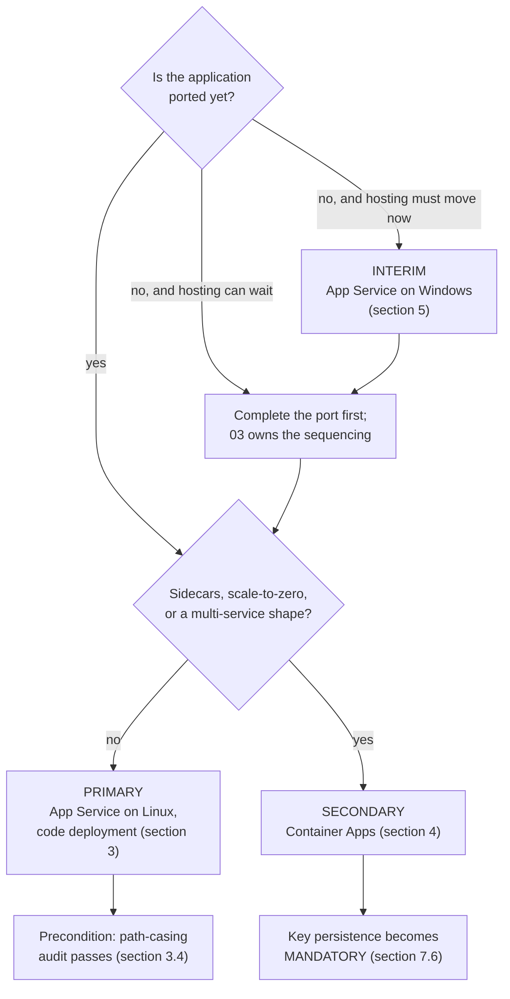

# 06 — Azure Hosting Recommendations

## 1. Purpose, ownership and authoring contract

### 1.1 What this document is

The hosting recommendation for the modernized MvcMusicStore application, and the specification of the Azure platform it runs on. It names a primary target, a secondary target and an interim option; it specifies the data platform, the identity model, the provisioning order, the key material, the telemetry, the transport policy, the supported browser matrix, the cutover runbook and the deployment mechanics.

It is one of the seven deliverables the user named directly. It consumes deliverable [12 — Migration Blockers](12-migration-blockers.md), which enumerates what must be resolved; deliverable [04 — .NET 8 Migration Strategy](04-dotnet8-migration-strategy.md), which fixes the target framework, the SDK band and every package pin; deliverable [11 — Cloud Readiness Assessment](11-cloud-readiness-assessment.md), which establishes the readiness facts this document acts on; and deliverable [10 — Build and Deployment Requirements](10-build-and-deployment-requirements.md), which establishes what the current build actually requires. It feeds deliverable [03 — Modernization Roadmap](03-modernization-roadmap.md), which sequences the work, and is cited by deliverable [05 — ASP.NET Core Migration Approach](05-aspnet-core-migration-approach.md) and by 11.

Its organizing rule is that **the recommendation is landed, not surveyed**. Research bounds the choice; this document makes it. A hosting document that lists three options with balanced advantages leaves the reader exactly where they started, and — worse — leaves the next reader free to pick differently. Every option below therefore carries a verdict, and the verdicts do not compete.

### 1.2 What this document is not

**It is not a provisioning action, and it is not an authorization to begin one.** Nothing here creates an Azure resource. Nothing here creates a file outside `docs/modernization/`.

It is not the roadmap. It states the *order* in which the four schema owners must be provisioned, because that order is a property of the platform rather than of the plan, but it states no sequence for the wider work; deliverable 03 owns that.

It is not the effort model and it is not the risk register. **No figure, duration, schedule or level of effort appears anywhere in this document** — deliverable [07 — Effort, Risks and Sequencing](07-effort-risks-sequencing.md) owns all three, and several decisions below hand it a named risk to carry.

It is not the cutover decision. Deliverable 05 decides that a **single cutover** is taken rather than an incremental strangler-fig migration, and 05 owns the two losses that decision accepts. Section 11 of this document is the **runbook that executes 05's decision**. It does not re-open it, does not restate the comparison, and should not be read as a second opinion on it.

### 1.3 The no-modification and no-provisioning constraint

The user directed **"Do not make code changes initially."** The environment setup instructions attached to this project independently restate the same gate: *"Do not modify code until assessment and modernization plan are approved."* Two inputs agreeing on it is why no defect named below is repaired here, including the ones this document depends on being repaired — the path-casing mismatch of section 3.4 and the destructive initializer of section 5.6 are specified as preconditions, not fixed.

**No Azure resource is provisioned by this work:** no resource group, no App Service plan, no Container Apps environment, no Azure SQL instance, no Key Vault, no managed identity, no Application Insights component, no Log Analytics workspace. **No infrastructure artifact is created:** no `Dockerfile`, no container manifest, no Bicep, ARM or Terraform template, no publish profile, no pipeline definition.

The distinction that governs this document is **mutation versus specification**, and it cuts both ways:

> This document must **prescribe** the infrastructure, the provisioning order, the grants and the runbook in full operational detail. Naming a `Dockerfile` as a conditional target artifact is required of it; creating one is forbidden to it. It fails if it reads as authorization to begin provisioning, and it fails equally if it declines to specify something because it mistook the prohibition on mutating for a prohibition on planning.

Everything below is written to be read and approved first. That is the point of the exercise.

### 1.4 Authoring contract, and the absence of user rules

`review_rules` returns exactly **"No user rules provided."** There is therefore **no project rule to name, summarize, cite or comply with**, and none is invented in its place. The absence is not licence to lower the bar. This document is held to enterprise-standard practice and to four contracts that stand where rules would:

1. **Every as-is claim carries an inline `[<path>:<locator>]` citation** at the point the claim is made, repository-relative and resolving in the checkout. There is no trailing reference list, because a citation collected at the end cannot be checked against the sentence it supports.
2. **Every repository-wide claim carries its reproducing command** adjacent to the claim. Most of the current-state facts this document rests on are *absences* — no key material, no security header, no telemetry, no pipeline — and an absence has no line to point at. The command is its evidence, and it is the stronger form, because a reader can re-run it. Appendix A collects every one.
3. **Where a version is named, it is exact and it is cited, not chosen here.** Every package pin and the SDK band belong to deliverable 04. This document names them only by reference; it never introduces a version of its own and never restates one as a decision.
4. **One fact, one owner.** A decision restated in different words downstream reads as a second decision, and a reader who finds two picks one. Sections 1.5 and 1.6 draw that line explicitly.

**Reproducing the commands on this host.** The commands quoted throughout are POSIX shell forms, executed on this Windows verification host through the bundled Git-for-Windows `bash`, run from the repository root. Every one is read-only: none writes to the working tree and none contacts the network.

### 1.5 What this document does not own

| Decision | Owner | What this document does instead |
| --- | --- | --- |
| **Target framework, SDK band and every package pin** | [04](04-dotnet8-migration-strategy.md) §2, §3, §7 | Cites them. The framework is referred to as "the target framework of 04" where the identity of the runtime matters and the number does not; the pins are cited by package name and section |
| **The cutover approach and the two losses it accepts** | [05](05-aspnet-core-migration-approach.md) | Section 11 writes the runbook that implements it. The decision is **not re-taken** and the alternative is **not re-argued** |
| **The two `DbContext` designs, their migration folders and the configuration transition** | [05](05-aspnet-core-migration-approach.md) | Specifies the *order* in which their migrations are applied and the *identity* that applies them. The context design itself is cited |
| **The no-bundler decision and the static-asset strategy** | [05](05-aspnet-core-migration-approach.md) | Uses it as an input to the code-deployment decision in section 3.3 — the absence of a build-time asset toolchain is what removes the argument for a container |
| **The distinction between the Release publish setting and the runtime error-handling decision** | [05](05-aspnet-core-migration-approach.md) | Records the publish half in section 12.4 and cites 05 for the runtime half rather than restating it |
| **The operator provisioning command, its secret channel and its idempotence** | [05](05-aspnet-core-migration-approach.md) | Specifies only the **sink its audit record is written to** (section 9.5) and the point in the release at which it runs |
| **Per-edition build outcomes** | [10](10-build-and-deployment-requirements.md) §3, §5–§8 | Cites them. Sections 5.4 and 12.3 take MVC 5's build status exactly as 10 §5.4 records it — *the source compiles cleanly once restored, while a clean checkout still cannot build without a restore the repository does not wire* — and do not re-diagnose it |
| **The deployment-automation absence as a build finding** | [10](10-build-and-deployment-requirements.md) §12 | Verifies the absence independently in section 12.2, because it is the precondition of the pipeline specification, and cites 10 as the finding's owner |
| **Effort, risk register and sequencing of the wider work** | [07](07-effort-risks-sequencing.md), [03](03-modernization-roadmap.md) | Hands 07 three named risks (sections 3.4, 5.5, 10.4) and hands 03 two named gates (sections 8.3, 12.1). States no figure, duration or schedule |
| **CI provider selection** | [03](03-modernization-roadmap.md) | Specifies what the pipeline must do regardless of provider, and **explicitly does not select one** (section 12.1) |
| **Cloud-readiness findings and their framing** | [11](11-cloud-readiness-assessment.md) | Consumes them. Where this document repeats a current-state fact from 11 it is because a decision here turns on it, and 11 is cited as the owner |
| **The initializer's duplicate registration as a debt entry** | [08](08-technical-debt-register.md) | Cites it in section 5.6, where the duplication changes what "disable the initializer" operationally means |
| **The plaintext administrator credential as a security finding, and cookie policy** | [09](09-security-assessment.md) | Cites it. Section 8.4 specifies only the delivery mechanism that removes the credential from source |

### 1.6 The four decisions this document owns

These are stated once, here, in full, and are cited rather than restated everywhere else. Deliverables 03, 05 and 11 point at them.

| ID | Decision | Stated in |
| --- | --- | --- |
| **D1** | **Hosting target and deployment model.** Primary: Azure App Service on Linux, code deployment. Secondary: Azure Container Apps. Interim: Azure App Service on Windows hosting the un-ported application | §2, §3, §4, §5 |
| **D2** | **The deployment-time migration principal, and the separation of DDL rights from the runtime identity** | §6.2, §6.3, §6.6 |
| **D3** | **The data-protection key-ring location, its protect-at-rest behaviour, its rotation policy and its slot/revision isolation** | §7 |
| **D4** | **The observability approach** — structured logging through the framework abstraction, collected by platform auto-instrumentation, with no in-process telemetry SDK | §9 |

Eight supporting decisions follow from them and are also owned here, because no other deliverable claims them: secret delivery (§8.4), the session cache table's schema and name (§6.4), affinity retirement (§8.3), transport enforcement and the security-header set (§10.1, §10.2), the health probe's contract (§9.3), cache sizing (§6.4), the browser matrix (§10.4), and the build agent and base image (§12.3). Section 13.1 collects all twelve in one table.

---

## 2. The recommendation, landed

### 2.1 The decision in one table

| | **Primary** | **Secondary** | **Interim** |
| --- | --- | --- | --- |
| **Target** | Azure App Service, **Linux** plan | Azure Container Apps | Azure App Service, **Windows** plan |
| **What it hosts** | The ported application | The ported application | The **un-ported** .NET Framework 4.8 application |
| **Deployment model** | **Code** deployment (`dotnet publish` output) | Container image | Code deployment (Web Deploy / ZIP) |
| **Verdict** | **Recommended.** This is the target the roadmap builds toward | **Held in reserve.** Selected only if a named condition in §4.1 arises | **Available, and genuinely useful — but it is a stepping stone, not a destination** |
| **Precondition** | The repository-wide path-casing audit of §3.4 must pass **first** | The port must be complete — Windows containers are not supported (§4.2) | One of the two authentication paths in §5.3/§5.4 must be **chosen and costed**, and both preconditions in §5.6 met |
| **Container manifest** | None. No `Dockerfile` exists under this option | A `Dockerfile` is required — **conditional on this option only** (§4.4) | None |

**The recommendation is unambiguous: Azure App Service on Linux with code deployment.** Container Apps is not a co-equal alternative under evaluation; it is a documented escape hatch with an entry condition. The Windows interim option is not a different destination; it is a different *starting point* toward the same one.

### 2.2 The decision path



Read the diagram as a decision procedure, not as a set of equivalent branches. The right-hand path is the destination; the left-hand path is a way of getting hosting value before the code is ready, and it rejoins the same destination.

### 2.3 What the three options have in common

Every option below shares the same data platform, the same identity model, the same key material policy and the same transport policy — sections 6 through 10 are written once and apply to all three, with the differences called out where they exist. Three differences are worth naming up front so the later sections read cleanly:

- **The interim option cannot use managed identity for the data plane as the application is written today.** That is the whole substance of section 5.2, and it is the reason the interim option is not a lift-and-shift.
- **Container Apps escalates key persistence from advisable to mandatory** (section 7.6), because its replicas are ephemeral by construction.
- **Only Container Apps requires a container image**, and therefore only Container Apps requires a `Dockerfile` (section 4.4).

Everything else — one Azure SQL database, managed identity for the data plane where the code supports it, a SQL-backed distributed cache for session, a persisted data-protection key ring, HTTPS with HSTS, an explicit security-header set, structured logging collected by platform auto-instrumentation, and a health surface the platform probes — is common ground.

---

## 3. Primary — Azure App Service on Linux, code deployment (D1)

### 3.1 Why App Service rather than Container Apps

**Because the application's shape is the shape App Service is optimized for.** Microsoft positions App Service for web applications and Container Apps for serverless microservices and event-driven jobs, and MvcMusicStore sits squarely on the first side of that line.

The evidence is the repository's own composition, not a preference:

- **It is a single deployable unit.** `MvcMusicStore.csproj` declares no `<ProjectReference>` element and is a leaf project [src/MVC5/MvcMusicStore/MvcMusicStore.csproj:1-302]. There is nothing to decompose, and no second thing to deploy alongside it.
- **There is no background worker and no event-driven component.** All composition happens in two startup entry points — `Application_Start` [src/MVC5/MvcMusicStore/Global.asax.cs:13-21] and the OWIN startup [src/MVC5/MvcMusicStore/Startup.cs:4-14] — and neither starts a queue consumer, a timer, a scheduled job or a message handler. Every unit of work in the application is a response to an HTTP request. Deliverable [01](01-architecture-overview.md) owns the architecture description; the consequence for hosting is that there is no workload here that wants a separate scale profile.
- **There is no outbound service dependency to model.** The application talks to one database and nothing else, which deliverable 11 §4.3 records as a favourable readiness finding.

A single request-driven web application with one datastore and no sidecar gains nothing from a container-orchestration platform and pays for it in operational surface: an image build, a registry, an ingress configuration and a revision model, all in service of a deployment that is one process.

### 3.2 Why Linux rather than Windows

**Because after the port there is no Windows-specific dependency left, and Linux plans are the lower-cost option.**

The three things that tie the current application to Windows all disappear in the port, and each is named by an owner:

| Windows dependency today | Evidence | Why it is gone after the port |
| --- | --- | --- |
| `System.Web` and the IIS integrated pipeline | The application class derives from `System.Web.HttpApplication` [src/MVC5/MvcMusicStore/Global.asax.cs:11]; `Views/Web.config` installs a handler mapping under `preCondition="integratedMode"` [src/MVC5/MvcMusicStore/Views/Web.config:31-32] | Neither construct has a successor. Deliverable 12 §3 owns the blocker; the target runs on Kestrel |
| LocalDB with file attachment | `AttachDbFilename=\|DataDirectory\|\MvcMusicStore.mdf` [src/MVC5/MvcMusicStore/Web.config:13] | File attachment has no cloud analogue on any platform, Windows included. Deliverable 11 §3.3 owns the finding; section 6.1 below states the replacement |
| Windows-integrated authentication to the database | `Integrated Security=True` on both connection strings [src/MVC5/MvcMusicStore/Web.config:12-13] | Replaced by managed identity (section 6.1). Deliverable 11 §3.4 owns the finding |

Note carefully that the middle two are *not* arguments for Windows — they are arguments against the current data topology, and they must be resolved for **any** cloud target including Windows App Service. That is exactly what makes the interim option of section 5 harder than it looks.

Once the port is done, the deployable artifact is framework-agnostic managed code targeting the framework of [04](04-dotnet8-migration-strategy.md) §2, with no P/Invoke, no COM interop, no Windows-only API and no native binary. Linux App Service plans cost less than the equivalent Windows plans for the same tier, so absent a technical reason to pay the difference, Linux is selected.

**Linux does carry one obligation, and it is a hard precondition — section 3.4.**

### 3.3 Why code deployment rather than a container image

**Because the application has nothing a container would carry.** Three conditions would each justify an image, and none holds:

- **No native dependency and no custom system package.** The application executes no raw SQL and calls no unmanaged code — deliverable 12 §6 records both as portability findings in the application's favour. Nothing needs to be installed into an image beyond the runtime App Service already provides.
- **No build-time asset toolchain.** Under the no-bundler decision owned by [05](05-aspnet-core-migration-approach.md), the 27 MVC 5 static assets are relocated and served by static-file middleware with the framework's own cache-busting; no npm, no bundler and no minification step exists in the build. Deliverable 04 §9 owns the client-library acquisition mechanism and records that the restored libraries are **committed**, so even asset acquisition is not a build-time step. There is therefore no build stage that a container image would encapsulate.
- **No runtime configuration that only an image can express.** Everything the application needs at runtime arrives through platform configuration (section 8.4).

A container under these conditions adds an image build, a registry to host it, image lifecycle and vulnerability-scanning obligations, and a second thing to version — **for no capability gained**. The deployable artifact is therefore the framework's own publish output, deployed as code.

That is a reversible decision and cheaply so: the same publish output can be containerized later without changing the application, which is precisely what makes the Container Apps escape hatch in section 4 credible.

### 3.4 The precondition — a repository-wide path-casing audit

**This is stated as a precondition, not a caveat. The Linux recommendation is not viable until the audit passes.**

Linux filesystems are case-sensitive; the Windows filesystem IIS serves from is not. The repository contains at least one demonstrated mismatch that IIS resolves silently and Linux will not:

- The style bundle registers `"~/Content/site.css"` — lowercase `s` [src/MVC5/MvcMusicStore/App_Start/BundleConfig.cs:28].
- The tracked file is `Content/Site.css` — capital `S`.

```bash
git ls-files 'src/MVC5/MvcMusicStore/Content/*'
# -> src/MVC5/MvcMusicStore/Content/Site.css        <- capital S
#    src/MVC5/MvcMusicStore/Content/bootstrap.css
#    src/MVC5/MvcMusicStore/Content/bootstrap.min.css
grep -n 'site.css' src/MVC5/MvcMusicStore/App_Start/BundleConfig.cs
# -> 28:                      "~/Content/site.css"));
```

Exactly three files, one capital letter, one mismatch. The sibling reference on the line above — `"~/Content/bootstrap.css"` [src/MVC5/MvcMusicStore/App_Start/BundleConfig.cs:27] — matches its file exactly, which is what makes this a defect rather than a convention: the same registration block is right about one path and wrong about the next.

**Why the failure mode makes this a precondition rather than a bug to fix later.** The application starts, the page returns HTTP 200, and the stylesheet 404s. The site renders unstyled. Nothing throws, nothing is logged — and today nothing *could* be logged, because there is no logging at all (section 9.4). The defect would be discovered by a user, not by a deployment. Deliverable 11 §3.7 owns the readiness finding and deliverable 12 F-12-17 carries it as a differing-default blocker, both naming this document as the owner of the audit obligation. This is that obligation, stated:

**The audit must cover three surfaces, and reference-count parity is its exit criterion:**

| Surface | Scope | Command |
| --- | --- | --- |
| Bundle registrations | All 5 registrations in MVC 5's bundle configuration [src/MVC5/MvcMusicStore/App_Start/BundleConfig.cs:11-28] — every include path, not only the CSS pair | `grep -c 'bundles.Add' src/MVC5/MvcMusicStore/App_Start/BundleConfig.cs` → `5` |
| `@Url.Content` call sites | 4 occurrences across MVC 5's views | `git grep -o '@Url.Content' -- 'src/MVC5/MvcMusicStore/Views/*.cshtml' \| wc -l` → `4` |
| View, layout and partial paths | Every `Views/...` path referenced from a controller, a layout reference or a partial invocation, plus the `wwwroot` relocation of every asset | Enumerated during the port; the target-state check is a case-sensitive build-and-serve |

**The audit's exit criterion is mechanical: on a case-sensitive filesystem, every referenced path resolves.** The way to demonstrate that is to run the ported application on a case-sensitive filesystem — a Linux build agent (section 12.3) or a Linux App Service deployment slot — and assert that no request returns 404 for a static asset or a view. That assertion belongs in the test suite whose architecture 05 specifies; the requirement that it exist is this document's.

**Deliverable 07 carries the audit's failure mode as a risk** — a casing miss that survives the audit produces a cosmetically broken production page with no telemetry signal, and the mitigation is the case-sensitive pre-deployment check above rather than a code review.

### 3.5 Platform configuration for the primary target

The App Service settings that are decisions rather than defaults. Each is stated so that a reviewer can approve it and an operator can apply it without inferring anything.

| Setting | Value | Reason |
| --- | --- | --- |
| Operating system | Linux | §3.2 |
| Deployment model | Code (`dotnet publish` output, ZIP-deployed) | §3.3 |
| Runtime stack | The .NET runtime matching the target framework of [04](04-dotnet8-migration-strategy.md) §2 | The framework version is 04's; this document does not restate it |
| HTTPS Only | On | §10.1 |
| Minimum TLS version | The highest the platform offers as a supported minimum | §10.1 |
| Client-certificate mode | Off | No mutual-TLS requirement exists |
| FTP/FTPS state | Disabled | No deployment path uses it; it is an open credentialed surface otherwise |
| SCM basic-authentication publishing credentials | Disabled | Deployment is by pipeline identity (§12.1), not by publishing profile — and [.gitignore:18] shows the repository never tracked one anyway |
| Always On | On | Removes cold-start on the first request after idle. Relevant because the current application's cold start is dominated by Razor compilation, EF initialization and database attach — all of which the port changes, but none of which it makes free |
| ARR affinity (`clientAffinityEnabled`) | **On initially, then off** — see §8.3 | It is the control that makes today's in-process session survivable, and it is retired only after distributed session and shared keys are both live |
| System-assigned managed identity | Enabled | §6.1 |
| Health-check path | The path specified in §9.3 | Removes an unhealthy instance from rotation |
| Diagnostic logging | Enabled to the workspace of §9.2 | §9 |
| Deployment slots | At least one staging slot, with slot-scoped key isolation | §7.4, §11 |

**One platform behaviour deserves naming because it changes application code rather than configuration.** App Service terminates TLS at its front end and forwards the request to the application over the internal network, so the application sees an HTTP request with the original scheme in a forwarded header. Any code or middleware that makes a decision based on the request scheme — HTTPS redirection, secure-cookie emission, absolute URL generation — must read the forwarded headers rather than the transport. Deliverable 11 §3.6 names forwarded-scheme handling as a required control; the platform-side half is that the header is present, and the application-side half is that the forwarded-headers middleware is registered before anything that depends on the scheme. Getting this wrong produces a redirect loop, which is a loud failure, or cookies emitted without the secure attribute, which is a silent one.

### 3.6 What the primary target does not solve

Stated so the recommendation is not read as more than it is. Selecting App Service on Linux resolves the hosting axis and nothing else. It does not resolve:

- **Any framework-level blocker.** Every construct in deliverable 12 §3 with no successor is still there and still has to be dealt with by the port.
- **The absence of a regression baseline.** There is no test of any kind in the repository — deliverable 10 §9 owns that finding — so nothing would detect a behaviour change caused by the port. Deliverable 05 specifies the test suite; deliverable 07 carries the absence as a risk.
- **The destructive schema initializer.** `SampleData : DropCreateDatabaseIfModelChanges<MusicStoreEntities>` [src/MVC5/MvcMusicStore/Models/SampleData.cs:9] is replaced by migrations under the port. Hosting choice does not touch it — and section 5.6 explains why that matters acutely on the interim path.

---

## 4. Secondary — Azure Container Apps (D1, held in reserve)

### 4.1 When it becomes the right answer

Container Apps is retained as the secondary target, to be selected if **any one** of three conditions arises. Each is a shape change in the application, not a preference:

1. **The application acquires a sidecar** — a local cache, a proxy, an agent, or any process that must share the request-serving unit's lifecycle and network namespace. App Service's single-container model does not express that; Container Apps does.
2. **Scale-to-zero becomes a requirement.** If the workload becomes intermittent enough that paying for a warm plan stops making sense, Container Apps' scale-to-zero is the right economic model and App Service's is not.
3. **The application takes on a multi-service shape** — a background worker, a queue consumer, a scheduled job, or a genuine service decomposition. The moment there is a second deployable with its own scale profile, the orchestration platform earns its keep.

None of the three holds today (section 3.1), which is why it is secondary. All three are plausible futures, which is why it is retained rather than dismissed.

### 4.2 The sequencing constraint — not a preference

**Azure Container Apps does not support Windows containers.** The consequence is precise and it is a *sequencing* fact rather than a *preference* fact:

> **Container Apps is unavailable for the un-ported application. It becomes available only once the port to the target framework of [04](04-dotnet8-migration-strategy.md) §2 is complete.**

The un-ported application requires the .NET Framework, which requires a Windows container, which Container Apps cannot run. This is not a judgment that Container Apps is a worse fit for the legacy code; it is that the option does not exist until the code changes. Framed correctly, it removes a comparison a reader might otherwise attempt: there is no "Container Apps versus Windows App Service" decision for the interim step, because only one of the two is on the table.

It also has a direct consequence for the interim option in section 5: **if hosting must move before the port, the platform choice is Windows App Service by elimination**, not by preference.

### 4.3 What changes if Container Apps is selected

Everything in sections 6 through 10 continues to apply, with five differences:

| Concern | Under Container Apps | Where it is specified |
| --- | --- | --- |
| **Data-protection key persistence** | **Mandatory, not advisable.** Replicas are ephemeral by construction; a filesystem key ring would not survive a revision, and no affinity mechanism papers over it | §7.6 |
| Deployment artifact | A container image in a registry, replacing the code deployment of §3.3 | §4.4 |
| Ingress and TLS | Container Apps ingress with HTTPS enforced; the forwarded-scheme obligation of §3.5 applies identically | §10.1 |
| Telemetry collection | Auto-instrumentation is an App Service capability. Under Container Apps the same `ILogger` signal is collected through the environment's Log Analytics integration; **the application-side decision in §9.1 does not change**, and specifically no in-process telemetry SDK is added | §9.1, §9.2 |
| Session affinity | Container Apps supports session affinity, but the retirement decision in §8.3 is unchanged: affinity is interim on either platform | §8.3 |

**The first row is the one that changes a status rather than a mechanism, and it is the row to read twice.** The reason the key-ring decision escalates on Container Apps is that Container Apps removes the safety net App Service's default affinity provides — deliverable 11 §3.2 records that conditional consequence and names this document as the owner of the resulting policy.

### 4.4 The conditional `Dockerfile`

**A `Dockerfile` is required under this option and under no other. It is named here as a conditional target artifact; it is not created by this work.** Deliverable 04's future application map records it identically — CREATE, net-new, conditional on the container-native hosting option that this document selects or declines.

If the option is ever selected, the manifest is specified as follows, so the later phase does not re-decide it:

- A **multi-stage build**: an SDK stage that restores and publishes, and a runtime stage carrying only the publish output. The SDK image band must satisfy the `global.json` band pinned in [04](04-dotnet8-migration-strategy.md) §3 and §6.1, exactly as the build agent must (section 12.3).
- **Restore in locked mode**, consistent with 04 §6.4, so that a transitive change fails the image build rather than arriving inside it silently.
- **A non-root user** in the runtime stage.
- **No database tooling in the runtime image.** The migration executor runs from the release pipeline under the deployment principal (section 6.2) and has no business inside the application image, whose identity deliberately lacks DDL rights.
- **A `.dockerignore`** excluding the same categories the repository's own `.gitignore` excludes — build output, restored packages, IDE state [.gitignore:1-2,15,32] — so the build context does not carry the 41 MB of committed database binaries into an image layer.

The repository has **no container manifest of any kind today**:

```bash
git ls-files | grep -icE '(^|/)Dockerfile|docker-compose|\.dockerignore$'   # -> 0
```

Deliverable 10 §12.1 owns that absence as a build-and-deployment finding.

---

## 5. Interim — Azure App Service on Windows, hosting the un-ported application (D1)

### 5.1 Why this option is presented at all

**Because it decouples two decisions the user may want to take at different times, and a hosting document that assumes every Azure move follows the port answers a question that was not asked.**

Windows App Service runs .NET Framework 4.8 ASP.NET applications. MVC 5 targets 4.8 [src/MVC5/MvcMusicStore/MvcMusicStore.csproj:16]. So *hosting* can modernize before the *code* does: the application can leave the Windows-and-Visual-Studio build-and-run constraint that deliverable 11 §3.8.4 records as a readiness result in its own right, and gain managed patching, managed TLS, platform scaling, deployment slots and platform telemetry, without waiting for a single line of the port.

That is a real and defensible position, and there are organizations for whom it is the right first move. It is presented here on its merits.

### 5.2 It is not a data move — and that is the finding

**This is where a hosting recommendation usually goes wrong.** The interim option looks like a lift-and-shift that needs only the database relocated. It is not, and the reason is one line of configuration.

The un-ported application connects with `System.Data.SqlClient` and Windows-integrated authentication:

```xml
<add name="DefaultConnection"    connectionString="Data Source=(LocalDb)\MSSQLLocalDB;AttachDbFilename=|DataDirectory|\aspnet-MvcMusicStore-20131025034205.mdf;Initial Catalog=aspnet-MvcMusicStore-20131025034205;Integrated Security=True" providerName="System.Data.SqlClient"/>
<add name="MusicStoreEntities"   connectionString="Data Source=(LocalDb)\MSSQLLocalDB;     AttachDbFilename=|DataDirectory|\MvcMusicStore.mdf;     Integrated Security=True" providerName="System.Data.SqlClient"/>
```

Both live elements, both `Integrated Security=True`, both `System.Data.SqlClient` [src/MVC5/MvcMusicStore/Web.config:12-13].

```bash
grep -n 'Integrated Security' src/MVC5/MvcMusicStore/Web.config    # -> 12, 13
```

**`Integrated Security=True` cannot authenticate to Azure SQL Database from App Service as written.** It instructs the client to present the process's Windows identity to the server through integrated authentication. An App Service worker has no domain identity to present and Azure SQL has no domain to validate one against. The setting is not merely suboptimal in the cloud; it is inoperative. Moving the data to Azure SQL and repointing the connection string produces an application that fails to open a connection.

Nor is the legacy client's provider a detail that can be left alone: `System.Data.SqlClient` does not implement Azure AD / Microsoft Entra token-based authentication for managed identity. The provider itself is part of the problem.

**Exactly one of two paths must be chosen and costed. There is no third path and no default.**

### 5.3 Path A — SQL authentication credentials behind a platform secret reference

Supply a SQL login and password to the application through App Service configuration, with the value backed by a Key Vault reference so the secret is never in the deployment payload or in source.

**What it requires:**

- A **contained SQL user or server login used only by this application**, with **data-plane permissions only** — read and write on the application's tables and nothing more. No `db_owner`, no DDL rights, no server-level role. The grant table in section 6.6 applies to this login exactly as it applies to the ported application's managed identity; only the authentication mechanism differs.
- The **connection string rewritten** to remove `Integrated Security=True`, remove `AttachDbFilename`, target the Azure SQL logical server, and set `Encrypt=True` with certificate validation on. The credential itself arrives as a Key Vault reference in App Service configuration, resolved by the site's managed identity at startup — so the site still has a managed identity, it is just used to fetch a secret rather than to authenticate to the database.
- An **automated rotation mechanism with an enforced interval**, because a credential without rotation is a credential that lives forever. The interval is an operational security control set by the security owner at approval — this document requires that one exist, be automated, and be verified by an alert on approaching expiry. (An operational rotation interval is a property of the control, not a project schedule.)
- A **recorded, explicit, time-boxed exception** to the no-stored-credentials principle that section 6.1 otherwise establishes. The exception is time-boxed by an **event, not a date**: it expires when the port completes and the application moves to the primary target. Deliverable 03 owns the gate that event corresponds to; this document requires that the exception name the gate and that the gate's completion trigger the credential's removal.

**Cost, stated plainly:** it is the faster path — the change is configuration plus one connection string rewrite — and **it carries a credential**. Every stored credential is a credential that can be leaked, logged, copied into a developer's local configuration, or left behind after the port. The security posture is strictly worse than the target's, and it is accepted knowingly and temporarily or not at all.

### 5.4 Path B — upgrade the data provider and connect with managed identity

Replace `System.Data.SqlClient` with the modern SQL client and authenticate the connection with the site's managed identity, exactly as the ported application will.

**What it requires:**

- A **provider change in the un-ported application** — the client library referenced by the project and the `providerName` on both connection strings, plus whatever EF 6 provider configuration follows from it.
- **Connection-string changes** to select managed-identity authentication and enforce encryption in transit.
- A **build, test and regression cycle on the un-ported application**, against a codebase that has no test of any kind (deliverable 10 §9) and that **cannot be built from a clean checkout at all without a restore the repository does not wire** (deliverable 10 §5.1–§5.3). The source itself compiles cleanly once restored, on a recorded Windows run with its tool versions and restore source stated (deliverable 10 §5.4), so the residual exposure here is not an unknown compiler outcome — it is that the build depends on a package source the repository never declares. Changing the data provider of an application whose build rests on an unrecorded, host-inherited source is a compounding risk, and it is 10's finding that establishes it.

**Cost, stated plainly:** it is the cleaner path — no credential exists at any point, and the identity model is the same one the target uses, so nothing has to be unwound later. And it is **a code change, which falls under the approval gate like any other**. The moment Path B is selected, the interim step is **no longer a lift-and-shift**: it is a small, targeted migration of the data-access layer, performed on the legacy codebase, and it must be approved as such.

### 5.5 Choosing between them

| | **Path A — SQL credential** | **Path B — modern client + managed identity** |
| --- | --- | --- |
| Application code changed? | No | **Yes** — provider reference and connection configuration |
| Falls under the approval gate? | Configuration only | **Yes, as a code change** |
| Credential exists? | **Yes** — stored, referenced, rotated | No |
| Consistent with the target identity model (§6.1)? | No — it is an exception to it | Yes |
| Work discarded when the port completes? | Yes — the credential and its rotation machinery are removed | No — the provider change is a step the port needs anyway |
| Principal risk | Credential leakage; the "temporary" exception outliving its gate | Modifying the data layer of an application with no regression baseline |

**This document does not choose for the approver, and says so deliberately** — the choice turns on whether the organization can accept a time-boxed stored credential, which is a policy judgment held by the security owner rather than a technical one held here. What this document does require is that **the choice be made explicitly and recorded before the interim step begins**, and that neither path be entered by drift. **Deliverable 07 carries this as a risk with the security owner named**, because the characteristic failure is not choosing badly — it is choosing Path A, never completing the port, and discovering years later that the time-boxed exception had no box.

### 5.6 Two preconditions that apply to either path

**Precondition 1 — the file-attached database must be migrated to Azure SQL first.** Both connection strings attach a database file from the application directory [src/MVC5/MvcMusicStore/Web.config:12-13], and there are two of them, not one — a catalog store and a separate ASP.NET Identity store, both committed as binaries:

```bash
git ls-files 'src/MVC5/MvcMusicStore/App_Data/*'
# -> MvcMusicStore.mdf, MvcMusicStore_log.ldf,
#    aspnet-MvcMusicStore-20131025034205.mdf, aspnet-MvcMusicStore-20131025034205_log.ldf
```

**File attachment has no cloud analogue** — deliverable 11 §3.3 owns that finding, and it holds on Windows App Service exactly as it does on Linux. Azure SQL is a service reached over the network; there is no directory to attach from. So the data migration that the target needs is a precondition of the *interim* step too, which is a large part of why the interim step is not free.

**Precondition 2 — the destructive initializer must be disabled before the application is ever pointed at the migrated database. This is the precondition that can destroy data.**

The application registers a database initializer whose strategy is to **drop and recreate the database whenever the model no longer matches the schema**:

```csharp
public class SampleData : DropCreateDatabaseIfModelChanges<MusicStoreEntities>
```

[src/MVC5/MvcMusicStore/Models/SampleData.cs:9]

Consider the sequence honestly. The database is migrated to Azure SQL. Some difference exists between the schema as migrated and the model as compiled — a column type inferred differently by the migration tooling, a precision or nullability difference, an index. The application starts, EF compares the model hash, finds a mismatch, and **drops the database and reseeds it from the 826-line hardcoded seed**. Every order, every registered user's cart, and every row of PII created since the migration is gone. Not corrupted — gone, and replaced with sample data.

**Disabling one registration is not enough to reason about, and this is the operational trap.** The initializer is registered in **two** places:

```bash
git grep -n 'SetInitializer' -- 'src/MVC5/*'
# -> src/MVC5/MvcMusicStore/App_Start/Startup.App.cs:16
#    src/MVC5/MvcMusicStore/Global.asax.cs:20
```

[src/MVC5/MvcMusicStore/Global.asax.cs:20] and [src/MVC5/MvcMusicStore/App_Start/Startup.App.cs:16]. Deliverable [08](08-technical-debt-register.md) owns the duplication as a debt finding and establishes the mechanics — `SetInitializer<TContext>` *sets* the strategy rather than adding to a list, so the second call replaces the first and only one initialization actually runs. That is precisely why it must be treated as two sites and not one: **which** of the two is live depends on startup ordering, so an operator who disables the one they happened to find cannot demonstrate that the destructive path is closed. Both sites must be addressed, and the closure must be *demonstrated* rather than asserted.

**How to demonstrate it, since assertion is not enough for an operation with this blast radius:**

1. Both registration sites disabled or replaced with a null initializer.
2. The application started against a **copy** of the migrated database, with a deliberate model/schema mismatch present, and the database observed to survive.
3. Only then is the application pointed at the real migrated database.
4. A **point-in-time-restorable backup taken immediately before** the first connection, so that step 3 is recoverable even if steps 1 and 2 were wrong.

The permanent replacement — migrations plus a guarded non-production seeding routine — is owned by deliverable 05, and it is what the ported application uses. The interim path does not get that replacement, which is why it needs this procedure instead.

### 5.7 What the lift buys, and what it does not

**The conclusion, stated so it cannot be misread: the lift buys hosting modernization without addressing any framework-level debt. It is a stepping stone, not a destination.**

| Bought | Not bought |
| --- | --- |
| Managed OS and runtime patching | Any construct in deliverable 12 §3 with no successor — bundling, OWIN, `HttpApplication`, `HandleErrorAttribute`, the handler mapping |
| Managed TLS, certificates and a modern cipher policy | The 2011–2013 client-side dependency pins deliverable [02](02-dependency-inventory.md) inventories |
| Platform scaling, deployment slots, platform health probing | Session-held cart identity and its scale-out consequence (deliverable 11 §3.1) |
| Escape from the Windows-and-Visual-Studio *runtime* requirement (deliverable 11 §3.8.4) — though **not** from the *build* requirement, which is still MSBuild on Windows (deliverable 10 §4) | The plaintext administrator credential [src/MVC5/MvcMusicStore/Web.config:16-17], which deliverable [09](09-security-assessment.md) owns and which the un-ported application still consumes at startup [src/MVC5/MvcMusicStore/App_Start/Startup.App.cs:21-45] |
| Managed backup and point-in-time restore on Azure SQL | Any observability. The un-ported application still emits nothing (section 9.4) |

The interim step therefore reduces *operational* risk and leaves *technical* risk untouched. Taken with a named exit gate, it is a legitimate first move. Taken as a substitute for the port, it is a way of paying cloud prices for legacy risk — and the credential exception in section 5.3 is the mechanism by which that outcome usually arrives.

---

## 6. Data platform, identity and the DDL separation (D2)

### 6.1 Managed identity for data-plane authentication

**The application authenticates to Azure SQL Database with its platform-assigned managed identity. No credential exists in source, in configuration, in the deployment payload or in a secret store.**

This replaces `Integrated Security=True` [src/MVC5/MvcMusicStore/Web.config:12-13], which deliverable 11 §3.4 records as a Critical readiness blocker and which section 5.2 above shows to be inoperative against Azure SQL. The replacement is not a like-for-like translation — integrated security presents an ambient Windows identity; managed identity acquires a platform-issued token for a directory principal that the database recognizes as a user. The mechanics differ; the property preserved is the one that matters, which is that **the application holds no secret**.

Three further properties of the connection are decisions rather than defaults:

- **Encryption in transit is enforced**, with server certificate validation on. `Encrypt=True` and `TrustServerCertificate=False`. This is not the platform default for every client and it is not negotiable; deliverable 11 §3.6 owns the current-state finding that the application speaks plain HTTP and has no transport protection of any kind, and there is no reason to carry that posture to the data tier.
- **File attachment is gone.** `AttachDbFilename` [src/MVC5/MvcMusicStore/Web.config:12-13] has no cloud analogue — deliverable 11 §3.3 owns that framing. The database is reached over the network by logical server name; there is no directory and no file.
- **The connection string carries no `Initial Catalog` ambiguity.** Today `DefaultConnection` names its catalog explicitly [src/MVC5/MvcMusicStore/Web.config:12] while `MusicStoreEntities` relies on EF 6 resolving a connection string by matching the context's class name [src/MVC5/MvcMusicStore/Models/MusicStoreEntities.cs:5-13] — a convention EF Core does not have. Deliverable 12 §4 owns that blocker and deliverable 05 owns the explicit `DbContextOptions` registrations that replace it. The hosting consequence is narrow and stated here: **the connection string is supplied by platform configuration under a name the application reads explicitly** (section 8.4), never by convention.

### 6.2 Who applies DDL, and with what identity — the separation is the point

**Two statements, and both halves are load-bearing:**

> **1. Migrations are NOT applied by the web application at startup, and NOT under the runtime managed identity.**
>
> **2. Migrations ARE applied by a deployment-time step, run from the release pipeline under a deployment principal that holds DDL rights and that the application never uses.**

**Why startup migration is rejected.** It is the convenient pattern and it is wrong here for four independent reasons, any one of which would be sufficient:

- **It requires the runtime identity to hold DDL rights.** An application that can `ALTER TABLE` can also `DROP TABLE`, and a request-handling process on a public endpoint is the last place that authority belongs. The whole value of managed identity is undermined if the identity it grants is over-privileged.
- **It races itself under scale-out.** Multiple instances starting concurrently would each attempt to acquire the migration lock; the best case is serialization and a slow rollout, the worst is a partially applied schema.
- **It makes a schema failure a request failure.** A migration that fails at startup produces an instance that will not serve, discovered as an outage rather than as a failed release step.
- **It removes the deployment gate.** A schema change applied by the application cannot be reviewed, approved, dry-run or rolled back independently of the code that carries it.

**The deployment-time step, specified.** Either mechanism is acceptable and the choice is an operational preference:

| Mechanism | What it is | When it is the better fit |
| --- | --- | --- |
| **A migration bundle** | A self-contained executable produced at build time from the migration assemblies, carrying no SDK and no source, invoked with a connection string | The default. It is a build artifact, so what runs in production is what was tested; it needs no SDK on the runner |
| **A one-shot job** | A short-lived container or job that runs the migration command and exits | Preferred if the platform is Container Apps (section 4), where a job is a first-class resource |

Either way the step runs **from the release pipeline, before the new application revision is admitted to traffic** (section 11), under the deployment principal, and its exit code gates the release.

**The two identities, stated as a contract:**

| | **Deployment principal** | **Runtime managed identity** |
| --- | --- | --- |
| Who holds it | The release pipeline's service principal, or a named operator principal for a manual run | The App Service site or Container App revision |
| What it does | Creates the session cache table; applies both migration sets; creates the data-protection key table; runs the domain and Identity data migrations | Serves requests; reads and writes application data, session cache entries and data-protection keys |
| DDL rights | **Yes** | **No** |
| Lifetime of use | The duration of a release step | Continuous |
| Ever used by the application? | **Never** | Always |
| Credential | Federated / workload identity where the pipeline supports it; no long-lived secret | None — platform-issued token |

Deliverable 11 §3.3 names this document as the owner of exactly this separation, and it is stated here in full so that no downstream document has to infer it.

### 6.3 The provisioning order — four schema owners, in sequence

**The order is fixed. It is a property of the dependencies between the objects, not a scheduling preference, and every step is run by the deployment principal of section 6.2.**

There are four schema owners in one database — the session cache, the catalog context, the Identity context, and the data-protection key ring — plus the data load that follows them.

| # | Step | Executor | Depends on |
| --- | --- | --- | --- |
| **1** | **Create the session cache table** | The `dotnet-sql-cache` tool pinned in [04](04-dotnet8-migration-strategy.md) §6.3 | The database existing. **Nothing else — it is first** |
| **2** | **Apply the catalog context's migrations** | The migration bundle / job of §6.2 | Step 1 having completed |
| **3** | **Apply the Identity context's migrations** | The same executor, against the second context | Step 2 having completed |
| **4** | **Create the data-protection key table** | The migration path — see §7.2 | Step 3 having completed |
| **5** | **Load the domain data, then migrate the Identity data** | The data-migration tooling that deliverable [05](05-aspnet-core-migration-approach.md) owns | Steps 2, 3 and 4 having completed |

**Why the cache table is first, and not merged into the migrations.** It is created by a tool, not by a migration, so it is not part of either context's migration graph and no migration orders it. If it is left until after the application is deployed, the first request that touches session fails against a missing table — and session is on the cart path, which is the application's primary user journey. Putting it first removes the ordering question entirely.

**Why step 5 is last and separate.** An initial migration creates empty tables; it moves no rows. Deliverable 05 owns the schema-extraction gate and the data-migration design, and the ordering constraint recorded here is only that the data load cannot precede the schema and that the Identity data migration cannot precede the key table — because a signed-in verification of a migrated account needs a durable key ring to issue a cookie against.

**Idempotence, because a release step that cannot be re-run is a release step that fails once and stays failed.** Steps 2 and 3 are idempotent by construction: the migration executor consults the history table and applies only what is pending. Steps 1 and 4 must be made idempotent explicitly — see sections 6.4 and 7.2. Step 5's idempotence is 05's to specify.

### 6.4 The session cache table, fully specified

The runtime package reads and writes this table; **it does not create it**. Deliverable 04 §6.3 states the same distinction from the package side, and it is the reason the tool is a separate pin. A plan that lists only the runtime package produces a deployment with a session cache and no table behind it.

| Property | Value |
| --- | --- |
| **Schema** | `dbo` |
| **Table name** | `SessionCache` |
| **Created by** | The `dotnet-sql-cache` tool, at the pin in [04](04-dotnet8-migration-strategy.md) §6.3, restored by `dotnet tool restore` from the committed tool manifest |
| **Created under** | The **deployment principal** of §6.2 — this is a `CREATE TABLE`, so it is not the runtime identity's to perform |
| **When** | Step 1 of §6.3, before either migration set |
| **Read and written by** | `Microsoft.Extensions.Caching.SqlServer` at the pin in [04](04-dotnet8-migration-strategy.md) §7.2, under the **runtime** identity, which needs `SELECT`, `INSERT`, `UPDATE` and `DELETE` on it and nothing more |

**The release command:**

```bash
dotnet tool restore
dotnet sql-cache create "<connection string for the deployment principal>" dbo SessionCache
```

**The verification step, which is not optional** — the command's exit code proves it ran, not that the object is correct:

```sql
-- 1. the table exists in the expected schema
SELECT s.name AS [schema], t.name AS [table]
FROM sys.tables t JOIN sys.schemas s ON s.schema_id = t.schema_id
WHERE s.name = 'dbo' AND t.name = 'SessionCache';        -- expect exactly one row

-- 2. it carries the index the cache implementation depends on for expiry scans
SELECT i.name, i.type_desc
FROM sys.indexes i
WHERE i.object_id = OBJECT_ID('dbo.SessionCache');       -- expect the primary key and the expiry index
```

followed by an **end-to-end check that is the one that actually matters**: after deployment, issue a request that writes to session, then issue a second request routed to a **different instance** with affinity disabled, and confirm the session value is read back. That single check exercises the cache table, the distributed-cache registration, and the shared key ring of section 7 simultaneously — and it is the check that fails if any one of them is wrong. It belongs in the deployment verification of section 11.

**Idempotence.** The tool's create is not a no-op against an existing table. The release step therefore guards it: query for `dbo.SessionCache` first and skip the create if it exists. That guard is part of the pipeline definition specified in section 12.1.

**Sizing, and the one thing that makes it non-trivial.** Session content is small — the cart key is a single string, either a login name or a GUID [src/MVC5/MvcMusicStore/Models/ShoppingCart.cs:163-179] — so the table's row size and growth are negligible and no capacity planning is warranted for session itself. What is *not* negligible is that deliverable 11 §3.8.2 records an uncached per-request aggregate rendered from the shared layout on **every** page, and names this document as the owner of cache sizing. The decision is: **the session cache table is sized for session only, and the per-request aggregate is cached in memory per instance rather than in the SQL cache.** The aggregate is identical for all users, tolerates staleness measured in minutes, and is cheap to recompute on a cold instance; routing it through a database round-trip to avoid a database round-trip would be self-defeating. If it is ever moved to a distributed cache, that is a separate decision with its own sizing, and the SQL cache table would be the wrong home for it — a dedicated cache service would be.

### 6.5 Two contexts, one database — the trade, recorded so it can be reversed knowingly

**Both contexts target a single Azure SQL database, with separate migration folders and distinct migration history tables.**

The context design is deliverable 05's; the *hosting* consequence — one instance, one connection string, one backup — is this document's, and so is the trade.

**The reason is not a foreign key, and it would be wrong to imply one.** There is no relational link between the catalog store and the Identity store. `Order.Username` holds a login name compared against the authenticated principal [src/MVC5/MvcMusicStore/Controllers/CheckoutController.cs:71-73], and the cart's key is a login name or a session GUID [src/MVC5/MvcMusicStore/Models/ShoppingCart.cs:163-179]. Both are denormalized strings. The two stores are coupled by convention only. Consolidating them removes an *operational* dependency, not a *relational* one.

| Gained | Given up |
| --- | --- |
| **One connection string** to supply, rotate the reference for, and get wrong in only one place | **A shared blast radius.** A destructive error, a bad migration or a capacity exhaustion affects catalog, credentials, session and key material together |
| **One migration target**, so a release applies to one endpoint | **Coarser permission granularity.** Both contexts *and* the session cache *and* the key ring share one principal's grants (§6.6). A read of the catalog and a read of the key table are indistinguishable at the permission level |
| **One backup and restore story**, so a point-in-time restore recovers a consistent whole | **A single scaling unit.** Catalog read load and session write load compete for the same DTU/vCore budget and cannot be tuned apart |
| **One instance to provision**, monitor, patch, firewall and pay for | **A single availability domain.** There is no configuration in which credentials remain servable while the catalog is down |

**The verdict, and its condition: for an application of this size with one deployable unit, operational simplicity wins.** The condition under which it stops winning is stated so a future reader can act on it — if session write volume begins to contend with catalog reads, or if a compliance requirement demands that credential data sit under separate permissions from catalog data, the Identity context and the session cache are the two candidates to move out, in that order, and neither move requires an application change beyond a second connection string.

**Distinct history tables are a requirement, not a detail.** Two contexts sharing one history table would each see the other's migrations as unknown, and depending on the executor's behaviour would either fail or attempt to re-apply them. The requirement is therefore: **each context's migrations record into a history table unique to that context** — `__EFMigrationsHistory_Catalog` and `__EFMigrationsHistory_Identity` are the recommended names, and 05 may name them otherwise provided they are distinct. The data-protection key table's own creation path is section 7.2.

### 6.6 Grants, stated explicitly

Least privilege is only meaningful if the grants are written down. Both principals are database-level users mapped to directory identities; neither is a SQL login with a password on the primary target.

| Principal | Database role membership | Explicit grants beyond the roles | Explicitly NOT granted |
| --- | --- | --- | --- |
| **Runtime** — the site's managed identity | `db_datareader`, `db_datawriter` | None. Every table it touches — catalog, Identity, `dbo.SessionCache`, the key table — is covered by the two data roles | `db_owner`, `db_ddladmin`, `db_securityadmin`; any `CREATE`, `ALTER` or `DROP`; any server-level role |
| **Deployment** — the pipeline's service principal | `db_ddladmin`, `db_datareader`, `db_datawriter` | `ALTER ANY SCHEMA` only if a migration creates a schema | `db_owner`; `db_securityadmin`; anything server-scoped |

**Three notes, because each is a real trap:**

1. **The runtime identity needs `INSERT` on the key table, not just `SELECT`.** The data-protection stack *creates* new keys at runtime when the current key approaches expiry (section 7.3). An identity granted read-only access to the key ring will serve correctly right up to the moment the key rolls, and then fail to write the new key — a fault that surfaces once, long after deployment, and looks nothing like a permissions problem. `db_datawriter` covers it; a hand-rolled read-only grant on the key table would not.
2. **The deployment principal needs the data roles too, not only `db_ddladmin`.** The migration executor writes rows to the history table, and any migration carrying data operations writes rows to application tables. `db_ddladmin` alone leaves the executor able to create the table it then cannot record.
3. **Neither principal is `db_owner`.** `db_owner` would collapse the separation section 6.2 exists to create, and it is the default that gets chosen when nobody writes the grants down. This table is the countermeasure.

### 6.7 Backup, restore and the recovery position

Recorded here because the one-database decision in section 6.5 makes the backup story a single story, and because two operations in this document — the interim step of section 5.6 and the cutover of section 11 — depend on a restorable point existing.

- **Automated backups with point-in-time restore** are used as the platform provides them; the retention window is set explicitly rather than left at its default, and the value is an operational control set by the data owner at approval.
- **A manual restore point is taken immediately before** each of: the first connection of the interim application to the migrated database (section 5.6), the domain-data load (step 5 of section 6.3), and the cutover (section 11).
- **The restore procedure is exercised, not assumed.** A restore to a separate database name, verified by row counts against the source, is part of the deployment verification the first time the platform is stood up. An untested backup is a hypothesis.
- **The recovery position for a failed migration** is: the release step fails, its exit code stops the pipeline before the new revision is admitted to traffic, and the previous revision continues serving against the previous schema. That is only true if migrations are **additive within a release** — a migration that drops or renames a column the currently deployed revision still reads breaks the running application the moment it succeeds. The requirement is therefore that **destructive schema changes are split across two releases**, the first making the change tolerable and the second making it. Deliverable 05 owns migration authoring; this is the hosting constraint it must satisfy.

---

## 7. The data-protection key ring (D3)

### 7.1 What the default does, and why it is not acceptable

The data-protection **stack** needs no package — it is part of the shared framework and is already active, because authentication cookies and anti-forgery tokens depend on it. Deliverable [04](04-dotnet8-migration-strategy.md) §10.3 states that precisely, and states equally that **persisting** its key ring does need a package, which is why the EF Core key-repository package is pinned there.

**The default key ring is per-instance and ephemeral.** Each instance generates its own keys into its own local storage. The consequence is exact, and it is worse than it first sounds:

- An **authentication cookie** issued by instance A cannot be decrypted by instance B. The user is silently signed out on any request that lands elsewhere.
- An **anti-forgery token** rendered by instance A fails validation on instance B. Every form post has a chance of being rejected as a forgery.
- A **session cookie** issued by instance A is unreadable by instance B — so the SQL-backed distributed cache of section 6.4 finds nothing, because the *key* by which the session is looked up arrives inside a protected cookie the second instance cannot open.

The third point is the one that makes this a hard dependency rather than a nice-to-have: **an unshared key ring defeats distributed session entirely.** Provisioning the cache table and registering the distributed cache buys nothing if the cookie carrying the session identifier cannot be read. Deliverable 11 §5 records this as an explicit ordering constraint — distributed session requires shared keys to deliver any benefit — and names this document as the owner of where the ring lives.

### 7.2 D3 — the location

**The key ring is persisted to the same Azure SQL database as the application, in a table created by the migration path already defined in section 6.3.**

| Property | Value |
| --- | --- |
| **Store** | The application's Azure SQL database — the single database of §6.5 |
| **Schema and table** | `dbo.DataProtectionKeys` |
| **Mechanism** | The EF Core key-repository implementation pinned in [04](04-dotnet8-migration-strategy.md) §7.2 |
| **Created by** | A migration, applied by the **deployment principal** at **step 4** of §6.3 — *not* by the application at runtime |
| **Read and written by** | The **runtime** managed identity, under `db_datareader` and `db_datawriter` (§6.6, note 1) |

**Why this location and not another.** Three candidate stores exist and two are rejected on stated grounds:

- **Azure Blob Storage** would work and is a common choice. It is rejected here because it introduces a second data service to provision, firewall, monitor and grant an identity against — for one small table's worth of data — in an architecture whose entire premise (section 6.5) is that one datastore is the right number.
- **A Key Vault-held key ring** conflates two distinct things: Key Vault can *encrypt* the ring (section 7.3) but is not the natural place to *store* it, and using it for storage adds the same second-service cost.
- **The application's own database** needs no additional service, no additional credential and no additional identity grant. It is provisioned by the migration path that already exists, backed up by the backup that already exists, and reached by the identity that already has access. That is the entire argument, and it is sufficient.

**Idempotence and ordering.** Because the table is created by a migration, its idempotence is the migration executor's (section 6.3). It is created **after** both context migration sets rather than before, for one reason worth stating: nothing in steps 1 through 3 needs a key, whereas step 5's verification — signing in as a migrated account — does. Placing it immediately before the step that first requires it keeps the dependency visible.

**Which context owns the migration is deliverable 05's to place**, since 05 owns the context design. This document's requirement is only that it be created by the migration path under the deployment principal, and not by the application — because an application that creates its own key table needs `CREATE TABLE`, which section 6.6 explicitly denies it.

### 7.3 Protect-at-rest behaviour

**Stated honestly, because the default here is easy to over-claim.** A key ring persisted to a store is written as XML containing the key material. Persistence alone does not encrypt it.

The protection applied is defence in depth, and each layer is named with what it does and does not do:

| Layer | What it protects against | What it does not protect against |
| --- | --- | --- |
| **Transparent data encryption on the Azure SQL database** | Physical media access; a stolen backup file or database export | A principal with `SELECT` on the table, since TDE is transparent to authorized queries |
| **Encryption in transit on the connection** (§6.1) | Interception of the key material as it is read | Anything at rest |
| **The grant restriction of §6.6** | Any principal that is not the runtime identity or the deployment principal | The runtime identity itself, which must be able to read the ring to function |
| **No standing human access to the database** | Casual or accidental read of the key table by an operator; access is by just-in-time elevation and is audited | A compromise of the runtime identity |

**The residual risk, stated rather than buried: any principal holding data-read access to this database can read the key ring, and with it can forge authentication cookies.** That is a direct consequence of section 6.5's one-database decision, and it is the sharpest edge of the coarser-permission-granularity cost recorded there. It is accepted because the set of principals with that access is exactly two, both of them non-human, and both audited.

**The escalation, available and named.** If a compliance requirement demands envelope encryption of the key ring — so that a database read alone is insufficient to recover key material — the framework supports encrypting the ring with a Key Vault key. That is the correct answer to that requirement and it should be taken if the requirement exists. It is not the default here because it reintroduces exactly the second service, additional grant and additional failure mode that section 7.2 declined, and no such requirement has been stated. **Recording it as an available escalation rather than silently omitting it is the point**; a reader with the requirement should not have to rediscover the option.

### 7.4 Rotation policy

- **Automatic rotation is used as the framework provides it.** The stack creates a new key ahead of the current key's expiry and activates it at the expiry boundary; the default key lifetime is 90 days. That default is accepted, and the acceptance is deliberate rather than passive — it is comfortably longer than the cookie lifetime the security owner sets under deliverable [09](09-security-assessment.md), which is the constraint that matters.
- **The one constraint on shortening it: the key lifetime must exceed the maximum lifetime of anything the key protects.** If the key lifetime were shortened below the authentication cookie's sliding-expiration window, cookies would routinely outlive the keys retained to read them.
- **Superseded keys are retained, not deleted.** Old keys remain in the ring so that outstanding cookies and tokens issued under them continue to validate until they expire naturally. **Manually deleting rows from `dbo.DataProtectionKeys` signs out every user with an outstanding cookie and invalidates every rendered anti-forgery token.** That is a legitimate emergency action — it is the correct response to a suspected key compromise — but it must be a deliberate, recorded operation and never a cleanup task. The requirement is that the table is excluded from any routine data-housekeeping job.
- **Rotation is observable.** A new key row appearing in the table is a normal event; a *failure* to write one is the silent fault described in section 6.6 note 1. The requirement is an alert on the absence of a successful key-creation event within the expected window, emitted through the telemetry of section 9.
- **The application name is set explicitly.** The discriminator that isolates one application's ring from another's is set in code rather than derived from the content-root path, because a derived value changes when the deployment path changes and would silently orphan the existing ring. Setting it explicitly is also the mechanism section 7.5 depends on.

### 7.5 Isolation between deployment slots and revisions

**A staging slot must not be able to decrypt production cookies. This is a requirement, not a hygiene preference: a slot is often less restricted than production, and a slot that shares the production key ring is a path to forging production authentication.**

Three controls, applied together:

1. **Staging targets a non-production database.** Key isolation then follows from data isolation — a different database means a different `dbo.DataProtectionKeys`, with no configuration that could accidentally share one. This is the primary control and the only one that is structural.
2. **The data-protection application name differs per environment.** Even against the same store, a distinct discriminator gives each environment its own ring. This is the secondary control, and it is what protects against a misconfiguration of the first.
3. **The connection string and the application-name discriminator are marked as slot-scoped settings that do not swap.** This is the control most often missed, and the failure it prevents is specific: App Service's slot swap exchanges application settings between slots by default, so a swap would carry staging's data-protection configuration into production and production's into staging. Marking both as slot settings means each slot keeps its own across a swap — which is precisely the behaviour wanted, because after a swap the production slot must continue to read the ring its already-signed-in users' cookies were issued against.

**Under Container Apps the same requirement takes a different form.** Revisions are not slots: a new revision starts with no local state at all, so there is nothing to isolate *from* — but equally nothing to inherit, which is why control 1 is the operative one and why the next section escalates the whole decision.

### 7.6 The Container Apps escalation

**Under the secondary target of section 4, persistent shared key storage is mandatory rather than advisable.**

The reason is structural: Container Apps replicas are ephemeral by construction. A key ring on the local filesystem does not survive a revision, and it does not survive a replica being replaced during normal scaling. There is no affinity setting and no plan configuration that changes this — App Service's default affinity (section 8.3) partially masks an unshared ring by keeping a user on one instance, and Container Apps offers no equivalent safety net a reader could fall back on.

So the same decision has two different statuses depending on the target: **strongly required** on App Service, where the failure is intermittent and confusing, and **absolutely required** on Container Apps, where it is immediate and total. Deliverable 11 §3.2 records this conditional consequence and names this document as the owner of the resulting policy; the policy is sections 7.2 through 7.5, applied identically on both targets. The escalation changes the *status*, not the *content*.

### 7.7 Today, no key material is shared at all

The current-state fact this whole section replaces. **No `<machineKey>` element is declared in any of the 15 application configuration files, in any of the three editions:**

```bash
git ls-files -- '*.config' '*.Config' | grep -v '/packages/' | grep -v '\.nuget/' | wc -l   # -> 15
git ls-files -- '*.config' '*.Config' | grep -v '/packages/' | grep -v '\.nuget/' \
  | xargs grep -lE '<machineKey' | wc -l                                                   # -> 0
```

Deliverable 11 §3.2 owns this readiness finding and deliverable 04 §10.3 cites it as the reason a durable key ring is needed at all. The consequence today is that every edition's forms-authentication tickets, view-state and anti-forgery tokens are protected by auto-generated per-machine keys — which is survivable on a single developer machine and is exactly the property that cannot be carried to a platform where the instance count is greater than one and instances are replaced without notice.

---

## 8. Session, secrets and configuration

### 8.1 Session over the SQL-backed distributed cache

The cart's identity lives in session. `GetCartId` reads and writes a session slot, storing the authenticated user's login name where there is one and a freshly generated GUID where there is not [src/MVC5/MvcMusicStore/Models/ShoppingCart.cs:163-179]. Deliverable 11 §3.1 owns the assessment — five access sites per edition, in-process session, and resilient scale-out foreclosed — and it is not re-derived here.

The hosting decisions that follow from it, and only those:

- **Session is backed by the SQL distributed cache** using `dbo.SessionCache` from section 6.4. ASP.NET Core session is opt-in and in-memory by default, so this is a registration deliverable 05 owns and a table this document provisions.
- **The session cookie is protected by the shared key ring** of section 7. Without it the cache is unreachable (section 7.1).
- **Session idle timeout is set explicitly** rather than left at the framework default, and the value chosen is at least as long as a realistic shopping session, because its expiry is what silently empties an anonymous visitor's cart. The value is a product decision; the requirement that it be set explicitly and documented is this document's.
- **Session is not used for anything else.** Nothing beyond the cart key is stored in it today, and nothing should be added — every addition raises the cost of a cache round-trip on the application's primary journey.

### 8.2 The two ordering constraints, restated as platform actions

Deliverable 11 §5 records two ordering constraints as properties of the controls themselves. They are repeated here **only** as the platform actions they translate into, because this document owns two of the three settings involved:

| Constraint (owned by 11 §5) | The platform action it maps to | Owner of the action |
| --- | --- | --- |
| Distributed session requires shared keys to deliver any benefit | Provision `dbo.DataProtectionKeys` (§6.3 step 4) **before or with** the release that registers distributed session | This document (§6.3, §7.2) |
| Affinity may be disabled only after distributed session and shared keys are both live | Flip `clientAffinityEnabled` to off as a **separate, later, reversible platform change** — never in the same release as the session migration | This document (§8.3) |

Deliverable 03 owns the sequencing that acts on both. Nothing here schedules them.

### 8.3 Affinity — on now, off later, and the distinction that keeps the claim honest

**App Service enables client affinity by default.** The accurate statement of today's position, which deliverable 11 §3.1 owns, is therefore *not* "the application cannot run on more than one instance". It is:

> Multiple instances **can** run today behind affinity, because affinity pins a browser to one instance and in-process session is then found where it was left. What in-process session forecloses is **resilient** scale-out: losing an instance loses its users' carts, and no amount of affinity prevents that.

That distinction matters for the platform setting, so the decision has two states rather than one:

| Phase | `clientAffinityEnabled` | Why |
| --- | --- | --- |
| Before distributed session and the shared key ring are live | **On** | It is the property holding the current arrangement together. Disabling it earlier does not improve resilience; it converts a latent fault into an immediate one |
| After both are live and verified | **Off** | Affinity concentrates load unevenly, delays the effect of scaling out, and keeps a user pinned to an instance that may be degraded. With session in the cache and keys in the database, it buys nothing |

**The retirement is gated on a verification, not on a date.** The gate is the cross-instance session round-trip specified in section 6.4: write session on one instance, read it back on another with affinity already off in a staging environment. Only when that passes is affinity disabled in production. The change is a platform setting and is reversible in one action, which is what makes it safe to attempt.

Deliverable 03 sequences the retirement; deliverable 11 §5 records it as control 3. This document owns the setting and the gate.

### 8.4 Secret delivery and configuration (S1)

**Secrets arrive as platform configuration references resolved by the site's managed identity, surfaced to the application through the configuration abstraction. No secret-store client library is referenced.** Deliverable 04 §10.2 states the package-side consequence — nothing is pinned for this — and names this document as the owner of the mechanism. The mechanism is:

| Value | How it arrives | Notes |
| --- | --- | --- |
| The application's database connection string | App Service configuration (a connection string or application setting), containing **no credential** — the identity is the site's managed identity (§6.1) | Marked **slot-scoped** so a swap does not repoint production at the staging database (§7.5, control 3) |
| The data-protection application name | App Service configuration | Also slot-scoped (§7.5) |
| Any genuine secret, should one ever exist | An App Service **Key Vault reference** — the setting's value is a reference, resolved at startup by the site's managed identity; the secret is never in the payload, the repository or the pipeline log | The target application has none on the primary path. §5.3 is the one case where a secret exists, and it exists because that path is an accepted exception |
| Non-secret configuration | `appsettings.json` and its environment-specific overlay, which deliverable 05 owns | Not this document's |

**Two properties are requirements rather than conveniences.** First, **the resolution failure mode must be loud**: an unresolvable Key Vault reference must fail the startup or the health probe, not degrade to a default — a silently missing secret that produces a working-looking application is worse than an outage. Second, **no configuration value is ever logged**. Section 9 specifies the sink; the requirement that connection strings and secret values never reach it belongs with the secret mechanism.

### 8.5 The administrator credential leaves source entirely

Today the application ships an administrator username and password as application settings [src/MVC5/MvcMusicStore/Web.config:16-17] and consumes them at startup to provision the account [src/MVC5/MvcMusicStore/App_Start/Startup.App.cs:21-45], reading both through `ConfigurationManager.AppSettings` [src/MVC5/MvcMusicStore/App_Start/Startup.App.cs:23-24]. Deliverable [09](09-security-assessment.md) owns this as a security finding — including that MVC 4 ships the identical credential by a different path — and deliverable 05 owns the operator command that replaces the startup provisioning.

**The hosting consequence, and the only part this document owns: neither key exists in `appsettings.json`, in App Service configuration, or in any secret store.** The credential is not migrated to a Key Vault reference; it is *removed*, because the target has no startup provisioning to feed. Administrator provisioning becomes an operator-invoked command run from the release pipeline or an operator session, outside the deployed web application. Section 9.5 specifies the sink its audit record is written to and section 11 places it in the runbook. Its secret channel, its idempotence and its behaviour are 05's.

---

## 9. Observability (D4)

### 9.1 The decision, stated once

**The observability approach, in one sentence: the application emits structured logs through the framework's `ILogger` abstraction, and the platform collects them through Application Insights auto-instrumentation. There is no in-process OpenTelemetry or instrumentation SDK dependency.**

| Component | Decision |
| --- | --- |
| **Application-side API** | `ILogger` / `ILogger<T>`, injected. In the shared framework — no package (deliverable [04](04-dotnet8-migration-strategy.md) §10.1) |
| **Collection** | App Service's Application Insights auto-instrumentation, enabled as a platform setting. Under Container Apps, the environment's Log Analytics integration collects the same stream (§4.3) |
| **In-process telemetry SDK** | **None.** No OpenTelemetry package, no Application Insights SDK, no exporter. Deliverable 04 §10.2 records the package-side consequence: nothing is pinned for telemetry |
| **Distributed tracing / custom spans** | Not adopted now. If ever required, a **scoped addition with packages pinned at the time it is approved** — not a placeholder pin taken today against a need that may not arise |
| **Metrics** | Platform metrics plus the framework's built-in counters, collected by the same mechanism. No custom metrics pipeline |

**Deliverables 05 and 11 must not restate this mechanism — they cite this section.** Deliverable 11 §1.5 and §3.8.3 already do so explicitly: 11 establishes that the application must *produce* a signal and deliberately declines to name how it is collected. That division is intentional and this section is the other half of it.

**Why deliberately minimal.** Three reasons, and the first is the strongest:

1. **The application has one process and one outbound dependency.** Distributed tracing earns its complexity when a request crosses service boundaries and the interesting question is *which hop* was slow. Here there are no hops. A request enters, queries one database, and renders. The `ILogger` stream plus platform request telemetry answers every question the topology can pose.
2. **An in-process SDK is a dependency with a version, a servicing line and a failure mode.** Auto-instrumentation is a platform setting that can be turned on and off without touching the application or its dependency graph. For equivalent signal, the platform mechanism is strictly cheaper.
3. **Adding it later is easy; removing it later is not.** Starting minimal keeps the option open in the direction it is likely to be needed.

The honest cost of the decision, so it is a choice rather than an omission: auto-instrumentation gives less control over span naming, sampling and enrichment than an in-process SDK does. That is accepted, and the trigger for revisiting it is named — the first time the application acquires a second outbound dependency or a second service, the tracing question is worth reopening under condition 3 of section 4.1.

### 9.2 The collection path and the sink

- **Sink.** A workspace-based Application Insights component, backed by a Log Analytics workspace, in the same region as the application.
- **What lands there without any application change:** request telemetry with status codes and durations, dependency telemetry for the SQL calls, unhandled exceptions, and the platform's own metrics. This is what auto-instrumentation buys, and it is a large fraction of the value.
- **What requires the application to do its part:** anything semantic. A failed checkout, a promo-code rejection, a cart migration that had to be retried, a data-protection key that could not be written — none of those are visible to instrumentation unless the code logs them. The requirement is therefore that the port emits `ILogger` records at the decision points the assessment has identified as failure-prone, in particular the checkout write path and the cart-migration path.
- **Correlation.** Request-scoped correlation is supplied by the collection mechanism; the application's logs are automatically associated with the request that produced them. Nothing is needed for this beyond using the injected logger rather than a static one.
- **What must never reach the sink:** connection strings, secret values, the administrator password (section 9.5), and personally identifying order or address data. Section 8.4 states the configuration half; the logging half is that the exception and log messages the port writes are reviewed for payload disclosure before they ship.

### 9.3 The health endpoint (S6)

Two endpoints, because liveness and readiness answer different questions and conflating them causes restart loops.

| Endpoint | Question | Checks | Consumer |
| --- | --- | --- | --- |
| `/healthz/live` | Is this process running? | **No dependency checks.** Returns 200 if the host is up | Container Apps liveness probe. A failure here means restart the replica |
| `/healthz/ready` | Can this instance serve a real request? | **Database reachability at minimum** — a lightweight connectivity check against the application's Azure SQL database under the runtime identity | App Service's **health-check path**; Container Apps readiness probe; the pipeline's pre-traffic gate (§11) |

**Specification of `/healthz/ready`:**

- **It checks the one dependency that exists.** One database, reached under the runtime identity — which, because of the one-database decision in section 6.5, simultaneously establishes that the catalog tables, the Identity tables, `dbo.SessionCache` and `dbo.DataProtectionKeys` are all reachable. That is a genuine benefit of consolidation and it is worth naming.
- **The check is cheap and bounded.** A trivial connectivity probe with a short timeout — not a `SELECT` over application data, and specifically not the per-request aggregate of section 6.4. A probe runs continuously on every instance; an expensive probe is a self-inflicted load.
- **Its result is briefly cached** so that platform probing does not amplify into a database call per probe per instance.
- **Its response body discloses nothing.** Status code only, or a fixed opaque string. A health endpoint that enumerates dependency names, connection targets or exception text is a reconnaissance surface on an unauthenticated path.
- **It is anonymous, and excluded from HSTS preload considerations, redirects and authentication.** A probe that receives a 302 to a login page is reported as unhealthy.
- **It is excluded from request telemetry sampling noise** so that continuous probes do not dominate the request stream in the sink.

**How it is wired into deployment gating**, which is the part that turns a health endpoint into an operational control rather than a page:

1. The pipeline deploys to the **staging slot** (App Service) or creates a new **revision with no traffic** (Container Apps).
2. The pipeline polls `/healthz/ready` on that target directly, not through the production hostname, and **fails the release** if it does not return healthy within a bounded number of attempts.
3. Only then is traffic admitted — a slot swap, or a traffic-weight change.
4. Post-cutover, App Service's configured health-check path continuously removes an unhealthy instance from rotation rather than leaving it serving errors.

Step 2 is the one that matters: it is what stops a release whose migrations succeeded but whose application cannot reach the database from ever taking traffic.

### 9.4 Today there is no observability of any kind

This is net-new capability, not a migration. Nothing is being ported, because there is nothing to port — verified across every tracked C#, Razor and configuration file in all three editions, excluding the committed package payloads:

```bash
git ls-files -- '*.cs' '*.cshtml' '*.config' '*.Config' | grep -v '/packages/' \
  | xargs grep -liE 'ILogger|log4net|NLog|Serilog|TraceSource|System\.Diagnostics\.Trace|healthMonitoring|HealthCheck|ApplicationInsights' \
  | wc -l                                                                                  # -> 0
```

**Zero files.** No logging abstraction, no logging framework, no `TraceSource`, no `<healthMonitoring>` configuration, no health endpoint, no metrics, no telemetry client. Deliverable 11 §3.8.3 owns this readiness finding and deliverable [08](08-technical-debt-register.md) carries it as operational debt.

**What that means in combination with the error handling, because the two together are worse than either alone.** The entire checkout transaction is wrapped in a bare `catch` with no exception variable, which discards the exception and redisplays the view:

```csharp
catch
{
    //Invalid - redisplay with errors
    return View(order);
}
```

[src/MVC5/MvcMusicStore/Controllers/CheckoutController.cs:58-62], guarding the order write, the order-detail write and the `SaveChanges` above it [src/MVC5/MvcMusicStore/Controllers/CheckoutController.cs:44-51].

**A failed checkout in production today leaves no trace at all.** The exception is discarded by the catch, and there is no sink it could have been written to even if it had been captured. The user sees the form again; the operator sees nothing. Deliverable 09 owns the disclosure and error-handling posture; the hosting consequence is that the health endpoint and the log stream specified above are the first mechanisms by which a failure in this application would ever become visible.

### 9.5 Log retention, and the audit record

- **Retention is set explicitly rather than left at a default.** The workspace's retention setting governs both the telemetry and the log stream. The platform default for Application Insights telemetry is 90 days with longer retention configurable; **the value in force must be confirmed against current platform documentation at approval time and then set deliberately**, because a default is not a decision and because the number is a platform property that moves.
- **The retention floor is set by the longest requirement it must satisfy**, which is the audit record below rather than the operational telemetry. Operational debugging does not reach back nearly as far as an audit obligation does, so where the audit record must be retained for longer, the correct answer is to export those records to longer-term storage rather than to inflate the retention of the whole telemetry stream.
- **Diagnostic settings are configured, not just enabled.** Application logs, HTTP logs and platform logs route to the same workspace so that a request, its log records and the platform's view of the instance can be correlated in one place.

**The provisioning command's audit record.** Deliverable 05 owns the operator provisioning command that replaces the startup provisioning of section 8.5 — its behaviour, its secret channel and its idempotence. **This document owns only the destination of its audit record: it is written through `ILogger` to the sink specified in section 9.2, and retained under the retention policy above.**

The record carries the actor, the timestamp, the target username, the role and the outcome. **The password is never logged**, in any form, at any level, including on a failure path — and this is stated as a requirement rather than assumed, because a command that reads a secret and then logs its own inputs on error is a common and entirely avoidable way of writing a credential into a log store with a long retention window.

---

## 10. Transport, headers and the browser matrix

### 10.1 HTTPS, HSTS and TLS

| Control | Decision |
| --- | --- |
| **HTTPS enforcement** | Enforced at the platform edge (`HTTPS Only` on App Service; HTTPS-only ingress on Container Apps) **and** in the application by the framework's HTTPS-redirection middleware. Both, because the edge setting protects against a misconfigured application and the middleware protects against a misconfigured edge |
| **HSTS** | Enabled, with a long max-age and `includeSubDomains`. Enabled **outside the development environment only**, because an HSTS header served from a local HTTP endpoint pins a developer's browser in a way that is tedious to undo |
| **HSTS preload** | Not asserted initially. Preload is effectively irreversible and should follow a period of stable HSTS operation, not accompany a cutover. Recorded as a later, separate decision |
| **Minimum TLS version** | The highest value the platform offers as a supported minimum, set explicitly rather than inherited |
| **Forwarded headers** | The application reads the forwarded scheme and client address, with forwarded-headers handling registered **before** any middleware that depends on the scheme (§3.5). Deliverable 11 §3.6 names this as a required control |
| **Cookie `Secure` and `SameSite`** | Deliverable [09](09-security-assessment.md) owns the cookie policy and which attributes are preservation versus hardening. The hosting requirement is only that the transport supports it — a `Secure` cookie over the plain HTTP the application serves today would simply never be sent |

### 10.2 The security response header set (S4)

**The repository provably has no security response header of any kind, and no transport enforcement:**

```bash
git ls-files -- '*.config' '*.Config' '*.cs' '*.cshtml' | grep -v '/packages/' \
  | xargs grep -liE 'requireSSL|httpsOnly|RequireHttps|Strict-Transport|customHeaders|X-Frame-Options|X-Content-Type-Options|Content-Security-Policy|Referrer-Policy|Permissions-Policy' \
  | wc -l                                                                                  # -> 0
```

**Zero files** across all three editions. Deliverable 11 §3.6 owns the finding; the header set that replaces it is this document's:

| Header | Value | Note |
| --- | --- | --- |
| `Strict-Transport-Security` | Long max-age, `includeSubDomains` | §10.1 |
| `X-Content-Type-Options` | `nosniff` | Unconditional; there is no content the application serves that benefits from sniffing |
| `X-Frame-Options` | `DENY` | Retained alongside CSP's `frame-ancestors` for older-agent coverage within the matrix of §10.4 |
| `Referrer-Policy` | `strict-origin-when-cross-origin` | The application has no cross-origin referrer requirement |
| `Content-Security-Policy` | Restrictive, `self`-based, with the qualification below | The one header that needs application-aware work |
| `Permissions-Policy` | Deny-by-default for the features the application does not use — camera, microphone, geolocation, payment | The application requests none of them |
| `Server`, `X-Powered-By`, `X-AspNet-Version` | **Removed** | Version disclosure with no functional purpose |

**The CSP qualification, because a document that says "add a restrictive CSP" without this is setting up a broken page.** All client-side libraries are self-hosted — deliverable 04 §9 records that they are vendored into the web root and committed — so a `self`-based policy covers scripts and styles without a CDN allowance. But there is **exactly one inline `<script>` block in MVC 5's views**:

```bash
git grep -c '<script' -- 'src/MVC5/MvcMusicStore/Views/*.cshtml'
# -> src/MVC5/MvcMusicStore/Views/ShoppingCart/Index.cshtml:1     (and no other view)
```

It is the cart page's removal handler [src/MVC5/MvcMusicStore/Views/ShoppingCart/Index.cshtml:7-35], whose `$.post` at [src/MVC5/MvcMusicStore/Views/ShoppingCart/Index.cshtml:17] drives the AJAX contract that deliverable 12 §4 flags for its JSON property naming. A `script-src 'self'` policy blocks it, and the failure is silent to the server: the page renders, the remove link does nothing, and the only evidence is a console error in the user's browser.

**The decision: the inline block is externalized into a file under the web root during the port, and the CSP is `script-src 'self'` with no `unsafe-inline` and no nonce machinery.** One inline block is not worth a nonce pipeline, and `unsafe-inline` would defeat the header's main purpose. The externalization is a one-file change the port is already touching — the same view is being rewritten for the anti-forgery token transport that deliverable 05 owns.

**CSP is deployed in report-only mode first**, and promoted to enforcing once the report stream is clean. That is the standard discipline and it exists precisely to catch a case like the one above.

### 10.3 Kestrel replaces IIS Express

The current web host is IIS Express, configured in the project file itself: `<UseIISExpress>true</UseIISExpress>` [src/MVC5/MvcMusicStore/MvcMusicStore.csproj:18], with a plain-HTTP debug URL [src/MVC5/MvcMusicStore/MvcMusicStore.csproj:285] and an **empty** SSL port [src/MVC5/MvcMusicStore/MvcMusicStore.csproj:19]:

```bash
sed -n '19p;285p' src/MVC5/MvcMusicStore/MvcMusicStore.csproj
# ->     <IISExpressSSLPort />
#              <IISUrl>http://localhost:43524/</IISUrl>
```

The empty SSL port is not an oversight worth fixing in place — it is evidence that the application has never been exercised over TLS at all, which is why section 10.1 specifies enforcement in two places rather than trusting the application's existing behaviour.

In the target, Kestrel is the web server, running behind the platform's front end. Deliverable 04 §5 records that the IIS Express settings and the web-project block become local launch profiles, which are developer configuration rather than a deployed hosting concern, and names this document as the owner of the deployed hosting model. Two consequences follow: **the deployed application has no IIS configuration**, so the handler mappings and module removals in the current configuration [src/MVC5/MvcMusicStore/Web.config:36-40] have no target and are simply gone, and **the platform, not the application, terminates TLS** — which is what makes the forwarded-headers requirement of section 10.1 mandatory rather than optional.

### 10.4 The browser matrix (S5) — an approval decision, not a side effect

**The target supports current evergreen browsers — Chrome, Edge, Firefox and Safari. It does not support Internet Explorer in any version.**

**Why the matrix narrows.** Two dependency outcomes owned by deliverable 04 §8 force it, and neither is reversible without reversing the dependency decision behind it:

- **`Respond` is removed.** It is a media-query polyfill whose entire purpose is making a responsive layout work in Internet Explorer 8. Its script is present today [src/MVC5/MvcMusicStore/Scripts/respond.js] and it is loaded through the bootstrap bundle [src/MVC5/MvcMusicStore/App_Start/BundleConfig.cs:22-24]. With no bundler and no IE support, it has no purpose.
- **`Modernizr` is removed.** A feature-detection library for the same era; deliverable 04 §8 row 24 records the removal and points at this document for the matrix.
- **The target CSS framework major drops Internet Explorer entirely.** Deliverable 04 §9 owns the version outcome; the consequence is that even with the polyfills retained, the rendered layout would not work in IE.

**This is the one dependency change that alters who can use the application**, which is why it is called out as an approval decision rather than reported as a consequence. Every other change in this assessment is invisible to a user or is a deliberate interface delta on a specific path; this one removes a class of client entirely. **Deliverable [07](07-effort-risks-sequencing.md) carries the compatibility loss as a risk with a named approval owner — the product owner — and it is not this document's to accept.**

What the document does commit to is the consequence for verification:

- **Functional and visual testing is scoped to the stated matrix and no further.** No test targets Internet Explorer; no defect raised against Internet Explorer is in scope; the manual visual-comparison review that the Bootstrap upgrade requires is performed on the stated browsers only.
- **The matrix is stated in the deployment documentation**, so that a support request from an unsupported client is answered by policy rather than investigated as a defect.

If a stakeholder requires Internet Explorer support, the decision to be reversed is the CSS framework major, not this matrix — and that reversal has to be taken in deliverable 04, with the security consequence of remaining on an out-of-support framework recorded by deliverable 09.

---

## 11. The cutover runbook

### 11.1 What this runbook implements, and what it does not decide

**Deliverable [05](05-aspnet-core-migration-approach.md) owns the cutover decision — a single cutover rather than an incremental strangler-fig migration — and owns the two losses that decision accepts.** This section is the runbook that executes it.

It is not a comparison and it should not be read as one. The incremental alternative is not weighed here, the decision is not restated as a recommendation, and no step below is contingent on the decision being re-confirmed. What this section adds is the operational sequence: what happens, in what order, under whose authority, with what exit criterion, and what the reversal looks like.

**Two facts from 05's decision drive the entire runbook, and both are consequences of key material and session rather than of the plan:**

- **Every signed-in user is signed out at cutover.** Legacy authentication tickets are protected by the old application's key material and are unreadable by the new key ring of section 7.
- **Anonymous carts do not survive**, because an anonymous cart's identity exists only in the old process's in-process session [src/MVC5/MvcMusicStore/Models/ShoppingCart.cs:163-179]. Signed-in carts are unaffected, because their key is the login name.

Both are 05's to accept. The runbook's job is to make each one *managed* rather than *discovered*.

### 11.2 Before the window

| # | Step | Exit criterion |
| --- | --- | --- |
| 1 | **Notify users** that the application will be unavailable and that they will need to sign in again afterwards. Anonymous visitors are told their cart will not carry over | The notice is published on the application itself and through whatever channel reaches signed-in users, ahead of the window |
| 2 | **Path-casing audit complete and passing** (§3.4) | The ported application has been served from a case-sensitive filesystem with no static-asset or view 404 |
| 3 | **The new application deployed to a non-traffic target** — a staging slot, or a revision with zero traffic weight — against the **non-production** database | `/healthz/ready` returns healthy on that target (§9.3) |
| 4 | **Behaviour verification complete** against the baseline, using the test suite whose architecture 05 specifies | The suite passes, with 05's enumerated approved deltas recognized as expected differences rather than failures |
| 5 | **A manual restore point taken** on the source data (§6.7) | The restore point exists and its identifier is recorded in the runbook log |
| 6 | **The rollback rehearsed** at least once against a copy — including bringing the legacy application back up and pointing it at restored data | The rehearsal completed and its outcome recorded |
| 7 | **The maintenance window agreed**, sized to contain the steps in §11.3 including the data migration and the verification, and scheduled for a **low-traffic period** so that the anonymous-cart loss of §11.4 affects as few sessions as possible | The window is agreed with the product owner. Its length is a function of the data volume and is not stated here |

### 11.3 The window, in order

Every step is performed by the **deployment principal** of section 6.2 where it touches schema or data, and by an operator with platform rights where it touches configuration. No step is performed by the application.

| # | Step | Detail | Exit criterion |
| --- | --- | --- | --- |
| 1 | **Announce the start and stop admitting new work** | Place the legacy application behind a maintenance response, or remove it from the load balancer's rotation for new sessions | New requests receive the maintenance response |
| 2 | **Drain the legacy application** | Allow in-flight requests to complete. This matters specifically for the checkout path, which writes the order, its details and the cart emptying in one sequence [src/MVC5/MvcMusicStore/Controllers/CheckoutController.cs:44-51] — interrupting it mid-sequence is the one place a half-written order could occur | No active requests remain; the legacy application is quiesced |
| 3 | **Stop the legacy application** | Its in-process session is now gone, which is what makes the anonymous-cart loss of §11.4 final rather than racy | The legacy process is stopped |
| 4 | **Take the final restore point** | On the source data, after the last write | Recorded |
| 5 | **Provision, in the fixed order of §6.3** | 1. `dotnet sql-cache create ... dbo SessionCache`, guarded for idempotence. 2. Catalog migrations. 3. Identity migrations. 4. The data-protection key table. Each under the deployment principal | Each step's exit code is zero, and the verification queries of §6.4 return the expected rows |
| 6 | **Load the domain data, then migrate the Identity data** | Step 5 of §6.3. Design, ordering within the load, and reconciliation are 05's | 05's reconciliation criteria pass — row counts per table and financial totals per order matching the source |
| 7 | **Point the new application at the production database** | By platform configuration (§8.4), as a slot-scoped setting (§7.5) | The setting is applied to the non-traffic target only |
| 8 | **Verify health before any traffic** | Poll `/healthz/ready` on the non-traffic target directly (§9.3). Then perform a signed-in smoke test **as a migrated account** — this is the one check that proves the Identity migration, the key ring and the session cache are all working together | Healthy, and the signed-in smoke test succeeds |
| 9 | **Admit traffic** | Slot swap, or shift the traffic weight to the new revision | The production hostname serves the new application |
| 10 | **Expire the legacy authentication cookie** | See §11.4 | Observed on a browser carrying a legacy cookie: no retry loop, a clean redirect to sign-in |
| 11 | **Post-cutover verification** | Anonymous browse, add to cart, register, sign in, place an order, and an administrator action — the user-visible outcomes the behaviour baseline is defined against | All succeed against production |
| 12 | **Close the window and confirm to users** | | The notice is withdrawn |

### 11.4 The two accepted losses, handled operationally

**Loss 1 — every signed-in user is signed out.**

Legacy tickets were protected by the old application's key material; the new key ring (section 7.2) cannot decrypt them, and there is no shared-key mechanism in play because the incremental path — whose remote-authentication mechanism exists precisely to avoid this — was not selected.

The handling is operational, not technical:

- **The legacy authentication cookie is expired at the new application's first request.** Concretely: the new application emits a `Set-Cookie` for the legacy cookie name with an expiry in the past, on the first response to any request that presents it. The requirement is that no browser is left retrying a ticket the new key ring cannot read — an undecryptable cookie presented on every request produces either a redirect loop or a stream of decryption failures in the log, and both are avoidable with one response header.
- **Users were notified in advance** (section 11.2, step 1), so re-authentication is expected rather than alarming.
- **Re-authentication is accepted as the cost.** No attempt is made to bridge the two key rings.

**Loss 2 — anonymous carts do not survive, but no data is destroyed.**

The distinction matters and the handling turns on it: **the `Cart` rows are migrated; the browser-to-cart *link* is what is lost.** An anonymous cart's key is a GUID written into the old process's session [src/MVC5/MvcMusicStore/Models/ShoppingCart.cs:171-175], and that session dies with the process at step 3. The rows survive the migration; nothing points at them any more.

- **Migrate the `Cart` rows anyway.** Not migrating them would destroy data to avoid an inconvenience, which is the wrong trade. They are migrated with everything else in step 6.
- **Signed-in carts are unaffected**, because their key is the login name [src/MVC5/MvcMusicStore/Models/ShoppingCart.cs:165-167], which survives the Identity migration by 05's username-preservation invariant.
- **Report the orphans, then clean them up.** After cutover, `Cart` rows whose key is not a known username are orphaned. A one-off report is produced and reviewed, and the rows are removed by a deliberate operator action after the review — not by an automatic job, because the same query would delete a legitimately anonymous cart created *after* cutover.
- **The low-traffic window** of section 11.2 step 7 and the drain of step 2 are the mitigations that keep the affected population small.
- **Building a session-bridging mechanism to preserve anonymous carts is explicitly not done.** That is 05's decision and its reasoning is 05's; the runbook records only that no such step exists.

### 11.5 The rollback position

**The rollback is defined before the window opens, and it is rehearsed (section 11.2, step 6).**

| Reversal point | Action | Cost |
| --- | --- | --- |
| Before step 9 — traffic not yet admitted | Abandon the new revision, restart the legacy application against the untouched source data | Users saw a maintenance response and nothing else. This is the cheap reversal, and it is why health verification is step 8 and traffic admission is step 9 |
| After step 9 — traffic admitted, writes may have occurred | Stop the new application, restore the source data to the step 4 restore point, restart the legacy application, accept the loss of anything written since traffic was admitted | Expensive. Any order placed on the new application after step 9 and not present in the restored data is lost, which is why post-cutover verification is step 11 and not step 15 |

**The reversal leaves the same two effects in the other direction, and this is the part most often missed.** Rolling back does not restore the pre-cutover session state:

- **Every user signed in on the new application is signed out by the rollback**, because the legacy application's key material cannot read the new application's cookies any more than the reverse. Loss 1 happens again, in reverse.
- **Carts held only in the new application's session are lost the same way.** Loss 2 happens again, in reverse.

So a rollback is a second cutover with the same two costs, and the user notification of section 11.2 step 1 must be drafted to cover the possibility rather than promising a clean reversal.

### 11.6 After the window

Two follow-ups that are deliberately not part of the window, because each needs the system to have been running for a while:

1. **The orphaned-cart report** of section 11.4, reviewed and actioned.
2. **Affinity retirement** (section 8.3) — a separate, later, reversible platform change, gated on the cross-instance session round-trip passing, and never performed in the cutover window itself. Deliverable [03](03-modernization-roadmap.md) sequences it.

---

## 12. CI/CD and deployment mechanics

### 12.1 The provider is not selected here

**The CI pipeline definition's path, file format and syntax all depend on a provider choice this assessment does not make.** Deliverable [03](03-modernization-roadmap.md) carries **provider selection as an explicit roadmap gate, to be passed before the manifest is written**. That gate is cited, not pre-empted: this document does not select a provider, does not name a file path for the pipeline, and does not favour one platform's syntax by describing the stages in its vocabulary.

Deliverable 04's future application map records the pipeline definition identically — CREATE, net-new, with the path dependent on the provider choice.

**What the pipeline must do is provider-independent, and is specified here in full:**

| Stage | Requirement |
| --- | --- |
| **Restore** | `dotnet tool restore` for the local tool manifest, then package restore **in locked mode** against the committed `NuGet.config` and per-project lockfiles that deliverable [04](04-dotnet8-migration-strategy.md) §6.2 and §6.4 specify. Locked mode is the enforcement half — without it the lockfile is documentation |
| **Build** | Release configuration, on an agent satisfying §12.3. Warnings treated as the project configures them; deliverable [08](08-technical-debt-register.md) owns the current absence of enforcement |
| **Test** | The suite whose architecture 05 specifies, including the case-sensitivity assertion of §3.4. The pipeline fails on any test failure — the build must not be able to succeed with a red suite, which is the property the repository has never had |
| **Publish** | `dotnet publish -c Release`, producing the deployment artifact of §3.3. Under the Container Apps option, an image build instead (§4.4) |
| **Deploy to a non-traffic target** | Staging slot, or a zero-weight revision. Never directly to the target serving production traffic |
| **Migrate** | **The deployment-time migration step of §6.2, under the deployment principal** — the migration bundle or one-shot job, plus the guarded cache-table create of §6.4. Its exit code gates the release |
| **Verify** | Poll `/healthz/ready` on the non-traffic target (§9.3). Fail the release if it does not become healthy |
| **Admit traffic** | Slot swap or traffic-weight change, as a distinct gated stage — not a side effect of the deploy stage |

**Two constraints on the pipeline's own identity**, which follow from section 6.2 and are easy to lose in a pipeline definition:

- **The pipeline's deployment identity is the deployment principal**, holding DDL rights on the database and deployment rights on the platform. It uses federated / workload identity where the provider supports it, so no long-lived secret exists.
- **The pipeline never handles the application's runtime credential**, because there isn't one — the runtime identity is platform-issued (section 6.1). The only secret-shaped thing a pipeline could leak on the primary path is the deployment principal's own credential, which is why federation matters.

### 12.2 What the repository has today

Verified independently here, because the pipeline specification above is meaningless without knowing what it replaces. **Deliverable [10](10-build-and-deployment-requirements.md) §12 owns this as a build-and-deployment finding** and states it in more detail; this is the hosting-side confirmation.

```bash
git ls-files | grep -icE '(^|/)\.github/|(^|/)\.gitlab-ci\.yml$|azure-pipelines|(^|/)\.circleci/|Jenkinsfile|(^|/)\.travis\.yml$|(^|/)appveyor\.yml$|\.pubxml$|PublishProfiles/|(^|/)Dockerfile|docker-compose|\.dockerignore$|\.bicep$|\.tf$'
# -> 0
```

**Zero.** No pipeline definition of any kind, no publish profile, no container manifest, no infrastructure-as-code. The entire path from a built assembly to a running deployment is undocumented and unautomated.

**One qualification that makes the evidence weaker than it looks, and it must be stated rather than glossed:** a publish profile would have been *untracked even if one existed*, because the repository's own ignore rules exclude the directory it would live in:

```bash
grep -n 'PublishProfiles' .gitignore        # -> 18:PublishProfiles/
```

[.gitignore:18]. Deliverable 10 §12.1 makes the same qualification. The operative consequence is unaffected: **no deployment configuration is available to a reader of the repository**, whether because none was written or because it was never tracked.

### 12.3 The build agent and base image (S8)

Deliverable 11 §7 names this document as the owner of the build agent and base image, and the requirement is short but not trivial:

- **The agent's SDK must satisfy the `global.json` band** pinned in deliverable 04 §3 and §6.1. That band is a real pin with roll-forward limited to servicing patches, so an agent image carrying a different feature band **fails the build** rather than silently building against something else. This is the desired behaviour and it means the agent image is a versioned dependency of the build, not an incidental detail.
- **The agent runs Linux.** Two reasons: it matches the primary hosting target (section 3.2), and — the operative one — **a Linux agent is what makes the path-casing defect of section 3.4 fail at build-and-test time rather than at runtime in production.** A Windows agent would reproduce exactly the case-insensitivity that hides the defect today. The agent choice is therefore part of the casing control, not merely a matter of parity.
- **Under the Container Apps option**, the same band constraint applies to the SDK and runtime images named in the conditional `Dockerfile` of section 4.4.
- **Nothing in the build requires Windows or Visual Studio.** That is the point of the port: deliverable 10 §4 records the current build's Windows-and-Visual-Studio requirement, and deliverable 11 §3.8.4 records it as a cloud-readiness result in its own right. The target build has neither requirement, and a Linux agent is the demonstration of it.
- **MVC 5's build status is carried exactly as deliverable 10 §5 records it** — the source compiles cleanly once restored (§5.4), while a clean checkout still cannot build without a restore the repository does not wire (§5.2–§5.3). That is a fact about the *legacy* build and it is not restated as a fact about the target. It is relevant to this section only as a caution: the first workstream's build verification is against the legacy source on Windows, and the pipeline specified here is for the ported application on Linux. Conflating the two would produce a pipeline requirement nobody needs.

### 12.4 The one active publish-time setting

Across the six XDT transform files in the repository there is exactly **one** transform that is live rather than commented-out template text, and it is this:

```xml
<compilation xdt:Transform="RemoveAttributes(debug)" />
```

[src/MVC5/MvcMusicStore/Web.Release.config:18]. The other `xdt:Transform` occurrences in the same file, at [src/MVC5/MvcMusicStore/Web.Release.config:14] and [src/MVC5/MvcMusicStore/Web.Release.config:26], sit inside XML comment blocks:

```bash
grep -n 'xdt:Transform' src/MVC5/MvcMusicStore/Web.Release.config
# -> 14 (inside a comment block), 18 (live), 26 (inside a comment block)
```

**It re-expresses as the Release configuration's own publish settings** — `dotnet publish -c Release`, with debug symbols and optimization set by that configuration. It is a **build-and-publish concern** and it maps to the pipeline's publish stage in section 12.1, not to application configuration and not to the environment name.

**Deliverable [05](05-aspnet-core-migration-approach.md) owns the distinction between that build concern and the separate runtime error-behaviour decision** — the production error page and the developer exception page are a runtime middleware decision made on the environment, and they are not what this transform controls. That distinction is cited, not restated: the reason it matters is that a reader who assumes the transform "turns off debugging" will look for its successor in the wrong place and may conclude the error behaviour was lost in translation.

The corollary is worth one line: because every other transform in all six files is commented-out example text, **the secret substitution those examples never performed is net-new work**, not a migration of an existing mechanism. Section 8.4 specifies what replaces it.

### 12.5 What the pipeline must not do

Stated as prohibitions because each is a default that would undo a decision above:

- **It must not apply migrations from inside the application.** Section 6.2. A startup migration hidden in the application's composition root defeats the entire separation, and it is invisible in the pipeline definition.
- **It must not grant the runtime identity DDL rights** "so that the deployment works". Section 6.6. If the deployment needs DDL, the deployment principal is the identity that has it.
- **It must not deploy directly to the traffic-serving target.** Sections 12.1 and 11.3 step 8 — the health gate only exists if there is a non-traffic target to gate on.
- **It must not carry the application's runtime credential**, because there is none (section 6.1). A pipeline variable holding a database password on the primary path is evidence that section 6.1 was not implemented.
- **It must not log configuration values.** Section 8.4. A pipeline that echoes its resolved settings for debugging writes them into a retained log store.
- **It must not restore unlocked.** Deliverable 04 §6.4 — locked-mode restore is the whole enforcement mechanism for the lockfile.

---

## 13. Roll-up

### 13.1 Every decision this document owns, collected

Twelve decisions, each stated once above and cited rather than restated anywhere else.

| ID | Decision | Value | Stated in |
| --- | --- | --- | --- |
| **D1** | Hosting target and deployment model | **Primary:** App Service on Linux, code deployment. **Secondary:** Container Apps, on the conditions of §4.1. **Interim:** App Service on Windows for the un-ported application, on the terms of §5 | §2–§5 |
| **D2** | The migration principal and the DDL separation | A deployment-time migration bundle or one-shot job, run from the release pipeline under a deployment principal holding `db_ddladmin`; the runtime managed identity holds `db_datareader` and `db_datawriter` only | §6.2, §6.3, §6.6 |
| **D3** | The data-protection key ring | `dbo.DataProtectionKeys` in the application's own Azure SQL database, created by a migration at step 4 of §6.3; TDE plus grant restriction at rest; automatic rotation with superseded keys retained; isolated per environment by a non-production database, a per-environment discriminator, and slot-scoped settings that do not swap | §7 |
| **D4** | Observability | `ILogger` in the application, collected by platform auto-instrumentation into a workspace-based Application Insights component. **No in-process telemetry SDK.** Custom spans are a scoped later addition | §9 |
| **S1** | Secret delivery | Platform configuration with Key Vault references resolved by the site's managed identity; no secret-store client library; unresolvable references fail loudly | §8.4 |
| **S2** | The session cache table | `dbo.SessionCache`, created by `dotnet sql-cache create` under the deployment principal, first in the provisioning order, guarded for idempotence | §6.4 |
| **S3** | Affinity retirement | `clientAffinityEnabled` on until distributed session and the shared key ring are both live and verified by a cross-instance round-trip, then off as a separate reversible change | §8.3 |
| **S4** | Transport and headers | HTTPS enforced at both edge and application, HSTS outside development, preload deferred, forwarded-headers handling registered first, and the seven-header set of §10.2 with CSP deployed report-only first | §10.1, §10.2 |
| **S5** | Browser matrix | Current evergreen Chrome, Edge, Firefox and Safari. **No Internet Explorer, in any version.** Testing scoped to the matrix and no further | §10.4 |
| **S6** | Health surface | `/healthz/live` with no dependency checks; `/healthz/ready` checking database reachability, cheap, cached, disclosing nothing, anonymous, and polled by the pipeline before traffic is admitted | §9.3 |
| **S7** | Cache sizing | The SQL cache table is sized for session only; the per-request layout aggregate is cached in memory per instance, not in the SQL cache | §6.4 |
| **S8** | Build agent and base image | A **Linux** agent whose SDK satisfies deliverable 04's `global.json` band — the Linux agent being part of the path-casing control, not merely platform parity | §12.3 |

### 13.2 Acceptance criteria for this deliverable

Each is checkable by inspection, which is the only kind of criterion a document can honour.

| Criterion | Satisfied by |
| --- | --- |
| App Service on Linux with code deployment stated as **primary**, Container Apps as **secondary**, Windows App Service as **interim**, each with reasoning, and the recommendation unambiguous | §2.1, §3.1–§3.3, §4.1, §5.1 |
| The interim option is **not** presented as a data move alone; both authentication paths stated and costed; both further preconditions stated | §5.2, §5.3, §5.4, §5.5, §5.6 |
| The path-casing audit stated as a **precondition** with its verifying command, not as a caveat | §3.4 |
| Container Apps' Windows-container unavailability framed as a **sequencing constraint**; the `Dockerfile` marked conditional | §4.2, §4.4 |
| **No migration applied at application startup and none under the runtime identity**; the deployment principal named; the least-privileged runtime grant stated | §6.2, §6.6 |
| The provisioning order appears **in full**, cache table first, with its schema and table names, the release command, the principal and the verification step; the runtime caching package identified as **not** the creator | §6.3, §6.4 |
| The one-database trade recorded in both directions, with the condition under which it should be reversed | §6.5 |
| Key-ring location, protect-at-rest behaviour, rotation policy and slot/revision isolation all stated; the Container Apps escalation to mandatory noted | §7.2–§7.6 |
| The observability decision stated once and completely, with no in-process telemetry dependency, plus health endpoint and retention | §9.1–§9.5 |
| The browser matrix stated explicitly, Internet Explorer dropped in all versions, the compatibility risk deferred to 07 | §10.4 |
| HTTPS, HSTS and the security-header set specified; the current absence verified by command | §10.1, §10.2 |
| The cutover runbook implements 05's decision without re-deciding it, and covers window, drain, cookie expiry, anonymous-cart handling, provisioning order, health verification and rollback | §11 |
| CI provider **not** selected — deferred to 03's gate — while the pipeline's required stages are fully specified | §12.1 |
| No Azure resource provisioned; no `Dockerfile`, IaC, publish profile or pipeline file created; **no repository file modified** | §1.3, and Appendix A's closing note |
| No effort figure, duration or schedule anywhere | Verified across the document; every duration-shaped value is an operational control (rotation interval, retention window, session timeout) explicitly distinguished from project scheduling |

### 13.3 Where each decision is consumed

| Decision | Consumed by |
| --- | --- |
| D1 — hosting target and deployment model | [03](03-modernization-roadmap.md) (sequencing and the workstreams the target implies), [11](11-cloud-readiness-assessment.md) §1.5 and §5 (cross-reference only), [04](04-dotnet8-migration-strategy.md) §12 (whether the conditional `Dockerfile` exists), [07](07-effort-risks-sequencing.md) (the interim-path risk of §5.5) |
| D2 — migration principal and DDL separation | [03](03-modernization-roadmap.md) (the deployment workstream), [05](05-aspnet-core-migration-approach.md) (migration authoring within the additive-per-release constraint of §6.7), [10](10-build-and-deployment-requirements.md) §11 (the target-state contrast to today's permissions) |
| D3 — key-ring location and policy | [11](11-cloud-readiness-assessment.md) §3.2 and §5 control 2, [05](05-aspnet-core-migration-approach.md) (which context's migration creates the table), [09](09-security-assessment.md) (cookie policy, which depends on a durable ring) |
| D4 — observability | [11](11-cloud-readiness-assessment.md) §3.8.3 (which states the requirement and defers the mechanism here), [05](05-aspnet-core-migration-approach.md) (the log statements the port must emit), [07](07-effort-risks-sequencing.md) (net-new work) |
| S2, S3, S7 — cache table, affinity, sizing | [11](11-cloud-readiness-assessment.md) §5 controls 1 and 3, [03](03-modernization-roadmap.md) (the affinity retirement gate), [05](05-aspnet-core-migration-approach.md) (the session registration) |
| S4 — transport and headers | [09](09-security-assessment.md) (cookie attributes and the CSP's relationship to the externalized inline script), [12](12-migration-blockers.md) (the plain-HTTP blocker's resolution) |
| S5 — browser matrix | [04](04-dotnet8-migration-strategy.md) §8 rows for the two removed polyfills, [07](07-effort-risks-sequencing.md) (the compatibility risk and its approval owner) |
| S6 — health surface | [03](03-modernization-roadmap.md) (the deployment gate), [05](05-aspnet-core-migration-approach.md) (the health check in the test suite's coverage) |
| S8 — build agent and base image | [03](03-modernization-roadmap.md) (the CI workstream), [10](10-build-and-deployment-requirements.md) (the contrast with today's Windows-and-Visual-Studio requirement) |
| The cutover runbook | [03](03-modernization-roadmap.md) (where the window sits in the sequence), [07](07-effort-risks-sequencing.md) (the reauthentication and anonymous-cart risks) |

### 13.4 What this document hands to 03 and 07

Named explicitly, so neither deliverable has to derive them.

**To deliverable [03](03-modernization-roadmap.md) — two gates:**

1. **The path-casing audit gate** (§3.4). It must pass before the primary hosting target is viable, and its exit criterion is a case-sensitive serve with no static-asset or view 404.
2. **The affinity retirement gate** (§8.3). It follows distributed session and the shared key ring, is verified by the cross-instance session round-trip, and is never in the cutover window.

Plus one gate 03 already owns and this document merely depends on: **CI provider selection** (§12.1), before any pipeline manifest is written.

**To deliverable [07](07-effort-risks-sequencing.md) — three risks, each with the owner this document believes should approve it:**

1. **A path-casing miss that survives the audit** produces a cosmetically broken production page with no telemetry signal (§3.4). Mitigation is the case-sensitive pre-deployment check, not code review. *Engineering.*
2. **The interim option's authentication path chosen by drift, or its time-boxed credential exception outliving its box** (§5.5). The characteristic failure is choosing Path A, never completing the port, and discovering the exception had no expiry. *Security.*
3. **The narrowed browser matrix** removes a class of client entirely (§10.4) — the one dependency change that alters who can use the application. *Product.*

---

## Appendix A — Reproducibility

Every command quoted in this document, collected for re-execution. All are read-only: none writes to the working tree, none modifies a repository file, and none contacts the network. Run from the repository root. POSIX forms, executed on this Windows verification host through the bundled Git-for-Windows `bash`.

```bash
# --- Path casing: the precondition on the Linux recommendation (§3.4) --------
git ls-files 'src/MVC5/MvcMusicStore/Content/*'
# -> src/MVC5/MvcMusicStore/Content/Site.css          <- capital S
#    src/MVC5/MvcMusicStore/Content/bootstrap.css
#    src/MVC5/MvcMusicStore/Content/bootstrap.min.css

grep -n 'site.css' src/MVC5/MvcMusicStore/App_Start/BundleConfig.cs
# -> 28:                      "~/Content/site.css"));        <- lowercase s

# two of the audit's three surfaces are countable from the repository;
# the third -- view, layout and partial paths -- is enumerated during the port
grep -c 'bundles.Add' src/MVC5/MvcMusicStore/App_Start/BundleConfig.cs          # -> 5
git grep -o '@Url.Content' -- 'src/MVC5/MvcMusicStore/Views/*.cshtml' | wc -l   # -> 4

# --- Container manifests: none exist (§4.4) ---------------------------------
git ls-files | grep -icE '(^|/)Dockerfile|docker-compose|\.dockerignore$'       # -> 0

# --- The interim option's authentication problem (§5.2) ---------------------
grep -n 'Integrated Security' src/MVC5/MvcMusicStore/Web.config                # -> 12, 13

# --- The interim option's two preconditions (§5.6) --------------------------
git ls-files 'src/MVC5/MvcMusicStore/App_Data/*'
# -> MvcMusicStore.mdf, MvcMusicStore_log.ldf,
#    aspnet-MvcMusicStore-20131025034205.mdf, aspnet-MvcMusicStore-20131025034205_log.ldf
#    (two databases, not one: catalog and Identity)

git grep -n 'SetInitializer' -- 'src/MVC5/*'
# -> src/MVC5/MvcMusicStore/App_Start/Startup.App.cs:16
#    src/MVC5/MvcMusicStore/Global.asax.cs:20
#    (two registration sites; disabling one is not enough to reason about)

# --- No shared key material today (§7.7) -----------------------------------
# the 15 application config files (the denominator)
git ls-files -- '*.config' '*.Config' | grep -v '/packages/' | grep -v '\.nuget/' | wc -l   # -> 15
# ...of which how many declare <machineKey>
git ls-files -- '*.config' '*.Config' | grep -v '/packages/' | grep -v '\.nuget/' \
  | xargs grep -lE '<machineKey' | wc -l                                                   # -> 0

# --- No observability of any kind today (§9.4) ------------------------------
git ls-files -- '*.cs' '*.cshtml' '*.config' '*.Config' | grep -v '/packages/' \
  | xargs grep -liE 'ILogger|log4net|NLog|Serilog|TraceSource|System\.Diagnostics\.Trace|healthMonitoring|HealthCheck|ApplicationInsights' \
  | wc -l                                                                                  # -> 0

# --- No security header or transport enforcement today (§10.2) -------------
git ls-files -- '*.config' '*.Config' '*.cs' '*.cshtml' | grep -v '/packages/' \
  | xargs grep -liE 'requireSSL|httpsOnly|RequireHttps|Strict-Transport|customHeaders|X-Frame-Options|X-Content-Type-Options|Content-Security-Policy|Referrer-Policy|Permissions-Policy' \
  | wc -l                                                                                  # -> 0

# --- The single inline script block, and the CSP consequence (§10.2) -------
git grep -c '<script' -- 'src/MVC5/MvcMusicStore/Views/*.cshtml'
# -> src/MVC5/MvcMusicStore/Views/ShoppingCart/Index.cshtml:1     (and no other view)

# --- IIS Express: plain HTTP, empty SSL port (§10.3) ----------------------
sed -n '19p;285p' src/MVC5/MvcMusicStore/MvcMusicStore.csproj
# ->     <IISExpressSSLPort />
#              <IISUrl>http://localhost:43524/</IISUrl>

# --- No deployment automation today (§12.2) -------------------------------
git ls-files | grep -icE '(^|/)\.github/|(^|/)\.gitlab-ci\.yml$|azure-pipelines|(^|/)\.circleci/|Jenkinsfile|(^|/)\.travis\.yml$|(^|/)appveyor\.yml$|\.pubxml$|PublishProfiles/|(^|/)Dockerfile|docker-compose|\.dockerignore$|\.bicep$|\.tf$'
# -> 0
grep -n 'PublishProfiles' .gitignore                                           # -> 18:PublishProfiles/

# --- The one active publish-time transform (§12.4) ------------------------
grep -n 'xdt:Transform' src/MVC5/MvcMusicStore/Web.Release.config
# -> 14 (inside a comment block), 18 (live), 26 (inside a comment block)

# --- The constraint this work was held to (§1.3) --------------------------
git status --porcelain
# -> only new files under docs/modernization/ ; no existing repository file
#    modified or deleted, no Azure resource provisioned, no infrastructure
#    artifact created
```

**Two SQL verification queries are quoted in section 6.4** rather than here, because they run against the provisioned target database rather than against the repository, and there is no target to run them against at the time of writing. They are specified so the deployment step can be verified when it happens.

---

*Deliverable 06 of 13. Consumes deliverables [12](12-migration-blockers.md), [04](04-dotnet8-migration-strategy.md), [11](11-cloud-readiness-assessment.md) and [10](10-build-and-deployment-requirements.md); feeds deliverable [03](03-modernization-roadmap.md) and is cited by [05](05-aspnet-core-migration-approach.md) and 11. Index and requirement map: [README](README.md). `review_rules` returns "No user rules provided", so no project rule is cited and none is invented; the authoring contract in section 1.4 stands in its place. Every count in this document is reproducible by the command stated beside it, no Azure resource was provisioned in its production, and no repository file outside `docs/modernization/` was created, modified or deleted.*
