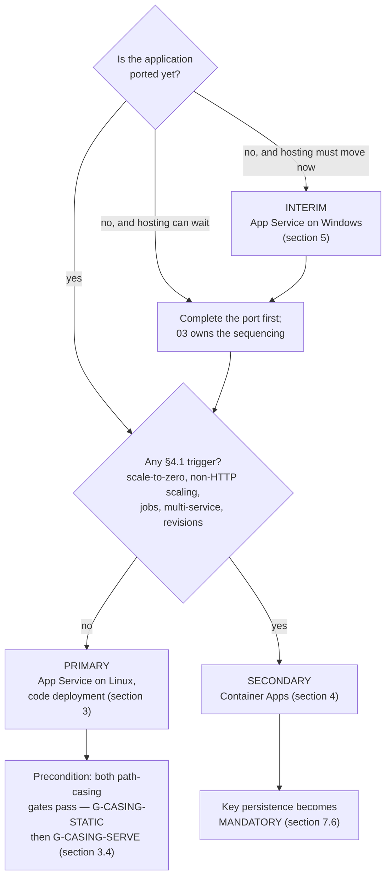

# 06 — Azure Hosting Recommendations

## 1. Purpose, ownership and authoring contract

### 1.1 What this document is

The hosting recommendation for the modernized MvcMusicStore application, and the specification of the Azure platform it runs on. It names a primary target, a secondary target and an interim option; it specifies the data platform, the identity model, the provisioning order, the key material, the telemetry, the transport policy, the supported browser matrix, the cutover runbook and the deployment mechanics.

It is one of the seven deliverables the user named directly. It consumes deliverable [12 — Migration Blockers](12-migration-blockers.md), which enumerates what must be resolved; deliverable [04 — .NET 8 Migration Strategy](04-dotnet8-migration-strategy.md), which fixes the target framework, the SDK band and every package pin; deliverable [11 — Cloud Readiness Assessment](11-cloud-readiness-assessment.md), which establishes the readiness facts this document acts on; and deliverable [10 — Build and Deployment Requirements](10-build-and-deployment-requirements.md), which establishes what the current build actually requires. It feeds deliverable [03 — Modernization Roadmap](03-modernization-roadmap.md), which sequences the work, and is cited by deliverable [05 — ASP.NET Core Migration Approach](05-aspnet-core-migration-approach.md) and by 11.

Its organizing rule is that **the recommendation is landed, not surveyed**. Research bounds the choice; this document makes it. A hosting document that lists three options with balanced advantages leaves the reader exactly where they started, and — worse — leaves the next reader free to pick differently. Every option below therefore carries a verdict, and the verdicts do not compete.

### 1.2 What this document is not

**It is not a provisioning action, and it is not an authorization to begin one.** Nothing here creates an Azure resource. Nothing here creates a file outside `docs/modernization/`.

It is not the roadmap. It states the *order* in which the four schema owners must be provisioned, because that order is a property of the platform rather than of the plan, but it states no sequence for the wider work; deliverable 03 owns that.

It is not the effort model and it is not the risk register. **No effort estimate, no delivery duration and no schedule for the future implementation appears anywhere in this document** — deliverable [07 — Effort, Risks and Sequencing](07-effort-risks-sequencing.md) owns all three, and several decisions below hand it a named risk to carry. **The claim is narrowed to that deliberately, because a blanket "no figure or duration appears here" would be plainly false**: this document sets an HSTS `max-age` and its three-stage ramp (§10.1.3), a cookie lifetime and a sliding window (§8.2), a session timeout (§8.3), a data-protection key lifetime and alert threshold (§7.4), a rotation interval (§5.3 A3), a health-probe budget and cache TTL (§9.3), a report-only observation period (§10.2.2), an export cadence (§9.5) and several retention windows. **Every one of those is an operational control that configures the running system, and none is an estimate of how long any work takes** — which is the distinction 07 owns and this document does not cross.

It is not the cutover decision. Deliverable 05 decides that a **single cutover** is taken rather than an incremental strangler-fig migration, and 05 owns the two losses that decision accepts. Section 11 of this document is the **runbook that executes 05's decision**. It does not re-open it, does not restate the comparison, and should not be read as a second opinion on it.

### 1.3 The no-modification and no-provisioning constraint

The user directed **"Do not make code changes initially."** The environment setup instructions attached to this project independently restate the same gate: *"Do not modify code until assessment and modernization plan are approved."* Two inputs agreeing on it is why no defect named below is repaired here, including the ones this document depends on being repaired — the path-casing mismatch of section 3.4 and the destructive initializer of section 5.6 are specified as preconditions, not fixed.

**No Azure resource is provisioned by this work:** no resource group, no App Service plan, no Container Apps environment, no Azure SQL instance, no Key Vault, no managed identity, no Application Insights component, no Log Analytics workspace. **No infrastructure artifact is created:** no `Dockerfile`, no container manifest, no Bicep, ARM or Terraform template, no publish profile, no pipeline definition.

The distinction that governs this document is **mutation versus specification**, and it cuts both ways:

> This document must **prescribe** the infrastructure, the provisioning order, the grants and the runbook in full operational detail. Naming a `Dockerfile` as a conditional target artifact is required of it; creating one is forbidden to it. It fails if it reads as authorization to begin provisioning, and it fails equally if it declines to specify something because it mistook the prohibition on mutating for a prohibition on planning.

**The evidence for the constraint is a pair of commands, and neither of them is a durability claim — one
describes the shape of the change against the authoring baseline, the other describes a moment, and
immutable provenance is not a document's to assert at all.**

- **The change-shape half, against the authoring baseline:**
  `git diff --name-status ea2552d..HEAD` → **13 lines, every one an `A` under `docs/modernization/`**,
  with **no `M` and no `D`** against any existing repository file. `ea2552d` —
  `ea2552d6eda7c20e9477a512e5c615665618cf35` — is the commit this deliverable set was authored from, and
  `HEAD` is **the checkout the reader is standing in**, which is what the claim is about: this deliverable
  set adds thirteen files and touches nothing that already existed. **The range is not immutable
  provenance and is not offered as one** — a range written in prose cannot be, because the prose is
  inside the thing it is attesting to. Provenance is recorded **outside these documents**, as a signed
  tag or an attestation over the final commit, after the deliverable set is committed; that record, not a
  range written here, is what a later reader verifies against.
- **The current-checkout half, and it is exactly that and nothing more:** `git status --porcelain` →
  **empty**. This is corroboration about **the checkout the reader is standing in at the moment they run
  it** — that nothing is uncommitted, no build output was left behind and no file was edited outside a
  commit. It is **not** durable evidence and is never offered as such: it describes one moment, it says
  nothing about what any commit contains, and on a checkout where sibling work is in progress it will
  legitimately be non-empty without anything in *this* document's claim being false.

The first alone says nothing about the working tree; the third alone would be satisfied by a checkout in
which nothing had been written at all. Together they are the whole claim: thirteen additions since the
pinned pre-assessment commit, nothing modified, nothing deleted, and nothing left loose in the tree the
reader holds. Every appearance of either command in this document — including Appendix A's — carries that
distinction with it, and none of them names a completion hash.

Everything below is written to be read and approved first. That is the point of the exercise.

### 1.4 Authoring contract, and the absence of user rules

`review_rules` returns exactly **"No user rules provided."** There is therefore **no project rule to name, summarize, cite or comply with**, and none is invented in its place. The absence is not licence to lower the bar. This document is held to enterprise-standard practice and to four contracts that stand where rules would:

1. **Every as-is claim carries an inline `[<path>:<locator>]` citation** at the point the claim is made, repository-relative and resolving in the checkout. There is no trailing reference list, because a citation collected at the end cannot be checked against the sentence it supports.
2. **Every repository-wide claim carries its reproducing command** adjacent to the claim. Most of the current-state facts this document rests on are *absences* — no key material, no security header, no telemetry, no pipeline — and an absence has no line to point at. The command is its evidence, and it is the stronger form, because a reader can re-run it. Appendix A collects every one.
3. **Where a version is named, it is exact and it is cited, not chosen here.** Every package pin and the SDK band belong to deliverable 04. This document names them only by reference; it never introduces a version of its own and never restates one as a decision.
4. **One fact, one owner.** A decision restated in different words downstream reads as a second decision, and a reader who finds two picks one. Sections 1.5 and 1.6 draw that line explicitly.

**Two classes of command appear in this document, and they must never be read as one class.** Conflating them would let a reader run a release operation while thinking they were reproducing a count, so each is labelled wherever it appears and Appendix A separates them under distinct headings:

| Class | What it is | Safety | Where |
| --- | --- | --- | --- |
| **Evidence commands** | The commands that produce this document's counts and absence claims, run against **this repository** during the assessment | **Read-only and network-free.** None writes to the working tree, none modifies a repository file, none contacts the network, and none touches a database — the strongest form of evidence, because a reader can re-run any of them safely | Quoted beside the claim they support; collected in Appendix A §A.1 |
| **Future release operations** | The commands **prescribed** for the separately approved implementation phase, run against a provisioned Azure environment | **Mutating, and some contact the network.** They create database objects, restore tooling from package sources, and produce deployment artifacts. Not one of them is executed by this assessment, and none is safe to run casually | Specified in §6.4, §6.3 and §12.1, each with its execution scope, principal, release timing and guard; collected in Appendix A §A.2 |

Both classes are POSIX shell forms. The evidence commands were executed on this Windows verification host through the bundled Git-for-Windows `bash`, run from the repository root; the release operations belong to a release pipeline on a build agent, not to this host and not to a developer workstation.

Markdown line length follows the corpus convention recorded in [`README.md` § 10 Markdown line-length convention](README.md#10-markdown-line-length-convention).

### 1.5 What this document does not own

| Decision | Owner | What this document does instead |
| --- | --- | --- |
| **Target framework, SDK band and every package pin** | [04](04-dotnet8-migration-strategy.md) §2, §3, §7 | Cites them. The framework is referred to as "the target framework of 04" where the identity of the runtime matters and the number does not; the pins are cited by package name and section |
| **The cutover approach and the two losses it accepts** | [05](05-aspnet-core-migration-approach.md) | Section 11 writes the runbook that implements it. The decision is **not re-taken** and the alternative is **not re-argued** |
| **The two `DbContext` designs, their migration folders and the configuration transition** | [05](05-aspnet-core-migration-approach.md) | Specifies the *order* in which their migrations are applied and the *identity* that applies them. The context design itself is cited |
| **The no-bundler decision and the static-asset strategy** | [05](05-aspnet-core-migration-approach.md) | Uses it as an input to the code-deployment decision in section 3.3 — the absence of a build-time asset toolchain is what removes the argument for a container |
| **The distinction between the Release publish setting and the runtime error-handling decision** | [05](05-aspnet-core-migration-approach.md) | Records the publish half in section 12.4 and cites 05 for the runtime half rather than restating it |
| **The operator provisioning command, its secret channel and its idempotence** | [05](05-aspnet-core-migration-approach.md) | Specifies the **sink its audit record is written to** and the authenticated route it takes to reach it (sections 9.5, 9.5.1), the point in the release at which it runs, and the release-side mechanics of section 6.3.2 — principal, connection channel, target assertions and failure behaviour. Its **invocation form is quoted from 05, not defined here** |
| **Per-edition build outcomes** | [10](10-build-and-deployment-requirements.md) §3, §5–§8 | Cites them. Sections 5.4 and 12.3 take MVC 5's build status exactly as 10 §1.2 carries it — ***blocked, pending a Windows verification run*** — with 10 §3.2's post-freeze restore and build cited **beneath** it as supplementary evidence on that section's own terms, and do not re-diagnose it, restate its results or upgrade it |
| **The deployment-automation absence as a build finding** | [10](10-build-and-deployment-requirements.md) §12 | Verifies the absence independently in section 12.2, because it is the precondition of the pipeline specification, and cites 10 as the finding's owner |
| **Effort, risk register and sequencing of the wider work** | [07](07-effort-risks-sequencing.md), [03](03-modernization-roadmap.md) | Hands 07 **four** named risks and 03 **four** gates plus one scheduled follow-up, all enumerated in section 13.4 — with CI provider selection remaining 03's own gate, to which this document contributes six criteria (section 12.1.1). States no figure, duration or schedule |
| **CI provider selection** | [03](03-modernization-roadmap.md) | Specifies what the pipeline must do regardless of provider, and **explicitly does not select one** (section 12.1) |
| **Cloud-readiness findings and their framing** | [11](11-cloud-readiness-assessment.md) | Consumes them. Where this document repeats a current-state fact from 11 it is because a decision here turns on it, and 11 is cited as the owner |
| **The initializer's duplicate registration as a debt entry** | [08](08-technical-debt-register.md) | Cites it in section 5.6, where the duplication changes what "disable the initializer" operationally means |
| **The plaintext administrator credential as a security finding, and the current-state cookie posture** | [09](09-security-assessment.md) | Cites both. Section 8.4 specifies only the delivery mechanism that removes the credential from source. **The cookie *target* values are [05 §6.1](05-aspnet-core-migration-approach.md)'s, not 09's** — 09 is a current-state assessment and establishes what the editions emit today, which is the evidence behind 05's preservation-or-hardening labels rather than ownership of a target setting; §10.1 cites 05 for the **target** cookie policy, which is 05's to set, and §10.7 check 6 asserts its values |

*Each fact in this table appears in exactly one row, and two forms are excluded by name. A provisioning row that asserts 05 specifies "the record's destination and nothing about its contents" and then lists the logging provider the tool configures among those destination facts is a claim about contents dressed as a claim about destination. And a credential-and-cookie row must leave no ambiguity over whether 09 owns the current-state cookie posture, the target cookie values, or both — the row above settles it. No retention claim about the provisioning record appears here at all, because this table disclaims the whole command rather than an enumeration of its properties.*

### 1.6 The decisions this document owns

These are stated once, here, in full, and are cited rather than restated everywhere else. Deliverables 03, 05 and 11 point at them.

| ID | Decision | Stated in |
| --- | --- | --- |
| **D1** | **Hosting target and deployment model.** Primary: Azure App Service on Linux, code deployment. Secondary: Azure Container Apps. Interim: Azure App Service on Windows hosting the un-ported application | §2, §3, §4, §5 |
| **D2** | **The deployment-time migration principal, and the separation of DDL rights from the runtime identity** | §6.2, §6.3, §6.6 |
| **D3** | **The data-protection key-ring location, its protect-at-rest behaviour, its rotation policy and its slot/revision isolation** | §7 |
| **D4** | **The observability approach** — structured logging through the framework abstraction, collected by the platform with **no in-process telemetry SDK**. The collection route is platform-specific and the two are not equivalent: Application Insights auto-instrumentation on App Service, and Azure Monitor diagnostic settings carrying console, system **and ingress HTTP** logs, with a reduced signal, on Container Apps. **Availability is a synthetic standard test against a user route, not a platform counter** | §9 |
| **D5** | **The network perimeter** — how the database and the vault are reachable, by which paths, and what is proven unable to reach them | §6.1.2 |

**D1 carries one sub-decision recorded separately.** **D1a** — the interim option's database authentication route (§5.5) — sits inside D1 rather than beside it, because it only exists while the interim option does; it is listed on its own row in the [decision register](#decision-register) because it has its own approver and its own time box.

**The supporting decisions** follow from those and are also owned here, because no other deliverable claims them, and each carries an `S` identifier in the [decision register](#decision-register): secret delivery and the platform configuration binding (**S1**, §8.4), the session cache table and the release mechanics that create it safely (**S2**, §6.2.1–§6.3.1, §6.4), affinity retirement (**S3**, §8.3), transport, headers and the forwarded-header trust boundary (**S4**, §10.1–§10.2, §10.5), the browser matrix (**S5**, §10.4), the health surface and the pre-traffic gate (**S6**, §9.3), cache sizing and the layout aggregate (**S7**, §6.4, §6.4.1), the build agent and base image (**S8**, §12.3), the data-plane connection and its identity types (**S9**, §6.1, §6.8), the minimum deployable topology and the network path (**S10**, §3.5.1–§3.5.3, §4.4.1, §6.9), backup, restore and the recovery position (**S11**, §6.7), and the legacy-cookie transition stage (**S12**, §11.4.1). The [decision register](#decision-register) collects every row in identifier order, and it carries one more decision than this paragraph enumerates: **S13**, the cutover runbook and the rollback position (§11.3, §11.5, §11.5.1). **The register is the only place a count of these decisions is stated.**

---

## 2. The recommendation, landed

### 2.1 The decision in one table

| | **Primary** | **Secondary** | **Interim** |
| --- | --- | --- | --- |
| **Target** | Azure App Service, **Linux** plan | Azure Container Apps | Azure App Service, **Windows** plan |
| **What it hosts** | The ported application | The ported application | The **un-ported** .NET Framework 4.8 application |
| **Deployment model** | **Code** deployment (`dotnet publish` output) | Container image | Code deployment (Web Deploy / ZIP) |
| **Verdict** | **Recommended.** This is the target the roadmap builds toward | **Held in reserve.** Selected only if a named condition in §4.1 arises | **Available, and genuinely useful — but it is a stepping stone, not a destination** |
| **Precondition** | Both path-casing gates of §3.4 must pass — **G-CASING-STATIC** before the target is viable, **G-CASING-SERVE** before traffic is admitted | The port must be complete — Windows containers are not supported (§4.2) | **Path A** (§5.3) is the selected authentication route and its exception must be granted by the security owner and countersigned by the data owner **before** the step begins; both preconditions in §5.6 met. An approver who cannot accept a time-boxed stored credential does **not** substitute Path B here — they skip the interim step and go directly to the port (§5.5) |
| **Container manifest** | None. No `Dockerfile` exists under this option | A `Dockerfile` is required — **conditional on this option only** (§4.4) | None |

**The recommendation is unambiguous: Azure App Service on Linux with code deployment.** Container Apps is not a co-equal alternative under evaluation; it is a documented escape hatch with an entry condition. The Windows interim option is not a different destination; it is a different *starting point* toward the same one.

### 2.2 The decision path



Read the diagram as a decision procedure, not as a set of equivalent branches. The right-hand path is the destination; the left-hand path is a way of getting hosting value before the code is ready, and it rejoins the same destination.

### 2.3 What the three options have in common

Every option below shares the same data platform, the same identity model, the same key material policy and the same transport policy — sections 6 through 10 are written once and apply to all three, with the differences called out where they exist. Four differences are worth naming up front so the later sections read cleanly:

- **The interim option cannot use managed identity for the data plane as the application is written today.** That is the whole substance of section 5.2, and it is the reason the interim option is not a lift-and-shift.
- **Container Apps escalates key persistence from a deliberate override to a precondition** (section 7.6), because it persists no default key ring and its replicas are ephemeral by construction — App Service does persist one, within a deployment slot (section 7.1).
- **Only Container Apps requires a container image**, and therefore only Container Apps requires a `Dockerfile` (section 4.4).
- **The telemetry collection route is not the same on the two target platforms, and the signal is not equivalent.** App Service auto-instruments; Container Apps does not, and carries a reduced signal that section 9.2.2 itemizes — including, on that platform, no per-request row at all, because the ingress HTTP log category the platform does publish carries the query string and accepts no ingestion-time transformation, so section 9.2.2.1 does not route it and section 9.2.2.1's substitution table names what stands in for each consumer. The application-side API is identical either way, which is why this is a collection difference rather than a design difference.

Everything else — one Azure SQL database, managed identity for the data plane where the code supports it, a SQL-backed distributed cache for session, a persisted data-protection key ring, HTTPS with HSTS, an explicit security-header set, structured logging emitted through `ILogger` and collected by the platform on whichever of the two routes above applies, and a health surface the platform probes — is common ground.

---

## 3. Primary — Azure App Service on Linux, code deployment (D1)

### 3.1 Why App Service rather than Container Apps

**Because the application's shape is the shape App Service is optimized for.** Microsoft positions App Service for web applications and Container Apps for serverless microservices and event-driven jobs, and MvcMusicStore sits squarely on the first side of that line.

The evidence is the repository's own composition, not a preference:

- **It is a single deployable unit.** `MvcMusicStore.csproj` declares no `<ProjectReference>` element and is a leaf project [src/MVC5/MvcMusicStore/MvcMusicStore.csproj:1-302]. There is nothing to decompose, and no second thing to deploy alongside it.
- **There is no background worker and no event-driven component.** All composition happens in two startup entry points — `Application_Start` [src/MVC5/MvcMusicStore/Global.asax.cs:13-21] and the OWIN startup [src/MVC5/MvcMusicStore/Startup.cs:4-14] — and neither starts a queue consumer, a timer, a scheduled job or a message handler. Every unit of work in the application is a response to an HTTP request. Deliverable [01](01-architecture-overview.md) owns the architecture description; the consequence for hosting is that there is no workload here that wants a separate scale profile.
- **There is no outbound service dependency to model.** The application talks to one database and nothing else, which deliverable 11 §4.3 records as a favourable readiness finding.

A single request-driven web application with one datastore, one scale profile and no finite-duration work of its own gains nothing from a container-orchestration platform and pays for it in operational surface: an image build, a registry, an ingress configuration and a revision model, all in service of a deployment that is one process. **The absence of a sidecar is deliberately not part of that argument** — §4.1 records that App Service hosts sidecars too, so a sidecar would not move this decision either way.

### 3.2 Why Linux rather than Windows

**Because after the port there is no Windows-specific dependency left, and Linux plans are the lower-cost option.**

The three things that tie the current application to Windows all disappear in the port, and each is named by an owner:

| Windows dependency today | Evidence | Why it is gone after the port |
| --- | --- | --- |
| `System.Web` and the IIS integrated pipeline | The application class derives from `System.Web.HttpApplication` [src/MVC5/MvcMusicStore/Global.asax.cs:11]; `Views/Web.config` installs a handler mapping under `preCondition="integratedMode"` [src/MVC5/MvcMusicStore/Views/Web.config:31-32] | Neither construct has a successor. Deliverable 12 §3 owns the blocker; the target runs on Kestrel |
| LocalDB with file attachment | `AttachDbFilename=\|DataDirectory\|\MvcMusicStore.mdf` [src/MVC5/MvcMusicStore/Web.config:13] | File attachment has no cloud analogue on any platform, Windows included. Deliverable 11 §3.3 owns the finding; section 6.1 below states the replacement |
| Windows-integrated authentication to the database | `Integrated Security=True` on both connection strings [src/MVC5/MvcMusicStore/Web.config:12-13] | Replaced by managed identity (section 6.1). Deliverable 11 §3.4 owns the finding |

Note carefully that the middle two are *not* arguments for Windows — they are arguments against the current data topology, and they must be resolved for **any** cloud target including Windows App Service. That is exactly what makes the interim option of section 5 harder than it looks.

Once the port is done, the deployable artifact is framework-agnostic managed code targeting the framework of [04](04-dotnet8-migration-strategy.md) §2, with no P/Invoke, no COM interop, no Windows-only API and no native binary. Linux App Service plans cost less than the equivalent Windows plans for the same tier, so absent a technical reason to pay the difference, Linux is selected.

**Linux carries two consequences, and neither is an argument for Windows.** They are separated here
because one is this document's to enforce and the other is not.

- **A hard precondition owned here: the two path-casing gates of section 3.4.** **G-CASING-STATIC**, the
  repository-wide inventory gate, must pass before this recommendation is viable; **G-CASING-SERVE**, the
  Linux serving gate, must pass before traffic is admitted to it. Section 3.4 defines both and their
  separate exit criteria; the correction workstream is [03](03-modernization-roadmap.md)'s and the
  relocation inventory is [05](05-aspnet-core-migration-approach.md) §8.1.1's.
- **A data-semantics consequence owned by [05](05-aspnet-core-migration-approach.md) §8.11: the host
  clock.** The source records timestamps in the host's *local* time —
  `order.OrderDate = DateTime.Now` [src/MVC5/MvcMusicStore/Controllers/CheckoutController.cs:41] and
  `DateCreated = DateTime.Now` [src/MVC5/MvcMusicStore/Models/ShoppingCart.cs:49] — while a Linux App
  Service instance runs with its clock in UTC. Selecting this platform therefore changes what those
  two columns *mean* unless a decision is made, and the decision is 05's: UTC in the database, legacy
  values converted by a **required** migration parameter that fails closed rather than guessing a
  source zone, and conversion to a configured zone for display. **This document selects the platform
  and asserts no timestamp policy of its own** — it records the consequence so that the platform
  choice is not made in ignorance of it.

### 3.3 Why code deployment rather than a container image

**Because the application has nothing a container would carry.** Three conditions would each justify an image, and none holds:

- **No native dependency and no custom system package.** The application executes no raw SQL and calls no unmanaged code — deliverable 12 §6 records both as portability findings in the application's favour. Nothing needs to be installed into an image beyond the runtime App Service already provides.
- **No build-time asset toolchain.** Under the no-bundler decision owned by [05](05-aspnet-core-migration-approach.md), static assets are served by static-file middleware with the framework's own cache-busting, and no npm, no bundler and no minification step exists in the build. The **27 MVC 5 asset files are the assessed source inventory, not the served payload**: [05](05-aspnet-core-migration-approach.md) §8.1.1 gives each of the 27 an explicit disposition, and what the target actually serves is the application-owned files that relocate plus the library files `libman.json` acquires. Deliverable 04 §9 owns that acquisition mechanism and records that the restored libraries are **committed**, so even asset acquisition is not a build-time step. There is therefore no build stage that a container image would encapsulate.
- **No runtime configuration that only an image can express.** Everything the application needs at runtime arrives through platform configuration (section 8.4).

A container under these conditions adds an image build, a registry to host it, image lifecycle and vulnerability-scanning obligations, and a second thing to version — **for no capability gained**. The deployable artifact is therefore the framework's own publish output, deployed as code.

That is a reversible decision and cheaply so: the same publish output can be containerized later without changing the application, which is precisely what makes the Container Apps escape hatch in section 4 credible.

### 3.4 The precondition — the repository-wide path-casing audit and its two gates

**This is stated as a precondition, not a caveat. The Linux recommendation is not viable until the audit passes.**

Linux filesystems are case-sensitive; the Windows filesystem IIS serves from is not. The repository contains at least one demonstrated mismatch that IIS resolves silently and Linux will not:

- The style bundle registers `"~/Content/site.css"` — lowercase `s` [src/MVC5/MvcMusicStore/App_Start/BundleConfig.cs:28].
- The tracked file is `Content/Site.css` — capital `S`.

```bash
git ls-files 'src/MVC5/MvcMusicStore/Content/*'
# -> src/MVC5/MvcMusicStore/Content/Site.css        <- capital S
#    src/MVC5/MvcMusicStore/Content/bootstrap.css
#    src/MVC5/MvcMusicStore/Content/bootstrap.min.css
grep -n 'site.css' src/MVC5/MvcMusicStore/App_Start/BundleConfig.cs
# -> 28:                      "~/Content/site.css"));
```

Exactly three files, one capital letter, one mismatch. The sibling reference on the line above — `"~/Content/bootstrap.css"` [src/MVC5/MvcMusicStore/App_Start/BundleConfig.cs:27] — matches its file exactly, which is what makes this a defect rather than a convention: the same registration block is right about one path and wrong about the next.

**Why the failure mode makes this a precondition rather than a bug to fix later.** The application starts, the page returns HTTP 200, and the stylesheet 404s. The site renders unstyled. Nothing throws, nothing is logged — and today nothing *could* be logged, because there is no logging at all (section 9.4). The defect would be discovered by a user, not by a deployment. Deliverable 11 §3.7 owns the readiness finding and deliverable 12 F-12-17 carries it as a differing-default blocker, both naming this document as the owner of the audit obligation. This is that obligation, stated:

**Two gates, not one audit — and this is where they are defined, because §13's release sequence and §11's cutover both cite them by name.** "Reference-count parity is its exit criterion" would be two criteria wearing one name: a count of references proves an enumeration is complete, and it says nothing about whether any enumerated path resolves. The two are separated here and each is assigned once:

- **G-CASING-STATIC — the repository-wide inventory gate.** Exit criterion: **every path literal the enumeration finds resolves case-sensitively against the target asset inventory**, and the enumeration is demonstrably complete. It needs nothing deployed. The commands in the table below **bound the enumeration** — they establish how many references there are to walk, so a later addition shows up as a stale count — and they are not themselves the criterion.
- **G-CASING-SERVE — the Linux serving gate**, whose runtime exit criterion is stated at the end of this section. It cannot be met before a deployment exists, which is exactly why it is a second gate rather than a clause of the first.

**The scan is repository-wide; the correction set is the migration source's.** The scan covers the whole repository so that a path literal outside the four surfaces below cannot escape it — the four surfaces are where the *known* references live, not a fence around where the audit looks. What is then corrected is MVC 5's, because MVC 5 is the only edition that ports (§2); a mis-cased literal found in MVC 4 or MVC 3 is recorded as an observation against a historical reference and corrected in neither, since neither is deployed. **This document owns the two gates and their exit criteria. It does not own the relocation inventory** — that is [05](05-aspnet-core-migration-approach.md) §8.1.1's — **and it does not own the correction workstream**, which [03](03-modernization-roadmap.md) sequences and [07](07-effort-risks-sequencing.md) prices.

**The four surfaces the enumeration covers:**

| Surface | Scope | Command |
| --- | --- | --- |
| Bundle registrations | All 5 registrations in MVC 5's bundle configuration [src/MVC5/MvcMusicStore/App_Start/BundleConfig.cs:11-28] — every include path, not only the CSS pair | `grep -c 'bundles.Add' src/MVC5/MvcMusicStore/App_Start/BundleConfig.cs` → `5`, which **bounds the enumeration** rather than deciding the gate: five registrations to walk, each of whose include paths is then resolved individually |
| `@Url.Content` call sites | 4 occurrences across MVC 5's views | `git grep -o '@Url.Content' -- 'src/MVC5/MvcMusicStore/Views/*.cshtml' \| wc -l` → `4`, which **bounds the enumeration**: four call sites to resolve, and a fifth appearing later means the enumeration is stale |
| View, layout and partial paths | Every `Views/...` path referenced from a controller, a layout reference or a partial invocation, plus the `wwwroot` path of every asset that relocates. **The relocation inventory and its lowercase target names are [05](05-aspnet-core-migration-approach.md) §8.1.1's and are not restated here** — this surface consumes that inventory and resolves against it | Enumerated during the port from 05's inventory; every enumerated path resolved against it, case-sensitively. **The runtime confirmation is G-CASING-SERVE's and not this row's** |
| **Data-supplied asset paths** — `Albums.AlbumArtUrl` | Every **distinct** value in the column, not a sample. It reaches the browser through `@Url.Content(@album.AlbumArtUrl)` at [src/MVC5/MvcMusicStore/Views/Home/Index.cshtml:15], [src/MVC5/MvcMusicStore/Views/Store/Browse.cshtml:17] and [src/MVC5/MvcMusicStore/Views/Store/Details.cshtml:10], so a mis-cased **value** 404s per album on Linux exactly as a mis-cased literal does — while being invisible to every command above, because the path is in the database rather than in a file | `SELECT DISTINCT AlbumArtUrl FROM Albums`, taken with the schema extraction; each application-local value then resolved case-sensitively against the target `wwwroot` inventory. [03](03-modernization-roadmap.md) W5 owns the five-step procedure and the measured baseline |

**The fourth surface is inside G-CASING-STATIC but its criterion has a different shape, because a value cannot be corrected by editing a file.** The gate's criterion for this surface is: **every distinct value is absent, or resolves case-sensitively against the served asset inventory, or is an absolute `https` URL whose host is on the canonical origin allow-list below**, with the accepted set recorded. The absent case is a pass rather than an exemption: the column is optional, so an album with no image path has nothing to resolve and renders the rule [05 §8.10](05-aspnet-core-migration-approach.md#810-absent-album-art--the-rendering-rule) defines. Handling for the failure cases is defined rather than left to the implementer — a differently-cased match is **corrected in the data migration**, and a value with no match at any casing **falls back to the placeholder asset and the row is logged for review**. Neither may pass silently, since a silent fallback hides the defect the surface exists to find. Two consequences belong to this document: **deployment gates on this criterion** alongside the three above, and an accepted absolute URL is only servable if the image content-security-policy of section 10.2 permits its origin.

**A legacy `http://` value is a third failure case, and it has its own defined handling.** It is not a casing problem, so the two branches above do not cover it, and it cannot simply be accepted: section 10.1 enforces HTTPS with HSTS, so an `http://` image on an HTTPS page is mixed content that the browser either upgrades or blocks, and section 10.2's `img-src` will not list an insecure origin. The migration therefore resolves each such value in a fixed order and records which branch it took:

1. **Rewrite the scheme to `https` if the same host serves the same path over TLS** — verified by an actual request, not assumed from the host name — and the host is added to the allow-list of section 10.2 in the same change.
2. Otherwise **re-host the image as an application asset, by an operator and out of band**: the operator retrieves the asset themselves, reviews what they retrieved, places the file under `wwwroot/images/`, and the migration rewrites the stored value to that local path. That makes it a local path and removes the origin question entirely.
3. Otherwise **fall back to the placeholder and log the row for review**, exactly as an unresolvable local path does — the same branch, because the outcome is the same: a value the application cannot render safely. **This is also the branch a value takes when step 2 has not been completed by the gate**, so an outstanding re-hosting task can never hold up a deployment or leave an unrenderable value in place.

**The application never fetches a remote URL on behalf of an administrator-supplied value — not at migration time, and not at runtime.** **A server-side fetch is not offered as an alternative to operator re-hosting, and must not be added.** A server-side fetch of a URL that an administrator typed is a **server-side request forgery primitive**: from an Azure workload it can reach the instance metadata endpoint, private and link-local address ranges, loopback, and any internal service the application can route to — and it can be redirected to any of them **after** passing a front-door check on the URL as submitted.

**Why the option is removed rather than constrained**, which is the part worth stating because "constrain it" sounds cheaper than it is. Doing it correctly needs a fixed allow-listed destination set, validation of the resolved IP address as well as the host name, denial of private, loopback, link-local and metadata ranges, revalidation after **every** redirect hop, an egress restriction at the platform, request timeouts, a response size limit, content-type validation, and a storage boundary keeping fetched bytes out of the application's own served tree until reviewed. That is a security component to build, review, test and maintain — for a catalogue that today holds **exactly one distinct image value**, the local placeholder ([03](03-modernization-roadmap.md) W5's measured baseline). Removing the capability removes the entire class of risk at **no functional cost**, because operator re-hosting reaches the same end state with a human deciding what enters the served inventory. If a stakeholder ever needs automated retrieval, it is a new component with its own security review and its own approval, not a line in this migration.

The committed catalog contains no such value — [03](03-modernization-roadmap.md) W5's measured baseline is one distinct value and it is the local placeholder — so this is a rule for future and non-committed data rather than a migration task with known work in it. It is stated because the audit runs against whatever source database is presented, not only against the committed one.

**The forward-looking half is the administration write path, and this is where the permitted set is expressed.** A one-time audit proves the data is clean at deployment and says nothing about the next album an administrator creates, because the column is administrator-writable free text (section 10.2). So the port validates the submitted value server-side, and the rule is written out here rather than left as "an allowed URL", because "allowed" is exactly the word that lets `http://` through:

**The column is optional, and the validator does not change that.** `AlbumArtUrl` declares `[DisplayName("Album Art URL")]` and `[StringLength(1024)]` and **no `[Required]`** [src/MVC5/MvcMusicStore/Models/Album.cs:26-28], and both administration forms render it as a plain editor carrying only that length rule — `@Html.EditorFor(model => model.AlbumArtUrl)` at [src/MVC5/MvcMusicStore/Views/StoreManager/Create.cshtml:53] and [src/MVC5/MvcMusicStore/Views/StoreManager/Edit.cshtml:54]. An album can therefore be saved with no image path at all today. A rule phrased as *one of two forms and nothing else* would silently make an optional field mandatory — a functional change to the administration surface rather than a security control, and one nobody approved — so the accepted set has **three** cases and the empty one is stated first. The `[StringLength(1024)]` limit is carried across unchanged and applies to the two non-empty cases.

**Accepted — one of three cases, and nothing else:**

- **Absent — `null`, the empty string, or a whitespace-only value.** Accepted, with the submitted value stored unrewritten, so both administration forms keep saving an album with no image path exactly as they do today. **The absent test is deliberately broader than the source's**: the catalog view guards its render with `!String.IsNullOrEmpty` [src/MVC5/MvcMusicStore/Views/Store/Browse.cshtml:15], which classifies `null` and `""` as absent but **not** a whitespace-only value, so a value of `"   "` is treated as present today and resolves to nothing useful. The validator's test is `String.IsNullOrWhiteSpace`, which makes the three forms of absence behave identically and the fallback of the next paragraph deterministic. **What the pages then render for an album with no image path is [05 §8.10](05-aspnet-core-migration-approach.md#810-absent-album-art--the-rendering-rule)'s rule**, and it is an approved delta recorded there rather than a silent fix made here.
- **A safe application-local path**: a `~/`-rooted or root-relative path whose **shape** is valid and which, once normalized, stays inside the asset root. **Shape and containment are the whole of the test, and the validator does not ask whether the file exists.** The two properties it does establish are the ones the rejection table below turns on: the value is not an absolute URL of some other scheme, not protocol-relative, and not a traversal or absolute filesystem path once decoded and normalized.
- **An absolute URL whose scheme is `https` and whose host is on the canonical origin allow-list**, compared against the allow-list after parsing rather than by substring match on the raw string.

**Rejected explicitly, each for its own reason:**

| Rejected input | Why |
| --- | --- |
| `http://host/...` | Insecure transport. The application enforces HTTPS with HSTS (section 10.1), so this is mixed content the browser upgrades or blocks, and section 10.2's `img-src` will not list an insecure origin. Accepting it stores a value that cannot render |
| `//host/...` — protocol-relative | Its scheme is whatever the page's is, so it cannot be shown to be `https` at validation time. It is also the form most likely to pass a naive "starts with `http`" check by not starting with it |
| Any other scheme — `data:`, `javascript:`, `file:`, and anything not `https` | `javascript:` in an attribute the application renders is a script-injection vector; `data:` puts arbitrary administrator-supplied bytes inside a page's markup, outside the origin allow-list and outside any review of what is served, and it is capable of carrying a payload for a consumer that treats it as more than an image; `file:` names the server's or the user's filesystem. The rule is an allow-list of one scheme, so no future scheme is admitted by omission. **The `data:` rejection stands independently of section 10.2's image policy**, which admits `data:` for the library's own embedded glyphs: that allowance is what the *browser* will render, this rule is what an *administrator* may store, and the two are deliberately not the same set — a `data:` image can therefore only reach a page from the vendored stylesheet, never from user input |
| A local path that escapes the asset root — `..` traversal, or an absolute filesystem path | The value is rendered into a URL and resolved against the web root; a path that leaves the asset inventory is either a 404 or an attempt to reach something that is not an asset. Rejection is on the **resolved** path, so traversal cannot be hidden by encoding |

Rejection is a **field-level validation message on the administration form**, not a silent substitution, so the administrator sees which value was refused and why.

**The running application never tests a supplied path for existence, and that division of labour is deliberate.** The local-path case does **not** require the submitted value to *"resolve case-sensitively inside the served asset inventory"*, and **no filesystem existence check is performed at write time**. Existence and casing are proven **once, statically, at publish**, by G-CASING-STATIC over the committed inventory: that is a check against a fixed, versioned set of files, run where a mismatch can be corrected before anything is deployed, and it is the reason the fourth surface above enumerates every distinct value in the column rather than sampling it. A write-time existence probe would be a weaker instrument in the same place — it inspects the published set from inside the running application, adds filesystem or manifest I/O to an administration write, and can only ever answer for the deployment it happens to run in, which is precisely the property a publish-time proof already has. Splitting them the other way would put the strong claim in the weak position.

**The residual is stated rather than engineered away, because it is a data-entry error and not a security or availability property.** A syntactically valid local path that names no asset is stored, and that album's image is then a missing image on the catalogue pages — visible immediately to the administrator who typed it, on the page they just edited. It cannot escape the asset root, cannot carry a scheme, and cannot reach an origin outside §3.4's allow-list, because those are the properties the validator does establish. Existing rows are a different matter and are already covered: the migration audit's third step resolves every distinct value that is already in the column and defines both failure branches — a differently-cased match corrected in the data migration, and a value with no match at any casing falling back to the placeholder with the row logged for review.

**The allow-list is one list with one owner.** The set of origins this validator accepts and the set section 10.2's `img-src` directive lists are **the same set**, maintained in one place, and this document owns it. Widening one without the other is the failure the coupling exists to prevent, and it fails in both directions: an origin allowed by validation but absent from `img-src` stores a value the browser then refuses to load, and an origin present in `img-src` but not accepted by validation loosens the policy for no reachable data. **Today the list is empty** — every row in the committed catalog holds the local placeholder, so no external origin is required and none is granted. Adding the first entry is a change to both the validator and the header in one commit, and it is an approval decision because it widens a security policy. [03](03-modernization-roadmap.md) W5 owns the five-step audit procedure, the measured baseline it starts from and the migration-time correction; this document owns the gate, the accept/reject rule and the single allow-list.

**G-CASING-SERVE's exit criterion, stated as its own gate rather than as "the audit's".** On the target's case-sensitive filesystem, **every path the running application actually emits resolves** — whether the path came from a file or from a row. It is demonstrated by deploying the ported application to a case-sensitive filesystem — the Linux build agent of section 12.3, or a Linux App Service deployment slot — and asserting that no request returns 404 for a static asset or a view. The assertion itself belongs in the suite whose architecture [05](05-aspnet-core-migration-approach.md) specifies; **the requirement that the assertion exist, and the gate it satisfies, are this document's**.

**Why this gate cannot replace G-CASING-STATIC, and why the reverse is equally false.** A serve check only exercises the paths the pages under test happen to render, so it is **necessary but not sufficient**: for the fourth surface in particular it touches only the album-art values on the pages exercised, while the complete check is the distinct-value resolution above run over the whole column. Conversely the static gate resolves literals against an inventory and can be run before anything is deployed, but it cannot see a path composed at run time. Neither subsumes the other, which is why §13's release sequence gates on **both** and why they carry separate names.

**Deliverable [07](07-effort-risks-sequencing.md) carries the failure mode as a risk, and it prices the correction work; it does not own either gate.** A casing miss that survives **G-CASING-STATIC** produces a cosmetically broken production page with no telemetry signal, and its mitigation is **G-CASING-SERVE** — the runtime gate above — rather than a code review. The correction itself has three owners and this section is none of them: the relocation is performed under [05](05-aspnet-core-migration-approach.md) §8.1.1's inventory and its lowercase target names, [03](03-modernization-roadmap.md) sequences it as a workstream, and 07 prices it. This section supplies only the two gates it must pass.

### 3.5 Platform configuration for the primary target

The App Service settings that are decisions rather than defaults. Each is stated so that a reviewer can approve it and an operator can apply it without inferring anything.

| Setting | Value | Reason |
| --- | --- | --- |
| Operating system | Linux | §3.2 |
| Deployment model | Code (`dotnet publish` output, ZIP-deployed) | §3.3 |
| Runtime stack | The .NET runtime matching the target framework of [04](04-dotnet8-migration-strategy.md) §2 | The framework version is 04's; this document does not restate it |
| HTTPS Only | On | §10.1 |
| **Front-end request timeout** | **~240 s on Linux, platform-fixed and not configurable** (230 s on a Windows plan, which is what the interim option of §5 inherits) | This is a hosting fact rather than an application setting, and [05](05-aspnet-core-migration-approach.md) §4.10 assigns its publication here. App Service returns a timeout to the client if the application has not responded in approximately 240 seconds on Linux or 230 on Windows, because the Azure load balancer in front of it carries a four-minute default idle timeout; Microsoft documents the limit as not configurable, so it is a constraint to design inside rather than a value to set (*Web request times out in App Service*, and the App Service performance FAQ entry on the 230-second timeout). The consequence for this design is the ordering [05](05-aspnet-core-migration-approach.md) §4.10 requires and this row satisfies, stated in that document's own frozen numbers: the application's own **150 s** `RequestTimeoutPolicy` (05 §4.10's timeout table, whose only requirement of this row is that the platform limit exceed it) sits inside this limit, so the application's own timeout is always the one that fires first and a client never sees a platform cut-off in place of the application's own error handling; and the **205 s** worst-case per-command retry envelope 05 §4.12 computes from its own defaults — `(1 + 5) × 30 + 5 × 5` — sits inside the **230** the *Platform request timeout* row below records as the configured ceiling. *A per-command envelope is not inside the request-timeout policy at all: 05 §4.12 states that the composition is a **product rather than a sum**, which is why the request is bounded by the 150 s policy and by the 60 s unit-of-work deadline linked to it rather than by any per-command figure.* The secondary target of §4 is bounded the same way in practice and its own ingress value is recorded at §13.5 as a figure to confirm at provisioning rather than asserted here |
| Minimum TLS version (`minTlsVersion`) | **1.2** | §10.1.1, which owns the value; **1.3 is negotiated where the client offers it and is not the floor** |
| **SCM minimum TLS version (`scmMinTlsVersion`)** | **1.2** — a separate setting from the one above | §10.1.1. It is the management-plane exposure and it does not inherit the site value |
| Client-certificate mode | Off | No mutual-TLS requirement exists |
| FTP/FTPS state | Disabled | No deployment path uses it; it is an open credentialed surface otherwise |
| SCM basic-authentication publishing credentials | Disabled | Deployment is by pipeline identity (§12.1), not by publishing profile — and [.gitignore:18] shows the repository never tracked one anyway |
| Always On | On | Removes cold-start on the first request after idle. Relevant because the current application's cold start is dominated by Razor compilation, EF initialization and database attach — all of which the port changes, but none of which it makes free |
| ARR affinity (`clientAffinityEnabled`) | **On initially, then off** — see §8.3 | It is the control that makes today's in-process session survivable, and it is retired only after distributed session and shared keys are both live |
| Managed identity | A **user-assigned** identity attached per slot — one for production, a distinct one for staging | §6.1.2 states why user-assigned rather than system-assigned, and why the two slots do not share one |
| Health-check path | `/healthz/ready` | §9.3. Removes an unhealthy instance from rotation |
| Diagnostic logging | Enabled to the workspace of §9.2 | §9 |
| Deployment slots | Exactly one staging slot, with slot-scoped key isolation | §7.5, §11. One is what the swap-based release of §11.6 needs; more would multiply the per-slot identity and grant work of §6.8 for no gain |
| `minTlsVersion` (application endpoint) | **`1.2`** | §10.1.1 |
| `scmMinTlsVersion` (SCM endpoint) | **`1.2`** | §10.1.1 |
| **Managed identity type — no slot carries a system-assigned identity** | **User-assigned, per slot, exactly as the *Managed identity* row above states**, and that row is the one canonical statement of it | §6.1.2 owns the choice and §6.1.1 owns the connection-string consequence. *§6.1.1's identity-type table selects a **user-assigned** identity for **every** deployed environment and therefore requires `User Id=<that slot's client ID>` in the connection string, while a system-assigned identity is selected by supplying **no** `User Id`. The two cannot both be in force, and §9.3's check 6 asserts the user-assigned form at release time* |
| Audit-material export | A scheduled export **from the `dbo.SecurityAuditLog` table** into the **audit store** of §9.5 — **not** from the workspace — and a pipeline export step for the tooling-produced records | The workspace is a query surface with an operational retention and may drop or duplicate a record; the durable table is the first hop and the audit store is the trail of record. §9.5's matrix assigns each producer its path |
| Minimum TLS version | **§10.1.1's pinned pair — `1.2` on the application endpoint and `1.2` on the SCM endpoint**, as the two rows above this one state | §10.1.1 owns the value and is the only place it is set. *The value is not expressed as "the highest the platform offers as a supported minimum": that names no number, so no command can set it and no readback can compare against it, and its meaning changes silently whenever the platform's own floor moves* |
| **Platform request timeout — the configured value `Data:PlatformRequestTimeoutSeconds` carries** | **`230`, the same value in every environment and on both operating systems.** It is the platform's own documented figure and not a choice of this design: the *Front-end request timeout* row above publishes **230 s on a Windows plan and approximately 240 s on Linux**, and the value recorded here is the **exactly documented** one of the two rather than the approximate one, because a validation ceiling that exceeded the real limit would admit precisely the command the validation exists to reject. One number on both platforms also removes the failure mode a per-operating-system branch would add: nothing has to select a figure by host, and a Windows-hosted variant needs no change. **It is therefore not a platform-supplied setting and has no row in §8.4's reference table** — one non-secret value, identical everywhere, reaches the application through 05 §3.1's ordinary configuration file, which is 05's to own; what this row supplies is the number, and 05 §4.12's settings table names this document as its owner | [05](05-aspnet-core-migration-approach.md) §4.12 makes the per-command retry envelope a **startup-validated** constraint against this value: `(1 + retry count) × command timeout + retry count × maximum retry delay` must be **strictly less** than it, or the application fails to start — which at 05's defaults is `205 < 230`, and 05 §4.10 separately requires the platform limit to exceed the application's own 150 s request timeout. Its confirmation at provisioning is that the two citations of the row above still say what they say; App Service exposes **no readable setting** for the front-end timeout, so there is nothing to query. *The figure is published above with its citations rather than left to "the value the selected platform and tier actually enforce, read from the platform's own documentation or configuration at provisioning time": there is no such configuration source to read it from, and the limit is not attributable to the **tier** — the cause is the four-minute default idle timeout of the load balancer in front of every plan. 05 §4.12's settings table consumes this document as **publishing** the value it supplies, so leaving it unstated would leave that setting with no source. §13.5's row 14b owns the one figure that is deliberately unstated: the **secondary** target's ingress figure is asserted nowhere in this document and is to be read and confirmed at provisioning if and only if §4.1's triggers select Container Apps.* **Owner: this document for the value and for re-checking it at approval (§13.5 row 14b); 05 §3.1 for the configuration file it is written into, since no environment-specific action makes it differ; Engineering for the three values validated against it** |

**One platform behaviour deserves naming because it changes application code rather than configuration.** App Service terminates TLS at its front end and forwards the request to the application over the internal network, so the application sees an HTTP request with the original scheme in a forwarded header. Any code or middleware that makes a decision based on the request scheme — HTTPS redirection, HSTS emission, absolute URL generation — must read the forwarded headers rather than the transport, and the platform's own guidance names the same set: the original scheme "is lost and must be forwarded in a header", and it matters "in redirects, authentication, link generation, policy evaluation, and client geolocation" (*Configure ASP.NET Core to work with proxy servers and load balancers*). Deliverable 11 §3.6 names forwarded-scheme handling as a required control; **§10.5 specifies both halves in full**, including the trust-boundary decision the current servicing behaviour of the middleware forces. Getting this wrong produces a redirect loop, which is a loud failure, and three quiet ones — HSTS never emitted, every logged client address being the ingress's, and any absolute URL generated as `http`. **Cookie `Secure` marking is deliberately not in either list**, for the reason §10.5 states.

#### 3.5.1 The minimum deployable topology — App Service

**Stated as a capability floor and what forces it, not as a price list.** A tier is chosen because the design needs something the lower tier does not have; where nothing in this design forces the higher option, the lower one is correct and the document says so.

| Resource | Floor | What forces it |
| --- | --- | --- |
| **App Service plan tier** | **Standard** | **Two** requirements force it, and the rationale is stated precisely because an over-attributed one is a rationale an approver can dismiss. **Deployment slots** — the swap-based release of §11.6 and the pre-traffic validation of §9.3.2 both require a staging slot, and the platform's own instruction is that to enable multiple deployment slots the app must be running in the **Standard, Premium or Isolated** tier. **Autoscale** — the platform's scale-out option matrix gives *manual* scaling as **Basic and up**, *autoscale* (rule- and schedule-based) as **Standard and up**, and automatic scaling as Premium v2–v4 only; the autoscale row below is therefore a Standard-only capability this design uses. **Two claims are deliberately not made here**: scale-out to more than one instance does **not** force Standard, because Basic plans scale out to as many as **3** instances, which is more than the two this design needs; and **Always On**, which §3.5's table does require, is **not** counted as ruling out Basic, because no evidence supports that. Neither exclusion changes the conclusion — the two requirements above are each sufficient on their own. VNet integration is available from Basic and so does not raise the floor either, but §6.1.5's perimeter requires it on every slot and Standard already provides it |
| **Instance count** | **Two**, in the steady state | Not a performance decision. One instance makes every failure a full outage, makes the health check's instance-removal behaviour a no-op, and — most relevantly — **hides the two defects this design's controls exist to prevent**, since an unshared key ring and in-process session both work perfectly on a single instance. Two instances is the smallest configuration in which the cross-instance verification of §6.4 can be run at all |
| **Autoscale** | Configured. **Floor 2, ceiling 6.** Scale **out** when the plan's `CpuPercentage` averages above **70% for 10 minutes**, adding one instance, with a **10-minute** cooldown; scale **in** when it averages below **30% for 20 minutes**, removing one instance, with a **20-minute** cooldown | The floor is the correctness requirement above and is not a cost lever. **The ceiling is bounded by the database rather than by the plan**: Standard scales out to 10, but every instance opens its own pool against the one serverless database of §3.5.3, and **every page still issues database work against it** — the catalog page's own queries, plus the single keyed cache read the layout aggregate becomes under [05](05-aspnet-core-migration-approach.md) §8.2's mechanism, whose two rows §6.4 sizes — so an application that needs more than six Standard instances has a query problem rather than a compute shortfall, and buying instances would hide it. `CpuPercentage` is a documented `Microsoft.Web/serverfarms` metric, so the rules read a plan-level signal rather than a per-site one, which is the correct scope because all slots share the plan's instances. The asymmetry — 10 minutes out, 20 minutes in — is deliberate: shedding an instance drops its in-flight requests, and with distributed session and a shared key ring (§7, §8) there is no correctness cost to holding one longer than strictly needed. The platform owner may raise the ceiling as a cost decision, **never below 2 and never above the tier's 10** |
| **Zone redundancy** | **Not available at this tier, and therefore not configured.** The plan is **nonzonal** | Stated here rather than left to the recovery section, because it is a property of the tier chosen in this table. The platform supports zone redundancy on **Premium v2 to v4** plan types only, and states that a plan not configured as zone redundant "is considered *nonzonal*, and the underlying virtual machine (VM) instances aren't resilient to availability zone failures. They can experience downtime during an outage in any zone in that region" (*Reliability in Azure App Service*). What this tier does provide is distribution across **fault domains** within the region, which mitigates localized hardware failure and not zone loss. The consequence is quantified, and the upgrade priced, in **§6.7.1.2** — where it belongs, because it is a recovery objective rather than a capacity one |
| **Above Standard** | **Not required for capacity by this design.** Premium's larger instance sizes, more slots and higher scale limits are a capacity decision, not a capability one: this application has one deployable, no background worker and no scale profile that Standard cannot express. **One capability is the exception, and it is a live approver decision rather than a closed one** — zone redundancy exists only on Premium v2–v4, so the row above and **§6.7.1.2** together are what an approver reads to decide whether to buy it | Recorded so an approver is not asked to buy capability the design does not consume, and is not left unaware of the one capability the chosen tier does not have |

#### 3.5.2 Region selection, and the one hard constraint

**The region is chosen by the platform owner**, on criteria this document has no basis to decide: data-residency obligations, user proximity, and the availability of the specific service tiers in §3.5.3 (not every tier and not every zone-redundancy option exists in every region, so the region and the tier are chosen together rather than in sequence).

**The one constraint this document does impose: the App Service plan and the Azure SQL logical server are in the same region.** The reason is not cost — it is that the layout aggregate of §6.4 and every catalog page issue database round-trips on the request path, and a cross-region round-trip adds tens of milliseconds to each of them, on every page, permanently. It also removes the cross-region network path §6.9 would otherwise have to secure. A cross-region deployment is not forbidden by anything technical; it is simply a worse design with no compensating benefit for a single-region application, and if it is ever chosen the latency cost must be measured rather than assumed tolerable.

#### 3.5.3 The minimum deployable topology — Azure SQL Database

| Property | Value | What forces it |
| --- | --- | --- |
| **Purchasing model** | **vCore** | The DTU model's Basic and Standard tiers cannot be made zone redundant, which forecloses the redundancy decision below before it is taken |
| **Service tier** | **General Purpose** | It is the tier whose availability and performance profile matches a single web application, and it is the lowest tier that supports both the zone-redundancy option below and the full point-in-time-restore retention range of §6.7 |
| **Compute** | **Serverless**, Gen5, **maximum 4 vCores, minimum 0.5 vCores**, auto-pause **disabled** (`--auto-pause-delay -1`) | Serverless because the workload is bursty and a catalog application spends most of its time idle. **Maximum 4** because the ceiling has to absorb the worst concurrent moment this design actually creates — every page reading the layout aggregate from `dbo.SessionCache` on this same database, across the six-instance autoscale ceiling of §3.5.1 (the caching mechanism is [05](05-aspnet-core-migration-approach.md) §8.2's and the two rows it adds are sized in §6.4), while a migration bundle or the §6.4 cache-table creation holds §6.3.1's lock on another connection — and 4 vCores is the smallest Gen5 serverless size that does so without the ceiling itself becoming the incident. **Minimum 0.5** because auto-pause is disabled, so the minimum is what is billed continuously whenever usage sits below it, and 0.5 is both the platform's documented default and the smallest value that keeps the buffer pool and `dbo.SessionCache` pages warm between requests. **The permitted minimum is a function of the configured maximum** in the serverless resource-limits table, so the pair is not assumed: §11's provisioning step reads the configured values back and asserts both, and a rejected pair is a provisioning failure rather than a silent substitution. **The readback is a control-plane read, not a `sys.*` query, and the property names are exact** — see §3.5.3.1, which replaces an instruction that queried a column the platform does not expose. Auto-pause disabled because a paused database rejects connections while it resumes, which would make §9.3's readiness probe fail on a schedule the platform chooses — and would make the first user after an idle period wait for a resume; `-1` is the documented value that disables it, and an omitted setting is **not** the same thing |
| **Redundancy** | **Zone-redundant** | It is the difference between a zonal failure being a sub-minute reconnect and being an outage. §6.7 states the recovery numbers this produces |
| **Backup storage redundancy** | Stated explicitly in §6.7 rather than left at the platform default, because the choice determines whether a cross-region restore is possible at all | §6.7 |
| **Maximum data size** | **32 GB**, set explicitly — `--max-size 32GB`, which is `34359738368` bytes | §3.5.3.2 selects the figure, costs it and states what happens at it. It is set explicitly rather than left to the platform's own default for the same reason auto-pause is: an omitted setting is a value somebody else chose, and this one is the denominator of §9.2.6's **A7** storage arm |
| **Number of databases** | **One**, holding the catalog schema, the Identity schema, `dbo.SessionCache` and `dbo.DataProtectionKeys` | §6.5 records the trade in both directions and the condition under which it should be reversed |
| **Elastic pool** | **Not used.** A pool amortizes cost across many databases with uncorrelated load; there is one database | Recorded so it is a decision rather than an omission |

##### 3.5.3.1 The compute readback, with the exact property names it asserts

**`sys.database_service_objectives` is not the source, and an instruction to read the serverless minimum from it could not have run.** That view's documented columns are `database_id`, `edition`, `service_objective` and `elastic_pool_name` — there is **no** `min_capacity` column in it, so such an assertion fails with an invalid-column error rather than validating anything, and an assertion that cannot execute is worse than an absent one because a runbook records it as passed once someone removes the offending line. The serverless minimum is a **control-plane property of the database resource**, not a row in a data-plane catalog view, and it is read as one.

**The readback, with a pinned API version.** `az rest` is used rather than `az sql db show` for one reason: the property paths below are the ones the *documented* ARM response carries, and pinning `api-version` makes the shape the command returns the shape the documentation describes, independently of the CLI version installed on the runner:

```bash
# Run by the platform owner at §11.1 provisioning, and again after any compute change.
az rest --method get \
  --url "https://management.azure.com/subscriptions/$AZ_SUBSCRIPTION_ID/resourceGroups/$SQL_RESOURCE_GROUP/providers/Microsoft.Sql/servers/$SQL_SERVER_NAME/databases/$SQL_DATABASE_NAME?api-version=2025-01-01"
```

**What is asserted, by exact returned property name.** Each row is a hard equality against the §3.5.3 value; an **absent or null** property is a failure in its own right, not a pass, because a missing property means either the wrong resource or an API version that does not carry it:

| Property in the response | Documented meaning | Asserted value |
| --- | --- | --- |
| `properties.minCapacity` | "Minimal capacity that database will always have allocated, if not paused" — the serverless **minimum**, a `number` (double) | **0.5** |
| `properties.currentSku.capacity` | The SKU's capacity integer — for a serverless database, the configured **maximum** vCores | **4** |
| `properties.currentSku.name` and `properties.currentSku.tier` | "The name and tier of the SKU" | `GP_S_Gen5_4` and `GeneralPurpose` |
| `properties.autoPauseDelay` | "Time in minutes after which database is automatically paused. A value of `-1` means that automatic pause is disabled" | **`-1`** |
| `properties.zoneRedundant` | Whether the database is zone redundant | **`true`** |
| `properties.currentBackupStorageRedundancy` | "The storage account type used to store backups for this database" | **`GeoZone`** (§6.7.1's row) |
| `properties.maxSizeBytes` | "The max size of the database expressed in bytes" | **`34359738368`** — exactly 32 GiB, asserted as an integer equality and **not** as "the provisioned value, recorded", which is not an assertion at all: it passes against any number the platform happens to return, including the default nobody chose, and it leaves §9.2.6's **A7** storage arm with a percentage whose denominator is unknown. §3.5.3.2 selects the figure |

Source for every name and meaning in the table: *Databases - Get*, Azure SQL REST API. The `currentSku` distinction matters and is why both properties appear: `currentSku` is what the database **is**, `requestedServiceObjectiveName` is what was **asked for**, and a scale operation in flight makes them differ — so the assertion reads `currentSku` and a mismatch against §3.5.3 is a provisioning failure rather than a wait.

##### 3.5.3.2 The maximum data size — selected, costed and asserted

**A size that is never chosen is chosen by the platform, and two things in this document rest on it.** §9.2.6's **A7** has a `storage_percent > 80 %` arm whose denominator *is* this value, and the write probe that is [check 4 of the deployment gate](#deployment-verification) exists because reaching this value makes inserts fail while reads keep succeeding — so a percentage against an unknown denominator is an alert that fires at an unknown volume. This subsection selects it. **Readiness cannot substitute for either**, and the reason is the one [§9.3.1](#readiness-checks) closes the check set on: both of its checks read, so a database at its data-size limit answers `C1` and `C2` normally and reports **ready** while every checkout fails.

| | Decision |
| --- | --- |
| **Selected value** | **32 GB — `34359738368` bytes.** Set at creation with `--max-size 32GB`; the CLI's own reference states that `--max-size` *"defaults to bytes (B)"* when no unit is given, which is why the unit is written rather than a bare integer |
| **The ceiling it is not** | The service objective's documented **maximum** for `GP_S_Gen5_4` is **1024 GB**, from the General Purpose serverless Gen5 limits table. Selecting the ceiling would be the lazy choice and is declined for the cost reason below; **it remains available without downtime**, since raising the maximum data size is an online scale operation on the same objective |
| **Why 32 GB is the right order of magnitude** | The data this database will actually hold is small and bounded by things this document has already counted: the catalog seed is 15 genres, roughly 303 artists and roughly 462 albums (§6.6); orders and order details grow with real use; `dbo.SessionCache` is bounded by concurrent sessions, its own expiry sweep, and the **two** further rows the layout aggregate adds to it (§6.4); `dbo.DataProtectionKeys` holds a handful of XML rows on a 90-day rotation (§7.2); and the legacy source it is migrated from is a **41 MB** MDF and LDF set. 32 GB is three orders of magnitude above the migrated volume, which leaves the growth head-room a catalog application needs while keeping the alert denominator meaningful — 80 % of 32 GB is roughly 26 GB, a figure whose crossing is a genuine signal, whereas 80 % of 1024 GB is a threshold this application would never reach and an alert that can never fire |
| **The cost, and the reason the ceiling is not free** | Storage in the serverless tier is billed *"in the same way as in the provisioned compute tier"* — on the **configured maximum data size**, not on bytes used — so the maximum is a standing monthly charge of `32 × <the region's General Purpose data-storage rate per GB-month>` and selecting 1024 GB would multiply that term by 32 for capacity this application will not use. Compute is billed separately per second and is unaffected by this setting. The exact per-GB rate is regional and time-sensitive: §13.5 carries the row, and the provisioning step records the figure it was costed against so a later reader can tell a price change from a size change |
| **What happens at the limit, and why it is an alert rather than an outage** | The platform's resource-limits documentation states that when data space used reaches the maximum, *"inserts and updates that increase data size fail, and clients receive an error message. SELECT and DELETE statements remain unaffected"* — the database does **not** become read-only in the sense a health check would notice. That asymmetry is exactly why [the deployment gate](#deployment-verification)'s check 4 **writes** a row rather than reading one — and why **A7's storage arm is the only *continuous* advance warning**, since that write runs once per release while [readiness](#readiness-checks) reads on every probe and would report **ready** throughout: browsing keeps working while checkout stops |
| **Raising it** | An online change to the same service objective, applied by the platform owner with §3.5.3.1's readback re-run and the asserted value in this table updated in the same change. **A7's threshold moves with it automatically**, since `storage_percent` is computed by the platform against the configured maximum — which is the property that makes this a single-place decision |

### 3.6 What the primary target does not solve

Stated so the recommendation is not read as more than it is. Selecting App Service on Linux resolves the hosting axis and nothing else. It does not resolve:

- **Any framework-level blocker.** Every construct in deliverable 12 §3 with no successor is still there and still has to be dealt with by the port.
- **The absence of a regression baseline.** There is no test of any kind in the repository — deliverable [08](08-technical-debt-register.md) §7.3 owns that as a debt finding, **F-08-15**, at repository-wide scope — so nothing would detect a behaviour change caused by the port. Deliverable [10](10-build-and-deployment-requirements.md) §9 is cited for one narrower consequence only: the prescribed build procedure's "run unit tests if present" step is satisfied **vacuously**, there being no test command to run. Deliverable 05 specifies the test suite; deliverable 07 carries the absence as a risk.
- **The destructive schema initializer.** `SampleData : DropCreateDatabaseIfModelChanges<MusicStoreEntities>` [src/MVC5/MvcMusicStore/Models/SampleData.cs:9] is replaced by migrations under the port. Hosting choice does not touch it — and section 5.6 explains why that matters acutely on the interim path.

---

## 4. Secondary — Azure Container Apps (D1, held in reserve)

### 4.1 When it becomes the right answer

Container Apps is retained as the secondary target, to be selected if **any one** of five conditions arises. Each is a **capability** the primary platform cannot express, verified against current platform documentation rather than inherited from an older reading of the two services — because a trigger resting on a capability gap that has since closed moves a design onto a container-native platform for a reason that no longer exists.

**A sidecar is not a trigger for Container Apps, and the reasoning that would make it one — that App Service offers a single-container model — is not the platform's position:** **App Service supports sidecar containers on Linux — up to nine per app — and documents them for code-deployed apps as well as container-deployed ones.** A local cache, a reverse proxy, a log shipper or an agent therefore does **not** change the platform decision, and the primary recommendation of §3 survives the application acquiring one.

**A second non-trigger, for a related reason.** *Wanting to ship a container* is not a trigger either, because App Service accepts container deployment on the same plan as code deployment (§3.3). What separates the two platforms is everything **around** the container — scaling, revisions, jobs, service-to-service traffic — not the packaging of the application itself.

| # | Trigger | The capability that decides it | Does it hold today? |
| --- | --- | --- | --- |
| **1** | **Scale to zero becomes a requirement** | Container Apps' minimum replicas per revision defaults to **0**, and the platform charges no usage while an app sits at zero. An App Service plan's instances are allocated — and billed — whether or not a request arrives | **No.** §3.5.1 fixes **two** always-on instances deliberately, because the controls in §7 and §8 are only exercised by more than one. An application whose correctness design requires two warm instances is not a scale-to-zero candidate |
| **2** | **Scaling must respond to a non-HTTP signal** | Container Apps' scaling is KEDA-based, so a queue depth, an event-hub backlog, a Kafka lag or a Redis key can be a first-class scale rule alongside HTTP concurrency | **No.** The application has no queue, no event source and no outbound service dependency of any kind — deliverable [11](11-cloud-readiness-assessment.md) §4.3 establishes that as a current-state finding, and nothing in the target design adds one |
| **3** | **Finite-duration work needs to be its own resource** | Container Apps **jobs** are a separate resource type with **Manual, Schedule and Event** trigger types, their own image, their own replicas and their own failure surface. App Service's nearest equivalent runs **inside the web app's own instances**, sharing its plan, its scale profile and its restarts | **No, and the near miss is worth naming.** The only finite-duration work in this design is the release-time migration, and §6.2.1 runs it from the **release pipeline** rather than from the platform, precisely so that it needs no long-lived resource. If a recurring operational job ever appears — a report, a reconciliation, a cleanup — this becomes the strongest of the five |
| **4** | **The application takes on a multi-service shape** | Container Apps' **internal ingress** makes an app's FQDN reachable only from inside its own environment, so a second service can be addressed by name without being exposed publicly, and each app carries its own scale rules | **No.** One deployable, no inter-project reference, no second scale profile (11 §4.3). The moment there is a second deployable that must be addressed privately and scaled separately, the orchestration platform earns its keep |
| **5** | **The deployment model must be revision-based with weighted traffic** | Every change produces an **immutable revision**, and ingress splits inbound traffic between revisions by weight, so more than two versions can serve simultaneously without provisioning anything per version | **No.** §11 deploys by swap through the single staging slot §3.5.1 provisions, and a weighted rollout across more versions than that would need one slot per concurrently-served version. This is a bound of the chosen topology rather than an absolute of the platform, which is exactly why it is a trigger and not a defect |

**None of the five holds today** (section 3.1), which is why Container Apps is secondary rather than primary. All five are plausible futures, which is why it is retained rather than dismissed — and the two non-triggers above are recorded so that neither a sidecar nor a container image is mistaken for one.

### 4.2 The sequencing constraint — not a preference

**Azure Container Apps does not support Windows containers.** The consequence is precise and it is a *sequencing* fact rather than a *preference* fact:

> **Container Apps is unavailable for the un-ported application. It becomes available only once the port to the target framework of [04](04-dotnet8-migration-strategy.md) §2 is complete.**

The un-ported application requires the .NET Framework, which requires a Windows container, and Container Apps requires Linux-based (`linux/amd64`) container images [Microsoft Learn, *Containers in Azure Container Apps*, <https://learn.microsoft.com/azure/container-apps/containers> — verified 2026-08-28]. This is not a judgment that Container Apps is a worse fit for the legacy code; it is that the option does not exist until the code changes. Framed correctly, it removes a comparison a reader might otherwise attempt: there is no "Container Apps versus Windows App Service" decision for the interim step, because only one of the two is on the table.

It also has a direct consequence for the interim option in section 5: **if hosting must move before the port, the platform choice is Windows App Service by elimination**, not by preference.

### 4.3 What changes if Container Apps is selected

Everything in sections 6 through 10 continues to apply, with five differences:

| Concern | Under Container Apps | Where it is specified |
| --- | --- | --- |
| **Data-protection key persistence** | **Mandatory, not advisable.** Replicas are ephemeral by construction, so a filesystem key ring would not survive a revision — and the affinity Container Apps *does* offer (§4.3.1) cannot paper over that, because stickiness routes a client back to a replica rather than making the replica durable | §7.6 |
| Deployment artifact | A container image in a registry, replacing the code deployment of §3.3 | §4.4 |
| Ingress and TLS | Container Apps ingress with HTTPS enforced; the forwarded-scheme obligation of §3.5 applies identically | §10.1 |
| **Telemetry collection** | **The signal is not equivalent, and this row does not claim it is.** Auto-instrumentation is an App Service capability — Azure Monitor's own support matrix does not list Container Apps — so under Container Apps the `ILogger` stream is collected as **console logs** through Azure Monitor diagnostic settings. **The per-request record is among the losses on this platform.** The platform does publish an ingress HTTP log, but its request column carries the query string and the category accepts no ingestion-time transformation, so §9.2.2.1 **does not route it** — the query text cannot be removed before storage and §9.6.4's rule does not admit storing it. What is therefore absent unless an in-process package is approved is **the per-request row itself, dependency telemetry, typed exception records and the distributed-trace graph**. §9.2.2.1 names every consumer of the request row with its substitute or its stated loss — the two sign-in failure alerts and the 5xx path triage move to the application's own records, the error-rate alert keeps its metric arm, and ingress-side triage has no substitute — and §9.2.2 states the two options; selecting this platform obliges the selector to record which one was taken | §9.2.2, §9.2.2.1 |
| Session affinity | Container Apps **does** support cookie-based sticky sessions, with a limitation that matters here, and the retirement decision in §8.3 is unchanged either way: affinity is interim on either platform, and the shared-state requirements are not weakened by having it | §4.3.1, §8.3 |

**The first row is the one that changes a status rather than a mechanism, and it is the row to read twice.** The key-ring decision escalates on Container Apps not because affinity is unavailable there — §4.3.1 establishes that it is available — but because **affinity is not a substitute for a persisted ring on that platform and is a weaker instrument there than on App Service**: it must be switched on rather than being on by default, it requires single revision mode, and a replica disappearing moves the client regardless. A revision replacement therefore takes a filesystem key ring with it whatever the affinity setting says. **§7.6 owns the escalation and states it in full** — including the deliverable-11 finding it answers — and this row does not restate it.

#### 4.3.1 Session affinity on Container Apps — available, and narrower than App Service's

**Stated once here, because a document that says affinity exists in one place and does not exist in another has decided nothing.** Container Apps **does** support session affinity, and the three properties that matter to this design are these:

| Property | Container Apps | App Service, for comparison |
| --- | --- | --- |
| **Mechanism** | Cookie-based stickiness, enabled by setting `ingress.stickySessions.affinity` to `sticky` | `clientAffinityEnabled` on the site, and **on by default** (§8.3) |
| **Precondition** | **Single revision mode, and HTTP ingress.** It is not available while traffic is split across revisions | None — it applies to the app as configured |
| **Guarantee** | A client is routed to the same replica, **but may be routed to a new one if its replica is no longer available** | Equivalent in kind: affinity pins a browser to an instance, and losing the instance loses the pin |

**Two consequences follow, and they are decisions rather than observations.**

**First, affinity and the revision-weighted rollout of §4.1 trigger 5 are mutually exclusive.** Stickiness requires single revision mode, so an application that is on Container Apps *because* it needs weighted traffic across revisions cannot also lean on affinity while it does so. That is not a problem for this design — it is a reason the design does not lean on affinity at all — but a reader who selects the secondary platform for trigger 5 and then reaches for stickiness as a fallback needs to know the two cannot be held at once.

**The exclusivity has a sequencing consequence, and it is now a scheduled gate rather than an inference.** Because that platform admits traffic *by* setting revision weights (§12.1.2), the retirement is a **precondition of admitting traffic at all** on the secondary path, not a control closed afterwards as it is on the primary one. Deliverable [03](03-modernization-roadmap.md) carries that as a conditional workstream in its own right — [**W15·C — Pre-admission affinity retirement (secondary hosting path)**](03-modernization-roadmap.md#w15c--pre-admission-affinity-retirement-secondary-hosting-path-conditional-and-it-runs-before-w13), sequenced W10 → W15·C → W13 so it exits **before** the cutover window opens — and its entry and exit gates are stated there and are not restated here. This subsection owns the exclusivity; that workstream owns where in the sequence the consequence is discharged. *Every reference to it in this document reads **W15·C**, which is the identifier of the 03 heading these links resolve to. **No reference to it may read W16** — 03 carries a real and unrelated [W16 — Personal-data governance](03-modernization-roadmap.md#w16--personal-data-governance), so that text would name one workstream while the anchor delivered another. 03 also states that its numbering is append-only so that no existing W-number changes meaning, which is what makes that a contradiction rather than a typo.*

**Second, and this is the part the shared-state requirements do not bend for: affinity being available changes nothing about what is required.** Distributed session over the SQL-backed cache (§8.1) and the persisted key ring (§7.2) are required on **both** platforms, and on Container Apps the key ring is required more strongly rather than less (§7.6, and the first row of §4.3's table). Affinity is an **interim** measure on either platform, retired on the verification gate §8.3 specifies — which is the framing §8.3 owns, and this subsection defers to it rather than restating it. The platform's own guidance points the same way: where an application does not need stickiness, leaving it off distributes requests more evenly across replicas.

### 4.4 The conditional `Dockerfile`

**A `Dockerfile` is required under this option and under no other. It is named here as a conditional target artifact; it is not created by this work.** Deliverable 04's future application map records it identically — CREATE, net-new, conditional on the container-native hosting option that this document selects or declines.

If the option is ever selected, the manifest is specified as follows, so the later phase does not re-decide it:

- **A single-stage image over output that was already tested**, not a multi-stage build that compiles inside itself: a digest-pinned ASP.NET Core **runtime** base plus one `COPY` of `artifacts/site`, the publish directory the test stage already exercised. This is [04](04-dotnet8-migration-strategy.md) §13.4's form, and §12.3's `B3` and §12.7's image table both state it in those words. **The opposite form is withdrawn rather than reconciled** — "a multi-stage build: an SDK stage that restores and publishes, and a runtime stage carrying only the publish output" — because the two are not two spellings of one thing: an image that restores and compiles inside itself promotes bytes no test stage ever ran, which is the one property 04 §13.4's tested-bytes rule exists to deny. The `global.json` band of 04 §3 and §6.1 therefore binds the **build agent** (§12.3) and not this image, which carries no SDK at all.
- **No restore inside the image.** The locked-mode package restore of 04 §6.4 runs once, on the build agent, ahead of the publish whose output this image copies — so a transitive change fails **the build** rather than arriving inside a layer, which is the property the withdrawn in-image restore was reaching for by the wrong route. The only restore that happens inside an image build anywhere in this document is §12.7.2's `dotnet tool restore` for the **executor**, pinned by the committed tool manifest's exact versions and told its sources by the committed cleared-source `NuGet.config`, with the resulting source set asserted in the same layer.
- **A non-root user**, with the payload **root-owned and not writable by it** — the same ownership rule §12.7.2 applies to the executor image, for the reason stated there: a restrictive mode on a file that user owns is not a restriction, because an owner can put the mode back.
- **No database tooling in the runtime image.** The migration executor runs from the release pipeline under the deployment principal (section 6.2) and has no business inside the application image, whose identity deliberately lacks DDL rights.
- **The build context is the publish directory, and that — rather than a `.dockerignore` — is what keeps the repository out of the image.** **A `.dockerignore` is withdrawn as a requirement**, in the form "excluding the same categories the repository's own `.gitignore` excludes — build output, restored packages, IDE state [.gitignore:1-2,15,32]": that is the right control for a context rooted at the repository and the wrong one for this context: with a single `COPY` of `artifacts/site` nothing tracked in the repository is inside the context at all, so the exclusion list has nothing to exclude, and adding it would put a repository artifact into [04](04-dotnet8-migration-strategy.md)'s future application map that 04 does not carry. §13.2's acceptance row records the same withdrawal from the other end — the context is "constrained by construction rather than by an enumeration". The census stays, because it is what makes that property worth having: the committed database binaries number **14**, totalling **43,376,640 bytes — 43.38 MB decimal, 41.37 MiB binary**; this document states the byte figure and the decimal MB conversion, and never a bare "MB" that could be read either way:

```bash
git ls-files | grep -icE '\.(mdf|ldf)$'                                      # -> 14
git ls-files | grep -iE '\.(mdf|ldf)$' | xargs stat -c '%s' \
  | awk '{s+=$1} END {print s}'                                              # -> 43376640
```

The repository has **no container manifest of any kind today**:

```bash
git ls-files | grep -icE '(^|/)Dockerfile|docker-compose|\.dockerignore$'   # -> 0
```

Deliverable 10 §12.1 owns that absence as a build-and-deployment finding.

---

#### 4.4.1 The listening-port contract — two values that must agree

**This is the single most common way a container-hosted ASP.NET Core application fails to start serving, and it fails as a timeout rather than as an error, so it is specified rather than left to a default.** There are two independent numbers and nothing reconciles them automatically:

| | Value | Where it is set |
| --- | --- | --- |
| **The port the application listens on** | **8080** | `ASPNETCORE_HTTP_PORTS=8080` as a Container App environment variable. The .NET 8 container images already default to 8080 rather than the 80 that earlier images used, so this setting *confirms* the default rather than changing it — and it is set explicitly for exactly that reason: a default that changed once can change again, and the ingress cannot discover it |
| **The port the ingress forwards to** | **8080** | The Container App's ingress `targetPort`. It must equal the value above |

Three rules make that contract enforceable:

- **`ASPNETCORE_HTTP_PORTS` is used, not `ASPNETCORE_URLS`.** Both work; the first takes a bare port list and cannot express a binding address, which is what is wanted here — the container must bind all interfaces so the ingress can reach it, and a hand-written `ASPNETCORE_URLS` with `localhost` in it is the second-most-common form of this failure. Only one of the two is set, ever; setting both is ambiguous.
- **The `Dockerfile` does not encode the port.** `EXPOSE` is documentation and the ingress does not read it. The port lives in the app's configuration and in the ingress configuration, and the image is portable between them.
- **Ingress terminates TLS and the container serves plain HTTP.** Container Apps ingress accepts TLS 1.2 and 1.3 on 443, redirects port 80 to 443, and forwards to `targetPort` unencrypted inside the environment. So the container listens on HTTP only — configuring a certificate inside the container would be wrong — and §10.5's forwarded-header handling is what restores the scheme the application sees.

**The verification is one request.** After deployment, a request to the app's ingress FQDN over HTTPS returns 200 from `/healthz/live`; if the two numbers disagree the request times out at the ingress with no application log line at all, which is precisely why the check is explicit and why the two values appear in one table.

---

## 5. Interim — Azure App Service on Windows, hosting the un-ported application (D1)

### 5.1 Why this option is presented at all

**Because it decouples two decisions the user may want to take at different times, and a hosting document that assumes every Azure move follows the port answers a question that was not asked.**

Windows App Service runs .NET Framework 4.8 ASP.NET applications. MVC 5 targets 4.8 [src/MVC5/MvcMusicStore/MvcMusicStore.csproj:16]. So *hosting* can modernize before the *code* does: the application can gain managed patching, managed TLS, platform scaling, deployment slots and platform telemetry, without waiting for a single line of the port.

**What that gain is, stated precisely, because the tempting overstatement is the one that matters.** The interim option removes **self-managed IIS and operating-system work** — provisioning a Windows host, installing and configuring IIS and its application pools, applying OS and framework patches, managing certificates and cipher configuration, and keeping a machine's state reproducible. It does **not** remove the application's **Windows runtime requirement**: the un-ported application still requires the .NET Framework, which still requires Windows, which is exactly why the plan is a **Windows** App Service plan and why Container Apps is unavailable for it (§4.2). Nor does it remove the **build** requirement, which remains MSBuild on Windows with the .NET Framework targeting pack — deliverable 10 §4 owns that, and deliverable 11 §3.8.4 records the build-and-run constraint as a readiness result in its own right. The constraint is not escaped by this option; it is escaped by the port. The interim option makes somebody else operate the Windows host, and that is a smaller claim than escaping Windows.

That is a real and defensible position, and there are organizations for whom it is the right first move. It is presented here on its merits.

### 5.2 It is not a data move — and that is the finding

**This is where a hosting recommendation usually goes wrong.** The interim option looks like a lift-and-shift that needs only the database relocated. It is not, and the reason is one line of configuration.

The un-ported application connects with `System.Data.SqlClient` and Windows-integrated authentication:

```xml
<add name="DefaultConnection"    connectionString="Data Source=(LocalDb)\MSSQLLocalDB;AttachDbFilename=|DataDirectory|\aspnet-MvcMusicStore-20131025034205.mdf;Initial Catalog=aspnet-MvcMusicStore-20131025034205;Integrated Security=True" providerName="System.Data.SqlClient"/>
<add name="MusicStoreEntities"   connectionString="Data Source=(LocalDb)\MSSQLLocalDB;     AttachDbFilename=|DataDirectory|\MvcMusicStore.mdf;     Integrated Security=True" providerName="System.Data.SqlClient"/>
```

Both live elements, both `Integrated Security=True`, both `System.Data.SqlClient` [src/MVC5/MvcMusicStore/Web.config:12-13].

```bash
grep -n 'Integrated Security' src/MVC5/MvcMusicStore/Web.config    # -> 12, 13
```

**`Integrated Security=True` cannot authenticate to Azure SQL Database from App Service as written.** It instructs the client to present the process's Windows identity to the server through integrated authentication. An App Service worker has no domain identity to present and Azure SQL has no domain to validate one against. The setting is not merely suboptimal in the cloud; it is inoperative. Moving the data to Azure SQL and repointing the connection string produces an application that fails to open a connection.

Nor is the legacy client's provider a detail that can be left alone: `System.Data.SqlClient` does not implement Azure AD / Microsoft Entra token-based authentication for managed identity. The provider itself is part of the problem.

**Exactly one of two paths must be chosen and costed, there is no third path and no default — and this document chooses.** The selection is **Path A: SQL authentication credentials supplied through App Service configuration as a Key Vault reference, taken as an explicit, time-boxed exception to the no-stored-credentials principle of section 6.1.** Section 5.3 specifies it, section 5.4 states why Path B is rejected, and section 5.5 records the selection with its owner, its cost, its exit trigger and its residual risks. A reader who needs only the decision can stop at section 5.5's first table.

**What is selected is the authentication path, not the branch.** Section 5.8 states the branch's status: it is **conditional and not executable** until the production data move of precondition 1 has a contract of its own, authored and approved. Choosing Path A settles how the un-ported application would authenticate *if* the branch is taken; it does not settle that it is taken.

### 5.3 Path A — SQL authentication credentials behind a platform secret reference (**selected**)

Supply a SQL user name and password to the application inside each of its two connection strings, delivered through App Service configuration with the values backed by Key Vault references so no secret is ever in the deployment payload or in source.

**What it requires — the full cost, itemized, because this is the route section 5.5 selects:**

**A1 — the interim topology, settled: two databases on their own logical server, and an alternating pair of contained users in each.**

**Two databases, because the legacy application has two connection strings and Path A changes its source only in the two ways §5.5 approves.** MVC 5 attaches two separate files — the catalog store through `MusicStoreEntities` and a *separate* ASP.NET Identity 1.0 store through `DefaultConnection` [src/MVC5/MvcMusicStore/Web.config:12-13] — and there is no code in the application that could read both schemas through one connection. Consolidating them would mean **writing** legacy code that does not exist rather than deleting a startup side effect that does, and that is the line Path A does not cross. **The premise is not "no source change"**: §5.5's comparison answers "Application code changed?" with "**Yes — two changes**", both of them deletions, both under the approval gate, and §5.5 selects the path on that corrected basis. What Path A declines is *adding* legacy code or re-shaping its data access — which is exactly what a single-database topology would require of it. There is also a decisive second reason: the Identity 1.0 store's tables are named `AspNetUsers`, `AspNetRoles`, `AspNetUserRoles`, `AspNetUserClaims` and `AspNetUserLogins` — **the same names the target's ASP.NET Core Identity schema uses** — so any topology that ever put the interim Identity store and the target schema in one database would collide, and keeping them in a database of their own keeps the Identity 1.0 store unambiguous as the *source* for the target's Identity data migration, which 05 owns.

**Their own logical server, and this is a hardening decision rather than a naming one.** The target's logical server is configured for **Microsoft Entra-only authentication** — the setting that makes §6.1.1's "no SQL credential" prohibition structural rather than a convention someone can quietly break — and a SQL-authenticated user therefore **cannot connect** to it. **The scope of that control is stated exactly, because it is easily overstated**: the platform's own wording is that enabling the feature "prevents any authentication based on any SQL authentication credentials", that existing SQL logins and users are **not removed**, and that "new SQL authentication logins and users can still be created by Microsoft Entra accounts with proper permissions" — they simply "won't be allowed to connect". So the guarantee is about **connections, not about existence**, and any control that rested on "no SQL user can exist there" is restated in §6.6.1 as an assertion over the user inventory rather than an assumption about it. The property worth keeping is unchanged and is the connection prohibition, so the interim databases go on a separate logical server which permits SQL authentication, has its own Entra administrator group, its own firewall rules and its own lifecycle, and is **deleted whole at A5-2**, once the rollback window of §11.5.1 has closed. Nothing about the interim credential ever touches the server that will host production.

| Resource | Name | Source | Read by |
| --- | --- | --- | --- |
| Logical server | `sql-mvcmusicstore-interim` — SQL authentication **enabled**, Entra administrator set to the operations group of §6.8, deleted at A5-2 | — | — |
| Server administrator login | `interim-bootstrap-admin`, created with the server because the platform requires an administrator login on a server that permits SQL authentication. **Its password is an interim secret with its own lifecycle and its own vault, both stated below** | Generated at provisioning | Nothing in normal operation |
| Database | `mvcmusicstore-interim-catalog` | `src/MVC5/MvcMusicStore/App_Data/MvcMusicStore.mdf` | the `MusicStoreEntities` connection |
| Database | `mvcmusicstore-interim-identity` | `src/MVC5/MvcMusicStore/App_Data/aspnet-MvcMusicStore-20131025034205.mdf` | the `DefaultConnection` connection |

**The server administrator login is a secret too, and leaving its lifecycle unstated would leave the highest-privilege credential in the interim topology as the only one nobody owns.** It exists because a logical server that permits SQL authentication is created with an administrator login, and it holds authority over both interim databases — so it is specified to the same standard as the two application secrets, and deliberately to a *stricter* access standard:

| Stage | What happens |
| --- | --- |
| **Creation** | **Set interactively by a security operator under an active PIM activation, and never present on any runner filesystem at any point.** The operator generates the value to A3.1's alphabet and complexity contract in an **in-memory** client session — the portal's own server-creation form, or an authenticated control-plane client holding the value in a process variable — submits it to the control plane from that session, and writes it **straight into `kv-mvcmusicstore-intadm`** as `interim-sql-bootstrap-admin-password` in the same activation. `kv-mvcmusicstore-intadm` is a second interim vault holding this one secret and nothing else, for the reason §6.1.2.1 gives. **Four channels are prohibited by name, because each of them is a copy nobody later deletes:** a request-body file or any other file on the runner or the operator's workstation, a command-line argument, a pipeline variable of any kind including one marked secret, and the caller's terminal or transcript. The release pipeline never holds this value in any form; where a release ever needs it, it consumes it **only as a Key Vault reference** resolved by an identity the release already has |
| **Masking** | Every invocation that must pass it does so from the vault at the moment of use; it is never an argument on a command line, never echoed, and the pipeline's secret-masking is applied to the vault-sourced value so a diagnostic that prints a connection string prints the mask. This is the same prohibition §12.5 places on every other credential, applied to the one credential that is not the application's |
| **Use** | **None in normal operation.** The `CREATE USER` block below and every subsequent administrative action are performed by a member of the operations group of §6.8 over **Entra** authentication against the interim server's Entra administrator — which is why the interim server has one. The bootstrap login is a break-glass credential for the case where directory authentication to that server is unavailable, and using it is an event that A4's audit records |
| **Rotation** | Rotated on the **same 90-day cadence** as the application secrets, and in the **same operator runbook window**, but **by a different mechanism, and two mechanisms are withdrawn** — "a single `ALTER LOGIN` on `master`", and a rotation function this design does not have. Both are wrong for one reason: A3's rotation is a **database-scoped** action, `ALTER USER … WITH PASSWORD` issued inside each of the two interim databases against a contained user, while a server administrator login is a **control-plane** object with no contained user to alter. So this rotation is a **control-plane operation by the platform owner** under an active PIM activation, with the value generated to **A3.1's** alphabet and complexity contract and written to the vault in the same step. **The form of the invocation is specified, because two obvious ones each violate a rule this row already carries:** the CLI's `az sql server update --admin-password <value>` places the credential in an **argument**, visible in a process listing and retained by shell history, which the Masking row below forbids; and `az rest … --body @<file>` moves the same value into a **file on the runner**, which the Creation row forbids for the whole lifecycle. The prescribed form is therefore the **interactive, in-memory** one the Creation row already establishes, and **the exact control-plane operation it performs is named immediately after this table** — a fenced block cannot sit inside a table row |
| **Disablement** | It cannot be removed from the server while the server permits SQL authentication, so it is **neutralized rather than deleted**: access to its vault secret is restricted to the security owner and the operations group under PIM, a `SecretGet` on it raises the A4 alert as an anomalous read, and **no automation holds any role at all over it** — which is structural rather than a convention, because the secret sits alone in `kv-mvcmusicstore-intadm`, a vault on which **no non-human principal holds any role or data action whatever** (A2), and because the principal that rotates it is a human under PIM using the control plane. Its approaching expiry is still noticed without any automation reading it, because Key Vault's own `SecretNearExpiry` event covers this vault too and the design has no automated rotator of any kind (A3) |
| **Cleanup** | Deleted with the server at **A5-2**, when the rollback window of §11.5.1 closes rather than when the ported application takes traffic — a reversal inside that window needs a reachable interim server, and this is the credential that reaches it when directory authentication to that server does not. Its vault `kv-mvcmusicstore-intadm` is then deleted **and purged** under the single deletion policy A2 states, so the interim topology leaves no credential behind in any form |

**The Rotation row's prescribed mechanism, in full — and one alternative is withdrawn as the thing this design most needs not to happen.** Writing the new password into a JSON file on the runner and passing that file to `az rest --method patch --body @<file>`, with the sole safeguard that the file is "written to a path readable only by the operator and deleted in the same procedure step", is withdrawn. That is a plaintext copy of the highest-privilege credential in the interim topology, on a filesystem, guarded by an intention: it names no create-new semantics, no permissions applied *before* the first byte was written, no symlink refusal, no protected location, no cleanup on a failure or a termination signal, no scavenging of a file left behind by a previous run, and no verification afterwards that the file was actually gone. **It is withdrawn in full. The password does not reach a filesystem on any path.**

The platform operation being performed is unchanged and is named exactly, because what is being replaced is the *transport*, not the action:

```text
PATCH https://management.azure.com/subscriptions/{subscriptionId}
      /resourceGroups/{resourceGroupName}
      /providers/Microsoft.Sql/servers/sql-mvcmusicstore-interim?api-version=2025-01-01
body: { "properties": { "administratorLoginPassword": "(the value held in the caller's memory)" } }
```

`properties.administratorLoginPassword` on `Microsoft.Sql/servers` is the documented updatable property for this operation, and `2025-01-01` is the API version its reference documents. **Exactly two routes may perform it, both of which hold the value only in process memory:**

| Route | What the operator does | Why it satisfies the Creation row |
| --- | --- | --- |
| **The portal's own password-reset form on the interim logical server** — the default route | Under an active PIM activation, the operator generates the value to A3.1's contract in the same browser session, types or pastes it into the form's masked field, submits, and then writes it into `kv-mvcmusicstore-intadm` through the portal's own secret-creation form | The value exists in the browser process and in two TLS request bodies. It is never in `argv`, never in shell history, never in a pipeline variable, and never in a file |
| **An authenticated control-plane client that holds the value in a process variable** and issues the `PATCH` above with an in-memory body | The same activation; the value is generated by the client, sent as the request body from memory, and written to the vault by the same client before the variable leaves scope | Identical property, for an operator who prefers a scripted step. **The client must accept the body from memory rather than from a path** — if the tool available can only read a body from a file, the operator uses the portal route instead, which is why the portal is the default rather than the alternative |

**`az sql server update --admin-password <value>` remains prohibited** — it is the same platform action, but it places the credential in an argument, which is a process-listing and shell-history disclosure the Masking row already forbids.

**And because "no file" is a rule rather than a physical impossibility, the requirements that apply if a temporary file ever exists at all are stated here rather than left to be improvised** — they govern any future variation of this step, any diagnostic capture taken during it, and any other procedure in this document that is ever tempted to stage a credential on disk:

1. **Creation is atomic and restrictive, in that order.** The file is created with an exclusive create-new open — `O_CREAT|O_EXCL` semantics, so an existing path is an error rather than a target — with mode `0600` applied **by the create call itself**, never by a `chmod` after the first write. A `umask`-dependent create followed by a permission fix leaves a window in which the file is world-readable, and that window is the whole exposure.
2. **Symlinks are refused, not followed.** The create uses no-follow semantics and the containing directory is one the operator owns with mode `0700`, so a pre-planted link cannot redirect the write to a readable location.
3. **The location is a protected one.** Never a world-writable temporary directory, never a path inside a workspace the pipeline archives, and never a path on a volume that is snapshotted or backed up.
4. **Cleanup runs on every exit path, including the ones nobody writes code for.** A `trap`-or-`finally` handler removes the file on success, on error, on `SIGINT`, on `SIGTERM` and on `SIGHUP`. Overwrite-then-unlink is used rather than unlink alone, because an unlinked block on a copy-on-write or log-structured filesystem is not a deleted block.
5. **A file from a previous run is scavenged at startup.** The procedure's first act is to look for the path and, if it exists, treat it as an incident: remove it and treat the credential it may have held as disclosed, which means rotating it before continuing.
6. **Absence is verified and recorded, not assumed.** The final step stats the path, requires it to be absent, and lodges that outcome in the same record A3 step 8 writes.
7. **Where cleanup cannot be proved — a killed process, an unreachable runner, a failed stat — the credential is rotated immediately** by this same procedure, and the failure to prove cleanup is itself recorded. "Probably deleted" is not a state this design accepts for a server administrator password.

**Two of A3's stages are genuinely unnecessary here rather than merely skipped:** there is no alternating pair and no uptake verification, because nothing holds a cached copy of this credential. And a rotation of *this* secret that is never performed is still noticed, by the two mechanisms A3 states rather than by a check of its own — the `SecretNearExpiry` subscription on **this** vault, which is unfiltered and therefore covers both of the secrets in it, and the weekly runbook step's reading of **all five** interim secrets' expiry dates.

**Two users per database, not one, because rotation needs an alternate.** A contained user holds exactly one password, so rotating in place leaves a window in which the running application holds a credential the server has already replaced — and with the platform's reference cache that window is up to 24 hours (A2). The design is therefore an **alternating pair**: `mvcmusicstore_interim_a` and `mvcmusicstore_interim_b`, created with the same names in **both** databases, exactly one of them active at any time, and A3 rotates by setting a new password on the **inactive** one and repointing the secrets to it.

**Creation uses the same construction as rotation, and a divergent construction is withdrawn as the more dangerous of the two.** Showing `CREATE USER [mvcmusicstore_interim_a] WITH PASSWORD = N'<generated, never persisted here>'` as an *executable* statement with a placeholder in the password position is withdrawn: a placeholder inside runnable SQL is an instruction to substitute by hand. Substituting by hand is exactly how the value reaches a script file, an editor buffer, a clipboard, the client's command history and every server-side surface that retains statement text — the disclosure the parenthetical was trying to forbid. There is no reason to construct the initial credential differently from its replacement, so it is constructed identically: **§5.3 A3.1's contract governs generation, quoting, transport and post-statement cleanup for `CREATE USER` exactly as it does for `ALTER USER`**, and the block below is A3.1's shape with the verb changed.

```sql
-- Run twice per interim database — once for each user of the alternating pair —
-- in mvcmusicstore-interim-catalog and in mvcmusicstore-interim-identity, by a
-- member of the operations group of §6.8 with an active PIM assignment, over
-- Entra authentication. @target_user and @new_password arrive as parameters of
-- the batch, exactly as in A3.1: each password is generated at this moment to
-- A3.1's alphabet and complexity contract, written straight into Key Vault (A2)
-- in the same step, and never typed, echoed, passed as an argument, or written
-- into a script file. CREATE USER accepts no parameter in the password
-- position, so one statement is built by concatenation and both parts are
-- quoted — the sole reason A3.1 exists.
DECLARE @user sysname       = @target_user;
DECLARE @pwd  nvarchar(128) = @new_password;

-- 1. The identifier is allow-listed against the two names this design creates.
IF @user NOT IN (N'mvcmusicstore_interim_a', N'mvcmusicstore_interim_b')
BEGIN
    ;THROW 51003, 'Interim credential user is not an allow-listed name.', 1;
END

-- 2. The password becomes a quoted literal, and a NULL is refused rather than
--    concatenated (A3.1's first contract bullet gives the reason).
DECLARE @q_pwd nvarchar(260) = QUOTENAME(@pwd, '''');
IF @q_pwd IS NULL
BEGIN
    ;THROW 51004, 'Generated password failed literal quoting.', 1;
END

DECLARE @sql nvarchar(max) =
    N'CREATE USER ' + QUOTENAME(@user) + N' WITH PASSWORD = ' + @q_pwd + N';';
EXEC sys.sp_executesql @sql;
```

The grants carry no secret, so they are ordinary literal statements, run once per database after both users exist — and they are closed by a readback, because §5.5's entry gate requires this estate's grants **enumerated and asserted** rather than planned, and control 1 is otherwise a claim with nothing behind it:

```sql
ALTER ROLE db_datareader ADD MEMBER [mvcmusicstore_interim_a];
ALTER ROLE db_datawriter ADD MEMBER [mvcmusicstore_interim_a];
ALTER ROLE db_datareader ADD MEMBER [mvcmusicstore_interim_b];
ALTER ROLE db_datawriter ADD MEMBER [mvcmusicstore_interim_b];

DENY ALTER, CREATE TABLE, CREATE VIEW, CREATE PROCEDURE, REFERENCES
  TO [mvcmusicstore_interim_a];
DENY ALTER, CREATE TABLE, CREATE VIEW, CREATE PROCEDURE, REFERENCES
  TO [mvcmusicstore_interim_b];

-- The readback, run once per interim database immediately after the six
-- statements above. It is the whole evidence for §5.5 control 1.
-- Expected: exactly FOUR rows -- two per user -- naming db_datareader and
-- db_datawriter and no other role. Any further row is a membership nobody
-- granted; a missing row is a user the application cannot serve from.
SELECT u.name AS user_name, r.name AS role_name
FROM   sys.database_role_members m
JOIN   sys.database_principals   r ON r.principal_id = m.role_principal_id
JOIN   sys.database_principals   u ON u.principal_id = m.member_principal_id
WHERE  u.name IN (N'mvcmusicstore_interim_a', N'mvcmusicstore_interim_b')
ORDER BY u.name, r.name;

-- Expected: exactly TWELVE rows -- six per user. Per user: one CONNECT with
-- state_desc GRANT at class_desc DATABASE, which CREATE USER issues
-- implicitly and which is required for the user to connect at all, plus the
-- five DENY entries above. Any OTHER row with state_desc GRANT is an object-
-- or database-level permission outside the two roles, which is the drift this
-- readback exists to catch -- including any statement that tried to reproduce
-- §6.6's object-level set here.
SELECT u.name AS user_name, p.permission_name, p.state_desc, p.class_desc
FROM   sys.database_permissions p
JOIN   sys.database_principals u ON u.principal_id = p.grantee_principal_id
WHERE  u.name IN (N'mvcmusicstore_interim_a', N'mvcmusicstore_interim_b')
ORDER BY u.name, p.permission_name;
```

**And the statement-retention cleanup of A3.1 runs here too**, in both databases, immediately after the four `CREATE USER` invocations — because the value being protected is live from the moment it is written to the vault, not from the first rotation.

**Role-based here, unlike §6.6's object-scoped runtime grants, and the difference is justified rather than inconsistent.** The un-ported application runs EF 6 against a schema this document does not own and cannot enumerate — MVC 5 ships no schema script at all, which deliverable [10](10-build-and-deployment-requirements.md) records — so an object-scoped grant list would be a guess that fails at runtime on the first table it missed. `db_datareader` and `db_datawriter` are the honest choice for an application whose object set is unknown, and the interim step's whole justification is that it is temporary. **Explicitly denied, and each for a reason this application's own history supplies:** `db_owner` and `db_ddladmin`, because the initializer of §5.6 destroys a database it has DDL rights over, and removing the right is the control that makes precondition 2 fail safely rather than depend on a code change holding; `db_securityadmin` and `db_accessadmin`, so the user cannot grant itself or anything else more; every server-level role including `dbmanager` and `loginmanager` on `master`, so it cannot create or alter databases or logins; and `db_backupoperator`, because backup is the platform's job under §6.7 and not the application's. Neither user gets an account in `master` at all, which means each must connect with `Initial Catalog` naming its database and cannot enumerate the server.

**A2 — the secret's storage and delivery path, by exact mechanism.** **There are exactly two *connection-string* secrets, and each holds a complete connection string with its password already embedded** — not a password fragment, because the legacy application has no code that could assemble one from parts, and not one secret for both, because the two connection strings name different databases:

| | Value |
| --- | --- |
| Key Vault | **`kv-mvcmusicstore-interim`** — the interim application vault of §6.1.2.1, holding these two connection-string secrets and **exactly one other, defined and lifecycled where it is introduced**: `interim-appadmin-bootstrap` (§5.6.2) — a value that is **guaranteed not to authenticate as anything**, not the interim administrator's working password. Nothing else. **No slot identity of the ported application holds any role on it**, and it is deleted at A5-2 |
| A **second** interim vault | **`kv-mvcmusicstore-intadm`**, holding **exactly two secrets: `interim-sql-bootstrap-admin-password` (A1) and `interim-appadmin-password` (§5.6.2)** — the interim logical server's administrator password and the interim application administrator's *working* password. It exists because §6.1.2.1 assigns Key Vault roles **at vault scope**, so the only way to give the interim site's identity standing read access to the application secrets it genuinely needs *without* also handing it a reusable administrative credential is to put both administrator passwords in a vault the site's identity holds no role on. **No non-human principal holds any role or any data action at this vault's scope** — not `getSecret`, not `readMetadata`, not `setSecret`, not `delete`, not `purge` — which is what makes A1's and A4's "no automated reader" claims structural rather than conventional. **That claim is exact rather than approximate, and it is what decided the shape of A3's expiry backstop**: an intermediate revision of this design added a metadata-reading managed identity here so a scheduled check could watch this secret's expiry date, which contradicted the row it was written into and introduced an executor no section named. The backstop is a platform event and a step in an existing human runbook instead (A3), so this row needs no exception. **Both secrets are read only by a human under a PIM activation** — A1's by nobody in normal operation, §5.6.2's by the operator who performs each administrator password reset |
| Key Vault secret names | **`interim-connstr-musicstoreentities`** and **`interim-connstr-defaultconnection`**. Each version carries three tags the rotation runbook of A3 reads: `credentialId` (`a` or `b`, naming which user the string authenticates as), `rotatedUtc`, and a native `expiresOn` attribute |
| The deletion policy for **both** interim vaults, stated once | **Soft-delete retention of 7 days, set at creation, and purge protection left off.** The platform's own constraints decide this rather than preference: soft delete "is on by default" and "can't be disabled"; the retention interval "can only be configured during key vault creation and can't be changed afterwards", is settable from **7 to 90 days**, and **defaults to 90** — so leaving it unset would keep an interim credential recoverable for three months after teardown. Purge protection "is an optional Key Vault behavior and is not enabled by default", and when it is on "a vault or an object in the deleted state can't be purged until the retention period passes" — which would make A5-2's "no credential left behind" a promise with a 7-to-90-day tail. So both vaults are created with `--retention-days 7` and without purge protection, and A5-2 performs **both** operations the platform requires — "a user must delete the object … Second, a user must purge the object" — with the purge authority granted only for that step. **Where organizational policy mandates purge protection**, the vault is still created with 7-day retention, A5-2 records the delete and the scheduled purge date, and the register entry of A5-2 item 8 closes on the purge rather than on the delete. That is the whole policy; no other retention or purge figure for these vaults appears in this document |
| App Service setting names | Two entries in App Service's **Connection strings** blade, named **`MusicStoreEntities`** and **`DefaultConnection`**, each of type **SQLAzure**. This is the one place in this document where that blade is used rather than an application setting (§8.4.1), and the reason is mechanical: the un-ported application reads `<connectionStrings>` through `ConfigurationManager`, App Service connection-string entries **override** `Web.config` entries of the same name for ASP.NET applications, and the `__` application-setting form means nothing to .NET Framework. The platform surfaces them to the worker as the environment variables `SQLAZURECONNSTR_MusicStoreEntities` and `SQLAZURECONNSTR_DefaultConnection`, which is the form A4's log-echo check looks for |
| Setting values | `@Microsoft.KeyVault(SecretUri=https://kv-mvcmusicstore-interim.vault.azure.net/secrets/interim-connstr-musicstoreentities)` and `@Microsoft.KeyVault(SecretUri=https://kv-mvcmusicstore-interim.vault.azure.net/secrets/interim-connstr-defaultconnection)` — both **versionless**, so a rotated secret is picked up without a configuration change. **They are versionless at every point of the rotation, including its rollback**: the rollback is §5.5.1 step 7's forward re-write, and the version-pinned form of it is withdrawn (A3 step 6) |
| Slot scope | **Deployment slot setting** on every slot, so a swap cannot move a staging credential into production (§8.4) |
| Identity that resolves them | A **user-assigned managed identity** on the interim site, holding **Key Vault Secrets User** on `kv-mvcmusicstore-interim`, and named in the site's **`keyVaultReferenceIdentity`** property per §6.1.2.1 — without which the platform would resolve with a system-assigned identity that has no role on this vault and both references would degrade to literals. The interim site therefore still has a managed identity under Path A; it fetches secrets rather than authenticating to the database |
| One further app setting | **`SqlCredentialRotatedUtc`** — a marker whose only purpose is to be *changed*, which is how A3 forces immediate uptake. Its value is the rotation's UTC timestamp |

Three mechanics have to be designed for rather than assumed, and all three are platform contract:

- **A versionless reference is refreshed within approximately 24 hours**, because the platform caches referenced values and refetches them on that cycle. That is what makes rotation invisible to the application, and it is also why A3 needs an overlap rather than a cutover.
- **Any configuration change to the app causes a restart and an immediate refetch of every referenced secret.** This is the documented lever A3 uses to force uptake, and it is the reason `SqlCredentialRotatedUtc` exists. The platform also exposes an authenticated `POST …/config/configreferences/appsettings/refresh` endpoint — but that endpoint is documented for **app settings**, and these two references are **connection strings**, so this design does not rely on it. A benign configuration change is the mechanism that is documented to cover both.
- **An unresolved Key Vault reference is passed to the application as the literal `@Microsoft.KeyVault(...)` string**, not as an error: the platform does not fail the site. For the interim application that manifests as a connection-string parse failure at first use rather than at startup, so the interim runbook must include the post-deployment connection check of A3 step 6 — §9.3's readiness endpoint has no equivalent in the un-ported application — and the alert of A4.

**A3 — rotation, with a stated interval, a named performer, and the resources it needs.** **The password rotates every 90 days, on a schedule, performed by an operator under an active PIM activation as a step in the interim operations runbook — not by a purpose-built component.** Ninety days matches the data-protection key rotation cadence of §7.4 so the interim and target regimes are not on two schedules, and it is short enough that a leaked credential has a bounded life while long enough that the rotation mechanism is not itself the fragile part.

**An Event Grid-triggered Azure Function doing this is withdrawn in full — for a boundary reason rather than a preference.** A component that holds `ALTER ANY USER` in both interim databases is **code**, and code needs a source file, a project, a build, a test, a package, a checksum and a deployment chain before anyone can state what is actually running in it. [04](04-dotnet8-migration-strategy.md) §13.4's artifact contract maps no such project, this document creates no repository artifact at all (§12.5), and inventing an unmapped privileged component to save one operator step a quarter — on a route that A5 time-boxes — is the wrong trade. **Deleted with it:** the function app and its plan, its own managed identity, its storage account and the lease blob that served as the mutual-exclusion primitive, its Key Vault Secrets Officer assignment, its HTTP trigger and the access keys that guarded it, the site access-restriction rule set that bounded its inbound path, the contained user `mvcmusicstore-interim-rotator` and the `ALTER ANY USER` grant it carried standing in both databases, and the Consumption-plan outbound-address residual its network boundary had to accept. Every one of those was a surface to secure; the replacement has none of them.

**What replaces it — one scheduled runbook step, one notification, and one narrowly-scoped activation.** Every entry is an **Azure resource or an Azure role definition provisioned by the platform owner — none is a repository artifact**, which is what keeps this design inside the documentation-only boundary of §12.5:

| Resource | Why it is needed | Cost note |
| --- | --- | --- |
| **A scheduled step in the interim operations runbook**, executed by **one member of the operations group of §6.8 under an active PIM activation**, on a 90-day cadence, owned by the platform operations role of §9.5 | The rotation has to be performed by *something*, and the only actor in this design that already holds the required database authority without a standing grant is a human under an expiring activation. The step is restartable for the same reason the withdrawn design was idempotent: every decision in the sequence below is a function of **observable state** rather than of an event | No resource and no recurring platform cost; the operator time is part of the accepted cost in A7 |
| An **Event Grid system-topic event subscription on *each* interim vault** for **`SecretNearExpiry`**, with **no subject filter**, **delivered to an Azure Monitor alert whose action group notifies the operations group** | The reminder — and **it notifies, it does not act**. Key Vault publishes this event **30 days before a secret's expiry date**, a platform-fixed offset rather than a configurable one, which is where the overlap window comes from. **The filter is deliberately absent and both vaults are subscribed**, so all **five** interim secrets notify rather than only the two the rotation sequence below writes: `interim-sql-bootstrap-admin-password` rotates by the control-plane reset of A1's rotation row, and `interim-appadmin-password` and `interim-appadmin-bootstrap` by the operator procedure of §5.6.2, and each of those paths needs the same reminder. Covering them here is what let this design delete a separate scheduled expiry check, which would have needed an executor and a metadata-reading identity that A2's second vault row explicitly has none of. The destination is a documented **no-code** Event Grid handler: the platform's own statement is that "Azure Monitor alerts as a destination in Event Grid event subscriptions is currently available only for Azure Key Vault system events" — which is exactly this case — and an action group "defines how the user wants to be notified", with "email, SMS, voice call, and mobile push notifications" available. So the event keeps its value as a trigger for *attention* while nothing executable hangs off it | First 100 000 Event Grid operations per month are free, and this is a few per quarter; the alert rule and action group sit inside the alerting cost §9.5 already carries |
| A **custom Key Vault role, `Interim Secret Rotator`**, assigned **only through a PIM activation**, at the vault scope of `kv-mvcmusicstore-interim` and of `kv-mvcmusicstore-intadm` | **The operator's data-action scope, stated as actions rather than as a role name**, because that is what an approver is actually being asked to accept. Exactly two: `Microsoft.KeyVault/vaults/secrets/readMetadata/action` — "List or view the properties of a secret, but not its value" — and `Microsoft.KeyVault/vaults/secrets/setSecret/action` — "Sets the value of a secret. If the secret does not exist, the first version is created. Otherwise, a new version is created with the specified value." **`getSecret` is deliberately absent**: rotation *composes* a new connection string from parts it already holds and never reads the old one, so the role that performs rotation cannot read any secret's value. **Its one apparently value-dependent path does not need it either, and the reason is now the same reason as everywhere else** — step 6's rollback is §5.5.1 step 7's **forward re-write**: it generates a fresh password on the still-valid outgoing user and writes the composed string as a **new** version, so it reads no stored value. *Justifying the absence differently, by saying the rollback "pins the App Service reference to the previous secret version by identifier, which is metadata", is withdrawn — that mechanism is withdrawn at every site (step 6), and with it the only path in this design that would have needed version metadata for anything but the `credentialId` tag of step 1.* **Key Vault Secrets Officer is rejected for this purpose** — it is "Perform any action on the secrets of a key vault, except manage permissions", which also carries `delete`, `recover`, `backup`, `restore` and `purge` — and is granted at A5-2 and nowhere else. Custom roles are the platform's documented mechanism for precisely this, defined by an explicit `DataActions` list | No cost |
| **No new database principal at all** | The operator connects over **Entra** authentication as a member of the interim server's Entra administrator group, and the authority `ALTER USER … WITH PASSWORD` needs is already there: the platform states that administrator accounts "are members of the `db_owner` role in every user database", and that `ALTER ANY USER` "is given to: server administrator accounts, database users with `CONTROL ON DATABASE`, and members of the `db_owner` database role". So this design adds **no standing privileged principal** to either interim database, which is the single largest difference from the withdrawn one | No cost |

**What `ALTER ANY USER` confers is unchanged by moving who holds it, so it is still stated in full — and the platform documents each consequence separately. It is held by nobody between activations and implicitly by an activated member through `db_owner`, which is the single formulation §5.5.1's authority table also uses.** For the activation's duration the permission is **database-wide over every contained principal**:

- It can set **any** contained user's password without presenting the old one — including the user the site is *currently* connected as, not only the inactive alternate the rotation sequence targets. Setting the active user's password would lock the interim site out of its own database until an operator intervened.
- It can change **any** user's default schema, and "to change the name of a user requires the `ALTER ANY USER` permission" — so it can rename principals as well.
- It is the permission `CREATE USER` and `DROP USER` require ("Requires `ALTER ANY USER` permission on the database", both statements), so it can **create and drop** contained users in those two databases.

**And in this design it arrives through `db_owner`, which is broader still and is stated rather than glossed.** The holder is a member of the interim server's Entra administrator group, so during an activation it is `dbo` in both interim databases and can read and write application data as well. That is genuinely wider than the withdrawn function's authority, which a `DENY` on `SCHEMA::dbo` held away from every application row — and it is the one respect in which the replacement is *less* narrow. It is accepted for a reason that holds only here: the alternative was an unmapped privileged component with a standing grant, two network entry points and a shared-secret authorization model, and a bounded human activation is a smaller thing to defend than that.

**So the residual is real and it is bounded by four named controls, three of which the withdrawn design could not have had:**

| Control | What it bounds |
| --- | --- |
| **The PIM activation** | **Time and attribution.** No principal holds this authority between rotations at all — there is no standing grant to steal, and nothing to reach over a network. Activation requires justification and the approval §6.8 states, expires with the activation, and leaves a directory record naming a **person**. A component identity produced no such record, which is why "who rotated this credential" was previously answerable only from the component's own logs |
| **The allow-list in step 3 below, and §5.3 A3.1's construction** | The set of principals the rotation will name at all. The user name derives from a Key Vault **tag** — mutable metadata rather than trusted input — so it is checked against two literals before any statement is built, and the statement is built by A3.1's quoting contract rather than by hand |
| **A mutual-exclusion lock the platform enforces, rather than an assumption about activations** | **Two rotations cannot interleave.** This is stated as a lock and not as "one activation at a time" because **PIM does not guarantee that only one activation of an eligible assignment is ever open** — two members of the operations group can each hold a valid activation simultaneously, and the approval flow must not be treated as if it were a semaphore. The primitive is instead `sp_getapplock` with `@Resource = 'MvcMusicStore-InterimRotation'`, `@LockMode = 'Exclusive'`, `@LockOwner = 'Session'` and `@LockTimeout = 0`, taken in **`mvcmusicstore-interim-catalog`** on the operator's control session and held across steps 3 to 7; a second attempt receives a **negative** return — `-1`, timeout, immediately, because the timeout is zero — and **stops** rather than proceeding. **The success condition is stated as the platform states it, not as "zero"**: `0` and `1` are both grants, and only a negative return is a refusal (§6.3.1 lists all six codes). Two state properties make a *dropped* session safe rather than merely detected: step 1 is a no-op when both secrets already expire more than 60 days out, and step 3 is idempotent on a user nothing is connected as. **This is a different lock from §6.3.1's, deliberately and not by oversight:** different server, different name, different scope. §6.3.1 serializes the target estate's release path, and no release pipeline runs against the interim databases at all — the interim application is deployed by the operator runbook of §5.6, never by the pipeline of §12.1 |
| **The interim window and the A5 teardown** | Both databases, all four credential users and the whole server are deleted at A5-2. The exposure has an end date, which is the property that makes accepting it reasonable rather than open-ended |

**And it is observed rather than trusted — with the mechanism named, because "auditing is enabled" is not a control. The action set is *restricted* rather than maximal, and that restriction is what prevents a disclosure.** The interim logical server has **Azure SQL auditing enabled with the Log Analytics destination**, pointed at the workspace of §9.2 so the interim server's records sit beside the rest of §9 rather than in a second place nobody opens. Five things make it a detection rather than an intention:

| | Value, exactly |
| --- | --- |
| **Action groups — and the three that are *excluded* carry more weight than the four that are enabled** | **Enabled:** `SUCCESSFUL_DATABASE_AUTHENTICATION_GROUP` and `FAILED_DATABASE_AUTHENTICATION_GROUP` — a principal "successfully logged in to a contained database" and "tried to log on to a contained database and failed", which together are the evidence that a rotated credential took effect and that an old one is still being presented; `DATABASE_PERMISSION_CHANGE_GROUP` — "raised whenever a `GRANT`, `REVOKE`, or `DENY` is issued for a statement permission … for database-only events"; and `DATABASE_ROLE_MEMBER_CHANGE_GROUP` — "raised whenever a login is added to or removed from a database role". None of the four is raised by a statement that carries a password. **Deliberately not enabled: `DATABASE_PRINCIPAL_CHANGE_GROUP`, `USER_CHANGE_PASSWORD_GROUP` and `BATCH_COMPLETED_GROUP`** |
| **Why those three are excluded, stated as the correction it is** | The first is raised "when principals, such as users, are created, altered, or dropped from a database" and the second "whenever the password of a contained database user is changed by using the `ALTER USER` statement" — which is to say, by precisely the `CREATE USER … WITH PASSWORD` of A1 and the `ALTER USER … WITH PASSWORD` of step 3. The third "audits the entire batch or stored procedure text, as sent from the client". And **every** audit record carries a `statement` field defined as the "T-SQL statement that was executed (if any)". Enabling any of the three therefore writes the **live** password into a shared workspace for the whole of §9.5's retention. Enabling the first two and undertaking not to *project* `statement_s` in any query is not a fix. **Not projecting a column is not redaction — the retained record is the exposure**, and it is queryable by anyone with access to the table. So the root fix is that the record is never produced |
| **And no second audit policy may exist on this server** | The platform's **default** auditing policy includes `BATCH_COMPLETED_GROUP` together with the two authentication groups, and a server-level audit "exists side-by-side" with a database-level one rather than being narrowed by it. So the restricted set above is configured **at the server**, no database-level audit is configured beside it, and the presence of any additional audit policy on this server — or of the default action set — is itself a finding. This is verified at provisioning and re-verified at every rotation, and it is item 9 of the sequence below |
| **What replaces the detection that exclusion costs, honestly** | Dropping `DATABASE_PRINCIPAL_CHANGE_GROUP` loses statement-level notice that a principal was created, altered or dropped. It is replaced by **state rather than statements**: the principal-inventory query of §6.6.1 — **its shape, not its expected rows, which are the target's Entra principals and do not apply here** — is run against **both** interim databases, and any principal outside the interim expected set is treated as a security event. **The interim expected set, owned here because no other section states it:** `mvcmusicstore_interim_a` and `mvcmusicstore_interim_b` in each of the two databases, the Entra administrator group of §6.8, `dbo`, and the fixed principals the platform creates in every database (`public`, `guest`, `sys`, `INFORMATION_SCHEMA`). **Cadence, and it is weekly rather than daily for a reason that is a constraint and not a preference:** an automated daily check would need a standing contained principal in both interim databases with metadata-read rights, and "this design adds no standing privileged principal" is the property worth more than a day of latency on a time-boxed route. So the inventory is a **weekly step in the same operator runbook**, performed under the same PIM activation mechanism, plus one run at every rotation as step 9a — and its result is lodged as a record **on the change record for the run**, on the terms the paragraph below fixes, so that it was run is evidence rather than assertion. The limit is stated rather than glossed: the inventory establishes **that** an unaccounted principal exists, not **who** created it, and it bounds the notice period at seven days rather than at one. Who is recovered from the PIM activation record of §6.8 and from the rotation record below — both of which name a person, which the audit record's `database_principal_name_s` would only have done for a component identity anyway |
| **Where the records land, the alerts, and the owner** | The workspace's **`AzureDiagnostics`** table under **category `SQLSecurityAuditEvents`**; Azure SQL auditing publishes no resource-specific table for this category, so §9.5's numeric retention on `AzureDiagnostics` is the retention that applies. **Two rules here, and three in this subsection in total** — the third being the 24-hour rotation-incompletion rule of the cadence paragraph below, which is the platform operations role's — both of these owned by the **security owner** who holds A4's obligations for this server: any `DATABASE_PERMISSION_CHANGE_GROUP` or `DATABASE_ROLE_MEMBER_CHANGE_GROUP` record at all — **15-minute** window, **5-minute** frequency, threshold **one record**, because the expected steady-state count between rotations is zero; and **no trace of the weekly inventory step within the last 8 days**, which is what makes a weekly human step observable rather than trusted, evaluated over the signal the paragraph below names, because a rule that depends on the operator reporting their own absence is not a rule. **A third rule is withdrawn rather than re-pointed, because no scheduled query rule could ever have evaluated it:** alerting on "any lodged inventory record reporting a principal outside the interim expected set" cannot work, a record lodged outside the workspace having no contents a Kusto query can read — the paragraph below conceded exactly that even in the withdrawn container design, which is why the two rules that remain read *write* signals rather than record bodies. That finding is therefore an **escalation duty discharged in the operator's own session**, at the moment the inventory is read and under the activation that read it, per the row above and step 9a; the record lodged on the change record is its evidence, not its trigger. The response is to correlate the record's `database_principal_name_s` and `succeeded_s` with the open PIM activations of §6.8, and to treat an unaccounted principal or an unattributed change as a security event rather than a hygiene item |

**Evidence that a rotation happened is a record this design writes, not a captured copy of the statement that performed it — and it is password-free by construction.** At the end of every rotation the operator lodges one record on the change record for the rotation, on the same terms and at the same retention the provisioning record of §9.5.1 uses — the destination §9.5's matrix row 6 fixes. **Lodging it in a durable append-only container under a 365-day locked immutability policy is withdrawn** with that container (§9.5), so the record is tamper-evident through its own field set and the change record's own history rather than write-protected by a storage policy, and §9.5 records that loss once for the whole design. Its fields are fixed: the UTC timestamp, the actor's directory identifier and the identifier of the PIM activation under which they acted, both database names, the new `credentialId`, the uptake latency, and the outcome. **No password, no connection string, and no statement text, on any path including a failure path.** The write needs **no data-plane grant at all** — the destination is a change record and not a storage resource, so the operator's own PIM-activated session lodges it, and a `Storage Blob Data Contributor` grant scoped to the withdrawn container goes with it, there being nothing to scope. This record is what an approver, an auditor or a successor reads to establish that the 90-day cadence was kept. **The inventory record is the second fixed record type, lodged the same way and on the same terms**, written weekly and at step 9a, and its fields are equally fixed: the UTC timestamp, the actor and activation identifier, both database names, the count of principals found, the latest-version expiry date of each of the five interim secrets read under the same activation, and the name of every principal outside the interim expected set — or an explicit empty list, because "nothing to report" has to be a written outcome for the 8-day alert to mean anything.

**Evidence that a rotation happened is a record this design writes, not a captured copy of the statement that performed it — and it is password-free by construction.** At the end of every rotation the operator lodges one record in the durable append-only container of §9.5, under the same **365-day time-based immutability policy** the provisioning record of §9.5.1 uses, so it cannot be edited or shortened by the person who wrote it. Its fields are fixed: the UTC timestamp, the actor's directory identifier and the identifier of the PIM activation under which they acted, both database names, the new `credentialId`, the uptake latency, and the outcome. **No password, no connection string, and no statement text, on any path including a failure path.** The write is authorized by `MvcMusicStore Audit Appender` — the **custom** container-scoped role of §9.5's export block, carrying exactly `…/blobs/write` and `…/blobs/add/action`, with **no `…/blobs/read` and no `…/blobs/delete`** — assigned at the `interim-rotation-audit` container only, granted with the same activation and expiring with it. *This read `Storage Blob Data Contributor` scoped to the container, and the scope was right while the role was not: that built-in role **includes blob delete**, so an audit writer holding it contradicts §9.5's own contract that none of the principals which write here holds delete. The locked immutability policy would have refused the deletion, which is exactly why the permission must be absent too — the policy is the control that holds against a principal that does have delete, and the absent permission is the control that holds if a policy is ever misconfigured.* This record — not the audit table — is what an approver, an auditor or a successor reads to establish that the 90-day cadence was kept. **The inventory record is the second fixed record type in the same container**, written weekly and at step 9a, and its fields are equally fixed: the UTC timestamp, the actor and activation identifier, both database names, the count of principals found, the latest-version expiry date of each of the five interim secrets read under the same activation, and the name of every principal outside the interim expected set — or an explicit empty list, because "nothing to report" has to be a written outcome for the 8-day alert to mean anything.

- **The weekly inventory step (the 8-day rule).** Step 9a's and the weekly step's `readMetadata` pass over all five interim secrets is a **data-plane operation on both interim vaults**, and A4 already routes each vault's **`AuditEvent`** category to the workspace of §9.2, where it lands in `AzureDiagnostics`. The rule summarizes those records over **8 days**, restricted to the two interim vaults and to a caller that is a **human principal rather than the site's managed identity** — the site's only vault traffic is reference resolution, which is a secret *read* by a managed identity — and fires when the count is zero. **The claim field that distinguishes the caller is taken from the platform's then-current Key Vault logging reference at implementation time rather than pinned here, and it is the rehearsal below that proves the predicate matches**: an absence rule whose predicate matches nothing would never fire, which is exactly the failure the rehearsal exists to catch.
- **A rotation begun and abandoned (the 24-hour rule).** Two already-audited facts bracket it. A rotation in progress is visible because **both** `mvcmusicstore_interim_a` and `mvcmusicstore_interim_b` appear as successfully authenticated principals under the enabled `SUCCESSFUL_DATABASE_AUTHENTICATION_GROUP` — in steady state only one of the two ever connects, because the site's connection string names one, so both appearing *is* the rotation window and step 4's connection test and step 6's uptake poll are what produce it. A rotation completed is visible because the sequence cannot complete without **writing a new secret version** at step 5, which appears in the same `AzureDiagnostics` table under the vaults' `AuditEvent` category as a secret-write operation (`SecretSet`). The rule fires when the first fact appears with no instance of the second within **24 hours** of it. **The detection boundary is step 4 and that is a property rather than a gap:** a run abandoned before step 4 leaves no authentication trace, and it also leaves nothing to repair — steps 1 to 3 change only the *inactive* user's password, which no connection string names, and the next run's state tests re-derive and re-set it. What the rule catches is the one abandonment that matters: a credential proven to work and never adopted, with the old one still live and the recorded `credentialId` still naming it.

That is the detection and the evidence for the one category of misuse the four controls above deliberately leave possible, and its cost is **no diagnostic setting of its own** — it reads the interim server's restricted audit stream and the two vault `AuditEvent` streams A4 already configures — **two of this subsection's three scheduled query rules** (the third belongs to the cadence paragraph below), and one lodged record per rotation and per weekly inventory. **No storage account, no container and no blob**: an accounting of this cost naming a second diagnostic setting and one blob per record is withdrawn, both having gone with the container (§9.5).

**The sequence, and it is restartable at any point because every decision is a function of observable state rather than of a notification.** That property was worth keeping when the performer was an event handler that could be delivered to twice; it is worth keeping now for a different reason — an operator's session can drop, an approval can expire mid-run, and the step must be safe to begin again from the top:

| # | Step | Detail |
| --- | --- | --- |
| **0** | **Activate** | Activate the PIM assignment for the operations group of §6.8 and the `Interim Secret Rotator` role, with the justification the runbook step supplies. Record the activation identifier; step 8's record carries it. **Exclusivity is not asserted here** — it is taken in step 2a, because a concurrent activation is something the directory permits and this sequence therefore has to exclude for itself |
| **1** | **Decide whether anything is due, from state** | Read the **metadata** of the latest version of both secrets — `readMetadata` suffices, and the role holds no `getSecret`, so the values are not read. **Record each secret's current version identifier as this run's `outgoingVersionId`, with its `attributes.created` instant beside it**: step 6's rollback pins that identifier rather than deriving one from the version list, and capturing it here is what makes the derivation unnecessary. **If both already expire more than 60 days out**, a rotation has already happened: **record `RotationSkipped` and stop**. This is what makes a re-run minutes or hours later a no-op, and it is a state test rather than a comparison against a notification |
| **2** | **Identify the inactive user** | From the latest version's `credentialId` tag: if it is `a`, the inactive user is `b`, and vice versa. If the tag is absent or unrecognised, **stop and raise the alert** rather than guessing — an unknown active credential is not a condition to act on |
| **2a** | **Take the rotation lock, on the connection that will run the rest of the sequence** | `EXEC sp_getapplock @Resource = 'MvcMusicStore-InterimRotation', @LockMode = 'Exclusive', @LockOwner = 'Session', @LockTimeout = 0` in **`mvcmusicstore-interim-catalog`**. **`0` or `1` is a grant and proceeds; a negative return is a refusal — with `@LockTimeout = 0` it is `-1` and it means another rotation is in progress, so stop, release nothing, and record `RotationDeclined`.** `-2`, `-3` and `-999` are also refusals and are recorded as call failures rather than as contention, per the code list §6.3.1 states once. The lock is held on that one control session through step 7 and released by `sp_releaseapplock` — or by the session ending, which is why steps 1 and 3 are written to make a lost session recoverable rather than merely visible |
| **3** | **Set a new password on the inactive user, in both databases** | One generated password from a cryptographic source, to the generation and construction contract of §5.3 A3.1 below — which is not a detail: `ALTER USER … WITH PASSWORD` cannot take the password as a parameter, so this is the one statement in the whole design that must be built by string concatenation, and the value being concatenated is 40 characters of random data. **The value is generated by the tooling the runbook step invokes, never chosen or typed, and reaches the session over A3.1's no-echo channel** — it is not pasted into a query window and not passed as a command argument. Applied to `mvcmusicstore_interim_<inactive>` in `mvcmusicstore-interim-catalog` **and** in `mvcmusicstore-interim-identity`. The same password for the same-named user in both, so one `credentialId` describes both secrets and the site can never hold one old string and one new one. **A3.1's statement-retention cleanup runs immediately after, in both databases.** If the second `ALTER` fails, **re-run step 3 from the start** — the inactive user is not in use, so a half-applied step 3 is harmless and self-correcting |
| **4** | **Prove the new credential works before anything depends on it** | Open a connection to each database as the inactive user with the new password and issue `SELECT 1`. **Both must succeed** before step 5. A failure here leaves the active credential untouched and the secrets unchanged, so the site is unaffected |
| **5** | **Write both new secret versions, then force uptake** | **Both connection-string settings are versionless here and stay versionless, so this step has nothing to unwind before it begins.** *Opening by returning a **version-pinned** setting to the versionless form is withdrawn — an obligation the withdrawn pinning rollback of step 6 left behind. With that rollback replaced by §5.5.1 step 7's forward re-write, no step of this sequence ever pins a version, and the obligation goes with the mechanism that created it.* Compose each complete connection string with the new user and password and write it as a new version of its secret, with `credentialId=<inactive>`, `rotatedUtc=<now>` and `expiresOn=<now + 90 days>`. Then set **`SqlCredentialRotatedUtc`** to the same timestamp on every slot of the interim site — a configuration change, which is the documented mechanism that restarts the site and forces an **immediate** refetch of both references rather than waiting up to 24 hours |
| **6** | **Verify uptake, observably, before touching the old credential** | Poll `sys.dm_exec_sessions` in **both** databases for `login_name = 'mvcmusicstore_interim_<inactive>'` with a `program_name` matching the site's client, and require at least one session in each. Poll for up to **10 minutes at 15-second intervals**. This is direct evidence that the *site* has connected as the new user, which the operator's own connection test in step 4 is not. **If it does not appear, roll back by §5.5.1 step 7's forward re-write, which is the one rollback mechanism this credential has**: generate a fresh password, apply it to the **still-valid outgoing** user in both databases by step 3's construction and with step 3's cleanup, compose each connection string in the actor's memory, write it as a **new** version of its secret tagged `credentialId=<outgoing>`, and repeat step 5. The re-write **reads nothing at all**, which is what makes it executable by this actor: the role holds no `getSecret`, so the stored value is not readable by them, and a rollback that must read one is not performable by the only principal permitted to perform a rollback. *Two mechanisms are withdrawn by name. The first is rewriting the previous value, which the operator cannot obtain. The second is **pinning both App Service connection-string entries to the previous secret version** — `@Microsoft.KeyVault(SecretUri=…/secrets/<name>/<previousVersionId>)` — which the platform does support, and which this design nonetheless does not use: Key Vault has no operation that makes an older version current again (§5.5.1 step 7), A2 keeps both references versionless at every point of the sequence, and a second rollback mechanism would leave this step and §5.5.1 step 7 disagreeing about one failure. Its carried obligation — returning both settings to the versionless form at the next rotation — goes with it, and step 5 records that withdrawal at the point the obligation would otherwise be discharged.* **The outgoing user's password *is* re-written on this path, and any claim to the opposite is withdrawn.** The invariant §5.5.1 states is that the application can always be *pointed at* a credential that authenticates — deliberately weaker than "both credentials are valid at once" — so between the `ALTER USER` and step 5's configuration change a **new** connection presenting the stale value fails while established pooled connections continue. That interval is bounded by the forced refetch, which is why the re-write and the repeat of step 5 are one act and not two, and it is the cost of a rollback that reaches a working credential by generating one rather than by recovering one nobody holds. Then alert. Step 7 is not reached, so the outgoing user remains a valid user — now with the password the vault's latest version carries |
| **7** | **Retire the old credential, without dropping the user** | Set the now-inactive user's password to a fresh random value nobody records, in both databases, by the same construction as step 3 and with the same cleanup after it. The user survives because it is the *next* rotation's alternate; what does not survive is the password. There is therefore no `DROP USER` in the rotation path at all — the drop happens once, at A5-2 |
| **8** | **Release the lock, then lodge the record** | `EXEC sp_releaseapplock @Resource = 'MvcMusicStore-InterimRotation', @LockOwner = 'Session'` on the control session of step 2a, before the record is written, so a retry is never blocked by a completed run. Then the password-free record specified above — timestamp, actor, activation identifier, both database names, the new `credentialId`, uptake latency and outcome — lodged on the change record for the rotation, the destination §9.5's matrix row 6 fixes. **No password, no connection string, and no statement text.** **The activation is not surrendered here**: steps 9 and 9a still need it, and standing the operator down before the two steps that require their authority is withdrawn |
| **9** | **Re-verify the audit configuration before standing down** | Confirm the server's audit action set is still the four groups named above and that no second audit policy and no default action set has appeared on this server. This is cheap, it is the one control whose silent change would re-create the disclosure this design removed, and a rotation is the natural moment to check it |
| **9a** | **Run the principal inventory in both databases, read the expiry set, then stand down** | The query shape of §6.6.1 against the interim expected set stated above, in `mvcmusicstore-interim-catalog` and `mvcmusicstore-interim-identity`, plus a `readMetadata` pass over the latest version of **all five** interim secrets; both results lodged as one inventory record beside step 8's. This is the rotation-time instance of the weekly step; it is placed here because the activation that permits it is already open, and because a rotation is exactly when an unaccounted principal would matter most. **Only now is the activation closed, and it is closed explicitly rather than left to lapse**: the operator deactivates the PIM assignment for the operations group and for `Interim Secret Rotator`, in that order, and the deactivation's UTC instant is a required field of the inventory record this step lodges. That is the closing rule [§6.6.3](#principal-bootstrap) states for every just-in-time elevation this document opens and §9.5's break-glass condition 7 states again, and it is what returns both databases and both vaults to holding no standing privileged principal. **The platform's activation expiry is the backstop and is never the closing act**: an activation that reaches expiry with no recorded deactivation is the abandoned-session case, and it is **alerted on rather than relied upon**, by a mechanism that already exists: an activation that ends without this step's record is what the **8-day inventory absence rule** above fires on, read from `StorageBlobLogs` because those rules cannot query blob contents. So the detectable signal is the **missing record**, not a missing field inside one — which is exactly why the deactivation instant is a *required field of that record*, so that a closed activation and a lodged record cannot come apart. *The activation is not "allowed to expire" here — that is the formulation §6.6.3 withdraws by name.* This is the last act of the sequence |

**The alert, with its window, because a rotation nobody performs is the characteristic failure of a manual path.** Two conditions, and they have **two different owners** — **platform operations** for the completion condition below, and the **security owner** for the near-expiry one, which is the same split A3's audit row already applies to this subsection's three scheduled query rules. **Giving both to the platform operations role of §9.5 is withdrawn**, contradicting as it does §9.2.6's A12 catalogue entry; the split is stated here because A3 owns both definitions and the catalogue entry only records them.

The first is **a rotation that is never begun at all**, and it is detected in two independent ways rather than by a bespoke check. The platform's own **`SecretNearExpiry` event fires 30 days before expiry on every secret in both vaults** — the unfiltered subscriptions above — and reaches the operations group through an action group. Independently, **the weekly runbook step reads the latest version's expiry metadata for all five secrets** under the same activation that runs the principal inventory, and records the result; any secret inside 30 days with no corresponding rotation record is escalated at once. Weekly granularity is sufficient rather than merely convenient: the earliest either signal is due is 30 days out, so a failure of the event path is still caught with **at least 23 days** of margin, and rotation itself is a single sequence performed in one activation.

**No separate scheduled expiry check exists, and that is a decision rather than an omission.** An intermediate revision of this section specified one, evaluated every 24 hours against a 10-day threshold — which quietly required two things this design does not otherwise have: an **executor** no section named, provisioned or tore down, and a **managed identity holding `readMetadata` on both vaults**, which contradicted A2's second-vault row and A4's principal list. Both are removed. What replaces them is a platform event this design already subscribes to, a step in a runbook that already exists, and — because a human step that silently stops is worth nothing — the **automated absence rule** above, which fires when the weekly step leaves no trace in either interim vault's audit stream.

The second is **any rotation that reaches step 4 and does not write a new secret version within 24 hours** — the two platform-logged facts the paragraph above pairs, with step 8's lodged record as the operator's own obligation rather than as the rule's trigger — which is the rotation-failed signal: the run proved a new credential and did not adopt it. The first catches a rotation that was never begun; the second catches one that was begun and abandoned at the only point where abandonment leaves the design in a state a later run does not silently repair. Between them there is no state in which the cadence lapses silently, which is the property the withdrawn event-driven design was meant to provide and provided less well, because its own failure to be invoked was invisible to it.

**The sequence is rehearsed once before anything depends on it, and both alert queries are validated against that rehearsal.** The **first** execution of the twelve-item sequence is performed immediately after A2's provisioning and **before the interim site carries traffic** — same activation shape, same lock, same construction, same records — because a quarterly manual step that has never been run is an intention rather than a control, and because both absence rules fire on a signal *not* appearing and would therefore match nothing at all if the caller claim, the vault scope or the action group were not what their queries assume. **The rehearsal is what proves each predicate matches, and both are proved in both directions.** It performs the real acts — a `readMetadata` pass over all five secrets under a human activation, both interim users authenticating, and a secret write — so each query is run over a window containing those records and required to return **no row**, and then over a window deliberately positioned to exclude them and required to return **one**. No scratch container and no withheld record is needed: the window, not the evidence, is what is varied. Its outcome is recorded against the interim option's entry evidence alongside §5.6.1's initializer test, and it is the rehearsal A7's cost row counts.

**It is one rehearsal and not two, and it is the run that exercises the rollback.** The same pre-traffic execution carries §5.5.1's rehearsal case — a **deliberately failed uptake verification**, produced by removing the incoming user's role membership before validation — so step 6's **forward re-write** actually runs rather than being described, and it carries §5.5.1's three authority assertions with it: the actor's `sys.dm_exec_sessions` read returns a session belonging to a principal other than itself; the re-write is observed to produce a **new** secret version whose value authenticates, rather than an attempt to promote a retained one; and a deliberate `getSecret` attempt against either connection-string secret under the activation fails with an authorization error. A rollback that has never executed is a rollback nobody can claim, and a second rehearsal owned by a second subsection would be a second runbook — which is exactly what this estate has one of.

**A3.1 — password generation and statement construction, because this is the only place in the design where a generated secret is concatenated into SQL.** Everywhere else a credential travels as a parameter, an environment variable or a platform reference. Neither `CREATE USER … WITH PASSWORD` nor `ALTER USER … WITH PASSWORD` accepts a parameter in the password position, so **A1's initial creation and steps 3 and 7 of the sequence above** must each build one statement by concatenation — and showing that concatenation with no contract at all on what is being concatenated or on the name it is being concatenated into, or showing the `CREATE USER` form with a placeholder inside runnable SQL, is withdrawn. **This block is the contract for all three, and no other place in this document constructs a credential-bearing statement.**

**The generated value, with a restricted alphabet.** The point of restricting it is not that a random 40-character string is *likely* to contain a quote — it is that the statement's correctness must not depend on luck, and that a value which is safe by construction needs no reasoning about the encoding path it takes afterwards.

| Property | Value | Why |
| --- | --- | --- |
| **Source** | A cryptographic random generator, never a language default `Random` | It is a credential |
| **Length** | **40 characters**, fixed | Comfortably above the 32-character floor a weaker formulation would set, and comfortably below the **128-character** input limit of the quoting function below, which returns `NULL` rather than an error for a longer input |
| **Alphabet** | `A`–`Z`, `a`–`z`, `0`–`9`, and exactly these thirteen: `! # % ( ) + . : ? @ ^ _ ~` | The excluded punctuation is excluded for named reasons rather than by taste: `'` and `"` are string delimiters in T-SQL, `;` and `=` are the delimiters of a **connection string** — which is what step 5 composes this value into — `[` and `]` delimit identifiers, `-`, `/` and `*` form the `--` and `/* */` comment openers, and `$`, `` ` ``, `\`, `&`, `\|`, `<`, `>` and the space are the characters a shell or a YAML pipeline expression would reinterpret on the way through. What remains is **75** characters, which at length 40 is ample entropy |
| **Complexity** | At least one uppercase, one lowercase, one digit and one of the thirteen, **verified after generation and regenerated if absent** | Azure SQL enforces password complexity across character categories; generating and *checking* is deterministic, where generating and hoping fails intermittently at the `ALTER` |

**The statement, built safely even though the alphabet already makes it safe.** Defence in depth here is nearly free, and the identifier half is not optional at all — the user name comes from the `credentialId` **tag** read in step 2, which is mutable vault metadata rather than trusted input:

```sql
-- @target_user and @new_password arrive as parameters of the batch, not as client-side
-- string formatting; only the innermost statement is built, and both parts are quoted.
DECLARE @user sysname        = @target_user;
DECLARE @pwd  nvarchar(128)  = @new_password;

-- 1. The identifier is allow-listed against two literals before anything is built.
--    THROW sits inside BEGIN/END: with no BEGIN/END around it, the semicolon written before
--    THROW is itself the IF body, so the IF consumes an empty statement and the THROW that
--    follows it executes unconditionally -- rejecting every user, allow-listed or not.
IF @user NOT IN (N'mvcmusicstore_interim_a', N'mvcmusicstore_interim_b')
BEGIN
    ;THROW 51001, 'Rotation target is not an allow-listed interim credential user.', 1;
END

-- 2. The password is turned into a quoted string literal by the platform's own quoting
--    function, which doubles an embedded quote and returns NULL for input over 128 chars.
DECLARE @q_pwd nvarchar(260) = QUOTENAME(@pwd, '''');
IF @q_pwd IS NULL
BEGIN
    ;THROW 51002, 'Generated password failed literal quoting.', 1;
END

-- 3. The identifier is bracket-quoted by the same function, and the one statement runs.
DECLARE @sql nvarchar(max) =
    N'ALTER USER ' + QUOTENAME(@user) + N' WITH PASSWORD = ' + @q_pwd + N';';
EXEC sys.sp_executesql @sql;
```

Four properties of that block are the contract, and each is stated because it is the thing that would otherwise be left to whoever performs the step:

- **`QUOTENAME` is the quoting mechanism for both parts**, with its documented behaviour relied on explicitly: it "returns a Unicode string with the delimiters added to make the input string a valid SQL Server delimited identifier", it takes a one-character delimiter which "can be a single quotation mark", and its input "is limited to 128 characters — inputs greater than 128 characters return `NULL`". The `NULL` check is there because a `NULL` fragment would make the whole concatenation `NULL` and `sp_executesql` would fail on an empty statement rather than on the real cause.
- **The allow-list is an assertion, not a filter.** It does not sanitize the tag value; it refuses to proceed on anything but the two names the design creates. A rotation that finds anything else is the same condition step 2 already treats as unactionable — an unknown active credential — and it fails and alerts rather than guessing.
- **The channel that carries the value is named, because a hand-substituted literal defeats every other property in this block.** The password is generated by the tooling the runbook step invokes, supplied to the session **programmatically as the batch parameter above**, and written to the vault in the same step. It is never typed, never echoed, never an argument on a command line, never pasted into a query window, and never written to a file — the same prohibition §12.5 places on every other credential in this document. **If the tooling cannot supply it programmatically, the step does not proceed:** substituting a literal by hand is exactly the exposure this block exists to prevent, and it is what a `CREATE USER` placeholder inside runnable SQL invites.
- **The password stays out of the *client* side, and the *server* side is handled by removing the retention rather than by promising not to look at it.** As a batch parameter it is not formatted into the command text the client library sends, so it is absent from any command echo, from an exception message quoting the failing statement, and from process or shell history. **What it is not absent from is the statement `sp_executesql` executes**, because neither `CREATE USER` nor `ALTER USER` accepts a parameter in the password position — that is the whole reason A3.1 exists — so the innermost statement text contains the quoted literal, and anything on the server that retains executed statement text could retain it. Accepting that retention and undertaking not to *project* the audit column is withdrawn: **that is not a control, because the retained record is itself the exposure and it is readable by everyone with access to the table.** Three requirements replace it, and each removes a copy rather than restricting a view of one:
  - **No audit action group that captures this statement is enabled.** A3's audit row names the four groups that are enabled and the three that are not, and the two raised by `CREATE USER` and `ALTER USER … WITH PASSWORD` are among the excluded three. The record is never written, so there is no credential in `AzureDiagnostics` to restrict, project, expire or exfiltrate — and step 9 of the sequence re-verifies that on every rotation.
  - **The Query Store copy is cleared, because on this platform it cannot be switched off.** "Query Store is enabled by default for new Azure SQL Database … databases", and it "cannot be disabled in Azure SQL Database single database and Elastic Pool" — `SET QUERY_STORE = OFF` returns a warning and does nothing. So the runbook issues `ALTER DATABASE [<database>] SET QUERY_STORE CLEAR ALL;` in **each** interim database immediately after each `CREATE USER` or `ALTER USER` invocation, `CLEAR` being documented as "Remove the contents of the Query Store". This document deliberately asserts nothing about whether Query Store captures a DDL statement's text: the clear is unconditional precisely because that is not knowable from the documentation, and its only cost is a query-history reset on two databases that carry no tuning obligation.
  - **The operator's session is not a retention surface either.** The value never enters a query-window buffer, a saved script or a clipboard (the bullet above), the session is closed when the runbook step ends, and the activation that opened it expires. What remains as evidence is step 8's password-free record.

**A3.2 — the network boundary around the interim credential, and who reaches it.** This is its own block for the same reason its withdrawn predecessor was: reachability is a security control rather than a deployment detail. What changed is what there is to reach. With the rotation function deleted there is **no function endpoint, no access key, no system key, no inbound HTTP trigger and no service-tag rule** in the interim estate at all — that whole surface, and the maintenance hazard that regenerating a system key silently stopped rotation, goes with it. Three things remain reachable and each is bounded here: the two vaults, the interim logical server, and the operator's own path to both.

**How each direction authenticates — no secret in any of them.**

| Direction | Mechanism | Why this one |
| --- | --- | --- |
| **Interim site → `kv-mvcmusicstore-interim`** | The site's **user-assigned managed identity**, holding **Key Vault Secrets User** at that vault's scope and named in `keyVaultReferenceIdentity` (A2) | It only ever reads three secrets, so the read-only built-in role is the whole of what it needs. It holds **no role at all** on `kv-mvcmusicstore-intadm` |
| **Interim site → the interim databases** | The SQL credential inside the connection string it resolved — which is the exception this whole section exists to cost, not a design choice | Path A's premise. §5.4's Path B is the version of this row with no credential in it, and §5.5 records why it is not taken for the interim step |
| **Operator → both vaults** | Their own directory identity, under a **PIM activation** of the `Interim Secret Rotator` custom role for rotation, or of Key Vault Secrets Officer at A5-2 for teardown | Two data actions for the recurring case and a broader role only for the one-time case, per A3's role row. No standing assignment on either vault |
| **Operator → the interim databases** | Their own directory identity as a member of the interim server's **Entra administrator group**, under the same activation | No SQL credential is used for administration, which is why the bootstrap login of A1 stays unused in normal operation |

**The vaults' network restriction, which survives the function's deletion and is now actually implementable.** With the function gone, **the App Service site is the only non-human principal holding any data action on either vault** — and it holds one, `Key Vault Secrets User` on the application vault alone — so the table above is the whole of the machine-to-machine surface. A site's access to a restricted vault has a documented mechanism the withdrawn design's hosting plan did not:

- **Both interim vaults restrict network access** to the interim site's **regional virtual-network integration subnet**, with a `Microsoft.KeyVault` service endpoint on that subnet, plus **one named operator IP rule** for the runbook step, and **trusted-services bypass off**. Integration is available on the plan the interim site already needs — the platform lists Basic, Standard, Premium and Elastic Premium tiers, with "no extra charge for use beyond the App Service plan pricing tier charges" — and the site's outbound traffic is routed through the subnet.
- **It is a subnet rule rather than an IP rule for a documented reason, and this corrects the withdrawn design's weaker boundary.** The platform's instruction is explicit: "Vaults shouldn't depend on the app's public outbound IP addresses because the origin IP address of the secret request could be different. Instead, the vault should be configured to accept traffic from a virtual network that the app uses", and "Make sure that the vault's configuration allows the network or subnet that your app uses to access it."
- **One documented false positive is named so A4's anomalous-read alert does not fire on it.** Even when the vault is correctly configured for the virtual network, "the vault's audit logs may still show a failed (403 - Forbidden) `SecretGet` event from the app's public outbound IP. A successful `SecretGet` event from the app's private IP will follow and is by design." So the alert predicate excludes a 403 immediately followed by a success from the same identity, and treats an unpaired 403 or an unexpected identity as the real signal.

**The interim logical server's boundary, on the same subnet rather than on an address list.** The server admits the interim site by a **virtual-network rule** for that same integration subnet, plus **one named operator IP rule**, and **"Allow Azure services and resources to access this server" stays off** — exactly as §6.9.1 requires it to stay off on the target server. This is the same shape as §6.9's posture rather than a weaker interim variant, and it removes the residual the withdrawn design had to accept: there is no longer any component whose outbound address set is a property of a hosting plan rather than of a subnet.

**The precondition, stated because it is the one thing that can make the above unavailable.** A virtual network must exist when the interim option is taken. If the interim path is entered *after* §6.9's network is provisioned, the integration subnet is provisioned in that network. If it is entered *first* — which is the point of the interim option existing — then **one subnet in a single virtual network is provisioned for the interim site**, which is a materially smaller commitment than the function-plus-plan-upgrade the withdrawn design priced for the same boundary, and it is carried in A7's accepted cost. **If an approver declines the virtual network**, the fallback is the interim site's named outbound addresses as IP rules on both vaults and the server, and the residual is then explicit: an address-based boundary that the platform's own guidance calls unreliable for vault access, accepted only for the length of the interim window and recorded in the register entry of A4.

**A4 — the audit obligations that come with holding a credential at all.** These are the cost that is easiest to leave out of a comparison and hardest to add later:

- Every read of **any secret in either interim vault** — the two connection strings and `interim-appadmin-bootstrap` in `kv-mvcmusicstore-interim`, and `interim-sql-bootstrap-admin-password` and `interim-appadmin-password` in `kv-mvcmusicstore-intadm` — is logged. **Key Vault diagnostic settings are enabled on *both* vaults and the `AuditEvent` category of each is routed to the workspace of §9.2**, where it lands in the `AzureDiagnostics` table — Key Vault publishes no resource-specific table, which §9.5 accounts for when it sets that table's numeric retention. Without this, a credential exfiltrated through a vault is indistinguishable from normal operation. **The documented 403-then-success pair of A3.2 is excluded from the anomalous-read predicate** and an unpaired 403 is not.
- **The list of principals that can read each secret is a reviewed artifact**, not an accumulation — and with the rotation function deleted, **exactly one non-human principal holds any data action on either interim vault**: the interim site's identity, which can read the three application secrets' values and write nothing. For the two connection-string secrets the list has exactly **one** standing member: the interim site's user-assigned identity, holding Key Vault Secrets User at the vault's scope. The rotation path adds no standing member and, by A3's role row, holds **`readMetadata` and `setSecret` but not `getSecret`**, so the principal that rotates these secrets cannot read them at all. **For both secrets in `kv-mvcmusicstore-intadm` the list has no non-human member and no standing human member**, which is structural rather than promised: **no non-human principal holds any role or data action at that vault's scope at all** (A2) — not even a metadata read, which is the claim an intermediate revision of this design broke and A3's expiry backstop was reshaped to preserve. Every read of `interim-sql-bootstrap-admin-password` by any principal is therefore the anomalous-read case A1's disablement row names, and is alerted on rather than merely logged. `interim-appadmin-password` has exactly **one** defined read path and no other: **a PIM-activated, time-limited `getSecret` activation at that vault's scope**, taken by a member of the operations group of §6.8 for the one runbook step that requires a human to know the value — setting the *account's* password to it through the application's change-password flow, which no identity can do on their behalf (§5.6.2). A read of it that does not sit inside an open activation for that step is a security event on the same footing as a read of A1's secret. **For `interim-appadmin-bootstrap` there is exactly one standing member**, the interim site's own user-assigned identity, which resolves it as a configuration reference — and that read discloses nothing usable, because §5.6.2 makes that value one that **does not authenticate as the administrator account**. **Putting the administrator's *working* password behind that same standing reference is withdrawn**: it would mean a compromise of the interim worker yielding a reusable administrative credential valid for the whole interim and rollback window; the split above is the correction, and §5.6.2 owns it. **No slot identity of the ported application appears on any of these lists** — that is the vault split of §6.1.2.1 — and no human principal holds standing read access to any of them; a break-glass grant is PIM-activated per §6.8, time-limited and itself audited.
- **The credential is excluded from every log and error surface.** The interim application has no structured logging (§9.1), so this means specifically: connection failures must not be surfaced to the user, and the platform's own diagnostic logs must be checked once for connection-string echo — searching for `SQLAZURECONNSTR_`, the user names `mvcmusicstore_interim_a` and `mvcmusicstore_interim_b`, and the literal `Password=` — before the site is exposed, and again after the first rotation.
- **The exception is recorded in whatever register the organization keeps for accepted risks**, with the approver named, and re-reviewed at each rotation rather than at approval only.

**A5 — the time box, the two events that close it, and a teardown that names only things that exist.** The exception stops being *used* **when the ported application takes production traffic on the primary target** — the cutover of §11 — and the estate that supported it is deleted **when the rollback window of §11.5.1 closes**. Both are **events, not dates**, because a date the port misses produces either a lapsed control or a rubber-stamped extension.

**Those are two events, and treating them as one is a rollback defect rather than a tidiness one.** Deleting the interim site's settings, the vault, the secrets, the database principals and the identities at traffic admission is withdrawn — §11.5's reversal position assumes a reachable interim application and a reachable interim database, and a reversal in that state would have nothing to revert to. So teardown is in two phases with a gate between them, and **nothing that a reversal needs is deleted in the first phase**.

**A5-1 — at traffic admission: freeze, delete nothing.** Owner: the **platform operations role** of §9.5, with the security owner notified.

| # | Freeze item | Exactly what |
| --- | --- | --- |
| 1 | **Stop the interim site** | Stopped, **not deleted**, with its configuration, its two connection-string entries, its app settings and its user-assigned identity intact. §11.5's reversal starts it again, and §11.5.1 requires it to remain startable |
| 2 | **Block ingress to it** | The access restriction of §5.6.2 stays in place while it is stopped, so a site started for any reason cannot serve a request before that section's gate has been re-run |
| 3 | **Keep rotation running** | The 90-day cadence of A3 continues to apply to a credential that still exists and still authenticates. A frozen estate with an expired credential is not a rollback position |
| 4 | **Record the freeze** | One record naming the admission timestamp, the rollback-window expiry date computed from it, and the owner of each item retained. It is lodged where A3's rotation record is lodged, so the estate's state is provable rather than remembered |

**A5-2 — when the rollback window closes: delete, in this order.** Owner: the **security owner**, because the items are credentials and principals; each deletion is proven rather than asserted.

| # | Teardown item | Exactly what |
| --- | --- | --- |
| 1 | **Confirm the window has closed** | The window of §11.5.1 has expired and §11.5's reversal is formally no longer available. This is the gate, and it is checked against the freeze record of A5-1 item 4 rather than against memory |
| 2 | **Delete the interim site's configuration, then the site** | `MusicStoreEntities` and `DefaultConnection` from the **Connection strings** blade of every slot, plus the `SqlCredentialRotatedUtc` app setting and the two administrator-override app settings of §5.6.2; then the site |
| 3 | **Delete the notification and detection machinery** | **Both** vaults' Event Grid event subscriptions, their Azure Monitor alert rule and — if it serves nothing else — its action group; **all three** of A3's scheduled query rules; **both** vaults' `AuditEvent` diagnostic settings and the interim server's audit policy, whose destination workspace is shared and therefore is not itself deleted; and the one custom role definition A3 introduced, `Interim Secret Rotator`. **There is no function app, plan, storage account, record container, blob diagnostic setting, lease blob, scheduled expiry check or metadata-reading identity to delete**, because A3 has none of them — naming four rules and a blob diagnostic setting is withdrawn, both having gone with the withdrawn container (§9.5) |
| 4 | **Drop every interim SQL principal, by §6.8's decommission order** | In **both** databases: `DROP USER [mvcmusicstore_interim_a];` and `DROP USER [mvcmusicstore_interim_b];` — **four** password-holding users across the two databases, and **no rotator user, because this design creates none**. §6.8's decommission table governs the order for the site's identity: detach and revoke before deleting, never the reverse |
| 5 | **Delete both vaults, their secrets and their assignments** | Every secret and every version in `kv-mvcmusicstore-interim` (the two connection strings and `interim-appadmin-bootstrap`) and in `kv-mvcmusicstore-intadm` (`interim-sql-bootstrap-admin-password` and `interim-appadmin-password`); the `Key Vault Secrets User` assignment for the interim site identity — the only standing assignment either vault carries; then both vaults. **Both operations the platform requires are performed** — delete, then purge — under the single deletion policy A2 states, with the purge authority (`Key Vault Purge Operator`, or Key Vault Secrets Officer for individual secrets) activated for this step only and expiring with it. Where organizational policy has forced purge protection on, the record is "deleted, purge scheduled for `<date>`" and item 8 closes on the purge |
| 6 | **Delete the interim databases and the server** | `mvcmusicstore-interim-catalog` and `mvcmusicstore-interim-identity`, then `sql-mvcmusicstore-interim` with its virtual-network and IP rules and its Entra administrator assignment. **Not before the source-retention obligation of §11.5.1 has been discharged** — these two databases are the interim topology's source of record for reconciliation, and §11.5.1 is where that window is set. Citing §10.4 for it is withdrawn — that is the **browser matrix** and sets no retention of any kind |
| 7 | **Delete the interim identity** | The user-assigned identity used for `keyVaultReferenceIdentity` — **one identity, because A3 introduces none** — after item 2's site deletion and after item 5 removed its role assignment: the order §6.8's decommission table requires, so no orphaned assignment survives its principal |
| 8 | **Close the register entry, with proof** | Enumerated evidence rather than a statement: the four `DROP USER` results, the principal inventory of §6.6.1 returning no interim credential user in either database, both vaults absent (or soft-deleted with the purge date recorded), the server absent, the interim site identity absent and the role assignment it held absent, and the final rotation and inventory records referenced. The security owner signs the entry; the platform operations role countersigns the resource deletions |

Deliverable [03](03-modernization-roadmap.md) owns the gates these two events correspond to; **this document requires that the exception name both gates, that traffic admission trigger A5-1 in full, and that the rollback window's expiry trigger A5-2 in full.**

**A6 — the two connection strings themselves.** Each is rewritten to remove `Integrated Security=True`, remove `AttachDbFilename`, target `sql-mvcmusicstore-interim.database.windows.net` by its fully qualified name, name its own database in `Initial Catalog`, and set `Encrypt=True` with certificate validation left on. `System.Data.SqlClient` is retained — that is the whole point of Path A — and it authenticates with the SQL user name and password because that is the one mechanism it does support. The two forms differ only in `Initial Catalog`:

| Connection name | `Initial Catalog` | Stored in |
| --- | --- | --- |
| `MusicStoreEntities` | `mvcmusicstore-interim-catalog` | `interim-connstr-musicstoreentities` |
| `DefaultConnection` | `mvcmusicstore-interim-identity` | `interim-connstr-defaultconnection` |

Both carry `User ID=mvcmusicstore_interim_<active>` and `Password=…`, which is precisely what §6.1.1 forbids on the target and why this is an exception rather than a variant.

**A7 — the approver.** The exception is owned by the **security owner** and countersigned by the **data owner**, because the two costs land in different places: the security owner accepts the stored credential, and the data owner accepts that a data-plane credential exists against a database holding order records and PII. Neither can grant the other's half.

**Cost, stated plainly and itemized, because "configuration only" is what made the first version of this section wrong.** It is the faster path — the change is configuration plus **two** connection-string rewrites plus the **two** approved source deletions §5.5 tabulates and §5.6.1 gates — and **it carries a credential**. What comes with the credential is not a footnote:

| Cost | What it is |
| --- | --- |
| **The credential itself** | Two complete connection strings containing a password, stored in a vault, referenced by a site, and readable by exactly one identity |
| **Two databases and a logical server** | `mvcmusicstore-interim-catalog`, `mvcmusicstore-interim-identity` and `sql-mvcmusicstore-interim` (A1) — provisioned, sized, backed up under §6.7, frozen at A5-1 and discarded at A5-2 |
| **Two vaults** | `kv-mvcmusicstore-interim`, holding three secrets, and the two-secret `kv-mvcmusicstore-intadm` (A2), each with its own network restriction, diagnostic setting and deletion policy — the price of assigning Key Vault roles at vault scope rather than per secret (§6.1.2.1) |
| **The rotation obligation** | Not a component but a **recurring operator commitment**: a quarterly PIM-activated runbook step of twelve items in both databases (A3), a weekly principal-inventory-and-expiry step, **two** notification subscriptions — one per interim vault, the Azure Monitor alert rule and action group they deliver to being part of the alerting cost §9.5 already carries rather than a second cost here (A3's resource table) — **one** log alert rule of its own, the **24-hour rotation-incompletion rule**, which is one of A3's **three** scheduled query rules in total, the other two being the security owner's and itemized in the audit-apparatus row below, and **one** custom role definition — and **no identity and no scheduled component of its own** — plus the **one pre-traffic rehearsal of the whole sequence** A3 requires — which is the only way a quarterly manual step is known to work before it is needed, and the only way the two absence-alert queries are known to match anything. **Four log alert rules is withdrawn as a figure.** A3 has **three**: the two the audit row of A3 names and this row's one. **The fourth went with the withdrawn record container (§9.5)**: it read that container's `StorageWrite` signal to alert on a lodged inventory record naming a principal outside the interim expected set, and A3's audit row withdraws it on the ground that a record lodged outside the workspace has no contents a scheduled query rule can read. A5-2 item 3 records the same reduction from the teardown side, and §9.2.6's A12 — A3's catalogue entry — from the alert-inventory side |
| **The network boundary** | A virtual network and one integration subnet if none exists yet, plus a service endpoint, two vault network restrictions and one server virtual-network rule (A3.2) — or, if an approver declines the network, the address-based residual that section records |
| **The audit apparatus** | Key Vault diagnostic settings on both vaults, a **restricted** SQL audit action set with no second policy beside it, the `AzureDiagnostics` retention that follows, the **security owner's two** alert rules with the windows of A3 — the third, the 24-hour rotation-incompletion rule, belongs to the rotation obligation above — the weekly principal inventory, one record per rotation and one per inventory lodged on the change record, and the log-echo check of A4 |
| **The teardown** | **Two phases**: a four-item freeze at traffic admission and an eight-item deletion when the rollback window closes, covering configuration, four password-holding users, one role assignment, two vaults under a stated deletion policy, two databases, a server and one identity (A5) — every one of which is work that exists only because the interim step was taken |
| **The build** | It does **not** avoid building the legacy application: deploying the un-ported application to Windows App Service means restoring, building and publishing MVC 5 on a Windows toolchain, and §5.6's precondition 0 makes that an entry gate rather than an assumption |
| **The two source changes** | **SC-1 and SC-2 of A8** — approval, the edit at three call sites across two files, a rebuild and publish on that same Windows toolchain, and the pre-traffic evidence each one's owning subsection requires. They are small and they are **not** free, and SC-1 is the one to be careful with: it is the change that stands between a model mismatch and a drop-and-reseed of the migrated database holding order records and PII. Both are discarded when the port completes, because it deletes the same call sites permanently |

Every stored credential is a credential that can be leaked, logged, copied into a developer's local configuration, or left behind after the port. The security posture is strictly worse than the target's, and it is accepted knowingly and temporarily or not at all.

### 5.4 Path B — upgrade the data provider and connect with managed identity (**rejected**)

Replace `System.Data.SqlClient` with the modern SQL client and authenticate the connection with the site's managed identity, exactly as the ported application will.

**The ground for preferring the modern provider is declarative expression, not incapability of the old one.** As section 5.2 records, a token can be attached to a `System.Data.SqlClient` connection in code; what only `Microsoft.Data.SqlClient` offers is the identity model expressed in the connection string itself, with token acquisition, caching and renewal handled by the provider rather than by hand-written application code that then has to be maintained and tested. That is why the provider upgrade remains the right **long-term** decision and is a step the port needs regardless — and it is also why it is a code change rather than a configuration change, which is what section 5.5 weighs.

**What it requires:**

- A **provider change in the un-ported application** — the client library referenced by the project and the `providerName` on both connection strings, plus whatever EF 6 provider configuration follows from it.
- **Connection-string changes** to select managed-identity authentication and enforce encryption in transit.
- A **build, test and regression cycle on the un-ported application**, against a codebase that has no test of any kind — deliverable [08](08-technical-debt-register.md) §7.3 owns that debt finding as **F-08-15**, while deliverable 10 §9 records only the build-procedure consequence, that the prescribed "run unit tests if present" step has no command to run — and whose **build status is carried as blocked pending a Windows verification run** ([10 §1.2](10-build-and-deployment-requirements.md)) — a clean checkout cannot build without a restore the repository does not wire, which is a host-independent property of the repository ([10 §5.2](10-build-and-deployment-requirements.md)), and while a post-freeze Windows host carrying the prescribed toolchain did restore and build this edition, its owner records that observation as **supplementary evidence beneath the carried status rather than a discharge of it** and states that it does not make the build verified ([10 §3.2](10-build-and-deployment-requirements.md)). The residual exposure is therefore not that nothing has ever compiled; it is that the carried status is still open on its owner's terms, that the observation covers a **Debug** build only — so the Release publish path, the clean-checkout path and the runtime are all still unexercised and the Razor views are still never compile-checked — and that **no test exists in the repository that could detect a regression in the very layer being changed**. Two exposures compound: a build status that is still open, and a restore that depends on a package source the repository never declares. Both are 10's findings, and this document cites them rather than re-deriving them.

**Cost, stated plainly:** it is the cleaner path in identity terms — no credential exists at any point, and the identity model is the same one the target uses, so nothing has to be unwound later. Against that, it is **a code change, which falls under the approval gate like any other**, and it is a code change to an application whose build status is still carried as blocked ([10 §1.2](10-build-and-deployment-requirements.md), with [10 §3.2](10-build-and-deployment-requirements.md)'s Debug-only observation beneath it) and whose behaviour is uncovered by tests. The moment Path B is selected, the interim step is **no longer a lift-and-shift**: it is a small, targeted migration of the data-access layer, performed on the legacy codebase, and it must be approved — and regression-checked — as such. Section 5.5 weighs that against Path A and lands the recommendation.

### 5.5 Choosing between them

**The comparison rests on a corrected basis, and the correction runs against the selected path.** Reading
Path A as changing no compiled code is false: the destructive
initializer and the startup provisioning are **hard-coded calls**, reachable by no configuration setting,
and both have to go before a hosted database is connected. Path A therefore requires **two approved,
costed source changes** — enumerated in the table below, and *proved* by preconditions 2 and 3 of §5.6 respectively — and the comparison below is redrawn accordingly rather than
being defended on a claim that does not hold.

| | **Path A — SQL credential** | **Path B — modern client + managed identity** |
| --- | --- | --- |
| Application code changed? | **Yes — two changes.** Remove the `SetInitializer` registration at both sites [src/MVC5/MvcMusicStore/Global.asax.cs:20], [src/MVC5/MvcMusicStore/App_Start/Startup.App.cs:16]; remove the `CreateAdminUser()` invocation [src/MVC5/MvcMusicStore/App_Start/Startup.App.cs:18]. Both are deletions of a startup side effect | **Yes** — provider reference, both `providerName` attributes, EF 6 provider configuration and connection configuration |
| What layer the change sits in | **Startup composition only.** No request path, no query, no data-access API, no dependency swap | **The data-access layer**, through which every page's data flows |
| Falls under the approval gate? | **Yes, as a code change** — no longer configuration-only | **Yes, as a code change** |
| How the change is validated without a test suite | **By observation, in two bounded checks**: the application starts against a copy of the migrated database with a deliberate model/schema mismatch present and the database survives (§5.6, precondition 2); and the account provisioning does not run — no administrator is created against an emptied Identity store. Both are single-run, single-assertion checks | **Not validatable this way.** A provider swap changes the behaviour of every query, and the failure modes — a translation difference, a connection-resiliency difference, a transaction-scope difference — appear per page and per path, which is what a regression suite is for and there is none |
| Credential exists? | **Yes** — stored, referenced, rotated | No |
| Consistent with the target identity model (§6.1)? | No — it is an exception to it | Yes |
| Work discarded when the port completes? | Yes — the credential, its grants, its rotation machinery **and both source changes**, since the port deletes the same two call sites permanently ([05 §10.3](05-aspnet-core-migration-approach.md), [05 §5.4](05-aspnet-core-migration-approach.md)) | **Partly.** The *identity model* survives; the EF 6-era provider configuration does not, because the port re-does it against `Microsoft.Data.SqlClient` under EF Core |
| Principal risk | Credential leakage; the "temporary" exception outliving its gate; **and the initializer change being got wrong, which destroys the migrated database** (§5.6, precondition 2) | Modifying the data layer of an application with no regression baseline |
| **Selected for the interim?** | **Yes** | **No** |

> ### The selection: **Path A**, with the controls of section 5.3 made mandatory rather than advisory
>
> **If the interim step is taken at all, it is taken by Path A** — a least-privileged, data-plane-only SQL
> login supplied through App Service configuration as a Key Vault reference, under a recorded,
> event-time-boxed exception to the no-stored-credentials principle of section 6.1.
>
> **The selection survives the correction above, and the reason it survives is scope rather than
> code-versus-configuration.** Both paths are code changes; that comparison is settled and no longer
> distinguishes them. What distinguishes them is *which* code and *how much*. Path A deletes two startup
> side effects — the destructive initializer and the account-provisioning call — in a file that runs once
> per process start, and each deletion is verified by a single bounded observation (the table's
> validation row). Path B rewrites the layer through which every page's data flows, in an application with
> no test of any kind and a build status its owner still carries as blocked
> ([10 §1.2](10-build-and-deployment-requirements.md), with
> [10 §3.2](10-build-and-deployment-requirements.md)'s Debug-only observation recorded beneath it). The
> interim option's justification is that it modernizes hosting **without re-platforming the legacy data
> layer**, and Path A still meets that description while Path B is that re-platform.
>
> The policy judgment that remains is genuinely the security owner's, and it is narrower than the path
> choice: **whether to take the interim step at all**, given that taking it means accepting a stored
> credential for a bounded period *and* shipping two approved source changes through the legacy toolchain.

**Why Path B is rejected for the interim, in three specific terms rather than on preference:**

- **It is a re-platform of the data layer, not a narrowing of one.** Path B changes the referenced client
  library, both `providerName` attributes and the EF 6 provider configuration of the un-ported
  application — work that touches how every query connects, retries and enlists. Path A's two changes
  delete a database-initializer registration and an account-provisioning call and touch no query at all.
  Both are code changes under the approval gate; they are not comparable in blast radius, and once Path B
  is approved the organization is already doing legacy data-layer migration work — at which point the
  correct question is whether to do the port rather than a subset of it.
- **It is the one change this codebase is least able to validate.** The application has **no test of any
  kind** (deliverable 10 §9), and its post-restore build status is **blocked pending the Windows
  verification run** of deliverable 10 §5.4. Path B modifies the single layer through which every page's data flows, with
  no regression baseline and no established build outcome to regress against, and its failure modes are
  per-page and per-query. Path A's two changes are each provable by one observation — the database
  survives a deliberate model mismatch, and no administrator is created against an emptied Identity
  store — so the same absence of tests is survivable for Path A and is not for Path B.
- **Its supposed advantage is not lost by deferring it.** Path B's provider upgrade is work the port needs
  anyway — but the port performs it against `Microsoft.Data.SqlClient` under EF **Core**, in a codebase
  with the W4 suite already in place. Doing it early, on EF 6, produces an artefact the port then
  replaces. The only durable value Path B offers over Path A is the absence of a credential, and that is
  what the controls below are for.

**The controls, and they are conditions of the selection rather than recommendations.** Path A is
acceptable *only* with all five in place; any one missing and the interim step is not taken.

| # | Control | Concretely |
| --- | --- | --- |
| 1 | **Least privilege, data plane only** | **Exactly the grant set §5.3 A1 states, and nothing beside it**: membership of `db_datareader` and `db_datawriter` in each interim database, plus `DENY ALTER, CREATE TABLE, CREATE VIEW, CREATE PROCEDURE, REFERENCES` on each of the four contained users. **No `db_owner`, no `db_ddladmin`, no `dbmanager`, no other DDL right and no server-level role**, and A1's readback asserts both halves — which is what this document's own entry gate below means by grants *enumerated and asserted* rather than planned. *Saying the users hold "exactly the grants of section 6.6 … the same grant table as the target's managed identity; only the authentication mechanism differs" is **withdrawn**, and the difference is not wording: §6.6's set is object-level and names `dbo.Genres`, the `AspNet*` tables, `dbo.SessionCache`, `dbo.DataProtectionKeys`, `dbo.SecurityAuditLog` and the two history tables — objects of the **ported** schema, **none of which exists in either interim database**, so every one of those statements would fail on a missing object. §5.3 A1 gives the reason this estate is role-based instead — the un-ported application runs EF 6 against a schema this document does not own and cannot enumerate — and [§6.6.3](#principal-bootstrap) already records that none of the four interim users is a principal of §6.6's inventory.* **The two roles are wider than §6.6's object set, and that width is an accepted cost of this path rather than a parity claim**: it is what §13's risk entry means by *read and write on every catalog and Identity table*, and it is the reason control 4's event-boxing is the load-bearing control |
| 2 | **The secret never exists in source or in the payload** | Delivered as a Key Vault reference in App Service configuration, resolved at startup by the site's managed identity. The site therefore *has* a managed identity — it is used to fetch a secret rather than to authenticate to the database, which is a strictly better position than a credential in a config file and a strictly worse one than the target's |
| 3 | **Rotation on an enforced interval, by the outage-safe protocol of §5.5.1, with an expiry alert** | **The approved interval is 90 days**, and immediately on suspected exposure; the security owner may shorten it but not lengthen it without a recorded exception. A credential without rotation is a credential that lives forever. **The rotation is performed by a named human actor under an active PIM activation, and it is deliberately not automated** — "automated rotation" is withdrawn as a requirement here, and §5.5.1 withdraws the automated rotator by name for a boundary reason: the only component that could perform it would hold `ALTER ANY USER` in both interim databases, which is code no deliverable owns. **An interval without a sequence is not a control either** — rotating a password an application is actively using disconnects it unless the order of operations is specified, which is what §5.5.1 does, and its nine steps are the enforcement. The alert exists because the failure mode is silent expiry, not misuse, and §5.3 A3 owns it |
| 4 | **The exception is recorded and time-boxed by an event** | It expires when the port completes and the application moves to the primary target — deliverable [03](03-modernization-roadmap.md) owns the gate that event corresponds to. The exception record **names that gate**, and the gate's completion triggers the credential's deletion and the removal of its rotation machinery. A date-boxed exception silently renews; an event-boxed one has a defined end |
| 5 | **The connection string is rewritten, not merely repointed** | `Integrated Security=True` removed, `AttachDbFilename` removed, the Azure SQL logical server targeted, `Encrypt=True` with certificate validation on. This is unavoidable under either path — section 5.2 is why |

**The cost of the selection, stated plainly so it is not discovered later — and it is a three-part cost,
not a one-part one.**

- **It carries a credential.** A stored credential can be leaked, logged, copied into a developer's local
  configuration, or left behind after the port; controls 1 to 4 exist to bound each of those, and control
  4 is the one that matters most, because **the characteristic failure of this path is not choosing badly
  — it is choosing Path A, never completing the port, and discovering years later that the time-boxed
  exception had no box.**
- **It carries two source changes through the legacy toolchain.** They are small, but they are not free:
  each needs approval under the same gate as any other code change, a build on the toolchain of
  deliverable [10](10-build-and-deployment-requirements.md) §4 — whose MVC 5 outcome is itself blocked
  pending that document's verification run — a deployment, and the bounded observation that proves it took
  effect. **The initializer change is the one to be careful with**: `SampleData` derives from
  `DropCreateDatabaseIfModelChanges<MusicStoreEntities>` [src/MVC5/MvcMusicStore/Models/SampleData.cs:9],
  registered at two sites [src/MVC5/MvcMusicStore/Global.asax.cs:20],
  [src/MVC5/MvcMusicStore/App_Start/Startup.App.cs:16], so missing either one puts a drop-and-reseed of the
  migrated Azure SQL database one model mismatch away. The provisioning change is the **lower** risk of the
  two, and for a reason in the source rather than in judgment: the method sets a password only inside
  `if (user == null)` [src/MVC5/MvcMusicStore/App_Start/Startup.App.cs:39-44], so if that call is left in
  place by mistake against a store where the account already exists, the branch is not entered, no
  credential is written, and §5.6 precondition 3's reset is not undone. Getting the provisioning change
  wrong is recoverable; getting the initializer change wrong is not.
- **Every artefact it produces is discarded.** The login, its grants, its rotation mechanism, the exception
  record — and the two source changes themselves, since the port deletes the same two call sites
  permanently. Path A's cost buys operational modernization and nothing the target reuses.

**And the reversal position, because a time-boxed exception needs a defined way out in both directions.**
Two reversals exist and they are not the same one, so neither is left to be improvised.

- **Ending the exception on plan** is control 4's event: the port completes, the application moves to the
  primary target, and the credential, its grants, its rotation machinery and the exception record are
  deleted, together with both source changes — the artefacts the third cost bullet above already says are
  discarded. The gate whose completion triggers it is deliverable [03](03-modernization-roadmap.md)'s, and
  the exception record names it.
- **Abandoning the interim step after it has started** is the other, and it is the one nothing else in this
  section states: the un-ported application returns to the host it came from, the SQL login is deleted and
  its grants dropped, both §5.3 source changes are reverted in the legacy build, and the migrated Azure SQL
  database is either retained as the rehearsal it effectively was or discarded — with §5.6 precondition 2's
  point-in-time-restorable backup as the restore position if the initializer change was got wrong. The one
  step that is **not** reversed is §5.6 precondition 3: the administrator credential stays reset, because
  restoring a published credential to make a rollback "clean" would reinstate the exposure that precondition
  exists to remove.

Neither reversal loses data, because the preconditions place a **recovery position** — the database copy and
recorded freeze timestamp of §6.7 — in front of the only operation that can destroy any. Both are carried as
the contingency field of §13.4's interim risks.

**What the approver is actually deciding**, now that the path is settled: whether the operational benefits
of section 5.7's left-hand column are worth accepting a bounded stored credential, two approved source
changes to the legacy application, and three preconditions, one of which can destroy data if mishandled
and one of which resets a credential in the legacy store. **That decision belongs to the security owner,
jointly with operations, and it is recorded with the exception of control 4 rather than left implicit.**
Note what is *not* being deferred here: the path is chosen, its controls are fixed, and its cost is
stated — including its two source changes — only the
decision to take the step at all remains open, and it is open because the interim option is an
**alternative to** deliverable [03](03-modernization-roadmap.md)'s sequence rather than a workstream
inside it, which is why deliverable [07](07-effort-risks-sequencing.md) does not size or risk-register it.
If the answer is no, the correct action is not Path B — it is to skip the interim step and sequence the
port directly, which deliverable 03 already does.

**All three preconditions in section 5.6 apply unconditionally, and none is negotiable under the
selection**: the file-attached databases must be migrated to Azure SQL first, because file attachment has
no cloud analogue; the destructive initializer must be **demonstrably** disabled at both registration
sites before the application is ever pointed at the migrated database; and the published administrator
credential must be neutralized in the migrated Identity store before the un-ported application accepts a
request from outside the deployment network. Preconditions 2 and 3 are where Path A's two source changes are
*proved*, not merely made — which is why the interim step is a small project rather than a configuration
edit, and why it cannot be delegated to whoever happens to be creating the App Service plan.

#### 5.5.1 Path A's rotation protocol — the alternating-principal scheme, in order, with its rollback

**Control 3 requires rotation on an enforced interval, and stopping there leaves a requirement with no
mechanism behind it.** The mechanism is where rotation of a *live*
database credential either causes an outage or does not. Changing a SQL user's password while an
application is holding pooled connections authenticated by the old one invalidates every subsequent
connection attempt the moment the platform's configuration cache still returns the old value — a window
whose length nobody controls, during which every request that needs a new connection fails. The protocol
below removes the window by never leaving the application without a valid credential at any instant.

**Two generations of the interim credential estate were specified in this section, and they were not
reconcilable — different user names, a different creator, a different secret shape, a different actor and
a different rollback. §5.3's estate is the one that holds**, because it is the one every consumer in this
document already evidences: A2's vault, secret-name and tag contract, A3.1's `CREATE USER` construction,
A3.2's network table, A4's audit obligations, A5-2's teardown, A6's connection strings and A7's approver
all name §5.3's objects and no others. The competing generation is withdrawn **by name**, element by
element, so that nothing below is ambiguous about which estate it operates on:

| Withdrawn element | What the withdrawn generation specified | What holds instead |
| --- | --- | --- |
| **The name family** | Two contained users, `app_interim_a` and `app_interim_b`, as though there were one interim database | §5.3 A1's **`mvcmusicstore_interim_a`** and **`mvcmusicstore_interim_b`**, an alternating pair **in each of the two interim databases** — `mvcmusicstore-interim-catalog` and `mvcmusicstore-interim-identity` — so the estate is **four** contained users, not two, and the allow-list in A3.1's `CREATE USER` block names exactly those two identifiers |
| **The creator** | The users are created "by the bootstrap stage of §6.6.3", alongside the target estate's managed-identity users | §5.3 A1's parameterized `sys.sp_executesql` `CREATE USER` block, run **twice per interim database** by a member of the operations group of §6.8 over **Entra** authentication against the interim server's Entra administrator. [§6.6.3](#principal-bootstrap) provisions the **target** database's contained users and creates nothing at all on the interim logical server, which is a separate server with a separate lifecycle (A1) |
| **The rotation job and its identity** | A user-assigned managed identity `id-rotate-interim`, mapped into the interim database as a contained user `FROM EXTERNAL PROVIDER`, holding four grants: `GRANT ALTER ANY USER`, `GRANT VIEW DATABASE STATE`, Key Vault `get` **and** `set` on one secret, and `Microsoft.Web/sites/restart/action` on the interim site | **Withdrawn in full, with its four grants.** §5.3 A3 withdrew the Event Grid-triggered rotation function for a boundary reason — a component holding `ALTER ANY USER` in both interim databases is *code*, and no deliverable owns it — and a managed identity holding the same authority is the same component with a different trigger. **No principal holds `ALTER ANY USER` in either interim database between rotations, and none holds it during one either**: the actor below needs no such grant, for the reason its authority row states. The actor is a **person**, named once, below |
| **The secret shape** | One secret, `interim-sql-connection`, tagged `activePrincipal=<user name>` | §5.3 A2's **two** connection-string secrets — **`interim-connstr-musicstoreentities`** and **`interim-connstr-defaultconnection`**, each holding a complete connection string with its password already embedded — each version tagged **`credentialId`** (`a` or `b`), **`rotatedUtc`**, and a native **`expiresOn`** attribute. There is no `activePrincipal` tag anywhere in this design, and a rotation writes **two** new versions rather than one |
| **The rollback** | The job "reads the retained previous version **by version id**" and re-writes its value forward | A forward re-write that **reads nothing at all** — a fresh password set on the still-valid outgoing user, composed into a connection string in the actor's memory and written as a new version. This is not a refinement: the actor holds **no `getSecret`**, by the authority row below, so a rollback that must read a stored value is not executable by the only principal permitted to perform one |
| **The uptake lever** | `Microsoft.Web/sites/restart/action`, exercised by the job's own identity | §5.3 A2's **`SqlCredentialRotatedUtc`** application setting, whose value is the rotation's UTC timestamp. Changing any application setting causes the platform to restart the site and refetch **every** referenced secret, which is the documented lever A2 records and the reason that setting exists. It needs a configuration write on one site, not a restart action |
| **The expiry backstop** | An alert firing when the current version's `activePrincipal` tag has not changed within 100 days — a dead-man's switch for "a rotation job that stopped running" | §5.3 A3's **two** mechanisms, which cover a rotation nobody began without inventing a third: the **unfiltered `SecretNearExpiry` subscription on each of the two interim vaults**, which the platform raises 30 days before a secret's expiry and which therefore covers all five interim secrets; and the **weekly runbook step** that reads all five secrets' `expiresOn`. There is no job whose stopping needs detecting |

**The rotation actor, stated exactly once and nowhere else in this document.** Every step below is
executed by **one member of the operations group of §6.8, under an active PIM activation**, and the three
authorities that member holds are these and no others:

| Authority | Exactly what it is | Why it is enough, and why nothing wider is needed |
| --- | --- | --- |
| **In the interim databases** | **None granted.** The operations group **is** the interim logical server's Entra administrator (§5.3 A1), so an activated member maps into each interim database as its owner | An owner may issue `ALTER USER … WITH PASSWORD` against any contained user in that database and may read `sys.dm_exec_sessions` across sessions, which is the whole of what steps 2, 6 and 8 require. **So `ALTER ANY USER` is never *granted* to any principal, and between rotations no principal holds it at all** — the withdrawn `id-rotate-interim` grant 1 is a *removal*, not a relocation. **What an activated member holds is `db_owner`, which implies `ALTER ANY USER` and is strictly broader than it**, for the activation's duration and no longer; the paragraphs above itemize exactly what that confers and accept it. So the claim this row makes is *no standing grant and no standing holder*, which is provable from the group's membership being empty outside an activation — never *nobody can do this*, which the rotation itself would contradict |
| **In Key Vault** | **`Interim Secret Rotator`, assigned through a PIM activation at the *vault* scope of both interim vaults** — `kv-mvcmusicstore-interim` and `kv-mvcmusicstore-intadm` — exactly as A3's role row states. *Assigning it "at the scope of the two connection-string secrets" is **withdrawn** for two reasons and not one: §6.1.2.1 assigns Key Vault roles **at vault scope** in this design — which is the whole reason there are two interim vaults rather than per-secret assignments in one (A2) — and a role scoped to those two secrets could not perform step 9a's `readMetadata` pass over **all five** interim secrets, three of which are not connection strings, nor A3's write of the administrator password into the second vault.* The consequence is stated rather than hidden: at vault scope the role also covers `interim-appadmin-bootstrap` and both administrator-password secrets, which is what steps 9a and A3 require, and `getSecret` is absent at **both** vaults, so the holder can read no value anywhere in either. It contains exactly two data actions — `Microsoft.KeyVault/vaults/secrets/readMetadata/action` and `Microsoft.KeyVault/vaults/secrets/setSecret/action` — and **not** `Microsoft.KeyVault/vaults/secrets/getSecret/action` | The actor must read a **tag** to know which user is active (step 1) and must write a **new version** (steps 4 and 7); it must never be able to read a live connection string, because a human who can read one can copy one and the whole point of the reference mechanism is that no person holds the value. Two consequences are load-bearing rather than incidental: step 1 reads `credentialId` from metadata and never materializes a value, and the rollback of step 7 **cannot** read the retained previous version and therefore does not try. `Key Vault Secrets Officer` is deliberately **not** used — it carries `getSecret` — and A5-2 remains the only place it is granted |
| **On the interim site** | `Microsoft.Web/sites/config/write` on **that one site**, and nothing else — no restart action, no read of the site's configuration values | It is what step 5 needs to set `SqlCredentialRotatedUtc`, and the platform supplies the restart and the refetch itself. Scoped to one resource, so the activation cannot reach another site |

**Attribution follows from the actor being a person**: step 9's record names the human's Entra object id
and the PIM activation that authorized the window, not a service principal — which is the property §9.5's
audit rules require of any change to a credential and which a job identity structurally cannot provide.

**The scheme: two alternating users per database, one active at a time.** In each interim database the
pair created by §5.3 A1 is made a member of the **two** roles control 1 requires and of nothing else, asserted by A1's readback. Exactly one of
the two is named by the current version of that database's connection-string secret at any time; the other
is dormant with a password nobody holds. A rotation moves each connection to its dormant alternate and
then invalidates the one it left. **Both databases rotate in the same window**, so the two secrets are
written in one run and their `credentialId` tags agree afterwards; the steps below are stated once and
performed against each database in turn, with step 5 executed **once** after both are written. Because the
outgoing credential stays valid until the incoming one is proven, **no step of the protocol depends on the
platform's configuration cache expiring at a particular moment**.

| # | Step | Authority used | What it does | If it fails |
| --- | --- | --- | --- | --- |
| 1 | **Determine the incoming user, per database** | Key Vault `readMetadata` | The incoming user is the one the current version's **`credentialId`** tag does *not* name: tag `a` means `mvcmusicstore_interim_b` is incoming, and conversely. Reading a tag rather than a value means the actor never materializes the secret to make this decision — and, holding no `getSecret`, could not | Abort. Nothing has changed. A missing or unreadable tag is treated as an incident rather than defaulted, because a wrong answer here sets a password on the **live** user |
| 2 | **Generate a new password and set it on the incoming user** | Database ownership, through the activation | 32 bytes from a cryptographic random generator, rendered to A3.1's alphabet and complexity contract, applied by `ALTER USER [mvcmusicstore_interim_b] WITH PASSWORD = N'…'` through **A3.1's parameterized quoting shape** — never typed, echoed, passed as an argument or written to a file. The value exists only in the actor's client memory and in step 4's secret version | Abort. The application is still on the outgoing credential and has observed nothing |
| 3 | **Prove the incoming credential works, before anything points at it** | The incoming credential itself | One connection as the incoming user **from the operator's own network position inside the interim perimeter** (§5.3 A3.2), executing `SELECT 1` and one read against a table the role permits | Abort. Re-run step 2 with a fresh value or escalate; the application is still on the outgoing credential |
| 4 | **Write a new version of that database's connection-string secret** | Key Vault `setSecret` | A **new version** of `interim-connstr-musicstoreentities` or `interim-connstr-defaultconnection`, containing the whole connection string naming the incoming user, tagged `credentialId` accordingly, `rotatedUtc` at this moment, and a fresh `expiresOn`. The previous version is **retained and enabled** — not because anything reads it, but because disabling it is a separate, later act (§13.5 row S-3) | Abort. The application still resolves the previous version, which still authenticates |
| 5 | **Force the application to re-resolve its configuration — once, after both secrets are written** | `Microsoft.Web/sites/config/write` on the interim site | **This is the step an implementer omits.** The platform resolves Key Vault references at startup and re-resolves them on its own periodic schedule — approximately 24 hours (§5.3 A2) — not on secret change, so a new version alone does nothing for up to a day. Setting **`SqlCredentialRotatedUtc`** to the rotation's UTC timestamp is a configuration change, and the platform answers a configuration change with a restart and an immediate refetch of every reference | The application continues on the outgoing credential until the platform's own refresh; step 8 is **not** performed, so nothing breaks. Retry step 5 |
| 6 | **Validate the application on the incoming credential** | Database ownership, plus the site's own surface | Three assertions: `/healthz/ready` returns `200` ([§9.3.1](#readiness-checks)); one authenticated request completes end to end; and `sys.dm_exec_sessions` shows sessions for the **incoming** user and **zero** for the outgoing one in **both** databases after the connection-pool drain interval. The DMV read is the only one of the three that can distinguish "the new credential works" from "the old one is still in use" | Step 7 |
| 7 | **Rollback, and it is a forward re-write that reads nothing** | Database ownership, then Key Vault `setSecret`, then the site configuration write | **Key Vault has no operation that makes an older version current again**: `setSecret` only ever creates a new latest version, and enabling, disabling or re-tagging an old version does not promote it. And the actor cannot read the retained version — it holds no `getSecret`. So the rollback runs **forward on the outgoing user**: generate a fresh password, `ALTER USER [mvcmusicstore_interim_a] WITH PASSWORD` it, compose that connection string in memory, write it as a new version tagged `credentialId=a`, and repeat step 5. The outgoing user is still a valid user throughout, because step 8 has not run | Escalate. At this point two independent credentials have failed validation, which is a fault in the estate rather than in the rotation, and §5.3 A4's incident path owns it |
| 8 | **Invalidate the outgoing credential — last, never earlier** | Database ownership, through the same activation | `ALTER USER [mvcmusicstore_interim_a] WITH PASSWORD = N'…'` with a fresh random value the actor **discards without recording anywhere**. The outgoing user remains a valid user with a password nobody holds, ready to be the incoming user at the next rotation. **A3.1's statement-retention cleanup runs here**, in both databases | The outgoing credential remains live. This is recorded as a rotation that completed with a residual and is repaired in the same window, because an old password that still authenticates is the exposure the rotation existed to end |
| 9 | **Record the outcome** | — | One record naming the **actor's Entra object id and PIM activation id**, the UTC timestamp, the outgoing and incoming user **names** per database, and the outcome — never a password, never a connection string. It travels on the audit channel of §9.5 and lands in the immutable store A3 writes to | — |

**Two properties of the whole protocol, stated because they are what make it safe:**

- **Every abort before step 5 changes nothing the application can observe**, and every failure at or after
  step 5 is answered by step 7, which produces a working credential on a user that is still valid because
  step 8 has not run. **There is no point in the sequence at which the application cannot be pointed at a
  credential that authenticates** — which is the invariant, and it is deliberately weaker than "no point at
  which both credentials are valid", because step 7 reaches it by generating a value rather than by
  recovering one nobody holds.
- **The maintenance-window alternative is available and is second choice, and its ordering is stated rather
  than inherited.** Where the alternating-user scheme cannot be used — a platform that will not admit a
  second database user, or an approval that forbids two live users — the protocol collapses to a **stated
  maintenance window**. With one user the ordering invariant above **cannot** be preserved: step 2 sets a
  new password on the *only* user, so it invalidates the outgoing credential at the instant it runs, and
  that is precisely why a window is required rather than an artefact of the sequence. What the collapse
  must not do is *also* lose the validate-before-you-commit rule, so the order is fixed here: announce the
  window, place the site behind the maintenance response of §11.3's `announce` stage, then **step 2**, then
  **step 3** — the actor holds the new password and proves it opens a connection before anything points at
  it — then **steps 4 and 5**, then **step 6's three assertions**, and **the notice is withdrawn only after
  step 6 passes**. **There is no step 8**: there is no second user to retire, because step 2 already
  invalidated the outgoing value. Rollback inside the window is therefore a fresh step 2 with a new value,
  then 4, 5 and 6 again. It is second choice for the obvious reason: it converts a zero-downtime operation
  into a scheduled outage every 90 days, and an operation with a cost that recurrent gets skipped.

**The failure alert has a destination, not just an existence.** A failure at any step raises an Azure
Monitor alert through the platform action group that reaches the **on-call operations rota**, and the
failure record of step 9 is written to the audit store of §9.5. **The expiry alert control 3 requires is
not a third mechanism invented here**: it is §5.3 A3's pair — the unfiltered `SecretNearExpiry`
subscription on each interim vault, which the platform raises 30 days before expiry and which therefore
covers all five interim secrets, and the weekly runbook step that reads every one of their `expiresOn`
values. Those two, the failure alert above and the key-ring rules **A4 to A6** of §9.2.6 share one
destination deliberately, so there is one rota to reach and not four. *This sentence named "the key-ring
signal of §7.4.1", which was that subsection's own hourly alert; §7.4.1 raises no alert now, and the
key-ring alerts are A4 to A6, routed to `ag-mvcmusicstore-platform` — the platform owner's channel, which is
this same on-call rota. One destination, and still not four.*

**The protocol is rehearsed before it is relied on.** One full rotation is performed in the interim
environment, including a **deliberately failed step 6** — the incoming user's role membership removed
before validation — to prove that step 7 restores service without an outage. A rotation mechanism whose
rollback has never executed is a rollback nobody can claim. **Three assertions are part of the rehearsal
rather than of the protocol**, because each proves an authority rather than a behaviour: the actor's
`sys.dm_exec_sessions` read returns at least one session belonging to a principal **other than itself**,
which is what distinguishes the ownership mapping being effective from the DMV silently scoping itself to
the caller; step 7's re-write is observed to produce a **new** secret version whose value authenticates,
rather than an attempt to promote the retained one; and a deliberate `getSecret` attempt against either
connection-string secret under the activation **fails with an authorization error**, which is the only
way to establish that the custom role was assigned as written rather than substituted for a built-in one
that would have carried it.

### 5.6 Three preconditions that apply to either path

**Precondition 1 — the file-attached database must be migrated to Azure SQL first.** Both connection strings attach a database file from the application directory [src/MVC5/MvcMusicStore/Web.config:12-13], and there are two of them, not one — a catalog store and a separate ASP.NET Identity store, both committed as binaries:

```bash
git ls-files 'src/MVC5/MvcMusicStore/App_Data/*'
# -> MvcMusicStore.mdf, MvcMusicStore_log.ldf,
#    aspnet-MvcMusicStore-20131025034205.mdf, aspnet-MvcMusicStore-20131025034205_log.ldf
```

**File attachment has no cloud analogue** — deliverable 11 §3.3 owns that finding, and it holds on Windows App Service exactly as it does on Linux. Azure SQL is a service reached over the network; there is no directory to attach from. So the data migration that the target needs is a precondition of the *interim* step too, which is a large part of why the interim step is not free.

**Precondition 2 — the destructive initializer must be disabled before the application is ever pointed at the migrated database. This is the precondition that can destroy data.**

The application registers a database initializer whose strategy is to **drop and recreate the database whenever the model no longer matches the schema**:

```csharp
public class SampleData : DropCreateDatabaseIfModelChanges<MusicStoreEntities>
```

[src/MVC5/MvcMusicStore/Models/SampleData.cs:9]

Consider the sequence honestly. The database is migrated to Azure SQL. Some difference exists between the schema as migrated and the model as compiled — a column type inferred differently by the migration tooling, a precision or nullability difference, an index. The application starts, EF compares the model hash, finds a mismatch, and **drops the database and reseeds it from the 826-LF (827 content lines) hardcoded seed** — the physical-line metric named per [01 §2.4](01-architecture-overview.md), since the file ends on its closing brace with no terminal newline, and not the 820-non-blank sizing metric. Every order, every registered user's cart, and every row of PII created since the migration is gone. Not corrupted — gone, and replaced with sample data.

**Disabling one registration is not enough to reason about, and this is the operational trap.** The initializer is registered in **two** places:

```bash
git grep -n 'SetInitializer' -- 'src/MVC5/*'
# -> src/MVC5/MvcMusicStore/App_Start/Startup.App.cs:16
#    src/MVC5/MvcMusicStore/Global.asax.cs:20
```

[src/MVC5/MvcMusicStore/Global.asax.cs:20] and [src/MVC5/MvcMusicStore/App_Start/Startup.App.cs:16]. Deliverable [08](08-technical-debt-register.md) owns the duplication as a debt finding and establishes the mechanics — `SetInitializer<TContext>` *sets* the strategy rather than adding to a list, so the second call replaces the first and only one initialization actually runs. That is precisely why it must be treated as two sites and not one: **which** of the two is live depends on startup ordering, so an operator who disables the one they happened to find cannot demonstrate that the destructive path is closed. Both sites must be addressed, and the closure must be *demonstrated* rather than asserted.

**How to demonstrate it, since assertion is not enough for an operation with this blast radius:**

1. Both registration sites disabled or replaced with a null initializer.
2. The application started against a **copy** of the migrated database, with a deliberate model/schema mismatch present, and the database observed to survive.
3. Only then is the application pointed at the real migrated database.
4. A **point-in-time-restorable backup taken immediately before** the first connection, so that step 3 is recoverable even if steps 1 and 2 were wrong.

**Step 1 is a change to compiled source, and it is source change 1 of the two §5.5 enumerates.** No app setting, connection-string attribute or App Service configuration value reaches either call; the only way to close the destructive path is to edit the two files and rebuild. That is why §5.5 costs Path A as a code change rather than as configuration, and why this precondition is where that change is *proved* rather than merely made.

The permanent replacement — migrations plus a guarded non-production seeding routine — is owned by deliverable 05, and it is what the ported application uses. The interim path does not get that replacement, which is why it needs this procedure instead.

**Precondition 3 — the published administrator credential is neutralized in the migrated Identity store before the un-ported application accepts a request from outside the deployment network. This is the precondition the interim option turns from theoretical into immediate.**

The interim step's premise is that the un-ported application starts serving from a hosted platform sooner. That application consumes the committed credential at startup [src/MVC5/MvcMusicStore/App_Start/Startup.App.cs:21-45], the value is committed at [src/MVC5/MvcMusicStore/Web.config:16-17], and its hash is inside the committed Identity binary [src/MVC5/MvcMusicStore/App_Data/aspnet-MvcMusicStore-20131025034205.mdf:3,211,264 bytes] that precondition 1 migrates. **That citation's locator is the artifact's size rather than a line, because the file is a binary and there is no line to name, and the evidence behind the claim is a printable-string inspection rather than a query** — the inspection is reproducible, and it reads UTF-16LE because SQL Server stores object names as `nvarchar`:

```bash
python -c "b=open('src/MVC5/MvcMusicStore/App_Data/aspnet-MvcMusicStore-20131025034205.mdf','rb').read(); \
print(len(b), [ (t, b.count(t.encode('utf-16-le'))) for t in ('PasswordHash','SecurityStamp','AspNetUsers') ])"
# -> 3211264 [('PasswordHash', 2), ('SecurityStamp', 3), ('AspNetUsers', 33)]
```

The probe establishes that the store holds hashed credentials in the ASP.NET Identity table shape; it does **not** decode the hash, and [12 §5](12-migration-blockers.md)'s F-12-21 carries the full probe together with the qualification that a string inspection of a binary is evidence rather than proof. Exposing that credential on a hosted endpoint publishes an administrator whose password anyone with read access to this repository already holds, guarding album create, edit and delete [src/MVC5/MvcMusicStore/Controllers/StoreManagerController.cs:12]. [09 §3.5](09-security-assessment.md) criterion 2 requires the value to authenticate in **no** environment, and a hosted interim environment is precisely the case that requirement was written for.

**What satisfies it, and how it is verified:**

1. The account's password is changed to a value that has **never** been committed and that exists only in the operator's secret channel — through the application's own account-management surface, or by the same operator procedure §11.2 step 10 uses. It is a write to the store, not a change to any repository file.
2. It is done **before** the site is reachable from outside the deployment network — either in the source store before extraction, in which case the migrated copy inherits it, or in the migrated store before the site's access restriction is lifted.
3. The verification is the negative-authentication check of §11.3's `legacy-credential-check` stage, run against the **interim** host: the committed value is rejected with no authentication cookie issued, and the operator's value signs in. Outcome only is recorded; the value never is.

**Why a restart does not undo it — a property of the code, not luck.** With the provisioning invocation disabled as the second of the two source changes §5.5 requires, nothing re-provisions at all. And even where it is still present, the method sets a password only inside `if (user == null)` [src/MVC5/MvcMusicStore/App_Start/Startup.App.cs:39-44]; the role check above it [src/MVC5/MvcMusicStore/App_Start/Startup.App.cs:32-36] runs on every start and touches no credential. So an existing account's reset password is not re-established by a restart. That asymmetry is why §5.5 rates the provisioning call the **lower** risk of the two changes and the initializer the higher one: getting the provisioning change wrong is noisy and recoverable, getting the initializer change wrong destroys the database.

#### 5.6.1 Precondition 2's mechanism — the exact element, where it is applied, and the residual it does not close

**"Disabled" was a verb with no mechanism behind it.** Precondition 2 is the step that can destroy data, so the *how* is specified here to the same standard as everything else in §5, and the boundary of §12.5 — no repository file modified by *this assessment* — is respected rather than quietly crossed.

**An approved source or build change that removes or replaces *both* imperative registrations is a PRECONDITION of the interim route, not a fallback if a rehearsal goes badly.** Making the configuration element below the primary control — disclosing honestly that it is "necessary and not demonstrably sufficient" against a later imperative `Database.SetInitializer` call, and then accepting the gap — is withdrawn: it leaves a route whose stated safety rests on a control it has just said might not hold, with a permission error at first use as the backstop. **Disclosing a hole is not closing one.** Three facts make the precondition the right conclusion instead:

- **The route already requires a source-toolchain operation.** Precondition 0 requires MVC 5 to be restored, built and published on a Windows toolchain before the interim option can begin at all. Removing two `Database.SetInitializer(new SampleData())` calls is a change *inside* work the route already cannot avoid — not a new class of work, and not a second approval cycle if it is requested with the same one.
- **The remaining backstop is an outage, not a control.** With the element applied and the DDL denial in place, an initializer that still runs fails with a permission error **at first use** — which means the interim site's first real request. That is better than data loss and worse than a route that does not have the failure mode at all.
- **It is two lines, and both are already identified.** [src/MVC5/MvcMusicStore/Global.asax.cs:20] and [src/MVC5/MvcMusicStore/App_Start/Startup.App.cs:16]. Deliverable [08](08-technical-debt-register.md) owns the duplication as a debt finding; deliverable [05](05-aspnet-core-migration-approach.md) owns the permanent replacement in the ported application. What is required here is narrower than either: the destructive registration is **removed, or replaced with `Database.SetInitializer<MusicStoreEntities>(null)`**, in the source that the interim build compiles.

**Stated plainly, because an approver needs the consequence and not the caveat: without that approved change, the interim route is not available.** Not "available with a residual", not "available with a rehearsal" — unavailable, in the same way it is unavailable without precondition 0's build and without precondition 1's data migration. An approver who declines the change declines the interim option, and the correct response is §5.5's own: skip the interim step and go directly to the port. **This document does not authorize the change** — it is a code change under the same gate as everything else, requested as one and recorded as one — and nothing here modifies any repository file.

**Everything below remains required, in the order given, because the precondition is verified rather than trusted:** the change is made under approval, then the **deployed artifact** is inspected, then the rehearsal on a copy is run, then the copy is taken and the site is pointed at the real database. The configuration element and the DDL denial are retained as defence in depth — a build could be produced from the wrong branch, and a permission error is still preferable to a drop — but they are no longer the thing the route's safety rests on.

**The deployed-artifact control, and Entity Framework 6 documents both its name and its effect.** EF 6 reads a `<contexts>` element inside the `entityFramework` configuration section, and: "By default, Code First contexts are configured to use the `CreateDatabaseIfNotExists` initializer. There is a `disableDatabaseInitialization` attribute on the `context` element that can be used to disable database initialization" (*Entity Framework — Configuration File Settings*). The same page states why this route exists at all: "The configuration file option allows these settings to be easily changed during deployment without updating your code."

**Both contexts are named, not just the destructive one.** The application declares two: `MusicStoreEntities` [src/MVC5/MvcMusicStore/Models/MusicStoreEntities.cs:5-13] and `ApplicationDbContext` [src/MVC5/MvcMusicStore/Models/IdentityModels.cs:10-15]. The first carries the destructive strategy. The second carries EF's *default* strategy, which is not destructive but does attempt to create a database — an attempt that on Azure SQL has no permission behind it under §5.3 A1's grants and would surface as a first-use failure. Disabling initialization for both is therefore both safer and quieter, and the element takes one child per context:

```xml
<!-- Added inside the existing <entityFramework> section of the DEPLOYED Web.config.
     That section already exists in the shipped file [src/MVC5/MvcMusicStore/Web.config:61-70]
     with <defaultConnectionFactory> and <providers> and no <contexts> child, so this is a
     well-formed addition rather than a replacement. -->
<contexts>
  <context type="MvcMusicStore.Models.MusicStoreEntities, MvcMusicStore"
           disableDatabaseInitialization="true" />
  <context type="MvcMusicStore.Models.ApplicationDbContext, MvcMusicStore"
           disableDatabaseInitialization="true" />
</contexts>
```

The assembly-qualified names are read from the repository rather than guessed: both types are declared in namespace `MvcMusicStore.Models`, and the project's `AssemblyName` is `MvcMusicStore` [src/MVC5/MvcMusicStore/MvcMusicStore.csproj:15].

**Where it is applied, stated precisely, because this is the part that decides whether the instruction is legal.** It is a **deployed-artifact change made at publish time** — applied to the `Web.config` inside the payload the interim build produces, by the publish step or by an equivalent transform in the interim release, exactly as §12.4's live Release transform is applied — and it is **not** an edit to `src/MVC5/MvcMusicStore/Web.config`. This document cannot authorize the latter: §12.5 and the assessment's own boundary forbid modifying any repository file, and a documentation deliverable is not the instrument that lifts that. **The proof is therefore taken from the deployed file, not from the repository**: the operator reads the effective `Web.config` from the running site's content root and confirms both `<context>` children are present with the attribute set, before the site is ever pointed at the migrated database.

**Why the element cannot be the primary control, stated in the platform's own terms.** The application registers its initializer **imperatively**, twice, at startup [src/MVC5/MvcMusicStore/Global.asax.cs:20] and [src/MVC5/MvcMusicStore/App_Start/Startup.App.cs:16]. Entity Framework documents the attribute and documents that configuration-file settings exist to be changed at deployment time; it does **not** document that the attribute defeats a later imperative `Database.SetInitializer` call for the same context. So the element is **necessary and not demonstrably sufficient** — which is exactly why the approved source change above is the precondition and this is layer 2:

| Layer | What it is | What it gives |
| --- | --- | --- |
| **1** | **The approved source or build change** removing or nulling both imperative registrations, in the source the interim build compiles | **The control the route's safety rests on**, and a precondition of the route. Nothing else in this table removes the destructive registration itself |
| **2** | The `disableDatabaseInitialization` element above, in the deployed `Web.config` | The documented mechanism for the *default* initializer of both contexts, applied at publish time without touching source. Defence in depth behind layer 1, and the only control that also closes `ApplicationDbContext`'s create-if-absent attempt |
| **3** | **The absence of DDL permission** — §5.3 A1 grants `db_datareader` and `db_datawriter` only, denies `ALTER`, `CREATE TABLE`, `CREATE VIEW`, `CREATE PROCEDURE` and `REFERENCES`, and withholds `db_owner`, `db_ddladmin` and `dbmanager` | The structural backstop: an initializer that somehow still runs cannot drop or recreate anything, and the outcome is a loud first-use permission error rather than silent data destruction. **It is a backstop and not a design, because a first-use failure on a live site is an outage** — which is the reason layer 1 exists |
| **4** | The database copy of step 4 above | Recovery if layers 1 to 3 were all wrong, promoted by rename in minutes rather than restored over §6.7.1's F2 RTO |

**What is verified, and in what order — the acceptance test for the precondition.** Each step's outcome is recorded, and the route does not proceed past a step that fails:

1. **The approved change is in the source the interim build compiled**, evidenced by the change request, the approval, and the commit or build definition it was built from.
2. **The effective built artifact is inspected**, not the repository: the assemblies in the payload the interim build produced carry no `SetInitializer(new SampleData())` registration — read from the artifact, because a source change that did not reach the payload is indistinguishable from no change at all.
3. **The deployed `Web.config` is read from the running site's content root** and both `<context>` children of layer 2 are confirmed present with the attribute set.
4. **The rehearsal on a copy is run**: a **copy** of the migrated database, a deliberate model/schema mismatch present, the application started against it, and the database observed to still exist with its rows intact afterwards. This is the acceptance test for all four layers together, and it is required even though layer 1 makes the failure it looks for unexpected — an unexpected failure caught in a rehearsal is the whole point of a rehearsal.
5. **The copy of §5.6's step 4 is taken and reports `ONLINE`**, and only then is the site pointed at the real migrated database.

**The residual that genuinely remains, named plainly.** If step 4's rehearsal still shows the database being dropped or recreated after layers 1 to 3 are all in place, something is true of the application that neither this document nor the Entity Framework documentation predicts, and the route stops there: the interim option is not entered, the finding is recorded, and it becomes an input to the port rather than a risk to accept. That is a materially different residual from the one this subsection used to carry — it is "an outcome nobody expects blocks the route" rather than "a known gap is accepted before traffic".

#### 5.6.2 The pre-traffic gate — the committed administrator credential must not authenticate

**This is a gate on admitting traffic, not a fourth entry in the precondition list above.** The three preconditions bound what must be true before the interim application is *pointed at the migrated data*; this gate bounds what must be true before the interim site is *reachable by anyone else*. It is the interim equivalent of the pre-traffic gate §9.3.2 defines for the ported application, and like that one it is closed by an assertion rather than by an intention.

**It sits behind a source change rather than in place of one, and that is stated here because the step titles below are all configuration.** Removing the startup provisioning invocation is **SC-2**, the second of the two approval-gated source changes §5.3 A8 enumerates; the settings this gate creates override the *values* that invocation reads and not whether it runs, so the gate is retained as defence in depth behind SC-2 rather than as a substitute for it. A8 owns both changes and the pre-traffic evidence each one requires, and this subsection supplies SC-2's behavioural half rather than a second account of the change.

**The exposure, stated once.** The interim option deploys the **un-ported application**, and that application ships a working administrator credential in source-controlled configuration [src/MVC5/MvcMusicStore/Web.config:16-17] together with a startup provisioner that reads both values and creates the account and the `Administrator` role from them [src/MVC5/MvcMusicStore/App_Start/Startup.App.cs:21-45]. Deliverable [09](09-security-assessment.md) §6.2 holds the finding and the redacted evidence; **the value is not reproduced here and must not be reproduced in any runbook derived from this document**. Nothing else in §5 touches it: §5.3's Key Vault-backed SQL credential protects the *database* connection, and §10.1's TLS protects the *transport*. Neither is relevant to a credential that anyone reading a public repository already has, and §5.7's table correctly lists it among the things the lift does not buy. What §5.7 did not do — and what this gate does — is prevent it from being live.

**Step 1 — override both application settings through platform configuration, which needs no source change of its own.** App Service's own documented behaviour is the mechanism: "configuring app settings in App Service is like configuring them in `<appSettings>` in `Web.config` … **The values in App Service override the ones in `Web.config`**" (*Configure an App Service app*). Two application settings are therefore created on the interim site. **They are a fail-safe behind the primary control rather than the primary control itself, and must not be read as the whole of it.** §5.5 tabulates Path A's second approved source change as the removal of the `CreateAdminUser()` invocation [src/MVC5/MvcMusicStore/App_Start/Startup.App.cs:18], so in the artifact this route requires **nothing reads either setting**. They are created anyway because which artifact is deployed on a given day is a fact about a build and not about this document: a payload re-published from a pre-approval commit, and the legacy payload a §11.5 reversal may deploy or point at a restored store, can still carry the invocation — §11.5 already reasons that way about the *reset* for the same reason — and in such an artifact the provisioner reads the overridden values through `ConfigurationManager.AppSettings` without knowing anything has changed:

| Setting | Value | Scope and source |
| --- | --- | --- |
| `DefaultAdminUsername` | **The same account name the shipped configuration names.** Deliberately *not* changed: changing it would leave the shipped account untouched and create a *second* administrator, which is one more account to reason about rather than one fewer | **Deployment slot setting** on every slot, plain value — the name is not a secret |
| `DefaultAdminPassword` | **A high-entropy value that is guaranteed not to authenticate as this account — and it is deliberately *not* the password the account ends up with.** It is generated to §5.3 A3.1's alphabet and length contract, written into `kv-mvcmusicstore-interim` as **`interim-appadmin-bootstrap`**, and delivered as a **versionless** `@Microsoft.KeyVault(SecretUri=https://kv-mvcmusicstore-interim.vault.azure.net/secrets/interim-appadmin-bootstrap)` reference resolved by the interim site's `keyVaultReferenceIdentity` (§5.3 A2). The account's **working** password is a different value, held in `kv-mvcmusicstore-intadm` as `interim-appadmin-password`, on which **the site's identity holds no role at all** | **Deployment slot setting**, so a swap cannot move it |

Both settings must exist **before the application first starts**, because in any artifact that still carries the invocation the provisioner runs during OWIN startup and there is no second chance to get ahead of it; a configuration change restarts the site and forces an immediate reference refetch (§5.3 A2), so the order is *create the settings, then start the site*, never the reverse.

**The deletion is approved with §5.6.1's request rather than a second one, and it is proved where §5.6 proves it, not here.** Path A's two approved source changes are both deletions of a startup side effect: the `Database.SetInitializer(new SampleData())` registration at both sites [src/MVC5/MvcMusicStore/Global.asax.cs:20], [src/MVC5/MvcMusicStore/App_Start/Startup.App.cs:16], which **precondition 2** and §5.6.1 own, and the `CreateAdminUser()` invocation [src/MVC5/MvcMusicStore/App_Start/Startup.App.cs:18], which **precondition 3** owns and whose durability argument it already states. §5.5 says as much: preconditions 2 and 3 are where the two changes are *proved* rather than merely made, and §5.6.1's first ground carries both of them — the route already requires MVC 5 to be restored, built and published on a Windows toolchain (precondition 0), so neither deletion is a new class of work and neither is a second approval cycle if both are requested with the first. **What this gate adds is the artifact question neither precondition asks**: the commit and build identifier of the payload *actually deployed* to the interim site, recorded in the interim runbook beside precondition 2's trial-run outcome. Where that record does not establish that the deployed payload was built from source carrying *both* deletions, the settings of step 1 are the control that is actually holding, and this gate's steps 2 and 3 close the credential either way.

**Why the site is given a value that cannot work, rather than the one that does — and this is a correction rather than a refinement.** Putting the account's **working** password in the interim application vault and letting the site's own identity resolve it as `DefaultAdminPassword` is withdrawn. The runtime's only actual need is for the *setting to exist* — in an artifact that still carries the invocation the provisioner reads it at startup and, in the ordinary case, does nothing with it, and in the required artifact nothing reads it at all — so that arrangement pays for a need it does not have with a standing capability nobody wants: **any compromise of the interim worker, or of any principal able to read that vault, yields a reusable administrative credential for the whole interim window and the whole rollback window behind it**, and the un-ported application logs no sign-in at all (§9.1), so the use of it would leave no trace. The value the site can read is therefore a **bootstrap value that is guaranteed to be rejected as this account's password**, and the working password is held where no non-human principal has any role (§5.3 A2, A4).

**What makes the rejection a guarantee rather than a hope is a dependency on this gate's own ordering, and it is stated explicitly because the whole split rests on it.** **The ground stated here is the weaker of two, deliberately, because it is the one that holds even in an artifact §5.5's second deletion has not reached** — where that deletion *has* reached it, nothing reads the setting and there is nothing to reject. The provisioner is not an unconditional writer: it calls `FindByNameAsync` on the configured name and creates the account **only when that returns null** [src/MVC5/MvcMusicStore/App_Start/Startup.App.cs:21-45]. Step 2 establishes, **before the site is ever started**, that the account already exists — so the create branch is unreachable, the legacy startup provisioning creates nothing, and the bootstrap value is never written as anyone's password by anything. It is rejected because no stored hash was ever derived from it, and step 3's item 4 proves that by presenting it.

**Step 2 — establish which of exactly two states the Identity store is in, before the site starts.** This is a `SELECT` for the configured user name against the migrated Identity store, run under the interim data reader of §5.3 A1 while the site is still stopped:

| State | How it is established | What the gate does |
| --- | --- | --- |
| **A — the account exists** (the required and ordinary state, because precondition 1 migrates the shipped Identity store, which contains it) | The `SELECT` returns a row | **Proceed to step 3.** In the required artifact the `CreateAdminUser()` invocation is deleted (§5.5's second approved deletion, proved by §5.6 precondition 3), so nothing creates an account and nothing reads the bootstrap value; in an artifact that still carries it the provisioner's create branch is unreachable in this state. The bootstrap value therefore never becomes a credential either way, and what remains to close is that the migrated row still carries the password the repository publishes |
| **B — the account is absent** | The `SELECT` returns no row | **The gate stops and the site is not started.** This is a **precondition failure, not an alternative path**, and step 2a states the remedy. There is no branch on which the site starts against an Identity store lacking this account, because state B's real meaning is the wrong database (step 2a), and because starting the site in this state against an artifact that still carried the invocation would let the provisioner create the administrator *from the bootstrap value the site can read* — turning the site-readable secret into a live administrative credential, which is the exact exposure this split exists to remove |

**Step 3 — a one-off password reset of the existing account, through the supported Identity path, before anyone else can reach the site.** No new tool, no code, and no direct write to `AspNetUsers` — a hand-written hash is the one way to produce an account that cannot sign in, and a `DELETE` would orphan the `Order.Username` rows that reference the name. The supported path is the application's own change-password flow, which routes through `UserManager` and rehashes with the Identity hasher, and it is performed inside an operator-only window:

1. **Restrict inbound access to the operator before the site is started.** App Service inbound **access restrictions** are a priority-ordered allow/deny list with an implicit *deny all* at the end once any entry exists, so a single rule allowing the operator's address makes the site unreachable by anyone else. This is what makes "before traffic" a configured state rather than a hope about timing.
2. **Take the two secret reads the step needs, each under a PIM activation at its own vault's scope, and both expiring with the step.** `getSecret` on `kv-mvcmusicstore-intadm` for the working value `interim-appadmin-password` — the one defined read path §5.3 A4 states for it — and `getSecret` on `kv-mvcmusicstore-interim` for `interim-appadmin-bootstrap`, which item 4 must present in order to prove it is rejected. The operator holds **no standing role on either vault**; the third value the step uses, the committed one, is public and is not read from anywhere.
3. Start the site. Sign in as the configured administrator using the committed value — which the operator already has, because it is public — and immediately use the application's **Manage → change password** flow to set the account's password to the working value read in item 2.
4. **Verify the closure in three directions, not two.** Sign out; attempt a sign-in with the **committed** value and require it to be **rejected**; attempt a sign-in with **`interim-appadmin-bootstrap`** — the value the site itself can read — and require it to be **rejected**; attempt a sign-in with the working value and require it to **succeed**. All three attempts and their outcomes are recorded in the runbook log. The second of the three is the assertion that makes the split of step 1 real rather than nominal: it is the only evidence that the value a compromised worker can obtain is not a credential.
5. Confirm the account still holds the `Administrator` role after the change, so the reset has not cost the interim site its only administrative access.
6. **Only then remove the operator-only access restriction** and admit traffic. Removing it is the last step of the gate and the first moment the site is public.

**Step 2a — what state B means and what closes it, because it is easy to close the wrong way.** A branch on which the site is started once *in* state B, letting the provisioner create the administrator from the bootstrap value and then resetting the password and rotating the bootstrap secret afterwards, is withdrawn. It is internally coherent and it is wrong for the reason this whole subsection exists: it made the value the site's identity can read a **working administrative password for one window**, which is the capability the split removes, and it did so on the one path an operator reaches while improvising under pressure. **It is withdrawn. No branch of this route starts the site in state B.**

State B is a failed precondition of §5.6's own precondition 1, and it is read that way rather than worked around:

| | |
| --- | --- |
| **What it actually indicates** | Precondition 1 migrates the **shipped** Identity store to Azure SQL, and that store contains this account — it is the account whose password the repository publishes [src/MVC5/MvcMusicStore/Web.config:17]. An Identity store that lacks the row is therefore not the migrated store: the migration did not complete, it was pointed at a different database, the site's `ConnectionStrings` setting resolves somewhere other than the migrated database, or the store was reseeded after the migration |
| **The remedy** | Diagnose which of those it is, correct it, and **re-run step 2**. The interim route has no legitimate fresh-store case: it exists to host the **existing** application against the **existing** data (§5.1), so a fresh Identity store means the wrong database is in the connection string, and admitting traffic to it would serve an empty catalog and an empty order history regardless of what this gate did about the password |
| **What is explicitly not done** | The account is **not** created by starting the site, **not** created by a direct `INSERT` into `AspNetUsers` — a hand-written hash produces an account that cannot sign in — and **not** created by pointing `DefaultAdminPassword` at the working value to make the provisioner's create branch safe, which would put the working password back where the site's identity can read it and undo the split |
| **The escalation** | Where the migrated store genuinely cannot be produced, the interim option is **not taken**. It is a stepping stone that addresses no framework-level debt (§5.7), not an obligation, and a stepping stone that requires a fresh credential store is not the option that was approved |

**Storage, rotation and audit of the two values.** They are separate secrets with separate lifecycles, and conflating them is what produced the exposure above:

| | `interim-appadmin-password` — the working value | `interim-appadmin-bootstrap` — the value the site reads |
| --- | --- | --- |
| **Vault** | `kv-mvcmusicstore-intadm` (§5.3 A2) | `kv-mvcmusicstore-interim` (§5.3 A2) |
| **Who can read it** | **No non-human principal at all**, and no standing human assignment: one PIM-activated `getSecret` per reset (§5.3 A4) | The interim site's user-assigned identity, standing, as a configuration reference — and nothing else it can be used for, because it does not authenticate |
| **What a read of it means** | Someone is performing a reset, or it is a security event | Ordinary startup |
| **Rotation** | **Two halves, and they are not the same operation**: the *secret* rotates on the same 90-day cadence as §5.3 A3, and the *account's* password is changed to the new value by the operator through the same change-password flow in the same window — because nothing in the deployed application ever rewrites this account's password — the deleted provisioner wrote one only when it created an account — so rotating the secret alone would leave the account on the old one. Both halves are one runbook step with one record | Rotated on the same 90-day cadence, and **as a single-half operation**: there is no account-side half, because this value is never any account's password. Writing a new version and letting the site take it up (§5.3 A2) is the whole rotation. It is additionally rotated on any read of it that cannot be attributed to a site start or to a step 3 item 4 verification |
| **Also rotated and re-verified at** | **Every transition of the interim window**: traffic admission (this gate), any slot swap on the interim site, every reversal under §11.5, and the closing of the rollback window at §5.3 A5-2 — each of them through `UserManager` by the change-password flow above, with step 3 item 4's three-direction verification repeated and recorded. A credential that survives a transition unverified is a credential nobody has established the state of | The same transitions, by the rotation column above |

Every read of either secret is in the `AuditEvent` stream of §5.3 A4; every sign-in as this account is **not** — the un-ported application emits nothing (§9.1) — which is itself a reason the interim window is time-boxed by §5.3 A5, and it is why this gate requires the *pre-traffic* verification rather than relying on detecting misuse afterwards.

**This gate is re-run in full on every reversal, and leaving that unsaid is the gap rather than an omission of detail.** A reversal under §11.5 starts the legacy or interim application again, and the committed credential [src/MVC5/MvcMusicStore/Web.config:16-17] is still in the repository and still in every deployed payload. Two mechanisms would re-arm it:

- **A payload that predates the reset.** The reset of step 3 changes a *row in the Identity database*, not the artifact. But a reversal may deploy a re-published artifact, may point the site at a **restored or renamed** database (§11.5), or may target the legacy LocalDB stores — and any of those can present an Identity store whose administrator row still carries the committed hash. Reasoning about which combination predates the reset costs more than re-running the gate, and gets it wrong under pressure.
- **A teardown that removed the replacement.** If the vault, the secret or the two settings were deleted at traffic admission, a reversal has nothing to reset the account *to*. **A5-1 forbids that deletion until the rollback window closes**, and this is one of the reasons it does.

So the requirement, as six obligations rather than a caution:

1. **Ingress is blocked before the application is started** — the operator-only access restriction of step 3's first item is re-applied *first*, so no reversal ever produces a reachable site that has not passed this gate.
2. **Step 2's state test is re-run against whichever Identity store the reversal actually points at**, because a restored, renamed or legacy store may be in state B even when the store the gate first ran against was in state A. State A takes obligation 3. **State B stops the reversal at this point with the site still stopped** — step 2a applies unchanged, and the store the reversal points at is corrected before the site is started, because a reversal is exactly the moment at which starting a site against the wrong database would be least noticed.
3. **The account's password is reset through the supported change-password flow**, to the value in `interim-appadmin-password`, read under a PIM activation exactly as step 3 item 2 requires.
4. **All three directions are verified** — the committed value **rejected**, `interim-appadmin-bootstrap` **rejected**, the working value **accepted** — and the `Administrator` role confirmed, exactly as step 3's items 4 and 5 require. The outcomes are recorded in the reversal log.
5. **The working value is then rotated**, because a credential used during an incident under time pressure is a credential whose handling was not observed: the secret is rotated by this section's own two-half procedure and the account is reset again to the new value before the window closes. `interim-appadmin-bootstrap` is rotated in the same window by its own single-half procedure, because the reversal read it in order to present it at obligation 4.
6. **Only then is ingress admitted.** A reversal that cannot complete obligations 1 to 5 leaves the application **stopped with ingress blocked** and escalates, because a reachable site authenticating a published password is worse than an unavailable one.

**The estate this depends on is therefore retained for the whole rollback window** — **both** secrets and **both** vaults, the two slot settings, the site's `keyVaultReferenceIdentity` identity and its vault role assignment, and the PIM eligibility that permits the one `getSecret` activation on `kv-mvcmusicstore-intadm` — which §5.3 A5-1 freezes and §11.5.1 sets the duration of. **A reversal that can reach the site but not the working value cannot close this gate**, which is why the eligibility is part of the frozen estate rather than an assumption about directory state.

**What the gate does not do, said plainly.** It makes the committed credential **non-authenticating**; it does not make it **absent**. The value remains in the repository and in the deployed payload's `Web.config`, readable by anyone holding either, and removing it is a source change that deliverable 09 owns as a finding and that only the port actually resolves (§8.5 removes it from the target's configuration entirely). An approver reading this gate should read it as closing an exploitable path, not as closing the finding.

### 5.7 What the lift buys, and what it does not

**The conclusion, stated so it cannot be misread: the lift buys hosting modernization without addressing any framework-level debt. It is a stepping stone, not a destination.**

| Bought | Not bought |
| --- | --- |
| Managed OS and runtime patching | Any construct in deliverable 12 §3 with no successor — bundling, OWIN, `HttpApplication`, `HandleErrorAttribute`, the handler mapping |
| Managed TLS, certificates and a modern cipher policy | The 2011–2013 client-side dependency pins deliverable [02](02-dependency-inventory.md) inventories |
| Platform scaling, deployment slots, platform health probing | Session-held cart identity and its scale-out consequence (deliverable 11 §3.1) |
| Escape from **self-managed IIS and operating-system work** — no host to provision, no application pool to configure, no patch to apply, no cipher policy to maintain (§5.1), and off the IIS Express-shaped host the project file declares today, which is IIS Express over plain HTTP (deliverable [10](10-build-and-deployment-requirements.md) §4.3) | **Escape from the application's Windows runtime requirement.** The un-ported application still requires the .NET Framework and therefore Windows — the plan is a Windows plan (§2.1) and Container Apps stays unavailable (§4.2). The **build** requirement is equally untouched: MSBuild on Windows with the .NET Framework targeting pack, per deliverable [10](10-build-and-deployment-requirements.md) §4 and its Visual Studio web-application targets at §4.2, and the readiness result at deliverable [11](11-cloud-readiness-assessment.md) §3.8.4, which records it as lifted by the port and by no hosting decision. Both are removed by the port, not by the lift |
| Managed backup and point-in-time restore on Azure SQL (§6.7) | **Removal** of the plaintext administrator credential [src/MVC5/MvcMusicStore/Web.config:16-17], which deliverable [09](09-security-assessment.md) owns and which the un-ported application still consumes at startup [src/MVC5/MvcMusicStore/App_Start/Startup.App.cs:21-45]. **§5.6.2's pre-traffic gate makes it non-authenticating before the site is reachable, which is a different thing from making it absent** — only the port does that (§8.5) |
| Managed transport enforcement at the platform edge | Any observability. The un-ported application still emits nothing (section 9.4) |

The interim step therefore reduces *operational* risk and leaves *technical* risk untouched. Taken with a named exit gate, it is a legitimate first move. Taken as a substitute for the port, it is a way of paying cloud prices for legacy risk — and the credential exception in section 5.3 is the mechanism by which that outcome usually arrives.

*The table above carries six rows, one per fact. Escape from the Windows-and-Visual-Studio runtime requirement belongs under **Not bought** on this route and must not be listed under **Bought** — the interim platform is Windows App Service running the un-ported .NET Framework application (§2.1), so no hosting decision escapes the runtime requirement, and deliverable [11](11-cloud-readiness-assessment.md) §3.8.4 records it as lifted by the port. The distinction between making the committed credential non-authenticating and making it absent is carried by the backup row, and the observability pairing by the transport row.*

---

### 5.8 The status of this branch: conditional, and not executable on the data move as it currently stands

**The whole of section 5 is a presented option, not a scheduled step, and one specific gap decides that: precondition 1's data move has a *shape* and not a *contract*.** Section 5.6 describes it in shape only — an export and import of each database, or the schema §6.10's extraction produces applied as-is followed by a row load — reconciled by "row counts and per-table digests". That is enough to establish what kind of operation it is and why it is not the target migration — which is what section 5.6 exists to do — and it is **not** enough to run against production data. The operation it describes moves two databases that hold every order and every credential the application has [src/MVC5/MvcMusicStore/Web.config:12-13], into a service where a partially completed copy has no defined position to return to, under an application whose committed initializer drops and recreates a mismatched database [src/MVC5/MvcMusicStore/Models/SampleData.cs:9].

**So the branch's status is stated here explicitly, and it is the status an approver is being asked to accept:**

| | |
| --- | --- |
| **What is decided** | That the option exists and is defensible (§5.1); that it is **not** a data move alone (§5.2); that its authentication path is **Path A**, with owner, cost, two-trigger exit and residual risks (§5.3–§5.5); and that both preconditions of §5.6 bind whichever path is taken |
| **What is not decided** | **Whether the branch is taken.** Selecting Path A selects an authentication mechanism *for* the branch; it does not select the branch |
| **What blocks execution** | The branch is **not executable until its own production migration contract has been authored and approved.** Precondition 1's description is a shape; a release cannot be run from it |
| **Who authors and approves that contract** | **Authored by engineering with operations; approved by the data owner**, jointly with **Security** for the PII handling, on the same terms as the target migration's approvals. Deliverable [03](03-modernization-roadmap.md) sequences the authoring as an **entry gate on the interim step** and cites this section rather than re-deciding it |
| **What happens if the branch is never taken** | Nothing is lost and nothing needs unwinding. Sections 3 and 4 are the path to Azure, unchanged, and §5.5's declined-exception outcome already describes that position |

**What that contract must contain. Nine items, each of which the current shape leaves open, and each of which has a defined failure if it is left open:**

1. **A named owner and a named tool.** Whether the move is performed by an export-and-import of each database, by a schema extraction plus a row load, or by a platform copy mechanism — and **who runs it, under which principal.** "Either of two mechanisms" is a choice nobody has made; the two have different failure modes, different privilege requirements and different evidence.
2. **A paired extraction cutoff covering both stores.** There are two databases, catalog and Identity [src/MVC5/MvcMusicStore/Web.config:12-13], and they are copied by separate operations. A cutoff taken independently per store admits a cart or an order whose owning account was extracted before that account existed, or an account whose orders were extracted before the order was placed. The cutoff must be **one instant applied to both**, with the drain that makes it true.
3. **Clean-target and idempotence rules.** What the target must look like before the move starts, whether a re-run against a partially populated target is permitted, and if so what it does with rows already present. Without this, the only safe response to any failure is to drop the target and start over, which is a decision to be taken deliberately rather than discovered.
4. **Checkpoints and resume behaviour.** What is recorded as each unit completes, and what a re-invocation after an interruption does. A copy of this size can be interrupted by a transient network fault; without checkpoints, "resume" and "restart" are the same operation and neither is evidenced.
5. **Key and dependency order.** The catalog's own referential order, and the ordering between the two stores — the cart and order rows reference a user name as a plain string [src/MVC5/MvcMusicStore/Models/Cart.cs:10], [src/MVC5/MvcMusicStore/Models/Order.cs:17-18] rather than through a foreign key, so nothing in the schema enforces the order and it has to be stated.
6. **Exact reconciliation against both sources.** Row counts and per-table digests are the *right* check for a copy that reshapes nothing, and "row counts and per-table digests" is not yet that check: it must name the tables, the digest's canonical form, whether the comparison is exact-set or cardinality, and — because the source is a live application — what is compared when the source has moved on since the cutoff.
7. **Exit codes.** A distinct, documented code per outcome, so the release step fails on the specific thing that happened rather than on a generic non-zero, on the same principle §6.10 applies to `tools/provision-admin`.
8. **Acceptance criteria.** What must be true for the move to be declared complete, including the signed-in verification that the copied Identity 1.0 store still authenticates an existing account under the un-ported runtime — which is the property section 5.6's table identifies as the reason the two migrations cannot be one operation.
9. **A rollback position.** The point the operation returns to if reconciliation fails: the source databases retained and untouched, the repointed connection strings reversible, and the target's disposition defined. Precondition 2's step-4 backup covers the *first connection*; it does not cover a failed copy.

**The sketch is a shape rather than a contract, and the branch cannot be executed on it.** Attempting it anyway produces the one outcome this whole document is arranged to prevent: PII and financial records moved into a service, with no evidence that what arrived equals what left, no defined position to return to, and an application pointed at the result whose initializer can destroy it.

**This is the AAP-compliant outcome rather than a gap in it, and the distinction is worth naming because the two look alike from a distance.** The agent action plan (§0.3.3) requires that this option be **presented** rather than assumed away, that it be shown **not** to be viable as a data move alone, that **exactly one of the two authentication paths be chosen and costed**, and that the two preconditions be stated. Sections 5.1 through 5.7 do all four, and Path A is selected. What the plan does **not** require is that the branch be adopted as a course of action, and it does not carry a second production migration runbook — the migration contract it does carry is the **target's**, owned by deliverable [05](05-aspnet-core-migration-approach.md) §5.6 and executed by §6.10's tool, against target-shaped schemas this branch by definition does not use. Authoring a second, legacy-schema-preserving runbook here would be inventing scope, and inventing it for a branch nobody has yet decided to take. Leaving the branch conditional, with the contract's required contents enumerated so that authoring it later starts from a specification rather than from scratch, is the accurate position.

---

## 6. Data platform, identity and the DDL separation (D2)

### 6.1 Managed identity for data-plane authentication

**The application authenticates to Azure SQL Database with its platform-assigned managed identity. No database credential exists in source, in configuration, in the deployment payload or in a secret store.** The one secret the target does hold — the security-event HMAC key of §8.4 — is not a credential: it authenticates nothing and grants access to nothing, which is why holding it does not weaken this statement.

This replaces `Integrated Security=True` [src/MVC5/MvcMusicStore/Web.config:12-13], which deliverable 11 §3.4 records as a Critical readiness blocker and which section 5.2 above shows to be inoperative against Azure SQL. The replacement is not a like-for-like translation — integrated security presents an ambient Windows identity; managed identity acquires a platform-issued token for a directory principal that the database recognizes as a user. The mechanics differ; the property preserved is the one that matters, which is that **the application holds no secret**.

Three further properties of the connection are decisions rather than defaults:

- **Encryption in transit is enforced**, with server certificate validation on. `Encrypt=True` and `TrustServerCertificate=False`. This is not the platform default for every client and it is not negotiable; deliverable 11 §3.6 owns the current-state finding that the application speaks plain HTTP and has no transport protection of any kind, and there is no reason to carry that posture to the data tier.
- **File attachment is gone.** `AttachDbFilename` [src/MVC5/MvcMusicStore/Web.config:12-13] has no cloud analogue — deliverable 11 §3.3 owns that framing. The database is reached over the network by logical server name; there is no directory and no file.
- **The connection string carries no `Initial Catalog` ambiguity.** Today `DefaultConnection` names its catalog explicitly [src/MVC5/MvcMusicStore/Web.config:12] while `MusicStoreEntities` relies on EF 6 resolving a connection string by matching the context's class name [src/MVC5/MvcMusicStore/Models/MusicStoreEntities.cs:5-13] — a convention EF Core does not have. Deliverable 12 §4 owns that blocker and deliverable 05 owns the explicit `DbContextOptions` registrations that replace it. The hosting consequence is narrow and stated here: **the connection string is supplied by platform configuration under a name the application reads explicitly** (§6.1.4 names it), never by convention.

#### 6.1.1 The connection string, by exact keyword

**The passwordless mode is selected by a connection-string keyword, not by omitting the credential.** Removing a SQL user name and password from a connection string does not make it use managed identity; it makes it fail. The mode is named, and because §6.1.2 selects **user-assigned** identities, the string that selects a *specific* identity is the one the deployed environments use:

```text
Server=tcp:${EXPECTED_SQL_SERVER},1433;
Authentication=Active Directory Managed Identity;
User Id=${SqlIdentity__ClientId};
Database=${EXPECTED_SQL_DATABASE};
Encrypt=True;
TrustServerCertificate=False;
```

**The three substituted values are named settings rather than blanks.** `EXPECTED_SQL_SERVER` and `EXPECTED_SQL_DATABASE` are two of §12.6.2's declared per-environment values — the first already carrying the `.database.windows.net` suffix, which §6.2.2 parses and asserts — and `SqlIdentity__ClientId` is the runtime identity's client ID, marked **slot-sticky** in §8.4.1 and typed by [05](05-aspnet-core-migration-approach.md) §3.3 as the conditionally required `ClientId` member. So nothing here is left for a reader to invent: each value has a declared home, and §6.2.2 asserts all three at release time before any write.

**The form differs by identity type, and this is the reconciliation the design has to state rather than leave implied.** The driver's contract is explicit: with `Authentication=Active Directory Managed Identity` (its alias `Active Directory MSI` is equivalent) **no password is accepted at all**, a *system-assigned* identity is selected by supplying no `User Id`, and a *user-assigned* identity is selected by supplying the **client ID of the managed identity** in `User Id` — the object ID only on driver versions before 3.0, which the pinned provider line is well past.

| Identity type | `Authentication` | `User Id` | Password |
| --- | --- | --- | --- |
| **User-assigned — what §6.1.2 selects for every deployed environment** | `Active Directory Managed Identity` | **The identity's client ID**, supplied per environment | **Never** |
| System-assigned — not used here | `Active Directory Managed Identity` | Omitted | Never |
| A developer's own directory identity, `Development` only | `Active Directory Default` | Omitted | Never |

So the rule is **not** "`User Id` is prohibited". The rule is:

- **A SQL user name and a password are prohibited on the primary path.** `Password`, `Pwd`, `Integrated Security` and `Trusted_Connection` must not appear at all, and `User Id` must not hold a SQL principal name. §9.3.3's requirement **S4** is written against exactly that — a keyword scan of the composed string — and its failure is aggregated by `ValidateOnStart` into the exception thrown during host start, so a deployment whose connection string carries a password keyword **fails start-up validation itself and the process never listens**, which is what fails the deployment. On App Service the swap warm-up then has no answered `/healthz/live` to read and aborts, but that follows from the host not starting rather than being a second check (§9.3.3, **S1**). **S4 does not "fail the startup endpoint, and with it the swap"**: there is no startup endpoint to fail — §9.3.3 withdraws `/healthz/startup`, and S1 to S7 are requirements on 05's start-time validation. **And the prohibition is enforced by the server rather than only asserted by the application:** §6.8 step 0c enables **Microsoft Entra-only authentication** on the logical server, which "prevents any authentication based on any SQL authentication credentials" for every principal including server administrators — so a connection string carrying a password has nothing to connect to. **The scope of that enforcement is *connection*, not *existence*, and the stronger claim is withdrawn.** The platform states that enabling the feature "doesn't remove existing SQL authentication login and user accounts", that "new SQL authentication logins and users can still be created by Microsoft Entra accounts with proper permissions", and that such accounts simply "won't be allowed to connect to the server, and any database created for this server". So it is a complete control over *use* and no control at all over *presence* — which is why §6.6.1 asserts the principal inventory from the catalog rather than inferring it from this setting.
- **`User Id` holding a client-ID GUID is required** wherever a user-assigned identity is selected, which is every deployed environment. It is not a credential: a GUID naming which identity to ask the platform's token endpoint for is public information, and possessing it grants nothing.
- **The client ID is per environment, and it is supplied as configuration rather than committed.** The value is `SqlIdentity__ClientId` in platform configuration (§8.4.1), marked as a **slot setting** so a swap cannot move the staging identity's client ID onto production, and the connection string is composed from it — or, equivalently, the whole connection string is supplied as one platform value with the GUID already substituted, which is what §8.4.1 specifies for `ConnectionStrings__DefaultConnection`. Either way there is exactly one place per environment where the GUID appears and it is not source control. §9.3.3's check **S3** compares the `User Id` in the composed string against the client ID expected for that slot, so a copy-paste of production's GUID into staging fails the gate rather than silently attempting to connect as production — and it fails **before** the connection is attempted, which is the only point at which the comparison can be made on the warm-up path (§6.1.2.2).
- **`Active Directory Default` is deliberately not the deployed keyword**, and this is a change from the shape a single-string-everywhere design would prefer. It resolves through a credential chain that probes several sources in order, and the driver's own documentation warns that the multi-probe behaviour costs connection latency and advises against it "for environments that have strict service level response times". A deployed application that knows exactly which identity it is should name it. The developer row above is where the chain is genuinely useful, and `Development` configuration is the only place it appears.
- **`Encrypt=True` with `TrustServerCertificate=False`.** Encryption in transit with server certificate validation on. Deliverable 11 §3.6 owns the current-state finding that the application speaks plain HTTP and has no transport protection of any kind; there is no reason to carry that posture to the data tier, and `TrustServerCertificate=True` would silently accept an interposed server.
- **File attachment is gone.** `AttachDbFilename` [src/MVC5/MvcMusicStore/Web.config:12-13] has no cloud analogue — deliverable 11 §3.3 owns that framing. The database is reached over the network by logical server name; there is no directory and no file.

**The connection string carries no `Initial Catalog` ambiguity.** Today `DefaultConnection` names its catalog explicitly [src/MVC5/MvcMusicStore/Web.config:12] while `MusicStoreEntities` relies on EF 6 resolving a connection string by matching the context's class name [src/MVC5/MvcMusicStore/Models/MusicStoreEntities.cs:5-13] — a convention EF Core does not have. Deliverable 12 §4 owns that blocker and deliverable 05 owns the explicit `DbContextOptions` registrations that replace it. The hosting consequence is narrow: **the connection string is supplied by platform configuration under the single key `ConnectionStrings__DefaultConnection`** (§8.4.1), never by convention.

##### 6.1.1.1 The deployment principal's connection form — one selected flow, not a list

**Everything above is the *runtime* form, and the deployment principal cannot simply inherit it.** The table in §6.1.1 selects an identity type for a **slot**, and a slot is an App Service site to which a user-assigned identity is attached by the platform. The deployment principal is not a site: it is whatever executes the Migrate stage. Leaving its authentication as a list of three shapes across three places — "the pipeline's own workload/federated identity, or a named user-assigned identity for a manual operator run" in §6.1.2, "federated / workload identity where the pipeline supports it" in §6.2, and the runtime keyword in §13.1's roll-up as though it covered every principal — is withdrawn. **Three shapes and no selection is not a design**: it resolves at release time, in whichever direction the runner happens to permit, and the flow that gets chosen under time pressure is the one with a client secret in it. So the flow is selected here, once, and the two other places cite this subsection.

| | **Selected — the primary flow** | **The single fallback** |
| --- | --- | --- |
| **When it applies** | The Migrate stage runs on an **Azure surface that carries this environment's deployment user-assigned identity** (§6.1.2.3), and that surface carries no other deployment identity. **That is the ordinary case and the only one this design deploys**: §6.9.1 selected a single execution surface — the Container Apps job — and §6.9.1.2 creates it with the run kind's identity set attached, so the deployment identity is present as an attached user-assigned identity by construction. *The same conclusion reached through "two of its three mechanisms", citing the three-way surface list §6.9.1 withdraws, is withdrawn with it; the conclusion is unchanged and the withdrawn list is not cited* | The execution surface is a **federated workload** rather than a resource with an attached identity. **This is not the surface §6.9.1 selects**, and it is retained as the single fallback for the one case where that surface is unavailable, because it reaches the *same* deployment identity through a federated credential |
| **`Authentication`** | **`Active Directory Managed Identity`** | **`Active Directory Workload Identity`** — the driver's documented mode to "authenticate with a Microsoft Entra identity by using a federated User Assigned Managed Identity to connect to SQL Database from Azure client environments that are enabled for Workload Identity" |
| **`User Id`** | **The deployment identity's client ID**, per environment | The same client ID, because it is the same identity |
| **Password / secret** | **None.** The mode accepts no password at all (§6.1.1) | **None** |
| **Other inputs** | **None.** The mode takes the client ID from `User Id` and the token from the platform; nothing else is configured | **Three environment variables on the runner, and they are named because the mode will not work without them.** The driver documents this mode as defaulting its options "from environment variables: `AZURE_TENANT_ID`, `AZURE_CLIENT_ID`, and `AZURE_FEDERATED_TOKEN_FILE`", with **only the client ID overridable by the connection string** — so the tenant and the projected token-file path *must* come from the environment, and a runner that sets `AZURE_CLIENT_ID` alone will authenticate as something else or not at all. The token file is projected by the hosting platform, not written by the release |
| **Database user** | **This environment's deployment identity** — `mvcmusicstore-deploy-prod-identity` in the production database, `mvcmusicstore-deploy-nonprod-identity` in the non-production one — created once by §6.8 step 2 through §6.6.2's `@dp` parameter. §6.1.2.3 owns the split and states why one identity across both was a privilege-boundary defect | **The same user, unchanged.** The fallback federates onto the **same environment's** managed identity, so it presents the same directory principal and needs no second `CREATE USER` and no second grant — which is the reason this is the fallback rather than a service principal with its own user |
| **Driver precondition** | None beyond the pinned provider | **One, and it is why this is the fallback rather than the primary.** The mode is documented as "available starting in version 5.2" of the data provider, and the bundles of §6.2.1 carry whatever provider version [04](04-dotnet8-migration-strategy.md) pins. Before this fallback is used, the platform owner **confirms the bundle's provider is 5.2 or later**; if it is not, the fallback is unavailable and §6.9.1's identity-carrying runner mechanisms are the only route. The primary flow has no such floor |

**The shape, with the two environments' values shown rather than a token standing in for them.** The `User Id` differs per environment because the identity does (§6.1.2.3); every other keyword is identical.

```text
Production — User Id is the client ID of mvcmusicstore-deploy-prod-identity:
Server=tcp:$EXPECTED_SQL_SERVER,1433;
Authentication=Active Directory Managed Identity;
User Id=$DEPLOY_IDENTITY_CLIENT_ID;
Database=$EXPECTED_SQL_DATABASE;
Encrypt=True;
TrustServerCertificate=False;

Non-production — identical keywords; User Id is the client ID of
mvcmusicstore-deploy-nonprod-identity, and the server and database are that
environment's own:
Server=tcp:$EXPECTED_SQL_SERVER,1433;
Authentication=Active Directory Managed Identity;
User Id=$DEPLOY_IDENTITY_CLIENT_ID;
Database=$EXPECTED_SQL_DATABASE;
Encrypt=True;
TrustServerCertificate=False;
```

**All three names in that shape are §12.6.2's own per-environment values, and they are shown as names rather than as sample GUIDs so that no reader copies one.** `$EXPECTED_SQL_SERVER` and `$EXPECTED_SQL_DATABASE` are that table's rows, and `$DEPLOY_IDENTITY_CLIENT_ID` is a row of it too — the client ID of **this environment's** deployment identity. It is a member of the set rather than an internal detail of this string for a concrete reason: **§6.6.2's gate delivers its composed batch with a client that takes the client ID as its own option**, so the value is read at release time on its own and not only inside the connection literal. It is a different value from §12.6.2's `EXPECTED_IDENTITY_CLIENT_ID`, which belongs to the *slot's runtime* identity and is asserted against slot configuration; confusing the two is the mistake the two distinct names exist to prevent. The shape above is what each environment's declared `MIGRATION_CONNECTION` contains once the three are substituted at **declaration** time by the reviewer, never at run time.

**Each composed value is that environment's `MIGRATION_CONNECTION`, and it is declared rather than assembled at run time.** §12.6.2 defines it as a per-environment pipeline variable under the same two rules as the rest of that set — declared per environment, never derived from another environment's string — so the client ID in it is the one a reviewer approved for that environment, and a production value cannot be produced by substituting a name into the non-production string. The GUID itself is a property of the created identity resource and is read from it once at provisioning — `az identity show --name mvcmusicstore-deploy-prod-identity --resource-group "$PROD_PLATFORM_RESOURCE_GROUP" --query clientId -o tsv` for production, and the same command against `mvcmusicstore-deploy-nonprod-identity` in the non-production platform resource group — then recorded with that environment's variable set; it is not a secret (§12.6.2). The string carries no credential, which is why §6.2.1 may pass it as `--connection` on a command line at all.

**Three forms are prohibited on the release path, each for a stated reason rather than by preference:**

- **`Active Directory Default`.** It resolves through a credential chain that probes several sources in order, so on a runner that happens to carry more than one usable identity it authenticates as whichever the chain reaches first — and the release step would then hold DDL authority under an identity nobody selected. §6.2.2's principal assertion would catch it, but only *after* a connection had been opened under it. The same latency objection §6.1.1 records for the runtime path applies here too.
- **`Active Directory Service Principal` with a client secret or certificate.** A long-lived credential holding DDL rights on the production database is precisely what §12.1's second constraint exists to exclude, and rotating it would add a third secret lifecycle to a design whose primary path deliberately has none.
- **Any password keyword at all.** `Password`, `Pwd`, `Integrated Security` and `Trusted_Connection` are prohibited here for the same reason as on the runtime path, and on this server there is nothing for one to connect to (§6.8 step 0c).

**What proves the right flow was used is not the string but the assertion.** §6.2.2 asks the database who it is talking to before any DDL runs and compares the answer against `EXPECTED_SQL_PRINCIPAL`. A step that authenticated as the wrong identity — the runtime identity, a developer's own account, or an unintended member of a credential chain — fails there, with a clear message, before the lock is taken. The selection above removes the ambiguity; the assertion is what detects a violation of it.

#### 6.1.2 Which identity type, per principal, and why it matters for slots

"Managed identity" is two different things and the choice has operational consequences, so it is made here rather than left to whoever creates the resource.

| Principal | Identity type | Why |
| --- | --- | --- |
| **The runtime application** — production slot | **User-assigned** | A user-assigned identity exists independently of the site. It can be created and granted a contained database user **before** the site exists, and it survives the site being deleted and recreated. A system-assigned identity is destroyed with its site, and recreating the site means re-running `CREATE USER` and every grant — during an incident, that is the wrong time to discover it. **It is shared with nothing.** Offering the same identity to "a future one-shot migration job without a second grant" contradicts §6.2's contract outright and is withdrawn: **every** migration, data-load, seeding and provisioning job runs under the **deployment** identity of the row below, carries that identity's grant set and no other, and asserts `USER_NAME()` against `EXPECTED_SQL_PRINCIPAL` before its first write (§6.2.2). The sharing is not merely wider than the runtime needs — a job reaching the database as the runtime identity holds no DDL and no permission to load a row (§6.6), so it would fail rather than succeed too broadly, and withdrawing the clause removes a statement that could only ever have produced a confusing failure |
| **The runtime application** — staging slot | **A second, distinct user-assigned identity** | Slots must not share a data principal. If they did, the staging slot could read production data whenever it happened to be pointed at the production database by misconfiguration, and there would be no way to tell the two apart in an audit. Two identities means the staging identity can be granted only on the non-production database (§7.5 control 1) and denied entirely on production |
| **The deployment principal — production** | **A third, distinct user-assigned identity** — `mvcmusicstore-deploy-prod-identity` — presented by the production runner through the flow §6.1.1.1 selects | It needs DDL and must never be an identity the application can obtain a token for. §6.2 states the contract. **The identity type is decided here and does not follow from the pipeline provider**: a user-assigned identity is one directory principal with one contained database user and one grant set (§6.6) regardless of which runner presents it, which is what lets §6.9.1's runner mechanism and §6.1.1.1's fallback share a single database principal per environment instead of each needing its own |
| **The deployment principal — non-production** | **A fourth, distinct user-assigned identity** — `mvcmusicstore-deploy-nonprod-identity` | **Because a deployment identity is the widest authority in this design, and one of them spanning both environments makes the lower-assurance runner a production actor.** §6.1.2.3 states the split in full, including what a single-identity formulation would actually permit |

**Managed identities do not swap between slots** — the platform keeps each slot's identity with the slot. That is the behaviour wanted here and it is what makes the two-identity design above work across a swap: after a swap, the production slot still presents the production identity, so its grants and its audit trail are unchanged.

**Four identities reach this database in an ordinary release, and the count is load-bearing rather than incidental.** Two runtime identities (one per slot) and **two** deployment identities (one per environment) are what §6.6.2's allow-list enumerates for a release that changes schema or grants. **The estate is larger than four, and [§6.6](#principal-inventory) is where it is counted rather than here**: seven identities, six of them contained database users, the four this table does not carry being the jobs identity, the monitoring identity and the two temporaries of the migration workstream. A name outside that inventory is a reviewed change to it, to this table and to §6.6.2's lists together.

**The four are the identities an ordinary release names, and that qualification is what keeps the count true elsewhere in the document.** The image signer `id-mvcmusicstore-image-signer` (§12.7.1.1) is deliberately **not** among them, because it holds no contained user, no grant and no connection string, and appears in no allow-list this section writes — it is [§6.6](#principal-inventory) inventory row 5, whose *Contained database user?* cell reads "no". **One statement now reconciles every count in this document, and it is [§6.6](#principal-inventory)'s**: seven identities; six contained database users when all exist; **four** in steady state; **six** while the migration workstream is open with no activation in progress; **seven** during an activation, for its duration only. A reading of "four identities" against §12.7.4's "five" counts subsets of that inventory without saying so — which is the ambiguity the inventory closes.

##### 6.1.2.1 Which identity resolves Key Vault references — a separate setting that must be set explicitly

**Attaching a user-assigned identity to a site does not make the platform use it to fetch secrets.** App Service resolves Key Vault references with the app's **system-assigned** identity by default; to use a user-assigned identity the site's **`keyVaultReferenceIdentity`** property must be set to that identity's **resource ID** (the literal value `SystemAssigned` reverts it). Left unset while only a user-assigned identity exists, every Key Vault reference fails to resolve — and by §8.4.4 the platform then passes the literal `@Microsoft.KeyVault(...)` string through as the setting's value rather than failing the site, so the symptom is a malformed configuration value at first use rather than a clear authorization error.

This design has references to resolve on both the primary and the interim path — `APPLICATIONINSIGHTS_CONNECTION_STRING` (§8.4.1) and, on the interim path, the two complete connection strings of §5.3 — so on **every site that carries a reference**, which is both ported slots and the interim site, the property is mandatory rather than conditional:

| | Value |
| --- | --- |
| **Property** | `keyVaultReferenceIdentity` on the site |
| **Value** | The **resource ID** of that slot's user-assigned identity — `/subscriptions/…/resourceGroups/…/providers/Microsoft.ManagedIdentity/userAssignedIdentities/<name>` — not its client ID and not its object ID |
| **Scope** | **Per slot.** A slot is its own site resource, so the property is set on the production slot and on the staging slot independently, each naming that slot's own identity. The staging slot's form, with every target named and using `az webapp update`'s generic-update `--set` parameter, is `az webapp update --subscription "$AZ_SUBSCRIPTION_ID" --resource-group "$APP_RESOURCE_GROUP" --name "$SITE_NAME" --slot staging --set keyVaultReferenceIdentity="$STAGING_IDENTITY_RESOURCE_ID"`, and the production slot's is the same command without `--slot`, naming the production identity. A slot left unset falls back to system-assigned and its references fail |
| **Prerequisite** | That identity holds **Key Vault Secrets User** on the vault the references point at, granted **before** the setting is applied, since the platform refetches on configuration change |
| **Asserted by** | **[05](05-aspnet-core-migration-approach.md) §3.3's fifth connection-string check** — no resolved configuration value begins with `@Microsoft.KeyVault(` — which catches the whole failure class including this one, and catches it **at start**: the check runs under `ValidateOnStart`, so an instance carrying an unresolved reference never listens, and the swap warm-up of §6.1.2.2 therefore aborts the swap on an unanswered ping rather than on a 503. Requirement **S6** of §9.3.3 is where this document states its side of that contract |

**Container Apps selects the identity per secret, and the shape is different enough to state rather than infer.** There is no site-level property; each Key Vault-backed secret carries its own identity reference — `<secret-name>=keyvaultref:<secret-uri>,identityref:<identity-resource-id>` — with the literal `system` as the alternative to a resource ID, and the identity must hold **Key Vault Secrets User** on the vault. Three further properties matter for a design that keeps secrets out of revisions: the identity must be attached to the container app (`--user-assigned <identity-resource-id>`), **a system-assigned identity cannot be used on the `create` call** because it does not exist until the app does — so a user-assigned identity is required at creation time, which is a second, independent reason §6.1.2 chose user-assigned; secrets are **app-scoped rather than revision-scoped**, so adding or changing one creates no revision; and a new secret version is picked up **within 30 minutes**, with active revisions that consume it through an environment variable **restarted automatically** to take it. That last property is the one to design around: a rotation on Container Apps restarts replicas, where on App Service the same rotation is invisible until the ~24-hour refresh of §5.3 A2 or a forced refresh.

**Three application-secret vaults, and the split is the security boundary rather than a naming habit.** ("Application-secret" is the qualifier that makes the count exact: two further vaults hold no application secret at all and are tabulated immediately after this one.) Which identity may read which secret is decided by *which vault the secret is in*, because a **vault-scoped** role assignment is the unit this design uses: the platform supports assignment on an individual secret, but its own guidance is to "use a vault per application per environment" with roles "assigned at the key vault scope", and that "assigning roles on individual keys, secrets and certificates is not recommended" outside a few named cases — a set of per-secret assignments across many secrets is a set nobody audits correctly. So the contents are chosen to make **one assignment per identity** correct. **Every vault in this design is on the RBAC permission model (`enableRbacAuthorization` true), and that is a precondition rather than a preference** — the role names in this table and the next are RBAC roles and there is no access policy anywhere in the design. A legacy vault access policy is a vault-level list of principals and permitted operations, so it cannot be scoped to an individual secret **at all**: granting `get` through one grants `get` on every secret in that vault. The per-secret scope that §6.6.5's two named **write** exceptions depend on therefore exists only under RBAC, and a vault that reaches this design on the access-policy model is migrated to RBAC before its assignments can be expressed rather than as a variation of them:

| Vault | Holds | Who holds `Key Vault Secrets User` |
| --- | --- | --- |
| **`kv-mvcmusicstore-tlm`** — one per region, per environment group | **Six secrets — three pairs, one member per slot — and counts of two and of four are both withdrawn.** The telemetry connection strings `appinsights-connection-production` and `appinsights-connection-staging`; the cart-key pseudonymization keys `cart-key-hash-salt-production` and `cart-key-hash-salt-staging`, specified in full immediately below; **and the security-event pseudonymization keys `security-eventlog-subject-pseudonym-key-production` and `security-eventlog-subject-pseudonym-key-staging`**, whose value is the key record §8.4.7 specifies and whose lifecycle §8.4.6 row S-1 governs. The ingestion strings are **write-only**; the other **four are confidentiality-bearing**, which is a change of character for this vault rather than an addition to it, and the paragraphs after this table own the consequence. *The count of four reconciles the salts and not the pseudonym key: §8.4 declares that key an App Service Key Vault reference on the primary path and §8.4.6 gives it a whole lifecycle, while this inventory — which claims completeness — placed it in **no vault at all**, which is exactly the defect §6.1.2.1.1 records for the salts. It is placed here rather than in a fourth vault because its reader set is **identical** to theirs, which is what this subsection's one-assignment-per-identity-at-vault-scope rule requires; a fourth vault would add a resource and a review obligation to express the same assignment. **One consequence of sharing is disclosed rather than absorbed**: the vault-scope rule applies to the `Key Vault Secrets User` **read** assignments, and the two confidential key pairs have different writers — a security operator under an active PIM activation for the salts (§6.1.2.1.1) and the deployment principal for the pseudonym key records (§8.4.6 row S-1) — so the **write** grants are per-secret rather than at vault scope, which §6.6.5's control-plane authority table states as this design's one named exception to the rule. A PIM-activated operator's `Secrets Officer` at vault scope can still write any of the six; that is the highest-trust human path in the design, it is time-boxed by the activation, and every write of either confidential key is attributable in the `AuditEvent` stream the Audit row below routes.* | **Both** slot identities of the ported application, at vault scope. For the ingestion strings this is what §6.1.2.2 already accepts. For the two salts it is **required by the platform's swap mechanics** rather than convenient, and the residual it carries is stated below rather than left to be inferred |
| **`kv-mvcmusicstore-interim`** | **Only the interim path's *application* credentials, and there are three of them** — the two complete SQL connection strings of §5.3 A2, which contain a password, plus **`interim-appadmin-bootstrap`** (§5.6.2), which is a value that deliberately **does not authenticate**. Each is defined, rotated and torn down where it is introduced; **§5.3 A4 is the single owner of the inventory** and this row consumes it | **The interim Windows site's identity, and it alone as a standing assignment.** **No slot identity of the ported application holds any role on this vault**, and no human holds a standing one |
| **`kv-mvcmusicstore-intadm`** — it exists **because** of this subsection's own vault-scope rule rather than in spite of it | **Exactly two secrets, both administrative passwords**: `interim-sql-bootstrap-admin-password` (§5.3 A1), the interim logical server's administrator password, and `interim-appadmin-password` (§5.6.2), the interim application administrator's working password. Nothing else | **Nobody, standing.** No non-human principal holds any role at this vault's scope at all, and no human holds a standing one. This is the point of the vault: with roles assigned at vault scope, a single interim vault would have given the interim site's identity — which needs standing read on three application secrets — standing read on **both** administrative passwords too. Splitting them out makes §5.3 A1's and A4's "no automated reader" claims **structural**, and it is what stops a compromised interim worker from obtaining a reusable administrative credential (§5.6.2). Break-glass, rotation and per-reset access are PIM-activated, time-limited and audited (§5.3 A3, A4) |

**"Three" counts the vaults that hold an *application* secret, and one further vault exists that holds none — stated here so the table's completeness claim is exact rather than approximately right.** It is named where it is specified, it follows the same one-assignment-per-identity-at-vault-scope rule, and it is readable by no application identity:

| Vault | Holds | Who holds a data-plane role, and at what scope | Specified in |
| --- | --- | --- | --- |
| **`kv-mvcmusicstore-cutover`** | **Exactly one secret, `legacy-source-connection`** — the credential-bearing connection string to the legacy SQL Server that §6.3.2's element-5 extract reads. Nothing else, ever | **The environment's deployment identity of §6.1.2.3, `Key Vault Secrets User` at vault scope, and only for the duration of that environment's data cutover.** The assignment is created with the cutover release and removed at its close (§6.1.2.3), so it is a **time-boxed** third role rather than a standing one, and the vault is emptied and deleted when the last environment's cutover completes | §6.9.1 |

**The addition costs something and the cost is disclosed rather than absorbed.** One more vault to provision, restrict, audit and tear down, and one role assignment whose *removal* is a step someone has to perform rather than a property that expires by itself — which is why §6.1.2.3's teardown row and §6.8's decommission step 5 both name it explicitly instead of leaving it to the reader. The name is **exactly 24 characters**, which is the ceiling §6.7.3.1.1 records for a vault name, so it may not be lengthened and may not take an environment suffix. It needs none: the legacy source is a single system, so **both deployment identities read the same one cutover secret and neither can reach the other environment's anything through it** — which is why this is not a hole in §6.1.2.3's per-environment separation. That separation is about authority over a *target*, and this vault contains no target.

**Why not per-secret scoping, since the platform supports it.** It would keep one vault and deny the site's identity that one secret — and it is rejected for the reason this subsection already gives: the assignment set stops being reviewable at a glance, the platform itself does not recommend it, and the failure mode is silent (an assignment added at vault scope later, for convenience, quietly re-grants what the split forbids). A second vault holding two secrets is a resource; a per-secret assignment matrix is a standing review obligation. **The cost is disclosed rather than hidden**: one more vault to provision, restrict, audit and tear down, which §5.3's cost table now carries.

###### 6.1.2.1.1 The cart-key pseudonymization key — the one confidential secret the primary path does carry

**This secret is inventoried here, and leaving it out of every inventory is the defect this specification closes.** §8.4.1 defines the setting `Telemetry__CartKeyHashSalt` and §9.2.4 defines the keyed construction that consumes it, while a vault inventory that describes itself as complete and names two write-only ingestion strings alone leaves the key that decides whether a production cart key is recoverable from a telemetry record with **no vault, no producer, no generation procedure, no reader role, no rotation record, no audit obligation, no recovery position and no decommission step**. It is a confidentiality-bearing secret and is specified here to the same standard as every other one in this document.

| | Value, exactly |
| --- | --- |
| **What it is** | The HMAC key of §9.2.4's `cartKeyHash` construction. A signed-in cart key **is a login name** [src/MVC5/MvcMusicStore/Models/ShoppingCart.cs:163-179], so an unkeyed digest of it is reversible from a candidate list; the pseudonym is only as unlinkable as this key is unknown |
| **Secret names and vault** | **`cart-key-hash-salt-production`** and **`cart-key-hash-salt-staging`** in **`kv-mvcmusicstore-tlm`** — the same per-region, per-environment-group vault as the ingestion strings, for the swap reason below. **Two values, never one**: a shared value would make a staging pseudonym and a production pseudonym for the same cart key **equal**, so a reader holding staging telemetry and no vault role could join the two |
| **Generation** | **At least 32 random bytes from a cryptographic random generator**, Base64-encoded for transport as configuration, produced by a **security operator under an active PIM activation** of `Key Vault Secrets Officer` at this vault's scope, written straight into the vault in the same activation, and never typed, echoed, passed as an argument, or written to a file — the prohibitions §5.3 A3.1 and §12.5 already state. **Never generated by the build, never baked into the promoted bytes**: a salt compiled into an artifact would make one artifact's pseudonyms reversible in every environment that ran it, which is exactly what the setting exists to avoid |
| **How the application reads it** | **App Service:** an application setting whose value is a **versionless** Key Vault reference (§8.4.1), resolved by that slot's `keyVaultReferenceIdentity` identity holding **`Key Vault Secrets User`** — the read-only built-in role, which is the least-privileged role that can resolve a reference. **Container Apps:** an app-scoped secret bound to the environment variable, by the two commands written out in full immediately below this table |
| **Slot scope** | **A deployment slot setting**, unconditionally. Without slot-stickiness the staging slot's value would travel with the code into production on a swap, and production's telemetry would silently begin emitting pseudonyms under staging's key — a change no query and no alert would show, because both pseudonyms are well-formed. §8.4.1 carries the same requirement in the settings table |
| **Rotation** | **Versioned, and visible by construction.** A new version is written by the same PIM-activated procedure as generation; the reference is versionless, so App Service picks it up within approximately 24 hours or immediately on a configuration change (§5.3 A2), and Container Apps within 30 minutes with a replica restart. **The rotation is self-announcing rather than silent**: §9.2.4's `cartKeyHashKeyId` is derived from the key itself, so every record written after a rotation carries a different key id and no query silently compares pseudonyms across the boundary. **Not on a scheduled cadence** — it is rotated on suspected exposure and at decommission, because a rotation costs cross-rotation joinability and buys nothing against an unexposed key; §9.2.4 states that trade and this row does not restate it |
| **Audit** | The vault's Key Vault diagnostic setting routes the **`AuditEvent`** category to the workspace of §9.2, and §9.5 retains it in the workspace at the interactive and archive values §9.5.2 writes on that table. Two properties make a misuse visible in that stream without any new rule: a **write** to either salt outside an open PIM activation of a security operator is unattributable, and a **read of `cart-key-hash-salt-production` by the *staging* slot's identity** happens only during the swap phase described below, because staging's own configuration never points at that secret |
| **Recovery** | The vault's soft-delete retention covers an accidental delete. **A permanently lost key is not a data-loss event and is deliberately not treated as one**: nothing decrypts with it and no stored record depends on it. Recovery is to generate a new version, which changes `cartKeyHashKeyId` and ends joinability with records written before the loss — the same consequence as a rotation, and it is the whole cost |
| **Decommission** | Deleted **and purged** with the rest of the vault's contents when the component it pseudonymizes is retired, under the same delete-then-purge requirement §5.3 A2 states for the interim vaults. Because §9.5 retains telemetry for 90 days interactively and the security-event records for the audit period the security owner fixes, the key is purged **after** the last record it pseudonymizes has expired, so no window exists in which a retained record and a live key coexist unnecessarily |

**The Container Apps binding, written out — and one command name corrected, because the obvious one does not carry the parameter.** `az containerapp update` has no `--secrets` parameter at all; its parameter list carries `--set-env-vars`, `--remove-env-vars`, `--replace-env-vars` and `--secret-volume-mount`, and secrets are set by **`az containerapp secret set`**, whose `--secrets` accepts exactly the `key=keyvaultref:keyvaulturl,identityref:identity` form this design needs. The two commands are therefore separate, and in this order:

```bash
set -euo pipefail
# The secondary hosting option only (§4.1). Run once per environment by the platform owner.
# AZ_SUBSCRIPTION_ID, APP_RESOURCE_GROUP and SITE_NAME are §6.7.1.5's rows; the identity is
# the runtime user-assigned identity of §6.1.2 for this environment.
RUNTIME_IDENTITY_ID="/subscriptions/$AZ_SUBSCRIPTION_ID/resourceGroups/$APP_RESOURCE_GROUP/providers/Microsoft.ManagedIdentity/userAssignedIdentities/mvcmusicstore-prod-identity"
SALT_URI='https://kv-mvcmusicstore-tlm.vault.azure.net/secrets/cart-key-hash-salt-production'

# 1. The app-scoped secret, resolved by the runtime identity. The secret NAME is
#    'cart-key-hash-salt' — 18 characters, inside the platform's 20-character limit for a
#    Container Apps secret key, which is why it is not spelled out any further.
az containerapp secret set --subscription "$AZ_SUBSCRIPTION_ID" \
  --resource-group "$APP_RESOURCE_GROUP" --name "$SITE_NAME" \
  --secrets "cart-key-hash-salt=keyvaultref:$SALT_URI,identityref:$RUNTIME_IDENTITY_ID"

# 2. The environment variable that takes its value from that secret. 'secretref:' is the
#    documented prefix for exactly this, per --set-env-vars' own description.
az containerapp update --subscription "$AZ_SUBSCRIPTION_ID" \
  --resource-group "$APP_RESOURCE_GROUP" --name "$SITE_NAME" \
  --set-env-vars "Telemetry__CartKeyHashSalt=secretref:cart-key-hash-salt"

# 3. Read the binding back. The secret's VALUE is never read back — 'secret show' would
#    disclose it — so what is asserted is that the secret exists and that the environment
#    variable points at it.
az containerapp secret list --subscription "$AZ_SUBSCRIPTION_ID" \
  --resource-group "$APP_RESOURCE_GROUP" --name "$SITE_NAME" \
  --query "[?name=='cart-key-hash-salt'].name | [0]" -o tsv \
  | grep -qx 'cart-key-hash-salt' \
  || { echo 'FAIL: the cart-key-hash-salt secret is absent' >&2; exit 1; }
```

Step 1 creates **no revision** — Container Apps secrets are app-scoped, as §6.1.2.1's Container Apps paragraph records — while step 2 changes the container template and therefore does create one, which is why the two are ordered secret-then-variable rather than the reverse: a revision referencing a secret that does not yet exist would start and fail.

**Why both slot identities can read both salts, stated as the platform constraint it is rather than as a preference.** The platform's swap sequence applies the **target** slot's slot-specific app settings to **every instance of the source slot** and restarts those instances, warms them up, and only then switches the routing rules — and **managed identities are not swapped**. So during phase 1 of a production swap, staging's instances run with *production's* `Telemetry__CartKeyHashSalt` reference while still presenting the *staging* slot's identity. Requirement **S6** of §9.3.3 — [05](05-aspnet-core-migration-approach.md) §3.3's fifth connection-string check, run under `ValidateOnStart` — fails the **start** on any configuration value that still begins with `@Microsoft.KeyVault(`, which is what an unresolvable reference becomes (§8.4.4); an instance that fails it never listens, so the warm-up ping is unanswered and the swap aborts. **A design in which the staging identity cannot resolve production's salt is therefore a design in which no swap can ever complete**, and pinning the production salt into a production-only vault, or into a per-secret assignment the staging identity is excluded from, would do exactly that. The vault-scoped assignment on `kv-mvcmusicstore-tlm` is what makes the swap executable.

**The residual that buys, disclosed and bounded by four properties rather than absorbed.** The staging slot's identity — the identity attached to the slot that receives every unreviewed deployment — **can read the production salt at rest**. That is a real weakening of §6.1.2.2's isolation and it is bounded, not denied:

1. **Distinct values per slot** mean a reader who holds staging telemetry and no vault role — the larger population by far — cannot join a staging pseudonym to a production one.
2. **The disclosure grants no capability.** The key pseudonymizes a telemetry field; it decrypts nothing, authenticates nothing and authorizes nothing. Its exposure re-links telemetry records to cart keys **for someone who already holds the production telemetry**, which is a separate access this design grants separately (§9.5).
3. **The reader set is closed at the environment group.** No other environment's identities, no interim site identity, no deployment identity of §6.1.2 and no migration executor of §6.9.1 holds any role at this vault's scope. Another environment group has its own vault and its own salts.
4. **A read outside a swap is attributable.** Per the Audit row above, staging's own configuration never references the production salt, so a `SecretGet` on it by the staging identity outside an open release window has no legitimate cause and is visible in the retained `AuditEvent` stream.

**The primary path therefore carries three Key Vault references, of which two are confidentiality-bearing — this salt and the security-event pseudonymization key of §8.4.6 row S-1 — and one grants write-only telemetry ingestion.** *"Exactly one confidentiality-bearing secret in platform configuration, and it is this one" is withdrawn, as is the claim that the path carries none. The second is false the moment §8.4.1 defines the salt; the first is false the moment §8.4 defines the pseudonym-key reference, which a vault row omitting it would hide. The count that stands is the one §8.4.1's table can be read off — three references, two of them confidential — and it is stated as a count rather than as a superlative for that reason.* Its database access remains passwordless by §6.1.1. **The four bounding properties above hold for each of the two confidential keys on identical terms**, because the mechanism is one vault-scoped assignment and one swap sequence rather than a per-secret arrangement: the reader set is closed at the environment group for both, and a production-secret read by the staging identity outside an open release is attributable for both, since staging's configuration references neither production secret. Both are what make the swap-preview resolution below work without an exception. **The heading of §6.1.2.1.1 still reads "the one confidential secret the primary path does carry" and is retained verbatim, because a heading's text is the anchor other deliverables resolve into this document**; read that heading as scoped to the cart-key salt, which is the secret that sub-section specifies, and read this paragraph for the count.

##### 6.1.2.2 Swap preview and the staging identity — the conflict, and the choice made

**A distinct identity per slot and a warm-up gate that exercises production's data plane cannot both hold, and asserting both is withdrawn.** The platform's swap sequence is the reason, and it is documented behaviour rather than an edge case: on a swap, App Service **applies the target slot's slot-specific settings and connection strings to every instance of the source slot**, restarts those instances, and warms them up — under swap-with-preview, pausing there — and only afterwards switches the routing rules. **Managed identities are explicitly not swapped.** So at the moment of warm-up, an instance is running *production's* configuration while presenting the *staging* slot's identity. If the staging identity holds no user on the production database — which is exactly what §6.6 and §6.8 require outside §7.5.1's one sanctioned preview, and the structural half of §7.5 control 1 — then a readiness check that opens the production connection **must** fail, and the swap aborts. Every correctly isolated release would fail its own gate.

The two ways out are not equivalent, and the choice is made here.

| | **Grant the staging identity a *standing* production data access** | **Chosen for every ordinary release: keep the isolation, and move the data-plane assertion off the warm-up path** |
| --- | --- | --- |
| What it does | Adds a contained user for the staging identity on the production database with the runtime grants **and leaves it there**, so warm-up's production connection succeeds on every release | Warm-up asserts only what an instance under target settings with its own identity *can* assert. The production data-plane assertion is split into a **pre-swap static grant assertion** and a **post-swap live check** |
| What it costs | **A standing grant.** The staging slot — the slot that receives every unreviewed deployment, and whose whole purpose is to run code that has not been approved for production — would hold continuous read and write access to production orders, credentials, session state and the key ring. Nothing revokes it between releases, and §7.3's residual-risk statement — which depends on the **standing** set of principals holding data-read access to this database being exactly two — would become false | A **window** after the routing switch in which production traffic is served by a revision whose production data-plane access has not been proven by a live connection from that revision |
| Why the verdict | Rejected **as a standing grant, and only as that**: the grant is permanent, the need is momentary, and the thing protected is the entire data set. **The bounded form of the same database access is adopted on exactly one occasion, and this is where that is said rather than left to be discovered in §7.5** — §7.5 control 4's single sanctioned and *required* preview, the cutover window's production-configuration phase, whose time-boxed `CREATE USER`, its revocation and its proven-revoked denial test are §7.5.1's. That release is the one that loads production data and then has to exercise it before admitting traffic, which no ordinary release does | Selected, and it is what **every ordinary release** does. The window is bounded, the failure it could admit is enumerable, and the reversal is one operation |

**What the warm-up path asserts instead.** `WEBSITE_SWAP_WARMUP_PING_PATH` is set to **`/healthz/live`**, not `/healthz/ready` — and **not to a third endpoint of this document's own devising**, which is the formulation §9.3.3 withdraws: [05](05-aspnet-core-migration-approach.md) §2.5 closes the health set at two paths and maps no startup path, so the gate is obtained from the two that exist. **The gate is that a misconfigured instance does not answer at all.** `/healthz/live`'s predicate matches no registration and it performs no I/O whatsoever (05 §2.5), so it answers for exactly one reason — the host started — and the host does not start unless [05](05-aspnet-core-migration-approach.md) §3.3's start-time options validation passed, `ValidateOnStart` throwing an aggregated `OptionsValidationException` during host start on any failure. An instance carrying the target slot's settings that those settings do not satisfy therefore never binds its socket, the ping goes unanswered, `WEBSITE_SWAP_WARMUP_PING_STATUSES` is not met and **the swap aborts** — a stricter gate than a 503 from a process that started, and one that depends on nothing the warm-up instance's own identity is entitled to reach.

What that validation covers is 05's and is enumerated as this document's requirements in §9.3.3, each identifier retained there: the host started at all (**S1**); `ASPNETCORE_ENVIRONMENT` and `DOTNET_ENVIRONMENT` both present, equal and equal to `Expected__Environment` — `Production` on both slots (§8.4.5), 05 §3.3's `Environment` member being `[Required]` (**S2**); the composed connection target naming the expected server and database and, on the deployed mode, the expected `SqlIdentity__ClientId` (**S3**); no password keyword on any deployed mode (**S4**); the data-protection discriminator present and equal to `Expected__DataProtectionDiscriminator` (**S5**); and **no configuration value beginning with `@Microsoft.KeyVault(`** (**S6**) — which resolves during preview precisely because of the vault split above, the staging identity being entitled to read production's telemetry secret. The remaining question a startup path would have answered, whether the assembly's migration identifiers are readable, is the deployment-time migration step's (**S7**; 05 §2.5's relocation table). No SQL connection is opened and no vault outside the telemetry vault is touched.

**What replaces the data-plane half, in two parts, both of which run.**

- **Pre-swap, statically, under the deployment principal.** While the release still holds §6.3.1's lock, and therefore before any swap, the Migrate stage asserts the **production runtime user's actual grant set** from the catalog rather than by connecting as it: `sys.database_permissions` joined to `sys.database_principals` for `mvcmusicstore-prod-identity`, compared against the exact expected set of §6.6 — every expected grant present, every expected `DENY` present, and **no permission present that §6.6 does not list**. §6.6 states the query. This is strictly stronger than a live `SELECT 1` on two counts: it sees the `DENY` lines and the absence of extras, neither of which a successful connection reveals, and it detects a grant script that never ran against *this* environment, which is the fault the readiness check was reaching for in the first place.
- **Post-swap, live, with swap-back as the failure action.** Immediately after the routing switch, the pipeline polls **`/healthz/ready`** on the production hostname — both checks of [§9.3.1](#readiness-checks), now running on the production slot with the production identity and production settings, which is the only configuration in which they are meaningful. A failure inside the deadline of §9.3.2 triggers an **immediate swap back**. That reversal is cheap and complete at that instant for a reason worth naming: the pre-swap application is still warm in the staging slot, having just been moved there by the same swap, so the reversal is one `az webapp deployment slot swap` and not a redeploy.

**The residual risk, stated rather than absorbed.** The window is between the routing switch and the post-swap poll's first success. What can be wrong inside it is narrow, because the runtime identity and its grants are **not** changed by a deployment: identities do not swap, and grants are changed only by the release's own §6.8 step 3 under the deployment principal — which the pre-swap assertion above verifies in the same release. So the faults the window can admit are (a) a fault that a live connection would reveal but a catalog assertion would not, of which the realistic member is the database being *unreachable* rather than the identity being unauthorized — and unreachability is already covered, because the currently-serving production instances are connecting successfully at that moment and the health check would have removed them if not; and (b) a defect in the deployed code's own use of the data plane, which no probe on any path detects and which belongs to the test suite. **The window is not a place where an unauthorized identity silently reads production data**; it is a place where an outage would be detected seconds later than a pre-swap check would have detected it, and the mitigation is the swap-back.

**Under Container Apps the warm-up conflict does not arise — but the isolation it protects has to be obtained at a different boundary, because identity there is app-scoped and not revision-scoped.** Two facts have to be held apart, and merging them by claiming a zero-weight revision already runs "the exact identity it will serve with" is withdrawn — that is not a property the platform offers:

- **Configuration is per revision.** Every change produces an immutable revision, so a revision created with zero traffic weight runs exactly the configuration it will serve with, and `/healthz/ready` — including its data plane — is polled on that revision by its own revision FQDN before any traffic weight is shifted.
- **Identity is not per revision.** A user-assigned identity is a standalone Azure resource **assigned to the container app**, available to every one of that app's revisions; the platform's own statement is that adding, deleting or modifying a managed identity on a running container app neither restarts it nor creates a new revision (§13.5 row 3b). There is no revision-scoped identity to grant or deny, and Key Vault-backed secrets are app-scoped for the same reason (§6.1.2.1).

**What follows for the zero-weight revision.** A zero-weight revision of the **production** container app presents the **production** app-scoped identity and therefore reaches the **production** database. That makes it a legitimate final gate and an illegitimate place to exercise an unreviewed build: it is introduced **after** the approval that §1.3's gate requires, and the pre-swap catalog assertion of the bullet above — the production runtime user's grant set read from `sys.database_permissions` under the deployment principal — is required on this platform too, for exactly the reason it is required on the primary one.

**Isolation between a reviewed and an unreviewed build is obtained at the app boundary.** The role §7.5 control 1 assigns to the staging slot on the primary platform is carried here by a **separate non-production container app** — its own app resource, its own user-assigned identity, its own contained database user on the non-production database, and no user at all on the production database. Sharing one container app between the two roles and relying on revision weighting to keep them apart does not isolate the data principal, because both revisions would present the one identity the app holds.

The two-endpoint split still exists, because liveness and readiness answer two different questions, and a third endpoint between them is withdrawn on this platform for the same reason as on the primary one (§9.3.3): every property it asserted is enforced before the socket is bound, and here a zero-weight revision already runs the exact configuration it will serve with, so readiness carries the whole gate.

##### 6.1.2.3 Two deployment identities, one per environment — and why one was a privilege-boundary defect rather than a simplification

**Giving both environments one deployment identity, `mvcmusicstore-deploy-identity`, and presenting that as an economy — "one directory principal with one contained database user and one grant set regardless of which runner presents it" — is withdrawn.** Every clause of that sentence is true and the conclusion does not follow. The identity in question is **the one that can hold the widest authority this design contains** — `db_ddladmin` plus `CONTROL ON SCHEMA::dbo`, inside a [§6.6.4](#ddl-window) window, on a database holding orders, PII and the credential store (§6.6) — and a single such principal spanning production and non-production means:

- **Any runner able to present it can target production.** The non-production release path is by construction the lower-assurance one: it runs unreviewed code, it is triggered more often and by more people, and §12.1's gate on it is weaker than the production gate for exactly that reason. With one identity, a compromise of that path is a compromise of production's schema and production's data, and nothing in between has to be defeated.
- **The blast radius of one federated credential is both environments.** A federated credential binds a runner to an identity by an issuer and a `sub` claim. One identity carrying two credentials — or one credential whose subject is loose enough to match both environments' pipeline contexts — is a single misconfiguration away from a non-production trigger obtaining production's token.
- **The audit trail cannot separate them.** Every DDL statement in either database arrives from the same `principalId`, so "which environment's pipeline did this" is answered by correlating timestamps rather than by reading the actor.
- **Teardown of non-production would revoke production's authority.** Decommissioning the non-production environment means deleting its identity; with one identity shared, the decommission either strands production or is quietly skipped, and a skipped decommission is a standing principal nobody owns.

**And the assertions do not close any of it, which is the part most easily misread.** §6.2.2 compares `USER_NAME()` against `EXPECTED_SQL_PRINCIPAL`, §6.6.1 inventories the principals present, and §6.6.2's preamble refuses a name outside its allow-list. **All three are detection, and none of them is an authorization boundary.** They read values the invocation itself supplies or the database itself reports; a runner holding production's token and production's variable set satisfies every one of them, because it *is* the expected principal. Their purpose is to catch a stage that was configured wrongly — the runtime identity in a Migrate stage, a production stage copied to non-production and not re-pointed — and that purpose is real and worth keeping. What stops a non-production runner from acting on production is the **absence of a credential that yields production's token** and the **absence of a contained user for it in production's database**, and only a per-environment identity provides either. This subsection therefore adds authority boundaries and changes no assertion.

**Four provisioning values are named before the table uses them, so no command below carries a blank.** They are the platform owner's, declared per environment under §12.6.2's rule that a per-environment value is declared and never derived, and they are supplied to the provisioning commands as `$PLATFORM_RESOURCE_GROUP` — the resource group holding that environment's platform resources, which is `APP_RESOURCE_GROUP` of §6.7.1.5 read at provisioning time; `$PLATFORM_REGION` — that environment's Azure region, the same one §3.5.2 requires the database to share; `$OIDC_ISSUER_URL` — the selected CI provider's OIDC metadata URL, which exists only once [03](03-modernization-roadmap.md)'s provider gate has closed; and `$OIDC_SUBJECT` — the exact `sub` claim that provider emits for **one** protected pipeline environment. The last two are the only values in this subsection that a provider choice supplies, which is why the provider-neutrality row below states what is fixed without them.

**The two identities, specified end to end.** Everything below is per environment, and each environment's commands are run with that environment's four values bound.

| | **Production** | **Non-production** |
| --- | --- | --- |
| **Identity resource** | `mvcmusicstore-deploy-prod-identity` — a user-assigned managed identity, created by the infrastructure owner at §6.8 step 1 with `az identity create --name mvcmusicstore-deploy-prod-identity --resource-group "$PLATFORM_RESOURCE_GROUP" --location "$PLATFORM_REGION"`, both values bound to the **production** environment's | `mvcmusicstore-deploy-nonprod-identity`, created by the same command with the **non-production** environment's two values. **Not in the production resource group**, so that a production resource-group lock, policy or delete applies to one and not both |
| **Resource group and subscription** | The production platform resource group. Where the two environments occupy **separate subscriptions**, this identity exists only in the production one | The non-production platform resource group. §6.7.1.1's F3 constraint — geo-restore only within one subscription — applies to databases and does not require the two deployment identities to share a subscription |
| **Runner binding — the primary flow** | The Migrate stage runs on an Azure surface in the **production** environment's integration subnet that carries **this** identity, and reaches SQL as `Authentication=Active Directory Managed Identity` with **this** identity's client ID (§6.1.1.1). The surface is provisioned by the platform owner and carries no other deployment identity | The same shape on the **non-production** surface with **this** identity's client ID. **Neither surface is assigned the other's identity**, and that is asserted at provisioning by reading `identity.userAssignedIdentities` on the surface resource and requiring exactly one key, matching this environment's identity resource ID |
| **Runner binding — the federated fallback** | One federated identity credential on **this** identity: `az identity federated-credential create --name deploy-prod --identity-name mvcmusicstore-deploy-prod-identity --resource-group "$PLATFORM_RESOURCE_GROUP" --issuer "$OIDC_ISSUER_URL" --subject "$OIDC_SUBJECT" --audiences api://AzureADTokenExchange`, with all three bound to the **production** environment's values. The `sub` value and the incoming token's must match **exactly** — the platform states it as an exact match, not a prefix — so the subject names the production environment and nothing wider | One federated identity credential on **this** identity, `--name deploy-nonprod`, with `$OIDC_SUBJECT` bound to the **non-production** pipeline environment. **Two credentials on one identity is the shape this split exists to forbid**, and it is checked: `az identity federated-credential list --identity-name mvcmusicstore-deploy-nonprod-identity --resource-group "$PLATFORM_RESOURCE_GROUP"` — and its production counterpart — must return **exactly one** credential, whose `subject` is that environment's |
| **Provider neutrality** | **The provider is not named here and no subject format is invented.** Provider selection is a roadmap gate ([03](03-modernization-roadmap.md)) and the `sub` claim's shape is the provider's; what this document fixes is that there is **one credential per identity**, that its subject is scoped to **one** pipeline environment, and that the audience is the platform's own `api://AzureADTokenExchange` | The same |
| **Azure RBAC role assignments** | **One standing, read-only, plus one time-boxed second; and neither is on the SQL data plane.** **Write on the SQL resource is held by no automated principal at all** — the one operation that needs it, §6.6.5's pre-cutover database copy, is a PIM-activated human's. This identity holds no Azure role on the SQL resource beyond one read: it does not create firewall rules (§6.9.1), does not read or write server settings, and does not touch the backup policies of §6.7.1.3, which belong to the recovery group of §6.7.1.4. **(1)** `Microsoft.Sql/servers/read` for §6.2.2's target assertion, carried by **`Reader` scoped to that single server resource** and to nothing above it. **(2) Time-boxed and cutover-only: `Key Vault Secrets User` on `kv-mvcmusicstore-cutover`** (§6.1.2.1), so the cutover stage can resolve the legacy source connection as a Key Vault reference instead of receiving it as a command-line argument (§6.9.1). It is created with that environment's data-cutover release and **removed at its close**, and the removal is a named step (§6.8's decommission step 5) rather than an expiry the platform performs. **No registry role appears here, because the executor of §6.9.1 pulls no image**: the migration bundles run on the release agent itself | The same standing role — `Reader` on the **non-production** logical server only — and the same time-boxed second at that environment's own cutover. **Neither identity holds `Reader`, or any role, at subscription or resource-group scope**, which is what makes §6.2.2's control-plane read fail rather than succeed if a stage is pointed at the other environment's server |
| **Directory access** | **None.** It is not a member of the Entra administrator group, not a member of the operations group of §9.5, and it holds **no Microsoft Graph app-role assignment of any kind**. Its `appRoleAssignments` collection is empty, which §6.8's decommission order re-asserts. *This cell read "none of the three Microsoft Graph read permissions §6.8 step 0b grants to a logical server's identity"; step 0b grants none to any identity now, so the contrast it drew has no other side and the property stated here is simply the same emptiness* | The same. A deployment identity that could read the directory could resolve principals it is not entitled to create users for |
| **Contained database user** | `CREATE USER [mvcmusicstore-deploy-prod-identity] FROM EXTERNAL PROVIDER` in the **production** database only, created by §6.8 step 2 through §6.6.2's `@dp` parameter | `CREATE USER [mvcmusicstore-deploy-nonprod-identity] FROM EXTERNAL PROVIDER` in the **non-production** database only. **Each identity has a user in exactly one database and no user in the other**, which is the structural boundary — the mirror of §7.5 control 1 for the runtime pair, and the one thing that makes a cross-environment DDL attempt fail at connection rather than at an assertion |
| **Database grants** | Exactly [§6.6](#principal-inventory)'s deployment row: **nothing standing**, and `db_ddladmin` plus `CONTROL ON SCHEMA::dbo` inside a single [§6.6.4](#ddl-window) window, added and revoked in the session that opened it. Nothing added and nothing removed by this split | The same set, in the non-production database. The grant *set* is per-environment-identical by design; the *reach* is not, and reach is the property that matters |
| **Name allow-list** | `mvcmusicstore-deploy-prod-identity` is one of the four names §6.6.2's gate permits, and its cross-check requires the name to be paired with `EXPECTED_ENVIRONMENT` = `Production` | `mvcmusicstore-deploy-nonprod-identity` is another, and the same cross-check requires it **not** to be paired with `Production`. The allow-list bounds an identifier before it is concatenated into DDL text; it does not authorize anything, per the paragraph above |
| **Network path** | Reached only from the **production** virtual network, over §6.1.5's private endpoint on the production server. There is no rule set to name a subnet in and no public endpoint to name one at: the production server is reachable from the production network and from nowhere else | Reached only from the **non-production** virtual network, over that environment's own private endpoint. So a non-production runner holding a stolen production token still has no network path to the production server, which is the second independent boundary |
| **PIM boundary** | **None on this identity, necessarily** — a managed identity has no activation mechanism (§6.8's standing-versus-JIT table). The boundary that applies to it is **who may trigger the production release**: §12.1's gate, whose approvers are named there, and which is a *different and stricter* set from the non-production trigger's. The identity is standing; the *authority to make it act* is gated, and the two gates are now genuinely separate because the two identities are | The same shape with the non-production gate. **The point of the split is that a weaker gate now reaches a weaker principal** — under one identity, the weaker gate reached the stronger principal |
| **Expected value** | `EXPECTED_SQL_PRINCIPAL` = `mvcmusicstore-deploy-prod-identity` in the production pipeline environment's variable set (§12.6.2), and `MIGRATION_CONNECTION`'s `User Id` carries **this** identity's client ID | `EXPECTED_SQL_PRINCIPAL` = `mvcmusicstore-deploy-nonprod-identity`, and `MIGRATION_CONNECTION`'s `User Id` carries **this** identity's client ID. §12.6.2's two rules — declared per environment, never derived — mean neither value is computed from the other |
| **Audit** | Every DDL and data statement it issues is attributable to **this** `principalId` in the database audit trail of §9.5, and every release that used it is attributable through §6.3.1's lock record. The separation is what makes "which environment's pipeline changed production's schema" a single-field answer | The same for the non-production trail. A statement in the production database attributed to the **non-production** identity is impossible by the contained-user boundary, and if one ever appeared it would be a §6.6.1 inventory failure and a security event |
| **Teardown** | Delete the federated credential, the contained user, the **server-scoped `Reader` assignment** and the identity resource, in that order, when the production environment is decommissioned. The cutover vault's `Key Vault Secrets User` assignment is **not** a teardown item, because it was removed at the cutover's close long before this — if a decommission finds one still present, that is a finding about the cutover release rather than a step to tick off | The same, independently, when the non-production environment is decommissioned. **This is the property one identity could not have**: non-production can be torn down in full without touching production's authority, and each teardown is complete rather than partial |

**What this does not change, stated so the split is not read as wider than it is.** The grant *set* is identical in both environments, because a migration must be able to touch any object in either; the connection *flow* is the single one §6.1.1.1 selects, in both; the runner *route* is §6.9.1's, in both; and §6.2.2's assertions run unchanged, in both, because they were never the boundary. The only things that became per-environment are the ones that carry authority: the identity, its one federated credential, its one control-plane `Reader` scope, its one contained user, and its teardown.

**And one consumer had to change with it.** §6.6.2's allow-list previously admitted a single deployment name and applied its environment match to the runtime principal alone. It now admits **two** deployment names and applies the environment match to **both** principals, so a variable set that pairs the non-production deployment identity with `Production` — or the reverse — fails in the shell gate, before a connection is opened, rather than proceeding to create a user. That is a detection improvement rather than a boundary, and it is written that way there.

#### 6.1.3 An Azure SQL connection is a network connection — retries are mandatory, not advisable

**This is a platform property, and it is the reason a connection that works in development can fail intermittently in production for reasons the application did nothing to cause.** LocalDB is a local process reached over a local pipe; a transient failure there is essentially a bug. Azure SQL is a service reached over a network, subject to **transient faults** — brief connection drops during a service-initiated failover, reconfiguration or node move — and to **throttling**, where the service rejects a request because the database's resource governance limit was reached. Both present as errors from a connection or command that would have succeeded moments earlier or later. Deliverable 11 §3.4 records the current connection posture; the consequence for the target is that **an application without bounded retries is an application that reports user-visible errors for conditions the platform expects it to absorb.**

Two requirements follow, and the second is the one that is routinely missed:

1. **Bounded retries on every connection and command.** Bounded, because unbounded retry converts a throttling condition into a self-inflicted outage: every retrying request holds a connection, and the pool exhausts. A retry policy needs a maximum attempt count and a maximum delay, and exceeding them must surface an error rather than retry forever.
2. **A transaction-compatible execution strategy.** A retry strategy cannot silently retry *part* of a multi-statement unit of work — replaying half a transaction would corrupt data — so the data-access stack refuses the combination outright: **an explicitly begun transaction under a retrying strategy fails at the point it is begun**, not at the point it is retried. Every explicit transaction must therefore be wrapped so that the *whole* unit, transaction included, is the retriable unit. This application has such transactions: the [manifest](#schema-object-manifest)'s `M6` data operations, and the sign-in path's cart migration that deliverable 05 §6 sequences.

**Deliverable [05](05-aspnet-core-migration-approach.md) owns the code contract** — the retry configuration on each context registration with its bounds, and the execution-strategy wrapping of every explicit transaction with the transaction begun inside the retriable delegate. This document does not restate it. What this document requires is that **the contract exist and be exercised**: the test suite 05 §12 specifies must include a transaction path executed under the retrying strategy, because the failure mode is a runtime exception on a code path that works perfectly against a non-retrying configuration — which is exactly what a developer's local database is.

#### 6.1.4 The connection string, stated as an exact contract — because enabling a managed identity does not make the driver use it

**This sub-section exists because the two halves people assume are one thing are two things.** Assigning
the site a managed identity, granting that identity a database user, and removing every credential from
the connection string establishes that a token *could* be used. It does **not** tell
`Microsoft.Data.SqlClient` to acquire one. The driver selects its authentication method from the
connection string's own `Authentication` keyword; with that keyword absent it does not fall back to a
managed identity, it attempts the driver's default — SQL Server authentication — with an empty user and
password, and the server rejects the login. The observable failure is a **login failure on the first
connection**, at startup or at the readiness probe, on a deployment where the identity, the database user
and the grants are all correct. Every element of the arrangement can be right and the application still
never authenticates. So the mode is stated explicitly, per principal, and gated.

**One configuration key, and it is one because there is one database.**

| Property | Value |
| --- | --- |
| **Configuration key** | **`ConnectionStrings:DefaultConnection`** — exactly one key for the whole application. §6.5 consolidates the two stores into one Azure SQL database, so a second key would name the same database twice and create two things to keep in step. **The name is [05](05-aspnet-core-migration-approach.md) §3.3's and not this document's**: a `MusicStore`-suffixed key of this document's own, in both its configuration and environment-variable forms, is withdrawn — one connection string under two names is two contracts, and the application's own key is the one its startup validation and the `admin` verb already read |
| **How the platform supplies it** | An App Service **application setting** named **`ConnectionStrings__DefaultConnection`** (double underscore), which the configuration abstraction surfaces as `ConnectionStrings:DefaultConnection` and `GetConnectionString("DefaultConnection")` resolves. **Not** the portal's "Connection strings" collection: that form is injected as a type-prefixed environment variable whose translation differs between Windows and Linux App Service and has no counterpart at all under Container Apps (§4.3), so the application-setting form is the one that is identical on all three targets |
| **Read by** | Both `DbContext` registrations, the distributed SQL cache options of §6.4, and the data-protection key context of §7.2 — all four read this one key. Deliverable [05](05-aspnet-core-migration-approach.md) §3.1 states the same single-string outcome from the configuration side and owns the registrations |
| **Slot scope** | Slot-scoped, and **configured on the slot that is to hold it**: production's value on the **production** slot, the non-production value on the staging slot. Slot-scoped settings do not move in a swap, so pre-staging production's value on the staging slot leaves production without it and leaves staging permanently pointed at production — §7.5 control 3 states both failures and the swap mechanism that makes the correct arrangement work |

**The runtime value, keyword by keyword.** Every keyword below is a requirement, and the two absences are
requirements too:

```text
Server=tcp:<logical-server>.database.windows.net,1433;
Initial Catalog=<database>;
Authentication=Active Directory Managed Identity;
User Id=<this slot's user-assigned identity's client id>;
Encrypt=True;
TrustServerCertificate=False;
```

- **`Authentication=Active Directory Managed Identity`** is the keyword that makes the identity operative.
  It instructs the driver to acquire an access token for the Azure SQL resource using the identity assigned
  to the compute it runs on, and to present that token instead of a login.
- **The identity is the slot's own *user-assigned* managed identity, and `User Id` is therefore
  mandatory rather than optional.** §6.1.2 selects user-assigned identities — one per slot, never shared —
  and §6.1.1's identity-type table states the driver consequence: with this `Authentication` value a
  *system-assigned* identity is selected by supplying **no** `User Id` and a *user-assigned* one by
  supplying **the client ID of the identity** in `User Id`, so an omitted `User Id` here would select an
  identity no slot has. *Naming the site's **system-assigned** identity as the decision and offering
  `User Id` only as a later possibility is **withdrawn** — it contradicts §6.1.2, §6.1.1's table and
  §13's `S9`, and §3.5 records the three platform-table rows that carried the same error.* The value is
  per environment and supplied as configuration, never committed:
  it is §8.4.1's slot-sticky `SqlIdentity__ClientId`, and §9.3's check **S3** compares the `User Id` in
  the composed string against the client ID expected for that slot. **A client-ID GUID is not a
  credential**: it names which identity to ask the platform's token endpoint for, and possessing it grants
  nothing.
- **`Encrypt=True` with `TrustServerCertificate=False`** — §6.1's second decision above, restated here
  because it lives in the same string.
- **`Integrated Security` is absent entirely**, not set to `False`. It is what `Integrated Security=True`
  [src/MVC5/MvcMusicStore/Web.config:12-13] becomes: removed, because the ambient Windows identity it
  presents does not exist on the target.
- **`Password` and `Pwd` are absent entirely, and `User Id` never holds a SQL principal name.** The
  prohibition is on a **credential**, not on the keyword: §6.1.1's first two bullets state the rule in full,
  and the client-ID form above is the one permitted use. Both halves are asserted by the gate below
  rather than trusted, for the reason §8.4 gives about silent configuration drift — and §9.3's check 6
  allow-lists exactly this subsection's user-assigned-identity form so that the assertion cannot be
  satisfied by deleting the keyword the design requires.

**The deployment principal's mode is a separate decision, and it is not the same keyword.** The
deployment principal is not compute with an attached identity — it is the release pipeline's federated
workload identity, or a named operator principal on a break-glass run (§9.5). Both migration bundles
(§6.2) and `dotnet sql-cache create` (§6.4) accept only a connection string, so the mode has to be
expressible *in* the string.

| Principal | Runs in | `Authentication` value | Notes |
| --- | --- | --- | --- |
| **The application** | The App Service site, or the Container App revision | `Active Directory Managed Identity` | Data plane only. Never DDL (§6.2) |
| **The deployment principal — both migration bundles and `dotnet sql-cache create`** | **The one Azure Container Apps job in `snet-jobs`** that §6.9.1.2 creates per release, carrying the run kind's identity set. *"A Container Apps job on the secondary target, an equivalent one-shot container job on the primary" is withdrawn, being two surfaces where §6.9.1 selected one: a Container Apps **job** is a resource of a Container Apps **environment** rather than of a container app, so the App Service option acquires that environment and no application container, and the surface is identical under both hosting options.* **Not** the hosted pipeline runner; see the paragraph below | **`Active Directory Managed Identity`**, with `User Id=<the job identity's client id>` | The job identity holds the DDL grants of §6.6 and the site identity still does not, so the separation of §6.2 holds. **No secret exists**, which is what makes it acceptable — `Active Directory Service Principal` is rejected precisely because it requires a client secret in the string |
| **The break-glass operator** | An operator session on the jump host of §6.1.5 row 6, reached through Azure Bastion — **not** a session inside the application (§9.5) | `Active Directory Default` | Resolved from the operator's own just-in-time elevated Entra context on a host that carries no managed identity of its own, which is what makes the operator the audited subject. §9.5 states why an in-application session cannot achieve that |
| **The Entra administrator, bootstrap stage only** | The same jump host, under just-in-time elevation | `Active Directory Default` | The only principal that can execute `CREATE USER ... FROM EXTERNAL PROVIDER`. Runs once per environment, and its elevation is **explicitly deactivated at the end of each section that uses it** rather than left to expire — expiry bounds an abandoned session and is alerted on ([§6.6.3](#principal-bootstrap), which is where that rule and its withdrawal of the "allowed to expire" formulation are stated) |

**Why the deployment principal is not the hosted pipeline runner, which is the intuitive primary path.**
Putting both migration bundles on the release pipeline's runner image under `Active Directory Default`,
resolved from the pipeline's OIDC login, and naming an in-network job with its own managed identity only as
a *fallback* for the case where the credential chain failed to resolve, is withdrawn.
**The network perimeter of §6.1.5 removes that path entirely**: the logical server has
`publicNetworkAccess = Disabled` and is reachable only through a private endpoint inside the virtual
network, and a hosted runner is outside it — so the runner would not fail to *authenticate*, it would fail
to *resolve and connect*, and no credential-chain outcome changes that. **The former fallback is therefore
the primary and only arrangement**, and it is stated as such in the table above rather than left as a
contingency. The credential-chain question that earlier paragraph turned on does not arise, because the job
uses the explicit managed-identity mode rather than the chain.

**What is still verified rather than assumed**: that the job identity resolves and connects at all. It is
**verified the first time it is exercised, which is the [manifest](#schema-object-manifest)'s stages `M1` to `M5` run against the non-production
database** from that job, well before any cutover window. That run either connects or fails the release
step, and it is the whole verification — no separate rehearsal is needed, because the ordinary provisioning
sequence already performs one against a database that does not matter. It is simultaneously the verification
of §6.1.5 row 4's network path, since the two cannot be exercised separately.

**The rejected alternative, named so nobody re-proposes it.** The driver also supports supplying a token
programmatically — an access token or a token callback set on the connection. It is rejected for the
primary path on two grounds: it moves authentication into application code, adding a credential-library
dependency that deliverable 04 has deliberately not pinned (04 §10.2); and it is **unavailable to the two
steps that most need it**, because a migration bundle and `dotnet sql-cache` take a connection string and
expose no place to hand them a callback. A mechanism that cannot cover the deployment path is not the
mechanism for the runtime path either.

**The gate, because every claim above is silently falsifiable by a configuration edit.** Rows 5 and 6 of
the schema-and-grant deployment gate in §9.3 assert exactly this contract before traffic is admitted: that
the resolved string selects the managed-identity mode, and that **no SQL credential exists anywhere** in
the site's configuration, the payload or the pipeline's variables. Neither check prints a connection
string.

#### 6.1.5 The network perimeter — how the database is reachable, and by what

**This sub-section exists because deciding *who* may authenticate does not decide *from where the database
is reachable at all*.** Those are independent controls, and without the second the identity model of §6.1
and the grants of §6.6 would be correct on a logical server whose public endpoint accepted connections from
the internet, which is a posture nobody chose and
nobody could have audited. A perimeter is not implied by managed identity — a stolen token is presented
over whatever network path exists — so the path is decided here, and every principal that must traverse it
is enumerated, because a perimeter with an undocumented hole is worse than a documented public endpoint.

> **The decision: the Azure SQL logical server has `publicNetworkAccess = Disabled` and is reached
> exclusively through a private endpoint inside the application's virtual network. There is no public
> path, and therefore no firewall rule set to maintain.**

The alternative — narrowly constrained public access with an explicit firewall rule list — was considered
and is rejected on one decisive ground: **App Service outbound addresses are not stable and are not
per-site.** A firewall rule permitting the plan's outbound address range permits every other site on that
plan and changes when the plan scales or is moved, so the rule set would be simultaneously too wide and
liable to silent breakage. A private endpoint removes both properties: reachability is a property of the
network, not of an address list that drifts.

**The components, each with its setting, because "use a private endpoint" is three resources and two DNS
facts rather than one checkbox:**

| # | Component | Setting | Why it is not optional |
| --- | --- | --- | --- |
| 1 | **Virtual network** | One per environment, with at least three subnets: `snet-app` delegated to `Microsoft.Web/serverFarms` for App Service regional VNet integration, `snet-data` holding the private endpoints, and `snet-jobs` for the in-network deployment, rotation and monitoring compute of §6.1.4, §5.5.1 and §7.4.1 | Subnet delegation is a hard requirement of regional VNet integration; a shared subnet cannot be delegated and cannot host the integration |
| 2 | **Private endpoint on the logical server** | A private endpoint in `snet-data` with the `sqlServer` group id, resolving the server's FQDN to a private address | This is the only network path to the database once item 4 is applied |
| 3 | **Private DNS zone** | `privatelink.database.windows.net`, linked to the virtual network, with the A record the private endpoint's DNS integration creates | **Without the zone link the FQDN resolves to the public gateway address and the connection is then refused by item 4** — the single most common way this arrangement is stood up wrong. It is called out because the failure looks like an *access* problem rather than a DNS one: the name resolves, the connection reaches a real endpoint, and the rejection names public network access. Negative test 1 below is written specifically to distinguish the two |
| 4 | **`publicNetworkAccess`** | **`Disabled`** on the logical server | The control itself. With it enabled, items 2 and 3 add a private path without removing the public one |
| 5 | **"Allow Azure services and resources to access this server"** | **Off** (`0.0.0.0` firewall rule **absent**) | This setting is not a narrowing — it admits **every** Azure subscription's compute, not only this one's. It is off, and its absence is asserted rather than assumed. Item 4 makes it inert, and it is still turned off, because a later re-enable of public access must not silently restore it |
| 6 | **Server firewall rules** | **None.** The rule list is empty | Asserted as empty by the gate below. A rule surviving from a provisioning experiment is exactly the kind of residue a perimeter fails on |
| 7 | **App Service regional VNet integration** | Enabled on **every slot** into `snet-app`, with `vnetRouteAllEnabled = true` | Two distinct facts, and conflating them is how this is got wrong. **First, integration is per-slot, not per-site**: a production slot with integration and a staging slot without it is a supported and silently broken configuration, and it is why §6.1.5 row 2 of the path matrix exists. **Second, integration is what makes the virtual network's DNS — and therefore item 3's zone — the resolver for the site's outbound lookups, while `vnetRouteAllEnabled` governs which destinations are routed through the network at all.** A private endpoint sits in a private address range, so the database path would work without route-all; the platform's own resolution of the Key Vault references in item 8 does not, because the vault's endpoint is reached over a path route-all is what supplies. It is therefore set to `true` for item 8's sake and to remove per-destination reasoning from the arrangement entirely |
| 8 | **Key Vault** | Its own private endpoint in `snet-data` with the `vault` group id, its own private DNS zone `privatelink.vaultcore.azure.net` linked to the same virtual network, and `publicNetworkAccess = Disabled` with the network ACL default action `Deny` | The pseudonym key of §8.4 and, on the interim path, Path A's SQL credential are delivered as Key Vault references resolved by the site's identity. Leaving the vault publicly reachable would leave the secret store on a wider perimeter than the database it protects access to. **App Service Key Vault references resolve over the integrated network path**, which is why item 7's `vnetRouteAllEnabled` is a prerequisite for this row as well as for the database |
| 9 | **Container Apps (secondary target)** | The environment is deployed into `snet-app`'s equivalent — a subnet sized to the platform's requirement — and reaches items 2 and 8 by the same private endpoints and the same zone links | The perimeter is a property of the network, so it survives the platform change unaltered. Only the integration mechanism differs |

**Every path that must reach the database or the vault, walked. A perimeter is only as good as the
enumeration behind it, and each row states how the path is provided rather than assuming one exists.**

| # | Principal / path | What it must reach | How it reaches it under this perimeter | Gate |
| --- | --- | --- | --- | --- |
| 1 | **The runtime managed identity, production slot** | The database (data plane), Key Vault (`get` on the pseudonym-key secret) | Item 7's VNet integration on the production slot, plus items 3 and 8's zone links | `/healthz/ready` returns `200` (§9.3) — the behavioural proof that resolution and reachability both work |
| 2 | **The runtime managed identity, staging / non-traffic slot** | The **non-production** database and its own vault secret | Item 7's VNet integration configured **on the staging slot too**, because the setting does not swap. A staging slot without it fails to resolve the private FQDN, which presents as an unhealthy slot with a correct-looking configuration | `/healthz/ready` on the staging slot (§11.3's `verify-non-traffic` stage) |
| 3 | **The staging slot during swap-with-preview** | The **production** database, temporarily — and **not** the production vault secret, which both slot identities already read at vault scope under §6.1.2.1's standing entitlement | Item 7 already provides the network path for the slot; what it does **not** provide is the *authorization*. That is the temporary-grant lifecycle of §7.5.1, and the network half is a prerequisite of it rather than a substitute | §7.5.1's steps 2, 4 and 6 |
| 4 | **The Migrate stage's database work — the migration bundles and `dotnet sql-cache create` under the deployment identity inside its [DDL window](#ddl-window), and the [manifest](#schema-object-manifest)'s `M6` data operations under the temporary data-load identity: one network path, two principals** | The database — DDL rights for the windowed stages, object-level data verbs for `M6` | **This is the path a private endpoint breaks, and it is why §6.1.4 makes in-network compute the primary arrangement rather than a contingency.** A hosted pipeline agent runs outside the virtual network and cannot resolve or reach a private endpoint. The selected arrangement is therefore **the one Azure Container Apps job in `snet-jobs`** of §6.9.1 — **the same job under both hosting options**, since a job belongs to a Container Apps environment rather than to a container app — and **not** a self-hosted agent: §6.9.1's `B9` states that the runner stays outside the network and needs only two control-plane calls. `Authentication=Active Directory Managed Identity;User Id=<the acting identity's client id>` is the mode, per §6.1.4, with the client id being the one the [manifest](#schema-object-manifest) names for the stage | The [manifest](#schema-object-manifest)'s `M1` to `M5` executed against the non-production database from that compute — which §6.1.4 already makes the verification of the mode, and which is simultaneously the verification of the **path** |
| 5 | **The interim rotation window of §5.5.1 (interim path only)** | The two interim databases, and Key Vault `setSecret` on the two connection-string secrets | **An operator session inside the interim perimeter, not a job and not an identity of its own.** §5.5.1's actor is one member of the operations group under an active PIM activation, so what this row provides is a **network position** rather than a component: step 3's pre-switch connection test is executed from inside the perimeter, which is what makes it a test of the path the application uses rather than of a public endpoint. *Placing a rotation job on the `snet-jobs` compute "with its own identity" is withdrawn — §5.5.1 withdraws that job and its identity by name.* | §5.5.1 step 3 |
| 6 | **The break-glass session of §9.5** | The database and the Identity store | **Not from inside the site**, for the identity reason §9.5 condition 1 gives. The operator connects from a **hardened jump host in a management subnet, reached through Azure Bastion**, under their own Entra identity elevated just-in-time. The jump host is inside the virtual network, so it resolves and reaches the private endpoints; it holds no standing database grant of its own | §9.5's rehearsal, which exercises the Bastion path rather than an SSH session |
| 7 | **The key-ring diagnostic of §7.4.1**, invoked on demand rather than scheduled | `SELECT` on `dbo.DataProtectionKeys`, and nothing else | The same `snet-jobs` compute as rows 4 and 5, under its own user-assigned managed identity, which [§6.6.3](#principal-bootstrap) grants the four reads of [§6.6](#principal-inventory) inventory row 4 and nothing else | §7.4.1's **five verification cases**, which prove the diagnostic can read the table *and* reports each fault by cause. **The alert half is proven where the alerts are** — §9.2.6.4's per-alert test for A4 to A6. *This row read "monitoring job" and asked one test to prove both halves at once; §7.4.1's recurrence and its alert are deleted there, and this read is not* |
| 8 | **Azure Monitor / the workspace** | Nothing in the database | Telemetry flows **outbound from the application** to Azure Monitor; the workspace never connects inbound to the database. Row 7 is the only monitoring path that *reads* the database, and it runs on in-network compute rather than from the monitoring service — which is why the perimeter needs no exception for observability at all | — |
| 9 | **The Entra administrator, bootstrap and preview-grant stages only** | The database, to execute `CREATE USER`, `CREATE ROLE`, `GRANT` and `ALTER ROLE` | From the same jump host as row 6, under just-in-time elevation, for [§6.6.3](#principal-bootstrap)'s stage and §7.5.1's steps 2 and 6. It holds **no standing access**: the elevation expires and is not renewed | [§6.6.1](#principal-census)'s verification queries, and §7.5.1's post-preview denial test |
| 10 | **Any developer, any operator outside rows 6 and 9, any other subscription** | **Nothing** — no such path is required by the design, which is why its absence costs nothing to enforce | **No standing path exists**: public network access is disabled, no firewall rule is present, no such caller is in the virtual network, and no such caller has a database principal | Asserted by the negative tests below |

**The negative reachability tests, because a perimeter is proven by what fails, not by what works.** All
five run in the provisioning verification and again after any network change. Four are a **pass only if the
attempt fails**; the first is a comparison, for the reason its row gives:

| # | Negative test | Expected result |
| --- | --- | --- |
| 1 | Resolve `<logical-server>.database.windows.net` **from inside the virtual network and again from outside it**, and compare | **From inside: a private address in `snet-data`'s range.** **From outside: the `privatelink` CNAME resolving to a public gateway address** — and that is the *expected* platform behaviour, not a finding. Creating a private endpoint rewrites the public record as a CNAME to `<server>.privatelink.database.windows.net`, which public DNS still resolves to the service's gateway; only a private DNS zone linked to the virtual network answers with the endpoint's private address. **So the assertion is the difference, not the absence**: inside must be private, outside must not be private. A resolution from *inside* that yields the public gateway address is the real failure here — it means the zone link of item 3 or the DNS path of item 7 is missing, and the application would connect over the public path and then be refused. This test is stated this way because the obvious form of it — "expect no public address" — asserts something the platform does not do and would fail on a correctly configured perimeter |
| 2 | Attempt a **login** to the logical server from a public host, using a principal that *does* hold database access | **Rejected by the platform because public network access is disabled**, with the error naming that cause rather than a credential problem. **This — not test 1 — is the test that proves the perimeter**, because test 1 establishes only that a public *name* still resolves. A successful login, or a rejection that names a credential or firewall-rule cause instead, fails this test: the first means the perimeter is not in force, the second means it is being enforced by something other than the setting test 3 reads |
| 3 | Read `publicNetworkAccess`, the firewall rule list and the "allow Azure services" flag from platform configuration | `Disabled`; **empty** list; flag off. Asserted as three separate values so one wrong value cannot pass on the strength of the others |
| 4 | Attempt a Key Vault `get` on the pseudonym-key secret **from a public host**, using a principal that *does* hold the `get` permission | **Forbidden by the network ACL**, not by the permission. This is the test that distinguishes a network control from an authorization control, and it is the one an implementation gets wrong by relying on RBAC alone |
| 5 | Attempt a database connection from the **staging** slot to the **production** database, outside a sanctioned preview | **Login failure.** The network path exists (row 2 above), so this is an authorization assertion — and that is exactly why it is listed here: it is the test that proves the perimeter is not being asked to do the job the grants of [§6.6](#principal-inventory) do. It is the same assertion as §7.5.1's post-preview denial test, run in steady state |

**One honest cost of this perimeter, stated so it is not discovered during the first release.** Row 4 means
the release pipeline needs compute inside the network — a self-hosted agent or a job — which is real
operational surface that a public-endpoint arrangement would not need. It is accepted because the
alternative is a database reachable from an address list that drifts, and because **one `snet-jobs`
component serves three callers** — the deployment executor of row 4, the key-ring diagnostic of row 7, and
the data operations of the [manifest](#schema-object-manifest)'s `M6` — rather than being introduced for a
single purpose. Row 5's interim rotation is **not** a fourth caller, and counting it as one is withdrawn:
§5.5.1's rotation is performed by a human under a PIM activation from inside the
perimeter, so it consumes the network position rather than the compute.

### 6.2 Who applies DDL, and with what identity — the separation is the point

**Two statements, and both halves are load-bearing:**

> **1. Migrations are NOT applied by the web application at startup, and NOT under the runtime managed identity.**
>
> **2. Migrations ARE applied by a deployment-time step, run from the release pipeline under a deployment principal that holds DDL rights and that the application never uses.**

**Why startup migration is rejected.** It is the convenient pattern and it is wrong here for four independent reasons, any one of which would be sufficient:

- **It requires the runtime identity to hold DDL rights.** An application that can `ALTER TABLE` can also `DROP TABLE`, and a request-handling process on a public endpoint is the last place that authority belongs. The whole value of managed identity is undermined if the identity it grants is over-privileged.
- **It races itself under scale-out.** Multiple instances starting concurrently would each attempt to acquire the migration lock; the best case is serialization and a slow rollout, the worst is a partially applied schema.
- **It makes a schema failure a request failure.** A migration that fails at startup produces an instance that will not serve, discovered as an outage rather than as a failed release step.
- **It removes the deployment gate.** A schema change applied by the application cannot be reviewed, approved, dry-run or rolled back independently of the code that carries it.
- **It races itself under scale-out, and at this pin nothing arbitrates the race.** Multiple instances starting concurrently would each read the same history table, find the same migrations pending, and apply them. **EF Core's migration lock arrived in EF Core 9**; the pin is 8.0.30 ([04](04-dotnet8-migration-strategy.md) §7.2), so there is no serialization to fall back on — the outcome is not "slow rollout" but concurrent DDL against one schema. §6.3.1 states the same fact from the release side, where an advisory lock is introduced precisely because the framework supplies none.

**The deployment-time step, specified — and the artifact and the execution surface are two questions with two answers, not one question with two acceptable answers.** *Presenting "a migration bundle" and "a one-shot job" as **alternative mechanisms** whose choice is "an operational preference", and speaking of "two one-shot jobs … if that mechanism is chosen instead", is withdrawn in both halves.* §6.9.1 **selected** the execution surface, and §6.9.1.2 creates exactly **one** job per release; the bundles are not an alternative to it but the thing that runs **inside** it. Presenting them as rival mechanisms is what let §12.1's Migrate row, §11.3's stages and §6.3.1.1's orchestrator each describe a different topology.

| Question | The one answer |
| --- | --- |
| **What is the artifact?** | **A migration bundle** — a single-purpose executable produced at build time from a context's migrations, carrying the migrations and no source, needing no SDK, invoked with a connection string and a target migration. It is **framework-dependent**, so the image that runs it supplies the matching .NET runtime (§12.3). Its generation is [04 §13.4](04-dotnet8-migration-strategy.md#134-the-promoted-bytes-are-the-tested-bytes--the-order-and-the-per-context-commands)'s to fix, and it is a build artifact, so what runs in production is what was tested |
| **What executes it?** | **One Azure Container Apps job**, created by the release and deleted by it (§6.9.1.2), in the `snet-jobs` subnet of §6.9.1's permanent part. It is the surface for **both** hosting options of section 4, not a Container Apps-only preference: what it exists for is a network path to a database no hosted runner can reach, which is the same requirement on App Service |
| **How many jobs?** | **One, per release.** Not one per context and not one per bundle: the job runs §6.3.1.1's orchestrator, which invokes both bundles as child processes on the one control session's lock, and two jobs could not share that session |

The step runs **from the release pipeline, before the new application revision is admitted to traffic** (section 11), under the actor the [manifest](#schema-object-manifest) names for each stage, and the job's exit code gates the release.

**There are exactly two bundles, because a bundle is per-context.** This is the detail a release definition gets wrong most often, so it is stated as a requirement rather than left to the tooling's defaults. The migration set of each context of deliverable [05](05-aspnet-core-migration-approach.md) §4.5 produces **its own bundle, built with an explicit `--context`** — and the executable that comes out is bound to that one context, which is what makes the two artifacts distinct.

**Neither the generation commands nor the execution commands are printed here, and that is the rule §6.2.1 applies to itself rather than an omission.** [04 §13.4](04-dotnet8-migration-strategy.md#134-the-promoted-bytes-are-the-tested-bytes--the-order-and-the-per-context-commands) is the **single canonical command and artifact contract** for generation: it fixes both `dotnet ef migrations bundle` invocations, every option on them — the configuration, the build reuse, the per-context selector, the per-context output that stops two bundles overwriting each other, and the project arguments that stop the command resolving its project from whatever directory the agent happens to run in — and the two artifact names. A deliverable needing one of those commands names that section; it does not print its own copy, and §6.2.1 gives the reason in full. The **execution** side is owned twice over and is equally not this sub-section's to print: §6.2.1 carries the verify-then-run form, checksum before execution, and the [manifest](#schema-object-manifest) carries the stage order, each stage's bundle, its target migration and its actor. Two facts about that execution are worth stating because nothing else in this sub-section does. **The target migration is an argument the tool treats as optional, defaulting to the context's head** — which is why the manifest names one at every migration stage instead of relying on the default, and why an invocation copied without it applies more than its stage should. And **each bundle runs twice, not once**: the catalog at `M3` `catalog-baseline` and again at `M7` `catalog-post-load`, the Identity at `M4` `identity-baseline` and again at `M8` `identity-post-load`, because the manifest splits both sets at the `M6` `data-load` between them.

**A worked example of both halves is withdrawn rather than repaired, because a copied command drifts on exactly the details that make it work.** Such a block drifts three ways at once, and each one is the kind a reader copies into a release definition. Its generation lines carry neither the Release configuration nor the build reuse nor the framework-dependent option this document owns in §6.2.1 and §12.3's `B5`, so the artifact they produce is not the artifact the pins describe; they add a `--force` no owner declares, on a re-runnability argument the release does not need because each run publishes into its own workspace. Its execution lines name `./artifacts/efbundle-catalog` and `./artifacts/efbundle-identity`, while the invocations the release actually runs are the manifest's — a copied path that resolves to nothing on the executor is a stage that fails after the DDL window is already open. And its comments paraphrase the `M6` verb order, which the [manifest](#schema-object-manifest) admits only by citation: its preamble requires every consumer to cite a stage by its `M<n>` identifier and its stage name and to restate none of its columns, and a paraphrase that falls behind the table is a second ordering competing with the governing one.

Four properties of that arrangement are requirements, not observations:

- **`--context` is explicit on every `dotnet ef` command that takes one** — the two bundle builds of the contract cited above, and the `dotnet ef database update` of a one-shot job if that mechanism is chosen instead. With two contexts in one project a command that omits it does not pick a default, it fails, and that is the desirable outcome; what is *not* desirable is a release definition that has **one** artifact and quietly migrates one context while the other's tables never appear. The produced bundle executable needs no `--context` of its own, because the context was fixed when it was built — which is exactly why there must be two of them. The `dotnet ef` command comes from the `dotnet-ef` tool pinned in [04](04-dotnet8-migration-strategy.md) §6.3, restored by `dotnet tool restore`; it is **not** provided by the runtime EF Core packages.
- **Both migration sets live in the one web project**, in the separate folders 05 §4.5 fixes — `Data/Migrations/Catalog/**` and `Data/Migrations/Identity/**`. **There is no separate migrations assembly and no separate migrations project**: deliverable 04 §12.2's future application map contains no such project, and inventing one here would create a target artifact no document maps. Two folders in one project is what makes two bundles from one build.
- **Each context configures its own migrations history table in its `AddDbContext` registration**, and the configuration is verified after the release step rather than assumed — section 6.5 states the requirement and the verification.
- **The bundles are framework-dependent, and `--self-contained` is deliberately absent because the SDK rejects it on its own.** A self-contained build requires a runtime identifier; the .NET 8 SDK fails a self-contained build that specifies none, so a release definition carrying a bare `--self-contained` produces **no artifact at all** rather than a portable one — the stage fails at build time, which is a release nobody can run rather than a subtle defect. Framework-dependent is also the right answer here on its own merits: the migrate stage runs on the Linux agent of section 12.3, which **carries the matching .NET runtime as a requirement of its image**, and a framework-dependent bundle is smaller and inherits runtime servicing from the agent image rather than freezing it into the artifact. Two consequences follow and both are requirements. **First**, a bundle is produced for the build agent's own platform unless `--target-runtime` is passed, so either the migrate stage runs on the same operating system and processor architecture as the build stage, or `--target-runtime` names the runner's identifier explicitly and the runtime installed there matches it. **Second**, if a self-contained bundle is ever genuinely wanted — a runner with no .NET runtime available — it is `--self-contained` **together with** `--target-runtime <rid>`, and the pair is never split, because half of it is the failure above.

**The identity separation is stated once, in [§6.6](#principal-inventory)**, which is this document's
single inventory of every principal in the estate, its lifecycle, its Entra objects and its authority. This
sub-section consumes that inventory and restates none of it: the release path is inventory row 2, the request
path is row 1, and the reason the two can never be one principal is row 2's lifecycle — it holds no authority
at all outside a [§6.6.4](#ddl-window) window, and the request path never holds DDL authority in any state.

#### 6.2.1 The migration artifact — one bundle per context, built once and verified before it runs

**There are two artifacts, not one, and that follows from a tool constraint rather than from taste.** The application has two contexts (§6.5), and the `dotnet ef` CLI **requires `--context` when a project contains more than one** — so no single invocation applies both migration sets. A release plan that names "the migration bundle" in the singular silently omits the Identity schema, which is the half that carries the credential store and, by §7.2, the data-protection key table.

| Artifact | Context | History table | Applies |
| --- | --- | --- | --- |
| `efbundle-catalog` | `MusicStoreEntities` | `dbo.__EFMigrationsHistory_Catalog` | [Manifest](#schema-object-manifest) `M3`, then `M7` |
| `efbundle-identity` | `ApplicationDbContext` | `dbo.__EFMigrationsHistory_Identity` | [Manifest](#schema-object-manifest) `M4`, then `M8`, whose last migration creates `dbo.DataProtectionKeys` (§7.2) |

**The two history-table names in that column are cited, not coined here.** They are set by the application's own `AddDbContext` registrations — `MigrationsHistoryTable("__EFMigrationsHistory_Catalog", "dbo")` and `MigrationsHistoryTable("__EFMigrationsHistory_Identity", "dbo")` — and [05](05-aspnet-core-migration-approach.md) §4.5 owns that decision, states why the framework default of one shared `__EFMigrationsHistory` cannot be left in place for two contexts against one database, and is the single place either name may be changed. **Everywhere this document uses them it is consuming that decision**: the bundle table above, the [manifest](#schema-object-manifest)'s stage ordering and its idempotence argument, §6.6's read-only grant and its `DENY`, §6.8's permission probe, §7.2's key-table provenance, [§9.3](#deployment-verification)'s history-equality check and §6.7.3's R4a all read the same two names, so a change in 05 §4.5 is a change to all of them and none of them re-decides it. That is the reason for the citation rather than a restatement: an independently asserted table name is a second decision, and a release step pointed at the wrong history table reports success while applying nothing.

**Built once, in the build stage — but *not* out of the one Release compile, and that distinction is 04's rather than a hedge here.** [04 §13.4](04-dotnet8-migration-strategy.md#134-the-promoted-bytes-are-the-tested-bytes--the-order-and-the-per-context-commands) **withdrew the compile-identity guarantee for the two bundles**: `dotnet ef migrations bundle` generates its own SDK project and publishes it, so each bundle is the output of its own publish rather than of the compile that produced the site payload. That section now narrows the one-compile guarantee to the **site payload, the test assemblies and the operator utility**, and replaces the withdrawn claim with an **empirical** one — two builds of the same commit on the **same recorded build-image digest** must produce **byte-identical** bundles, compared through the two bundle `SHA-256` values each run records. This document consumes the guarantee in that narrowed form and asserts no compile identity for `efbundle-catalog` or `efbundle-identity`; what the release relies on is the checksum comparison before execution and the build-image digest pin behind it, which is why an unpinned build image would cost the bundles their reproducibility without costing anything a compile-identity claim could have detected. [04 §13.4](04-dotnet8-migration-strategy.md#134-the-promoted-bytes-are-the-tested-bytes--the-order-and-the-per-context-commands) remains the **single canonical command and artifact contract**: it fixes both `dotnet ef migrations bundle` invocations, both `dotnet ef migrations script --idempotent` invocations, every option on them, and the four artifact names — and it states the consequence in terms this document obeys, that a deliverable needing one of those commands "names this section; it does not print its own copy". So this subsection prints none. Printing its own generation block **and** a second block for the review scripts is the failure that rule exists to prevent: a copied command drifts on exactly the details that make it work, an omitted `--context` is a command that does not run, and a renamed artifact makes two documents describe two files where the release has one.

**The four artifact names are 04's and this document uses no others.** `efbundle-catalog` and `efbundle-identity` are what execute; `migrations-catalog.sql` and `migrations-identity.sql` are what a reviewer reads. Naming the review artifacts `review-catalog.sql` and `review-identity.sql` is withdrawn, and that is not a spelling difference: to a reader and to a pipeline it is a **second pair of artifacts**, with no checksum, no promotion path and nothing verifying it.

**Those four are the migration members of a closed set of six, and this document adds no seventh.** [04](04-dotnet8-migration-strategy.md) §13.4 closes the promoted payload set at **six** — the four above plus `site.zip` and `provision-admin.zip`, each with its `.sha256` sidecar — and the count is load-bearing rather than descriptive: a file a deliverable invents outside that set is a file no stage checksums, no stage promotes and no stage verifies before it is used. **Nothing in this document is a seventh payload.** Two things that could be mistaken for one are not: the `sessioncache.sql` §12.3 names is execution-time *evidence* captured by the operator into the change record and is neither generated by the build nor promoted — §12.3 owns that artifact, its non-promotion and the prohibition on executing it, while §6.4 owns the mechanism the prohibition rests on, that `script` connects to nothing and creates nothing — and §6.6.2's composed batch is a transient file in the executor's own ephemeral filesystem, removed on every exit path, whose every byte of SQL is runbook text in this document.

**One decision in that sequence is this document's rather than 04's, and it is stated here because 04 consumes it from here: the bundles' runtime mode.** It is **framework-dependent**, and on this command that mode is expressed by **omitting both runtime options** — neither `--self-contained` nor `-r`/`--target-runtime` is passed — because `dotnet ef migrations bundle` offers no negative form to pass in their place. **The `--no-self-contained` spelling a reader reaches for is `dotnet publish`'s, not this command's**, so a release definition carrying it does not produce a differently-shaped artifact: it is an unrecognised option and the stage **fails at the first bundle step**, with the whole sequence stopped before any DDL. [04 §13.4](04-dotnet8-migration-strategy.md#134-the-promoted-bytes-are-the-tested-bytes--the-order-and-the-per-context-commands) verified that against the pinned `dotnet-ef` `8.0.30` and prints both invocations in the form that runs; what this paragraph owns is the **mode** and the prerequisite that follows from it, never the spelling of a flag. **The bundles being framework-dependent**, the prerequisite that follows is **a .NET 8 runtime on the job image** — the one-shot job of the table above is where a bundle executes, and §12.3's B5 carries the requirement. *Two forms are withdrawn. The first is the opposite option, `--self-contained -r linux-x64`, on the ground that "the release runner needs no .NET runtime of a matching version"; that decision is **withdrawn**, and it contradicts the bullet in §6.2 that already requires framework-dependent and already gives the reason. The second keeps the right decision and names it `--no-self-contained`, an option this command does not have — the decision survives that correction unchanged, and only its expression moves from a flag to an omission.* Three reasons, in the order they bite: a bare `--self-contained` is **rejected by the SDK** without a runtime identifier and produces no artifact at all, so the option is only ever safe as a pair; the job image is a controlled image that carries the runtime as a requirement of its definition, so nothing is being hoped for; and a framework-dependent bundle is smaller and **inherits runtime servicing from the image** rather than freezing a runtime into an artifact that is promoted unchanged. **No RID is passed on the primary path**, because one image serves the build and the execution and a bundle is built for the build platform by default; `--target-runtime <rid>` is added — and named in the release definition — only where the executing platform differs from the building one, which is the conditional §6.2's bullet states. **Every option actually written on those commands is 04 §13.4's** — the Release configuration, `--no-build`, `--context`, `--project`/`--startup-project`, the per-context `-o` that stops two bundles overwriting each other, and `--idempotent` on the scripts — with its documented reason stated there. This document contributes no option to them at all, which is the sharper form of the ownership split now that its own contribution is an omission.

**Generation binds configuration, and that whole contract is [04](04-dotnet8-migration-strategy.md) §13.3's rather than this document's.** The tooling **executes application code** to construct the `DbContext`, so whatever configuration is visible at generation is what the model is built against — which is why the framework's own guidance says to set the environment when *generating* a bundle as well as when executing one, and why it names development user secrets as the specific thing an unpinned generation loads. Four of that section's properties are named here, and only because the release side depends on them — together with one claim about them that is wrong, named rather than quietly omitted:

- **At generation the pin is a build-only constant, and it is emphatically *not* the target's `EXPECTED_ENVIRONMENT`.** [04](04-dotnet8-migration-strategy.md) §13.3 owns the value and [04](04-dotnet8-migration-strategy.md) §13.4 owns the sequence, and this document consumes both rather than restating them. Both `ASPNETCORE_ENVIRONMENT` and `DOTNET_ENVIRONMENT` are exported equal to one constant, **`DESIGN_TIME_ENVIRONMENT`** — "a constant of that build and not the name of a target" — asserted before the first `dotnet ef` command runs; the generating steps "run **once per build**, never once per target"; and the result is that every generated artifact is **environment-agnostic**, because no environment name, no connection, no expected value and no secret is compiled into any of the six promoted files, and **one set is promoted to every environment**.
- **One claim is withdrawn, and naming it matters because a reader who acted on it would build the wrong thing.** Setting both variables at generation to "the invocation's own `EXPECTED_ENVIRONMENT`", and asserting 04's rule "is deliberately not always `Production`", is withdrawn. Both are wrong. `EXPECTED_ENVIRONMENT` is a *deployment* input (§12.6.2), so consuming it at generation would have produced **one artifact set per target** — precisely the outcome [04](04-dotnet8-migration-strategy.md) §13.4 forecloses when it closes the promoted set at six payloads and permits "**no per-environment variant of anything**". A `migrations-catalog-production.sql` has no checksum row, no promotion path and no place in that set. Where this document and 04 disagree about a value 04 owns, 04 governs.
- **`EXPECTED_ENVIRONMENT` still governs, and what it governs is *execution*.** The two concerns are separate and both survive intact. The **build** fixes what ships, under the constant above, once. The **deployment** supplies where it is running and whom it should find there: every release-time invocation — **rows 3 to 7 of §12.6.1's closed list, and nothing outside it** — sets both framework variables to **its own** `EXPECTED_ENVIRONMENT`, has that equality validated (§12.6.1), and asserts the target server, the target database and the expected principals against §12.6.2's per-environment values before it does privileged work. Nothing in the correction above weakens a release-time check — it removes a *build-time* per-target claim that had no artifact to attach to, and leaves every execution-time assertion exactly where it was.
- **No `appsettings*.json` is placed beside a bundle, and there is no `Production` overlay to place.** The mapped configuration set is `appsettings.json` and `appsettings.Development.json` and nothing else; 04 §13.4's third rule states that **no command may require an `appsettings.Production.json` because the map contains none**, citing [05](05-aspnet-core-migration-approach.md) §3.3 as the owner of that file set. Production *values* arrive from platform configuration (§8.4). Requiring that file to be present at generation is withdrawn: it makes the contract unsatisfiable as written.
- **The design-time connection arrives as an environment variable**, `ConnectionStrings__DefaultConnection`, which is 04 §13.3's third requirement and a member of 05 §3.3's typed contract. This document does not specify a value for it, and a "syntactically valid, deliberately non-resolving placeholder, asserted to be the placeholder" is withdrawn — that is a connection this document would be inventing, declared in no variable set, asserted by no step that exists, and competing with the owner's contract. The **execution**-time channel is the one this document owns, and it is the `--connection` argument below.

**The provider and migrations-assembly configuration the bundle must match is [05](05-aspnet-core-migration-approach.md) §4.5's registrations**, for the same reason the history-table names above are: a bundle built against a different model configuration applies migrations the application does not expect.

**Immutability and promotion, stated as a mechanism rather than as an intention:**

| Property | How |
| --- | --- |
| **Stored** | As build-stage artifacts of the pipeline run, retained with the run. Not rebuilt, not fetched from a mutable location, not reconstructed at release time |
| **Checksummed** | A SHA-256 per bundle, computed in the build stage **immediately after generation, before any other stage can read the file**, and published beside it (`efbundle-catalog.sha256`, `efbundle-identity.sha256`) |
| **Verified** | **At every consumption point, not only the last one.** The *test* stage verifies both checksums before applying either bundle to the test database, and the Migrate stage verifies them again before executing either. A mismatch fails that stage without executing anything, because a bundle that changed is not the bundle that was tested and its effect on the schema is unknown |
| **Promoted** | **One generation, one checksum, three consumers — which is what makes "the checksummed bytes are the tested bytes" true rather than asserted.** The chain is: (1) the build stage generates both bundles and both `.sha256` files and publishes them as artifacts of that run; (2) the test stage **downloads those artifacts**, verifies, and applies them to the test database — it does not generate its own; (3) the Migrate stage downloads **the same run's** artifacts, verifies, and executes. No stage regenerates, no stage fetches from a mutable location such as a shared folder or a `latest` tag, and the release stage never invokes `dotnet ef` and never needs the SDK for this purpose. §12.5 carries the prohibition on rebuilding at release; this row is the positive statement of the same rule, and the two verification points are what detect a violation of it rather than trusting the prohibition |

**Invocation at release time**, per bundle, in the §6.3 order, under the deployment principal, after §6.2.2's assertions and inside §6.3.1's lock. **Every release-time execution names its migration target, and the target is read from the [manifest](#schema-object-manifest)'s `Head after this stage` cell rather than re-derived here** — there are exactly **four** such invocations across the two bundles and the manifest is their owner: `M3` `./efbundle-catalog … InitialCatalog`, `M4` `./efbundle-identity … InitialIdentity`, `M7` `./efbundle-catalog … AddChangeTracking` and `M8` `./efbundle-identity … AddDataProtectionKeys`. *Showing the command with **no** target is withdrawn — §6.3's idempotence note names it as the one form that is not a no-op on re-run: an untargeted bundle advances its context to head, so the example itself would apply `M7` at `M3`'s position and defeat [05 §5.1](05-aspnet-core-migration-approach.md)'s diff gate.* The `M3` form, as the pattern all four follow:

```bash
sha256sum -c efbundle-catalog.sha256
ASPNETCORE_ENVIRONMENT="$EXPECTED_ENVIRONMENT" DOTNET_ENVIRONMENT="$EXPECTED_ENVIRONMENT" \
  ./efbundle-catalog --connection "$MIGRATE_TARGET_CONNECTION" InitialCatalog
```

**Both variables carry `EXPECTED_ENVIRONMENT` and neither carries a literal**, for the reason §12.6.1's validator exists: a stage with `Production` written into it is a stage that cannot be copied to another environment without acting on the wrong one, and the validator that would have caught it is comparing against the same variable this line reads.

**For a bundle the connection is supplied one way: as the `--connection` argument, from a pipeline variable** — the other two release-side artifacts take their own channels, and §6.3.2 states why that is deliberate rather than untidy. The argument is chosen over the ambient `ConnectionStrings__DefaultConnection` because where it is omitted the bundle falls back to the application's own configuration, and that fallback is exactly the ambiguity this step cannot afford — a stale `appsettings.json` beside the artifact, or an inherited variable, would decide which database receives DDL. Under §6.1.1 the connection string carries **no credential at all**, so the usual objection to a connection string on a command line does not apply here; what it does carry is a target, and §6.2.2 asserts that target independently rather than trusting the string. No `appsettings*.json` is placed beside the bundle. Deliverable [04](04-dotnet8-migration-strategy.md) §13.3 owns the design-time half of the same concern — the environment pin for *generation*, and the tool manifest restore that precedes it.

**The exit-code contract, which is what makes this a gate — and it is the *bundle's*, not the operator tool's.** Three executables run in this stage and two of them have their own contract: this one is the migration bundle's, §6.4's is `dotnet sql-cache create`'s, and every `provision-admin` verb branches on [05](05-aspnet-core-migration-approach.md) §10.2's six-value allocation, tabulated in §12.1. A reader who applied 05's allocation to a bundle would read a bundle's `2` as "invocation refused", which it does not mean.

- **0** — applied, including the case where nothing was pending. Proceed to the next step in the §6.3 order.
- **Non-zero** — the release fails immediately. The next step does **not** run: a failed catalog bundle must not be followed by the Identity bundle, and neither must be followed by step 5's data operations. No traffic is admitted, the non-traffic target is left undeployed-to or unswapped, and the failure is a release failure rather than a runtime one — which is the whole reason §6.2 moved migrations out of application startup.

**One property of bundles has to be compensated for: they cannot be inspected.** A bundle is an executable, so a reviewer cannot read what it will do. The compensation is **mandatory rather than conditional** — emitting it only "where a schema change needs review" is withdrawn, because it makes the decision about whether a change is reviewable into a judgement someone makes *before* anyone has read the change:

The two scripts **`migrations-catalog.sql`** and **`migrations-identity.sql`** are generated by [04 §13.4](04-dotnet8-migration-strategy.md#134-the-promoted-bytes-are-the-tested-bytes--the-order-and-the-per-context-commands)'s sequence, in the same build stage — and **they are inside that section's narrowed one-compile guarantee where the bundles are not**, which is a distinction rather than a detail: `dotnet ef migrations script --idempotent --no-build` emits from the migrations assembly the Release compile already produced and creates no second project, whereas each bundle command generates and publishes one. So the review artifact a reviewer reads is a product of the compile whose bytes are promoted, while the executing artifact's reproducibility rests on that section's two-build byte-identity check instead. That section owns the commands, their options and those two names, and this document does not restate them. What this document owns is what happens to them:

- **Every release, both contexts, always.** Both scripts are attached to the pipeline run as review artifacts of that run. Emission is not conditional on anyone judging the change reviewable first, which is the defect a "where a schema change needs review" formulation carries.
- **`--idempotent` matters to the reader**, and 04 §13.4 states the reason it is on the command: the script is a review artifact, and idempotence is what lets a reviewer read one file rather than reason about which migrations a given database already carries. An empty release therefore produces a readable no-op rather than an error.
- **Approval is what is conditional, not emission.** A named reviewer must approve before the release proceeds for any change that **drops or retypes a column** and for the **initial migration**; other releases attach the scripts without a blocking approval. Emission is unconditional so the record exists either way.
- **The scripts are never executed.** The bundle remains the only thing that applies DDL, so there is exactly one executing path; §12.5 carries that as a prohibition.

**The route is the same under both hosting options: §6.9.1's Container Apps job executes the two bundles and the pinned tool.** That decision is §6.9.1's and this subsection consumes it. Four consequences are worth stating where the artifact is specified:

- **The verified payloads are the two bundles *and* `provision-admin`, and there are three verification points rather than two.** The test stage verifies before applying to the test database; **§12.7.2's image build verifies **all three** with `sha256sum --check --strict` in a `RUN` layer, so an image whose payload does not match [04](04-dotnet8-migration-strategy.md) §13.4's sidecars fails to build**; and the orchestrator verifies the two bundles again before executing. `provision-admin`'s single verification point is that image build, because it is the artifact the job's **child processes** execute rather than one the orchestrator applies — and carrying it in no layer at all would leave every `provision-admin` verb of §6.3.1.1, §6.9.1.2 and §6.10 with nothing to run. Baking the payloads in is what lets one identifier — the image digest — cover the two bundles, `provision-admin`, the restored `dotnet-sql-cache` and the entry point together.
- **The integrity story gains a digest and does not lose the checksums.** The checksum contract above is unchanged and remains the chain from generation to consumption; the digest of §12.7.3 is what the release *admits*, and it is recorded beside the run's `image=` line. Neither replaces the other: a checksum proves the payload is the tested payload, and a digest proves the whole execution surface is the scanned and signed one.
- **The orchestrator of §6.3.1 is the image's `ENTRYPOINT` rather than a script step on an operated host**, and its nine responsibilities, its one control session and its single-flight lock are specified once in §6.3.1 and identical under both hosting options. §12.7.2's eighth property is why it is the entry point rather than an argument: an image whose entry point is a shell can be started with any command by anyone holding the release variable store.
- **There is no fallback surface and no second form.** The provider-independent fallback is withdrawn with the list it belonged to (§6.9.1), so nothing in this design carries the bundles into a container this document has not specified.

The application image, where §4.1 selects the secondary platform, is emphatically **not** a migration vehicle: an application image able to apply DDL is an application image whose runtime identity needs DDL rights, which §6.6's grant model forbids outright. That is why there are two images and not one, and §12.7's second paragraph states the three requirements — the SDK, `sqlcmd` and the payloads — that make merging them impossible without breaking §4.4's fourth bullet.

#### 6.2.2 The environment and the target, both asserted at execution time

**Two things must be true before any DDL runs, and neither is true by default.**

**First, the environment is pinned and then validated — and "pinned" means both variables, not one.** Two documented defaults are in play and they are **not the same default**, which is the fact that makes this worth a paragraph rather than a line:

| | Documented default when neither variable is set | What it governs |
| --- | --- | --- |
| **The host** | **`Production`** — "If the `DOTNET_ENVIRONMENT` and `ASPNETCORE_ENVIRONMENT` environment variables aren't set, the `Production` environment is the default environment" | The deployed application's own environment name, which is why §9.3.3's startup check S2 is a defence against an *override*, not against an absent value |
| **EF Core's tooling** | **`Development`** — the framework's own migrations guidance states that EF Core design-time tooling uses the `Development` environment when neither variable is set, tells the reader to set the environment explicitly **both when generating a deployment artifact and when executing a bundle**, notes that doing so "prevents a bundle from loading development user secrets unexpectedly", and records a safer bundle default as an open upstream issue | Every release-time operation in this document that runs application code to build a `DbContext` |

So the risk is real and specific rather than theoretical: an unpinned release-time operation binds **development** configuration — a developer connection string, and user secrets a release runner should never load — while the same absent variables in the deployed application would have meant `Production`. A reader who knows only the host default would conclude the pin is unnecessary. It is not.

Deliverable [04](04-dotnet8-migration-strategy.md) §13.3 owns the design-time half of this, at generation. This document owns the release half, and it has three parts because setting a variable is not the same as knowing it is set:

- The Migrate stage sets **both** `ASPNETCORE_ENVIRONMENT` **and** `DOTNET_ENVIRONMENT` explicitly on every invocation, each to the invocation's own **`EXPECTED_ENVIRONMENT`** and neither to a literal, as shown above — `Production` for a production release, the deployment's own name for a non-production one, and **never `Production` for non-production seeding**, whose expected value cannot legitimately be that (§12.6.1 row 6). **Both**, because the framework's own reference is **self-contradictory about which wins** — one paragraph states that `DOTNET_ENVIRONMENT` takes precedence under `WebApplication` while the two paragraphs beneath it state that `ASPNETCORE_ENVIRONMENT` overrides `DOTNET_ENVIRONMENT` under both `WebApplication.CreateBuilder` and `ConfigureWebHostDefaults`. This design does not need that resolved: setting both to the same value makes precedence irrelevant, which is a better position than picking the winner from a document that disagrees with itself.
- The stage **fails before its first statement if either variable is unset, if either holds any other value, or if the two disagree.** A pipeline variable can be overridden per environment, per stage or per run, and the failure mode of an override is silent — the operation succeeds against whatever it bound. Disagreement is checked as well as presence, because two variables set to different values is the one state in which the outcome depends on a precedence rule the documentation states two ways.
- **The same contract applies to every release-time invocation, not only to the bundles** — `dotnet sql-cache create` (§6.4), the §6.6.2 gate, step 5's data operations, non-production seeding and administrator provisioning. §12.6 enumerates them and states the validator once, and its list is **closed**: rows 3 to 7, eleven concrete commands, of which the **only** migration executor is the pair of per-context bundles. **`dotnet ef database update` "where a bundle is not used" is withdrawn as an alternative** — no path in this document applies a migration by any other means, so naming a second executor offered a release a choice §6.3's order does not contain and §12.6.1's closed table does not admit. **It does not apply to generation or to the review scripts, and that boundary is the point of the sentence rather than an aside**: both are *build*-stage operations that [04](04-dotnet8-migration-strategy.md) §13.3 pins to its own build-only `DESIGN_TIME_ENVIRONMENT` constant and §13.4 runs once per build, so neither has an `EXPECTED_ENVIRONMENT` to take and neither may be given one — §6.2.1 states the consequence, that one environment-agnostic artifact set is promoted everywhere. Listing generation and the review script among the release-time invocations is withdrawn: it would make the build produce a per-target artifact and put this document in conflict with the owner of the value.

**Second, the target is asserted, not assumed.** Immediately after connecting and **before acquiring the lock of §6.3.1 or issuing any DDL**, the step asks the database what it is and who it is talking to:

```sql
SELECT @@SERVERNAME AS [server], DB_NAME() AS [database], USER_NAME() AS [principal];
```

**Three facts are established against the expected values for the environment being released — `EXPECTED_SQL_SERVER`, `EXPECTED_SQL_DATABASE` and `EXPECTED_SQL_PRINCIPAL` of §12.6.2 — and any mismatch aborts before the lock is taken.** Two of them are asserted from that result set and the server is asserted on the control plane instead, for the reason the rule immediately below gives; `@@SERVERNAME` is selected because the run record wants it, not because anything is compared to it. The principal is worth as much as the other two: a step accidentally configured with the runtime identity fails here, with a clear message, instead of failing partway through step 2 with a permission error and a half-applied schema.

**The server half of that assertion is *not* a comparison of `@@SERVERNAME` against a derived label, and that is a requirement rather than a refinement.** Comparing `@@SERVERNAME` case-insensitively against the label of `EXPECTED_SQL_SERVER` preceding the first `.` is withdrawn: it assumes a shape nothing cited here guarantees. The platform documents `@@SERVERNAME` as providing "the currently configured local server name", documents `SERVERPROPERTY('ServerName')` as providing "the Windows server and instance name", says the two return "similar" rather than identical information, notes they diverge once a local name has been changed, and warns they "might cause differences … (uppercase versus lowercase)" — and **no Azure SQL Database contract cited anywhere in this document guarantees that `@@SERVERNAME` equals the first DNS label of the logical server's fully qualified name.** An assertion whose pass condition rests on an unguaranteed shape is worse than no assertion at all: it either fails on a correct target or passes on an incorrect one, and a release-critical gate then means something other than what it says. So the server fact is asserted where the platform does publish a contract for it, and the data-plane function is kept as evidence:

| Half | What it establishes | Compared against |
| --- | --- | --- |
| **Control plane — and this is the asserted one** | **The logical server named by `EXPECTED_SQL_SERVER` exists in `EXPECTED_SQL_RESOURCE_GROUP` and answers to exactly that fully qualified name.** `EXPECTED_SQL_SERVER` is parsed into its first label and its suffix; **the suffix must equal `database.windows.net`**, so a variable holding a bare label or a private-endpoint alias fails here rather than silently; and `Servers - Get` on `/subscriptions/<sub>/resourceGroups/<EXPECTED_SQL_RESOURCE_GROUP>/providers/Microsoft.Sql/servers/<label>` must return `properties.fullyQualifiedDomainName` **equal to `EXPECTED_SQL_SERVER`, case-insensitively**. That property is documented as "The fully qualified domain name of the server", which is precisely the string a connection string dials — a published contract about the shape, which is what the withdrawn rule lacked | The variable, and the server resource, read in the same step |
| **Data plane** | `DB_NAME()` equals `EXPECTED_SQL_DATABASE`, and `USER_NAME()` equals `EXPECTED_SQL_PRINCIPAL` — both case-insensitively, and a `NULL` or empty return is a **failure** rather than a match | The variables, unchanged |
| **Data plane, recorded rather than asserted** | `@@SERVERNAME` is still selected by the query above and **written into the run record**, because it is the first thing a human wants when a target assertion fails | **Nothing.** It gates nothing, which is the whole of this correction |

**Why the two halves together establish what the single comparison was reaching for.** The step's connection target is composed from `EXPECTED_SQL_SERVER` itself — §6.2's `$MIGRATION_CONNECTION` — so the string dialled and the string asserted are one value read twice inside one step, and they cannot diverge without the variable changing between the two reads. The control-plane half establishes that the value names a real logical server **in the expected resource group** rather than a look-alike in another subscription or group. The data-plane half establishes the **database name and the principal** the session actually landed on, which is what a mis-typed `Initial Catalog`, a wrong deployment identity or a connection that fell back to a different login would fail.

**What the two halves do not establish is stated as plainly as what they do, because the withdrawn comparison was reaching for exactly this and did not reach it either.** Neither half proves *from inside the session* that the server on the other end of the connection is the resource the control-plane call inspected: the binding between them is that both come from one variable read once in one step, which is composition rather than attestation. A second logical server carrying a database and a contained principal of the same names would satisfy the data-plane half, and it is the control-plane half plus the composition that make reaching it require the variable to be wrong. So **two residuals are named rather than papered over.** If `EXPECTED_SQL_SERVER` and `EXPECTED_SQL_RESOURCE_GROUP` are both wrong in the same consistent way, both halves agree and the release goes where the variables say — a failure of expected-value governance, which §12.6.1 owns, and no in-session assertion can substitute for it. And if name resolution for a correct FQDN is redirected — a private DNS zone pointing the name at another server's private endpoint — the session lands somewhere the control-plane call did not describe; that one is bounded by §6.1.5's network perimeter and by who may change a private DNS zone, not by anything a release step can read. The withdrawn `@@SERVERNAME` comparison would not have caught either case, because a redirected target's configured local server name is not the release's to trust either.

**The data-plane functions are the single form used by every target assertion in this document, and that uniformity is a requirement rather than a style note.** Asserting the same three facts with a different API in each place — `SERVERPROPERTY('ServerName')` and `SUSER_SNAME()` in §6.3.2's release-side table, `@@SERVERNAME` and `USER_NAME()` here — is withdrawn, and is worse than untidy: two forms mean two expected-value formats, and an operator comparing one runbook's output against another's variable has no way to know whether a difference is a fault or a different function. **`USER_NAME()` is the correct third function and `SUSER_SNAME()` is not**, for a reason specific to this design: `USER_NAME()` "returns a database user name … the current user in the current context", which is exactly the contained database user §6.8 step 2 creates and exactly the principal §6.6's grants are attached to, whereas `SUSER_SNAME()` names a **server-level login** — and §6.8 gives none of these principals a login or a user in `master` at all, so it does not name the identity being asserted. **And the two server functions are *not* interchangeable, which is a second reason to fix one form rather than a stylistic tie-break.** The platform documents them as returning "similar" rather than identical information — `SERVERPROPERTY('ServerName')` "provides the Windows server and instance name", `@@SERVERNAME` "provides the currently configured local server name", they diverge if the local name is ever changed, and their casing can differ. **Neither of them is asserted**, and that is the conclusion the rule above draws from their documented divergence: `@@SERVERNAME` is selected and recorded, `SERVERPROPERTY('ServerName')` is not used at all, and the server fact is asserted on the control plane where a shape is published. What the uniformity rule fixes is therefore the two functions that *are* asserted — `DB_NAME()` and `USER_NAME()`, in that exact form — plus the prohibition on any section substituting a variant for either. Every assertion in §6.3.2, §6.6.1, §6.7.3 and §6.8 reads this block — the query, the two-half rule and this selection — rather than restating any of it.

**Why this is an assertion rather than trust in the connection string.** A connection string can be correct in form and wrong in target, and it can be overridden by a source nobody looked at. The two failures it prevents are not symmetrical:

- **Applying to production while intending staging.** The production schema moves ahead of the code that is serving it. There is no cheap undo: EF migrations have a down path, but a down migration that drops a column drops its data, so the real recovery position is the restore of §6.7 — which is measured in the RTO of that section, not in minutes.
- **Applying to staging while intending production.** The release reports success and production is unchanged. This one is caught downstream — [the deployment gate](#deployment-verification)'s **check 2** compares both history tables against the deployed assembly's migration set, as the monitoring identity, by [§6.3](#migration-set-equality)'s algorithm and under its **exit `5`**, and fails the release before traffic. *Citing check **3** is withdrawn — that is the grant comparison and reads no history table; the history comparison is check 2.* **Readiness does not catch it**, and any claim that it does is withdrawn: [§9.3.1](#readiness-checks)'s two checks never read a history table, and the runtime identity could not read one if they tried. It is still by far the cheaper of the two. The assertion exists chiefly for the first.

That asymmetry is the reason the assertion is placed **before** the lock and before the first bundle rather than being left to the gate: by the time the gate notices, the expensive failure has already happened.

#### 6.2.3 There are two bundles, not one, and each names its context

**A migration bundle is context-specific, and treating it as a general-purpose migration runner is the
mistake this sub-section exists to prevent.** The bundle is generated from a **single** `DbContext`'s
migrations assembly and embeds that context's migration graph and history-table configuration at build
time; it does not discover contexts at run time and it cannot be pointed at the other one by a flag.
Deliverable [05 §4.5](05-aspnet-core-migration-approach.md) establishes two contexts with two migration
sets and two history tables, so the target has **two build artifacts** with two invocation contracts.
Referring to "the same executor" applying the Identity migrations and then creating the key table is
withdrawn: that phrasing is compatible with a single generic runner, which does not exist, and it is
replaced by the two named artifacts below.

| Artifact | Built from | Generation command — [04](04-dotnet8-migration-strategy.md) §13.4's, cited | Invoked at |
| --- | --- | --- | --- |
| **`efbundle-catalog`** | The catalog context's migrations assembly | [04](04-dotnet8-migration-strategy.md) §13.4's **catalog** invocation, cited and deliberately not reproduced. That sub-section is the single canonical command and artifact contract for the target and states the rule this cell obeys: a consumer names the command and does not print its own copy, because a copy drifts on precisely the options that make it work. *A form reading `--context MusicStoreEntities --configuration Release --output efbundle-catalog` must not be printed here: it diverges from 04's in three ways — it drops the project-and-startup-project pair, it drops `--no-build`, which 04 identifies as the omission that silently validates a compile shipping nowhere, and it writes the output beside the working directory rather than under `artifacts/`. What this row owns is the release-side half 04 §13.4 explicitly cedes to a consumer — the stage, the principal and the exact target migration of each invocation — and that is the next column, not this one.* | The [manifest](#schema-object-manifest)'s `M3` targeted at `InitialCatalog`, and `M7` targeted at `AddChangeTracking` — **two invocations in total**, and both targets are the manifest's `Head after this stage` cells cited verbatim. `M7`'s post-load migrations are contiguous with nothing between them, and a bundle applies every migration up to and including its target, so naming the head absorbs the whole set. **The head is `AddChangeTracking` on both branches**; what the branch changes is the *membership* of `M7`'s set — `AlterTimestampColumnTypes` is generated only where [05 §5.1](05-aspnet-core-migration-approach.md)'s extraction produces it, and it is an interior member either way, never the target |
| **`efbundle-identity`** | The Identity context's migrations assembly | [04](04-dotnet8-migration-strategy.md) §13.4's **Identity** invocation, cited on the same terms and for the same reason as the row above. *This cell printed `--context ApplicationDbContext --configuration Release --output efbundle-identity`, with the same three drifts.* Both bundles are **framework-dependent** on 04's own statement — neither `--self-contained` nor `-r`/`--target-runtime` is passed — which is why the runner prerequisite of §6.2.1 and §12.3's `B5` exists and is this document's rather than 04's. | The [manifest](#schema-object-manifest)'s `M4` targeted at `InitialIdentity`, and `M8` targeted at `AddDataProtectionKeys` — **two invocations in total**, both targets being the manifest's `Head after this stage` cells cited verbatim, the second absorbing the Identity context's own `AddChangeTracking` because the two are contiguous |

**Seven properties of the generation are decisions rather than defaults, and each has a reason:**

- **`--context` is mandatory, not optional.** With two contexts in the project the tooling cannot choose,
  and the failure is at generation time rather than at run time — which is the good case. Naming it is
  also what makes the two artifacts distinguishable in the release, where a mis-selected bundle would
  otherwise apply the wrong graph against the right database.
- **Framework-dependent, obtained by omitting both runtime options, with no RID on the primary path.**
  The bundles are **framework-dependent**, and the prerequisite that follows from it is stated where it
  has to be satisfied: **a .NET 8 runtime on the job image**, the job being the one-shot container job in
  `snet-jobs` that §6.2 makes the executor and §12.3's B5 the requirement. **The mode is selected by
  passing neither `--self-contained` nor `-r`/`--target-runtime`, and there is no negative option to pass
  instead.** That coincides with the tool's default and is still a decision rather than an accident: the
  self-contained alternative was available, was argued for, and is rejected below — what is unavailable is
  only a way to write the choice down. And that is a property of this command rather than a stylistic
  preference: `dotnet ef migrations bundle` exposes only the **positive** `--self-contained` alongside
  `-r`/`--target-runtime`, and the `--no-self-contained` switch a reader expects by analogy belongs to
  `dotnet publish` — so writing it here is an unrecognised option that **fails the stage at the first
  bundle step**, which is the whole release sequence stopped before any DDL. That the command accepts no
  such option was checked against the pinned tool by [04 §13.4](04-dotnet8-migration-strategy.md#134-the-promoted-bytes-are-the-tested-bytes--the-order-and-the-per-context-commands),
  which owns both invocations exactly as they run; this bullet owns the **decision** they realize.
  *Three claims are withdrawn by name. The first is `--no-self-contained`, withdrawn for the reason just
  given — the decision it carried is right and the spelling does not exist, so a release definition copied
  from it would fail at this step. The second is `--self-contained` with `--target-runtime linux-x64`; the
  third is the argument behind it — that "self-contained removes any requirement for a matching .NET runtime
  … which is the whole point of preferring a bundle over `dotnet ef`", and that a framework-dependent bundle
  "reintroduces exactly the SDK-and-runtime coupling the mechanism was chosen to avoid".* Neither of those
  two survives inspection: what a
  bundle removes is the **SDK, the source checkout and the design-time model build**, not the runtime,
  and it removes those in either mode — while a bare `--self-contained` is rejected by the SDK for want
  of a runtime identifier and yields no artifact at all. The image the bundle runs on is a controlled
  image whose definition carries the runtime, so the coupling is to a declared image property rather
  than to a runner that might drift. **The RID follows the executing platform, never the deployment
  target**: it is omitted on the primary path because one image builds and runs the bundles, and
  `--target-runtime <rid>` is passed — and named in the release definition — only where the executing
  platform's operating system or processor architecture differs from the build platform's. A bundle is a
  release-time tool, not a payload, so `linux-x64` is not inherited from §3.1's hosting choice.
- **Both bundles are produced by the build, versioned with the application, and published as release
  artifacts.** What runs against production is the artifact the same build produced and the same release
  rehearsal exercised. Generating a bundle at release time from a checkout would reintroduce the SDK
  dependency and break that guarantee.
- **Neither bundle contains a connection string.** It is supplied at invocation in the deployment
  principal's mode (§6.1.4), by `--connection`, so the same artifact is used against every environment.

- **Both migration sets live in the one web project, and there is no separate migrations assembly and no
  separate migrations project.** The folders are the ones [05 §4.5](05-aspnet-core-migration-approach.md)
  fixes — `Data/Migrations/Catalog/**` and `Data/Migrations/Identity/**`. Deliverable
  [04](04-dotnet8-migration-strategy.md) §12.2's future application map contains no such project, and
  inventing one here would create a target artifact no document maps. Two folders in one project is what
  makes two bundles from one build.
- **Each context configures its own migrations history table in its `AddDbContext` registration**, and the
  configuration is verified after the release step rather than assumed — §6.5 states the requirement and the
  verification, and §6.2.2 asserts it at execution time.
- **`--project` and `--startup-project` are passed explicitly on both generation commands.** With neither
  argument the command resolves both from the **current working directory**, which is a property of the
  job's checkout layout rather than of the release definition; both point at
  `src/MvcMusicStore/MvcMusicStore.csproj`. The alternative — running the stage with its working directory
  set to the web project — is acceptable only if the release definition states it, and this one does not.
  `dotnet tool restore` precedes both, because `dotnet ef` is the tool-manifest pin
  ([04](04-dotnet8-migration-strategy.md) §7.2) rather than a machine-wide install, and `--force` is passed
  because the stage is re-runnable and an output path may survive an earlier run in the same workspace.

**Deliverable [11 §3.3](11-cloud-readiness-assessment.md) names this document as the owner of the
deployment-versus-runtime identity separation, and [§6.6](#principal-inventory) is where that separation is
owned.** Two forms of a "two identities, stated as a contract" table are withdrawn, and they drift
apart: one gives the runtime identity `db_datareader` and `db_datawriter` as "its entire access" and the
deployment principal standing `db_ddladmin`, while the other names a data-movement tool this design does not
have. **Both tables are withdrawn.** The inventory of
[§6.6](#principal-inventory) is the single statement of who holds what, its grants are object-level and are
stated there object by object, and the deployment identity's DDL authority exists only inside a
[§6.6.4](#ddl-window) window.

### 6.3 The provisioning order — the complete production sequence, owned here

**This is the authoritative statement of the production provisioning-and-load order.** Deliverable
[11](11-cloud-readiness-assessment.md) §3.3 and deliverables [03](03-modernization-roadmap.md) and
[07](07-effort-risks-sequencing.md) cite this table rather than restating it, and **no part of the order is
delegated to another deliverable** — including the relative order of the two data operations, which is
stated below as this document's own decision rather than as a reference to 05's. 05 owns the *mechanism* of
each data operation: the extraction, the transformation, the reconciliation queries and the tooling's
internals. This document owns **the sequence, the executor and the principal**, and those three are what a
release definition is written against.

**The order is fixed. It is a property of the dependencies between the objects, not a scheduling
preference.** There are four schema owners in one database — the session cache, the catalog context, the
Identity context, and the data-protection key ring — plus the audit table of §9.5, which belongs to no
migration set and is created alongside the cache. They are preceded by the principal bootstrap that makes
any of them executable, and followed by the object-level grants, the data operations and the post-load DDL.

**Every migration stage names its bundle and its target migration.** Neither is optional: the bundle
because it is context-specific (§6.2.3), and the target because two of the four migration invocations must
stop short of their context's head — `catalog-baseline` and `identity-baseline`, each of which leaves its
context deliberately behind its head so that a later stage can take it there. An invocation with neither
named is the single most likely way this order breaks silently.

**One numbering, and the older one is withdrawn by name.** The sequence **`0`, `1`, `2`, `3`, `4`, `4b`,
`5a`, `5b`, `6`** — with a `6b` appearing separately in §11.3 — is the numbering every consumer citing
"§6.3 step 4b" or "§6.3 step 5a" is citing. **Those nine ordinals and the `6b` addendum are withdrawn.**
They are replaced, once, by the stage identifiers `M1` … `M8` and the
two named gates below; nothing in this document, in §11.3 or in any consumer refers to `step 0`, `step 4b`,
`step 5a`, `step 5b`, `step 6` or `step 6b` of a provisioning order any longer. The reasons the old
numbering existed are all preserved — the split between principal creation and object grants, the two
baselines held short of head, the post-load DDL — but they are now properties of named stages rather than of
ordinals that renumber whenever a stage is inserted, which is what let three mutually exclusive orders
coexist in this section.

<a id="schema-object-manifest"></a>

**The canonical schema-object manifest.** This table is the single owner of *which* object exists, *what*
invocation creates it, *which actor* runs that invocation, *which gate* encloses it, *what migration head each
context stands at when the stage completes* and *which history table records it* — seven columns, because a
consumer that had to infer any one of them inferred it differently from the next consumer. **Every other
statement in this document, in §11.3's cutover runbook, in §13's roll-up and in Appendix A cites a stage of
this manifest verbatim — by its `M<n>` identifier and its stage name — and restates none of its columns**, and
deliverables [03](03-modernization-roadmap.md), [04](04-dotnet8-migration-strategy.md),
[05](05-aspnet-core-migration-approach.md), [07](07-effort-risks-sequencing.md) and
[11](11-cloud-readiness-assessment.md) cite it the same way. Where any consumer's ordering, actor, head or
table name differs from a cell below, **this table governs and the consumer is wrong**.

| Stage | Object or migration set | Invocation | Actor | Gate | Head after this stage | History table |
| --- | --- | --- | --- | --- | --- | --- |
| **M1** `session-cache` | `dbo.SessionCache` | `dotnet sql-cache create "$MIGRATE_TARGET_CONNECTION" dbo SessionCache` | Deployment identity | Inside the [DDL window](#ddl-window), between its steps 4 and 5 | Unchanged — the stage applies no migration | none — the tool owns the object and records nothing |
| **M2** `audit-table` | `dbo.SecurityAuditLog` and its append-only `DENY UPDATE, DELETE` | `deploy/sql/SecurityAuditLog.sql`, idempotent under an `OBJECT_ID` guard | Deployment identity | Inside the [DDL window](#ddl-window) | Unchanged — the stage applies no migration | none |
| **M3** `catalog-baseline` | Catalog baseline `InitialCatalog`, and nothing after it | `./efbundle-catalog --connection "$MIGRATE_TARGET_CONNECTION" InitialCatalog` | Deployment identity | Inside the [DDL window](#ddl-window) | **Catalog: `InitialCatalog`** — deliberately short of the catalog set's head, so that [05 §5.1](05-aspnet-core-migration-approach.md)'s diff gate compares a pure reproduction of the extracted schema | `dbo.__EFMigrationsHistory_Catalog` |
| **M4** `identity-baseline` | Identity baseline `InitialIdentity`, and nothing after it | `./efbundle-identity --connection "$MIGRATE_TARGET_CONNECTION" InitialIdentity` | Deployment identity | Inside the [DDL window](#ddl-window) | **Identity: `InitialIdentity`** — deliberately short of the Identity set's head | `dbo.__EFMigrationsHistory_Identity` |
| **M5** `run-tables` | The four run tables `dbo.__DataMigrationRun`, `dbo.__DataMigrationRunSource`, `dbo.__DataMigrationCheckpoint`, `dbo.__DataMigrationMember` | `provision-admin extract-schema --begin-run …`, which creates the four tables if absent and opens the one parent run — **two acts, one actor** | Deployment identity, for **both** acts, and the second is the one worth stating because it is not obvious. `CREATE TABLE` is authority only a [window](#ddl-window) confers on this identity. Opening the run **writes** `dbo.__DataMigrationRun` and `dbo.__DataMigrationRunSource`, and [§6.6.6](#permission-probes)'s `DENY` block **denies every verb on all four run tables to `@rt`, `@jb`, `@mon`, `@sx` and `@bg` by name** — so of every principal attached to the execution surface, this is the only one that may perform it. In particular it is **not** the temporary schema-extraction identity's, whose target-side authority is `VIEW DEFINITION` and nothing else; §6.10's `Runs as` row assigns this one invocation here and the release-time `diff-schema` there | Inside the [DDL window](#ddl-window) | Unchanged — the stage applies no migration | none |
| *gate* | **`grant-gate-load`** — the temporary data-load identity's object grants, exactly as [§6.6](#principal-inventory)'s data-load row states them | The grant script of [§6.6.3](#principal-bootstrap) | Deployment identity | Inside the [DDL window](#ddl-window), immediately before `M6` | Unchanged | — |
| **M6** `data-load` | The data, in this order: catalog rows, then Identity rows, then reconciliation, then §11.4's manifest seal, then acceptance. **This is the frozen order and the only one; every consumer cites it and none re-derives it** | `provision-admin load-catalog`, then `provision-admin load-identity`, then `provision-admin reconcile --store both`, then `provision-admin seal-manifest` — **§11.4's act, owned there and invoked here**, which is why it is named in this cell rather than counted among `M6`'s four data verbs — then `provision-admin accept-run` | **The temporary data-load identity — one actor for all five invocations** ([§6.6](#principal-inventory) row 7) | Runs under `grant-gate-load`, inside the same [DDL window](#ddl-window) | **Unchanged in both contexts** — `M6` applies no migration and writes no history row, which is why both history tables are still empty of post-load migrations at its acceptance | none — the run tables of `M5` are its own record |
| **M7** `catalog-post-load` | Catalog post-load set, in order: `AddCheckoutSubmissionId`, `AddCartMergeConstraints`, `AlterTimestampColumnTypes`, `AddChangeTracking` | one `./efbundle-catalog --connection "$MIGRATE_TARGET_CONNECTION" AddChangeTracking` | Deployment identity | Inside the [DDL window](#ddl-window), after `M6`'s acceptance | **Catalog: `AddChangeTracking`, on both branches.** The *set* is branch-dependent and the *head* is not: four members where [05 §5.1](05-aspnet-core-migration-approach.md)'s extraction generates `AlterTimestampColumnTypes`, three where it does not, and `AddChangeTracking` is the head either way | `dbo.__EFMigrationsHistory_Catalog` |
| **M8** `identity-post-load` | Identity post-load set, in order: `AddChangeTracking`, then `AddDataProtectionKeys` | one `./efbundle-identity --connection "$MIGRATE_TARGET_CONNECTION" AddDataProtectionKeys` | Deployment identity | Inside the [DDL window](#ddl-window), after `M6`'s acceptance | **Identity: `AddDataProtectionKeys`, unconditionally** — the Identity set has no branch | `dbo.__EFMigrationsHistory_Identity` |
| *gate* | **`grant-gate-runtime`** — the runtime identity's object grants, the last DDL of the sequence | The grant script of [§6.6.3](#principal-bootstrap) | Deployment identity | Inside the [DDL window](#ddl-window), after `M8` and before its step 6 revoke | Unchanged | — |

**Where the manifest executes, and why that placement is the whole of its authority.** The eight stages and
both gates run **between steps 4 and 5 of the DDL window** of [§6.6.4](#ddl-window) — after the elevation
readback has confirmed the grant, and before the revoke. Nothing in the manifest is executable outside a
window, and the window is not open for anything else: that pairing is what makes "no standing DDL authority"
a mechanical property rather than a policy statement. `M6` is the one stage that is not DDL and not the
deployment identity's: it runs as the **temporary data-load identity** of
[§6.6](#principal-inventory) under the grants `grant-gate-load` issues, which is why the load gate sits
where it does rather than being folded into either neighbour.

**A bundle applies every migration up to and including its target, which is why `M7` and `M8` are one
invocation each rather than four and two.** `M7`'s four migrations are contiguous in the catalog set with
nothing between them, so naming its head absorbs all four; `M8`'s two are contiguous in the Identity set the
same way. `AlterTimestampColumnTypes` is generated only where
[05 §5.1](05-aspnet-core-migration-approach.md)'s extraction returns the two timestamp columns as
`datetime`; where it returns `datetime2` the migration does not exist, `M7`'s set has three members instead
of four, and the invocation is unchanged because the target is still the set's head. **The cart unique index
is inside `AddCartMergeConstraints`** and therefore inside `M7`'s single invocation — it is not a stage, not
a separate invocation, and not the `6b` addendum §11.3 used to carry.

**Why the object grants are two gates late in the manifest rather than part of the principal bootstrap.**
Running the whole of [§6.6.3](#principal-bootstrap) — users *and* the object-level grants — ahead of
everything, as a `step 0`, cannot work: `GRANT SELECT ON dbo.Genres` names an object
`M3` has not yet created, and a `GRANT` against a missing object fails outright rather than being deferred.
Every grant in [§6.6](#principal-inventory)'s tables has that property — the catalog and Identity tables arrive
at `M3` and `M4`, `dbo.DataProtectionKeys` at `M8`, and `dbo.SessionCache` and `dbo.SecurityAuditLog` at `M1`
and `M2`. So the authority divides at exactly the line the dependency draws: the bootstrap creates database
users and nothing else, `grant-gate-load` issues the temporary data-load identity's grants once every table
it loads exists, and `grant-gate-runtime` issues the runtime identity's grants once every object it touches
exists — which is why it is the last DDL of the sequence and not the first.

**Two consequences are load-bearing.** First, the deployment identity is usable from `M1` onward without
either gate, because its authority is the windowed `db_ddladmin` plus `CONTROL ON SCHEMA::dbo` of
[§6.6.4](#ddl-window) and not a grant on any application object. Second, **the application cannot serve a
request until `grant-gate-runtime` has run**: before it the runtime identity is a database user holding
nothing at all, so its first query fails with a permission error. That is the intended shape — §11.3 admits
traffic only after the pre-admission gates, long after `grant-gate-runtime` — and it is stated because an
instance that starts and then fails every query looks like a connection-string fault and is not one.

**The catalog-before-Identity order inside `M6` is stated here as this document's decision, and the reason is
a dependency rather than a convention.** Cart rows carry an owner key that is a login name for a signed-in
cart [src/MVC5/MvcMusicStore/Models/ShoppingCart.cs:163-179], and order rows carry `Order.Username`
[src/MVC5/MvcMusicStore/Models/Order.cs:18] — both denormalized strings, not foreign keys. So
`provision-admin load-catalog` does not *require* the Identity rows to exist, but the **reconciliation of the
Identity load does** require the catalog rows: `provision-admin reconcile --store both` confirms that every
distinct owner value present in the loaded `Carts` and `Orders` resolves to exactly one migrated account,
which is the check that catches a normalization collision before traffic is admitted rather than after an
order is orphaned. Running `load-identity` first would leave that check with nothing to compare against.
**This ordering matches [05 §5.3](05-aspnet-core-migration-approach.md)'s, which is expected and not a
coincidence — but it is stated independently here so that a consumer needing the order has one place to
cite, and so that a future change to it is a change to this manifest.**

**Why `M4` and `M8` are two invocations of one artifact rather than one invocation, or two artifacts.** They
are one artifact because `AddDataProtectionKeys` lives *inside* the Identity migration set
([05 §4.5](05-aspnet-core-migration-approach.md)) — there is no third context and no third bundle. They are
two invocations because an untargeted `efbundle-identity` would apply that set's whole graph, key migration
included, at `M4` — after which `M8` has nothing to do and a verification that checks the key table
separately is checking something that already happened. [05 §5.3](05-aspnet-core-migration-approach.md)
states the same targets and names this document as the place the provisioning order agrees; the manifest is
that agreement.

**One naming convention, stated so the release definition and 05 do not drift.** `AddDataProtectionKeys` is
05's own name and is used verbatim. `InitialCatalog`, `AddCheckoutSubmissionId`, `AddCartMergeConstraints`,
`AlterTimestampColumnTypes` and `AddChangeTracking` are the names **this document uses** for the catalog
context's migrations — `InitialIdentity` and `AddChangeTracking` for the Identity context's — and
`AddChangeTracking` is deliberately the same name in both sets, which are two *different* migrations in two
*different* sets. All of them are on the same terms as the history-table names of §6.5: 05 may name them
otherwise provided each set's members and their order are the ones the manifest's `M3`, `M4`, `M7` and `M8`
rows state, and provided the release definition uses 05's names. What is **not** negotiable is that each
invocation names a target **and its context** — with two same-named migrations in two sets, an invocation
that names only `AddChangeTracking` is ambiguous to a reader and resolves against whichever bundle it was
handed.

**Why change tracking is applied *after* the load and reconciliation rather than with the baseline, because
the ordering is the point of it.** The change-tracking migrations turn on **system versioning** (§11.5), and
a system-versioned table records **every** row change into its history table from the moment versioning is
enabled. Putting them in `M3` or `M4` would therefore make the catalog load and the Identity load — millions
of row writes with nothing to do with post-cutover activity — the first and largest contents of every
history table, and the recovery reads of §11.5 would have to filter them out by timestamp, which is exactly
the kind of "everything after time T, except the parts that do not count" reasoning that gets a recovery
decision wrong. Applied at `M7` and `M8` the history tables are **empty at admission**, so *any* history row
is by construction a post-provisioning change and needs no filter. Two further consequences follow: `M6`'s
reconciliation compares the loaded data over the columns the source actually has, with no tracking column
present to explain; and the load runs without the write amplification of history capture. **It is still
before traffic is admitted** — `M7` and `M8` are inside the cutover's `post-load-migrations` stage, ahead of
its `admit-traffic` stage (§11.3) — which is the other half of the requirement, because a watermark recorded
at admission is meaningless if the columns it reads do not exist yet.

**Why the two infrastructure tables are `M1` and `M2` rather than members of a migration set.** Neither is created by a migration, so neither is part of either context's migration graph and no migration orders them. `dbo.SessionCache` is created by the `dotnet-sql-cache` tool; if it is left until after the application is deployed, the first request that touches session fails against a missing table — and session is on the cart path, which is the application's primary user journey. `dbo.SecurityAuditLog` is the durable audit channel of §9.5, created by a reviewed DDL script for the same reason it is not a migration: it is operated infrastructure that the application only ever appends to, it is deliberately outside both contexts' models so that no model change can alter it, and `grant-gate-runtime` grants `INSERT` on it, which requires it to exist by then. Putting both first removes the ordering question entirely.

**Why the data operations are a stage of their own at all.** An initial migration creates empty tables; it moves no rows. Deliverable 05 owns the schema-extraction gate and the data-migration mechanism; the ordering constraints the manifest fixes are three: `M6` cannot precede the schema of `M3` and `M4`; the Identity load cannot precede the catalog load, for the reconciliation reason stated above; and `M8`'s key table cannot precede `M6`, which is why a signed-in verification of a migrated account is part of the post-admission verification of §11.3 rather than of `M6`'s own acceptance.

#### The post-load DDL stages are deliberate, and the alternative was rejected for a stated reason

**The problem, which is easy to miss because it looks as though there is none.** The catalog context's set does
not consist of a baseline alone: it carries the checkout submission key's nullable `SubmissionId` column on
`Orders` plus a unique index filtered to `WHERE [SubmissionId] IS NOT NULL`
([05 §10.1](05-aspnet-core-migration-approach.md)), the cart-merge constraints, the conditional timestamp
alteration and the change-tracking migration §11.5.2 requires.
[05 §5.1](05-aspnet-core-migration-approach.md) holds every one of them back until **after** the data load
and after reconciliation, for a reason that is 05's and is sound: the value of its schema-diff gate comes
entirely from the baseline migration being a *pure* reproduction of the extracted schema, so that every
difference the diff reports is an unintended one. Putting a known, intended difference into that comparison
is how a genuine discrepancy gets waved through as "expected".

Meanwhile this document applied *all* migrations before the load and gated the release on **zero pending
migrations per context**. Those two statements cannot both hold. One of them had to move, and the two
candidates were:

- **Apply every catalog migration pre-load, and limit the baseline schema comparison** to the objects the
  baseline migration owns — excluding `SubmissionId` and its index from the diff by name. **Rejected.** It
  requires the diff to carry a by-name exclusion list, which is precisely the "expected difference"
  annotation 05 §5.1 rejects; and re-deciding a gate 05 owns, from a hosting document, would leave two
  deliverables describing one comparison differently.
- **Keep 05's ordering and give the post-load migrations stages of their own.** **Selected.** It costs two
  manifest stages and one runbook stage, and it leaves 05's diff gate exactly as 05 specified it. The cost is
  real but it is bounded and visible, which the alternative's cost is not.

**So the decision is: `M7` and `M8` exist, they are inside the cutover window, and the pre-traffic
verification expects each context to be at its baseline until they have run.** Three consequences follow,
and all three are stated rather than left for a release engineer to discover:

1. **`efbundle-catalog` is invoked exactly twice and `efbundle-identity` exactly twice** — §6.2.3 reflects
   the same count: each bundle once pre-load to its baseline (`M3`, `M4`) and once post-load to its set's
   head (`M7`, `M8`). **No invocation is untargeted**, because an untargeted first invocation would apply the
   whole set and defeat both arrangements at once — the diff gate's and the empty-history-at-admission one.
2. **[§9.3](#deployment-verification)'s history check compares each context's applied set against the target
   the release declares for it, by exact set equality in both directions — and that is the rule in **every**
   state, not only in a rollout.** A check that demanded zero pending migrations before the load would fail
   every release by construction, and one that tolerated extra rows would wave through a context that had run
   ahead of the manifest. The same equality governs a **swap preview** (§9.3.2, where the target slot's
   settings are already in effect and the comparison is against the incoming build's declared target), a
   **rollback** — §9.3.2's step 5 swap-back and §11.5's reversal regimes, where the build being restored is
   the one whose declared target must equal the database's position, which is why a release that has
   already moved the database is **no longer reversible by a swap alone** and falls to §6.7 instead — and a
   **restore** (§6.7's R4a, whose five branches are enumerated there) and **an operator running the
   comparison by hand** outside any release. No state in this document tolerates containment in either
   direction, and **the algorithm, the four invocation sites, the reading principal and the single failure
   code are owned by [the block below](#migration-set-equality)** rather than by any of the four sites.
   **The slot-compatibility rule follows from it and is stated here because nothing else owns it:** the two
   slots of one App Service site share **one** database (§6.1.1), so **two builds may occupy the two slots
   only while they declare the same migration target for both contexts.** The moment a build declaring a
   different target is deployed to either slot, the equality check fails for one of the two by construction —
   whichever one is not the database's current position — so a staging slot is not a place a build with
   pending migrations may sit and wait. That is why the manifest's stages run **inside** the release that
   carries them rather than ahead of it, why §11.5's rollback point is defined at the last moment both slots
   still declare one target, and why the non-production run of §9.3.2's step 2 is carried on a separate
   non-production database rather than on a second slot of the production site.
3. **`M7` and `M8` are rehearsed, not performed for the first time in production.** §11.2's rollback
   rehearsal runs them against the copy, so the window contains no first-time DDL. This matters more than it
   looks: the filtered unique index is created over a table that has just been loaded with migrated orders,
   every one of which carries `NULL` in the new column — the exact population the filter exists to
   accommodate — so the rehearsal is where a wrong or unfiltered index definition is caught, at a point
   where the answer is "fix the migration" rather than "the window is over-running".

<a id="migration-set-equality"></a>

**One algorithm, one reading principal, one failure code — stated here because consequence 2 names four
occasions and three of them must not be written differently.** This block owns the
comparison itself; the four sites below cite it and none of them restates it.
[05](05-aspnet-core-migration-approach.md) consumes it wherever its own tests or its acceptance fixture
assert a migration position.

**The two sets, per context.**

- ***A***, the **applied set** — every `MigrationId` in that context's own history table, named literally
  by the [manifest](#schema-object-manifest) (`dbo.__EFMigrationsHistory_Catalog` and
  `dbo.__EFMigrationsHistory_Identity`), read **whole**: no `LIKE`, no `TOP`, no ordering assumption and
  no name matching. §6.5's query 2 is the statement pair that reads it.
- ***T***, the **declared expected target set** — the identifier list embedded in the artifact that ran,
  captured beside that artifact at build time by
  `dotnet ef migrations list --context <context> --no-connect`, published as a release input, and
  **truncated at and including the [manifest](#schema-object-manifest)'s `Head after this stage` cell for
  the stage just applied, cited verbatim**. It is never re-derived at verification time and never typed by
  hand, which is what makes it an independent expectation rather than a restatement of the table.

**The verdict is exact set equality in both directions: *A* \\ *T* = ∅ and *T* \\ *A* = ∅, for both
contexts.** A non-empty *A* \\ *T* means something ran that this release did not authorize; a non-empty
*T* \\ *A* means the release is incomplete. Neither direction is tolerated in any state, and neither is
weighted differently from the other.

**Subset containment is withdrawn by name, at every site and in both directions.** The formulations
withdrawn are: "the applied set **includes** the declared set"; "**at least** the declared set"; the
containment test attributed to a readiness check `C4`, which does not exist and never performed a
migration comparison ([§9.3.1](#readiness-checks)); and R4a's withdrawn fallback selection of
"the revision whose recorded migration set is **contained by** the restored position" (§6.7.3's R4a). A
containment test passes exactly the two faults this comparison exists to catch — a database a build did
not authorize, and a build promoted over a database another build already moved.

**The four invocation sites, and they are the whole set:**

| # | Site | When it runs | Invoked by |
| --- | --- | --- | --- |
| **1** | **Release** | Once per release, before traffic | [The deployment gate](#deployment-verification)'s **check 2**, from the release pipeline |
| **2** | **Restore** | §6.7.3's **R4a**, before any promotion decision and again after a roll-forward | The operator, by hand from the jump host, against the restored database |
| **3** | **Preview** | §9.3.2's precondition on step 5 — under swap-with-preview, during the pause, while the target slot's settings are in effect | The release pipeline |
| **4** | **The operator tool** | Outside any release: §11.2's rollback rehearsal against the copy, §6.7.6's quarterly restore test — which exercises R4a's revision decision explicitly — a [§6.6.4](#ddl-window) window whose operator wants the position before closing it, and the break-glass path of §9.5 | A human, running the same two statements from the same jump host |

**The reading principal is the same at all four sites, and it is not the deployment identity.** The
comparison is read as the **monitoring identity** — [§6.6](#principal-inventory) inventory row 4, whose
standing authority is exactly `SELECT` on the two history tables and two other objects, and which
therefore needs no elevation to answer this question at any hour. Two consequences: the runtime identity
**cannot** perform this comparison and is not asked to, because all four verbs on both history tables are
denied to it by [§6.6.6](#principal-inventory)'s `DENY` block statement 1; and inside an open
[DDL window](#ddl-window) the orchestrator's control session can read the same rows through
`CONTROL ON SCHEMA::dbo`, which is a second reader of **the same two statements** rather than a second
algorithm.

**One failure code: `5`, meaning migration-set verification failed and the cutover is blocked.** Equality
in both directions for both contexts exits `0`; any inequality, in either direction, in either context, at
any of the four sites, exits **`5`** — and no other code is used for this comparison anywhere in this
document. The code is reserved for it: a bundle's own failure is its non-zero exit (§6.2.1),
`dotnet sql-cache` owns `1` and `2` (§6.4), and a `5` from a release step therefore identifies this
comparison and nothing else without a reader consulting a log. What is recorded alongside it is fixed
too — the context, the offending identifiers **from both directions separately**, the stage cited from the
manifest and the target set's provenance — into the run record §12.1's Migrate stage writes, because
R4a's lookup is only a lookup if the release wrote the position down. **At site 2 and site 4 there is no
pipeline to fail**, so the operator records the same code and the same four items in the incident or
rehearsal record, and the code is what the runbook branches on rather than a written judgement.

**Where each stage runs, because the split matters to the sequence.** The principal bootstrap of
[§6.6.3](#principal-bootstrap) executes **once per environment**, ahead of everything, as condition 0 of the
hosting and platform workstream's exit gate [03 §5 W10](03-modernization-roadmap.md). `M1` to `M5` and
`grant-gate-load` execute **before any cutover window**, as condition 6 of the same gate. `M6`, `M7`, `M8`
and `grant-gate-runtime` execute **inside** the cutover window, after the drain, as part of the cutover
workstream [03 §5 W13](03-modernization-roadmap.md) — `M6` is the one and only production data load, `M7`
and `M8` immediately follow its reconciliation and acceptance, and §11.3 is the runbook for all four. The
cutover therefore *verifies* the bootstrap, `M1` to `M5` and `grant-gate-load` rather than performing them;
§11.3's `verify-preconditions` stage states that and states what happens if the verification fails.

**Every release after the first performs `M1` to `M4` only, and `M5` is performed exactly once per target.** *"`M1` to `M5` only" is withdrawn: enumerated as four stages — the cache-table create, the audit-table script and two targeted bundle invocations — its headline and its own list disagree by one. The list is the correct half, and `M5`'s exclusion is a requirement rather than a tidying:* `M5`'s invocation is `provision-admin extract-schema --begin-run …`, which **opens the target's one data-migration run** as well as creating the four run tables, and [05](05-aspnet-core-migration-approach.md) §5.6 makes a second `--begin-run` against a target carrying an unclosed run **exit `2` with nothing written**. So a recurring `M5` would either fail — every release between the run's opening and §11.6's `close-run` — or, after closure, open a fresh run that nothing ever closes. `M5` and `grant-gate-load` are therefore element 4 of §6.3.1.1's span and belong to **the one release before that target's cutover window** (§6.3.1.3), which is also where `grant-gate-load` can have a grantee at all, the temporary data-load identity being never-standing ([§6.6](#principal-inventory)). The bootstrap and `grant-gate-runtime` are once per environment — except that `grant-gate-runtime` is re-run whenever a migration adds an object the runtime identity must reach, to grant on it — and `M6`, `M7` and `M8` are one-time: there is one production data load, and once `M7`'s and `M8`'s migrations are applied they are recorded in their own contexts' history tables, so every later invocation of either bundle to its head is a no-op. So the steady-state release runs the guarded cache-table create, the guarded audit-table script and two targeted bundle invocations, and [§9.3](#deployment-verification)'s history check expects **both** contexts **at head** from that point on — which is why it is written as an expected-target comparison rather than as a fixed count.

**Idempotence, because a release step that cannot be re-run is a release step that fails once and stays failed.** `M3`, `M4`, `M7` and `M8` are idempotent by construction: each bundle consults **its own context's** history table and applies only what is pending up to the named target, so a re-run of an already-applied target is a no-op rather than an error. That property is one of the reasons the targets are named — a re-run of an *untargeted* invocation would not be a no-op, it would advance the context to its head. **`M1` must be made idempotent explicitly** — see §6.4, which is the one stage whose tool has no history table; `M2`'s script is guarded by the `OBJECT_ID` test the manifest names, and `M5`'s four run tables are guarded the same way. **The bootstrap is idempotent by guard and both gates by the nature of `GRANT`** ([§6.6.3](#principal-bootstrap)). The idempotence *mechanism* for `M6`'s **five** invocations is 05's to specify; the requirement that each be re-runnable without duplicating a row is stated here, because a failed load that cannot be retried inside the window is a rollback.

#### 6.3.1 Single-flight — one release at a time against one database

**The order above is safe against itself. It is not safe against a second copy of itself, and nothing in the sequence prevents one.** Two releases can overlap for entirely ordinary reasons: a re-run triggered because the first appeared to hang, two merges deployed minutes apart, a manual run started by an operator while a pipeline run is in flight. The interleavings are not exotic — release B's cache-table creation and release A's step 2 are harmless together, but B's step 3 running against a database whose catalog migrations A is halfway through, or worse, two step 5 data loads against the same empty tables, is a corrupted schema or a duplicated dataset. **Step 5 is the one that cannot be repaired by re-running anything.**

**There is no framework lock to lean on at this pin, and any claim of one is withdrawn.** EF Core acquired a migration lock — a `__EFMigrationsLock` table taken for the duration of an apply, which serializes two concurrent applications of the same context's migrations — **in EF Core 9**. The pin this design targets is **EF Core 8.0.30** ([04](04-dotnet8-migration-strategy.md) §7.2), which has no such mechanism: two concurrent `efbundle` invocations against one database at this version are not serialized by anything the framework provides, and each would read the same history table, find the same migrations pending, and attempt to apply them. **So the advisory lock below is not a second layer over a framework guarantee. It is the only coordination that exists**, and every statement about concurrency safety in §6.3 and §6.4 rests on it alone.

That also settles what the lock has to cover. Even if a per-apply framework lock existed it would cover exactly one step at a time — it would not span step 1's cache DDL, would not treat steps 2 and 3 as one unit, and would not extend over step 5 at all. **The sequence needs a lock whose scope is the sequence**, and it needs it for the whole sequence rather than for the gaps a framework lock leaves.

**The authoritative lock is `sp_getapplock`, taken in the target database.** It is authoritative because it lives in the resource being protected, so it binds *every* actor that can reach that database — a second pipeline run, a different pipeline, an operator's session, a re-run, or a provider migration that changes the pipeline entirely. **The pipeline's own concurrency control is required as well, and is subordinate:** a single concurrency group per environment, configured not to queue more than one pending run, so the expected overlap is refused cheaply at the gate instead of ten seconds later at the database. Where the two disagree, the database lock is the one that decides. Naming which is authoritative matters, because a pipeline gate is the one people believe in and it is the one that a manual run walks straight past.

| Parameter | Value | Why this value |
| --- | --- | --- |
| `@Resource` | `MvcMusicStore-Release` for the release span, and `MvcMusicStore-DdlWindow` for the DDL window — **two resource names, both taken by the same session**, per the two-resource contract below | Two constant names. Each lock resource is **scoped to the current database**, so per-environment isolation comes from being connected to that environment's database and does not need encoding in either name — which is what stops a copy-paste from making the staging release lock production's resource or vice versa |
| `@LockMode` | `Exclusive` | One holder |
| `@LockOwner` | `Session` | **The load-bearing choice.** A transaction-owned lock ends at the first commit, and this lock must outlive every transaction in the whole sequence below — through the grants and the closing assertions, not merely to the end of the schema steps. Session-owned locks are released when the session ends, and all application locks are released if the server restarts |
| `@LockTimeout` | `10000` (10 seconds) | **Bounded, and deliberately not `-1`.** Ten seconds absorbs a genuinely momentary collision; beyond that the second release fails rather than waits, because a waiting release holds an agent and hands its own timeout to whatever kills the runner first |

```sql
DECLARE @rc int;
EXEC @rc = sp_getapplock @Resource   = 'MvcMusicStore-Release',
                         @LockMode   = 'Exclusive',
                         @LockOwner  = 'Session',
                         @LockTimeout = 10000;
IF @rc NOT IN (0, 1)
    THROW 50000, 'Another release holds MvcMusicStore-Release on this database. This release is failing rather than waiting.', 1;
```

Return codes `0` (granted) and `1` (granted after waiting) proceed. **`-1` (timeout) fails the release**, as do `-2` (cancelled), `-3` (deadlock victim) and `-999` (call error) — all four are failures with distinct messages, because "another release is running" and "the lock call itself was malformed" require different responses from whoever reads the log.

**What `Session` ownership actually scopes, stated precisely, because the intuitive reading of it is wrong and this design depends on the correct one.** An application lock taken with `@LockOwner = 'Session'` is held by **the session that took it** — one SPID, one connection. It is **not** a property of the database that other connections inherit, and it does **not** place a child process running on its own connection "inside" the lock. A second session that never calls `sp_getapplock` is not blocked by it at all; a second session that *does* call it is refused. `sp_getapplock` is therefore an **advisory mutual-exclusion primitive over compliant participants**, and the whole of its guarantee is: *no other actor that takes this lock proceeds while this session holds it*.

That is the guarantee this sequence needs, and stating it more narrowly is withdrawn. Saying the thing being excluded is "another release, not another statement inside this one", and naming only the Migrate stage as a participant, understates it. The elements *within* one run are indeed serial by construction — the controller runs them one after another and waits for each — but a release is **not the only actor that mutates this database**, and the three placed outside the span (§6.3.1.1's closing paragraph) would consequently be outside the lock as well: non-production seeding, administrator provisioning, and the human DDL of §6.8 step 3a. Each of those writes or changes authority, each reaches the database on its own connection, and none of them took the lock — so each could interleave with a release exactly as a second release could, and with the same consequences.

**So the participation rule is stated positively, and it has exactly one stated qualification: every actor that mutates this database, or changes who may, takes `MvcMusicStore-Release` in it first — unless it is acting *inside* a span the release controller already holds that lock for, in which case what protects it is the controller's exclusivity and it takes nothing.** "Not a release element" and "not a lock participant" are two different things, and only the first of them is true of those three. The qualification exists for one actor and one pair of statements — the operator's DDL-window open and close, which by construction run between the controller's acquisition and its release — and the two-resource contract below states it in full rather than leaving it as an exception a reader has to infer.

| Actor | Takes the lock? | How, and what it excludes |
| --- | --- | --- |
| **The release controller** (§6.3.1.1) | **Yes** — first statement of the Migrate stage, held to the end of the run | Every other row of this table, for the run's duration |
| **The data-cutover controller** (§6.3.1.3) | **Yes** — it *is* the same controller, running the seven-element list instead of the six, so it is the same single flight and not a second one | Everything, including a steady-state release |
| **Non-production seeding** (§6.3.2) | **Yes**, in its own database. Prohibited from production entirely, which is a separate control and not a substitute for this one | A non-production release running while sample rows are being written into the same tables |
| **Administrator provisioning** (§6.3.2) | **Yes.** Its job takes the lock before resolving `UserManager`, and releases it when the verb exits | An Identity data migration or a release's element 5 writing Identity rows underneath it |
| **Human DDL under PIM, when it runs on its own** — §6.8 step 2, step 3a's **standing** statements, §6.8 steps 3a-W's two `ALTER ROLE` window statements, §6.6.3 Part B, and any approved ad-hoc statement | **Yes, and this is the one that has to be a rule rather than a habit**, because a human session is the actor least likely to take a lock it is not forced to take. The operator issues the same `sp_getapplock` call on their own session before their first statement and `sp_releaseapplock` after their last, both inside the PIM activation, and records both in the run log. **Concurrent PIM DDL during a release is prohibited**: if the release holds the lock the operator's call fails in ten seconds and the operator waits for the release to finish; if the operator holds it the release fails and is re-run afterwards. Neither outcome is a compromise — one of the two waits, and which one is decided by the database rather than by whoever is more confident | A release applying migrations while a human is granting or denying on the same objects — the interleaving §6.8 step 3a's standing authority makes most damaging, since it changes the grant set element 7 is about to assert |
| **The operator's DDL-window open and close** — §6.8 step 3a's per-release window pair and step 3e | **No, and this is the one row where taking it would be the defect.** Both statements run *between* the controller's acquisition and its release, so the resource they would take is one the controller is holding: an operator who called `sp_getapplock` there would be refused in ten seconds, and a controller that released the resource to let them in would be unprotected for exactly the span in which its own authority is being changed. **A session-owned lock cannot be handed from one session to another**, and this design does not try. What excludes everything else during those two statements is the controller's own pair of locks; what makes the operator a compliant participant is the polled gate of §6.3.1.1 rows 2b and 8a, under which the controller waits for the state change and verifies it rather than trusting a signal | Nothing further — the exclusion is already total for as long as the controller holds both resources, and the operator's two statements are inside that span by construction |
| **The runtime application** | **No, and it cannot need to** — §6.6 leaves it no DDL and no writes outside its named objects, so it is not a mutating actor in this sense. This is the one row where "does not take the lock" is safe, and it is safe because of the grant model rather than by convention | — |

**Four things make "every actor that could mutate this database is a compliant participant" true rather than hopeful**, and all four are needed — the lock alone would not be enough:

| Control | What it establishes |
| --- | --- |
| **The grant model (§6.6, §6.8)** | **Only the deployment principal — and then only inside a §6.6.4 DDL window — and a PIM-activated administrator can execute DDL on this database at all.** The runtime identity holds object-scoped `SELECT`/`INSERT`/`UPDATE`/`DELETE` and explicit `DENY`s on its user, **holds no database role at all**, and cannot `CREATE TABLE`. So the set of actors capable of interleaving destructive schema work is two principals, not "anything with a connection string" — and the table above accounts for both |
| **The pipeline contract (§12.1, §12.5)** | **Every path that uses the deployment principal goes through a stage or job that takes the lock before its first statement**, whether that is the Migrate stage, the cutover job, the seeding job or the provisioning job. §12.5 states the prohibition explicitly: applying a migration, running `dotnet sql-cache create`, or executing any DDL against a deployed environment **outside** that lock is prohibited, including from an operator session and including "just this once" |
| **The PIM runbook (§6.8)** | **A human with DDL authority is a participant, not an exception.** For every human step that runs on its own — step 2, step 3a's standing statements, any approved ad-hoc statement — the activation runbook's first move after connecting is the lock acquisition and its last is the release, so the one actor the pipeline contract cannot reach is bound by the same resource the pipeline is. For the **window pair alone** the runbook's move is the opposite and equally binding: take nothing, and act only where the controller has asked for the change and is polling for it (§6.3.1.1 rows 2b, 8a), because that pair executes inside the span the controller already holds both resources for |
| **The `sp_getapplock` call itself** | Given the three above, the lock is what makes the contract enforceable rather than documentary: a second Migrate stage — a re-run, a second merge, a different pipeline, a provider migration — or a human session, or a seeding job, is refused by the database in ten seconds, and refused *by the resource being protected* rather than by a gate someone can route around |

**Two lock resources, not one — and the same session takes both.** The span the release controller needs and
the span the **DDL window** needs are not the same span: the window opens *after* the controller has already
locked the database and closes *before* it unlocks it (§6.6.4 property 3), and the two statements that open
and close it are issued by a **human operator's** session because no authority the pipeline holds can confer
a fixed-role membership (§6.8). One resource name cannot serve both, for the reason the scoping paragraph
above gives: a `@LockOwner = 'Session'` lock is held by the session that took it and **cannot be transferred,
inherited or lent**, so a single resource would have to be held by the controller and by the operator at
overlapping times, which is not a thing `sp_getapplock` can express.

| Resource | Span | Held by | What it excludes |
| --- | --- | --- | --- |
| `MvcMusicStore-Release` | From before §6.2.2's target assertions until after element 7, per §6.3.1.1 | **The release controller's control session** — or, for a human or job step that runs on its own, that actor's own session for its own span | Every other actor in the participation table above, for the duration |
| `MvcMusicStore-DdlWindow` | From immediately before the window-open request until immediately after the closure has been verified — a strictly **shorter, wholly contained** span inside the row above | **The same control session**, on the same connection, taken second and released first | A second window against this database, and — through row 6a's re-assertion — a window that has silently ceased to be this session's |

**The order is fixed in both directions, and it is the ordinary nested one.** Acquisition: `MvcMusicStore-Release`
first, `MvcMusicStore-DdlWindow` second. Release: `MvcMusicStore-DdlWindow` first, `MvcMusicStore-Release`
second. Because one session takes both in one order and no other session takes either while it holds them,
there is no acquisition cycle to deadlock on; all four negative returns are nonetheless handled below, `-3`
included, because a return code the design believes cannot occur is still a return code the code must read.

**What each refusal does, on §6.3.1's own return-code contract — `0` and `1` are grants, and every negative
return is a refusal.**

- **The release resource is refused.** The release fails before it has locked, opened or asserted anything, on
  the `THROW` above. No window is opened, no operator is asked for anything, and nothing needs undoing.
- **The window resource is refused.** The controller holds the release resource and does **not** hold the
  window resource, which means some other session believes it owns a window on this database. The controller
  **opens no window, launches no element, releases `MvcMusicStore-Release` in its own session, and fails the
  stage** — a window this session cannot own is a window it cannot close, and creating one would leave exactly
  the residue §6.6.4 property 4 exists to catch. All four negative returns are failures with distinct
  messages, on the same rule the release resource's four carry: `-1` reads "another session owns the DDL
  window", `-2` and `-3` read as a cancelled or deadlocked call on that resource, and `-999` reads "the lock
  call was malformed" — because "someone else owns the window" and "the call was wrong" require different
  responses from whoever reads the log.
- **Either resource is refused on a re-run.** Nothing is special-cased. A re-run is a second release, is
  refused the same way, and §6.3's idempotence paragraph is what makes waiting for the first one cheap.

**The single-resource form is withdrawn, and stating why is more useful than restating the fix.** Requiring
`MvcMusicStore-Release` of *both* actors across overlapping spans — the controller from before element 1 to
after element 7, and the operator's PIM session across its window pair, which sits inside that span — is
withdrawn: both requirements are normative and they could not both be met, whichever
actor called `sp_getapplock` second was refused, so either the release failed at its own window-open or the
operator's mutating statements ran with no lock at all, in direct contradiction of the participation rule the
same subsection published. **A session-owned lock is not transferable and there is no hand-off primitive**
(§13.5 row 13b), so the contradiction was not repairable by ordering the two acquisitions differently. The
resolution splits the resource rather than the rule: two names, one holder each, one session holding both for
a release, and — for the operator's two statements alone — protection by the controller's exclusivity instead
of by a lock of the operator's own, gated by the polled state change of §6.3.1.1 rows 2b and 8a.

##### 6.3.1.1 What the locks actually span — one controller, one control session, two lock resources, seven elements

**This subsection exists because a promised lock scope is easily wider than the controller that implements it.** Prose saying the data loads and the grants happen inside the lock, beside an orchestrator table listing three child processes — the cache tool and the two bundles — and releasing the lock in the row immediately after the schema verification, is withdrawn. The grants of §6.8 step 3c and the closing assertions of step 3d would therefore fall **outside** it, which is the worst possible place for them: the grant step is the one that changes who can reach the schema that was just built, and its verification is the only evidence the change is correct. A second release entering between the schema steps and the grants would find a database whose objects exist and whose runtime access does not, and would apply its own grants against a schema the first release was still finishing.

**So the span is published once, here, as a closed list, and every other section cites it rather than restating it.** One controller process, one control session, the **two** `sp_getapplock` resources of §6.3.1's two-resource contract — `MvcMusicStore-Release` across the whole of what follows and `MvcMusicStore-DdlWindow` across the window contained inside it — and these seven elements in this order:

| Element | What it is | Owned by |
| --- | --- | --- |
| **1** | Create the two non-context tables — `dbo.SessionCache`, then `dbo.SecurityAuditLog` | [Manifest](#schema-object-manifest) `M1` and `M2`, §6.4 |
| **2** | Apply the catalog baseline, targeted at `InitialCatalog` | [Manifest](#schema-object-manifest) `M3` |
| **3** | Apply the Identity baseline, targeted at `InitialIdentity` | [Manifest](#schema-object-manifest) `M4` |
| **4** | Create the four run tables and open the target's one data-migration run, then issue the load gate's grants to the temporary data-load identity. **Once per target**, in the release before that target's cutover window (§6.3.1.3) | [Manifest](#schema-object-manifest) `M5` and `grant-gate-load` |
| **5** | Load the catalog data, then the Identity data, then reconcile, seal and accept — **five invocations** in the [manifest](#schema-object-manifest)'s frozen `M6` order, catalog phase first | [Manifest](#schema-object-manifest) `M6`, §6.3.2 |
| **6** | Apply the post-load migrations in both contexts, then issue the runtime identity's object-scoped grants and denials | [Manifest](#schema-object-manifest) `M7`, `M8` and `grant-gate-runtime` |
| **7** | Run the closing assertions — §6.6's two-principal permission comparison, the runtime identity's exactly-one-role check, the deployment identity's zero-membership check outside the window, §7.2's key-table check and [§6.6.1](#principal-census)'s principal census | [§6.6](#principal-inventory), [§6.6.1](#principal-census), §7.2 |

**Two of the seven are not in every run — elements 4 and 5 — and the numbering does not move when either is absent.** *Naming element 5 as "the one element that is not in every run" and calling the seven "the span of a **data-cutover run**" is withdrawn in both halves:* element 4 opens the target's one run and is therefore once-per-target rather than per-release (§6.3's `M5` paragraph), and the data-cutover run **verifies** elements 1 to 4 rather than performing them — which is what §11.3 stage [6 `verify-preconditions`](#cw-verify-preconditions) says in terms, and what deliverable [03 §5 W10](03-modernization-roadmap.md) makes that workstream's own exit rather than an act of the window. **The seven above are the closed list and the order, and no more than that.** Every run kind executes the subset §6.3.1.3 assigns it, in this order, under the same controller, the same control session, the same lock and the same release-after-the-last-element rule; elements 6 and 7 keep their numbers in every kind, so every citation of "element 5" or "element 7" elsewhere in this document means the same thing wherever it appears. §6.3.1.3 owns which run executes which elements; this table owns the list and the order.

**`sp_releaseapplock` is issued after element 7 and at no earlier point.** That is the single rule this subsection adds, and it is stated as a rule rather than as an ordering because the failure it prevents is silent: a release that closed its lock after element 4 or 5 would report success, and the grant state it left behind would be discovered by a probe rather than by the release.

**Three things are deliberately *not* release elements — which is not the same as being outside the lock, and the two must not be run together.** The **opening and closing of the DDL window** — steps 1 to 3 and 6 to 7 of [§6.6.4](#ddl-window)'s sequence — is performed by the server's Microsoft Entra administrator group under just-in-time elevation, not by the release controller, so it is not a release element at all; the controller executes only what step 5 of that sequence encloses. Administrator provisioning is a separately triggered job (§6.3.2), because its audit record needs an authenticated human actor. And non-production seeding is a separately triggered job in a non-production environment only, prohibited structurally from every production release path (§6.3.2, §12.5) — it is neither element 5 nor an eighth element. **All three nonetheless take `MvcMusicStore-Release` in the database they mutate**, per §6.3.1's participation table: being outside this list means they are not orchestrated by the release controller, not that they may run beside it.

**The orchestrator, named, because "the Migrate stage holds a session" is not an implementation.** The Migrate stage runs as **one process** — a single script step, whose language and host follow from the CI provider that §12.1 leaves as a gate, so no manifest path is named here — and that process is the holder of **both** lock resources for its whole lifetime, across **every element the run carries** — the subset §6.3.1.3 assigns the run kind, which is five elements in a steady-state release, three in a data-cutover run, and those five plus element 4 in the one release before a target's cutover window. *"All seven above in a data-cutover run, the same six without element 5 in a steady-state release" is withdrawn — that is the element assignment §6.3.1.3 replaces.*

| # | What the orchestrator process does | Detail |
| --- | --- | --- |
| 1 | **Opens the control session and keeps the connection object alive** | One connection to the target database on the deployment principal's credentials, opened with **`Pooling=False`**. Pooling matters: a connection returned to a pool and later reused is reset, and a connection reset **releases session-scoped application locks**. Taking the connection out of the pool removes that failure mode entirely rather than relying on it not being triggered |
| 2 | **Runs §6.2.2's two target assertions on it**, then acquires **`MvcMusicStore-Release`** on it | Assertions first, so a release pointed at the wrong database fails before it locks anything |
| 2a | **Acquires `MvcMusicStore-DdlWindow` on the same session, immediately afterwards** | Same parameters as §6.3.1's table — `Exclusive`, `Session`, `10000` — on the same connection, taken second and released first. **A refusal here is not a wait**: the controller opens no window, launches no element, releases `MvcMusicStore-Release` in this session and fails the stage, per §6.3.1's refusal contract. A release that runs neither a migration nor element 6 still takes it, because taking it costs one round trip and deciding not to would require the controller to know its own run kind, which §6.3.1.3 deliberately does not let it read |
| 2b | **Requests the DDL window and waits for it by polling the state, not by trusting a signal** | The window's two statements are the operator's (§6.8 step 3a's per-release pair) and this row is how a pipeline process gates on a human without either party holding the other's lock. The controller records the request — actor asked, UTC instant, intended close time (§6.6.4 property 7) — and then polls **on the control session, behind row 3's mutex**, at **15-second** intervals for the two facts that constitute an open window: the deployment principal's `db_ddladmin` membership, and `CONTROL ON SCHEMA::dbo` granted to it. **Both present → proceed. Deadline 30 minutes → fail the stage** through row 8a's close-and-unlock path. The operator's act of opening the window *is* the approval, which is why there is no approval artifact to forge and no provider-specific gate to configure; and because the controller reads the state rather than a claim, an approval given without the statements having run fails here rather than at element 1's first `CREATE` |
| 3 | **Keeps the session alive for the whole span, on a serialized channel** | A background timer issues `SELECT 1` on the control session at **60-second** intervals from the moment the lock is taken until the moment it is released — covering both the intervals while children run and the three elements the controller runs on the session itself. This is not decoration: an idle connection can be reclaimed by the service gateway or by an intervening network device, and a control session that dies **silently releases the lock** while the release keeps running. **Every command issued on the control session — the keep-alive's included — is serialized behind one in-process mutex**, and leaving that unsaid is a defect rather than an omission: one connection cannot carry two commands at once, so an unsynchronized keep-alive tick landing during element 4's verification or element 7's assertions either throws or is throttled by the client library, and either outcome is indistinguishable from the connection loss the keep-alive exists to detect. The rule is therefore: the keep-alive **tries** to take the mutex and **skips the tick** if it cannot, because a statement already in flight is itself the traffic the tick would have generated. The result is one command at a time on the control session, always, and no false positive from contention with the release's own work |
| 3a | **Treats the first loss of the control session as a stop, not a warning** | A keep-alive tick that fails with a connection-level error, or any control-session command that does, means the lock may already be free while children are still writing. The controller therefore performs one atomic response before anything else, and in this order: **(i)** it stops the keep-alive; **(ii)** it **cancels the child process group** of the row below and **awaits every child's exit** — cancel *and* wait, because a cancelled `efbundle` that has not yet exited is still applying DDL, and a controller that proceeds to report a failure while one is running has closed nothing; **(iii)** only once every child has exited does it fail the stage. **No further element is started**, no reconnection is attempted, and the stage is reported as **failed** even if the work that had completed was correct — a run whose exclusivity lapsed is not a run whose result can be trusted. The re-run is the remedy, and §6.3's idempotence paragraph is what makes it cheap |
| 4 | **Except in a data-cutover run: invokes elements 1, 2 and 3 as child processes, in that order, waiting for each** | `dotnet sql-cache create` (element 1), `efbundle-catalog` (2), `efbundle-identity` (3) — each on **its own connection**, each waited for, each's exit code checked: §6.4's contract for element 1 and a non-zero-fails rule for each bundle. The children do **not** take the lock, and per the scoping paragraph above they are not "inside" it — what protects them is that no second release exists to interleave with. **In a data-cutover run this row does not execute**: [§11.3](#cw-verify-preconditions) stage 6 has already confirmed these three are in place, and re-performing them would put schema work inside the window the whole ordering exists to keep short |
| 5 | **In the one release before a target's cutover window: invokes element 4's single child, then applies the load gate on the control session, then verifies the schema owners created so far. In every other run this row does not execute** | Element 4's child is `provision-admin extract-schema --begin-run --store <store>` — the [manifest](#schema-object-manifest)'s `M5`, a console verb and therefore a child process on its own connection, whose emitted run id the release records and carries forward ([05](05-aspnet-core-migration-approach.md) §5.6). *Running element 4 "on the control session … both short enough that a child process would buy nothing" is withdrawn: that is true of `grant-gate-load`'s `GRANT` statements and not of a console invocation, so the two halves are separated.* `grant-gate-load`'s grants follow, on the control session. Then §6.4's verification queries for element 1 and an `OBJECT_ID` existence check for elements 2 and 3, on the control session specifically, so their answer is about the state this release produced while it still holds exclusivity. **This row sits between the schema children and the data children on purpose**: element 5 writes rows into a schema whose four owners must all be verified present first, so verifying after the data load would establish the precondition after the operation that depends on it |
| 6 | **In a data-cutover run only: invokes element 5's gate and then its child processes in the [manifest](#schema-object-manifest)'s `M6` order, waiting for each. In every other run this row does not execute** | **`provision-admin diff-schema` first, as element 5's entry gate** — the release-time comparison of each source against the schema the applied migrations actually produced, run **as the temporary schema-extraction identity** ([§6.6](#principal-inventory) inventory row 6) on its own connection, whose non-zero exit stops the release before a row is written and which is **not** one of `M6`'s five (§6.10). Then `provision-admin load-catalog`, `provision-admin load-identity`, `provision-admin reconcile --store both`, **§11.4's `provision-admin seal-manifest`** and `provision-admin accept-run` (§6.3.2) — the five invocations `M6` freezes, in that order — each on its own connection **as the temporary data-load identity**, with a **per-phase** non-zero-fails rule so the log says which phase failed rather than only that the element did. Five invocations rather than one because the two phases have different reconciliation criteria and the catalog phase must complete before the Identity phase begins. **Which run kind this is, is not a flag the controller reads** — §6.3.1.3 states how the kinds are separated and what fails closed if they are ever confused. A run that does not execute this row records that it did not, so a run log never leaves the question open |
| 6a | **Re-asserts that it still holds the lock, before the two elements that change authority** | `SELECT APPLOCK_MODE('public', 'MvcMusicStore-Release', 'Session');` on the control session, immediately before row 7 and — in a cutover run — immediately before row 6. It must return `Exclusive`; **anything else, `NoLock` above all, fails the stage through row 3a's cancel-and-await path**. This is the cheap read that turns row 3's silent failure mode into a detected one at the two points where detection is worth most: element 5 is the element no re-run repairs, and element 6 is the one that changes who can reach the schema. The function is documented as operating on the current database and as reporting the mode held by the named owner for the **calling** session, which is exactly the question being asked (§13.5 row 13b-i) |
| 7 | **Invokes element 6's two bundle children, then applies its grants on the control session** | `efbundle-catalog` targeted at the catalog head (`M7`) and `efbundle-identity` targeted at `AddDataProtectionKeys` (`M8`), each on its own connection and each's exit code checked; then `grant-gate-runtime`'s object-scoped `GRANT` and `DENY` statements, issued **by the controller itself rather than by a child**, because they are the one act whose authority (`CONTROL ON SCHEMA::dbo`, held only inside the [§6.6.4](#ddl-window) window) belongs to the control session's own principal and whose statements are short enough that a separate process would buy nothing but a second connection to lose |
| 8 | **Runs element 7's closing assertions on the control session, and fails the release on any discrepancy** | §6.6's two-principal permission comparison, the two membership checks, §7.2's key-table check and [§6.6.1](#principal-census)'s principal census — all read-only, all on the control session, all **before** the next row. A discrepancy here fails the stage: the schema is in place and correct, and the access to it is not what was specified, which is a state no probe should be asked to discover |
| 9 | **Releases with `sp_releaseapplock` in the same session, then closes it** | Same session, because a release from any other session fails — which is the same scoping rule, seen from the other end. **Reached only after row 8 has passed**, per §6.3.1.1's rule; on a failure at any earlier row the stage fails and the lock is released by this row or by the session dying, but the release is **not** reported as successful |

**The row order is the element order, and that is worth stating because it is easy to get wrong.** Rows 4 through 8 execute elements 1, 2, 3 → 4 → 5 → 6 → 7, in exactly §6.3.1.1's sequence, with rows 3a and 6a interleaved as guards and rows 2, 2a, 2b, 8a and 9 bracketing the whole of it as lock and window mechanics — **none of those five is an element**, which is why adding them moves no element number and invalidates no citation of one: the child-process work is **split by row 5** rather than batched, because collapsing every child into one row would put element 5's data load ahead of element 4's run tables and load gate, which are its precondition.

**The child-process count per run kind, recounted from the rows above.** *A single figure for "a cutover run" — nine, or ten — counting three children in row 4, `M6`'s invocations in row 6 and two in row 7 as though every row executed in the same run, is withdrawn. Rows 4, 5 and 6 are each conditional on the run kind, so no single figure can be right for any of them.*

| Run kind | Rows that execute | Child processes |
| --- | --- | --- |
| **Steady-state release** | 4 and 7 | **Five** — `dotnet sql-cache create`, `efbundle-catalog` and `efbundle-identity` in row 4; two targeted bundle invocations in row 7 |
| **The one release before a target's cutover window** | 4, 5 and 7 | **Six** — the same five, plus row 5's single `extract-schema --begin-run` child. `grant-gate-load`'s grants and the row's verification queries are on the control session and are not children |
| **Data-cutover run** | 6 and 7 | **Eight** — row 6's `diff-schema` gate and `M6`'s five invocations, which is six, plus two in row 7. Row 4 does not execute, so the three schema children are absent: 6 + 2 = 8 |

The row order is **not** licence to run the children concurrently — every row above waits for each child it starts.

**Children are started in a process group the controller can cancel as a unit, and that the runner's cancellation and the runner's destruction both take with them** — a Windows job object with kill-on-close, or a process group signalled on parent exit — so an orchestrator that is cancelled cannot leave an `efbundle` applying DDL after the lock has been released. Two properties are required of that group and only the second was stated before: it must die with the runner, **and the controller must be able to cancel it itself and then wait for it**, which is what row 3a's response depends on. In the ordinary hosted case the children are on the same agent as the orchestrator, so agent reclamation destroys both together; the explicit process group covers both the case where the orchestrator alone is killed and the case where the orchestrator is alive and has just discovered it no longer holds the lock.

**What happens if the runner dies — and why there is still no cleanup step.** A session-owned lock is released when its session ends, and the session ends when the process exits, when the connection breaks, or when the agent is reclaimed. So an abandoned release releases **both** of its locks by dying, and the next release acquires them normally. **There is no orphaned-lock table, no expiry column, no manual unlock runbook and no lease renewal**, and that absence is the reason session ownership was chosen over the obvious alternative of a row in a table — a lock whose release depends on the holder living long enough to delete a row is a lock that needs a procedure for when it did not. All application locks are also released if the server restarts.

**One thing does not die with the session, and conflating the two would be the wrong reading of the row above.** `MvcMusicStore-DdlWindow` is *ownership* of the window, not the window: the window itself is a `db_ddladmin` membership and a `CONTROL ON SCHEMA::dbo` grant, which are persistent authority and survive every session on the server. So a controller that dies after row 2b has succeeded frees its locks and leaves the window **open**. That is a stated, bounded outcome rather than a gap: §6.6.4 property 4's two independent controls are exactly this case — the recorded intended close time raises an alert, and §9.3's gate row 9 fails the *next* release for finding the membership standing with no open window recorded — and the next release's own row 2a acquires the freed resource without inheriting the authority, so it discovers the standing membership at that gate rather than building on it.

Two consequences follow that a reader should not have to infer. The database being left **mid-sequence** is a separate problem from the lock and is handled separately: the elements are re-runnable per §6.3's idempotence paragraph, so the remedy is to re-run the release, and element 5's position after the schema elements is what keeps that remedy cheap. And an abandoned release that had *already* asserted the target and started element 2 leaves the history table as the record of how far it got — which is precisely what [§9.3](#deployment-verification)'s history-equality check reads, so a half-applied release cannot pass the pre-traffic gate.

**The residual, stated rather than absorbed — and narrowed by rows 3a and 6a rather than left as wide as it could be.** The condition is: the control session is lost partway through the sequence *and* the orchestrator survives, so the lock is free while a release is still running and a second actor could enter. Describing that as a window the keep-alive "exists to close, not to eliminate" and stopping there is withdrawn — it leaves the orchestrator launching elements after its own exclusivity has lapsed. **Four bounds now apply, in the order they take effect:**

- **Detection, at the two points that matter.** Row 6a reads `APPLOCK_MODE` on the control session immediately before element 5 and immediately before element 6, so a lapsed lock is discovered *before* the element no re-run repairs and *before* the assertions whose answer would otherwise be about a database another release may have been changing — not sixty seconds later at the next keep-alive tick, and not at row 9.
- **A stop rather than a continuation.** Row 3a makes the first detected loss — by either route — cancel the child process group, **await** every child's exit, and then fail the stage. The orchestrator does not launch a further element after the loss, which is the behaviour that turned this residual from a bounded window into an unbounded one.
- **No false success.** The release call in row 9 fails against a lock this session no longer holds, so a run that somehow reached it after a lapse still **fails rather than reporting success**.
- **Convergence for what did run.** Both bundles consult their own history tables, so a second release's element 2 or 3 applies only what is genuinely pending; and elements 6 and 7 are read-only, so a second release re-asserts rather than re-applies.

**What remains genuinely residual is element 5 in a cutover run**, because it is the one element no re-run repairs — and it is doubly bounded there: row 6a reads the lock immediately before it, and §6.10's checkpoint-based resume means a re-run restarts at the table boundary that table's committed checkpoint row records rather than duplicating rows already loaded. The checkpoint schema and the resume semantics beyond that are 05's to specify. **A steady-state release has no element 5 at all** (§6.3.1.3), so for the runs that happen most often the residual reduces to work that converges.

##### 6.3.1.2 The same sequence, run independently against each target

**One lock does not span two databases, and nothing in this design pretends otherwise.** `sp_getapplock`'s resource is **scoped to the current database** (the `@Resource` row above), so a release holding `MvcMusicStore-Release` in the staging database excludes nothing at all in production. That is the correct behaviour and not a limitation to work around: the two databases have independent schemas, independent history tables, independent principals and independent release cadences, and a cross-database mutex would couple two environments whose whole purpose is to be uncoupled.

**What is shared is the sequence, and it is shared by being immutable rather than by being centralized.** The seven elements of §6.3.1.1, in that order, under one controller holding one control session and that session's two lock resources, released only after element 7 — that same specification is executed **once per target**, and each execution is complete in itself:

| | Non-production | Production |
| --- | --- | --- |
| **Controller** | One, in that environment's Migrate stage | One, in Production's Migrate stage. **A different invocation, never a continuation of the non-production one** — no artifact, connection, session or lock is carried across |
| **Locks** | `MvcMusicStore-Release` and `MvcMusicStore-DdlWindow`, both in that environment's database | The same two resource names, in Production's database. Same names, different locks, by design (the `@Resource` row) — and neither of Production's is held, waited on or inherited by the non-production run |
| **Elements** | Whichever of §6.3.1.1's seven the **run kind** carries, in order — five for a steady-state release, six for the one release before that target's cutover window, three for the cutover run itself (§6.3.1.3) | The same, by the same rule, decided by Production's own run kind and never inherited from the non-production run that preceded it. **The list is not shortened by target or by convenience** — the grants and the closing assertions are elements of the sequence and not extras, and a target that "only needs migrations" still runs elements 6 and 7 |
| **Asserted before the first statement** | §6.2.2's three values plus §12.6's environment pair, against **that** environment's declared expected values | The same three plus the same pair, against **Production's** declared expected values. §12.6.2's variables are declared per environment and never derived from another environment's, which is what makes these two assertions genuinely independent rather than two readings of one string |
| **Admission** | That environment's own pre-traffic gate (§9.3.2) | Production's own pre-traffic gate, on Production's own readiness checks against Production's own database and identity |

**And the target assertions are re-run per database rather than inherited from the earlier run.** This is the property that makes promotion safe: the artifacts are identical and unchanged between the two runs (§6.2.1's unchanged-promotion rule), so the *only* thing that distinguishes a production release from the non-production one that preceded it is the target — which is exactly the thing §6.2.2 asserts and §12.6 supplies. A pipeline that asserted once and promoted twice would have verified the wrong half. **A successful non-production run is therefore evidence about the artifacts and no evidence at all about the production target**, and §11.3's cutover ordering treats it that way.

##### 6.3.1.3 Two run kinds, one specification — the data cutover and the steady-state release

**A single run kind is withdrawn, because it contradicted itself in two places at once.** A seven-element span for §6.3.1.1, with §6.3.1.2 saying all seven execute "independently against each target", cannot hold beside §6.3.2's statement that element 5 — the domain data load and the Identity data migration — runs **once**. Both cannot be true. Read one way, every release re-runs a one-time source load; read the other, the published span overstates what a release does. And the first reading is not a theoretical problem: element 5's two phases validate a per-store fingerprint before any write and exit non-zero on a mismatch (§6.10; [05](05-aspnet-core-migration-approach.md) §5.6), so the *second* ordinary release after cutover would fail at element 5 — every time, for the life of the application, on a source read nobody asked for.

**The resolution is to separate the two run kinds rather than to make element 5 conditional on a flag.** A flag is a value someone sets, and a value someone sets is a value someone sets wrongly; separation puts the distinction where the rest of this document already puts distinctions of this weight — in *which job runs*, decided by how it is triggered.

| | **Data-cutover run** | **Steady-state release** |
| --- | --- | --- |
| **Elements** | **Three: 5, 6, 7.** Elements 1 to 4 are **verified rather than performed** — [§11.3](#cw-verify-preconditions) stage 6 says so in terms, and deliverable [03 §5 W10](03-modernization-roadmap.md) makes their provisioning that workstream's own exit rather than an act of this window. *"All seven of §6.3.1.1, in order" is withdrawn: it puts schema creation and the run's opening inside the window they are the precondition of* | **Five: 1, 2, 3, 6, 7.** Elements 4 and 5 are absent and the numbering does not shift. *"Six: 1, 2, 3, 4, 6, 7" is withdrawn; element 4's removal is required, not tidying — see the `M5` paragraph in §6.3* |
| **How it is triggered** | A **separately triggered job**, once per target, at that target's data cutover — the same structural pattern §6.3.2 already uses for seeding and for administrator provisioning, and for the same reason: an operation that must not happen by default should not be reachable by default | The Migrate stage of the ordinary release pipeline |
| **Controller, session, locks** | The same controller process, the same single control session, the same two exclusive resources — `MvcMusicStore-Release` and, nested inside it, `MvcMusicStore-DdlWindow` — the same release-after-element-7 rule | Identical. **This is one specification with two element lists, not two orchestrators** — everything §6.3.1 and §6.3.1.1 say about the two locks, the keep-alive, rows 2a, 2b, 3a, 6a and 8a, the process group and the residual applies unchanged to both |
| **Mutual exclusion between the two** | Automatic, and this is a reason the separation is safe rather than merely tidy: both take the same lock in the same database, so a cutover run and a release cannot overlap even though they are different jobs (§6.3.1's participation table) | ← |
| **What the pipeline may do** | Only this job may run the data-migration procedure's **data phases** — the catalog phase and the Identity phase of §6.10, steps 5a and 5b of §6.3. §12.5 carries the prohibition on the release stage doing so, alongside the seeding prohibition it already carries | The Migrate stage **never** runs either data phase, under any condition, including a first release against an empty database |
| **Position relative to cutover** | Inside §11.3's cutover ordering, after that target's elements 1 to 4 have been established by **a preceding release** — never by this run itself, per the Elements row — and before the traffic gate | Any release before or after, subject to the element-4 rule below |

**Element 4 belongs to neither recurring set, and its "exactly once per target" is enforced by the database rather than by a convention.** It is carried by the **last steady-state release before that target's cutover window** — the same job, the same controller, the same lock, orchestrator row 5 additionally executing — because that is where [03 §5 W10](03-modernization-roadmap.md)'s exit condition puts the manifest's `M1` to `M5` and `grant-gate-load`, and because `grant-gate-load` needs its grantee to exist, the temporary data-load identity being never-standing ([§6.6](#principal-inventory)). It is not a third run kind and needs no third element list: it is the steady-state list plus one element, once. **What makes "once" hold is not the release definition remembering:** [05](05-aspnet-core-migration-approach.md) §5.6 makes `extract-schema --begin-run` **exit `2` with nothing written** against a target that already carries an unclosed run, so a second attempt before §11.6's `close-run` fails rather than opening a second run, and a release that runs row 5 when it should not have is a failed release rather than a silently duplicated run descriptor. After `close-run`, a further `--begin-run` would succeed — which is exactly why element 4 is out of the recurring set rather than left in it and relied upon to fail.

**And the failure mode is closed rather than merely made unlikely, which is what makes the separation trustworthy.** If the two are ever confused — a cutover job re-triggered after its data is loaded, or a pipeline misconfigured to run a data phase from the release stage — the procedure itself refuses: the per-store fingerprint check and the committed checkpoint rows of §6.10 mean a phase re-entered against an already-loaded store **fails rather than continuing** ([05](05-aspnet-core-migration-approach.md) §5.6), and it fails before writing. So the worst outcome of a mode confusion is a failed job, never a duplicated dataset. That refusal is the durable postcondition this design relies on; it needs no bookkeeping table of its own, and deliberately does not introduce one, because the data it would describe and the record of it must roll back together and the loaded rows are already the record.

**Two consequences for readers of other sections.** A run log for a steady-state release records that orchestrator row 6 was **not executed** — an absent row is a stated outcome rather than a gap. And §9.3.2's step 3 assertion, which cites "element 7 of §6.3.1.1's locked span", is the same assertion in both run kinds, because element 7 is present in both.

#### 6.3.2 The three release-side data operations — invocation, principal, channel and target assertion

**Step 5 is not the only operation that writes rows from the release side, and the three that do have been named without being specified.** Deliverable [05](05-aspnet-core-migration-approach.md) owns each tool's *contract* — the domain data load's extraction gate and reconciliation ([05](05-aspnet-core-migration-approach.md) §5.1 and §5.1.2), the Identity data migration ([05](05-aspnet-core-migration-approach.md) §5.5), the seeding routine's three-check guard ([05](05-aspnet-core-migration-approach.md) §5.4) and the provisioning command's secret channel and per-operation idempotence ([05](05-aspnet-core-migration-approach.md) §10.2). This document owns **who runs each one, on which connection, from where, with what asserted before it starts, and what happens when one fails part-way**. Those five things are release mechanics, and without them a correct tool can still be pointed at the wrong database by a correct pipeline.

**One repository artifact carries all three, and this document maps no other.** [04](04-dotnet8-migration-strategy.md) §13.4's artifact contract carries exactly **one** operator console project — `tools/provision-admin` — and the three operations below are **verbs of that one project**, not three projects and not a utility beside it: the `load-catalog`, `load-identity` and `seed` verbs, and the `admin` provisioning verb itself. [05](05-aspnet-core-migration-approach.md) owns each verb's internal contract and is what folds them into the one console. The consequence matters to a reader of this section, which is why it is stated here rather than left to the map: **the three rows below differ in mechanics, not in artifact**. They share one build, one publish, one checksum, one promotion path and one host-building code path, so a release that has verified the console has verified all three, and there is no second executable to pin, scan, sign or retire. Where a row below says "the same utility" or names an invocation, it is naming a verb of that console; a separate data-movement utility, under a `tools/`-level project of its own, is not an artifact of this design in its own right, and no such artifact exists.

| | Domain data load + Identity data migration (step 5) | Non-production seeding | Administrator provisioning |
| --- | --- | --- | --- |
| **Invocation** | `provision-admin load-catalog`, then `provision-admin load-identity` — **two invocations in that order, each with its own exit code**, because a combined mode would hide which phase failed. Both take `--batch` (default 1 000) and `--resume`; a run without `--resume` that finds rows already loaded fails rather than continuing. [05](05-aspnet-core-migration-approach.md) §5.1.2 owns the form and every switch | `provision-admin seed` — the **third verb of the same mapped console**, not a separate artifact, sharing its host building, environment assertion and connection channel and nothing else ([05](05-aspnet-core-migration-approach.md) §5.4) | `provision-admin admin --username <name> --role Administrator --actor <value>` — `--actor` being mandatory on all nine verbs — with **nothing else on the command line** and `MUSICSTORE_ADMIN_PASSWORD` set for that one invocation ([05](05-aspnet-core-migration-approach.md) §10.2). `--role` has no default and must be the literal `Administrator`, and where a run rotates or revokes it additionally carries **at most one** of `--rotate-credential` or `--revoke-role` (§9.5 step 4) |
| **When** | **Once per target, in that target's separately triggered data-cutover run and in no other run** (§6.3.1.3) — **after** steps 2–4 and **before** the grants and closing assertions, as **element 5** of §6.3.1.1's span, and the one §6.3.1 names as the element no re-run repairs. **Not a stage of the ordinary release**: "once, in the Migrate stage" is withdrawn, being two claims that cannot both hold, since a stage that runs every release does not run something once | **Never in the production release path** (see the prohibition below). In a non-production environment, as a **separately triggered job**, after that environment's own steps 2–4 | **Not a stage of the ordinary release.** A separately triggered pipeline job — which is what gives its audit record an authenticated actor (§9.5.1) — run once per environment at bootstrap and thereafter only when an administrator must be added. Its position is fixed even so: **after step 3** of §6.3 and, where one is being performed, **after the Identity data migration of step 5**, because an administrator created before the load is an account the load then has to reconcile against a source that never contained it ([05](05-aspnet-core-migration-approach.md) §10.2) |
| **Principal** | The **temporary data-load identity** ([§6.6](#principal-inventory) inventory row 7) — **one actor for all five of the [manifest](#schema-object-manifest)'s `M6` invocations, never alternating with the deployment identity inside the stage** — holding the grant set that row states in full: `SELECT, INSERT` on the ten tables it loads, `ALTER ON OBJECT::` on the six catalog tables, `SELECT` on `M5`'s four run tables, `INSERT` on the checkpoint and member tables, and the column-scoped lifecycle `UPDATE` on the parent run row. Issued at `grant-gate-load` and **revoked with the [DDL window](#ddl-window) that issued them, by that window's own step 6**; the principal itself is dropped by the window sequence's explicit decommission act at the migration workstream's close. Bulk loading needs verbs the runtime identity provably lacks: writes to tables its object-scoped grant does not name, and identity-column control on the catalog keys — and it needs none of the deployment identity's DDL authority, which is why it is a separate principal rather than a second use of one | That environment's own **temporary data-load identity**. Never that environment's runtime identity, for the same reason | The **break-glass narrow user** of [§6.6](#principal-inventory), created inside the activation that runs the command and dropped at its close, holding exactly the four grants that resolve `UserManager`/`RoleManager` against the Identity store. Never the runtime identity |
| **Never the runtime identity, stated once for all three** | §6.6 grants the runtime identity `SELECT`/`INSERT`/`UPDATE`/`DELETE` on named application tables and nothing else — no DDL, no writes to the history tables, no `UPDATE` on the key table. **A release operation that would work under the runtime identity is evidence that identity is over-granted**, so "it failed, use the app's identity" is the one remedy that is never correct | ← | ← |
| **Connection channel** | **Environment variables scoped to the invocation, never arguments**: `MIGRATE_SOURCE_CONNECTION` for the extract and `MIGRATE_TARGET_CONNECTION` for the target, and **they do not share a channel**: the source is the one credential-bearing value here and arrives as the **Key Vault reference** §6.9.1.2 specifies, resolved by the platform so that it never enters the runner's environment, the control-plane request or the pipeline's log, while the target is the declared pipeline variable `MIGRATION_CONNECTION` of §12.6.2 under the two-scope rule below ([05](05-aspnet-core-migration-approach.md) §5.1.2 owns the pipeline-side secret mechanism). *Drawing **both** from the pipeline's secret store is withdrawn — a channel §6.9.1.2 withdraws for the source, and which was never the target's.* Executed **from inside the virtual network** per §6.9.1 | **The environment only, and no argument at all**: the three keys of [04](04-dotnet8-migration-strategy.md) §12.6's table — the enable flag, the environment name and the one connection string — each scoped to this invocation, against the non-production database. There is no source to read, no switch to pass and no token for a value to arrive on. Same network rule | `MUSICSTORE_TOOL_ConnectionStrings__DefaultConnection`, supplied as an invocation-scoped variable through the pipeline's configuration channel, because this command builds the application's own registration surface rather than taking a connection switch. The **credential** arrives separately and **only** as `MUSICSTORE_TOOL_Provisioning__AdministratorPassword`, scoped by the pipeline to the single step, and never as a command-line argument — [04](04-dotnet8-migration-strategy.md) §12.4 owns both names and the interactive fallback, [05](05-aspnet-core-migration-approach.md) §10.2 the property they discharge. Same network rule |
| **Target assertion, before the first write** | Four values compared against pipeline variables and **all four must match**: the three of §6.2.2's assertion — its **control-plane** server check against `properties.fullyQualifiedDomainName`, plus `DB_NAME()` and `USER_NAME()` in that exact form and not a second variant of them — plus the environment name asserted by §12.6. Any mismatch aborts before a row is written | The same four, **plus** the guard 05 §5.4 owns: environment is not `Production`, the enable flag is set, and the database name matches the allow-listed non-production pattern. Both layers must pass — this document's target assertion is not a substitute for that guard, and neither is a substitute for this | The same four, plus the target username echoed back for confirmation in the run record (§9.5.1). The command asserts it is not creating a *second* administrator silently — an existing membership is reported as already present, not as a new grant |
| **Fail-closed restart mechanics** | On any failure the stage **fails the release and does not deploy**; both locks are released by §6.3.1.1's row 9 or by the control session ending — after row 8a has requested and polled for the window's close, where one was open — and the database is left wherever the procedure left it. A re-run is attempted only after the assertions above pass again and 05's reconciliation says what state the load is in. **The application is never started against a half-loaded database** — §9.3.1's checks would pass on one, because a partial data load is not a schema fault, which is exactly why the gate is here and not in the probe | On failure the job fails and the environment is left un-seeded. There is nothing to roll back, because seeding only ever runs against a database whose loss is acceptable — which is the whole content of the guard | On failure **nothing is retried automatically**: a provisioning failure is reported, audited on the failure path (§9.5.1 hop 3), and re-run by a human once the cause is known. Per-operation idempotence ([05](05-aspnet-core-migration-approach.md) §10.2) is what makes that re-run safe |

**All three take the release lock, and only the first of them is a release element.** The data load is element 5 of a data-cutover run (§6.3.1.3), so the controller's own `MvcMusicStore-Release` acquisition covers it. The seeding job and the provisioning job are separately triggered and are **not** elements of any run — and they acquire the lock themselves, in the database they mutate, before their first statement and release it when the verb exits (§6.3.1's participation table). Separately specified does **not** mean separately serialized, and the three must not be read that way: two of them write Identity rows, one of them writes catalog rows, and any of the three overlapping a release is the interleaving §6.3.1 exists to make impossible.

**Three connection channels across the release, and the fact that they are not one channel is deliberate.** The bundles of §6.2.1 take `--connection`; `dotnet sql-cache create` takes a positional argument (§6.4); and **every one of `provision-admin`'s nine verbs takes `MIGRATE_TARGET_CONNECTION`**, with `MIGRATE_SOURCE_CONNECTION` in addition where the verb reads a source. That is **three executable kinds and three channels**, and the operator console accounts for exactly one of them: there is no fourth form and no per-verb variation, which is what makes a release definition's target wiring one decision rather than nine. It is not an inconsistency to tidy up, and this document does not tidy it: each form is the one its consumer actually accepts, `efbundle`'s switch is [04](04-dotnet8-migration-strategy.md) §13.4's to define and the console's two variables are [05](05-aspnet-core-migration-approach.md) §10.2's, so a pipeline that "standardises" them onto one channel breaks the property each was chosen for.

**Three channels, but one target value, and the two names for it are two scopes rather than two values.**
`MIGRATION_CONNECTION` is the **per-environment pipeline variable** §12.6.2 declares, reviews and asserts;
`MIGRATE_TARGET_CONNECTION` is the **invocation-scoped environment variable**
[05](05-aspnet-core-migration-approach.md) §3.3 names, set from it for the life of one process. Every
release-side invocation in the [manifest](#schema-object-manifest) reads the second — `dotnet sql-cache
create` positionally at `M1`, both bundles through `--connection` at `M3`, `M4`, `M7` and `M8`, and the two
data verbs from the environment at `M6` — so a reader comparing an invocation against §12.6.2's table is
comparing two scopes of one value rather than finding a disagreement. The orchestrator of §6.3.1.1 exports
it **unconditionally, in both run kinds**: `M1` is element 1 of every release, so a variable exported only
in a data-cutover run would leave an ordinary release dialling nothing. `MIGRATE_SOURCE_CONNECTION` is the
one that is conditional, because only the cutover run reads the legacy store.

**And the prohibition on the command line is stated precisely, because a blanket version of it would be false of the tools this release actually runs.** What may never appear as an argument is **a secret, and any override of the application host's configuration**: a password, an access key, a connection string carrying either, or a `--key=value` pair binding a configuration key — the first because arguments are visible in process listings and are recorded by shell and pipeline history, the second because the command-line provider is registered last and therefore outranks every other source, so a value passed there is an override absent from the deployed configuration a reviewer reads ([05](05-aspnet-core-migration-approach.md) §3.3 owns the provider order). What may appear, and does, is a **credential-free target connection** on the two pinned tools whose only input channel it is: `efbundle-*` accepts `--connection` and falls back to the artifact's own configuration when it is omitted — which is the ambiguity §6.2.1 cannot afford — and `dotnet sql-cache create` takes the connection as its **first positional argument** and accepts configuration by no other route at all (§6.4). Four properties make that safe rather than merely tolerated, and all four are required: the value comes from **`MIGRATION_CONNECTION`** (§12.6.2), reaching the invocation as `MIGRATE_TARGET_CONNECTION` under the two-scope rule above, it **carries no credential of any kind** because it authenticates as a managed identity in the single form §6.1.1.1 selects, it is **never echoed** into a log, a command trace or a failure message, and the server, database and principal it names are **asserted before it is used** (§6.2.2). [04](04-dotnet8-migration-strategy.md) §13.3 states the same two-part rule from the design-time side, and this paragraph is its release-side half. The blanket form — "no connection string … ever appears as an argument" — is withdrawn: §6.2.1's invocation passes one, so it is a contract the document's own release step could not obey.

What this document requires of all three channels is the same three things: the value comes from the pipeline's secret store or variable set, it is scoped to the single invocation, and the invocation runs inside the virtual network (§6.9.1). §12.6 asserts the environment and target values before any of them opens a connection.

**Seeding is prohibited in the production release path, and the prohibition is structural rather than a warning.** [05](05-aspnet-core-migration-approach.md) §5.4's guard fails closed on three checks and is the application-side control; this document adds the release-side one, because a guard inside an artifact still has to not be invoked. So: **no production release stage invokes the seeding command, under any condition, including a first release against an empty database.** An empty production catalog is a data-migration outcome (step 5), not a seeding one — the 826-line sample catalog is *sample* data and has no business in a production store even once. §12.5 carries this as a pipeline prohibition.

**Why all three sit outside the application and none of them at startup.** The same argument §6.2 makes for migrations applies unchanged: an operation that writes rows at startup runs once per instance, races itself under scale-out with nothing to arbitrate it at this pin (§6.3.1), holds the readiness probe hostage to its duration, and needs the runtime identity to hold verbs §6.6 denies. Provisioning is the sharpest case, because its startup form is what §8.5 exists to remove — it read a committed plaintext credential and its failures were unobservable.

### 6.4 The session cache table, fully specified

The runtime package reads and writes this table; **it does not create it**. Deliverable 04 §6.3 states the same distinction from the package side, and it is the reason the tool is a separate pin. A plan that lists only the runtime package produces a deployment with a session cache and no table behind it.

| Property | Value |
| --- | --- |
| **Schema** | `dbo` |
| **Table name** | `SessionCache` |
| **Created by** | The `dotnet-sql-cache` tool, at the pin in [04](04-dotnet8-migration-strategy.md) §6.3, restored from the committed tool manifest **into the executor image by §12.7.2's image build** and not at release time |
| **Created under** | The **deployment principal** of §6.2 — this is a `CREATE TABLE`, so it is not the runtime identity's to perform |
| **When** | [Manifest](#schema-object-manifest) stage `M1`, before either baseline |
| **Read and written by** | `Microsoft.Extensions.Caching.SqlServer` at the pin in [04](04-dotnet8-migration-strategy.md) §7.2, under the **runtime** identity, which needs `SELECT`, `INSERT`, `UPDATE` and `DELETE` on it and nothing more |

**The release command — one invocation, and the only one this document admits:**

```bash
dotnet sql-cache create "$MIGRATE_TARGET_CONNECTION" dbo SessionCache
```

**It is one line because the tool is already there, and a `dotnet tool restore` beside it is deleted rather than moved.** Running `dotnet tool restore` here, at release time, inside the job, is withdrawn — it is a **second** restore in a chain §12.7.2's own property 4 says has exactly one, performed under the deployment identity on a target-facing connection, and reaching a package source from the network segment that holds the DDL right. The single restore is §12.7.2's, inside the image build, told its sources by the committed cleared-source `NuGet.config`; the tool is baked into the image and covered by its digest, so nothing needs restoring when this command runs.

**Every element of that invocation is fixed, and the fixing is the point.** The subcommand is `create` —
`script` connects to nothing, creates nothing and is not an alternative to it (§13.5 row 13). The schema is
`dbo` and the table is `SessionCache`, neither of them configuration-supplied, for the reason §8.4.1 gives.
The connection arrives as the **first positional argument** and by no other route, because the tool accepts
none. And the value it carries is **`MIGRATE_TARGET_CONNECTION`** — the invocation-scoped environment
variable [05](05-aspnet-core-migration-approach.md) §3.3 names, holding §12.6.2's declared
`MIGRATION_CONNECTION` for the life of this one process (§6.3.2). It is **invoked once per release,
unconditionally**, as [manifest](#schema-object-manifest) stage `M1`, by the **deployment identity** inside
the [DDL window](#ddl-window) that is the only state in which that identity can issue `CREATE TABLE`, and
inside §6.3.1's `MvcMusicStore-Release` lock as element 1 of §6.3.1.1's span. **No other invocation of this
tool exists in this design** — no second form of the same command and no conditional variant; where the
command appears again, in Appendix A.2's collected release operations, it is this invocation quoted
verbatim and not a second one.

**Two forms are withdrawn by name, because a second form of a command is a second contract.** Passing a
**literal connection string carrying a `<job-identity-client-id>` placeholder inline** is withdrawn: it
reads as a second admitted channel beside the variable and as licence to compose the string at the call site
— and composition at the call site is exactly what §6.2.2's assertions exist to
make unnecessary. And Appendix A.2's copy of the command named a **third variable of its own**,
declared nowhere in this document and exported by nothing, which is **abolished** rather than reconciled:
§12.6.2's table is closed, and an unbound name expands to the empty string, so that invocation would have
dialled nothing and exited **1** — the same code the tool emits when the table is already present, which is
the precise reason the post-condition below and not the exit code is the arbiter. One name,
`MIGRATE_TARGET_CONNECTION`, is the whole of the admitted channel.

The `Authentication=Active Directory Managed Identity` keyword the variable's value carries is not
decoration: this command runs under the deployment principal, which §6.1.4 fixes as the one-shot job in
`snet-jobs` carrying its own user-assigned managed identity, and §6.1.4 states why the mode has to be named
in the string for the driver to use that identity at all. It carries no credential. **It also cannot be run
from a hosted pipeline runner**, for the network reason §6.1.5 row 4 gives — the private endpoint is not
reachable from outside the virtual network.

**Passing the connection through a variable does not dispose of the disclosure the next paragraphs are
about, and it is worth being exact about why.** The shell expands `"$MIGRATE_TARGET_CONNECTION"` *before*
the process is executed, so what appears in the argument list the kernel receives, in a process listing for
the life of the process, and in any echo of the command the runner emits, is the **value** and not the
variable's name. The variable form closes one path only — the string is not written into a pipeline
definition a reviewer reads — and the four controls below close the rest. All four are still required.

**But the invocation is the one place in this document where a connection string can reach a retained log,
and saying "it carries no credential" does not dispose of that.** Three facts about this specific step
combine into a disclosure the document's own policy forbids:

- **The connection string is a process argument.** The command above passes it positionally, because the
  tool exposes no other way to supply it. It therefore appears in the invoked command line, and in any
  echo of that command line the pipeline emits before running it.
- **A malformed string is reported back through an exception message.** The tool validates the string by
  attempting a connection, and a rejected keyword, an unparsable value or an unreachable server surfaces as
  a provider exception whose `Message` quotes the offending part of the string. The tool writes that to
  standard error and exits non-zero.
- **The pipeline captures and retains standard output and standard error.** That is the convention §9.5's
  sanctioned execution path already states for the provisioning job, and it applies to a release step's
  console output generally.

**And §9.2's never-logged table lists connection strings under `Secrets`, "at any level, on any path,
including failure paths, and including inside an exception message or a serialized object".** So an
unguarded invocation of this tool would break an absolute policy this document sets, on its failure path,
with the value the failure is about. The policy is not softened to accommodate the tool.

**The tool is kept.** It is the named executor of this table — deliverable
[04](04-dotnet8-migration-strategy.md) §6.3 pins `dotnet-sql-cache` for exactly this purpose, and the
runtime caching package explicitly does not create the table (the first line of this sub-section) — so
"use something else" is not an option this document has. The four controls below are the alternative, and
**all four are required**: each closes a path the others do not, and any one of them alone leaves the
string reachable.

| # | Control | What it closes, and why the others do not |
| --- | --- | --- |
| 1 | **Prevalidate the string in the release step before the tool ever sees it.** The step parses the configured value with `SqlConnectionStringBuilder` and asserts the properties §6.1.4 requires — `DataSource` non-empty, `InitialCatalog` non-empty, the `Authentication` keyword present and equal to the deployment principal's mode, `Encrypt` true, `TrustServerCertificate` false, **`UserID` present and parseable as a GUID**, and `Password` and `Pwd` absent. **`UserID` is required here rather than prohibited, and requiring its absence is withdrawn** — that would reject the only string §6.1.4 permits on this path and pass a shape no principal in this design has: with `Authentication=Active Directory Managed Identity` the driver selects a *user-assigned* identity **only** by the client ID supplied in `User Id` (§6.1.1's identity-type row), so every environment's declared `MIGRATION_CONNECTION` carries `$DEPLOY_IDENTITY_CLIENT_ID` unconditionally. The assertion is on **shape and equality without disclosure**: the GUID parse catches a truncated or principal-name-shaped value, the parsed value is compared for byte equality against §12.6.2's separately declared `DEPLOY_IDENTITY_CLIENT_ID` with **neither side echoed**, and which identity actually authenticated is a different question answered by §6.2.2 against `EXPECTED_SQL_PRINCIPAL` after the connection opens. A parse failure or a failed assertion **fails the step with a message naming the property and never the value** | This is the only control that prevents the disclosure rather than containing it: the tool's message quotes the string *because* the string was malformed, so a malformed string that never reaches the tool produces no such message. It does not help with a well-formed string that fails for another reason — an unreachable server, a missing firewall rule — which is why controls 2 to 4 exist |
| 2 | **Disable command echo for this step.** Whatever the provider's mechanism is once §12.1's gate selects one, the step runs with command tracing off, so the argument list is not written to the log before execution | Echo happens *before* the tool runs, so controls 1 and 3 never see it: control 1 has already passed, and control 3 redacts the tool's output, not the runner's own trace line |
| 3 | **Redact at the capture boundary, over the known keyword names.** The step's output is filtered as it is captured — not after the log is written — replacing any run of text matching the connection-string keywords (`Server`, `Data Source`, `Initial Catalog`, `Database`, `Authentication`, `User ID`, `User Id`, `Password`, `Pwd`, `Encrypt`, `TrustServerCertificate`) and their values with a fixed marker | It is the only control that covers text the step did not compose: a provider exception the tool emits, a nested driver message, a future tool version's new diagnostic. Redacting after the fact does not help, because the unredacted text has already been persisted by then |
| 4 | **Isolate the invocation in its own step whose logs are not retained.** The cache-table create is a step of its own — a **separate child process** of §6.3.1.1's orchestrator, row 4's element 1, with its own captured stream, and not folded into the bundle invocations that follow it — and that step's console output is consumed for pass/fail and then discarded rather than published as a retained artifact. What the release records is its **exit code and the post-condition below**, with the **post-condition the arbiter** and the exit code recorded rather than interpreted | Retention is what turns a momentary disclosure into a stored one. This control is what makes a defect in controls 1 to 3 survivable: a value that leaks past all three exists only in a stream nothing keeps. It is also why this step is not merged with the provisioning job, whose transcript §9.5 row 5 requires to be retained and exported |

**Coverage, because three of the four controls are invisible when they work.** The pipeline's own test
adds one case: **invoke the step with a deliberately malformed connection string carrying a unique,
searchable marker in a keyword value** — a value chosen so it can appear nowhere else — and assert that
**the step fails, and that the marker appears in none of the release's retained logs or artifacts**. The
assertion is over retained output, which is the property that matters; a marker that appeared in a
discarded stream and nowhere else is control 4 working. This case belongs to the pipeline definition of
§12.1 rather than to deliverable 05's application suite, because what it exercises is a release step and
not application code.

**The post-condition, which is what the release records and the sole arbiter of whether the stage passed.**
The exit code proves the command ran. It does not prove the object is correct, and at exit 1 it does not even
establish which of two things happened (§13.5 row 13). So the step reads the database's own state, as the
deployment identity, on the same connection, inside the same lock:

```sql
-- 1. the table exists in the expected schema
SELECT s.name AS [schema], t.name AS [table]
FROM sys.tables t JOIN sys.schemas s ON s.schema_id = t.schema_id
WHERE s.name = 'dbo' AND t.name = 'SessionCache';        -- expect exactly one row

-- 2. it carries both indexes the cache implementation depends on
SELECT i.name, i.type_desc
FROM sys.indexes i
WHERE i.object_id = OBJECT_ID('dbo.SessionCache')
  AND i.name IS NOT NULL;                                -- expect exactly two rows: the clustered
                                                         -- primary key, and Index_ExpiresAtTime
```

**Both queries must pass, and the second is the one that catches what the first cannot.** The pinned tool
creates the table and `Index_ExpiresAtTime` inside one transaction that rolls back on failure (§13.5 row
13), so a table present without its expiry index is not a state that tool produces — which is precisely why
the check is worth issuing. It is a check on the **object**, not on the tool, so it still holds if the pin
moves, if a later version separates the two statements, or if a hand-written `CREATE TABLE` ever ran here in
violation of §12.5. The `i.name IS NOT NULL` predicate excludes the unnamed heap row `sys.indexes` reports
for a table with no clustered index, which is why the expected count is **two** and not three.

**The exit-code contract — one interpretation per code, and no code has two:**

| Exit | What it establishes | What the release does with it |
| --- | --- | --- |
| **0** | The tool created the table and its index, in one transaction | Run the post-condition anyway. Exit 0 is not evidence about the object, and this stage records object state |
| **1** | **Nothing on its own, because it is ambiguous by construction.** The tool emits 1 both for *the table already exists*, with no DDL issued, and for *the create or the connection failed* (§13.5 row 13) | **The post-condition above is the sole arbiter.** Both queries pass: the stage passes, whichever of the two happened, and the run record says so. Either query fails: the stage fails, the release fails inside the lock, and §6.3.1 row 9 releases it |
| **2** | A **missing argument** — the invocation itself is malformed | **A pipeline defect, and never a database state.** Fail the stage and the release. **No retry**, because a second identical invocation is a second malformed invocation; the fix is to §12.1's pipeline definition, and the post-condition is not consulted because nothing was attempted |
| any other non-zero | Nothing the pinned tool defines | Treated exactly as 2 — a defect, no retry — and it additionally invalidates the pin's recorded behaviour, so §13.5 row 13 is re-verified before the next release |

**And the tool's message is never parsed, on any path.** Three reasons, and the third is decisive: the
message is not a contract and can change in a servicing update, so a step that reads it is a step a patch
can break silently; it may quote the connection string, which §9.2 forbids retaining; and **control 3 above
redacts exactly that text at the capture boundary**, so the text a parser would read is text this design has
already replaced with a marker. A decision procedure that a required control destroys is not a decision
procedure.

**Two accounts of this step's idempotence are withdrawn by name, because both do the
post-condition's job badly.**

- **The external pre-query.** The withdrawn form read: *"The tool's create is not a no-op against an
  existing table. The release step therefore guards it: query for `dbo.SessionCache` first and skip the
  create if it exists."* Its **premise is false against the pinned artifact** — `create` runs one
  `INFORMATION_SCHEMA.TABLES` lookup and, finding the table, issues no DDL and exits 1 (§13.5 row 13), which
  is a no-op in every sense the release cares about. It also adds a second check-then-act pair *outside* the
  tool while removing none inside it, and its skip branch reached the end of the stage having neither created
  nor verified anything: a database missing the expiry index would have passed. Nothing in §12.1's pipeline
  definition implements it, and nothing should.
- **The tool-lookup-only framing.** The withdrawn form read that the tool's own `INFORMATION_SCHEMA` lookup
  *"is the whole of the idempotence and not a second guard"*. That answers a different question. The lookup
  makes a **repeat run harmless**; it does not make a **failed run visible**, because both reach the step as
  exit 1. Treating the lookup as sufficient is what turns a connection failure into a reported success.

**So the three properties this stage needs are stated on the three mechanisms that actually provide them,
and none of the three is the exit code.** **Serialization** comes from outside the tool: §6.3.1's
`MvcMusicStore-Release` lock, under which no second release issues DDL here, and the
[DDL window](#ddl-window), outside which no principal holds the authority to. **Harmlessness of a repeat**
comes from the tool's own lookup. **Evidence** comes from the post-condition. An account that claims any one
of the three provides another's property is the failure mode this sub-section has now had twice.

This stage is also followed by an **end-to-end check that is the one that actually matters**: after deployment, issue a request that writes to session, then issue a second request routed to a **different instance** with affinity disabled, and confirm the session value is read back. That single check exercises the cache table, the distributed-cache registration, and the shared key ring of section 7 simultaneously — and it is the check that fails if any one of them is wrong. It belongs in the deployment verification of section 11, and specifically in **§11.3's `verify-production` stage(b)**, which performs it against the **production** store inside the no-public-traffic phase rather than against the non-production one.

**Sizing, and the one thing that makes it non-trivial.** Session content is small — the cart key is a single string, either a login name or a GUID [src/MVC5/MvcMusicStore/Models/ShoppingCart.cs:163-179] — so the table's row size and growth are negligible and no capacity planning is warranted for session itself. What is *not* negligible is that deliverable 11 §3.8.2 records an uncached per-request aggregate rendered from the shared layout on **every** page. **11 §3.8.2 splits that between two owners, and this sub-section is only one of them**: [05](05-aspnet-core-migration-approach.md) §8.2 owns the caching **mechanism** — the store, the key, the lifetime and the invalidation — and this sub-section owns the **sizing that follows from it**. The mechanism is therefore cited here and not restated: a reader who needs to know how the aggregate is cached, how stale it may be, or what happens when the cache is unavailable reads 05 §8.2, and this document states no store, key, lifetime or invalidation of its own.

**The hosting consequence, which is the whole of what this sub-section owns.** 05 §8.2's mechanism holds the aggregate in the same SQL-backed `IDistributedCache` store as session — this table — so **exactly two rows are added to `dbo.SessionCache`**: one holding the rendered aggregate under that section's versioned key, and one holding the stamp that versions it. Two rows against a table already sized for session is not a sizing event: **the table remains sized for session**, no figure in §3.5.3.2 moves, and the storage arithmetic that row carries is unchanged. Two further consequences are worth stating so nobody re-derives them. **The table's name is not a restriction on its contents**: `dbo.SessionCache` is simply the name the pinned tool creates (§13.5 row 13) and what it creates is an `IDistributedCache` store, so an entry that is not session state is not a misuse of it — and no second cache table is provisioned for two rows, which would add a schema object, a manifest stage and a grant for nothing. And **the row count stays bounded rather than growing with traffic**: a stamp change writes the payload under a new key and the superseded row is reclaimed by the cache's own expiry sweep, so the count is two in the steady state and briefly three, whatever the request rate.

**The alternative decision is withdrawn by name, and the reason is a hosting reason rather than a preference.** Deciding that *"the session cache table is sized for session only, and the per-request aggregate is cached in memory per instance rather than in the SQL cache"*, on the ground that routing a database round-trip through a database round-trip would be self-defeating, is withdrawn: that reasoning omits the multiplier this document itself sets — a per-instance copy is **per instance**, so under §3.5.1's floor-2, ceiling-6 autoscale there are between two and six independently populated and independently expiring copies of one aggregate, and an administration write invalidates only the copy held by the instance that served it. That makes the invalidation 05 §8.2 owns unimplementable and its maximum-staleness bound unstatable — the aggregate would be stale for up to one expiry interval on up to five instances after every catalog write, with no mechanism able to say so. A single distributed entry makes one invalidation reach every instance, which is the property the mechanism needs, and its whole sizing cost is the two rows above. The withdrawn decision's own closing clause — that if the aggregate were ever moved to a distributed cache *"the SQL cache table would be the wrong home for it — a dedicated cache service would be"* — is withdrawn with it: a dedicated cache service is a second data service to provision, secure, network-isolate and pay for, which §3.5 declines for this application, and two rows do not justify it.

### 6.5 Two contexts, one database — the trade, recorded so it can be reversed knowingly

**Both contexts target a single Azure SQL database, with separate migration folders and distinct migration history tables.**

The context design is deliverable 05's; the *hosting* consequence — one instance, one connection string, one backup — is this document's, and so is the trade.

**The reason is not a foreign key, and it would be wrong to imply one.** There is no relational link between the catalog store and the Identity store. `Order.Username` holds a login name compared against the authenticated principal [src/MVC5/MvcMusicStore/Controllers/CheckoutController.cs:71-73], and the cart's key is a login name or a session GUID [src/MVC5/MvcMusicStore/Models/ShoppingCart.cs:163-179]. Both are denormalized strings. The two stores are coupled by convention only. Consolidating them removes an *operational* dependency, not a *relational* one.

| Gained | Given up |
| --- | --- |
| **One connection string** to supply, rotate the reference for, and get wrong in only one place | **A shared blast radius.** A destructive error, a bad migration or a capacity exhaustion affects catalog, credentials, session and key material together |
| **One migration target**, so a release applies to one endpoint | **Coarser permission granularity.** Both contexts *and* the session cache *and* the key ring share one principal's grants (§6.6). A read of the catalog and a read of the key table are indistinguishable at the permission level |
| **One backup and restore story**, so a point-in-time restore recovers a consistent whole | **A single scaling unit.** Catalog read load and session write load compete for the same DTU/vCore budget and cannot be tuned apart |
| **One instance to provision**, monitor, patch, firewall and pay for | **A single availability domain.** There is no configuration in which credentials remain servable while the catalog is down |

**The verdict, and its condition: for an application of this size with one deployable unit, operational simplicity wins.** The condition under which it stops winning is stated so a future reader can act on it — if session write volume begins to contend with catalog reads, or if a compliance requirement demands that credential data sit under separate permissions from catalog data, the Identity context and the session cache are the two candidates to move out, in that order, and neither move requires an application change beyond a second connection string.

**Distinct history tables are a requirement, and the reason usually given for it is wrong — so the real one is stated instead.** The claim to avoid is that two contexts sharing one history table would see each other's migrations as unknown and would fail or re-apply them. **That does not happen.** EF Core computes what is pending by comparing the history table's rows against the migrations found in the **active migrations assembly** for the context being operated on, so rows belonging to the other context are simply not in that comparison: they do not appear pending, they are not re-applied, and they do not fail. An argument built on that behaviour would be an argument for a requirement that does not need it, and a reader who tested it would find the argument false and discard the requirement with it.

**Three real consequences of sharing, none of which the executor corrects:**

- **The audit trail stops being readable.** A shared table cannot say which context recorded a row without cross-referencing the migration assemblies, so the release verification below — the check that each context's set is exactly what its artifact contains — has nothing to verify against, and neither does a human reading the table during an incident.
- **`MigrationId` is the table's primary key, so the two contexts share one identifier namespace.** Two independently authored migrations that produce the same identifier collide on insert, and the failure surfaces as a duplicate-key error inside a release step rather than as anything a reader would recognize as a naming problem.
- **Neither context can be re-baselined or repaired independently.** Removing or correcting one context's history rows — the ordinary remedy when a migration graph is rebuilt — cannot be scoped to one context if both sets sit in one table, so a routine operation on one context becomes a risk to the other.

The requirement is therefore: **each context's migrations record into a history table unique to that context, and the two names are fixed here as `__EFMigrationsHistory_Catalog` and `__EFMigrationsHistory_Identity`** — fixed rather than recommended, because the release verification below and the exit criterion of section 7.2 are queries that have to name them. If deliverable 05 has reason to name them otherwise, the names it chooses become the names in these queries and the constraint is unchanged: two names, neither of them the framework default, each carrying one context's migrations. The key-ring migration of section 7.2 records into the **Identity** table, because it belongs to the Identity context's set; there is no third history table and no third migration graph.

**Where the distinctness is configured, and how it is verified.** The configuration point is each context's own `AddDbContext` registration — the SQL Server provider's `MigrationsHistoryTable(...)` option, set explicitly for **both** contexts rather than for one, because leaving either at the default puts one context on the framework's default table name and the other on a custom one, which is distinct by accident and stops being distinct the moment someone tidies it. Deliverable 05 owns where those registrations sit; this document owns the requirement that both be set and the check that proves they were:

```sql
-- 1. both history tables exist as distinct objects, and nothing fell back to the default name
SELECT s.name AS [schema], t.name AS [history_table]
FROM sys.tables t JOIN sys.schemas s ON s.schema_id = t.schema_id
WHERE t.name LIKE '%MigrationsHistory%';
-- expect exactly the two configured names. A row named '__EFMigrationsHistory' means one
-- context was left at the framework default, and the two are distinct only by accident

-- 2. each history table contains EXACTLY its own context's migration IDs FOR THE STAGE JUST
--    APPLIED -- the A-versus-T comparison §6.3's migration-set-equality block owns, of which
--    these two statements are the executable half. Read as the MONITORING identity (§6.6
--    inventory row 4), or on the control session inside an open DDL window; never as the
--    runtime identity, which is denied both tables.
--    @expected is T and is not typed by hand: the pipeline generates it from the migration IDs
--    embedded in the artifact that ran, captured beside that artifact at build time by
--      dotnet ef migrations list --context MusicStoreEntities --no-connect
--    (--no-connect lists the assembly's migrations without reading the database, which is
--    what makes it an independent expectation rather than a restatement of the table),
--    TRUNCATED AT AND INCLUDING the manifest's 'Head after this stage' cell for that stage,
--    cited verbatim from the manifest and re-derived nowhere.
--    The Identity context is verified twice, at M4 (head InitialIdentity) and at M8 (head
--    AddDataProtectionKeys). The CATALOG context is verified twice for the same reason:
--      after M3 -> @expected is the captured list truncated at and including InitialCatalog
--      after M7 -> @expected is the captured list truncated at and including AddChangeTracking,
--                  which is the catalog head on BOTH extraction branches -- the branch changes
--                  the membership of M7's set, never its head
--    The truncation point is therefore a manifest cell, not a guess and not a coined name:
--    'CatalogBaseline' is NOT a migration -- 05 §5.3 names no such thing, the baseline is
--    InitialCatalog (05 §5.1's per-store diff-scope table names it), and truncating at that
--    coined name is prohibited.
DECLARE @expected TABLE ([MigrationId] nvarchar(150) PRIMARY KEY);
INSERT INTO @expected ([MigrationId]) VALUES (N'...'), (N'...');   -- generated, one row per ID

-- 2a. applied but not expected — a foreign, stale or hand-inserted row
SELECT h.[MigrationId] AS [unexpected]
FROM [dbo].[__EFMigrationsHistory_Catalog] h
WHERE NOT EXISTS (SELECT 1 FROM @expected e WHERE e.[MigrationId] = h.[MigrationId]);

-- 2b. expected but not applied — an incomplete or partially applied release
SELECT e.[MigrationId] AS [missing]
FROM @expected e
WHERE NOT EXISTS (SELECT 1 FROM [dbo].[__EFMigrationsHistory_Catalog] h
                  WHERE h.[MigrationId] = e.[MigrationId]);
-- Both halves expect zero rows, and BOTH are required: 2a alone is a containment test, which
-- §6.3's migration-set-equality block withdraws by name. Either result non-empty is a failed
-- verification and the step exits 5 -- the one failure code this comparison uses at all four
-- of that block's invocation sites -- recording the context, the stage and the offending
-- identifiers from each direction separately.
-- Repeat 2a/2b for __EFMigrationsHistory_Identity against the Identity artifact's list.

-- 3. the key ring's table exists, and this is §7.2's own check in its §6.5 mirror: statement 1
--    there is exactly this object query, under the exact table name §7.2 fixes. NO migration-name
--    substring is matched. 05 §4.5 declares the logical migration name AddDataProtectionKeys and
--    §6.3's release definition uses it verbatim, but this history table stores the full timestamped
--    MigrationId the artifact supplies, so a suffix match is a heuristic rather than authoritative
--    evidence. The history side is §7.2's COMPLETE CONTAINMENT -- 2b's direction alone: every
--    identifier in the Identity artifact's list must be applied, while a LATER identifier stays
--    valid during a staged rollout, which is why it is not the 2a/2b pair whose 2a half is the set
--    equality query 2 needs for its own stage. A release whose key-table migration never ran fails
--    this statement; a partially applied Identity set fails containment.
SELECT COUNT(*) AS [key_table_present]
FROM sys.tables t JOIN sys.schemas s ON s.schema_id = t.schema_id
WHERE s.name = 'dbo' AND t.name = 'DataProtectionKeys';               -- expect 1

-- 4. the two-stage catalog boundary, run at BOTH stage points (manifest M3 and M7).
--    After M3: the cart-constraint migration must NOT be recorded and the index must NOT exist.
--    After M7: both must be present. Query 2 covers the history row; this covers the object,
--    because "recorded" is not "applied" and the index is the object the load depends on absent.
SELECT [MigrationId] FROM [dbo].[__EFMigrationsHistory_Catalog]
WHERE [MigrationId] LIKE '%AddCartMergeConstraints';   -- after M3: zero rows. After M7: one

SELECT i.name, i.is_unique
FROM sys.indexes i JOIN sys.tables t ON t.object_id = i.object_id
WHERE t.name = 'Carts' AND i.name = 'IX_Carts_CartId_AlbumId';
-- after M3: zero rows -- an index here means the whole catalog set was applied early, and if
--   extraction finds a duplicate (CartId, AlbumId) pair the load then fails part-way through
--   Carts on the first one. The order exists because that outcome cannot be ruled out from the
--   repository, not because a duplicate is known to be present in the source.
-- after M7: exactly one row, with is_unique = 1
```

**Query 2 is the substantive one, and its shape is deliberate — an overlap test between the two tables was the obvious formulation and it proves nothing.** Comparing the two history tables to each other with `INTERSECT` fails in both directions. It **false-fails**: migration identifiers are a timestamp and a name, so two independently authored migrations can legitimately carry the same identifier, and an intersection would then report prior sharing where none occurred. And it **false-passes**: two tables that really were populated from one shared table need not overlap at all, because each context's rows were distinct to begin with — an empty intersection is exactly what a correctly split pair *and* a wrongly reconstructed pair both produce. What distinguishes them is not a comparison between the two tables; it is a comparison of each table against what its own artifact contains, which is what query 2 does.

**What query 2 proves, and the ambiguity that survives it — stated because the check is otherwise easy to over-read.** An empty result from both halves proves that each history table's recorded set is exactly the set of migrations in the artifact that ran, so the release applied one context's set into one table and nothing else appears there. It does **not** resolve *why* an unexpected row exists when one does — the other context's row after prior sharing, a row from a newer artifact applied out of band, and a hand-inserted row to skip a migration are indistinguishable in the table, and diagnosing between them is an investigation rather than a query. It equally does **not** prove that the schema change ran: a history row records that a migration was *applied*, and a row can exist without its DDL having taken full effect — a hand-inserted row, or a migration containing an operation that cannot participate in the surrounding transaction. **"Recorded" is not "applied"**, which is precisely why the object, index and column verifications of sections 6.4, 7.2 and this section's query 1 are separate checks and not redundant with this one. Any non-empty result from 2a or 2b **fails the verification with [exit `5`](#migration-set-equality)** — the single code that comparison carries at every one of its four invocation sites — and any row from query 1 named for the framework default **fails the release step** on its own account, which is a different fault and therefore not that code.

### 6.6 Grants, stated explicitly

Least privilege is only meaningful if the grants are written down. Every database principal on the primary
target is a contained database user mapped to a directory identity; none is a SQL login with a password.

<a id="principal-inventory"></a>

**The principal inventory — seven identities, and it is closed.** This table is the single owner of *who
exists*, *for how long*, *what Entra objects back them*, *whether they are a contained database user* and
*what authority they hold*. Every other statement in this document cites a row of it. **Three generations
of this estate are withdrawn by name**: the five-row table that made the runtime identity a
member of a custom `app_runtime` role and gave the jobs identity standing `db_datareader` and
`db_datawriter`; the four-role model naming `app_runtime`, `app_provisioning`, `app_audit_reader` and
`app_keyring_monitor`; and the "deployment principal is not a database user at all" model that placed every
in-database operation on a separately named jobs identity holding built-in data roles. **None of the four
custom roles exists. No principal in this design holds a database role membership except the deployment
identity, and only inside a window** ([§6.6.4](#ddl-window)). Grants are attached to the users directly, so
`sys.database_permissions` for each principal *is* the whole of its authority and there is no role to audit
separately.

| # | Identity | Lifecycle | Entra objects | Contained database user? | Authority |
| --- | --- | --- | --- | --- | --- |
| **1** | **Runtime** — the site's managed identity, one per slot | **Permanent** | One user-assigned managed identity per slot | **Yes**, in the database that slot's configuration names | The object-level per-verb grants of the runtime table below, and nothing else. **No role membership in any state** |
| **2** | **Deployment** | **Permanent** | **Two** Entra objects — one user-assigned managed identity per environment (§6.1.2.3) — and **one** role definition shared between them | **Yes**, one per environment | **Nothing standing.** `db_ddladmin` plus `CONTROL ON SCHEMA::dbo`, added and revoked inside a single window ([§6.6.4](#ddl-window)), and no object grant at any time |
| **3** | **Jobs** — the one-shot job identity in `snet-jobs`, one per environment | **Permanent** | One user-assigned managed identity per environment | **Yes** | **`INSERT ON dbo.SecurityAuditLog` and nothing else.** No data role, no `SELECT` anywhere, no authority over any other object |
| **4** | **Monitoring** — one per environment | **Permanent** | One user-assigned managed identity per environment | **Yes** | `VIEW DEFINITION` and `VIEW DATABASE STATE` at database scope, plus `SELECT` on **exactly four objects**: `dbo.__EFMigrationsHistory_Catalog`, `dbo.__EFMigrationsHistory_Identity`, `dbo.SecurityAuditLog` and `dbo.DataProtectionKeys`. No write verb anywhere and no read of any application table |
| **5** | **Image signer** | **Permanent and conditional** — exists only on the container path (§4.2) | One user-assigned managed identity | **No — it holds no database identity at all** | Registry-scoped only. It never connects to the database, so it appears in no grant table and in no principal census expectation |
| **6** | **Schema extraction** | **Temporary** — created when the migration workstream opens, dropped when it closes | One user-assigned managed identity | **Yes**, and additionally a principal on the legacy source | `SELECT` on the **source**; `VIEW DEFINITION` on the **target** and **no data verb on the target at all** — it reads shapes, never rows, on the side it is comparing against. [§6.6.6](#permission-probes)'s `DENY` block additionally denies it every verb on all four run tables, so **it cannot open a run**; §6.10 assigns that one release-time act to the deployment identity |
| **7** | **Data load** | **Temporary, with four explicit acts and no lapse anywhere in them** — the database user is **created** by [§6.6.3](#principal-bootstrap) section 1's `CREATE USER`, **granted** at `grant-gate-load`, **revoked** by the [DDL window](#ddl-window)'s step 6(b) at the close of every window that granted it, and **dropped** by that sequence's explicit decommission act when the migration workstream closes | One user-assigned managed identity | **Yes** | `SELECT, INSERT` on the **ten** tables it loads, `ALTER ON OBJECT::` on the six catalog tables — the latter because the load disables and re-enables the constraints and indexes on those six and nothing else — and the run-table grants the grant table below derives from the [manifest](#schema-object-manifest)'s `M6` invocations |

**Plus three principals that are never standing, and every one of them is a group whose membership is
held just-in-time.** Each is created at the start of a recorded elevation, holds exactly the grants its one
act performs, and is dropped when that elevation closes. **None of them is row 8, 9 or 10 of the table
above**, because the table above enumerates identities that exist *between* occasions and these
deliberately do not — which is also why none of them appears in a steady-state census.

| Never-standing principal | Exists for | Created and dropped by |
| --- | --- | --- |
| The **break-glass narrow user**, `sg-musicstore-breakglass` | The administrator-provisioning command inside an incident, holding exactly the four grants below | An elevation of that group, per [§6.6.3](#principal-bootstrap) section 1's note 4 |
| The **cart-cleanup narrow user**, `sg-musicstore-cartcleanup` | **§11.4's orphaned-cart cleanup — the one act in this design that deletes live customer rows** — executed as §11.6's first follow-up after the data owner's approval | The same elevation shape, opened for that runbook step and closed with it |
| The **run-closure narrow user**, `sg-musicstore-runclose` | **[05](05-aspnet-core-migration-approach.md) §5.6's `close-run`**, which deletes the closing run's member, lineage and checkpoint rows and stamps the parent row closed | The same elevation shape, opened for §11.6's **second** follow-up — the closure — and closed with it |

**The membership of the two post-cutover groups is the platform operations role of §9.5, held
just-in-time with at least two members** — the same shape and the same reasoning as
`sg-mvcmusicstore-recovery` (§6.7.1.4) — which is what [05](05-aspnet-core-migration-approach.md) §5.6
means when it says the data owner approves and **operations performs** the destruction. **The approval and
the execution stay separate**: §11.4 gate 6's approver is the data owner and is not a member of either
group by virtue of that approval.

**Why these two are narrow users rather than either of the identities a reader would reach for first**,
stated because both alternatives are wrong in a way that is easy to miss. The **temporary data-load
identity cannot perform either act**: `dbo.Carts` carries an explicit `DENY UPDATE, DELETE` against it
([§6.6.6](#permission-probes) section 6), a denial that overrides any grant issued later, and its own row
below withholds `DELETE` on every run table and `UPDATE` on the run row's `KeyDestroyedUtc` and
`ClosedUtc` — deliberately, because a load that can amend or remove a row can silently repair its own
defect. And the **deployment identity is not used either**, even though `CONTROL ON SCHEMA::dbo` inside a
[window](#ddl-window) would carry the necessary `DELETE`: a window exists to create and alter catalog and
Identity *objects*, its occasions are the three property 3 enumerates and neither of these acts is one of
them, and reaching for schema-wide control to delete a bounded set of rows would grant authority over
every table in the schema to obtain authority over one.

**The arithmetic, stated because two counts appear to disagree with each other.** §6.1.2's "four identities"
counted only the identities that reach the application's database in steady state and is correct for that
question; §13's "count to five — two runtime, two deployment, one signer" counted Entra objects on the
primary path and **omitted the two temporaries entirely**, which is the defect this inventory closes. Both
are superseded by one statement: **there are seven identities**, of which the image signer holds no database
identity; and the database's own count is **three numbers rather than two, because the third depends on an activation being open**:
**four contained users in steady state** — runtime, deployment, jobs and monitoring; **six while the
migration workstream is open and no activation is in progress** — the same four plus schema extraction and
data load; and **seven during an activation, for its duration only** — those six plus **the one
never-standing narrow user that activation created**. *Giving two numbers, four and seven, and attaching
seven to the whole open workstream, is **withdrawn**: outside an activation the workstream's census is
six, so a gate asserting seven unconditionally would fail on a correctly provisioned database at every
moment nobody was elevated.*
The two temporaries are named: **schema extraction** and **data load**. The never-standing users are three,
they are not identities of this inventory, and **at most one of them exists at any instant** — the
cleanup's activation precedes the closure's because `close-run` refuses to run until the cleanup has
completed, and a break-glass activation is an incident that suspends the runbook step rather than running
beside it — which is why the **active** count is exactly seven rather than a range of six to nine. When the
workstream closes the census returns to four, and [§6.6.1](#principal-census)'s assertion is what proves it did.

**Why the runtime identity holds object grants rather than `db_datareader` and `db_datawriter`.** The two
built-in roles are database-wide: `db_datareader` grants `SELECT` on **every** table and view in the database
and `db_datawriter` grants `INSERT`, `UPDATE` and `DELETE` on every one of them, including tables the
application has no business touching. §6.5's one-database decision is what makes that expensive here,
because the one database holds four schema owners rather than one. Under the built-in roles the
request-handling identity on a public endpoint would hold:

- **Write access to the Identity role-assignment tables** — `AspNetUserRoles` and `AspNetRoles` — so a
  compromised application could grant itself the `Administrator` membership that guards the administration
  surface [src/MVC5/MvcMusicStore/Controllers/StoreManagerController.cs:12]. Nothing in the application
  writes those tables; §9.5's provisioning command does.
- **All four verbs on both migration history tables**, so it could read the recorded schema state it has no
  business reading, or mark a migration applied that was not, or unmark one that was, and make the deployment
  gate of §9.3 report a state that is not true.
- **`DELETE` on `dbo.DataProtectionKeys`**, which §7.4 states is the operation that signs out every user
  and invalidates every rendered anti-forgery token — an emergency action, held by the process most exposed
  to a request-borne fault.

None of those is needed and all three are granted by the shortcut. So the grants are written at object
level.

**The runtime identity's grants, object by object and verb by verb.** They are attached to the user
directly, created once by the `grant-gate-runtime` gate of the
[schema-object manifest](#schema-object-manifest). Every grant below is one the application demonstrably
needs; every absence is one it demonstrably does not; and **every absence in a row that matters is backed by
an explicit `DENY`** rather than left to the absence of a `GRANT`, for the reason the negative-assertion
block below gives.

| Object | `SELECT` | `INSERT` | `UPDATE` | `DELETE` | Why |
| --- | --- | --- | --- | --- | --- |
| `dbo.Genres`, `dbo.Artists` | ✔ | | | | Read-only catalog reference data. The application has no write path to either. **`dbo.Genres` carries one further consumer and it needs no further right:** §9.3.1's readiness evaluation reads it with `SELECT TOP (1) 1`, so the probe is covered by exactly this grant and adds nothing to this table — which is the point of choosing a table the request path already reads |
| `dbo.Albums` | ✔ | ✔ | ✔ | ✔ | **The one catalog table the application writes.** The store-manager surface creates, edits and deletes albums, and that surface is served by the same runtime identity as the browse path, so the write verbs cannot be withheld here without removing an existing capability. **This object must not be omitted from this table**: both the comparison table below and §6.8 step 3c's statement manifest grant it all four verbs, so omitting it understates the role by one object and makes the grant count underivable from the table, which is what makes two consumers disagree |
| `dbo.Carts` | ✔ | ✔ | ✔ | ✔ | The cart path adds, updates quantity and removes lines |
| `dbo.Orders`, `dbo.OrderDetails` | ✔ | ✔ | | | Checkout inserts; order history reads. **No `UPDATE` and no `DELETE`**: nothing in the application amends or removes a placed order, and withholding both makes a confirmed financial record un-rewritable by the request path |
| `dbo.AspNetUsers` | ✔ | ✔ | ✔ | | Registration inserts; sign-in, password change, lockout counters and the migration rehash update. **No `DELETE`** — account deletion is the release-path operation of deliverable [09](09-security-assessment.md) §6.8.2 control 4, not a request-path one |
| `dbo.AspNetRoles`, `dbo.AspNetUserRoles` | ✔ | | | | **Read only.** The authorization guard reads the membership; nothing in the application grants or revokes one. This is the single largest reduction against `db_datawriter` |
| `dbo.AspNetUserLogins` | ✔ | | | ✔ | **`SELECT` and `DELETE`, and deliberately no `INSERT`.** The external-login *removal* surface survives the port and is reachable, so the delete verb is needed; the external-login *addition* surface does not, because every provider registration is disabled ([05](05-aspnet-core-migration-approach.md)'s external-login disposition). An identity that cannot insert a login row cannot be made to associate an account with an attacker-controlled provider identity, which is the one write on this table with an authentication consequence |
| `dbo.AspNetUserClaims`, `dbo.AspNetRoleClaims` | ✔ | | | | **`SELECT` only.** Claims are read when a principal is built. Nothing in this application writes a claim: there is no claim-editing surface, and the role membership that the authorization guard reads is a row in `AspNetUserRoles`, not a claim |
| `dbo.AspNetUserTokens` | | | | | **No grant at all, and all four verbs explicitly denied.** The token store backs password-reset, email-confirmation and two-factor flows, none of which this application exposes. An unused store the request path can write is an unused store an attacker can write |
| `dbo.SessionCache` | ✔ | ✔ | ✔ | ✔ | §6.4's distributed cache — the provider reads, writes, refreshes and evicts |
| `dbo.DataProtectionKeys` | ✔ | ✔ | | | Read the ring; **write a new key** when the current one approaches expiry. **No `UPDATE` and no `DELETE`**: the ring is append-only from the application's point of view, and §7.4's emergency invalidation is a deliberate operator action under a different principal |
| `dbo.SecurityAuditLog` (§9.5) | | ✔ | | | **`INSERT` only, under an explicit `DENY SELECT, UPDATE, DELETE`.** Append-only enforced by the grant *and* by the denial, which is what makes §9.5's immutability claim hold at the database rather than at the audit store alone. The runtime identity writes the record and cannot read back, amend or remove one |
| `dbo.__EFMigrationsHistory_Catalog`, `dbo.__EFMigrationsHistory_Identity` | | | | | **No grant at all, and all four verbs explicitly denied on both.** EF Core reads a history table only when applying or listing migrations, which the runtime never does (§6.2). This is why [§9.3](#readiness-checks)'s readiness contract cannot contain a history read: the identity that answers the probe is denied it, so a readiness check that read one would fail on a correctly provisioned database |

**Every other principal's grants, in full — three permanent, two temporary, three never standing.** Each is
attached to the user directly and each is complete: there is no row below whose authority is "and whatever
its role happens to carry".

| Principal | Grants, exhaustively | Nothing else, and specifically not |
| --- | --- | --- |
| **Deployment** | **Nothing standing.** Inside a window ([§6.6.4](#ddl-window)): `db_ddladmin` and `CONTROL ON SCHEMA::dbo` | Any object grant at any time; `db_owner`; `db_securityadmin`; `db_datareader`; `db_datawriter`; anything server-scoped; any authority at all between windows |
| **Jobs** | `INSERT ON dbo.SecurityAuditLog` | **`db_datareader` — withdrawn by name.** Standing `db_datareader` and `db_datawriter` on the jobs identity is withdrawn: it makes the process that runs on the release path able to `SELECT` the audit trail it writes to and every application table besides. It holds one verb on one table. It has no `SELECT` on `dbo.SecurityAuditLog`, no read of any application table, no role membership and no DDL |
| **Monitoring** | `VIEW DEFINITION` and `VIEW DATABASE STATE` at database scope; `SELECT` on `dbo.__EFMigrationsHistory_Catalog`, `dbo.__EFMigrationsHistory_Identity`, `dbo.SecurityAuditLog` and `dbo.DataProtectionKeys` | Any write verb on anything, including on the four objects it reads; `SELECT` on `dbo.AspNetUsers`, `dbo.Orders` or any other application table; `IMPERSONATE` on any principal — which is why the `EXECUTE AS` probes below are not run under it; `ALTER ANY USER`; any role membership |
| **Schema extraction** *(temporary)* | On the legacy source: `SELECT`. On the target: `VIEW DEFINITION` | **Any data verb on the target.** It compares shapes; a read of a target row would let a schema comparison be satisfied by data it had itself written. **Including every verb on all four run tables**, which [§6.6.6](#permission-probes)'s `DENY` block denies it by name — which is why **opening the run is not this identity's act**, and §6.10 assigns the one release-time `extract-schema --begin-run` invocation to the deployment identity rather than to this one |
| **Data load** *(temporary)* | **Derived verb by verb from the [manifest](#schema-object-manifest)'s `M6`, whose five invocations this one principal performs, and stated in full because naming only the tables the load inserts into is not sufficient.** `SELECT, INSERT` on the **ten** tables it loads — `dbo.Genres`, `dbo.Artists`, `dbo.Albums`, `dbo.Carts`, `dbo.Orders`, `dbo.OrderDetails`, `dbo.AspNetUsers`, `dbo.AspNetRoles`, `dbo.AspNetUserRoles` and **`dbo.AspNetUserLogins`** (05 §5.6's table unit 8); `ALTER ON OBJECT::` on the six catalog tables only; `SELECT` on all four of `M5`'s run tables; `INSERT` on `dbo.__DataMigrationCheckpoint` and `dbo.__DataMigrationMember`, which each table unit's own transaction writes; and a **column-scoped** `UPDATE ON OBJECT::dbo.__DataMigrationRun (State, SealedUtc, AcceptedUtc)`, which is the whole of what `seal-manifest` and `accept-run` write | `UPDATE` or `DELETE` on **any data table** — a load that can amend or remove a row is a load that can silently repair its own defect, and every target table begins empty so every data write is an `INSERT`; `DELETE` on any run table, and `UPDATE` on the run row's `KeyDestroyedUtc` and `ClosedUtc`, which belong to 05's `close-run` and not to `M6`; `SELECT` on `dbo.AspNetUserClaims`, which is not loaded; `ALTER` on any object outside those six or at schema scope; any authority over the audit table, the key table, either history table or the session cache; `db_ddladmin` |
| **Break-glass narrow user** *(never standing)* | `SELECT, INSERT, UPDATE` on `dbo.AspNetUsers`; `SELECT, INSERT` on `dbo.AspNetRoles`; `SELECT, INSERT, DELETE` on `dbo.AspNetUserRoles`; `INSERT` on `dbo.SecurityAuditLog` | Everything else in the database. It cannot apply a migration, create a table, read the catalog, read the audit table or read either history table — it can do exactly what the administrator-provisioning command does and nothing else. **No `DELETE` on `dbo.AspNetRoles`**: the revoke path removes a *membership*, never the role |
| **Cart-cleanup narrow user** *(never standing)* | **Derived gate by gate from §11.4's cleanup contract, which is the only act it exists for.** `SELECT` on `dbo.Carts` — gate 4's candidate set, gate 9(a)'s re-check and gate 10's verification; `SELECT` on `dbo.AspNetUsers` — the "is not a user name in the migrated Identity store" half of gate 4's predicate, which is also the range gate 8 locks; `SELECT` on all four of `M5`'s run tables — gate 2's provenance match against the parent run and its child source descriptors and its per-unit checkpoint rows, and gate 3's *enumeration* of the removed values from the member and lineage rows; and **`DELETE` on `dbo.Carts`**, which gate 9(b) issues keyed on `RecordId` for the approved identifiers only. `DELETE ... OUTPUT deleted.RecordId` needs no right beyond that `DELETE`. Off the database it reads the manifest's write-once container and the logical-run key of §8.4, both scoped to that one object | `UPDATE` on **anything at all**, `dbo.Carts` included — it deletes rows or it does nothing, and a cleanup that could amend a row could make a row qualify; any verb on `dbo.Orders`, `dbo.OrderDetails`, `dbo.Albums`, `dbo.Genres`, `dbo.Artists`, `dbo.AspNetRoles`, `dbo.AspNetUserRoles`, `dbo.AspNetUserLogins` or `dbo.AspNetUserClaims`; **any write to any run table** — it reads the run's evidence and never edits it, which is what keeps gate 2 and gate 3 evidence rather than assertion; `DELETE` on `dbo.AspNetUsers`; anything over the audit table, the key table, either history table or the session cache; `ALTER` on any object; `db_ddladmin`; any role membership. **The pre-delete database copy of gate 7 is not one of its rights**: that is §6.7.2's `cart-cleanup` occasion, a control-plane operation performed by the **recovery group `sg-mvcmusicstore-recovery` under its own activation** on the first row of §6.7.1.4's grant table — *this said "the platform owner", which §6.7.1.4 opens by stating is a responsibility rather than a permission* |
| **Run-closure narrow user** *(never standing)* | **Derived step by step from [05](05-aspnet-core-migration-approach.md) §5.6's `close-run`, which is the only act it exists for.** `SELECT` on all four of `M5`'s run tables — step 1's three preconditions and the re-reads that verify steps 3 and 4; **`DELETE` on `dbo.__DataMigrationMember`** (step 3, this run's member and lineage rows) and **`DELETE` on `dbo.__DataMigrationCheckpoint`** (step 4), each scoped by `RunId` in the statement because a permission cannot be scoped by row; and a **column-scoped `UPDATE ON OBJECT::dbo.__DataMigrationRun (State, KeyDestroyedUtc, ClosedUtc)`** — step 5's stamp. **The overlap with the data-load identity's own column-scoped `UPDATE` is exactly one column and is stated rather than glossed**: that row holds `(State, SealedUtc, AcceptedUtc)`, so `State` is written by both — the load to seal and accept, this user to close — while **`KeyDestroyedUtc` and `ClosedUtc` are the two columns that row withholds by name**, and `SealedUtc` and `AcceptedUtc` are the two this one does not hold. Off the database it destroys the sealed manifest in its write-once container, which the store permits only once the immutability interval has elapsed, and the logical-run key in §8.4's store | **`DELETE` on `dbo.__DataMigrationRun` or `dbo.__DataMigrationRunSource`** — the parent and run-source rows are *retained* at closure, and retaining them is what makes an unclosed run distinguishable from a closed one; `INSERT` anywhere, including into the run tables, because closure opens nothing; `UPDATE` on any column of the parent row outside those three, and `UPDATE` on any other run table; **any verb on any application table, `dbo.Carts` specifically included** — closure is not the cleanup and must not be able to perform it; `ALTER` or `DROP` on any run table, which are permanent objects no step drops; anything over the audit table, the key table, either history table or the session cache; any role membership |

**One naming rule, because this document says "the deployment principal" in many places and there are two
kinds of operation behind it.**

> **Where a later section says "the deployment principal" and the operation runs *inside the database*, it
> means row 2 of the inventory, acting inside a window. Where the operation is an Azure *control-plane*
> action, it means the same identity acting through Azure Resource Manager under the role set of
> [§6.6.5](#control-plane-authority). One identity, two planes, and the two authorities are disjoint: the
> control-plane role set confers no database permission and cannot open a window
> ([§6.6.4](#ddl-window)).**

**The effective-permission comparison, so the reduction is verifiable rather than asserted.** The table
below is the complete difference between what the built-in roles would have granted the runtime identity and
what it actually holds, over every object in the database:

| Object | Under `db_datareader` + `db_datawriter` | Actual runtime grants | Removed |
| --- | --- | --- | --- |
| `Genres`, `Artists` | `SELECT`, `INSERT`, `UPDATE`, `DELETE` | `SELECT` | `INSERT`, `UPDATE`, `DELETE` |
| `Albums`, `Carts` | all four | all four | none |
| `Orders`, `OrderDetails` | all four | `SELECT`, `INSERT` | `UPDATE`, `DELETE` |
| `AspNetUsers` | all four | `SELECT`, `INSERT`, `UPDATE` | `DELETE` |
| `AspNetRoles`, `AspNetUserRoles` | all four | `SELECT` | **`INSERT`, `UPDATE`, `DELETE` — the self-elevation path** |
| `AspNetUserLogins` | all four | `SELECT`, `DELETE` | **`INSERT`, `UPDATE` — the login-association path** |
| `AspNetUserClaims`, `AspNetRoleClaims` | all four | `SELECT` | **`INSERT`, `UPDATE`, `DELETE` — the claim-forgery path** |
| `AspNetUserTokens` | all four | **none, denied** | **all four — the unused-token-store path** |
| `SessionCache` | all four | all four | none |
| `DataProtectionKeys` | all four | `SELECT`, `INSERT` | **`UPDATE`, `DELETE` — the mass sign-out path** |
| `SecurityAuditLog` | all four | `INSERT`, denied the rest | **`SELECT`, `UPDATE`, `DELETE` — the audit-tampering path** |
| `__EFMigrationsHistory_Catalog`, `__EFMigrationsHistory_Identity` | all four | **none, denied** | **all four — the schema-state falsification path** |
| Any table added later by a migration | **all four, automatically** | **none, until `grant-gate-runtime` grants on it explicitly** | **all four.** This row is the durable difference: a database-wide role grants access to objects that do not exist yet, and an object-level grant set does not. A new table therefore fails loudly at first use with a permission error, in a release, rather than being silently readable and writable by the request path |

#### 6.6.1 The principal inventory assertion — because Entra-only authentication bounds connections, not membership

<a id="principal-census"></a>

**This subsection exists because two places in this document rested a control on a property the platform does not provide.** §6.1.1 and §5.3 A1 both argued that because §6.8 step 0c enables Microsoft Entra-only authentication, a SQL-authenticated user **cannot exist** on the target server. That is not what the setting does. The platform's own wording is that it "prevents any authentication based on any SQL authentication credentials", that it "doesn't remove existing SQL authentication login and user accounts", and that "new SQL authentication logins and users can still be created by Microsoft Entra accounts with proper permissions" — such accounts merely "won't be allowed to connect". The control over *use* is complete and is the one §6.1.1 actually needs. The control over *presence* does not exist, and a design that assumes it would not notice a SQL user created by a member of the Entra administrator group — during an incident, by a migration tool, or by a copy carried in from elsewhere — sitting in the database holding whatever it was granted.

**So presence is asserted rather than assumed, from the catalog, in one query per database:**

```sql
SELECT name, type_desc, authentication_type_desc
FROM   sys.database_principals
WHERE  type <> 'R'                                            -- roles do not connect
  AND  name NOT IN ('dbo', 'guest', 'INFORMATION_SCHEMA', 'sys')
ORDER BY name;
```

**The pass condition is exact, and it is stated on the columns the platform documents rather than on names alone.** `sys.database_principals` documents `type` `E` as "External user from Microsoft Entra ID", `X` as "External group from Microsoft Entra group or applications" and `S` as "SQL user", and `authentication_type_desc` `EXTERNAL` as "Microsoft Entra authentication" against `DATABASE` for a contained SQL user. So:

| Database | Expected rows — **exactly** these, no more | Every row must be |
| --- | --- | --- |
| **Every target, in steady state** | Exactly **four** names, the permanent contained users of [§6.6](#principal-inventory)'s inventory: `EXPECTED_RUNTIME_PRINCIPAL`, `EXPECTED_DEPLOY_PRINCIPAL`, `EXPECTED_JOBS_PRINCIPAL` and `EXPECTED_MONITOR_PRINCIPAL`, resolved per target by §6.6.2 and compared as `u.name IN (@runtimePrincipal, @deployPrincipal, @jobsPrincipal, @monitorPrincipal)` rather than against a literal set. **The expected set is therefore a property of the invocation's own variables, not of this table** — which is the whole point of §6.6.2, because a literal set is satisfied by the wrong database | `type_desc` = `EXTERNAL_USER`, `authentication_type_desc` = `EXTERNAL` |
| **Every target, while the migration workstream is open and no activation is in progress** | Exactly **six**: the four above plus `EXPECTED_EXTRACTION_PRINCIPAL` and `EXPECTED_DATALOAD_PRINCIPAL`, the two temporaries of inventory rows 6 and 7. **This is the ordinary reading throughout an open workstream**, because a never-standing user exists only inside a recorded elevation and no elevation is open at most moments. **The workstream's own closing gate is that this query returns to four** — a temporary identity still present afterwards is the finding the decommission step of [§6.6.4](#ddl-window) exists to prevent. *A single row here expecting **seven** for the whole open workstream is withdrawn, its own text conceding that the seventh appears "during an activation and only for its duration": a census run at any other moment returns six and would fail a gate asserting a state the design does not hold.* | `EXTERNAL_USER` for all six, `authentication_type_desc` = `EXTERNAL` throughout |
| **Every target, during an activation, for its duration only** | Exactly **seven**: the six above plus the **one** never-standing group user that activation created — `sg-musicstore-breakglass`, `sg-musicstore-cartcleanup` or `sg-musicstore-runclose`, whichever it is. **Seven is a bound and not a range because at most one of the three exists at a time**, for the reason [§6.6](#principal-inventory) gives; a row for one of them with **no open activation record** is a finding on the same footing as an unexpected principal, and two of them present at once is one as well. Outside an activation this row does not apply and the row above does — which of the two a given run asserts is decided by the activation record, never by whichever count the query happens to return | `EXTERNAL_USER` for the six service identities, `EXTERNAL_GROUP` for the never-standing group user, `authentication_type_desc` = `EXTERNAL` throughout |
| **Production**, concretely | `mvcmusicstore-prod-identity`, `mvcmusicstore-deploy-prod-identity`, `mvcmusicstore-jobs-prod-identity`, `mvcmusicstore-monitor-prod-identity` | The same |
| **Non-production**, concretely | `mvcmusicstore-staging-identity`, `mvcmusicstore-deploy-nonprod-identity`, `mvcmusicstore-jobs-nonprod-identity`, `mvcmusicstore-monitor-nonprod-identity` | The same |
| **Either** | **Any row whose `type_desc` is `SQL_USER` is a failure**, whatever its name and whatever it was granted, because its presence contradicts §6.1.1's premise and it becomes live the moment Entra-only authentication is ever disabled. The one exception is the interim estate of §5.3, which is a **different server** with its own census | — |

**Where it runs, and it is three places rather than one, because the ways a principal appears are three.**

- **At bootstrap**, as part of [§6.6.3](#principal-bootstrap)'s verification, when the expected set is at its smallest and any surprise is easiest to explain.
- **At every release**, run by the **monitoring identity**, alongside §6.6.6's probe sets 1 and 3 — so an unexpected principal fails the release rather than being found at the next audit. It is a single-statement read costing nothing measurable, and it is the monitoring identity's because that identity holds `VIEW DEFINITION` permanently and therefore does not need a window to ask.
- **After every database copy or restore**, which is the case most likely to introduce one and the least likely to be looked at: §6.7.2's copy and §6.7.3's restore both carry every database user and security identifier with them, so a copy taken from a database that once had a SQL user brings that user into the target. §6.7.3's runbook and §6.7.6's rehearsal both re-run this query for that reason.

**One unexpected `EXTERNAL_USER` has a name of its own and is not an ordinary over-grant.** A row for the **other environment's deployment identity** — `mvcmusicstore-deploy-nonprod-identity` in the production database, or the production one in non-production — is the failure of §6.1.2.3's contained-user boundary, which is the boundary that stops a lower-assurance runner reaching production at all. It is treated as a **security event** on the same footing as a `SQL_USER` row: the release fails, the row is reported, and the directory and control-plane audit trails are read for how a `CREATE USER` for it was issued and by whom. It cannot arrive from a copy or a restore of the *other* environment either, because §6.7.2's copies are taken within an environment; a cross-environment copy would show **both** deployment identities and both runtime identities, and this query is what would say so.

**What a failure means and what is done about it.** An unexpected `EXTERNAL_USER` is an over-grant to investigate: it is named, its permissions are read with §6.6's first query, and it is dropped by the operations group unless it is a principal someone can account for. An unexpected `SQL_USER` is treated as a **security event** rather than a hygiene item — it is a credential-authenticated principal in a database whose entire access model is token-based — so it is dropped, and the Key Vault and directory audit trails are examined for how it arrived. Neither response belongs to the pipeline: the pipeline's job is to **fail the release** and report the row, because dropping a principal needs authority (`ALTER ANY USER`) that §6.6 deliberately withholds from it.

#### 6.6.2 Resolving the principal names per target — a shell-side gate, then a token-free reviewed preamble

**Every grant, denial, membership, inventory and comparison statement in §6.6, §6.6.1 and §6.8 names one or more of the principals of [§6.6](#principal-inventory)'s inventory, and until this subsection each of them named the *production* pair as a hard-coded string.** That was a defect with a specific consequence rather than an untidiness. §6.3.1.2 requires the same sequence to be executed **independently against each target**, so those statements run against the non-production database too — and there they would have created a user for, granted to, and then successfully asserted the **production** runtime principal inside a non-production database, while the staging identity that target actually serves with received nothing. §7.5 control 1's isolation would have read as satisfied by an assertion that never looked at the identity it protects. §12.6.2 already declared `EXPECTED_RUNTIME_PRINCIPAL` per environment; the defect was that nothing consumed it.

**The `sqlcmd` scripting-variable mechanism is itself an injection defect, and it is withdrawn in full rather than tightened.** That mechanism opened the preamble with

```text
DECLARE @runtimePrincipal sysname = N'$(EXPECTED_RUNTIME_PRINCIPAL)';
DECLARE @deployPrincipal  sysname = N'$(EXPECTED_SQL_PRINCIPAL)';
```

and compared the environment as `N'$(EXPECTED_ENVIRONMENT)'` inside two `IF` predicates. **`$(...)` is a `sqlcmd` scripting-variable macro, and its expansion happens before the batch is parsed** — it is a textual substitution into the script, not a value bound to a variable. So a value containing a single quote closes the string literal the macro sits inside, and everything after it in that value is parsed as T-SQL by a session holding `db_ddladmin` and `CONTROL ON SCHEMA::dbo` — the whole of what a [§6.6.4](#ddl-window) window confers, and enough to reshape every object in the schema. A value ending in `--` comments out the remainder of the line, which is where the closing quote and the semicolon were. **Every one of the four bounds the old preamble carried — the allow-list, the environment match, `QUOTENAME`, the existence check — was written in T-SQL *inside the batch the payload had already terminated*, so all four ran after the injected statements had executed, or never ran at all.** The bounds were in the right shape and in the wrong place, and no amount of strengthening them would have helped: the defect is the channel.

**Two rules replace it, and the first is where an unexpected value now dies.**

**Rule 1 — no value from outside the reviewed set ever reaches T-SQL text, and the check that establishes it runs before a connection is opened.** The invoking shell compares each of the three variables against a closed set for **exact equality**, and what it carries forward is **the canonical literal written in the matching arm of the reviewed step — never the input string**. That distinction is the whole of the fix: a value can be *compared* with an attacker-controlled string safely, and it can never be *propagated* safely, so the input's only role is to select an arm and it is then discarded. A value matching no arm exits the step non-zero **with no connection opened and therefore with zero statements executed** — the property the withdrawn design could not have, because its first bound was already inside the database.

**This introduces no file and no artifact, which is stated because a per-environment-file form of the fix would introduce both.** Selecting between two per-environment SQL files with checksum sidecars is withdrawn, per-environment artifact names being exactly what [04](04-dotnet8-migration-strategy.md) §13.4 forecloses: its six payloads are the only artifacts a release promotes, "no per-environment variant of anything" exists, and a `*-production` name appearing in a deliverable is a second artifact with no checksum and no promotion path. The mechanism below therefore keeps every byte of SQL **inside this document as runbook text** — reviewed here, delivered from the step's own quoted heredoc — and the only file it touches is one transient batch in the executor's ephemeral filesystem, removed on every exit path.

**Gate 1 has four inputs, and only three of them are pipeline variables.** `EXPECTED_ENVIRONMENT`, `EXPECTED_RUNTIME_PRINCIPAL` and `EXPECTED_SQL_PRINCIPAL` are §12.6.2's, declared per environment. The fourth, `SQL_BLOCK`, is **set by the calling step itself to one of five literals** — `create-users`, `load-grants`, `runtime-grants`, `deny-block`, `assert`, the second and third being the two named gates of the [schema-object manifest](#schema-object-manifest) — because which block is running is a property of the step, not of the target. It is gated by the same `case` construction and by `:?` on absence, because an unset value would otherwise compose a batch consisting of the preamble alone: a batch that reports success while applying nothing.

```bash
# ---------- §6.6.2 gate 1: the shell-side gate, before any connection ----------
# Nothing here opens a connection. Each of the three inputs is compared for EXACT equality
# against a closed set, and what is carried forward is the canonical literal written in the
# matching arm below — never the input string. A value outside the sets matches no arm and
# the step exits non-zero, so a malformed or hostile value cannot cause one statement to
# reach the database.
set -euo pipefail

# 1a. The invocation environment. TARGET_ENVIRONMENT is this arm's own literal.
case "$EXPECTED_ENVIRONMENT" in
  Production) TARGET_ENVIRONMENT='Production' ;;
  Staging)    TARGET_ENVIRONMENT='Staging'    ;;
  *) echo 'EXPECTED_ENVIRONMENT is not one of the two names this design defines' >&2
     exit 1 ;;
esac

# 1b. The runtime principal and the environment it belongs to. Two names, no third.
case "$EXPECTED_RUNTIME_PRINCIPAL" in
  mvcmusicstore-prod-identity)
      RUNTIME_PRINCIPAL='mvcmusicstore-prod-identity'    ; RUNTIME_ENV='Production' ;;
  mvcmusicstore-staging-identity)
      RUNTIME_PRINCIPAL='mvcmusicstore-staging-identity' ; RUNTIME_ENV='Staging'    ;;
  *) echo 'EXPECTED_RUNTIME_PRINCIPAL is outside the allow-list for this design' >&2
     exit 1 ;;
esac

# 1c. The deployment principal, one per environment (§6.1.2.3). Two names, no third.
case "$EXPECTED_SQL_PRINCIPAL" in
  mvcmusicstore-deploy-prod-identity)
      DEPLOY_PRINCIPAL='mvcmusicstore-deploy-prod-identity'    ; DEPLOY_ENV='Production' ;;
  mvcmusicstore-deploy-nonprod-identity)
      DEPLOY_PRINCIPAL='mvcmusicstore-deploy-nonprod-identity' ; DEPLOY_ENV='Staging'    ;;
  *) echo 'EXPECTED_SQL_PRINCIPAL is outside the allow-list for this design' >&2
     exit 1 ;;
esac

# 1d. Which block is being run, from a closed set of four. Bound 4 below must not run in
#     the one block that creates the users it would otherwise require to exist already.
case "${SQL_BLOCK:?SQL_BLOCK is unset}" in
  create-users)                                         REQUIRE_EXISTING='0' ;;
  load-grants|runtime-grants|deny-block|assert)         REQUIRE_EXISTING='1' ;;
  *) echo 'SQL_BLOCK is outside the closed set of blocks this preamble serves' >&2
     exit 1 ;;
esac

# 1e. Cross-check, in both directions, so a variable set assembled from two environments
#     fails here rather than granting across the boundary.
if [ "$RUNTIME_ENV" != "$TARGET_ENVIRONMENT" ]; then
  echo 'runtime principal does not belong to the invocation environment' >&2
  exit 1
fi
if [ "$DEPLOY_ENV" != "$TARGET_ENVIRONMENT" ]; then
  echo 'deployment principal does not belong to the invocation environment' >&2
  exit 1
fi

# 1f. Compose the batch in the caller's own ephemeral filesystem: four DECLARE lines built
#     from the canonical literals above, then the environment-agnostic preamble body, then
#     this step's own block. Every byte of SQL comes from a QUOTED heredoc, so the shell
#     expands nothing inside it either. The file carries no password, no token and no
#     connection string, so §5.3 A3.1's secret-file contract does not apply to it — the
#     cleanup trap does, because a batch left behind is a batch someone can edit and re-run.
BATCH="$(mktemp)"
trap 'rm -f "$BATCH"' EXIT INT TERM HUP

{
  printf "DECLARE @runtimePrincipal sysname      = N'%s';\n" "$RUNTIME_PRINCIPAL"
  printf "DECLARE @deployPrincipal  sysname      = N'%s';\n" "$DEPLOY_PRINCIPAL"
  printf "DECLARE @environment      nvarchar(64) = N'%s';\n" "$TARGET_ENVIRONMENT"
  printf "DECLARE @requireExisting  bit          = %s;\n"    "$REQUIRE_EXISTING"

  # The preamble body: identical text for both environments, no substitution token of any
  # kind, and every bound expressed against the four variables declared above.
  cat <<'PREAMBLE_BODY'
-- 1. Closed allow-list. The estate is the seven identities of §6.6, of which six are
--    contained database users; the runtime and deployment pair is bounded here, and each
--    of the other four -- jobs, monitoring, schema extraction and data load -- is bounded
--    by its own two-arm list composed exactly the same way from its own per-environment
--    §12.6.2 variable. No name outside those lists may appear. Gate 1 has already
--    established this, so a failure means the composed batch was altered between
--    composition and execution.
IF @runtimePrincipal NOT IN (N'mvcmusicstore-prod-identity',
                             N'mvcmusicstore-staging-identity')
   OR @deployPrincipal NOT IN (N'mvcmusicstore-deploy-prod-identity',
                               N'mvcmusicstore-deploy-nonprod-identity')
BEGIN
    ;THROW 50010, 'Principal name outside the allow-list for this design.', 1;
END

-- 2. Environment match, in both directions, and for BOTH principals rather than only the
--    runtime one: each production principal may be named only when @environment is
--    Production, and Production may name no other pair. Written as AND branches joined by
--    OR rather than as an equality between two comparisons: T-SQL has no boolean data
--    type, so a predicate is not a value and two predicates cannot be compared.
IF (    @runtimePrincipal  = N'mvcmusicstore-prod-identity'
    AND @environment      <> N'Production')
   OR (    @runtimePrincipal <> N'mvcmusicstore-prod-identity'
       AND @environment      = N'Production')
   OR (    @deployPrincipal  = N'mvcmusicstore-deploy-prod-identity'
       AND @environment     <> N'Production')
   OR (    @deployPrincipal <> N'mvcmusicstore-deploy-prod-identity'
       AND @environment      = N'Production')
BEGIN
    ;THROW 50011, 'A principal does not match the invocation environment.', 1;
END

-- 3. Quote once, and treat NULL as a refusal. QUOTENAME's input is sysname and it returns
--    NULL for a string longer than the 128 characters that type — and a database
--    principal name — allows. A closing bracket inside a name is escaped by doubling
--    rather than rejected, so length is the condition that produces the NULL. Bound 1 has
--    already reduced the name to one of four literals, so this is a refusal to
--    concatenate a NULL rather than the primary bound, and it is here because a NULL
--    would otherwise make the whole concatenated statement NULL and EXEC a no-op.
--    The quoted identifiers are the ONLY values any block below interpolates into
--    statement text. @rt and @dp are declared here because every block needs them; the
--    four additional principals are declared in exactly this form, from exactly this
--    function, in the blocks that name them -- @jb (jobs), @mon (monitoring), @sx (schema
--    extraction), @dl (data load) -- and the break-glass user's @bg is declared inside its
--    own activation script. The short names are quoted-identifier VARIABLES, never
--    grantee literals in a static batch, which is why every DENY and GRANT below is
--    emitted through sp_executesql rather than written as a direct statement.
DECLARE @rt nvarchar(258) = QUOTENAME(@runtimePrincipal);
DECLARE @dp nvarchar(258) = QUOTENAME(@deployPrincipal);
IF @rt IS NULL OR @dp IS NULL
BEGIN
    ;THROW 50012, 'Principal name could not be safely quoted.', 1;
END

-- 4. Existence, in every block except the one that creates the users. It turns a missing
--    or mis-targeted create-users block into a legible failure instead of a permission
--    error raised from inside a dynamic batch.
IF @requireExisting = 1
   AND EXISTS (SELECT 1 FROM (VALUES (@runtimePrincipal), (@deployPrincipal)) AS v(n)
               WHERE NOT EXISTS (SELECT 1 FROM sys.database_principals
                                 WHERE name = v.n AND type IN ('E', 'X')))
BEGIN
    ;THROW 50013, 'An expected principal is not a contained user in this database.', 1;
END
PREAMBLE_BODY

  # Then this step's own block, from its own quoted heredoc. The example is
  # §6.6.3 section 1 — SQL_BLOCK=create-users — and every other block is appended the same
  # way: grant-gate-load's grants (load-grants), grant-gate-runtime's grants
  # (runtime-grants), §6.6.6's DENY block (deny-block) and §6.6's closing assertions
  # (assert), each printed in full where it is specified. Only the quoted principal
  # identifiers vary in any of them.
  cat <<'STEP_BLOCK'
DECLARE @sql nvarchar(max) =
      N'CREATE USER ' + @rt + N' FROM EXTERNAL PROVIDER;' + NCHAR(13) + NCHAR(10)
    + N'CREATE USER ' + @dp + N' FROM EXTERNAL PROVIDER;';
EXEC sys.sp_executesql @sql;
STEP_BLOCK
} > "$BATCH"

# 1g. Deliver it. Three client options are required of whatever client delivers the batch,
#     and with sqlcmd they are three option letters the utility reference documents:
#       -x  ignore scripting variables, so a "$(name)" sequence appearing anywhere in the
#           batch is NOT expanded — the mechanical enforcement of rule 2's prohibition
#       -b  terminate on error, so a THROW from any bound above exits non-zero
#       -X  block environment variables from reaching the client and disable its shell-out
#           and startup-script commands, so a batch cannot reach back into the runner
#     The connection is the caller's own, and there are exactly two callers. §6.8's
#     bootstrap blocks are run by a member of the Entra administrator group under an active
#     PIM assignment, authenticated by that person's own credential:
sqlcmd -S "$EXPECTED_SQL_SERVER" -d "$EXPECTED_SQL_DATABASE" \
       --authentication-method ActiveDirectoryDefault \
       -b -x -X -i "$BATCH"

#     §6.6's closing assertions and §6.6.1's inventory run at release time on the
#     deployment principal's own control session, whose client ID is this environment's
#     DEPLOY_IDENTITY_CLIENT_ID (§12.6.2):
sqlcmd -S "$EXPECTED_SQL_SERVER" -d "$EXPECTED_SQL_DATABASE" \
       --authentication-method ActiveDirectoryManagedIdentity \
       -U "$DEPLOY_IDENTITY_CLIENT_ID" \
       -b -x -X -i "$BATCH"
```

**Rule 2 — a pre-parse macro is prohibited outright; data is bound as a real parameter; only an *identifier* is ever interpolated, and only after allow-listing and `QUOTENAME`.** Three clauses, and each rules out a different thing:

| Clause | What it forbids or requires | Where it is enforced mechanically |
| --- | --- | --- |
| **No pre-parse macro** | **No block in §6.6, §6.6.1, §6.7.3 or §6.8 may contain a `sqlcmd` `$(...)` token**, and none does. The reason is the one the withdrawn design demonstrated: a macro is expanded into the script *before* the parser sees it, so any bound written in T-SQL runs after the payload | Gate 1's step 1g passes **`-x`**, which the utility reference defines as causing `sqlcmd` "to ignore scripting variables" — so even a `$(...)` sequence that reached the text by some other route is delivered as literal characters rather than expanded |
| **Data is bound, never concatenated** | Where a batch must carry a **value** from outside, it takes it through `sys.sp_executesql`'s `@params` list or through a parameterized command's parameter collection. §5.3 A3.1 is the worked instance in this document: the interim rotation's `@target_user` and `@new_password` "arrive as parameters of the batch", and the password is quoted as a *literal* only because `CREATE USER` accepts no parameter in the password position | The blocks in §6.6, §6.6.1 and §6.8 carry **no data value at all** — every securable in them is a literal this document owns, and the only variable thing is a principal name, which is an identifier. So this clause has nothing to bind here, and saying so is more useful than adding a parameter list with no parameter in it |
| **Identifiers are bounded, then quoted, then interpolated** | A `GRANT`'s grantee and a `CREATE USER`'s principal are identifiers and **cannot** be parameters under any client. They are therefore reduced to one of four reviewed literals by gate 1, re-checked by bound 1, passed through `QUOTENAME` by bound 3 with its `NULL` return treated as a refusal, and only then concatenated | Bounds 1 and 3 of the preamble body, and the fact that `@rt` and `@dp` are the only two variables any block interpolates |

**Why this satisfies the requirement more completely than binding alone would.** A bound parameter is safe because the value never becomes statement text; the mechanism above is safe because **the value never crosses the boundary at all** — gate 1 compares the input and then discards it, and what is delivered is text that a reviewer of this document has read. Binding would still have carried the attacker's bytes into the session as a value; this does not carry them anywhere. The four bounds that survive from the withdrawn design are retained as defence in depth behind that: their job is now to catch a composed batch that was altered between composition and execution, or a create-users block that never ran, rather than to catch a payload — because a payload cannot reach them.

**The tests prove the channel rather than the bounds, because the withdrawn design would have passed a test of the bounds.** Three payloads are placed in **each** of gate 1's four inputs — `EXPECTED_ENVIRONMENT`, `EXPECTED_RUNTIME_PRINCIPAL`, `EXPECTED_SQL_PRINCIPAL` and `SQL_BLOCK` — one variable at a time, against a non-production target in the rehearsal of §6.7.6. **Twelve cases**, and each asserts the same four postconditions:

| Payload | Shape | Why this one |
| --- | --- | --- |
| **Quote-and-DDL** | `mvcmusicstore-prod-identity'; CREATE TABLE dbo.zz_injected(i int); --` | The literal-termination case. Under the withdrawn macro it would have created a table before any bound ran |
| **Comment-truncation** | `mvcmusicstore-prod-identity --` | Comments out the closing quote and the statement terminator, so the *next* line of the composed batch becomes part of the injected statement rather than a statement of its own |
| **Over-length** | 200 characters of `a` | The `sysname` truncation case bound 3 was written for, exercised to prove that gate 1 refuses it before the database sees a truncated name at all |

The four postconditions, all of which must hold in all twelve cases: the invoking step **exits non-zero**; **no connection was opened**, evidenced by the absence of any session for that step's principal in that window; **zero statements executed**, evidenced by the audit trail of §9.5 containing no statement for that window and by `sys.objects` containing no object named in any payload; and **no batch file remains**, evidenced by the `trap`'s target path being absent afterwards — the case is reached before `mktemp` runs at all, so the assertion is that nothing was composed. A case in which the step fails *after* connecting is a **failure of the test**, not a pass with a caveat: the whole point of rule 1 is that the refusal precedes the connection.

**One further case, because `-x` is a control and an unexercised control is an assumption.** With all four inputs valid, a `$(EXPECTED_SQL_PRINCIPAL)` sequence is inserted into a copy of the composed batch as an inert comment and the step is run; it must complete normally and the sequence must appear **unexpanded** in the client's echoed output. That is the direct evidence that scripting-variable substitution is off, and it is the one assertion that would have failed under the withdrawn design.

**The allow-list is a grammar, not an expected value — the distinction matters, because this document elsewhere forbids exactly what it looks like.** Every expected value in this design is **"deployment-supplied, never compiled in"** (§8.4.1, §12.6.1), which is the property that lets one promoted artifact serve every environment, and §12.6.2 owns the variable set that carries them. Neither gate 1's `case` sets nor bound 1 of the preamble body holds one. They hold the **closed set of names this design is capable of naming at all** — the identities of [§6.6](#principal-inventory)'s inventory, of which this gate's two lists bound the runtime and deployment pair and four further two-arm lists bound the rest — and their job is to bound an identifier that is about to be concatenated into executable text, which is the one thing a runtime-supplied value must never be trusted to do unbounded. Which pair applies to *this* invocation remains entirely a deployment-time input: it arrives as `EXPECTED_RUNTIME_PRINCIPAL`, `EXPECTED_SQL_PRINCIPAL` and `EXPECTED_ENVIRONMENT`, and gate 1 cross-checks the three. So the target is decided at execution and the grammar is fixed in review, and adding an identity to the design is a reviewed change to [§6.6](#principal-inventory), to §6.1.2, to gate 1's `case` sets and to bound 1 together — which is the property that makes an injected name impossible rather than merely unlikely.

**How a statement is then built, stated once so §6.8's blocks can be short.** Object names are literals this document owns; only the principal is variable, and it is the only thing quoted. Every principal-naming statement is assembled from a literal object list and executed through `sys.sp_executesql`, and each such statement is the content of one `STEP_BLOCK` heredoc in gate 1 — appended to the composed batch, never delivered by a second route:

```sql
-- The shape. §6.8 step 3 carries the full object list in this form.
DECLARE @sql nvarchar(max);

SELECT @sql = STRING_AGG(
           CONVERT(nvarchar(max), g.action) + N' ' + g.permissions
             + N' ON ' + g.securable + N' TO ' + @rt + N';',
           NCHAR(13) + NCHAR(10))
FROM   (VALUES (N'GRANT', N'SELECT', N'dbo.Genres')) AS g(action, permissions, securable);

EXEC sys.sp_executesql @sql;
```

**Two things this does not change.** The object names in that list are still this document's, except the two migration history tables, which remain [05](05-aspnet-core-migration-approach.md) §4.5's (§6.2.1) — parameterizing the principal does not make the securables variable, and no block reads an object name from a pipeline variable. And the expected-permission comparison set of §6.6 is unchanged in content: it is the same table, evaluated for whichever pair of principals this target's variables name.

#### 6.6.3 The bootstrap stage — nothing else creates these principals

<a id="principal-bootstrap"></a>

**This sub-section is the executable authority for principal creation and for both grant gates.** Every
reference in this document that needs "the statement that creates the users" or "the statement that issues
the grants" points here, at the reviewed block below, and not at
[§6.6.5](#control-plane-authority), which is Azure control-plane prose and cannot execute a single one of
these statements.

**Every grant above presumes a database user for each principal of [§6.6](#principal-inventory).
Nothing in this document created them, and that was a hole rather than an omission of detail.** An Entra
principal is not a database user until a `CREATE USER` runs, and that statement is one no migration bundle
can carry: a bundle authenticates *as* the deployment principal, so it cannot be what creates the
deployment principal's own user, and both statements require an Entra-aware administrator on the server
rather than a database-scoped one. The bootstrap is therefore its own stage, run once per environment, and
it is auditable because a stage that mints the identities everything else trusts is the stage an auditor
asks about first.

**It runs as one reviewed script with three separable sections, and the split is a dependency rather than a
convenience.** Section 1 creates the database users and names no application object, so it runs first, once
per environment, before anything else touches the database. Sections 2 and 3 are the manifest's two grant
gates — `grant-gate-load` and `grant-gate-runtime` — each of which names tables that manifest stages create,
so each runs at the point the [schema-object manifest](#schema-object-manifest) places it. **The earlier
"Part A / Part B" division is withdrawn by name**: it had exactly two halves, tied to the withdrawn `step 0`
and `step 4b` ordinals, and it could not express a load gate that falls between `M5` and `M6` at all. No
reference in this document says "Part A" or "Part B" any longer.

| Property | Value |
| --- | --- |
| **Owner** | Platform engineering, with security as approver. It is the one stage neither the release pipeline nor the application can perform for itself |
| **When** | Once per environment for section 1, before anything else touches the database; sections 2 and 3 at the manifest's `grant-gate-load` and `grant-gate-runtime` respectively. All three are conditions of the hosting and platform workstream's exit gate [03 §5 W10](03-modernization-roadmap.md) |
| **Who runs it** | The **Entra administrator on the logical server** — a security group, not an individual, whose membership is held **just-in-time** through privileged-identity elevation for the duration of the section being run. It is set as the server's Entra administrator by the platform provisioning and is the only principal in the design that can execute `CREATE USER ... FROM EXTERNAL PROVIDER` |
| **From where** | The jump host of §6.1.5 row 6, inside the virtual network, because the perimeter is already in force by this point. The stage is not run from a public endpoint |
| **What it must not be** | It is **not** the deployment identity acting through its control-plane role set, and that identity is **not** made the server's Entra administrator as a shortcut. That shortcut would give every release the authority to create database users and grant them anything, which is the separation of §6.2 inverted |

**The statements, exactly, because the shape of `CREATE USER` for an Entra principal is the part that gets
guessed wrong.** They are executed in this order against the application database.

**Section 1 — the database users. No role is created, no membership is added, no application object is
named.**

```sql
-- 1. The runtime identity FOR THIS ENVIRONMENT, and only that one. The name MUST be the
--    managed identity's display name in Entra, which for a system-assigned identity is the
--    site or slot resource name. FROM EXTERNAL PROVIDER is what makes it a directory-backed
--    user with no password.
--
--    Against the PRODUCTION database:      CREATE USER [<site-name>]               FROM EXTERNAL PROVIDER;
--    Against the NON-PRODUCTION database:  CREATE USER [<site-name>/slots/staging] FROM EXTERNAL PROVIDER;
--
--    The staging slot's identity is deliberately NOT a user in the production database. That
--    absence is what 7.5 control 1 rests on, and giving it one here would silently make
--    7.5.1's temporary grant permanent.
CREATE USER [<this-environment-runtime-identity>] FROM EXTERNAL PROVIDER;

-- 2. The three other permanent users of the inventory. The deployment identity IS a database
--    user here -- that is the correction to the withdrawn "it is not a database user at all"
--    model -- but it is created holding nothing: its authority is the windowed membership of
--    6.6.4 and it has no object grant in any state.
CREATE USER [<deploy-uami-display-name>]  FROM EXTERNAL PROVIDER;   -- inventory row 2
CREATE USER [<job-uami-display-name>]     FROM EXTERNAL PROVIDER;   -- inventory row 3
CREATE USER [<monitor-uami-display-name>] FROM EXTERNAL PROVIDER;   -- inventory row 4

-- 3. The two TEMPORARY users, created only while the migration workstream is open and dropped
--    when it closes (6.6 inventory rows 6 and 7). A census that finds either one after the
--    workstream has closed is a finding, not a leftover.
CREATE USER [<schema-extraction-uami-display-name>] FROM EXTERNAL PROVIDER;   -- inventory row 6
CREATE USER [<data-load-uami-display-name>]         FROM EXTERNAL PROVIDER;   -- inventory row 7

-- 4. The THREE never-standing principals are GROUPS, not persons, and none of their users is
--    created here. Each is created at the start of its own activation and dropped when that
--    activation closes, so that neither the user nor its grants exist between occasions:
--        CREATE USER [sg-musicstore-breakglass]  FROM EXTERNAL PROVIDER;  -- then section 3's
--        ... the four break-glass grants ...                              -- note 9
--        DROP USER  [sg-musicstore-breakglass];                           -- at close
--
--        CREATE USER [sg-musicstore-cartcleanup] FROM EXTERNAL PROVIDER;  -- then section 3's
--        ... the seven cart-cleanup grants, then note 11's deny pair ...  -- note 11
--        DROP USER  [sg-musicstore-cartcleanup];                          -- at close
--
--        CREATE USER [sg-musicstore-runclose]    FROM EXTERNAL PROVIDER;  -- then section 3's
--        ... the seven run-closure grants, then note 12's deny pair ...   -- note 12
--        DROP USER  [sg-musicstore-runclose];                             -- at close
--
--    At most ONE of the three exists at any instant (6.6), so this block is never run twice
--    over without the intervening DROP.
--
-- 5. NO ROLE IS CREATED. The four custom roles of the withdrawn model -- app_runtime,
--    app_provisioning, app_keyring_monitor, app_audit_reader -- do not exist, and no
--    ALTER ROLE ... ADD MEMBER statement appears anywhere in this script. db_ddladmin is
--    added and removed by 6.6.4's window and by nothing else. The image signer of inventory
--    row 5 has no database user at all and is deliberately absent from this section.
```

**Section 2 — `grant-gate-load`. The temporary data-load identity's grants, after `M5` and before `M6`.**

**Every statement below is derived from a verb of the [manifest](#schema-object-manifest)'s `M6`, and the
derivation is written into the block rather than left to the reader**, because the defect this section closes
was a grant set that named the ten tables the load *inserts into* and none of the four run tables the same
five invocations *write their own record into* — so `reconcile`, `seal-manifest` and `accept-run` would have
failed on a permission error at the point the release could least afford one. The five invocations, and what
each needs, taken from [05 §5.6](05-aspnet-core-migration-approach.md):

| `M6` invocation | Reads | Writes |
| --- | --- | --- |
| `load-catalog` | the run and run-source rows, to validate the run id and that store's fingerprint before the first write; the target tables, for duplicate detection | `dbo.Genres`, `dbo.Artists`, `dbo.Albums`, `dbo.Carts`, `dbo.Orders`, `dbo.OrderDetails` — **`INSERT` only**, into tables that begin empty; one `dbo.__DataMigrationCheckpoint` row and the `dbo.__DataMigrationMember` rows **inside each table unit's own transaction** |
| `load-identity` | the same two run rows for the `identity` store | `dbo.AspNetUsers`, `dbo.AspNetRoles`, `dbo.AspNetUserRoles` and **`dbo.AspNetUserLogins`** — the fourth is 05's table unit 8, combined with `AspNetUserRoles`, and its omission is the Identity half of the same defect; plus that unit's checkpoint and member rows |
| `reconcile --store both` | the member and checkpoint rows, the run and run-source rows, and the target tables | **nothing** — 05 §5.6 requires it to read the member rows rather than accumulate anything, so it needs no write verb at all |
| `seal-manifest` | the member rows and both run rows | the parent run row's lifecycle columns only — `State` and `SealedUtc` |
| `accept-run` | the parent run row | the parent run row's lifecycle columns only — `State` and `AcceptedUtc` |

```sql
-- The six catalog tables it loads and alters, plus the four Identity tables it loads.
GRANT SELECT, INSERT ON dbo.Genres       TO [<data-load-uami-display-name>];
GRANT SELECT, INSERT ON dbo.Artists      TO [<data-load-uami-display-name>];
GRANT SELECT, INSERT ON dbo.Albums       TO [<data-load-uami-display-name>];
GRANT SELECT, INSERT ON dbo.Carts        TO [<data-load-uami-display-name>];
GRANT SELECT, INSERT ON dbo.Orders       TO [<data-load-uami-display-name>];
GRANT SELECT, INSERT ON dbo.OrderDetails TO [<data-load-uami-display-name>];
GRANT SELECT, INSERT ON dbo.AspNetUsers      TO [<data-load-uami-display-name>];
GRANT SELECT, INSERT ON dbo.AspNetRoles      TO [<data-load-uami-display-name>];
GRANT SELECT, INSERT ON dbo.AspNetUserRoles  TO [<data-load-uami-display-name>];
GRANT SELECT, INSERT ON dbo.AspNetUserLogins TO [<data-load-uami-display-name>];

-- ALTER on the six catalog tables ONLY, because the load disables and re-enables their
-- constraints and indexes. ALTER is not granted on any Identity table and not at schema scope.
GRANT ALTER ON OBJECT::dbo.Genres       TO [<data-load-uami-display-name>];
GRANT ALTER ON OBJECT::dbo.Artists      TO [<data-load-uami-display-name>];
GRANT ALTER ON OBJECT::dbo.Albums       TO [<data-load-uami-display-name>];
GRANT ALTER ON OBJECT::dbo.Carts        TO [<data-load-uami-display-name>];
GRANT ALTER ON OBJECT::dbo.Orders       TO [<data-load-uami-display-name>];
GRANT ALTER ON OBJECT::dbo.OrderDetails TO [<data-load-uami-display-name>];

-- M5's four run tables. Every one of these statements is required by an invocation named in
-- the table above, and no statement here is present that no invocation needs.
GRANT SELECT         ON dbo.__DataMigrationRun        TO [<data-load-uami-display-name>];
GRANT SELECT         ON dbo.__DataMigrationRunSource  TO [<data-load-uami-display-name>];
GRANT SELECT, INSERT ON dbo.__DataMigrationCheckpoint TO [<data-load-uami-display-name>];
GRANT SELECT, INSERT ON dbo.__DataMigrationMember     TO [<data-load-uami-display-name>];

-- The lifecycle write, COLUMN-SCOPED, because seal-manifest and accept-run set three columns
-- between them and the run row's other columns are the opening invocation's facts. The two
-- closing columns -- KeyDestroyedUtc and ClosedUtc -- are deliberately NOT here: they belong
-- to 05's close-run, which runs after this identity's window and is not one of M6's five.
GRANT UPDATE ON OBJECT::dbo.__DataMigrationRun (State, SealedUtc, AcceptedUtc)
  TO [<data-load-uami-display-name>];

-- NOT granted, and each absence is a decision rather than an oversight:
--   * No DELETE anywhere. No M6 invocation removes a row: the many-to-one cart merge resolves
--     during the load and records the removed identifiers as MergeRemoved member rows rather
--     than deleting anything (05 s5.6), and a rolled-back table unit leaves nothing behind.
--   * No UPDATE on any data table. Every target table begins empty, so every data write is an
--     INSERT; statement 6 of the DENY block makes that a denial rather than an absence.
--   * No access to dbo.SecurityAuditLog, dbo.DataProtectionKeys, dbo.SessionCache or either
--     history table. Statements 1, 2, 3 and 6 of the DENY block deny all four verbs on each.
--   * No ALTER on the run tables and none at schema scope: this identity never creates or
--     changes an object. M5 created all four under the deployment identity in the same window.

-- The extraction identity's one target-side grant. No data verb accompanies it, and no verb on
-- any of the four run tables: section 6.6.6's DENY block denies this identity all four by name,
-- which is why section 6.10 assigns the release-time `extract-schema --begin-run` invocation --
-- whose act is OPENING the run, not reading a shape -- to the deployment identity instead.
GRANT VIEW DEFINITION TO [<schema-extraction-uami-display-name>];
```

**Section 3 — `grant-gate-runtime`. The runtime, jobs and monitoring grants, after `M8`, as the last DDL of
the sequence.**

```sql
-- 6. The runtime identity's object grants, one statement per object, TO THE USER and not to a
--    role, exactly as 6.6's runtime table states -- e.g.
GRANT SELECT                         ON dbo.Genres              TO [<this-environment-runtime-identity>];
GRANT SELECT, INSERT, UPDATE, DELETE ON dbo.Albums              TO [<this-environment-runtime-identity>];
GRANT SELECT, INSERT                 ON dbo.Orders              TO [<this-environment-runtime-identity>];
GRANT SELECT                         ON dbo.AspNetUserRoles     TO [<this-environment-runtime-identity>];
GRANT SELECT, DELETE                 ON dbo.AspNetUserLogins    TO [<this-environment-runtime-identity>];
GRANT SELECT                         ON dbo.AspNetUserClaims    TO [<this-environment-runtime-identity>];
GRANT SELECT, INSERT, UPDATE, DELETE ON dbo.SessionCache        TO [<this-environment-runtime-identity>];
GRANT SELECT, INSERT                 ON dbo.DataProtectionKeys  TO [<this-environment-runtime-identity>];
GRANT INSERT                         ON dbo.SecurityAuditLog    TO [<this-environment-runtime-identity>];
-- ... and so on for every row of that table. NO grant on either history table and NO grant on
--     dbo.AspNetUserTokens: both are denied instead, by 6.6.6's DENY block.

-- 7. The jobs identity's single grant. One verb, one table, and nothing else anywhere.
GRANT INSERT ON dbo.SecurityAuditLog TO [<job-uami-display-name>];

-- 8. The monitoring identity: two database-scoped read permissions and SELECT on exactly four
--    objects. This is the identity that replaces the withdrawn app_audit_reader and
--    app_keyring_monitor roles, and the withdrawn standing db_datareader on the jobs identity.
GRANT VIEW DEFINITION      TO [<monitor-uami-display-name>];
GRANT VIEW DATABASE STATE  TO [<monitor-uami-display-name>];
GRANT SELECT ON dbo.__EFMigrationsHistory_Catalog  TO [<monitor-uami-display-name>];
GRANT SELECT ON dbo.__EFMigrationsHistory_Identity TO [<monitor-uami-display-name>];
GRANT SELECT ON dbo.SecurityAuditLog               TO [<monitor-uami-display-name>];
GRANT SELECT ON dbo.DataProtectionKeys             TO [<monitor-uami-display-name>];

-- 9. The break-glass user's four grants, issued only inside an activation, immediately after
--    section 1's note 4 creates the user.
GRANT SELECT, INSERT, UPDATE ON dbo.AspNetUsers      TO [sg-musicstore-breakglass];
GRANT SELECT, INSERT         ON dbo.AspNetRoles      TO [sg-musicstore-breakglass];
GRANT SELECT, INSERT, DELETE ON dbo.AspNetUserRoles  TO [sg-musicstore-breakglass];
GRANT INSERT                 ON dbo.SecurityAuditLog TO [sg-musicstore-breakglass];

-- 10. Then, and only then, the whole DENY block of 6.6.6 -- which is part of this gate and not
--     a separate occasion, because a grant set without its denials is not the grant set this
--     document specifies.

-- 11. The cart-cleanup user's seven grants and its two denials, issued only inside the
--     activation that runs 11.6's first follow-up, immediately after note 4 creates the user.
--     Every grant line is one gate of 11.4's cleanup contract and there is no line for a gate
--     that reads nothing. Seven, counted: six SELECTs and one DELETE.
GRANT SELECT         ON dbo.Carts                     TO [sg-musicstore-cartcleanup]; -- gates 4, 9(a), 10
GRANT SELECT         ON dbo.AspNetUsers               TO [sg-musicstore-cartcleanup]; -- gate 4's predicate
GRANT SELECT         ON dbo.__DataMigrationRun        TO [sg-musicstore-cartcleanup]; -- gate 2
GRANT SELECT         ON dbo.__DataMigrationRunSource  TO [sg-musicstore-cartcleanup]; -- gate 2, per store
GRANT SELECT         ON dbo.__DataMigrationCheckpoint TO [sg-musicstore-cartcleanup]; -- gate 2's units
GRANT SELECT         ON dbo.__DataMigrationMember     TO [sg-musicstore-cartcleanup]; -- gate 3's enumeration
GRANT DELETE         ON dbo.Carts                     TO [sg-musicstore-cartcleanup]; -- gate 9(b) ONLY
--   Then the audit-table denial 6.6.4's window table, property 5, requires of every never-
--   standing user. It cannot be issued by grant-gate-runtime with the other six standing principals'
--   because this user does not exist at that gate, so it is issued here, inside the activation,
--   immediately after the grants and before the first gate runs.
DENY SELECT, INSERT, UPDATE, DELETE  ON dbo.SecurityAuditLog TO [sg-musicstore-cartcleanup];
DENY ALTER, CONTROL                  ON dbo.SecurityAuditLog TO [sg-musicstore-cartcleanup];
--   No UPDATE on anything, no verb on any other application table, and no write to any run
--   table: it reads the run's evidence and never edits it. OUTPUT deleted.RecordId needs no
--   right beyond the DELETE above.

-- 12. The run-closure user's seven grants and its two denials, issued only inside the
--     activation that runs 11.6's SECOND follow-up, which is the closure. Every grant line is
--     one step of 05 s5.6's close-run. Seven, counted: four SELECTs, two DELETEs and one
--     column-scoped UPDATE.
GRANT SELECT         ON dbo.__DataMigrationRun        TO [sg-musicstore-runclose];    -- step 1, and step 5's target
GRANT SELECT         ON dbo.__DataMigrationRunSource  TO [sg-musicstore-runclose];    -- step 1
GRANT SELECT         ON dbo.__DataMigrationCheckpoint TO [sg-musicstore-runclose];    -- steps 1 and 4's verification
GRANT SELECT         ON dbo.__DataMigrationMember     TO [sg-musicstore-runclose];    -- steps 1 and 3's verification
GRANT DELETE         ON dbo.__DataMigrationMember     TO [sg-musicstore-runclose];    -- step 3, scoped by RunId
GRANT DELETE         ON dbo.__DataMigrationCheckpoint TO [sg-musicstore-runclose];    -- step 4, scoped by RunId
GRANT UPDATE         ON OBJECT::dbo.__DataMigrationRun (State, KeyDestroyedUtc, ClosedUtc)
                                                      TO [sg-musicstore-runclose];    -- step 5's stamp
--   Then the same audit-table denial note 11 issues, and for the same reason: 6.6.4's window
--   table, property 5, names this user and grant-gate-runtime cannot reach it.
DENY SELECT, INSERT, UPDATE, DELETE  ON dbo.SecurityAuditLog TO [sg-musicstore-runclose];
DENY ALTER, CONTROL                  ON dbo.SecurityAuditLog TO [sg-musicstore-runclose];
--   NO DELETE on dbo.__DataMigrationRun or dbo.__DataMigrationRunSource: the parent and
--   run-source rows are RETAINED at closure, and retaining them is what makes an unclosed run
--   distinguishable from a closed one. No INSERT anywhere. No verb on any application table --
--   dbo.Carts included -- so closure cannot perform the cleanup that must precede it.

-- 13. Both notes above end the same way, and the drop is the revocation. There is no REVOKE
--     leg for either user because there is no user to revoke from once the activation closes:
--         DROP USER [sg-musicstore-cartcleanup];   -- or [sg-musicstore-runclose]
--     followed by the same revoke-readback shape 6.6.4 step 7 uses -- re-run 6.6's first
--     permission query and 6.6.1's census for that name and assert ZERO rows in both -- and
--     the elevation's closing record, on the same terms as a break-glass transcript.
```

**Six properties of the script are requirements, not style:**

- **Both identifiers are recorded, not the names alone, and the binding is asserted against the one the
  engine actually stores.** A managed identity's *display name* is what `CREATE USER ... FROM EXTERNAL
  PROVIDER` takes, but a display name can be reused after a resource is deleted and recreated, which
  silently rebinds a database user to a different principal. So the stage's record carries **two GUIDs for
  each service principal**, and which of the two the engine stores as the SID is the part most easily got
  wrong. **The SID is the client ID.** `CREATE USER ... FROM EXTERNAL PROVIDER` records the
  directory principal's identifier as the user's SID, and for a service principal — which is what a managed
  identity's directory object is — the platform documents that identifier in the `WITH SID` form as "the client
  ID of the service principal in Microsoft Entra", in a section that applies to Azure SQL Database
  (§13.5 row 11a-i). It is read once per identity with `az identity show --name <identity> --resource-group
  <rg> --query clientId -o tsv`, it is the value §6.7.3.1's G5 reads back out of `sys.database_principals`
  and probes against `az identity list`, and it is what the verification query below compares. *Recording
  the **object** id for this purpose — `az webapp identity show --query principalId` for the site and each
  slot, `az ad sp show --query id` for the deployment principal and each user-assigned identity — and
  asserting the stored SID against it, is **withdrawn**: it contradicts G5, §13.5 row 11a-i and §6.1.1's
  identity-type row, and the comparison would fail on every correctly created service-identity user rather
  than catching a rebind.* **The object id is still recorded, for the
  three consumers that genuinely take it** and for no part of the SID comparison: role assignments are
  enumerated by it (§6.1.2.3, §9.3 gate row 10, §9.5's writer list), the database audit trail attributes DDL
  by it, and §5.5.1 step 9's break-glass record names it. It is read with `az ad sp show --id <client-id>
  --query id -o tsv`. **And the break-glass group is the one row where the SID *is* an object id**, stated
  here rather than left to be inferred: for an Entra **group** the SID is the group's own object id, which is
  why the verification query's single column below carries two semantics and says so on the column.
  **Where a name is not reliably unique in the directory, or where the resolving prerequisite below cannot
  be met, the identifier the engine stores is bound directly** with the explicit form — `CREATE USER
  [<name>] WITH SID = <client-id-as-binary>, TYPE = E;` for a service identity, `CREATE USER [<name>] WITH
  SID = <group-object-id-as-binary>, TYPE = X;` for the group — which is the same user, created without a
  directory lookup, and which makes the binding the statement's own content rather than something the
  verification has to catch afterwards.
- **The stage has a directory-read prerequisite, and it is the most common reason it fails.** Resolving a
  service principal or managed identity by name through `FROM EXTERNAL PROVIDER` requires the executing
  Entra administrator — or the logical server's own identity — to be able to read the directory, which in
  practice means membership of the **Directory Readers** directory role (or an equivalent). Without it the
  statement fails on a *directory* error that reads like a permissions problem on the database, and the
  usual wrong response is to escalate the database rights, which changes nothing. The prerequisite is
  checked as part of the stage's entry conditions, and the SID form above is the answer where the directory
  role cannot be granted.
- **No statement in section 1 creates or joins a role, so no ordering hazard arises here at all.** The
  withdrawn model needed "create the role, then add the member" because `ALTER ROLE` on a role that does
  not exist fails. There is no role and no membership statement, so there is nothing to order.
- **Neither grant gate can be pulled forward and section 1 cannot be pushed back.** Every statement in both
  gates names a table a manifest stage creates — `dbo.Genres` at `M3`, the `AspNet*` tables at `M4`,
  `dbo.DataProtectionKeys` at `M8`, `dbo.SessionCache` at `M1` and `dbo.SecurityAuditLog` at `M2` — and a
  `GRANT` against a missing object fails rather than being deferred. Equally no manifest stage can run
  before section 1, because the deployment identity has no database user until it creates one. Section 1
  opens the sequence and `grant-gate-runtime` closes it.
- **Each section is idempotent by guard, not by re-run.** Each `CREATE USER` is preceded by an existence
  check against `sys.database_principals`, so a partially completed section is completed rather than
  restarted. Both gates' `GRANT` and `DENY` statements are idempotent as written — granting or denying a
  permission that is already in that state is a no-op — so either gate is safe to re-run in full, which is
  what makes `grant-gate-runtime` usable as a repair step when a later migration adds a table and the grant
  for it is added here.
- **The interim path's SQL users are *not* created here.** Naming `app_interim_a` and `app_interim_b`, giving
  them "the object-level grant set of `grant-gate-runtime` directly, exactly as the runtime identity does",
  and placing their creation in this stage, is withdrawn on all three counts. The interim estate is
  **`mvcmusicstore_interim_a`** and **`mvcmusicstore_interim_b`** — a pair
  in **each** of the two interim databases, so four users — created by §5.3 A1's parameterized `CREATE USER`
  block, on a **separate logical server** with a separate lifecycle, by a member of the operations group over
  Entra authentication; and their grants are the **role-based** ones §5.3 A1 states and justifies, not this
  document's object-level set, because the un-ported application runs against a schema this document does not
  own. Nothing in this stage touches the interim server, and none of those four users is a principal of
  [§6.6](#principal-inventory)'s inventory.

**The verification queries, and they are part of the stage rather than a follow-up.** The pair below is run
at the end of **section 1** — it asks only about principals, which section 1 completes — and again at the end
of **`grant-gate-runtime`**, where it is joined by the three probe sets of §6.6.6, which cannot pass before
the gates have run. No section completes until its queries return the expected rows, recorded in the
provisioning log:

```sql
SELECT dp.name                                      AS principal_name,
       dp.type_desc,                                            -- EXTERNAL_USER for the Entra users
       CONVERT(uniqueidentifier, dp.sid)            AS entra_sid_guid,  -- client id for E, group object id for X
       STRING_AGG(r.name, ',')                      AS role_memberships
FROM sys.database_principals dp
LEFT JOIN sys.database_role_members m ON m.member_principal_id = dp.principal_id
LEFT JOIN sys.database_principals  r ON r.principal_id = m.role_principal_id
WHERE dp.name IN (N'<this-environment-runtime-identity>',
                  N'<deploy-uami-display-name>', N'<job-uami-display-name>',
                  N'<monitor-uami-display-name>',
                  N'<schema-extraction-uami-display-name>',
                  N'<data-load-uami-display-name>',
                  -- All THREE never-standing group users, not one. This list is the set of
                  -- names PERMITTED to appear; the ROW COUNT is what the expectation
                  -- asserts, and at most one of the three exists at any instant (6.6).
                  -- Naming the break-glass group alone is wrong here: a
                  -- cart-cleanup or run-closure activation would then return six
                  -- rows here and have its own user reported as unprovisioned
                  -- by the query below.
                  N'sg-musicstore-breakglass',
                  N'sg-musicstore-cartcleanup',
                  N'sg-musicstore-runclose')
GROUP BY dp.name, dp.type_desc, dp.sid;

-- And the completeness half, which the row-list query above cannot give:
-- no directory-backed principal exists that this stage did not create.
SELECT name, type_desc, CONVERT(uniqueidentifier, sid) AS entra_sid_guid
FROM sys.database_principals
WHERE type IN ('E', 'X')                      -- external user, external group
  AND name NOT IN (N'<this-environment-runtime-identity>',
                   N'<deploy-uami-display-name>', N'<job-uami-display-name>',
                   N'<monitor-uami-display-name>',
                   N'<schema-extraction-uami-display-name>',
                   N'<data-load-uami-display-name>',
                   N'sg-musicstore-breakglass',
                   N'sg-musicstore-cartcleanup',
                   N'sg-musicstore-runclose');
```

Expected from the first query: **four rows in steady state, six while the migration workstream is open
with no activation in progress, and seven during an activation** — the three counts the table above
separates into three rows — in **every** environment, because each environment's database carries its own runtime identity and no
other's. The four permanent rows are the runtime, deployment, jobs and monitoring identities; the two
temporaries appear only between the workstream opening and closing; and **whichever one of the three
never-standing group users an activation created** appears only inside that activation — which is why both
queries name all three and neither asserts more than one. **Naming all three does not weaken the residue
check, because the count is what carries it**: two of them present at once returns eight rows against an
expected seven, and one of them present with **no open activation record** returns seven against the
expected six that the record selects — both failures of this stage, on the footing
[§6.6.1](#principal-census)'s table states. `type_desc` = `EXTERNAL_USER` for every service
identity and `EXTERNAL_GROUP` for the never-standing group user; `entra_sid_guid` equal to the recorded **client ID** for every service identity and to the recorded **group
object id** for the never-standing group user; and
**`role_memberships` is `NULL` for every row**, in every state, with exactly one exception —
the deployment identity reads `db_ddladmin` while a [§6.6.4](#ddl-window) window is open and `NULL` at every
other moment. **Any other membership on any row fails the stage**, and so does **a row whose
`entra_sid_guid` does not match the recorded value for its own principal type**, because that is the
reused-display-name failure the
first property above exists to catch.

**The expected count is four, not five, and the difference is substantive rather than cosmetic.** The
withdrawn count of **five rows** — runtime, jobs, audit export, break-glass and monitoring, with the
deployment identity absent on the ground that it is not a database user at all — fails on three counts
together: the deployment identity **is** a database user, holding nothing outside a window; the audit-export
identity is **gone**, its one read folded into the monitoring identity; and the break-glass group is not a
standing user. The two temporaries are what take the open-workstream count to six, and an open activation
is what takes it to seven. **The membership column is `NULL` throughout** rather than carrying five
populated values — that is the single clearest signal that the role-based generation is not in force.

Expected from the second query: **zero rows.** This is the half that catches a principal nobody
provisioned — most concretely the residue a §7.5.1 preview leaves in the **production** database if its
revocation failed, which a fixed-name lookup would never see, and equally a temporary identity that outlived
the workstream that justified it.

**Revocation of the bootstrap principal's access is the last step of each section, and it is what makes the
stage a stage rather than a standing capability.** On completion of **section 1**, and again on completion of
each grant gate: the just-in-time elevation into the server's Entra administrator group is **explicitly
deactivated by the operator who activated it**, in the same sequence and before the record is closed — the
[DDL window](#ddl-window)'s step 7, which is the one mechanism this document has for ending an elevation and
is not a second one beside it; the group's standing membership is confirmed **empty**; and that section's
record — actor, UTC timestamps of elevation and **explicit deactivation**, the script section's SHA-256
digest, both recorded identifiers per principal and the verification output — is written to the audit store of §9.5 on the same terms
as a break-glass transcript. **The platform's activation expiry is a backstop and is never the closing
act** — an elevation "allowed to expire and is not renewed" is withdrawn, because it contradicts §11's
requirement that every elevation be deactivated explicitly rather than left to lapse, and leaves a window
whose closure produces no record and no revoke-readback. The two are not alternatives to be chosen between:
the deactivation closes the window and the expiry bounds an operator session that ended without one, which
is the abandoned-session case and is alerted on rather than relied upon.
**Three elevations, three records**: the intervals between them are `M1` to `M5` and `M6`, during which no
principal holds the server's Entra administrator role, which is the point of splitting rather than holding
one elevation open across the whole provisioning sequence. Any later change to these principals or grants is
a **new elevation with its own record**, never an edit made under a session that was never closed. The gate
is that `az sql server ad-admin list` shows the group and that the group's membership query returns zero
members outside an elevation window.

#### 6.6.4 DDL authority is windowed, not standing — because `db_ddladmin` can destroy the audit table

<a id="ddl-window"></a>

**The defect this closes, stated exactly, because the property is easy to claim of the wrong principal.**
[§6.6](#principal-inventory)'s runtime table says of `dbo.SecurityAuditLog`: "`INSERT` only, under an
explicit `DENY SELECT, UPDATE, DELETE`." That is true of the **runtime** identity and it is **not** true of
the release path. The `DENY UPDATE, DELETE` closes the two DML verbs — and `db_ddladmin` does not need them:

| Statement | What the engine checks | Closed by a DML `DENY`? |
| --- | --- | --- |
| `TRUNCATE TABLE dbo.SecurityAuditLog` | `ALTER` permission **on the table** | **No.** `TRUNCATE` is not `DELETE` and no `DELETE` permission is consulted. It empties the table and is minimally logged |
| `ALTER TABLE dbo.SecurityAuditLog DROP COLUMN ...` / `ALTER TABLE ... DROP CONSTRAINT UQ_SecurityAuditLog_EventKey` | `ALTER` permission **on the table** | **No.** Dropping the unique constraint alone would destroy the idempotence property every retry and every reconciliation in §9.5 rests on |
| `DROP TABLE dbo.SecurityAuditLog` | `ALTER` permission **on the schema** the table belongs to, or `CONTROL` on the table | **No** — and, importantly, **not by an object-level `DENY` either**, because the permission the engine consults is the *schema's* |

So a principal holding `db_ddladmin` — which confers `ALTER ANY SCHEMA` — can empty, reshape or remove the
audit trail's first hop while every DML deny in this document remains in force. **A standing membership
therefore contradicts the immutability claim, and no additional `DENY` can repair it**: the third row is the
one that cannot be closed at object level, which is what makes the membership itself the control.

**The rule.** The **deployment identity** — [§6.6](#principal-inventory) inventory row 2, and not the jobs
identity, which is the other correction this sub-section carries — holds `db_ddladmin` and
`CONTROL ON SCHEMA::dbo` **only inside a declared DDL window**. Outside every window **no principal in this
design holds any authority to change any schema object at all**, and no principal holds a database role
membership of any kind.

**Two models are withdrawn by name.** The first gives the **jobs** identity `db_ddladmin` per release
alongside standing `db_datareader` and `db_datawriter`, which puts the DDL and the broad data authority on
one principal and leaves the audit table readable by the release path between windows. The second gives the
deployment identity **standing** `db_ddladmin`, `db_datareader`, `db_datawriter` and `CONTROL ON
SCHEMA::dbo`, applied once per environment under privileged-identity elevation and never revoked — the "§6.8
step 3a" grant. Neither survives. There is one windowed elevation, on one principal, and it is
revoked in the session that opened it.

<a id="ddl-window-sequence"></a>

**The window, as seven steps in one elevated session, each with an actor who can execute it.** The actor is
the **logical server's Microsoft Entra administrator group**, held just-in-time through privileged-identity
elevation, connected from the jump host of §6.1.5 row 6. It is named at every step because the whole control
rests on the elevating actor and the elevated actor being different principals.

| Step | Statement or action | Actor, and why it can execute this step |
| --- | --- | --- |
| **1 · create** | `CREATE USER [<deploy-uami-display-name>] FROM EXTERNAL PROVIDER;` if absent — [§6.6.3](#principal-bootstrap) section 1 | The Entra administrator group. Only a directory-aware server administrator can execute `FROM EXTERNAL PROVIDER`; the deployment identity provably cannot create its own user |
| **2 · record** | Write the opening record: actor, UTC open timestamp, the manifest stages this window will execute, the intended maximum duration, and the reviewed script's SHA-256 digest | The Entra administrator group, writing to the audit store of §9.5 through the break-glass transcript path. The record precedes the grant deliberately: a window whose grant exists before its record is a window the absence-alert of property 4 cannot bound |
| **3 · elevate** | `ALTER ROLE db_ddladmin ADD MEMBER [<deploy-uami-display-name>];` and `GRANT CONTROL ON SCHEMA::dbo TO [<deploy-uami-display-name>];` | The Entra administrator group. `ALTER ROLE` on a fixed database role requires membership of that role or `ALTER ANY ROLE`, and `GRANT CONTROL ON SCHEMA` requires `CONTROL` on the schema — the elevated principal holds neither before this statement, so it cannot elevate itself |
| **4 · readback** | Re-query `sys.database_role_members` and `sys.database_permissions` and assert **exactly** one membership row and one schema-scoped `CONTROL` grant for this principal, and nothing more | The **monitoring** identity, on its own connection, holding `VIEW DEFINITION` and `VIEW DATABASE STATE` permanently. A readback performed by the principal that issued the grant proves only that the statement returned |
| **5 · execute** | The [schema-object manifest](#schema-object-manifest)'s stages and both gates, under the single-flight lock of §6.3.1 | The **deployment identity**, which now holds exactly the two authorities the manifest's stages need. `M6` is the exception and runs as the temporary data-load identity |
| **6 · revoke** | Two `REVOKE` sets, **in the same elevated session that opened the window**. **(a)** Always: `REVOKE CONTROL ON SCHEMA::dbo FROM [<deploy-uami-display-name>];` and `ALTER ROLE db_ddladmin DROP MEMBER [<deploy-uami-display-name>];`. **(b)** In a data-cutover run only, because only such a run issued them: `REVOKE` every object grant [§6.6.3](#principal-bootstrap) section 2 made to the temporary data-load and schema-extraction identities — the whole of `grant-gate-load`, statement for statement. `grant-gate-runtime`'s grants are **not** revoked here and never are: the application holds them for as long as it serves | The Entra administrator group. Same session, because a revoke deferred to a later activation is a window that stays open until somebody remembers it. Leg (b) is what makes the load identity's authority co-terminous with the window that granted it rather than with a workstream boundary nobody executes |
| **7 · revoke-readback, then deactivate** | Re-run step 4's two queries and assert **zero rows in both** for this principal; where leg 6(b) ran, re-run probe set 2's `@dl` block and assert **zero** on every column of both its positive and negative halves, which is the readback that proves the load identity now holds nothing. Then write the closing record — UTC close timestamp, the manifest stages that ran, their exit codes — and **then explicitly deactivate the privileged-identity assignment**, rather than closing the session and letting the assignment lapse | The **monitoring** identity for the assertions, the Entra administrator group for the record and for its own deactivation. Asserting the revoke is what distinguishes a closed window from an issued `REVOKE`, and they are not the same fact. **The explicit deactivation is the window's single closing mechanism**: the platform's activation expiry is a **backstop against an abandoned session and never the act that closes a window**, because a window closed by expiry has no closing record, no revoke-readback and no bounded duration — see the note below |
| **· decommission** | When the migration workstream closes, and as its own recorded elevation rather than as a continuation of any window: `DROP USER` for the two temporary identities of inventory rows 6 and 7, then [§6.6.1](#principal-census)'s census, which must return to four rows. It is a separate act because by this point the two temporaries hold **no grant at all** — step 6(b) revoked them at the end of every window that granted them — so what remains is a nameable, grant-free database user, and dropping it is a hygiene step whose absence the census detects rather than a privilege revocation | The Entra administrator group. The temporaries are the only principals in the estate whose end state is absence, and nothing else removes them |

**The control-plane authority cannot open a window, and the reason is mechanical rather than a policy
preference.** [§6.6.5](#control-plane-authority) grants the deployment identity, at the SQL control plane,
**exactly `Microsoft.Sql/servers/databases/write` and `Microsoft.Sql/servers/databases/read`** — the last row
of §6.7.1.4's grant table — alongside a site-scoped role carrying `Microsoft.Web/sites/*`, the
server-scoped `Reader` and registry-scoped `AcrPull` of §6.1.2.3, and `Key Vault Secrets Officer` scoped to
three individual secrets. **Not one of them confers a database permission.** *Enumerating the grant as
`Website Contributor`, `SQL DB Contributor` and "two data-plane roles" is withdrawn: §6.6.5's own table
withdraws `SQL DB Contributor` **by name** — its `Microsoft.Sql/servers/databases/*` wildcard covers
`delete`, which is the authority that table withholds — and the other two names are not assignments this
design makes either.* **The
conclusion holds more strongly under the narrower grant, and the built-in role is worth naming as the
counterfactual**: even had it been granted, the platform describes it as "lets you manage SQL databases, but
not access to them, and not their security-related policies", so it too creates, scales and copies a database
and executes no statement inside one. Two actions confer strictly less. And the only control-plane routes to
in-database authority are setting the server's Microsoft Entra administrator or resetting a SQL administrator
password, of which the first is a distinct role assignment the deployment identity deliberately does not hold
and the second does not exist on this server because §6.8's Entra-only authentication removes the SQL
administrator login entirely. So there is **no sequence of control-plane
calls** available to the deployment identity that ends in `ALTER ROLE db_ddladmin ADD MEMBER`. The window is
openable only by an actor holding the server's Entra administrator role, which is a group whose standing
membership is empty. **A design in which the release identity could open its own window would make every
step above documentary**, and this paragraph is what rules that out rather than discouraging it.

| # | Property | Detail |
| --- | --- | --- |
| 1 | **Standing state** | The deployment identity holds **no role membership and no object grant**. A release that applies no migration needs no window: [§9.3](#deployment-verification)'s history check is what establishes that its contexts are already where the release expects them, so the common release path never opens one |
| 2 | **Who opens and closes a window** | The **same principal, path and elevation as [§6.6.3](#principal-bootstrap)** — the server's Entra administrator group, held just-in-time, from the jump host of §6.1.5 row 6, running steps 1 to 3 and 6 to 7 of the sequence above. It is deliberately **not** self-service: a broker procedure the deployment identity could invoke to elevate itself would be a standing capability wearing a window's clothing, and the paragraph above establishes that no control-plane route substitutes for one |
| 3 | **When a window is opened** | Exactly three occasions, all already gated in this document: the provisioning run that executes `M1` to `M5` and `grant-gate-load`; the cutover run that executes `M7`, `M8` and `grant-gate-runtime`; and the Migrate stage of §12.1 **of a release that carries a migration**, which is a schema change and therefore an approved change rather than a routine one |
| 4 | **Two independent controls on a window that is not closed**, because the job that opened it may be the thing that died | Identical in shape to §7.5.1's, and for the same reason. **(a)** Step 2's opening record carries the intended maximum duration; an Azure Monitor alert on the **absence** of step 7's closing record within that duration plus a margin fires to the on-call rota of §5.5.1's action group, and its remedy is step 6's two statements run manually from the jump host under a fresh activation. **(b)** A scheduled check on the cadence §7.4.1 uses queries `sys.database_role_members` **as the monitoring identity** for members of `db_ddladmin` and **fails if it returns any row** while no window is recorded open. A DDL membership outside a window is a finding, and this is what finds it |
| 5 | **Standing object-level denies remain, and they are defence in depth rather than the control** | §6.6.6's `DENY` block includes `DENY ALTER, CONTROL ON dbo.SecurityAuditLog` to **all six standing principals and to the break-glass user** — the seven grantees the block's own identifier variables name — and to whichever of §6.6's other two never-standing users is present, issued inside the activation that creates it, since neither exists at this gate to be named here. `ALTER` is denied for rows 1 and 2 of the table above, so `TRUNCATE` and every `ALTER TABLE` form fail **even inside a window**. `DROP` is not closed by it, for the reason row 3 gives — which is precisely why property 1 exists |
| 6 | **The audit table is never the subject of a migration** | §9.5 states it is in neither context's model, and the manifest creates it at `M2` from a reviewed script rather than from a migration. So no legitimate DDL window has any reason to touch it, and property 5's deny costs nothing: a window exists to create or alter *catalog and Identity* objects, and the one object it must never reach is the one object no migration names |
| 7 | **Revocation is recorded on the same terms as [§6.6.3](#principal-bootstrap)'s** | Steps 2 and 7 of the sequence above are that record. A window is an elevation, and every elevation in this document produces a record |

**The negative tests, because a windowed grant that nobody verified is a standing grant.** Two of them are
non-destructive and belong to the release gate; one is destructive and belongs to the non-production
rehearsal. All three are part of [§9.3](#deployment-verification)'s release verification.

```sql
-- (a) Outside a window: the deployment identity has no DDL authority at all. Engine-answered,
--     non-destructive, and it catches authority arriving by a route nobody enumerated. Run
--     under just-in-time Entra-administrator elevation, because EXECUTE AS needs IMPERSONATE
--     and the monitoring identity is denied it (§6.6.6 probe set 2).
EXECUTE AS USER = '<deploy-uami-display-name>';
SELECT
  HAS_PERMS_BY_NAME('dbo.SecurityAuditLog','OBJECT','ALTER')   AS can_alter_audit_table, -- expect 0
  HAS_PERMS_BY_NAME('dbo','SCHEMA','ALTER')                    AS can_alter_dbo_schema,  -- expect 0
  HAS_PERMS_BY_NAME('dbo','SCHEMA','CONTROL')                  AS can_control_dbo,       -- expect 0
  HAS_PERMS_BY_NAME('dbo.SecurityAuditLog','OBJECT','CONTROL')  AS can_control_audit;    -- expect 0
REVERT;

-- (b) The membership itself: expect ZERO rows outside a declared window, and exactly one row
--     -- the deployment identity -- inside one. Run as the MONITORING identity, which holds
--     VIEW DEFINITION and VIEW DATABASE STATE permanently and therefore needs no elevation,
--     so this check runs on a schedule rather than only when somebody is elevated.
SELECT m.member_principal_id, u.name
FROM sys.database_role_members m
JOIN sys.database_principals r ON r.principal_id = m.role_principal_id
JOIN sys.database_principals u ON u.principal_id = m.member_principal_id
WHERE r.name = 'db_ddladmin';
```

**(c) The destructive rehearsal, once, in non-production, inside a deliberately opened window** — because
the point of property 5 is that it holds even when the window is open. As the deployment identity, attempt
`TRUNCATE TABLE dbo.SecurityAuditLog`, then `ALTER TABLE dbo.SecurityAuditLog DROP CONSTRAINT
UQ_SecurityAuditLog_EventKey`, then `ALTER TABLE dbo.SecurityAuditLog DROP COLUMN Fields`. **All three must
fail on a permission error and the table's row count and constraint set must be unchanged afterwards.**
Then close the window and attempt `DROP TABLE dbo.SecurityAuditLog`: it must fail too, and this is the
assertion that proves property 1 is doing the work property 5 cannot. A rehearsal that skips the closed-window
`DROP` has tested the deny and not the control.

#### 6.6.5 The control-plane authority — the logical server, `master`, the database copy, and its revocation

<a id="control-plane-authority"></a>

**Three operations in this document act on Azure resources rather than on rows, and each needs an authority
defined.** §6.7 creates a database **copy**; §5.5.1 step 5 and §11.3 restart a site or create a revision;
§7.5 swaps slots and applies access restrictions. Attributing all three to "the deployment principal"
without saying what that principal is allowed to do at the control plane is not sufficient: it leaves the
recovery position of §6.7 resting on an authority nobody has granted — and, worse, invites the reader to
reach for the two shortcuts that would undo §6.6: making the deployment principal the
server's Entra administrator, or giving it `dbmanager` in `master`.

**Neither shortcut is taken, and the reason is mechanical rather than stylistic.** The T-SQL form of the
copy — `CREATE DATABASE [<name>] AS COPY OF [<server>].[<name>]` — must be executed **in `master`** and
requires the executing login to be a member of `dbmanager` **and** to hold `db_owner` on the source
database. Both are exactly the privileges §6.6 spends its length withholding: `dbmanager` can create and
drop any database on the server, and `db_owner` on the source can grant itself anything inside it,
including everything §6.6.4 just windowed. **So the copy is performed at the control plane instead**, where
the same outcome needs neither:

| Operation | Mechanism | Authority | Executor |
| --- | --- | --- | --- |
| **Create the pre-operation copy** (§6.7) | `az sql db copy --dest-name <name>_prefreeze` — an Azure Resource Manager operation, not a T-SQL statement | **The two actions `az sql db copy` requires and no others** — `Microsoft.Sql/servers/databases/write` and `Microsoft.Sql/servers/databases/read`, scoped to the logical server, which is the **last row of §6.7.1.4's grant table**. It confers **no** data-plane access: it cannot read a row, and a copy's *contents* are read by the monitoring identity, not by it. *Naming the built-in **`SQL DB Contributor`** role and glossing it as "`Microsoft.Sql/servers/databases/*` write and read" is withdrawn: that gloss is not what the built-in role contains — the wildcard covers `delete` as well, so the named role would give the pipeline authority to drop any database on this server, which §6.7.1.4's grant table withholds by name and the row below routes elsewhere.* | The federated deployment service principal (§6.6 row 3) |
| **Read the copy's state and creation time, and the source's earliest restorable timestamp** (§6.7's gate) | `az sql db show --query '[status,creationDate]'` and `--query earliestRestoreDate` | The same role's read permission. **This replaces a `sys.databases` read**, which in Azure SQL Database returns only `master` and the current database when connected to a user database — so a gate written on a `sys.databases` read could not be executed from the application database at all | The same principal |
| **Compare row counts between the copy and the source** (§6.7's gate) | T-SQL, two connections, from `snet-jobs` | `VIEW DATABASE STATE` on both, and **no data verb on either**. The comparison reads `sys.dm_db_partition_stats` rather than the tables: `SUM(row_count)` per `object_id` for `index_id IN (0,1)` is the row count, and a dynamic management view answers it under `VIEW DATABASE STATE` alone. **A database copy carries the source's users and their permissions**, so the monitoring identity is already able to read that view in the copy with no additional grant — a property worth stating because it is the reason this check needs no provisioning of its own. `db_datareader` is **not** used for this row: that membership is withdrawn ([§6.6](#principal-inventory)), and a `SELECT COUNT(*)` over PII-bearing tables is not the cheapest way to count rows in any case | The **monitoring identity** |
| **Drop a superseded copy** (§6.7's cleanup step, 14 days after the operation succeeds) | `az sql db delete` | **`Microsoft.Sql/servers/databases/delete` on the logical server** — the recovery role's own action (§6.7.1.4), **not** the deployment principal's grant, which carries no `delete` at all | The **recovery group** `sg-mvcmusicstore-recovery`, under an activation. *Giving the deletion to the deployment principal "under the same scope" is withdrawn: that is the authority §6.7.1.4 withholds from it by name, and a pipeline that can drop a database on this server can drop the live one* |
| **Restart a site, create a revision, swap slots, apply or remove an access restriction** (§5.5.1 step 5, §7.5, §11.3) | Control-plane operations on the one site or container app | A role scoped to **that one resource** carrying its write operations — `Microsoft.Web/sites/*` for App Service, `Microsoft.App/containerApps/*` for Container Apps — and nothing at subscription or resource-group scope | The federated deployment service principal, except for §5.5.1's step 5, which is performed by **§5.5.1's rotation actor** under its `Microsoft.Web/sites/config/write` authority on the interim site alone — an application-setting write that the platform answers with a restart, not a restart action. *Attributing it to "the interim rotation identity's own scoped restart authority" is withdrawn: that identity and its four grants are withdrawn by name in §5.5.1.* |
| **Set the secrets it owns** (§8.4.6 rows S-1 and S-2 — **three secrets**, because S-1 is one per slot) | Key Vault data plane | **`Key Vault Secrets Officer` scoped to those three individual secrets**, not to a vault, on the RBAC-not-access-policy grounds §6.1.2.1's vault inventory states. *The count was two while S-1 was one unsuffixed secret.* **Per-secret is deliberate here and is the named exception to §6.1.2.1's vault-scope rule, which governs the *read* assignments**: S-1's two secrets share `kv-mvcmusicstore-tlm` with the two cart-key salts and the two ingestion strings, and a vault-scoped `Secrets Officer` for this principal would let a release rewrite a salt whose generation §6.1.2.1.1 confines to a security operator under an active PIM activation | The federated deployment service principal |

**Four authorities are explicitly withheld from it, and each has a named consequence if it were granted:**

- **The server's Entra administrator role.** It would let every release create database users and grant them
  anything — §6.2's separation inverted. **Creating a database user and granting it anything is
  [§6.6.3](#principal-bootstrap)'s act and nobody else's**, and this table makes the same withholding
  concrete at the control plane.
- **`dbmanager` in `master`, and any user in `master` at all.** The deployment principal has **no `master`
  user**. Nothing in this design requires one once the copy is a control-plane operation, and its absence is
  what makes "it is not a database user" (§6.6 row 3) true without an exception.
- **`Microsoft.Sql/servers/firewallRules/write` and `Microsoft.Sql/servers/write`.** A principal that can add
  a firewall rule can open the perimeter §6.1.5 establishes, and a principal that can write the server can
  re-enable public network access. Both are platform-provisioning operations under §12's owner, not release
  operations.
- **`Microsoft.Authorization/roleAssignments/write` at any scope.** A principal that can assign roles can
  grant itself the three above. This is the one withholding that makes the other three durable, and it is
  why the deployment principal is never `Owner` or `User Access Administrator`.

**Revocation, because a control-plane grant has no session to expire.** Unlike the database elevations —
which are [§6.6.3](#principal-bootstrap)'s bootstrap activations and [§6.6.4](#ddl-window)'s windows, and
**not this sub-section's, which holds no database authority at all** — these role assignments are
**standing** — a release pipeline cannot function otherwise —
so the control is scope and review rather than duration: every assignment is at the scope of a single
resource or a single secret, is created by the platform provisioning of §12 and recorded there, is
**enumerated by object id** in the same quarterly review as [§6.6.1](#principal-census)'s principal census, and is **deleted
with the environment**. The one assignment that is *not* standing is the `Key Vault Secrets User` role on
`kv-mvcmusicstore-cutover`, created with the environment's data-cutover release and removed at its close
(§6.1.2.1's second vault table, §6.9.1.2), after which that vault is emptied and deleted. *§7.5.1's temporary secret-scoped grant to a slot identity is **not** named here: that grant is withdrawn there, because §6.1.2.1 already entitles both slot identities at vault scope.*

<a id="permission-probes"></a>

#### 6.6.6 The negative assertions — the `DENY` block, the readback, and three probe sets

**Absence of a `GRANT` is not the same claim as a `DENY`, and the difference is what an audit can prove.**
A missing grant is defeated by any *other* route to the same permission — a grant to `public`, a nested
role, an ownership chain, a later migration that grants broadly. A `DENY` at the user is not: it wins over
every grant except one made to a `db_owner`, and no principal in this design is `db_owner`. So every
prohibited authority in the two tables above is written as a statement, issued by `grant-gate-runtime`
immediately after the grants, and asserted afterwards.

**This block is the declarative statement set, and it is emitted rather than executed as written — which is
a property of [§6.6.2](#662-resolving-the-principal-names-per-target--a-shell-side-gate-then-a-token-free-reviewed-preamble)'s
rule 2 rather than a convenience here.** A `DENY`'s grantee is an **identifier**, and an identifier cannot be
a parameter under any client, so `@rt`, `@dp`, `@jb`, `@mon`, `@sx`, `@dl` and `@bg` below are §6.6.2's
`QUOTENAME`-quoted identifier *variables* for **seven grantees, and the seven are not one inventory's rows**: the
**six contained database users** of [§6.6](#principal-inventory)'s inventory — which has seven rows, the image
signer holding no database identity at all — plus the **one** never-standing user of its second table whose
lines are issued inside its own activation. They are identifier variables and not
grantee literals in a static batch. Each line is assembled into statement text and run through
`sys.sp_executesql` in exactly the shape §6.6.2 publishes, under `SQL_BLOCK=deny-block`. Written directly as
static T-SQL these lines would not parse, and stating that once is what keeps a reader from copying them
into a session and concluding the design is wrong.

```sql
-- Issued by grant-gate-runtime, after every GRANT of the two tables above, through
-- §6.6.2's sp_executesql shape with each grantee interpolated as a quoted identifier.
-- The break-glass user's statements are issued when its activation creates it.

-- 1. Every principal is denied every verb on both migration history tables.
--    The runtime identity's denial is what makes §9.3's readiness contract correct.
DENY SELECT, INSERT, UPDATE, DELETE ON dbo.__EFMigrationsHistory_Catalog  TO @rt, @jb, @dl, @bg;
DENY SELECT, INSERT, UPDATE, DELETE ON dbo.__EFMigrationsHistory_Identity TO @rt, @jb, @dl, @bg;
DENY         INSERT, UPDATE, DELETE ON dbo.__EFMigrationsHistory_Catalog  TO @mon;   -- SELECT is granted
DENY         INSERT, UPDATE, DELETE ON dbo.__EFMigrationsHistory_Identity TO @mon;   -- SELECT is granted

-- 2. The audit table is append-only for its two writers and read-only for its one reader.
DENY SELECT, UPDATE, DELETE ON dbo.SecurityAuditLog TO @rt, @jb, @bg;
DENY INSERT, UPDATE, DELETE ON dbo.SecurityAuditLog TO @mon;
DENY ALTER, CONTROL          ON dbo.SecurityAuditLog TO @rt, @dp, @jb, @mon, @sx, @dl, @bg;

-- 3. The key ring is append-only for the runtime identity and unreachable for everyone else.
DENY UPDATE, DELETE                  ON dbo.DataProtectionKeys TO @rt;
DENY SELECT, INSERT, UPDATE, DELETE  ON dbo.DataProtectionKeys TO @jb, @dl, @bg, @sx;
DENY         INSERT, UPDATE, DELETE  ON dbo.DataProtectionKeys TO @mon;   -- SELECT is granted

-- 4. The Identity authorization surface: no principal on the request path may write a role,
--    a membership, a claim or a login ASSOCIATION, and none may touch the token store.
--    The one login-related write that IS granted is DELETE on dbo.AspNetUserLogins -- the
--    retained external-login REMOVAL surface -- so the statement below denies INSERT and
--    UPDATE on that table and deliberately NOT DELETE, and probe set 2's positive runtime
--    block asserts that DELETE returns 1 while its negative block asserts INSERT returns 0.
--    Every other write to that table, and every write to every other login-related table,
--    is denied here.
DENY INSERT, UPDATE, DELETE          ON dbo.AspNetRoles       TO @rt;
DENY INSERT, UPDATE, DELETE          ON dbo.AspNetUserRoles   TO @rt;
DENY INSERT, UPDATE                  ON dbo.AspNetUserLogins  TO @rt;
DENY INSERT, UPDATE, DELETE          ON dbo.AspNetUserClaims  TO @rt;
DENY INSERT, UPDATE, DELETE          ON dbo.AspNetRoleClaims  TO @rt;
DENY SELECT, INSERT, UPDATE, DELETE  ON dbo.AspNetUserTokens  TO @rt, @jb, @mon, @sx, @dl, @bg;
DENY DELETE                          ON dbo.AspNetUsers       TO @rt, @bg;

-- 5. No principal other than the deployment identity in a window may change schema or authority,
--    and the deployment identity may not do it outside one.
DENY ALTER ANY SCHEMA, ALTER ANY USER, ALTER ANY ROLE, CREATE TABLE, CREATE VIEW,
     CREATE PROCEDURE, CREATE FUNCTION
  TO @rt, @jb, @mon, @sx, @dl, @bg;
DENY IMPERSONATE ON USER:: + @rt TO @jb, @mon, @sx, @dl, @bg;   -- ON USER:: is concatenated, not bound
DENY VIEW DEFINITION TO @rt, @jb, @dl, @bg;   -- @mon and @sx hold it; nobody else does

-- 6. The temporaries are bounded to their own surfaces.
DENY UPDATE, DELETE ON dbo.Genres TO @dl;   DENY UPDATE, DELETE ON dbo.Artists      TO @dl;
DENY UPDATE, DELETE ON dbo.Albums TO @dl;   DENY UPDATE, DELETE ON dbo.Carts        TO @dl;
DENY UPDATE, DELETE ON dbo.Orders TO @dl;   DENY UPDATE, DELETE ON dbo.OrderDetails TO @dl;
-- The same bound on the Identity side, for the four tables the load inserts into and the two
-- it does not. AspNetUserClaims is not loaded at all -- 05 s5.6 counts the SOURCE rows and
-- stops if the count is not zero -- so this identity has no business reading the target's.
DENY UPDATE, DELETE                 ON dbo.AspNetUsers      TO @dl;
DENY UPDATE, DELETE                 ON dbo.AspNetRoles      TO @dl;
DENY UPDATE, DELETE                 ON dbo.AspNetUserRoles  TO @dl;
DENY UPDATE, DELETE                 ON dbo.AspNetUserLogins TO @dl;
DENY SELECT, INSERT, UPDATE, DELETE ON dbo.AspNetUserClaims TO @dl;
DENY SELECT, INSERT, UPDATE, DELETE ON dbo.AspNetRoleClaims TO @dl;
DENY SELECT, INSERT, UPDATE, DELETE ON dbo.Genres TO @sx, @mon;
DENY SELECT, INSERT, UPDATE, DELETE ON dbo.Orders TO @sx, @mon;
DENY SELECT, INSERT, UPDATE, DELETE ON dbo.AspNetUsers TO @sx, @mon, @jb;
DENY SELECT, INSERT, UPDATE, DELETE ON dbo.SessionCache TO @jb, @mon, @sx, @dl, @bg;

-- 7. M5's four run tables are the data-load identity's surface and nobody else's. They carry
--    the pseudonymized natural keys of 05 s5.6's member rows, so they are personal data under
--    s9.5's handling rules and the request path may not reach them at all. The data-load
--    identity is absent from every line here because section 2 of the grant script gives it
--    exactly SELECT, the two INSERTs and the three-column UPDATE; its lack of DELETE and of
--    any wider UPDATE is asserted by probe set 1's bidirectional readback and by probe set 2's
--    @dl block, NOT by a DENY -- a DENY on the run tables would also bind the two never-
--    standing users that legitimately reach them: the cart-cleanup user, which reads all four
--    at 11.4's gates 2 and 3, and the run-closure user, which deletes this run's member and
--    checkpoint rows and stamps the parent row (6.6 names both, and 6.6.3 notes 11 and 12
--    issue their grants inside their own activations). @rt, @jb, @mon, @sx and @bg reach none
--    of the four under any circumstance, so they are denied here.
DENY SELECT, INSERT, UPDATE, DELETE ON dbo.__DataMigrationRun        TO @rt, @jb, @mon, @sx, @bg;
DENY SELECT, INSERT, UPDATE, DELETE ON dbo.__DataMigrationRunSource  TO @rt, @jb, @mon, @sx, @bg;
DENY SELECT, INSERT, UPDATE, DELETE ON dbo.__DataMigrationCheckpoint TO @rt, @jb, @mon, @sx, @bg;
DENY SELECT, INSERT, UPDATE, DELETE ON dbo.__DataMigrationMember     TO @rt, @jb, @mon, @sx, @bg;
```

**Probe set 1 — the grant readback, bidirectional, run as the monitoring identity.** It is run as the
monitoring identity rather than as the deployment identity because monitoring holds `VIEW DEFINITION` and
`VIEW DATABASE STATE` **permanently**, so this assertion is available between windows — which is exactly
when a drift would otherwise be invisible — and because a principal asserting its own grants is the weakest
form of the assertion available.

```sql
-- Run as the monitoring identity. Both directions must be empty.
--
-- Three table variables, materialized here rather than assumed. A form of this block
-- that references #principals and #expected while defining neither, and compares on an
-- object name alone, is unrunnable as published and, once run, could not express
-- this estate. They are table VARIABLES and not temp tables because statement 5 of the
-- DENY block above denies this identity CREATE TABLE, and a table variable needs no such
-- permission in this database.
--
-- 1. The principals in scope: the SIX contained database users of 6.6's inventory --
--    whose seventh row, the image signer, holds no database identity -- plus the one
--    never-standing user when the occasion is its own activation, under the names 6.6.2
--    resolved for this target. The names arrive as sp_executesql PARAMETERS rather than
--    as interpolated identifiers -- legitimate here, and not a contradiction of 6.6.2's
--    rule 2, because a name in a VALUES list is a string literal and only a GRANT's or
--    DENY's grantee has to be an identifier. 6.6's three never-standing users are absent
--    unless the occasion is their own activation.
DECLARE @principals TABLE (principal_id INT PRIMARY KEY, name SYSNAME NOT NULL);
INSERT INTO @principals (principal_id, name)
SELECT dp.principal_id, dp.name
FROM   sys.database_principals dp
JOIN   (VALUES (@n_rt), (@n_dp), (@n_jb), (@n_mon), (@n_sx), (@n_dl), (@n_bg))
         AS n(name) ON n.name = dp.name;
-- One row per name that currently exists: SIX while the migration workstream is open,
-- FOUR after its decommission act drops inventory rows 6 and 7, and one more inside a
-- break-glass activation. A name that resolves to no principal shortens this table, which
-- is 6.6.1's census finding rather than a silent "nothing to compare".
SELECT COUNT(*) AS principals_in_scope FROM @principals;

-- 2. The expected set: 6.6's two grant tables PLUS every line of the DENY block above,
--    one row per grantee, class, securable, column, permission and state, emitted from
--    the release's own grant definition and never typed here. That is what makes "the
--    fixture is built from this estate, statement for statement" mechanical rather than
--    a promise, and it is why a principal absent from @principals contributes no rows.
DECLARE @expected TABLE (
  principal_id   INT           NOT NULL,
  class_desc     NVARCHAR(60)  NOT NULL,   -- DATABASE | OBJECT_OR_COLUMN | DATABASE_PRINCIPAL
  securable_name SYSNAME       NULL,       -- NULL for the DATABASE class
  column_name    SYSNAME       NULL,       -- non-NULL only for the load's three-column UPDATE
  permission     NVARCHAR(128) NOT NULL,
  state          NVARCHAR(60)  NOT NULL);  -- GRANT | DENY

-- 3. The engine's side, normalized onto the same six columns. The normalization is the
--    correction: keying on an object name alone cannot express this estate, because a
--    DATABASE-scoped row has no object name -- so item 8's two database grants, the
--    extraction identity's VIEW DEFINITION and every line of DENY 5 would compare against
--    NULL, never match, and be reported as unexpected AND missing on every single run,
--    which would make the fixture's "both directions empty" requirement unsatisfiable --
--    and because ignoring minor_id reports the data-load identity's UPDATE on three
--    columns of dbo.__DataMigrationRun as three unexpected rows against one expected row.
DECLARE @actual TABLE (
  principal_id   INT           NOT NULL,
  class_desc     NVARCHAR(60)  NOT NULL,
  securable_name SYSNAME       NULL,
  column_name    SYSNAME       NULL,
  permission     NVARCHAR(128) NOT NULL,
  state          NVARCHAR(60)  NOT NULL);
INSERT INTO @actual
SELECT p.grantee_principal_id,
       p.class_desc,
       CASE p.class_desc
         WHEN 'OBJECT_OR_COLUMN'   THEN OBJECT_NAME(p.major_id)
         WHEN 'DATABASE_PRINCIPAL' THEN USER_NAME(p.major_id)
         ELSE NULL                                    -- the DATABASE class has no securable name
       END,
       CASE WHEN p.class_desc = 'OBJECT_OR_COLUMN' AND p.minor_id > 0
            THEN COL_NAME(p.major_id, p.minor_id) END,
       p.permission_name,
       p.state_desc
FROM   sys.database_permissions p
WHERE  p.grantee_principal_id IN (SELECT principal_id FROM @principals);

-- The comparison itself. Both directions must be empty.
SELECT 'unexpected' AS direction, a.principal_id, a.class_desc, a.securable_name,
       a.column_name, a.permission, a.state
FROM   @actual a
WHERE  NOT EXISTS (SELECT 1 FROM @expected e
                   WHERE e.principal_id = a.principal_id
                     AND e.class_desc   = a.class_desc
                     AND ISNULL(e.securable_name, N'') = ISNULL(a.securable_name, N'')
                     AND ISNULL(e.column_name,    N'') = ISNULL(a.column_name,    N'')
                     AND e.permission   = a.permission
                     AND e.state        = a.state)
UNION ALL
SELECT 'missing', e.principal_id, e.class_desc, e.securable_name,
       e.column_name, e.permission, e.state
FROM   @expected e
WHERE  NOT EXISTS (SELECT 1 FROM @actual a
                   WHERE a.principal_id = e.principal_id
                     AND a.class_desc   = e.class_desc
                     AND ISNULL(a.securable_name, N'') = ISNULL(e.securable_name, N'')
                     AND ISNULL(a.column_name,    N'') = ISNULL(e.column_name,    N'')
                     AND a.permission   = e.permission
                     AND a.state        = e.state);

-- And the membership assertion: expect ZERO rows in every state except an open window,
-- in which the only row permitted is the deployment identity in db_ddladmin.
SELECT u.name AS principal_name, r.name AS role_name
FROM sys.database_role_members m
JOIN sys.database_principals r ON r.principal_id = m.role_principal_id
JOIN sys.database_principals u ON u.principal_id = m.member_principal_id
WHERE u.name IN (SELECT name FROM @principals);
```

**Probe set 2 — the `EXECUTE AS` probes, under just-in-time Entra-administrator elevation and not under
monitoring.** `EXECUTE AS USER` requires `IMPERSONATE` on the target principal, and the monitoring identity
**deliberately holds `IMPERSONATE` on nobody** — statement 5 of the `DENY` block denies it explicitly. So
these probes are run by the logical server's Microsoft Entra administrator group under a just-in-time
activation, on the same occasion as a window, and their results are recorded in the run log. Granting
monitoring `IMPERSONATE` instead would make the identity that continuously watches the database able to act
as the identity that serves requests, which is a larger hole than the one the probe closes.

**The set carries one block per grantee the `DENY` block names, and the count is seven** — runtime,
jobs, monitoring, deployment, schema extraction, data load and break-glass, which is [§6.6](#principal-inventory)'s
**six contained database users** plus the one never-standing user, and not its seven inventory rows. A `DENY` bound to a principal nothing impersonates is asserted as a *definition* by probe
set 1 and never as an *effect*. **All seven carry a block**, monitoring, schema extraction and break-glass
included, because the fixture below and [05 §12.6](05-aspnet-core-migration-approach.md) both name six of
them by name, and two documents agreeing on six blocks is the contract a missing block would break. **Two of
the seven run on their own occasion, stated in the block itself**:
the data-load identity's three at `grant-gate-load`'s readback, which is the only moment that principal
holds anything at all, and the break-glass user's inside the activation that creates it.

```sql
-- Under just-in-time Entra-administrator elevation. Every column must return 0.
EXECUTE AS USER = '<runtime-identity-name>';
SELECT
  HAS_PERMS_BY_NAME('dbo.AspNetUserRoles','OBJECT','INSERT')                AS can_grant_roles,
  HAS_PERMS_BY_NAME('dbo.AspNetUserLogins','OBJECT','INSERT')               AS can_add_login,
  HAS_PERMS_BY_NAME('dbo.AspNetUserClaims','OBJECT','INSERT')               AS can_add_claim,
  HAS_PERMS_BY_NAME('dbo.AspNetUserTokens','OBJECT','SELECT')               AS can_read_tokens,
  HAS_PERMS_BY_NAME('dbo.DataProtectionKeys','OBJECT','DELETE')             AS can_delete_keys,
  HAS_PERMS_BY_NAME('dbo.SecurityAuditLog','OBJECT','SELECT')              AS can_read_audit,
  HAS_PERMS_BY_NAME('dbo.SecurityAuditLog','OBJECT','UPDATE')              AS can_alter_audit,
  HAS_PERMS_BY_NAME('dbo.__EFMigrationsHistory_Catalog','OBJECT','SELECT')  AS can_read_history,
  HAS_PERMS_BY_NAME(NULL,'DATABASE','ALTER ANY USER')                       AS can_alter_users;
REVERT;

-- The positive half for the one login-related verb this identity does hold. It is a separate
-- block because the block above requires 0 from every column, and because the two halves are
-- the whole of the login-table contract: DELETE is granted on dbo.AspNetUserLogins for the
-- retained external-login REMOVAL surface, and INSERT is denied for the association path.
-- Probe set 1 reports a missing DELETE as a 'missing' row; this states it as a column, so a
-- grant script that dropped it fails here rather than at the first account-management request.
-- Every column must return 1.
EXECUTE AS USER = '<runtime-identity-name>';
SELECT
  HAS_PERMS_BY_NAME('dbo.AspNetUserLogins','OBJECT','SELECT')                AS rt_can_list_logins,
  HAS_PERMS_BY_NAME('dbo.AspNetUserLogins','OBJECT','DELETE')                AS rt_can_remove_login;
REVERT;

EXECUTE AS USER = '<jobs-identity-name>';
SELECT
  HAS_PERMS_BY_NAME('dbo.SecurityAuditLog','OBJECT','SELECT')              AS jobs_can_read_audit,
  HAS_PERMS_BY_NAME('dbo.SecurityAuditLog','OBJECT','DELETE')              AS jobs_can_delete_audit,
  HAS_PERMS_BY_NAME('dbo.AspNetUsers','OBJECT','SELECT')                   AS jobs_can_read_users,
  HAS_PERMS_BY_NAME('dbo.Orders','OBJECT','SELECT')                        AS jobs_can_read_orders,
  HAS_PERMS_BY_NAME(NULL,'DATABASE','ALTER ANY SCHEMA')                    AS jobs_can_alter_schema;
REVERT;

-- The monitoring identity, asserted here under an INDEPENDENT executor as well as by
-- probe set 3 below. The two are not a duplication: probe set 3 is run BY monitoring,
-- which is the weakest form of the assertion available -- the same reason probe set 1 is
-- not run by the identity it audits -- so this block states the same bounds under the
-- elevation, while probe set 3 keeps its place because it needs no elevation and
-- therefore runs daily on the live connection. This block was absent from an earlier
-- revision even though the fixture below and 05 s12.6 both name it. The five grants of
-- section 3 item 8 are asserted by probe set 1's 'missing' direction, which now carries
-- the two database-scoped ones. Every column must return 0.
EXECUTE AS USER = '<monitoring-identity-name>';
SELECT
  HAS_PERMS_BY_NAME('dbo.SecurityAuditLog','OBJECT','INSERT')               AS mon_p2_can_write_audit,
  HAS_PERMS_BY_NAME('dbo.SecurityAuditLog','OBJECT','DELETE')               AS mon_p2_can_delete_audit,
  HAS_PERMS_BY_NAME('dbo.DataProtectionKeys','OBJECT','UPDATE')             AS mon_p2_can_amend_keys,
  HAS_PERMS_BY_NAME('dbo.__EFMigrationsHistory_Catalog','OBJECT','INSERT')  AS mon_p2_can_write_history,
  HAS_PERMS_BY_NAME('dbo.AspNetUsers','OBJECT','SELECT')                    AS mon_p2_can_read_users,
  HAS_PERMS_BY_NAME('dbo.Orders','OBJECT','SELECT')                         AS mon_p2_can_read_orders,
  HAS_PERMS_BY_NAME('dbo.SessionCache','OBJECT','SELECT')                   AS mon_p2_can_read_sessions,
  HAS_PERMS_BY_NAME('dbo.__DataMigrationMember','OBJECT','SELECT')          AS mon_p2_can_read_lineage,
  HAS_PERMS_BY_NAME('<runtime-identity-name>','USER','IMPERSONATE')         AS mon_p2_can_impersonate_rt,
  HAS_PERMS_BY_NAME(NULL,'DATABASE','ALTER ANY USER')                       AS mon_p2_can_alter_users;
REVERT;

EXECUTE AS USER = '<deployment-identity-name>';   -- run between windows
SELECT
  HAS_PERMS_BY_NAME('dbo.Orders','OBJECT','SELECT')                        AS deploy_can_read_orders,
  HAS_PERMS_BY_NAME(NULL,'DATABASE','ALTER ANY SCHEMA')                    AS deploy_can_alter_schema,
  HAS_PERMS_BY_NAME(NULL,'DATABASE','CREATE TABLE')                        AS deploy_can_create;
REVERT;

-- The temporary schema-extraction identity, which is easily omitted. Its
-- ONLY target-side authority is VIEW DEFINITION -- section 2's single GRANT -- so every
-- column below is 0, by denial where the block above names this identity and by absence
-- of any grant where it does not: dbo.SecurityAuditLog's SELECT is the absence case, on
-- the same footing statement 7 gives the data-load identity's DELETE columns. Its
-- source-side SELECT is on the legacy server and out of this database's reach entirely.
-- sx_can_open_run is the column that states 6.6 inventory row 6's own property -- it
-- cannot open a run, which is why 6.10 assigns that act to the deployment identity.
-- Every column must return 0.
EXECUTE AS USER = '<schema-extraction-identity-name>';
SELECT
  HAS_PERMS_BY_NAME('dbo.Genres','OBJECT','SELECT')                         AS sx_can_read_catalog,
  HAS_PERMS_BY_NAME('dbo.Orders','OBJECT','SELECT')                         AS sx_can_read_orders,
  HAS_PERMS_BY_NAME('dbo.AspNetUsers','OBJECT','SELECT')                    AS sx_can_read_users,
  HAS_PERMS_BY_NAME('dbo.AspNetUserTokens','OBJECT','SELECT')               AS sx_can_read_tokens,
  HAS_PERMS_BY_NAME('dbo.DataProtectionKeys','OBJECT','SELECT')             AS sx_can_read_keys,
  HAS_PERMS_BY_NAME('dbo.SessionCache','OBJECT','SELECT')                   AS sx_can_read_sessions,
  HAS_PERMS_BY_NAME('dbo.SecurityAuditLog','OBJECT','SELECT')               AS sx_can_read_audit,
  HAS_PERMS_BY_NAME('dbo.__DataMigrationRun','OBJECT','SELECT')             AS sx_can_read_run,
  HAS_PERMS_BY_NAME('dbo.__DataMigrationRun','OBJECT','INSERT')             AS sx_can_open_run,
  HAS_PERMS_BY_NAME(NULL,'DATABASE','CREATE TABLE')                         AS sx_can_create,
  HAS_PERMS_BY_NAME(NULL,'DATABASE','ALTER ANY USER')                       AS sx_can_alter_users;
REVERT;

-- The temporary data-load identity, run at grant-gate-load's readback -- immediately after
-- section 2 of the grant script and BEFORE M6's first invocation, which is the only moment at
-- which this principal holds anything at all. Every column must return 0. The DELETE and
-- wider-UPDATE columns are here rather than in the DENY block for the reason statement 7
-- records: the absence is asserted, not denied.
EXECUTE AS USER = '<data-load-identity-name>';
SELECT
  HAS_PERMS_BY_NAME('dbo.Carts','OBJECT','DELETE')                          AS dl_can_delete_carts,
  HAS_PERMS_BY_NAME('dbo.Orders','OBJECT','UPDATE')                         AS dl_can_amend_orders,
  HAS_PERMS_BY_NAME('dbo.__DataMigrationCheckpoint','OBJECT','DELETE')      AS dl_can_delete_checkpoint,
  HAS_PERMS_BY_NAME('dbo.__DataMigrationMember','OBJECT','DELETE')          AS dl_can_delete_members,
  HAS_PERMS_BY_NAME('dbo.__DataMigrationRunSource','OBJECT','UPDATE')       AS dl_can_amend_source,
  HAS_PERMS_BY_NAME('dbo.AspNetUserClaims','OBJECT','SELECT')               AS dl_can_read_claims,
  HAS_PERMS_BY_NAME('dbo.SecurityAuditLog','OBJECT','SELECT')              AS dl_can_read_audit,
  HAS_PERMS_BY_NAME('dbo.DataProtectionKeys','OBJECT','SELECT')            AS dl_can_read_keys,
  HAS_PERMS_BY_NAME('dbo.__EFMigrationsHistory_Catalog','OBJECT','SELECT')  AS dl_can_read_history,
  HAS_PERMS_BY_NAME(NULL,'DATABASE','ALTER ANY SCHEMA')                     AS dl_can_alter_schema;
REVERT;

-- And the positive half of the same assertion, because a grant set that is missing a statement
-- fails at the point of use rather than at the point of provisioning. Every column must
-- return 1, and this is the check that would have caught the four run tables' absence.
EXECUTE AS USER = '<data-load-identity-name>';
SELECT
  HAS_PERMS_BY_NAME('dbo.Carts','OBJECT','INSERT')                          AS dl_can_load_carts,
  HAS_PERMS_BY_NAME('dbo.AspNetUserLogins','OBJECT','INSERT')               AS dl_can_load_logins,
  HAS_PERMS_BY_NAME('dbo.__DataMigrationCheckpoint','OBJECT','INSERT')      AS dl_can_checkpoint,
  HAS_PERMS_BY_NAME('dbo.__DataMigrationMember','OBJECT','INSERT')          AS dl_can_write_lineage,
  HAS_PERMS_BY_NAME('dbo.__DataMigrationRun','OBJECT','SELECT')             AS dl_can_read_run,
  HAS_PERMS_BY_NAME('dbo.__DataMigrationRunSource','OBJECT','SELECT')       AS dl_can_read_source,
  -- The column-scoped lifecycle write, in the five-argument form the column case requires.
  HAS_PERMS_BY_NAME('dbo.__DataMigrationRun','OBJECT','UPDATE','State','COLUMN')
                                                                            AS dl_can_set_state,
  HAS_PERMS_BY_NAME('dbo.__DataMigrationRun','OBJECT','UPDATE','SealedUtc','COLUMN')
                                                                            AS dl_can_seal,
  HAS_PERMS_BY_NAME('dbo.__DataMigrationRun','OBJECT','UPDATE','AcceptedUtc','COLUMN')
                                                                            AS dl_can_accept;
REVERT;

-- The two closing columns are the mirror of that, and must return 0: close-run is not one of
-- M6's five invocations and does not run under this identity's window.
EXECUTE AS USER = '<data-load-identity-name>';
SELECT
  HAS_PERMS_BY_NAME('dbo.__DataMigrationRun','OBJECT','UPDATE','KeyDestroyedUtc','COLUMN')
                                                                            AS dl_can_close_key,
  HAS_PERMS_BY_NAME('dbo.__DataMigrationRun','OBJECT','UPDATE','ClosedUtc','COLUMN')
                                                                            AS dl_can_close_run;
REVERT;
-- The break-glass narrow user -- the third block, carried here rather than merely
-- promised -- run INSIDE the activation that creates it, immediately after section 3 item 9's
-- four grants and before the operator's first statement. That occasion is forced rather
-- than chosen: section 1 note 4 creates and drops this user within one activation, so at
-- grant-gate-runtime there is no principal to impersonate and this block is declared
-- SKIPPED for that occasion rather than silently passing. Its four grants are asserted by
-- probe set 1's 'missing' direction on the same occasion, with the user present in
-- @principals. dbo.Orders is this block's absence case. Every column must return 0.
EXECUTE AS USER = '<break-glass-group-name>';
SELECT
  HAS_PERMS_BY_NAME('dbo.AspNetUsers','OBJECT','DELETE')                    AS bg_can_delete_users,
  HAS_PERMS_BY_NAME('dbo.SecurityAuditLog','OBJECT','SELECT')               AS bg_can_read_audit,
  HAS_PERMS_BY_NAME('dbo.SecurityAuditLog','OBJECT','UPDATE')               AS bg_can_amend_audit,
  HAS_PERMS_BY_NAME('dbo.DataProtectionKeys','OBJECT','SELECT')             AS bg_can_read_keys,
  HAS_PERMS_BY_NAME('dbo.AspNetUserTokens','OBJECT','SELECT')               AS bg_can_read_tokens,
  HAS_PERMS_BY_NAME('dbo.SessionCache','OBJECT','SELECT')                   AS bg_can_read_sessions,
  HAS_PERMS_BY_NAME('dbo.__EFMigrationsHistory_Identity','OBJECT','SELECT') AS bg_can_read_history,
  HAS_PERMS_BY_NAME('dbo.__DataMigrationMember','OBJECT','SELECT')          AS bg_can_read_lineage,
  HAS_PERMS_BY_NAME('dbo.Orders','OBJECT','SELECT')                         AS bg_can_read_orders,
  HAS_PERMS_BY_NAME(NULL,'DATABASE','VIEW DEFINITION')                      AS bg_can_read_shapes,
  HAS_PERMS_BY_NAME(NULL,'DATABASE','ALTER ANY ROLE')                       AS bg_can_alter_roles;
REVERT;
```

**Probe set 3 — the monitoring identity proves its own bounds on its own connection, unelevated.** A
monitoring principal that could write the audit table or read customer data would be the most attractive
target in the estate precisely because it runs continuously, so its confinement is asserted **twice, by
two different executors**, and the two are not redundant. Probe set 2's monitoring block is the stronger
assertion — an independent executor, for the reason probe set 1 gives about a principal asserting its own
grants — and it is available only when somebody is elevated. This block is the **frequent** one: run **as
the monitoring identity, by the monitoring identity's own job**, it needs no elevation, so it runs daily
rather than per window, and it proves the **live connection** the exporter actually uses rather than the
database user in isolation. Probe set 2's monitoring block establishes the identity performing the
readback, so this set's reason for existing is cadence and connection rather than being the only such
assertion. Every column must return `0`:

```sql
-- Run on the monitoring identity's own connection. No EXECUTE AS, no elevation.
SELECT
  -- It reads exactly four objects, and holds no write verb on any of them.
  HAS_PERMS_BY_NAME('dbo.SecurityAuditLog','OBJECT','INSERT')              AS mon_can_write_audit,
  HAS_PERMS_BY_NAME('dbo.SecurityAuditLog','OBJECT','UPDATE')              AS mon_can_amend_audit,
  HAS_PERMS_BY_NAME('dbo.SecurityAuditLog','OBJECT','DELETE')              AS mon_can_delete_audit,
  HAS_PERMS_BY_NAME('dbo.DataProtectionKeys','OBJECT','INSERT')            AS mon_can_write_keys,
  HAS_PERMS_BY_NAME('dbo.DataProtectionKeys','OBJECT','DELETE')            AS mon_can_delete_keys,
  HAS_PERMS_BY_NAME('dbo.__EFMigrationsHistory_Catalog','OBJECT','INSERT')  AS mon_can_write_history,
  HAS_PERMS_BY_NAME('dbo.__EFMigrationsHistory_Identity','OBJECT','DELETE') AS mon_can_delete_history,
  -- And it cannot read personal data or financial rows at all.
  HAS_PERMS_BY_NAME('dbo.AspNetUsers','OBJECT','SELECT')                   AS mon_can_read_users,
  HAS_PERMS_BY_NAME('dbo.Orders','OBJECT','SELECT')                        AS mon_can_read_orders,
  HAS_PERMS_BY_NAME('dbo.OrderDetails','OBJECT','SELECT')                  AS mon_can_read_order_lines,
  HAS_PERMS_BY_NAME('dbo.Carts','OBJECT','SELECT')                         AS mon_can_read_carts,
  -- Nor impersonate the identity that can.
  HAS_PERMS_BY_NAME(NULL,'DATABASE','ALTER ANY USER')                      AS mon_can_alter_users;
SELECT COUNT(*) AS mon_role_memberships
FROM sys.database_role_members m
JOIN sys.database_principals u ON u.principal_id = m.member_principal_id
WHERE u.name = '<monitoring-identity-name>';   -- expect 0
```

**Where all three sets run.** Probe set 1 and probe set 3 run at the end of `grant-gate-runtime`, again as
part of [§9.3](#deployment-verification)'s release verification, and again on the monitoring identity's own
daily schedule — they need no elevation, so there is no reason for them to be rare. Probe set 2 runs at the
end of `grant-gate-runtime` and on every later occasion a window is opened, because that is when an
Entra-administrator activation exists anyway — **except for the two blocks that name their own**:
the data-load identity's three at `grant-gate-load`'s readback, and the break-glass user's inside the
activation that creates it, which is why that one block is **declared skipped** at `grant-gate-runtime`
rather than passing over a principal [§6.6.3](#principal-bootstrap) section 1 note 4 has not yet created. **Any column that does not return its stated value — `0`
from every negative block and `1` from every positive one — or any row in either direction of the
readback, or any role membership outside an open window, fails the release** and is recorded as a finding
rather than as a warning. *"Any non-zero column" is **not** the rule: it holds only while every block is
negative, and it becomes wrong once positive blocks exist — a missing grant returns `0` and would pass
the rule it violates.* Probe set 2 has **two** positive blocks — the
runtime identity's two login-table verbs, and the data-load identity's derived grant set — alongside its
negative blocks, of which the data-load identity's two closing columns are one; each block states its own
expected value in the block itself. **The monitoring, schema-extraction and break-glass blocks are
negative-only, and that is a decision rather than a second omission**: their granted halves are proved by
probe set 1's `missing` direction, which after the correction above carries database-scoped and
column-scoped rows and therefore reaches monitoring's two database grants and the extraction identity's
one. The two positive blocks exist for the two principals whose grants are the ones **actually at risk
of being missing** — the runtime identity's `DELETE` on `dbo.AspNetUserLogins` and the data-load
identity's four run tables — which is a reason to have them there and not a reason to add five more.

**Two notes, because each is a real trap:**

1. **The runtime identity needs `INSERT` on the key table, not just `SELECT`.** The data-protection stack *creates* new keys at runtime when the current key approaches expiry (section 7.3). An identity granted read-only access to the key ring will serve correctly right up to the moment the key rolls, and then fail to write the new key — a fault that surfaces once, long after deployment, and looks nothing like a permissions problem. The runtime grants include `SELECT` and `INSERT` on that table for exactly this reason, and withhold `UPDATE` and `DELETE` for the reason §7.4 gives.
2. **No principal is `db_owner`, and no principal holds a standing data role.** `db_owner` would collapse the separation section 6.2 exists to create, and it is the default that gets chosen when nobody writes the grants down. The two tables above plus the `DENY` block are the countermeasure, and the fact that the jobs identity's former `db_datareader` is gone is what makes §9.5's exporter statement true rather than nominal: the audit trail is read by one identity that can do nothing else with it.

<a id="fixture-estate"></a>

**The acceptance fixture is built from this estate, statement for statement, and a fixture built on fixed
database roles cannot prove it.** The suite that gates the release provisions its own database
([05 §12.6](05-aspnet-core-migration-approach.md) point 3a), and a reading of that design that gives the
fixture's runtime principal its data rights **from the two fixed data roles** — `db_datareader` and
`db_datawriter` — plus **`SELECT` on the migration-history tables** is withdrawn. This estate does neither,
and the
difference is not cosmetic: a principal in those two roles holds `SELECT` on **every** table and view in the
database and `INSERT`, `UPDATE` and `DELETE` on every one of them, which is precisely the model
[§6.6](#principal-inventory) withdraws by name and precisely what this sub-section's `DENY` block exists to
make impossible. Run against a role-derived estate, **probe set 1 reports an `unexpected` row for every
table-wide permission the roles confer and a `missing` row for every object grant nobody issued, and probe
set 2's `can_read_audit`, `can_read_history` and `can_read_tokens` columns all return 1** — so the suite
either fails for reasons that say nothing about the application, or, if those assertions are omitted from
the fixture, passes over an estate the production release forbids. **A green suite over a broader estate is
not evidence of least privilege; it is evidence that nothing measured it.** The role-derived model and the
history-table `SELECT` are therefore withdrawn **for the fixture as well as for production**, and what
replaces them is this:

| # | What the fixture's estate must be | Why this document requires it |
| --- | --- | --- |
| **F1** | The **runtime** principal created as a database user, then given **[§6.6.3](#principal-bootstrap) section 3 item 6's statements, one per object**, with the fixture's own principal name substituted for `<this-environment-runtime-identity>`. **No `ALTER ROLE … ADD MEMBER` for `db_datareader`, `db_datawriter`, `db_owner` or any other fixed database role, in any state of the run**, and **no grant on either history table and none on `dbo.AspNetUserTokens`** | This is the estate under test. Substituting a role for the grants changes the subject of every negative assertion the suite makes about permissions, and the four tables the roles would reach but the grants do not — `dbo.SecurityAuditLog` for reads, both history tables, `dbo.AspNetUserTokens` — are the four the release most needs proved unreachable |
| **F2** | The **monitoring** principal created with section 3 item **8**'s six statements, and the **jobs** principal with item **7**'s single statement, **even though no test connects as either** | Probe set 3 is an assertion *about* the monitoring identity, probe set 1 is run *as* it, and probe set 2's monitoring block **impersonates** it — three consumers, not two. Without these two principals all three sets have no subject, and the fixture would be asserting production's least privilege with production's two read-only principals absent from the database it asserts against |
| **F3** | The three principals the fixture never connects as — **schema extraction**, **data load**, **break-glass** — created as `CREATE USER … WITHOUT LOGIN`, and **each given the grants its own probe reads back**: item **9**'s four statements for break-glass; [§6.6.3](#principal-bootstrap) section 2's single `GRANT VIEW DEFINITION` for schema extraction; and, where the run exercises a data load, section 2's statements for data load. **The extraction identity's one grant is included here**, its omission leaving probe set 1's `missing` direction reporting it on every run of the fixture | `EXECUTE AS USER` requires `IMPERSONATE` on the target principal and **not** a login, so a login-less user is a valid probe subject — and **all three are probe subjects rather than one**, since the sub-section above carries a block for each of them. Their absence would force the `DENY` block to be edited down, and an edited block is not this block |
| **F4** | **The whole `DENY` block above, statement for statement**, with the principal names bound to the **seven** identifier variables the block declares — `@rt`, `@dp`, `@jb`, `@mon`, `@sx`, `@dl` and `@bg` — applied as the closing act of the estate's construction, exactly as section 3 item **10** applies it in production and not as a separate later occasion. **`@dp` has no fixture principal to bind, and that is declared rather than discovered**: the one line that names it is statement 2's `DENY ALTER, CONTROL ON dbo.SecurityAuditLog`, and its `@dp` grantee is **dropped from that single line** for exactly the reason F6 declares the deployment block inapplicable — the fixture's owner unites production's deployment role, and a `DENY` issued against a database's owner is defeated by ownership rather than being a weaker version of the same control. Every other grantee on that line, and every other line of the block, is applied unchanged. *Binding **six** names and omitting `@dp` silently is withdrawn: it leaves the block unable to execute statement for statement — the property this row exists to assert.* | A grant set without its denials is not this grant set. Every append-only and unreachability property in §9.5 and section 7 rests on the block, so a fixture that skipped it would leave the suite unable to observe the properties the release is gated on |
| **F5** | **Probe set 1 and probe set 3 run unchanged** — before the collection's first test, and **again after every fault restoration** — requiring **both directions of probe set 1 empty**, **every column of probe set 3 zero**, and **zero role-membership rows** | These are the two sets that need no elevation, so there is no reason for the fixture to run a weaker form of them. Re-running set 1 after each restoration is what makes a restoration verified rather than assumed, and it is the check that catches the destructive-restore defect the rule below prevents |
| **F6** | **Probe set 2's runtime, jobs, monitoring, schema-extraction, data-load and break-glass blocks run unchanged** — **six of the sub-section's seven**, executed by the fixture's **owner** principal in place of the logical server's Entra administrator group. Its **deployment-identity block is the seventh, is inapplicable, and is declared so by name rather than run**. **Two occasion substitutions, because the fixture has neither of the occasions two of those blocks name**: the **break-glass** block runs at the same point as the rest rather than inside an activation, since F3 creates that user for the whole run and no activation exists to bound it; and the **data-load** block runs **only where the run exercises a load**, matching F3's own condition on that principal's grants, and is declared skipped otherwise rather than passing over a principal holding nothing | The substitution is sound because the block needs only `IMPERSONATE`, which a database's owner holds over its own users, and the fixture has no Entra administrator group to activate into. **This row and the sub-section above agree on six blocks by name, and for one revision they did not**: three of the six had no SQL, so the correction was to add the blocks rather than to shorten this row — which is also what keeps [05 §12.6](05-aspnet-core-migration-approach.md)'s own statement of *six applicable blocks* true from the side that owns them. The deployment block is genuinely inapplicable: the fixture's owner **unites** production's deployment, data-load-invoking and operator roles for the run's duration and therefore holds, by design and continuously, what production's deployment identity holds only inside a [window](#ddl-window). 05 §12.8's server allow-list, acquisition gate and the owner's lack of cross-database and login-management rights are what bound it instead, and that bound is 05's to state |
| **F7** | The **application under test connects only as the runtime principal**. The owner and bootstrap connections provision the estate, inject a fault and restore it, and **are never written to a configuration key the host reads** | 05 §12.6 point 3a already requires this and it is restated here because it is the precondition for F1 to mean anything: a host that connected as the owner would pass every functional row while holding rights the runtime principal is denied, which is the single failure mode that makes a permission suite decorative |

**Fault injection and restoration against an object-granted estate — one rule, because the obvious
restoration is destructive here and is not destructive against roles.** 05 §12.4's injection table issues
`DENY` rather than `REVOKE` against the runtime principal, and that choice carries over unchanged: a denial
overrides a grant whatever the grant's origin. **What does not carry over is its restoration.** Against a
role-derived estate a bare `REVOKE` removes the denial and leaves the role's grant standing, which is why 05
states it that way. Against **this** estate the principal's only claim on the object *is* the object grant,
`sys.database_permissions` carries **one row per grantee, securable, permission and grantor with a single
`state`**, and a `DENY` over that grant overwrites the row's state rather than adding a second row — so a
bare `REVOKE` removes the entry outright and leaves the runtime principal holding **nothing** on that
object. The fixture would then report a `missing` row in probe set 1 and fail every subsequent test in the
collection for a reason that has no counterpart in production. So:

```sql
-- Fault, for a permission row: DENY the one verb on the one object.
DENY INSERT ON dbo.Orders TO [<fixture-runtime-principal>];

-- Restoration: TWO statements, never one, in this order.
REVOKE INSERT ON dbo.Orders FROM [<fixture-runtime-principal>];
GRANT  INSERT ON dbo.Orders TO   [<fixture-runtime-principal>];

-- Fault, for the unreachable-database rows: the denial, then the pool clear 05 §12.4 requires,
-- because CONNECT is evaluated at login and a pooled connection predates the denial.
DENY CONNECT TO [<fixture-runtime-principal>];

-- Restoration: the same two-statement rule. CREATE USER's implicit CONNECT does not survive
-- a REVOKE any more than an explicit grant does, so the grant is re-issued rather than assumed.
REVOKE CONNECT FROM [<fixture-runtime-principal>];
GRANT  CONNECT TO   [<fixture-runtime-principal>];
```

**And the readback is the authority, not the statement pair.** Whatever bookkeeping the engine applies, a
restoration is complete only when **probe set 1 reports both directions empty for the restored principal**,
which is F5's requirement and the reason it names restoration explicitly. A fixture that issued the pair and
moved on would be asserting its own intent; a fixture that re-runs set 1 has measured the estate it is about
to test against. The same rule governs every other injection form 05 §12.4 publishes: the `CHECK`-constraint
fault is restored by dropping the named constraint and the one-shot trigger by dropping the trigger and its
sequence — neither touches a permission, so neither needs the pair, but both are followed by the same
readback so that a partially restored estate cannot reach the next test.

### 6.7 Backup, restore and the recovery position (S11)

Recorded here because the one-database decision in section 6.5 makes the backup story a single story, and because two operations in this document — the interim step of section 5.6 and the cutover of section 11 — depend on a restorable position existing.

**The recovery artifacts Azure SQL Database actually provides, named exactly, because it is easy to name one it does not.** A *manual restore point* "taken" before each risky operation, with its *identifier* recorded, is withdrawn. **Azure SQL Database has no such operation.** A user-defined, on-demand restore point with an identifier is a **Synapse dedicated SQL pool** concept, not a feature of Azure SQL Database, and a runbook step that instructs an operator to take one and record its identifier is a step that fails at execution. Azure SQL Database offers exactly three recovery artifacts, and every step in this document is expressed in terms of them:

| Artifact | What it is | How it is created | What it yields |
| --- | --- | --- | --- |
| **Point-in-time restore (PITR)** | The automated-backup chain — full, differential and transaction-log backups the platform takes continuously — restorable to **any timestamp** inside the configured retention window | Nothing is "taken". It exists as long as the database exists and the retention window is configured | A restore to **a new database**, never in place. The recovery position is therefore a *timestamp*, not an identifier |
| **Database copy** | A transactionally consistent copy of the database **as of the moment the copy operation is requested** — the platform's snapshot instant is the start of the operation, and the later `ONLINE` transition is the moment the artifact becomes *available*, not the moment its contents are decided | **`az sql db copy --dest-name <name>_prefreeze` — a control-plane operation**, executed by a member of the operations group under the PIM-activated **two-action** SQL control-plane grant of §6.6.5 — `Microsoft.Sql/servers/databases/write` and `/read`, with no `delete`. *The `SQL DB Contributor` scope is **not** used here: §6.6.5's table withdraws it by name because its wildcard carries `delete`.* The T-SQL form `CREATE DATABASE ... AS COPY OF` is deliberately **not** used: it must run in `master` and requires `dbmanager` plus `db_owner` on the source, which are the two privileges §6.6 exists to withhold | A **named, addressable database** that exists until it is dropped. This is the artifact that behaves like the "restore point" a reader may look for, and it is the one the runbook uses |
| **Long-term retention (LTR)** | Weekly, monthly and yearly retained full backups held beyond the PITR window | An LTR policy on the database or server | Restore of a specific retained backup to a new database. Not a cutover artifact; it is the personal-data retention and legal-hold surface deliverable [09](09-security-assessment.md) §6.8.2 controls 3 and 5 reconcile against |

**The three properties every consumer of this section must carry, because each one changes a runbook step:**

- **PITR restores to a new database, never over the existing one.** The recovery operation is therefore *restore, verify, then repoint or rename* — a sequence with its own downtime — and not an in-place undo. Section 11's rollback regimes are written against that sequence.
- **The recovery position is a UTC timestamp, and its granularity is bounded by the log-backup interval.** The platform takes transaction-log backups on an interval measured in minutes, so the achievable RPO for PITR is bounded by that interval and not by the operator's choice of instant. **The approved planning figure is an RPO of 10 minutes**, and the runbook does not assume better. Where an operation needs a position finer than that — and the cutover freeze does — the artifact is a **database copy**, whose consistency point is the **instant the copy is requested** rather than a backup interval.
- **The window is bounded and must be read, not assumed.** The PITR retention window is set explicitly rather than left at its default, and its value is an operational control set by the data owner at approval. The **earliest** restorable timestamp is a platform-reported property and is read from the platform (`az sql db show ... --query earliestRestoreDate`) rather than computed from the retention setting, because the two differ for a newly created or recently restored database.

**The data load is not an occasion of its own, and saying why is the point of naming the five.** [Manifest](#schema-object-manifest) stage `M6` runs **inside** the cutover window, behind the `cutover-final` copy the [`stop-legacy`](#cw-stop-legacy) stage takes before the window's data steps begin — so its recovery position is that copy, not one of its own. A load performed outside a cutover is by definition a non-additive change to a live database and takes the `nonadditive-release` copy. *Naming `M6` as an occasion in its own right is withdrawn: it would be a fifth label §6.7.1.5's closed set does not carry and §6.7.2's naming rule could not express.*

**So the runbook steps are expressed in these terms:**

- **Before each of the five occasions §6.7.1.5's `OPERATION` closes on** — `interim-first-connect` (section 5.6 step 4), `cutover-rehearsal` (§11.2 step 5), `cutover-final` (§11.3's [`stop-legacy`](#cw-stop-legacy) stage), `nonadditive-release`, and `cart-cleanup` (§11.6's gate 7) — the **federated deployment principal** for the first four and the **recovery group under an activation** for the fifth, per §6.7.2's executor paragraph, creates a **database copy** by the control-plane mechanism above, with a stable name carrying the operation and the UTC instant, and **records the copy's name, the copy's `creationDate` as the platform reports it, the UTC instant at which the copy's state was first observed as `Online`, and the UTC timestamp of the freeze**. **The recovery position is the `creationDate`** — the instant the destination was created on request acceptance, which is the instant §6.7.2 fixes as the copy's consistency point — and the `Online` observation is recorded beside it as the moment the artifact became **usable** and as the terminus the seeding duration is computed to. *Making the `Online` observation the recovery position and demoting `creationDate` to metadata, on the completion-time reading §6.7.2 withdraws, is withdrawn with it — and the withdrawal removes that form's own awkwardness, that the position had to be an observation because the control plane publishes no completion timestamp, when it does publish one for the instant that actually decides the contents.* The copy is **retained for 14 days after the operation succeeds** and is then dropped by a named cleanup step — `az sql db delete`, by the **recovery group** of §6.7.1.4 under its `Microsoft.Sql/servers/databases/delete` action and **not** by the deployment principal, whose grant for this purpose is `write` and `read` only — so a superseded copy does not become a second uncontrolled personal-data store (deliverable [09](09-security-assessment.md) §6.8.2 control 2). *Two statements are withdrawn here, and both are narrower or wider than what the design elsewhere depends on. Retention of "until the operation's acceptance criteria pass" is shorter than the **14 days** §6.7.2's cleanup rule, §6.7.3's R8 and §11.6's soak window all count on — a window longer than the artifact's retention is a window with nothing to promote in its second half. And attributing the deletion to the deployment principal "under the same scope" would give the pipeline `databases/delete` on the logical server; §6.7.1.4's own grant table withholds exactly that, so the cleanup is the recovery group's act.*
- **The gate is real evidence, not the operator's assertion that a step ran, and each of its three checks names the executor that can actually perform it** (§6.6.5): the copy's `status` reads `Online` — **the availability gate, and not the consistency instant** — with the UTC instant of the readback that first returned it recorded as the moment the artifact became usable, and with **`creationDate` read in the same call and recorded as the recovery position**, that being the request-acceptance instant §6.7.2 fixes as the copy's consistency point — both read **from the control plane** with `az sql db show`, by the deployment principal — **not** from `sys.databases`, which in Azure SQL Database returns only `master` and the current database when the connection is to a user database, and therefore cannot see the copy at all from where the release connects; a **row-count comparison across the six catalog tables and the seven Identity tables between the copy and the source returns zero differences**, run as T-SQL from `snet-jobs` by the **monitoring identity** over `sys.dm_db_partition_stats` under `VIEW DATABASE STATE`, exactly as [§6.6.5](#control-plane-authority)'s executor row specifies — **not** by the jobs identity, which only a standing `db_datareader` — withdrawn ([§6.6](#principal-inventory)) — could have justified, and which holds `INSERT ON dbo.SecurityAuditLog` and nothing else in either database. A copy carries the source's users and their memberships, so the monitoring identity is a `VIEW DATABASE STATE` holder in the copy without any provisioning of its own, and the comparison reads catalog metadata rather than the tables — so no PII-bearing row is read to count it; and `earliestRestoreDate` on the source database, again read from the control plane, is **earlier** than the recorded freeze timestamp, proving the PITR fallback also covers the position. A step that cannot produce all three fails the gate.
- **The restore procedure is exercised, not assumed — and so is the replay that follows it.** A PITR to a separate database name, verified by row counts against the source, is part of the deployment verification the first time the platform is stood up — and it is the check that establishes the *actual* elapsed restore duration for a database of this size, which is the figure section 11's rollback budget needs. An untested backup is a hypothesis, and an untested restore *duration* is a rollback plan with an unknown length. **The same exercise carries one table's temporal replay**, per §11.5.4 part 4c: the interval between the restore timestamp and the present is read from the retained source's current rows and history table and applied to the restored copy, and the resulting row set is verified. That is required because a restore alone recovers the state at the timestamp, and §11.5's rung 4 recovers the writes *after* it — a mechanism whose query shape and duration should be known before an incident rather than attempted during one.
- **Because PITR restores to a new database, the damaged original is still there — and §11.5.4 makes it the replay source.** That is a consequence of the first property above rather than an additional feature, and it carries one operational rule that belongs here: **a recovery runbook must not drop the damaged database as a cleanup step.** With system versioning in force (§11.5.2) it holds the prior state of every updated row and the full final state of every deleted row for the tracked tables, which is the only full-state record of the interval the restore does not cover. §11.5.4 states the freeze, the lock and the release condition.
- **The recovery position for a failed migration** is: the release step fails, its exit code stops the pipeline before the new revision is admitted to traffic, and the previous revision continues serving against the previous schema. That is only true if migrations are **additive within a release** — a migration that drops or renames a column the currently deployed revision still reads breaks the running application the moment it succeeds. The requirement is therefore that **destructive schema changes are split across two releases**, the first making the change tolerable and the second making it. Deliverable 05 owns migration authoring; this is the hosting constraint it must satisfy.

---

#### 6.7.1 The configuration — decided, with numbers

| Property | Value | What forces it |
| --- | --- | --- |
| **Point-in-time restore retention** | **35 days** — the top of the platform's configurable range, not its 7-day default | The failures this protects against are discovered late. A destructive initializer run against the interim database (§5.6), a migration applied to the wrong database (§6.2.2) and a data operation that corrupted rather than failed are all noticed days after the fact, and a 7-day window can expire before anyone reads the report that reveals them. For a database of this size the retention cost is negligible, so the only reason to choose a shorter window would be to save nothing |
| **Long-term retention** | **Configured**: weekly backups retained **12 weeks**, monthly backups retained **12 months**. **No yearly policy** | Twelve weeks covers "found it next quarter"; twelve monthly copies give one restorable state per month for a year, which is what makes a slow-moving data defect recoverable at all. A yearly policy is deliberately absent because it exists to satisfy a statutory retention period, and naming one this document has no basis for would be inventing an obligation — **the condition that adds it is the data owner naming a retention period in years**, at which point `Y` and `WeekOfYear` are set and nothing else in this section changes |
| **Backup storage redundancy** | **Geo-zone-redundant (GZRS)**, set **at creation** | Geo-restore is possible only from geo-redundant storage, so this setting decides whether the region-loss path in the RTO row exists at all. It is a creation-time decision rather than a later one because a change applies only to **future** backups and can take up to 48 hours to take effect — so a database created with local redundancy has no cross-region recovery for its existing backups, permanently |
| **Compute redundancy and failover posture** | **Database zone redundancy only** (§3.5.3). **The App Service plan is nonzonal** (§3.5.1), and there is **no failover group, no geo-replica and no second region** | Database zone redundancy is automatic, needs no runbook and costs nothing operationally. The web tier does not have it: zone redundancy is a **Premium v2–v4** capability and §3.5.1 selects Standard, so the plan's instances are not resilient to the loss of a zone. **Two consequences are accepted rather than glossed, and neither is a database property**: a zone failure is a database non-event and a **web-tier** availability event, quantified with its real recovery position and its upgrade price in **§6.7.1.2**; and the loss of the whole region is a best-effort geo-restore, which this design does not survive quickly. A failover group would keep the connection string unchanged across a regional failover and reach a materially better RTO — but it requires a second region's database, and a genuinely region-tolerant deployment needs a second App Service plan and a global entry point in front of both, which is a different topology from the one §3.5 fixes |
| **Recovery objectives** | **Stated per failure mode in §6.7.1.1** — four modes, four pairs of numbers, four procedures | A zonal failure, a same-region logical failure, the loss of the whole region and a logical failure the point-in-time window cannot reach are recovered by four different mechanisms with different bounds: an automatic synchronous failover that needs no human, a point-in-time restore on the same logical server, a geo-restore into a region where none of this deployment exists yet, and a restore of a Microsoft-scheduled long-term backup whose source may no longer exist. A single RPO/RTO pair spanning them would either promise the region-loss case something the platform does not offer, or degrade the zonal case to the worst of the set. §6.7.1.1 states each separately and names which runbook serves it |
| **Owner** | The values above and the authorization for any restore: **the data owner**. Execution of a **restore**, a geo-restore, a long-term-retention restore, a promotion by rename or the **deletion of a retained copy**: **the platform owner**, through §6.7.1.4's activated recovery group. Execution of the release's own **pre-operation copy**: the **federated deployment principal**, under the two-action grant of §6.7.1.4's last row. Audit of a restore after the fact: **Security** | A restore is a data-loss decision — it discards everything written after the chosen point — so it cannot be an operator's judgement call made under pressure. Splitting authorization from execution is what makes that true in practice |

**One consequence of the long-term retention choice has to be stated so nobody plans a runbook around it.** Long-term retention backups are produced on a schedule the platform controls, so the weekly copy cannot be pinned to a chosen hour; the first long-term backup can take up to seven days to appear after the policy is set; and a restore from one, like every other restore here, creates a **new** database rather than reverting an existing one. A cutover plan that expects "yesterday's weekly backup" to exist on day one of the platform is planning against something that is not there yet, which is precisely why §6.7.2's copies exist for the operations that matter.

**And one on redundancy.** Geo-zone-redundant backup storage replicates backups into the region's pair, so backup data leaves the primary region. If a data-residency obligation forbids that, the fallback is **zone-redundant (ZRS)** storage, and the accepted consequence must be written into the approval: **geo-restore then becomes impossible**, failure mode **F3** in §6.7.1.1 degrades from best-effort to unavailable, and the only remaining cross-region recovery is a manually exported copy held elsewhere. That is the data owner's decision, taken with §3.5.2's region selection rather than after it.

##### 6.7.1.1 The objectives, split by failure mode

**Four failure modes, four mechanisms, four sets of numbers.** The split is not presentational: F2 is a point-in-time restore on a healthy logical server in a healthy region, F3 is a geo-restore into a region where this deployment's App Service plan, identities, database users, vault and workspace do not exist, and F4 is a restore of a **weekly or monthly full backup** whose recovery points are not this design's to choose and whose source may have been deleted entirely. Committing one RTO to all of them would be committing to the one the platform will not honour.

| # | Failure mode | RPO | RTO | Mechanism | Procedure |
| --- | --- | --- | --- | --- | --- |
| **F1** | **Zone failure** — an availability zone hosting compute or database storage is lost, the region is healthy. **Scoped to the two tiers separately, because only one of them is zone redundant** | **Database: 0.** **Web tier: 0 by construction** — it holds no state, since session, the key ring and the audit trail all live outside the instance (§7, §8, §9.5.1), so a lost instance loses no data | **Database: under 30 seconds, automatic — committed.** **Web tier: not committed** — the Standard plan is nonzonal (§3.5.1) and the platform publishes no recovery time for a nonzonal plan's instances | Database zone redundancy (§3.5.3), synchronous and platform-driven. The web tier has **no** zone-failover mechanism; recovery is App Service's ordinary unhealthy-instance replacement | **Database: none** — no human step, no runbook, no authorization. **Web tier: §6.7.1.2**, which states what actually happens and what the operator does |
| **F2** | **Same-region logical failure** — the data is wrong or gone and the region is healthy: a destructive initializer run against an interim database (§5.6), a migration applied to the wrong database (§6.2.2), a data operation that corrupted rather than failed, an accidental drop | **A decision, not a bound** — the data owner names the recovery point at R1 and thereby chooses what is discarded. The *floor*, where the requirement is "as late as possible", is **up to 10 minutes** | **4 hours, declared** | Point-in-time restore within the 35-day window, or promotion of a §6.7.2 copy where one covers the incident | **§6.7.3**, steps R1–R8 |
| **F3** | **Loss of the primary region** — the region is unavailable and nothing in this deployment exists anywhere else | **Not committed. Planning figure: up to 1 hour.** The event's actual RPO is **discovered at G4**, from the timestamp of the geo-replicated backup that is actually available | **Not committed. Planning figure: 24 hours** | Geo-restore from the GZRS backups into the nominated recovery region, **plus a rebuild of the entire hosting stack there** | **§6.7.3.1**, steps G1–G9 |
| **F4** | **Logical failure discovered outside the point-in-time window** — the data is wrong or gone, the region is healthy, and F2's mechanism cannot reach the defect: it predates the 35-day retention window, or the database or its logical server has since been deleted and its point-in-time backups went with it | **A property of the policy rather than a decision.** The only reachable points are the long-term backups §6.7.1.3's policy produced, and they are full backups at weekly and monthly granularity — so the recovery *source* trails the defect by **up to 7 days** inside the 12-week weekly window and by **up to a month** in the 12-month monthly window. On the default branch the *live* data loses nothing, because the artifact is read rather than promoted (§6.7.3.3) | **Not committed. Planning figure: 8 hours** for the restore-aside-and-repair branch; a promotion adds §6.7.3.2.1's transaction in full | Restore of a **selected long-term-retention backup to a new database**. It works where F2's does not because these backups outlive their source: *"if you delete a database, LTR backups aren't deleted and are retained for the configured retention period"*, and they *"can be restored to the same server or a different server in the same subscription"* (*Long-term retention*) | **§6.7.3.3**, steps L1–L10 |

**F1's database half needs no defence; its web half is an accepted gap, and F2's numbers decompose.** The under-30-second figure is the platform's own characterisation of a **zone-redundant database's** failover and is the reason database zone redundancy was chosen; it is **not** an end-to-end application figure and must not be presented as one. It cannot be: a database RTO says nothing about whether a request reaches the application, and the plan carrying the application is nonzonal. **§6.7.1.2 states the web-tier position in full** — what an availability-zone outage does to a nonzonal plan, what the real recovery position is, what the operator does, and what a zone-redundant plan would cost. F2's ten-minute floor is a platform property rather than a tunable: automated backups are full weekly, differential every 12 or 24 hours and **transaction log every 5 to 10 minutes**, so the latest point that can be restored to trails the present by up to that log interval. The four hours are a commitment and they decompose: up to 60 minutes to decide and authorize, up to 90 minutes to restore and validate, 15 minutes to promote and restart, 30 minutes for the post-restore verification of §6.7.3 step R6, and 45 minutes of contingency. For a database of this size the restore itself is the smallest term; the decision and the validation dominate, which is why §6.7.6 rehearses the whole of it rather than timing the restore alone.

**F3's numbers are planning figures, and saying so is the honest position rather than a hedge.** Three separate terms are outside this design's control on the day:

- **The replication lag is not a published bound.** Geo-redundant and geo-zone-redundant storage replicate backups to the paired region **asynchronously**, so the newest backups may not have arrived when the primary region is lost — the platform's own statement is that restoring from geo-redundant backups "could potentially result in data loss". Microsoft characterises geo-restore's RPO as *typically minutes or hours, dependent on the size of the database backup*, and its RTO as *typically minutes or hours, dependent on Azure storage replication*. Neither is a commitment this document may pass on as one, which is why G4 reports the restored backup's timestamp and G9 records the RPO the event actually had.
- **The restore competes for the region's capacity.** The platform documents that a large or very active database may take several hours to restore, that a prolonged regional outage causes a high number of geo-restore requests, and that a single subscription is limited to **30 restore requests being processed and 100 submitted** across any combination of point-in-time, geo- and long-term-retention restores. A regional event is precisely when that contention is at its worst.
- **The restore is not the dominant term — the rebuild is.** §6.7.1's compute-redundancy row records that this design has no second region, so before the restored database can serve anything, the recovery region needs: a resource group and logical server with an Entra administrator and Entra-only authentication (§6.8 steps 0a–0c), the managed identities of §6.1.2 — the two runtime identities and **this environment's** deployment identity (§6.1.2.3) — **reused where §6.7.3.1's G5 probe shows they survived and replaced only where it proves otherwise**, their role assignments, the database users and object-scoped grants of §6.6 and §6.8 for whichever principals were remapped, an App Service plan, the application and its staging slot, the telemetry vault, the Log Analytics workspace and every diagnostic setting of §9.2.1. That sequence, not the geo-restore, is what the 24-hour figure is mostly made of.

**The recovery region is nominated in advance, not chosen during the incident.** The platform owner names it at stand-up, against the same §3.5.2 criteria that chose the primary, and records it beside §6.7.1's values — and confirms **at nomination time** that the region offers the §3.5.3 service tier and the zone-redundancy option this design uses. Discovering at G3 that the intended region does not offer the tier is the surprise that turns a 24-hour figure into a week.

**The candidate set is much wider than the region pairing suggests, and the correction matters because it changes who chooses.** The withdrawn reading is that geo-restore "reads the geo-replicated copy of the backups, which lands in the primary region's pair", with the pair presented as fixing the candidate set. The first half is true and the second does not follow: the platform's own statement is that geo-restore *"creates a new database on any existing server in any Azure region"*, and, in the recovery guide, that *"you can restore a database on any logical server in any Azure region from the most recent geo-replicated backups"* and *"you can restore the database to a server in any other region"*. The pairing governs where the **backup storage** is replicated to, not where a restore may be **targeted** — so nominating the paired region was a choice being made by a constraint that does not exist. Exactly **one** platform constraint narrows the set, and it is not geographic: *"you can perform geo-restore only on databases that reside in the same subscription."*

**So the region is selected against criteria, and the criteria are stated because "the pair" is no longer doing the choosing.** All four are decided at nomination time and recorded beside §6.7.1's values:

| Criterion | What it decides |
| --- | --- |
| **Data residency** | Whether the region is permitted to hold this data at all. It is the first filter and it can be dispositive on its own — and it is the criterion the withdrawn constraint accidentally satisfied by luck, since the pair is normally in the same geography. **A design whose recovery region was correct only because of a rule it misread is a design that would place data wrongly the first time the rule was read properly**, which is why this criterion is now explicit. Where residency permits only one region, that region is the nomination and the remaining three criteria are informational |
| **Service availability** | Whether the region offers §3.5.3's **General Purpose serverless Gen5** service objective and the **zone-redundancy** option, and whether it offers the App Service **Standard** tier and availability zones for the plan G6 rebuilds. Confirmed at nomination and re-confirmed at each annual F3 exercise (§6.7.6), because regional capability is not static |
| **Capacity and contention** | Whether the region is likely to have capacity during a **regional** event, which is when a large number of geo-restore requests arrive at once. The paired region is where every other customer of the primary region will also be restoring, so choosing it is choosing the busiest candidate — a genuine argument **against** the pair, and one the withdrawn constraint hid |
| **Business need** | Latency to the users the recovered deployment must serve, and any commercial or contractual preference. Weakest of the four, and last |

**The nomination is rehearsed, not merely recorded.** §6.7.6's annual F3 exercise executes G4 **against the nominated region** rather than against a convenient one, which is what proves the residency decision, the tier availability and the subscription constraint simultaneously. A nomination that has never been restored into is a region name in a document.

**F4 is a separate mode rather than a footnote to F2, and §6.7.1.3 has already bought the mechanism for it.** That subsection sets a twelve-week and twelve-month long-term retention policy and says it exists "for defects outside the point-in-time window" — which is a failure mode, with a different recovery point, a different artifact, a different set of platform operations and a different default outcome from F2, and none of that follows from F2's row. Three properties separate them, and each one changes what the operator does:

- **The artifact outlives its source.** A point-in-time restore needs the database and its logical server to still exist; a long-term backup does not, which is the whole reason it is the only route when a database or a server has been deleted. The platform states both halves — deleting a server deletes its databases and their point-in-time backups and *"you can't restore a deleted server, and you can't restore the deleted databases from PITR backups"*, whereas *"if you had configured LTR backups for those databases, you can use those backups to restore the databases to a different server"* (*Recover using automated database backups*).
- **The recovery point is chosen from a list, not named on a clock.** F2's data owner names an instant and the platform reconstructs it; F4's data owner picks one of the discrete full backups that happen to exist, and the platform is explicit that this is not negotiable: *"The timing of individual LTR backups is controlled by Microsoft. You can't manually create an LTR backup or control the timing of the backup creation"* (*Long-term retention*).
- **Promotion is usually the wrong answer.** F2's recovery point is minutes or hours old, so promoting it is proportionate. F4's is weeks or months old, so promoting it would discard every order placed since to repair a defect that may touch a hundred rows. §6.7.3.3 therefore makes **restore-aside-and-repair the default branch and promotion the exception**, which is the one structural difference an operator must not have to work out during an incident.

**And the policy without the runbook was a cost with no capability.** Long-term backup storage is billed for the retained backups whether or not anyone can use them, so §6.7.1.3's policy was, until §6.7.3.3 existed, a line on an invoice: no discovery step, no selection criteria, no restore command, no validation, no repair procedure, no cleanup and no drill. The platform's own guidance is the obvious rebuttal — *"consider conducting periodic recovery drills to verify that LTR backups can be restored, and that the restore results in the expected database state"* (*Long-term retention*) — and §6.7.3.3's last step is that drill.

##### 6.7.1.2 F1's web tier is not zone redundant — what that actually means, and what it would cost to change

**The claim being withdrawn.** F1 as an end-to-end application objective — RPO 0, RTO under 30 seconds, automatic, no runbook — is withdrawn: half of it is sound and half of it is not evidenced. The database half is the platform's own figure for a zone-redundant database. The web half rests on the plan being zone redundant, and **it is not** — §3.5.1 selects **Standard**, and the platform supports zone redundancy on **Premium v2 to v4** plan types only. A composite web-tier RTO cannot be derived from a database figure in any case: the two tiers fail independently and recover by different mechanisms, and a database that reconnects in 20 seconds behind an application nobody can reach is a 100% outage with an excellent database metric.

**What happens on an availability-zone outage, stated as the platform states it.** A plan that is not configured as zone redundant "is considered *nonzonal*, and the underlying virtual machine (VM) instances aren't resilient to availability zone failures. They can experience downtime during an outage in any zone in that region." The distribution this tier does get is across **fault domains** — VMs grouped by shared power source and network switch — which is protection against localized hardware failure, not against the loss of a zone. So:

- **Instances in the affected zone are lost, and the platform does not say which instances those are.** What it does say is the whole of what is evidenced: the VM instances "aren't resilient to availability zone failures" and "can experience downtime during an outage in **any** zone in that region". It publishes **no placement guarantee for a nonzonal plan** — no statement that instances are spread across zones, and no way to read which zone one is in — so the outcome for the two-instance floor of §3.5.1 lies somewhere between losing part of the capacity and losing all of it, and **nothing in the platform's contract narrows that range or lets an operator observe where in it a given plan sits**. The planning assumption is therefore the worse end: **a full web-tier outage for the duration of the zone outage.** Anything better is luck, and this document does not plan against luck or quote a capacity-loss percentage the platform does not support.
- **The database keeps working**, and that is not a consolation — it is the reason the recovery has no data component. F1's RPO stays 0 on both tiers, because §7 and §8 put the key ring and session in the database and §9.5.1 puts the provisioning audit in blob storage, so no instance holds anything whose loss matters.
- **Recovery is the platform replacing unhealthy instances**, the same mechanism that runs during ordinary maintenance, and the platform publishes **no time bound** for it. This document therefore commits **no web-tier RTO for F1** and says so in the table rather than borrowing the database's number. An uncommitted objective an approver can see is a decision; a committed one nobody can honour is a liability.
- **There is no operator action that shortens it.** Scaling out within the same plan allocates instances from the same scale unit; there is no zone-targeted placement control; and redeploying into a fresh plan mid-incident is a longer path than waiting, with no guarantee of landing in a healthy zone. The runbook step is therefore explicitly **observe and communicate**, not intervene: confirm the scope through §9.2.6's A1 availability signal, confirm the database is healthy through C-series signals, publish a status notice, and hold releases — which matters because even a *zone-redundant* plan degrades "App Service plan scaling, application creation, application configuration, and application publishing" during a zone outage, so a deploy attempted during one is a second incident.
- **Nothing in §11's release path assumes otherwise.** A swap needs the plan's control plane; if a zone outage has degraded it, the release waits. That is the same freeze as the bullet above and it is stated once here.

**The upgrade, priced rather than gestured at.** Zone redundancy for the web tier is available and this document does not hide it behind the tier choice:

| What it requires | Detail |
| --- | --- |
| **Plan type** | **Premium v2 to v4.** Standard cannot be made zone redundant at all, so this is a tier change and not a setting |
| **Region and scale unit** | The region must support availability zones, and the plan's **scale unit** must too. A plan is assigned to a scale unit from its resource group and the assignment is not directly controllable, so a plan already on a non-supporting scale unit **cannot** have zone redundancy enabled — the apps must be redeployed to a new plan on a different scale unit. This is why §3.5.2 chooses the region and the tier together rather than in sequence |
| **Instance count** | **Minimum two**, which this design already runs. If a capacity below two is specified the platform enforces two and bills for two |
| **Charge** | The platform states that enabling zone redundancy on Premium v2–v4 **adds no separate charge** and the per-instance price is unchanged. **The cost is therefore the Standard→Premium tier delta on the instances already running**, plus any instance the enforced minimum adds — which for this design is none. The delta itself is a current price the platform owner reads at approval time; this document does not quote a figure it would have to keep true |
| **What it buys** | F1's web-tier RTO becomes a platform-driven failover with no manual step, and the same SLA regardless of how many zones the scale unit offers. It does **not** buy region tolerance — F3 is unchanged, because zone redundancy is intra-region |

**The decision, and whose it is.** The committed position is **database zone redundancy only**, with F1's web-tier recovery uncommitted and the outage behaviour above accepted. That is the correct default for an internal-facing catalog application with a maintenance window, and it is stated as an acceptance rather than an oversight. **The condition that reverses it is a stated availability objective the nonzonal position cannot meet** — any commitment to survive the loss of an availability zone without a visible outage. The decision belongs to the **platform owner with Product**, because it trades money for availability and neither party owns both halves; Engineering's contribution is this section and nothing more. Recorded in §13.1 as an open approver decision so it is taken deliberately rather than inherited.

**What would change F3 is a topology decision, and it was already taken.** §6.7.1's compute-redundancy row records the rejection of a failover group and a second-region stack, whose RTO the platform characterises as *typically less than 60 seconds* with an RPO *equal to or greater than 0*. The gap between that and F3 is the price of the topology §3.5 fixes, and it is stated here so the approver sees the price next to the number rather than three pages away from it.

##### 6.7.1.3 Applying the three settings, and asserting them before the database is admitted

**§6.7.1's table decides three numbers and, until this subsection, nothing wrote them.** Point-in-time retention, the long-term retention policy and the backup storage redundancy are three **separate** control-plane objects with three separate operations, and none of them is a property `az sql db create` sets on its own except the third. A database can therefore be provisioned exactly as §3.5.3 specifies and still be sitting on the platform's **7-day** point-in-time default with **no long-term retention policy at all** — which is the failure this design cannot detect after the fact, because the absence of a backup is invisible until it is needed. So each setting gets an operation, a readback, an actor and an admission gate.

| | Point-in-time retention | Long-term retention | Backup storage redundancy |
| --- | --- | --- | --- |
| **Object** | The database's **short-term retention policy** | The database's **long-term retention policy** | A property of the **database** |
| **Set with** | `az sql db str-policy set --retention-days 35 --diffbackup-hours 12` | `az sql db ltr-policy set --weekly-retention P12W --monthly-retention P12M` | `az sql db create … --backup-storage-redundancy GeoZone`, **at creation** |
| **Values, and their form** | **35** days — the top of the configurable range. `--diffbackup-hours` is set to **12** rather than left unstated, because the differential frequency is the other half of what determines how far back a restore has to replay logs; 24 is the alternative and 12 is chosen for the faster restore | **`P12W`** and **`P12M`** — **ISO 8601 durations**, which is the form the parameter documents ("if just a number is passed instead of an ISO 8601 string, days will be assumed as the units"), so a bare `12` would mean twelve **days** and would silently satisfy the command while destroying the policy. **`--yearly-retention` and `--week-of-year` are deliberately not passed**, which is how §6.7.1's "no yearly policy" is expressed as an absence rather than as `P0Y` | **`GeoZone`**. Creation-time, because a change applies only to **future** backups and can take up to 48 hours |
| **Immutability on the long-term backups** | n/a | **Not enabled.** `--make-backups-immutable` with `--tb-immutability-mode Locked` exists and is declined: a locked time-based immutability policy cannot be shortened or removed, so it converts a 12-month retention choice into a 12-month commitment that survives a change of mind about cost or about data residency. **The condition that adds it is the same one that adds a yearly policy** — a statutory obligation the data owner names — and it is set in the same change | n/a |
| **Actor and scope** | §6.7.1.4's recovery role, scoped to **this database** | Same | The **infrastructure owner** at provisioning, because it is a creation parameter and §6.7.1.4's role has no create right |
| **Read back with** | `az sql db str-policy show` → `properties.retentionDays`, `properties.diffBackupIntervalInHours` | `az sql db ltr-policy show` → `properties.weeklyRetention`, `properties.monthlyRetention`, `properties.yearlyRetention` | §3.5.3.1's `az rest` readback → `properties.currentBackupStorageRedundancy` |
| **Asserted value** | `retentionDays == 35` and `diffBackupIntervalInHours == 12` | `weeklyRetention == "P12W"`, `monthlyRetention == "P12M"`, and `yearlyRetention` **absent, null or `PT0S`** — the last accepted because a policy that has never had a yearly component may report either shape, and both mean the same thing | `currentBackupStorageRedundancy == "GeoZone"` |
| **Failure behaviour** | A non-zero exit from the setter, or a readback that does not equal the asserted value, **fails provisioning** and the database is not admitted to §11's release path. It is not retried silently and it is not recorded as a warning | Same | Same, **and it is unrecoverable in place**: a database created with `Local` or `Zone` redundancy cannot have geo-restore for its existing backups, so the remedy is a new database created correctly and a copy, not an update |

```bash
# Run once at provisioning by the actors above, then re-run after any change.
az sql db str-policy set --subscription "$AZ_SUBSCRIPTION_ID" \
  --resource-group "$SQL_RESOURCE_GROUP" --server "$SQL_SERVER_NAME" --name "$SQL_DATABASE_NAME" \
  --retention-days 35 --diffbackup-hours 12

az sql db ltr-policy set --subscription "$AZ_SUBSCRIPTION_ID" \
  --resource-group "$SQL_RESOURCE_GROUP" --server "$SQL_SERVER_NAME" --name "$SQL_DATABASE_NAME" \
  --weekly-retention P12W --monthly-retention P12M

# Readback. Every value compared; any mismatch is a provisioning failure.
az sql db str-policy show --subscription "$AZ_SUBSCRIPTION_ID" \
  --resource-group "$SQL_RESOURCE_GROUP" --server "$SQL_SERVER_NAME" --name "$SQL_DATABASE_NAME" \
  --query "{d:retentionDays, h:diffBackupIntervalInHours}" -o json
az sql db ltr-policy show --subscription "$AZ_SUBSCRIPTION_ID" \
  --resource-group "$SQL_RESOURCE_GROUP" --server "$SQL_SERVER_NAME" --name "$SQL_DATABASE_NAME" \
  --query "{w:weeklyRetention, m:monthlyRetention, y:yearlyRetention}" -o json
```

**The admission assertion, because a policy set at provisioning and lost in a later change is the same outcome as never setting it.** The six values above are asserted **as a group** at three moments, and a failure at any of them is a release failure rather than a note: at provisioning, as the exit criterion of §11.1; at the end of **every** recovery route — §6.7.3 R6, §6.7.3.1 G6 and §6.7.3.3 L8 all route through §6.7.3.2, which reads them back on the *new* database, because **no restore carries them**; and at each quarterly restore test (§6.7.6), against the live database, which is the check that catches a setting removed between releases. The captured JSON is retained with the provisioning or incident record so the asserted values are evidence rather than a claim.

**One consequence of the long-term policy's own timing is stated here rather than left in prose.** The first long-term backup can take up to seven days to appear after the policy is set, so the assertion above proves the **policy** exists and not that a backup does. The existence of at least one long-term backup is a separate check — `az sql db ltr-backup list` returning a non-empty set, run at the first quarterly test after provisioning and never treated as a day-one gate. **What the policy is *for* is §6.7.1.1's F4 and its runbook is §6.7.3.3** — this subsection sets the policy and asserts it, and it deliberately says nothing about how a long-term backup is discovered, selected, restored or used, because that is one procedure with one owner rather than a paragraph attached to a setter.

##### 6.7.1.4 Who may execute a recovery — the control-plane grant, and its life cycle

**"The platform owner" names a responsibility, not a permission, and none of §6.7.3, §6.7.3.1 or §6.7.3.3 can be executed by the identities this design otherwise defines.** The runtime identity holds least-privileged **data** access (§6.6) and the deployment principal holds DDL plus deployment rights. **Neither holds the recovery grant, and neither may** — because a pipeline that can restore, rename or delete a production database can also destroy one. The deployment principal's control-plane grant on the logical server is the **last row of the table below and nothing wider**: `Microsoft.Sql/servers/databases/write` and `/read`, which is what `az sql db copy` requires and the whole of what it requires, with **no `delete`**, no policy write, no `recoverableDatabases` read and no location-scoped read. *Saying neither principal holds `databases/write` at all and that neither may is withdrawn — the last row of this table contradicts it in terms, and the flat form is the more dangerous of the two, because a reader following it would conclude that §6.7.2's release-time copy has no authorized executor.* So the recovery routes need a principal of their own, and it is specified rather than assumed.

| | Decision |
| --- | --- |
| **Who holds it** | A **named Microsoft Entra security group**, `sg-mvcmusicstore-recovery`, whose membership is the platform operations role of §9.5 with **at least two members** — the same shape and the same reasoning as §6.8's Entra administrator group. Not an individual, and not a service principal with a secret |
| **Whether a workload identity is used instead** | **No, for the recovery routes.** Every route in §6.7 has a human authorization step by the data owner and a human decision at R1/G1/L1, so an unattended identity would add a standing high-privilege principal with nothing to run unattended. The one automated backup-adjacent operation — the copies of §6.7.2 taken by the release — is performed by the **deployment principal**, whose grant for that purpose is stated in the table below and is narrower than the recovery grant |
| **Authentication** | Microsoft Entra with **multi-factor authentication enforced by conditional access**, human interactive only. No secret, no certificate and no federated credential exists for this grant, which is what makes an unattended use of it impossible rather than merely forbidden |
| **Activation** | **Not standing.** The group's role assignment is **eligible** rather than active, activated on request with a justification, a maximum duration of **8 hours**, and approval by a second member — so the permission exists as an entitlement and is only live during an incident or a scheduled test. §6.7.6's quarterly test is what proves the activation path still works; an entitlement nobody has activated for a year is discovered to be broken at R1 |
| **Network access** | The control-plane operations reach `management.azure.com` and need no database connectivity. **The data-plane steps do**: R4's validation, R5's cache clearing and G5's principal probe all require a connection to the database, which §6.9's firewall permits only from the network or from an approved operator address. The activation therefore includes the operator-address path of §6.9, time-boxed to the same 8 hours and removed with the activation — and **the removal is asserted**, because an operator rule left in place is a standing hole in the one control §6.9 exists to provide |
| **Audit** | Every activation, its justification, its approver and its duration are recorded by the identity platform's own access-review trail; every operation performed under it appears in the subscription activity log; and every recovery route additionally writes §6.7.7's dedicated recovery record. Three trails, and the third is the one this document owns |
| **Expiry and revocation** | The eligible assignment carries an **expiry date of 12 months** and is renewed by an explicit review rather than by inertia. Revocation is removal from the group, which takes effect on the next token acquisition; **an already-active activation is terminated explicitly** rather than left to expire, and the operator firewall rule is removed in the same action. Departure of a member is a group-membership change and nothing else — which is the reason the grant is on a group |

**The minimum actions, per route, so the grant is a list rather than a role name — and every entry is a provider operation string spelled exactly as the provider publishes it.**

**The correction this table carries, stated first because the wildcard form of it grants nothing.** Writing four of these entries in a wildcard shape is withdrawn: `Microsoft.Sql/locations/*/longTermRetentionServers/*/read`, `Microsoft.Sql/locations/*/recoverableDatabases/read`, and the `…/longTermRetentionServers/*/longTermRetentionDatabases/*/longTermRetentionBackups/delete` form. A wildcard is legal syntax in a role definition — the platform's role-definition reference states that "the wildcard character grants access to all actions that match the string", with `Microsoft.Network/*/read` as its own example — so the defect is not the syntax. **The defect is that those particular strings match no operation the provider publishes**, because the real operations have no path segment where the wildcard was placed: there is nothing between `locations/` and `longTermRetentionServers/`, and nothing between `longTermRetentionServers/` and `longTermRetentionDatabases/`. A wildcard that matches nothing grants nothing, so a role built from those strings confers **none** of the operations the recovery routes need — and this document does not assert what the platform does with such a definition at creation or assignment time, because that behaviour is not documented and is not the point. The point is that whether it is rejected at provisioning or accepted silently, the recovery routes do not work, and only the probe of §6.7.1.4.2 establishes which. **And `Microsoft.Sql/locations/recoverableDatabases/read` does not exist in any form**: a recoverable database is a child of the *server*, so the operation is `Microsoft.Sql/servers/recoverableDatabases/read`. The exact strings below are the correction, and §13.5 row 9d-i records the source for each.

| Operation | Action required, exactly | Scope |
| --- | --- | --- |
| Point-in-time restore (R3), database copy (§6.7.2), geo-restore (G4), long-term-retention restore (L5) | `Microsoft.Sql/servers/databases/write` and `Microsoft.Sql/servers/databases/read` | The **logical server**, because a restore creates a *new* database whose name does not exist yet and cannot be scoped to |
| Read the **geo-backup** inventory (G4) — which is the recoverable-database resource, per §6.7.3.1 | `Microsoft.Sql/servers/recoverableDatabases/read` | The **logical server**. This one is *not* location-scoped: `recoverableDatabases` is a child resource of `Microsoft.Sql/servers`, which is why the wildcard form under `locations` matched nothing |
| Read the **long-term-retention** inventory (L2, L3) | All **three**, because the three published read operations address backups at three different breadths and the runbook uses more than one: `Microsoft.Sql/locations/longTermRetentionServers/longTermRetentionDatabases/longTermRetentionBackups/read` for a named database's backups, `Microsoft.Sql/locations/longTermRetentionServers/longTermRetentionBackups/read` for every database on a named server, and `Microsoft.Sql/locations/longTermRetentionBackups/read` for the whole location | **Subscription**, and the reason is L-branch-specific rather than general: long-term backups outlive the server they were taken from, so after a server loss the only addressable parent left is the location, and the platform requires the permission at the subscription scope of that server to reach a dropped server's backups at all |
| Set and read the two retention policies (§6.7.1.3) | Four operations, named individually because the provider publishes no `delete` for either policy under `servers` and a wildcard would therefore promise one that does not exist: `Microsoft.Sql/servers/databases/backupShortTermRetentionPolicies/read`, `Microsoft.Sql/servers/databases/backupShortTermRetentionPolicies/write`, `Microsoft.Sql/servers/databases/backupLongTermRetentionPolicies/read`, `Microsoft.Sql/servers/databases/backupLongTermRetentionPolicies/write`. Removing a policy is a `write` that sets its retention values to zero, which is exactly what R8 does | The **logical server**, so that a restored database created during the incident is covered by the same assignment as the one it replaces |
| Delete a retained copy (R8) | `Microsoft.Sql/servers/databases/delete` | The **logical server** |
| Delete a long-term backup (L10) | `Microsoft.Sql/locations/longTermRetentionServers/longTermRetentionDatabases/longTermRetentionBackups/delete` — one operation, and the only one that deletes a long-term backup | **Subscription**, mandatorily rather than by preference. The platform states that this permission may be granted at either subscription or resource-group scope in general, **but that reaching a backup belonging to a dropped server requires it at the subscription scope of that server** — and a dropped server is the L branch's own precondition (§6.7.3.3), so the resource-group option is unusable here. The platform additionally records that the built-in **SQL Server Contributor role does not have permission to delete long-term backups**, which is why this role exists rather than a built-in being assigned |
| Read the caller's own effective permissions, for §6.7.1.4.2's third half | `Microsoft.Authorization/permissions/read` — the operation the Authorization provider requires for the "all permissions the caller has for a resource" call. It is in the grant explicitly rather than assumed to arrive with some baseline right, because the recovery group holds **no** built-in role and therefore has no baseline | The **logical server**, which is where the probe reads. Inherited assignments flow downward, so a read at the server's own scope also sees the subscription-scoped long-term-retention role |
| Promote by rename (R6) | **Not a control-plane action at all** — `ALTER DATABASE … MODIFY NAME` is a T-SQL statement requiring the server's **Entra administrator** or `dbmanager` in `master` (§6.7.3 R6) | The logical server, through §6.8 step 0a's group |
| The release's own pre-operation copy (§6.7.2, §11.2 step 5, §11.3's `stop-legacy` stage) | `Microsoft.Sql/servers/databases/write` and `Microsoft.Sql/servers/databases/read` **only** — no delete, no policy write, no `recoverableDatabases` read, no location-scoped read | The logical server. This is the **deployment principal's** grant (§6.1.2.3, one per environment) and it is separate from the recovery grant above, so the pipeline can take a copy and cannot restore, rename or delete one |

###### 6.7.1.4.1 The role definition, materialized

**A list of actions in a table is not a grant until somebody has created the role, so the definition is written out and the command that creates it is named.** **Two role definitions rather than one, and the reason is scope rather than capability.** A single subscription-wide assignment of one combined role would technically satisfy both breadths — nothing prevents it — and that is exactly why it is rejected: it would grant `Microsoft.Sql/servers/databases/write` and `/delete` across **every logical server in the subscription**, including servers this application does not own. Splitting the definitions lets the server-scoped operations be assigned on **one server resource** while only the long-term-retention operations, which the platform requires at subscription scope to reach a dropped server's backups, are held subscription-wide. The split is a blast-radius decision, and it is the whole of the reason for it.

```bash
# One file per role, written by the infrastructure owner at provisioning. The heredocs
# are UNQUOTED so that $AZ_SUBSCRIPTION_ID expands into AssignableScopes; no other
# dollar sign appears inside either document, so nothing else can expand.

# WHERE THESE FILES LIVE, because a generated file with no stated home becomes an
# untracked artifact nobody owns. All four files this subsection and the next one write
# are created in one private temporary directory, removed on every exit path, and the
# reviewed text is the JSON printed IN THIS DOCUMENT rather than any file on a runner.
# Neither is a payload of the application release: 04 §13.4's promoted set is closed at
# six and neither of these is in it. The change record keeps the readback OUTPUT, which
# is what an approver needs; it does not keep the inputs.
set -euo pipefail
: "${AZ_SUBSCRIPTION_ID:?AZ_SUBSCRIPTION_ID is unset}"

ROLE_DIR="$(mktemp -d)"
chmod 0700 "$ROLE_DIR"
trap 'rm -rf "$ROLE_DIR"' EXIT INT TERM HUP
cd "$ROLE_DIR"

cat > mvcmusicstore-recovery-server.json <<ROLE_SERVER
{
  "Name": "MvcMusicStore Recovery Operator (server scope)",
  "IsCustom": true,
  "Description": "Point-in-time restore, geo-restore, database copy, retention-policy read and write, and set-aside deletion for the MvcMusicStore logical server. Confers no data-plane access and no rename authority.",
  "Actions": [
    "Microsoft.Sql/servers/databases/read",
    "Microsoft.Sql/servers/databases/write",
    "Microsoft.Sql/servers/databases/delete",
    "Microsoft.Sql/servers/recoverableDatabases/read",
    "Microsoft.Sql/servers/databases/backupShortTermRetentionPolicies/read",
    "Microsoft.Sql/servers/databases/backupShortTermRetentionPolicies/write",
    "Microsoft.Sql/servers/databases/backupLongTermRetentionPolicies/read",
    "Microsoft.Sql/servers/databases/backupLongTermRetentionPolicies/write",
    "Microsoft.Authorization/permissions/read"
  ],
  "NotActions": [],
  "DataActions": [],
  "NotDataActions": [],
  "AssignableScopes": [ "/subscriptions/$AZ_SUBSCRIPTION_ID" ]
}
ROLE_SERVER

cat > mvcmusicstore-recovery-ltr.json <<ROLE_LTR
{
  "Name": "MvcMusicStore Recovery Operator (long-term retention)",
  "IsCustom": true,
  "Description": "Read and delete long-term retention backups for MvcMusicStore, including backups whose logical server has been dropped. Subscription scope is required by the platform for dropped-server access.",
  "Actions": [
    "Microsoft.Sql/locations/longTermRetentionBackups/read",
    "Microsoft.Sql/locations/longTermRetentionServers/longTermRetentionBackups/read",
    "Microsoft.Sql/locations/longTermRetentionServers/longTermRetentionDatabases/longTermRetentionBackups/read",
    "Microsoft.Sql/locations/longTermRetentionServers/longTermRetentionDatabases/longTermRetentionBackups/delete"
  ],
  "NotActions": [],
  "DataActions": [],
  "NotDataActions": [],
  "AssignableScopes": [ "/subscriptions/$AZ_SUBSCRIPTION_ID" ]
}
ROLE_LTR

az role definition create --role-definition mvcmusicstore-recovery-server.json
az role definition create --role-definition mvcmusicstore-recovery-ltr.json
```

**Then the readback that proves the created role is the role that was reviewed, and the two assignments, which are eligible rather than active (§6.7.1.4's Activation row):**

```bash
# The platform stores what it was given; the readback proves it, because a role whose
# actions differ from the reviewed list by one line is a role nobody reviewed.
# Same file handling as the block above: one private temporary directory, removed on
# every exit path. The diff's OUTPUT goes into the change record; the files do not.
set -euo pipefail
: "${AZ_SUBSCRIPTION_ID:?AZ_SUBSCRIPTION_ID is unset}"
: "${SQL_RESOURCE_GROUP:?SQL_RESOURCE_GROUP is unset}"
: "${SQL_SERVER_NAME:?SQL_SERVER_NAME is unset}"

READBACK_DIR="$(mktemp -d)"
chmod 0700 "$READBACK_DIR"
trap 'rm -rf "$READBACK_DIR"' EXIT INT TERM HUP
cd "$READBACK_DIR"

cat > expected-server-actions.txt <<'EXPECTED_SERVER'
Microsoft.Authorization/permissions/read
Microsoft.Sql/servers/databases/backupLongTermRetentionPolicies/read
Microsoft.Sql/servers/databases/backupLongTermRetentionPolicies/write
Microsoft.Sql/servers/databases/backupShortTermRetentionPolicies/read
Microsoft.Sql/servers/databases/backupShortTermRetentionPolicies/write
Microsoft.Sql/servers/databases/delete
Microsoft.Sql/servers/databases/read
Microsoft.Sql/servers/databases/write
Microsoft.Sql/servers/recoverableDatabases/read
EXPECTED_SERVER

cat > expected-ltr-actions.txt <<'EXPECTED_LTR'
Microsoft.Sql/locations/longTermRetentionBackups/read
Microsoft.Sql/locations/longTermRetentionServers/longTermRetentionBackups/read
Microsoft.Sql/locations/longTermRetentionServers/longTermRetentionDatabases/longTermRetentionBackups/delete
Microsoft.Sql/locations/longTermRetentionServers/longTermRetentionDatabases/longTermRetentionBackups/read
EXPECTED_LTR

# 'az role definition list --name' addresses a custom role by its roleName; the query
# returns just that role's action list, and -o tsv emits one action per line.
az role definition list --name 'MvcMusicStore Recovery Operator (server scope)' \
  --query '[].permissions[0].actions[]' -o tsv | LC_ALL=C sort > actual-server-actions.txt
az role definition list --name 'MvcMusicStore Recovery Operator (long-term retention)' \
  --query '[].permissions[0].actions[]' -o tsv | LC_ALL=C sort > actual-ltr-actions.txt

# Both expected lists above are already in LC_ALL=C order, so a plain diff is the test.
diff expected-server-actions.txt actual-server-actions.txt
diff expected-ltr-actions.txt    actual-ltr-actions.txt

# The two scopes, printed rather than issued — see the paragraph below for why. The
# server scope is READ BACK from the platform rather than assembled by hand, so a
# resource-group or server name that does not resolve fails here instead of producing
# a well-formed scope string that addresses nothing.
SERVER_SCOPE="$(az sql server show \
  --subscription   "$AZ_SUBSCRIPTION_ID" \
  --resource-group "$SQL_RESOURCE_GROUP" \
  --name           "$SQL_SERVER_NAME" \
  --query id -o tsv)"
[ -n "$SERVER_SCOPE" ] || { echo 'the logical server did not resolve' >&2; exit 1; }
echo "ELIGIBLE assignment 1: 'MvcMusicStore Recovery Operator (server scope)'"
echo "  to group sg-mvcmusicstore-recovery, at scope $SERVER_SCOPE"
echo "ELIGIBLE assignment 2: 'MvcMusicStore Recovery Operator (long-term retention)'"
echo "  to group sg-mvcmusicstore-recovery, at scope /subscriptions/$AZ_SUBSCRIPTION_ID"
```

**The assignments themselves are made through Privileged Identity Management rather than with `az role assignment create`, and that is deliberate.** `az role assignment create` produces an **active** assignment, which is precisely what §6.7.1.4's Activation row forbids — a standing high-privilege grant. The eligible assignment, its 8-hour maximum duration, its justification requirement and its second-member approval are properties of the PIM assignment and are configured there, by the identity administrator, which is why the block above prints the two assignments to be made rather than issuing them. **The two-line output is the change record's instruction, and the assignment is verified by the probe below rather than by the command that created it.**

###### 6.7.1.4.2 The effective-access probe — one included action and one excluded action, both proven

**A role definition and an assignment are two claims; what an activated operator can actually do is a third, and it is the only one the runbook depends on.** The probe is run **once at provisioning** and **again at each quarterly recovery test** (§6.7.6), by a member of `sg-mvcmusicstore-recovery` with an activation live. It has two halves and both must hold: an **included** action succeeds, and an **excluded** action is refused. A probe that only demonstrates success proves the grant is not too small and says nothing about whether it is too large.

**The excluded action is deliberately a *read*.** Every excluded operation this role must not hold is either a mutation or a read, and choosing a read means the probe has no side effect whichever way it resolves — if the grant is correct the call is refused and nothing happened, and if the grant is wrong the call returns a directory administrator's name and nothing happened either. Probing an excluded *write* would mean that discovering an over-grant and exploiting it are the same action.

```bash
# Run under an active PIM activation for sg-mvcmusicstore-recovery.
# Every call names its subscription; nothing is inherited from an ambient context.
# The five inputs it reads are rows of §6.7.1.5's closed input table.
# 'set -e' is deliberately NOT used: half 2 requires a command to FAIL, so the script
# collects outcomes in FAILED and exits on that at the end.
set -uo pipefail
: "${AZ_SUBSCRIPTION_ID:?AZ_SUBSCRIPTION_ID is unset}"
: "${SQL_RESOURCE_GROUP:?SQL_RESOURCE_GROUP is unset}"
: "${SQL_SERVER_NAME:?SQL_SERVER_NAME is unset}"
: "${SQL_LOCATION:?SQL_LOCATION is unset}"
: "${SOURCE_DATABASE:?SOURCE_DATABASE is unset}"

PROBE_DIR="$(mktemp -d)"
chmod 0700 "$PROBE_DIR"
trap 'rm -rf "$PROBE_DIR"' EXIT INT TERM HUP
cd "$PROBE_DIR"

FAILED=0

# ---- Half 1: an INCLUDED action must succeed ----
# 'Microsoft.Sql/servers/recoverableDatabases/read', exercised by the geo-backup
# inventory the G branch reads at G4. Exit 0 is the pass condition.
if az sql db geo-backup list \
     --subscription   "$AZ_SUBSCRIPTION_ID" \
     --resource-group "$SQL_RESOURCE_GROUP" \
     --server         "$SQL_SERVER_NAME" \
     --output json > /dev/null 2> probe-included.err
then
  echo 'PASS included: recoverableDatabases/read succeeded'
else
  echo 'FAIL included: recoverableDatabases/read was refused or errored'; cat probe-included.err
  FAILED=1
fi

# 'Microsoft.Sql/locations/longTermRetentionServers/longTermRetentionDatabases/
#  longTermRetentionBackups/read', exercised by the L branch's inventory at L2.
# An empty result is a PASS: the policy may be younger than the platform's stated
# seven-day delay before a first long-term backup appears (§6.7.1.3). Only an
# authorization or request failure fails this half.
if az sql db ltr-backup list \
     --subscription "$AZ_SUBSCRIPTION_ID" \
     --location     "$SQL_LOCATION" \
     --server       "$SQL_SERVER_NAME" \
     --database     "$SOURCE_DATABASE" \
     --output json > /dev/null 2> probe-ltr.err
then
  echo 'PASS included: longTermRetentionBackups/read succeeded'
else
  echo 'FAIL included: longTermRetentionBackups/read was refused or errored'; cat probe-ltr.err
  FAILED=1
fi

# ---- Half 2: an EXCLUDED action must be REFUSED ----
# 'Microsoft.Sql/servers/administrators/read' is not in either role, and reading the
# server's Entra administrator is the privilege-escalation adjacent capability this
# role most needs not to have. A refusal is the pass condition; success is a finding.
if az sql server ad-admin list \
     --subscription   "$AZ_SUBSCRIPTION_ID" \
     --resource-group "$SQL_RESOURCE_GROUP" \
     --server         "$SQL_SERVER_NAME" \
     --output json > /dev/null 2> probe-excluded.err
then
  echo 'FAIL excluded: servers/administrators/read SUCCEEDED — the grant is wider than reviewed'
  FAILED=1
else
  # The refusal must be an authorization refusal and not, for example, a name that
  # does not resolve, because a typo would otherwise read as a pass.
  if grep -qi 'AuthorizationFailed\|does not have authorization' probe-excluded.err; then
    echo 'PASS excluded: servers/administrators/read refused with AuthorizationFailed'
  else
    echo 'FAIL excluded: refused for some other reason — the probe proved nothing'
    cat probe-excluded.err
    FAILED=1
  fi
fi

# ---- Half 3: the effective permission set, read without performing anything ----
# 'Gets all permissions the caller has for a resource' — the Authorization provider's
# per-RESOURCE form, api-version 2022-04-01. The scope matters: the server-scoped role
# is assigned ON THE SERVER RESOURCE, so a read at the parent resource group would not
# see it. Reading at the server's own scope sees BOTH roles, because a subscription
# assignment is inherited downward while a child assignment is not inherited upward.
# The URL is the server's own resource ID with the permissions provider appended, which
# is how ARM composes this path for a top-level resource (the template's parent-resource
# segment is empty for a resource that has no parent below the resource group).
SERVER_ID="$(az sql server show \
  --subscription   "$AZ_SUBSCRIPTION_ID" \
  --resource-group "$SQL_RESOURCE_GROUP" \
  --name           "$SQL_SERVER_NAME" \
  --query id -o tsv)"
if [ -z "$SERVER_ID" ]; then
  echo 'FAIL: the logical server did not resolve; half 3 could not run'
  FAILED=1
else
  az rest --method get --url \
    "https://management.azure.com${SERVER_ID}/providers/Microsoft.Authorization/permissions?api-version=2022-04-01" \
    > effective-permissions.json
  # Every reviewed action must appear literally. A wildcard in some other assignment
  # would NOT satisfy this check, and that is intentional: this half exists to prove the
  # reviewed grant is present, and half 2 is what catches a grant that is too wide.
  for ACTION in \
    'Microsoft.Sql/servers/databases/read' \
    'Microsoft.Sql/servers/databases/write' \
    'Microsoft.Sql/servers/databases/delete' \
    'Microsoft.Sql/servers/recoverableDatabases/read' \
    'Microsoft.Sql/servers/databases/backupShortTermRetentionPolicies/read' \
    'Microsoft.Sql/servers/databases/backupShortTermRetentionPolicies/write' \
    'Microsoft.Sql/servers/databases/backupLongTermRetentionPolicies/read' \
    'Microsoft.Sql/servers/databases/backupLongTermRetentionPolicies/write' \
    'Microsoft.Authorization/permissions/read' \
    'Microsoft.Sql/locations/longTermRetentionBackups/read' \
    'Microsoft.Sql/locations/longTermRetentionServers/longTermRetentionBackups/read' \
    'Microsoft.Sql/locations/longTermRetentionServers/longTermRetentionDatabases/longTermRetentionBackups/read' \
    'Microsoft.Sql/locations/longTermRetentionServers/longTermRetentionDatabases/longTermRetentionBackups/delete'
  do
    grep -qF "\"$ACTION\"" effective-permissions.json \
      || { echo "FAIL effective: $ACTION is absent at the server scope"; FAILED=1; }
  done
fi

[ "$FAILED" -eq 0 ] || exit 1
echo 'Recovery grant probe passed: included actions succeed, the excluded action is refused.'
```

**Half 3 is the half that needed the `Microsoft.Authorization/permissions/read` row in §6.7.1.4's table, and it is worth saying why rather than leaving it to be inferred.** `sg-mvcmusicstore-recovery` holds **no built-in role at all** — not `Reader`, not `SQL Server Contributor` — so there is no baseline right for the permissions call to arrive through. Either the operation is in one of the two custom roles or the call fails with `AuthorizationFailed` and the probe's third half reports a failure that is really a missing grant on the probe itself. It is in the server-scoped role, listed in its `Actions`, present in the readback's expected list, and asserted by the loop above like every other reviewed action.

**And the probe's own files get the same handling as §6.7.1.4.1's.** The four `probe-*.err` and `effective-permissions.json` files are created in a private temporary directory with `mktemp -d`, `chmod 0700` and a `trap … EXIT INT TERM HUP` removal, exactly as the role blocks do; what is lodged with the §6.7.6 test record is their **contents**, copied into the record, not the files.

**Failure behaviour, because a probe whose failure is a log line is not a gate.** At provisioning, either half failing **fails provisioning** — the environment does not ship with a recovery grant nobody has demonstrated, which is the F1-through-F4 equivalent of §6.7.6's "an entitlement nobody has activated for a year is discovered to be broken at R1". At a quarterly test, either half failing raises a finding to the security owner within one business day, and the excluded half failing is treated as an **over-grant incident** rather than a test defect: the surplus assignment is identified from `effective-permissions.json`, removed, and the probe re-run. All three halves' output — the two pass lines, the refusal text and `effective-permissions.json` — is lodged with the test record of §6.7.6.

**Data-plane authorization is separate and is not implied by any of the above.** A member of the recovery group holding `databases/write` can create a restored database and cannot read a row in it: reading requires a database user, and §6.8 step 2 creates users for the **four** managed identities of §6.1.2 and §6.1.2.3 — none of which is this group. The recovery routes' data-plane steps therefore run as the server's **Entra administrator group** (§6.8 step 0a), whose membership overlaps this group by design but whose grant is a different grant obtained on a different plane. Stating that separation is the point: a control-plane restore right that silently conferred read access to customer data would make §6.6's whole least-privilege argument decorative, and an operator who needs both holds both explicitly.

##### 6.7.1.5 The runbook inputs — a closed set, each with a source, a validation and a failure behaviour

**Every command in §6.7 and §11 consumes shell variables, and until this subsection several of them had no definition anywhere in this document.** `OPERATION`, `STAMP_UTC`, `ENVIRONMENT_NAME` and a `SOURCE_SERVICE_OBJECTIVE` that no step ever set were read by the copy command of §6.7.2 and by the restore command of §6.7.3, which means a real operator running those blocks would have produced, depending on the shell's options, either a command that failed on an unbound variable or — worse, and this is the failure that motivates the whole subsection — **a command that succeeded with an empty string in a load-bearing position**. The four concrete consequences, stated so the closure below reads as a fix rather than as bureaucracy:

| Empty or stale value | What the command actually did |
| --- | --- |
| Empty `STAMP_UTC` | `--dest-name "$SOURCE_DATABASE-pre-$OPERATION-"`, a name with a trailing hyphen that **collides with the previous run's** if `OPERATION` were also empty — and a second copy request against an existing destination name fails, so the *second* incident of the day would have no pre-operation copy at all |
| Empty `OPERATION` | The copy's purpose is unrecoverable from its name, which is the one thing §6.7.2's naming rule exists to provide. Fourteen days later the recovery group is deleting a database nobody can identify |
| Empty `ENVIRONMENT_NAME` | `--tags environment=` — the tag is written with an empty value rather than omitted, so cost attribution and the environment filter used to find recovery artifacts both silently miss it |
| Unset `SOURCE_SERVICE_OBJECTIVE` | `--service-objective ""`, which the platform rejects — or, if the variable were ever set by hand from the source's current value, a copy at a **different shape** from the one §3.5.3.1 asserts, which then fails §6.7.3.2's property-by-property readback at the moment it is being promoted |
| Two timestamps derived independently | A copy named `…-20260827T101500Z` and a run record naming `…-20260827T101502Z`. The artifact and the evidence do not match, and at a rollback the operator cannot prove which database the record refers to |

**So the set is closed. These are all of the inputs; a variable not in this table may not appear in any §6.7 or §11 command, and a command that needs a new one adds a row here first.** **One boundary, stated because the table would otherwise claim something it does not do.** The three blocks of §6.7.2.2.1 run on the legacy-side hosts — the in-network executor and the load host — against the migration workstream's storage account rather than against the target's SQL server or site, and they consume **none** of the variables in this table. This prelude cannot reach them and does not validate them; they declare and validate their own inputs inline, in the same `: "${X:?}"`-plus-`case` shape used here: **seven** supplied by the operator or the host environment — `MIGRATION_ACCOUNT`, `EXTRACT_IDENTITY_CLIENT_ID`, `LOAD_IDENTITY_CLIENT_ID`, `STAGING_DIR`, `RUN_RECORD`, `LEGACY_HASHES` and `BACKUP_ROUTE` — and **two** the upload block derives and records for the two blocks that follow it, `RUN_PREFIX` and `MANIFEST_BLOB`. Nine in all, each with a source, a validation and a failure behaviour, owned there rather than here.

| Variable | Source | Validation before first use | If absent or malformed |
| --- | --- | --- | --- |
| `AZ_SUBSCRIPTION_ID` | The deployment record. **One subscription throughout**, which geo-restore and long-term-retention restore both require | Non-empty, and `az account show --subscription "$AZ_SUBSCRIPTION_ID" --query id -o tsv` returns the same value | **Stop.** No command runs against an ambient subscription |
| `SQL_RESOURCE_GROUP` | The deployment record. Also §12.6.2's `EXPECTED_SQL_RESOURCE_GROUP` for the target environment | Non-empty; `az group show` succeeds. On the F3 branch it is the **lost** primary's group and is *not* validated, by design — see `DR_RESOURCE_GROUP` | **Stop** |
| `SQL_SERVER_NAME` | The deployment record — the server's **short name**, which is §12.6.2's `EXPECTED_SQL_SERVER` without its `.database.windows.net` suffix | Non-empty; contains no `.`, which is what catches the fully qualified name being pasted in by mistake | **Stop** |
| `SQL_LOCATION` | The deployment record — the Azure region short name of the logical server, e.g. `westeurope`. Required because every long-term-retention command addresses backups **by location** rather than by resource group (§6.7.3.3) | Non-empty; `az sql db ltr-backup list --location "$SQL_LOCATION" --subscription "$AZ_SUBSCRIPTION_ID"` returns without a request error | **Stop.** An L-branch command with no location addresses nothing |
| `SQL_DATABASE_NAME` | The deployment record — the live application database. §12.6.2's `EXPECTED_SQL_DATABASE` | Non-empty; equals `EXPECTED_SQL_DATABASE` for this environment | **Stop** |
| `SOURCE_DATABASE` | The database the operation is **about**. Equal to `SQL_DATABASE_NAME` for a target operation, and one of §5.3 A1's two interim database names for an interim operation | Non-empty; matched against a closed set of three names — `SQL_DATABASE_NAME`, `mvcmusicstore-interim-catalog`, `mvcmusicstore-interim-identity` — by exact comparison, and the matching arm's **own literal** is carried forward, never the input (the same rule §6.6.2 states and for the same reason) | **Stop** |
| `SERVICE_OBJECTIVE` | **This document, not the source.** Fixed at **`GP_S_Gen5_4`**, the value §3.5.3.1 asserts on the live database. It replaces the undefined `SOURCE_SERVICE_OBJECTIVE`, which no step of this document sets | Equals the literal `GP_S_Gen5_4`. Nothing derives it from the source at run time | **Stop.** A restore or copy at an unintended shape fails §6.7.3.2's readback later, when it is far more expensive to discover |
| `OPERATION` | **A closed set of five labels**, selected by the runbook step that takes the copy and by nothing else: `interim-first-connect` (§5.6 step 4), `cutover-rehearsal` (§11.2 step 5), `cutover-final` (§11.3's `stop-legacy` stage), `nonadditive-release` (§6.7.2's fourth occasion) and `cart-cleanup` (§11.6's gate 7, §6.7.2's fifth). *The set was four and omitted the last, which is a copy this document requires and could not name.* | Exact match against those five literals; the matching arm's own literal is carried forward | **Stop.** There is no default, because a copy whose purpose is unknown is the one nobody dares delete |
| `STAMP_UTC` | **Derived once, at the top of the runbook, and reused unchanged by every command and every record in that run**: `STAMP_UTC="$(date -u +%Y%m%dT%H%M%SZ)"`. It is **not** re-derived per command | Matches `^[0-9]{8}T[0-9]{6}Z$`. Asserted once, immediately after derivation | **Stop.** This is the value whose independent re-derivation produces an artifact and a record that do not match |
| `ENVIRONMENT_NAME` | **Bound from the selected target, not from the ambient shell**: it is set to the `EXPECTED_ENVIRONMENT` of the environment whose `SQL_SERVER_NAME` and `SQL_DATABASE_NAME` this run carries (§12.6.2), so a runbook aimed at staging cannot tag its artifacts `Production` | Non-empty, and equal to that environment's `EXPECTED_ENVIRONMENT` | **Stop** |
| `INCIDENT_ID` | The incident record opened before R1/G1/L1. Required on the restore branches and **not** used by the copy occasions | Non-empty on any R, G or L command; unset elsewhere and not referenced there | **Stop** on a restore branch |
| `RECOVERY_POINT_UTC` | The data owner's authorization at R1, as an explicit UTC instant | Matches the platform's accepted form; **within** the 35-day short-term retention window, checked against `az sql db str-policy show` before R3 is issued | **Stop.** A recovery point outside the window is the F4 branch, not a failed R3 |
| `RESTORED_DATABASE` | **Derived, never typed**, from `SOURCE_DATABASE`, the branch and either `STAMP_UTC` or the selected backup's own `backupTime` — the exact composition is stated at each branch's command | Asserted **free on the destination server** before the restore: `az sql db show --subscription "$AZ_SUBSCRIPTION_ID" --resource-group "$TARGET_RESOURCE_GROUP" --server "$TARGET_SERVER" --name "$RESTORED_DATABASE"` must fail. A restore cannot overwrite an existing database, so a taken name fails the command anyway; asserting it first makes the failure legible, and asserting it against the *destination* rather than the primary is what makes the assertion mean anything on the DR branch | **Stop** |
| `DR_RESOURCE_GROUP`, `DR_SQL_SERVER_NAME` | **§6.7.3.1.1**, which preselects them at provisioning. Never invented at incident time | Non-empty; and on the F3 branch the DR server is asserted to exist **before** any restore is issued | **Stop** |
| `RECOVERY_TARGET` | **The branch the route declared** — `primary` on the F2 route, on F4's `L-extract` branch and on F4's `L-promote/same-server` branch; `dr` on the F3 route and on F4's `L-promote/dr-server` branch (§6.7.3.3's three-branch table). It is the single input from which §6.7.3.2 Part 2 and §6.7.3.3's L5 block both bind `TARGET_RESOURCE_GROUP` and `TARGET_SERVER`, so those two are **derived, never supplied** | Exact match against the two literals `primary` and `dr`, in a `case` whose matching arm carries its own values forward; the two bound targets are then asserted non-empty | **Stop.** There is no default, because defaulting to `primary` on a route whose primary region or primary server is gone is the one wrong answer that would look right |
| `APP_RESOURCE_GROUP` | The deployment record — the resource group holding the App Service plan, the site and its staging slot, or the container app under the secondary option. **Not** `SQL_RESOURCE_GROUP`: the two are separate groups in this design, and the writer fence of §6.7.3.3.1 addresses the application rather than the database. Required on a **promotion** branch, which excludes F4's `L-extract` | Non-empty; and `az group show --subscription "$AZ_SUBSCRIPTION_ID" --name "$APP_RESOURCE_GROUP" --query name -o tsv` returns that name | **Stop** on a promotion branch. A fence that cannot address the application is not a fence |
| `SITE_NAME` | The deployment record — the **production** site name on App Service, or the container app's name under the secondary option. One value, because there is one production application; the staging slot is addressed as `--slot staging` against this same name. Required on a **promotion** branch | Non-empty; and the selected platform's own `show` command reads the same name back — `az webapp show` under `appservice`, `az containerapp show` under `containerapps` | **Stop** on a promotion branch |
| `SET_ASIDE_DATABASE` | **Derived** by §6.7.3's R6 rename, which is the name the pre-incident database was renamed to. Consumed only by R8's retention-detachment block | Non-empty; `az sql db show` for it must **succeed**, which is the opposite of `RESTORED_DATABASE`'s check and catches R8 being run against a name that was never created | **Stop** |
| `LTR_BACKUP_NAME`, `LTR_BACKUP_TIME` | §6.7.3.3's L3, from the selected backup's own resource. `LTR_BACKUP_NAME` is **copied** from the `name` field of the L2 listing, never composed: nothing in this document parses its internal structure, so nothing in this document needs to know it | Non-empty; `LTR_BACKUP_TIME` parses as an instant | **Stop** |
| `DEFECT_EARLIEST_UTC` | **§6.7.3.3's L1 authorization record**, as a required field of it: the earliest instant at which the defect may have been present, in UTC, as the data owner stated it. Used only on the F4 route | Parses as an instant; **not later than now**; and the selected backup's `backupTime` must be strictly earlier than it, which is the comparison L3 makes before any restore is issued | **Stop** on the F4 route. A long-term restore selected without this value is a restore of an artifact nobody has established predates the defect |
| `HOSTING_OPTION` | **The hosting option actually in service** — `appservice` for the primary target of §2.1, `containerapps` for the secondary of §4.1. Read from the deployment record, not from the operator's assumption, because the fence and restart commands differ between the two | Exact match against the two literals, in a `case` whose matching arm carries its own literal forward; the matching arm then reads the site back with that platform's own `show` command | **Stop** on a promotion branch. A fence issued with the wrong platform's command reports success against a resource that was never fenced |
| `OUTAGE_ONSET_UTC` | §6.7.3.1's G1 declaration, recorded in UTC as a required field of it. Used only on the G branch | Parses as an instant; **not later than now**, since an onset in the future makes G4a's arithmetic negative | **Stop** on the G branch |
| `SQL_IDENTITY_CLIENT_ID` | **Not supplied at all, and deliberately not a single value.** §8.4.1 marks `SqlIdentity__ClientId` a **slot setting**, so the production slot and the staging slot present **different** runtime identities; one variable holding one client ID would compose a connection string naming production's identity into staging's settings, and staging would then authenticate as a principal its own slot does not own. §6.7.3.3.1's P-repoint therefore **reads each slot's own value** with `az webapp config appsettings list` inside the per-slot loop, and no row of this table carries it | Each slot's value matches the GUID form and is non-empty when read; a slot whose `SqlIdentity__ClientId` is absent stops the repoint rather than being given the other slot's | **Stop** on the `L-promote/dr-server` branch, per slot |
| `PRIVATE_DNS_ZONE_ID` | **§6.1.5 item 3's zone**: the ARM resource id of the surviving `privatelink.database.windows.net` private DNS zone linked to the application's virtual network. Required on the `L-promote/dr-server` branch, for the same reason `PRIVATE_ENDPOINT_SUBNET_ID` is. It survives a logical-server deletion, which is why it is read from the deployment record rather than created | Non-empty; and `az network private-dns zone show --ids "$PRIVATE_DNS_ZONE_ID" --query name -o tsv` returns `privatelink.database.windows.net`, which catches a zone id that names some other zone | **Stop** on that branch. A private endpoint with no zone group writes no record, so the FQDN keeps resolving to a public address that no longer exists |
| `APP_SUBNET_ID` | **The ARM resource id of the subnet the application itself is joined to** — the *source* of its outbound connections, and deliberately **not** where a private endpoint goes. Under `appservice` it is **read from the site** rather than supplied — `az webapp show --query virtualNetworkSubnetId -o tsv`, which the platform documents as "Azure Resource Manager ID of the Virtual network and subnet to be joined by Regional VNET Integration" — so it cannot disagree with reality. Under `containerapps` it is **supplied** from the deployment record, because the environment's subnet is set at creation with `--infrastructure-subnet-resource-id` and this document does not assert a read-back path for it | Non-empty; and `az network vnet subnet show --ids "$APP_SUBNET_ID" --query id -o tsv` returns the same id, which validates both forms identically | **Stop** on the `L-promote/dr-server` branch. It is the subnet the application's own outbound connections leave from, and the subnet the private endpoint must **not** be created in, so a wrong value either repoints the site at something that is not the application or defeats the one comparison that stops the endpoint landing in the integration subnet |
| `PRIVATE_ENDPOINT_SUBNET_ID` | **§6.1.5 item 2's subnet**: the ARM resource id of the subnet that holds private endpoints in the application's virtual network. Required on the `L-promote/dr-server` branch, which is the only branch that builds a network path to a server the application has never addressed. It is a **different subnet from `APP_SUBNET_ID`, and that is a platform constraint rather than a preference** — App Service states that "virtual network integration depends on a **dedicated** subnet" and holds it under a `Microsoft.Web/serverFarms` delegation, and a Container Apps environment's infrastructure subnet is delegated to the platform in the same way; a delegated subnet does not host a private endpoint, so an endpoint pointed at the integration subnet fails to create or, worse, is created in a subnet that then cannot be used for what it exists for | Non-empty; `az network vnet subnet show --ids "$PRIVATE_ENDPOINT_SUBNET_ID" --query id -o tsv` returns the same id; it is **not equal** to `APP_SUBNET_ID`; and `--query 'delegations'` returns an **empty** list, which is the check that catches the integration subnet being supplied here | **Stop** on the `L-promote/dr-server` branch. This is the one input whose wrong value produces a step that appears to succeed and a database that refuses every connection |
| `SERVING_REVISION`, `PREVIOUS_REVISION` | **§12.1.2's T1 capture** for the current release. Required only where `HOSTING_OPTION` is `containerapps` and the run is a promotion, because F-traffic fences by deactivating revisions and there are two active in steady state (§12.1.2's retention row) | Non-empty; each reads back through `az containerapp revision show --revision` before it is deactivated | **Stop** on a promotion branch under `containerapps`. A fence that deactivates one of two active revisions leaves a writer |
| `OPERATOR_CIDR` | **The incident record**: the address range the recovery is being executed from — the in-network executor of §6.9.1, or the management-subnet jump host of §6.1.5 path row 6 when an operator verifies by hand. Both are inside the virtual network, because §6.1.5 leaves no position outside it that can reach the database at all. §6.7.5.1's K3 makes it the **only** range the started site will answer, and §6.7.5.1's K5 replays its cookie from it, so a wrong value produces a site nobody can verify. Required only where `HOSTING_OPTION` is `appservice`, because the secondary platform closes ingress by traffic weight rather than by an address rule | Non-empty, and in CIDR form; the rule is **read back by name and action** after it is applied, which is the check that the fence exists rather than that a command was accepted | **Stop** on a promotion branch under `appservice`. A start with no fence applied is a site serving production traffic against a database that has not passed P5 |
| `K1_ID_COUNT`, `K1_IDS`, `K5A_ID_COUNT`, `K5A_IDS` | **§6.7.5.1's K1 and the close of its K5a**, the key-ring inventory taken **before** K2's clear and again **at the moment the cookie-capture window closes**: each count is a row count and each list is the newline-separated set of the keys' own **GUIDs**, read from `/key/@id` in the stored document. *An `Id` list is **not** what these hold: `Id` is the table's EF Core integer surrogate rather than the identifier the framework mints, so K1's block projects the GUID and rejects a row whose `id` cannot be read.* **Both captures are here because K4 tests its fresh key against the union of them**, which is the set K2 actually deleted — on a ring K1 found empty, the key K2 deleted is the one the application created inside K5a's own window. They are listed here because §6.7.5.1.1's K4 consumes them, and because the count is the input that must be allowed to be **zero** — a ring legitimately holds no row when the restored backup predates the application's first start, and K4 must not reject that valid evidence as a missing input | Each count matches `^[0-9]+$`, and each list holds exactly its own count in non-blank lines — so an empty list is valid **only** when its count is `0`, which is what distinguishes captured-and-empty from never-captured. `K1_ID_COUNT` **may** be `0`; **`K5A_ID_COUNT` may not**, because a cookie cannot have been issued without a key that protected it, and K5a's close asserts that plus the containment of `K1_IDS` in `K5A_IDS`. Neither list may contain `UNREADABLE` | **Stop** at K4. Without both inventories K4 cannot tell a fresh key from a surviving one, which is the entire assertion, and without K5a's it cannot tell it from the one the capture window created |
| `MAX_BACKUP_STALENESS_MINUTES` | **This document: `1440`**, twenty-four hours. It is an **owner decision, not a platform figure** — geo-replication lag has no published bound (§13.5 row 9c), so there is nothing to derive it from — and the data owner confirms or amends it at G1 | A positive integer. Compared against the geo-backup's own `lastAvailableBackupDate` at §6.7.3.1's G4 step 1c | **Stop.** G4 does not restore an artifact whose staleness nobody has looked at, and exceeding the ceiling stops for a **second explicit authorization** rather than being downgraded to a warning |
| `MONITOR_PRINCIPAL` | **§6.6.2's resolver for this target** — the monitoring identity's display name, the same value the principal census resolves as `EXPECTED_MONITOR_PRINCIPAL` ([§6.6.1](#principal-census)). It is the impersonated reader of §6.7.3.2's **Part 4** canary and is consumed nowhere else in §6.7 | **Exact match against a closed set of two literals** — `mvcmusicstore-monitor-prod-identity` and `mvcmusicstore-monitor-nonprod-identity`, §6.6.1's concrete rows — in a `case` whose matching arm carries **its own literal** forward, never the input. That is §6.6.2's Rule 1 applied rather than approximated, and it is what makes Part 4's composition of the name into T-SQL safe **by construction**: the string that reaches the batch is written in this document. A pattern check would have been the weaker answer and is not what is done. The selected literal must additionally be the one this environment's `EXPECTED_MONITOR_PRINCIPAL` names | **Stop** on a restore branch. A canary attributed to the wrong principal proves nothing, and one attributed to a name that does not exist fails as a login error rather than as the permission error the leg asserts |
| `AUDIT_STORAGE_ENDPOINT`, `AUDIT_WORKSPACE_ID` | **The deployment record** — the audit store's blob endpoint and the ARM resource id of §9.2's workspace, the two destinations §9.5.3's sink row names. Consumed by §6.7.3.2's **Part 4** acts 1 and 2. **Read from the record rather than off the live database's own policy, and that is the whole reason they are inputs**: copying them from the live policy would make them agree by construction, and would fail on the one route that needs them most — on the geo-restore branch the primary logical server is the thing that was lost, so there is no live policy to read. Same reasoning as `PRIVATE_DNS_ZONE_ID`: a value that must survive the deletion of the server it described cannot be stored on that server | Non-empty; `AUDIT_STORAGE_ENDPOINT` matches `^https://[a-z0-9]+\.blob\.core\.windows\.net/?$` and `AUDIT_WORKSPACE_ID` matches the `/subscriptions/**/providers/Microsoft.OperationalInsights/workspaces/**` id shape. **Neither is read back here, and the reason is a grant rather than an oversight**: the recovery grant of §6.7.1.4 holds no storage-account read and no workspace read, and acquiring one so a prelude could assert a shape would widen an activated human grant to check something act 2 proves anyway — act 2 compares the endpoint against what the platform reports and asserts the category reaches that exact workspace, both under the platform owner's own authority | **Stop** on a restore branch |

**How the closure is enforced rather than asserted.** One prelude, run once at the top of every §6.7 and §11 runbook, before any command that touches a resource:

```bash
# The runbook prelude. It derives the one timestamp, binds the environment from the
# selected target, and refuses to continue on any missing or malformed input.
set -euo pipefail

# 1. Every value that must be supplied. ':?' fails immediately and by name, which is
#    what turns an empty string in a load-bearing position into a stopped runbook.
: "${AZ_SUBSCRIPTION_ID:?AZ_SUBSCRIPTION_ID is unset}"
: "${SQL_RESOURCE_GROUP:?SQL_RESOURCE_GROUP is unset}"
: "${SQL_SERVER_NAME:?SQL_SERVER_NAME is unset}"
: "${SQL_LOCATION:?SQL_LOCATION is unset}"
: "${SQL_DATABASE_NAME:?SQL_DATABASE_NAME is unset}"
: "${EXPECTED_ENVIRONMENT:?EXPECTED_ENVIRONMENT is unset}"

# 2. The short name is a short name. Catches a fully qualified name pasted in.
case "$SQL_SERVER_NAME" in
  *.*) echo 'SQL_SERVER_NAME must be the short name, not the FQDN' >&2; exit 1 ;;
esac

# 3. The subscription resolves, and resolves to the one that was named.
[ "$(az account show --subscription "$AZ_SUBSCRIPTION_ID" --query id -o tsv)" \
  = "$AZ_SUBSCRIPTION_ID" ] || { echo 'subscription did not resolve to itself' >&2; exit 1; }

# 4. SOURCE_DATABASE: exact match against the closed set, carrying the arm's own literal.
case "${SOURCE_DATABASE:?SOURCE_DATABASE is unset}" in
  "$SQL_DATABASE_NAME")             SOURCE_DATABASE="$SQL_DATABASE_NAME" ;;
  mvcmusicstore-interim-catalog)    SOURCE_DATABASE='mvcmusicstore-interim-catalog' ;;
  mvcmusicstore-interim-identity)   SOURCE_DATABASE='mvcmusicstore-interim-identity' ;;
  *) echo 'SOURCE_DATABASE is outside the closed set of three names' >&2; exit 1 ;;
esac

# 5. The service objective is this document's, not the source's. One literal, asserted.
SERVICE_OBJECTIVE='GP_S_Gen5_4'
[ "$SERVICE_OBJECTIVE" = 'GP_S_Gen5_4' ] || exit 1

# 6. ONE timestamp for the whole run, derived here and never re-derived.
STAMP_UTC="$(date -u +%Y%m%dT%H%M%SZ)"
case "$STAMP_UTC" in
  [0-9][0-9][0-9][0-9][0-9][0-9][0-9][0-9]T[0-9][0-9][0-9][0-9][0-9][0-9]Z) : ;;
  *) echo 'STAMP_UTC did not derive in the expected form' >&2; exit 1 ;;
esac

# 7. The environment name is bound FROM THE SELECTED TARGET, not from the ambient shell.
#    EXPECTED_ENVIRONMENT is the variable of the environment whose server and database
#    this run carries (§12.6.2), so a run aimed at staging cannot tag Production.
ENVIRONMENT_NAME="$EXPECTED_ENVIRONMENT"

# 8. OPERATION, only on the five occasions that take a copy. The step sets it; this
#    validates it against the closed set of five labels and carries the arm's literal.
if [ "${TAKES_COPY:-0}" = '1' ]; then
  case "${OPERATION:?OPERATION is unset for a step that takes a copy}" in
    interim-first-connect) OPERATION='interim-first-connect' ;;
    cutover-rehearsal)     OPERATION='cutover-rehearsal'     ;;
    cutover-final)         OPERATION='cutover-final'         ;;
    nonadditive-release)   OPERATION='nonadditive-release'   ;;
    cart-cleanup)          OPERATION='cart-cleanup'          ;;
    *) echo 'OPERATION is outside the closed set of five labels' >&2; exit 1 ;;
  esac
fi

# 9. INCIDENT_ID, only on a restore branch.
if [ "${IS_RESTORE:-0}" = '1' ]; then
  : "${INCIDENT_ID:?INCIDENT_ID is unset on a restore branch}"
fi

# 10. RECOVERY_TARGET, on any restore branch. Validated here against the two literals
#     and carried forward as the arm's own literal. It is NOT bound to a resource group
#     or a server here: §6.7.3.2's Part 2 and §6.7.3.3's L5 block each open with the
#     same case over this validated value and bind their own TARGET_RESOURCE_GROUP and
#     TARGET_SERVER, so the binding sits next to the commands that use it.
if [ "${IS_RESTORE:-0}" = '1' ]; then
  case "${RECOVERY_TARGET:?RECOVERY_TARGET is unset on a restore branch}" in
    primary) RECOVERY_TARGET='primary' ;;
    dr)      RECOVERY_TARGET='dr'      ;;
    *) echo 'RECOVERY_TARGET must be primary or dr' >&2; exit 1 ;;
  esac
fi

# 11. The application, only where the run will PROMOTE — the writer fence of §6.7.3.3.1
#     and the restart of §6.7.5.1's K3 both address the site, and neither runs on
#     F4's L-extract branch, which is why these two are gated rather than required
#     on every restore. Both are read back, not merely tested for emptiness.
if [ "${IS_PROMOTION:-0}" = '1' ]; then
  : "${APP_RESOURCE_GROUP:?APP_RESOURCE_GROUP is unset on a promotion branch}"
  : "${SITE_NAME:?SITE_NAME is unset on a promotion branch}"
  az group show --subscription "$AZ_SUBSCRIPTION_ID" --name "$APP_RESOURCE_GROUP" \
    --query name -o tsv >/dev/null \
    || { echo "APP_RESOURCE_GROUP $APP_RESOURCE_GROUP does not resolve" >&2; exit 1; }
  # HOSTING_OPTION is §6.7.1.5's declared selector for the hosting option actually in
  # service: 'appservice' for the primary target of §2.1, 'containerapps' for the
  # secondary of §4.1. The readback is the one the selected platform has.
  case "${HOSTING_OPTION:?HOSTING_OPTION is unset on a promotion branch}" in
    appservice)
      [ "$(az webapp show --subscription "$AZ_SUBSCRIPTION_ID" \
             --resource-group "$APP_RESOURCE_GROUP" --name "$SITE_NAME" \
             --query name -o tsv)" = "$SITE_NAME" ] \
        || { echo "SITE_NAME $SITE_NAME did not read back" >&2; exit 1; }
      ;;
    containerapps)
      [ "$(az containerapp show --subscription "$AZ_SUBSCRIPTION_ID" \
             --resource-group "$APP_RESOURCE_GROUP" --name "$SITE_NAME" \
             --query name -o tsv)" = "$SITE_NAME" ] \
        || { echo "SITE_NAME $SITE_NAME did not read back" >&2; exit 1; }
      # The two revision names §6.7.3.3.1's F-traffic fence deactivates. Both are read
      # back here, because a name that does not resolve is a fence that silently misses
      # a writer, and the fence's own failure mode is to report success.
      for REV in "${SERVING_REVISION:?SERVING_REVISION is unset on a containerapps promotion}" \
                 "${PREVIOUS_REVISION:?PREVIOUS_REVISION is unset on a containerapps promotion}"; do
        [ "$(az containerapp revision show --subscription "$AZ_SUBSCRIPTION_ID" \
               --resource-group "$APP_RESOURCE_GROUP" --name "$SITE_NAME" \
               --revision "$REV" --query name -o tsv)" = "$REV" ] \
          || { echo "revision $REV did not read back" >&2; exit 1; }
      done
      ;;
    *) echo 'HOSTING_OPTION must be appservice or containerapps' >&2; exit 1 ;;
  esac
fi

# 12. DEFECT_EARLIEST_UTC, only on F4's L branch, where it is what makes the selected
#     long-term backup the right one. Parsed rather than pattern-matched, because the
#     comparison at L3 parses it the same way.
if [ "${IS_LTR_BRANCH:-0}" = '1' ]; then
  : "${DEFECT_EARLIEST_UTC:?DEFECT_EARLIEST_UTC is unset on the L branch}"
  date -u -d "$DEFECT_EARLIEST_UTC" +%s >/dev/null \
    || { echo 'DEFECT_EARLIEST_UTC does not parse as an instant' >&2; exit 1; }
  [ "$(date -u -d "$DEFECT_EARLIEST_UTC" +%s)" -le "$(date -u +%s)" ] \
    || { echo 'DEFECT_EARLIEST_UTC is in the future' >&2; exit 1; }
fi

# 13. The repoint inputs, only on F4's L-promote/dr-server branch. That branch is the
#     only one that builds a network path to a server the application has never
#     addressed; F2 and F4's same-server branch change no network, and F3 substitutes
#     the whole region under §6.7.3.1.1, which owns its own network provisioning.
#     There is no posture to select. §6.1.5 decides one perimeter for every server
#     this document addresses, so both inputs are required rather than conditional, and
#     an unset one stops the branch instead of selecting a different network path.
if [ "${IS_DR_REPOINT:-0}" = '1' ]; then
  : "${PRIVATE_DNS_ZONE_ID:?PRIVATE_DNS_ZONE_ID is unset on the dr-server branch}"
  [ "$(az network private-dns zone show --subscription "$AZ_SUBSCRIPTION_ID" \
         --ids "$PRIVATE_DNS_ZONE_ID" --query name -o tsv)" \
    = 'privatelink.database.windows.net' ] \
    || { echo 'PRIVATE_DNS_ZONE_ID names some other zone' >&2; exit 1; }
  : "${PRIVATE_ENDPOINT_SUBNET_ID:?PRIVATE_ENDPOINT_SUBNET_ID is unset on the dr-server branch}"
  [ "$(az network vnet subnet show --subscription "$AZ_SUBSCRIPTION_ID" \
         --ids "$PRIVATE_ENDPOINT_SUBNET_ID" --query id -o tsv)" \
    = "$PRIVATE_ENDPOINT_SUBNET_ID" ] \
    || { echo 'PRIVATE_ENDPOINT_SUBNET_ID does not resolve to itself' >&2; exit 1; }
  # A delegated subnet does not host a private endpoint, and the application's own
  # integration subnet is delegated. Both checks catch the same mistake.
  [ "$(az network vnet subnet show --subscription "$AZ_SUBSCRIPTION_ID" \
         --ids "$PRIVATE_ENDPOINT_SUBNET_ID" --query 'length(delegations)' -o tsv)" = '0' ] \
    || { echo 'PRIVATE_ENDPOINT_SUBNET_ID is delegated; it cannot hold an endpoint' >&2
         exit 1; }
fi

# 14. The three inputs §6.7.3.2's Part 4 consumes. On the restore branches only: the
#     copy occasions of §6.7.2 create no audit policy, because the only read a
#     pre-operation copy receives is §6.7.1's row-count comparison over
#     sys.dm_db_partition_stats, which returns no personal value.
if [ "${IS_RESTORE:-0}" = '1' ]; then
  : "${MONITOR_PRINCIPAL:?MONITOR_PRINCIPAL is unset on a restore branch}"
  # 6.6.2's Rule 1: exact match against the reviewed set, and the matching arm's own
  # literal is what continues. Part 4 re-applies the same case for the same reason a
  # gate is re-applied at the point of use rather than trusted from a caller.
  case "$MONITOR_PRINCIPAL" in
    mvcmusicstore-monitor-prod-identity)
      MONITOR_PRINCIPAL='mvcmusicstore-monitor-prod-identity' ;;
    mvcmusicstore-monitor-nonprod-identity)
      MONITOR_PRINCIPAL='mvcmusicstore-monitor-nonprod-identity' ;;
    *) echo 'MONITOR_PRINCIPAL is not one of the two reviewed monitoring names' >&2
       exit 1 ;;
  esac
  : "${AUDIT_STORAGE_ENDPOINT:?AUDIT_STORAGE_ENDPOINT is unset on a restore branch}"
  case "$AUDIT_STORAGE_ENDPOINT" in
    https://*.blob.core.windows.net|https://*.blob.core.windows.net/) : ;;
    *) echo 'AUDIT_STORAGE_ENDPOINT is not a blob endpoint' >&2; exit 1 ;;
  esac
  : "${AUDIT_WORKSPACE_ID:?AUDIT_WORKSPACE_ID is unset on a restore branch}"
  case "$AUDIT_WORKSPACE_ID" in
    /subscriptions/*/providers/Microsoft.OperationalInsights/workspaces/*) : ;;
    *) echo 'AUDIT_WORKSPACE_ID is not a workspace resource id' >&2; exit 1 ;;
  esac
fi

echo "runbook inputs validated; STAMP_UTC=$STAMP_UTC ENVIRONMENT_NAME=$ENVIRONMENT_NAME"
```

**Three properties of that prelude are the point of it.** It uses `${VAR:?message}` rather than a test, so an **empty** value fails exactly as an unset one does — the distinction that produced the trailing-hyphen name above. It **derives** rather than accepts the two values that must not vary within a run: the timestamp, derived once, and the environment name, bound from the target rather than read from whatever the operator's shell happened to hold. And where a row's validation column promises a **readback**, the prelude performs that readback rather than a non-empty test — `az group show`, and `az webapp show` or `az containerapp show` according to the selected hosting option — because an addressable-looking name that resolves to nothing fails at the fence, which is the worst possible moment for it.

**The five route flags, which are how the gated rows above become closed rather than optional.** Each is set by the route that opens the runbook and by nothing else; each defaults to `0`, so a route that does not set one gets the branch that requires fewer inputs rather than one that silently skips a check.

| Flag | Set to `1` by | What it makes required |
| --- | --- | --- |
| `TAKES_COPY` | The **five** occasions of §6.7.2, one per label: §5.6 step 4, §11.2 step 5, §11.3's `stop-legacy` stage, the release before a non-additive migration, and §11.6's gate 7 | `OPERATION`, validated against the closed set of five labels |
| `IS_RESTORE` | §6.7.3's F2 route, §6.7.3.1's F3 route, and all three branches of §6.7.3.3's F4 route | `INCIDENT_ID` and `RECOVERY_TARGET`; and the three §6.7.3.2 **Part 4** inputs `MONITOR_PRINCIPAL`, `AUDIT_STORAGE_ENDPOINT` and `AUDIT_WORKSPACE_ID`, each shape-validated. **These are on this flag and not on `IS_PROMOTION`**, because Part 4 runs at `R3a`/`G4b`/`L6` — before promotion, and on F4's `L-extract` branch, which never promotes, the extracted database is still a restored database somebody may read |
| `IS_PROMOTION` | The F2 and F3 routes, and F4's `L-promote/same-server` and `L-promote/dr-server` branches. **Not** F4's `L-extract` | `APP_RESOURCE_GROUP`, `SITE_NAME` and `HOSTING_OPTION`, each read back — and under `containerapps` both revision names, each read back before the fence deactivates it |
| `IS_LTR_BRANCH` | All three branches of the F4 route | `DEFECT_EARLIEST_UTC`, parsed and asserted not to be in the future |
| `IS_DR_REPOINT` | **F4's `L-promote/dr-server` branch only.** Not F2, not F4's same-server branch — neither changes a network path — and not F3, whose regional substitution is provisioned by §6.7.3.1.1 rather than by the repoint of §6.7.3.3.1 | Both of §6.1.5's private-endpoint inputs, unconditionally on this branch because there is one perimeter and no posture to select: `PRIVATE_DNS_ZONE_ID`, read back by zone name, and `PRIVATE_ENDPOINT_SUBNET_ID`, read back and asserted **undelegated** here, with the comparison against `APP_SUBNET_ID` made in §6.7.3.3.1's part 2 because under `appservice` that value is not bound until part 1 |

#### 6.7.2 There is no manual restore point on Azure SQL Database — what is taken instead

**Point-in-time restore is continuous, and the platform offers no user-initiated restore point to create and name.** Every earlier mention of "a manual restore point" in this document was therefore an instruction nobody could carry out, and it is replaced by one of exactly two concrete operations depending on where the data lives at that moment:

| Source at that moment | The operation | What it gives |
| --- | --- | --- |
| **Azure SQL** — **either** of the two interim databases of §5.3, or the target database before a non-additive change | **A database copy**, with the command and its completion test in the block below. One copy **per database**: the interim topology is two databases (§5.3 A1), so an interim copy is two operations and two names, never one | A **transactionally consistent snapshot of the source as at the moment the copy is *requested***, the platform taking its snapshot when the operation starts; the instant the **control plane's `status`** first reads `Online` is what the block below tests for — `status`, not `sys.databases.state_desc`, because the block's executor holds no `master` user (§6.6.5's second row) — and it and is the **availability** gate, not the consistency point. *Saying the snapshot is taken as at the moment the copy **completed**, and recording the initiation-time reading as withdrawn, is itself **withdrawn as a platform-behaviour error**, and §6.7.1's recovery-artifact table and its RPO bullet are corrected with it rather than reconciled against it. The reasoning that produces the error is worth naming, because it is seductive and wrong: a completion instant is a state the catalog reports while a request instant is a number somebody writes down, so completion looked like the more observable of the two — but observability is not what decides which instant the platform snapshots, and the control plane does in fact publish a timestamp for the request-acceptance instant in the copy's `creationDate`.* The practical consequence is stated where it bites: **a write landing after the request is accepted and while the copy is seeding is *not* in the copy**, so the source must be quiesced **before the request**; it must also stay quiesced until `ONLINE`, for the two reasons §6.7.2 gives below, which is what §11.3's [`stop-legacy`](#cw-stop-legacy) stage arranges. Because §6.8's users are **contained** database users, the copy carries every user, permission and security identifier with it, so it is usable immediately with the same identities rather than needing the grant script re-run |
| **The legacy LocalDB source** — the cutover's source where the interim step of §5 was not taken | **A verified `BACKUP DATABASE` per store, of which there are two.** Specified in **§6.7.2.1**, because a file copy taken once the web application has been stopped does not produce a restorable image | A restorable, checksum-verified image of each store at the last write, held off the legacy host. §6.7.2.1 states why the file copy is wrong and what the two valid routes are |

**The copy command, with every target named.** No step in this document relies on an ambient subscription, resource group, server or default database, because a recovery operation aimed at the wrong resource by an inherited default is the failure this section exists to prevent. **Every variable it reads is a row of §6.7.1.5 and has passed that subsection's prelude**, including `TAKES_COPY=1`, which is what makes `OPERATION` a required and validated input here rather than an optional one:

```bash
# One invocation per source database. Run by the FEDERATED DEPLOYMENT PRINCIPAL under the
# two-action grant of §6.7.1.4's last row -- not by the recovery group, whose activation
# this step does not require. §6.7.1's owner row assigns the platform owner the execution
# of a RESTORE; the release's own pre-operation copy is the one backup-adjacent operation
# §6.7.1.4 keeps with the pipeline.
# Preconditions: §6.7.1.5's prelude has run with TAKES_COPY=1, so OPERATION is one of
# the five labels, STAMP_UTC is this run's single derived timestamp, ENVIRONMENT_NAME is
# bound from the selected target, and SERVICE_OBJECTIVE is the literal GP_S_Gen5_4.
DEST_DATABASE="$SOURCE_DATABASE-pre-$OPERATION-$STAMP_UTC"

az sql db copy \
  --subscription        "$AZ_SUBSCRIPTION_ID" \
  --resource-group      "$SQL_RESOURCE_GROUP" \
  --server              "$SQL_SERVER_NAME" \
  --name                "$SOURCE_DATABASE" \
  --dest-resource-group "$SQL_RESOURCE_GROUP" \
  --dest-server         "$SQL_SERVER_NAME" \
  --dest-name           "$DEST_DATABASE" \
  --service-objective   "$SERVICE_OBJECTIVE" \
  --backup-storage-redundancy GeoZone

echo "copy requested: $DEST_DATABASE (environment=$ENVIRONMENT_NAME)"
```

**The service objective in that command is `GP_S_Gen5_4` by way of §6.7.1.5's `SERVICE_OBJECTIVE`, and reconciling that with §6.7.3's R3 row is the point of saying so.** `--service-objective "$SOURCE_SERVICE_OBJECTIVE"` is withdrawn here — a variable no step in this document ever sets — and so is "the same tier and objective as the source" as the formulation to work from, which R3's row **withdraws** in terms. The two could not both be followed: one executes an inherited-from-source shape from an undefined variable, and the other says inheriting from the source is the wrong rule. **One truth holds in both places: the shape comes from this document.** §3.5.3.1 asserts `GP_S_Gen5_4` on the live database, §6.7.1.5 fixes `SERVICE_OBJECTIVE` to that literal and validates it, this command consumes it, and §6.7.3.2's Part 1 supplies the same shape to every restore. The source's own current objective is read in exactly one place and for exactly one purpose — §6.7.3.3's L2 cross-check, where a mismatch is **recorded as a finding about the primary** rather than adopted as the destination's shape.

**The copy is asynchronous, and its existence is not its completion.** The platform creates the target database **immediately after the request is accepted** and seeds it afterwards, so a step that merely observes the destination name is observing nothing. `--no-wait` is therefore deliberately not used, and the runbook step does not close until the destination reports online — **read at the control plane, which is the one readback [§6.6.5](#control-plane-authority)'s executor table authorizes for this principal**:

*Reading `state_desc` from `sys.databases` over a `sqlcmd` connection to `master` is **withdrawn on two independent grounds**. [§6.6.5](#control-plane-authority)'s second row states in terms that `az sql db show` **replaces a `sys.databases` read** here; and §6.6.5's own withheld list records that the deployment principal has **no `master` user at all**, which is what makes "it is not a database user" true without an exception — so the withdrawn block could not have been executed by the principal that takes the copy. The same call returns `creationDate`, which is the recovery position, so one readback yields both values instead of one form yielding the availability signal and another the position.*

```bash
# The availability readback, at the control plane. Both values come from one call:
#   status       -- 'Online' is the platform's signal that the copy is complete and
#                   independent; it is the AVAILABILITY gate, not the consistency instant.
#   creationDate -- the request-acceptance instant, which IS the consistency instant and
#                   is therefore the recovery position written to the runbook log.
# Run by the same principal that issued the copy, under the same two-action grant. No
# database connection, no master user and no sqlcmd: see the withdrawal note above.
COPY_STATE="$(az sql db show \
  --subscription   "$AZ_SUBSCRIPTION_ID" \
  --resource-group "$SQL_RESOURCE_GROUP" \
  --server         "$SQL_SERVER_NAME" \
  --name           "$DEST_DATABASE" \
  --query          '[status, creationDate]' -o tsv)"

COPY_STATUS="$(printf '%s' "$COPY_STATE" | cut -f1)"
COPY_CREATED_UTC="$(printf '%s' "$COPY_STATE" | cut -f2)"

if [ "$COPY_STATUS" != 'Online' ]; then
  echo "copy not yet available: $DEST_DATABASE status=$COPY_STATUS" >&2
  exit 1
fi

# The two instants the runbook log records, and which is which.
printf 'copy=%s consistency_instant=%s available_instant=%s\n' \
  "$DEST_DATABASE" "$COPY_CREATED_UTC" "$(date -u +%Y-%m-%dT%H:%M:%SZ)"
```

`status` reading `Online` is the platform's documented signal that the copy is complete and independent. Until then the artifact is not usable and must not be recorded as a recovery position, and the step does not close — the readback above exits non-zero, so a step that has not reached `Online` fails rather than continuing. To abandon an in-progress copy, drop the destination. **`creationDate` is captured in the same call and is the value recorded as the recovery position** (§6.7.1), the wall-clock instant of the readback being recorded beside it as when the artifact became available.

Three properties of the copy are relied on elsewhere and are worth stating where the command is. **The snapshot is consistent as at the instant the copy is *requested*, and `ONLINE` is the availability gate rather than the consistency instant** — the platform takes its snapshot when the operation starts, so a write landing in the source **after** the request is accepted and while the copy is still seeding is **not** in the copy. Two consequences, and they pull in opposite directions, which is why both are stated:

- **For the copy's *contents*, the only moment that matters is the request.** The source must be quiesced **before** the request is issued, and that half is load-bearing: a copy requested while writes are still landing is a snapshot of a moving database and no amount of waiting afterwards repairs it. This is why §11.3's [`stop-legacy`](#cw-stop-legacy) stage takes its copy *after* the legacy application has been stopped rather than in parallel with the last writes.
- **For the copy's *usability*, and for the stage's own comparison, the freeze still holds until `ONLINE`** — and the reason is no longer consistency, so it is restated rather than assumed. First, an in-progress copy is not a recovery position (the block above says so), and releasing the freeze before one exists leaves the operation holding neither a frozen source nor a promotable artifact — which is the one state the whole precondition exists to avoid. Second, the stage's freeze comparison reads the **live source**, so the source must not move between the request instant that decided the copy's contents and the moment the counts are read, or the comparison is of two databases that have drifted apart by design. The `stop-legacy` ordering and its hold-until-`ONLINE` are therefore **unchanged**; only their justification is.

**Completion-time semantics are withdrawn as a platform-behaviour error, not as a change of preference** — the reading that the snapshot is consistent as at the `ONLINE` transition and that a write landing during seeding is in the copy — because the platform documents the snapshot at the start of the operation. *The withdrawal is recorded here, at §13.5 row 9b and at §6.7.1's artifact table because all three published the incorrect reading, and the recovery position recorded in the runbook log is the request instant — see the third bullet of the measurement paragraph below.* The copy's **elapsed time scales with the amount of data**, so it is measured rather than assumed — the paragraph below states why the contrary claim is wrong and what consumes the measurement. And the destination is the **same logical server** on purpose: copying to a different server makes the initiating principal the owner of the new database and can leave server-level access unusable there, whereas the contained users of §6.8 travel with the database and keep working exactly as they did.

**That last property cuts both ways, and the copy carries an obligation because of it.** Every contained user travels — the expected ones and any that should not have been there — so **§6.6.1's principal inventory is run against the copy before anything is done with it**, exactly as R4 runs it against a restored database. It is one statement, it is the cheapest place to notice an unexpected principal, and a copy that is promoted by rename (§11.5) becomes the live database with whatever it carried.

**How long a copy takes is a measurement, and the platform behaviour that would make it free belongs to a different service tier.** The withdrawn claim is that a same-region copy "is created from blob snapshots and is fast regardless of database size". That behaviour is real, and the documentation states it — but it states it under the heading *Database copy for Hyperscale databases*: "For databases in the Hyperscale service tier, the target database determines whether the copy is a fast copy or a size-of-data copy", of which the **fast copy** case is the one where "when the copy is done in the same region as the source, the copy is created from the snapshots of blobs, this copy is a fast operation regardless of the database size". §3.5.3's tier is **General Purpose serverless**, not Hyperscale, so this design gets the ordinary route instead: the copy "is created using geo-replication technology" and "once replica seeding is complete, the geo-replication link is automatically terminated" — a seeding operation whose duration follows the volume of data, which is why the platform's own same-server copy examples say "depending on the size of your database, the copying operation might take some time to complete". Nothing about the correctness of taking a copy changes; what changes is that its cost is not free and nobody may plan a window as though it were.

**So the seeding time is obtained by measurement and spent where it is incurred.** Two steps carry it, and neither is new work — they are the steps that already take copies:

- **§11.2 step 5's copy is the measurement.** It is taken before the window against the same source, at the same service objective, on the same logical server, so its elapsed time from the `creationDate` the request records to the first `status` of `Online` is the best available estimate of what §11.3's [`stop-legacy`](#cw-stop-legacy) stage will cost. Three values go into the runbook log per database: the artifact name, the **request instant**, and the instant `state_desc` first read `ONLINE` — the second and third being what the elapsed time is computed from, and **the second, the request instant, being the copy's consistency instant**, with the `ONLINE` instant recorded as the moment the artifact became usable. *The third value is **not** the consistency instant — that reading is the withdrawn completion-time one; both values are recorded, and the request instant is the recovery position.* Recording either one alone would lose something: the request instant without the `ONLINE` instant loses the cost the window has to absorb, and the `ONLINE` instant without the request instant loses the point in time the artifact actually represents.
- **§11.2 step 7 sizes the window with that number in it.** The window's length is a function of the data volume, and the copy is one of the terms — not an assumed-zero one. Where the measured time makes the window unacceptable, the response is to reduce what is inside the window rather than to hope the copy is faster on the day.

If the database tier is ever moved to Hyperscale for an unrelated reason, fast copy becomes available and this measurement becomes redundant rather than the other way round; §13.5 row 9b carries that as the row's re-check condition.

**Why a copy rather than "we have point-in-time restore".** Both exist and both are used, for different jobs. Point-in-time restore is the recovery mechanism for something that went wrong and was noticed afterwards; it pays its cost — the restore time of §6.7.1's RTO — **during** the outage. A copy taken deliberately before a risky operation pays its seeding cost **up front** and turns the rollback of §11.5 from "restore a database and wait" into a rename, which is minutes. Where that up-front cost falls is not the same in the two runbooks and both are stated rather than averaged: §11.2 step 5's rehearsal copy is taken outside the window and costs nothing the window has to absorb, while §11.3's [`stop-legacy`](#cw-stop-legacy) stage's copy is taken **inside** it, after the legacy application has stopped and held there until the copy reports `ONLINE` — not because the seeding period decides the copy's contents, which the paragraph above corrects, but because the freeze may not be released until a usable recovery position exists and until the stage's own row-count comparison has been read against a source that has not moved. So the **whole seeding duration is still a window term** rather than only the request, and it is the term step 5's measurement exists to size. For an operation with a maintenance window and an audience waiting, prepaying is the whole point.

**The rules that keep copies from becoming clutter or cost.** Each copy is billed as a full independent database, so: it is named with the operation and a UTC timestamp so its purpose is legible without a runbook; its name is recorded in the runbook log at the step that took it; it is **retained for 14 days after the operation succeeds and then deleted by the recovery group `sg-mvcmusicstore-recovery` under an activation**, which is the only holder of `Microsoft.Sql/servers/databases/delete` on this server (§6.7.1.4, and §6.6.5's fourth row) — *this said "by the platform owner", a responsibility rather than the grant, and the deployment principal that took the copy holds no `delete` at all* — and the deletion is a step in the runbook rather than a background habit; and it is created with the same service tier as its source so that promoting it by rename in §11.5 needs no tier change first.

**Where copies are taken — five occasions, and only five, one per label of §6.7.1.5's closed `OPERATION` set.** *Two counts are withdrawn and both are undercounts.* **Three** is reached by treating the rehearsal and the final cutover copy as two copies of one occasion; they carry two different labels, are taken at two different times by two different runbook steps, and one of them is promotable while the other is not, so they are two occasions — and §6.7.1's own list counted three as well and named the data load among them, which is corrected there. **Four** is reached by omitting §11.6's cleanup contract, whose **gate 7 takes a pre-delete copy of the target and cites this subsection for it**: an occasion with no label could not compose the name §6.7.2's own rule requires, could not be validated by §6.7.1.5's `case`, and would have failed the prelude on the one step whose whole purpose is that a delete stays recoverable. It is the fifth row below. **The copy count per occasion is one per source database**, per the artifact table above:

| Label | Occasion | Copies |
| --- | --- | --- |
| `interim-first-connect` | Before the interim application's first connection to the migrated databases (§5.6 step 4) | **Two** — §5.3 A1's interim topology is two databases |
| `cutover-rehearsal` | Before the window, against the same source, as §11.2 step 5's measurement | **One per source database** — two where the source is the interim pair |
| `cutover-final` | After the last write and after the legacy application is stopped (§11.3's [`stop-legacy`](#cw-stop-legacy) stage). **This is the one §11.5 promotes** | **One per source database** — two where the source is the interim pair |
| `nonadditive-release` | Before any release whose migration is **not** additive | **One** — the target database |
| `cart-cleanup` | Immediately before §11.6's cleanup deletes any row, as that contract's **gate 7** | **One** — the target database |

**Two executors across those five, and which one is not a preference — it follows from who is running at the time.** The four **release-time** occasions are taken by the **federated deployment principal**, whose SQL control-plane grant is §6.6.5's last row: `Microsoft.Sql/servers/databases/write` and `/read`, no `delete`. `cart-cleanup` is taken by the **recovery group `sg-mvcmusicstore-recovery` under an activation**, which holds the same two actions through the **first row** of §6.7.1.4's grant table — the row that already names "database copy (§6.7.2)" — because §11.6's cleanup is an operator contract with no pipeline running it, and handing a release identity an ad-hoc invocation would put the copy outside the activation the rest of that contract is recorded under. *Both §6.6.1's grant note and §11.6's own actor paragraph attributed this copy to "the platform owner", which §6.7.1.4 opens by stating is a responsibility and not a permission; the grant that exists is the recovery group's.* **Deletion of any of the five is the recovery group's alone**, per the retention rule above.

**The [manifest](#schema-object-manifest)'s `M6` data load does not get a copy of its own, and that is deliberate rather than an omission.** The load runs inside the cutover window at §11.3's `verify-preconditions` stage, so the copy taken at §11.3's `stop-legacy` stage already covers it, and taking a second one between them would copy a database that no client has written to since. Ordinary releases need none either, and that follows from §6.7.4's two-release rule: an additive release's recovery position is the previous revision continuing to serve, not a restore.

##### 6.7.2.1 The legacy source is two databases, and a file copy of an attached one is not a backup

**Two corrections, both of which invalidate the procedure they replace.**

**First, there are two stores, not one.** MVC 5 reads two independent connection strings [src/MVC5/MvcMusicStore/Web.config:12-13]: `MusicStoreEntities` attaches `App_Data\MvcMusicStore.mdf` and `DefaultConnection` attaches `App_Data\aspnet-MvcMusicStore-20131025034205.mdf`. Four files are tracked — an `.mdf` and an `_log.ldf` for each — and every operation below is performed **twice**, once per store, with two separate exit criteria. A backup of the catalog alone loses every account, and a backup of the credential store alone loses every order.

The two are not even addressed the same way, which is why the database name is **discovered** rather than assumed. `DefaultConnection` carries `Initial Catalog=aspnet-MvcMusicStore-20131025034205`, so its attached database has that name. `MusicStoreEntities` carries **no** `Initial Catalog` at all, so the name under which the engine attached it is not stated anywhere in the configuration. The procedure therefore reads it out of the catalog by matching the file path, and a runbook that hard-codes a guessed name backs up nothing or backs up the wrong thing:

```sql
-- Connected to (localdb)\MSSQLLocalDB as the account that owns the instance.
-- Run once, and use the two names it returns for the rest of the procedure.
SELECT DB_NAME(mf.database_id) AS database_name,
       d.recovery_model_desc,
       d.state_desc,
       mf.physical_name
FROM   sys.master_files AS mf
JOIN   sys.databases    AS d ON d.database_id = mf.database_id
WHERE  mf.physical_name LIKE N'%\App_Data\MvcMusicStore.mdf'
   OR  mf.physical_name LIKE N'%\App_Data\aspnet-MvcMusicStore-20131025034205.mdf';
```

**Second, stopping the web application does not make the files copyable, and copying them anyway does not produce a backup.** The LocalDB instance is a **separate process** from the site: it is started on demand for the account the application runs as, and it keeps both databases attached with their data and log files open after the last client connection has gone. Stopping the site therefore stops the *writes* and nothing else. A copy of an `.mdf`/`.ldf` pair taken while the engine still holds them is a copy of an open database — `RESTORE` cannot consume it at all, and `CREATE DATABASE … FOR ATTACH` is being asked to attach files that were never closed. It is not a conservative backup; it is an artifact whose validity nobody can test, which is the worst thing to discover at §11.5.

**Route 1 — the preferred one: a verified backup per store.** This needs no shutdown, produces a single file per store that `RESTORE` can consume anywhere, and — unlike a file copy — can be **verified** before it is trusted:

**The database name is discovered and the file name is derived, so neither is typed into the statement.** Both are bound into T-SQL variables and the identifier is quoted with `QUOTENAME`, which is §6.6.2's Rule 2 applied to the one statement in this design that takes a name from a catalog query. Run once per store, with `@store` set to `catalog` for the `MvcMusicStore.mdf` row of the discovery query above and to `identity` for the `aspnet-MvcMusicStore-20131025034205.mdf` row:

```sql
-- Per store. Executed against (localdb)\MSSQLLocalDB by the account that owns the
-- instance, which is sysadmin of its own automatic instance and therefore may back up.
-- @backupDirectory is a directory writable by THAT account (see the paragraph below).
DECLARE @store             sysname       = N'catalog';   -- or N'identity'
DECLARE @physicalName      nvarchar(260) = N'%\App_Data\MvcMusicStore.mdf';
DECLARE @backupDirectory   nvarchar(260) = N'C:\MvcMusicStoreBackup';
DECLARE @stampUtc          char(14)      =
        CONVERT(char(8), SYSUTCDATETIME(), 112) + N'T'
      + REPLACE(CONVERT(char(5), SYSUTCDATETIME(), 108), N':', N'') + N'Z';

DECLARE @databaseName sysname =
      ( SELECT DB_NAME(mf.database_id)
        FROM   sys.master_files AS mf
        WHERE  mf.physical_name LIKE @physicalName );
IF @databaseName IS NULL
BEGIN
    THROW 50000, 'the store''s database is not attached to this instance', 1;
END;

DECLARE @backupFile nvarchar(520) =
      @backupDirectory + N'\' + @store + N'-' + @stampUtc + N'.bak';

DECLARE @sql nvarchar(max) =
      N'BACKUP DATABASE ' + QUOTENAME(@databaseName) + N' TO DISK = @file'
    + N' WITH COPY_ONLY, CHECKSUM, INIT, STATS = 10;'
    + NCHAR(13) + NCHAR(10)
    + N'RESTORE VERIFYONLY FROM DISK = @file WITH CHECKSUM;';
EXEC sys.sp_executesql @sql, N'@file nvarchar(520)', @file = @backupFile;

SELECT @databaseName AS database_name, @backupFile AS backup_file;
```

**Two things that block are worth naming.** The **identifier** — the discovered database name — is the one value that cannot be a parameter, because `BACKUP DATABASE` takes a name and not an expression; it is therefore `QUOTENAME`'d, and it came from `sys.master_files` rather than from an operator, so its provenance is the catalog. The **file path** *is* a parameter, bound through `sp_executesql`, which is why the directory and the timestamp never become statement text. And the final `SELECT` is not decoration: it is the line the operator copies into the run record, so the recorded database name and file name are the ones the engine actually used.

`CHECKSUM` makes the backup verify every page as it is read and write a checksum over the whole file, and `RESTORE VERIFYONLY … WITH CHECKSUM` is what turns "a file exists" into "a file that reads back intact". `COPY_ONLY` is present because this is somebody else's database: a full copy-only backup does not update the differential bitmap and so cannot become a differential base, which means the procedure cannot disturb whatever backup history the legacy host already had. Two operational details are not optional. The backup directory must be writable by the account that owns the LocalDB instance, because the *engine* writes the file, not the operator's shell. And the recovery model reported by the query above decides whether a log backup is even available — under the simple recovery model it is not, so the full backup is the entire recovery position and the RPO of this route is the moment it was taken.

**Route 2 — the fallback, where a file image is specifically required.** A file copy is valid only after the engine has closed the files, and the only way to close them is to shut the instance down properly. **That gives Route 2 a precondition Route 1 does not have: the LocalDB instance must be established to be *not shared* with any concurrent consumer before it is stopped.** A LocalDB instance is reached by name and is per-host, so stopping `MSSQLLocalDB` takes every other consumer's databases offline with it — another operator's session, another checkout of this repository, a scheduled job. Establish from the instance itself that the databases attached to it are this store's alone and that no other consumer holds a connection; where the instance is shared, or where that cannot be established, **take Route 1**, which needs no shutdown, disturbs no other consumer and is verifiable. Only then:

```text
# PRECONDITION: this stop is permitted only where the instance is not shared. A LocalDB
# instance is reached by name and is per-host, so stopping MSSQLLocalDB takes every other
# consumer's databases offline with it. Establish that first, and where the instance IS
# shared -- or where this cannot be established -- stop here and take Route 1 instead.
sqllocaldb info MSSQLLocalDB          # pre-check: the attached set and the running state
# Proceed only if the attached databases are this store's alone and no other consumer
# holds a connection.
sqllocaldb stop MSSQLLocalDB          # no -i and no -k: see below
sqllocaldb info MSSQLLocalDB          # exit criterion: State reports the instance stopped
# then copy all FOUR files: both .mdf and both _log.ldf
```

Neither switch may be used. `-i` requests the shutdown with the `NOWAIT` option and `-k` kills the instance process **without contacting it** — that is, without the clean shutdown that makes the files consistent, which is exactly the property being bought. Route 2 is the fallback rather than the default because its output cannot be verified: there is no equivalent of `RESTORE VERIFYONLY` for a pair of loose files, and the first proof that the copy was good is the attach attempt during a rollback.

**Either route, then:** the artifacts leave the legacy host under **§6.7.2.2**, which fixes where they go, who may write and read them, how their integrity and their restorability are *proven* rather than assumed, and when and how they are destroyed. The exit criterion for the step is **two validated artifacts, not one**, and §11.2 step 5, §11.3's `stop-legacy` stage and §11.5 all refer to this subsection rather than restating it. Saying only that both artifacts are "copied to durable storage off the legacy host" with their hashes "recorded in the runbook log" is not sufficient here — it names no destination, no protection, no reader set, no restore test and no deletion, for the two files in this entire design that carry every customer's address and every account's credential material.

##### 6.7.2.2 The artifacts' destination, protection, validation and destruction

**What is being handled, said plainly, because the controls below are proportionate to it and to nothing less.** The two artifacts of §6.7.2.1 are complete copies of the legacy application's two databases. The catalog store carries every order joined to the customer's name, street address, city, state, postal code, country, phone number and email address [src/MVC5/MvcMusicStore/Models/Order.cs:20-61]; the credential store carries every account's password hash and security stamp, its role memberships, and the administrator account the legacy application provisioned at startup from a committed plaintext credential [src/MVC5/MvcMusicStore/Web.config:12-13,17]. Under Route 2 it is four files rather than two, and the pair for the credential store is the more sensitive of the two pairs. These are not build outputs; they are the same class of artifact as the migration extract, and **they come under the same handling**, which deliverable [05](05-aspnet-core-migration-approach.md) §5.1.1.1 already states from its side — its protection is fixed "for **every** file this migration puts in that container … and the verified source backups [06 §6.7.2.1] takes, which hold the same PII and come under this handling from the moment they leave the legacy host". That sentence assigns them; this subsection is the release-side half that makes the assignment executable, and it adds nothing to 05's design that 05 did not already own.

| Element | Contract for these artifacts |
| --- | --- |
| **Destination — one, named** | The **migration workstream's dedicated storage account** of [05](05-aspnet-core-migration-approach.md) §5.1.1.1, in a container of its own — `legacy-source-backup`, beside the extract's container in the same account, so that one account, one customer-managed key and one destruction sequence cover every PII artifact this migration creates. Every object this procedure writes lives under a **per-run prefix** inside that container, whose form, necessity and consequences for listing, verification and deletion §6.7.2.2.1 fixes. **Not** a second account, **not** the release pipeline's artifact store, **not** a file share, and **not** an operator's workstation. The account already carries, by 05's design and not by a variant of it: infrastructure encryption enabled at creation, a non-exportable customer-managed key, `allowSharedKeyAccess` `false`, `publicNetworkAccess` disabled with a private endpoint, HTTPS-only with a minimum TLS version of 1.2, and a blob-service diagnostic setting with `StorageRead`, `StorageWrite` and `StorageDelete` on, written to the workspace, where §9.5's retention holds it. **Routing those diagnostics additionally to a dedicated audit container at 365 days is withdrawn** with that container (§9.5), and the workspace is the whole of the access trail for this account |
| **The one hop 05's design does not cover, because it does not exist for the extract** | The extract is written by a utility running on the extraction host; **these files are written by the LocalDB engine on the legacy host**, which is the whole content of §6.7.2.1's second correction — the engine writes the file, so the artifact necessarily begins life on that host's local disk. That hop is therefore specified here. **The legacy host is placed inside the migration workstream's network for the duration of the runbook**, so the upload is a private-endpoint write and no route to the account exists from anywhere else. Where that is impossible — the legacy host is a developer workstation that cannot be joined — the artifact is moved to a **jump host inside that network** over an encrypted, logged channel, uploaded from there, and the jump host's copy deleted in the same step with the deletion recorded; the legacy host's own copy is deleted under the deadline rows below like any other. What is **not** permitted is an upload from outside the network, because there is nothing to upload to: `publicNetworkAccess` is disabled and a workstation outside the network has no path to the account |
| **Who writes them, and under what — two managed identities, named, not a named person** | The **extraction principal** of [05](05-aspnet-core-migration-approach.md) §5.1.1.1, which that deliverable maps to the user-assigned managed identity **`id-mvcmusicstore-migration-extract`**, holding **`MvcMusicStore Migration Blob Writer`** — 05's narrowed contributor definition, with `generateUserDelegationKey/action` removed — **scoped to the `legacy-source-backup` container and to nothing wider**. It is attached to the **in-network executor** that performs the upload, exactly as 05 attaches it to the extraction host. **Making this "a named person rather than a pipeline identity" is withdrawn**: a human writer means a human credential, an interactive sign-in and a role assignment on a person, all for an upload that has no interactive step in it. The upload runs under a managed identity with no secret to hold, and the human element is confined to *starting* the runbook. §6.7.2.2.1 is the executable form |
| **Who may read them** | The **load principal** of [05](05-aspnet-core-migration-approach.md) §5.1.1.1 — the user-assigned managed identity **`id-mvcmusicstore-migration-load`**, holding **`MvcMusicStore Migration Blob Reader`** scoped to this container — plus 05's **named reader set** on the same narrowed definition, and, for the duration of a rollback that actually consumes them, the operator performing §11.5, added by name. Two properties are load-bearing and are stated rather than left to inference: **`id-mvcmusicstore-migration-load` is not either deployment identity** of §6.1.2.3 and holds no database grant, and neither deployment identity holds any role assignment on this account — so the capability to read a plaintext copy of every customer's address is carried by a different identity from the capability to write the target database. And **the application's runtime managed identity holds no grant on this container and is never given one**, the same rule 05 states for the extract: a running application has no reason to read a copy of its predecessor's database |
| **Integrity — the checksum, computed four times and compared three times** | **SHA-256 throughout, the same algorithm 05 uses, so one run record carries both sides.** (1) On the **legacy host** after `RESTORE VERIFYONLY` succeeds, with `Get-FileHash -Algorithm SHA256 <artifact>`, recorded in the run record beside the store name, the discovered database name and the UTC timestamp. (2) On the **in-network executor** after the artifact arrives there, with `sha256sum` — compared against (1), which is what catches corruption in the legacy-to-executor hop that no later check would attribute correctly. (3) After the upload, **this run's** blobs are **downloaded by `id-mvcmusicstore-migration-load` to a location inside the migration network and re-verified** with `sha256sum --check --strict` — selected **by name from this run's own manifest** rather than by a whole-container batch, and only after the listing under this run's prefix has been asserted to hold **exactly** that manifest's artifacts plus the manifest itself; a mismatch fails the step, and the blob is deleted and re-uploaded rather than accepted. The verification copy is deleted by a `trap` and its deletion recorded. (4) **Again immediately before any restore** in §11.5, because the value of a checksum taken weeks earlier is that it can be re-checked at the moment of use — and §11.5 selects *which* run to re-check by the prefix and manifest name the transfer recorded, that being the only thing distinguishing the current artifacts from a superseded run's once more than one run's exist. Uploads are issued **with `--overwrite false`**, so a name collision fails with `ResourceExistsError` rather than silently replacing an artifact that a rollback still depends on — though collision-freedom does **not** rest on that flag: it rests on §6.7.2.2.1's per-run prefix and its asserted-unused precondition, and the flag closes the non-atomic window between the assertion and the write |
| **Restorability — proven at creation, not at the rollback** | `RESTORE VERIFYONLY … WITH CHECKSUM` establishes that the file reads back intact; it does **not** establish that the database inside it is the database that was backed up. So each artifact is restored **once, at the time it is taken**, onto a **scratch SQL Server instance inside the migration network**, and asserted: the restore completes, the database comes online, and the **row counts per table match the counts read from the live legacy store in the same quiesced state** — §11's drain is what makes that comparison meaningful, since a source still taking writes has no stable count to compare against. The table set is not guessed here: it is the catalog and Identity 1.0 table lists that [05](05-aspnet-core-migration-approach.md) §5.1's schema extraction produces, which is the same authority the data migration itself uses. Under Route 2 the equivalent test is `CREATE DATABASE … FOR ATTACH` against the copied pair, with the same count assertion, which converts §6.7.2.1's honest admission — that a file copy's "first proof … is the attach attempt during a rollback" — into a proof obtained before the artifact is relied on. The scratch database is dropped and the scratch instance destroyed in the same step, and **the counts, not just the word "passed", go into the run record** |
| **Immutability — on the evidence, deliberately not on the artifacts** | The artifacts are held in a container with **no immutability policy**, and that is a decision rather than an omission: a time-based retention policy would make the deletion deadlines below **impossible to meet**, since an immutable blob cannot be deleted before its interval expires. What *is* immutable is the record — the access log, the hashes, the restore-validation counts and the deletion proof — all of which are lodged on the change record for the migration through the recovery-record channel of **§6.7.7**, at the retention §9.5's matrix row 6 states. [05](05-aspnet-core-migration-approach.md) §5.1.1.1 owns this rule and states the negative for the extract; it holds identically here, and stating it stops a reviewer from "hardening" the container in a way that would strand two copies of every customer's address forever |
| **Destruction — the deadline, on both paths, from a clock that runs without anyone tending it** | **7 days after the rollback window of §11.5.1 closes, or 30 days from the backup being taken, whichever comes first.** The second clause is the one that matters, and it is the same construction [05](05-aspnet-core-migration-approach.md) §5.1.1.1 uses for the extract: an abandoned cutover is precisely the case where a copy of every customer's record survives indefinitely, because nobody is left running the procedure that would delete it, and the rollback window never opened to start its clock. A cutover still unresolved at 30 days **re-takes the backup rather than extending the deadline** — which costs almost nothing here, because the legacy stores are quiesced from the drain onward, so a fresh artifact carries the same rows as the one it replaces and the rollback position is not weakened by resetting the clock. **Each run's prefix carries its own deadline**, which is what makes the re-take safe rather than merely cheap: the fresh run starts its own clock without shortening or extending the run it supersedes, and the superseded run is destroyed under *its* deadline by §6.7.2.2.1's third block rather than by a sweep of the container |
| **Destruction — what is deleted, and the proof** | The blobs, the legacy host's local copies, the jump host's copy where one was made, and the scratch instance if it somehow outlived its step. The proof is **four recorded items** for this container — a subset of the set 05 §5.1.1.1 requires for the account as a whole, not the same list, so the counts are deliberately not equated: the `StorageDelete` log entries; a post-deletion listing **of that run's prefix** returning nothing; the local-copy deletions attested by the operator who performed them; and the **immutable copy of the access log showing no read after the last authorized one**. **The deletion is scoped to the one run whose deadline expired, by that run's prefix, and never to the container**: the re-take clause above makes two runs coexisting the ordinary case, so a container-wide delete would take the current rollback position away with the expired copy. §6.7.2.2.1's third block is the executable form. All four go into the recovery record of §6.7.7 **on the success path and on the failure path alike**. The customer-managed key destruction of 05 §5.1.1.1's destruction row covers this container too — it is the same account — and it runs **after** the deletion above and its proof, never before: every operation in that list is a data-plane call, and a destroyed key answers `403` to all of them, so a key-first order would make the deletion and the listing that proves it unperformable. What the key destruction adds is therefore **residual** — it closes a soft-deleted blob, a retained version or a copy somebody forgot, none of which requires enumeration — rather than being the mechanism by which this container is erased |
| **Failure behaviour** | Any failed assertion in this subsection — a checksum mismatch, a restore that will not come online, a count that does not match, an unset diagnostic setting, a role assignment that could not be scoped to the container — **fails the step and the cutover does not proceed**, because §11.5's rollback position is these artifacts and a rollback position nobody has tested is the one §6.7.2.1 was written to eliminate. The one exception is the *verification* download: it may be retried, and on repeated failure the upload is repeated, since the artifact on the legacy host is still there to re-upload |

**Why the retention rule changed shape rather than staying at "the same 14-day rule as §6.7.2's copies".** Those copies are Azure SQL databases inside the target subscription, billed as full databases and governed by the platform's own controls; these are files carrying the legacy estate's entire PII surface, held outside the target database's protections, and their risk does not expire when a rollback window does. The 14-day figure of §11.5.1 still governs **how long they must remain available** — a reversal inside that window consumes them — and the rows above add what a lower bound never supplied: an upper bound that runs whether or not anyone is still paying attention.

##### 6.7.2.2.1 The transfer itself — executable, under two identities, with the tool this design already runs

**The table above stated a contract and named no command, which for the two files carrying every customer's address is the wrong place to stop.** This subsection is the executable half. It introduces **no new binary**: the transfer uses the **Azure CLI**, which [05](05-aspnet-core-migration-approach.md) §5.1.1.1 already selects for the migration extract on this same account and which §3.5.3.1, §6.7.1.3 and 04 §13.4 already run on the release path — and **AzCopy is deliberately not introduced**, for exactly 05's reason and not a performance one: what moves here is two artifacts and a checksum file, so throughput decides nothing, while a second binary would be another thing to acquire, pin, checksum, promote and patch, with a second authentication surface. Every command below is on the CLI's GA surface.

**Two identities: one writes, one reads.** Both are 05 §5.1.1.1's, assigned on **this** container rather than newly invented, and each is selected by its own client ID so the separation is two values in two places rather than a convention. The writer has **one further job**, performed at the deadline rather than at the transfer — the destruction block at the end of this subsection — because blob delete belongs to the narrowed contributor definition and not to the narrowed reader:

| | Upload | Verification |
| --- | --- | --- |
| Identity | `id-mvcmusicstore-migration-extract` | `id-mvcmusicstore-migration-load` |
| Attached to | The **in-network executor** — a host inside the migration workstream's network, the same host class as 05's extraction host | The **load host** of 05's network-path row, also inside that network |
| Role assignment on `legacy-source-backup` | **`MvcMusicStore Migration Blob Writer`**, scoped to this container and nothing wider | **`MvcMusicStore Migration Blob Reader`**, scoped to this container and nothing wider |
| Selected by | `az login --identity --client-id "$EXTRACT_IDENTITY_CLIENT_ID"` | `az login --identity --client-id "$LOAD_IDENTITY_CLIENT_ID"` |
| Is it a deployment identity? | **No.** Neither `mvcmusicstore-deploy-prod-identity` nor `mvcmusicstore-deploy-nonprod-identity` (§6.1.2.3), and it holds no database grant | **No**, and the same. Neither deployment identity holds any role assignment on this storage account |

**Every object this procedure writes lives under a prefix belonging to one run, and the reason is that this container holds more than one run's artifacts by design rather than by accident.** **Where the cutover's source is the legacy LocalDB pair** — the branch this subsection exists for, and the one §11.2 step 5 and §11.3's `stop-legacy` stage each name explicitly beside the Azure SQL alternative — that gate takes this backup once for the **rehearsal** and the stage takes it again for the **cutover**, which §6.7.1.5's `OPERATION` set already distinguishes as `cutover-rehearsal` and `cutover-final`. Two runs, on the ordinary path, with nothing having gone wrong. A third arrives where a cutover stalls, because the destruction row above **requires** a re-take rather than an extension when one is still unresolved at 30 days. *Writing a single object named `SHA256SUMS` at the container root and reading the whole container back, while the comment beside the upload asserts that the names carry the store and a UTC stamp so a re-take writes a new name instead of colliding with itself, is withdrawn: both halves are wrong, and they fail in opposite directions.* The **manifest** name carried no stamp at all, so the second run's upload of it failed with `ResourceExistsError` under `--overwrite false` — the collision was with the run before it, and the run that failed was the cutover after a successful rehearsal. The **artifact** names carried a stamp only on route 1, where the `.bak` file name is composed with one (§6.7.2.1's `@stampUtc`); on route 2 the objects are the LocalDB files under their own names, which carry nothing, so on that route every object collided. And a container-wide `download-batch` would have verified the surviving mixture against whichever manifest was there — the first run's, since the second could never replace it — which is a checksum comparison between artifacts and hashes that do not belong to one another. So: a prefix `run-<TRANSFER_ID>/`, where `TRANSFER_ID` is the UTC second the transfer began; a manifest named `SHA256SUMS-<TRANSFER_ID>` **inside** it, so the run is in the object's own name as well as in its path; the prefix **asserted unused before anything is written into it**, which turns uniqueness from a naming convention into a checked precondition; and every later step — verification, §11.5's re-check before a restore, and destruction — bounded to that one prefix and to the set its own manifest names.

**The stamp resolution is the second rather than the minute, and that is not fussiness.** §6.7.2.1's `.bak` names are composed to the minute, and the two stores are backed up by two separate executions of that statement, so two artifacts of a single run can already carry two different minute stamps — which is precisely why the run prefix cannot be derived from the artifact names and is derived once, here, instead. To the second, two transfers would have to begin in the same second on two executors to collide at all; the unused-prefix assertion catches that case, and `--overwrite false` catches the window between the assertion and the write, which is not atomic and is not claimed to be.

**Upload, from the in-network executor.** The two artifacts of §6.7.2.1 have arrived on this host; the block verifies them against the legacy host's own hashes before it sends anything, derives this run's prefix and manifest name, proves that prefix unused, and deletes its local copies on every exit path:

```bash
# In-network executor. One invocation covers both stores, because the exit criterion
# of §6.7.2.1 is two validated artifacts and a partial upload is not a rollback position.
set -euo pipefail

: "${MIGRATION_ACCOUNT:?MIGRATION_ACCOUNT is unset}"
: "${EXTRACT_IDENTITY_CLIENT_ID:?EXTRACT_IDENTITY_CLIENT_ID is unset}"
: "${STAGING_DIR:?STAGING_DIR is unset}"
: "${RUN_RECORD:?RUN_RECORD is unset}"
: "${LEGACY_HASHES:?LEGACY_HASHES is unset}"   # the Get-FileHash values from the legacy host,
                                               # one 'sha256sum'-format line per artifact
: "${BACKUP_ROUTE:?BACKUP_ROUTE is unset}"     # which route of §6.7.2.1 produced them
BACKUP_CONTAINER='legacy-source-backup'

# The route fixes how many artifacts a COMPLETE set has: one .bak per store on route 1,
# a data file and a log file per store on route 2. Closed set, and the matching arm's own
# literal is carried forward rather than the input - §6.6.2's Rule 1, for its own reason.
case "$BACKUP_ROUTE" in
  route-1) BACKUP_ROUTE='route-1'; EXPECTED_ARTIFACTS=2 ;;
  route-2) BACKUP_ROUTE='route-2'; EXPECTED_ARTIFACTS=4 ;;
  *) echo 'BACKUP_ROUTE is outside the closed set: route-1 or route-2' >&2; exit 1 ;;
esac

# This run's own prefix and its own manifest name, derived once, to the UTC second.
# Every object this run writes lives under the prefix and no object of any other run does.
TRANSFER_ID="$(date -u +%Y%m%dT%H%M%SZ)"
RUN_PREFIX="run-$TRANSFER_ID/"
MANIFEST_NAME="SHA256SUMS-$TRANSFER_ID"
MANIFEST_BLOB="$RUN_PREFIX$MANIFEST_NAME"

# Cleanup is a trap, not a closing line: it must run on the success path, on every
# path 'set -e' takes, and on an interruption. It records its own proof.
cleanup_staging() {
  status=$?
  rm -rf -- "$STAGING_DIR"
  printf 'legacy_backup_staging_deleted dir=%s exit=%d at=%s\n' \
    "$STAGING_DIR" "$status" "$(date -u +%Y-%m-%dT%H:%M:%SZ)" >> "$RUN_RECORD"
  exit "$status"
}
trap cleanup_staging EXIT INT TERM HUP

cp -- "$LEGACY_HASHES" "$STAGING_DIR/$MANIFEST_NAME"

# The manifest is this run's own inventory, so its grammar is closed before it is trusted
# and before it names anything to upload: 64 lowercase hex, one space, sha256sum's
# text-or-binary marker, then a BARE BASENAME - no separator, no whitespace, nothing that
# could reach a file outside $STAGING_DIR or a blob outside this run's prefix. The test is
# a bash conditional rather than an external matcher, so it adds nothing to §12.3's pins.
MANIFEST_LINE_RE='^[0-9a-f]{64} [ *][^/[:space:]]+$'
ARTIFACT_NAMES=()
while IFS= read -r LINE; do
  [[ "$LINE" =~ $MANIFEST_LINE_RE ]] \
    || { echo 'the manifest has a line outside the closed grammar' >&2; exit 1; }
  ARTIFACT_NAMES+=( "${LINE:66}" )   # 64 hex, the space, the marker, then the name
done < "$STAGING_DIR/$MANIFEST_NAME"

# 'Two validated artifacts, not one' made executable at the destination: the manifest must
# name exactly the route's complete set. A short manifest is a half-taken backup, and a
# half-taken backup accepted here is how §11.5 discovers at the rollback that one of the
# two stores never arrived.
[ "${#ARTIFACT_NAMES[@]}" -eq "$EXPECTED_ARTIFACTS" ] \
  || { echo "the manifest names ${#ARTIFACT_NAMES[@]} artifacts; $BACKUP_ROUTE requires $EXPECTED_ARTIFACTS" >&2; exit 1; }

# Comparison (2) of the integrity row: the artifacts as they arrived here must match the
# hashes the legacy host computed. --strict makes a malformed line a failure, not a warning.
( cd -- "$STAGING_DIR" && sha256sum --check --strict -- "$MANIFEST_NAME" )
cat -- "$STAGING_DIR/$MANIFEST_NAME" >> "$RUN_RECORD"

az login --identity --client-id "$EXTRACT_IDENTITY_CLIENT_ID"

# The prefix must be unused before this run writes into it. --num-results 1 makes the
# probe a single-object question rather than a container enumeration.
PREFIX_IN_USE="$(az storage blob list \
  --account-name   "$MIGRATION_ACCOUNT" \
  --container-name "$BACKUP_CONTAINER" \
  --prefix         "$RUN_PREFIX" \
  --num-results    1 \
  --auth-mode      login \
  --query 'length(@)' -o tsv)"
[ "$PREFIX_IN_USE" = 0 ] \
  || { echo "the prefix $RUN_PREFIX already holds objects; this run will not write into it" >&2; exit 1; }

# One upload per artifact THE MANIFEST NAMES - not a directory glob, so a stray file in
# the staging directory cannot reach a container full of customer records - and the
# manifest last, so a prefix carrying its manifest is a prefix whose artifacts all
# arrived. --overwrite false is the second line of defence: the probe above is not atomic,
# and a collision must fail with ResourceExistsError rather than replace an artifact
# §11.5 still depends on.
for NAME in "${ARTIFACT_NAMES[@]}"; do
  az storage blob upload \
    --account-name   "$MIGRATION_ACCOUNT" \
    --container-name "$BACKUP_CONTAINER" \
    --name           "$RUN_PREFIX$NAME" \
    --file           "$STAGING_DIR/$NAME" \
    --auth-mode      login \
    --overwrite      false
  printf 'legacy_backup_uploaded blob=%s at=%s\n' \
    "$RUN_PREFIX$NAME" "$(date -u +%Y-%m-%dT%H:%M:%SZ)" >> "$RUN_RECORD"
done

az storage blob upload \
  --account-name   "$MIGRATION_ACCOUNT" \
  --container-name "$BACKUP_CONTAINER" \
  --name           "$MANIFEST_BLOB" \
  --file           "$STAGING_DIR/$MANIFEST_NAME" \
  --auth-mode      login \
  --overwrite      false

# The one line every later step reads: the verification block, §11.5's re-check before a
# restore and the destruction block all select objects by this prefix and this manifest.
printf 'legacy_backup_run prefix=%s manifest=%s route=%s artifacts=%d at=%s\n' \
  "$RUN_PREFIX" "$MANIFEST_BLOB" "$BACKUP_ROUTE" "${#ARTIFACT_NAMES[@]}" \
  "$(date -u +%Y-%m-%dT%H:%M:%SZ)" >> "$RUN_RECORD"
```

**Verification, from the load host under the *other* identity.** Reading the blobs back under a different principal is what makes the readback a readback rather than a re-read of the writer's own cache, and it is also the step that proves the reader grant actually works before §11.5 depends on it:

```bash
# Load host. Reads under id-mvcmusicstore-migration-load and writes nothing.
set -euo pipefail

: "${MIGRATION_ACCOUNT:?MIGRATION_ACCOUNT is unset}"
: "${LOAD_IDENTITY_CLIENT_ID:?LOAD_IDENTITY_CLIENT_ID is unset}"
: "${RUN_RECORD:?RUN_RECORD is unset}"
: "${RUN_PREFIX:?RUN_PREFIX is unset}"         # both taken from the upload block's
: "${MANIFEST_BLOB:?MANIFEST_BLOB is unset}"   # 'legacy_backup_run' line
: "${BACKUP_ROUTE:?BACKUP_ROUTE is unset}"
BACKUP_CONTAINER='legacy-source-backup'

# The reader re-derives the expected count itself rather than trusting the writer's.
case "$BACKUP_ROUTE" in
  route-1) EXPECTED_ARTIFACTS=2 ;;
  route-2) EXPECTED_ARTIFACTS=4 ;;
  *) echo 'BACKUP_ROUTE is outside the closed set: route-1 or route-2' >&2; exit 1 ;;
esac

VERIFY_DIR="$(mktemp -d)"
chmod 0700 "$VERIFY_DIR"
cleanup_verify() {
  status=$?
  rm -rf -- "$VERIFY_DIR"
  printf 'legacy_backup_verify_deleted dir=%s exit=%d at=%s\n' \
    "$VERIFY_DIR" "$status" "$(date -u +%Y-%m-%dT%H:%M:%SZ)" >> "$RUN_RECORD"
  exit "$status"
}
trap cleanup_verify EXIT INT TERM HUP

az login --identity --client-id "$LOAD_IDENTITY_CLIENT_ID"

# The manifest first, by name. No overwrite flag is needed on either download: mktemp -d
# created this destination empty in this block, so there is no file here to clobber -
# which is a stronger guarantee than the flag it replaces, not a weaker one.
az storage blob download \
  --account-name   "$MIGRATION_ACCOUNT" \
  --container-name "$BACKUP_CONTAINER" \
  --name           "$MANIFEST_BLOB" \
  --file           "$VERIFY_DIR/MANIFEST" \
  --auth-mode      login > /dev/null

MANIFEST_LINE_RE='^[0-9a-f]{64} [ *][^/[:space:]]+$'
ARTIFACT_NAMES=()
while IFS= read -r LINE; do
  [[ "$LINE" =~ $MANIFEST_LINE_RE ]] \
    || { echo 'the manifest read back has a line outside the closed grammar' >&2; exit 1; }
  ARTIFACT_NAMES+=( "${LINE:66}" )
done < "$VERIFY_DIR/MANIFEST"
[ "${#ARTIFACT_NAMES[@]}" -eq "$EXPECTED_ARTIFACTS" ] \
  || { echo "the manifest names ${#ARTIFACT_NAMES[@]} artifacts; $BACKUP_ROUTE requires $EXPECTED_ARTIFACTS" >&2; exit 1; }

# What the prefix holds must be EXACTLY the manifest's artifacts plus the manifest. No
# more, so an object under this run's prefix that its manifest never named fails the step
# instead of being verified as though it belonged; no fewer, so a truncated page fails
# rather than passing a subset. A complete set is at most five objects, so 50 is a bound
# that is never approached and is there to make the enumeration finite rather than to fit.
{ printf '%s\n' "$MANIFEST_BLOB"
  for NAME in "${ARTIFACT_NAMES[@]}"; do printf '%s\n' "$RUN_PREFIX$NAME"; done
} | LC_ALL=C sort > "$VERIFY_DIR/expected"
az storage blob list \
  --account-name   "$MIGRATION_ACCOUNT" \
  --container-name "$BACKUP_CONTAINER" \
  --prefix         "$RUN_PREFIX" \
  --num-results    50 \
  --auth-mode      login \
  --query '[].name' -o tsv | LC_ALL=C sort > "$VERIFY_DIR/actual"
SET_DIFFERENCE="$(LC_ALL=C comm -3 "$VERIFY_DIR/expected" "$VERIFY_DIR/actual")"
[ -z "$SET_DIFFERENCE" ] || {
  echo "the prefix $RUN_PREFIX does not hold exactly this run's set:" >&2
  echo "$SET_DIFFERENCE" >&2
  exit 1
}

# Then the artifacts, by name, from the manifest - never a whole-container batch, which
# from the second run onward would pull every earlier run's copy of every customer record
# across the network in order to verify this run's two files.
for NAME in "${ARTIFACT_NAMES[@]}"; do
  az storage blob download \
    --account-name   "$MIGRATION_ACCOUNT" \
    --container-name "$BACKUP_CONTAINER" \
    --name           "$RUN_PREFIX$NAME" \
    --file           "$VERIFY_DIR/$NAME" \
    --auth-mode      login > /dev/null
done

# Comparison (3): the bytes that came back must match the checksum that went up.
( cd -- "$VERIFY_DIR" && sha256sum --check --strict -- MANIFEST )
printf 'legacy_backup_readback_verified prefix=%s artifacts=%d at=%s\n' \
  "$RUN_PREFIX" "${#ARTIFACT_NAMES[@]}" "$(date -u +%Y-%m-%dT%H:%M:%SZ)" >> "$RUN_RECORD"
```

**Five properties of those two blocks, each of which is a requirement rather than a style choice.**

- **`--auth-mode login`, in every invocation, and no other mode is available.** `login` *"will directly use your login credentials for the authentication"*, whereas the legacy `key` mode *"will attempt to query for an account key"* — and the account has `allowSharedKeyAccess` set to `false`, so `key` mode fails rather than degrading quietly. There is **no `--connection-string` and no `--sas-token` form anywhere** in this design, which is what makes the identity boundary mechanical: a bearer credential that could leave the network in a chat message does not exist to leave.
- **The private endpoint is the only path.** Both hosts are inside the migration workstream's network and the account's `publicNetworkAccess` is disabled, so a host outside that network has no route at all. That is why "not on an operator's workstation" is a property of the network rather than an instruction in a runbook.
- **Non-zero exit on any failure.** Both blocks run under `set -euo pipefail`: a failed sign-in, a failed transfer, a collision, an unset variable or a checksum mismatch exits non-zero and no later line runs. `pipefail` matters specifically for the `sha256sum --check` lines, where the exit status must be the checker's. There is **no captured-status exception** here — unlike 05's load verbs, nothing in this step must still happen after a failure — so the release stage treats any non-zero exit as a **stop** and the cutover does not proceed, per the table's Failure-behaviour row.
- **Cleanup is proved, not asserted.** Each block installs its `trap` **before** the first command that could create its directory, captures `$?` first, appends a line carrying the directory, the exit status and a UTC timestamp to `$RUN_RECORD`, and re-exits with the captured status — so cleanup neither hides a failure nor invents a success. Those two `legacy_backup_*_deleted` lines — one per block, and the third block installs no `trap` because it creates no directory — are the local-copy half of the destruction rows above; the container-side blobs are deleted under those rows' deadlines, and the four-item destruction proof goes into §6.7.7's recovery record.
- **The hash tool is `sha256sum`, which §12.3 already pins.** That table pins GNU coreutils on the agent image and asserts it at provisioning, so this step adds nothing to acquire. The legacy side uses `Get-FileHash -Algorithm SHA256` because it is a Windows host, and the two produce the same digest over the same bytes, which is why comparison (2) is a comparison at all rather than two unrelated numbers.

**Destruction, at the deadline, scoped to the one run whose deadline expired.** The destruction rows above name four items of proof and a deadline; this is the block that produces one of them, and it is specified because a container-wide delete is the one operation in this subsection that could destroy a rollback position instead of an expired copy. It runs on the **in-network executor under the upload identity**, not the verification one: `MvcMusicStore Migration Blob Writer` is [05](05-aspnet-core-migration-approach.md) §5.1.1.1's narrowed **contributor**, which retains blob delete, while `MvcMusicStore Migration Blob Reader` is the narrowed reader and cannot delete anything — so the principal that may destroy these artifacts is the one that created them, and it is the only principal this design grants any delete on the container. It carries the same first three properties as the two blocks above — `--auth-mode login`, the private endpoint as the only path, and a non-zero exit on any failure — and neither of the other two, because it installs no `trap` (it creates no directory) and runs no `sha256sum` (it downloads nothing):

```bash
# In-network executor, at the deadline of the destruction rows above. Deletes exactly one
# run's objects - the run whose deadline expired - and proves that prefix empty afterwards.
set -euo pipefail

: "${MIGRATION_ACCOUNT:?MIGRATION_ACCOUNT is unset}"
: "${EXTRACT_IDENTITY_CLIENT_ID:?EXTRACT_IDENTITY_CLIENT_ID is unset}"
: "${RUN_RECORD:?RUN_RECORD is unset}"
: "${RUN_PREFIX:?RUN_PREFIX is unset}"   # the EXPIRING run's, from its 'legacy_backup_run' line
BACKUP_CONTAINER='legacy-source-backup'

# A value not ending in the separator would select every run whose prefix begins with
# these characters, which at a 30-day re-take is the run still holding the rollback
# position. Cheap to assert, and the whole of the scoping rests on it.
case "$RUN_PREFIX" in
  run-*/) : ;;
  *) echo 'RUN_PREFIX is not a run prefix of the form run-<TRANSFER_ID>/' >&2; exit 1 ;;
esac

az login --identity --client-id "$EXTRACT_IDENTITY_CLIENT_ID"

# Enumerated from the LISTING rather than from the manifest, so an object under this
# prefix that the manifest never named is destroyed too instead of outliving the run it
# belongs to. Splitting the value is safe because the manifest grammar admits no
# whitespace in an artifact name and the other two names are composed from a UTC stamp.
DOOMED="$(az storage blob list \
  --account-name   "$MIGRATION_ACCOUNT" \
  --container-name "$BACKUP_CONTAINER" \
  --prefix         "$RUN_PREFIX" \
  --num-results    50 \
  --auth-mode      login \
  --query '[].name' -o tsv)"
[ -n "$DOOMED" ] \
  || { echo "the prefix $RUN_PREFIX holds nothing; that is an unexplained absence, not a completed destruction" >&2; exit 1; }

DELETED=0
for BLOB in $DOOMED; do
  az storage blob delete \
    --account-name   "$MIGRATION_ACCOUNT" \
    --container-name "$BACKUP_CONTAINER" \
    --name           "$BLOB" \
    --auth-mode      login > /dev/null
  printf 'legacy_backup_deleted blob=%s at=%s\n' \
    "$BLOB" "$(date -u +%Y-%m-%dT%H:%M:%SZ)" >> "$RUN_RECORD"
  DELETED=$(( DELETED + 1 ))
done

# The post-deletion listing the destruction row calls for, bounded to the same scope as
# the deletion. It is also what makes a truncated page a failure rather than a silent
# partial destruction: re-running the block completes it.
REMAINING="$(az storage blob list \
  --account-name   "$MIGRATION_ACCOUNT" \
  --container-name "$BACKUP_CONTAINER" \
  --prefix         "$RUN_PREFIX" \
  --num-results    1 \
  --auth-mode      login \
  --query 'length(@)' -o tsv)"
[ "$REMAINING" = 0 ] \
  || { echo "the prefix $RUN_PREFIX still holds objects after the deletion" >&2; exit 1; }
printf 'legacy_backup_destroyed prefix=%s blobs=%d at=%s\n' \
  "$RUN_PREFIX" "$DELETED" "$(date -u +%Y-%m-%dT%H:%M:%SZ)" >> "$RUN_RECORD"
```

**Which of the destruction row's four proof items this block produces, stated so the four are not read as four it delivers.** It produces **the second** — the post-deletion listing, bounded to the one prefix — and, beside it in the run record, a `legacy_backup_deleted` line per blob and one `legacy_backup_destroyed` line carrying the prefix and the count. The other three come from elsewhere and are collected rather than generated here: the **`StorageDelete` log entries** are the account's blob-service diagnostic setting's output, read from the workspace; the **local-copy attestation** is the operator's, covering the legacy host's own copies and the jump host's where one was made, with the two `legacy_backup_*_deleted` lines the blocks above write as its machine half; and the **immutable copy of the access log** comes from §9.5.1's container at its own 365-day retention, which is also why that copy outlives the artifacts it describes — the evidence is immutable where the artifacts deliberately are not. All four go into §6.7.7's recovery record together, on the success path and on the failure path alike.

#### 6.7.3 The restore runbook

**Scope: failure mode F2 of §6.7.1.1** — the region is healthy and the data is not. Loss of the whole region is a different procedure with different numbers and is §6.7.3.1.

Executed by the platform owner, authorized by the data owner, against the configuration of §6.7.1. Every step has an exit criterion because a restore half-done is worse than one not started.

| # | Step | Detail | Exit criterion |
| --- | --- | --- | --- |
| **R1** | **Authorize, and fix the recovery point** | The data owner authorizes the restore and names the recovery point **as a UTC timestamp**. The authorization records what is being discarded: every write after that point. If a copy from §6.7.2 covers the incident, this step selects the copy instead and the runbook **skips R3 only** — it enters the promotion transaction of §6.7.3.2.1 at **P1** like every other branch. Saying the copy branch "continues at R4" is withdrawn: it routes past R2 and produces the defect §6.7.3.2.1 exists to close | The recovery point or the copy name is recorded, with the authorizing role and the time; and §6.7.7's `RecoveryAuthorized` record exists, since no step below runs without it |
| **R2** | **Stop the writes** | Stop the application, or take it out of rotation behind a maintenance response. A restore taken while the application keeps writing produces a larger delta to reconcile at R7 and a moving target for validation. **This is §6.7.3.2.1's P1 and P2**, which add the two things this step lacked: an asserted exit criterion rather than an assumed one, and a recorded write cutoff that makes R7's delta bounded | §6.7.3.2.1 P1's session-count assertion returns zero twice, and `writeCutoffUtc` is recorded |
| **R3** | **Restore, to a new name on the same server** | The command in the block below, with subscription, resource group, server, source name, destination name and UTC recovery point **all named**, at the **full parameter set of §6.7.3.2's Part 1** rather than at "the same tier and objective as the source", a form that names two properties and leaves eight to the platform's defaults. Point-in-time restore is **same-server only** — the CLI offers no destination-server parameter at all — and **cannot overwrite an existing database**, so a new name is not a convention, it is the only thing the platform will do | `sys.databases.state_desc` for the destination reads `ONLINE`, tested in the `master` database of the same server. The command's exit code alone is not the criterion |
| **R4** | **Validate the restored database before it is promoted** | Row counts per table against whatever the incident allows as a reference; the key objects of the four schema owners (§6.3); the presence of the contained users of §6.8 and both directions of their object-scoped grants and denials (§6.6); **§6.6.1's principal inventory, because a restore carries every database user and security identifier the source held — including one that should not have been there** — and — **as `R3a`, before this step rather than inside it** — §6.7.3.2's configuration rebuild and property-by-property readback, which replaces the two-property assertion this cell used to carry, **including its Part 4 read-audit rebuild and denied-read canary, which is a gate on this step rather than a companion to it**: R4's validation checks read `dbo.Orders`, and Part 4's confirmation is what makes that read auditable. **The migration position is R4a's, not this step's**, and this step runs inside §6.7.3.2.1's **P3**, after the writers have stopped, so its results are not stale by the time R6 uses them | Every check passes, the inventory included, and §6.7.3.2's readback passed at R3a. If the recovery point **predates** §6.8's user creation, the grant script of §6.8 is re-run against the restored database before it is promoted |
| **R4a** | **Choose the application revision the restored schema can actually serve** | The branch in the block below. A restore reaches back to a schema position, and the revision deployed at the moment of the incident may require migrations that position does not contain. **This step selects the revision, and it is a decision made before promotion rather than a symptom discovered after it** | The chosen revision is recorded by identifier alongside the recovery point, and [the deployment gate](#deployment-verification)'s check 2 passes for **that** revision against the restored database — **exact set equality in both directions** between each context's restored applied set and that revision's declared expected target — verified by hand here, before any traffic |
| **R5** | **Clear the session cache in the restored database** | `DELETE FROM dbo.SessionCache;`, issued on a connection whose target database is **named explicitly** as the restored database. Never against `master`, and never relying on a login's default database: this statement is silent and destructive if it lands somewhere else. This is deliberate and §6.7.5 states why — the restored rows are a snapshot of ephemeral state from the past, and serving them resurrects carts whose owners have moved on | The table is empty **in the restored database**, confirmed by `SELECT COUNT(*)` on the same explicitly targeted connection |
| **R6** | **Promote by rename, then restart and verify** | The rename pair in the block below — the platform's own documented replacement pattern — issued from a connection to the logical server's **`master`** database, in auto-commit mode, by a principal the design must name: `ALTER DATABASE` on this server requires the server's **Microsoft Entra administrator** or a member of **`dbmanager` in `master`**, and the deployment identity is deliberately neither, so **the platform owner performs the rename as the server's Entra administrator (§6.8 step 0a)** and the release pipeline provably cannot. Then deploy or start the revision R4a chose, poll `/healthz/ready` until it answers `200` on **both checks** of [§9.3.1](#readiness-checks), run the §9.3.2 configuration assertion, and perform the post-cutover verification list of §11.3's `verify-non-traffic` stage **including a form submission from a freshly loaded page**, for the anti-forgery reason in §6.7.5. **This step is §6.7.3.2.1's P4 and P5**, which fix its two omissions: the rename happens with no writer connected, and traffic is admitted only after §6.7.3.2's post-promotion readback and §6.7.5.1's global reauthentication have both passed | Readiness healthy, both assertions pass, §6.7.5.1's K4 and K5 pass, and every item in the verification list succeeds |
| **R7** | **Reconcile the delta, or record that it was accepted** | The renamed pre-incident database is the only remaining evidence of what was written after the recovery point. Either extract those rows and re-apply them, or record the data owner's decision to accept the loss. **Orders are the rows this matters for** | The reconciliation is complete, or the acceptance is recorded with the row counts involved |
| **R8** | **Detach the retention policy, retain, audit, then delete** | **First** remove the long-term retention policy from the renamed-aside database and assert the removal, for the reason §6.7.3.2 states: long-term backups outlive the database they were taken from, so a set-aside database left under the policy keeps generating twelve months' worth of backups of a database being deleted in 14 days. **Then** retain it 14 days and delete it, by §6.7.1.4's grant. The record is **§6.7.7's `RecoveryExecuted`**, not §9.5.1's provisioning path — actor, authorizing role, timestamp, recovery point, both database names, the policy-removal assertion and the outcome — lodged in the destination §6.7.7 fixes for all three recovery events: **the incident's own change record**, under the organization's change-management retention. **"In the same immutable 365-day destination" is withdrawn here**, naming as it did the withdrawn `recovery-audit` container and its immutability policy; §6.7.7 records that withdrawal, and §9.5 records the write-once property those artifacts carried as the residual limitation it is | `ltr-policy show` reports no weekly and no monthly retention on the set-aside name; the recovery record exists; the deletion is performed at the end of the retention period and recorded |

**R3, with every target named.** As in §6.7.2, nothing is inherited from an ambient context — and note the absence of a destination-server parameter, which is the platform constraint rather than an omission:

```bash
az sql db restore \
  --subscription      "$AZ_SUBSCRIPTION_ID" \
  --resource-group    "$SQL_RESOURCE_GROUP" \
  --server            "$SQL_SERVER_NAME" \
  --name              "$SOURCE_DATABASE" \
  --dest-name         "$SOURCE_DATABASE-restore-$STAMP_UTC" \
  --time              "$RECOVERY_POINT_UTC" \
  --edition           GeneralPurpose \
  --service-objective GP_S_Gen5_4 \
  --compute-model     Serverless \
  --family            Gen5 \
  --capacity          4 \
  --min-capacity      0.5 \
  --auto-pause-delay  -1 \
  --zone-redundant    true \
  --backup-storage-redundancy GeoZone \
  --tags workload=mvcmusicstore environment="$ENVIRONMENT_NAME" \
         dataClassification=customer-pii \
         recoveredFrom="$INCIDENT_ID/$RECOVERY_POINT_UTC"
# --max-size is NOT a parameter of this command, on any of the three restore
# commands; §6.7.3.2's Part 2 sets it with 'az sql db update' immediately after.
```

**R4a, the branch a restore forces and a restore runbook usually forgets.** The migration comparison is **exact set equality in both directions** — [§6.3](#migration-set-equality) owns the algorithm, the reading principal and the failure code, and this step is that block's **invocation site 2**, run by the operator by hand against the restored database because no release is in flight — so a database *behind* the code fails it **and so does a database ahead of it**, both with **exit `5`**, recorded in the incident record with the context, the stage and each direction's offending identifiers. [The deployment gate](#deployment-verification)'s check 2 is the same comparison at site 1, which is why the rows below can say "check 2 already passes" without stating a second rule. *A containment test attributed to a readiness check `C4` — tolerating a database ahead of the code, and selecting a fallback revision "whose recorded migration set is contained by the restored position" — is withdrawn in both halves. Containment cannot be the rule here for the same reason it cannot be the rule anywhere in this document — a target carrying rows the release did not authorize is exactly the fault the gate exists to catch — and the readiness endpoint performs no migration check at all ([§9.3.1](#readiness-checks)).* A restore moves the schema to whatever position the recovery point held, which may be behind the serving revision, ahead of it, or **both at once**. So the question "which revision may serve this database" has three inputs, not one: the restored **applied set** *A* per context, read from that context's own history table; the **declared expected target** *T* of the revision under consideration, read from the release record §12.1's Migrate stage wrote; and whether each element of *T \ A* is additive under §6.7.4's rule. It is answered from those records rather than by inspecting an assembly under pressure:

| Restored position *A*, against the candidate revision's declared target *T* | Decision | Why |
| --- | --- | --- |
| **`A` = `T`, in both directions, for both contexts** | **Keep the serving revision.** No application change, no DDL | Check 2 already passes as written. The restore went back over data changes only, and there is nothing to reconcile |
| **`A` ⊊ `T`** — elements missing, and **every** missing one additive under §6.7.4's rule | **Roll the restored database forward to `T`**: re-run the Migrate stage's two targeted bundle invocations against it under the deployment identity, inside a [§6.6.4](#ddl-window) window and §6.3.1's control-session lock, then **re-run [the comparison](#migration-set-equality) and require equality in both directions, exit `0`**. The default, because it converges on the intended state rather than on an older one | Missing-but-additive means schema and code differ only by objects the restored data does not depend on, so applying them is safe and the serving revision needs no change. Rolling forward is the only operation in this table that makes `A` equal `T` without changing which code serves |
| **`A` ⊊ `T`** and **any** missing element is non-additive | **Select the revision whose declared target is exactly `A`** — not the most recent one `A` happens to contain — and deploy it before traffic returns. If no release record declares exactly `A`, this row does not apply and the last row does | A non-additive migration re-applied to restored data can destroy the rows the restore recovered, so rolling forward is unavailable. §6.7.4's two-release rule is what makes a revision declaring `A` exist to fall back to, and equality is what makes "which one" a lookup rather than a judgement |
| **`A` ⊋ `T`** — the restored database is **ahead** of the candidate revision | **Move the code forward, never the database backward: select the revision whose declared target is exactly `A`.** A down migration is not used here under any circumstances | This row exists because containment would make it invisible. A recovery point taken after a later release carries that release's migrations, and serving it with the earlier code means every request runs against columns and constraints the code does not know about — the over-provisioned case check 2 fails deliberately. Down-migrating to reach `T` would drop the columns the restore just recovered, which is the §6.7.4 hazard in the other direction |
| **`A` and `T` differ in both directions**, or `A` ⊊ `T` non-additively with **no** revision declaring `A` | **Stop. Neither operation in this table produces equality**, so the branch escalates to the platform owner **and** the data owner, and the decision is between a **different recovery point** whose applied set some retained revision declares, and an authored forward migration reviewed as a release rather than as a recovery action. **No traffic is admitted while this row is open** | A set differing in both directions cannot be reached by rolling forward (which cannot remove the extra elements) or by revision selection (which cannot supply the missing ones). Recording it as a named branch is what stops an operator inventing a down migration inside a window. §6.7.1's recovery-point enumeration is the input to choosing another point |

Two obligations follow, and both are requirements rather than notes. **The mapping must be recorded at release time, not reconstructed at incident time**: §12.1's Migrate stage records, for every release, the revision identifier, the deployed artifact's digest and the **migration identifiers it applied**, so R4a is a table lookup taken under pressure rather than a diff of two assemblies. And **the older artifact must still exist to be deployable**, which is why §12.1.1 carries run-record and artifact retention as a criterion on the provider gate: a fallback revision that has aged out of the provider's retention is not a fallback.

**R6's rename pair, with its context and its principal both explicit:**

**The three names are derived from §6.7.1.5's inputs rather than typed, and the identifiers are `QUOTENAME`'d rather than interpolated raw** — the same Rule 2 as §6.6.2, and for the same reason: a database name reaches this statement from a runbook variable, and an identifier is the one thing a parameter cannot carry.

```sql
-- Connected to the master database of the logical SQL server, as the server's
-- Microsoft Entra administrator (§6.8 step 0a). ALTER DATABASE runs in
-- auto-commit mode only; it is not permitted inside an explicit transaction, which
-- is why this is two statements and not one atomic pair. §6.7.3.2.1's P1 is what
-- makes the gap between them safe: there is no writer connected to either name.

-- @live      = SOURCE_DATABASE     (§6.7.1.5)
-- @restored  = RESTORED_DATABASE   (§6.7.1.5; derived "${SOURCE_DATABASE}-restore-${STAMP_UTC}"
--              on the F2 route, or the "-ltr-" form §6.7.3.3's L5 derives from the selected
--              backup's own backupTime — one name, whichever of the two the route bound)
-- @setAside  = SET_ASIDE_DATABASE  (§6.7.1.5; derived "${SOURCE_DATABASE}-preincident-${STAMP_UTC}")
DECLARE @live     sysname = N'mvcmusicstore';
DECLARE @restored sysname = N'mvcmusicstore-restore-20260827T101500Z';
DECLARE @setAside sysname = N'mvcmusicstore-preincident-20260827T101500Z';

-- Both source names must exist and the set-aside name must not, checked here rather
-- than discovered from a half-completed rename.
IF NOT EXISTS (SELECT 1 FROM sys.databases WHERE name = @live)
    OR NOT EXISTS (SELECT 1 FROM sys.databases WHERE name = @restored)
    OR EXISTS     (SELECT 1 FROM sys.databases WHERE name = @setAside)
BEGIN
    THROW 50000, 'the rename preconditions do not hold; R6 does not proceed', 1;
END;

DECLARE @sql nvarchar(max) =
      N'ALTER DATABASE ' + QUOTENAME(@live)     + N' MODIFY NAME = ' + QUOTENAME(@setAside) + N';';
EXEC sys.sp_executesql @sql;

SET @sql =
      N'ALTER DATABASE ' + QUOTENAME(@restored) + N' MODIFY NAME = ' + QUOTENAME(@live)     + N';';
EXEC sys.sp_executesql @sql;

-- The readback, because a rename that half-succeeded is the worst state to leave.
SELECT name, state_desc FROM sys.databases WHERE name IN (@live, @setAside, @restored);
-- Expected: @live present and ONLINE, @setAside present, @restored absent.
```

The three literal values above are one worked instance — the live database `mvcmusicstore`, one `STAMP_UTC` of `20260827T101500Z` — shown concretely so the derivation rule is unambiguous; a run substitutes that run's own `SOURCE_DATABASE` and its single derived `STAMP_UTC` from §6.7.1.5, and the two derived names are composed from them by the rule stated in the comment rather than typed independently.

**Why promotion is a rename and not a connection-string change.** Both would work, and the rename is chosen because the connection string is a **slot setting** (§8.4.1) whose modification is a platform configuration change on every slot, followed by a restart and a re-run of §9.3.2's assertion — extra moving parts introduced during an incident, and the one class of change §9.3.2 exists to catch. A rename keeps the §8.4.1 key set byte-identical, so nothing in the configuration contract moves while the recovery is in progress. The rename does drop existing sessions on both databases, which is exactly why R2 stopped the application first rather than relying on §6.1.3's retries to paper over it.

##### 6.7.3.1 The region-loss runbook — failure mode F3

**This is a different procedure, not §6.7.3 with a different server name.** §6.7.3 promotes a restored database into a deployment that already exists; F3 has no deployment to promote it into, so the restore is one step of nine and not the hard one. Declared by the platform owner, authorized by the data owner, against §6.7.1.1's F3 row — whose figures are planning figures, so the RPO is **discovered** at G4 and the RTO **recorded** at G9.

| # | Step | Detail | Exit criterion |
| --- | --- | --- | --- |
| **G1** | **Declare F3, and authorize** | Establish that the *region* is lost and not that a database is unreachable. A healthy region with an unreachable database is F2 or a connectivity fault, and geo-restoring it produces a second live copy of production — which is worse than waiting. The declaration names the recovery region already nominated in §6.7.1.1 and records that the RPO is not yet known | The declaration, the authorizing role and the time are recorded, together with the evidence that the region rather than the database is affected |
| **G2** | **Freeze the primary** | Nothing in the primary region is repaired, repointed or restarted while G3–G8 run. If the primary returns mid-recovery, the recovered deployment is authoritative and the primary stays stopped until G9. **Two deployments accepting writes is the one outcome this runbook must not produce**, and it is the outcome an eager recovery of the primary produces | A written instruction that the primary is not to be started, held by whoever would otherwise start it |
| **G3** | **Probe the preselected estate, then stand up the directory plane** | **§6.7.3.1.1's probe first** — the four globally-named resources were created at provisioning, so this step reuses them rather than creating them, and the one path that requires creating anything new is the escalation §6.7.3.1.1's third probe outcome defines. Then the recovery resource group's contents: §6.8 step 0a's Entra administrator on `sql-mvcmusicstore-dr`; step 0b's **probe**, both parts, against that server — **there is no grant to perform here or anywhere**, because §6.8's decision table provisions the server identity no Microsoft Graph permission at all, so part 1 **asserts the empty assignment set** and part 2 proves the interactive caller's own path. *Reading this step as "the three permissions were granted at provisioning and are not granted here", with a part 1 failure therefore an escalation rather than a task, is withdrawn. A part 1 failure is the opposite kind of finding — an assignment nobody in this design granted — and it is investigated rather than escalated for. Neither reading makes it a task at G3, which is the property this step needed;* step 0c's Entra-only authentication. Server **first**, because G4 needs a destination and **G5's remap path** cannot create a directory-mapped user until the server can resolve directory principals — G5's reuse path needs no such statement, but which path each principal takes is not known until G5 has probed | The server exists, reports Entra-only authentication enabled, and an Entra-authenticated connection to its `master` database succeeds |
| **G4** | **Geo-restore** | The commands in the block below, with the backup identifier **captured into a variable and validated** rather than printed, and with §6.7.3.2's Part 1 parameter set. Running `--query id --output tsv` and assigning nothing leaves `$GEO_BACKUP_ID` unset in the restore command, and the restore fails on a required parameter | `sys.databases.state_desc` for the destination reads `ONLINE` |
| **G4a** | **Compute and record the recovery point objective this event actually achieved** | The arithmetic in the block below. **The restored point is a documented property, not an inference**: `properties.lastAvailableBackupDate` on the recoverable-database resource, "the last available backup date", captured **before** the restore because it is a property of the source's geo-backup and the source is what has been lost. The achieved objective is then that instant compared against the last moment writes could have occurred. §6.7.1.1's F3 figure is a prediction; this is the measurement | `restoredPointUtc`, `outageOnsetUtc`, any observed `lastWriteUtc`, and the computed `achievedRpoMinutes` are all recorded in §6.7.7's `RecoveryExecuted` record, in UTC, before G8 admits traffic |
| **G4b** | **Rebuild and assert the restored database's configuration** | §6.7.3.2 in full — Part 1's parameters were passed at G4, Part 2's maximum data size and two retention policies are set now, Part 3's readback is run against the geo-restored name, and **Part 4 rebuilds the read-audit policy on the geo-restored database and issues its canary** — which this route needs more than the others, because a geo-restore lands on a *different logical server* whose server-level policy is the one §9.2 recreates at G6 while the database-scoped object-level actions are Part 4's | §6.7.3.2's readback passes on every property, tags included, **and Part 4's five properties read back with its canary record confirmed in the audit store before G5 probes anything** |
| **G5** | **Discover the identities the restored database expects, probe them, reuse what survived — and remap only what is proven unavailable** | The restored database brings §6.8's contained users back **by name and by SID**, and it is the SID that decides whether each one still resolves. **Dropping and recreating all three unconditionally**, on the reasoning that a lost region takes its identities with it, is wrong and expensively so: a user-assigned managed identity has an **independent life cycle** and "must be explicitly deleted", and its service principal "is managed separately from the resources that use it", so a region outage deletes neither the resource nor the directory object. Recreating one that survived issues a **new client ID**, which invalidates the restored user's mapping, every role assignment the old identity held, and the `keyVaultReferenceIdentity` wiring of G6 — all to replace something that still worked. The step is therefore **discover, probe, reuse, and remap only on proof**, in the block below | Every row of `sys.database_principals` whose `type_desc` is `EXTERNAL_USER` is accounted for as either **reused** or **remapped**, with its SID and the matched identity recorded either way; and §6.6's `sys.database_permissions` assertion, both role-membership checks and the seven-statement probe in which four statements must fail all pass exactly as they must at first provisioning |
| **G6** | **Rebuild the application plane** | App Service plan, application and staging slot; the telemetry vault of §6.1.2.1 and its two role assignments; `keyVaultReferenceIdentity` set per slot to the resource id of **the identity G5 settled on for that slot** — the surviving one where G5 reused it, in which case `SqlIdentity__ClientId` is unchanged, or the replacement where G5 proved a remap was necessary, in which case it changes for that principal only; §8.4.1's configuration with the new server name and whichever `SqlIdentity__ClientId` follows from that; and the Log Analytics workspace, the Application Insights component and every diagnostic setting of §9.2.1 and §9.2.7 — which is what restores the audit channel of §9.5, since that channel is a diagnostic setting into a workspace and nothing else. **The restored database's own configuration is G4b's**, not this step's — a geo-restored database inherits neither its source's retention, its long-term policy, its maximum data size nor its tags, and a recovered production database silently sitting on the 7-day default is how the next incident becomes unrecoverable | Every §8.4.1 key present; §9.3.2's configuration assertion passes against the new site; the diagnostic setting's canary record of §9.5's per-producer gate row 1 is found in the rebuilt workspace; and §6.7.7's spool is empty, every record it held lodged on the incident's change record |
| **G7** | **Settle the key ring** | `dbo.DataProtectionKeys` came back inside the restored database, so the ring itself is intact — and because §7.3 protects it with transparent data encryption and transport encryption rather than an envelope key, it is readable in the recovery region with no additional step. **If §7.3's Key Vault escalation has been adopted, this step acquires a precondition**: the wrapping key must be recoverable in the recovery region, and a vault that existed only in the lost region leaves every key in the ring undecryptable and therefore every cookie and token dead. Either way the user-visible outcome is §6.7.5's — treat sign-out as expected, not as a fault | §7.4's `KeyRingStatus` heartbeat, emitted from the recovered application, reports §7.2's repository type and a non-zero key count |
| **G8** | **Validate, then admit traffic** | §6.7.3.2.1's **P3 and P5**, against the geo-restored database and with the target database named explicitly at every step — R4's validation checks, R4a's revision decision, R5's cache clearing, §6.7.3.2's post-promotion readback, §6.7.5.1's **K1–K6 global reauthentication**, §9.3.2's pre-traffic poll and §11.3's `verify-non-traffic` stage's verification list. **P1's quiescence and P4's rename do not apply here, and their absence is one of the ways F3 differs**: there is no reachable writer to stop and no live database to rename aside, so the fence is admission-side only. Traffic is admitted by repointing the public hostname — a DNS change with its own propagation delay, which is why it is the last step and not the first | Readiness healthy on the recovery region's site, §6.7.5.1's K4 and K5 passed, the verification list complete, and the public hostname resolving to it |
| **G9** | **Record, reconcile, and correct the numbers** | The incident record — §6.7.7's `RecoveryExecuted`, in the destination **§6.7.7** fixes, which stays reachable after a region loss because §6.7.3.1.1 maps every dependent reference and diagnostic destination in advance — carries four things: **G4a's** computed `achievedRpoMinutes` with both of the instants it was derived from; the elapsed time of each step against F3's 24-hour planning figure; the writes lost between the restored point and the outage, which are **unrecoverable by definition** — there is no pre-incident database to mine, and that is the substantive difference between G9 and R7; and the data owner's acceptance of that loss. **If the elapsed time exceeded the planning figure, the figure is corrected** rather than the exercise repeated more optimistically, on the same principle as §6.7.6. The record is §6.7.7's rather than §9.5.1's, and §6.7.7's spool assertion applies: the incident does not close with a record unlodged | The record exists with all four elements, §6.7.7's spool is empty, and §6.7.1.1's F3 figures are either confirmed or amended |

**G4's commands, and the parameter that is easiest to get wrong.** `az sql db geo-backup restore` takes `--resource-group` as **the target server's** resource group, not the source's, while the id it consumes is obtained by naming the **source**. Both are spelled out.

**And the validation that precedes the restore must validate the recoverable-database resource rather than an ordinary database, which is the correction this block carries.** `az sql db geo-backup show` is documented as *"Gets a recoverable database, which is a resource representing a database's geo backup"* — so what it returns, and what is passed as `--geo-backup-id`, is a **`Microsoft.Sql/servers/recoverableDatabases`** resource whose id ends `…/providers/Microsoft.Sql/servers/{server}/recoverableDatabases/{database}`. Requiring the id to match `…/servers/$SQL_SERVER_NAME/databases/$SOURCE_DATABASE/…` — the shape of an **ordinary database** resource, which a recoverable database never has — is withdrawn. That pattern cannot match, so the block would exit 1 on every run: G4 would be unexecutable, in the one runbook whose precondition is that the primary region is gone. The replacement validates the resource **type**, the id's own `recoverableDatabases` segment, and the three source fields the platform publishes on it — `edition`, `serviceLevelObjective` and `lastAvailableBackupDate` — and it asserts **backup freshness** explicitly rather than restoring whatever the platform happened to have.

```bash
set -euo pipefail   # an unset variable or a failed command stops the runbook

# 1. Read the geo-backup ONCE, capture the whole resource, and use it four times:
#    for its type, its id, its documented backup timestamp and its source shape.
#    Naming the SOURCE server and its group. 'az sql db geo-backup list
#    --subscription "$AZ_SUBSCRIPTION_ID" --resource-group "$SQL_RESOURCE_GROUP"
#    --server "$SQL_SERVER_NAME"' enumerates every recoverable database on it.
GEO_BACKUP_JSON="$(az sql db geo-backup show \
  --subscription   "$AZ_SUBSCRIPTION_ID" \
  --resource-group "$SQL_RESOURCE_GROUP" \
  --server         "$SQL_SERVER_NAME" \
  --database       "$SOURCE_DATABASE" --output json)"

# The REST resource nests these under 'properties'; the CLI flattens them to the
# top level. Each expression accepts either, so the block does not depend on which
# serialization the installed CLI produces.
GEO_BACKUP_ID="$(printf '%s'  "$GEO_BACKUP_JSON" | jq -r '.id // empty')"
GEO_BACKUP_TYPE="$(printf '%s' "$GEO_BACKUP_JSON" | jq -r '.type // empty')"
RESTORED_POINT_UTC="$(printf '%s' "$GEO_BACKUP_JSON" \
  | jq -r '(.properties.lastAvailableBackupDate // .lastAvailableBackupDate) // empty')"
BACKUP_OBJECTIVE="$(printf '%s' "$GEO_BACKUP_JSON" \
  | jq -r '(.properties.serviceLevelObjective // .serviceLevelObjective) // empty')"
BACKUP_EDITION="$(printf '%s' "$GEO_BACKUP_JSON" \
  | jq -r '(.properties.edition // .edition) // empty')"

# 1a. VALIDATE THE RESOURCE TYPE. This is a recoverable database, not a database.
#     The platform's own sample response shows the type segment in mixed casing
#     across entries of one list, so both comparisons are case-INSENSITIVE.
[ -n "$GEO_BACKUP_ID" ]   || { echo 'geo-backup id absent' >&2; exit 1; }
[ -n "$GEO_BACKUP_TYPE" ] || { echo 'geo-backup type absent' >&2; exit 1; }
TYPE_LOWER="$(printf '%s' "$GEO_BACKUP_TYPE" | tr '[:upper:]' '[:lower:]')"
[ "$TYPE_LOWER" = 'microsoft.sql/servers/recoverabledatabases' ] \
  || { echo "not a recoverable database: $GEO_BACKUP_TYPE" >&2; exit 1; }

ID_LOWER="$(printf '%s' "$GEO_BACKUP_ID" | tr '[:upper:]' '[:lower:]')"
SERVER_LOWER="$(printf '%s' "$SQL_SERVER_NAME" | tr '[:upper:]' '[:lower:]')"
DB_LOWER="$(printf '%s' "$SOURCE_DATABASE" | tr '[:upper:]' '[:lower:]')"
case "$ID_LOWER" in
  */providers/microsoft.sql/servers/"$SERVER_LOWER"/recoverabledatabases/"$DB_LOWER") ;;
  *) echo "geo-backup id does not name the lost server and database: $GEO_BACKUP_ID" >&2
     exit 1 ;;
esac

# 1b. VALIDATE THE SOURCE SHAPE. Read as a cross-check on the primary, never
#     adopted as the destination's shape (§6.7.3.2 owns that).
[ -n "$BACKUP_OBJECTIVE" ] || { echo 'source serviceLevelObjective absent' >&2; exit 1; }
[ -n "$BACKUP_EDITION" ]   || { echo 'source edition absent' >&2; exit 1; }
[ "$BACKUP_OBJECTIVE" = 'GP_S_Gen5_4' ] \
  || echo "FINDING: source serviceLevelObjective was $BACKUP_OBJECTIVE, expected GP_S_Gen5_4"
[ "$BACKUP_EDITION" = 'GeneralPurpose' ] \
  || echo "FINDING: source edition was $BACKUP_EDITION, expected GeneralPurpose"

# 1c. ASSERT FRESHNESS EXPLICITLY. lastAvailableBackupDate is the ONLY statement
#     the platform makes about how current this artifact is, and geo-replication
#     lag has no published bound, so the runbook checks it rather than hoping.
[ -n "$RESTORED_POINT_UTC" ] || { echo 'lastAvailableBackupDate absent' >&2; exit 1; }
BACKUP_EPOCH="$(date -u -d "$RESTORED_POINT_UTC" +%s)"
NOW_EPOCH="$(date -u +%s)"
#     A future-dated backup is a clock or identifier error, never a fresh backup.
[ "$BACKUP_EPOCH" -le "$NOW_EPOCH" ] \
  || { echo "lastAvailableBackupDate is in the future: $RESTORED_POINT_UTC" >&2; exit 1; }
STALENESS_MINUTES="$(( (NOW_EPOCH - BACKUP_EPOCH) / 60 ))"
echo "geo-backup staleness: ${STALENESS_MINUTES} minutes (backup at $RESTORED_POINT_UTC)"
if [ "$STALENESS_MINUTES" -gt "$MAX_BACKUP_STALENESS_MINUTES" ]; then
  echo "STOP: staleness ${STALENESS_MINUTES}m exceeds the authorized ceiling of" \
       "${MAX_BACKUP_STALENESS_MINUTES}m; G4 requires a second explicit" \
       'authorization from the data owner before proceeding' >&2
  exit 1
fi

# 2. Restore it, naming the DESTINATION server and ITS resource group, with
#    §6.7.3.2 Part 1's full parameter set rather than three of its ten.
az sql db geo-backup restore \
  --subscription      "$AZ_SUBSCRIPTION_ID" \
  --resource-group    "$DR_RESOURCE_GROUP" \
  --dest-server       "$DR_SQL_SERVER_NAME" \
  --dest-database     "$SOURCE_DATABASE" \
  --geo-backup-id     "$GEO_BACKUP_ID" \
  --edition           GeneralPurpose \
  --service-objective GP_S_Gen5_4 \
  --compute-model     Serverless \
  --family            Gen5 \
  --capacity          4 \
  --min-capacity      0.5 \
  --auto-pause-delay  -1 \
  --backup-storage-redundancy GeoZone \
  --zone-redundant true \
  --tags workload=mvcmusicstore environment=production \
         dataClassification=customer-pii \
         recoveredFrom="$INCIDENT_ID/$RESTORED_POINT_UTC"
```

**G4a's arithmetic, and the honest name for the number it produces.** Two instants are compared, both normalized to UTC before anything is subtracted — the platform's own `lastAvailableBackupDate` is returned with a `Z` suffix, and the runbook **forbids a local-time entry anywhere in this computation**, because an operator in a summer-time zone typing a wall-clock outage time is a one-hour error in a figure the data owner is being asked to accept:

```bash
# outageOnsetUtc comes from G1's declaration: the instant the region was
# established as lost, recorded there in UTC as a required field.
RESTORED_EPOCH="$(date -u -d "$RESTORED_POINT_UTC" +%s)"
ONSET_EPOCH="$(date -u -d "$OUTAGE_ONSET_UTC" +%s)"
ACHIEVED_RPO_MINUTES="$(( (ONSET_EPOCH - RESTORED_EPOCH) / 60 ))"
[ "$ACHIEVED_RPO_MINUTES" -ge 0 ] || exit 1   # a negative value means one of
                                              # the two instants is wrong
```

**What that figure is and is not.** It is the **window of potential loss**: writes committed inside it may or may not have existed, and there is no surviving database to ask, which is the substantive difference between G9 and R7 that §6.7.3.1 already records. Where telemetry from before the outage is still reachable — the workspace may itself be in the lost region, so this is a conditional rather than a step — the last observed write-path request is recorded as `lastWriteUtc` **with its source named**, and the source is platform-specific: §9.2.2's `MusicStoreRequests` on App Service, and on Container Apps the application's own `ORDER-5001`, `ORDER-5002` and cart-migration events — whose most recent timestamp is the same quantity observed from inside the application — because §9.2.2.1 routes no ingress request table there. The narrower interval is reported **alongside** the wider one rather than instead of it, and naming the source is what makes the substitution reportable rather than silent. The wider one is what the data owner accepts, because it is the one that cannot be too small. Both go in the record; §6.7.1.1's F3 RPO figure is then either confirmed or amended at G9, on the same principle as its RTO.

**Every variable in this runbook has a declared source, which is the other half of the defect above.** A runbook whose commands consume variables nobody sets is a runbook that fails at the first command under pressure:

| Variable | Source |
| --- | --- |
| `AZ_SUBSCRIPTION_ID` | Fixed for the deployment; the same subscription throughout, which geo-restore requires (see below) |
| `SQL_RESOURCE_GROUP`, `SQL_SERVER_NAME`, `SOURCE_DATABASE` | The **lost primary's** names, from the deployment record. They still resolve for a geo-backup read: the recoverable-database resource is what survives the region |
| `DR_RESOURCE_GROUP`, `DR_SQL_SERVER_NAME` | **§6.7.3.1.1**, which preselects them — not invented at incident time |
| `GEO_BACKUP_ID`, `GEO_BACKUP_TYPE`, `RESTORED_POINT_UTC`, `BACKUP_OBJECTIVE`, `BACKUP_EDITION` | Captured from the single `geo-backup show` above, then validated — the type against `Microsoft.Sql/servers/recoverableDatabases` case-insensitively, the id against its own `recoverableDatabases` segment, the two shape fields as cross-checks on the primary, and the timestamp for freshness |
| `INCIDENT_ID` | G1's declaration; it is also the blob prefix of §6.7.7's records |
| `OUTAGE_ONSET_UTC` | G1's declaration, recorded in UTC as a required field of it |
| `MAX_BACKUP_STALENESS_MINUTES` | **§6.7.1.5's row for it — `1440`, twenty-four hours, an owner decision rather than a platform figure.** It is the ceiling above which G4 stops for a second explicit authorization instead of restoring silently, and it exists because geo-replication lag has **no published bound** (§13.5 row 9c), so the only alternative to a declared ceiling is no check at all |
| The service objective, edition, capacities and redundancy | **§3.5.3 and §6.7.1**, through §6.7.3.2 — *not* inherited from the source. The backup's own `serviceLevelObjective` is read only as a cross-check, and a mismatch is recorded as a finding about the primary rather than silently adopted as the recovery's shape. A `$SOURCE_SERVICE_OBJECTIVE` variable is consumed by no form of this block, and nothing in the document sets one |

The subscription is the same one in both commands because it has to be: geo-restore operates **only on databases in the same subscription**, which is a platform constraint and not a convention this document chose. The destination is a **new** logical server in the recovery region, created at G3, because there is no surviving server to restore onto.

**G5, in three questions per principal — and the first two are read-only.** The whole step turns on one fact about how §6.8 step 2's users are stored. `CREATE USER … FROM EXTERNAL PROVIDER` records the directory principal's identifier as the user's **SID**, and for a **service principal** — which is what a managed identity's directory object is — that identifier is the identity's **client ID**; the platform documents the equivalence directly in the `WITH SID` form, whose service-principal example is "the client ID of the service principal in Microsoft Entra" and which applies to Azure SQL Database. **For an Entra *group* — the only other `type` this step can encounter — that identifier is the group's own object id instead**, which is why the column below is named for the SID rather than for either identifier, and why the probe after it branches on `type_desc` rather than treating every GUID as a client ID. [§6.6.3](#principal-bootstrap) states the same split from the creation side and records both identifiers per service principal. So the restored database already carries, in a queryable column, exactly the value that identifies the directory object each user was created for:

```sql
-- 1. DISCOVER. Connected to the geo-restored database as a member of the
--    Entra administrator group. Read-only.
SELECT name,
       type_desc,
       authentication_type_desc,
       CASE WHEN DATALENGTH(sid) = 16
            THEN CONVERT(uniqueidentifier, sid)
            END AS entra_sid_guid   -- client id for EXTERNAL_USER, group object id for EXTERNAL_GROUP
FROM   sys.database_principals
WHERE  type_desc IN ('EXTERNAL_USER', 'EXTERNAL_GROUP')
ORDER BY name;
-- A NULL entra_sid_guid is itself a finding: the row is an external principal
-- whose SID is not a 16-byte GUID, so it was not created by step 2's statement
-- and is investigated under §6.6.1's rules rather than remapped.
```

```bash
# 2. PROBE, once per EXTERNAL_USER row the query returned -- those and only
#    those carry a client ID. Read-only.
#    'az identity list' lists user-assigned identities under the subscription;
#    'properties.clientId' is "the id of the app associated with the identity".
az identity list --subscription "$AZ_SUBSCRIPTION_ID" \
  --query "[?clientId=='$ENTRA_CLIENT_ID'].{name:name,rg:resourceGroup,loc:location,id:id}" \
  --output table
# 'az identity list-resources --ids "$IDENTITY_RESOURCE_ID"' lists the resources still
# associated with a surviving identity, which is how G6 learns what to re-attach.
```

The third question is the only one that writes, and its answer is decided by the probe rather than by an assumption about what a region outage does:

| Probe result | What G5 does | What G6 then does |
| --- | --- | --- |
| **The identity exists and its `clientId` matches the restored user's SID** | **Nothing to the database.** The user, its object-scoped grants and its denials came back inside the restored database and still point at a live directory object. The row is recorded as **reused** | Assigns that same identity to the rebuilt site or slot and sets `keyVaultReferenceIdentity` to its resource id — the identity's own resource id and client ID are unchanged, so §8.4.1's `SqlIdentity__ClientId` is unchanged too |
| **The identity exists but cannot be attached to the rebuilt plane** — the assignment operation fails, whatever the reason it gives | Treated as **unavailable**, on the failed operation as evidence rather than on a prediction. A replacement identity is created in the recovery region, the corresponding user is dropped and recreated against the **new** client ID, and §6.8 steps 1–4 are re-run for that principal alone | Uses the replacement identity's resource id and client ID for that principal, and only that one |
| **No identity carries that client ID** — it was explicitly deleted, or is not recoverable in this subscription | Same remap path: create, `DROP USER`, §6.8 steps 1–4 for that principal, including §6.6's grants, the denials and the assertions | As above |

**The three rows above are the disposition of `EXTERNAL_USER` rows, and an `EXTERNAL_GROUP` row is not one of them.** It is not probed with `az identity list`, which lists user-assigned identities and would return nothing for a group — making the third row fire and remap a principal that has no identity to create. A group row means an activation's user survived into the restore, which [§6.6.1](#principal-census)'s second census query already classifies as residue: it is `DROP USER`-ed as part of G5 and recorded, its directory object is confirmed present with `az ad group show --id <group-object-id>` — read-only, and its absence is a finding about the directory rather than about the restore — and it is **never** recreated here, because §5.5.1 creates that user inside an activation and nowhere else.

**Two rules keep this step honest.** A service principal is remapped **only** on one of the two lower rows, and the evidence — the empty probe result, or the text of the failed assignment — is recorded in the incident log next to the decision; "we assumed the region took it" is not evidence. And whichever mixture of reuse and remap the three principals end up in, **G5's exit criterion is unchanged**: §6.6's permission comparison, the role-membership checks and the seven-statement probe are run against the restored database afterwards in every case, because a reused user's grants are as worth asserting as a recreated one's — they arrived by restore, which is exactly the path §6.6.1 exists to inspect.

**What this runbook does not promise, stated plainly.** It recovers the deployment; it does not recover it quickly, and §6.7.1.1 says why. The two routes that would turn F3's 24 hours into a commitment are both topology decisions with recurring cost — a failover group with a second-region stack, whose RTO the platform characterises as *typically less than 60 seconds*, or a scripted rebuild of the recovery region's stack so that G3, G5 and G6 stop being manual. Neither is adopted, the data owner's acceptance of the planning figure is what §6.7.1.1's F3 row records, and the position is stated here rather than left as an implication so an approver who is not willing to accept it can say so before the deployment exists rather than during an outage.

##### 6.7.3.1.1 The recovery estate's names — preselected, because a region outage does not free a global one

**The runbook above consumed `$DR_RESOURCE_GROUP` and `$DR_SQL_SERVER_NAME` and nothing in this document defined them, and G6 rebuilt "the telemetry vault" using a name that cannot be reused.** That is not a documentation gap; it is a runbook that stops at G3. **A logical SQL server name, a storage account name and a Key Vault name are globally scoped**, and the resources holding those names in the lost region **still hold them**: an outage makes a resource unavailable, not absent, and freeing the name requires a delete — itself a control-plane operation against the very region that is down. So `az sql server create` with the primary's name fails during exactly the incident the runbook exists for.

**The scoping rule, from the platform's own resource-name reference, is what splits the problem in half:**

| Resource | Scope of the name | Length and characters |
| --- | --- | --- |
| `Microsoft.Sql/servers` | **global** | 1–63, lowercase letters, numbers and hyphens; cannot start or end with a hyphen |
| `Microsoft.Storage/storageAccounts` | **global** | 3–24, **lowercase letters and numbers only** — no hyphens |
| `Microsoft.KeyVault/vaults` | **global** | 3–24, alphanumerics and hyphens; starts with a letter, no consecutive hyphens |
| `Microsoft.Web/sites` | global or per domain | 2–60 |
| `Microsoft.Web/serverfarms` | **resource group** | 1–60 |
| `Microsoft.OperationalInsights/workspaces` | **resource group** | 4–63 |
| `Microsoft.Insights/components`, `…/actionGroups`, `…/scheduledQueryRules`, `…/metricAlerts` | **resource group** | 1–260 |
| `Microsoft.App/containerApps` | **resource group** | 2–32 |

**So: resource-group-scoped names are reused verbatim in the recovery resource group, and globally-scoped names are preselected.** Reuse is not a convenience — it means the workspace, the Application Insights component, the plan, the **fifteen** scheduled-query rules and the **four** action groups of §9.2.6.4 are recreated under **the same names they had**, *those two counts being §9.2.6.4's own — twelve rules and three groups are neither of them the executable topology,* so every script, query and reference that names them is correct in the recovery region without substitution. Only the four global names change.

**The alerting estate is enumerated from §9.2.6.4's own provisioning steps rather than summarized, because a count quoted from memory is how a recovery misses a rule.** Step 5b's manifest carries **thirteen** scheduled-query rules — `A2`, `A2E`, `A3R`, `A4`, `A5`, `A6`, `A7`, `A8`, A9's two arms, `A10`, `A10S` and `A11` — and step 2 creates **four** action groups, `page`, `platform`, `engineering` and `security`. Two of the estate's conditions are **metric** alerts rather than scheduled queries and are recreated as such: A1's availability alert from step 5a and A3's absolute arm from step 5c. Two further items are resource-group-scoped and easy to lose because neither is in this subsection's manifest: **A12's completion rule**, provisioned and read back by §5.3 A3 rather than by §9.2.6.4, which returns with the rest of the interim topology's three rules only while that topology stands; and the **suppression alert-processing rules** of step 6, which filter by alert-rule **resource id** and therefore have to be recreated *after* the rules they name, in the recovery group's own ids. **"The twelve scheduled-query rules and the three action groups" is withdrawn** — both numbers are stale rather than wrong in principle, and both are read off the manifest and the action-group table rather than restated. The rule count moves in both directions as arms are added and withdrawn — most recently **downward**, when A9's data-protection arm was withdrawn — so `twelve` matches no state the manifest has been in for some time; and `three` is the three-group error that §9.2.6.4's own provisioning order is written to avoid. **A summary not revisited when the thing it summarizes changes is the failure mode this paragraph is written against**, which is why it names the steps that own each number instead of carrying a total of its own.

**The three preselected names, created at provisioning rather than at incident time, because pre-creation is the only reservation mechanism a global name has.** There is no "reserve a name" operation on any of these providers, so a name that is merely written down in a runbook can be taken by another subscription between now and the incident:

| Recovery resource | Name | Created | Standing cost |
| --- | --- | --- | --- |
| Resource group | `rg-mvcmusicstore-dr` | At provisioning | None — a resource group is free |
| Logical SQL server | `sql-mvcmusicstore-dr` | At provisioning, **with no database on it**, in the region §6.7.1.1 nominates, and with §6.8's step 0a, 0b and 0c applied to it then rather than during an incident | None — a logical server with no database carries no charge, and G3's directory work is the step §6.8 already warns cannot be done by a non-owner under pressure |
| Telemetry vault | `kv-mvcmusicstore-dr` — 19 characters | At provisioning, empty; **G6 populates it with the recovery region's counterparts of all six `kv-mvcmusicstore-tlm` secrets** (§6.1.2.1) — the two ingestion strings for the recovery Application Insights component, and **fresh versions of the two cart-key salts and the two pseudonymization key records**, which are generated rather than copied because the primary vault is by definition unreachable. *Treating the vault as holding ingestion strings alone is the reading the substitution map's "interim only" reference row assumes, and it is not this row's* | Key Vault is charged per operation, so an unused vault costs nothing |

**The 24-character limit governs the primary estate's names too, and it is why two of them are abbreviated.** A vault name is 3 to 24 characters, so the descriptive forms this document would otherwise have used are not creatable: a `-telemetry` suffix on the `kv-mvcmusicstore` stem reaches 26 characters and an `-interim-admin` suffix reaches 30. The names actually used are therefore **`kv-mvcmusicstore-tlm`** (20 characters, §6.1.2.1) and **`kv-mvcmusicstore-intadm`** (23, §5.3 A2), alongside `kv-mvcmusicstore-interim`, which is exactly 24 and valid at the boundary. This is recorded here rather than left implicit for two reasons: a reader who expects a descriptive suffix will otherwise assume a typo, and a recovery scheme that derived its names by suffixing the primaries would have exceeded the limit for every one of them — which is why the scheme above uses a short stem instead of a suffix. Every vault name in this document was measured against the limit, and the longest is 24.

**Discover before creating, and reuse what survived.** G3 does not create blindly; it probes, and the probe has three outcomes per resource:

| Probe result | Action |
| --- | --- |
| The preselected resource exists in the recovery region and responds | **Reuse it.** This is the expected path, because provisioning created it |
| The preselected resource exists but was left in a partial state by an earlier rehearsal — a database still attached to `sql-mvcmusicstore-dr`, a workspace holding rehearsal telemetry | **Reuse the resource, and treat the contents as evidence rather than as clutter**: a rehearsal database is dropped and its name recorded; rehearsal records stay where they are, which is why §6.7.6 requires them to be named as rehearsals |
| The preselected name resolves to something outside this subscription — the reservation lapsed because someone deleted the resource | **Fail the step and escalate.** A substitute name is chosen by the platform owner, recorded in the incident record, and **every row of the substitution map below is walked again by hand**. This is the one path that costs real time, and it is the reason pre-creation exists |

**The substitution map — every dependent reference, because a preselected name that is not substituted everywhere is worse than no plan at all.** Each row is walked at G6 and asserted before G8 admits traffic:

| Reference | Where it lives | Substituted to |
| --- | --- | --- |
| The database connection string's server | §8.4.1's `ConnectionStrings__DefaultConnection`, a slot setting | `sql-mvcmusicstore-dr.database.windows.net`, and §9.3.2's assertion is what proves it took |
| `SqlIdentity__ClientId` | §8.4.1 | The client ID **G5 settled on**, which is unchanged on the reuse path and new only where G5 proved a remap |
| Key Vault references | **The primary path's three — `Security__EventLog__SubjectPseudonymKey`, `APPLICATIONINSIGHTS_CONNECTION_STRING` and `Telemetry__CartKeyHashSalt`, all three into `kv-mvcmusicstore-tlm` (§8.4.1) — plus the interim option's two if that path is live** (`@Microsoft.KeyVault(…)`). *This row said "the interim option's settings only", which was true of a revision in which the primary path carried one reference into a vault this map had not reconciled; on the corrected count the primary path's three are the ones a regional loss strands.* | The recovery vault's name, `kv-mvcmusicstore-dr`. **The primary's vault is not reachable, and a Key Vault reference to an unreachable vault leaves the setting unresolved**, which surfaces as a startup failure rather than as a warning — so all three must be repointed at G6 before G8 admits traffic, and **two of the three cannot be repointed by substituting a name alone**: the two confidentiality-bearing keys have no copy in the recovery vault until G6 writes one, and §6.1.2.1.1's Recovery row is what governs the consequence — a new key version, a new `cartKeyHashKeyId`, and joinability that ends at the incident rather than data that is lost |
| `Site__Hosts` | §8.4.1, a slot setting | **The recovery site's own default hostname plus the public hostname**, because host filtering runs above every application stage and a hostname absent from this list is answered with `400` — including the platform's own probe traffic. §8.4.1's row states the full rule; the recovery-specific part is that the site name, and therefore the default hostname, has changed |
| The content-security policy's `self` origin | §10.2.1, derived from `Site__Hosts` | Follows the row above automatically, which is why it is derived rather than configured twice |
| Diagnostic-setting destinations | §9.2.1, §9.2.2, §9.2.7 | The recreated workspace's **resource id** — the name is reused but the id contains the subscription, group and region, so every setting is recreated rather than copied |
| Alert scopes and action groups | §9.2.6.4 | The recreated rules and groups, reusing their names, scoped to the new resource ids. **Their delivery test is re-run**: an alert that exists and cannot notify anyone is the failure mode this substitution most easily produces |
| The audit destination | §9.5's workspace-borne trail and §6.7.7's change-record lodging | **No recovery-region resource is preselected**, because neither destination is a regional resource this design provisions: the workspace is rebuilt at G6 under its own name, and §6.7.7's spool is drained onto the incident's change record, which is reachable throughout |
| The firewall and network rules | §6.9 | The recovery server's rules, including the operator-address path §6.7.1.4 time-boxes |
| The public hostname | DNS, at G8 | A CNAME to the recovery site, which is the change that admits traffic |
| Pipeline variables | §12.6's variable set | The recovery values, so the first release after the incident deploys to the recovered estate rather than to a server that no longer answers |

**The retained audit is reachable during the incident, and that is a property of the destinations rather than an assumption.** Two destinations carry audit material and neither is a resource this design provisions in the lost region. **The workspace-borne trail** (§9.5) is a Log Analytics workspace in the primary region: during a regional loss it is unavailable, and the incident reads it once the region returns rather than during the outage — the honest position, recorded as such, and one of the consequences of the residual limitation §9.5 states. **The operator-produced records** — recovery records (§6.7.7), break-glass transcripts and provisioning lines lodged on change records — live in the change-management system, which is not in this subscription and not in this region, so they are readable throughout. **Configuring a dedicated audit storage account as read-access geo-zone-redundant and reading history from its `-secondary` endpoint during the incident is withdrawn with that account** (§9.5), so the paragraph states which trail is reachable when, rather than promising a substitution no resource performs.

**And it is rehearsed rather than assumed.** §6.7.6's annual F3 exercise walks this subsection: it probes all four preselected names, confirms the recovery server's directory plane still resolves a principal, reads one historical record through the `-secondary` endpoint, writes and reads back a rehearsal record in the recovery account, and desk-checks the substitution map against the primary's current configuration. The last of those is the one that decays: a setting added to §8.4.1 after this subsection was written is a setting nobody substitutes, and the annual read-through is what catches it.

##### 6.7.3.2 The restored database's configuration — rebuilt, then asserted property by property

**Every recovery route in this document creates a *new database resource*, and until this subsection none of them rebuilt its configuration.** R4 asserted two properties — zone redundancy and backup redundancy. G6 asserted §6.7.1's backup settings. Nothing anywhere set or asserted the compute model, the serverless minimum, the auto-pause value, the maximum data size or the tags on the database that was about to become production. What a restore does not carry, it takes from the platform's own defaults, so the recovered database's shape was whatever the restore command happened to produce — and three of those defaults are actively harmful here:

- **Compute model.** Omitting `--compute-model`, `--family`, `--capacity` and `--min-capacity` leaves the restored database's performance shape to the command rather than to §3.5.3, and a recovered production database on the wrong compute model is a cost and latency change nobody decided.
- **Auto-pause.** §3.5.3 disables it with `-1` for a stated reason: a paused database rejects connections while it resumes, which makes §9.3's readiness probe fail on a schedule the platform chooses. A restore that leaves auto-pause at a default reintroduces exactly that, and it will be discovered by an alert rather than by a check.
- **Maximum data size — which no restore command can set at all.** `az sql db restore`, `az sql db geo-backup restore` and `az sql db ltr-backup restore` share one optional-parameter set, and **none of the three carries `--max-size`**. So the recovered database's maximum is whatever the platform assigns, §3.5.3.2's selected `34359738368` bytes is silently not in force, and §9.2.6's **A7** storage arm is computing a percentage against a denominator that changed underneath it.

So this is one block, invoked by **every** route, and the routes cite it rather than each carrying a partial version of it.

**Part 1 — set at restore time, because all three restore commands accept these.** Verified against the CLI reference for `az sql db restore`, `az sql db geo-backup restore` and `az sql db ltr-backup restore`, whose optional-parameter sets are identical in every parameter below:

| Parameter | Value | Owner of the value |
| --- | --- | --- |
| `--edition` / `--tier` | `GeneralPurpose` | §3.5.3 |
| `--compute-model` | `Serverless` | §3.5.3 |
| `--family` | `Gen5` | §3.5.3 |
| `--capacity` | `4` | §3.5.3 |
| `--min-capacity` | `0.5` | §3.5.3 |
| `--auto-pause-delay` | `-1` | §3.5.3 |
| `--zone-redundant` | `true` | §3.5.3 |
| `--backup-storage-redundancy` | `GeoZone` | §6.7.1.3 |
| `--tags` | The four of the tag table below | This subsection |
| `--service-objective` | `GP_S_Gen5_4` | §3.5.3.1's asserted `currentSku.name` |

**Part 2 — set immediately after the restore reports `ONLINE`, because these cannot be set by a restore.**

**Written out in full, because eliding two of the three commands' targets makes them unrunnable.** The elided forms read `az sql db str-policy set … --name "$RESTORED_DATABASE" …` and `az sql db ltr-policy set … --name …`, with a literal ellipsis where the subscription, resource group and server belong. They are unrunnable as written, and they are on the critical path of **every** restore route — R3a, G4b and L6 all enter Part 2 — so an operator reaching this block under pressure has nothing to copy. The three commands below name every target explicitly, and the target set is **branch-dependent**: it is the live logical server on the F2 route and on F4's `L-extract` and `L-promote/same-server` branches, and the DR estate of §6.7.3.1.1 on the F3 route and on F4's `L-promote/dr-server` branch. So the block **binds the target once** from the branch rather than repeating a guess three times, using the same `case` over the same validated `RECOVERY_TARGET` that §6.7.3.3's L5 block opens with:

```bash
set -euo pipefail

# Part 2's targets are branch-dependent, so they are bound ONCE, here, from the
# branch the route declared. RECOVERY_TARGET is 'primary' on the F2 route and on
# F4's L-extract and L-promote/same-server branches, and 'dr' on the F3 route and
# on F4's L-promote/dr-server branch (§6.7.3.3's three-branch table).
# The arm carries its OWN literals forward; nothing is derived from the input.
case "${RECOVERY_TARGET:?RECOVERY_TARGET is unset}" in
  primary)
    TARGET_RESOURCE_GROUP="$SQL_RESOURCE_GROUP"
    TARGET_SERVER="$SQL_SERVER_NAME"
    ;;
  dr)
    TARGET_RESOURCE_GROUP="$DR_RESOURCE_GROUP"
    TARGET_SERVER="$DR_SQL_SERVER_NAME"
    ;;
  *) echo 'RECOVERY_TARGET must be primary or dr' >&2; exit 1 ;;
esac
: "${AZ_SUBSCRIPTION_ID:?AZ_SUBSCRIPTION_ID is unset}"
: "${RESTORED_DATABASE:?RESTORED_DATABASE is unset}"
[ -n "$TARGET_RESOURCE_GROUP" ] && [ -n "$TARGET_SERVER" ] || exit 1

# 1. The maximum data size — no restore command accepts --max-size.
az sql db update \
  --subscription   "$AZ_SUBSCRIPTION_ID" \
  --resource-group "$TARGET_RESOURCE_GROUP" \
  --server         "$TARGET_SERVER" \
  --name           "$RESTORED_DATABASE" \
  --max-size       32GB

# 2. The short-term retention policy, per §6.7.1.3's setter, against the RESTORED
#    name. No restore command carries it.
az sql db str-policy set \
  --subscription      "$AZ_SUBSCRIPTION_ID" \
  --resource-group    "$TARGET_RESOURCE_GROUP" \
  --server            "$TARGET_SERVER" \
  --name              "$RESTORED_DATABASE" \
  --retention-days    35 \
  --diffbackup-hours  12

# 3. The long-term retention policy. This is the whole reason F4 has a route at
#    all, and a restored database that never gets it is a database with no F4.
az sql db ltr-policy set \
  --subscription       "$AZ_SUBSCRIPTION_ID" \
  --resource-group     "$TARGET_RESOURCE_GROUP" \
  --server             "$TARGET_SERVER" \
  --name               "$RESTORED_DATABASE" \
  --weekly-retention   P12W \
  --monthly-retention  P12M
```

**Fail-fast is preserved rather than merely retained in spirit.** The block runs under `set -euo pipefail`, so a failed `case` arm, an unset variable, an empty bound target or a non-zero exit from any of the three commands stops it and no later command runs — which matters most for command 3, because a database that silently missed the long-term policy looks completely healthy right up to the F4 that needs it. And the **exact readback is unchanged**: Part 3 below still asserts all sixteen property paths, including `properties.maxSizeBytes`, the two short-term properties and the three long-term ones, so nothing here substitutes a successful command for a verified state.

**The tags, decided here because nothing else in this document decides them and a restore carries none.** Four, on the database resource, and the honest statement of their weight comes with them: **no automation in this design keys off a tag** — the alerts of §9.2.6 are scoped to resources, not to tags — so a missing tag causes no outage. It is asserted anyway, because a recovered production database that carries no tags looks exactly like the scratch database of §6.7.6's quarterly test, and the one thing an operator must never do under pressure is treat the first as the second.

| Tag | Value |
| --- | --- |
| `workload` | `mvcmusicstore` |
| `environment` | `production`, `staging` or the non-production environment's own name — the same value §12.6 asserts as the environment |
| `dataClassification` | `customer-pii`, because the Identity schema and `Orders` are in this database (§6.7.2.2 states what that means for artifacts taken from it) |
| `recoveredFrom` | **Restored databases only.** `<incidentId>/<recoveryPointUtc>`, which makes the resource itself say what it is; absent on a database that was never restored |

**Part 3 — the readback, which is the part that makes the above an assertion.** §3.5.3.1's `az rest` GET at `api-version=2025-01-01` against the **restored** database's resource path, plus §6.7.1.3's two policy reads: **sixteen property paths across those three reads**, which is the count the roll-up in §13.1 refers to and the invariant §13.5 row 9f protects. Every property is a hard equality; **an absent or null property is a failure, not a pass**:

| Read | Property | Asserted value |
| --- | --- | --- |
| `az rest` GET | `properties.currentSku.name`, `.tier`, `.capacity` | `GP_S_Gen5_4`, `GeneralPurpose`, `4` |
| `az rest` GET | `properties.currentSku.family` | `Gen5` |
| `az rest` GET | `properties.minCapacity` | `0.5` |
| `az rest` GET | `properties.autoPauseDelay` | `-1` |
| `az rest` GET | `properties.zoneRedundant` | `true` |
| `az rest` GET | `properties.currentBackupStorageRedundancy` | `GeoZone` |
| `az rest` GET | `properties.maxSizeBytes` | `34359738368` |
| `az rest` GET | `properties.status` | `Online` |
| `az rest` GET | `tags` | The four above, by key and value, with `recoveredFrom` **present** on this route |
| `az sql db str-policy show` | `properties.retentionDays`, `properties.diffBackupIntervalInHours` | `35`, `12` |
| `az sql db ltr-policy show` | `properties.weeklyRetention`, `properties.monthlyRetention`, `properties.yearlyRetention` | `P12W`, `P12M`, absent/null/`PT0S` (§6.7.1.3's rule) |

**It runs twice, and the second time is not redundancy.** Once **after the restore reports `ONLINE` and before promotion** — as `R3a` in §6.7.3, `G4b` in §6.7.3.1 and `L6` in §6.7.3.3 — so a misconfigured database is fixed before it is anywhere near traffic. And once **after promotion**, because the readback is addressed **by database name in the resource URL**, and §6.7.3's R6 renames the database: an assertion made against `<db>-restore-<stamp>` was made against a name that no longer exists, and the second run is what ties the asserted values to the resource that is actually serving. The second run also re-reads the two policies, which is the only way to notice that the rename left the short-term policy attached to a name the runbook has stopped watching.

**Failure behaviour.** Any mismatch **fails the route**: the database is not promoted, or — if the mismatch is found on the post-promotion run — traffic is not admitted, `RecoveryFailed` is written per §6.7.7, and the property is corrected with `az sql db update` and **the whole readback is re-run**, not just the property that failed. Re-running one property is how a fix that changed two things gets recorded as a fix that changed one.

**Part 4 — the read-audit policy, and the denied-read canary that proves it delivers before anything reads a
restored personal-data row.** Parts 1 to 3 rebuild the database's *shape*. They do not rebuild its **read
audit**, and nothing else did either: §9.5.3's object-scoped `SELECT ON <object> BY <principal>`
actions are configurable only on a **database** audit policy, a restored database is a *new* database
resource, and a new database carries no database-scoped policy of its own. The server-level policy travels —
it is on the server, and a same-region restore lands on the same server — but that policy carries only the two
authentication groups. So without this part, **every read of a restored database's `dbo.Orders` and
`dbo.AspNetUsers` is unaudited**, on exactly the occasion a reader is most likely to be an elevated human
looking at production personal data outside the application. *§9.5.3's residual paragraph named this gap and
pointed only at the region-loss route, where G6 recreates auditing against the new server's resource id;
the same-region routes had no equivalent, and this part is it.*

**It has three acts, they are ordered, and they are performed by *two* actors — which is the part that
needed the most care, because the obvious attribution is the wrong one.**

**Acts 1 and 2 belong to the platform owner, not to the recovery activation.** §9.5.3's step 1 states that
auditing is configured by the platform owner under [control-plane authority](#control-plane-authority), and
that *nothing in the application, and no release step, configures auditing*. This part takes no exception to
that, and the mechanism agrees with the prose: `Microsoft.Sql/servers/databases/auditingSettings/write` is
**absent from both** grant tables that could plausibly have carried it — the recovery group's
(§6.7.1.4) and the deployment principal's (§6.1.2.3) — and **neither gains it here**, for a reason worth
stating rather than leaving as an omission: an actor that can restore a database *and* rewrite its audit
policy can produce an unaudited copy of production personal data as a single authorized act, which is the
outcome this part exists to prevent. So the route **requests** acts 1 and 2 and does not perform them, and
it may not proceed until the platform owner's readback output is attached to the incident record — the same
fail-closed chaining §9.5.2 applies to the provisioning readback, applied to a handoff.

**Act 3 belongs to the route**, under the **§6.8 Entra-administrator activation the route already needs for
§6.7.3's R6 rename** — activated at this part rather than at R6, which moves an existing activation earlier
in the route and adds no authority to it. `EXECUTE AS USER` needs `IMPERSONATE` on the impersonated user,
which that administrator holds as `dbo`, exactly as §9.5.3's L6 to L8 rely on. **No other actor can issue this**
leg: the reader has to be one the coverage table marks **No**, every such reader is a managed identity whose
token no operator can obtain, and connecting as the administrator itself would *succeed* — which would make the
canary the very personal-data read this part is the gate on.

1. **Recreate the database-scoped policy on the restored database**, with **exactly** the two object-scoped
   `SELECT` actions §9.5.3 fixes — no more, because the platform's default set adds
   `BATCH_COMPLETED_GROUP` and §9.5.3 forbids a second policy carrying it — into the same storage destination,
   the same Log Analytics workspace and the same **365-day** retention §9.5's audit-store block fixes.
2. **Read it back**, on §9.5.2's fail-closed chaining, asserting **five** properties: the policy's state is
   enabled; its action list is equal **as a set** to those two actions; both destinations are the named ones;
   the retention equals the control-1 period; and `BATCH_COMPLETED_GROUP` appears nowhere in it. **This is a
   fourth read and its five properties are counted separately** — Part 3's **sixteen** property paths across
   its three reads are unchanged, and §13.1's roll-up and §13.5 row 9f's invariant still refer to that
   sixteen. *Set equality rather than byte equality on the action list is deliberate: the platform is not
   documented to preserve the order a caller supplied, so an ordered comparison would fail on a policy that
   is correct.*
3. **Issue the canary, and it is a *denied* read on purpose.** One statement, as the **monitoring identity** —
   a contained user that travels with the restore, because a restored database carries the source's users and
   their permissions, and one §9.5.3's coverage table marks **No** on both audited objects — and the
   confirmation looks for a **failed** record for `dbo.Orders`, action `SELECT`, attributed to that user.
   **Denied rather than successful is the whole point**: a successful leg would require a principal that holds
   the grant and a statement that actually reads the audited table, which is a read of restored personal
   data — the thing this part is the gate on. A denied leg needs no grant, returns no value even in the
   counterfactual where it succeeded, and still exercises the identical delivery path from engine to policy
   to container.

```bash
# ACTS 1 AND 2, performed by the PLATFORM OWNER under control-plane authority
# (9.5.3 step 1), against the RESTORED database, before the route's first gated
# read. The six inputs are the ones the runbook's own prelude already validated
# (6.7.1.5); they are handed over rather than re-typed, so one source of truth
# serves both actors and a mismatch is impossible rather than merely unlikely.
set -euo pipefail
: "${AZ_SUBSCRIPTION_ID:?AZ_SUBSCRIPTION_ID is unset}"
: "${TARGET_RESOURCE_GROUP:?TARGET_RESOURCE_GROUP is unset}"
: "${TARGET_SERVER:?TARGET_SERVER is unset}"
: "${RESTORED_DATABASE:?RESTORED_DATABASE is unset}"
: "${AUDIT_STORAGE_ENDPOINT:?AUDIT_STORAGE_ENDPOINT is unset}"
: "${AUDIT_WORKSPACE_ID:?AUDIT_WORKSPACE_ID is unset}"

# The action set, once, so acts 1 and 2 cannot disagree about what it is.
AUDIT_ACTIONS=(
  'SELECT ON dbo.Orders BY public'
  'SELECT ON dbo.AspNetUsers BY public'
)

# Act 1. No --storage-account-access-key is passed: the destination writes under
# the logical server's own identity, which is why no audit-store key exists in
# this design to appear in a command or to be rotated.
az sql db audit-policy update \
  --subscription   "$AZ_SUBSCRIPTION_ID" \
  --resource-group "$TARGET_RESOURCE_GROUP" \
  --server         "$TARGET_SERVER" \
  --name           "$RESTORED_DATABASE" \
  --state                              Enabled \
  --actions                            "${AUDIT_ACTIONS[@]}" \
  --blob-storage-target-state          Enabled \
  --storage-endpoint                   "$AUDIT_STORAGE_ENDPOINT" \
  --retention-days                     365 \
  --log-analytics-target-state         Enabled \
  --log-analytics-workspace-resource-id "$AUDIT_WORKSPACE_ID" \
  --output none

# Act 2. Five assertions against what the platform now reports. The '.properties.X
# // .X' fallback is the same one this document's other ARM readbacks use, because
# the shape differs between API versions and a readback that depends on which one
# answered is not a readback.
az sql db audit-policy show \
  --subscription   "$AZ_SUBSCRIPTION_ID" \
  --resource-group "$TARGET_RESOURCE_GROUP" \
  --server         "$TARGET_SERVER" \
  --name           "$RESTORED_DATABASE" --output json > restored-audit-policy.json

AP_STATE="$(jq -r '(.properties.state // .state) // "absent"' restored-audit-policy.json)"
AP_STORE="$(jq -r '(.properties.storageEndpoint // .storageEndpoint) // "absent"' restored-audit-policy.json)"
AP_MON="$(jq -r '(.properties.isAzureMonitorTargetEnabled // .isAzureMonitorTargetEnabled) // "absent"' restored-audit-policy.json)"
AP_DAYS="$(jq -r '(.properties.retentionDays // .retentionDays) // "absent"' restored-audit-policy.json)"
AP_ACTIONS="$(jq -r '((.properties.auditActionsAndGroups // .auditActionsAndGroups) // [])[]' \
  restored-audit-policy.json | LC_ALL=C sort)"
AP_EXPECTED="$(printf '%s\n' "${AUDIT_ACTIONS[@]}" | LC_ALL=C sort)"

# (i) enabled  (ii) the action SET  (iii) both destinations  (iv) retention
# (v) BATCH_COMPLETED_GROUP nowhere in it
[ "$AP_STATE" = Enabled ]                  || { echo "FAIL: audit policy state reads $AP_STATE"           >&2; exit 1; }
[ "$AP_ACTIONS" = "$AP_EXPECTED" ]         || { echo "FAIL: action set is not the two object-scoped ones"  >&2; exit 1; }
[ "$AP_STORE" = "$AUDIT_STORAGE_ENDPOINT" ]|| { echo "FAIL: storage destination reads $AP_STORE"           >&2; exit 1; }
[ "$AP_MON" = true ]                       || { echo "FAIL: Azure Monitor destination reads $AP_MON"       >&2; exit 1; }
# ...and the workspace RESOURCE, not only the flag: the audit-policy resource
# publishes isAzureMonitorTargetEnabled and not the workspace id, so the id is
# proved where it actually lives. This read is the platform owner's; the recovery
# grant holds no diagnostic-settings read and does not acquire one.
DB_ID="$(az sql db show \
  --subscription   "$AZ_SUBSCRIPTION_ID" \
  --resource-group "$TARGET_RESOURCE_GROUP" \
  --server         "$TARGET_SERVER" \
  --name           "$RESTORED_DATABASE" --query id -o tsv)"
az monitor diagnostic-settings list --resource "$DB_ID" -o json \
  | jq -e --arg ws "$AUDIT_WORKSPACE_ID" '
      [ (.value // .)[]
        | select(.workspaceId == $ws)
        | .logs[]?
        | select(.category == "SQLSecurityAuditEvents" and .enabled == true)
      ] | length >= 1' >/dev/null \
  || { echo 'FAIL: SQLSecurityAuditEvents is not delivered to the named workspace' >&2
       exit 1; }
[ "$AP_DAYS" = 365 ]                       || { echo "FAIL: retention reads $AP_DAYS, not the 365 of 9.5"  >&2; exit 1; }
case "$AP_ACTIONS" in
  *BATCH_COMPLETED_GROUP*) echo 'FAIL: BATCH_COMPLETED_GROUP present; 9.5.3 forbids it' >&2; exit 1 ;;
esac

echo "restored-database read audit configured and read back on $RESTORED_DATABASE: 5/5"
```

**Three inputs this part adds to the closed set, and why none of them is read off the live database.**
§6.7.1.5's rule is that a command in §6.7 may use no variable the ledger does not carry, so
`MONITOR_PRINCIPAL`, `AUDIT_STORAGE_ENDPOINT` and `AUDIT_WORKSPACE_ID` are added there with their sources and
validations. **The tempting alternative — copy the three values off the live application database's own
policy, which would make them agree by construction — is rejected because it fails on the one route that
needs them most**: on the geo-restore branch the primary logical server is the thing that was lost, so there
is no live policy to read. They come from the deployment record instead, for the same reason
`PRIVATE_DNS_ZONE_ID` does: a value that must survive the deletion of the server it described cannot be
stored on that server.

```bash
# ACT 3, the route's own, under the 6.8 Entra-administrator activation, against the
# RESTORED database. The statement is expected to FAIL: the monitoring user holds no
# SELECT on dbo.Orders (9.5.3's coverage table). The canary is the audit record that
# failure produces, not the statement's own outcome.
set -euo pipefail
: "${TARGET_SERVER:?TARGET_SERVER is unset}"
: "${RESTORED_DATABASE:?RESTORED_DATABASE is unset}"
: "${MONITOR_PRINCIPAL:?MONITOR_PRINCIPAL is unset}"

# 6.6.2's Rule 1 governs this composition and is applied rather than approximated:
# no value from outside the reviewed set reaches T-SQL text, and what is carried
# forward is the MATCHING ARM'S OWN LITERAL, never the input. The reviewed set is
# the two concrete monitoring names of 6.6.1, so the string that lands in the batch
# below is written in this document and cannot close its own literal.
case "$MONITOR_PRINCIPAL" in
  mvcmusicstore-monitor-prod-identity)
    MONITOR_PRINCIPAL='mvcmusicstore-monitor-prod-identity' ;;
  mvcmusicstore-monitor-nonprod-identity)
    MONITOR_PRINCIPAL='mvcmusicstore-monitor-nonprod-identity' ;;
  *) echo 'FAIL: MONITOR_PRINCIPAL is not one of the two reviewed monitoring names' >&2
     exit 1 ;;
esac

BATCH="$(mktemp)"
trap 'rm -f "$BATCH"' EXIT INT TERM HUP
{
  printf 'DECLARE @mon sysname = N%s;\n' "'$MONITOR_PRINCIPAL'"
  cat <<'CANARY_SQL'
EXEC sp_executesql N'EXECUTE AS USER = @u; SELECT TOP (1) OrderId FROM dbo.Orders; REVERT;',
                   N'@u sysname', @u = @mon;
CANARY_SQL
} > "$BATCH"

# A zero exit here is the failure case: it would mean the read was PERMITTED.
if sqlcmd -S "$TARGET_SERVER.database.windows.net" -d "$RESTORED_DATABASE" \
          --authentication-method ActiveDirectoryDefault -b -x -X -i "$BATCH"; then
  echo 'FAIL: the monitoring user could read dbo.Orders on the restored database' >&2
  exit 1
fi
echo "canary issued at $(date -u +%Y-%m-%dT%H:%M:%SZ); confirming delivery"
```

**Part 4 runs once, and its readback runs twice — for exactly Part 3's reason.** Acts 1 and 3 are performed once,
before promotion. **Act 2's five properties are re-asserted on Part 3's second pass**, the one that runs after
promotion because the readback is addressed by database name in the resource URL and §6.7.3's R6 renames the
database: an audit policy asserted against `<db>-restore-<stamp>` was asserted against a name that no longer
exists. Folding the re-assertion into a pass that already happens is deliberate — it needs no second
activation and no second control-plane write. **The two counts stay separate**: that pass now carries
Part 3's **sixteen** property paths and Part 4's **five**, and §13.1's roll-up and §13.5 row 9f, which refer
to the sixteen, are unchanged by this part. Acts 1 and 3 are **not** repeated: the policy is already in place
and re-writing it would be a control-plane write for nothing, and the canary proves the delivery path from
engine to policy to container, which a rename does not alter.

**Two properties of that batch, because a canary that leaves state behind is a poor canary.** The permission
error aborts the batch **before** `REVERT` executes, so the `REVERT` is a courtesy for the counterfactual
rather than the mechanism — what actually discards the impersonation context is the connection ending, and
nothing else runs on that connection: the batch is one statement and `sqlcmd` exits with it. And the name is safe
twice over: it is one of §6.6.1's **two** reviewed literals, carried forward from the matching arm rather than
from the input on §6.6.2's Rule 1, and it reaches `sp_executesql` as an `@u sysname` **parameter** rather
than as concatenated text — a form `EXECUTE AS USER` accepts — so it is never spliced into the executed
statement even in the counterfactual where the reviewed set were wrong.

**The confirmation, who performs it, and the gate it holds.** The record is confirmed in the audit store — not
the workspace, for the reason §9.5 gives about which copy is the assertion — **by a member of the store's
readership, security or the data owner**, which is §9.5.3 step 3's own arrangement and is required rather than
stylistic: no release identity and no recovery activation holds read access to the audit store, and none is
granted any for this purpose. It asserts the **same six properties** step 3's legs assert — the actor, the
object, the action, the result, the timestamp, and its presence in the immutable container under the stated
retention. *Placing the confirmation "within the same bounded wait §9.5.3 step 3's legs use" is withdrawn:
step 3 defines no bounded wait and no automated query — its confirmation is performed by the sink's
readership — so that formulation promises a mechanism that does not exist.* **Until it is confirmed, no
read of a restored personal-data row happens**, and the reads that
are gated are named rather than left to judgement: `R4`'s validation checks, `R5`'s cache clearing, `R7`'s
delta extraction, `G5`'s principal probe, and the promotion itself. **Two reads are exempt and saying which
is the point** — §6.7.1's gate's row-count comparison and `R4`'s own principal inventory, because both read
catalog and dynamic-management views and neither returns a personal value, so neither is a read this trail
exists to record.

**The copy case is narrower than the restore case, and collapsing the two would have required a release to
configure auditing.** A copy taken under §6.7.2 is also a new database resource carrying no database-scoped
policy, so the same exposure exists in principle — but on the five occasions §6.7.2 defines, the **only** read a
pre-operation copy receives is §6.7.1's gate row-count comparison, which reads `sys.dm_db_partition_stats`
and returns no personal value, and the copy is then deleted at 14 days having been read by nothing else. So
**no policy is created on those copies, and none is required**; what the rule bites on is the *first* time
somebody wants a row out of a copy, and it bites completely: **a personal-data read against a copy takes all
three acts first**, on the same actors, which makes reading one a decision with a gate rather than a
convenience. *Asserting that every copy "takes the same three acts" is withdrawn, as is
citing the schema-extraction identity's read as the reason. Both halves are wrong: the copy occasions are
performed by the deployment principal in a release, which §9.5.3 step 1 forbids from configuring auditing at
all, so the requirement as written is unexecutable; and the extraction identity reads a restored copy of the
**legacy** source (§6.11), which is not this database and is governed by §5.3 A3's interim policy rather than
by this one.* Failure behaviour is Part 3's: the route fails, the database is not promoted, and
`RecoveryFailed` is written per §6.7.7.

**One property the set-aside database must *lose* rather than keep, and it costs real money to miss.** §6.7.3's R8 retains the renamed pre-incident database for 14 days and then deletes it. That database still carries the long-term retention policy above, and **long-term backups survive the deletion of the database they were taken from** — that is the property F4 depends on. So a set-aside database left with the policy attached quietly generates weekly and monthly long-term backups of a database nobody intends to keep, and those backups outlive it by up to twelve months. **R8 therefore removes the long-term retention policy from the set-aside database before deleting it**, with every target named as Part 2's commands name theirs:

```bash
set -euo pipefail
: "${SET_ASIDE_DATABASE:?SET_ASIDE_DATABASE is unset}"

# The zeroing form is the documented one: the CLI reference's own disabling example
# is --weekly-retention "P0W" --monthly-retention "P0M" --yearly-retention "P0Y".
# 'PT0S' is a shape a READBACK may return for a component that was never set; it is
# not valid input to `ltr-policy set`, so a zeroing command must use the forms above.
az sql db ltr-policy set \
  --subscription       "$AZ_SUBSCRIPTION_ID" \
  --resource-group     "$TARGET_RESOURCE_GROUP" \
  --server             "$TARGET_SERVER" \
  --name               "$SET_ASIDE_DATABASE" \
  --weekly-retention   P0W \
  --monthly-retention  P0M \
  --yearly-retention   P0Y

# The removal is asserted, not assumed. Each component must read back as absent,
# null, or a zero form; a surviving P12W here is the cost this paragraph is about.
az sql db ltr-policy show \
  --subscription   "$AZ_SUBSCRIPTION_ID" \
  --resource-group "$TARGET_RESOURCE_GROUP" \
  --server         "$TARGET_SERVER" \
  --name           "$SET_ASIDE_DATABASE" --output json > ltr-after-removal.json
for COMPONENT in weeklyRetention monthlyRetention yearlyRetention; do
  VALUE="$(jq -r --arg c "$COMPONENT" '(.[$c] // .properties[$c]) // "absent"' \
    ltr-after-removal.json)"
  case "$VALUE" in
    absent|null|PT0S|P0W|P0M|P0Y) : ;;
    *) echo "FAIL: $COMPONENT still reads $VALUE on $SET_ASIDE_DATABASE" >&2; exit 1 ;;
  esac
done
```

**And any long-term backup already taken from the set-aside database is enumerated and deleted explicitly**, because zeroing the policy stops new backups and deletes none of the existing ones — the platform states that disabling a retention component does not immediately delete backups already taken. The enumeration is `az sql db ltr-backup list --location "$SQL_LOCATION" --server "$TARGET_SERVER" --database "$SET_ASIDE_DATABASE" --subscription "$AZ_SUBSCRIPTION_ID"`, and each entry is removed with `az sql db ltr-backup delete`. That deletion is **the one recovery-adjacent delete §6.7.1.4's grant table scopes for**, and it is why the long-term-retention role of §6.7.1.4.1 carries `…/longTermRetentionBackups/delete` at subscription scope rather than only the three read operations.

##### 6.7.3.2.1 Promotion is a fenced transaction — quiescence, cutoff, revalidation, promotion, reconciliation

**One branch of §6.7.3 jumped past the step that makes promotion safe, and the consequence is a time-of-check/time-of-use defect rather than an untidiness.** R1's copy branch read: *"If a copy from §6.7.2 covers the incident, this step selects the copy instead and the runbook continues at R4."* R2 — **stop the writes** — sits between them. So on the branch a release most plausibly takes, the runbook validated a candidate database at R4 and then renamed it into production at R6 **with the application still connected and still writing**. Three things follow, and none of them announces itself:

- **The validation is stale by the time it is used.** R4's row counts and checks describe the source at the moment they ran; writes continued afterwards, so the delta R7 has to reconcile is unbounded and unknowable — there is no recorded instant at which the source stopped changing.
- **The rename tears live transactions.** §6.7.3 already records that `ALTER DATABASE … MODIFY NAME` "does drop existing sessions on both databases". Dropped mid-transaction, an in-flight order write is rolled back with no record of which requests were lost, and the user sees a failure on a checkout that a moment earlier was working.
- **Writes can land in the database that is about to be renamed aside.** A write committed between R4 and R6 lands in the pre-incident database and is invisible to the promoted one, which is the *definition* of the reconciliation R7 exists to perform — except that R7 is bounded only if somebody wrote down when writes stopped.

**So every promotion branch — the point-in-time restore, the copy-selected branch, the geo-restore of §6.7.3.1 and the long-term-retention restore of §6.7.3.3 — runs this transaction, in this order, with no branch entering it partway through.**

| # | Step | Detail and exit criterion |
| --- | --- | --- |
| **P1** | **Quiesce the writers** | Stop the application or take it out of rotation behind a maintenance response — R2's action, now unconditional rather than skipped by one branch. **Exit criterion, asserted rather than assumed:** `SELECT COUNT(*) FROM sys.dm_exec_sessions WHERE database_id = DB_ID() AND session_id <> @@SPID`, run on the source database, returns **0**, and it is re-run after 30 seconds and returns 0 again — one read can catch the gap between a connection pool draining and reconnecting. On App Service this means the site is stopped or its instances removed from rotation, **including the staging slot if it is warm**, because a warmed slot carries the production connection string (§8.4.1) and is therefore a writer |
| **P2** | **Record the cutoff** | On the control session, immediately after P1 passes: `SELECT SYSUTCDATETIME()`, recorded as `writeCutoffUtc`, together with the highest key and latest timestamp of each write-bearing table read in the same session. **This is the number that makes the delta bounded**: everything the reconciliation of P6 must consider lies between the authorized recovery point and this instant, and nothing after it exists. Recorded into §6.7.7's `RecoveryExecuted` record, not just into a terminal scrollback |
| **P3** | **Revalidate the candidate, now** | The candidate is whatever the route produced — a restored database, a geo-restored one, a long-term-retention restore, or a §6.7.2 copy. Re-run, **after** P1: R4's validation checks, R4a's revision decision, R5's cache clearing, **§6.7.3.2's full readback**, and — on the copy branch specifically — the assertion §6.7.2 already requires, that the copy's completion is confirmed **in the catalog** rather than from the command's exit code, plus a comparison of the copy's recorded copy point against the authorized recovery point. A candidate whose validation predates P1 is revalidated rather than trusted; that is the whole content of this step |
| **P4** | **Promote** | §6.7.3's rename pair, by the principal R6 names, with no writer connected. The rename still drops sessions, and now there are none to drop, which is the difference between a fenced promotion and the one described above |
| **P5** | **Fence admission** | **Nothing is admitted to traffic** until, in order: §6.7.3.2's **post-promotion** readback passes; §6.7.5.1's K1–K6 global reauthentication completes; readiness answers `200` on both checks of [§9.3.1](#readiness-checks); §9.3.2's configuration assertion passes; and §11.3's `verify-non-traffic` stage's verification list completes including a form submission from a freshly loaded page. **No user traffic reaches the application for the whole of P5** — the application *is* started, by §6.7.5.1's K3, because clearing the key ring only reaches a process that restarts; what stays closed is ingress, and it stays closed by a named mechanism rather than by ordering luck. On **App Service** that mechanism is K3's operator-only access restriction with the unmatched-rule default set to `Deny`, which is §5.6.2's own construction, and admission is **removing it** — the last action of P5 and the first moment the site is public. On **Container Apps** the started revision simply carries **no traffic weight** (§12.1.2's multiple revision mode with explicit weights), and admission is §12.1.2's traffic shift. The writers do **not** "stay stopped for the whole of P5" while the application is started — those cannot both be true; the fence is on ingress, not on the process. And the pre-incident database stays **renamed aside and unconnected**: no route restarts a writer against it, ever, because two databases accepting writes is the outcome §6.7.3.1's G2 exists to prevent and it is just as bad inside F2 |
| **P6** | **Reconcile the bounded delta** | R7's reconciliation, now with a bound: the rows to consider are those written between the authorized recovery point and `writeCutoffUtc`, in the renamed-aside database, and the count of them is a number the runbook can state rather than estimate. Either re-apply them or record the data owner's acceptance with the counts — and either way the counts, the cutoff and the decision go into §6.7.7's record |

**Where this leaves the copy branch, explicitly, because it is the branch most easily mis-routed.** A §6.7.2 copy selected at R1 skips R3 — there is nothing to restore, the database already exists — and it skips nothing else. It enters at **P1** and runs P1 through P6 exactly as the restore branch does. R1's instruction to "continue at R4" is withdrawn: R4 is inside P3, and P3 runs after P1.

##### 6.7.3.3 F4 — the long-term-retention runbook, steps L1 to L10

**What the artifact is, before the steps, because two of its properties decide the shape of the whole runbook.** §6.7.1.3's policy is `--weekly-retention P12W --monthly-retention P12M` with no yearly retention, so the reachable set is at most twelve weekly and twelve monthly **full** backups; there is no differential and no log within them, so there is no point-in-time granularity *inside* a long-term backup — the recovery point is the backup's own `backupTime` and nothing finer. And the set does not exist on demand: the platform copies the most recent point-in-time full backup when a policy is first enabled, and *"it might take up to seven days before the first LTR backup shows up on the list of available backups"* (*Long-term retention*), which is why §6.7.1.3 makes the existence of at least one backup a check at the first quarterly test rather than an assumption at provisioning.

**The correction this subsection carries, stated before the branch table because it is the reason that table has three rows.** Offering two branches and giving the promote branch one sentence — the live database "was dropped, its server was deleted, or the defect is unbounded" — then sending all three of those states through **§6.7.3.2.1's P1–P6 in full**, while the command block below names `$SQL_RESOURCE_GROUP` and `$SQL_SERVER_NAME` as the destination in every case, is withdrawn. Three consequences follow, and each one stops the route dead rather than degrading it:

- **The commands restored onto the server the branch had just declared gone.** L4's name-free check, and L5's `--dest-resource-group` and `--dest-server`, all named the **primary**. Where the primary logical server has been deleted, the check reads a server that does not resolve and the restore targets one that cannot accept a database — so the branch that exists *for* server loss was the one branch that could not execute.
- **P1 asserted a session count on a database that is not there.** Its exit criterion is `SELECT COUNT(*) FROM sys.dm_exec_sessions …` **run on the source database**. A dropped database cannot be connected to, so the assertion does not fail — it cannot be issued at all, and a fence that cannot be issued is not a fence.
- **P4 renamed a pair of which one half does not exist.** §6.7.3's R6 block requires `@live` **and** `@restored` to exist and `@setAside` not to, and throws otherwise. With the live database dropped the first precondition is false by construction; with the server deleted there is no `master` on that server to issue the statement against.

**So three branches, decided at L1 and recorded, because the default is not promotion and because "promote" names two different procedures depending on what is still standing.**

| Branch | When it is taken | `RECOVERY_TARGET` | What happens to the live database |
| --- | --- | --- | --- |
| **`L-extract` — the default** | The live database is serving and the defect is bounded: rows that were wrongly changed, wrongly deleted, or that need their pre-defect values read back. This is the ordinary F4 case | `primary` | It keeps serving throughout. The restored backup is a **read source**; a targeted repair is applied to the live database under the deployment principal, within a scope the data owner authorized by name at L1. **No promotion, no rename, no reauthentication, no downtime** — and `acceptedDataLossMinutes` in §6.7.7's record is `0`, because nothing written after the backup is discarded |
| **`L-promote/same-server`** | The logical server is **live** and one of two things is true: the defect is unbounded, so the database is still present and its contents are not usable; or the **database itself was dropped**. Either way the data owner has accepted losing everything after the backup | `primary` | The backup becomes production **on the same server**, through §6.7.3.2.1's P1–P6, with §6.7.3.3.1 selecting the fence form and the promotion form according to whether the live database still exists. Where it does, the two-rename pair of §6.7.3's R6 applies unchanged; where it was dropped, there is nothing to set aside and the promotion is a **single** rename |
| **`L-promote/dr-server`** | The **logical server has been deleted**. This is not recoverable in place: the platform states that *"You can't restore a deleted logical server"*, and in the same paragraph that a deleted server's long-term backups *"aren't deleted and can be used to restore databases to a different server … in the same subscription"* (*Long-term retention*). So the destination is a different, already-existing server | `dr` | There is no live database and no server to rename on. The backup is restored **directly under the production database name** onto the preselected server of §6.7.3.1.1 — the same shape §6.7.3.1's G4 uses on the same estate — and promotion is §6.7.3.3.1's dependent-configuration repoint rather than a rename |

`acceptedDataLossMinutes` on **both** promote branches is the interval from the backup's `backupTime` to the moment writers are stopped, stated to the data owner **before** the restore rather than discovered after it.

All three branches run L1–L7 and L9–L10; **L8 exists only on the two promote branches**, and a run that ends at L7 records `RecoveryExecuted` with `branch: L-extract` and no promotion fields. The label recorded in §6.7.7's records is the **full** label — `L-extract`, `L-promote/same-server` or `L-promote/dr-server` — because the branches leave three different estates behind and a record that cannot distinguish them cannot be reconciled afterwards.

| # | Step | Detail and exit criterion |
| --- | --- | --- |
| **L1** | **Authorize, and choose the branch** | The data owner authorizes, the branch is chosen, and §6.7.7's **`RecoveryAuthorized`** record is written with `failureMode: F4`, the branch, the defect's description, and — on `L-extract` — **the repair scope by table and predicate**, which is the field that stops a repair from widening while it is being performed. Nothing below runs without this record; a route that cannot show it has not been authorized |
| **L2** | **Discover what actually exists** | `az sql db ltr-backup list` against the **location**, per the block below, filtered to the database. This is a read of the platform's inventory, not of a local expectation: the set is whatever the policy has produced since it was enabled, and §6.7.1.4's grant covers exactly this read at subscription scope. **On `L-promote/dr-server` this read is the only one that still works, and it works for a documented reason**: the command is addressed by location and the **optional resource-group parameter is omitted**, which is precisely what the platform requires *"to restore from an LTR backup after the server or resource group has been deleted"*, together with permissions scoped to the server's subscription and that subscription being active (*Manage Azure SQL Database long-term backup retention*). That is why §6.7.1.4's long-term-retention role is subscription-scoped and why neither of the two commands below ever passes `--resource-group`. The same source also records that the portal is not an option here — *"If the logical server has been deleted, use Azure CLI or PowerShell commands to view and restore LTR backups"* — so this branch is command-line-only by platform behaviour rather than by this document's preference. **Exit criterion:** a non-empty list, and — if the defect is older than the oldest `backupTime` in it — the route **stops here and says so**, because no artifact reaches the defect and continuing would restore a database that already contains it |
| **L3** | **Select one backup, and record why** | `az sql db ltr-backup show` for the selected `--name`, capturing the whole resource. The selection rule is stated rather than left to judgement: **the most recent backup whose `backupTime` is strictly earlier than the defect's earliest known occurrence.** Where the defect's onset is uncertain, the next earlier backup is selected instead and the wider recovery point is recorded — an artifact that predates the defect by a week is usable, one that contains it is not. `backupExpirationTime` is read in the same call and checked: a backup inside its final seven days is still usable, and the platform is explicit that *"when a restore request is initiated in the final seven days of the LTR retention period, the LTR backup is only deleted after the restore operation is completed"* (*Long-term retention*), but the run records that it is operating against an expiring artifact so nobody plans a second attempt from it |
| **L4** | **Preflight the restore** | Four checks, all cheap and all things that fail a restore several minutes in otherwise. **(a)** The destination name is free **on the destination server**, which is not the same server on every branch — a restore creates a *new* database and cannot overwrite. On `L-extract` and `L-promote/same-server` the name is derived by the block below as `"${SOURCE_DATABASE}-ltr-$(date -u -d "$LTR_BACKUP_TIME" +%Y%m%dT%H%M%SZ)"` on the live server — self-describing, and collision-free because the backup time it embeds is the platform's own `backupTime` for the one artifact selected at L3; on `L-promote/dr-server` it is the **production database name itself** on the DR server, and the state that makes it *not* free is §6.7.3.1.1's second probe outcome — a rehearsal database still attached to `sql-mvcmusicstore-dr`, which that subsection drops and records rather than restoring around. **(b)** The subscription's restore-request headroom: the documented limit is **30 concurrent requests being processed and 100 submitted** across any combination of point-in-time, geo- and long-term-retention restores, so a restore issued during another recovery queues rather than fails, and the runbook states which it is. **(c)** The destination server is in the **same subscription** as the backup, which the platform requires and which §6.7.3.1.1's names satisfy where the primary server is gone. **(d)** On `L-promote/dr-server` only: the destination server **already exists**, asserted by `az sql server show` before anything is restored. The platform restores a long-term backup to *"any existing server … under the same subscription as the original database"* (*Long-term retention*) — it does not create one — which is exactly why §6.7.3.1.1 pre-creates `sql-mvcmusicstore-dr` at provisioning instead of leaving a globally-scoped name to be claimed during an incident |
| **L5** | **Restore it — to a new database, never over the live one** | `az sql db ltr-backup restore` per the block below, with **§6.7.3.2 Part 1's full parameter set**, and with the destination **bound once from `RECOVERY_TARGET`** exactly as §6.7.3.2's Part 2 binds it rather than named three times by hand. On `L-extract` and `L-promote/same-server` the destination is the **live logical server** — under the scratch name, which keeps the network path, the firewall rules and the Entra administrator identical to production and costs one extra serverless database for the duration of the runbook. On `L-promote/dr-server` the destination is §6.7.3.1.1's preselected server, under the production database name, with `--resource-group` omitted from every read for the reason L2 states. **Exit criterion:** `sys.databases.state_desc` for the destination reads `ONLINE`, read in the `master` database **of the destination server** |
| **L6** | **Rebuild the restored database's configuration, and handle what a months-old copy brings with it** | **§6.7.3.2 in full** — Part 1's parameters were passed at L5, Part 2 sets the maximum data size and the two retention policies, Part 3's readback asserts every property including the `recoveredFrom` tag, and **Part 4 rebuilds the read-audit policy and issues its canary before anything reads a row out of an artifact this old**. Then the three pieces of state that are stale by construction, because this artifact is weeks or months old: **(a)** the contained database users are the ones that existed at `backupTime`, so §6.7.3.1's G5 probe applies unchanged — a user whose principal still exists is reused, one whose principal is gone is dropped and recreated, and **on `L-extract` neither is needed at all**, since the only principal that connects to the aside database is the recovery principal. On `L-promote/dr-server` the probe is **mandatory rather than conditional**, and it is executable there for a reason that was arranged in advance: §6.7.3.1.1 applies §6.8's steps 0a, 0b and 0c to `sql-mvcmusicstore-dr` **at provisioning**, so the DR server can already resolve directory principals and admit its Entra administrator when G5's remap path needs to create a user. **(b)** `dbo.SessionCache` holds months-old session rows; they are **deleted on all three branches** and never read on any of them, per §6.7.5's R5. **(c)** `dbo.DataProtectionKeys` holds the key ring as it stood at `backupTime`; on `L-extract` it is **not read and not copied anywhere**, and on **either** promote branch §6.7.5.1's K1–K6 are mandatory and their outcome is not in doubt — a ring that old protects no cookie any live browser holds, so the global reauthentication is confirming a sign-out that has already happened rather than causing one |
| **L7** | **Validate the artifact, then do the work the branch calls for** | **Validate first, on all three branches:** §6.7.3's R4 checks against the restored database — the six catalog tables and the Identity tables present, row counts recorded, the schema version read from the migrations history table — plus the one check that is specific to F4: **the defect is absent from this copy**, asserted by the same query that established its presence in the live database. A restored backup that contains the defect is the wrong backup and the route returns to L3. **Then, on `L-extract`:** the repair, written and reviewed against **the schema the restored database actually has** (see the paragraph below), executed against the live database by the deployment principal of §6.6 inside a single explicit transaction, with the affected row count compared to L1's authorized scope **before** commit and the transaction rolled back if it exceeds it. **On either promote branch:** enter §6.7.3.2.1 at **P1**, with §6.7.3.3.1 selecting that branch's **fence form** and **promotion form** — because P1's session assertion and P4's rename pair are both available only where the source database still exists |
| **L8** | **Promote — the two `L-promote` branches only** | §6.7.3.2.1's P4 and P5 in the form §6.7.3.3.1 selects for the branch, then §6.7.3.2's post-promotion readback, which is the final backup-settings assertion §6.7.1.3 requires. **What happens to the pre-incident database differs by branch and is stated rather than assumed**: on `L-promote/same-server` with the live database still present it is renamed aside and handled by §6.7.3's R8 including its long-term-retention detachment; on `L-promote/same-server` where the database was **dropped** there is nothing to set aside, `SET_ASIDE_DATABASE` is never bound and **R8 does not run** — a run that reports an R8 outcome on this branch is reporting an operation against a name that was never created; and on `L-promote/dr-server` the same holds, with the addition that the deleted server took the long-term-retention policy of any database on it with it, so there is no policy to detach. **Exit criterion:** §6.7.3.2's post-promotion readback passes against the promoted name, §6.7.5.1's K4 and K5 pass, and §11.3's `verify-non-traffic` stage's verification list completes |
| **L9** | **Reconcile and record** | §6.7.7's **`RecoveryExecuted`**: the branch; the backup's `id`, `name`, `backupTime` and `backupExpirationTime`; the destination database's name and resource id; §6.7.3.2's property-by-property outcome; L7's validation counts and the defect-absence assertion; on `L-extract` the repair's authorized scope beside the rows actually changed, which is the comparison that makes an over-wide repair visible afterwards; on either promote branch §6.7.3.2.1's `writeCutoffUtc`, P6's reconciliation counts and §6.7.5.1's key-ring result, **plus the branch-specific estate fields §6.7.3.3.1 lists** — on `L-promote/dr-server` the destination server's name and resource id, the settings that were repointed with their before and after values, and the network rule that was created. `achievedRecoveryPointUtc` is the backup's `backupTime`, which needs no computation because the platform supplies it |
| **L10** | **Clean up, and decide about the backup itself** | **On `L-extract`: drop the restored-aside database.** It is a full copy of production carrying every customer's address and every account's credential material, and the artifact-handling rule of §6.7.2.2 is the reason it does not sit around: it is deleted in this step, its deletion is asserted by re-reading `az sql db show` and expecting a not-found, and the deletion is recorded. **On either promote branch there is nothing to drop here and this step must not be read as if there were** — the restored database *is* production now, and the only database that may be deleted on those branches is the pre-incident one, on the one branch where it exists, by §6.7.3's R8 at the end of its 14-day retention. A route that drops "the restored database" after a promotion drops production. **The long-term backup itself is retained on every branch**, and deleting one is a deliberate act rather than cleanup: `az sql db ltr-backup delete` exists and §6.7.1.4's grant scopes it, but it is used only where the data owner has established that the backup must not survive — a deletion request under a data-subject obligation is the realistic case — and never to tidy up after a successful restore, because the next F4 may need the same artifact |

**The commands. Two properties of them are load-bearing.** The long-term-retention **reads** are addressed by *location* and never by resource group, which is what lets them work after the server is gone — L2 states the platform rule that makes the omission mandatory rather than stylistic. And the **destination** is bound once, from the branch, exactly as §6.7.3.2's Part 2 binds it: nothing below names a server twice, and no arm carries a value derived from the input rather than its own literal.

```bash
set -euo pipefail

# 0. The destination, bound ONCE from the branch the route declared at L1.
#    'primary' is L-extract and L-promote/same-server; 'dr' is L-promote/dr-server.
#    The arm carries its OWN literals. §6.7.1.5's prelude has already validated
#    RECOVERY_TARGET, so this case is the binding, not the validation.
case "${RECOVERY_TARGET:?RECOVERY_TARGET is unset}" in
  primary)
    TARGET_RESOURCE_GROUP="$SQL_RESOURCE_GROUP"
    TARGET_SERVER="$SQL_SERVER_NAME"
    ;;
  dr)
    TARGET_RESOURCE_GROUP="$DR_RESOURCE_GROUP"
    TARGET_SERVER="$DR_SQL_SERVER_NAME"
    ;;
  *) echo 'RECOVERY_TARGET must be primary or dr' >&2; exit 1 ;;
esac
[ -n "$TARGET_RESOURCE_GROUP" ] && [ -n "$TARGET_SERVER" ] || exit 1

# L2 — the inventory. Addressed by location, with NO --resource-group, which the
# platform requires once the server or its resource group has been deleted.
# --database-state All so that a DELETED database's backups are listed too,
# which is the F4 case F2 cannot serve.
az sql db ltr-backup list \
  --subscription    "$AZ_SUBSCRIPTION_ID" \
  --location        "$SQL_LOCATION" \
  --server          "$SQL_SERVER_NAME" \
  --database        "$SOURCE_DATABASE" \
  --database-state  All \
  --query "sort_by([].{name:name, backupTime:backupTime, \
                       expires:backupExpirationTime, id:id}, &backupTime)" \
  --output table

# L3 — select one and capture the whole resource. LTR_BACKUP_NAME is the 'name'
# value from L2, COPIED rather than composed: the platform's own examples show it
# as a semicolon-delimited composite, and this document does not restate its
# internal structure because nothing here needs to parse it.
# 'ltr-backup show' takes no --resource-group parameter at all, so the
# dropped-server case needs no special form of this call.
LTR_JSON="$(az sql db ltr-backup show \
  --subscription "$AZ_SUBSCRIPTION_ID" \
  --location     "$SQL_LOCATION" \
  --server       "$SQL_SERVER_NAME" \
  --database     "$SOURCE_DATABASE" \
  --name         "$LTR_BACKUP_NAME" --output json)"

LTR_BACKUP_ID="$(printf '%s' "$LTR_JSON" | jq -r '.id')"
LTR_BACKUP_TIME="$(printf '%s' "$LTR_JSON" | jq -r '.backupTime')"
LTR_EXPIRES="$(printf '%s'    "$LTR_JSON" | jq -r '.backupExpirationTime')"

[ -n "$LTR_BACKUP_ID" ] && [ "$LTR_BACKUP_ID" != null ] || exit 1
[ "$LTR_BACKUP_TIME" != null ] || exit 1
# The selected backup must predate the defect. DEFECT_EARLIEST_UTC comes from
# L1's authorization record, in UTC, as a required field of it.
[ "$(date -u -d "$LTR_BACKUP_TIME" +%s)" -lt "$(date -u -d "$DEFECT_EARLIEST_UTC" +%s)" ] || exit 1

# L4 — the destination NAME, which is branch-dependent for the reason L4(a)
# states: the promote-to-DR branch has no live database to rename around, so the
# restore lands directly under the production name, exactly as G4 does on the
# same estate. Every other branch restores aside under a self-describing name.
case "$RECOVERY_TARGET" in
  primary) RESTORED_DATABASE="${SOURCE_DATABASE}-ltr-$(date -u -d "$LTR_BACKUP_TIME" +%Y%m%dT%H%M%SZ)" ;;
  dr)      RESTORED_DATABASE="$SOURCE_DATABASE" ;;
esac

# L4(d) — on the DR branch the destination server must already exist. The
# platform restores to an existing server and creates none.
if [ "$RECOVERY_TARGET" = 'dr' ]; then
  az sql server show --subscription "$AZ_SUBSCRIPTION_ID" \
    --resource-group "$TARGET_RESOURCE_GROUP" --name "$TARGET_SERVER" \
    --query name -o tsv >/dev/null \
    || { echo "DR server $TARGET_SERVER does not exist; §6.7.3.1.1 preselects it" >&2; exit 1; }
fi

# L4(a) — the name must be free ON THE DESTINATION SERVER.
az sql db show --subscription "$AZ_SUBSCRIPTION_ID" \
  --resource-group "$TARGET_RESOURCE_GROUP" \
  --server "$TARGET_SERVER" --name "$RESTORED_DATABASE" >/dev/null 2>&1 \
  && { echo "$RESTORED_DATABASE already exists on $TARGET_SERVER" >&2; exit 1; }

# L5 — restore. --dest-resource-group and --dest-server name the DESTINATION;
# the backup id carries its own location and source server.
az sql db ltr-backup restore \
  --subscription        "$AZ_SUBSCRIPTION_ID" \
  --backup-id           "$LTR_BACKUP_ID" \
  --dest-resource-group "$TARGET_RESOURCE_GROUP" \
  --dest-server         "$TARGET_SERVER" \
  --dest-database       "$RESTORED_DATABASE" \
  --edition             GeneralPurpose \
  --service-objective   GP_S_Gen5_4 \
  --compute-model       Serverless \
  --family              Gen5 \
  --capacity            4 \
  --min-capacity        0.5 \
  --auto-pause-delay    -1 \
  --zone-redundant      true \
  --backup-storage-redundancy GeoZone \
  --tags workload=mvcmusicstore environment="$ENVIRONMENT_NAME" \
         dataClassification=customer-pii \
         recoveredFrom="$INCIDENT_ID/$LTR_BACKUP_TIME"
# --max-size is not a parameter here either; §6.7.3.2's Part 2 sets it at L6,
# against $TARGET_RESOURCE_GROUP and $TARGET_SERVER bound from the same branch.
```

**The schema the repair is written against is the restored database's, not the current one, and this is the failure mode most likely to be discovered too late.** A backup taken three months ago carries the schema that was deployed three months ago. If a migration has been applied since — [05](05-aspnet-core-migration-approach.md) §5.2 owns the migration history and §12.1's release record names the set applied at each release — then a column the repair reads may not exist in the restored copy, or may exist with a different type or nullability, and a query written from memory against the live schema will either fail or silently read the wrong thing. So L7 does three things in order: read the restored database's own migrations history table and compare it to the live one; where they differ, obtain the intervening migrations' definitions from the release record rather than by inspection; and write the extraction against the **restored** schema and the repair against the **live** one, as two separate statements with the mapping between them stated in the run record. Where a column the repair needs does not exist in the backup at all, that is not a puzzle to solve at the keyboard — it is a finding for the data owner, because the value being recovered was never in the artifact.

**What this route costs while it is running, said plainly so nobody leaves it running.** The restored-aside database is a full General Purpose serverless database at §3.5.3's shape, billed at its own compute and storage rates for as long as it exists — it is not a free byproduct of the backup. Auto-pause is disabled on it by §6.7.3.2's Part 1 like every other database in this design, so it does not stop billing compute by going idle. L10's drop is therefore a cost control as well as a data-protection control, and the run record carries the create and drop timestamps so the interval is visible.

**The drill, because everything above is untested until it has been run once.** §6.7.6's annual exercise includes an **F4 rehearsal**, and it is deliberately the cheapest useful version of this runbook: select the **oldest** available backup at L3 — the one whose restorability is least certain and whose schema is furthest from current — restore it aside at L5, run L6's configuration readback and L7's validation including the schema-history comparison, write a rehearsal `RecoveryExecuted` record, and drop it at L10. It takes the `L-extract` branch with an empty repair scope, so it touches no live data and needs no production change. Three things it proves that nothing else does: that the backups exist and are restorable at all, that the restore's parameter set is still accepted by the platform, and that the schema drift between the oldest artifact and the current database is understood **before** an incident asks somebody to reason about it under pressure. A failure is an incident, per §6.7.6's rule.

**Failure behaviour, and the one branch-specific rule.** Any failed assertion writes §6.7.7's **`RecoveryFailed`** with the step identifier and stops. On `L-promote` the rules are §6.7.3.2.1's: nothing is admitted to traffic, and the pre-incident database stays renamed aside and unconnected. On `L-extract` the rule is narrower and stricter: **the repair transaction is rolled back**, the live database is left exactly as it was, and the restored-aside database is still dropped at L10 — a failed repair that leaves a half-applied change is worse than the defect it was trying to fix, which is why L7's row-count comparison happens before the commit rather than after it.

##### 6.7.3.3.1 The two promote branches — the fence and the promotion, in the form the surviving estate allows

**§6.7.3.2.1's P1 and P4 are written for one state of the world, and F4's promote branches arrive in three.** P1's exit criterion is a session count "run on the source database". P4 is §6.7.3's R6 rename pair, whose stated preconditions are that the live name **and** the restored name both exist and the set-aside name does not, with a `THROW` otherwise. Both hold where the database is present on a live server. Where the database has been dropped, neither can be **issued** — there is no database to connect to and no live name to rename. Where the logical server has been deleted, there is no `master` on it to issue anything against. A promotion route that enters P1 unconditionally therefore does not fail loudly in those two states; it fails at the keyboard, halfway through, with production unavailable and no written next step. This subsection removes that by stating the form each phase takes in each state, and by making every form executable.

| Estate that survived | Branch | Fence form (P1) | Promotion form (P4) | Set-aside database |
| --- | --- | --- | --- | --- |
| **Live database on a live server** — the defect is unbounded, the data is present and unusable | `L-promote/same-server` | **F-session** — P1 exactly as written | **P-rename-pair** — §6.7.3's R6, unchanged | Created by the rename; §6.7.3's R8 governs it |
| **Dropped database on a live server** | `L-promote/same-server` | **F-traffic** | **P-rename-single** | **None.** `SET_ASIDE_DATABASE` is never bound and R8 does not run |
| **Deleted logical server** | `L-promote/dr-server` | **F-traffic** | **P-repoint** — no rename at all | **None**, and the deleted server took any long-term-retention policy on it with it, so there is nothing for R8 to detach either |

**Which state applies is established by two reads, before anything is fenced, and the operator's declared branch has to agree with what the reads found.** A branch declared from a first impression — "the server is gone" when in fact only the database was dropped — selects the wrong fence and the wrong promotion, and the disagreement check below is cheaper than discovering it after a restore has landed on the wrong server:

```bash
set -euo pipefail
# §6.7.1.5's prelude has run with IS_RESTORE=1, IS_PROMOTION=1 and IS_LTR_BRANCH=1 — and
# with IS_DR_REPOINT=1 where the operator declared RECOVERY_TARGET=dr, which is the
# declaration this block then checks against the estate. So RECOVERY_TARGET,
# APP_RESOURCE_GROUP, SITE_NAME, HOSTING_OPTION and, on the dr route, the two private-
# endpoint inputs are all validated before the first read below.

# probe_presence "<human-readable subject>" <az command and its arguments>
#   Returns 0 -> the resource is PRESENT (the read succeeded).
#   Returns 1 -> the resource is ABSENT, and only for the three not-found conditions
#                named below, which are the only failures that mean deletion.
#   Exits    -> ANY other failure. An AuthorizationFailed, a throttle, a DNS or TLS
#                failure and a mistyped parameter all make the command exit non-zero
#                without saying anything about whether the resource exists. Only the
#                three named conditions may be read as absence; every other failure
#                stops this branch rather than inferring deletion from it, because
#                inferring deletion selects the deleted-server branch, which restores
#                onto the DR server and repoints the application away from a primary
#                that was never lost.
probe_presence() {
  local subject="$1"; shift
  local err rc
  set +e
  err="$("$@" 2>&1 >/dev/null)"; rc=$?
  set -e
  if [ "$rc" -eq 0 ]; then
    return 0
  fi
  case "$err" in
    *ResourceNotFound*|*ResourceGroupNotFound*|*'was not found'*)
      printf 'probe: %s reports not-found\n' "$subject" >&2
      return 1 ;;
  esac
  printf 'probe: %s could not be established. The read failed for a reason that is\n' "$subject" >&2
  printf 'probe: NOT absence, so no branch is selected. Resolve and re-run.\n' >&2
  printf '%s\n' "$err" >&2
  exit 1
}

if probe_presence "logical server $SQL_SERVER_NAME" \
     az sql server show --subscription "$AZ_SUBSCRIPTION_ID" \
       --resource-group "$SQL_RESOURCE_GROUP" --name "$SQL_SERVER_NAME" \
       --query name -o tsv; then
  SOURCE_SERVER_PRESENT=1
else
  SOURCE_SERVER_PRESENT=0
fi

SOURCE_DATABASE_PRESENT=0
if [ "$SOURCE_SERVER_PRESENT" = '1' ]; then
  if probe_presence "database $SOURCE_DATABASE on $SQL_SERVER_NAME" \
       az sql db show --subscription "$AZ_SUBSCRIPTION_ID" \
         --resource-group "$SQL_RESOURCE_GROUP" --server "$SQL_SERVER_NAME" \
         --name "$SOURCE_DATABASE" --query name -o tsv; then
    SOURCE_DATABASE_PRESENT=1
  fi
fi

case "$SOURCE_SERVER_PRESENT$SOURCE_DATABASE_PRESENT" in
  11) ESTATE='live-database';    FENCE_FORM='F-session'; PROMOTION_FORM='P-rename-pair'   ;;
  10) ESTATE='dropped-database'; FENCE_FORM='F-traffic'; PROMOTION_FORM='P-rename-single' ;;
  00) ESTATE='deleted-server';   FENCE_FORM='F-traffic'; PROMOTION_FORM='P-repoint'       ;;
  *)  echo 'a database cannot be present on an absent server; stop and investigate' >&2
      exit 1 ;;
esac

# The declared branch must agree with the estate. RECOVERY_TARGET is what every
# destination binding in §6.7.3.2 Part 2 and §6.7.3.3's L5 reads, so a disagreement
# here is a restore aimed at the wrong logical server.
case "$ESTATE:$RECOVERY_TARGET" in
  live-database:primary|dropped-database:primary|deleted-server:dr) : ;;
  *) echo "RECOVERY_TARGET=$RECOVERY_TARGET disagrees with estate=$ESTATE" >&2; exit 1 ;;
esac

echo "estate=$ESTATE fence=$FENCE_FORM promotion=$PROMOTION_FORM"
```

**The probe fails closed on anything that is not a not-found, and that is the correction the block above exists to carry.** A control-plane read can fail for at least four reasons that have nothing to do with the resource existing: the caller's role assignment has not propagated or was never made, in which case the platform answers `AuthorizationFailed`; the subscription is being throttled; the client cannot reach the endpoint; or a parameter is wrong. Every one of those makes `az … show` exit non-zero, and a probe written as `>/dev/null 2>&1` reads all of them as deletion. The consequence is not a stopped runbook — it is the **`deleted-server` branch selected against a primary that is intact**, which restores a months-old long-term backup onto the DR server and then repoints the application to it, while the real primary keeps its data and loses its traffic. So the probe distinguishes the three not-found conditions the platform actually reports — `ResourceNotFound`, `ResourceGroupNotFound`, and the `was not found` text some resource providers return — from everything else, and everything else stops with the error attached and **no branch selected**. The recovery record carries the probe's outcome and, where it stopped, the error, because an operator who overrode a stopped probe has made a decision somebody must be able to review.

**F-session, where the source database is present.** Nothing changes: §6.7.3.2.1's P1 runs as written, including its two reads 30 seconds apart, and its exit criterion is the session count on the source database returning `0` twice.

**F-traffic, where it is not — and why an application fence is the *only* fence available rather than a weaker substitute for a real one.** With the database dropped or its server deleted there is no session to count, and there is also nothing left to protect *in* that database: the writes stopped when the database became unavailable, not when the operator arrived. What the fence protects is the **restored** database — from being written by an application that reconnects to the production name the moment that name resolves again, which on the rename-single branch happens the instant P4 completes and on the DR branch happens the instant the connection string is repointed. So the fence is on the writers, it is asserted by the platform's own state readback, and it stays in place until P5 admits traffic:

```bash
set -euo pipefail
# F-traffic. Both writers are fenced: the production site AND the staging slot, because
# a warm staging slot carries the production connection string (§8.4.1) and is therefore
# a writer — the same reason §6.7.3.2.1's P1 names it.
case "$HOSTING_OPTION" in
  appservice)
    az webapp stop --subscription "$AZ_SUBSCRIPTION_ID" \
      --resource-group "$APP_RESOURCE_GROUP" --name "$SITE_NAME"
    az webapp stop --subscription "$AZ_SUBSCRIPTION_ID" \
      --resource-group "$APP_RESOURCE_GROUP" --name "$SITE_NAME" --slot staging

    OBSERVED_PROD="$(az webapp show --subscription "$AZ_SUBSCRIPTION_ID" \
      --resource-group "$APP_RESOURCE_GROUP" --name "$SITE_NAME" \
      --query state -o tsv)"
    OBSERVED_STAGE="$(az webapp show --subscription "$AZ_SUBSCRIPTION_ID" \
      --resource-group "$APP_RESOURCE_GROUP" --name "$SITE_NAME" --slot staging \
      --query state -o tsv)"
    [ "$OBSERVED_PROD"  = 'Stopped' ] \
      || { echo "FAIL: production reads '$OBSERVED_PROD', not Stopped" >&2; exit 1; }
    [ "$OBSERVED_STAGE" = 'Stopped' ] \
      || { echo "FAIL: staging reads '$OBSERVED_STAGE', not Stopped" >&2; exit 1; }
    ;;
  containerapps)
    # SERVING_REVISION and PREVIOUS_REVISION are the two revision names §12.1.2's T1
    # capture holds for the current release; both are active in steady state (§12.1.2's
    # retention row), so both are fenced.
    : "${SERVING_REVISION:?SERVING_REVISION is unset; take it from §12.1.2's T1 capture}"
    : "${PREVIOUS_REVISION:?PREVIOUS_REVISION is unset; take it from §12.1.2's T1 capture}"
    for REV in "$SERVING_REVISION" "$PREVIOUS_REVISION"; do
      az containerapp revision deactivate --subscription "$AZ_SUBSCRIPTION_ID" \
        --resource-group "$APP_RESOURCE_GROUP" --name "$SITE_NAME" --revision "$REV"
      # The readback is the REPLICA COUNT, not a status field, because the platform
      # states the effect in exactly those terms: "Deactivation stops all running
      # replicas of a revision." A revision with no replica has no writer, which is
      # what the fence is for, and it is an assertion about behaviour rather than
      # about a property name.
      REPLICAS="$(az containerapp replica list --subscription "$AZ_SUBSCRIPTION_ID" \
        --resource-group "$APP_RESOURCE_GROUP" --name "$SITE_NAME" --revision "$REV" \
        --query 'length(@)' -o tsv)"
      [ "$REPLICAS" = '0' ] \
        || { echo "FAIL: revision $REV still runs $REPLICAS replicas" >&2; exit 1; }
    done
    ;;
  *) echo 'HOSTING_OPTION must be appservice or containerapps' >&2; exit 1 ;;
esac

echo "F-traffic asserted; writers are fenced"
```

**Both readbacks compare against a literal, and that is deliberate: a query that resolves to nothing fails the fence rather than passing it.** `Stopped` is compared as a string, so an empty result — a mistyped query, a renamed field, a permission that returns no value — is not equal to it and the step exits non-zero. The Container Apps arm compares `0` against a **replica count** for the same reason and one further one: a count is an observation of the platform's behaviour, which the platform documents directly — "Deactivation stops all running replicas of a revision" — rather than an assertion about a property name this document would then be responsible for keeping current. A fence whose assertion can pass vacuously is not an assertion, and this is the one step in the runbook where a vacuous pass puts two writers on one database.

**P-rename-single, where the database was dropped but the server is live.** One statement, not two, because there is nothing to set aside. Its preconditions are the mirror image of R6's: the restored name must exist and the live name must **not**, and if the live name does exist the operator is on the wrong branch and the batch throws rather than renaming over a database it has not examined. The batch follows §6.6.2's Rule 2 — the two names are bound into T-SQL variables through `printf`'d `DECLARE` lines, every byte of SQL below them is document-controlled runbook text inside a **quoted** heredoc, and delivery passes `-b -x -X`:

```bash
set -euo pipefail
# P-rename-single. Both names are document-controlled: $SOURCE_DATABASE is the literal
# §6.7.1.5's gate carried forward, and $RESTORED_DATABASE was derived by §6.7.3.3's L4.
BATCH="$(mktemp)"
trap 'rm -f "$BATCH"' EXIT INT TERM HUP
{
  printf 'DECLARE @live     sysname = N%s;\n' "'$SOURCE_DATABASE'"
  printf 'DECLARE @restored sysname = N%s;\n' "'$RESTORED_DATABASE'"
  cat <<'RENAME_SINGLE'
-- Connected to master on the surviving logical server, as the server's Microsoft Entra
-- administrator (§6.8 step 0a). ALTER DATABASE runs in auto-commit mode only.
IF NOT EXISTS (SELECT 1 FROM sys.databases WHERE name = @restored)
BEGIN
    THROW 50000, 'the restored database is absent; P-rename-single does not proceed', 1;
END;
IF EXISTS (SELECT 1 FROM sys.databases WHERE name = @live)
BEGIN
    THROW 50000, 'the live name exists; this is the P-rename-pair branch, not this one', 1;
END;

DECLARE @sql nvarchar(max) =
      N'ALTER DATABASE ' + QUOTENAME(@restored) + N' MODIFY NAME = ' + QUOTENAME(@live) + N';';
EXEC sys.sp_executesql @sql;
RENAME_SINGLE
} > "$BATCH"

sqlcmd -S "$SQL_SERVER_NAME.database.windows.net" -d master \
       --authentication-method=ActiveDirectoryDefault \
       -b -x -X -l 30 -i "$BATCH"
```

**P-repoint, where the logical server was deleted — the promotion is a configuration change, and its scope is narrower than §6.7.3.1.1's.** The restore of L5 has already landed the backup on `sql-mvcmusicstore-dr` **under the production database name**, so there is no rename to perform and no set-aside to create. What makes it production is that the application starts addressing it. That is not the full regional substitution of §6.7.3.1.1: the application plane, the workspace, the site's hostname and public DNS all survived, because only a logical server was deleted. Substituting more than is needed is its own risk — every row walked is a row that can be walked wrongly — so the set is stated exactly:

| Reference | Changes? | To what, and why |
| --- | --- | --- |
| `ConnectionStrings__DefaultConnection` | **Yes** | `Server` becomes `sql-mvcmusicstore-dr.database.windows.net`; every other keyword of §8.4.1's row is unchanged, including the absence of any password keyword. Written as a **slot setting** on **both** slots, because §8.4.1 marks it slot-scoped and a swap after the incident would otherwise carry the deleted server's name back into production |
| `Expected__SqlServer` | **Yes** | The new server's **fully qualified** name, `sql-mvcmusicstore-dr.database.windows.net` — the same form §12.6.2 gives `EXPECTED_SQL_SERVER`, and the same string the connection string's `Server` keyword now carries. §9.3.2's in-process half compares the composed connection string against this value, so a repoint that changes one and not the other fails admission — correctly, and confusingly, unless both move together |
| `SqlIdentity__ClientId` | **No** | The same user-assigned identities are used; the DR server resolves them because §6.7.3.1.1 applied §6.8's steps 0a–0c to it at provisioning. What *does* have to happen is the **contained users**, which §6.7.3.3's L6 already requires: §6.7.3.1's G5 probe runs, reusing a user whose principal still exists and remapping one whose principal is gone |
| `Site__Hosts`, public DNS, the content-security policy's `self` origin | **No** | The site is unchanged and answers on the same hostnames. §6.7.3.1.1 substitutes these because in F3 the *site* is gone too; here it is not, and changing them would break host filtering for no reason |
| Key Vault references | **No** | The vaults are in the surviving region. §6.7.3.1.1's row exists for regional loss |
| Network path | **Yes** | **Built by part 2 below rather than described**: a private endpoint for the **new** server in the endpoint subnet, a private DNS zone group that maintains its record, public network access disabled and asserted, and the firewall rule list asserted **empty** — §6.1.5's perimeter, reconstructed on a server the application has never addressed. **This is the failure that presents as a working configuration**: every setting reads back, the FQDN resolves, and every connection is refused |
| SQL auditing and diagnostic settings | **Yes** | Recreated **against the new server's resource id**, into the surviving workspace and audit account under their existing names. §9.2's settings name a resource id, and the id of a deleted server names nothing. §9.2 executes it; the obligations table after part 3 states the readback the runbook records |
| Alert rules scoped to the database or server | **Yes** | Rescoped to the new resource ids and their delivery re-tested through §9.2.6.4's own procedure, which owns the definitions. Rules scoped to the **site** are untouched |
| §12.6's pipeline variables | **Yes** | `EXPECTED_SQL_SERVER` and the deployment identity's connection shape, so the first release after the incident deploys against the recovered server rather than one that no longer answers. This is the row an incident most easily forgets, because nothing fails until the next release |

```bash
set -euo pipefail
# P-repoint, part 1 — the settings. Runs after L5 reported ONLINE and after §6.7.3.3's
# L6 configuration readback. The writers are already fenced by F-traffic, so nothing can
# connect during this block, and NOTHING here starts them again: §6.7.5.1's K3 owns the
# start and §6.7.3.2.1's P5 owns admission.
DR_SQL_FQDN="$DR_SQL_SERVER_NAME.database.windows.net"

# The connection string, composed from one caller-supplied client ID. It is a FUNCTION
# rather than a single variable because on App Service the client ID is per SLOT.
compose_connection() {   # $1 = that slot's or that app's SqlIdentity__ClientId
  printf 'Server=tcp:%s,1433;Authentication=Active Directory Managed Identity;' "$DR_SQL_FQDN"
  printf 'User Id=%s;Database=%s;Encrypt=True;TrustServerCertificate=False' \
         "$1" "$SOURCE_DATABASE"
}
assert_guid() {          # $1 = value, $2 = subject, for a legible failure
  printf '%s' "$1" | grep -Eq '^[0-9a-fA-F]{8}-([0-9a-fA-F]{4}-){3}[0-9a-fA-F]{12}$' \
    || { echo "FAIL: $2 is absent or is not a GUID" >&2; exit 1; }
}

case "$HOSTING_OPTION" in
  appservice)
    # 1a. Each slot's OWN identity. §8.4.1 marks SqlIdentity__ClientId a slot setting, so
    #     the two slots present different runtime identities and one composed string
    #     cannot serve both — writing production's client ID into staging's connection
    #     string would make staging request a token for an identity its slot does not own.
    PROD_CLIENT_ID="$(az webapp config appsettings list --subscription "$AZ_SUBSCRIPTION_ID" \
      --resource-group "$APP_RESOURCE_GROUP" --name "$SITE_NAME" \
      --query "[?name=='SqlIdentity__ClientId'].value | [0]" -o tsv)"
    STAGE_CLIENT_ID="$(az webapp config appsettings list --subscription "$AZ_SUBSCRIPTION_ID" \
      --resource-group "$APP_RESOURCE_GROUP" --name "$SITE_NAME" --slot staging \
      --query "[?name=='SqlIdentity__ClientId'].value | [0]" -o tsv)"
    assert_guid "$PROD_CLIENT_ID"  "the production slot's SqlIdentity__ClientId"
    assert_guid "$STAGE_CLIENT_ID" "the staging slot's SqlIdentity__ClientId"
    [ "$PROD_CLIENT_ID" != "$STAGE_CLIENT_ID" ] \
      || { echo 'FAIL: both slots report one identity; §6.1.2.2 requires two' >&2; exit 1; }

    # 1b. Write both keys on both slots, as SLOT settings. --slot-settings marks them
    #     "Deployment slot setting" per the CLI reference, which is what stops a later
    #     swap carrying the deleted server's name back into production.
    az webapp config appsettings set --subscription "$AZ_SUBSCRIPTION_ID" \
      --resource-group "$APP_RESOURCE_GROUP" --name "$SITE_NAME" \
      --slot-settings \
        "ConnectionStrings__DefaultConnection=$(compose_connection "$PROD_CLIENT_ID")" \
        "Expected__SqlServer=$DR_SQL_FQDN" >/dev/null
    az webapp config appsettings set --subscription "$AZ_SUBSCRIPTION_ID" \
      --resource-group "$APP_RESOURCE_GROUP" --name "$SITE_NAME" --slot staging \
      --slot-settings \
        "ConnectionStrings__DefaultConnection=$(compose_connection "$STAGE_CLIENT_ID")" \
        "Expected__SqlServer=$DR_SQL_FQDN" >/dev/null

    # 1c. Read back with 'appsettings list', NOT from the 'set' output: the CLI reference
    #     states that setting values are redacted in the result of set and directs the
    #     reader to list. Only Expected__SqlServer is compared here, because it is not a
    #     secret and it is the value §9.3.2 asserts when the site starts at K3.
    PROD_READBACK="$(az webapp config appsettings list --subscription "$AZ_SUBSCRIPTION_ID" \
      --resource-group "$APP_RESOURCE_GROUP" --name "$SITE_NAME" \
      --query "[?name=='Expected__SqlServer'].value | [0]" -o tsv)"
    STAGE_READBACK="$(az webapp config appsettings list --subscription "$AZ_SUBSCRIPTION_ID" \
      --resource-group "$APP_RESOURCE_GROUP" --name "$SITE_NAME" --slot staging \
      --query "[?name=='Expected__SqlServer'].value | [0]" -o tsv)"
    [ "$PROD_READBACK"  = "$DR_SQL_FQDN" ] \
      || { echo "FAIL: production Expected__SqlServer reads '$PROD_READBACK'" >&2; exit 1; }
    [ "$STAGE_READBACK" = "$DR_SQL_FQDN" ] \
      || { echo "FAIL: staging Expected__SqlServer reads '$STAGE_READBACK'" >&2; exit 1; }

    # 1d. The subnet part 2 will name, READ from the site so it cannot disagree with
    #     reality. The platform documents properties.virtualNetworkSubnetId as the "Azure
    #     Resource Manager ID of the Virtual network and subnet to be joined by Regional
    #     VNET Integration".
    APP_SUBNET_ID="$(az webapp show --subscription "$AZ_SUBSCRIPTION_ID" \
      --resource-group "$APP_RESOURCE_GROUP" --name "$SITE_NAME" \
      --query virtualNetworkSubnetId -o tsv)"
    [ -n "$APP_SUBNET_ID" ] \
      || { echo 'FAIL: the site reports no integration subnet; §6.9 requires one' >&2; exit 1; }
    # Validated by the same readback the supplied form gets, so §6.7.1.5's row holds
    # identically for both hosting options rather than only for the supplied one.
    [ "$(az network vnet subnet show --subscription "$AZ_SUBSCRIPTION_ID" \
           --ids "$APP_SUBNET_ID" --query id -o tsv)" = "$APP_SUBNET_ID" ] \
      || { echo 'FAIL: APP_SUBNET_ID does not resolve to itself' >&2; exit 1; }
    ;;
  containerapps)
    # 1a. There are no slots. The two keys are ordinary environment variables on the app's
    #     single container, and there is one runtime identity, so one composed string is
    #     correct here for the reason it is wrong above.
    CA_CLIENT_ID="$(az containerapp show --subscription "$AZ_SUBSCRIPTION_ID" \
      --resource-group "$APP_RESOURCE_GROUP" --name "$SITE_NAME" \
      --query "properties.template.containers[0].env[?name=='SqlIdentity__ClientId'].value | [0]" \
      -o tsv)"
    assert_guid "$CA_CLIENT_ID" "the container app's SqlIdentity__ClientId"

    # 1b. A change inside properties.template is a revision-scope change, which the
    #     platform documents as generating a NEW revision. So the name set is snapshotted
    #     BEFORE the update and the new name is derived by difference afterwards — which
    #     needs no naming convention and no field beyond 'name'. --revision-suffix is
    #     passed only to make the new name legible in the record; the suffix rules are
    #     lower-case alphanumerics and dashes, which is why the stamp is down-cased.
    REV_BEFORE="$(az containerapp revision list --subscription "$AZ_SUBSCRIPTION_ID" \
      --resource-group "$APP_RESOURCE_GROUP" --name "$SITE_NAME" \
      --query '[].name' -o tsv | LC_ALL=C sort)"
    RECOVERY_SUFFIX="recovery-$(printf '%s' "$STAMP_UTC" | tr 'A-Z' 'a-z')"

    az containerapp update --subscription "$AZ_SUBSCRIPTION_ID" \
      --resource-group "$APP_RESOURCE_GROUP" --name "$SITE_NAME" \
      --revision-suffix "$RECOVERY_SUFFIX" \
      --set-env-vars \
        "ConnectionStrings__DefaultConnection=$(compose_connection "$CA_CLIENT_ID")" \
        "Expected__SqlServer=$DR_SQL_FQDN" >/dev/null

    REV_AFTER="$(az containerapp revision list --subscription "$AZ_SUBSCRIPTION_ID" \
      --resource-group "$APP_RESOURCE_GROUP" --name "$SITE_NAME" \
      --query '[].name' -o tsv | LC_ALL=C sort)"
    NEW_REVISION="$(comm -13 <(printf '%s\n' "$REV_BEFORE") <(printf '%s\n' "$REV_AFTER"))"
    [ "$(printf '%s\n' "$NEW_REVISION" | sed '/^$/d' | wc -l | tr -d ' ')" -eq 1 ] \
      || { echo "FAIL: the update did not produce exactly one new revision" >&2; exit 1; }

    CA_READBACK="$(az containerapp show --subscription "$AZ_SUBSCRIPTION_ID" \
      --resource-group "$APP_RESOURCE_GROUP" --name "$SITE_NAME" \
      --query "properties.template.containers[0].env[?name=='Expected__SqlServer'].value | [0]" \
      -o tsv)"
    [ "$CA_READBACK" = "$DR_SQL_FQDN" ] \
      || { echo "FAIL: Expected__SqlServer reads '$CA_READBACK'" >&2; exit 1; }

    # 1b(ii). REBIND the revision variables, so that every later step addresses the
    #     revision this repoint created rather than the one the fence deactivated.
    #     Without this, §6.7.5.1's K3 would activate the OLD revision — the one still
    #     carrying the deleted server's connection string — and K4 would count its
    #     replicas. The old serving revision becomes PREVIOUS_REVISION, so K4's
    #     "the previous revision runs nothing" check still covers a real writer; the
    #     revision that was previous before this block stays deactivated and was already
    #     asserted at zero replicas by F-traffic.
    PREVIOUS_REVISION="$SERVING_REVISION"
    SERVING_REVISION="$NEW_REVISION"
    echo "revisions rebound: serving=$SERVING_REVISION previous=$PREVIOUS_REVISION"

    # 1b(iii). RE-FENCE. The platform activates a revision it creates, so the update just
    #     put a writer back in front of a database that has not passed P3's revalidation.
    #     It is deactivated immediately and asserted at zero replicas, which restores the
    #     state F-traffic established. §6.7.5.1's K3 activates it when the recovery is
    #     ready for it, and §12.1.2's shift admits traffic at the end of P5.
    az containerapp revision deactivate --subscription "$AZ_SUBSCRIPTION_ID" \
      --resource-group "$APP_RESOURCE_GROUP" --name "$SITE_NAME" \
      --revision "$SERVING_REVISION"
    NEW_REPLICAS="$(az containerapp replica list --subscription "$AZ_SUBSCRIPTION_ID" \
      --resource-group "$APP_RESOURCE_GROUP" --name "$SITE_NAME" \
      --revision "$SERVING_REVISION" --query 'length(@)' -o tsv)"
    [ "$NEW_REPLICAS" = '0' ] \
      || { echo "FAIL: $SERVING_REVISION still runs $NEW_REPLICAS replicas" >&2; exit 1; }

    # 1c. The environment's infrastructure subnet is SUPPLIED rather than read: it is set
    #     at environment creation with --infrastructure-subnet-resource-id, and §6.7.1.5's
    #     APP_SUBNET_ID row is where it comes from. It is validated against the platform
    #     before part 2 names it.
    : "${APP_SUBNET_ID:?APP_SUBNET_ID is unset; §6.7.1.5 requires it under containerapps}"
    [ "$(az network vnet subnet show --subscription "$AZ_SUBSCRIPTION_ID" \
           --ids "$APP_SUBNET_ID" --query id -o tsv)" = "$APP_SUBNET_ID" ] \
      || { echo 'FAIL: APP_SUBNET_ID does not resolve to itself' >&2; exit 1; }
    ;;
  *) echo 'HOSTING_OPTION must be appservice or containerapps' >&2; exit 1 ;;
esac

echo "P-repoint part 1: settings repointed to $DR_SQL_FQDN; subnet $APP_SUBNET_ID"
```

**Part 2 — the network path, which is the step whose absence looks exactly like success.** §6.1.5's perimeter is rebuilt here on a server the application has never addressed: a private endpoint in the endpoint subnet, a private DNS zone group that maintains its record, public network access disabled, and the two absences items 5 and 6 require. **There is nothing to select.** Branching this part on a `NETWORK_POSTURE` input, which §6.9's two selectable postures once required, is withdrawn with them — both the input and the branch. Getting this wrong produces a deployment whose configuration reads back perfectly, whose FQDN resolves, and whose every connection is refused:

```bash
set -euo pipefail
# P-repoint, part 2 — the network path to the NEW server. APP_SUBNET_ID was bound by
# part 1 under either hosting option.
: "${APP_SUBNET_ID:?APP_SUBNET_ID was not bound by part 1}"

# The new server's resource id. The private endpoint takes it as
# --private-connection-resource-id, and the diagnostic-setting and alert obligations
# after part 3 name it too.
DR_SERVER_ID="$(az sql server show --subscription "$AZ_SUBSCRIPTION_ID" \
  --resource-group "$DR_RESOURCE_GROUP" --name "$DR_SQL_SERVER_NAME" --query id -o tsv)"
[ -n "$DR_SERVER_ID" ] || { echo 'FAIL: the DR server has no resource id' >&2; exit 1; }

# There is one perimeter (§6.1.5) and therefore one path built here rather than a
# choice between two. The private-link sub-resource for a logical server is 'sqlServer'
# and the zone is 'privatelink.database.windows.net' - both from the platform's own
# private-endpoint DNS table for Microsoft.Sql/servers.
#
# The endpoint goes in PRIVATE_ENDPOINT_SUBNET_ID, NOT in APP_SUBNET_ID. The prelude
# has already read it back and asserted it undelegated; the one check it could not make
# is the comparison against APP_SUBNET_ID, because under appservice that value is not
# bound until part 1. It is made here instead.
: "${PRIVATE_ENDPOINT_SUBNET_ID:?PRIVATE_ENDPOINT_SUBNET_ID was not validated}"
[ "$PRIVATE_ENDPOINT_SUBNET_ID" != "$APP_SUBNET_ID" ] \
  || { echo 'FAIL: the endpoint subnet is the application integration subnet' >&2
       exit 1; }

az network private-endpoint create --subscription "$AZ_SUBSCRIPTION_ID" \
  --resource-group "$DR_RESOURCE_GROUP" \
  --name "pe-$DR_SQL_SERVER_NAME" \
  --subnet "$PRIVATE_ENDPOINT_SUBNET_ID" \
  --private-connection-resource-id "$DR_SERVER_ID" \
  --group-id 'sqlServer' \
  --connection-name "pe-$DR_SQL_SERVER_NAME-conn" >/dev/null

# The zone group is what writes and maintains the A record, so no record is created by
# hand here. PRIVATE_DNS_ZONE_ID is the surviving zone in the application's own
# network, from §6.1.5 item 3.
: "${PRIVATE_DNS_ZONE_ID:?PRIVATE_DNS_ZONE_ID is unset; the endpoint needs its zone}"
az network private-endpoint dns-zone-group create --subscription "$AZ_SUBSCRIPTION_ID" \
  --resource-group "$DR_RESOURCE_GROUP" \
  --endpoint-name "pe-$DR_SQL_SERVER_NAME" \
  --name 'sql-zone-group' \
  --zone-name 'privatelink-database-windows-net' \
  --private-dns-zone "$PRIVATE_DNS_ZONE_ID" >/dev/null

az network private-endpoint show --subscription "$AZ_SUBSCRIPTION_ID" \
  --resource-group "$DR_RESOURCE_GROUP" --name "pe-$DR_SQL_SERVER_NAME" \
  --query name -o tsv >/dev/null \
  || { echo 'FAIL: the private endpoint did not read back' >&2; exit 1; }

# Public access off, then asserted off. This is not optional hardening; it is the
# perimeter itself (§6.1.5 item 4).
az sql server update --subscription "$AZ_SUBSCRIPTION_ID" \
  --resource-group "$DR_RESOURCE_GROUP" --name "$DR_SQL_SERVER_NAME" \
  --enable-public-network false >/dev/null
[ "$(az sql server show --subscription "$AZ_SUBSCRIPTION_ID" \
       --resource-group "$DR_RESOURCE_GROUP" --name "$DR_SQL_SERVER_NAME" \
       --query publicNetworkAccess -o tsv)" = 'Disabled' ] \
  || { echo 'FAIL: public network access is not Disabled' >&2; exit 1; }

# §6.1.5 item 5 still holds on the new server: the 0.0.0.0-0.0.0.0 "allow Azure
# services" rule must not exist. Item 4 makes it inert, and its absence is asserted
# anyway, because a later re-enable of public access must not silently restore it.
# Captured into a variable first, because a pipeline whose grep finds nothing would
# otherwise abort the script under 'set -e' and report the healthy case as a failure.
ALLOW_AZURE="$(az sql server firewall-rule list --subscription "$AZ_SUBSCRIPTION_ID" \
  --resource-group "$DR_RESOURCE_GROUP" --server "$DR_SQL_SERVER_NAME" \
  --query "[?startIpAddress=='0.0.0.0' && endIpAddress=='0.0.0.0'].name" -o tsv)"
if [ -n "$ALLOW_AZURE" ]; then
  echo "FAIL: the allow-Azure-services rule '$ALLOW_AZURE' exists on the DR server" >&2
  exit 1
fi

# And the rule list is empty, which is §6.1.5 item 6. Neither arm of the withdrawn
# two-posture form asserted this: the public arm could not, and the private arm did not
# need to for its own sake. A rule surviving from a provisioning experiment is exactly
# the residue a perimeter fails on, so the count is read rather than assumed.
RULE_COUNT="$(az sql server firewall-rule list --subscription "$AZ_SUBSCRIPTION_ID" \
  --resource-group "$DR_RESOURCE_GROUP" --server "$DR_SQL_SERVER_NAME" \
  --query 'length(@)' -o tsv)"
[ "$RULE_COUNT" = '0' ] \
  || { echo "FAIL: the DR server carries $RULE_COUNT firewall rule(s); the list must be empty" >&2
       exit 1; }

echo "P-repoint part 2: private endpoint, zone group and closed perimeter built on $DR_SQL_SERVER_NAME"
```

**One interval in the Container Apps arm is stated rather than hidden, because it is real and it is short.** The platform activates a revision it creates, so between `az containerapp update` returning and step 1b(iii)'s deactivation there is a window in which the new revision may start and open a connection to the restored database. Three things bound it. No user request reaches that revision, because ingress traffic still weights the revision the fence deactivated, so the application writes no order, cart or account row. The key ring is untouched, because K2 has not run yet — it runs inside P5, after this — so the starting process finds the restored ring and creates nothing. And the window closes with an assertion rather than with an assumption: the deactivation is followed by a replica count compared against `0`. The recovery record carries the window's start and end instants, so a reviewer can see how long a process was up. **App Service has no equivalent window**, because setting an application setting on a stopped site starts nothing.

**The private name has to resolve from inside the network, and that is a separate assertion from the endpoint existing.** Every readback in part 2 is a control-plane read, and a control-plane read is made from wherever the operator happens to be. It establishes that an endpoint and a zone group exist; it establishes nothing about what `$DR_SQL_FQDN` answers to *from the application's own network*, which is the only place the answer matters. A private endpoint whose zone group wrote no record, or whose zone is linked to a different virtual network, passes every check above and refuses every connection. So the assertion is made from inside the network, and it is made executably rather than described:

```bash
set -euo pipefail
# Runs on a host inside the application's virtual network — the in-network executor of
# §6.9.1 is one, and it is the same host §6.7.2.2.1's upload runs on. Not from the
# operator's workstation: a public resolution there is the expected answer and proves
# nothing.
# customDnsConfigs is an array of {fqdn, ipAddresses} on the Private Endpoints - Get
# response, and it is selected BY FQDN rather than by position: some sub-resources
# publish several names, and [0] would then be a guess.
PRIVATE_IP="$(az network private-endpoint show --subscription "$AZ_SUBSCRIPTION_ID" \
  --resource-group "$DR_RESOURCE_GROUP" --name "pe-$DR_SQL_SERVER_NAME" \
  --query "customDnsConfigs[?fqdn=='$DR_SQL_FQDN'].ipAddresses[0] | [0]" -o tsv)"
[ -n "$PRIVATE_IP" ] \
  || { echo "FAIL: the endpoint publishes no address for $DR_SQL_FQDN" >&2; exit 1; }

# getent is used rather than dig or nslookup because it resolves through the host's own
# resolver stack, which is what the application will use, and because it is present
# without a DNS-utilities package.
RESOLVED="$(getent hosts "$DR_SQL_FQDN" | awk '{print $1}' | head -n 1)"
[ -n "$RESOLVED" ] \
  || { echo "FAIL: $DR_SQL_FQDN does not resolve from inside the network" >&2; exit 1; }
[ "$RESOLVED" = "$PRIVATE_IP" ] \
  || { echo "FAIL: $DR_SQL_FQDN resolves to $RESOLVED, not to the endpoint's $PRIVATE_IP" >&2
       exit 1; }

echo "private resolution asserted: $DR_SQL_FQDN -> $PRIVATE_IP"
```

The resolved address is compared against the **endpoint's own address read from the platform**, not against a private-range pattern: a `10.` address is not evidence that it is *this* endpoint's address, and on a recovery where two SQL private endpoints exist in one network the wrong one resolves to a private address too. Both values go into the recovery record.

**Part 3 — nothing is started here, and both writers are asserted still fenced.** Starting the production site at the end of the repoint is withdrawn: it contradicts §6.7.3.2.1's P5 in a way that matters rather than a way that reads oddly: on App Service a started site answers on its hostname immediately, so starting it here would put the application in front of a database that has not yet passed P3's revalidation, K1–K6's reauthentication or §9.3.2's configuration assertion. **§6.7.5.1's K3 owns the start** — it needs one, because clearing the key ring only reaches instances that restart — and P5 owns admission after it:

```bash
set -euo pipefail
# P-repoint, part 3 — the fence is still held. No start, no traffic, one assertion per
# writer, compared against a literal so that an empty query result fails.
case "$HOSTING_OPTION" in
  appservice)
    for SUBJECT in production staging; do
      if [ "$SUBJECT" = 'production' ]; then
        OBSERVED="$(az webapp show --subscription "$AZ_SUBSCRIPTION_ID" \
          --resource-group "$APP_RESOURCE_GROUP" --name "$SITE_NAME" --query state -o tsv)"
      else
        OBSERVED="$(az webapp show --subscription "$AZ_SUBSCRIPTION_ID" \
          --resource-group "$APP_RESOURCE_GROUP" --name "$SITE_NAME" --slot staging \
          --query state -o tsv)"
      fi
      [ "$OBSERVED" = 'Stopped' ] \
        || { echo "FAIL: $SUBJECT reads '$OBSERVED'; the fence was released" >&2; exit 1; }
    done
    ;;
  containerapps)
    : "${SERVING_REVISION:?SERVING_REVISION is unset; §6.7.1.5 requires it here}"
    : "${PREVIOUS_REVISION:?PREVIOUS_REVISION is unset; §6.7.1.5 requires it here}"
    for REV in "$SERVING_REVISION" "$PREVIOUS_REVISION"; do
      REPLICAS="$(az containerapp replica list --subscription "$AZ_SUBSCRIPTION_ID" \
        --resource-group "$APP_RESOURCE_GROUP" --name "$SITE_NAME" --revision "$REV" \
        --query 'length(@)' -o tsv)"
      [ "$REPLICAS" = '0' ] \
        || { echo "FAIL: revision $REV still runs $REPLICAS replicas" >&2; exit 1; }
    done
    ;;
  *) echo 'HOSTING_OPTION must be appservice or containerapps' >&2; exit 1 ;;
esac

echo "P-repoint complete; writers fenced; K3 starts them and P5 admits traffic"
```

**The staging slot stays stopped past the recovery, not merely past the repoint.** Its settings now name the new server, so it is repointed and correct, but a warm staging slot is a **writer** — §6.7.3.2.1's P1 names it as one, because it carries the production connection string (§8.4.1) — and a second writer against a database that has not passed P5 is the outcome the whole fence exists to prevent. It is also why K3 starts the production slot alone: see §6.7.5.1's K3 row, which withdraws any instruction to restart staging "if it is warm". Staging returns to service in the first ordinary release after the incident, at which point its processes come up fresh against the post-recovery key ring.

**Three dependent obligations are stated here and executed by the sections that own them, because recreating their definitions in a runbook is how two owners of one fact appear.** Each has a readback that belongs here even though the definition does not:

| Obligation | Who executes it | The readback the runbook records |
| --- | --- | --- |
| **Diagnostic and audit settings** recreated against the new server's resource id | §9.2's provisioning, re-run with the new id | `az monitor diagnostic-settings list --resource "$DR_SERVER_ID"` returns the expected setting names, and the audit destination is the surviving account |
| **Alert rules scoped to the database or server** rescoped to the new resource ids | §9.2.6.4's provisioning-and-readback procedure, re-run for the affected rules only — rules scoped to the *site* are untouched | §9.2.6.4's own per-alert test, repeated for each rescoped rule, with its result in the recovery record |
| **§12.6's pipeline variables** — `EXPECTED_SQL_SERVER` and the deployment identity's connection shape | The platform owner, under §12.6.2's rule that each per-environment value is **declared** rather than derived | The declared value read back and compared against `$DR_SQL_FQDN` before the first release after the incident, which is the release that would otherwise fail against a server that no longer answers |

**P2 and P6 change shape where the source is gone, and pretending otherwise is what would make the record wrong.**

| Phase | Live database | Dropped database, or deleted server |
| --- | --- | --- |
| **P2 — the cutoff** | `SELECT SYSUTCDATETIME()` on the source database immediately after F-session passes, plus the highest key and latest timestamp of each write-bearing table. `writeCutoffUtc` is that instant | **There is no source to read, so `writeCutoffUtc` is not obtainable and is recorded as absent rather than as a plausible-looking substitute.** Two instants are recorded instead: `writerFenceUtc`, the instant F-traffic's last readback passed, taken from the operator host in UTC; and `dataLossOnsetUtc`, from the incident declaration — the instant the database became unavailable, which is when writes actually stopped. The high-water marks are unobtainable for the same reason and are recorded as absent |
| **P6 — the reconciliation** | R7's reconciliation, bounded by the authorized recovery point and `writeCutoffUtc`, against the renamed-aside database | **There is nothing to reconcile against, and this must be stated as a loss rather than deferred as work.** The rows written between the backup's `backupTime` and `dataLossOnsetUtc` existed only in the database that is gone; no artifact holds them. P6 therefore records the interval, states that its contents are **unrecoverable**, and cites the `acceptedDataLossMinutes` the data owner accepted at L1 — which is the number that authorized this branch in the first place. A route that leaves P6 open as "to be reconciled later" is describing work nobody can do |

**Validation, reauthentication and admission are unchanged on all three forms, and none of them is optional because the promotion was cheap.** §6.7.3.2.1's P3 revalidation runs after the fence; §6.7.3.2's post-promotion readback runs against the promoted name on the destination server; §6.7.5.1's K1–K6 global reauthentication is mandatory — on the DR branch it is more clearly necessary than anywhere else, since the restored ring is months old and every cookie in the wild is unprotectable against it; readiness must answer `200` on both checks of [§9.3.1](#readiness-checks) and §9.3.2's configuration assertion must pass, which on the DR branch is what proves the repoint took; and §11.3's `verify-non-traffic` stage's verification list completes, including a form submission from a freshly loaded page. **Traffic is admitted last, by P5, and by nothing in this subsection.**

**What the record carries, because L9 promises it.** In addition to §6.7.7's `RecoveryExecuted` fields: `estate` (`live-database`, `dropped-database` or `deleted-server`) **together with the two probe outcomes it was derived from, and the probe's error text where it stopped**, so a reader can tell an established estate from an assumed one; `fenceForm`; `promotionForm`; the destination server's **name and resource id**; `writerFenceUtc` and `dataLossOnsetUtc` where `writeCutoffUtc` is absent; every setting repointed with its **before and after** values, per slot where the platform has slots — the connection string recorded as its server keyword only, never in full, per §6.7.7's rule against connection strings in records; `networkPosture` as `A` or `B` — with, under A, the virtual-network rule's name and the subnet it admits, and under B the private-endpoint and zone-group names created **plus both addresses from the in-network resolution assertion**, the endpoint's published address and the address the host actually resolved, because those two being equal is the only evidence in the whole part that the private path works; the three readbacks of the obligations table above; and the pipeline variables changed. A repoint that is not written down is a repoint the next release silently undoes.

#### 6.7.4 The recovery position for a failed migration

**The recovery position for a failed migration** is: the release step fails, its exit code stops the pipeline before the new revision is admitted to traffic (§6.2.1), and the previous revision continues serving against the previous schema. That is only true if migrations are **additive within a release** — a migration that drops or renames a column the currently deployed revision still reads breaks the running application the moment it succeeds. The requirement is therefore that **destructive schema changes are split across two releases**, the first making the change tolerable and the second making it. Deliverable 05 owns migration authoring; this is the hosting constraint it must satisfy.

**This is also what keeps §6.7.2's copy list short.** An additive release needs no copy because its recovery position costs nothing to occupy; a non-additive one needs a copy because its recovery position is a restore.

#### 6.7.5 What a restore does to the key ring and the session cache

**Section 6.5 records that one database gives one consistent restore. The same sentence read the other way is the warning this subsection exists for: a restore recovers the key ring and the session cache along with the orders, whether or not that was intended.** Both consequences are specific to this design and neither is obvious from a restore runbook written for a catalog database.

**The data-protection key ring (§7.2) goes back with the database.** `dbo.DataProtectionKeys` lives in the restored database, so **any key created after the recovery point is gone from the ring**. Every authentication cookie and every anti-forgery token protected by such a key becomes unreadable — not rejected as tampered, simply unprotectable. Because a new key is created roughly two days before it becomes active and instances re-read the ring roughly every 24 hours (§7.4), a restore reaching back more than a few days will usually have dropped the key that was active at the moment of the incident. Three operational consequences follow, and they are requirements rather than observations:

- **Treat "every signed-in user is signed out" as the expected outcome of a restore**, not as a symptom of a failed one. It is the same effect as §11.4's Loss 1, arriving for a different reason.
- **A user holding an unreadable cookie must not end up in a retry loop.** The request is treated as unauthenticated and the user reaches sign-in; whether the stale cookie is deleted or merely ignored is 05's middleware behaviour. The requirement here is the observable one, and it is verified with the same shape of browser-level check §11.4.1 specifies — one request, a clean redirect, no loop. **The cookie in this case is the new application's own**, protected by a key the restore dropped, which is why §11.4.1's transition stage does not cover it: that stage deletes the *retired* application's cookies by exact name, and none of those names is one a restored deployment issues.
- **In-flight form submissions fail anti-forgery validation**, because the token in the page was protected by a key the ring no longer holds. The user sees a rejected submission on a page that looked fine. That is why R6's verification includes a form submitted **from a freshly loaded page** — a stale page's failure is expected and proves nothing, while a fresh page's failure means the ring is genuinely broken.

**The session cache goes back too, and stale session rows are worse than absent ones.** `dbo.SessionCache` is restored to the recovery point, so it contains a snapshot of sessions from the past: keys that no live browser holds, and — the case that actually costs something — cart identities whose owners have since checked out. Serving them can resurrect a cart against an order that already exists. **R5 therefore empties the table as part of every restore**, deliberately, on the grounds that a cache is the one thing in this database that may be discarded without loss and the platform recreates its rows on demand. The anonymous carts orphaned by that clearing are the same population §11.4 handles, and the same report and deliberate cleanup apply.

**And the credential store goes back with everything else, which is the one-database trade arriving in person.** Accounts registered after the recovery point disappear and those users must register again; orders placed after it disappear and are R7's reconciliation. Neither can be restored selectively — the catalog cannot be recovered without recovering the Identity schema, because §6.5 chose one database. That is the cost side of the trade §6.5 records, and it is stated here so that an approver reading only the recovery section still sees it.

##### 6.7.5.1 A restore leaves usable key material behind — the mandatory global reauthentication

**The subsection above states the harmless half of the key-ring consequence and stops there, and the other half is a privilege defect.** What it says is that keys created *after* the recovery point are gone, so the cookies they protected become unreadable and those users are signed out. What it does not say is that **keys created *before* the recovery point are still in the restored ring and still work.** The platform's own description is explicit about which keys can unprotect: "Created, active, and expired keys may all be used to unprotect incoming payloads" (*Key management*, ASP.NET Core Data Protection). So a cookie issued at any point while a surviving key was active — including the whole interval between the recovery point and the incident, whenever the active key predated the recovery point — decrypts perfectly against the restored ring.

**That is a problem because the cookie's contents were rolled back and the cookie was not.** An authentication cookie is a self-contained, protected payload: it carries the principal's claims and the security stamp captured when it was issued, not a reference to the current row. So if a role membership was granted, or removed, or an account was locked, or a password was changed *after* the recovery point, the restore reverts the Identity store and leaves in the wild a decryptable cookie asserting the state that no longer exists. The direction that costs something is the revocation: an administrator whose membership was removed at 14:00, a restore to 09:00, and a cookie issued at 14:30 that still carries the role claim and still decrypts.

**And the mechanism that would catch it has a documented acceptance window rather than an immediate effect.** ASP.NET Core Identity re-validates the security stamp on a schedule, not per request: `SecurityStampValidatorOptions.ValidationInterval` "Defaults to 30 minutes" (*SecurityStampValidatorOptions.ValidationInterval Property*). So even where the stamp *has* changed in a way that would reject the cookie, the rejection arrives up to half an hour after the restore completes — and where the stamp was rolled back to a value that matches the cookie, it never arrives at all. Relying on it means relying on an interval another document configures to close a hole this document opened.

**So the decision is the first of N34's two options, taken unconditionally: every restore is followed by an audited global reauthentication, and no cookie is preserved across a restore.** The second option — reconcile the identity and security stamps and keep the cookies — is rejected on two grounds and both are structural. It cannot be verified, because the population it would have to reconcile against is the set of cookies sitting in browsers, which nothing on the server side enumerates; and its enforcement point is the 30-minute interval above, so even a perfect reconciliation leaves a window in which a rolled-back claim is honoured. The chosen option fails closed instead: after it, **no cookie issued before the restore is decryptable at all**, so no claim inside one can be honoured whatever the stamp says.

**The procedure. It runs as the last step of every recovery route, after §6.7.3.2's configuration assertions and before traffic is admitted, and it needs no application code and no new artifact.**

| # | Step | Mechanism, and why this one |
| --- | --- | --- |
| **K1** | **Capture the ring's inventory as evidence — key GUIDs only** | The block below this table, run under the recovery principal against the **recovery destination** bound from `RECOVERY_TARGET`. It produces exactly the two values K4 consumes by name — `K1_ID_COUNT` and `K1_IDS` — and records both into §6.7.7's `RecoveryExecuted` record. **`K1_IDS` holds the keys' own GUIDs, taken from each stored element's `id` attribute, and not the table's `Id` column.** *Selecting `CAST(Id AS nvarchar(20))` is withdrawn. `Id` is the EF Core repository's **integer surrogate key** — §7.4.1's own description of the table says so — and it is not the identifier the framework mints and reads back as a key's identity, so it is comparable with nothing the application ever reports. On the `Id` list, K4's freshness test compares row numbers and K4's corroboration compares an integer against a GUID, which no observation can satisfy.* **The `Xml` column is never selected**, into that record or anywhere else: what the query projects is **one attribute** out of it, `/key/@id`, by the same `TRY_CAST`-then-`CROSS APPLY` route §7.4.1's diagnostic uses on `/key/creationDate` — the column itself is never returned, the `<descriptor>` child that holds the material is never touched, and an audit-retained record is the last place either may appear. A row whose `id` cannot be read is **reported, not silently skipped**, because a shortened inventory makes K4's freshness test pass vacuously. The inventory is what makes K4's assertion an assertion rather than a hope, and a count of **zero** is valid evidence rather than a failed capture — which is exactly why K5's binding is to K5a's re-read and not to this list |
| **K2** | **Clear the ring** | `DELETE FROM dbo.DataProtectionKeys;` — every row, on the connection K1's block established and therefore against the same bound destination, under the **deployment/recovery principal** of §6.6, which holds the write verbs the runtime identity is deliberately denied on this table. Deletion rather than revocation is chosen deliberately: the platform states that a developer "can override" the refusal to unprotect with a revoked key, whereas for a deleted key "all data protected by the key is permanently undecipherable, and there's no emergency override" (*Key management*). This design wants the form with no override, and "truly destructive behavior" is the property being bought rather than a risk being taken — the ring is a cache of protectors for payloads that are all being invalidated on purpose, and §6.7.5's session-cache clearing has already discarded the other half of the same state |
| **K3** | **Bring the processes up from a stopped state, because clearing the table does not reach a running one** | **The fence of §6.7.3.2.1's P1 or §6.7.3.3.1's F-traffic has already stopped the writers, and K3 is where they come back up — with ingress still closed, which is the part that makes "started but not admitted" a configured state rather than a hope about timing.** The block below this table is the executable form. On App Service an **operator-only access restriction is applied first and the unmatched-rule default is set to `Deny` explicitly**, reusing §5.6.2's own mechanism, and only then is the production slot started; the **staging slot is not**, which withdraws any instruction here to restart it "if it is warm", because a warm staging slot is a second writer (§6.7.3.3.1) and §6.7.3.2.1's P1 stopped it for that reason. Under the secondary option the serving revision is **activated** — not `revision restart`, which cannot be issued against a revision the fence deactivated — and its ingress is closed by arithmetic instead of by a rule: §12.1.2 keeps the app in multiple revision mode with explicit weights, no weight names this revision, and K3 asserts that. All values are §6.7.1.5's rows, so none is typed at the keyboard during an incident. **A stop-then-start rather than a restart is the whole point of the step**: the ring is read at initialization and cached in memory, the platform checks the backing store for changes only "approximately every 24 hours or when the current default key expires, whichever comes first", and the in-memory invalidation the documentation describes happens in the process that *modified* the ring — a `DELETE` issued from a release session modifies nothing in a running instance's memory. Because the fence stopped every writer before K2 cleared the table, **no process can have survived the clear**, so every instance running after K3 read the emptied ring at startup. That is a stronger guarantee than a rolling restart offers, and §6.7.5.1.1 is where K4 relies on it. Where a route chose P1's "removed from rotation" wording instead of a stop, K3 performs the stop first and asserts `Stopped` before starting, because the guarantee is a property of the stop and not of the rotation |
| **K4** | **Require the one coordinated key generation, then validate the ring converged — and *not* by polling readiness** | The mechanism and its postcondition are stated in full in §6.7.5.1.1, because issuing "one request to `/healthz/ready`" and then reading the table asserts nothing: readiness performs no key-ring I/O, so a healthy response is compatible with an empty ring, with several rings, and with instances that never re-read. K4 instead **requires the single leader-elected generation** that [05](05-aspnet-core-migration-approach.md) §4.9.1's `KeyRingBootstrapService` performs under an `sp_getapplock` leader when K3's start brings each process up, and then validates a **retry-tolerant** postcondition: exactly one key row, its **key GUID** absent from the set K2 deleted — `K1_IDS` and `K5A_IDS` together — and the running population asserted **structurally**, as §6.7.5.1.1's second bullet states. *Requiring "its `Id` absent from K1's inventory, and every running instance reporting that same identifier" is withdrawn in both halves, there and here: `Id` is the table's integer surrogate rather than the key's identity, and the per-instance identifier assertion cannot be met inside K4's two-minute bound against a 20-minute workspace ingestion allowance — and cannot be met at all given that §7.4's payload carries no key identifier* |
| **K5** | **Prove an older cookie is rejected, rather than assuming it** | Two halves, and the **capture** half needs its own fenced window, which K5a below states — because the fence stopped the application before K1, so there is no running process for an operator to sign in to, and a cookie captured *after* K2 would be protected by the new ring and would be accepted, proving the opposite of what K5 exists to prove. **K5a, between K1 and K2:** open a capture window, sign in with a **test account that exists in the restored database**, save the cookie, and close the window so that nothing is running when K2 clears the table. **Closing that window also re-reads the ring into `K5A_IDS`, and that re-read is what binds the cookie to a key instead of assuming one.** *Claiming the captured cookie was protected by a key **K1** inventoried is withdrawn: K1 can validly inventory **zero** rows — a database restored from before the application's first start holds none — in which case the application that came up inside this very window created the key that protected the cookie and K1 never saw it. The claim is therefore made about the set **K2 actually deletes**:* the ring at the close of the window is `K5A_IDS`; the close asserts it is **non-empty**, since a cookie cannot exist without a key that protected it, and asserts every `K1_IDS` member is **still present**, since a row deleted inside the window would break the superset relation K6 records; and K2 then deletes every row in it. So the protecting key is in `K5A_IDS`, and every member of `K5A_IDS` is gone before K3 starts a writer — which is what makes K5b's rejection evidence about the ring rather than about the account. **K5b, after K4:** replay that exact cookie against the production hostname, from `OPERATOR_CIDR`, since the ingress fence is still in force. The required outcome is **unauthenticated**: the sign-in redirect, once, with no loop and no `500`, matching the shape §6.7.5's second bullet and §11.4.1 both specify. A `200` on an authenticated page is a **failed recovery**, not a curiosity: it means either K2 or K3 did not take effect, and the route stops and writes `RecoveryFailed` |
| **K6** | **Record it** | K1's **key-GUID** list **and its count**, **K5a's closing list and count** — the two together being the set K2 deleted, and the set K5's binding is stated against — K2's deleted row count, K3's ingress fence — the rule name, the allowed range and the default action, with the readback — together with its start operation, its timestamps and both state readbacks, the instant P5 removed the fence, **K5a's window — its open and close instants and the readback that closed it**, K4's three assertions — the single fresh key **GUID**, its absence from that deleted set, and the platform's running-instance count with the staging slot observed stopped — and K5b's outcome, all into §6.7.7's `RecoveryExecuted` record. **The cookie value itself is never recorded**, in that record or anywhere else: it is a bearer credential, and only the outcome of replaying it is evidence. The §9.2.2 key-ring heartbeat is recorded too, **as corroboration once it arrives rather than as a gate**, for the reason §6.7.5.1.1 states: §9.2.6.3 fixes the workspace ingestion allowance at 20 minutes, which is longer than the whole of K1–K6. A reauthentication that happened but was not recorded is indistinguishable, three months later, from one that was skipped |

**K1, K5a and K3 are given in full here, because K4 consumes K1's two outputs by name, because K5a is the step most easily asked for without noticing the application is stopped, and because K3 is the step whose *ordering* the whole postcondition rests on.** K2's single `DELETE` is stated completely in its row above and needs no block; it runs on the connection K1's block establishes, after K5a's window has closed.

```bash
set -euo pipefail
# K1. The ring inventory, captured BEFORE K2's clear, into the two variables K4 reads.

# The destination is bound from RECOVERY_TARGET rather than from §12.6.2's
# EXPECTED_SQL_SERVER, for the reason K4's block states: that pipeline variable names the
# server the last RELEASE went to, which on the dr branch is the server that is gone.
# K2 and K4 bind it the same way from the same validated value.
case "${RECOVERY_TARGET:?RECOVERY_TARGET is unset}" in
  primary) K_SERVER="$SQL_SERVER_NAME.database.windows.net" ;;
  dr)      K_SERVER="$DR_SQL_SERVER_NAME.database.windows.net" ;;
  *) echo 'RECOVERY_TARGET must be primary or dr' >&2; exit 1 ;;
esac
K_DATABASE="$SOURCE_DATABASE"

BATCH="$(mktemp)"
trap 'rm -f "$BATCH"' EXIT INT TERM HUP
# KEY GUIDS, not the table's integer Id. `Id` is the EF Core repository's surrogate key;
# the key's own identifier is the `id` attribute of the stored <key> element, which is
# what the framework mints and reads back as that key's identity. The extraction route is
# the one §7.4.1's diagnostic uses on creationDate: TRY_CAST to xml through CROSS APPLY,
# because an XML method cannot be invoked on a cast expression directly and because a
# malformed document must yield NULL rather than erroring the batch.
#
# The Xml column itself is never selected and <descriptor> is never touched -- one
# attribute is projected out of it. A row whose id cannot be read prints UNREADABLE and
# fails the step: a silently shortened inventory would make K4's freshness test pass
# vacuously against a key that is still in the ring.
cat <<'RING_INVENTORY' > "$BATCH"
SET NOCOUNT ON;
SELECT COALESCE(LOWER(CONVERT(nvarchar(36), k.key_id)), N'UNREADABLE')
FROM (
    SELECT TRY_CONVERT(uniqueidentifier,
                       x.doc.value('(/key/@id)[1]', 'nvarchar(64)')) AS key_id
    FROM dbo.DataProtectionKeys AS d
    CROSS APPLY (SELECT TRY_CAST(d.[Xml] AS xml) AS doc) AS x
) AS k
ORDER BY 1;
RING_INVENTORY

K1_IDS="$(sqlcmd -S "$K_SERVER" -d "$K_DATABASE" \
            --authentication-method=ActiveDirectoryDefault \
            -b -x -X -l 30 -h -1 -W -i "$BATCH" | sed '/^$/d')"
K1_ID_COUNT="$(printf '%s\n' "$K1_IDS" | sed '/^$/d' | wc -l | tr -d ' ')"
if printf '%s\n' "$K1_IDS" | grep -qx 'UNREADABLE'; then
  echo 'FAIL: a key row has no readable /key/@id; the inventory is incomplete' >&2
  exit 1
fi
export K1_IDS K1_ID_COUNT

# A count of zero is VALID evidence, not a failed capture: a restored backup that
# predates the application's first start holds no key row. §6.7.1.5's row for this pair
# is what makes the distinction, and K4 enforces it.
echo "K1: $K1_ID_COUNT key row(s) on $K_SERVER/$K_DATABASE"
printf '%s\n' "$K1_IDS" | sed '/^$/d'
```

```bash
set -euo pipefail
# K5a — the capture window. It exists because the fence stopped the application before
# K1, so there is nothing signed-in to capture from, and because a cookie captured after
# K2 is protected by the NEW ring and would be accepted at K5b. The cookie K5b needs is
# one protected by a key that K1 inventoried and K2 is about to delete.

# The window is opened with ingress CLOSED to everything but OPERATOR_CIDR, and it is
# closed again before K2, so K4's structural claim — nothing was running when the table
# was cleared — still holds.
case "$HOSTING_OPTION" in
  appservice)
    : "${OPERATOR_CIDR:?OPERATOR_CIDR is unset; §6.7.1.5 requires it under appservice}"
    # Idempotent, because K3 opens the same fence and only one of the two applies it.
    if [ -z "$(az webapp config access-restriction show --subscription "$AZ_SUBSCRIPTION_ID" \
                 --resource-group "$APP_RESOURCE_GROUP" --name "$SITE_NAME" \
                 --query "ipSecurityRestrictions[?name=='recovery-operator-only'].name | [0]" \
                 -o tsv)" ]; then
      az webapp config access-restriction add --subscription "$AZ_SUBSCRIPTION_ID" \
        --resource-group "$APP_RESOURCE_GROUP" --name "$SITE_NAME" \
        --rule-name 'recovery-operator-only' --action Allow \
        --ip-address "$OPERATOR_CIDR" --priority 100 >/dev/null
    fi
    az webapp config access-restriction set --subscription "$AZ_SUBSCRIPTION_ID" \
      --resource-group "$APP_RESOURCE_GROUP" --name "$SITE_NAME" \
      --default-action Deny >/dev/null
    [ "$(az webapp config access-restriction show --subscription "$AZ_SUBSCRIPTION_ID" \
           --resource-group "$APP_RESOURCE_GROUP" --name "$SITE_NAME" \
           --query "ipSecurityRestrictions[?name=='recovery-operator-only'].action | [0]" \
           -o tsv)" = 'Allow' ] \
      || { echo 'FAIL: the operator-only rule did not read back' >&2; exit 1; }

    az webapp start --subscription "$AZ_SUBSCRIPTION_ID" \
      --resource-group "$APP_RESOURCE_GROUP" --name "$SITE_NAME" >/dev/null
    [ "$(az webapp show --subscription "$AZ_SUBSCRIPTION_ID" \
           --resource-group "$APP_RESOURCE_GROUP" --name "$SITE_NAME" \
           --query state -o tsv)" = 'Running' ] \
      || { echo 'FAIL: the capture window did not open' >&2; exit 1; }
    ;;
  containerapps)
    az containerapp revision activate --subscription "$AZ_SUBSCRIPTION_ID" \
      --resource-group "$APP_RESOURCE_GROUP" --name "$SITE_NAME" \
      --revision "$SERVING_REVISION" >/dev/null
    ;;
  *) echo 'HOSTING_OPTION must be appservice or containerapps' >&2; exit 1 ;;
esac

echo 'K5a: window OPEN. Sign in as the test account, save the cookie, then continue.'
```

**The sign-in inside that window is the operator's own action and is deliberately not scripted.** It is a browser interaction against the production hostname — or, under the secondary option, against the revision's own FQDN — as a test account that exists in the restored store, and what it yields is one cookie value. **That value is a bearer credential for the duration of the window**, so it is held in the operator's session; if it is written to a file at all, §5.3 A1's temporary-file contract applies to it in full — restrictive atomic creation, `trap` cleanup on every exit path, and recorded proof of absence — and it is discarded the moment K5b has compared it.

```bash
set -euo pipefail
# K5a, closing the window. Nothing may be running when K2 clears the table.
case "$HOSTING_OPTION" in
  appservice)
    az webapp stop --subscription "$AZ_SUBSCRIPTION_ID" \
      --resource-group "$APP_RESOURCE_GROUP" --name "$SITE_NAME" >/dev/null
    [ "$(az webapp show --subscription "$AZ_SUBSCRIPTION_ID" \
           --resource-group "$APP_RESOURCE_GROUP" --name "$SITE_NAME" \
           --query state -o tsv)" = 'Stopped' ] \
      || { echo 'FAIL: the capture window did not close; K2 must not run' >&2; exit 1; }
    ;;
  containerapps)
    az containerapp revision deactivate --subscription "$AZ_SUBSCRIPTION_ID" \
      --resource-group "$APP_RESOURCE_GROUP" --name "$SITE_NAME" \
      --revision "$SERVING_REVISION" >/dev/null
    [ "$(az containerapp replica list --subscription "$AZ_SUBSCRIPTION_ID" \
           --resource-group "$APP_RESOURCE_GROUP" --name "$SITE_NAME" \
           --revision "$SERVING_REVISION" --query 'length(@)' -o tsv)" = '0' ] \
      || { echo 'FAIL: replicas still run; K2 must not run' >&2; exit 1; }
    ;;
  *) echo 'HOSTING_OPTION must be appservice or containerapps' >&2; exit 1 ;;
esac

# The inventory AS IT STOOD WHEN THE COOKIE WAS ISSUED, which is not necessarily K1's.
# K1 ran before this window opened, and an application coming up on an empty or fully
# expired ring creates a key INSIDE the window, so the key that protected the captured
# cookie may be one K1 never saw. K2 deletes every row, so this is the set K5b's
# rejection is evidence about. Same query as K1's; the connection is re-derived because
# this is a separate shell.
case "${RECOVERY_TARGET:?RECOVERY_TARGET is unset}" in
  primary) K5_SERVER="$SQL_SERVER_NAME.database.windows.net" ;;
  dr)      K5_SERVER="$DR_SQL_SERVER_NAME.database.windows.net" ;;
  *) echo 'RECOVERY_TARGET must be primary or dr' >&2; exit 1 ;;
esac
BATCH="$(mktemp)"
trap 'rm -f "$BATCH"' EXIT INT TERM HUP
cat <<'RING_INVENTORY' > "$BATCH"
SET NOCOUNT ON;
SELECT COALESCE(LOWER(CONVERT(nvarchar(36), k.key_id)), N'UNREADABLE')
FROM (
    SELECT TRY_CONVERT(uniqueidentifier,
                       x.doc.value('(/key/@id)[1]', 'nvarchar(64)')) AS key_id
    FROM dbo.DataProtectionKeys AS d
    CROSS APPLY (SELECT TRY_CAST(d.[Xml] AS xml) AS doc) AS x
) AS k
ORDER BY 1;
RING_INVENTORY

K5A_IDS="$(sqlcmd -S "$K5_SERVER" -d "$SOURCE_DATABASE" \
            --authentication-method ActiveDirectoryDefault \
            -b -x -X -h -1 -W -i "$BATCH" | sed '/^$/d')"
K5A_ID_COUNT="$(printf '%s\n' "$K5A_IDS" | sed '/^$/d' | wc -l | tr -d ' ')"
if printf '%s\n' "$K5A_IDS" | grep -qx 'UNREADABLE'; then
  echo 'FAIL: a key row has no readable /key/@id at the close of K5a' >&2
  exit 1
fi
# A cookie cannot exist without a key that protected it.
[ "$K5A_ID_COUNT" -ge 1 ] \
  || { echo 'FAIL: no key row at K5a close; no cookie can have been issued' >&2; exit 1; }
# And nothing may have DELETED a row inside the window: every key K1 inventoried must
# still be here, or the set K2 deletes is not a superset of K1's and K6's record is wrong.
: "${K1_ID_COUNT:?K1_ID_COUNT is unset; K1 runs before K5a}"
MISSING="$(comm -23 \
  <(printf '%s\n' "${K1_IDS-}" | sed '/^$/d' | sort -u) \
  <(printf '%s\n' "$K5A_IDS"   | sed '/^$/d' | sort -u) | wc -l | tr -d ' ')"
[ "$MISSING" -eq 0 ] \
  || { echo "FAIL: $MISSING key(s) K1 inventoried are absent at K5a close" >&2; exit 1; }
export K5A_IDS K5A_ID_COUNT

echo "K5a: $K5A_ID_COUNT key row(s) at close; one of them protected the captured cookie"
echo 'K5a: window CLOSED and asserted; K2 may clear the ring'
```

```bash
set -euo pipefail
# K3. The writers are stopped — P1 or F-traffic stopped them and K2 cleared the table
# while nothing was running. K3 brings up EXACTLY the population that will serve, with
# ingress still closed, so that K4's structural claim holds and P5 still owns admission.
case "$HOSTING_OPTION" in
  appservice)
    # The ingress fence FIRST, before the start, so the site is never reachable between
    # starting and P5. This is §5.6.2's own mechanism reused rather than a new one: an
    # operator-only allow rule plus an EXPLICIT deny default. The platform states that
    # the unmatched rule implicitly becomes deny once any rule exists; it is set
    # explicitly anyway, because relying on an implicit default is how a later rule
    # deletion silently opens the site.
    : "${OPERATOR_CIDR:?OPERATOR_CIDR is unset; K5b replays a cookie from this address}"
    # Idempotent for the same reason K5a's copy is: K5a already opened this fence, and
    # adding a second rule of the same name at the same priority is an error rather than
    # a no-op. Whichever of the two runs first applies it; the other asserts it.
    if [ -z "$(az webapp config access-restriction show --subscription "$AZ_SUBSCRIPTION_ID" \
                 --resource-group "$APP_RESOURCE_GROUP" --name "$SITE_NAME" \
                 --query "ipSecurityRestrictions[?name=='recovery-operator-only'].name | [0]" \
                 -o tsv)" ]; then
      az webapp config access-restriction add --subscription "$AZ_SUBSCRIPTION_ID" \
        --resource-group "$APP_RESOURCE_GROUP" --name "$SITE_NAME" \
        --rule-name 'recovery-operator-only' --action Allow \
        --ip-address "$OPERATOR_CIDR" --priority 100 >/dev/null
    fi
    az webapp config access-restriction set --subscription "$AZ_SUBSCRIPTION_ID" \
      --resource-group "$APP_RESOURCE_GROUP" --name "$SITE_NAME" \
      --default-action Deny >/dev/null
    [ "$(az webapp config access-restriction show --subscription "$AZ_SUBSCRIPTION_ID" \
           --resource-group "$APP_RESOURCE_GROUP" --name "$SITE_NAME" \
           --query "ipSecurityRestrictions[?name=='recovery-operator-only'].action | [0]" \
           -o tsv)" = 'Allow' ] \
      || { echo 'FAIL: the operator-only rule did not read back' >&2; exit 1; }

    # Production only. Staging stays stopped: a warm slot is a second writer
    # (§6.7.3.3.1), and K4 asserts it is still stopped.
    az webapp start --subscription "$AZ_SUBSCRIPTION_ID" \
      --resource-group "$APP_RESOURCE_GROUP" --name "$SITE_NAME" >/dev/null
    [ "$(az webapp show --subscription "$AZ_SUBSCRIPTION_ID" \
           --resource-group "$APP_RESOURCE_GROUP" --name "$SITE_NAME" \
           --query state -o tsv)" = 'Running' ] \
      || { echo 'FAIL: production did not report Running' >&2; exit 1; }
    [ "$(az webapp show --subscription "$AZ_SUBSCRIPTION_ID" \
           --resource-group "$APP_RESOURCE_GROUP" --name "$SITE_NAME" --slot staging \
           --query state -o tsv)" = 'Stopped' ] \
      || { echo 'FAIL: staging is not Stopped; K3 starts production alone' >&2; exit 1; }
    ;;
  containerapps)
    # Activate the revision that will serve. On the dr-server branch that is the revision
    # P-repoint created and re-fenced; on the same-server branches it is the one F-traffic
    # deactivated. Either way §6.7.3.3.1 left SERVING_REVISION naming it.
    az containerapp revision activate --subscription "$AZ_SUBSCRIPTION_ID" \
      --resource-group "$APP_RESOURCE_GROUP" --name "$SITE_NAME" \
      --revision "$SERVING_REVISION" >/dev/null

    # Ingress is closed by ARITHMETIC rather than by a rule: §12.1.2 keeps the app in
    # multiple revision mode with EXPLICIT weights, and no weight names this revision, so
    # it receives no request. Asserted rather than assumed, and an absent entry reads as
    # empty, which is why the test accepts empty or '0' and nothing else.
    REV_WEIGHT="$(az containerapp ingress traffic show --subscription "$AZ_SUBSCRIPTION_ID" \
      --resource-group "$APP_RESOURCE_GROUP" --name "$SITE_NAME" \
      --query "[?revisionName=='$SERVING_REVISION'].weight | [0]" -o tsv)"
    case "${REV_WEIGHT:-0}" in
      0) : ;;
      *) echo "FAIL: $SERVING_REVISION already carries weight $REV_WEIGHT" >&2; exit 1 ;;
    esac
    ;;
  *) echo 'HOSTING_OPTION must be appservice or containerapps' >&2; exit 1 ;;
esac

echo "K3: the serving population is up with ingress closed; P5 admits it"
```

**`OPERATOR_CIDR` is the one input K3 adds, and it is closed the same way every other one is.** It is the address range the recovery is being run from — the in-network executor of §6.9.1, or the management-subnet jump host of §6.1.5 path row 6, both of which are inside the virtual network because §6.1.5 leaves no position outside it that reaches the database — supplied from the incident record, validated non-empty by the `:?` above, and it is the address K5's cookie replay must come from, because K5 replays against the production hostname while the deny default is still in force. It is removed by P5, not by this step: **§5.6.2's admission rule applies unchanged here — removing the restriction is the last action and the first moment the site is public.** A recovery that ends with `recovery-operator-only` still present is a recovery that never admitted traffic, which is a visible failure rather than a silent one.

**The user-visible effect, stated once and owned here.** **Every** signed-in user is signed out by every restore — not only those whose keys the restore dropped — and must sign in again; there is no partial or graceful variant of this. In-flight form submissions fail anti-forgery validation, so a user mid-checkout loses that submission and repeats it after signing in; §6.7.5's third bullet already describes that shape, and the difference here is that it now applies to every user rather than to some. Anonymous carts keyed by session are gone, which §6.7.5's R5 clearing had already decided. The duration of the impact is one sign-in per user, it is bounded by K3's restart rather than by anything a user does, and it is the effect the data owner accepts at `reauthenticationAcknowledged` in §6.7.7's `RecoveryAuthorized` record — which is why that field must be `true` before a restore starts rather than explained afterwards.

**One thing this does not do, said so nobody over-reads it.** It invalidates cookies; it does not repair rolled-back data. An administrator whose membership was removed after the recovery point has that membership back, because the Identity store was restored — the reauthentication stops them from *acting on a stale cookie*, while the restored row is §6.7.3.2.1's reconciliation to find and §6.7.7's record to report. The two controls are complementary and neither substitutes for the other.

##### 6.7.5.1.1 K4 in full — why readiness polling is not a postcondition, and what is

**Readiness polling alone neither protects data nor guarantees one fresh key, so no form of K4 may rest on it.** Three separate reasons, and any one of them is enough:

- **`/healthz/ready` performs no key-ring I/O in the request.** [05](05-aspnet-core-migration-approach.md) §4.9.1 states this directly: the readiness checks read a cached evaluation, and none of them reads the key repository or calls `Protect`. A healthy readiness response is therefore compatible with an empty ring, with a ring nobody has re-read, and with a process that will create its own key several minutes later.
- **The one readiness check that mentions the ring says nothing about its contents.** [§9.3.1](#readiness-checks)'s `C2` issues `SELECT TOP (1) [Id] FROM dbo.DataProtectionKeys` and treats **zero rows as a pass**: it establishes that the object is present and readable by the runtime identity and nothing else. It selects no payload column, resolves no default key and calls no `Protect`. So **both** checks answer identically against an empty ring, a one-key ring and a three-key ring, and adding a contents check to them would change 05's readiness contract — which this document does not own and does not need, because the assertion belongs in the recovery step rather than in an endpoint every load balancer calls every few seconds. *Two further ring-touching checks — an `OBJECT_ID` existence probe and a `HAS_PERMS_BY_NAME` grant probe — are no part of readiness: both belong to [the deployment gate](#deployment-verification), where they are checks 1 and 3 under the monitoring identity.*
- **One request reaches at most one instance.** The request arrives at whichever instance the platform routes it to. With two or more instances behind the load balancer, a single successful response says nothing about the others — and it is precisely the *other* instances, still holding a cached pre-restore ring, that K3 exists to bring up from a stopped state and K4 exists to prove were brought up.

**And multiple instances have no leader unless something elects one.** Every instance comes up after K3 and every instance finds an empty table. With no coordination, several of them create a default key at once and the ring ends up with more than one, which is not a cosmetic outcome: the instances disagree about which key is the default, a cookie protected by one instance's default is unprotectable by an instance that has not yet re-read the ring, and the ring's own 24-hour refresh interval decides how long the disagreement lasts. A restore that ends with two default keys has replaced one authentication defect with another.

**So the one coordinated operation is the application's own, and K4 requires it rather than reimplementing it.** [05](05-aspnet-core-migration-approach.md) §4.9.1 owns the mechanism and this document does not restate its code; what matters at this step is the contract it publishes, and the four properties K4 depends on are:

| Property | Value, from 05 §4.9.1 |
| --- | --- |
| **Where it runs** | `KeyRingBootstrapService`, once per process at startup — so K3's **start** is what triggers it, on every instance, which is why K3 precedes K4 and not the reverse |
| **How exactly one instance wins** | `sp_getapplock` with resource name **`MvcMusicStore-KeyRingBootstrap`**, `@LockMode = 'Exclusive'`, `@LockOwner = 'Session'` and a **15-second** timeout, on a SQL session separate from the request path. Return values **`0` or `1`** mean acquired; a negative value means not acquired, and a non-acquiring instance does not create a key |
| **What the leader does** | Re-reads the ring **after** acquiring, and calls the framework's key manager **only if its own default-key resolver still finds no default** — so an instance that lost a race and an instance that arrived late both converge on the key the winner created instead of adding a second |
| **When the lock is released** | By the same session that took it, which is why `@LockOwner = 'Session'` rather than `'Transaction'`: the creation is not one transaction, and a transaction-scoped lock would release halfway through |

**K4's postcondition, and it is retry-tolerant on purpose.** The generation is asynchronous with respect to the operator: K3's start returns as soon as the platform accepts it, instances come up over tens of seconds, and the leader's lock wait is itself up to 15 seconds. A single immediate read would fail a recovery that was about to succeed. So the postcondition is polled — **every 5 seconds for up to 2 minutes**, the same bounds 05 §4.9.1 states for its own startup wait — with three assertions, one of which is fatal on sight rather than retried:

- **Exactly one key row**, and its **key GUID absent from the set K2 deleted** — the union of `K1_IDS` and `K5A_IDS`, not `K1_IDS` alone, for the reason K5's row gives: on a ring K1 found empty, the key K2 deleted is the one the capture window's own instance created. *The bullet read "its `Id`", which is the table's integer surrogate and not the identifier the framework mints.* Zero rows is retried until the deadline. **More than one row is an immediate failure and is not retried** — it means the leader election did not hold, and waiting cannot reduce a count that only grows.
- **Every running instance is a process that started after K2's clear**, which is asserted **structurally rather than by polling telemetry**. The fence stopped every writer before K1; K5a's capture window opened and **closed again with an asserted `Stopped` or zero-replica readback** before K2; K2 then cleared the table with nothing running; and K3 started the writers afterwards. A stopped site has no surviving process, so an instance running at K4 cannot be holding a pre-restore ring, whatever it reports. What K4 asserts is therefore the two facts that guarantee makes sufficient: the platform reports **at least one** running instance, and the **staging slot is still stopped**, so the running population is exactly the one K3 started. The platform's count is read from the platform, not assumed: `az webapp list-instances`, which the CLI reference defines as listing "all scaled out instances of a web app or web app slot", or `az containerapp replica list` under the secondary option.
- **The §9.2.2 heartbeat is corroboration, not the gate — and that is a requirement rather than a relaxation.** Making "every running instance reports that identifier" an assertion over the per-instance key-ring heartbeat is withdrawn: that assertion cannot be met inside this step at all: §9.2.6.3 fixes the workspace ingestion allowance *d* at **20 minutes**, taken from the platform's own documented 30-second-to-20-minute range for Azure resource logs, and K4's poll bound is **two minutes**. A gate on a signal that cannot have arrived would either fail every correct recovery or, if the bound were widened to 20 minutes, hold traffic on an ingestion pipeline rather than on the ring. So the heartbeat is read **after** the recovery — its reported **`keyCount`** and its reported **`newestKeyAgeDays`**, two of the five properties §7.4 closes that record at, compared against **`1`** and against an age of **0 days** to the precision the heartbeat's 6-hour cadence allows — and the comparison is lodged in §6.7.7's record, where a disagreement is a **post-recovery finding to investigate** rather than an admission decision taken with data that had not arrived. *A comparison against the record's "reported default-key identifier" and `$NEW_KEY_ID` is withdrawn, and it is impossible twice over rather than merely late: §7.4's payload carries **no key identifier at all** — it is the value §7.4.1's emission rule forbids in the workspace — and `$NEW_KEY_ID` is the table's integer `Id` where the record's value would be a GUID. `keyCount` and `newestKeyAgeDays` are properties the record does carry and this document is allowed to read.*

```bash
set -euo pipefail
# K4. Runs after K3's start has been accepted.

# K1's evidence, and why the count is separate from the list: a ring legitimately holds
# NO row when the restored backup predates the application's first start, so an empty
# K1_IDS is valid evidence when K1_ID_COUNT is 0 and is a missing capture otherwise.
# So K1_IDS must stay permitted to be empty -- a '${K1_IDS:?}' guard would reject the
# valid zero-row case -- and the count is what decides whether empty means anything.
: "${K1_ID_COUNT:?K1_ID_COUNT is unset; K1 did not run or did not record its count}"
printf '%s' "$K1_ID_COUNT" | grep -Eq '^[0-9]+$' \
  || { echo 'FAIL: K1_ID_COUNT is not a non-negative integer' >&2; exit 1; }
K1_IDS="${K1_IDS-}"
OBSERVED_K1="$(printf '%s\n' "$K1_IDS" | sed '/^$/d' | wc -l | tr -d ' ')"
[ "$OBSERVED_K1" -eq "$K1_ID_COUNT" ] \
  || { echo "FAIL: K1_IDS holds $OBSERVED_K1 lines, K1_ID_COUNT says $K1_ID_COUNT" >&2; exit 1; }

# The SQL target is bound from the RECOVERY DESTINATION, not from §12.6.2's
# EXPECTED_SQL_SERVER: that pipeline variable names the server the last RELEASE went to,
# which on the DR branch is the server that is gone. The same case as §6.7.3.2's Part 2,
# over the same validated RECOVERY_TARGET, and the arm carries its own literals.
case "${RECOVERY_TARGET:?RECOVERY_TARGET is unset}" in
  primary) K4_SERVER="$SQL_SERVER_NAME.database.windows.net" ;;
  dr)      K4_SERVER="$DR_SQL_SERVER_NAME.database.windows.net" ;;
  *) echo 'RECOVERY_TARGET must be primary or dr' >&2; exit 1 ;;
esac
# The database is the PROMOTED name, which every promote form leaves equal to the
# production database name: P-rename-pair and P-rename-single both rename onto it, and
# P-repoint restored directly under it.
K4_DATABASE="$SOURCE_DATABASE"

BATCH="$(mktemp)"
trap 'rm -f "$BATCH"' EXIT INT TERM HUP
# The set K2 deleted: K1's inventory and anything created inside K5a's capture window.
# K4's freshness test is against the union, because a fresh key must be absent from every
# row K2 removed and not merely from the ones K1 happened to see.
: "${K5A_ID_COUNT:?K5A_ID_COUNT is unset; K5a's closing inventory did not run}"
: "${K5A_IDS:?K5A_IDS is unset; K5a's closing inventory did not run}"
DELETED_IDS="$(printf '%s\n%s\n' "${K1_IDS-}" "$K5A_IDS" | sed '/^$/d' | sort -u)"
[ -n "$DELETED_IDS" ] \
  || { echo 'FAIL: K2 deleted nothing; K5b would prove nothing' >&2; exit 1; }

# Key GUIDs, by the same extraction as K1's block and for the same reason.
cat <<'RING_READ' > "$BATCH"
SET NOCOUNT ON;
SELECT COALESCE(LOWER(CONVERT(nvarchar(36), k.key_id)), N'UNREADABLE')
FROM (
    SELECT TRY_CONVERT(uniqueidentifier,
                       x.doc.value('(/key/@id)[1]', 'nvarchar(64)')) AS key_id
    FROM dbo.DataProtectionKeys AS d
    CROSS APPLY (SELECT TRY_CAST(d.[Xml] AS xml) AS doc) AS x
) AS k
ORDER BY 1;
RING_READ

DEADLINE=$(( $(date -u +%s) + 120 ))
NEW_KEY_ID=''
while :; do
  ROWS="$(sqlcmd -S "$K4_SERVER" -d "$K4_DATABASE" \
            --authentication-method=ActiveDirectoryDefault \
            -b -x -X -l 30 -h -1 -W -i "$BATCH" | sed '/^$/d')"
  COUNT="$(printf '%s\n' "$ROWS" | sed '/^$/d' | wc -l | tr -d ' ')"

  if [ "$COUNT" -gt 1 ]; then
    echo "FAIL: $COUNT key rows; the leader election did not hold. Not retried." >&2
    exit 1
  fi
  if [ "$COUNT" -eq 1 ]; then
    NEW_KEY_ID="$ROWS"
    [ "$NEW_KEY_ID" != 'UNREADABLE' ] \
      || { echo 'FAIL: the single key row has no readable /key/@id' >&2; exit 1; }
    if printf '%s\n' "$DELETED_IDS" | grep -Fxq "$NEW_KEY_ID"; then
      echo "FAIL: the single row is $NEW_KEY_ID, which K2 deleted." >&2
      exit 1
    fi
    break
  fi
  [ "$(date -u +%s)" -lt "$DEADLINE" ] \
    || { echo 'FAIL: the ring was still empty at the 2-minute deadline' >&2; exit 1; }
  sleep 5
done

# The running population, read from the platform rather than assumed — and asserted to be
# ONLY the one K3 started. On App Service that means the staging slot is still stopped,
# because a warm slot's instances would be a second population this count does not cover
# and whose processes K3 never started.
case "$HOSTING_OPTION" in
  appservice)
    STAGE_STATE="$(az webapp show --subscription "$AZ_SUBSCRIPTION_ID" \
      --resource-group "$APP_RESOURCE_GROUP" --name "$SITE_NAME" --slot staging \
      --query state -o tsv)"
    [ "$STAGE_STATE" = 'Stopped' ] \
      || { echo "FAIL: staging reads '$STAGE_STATE'; K3 starts production alone" >&2; exit 1; }
    PLATFORM_INSTANCES="$(az webapp list-instances --subscription "$AZ_SUBSCRIPTION_ID" \
      --resource-group "$APP_RESOURCE_GROUP" --name "$SITE_NAME" \
      --query 'length(@)' -o tsv)"
    ;;
  containerapps)
    : "${SERVING_REVISION:?SERVING_REVISION is unset}"
    : "${PREVIOUS_REVISION:?PREVIOUS_REVISION is unset}"
    OLD_REPLICAS="$(az containerapp replica list --subscription "$AZ_SUBSCRIPTION_ID" \
      --resource-group "$APP_RESOURCE_GROUP" --name "$SITE_NAME" \
      --revision "$PREVIOUS_REVISION" --query 'length(@)' -o tsv)"
    [ "$OLD_REPLICAS" = '0' ] \
      || { echo "FAIL: $PREVIOUS_REVISION runs $OLD_REPLICAS replicas" >&2; exit 1; }
    PLATFORM_INSTANCES="$(az containerapp replica list --subscription "$AZ_SUBSCRIPTION_ID" \
      --resource-group "$APP_RESOURCE_GROUP" --name "$SITE_NAME" \
      --revision "$SERVING_REVISION" --query 'length(@)' -o tsv)"
    ;;
  *) echo 'HOSTING_OPTION must be appservice or containerapps' >&2; exit 1 ;;
esac
[ "$PLATFORM_INSTANCES" -ge 1 ] \
  || { echo 'FAIL: the platform reports no running instance' >&2; exit 1; }

echo "K4: one fresh key $NEW_KEY_ID on $K4_SERVER/$K4_DATABASE"
echo "K4: $PLATFORM_INSTANCES running instance(s), all started after K2's clear"
```

**Why that instance assertion is sufficient, stated plainly, because it is weaker-looking than a per-instance interrogation and is in fact stronger.** The claim K4 needs is *no running process holds a pre-restore key ring*. Establishing it by asking every instance what it holds is withdrawn: that needs a channel with a 20-minute allowance and a per-instance cardinality guarantee. The version above establishes it by **construction**: the fence stopped every writer, K5a's window closed with an asserted stop before K2, K2 cleared the table while nothing was running, K3 started the writers afterwards, and a process cannot survive its site being stopped. So the only way a pre-restore ring could be in memory is a population K3 did not start — which is precisely what the staging-slot and previous-revision assertions rule out. **The one ordering that would break it is K2 running while K5a's window is still open**, which is why that window's closure is asserted rather than assumed and why K2 sits after the assertion rather than beside it. The other residual is an operator who released the fence between K2 and K4; that is visible in the platform's activity log and is a recorded finding, not a silent pass.

**Failure behaviour.** Any failed assertion writes §6.7.7's `RecoveryFailed` with the step identifier `K4`, the observed row count, the observed identifiers, the running-instance count and the state of the population that should have been stopped, and **traffic is not admitted** — §6.7.3.2.1's P5 does not proceed on a ring that has not converged. The remedy for the more-than-one-row case is not a retry: the site is stopped again, the extra rows are cleared, and K3 is re-run, because a second generation attempt against a table that already holds two defaults produces a third.

**Ownership, so neither document drifts.** [05](05-aspnet-core-migration-approach.md) §4.9.1 owns the application mechanism — the hosted service, the lock name, the lock mode and owner, the timeout, the return-value interpretation and the create-only-if-absent condition. This subsection owns the **recovery step**: when it runs, what it asserts, how long it tolerates, what evidence it records and what happens when it fails. A change to the lock name or the poll bounds is 05's to make and this subsection's to follow.

#### 6.7.6 The restore test — quarterly, and a failure is an incident

**An untested backup is a hypothesis, and an untested RTO is a number somebody typed.** The test is therefore recurring rather than a one-off at stand-up:

- **Cadence: quarterly** for failure mode F2, and additionally after any change to the service tier, the backup storage redundancy, the retention values, or the migration set's schema-owning structure. The platform owner performs it; the result is recorded.
- **What it exercises: the whole of §6.7.3**, not the restore alone. Point-in-time restore to a scratch name, R4's validation checks, **R4a's revision decision — exercised by looking the migration set up in the release record and confirming a compatible revision's artifact is still retrievable**, R5's cache clearing, and a smoke test against the restored database from a **non-production** application instance pointed at it. The rename of R6 is exercised in the rehearsal of §11.2 step 6 rather than quarterly, because renaming the live database is not a drill.
- **What is measured: the elapsed time of each step**, compared against §6.7.1.1's F2 decomposition. A test that passes but takes longer than the declared RTO means the RTO is wrong, and the number is corrected rather than the test repeated more optimistically.
- **Failure mode F3 is exercised annually and differently**, because rebuilding a region's worth of stack four times a year is not proportionate to a risk this design has already accepted. The annual exercise has three parts, and the third is the honest one. **The geo-restore leg is real**: G4 is executed against the nominated recovery region, the restored database is validated with R4's checks, its restored point is recorded, and it is then dropped — which proves the GZRS configuration, the backup's presence in the paired region and the region's tier availability all at once. **G3, G5, G6 and G8 are desk-checked**: each item in the rebuild list is read against the primary deployment's actual configuration and confirmed to still describe it, so the checklist cannot rot while the deployment moves. **And the rebuild itself is not timed**, which means the dominant term in F3's 24-hour figure is the one term the exercise does not measure — precisely why §6.7.1.1 calls it a planning figure rather than a commitment, and why an approver wanting a commitment has to buy one of the two routes named at the end of §6.7.3.1.
- **Failure mode F4 is exercised annually as well, alongside the F3 exercise**, and §6.7.3.3's last paragraph specifies it: the **oldest** available long-term backup restored aside on the `L-extract` branch with an empty repair scope, L6's configuration readback and L7's validation including the schema-history comparison, then L10's drop. It is separate from the F2 quarterly test because it proves things that test cannot — that a long-term backup exists and is restorable at all, and that the schema drift between the oldest artifact and the current database is understood before an incident asks anyone to reason about it. The `az sql db ltr-backup list` non-empty check of §6.7.1.3 is the first quarter's stand-in until the first backup appears.
- **Cleanup: the scratch database is dropped** at the end of the test, and its name and lifetime are recorded so a forgotten one is visible.
- **A failed test is an incident**, raised with the data owner, not a note for next quarter. The whole point of the exercise is that the failure is discovered on a scratch database on a quiet afternoon rather than at R3 with an audience.
- **The recovery-record channel is exercised too**, because a channel that is only ever used during an incident is a channel nobody has proven works. §6.7.7's retrieval test is part of this quarterly run: write a test record of each of the three kinds under a rehearsal incident identifier, lodge them on a rehearsal change record, retrieve them back, and assert they parse against the schema. **A 365-day locked immutability policy, and an assertion that a delete of a locked blob fails, are no part of this test**: that policy and the storage account carrying it are withdrawn (§9.5), so what the test proves is that the channel reaches its destination and that a lodged record is retrievable — not that it cannot be removed, which is the residual limitation §9.5 records. Rehearsal records are named as rehearsals and are retained like any other.

#### 6.7.7 The recovery record — three events, an authenticated producer, and a destination that survives the region

**Recovery records were being routed through §9.5.1, and that path is specific to a different event in almost every respect.** §9.5.1 carries `AdminProvisioned`: a record written by a **verb of the operator console** running on a **pipeline agent**, captured into the **release pipeline's run record**, whose event name, schema and destination are all fixed to that one event. A recovery is none of those things. It is performed by a **human operator under the PIM activation of §6.7.1.4**, on a host the pipeline does not reach; in failure mode F3 the pipeline may be **in the region that has just been lost**; and — unlike provisioning — it needs a record written **before the operation starts**, because the thing that authorizes destroying or replacing a production database is the data owner's decision and that decision has to exist as an artifact rather than as a recollection. So the recovery record is its own channel, specified here, and §6.7.3's R8, §6.7.3.1's G9, §6.7.3.3's L10, §6.7.1.3's assertion failures and §6.7.2.2's destruction proof all write into it.

**Three events, and the first one is a precondition rather than a report.**

| Event | When it is written | Content |
| --- | --- | --- |
| **`RecoveryAuthorized`** | **Before any recovery step executes** — before R1, before G1, before L1, and before any promotion branch of §6.7.3.2.1. A route that cannot show this record has not been authorized, and the operator stops | `eventName`; `timestampUtc`; `incidentId`; `failureMode` (`F1`, `F2`, `F3` or `F4`); `route` (`R`, `G`, `L`, or `copy-selected`), and on route `L` the `branch`, recorded as the **full label** of §6.7.3.3's three-branch table — `L-extract`, `L-promote/same-server` or `L-promote/dr-server`, never the bare `L-promote`, because the three leave three different estates behind and a record that cannot distinguish them cannot be reconciled afterwards — with the **repair scope by table and predicate** §6.7.3.3's L1 requires on `L-extract`; the **data owner's** object id and display name, and the reference of the approval itself; `requestedRecoveryPointUtc`; `acceptedDataLossMinutes` — the data loss the owner is accepting, stated as a number before the fact rather than discovered afterwards, and `0` on the `L-extract` branch because that branch discards nothing; `scopeDatabases`; the operator's object id; the PIM `activationId`; and `reauthenticationAcknowledged`, which must be `true` — §6.7.5.1's global reauthentication is a user-visible consequence of every restore, and the owner authorizing the restore is the person who accepts it |
| **`RecoveryExecuted`** | After the restored database is admitted and reconciled — R7/G9/L9 — and never before | `eventName`; `timestampUtc`; `incidentId`; `authorizedRecordBlob` naming the blob above, so the pair is joinable; the **source of the data**, per route: the restore time for `R`, the geo-backup name with the `lastAvailableBackupDate` §6.7.3.1's G4a captured for `G`, the long-term-retention backup's resource id with its `backupTime` for `L`; the restored database's name and resource id; `achievedRecoveryPointUtc` and `achievedRpoMinutes` as §6.7.3.1's G4a computes them; the elapsed time of each step against §6.7.1.1's decomposition; the **§6.7.3.2 assertion outcome** — every property compared, pass or fail; the §6.7.5.1 reauthentication outcome, including the new key's identifier and the revocation's verification; the reconciliation result of §6.7.3.2.1's final step, including rows recovered and rows accepted as lost; **the set-aside pre-incident database's name and its deletion due date where one was created, and the explicit value `setAsideDatabase: none` where none was** — §6.7.3.3.1's table states the two branches on which no set-aside exists, and a schema that requires the field unconditionally invites an operator to invent a name for a database that was never created; on the promote branches of route `L` the estate fields §6.7.3.3.1's closing paragraph enumerates, including `estate`, `fenceForm`, `promotionForm` and, where `writeCutoffUtc` is absent, `writerFenceUtc` and `dataLossOnsetUtc` in its place; and `outcome = succeeded` |
| **`RecoveryFailed`** | On **any** abandoned or failed route, at the point it is abandoned — including a failure of §6.7.1.3's post-recovery reassertion, which is a failed recovery even though the restore itself worked | `eventName`; `timestampUtc`; `incidentId`; `authorizedRecordBlob`; the **step identifier** that failed (`R3`, `G4`, `L5`, a §6.7.3.2 property name, a §6.7.3.2.1 phase, and so on); the platform's own error code and message with any connection string, token or password redacted per §9.2.4's field rules; **the state left behind**, enumerated rather than summarized — which databases exist under which names, which is receiving traffic, whether writers are still stopped, whether the traffic weights of §12.1.2 were restored; the decision taken (`retry`, `escalate`, `abandon`); and, where a second attempt followed, the blob name of the `RecoveryAuthorized` record that authorized it |

**Where they land, who writes them, and why that identity and no other.**

| Element | Contract |
| --- | --- |
| **Destination** | A **container of its own**, `recovery-audit`, in the audit storage account `stmvcmusicstoreaudit` of §9.5, under the same **locked 365-day time-based immutability policy** as every other audit-evidence container beside it — §9.5's immutability row carries the census and this row deliberately states no ordinal, an ordinal being the thing that goes stale the moment a container is added. §9.5's table carries the row. One account keeps the audit estate to one thing to protect, one thing to substitute during an incident, and one thing to prove |
| **Blob name** | `<incidentId>/<yyyymmddThhmmssZ>-<eventName>.json`, one blob per event, append-only. The incident prefix makes a whole incident retrievable with one listing; the timestamp orders the events within it; the event name makes the three kinds selectable without opening them. **Names are never reused**, and an upload that finds its name taken fails rather than overwriting — which under an immutability policy it could not do anyway, and the explicit failure is what surfaces a duplicated incident identifier |
| **Producer, and its authentication** | The **recovery operator's PIM-activated session** of §6.7.1.4. The `actor` fields in the records are self-reported, so they are corroborated rather than trusted: the identity platform's activation trail independently records who activated, when, with whose approval and for how long, and the subscription activity log independently records the control-plane operations performed under it. §6.7.1.4's "three trails" row names this as the third, and this is the one the document owns |
| **The writer's grant** | **`MvcMusicStore Audit Appender` assigned at the `recovery-audit` container only** — §9.5's append-only role definition, carrying exactly `…/blobs/write` and `…/blobs/add/action`, with **no `…/blobs/read` and no `…/blobs/delete`** — and not at the account, so the identity that writes recovery records can neither alter the provisioning-audit, vault-audit or interim-rotation containers beside it nor delete what it wrote, exactly as §9.5.1 hop 3 scopes the pipeline's grant. *This read `Storage Blob Data Contributor`, which includes blob delete and therefore contradicted §9.5's contract that no audit writer holds it; the built-in role is replaced by the custom one at the same scope, and §9.5's negative test 2 attempts the deletion as this principal.* It is assigned to the **`sg-mvcmusicstore-recovery`** group of §6.7.1.4 and is **eligible rather than active**: it activates with the recovery activation and expires with it, so between incidents nobody holds write access to the audit trail. Reading is separate and standing: the platform operations role of §9.5 holds `Storage Blob Data Reader` on the container, because an audit record nobody can read outside an incident is not an audit record |
| **What must never appear in one** | A connection string, an access key, a token, a password, key material of any kind, and **any customer row**. Reconciliation results are **counts and identifiers**, never the rows themselves — the rows are what §6.7.2.2's artifacts and the set-aside database hold, under their own controls and their own deletion deadlines, and copying a sample of them into a container that keeps everything for 365 days would defeat both |

**The failure path the channel itself needs, because F3 is the case where the recovery host is transient and the region may be gone.** A recovery host is a jump host or an operator workstation stood up for the incident, and in a regional loss the platform services in that region are unavailable — so a design that writes only to a remote destination produces no record of the one incident that most needs one. **Writing the records as blobs into a dedicated audit storage account under a locked immutability policy, with a recovery-region twin to substitute during an F3, is withdrawn with the rest of the audit estate (§9.5)**, so the local-first ordering below is the whole of the durability story rather than the first of two hops. Therefore:

- **Records are written locally first, always**, to a durable path on the recovery host, and then lodged. The local write is the record; the lodging is what makes it durable beyond that host. This ordering means an unreachable destination delays the audit trail rather than losing it, and it costs nothing in the ordinary case.
- **Lodging is retried on a stated schedule**: every 15 minutes for the first 24 hours, hourly thereafter, until it succeeds. The spool is not cleared by a failed attempt and is not cleared by anything except a verified lodging — verified by reading the record back from the change record and comparing it to the spooled copy.
- **Where the change-management system is itself unreachable** — the case F3 makes real, since it may be a regional service too — the records stay spooled and the incident's closing step below is what forces them out. There is no second automated destination to substitute, because there is no second audit destination in this design at all; §9.5 records that as the residual limitation it is.
- **The incident does not close with a record unlodged.** The closing step of every route asserts that the spool is empty and that every record it held is retrievable from the incident's change record by name. A spooled record still on a recovery host is an audit obligation that exists on one disk.

**The data owner's authorization is an artifact, not a step somebody remembers taking.** `RecoveryAuthorized` is written by the operator but its content is the owner's decision, so the two are separated: the owner's approval is obtained through §11.5's rollback-decision path or the incident's own escalation, it carries its own reference, and **the record cites that reference rather than substituting for it**. The pairing is what makes the trail answerable months later — who accepted how much data loss, on what evidence, and what the recovery actually achieved against what they accepted, which is the comparison `acceptedDataLossMinutes` and `achievedRpoMinutes` exist to make possible in one query rather than in a reconstruction.

---

### 6.8 Bootstrapping the database principals — the order that must hold before §6.3 can run

**§6.3's provisioning order assumes the principals it runs as already exist as database users. They do not exist by default, and creating them has its own order with a prerequisite that cannot be satisfied from inside the database.** This section states that order, because a plan that specifies migrations without specifying who is allowed to run them specifies nothing executable.

**The prerequisite: a Microsoft Entra administrator on the logical server.** A directory principal — managed identity, group or user — cannot be made a database user until the logical server has an Entra administrator configured, because the server needs a directory-authenticated context in which to resolve the principal's object id. This is set at the **server** level, not the database, and it is the one step that cannot be delegated to the release pipeline: the pipeline's own principal is one of the users being created.

**The holder is a named group, not a person.** The Entra administrator is assigned to a **security group** whose membership is the platform operations role of §9.5, with at least two members. A single named individual as server administrator is a single point of failure for every future grant and a departure risk; a group is auditable, has a membership process, and does not need to be reassigned when someone leaves. One platform property constrains the shape rather than the policy: the server holds **one** Entra administrator, and when it is a group the assignment records the group's display name — so renaming the group after assignment breaks the resolution, and the group's name is therefore fixed at creation and recorded with the server.

**Who can perform step 0, stated because it is a permission nobody has by default.** Setting the Entra administrator is a control-plane operation on the logical server (`az sql server ad-admin create --server <server> --resource-group <rg> --display-name <group> --object-id <group object id>`), so the performer needs **`Microsoft.Sql/servers/administrators/write`** on that server — carried by the SQL Server Contributor or Contributor role — **and** the ability to read the target principal in the directory so its object ID can be supplied. That is a two-plane prerequisite and it is the reason step 0 is the infrastructure owner's and not the pipeline's.

**The directory prerequisite that is easy to miss entirely — and whose condition is the *caller*, not the target.** `CREATE USER … FROM EXTERNAL PROVIDER` resolves the named principal in the directory before it creates anything, and *whose* directory access the engine borrows depends on who issued the statement. The platform states both halves in one paragraph: "When a Microsoft Entra user executes these commands, Azure SQL's Microsoft application uses delegated permissions to impersonate the signed-in user and queries Microsoft Graph using their permissions. This flow isn't possible with service principals, because an application can't impersonate another application. Instead, the SQL engine tries to use its server identity … The server identity must exist and have the Microsoft Graph query permissions or the operations fail." The scoping sentence follows from that: "Assigning the Directory Readers role to the server identity isn't required for SQL Database or Azure Synapse when setting up a Microsoft Entra admin for the logical server. However, to enable Microsoft Entra object creation in SQL Database or Azure Synapse **on behalf of a Microsoft Entra application**, the Directory Readers role or lower level permissions … is required. If the role or permissions aren't assigned to the logical server identity, creating Microsoft Entra users in Azure SQL will fail." When it does fail, it fails as the platform's own troubleshooting entry shows — `Msg 33134 … Principal 'test-user' could not be resolved. Error message: 'Server identity is not configured…'` — which names the directory only in a hint, and is why this is stated here rather than discovered.

**Reading that condition off the target rather than the caller is the error, and it is named because it is what stops the necessity question being asked.** The mistaken reading is that the requirement applies here because every principal step 2 creates a user *for* is a managed identity — a directory *application* principal — treating the platform's "on behalf of a Microsoft Entra application" as describing that. It does not: it describes **who executes the statement**. Step 2's caller is an interactive human and only ever an interactive human (the row below the order table settles that and withdrew the pipeline alternative), so on this design the engine impersonates the signed-in operator and queries Graph with **the operator's** permissions, and the server identity is not consulted. Nothing anywhere in this document creates a contained user from a service principal.

So step 0 has a second half, and it is a decision about optionality and exposure rather than an unavoidable prerequisite:

| | Decision |
| --- | --- |
| **Is it required by the caller this design uses?** | **No.** Step 2's caller is a signed-in human, so the impersonation path above applies and the server identity is never consulted. That answer is written down rather than glossed, because a prerequisite provisioned for a reason nobody checked is how a tenant-wide read permission ends up standing on a resource identity with no one able to say what consumes it |
| **Is it provisioned anyway?** | **No.** Nothing in this document grants it, no command in it performs the grant, and §6.8 step 0b **asserts its absence** where it previously performed it. *Three grounds were recorded for provisioning it anyway and each is answered rather than weighed.* **(1)** *That the grant needs a Privileged Role Administrator on each server identity, a role outside the platform owner's and the pipeline's reach, so it can be arranged at provisioning or not at all* — there is nothing to arrange, because there is nothing that consumes it: step 2's caller is interactive, the engine impersonates that caller, and the server identity is never consulted. **(2)** *That §6.7.3.1.1's recovery server is enrolled on the same terms as the primary* — it still is, and the terms are now **no Graph assignment on either server**, so the pair remains identical and §6.7.6's annual exercise walks the same absence on both. **(3)** *That reinstating a non-interactive step 2 would then be a pipeline change rather than a directory one* — that is the speculative consumer, and provisioning a tenant-wide directory read for a caller that does not exist is exactly the standing permission *with no one able to say what consumes it* that the row above names. **The trigger is a change, not a possibility:** if a non-interactive step 2 is ever approved, its own change carries the grant — performed then, per server, by the directory owner, in the narrowest subset that change is **shown** to need, with part 1 below inverted back into a positive exact-set assertion and part 2 re-run under the non-interactive caller. It is not provisioned now against that possibility |
| **In which form it would be granted, if a change ever required it — recorded because the form is the least-privileged one and a later reader must not reach for the role instead** | **The three individual Microsoft Graph application permissions**, assigned to the logical server's own **system-assigned identity** (`az sql server update --identity-type SystemAssigned`): `User.Read.All` — "Allows access to Microsoft Entra user information" — `GroupMember.Read.All`, "access to Microsoft Entra group information", and `Application.Read.All`, "access to Microsoft Entra service principal (application) information". The platform recommends this over the Directory Readers role in those words: "This is recommended over assigning the Directory Readers role, because there are permissions included in the role that the server identity doesn't need. Assigning only the individual Microsoft Graph read permissions limits the server identity's permissions within your tenant and maintains the principle of least privilege". **None of the three is assigned on this design**, and the register row §13.5's 11a carries the same platform facts for the same reason |
| **What is per server, now that nothing is granted** | **The assertion.** With individual Graph permissions there is no role-to-group assignment to perform once and no group ownership to delegate, so a grant would have been **per server identity, every time** — the production server, each non-production server, the interim server of §5.3 if it were ever given Entra principals, and §6.7.3.1.1's preselected recovery server. That property is why the absence is asserted the same way: **part 1 runs per server** and requires the empty set on each. *Two formulations of this row are withdrawn: they had the once/per-server split inverted for the group pattern and then carried "granted once" into a subsection describing per-server grants; both are moot, because the count of grants is zero* |
| **Who would grant it, and what that means today** | A **Privileged Role Administrator** or higher: "Only a Privileged Role Administrator or higher role can grant these permissions." The grant itself needs the Graph permissions `AppRoleAssignment.ReadWrite.All` with `Application.Read.All`, which is what the platform's own sample requests. **That would have been the most privileged action in this entire document, and this design does not perform it** — no directory escalation is needed at provisioning, at §6.7.3.1's G3, or at any point in a release. The bootstrap record therefore carries the **absence assertion** and its actor in place of a grant, three role identifiers and a directory owner |
| **The exposure this removes, stated as the benefit rather than left implicit** | The grant would have conferred tenant-wide **read** of users, group memberships and service principals, so **a compromise of a logical server's identity would have yielded a directory enumeration**. It confers none, so it yields none. *Four properties were previously offered as bounding that exposure — read-only, the narrowest three permissions, a system-assigned identity that "can't be shared" and dies with its server, and a probe asserting the set exactly — and they were accurate; they bounded an exposure that no longer exists.* The probe survives in the stronger direction: part 1 asserts the assignment set is **empty**, so a permission added later by any route — a well-meaning provisioning script, a copied runbook, a reinstated non-interactive step without its approval — is a failed gate rather than an unnoticed widening |
| **The two alternatives, now rejected a fortiori** | **A role-assignable group holding Directory Readers**, which this subsection once selected, and **a shared user-assigned identity as the server identity for every server**, which would have restored grant-once in the least-privileged form — the platform states that after granting a UMI the permissions "apply to all servers or instances created with the UMI assigned as a server identity". Both were rejected on their own terms: the role carries permissions "the server identity doesn't need", and a shared identity is by construction attachable to any resource. **Both are rejected again and more simply**: this design grants the server identity no directory read in any form, so there is no form to choose between |

**There is no grant block, and its absence is the point.** "Assign the three Graph permissions" is not an instruction anyone can execute, and the executable form it would take is recorded here rather than performed: a per-server block, run at provisioning by a directory owner under an active Privileged Role Administrator assignment, that resolved the server's own `identity.principalId`, resolved Microsoft Graph's service principal by the well-known application id `00000003-0000-0000-c000-000000000000`, resolved each of the three permission **names** to the app-role id Graph publishes rather than hard-coding a GUID, and `POST`ed each assignment through the resource service principal's `appRoleAssignedTo` relationship, idempotently by test. **That block is deleted with the grant it performed.** It is recorded here in enough detail to be reconstructed, because the row above makes an approved non-interactive step 2 its trigger and a reconstruction from memory is how a GUID gets copied from another document — and it is recorded as a *description* rather than a fence, so that no operator can run it by reflex and no reviewer can mistake it for a provisioning step this design performs. What provisioning performs instead is part 1 below, which asserts the assignment set is empty.

**And the configuration is not the assertion — effective access is.** Even where the three assignments *are* present, `CREATE USER … FROM EXTERNAL PROVIDER` can still fail: replication of a fresh assignment, a server whose system-assigned identity was disabled and re-enabled so the recorded `principalId` names a principal that no longer exists, or — the case this design actually runs on — a **caller** whose own delegated directory read is unavailable, which no server-side grant can rescue. That last case is why the grant was removable at all: it is the only failure mode this design is exposed to, and the grant addressed none of it. So the bootstrap gate carries a **two-part probe**, run per logical server and re-run at §6.7.3.1's G3 for the recovery server. Part 1 asserts the configuration is the **absence** this design requires; **part 2 is the one that proves the path the design uses**, because it issues the real statement as the real caller.

```bash
set -euo pipefail
# Part 1 — the control-plane read: this server's identity, and the assertion that it
# holds NO app-role assignment on Microsoft Graph. The design's caller is interactive, so
# the server identity is never consulted (see the decision table above); the empty set is
# the intended configuration and anything else is an unexplained tenant-wide read.

# Read through the PRINCIPAL's own appRoleAssignments relationship, which returns only the
# rows this principal holds, rather than through the Microsoft Graph service principal's
# appRoleAssignedTo, which in a populated tenant returns every assignment anyone holds.
SERVER_PRINCIPAL_ID="$(az rest --method get \
  --url "https://management.azure.com/subscriptions/$AZ_SUBSCRIPTION_ID/resourceGroups/$SQL_RESOURCE_GROUP/providers/Microsoft.Sql/servers/$SQL_SERVER_NAME?api-version=2025-01-01" \
  --query identity.principalId -o tsv)"
[ -n "$SERVER_PRINCIPAL_ID" ] \
  || { echo 'FAIL: the server reports no identity' >&2; exit 1; }

GRAPH_SP_ID="$(az rest --method get \
  --url "https://graph.microsoft.com/v1.0/servicePrincipals(appId='00000003-0000-0000-c000-000000000000')" \
  --query id -o tsv)"

# Mapped back to permission NAMES, because a list of GUIDs is not reviewable evidence and a
# wrong role id would read as a pass.
ASSIGNED_NAMES="$(for ROLE_ID in $(az rest --method get \
    --url "https://graph.microsoft.com/v1.0/servicePrincipals/$SERVER_PRINCIPAL_ID/appRoleAssignments" \
    --query "[?resourceId=='$GRAPH_SP_ID'].appRoleId" -o tsv); do
  az rest --method get \
    --url "https://graph.microsoft.com/v1.0/servicePrincipals/$GRAPH_SP_ID" \
    --query "appRoles[?id=='$ROLE_ID'].value | [0]" -o tsv
done | LC_ALL=C sort)"

# EXACT set equality against the EMPTY set. One direction is all that is left and it is
# the stronger one: any assignment at all fails, whether it is one of the three this
# design decided against, a fourth somebody added later, or an assignment to some other
# resource entirely. Asserting equality against the three names is withdrawn:
# the names are gone with the grant, and the expectation is emptiness.
EXPECTED_NAMES=''
[ "$ASSIGNED_NAMES" = "$EXPECTED_NAMES" ] \
  || { printf 'FAIL: the server identity holds Graph app-role assignments:\n%s\n' "$ASSIGNED_NAMES" >&2
       echo 'This design grants none. Investigate before proceeding; do not delete blindly.' >&2
       exit 1; }

echo 'part 1: the server identity holds no Microsoft Graph app-role assignment'
```

```sql
-- Part 2 — the effective-access probe, which is the one that actually proves it.
-- Run in a scratch database on this server, as a member of the Entra administrator group.
-- The canary is ONE directory security group, named here as a literal and created once for
-- this purpose, with no members and no grants anywhere: the probe resolves a directory
-- object without conferring anything on anyone. The name is fixed rather than supplied,
-- for the reason §6.6.2 gives — an identifier that reaches a DDL statement is bounded in
-- review, and a probe is the last place to introduce a substituted one.
CREATE USER [mvcmusicstore-directory-probe] FROM EXTERNAL PROVIDER;
-- Passes only if the row appears; a principal-resolution failure here means directory
-- access is not effective on THIS server, whatever part 1 reported.
SELECT name, type_desc, authentication_type_desc
FROM   sys.database_principals
WHERE  name = N'mvcmusicstore-directory-probe';
DROP USER [mvcmusicstore-directory-probe];
```

**Part 2 is run by the operator who will run step 2, in the same PIM activation, and that is what makes it the load-bearing half.** The engine impersonates the signed-in caller on this path, so a probe run under a different account proves something about that account instead — and the failure mode this design is actually exposed to is a caller whose own directory read has been narrowed, which part 1 cannot see and no server-side grant repairs. A part 2 failure with part 1 passing has exactly one reading: the *operator*, not the server, cannot resolve directory principals, and the remedy is a directory-side one for that person rather than another grant on the server.

The probe is deliberately not run against the application database: it creates and drops a principal, and §6.6.1's inventory assertion would report the row as an unexpected `EXTERNAL_USER` if the timing overlapped a release. Its outcome — both parts, per server — is recorded against §13.4's bootstrap gate. **`AZ_SUBSCRIPTION_ID`, `SQL_RESOURCE_GROUP` and `SQL_SERVER_NAME` in part 1 are bootstrap-time operator inputs to a shell command and are deliberately not members of §12.6.2's release-time variable set**, which is a closed list read by release assertions; nothing in a release names any of them, and part 2 names no variable at all. `mvcmusicstore-directory-probe` is not one of §6.6.2's four allow-listed application principals and must never appear in an application database — §6.6.1's inventory is what would catch it if it did.

**Standing versus just-in-time, decided per principal rather than as one policy, because the principals have different lifetimes.**

| Principal | Standing or JIT | Why |
| --- | --- | --- |
| **The Entra administrator group's membership** — the humans | **JIT.** Membership is **eligible**, not active, through Privileged Identity Management: an operator activates it for a bounded window with a justification, and the activation is recorded. Activation requires approval by a second member for the production server and is self-service with justification for non-production | This is the membership that can create users and grant anything. §6.6's "no human principal holds standing access to either database" is *this* row and nothing else — if it were standing, that sentence would be false and §7.3's residual-risk statement with it. The window is **8 hours maximum** — long enough for a bootstrap or an incident, and it is the **backstop rather than the teardown**: every activation is explicitly deactivated and the deactivation verified at the end of the work it was requested for, by §9.5's break-glass condition 7, so the box exists only for the session nobody closed |
| **The permanent managed identities** — the runtime, deployment, jobs and monitoring identities of [§6.6](#principal-inventory) inventory rows 1 to 4 (§6.1.2, §6.1.2.3) | **Standing, necessarily.** A managed identity has no activation mechanism; its grants exist until revoked | The compensating controls are elsewhere and are the ones [§6.6](#principal-inventory) specifies: the runtime identities' grants are object-scoped and denied DDL, **the deployment identity holds nothing at all between windows** ([§6.6.4](#ddl-window)), the jobs identity holds one `INSERT` and the monitoring identity holds no write verb anywhere; each deployment identity is reachable only through **its own** environment's gated pipeline (§12.1) and is a contained user in **one** database only, and every one of them is dropped on decommission of the environment that owns it |
| **The logical server's identity** — and its Microsoft Graph app-role assignments, of which it has **none** | **Neither, because there is nothing to hold.** The decision table above provisions no Graph permission on any server identity, so no standing exposure arises and no activation question does either. *This row read "Standing, and there is no alternative to weigh", and the reasoning was sound for the grant it described: an app-role assignment on a service principal has no activation mechanism at all — PIM governs directory* roles *and Azure* resource *roles, not application permissions — so JIT would have meant a Privileged Role Administrator in the loop of routine work. That argument settled a choice between two standing arrangements; the grant's removal settles it without one* | **Part 1 of step 0b asserts the empty set per server**, which is what keeps this row true over time rather than merely intended. Nothing about the interactive caller's own directory read is standing either: it is the operator's, and it lives and dies with that operator's PIM activation in the row above |

**The consequence for the runbooks, so JIT is not discovered at the wrong moment.** Every step in the table below that connects to a database as a member of the Entra administrator group — **step 2, step 3a and step 4** — requires an **active** PIM assignment at the moment it runs, so each is preceded by an activation and each records the activation's identifier in the run log. Step 0b needs **one** non-database actor and no directory owner at all: its **part 1** is the operations group's, as a plain control-plane read that asserts the server identity holds no Graph assignment. *It previously split across two actors, the second being the directory owner under Privileged Role Administrator; the grant that required that actor is deleted, so no step in this document requires a directory escalation.* Its **part 2** is the exception that proves the rule — it issues `CREATE USER` in a scratch database, so it does require an active Entra-administrator activation, and it is deliberately run in the *same* activation as step 2 so that what it proves is what step 2 relies on. Steps 3b, 3c and 3d are the pipeline's and need no activation, which is the point of separating them: the recurring release path does not touch a privileged human role at all.

**And the human steps that *mutate* divide into two kinds, which take opposite actions on the lock.** The **standalone** kind — step 2, and step 3a's **standing** statements — runs when no release is in flight and **takes `MvcMusicStore-Release` itself**. The activated operator's runbook for those is therefore five moves rather than three: connect; run §6.6.2's preamble; **acquire `MvcMusicStore-Release` exclusively with the parameters of §6.3.1**, treating `-1` as "a release is running, wait for it" rather than as an error to retry past; run the step's statements; **release the lock in the same session**, then disconnect. Step 4 is read-only and takes nothing. This is not ceremony imported from the pipeline: §6.3.1's participation table makes a PIM session a first-class lock participant precisely because it is the one actor holding DDL authority that no pipeline gate can reach, and **concurrent PIM DDL during a release is prohibited** — whichever of the two holds the lock proceeds and the other waits or fails, decided by the database. Both the acquisition and the release are recorded in the run log alongside the activation identifier, so a session that mutated without them is visible afterwards.

**The other kind is the per-release window pair — step 3a's window-open and step 3e's close — and it takes no lock at all, deliberately.** Both statements execute *between* the release controller's acquisition and its release, so the resource an operator would reach for is one the controller is already holding: `sp_getapplock` would refuse them in ten seconds, and a controller that released the resource to let them in would be unprotected across the very span in which its own authority is being changed. **A session-owned lock cannot be transferred between sessions** (§13.5 row 13b), so this is not an ordering problem with a clever solution. What protects those two statements instead is the controller's own exclusivity over **both** resources, and what makes the operator a compliant participant is not a lock but the polled gate of §6.3.1.1 rows **2b** and **8a**: the controller records the request, polls the database for the state change at 15-second intervals, proceeds only when it observes the window actually open — or actually closed, by §6.6.4's negative queries — and fails the stage on a 30-minute deadline. So for this pair the operator's runbook is: hold the activation, act when the controller has asked, issue the block, and take nothing. **The activation itself is closed out on the universal rule and not by its time box**: once step 3e's close has been verified — by §6.6.4's negative queries, which row 8a polls for — the operator **explicitly deactivates the elevation in the same session and verifies the deactivation** on the three reads §9.5's break-glass condition 7 requires, and records both instants against the window's own record (§6.6.4 property 7). §6.3.1's two-resource contract states the lock arrangement and its withdrawal record.

**The order, and every step's executor:**

| # | Step | Executed by | Why it cannot move earlier |
| --- | --- | --- | --- |
| **0a** | Create the Azure SQL logical server and database; give the server a **system-assigned identity**; set the **Entra administrator** to the operations group | Infrastructure owner, once per environment, with an **active** PIM assignment | Nothing directory-authenticated can happen before this |
| **0b** | Run **both parts of the probe** against **this** server. **Part 1 asserts that the server identity holds no Microsoft Graph app-role assignment**; part 2 issues the real `CREATE USER … FROM EXTERNAL PROVIDER` in a scratch database as the caller step 2 will use. **No grant is performed here or anywhere** — the decision table above removes it — and **nothing here is once**: part 1 runs per logical server, this one included, and §6.7.3.1.1's preselected recovery server is asserted the same way, at provisioning and again at §6.7.3.1's G3 | The **operations group** (§9.5) for part 1, and **the operator who will run step 2**, in that operator's own PIM activation, for part 2. **No directory owner and no Privileged Role Administrator**, which is the practical consequence of the removal | It is not step 2's prerequisite on this design — step 2's caller is interactive and the engine impersonates that caller — so this row is the probe that proves step 2's actual path works, plus the standing assertion that no directory read was provisioned for a caller that does not exist |
| **0c** | **Enable Microsoft Entra-only authentication on the logical server** — `az sql server ad-only-auth enable --resource-group "$EXPECTED_SQL_RESOURCE_GROUP" --name "$SQL_SERVER_NAME"`, where the two values are this environment's own (§12.6.2 for the resource group; the server's short name, which is `EXPECTED_SQL_SERVER` without its `.database.windows.net` suffix) | Subscription **Owner** or **Contributor**, or a principal holding **SQL Security Manager**. Notably **not** `SQL Server Contributor`, which the platform deliberately excludes from this operation as a separation-of-duties measure | **The Entra administrator of step 0a must be set first** — the platform refuses otherwise. It comes before step 2 because doing it afterwards would be a change to a server already carrying users, and because performing it here is what makes §6.1.1's prohibition structural: with it enabled, **SQL-credential authentication is prevented at the server level for every principal including server administrators**, so a connection string carrying a password has nothing to connect to. **What it does not do is prevent such a principal from being created** — the platform is explicit that existing SQL accounts are not removed and that new ones can still be created by Entra accounts holding the permission, and are merely refused a connection; §6.6.1 is the assertion that closes that gap, and this row no longer claims the setting closes it. This is also the reason §5.3 A1 puts the interim option's SQL-authenticated users on a **separate** logical server rather than this one |
| **1** | Create the **four user-assigned managed identities** of §6.1.2 — one for the production slot, one for the staging slot, and **one deployment identity per environment** (`mvcmusicstore-deploy-prod-identity` and `mvcmusicstore-deploy-nonprod-identity`, §6.1.2.3), each in **its own** environment's platform resource group. Read each one's `clientId` back at this point and record it with that environment's variable set (§12.6.2) | Infrastructure owner | A contained user cannot be created for an identity that does not exist, and the deployment identity's client ID is an input to every later migration invocation |
| **2** | Create the **contained database users**, one `CREATE USER … FROM EXTERNAL PROVIDER` per principal, connected to the **application database** as a member of the Entra administrator group | **An interactive human member of the operations group, with an active PIM assignment — and nothing else.** The decision and its reasons are stated below the order table | Requires steps 0a, 0b and 1 |
| **3** | Apply the grants of §6.6 — **in the four sub-steps 3a–3d below**, because the runtime identity's grants name objects and therefore straddle §6.3's provisioning rather than preceding it | The operations group for 3a; the release pipeline for 3b–3d | Requires step 2 |
| **4** | Verify: each principal can connect and can do exactly what §6.6 says and nothing more | The operations group, plus the pipeline's own assertion at 3d | Requires step 3 |

**Who performs step 2 — one actor, chosen, and the automation option withdrawn.** "Interactively or from an infrastructure pipeline" is two actors with one specification: the pipeline option names no identity, no authentication flow, no network path, no temporary grant, no assertion, no audit record and no teardown, and a step that privileged cannot be half-specified. The choice made here is **the interactive one**, on three grounds and not one:

- **It is a once-per-environment step, not a recurring one.** §6.8's own principle is that the *recurring* release path — steps 3b, 3c and 3d — touches no privileged human role. Step 2 runs when an environment is created and when §6.7.3.1's G5 remaps a user after a region loss. Automating a step that runs twice in the life of an environment buys nothing and costs a fifth standing-capable identity beyond §6.1.2's four.
- **The automated form has a documented failure mode this design would inherit.** The platform records that `CREATE USER … FROM EXTERNAL PROVIDER` accesses the directory on behalf of the caller, and that a first-party preauthorization error can arise where the caller is a service principal, while execution by a signed-in user succeeds. Building the bootstrap on the caller shape that carries that caveat, for a step that runs twice, is the wrong trade.
- **A JIT bootstrap workload identity would need its own end-to-end specification, and it would be wider than the thing it replaces.** It would need a named user-assigned identity, a federated credential, PIM-for-groups eligibility in the Entra administrator group — the membership that can grant anything in either database — an in-network route by §6.9.1's rule, a principal assertion before its first statement, an audit record, and a teardown that revokes the eligibility. That is a standing-capable path into the highest authority in this design, created to avoid a human typing a statement twice.

**So the actor is fully specified as interactive, and the automation claim is removed rather than left as an option.** Concretely: a member of the operations group activates their **eligible** Entra administrator membership through PIM, with a justification and — for a production server — a second member's approval (§6.8's standing-versus-JIT table); connects from an operator session on the network path §6.1.5 permits, which is the management-subnet jump host of its path row 9 reached through Azure Bastion, and not a firewall exception, because there is no public endpoint for one to open; runs §6.6.2's gate with `SQL_BLOCK=create-users`, which composes the preamble body and the block below into one batch; runs step 4's verification; and records the activation identifier, the server, the database and the resulting `sys.database_principals` rows in the run log. The activation expires on its own within the 8-hour maximum, which is the teardown. **No pipeline, no service principal and no stored credential participates in step 2.**

**Step 2, concretely.** Run against the application database, not `master` — these are *contained* users, which is what lets them travel with a database copy or a restore (§6.7) instead of being orphaned by one. **The names come from §6.6.2's gate**, so the block creates the pair *this* target expects rather than the production pair wherever it is run. It is the `SQL_BLOCK=create-users` block, which is the one value of that selector that sets `@requireExisting` to `0`:

```sql
-- Appended to §6.6.2's composed batch with SQL_BLOCK=create-users, so bounds 1-3 have run
-- and bound 4 is inert — this is the block that makes the users exist.
DECLARE @sql nvarchar(max);

-- one per principal; the name is the managed identity's display name, quoted by §6.6.2
SET @sql = N'CREATE USER ' + @rt + N' FROM EXTERNAL PROVIDER;'
         + NCHAR(13) + NCHAR(10)
         + N'CREATE USER ' + @dp + N' FROM EXTERNAL PROVIDER;';
EXEC sys.sp_executesql @sql;

-- Read back, so a silent no-op is not mistaken for success.
SELECT name, type_desc, authentication_type_desc
FROM   sys.database_principals
WHERE  name IN (@runtimePrincipal, @deployPrincipal);   -- expected: exactly two rows
```

**Which runtime principal that creates is decided by the target, not by this page.** On the production database `@rt` resolves to `mvcmusicstore-prod-identity`; on the non-production database it resolves to `mvcmusicstore-staging-identity`, and §6.6.2's environment match is what makes the wrong one impossible rather than merely unlikely. The staging identity therefore gets a user on the non-production database and **no user at all** on production, which is the structural half of §7.5 control 1 — obtained by the same gate that obtains everything else. **This gate never provisions a production user for it**, and the one exception in the design is not this gate's: §7.5.1's single sanctioned preview has the Entra administrator create and drop a time-boxed one inside the cutover window, instead of by remembering to edit a script. **The deployment principal `@dp` resolves the same way**, to `mvcmusicstore-deploy-prod-identity` on production and `mvcmusicstore-deploy-nonprod-identity` on non-production, so this step is also what establishes §6.1.2.3's contained-user boundary: each deployment identity becomes a user in exactly one database, and neither becomes one in the other.

**Step 3, concretely** — this is §6.6's table expressed as the statements that produce it. It is longer than two `ALTER ROLE` lines because the runtime identity is granted **per object**; §6.6 states why, and this is the price of it:

```sql
-- Appended to §6.6.2's composed batch with SQL_BLOCK=runtime-grants, so all four bounds
-- have run and bound 4 required both users to exist. The grantee is @rt throughout: this
-- block grants to whichever runtime principal THIS target expects, and contains no
-- literal principal name.
DECLARE @sql nvarchar(max);

SELECT @sql = STRING_AGG(
           CONVERT(nvarchar(max), g.action) + N' ' + g.permissions
             + N' ON ' + g.securable + N' TO ' + @rt + N';',
           NCHAR(13) + NCHAR(10))
FROM (VALUES
  -- ---------- runtime identity: object-scoped, no role membership at all ----------
  -- catalog, read-only
  (N'GRANT', N'SELECT',                          N'dbo.Genres'),
  (N'GRANT', N'SELECT',                          N'dbo.Artists'),
  -- catalog, read-write (Albums is writable: the store-manager surface)
  (N'GRANT', N'SELECT, INSERT, UPDATE, DELETE',  N'dbo.Albums'),
  (N'GRANT', N'SELECT, INSERT, UPDATE, DELETE',  N'dbo.Carts'),
  -- orders: insert and read, never amend or remove (§6.6)
  (N'GRANT', N'SELECT, INSERT',                  N'dbo.Orders'),
  (N'GRANT', N'SELECT, INSERT',                  N'dbo.OrderDetails'),
  -- Identity: the principal table writable except DELETE; role, claim and login tables narrowed
  (N'GRANT', N'SELECT, INSERT, UPDATE',          N'dbo.AspNetUsers'),
  (N'GRANT', N'SELECT, DELETE',                  N'dbo.AspNetUserLogins'),
  (N'GRANT', N'SELECT',                          N'dbo.AspNetUserClaims'),
  (N'GRANT', N'SELECT',                          N'dbo.AspNetRoleClaims'),
  (N'GRANT', N'SELECT',                          N'dbo.AspNetRoles'),
  (N'GRANT', N'SELECT',                          N'dbo.AspNetUserRoles'),
  -- session cache
  (N'GRANT', N'SELECT, INSERT, UPDATE, DELETE',  N'dbo.SessionCache'),
  -- key ring: append-only (§7.2)
  (N'GRANT', N'SELECT, INSERT',                  N'dbo.DataProtectionKeys'),
  -- audit trail: append-only, and NOT readable by its own writer (§9.5)
  (N'GRANT', N'INSERT',                          N'dbo.SecurityAuditLog'),
  -- No grant on dbo.AspNetUserTokens and no grant on either history table. Both are
  -- deliberate absences backed by DENY below, and the second is what makes §9.3's
  -- readiness contract connectivity-only: the runtime identity cannot read a history
  -- table at all, so no readiness check may be written that reads one.
  -- audit table: append-only from the request path (§9.5)
  (N'GRANT', N'INSERT',                          N'dbo.SecurityAuditLog'),

  -- ------- runtime identity: the OBJECT-scoped denials that make the above stick -------
  (N'DENY',  N'UPDATE, DELETE',                  N'dbo.DataProtectionKeys'),
  (N'DENY',  N'UPDATE, DELETE',                  N'dbo.Orders'),
  (N'DENY',  N'UPDATE, DELETE',                  N'dbo.OrderDetails'),
  (N'DENY',  N'DELETE',                          N'dbo.AspNetUsers'),
  (N'DENY',  N'INSERT, UPDATE, DELETE',          N'dbo.AspNetRoles'),
  (N'DENY',  N'INSERT, UPDATE, DELETE',          N'dbo.AspNetRoleClaims'),
  (N'DENY',  N'INSERT, UPDATE, DELETE',          N'dbo.AspNetUserRoles'),
  (N'DENY',  N'INSERT, UPDATE, DELETE',          N'dbo.AspNetUserClaims'),
  (N'DENY',  N'INSERT, UPDATE',                  N'dbo.AspNetUserLogins'),
  (N'DENY',  N'SELECT, INSERT, UPDATE, DELETE',  N'dbo.AspNetUserTokens'),
  (N'DENY',  N'SELECT, UPDATE, DELETE',          N'dbo.SecurityAuditLog'),
  (N'DENY',  N'SELECT, INSERT, UPDATE, DELETE',  N'dbo.__EFMigrationsHistory_Catalog'),
  (N'DENY',  N'SELECT, INSERT, UPDATE, DELETE',  N'dbo.__EFMigrationsHistory_Identity'),
  (N'DENY',  N'SELECT, UPDATE, DELETE',          N'dbo.SecurityAuditLog')
) AS g(action, permissions, securable);

EXEC sys.sp_executesql @sql;

-- The one object-level statement in this block whose grantee is the DEPLOYMENT principal
-- rather than the runtime one (§6.6.3 Part B statement 8): the audit table's standing deny.
-- DROP is deliberately absent from the verb list because no object-level deny closes it,
-- which is precisely why §6.6.4 windows the db_ddladmin membership instead of denying DROP.
SET @sql = N'DENY ALTER, UPDATE, DELETE ON dbo.SecurityAuditLog TO ' + @dp + N';';
EXEC sys.sp_executesql @sql;
```

**And, separately, the one statement that is *not* the pipeline's** — because it names no object and cannot be executed by any authority the pipeline holds. It is the runtime identity's **database-scoped** `DENY`, run once per environment by a member of the operations group under an active PIM activation:

```sql
-- Appended to §6.6.2's composed batch with SQL_BLOCK=deny-block, so all four bounds have
-- run. The grantee comes from that gate: @rt is THIS target's runtime principal, so the
-- same block applied to the non-production database denies DDL to the staging identity
-- rather than to the production one. Literal principal names would carry production's identities into every environment they ran in.
DECLARE @sql nvarchar(max);

-- Object-free, therefore no reason to wait for the schema; and database-scoped, therefore
-- outside CONTROL ON SCHEMA::dbo, so the pipeline could not apply it in any case.
SET @sql =
    N'DENY ALTER, CREATE TABLE, CREATE VIEW, CREATE PROCEDURE, CREATE SCHEMA TO '
      + @rt + N';';

EXEC sys.sp_executesql @sql;
```

**Three statements are withdrawn by name here, and the withdrawal is the point of [§6.6.4](#ddl-window).** The withdrawn form opened this block with `ALTER ROLE db_ddladmin ADD MEMBER`, `ALTER ROLE db_datareader ADD MEMBER` and `ALTER ROLE db_datawriter ADD MEMBER` for the deployment principal, followed by `GRANT CONTROL ON SCHEMA::dbo`, and described all four as applied **once per environment and never revoked** — the "step 3a" grant. **None of the four is applied that way any longer.** `db_datareader` and `db_datawriter` are not granted to the deployment identity in any state at all; `db_ddladmin` and `CONTROL ON SCHEMA::dbo` are added and revoked **inside a single window**, by the sequence of [§6.6.4](#ddl-window), whose steps 3 and 6 carry the exact statements and whose step 7 asserts that the revoke took. A standing membership was the defect: it left the release path able to read the audit trail it writes and able to reshape any object in `dbo` between releases, and it made "least privilege" a statement about grants rather than about time.

**Two facts about the remaining split, because getting either wrong makes the release fail rather than under-grant.** Every `GRANT` and `DENY` in the object-scoped block names an object, so **the objects must exist first** — which places that block at `grant-gate-runtime`, after the [manifest](#schema-object-manifest)'s `M1` to `M8`, rather than before them. Placing every grant before the manifest is not executable: `GRANT SELECT ON dbo.Albums` against a database with no `dbo.Albums` fails outright. And the two history-table `DENY` lines name the tables 05 §4.5 fixes; if 05 names them otherwise, these two lines follow 05's names, which is the one place in this script where a name is not this document's to choose.

| # | Step, in the order that holds | Executed by |
| --- | --- | --- |
| **3a** | The database-scoped `DENY` block above, in full — and **nothing else**, the three fixed-role memberships and the `CONTROL` grant having been withdrawn to [§6.6.4](#ddl-window)'s window. **Once per environment, not per release** — the denial does not change when the schema does | A member of the operations group, with an **active** PIM assignment |
| **3b** | The [manifest](#schema-object-manifest)'s `M1` to `M8`, under the deployment identity inside a [§6.6.4](#ddl-window) window, creating every object the next step names | The release pipeline, inside a window opened for it |
| **3c** | The **runtime** identity's object-scoped grants and denials — the object-scoped block above, and nothing else. This is `grant-gate-runtime` | The release pipeline, in the same run, on the same control session, still inside §6.3.1's lock **and still inside the same window**. It is the window's `CONTROL ON SCHEMA::dbo` that makes this executable, and the window's revoke is what stops it being executable afterwards |
| **3d** | The closing assertions of [§6.6](#principal-inventory) — the two-principal permission comparison, the runtime identity's zero-membership check, the deployment identity's zero-membership check after the revoke — and [§6.6.1](#principal-census)'s principal census | The release pipeline, immediately after 3c, before the lock is released; the membership assertions as the **monitoring** identity, per §6.6.6 probe set 1 |

**Neither principal gets a user in `master`.** Consequently neither can enumerate the server's databases, and both must name the database in the connection string — which is already the case (§6.1.1). The staging identity gets **no user at all** on the production database from this gate, which is the structural half of §7.5 control 1: a misconfigured connection string on the staging slot produces a login failure rather than a successful read of production data. The one time-boxed exception is §7.5.1's sanctioned preview, created and dropped by the Entra administrator rather than by this gate.

**The explicit `DENY` statements are not redundant against the absence of a grant.** With no role membership at all, the runtime identity has no `CREATE TABLE`, no `UPDATE` on the key table and no write to the role tables to begin with. The `DENY` lines are there because a future release that adds the runtime identity to a role — or a well-meant `db_owner` grant during an incident — would otherwise silently confer every one of them, and a `DENY` at the user level **overrides a grant acquired through role membership**, `db_owner` included. It converts "we did not grant it" into "it cannot be granted without removing this line", which is a materially stronger statement and the one §6.2's separation actually needs. The grant assertion of §6.6 is the other half: it fails the release if a `DENY` has gone missing, which is the only way the protection above can be undone quietly.

**Step 4's verification, because a grant nobody tested is a grant nobody has.** Connected **as the runtime identity**, seven statements, and the **five** that must fail matter more than the two that must succeed:

| Statement | Expected |
| --- | --- |
| `SELECT TOP 1 * FROM dbo.Albums;` | **Succeeds** |
| `INSERT INTO dbo.SessionCache …` then delete the probe row | **Succeeds** |
| `CREATE TABLE dbo.ZZ_PermissionProbe (x int);` | **Fails**, permission error |
| `UPDATE dbo.DataProtectionKeys SET FriendlyName = FriendlyName WHERE 1 = 0;` | **Fails**, permission error — the append-only property of §7.2, asserted rather than assumed. The `WHERE 1 = 0` makes the statement harmless if the `DENY` is missing, which is exactly the case being tested |
| `INSERT INTO dbo.AspNetUserRoles (UserId, RoleId) VALUES ('x','y');` | **Fails**, permission error — privilege escalation through the role tables |
| `SELECT TOP 1 * FROM dbo.__EFMigrationsHistory_Catalog;` | **Fails**, permission error — the runtime identity holds **no permission of any kind** on either history table, all four verbs denied to it by [§6.6.6](#principal-inventory)'s `DENY` block statement 1. Expecting it to **succeed**, on the strength of a readiness check that read the history table, is withdrawn: that check belongs to [the deployment gate](#deployment-verification), where the reader is the monitoring identity, and nothing in the runtime path reads a migration record |
| `DELETE FROM dbo.__EFMigrationsHistory_Catalog WHERE 1 = 0;` | **Fails**, permission error — and it must fail for the *same* reason as the row above rather than a narrower one: the runtime process may neither read nor write the migration record. The `WHERE 1 = 0` keeps the statement harmless if the `DENY` is missing, which is the case being tested |

The five negative cases are the ones most likely to be skipped, because they are the only ones that fail when they pass. All seven are re-run by §6.7.6's recovery rehearsal against the restored copy, since a restore carries contained users and their grants and a rehearsal that skips them proves less than it appears to.

**Step 4 has a second half that is not run as the runtime identity, and it is the one the seven statements above cannot cover.** Connected as the deployment principal, the operator runs **§6.6.1's principal inventory** and **§6.6's two-principal permission comparison**. The seven statements prove what the runtime identity *can and cannot do*; they say nothing about what else has a user in this database or about what the deployment principal itself now holds — and the second of those is where the **negative** half matters most, because the property being asserted is an *absence*: no grantor authority, no schema-scoped permission, and no third role membership outside a §6.6.4 window. Both are re-run at every release as step 3d, so bootstrap and steady state assert the same things rather than two different sets.

**Revocation on decommission is part of the design, not an afterthought — and the order matters, because the wrong one leaves debris.** A dormant contained user with `db_datawriter` is a standing grant to an identity nobody is monitoring, so retiring a slot, an environment or the interim site removes the principal rather than leaving it. Running `DROP USER`, **then deleting the managed identity, then removing its role assignments elsewhere**, is the wrong order in a way that is easy to miss and awkward to repair. A user-assigned identity is a standalone resource with an independent life cycle that "must be explicitly deleted"; deleting it does **not** remove the Azure role assignments, directory group memberships or federated credentials that reference its service principal. Those references survive as assignments to a principal that no longer resolves — the portal shows them as an unresolved identity — and once the principal object is gone the audit trail no longer explains what they were, so the cleanup becomes archaeology.

**So the identity is deleted last, and only after its every reference is gone and their absence has been read back:**

| # | Action | Why it is here and not later |
| --- | --- | --- |
| **1** | **Record the audit identifiers first** — the identity's resource ID, `clientId` and `principalId`, and the list of resources still associated with it (`az identity list-resources`). These are retained in the decommission record | After deletion these values cannot be recovered, and they are what makes every later step's evidence legible |
| **2** | **Detach it from every workload and setting.** Remove the identity from each App Service slot and each Container App that carries it, and clear or repoint every setting that names it — `keyVaultReferenceIdentity` on each site (§6.1.2.1), and each Container Apps `identityref:` on a Key Vault-backed secret | A site left naming a deleted identity silently falls back to a system-assigned identity that does not exist, and its Key Vault references then resolve to the literal string §8.4.4 describes |
| **3** | **Remove federated identity credentials.** Each deployment identity carries **exactly one** for §12.1.1's federated-workload flow, bound to its own environment's pipeline (§6.1.2.3), so this step removes one credential per identity and `az identity federated-credential list` must then return an empty set for it | A federated credential is a trust relationship a pipeline can still present against; removing it first closes the authentication path before the authorization is unwound. **Because the two deployment identities are separate resources, decommissioning one environment runs this whole order against that environment's identity alone and leaves the other's untouched** — the property §6.1.2.3 exists to provide |
| **4** | **Unwind directory state, which for every identity of [§6.6](#principal-inventory)'s inventory means asserting there is none.** A deployment or runtime identity holds no group membership and no app-role assignment by design (§6.1.2.3), so the step is a check rather than a removal: `az rest --method get --url "https://graph.microsoft.com/v1.0/servicePrincipals/$PRINCIPAL_OBJECT_ID/appRoleAssignments" --query 'length(@)'` must return `0`, and any non-zero result is investigated before deletion rather than after. **No Graph read permission is in scope here, and none exists to be** — step 0b provisions none on any logical server identity and part 1 asserts that emptiness per server, so this step and that one now assert the same property about different principals. Had a grant been provisioned, it would still have been out of scope here: it would belong to a *logical server's* system-assigned identity, which "can't be shared", is deleted with the server, and takes its assignments with it | Directory state is not resource state: deleting an identity resource does not remove a group membership or an app-role assignment, so an identity that acquired either would leave it behind. Asserting emptiness is what turns that from an assumption into evidence, and it is the last moment the principal still resolves |
| **5** | **Remove Azure role assignments** on every scope: Key Vault (`Key Vault Secrets User` — which on the interim path is the interim site identity's single standing assignment on `kv-mvcmusicstore-interim`, per §5.3 A2), storage, the **server-scoped `Reader`** a deployment identity holds (§6.1.2.3), and any resource-group or subscription scope. **The removal is asserted by reading the identity's assignments back**, not by deleting the ones this document names, so an assignment created as a side effect of some earlier convenience is found rather than assumed absent | This step runs **before** deletion: performing it *after* deletion is what produces the orphaned assignments |
| **6** | **Drop the contained database users** — `DROP USER` in each database the principal was created in, built from §6.6.2's `@rt`/`@dp` so the statement names the principal for *that* database. Performed by a member of the operations group under an active PIM activation, because `ALTER ANY USER` is deliberately withheld from the pipeline (§6.6.1) | Contained users travel with a copy or a restore (§6.7.2), so a user left behind reappears in every artifact taken afterwards |
| **7** | **Verify absence, then delete.** Re-run §6.6.1's principal inventory on each database and confirm the name is gone; confirm `az identity list-resources` returns nothing; confirm the role-assignment list at each scope from step 5 no longer names the `principalId` recorded at step 1; then delete the identity resource | Verification before deletion is what makes step 7 a proof rather than a hope, and it is only possible while the principal still resolves |
| **8** | **Record the deletion.** The identifiers from step 1, the steps performed, the operator, the PIM activation identifier and the verified-absence output go into the decommission record, retained on §9.5.1's terms | An identity nobody can prove was removed is indistinguishable, later, from one that was not |

§5.3 A5 applies this order to the interim estate — its **A5-2** phase, since the rollback window of §11.5.1 governs *when* deletion may start at all and A5-1 deletes nothing; the same order applies to every principal in this section.

### 6.9 The network path to the database

**The perimeter is decided in §6.1.5 and this section consumes it rather than re-deciding it: `publicNetworkAccess = Disabled`, a private endpoint inside the application's virtual network, and no firewall rule set at all.** What is decided *here* is the one question that decision leaves open — how the deployment runner reaches a server with no public endpoint — and three requirements that hold whatever else changes:

- **"Allow Azure services and resources to access this server" is OFF.** It defaults to off on portal creation and it stays off. Enabling it creates a firewall rule spanning `0.0.0.0`–`0.0.0.0`, which permits *any* Azure resource in *any* subscription — including someone else's — to attempt authentication. Since every principal in §6.8 is a directory principal, authentication would still fail for an outsider, but the exposure is unnecessary and the rule is indistinguishable, in an audit, from a deliberate decision to allow it.
- **Public network access is `Disabled`, not narrowed.** §6.1.5 item 4 is the control, and items 5 and 6 assert that nothing has been left standing beside it. There is no configuration in this design in which a public endpoint, restricted or otherwise, is part of the path to the database.
- **The database is in the same region as the application** (§3.5.2), so no cross-region network path exists to secure in the first place.

| Aspect | Under §6.1.5's private-endpoint perimeter |
| --- | --- |
| Server reachability | Public network access **disabled**; a private endpoint places the server on a private IP in `snet-data`; the application reaches it through regional VNet integration configured on **every slot** (§6.1.5 items 2, 4 and 7) |
| App Service requirement | Regional VNet integration, **plus** private DNS resolution for the server's FQDN through the `privatelink.database.windows.net` zone linked to the virtual network (§6.1.5 item 3). Integration is also what makes the network's DNS reachable from the site, so the two are one requirement rather than two |
| Plan tier consequence | None of its own. VNet integration is available from Basic; §3.5.1 requires Standard for deployment slots and autoscale, and the perimeter raises that floor no further |
| The deployment runner's path | **Decided, not left open (§6.9.1): the Migrate stage executes inside the virtual network.** There is no public endpoint to open a rule against, and the alternative — a temporary firewall rule opened and closed by the release step — is **prohibited** for the privilege reason in §6.9.1 rather than merely unnecessary |
| Cost and operational weight | A private endpoint, a private DNS zone, and compute that lives in the network. §6.1.5's closing paragraph accepts that cost explicitly and records that **one `snet-jobs` component serves three callers** rather than being introduced for a single purpose |
| What it rules out | Every caller outside the virtual network: a developer workstation, a hosted agent pool, another subscription's compute. §6.1.5's negative tests 2, 3 and 4 are what prove it, and test 4 is the one that distinguishes a network control from an authorization control |

**The constrained-public-access alternative is rejected, and the rejection is §6.1.5's rather than a second opinion offered here.** Presenting the two as *selectable postures* — a public endpoint with a virtual-network rule admitting the integration subnet, labelled Posture A and **recommended**, against the private endpoint labelled Posture B and named as the escalation — carried through a `NETWORK_POSTURE` runbook input, a two-armed branch in §6.7.3.3.1's repoint, and a NAT gateway with a static public IP and a single-address server firewall rule for the jobs subnet, **is withdrawn in full**, on four grounds that are facts rather than preferences.

- **§6.1.5 had already decided the perimeter, and on a ground this subsection never rebutted.** It rejects constrained public access because **App Service outbound addresses are neither stable nor per-site**, so a rule permitting the plan's outbound range permits every other site on that plan and changes when the plan scales or moves. A selectable posture contradicted an unconditional decision by the section that owns it.
- **The public posture could not pass §6.1.5's own gates.** Negative test 2 requires a login to be rejected *because public network access is disabled*, naming that cause rather than a credential problem; negative test 3 requires `publicNetworkAccess` to read `Disabled` and the firewall rule list to be **empty**, asserted as separate values; and path row 10 asserts that no standing path exists. None of the three can pass under the posture that was being recommended.
- **The weight that made it look cheaper was already being spent.** Its case rested on avoiding a private DNS zone and a network-joined runner. But §6.9.1 requires in-network execution either way, and §6.1.5 items 2 and 3 require the endpoint and the zone unconditionally for the *application's* own path, so neither cost was actually avoided.
- **It cost more machinery, not less, and on the same instability.** Reaching the server from the jobs subnet under it needed a `Standard`-SKU static public IP, a NAT gateway and a single-address firewall rule, whose sole purpose was to convert the platform's "[o]utbound IPs might change over time" into a value a rule could name — conceding for the jobs subnet exactly the drift §6.1.5 rejected the alternative for. Under the frozen perimeter all three resources disappear.

#### 6.9.1 The migration runner's route — decided, and the alternative prohibited

**The decision: the Migrate stage of §12.1 executes from inside the virtual network, and the release pipeline never creates, modifies or deletes a firewall rule on the logical server.** Under §6.1.5's perimeter the first half is the only way the stage reaches the database at all; the second half is stated as a prohibition rather than as a consequence of it, because it must survive any later change of perimeter. The two-option list is closed, because the two options are not equivalent choices with different weights — one of them requires an escalation the rest of section 6 exists to prevent.

**Why the temporary-rule pattern is rejected on privilege rather than on tidiness.** There are exactly two ways to create a server firewall rule, and the release identity can use neither without becoming something this design refuses to make it:

- **The control plane.** Creating or deleting a rule is a write against the logical server resource — `az sql server firewall-rule create` and its `delete` counterpart — which needs a control-plane role on the server. Granting the deployment identity that role grants it *every* firewall rule on that server, including one spanning the entire address space. §6.9's first non-negotiable would then be a convention the pipeline is trusted to keep rather than a permission boundary, and nothing in a pipeline definition can constrain what a role permits.
- **Transact-SQL.** `sp_set_firewall_rule` and `sp_delete_firewall_rule` must be executed **against the `master` database as the server-level principal login or as the server's Microsoft Entra administrator**. On this server the first does not exist at all, because §6.8 step 0c enables Microsoft Entra-only authentication — so the only T-SQL route makes the pipeline the server's Entra administrator, which is strictly worse than the control-plane route.

Both routes therefore promote the release identity from *a data-plane principal holding DDL inside one database* — which is what §6.6 and §6.8 spent their length constructing — to *an administrator of the server*. That is not a trade this document is willing to make for the convenience of a hosted runner, and no amount of `finally`-block discipline compensates for it: the concern is not that a rule leaks, it is that the permission to create one exists at all.

**What "inside the virtual network" means concretely — one mechanism, and the three-way list is closed.** Offering a self-hosted runner, a provider-hosted runner with private networking, and a one-shot job whose container is "an operational host image of their choosing", with the choice left to the provider rather than to this document, **is withdrawn**, and the reason is not a preference between the three: it is that the first two make the execution surface an **operated host** whose patch state, installed software, resident credentials and local users are outside every contract in this document, while the third — as written — explicitly put the image outside them too. All three therefore attached DDL authority and PII read access to code nobody had constrained, which is the exact inversion of what §6.2 spends its length establishing. A mechanism whose *identity* is bounded to one database user and whose *code* is arbitrary is not bounded.

> **The mechanism: an Azure Container Apps job of trigger type `Manual`, created in a Container Apps environment injected into the application's virtual network, running the digest-admitted migration-executor image of §12.7 and nothing else, under this environment's deployment user-assigned managed identity (§6.1.2.3), started by the release, gated on its exit code, and deleted when the release ends.**

This is the second of the two forms §6.2's own decision permits — a migration bundle, or a one-shot job run from the release pipeline under a deployment principal holding DDL rights — with every variable that form left open now closed. The bundle has not been replaced by a job: **the job is where the bundle runs**, which is the distinction §6.3's table states and this subsection consumes rather than re-decides.

**A note on the variables this subsection introduces, because §12.6.2 is a closed table and these are not in it.** `JOBS_SUBNET_ID`, `JOBS_ENVIRONMENT_NAME`, `JOBS_RESOURCE_GROUP`, `AZ_REGION`, `LOG_ANALYTICS_WORKSPACE_ID`, `DEPLOY_IDENTITY_RESOURCE_ID` and `EXECUTOR_IMAGE` are **parameters, not expected values**: nothing compares against them, and §12.6.2's rule — that an assertion may only compare against a variable in its table — is about the comparison side. Those the input table below validates are validated against the platform's own readback rather than against a declared expectation, which is what that table states. `EXECUTOR_IMAGE` is produced by §12.7.3 within the same release and is asserted to be a digest reference before it is used. `LOG_ANALYTICS_WORKSPACE_ID` is §12.7.1.1's own closed input reused unchanged — the **resource id** of §9.2's workspace, an identifier rather than a credential, and the value the diagnostic setting below is read back against.

**No workspace credential is an input to this step, and that is deliberate rather than an omission.** Creating the environment on the legacy direct destination — `--logs-destination log-analytics` — and passing the workspace's **shared key** as `--logs-workspace-key` is withdrawn. Two things are wrong with it, and the second is the operative one. It contradicts §9.2.2.1, which owns this platform's collection route and requires the environment's destination to be `azure-monitor`, the direct path being the legacy one that reaches end of support on **14 September 2026** (§13.5 row 5). And **a key in an argument is a secret in a process listing and in shell and pipeline history**, which is the disclosure §6.3.2's prohibition names, and the same reason §5.3 A1's rotation row refuses `az sql server update --admin-password <value>` while its creation row prohibits a command-line argument by name; where a secret genuinely has to reach a platform command in this document it reaches it as a Key Vault **reference** and never as a value (§6.1.2.1.1). Taking §9.2.2.1's route removes the credential rather than relocating it to a safer channel: **the shared key is not an input to this procedure in any form** — not an argument, not an environment variable, not a file — so there is nothing to mask, nothing that can surface in a process listing, and nothing that can reach this step's captured output, its transcript or the platform record it writes. The negative expectation is asserted the only way an absence can be: the readback below requires the environment's destination to be `azure-monitor` and its direct log-analytics configuration to be absent, so a key reintroduced into this block by a later revision fails the block rather than passing quietly.

**Five properties are what make it one mechanism rather than a fourth option in a list.**

- **It is the route under *both* hosting options.** A Container Apps job is a resource of a Container Apps *environment*, not of a container *app*, so the primary App Service option acquires one standing environment (below) and no application container. Selecting Container Apps for the application changes nothing here — the same environment, the same job, the same image.
- **It needs no operated host.** There is no runner VM to patch, no local user, no resident credential, and nothing that persists between releases except a network resource holding no identity.
- **Its code is the digest-admitted image of §12.7**, whose base is pinned by digest, whose payloads are verified against [04](04-dotnet8-migration-strategy.md) §13.4's sidecars inside the image build, whose findings pass a severity gate, whose signature is verified against a pinned trust policy, and which is referenced as `repository@sha256:…` at every point. The choose-your-own-image fallback is gone with the rest of the list.
- **Its entry point is fixed by the image and the release overrides nothing**, so the job carries no `--command` and no `--args` (§12.7.2's eighth property). **That is a default and not an authorization boundary, and the difference is stated rather than glossed**: the platform supports starting a job with an overridden configuration, and its own words about who may do so are that "the identity used to generate the token must have **Contributor** permission to the Container Apps job resource". So what bounds the override is control-plane RBAC on the job resource, plus the fact that the job resource exists only for the minutes of one release and is deleted at its end (§6.9.1.2), plus the standing sweep that catches one that was not. A reader who took the fixed entry point for a boundary would be protecting the wrong thing.
- **The orchestrator is unchanged.** §6.3.1's nine responsibilities, its one control session and its `sp_getapplock` single-flight are the entry point's behaviour, specified once in §6.3.1 and not reimplemented here.

##### 6.9.1.1 The standing part — one environment, one subnet, and the server's view of it

**Provisioned once per environment at bootstrap, alongside §6.8's sequence, and it holds no identity of its own.** The closed inputs are recorded with the platform record at provisioning and validated at every use. There are **three**, and not five: `NETWORK_RESOURCE_GROUP` and `NAT_GATEWAY_EGRESS_IP` are consumed only by the withdrawn public-endpoint form below and have no other reader in this document.

| Input | Value or source | Validation | On absence or malformation |
| --- | --- | --- | --- |
| `JOBS_SUBNET_ID` | The resource ID of `snet-mvcmusicstore-jobs`, a **`/27` or larger** subnet of the application's virtual network, **delegated to `Microsoft.App/environments`** | `az network vnet subnet show --ids` returns the same id; `delegations[0].serviceName` equals `Microsoft.App/environments`; and `addressPrefix`'s mask, taken as the text after the `/`, is numerically **at most 27** — the check is on the number because a larger subnet has a *smaller* mask and a bare string comparison would reject a `/24` | Nothing is provisioned. The platform's requirement is stated in exactly these terms — "the minimum subnet size required for virtual network integration is /27" and "you must delegate your subnet to `Microsoft.App/environments`" — so a smaller or undelegated subnet fails environment creation rather than degrading |
| `JOBS_ENVIRONMENT_NAME` | `cae-mvcmusicstore-jobs-prod` or `cae-mvcmusicstore-jobs-nonprod` | `az containerapp env show` returns `properties.vnetConfiguration.infrastructureSubnetId` equal to `JOBS_SUBNET_ID`, and `properties.vnetConfiguration.internal` equal to `true` | No job is created and the release fails at the Migrate stage rather than opening a firewall rule |
| `JOBS_WORKLOAD_PROFILE` | The literal **`Consumption`** — the profile the platform states is "automatically added to new environments", and the one whose documented range, "0.25-4" vCPU and "0.5-8 GiB", contains the job's `--cpu 1.0 --memory 2.0Gi` | `az containerapp env workload-profile list` reports a profile of that exact name on this environment | The job is not created. An environment created with `--enable-workload-profiles true` and a job created without `--workload-profile-name` would leave the placement to a default this document has not chosen, which is the kind of unstated choice §12.7 exists to remove |

**A third subnet is required and the reason is a platform constraint, not tidiness.** This design already has two, and neither can host the environment. `APP_SUBNET_ID` is held under a `Microsoft.Web/serverFarms` delegation because App Service "virtual network integration depends on a **dedicated** subnet", and a subnet may carry one delegation. `PRIVATE_ENDPOINT_SUBNET_ID` must carry **no** delegation, because a delegated subnet cannot host a private endpoint — §6.7.3.3's private-endpoint validation asserts `length(delegations)` is `0` on it for exactly that reason. So `snet-mvcmusicstore-jobs` is a third subnet with its own delegation, and the environment creation asserts all three ids are distinct.

```bash
set -euo pipefail
# §6.9.1.1 — the standing environment. Once per environment, at bootstrap, by the platform
# owner. Workload profiles rather than consumption-only: the platform states the workload
# profiles form "supports user-defined routes (UDRs), egress through Azure NAT Gateway, and
# creating private endpoints in the container app environment. The minimum required subnet
# size is /27". The consumption-only form requires a /23 and must not be delegated at
# all, which would collide with the delegation this subnet must carry; §13.5 quotes both
# forms in full, without elision, and carries the re-check condition.
: "${JOBS_SUBNET_ID:?JOBS_SUBNET_ID is unset}"
: "${JOBS_ENVIRONMENT_NAME:?JOBS_ENVIRONMENT_NAME is unset}"
: "${JOBS_RESOURCE_GROUP:?JOBS_RESOURCE_GROUP is unset}"
: "${AZ_REGION:?AZ_REGION is unset}"
: "${LOG_ANALYTICS_WORKSPACE_ID:?LOG_ANALYTICS_WORKSPACE_ID is unset}"
: "${APP_SUBNET_ID:?APP_SUBNET_ID is unset}"
: "${PRIVATE_ENDPOINT_SUBNET_ID:=none}"

DELEGATION="$(az network vnet subnet show --ids "$JOBS_SUBNET_ID" \
  --query 'delegations[0].serviceName' -o tsv)"
[ "$DELEGATION" = 'Microsoft.App/environments' ] \
  || { echo "FAIL: jobs subnet delegation is '$DELEGATION'" >&2; exit 1; }
[ "$JOBS_SUBNET_ID" != "$APP_SUBNET_ID" ] \
  && [ "$JOBS_SUBNET_ID" != "$PRIVATE_ENDPOINT_SUBNET_ID" ] \
  || { echo 'FAIL: the jobs subnet must be distinct from both other subnets' >&2; exit 1; }

# No workspace credential is supplied here. The destination is 'azure-monitor', which is
# 9.2.2.1's owned route and takes no workspace id and no shared key: collection is attached
# by the diagnostic setting below, against the workspace's RESOURCE id. A shared key passed
# as an argument would be a secret in a process listing and in shell and pipeline history,
# which 6.3.2 prohibits, and the direct 'log-analytics' destination it belongs to is the
# legacy path retiring on 14 September 2026 (13.5 row 5).
az containerapp env create \
  --name "$JOBS_ENVIRONMENT_NAME" \
  --resource-group "$JOBS_RESOURCE_GROUP" \
  --location "$AZ_REGION" \
  --enable-workload-profiles true \
  --infrastructure-subnet-resource-id "$JOBS_SUBNET_ID" \
  --internal-only true \
  --logs-destination azure-monitor

JOBS_ENVIRONMENT_ID="$(az containerapp env show --name "$JOBS_ENVIRONMENT_NAME" \
  --resource-group "$JOBS_RESOURCE_GROUP" --query id -o tsv)"

# Collection for THIS environment, in the exact form 9.2.2.1 specifies for the application's
# environment: the two categories named individually rather than by category group, and the
# same workspace. Without it the orchestrator's console output (6.9.1.2) is emitted and never
# collected, which is the one thing the retired destination was doing.
az monitor diagnostic-settings create \
  --name diag-cae-mvcmusicstore-jobs-logs \
  --resource "$JOBS_ENVIRONMENT_ID" \
  --workspace "$LOG_ANALYTICS_WORKSPACE_ID" \
  --logs '[{"category":"ContainerAppConsoleLogs","enabled":true},
           {"category":"ContainerAppSystemLogs","enabled":true}]' \
  --metrics '[{"category":"AllMetrics","enabled":true}]'

# Readback, in one JSON document: the two network properties, and the two that prove no
# workspace credential was ever supplied — the destination is 'azure-monitor' and the direct
# log-analytics configuration is absent.
az containerapp env show --name "$JOBS_ENVIRONMENT_NAME" \
  --resource-group "$JOBS_RESOURCE_GROUP" \
  --query '{subnet:properties.vnetConfiguration.infrastructureSubnetId, internal:properties.vnetConfiguration.internal, logsDestination:properties.appLogsConfiguration.destination, directWorkspace:properties.appLogsConfiguration.logAnalyticsConfiguration}' \
  -o json > jobs-env-readback.json || exit 1

jq -e --arg s "$JOBS_SUBNET_ID" '
  .subnet == $s and .internal == true
  and .logsDestination == "azure-monitor"
  and (.directWorkspace == null)
' jobs-env-readback.json > /dev/null \
  || { echo 'FAIL: jobs environment network or log-destination readback' >&2; exit 1; }

az monitor diagnostic-settings show \
  --name diag-cae-mvcmusicstore-jobs-logs --resource "$JOBS_ENVIRONMENT_ID" \
  --query '{logs:logs, ws:workspaceId}' -o json > jobs-diag-readback.json || exit 1

jq -e --arg w "$LOG_ANALYTICS_WORKSPACE_ID" '
  (.ws | ascii_downcase) == ($w | ascii_downcase)
  and ([.logs[] | select(.enabled == true) | .category] | sort)
        == ["ContainerAppConsoleLogs", "ContainerAppSystemLogs"]
  and ([.logs[] | select(.categoryGroup != null and .enabled == true)] | length) == 0
' jobs-diag-readback.json > /dev/null \
  || { echo 'FAIL: jobs environment diagnostic setting' >&2; exit 1; }
```

**`--internal-only true` is chosen deliberately even though a job has no ingress.** The platform's statement is that this "restrict[s] inbound requests to the environment exclusively to the virtual network", and while a `Manual` job exposes no endpoint to restrict, the environment is a long-lived resource in the same network as the application and a future container app placed in it by mistake would be internal by default rather than public by default. It is the fail-safe direction, and it costs nothing here.

**The server's view of the subnet, and it is nothing added — which is a consequence of §6.1.5's perimeter rather than an omission.** §6.9's prohibition is on the *release pipeline* creating firewall rules; on a server with no public endpoint there is no rule for anyone to create, so the prohibition costs the pipeline nothing and the platform owner adds no standing rule on this subnet's behalf either.

What the subnet does need is **resolution**, and that is asserted rather than assumed. The private endpoint and the `privatelink.database.windows.net` zone are already linked to this virtual network (§6.1.5 items 2 and 3), and a private DNS zone link is per-**virtual-network** rather than per-subnet, so the jobs subnet resolves the server's FQDN to its private address with no additional resource. The assertion is the same executable one §6.7.3.3.1 makes, run from a job execution rather than from the app: the `customDnsConfigs[]` entry of the private endpoint whose `fqdn` equals the server FQDN derived from `SQL_SERVER_NAME`, taking that entry's `ipAddresses[0]`, compared against `getent hosts` inside the container. Compared against the endpoint's own recorded address and deliberately not against a private-range pattern, because a pattern match passes on any private address including a wrong one.

**Two alternatives to this row are withdrawn rather than left standing beside it, and both are recorded because each sat on the critical path of every release's DDL.** The first enabled the `Microsoft.Sql` service endpoint on the jobs subnet and admitted the subnet with `az sql server vnet-rule create`; whether a subnet delegated to `Microsoft.App/environments` accepts a `Microsoft.Sql` service endpoint is stated in neither service's documentation, so the route was an unverified platform combination. The second replaced it with a `Standard`-SKU static public IP, a NAT gateway carrying it, the gateway attached to the jobs subnet, and a single-address server firewall rule naming the gateway's address — three resources whose only purpose was to convert the platform's statement that a Container Apps environment's "[o]utbound IPs might change over time" into a value a firewall rule could name.

**Both were consequences of a public endpoint, and §6.1.5 leaves none.** With `publicNetworkAccess = Disabled` there is nothing for a service endpoint to reach, nothing for a virtual-network rule to admit, and no rule set to add an address to, so the environment's egress address stops being something that has to be pinned and becomes irrelevant to reachability — which is the same ground §6.1.5 rejected an address list on. The environment is still created with `--enable-workload-profiles true`, for the two reasons the fence above states: the `/27` minimum, and the delegation the consumption-only form forbids.

The perimeter therefore adds nothing to the logical server on this subnet's account: no service endpoint, no virtual-network rule, no NAT gateway and no firewall rule. That absence is the whole of the server's view of the jobs subnet, and it is what makes the provisioning-time assertion above a resolution check rather than a rule review.

##### 6.9.1.2 The ephemeral part — the job, per release

**The job resource is created by the release and deleted by it, so no job holding a DDL-capable identity exists between releases.** That is the standing-privilege argument the rest of section 6 makes, applied to the execution surface: a permanent job with `--mi-user-assigned` pointing at the deployment identity is a permanent, startable path to DDL for anyone holding control-plane rights on it.

**The job's identity set is the set of actors the [manifest](#schema-object-manifest) names for the stages inside it, and that is a requirement rather than an elaboration.** A container app job has **one** identity set for the whole execution, and a stage cannot acquire an identity the job was not created with — so a job created with the deployment identity alone can only ever act as the deployment identity, whatever the manifest's `Actor` column says. *Creating the job with `--mi-user-assigned "$DEPLOY_IDENTITY_RESOURCE_ID"` and nothing else, while the stages inside it are required to present three different actors, is withdrawn: it would make every non-deployment `Actor` cell unexecutable and run `M6`'s five invocations under a principal holding no object grant on any application table.* The set is assembled from the run kind:

| Run kind | User-assigned identities on the job | Which stages each performs |
| --- | --- | --- |
| **steady-state** | **One** — deployment | §6.3.1.3's elements 1, 2, 3, 6 and 7: `M1` `session-cache`, `M2` `audit-table`, the four targeted bundle invocations of `M3`, `M4`, `M7` and `M8`, `grant-gate-runtime`, and element 7's closing assertions. **No run is opened and nothing is loaded**, so neither temporary exists to be attached |
| **steady-state, once per target** — the last release before that target's cutover window | **One** — deployment | The stages above **plus element 4**: `M5`'s `extract-schema --begin-run`, which creates the four run tables and opens the target's one run, and `grant-gate-load`, which issues the temporary data-load identity's grants. **Both are the deployment identity's** — [05](05-aspnet-core-migration-approach.md) §5.6 puts the parent run row's creation under that principal and [§6.6.6](#permission-probes) denies every run-table verb to every other principal on this surface — so this is still a single-identity job. It is not a third run kind: §6.3.1.3's element-4 paragraph states why, and 05's exit-`2` refusal is what makes "once" hold |
| **data-cutover** | **Three** — deployment, schema extraction, data load | §6.3.1.3's elements 5, 6 and 7 only; elements 1 to 4 are verified by [§11.3](#cw-verify-preconditions) stage 6 and **not performed here**. `diff-schema` runs first, as element 5's entry gate, as the **temporary schema-extraction identity** ([§6.6](#principal-inventory) inventory row 6), which holds `VIEW DEFINITION` and no run-table verb; then `M6`'s five invocations as the **temporary data-load identity** (row 7); then element 6's two targeted bundle invocations, `grant-gate-runtime` and element 7's closing assertions as the **deployment identity**, which is why it is attached to a cutover job as well |

**Which actor a stage presents is carried in the connection string, and which actor it *actually* resolved to is asserted in-session before its first write.** `MIGRATE_TARGET_CONNECTION` is 05's variable name and does not fork; its **value** does — three values, each the §12.6.2-declared deployment string with the single `User Id` value substituted, so the only difference between the three is the principal (§6.1.1.1). The job-level value is the deployment actor's, because every stage of a steady-state release is the deployment identity's; the orchestrator substitutes one of the two temporaries' values for the life of the child process running that actor's stage and for no other.

**The assignment rule, stated as the four things that make it executable rather than as an intention.** The orchestrator's language and host follow from the CI provider §12.1 leaves as a gate, so no code is given here; what is fixed here is the contract any implementation of it must satisfy, and each clause is testable against the run log.

1. **`MIGRATE_TARGET_CONNECTION` is set in the *child's* environment, per child, and never re-exported at job scope.** The job-scope value stays the deployment actor's for the whole execution, so a stage whose actor the orchestrator forgot to select runs as the deployment identity and is caught by the first assertion in the table below, rather than inheriting whichever temporary ran last.
2. **The value assigned is `MIGRATE_TARGET_CONNECTION_EXTRACT` for `diff-schema` and `MIGRATE_TARGET_CONNECTION_LOAD` for each of `M6`'s five**, per orchestrator row 6 of §6.3.1.1 — which is the same mapping as the [manifest](#schema-object-manifest)'s `Actor` column and is not a second source of truth.
3. **No child reads a suffixed variable itself.** [05](05-aspnet-core-migration-approach.md) §5.6's tools read one name, `MIGRATE_TARGET_CONNECTION`, and a child that reached for `…_EXTRACT` or `…_LOAD` would be choosing its own actor — which is precisely the decision the manifest exists to have already made.
4. **The assignment is verified in-session, not trusted.** The two assertions below run on the connection the stage is about to use, before its first write, so a mis-assignment is a failed release rather than a stage acting with the wrong authority.

**Two assertions, not one, because the existing one cannot catch the failure that matters here.** §6.2.2's assertion compares `USER_NAME()` against `EXPECTED_SQL_PRINCIPAL`, which is the **deployment** principal's name (§12.6.2) — so it passes on a stage that was *meant* to run as a temporary and ran as the deployment identity instead, which is exactly the mis-assignment a three-identity job makes possible and a one-identity job did not. That case is caught by a second assertion, and it needs **no new expected value and no new pipeline variable**, because §6.6's own grant tables already make the three actors distinguishable by capability:

| Before the first write of | The session must satisfy | Why it is decisive |
| --- | --- | --- |
| Any stage the manifest assigns to a **temporary** | `HAS_PERMS_BY_NAME(N'dbo', N'SCHEMA', N'CONTROL') = 0` **and** `IS_ROLEMEMBER(N'db_ddladmin') = 0` | §6.8's step 3 elevates the deployment principal with exactly those two — `GRANT CONTROL ON SCHEMA::dbo` and `db_ddladmin` membership — for the duration of the [window](#ddl-window) inside which both temporaries' stages run, and §6.6.6 establishes that neither temporary holds either in any state. So a `1` on either means the session is the deployment identity under a temporary's stage. **This row is the one that has to come first**, because `CONTROL ON SCHEMA::dbo` implies every object verb below it: without it, a mis-assigned stage would satisfy the positive clauses of the two rows beneath by holding *more* authority than its actor is meant to have |
| `diff-schema` | additionally `HAS_PERMS_BY_NAME('dbo.__DataMigrationRun', N'OBJECT', N'SELECT') = 0` **and** `HAS_PERMS_BY_NAME('dbo.Genres', N'OBJECT', N'SELECT') = 0` | The pair is the extraction identity's position and no other attached actor's: the data-load identity holds `SELECT` on both, so a `diff-schema` handed the load string fails here. `M5`'s `extract-schema --begin-run` is **not** in this row — it is the deployment identity's, and §6.2.2's principal assertion is what covers it |
| `M6`'s five invocations | additionally `HAS_PERMS_BY_NAME('dbo.Genres', N'OBJECT', N'INSERT') = 1` **and** `HAS_PERMS_BY_NAME('dbo.__DataMigrationCheckpoint', N'OBJECT', N'INSERT') = 1` | Both are the data-load identity's and §6.6.6 denies the extraction identity both, so an `M6` invocation handed the extraction string fails here rather than half-way through a load |

Each is a single scalar read on the connection the stage is about to use, evaluated in that session, and a value other than the one stated fails the release. §6.6.6's probe sets are the provisioning-time half of the same statement — they prove the grants **are** disjoint — and these three rows are the release-time half, proving the session in hand is the actor whose grants those are. **`close-run` is in no run kind's set**: it is §11.6's second follow-up, performed by the never-standing run-closure narrow user inside its own activation, outside this job entirely — which is why no identity attached here holds `DELETE` on a run table.

```bash
set -euo pipefail
# §6.9.1.2 — the Migrate stage. Runs after §12.7.3 has verified and admitted the image, and
# before any traffic is admitted to the new revision or slot (section 11).
: "${EXECUTOR_IMAGE:?EXECUTOR_IMAGE is unset}"       # a repository@sha256 digest reference, from §12.7.3
: "${RUN_ID:?RUN_ID is unset}"
: "${RUN_KIND:?RUN_KIND is unset}"                   # data-cutover | steady-state (§6.3.1.3)
: "${JOBS_ENVIRONMENT_NAME:?JOBS_ENVIRONMENT_NAME is unset}"
: "${JOBS_RESOURCE_GROUP:?JOBS_RESOURCE_GROUP is unset}"
: "${JOBS_WORKLOAD_PROFILE:?JOBS_WORKLOAD_PROFILE is unset}"
: "${ACR_LOGIN_SERVER:?ACR_LOGIN_SERVER is unset}"
: "${DEPLOY_IDENTITY_RESOURCE_ID:?DEPLOY_IDENTITY_RESOURCE_ID is unset}"
: "${DEPLOY_IDENTITY_CLIENT_ID:?DEPLOY_IDENTITY_CLIENT_ID is unset}"
# The job carries EVERY actor the stages inside it are performed by, because a container app job
# has one identity set for the whole execution and a stage cannot acquire one it was not given.
# The set is a function of the run kind, which is why it is assembled in step 4 rather than
# required here: a steady-state release runs only the deployment identity's stages, and the two
# temporaries of the migration workstream do not exist between cutovers. close-run is in NO run
# kind's set: it is section 11.6's second follow-up, run by the never-standing run-closure narrow
# user inside its own activation, outside this job entirely.
: "${EXPECTED_ENVIRONMENT:?EXPECTED_ENVIRONMENT is unset}"
: "${EXPECTED_SQL_SERVER:?EXPECTED_SQL_SERVER is unset}"
: "${EXPECTED_SQL_DATABASE:?EXPECTED_SQL_DATABASE is unset}"
: "${EXPECTED_SQL_PRINCIPAL:?EXPECTED_SQL_PRINCIPAL is unset}"
: "${MIGRATION_CONNECTION:?MIGRATION_CONNECTION is unset}"

# --- 1. The inputs whose shape the platform constrains, checked before anything is created. ---

# The reference must be a digest AND the digest must be well formed. A tag admits whatever the
# tag points at when the pull happens rather than what §12.7 scanned and signed; and a prefix
# test alone admits a typo, so an upper-case, truncated or non-hex digest is rejected here,
# before the reference is used to pull anything.
case "$EXECUTOR_IMAGE" in
  *"@sha256:"*) : ;;
  *) echo 'FAIL: EXECUTOR_IMAGE is not a digest reference' >&2; exit 1 ;;
esac
IMAGE_DIGEST="${EXECUTOR_IMAGE##*@}"
printf '%s' "$IMAGE_DIGEST" | grep -Eq '^sha256:[0-9a-f]{64}$' \
  || { echo "FAIL: malformed digest '$IMAGE_DIGEST'" >&2; exit 1; }

---

# The job name is checked against all five clauses of the platform's own published grammar,
# quoted in the prose below: the lower-case alphanumeric-and-hyphen character set, a starting
# letter, an ending alphanumeric, no '--' anywhere, and a length under 32. A check that
# tests only some of the five admits a name the platform will refuse.
JOB_NAME="mms-migrate-$RUN_ID"
job_name_ok() {
  case "$1" in
    *[!a-z0-9-]*) return 1 ;;   # lower-case alphanumerics and '-' only
    [!a-z]*)      return 1 ;;   # must start with a letter
    *[!a-z0-9])   return 1 ;;   # must end with an alphanumeric
    *--*)         return 1 ;;   # cannot have '--'
  esac
  [ "${#1}" -lt 32 ]            # must be less than 32 characters
}
job_name_ok "$JOB_NAME" \
  || { echo "FAIL: '$JOB_NAME' does not satisfy the job-name grammar" >&2; exit 1; }

# --- 2. No job of this design may already exist. ----------------------------------------------
# A surviving job carries the deployment identity and is startable by anyone with Contributor on
# it, so its presence is a finding rather than something to clean up silently: either a release
# is running concurrently, or a previous release's teardown did not complete. The sweep names
# what it found and stops. Deleting another release's resource is not this stage's business.
STALE="$(az containerapp job list --resource-group "$JOBS_RESOURCE_GROUP" \
  --query "[?starts_with(name, 'mms-migrate-')].name" -o tsv)"
if [ -n "$STALE" ]; then
  printf 'migrate_preexisting_jobs=%s\n' "$(printf '%s' "$STALE" | tr '\n' ' ')" \
    >> release-record.txt
  echo "FAIL: migration job(s) already present: $STALE" >&2
  exit 1
fi

# --- 3. Teardown, which is fail-closed rather than best-effort. -------------------------------
# Deletion is retried, then verified by absence, and a release that cannot prove absence fails
# even where the migration itself succeeded — because what is left behind is a startable path to
# DDL under the deployment identity. The execution record and the logs survive deletion: they
# live in the workspace of §9.2, not in the job resource.
# Absence is proved by ENUMERATION, not by a failed read of the resource. `job show` exiting
# non-zero means "this read did not succeed" — which is also what an expired token, a blocked
# egress path or a throttled control plane produce, and treating any of those as deletion would
# report a leaked DDL path as torn down. Listing the resource group and finding the name absent
# is a read that SUCCEEDED and reported non-presence, which is a different statement.
job_absent() {
  NAMES="$(az containerapp job list --resource-group "$JOBS_RESOURCE_GROUP" \
    --query '[].name' -o tsv)" || return 2      # 2 = could not establish either way
  printf '%s\n' "$NAMES" | grep -Fqx "$JOB_NAME" && return 1
  return 0
}
delete_job() {
  attempt=0
  while [ "$attempt" -lt 5 ]; do
    az containerapp job delete --name "$JOB_NAME" \
      --resource-group "$JOBS_RESOURCE_GROUP" --yes >/dev/null 2>&1 || true
    # The status is captured through `|| STATUS=$?` rather than by calling the function bare and
    # reading `$?` afterwards. Under `set -e` a bare call to a function that returns 1 or 2 is a
    # simple command with a non-zero status, so the shell would exit at the call and never reach
    # the `case` — turning "not yet deleted, retry" into an abrupt exit whose only record is the
    # trap's own. An `||` list is exempt from errexit, so this form reaches every branch.
    STATUS=0
    job_absent || STATUS=$?
    case "$STATUS" in
      0) printf 'migrate_job_absence_verified=%s\n' "$JOB_NAME" >> release-record.txt
         return 0 ;;
      1) attempt=$(( attempt + 1 )); sleep 10 ;;
      *) attempt=$(( attempt + 1 )); sleep 10 ;;   # unreadable: retry, never assume absence
    esac
  done
  printf 'migrate_job_absence_UNPROVEN=%s\n' "$JOB_NAME" >> release-record.txt
  echo "FAIL: absence of '$JOB_NAME' could not be established after 5 attempts. It may still" >&2
  echo '      hold the deployment identity, and the platform owner must confirm its removal' >&2
  echo '      before the next release, which step 2 will refuse to start until they have' >&2
  return 1
}
on_exit() {
  rc=$?
  delete_job || rc=1
  exit "$rc"
}
trap on_exit EXIT
trap 'exit 143' INT TERM HUP

# --- 4. Create the job. ----------------------------------------------------------------------
# Two channels, and only one of them is conditional. MIGRATE_TARGET_CONNECTION is the target
# channel 05 §10.2 defines for ALL NINE provision-admin verbs -- the tool maps it into
# ConnectionStrings:DefaultConnection -- so it is declared unconditionally and carries the same
# credential-free value as MIGRATION_CONNECTION (§6.1.1.1). MIGRATE_SOURCE_CONNECTION and its
# secret are conditional on the run kind, because only the data-cutover run of §6.3.1.3 reads
# the legacy source. In a steady-state release no secret is declared at all.
#
# MIGRATION_CONNECTION arrives in the ONE form section 6.1.1.1 selects and section 12.6.2
# declares: Authentication=Active Directory Managed Identity with User Id holding THIS
# environment's DEPLOYMENT identity client ID. That declared form is not re-derived here and is
# not weakened here -- section 6.2.2 asserts the principal it resolves to. What this step derives
# is the two TEMPORARY actors' strings, by substituting that one value, so the deployment string
# a reviewer approved stays the deployment string byte for byte.
#
# The deployment client ID must appear EXACTLY ONCE in the declared string. Zero occurrences
# means the variable is not in the declared form and the substitution below would silently
# produce three identical strings; more than one means a substitution would rewrite something
# that is not the User Id keyword. The count is computed by LENGTH DIFFERENCE rather than by
# grep, so neither the connection string nor the client ID is ever written to a stream.
STRIPPED="${MIGRATION_CONNECTION//"$DEPLOY_IDENTITY_CLIENT_ID"/}"
ID_LEN="${#DEPLOY_IDENTITY_CLIENT_ID}"
[ "$ID_LEN" -gt 0 ] || { echo 'FAIL: DEPLOY_IDENTITY_CLIENT_ID is empty' >&2; exit 1; }
OCCURRENCES=$(( ( ${#MIGRATION_CONNECTION} - ${#STRIPPED} ) / ID_LEN ))
[ "$OCCURRENCES" = '1' ] || {
  echo "FAIL: MIGRATION_CONNECTION carries the deployment client ID $OCCURRENCES times;" >&2
  echo '      section 12.6.2 declares it exactly once, as the User Id keyword value' >&2
  exit 1; }
JOB_ARGS=( --env-vars
  "ASPNETCORE_ENVIRONMENT=$EXPECTED_ENVIRONMENT"
  "DOTNET_ENVIRONMENT=$EXPECTED_ENVIRONMENT"
  "EXPECTED_ENVIRONMENT=$EXPECTED_ENVIRONMENT"
  "EXPECTED_SQL_SERVER=$EXPECTED_SQL_SERVER"
  "EXPECTED_SQL_DATABASE=$EXPECTED_SQL_DATABASE"
  "EXPECTED_SQL_PRINCIPAL=$EXPECTED_SQL_PRINCIPAL"
  "DEPLOY_IDENTITY_CLIENT_ID=$DEPLOY_IDENTITY_CLIENT_ID"
  "MIGRATION_CONNECTION=$MIGRATION_CONNECTION"
  "MIGRATE_TARGET_CONNECTION=$MIGRATION_CONNECTION"  # Every release-side invocation reads the target as MIGRATE_TARGET_CONNECTION (§6.3.2), that
  # name is 05's contract and does not fork, and it is exported UNCONDITIONALLY in both run
  # kinds carrying the DEPLOYMENT actor -- manifest stage M1 is element 1 of every release and a
  # steady-state release still runs M3, M4, M7 and M8, all of them the deployment identity's.
  # The two temporaries' strings are exported ONLY in a data-cutover run, under distinct names,
  # and the orchestrator substitutes one of them into MIGRATE_TARGET_CONNECTION for the life of
  # the child process running that actor's stage and for no other (§6.3.1.1's element 5).
  "MIGRATE_TARGET_CONNECTION=$MIGRATION_CONNECTION"
  "RUN_ID=$RUN_ID"
  "RUN_KIND=$RUN_KIND"
)
# The identity set. The deployment identity is in every run kind: it performs M1 to M5, M7, M8,
# both grant gates, the registry pull and the secret reference.
MI_ARGS=( "$DEPLOY_IDENTITY_RESOURCE_ID" )
# What is conditional is the data-cutover run's two extra actors AND the source secret, together,
# because they are the same stage: only that run reads the legacy store, opens a run, or loads.
if [ "$RUN_KIND" = 'data-cutover' ]; then
  : "${LEGACY_SOURCE_SECRET_URI:?LEGACY_SOURCE_SECRET_URI is unset in a data-cutover run}"
  : "${EXTRACTION_IDENTITY_RESOURCE_ID:?EXTRACTION_IDENTITY_RESOURCE_ID is unset in a data-cutover run}"
  : "${EXTRACTION_IDENTITY_CLIENT_ID:?EXTRACTION_IDENTITY_CLIENT_ID is unset in a data-cutover run}"
  : "${DATALOAD_IDENTITY_RESOURCE_ID:?DATALOAD_IDENTITY_RESOURCE_ID is unset in a data-cutover run}"
  : "${DATALOAD_IDENTITY_CLIENT_ID:?DATALOAD_IDENTITY_CLIENT_ID is unset in a data-cutover run}"
  MI_ARGS+=( "$EXTRACTION_IDENTITY_RESOURCE_ID" "$DATALOAD_IDENTITY_RESOURCE_ID" )
  # Each temporary's string is the declared deployment string with the ONE User Id value
  # replaced. Substitution rather than composition is what keeps the reviewed form -- the
  # Authentication keyword, Encrypt=True, TrustServerCertificate=False and the server and
  # database names -- identical across all three actors, so the only difference between them is
  # the principal, which is the only difference there is meant to be. A substitution that
  # changed nothing means the guard above was satisfied by a value that is not the User Id, and
  # the release stops rather than running a temporary's stage as the deployment identity.
  CONN_EXTRACT="${MIGRATION_CONNECTION//"$DEPLOY_IDENTITY_CLIENT_ID"/"$EXTRACTION_IDENTITY_CLIENT_ID"}"
  CONN_LOAD="${MIGRATION_CONNECTION//"$DEPLOY_IDENTITY_CLIENT_ID"/"$DATALOAD_IDENTITY_CLIENT_ID"}"
  [ "$CONN_EXTRACT" != "$MIGRATION_CONNECTION" ] \
    || { echo 'FAIL: extraction actor substitution changed nothing' >&2; exit 1; }
  [ "$CONN_LOAD" != "$MIGRATION_CONNECTION" ] \
    || { echo 'FAIL: data-load actor substitution changed nothing' >&2; exit 1; }
  [ "$CONN_EXTRACT" != "$CONN_LOAD" ] \
    || { echo 'FAIL: the two temporary client IDs are equal' >&2; exit 1; }
  JOB_ARGS+=(
    "EXTRACTION_IDENTITY_CLIENT_ID=$EXTRACTION_IDENTITY_CLIENT_ID"
    "DATALOAD_IDENTITY_CLIENT_ID=$DATALOAD_IDENTITY_CLIENT_ID"
    "MIGRATE_TARGET_CONNECTION_EXTRACT=$CONN_EXTRACT"
    "MIGRATE_TARGET_CONNECTION_LOAD=$CONN_LOAD"
    "MIGRATE_SOURCE_CONNECTION=secretref:legacy-source-connection"
    --secrets
    "legacy-source-connection=keyvaultref:$LEGACY_SOURCE_SECRET_URI,identityref:$DEPLOY_IDENTITY_RESOURCE_ID"
  )
fi

az containerapp job create \
  --name "$JOB_NAME" \
  --resource-group "$JOBS_RESOURCE_GROUP" \
  --environment "$JOBS_ENVIRONMENT_NAME" \
  --workload-profile-name "$JOBS_WORKLOAD_PROFILE" \
  --trigger-type Manual \
  --replica-timeout 3600 \
  --replica-retry-limit 0 \
  --replica-completion-count 1 \
  --parallelism 1 \
  --image "$EXECUTOR_IMAGE" \
  --cpu 1.0 --memory 2.0Gi \
  --mi-user-assigned "${MI_ARGS[@]}" \
  --registry-server "$ACR_LOGIN_SERVER" \
  --registry-identity "$DEPLOY_IDENTITY_RESOURCE_ID" \
  "${JOB_ARGS[@]}"

# --- 4a. Read the attached identity set back, and compare it to the set that was requested. ----
# The job's identity set is what makes every non-deployment Actor cell in the manifest executable
# at all, so it is asserted rather than assumed. This readback is deliberately INDEPENDENT of the
# argument grammar used above: if the multi-value form had attached only the first value, or had
# been narrowed by the control plane, the requested set and the attached set differ HERE and the
# release stops before the job is started. That is a far better failure than a stage discovering
# mid-window that it cannot present the actor its grants belong to.
REQUESTED_IDS="$(printf '%s\n' "${MI_ARGS[@]}" \
  | tr '[:upper:]' '[:lower:]' | LC_ALL=C sort -u)"
ATTACHED_IDS="$(az containerapp job show \
  --name "$JOB_NAME" --resource-group "$JOBS_RESOURCE_GROUP" \
  --query 'identity.userAssignedIdentities | keys(@)' -o tsv \
  | tr '[:upper:]' '[:lower:]' | LC_ALL=C sort -u)"
# Compared case-insensitively, because ARM does not guarantee that the casing it returns for a
# resource id matches the casing that was sent, and sorted, because neither side's order is a
# contract. Only COUNTS are printed on failure: a resource id is not a secret, but a message that
# prints one invites a reader to correct the message rather than the release definition.
if [ "$REQUESTED_IDS" != "$ATTACHED_IDS" ]; then
  echo 'FAIL: the attached user-assigned identity set is not the set this run kind requires' >&2
  echo "      run kind:  $RUN_KIND" >&2
  echo "      requested: $(printf '%s\n' "$REQUESTED_IDS" | grep -c '[^[:space:]]')" >&2
  echo "      attached:  $(printf '%s\n' "$ATTACHED_IDS" | grep -c '[^[:space:]]')" >&2
  exit 1
fi

# --- 5. Start it, and identify the execution by enumeration rather than by a response field. --
az containerapp job start \
  --name "$JOB_NAME" --resource-group "$JOBS_RESOURCE_GROUP" >/dev/null

# This script created the job moments ago and step 2 proved no job of the name pre-existed, so
# exactly one execution must exist. Enumerating is what makes the identification independent of
# the start response's shape, which the command's own reference page does not publish.

# The enumeration is POLLED to a short deadline rather than read once. A control plane is not
# obliged to make a resource it has just accepted immediately visible to a subsequent list, so a
# single read straight after `job start` can legitimately return zero rows — and a gate that
# failed on that would fail on a timing property rather than on a fault. The deadline is short
# because the execution either appears within it or something is genuinely wrong, and the outcome
# on expiry is a failure with the count named, never a guess at the name.
DISCOVERY_DEADLINE=$(( $(date -u +%s) + 120 ))
EXECUTION_NAME=''
DISCOVERY_READ_FAILURES=0
while : ; do
  # A failed READ and an empty RESULT are recorded separately, so the failure message names which
  # happened. Collapsing both into "no rows yet" would report a control plane that never answered
  # as a job that never started — two different incidents whose first actions differ, so the
  # distinction has to survive into the message an operator reads.
  if EXECUTIONS="$(az containerapp job execution list \
      --name "$JOB_NAME" --resource-group "$JOBS_RESOURCE_GROUP" \
      --query '[].name' -o tsv)"; then
    :
  else
    EXECUTIONS=''
    DISCOVERY_READ_FAILURES=$(( DISCOVERY_READ_FAILURES + 1 ))
  fi
  EXECUTION_COUNT="$(printf '%s\n' "$EXECUTIONS" | grep -c '[^[:space:]]' || true)"
  if [ "$EXECUTION_COUNT" = '1' ]; then
    EXECUTION_NAME="$(printf '%s\n' "$EXECUTIONS" | grep '[^[:space:]]')"
    break
  fi
  # More than one execution of a job this script created is not a timing artifact: it means
  # something else started it, and the release stops immediately rather than picking one.
  if [ "$EXECUTION_COUNT" != '0' ]; then
    echo "FAIL: $EXECUTION_COUNT executions of '$JOB_NAME'; exactly 1 was expected" >&2
    exit 1
  fi
  if [ "$(date -u +%s)" -ge "$DISCOVERY_DEADLINE" ]; then
    if [ "$DISCOVERY_READ_FAILURES" -gt 0 ]; then
      printf 'migrate_execution_discovery=unreadable\nmigrate_discovery_read_failures=%s\n' \
        "$DISCOVERY_READ_FAILURES" >> release-record.txt
      echo "FAIL: the execution list for '$JOB_NAME' could not be read on" >&2
      echo "      $DISCOVERY_READ_FAILURES attempt(s) within 120s. The job MAY be running:" >&2
      echo '      the teardown trap still runs, and the platform owner must confirm from the' >&2
      echo '      workspace of §9.2 whether the migration executed before the next release' >&2
    else
      printf 'migrate_execution_discovery=absent\n' >> release-record.txt
      echo "FAIL: no execution of '$JOB_NAME' became visible within 120s, on reads that all" >&2
      echo '      succeeded — so the start was accepted and produced no execution' >&2
    fi
    exit 1
  fi
  sleep 5
done
```

| Property | Value |
| --- | --- |
| **The implementation, named** | **The Go implementation — `sqlcmd` (Go), the `go-mssqldb`-based utility Microsoft also styles `go-sqlcmd`.** **Not** the ODBC-based `sqlcmd` of the Microsoft Command Line Utilities and the `mssql-tools` package, and not a mixture of the two. The ground is authentication and nothing else: this design's release-time caller is a **user-assigned managed identity** (§6.1.4), and the ODBC utility's `-G` reaches only Entra password (`-U` with `-P`), Entra integrated (neither) and Entra interactive (`-U` alone) — it has **no managed-identity mode at all**, and `--authentication-method` does not appear in its documented option list. The Go utility documents `--authentication-method=ActiveDirectoryManagedIdentity` with the identity's client ID supplied in `-U`, which is exactly this caller. Every other option these blocks use — `-b`, `-x`, `-X`, `-E`, `-i`, `-l`, `-h -1`, `-W`, `-s` — is in the Go utility's own documented flag list, so the choice costs nothing at the other call sites |
| **Version constraint, and how it is asserted rather than assumed** | **The 1.x line, at 1.8.2 or later** — the floor is the published version whose documented surface carries every option above, and the line is current (1.10.0 at the time of writing). An exact patch is **not** pinned: the agent image acquires the utility from a package feed whose patch moves with the image, and a number this document could not re-verify at release time would be a pin in name only. What *is* required is that it be **checked, not trusted** — the Migrate stage's first action runs `sqlcmd --version` and asserts both that the binary is present and that it reports a `1.x` version at or above the floor. That single assertion also **identifies the variant**, which is the failure worth catching: the Go utility prints a bare `Version: <x.y.z>`, while the ODBC utility prints its three-line `Microsoft (R) SQL Server Command Line Tool` banner. **Either assertion failing fails the stage before any connection is opened**, because an ODBC binary on the path would reject `--authentication-method` mid-release instead |
| **Acquisition — where it comes from and who installs it** | Installed **into §12.7.2's migration-executor image** (§6.9.1) at image-build time, from the Microsoft package feed the utility's install documentation names for that image's distribution; a pinned release asset from the utility's own releases is the fallback where the feed lags a needed version. It requires **no ODBC driver**, which the other variant would. It is **not** acquired at release time, **not** downloaded by a step, and **not** restored as a .NET local tool — nothing is added to `.config/dotnet-tools.json` for it. For the invocations that run on a person's session rather than inside the job — §6.8's bootstrap blocks and §6.7's runbook reads, on the jump host, and §11.3.1's **L3** capture on the legacy Windows host — it is installed on that host under the same rule and the same version assertion. One documented consequence matters on a host that also carries the ODBC utility: installing this variant through a package manager places it **first on `PATH`** and leaves the ODBC one reachable only by full path, so the version assertion is what proves which program a step actually invoked |
| **Entra grammar — the deployment principal** | `--authentication-method=ActiveDirectoryManagedIdentity -U "$DEPLOY_IDENTITY_CLIENT_ID"` — the **user-assigned** identity's client ID in `-U`, and **no `-P` in any form**. The system-assigned form of the same flag is the flag with `-U` omitted, and it is **not** used by this design: an invocation that drops `-U` authenticates as whatever identity the host happens to carry, which is the one principal substitution §6.6's grant set would not catch |
| **Entra grammar — a person** | `--authentication-method=ActiveDirectoryDefault`, whose **precondition is stated here because the flag is silent about it**: the elevated operator has an active Azure CLI sign-in on the jump host as the identity their PIM activation elevated (§6.8 step 2), and the default credential chain resolves to that session. On a host carrying no CLI session the documented form is `--authentication-method=ActiveDirectoryInteractive -U "<operator UPN>"`, which launches a browser sign-in and so satisfies the tenant's multi-factor requirement; `-G -U "<operator UPN>"` is the same mode under the compatibility spelling. **No form takes `-P`**, and no form authenticates a shared credential |
| **The one non-Entra case, and the two things it needs** | §11.3.1's **L3** capture runs on the legacy Windows host against a **LocalDB** instance that has no Entra plane at all, so it authenticates with **integrated authentication, `-E`**, and carries no `--authentication-method` flag — and because `-E` may not be combined with `-U`, `-P` or `-G`, nothing else appears on that connection. It also does **not** address the instance by the `(localdb)\MSSQLLocalDB` instance name: LocalDB instance-name resolution is a feature of the ODBC and native clients and is **not** in this utility's documented surface. The step therefore starts the instance (`sqllocaldb start MSSQLLocalDB`), reads its pipe name (`sqllocaldb info MSSQLLocalDB`) and passes that **UNC named-pipe path as the server name**, which this utility does document. **The same two things hold for every other block that runs against that instance** — §6.7.2's name-discovery query and its `BACKUP DATABASE` and `RESTORE VERIFYONLY` blocks — and where those blocks say they are *connected to `(localdb)\MSSQLLocalDB`* they are naming the **instance** they run against and the account that owns it, not the address string handed to the client, which is the pipe path this row fixes. **No invocation anywhere in this document authenticates as a SQL login**, so no password channel is specified for one — which is also why `-X` blocking environment-sourced scripting variables, `SQLCMDPASSWORD` among them, costs this design nothing |
| **Options required of every invocation** | **`-b`** so a T-SQL error exits non-zero, **`-x`** so no `$(...)` sequence is expanded (§6.6's rule 2 is enforced mechanically by this letter), **`-X`** so environment variables do not reach the client and its shell-out and startup-script commands are disabled — the utility's own guidance is to use it in automated environments — and **`-l 30`**, the utility's documented recommendation of at least 30 seconds for a Microsoft Entra connection, so an attempt fails in a bounded time instead of hanging a release step. Where output is read by the caller rather than by a person, **`-h -1`** (the documented value for "print no headers") and **`-W`**, plus **`-s "\|"`** for a multi-column result — so an assertion parses a value instead of a formatted table |
| **Retries — the utility has none, and the wrapper's are bounded and narrow** | The utility does not retry, so the policy is the step's, and it is deliberately narrow. **Failure to establish the connection**, and a failure carrying one of the error numbers on the platform's own published transient-fault list (**926, 4060, 40197, 40501, 40613, 49918, 49919, 49920**) or a resource-governor throttling response, are retried **at most three times, waiting 5, 15 and 45 seconds**, after which the step fails. **A batch that reached the server and threw is never retried automatically**, because these blocks are not uniformly idempotent and a blind re-run of a partially applied one is worse than a failed release. Three consequences: the guarded blocks of §6.6, §6.6.1 and §6.8 may be **re-run whole** once the cause is fixed, by a fresh invocation with its own record, because every statement in them is guarded by an existence check; **read-only** captures and reconciliation queries may be re-run freely; and a **data load** recovers by resuming at its table checkpoint (the idempotence row above), never by re-executing the batch |
| **Where output goes** | Standard output and standard error are **captured by the release runner into the stage log**, which is the trail of record for the step; nothing is written to a file with `-o` except where a step's own artifact requires it — §11.3.1's L3 schema captures being the case that does, held and destroyed as enumerated copies under §6.11 by L7. What may appear there is bounded by §9.2's payload policy and §6.11: object names, counts, identifiers and state values, and **no row data, no personal data, no password hash and no connection string**. That bound is why the reconciliation queries print counts and keys rather than rows |
| **Exit-code contract, and what a non-zero exit does to the step** | With `-b` in force, the utility returns **`1`** when a batch raises an error message whose **severity is greater than 10** — which includes every `THROW` these blocks issue, since `THROW` raises severity 16 — and when the batch file itself is malformed; it returns **`0`** otherwise, and a severity-10 informational message is not an error. A connection that cannot be established also exits non-zero. **`-V` is deliberately not set**, and that is a fail-closed choice rather than an omission: `-V` *raises* the severity threshold that sets the exit code, so the commonly suggested `-V 16` would let a severity 11-to-15 error exit **zero**, while the `-b` default threshold of "greater than 10" is the stricter of the two. **The release step interprets nothing beyond zero and non-zero**: any non-zero exit **fails the step, and nothing after it runs**, which is §6.10's exit-contract row applied to this executor rather than a second rule. The cause is read from the captured output and from the block's own read-backs, not from the code. Two consequences follow. **`-b` is not optional** — an invocation without it can exit zero having failed a batch, and that is the one route by which a gate in this document could record a pass over a failed statement. And a non-zero exit **while the DDL window is open** takes the failure path of §6.3.1.1 row 8a, which requests the window's close and verifies it before the stage is failed |
| **What it is not** | It is a **prerequisite of the release runner — not a repository artifact and not a NuGet pin.** [04](04-dotnet8-migration-strategy.md) already records that boundary from its own side, and this sub-section changes nothing there: its **§7.2** states that the executor "appears in neither this table nor `.config/dotnet-tools.json` nor §12.2's map" and assigns the implementation, version, acquisition and invocation contract to §6.10; its **§12.4.1** instrument row names it a release-runner prerequisite rather than a pin or a mapped file; and its **§12.7** states the boundary in full. So **nothing changes in 04's §12.2 map, its §7.2 pin table or the tool manifest** because of anything decided here — the executor's absence from all three is the expected result, not a gap, and the only place it does appear as an obligation is §12.3's agent-image row, which is this document's own |

**The schema work happens twice, at two different times, and conflating them puts the gate in the wrong place.**
The source schema is not knowable from the repository — MVC 5 ships no schema script, so the authority is the
attached database itself, which is why AAP 0.3.2 makes extraction a precondition and 05 §5.1 owns the gate.

- **Before the migrations are authored at all**, the schema is extracted from a restored copy of the source
  (§6.11, and on the legacy source §11.3.1 step L3), and the initial migrations are generated to match it. This
  is development-time work inside the workstream [03](03-modernization-roadmap.md) sequences. It is **not** a
  release step, and nothing in §6.3 can proceed without it having happened.
- **At release time the extraction is repeated and diffed** — now comparing the source against the schema the
  applied migrations actually produced on the provisioned target — and that diff is a **gate on the data load**
  rather than on the migration. Its purpose is to catch the case where the migrations were authored against an
  extraction that has since drifted.

**Where the release-time stages sit in the ordering**, so the release definition has no gap between §6.3's table
and something runnable:

```text
step 4 complete  (catalog stage 1 and both Identity migrations applied and
                  verified: §6.5, §7.2 -- and §6.5 query 4 confirming the
                  Cart(CartId, AlbumId) index does NOT yet exist)

  -> open the run                  (one run identifier, captured by the release
                                    definition and passed to every stage below.
                                    05 §5.6 owns the mechanism and the per-store
                                    fingerprint check)
  -> extract and diff the schema   (source vs. the applied target schema, per
                                    store. 05 §5.1's gate: no unexplained
                                    difference, or stop. Nothing below runs)
  -> load the catalog store        (the dependency-ordered domain load, one
                                    transaction per table, that table's
                                    checkpoint row committed inside it)
  -> migrate the Identity store    (after the domain load, per 05's ordering)
  -> reconcile ACROSS BOTH STORES  (the combined form, and the one the release
                                    runs. A single-store reconciliation does NOT
                                    satisfy the sealing gate below: the manifest
                                    is a claim about the whole run. Non-zero
                                    exit stops the release. 05 owns the criteria,
                                    including the merge-lineage reads that make
                                    it many-to-one aware)
  -> seal the manifest             (the imported-RecordId manifest of §11.4:
                                    canonically serialized, HMAC'd and written to
                                    its write-once store. LAST of the data
                                    movement, because its binding is compared
                                    against what the combined reconciliation
                                    committed -- §11.4's gate 3)

  -> §6.3 step 6 / §11.3 step 8:   the catalog bundle applied to head, adding
                                    AddCartUniquePairIndex now that reconciliation
                                    has passed. Verified by §6.5 queries 2 and 4
  -> §11.3 step 13/14:             the production-store verification, and the run
                                    ACCEPTED -- 05 §5.6's acceptance operation,
                                    gated on the manifest having sealed and the
                                    combined reconciliation having passed
  -> §11.6:                        the orphan cleanup, and only then the run
                                    CLOSED -- 05 §5.6's closure operation, which
                                    retires the verification key LAST and deletes
                                    only the closing run's rows
```

**The run has a lifecycle after the data movement, and the release definition invokes it rather than assuming
it.** Deliverable [05](05-aspnet-core-migration-approach.md) §5.6 owns both operations' contracts — their
preconditions, what each writes, their exit codes, their idempotence and their authorizing principal. Three
properties of them are hosting requirements this document states:

- **Acceptance is a named, gated invocation, not a side effect.** The run is accepted only after the manifest has
  sealed and the combined reconciliation has passed; §11.3 step 14 is where the release invokes it, and until it
  has been invoked the run is **open and unaccepted**. Re-invoking it on an already-accepted run succeeds without
  change, so a re-run of the closing stage is safe.
- **The run tables are permanent database objects and no stage drops them, ever.** Closure deletes **only the
  closing run's rows** from the run-scoped tables. A release step that dropped a shared table would destroy the
  state of every other run recorded in it, which is precisely the failure this requirement exists to forbid — and
  it is why those tables are provisioned once, in §6.3, and never as part of a run.
- **Overlap is not supported, and the block is on *unclosed*, not on unaccepted.** Opening a run fails while
  **any** run row is unclosed, so an accepted-but-unclosed run still blocks the next one. The consequence is
  operational and belongs in the runbook: every rehearsal run of §11.2 step 6 is **closed** before the production
  run opens, and the production run's own closure is scheduled in §11.6.

| Input | Value or source | Validation | On absence or malformation |
| --- | --- | --- | --- |
| `RUN_ID` | The pipeline run's own identifier, under **one closed grammar, published here and enforced at both of its use sites**: lower-case alphanumerics and hyphens only, beginning and ending with an alphanumeric, no double hyphen, and **at most 19 characters** | The five-clause `job_name_ok` test above, applied to the composed name rather than to the fragment, so the check is on the value the platform will actually receive — and §12.7.2 applies the **fragment** form of that same grammar before interpolating this value into the executor image's tag, because that stage composes no job name and would otherwise reach a tag on a presence test alone. *Describing the grammar as something the pipeline has applied "before it reaches this stage" is an inherited assertion rather than a check, and it is load-bearing in the wrong place: §12.7.2 takes the same value on `:?` alone and composes `mvcmusicstore/executor:$RUN_ID` from it.* | Nothing is created. A name the platform rejects fails `job create` with its own error, but a name that is *accepted* while differing from what the release record says is the case worth preventing, which is why the composed name is validated and recorded |
| `RUN_KIND` | The literal `data-cutover` or `steady-state`, set by the pipeline definition of the job that invokes this stage — the two kinds §6.3.1.3 distinguishes, and nothing else | Exact match against those two labels, before the secret channel is decided | Nothing is created. A missing value must not default to `steady-state`, because a cutover run silently missing its source connection would fail *inside* element 5 — the one element §6.3.1 names as the one no re-run repairs |
| `LEGACY_SOURCE_SECRET_URI` | **Data-cutover runs only.** The versioned Key Vault secret identifier of `legacy-source-connection` in `kv-mvcmusicstore-cutover` (§6.1.2.1) | Required, by `:?`, in exactly the branch that uses it. It is **versioned** rather than versionless so that the value the job resolves is the value an approver reviewed, rather than whatever the current version becomes | Nothing is created. In a steady-state run the variable is absent and unreferenced, which is correct rather than missing |

**The prefix is `mms-migrate-` and the reason is arithmetic, not taste.** The platform states the constraint on a job name in these words: "[a] name must consist of lower case alphanumeric characters or '-', start with a letter, end with an alphanumeric character, cannot have '--', and must be less than 32 characters." `mvcmusicstore-migrate-` is 22 of those characters and would leave a run identifier nine characters long, which no real pipeline produces; `mms-migrate-` is 12 and leaves 19. The broader `^[-\w\._\(\)]+$` pattern the resource-manager reference publishes is **not** the rule enforced here — the CLI's narrower grammar is, because that is what the command this design invokes will apply, and a design that validates against the looser of two published rules fails at the tighter one.

**The nine properties of that invocation that are decisions rather than defaults.**

- **`--workload-profile-name "$JOBS_WORKLOAD_PROFILE"`, which resolves to `Consumption`.** The environment is created with workload profiles enabled — that is what §6.9.1.1's NAT-gateway egress and `/27` subnet both depend on — and the resource-manager reference describes this field as the "[w]orkload profile name to pin for container apps job execution". Omitting it would leave the placement to a platform default this document has not chosen, on the one resource in the design that holds DDL authority. The profile named is the one the platform adds to every environment automatically, and the job's `--cpu 1.0 --memory 2.0Gi` is inside its documented "0.25-4" vCPU and "0.5-8 GiB" range.
- **`--replica-retry-limit 0`.** A retry would restart the orchestrator against a database whose state the first attempt may have partly changed. §6.3.1's sequence is idempotent *within* one lock-holding run, and the [manifest](#schema-object-manifest)'s stages are individually idempotent, but a platform-driven retry is a second run whose relationship to the first nothing in this design arbitrates — and the correct response to a failed schema step is a failed release that a human reads, which is §6.2.1's exit-code contract. Retry is therefore switched off rather than tuned.
- **`--replica-completion-count 1` and `--parallelism 1`.** One replica, one success required. §6.3.1's `sp_getapplock` would serialize two replicas, but a design that needs a lock to survive its own configuration has the configuration wrong; the lock is there for *concurrent releases and human DDL*, not for this.
- **`--replica-timeout 3600`, with the poll deadline set longer than it.** The timeout bounds the execution; the poll bounds the release's wait. The poll deadline is deliberately the larger of the two so that a timed-out execution is observed as a terminal status by the readback rather than as an unresolved poll — a release that gives up before the platform does cannot distinguish a slow migration from a failed one.
- **The identity appears twice, for two different purposes, and both are required.** `--mi-user-assigned` attaches the deployment identity so the orchestrator's connection can present it; `--registry-identity` names the same identity as the one that pulls the image, which the reference describes as "a managed identity to authenticate with the registry server instead of username/password … use a resource ID". Omitting the second means an anonymous pull against a registry that permits none.
- **`MIGRATION_CONNECTION` travels as an environment variable and that is safe here for a reason this document already established**: under §6.1.1 it carries **no credential of any kind** — `Authentication=Active Directory Managed Identity` with a client ID, and no password keyword — so it is a target rather than a secret, and §6.2.2 asserts the target independently rather than trusting the string. It is also exported, in **every** run kind, as `MIGRATE_TARGET_CONNECTION` — the name every release-side invocation actually reads (§6.3.2) — because the target of the load *is* the target of the migrations and of the cache table, and giving it two values would be two facts where there is one. Exporting the second name **only in the cutover run** would leave an ordinary release's stage `M1` and both bundle invocations reading an unset variable; the two names are two scopes of one value, not two channels.
- **The one credential in the whole invocation arrives as a Key Vault reference, and the plain-secret alternative is withdrawn.** `MIGRATE_SOURCE_CONNECTION` — the legacy source, and the only credential-bearing value any run of this job needs — is declared as `--secrets "legacy-source-connection=keyvaultref:$LEGACY_SOURCE_SECRET_URI,identityref:$DEPLOY_IDENTITY_RESOURCE_ID"` and referenced as `secretref:legacy-source-connection`. Passing it as a plain Container Apps secret out of the pipeline's own secret store, declining the reference form because `identityref` needs the identity to hold `Key Vault Secrets User` — a role §6.1.2.3 otherwise holds to two — **is answered by provisioning for it rather than by accepting the weaker channel**: §6.1.2.1's `kv-mvcmusicstore-cutover` holds exactly this one secret, and §6.1.2.3 grants the environment's deployment identity `Key Vault Secrets User` on that vault *for the duration of that environment's cutover only*. The reference form is worth that: with it, the credential is resolved by the platform and never enters the runner's environment, the control-plane request or the pipeline's log; with the plain form, it passes through all three. The residual cost is stated where it belongs — a third role, time-boxed, on one vault holding one secret, whose removal §6.1.2.3 makes a named step.
- **Every expected value comes from §12.6.2's closed table and none is a literal.** The job is the execution surface for §6.2.2's assertions, so the values it receives are exactly the ones §6.2.2 compares against, and §12.6.1's validator covers this invocation as it covers the others.
- **Teardown is fail-closed, and a `|| true` on the delete is withdrawn.** The argument for it — that a transient teardown failure should not fail a successful release, and that the single-use name makes a leaked job harmless — **is wrong in its first half and weaker than it sounds in its second.** What survives a failed delete is a job resource with `--mi-user-assigned` pointing at the deployment identity, and the platform's own words on who may start one with a replaced command are that "[t]he identity used to generate the token must have Contributor permission to the Container Apps job resource" — so the leak is a standing, startable DDL path bounded only by control-plane RBAC, which is exactly the standing privilege the rest of section 6 spends its length removing. The single-use name prevents *reuse by a later release*; it does not prevent use. So: five delete attempts, each followed by an absence check, and a release that ends non-zero if absence cannot be shown — with the unproven name in the release record, and step 2's sweep failing the *next* release closed until a human has dealt with it.

  **And absence is established by a read that succeeded, not by a read that failed.** The check is `job list` over the resource group with the name looked for in the result, and it distinguishes three outcomes: the name is absent from a successful listing, which is deletion proved; the name is present, which is a retry; or the listing itself could not be performed, which is **neither** and is also a retry. Testing `job show` and treating any non-zero exit as absence is withdrawn — an expired token, a throttled control plane and a blocked egress path all produce that same non-zero exit, so the release would report a standing DDL path as torn down on exactly the failures most likely to accompany a bad day. The three-way form costs one `case` statement and removes the possibility.

**Evidence capture, and where it lives.** The orchestrator's own output goes to the container's standard streams, which the environment forwards to the Log Analytics workspace of §9.2 — job console output lands in **`ContainerAppConsoleLogs`**, in its `Log` column, and is queryable by the execution name the release record carries. That is the reason the environment is created on the `azure-monitor` destination **with the environment-scoped diagnostic setting §6.9.1.1 provisions alongside it** — the route §9.2.2.1 owns, and the route that carries this category at all now the direct log-analytics destination is retiring — and the reason the execution name is recorded rather than only the job name: the pair is what makes a release's schema activity retrievable months later under §9.5's retention. **The extension-only `az containerapp job logs show` is deliberately not used** — it is not a generally available command, and a release gate may not depend on a preview surface. The platform's own guidance points the same way: "[t]o list all executions of a job or to get detailed output from a job, query the logs provider configured for your Container Apps environment."

**What bounds the job, stated as a boundary rather than as a habit, because the fixed entry point is not one.** Four things bound it, and none of them is the image's `ENTRYPOINT`: **(1)** the job resource exists only for the minutes between step 4 and the trap, **(2)** starting it with a replaced command requires Contributor on the job resource, which no application or runtime identity holds, **(3)** the deployment identity it carries is the per-environment one of §6.1.2.3, so a job in the non-production group cannot reach production at all, and **(4)** any job that outlives its release fails the next release closed at step 2. A reader who took the fixed entry point for the boundary would be guarding the wrong thing.

**One consequence for §6.7's recovery routes, stated because the change reaches them.** §6.7.3's R-series and §6.7.3.1's G-series steps run against a server that may have no integration subnet and no jobs environment yet, and they are **human runbook steps under an operator's own PIM activation**, not release stages — so they continue to use the operator connection §6.9.1's closing paragraph permits, and they are not routed through this job. The job is the Migrate stage's mechanism; it is not a general-purpose execution surface, and nothing outside §12.1's Migrate stage starts one.

**One consequence worth stating, and it is a simplification.** The firewall rule set on the server is **empty and asserted empty** (§6.1.5 item 6), so there is nothing static to review and nothing that appears and disappears with releases. The prohibition above is therefore not a constraint the pipeline works around: under §6.1.5's perimeter there is no public endpoint for a rule to admit anything to, and the in-network job is the path rather than a substitute for one. It is stated as a prohibition anyway, because the privilege argument holds on any server this pipeline is ever pointed at.

The **import manifest** of section 11.4 is retained until the orphan cleanup has completed and been verified, because it *is* the discriminator that makes the cleanup safe — and because the manifest's immutability policy holds it for at least that long by construction, an early deletion is rejected by the store rather than merely discouraged. Deleting it early does not convert a safe cleanup into an unsafe one: under §11.4 step 1 an absent manifest **stops** the cleanup, so the failure mode of losing it is orphaned rows left in place, never a widened delete. And the **final pre-cutover restore points** — both of them, since there are two source stores — are retained for the platform's full backup-retention window rather than being expired at cutover plus a day. They are not the ordinary rollback position; section 11.5 makes that a redirect to the untouched sources. They are the disaster-recovery position for the one case that redirect cannot cover, proven corruption of a source store, and corruption discovered a week later needs them still present. And the **logical-run verification key** of deliverable [05](05-aspnet-core-migration-approach.md) §5.6 is retained past cutover acceptance, because §11.4 gate 1 verifies the manifest's HMAC under it and that gate runs after acceptance; it is retired **last** inside 05's **closure** sub-command, which this document requires to be scheduled **after** the orphan cleanup has completed rather than at acceptance (§11.6). **The run's merge lineage rows and its checkpoint rows are retained on the same terms and ended by the same sub-command** — §11.4 gate 2 reads the checkpoint rows and gate 3 reads the lineage rows, so both have to outlive acceptance — and they are **deleted as that run's rows, not by dropping a table**: the run tables are permanent objects, and a step that dropped one would destroy every other run recorded in it. The **parent run descriptor row itself outlives closure** as the record that closure happened, and 05 §5.6 states why it carries no data values.

---

### 6.10 The data-migration executor, named — step 5 needs an artifact, not a noun

**The [manifest](#schema-object-manifest)'s `M6` `data-load` stage is performed by `tools/provision-admin`, the one `net8.0` operator console project — `tools/provision-admin/ProvisionAdmin.csproj` and its `Program.cs` — run as a release step under the **temporary data-load identity** the manifest names for that stage.** A provisioning order whose data stage is owned by "the data-migration tooling" names no artifact, and an operator cannot run a noun. **There is exactly one such project and this is it**, which §6.5 states from the artifact side: the data operations are *verbs* of that console rather than a second executable, so a release that has built, scanned, signed and promoted it has done so for the load as well. **This sub-section's heading says "step 5" and that wording is retained deliberately**: it is the withdrawn §6.3 ordinal, which the [manifest](#schema-object-manifest) replaced, and the heading text is left alone because its slug is the target of references from deliverable [05](05-aspnet-core-migration-approach.md). Read "step 5" as the manifest's `M6` `data-load` stage wherever it appears in this sub-section; nothing here depends on the old numbering. This section names it and wires it to the platform; **deliverable [05](05-aspnet-core-migration-approach.md) owns its contract** — the schema extraction and diff gate, the load ordering, the reconciliation rules, the rerun and checkpoint semantics, and the Identity-side collision handling — and that contract is cited here, not restated.

| Property | Value |
| --- | --- |
| **Artifact** | `tools/provision-admin/ProvisionAdmin.csproj` + `Program.cs`, the one `net8.0` operator console project in the same solution, with its own committed lockfile on the terms [04](04-dotnet8-migration-strategy.md) §12.2 sets. **There is no second project**: a `tools/`-level data-movement project of its own is not part of this design and no such artifact exists |
| **Not deployed with the web application** | It is a release-time tool. It has no place in the publish output — [04](04-dotnet8-migration-strategy.md) §13.4 publishes it as its own payload — and under the Container Apps option it has no place in the runtime image (§4.4) |
| **Runs as** | **One actor per verb, fixed here and nowhere else, and never the runtime managed identity**, which holds no DDL right, no `VIEW DEFINITION` and no business reading a whole source database. The console's release-path verbs fall into **four** groups and therefore four actors. *"Two groups and therefore two actors, not one and not three", enumerated as three groups, is a count contradicted by its own list; and placing `extract-schema` in the extraction identity's group is forbidden by the grant model. Both are withdrawn, and the four are enumerated below.* **Group one — the five invocations of the [manifest](#schema-object-manifest)'s `M6`:** `load-catalog`, `load-identity`, `reconcile`, `seal-manifest` and `accept-run` all run as the **temporary data-load identity** ([§6.6](#principal-inventory) inventory row 7), holding the grant set that row derives verb by verb from these five and which `grant-gate-load` establishes. **There is no alternation inside `M6`**: no invocation of it runs as the deployment identity, which holds no object grant on any application table at any time. **Group two — `extract-schema`, in every invocation:** the **deployment identity**, and this is the correction that matters most. [05](05-aspnet-core-migration-approach.md) §5.6 states in terms that the parent `dbo.__DataMigrationRun` row is "created under the deployment principal", makes `extract-schema` "the **only** invocation in the tool that creates either kind of row", and makes an invocation carrying neither `--begin-run` nor `--run-id` exit `2` — so **there is no invocation of this verb that does not write a run-descriptor row**, and [§6.6.6](#permission-probes)'s `DENY` block denies that write to `@rt`, `@jb`, `@mon`, `@sx` and `@bg` by name. The verb is therefore the deployment identity's on both occasions the sub-section below distinguishes: at development time against the development target, and at release time as the [manifest](#schema-object-manifest)'s `M5` inside the [DDL window](#ddl-window). **Group three — `diff-schema`:** the **temporary schema-extraction identity** (inventory row 6), and the one verb it exists for. It writes nothing, so `SELECT` on the source and `VIEW DEFINITION` on the target are the whole of what it needs, and that is the whole of what row 6 holds. *Grouping `extract-schema` here with it assigns a write to a principal the grant model denies — the invocation would fail at its first statement, and the manifest's `M5` cell says the opposite.* **Group four — `close-run`:** it is in none of the three groups above and is not an `M6` invocation, it runs after the data-load identity's window has closed, and its actor **is** named — the **run-closure narrow user** of [§6.6](#principal-inventory), a never-standing group user created for the activation that runs §11.6's closure step and dropped with it, holding the seven grants [§6.6.3](#principal-bootstrap) note 12 derives step by step from 05 §5.6's contract. *Leaving that actor unnamed by this document would leave a privileged delete on the run tables unattributed.* **The orphaned-cart cleanup of §11.4 is not a verb of this console at all** and is not one of `M6`'s five invocations — it is §11.6's first follow-up, performed by the **cart-cleanup narrow user** of §6.6 under the data owner's approval. The deployment identity owns the manifest's DDL stages and not `M6`; *naming it as this tool's single principal is contradicted by the manifest for `M6`.* |
| **Invoked from** | The release pipeline's migrate stage (§12.1). Its release-time commands are the cutover runbook's [`run-data-load`](#cw-run-data-load) stage — `diff-schema` at its head, then `M6`'s five invocations — after [`verify-preconditions`](#cw-verify-preconditions) has confirmed that the [manifest](#schema-object-manifest)'s `M1` to `M5` and `grant-gate-load` are already in place, and before traffic is admitted at [`admit-traffic`](#cw-admit-traffic). *A `pre-window-verification` stage is not carried by §11.3's table under that or any name: the stage that verifies is [`verify-preconditions`](#cw-verify-preconditions) and it performs none of these commands, and the stage that performs them is [`run-data-load`](#cw-run-data-load)* |
| **Sub-commands** | Verbs of that one console: `extract-schema`, `diff-schema`, `load-catalog`, `load-identity`, `reconcile`, `seal-manifest`, and the **run-lifecycle** verbs that accept and close a run. Two per-store names are withdrawn — a `load-` verb naming the *domain* rather than the catalog, and a `migrate-` verb for the Identity store — because a verb that moves rows into one store should be named for that store: they are `load-catalog` and `load-identity`, here and in every consumer. Deliverable [05](05-aspnet-core-migration-approach.md) §5.6 enumerates them and owns each contract; this document neither restates one nor states how many there are. What the release definition must honour is that each is separately gated with its own exit code and place in the ordering; that the commands 05 marks per-store — and `reconcile` — carry a **mandatory store selector** — `--store`, taking either `catalog` or `identity` — so an invocation naming no store is a usage error rather than a default, with `--store both` admitted on `reconcile` alone; and that `seal-manifest` comes last of the data-movement commands for the reason §11.4 states, its binding being an exact-set comparison against what the **combined** `reconcile` committed |
| **Run identity** | **One logical run, one parent descriptor, one child source descriptor per source store, and the release definition carries the run id.** Deliverable [05](05-aspnet-core-migration-approach.md) §5.6 owns the mechanism, including how a run is opened, the mandatory run id, the per-store fingerprint validation before any write and the exit code on a mismatch. **The hosting requirements are this document's**: the release definition captures the run id emitted by the opening invocation and passes it to every subsequent command as a pipeline variable rather than re-deriving it; it supplies the store selector explicitly wherever 05's contract requires one; and it records the run id **and each source store's own fingerprint** in the release log, so that an operator resuming after a failure resumes **the same** run instead of opening a second, and so that §11.4's provenance gate has per-store values to match rather than one scalar that could not bind two independently quiesced sources |
| **Provenance** | Every artifact this tool produces — checkpoint rows, the run-scoped member and lineage rows, reconciliation reports, the manifest — is a **child of that one parent descriptor**, and the unit those children are bound to is the **committed table**, not a batch. 05 §5.6 makes the member and lineage rows the **durable cross-process carrier** and requires `reconcile` and `seal-manifest` to read them; the hosting consequence this document states is that these commands are **separate processes in a release**, so nothing may be carried between them in memory, and §11.4's manifest gates are written to that rule |
| **Connection input** | Source and target connection strings supplied by the pipeline from platform configuration (§8.4). No connection string is compiled in, and none is passed where a process listing would show it |
| **Exit contract** | Zero only on a completed, reconciled action. Any failed gate — a schema diff with unexplained differences, a reconciliation mismatch — exits non-zero and stops the release |
| **Idempotence** | Checkpoint-based, so a re-run resumes rather than duplicating. The mechanics are 05's (§6.3, step 5), and the boundary is **one transaction per table with that table's checkpoint row inside it** — so a resume restarts at a table boundary and never mid-table. Batching bounds memory and round-trip size only; it is **not** a commit or resume boundary |
| **Logging** | Through `ILogger` to the sink of §9.2, with the payload restrictions of §9.2 and §6.11 — no PII, no password hashes, no connection strings |

**The same tool is used at two different times, and conflating them would put the schema gate in the wrong place.** `extract-schema` and `diff-schema` exist because the source schema is not knowable from the repository — MVC 5 ships no schema script, so the authority is the attached database itself, and deliverable [05](05-aspnet-core-migration-approach.md) §5.1 owns that gate. Which means:

- **Before the migrations are authored at all**, `extract-schema` runs against a restored copy of the source (§6.11) and its output is what the initial migrations are generated to match. This is development-time work inside the workstream deliverable [03](03-modernization-roadmap.md) sequences; it is not a release step, and nothing in section 6.3 can proceed without it having happened, because step 2 applies migrations that this extraction is the authority for. **It is still a run-opening invocation**, because [05](05-aspnet-core-migration-approach.md) §5.6 makes `extract-schema` with neither `--begin-run` nor `--run-id` exit `2` — so this occasion opens its **own** run against the **development** target, which 05's parent descriptor distinguishes from a production one by its `Environment` and `TargetDatabase` columns. That is why it too is the deployment principal's rather than the extraction identity's, and why it touches no production target at all.
- **At release time**, `diff-schema` runs again — now comparing the source against the schema the applied migrations actually produced on the provisioned target — and it is a **gate on the data load**, not on the migration. This is the run that appears in the sequence below, and its purpose is to catch the case where the migrations were authored against an extraction that has since drifted.

**Where the release-time commands sit in the ordering**, so the release definition has no gap between section 6.3's table and something runnable:

```text
(before any of this: extract-schema against a source copy, and the migrations
 authored to match it -- 05 §5.1's gate, not a release step)

M4 complete      (both baselines applied and verified: §6.5 -- and §6.5 query 4
                  confirming the Cart(CartId, AlbumId) index does NOT yet exist,
                  because AddCartMergeConstraints is inside M7)
  -> M5: provision-admin extract-schema --begin-run --store <store>
                                   (the manifest stage ITSELF, not a step after
                                    it: M5's invocation creates the four run
                                    tables if absent and opens the ONE parent
                                    run of 05 §5.6, registering the child source
                                    descriptor for the named store, under the
                                    DEPLOYMENT identity -- 05 §5.6 puts the
                                    parent row's creation under that principal
                                    and §6.6.6 denies the write to every other
                                    principal on this surface. Reading this
                                    block as "M5 complete -> extract-schema
                                    --begin-run" is wrong: it counts the stage
                                    and its own invocation as two steps.
                                    THIS STEP AND EVERYTHING ABOVE IT BELONG TO
                                    THE LAST RELEASE BEFORE THE CUTOVER WINDOW
                                    -- element 4 of 6.3.1.1, once per target,
                                    which 11.3 stage 6 verifies and does not
                                    repeat. Everything BELOW it is the
                                    data-cutover run, inside the window.
                                    Emits the run id, which the
                                    release definition captures. Every command
                                    below takes it as a mandatory --run-id and
                                    validates that store's own fingerprint
                                    before writing anything. 05 fixes how the
                                    second source's descriptor is registered
                                    under the same run; the release definition's
                                    obligation is to reuse the captured id and
                                    never to open a second run)
  -> provision-admin diff-schema   (source vs. the applied target schema, per
                                    store. 05's gate: no unexplained difference,
                                    or stop. Nothing below runs if it fails)
  -> provision-admin load-catalog  (--store catalog: the dependency-ordered
                                    catalog load, one transaction per table, that
                                    table's checkpoint row and its member and
                                    lineage rows committed inside it)
  -> provision-admin load-identity (--store identity, after the catalog load, per
                                    05's ordering)
  -> provision-admin reconcile --store both
                                   (THE COMBINED FORM, and the one the release
                                    runs. A single-store reconcile does NOT
                                    satisfy the sealing gate below: the manifest
                                    is a claim about the whole run, so both
                                    stores must have reconciled under this run
                                    id before anything is sealed. Its non-zero
                                    exit stops the release. Many-to-one aware:
                                    it reads the merge lineage rows of 05 §5.6
                                    rather than comparing a bare set)
  -> provision-admin seal-manifest (the imported-RecordId manifest of §11.4:
                                    canonically serialized, HMAC'd and written
                                    to its write-once store. LAST of the data
                                    movement, because its binding is compared
                                    against what the combined reconcile
                                    committed -- §11.4's gate 3 -- and it reads
                                    the run's member rows for the exact set)
  -> provision-admin accept-run    (the run ACCEPTED -- the acceptance sub-command
                                    of 05 §5.6, the LAST of M6's five invocations,
                                    gated on seal-manifest having succeeded and on
                                    the combined reconcile having passed. It is
                                    invoked in §11.3's `run-data-load` stage with
                                    the four verbs above it, NOT in a later stage:
                                    placing it in the `production-configuration`
                                    stage is withdrawn: it contradicts both the
                                    manifest's M6 row and that stage's own exit
                                    criterion)
  -> M7 catalog-post-load:         the catalog bundle applied to its head, whose
                                    AddCartMergeConstraints adds the cart unique
                                    index now that reconcile has passed.
                                    Verified by §6.5 queries 2 and 4
  -> M8 identity-post-load:        the Identity bundle applied to
                                    AddDataProtectionKeys, then grant-gate-runtime
  -> §11.3's `post-load-migrations` stage is where M7, M8 and grant-gate-runtime run;
     `verify-production` is where the signed-in smoke test as a migrated account runs
  -> §11.6: the orphan cleanup, and only then the run CLOSED -- the closure
                                     sub-command of 05 §5.6, which retires the
                                     verification key LAST and deletes only the
                                     closing run's rows
```

**The run has a lifecycle after the data movement, and the release definition is where it is invoked rather than assumed.** Deliverable [05](05-aspnet-core-migration-approach.md) §5.6 owns both operations' contracts — their preconditions, what each writes, their exit codes, their idempotence and which role authorizes each — and **this document names the database principal each one connects as, because a grant estate is this document's**: acceptance is the last of `M6`'s five invocations and runs as the **temporary data-load identity** like the four before it, and closure runs as the **run-closure narrow user** of [§6.6](#principal-inventory), which exists only inside the activation that performs it. Four properties of them are hosting requirements this document states because a release definition can violate each one:

- **Acceptance is a named, gated invocation, not a side effect.** The run is accepted only after `seal-manifest` has succeeded and the combined `reconcile --store both` has passed; **§11.3's [`run-data-load`](#cw-run-data-load) stage is where the release invokes it — the last of the [manifest](#schema-object-manifest)'s `M6` invocations and inside the same stage as the four that precede it**, and until it has been invoked the run is **open and unaccepted**. Naming the `production-configuration` stage is withdrawn: it would put acceptance three stages after the data it accepts and contradict both `M6` and that stage's own exit criterion. Re-invoking it on an already-accepted run succeeds without change, so a re-run of the stage is safe.
- **The run tables are permanent database objects and no step drops them, ever.** Closure deletes **only the closing run's rows** from the run-scoped tables. A release step that dropped a shared table would destroy the state of every other run recorded in it, which is precisely the failure this requirement exists to forbid — and it is why the tables are provisioned once and never as part of a run's own teardown.
- **Overlap is not supported, and the block is on *unclosed*, not on unaccepted.** Opening a run fails while **any** run row is unclosed, so an accepted-but-unclosed run still blocks the next one. The consequence for this document is operational and belongs in the runbook: every rehearsal run of §11.2 step 6 is **closed** before the production run opens, and the production run's own closure is scheduled after the cleanup of §11.6. A release definition that leaves a rehearsal run open cannot open the production run at all.
- **Closure has an actor, it is never-standing, and no standing principal can be given the job instead.** `close-run` connects as the **run-closure narrow user** `sg-musicstore-runclose` — created `FROM EXTERNAL PROVIDER` at the start of the activation that performs the closure ([§6.6.3](#principal-bootstrap) note 4), granted exactly note 12's seven statements and its two denials inside that activation, and **dropped when the activation closes, which is the revocation** (note 13, with the same revoke-readback and closing record §6.6.4 step 7 uses). **The two identities a reader would otherwise assume are both provably incapable**: the temporary data-load identity holds `SELECT` on the four run tables and a column-scoped `UPDATE` on `(State, SealedUtc, AcceptedUtc)` only — no `DELETE` on any run table and neither closing column ([§6.6](#principal-inventory) inventory row 7, asserted by [§6.6.6](#permission-probes)'s probe set 1) — and the runtime identity is denied every verb on all four run tables outright ([§6.6.6](#permission-probes) section 7). So a release definition that tried to close a run under either would fail on permissions rather than half-close it, and the acceptance invocation above and this closure are the two places in the design where **which principal connects** is part of the requirement rather than an operational detail. §11.6's second follow-up is where the release invokes it, after the cleanup and never before.

**Two hosting-side requirements that are this document's rather than 05's.** First, the executor's **source access is read-only**: the principal it uses against the source stores has read rights and nothing more, so a mistake in the tool cannot write to the rollback position section 11.5 depends on. Second, it **runs against a restored copy of the source wherever a copy suffices** — extraction and diffing need no live source — and section 6.9 states the controls that copy is held to.

### 6.11 Copies of the data — restore targets, rehearsal environments and extraction artifacts

**Every operation in this document that produces a second copy of production data is listed here with the controls it is held to, because a copy taken for a good reason is still a copy.** The migration this document orders moves a catalog store and an ASP.NET Identity credential store [src/MVC5/MvcMusicStore/Web.config:12-13]: order records with names and addresses, and password hashes. A restore rehearsal, a schema-extraction source and a pre-cutover backup each put that data somewhere new, and the reason each exists is unrelated to how well it is protected.

**The copies this document creates**, exhaustively — if an operation is not in this list it does not get to make a copy:

| Copy | Created by | Purpose |
| --- | --- | --- |
| The **restore-verification database** | §6.7, "the restore procedure is exercised, not assumed" | Proving a backup restores and reconciles |
| The **data-migration rehearsal environment** | §11.2 step 6 | Proving the executor, its diff gate and its reconciliation before the production run — readiness evidence only |
| The **rollback rehearsal environment** | §11.2 step 7 | Proving the reversal works before it is needed |
| The **schema-extraction and diff source** | §6.10, `extract-schema` / `diff-schema` | The gate 05 owns, which needs a schema and no live traffic |
| The **pre-operation database copies** — §6.7.2's operation, not "manual restore points", for which Azure SQL Database has no such primitive | §5.6 step 4, §6.7.2, §11.2 step 5, §11.3's [`stop-legacy`](#cw-stop-legacy) stage | The recovery position for the interim step, the data load and the cutover, each identified by its copy name and the UTC instant the copy completed |
| The **reconciliation and import-manifest artifacts** | §6.10 `reconcile`, and the `Cart.RecordId` manifest of §11.4 | Evidence that the migration was correct, and the discriminator the orphan cleanup depends on. The manifest additionally sits in the **write-once or versioned store §11.4 requires**, whose immutability is enforced by the platform rather than by these controls; the controls below apply to it in full on top of that |

**The controls, applied to every row above without exception:**

1. **The copy lives in an approved, isolated resource** — a separate Azure SQL database or storage account in a subscription and resource group approved for production-derived data, never in a shared sandbox and never in a resource whose access list differs from production's. Isolation here means *from other workloads*, not from production's own controls, which travel with the data.
2. **Encryption at rest and in transit is on, and it is the same standard production holds** — transparent data encryption on any database copy, encryption at rest with platform-managed keys at minimum on any storage account, and encrypted connections for every read and write (§6.1). A copy protected less than its source is the weakest link the source's own controls cannot compensate for.
3. **Network controls match production's.** Private access or the same firewall allow-list; no public endpoint opened "temporarily" for a restore test, because that is exactly the copy nobody remembers to close.
4. **Access is time-bounded, least-privileged and audited.** No standing human access (§7.3): access is granted by just-in-time elevation to a named principal for a named operation, expires automatically, and is logged. The temporary data-load identity's read-only source access (§6.10) is the same rule applied to a non-human caller.
5. **No copy on a developer machine, ever.** Not a `.bak` on a laptop, not an attached `.mdf`, not a CSV extract, not a spreadsheet of reconciliation output. This is stated as a prohibition rather than a preference because it is the single most common way production PII leaves its controls, and because this repository already demonstrates the failure mode at rest: **14 database binaries totalling 43,376,640 bytes are committed, including all three editions' credential stores.** How they came to be tracked is **not one story, and collapsing it into one gets the evidence wrong** — the two groups need different remediation, so they are separated here:
    - **Ten are tracked despite a rule that matches them**, and are therefore ignored-yet-tracked in the strict sense: six under `src/MVC4/MvcMusicStore/App_Data/` (12,779,520 bytes, one pair of which is unreferenced scratch) and four under `src/MVC5/MvcMusicStore/App_Data/` (12,517,376 bytes), every one of them matched by `App_Data/` [.gitignore:32]. They were added before the rule existed or in spite of it, and an ignore rule cannot untrack an already-indexed path — which is exactly what makes them debt rather than a choice.
    - **Four are matched by no rule at all**: `ASPNETDB.MDF`, `aspnetdb_log.ldf`, `MvcMusicStore.mdf` and `MvcMusicStore_log.ldf` under `src/MVC3/MvcMusicStore-Assets/Data/` (18,079,744 bytes — the largest group of the three). They are tutorial assets outside any `App_Data` directory, so no `.gitignore` entry excludes them and they are simply *tracked*. Describing them as ignored-yet-tracked would assert a rule match that does not exist, and would also misdirect the remediation: for these four the question is whether a tutorial credential store belongs in the repository at all, not why an ignore rule failed.

    **`ASPNETDB.MDF` is credential-bearing tutorial data, and it is *not* evidence of MVC 3's live credential store — a distinction that is easy to collapse.** MVC 3's configuration declares **no** membership provider, **no** role provider and **no** `LocalSqlServer` connection string [src/MVC3/MvcMusicStore-Completed/MvcMusicStore/web.config:15,26], while enabling role management and Forms authentication; classic `Membership` and `Roles` therefore resolve through whatever the **machine-level** ASP.NET SQL providers and the machine's own connection-string setting name. So MVC 3's **active** credential store is a property of the host rather than of the repository, and it is recorded here as **unknown pending host verification** — deliverable [10](10-build-and-deployment-requirements.md) owns that verification as a build-and-host requirement and states the per-edition database topology. What `ASPNETDB.MDF` establishes is narrower and still material: a tracked binary carrying membership rows and password material, sitting in a tutorial asset directory, whose disclosure exposure is the same whether or not any application ever read it. The handling controls above apply to it on that basis alone.

    **Two figures, and they answer different questions.** The **43,376,640 bytes are clone weight** — every one of the 14 files is carried by every clone and by the history, whichever group it is in. The **per-edition deployment payload is a different and smaller number**: only the runtime-required pairs of the edition being deployed travel with a deployment, so MVC 5's payload is its own four files, MVC 4's excludes its unreferenced scratch pair, and MVC 3's tutorial binaries are payload for no deployment at all. Deliverable [08](08-technical-debt-register.md) carries the whole set as debt, deliverable [09](09-security-assessment.md) as a security finding, and deliverable [11](11-cloud-readiness-assessment.md) states the same two-group classification. The reproducing command is in Appendix A. The migration must not repeat any of it in a new medium.
6. **Every copy has an owner and an expiry, both named at the moment it is created.** The **data owner** owns retention and expiry for every row in the table above; the operator who creates a copy records its purpose, its owner and its expiry date in the runbook log at creation time, not afterwards. A copy with no recorded expiry is treated as expired.
7. **Deletion is performed and then verified.** On expiry the copy is deleted and the deletion is confirmed — the resource is gone, not merely emptied; any soft-delete or recycle state is purged; and the confirmation is recorded against the runbook entry that created it. "It was deleted" is not evidence; the verification record is.
8. **Reconciliation and collision artifacts carry no raw sensitive values.** Counts, keyed identifiers and comparison digests only — no password hashes, no security stamps, no address or contact fields. Deliverable 05 owns the reconciliation design and the same restriction appears in §9.2 for the log sink; this row is the storage half of it.

**The exceptions to the expiry rule, all deliberate — and they fall into two groups with two different lifecycles, which is the distinction conflating them loses.** The first group is **this document's**: the **two final pre-cutover database copies** — §6.7.2's operation, one per source store, *never "restore points", which names a primitive Azure SQL Database does not offer* — held for the platform's full backup-retention window. The second is deliverable [05](05-aspnet-core-migration-approach.md) §5.6's **four retained artifact classes** — the sealed import manifest, the run's **merge lineage rows**, its **run-scoped checkpoint rows** and the **verification key** — every one of them retained past acceptance because §11.4's cleanup gates read them, and every one of them ended by 05's **closure** sub-command, which deletes only the closing run's rows and **drops no table**. Two plus four is **six retained artifacts in all, and that total is composed here rather than counted anywhere else**: the four are 05 §5.6's run-scoped classes and the two are this document's pre-cutover database copies, and no artifact appears in both groups. **Attributing the count to deliverable [03](03-modernization-roadmap.md)'s W8 and W9 exit gates would be false** — those gates carry nine and seven conditions respectively and neither states a count of retained artifacts, so the claim would assert of a sibling something the sibling does not say. 03 routes *to* this sub-section for which artifacts outlive cutover acceptance; it does not tally them, and the total is this document's to state. Each retention is recorded by the data owner under rule 6 rather than treated as indefinite.

The **import manifest** of section 11.4 is retained until the orphan cleanup has completed and been verified, because it *is* the discriminator that makes the cleanup safe — and because the manifest's immutability policy holds it for at least that long by construction, an early deletion is rejected by the store rather than merely discouraged. Deleting it early does not convert a safe cleanup into an unsafe one: under §11.4 step 1 an absent manifest **stops** the cleanup, so the failure mode of losing it is orphaned rows left in place, never a widened delete. And the **final pre-cutover database copies** — both of them, since there are two source stores — are retained for the platform's full backup-retention window rather than being expired at cutover plus a day. They are not the ordinary rollback position; section 11.5 makes that a redirect to the untouched sources. They are the disaster-recovery position for the one case that redirect cannot cover, proven corruption of a source store, and corruption discovered a week later needs them still present. And the **logical-run verification key** of deliverable [05](05-aspnet-core-migration-approach.md) §5.6 is retained past cutover acceptance, because §11.4 gate 1 verifies the manifest's HMAC under it and that gate runs after acceptance; it is retired **last** inside 05's **closure** sub-command, which this document requires to be scheduled **after** the orphan cleanup has completed rather than at acceptance (§11.6). **The run's merge lineage rows and its checkpoint rows are retained on the same terms and ended by the same sub-command** — §11.4 gate 2 reads the checkpoint rows and gate 3 reads the lineage rows, so both have to outlive acceptance — and they are **deleted as that run's rows, not by dropping a table**: the run tables are permanent objects, and a step that dropped one would destroy every other run recorded in it. The **parent run descriptor row itself outlives closure** as the record that closure happened, and 05 §5.6 states why it carries no data values.

## 7. The data-protection key ring (D3)

### 7.1 What the default does, and why it is not acceptable

The data-protection **stack** needs no package — it is part of the shared framework and is already active, because authentication cookies and anti-forgery tokens depend on it. Deliverable [04](04-dotnet8-migration-strategy.md) §10.3 states that precisely, and states equally that **persisting** its key ring does need a package, which is why the EF Core key-repository package is pinned there.

**The default is not one behaviour.** "The default key ring is per-instance and ephemeral" is true of a bare container and false of App Service, and getting that wrong matters in both directions: it overstates the App Service risk and it *understates* the container one. The framework's default is a **discovery order over the hosting environment**, so what the default does depends on where the application lands — and this design has to be correct under both of §2's targets.

| Where it lands | What the default actually does | Why it is still not acceptable |
| --- | --- | --- |
| **App Service** (either OS) | Keys are persisted to **`%HOME%\ASP.NET\DataProtection-Keys`**, a folder "backed by network storage and … synchronized across all machines hosting the app". So **within one deployment slot** the ring is shared across instances and survives restarts — the naive multi-instance failure does *not* happen here | Three real defects remain, and **the first is easily stated wrongly in a way that understates it**. The withdrawn formulation says the ring "rides on the site's content share, which a slot swap moves", and concludes that it "is not slot-isolated". The platform's own statement is the opposite and worse: *"The DataProtection-Keys folder supplies the key ring to all instances of an app in a single deployment slot"*, and *"Separate deployment slots, such as Staging and Production, don't share a key ring. When you swap between deployment slots … any app using Data Protection won't be able to decrypt stored data using the key ring inside the previous slot. This leads to users being logged out of an app that uses the standard ASP.NET Core cookie authentication, as it uses Data Protection to protect its cookies."* The default **is** slot-isolated, and that is precisely the defect, because §9.3.2's release mechanism **is a swap**: on the default, every ordinary release signs every signed-in user out — §11.4's accepted one-off cutover loss, repeated at every release and accepted by nobody. The documentation's own remedy is the one §7.2 takes: *"If you desire slot-independent key rings, use an external key ring provider, such as Azure Blob Storage, Azure Key Vault, a SQL store, or Redis cache."* **Second**, it is **outside the backup of §6.7**: a database restore recovers data and recovers no keys, so every cookie and token issued before the restore is dead and §6.7.3's recovery has an undocumented step. **Third**, it is **invisible**: nothing in the application's configuration says where the keys are, so the property is a platform convenience that a local-cache setting or a hosting change can withdraw without any code change |
| **Container Apps** | There is **no such shared, persisted `$HOME`**. Each replica's filesystem is ephemeral by construction, so each replica generates its own ring and loses it on restart, scale-in or a new revision | This *is* the per-replica ephemeral case, and it is why §7.6 records key persistence as **mandatory** rather than advisable under the secondary target |

**Two requirements that sound opposed are both satisfied by §7.2's store, and it is worth saying how, because the default satisfies exactly one of them.** §7.5 requires that a staging slot must **not** be able to decrypt production cookies, and §9.3.2 requires that a swap must **not** invalidate the cookies production already issued. The default gives the first and fails the second, as the row above quotes. The explicit store gives both, and the mechanism is §7.5's third control rather than anything about the store itself: the connection string and the application discriminator are **deployment slot settings**, so they do not swap. The code moves from the staging slot into the production slot; the production slot's own store and discriminator stay where they are; the app that now serves production resolves the same ring that issued the cookies in visitors' browsers, while staging keeps a different database and a different discriminator and can decrypt none of it. Isolation and continuity are then two consequences of one setting-scope decision, not a trade between them.

**Under the container case the consequences are exact, and they are worse than they first sound:**

- An **authentication cookie** issued by replica A cannot be decrypted by replica B. The user is silently signed out on any request that lands elsewhere.
- An **anti-forgery token** rendered by replica A fails validation on replica B. Every form post has a chance of being rejected as a forgery.
- A **session cookie** issued by replica A is unreadable by replica B — so the SQL-backed distributed cache of section 6.4 finds nothing, because the *key* by which the session is looked up arrives inside a protected cookie the second replica cannot open.

The third point is the one that makes this a hard dependency rather than a nice-to-have: **an unshared key ring defeats distributed session entirely.** Provisioning the cache table and registering the distributed cache buys nothing if the cookie carrying the session identifier cannot be read. Deliverable 11 §5 records this as an explicit ordering constraint — distributed session requires shared keys to deliver any benefit — and names this document as the owner of where the ring lives.

**The three payloads named above have exact names, and this document uses them wherever a claim depends on the name.** Deliverable [05](05-aspnet-core-migration-approach.md) owns the **closed cookie inventory** — every cookie the application can issue, its name, and its `Secure`, `HttpOnly`, `SameSite`, essential-marking and `Path` — and this document neither restates those attributes, nor adds a cookie to the set, nor decides one of them. What it needs from that inventory is the **names**, because three of this document's own requirements are name-matching requirements and a paraphrase cannot be checked against a browser's cookie store:

| Target cookie | What this ring does for it | Where a claim of this document depends on the name |
| --- | --- | --- |
| `MvcMusicStore.Auth` | Protects the authentication ticket. It is the payload every "silent sign-out" consequence in this section is about | §7.5 assertion (c)'s cross-slot probe, §13's checks 10 and 12, and §11.4.1's requirement that the transition stage delete no cookie of the running application |
| `MvcMusicStore.Session` | Protects the session identifier by which `dbo.SessionCache` is read (§6.4) | §13's check 9 and §8.3's affinity-retirement evidence |
| `MvcMusicStore.Antiforgery` | Protects the anti-forgery cookie half of the cookie-and-token pair | §13's checks 11 and 13, and the meaning of §9.2.6's **A9**, whose one firing arm reads the anti-forgery record because this cookie and the authentication cookie share the ring |

**One legacy name belongs to none of the above and is never protected by this ring: `.AspNet.ApplicationCookie`**, the Katana application cookie the legacy application issued [src/MVC5/MvcMusicStore/App_Start/Startup.Auth.cs:14-18], expired at cutover by the transition stage §11.4.1 specifies. It is named here so the two sets are never conflated: no key in this ring ever protected it, nothing in the target reads it, and its disappearance is a deletion rather than a decryption failure. §11.4.1 owns it, together with the three further legacy names the same stage clears.

**The target names are identical in every environment, and that is why §7.5's isolation is a key-ring property rather than a naming one.** Nothing appends an environment to a cookie name, so a browser that visits both a staging hostname and the production hostname holds a `MvcMusicStore.Auth` for each — kept apart by host-only cookie scope in the browser, and kept *unforgeable across the boundary* only by the two controls §7.5 lists first: a different database, and therefore a different ring, plus a different application discriminator. A reader who assumed the names differed per environment would take §7.5's controls for belt-and-braces; they are the only separator there is.

**So the decision is not "the default is broken, replace it" — it is that the default's behaviour is a property of the platform rather than of the application, and this design refuses to depend on which platform it happens to be running on.** An explicitly configured store makes the ring's location a stated, reviewable, backed-up, slot-isolated fact under §2's primary target and its secondary one alike, and it makes §6.7 and §7.5 possible at all. That is the argument, and it does not require the App Service default to be worse than it is.

### 7.2 D3 — the location, the owning context and the runtime registration

**The key ring is persisted to the same Azure SQL database as the application, in a table created by the migration path already defined in section 6.3.**

| Property | Value |
| --- | --- |
| **Store** | The application's Azure SQL database — the single database of §6.5 |
| **Schema and table** | `dbo.DataProtectionKeys` |
| **Mechanism** | The EF Core key-repository implementation pinned in [04](04-dotnet8-migration-strategy.md) §7.2 |
| **Owning context** | **`ApplicationDbContext`** — the Identity context. It implements `IDataProtectionKeyContext` and exposes the key set the repository reads and writes. Deliverable [05](05-aspnet-core-migration-approach.md) §4.5 owns that declaration and the `AddDataProtection().PersistKeysToDbContext<ApplicationDbContext>()` registration; this document consumes them |
| **Created by** | A migration in **`Data/Migrations/Identity/`**, recorded in the Identity context's own history table **`__EFMigrationsHistory_Identity`**, applied by the **deployment principal** — *not* by the application at runtime |
| **When** | **Step 4** of §6.3 — see the note below on what "step 4" now means |
| **Read and written by** | The **runtime** managed identity, under **`SELECT` and `INSERT` only** on `dbo.DataProtectionKeys`, with `UPDATE` and `DELETE` explicitly denied and DDL explicitly denied (§6.6). `INSERT` is the whole of the write need because the store is **append-only**: the repository interface the framework persists through exposes only *read all elements* and *store one element*, and the EF implementation's store path is an `Add` followed by a save — so key creation is a new row, and **so is a revocation**, which is written as a new `<revocation>` element rather than as a modification of the key it revokes. A design that granted `UPDATE` would be granting a verb the stack never issues |
| **Recorded in** | The **Identity context's migration history table** (§6.5), like every other migration in that set. No third history table exists |
| **Runtime registration** | `builder.Services.AddDataProtection().PersistKeysToDbContext<ApplicationDbContext>()`, with `ApplicationDbContext` registered against the same connection string as every other data access (§8.4) and with the application-name discriminator of §7.4 set explicitly |

**The context is named here, not left open, because the alternative is an orphan.** Persisting to a `DbContext` requires *a* context, and deferring the choice to 05 while requiring the table to exist at a specific step of a sequence this document owns would leave the object with a step but no owner. It is `ApplicationDbContext` rather than `MusicStoreEntities` for a reason that is not arbitrary: the key ring protects authentication cookies and anti-forgery tokens, both of which are Identity-adjacent concerns, and co-locating them means a change to the catalog model can never produce a pending migration that touches key storage. The two contexts keep **separate migration folders and separate history tables** (05 §4.5), so neither context's migrations ever appear pending to the other.

**What this does to the [manifest](#schema-object-manifest) — nothing, and that is the point.** The key table is **discharged by the Identity context's own post-load migration set at stage `M8`** rather than by a separate tool invocation, a separate executor or a stage of its own. The manifest still holds because the *dependency* order is unchanged and each owner still has exactly one creator:

| Owner | Creator | Manifest stage |
| --- | --- | --- |
| `dbo.SessionCache` | `dotnet sql-cache create`, inside the release lock (§6.4) | `M1` |
| The catalog schema | The catalog context's migrations, history table `__EFMigrationsHistory_Catalog` | `M3`, then `M7` |
| The Identity schema | `ApplicationDbContext`'s migrations, history table `__EFMigrationsHistory_Identity` | `M4`, then `M8` |
| `dbo.DataProtectionKeys` | A migration **in that same Identity set** — `AddDataProtectionKeys` | `M8` in execution; last in the dependency order, because it follows the Identity schema that carries it |

So there are still four schema owners and two history tables; what changed is that one owner no longer needs a stage of its own. **The key table is therefore verified rather than executed**: after the Identity bundle reports success, the release asserts that `dbo.DataProtectionKeys` exists and that the Identity context's applied set **equals, in both directions, the set this release declared** for it in `__EFMigrationsHistory_Identity` — [§6.3](#migration-set-equality)'s comparison at its site 1, under its **exit `5`** — and fails the release if either is untrue. That assertion is worth having precisely because the step no longer executes anything — a silently absent key table would otherwise be discovered by the first user whose cookie could not be read.

**The second half of that check asserts the whole applied set rather than a name, and that is a requirement rather than a tightening.** Matching `MigrationId LIKE '%DataProtectionKeys%'` and expecting one row is withdrawn. **No section of any deliverable declares that identifier**: the migration is created inside `ApplicationDbContext`'s set (05 owns that set and names no individual migration), and EF Core's identifiers are `<timestamp>_<name>` with the name chosen when the migration is generated. So a validly named migration — `AddKeyRingTable`, `DataProtectionKeyRing`, or anything else an author reasonably picks — fails a check whose pass condition is a substring nobody promised, and a release is blocked by its own gate for a reason no one can act on except by renaming a migration to satisfy a document. The check therefore stops matching names:

```sql
-- Step 4 verification, statement 1: the object exists.
SELECT COUNT(*) FROM sys.tables t JOIN sys.schemas s ON s.schema_id = t.schema_id
WHERE s.name = 'dbo' AND t.name = 'DataProtectionKeys';                    -- expect 1

-- Statement 2: the applied set is read whole, and no name is matched.
SELECT [MigrationId] FROM [__EFMigrationsHistory_Identity];
```

The release then requires **exact set equality in both directions**: the identifier set the deployed artifact declares for the Identity context — obtained by the migration-listing command 04 §13.4 owns and published as a release input, never re-derived here — and statement 2's result must be **the same set**. Every declared identifier must appear, **and no identifier may appear that the release did not declare**. This is [§6.3](#migration-set-equality)'s comparison applied to one context — its algorithm, its monitoring-identity reader and its **exit `5`**, none of them restated here — executed by [the deployment gate](#deployment-verification)'s check 2 rather than by a second comparison of its own. *Requiring **containment** here instead, on the argument that a target may legitimately carry a later migration than the artifact being verified during a staged rollout, and attributing the rule to a readiness check `C4`, is withdrawn in both halves. The readiness endpoint performs no migration check at all ([§9.3.1](#readiness-checks)); and the "legitimately later" state does not exist on this platform, because the two slots of one site share one database ([§6.3](#schema-object-manifest)'s slot-compatibility rule), so a target ahead of the artifact means either that a release ran migrations it did not declare or that a build is being promoted over a database another build moved — the two faults check 2 exists to catch. Where a restore genuinely produces a database ahead of the code, §6.7's R4a branch handles it by moving the code forward, never by relaxing the comparison.* **Between them the two statements establish what the substring was reaching for and more:** statement 1 establishes that the key table is present under the exact name §7.2 fixes, and statement 2 establishes that *no* migration of the set is missing — including the one that created it, whatever it is called — **and that none is present that the release did not declare**. A release whose key-table migration silently never ran fails statement 1; one whose Identity set is partially applied fails statement 2 in the missing direction; one promoted over a database a later build already migrated fails it in the extra direction.

**Why this location and not another.** Three candidate stores exist and two are rejected on stated grounds:

- **Azure Blob Storage** would work and is a common choice. It is rejected here because it introduces a second data service to provision, firewall, monitor and grant an identity against — for one small table's worth of data — in an architecture whose entire premise (section 6.5) is that one datastore is the right number.
- **A Key Vault-held key ring** conflates two distinct things: Key Vault can *encrypt* the ring (section 7.3) but is not the natural place to *store* it, and using it for storage adds the same second-service cost.
- **The application's own database** needs no additional service, no additional credential and no additional identity grant. It is provisioned by the migration path that already exists, backed up by the backup that already exists, and reached by the identity that already has access. That is the entire argument, and it is sufficient.

**Idempotence and ordering.** Because the table is created by a migration, its idempotence is the migration executor's (§6.3): the executor consults `__EFMigrationsHistory_Identity` and applies only what is pending, so a re-run is a no-op rather than a failure. The ordering constraint that matters is that the key table exists before **step 5** — nothing in steps 1 through 3 needs a key, whereas step 5's verification, signing in as a migrated account, cannot issue a readable cookie without one. Riding on the Identity migration set satisfies that constraint automatically, which is a second argument for the placement above.

**The application never creates this table.** That is not a stylistic preference: an application that creates its own key table needs `CREATE TABLE`, and §6.6 denies the runtime identity exactly that. The operations the runtime identity actually performs on `dbo.DataProtectionKeys` are **two**: `SELECT` when it reads the ring at start and on each ~24-hour refresh, and `INSERT` when the framework rolls a new key **or records a revocation**. There is no third. The grant in §6.6 is therefore `SELECT` and `INSERT` **named on that one object**, with `UPDATE` and `DELETE` explicitly denied and no database role membership at all — not the `db_datareader`/`db_datawriter` pair, which would grant two verbs the stack never issues and grant them across every table in the database.

**Why `UPDATE` is genuinely unnecessary rather than merely unused, since this is the grant most likely to be widened by someone reasoning from "a key is revoked, so a row changes".** The store is **append-only by interface**: the repository abstraction the framework persists through exposes exactly *read every element* and *store one element*, and the EF implementation's store path adds an entity and saves. Revocation is written as a **new element** — a revocation record naming the key or the date range it revokes — and the revoked key's own row is never touched. A reader who expects an `IsRevoked` column will not find one, and a design that granted `UPDATE` on that expectation would be widening the runtime identity's authority to make a change the framework has no code path to make.

**And an explicitly configured store does not silently degrade, which is the second half of the same correction.** Once `PersistKeysToDbContext<ApplicationDbContext>()` is registered there is no fallback to a local or ephemeral ring: if the store cannot be reached when the ring is loaded or when a key must be created, the operation **throws**, and the failure surfaces as an ordinary unhandled exception on the affected request through the logging of §9.2. So the failure mode is loud rather than quiet — what the framework does *not* do is emit a named "persistence failed" event, which is precisely why §7.4's signal is a **positive heartbeat with an absence alert** rather than a subscription to a failure event that does not exist.

The consequence worth naming here is that **the application cannot self-heal a missing key table**, which is why step 4's verification exists rather than a startup fallback.

### 7.3 Protect-at-rest behaviour

**Stated honestly, because the default here is easy to over-claim.** A key ring persisted to a store is written as XML containing the key material. Persistence alone does not encrypt it.

The protection applied is defence in depth, and each layer is named with what it does and does not do:

| Layer | What it protects against | What it does not protect against |
| --- | --- | --- |
| **Transparent data encryption on the Azure SQL database** | Physical media access — TDE encrypts the database, its **associated backups** and its **transaction log files** at rest [Microsoft Learn, *Transparent data encryption for SQL Database, SQL Managed Instance, and Azure Synapse Analytics*, <https://learn.microsoft.com/azure/azure-sql/database/transparent-data-encryption-tde-overview> — verified 2026-08-28] | A principal with `SELECT` on the table, since TDE is transparent to authorized queries. **And a logical export: "when you export a TDE-protected database to a BACPAC file, the exported content of the database isn't encrypted"** [same source] |
| **Encryption in transit on the connection** (§6.1) | Interception of the key material as it is read | Anything at rest |
| **The grant restriction of §6.6** | Any principal that is not the runtime identity or the deployment principal | The runtime identity itself, which must be able to read the ring to function |
| **No standing human access to the database** | Casual or accidental read of the key table by an operator; human access is by just-in-time, time-bounded, audited elevation only (§6.2) | A compromise of the runtime identity; and the elevation path itself, which is why its approval and audit requirements are stated rather than assumed |

**Exports are not covered by TDE, so they carry their own controls.** A BACPAC or logical export of this database contains the Identity tables, the order data and the key ring in clear form, which makes it the single most sensitive artifact the platform can produce. Four controls apply to every export, and an export taken outside them is a data-protection incident rather than an operational convenience:

1. **The destination is storage with encryption at rest enabled**, in the same region and under the same data-residency terms as the database.
2. **Network and RBAC access to the destination container is restricted** to the principal performing the export and the principal consuming it — never a broadly readable container, and never a shared "scratch" location.
3. **A retention and deletion policy is set on the export itself**, with deletion actually enforced rather than left to intent, because an export's risk grows monotonically with its age.
4. **The export is treated as PII-bearing throughout** — it holds account and order data, so it inherits the same handling, logging-exclusion and disclosure rules as the database it came from.

**The residual risk, stated rather than buried: any principal holding data-read access to this database can read the key ring, and with it can forge authentication cookies.** That is a direct consequence of section 6.5's one-database decision, and it is the sharpest edge of the coarser-permission-granularity cost recorded there. It is accepted on stated terms: the **standing** principals with that access are exactly two, both non-human and both audited (§6.2), and human access exists only as a just-in-time, time-bounded, approved and audited break-glass exception rather than as a third standing principal.

**The escalation, available and named.** If a compliance requirement demands envelope encryption of the key ring — so that a database read alone is insufficient to recover key material — the framework supports encrypting the ring with a Key Vault key. That is the correct answer to that requirement and it should be taken if the requirement exists. It is not the default here because it reintroduces exactly the second service, additional grant and additional failure mode that section 7.2 declined, and no such requirement has been stated. **Recording it as an available escalation rather than silently omitting it is the point**; a reader with the requirement should not have to rediscover the option.

### 7.4 Rotation policy

- **Automatic rotation is used as the framework provides it, at the default 90-day key lifetime.** A key moves through four states — created, active, expired, revoked. The stack creates the next key roughly two days ahead of the current key's expiry so it can propagate to every instance before it is needed, activates it at the expiry boundary, and re-reads the persisted ring approximately every 24 hours. The 90-day default is accepted deliberately, and §5.3 A3 sets the interim path's credential rotation to the same cadence so the two regimes are not on two schedules.

- **The rule about key lifetime and payload lifetime — stated correctly, because the intuitive version of it is wrong and it distorts the whole rotation design.** It is *not* true that a key's active lifetime must exceed the lifetime of anything it protects. **Created, active and expired keys can all unprotect incoming payloads.** An expired key is not a dead key: it stops being *selected to protect new payloads*, and it goes on *unprotecting* payloads created while it was active, for as long as it remains in the ring and is not revoked. That is the whole reason a ring is a ring rather than a single key.

  The consequence is that **rotation period and cookie lifetime are sized independently**, and each answers a different question:

  | Control | What it bounds | What it does **not** affect |
  | --- | --- | --- |
  | **Key rotation period** (90 days) | How long a single key is used to *protect new* payloads — and therefore how long a compromised key remains in active use, and how large the set of payloads protected under any one key can grow | Whether existing cookies and tokens remain readable. Rotation alone never invalidates anything |
  | **Retention of expired keys in the ring** | Whether payloads issued under a superseded key can still be read | Which key protects new payloads |
  | **Cookie and token lifetime** (deliverable [09](09-security-assessment.md)'s to set) | How long a payload is *accepted as valid* once readable | Which key can read it |

  So shortening the rotation period below the cookie's sliding-expiration window is **not** the hazard it appears to be — it produces a ring with more keys in it, and old cookies keep working. What that appearance does do is create a false coupling: it makes the cookie policy look like a constraint on the key policy, so a security owner shortening a cookie lifetime, or lengthening one, would appear to need a key-policy change. Neither does. The two are set on their own merits by their own owners.

- **What actually invalidates outstanding payloads is revocation, or deleting rows — and the two differ.** **Revoking** a key marks it unusable for unprotecting: by default a revoked key will not open payloads created under it, though the framework does expose a deliberate override for recovering data protected by one. **Deleting** the row is unconditional and irreversible — there is no override, and any payload protected under that key is permanently unreadable. Either action signs out every user holding a cookie issued under the affected key and invalidates every anti-forgery token rendered under it.

  The operational rules that follow are two, and they are absolute:

  1. **Key rows are never deleted as a cleanup step.** `dbo.DataProtectionKeys` is excluded from every routine data-housekeeping, archival and retention job by name. The table is small — one row per rotation — so there is no capacity argument that could ever justify pruning it, and the AAP's one-database design (§6.5) means a generic "trim old rows" job written for another table could otherwise find it.
  2. **Revocation is a deliberate act with a known blast radius, performed and recorded like a production change.** It is the correct response to a suspected key compromise and it should be taken decisively when that is the situation. Before it is taken, the blast radius is stated: every session and every signed-in user whose cookie was issued under the revoked key, which for a key revoked mid-life is approximately every user active in that key's window. Revoking the *whole ring* signs out everyone. The record names who revoked, which key, why, and what the user-facing consequence was.

- **Rotation is observable, and its silent failure is the one to alarm on — but the framework emits no failure event, so the signal has to be built the other way round.** A new key row appearing in the table is a normal event; a *failure* to write one is the silent fault of §6.6 note 1 — the runtime identity lacking `INSERT` on the key table means rotation fails, the application carries on with the existing key, and nothing surfaces until that key expires.

  **What the framework actually provides, checked rather than assumed.** The key manager logs a *creating key* record carrying the new key's identifier and its creation, activation and expiration dates, and it logs that record **before** it calls the repository to store the element. The store call is not wrapped, so a persistence failure leaves an exception on whichever code path triggered key creation, under whatever message the handler that caught it produced. There is **no event named or shaped like a persistence failure anywhere in the stack**, so nothing can alert on one. Two consequences follow: the creation record is **not** evidence of persistence, because it is written first; and a positive failure event cannot be the primary signal, because nothing guarantees one exists.

  **So the primary signal is a record the application emits and an alert on its absence — and the thing that emits it is named, because an absence alert whose writer nobody deployed is an alert that fires on a working system.** The writer is **`KeyRingStatusHeartbeatService`**, a hosted background service registered by [05](05-aspnet-core-migration-approach.md) §2.4 — `AddHostedService<KeyRingStatusHeartbeatService>()`, listed there for exactly this reason — and §9.2.5.1's writers table is where this document keeps the event-to-writer mapping. It emits a **`KeyRingStatus`** record at startup once the ring has resolved, and every **6 hours** thereafter, carrying, **under `props`** — the event payload object §9.2.4's record shape gives every application event, not the envelope fields `eventName`, `level`, `category`, `workload`, `deploymentUnit`, `instanceId` and `traceId` that every record carries alongside it — these named properties: **`repositoryType`** — the concrete key-repository type actually in use — **`keyCount`**, the newest key's **creation and expiration instants**, and **`newestKeyAgeDays`** computed from the creation instant. **The `props` payload is closed at those five properties, and it carries no key identifier of any kind.** *A sixth property carrying "the default key's identifier" is excluded rather than reconciled: §7.4.1's emission rule forbids exactly it — "the `Xml` column, any key identifier, or any part of a key" — and it forbids it for the reason §9.2 control 5 pins the `Microsoft.AspNetCore.DataProtection` category to `None` (registered as §9.6.1 row 15): those records carry key identifiers and payload detail into a workspace whose privacy policy forbids them. Two producers of the same fact, one forbidden to emit an identifier and one emitting it, are not two policies — they are one policy and one breach of it.* The identifier evidence has a destination and keeps it: §6.7.5.1's K1, K4 and K6 record key **GUIDs** into §6.7.7's `RecoveryExecuted` record, which is the audit container and not the workspace, and the exclusion here is **asserted rather than trusted** — §9.2.2's emit-and-retrieve test scans the retrieved record's `props` for a GUID-shaped value and requires none. It is a **mandatory record** under §9.2.5.1 and travels the unsampled channel, because an absence check over a sampled table cannot distinguish "nothing happened" from "the rows were dropped".

  Three rules read it, and §9.2.6 states each with its threshold, window and frequency: **A4** fires when **no** `KeyRingStatus` record arrives in **24 hours**; **A5** fires when the newest key's age exceeds **104 days** — the 90-day rotation period plus a 14-day grace; **A6** fires when the reported repository type is anything other than the EF Core repository of §7.2. A4 catches the channel or the process failing, A5 catches rotation having stopped while the process is otherwise healthy — which is exactly the missing-`INSERT` fault — and A6 catches the ring not being where this design says it is. **104 days is the only key-age threshold in this document.** *A second one stood in §7.4.1 — 95 days, the lifetime plus a five-day margin, evaluated hourly by a job of its own — and it is deleted with that job. Two thresholds on one quantity are two definitions of "too old", and an operator reading the tighter one would have expected an alert twelve days before the one that exists.* **What the 14-day grace costs is stated rather than discovered**: a key created at *t* activates about two days later and expires about 92 days after *t*, and the next key is created about two days before that, so a healthy ring's newest key legitimately reaches approximately **90** days of age immediately before each rotation — and a threshold at 90 would therefore fire on a healthy ring. A5 at 104 consequently fires **after** the newest key's expiry rather than before it. The interval between expiry and A5 is not covered by a second key-ring rule and is not left unobserved either: with no unexpired key the stack must create one, that creation is the operation the missing-`INSERT` fault denies, and the failure surfaces as new cookies and antiforgery tokens ceasing to be issued. That is an **availability and error-rate** failure, and it reaches the rota through rules that already exist for it: §9.2.6's **A3**, whose two arms read the server-error metric and the request log, and **A1**, the synthetic availability test. **The notification comes from those rules and not from a record** — the exception path's §9.6.2 `R2` record is the *evidence* an operator reads once paged, and an emitted record notifies nobody by itself. A5 arrives afterwards as the cause. The framework's creation record is retained as a **corroborating** signal a human reads next to them, and the increase in `keyCount` on the following heartbeat is what actually evidences that a created key was persisted.

- **The application name is configuration-backed, from one source.** The value that isolates one application's ring from another's is supplied by the platform key `DataProtection__ApplicationName` and consumed by 05's `SetApplicationName` call. It is neither derived from the content-root path — a derived value changes when the deployment path changes and would silently orphan the existing ring — nor hard-coded, which would make §7.5's per-environment isolation impossible. **§8.4.3 is the single authoritative statement of that value's source, name and per-environment values**, and §7.5 control 2 depends on it.

#### 7.4.1 The out-of-process backstop — key-row age, because a log-based form cannot work here

**This subsection adds a backstop to the bullet above; it does not replace it, and one number is shared
between them so the two can never disagree about the same ring.** The primary signal is the bullet's
`KeyRingStatus` heartbeat, published as **A4, A5 and A6** in §9.2.6, which owns their thresholds, windows and
frequencies. This subsection's job is the one thing that mechanism cannot do: it reads the key table
**from outside the application**, so it still answers when the application is the thing that has failed. Two
of its conditions are the reason it exists, because A5 is structurally incapable of expressing either — an
**empty ring** produces no `newestKeyAgeDays` to compare, and an **unreadable key row** produces no value at
all — and both are reported here as arms of the published alerts rather than as a thirteenth condition
(§9.2.6's closing paragraph draws that distinction: a condition is not a resource).

**What is withdrawn is a third thing, and naming it exactly is the point.** The withdrawn requirement was
*"an alert on the absence of a successful key-creation event within the expected window, emitted through
the telemetry of section 9"* — an alert on the framework's own **key-creation log record**. That alert has
no producer and no query, and it could not have either. Two facts about this document's own decisions rule
it out:

- **The Data Protection stack's own log records are suppressed.** §9.2 control 5 pins the
  `Microsoft.AspNetCore.DataProtection` category to `None`, because its records carry key material
  identifiers and payload detail into a workspace whose privacy policy forbids them. So there is no
  key-creation *event* in the sink to detect the absence of.
- **Alerting on an absence needs a positive series to be absent from.** A Log Analytics alert evaluates a
  query over ingested records; a category that emits nothing produces no rows to count, so an "absence"
  rule over it is indistinguishable from a healthy period and fires either always or never depending on
  how it is written. It is not a control, it is a switch someone will disable.

**The signal is therefore a positive series the application emits under its own category — §7.4's
`KeyRingStatus` heartbeat, read by rules A4, A5 and A6 — and what this subsection owns is not a second
monitor but the diagnostic that answers the questions the heartbeat cannot.** The two bullets above rule out
the *log-based* form and nothing else: the heartbeat is not a `Microsoft.AspNetCore.DataProtection` record,
it is the application's own mandatory record on the unsampled channel (§9.2.5.1), so bullet 1's pin does not
reach it and bullet 2's requirement for a positive series is exactly what it supplies.

**A competing generation of this subsection stood here and is deleted rather than reconciled.** It made the
key table's newest-row age *the* monitored signal, with a producer of its own — a recurring job on
`snet-jobs` under the monitoring identity — a **cadence of once per hour**, an **evaluation threshold of 95
days**, two further alert conditions on `key_count` and `unparsable_rows`, a destination of its own in
§5.5.1's action group, and a failure test whose pass condition was that **its** alert fired. Every one of those
is a second answer to a question §7.4 already answers, and the pair is mutually exclusive in five places at
once: two producers for one series, two cadences, two thresholds on one quantity — 95 against A5's 104 —
two destinations for one rota, and two failure tests asserting different alerts. **What decides it is not
preference.** The heartbeat's producer is registered by a deliverable this document does not own —
[05](05-aspnet-core-migration-approach.md) §2.4's `AddHostedService<KeyRingStatusHeartbeatService>()` — its
record is what §9.2.2's emit-and-retrieve test emits and §9.3's row-existence check consumes, A4 to A6 are
provisioned, suppressed, routed and fault-tested as three of §9.2.6's rules, and **A6's fact — which
repository the stack actually resolved — is not in the table at all and cannot be recovered from it.** A
table-age job cannot replace any of that; the heartbeat replaces all of the job except its query.

**So the query survives and the monitor around it does not.** It is retained here as the **on-demand
diagnostic** an operator runs when A4 or A5 fires, and as the verification instrument for the fault cases
below — no recurrence, no threshold, no action group and no alert of its own. That keeps the one grant the
deleted job justified: the monitoring identity's `SELECT` on `dbo.DataProtectionKeys`, one of its four reads
(§6.6), is what this diagnostic runs as, so the read still has a consumer and still has a test rather than
becoming a standing permission for nothing. **The heading above says "key-row age" and is retained verbatim,
because a heading's text is the anchor other deliverables resolve into this document**; read it as naming the
quantity this diagnostic measures, and read §7.4 for the signal that is alerted on.

**Two faults the deleted job alarmed on are therefore not alerted on, and that is stated rather than
absorbed.** An **empty ring** and an **unparsable key document** are prevented, detected in their consequence
and diagnosed by cause rather than watched. Prevented by permission: the runtime identity is issued
`DENY UPDATE, DELETE ON dbo.DataProtectionKeys` by §6.6.3's grant script, the monitoring identity is denied
`INSERT`, `UPDATE` and `DELETE` on the same table, and §6.6.6's probes read both refusals back through
`HAS_PERMS_BY_NAME` rather than assuming them. Prevented by policy: §7.4's first operational rule excludes
the table from every housekeeping, archival and retention job **by name**. Detected in consequence: a ring
that cannot open what it protected is what §9.2.6's **A9 arms 2 and 3** read — the antiforgery-cookie
deserialization failure at `Microsoft.AspNetCore.Antiforgery` event id 7, and the *Unprotect ticket failed*
record at `Microsoft.AspNetCore.Authentication` — both of which are categories this document leaves
emitting; and a ring with no key at all stops new cookies and antiforgery tokens being issued, which **A3**
and **A1** read as an error-rate and availability failure rather than a silent one.
Diagnosed by cause: the query below reports `key_count`, `malformed_documents` and `unreadable_instants`
separately for exactly that purpose, the moment an operator runs it. **What is given up is the head start an
hourly age check would have had over A5** — and it is given up to have one producer for one series rather
than two.

| Field | Value |
| --- | --- |
| **Producer** | **An operator, on demand**, from the `snet-jobs` compute of §6.1.5 row 4 — the same component that already exists for the migration executor, invoked rather than scheduled. It runs under a **read-only principal**: the **monitoring identity** of [§6.6](#principal-inventory) inventory row 4 — granted `SELECT` on `dbo.DataProtectionKeys` among its four reads and no write verb anywhere — by [§6.6.3](#principal-bootstrap)'s `grant-gate-runtime` section. **Not** the runtime identity, whose grants are §6.6's and whose job this is not, and **not** the deployment principal, whose DDL rights have no business in a diagnostic path. *This row read "a recurring job"; the recurrence is what the paragraphs above delete, and the principal is what they keep* |
| **Cadence** | **None — it is invoked, not scheduled**, and it has exactly two triggers, both external to it: **A4 or A5 firing**, and the fault-case verification below. *The row set **once per hour** here, which was a second cadence for one signal. The cadence this design has is §7.4's: the heartbeat at startup and every 6 hours per instance, with A4 to A6 evaluating hourly (§9.2.6). The query still costs one indexed read, which is why running it at need costs nothing worth scheduling around* |
| **The query** | See the block below the table. It is stated in full rather than inline because the extraction is the part an implementation gets wrong |
| **What it reports, and no threshold of its own** | One aggregate row: `key_count`, `malformed_documents`, `unreadable_instants`, `unparsable_rows` (their sum) — all four integers on every reading, including an empty table — and `newest_key_age_days`, which is `NULL` when there is no key to age. **It sets no threshold and raises no alert.** The age it prints is read against §7.4's single **104**-day figure, and `key_count = 0` and `unparsable_rows > 0` are the two faults the closing paragraph above states are diagnosed here rather than alerted on. *Three rows stood here — an **evaluation window alerting above 95 days**, a **second condition alerting on `key_count = 0`** at a higher severity, and a **third alerting on `unparsable_rows > 0`** — and all three are deleted with the job that evaluated them. The 95-day margin's own argument, that an exactly-90 threshold would fire on a healthy ring, is correct and survives: it is why §7.4's threshold is above 90 too* |
| **Exit status, because a diagnostic that cannot read its subject must not look healthy** | **Non-zero when `unparsable_rows` is greater than `0`**, and non-zero when the query itself fails to execute. An empty ring is reported rather than exited on, because `key_count = 0` is a legitimate reading of a database restored from before the application's first start (§6.7.5.1 K1) and a fatal one everywhere else, and the diagnostic cannot tell those apart — the operator's context can |
| **Why the exit status is on that number** | A row whose creation instant cannot be read is a row the age calculation silently excludes, and a ring whose newest row is the unreadable one would report the age of an older key and **look healthy**. The diagnostic treats that as a fault in itself rather than as a healthy ring, which is the opposite of what a `NULL`-tolerant query would do. **The query returns the two causes separately** — `malformed_documents` for a value that is not well-formed XML at all, `unreadable_instants` for a well-formed document with no readable `creationDate` — and the output carries both, because the remedies differ; the exit status is on their sum |
| **Destination** | **The operator who invoked it, and the incident record they are working in.** No action group, because there is no alert. *This row named the Azure Monitor action group of §5.5.1 and claimed one destination for "the rotation alerts, the key-ring alert and the preview-deadline alert of §7.5.1". That claim survives intact with the key-ring alerts being A4 to A6, which §9.2.6's routing table sends to `ag-mvcmusicstore-platform` — the platform owner's channel, which is that same on-call operations rota — so the rota count is still one and not three* |
| **What it must not emit — and this row is the prohibition §7.4's payload is now held to as well** | The `Xml` column, **any key identifier**, or any part of a key. The diagnostic emits **five numbers and no text** — `key_count`, `malformed_documents`, `unreadable_instants` and `unparsable_rows`, always integers, and `newest_key_age_days`, a day count rather than an instant and `NULL` on an empty ring; *the cell said "two integers and a timestamp", which its own query below has never returned* — and its failure record carries an exception type name and a failure category only — **§9.2 control 4's privacy rule, which is what applies to it, and not §9.6.2's shape `R2`**: `R2` is the *application's* exception record and four of its eight fields identify the HTTP request that faulted, which an operator-invoked query has none of. What it takes from control 4 is the prohibition — no message, no inner message, no `ToString()`, no serialized exception object — and its own two fields satisfy it. Emitting the key document would be a worse disclosure than the one §9.2 control 5 suppressed. **The key-identifier half of this rule is not local to this subsection**: it is the rule §7.4's heartbeat payload was breaching by carrying the default key's identifier into the workspace, and the payload is closed against it there |
| **Failure test** | In the non-production environment, **four fault cases and one healthy case**. The faults: **(1)** a key row's stored creation instant is back-dated beyond the threshold; **(2)** the table is emptied; **(3)** a row's `Xml` is replaced with a **well-formed** document carrying no `creationDate`, which must be counted as `unreadable_instants`; and **(4)** a row's `Xml` is replaced with a **syntactically malformed** value — an unterminated element such as `<key><creationDate>2026-01-01T00:00:00Z` — which must be counted as `malformed_documents` **and must not make the query error**. Case 4 exists because it is the case a `CAST`-based query fails on rather than reports, so a suite without it would leave the correction unverified. In each fault case **the diagnostic reports the fault by cause and exits non-zero where its exit rule says it must**, and its output carries no key material and **no key identifier**. The healthy case asserts the other direction: an unmodified ring reports `key_count` equal to the table's row count, all three fault counts `0`, an age inside the rotation period, and exit status `0`. *The pass condition here was "the alert is observed to fire and reach the action group's destination", against a healthy case of "no alert across two consecutive evaluations"; there is no alert in this subsection now, and the property that actually mattered — that the query **reports** each fault rather than erroring on it — is what these five cases assert. The firing of A4 to A6 is observed where those rules live, in §9.2.6.4's per-alert test.* **An alert whose firing has never been observed is an alert nobody can rely on**, and this is the same standard §5.5.1's rehearsal applies to its own rollback |

**The query, exactly, because the extraction is the part that gets guessed.** The EF Core key repository
stores one row per key with three columns — an integer identity `Id`, a `FriendlyName`, and `Xml` holding
the serialized key document — and **the document is XML, not JSON**. Its root element is `<key>`, carrying
`id` and `version` attributes, with `<creationDate>`, `<activationDate>`, `<expirationDate>` and
`<descriptor>` as children, and the three instants are ISO-8601 values with an offset. So the creation
instant is read with an XQuery expression over a value cast to the `xml` type; a JSON accessor against this
column returns `NULL` for every row and yields an age of `NULL`, which is the specific mistake an earlier
form of this section made:

```sql
SELECT COUNT(*)                                                    AS key_count,
       COALESCE(SUM(CASE WHEN k.doc IS NULL THEN 1 ELSE 0 END), 0)  AS malformed_documents,
       COALESCE(SUM(CASE WHEN k.doc IS NOT NULL AND k.created IS NULL
                         THEN 1 ELSE 0 END), 0)                     AS unreadable_instants,
       COALESCE(SUM(CASE WHEN k.created IS NULL THEN 1 ELSE 0 END), 0)
                                                                    AS unparsable_rows,
       DATEDIFF(day,
                CONVERT(datetime2(0), SWITCHOFFSET(MAX(k.created), 0)),
                SYSUTCDATETIME())                                  AS newest_key_age_days
FROM (
    SELECT x.doc,
           TRY_CONVERT(datetimeoffset,
                       x.doc.value('(/key/creationDate)[1]', 'nvarchar(64)')
           ) AS created
    FROM dbo.DataProtectionKeys AS d
    CROSS APPLY (SELECT TRY_CAST(d.[Xml] AS xml) AS doc) AS x
) AS k;
```

**Four properties of it are deliberate, and the first excludes a form of this query that could not survive
the fault it is written to detect.** That form read
`TRY_CONVERT(datetimeoffset, CAST(d.[Xml] AS xml).value(...))`. **The `CAST` is evaluated first and
`CAST(... AS xml)` raises an error on a document that is not well-formed** — an unterminated element, a
truncated write, a stray byte — so the statement **fails outright** and the outer `TRY_CONVERT` never gets
the chance to turn anything into the `NULL` that `unparsable_rows` was supposed to count. The
exit-status rule therefore could not distinguish the most likely cause of an unparsable row from a broken
query; the invocation would error, and an errored diagnostic is the state in which nobody learns anything. **The staged form fixes
it in two steps**: `TRY_CAST(d.[Xml] AS xml)` yields `NULL` rather than an error for a malformed document
— applied through `CROSS APPLY` because an XML method cannot be invoked directly on the result of a cast
expression and needs a named column to hang off — and `TRY_CONVERT` then handles the separate case of a
well-formed document whose `creationDate` is absent or not a parsable instant.

The other three: **the two causes are counted separately**, `malformed_documents` and
`unreadable_instants`, because they are different faults with different remedies — one is a corrupt or
truncated row, the other a schema or serializer change — while `unparsable_rows` remains their sum so the
exit-status rule stays one integer against one comparison. `SWITCHOFFSET(..., 0)` before the
`DATEDIFF`, so the comparison against `SYSUTCDATETIME()` is offset-to-offset and a key written from a
non-UTC context is not mis-aged by the offset. And a single aggregate row, so one invocation reports every
fact from one result rather than three queries racing each other across a rotation boundary.
**On an empty table the query returns `key_count = 0`, all three fault counts `0`, and
`newest_key_age_days = NULL`** — which is why an empty ring is read from `key_count` and never from the age.
**The three fault counts are `0` there because each `SUM` is wrapped in `COALESCE(..., 0)`, and that wrapper is
load-bearing rather than defensive**: a bare `SUM` over no rows returns `NULL`, not `0`, so on the one reading
where the fault counts matter most — a ring with nothing in it — the unwrapped form would have printed
`NULL` for all three, made the exit-status rule's `unparsable_rows > 0` comparison a comparison against
`NULL`, and made this paragraph's own healthy-case claim false. `newest_key_age_days` is deliberately **not**
wrapped: there is no key, so there is no age, and `0` there would read as *a key created today*.

### 7.5 Isolation between deployment slots and revisions

**A staging slot must not be able to decrypt production cookies. This is a requirement, not a hygiene preference: a slot is often less restricted than production, and a slot that shares the production key ring is a path to forging production authentication.**

**And the cookie names are no part of that isolation, which is why all five controls below are about the ring and the store rather than about naming.** Every environment issues `MvcMusicStore.Auth`, `MvcMusicStore.Session` and `MvcMusicStore.Antiforgery` under those exact names (§7.1, on [05](05-aspnet-core-migration-approach.md)'s closed inventory) — nothing appends a slot or an environment to a cookie name — so a payload lifted from one slot's browser and presented to the other arrives under a name the other slot recognizes. What must fail is the *unprotect*, and controls 1 and 2 are what make it fail.

Five controls, applied together:

1. **Staging targets a non-production database.** Key isolation then follows from data isolation — a different database means a different `dbo.DataProtectionKeys`, with no configuration that could accidentally share one. This is the primary control and the only one that is structural.
2. **The data-protection application name differs per environment.** Even against the same store, a distinct discriminator gives each environment its own ring. This is the secondary control, and it is what protects against a misconfiguration of the first.
3. **The connection string and the application-name discriminator are slot-scoped settings, and each slot's value is configured on the slot that is to hold it.** For production's connection string and production's discriminator, that slot is the **production slot** — not the staging slot the new build is deployed to.

   **This is the control most often got backwards, and getting it backwards fails in two directions at once.** Slot-scoped settings are the ones that **do not move in a swap**: a swap exchanges the slots' *content* while each slot keeps its own slot-scoped configuration. So configuring production's connection string as a slot setting **on the staging slot** produces both of the following:

   - **Production never receives the value.** After the swap the production slot still holds whatever slot-scoped settings it held before, so the newly swapped-in application reads an unverified or stale production configuration, and the release has proved nothing about the configuration production actually runs on.
   - **Staging permanently holds production's connection string and discriminator.** Every later deployment to that slot — every unverified build, every experiment — starts against the production database and inside production's key ring. That is the exposure the requirement at the head of this section exists to prevent, arrived at by a configuration step rather than by an attack.

   **What the swap mechanism does instead, stated because it is the part that makes the correct arrangement work.** A swap does not simply flip routing: it first applies the **target** slot's slot-scoped settings to the **source** slot's instances and warms them up, and only then exchanges the routing. So production's values reach the incoming instances *as part of the swap*, from the production slot where they are configured, and the outgoing instances receive staging's values on the way out. Nothing has to be pre-staged, and pre-staging it is what breaks it.

4. **Swap-with-preview is restricted, and it is not the default swap.** The ordinary swap is a single gated operation and is what §12.1's Admit-traffic stage performs. Swap-with-preview splits the mechanism above in two: phase 1 applies production's slot-scoped settings to the staging instances and warms them **without** exchanging routing, so for the duration of the preview a **staging hostname serves an application configured with the production connection string and inside the production key ring**. That is a real, if brief, widening of exactly the surface control 1 closes, and a staging hostname is typically less restricted than production. It is therefore governed rather than forbidden:

   - **Who may invoke it:** the deployment principal or a named operator principal only, through the release definition or an audited operator action — never as an ad-hoc portal click by anyone holding contributor rights on the resource group.
   - **When it may be invoked:** only when the release needs to observe the incoming build under production configuration before committing. That is **not** the ordinary release — §11.2 steps 3 and 4 verify the build against the **non-production** database and §9.3's gate runs against the non-traffic target, so an ordinary release has no such need and does not use it. **There is exactly one sanctioned occasion, and it is a required one rather than a permitted one: the cutover window's production-configuration phase, §11.3's `production-configuration` and `verify-production` stages.** That window is the one release that loads production data and then has to run §11.3's `verify-production` stage's **five** checks against it — none of which can be established against the non-production store the incoming slot otherwise carries. *The stage owns the enumeration and this bullet cites it rather than restating a subset of the five.*
   - **It must be completed or cancelled in the same operation.** A preview left open indefinitely is the exposure above, held open. The release definition treats an open preview as a failure state and either completes the swap or cancels it — and a cancel restores the staging slot's own slot-scoped settings, which is what makes cancellation safe and what makes it the abort action of §11.3's `verify-production` stage. A **restart** of the previewed instances is neither, and §11.3's `verify-production` stage(b) depends on that: the phase survives a restart, which is how cookie and key continuity are verified inside it.
   - **Access to the staging hostname is restricted for the duration** by the slot's own access restriction — **an IP allow-list containing the deployment agent and nothing else** — so the preview is reachable from the release and from nowhere on the internet. The restriction is applied as part of entering the phase and removed as part of admission (§11.3's `production-configuration` and `admit-traffic` stages).

5. **The post-swap state is asserted, not assumed.** The three assertions below run immediately after every swap, as the exit criterion of §11.3's `admit-traffic` stage and of §12.1's Admit-traffic stage, and a failure is treated as a failed release — with rung 2 of §11.5's ladder (a swap back) as the response, which is available precisely because nothing about a swap writes data.

   | # | Asserted after the swap | How | Fails when |
   | --- | --- | --- | --- |
   | a | **Production resolves the production database, and staging resolves the non-production one** | **By mechanism P-CFG of §7.5.2 — the control-plane readback — in two halves, because neither half closes it alone.** The platform does **not** report the `Server` or `Initial Catalog` fields *inside* a connection string, so the readback compares the `Expected__SqlServer` and `Expected__SqlDatabase` settings each slot carries against §12.6.2's expected pair for that slot and against each other for inequality; requirement **S3** of §9.3.3 then establishes in-process that the string the slot actually composed names that same pair. **A sanitized configuration probe on the application is not that mechanism: that endpoint is withdrawn (§7.5.2).** Corroborated behaviourally by `/healthz/ready` on each slot returning healthy against the database that slot is meant to reach | Either slot resolves the other's database, the two slots report one pair, or production's setting is absent because it was pre-staged on the wrong slot |
   | b | **The two slots' data-protection application names differ** | **By mechanism P-DP assertion (i) of §7.5.2.** The effective discriminator on each slot, read from platform configuration — this one **is** ordinary platform metadata, because the discriminator is its own setting rather than a field inside another value — asserted equal to §12.6.2's `EXPECTED_DISCRIMINATOR` for that slot and compared between the slots for inequality. Names, not values: nothing secret is involved | Either value is absent, empty or differs from its expected variable, or the two match — the secondary control has collapsed and one ring is shared |
   | c | **Key material does not cross the boundary** | **By mechanism P-DP assertion (ii) of §7.5.2 — the real-cookie crossing, which uses only routes the application already serves.** A cookie minted by signing in on the staging hostname is presented to the production hostname on a path that requires authentication and **must be redirected to `/Account/Login`** rather than answered `200`; then the reverse crossing, because a one-directional test passes against a ring shared in one direction only. This is the behavioural assertion the other two are proxies for, and it is the one that catches a shared ring a configuration read called isolated. **Crossing a synthetic protected payload through two application `dp` operations is not available: those operations are withdrawn (§7.5.2).** | Either crossing answers `200` on a path requiring authentication; either crossing was not run; or the fixture cannot sign in on its own hostname — which makes both crossings vacuous and is a failed assertion, not a skipped one |

#### 7.5.1 Swap-with-preview needs temporary production access, and control 4 did not grant it

**Control 4 governs *when* swap-with-preview may be invoked and says nothing about whether it can work.
It cannot, as the rest of this document stands, and that is the gap this sub-section closes.** Phase 1 of
swap-with-preview applies the **production slot's** slot-scoped settings to the **staging slot's**
instances. Those settings name the production database and the production Key Vault secret. But the
instances that receive them are the staging slot's, and a deployment slot has its **own** managed
identity — a distinct principal with a distinct object id, which:

- **is not a user in the production database**, because [§6.6.3](#principal-bootstrap) created the staging identity as a user in
  the *non-production* database only;
- **does, by contrast, already hold `get` on the production Key Vault secret**, because §6.1.2.1 grants
  **both** slot identities `Key Vault Secrets User` at the **vault** scope of `kv-mvcmusicstore-tlm` — a standing entitlement the platform's swap mechanics require — so **this half needs no grant at all**, and a per-slot secret assignment — which §8.4 does not make — is not what entitles it;
- **may not resolve the production private endpoint**, because VNet integration is per-slot (§6.1.5
  item 7) and the staging slot's integration is into the same virtual network but its DNS resolution and
  reachability are only proven for the non-production endpoints.

So the previewed instances would receive a correct production connection string and then fail to
**authenticate against the production database** — and §11.3's `production-configuration`
and `verify-production` stages, which are the **one sanctioned and required** use of the preview, would fail
every time. Asserting that the phase works **without granting database access** is a plan that fails on first
execution in the cutover window.

**The mechanism: a temporary, time-boxed *database* grant to the staging slot's own identity, applied as part of
entering the phase and revoked as part of leaving it. Not a shared identity, and not a standing grant.** **The Key Vault half needs no grant at all: a temporary `Key Vault Secrets User` assignment scoped to the production secret, together with its revocation leg and the denial check that enumerated it, are all **withdrawn**, because §6.1.2.1 already entitles *both* slot identities to read `kv-mvcmusicstore-tlm` at **vault** scope — a standing entitlement that sub-section states is *required by the platform's swap mechanics* rather than convenient — and §6.1.2.2 records the reference resolving during preview for exactly that reason. The withdrawn step's own justification was false in this design as well: it argued that a vault-level access policy would expose "the interim SQL connection string" to a slot identity, but those strings are in `kv-mvcmusicstore-interim`, a different vault on which **no slot identity holds any role at all**. The durable fact it carried — that per-secret scope exists only under the RBAC permission model — is stated by §6.1.2.1, which owns the vault inventory that depends on it.**

Three alternatives were considered and rejected before this one, because each is a worse failure:

- **Give the staging slot a standing production grant.** Rejected outright: it makes every unverified
  build deployed to that slot able to read and write production, which is precisely the exposure control 1
  exists to close, and it would be in force permanently for a phase that is used once.
- **Use one shared managed identity for both slots.** Rejected: it destroys the ability to attribute a
  database session or a Key Vault read to a slot, and it makes control 5a's assertion meaningless because
  the two slots would be indistinguishable to the database.
- **Point the preview at the non-production database instead.** Rejected: it is not a preview of production
  configuration, and §11.3's `verify-production` stage's **five** checks — the stage owns their enumeration
  and this bullet cites it rather than restating a subset — are exactly the ones
  that require the production data.

| # | Step | When | Executed by | What it does |
| --- | --- | --- | --- | --- |
| 1 | **Record the intent** | Before the phase | The release definition | A record naming the operator or pipeline run, the UTC start, the reason (`cutover-production-configuration-phase`), and the intended maximum duration. Written to the audit store of §9.5 on the same terms as a break-glass transcript, because that is what a temporary production grant is |
| 2 | **Grant the staging slot's identity access to the production database** | Entering the phase, **before** phase 1 of the swap is invoked | The Entra administrator under just-in-time elevation, from the jump host of §6.1.5 row 6 — the same principal and path as [§6.6.3](#principal-bootstrap), because this is a `CREATE USER` and a `GRANT` | `CREATE USER [<site-name>/slots/staging] FROM EXTERNAL PROVIDER;` **against the production database** (the staging identity is already a user in the non-production one, which is a different database and a different user), then the runtime identity's object-level `GRANT` set of [§6.6.3](#principal-bootstrap) section 3 statement 6, issued to that user. **The grant is that set and nothing wider** (§6.6) — the previewed application does exactly what the application does |
| 3 | **Confirm the network path before relying on it** | After step 2, **before** phase 1 | The release definition | The staging slot's VNet integration is asserted present and `vnetRouteAllEnabled` true (§6.1.5 item 7), and the private DNS zones for SQL and Key Vault are asserted linked to the virtual network the slot integrates with. **There is no DNS propagation delay to wait out** — the zone link and the A record already exist for the production endpoints, and the staging slot resolves through the same virtual network's resolver, so no new record is created by this phase. That is stated explicitly because the failure it rules out — a preview that fails for the first thirty seconds and then works — is one an operator would otherwise diagnose as a warm-up problem |
| 4 | **Enter the phase** | — | The release definition | Apply the slot access restriction of control 4 (deployment agent only), then invoke phase 1 of the swap. §11.3's `production-configuration` and `verify-production` stages proceed |
| 5 | **Leave the phase — complete or cancel** | At the end of the phase, and **unconditionally on failure or timeout** | The release definition | Either completes the swap (§11.3's `admit-traffic` stage) or cancels it (§11.3's `verify-production` stage's abort). **Both paths continue to step 6**; there is no exit that skips revocation |
| 6 | **Revoke, in the reverse order of the grant** | Immediately on leaving the phase, in the same job | The Entra administrator under the same elevation, which is **held open across the phase for this reason** and is closed by this step's own last act rather than by expiry | `REVOKE` of every object grant issued in step 2, then `DROP USER [<site-name>/slots/staging];` against the **production** database. The elevation is **explicitly deactivated** at the end of this step rather than left to lapse, by the closeout rule §9.5's break-glass condition 7 states for every just-in-time elevation this document opens |
| 7 | **Prove the revocation** | After step 6, before the release is recorded as complete | The release definition | **The post-preview denial test below.** A revocation nobody verified is a standing grant nobody knows about |
| 8 | **Record the outcome** | — | The release definition | UTC end, the outcome (completed / cancelled / failed), and the denial test's result, appended to step 1's record in the audit store of §9.5 |

**What happens if the release job dies between step 4 and step 6 — because that is the failure that leaves
production granted to a staging slot and nobody watching.** Two independent controls, because a single one
that depends on the same job that died is not a control:

- **A completion deadline enforced outside the job.** Step 1's record carries the intended maximum
  duration. An Azure Monitor alert on the **absence** of step 8's record within that duration plus a
  margin fires to **`ag-mvcmusicstore-platform`**, the platform owner's channel in §9.2.6.5's registry —
  the same destination §7.4.1 uses, so a release that dies mid-preview reaches the rota that is already
  watching the platform. The alert's remedy is step 6, run manually from the jump host.
- **A scheduled reconciliation that does not know about the release at all.** A recurring check —
  the same `snet-jobs` compute, **once per hour** — a cadence stated here rather than borrowed, because
  §7.4.1's recurrence is deleted and there is no cadence there to inherit — runs [§6.6.1](#principal-census)'s **second** verification query
  against the **production** database and fails if it returns any row at all. A staging slot identity
  present in production outside a preview window is a finding, and this is what finds it.

**The post-preview denial test — step 7, stated as an assertion because a grant is only revoked if
something proves it.** It is the same assertion as negative test 5 of §6.1.5, run at a specific moment
rather than in steady state:

| # | Check | Expected |
| --- | --- | --- |
| 1 | [§6.6.1](#principal-census)'s **two** census queries against the **production** database | The first returns the expected census — **four rows** in steady state, **six** while the migration workstream is open with no activation in progress, **seven** during an activation ([§6.6.1](#principal-census)'s three rows) — none of them the staging slot's identity; the second returns **zero rows**. Any row in the second query is the un-revoked staging identity, and it fails the release |
| 2 | The staging slot, restored to its own configuration, is polled at `/healthz/ready` | **`200`** — it is healthy against the **non-production** database, which is the proof that the revocation removed the temporary access and not the slot's own |
| 3 | The staging slot's identity attempts a connection to the **production** database, from the `snet-jobs` compute impersonating nothing — i.e. the production database is asked whether that principal exists | **Login would fail; the principal does not exist.** Asserted from the database side by check 1 rather than by a connection attempt, because the slot no longer holds a configuration that would make one |

**Under Container Apps none of this applies, and that is a genuine simplification rather than an omission.**
There is no swap and no preview (control 4), so there is no phase in which one identity temporarily needs
another environment's access. The cutover's equivalent — a revision with no traffic, on the production
environment's own configuration and identity — needs no temporary grant at all, because the revision runs
under the Container App's own identity, which already holds the runtime object grants. The trade is that the
non-production *environment* is the isolation boundary instead of a slot, which control 5's closing
paragraph already states.

#### 7.5.2 The two gate mechanisms control 5 depends on — control-plane readback and a real-cookie crossing

**Assertions 5a and 5c each need a named mechanism, because an unnamed mechanism is an unrun check.** 5a asks
which logical server and database each slot's configuration targets; 5c asks whether material protected
inside one slot's key ring can be read inside the other's. Both are answerable. Neither is answered by an
application endpoint.

**What is withdrawn here, and the two grounds it is withdrawn on.** The withdrawn design of this sub-section
answered them with **three authenticated application diagnostic operations** — a `GET` returning a derived
summary of the resolved configuration, and two `POST`s that protected and unprotected a fixed literal
through a dedicated `IDataProtector` purpose — behind an eight-element authentication contract built for
them alone: a per-environment Entra application registration, an application app role, a
built-in-authentication configuration answering `Return401`, a token-acquisition procedure for the release
job, a subnet access rule, and four distinguishable failure statuses. **All three operations, the
registration, the app role, the dedicated protector purpose and the entire authentication contract are
withdrawn.** The grounds are structural rather than a judgement about how much the responses disclosed:

1. **The application's route set is not this document's to extend.**
   [05](05-aspnet-core-migration-approach.md) §2.5 owns the endpoint set and closes it; 05 owns the
   `Program.cs` stage order and the routing; and 05's anti-forgery policy is global automatic validation
   with an **opt-out set closed at exactly two named opt-outs**. Two further non-`GET` routes cannot exist
   under that closure — global validation would reject them, and a machine caller cannot present a token
   it never rendered, so they would need a third opt-out the closed set does not contain. 05 registers none
   of the three and its endpoint census lists none of them, so this sub-section was specifying a contract
   for artifacts that do not exist.
2. **The frozen future-artifact map carries no application diagnostic surface.** AAP §0.3.1 fixes the
   target application's file set and AAP §0.4.1 maps every target file to a legacy source or marks it
   net-new; neither carries a diagnostics endpoint, a diagnostics registration or a diagnostics options
   type. What the AAP requires of *this* document is that it **state** the key-ring location,
   protect-at-rest behaviour, rotation policy and the isolation between deployment slots or revisions that
   keeps a staging slot from decrypting production cookies (AAP §0.6.4), and that **cookie continuity be
   tested** across replicas and across a restart (AAP §0.11.2). Neither obligation needs a route, and a
   runtime configuration-disclosure surface is not something either of them asks for.

**Nothing is given up, and the two mechanism identifiers are retained** because §7.5 control 5, §8.4.6,
§9.3's gate row 8 and §11.3 step 14 cite them by name. What changed is what they *are*: both are now
release-time checks the job performs with rights and endpoints that already exist.

**Mechanism P-CFG — the control-plane configuration readback, for 5a.**

| Property | Value |
| --- | --- |
| **Owner of the implementation** | [05 §2.4](05-aspnet-core-migration-approach.md), alongside the health endpoints, because it is application code. **This document owns its contract**: what it returns, what it must never return, and who may call it |
| **Why the application and not a tool** | Only the application holds the **resolved** configuration — the Key Vault reference already dereferenced, the slot-scoped setting already applied. A tool reading the platform's setting collection sees `@Microsoft.KeyVault(...)` and a setting name, which is exactly the layer that cannot answer 5a. A tool that dereferenced the reference itself would be a second consumer of the secret, which §8.4's census forbids |
| **Reachability** | **Not public, not anonymous, and HTTPS-only.** It is bound to the same access restriction the preview uses (control 4) in the general case, and in all cases the caller must present a bearer token that the **authentication contract below** specifies exactly — audience, role, permitted caller, acquisition and network path. It is **not** anonymous, unlike the health endpoints, and it is **excluded from the two HTTPS-redirection exemptions** of §9.3, so a plain-HTTP call to it is redirected rather than served |
| **What it returns** | A JSON object of **derived facts only**: `{ "connection": { "server": "<logical server name>", "catalog": "<database name>", "authentication": "Active Directory Managed Identity", "encrypt": true, "trustServerCertificate": false, "hasUserId": true, "hasPassword": false }, "dataProtection": { "applicationName": "<discriminator>", "keyRingProvider": "EntityFrameworkCore" }, "pseudonymKey": { "keyId": "<id>", "decodedLengthBytes": 32 } }` |
| **How it obtains the server and catalog** | By parsing the resolved connection string with `SqlConnectionStringBuilder` — the driver's own parser, so no hand-rolled string splitting — and reading `DataSource` and `InitialCatalog`. **The string itself is never assigned to a variable that is logged, never included in a response, and never included in an exception message**: the endpoint catches a parse failure and returns a fixed failure category, per §9.2's never-logged table |
| **What it must never return** | The connection string, any field of it beyond the six above, any secret value, any key material, any exception text, and any password or `User Id` **value** — `hasUserId` and `hasPassword` are booleans over key **presence** and never over a value, which is what §9.3 check 6 asserts and what makes the endpoint safe to call. **`hasUserId` is `true` on every deployed environment, and `false` is a finding rather than the expected reading** — publishing `false` in the object above would contradict §6.1.4: `User Id` is mandatory there because the driver selects a slot's *user-assigned* identity only by the client ID in it, so `false` would mean the resolved string selects a system-assigned identity no slot has. The client ID's **value** is compared against that slot's expected one by §9.3's check **S3**, inside the process and without publishing it; this endpoint never carries the GUID |
| **Verification that it is safe** | A coverage test in [05](05-aspnet-core-migration-approach.md)'s suite plants a sentinel password value in a non-production connection string and asserts the sentinel appears **nowhere** in the endpoint's response, in its logs, or in the workspace — the same sentinel discipline §9.2 applies to telemetry |

##### The authentication contract for P-CFG and P-DP

<a id="gate-instrument-auth"></a>

**The authentication contract for both mechanisms, specified rather than gestured at.** "App Service
authentication in front of the path, with the deployment principal as the only permitted caller" is a
direction, not a mechanism: it names no registration, no audience, no role, no permitted object id, no way
for a caller to obtain a token and no network path — so an
implementer would have had to invent all six, and §9.3's gate row 8, which calls all three operations and
requires a `200`, would have been unrunnable. **Both P-CFG and P-DP sit behind one identical contract:**

| # | Element | Contract |
| --- | --- | --- |
| 1 | **The caller is the deployment identity, and it is named because §6.6.5's in-database-versus-control-plane distinction does not cover an HTTP call to the site** | The caller is the user-assigned managed identity attached to the one-shot job in `snet-jobs` — `<this-environment-deployment-identity>`, §6.1.4, which §6.6 band B states is **one** principal with both a control-plane role set and a database user. Two reasons, both practical: the job's egress address is a **known subnet**, which is what element 6's network rule can name, whereas a hosted runner's address is not stable enough to allowlist; and the job is already the executor of every other release-time assertion against this environment. §6.6.5 distinguishes in-database work from control-plane work and this is neither, so it is stated here directly rather than inferred |
| 2 | **The audience is a dedicated app registration, one per environment** | An Entra **application registration** `MvcMusicStore-Diagnostics-<env>`, whose **Application ID URI** is `api://<diagnostics-app-id>`. That URI is the audience, and it is a registration of its own rather than a reuse of the site's: an audience shared with anything else would make a token minted for that other thing accepted here. The registration exposes **no** delegated scope and **no** user assignment — nothing in this contract is a human sign-in |
| 3 | **The authorization is an application app role, not a delegated scope** | The registration declares one **app role** `Diagnostics.Invoke` with `allowedMemberTypes: ["Application"]`, and the deployment identity's service principal is **assigned that role**. `Application` rather than `User` is the correct member type precisely because the caller is a managed identity presenting a client-credentials token, which carries `roles` and never `scp`. The application requires the role on the token — a valid token for the right audience but without `Diagnostics.Invoke` is rejected |
| 4 | **The platform-side configuration on App Service** | App Service authentication (the built-in Entra provider) on the site, with: `unauthenticatedClientAction` = **`Return401`**, so an unauthenticated call gets a status rather than a login redirect — which is what §9.3 gate row 8's unauthenticated leg asserts; `requireAuthentication` = **true**; the **token store disabled**, because a machine caller needs no session; `allowedAudiences` = `api://<diagnostics-app-id>`; issuer validation against the tenant's own issuer; and **`allowedApplications` containing exactly the deployment identity's application (client) id**, with `allowedPrincipals.identities` naming its **object id**. Both the role of element 3 and this allowlist must hold, so widening one does not by itself admit a caller. **The health endpoints of §9.3 are excluded from this configuration and remain anonymous**, which is a required exclusion rather than an oversight: the platform's own health probe presents no token |
| 5 | **How the caller obtains the token** | From inside the job, against the instance metadata endpoint for the user-assigned identity — in practice `az login --identity --username <job-uami-client-id>` followed by `az account get-access-token --resource api://<diagnostics-app-id> --query accessToken -o tsv`, or the equivalent direct IMDS request. It is presented as `Authorization: Bearer <token>` over **HTTPS** to the **target's own hostname** — during the no-traffic phase that is the incoming target's restricted hostname, which is the same hostname §11.3's `production-configuration` and `verify-production` stages use. **The token value is in §9.2's never-logged class** and is masked in the job's output on the same terms as §9.5's break-glass bearer token |
| 6 | **The network path** | Control 4's access restriction on the target permits **the `snet-jobs` subnet** — a virtual-network rule, not an IP rule — and denies everything else, so the endpoint is unreachable from the internet even with a valid token. This is why element 1's caller choice matters: a subnet rule is stable, and an IP allowlist for a hosted runner is a rule that silently stops matching |
| 7 | **Failure modes are distinguishable, because the gate has to tell them apart** | Four outcomes, and each means something different to §9.3 gate row 8: **`401`** — no token, an expired token, or the wrong audience; **`403`** — a valid token for the right audience without `Diagnostics.Invoke`, or a caller outside `allowedApplications`; a **network-level refusal** — the caller is outside `snet-jobs`, element 6 working; and **`404`** — the endpoint is not deployed, which is the one outcome that means the *instrument* is missing rather than the *access* being wrong. Row 8 treats the first three as configuration faults and the fourth as a missing instrument, and it fails on all four |
| 8 | **The negative assertion, which is the one that keeps the endpoint from becoming a disclosure** | §9.3 gate row 8's unauthenticated leg calls all three operations with **no** `Authorization` header and requires `401` or `403`. It is run from inside `snet-jobs`, because from outside it would be refused by element 6 and would therefore pass without ever testing the authentication — the false pass this element exists to prevent |

**Under Container Apps the same eight elements hold with two substitutions**, stated so the secondary target
is not left with a mechanism that does not exist there. Element 4's platform-side configuration becomes
**Container Apps' own built-in authentication** with the Entra provider on the same registration and the
same `Return401` behaviour; where a deployment chooses not to enable it, the application validates the
bearer token itself — JWT bearer authentication configured with the identical audience and issuer of
elements 2 and 4, and an authorization policy requiring the `Diagnostics.Invoke` role — which is
[05](05-aspnet-core-migration-approach.md)'s implementation under this document's contract, and is
functionally equivalent because elements 2, 3, 5 and 7 are properties of the token rather than of the host.
Element 6's subnet access restriction becomes the environment's **internal ingress**: the diagnostic paths
are called on the internal FQDN from a job in the same environment, which is the same property — reachable
from the release compute and from nowhere public — expressed with the platform's own primitive.

**Mechanism P-DP — the cross-slot protect/unprotect probe, for 5c.** Two operations on the same
authenticated, non-public endpoint family, under the **identical authentication contract above**:

| Operation | Contract |
| --- | --- |
| `POST /internal/dp/protect` | Body: a fixed, non-secret literal — the ASCII string `slot-isolation-probe` and the UTC instant. Returns the payload protected by **this instance's own key ring**, through an `IDataProtector` created with a dedicated purpose string, `SlotIsolationProbe`, which is **not** the purpose used by authentication cookies or anti-forgery tokens. The dedicated purpose is what makes the probe safe: it cannot be used to mint or read a real cookie, in either direction |
| `POST /internal/dp/unprotect` | Body: a payload from the other slot's `protect`. Returns **one of two fixed outcomes** — `unprotected` with the recovered literal, or `failed` with a fixed category. **No exception detail, no key id, no provider text.** The gate asserts `failed` in both crossings |
| **The gate's use** | Protect on staging, unprotect on production → expect `failed`. Protect on production, unprotect on staging → expect `failed`. **Both directions, because a one-directional test passes against a ring that is shared in one direction only** — which is what a mis-scoped application-name discriminator actually produces |
| **Why a dedicated purpose rather than the cookie purpose** | Using the cookie purpose would make the endpoint an oracle for authentication cookies: a caller who could reach it on production could ask it to unprotect a captured cookie. The dedicated purpose confines it to a literal nobody cares about, and it still exercises the same key ring, which is the property 5c tests |
| **Availability** | The endpoints exist in **every** environment, because the assertion runs after **every** swap (control 5), not only at cutover. They are not a cutover-only fixture |

**Both mechanisms are named artifacts with an owner, a contract, an authentication mechanism and a test,
which is what assertions 5a and 5c lacked.** Their existence is itself gated: §9.3's gate row 8 fails the
release if any of the three operations returns a non-`200` to the authorized caller of the
[authentication contract](#the-authentication-contract-for-p-cfg-and-p-dp), because an assertion whose instrument is missing is not
an assertion that passed — and it fails equally if any of them answers `200` without a token.

**Under Container Apps the same requirement takes a different form.** Revisions are not slots: a new revision starts with no local state at all, so there is nothing to isolate *from* — but equally nothing to inherit, which is why control 1 is the operative one and why the next section escalates the whole decision. There is no swap and therefore no swap-with-preview, so control 4 does not apply; control 5's assertions do, taken between the production and non-production **environments** rather than between slots, since a Container Apps environment is the isolation boundary a slot is standing in for. **P-CFG and P-DP are the same two mechanisms there, under the same authentication contract**, called against each environment's **internal** ingress from a job in that environment — the two substitutions the [authentication contract](#the-authentication-contract-for-p-cfg-and-p-dp) states for this target, and nothing further.

### 7.6 The Container Apps escalation

**Under the secondary target of section 4, persistent shared key storage moves from a deliberate override to a precondition.**

**The reason is structural, and it is not that affinity is unavailable — it is available (section 8.3). Two facts drive the escalation, and neither is about affinity's absence:**

1. **There is no platform-persisted default ring to fall back on.** Container-scoped storage is temporary and disappears when the container shuts down or restarts, and replica-scoped storage lasts only as long as the replica [Microsoft Learn, *Use storage mounts in Azure Container Apps*, <https://learn.microsoft.com/azure/container-apps/storage-mounts> — verified 2026-08-28]. Where App Service writes the default ring to network-backed storage shared across every instance in the slot (section 7.1), Container Apps persists nothing by default: a key ring on the container filesystem is created fresh per replica and dies with it.
2. **Affinity there pins to something short-lived.** Container Apps session affinity pins a client to a **replica**, and a replica is ephemeral by construction — a new revision, a scale-in, or a replica replacement ends the pin, and Microsoft states plainly that "a client might be routed to a new replica if the previous replica is no longer available" [Microsoft Learn, *Session Affinity in Azure Container Apps*, <https://learn.microsoft.com/azure/container-apps/sticky-sessions> — verified 2026-08-28]. Affinity is therefore not a safety net that could stand in for a persisted ring on this platform, and section 8.3 records why it is not wanted as one on either.

So the same decision has two different statuses depending on the target, and the difference is *when the failure arrives* rather than whether it exists: **strongly required** on App Service, where the default ring is shared within a slot and the break is therefore **latent** until a slot swap — which is exactly what section 11's cutover and every release afterwards perform — and **absolutely required** on Container Apps, where the break is **immediate and total** at the first replica replacement. Deliverable 11 §3.2 records this conditional consequence and names this document as the owner of the resulting policy; the policy is sections 7.2 through 7.5, applied identically on both targets. The escalation changes the *status*, not the *content*.

### 7.7 Today, no key material is shared at all

The current-state fact this whole section replaces. **No `<machineKey>` element is declared in any of the 15 application configuration files, in any of the three editions:**

```bash
git ls-files -- '*.config' '*.Config' | grep -v '/packages/' | grep -v '\.nuget/' | wc -l   # -> 15
git ls-files -- '*.config' '*.Config' | grep -v '/packages/' | grep -v '\.nuget/' \
  | xargs grep -lE '<machineKey' | wc -l                                                   # -> 0
```

Deliverable 11 §3.2 owns this readiness finding, 11 §3.1.2 states precisely what varies about the auto-generated material and what does not, and deliverable 04 §10.3 cites the absence as the reason a durable key ring is needed at all. The consequence today is that every edition's forms-authentication tickets, view-state and anti-forgery tokens are protected by auto-generated per-machine keys — which is survivable on a single developer machine and is exactly the property that cannot be carried to a platform where the instance count is greater than one and instances are replaced without notice.

---

## 8. Session, secrets and configuration

### 8.1 Session over the SQL-backed distributed cache

The cart's identity lives in session. `GetCartId` reads and writes a session slot, storing the authenticated user's login name where there is one and a freshly generated GUID where there is not [src/MVC5/MvcMusicStore/Models/ShoppingCart.cs:163-179]. Deliverable 11 §3.1 owns the assessment — five access sites per edition, in-process session, and resilient scale-out foreclosed — and it is not re-derived here.

The hosting decisions that follow from it, and only those:

- **Session is backed by the SQL distributed cache** using `dbo.SessionCache` from section 6.4. ASP.NET Core session is opt-in and in-memory by default, so this is a registration deliverable 05 owns and a table this document provisions.
- **In the target, session carries the cart key for anonymous visitors only, and that changes what this table is sized for.** The source stores the login name in session for a signed-in user [src/MVC5/MvcMusicStore/Models/ShoppingCart.cs:165-167]; deliverable [05](05-aspnet-core-migration-approach.md) §4.3 **derives an authenticated request's cart key from the authenticated principal instead of reading it back from session**, precisely so that a session value cannot be trusted as an identity. The consequence for this document is a sizing consequence and it is stated in §6.4: the population is **anonymous sessions, plus sessions that were created before their visitor signed in and have not yet idled out**. A signed-in user's requests resolve their cart without a session read at all.
- **The session cookie is protected by the shared key ring** of section 7. Without it the cache is unreachable (section 7.1).
- **Session idle timeout is set explicitly to 20 minutes, and the value is behaviour-preserving rather than arbitrary.** No edition declares a `<sessionState>` element in any of its configuration files, so today's timeout is the ASP.NET framework default of 20 minutes, inherited rather than chosen:

  ```bash
  git ls-files -- '*.config' '*.Config' | grep -v '/packages/' | grep -v '\.nuget/' \
    | xargs grep -lE '<sessionState' | wc -l                                              # -> 0
  ```

  Setting 20 minutes explicitly in the target therefore **preserves the current behaviour and removes the inheritance** — the same value, but stated, so a framework-default change cannot move it silently. The expiry matters because it is what empties an anonymous visitor's cart: the `Cart` rows survive, but the GUID that pointed at them is gone [src/MVC5/MvcMusicStore/Models/ShoppingCart.cs:163-179], which is the same mechanism as the cutover loss in section 11.4.

- **The timeout's owner is the product owner**, on the security owner's advice, and the ownership is named because the value is a trade rather than a setting: longer holds anonymous carts across a lunch break and lengthens the window in which a shared or public browser retains one; shorter does the reverse. **20 minutes is the behaviour-preserving default this document sets and the product owner may change**; any change is recorded as an approved delta and re-costed against section 6.4's write-rate shape, because a longer timeout raises the steady-state row count proportionally.
- **Session is not used for anything else.** Nothing beyond the cart key is stored in it today, and nothing should be added — every addition raises the cost of a cache round-trip on the application's primary journey.

### 8.2 The two ordering constraints, restated as platform actions

Deliverable 11 §5 records two ordering constraints as properties of the controls themselves. They are repeated here **only** as the platform actions they translate into, because this document owns two of the three settings involved:

| Constraint (owned by 11 §5) | The platform action it maps to | Owner of the action |
| --- | --- | --- |
| Distributed session requires shared keys to deliver any benefit | Provision `dbo.DataProtectionKeys` ([manifest](#schema-object-manifest) `M8`) **before or with** the release that registers distributed session. Section 7.1 scopes where the constraint bites: on Container Apps immediately, and on App Service at the slot boundary rather than between instances of one slot — which is still every release, so the platform action is the same on both | This document (§6.3, §7.1, §7.2) |
| Affinity may be disabled only after distributed session and shared keys are both live | Flip `clientAffinityEnabled` to off as a **separate, later, reversible platform change** — never in the same release as the session migration | This document (§8.3) |

Deliverable 03 owns the sequencing that acts on both. Nothing here schedules them.

### 8.3 Affinity — on now, off later, and the distinction that keeps the claim honest

**App Service enables client affinity by default.** The accurate statement of today's position, which deliverable 11 §3.1 owns, is therefore *not* "the application cannot run on more than one instance". It is:

> Multiple instances **can** run today behind affinity, because affinity pins a browser to one instance and in-process session is then found where it was left. What in-process session forecloses is **resilient** scale-out: losing an instance loses its users' carts, and no amount of affinity prevents that.

That distinction matters for the platform setting, so the decision has two states rather than one:

| Phase | `clientAffinityEnabled` | Why |
| --- | --- | --- |
| Before distributed session and the shared key ring are live | **On** | It is the property holding the current arrangement together. Disabling it earlier does not improve resilience; it converts a latent fault into an immediate one |
| After both are live and verified | **Off** | Affinity concentrates load unevenly, delays the effect of scaling out, and keeps a user pinned to an instance that may be degraded. With session in the cache and keys in the database, it buys nothing |

**The retirement is gated on two verifications, not on a date.** The first is the cross-instance session round-trip specified in section 6.4 — write session on one instance, read it back **intact** on another with affinity already off — which §12.1's verification stage executes as its check 9. The second is section 8.3.1's own procedure, which establishes on a non-production target the premise the first one assumes: that with affinity off more than one worker actually serves one client's requests, and that every one of those requests is answered. Only when both pass is affinity disabled in production. The change is a platform setting and is reversible in one action, which is what makes it safe to attempt.

**Affinity on Container Apps — stated once, here, and cited from sections 4.3 and 7.6 rather than restated.** The capability exists and is generally available; what differs from App Service is what the pin attaches to and how long it lasts:

| Property | Container Apps |
| --- | --- |
| **Supported?** | **Yes.** Session affinity ("sticky sessions") routes all requests from a client to the same replica, enforced with an HTTP cookie [Microsoft Learn, *Session Affinity in Azure Container Apps*, <https://learn.microsoft.com/azure/container-apps/sticky-sessions> — verified 2026-08-28] |
| **How it is configured** | The `affinity` property of the `ingress.stickySessions` configuration section — `"stickySessions": { "affinity": "sticky" }` — settable in the portal, in an ARM or Bicep template, or with `az containerapp ingress sticky-sessions set --affinity sticky` [Microsoft Learn, *az containerapp ingress sticky-sessions*, <https://learn.microsoft.com/cli/azure/containerapp/ingress/sticky-sessions> — verified 2026-08-28] |
| **Where it applies** | **Only the main ingress port.** Built-in HTTP features including session affinity are not supported on additional exposed TCP ports [Microsoft Learn, *Ingress in Azure Container Apps*, <https://learn.microsoft.com/azure/container-apps/ingress-overview> — verified 2026-08-28]. It is available in single-revision mode with HTTP ingress enabled |
| **What it pins to** | A **replica**, which is ephemeral by construction. A new revision, a scale-in, or a replica replacement ends the pin — "a client might be routed to a new replica if the previous replica is no longer available" |
| **Microsoft's own guidance** | Do not enable it for an application that does not require it: with affinity disabled, ingress distributes requests more evenly across replicas and the application performs better |

**The decision is therefore the same on both platforms and for the same reason.** Affinity is an interim measure, retired on the two verifications above, and it is never treated as a substitute for distributed session or for the shared key ring — on Container Apps it could not be one anyway, because the thing it pins to does not outlive a revision (section 7.6). On the primary target the retirement is the `clientAffinityEnabled` flip in the table above; on Container Apps it is `--affinity none`, gated on the same two.

Deliverable 03 sequences the retirement; deliverable 11 §5 records it as control 3. This document owns the setting and the gate.

#### 8.3.1 Affinity retirement's premise, made provable from platform signals

**What this subsection establishes, and what a neighbouring exercise establishes instead, because the two are easily conflated.** The session round trip §6.4 requires — write session on one instance, read it back on another — is executed by **§12.1's verification-stage check 9**, which reads the session-backed cart back **intact** on a **different instance** and attributes each request to an instance through that sub-section's own join protocol. What the **retirement** needs in addition is the premise §12.1's own requirement 2 assumes and §8.3's table gates the production flip on: that with affinity off, one client's requests are genuinely distributed across **more than one worker**, and that the application answers every one of them. **That premise fails silently in three ways if nobody checks it.** With one worker the distribution question is vacuous and any round-trip passes on in-process session alone; on Container Apps a scale-to-zero or single-replica configuration makes one replica the *normal* case, so the vacuous pass is the likely outcome rather than the unlikely one; and with two workers a load balancer is free to send every request to one of them, which also passes and also shows nothing. **A gate that passes when its premise is false is worse than no gate**, because it authorizes a production change on the strength of a test that could not fail. So this subsection guarantees the worker count for the window, removes the pin, sends a bounded and attributable sequence, and reads the distribution out of the platform's own log.

**Where the worker identity comes from — and a log-only formulation gets that wrong in a way that leaves the whole check unrunnable.** Reading the identifier **only** from the platform's own request log — `MusicStoreRequests`' `instanceId` column, which is `AppServiceHTTPLogs.ComputerName` on the primary platform and which **has no source at all on the secondary**, since §9.2.2.1 does not route that platform's ingress HTTP log — and arguing that returning a worker name in a response "would be a disclosure introduced for a one-time check and then left in place", is withdrawn. **Three things are wrong with it, and the second is why this subsection defines a route of its own; the third is why the response-borne identifier is the primary observation on both platforms rather than a convenience on one.**

**Two costs come with taking every signal from the platform, and both are stated here rather than discovered at V6.**

- **A log-only check is not runnable at all on the secondary platform.** §9.2.2.1 does not route `ContainerAppHTTPLogs` — its request column carries the query string and the category accepts no ingestion-time transformation, so §9.2's channel 3 leaves it unrouted — so on Container Apps there is no per-request row anywhere and a check whose only observation is a log query has nothing to query. This is the strongest of the three: a log-only formulation is not merely awkward on that platform, it is impossible there.

**The identifier is therefore returned by a route this design defines, `/healthz/instance`, and the platform's own record becomes corroboration rather than the sole evidence.** The disclosure objection is real and is answered by **gating the route** rather than by declining to have one: §8.3.1.1 specifies it, and the gate is four independent conditions, every one of which this design already uses somewhere else. The corroboration is kept and **its instrument differs by platform**, which V6 states in full: the ingress request log on App Service, which catches a class of error the response cannot — requests that never reached the target at all — and the control plane's replica inventory on Container Apps, which is a second identifier space and a second authority but carries no request count.

**The route is `GET`-only, and that is a design decision with two consequences worth stating before the table uses it.** The first request creates the session value and returns it; every later request returns the value already there and says so. Nothing here needs a `POST`: the only state a request touches is **the caller's own session**, which is exactly what the shipped application already does on an ordinary `GET` — `GetCartId` writes a freshly generated GUID into the session slot on any cart read where none is present [src/MVC5/MvcMusicStore/Models/ShoppingCart.cs:163-179]. So (1) the check needs **no anti-forgery opt-out**, and [05](05-aspnet-core-migration-approach.md) §7.1's policy — under which "`GET` endpoints appear on no list below" and opt-outs are explicit — keeps exactly the two opt-outs it maps today; and (2) the read assertion becomes *stronger* than "a GUID came back", because a response that says it **created** the value on a read is proof that the session did **not** come from the shared store. §8.3.1.1's `sessionCreated` flag is what carries that, and V4 asserts it false on all forty reads.

**The verification target is a staging slot or a non-production revision with no other traffic**, and that isolation is not incidental — it is what makes the primary platform's correlation exact and it is what stands in for the count on the secondary. `AppServiceHTTPLogs` records the query-stripped path, so a unique query string cannot distinguish the verification's requests from anything else on the same path; instead the check asserts that the row count for its path in its window equals exactly the number of requests it made. Foreign traffic breaks that equality and **fails** the check rather than contaminating it. **On Container Apps there is no row to count**, so the exclusion of foreign traffic rests on V0a's fence — the target admits only `OPERATOR_CIDR` for the whole window, and V2a asserts that an off-range caller is refused at the edge — which V6's Container Apps arm names as its first residual rather than leaving implied.

**One consequence of that isolation requirement is worth stating explicitly, because the opposite mistake is made elsewhere in this document and §9.2.2.2 records it.** `SLOT_NAME` names a **real, non-production slot**, so every primary-platform command below correctly passes `--slot "$SLOT_NAME"`: the parameter's documented behaviour is *"The name of the slot. Default to the productions slot if not specified"*, so a supplied value is always dispatched as a slot name and omitting the parameter is the only way to address production. Both halves of that rule hold here — this sequence never addresses production, so it always supplies the parameter; and §9.2.2.2's opt-in check does have to read production, so it omits the parameter for that subject and supplies it only for staging. Supplying `production` as a slot name would name a slot this design never creates, which the CLI rejects, so the mistake fails loudly here rather than passing while proving nothing.

**Every name the table interpolates is closed: nine an operator supplies before starting, six the sequence derives, and nine V0 reads off the target.** Supplied: `AZ_SUBSCRIPTION_ID` and `RESOURCE_GROUP`, on which every command below runs after the same subscription-set-and-confirm §6.7.1.5's prelude uses; on the primary platform `PLAN_NAME`, `SITE_NAME` and `SLOT_NAME`; on the secondary platform `APP_NAME` and `REVISION` — **the revision the operator believes is serving before the check**, which V0 asserts against the traffic list rather than trusting, and which V8 returns the traffic to; on both, `TARGET_HOST` and `OPERATOR_CIDR`. **`AUTOSCALE_NAME` is deliberately not among them**, and listing it as supplied would contradict V0's finding it: an operator cannot be asked for a list whose length V0 is what discovers, so the autoscale settings' names are readings and appear below.

**`TARGET_HOST` is the verification target's own hostname, and on the secondary platform "the non-production revision's FQDN" names something that does not exist yet.** It cannot be supplied before starting: the revision under test is created by V1, so its name — and any per-revision address derived from it — is unknown at the point an operator is asked for inputs. The correct value is the **non-production container app's own ingress FQDN**, which the CLI reference's own examples read as `properties.configuration.ingress.fqdn`; it exists before the check, it does not change during it, and it reaches `VERIFY_REVISION` because V1 assigns that revision **100** of the traffic weight. On App Service it is the staging slot's default hostname. On neither platform is it the production hostname, and V0 asserts the value it was given rather than trusting it.

**The six derived names, each with the step that binds it**, because the absence of two of them is what would make V6 unattributable across retries:

| Derived name | Bound by | Why it cannot be supplied instead |
| --- | --- | --- |
| `PLAN_ID` | V0, once: `az appservice plan show --name "$PLAN_NAME" --resource-group "$RESOURCE_GROUP" --query id -o tsv` | The autoscale filter and the `perSiteScaling` read both take the plan's **resource id**, not its name |
| `TARGET_RESOURCE_ID` | V0, once: `az webapp show --name "$SITE_NAME" --resource-group "$RESOURCE_GROUP" --slot "$SLOT_NAME" --query id -o tsv`, or `az containerapp show --name "$APP_NAME" --resource-group "$RESOURCE_GROUP" --query id -o tsv` | V6's query needs the **resource** the rows must belong to. §9.2.2's function projects `resourceId` from `_ResourceId`, and one workspace serves both hosting options and both environments (§9.2.2), so a slot or revision **name** is not unique within it — another application with a slot also called `staging` would satisfy a name-only predicate |
| `VERIFY_REVISION` | V1, on Container Apps only, by set difference against the revision list V0 captured | The revision does not exist until V1's update creates it, and V1's update creates it *because* the platform treats "any change to the parameters in the `properties.template` section" — scale rules and container configuration included — as revision scope. Every later Container Apps command targets this name, while `REVISION` stays the pre-check revision V8 returns the traffic to |
| `ATTEMPT_START_UTC` | V3, immediately before the first request: `date -u +%Y-%m-%dT%H:%M:%SZ` | It is the **attempt's** lower bound. V7 permits two further attempts, so a query bounded only by a two-hour lookback would see the earlier attempts' rows and could never satisfy `rows == 41` on a second attempt — the retry would fail for arithmetic reasons rather than for the reason under test |
| `ATTEMPT_END_UTC` | V4, immediately after the fortieth response, then widened by one minute to absorb log-write skew | The upper bound of the same attempt, for the same reason |
| `RESTORE_REVISION` | V8, on Container Apps only, by the same set difference against the list V8 re-reads before its own update | V8 has to put the **app's template** back — the replica bounds V1 pinned — and doing that is itself a revision-scope change, so it produces a third revision. It is named because it must be **deactivated**: it is never given traffic, since the traffic goes back to `REVISION` |

**And the nine V0 readings, which are readings rather than inputs.** Seven of them are what V8 restores — four on the primary platform, `V0_CAPACITY`, `V0_AFFINITY`, one `V0_AUTOSCALE_ENABLED` per autoscale setting, and `V0_DEFAULT_ACTION`; three on the secondary, `V0_MIN_REPLICAS`, `V0_MAX_REPLICAS` and `V0_TRAFFIC` — the last of which is **one reading kept in two forms**, the property as JSON for V8's readback and `V0_TRAFFIC_ARGS` for V8's command, derived from it at capture rather than reconstructed later. The eighth is `V0_PER_SITE_SCALING`, which the paragraph after next explains is a precondition rather than a restore value, and the ninth is the **set of autoscale setting names** on the plan, one `AUTOSCALE_NAME` per setting, read here because it is what determines how many times V1's disable and V8's re-enable run. **`V0_DEFAULT_ACTION` is deliberately primary-platform-only**: the secondary platform's ingress restrictions have no default-action property at all — its rule surface is exactly `set`, `list` and `remove` — and its contract is that with no rule present all traffic is allowed, so V8 restores that state by removing the one rule V0a added and nothing else. Nothing supplies any of the seven and **no run may substitute a value V0 did not observe** — a teardown that restores a guessed default is how a check leaves a target in a state nobody chose, which is the failure V8's own cell exists to prevent.

**Two of them are booleans and are recorded lower-cased**, because `-o tsv` renders a JSON boolean as `True`/`False` while the parameters that consume them document their accepted values as `false`/`true` and `0`/`1`/`f`/`false`/`n`/`no`/`t`/`true`/`y`/`yes` respectively. `V0_AFFINITY` and each `V0_AUTOSCALE_ENABLED` are therefore piped through `tr '[:upper:]' '[:lower:]'` as they are captured, so V8 interpolates a value the CLI accepts rather than one that reads correctly and is rejected.

**The eighth, `V0_PER_SITE_SCALING`, is a precondition rather than a restore value, and the distinction is a platform constraint rather than a preference.** `az appservice plan update` carries `--number-of-workers` but **no** `--per-site-scaling` — that parameter exists on `az appservice plan create` — so this sequence has no supported way to change it and does not try. V1 **reads and asserts** it instead: a target whose plan has it `true` stops the check, because a plan scaled to two workers says nothing about a site that scales independently of the plan. Listing it among the values V8 puts back would promise a restoration no command in this document can perform.

`OPERATOR_CIDR` carries the same name and the same meaning it has in §6.7.1.5 — the range the operator is working from — and the same shape check, defined here once and referenced by every step that submits it: the value must match a dotted-quad of four octets in `0`–`255` with no leading zeros, optionally followed by a `/` prefix length in `0`–`32`, validated before the access restriction is submitted, because the platform's firewall parameters take "IPv4 address or CIDR range" and nothing else. Here it is recorded in the **verification record** rather than an incident record, since this is a planned check and not a recovery. A run that cannot name all of them for its platform stops at V0, for the reason V0's own cell gives.

**The client that issues V3's and V4's requests is specified too, because "keep the session cookie and discard the affinity cookie" is an instruction nobody can follow precisely.** The operator drives the check from inside `OPERATOR_CIDR` with an HTTP client that keeps cookies in a file it controls, and the rule is an **allow-list rather than a deny-list**: on V3's and V4's requests exactly one cookie is ever sent — the application's session cookie, named by [05](05-aspnet-core-migration-approach.md) §3.3's cookie contract — and **every other cookie any response sets is dropped**, whatever it is called. That is the durable form of the instruction. A deny-list would have to name the platform's own affinity cookies, which are the platform's to rename, and a client that sent one of them would make forty reads land on the writer and turn a real failure into a pass. Concretely: start from an **empty cookie jar**, issue V3, keep the session cookie the response sets, and issue each of V4's forty reads with exactly that one cookie. **No request in V3 or V4 is authenticated and none is a `POST`**, so nothing here touches the anti-forgery policy of [05](05-aspnet-core-migration-approach.md) §7.1 or its two mapped opt-outs, and no administrator credential is used at any point: `GET /` is an anonymous route, and the session cookie it sets is set for the ordinary reason the shipped application sets one — the cart identity is written into the session slot on any cart read that finds none [src/MVC5/MvcMusicStore/Models/ShoppingCart.cs:163-179], and the layout renders the cart summary on every page. Each response's status, its `Set-Cookie` headers and the exact instant it was issued are recorded per request, because V4's assertions are per-request and V6's window is bounded by those instants.

**Teardown runs on every exit path, not only on the success path.** V0a applies a fence and V1 may create a revision, so a **stop at any step from V0a to V7 runs V8 before the outcome is reported** — the same V8, in the same order — and the run is recorded as failed with V8's readbacks attached. The only step whose failure needs no teardown is V0, which changes nothing. This is stated because every failure branch below says "stop", and a stop that skipped teardown would leave the verification target fenced, pinned at two workers and — on the primary platform — with affinity off and its autoscale settings disabled, which is a topology nobody chose and which the next release would inherit. Where V8 itself fails, the run is escalated with the specific values it could not restore named, and **no production change proceeds**.

| Step | Action | Assertion, and the failure behaviour |
| --- | --- | --- |
| **V0** | **Record the state to be restored, derive the two resource identifiers, and prove the target is the one that was named.** *On App Service:* `PLAN_ID` and `TARGET_RESOURCE_ID` from the two `--query id -o tsv` reads above; `V0_CAPACITY` from `az appservice plan show --name "$PLAN_NAME" --resource-group "$RESOURCE_GROUP" --query "sku.capacity" -o tsv`; `V0_PER_SITE_SCALING` from `az resource show --ids "$PLAN_ID" --query "properties.perSiteScaling" -o tsv`; `V0_AFFINITY` from `az webapp show --name "$SITE_NAME" --resource-group "$RESOURCE_GROUP" --slot "$SLOT_NAME" --query "clientAffinityEnabled" -o tsv`; each `AUTOSCALE_NAME` and its `V0_AUTOSCALE_ENABLED` from `az monitor autoscale list --resource-group "$RESOURCE_GROUP" -o json \| jq -r --arg pid "$PLAN_ID" '.[] \| select((((.targetResourceUri // .properties.targetResourceUri) // "") \| ascii_downcase) == ($pid \| ascii_downcase)) \| "\(.name)\t\((.enabled // .properties.enabled))"'` — **the `//` fallbacks and the case folding are both deliberate**, the first because the published resource schema puts these under `properties` while the CLI surfaces some resources flattened, the second because Azure resource ids are compared case-insensitively and the plan id's casing differs between the surfaces that emit it; the same `(.x // .properties.x)` shape §6.7.3.1 already uses on `geo-backup show`. `V0_DEFAULT_ACTION` from the **published property path** rather than from a CLI output field this document has not verified: `az resource show --ids "$TARGET_RESOURCE_ID" --query "properties.siteConfig.ipSecurityRestrictionsDefaultAction" -o tsv`, which is the property the platform's own access-restriction guidance names and whose accepted values it states as `Allow` or `Deny`. The existing rule collection, entire, from `az webapp config access-restriction show --subscription "$AZ_SUBSCRIPTION_ID" --resource-group "$RESOURCE_GROUP" --name "$SITE_NAME" --slot "$SLOT_NAME"`, recorded verbatim. *On Container Apps:* `TARGET_RESOURCE_ID`; `V0_MIN_REPLICAS` and `V0_MAX_REPLICAS` from `az containerapp show --name "$APP_NAME" --resource-group "$RESOURCE_GROUP" --query "properties.template.scale.minReplicas" -o tsv` and the corresponding `maxReplicas` read; and the traffic reading in **both** the forms V8 needs — `V0_TRAFFIC`, the `properties.configuration.ingress.traffic` property as JSON, recorded verbatim because it is what V8's readback compares against, and `V0_TRAFFIC_ARGS`, the same one reading **already in the form the restoring command takes** — `az containerapp show --name "$APP_NAME" --resource-group "$RESOURCE_GROUP" --query "properties.configuration.ingress.traffic" -o json \| jq -r '.[] \| select(.weight != null) \| if .latestRevision == true then "latest=\(.weight)" else "\(.revisionName)=\(.weight)" end' \| tr '\n' ' '`. **That conversion is a step and not a formatting detail.** The property is a list of objects, while `--revision-weight` documents its input as "[s]pace-separated values in 'revision_name=weight' format. For latest revision, use 'latest=weight'" — so a formulation that speaks of "passing `$V0_TRAFFIC`'s exact weights" names no executable value, and the `latestRevision` arm is there because an entry using that form carries no `revisionName` to interpolate. The raw JSON is recorded too, because V8's readback compares against the property rather than against the arguments; the affinity state from `--query "properties.configuration.ingress.stickySessions"`; the revision mode from `--query "properties.configuration.activeRevisionsMode"`; the existing rule names from `az containerapp ingress access-restriction list --name "$APP_NAME" --resource-group "$RESOURCE_GROUP"`, which this platform reads for the collision check only, having no default-action property to capture; and **the revision baseline** `az containerapp revision list --name "$APP_NAME" --resource-group "$RESOURCE_GROUP" --all --query "[].name" -o tsv \| LC_ALL=C sort`, which is the set V1 differences against. `--all` is deliberate: it includes inactive revisions, so a revision that is merely deactivated cannot re-appear later and be mistaken for the one V1 created | Every value captured before anything changes, **plus seven assertions that are the reason V0 is a step and not a preamble.** (1) **`TARGET_HOST` is the target's own address**: `az webapp show --subscription "$AZ_SUBSCRIPTION_ID" --resource-group "$RESOURCE_GROUP" --name "$SITE_NAME" --slot "$SLOT_NAME" --query "defaultHostName" -o tsv`, or `az containerapp show --subscription "$AZ_SUBSCRIPTION_ID" --resource-group "$RESOURCE_GROUP" --name "$APP_NAME" --query "properties.configuration.ingress.fqdn" -o tsv`, equals it exactly. A mistyped host is how forty requests get sent at production while every readback below reports a correctly configured staging slot. (2) **The platform's affinity signal is observable in the target's V0 state**, captured here because it is the positive control V2a's negative assertion depends on. From an **empty cookie jar**, inside `OPERATOR_CIDR`, two successive `GET https://$TARGET_HOST/` requests are issued and their `Set-Cookie` and `Cookie` headers recorded. Where `V0_AFFINITY` reads `true`, the first response must set an `ARRAffinity` or `ARRAffinitySameSite` cookie and the second request must return that value unchanged with no further `Set-Cookie` for it — which is what establishes that the signal exists on **this** target and that a stable cookie means one worker, so that its later absence is evidence rather than silence. Where the reading is already `false`, or where the secondary platform's `stickySessions` reads empty, **no affinity cookie may be set on either response** and the control is recorded as *already retired* rather than as a pass: V2a then has nothing to change and asserts the same absence. These two requests are issued **before** V0a's fence and are the only requests of the whole sequence outside `ATTEMPT_START_UTC`..`ATTEMPT_END_UTC`, so V6's arithmetic excludes them by its own time bound. A signal that cannot be observed either way **stops the check**, because V2a would then be asserting the absence of something never shown to be present. (3) **No rule named `affinity-verification-operator-only` already exists** on the target. If one does, the sequence **stops**: V8 removes that name unconditionally, so running over a pre-existing rule would delete something this check did not create. (4) **No pre-existing rule keeps the target reachable from anywhere other than `OPERATOR_CIDR`**, which is a separate question from (3) and the one that decides whether V0a's fence is a fence at all. The platform's contract is that "[i]f you don't configure unmatched rule, an implicit deny all is in effect when you add one rule" — so an *additional* `Allow` entry naming some other range survives V0a and leaves that range able to reach the route. Asserted as two empty results: `az webapp config access-restriction show … --query "ipSecurityRestrictions[?action=='Allow' && ipAddress!='Any']"` and the same with `vnetSubnetResourceId!=null`, both `[]`. The `ipAddress=='Any'` exclusion is deliberate and narrow — an entry addressing everything is the collection's unmatched-rule entry rather than a range-scoped grant, and the unmatched rule is captured as `V0_DEFAULT_ACTION` and set to `Deny` by V0a. A non-empty result **stops the check**, with the entries recorded: this sequence does not alter rules it did not create, so the remedy is a reviewed decision about those rules taken outside this check. On the secondary platform the equivalent read is `az containerapp ingress access-restriction list`, asserted to contain no `Allow` rule, since that platform's contract is that with any rule present all unmatched traffic is denied and with none present all traffic is allowed. (5) **`V0_DEFAULT_ACTION` is exactly `Allow` or `Deny`** on the primary platform. An absent or null reading **stops the check**: V0a must set the action to `Deny` and V8 must put back what V0 found, and "absent" is not a value the parameter accepts — the platform states only those two. The remedy is to set the target's unmatched-rule action explicitly once, as a reviewed configuration change outside this check, then re-run. (6) **`V0_MIN_REPLICAS` and `V0_MAX_REPLICAS` are both present and integer** on the secondary platform, for the same reason: `--min-replicas`/`--max-replicas` take numbers, and §4.1 records that the minimum "defaults to **0**" when unset, which is a default this sequence declines to *substitute* for a reading it did not take. An absent bound stops the check with the same remedy — set the app's bounds explicitly, outside this check, and re-run. (7) **`REVISION` is actually serving, and it is named in the traffic list rather than implied by it**: `az containerapp show --name "$APP_NAME" --resource-group "$RESOURCE_GROUP" --query "properties.configuration.ingress.traffic[?revisionName=='$REVISION'].weight \| [0]" -o tsv` returns a value greater than `0`. It is supplied rather than derived because it is the name V8's restoration is checked against, and a supplied name nobody validated is how a teardown routes production traffic at a revision that was already stood down. **A target whose traffic is expressed as `latest` rather than by name stops the check**, for the same reason V1 declines to use that form: `latest` delegates the choice of revision to the platform, so the pre-check serving revision is named nowhere and V8 would have nothing to restore a weight *to*. The remedy is to set the app's traffic explicitly to the revision it is serving, once, outside this check. The conversion above keeps a `latest` arm regardless — it is defined over the whole shape of the property, and this assertion is what makes it unreachable in a run that proceeds. **V0 failing is a stop** — a check that cannot restore what it altered is not run |
| **V0a** | **Fence the target to the operator network — first, and before anything else moves.** *On App Service:* `az webapp config access-restriction add --subscription "$AZ_SUBSCRIPTION_ID" --resource-group "$RESOURCE_GROUP" --name "$SITE_NAME" --slot "$SLOT_NAME" --rule-name 'affinity-verification-operator-only' --action Allow --ip-address "$OPERATOR_CIDR" --priority 100`, then `az webapp config access-restriction set --subscription "$AZ_SUBSCRIPTION_ID" --resource-group "$RESOURCE_GROUP" --name "$SITE_NAME" --slot "$SLOT_NAME" --default-action Deny` — the same two-call form §6.7.5.1's K3 fence uses, and the explicit `Deny` is there for the reason it is there: relying on the implicit deny that appears once a rule exists leaves the posture undeclared. *On Container Apps:* `az containerapp ingress access-restriction set --name "$APP_NAME" --resource-group "$RESOURCE_GROUP" --rule-name 'affinity-verification-operator-only' --action Allow --ip-address "$OPERATOR_CIDR" --description 'Affinity verification window'`. **The fence is the outermost bracket of the whole sequence** — applied here and removed by V8 *last*, after the target's topology has been put back — so the target is never both pinned at two workers with affinity disabled and reachable from outside the operator network, and no foreign request can land inside V6's window and break its arithmetic. On Container Apps it is additionally an **application-scope** change rather than a revision-scope one — the platform defines application scope as "any change to the parameters in the `properties.configuration` section" and lists "[i]ngress configuration" among them, so it creates no revision and "[t]he changes are globally applied to all revisions", including the one V1 is about to create | Readback, per platform: `az webapp config access-restriction show --subscription "$AZ_SUBSCRIPTION_ID" --resource-group "$RESOURCE_GROUP" --name "$SITE_NAME" --slot "$SLOT_NAME" --query "ipSecurityRestrictions[?name=='affinity-verification-operator-only'].action \| [0]" -o tsv` is `Allow`, or `az containerapp ingress access-restriction list --name "$APP_NAME" --resource-group "$RESOURCE_GROUP"` shows the rule. **A fence that does not read back is a stop**, and nothing downstream runs — every later step assumes the target is unreachable from anywhere but `OPERATOR_CIDR`, and an assumption nobody checked is how a foreign request lands inside V6's window and makes `rows == 41` unsatisfiable for a reason unrelated to affinity |
| **V1** | **Guarantee two workers for the duration — at the plan, because that is where instance count lives.** *On App Service:* disable each autoscale setting V0 found on the plan (`az monitor autoscale update --resource-group "$RESOURCE_GROUP" --name "$AUTOSCALE_NAME" --enabled false`), then `az appservice plan update --name "$PLAN_NAME" --resource-group "$RESOURCE_GROUP" --number-of-workers 2`. **`az webapp update --number-of-workers 2` does not exist** — the parameter is not on `az webapp update` at all, it is on `az appservice plan update`, whose reference describes it as "[n]umber of workers to be allocated. Use this to scale out/in (add or remove instances)". A row whose first command is rejected by the CLI is a check nobody can run, which is why this is corrected rather than annotated. *On Container Apps:* **one** call — `az containerapp update --name "$APP_NAME" --resource-group "$RESOURCE_GROUP" --min-replicas 2 --max-replicas 2` — which pins the replica count and removes scale-to-zero for the window. It creates a revision whether or not anything else changes, because the platform's contract is that "[r]evision-scope changes trigger a new revision when you deploy your app" and the replica bounds sit inside `properties.template`; **nothing about the container's environment is touched**, which is the property that lets this sequence run against a revision built from the reviewed image and no other. That is also why the sequence needs V0's affinity capture rather than a variable set here: a Container Apps revision's environment cannot be changed in place at all, so a check that depended on one would have to build a revision nobody reviewed | **Three readbacks on App Service, and all three are required.** (1) `az appservice plan update` is followed by `az appservice plan show --query "sku.capacity" -o tsv` returning **2** — the plan's own count, which is the number the platform acts on. (2) `properties.perSiteScaling` is **`false`**, because the platform's contract is that with it false "apps assigned to this App Service plan will scale to all instances of the plan" and with it true they "can be scaled independently" — so a plan at two workers proves nothing about *this site* unless it is false. **A reading of `true` stops the check here rather than being corrected**, because `az appservice plan update` carries no `--per-site-scaling` parameter and this sequence changes nothing it cannot put back. (3) `az webapp list-instances --name "$SITE_NAME" --resource-group "$RESOURCE_GROUP" --slot "$SLOT_NAME" --query "length(@)" -o tsv` returns **2**, which is the site actually running on two. **On Container Apps there are three too, and the first of them is an identification rather than a count.** (1) The new revision is found by **set difference**, not by a name pattern and not by "latest": the revision list is re-read with `--all --query "[].name" -o tsv \| LC_ALL=C sort` and compared against V0's baseline with `comm -13`, which must yield **exactly one** name — that name binds `VERIFY_REVISION`. Zero means the update produced no revision and the replica bounds are not in force anywhere; more than one means something else deployed concurrently, and both are stops. (2) That revision is given the traffic, because weights exist only in **multiple revision mode** — the mode V0 read, compared case-insensitively against `multiple`, since the platform renders it `Single`/`single` in different surfaces. **The mode is a precondition, not something this check sets.** Reading `multiple` is also **evidence about affinity**, which is why it is read here rather than at V2: §4.3.1 records that affinity on this platform requires **single revision mode** and "is not available while traffic is split across revisions", so an app in multiple revision mode is an app that is not sticky. V2 then confirms the same thing directly from `ingress.stickySessions`, and the two agreeing is the point. A target reading `single` **stops the check here** rather than being switched with `az containerapp revision set-mode`: the mode is entangled with the property under test, so changing it would change what the check is measuring. Then: `az containerapp ingress traffic set --name "$APP_NAME" --resource-group "$RESOURCE_GROUP" --revision-weight "$VERIFY_REVISION=100"`, read back as `az containerapp show --name "$APP_NAME" --resource-group "$RESOURCE_GROUP" --query "properties.configuration.ingress.traffic[?revisionName=='$VERIFY_REVISION'].weight \| [0]" -o tsv` returning **100**. `latest=100` is deliberately **not** used: it delegates the choice of revision to the platform, and the whole point of the set difference is that this sequence names the revision it is testing. (3) `az containerapp replica list --name "$APP_NAME" --resource-group "$RESOURCE_GROUP" --revision "$VERIFY_REVISION" --query "length(@)" -o tsv` returns **2**. **Fewer than two, on any of them, is a hard stop** — the check does not proceed and reports "two workers could not be guaranteed" rather than proceeding to a trivial pass |
| **V2** | **Turn affinity off on the target — it is not enough to assume it already is.** *On App Service:* `az webapp update --subscription "$AZ_SUBSCRIPTION_ID" --resource-group "$RESOURCE_GROUP" --name "$SITE_NAME" --slot "$SLOT_NAME" --client-affinity-enabled false`. The parameter is documented on `az webapp update`, and setting it is necessary rather than ceremonial: §8.3 records that App Service enables client affinity **by default**, so a staging slot arrives with it **on** and a step that merely "confirmed" it off would fail on every correctly configured target. `V0_AFFINITY` is what V8 puts back. *On Container Apps:* nothing is set — V1's `multiple` mode already excludes stickiness by §4.3.1's precondition — and the readback below is the independent confirmation | `az webapp show --subscription "$AZ_SUBSCRIPTION_ID" --resource-group "$RESOURCE_GROUP" --name "$SITE_NAME" --slot "$SLOT_NAME" --query "clientAffinityEnabled" -o tsv` reads **`false`**, or `az containerapp show --name "$APP_NAME" --resource-group "$RESOURCE_GROUP" --query "properties.configuration.ingress.stickySessions.affinity" -o tsv` is empty or `none`. **Affinity left on makes every read land on the writer and the check meaningless**, so a readback that does not say so fails rather than reporting a pass |
| **V2a** | **Prove the affinity signal is gone — behind the fence V0a already applied, and before a single attributable request is issued.** *On both platforms:* nothing is applied at this step; V2 has already made the change on the primary platform and V1's `multiple` revision mode has already excluded stickiness on the secondary. From a **second empty cookie jar**, issue two successive `GET https://$TARGET_HOST/` requests and record their `Set-Cookie` and `Cookie` headers. Then issue **one further** request presenting the affinity cookie **value V0's control captured**, where V0's control captured one. All three requests are issued before `ATTEMPT_START_UTC` is bound, so V6's window excludes them exactly as it excludes V0's pair | **Three assertions, all before any attributable request.** (1) **Neither response sets an affinity cookie of any name** — not `ARRAffinity`, not `ARRAffinitySameSite`, and on the secondary platform not the sticky-session cookie of §8.3's table. (2) **The control-plane readback agrees with the headers**: `clientAffinityEnabled` reads `false`, or `properties.configuration.ingress.stickySessions.affinity` is empty or `none`, so the header evidence and the platform's own record of the setting are not permitted to disagree. (3) **The stale affinity cookie confers nothing**: the request presenting V0's captured value is answered `200` and the response does not re-set it, which is what establishes that a client still holding the pre-retirement cookie is not pinned by it — the case a header-absence assertion alone would miss, and the one an operator's own browser will actually be in. **Any of the three failing is a stop**, and the sequence does not continue: affinity left on, or an affinity cookie still honoured, makes every read land on the writer and turns the whole check into a pass that proves nothing |
| **V3** | **Establish the session on one worker, and start the attempt's clock.** Bind `ATTEMPT_START_UTC` with `date -u +%Y-%m-%dT%H:%M:%SZ`, then issue one `GET https://$TARGET_HOST/` from an **empty cookie jar** and with no affinity cookie. The response is the catalogue home, and the session slot is written for the ordinary reason the shipped application writes it — the layout renders the cart summary on every page and the cart identity is generated into the session slot on a cart read that finds none [src/MVC5/MvcMusicStore/Models/ShoppingCart.cs:163-179] — so the response sets the session cookie. Keep that cookie; **discard every other cookie the response sets** | Status **200**; a `Set-Cookie` for the session cookie named by [05](05-aspnet-core-migration-approach.md) §3.3 is present; **no affinity cookie is set**. Record the cookie's value, the response instant and `ATTEMPT_START_UTC` — this request is the attempt's first and this instant is its lower bound. **Which worker served it is not known here and is not asked for**: it is one of the `instanceId` values V6 reads, and no response of this application reports it |
| **V4** | **Read repeatedly, without affinity — these are the requests whose distribution V6 measures.** Issue **40** `GET https://$TARGET_HOST/` requests presenting the session cookie and **no** affinity cookie, then bind `ATTEMPT_END_UTC` from the clock after the fortieth response and widen it by one minute to absorb log-write skew. Forty rather than two, because with two workers and independent load-balancer decisions the probability that forty consecutive requests all land on one of them is negligible, whereas for two requests it is one in two | **Three assertions, evaluated immediately — and none of them is the worker count.** (1) **Every** read returns **200**. That is a real assertion rather than a formality: a worker that cannot reach the distributed cache or the shared key ring fails rather than serving a degraded page (§9.3.1, §7.2), so a non-200 is reported as a store or key-ring failure and separately from the cross-worker question. (2) **No read sets an affinity cookie**, so the client is not pinned partway through the forty. (3) **No read sets a *new* session cookie**, which is a check on the client rather than on the store — it establishes that all forty were made under one session key, which is what makes V6's row count a statement about one client's traffic. **The worker count is not observable at this step at all**, because nothing in any response carries a worker identity; it is decided at V6, and V5 is the wait that makes that possible |
| **V5** | **Wait out the ingestion allowance — and it is a gate step now rather than a courtesy.** The **20 minutes** §9.2.6.3 states for resource logs. Every signal carrying worker identity is in the log rather than in a response (the paragraph above this table), so the outcome is genuinely undecided until V6 runs | Nothing to assert. It is written as a step so that an operator does not query early, read an empty result as a failure, and run V8 before the rows have arrived |
| **V6** | **Read the worker count out of the platform's own log, scoped to *this* attempt — and this is the step that decides the outcome.** `MusicStoreRequests(2h) \| where TimeGenerated between (datetime(ATTEMPT_START_UTC) .. datetime(ATTEMPT_END_UTC)) \| where resourceId =~ "TARGET_RESOURCE_ID" \| where deploymentUnit =~ "DEPLOYMENT_UNIT" \| where path == "/" \| summarize rows = count(), workers = dcount(instanceId), served = make_set(instanceId)`, where the two `datetime` literals are V3's and V4's bound values, `TARGET_RESOURCE_ID` is V0's derived resource id, and `DEPLOYMENT_UNIT` is `$SLOT_NAME` on App Service or `$VERIFY_REVISION` on Container Apps — §9.2.2's function projects `deploymentUnit` as the slot name on the one platform and the revision name on the other, so one predicate serves both. **All four predicates are load-bearing, and the path predicate alone is not enough.** Without the time bounds, V7's second and third attempts would each see every earlier attempt's rows and `rows == 41` could never hold again, so a permitted retry would fail for arithmetic reasons rather than for the reason under test. Without `resourceId`, the predicate is a **name** match in a workspace §9.2.2 shares across both hosting options and both environments, so another application carrying a slot also called `staging` — or a revision whose name collided — would be counted, and the count is the whole assertion. Without `deploymentUnit`, an ordinary visit to the **production** slot's own catalogue home would be counted, and `/` is the one path in this design where that traffic certainly exists. **The path predicate is `==` rather than `=~` and it is the site root**, which is exact because `AppServiceHTTPLogs` records the query-stripped path and the sequence sends no query string; the isolation requirement above the table is what makes an equality on so ordinary a path safe, and V6's own `rows == 41` is what detects a breach of it. **A last property of the path is worth stating because it is easy to assume the opposite:** §9.2.1's probe filter would have dropped a `/healthz/*` row, and it drops nothing here — `/` is not under that prefix, and in any case the filter is a **workspace-transformation** predicate over **Application Insights request rows** while §9.2.2's `MusicStoreRequests` reads `AppServiceHTTPLogs`/`ContainerAppHTTPLogs`, which the same subsection records as accepting **no transformation at all** on the platform's own table feature-support matrix | `rows == 41` **exactly** — V3's request plus V4's forty reads, with no foreign traffic — **and** `workers >= N`, where `N` is the worker count V1 guaranteed, so here `workers >= 2`. **Both are deciding assertions and neither is corroboration**: `rows < 41` means requests did not reach the target that was configured, `rows > 41` means the isolation requirement was breached and the count is about somebody else's traffic too, and `workers == 1` means forty-one requests with no affinity cookie in play all landed on one worker — which is the outcome V7 exists to retry and, after V7's bound, to fail. **The identifiers are counted, never compared against anything the application said**, because the application says nothing: `dcount(instanceId)` over one attempt's rows is the whole of the evidence, and `served` is projected so a reader can see *which* workers rather than only how many. **And one diagnostic, because a zero-row result has two unrelated causes and the gate should not conflate them.** On `rows == 0` the same query is re-run with the `resourceId` predicate removed and nothing else changed, and which outcome appears is recorded: still zero means the requests never reached the target, which is the failure this step exists to catch; non-zero means rows exist but carry a resource id other than the one V0 derived, which is a finding about attribution rather than about affinity and is escalated as such. The comparison is `=~` rather than `==` deliberately — §9.2.2's function projects `resourceId` unfolded while lower-casing only the fields it extracts from it, and Azure resource ids are compared case-insensitively — and that a slot's rows carry the **slot's** own resource id is not a new assumption here: the same function derives `deploymentUnit` from whether `_ResourceId` contains `/slots/`, so the whole request view already rests on it |
| **V7** | **Retry, bounded and stated — and each retry costs the ingestion allowance again.** On a `workers < N` outcome at **V6**, the sequence V3–V6 may be repeated **at most twice more**, so the worst case is three twenty-minute waits rather than three quick reads, which is a scheduling fact for whoever books the window and not a reason to shorten V5; each attempt separated by a restart of the verification target to force fresh balancing decisions: `az webapp restart --subscription "$AZ_SUBSCRIPTION_ID" --resource-group "$RESOURCE_GROUP" --name "$SITE_NAME" --slot "$SLOT_NAME"`, or `az containerapp revision restart --name "$APP_NAME" --resource-group "$RESOURCE_GROUP" --revision "$VERIFY_REVISION"`. **"A restart of one of the two workers" is not available, neither platform exposing it** — App Service restarts a site or slot across its instances and Container Apps restarts a revision across its replicas, so the executable form is the whole target and the effect on balancing is the same. After the restart, V1's instance-count readback is re-run before V3, because a restart is a point at which the platform may not immediately be back on two. **Each attempt rebinds `ATTEMPT_START_UTC` and `ATTEMPT_END_UTC` and discards the previous attempt's session cookie**, so its V6 query is scoped to its own window and its V3 genuinely establishes a session rather than presenting one; each attempt's two instants and its outcome are recorded separately in the verification record. After the third attempt the check is **failed and escalated**, not repeated | The bound exists so "retry until it passes" cannot become the procedure. Three attempts at forty reads each is 120 reads across two workers; a design in which none of them moves has a load-balancing property worth understanding before affinity is retired anywhere |
| **V8** | **Tear the verification configuration down — before any production change, not after — and in this order, which is the reverse of the order it was built in.** **(1) Put the secondary platform's template back.** *On App Service:* **nothing is done at this step** — this sequence set no application setting on the primary platform, so there is none to delete, and the whole of its restoration is step 2. *On Container Apps:* one call that restores V0's scale — `az containerapp update --name "$APP_NAME" --resource-group "$RESOURCE_GROUP" --min-replicas "$V0_MIN_REPLICAS" --max-replicas "$V0_MAX_REPLICAS"` — which creates one further revision for the same revision-scope reason V1 gives; that revision is identified by the same set difference, binding `RESTORE_REVISION`. **The traffic then goes back to the revision that served before the check, not to the new one**: `az containerapp ingress traffic set --name "$APP_NAME" --resource-group "$RESOURCE_GROUP" --revision-weight $V0_TRAFFIC_ARGS` — **unquoted, deliberately, because the parameter takes space-separated `revision_name=weight` values and V0 built exactly that string**, and V0's assertion (7) is what guarantees every one of them names a revision rather than `latest`. Restoring the weights V0 observed is the only formulation that leaves the app serving what it served before, and one that routed to `RESTORE_REVISION` instead would end the check with a revision nobody had reviewed taking production-shaped traffic. Both revisions this sequence created are then stood down: `az containerapp revision deactivate --name "$APP_NAME" --resource-group "$RESOURCE_GROUP" --revision "$VERIFY_REVISION"` and the same command for `"$RESTORE_REVISION"`, so neither holds a replica. `RESTORE_REVISION` exists **only** to put the app's template back — a template left pinned at two replicas would be inherited by the next release that creates a revision, which is the one lasting effect a deactivation cannot undo. **(2) Restore the rest of V0's state, on the primary platform, with one command each.** `az appservice plan update --subscription "$AZ_SUBSCRIPTION_ID" --resource-group "$RESOURCE_GROUP" --name "$PLAN_NAME" --number-of-workers "$V0_CAPACITY"`; `az webapp update --subscription "$AZ_SUBSCRIPTION_ID" --resource-group "$RESOURCE_GROUP" --name "$SITE_NAME" --slot "$SLOT_NAME" --client-affinity-enabled "$V0_AFFINITY"`; and per autoscale setting `az monitor autoscale update --resource-group "$RESOURCE_GROUP" --name "$AUTOSCALE_NAME" --enabled "$V0_AUTOSCALE_ENABLED"`. **`perSiteScaling` is deliberately absent from this list** — V1 asserted it and never changed it, and `az appservice plan update` has no parameter for it, so there is nothing to put back. On the secondary platform step 1's single update has already restored the replica bounds. **(3) Remove the fence — last.** `az webapp config access-restriction remove --subscription "$AZ_SUBSCRIPTION_ID" --resource-group "$RESOURCE_GROUP" --name "$SITE_NAME" --slot "$SLOT_NAME" --rule-name 'affinity-verification-operator-only'`, then `az webapp config access-restriction set --subscription "$AZ_SUBSCRIPTION_ID" --resource-group "$RESOURCE_GROUP" --name "$SITE_NAME" --slot "$SLOT_NAME" --default-action "$V0_DEFAULT_ACTION"`, or on the secondary platform `az containerapp ingress access-restriction remove --name "$APP_NAME" --resource-group "$RESOURCE_GROUP" --rule-name 'affinity-verification-operator-only'` and nothing further, since that platform has no default action and its contract is that with no rule present all traffic is allowed. **Removing the fence before step 2 would readmit foreign traffic to a target still pinned at two workers with affinity off**, and would do it in the interval in which this step's own affinity readback is being taken — which is the whole reason V0a applies the fence first and V8 removes it last | **A readback per restored value, and one negative readback.** `sku.capacity` equals `$V0_CAPACITY`; `clientAffinityEnabled` equals `$V0_AFFINITY`; for each setting, `az monitor autoscale show --resource-group "$RESOURCE_GROUP" --name "$AUTOSCALE_NAME" -o json \| jq -r '(.enabled // .properties.enabled)'` equals that setting's `$V0_AUTOSCALE_ENABLED`, read through the same `//` fallback V0 used so the two reads cannot disagree about the shape; `ipSecurityRestrictions[?name=='affinity-verification-operator-only']` is **empty**; and `az resource show --ids "$TARGET_RESOURCE_ID" --query "properties.siteConfig.ipSecurityRestrictionsDefaultAction" -o tsv` equals `$V0_DEFAULT_ACTION`, from the same published property path V0 read it from. On the secondary platform: `properties.configuration.ingress.traffic` equals **`$V0_TRAFFIC`**, the raw JSON form, compared as the property rather than against the argument string — the argument string is what was sent and the property is what the platform stored, and only the second is evidence; `properties.template.scale` carries `$V0_MIN_REPLICAS`/`$V0_MAX_REPLICAS`; `az containerapp replica list --name "$APP_NAME" --resource-group "$RESOURCE_GROUP" --revision "$X" --query "length(@)" -o tsv` returns **0** for `$X` equal to each of `VERIFY_REVISION` and `RESTORE_REVISION` — the same zero-replica proof §6.7.5.1 already uses after a deactivation, rather than a revision property this document has not verified; and the access-restriction list is empty. **The one behavioural readback is taken between step 2 and step 3 — after the affinity setting is restored and while the fence is still up — and its position in the order is the whole reason it can be taken at all**: where `$V0_AFFINITY` is `true`, two successive `GET https://$TARGET_HOST/` requests from an empty cookie jar must again set an affinity cookie on the first response and return it unchanged on the second, which is V0's control passing again and is the only evidence that the *behaviour* was restored rather than only the property written. Where `$V0_AFFINITY` is `false`, the same pair must set no affinity cookie, and the readback is that absence. Taken after step 3 its outcome would turn on `V0_DEFAULT_ACTION` rather than on affinity — the operator's named grant is gone by then, so a target restored to `Deny` refuses the request while one restored to `Allow` does not, and an assertion whose result depends on a value unrelated to what it is testing is not an assertion. Taken before step 2 it would report the check's own configuration back. So the fence-empty and default-action readbacks above are the *last* assertions of the step, and this one precedes them. **V8 completing is a precondition of the production change**, so a staging environment is never left pinned at two workers with affinity off as a side effect of a check, and the next release does not inherit a topology nobody chose |

**What a pass licenses, stated narrowly.** V6 passing, with V4's three immediate assertions, establishes four things and no more: affinity was **off** on this target and a stale affinity cookie conferred nothing (V2a); **two or more workers** served one client's forty-one requests inside one bounded window (V6); **every one of them was served `200`** while one session key was carried throughout (V4); and the target's affinity behaviour was **put back** afterwards (V8). Taken together that is a statement about the **platform's routing** and about the application **not failing** when routing moves — which is what a platform-sourced signal can support.

**What it does not establish, said plainly rather than left to be assumed.** It does **not** establish that the *contents* of that session were read out of the distributed cache by more than one worker, because nothing in any response reports which worker answered or where its session came from; that claim needs an application-visible marker, and §8.3.1.1 records why this design does not have one. It is not evidence about the production topology's balancing behaviour and it is not evidence about capacity. **Four other exercises carry the store-and-key-ring claim, all of them already required elsewhere in this document, and the first of them carries it exactly:** §12.1's verification stage **check 9**, under which a second request presenting the same session cookie is served by a **different instance** and reads the session-backed cart back **intact**, attributed to instances by that sub-section's caller-supplied trace identifier rather than by anything the application reports; §9.3's deployment gate check 4, a write-then-read against `dbo.SessionCache` and a key-ring read **executed as the runtime principal**, which is the direct proof that the store is reachable and writable by the identity that will use it; §9.3.1's readiness evaluation, which fails the instance rather than degrading it if the dependency is unreachable; and §11.3 step 13(b)'s continuity exercise against the **production** store, which carries authentication, session and cart continuity across a restart and across instances with real cookies. **The one thing the withdrawal costs is the moment at which the store's cross-worker read is observed** — it is observed at the verification stage, the gate and cutover rather than during this check — and the production change that follows here is still the separate, reversible platform change §8.3's table describes.

**And the failure path is a decision, not a hold.** If the check cannot be passed — two workers cannot be guaranteed, or forty-one requests across three attempts are never seen on more than one of them — **affinity stays on**, which is the state §8.3's table already calls correct until this is verified. That is a supportable outcome: affinity's cost is uneven load, and the shared key ring and distributed session are in place either way, so the resilience the retirement buys is bounded. What is not supportable is retiring affinity on the strength of a check whose premise was never established, which is the outcome this subsection exists to make impossible.

##### 8.3.1.1 The withdrawn per-worker verification route, and the platform signals that replaced it

**What is withdrawn here, and the two grounds it is withdrawn on.** The withdrawn design specified a **conditional application diagnostic route** beneath the health prefix and defined it completely: `GET`-only; mapped only when an optional diagnostics boolean was set and answering `404` when it was not; gated to the `Administrator` role; fenced to `OPERATOR_CIDR` for the window; slot-sticky on the primary platform and revision-scoped on the secondary; and answering `200` with a worker identifier, the session value it found or minted, and a flag distinguishing the two. §8.3.1's steps consumed it, and so did §8.4.1's configuration table, §9.3's endpoint inventory, §11.5's rollback marker and §13's roll-ups. **The route, the boolean that switched it on, its four-condition gate and every marker any consumer read out of it are withdrawn.** The grounds are structural rather than a judgement about how much its response disclosed, and either alone is sufficient.

1. **The frozen future-artifact map carries no application diagnostic surface.** AAP §0.3.1 fixes the target application's file set and AAP §0.4.1 maps every target file to a legacy source or marks it net-new; neither carries a diagnostics route, a diagnostics registration or a diagnostics options type. [05](05-aspnet-core-migration-approach.md) §2.5 owns the endpoint set and closes it at `/healthz/live` and `/healthz/ready`. This is the same ground on which §7.5.2 withdrew three authenticated application diagnostic operations together with the entire authentication contract built for them, and on which §9.3.3 withdrew a third health endpoint. What the AAP requires of *this* document is that it **state** the hosting properties — the key-ring location, the slot and revision isolation (AAP §0.6.4) — and that **cookie continuity be tested** across replicas and across a restart (AAP §0.11.2). Neither obligation needs a route, and neither asks for a runtime surface that reports which worker answered.
2. **The design contradicted itself, so no reading of it was implementable.** Its own lifecycle required the route to be **absent in production** — never switched on there, and closed by V8 with a negative readback before the production change — while consumers outside §8.3.1 were written to read **per-replica markers from it in production**: §11.5's rollback decision and §13's roll-up rows both did. And the markers those consumers read were **not fields the handler ever emitted**, so even a production-enabled route would not have answered them. Whichever half of the pair is believed the other cannot stand, which is why the text could not be repaired by choosing a side.

**What replaced it, and it asks nothing of the application.** §8.3.1 now verifies affinity from **the platform's own signals**, both of which exist whether or not the application says anything: the **presence and stability of the platform affinity cookie** across two successive requests from one client, read off the response's `Set-Cookie` and the next request's `Cookie` header, and the **worker identifier the platform HTTP log already carries** — `AppServiceHTTPLogs.ComputerName` on the primary platform and `ContainerAppHTTPLogs.ReplicaName` on the secondary, reached through §9.2.2.1's `MusicStoreRequests`. The requests are issued at `GET /`, the catalogue home the application already serves and the synthetic route §9.2.6.1 already uses. Two patterns already in this document carry the whole of it: the control-plane readback of §7.5.2's mechanism P-CFG, and a log query bounded by recorded instants. So the replacement adds **no route, no options member, no authorization contract, no configuration key and no row in [04](04-dotnet8-migration-strategy.md)'s artifact map**, and it leaves [04](04-dotnet8-migration-strategy.md) §6.3's pins and tool manifest exactly as they were.

**What the withdrawal costs, stated rather than glossed.** A platform signal establishes **routing** and nothing beyond it: an affinity cookie returned unchanged means two requests reached one worker, and two or more distinct log identifiers across one bounded attempt mean more than one worker served it. Neither reports what any worker held in process or read out of the distributed cache, so the flag that told a shared-store read apart from a freshly minted value **is gone with the route and is not replaced**. The claim it carried is made in four places this document requires anyway, and one of them makes it **exactly**: §12.1's verification stage **check 9**, under which a request establishes a session-backed cart and a second request presenting the same session cookie is **served by a different instance and reads the cart back intact** — attributed to instances by the caller-supplied trace identifier of that sub-section's join protocol, which adds nothing to any application response and is therefore the mechanism the withdrawn route was reaching for; §9.3's deployment gate check 4 — a write-then-read against `dbo.SessionCache` and a key-ring read executed **as the runtime principal**, which is stronger evidence than a report from a process about itself; §9.3.1's readiness evaluation, which fails an instance whose store or key ring is unreachable rather than letting it serve degraded; and §11.3 step 13(b)'s continuity walk against the **production** store with real cookies. The withdrawal therefore moves the moment at which the store's cross-worker read is observed — to the verification stage, the gate and cutover — and does not remove the observation.

**What this asks of the sibling documents is less, not more.** [05](05-aspnet-core-migration-approach.md) is **not** required to map the route, and the optional boolean this subsection once required of its configuration contract (§3.3) is **not** required either; correspondingly, [04](04-dotnet8-migration-strategy.md)'s artifact map carries **no row** for the options type that would have bound it. **Nothing anywhere in this document asks for either to be retained**, and nothing in §8.3.1 or in any consumer downstream of it reads a value only an application diagnostic surface could produce.

### 8.4 Secret delivery and configuration (S1)

**Secrets arrive as platform configuration references resolved by the site's managed identity, surfaced to the application through the configuration abstraction. No secret-store client library is referenced.** Deliverable 04 §10.2 states the package-side consequence — nothing is pinned for this — and names this document as the owner of the mechanism. The mechanism is:

| Value | How it arrives | Notes |
| --- | --- | --- |
| The application's database connection string | The App Service **application setting** `ConnectionStrings__DefaultConnection`, containing **no credential** and **explicitly selecting** `Authentication=Active Directory Managed Identity` — §6.1.4 is the exact contract, including why the credential-free string is not sufficient on its own | Slot-scoped, **configured on the production slot for production's value** — not pre-staged on the staging slot, for the two reasons §7.5 control 3 gives. Asserted by gate rows 5 and 6 of §9.3 before traffic, and by §7.5 control 5a after each swap |
| The data-protection application name | App Service configuration | Also slot-scoped, on the same terms and on the same slot (§7.5, control 3). Asserted by §7.5 control 5b and 5c |
| **The security-event `SubjectPseudonym` HMAC key** — required on the primary path | An App Service **Key Vault reference**. Key Vault secrets `security-eventlog-subject-pseudonym-key-production` and `security-eventlog-subject-pseudonym-key-staging` — one per slot, in `kv-mvcmusicstore-tlm` (§6.1.2.1), because "one key per environment and per slot" cannot be satisfied by a single unsuffixed secret, which this row must not name; App Service application setting `Security__EventLog__SubjectPseudonymKey`, which the configuration abstraction surfaces as `Security:EventLog:SubjectPseudonymKey`. The secret is **created per environment by the deployment principal at provisioning time**; the value's shape and how it is generated are [09](09-security-assessment.md) §6.8.1's contract and are not restated here | **Slot-scoped, and it does not swap** — one key per environment and per slot, for the reason [09](09-security-assessment.md) §6.8.1 gives. Read grant: `get` on this one secret for the **site's managed identity**; `set` for the **deployment principal** only, which is also what rotates it. Never read back into a pipeline variable, and never logged (§9.2's secret class names it). Rotation is on the security owner's interval and immediate on suspected exposure; 09 §6.8.1 owns what rotation does to correlation. **Its absence fails the deployment gate below and fails startup — it never degrades** |
| Every other secret in the design | An App Service **Key Vault reference** where a running process must read it; a Key Vault secret read by the release job where only a release must read it; never the payload, the repository or a pipeline log | **The pseudonym key is not the only secret in this design, and §8.4.6 is the complete census.** *Calling it "the only secret the **running web application** reads, and therefore the only Key Vault reference on the site's configuration on the primary path" is withdrawn in both halves against §8.4.1, which carries **three** reference rows: this key, `APPLICATIONINSIGHTS_CONNECTION_STRING`, and `Telemetry__CartKeyHashSalt` — and the running application reads the salt in process, at every §9.2.4 `cartKeyHash` computation.* What is true is the count: **three Key Vault references on the site's configuration on the primary path**, two of them confidentiality-bearing (§6.1.2.1). Two further secrets exist on the primary path and are read by principals other than the site — the provisioning password and the operator signing credential, §8.4.6 rows S-2 and S-4 — and the interim path of §5.3 adds three more |
| Non-secret configuration | `appsettings.json` and its environment-specific overlay, which deliverable 05 owns | Not this document's |

**Two properties are requirements rather than conveniences.** First, **the resolution failure mode must be loud**: an unresolvable Key Vault reference must fail the startup or the health probe, not degrade to a default — a silently missing secret that produces a working-looking application is worse than an outage. Second, **no configuration value is ever logged**. Section 9 specifies the sink; the requirement that connection strings and secret values never reach it belongs with the secret mechanism.

§13.5 row 13c carries both defaults and the precedence ambiguity for revalidation.

#### 8.4.1 The keys the platform supplies, named exactly

Every value the platform is responsible for is a **named key**, not a described intention. Nothing else is platform-supplied; anything absent from this table arrives from the committed JSON that 05 owns.

| Key, exactly as configured | Mechanism | Value on the production slot | Slot scope | Binds to |
| --- | --- | --- | --- | --- |
| `ConnectionStrings__DefaultConnection` | App Service **application setting** | The passwordless connection string of §6.1.1, with this slot's identity already substituted — `Server`, `Authentication=Active Directory Managed Identity`, `User Id=<this slot's UAMI client ID>`, `Database`, `Encrypt=True`, `TrustServerCertificate=False`, and **no `Password`, `Pwd`, `Integrated Security` or `Trusted_Connection` keyword** | **Slot setting** | 05 §3.1's single connection string |
| `SqlIdentity__ClientId` | App Service application setting | The **client ID** of this slot's user-assigned managed identity, as a GUID. Supplied for two reasons: it is what §9.3's checks compare the presented identity against, and it lets the connection string be composed rather than hand-edited when an identity is replaced. It is **not a secret** — a GUID naming which identity to request a token for confers nothing | **Slot setting**, so a swap cannot move the staging identity's client ID onto production | §6.1.1, §9.3 |
| `keyVaultReferenceIdentity` | App Service **site configuration**, not an app setting | The **resource ID** of this slot's user-assigned identity. **Mandatory on every site carrying a Key Vault reference** — left unset, the platform resolves references with the *system-assigned* identity, which this design does not use, and every reference silently degrades to the literal string of §8.4.4 | Site configuration does **not** swap; set on **each** slot, naming that slot's own identity | §6.1.2.1 |
| `ASPNETCORE_ENVIRONMENT` | App Service application setting | `Production` | **Slot setting** | The host's environment name — see §8.4.5, which owns the value and the reason it is one of a pair |
| `DOTNET_ENVIRONMENT` | App Service application setting | `Production` — **the same value, deliberately, and set rather than left to a default** | **Slot setting** | §8.4.5. It is set on the deployed site as well as on every release-time invocation because §9.3.3's check S2 asserts both are present, equal and correct, and an assertion over a variable nothing sets would fail every start |
| `DataProtection__ApplicationName` | App Service application setting | `mvcmusicstore-production` | **Slot setting** | 05's data-protection options member — see §8.4.3 |
| `APPLICATIONINSIGHTS_CONNECTION_STRING` | App Service application setting whose value is a **Key Vault reference** | `@Microsoft.KeyVault(SecretUri=https://kv-mvcmusicstore-tlm.vault.azure.net/secrets/appinsights-connection-production)`, versionless. The vault is the **telemetry** vault of §6.1.2.1, and **this** secret is a write-only ingestion string, so its resolution during a swap preview by the staging identity discloses nothing. The vault does hold **two** confidential secrets — the cart-key salt of §6.1.2.1.1 and the security-event pseudonymization key of §8.4.7, each with its own row later in this table; *a count of "one" here is contradicted by §6.1.2.1's six-secret vault row* — and §6.1.2.1 carries the residual that follows for both rather than this row | **Slot setting** | The telemetry sink of §9.2 |
| `ApplicationInsightsAgent_EXTENSION_VERSION` | App Service application setting | `~3` (the Linux agent) | Does **not** swap — a platform rule for any key ending `_EXTENSION_VERSION`, so marking it is unnecessary but harmless | The auto-instrumentation of §9.2 |
| `XDT_MicrosoftApplicationInsights_Mode` | App Service application setting | `recommended` | **Swaps.** The `_EXTENSION_VERSION` exemption above does not apply to this name, and it needs no exemption: the value is identical on both slots and names no environment-specific resource, so swapping it is a no-op | §9.2 |
| `XDT_MicrosoftApplicationInsights_PreemptSdk` | App Service application setting | `1` — **required** for ASP.NET Core auto-instrumentation | **Swaps**, for the same reason as the row above | §9.2 |
| `APPINSIGHTS_JAVASCRIPT_ENABLED` | App Service application setting | **`false`** — client-side (browser) monitoring is **on by default** under `recommended` mode and is turned off here | **Swaps**; the value is the same on both slots | §10.2.1, which owns the reason: the injected browser snippet is inline script and an external ingestion origin, and the enforced Content-Security-Policy permits neither |
| `WEBSITE_SWAP_WARMUP_PING_PATH` | App Service application setting | **`/healthz/startup`** — not `/healthz/ready`, and §6.1.2.2 owns the reason: at warm-up the instance carries the target slot's settings but still presents the **source** slot's identity, so a readiness check that opens the production connection would fail every correctly isolated swap | **Slot setting** on the production slot, because it governs the swap *into* that slot | §6.1.2.2, §9.3, §11.6 |
| `WEBSITE_SWAP_WARMUP_PING_STATUSES` | App Service application setting | `200` — nothing else counts as ready | **Slot setting** | §9.3, §11.6 |
| `WEBSITE_HEALTHCHECK_MAXPINGFAILURES` | App Service application setting | `3` — the platform default is 10, which is slower to remove a bad instance than this application's traffic profile warrants | **Slot setting** | §9.3 |
| Health-check path | App Service **site configuration**, not an app setting | `/healthz/ready` | Site configuration does **not** swap; it is set on each slot | §9.3 |
| `minTlsVersion`, `scmMinTlsVersion` | App Service **site configuration** | `1.2` on both — §10.1.1's pinned pair | Do **not** swap; set on **every** slot independently | §10.1.1 |
| `Telemetry__CartKeyHashSalt` | App Service application setting whose value is a **Key Vault reference** | `@Microsoft.KeyVault(SecretUri=https://kv-mvcmusicstore-tlm.vault.azure.net/secrets/cart-key-hash-salt-production)` on the production slot and `@Microsoft.KeyVault(SecretUri=https://kv-mvcmusicstore-tlm.vault.azure.net/secrets/cart-key-hash-salt-staging)` on the staging slot, both **versionless** — at least 32 decoded bytes. It is a **secret and never a committed or build-baked value**: the pseudonym at §9.2.4 is only as unlinkable as this salt is unknown, and a salt compiled into the promoted bytes would make one artifact's pseudonyms reversible in every environment that ran it. **§6.1.2.1.1 owns this secret end to end** — its vault, its generation under PIM, its reader role, its rotation, its audit, its recovery and its decommission — and states why both slot identities must be able to resolve it | **Slot setting** — deliberately, so a staging pseudonym and a production pseudonym for the same cart key do not collide and cannot be joined across the two, and so a swap cannot carry staging's key into production | 05's telemetry options member |
| `Security__EventLog__SubjectPseudonymKey` | App Service application setting whose value is a **Key Vault reference** | `@Microsoft.KeyVault(SecretUri=https://kv-mvcmusicstore-tlm.vault.azure.net/secrets/security-eventlog-subject-pseudonym-key-production)` on the production slot and the matching `-staging` secret on the staging slot, both **versionless**. What it resolves to is §8.4.7's **key record** — a JSON document carrying every key any retained label might have been minted under — and not bare key material, which is why the startup validation §8.4.7 specifies is six checks rather than a length test. *This table states that nothing else is platform-supplied and that anything absent from it comes from the committed JSON 05 owns, and this row was absent from it while §8.4 declared the reference and §8.4.6 row S-1 gave it a full lifecycle — so the one reference the deployment gate of §8.4.6 names by name could not be found in the table that gate cites. It is added rather than left to be inferred from §8.4.* | **Slot setting**, and it does **not** swap — one key record per environment and per slot, for the reason [09](09-security-assessment.md) §6.8.1 gives | §8.4.6 row S-1, §8.4.7, §9.5 |
| `Expected__Environment`, `Expected__SqlServer`, `Expected__SqlDatabase`, `Expected__DataProtectionDiscriminator` | App Service application settings, one per key | The deployment's own expected values — the environment name of §8.4.5, the logical server and database of §6.1, and the discriminator of §8.4.3. **Deployment-supplied, never compiled in**, which is the property that lets one promoted artifact serve every environment (§12.6.2 owns the release-side variables that carry the same four values to a release invocation, and they must agree) | **Slot settings.** A staging slot's expectations must describe staging until the swap makes them production's, which is why they travel with the slot rather than with the artifact | §9.3's readiness checks, which compare the running configuration against these |
| `Site__Hosts` | App Service application setting | The comma-separated host names this deployment answers on — **the exact required value, and why it is a union rather than one hostname, is §8.4.1.1's**. Used for host filtering and for the self-referencing origin in the content-security policy of §10.2.1 | **Slot setting**, with the **same value on both slots** — §8.4.1.1 states why both halves of that are deliberate | 05's site options member |
| `Site__PermittedImageOrigins` | App Service application setting | The origins the `img-src` directive of §10.2.1 permits, which is `'self'` alone unless album art is ever served from elsewhere | **Slot setting**, so a staging experiment cannot widen production's policy | 05's site options member |
| `Diagnostics__InstanceEndpointEnabled` | App Service application setting, set with `--slot-settings` | **Not set on any production slot, ever.** It appears in this table because it is platform-supplied and this table claims to be complete, not because production carries it: it is set to `true` on a **staging slot or non-production revision only**, for the duration of §8.3.1's affinity-retirement verification, and removed by that procedure's V8 before any production change. Absent, it binds to its default of `false` and §8.3.1.1's route is not mapped at all | **Slot setting**, and the reason is the whole point of the key: a staging slot with it enabled must not export it to production on a swap | **Specified by [05](05-aspnet-core-migration-approach.md) §3.3, which now carries `Diagnostics` as its twelfth options-bound section.** It entered that contract because §8.3.1.1's condition 1 required it, and it is one optional boolean whose absence is its production value. §8.3.1.1 states the requirement; 05 §3.3 states the type, the default and the validation, and this table cites rather than restates them |

**Three keys are deliberately *not* set, and the omissions are decisions:**

- **`ASPNETCORE_FORWARDEDHEADERS_ENABLED` is not set.** It would make the host register forwarded-headers handling with cleared trust lists, and 05 registers that middleware explicitly with the position and options the pipeline requires (§10.5). Setting both gives two registrations of the same middleware from two owners, which is exactly the failure mode this document's one-fact-one-owner discipline exists to prevent. **The code registration is authoritative.**
- **The session cache's schema and table names are not configuration-supplied.** They are fixed at `dbo.SessionCache` (§6.4). Making them configurable would create a way for the provisioning step of §6.3 and the runtime registration to disagree, and there is no scenario in which they should.
- **App Service's *Connection strings* blade is not used for the target application.** It exists to override `<connectionStrings>` in `Web.config` and surfaces values as type-prefixed environment variables (`SQLAZURECONNSTR_…`); the ported application reads `ConnectionStrings:DefaultConnection` through the ordinary configuration abstraction, so a plain application setting in the `__` form is the direct path with no prefix mapping in between. The **interim** application of §5 is the opposite case and does use that blade — §5.3 A2 states why.

##### 8.4.1.1 `Site__Hosts` — the required value, including the hostnames nobody types

**This key is now the *only* declaration of the host set, which is what makes its value a platform obligation rather than a detail.** [05](05-aspnet-core-migration-approach.md) §3.2's host-filtering row leaves the framework's own `AllowedHosts` configuration key **unset in every file and every environment** precisely so there is one owner, fills `HostFilteringOptions.AllowedHosts` from this setting, and hands the *value* to this section. It also states the consequence in the direction that matters: host filtering is registered through an `IStartupFilter` and runs **above every application-registered stage**, so a request whose `Host` header is not on the list receives **400 with no body** before reaching any endpoint — and the three probe paths, which §10.5 exempts from HTTPS redirection and HSTS, **cannot be exempted from this**, because the middleware runs before the exemptions exist. A missing hostname therefore does not fail as a broken page for one user; it fails as **a probe answered 400, an instance reported unhealthy, and — during a swap — a release that will not complete**.

**So the value is a union of four sources, and each one is a hostname a request genuinely arrives on.**

| Source | On App Service | On Container Apps |
| --- | --- | --- |
| **The public hostname(s)** the users reach | Every custom domain bound to the site, both apex and `www` where both are bound | Every custom domain bound to the container app |
| **The platform-assigned default hostname** | `<site>.azurewebsites.net`. It answers whether or not a custom domain exists, and it is the hostname most likely to appear in platform-originated traffic | The app's ingress FQDN, `<app>.<environment-suffix>.<region>.azurecontainerapps.io`, which §4.4.1's verification request already uses |
| **The sibling deployment unit's default hostname** | `<site>-staging.azurewebsites.net` — see the swap paragraph below, which is the reason this row exists at all | Not applicable: revisions share one ingress FQDN, and the revision-scoped hostname a single-revision-mode deployment never exposes is not in the request path (§12.1.2) |
| **The recovery site's default hostname** | Added under failure mode F3, per §6.7.3.1.1's dependent-reference map, at the point the recovery site is created | Same, for the recovery environment's ingress FQDN |

**The staging hostname is on the production slot's list because of the warm-up ping, and this is the trap.** §8.4.1's table marks `WEBSITE_SWAP_WARMUP_PING_PATH` and explains that at warm-up the instance carries the **target** slot's settings while still presenting the **source** slot's identity (§6.1.2.2). `Site__Hosts` is a slot setting, so it does not move in a swap — meaning the instance being warmed is running with the production slot's host list while it is still reachable under the staging slot's hostname. If that list omits `<site>-staging.azurewebsites.net`, the warm-up ping is answered **400**, the ping never returns a `200`, `WEBSITE_SWAP_WARMUP_PING_STATUSES` is not satisfied and **the swap fails** — with a 400 in the logs and nothing wrong with the application. Listing both hostnames on both slots removes the failure entirely, and the two properties are deliberate together: **slot scope** so a swap can never silently move a host list (and so §6.7.3.1.1's recovery variant stays where it is set), and an **identical value** so it does not matter which slot an instance is answering under while it is being warmed.

**What that union costs, stated rather than waved past.** A request carrying `<site>-staging.azurewebsites.net` that somehow arrived at a production instance would be served rather than rejected. That is a small and bounded exposure: both names are platform-assigned and resolve to the platform's own front end, which routes by hostname to the correct slot, so the only traffic that reaches the wrong slot under the sibling's name is the platform's own warm-up path — the traffic this row exists to admit. What the list still rejects is the case host filtering is for: an arbitrary attacker-chosen `Host` header used to poison a cache or to influence a self-referencing absolute URL. The list is a closed enumeration, never a wildcard: **`*` is not an acceptable value in any environment**, and neither is a leading-dot suffix form.

**The probes' `Host` header is established by observation on App Service and set explicitly on Container Apps, because only one of the two platforms documents it.**

- **App Service.** The health-check documentation states that the platform *"pings the path on all instances of your App Service app at 1-minute intervals"* and that a redirect response breaks it — *"Health check doesn't follow 302 redirects"*, and a 307 from HTTPS redirection shows up as *"Waiting for health check response"* (*Monitor App Service instances using Health check*). It does **not** document the `Host` header the ping presents, so this document does not assert one. The value is **verified instead**, and it is verified against the raw ingress table rather than §9.2.2's normalized function, because that function deliberately does not project a host column — the host is a §9.2.4 field-disposition concern rather than a normalized one. For the first 24 hours after health check is enabled on a site, and again after any hostname change:

  ```kusto
  AppServiceHTTPLogs                     // Container Apps: ContainerAppHTTPLogs, and Authority for CsHost
  | where TimeGenerated > ago(24h) and CsUriStem startswith "/healthz/"
  | summarize requests = count() by CsHost, ScStatus
  | order by CsHost asc, ScStatus asc
  ```

  **Every distinct `CsHost` must already be on the list, and no row may carry `ScStatus == 400`.** A host value that is not on the list is added and the query re-run; a `400` on a probe path is the same finding arriving from the other direction and is treated as a release-blocking defect rather than a note, because the instance carrying it is on its way out of the load balancer. The check is repeated as part of §11.3's post-cutover verification and at each §6.7.6 exercise, so a hostname added later cannot quietly reintroduce it. This is a check rather than a claim, which is the honest form available when the platform documents the behaviour's effect and not its mechanics.
- **Container Apps.** The default probes the platform adds when none are defined are **TCP**, which carry no `Host` header at all and therefore cannot be rejected by host filtering — but this deployment defines **HTTP** probes against `/healthz/*`, so the header exists and its value is set rather than defaulted: each `httpGet` probe carries an explicit `httpHeaders` entry `{"name": "Host", "value": "<the app's ingress FQDN>"}`, which the probe specification supports and documents by example (*Health probes in Azure Container Apps*). Setting it means the probe's host is a value this document chose and listed, not the replica address the probe would otherwise present, and the same `httpHeaders` mechanism is where §9.2.1's probe-filter marker header is set.

**One thing this list does not need, and one it must not gain.** It does not need the SCM hostname `<site>.scm.azurewebsites.net`: that hostname is served by the deployment endpoint rather than by the application, so no request under it reaches host filtering. And it must not gain the Application Gateway, Front Door or other reverse-proxy hostname of a topology this design does not have (§6.9.1 declined the network estate): adding a hostname that nothing sends would make the list describe an architecture rather than the traffic, which is exactly how a host list stops being maintained.

#### 8.4.2 Precedence, and the rule that makes it safe

App Service application settings are injected as **environment variables**. The application's configuration providers are therefore ordered — lowest to highest — as `appsettings.json`, then `appsettings.{Environment}.json`, then environment variables. Two consequences follow, and the second is a requirement rather than an observation:

- **A platform setting always wins over the committed JSON of the same name.** That is the intended mechanism: the JSON carries development-shaped defaults so the application runs locally, and the platform overrides them in every deployed environment.
- **Therefore no lower-priority source can override a higher-priority secret source, and the design depends on that direction holding.** A Key Vault reference resolves *into* the environment-variable layer, so it sits at the same precedence as a plain setting and above every file. The failure this forecloses is a committed `appsettings.Production.json` shadowing a Key Vault-backed value — impossible in this order. What is **not** foreclosed is two platform settings with the same effective key, one plain and one Key Vault-backed: the platform holds one value per name, so the second silently replaces the first at configuration time. The rule is that **a key appears exactly once in the platform configuration**, and the pre-traffic assertion of §9.3.2 enumerates the target slot's actual key set **from the platform side** — the only vantage point from which a duplicate is visible at all, since a running process sees one resolved value per name — and fails the release on a duplicate or an unexpected addition.

**Nested keys use the double-underscore form.** On Linux App Service a hierarchical key's `:` separator is written `__` and a `.` in a key segment is written `_`. So 05's `DataProtection:ApplicationName` is configured as `DataProtection__ApplicationName`, and every nested key in the table above is written in that form. This is not a stylistic choice — the colon form does not work as an environment-variable name on Linux.

**Slot-sticky versus swapped, stated as the rule and not as a list to remember.** App Service swaps application settings and connection strings between slots **unless** each is marked as a deployment slot setting, in which case it stays with its slot. Some categories never swap regardless: site configuration (the health-check path, the TLS minimums, `keyVaultReferenceIdentity`), **managed identities**, VNet integration, IP restrictions and any key ending `_EXTENSION_VERSION`. **The identity exemption is the load-bearing one** — it is what keeps each slot's grants and audit trail with the slot across a swap, and it is also what creates the warm-up constraint §6.1.2.2 resolves. The design rule this document imposes is therefore short: **every key in §8.4.1 that names or points at an environment-specific resource is a slot setting.** That covers the connection string, the environment name, the discriminator and the telemetry sink — each of which, if it swapped, would point production at a non-production resource. **The converse case is real, and §8.4.1 marks it rather than pretending the rule catches everything:** three keys in that table hold the *same* value on both slots, name no environment-specific resource, and are therefore left to swap — `XDT_MicrosoftApplicationInsights_Mode`, `XDT_MicrosoftApplicationInsights_PreemptSdk` and `APPINSIGHTS_JAVASCRIPT_ENABLED`. Swapping a value for an identical one is a no-op, so marking them would be harmless but would obscure the rule by making the marking look like a habit rather than a consequence. A fourth, `ApplicationInsightsAgent_EXTENSION_VERSION`, never swaps whatever this document says, because the platform exempts every key ending `_EXTENSION_VERSION`. The test to apply to a **new** key is the rule, not this list.

#### 8.4.3 The data-protection application discriminator — one authoritative source

**The application name is configuration-backed, supplied per slot and per revision as a slot-specific platform setting, and it has exactly one source: the key `DataProtection__ApplicationName`.** This resolves a contradiction that a reader could otherwise find in this document: §7.4 previously required the value to be *set in code*, while §7.5 control 3 required it to be *slot-configured*, and those are two authoritative sources for one value. Two sources for a value that determines which key ring a cookie can be read with is the worst possible place to have them, because the failure is silent — a mismatch does not error, it just fails to decrypt, and every user is signed out.

The resolution:

- **The value is read from configuration.** Deliverable 05 owns the options member it binds to and the `SetApplicationName` call that consumes it; this document owns the key name, its per-slot values and its slot scope.
- **It is never derived and never defaulted.** Left unset, the framework derives a discriminator from the content-root path — which changes when the deployment path changes, silently orphaning the existing ring. So the value is **required**: 05's startup validation fails the application if the key is absent or empty, rather than falling back to the derived value.
- **Values are fixed per environment**, so a reader can check them: `mvcmusicstore-production` on the production slot, `mvcmusicstore-staging` on the staging slot, `mvcmusicstore-<name>` for any further non-production environment.
- **It is a slot setting**, so a swap leaves each slot's discriminator in place — which is the behaviour wanted, because after a swap the production slot must go on reading the ring its already-signed-in users' cookies were issued against.
- **Under Container Apps** the same key is supplied per revision through the app's environment variables, with the same value for every revision of one environment — revisions are not isolation boundaries and must not be treated as such (§7.5).
- **It is asserted before traffic is admitted.** §9.3.2's pre-traffic configuration assertion reads the effective discriminator **on the slot that will serve, while that slot's settings are in effect** — under swap-with-preview, or through the swap's own warm-up request — and fails the release if it is not the expected value for that environment. Asserting it on the staging slot before a swap would assert the wrong value, which is the whole point of §9.3.2.

#### 8.4.4 The two failure modes that must be loud

First, **an unresolved Key Vault reference does not fail the platform — it is passed to the application as the literal `@Microsoft.KeyVault(...)` string.** This is the mechanic most likely to be assumed away, and assuming it away produces an application that starts successfully with a telemetry connection string that is not a connection string. So the loudness has to be the application's: 05's startup validation must reject any configuration value beginning `@Microsoft.KeyVault(` — which is one of the four in-process assertions §9.3.2 enumerates — so the process fails rather than serving, and the pre-traffic gate fails with it. A silently missing secret that produces a working-looking application is worse than an outage.

Second, **no configuration value is ever logged.** §9.2.4 owns the structured-event schema and the enforced exclusion list that names configuration values, secrets and Key Vault-resolved values among the things that never reach the sink; §9.5 owns the sink's retention. The requirement itself belongs with the secret mechanism and is stated here — connection strings, the telemetry connection string and any resolved secret are excluded on every path, including exception handlers — while the list that enforces it is §9.2.4's and is not duplicated.

**Rotation, for the one secret the primary path has.** `APPLICATIONINSIGHTS_CONNECTION_STRING` is delivered as a **versionless** reference, so a rotated secret is picked up by the platform within approximately 24 hours with no configuration change and no redeploy. That latency is acceptable for a telemetry sink and would not be for a database credential — which is a further reason the primary path has none, and a constraint §5.3 A3 has to design around for the interim path that does.

#### 8.4.5 The environment name — one concept, two variables, one authoritative statement

**Both `ASPNETCORE_ENVIRONMENT` and `DOTNET_ENVIRONMENT` are set explicitly, to the same value, on every deployed slot and revision and on every release-time invocation of §12.6.1 — rows 3 to 7 — and every consumer validates both rather than reading whichever one it happens to prefer.** This subsection is the single authoritative statement of that value, in the same way §8.4.3 is for the discriminator, and for the same reason: two variables naming one concept is two places for it to be wrong. **It is a statement about deployments and release-time execution only.** The build stage sets the same two variables to something else entirely — [04](04-dotnet8-migration-strategy.md) §13.3's build-only `DESIGN_TIME_ENVIRONMENT` constant, which names no deployment — and nothing in this subsection applies to it.

| | Rule |
| --- | --- |
| **Values** | The value is the name of the **deployment environment**, never of the slot: **`Production` on the production site — on *both* of its slots** — and the environment's own name on any non-production deployment. Both variables always carry the **same** value on the same host, and that value always equals the `EXPECTED_ENVIRONMENT` of §12.6.2 for that deployment |
| **The rule is a comparison, never a literal — and one invocation's value can never be `Production` at all** | Every consumer sets both variables to **its own `EXPECTED_ENVIRONMENT`** and compares against that variable rather than against a written-in name. The distinction is not pedantry: **non-production seeding** (§12.6.1 row 6) writes the 826-line sample catalog and runs only against a non-production deployment, so its expected value is that deployment's own name and can never legitimately be `Production` — a blanket pin would contradict it, and an invocation that cannot obey a rule stops applying it everywhere. **This rule is the release side and it has no generation-side twin**: [04](04-dotnet8-migration-strategy.md) §13.3 pins generation to a single build-only constant precisely because a build has no target to compare against, so the two rules are different rules for different stages rather than one rule stated twice — the claim that they are "the same rule … in the same terms" is withdrawn (§6.2.1) |
| **Why the staging slot is `Production` too** | The staging slot exists to hold the artifact and the configuration that **become** production at the swap (§9.3.2). An instance running there under a different environment name would bind a different configuration set, so the thing validated before the swap would not be the thing that serves after it — and §6.1.2.2's warm-up assertion, which runs on an instance already carrying the target slot's settings, would be asserting against a name no production instance ever holds. What distinguishes the two slots is **not** the environment name: it is the slot-scoped identity client ID (§6.1.2.1) and the discriminator (§8.4.3), both slot settings, both asserted per slot by §9.3.3's checks S3 and S5. The `Staging` value listed for `EXPECTED_ENVIRONMENT` in §12.6.2 names a **separate non-production deployment**, not this slot |
| **Scope** | **Slot settings** on App Service, and per-revision environment variables on Container Apps. The value is identical on both slots of one site, and pinning it as a slot setting is what keeps it that way: an environment name cannot travel in a swap at all, so no swap, clone or slot creation can move one deployment's name onto another's host |
| **Who reads which** | The web host resolves its environment from `ASPNETCORE_ENVIRONMENT`; the generic-host and design-time tooling paths — the EF Core commands and the release-side utilities of §6.3.2 — resolve theirs from `DOTNET_ENVIRONMENT`. One release exercises both kinds of process, which is why one variable is not enough |
| **Defaults are not relied on** | Neither variable is left unset anywhere. The host's default when both are absent is **`Production`**, and EF Core's design-time tooling defaults to **`Development`** — two defaults for one concept inside one solution, so "leave it unset in production" is wrong for half the invocations in §12.6.1 and right for none of them |
| **Validation** | **Set *and* validate both, failing on absence, on a wrong value and on disagreement.** §9.3.3's check S2 does this in the running process at startup and at swap warm-up; §12.6.1 does it at every release-time invocation before any connection is opened. Requiring **equality** is what makes the published precedence between the two variables — which the framework's own environments reference describes in more than one way — unreachable, so no step's behaviour can depend on which of two differing values wins |

§13.5 row 13c carries both defaults and the precedence ambiguity for revalidation.

#### 8.4.6 The secret census — every secret in the design, with its whole lifecycle

**"The target application has no secret on the primary path beyond the pseudonym key" is not true of the
*design*, only of the *web application's own configuration*, and stating it that way leaves **four**
secrets ungoverned.** The administrator password the provisioning
command consumes is a secret, and §12.1 makes provisioning a stage of every release — so something in the
pipeline holds it. The interim path's two SQL connection strings are secrets, and §5.3 A3 rotates them. The
signing credential §9.5 condition 2(c) requires is a secret held by a person. And the **cart-key pseudonymization
key** of §6.1.2.1.1 is a secret the running application reads on the primary path at every §9.2.4 pseudonym
computation — *which this census omitted entirely, in the same revision that called the pseudonym key "the one
Key Vault reference", so the count in this paragraph read three where the rows below now read four.* A
census with one row would have left the rotation, masking and cleanup of the other **four** undecided, which
is exactly how a secret survives past its intended lifetime.

**Seven rows. Five are secrets; two are values commonly mistaken for secrets and are classified here so
nobody governs them as one or, worse, treats a real secret as one of these.** *The set was six rows and four
secrets until the cart-key pseudonymization key was added as **S-5**; and of the two non-secret rows, N-2's
**delivery** is corrected in its own row rather than in a note, because it is a Key Vault reference and this
census said it was an ordinary setting.*

| # | Secret | Store | Who may read it | Rotation interval | Lifetime of a value | Masking rule | Cleanup |
| --- | --- | --- | --- | --- | --- | --- | --- |
| **S-1** | **The `SubjectPseudonym` HMAC key** — `security-eventlog-subject-pseudonym-key-production` and `security-eventlog-subject-pseudonym-key-staging`, one per slot | **`kv-mvcmusicstore-tlm`** (§6.1.2.1), per environment **and per slot**, surfaced as **one of the site's three** Key Vault references (§8.4.1). | `get`: **both** slot identities of the ported application, at the **vault** scope of `kv-mvcmusicstore-tlm` (§6.1.2.1) — a **standing** entitlement the platform's swap mechanics require, not a preview-only grant, and §6.1.2.1.1's four bounding properties hold for this key on identical terms. *"The site's managed identity for the slot that holds it, and — for the duration of a sanctioned preview only — the staging slot's identity under §7.5.1 step 3" is withdrawn: that temporary assignment is not made, and the entitlement it duplicated is standing.* `set`: the **deployment principal** only | On the security owner's interval, and **immediately on suspected exposure**. §8.4.7's key record makes rotation non-destructive to existing labels | Indefinite as a *retained* version, because §8.4.7 requires superseded versions to remain resolvable so that labels minted under them stay interpretable. Only the **active** version changes | Named in §9.2's never-logged class. Never read back into a pipeline variable; the gate asserts **the successful outcome literal of the start-up validation record** (§8.4.6 item 3), never the value and **never a decoded length** — the length is one clause of §8.4.7's six checks and is enforced by refusing the start, not by publishing a property of the secret | Superseded versions are **disabled, not deleted**, once no retained audit record still carries their key id — which the audit-store retention of §9.5 bounds |
| **S-2** | **The administrator password** the provisioning command consumes. **This is a *replacement* secret and not a migrated one** — see the note below the table | Key Vault, per environment, secret `provisioning-admin-password`, **read by the release job and never referenced by the site**. It is deliberately *not* an App Service application setting on any slot — §8.5 requires the site's own configuration to carry no administrator credential at all | `get`: the **deployment principal** for the pipeline stage of §12.1, and the `sg-musicstore-breakglass` group during an elevation (§9.5 condition 3). **Never** the site's managed identity | **On every explicit `--rotate-credential` run**, which §9.5 step 4 makes deliberate rather than incidental; and **mandatorily after any break-glass run** (§9.5 condition 4) | One release cycle at most in a pipeline variable's memory; the Key Vault version persists until the next rotation | Named in §9.2's never-logged class. **It is passed to the command through an environment variable scoped to the single invocation, or an interactive prompt with echo disabled** — never a command-line argument, which is visible in process listings and recorded by shell and pipeline history ([05 §10](05-aspnet-core-migration-approach.md) owns the channel; this row owns where the value comes from) | The environment variable is scoped to the invocation and dies with it. **The job's console output is retained and exported under §9.5 row 5's rule — one rule, and that is the one** |
| **S-3** | **The two interim SQL connection strings** — `interim-connstr-musicstoreentities` and `interim-connstr-defaultconnection`, each containing the active `mvcmusicstore_interim_*` password for its own database. **Interim path only** (§5.3 A2). *A single secret `interim-sql-connection` holding an `app_interim_*` password is not the shape here; §5.5.1 withdraws both by name* | Key Vault `kv-mvcmusicstore-interim`, referenced by the interim site's configuration (§5.5 control 2) | **`getSecret`: the interim site's managed identity, and nothing else.** The rotation actor of §5.5.1 holds `Interim Secret Rotator` **at this vault's scope** — §5.5.1's authority table, not on these two secrets individually — with `readMetadata` and `setSecret` **only** and no `getSecret` — so no human can read either value; a rotation job holding `get`/`set` is withdrawn | **90 days**, performed by §5.5.1's protocol by **one member of the operations group under an active PIM activation** — deliberately **not** automated, for the boundary reason §5.5.1 states; immediately on suspected exposure | Two versions live at once by design — §5.5.1 step 4 retains the previous version. It is retained rather than read: step 7's rollback writes a **new** version off a freshly generated password, because the actor cannot read the retained one. The version before that is disabled | Named in §9.2's never-logged class. §5.5.1 step 9 records the **actor's Entra object id, the activation id, the user names and the outcome only**; §7.5.2's P-CFG probe is the only thing that parses a connection string and it emits six derived fields, never the string | The version two rotations old is **disabled** once step 6's validation passes; the outgoing user's password is overwritten with a discarded random value at step 8 |
| **S-4** | **The operator transcript signing credential** (§9.5 condition 2c) | **Not in the platform.** A hardware-backed operator key or the operator's own Entra-backed credential, enrolled by the platform team | The operator, only. Nothing in Azure reads it — the platform verifies signatures against the enrolled **public** key | On the platform team's operator-credential schedule, as for any administrative credential. Enrolment and de-enrolment follow the operator's employment lifecycle | Per the operator credential's own policy | Never transmitted. The **signature and the public key identifier** are uploaded; the private key never leaves the operator's device | De-enrolled when the operator leaves the rota. The signatures of past transcripts stay verifiable, which is why the public key is retained with the audit store rather than with the operator |
| **S-5** | **The two cart-key pseudonymization keys** — `cart-key-hash-salt-production` and `cart-key-hash-salt-staging`, the HMAC key of §9.2.4's `cartKeyHash`. **§6.1.2.1.1 owns this secret end to end and this row cites it rather than restating it**, because a secret with two lifecycles has none | **`kv-mvcmusicstore-tlm`**, one secret **per slot**, surfaced as one of the site's three Key Vault references (§8.4.1) | `get`: **both** slot identities of the ported application, at vault scope — required by the swap mechanics rather than convenient (§6.1.2.1). `set`: a **security operator under an active PIM activation** of `Key Vault Secrets Officer` at that vault's scope, and no standing principal | **Versioned**, by the same PIM-activated procedure as generation, and **self-announcing**: §9.2.4's `cartKeyHashKeyId` changes with it, so a rotation is visible in the telemetry rather than silent | Indefinite as a **retained version**; only the **active** version changes. Joinability ends at each rotation by design, which §9.2.4 states as the cost rather than as a defect | Named in §9.2's never-logged class. **Never typed, echoed, passed as a command argument or written to a file** — §6.1.2.1.1's Generation row is the channel contract, and the gate asserts the application's reported **decoded length**, never the value | Deleted **and purged** with the vault's contents when the component it pseudonymizes is retired, and **after** the last record it pseudonymizes has expired, so no window exists in which a retained record and a live key coexist (§6.1.2.1.1) |
| **N-1** | **The deployment principal's credential — there is none, and that is a decision** | — | — | — | — | — | — |
| **N-2** | **The Application Insights connection string** | **`kv-mvcmusicstore-tlm`, secrets `appinsights-connection-production` and `appinsights-connection-staging`, delivered as one of the site's three Key Vault references** (§8.4.1). *This cell said "an ordinary App Service application setting, set by auto-instrumentation". The setting exists and auto-instrumentation consumes it, but its **value** is a reference, so the string itself is not in the site's configuration at all* | `get` on the secret: **both** slot identities at vault scope, per §6.1.2.1. *Not "any reader of the site's configuration" — a configuration reader sees `@Microsoft.KeyVault()`, not the value* | **None required**, and that is the one governance consequence of its classification: it authorizes ingestion only, so there is no confidentiality clock to run | — | Not in the never-logged class | Purged with the vault's contents at decommission, on §6.1.2.1.1's terms, because it shares that vault |

**Two things about S-2 that could otherwise contradict other sections, both settled here because a secret
with two lifecycles has none.**

- **Removal of the published credential and the lifecycle of the replacement secret are two different
  facts, and only one of them is §8.5's.** §8.5 governs the *published* administrator credential — the
  username and password committed as application settings at [src/MVC5/MvcMusicStore/Web.config:16-17] and
  read at startup [src/MVC5/MvcMusicStore/App_Start/Startup.App.cs:23-24]. That pair is **removed and
  carried into no store whatsoever**: not into `appsettings.json`, not into App Service configuration, and
  not into Key Vault, because the target has no startup provisioning to feed it to and because the value is
  published in a public repository and is therefore unusable as a credential for anything. **S-2 is a
  different value with a different origin**: a freshly generated password that exists only in the target,
  consumed by the operator provisioning command that replaces the startup path, held in Key Vault because
  the release job — never the web application — must read it. So "the credential exists in no secret store"
  is true of the published pair and false of the replacement, and the two claims are not in conflict once
  the subject of each is named. Reading §8.5 as forbidding S-2 would leave the provisioning command with no
  credential channel at all, which is the reading this note exists to prevent.
- **The output-retention rule is §9.5 row 5's, and there is only one.** The provisioning job's captured
  `stdout` **is** retained in the pipeline's run record, at the retention §9.5 row 5 sets,
  because it is the sole evidence of the four `PROV-6001` records and the `AUTHZ-3001` record that §11.3
  step 9 asserts. Saying the output is discarded on the same terms as §6.4's cache-table step would
  contradict that. **The two steps differ in the one way that decides it**:
  the cache-table invocation takes the connection string as a *process argument*, so its output can quote a
  connection string, and §6.4 control 4 discards it for that reason; the provisioning command takes **no**
  secret on its command line, which is exactly what this row's masking rule guarantees, so its output
  carries audit records and no secret and is safe — and necessary — to keep.

**The two non-secret rows, argued rather than asserted, because both are commonly got wrong in the
opposite direction:**

- **N-1 — deployment authentication is federated and holds no secret, and this is a requirement rather
  than an observation.** The deployment principal is a **workload identity** whose token is obtained by
  OIDC federation with the pipeline provider, or — for every step that touches the database — a
  **user-assigned managed identity** attached to the `snet-jobs` job (§6.1.4). Neither has a client secret
  or a certificate to store, rotate or leak. **A client-secret or certificate credential on the deployment
  service connection is forbidden**, and the reason is that it would be the single most valuable secret in
  the design — it holds the release path's two standing data roles, its windowed the control-plane authority over the whole estate and Key Vault
  `set` — with no rotation protocol written for it and no
  gate over it. If a pipeline provider cannot federate, the remedy is a different provider or a
  self-hosted agent with a managed identity, **not** a stored secret. §12.3's provider-selection gate
  carries federation support as a hard requirement for exactly this reason.
- **N-2 — the Application Insights connection string is sensitive, not secret, and is governed as
  configuration.** It authorizes **ingestion only**: a holder can write telemetry into the workspace and
  cannot read anything out of it, because reads are governed by Azure RBAC on the workspace (§9.2). So its
  compromise is a data-quality and cost problem rather than a disclosure, so there is **no rotation protocol and no
  confidentiality clock**, which is the whole of what the classification decides. *A second conclusion —
  that "treating it as a Key Vault secret would add a reference, a grant and a rotation protocol for no
  reduction in exposure" — does not follow, and §8.4.1 contradicts it in terms: the
  setting's value **is** a versionless Key Vault reference into `kv-mvcmusicstore-tlm`. Nor is the reference
  a cost that was overlooked: the site's identity already holds one vault-scoped read on that vault for the
  two confidential keys it must resolve, so delivering this string the same way adds **no** grant, **no**
  vault and **no** rotation obligation, and it keeps the ingestion string out of the configuration surface
  §7.5.2's sanitized probe reads. The classification is unchanged; only the delivery claim is corrected.*
  **What it gets on top of the reference** is the workspace RBAC of §9.2 on the read side and inclusion in
  §9.3 check 6's structural scan on the write side, so it cannot be confused with a credential-bearing
  setting. It is stated here precisely so that a reader who finds the setting in the site's configuration
  does not conclude the census is incomplete.

**The leak gate — one mechanism, covering all five secrets, because a per-secret gate is a gate that misses
the sixth.** It has three parts and all three are release-blocking:

| # | Part | What it does | Fails when |
| --- | --- | --- | --- |
| 1 | **The structural scan** — §9.3 check 6, widened by name | Scans **setting names and structure** across the site's application settings and connection-string collection, the payload's `appsettings*.json`, and the release definition's variables and parameters, for `Password`, `Pwd`, `User ID`, and the four secret **names** of this census appearing anywhere other than as a Key Vault reference or a job-scoped variable | Any match outside §9.3 check 6's one allow-listed `User Id` case. It reports the **setting name**, never a value |
| 2 | **The sentinel sweep** — the same discipline §9.2 applies to telemetry, extended to every secret | In the **non-production** environment, each of S-1, S-2, S-3 **and S-5** is set to a unique sentinel value, and every retained channel is then queried for that sentinel. *S-5 was absent from this list while it was absent from the census; S-4 is excluded and stays excluded, because it is held by a person and not by the platform, so there is no channel to plant it in.* **Two of the four sentinels must be well-formed or the sweep cannot run at all**, and that is a constraint on the sentinel rather than a reason to omit them: S-1's sentinel is a valid §8.4.7 key record whose key material is a unique 32-byte value, and S-5's is a unique Base64 value of at least 32 decoded bytes — a bare marker string fails startup validation, the revision never serves, and the sweep would report zero matches for a value that was never delivered. The channels queried are: every Application Insights table, the `AppServiceHTTPLogs` **table** — named as the table rather than as "the HTTP logs", because §9.2.1.1 leaves the platform's local HTTP-log file unwritten and there is consequently no second copy to sweep — the console and diagnostic-settings stream of §9.5, and the pipeline's own run records. **Zero matches in every channel for every sentinel is the gate** | Any match. The match's channel names the leak's route, which is what makes the sweep a diagnosis and not just an alarm |
| 3 | **The negative-control half, without which part 2 proves nothing** | One value that is *supposed* to be observable — the data-protection application name of §8.4 — is also set to a sentinel and must be **found** in the channel that reports it. A sweep that finds nothing because the sweep itself is broken would otherwise pass | The observable sentinel is not found: the sweep is not actually reading the channels it claims to |

**Why the sentinel sweep runs in non-production and is still the production gate.** Planting a sentinel in
production would mean deliberately writing a known-bad value into the live secret store. The sweep is
therefore run against the non-production environment, whose channels, logging configuration, telemetry DCR
(§9.2 M-DCR) and probe implementations are the **same artifacts** deployed to production by the same
release — so a leak route that exists in production exists there too. **The gate is that the sweep passed
against the artifacts this release is promoting**, which is a property of the build and the platform
configuration rather than of the environment, and §12.1 places it before the production deploy stage for
that reason.

**The deployment gate that proves this configuration is right — the reference resolved and the ordinary settings correct — before traffic is admitted.** The loud failure mode above is necessary and not sufficient: a startup failure discovered by the first real request is still an outage, and the pseudonym key in particular is a value the application needs on a path — a failed sign-in — that no smoke test exercises by accident. The one-time deployment gate of §9.3 therefore additionally asserts, against the newly deployed revision or slot **before it is admitted to traffic**:

1. **Every configured Key Vault *reference* resolves — and on the primary path that is three settings, not one.** Each Key Vault reference in the site's configuration reports a resolved status; an unresolved reference fails the release. The three on the primary path are `Security__EventLog__SubjectPseudonymKey`, `APPLICATIONINSIGHTS_CONNECTION_STRING` and `Telemetry__CartKeyHashSalt`, each named in §8.4.1's table. *This item read "that is one setting, not three" and named the pseudonym key as the only one, which §8.4.1 contradicts in two further rows; the contrast it was drawing was against `ConnectionStrings__DefaultConnection` and the data-protection application name, which are the two **literal** settings the next item covers, and that contrast survives with the counts the other way round.*

   **The two remaining settings this gate names are not references, and a resolution check does not apply to them.** `ConnectionStrings__DefaultConnection` and the data-protection application name are **ordinary App Service application settings whose values are literals** — the first by construction, because §6.1.4's whole point is that it carries no credential and therefore nothing to fetch from a vault; the second because it is a discriminator name, not a secret. Asserting reference resolution over all three is withdrawn. That check **cannot fail for two of them however wrong they are**: a literal has no resolved status to report, so the assertion either passes vacuously or reports an error against a setting that is entirely correct. Either way the release would record a pass while establishing nothing about the two settings that actually determine which database is written to and whose cookies can be read. Item 2 is what stands in its place.

   The item is written as "every reference" rather than as a list of three deliberately: if the interim option of §5.3 is approved, its two SQL-login settings are Key Vault references too (§5.5 control 2) and this check covers them without amendment — which is also why the enumeration above is a statement of what §8.4.1 currently carries and not the assertion the gate makes.

2. **The two ordinary settings are validated as ordinary settings — four checks each, none of them a resolution check and none of them reading a value.**

   | Setting | Presence | Slot scope | Startup parsing | Behavioural check |
   | --- | --- | --- | --- | --- |
   | `ConnectionStrings__DefaultConnection` | Present and non-empty **on the slot that is to hold it** — production's on the production slot (§7.5 control 3) | Marked slot-scoped, and the non-traffic slot's value naming a **different** logical server or `Initial Catalog`. Read as configuration **metadata** — presence and the slot-scoped flag — never the whole string; the server and database each slot targets are read from that slot's own Expected__SqlServer and Expected__SqlDatabase settings instead (§7.5 control 5a, mechanism P-CFG) | §9.3 gate row 5's **four booleans per property** — `Authentication` the managed-identity mode, `Encrypt` true, `TrustServerCertificate` false, `Integrated Security` absent — read from the start-up validation record [05](05-aspnet-core-migration-approach.md) fixes, on its successful outcome, per that row. **Gate row 6's forbidden-keyword scan is not part of this and is not the application's**: it runs on the pipeline side, over the setting names and structure of the site's settings, the payload's `appsettings*.json` and the release definition's variables, so it needs no application producer at all — attributing it to the application's start-up parsing would name something nothing there performs. Booleans from the record, setting names from the scan, never values | **`/healthz/ready` returns `200`** on the target, which happens only if the string actually opens a connection (§9.3) — the one check that distinguishes a well-formed string from a working one. Re-asserted after every swap by §7.5 control 5a |
   | The data-protection application name | Present on the same slot, on the same terms (§7.5 control 3) | Marked slot-scoped, and the two slots' effective values compared for **inequality** (§7.5 control 5b). Names, not secrets — nothing is read that needs protecting | **The effective discriminator is read from the platform, not from a log record**, by §9.3.2's pre-traffic configuration assertion on the slot that will serve — §8.4.3's sixth bullet is the statement of that read, and the value is a non-secret name, so reading it is not a disclosure. The application's contribution here is fail-closed only: with the key unset or empty the start-up validation refuses the start (§8.4.3, second bullet), so a revision that will not start fails the gate before traffic. **"The application reports the discriminator it resolved" is withdrawn, no producer satisfying it** — the start-up validation record of [05](05-aspnet-core-migration-approach.md) carries no discriminator field, and it does not need to, because the control-plane read already answers the question | **§7.5 control 5c** — a real authentication cookie minted on one slot's hostname is presented to the other's on a path requiring authentication and **must be refused**, in both directions (§7.5.2, mechanism P-DP assertion (ii)). This is the assertion the other three are proxies for, and the only one that catches a shared key ring that a configuration read called isolated |

   The four columns are deliberately different kinds of check, because a setting can be present, slot-scoped and parsable and still be wrong — pointing at the wrong database, or sharing a discriminator with another environment — and only the behavioural column detects that.

3. **The pseudonym key record is present, well-formed and for this environment.** The *application* validates that at startup, and what it validates is the **six-check sequence of §8.4.7** — of which the **32 bytes** [09](09-security-assessment.md) §6.8.1 fixes is one clause, applied per key rather than to the secret as a whole — refusing to start otherwise, which is that section's fail-closed rule. So the gate's evidence is the **start-up validation record** [05](05-aspnet-core-migration-approach.md) fixes, carrying its **successful outcome literal** for this revision's process start — exactly one such record exists per process start, so its presence with that literal *is* the pass and its absence or its failed literal *is* the fail — rather than an inspection of the value by the pipeline. **What the gate does not read is a decoded length, because no producer emits one**: check 5 of §8.4.7's six refuses the start when any key fails to decode to 32 bytes, so the successful literal is what stands for that clause. Asking for the length itself is excluded: nothing publishes it, and it could not be published without putting a property of the secret in a log. A truncated or placeholder value, or a key set belonging to another environment, is a silent weakening rather than an outage, which is why the check exists at all instead of being left to the first failed sign-in.
4. **The pseudonym-key reference's scope is correct.** The setting is marked slot-scoped, and the non-production slot's setting points at a **different Key Vault secret** — a different vault, secret name or secret version — from production's. The check is on the *reference*, not on the value, because comparing values would mean reading two secrets into the release environment to prove they differ, which is a worse outcome than the misconfiguration it detects.
5. **No secret value is read or written by the gate itself.** It asserts reference resolution, the **outcome literal** of the start-up validation record — **never a decoded length**, which no producer emits and which item 3 explains that literal stands for — reference inequality, and — for the two ordinary settings of item 2 — presence, the slot-scoped flag, the metadata fields §7.5 control 5a permits, the **four booleans that same record carries**, the setting names §9.3 gate row 6's pipeline-side scan matches, and the pass or fail of §7.5.2's two cookie crossings. It reports pass or fail — never a value, not even truncated.

Deliverable [09](09-security-assessment.md) §6.8.1 states the application-side contract this gate enforces, including the fail-closed requirement and the two tests that close it. This document owns the gate.

#### 8.4.7 The pseudonymization key record and the label grammar — because `<keyId>:<HMAC>` binds nothing

**The problem, stated precisely, because it is a subtle one.** A `SubjectPseudonym` written as a bare
`<keyId>:<HMAC>` pair is two independent strings
concatenated by convention. Nothing binds them: the key id is not covered by the digest, the digest does not
say which algorithm or truncation produced it, and the label does not say which environment or which input
normalization was in force. So a label is uninterpretable the moment any of those four changes, and — worse
— **two labels produced by different rules can be indistinguishable**, which means a query that groups audit
records by subject can silently merge two subjects or split one. For a value whose entire purpose is to be a
stable, reversible-only-with-the-key subject identifier across the retention window of §9.5, that is not a
formatting preference.

**This sub-section owns the key record, the label grammar and the key lifecycle.**
[09 §6.8.1](09-security-assessment.md) owns the application-side contract — which classes carry a
`SubjectPseudonym`, and the fail-closed rule — and cites this sub-section for the mechanism. The two do not
overlap: 09 says *that* the application must fail closed on an invalid key; this says *what valid means*.

**The key record is a structured document, not raw key material.** The Key Vault secret S-1 holds **one JSON
document describing the whole active key set**, and that single-document form is what makes activation
atomic:

```json
{
  "schemaVersion": 1,
  "environment": "prod",
  "algorithm": "HMAC-SHA256",
  "digestBits": 128,
  "activeKeyId": "k3f9a1c7",
  "keys": [
    { "keyId": "k3f9a1c7", "keyBase64": "<base64 of exactly 32 bytes>", "createdUtc": "2026-08-01T00:00:00Z", "state": "active" },
    { "keyId": "k91b4e02", "keyBase64": "<base64 of exactly 32 bytes>", "createdUtc": "2026-05-03T00:00:00Z", "state": "retired" }
  ]
}
```

| Property | Requirement |
| --- | --- |
| **`schemaVersion`** | An integer the application matches against a **closed** set of versions it understands. An unrecognised version is a startup failure, not a best-effort parse — which is what makes a future format change safe to deploy |
| **`environment`** | The environment tag this key set may be used in. The application compares it against its own environment and **refuses to start on a mismatch**. This is the control that makes a non-production key unusable in production even if the reference is misconfigured, and it works in the direction that matters: a staging key set loaded by production is rejected before a single label is minted |
| **`algorithm`, `digestBits`** | Named in the record rather than assumed in code, so a label's producer and its later verifier agree by data rather than by both happening to be the same build. `HMAC-SHA256` truncated to the leading **128 bits** — enough that a collision is not a practical concern for a subject population of this size, short enough that the label fits the `nvarchar(128)` audit column with the rest of the grammar |
| **`activeKeyId`** | The key **new** labels are minted with. Exactly one, and it must resolve to an entry in `keys` |
| **`keys`** | Every key that any retained label might have been minted under, **including retired ones**. A retired key is retained because a label carries its key id and a verifier needs the material to test a candidate against it; this is why row S-1's cleanup column disables superseded versions rather than deleting them, and why cleanup is bounded by §9.5's audit retention rather than by a fixed schedule. **The rule holds for all four subject types, `client-address` included**: retiring a key is a minting decision and not a destruction, so it severs no link and provides no erasure path — §9.2's correction states the accurate subject-handling rule for an address label and the dedicated-secret change that would be needed to obtain one |
| **Exactly 32 bytes per key** | Each `keyBase64` decodes to exactly 32 bytes, which is [09 §6.8.1](09-security-assessment.md)'s requirement applied per key rather than to the secret as a whole |

**The label grammar, fixed, with every field that must be recoverable from the label itself:**

```text
sp1.<env>.<keyId>.<b64url(digest)>          e.g.  sp1.prod.k3f9a1c7.Qm9ndXNEaWdlc3RWYWx1ZQ
 ^    ^      ^        ^
 |    |      |        the leading 128 bits of the HMAC, base64url, unpadded  (22 chars)
 |    |      the key the label was minted with — resolves into `keys`
 |    the environment tag, so a label's origin is visible without a lookup
 the scheme version, so a grammar change is detectable rather than silently misparsed
```

- **`sp1` is a scheme version and it is part of the digest input**, not merely a prefix. So is `env`, and so
  is the key id. A label whose prefix was altered fails verification instead of verifying against a
  different rule set — which is the binding a bare `<keyId>:<HMAC>` lacks.
- **The separator is `.`, and no field can contain one**: the scheme version is a fixed literal, the
  environment tag is drawn from a closed set of lowercase alphanumerics, the key id is lowercase hexadecimal
  with a fixed prefix, and base64url has no `.`. So the label parses by splitting on `.` into exactly four
  fields, with any other shape rejected rather than best-effort-parsed.

**Canonical input, because a pseudonym that is not stable is not a pseudonym.** The HMAC input is a
byte string built in exactly this order, and every step is required:

1. **Domain separation.** `"sp1"`, then the unit-separator byte `0x1F`, then the environment tag, then
   `0x1F`, then the **subject type** — a closed set of **four**: `user`, `email`, `submitted-name` and
   **`client-address`** — then `0x1F`, then the key id, then `0x1F`, then the normalized value. `0x1F` cannot
   occur in any of the fields, so the concatenation is unambiguous and two different subject types cannot
   produce the same input. **`client-address` is the fourth because §9.2 classifies the client address as
   personal data and requires it to be pseudonymized rather than recorded raw**; its normalization is
   address-specific and is stated separately below, because steps 2 and 3 are wrong for an address.
2. **Unicode normalization to NFC**, before anything else touches the value. Two byte sequences that render
   identically must produce one pseudonym, and without this they do not — the failure mode being one subject
   appearing as two in the audit trail.
3. **Invariant-culture uppercase**, matching what ASP.NET Core Identity's own normalizer does to
   `NormalizedUserName`. This is deliberate rather than incidental: it is what makes the pseudonym of a
   *submitted* identifier on a failed sign-in comparable to the pseudonym of the stored account's name.
   **Invariant, never the current culture** — a culture-sensitive casing operation produces different bytes
   on different hosts for some inputs, which would make the label depend on the instance that minted it.
4. **Trim leading and trailing whitespace**, and reject an empty result.
5. **UTF-8, no byte-order mark.** Stated because a BOM-prefixed encoding is a different byte string and
   therefore a different pseudonym.

##### Client address normalization

**The `client-address` subject type normalizes differently, and the difference is not cosmetic.** Steps 2
and 3 are replaced for this type; steps 1, 4 and 5 apply unchanged. Applying invariant **uppercase** to an
address would uppercase the hexadecimal digits of an IPv6 address, and NFC has nothing to normalize in an
address, so the general rules would produce a stable-looking pseudonym that is stable only by accident. The
address-specific rules, each with the divergence it closes:

| # | Rule | Two forms it stops producing two pseudonyms |
| --- | --- | --- |
| 1 | **The value is the *resolved* client address of §10.1.4 — the one forwarded-headers processing produced — and never a raw `X-Forwarded-For` header or an arbitrary entry from it** | A caller-supplied chain entry and the front end's appended entry. Hashing the raw header would let a caller choose the pseudonym its requests are grouped under, which defeats the field's only purpose; assertion 6 of `G-INGRESS` is what establishes the resolved value is the trustworthy one |
| 2 | **Parsed to an address, then re-rendered from the parsed value** — not string-manipulated. An input that does not parse as an address yields **no pseudonym and no raw fallback**: the field is absent and a single diagnostic is emitted | `010.1.1.1` and `10.1.1.1`; `[2001:db8::1]` and `2001:db8::1` |
| 3 | **Any port is discarded before parsing, and IPv6 brackets with it** | `203.0.113.7:52344` and `203.0.113.7` — the port is a per-connection value, so retaining it would produce a fresh pseudonym for every request from one client |
| 4 | **Any IPv6 zone identifier is discarded** | `fe80::1%eth0` and `fe80::1` |
| 5 | **An IPv4-mapped IPv6 address is reduced to its IPv4 dotted form** | `::ffff:203.0.113.7` and `203.0.113.7` — the same client, seen through a dual-stack listener and a single-stack one |
| 6 | **IPv6 is rendered in its compressed lowercase form**, and this is the step that replaces the general invariant-uppercase rule | `2001:0DB8:0000:0000:0000:0000:0000:0001` and `2001:db8::1` |
| 7 | **The address family is *not* prefixed and no truncation or subnet masking is applied.** The pseudonym is of the whole address | Stated because both are tempting: a family prefix is redundant once rule 5 has run, and masking to a subnet would make two different clients share one pseudonym, which is a **loss of accuracy in a security record** rather than a privacy gain — §9.2's classification obtains the privacy property from the HMAC and the key epoch instead |

**Rotation is additive and activation is atomic, in one operation.** A rotation writes **one new version of
the S-1 secret** containing the new key appended to `keys`, the previous active key marked `retired`, and
`activeKeyId` pointing at the new key. Because the pointer and the material live in the same document,
**there is no interval in which `activeKeyId` names a key the application cannot resolve** — the failure
mode a two-secret arrangement has and the reason this is one document. Existing labels are unaffected: they
carry their own key id, and that key is still in `keys`.

**Rollback is the same operation in reverse and is equally non-destructive.** A new version restores the
previous `activeKeyId`; no key is removed, so labels minted under the key being rolled back from remain
verifiable. **A rollback that removed the rolled-back key would orphan every label minted during its
epoch**, which is the one irreversible mistake available here and is why the record's `keys` array is
append-only in practice.

**Startup validation, fail closed, in this order** — and the whole of it is what
[09 §6.8.1](09-security-assessment.md)'s fail-closed rule refers to:

| # | Check | On failure |
| --- | --- | --- |
| 1 | The reference resolved and the value is well-formed JSON | **Refuse to start** |
| 2 | `schemaVersion` is in the understood set | **Refuse to start** |
| 3 | `environment` equals this application's environment tag | **Refuse to start.** This is the environment-separation control, and it is the one check that must not be relaxed to a warning |
| 4 | `algorithm` and `digestBits` equal the expected values | **Refuse to start** |
| 5 | `keys` is non-empty, every `keyId` is unique and matches the grammar, and every `keyBase64` decodes to exactly 32 bytes | **Refuse to start** |
| 6 | `activeKeyId` resolves to an entry in `keys` | **Refuse to start** |

Refusing to start is chosen over degrading to an unpseudonymized or absent actor because both alternatives
are worse in a way that is invisible: an absent `SubjectPseudonym` silently removes the field the audit
trail is grouped by, and a fallback pseudonym silently creates a second, unrelated identifier space for the
same subjects. A revision that will not start is caught by the deployment gate of §9.3 before traffic.

**Reading a label back is a defined operation with three distinguishable outcomes, and conflating them is
the failure the grammar exists to prevent:**

| Outcome | When | What the reader must do |
| --- | --- | --- |
| **Match** | The label parses, its key id resolves, and recomputing the HMAC over a candidate identifier reproduces the digest | Report the match |
| **No match** | The label parses and its key id resolves, and the recomputed digest differs | Report no match — this candidate is not that subject |
| **Uninterpretable** | The label does not parse, its scheme version is unknown, its environment tag is not this environment's, or its key id does not resolve in the current record | **Report "uninterpretable", distinctly from "no match".** Collapsing this into "no match" is what would let a stale or malformed label be silently read as a different subject, which is exactly how an audit query merges or splits subjects without saying so |

**Five tests close this contract**, and they are part of the port's exit gate rather than a review item:

| # | Test | Asserted |
| --- | --- | --- |
| 1 | **A malformed label** — three fields instead of four, an unknown scheme version, and a digest that is not valid base64url, as three cases | Each is reported **uninterpretable**, and none is reported as "no match" or silently treated as a distinct subject |
| 2 | **A stale label** — a well-formed label whose key id is not in the current record, simulating a key removed in violation of the retention rule above | Reported **uninterpretable**, and the reader emits a distinguishable diagnostic. This is the test that proves the retention rule matters, by showing what breaking it costs |
| 3 | **Stability and canonicalization** — the same identifier submitted with differing case, with leading and trailing whitespace, and in a decomposed Unicode form | **One** pseudonym in every case, equal to the pseudonym of the stored account's normalized name |
| 4 | **Environment separation** — a non-production key record supplied to an application configured as production | **Startup refused** at check 3, before any label is minted, with a diagnostic that names the mismatch and neither key's material |
| 5 | **`client-address` normalization** — the seven divergent-form pairs of the address normalization rules of §8.4.7, each submitted as a pair; plus an unparseable value; plus one address submitted under subject type `client-address` and the same string submitted under `submitted-name` | **One** pseudonym per pair, in all seven cases. The unparseable value yields **no pseudonym, no raw value anywhere, and exactly one diagnostic** — not a fallback label. And the two subject types produce **different** pseudonyms for the identical string, which is what step 1's domain separation is for and what stops an address and a submitted name colliding in one identifier space |

### 8.5 The administrator credential leaves source entirely

Today the application ships an administrator username and password as application settings [src/MVC5/MvcMusicStore/Web.config:16-17] and consumes them at startup to provision the account [src/MVC5/MvcMusicStore/App_Start/Startup.App.cs:21-45], reading both through `ConfigurationManager.AppSettings` [src/MVC5/MvcMusicStore/App_Start/Startup.App.cs:23-24]. Deliverable [09](09-security-assessment.md) owns this as a security finding — including that MVC 4 ships the identical credential by a different path — and deliverable 05 owns the operator command that replaces the startup provisioning.

**The hosting consequence, and the only part this document owns: neither of the two published keys exists in `appsettings.json`, in App Service configuration, or in any secret store.** The credential is not migrated to a Key Vault reference; it is *removed*, because the target has no startup provisioning to feed. Administrator provisioning becomes an operator-invoked command run from the release pipeline or an operator session, outside the deployed web application. Section 9.5 specifies the sink its audit record is written to and section 11 places it in the runbook. Its secret channel, its idempotence and its behaviour are 05's.

**What this claim does not say, stated because the opposite reading would leave the replacement command with no credential channel.** The sentence above is about **these two published values** — `DefaultAdminUsername` and `DefaultAdminPassword` as committed, which are removed and carried into no store. It is **not** a claim that the target holds no administrator credential anywhere: the operator command consumes a **freshly generated** password that exists only in the target, and that value is census row **S-2** of §8.4.6, held in Key Vault for the release job and **never** on the site's own configuration. The two statements are about two different values; §8.4.6's note under its table states the separation from the other direction. What remains absolute here is the narrower and more useful invariant: **no administrator credential — published or replacement — is readable by the running web application or present in its configuration**, which is what makes the startup provisioning path unreconstructible rather than merely unused.

---

## 9. Observability (D4)

### 9.1 The decision, stated once

**The observability approach, in one sentence: the application emits structured logs through the framework's `ILogger` abstraction, and the platform collects them — by Application Insights auto-instrumentation on App Service, or by Azure Monitor diagnostic settings on Container Apps, which carry the application's own records and the ingress request record but no dependency, exception-object or trace-graph telemetry. There is no in-process OpenTelemetry or instrumentation SDK dependency on either.**

**The application-side half is platform-independent and the collection half is not**, and stating the sentence any shorter than that would make a claim about Container Apps that §9.2.2 has to spend a subsection qualifying. The qualification has moved twice and its current form is the narrowest true one: Container Apps does emit a first-class HTTP request log from its ingress layer, but that category carries the query string in its request column and accepts no ingestion-time transformation, so §9.2.2.1 does not route it and no per-request row exists on that platform — which is why §9.2.2.1 tabulates a substitute or a stated loss for every consumer of one rather than either pricing the absence or claiming parity.

| Component | Decision |
| --- | --- |
| **Application-side API** | `ILogger` / `ILogger<T>`, injected. In the shared framework — no package (deliverable [04](04-dotnet8-migration-strategy.md) §10.1) |
| **Collection** | **Platform-specific, and the two are not equivalent.** On the primary target, App Service's Application Insights auto-instrumentation, enabled as platform settings (§9.2.1). On Container Apps, Azure Monitor diagnostic settings routing the console, system **and ingress HTTP** log streams to a workspace (§9.2.2, §9.2.2.1) — **with a reduced signal that §9.2.2 discloses and prices**, because auto-instrumentation is an App Service capability and not a Container Apps one. What the container path lacks is dependency telemetry, exception objects and the trace graph; what it does not lack is the request record |
| **In-process telemetry SDK** | **None.** No OpenTelemetry package, no Application Insights SDK, no exporter. Deliverable 04 §10.2 records the package-side consequence: nothing is pinned for telemetry |
| **Distributed tracing / custom spans** | Not adopted now. If ever required, a **scoped addition with packages pinned at the time it is approved** — not a placeholder pin taken today against a need that may not arise |
| **Metrics** | **Platform metrics only, named exactly in §9.2.7 — and the framework's own instruments are deliberately *not* among them.** .NET's built-in metrics (`Microsoft.AspNetCore.Hosting`, `Microsoft.EntityFrameworkCore` and the rest) are published through `System.Diagnostics.Metrics` and need an in-process listener to leave the process at all; neither App Service's Application Insights agent nor Container Apps' diagnostic settings provide one, so a decision that declines an in-process SDK declines those instruments with it. Claiming "the framework's built-in counters" would be wrong; §9.2.7 lists what actually arrives. No custom metrics pipeline |

**Deliverables 05 and 11 must not restate this mechanism — they cite this section.** Deliverable 11 §1.5 and §3.8.3 already do so explicitly: 11 establishes that the application must *produce* a signal and deliberately declines to name how it is collected. That division is intentional and this section is the other half of it.

**Why deliberately minimal.** Three reasons, and the first is the strongest:

1. **The application has one process and one outbound dependency.** Distributed tracing earns its complexity when a request crosses service boundaries and the interesting question is *which hop* was slow. Here there are no hops. A request enters, queries one database, and renders. The `ILogger` stream plus platform request telemetry answers every question the topology can pose.
2. **An in-process SDK is a dependency with a version, a servicing line and a failure mode.** Auto-instrumentation is a platform setting that can be turned on and off without touching the application or its dependency graph. For equivalent signal, the platform mechanism is strictly cheaper.
3. **Adding it later is easy; removing it later is not.** Starting minimal keeps the option open in the direction it is likely to be needed.

The honest cost of the decision, so it is a choice rather than an omission: auto-instrumentation gives less control over span naming, sampling and enrichment than an in-process SDK does — and on Container Apps the cost is larger still, which §9.2.2 prices rather than hides. That is accepted, and the trigger for revisiting it is named: **the first time the application acquires a second outbound dependency or a second service, the tracing question is worth reopening — and if that second service is a separately addressed, separately scaled deployable, it is also §4.1 trigger 4**, at which point the platform decision and the tracing decision are reopened together rather than one at a time.

### 9.2 The collection path and the sink

- **Sink.** A workspace-based Application Insights component, backed by a Log Analytics workspace, in the same region as the application.
- **What lands there without any application change:** request telemetry with status codes and durations, dependency telemetry for the SQL calls, exception telemetry for anything that escapes the request pipeline uncaught — a set the application's own error policy is built to keep **empty**, which is the subject of the sanitization rule below — and the platform's own metrics. This is what auto-instrumentation buys, and it is a large fraction of the value. The no-code-change property is the platform's own: Application Insights can be turned on for an App Service application from the Azure portal **without changing the application's code** [Microsoft Learn, *Monitor Azure App Service*, <https://learn.microsoft.com/azure/azure-monitor/app/azure-web-apps> — verified 2026-08-28]. Under the secondary target the equivalent is the Container Apps environment's own logging integration, whose default destination is a Log Analytics workspace [Microsoft Learn, *Log storage and monitoring options in Azure Container Apps*, <https://learn.microsoft.com/azure/container-apps/log-options> — verified 2026-08-28].
- **What requires the application to do its part:** anything semantic. A failed checkout, a promo-code rejection, a cart migration that had to be retried, a data-protection key that could not be written — none of those are visible to instrumentation unless the code logs them. The requirement is therefore that the port emits `ILogger` records at the decision points the assessment has identified as failure-prone, in particular the checkout write path and the cart-migration path.
- **Correlation.** Request-scoped correlation is supplied by the collection mechanism; the application's logs are automatically associated with the request that produced them. Nothing is needed for this beyond using the injected logger rather than a static one. One consumer depends on a **caller-supplied** identifier being recorded rather than a platform-minted one — the deployed gate's cross-instance checks read the serving instance from this sink by joining on it, **on the primary platform** — and §12.1's join protocol pins that path in full: the header the caller sets, the query that joins it to the role-instance dimension, the sampling control, and how an instance identity is validated. On Container Apps there is no such per-request record, and §12.1 publishes the repetition protocol those checks take there instead. Nothing about it is added to the application.
- **What must never reach the sink:** connection strings, secret values, the administrator password (section 9.5), personally identifying order or address data, and — the case this bullet used to leave to reviewer diligence — **raw exception material of any kind**. Section 8.4 states the configuration half; the logging half is the rule immediately below, which replaces "reviewed for payload disclosure before they ship" with a property of how the record is constructed.
- **And, specifically, the security-event catalog — of which this sink receives thirteen classes, not all sixteen.** Deliverable [09](09-security-assessment.md) §6.8.1 defines **sixteen event classes**, each with a stable identifier, an actor, a target, its outcome values, its severity and a **closed** list of permitted fields. That catalog is 09's. **Thirteen of the sixteen are produced by the web application** — `AUTH-1001` to `AUTH-1004`, `ACCT-2001` to `ACCT-2003`, `AUTHZ-3003`, `ADMIN-4001` to `ADMIN-4003`, and `ORDER-5001` to `ORDER-5002` — and those thirteen are emitted through the same injected `ILogger` and land in **this** sink, distinguished by their event identifier and by **the reserved category `MvcMusicStore.Security.Events`** — the literal is stated here and registered in [§9.6](#96-the-closed-observability-and-audit-contract--the-normative-register), because a category the pin and the query both depend on and that nobody names is a selector two implementers will invent twice — so they can be **queried** as a set. **That copy is a convenience and not the audit trail**: the same thirteen classes are written synchronously to the durable table §9.5 specifies, which is the first hop the trail of record is exported from, because a workspace export cannot filter by row, can drop a record to sampling and can duplicate one on retry — the three reasons §9.5's durable-channel block states in full. **The remaining three — `PROV-6001`, `AUTHZ-3001` and `AUTHZ-3002` — are not produced by the web application at all** and cannot reach this sink. For the first two the reason is the one §9.5 gives: their producers run outside the instrumented process. **For the third the reason is different and stronger — `AUTHZ-3002` has no producer anywhere in this plan**: [09 §6.8.1.1](09-security-assessment.md) declares it a **reserved identifier that nothing emits**, and [09](09-security-assessment.md) owns that gap and what would close it, so it reaches no destination rather than reaching one this sink cannot see. A reading in which all sixteen land here would leave the two tooling-produced classes with a destination that does not receive them. **The complete producer-to-destination mapping is §9.5's matrix**, and it is the authority.
- **Collection is a verified condition per producer, not one configuration setting.** Deliverable [03](03-modernization-roadmap.md) makes *records of every class demonstrably arriving at the destination §9.5's matrix assigns it, at the retention that matrix sets* an exit condition of the hosting workstream — which is the **fifteen produced** classes, since the matrix assigns `AUTHZ-3002` no destination and [09 §6.8.2](09-security-assessment.md)'s closure criterion 1 excludes it from every collection demand for the same reason. A sink that is configured but never exercised against a real event is not evidence that an audit trail exists — and a gate that checks only this sink would pass while the two tooling-produced classes went nowhere, which is why the matrix's gate column is per producer.

**The application emits only a sanitized projection, and it is sanitized before provider dispatch.** Deliverable [05](05-aspnet-core-migration-approach.md) requires that the only exception-shaped value the application ever emits is a **sanitized projection** — an allow-listed exception type name, a stable classification code and the trace identifier, and nothing else — and **05 owns that projection's content**, its allow-list and its classification codes (its §12.9 point 1c states the three fields and the prohibition behind them). This section owns the other half: the **sink**, and what the sink can therefore ever hold. Three statements, and the middle one is the mechanism:

- **The projection is constructed at the point of capture and handed to `ILogger` already sanitized.** What crosses the logging API is the projection; the exception object and its formatted text never do. An `ILogger` call is a **dispatch to every registered provider at once**, so a record is either sanitized before that call or it is not sanitized at all.
- **Sanitization is therefore not deferred to a downstream processor, and could not be.** The decision in §9.1 is that there is **no in-process telemetry SDK** — which means there is no telemetry-processor or telemetry-initializer seam in the deployed application to filter, redact or drop a record after the fact, and platform-side collection has no view of the record before it is emitted either. A design that planned to strip payloads "in a processor" would be planning against a component this deployment does not have. That is not a cost of the minimal-observability decision; it is the reason the projection is built where it is built.
- **The consequence for the sink, stated as the property to hold this deployment to: for any request the application serves, no record the application itself emits carries a raw exception message, a source-file path, a line number, a connection-string fragment or a user identity.** *A stronger promise than the deployed controls deliver is **withdrawn by name**: that the sink "never holds a raw exception message, a **stack frame**, a source-file path, a connection-string fragment, or a user identity". Two parts of that are not true of this design. The stack trace **is** retained — as a string field naming **method names**, which is what makes a fault diagnosable at all — and the platform's own auto-collected `AppExceptions` table **is** stored rather than discarded at ingestion, on §9.2.2.2's `Accepted, restricted` disposition, because the transformation that would have discarded it is withdrawn (see [M-DCR](#m-dcr)).* What bounds the retained detail is stated where it is enforced rather than promised here: **no source-file path and no line number**, because the deployed artifact carries no debug symbols; §9.5 row 3's operational retention; and §9.2.2.2's table-scoped reader restriction over the exception tables. Auto-instrumentation records what the application emits plus request and dependency telemetry; it cannot manufacture an exception body the application never produced, and the escaped-uncaught set the bullet above names is empty precisely because the exception-handling middleware is the **outermost** handler in 05's pipeline composition. Request and dependency telemetry carry a URL, a status code, a duration and a dependency target — no payload, and no principal name, since the identity fields the sink would otherwise correlate on are not emitted.

**The one class of record this rule does not reach, named rather than absorbed, because a rule with an unstated exception is worse than a narrower rule.** A failure **before the request pipeline exists** — a host that cannot start, a configuration binding that throws during composition — is written by the runtime itself to the process's own output, where no application code and no projection stands between it and the platform's log stream. Three controls bound it, and none of them is "review the message": the deployed application's configuration carries **no secret value to echo**, because every secret arrives as a platform reference resolved outside the application (§8.4); that stream lands in the **same workspace**, under the **same explicitly set retention** and the **same identity-based, audited access boundary with a named readership** as every other record in §9.5; and the record is a platform artifact rather than an application one, so it is read where an operator diagnoses a failed start rather than published anywhere. What it may contain is a stack and a file path from the runtime's own frames — which is why it is stated here instead of being covered by a claim that would then be false.

#### The log-privacy policy — stated here once, in full

**This is the policy every log record in the target obeys**, application logs and security-event records
alike. Deliverable [09](09-security-assessment.md) §6.8.1's per-class field lists are written against it
and cite it rather than restating it; deliverable [03](03-modernization-roadmap.md) makes compliance an
exit condition of the port. The reason it lives here rather than in 09 is that it is a property of the
sink and its retention: a value written into a telemetry workspace acquires that workspace's access
controls and its retention window, both of which are this document's decisions.

**Never logged — at any level, on any path, including failure paths, and including inside an exception
message or a serialized object:**

| Class | Values |
| --- | --- |
| Secrets | Any password or password candidate; the administrator credential; connection strings; API keys; the HMAC key of [09](09-security-assessment.md) §6.8.1 |
| Personal data | `FirstName`, `LastName`, `Address`, `City`, `State`, `PostalCode`, `Country`, `Phone`, `Email` — the nine fields deliverable [09](09-security-assessment.md) §3.11 enumerates |
| Identity | **The raw login name**, including a submitted one from a failed sign-in attempt |
| Business inputs | The promo code — its *application* is recorded as a boolean, its value never |
| Session and token material | Session identifiers, cookie names and values, anti-forgery tokens, data-protection payloads |

**The actor is pseudonymous, and this is the policy's load-bearing decision.** Every application log
record identifies its actor by the ASP.NET Core Identity **`UserId`** — the opaque GUID — and by
`anonymous` where the request carries no authenticated identity. Never by login name.

> **Why, stated because the two requirements otherwise look contradictory.** Deliverable
> [09](09-security-assessment.md) §3.11 records that `Order.Username`
> [src/MVC5/MvcMusicStore/Models/Order.cs:18] stores the login name and is the link between an order's
> nine personal-data fields and a person. A login name in a log record therefore reproduces exactly that
> link, inside a telemetry workspace with different access controls and a different retention window
> from the database — which is how a personal-data set acquires a second, ungoverned copy. The `UserId`
> is resolvable to a person only by someone who can already query the Identity store, which is a
> materially narrower exposure than a login name and is why it is the chosen actor. 09's finding that
> `Username` is the PII link is not in tension with this decision; **it is the reason for it.**

#### Classification of the stable identifiers this policy writes — they are personal data

**`UserId` and `OrderId` are *linkable pseudonymized personal data*, not non-personal data.** Neither the
`UserId`'s opacity nor the order record's incompleteness changes that. The order record on its own is
indeed not enough to reconstruct who lives where; the `UserId`, by contrast, does carry personal data of
its own, and the difference matters because it decides which controls apply.

Both identifiers are **stable, single-subject and re-identifiable by a lawful holder of the other store**:
`UserId` is the Identity primary key, so one join against `AspNetUsers` returns the login name and the
email; `OrderId` is the `Orders` primary key, so one join returns the nine personal-data fields deliverable
[09](09-security-assessment.md) §3.11 enumerates and the `Username` link at
[src/MVC5/MvcMusicStore/Models/Order.cs:18]. Pseudonymization **reduces** the exposure — it does not
convert the data into something outside personal-data governance, because the re-identification key exists
and is held in the same subscription by the same operators. Anonymized data would be data no holder can
re-link; that is not what these are.

**The operative consequences, so the classification is a control set rather than a label.** Each applies to
the telemetry workspace — operational tables and audit-retained tables alike — in addition to whatever the databases already carry:

| # | Consequence | What it means here |
| --- | --- | --- |
| 1 | **Access control** | Read access to the workspace, and specifically to the audit-retained tables of §9.5, is governed as access to personal data: role-assigned, least-privileged, reviewed, and not granted to a group merely because it needs operational metrics. Where a role needs metrics but not subject-level records, the grant is table-scoped rather than workspace-wide — the same table-level access control control 4 already retains over the exception tables |
| 2 | **Retention** | The retention windows of §9.5 are **personal-data retention periods**, and are set and reconciled with deliverable [09](09-security-assessment.md) §6.8.2 control 1's per-class periods rather than chosen purely as an operational or cost decision. That reconciliation is what §9.5's retention block performs |
| 3 | **Export and disclosure** | An export of workspace or audit-store records to any destination — a ticket, a spreadsheet, a third-party analysis tool — is an export of personal data and is subject to the non-production-copy handling rules of deliverable [09](09-security-assessment.md) §6.8.2 control 2. "It is only GUIDs" is not an exemption |
| 4 | **Data-subject handling** | A subject-access request covers these records, and a deletion or anonymization obligation reaches them. Because the workspace is **append-only by design** (§9.5) — a log record is not an updatable row — the mechanism is not row deletion: the obligation is satisfied by **severing the link** — deleting or anonymizing the Identity and `Orders` rows so no holder can resolve the identifier — and by the retention window expiring the records. Deliverable [09](09-security-assessment.md) §6.8.2 control 4's implemented operation is what performs the severing, and control 5's backup-propagation window is the bound on how long it remains reversible. **That is why the audit trail's append-only nature and the deletion obligation are not in conflict**, and stating it here is what keeps a later reader from concluding that one of the two must be abandoned |
| 5 | **What is *not* implied** | The classification does not make the workspace a store of the nine personal-data fields, and it does not reopen logging a login name. The never-logged table above is unchanged. The point is narrower and entirely about governance: the records that *are* written are personal data at a reduced exposure, and they are governed accordingly |

**`SubjectPseudonym` is classified the same way and for the same reason** — it is a keyed HMAC of a
submitted identifier, stable within a key epoch, so it is pseudonymized personal data whose
re-identification path is possession of the key (§8.4) plus a candidate identifier to test. Its epoch
labelling and key lifecycle are §8.4's; its classification is this one.

#### The client address is personal data too, and this classification governs it

**Where it appears, stated plainly.** The classification above names `UserId`, `OrderId` and
`SubjectPseudonym`; the **client address** is governed by this block, and it appears in two places this
document specifies: it is a column of the platform HTTP log §9.2 routes to the workspace — which is also
where A10S's per-source sign-in arm gets the value it groups by (§9.2.6) — and it is the kind of field a
security-event class naturally wants on an authentication
failure — the last of which would put it in the **immutable** audit store of §9.5, under a locked retention,
where no later decision can remove it. A network address that identifies a subscriber is personal data in
its own right, and writing it into the one store that cannot be edited is what this block forbids.

**The decision: the raw client address is never written to the durable audit trail, and where a security
class needs a network origin it carries the `client-address` pseudonym of
§8.4.7 instead.** Minimization first, governance for what remains — and no
new column, because the pseudonym travels in `Fields` under the class's own field name, so §9.5's closed
schema is unchanged.

| # | Control | What it means here |
| --- | --- | --- |
| 1 | **Minimization — the durable trail** | No raw address in any security-event record — not in `Fields` and not anywhere else — and therefore none in the audit-retained table of §9.5. A class that needs the origin carries `sp1.<env>.<keyId>.<digest>` minted with subject type `client-address`. **Which classes carry it is [09 §6.8.1](09-security-assessment.md)'s** — this document fixes that the value is a pseudonym and what a valid one is |
| 2 | **Canonicalization** | The seven address-specific rules of §8.4.7, hashing the **resolved** address of §10.1.4 and never a raw forwarded header. Without them one client produces a fresh pseudonym per request — the port alone is enough to do it — and a grouped query over the trail becomes meaningless while looking correct |
| 3 | **Access, and the strength of the pseudonym stated accurately rather than by analogy** | Exactly control 1 of the table above: the pseudonym is read as personal data at a reduced exposure, and the **key** that could resolve it is secret S-1, whose readers are §8.4.6's census row and no one else. **For an address, that grant is the *whole* control and not one of two.** The user-identifier case rests on "the key **plus** a candidate identifier to test", and a GUID candidate space is not enumerable; **an address candidate space is** — the entire IPv4 space is 2³² values, which is an exhaustive HMAC sweep of minutes on ordinary hardware, and IPv6 is enumerable within any known allocation prefix. So a holder of S-1 can reverse an address label without being given a candidate, and no holder of the label alone can do anything with it but group by equality. That asymmetry is why control 1 minimizes the raw value out of the durable trail rather than relying on the pseudonym to carry the privacy property alone |
| 4 | **Retention, and the one place a raw address legitimately persists** | The **platform HTTP log**, where the client address is a column the platform writes and the application does not control. It inherits the **workspace** retention — bounded, non-immutable, and expiring — so the address's exposure is the workspace's retention window and nothing longer, and §9.2.2.2's table-scoped reader role bounds who can read it inside that window. *The same conclusion by way of a withdrawn mechanism — "the preferred form **transforms the URI-query column** and leaves the address column" — does not hold; the two facts that govern instead are that the query column is `Accepted, restricted` rather than transformed, and that the address column was never a transformation's subject in the first place, so the retention-and-restriction bound is the whole of the control here.* **It is never copied into the audit trail**, which is what keeps the audit-retained records of §9.5 from acquiring a raw address by the back door. **Application Insights' own client-address handling is left at the platform default, which does not store it** — the field is used for geolocation and then discarded — and enabling collection is a change this document does not make; §9.3's gate row 11 reads the telemetry configuration and this is one of the settings it compares |
| 5 | **Export** | Control 3 of the table above applies unchanged: an export of workspace or audit-store records carrying either the pseudonym or an HTTP-log address is an export of personal data. **"It is only an IP address" is not an exemption**, on the same footing as "it is only GUIDs" |
| 6 | **Data-subject handling, and it does *not* have a key-destruction mechanism — claiming one would claim an operation this design cannot perform** | See the correction below the table. In short: there is **no per-subject erasure operation** for an address pseudonym, and retiring a key epoch is **not** one. The obligation is satisfied by control 1's minimization, by control 3's access control over S-1, and by the retention window expiring the record — which is exactly control 4's mechanism for an append-only store, applied unchanged |
| 7 | **Whether any raw address is used and not recorded — and the answer is now *none*** | **Withdrawn as an exception, retained as a statement.** The exception it named was §10.2's report-endpoint limiter, which partitioned on the resolved client address in memory and wrote it nowhere. §10.2 deploys no reporting endpoint and therefore no limiter, so **every** use of the client address in this design is a *recorded* use — the App Service HTTP log's own column and A10S's App Service grouping which reads it, and on Container Apps the `client-address` pseudonym of control 1 which A10S groups by there (§9.2.6) — and controls 1 to 6 govern all of it with no carve-out. The row keeps its number so that a consumer citing control 6 still cites control 6, and the absence of an exception is worth stating rather than leaving to inference |

##### Address erasure

**The erasure claim, stated exactly — because "retire the key epoch and the label becomes uninterpretable"
is not something this design can do.** Three facts make it false, and each one is load-bearing somewhere
else in this document, so the resolution is to state the accurate rule rather than to weaken any of them:

- **`retired` is a minting flag, not a destruction.** §8.4.7's rotation marks the previous key `retired`
  and **appends** the new one; the retired entry's `keyBase64` stays in `keys`. Retiring changes which key
  *new* labels use and nothing about the resolvability of old ones. A holder of S-1 can still test a
  candidate against a retired epoch's label, so no link is severed.
- **The retention of retired material is a requirement, not an oversight.** §8.4.7's `keys` property keeps
  every key any retained label might have been minted under, precisely so a label stays interpretable for
  the whole of §9.5's audit retention, and §8.4.7's read-back test 2 asserts that a label whose key id no
  longer resolves reports **uninterpretable** — treating that state as a *violation* of the retention rule.
  A design that destroyed address keys to satisfy an erasure request would produce exactly the state that
  test flags.
- **Key Vault cannot delete one version of a secret.** The delete operation removes a secret with **all**
  its versions; an individual version can be **disabled**, which makes the material unreachable to every
  data-plane reader but leaves it recoverable by a vault administrator who re-enables it. Disabling is
  access control, and calling it erasure would be the same overstatement in a different place. Genuine
  crypto-erasure would therefore require deleting **and purging the whole secret** — which is only
  meaningful if that secret holds nothing else.

**So the accurate subject-handling rule, and it is control 4's rule with one addition.** An address
pseudonym in the durable trail is erased by the **retention window expiring the record**, exactly as every
other identifier in an append-only store is, and it is bounded before then by control 1 (no raw address is
there to begin with) and control 3 (the only thing that could resolve it is one secret with a named reader
set). A subject-access response reports the address pseudonyms held for a supplied address — which the
responder can compute, holding S-1 — and states that the records are append-only and expire on the stated
window. **It does not promise a deletion this store cannot perform**, which is the same honesty control 4
already applies to `UserId` and `OrderId`.

**And the operation this document deliberately does not adopt, stated so a future obligation has a
specified change rather than a redesign.** Crypto-erasure of address labels *is* achievable: hold the
`client-address` key series in **its own** Key Vault secret, serving that subject type only, then delete
and purge that secret to make every label it minted uninterpretable to everyone including the operator.
Its cost is a second secret, a second reader set, a second rotation lifecycle and a second census row; its
limits are that the operation is **epoch-wide rather than per subject** — it erases every subject's
address labels in that epoch at once — that **equality-grouping survives it** (identical labels stay
identical, so the trail's grouped queries are unaffected), and that completion is bounded by the vault's
soft-delete retention, during which a recover right restores the material. **It is not adopted here**
because control 1 has already kept the raw address out of the durable store and the only capability
destruction would remove is an after-the-fact investigative candidate test. If an obligation later
requires it, that paragraph is the change: one dedicated secret, no other part of §8.4.7 altered.

**Order records carry these fields and no others:** `OrderId`, the line-item count, the order total, the
outcome, a failure **category** rather than a message on a failure, and **`PromoCodeApplied`, a boolean**.
The boolean is part of the closed list rather than an addition to it: the never-logged table above forbids
the promo code's *value* while its *application* is a fact worth recording, and a boolean is the only form
that satisfies both — so an order record that omits it is incomplete and one that carries the code itself
violates the table. That set is enough to reconstruct what happened to an order and to reconcile a
financial total; it is not enough to reconstruct who lives where. It is nonetheless **personal data at a
reduced exposure**, per the classification above, and not a non-personal record.
[§9.6](#96-the-closed-observability-and-audit-contract--the-normative-register) record shape **R3** is the
normative statement of this list, and the per-path failure-category *vocabulary* is
[05](05-aspnet-core-migration-approach.md)'s — this document fixes that the field is a category from a
closed set, not which values that set holds for the checkout path.

**One scoped exception, and it is required rather than tolerated.** The administrator-provisioning audit
record carries the **target username**, because AAP §0.3.2 requires that record to identify the actor,
the timestamp, the target username, the role and the outcome — and at the moment of provisioning the
target may have no `UserId` yet. It is the only record in the system permitted to carry a login name, it
is written by a tool rather than by the web application, and **its sink and its retention are section
9.5's, not this section's**. Stating the exception here, alongside the rule, is what keeps the two
requirements from reading as a contradiction in the documents that consume both.

**The policy is enforced by test, not by review.** Deliverable [03](03-modernization-roadmap.md) makes
**redaction tests** part of the port's exit gate: over a **checkout**, a **sign-in** — both successful and
failed — and an **error path**, the emitted records are captured and asserted to contain no value in the
never-logged table above and no login name outside the provisioning exception. A review pass cannot
discharge this, because the failure mode is a value that appears only on a path nobody re-read.

**Configuration and message hygiene, as the second half of the same concern.** Section 8.4 states the
configuration half — secrets arrive as platform references and are never materialized into a log-visible
setting. The message half is that a failure is recorded as the sanitized log record specified below and
**never placed on a response-bound channel**, which is deliverable [09](09-security-assessment.md) §4.9's
finding in the source and remains a requirement in the target.

#### The two channels the policy is not discharged by obeying — and what this document does about them

**Everything above governs records the application chooses to write. Two channels write records the
application never asked for, and both are this document's to control because both are properties of the
collection path.** A policy that says "we log sanitized records" while a codeless collector captures raw
exception detail is not a policy; it is a description of one of several channels.

**Channel 1 — exception logging by components that are not the application.** Passing an `Exception` to
the exception parameter of `ILogger.Log*` does not record its type alone: the provider serializes
`ToString()`, which carries the message, **every inner exception's message**, and the stack. Those messages
are written by the framework, EF Core, `Microsoft.Data.SqlClient` and the host — not by this application —
and they can embed values from the application's own data: a `DbUpdateException` or `SqlException` names
the constraint and, for some error numbers, quotes the offending key value; a parse or format failure
quotes the string that failed; a model-binding failure can echo submitted input. **So the never-logged
table cannot be discharged by application discipline alone**, and five controls are set here rather than
assumed:

| # | Control | Detail |
| --- | --- | --- |
| 1 | **Log-level filtering by category, configured explicitly and never left at a default** | `Logging:LogLevel:Default` is `Warning`, and `Microsoft.EntityFrameworkCore`, `Microsoft.AspNetCore.Mvc` and `Microsoft.AspNetCore.Antiforgery` are pinned at **`Warning`** — the parent EF category matters because at `Information` its command sub-category records the executed SQL for every query, the single largest source of application data in a log, and that sub-category is pinned harder still by control 5. The application's own `MvcMusicStore` category is pinned at **`Information`**, and **the reserved security-event category `MvcMusicStore.Security.Events` is pinned at `Information` explicitly** — a rule on the more specific category wins over one on its `MvcMusicStore` parent, which is what makes the explicit pin effective rather than redundant — so that a later tightening of the default or of the parent can never silently drop an audit record, the one filtering change that would be invisible in a review and fatal to §9.5's matrix. **[§9.6](#96-the-closed-observability-and-audit-contract--the-normative-register) carries the complete category register**, of which this control states the reasoning for the application-side entries |
| 2 | **The sensitive-data amplifiers are off in every deployed environment** | `EnableSensitiveDataLogging` and `EnableDetailedErrors` are **never** enabled outside a developer's local run. With the first enabled, EF Core writes parameter **values** into exception messages and command logs, which places the nine personal-data fields and the promo code into the sink through a channel no application code touches. The requirement is this document's; the registration site is [05 §4](05-aspnet-core-migration-approach.md)'s `AddDbContext` configuration, and the deployment assertion is that neither is set in the resolved configuration of a deployed environment |
| 3 | **The application never constructs a message carrying a never-logged value, and never passes a caught exception object to `ILogger` at all** | This is the part of exception content the application *does* control, so it is a testable rule rather than a hope. It is stated as an absolute because the exception parameter is the whole mechanism: passing an `Exception` serializes `ToString()`, and no amount of care about the *message* argument compensates for that. Failures are recorded as a **category**, which is already what the order-record rule above requires, together with the **eight** sanitized fields of control 4 — §9.6.2's closed shape `R2`, which owns the enumeration |
| 4 | **The application emits no raw exception detail, and its own sanitized record is the exception signal this design diagnoses from** — *not* "no raw exception detail is collected anywhere", a title **withdrawn by name**: it rested on the `AppExceptions` discard transformation that [M-DCR](#m-dcr) no longer promises, so the platform's auto-collected exception table is stored on §9.2.2.2's `Accepted, restricted` disposition and this control governs what the **application** writes | An application with no exception signal is undiagnosable in production — the current behaviour is a bare `catch` that discards the only evidence a checkout failed [src/MVC5/MvcMusicStore/Controllers/CheckoutController.cs:58] — so the signal is preserved and its *content* is fixed instead. **Exactly eight fields, four describing the fault and four identifying the request that faulted, and §9.6.2's shape `R2` is the closed list** — this control states the privacy rule over them rather than owning the enumeration. **The enumeration is this document's own, and the growth from four fields to eight was an amendment made by that owner rather than a consumer widening somebody else's contract**: [05 §8.3](05-aspnet-core-migration-approach.md) is `R2`'s **sole** producer and emits four request-attribution fields the register had omitted, so the closed list could not represent what its only producer writes — the defect was the register's, and §9.6.2's `R2` row carries the amendment and its reasoning. [09](09-security-assessment.md) owns the **current-state** disclosure and error-handling findings and the **contents** of §9.5's security-event classes; it does not own this record's field list, and a four-field statement of it anywhere is superseded by that amendment. The four that describe the fault: the exception's **type name** (`GetType().FullName`, and the type-name chain of its inner exceptions — **types only, never their messages**); the **stack trace as a string field**, which names **methods** and carries **no source-file path, no line number and no argument values** — *"names methods, **files and lines**" is withdrawn, because a record that carries a file path and a line number is a narrower privacy promise than this control claims to make*; the **failure category** of control 3; and the **trace identifier**, which correlates the record to the request. The four that identify the request — the **original method**, the **original path** with its query string dropped, the failing **endpoint's display name** and the **response status code** — are attribution rather than exception detail, which is why they sit inside a control that exists to keep raw exception content out: each is a closed-domain value, a code-naming value or a sanitized path under §9.6.4, and none of them is provider text. **No message, no inner message, no `ToString()`, no serialized exception object, from any producer, and no route values.** The record carries the **operational** retention of §9.5 **row 3** and is **never exported to the audit store**. The workspace's **table-level access control** is retained over the exception tables as defence in depth — the stack trace discloses internal structure, which is not personal data but is not something to widen either, and §9.2.2.2's custom role is where that grant is actually written. **The no-path-and-no-line half of this rule has a mechanism rather than a hope, and it is an artifact property**: a .NET stack frame resolves to a source file and a line only when a matching debug symbol file is present beside the assembly at run time, so the **deployed artifact carries no `*.pdb`** — asserted by the publish stage failing when `find <publish-root> -name '*.pdb'` returns anything, and asserted a second time from the record side by the sentinel sweep, which fails the release if any collected record carries a path or a line number. **If a decision is ever taken to ship symbols** — to make a production fault diagnosable to a line — then this promise weakens by exactly that much and the remaining bound is retention plus the reader restriction; which of the two is in force is recorded with the release rather than assumed. The publish setting that produces symbol-free output is the migration strategy's to carry — [04](04-dotnet8-migration-strategy.md) §5 is where the project's MSBuild properties are set and §13 is where the artifacts it ships are described — and this document requires the property of the artifact rather than legislating the setting that produces it |
| 5 | **Every framework category that writes an exception object is pinned to `None`, and the list is closed by a test rather than by enumeration** | Control 1 filters by level, and level filtering **cannot** reach this: the framework writes these records at `Error`, which no threshold short of `None` suppresses. The categories pinned to `None` in every deployed environment are `Microsoft.AspNetCore.Diagnostics` (the exception-handler and developer-exception-page middleware), `Microsoft.AspNetCore.Hosting.Diagnostics`, `Microsoft.AspNetCore.Server.Kestrel`, `Microsoft.Extensions.Diagnostics.HealthChecks` — the category `DefaultHealthCheckService` writes a failed check's exception under, which is why §9.3's readiness check supplies its own sanitized description instead — `Microsoft.EntityFrameworkCore.Database.Command`, `Microsoft.EntityFrameworkCore.Update`, `Microsoft.Data.SqlClient`, `Microsoft.AspNetCore.DataProtection` and `Microsoft.AspNetCore.Authentication.Cookies`. **An enumeration of framework categories cannot be proven complete**, and pretending otherwise is how this control would fail on the next framework version, so the closure is the redaction test below: it drives the failure paths and asserts that **no record in the sink carries a message field at all from any category other than the application's own** — a property that holds or fails observably, whatever the framework chooses to log next. Each `None` pin costs the non-exception diagnostics of that category too; that cost is accepted for the reason the block below states, and the application's own records at the same decision points are what replace them |

**Channel 2 — Application Insights auto-collected exception telemetry, and it is disabled.** Auto-instrumentation
collects unhandled exceptions with their full detail **without the application asking**, and §9.2's second
bullet lists that as one of the things that "lands there without any application change". Controls 1 to 5
cannot reach it: it does not go through `ILogger`, so no category pin and no level threshold applies to it,
and it captures the **raw `Exception` object** rather than a message the application composed. The
disposition is decided here, and it is the strict one, because a promise of complete raw-exception
suppression that a codeless collector silently contradicts is not a policy — it is a description of one
channel out of several.

- **There is no per-signal "exception capture" switch, and naming one is the defect.** Setting
  `ApplicationInsightsServiceOptions.EnableExceptionTelemetry = false` where an in-process SDK is present,
  and finding "the auto-instrumentation's own equivalent setting" otherwise, is withdrawn as a route.
  **Neither setting exists.**
  `ApplicationInsightsServiceOptions` has no `EnableExceptionTelemetry` member — its per-module switches
  cover request tracking, dependency tracking, performance and event counters, heartbeat, adaptive
  sampling, the metric extractor and the diagnostics telemetry module, and exception capture is not among
  them, because exceptions are captured by the request and diagnostics modules rather than by a module of
  their own. And the .NET auto-instrumentation on App Service exposes no exception toggle at all; its
  settings select the extension version and the injection mode. So that route asks for two settings
  that cannot be set, and leaves the invariant resting on a search that would fail at provisioning
  time. **The mechanism below is real, it is declarative, it is applied at provisioning rather than
  discovered at approval, and it sits on the one path every collected signal must traverse.**

##### M-DCR

**Mechanism M-DCR — the workspace transformation data collection rule. This is the control, and it is the
same control §9.2's request-telemetry block uses, so it is specified once here and cited there.** §9.2's
first bullet already fixes the sink as a **workspace-based** Application Insights component, which is what
makes this available: for a workspace-based component every record the collector emits is ingested through
the **Azure Monitor ingestion pipeline into the backing Log Analytics workspace**, and a **workspace
transformation DCR** runs a KQL transformation over each supported table **at ingestion, before the record
is stored**. The Application Insights tables — `AppExceptions`, `AppTraces`, `AppRequests`,
`AppDependencies`, `AppPageViews`, `AppBrowserTimings`, `AppEvents` — are transformation-supported tables.
The transformation is therefore a control on **the collection path itself**, not on a producer, which is
exactly the property a producer-side setting cannot deliver.
**That list is what the platform supports, and this design transforms exactly two tables of it** —
`AppRequests` and `AppServiceHTTPLogs`, the latter being an App Service table rather than an Application
Insights one — because those are the two data flows §9.2.2.4 actually deploys and reads back. Every other
table's privacy disposition is §9.2.2.2's, made out of collection settings, retention and reader
restriction rather than out of a transformation this rule does not carry.

| Field | Value |
| --- | --- |
| **Artifact** | One workspace transformation DCR on the backing Log Analytics workspace, declared in the platform provisioning of §12, owned by platform engineering |
| **The data flows this rule carries — exactly two, and they are the two §9.2.2.4 deploys** | **Data flow 1**, stream `Microsoft-Table-AppRequests`: `source \| where tolower(strcat(Url, " ", Name)) !contains "/healthz/"` — the probe filter of §9.2.1. **Data flow 2**, stream `Microsoft-Table-AppServiceHTTPLogs`: `source \| extend Cookie = "", CsUsername = ""` — the two emptied columns of §9.2.2.2. **No third flow exists**, and §9.2.2.4's readback asserts the stream list is *exactly* those two, so a promise made here about any other table would be a promise the deployed resource contradicts on the day it is read back |
| **Two transformations withdrawn by name** | **(1) `AppExceptions`: `source \| where 1 == 0`**, described as discarding every auto-collected exception record at ingestion, together with **(2) its column-level alternative `source \| project-away Message, OuterMessage, InnermostMessage, Details, Properties`** and the "both forms are specified so provisioning has a decided answer either way" choice between them. **Neither is deployed and neither is specified any longer.** The reason is not that the platform would reject them — the feature-support matrix marks `AppExceptions` as transformation-capable — but that the application's own exception record already travels on the **log** channel as §9.6.2's shape `R2`, so discarding the auto-collected table would remove a diagnostic surface without removing a disclosure the `R2` record does not already bound. The auto-collected table is therefore **stored and bounded by disposition**: §9.2.2.2 marks `AppExceptions.Details`, `Message`, `OuterMessage` and `InnermostMessage` `Accepted, restricted`, under §9.5's retention and the table-scoped reader role §9.2.2.2 defines. **The `AppDependencies` transformation is withdrawn on the same terms and replaced by a producer-side control**: `AppDependencies.Data` is not collected at all, because the two opt-in agent settings that would capture command text are left unset (§9.2.2.2), which is a stronger control than a transformation and needs no rule |
| **Why it cannot be bypassed by a new in-process channel** | Any future SDK, exporter, initializer or profiler still reaches the workspace through this pipeline, so **whatever this rule does transform is transformed on arrival** — a probe request cannot re-enter the request table and a cookie cannot re-enter the HTTP-log table by adding a producer. A telemetry processor sits in one process and is bypassed by the next channel; the DCR sits on the path they share. *The argument does not extend to exception capture: "any future SDK … that captures an `Exception` … is transformed on arrival" does not hold, because there is no exception transformation to apply. **The exception channel's bypass-resistance comes from the other end**: §9.2.2.2's restriction is a grant on the table, and retention is a property of the table, so neither is defeated by a new producer either. What a new producer *could* change is volume and content within an already-restricted table, which is what the sentinel sweep is re-run per release to detect* |
| **The two channels the DCR does not cover, and their disposition** | **Application Insights Profiler** and **Snapshot Debugger** do not write through the workspace tables and can capture process state including exception detail. Both are **not enabled**, on the primary and the secondary target. **Live Metrics** is likewise not enabled: it streams unsampled telemetry to a viewer outside the workspace. **All three absences are read from platform configuration by §9.3's deployment gate, row 11, group (b)** — and that citation matters: §10.7's gate, whose ten checks are transport and response headers from end to end, reads no telemetry setting at all, so citing it would name a gate that could not carry the assertion |
| **Verification** | The sentinel sweep of §9.2's request-telemetry block, whose exception case is **this** case: the non-production environment throws an exception whose message is a unique sentinel string, and every Application Insights table plus the App Service HTTP logs are queried for it. **The gate is three assertions, not one blanket zero.** (a) The sentinel **is present in `AppExceptions`** — the expected-present control that proves the table is collected and restricted rather than silently absent, and that the sweep is running against a workspace that is receiving something. (b) The sentinel is **absent from `AppTraces`**, which is where the application's own `R2` record lands and is the assertion that the record carries **types, never messages**. (c) **No collected record carries a source-file path or a line number**, which is the artifact-side symbol absence of channel 1 control 4 proven from the record side. *"Zero matches in every table is the gate" is **withdrawn**: it was reachable only while the withdrawn `AppExceptions` discard existed, and against the deployed estate it would fail every release on assertion (a)'s own subject.* **The sweep is re-run per release as §9.3 gate row 11 group (d)**, together with a read of this rule's two `transformKql` texts and of the producer-side settings of channel 1 controls 1, 2 and 5 — so the rule is verified to exist and to say what it is supposed to say, not merely to have been created once |

- **The fallback is decided here, with a trigger, not deferred to discovery.** The trigger is a **collected
  value that no disposition covers**, in one of the three tables the agent itself produces: command text in
  `AppDependencies.Data` despite both opt-in settings being unset, probe rows surviving in `AppRequests`
  after data flow 1 is deployed and active, or `AppExceptions` proving impossible to withhold from the
  operational reader role §9.2.2.2 defines. *The trigger "the sentinel in any table after M-DCR is applied
  in **both its forms**" is withdrawn with the two forms it referred to, and it names the wrong
  failure besides: a cookie or user name surviving in `AppServiceHTTPLogs` is data flow 2's failure and
  §9.2.2.4's own release-blocking canary already owns it, and removing the agent would not fix it because
  that table is a diagnostic category rather than an agent product.* If the trigger fires — that is, if the
  agent-produced channel cannot be bounded by a setting, a transformation or a grant — then
  **auto-instrumentation is not enabled for this application**:
  the agent extension is removed, and the workspace receives the application's `ILogger` stream through the
  diagnostic settings of §9.5's third bullet, an independent route that never passes through the agent.
  That is a **release-blocking gate with a named remedy**, not an open question: the gate either passes with
  M-DCR in force or the release proceeds without auto-instrumentation. The cost of the remedy is platform
  request and dependency telemetry, which is real and is why it is second rather than first — but it is a
  diagnostic cost, and what it is weighed against is an ungoverned second copy of arbitrary application
  data in a telemetry workspace, which the never-logged table forbids outright.
- **A telemetry processor is explicitly rejected as the alternative, and this is the load-bearing reason.**
  Rewriting or scrubbing collected exception telemetry means an in-process processor or initializer — the
  SDK dependency §9.1 declines — and even with it, **a processor is bypassed silently by any new channel**:
  a future SDK version, a profiler, a snapshot collector or a second exporter captures the same `Exception`
  object without passing through it, and nothing about that failure is visible in a review or in the
  configuration. Turning the capture off fails closed; rewriting what is captured fails open, quietly, at
  the moment a channel is added.
- **Sampling is a cost control and was never a privacy control, and it is never an audit control either.**
  The platform's adaptive sampling stays in force for volume management on the signals that remain. A
  sampled record is a complete record, so sampling would only have changed how many raw exceptions landed,
  never what one of them contained. **What sampling does affect is completeness**, which is why §9.5's
  audit channel does not travel on a sampled path at all — that is the substance of §9.5 and it is stated
  there.
- **The application's own sanitized record is therefore the only exception signal the application emits,
  and the only one this design diagnoses from** — control 4's eight fields, the closed shape `R2` of
  §9.6.2, emitted from the application's error path and from the failure branches
  [05](05-aspnet-core-migration-approach.md)
  enumerates. **One producer, one shape, one destination, one retention** — and that is a statement about
  the application's channel rather than about the workspace as a whole. *"The **sole** exception signal …
  There is no second exception channel to reconcile it against" is
  **narrowed**: the platform's auto-collected `AppExceptions` table is a second, platform-produced exception
  surface, stored on §9.2.2.2's `Accepted, restricted` disposition since [M-DCR](#m-dcr) no longer discards
  it.* Nothing has to be *reconciled* between the two, because they are not two versions of one record: the
  `R2` record is the application's account of a fault, and the auto-collected record is the runtime's,
  correlated where needed by timestamp and operation rather than merged.

**The honest cost of the strict design, stated so it is a choice rather than an omission.** Three things
are given up. A **failure before the application's error path runs** — a host startup failure, a request
Kestrel rejects — leaves no sanitized record, and is visible only as a platform event, an HTTP log entry
or a failed health probe. **Framework-diagnosed causes are no longer readable in the log**: a constraint
name from a `DbUpdateException`, a provider error number from `SqlException`, the reason a cookie ticket
failed to unprotect. And the `None` pins of control 5 take the non-exception records of those categories
with them. What replaces each is deliberate rather than absent: the exception **type name** and stack trace
identify the failing code path precisely, which is what an engineer opens a log to find; the release-time
checks of §7.5 control 5 and §11.3's `verify-production` stage(b) detect a key-ring or slot mismatch deterministically, at the
moment it can still be fixed, rather than relying on a production warning stream to describe it later; and
§9.3's readiness check reports its own sanitized description instead of a provider message. Where a
specific failure genuinely cannot be diagnosed from the type name, stack trace, category and trace
identifier — **or from the four request-attribution fields control 4's record carries alongside them: the
original method, the original path, the failing endpoint and the response status code** — the remedy is
**an application record with a new sanitized field**, authored and reviewed like
any other — not a raw channel reopened.

**And the whole of it is tested rather than asserted.** The redaction tests of the paragraph above are
extended to **exception paths**: force a persistence failure on the checkout write and a binding failure on
a populated form, capture **everything the sink receives from that request**, and assert both properties —
that no value from the never-logged table appears anywhere in it, and that **no record carries an exception
message field from any producer**, which is the assertion that catches a re-enabled collector, a new
framework category and an SDK that was added for another reason. The second assertion is the one that keeps
this block true over time; the first alone would pass on a raw exception that happened not to quote user
data on the day the test ran.

#### Channel 3 — request, dependency and HTTP telemetry. This is the request-telemetry block, and the claim it corrects is this document's own

**§9.2's second bullet lists request telemetry and dependency telemetry among the things auto-instrumentation
collects "without any application change", §9.5's third bullet routes the platform's own HTTP logs to the
same workspace, and the never-logged table above was written as though those channels carried nothing it
governs. They do.** Request telemetry records the **request URL including its query string**, dependency
telemetry records a command or target string, and App Service's HTTP logs record the URI stem and the
**URI query** as their own columns. None of those is an `ILogger` record, so no category pin, no level
threshold and none of channel 1's five controls reaches any of them — exactly the structural gap channel 2
has, arriving through a different door.

**What can be in a query string here, named rather than left as a general worry — and each entry labelled
with whether this application has the flow, because two of the three it does not.** ASP.NET Core Identity's
default flows put a single-use credential in the URL, and the control below is written to cover them
**whether or not this application ever adds them**, for the reason the third row states in its own case: a
control that has to be revisited when a feature arrives is a control that will not be.

| Flow | The value in the query string | Why it matters |
| --- | --- | --- |
| **Password reset confirmation** — **not a flow this application has** | The reset token, alongside the user id — the framework's emailed link is a `GET` to a reset page carrying both | A retained reset token is a **credential**: within its validity window, whoever reads the log can set that account's password. It is squarely inside the never-logged table's "Secrets" row. **The flow does not exist in the migration source and the port adds none**: MVC 5's account surface is `Login`, `Register`, `Disassociate`, `Manage`, the four external-login actions, `LogOff` and `RemoveAccountList` [src/MVC5/MvcMusicStore/Controllers/AccountController.cs:45-317], with no forgot-password, reset or confirm action, no such view under `Views/Account/`, and **no email sender configured anywhere** — `git grep -iE "ForgotPassword\|ResetPassword\|ConfirmEmail\|SendEmail\|SmtpClient\|mailSettings" -- src/MVC5` exits `1` with no output. So this row is the framework's default *shape*, retained as the thing the control must already cover on the day such a flow is approved |
| **Email / account confirmation** — **not a flow this application has either** | The confirmation token and the user id | Same shape, lower severity: it confirms an address rather than granting a password. Absent for the same reason and proved by the same command; AAP 0.3.2 leaves *whether* confirmation is required as an explicit Identity-policy decision, which is a decision nobody has taken toward adding it |
| **External-login callback**, *if the surface is retained at all* | The authorization `code` and `state` | Conditional, because every external provider registration in the source is commented out [src/MVC5/MvcMusicStore/App_Start/Startup.Auth.cs:23-35] and [05](05-aspnet-core-migration-approach.md) may remove the surface outright. **The control below is written to cover it whether or not it survives**, because a control that has to be revisited when a feature returns is a control that will not be |

The `userId` in the first two is additionally the linkable pseudonymized personal data the classification
block above governs, so those query strings would carry two governed classes at once.

**What the application's query strings actually carry today, since none of the three rows is a live flow.**
Two shapes reach the log: the catalogue's `genre` value, which is public catalogue data, and the cookie
handler's `ReturnUrl` on a redirect to the login path, which is an application-local path. **Neither is a
credential, and the redaction below still applies to both** — unconditionally, because the redaction is a
property of the channel rather than a judgement about each value, and because scoping it to "the flows that
carry a secret" would make it a control that has to be widened by whoever adds the first such flow. That is
the same argument the external-login row makes for itself, and it is why the control is not conditional on
any of the three rows being present.

**The control is mechanism M-DCR plus §9.2.2.2's dispositions, and the division between them is the whole
point of this block.** [M-DCR](#m-dcr) carries **two** data flows and no more — the probe filter on
`AppRequests` and the two emptied columns on `AppServiceHTTPLogs` — so it is the control for exactly those
two effects. **Every other column named in this block is disposed of by §9.2.2.2**, out of collection
settings, retention and a table-scoped reader role, and the disposition is stated per column there rather
than promised as a transformation here.

| Table and column | Control actually in force | Where it is stated |
| --- | --- | --- |
| `AppServiceHTTPLogs.Cookie`, `AppServiceHTTPLogs.CsUsername` | **Emptied at ingestion** — data flow 2, `source \| extend Cookie = "", CsUsername = ""`, deployed and canary-proven | [M-DCR](#m-dcr) and §9.2.2.4 |
| `AppRequests` probe rows | **Dropped at ingestion** — data flow 1, `source \| where … !contains "/healthz/"` | [M-DCR](#m-dcr) and §9.2.2.4 |
| `AppRequests.Url`, `AppServiceHTTPLogs.CsUriQuery` — the query string | **Accepted, restricted**: stored as emitted, bounded by §9.5's retention and by §9.2.2.2's table-scoped reader role, and made acceptable by 05 §3.3's constraint that no personal value or secret travels in a query string. `MusicStoreRequests` truncates at the first `?`, so no rule, gate or alert in this document reads a query | §9.2.2.2 |
| `AppDependencies.Data` — command text | **Not collected**, because the two opt-in agent settings that would capture SQL and command text are left unset. A producer-side control, not a transformation | §9.2.2.2 |
| `AppExceptions.Message`, `Details`, `OuterMessage`, `InnermostMessage` | **Accepted, restricted**, on the same retention and reader role, with the application's own record carrying types rather than messages | §9.2.2.2 and channel 1 control 4 |
| `AppPageViews`, `AppBrowserTimings` | **Nothing is collected to control**: this application emits no client-side telemetry, and §9.1 declines an in-process SDK, so the tables exist on the component and stay empty | §9.2.2.2 |
| `AppTraces`, `AppEvents` | The application's own sanitized records, governed by the never-logged table rather than by any transformation | Channel 1 controls 1 to 5 |

**Four transformation promises are withdrawn by name, because none of them is a data flow the deployed rule
carries.** They are: the `AppRequests` **query redaction**
`source | extend Url = iff(Url contains "?", strcat(tostring(split(Url, "?")[0]), "?<redacted>"), Url)`;
`AppDependencies`' `source | project-away Data` with a `Url`-style redaction on `Target` and `Name`; the
same `Url` redaction over `AppPageViews` and `AppBrowserTimings`; and — for the platform's HTTP logs — a
two-form choice between *"a workspace transformation over the HTTP-log table that blanks the URI-query
column"* and *not routing the HTTP-log category to the workspace at all*. **The category is routed**, §9.5
sets its retention, and the transformation on that table is data flow 2's two credential-bearing columns
rather than the query column. Withdrawing these is not a weakening of the control set so much as a
correction of where each control lives: a promise that no resource implements is not a control, and
§9.2.2.4's readback would contradict every one of them on the day it runs.

**Three claims are corrected explicitly, so no consumer inherits the old ones.** First, the never-logged
table is **not** discharged by the application's own discipline plus channel 1 and 2's controls; it needs
this block as well, and §9.2's second bullet is read with this block rather than on its own. Second,
**request and dependency telemetry are not header or body collectors** — neither channel collects request
headers, response headers or request bodies by default, and none is enabled — so the exposure is the URL and
the dependency command, and the controls are scoped to those rather than written as though a body redactor
were needed. Third, **a narrower URL design is now load-bearing rather than a further improvement, and it
is [05](05-aspnet-core-migration-approach.md)'s to make**: delivering a reset token in a form post rather
than a link parameter is that document's design question, and *the claim that "the redaction above is
sufficient on its own, so nothing here depends on that decision going one way" is **withdrawn** with the
query redaction it referred to*. With the query string **accepted and restricted**
rather than rewritten at ingestion, a value that must never be stored must not travel in a URL at all;
that is 05 §3.3's constraint, and case 3 of the sweep below is what holds the application to it.

**The sentinel test, which is the gate the whole of §9.2 is closed by.** It runs in the non-production
environment, before any production deploy, and it is one test with several planted values rather than one
per channel:

| # | Planted value | Where it is planted | Asserted |
| --- | --- | --- | --- |
| 1 | A unique sentinel string | The **query string** of a request to a real route — and, separately, of a request to a route that returns `404`, since a rejected request still produces telemetry | **Present in `AppRequests.Url` and in `AppServiceHTTPLogs.CsUriQuery`, and absent from every other queried table.** *"Zero matches" is withdrawn with the query redaction it depended on.* Presence is the expected outcome of the `Accepted, restricted` disposition, and what makes it acceptable is stated rather than assumed: 05 §3.3's constraint on what may appear in a URL, §9.5's retention, and §9.2.2.2's reader role. A match in a **third** table is a routing defect and blocks the release |
| 2 | A unique sentinel string | A **request header**, a **form body field** on a `POST`, and — separately — a **cookie** | **Zero matches for the header and the body**, which is the negative-control half that proves the headers-and-bodies claim above rather than asserting it. **Zero matches for the cookie in `AppServiceHTTPLogs.Cookie`**, which is data flow 2's own subject and is the assertion §9.2.2.4's canary owns end to end |
| 3 | A unique sentinel string in a **framework-emitted** query string, not one the test composes | An authorization-protected administration URL is requested as an anonymous caller with the sentinel in the requested path, so the cookie handler itself emits `?ReturnUrl=…` carrying it; both the redirect and the ensuing login-page request are logged. **One case is withdrawn because it could not be run**: *"a real password-reset link's token, generated in non-production and followed as the framework emits it"* is withdrawn, and **this application has no password-reset flow and no confirmation flow** — the table above proves their absence by command — so that case provokes a route that does not exist, which is a false assurance rather than a gate. The property that case existed to test is exercised here instead: that redaction acts on a query string the **framework** composed, not only on one the test appended | **Zero matches, and the assertion belongs to the application rather than to the collection path.** Nothing rewrites a query string, so a match does not mean a transformation failed — it means the flow put a single-use secret in a URL. It blocks the release, and the remedy is 05's flow rather than a rule on this side |
| 4 | A unique sentinel inside an **exception message**, thrown from a known code path | The case M-DCR's verification row specifies, run in the same sweep | **Present in `AppExceptions`** — the expected-present control for the `Accepted, restricted` disposition — **absent from `AppTraces`**, which proves the application's own `R2` record carries types and never messages, and **no record of it carrying a source-file path or a line number**, which proves channel 1 control 4's symbol absence from the record side |
| 5 | The platform's own readiness probe traffic | `/healthz/ready`, pinged on every instance every minute with no planting required | **Absent from `AppRequests`** — data flow 1 proven from the record side rather than from its deployed text, and the reason §9.2.1's probe filter exists |
| 6 | A unique sentinel as a **literal inside a database query** the request issues | A non-production request whose predicate carries the sentinel | **Absent from `AppDependencies.Data`** — the two unset opt-in agent settings proven from the record side, which is the assertion that replaced the withdrawn `project-away Data` transformation |
| 7 | A value that **must** be present | The request path `/Store/Details/1` and its `200` status | **Present.** Without this the test passes trivially on a workspace that is receiving nothing at all, which is the way a sentinel sweep most often fails to be a test |

**Every channel is queried, not a representative one:** `AppRequests`, `AppDependencies`, `AppTraces`,
`AppExceptions`, `AppEvents`, `AppPageViews`, `AppBrowserTimings`, the App Service HTTP-log table where the
category is routed, and the App Service console-log table. **The gate is each case's own stated expectation
— five absences, two presences and one bounded presence — and not a blanket zero across the sweep**; any
case whose assertion does not hold blocks the release. *A gate of "zero matches for cases 1 to 4 in every
one of them" is withdrawn: the deployed estate contradicts it in two places at once, the query string and
the auto-collected exception record both being stored on purpose.* The remedy
depends on which case fails and is named with the case rather than pooled: cases 2, 5 and 6 are collection
controls and escalate on [M-DCR](#m-dcr)'s ladder — fix the flow or the setting, or stop collecting the
channel; cases 1 and 3 are application-side and escalate to 05's URL design; case 4's third assertion
escalates to the publish artifact.

#### 9.2.1 App Service — the primary path, auto-instrumented

**Enablement is four platform settings and no code.** They are named exactly in §8.4.1 and not repeated here: the connection string as a Key Vault reference, the agent extension version, the mode, and the pre-empt-SDK flag that ASP.NET Core auto-instrumentation requires. Application Insights is on by default for a .NET application published as code on App Service on Linux, which is the deployment model §3.3 selects; the settings make it explicit rather than inherited.

**What the agent collects with no application change:** request telemetry with status codes and durations, dependency telemetry for the SQL calls, auto-collected exception records, and the platform's own metrics. That is a large fraction of the value and it is what makes the no-in-process-SDK decision affordable. **Three of those four land in the sink and the fourth does not**: the auto-collected exception records are discarded at ingestion by data flow 3 of §9.2.2.4's rule — `source | where 1 == 0`, whose text the readback asserts — for the reason §9.2's control 4 gives, so *collected* and *stored* are not the same set here. Listing "exceptions" among what lands in the sink would read as though that table were a diagnostic source; the application's own sanitized record is the exception signal, and it travels the `ILogger` path described next.

**The application's own `ILogger` records travel a second, separate path, and the separation is deliberate rather than incidental.** They are written to standard output by the **JSON console formatter** whose registration and options are [05](05-aspnet-core-migration-approach.md) §3.3's — this document does not restate the formatter, it depends on it — and App Service's own log pipeline collects that stream: the site's **`AppServiceConsoleLogs`** diagnostic-setting category, which the supported-log reference for `Microsoft.Web/sites` describes as *"Console logs generated from application or container"*, delivering to the workspace table of the same name. Two configuration facts belong with it: the diagnostic setting must **name the category explicitly**, since enabling a setting does not enable every category in it; and **App Service Logs → Application logging is set to File System** for the site, because `Off` is one of the documented values of that setting and an inherited value is not a decision. §9.2.5.1 is why this path exists as well as the agent's, and §9.2.2 gives the query that recovers the fields from it. One release-ordering fact travels with the setting rather than being discovered during a release: **adding a diagnostic setting "adds app settings to your app, which triggers an app restart"**, so it is a provisioning action taken ahead of the release rather than inside one.

§9.2.1.1 sets that setting's value, and switches the filesystem **HTTP** log off rather than bounding it —
the two numeric controls the resource publishes sit on that path and are therefore left unset.

**Two exclusions are configured deliberately rather than left to chance:**

- **Client-side (browser) monitoring is off** — `APPINSIGHTS_JAVASCRIPT_ENABLED=false` in §8.4.1. It is **on by default** in the mode this design uses, and §10.2.1 owns the reason it is turned off: the injected loader is inline script against an external ingestion origin, which the enforced Content-Security-Policy refuses.
- **The health probes are filtered out of the request stream at ingestion.** App Service pings `/healthz/ready` on every instance every minute, and Container Apps probes on its own schedule; left alone, that traffic dominates the request telemetry and distorts every rate the alert set of §9.2.6 depends on. Auto-instrumentation offers no in-application filter — that is the acknowledged cost of not carrying an SDK — so the filter is applied **workspace-side**, in the workspace transformation data collection rule, which exists precisely for data that arrives without a rule of its own and explicitly covers Application Insights data. One rule per workspace — **§9.2.2.4 provisions it, and this bullet is one of its two data flows rather than a second rule**: the stream is `Microsoft-Table-AppRequests`, the predicate drops rows whose request URL or name contains `/healthz/`, and that subsection carries the transformation text, the readback that proves it is deployed and the reason the predicate is written with `strcat` and `!contains` rather than by parsing a path. **On the secondary platform the flow does not exist at all** and the probe rows are excluded at query time instead, for the reason §9.2.2.4 states. The probe still governs rotation; it simply stops being counted as traffic. **It does not touch platform metrics, and §9.2.6's A1 is written accordingly** — that consequence is stated where the alert is, because it is the reason the availability signal is not a metric condition.

**What auto-instrumentation cannot supply, so the port must:** anything semantic. A failed checkout, a promo-code rejection, a cart migration that had to be retried, a data-protection key that could not be written — none of those are visible to instrumentation unless the code logs them. The requirement is that the port emits `ILogger` records at the decision points this assessment has identified as failure-prone, in particular the checkout write path and the cart-migration path. Deliverable [05](05-aspnet-core-migration-approach.md) owns which statements those are; this document owns the categories and levels they must fall under — §9.2.3's requirements over §9.6.1's pinned register — and the shape they must take (§9.2.4).

##### 9.2.1.1 The file-log controls — the one application-log property the schema has, and the local request-data files this design does not write

**Requiring Application logging = File System "with its quota and retention-period values set" is withdrawn, and the reason is not that two numbers were missing: the resource this deployment writes publishes neither of them on the application-log path — a discrepancy with the portal's own blade that the representation-gap paragraph below states and disposes of rather than smoothing over.** The platform's own resource schema for `Microsoft.Web/sites/config/logs` is unambiguous — `FileSystemApplicationLogsConfig` has exactly **one** property, `level`, whose documented values are `Error`, `Information`, `Off`, `Verbose` and `Warning`. There is no quota and no retention on it. The numeric pair does exist, but on the **HTTP**-log path: `FileSystemHttpLogsConfig` carries `enabled`, `retentionInDays` — *"Remove files older than X days. 0 or lower means no retention"* — and `retentionInMb`, *"Maximum size in megabytes that http log files can use. When reached old log files will be removed to make space for new ones. Value can range between 25 and 100."* **Neither is set here, and the reason is a privacy one rather than a numeric one**: the table below switches that path off, because the file it writes is upstream of every ingestion-time redaction this design applies to the platform's request log.

So **four** values are set explicitly across the three rows below that set anything — one carrying the
application-log channel and three keeping the platform from writing request data to the site's own filesystem
— each is a value the property that actually exists can hold, and the numeric pair is deliberately not among
them:

| Property | Value | Why this value |
| --- | --- | --- |
| `applicationLogs.fileSystem.level` | **`Information`** | At or below the lowest level any entry in §9.6.1's register admits — entry 2's `Information` for the application's own records — so the platform-side level cannot silence records the application-side level admits. `Off` is a legal value of this property, which is the whole reason it is set rather than inherited — an `Off` here empties the channel of §9.2.5.1 while every application-side setting still looks correct |
| `httpLogs.fileSystem.enabled` | **`true`** | The local HTTP log is the one signal that survives the workspace path failing, which is a failure mode this design explicitly alarms on (A4). It is kept for that reason and bounded by the next two rows |
| `httpLogs.fileSystem.retentionInMb` | **`35`** | Inside the documented 25–100 range, and negligible against the plan's shared storage (§3.5.1), so the one local writer that grows without limit is capped. The cap is what makes keeping the local log defensible |
| `httpLogs.fileSystem.retentionInDays` | **`7`** | One release week locally; the durable copy is the workspace's `AppServiceHTTPLogs` table at the 90 days §9.5 sets. `0` would mean no retention, so the number is stated rather than defaulted |

**The values are read back rather than assumed applied**, in the same way §12.6's variables are: `az webapp log show --name "$SITE" --resource-group "$RG"` — documented as *"Get the details of a web app's logging configuration"* — and, because the CLI's setter exposes no quota or retention parameter at all, the authoritative read is the resource itself. That read is written out with a real version rather than a placeholder, for the reason §9.5.2 gives about its own readback — a missing or invalid `api-version` returns `400` before the request reaches the resource, so a step that carries a placeholder is a step that has never run:

```bash
# Web Apps - Get Diagnostic Logs Configuration. For the staging slot's own values,
# insert /slots/$SLOT_NAME immediately before /config and read the same four paths
# (Get Diagnostic Logs Configuration Slot publishes the identical response shape).
#
# Conjuncts 2 to 4 are the P7-04 control: every local writer of request data on
# this resource sits upstream of every ingestion-time redaction, so none of them
# may be written. "== false" is asserted rather than "not true", because a missing
# property would let a null pass a loose test, and a switch hand-enabled between
# releases has to fail here rather than be inferred from a default.
az rest --method get --url \
  "https://management.azure.com/subscriptions/$SUB/resourceGroups/$RG/providers/Microsoft.Web/sites/$SITE/config/logs?api-version=2026-07-15" \
  > logs-config.json || exit 1
jq -e '.properties.applicationLogs.fileSystem.level == "Information"
       and .properties.httpLogs.fileSystem.enabled == false
       and .properties.detailedErrorMessages.enabled == false
       and .properties.failedRequestsTracing.enabled == false' logs-config.json >/dev/null \
  || { echo "FAIL: platform log settings are not the four values §9.2.1.1 requires"; exit 1; }
```

The four property paths are the ones *Web Apps - Get Diagnostic Logs Configuration* publishes on the `SiteLogsConfig` response — `properties.applicationLogs`, `properties.httpLogs`, `properties.detailedErrorMessages` and `properties.failedRequestsTracing`, the last two being `EnabledConfig` objects carrying a single `enabled` boolean each — and `2026-07-15` is the API version that reference documents; it is registered for revalidation in §13.5 row 5b alongside the settings themselves. A mismatch is a provisioning failure, not a warning.

**One representation gap belongs here rather than in a footnote, because the portal and the resource do not describe this path the same way, and with the HTTP-log file switched off the application-log file is the only local writer left — so the disputed number is now the only bound in question.** The same documentation's Linux procedure says, in the portal: *"In **Application logging**, select **File System**. In **Quota (MB)**, specify the disk quota for the application logs. In **Retention Period (Days)**, set the number of days to retain the logs."* So the portal offers a quota and a retention period on the **application**-log path, for exactly the deployment model §3.3 selects, while the resource schema for that path carries only `level`. Three statements bound it, and the third disposes of it:

- The only numeric file-log properties the resource publishes anywhere are `httpLogs.fileSystem.retentionInMb` and `retentionInDays`. An ARM or Bicep deployment therefore has exactly one place to put a number — and it is on the path the table above switches **off**, so this deployment writes no file-log number at all.
- The CLI mirrors the same split rather than resolving it: `--application-logging` accepts `{azureblobstorage, filesystem, off}` and no number, and the container stream has its own switch — `--docker-container-logging {filesystem, off}`, documented as *"Configure gathering STDOUT and STDERR output from container"* — which also accepts no number.
- **Neither source states how the portal's two fields map onto the resource, so the mapping is verified by the operator rather than asserted here.** The four values are written through ARM, the App Service Logs blade is then read, and **what it shows is recorded rather than interpreted away**. Two outcomes are possible and neither changes a decision here: its Quota and Retention Period are the `httpLogs` pair under another name, in which case they are not application-log bounds at all and the application-log file's bound is whatever the platform's own rotation provides; or they are a property the schema does not publish, in which case the discrepancy is recorded against §13.5 row 5b before anyone relies on a number for the application-log file. **The blade must not be used to supply one either way**, because a number entered there is a number the readback above cannot see, which is how a control stops being verifiable.

**Nothing in the observability design turns on which outcome it is**, and that is stated so the verification is not read as a gate on the release: the channel of §9.2.5.1 is the **workspace table** the diagnostic setting delivers to, whose retention §9.5 sets explicitly, and the file under `/home/LogFiles` is a local convenience no query in this document reads. What the verification protects is narrower still, and **it is a disk-space question rather than a disclosure one** — the remaining local writer is the application-log file, whose content is the same sanitized `ILogger` stream §9.2's controls 1 to 5 govern and the workspace already stores, so an unbounded one costs storage on the plan §3.5.1 sizes and discloses nothing the workspace does not hold anyway. The disclosure question was the HTTP-log file's, and the table above answers it by not writing that file.

**And one platform statement has to be placed correctly, because read carelessly it would invalidate the channel of §9.2.5.1.** The documentation says of *Application logging (Filesystem)* that it "is for temporary debugging purposes" and "turns itself off in 12 hours". That sentence sits inside the procedure headed **Enable application logging (Windows)**; the separate procedure headed **Enable application logging (Linux or container)** — which is the deployment model §3.3 selects — states no such thing. Two consequences, and both matter: the primary path is not subject to a documented 12-hour self-disable, and **the channel does not rest on the file copy in any case**, because the durable record is the workspace table the diagnostic setting delivers to, whose retention §9.5 sets to a number. The file under `/home/LogFiles` is a local convenience nothing in this document queries. §13.5 row 5b carries the distinction, because a platform that extended the Windows behaviour to Linux would change nothing about the workspace copy and everything about anyone relying on the file.

#### 9.2.2 Container Apps — the signal is not equivalent, and the gap is stated rather than glossed

**Auto-instrumentation is an App Service capability. Azure Monitor's published support matrix for autoinstrumentation lists App Service on Windows and Linux for both code and container publishing, Azure Functions, Azure Spring Apps and Azure Kubernetes Service — and does not list Azure Container Apps.** So a document that says "the same `ILogger` signal is collected through the environment's Log Analytics integration" is describing a different and smaller thing than §9.2.1 delivers, and §4.3 must not be read that way. The distinction is stated there and priced here.

**What Container Apps collects, and how it is configured.** Two log categories — **container console** (whatever the process writes to stdout and stderr, which is where `ILogger`'s console output goes) and **system logs** (the platform's own lifecycle events: revision provisioning, replica scaling, probe failures, image pulls). They are routed by **Azure Monitor diagnostic settings** on the Container Apps environment to the same Log Analytics workspace, landing in `ContainerAppConsoleLogs` and `ContainerAppSystemLogs`. Two operational facts belong with that: a newly created diagnostic setting can take **up to 90 minutes** to begin delivering, so a release that expects logs immediately after enabling one will appear broken; and the **legacy direct Log Analytics destination — the older path writing `_CL` tables through the data-collection API — reaches end of support on 14 September 2026**, which makes diagnostic settings the only forward-looking choice rather than one of two. §13.5 row 5 carries that date for revalidation.

**The structured record arrives as one string, so the extraction is workspace-side and it is specified here rather than assumed.** This is the mechanical consequence of collecting a console stream: the platform captures a *line*, not a set of properties. The Azure Monitor table reference for **`ContainerAppConsoleLogs`** types its payload column **`Log` as `string`** — *"The log generated by the user's Container App"* — and `AppServiceConsoleLogs` does the same thing under the column name **`ResultDescription`**. So every field the schema of §9.2.4 requires is inside that string, and nothing can filter, group or alert on those fields until it is parsed. One expression per platform recovers them and projects an identical column set, so that every consumer downstream is written once:

**The shape inside that string is the JSON console formatter's, and it must not be assumed.** The formatter's documented output has exactly six top-level members — `Timestamp`, `EventId`, `LogLevel`, `Category`, `Message` and `State`, plus `Scopes` when scopes are included — and **five facts about its output** decide how every query here must be written. The count is stated from the table below rather than from memory, and the table carries five rows:

| Fact | Consequence for the query |
| --- | --- |
| **`EventId` is a number, not an object.** The published sample emits `"EventId": 0` and `"EventId": 14` | `r.EventId.Name` resolves to nothing on every record. A predicate written on it matches **zero rows**, which in an absence-based alert set is the worst possible failure: A4 would report "no records" on a perfectly healthy system. There is no `Name` sub-property to read, and the numeric id is not the event identifier this design uses |
| **Log-state values live under `State`.** The sample's `"State"` object carries `Message`, each named placeholder value — `"address": "https://localhost:5001"` — and `{OriginalFormat}` | So `eventName`, `traceId` and every event-specific property of §9.2.4 are read as **`State.<name>`**. [05](05-aspnet-core-migration-approach.md) §3.3 is what makes that true rather than hopeful: it specifies that these are emitted as **log-state properties** on each record, not as an interpolated message and not as top-level members the formatter does not have |
| **The emitted set is narrower than it looks.** [05](05-aspnet-core-migration-approach.md) §3.3 emits `eventName` and `traceId` as state properties and deliberately emits **no** `spanId`, `environment` or `revision`, on the stated grounds that the last two are "already carried beside the record by the collection path" | Reading `State.environment`, `State.revision` or `State.spanId` returns **nothing on every record** — the same zero-row failure as `EventId.Name`, and the reason the query below derives the deployment unit and the instance from the **platform's own columns** instead. The W3C span identifier exists only inside the formatter's `Scopes` array on request-scoped records, and no rule in this document keys on it, so it is not projected |
| **A record written outside a request carries `"Scopes": []`.** [05](05-aspnet-core-migration-approach.md) §3.3 states that explicitly, and the §7.4 key-ring heartbeat is exactly that case | `traceId` is therefore **legitimately empty** on startup and background records, and the projection below treats an empty `traceId` as "no correlation identifier" rather than as a defect. No alert, gate or absence proof may filter on `traceId` being non-empty; §9.2.2's own end-to-end test asserts it only on a request-scoped record |
| **A state value the formatter cannot write as a JSON primitive is written as `Convert.ToString(value)`.** The formatter special-cases `bool`, the integral and floating types, `decimal`, `DateTime`, `DateTimeOffset` and `null`, and falls through to an invariant `ToString()` for everything else — which for an array or a list is the **type name**, not the contents | A collection-valued state property therefore arrives in the payload as the literal string `System.String[]`, and every predicate on it matches **zero rows** — the same silent failure as `EventId.Name` above. This is why **`innerExceptionTypes` is emitted pre-joined as a single string** rather than as a `string[]`: §9.6.2's `R2` fixes the joined form and the separator, and §9.2.6's A7 reads it with `contains`. It is the only field in this design that carries more than one value, so this is a one-field consequence rather than a general encoding rule — and a future field carrying several values joins them at the call site for the same reason, because no workspace-side expression can recover contents the formatter never wrote |

```kusto
// ---------------------------------------------------------------------------
// MusicStoreLogs(lookback:timespan) -- APP SERVICE VARIANT
// Installed in the workspace as a function with one parameter. Every consumer
// passes its own lookback; nothing here hard-codes a window.
// ---------------------------------------------------------------------------
AppServiceConsoleLogs
| where TimeGenerated > ago(lookback)
| extend r = parse_json(ResultDescription)
| where isnotnull(r.LogLevel)
| extend
    platform       = "AppService",
    resourceId     = tostring(_ResourceId),
    workload       = extract(@"/sites/([^/]+)", 1, tolower(tostring(_ResourceId))),
    deploymentUnit = iff(tolower(tostring(_ResourceId)) contains "/slots/",
                         extract(@"/slots/([^/]+)", 1, tolower(tostring(_ResourceId))),
                         "production"),
    instanceId     = Host,
    level          = tostring(r.LogLevel),
    category       = tostring(r.Category),
    message        = tostring(r.State.Message),
    // The formatter's raw Exception string is deliberately NOT extracted or
    // projected. See the note below the definition for why, and read an
    // exception type from props.exceptionType / props.innerExceptionTypes.
    eventIdNum     = toint(r.EventId),
    traceId        = tostring(r.State.traceId),   // "" on non-request records
    props          = r.State
| project TimeGenerated, platform, resourceId, workload, deploymentUnit, instanceId,
          level, category, message, eventIdNum, traceId, props

// ---------------------------------------------------------------------------
// MusicStoreLogs(lookback:timespan) -- CONTAINER APPS VARIANT
// Same thirteen-column output contract; this variant also changes the
// input table and the platform literal. The four marked lines are the
// source-column mapping differences.
// ---------------------------------------------------------------------------
ContainerAppConsoleLogs
| where TimeGenerated > ago(lookback)
| extend r = parse_json(Log)                      // differs: payload column
| where isnotnull(r.LogLevel)
| extend
    platform       = "ContainerApps",
    resourceId     = tostring(_ResourceId),       // the managed environment
    workload       = tolower(ContainerAppName),   // differs
    deploymentUnit = RevisionName,                // differs
    instanceId     = ContainerGroupName,          // differs: the replica
    level          = tostring(r.LogLevel),
    category       = tostring(r.Category),
    message        = tostring(r.State.Message),
    // The formatter's raw Exception string is deliberately NOT extracted or
    // projected. See the note below the definition for why, and read an
    // exception type from props.exceptionType / props.innerExceptionTypes.
    eventIdNum     = toint(r.EventId),
    traceId        = tostring(r.State.traceId),
    props          = r.State
| project TimeGenerated, platform, resourceId, workload, deploymentUnit, instanceId,
          level, category, message, eventIdNum, traceId, props

// ---------------------------------------------------------------------------
// MusicStoreEvents(lookback:timespan) -- one `where` over the above, both platforms
// ---------------------------------------------------------------------------
MusicStoreLogs(lookback)
| where isnotnull(props.eventName)
| extend eventName = tostring(props.eventName)
```

**Three properties of that definition are the finding's substance, not decoration.** It is **parameterized**, so §11.4.1's multi-day cookie-removal gate and §9.2.6's hourly alerts read the same function with different lookbacks instead of one of them silently inheriting a 24-hour ceiling — the concrete defect that avoids, since a definition hard-coding `ago(24h)` inside the parse leaves a consumer needing seven days no way to ask for it. It reads only columns that **exist**: `Host`, `_ResourceId` and `ResultDescription` on `AppServiceConsoleLogs`; `ContainerAppName`, `RevisionName`, `ContainerGroupName`, `_ResourceId` and `Log` on `ContainerAppConsoleLogs` — each named in that table's Azure Monitor reference. And it **normalizes**: both variants project the identical **twelve** columns — the count in the table above, and the count §9.2.2.3's readback asserts by equality on every installed variant — so a rule written once runs on either platform, with `deploymentUnit` carrying the App Service slot or the Container Apps revision and `instanceId` carrying the App Service worker host name or the Container Apps replica.

`eventIdNum` is projected because **one rule keys on it**: §9.2.6's **A9** identifies the anti-forgery deserialization failure by **event id 7**, because that category's level floor admits several routine records and a message fragment is not an identifier — the standing rule §9.2.6's withdrawal table states. For every application-emitted record `eventName` remains the identifier every other alert and gate uses. **`exception` is deliberately *not* projected, and the premise for projecting it is false twice over.** That premise reads: *"`exception` is projected because two alerts need it and it is the only place an exception type appears on a framework record"*, on the ground that [05](05-aspnet-core-migration-approach.md) §3.3 has the formatter write a top-level `Exception` **string** — the result of `ToString()` — on framework records, so *"a predicate that has to match an exception type has to look in both places, and §9.2.6's A7 and A8 do exactly that"*. **It is withdrawn on three grounds.** *First, the field is the payload §9.2's control 4 forbids.* `ToString()` carries the message, **every inner exception's message** and the stack, and control 4 admits no raw exception detail "from **any** producer" — projecting it would have made a forbidden payload a normative column that alert rules read, which is how a prohibition becomes decorative. *Second, "both places" is not the situation.* Control 5 pins the framework categories whose records carry an exception object at a level no floor can reach — `Microsoft.AspNetCore.Diagnostics` and `Microsoft.AspNetCore.Hosting.Diagnostics` included — to `None` in every deployed environment, so an **unhandled** exception is not reported by a framework category at all: it reaches 05 §8.3's `IExceptionHandler`, which writes §9.6.2's `R2` carrying `exceptionType`, `exceptionStack` and `innerExceptionTypes`. Those state properties are therefore the only place an exception type appears **as a field on a record any rule reads**, and one place needs no disjunction. **The stronger form of that sentence would be false and is not claimed**: control 5 records two residuals where a raw exception payload reaches the console table's text and no control in this design can remove it — an admitted category's record that the framework passed an exception to, and A8's host-start crash, which precedes the logging pipeline entirely. Neither is projected, neither is read by a rule, and neither is a field; both are bounded in control 5's own row. *Third, A8 never read this column* — both its arms read raw console and platform tables, as its row states in full — so "two alerts need it" over-counts the consumers by one; A7's log arm is the only one, and it reads the sanitized properties alone. **The projection's exclusion is not itself the containment mechanism**: controls 1 to 5 and the redaction test are what keep raw exception text out of every store the **application's own** emissions reach, with control 5 naming the two residuals that are not the application's emissions, and this exclusion is what stops a rule from depending on a field the policy forbids. `traceId` is projected as a **nullable** correlation identifier — empty is a valid value, meaning the record was written outside a request — and the ASP.NET Core environment name is deliberately **not** projected at all, because no channel carries it: it is a property of the deployment slot or revision that `deploymentUnit` already identifies, asserted at release time by §12.6's configuration readback rather than read back out of a log line.

**A line the formatter did not produce yields `null` rather than an error**, which is why the predicate filters on presence instead of assuming every row parses. Platform banners, container-runtime lines and stack-trace continuations therefore fall out of the projection and remain queryable as raw text, which is where an unexpected failure shows up.

**But that filter excludes something this design needs, so the projection is published in two forms rather than one.** A record emitted by the **framework** — a `Microsoft.AspNetCore.DataProtection.*` or `Microsoft.AspNetCore.Antiforgery` warning, say — is written by the same formatter and parses perfectly well; what it does not have is an `eventName`, because `eventName` is a **log-state property this application's own records carry** ([05](05-aspnet-core-migration-approach.md) §3.3) and not a member the formatter adds. Filtering on `isnotnull(r.State.eventName)` is therefore correct for the application's named events and wrong for every framework record, and a rule keyed on a **category** rather than on an event name would match zero rows against it — the same failure mode as `EventId.Name`, one level further in. Two functions, one parse:

| Function | Signature | Rows it returns | Columns | Read by |
| --- | --- | --- | --- | --- |
| **`MusicStoreLogs`** | `(lookback:timespan)` | **Every parseable formatter record**, filtered only on `isnotnull(r.LogLevel)` — application and framework alike | **Twelve columns**: `TimeGenerated`, `platform`, `resourceId`, `workload`, `deploymentUnit`, `instanceId`, `level`, `category`, `message`, `eventIdNum`, `traceId`, `props`. **The formatter's raw `exception` string is not among them**, for the three reasons the paragraph above gives | Any rule keyed on a **category and level**, on a **category and event id** — which is A9's form — or on an **exception type** read from `props`: §9.2.6's **A7** and **A9**, and anything added later that watches a framework namespace rather than a named event. **A8 is not a consumer of this function** — both of its arms read raw tables, `AppServiceConsoleLogs` or `ContainerAppConsoleLogs` for arm 1 and the platform log for arm 2, because the exception it fires on never becomes a formatter record at all |
| **`MusicStoreEvents`** | `(lookback:timespan)` | The application's **named events** — `MusicStoreLogs` narrowed by `isnotnull(props.eventName)` | `MusicStoreLogs`' twelve columns plus `eventName` | Every rule keyed on an **event name**: the absence proofs, the key-ring set, the readiness and CSP rules, and §9.3.2's gate |
| **`MusicStoreRequests`** | `(lookback:timespan)` | Every **ingress request record** — **on the primary platform only**, from `AppServiceHTTPLogs` (§9.2.2.1). **There is no Container Apps variant**, because §9.2.2.1 does not collect `ContainerAppHTTPLogs`: that table's `Path` carries the query string and accepts no ingestion-time transformation, so the category is not routed, and a function has nothing to read | `TimeGenerated`, `platform`, `resourceId`, `workload`, `deploymentUnit`, `instanceId`, `method`, `path`, `status`, `durationMs`, `sourceIp`, `requestId` — twelve, `sourceIp` added for the reason the paragraph after the definition gives | Every rule keyed on a **request**: §9.2.6's **A10** and **A10S** in their App Service arms, **A3R** and **A3's log-side corroboration**, and **§8.3.1's affinity verification**, whose V6 reads this function against the site-root path `/` and is the step that decides that check's outcome — it is the worker-identity source there rather than a corroboration of one, because no response of this application carries a worker identifier (§8.3.1.1). **Each of those consumers has a stated Container Apps form or a stated loss**, tabulated once in §9.2.2.1 and carried in the alert rows themselves. **Not A12** — A12 is not a request rule and never was one under its current definition; §9.2.6's A12 row states its two conditions |

The second is defined as the first plus one `where`, so there is one parse expression in the workspace and no possibility of the two drifting apart; the first is a per-platform pair whose variants project identical columns, the second is platform-independent, and the third exists on the primary platform only — so a Container Apps workspace holds two of the three, which §9.2.2.3's provisioning asserts in both directions. The emit-and-retrieve test below exercises `MusicStoreEvents`, and it exercises `MusicStoreLogs` implicitly, since the narrower function cannot return a row the wider one does not; `MusicStoreRequests` is exercised by §9.2.2.3's own row assertion, on the one platform where it is installed.

**"Installed in the workspace" is not an account of how these three come to exist, and every log-query rule in §9.2.6 consumes them, as §9.2.2.3 enumerates.** That gap is not a small one: a log search alert whose query calls a function the workspace does not have fails at evaluation, not at creation, so the rule exists, reports nothing, and looks identical to a rule watching a healthy system. §9.2.2.3 therefore defines all three as **resources** — the resource type, the alias, the parameter, the provisioning command, the readback and a row-returning test — and states their creation as a **gate** that closes before §9.2.6 creates the first rule that reads one.

**`MusicStoreRequests` is defined here in full, because it is not a variant of the console parse — it reads a different table with a different schema on each platform and there is no JSON payload to parse at all:**

```kusto
// ---------------------------------------------------------------------------
// MusicStoreRequests(lookback:timespan) -- APP SERVICE VARIANT
// ---------------------------------------------------------------------------
AppServiceHTTPLogs
| where TimeGenerated > ago(lookback)
| extend
    platform       = "AppService",
    resourceId     = tostring(_ResourceId),
    workload       = extract(@"/sites/([^/]+)", 1, tolower(tostring(_ResourceId))),
    deploymentUnit = iff(tolower(tostring(_ResourceId)) contains "/slots/",
                         extract(@"/slots/([^/]+)", 1, tolower(tostring(_ResourceId))),
                         "production"),
    instanceId     = ComputerName,
    method         = toupper(CsMethod),
    path           = CsUriStem,
    status         = toint(ScStatus),
    durationMs     = toreal(TimeTaken),
    sourceIp       = tostring(CIp),                // "IP address of the client"
    requestId      = ""                            // no ingress request id on this platform
| project TimeGenerated, platform, resourceId, workload, deploymentUnit, instanceId,
          method, path, status, durationMs, sourceIp, requestId

// ---------------------------------------------------------------------------
// MusicStoreRequests -- APP SERVICE ONLY. There is deliberately no Container
// Apps variant. Section 9.2.2.1 does not collect ContainerAppHTTPLogs, because
// its Path column carries the query string and the category accepts no
// ingestion-time transformation, so section 9.2 channel 3's rule leaves it
// unrouted. That platform therefore has no ingress request table to normalize,
// and each consumer of this function has a substitute or a stated loss in the
// table in section 9.2.2.1.
// ---------------------------------------------------------------------------
```

**`sourceIp` is projected because an alert depends on it, and on this platform it is a raw address rather than a pseudonym.** §9.2.6's A10S groups sign-in failures by their source, and until this projection existed it grouped by nothing at all — the promise was in the prose and the column was in neither variant, which is the defect §9.2.6's A10S row now records. The value is `CIp`, documented as *"IP address of the client"*, a single address, and §9.2.2.2 accepts it under retention and a table-scoped read grant **specifically so this grouping is possible**. It is the **one** raw client address this design stores anywhere, it exists on the primary platform only, and §9.5's client-address control 4 states that per platform for exactly that reason: on the secondary platform no raw address persists at all, because the table that would have carried it is not collected (§9.2.2.1).

**Two asymmetries remain and are stated rather than papered over**, and the third — the query string — is gone because the table that carried it is no longer collected. App Service has **no ingress request identifier**, so `requestId` is projected empty rather than mapped to something that is not one; no rule may join on it, and no other platform's variant supplies one. And `path` comes from `CsUriStem`, which is **query-free at source** — the query text is `CsUriQuery`'s, and §9.2.2.4 empties that column at ingestion — so `path` needs no truncation here and no rule reads a query on any platform. `status` is a genuine integer, and §9.2.6's error predicates are nonetheless written `status >= 500` rather than `status != 200` because a `0` or a `3xx` is not an error and the predicate has to say so.

**Where the parse lives, and why it is not an ingestion-time transformation that invents columns.** Moving the `parse_json` and `extend` into the workspace transformation data collection rule "so the fields land as real columns" is not a thing a transformation on these tables can do, and the platform's own rule is why: **"the schema of the data output by the Azure Monitor ingestion-time transformation must match the schema of the destination table in the Log Analytics workspace"**, and an Azure (built-in) table has a **predefined** schema. A transformation cannot conjure `eventName` and `traceId` columns on `AppServiceConsoleLogs` — the ingestion would have nowhere to put them. So there are exactly two legal mechanisms, and this document selects the first:

| Mechanism | What it actually requires | Selected? |
| --- | --- | --- |
| **Parse at query time, published as a workspace function** | A **workspace function** — "a log query in Azure Monitor that can be used in other log queries as though it's a command", installed in the workspace and editable there. The query above is saved in the two forms above, `MusicStoreLogs` and `MusicStoreEvents` (each with a per-platform variant selecting the right table and payload column), and **every alert, gate and absence proof in §9.2.6, §9.3.2 and §9.5 is written against one of their projected columns** rather than carrying its own copy of the parse. **§9.2.2.3 is where they are created, read back and tested** — the mechanism is not merely selected here, it is provisioned there | **Yes.** One definition, no schema change, no DCR to keep in step with the emitted shape, and it works identically on both platforms' tables |
| **An explicitly mapped custom table with its own ingestion schema** | A custom table created with a declared schema, a DCR whose stream declaration and transformation output match it, and — if the built-in table is kept as the destination instead — pre-created custom columns, which on an Azure table "must end in `_CF`" and must be added to the table *before* the DCR references them, with the DCR updated on every schema change because "Azure Monitor doesn't update data collection rules automatically" | **No.** It duplicates the console channel, doubles ingestion cost for the same records, and couples the emitted property set to a table schema and a DCR that must be revised together every time the port adds an event |

**The transformations this design does keep change no schema, which is exactly why they are legal.** §9.2.1's probe filter **drops rows** from the request-telemetry stream, the same flow additionally **rewrites one column's value in place** — `AppRequests.Url`, whose query portion is removed — and §9.2.2.2's privacy transformation **empties three columns' values** on `AppServiceHTTPLogs`. All three leave an output schema the destination table already accepts, whereas projecting *into* columns the table does not declare is what a transformation may not do. Filtering, rewriting and inventing are three different operations, and only the first two are available here.

**The second one is written as an assignment to empty rather than as a `project-away`, and the reason is the same predefined schema.** Removing a column from the output makes the output's shape a *subset* of a destination whose shape is fixed, which is a different thing from the row-dropping case and is not what the platform's own worked example does: Azure Monitor's workspace-transformation tutorial redacts a built-in column by **assigning it away** — `source | extend RequestContext = ''` — leaving every declared column present and the sensitive one carrying nothing. §9.2.2.4 uses exactly that form for all three of the emptied privacy columns, which is why §9.2.2.2's disposition is stated as *emptied at ingestion* rather than *dropped*: what is removed is the **value**, permanently and before storage, and the column remains in the table as an empty string. **`AppRequests.Url` is the one column this design rewrites rather than empties**, by the same `extend` and for the same schema reason — emptying it would destroy the path, which is the diagnostic, so its stored value becomes the path alone and §9.2.2.2 records that as a disposition of its own. The practical consequence is the one the assertion of §9.2.2.4 depends on — the column can still be **queried**, so its emptiness is provable, where a genuinely absent column would make the proof a query error indistinguishable from a passing test.

**One table in this design accepts no transformation at all**, which is a per-table property rather than a per-subscription one and therefore has to be checked rather than assumed: Azure Monitor's table feature-support matrix marks `AppServiceConsoleLogs`, `AppServiceHTTPLogs`, `ContainerAppConsoleLogs`, `ContainerAppSystemLogs`, `AppRequests`, `AppDependencies` and `AppExceptions` as supporting workspace transformation, and marks **`ContainerAppHTTPLogs` as not supporting it** — a reading the narrower per-resource supported-logs reference for `Microsoft.App/managedEnvironments` corroborates. Nothing can be dropped or reduced on the way into that table, and its request column carries the query string, so **§9.2.2.1 does not route the category at all**: the fail-closed branch of §9.2's channel 3, rather than retention and a reader restriction, which bound how long a disclosure lasts and who reads it without stopping it being written. §13.5 carries the row for revalidation, because a table gaining transformation support is the single condition under which the category could be enabled.

**The end-to-end test, because a query nobody has run against a real record is a hypothesis.** Before the observability design is accepted on either platform, **one event is emitted and then retrieved**, and both halves are recorded:

| Step | On App Service (primary) | On Container Apps (secondary) |
| --- | --- | --- |
| 1. Emit | The deployed application writes one `KeyRingStatus` record — the §7.4 heartbeat, chosen because it is emitted unconditionally at startup and needs no user traffic | The same record from the deployed revision |
| 2. Wait | Up to the diagnostic setting's normal latency | Up to the **90-minute** activation delay §9.2.2 records for a newly created setting, which is why this test is run once per environment and not per release |
| 3. Retrieve | `MusicStoreEvents(2h) \| where eventName == "KeyRingStatus"` — the App Service variant, reading `AppServiceConsoleLogs`, payload column `ResultDescription` | The same call against the Container Apps variant, reading `ContainerAppConsoleLogs`, payload column `Log` |
| 4. Assert | **One row per running instance and at least one row** — the cardinality §9.2.6.3 states, not "exactly one" — with `eventName`, `level`, `category`, `workload`, `deploymentUnit` and `instanceId` **all non-empty**, `distinct instanceId` matching the worker count read back from the platform, `traceId` **empty** (this record is written outside a request, so an empty value is the pass condition and a populated one means the emitter changed), and `props` carrying **exactly the five properties** §7.4 closes that payload at — `repositoryType`, `keyCount`, the newest key's creation and expiration instants, and `newestKeyAgeDays` — **and one negative assertion, that no value anywhere under `props` matches the GUID form** `[0-9a-fA-F]{8}-[0-9a-fA-F]{4}-[0-9a-fA-F]{4}-[0-9a-fA-F]{4}-[0-9a-fA-F]{12}`. *The row required only `newestKeyAgeDays` to be present.* The negative half is what makes §7.4.1's emission rule — "the `Xml` column, any key identifier, or any part of a key" — **enforced rather than trusted**: a payload that reacquires a key identifier fails this test at the next environment build instead of arriving in a workspace whose privacy policy §9.2 control 5 wrote the pin for. It is a whole-`props` scan rather than a named-property check for the same reason the positive half enumerates all five: a sixth property is exactly the failure being excluded | The same assertion, with `deploymentUnit` carrying the revision name in place of the slot and `instanceId` the replica name |

**A failure at step 3 or 4 is a finding, not a retry**, and it has three candidate causes worth naming: the diagnostic setting does not name the category, or `applicationLogs.fileSystem.level` was left at `Off` (§9.2.1.1 sets it explicitly for exactly this reason), the formatter is not the JSON one 05 §3.3 specifies so the payload is not parseable, or the named fields are not being emitted as log-state properties — which is exactly the contract this subsection depends on and the reason the test asserts the fields individually rather than merely counting a row.

**What is lost relative to §9.2.1, itemized, because this is the disclosure the finding exists to force — and one row of it was previously overstated:**

| Signal | App Service | Container Apps, with no in-process SDK |
| --- | --- | --- |
| Request telemetry — per-request status, duration, path | Auto-collected as `AppRequests`; also present as `AppServiceHTTPLogs`, whose privacy columns §9.2.2.4 empties at ingestion | **Absent as a per-request row.** The platform does publish an ingress HTTP log, but its request column carries the query string and the category accepts no ingestion-time transformation, so §9.2.2.1 **does not route it** — the fail-closed branch of §9.2's channel 3. **This row has been wrong in both directions and the reason is worth keeping**: it first said "absent, only whatever the application itself writes as a log line", was corrected to "present from the ingress layer" when the category was found, and is corrected again now that the category's own privacy property is decisive. What stands in for each consumer is tabulated in §9.2.2.1, and the platform's `Requests` metric — with its `statusCodeCategory` dimension — remains available throughout |
| Route (the matched MVC route template, as against the request path) | Auto-collected — `AppRequests.Name` carries the matched operation | **Absent.** The App Service HTTP log carries the raw path and knows no route template, because it is not inside the application, and on Container Apps there is no ingress row at all. Every predicate in §9.2.6 is therefore written on `path`, not on a route name |
| Dependency telemetry — SQL call durations and failures | Auto-collected | **Absent.** A slow query is invisible unless the application times it and logs it |
| Exception telemetry as structured exceptions | Auto-collected | Present only as text in a console line — as the `exceptionType`, `exceptionStack` and `innerExceptionTypes` state properties [05](05-aspnet-core-migration-approach.md) §3.3 emits, which is a searchable string rather than a typed exception with a problem identifier |
| Distributed traces, application map, end-to-end transaction view | Available | **Absent.** These are built from dependency telemetry that is not being produced, and there is no ingress request record to correlate to in any case |
| Platform metrics (CPU, memory, replica count, requests at ingress) | Present | **Present** — these come from the platform, not the agent |
| The application's own `ILogger` records | Present, correlated to the request | **Present**, as console lines, correlated only by whatever the application itself emits (§9.2.4) |

**Two options, and the choice belongs to whoever selects the platform.** This document does not pre-approve the second, because Container Apps is itself conditional under §4.1:

1. **Accept the reduced signal, with the substitutions §9.2.2.1 names.** Defensible for this application: it is one process with one dependency; the two sign-in failure alerts and the 5xx path triage move to the application's **own** records rather than disappearing; the error-rate alert keeps its absolute metric arm; and the `ILogger` stream still carries every semantic event the port emits. What is genuinely given up is **the per-request row, per-dependency timing, typed exceptions, the trace graph, ingress latency percentiles and ingress-side triage flags** — and the last two have no substitute at all, which §9.2.2.1's table states in the rows that have none rather than in a caveat here.
2. **Approve an in-process instrumentation package as a scoped addition.** This is an **amendment to D4**, not a configuration change, because §9.1 decides against an in-process telemetry SDK. Its scope is the rows above with no substitute — request telemetry, dependency telemetry, structured exception telemetry, and trace-and-span correlation — and it is **more attractive on this platform than it would otherwise be**, because the request row it would supply is no longer available from the platform. It costs a dependency with a version and a servicing line, pinned at the time it is approved and never speculatively today, exactly as §9.1's tracing clause already requires. **It is also the only route to a per-request row that satisfies §9.6.4**, since the SDK's own `AppRequests` table *does* accept the path-only reduction §9.2.2.4 already deploys.

**Whichever is chosen, the platform switch does not silently change the observability posture**: selecting Container Apps under §4.1 obliges the selector to record which of these two was taken, and §4.3's table points here rather than asserting parity. Option 1 is not a bare acceptance — it carries the obligations of §9.2.2.1, which are a provisioning step with a positive readback, a **negative** delivery assertion, and a per-consumer substitution each release inherits.

##### 9.2.2.1 The ingress HTTP log: collected on the primary platform, not collected on the secondary

**The primary platform's HTTP log is collected and its query column is emptied at ingestion; the secondary platform's is not collected at all, and the difference is forced by a per-table platform property rather than chosen.** Container Apps does publish a first-class ingress request log — Azure Monitor's supported-log reference for `Microsoft.App/managedEnvironments` lists a **`ContainerAppHTTPLogs`** category beside the console and system categories, and the Container Apps monitoring documentation describes it as the log *"the ingress layer emits ... when HTTP logging is enabled through diagnostic settings"* and publishes its schema. Two properties of that category decide its disposition together:

- Its request column is **`Path`, and the platform documents it as including the query string** — with the warning, in the documentation's own words, that *"sensitive values such as tokens or API keys might appear here"*.
- Both Azure Monitor authorities mark the category **`Supports ingestion-time transformation: No`** — the table feature-support matrix, and the narrower per-resource supported-logs reference, which also marks it `Supports basic log plan: No` and `Costs to export: Yes`.

**So the query text cannot be removed on the way in, and §9.2's channel 3 has already decided what follows from that**: the preferred control is a transformation that blanks the URI-query column, and *"if that table does not accept a transformation: the HTTP-log diagnostic category is not routed to the workspace at all"*. The second branch applies here. That rule predates this subsection and is not a new privacy posture — what matters is that this subsection **obeys** it, rather than enabling the category with `categoryGroup: allLogs` and leaving the query text stored for 90 days behind a retention window and a table-scoped read grant. Those two controls bound how long a reset token is readable and by whom; they do not stop it being written, and §9.6.4's rule is that it is not recorded at all.

**What that costs is request-side signal on the secondary platform, and it is enumerated per consumer below rather than described.** What it does not cost is detection of the two conditions the request log was carrying that matter most — a sign-in failure rate site-wide and per source — because the application emits its own record for both.

**Scope and prerequisite, both of which are constraints rather than preferences, and both of which still apply: the console and system categories are collected on this platform and they arrive by the same route.** The categories exist at the **managed environment**, not at the container app: a diagnostic setting created at container-app scope does not accept a `--logs` parameter at all, and only `AllMetrics` is available there. And the environment's own log destination has to be `azure-monitor` — the value that routes through diagnostic settings — rather than `log-analytics`, which is the legacy direct path §9.2.2 already records as reaching end of support on 14 September 2026. So the setting lives on the environment, and the environment is updated first.

| Element | Value |
| --- | --- |
| Environment log destination | `az containerapp env update --name <env> --resource-group <rg> --logs-destination azure-monitor` — the prerequisite, applied once per environment |
| Diagnostic setting scope | The managed environment resource id (`Microsoft.App/managedEnvironments/<env>`) |
| Diagnostic setting name | `diag-cae-mvcmusicstore-logs` |
| Log selection | **Two categories, named individually: `ContainerAppConsoleLogs` and `ContainerAppSystemLogs`.** **Not `categoryGroup: allLogs`** — the decision below explains why the group form is now disqualified rather than merely unnecessary |
| Metric selection | `category: AllMetrics` |
| Destination | The same Log Analytics workspace the App Service option uses (§9.2.1), so one workspace holds both platforms' history |
| Tables | `ContainerAppConsoleLogs` and `ContainerAppSystemLogs`, retention **90 days** each, set explicitly on the table by §9.5's mechanism like every other table there. **`ContainerAppHTTPLogs` is not among them and gets no retention row, because a table that receives nothing has nothing to retain** |
| The excluded category | **`ContainerAppHTTPLogs` is not selected.** The condition under which that could change is one and it is stated as a single testable fact: an Azure Monitor authority marking the category as **supporting ingestion-time transformation**, at which point the path-only transformation §9.2.2.4 already deploys on `AppServiceHTTPLogs` is written for it **first** and the category is enabled **after** that transformation reads back. §13.5 carries the revalidation row |
| Table plan | **Not a question this design has to answer any more.** The console and system categories both support the workspace default plan and `ContainerAppConsoleLogs` additionally supports transformation, so no plan exception is needed; and the plan of the excluded category is moot. **Basic and Auxiliary plans were never candidates for the privacy problem in any case** — a plan changes what a table costs, how long it is queryable and which query features it supports, and none of those is a redaction |

**`categoryGroup: allLogs` is withdrawn, and the reason is exactly the decision above.** The group form is defined to select **every** log category the resource emits, so it necessarily admits `ContainerAppHTTPLogs` — which means the group form could not exclude the untransformable category even in principle. Enumerating the two categories is therefore not a stylistic preference but the only form that expresses this design. The enumeration is also the form the Container Apps log-options page documents: describing `az monitor diagnostic-settings create` at environment scope it says *"For `category`, the available values are `ContainerAppConsoleLogs` and `ContainerAppSystemLogs`"* — it does not name the HTTP category, while the Azure Monitor supported-logs reference for the same provider does. **That discrepancy no longer has to be resolved for the setting to be correct**: both pages agree the two enumerated names are accepted, and this design selects nothing else. §13.5 keeps the row, now narrowed to the one question that still matters — whether the HTTP category ever becomes transformable.

```bash
# 1. Prerequisite: route the environment's logs through Azure Monitor.
az containerapp env update --name "$CAE" --resource-group "$RG" \
  --logs-destination azure-monitor

# 2. One environment-scoped diagnostic setting. The two log categories are named
#    individually and the ingress HTTP category is deliberately NOT among them:
#    it accepts no ingestion-time transformation, so its query-bearing Path
#    column cannot be redacted before storage, and section 9.2 channel 3's rule
#    is that such a category is not routed. "categoryGroup":"allLogs" would
#    select it by definition and is therefore not usable here.
az monitor diagnostic-settings create \
  --name diag-cae-mvcmusicstore-logs \
  --resource "$CAE_ID" \
  --workspace "$WORKSPACE_ID" \
  --logs '[{"category":"ContainerAppConsoleLogs","enabled":true},
           {"category":"ContainerAppSystemLogs","enabled":true}]' \
  --metrics '[{"category":"AllMetrics","enabled":true}]'

# 3. Readback of the setting itself: exactly the two categories are enabled,
#    the HTTP category appears either not at all or disabled, and the
#    destination is right. The assertion is on the SET of enabled categories,
#    not on the presence of the two, because a third enabled category is the
#    failure this readback exists to catch.
az monitor diagnostic-settings show \
  --name diag-cae-mvcmusicstore-logs --resource "$CAE_ID" \
  --query "{logs:logs, ws:workspaceId}" -o json > diag-cae-readback.json || exit 1

jq -e '
  ([.logs[] | select(.enabled == true) | .category] | sort)
    == ["ContainerAppConsoleLogs", "ContainerAppSystemLogs"]
  and ([.logs[] | select(.categoryGroup != null and .enabled == true)] | length) == 0
' diag-cae-readback.json > /dev/null \
  || { echo "FAIL: the setting enables a category or group this design excludes"; exit 1; }
```

**The readback of a setting is not evidence about what a category delivers, so acceptance is two assertions over data — one positive and one negative.** A platform latency stands between the command and the evidence and is stated so an operator does not conclude either result prematurely: a **newly created diagnostic setting can take up to 90 minutes** to begin delivering, the figure §9.2.2 already carries. So the acceptance step is run after that window, once per environment:

| Step | Assertion |
| --- | --- |
| Generate | The release's own smoke request against a user route — the same request §12.6 already issues — plus one deliberate request to a path that does not exist, so the application has served both a success and a client error and has written its own records for the window |
| Retrieve — positive | `MusicStoreEvents(2h) \| summarize rows = count(), units = dcount(deploymentUnit), replicas = dcount(instanceId)`, the same function §9.2.2's emit-and-retrieve test exercises, plus a count over `ContainerAppSystemLogs` for the window |
| Assert — positive | `rows` greater than zero with `deploymentUnit` and `instanceId` non-empty on every row, which is what proves the **console** category is delivering and the parse is correct on this platform; and at least one `ContainerAppSystemLogs` row, which proves the second enabled category is delivering too. **This is the same evidence §9.2.2's own emit-and-retrieve test takes**, and it is restated here as this setting's acceptance because the setting is what makes it possible |
| Retrieve — negative | `ContainerAppHTTPLogs \| where TimeGenerated > ago(2h) \| count`, run as written and **expected to fail to resolve the table or to return zero** |
| Assert — negative | **Either the table does not exist in the workspace, or it exists and returns zero rows for the window.** Both outcomes pass, and they are recorded distinguishably: a workspace that has never received the category has no such table, and one that received it under a previous setting has an empty window after this setting replaced it. **A non-zero count fails the step**, and its cause is one of two — the setting still carries `categoryGroup: allLogs` or names the category explicitly, or a second diagnostic setting on the same resource is routing it, which the platform permits and which a readback of one setting would not reveal. The remedy is to enumerate every diagnostic setting on the environment resource and remove the category from each |
| On failure | A **finding, not a retry** past the stated window. For the positive half, three named candidate causes: the environment's `--logs-destination` was left at `log-analytics`, the diagnostic setting was created at container-app scope where `--logs` is not accepted, or `applicationLogs`-side emission is not producing parseable records (§9.2.2's own test isolates that third case). For the negative half, the two causes above — and it is a **release-blocking** finding rather than a warning, because a non-zero count means query strings are being written to a 90-day table, which is the outcome this subsection exists to prevent |

**The schema is not restated here, and where it lives instead.** The columns the category *would* carry are published in §13.5's revalidation row for this platform — including that the request column is `Path` and includes the query — and that row is the evidence for both halves of this decision: what the category offers, and the two properties that make it unroutable. A schema table here would be a second copy of it, and the one thing a reader needs from it now is the single condition under which the category could be enabled, which the element table above states.

**What is given up, per consumer, with what carries each condition instead.** This is the honest cost of the secondary platform, and it is a table rather than a sentence because each row has a different answer:

| Consumer of the request log | On App Service | On Container Apps |
| --- | --- | --- |
| **§9.2.6's A3R** — the server-error **ratio-and-floor** arm | A scheduled query rule over `MusicStoreRequests` (§9.2.6.4 step 5c) | **Not available.** A log rule cannot take its denominator from a metric, and there is no request-row source to divide. **A3A, the absolute metric arm, is present on both platforms and is already this alert's primary condition** — through the `Requests` metric's own `statusCodeCategory` dimension — so the alert fires here; what is lost is the rate-normalized secondary arm, which matters most at low traffic |
| **A3's log-side corroboration** — *which paths* failed, which is triage rather than a firing condition | `MusicStoreRequests(30m)`, `status >= 500` | **The application's own sanitized exception record**, `R2` of §9.6.2, which carries the original method, the **path** and the response status code among its eight fields — read through `MusicStoreEvents`. It covers every 5xx the application's error path produced, which is every 5xx the application itself caused. **The residual:** a 5xx produced *outside* that path — ingress returning no healthy upstream, a request Kestrel rejected — carries no path on this platform, and A3A's metric plus `ContainerAppSystemLogs` are what distinguish that case |
| **A10** — the **site-wide** sign-in failure rate | `MusicStoreRequests`, `POST /Account/Login` answering `200` | **The application's own `AUTH-1002` record** — *authentication failed* in deliverable [09](09-security-assessment.md) §6.8.1's catalog, one of the thirteen classes §9.2 channel 1 establishes reach this sink under the reserved category `MvcMusicStore.Security.Events` — counted over `MusicStoreEvents`. §9.2.6's A10 row carries the query, the threshold and the one case the substitution does not count |
| **A10S** — the **per-source** sign-in failure rate | `MusicStoreRequests`, grouped by `sourceIp` | **The same `AUTH-1002` record, grouped by its `ClientIpAddress` field** — which by §9.5's client-address control 1 is the `client-address` **pseudonym** and not a raw address, minted over the resolved address with §8.4.7's seven normalization rules so that one address yields one stable label. Grouping by equality therefore works exactly as before; naming the address does not, and §9.2.6's A10S row states that residual and who can resolve a label |
| **§8.3.1's V6** — corroborating the cross-worker session proof in a second identifier space | `MusicStoreRequests`, `rows == 41` and `workers >= 2` | **The platform's own replica inventory**, asserted as a superset of the identifiers the responses reported. §8.3.1's V6 carries the form, and the reason it is available on *this* platform specifically: the route's identifier is `CONTAINER_APP_REPLICA_NAME` (§8.3.1.1) and the inventory lists replica names, so the two are the **same** identifier space — which is not true on App Service, where the process reads `WEBSITE_INSTANCE_ID` and the log carries `ComputerName` |
| **§6.7's data-loss interval** — the last observed write-path request, narrowing a restore's exposure window | `MusicStoreRequests`' `lastWriteUtc` | **The application's own order and cart events** (`ORDER-5001`, `ORDER-5002` and the cart-migration record), whose most recent timestamp is the same quantity from inside the application. §6.7 already requires the source to be **named** alongside the interval, which is what makes the substitution reportable rather than silent; the residual is a write that failed before emitting its event, which the wider interval covers |
| **Latency percentiles** at ingress | `MusicStoreRequests`' `durationMs` — a dashboard and triage column, keyed on by **no** rule in §9.2.6 | **Absent.** The platform's `Requests` metric remains, and no alert changes, because none was keyed on it |
| **Ingress-side triage** — `ResponseFlags`, `ResponseCodeDetails`, `UpstreamHost`, request identifiers | Not present on this platform either — these are Container Apps columns | **Absent, and this is the one row where the loss has no substitute.** Distinguishing "ingress never reached a replica" from "the application returned an error" now rests on `ContainerAppSystemLogs` and the `Replicas`/`RestartCount` metrics of A1 rather than on a per-request flag. It is stated rather than compensated |

**No consumer of the request log is left undefined by this decision**, which is the property that makes it safe: every row above either names its substitute or names its loss, and §9.2.6's rules carry the per-platform arms in the alert set itself rather than in prose here.

**Cost, which now falls the other way.** Azure Monitor's reference marks `AppServiceHTTPLogs` and the App Service console categories as *not* costing to export, and marks all three Container Apps categories — console, system and HTTP — as **costing to export**. The HTTP category is the one whose volume is proportional to request rate, including every health probe, and §9.2.1's probe exclusion could not have applied to it: that exclusion is a workspace transformation, and this is the table that accepts none. **Not collecting it therefore removes the largest ingestion term the secondary platform would have carried**, which is worth stating so the cost comparison §4.1's selector makes is read from this row.

**The App Service side needs no equivalent subsection, and the asymmetry is now the point rather than a symmetry.** `AppServiceHTTPLogs` is already delivered — §9.5 names it in the site's diagnostic-setting categories and sets its 90-day retention — it **accepts** a transformation, and §9.2.2.4 deploys one that empties its cookie, user and query columns before storage. So on the primary platform the request log is both collected and sanitized, and `MusicStoreRequests` reads it; on the secondary platform there is no request log to read, and the substitution table above is what stands in its place.

##### 9.2.2.2 Platform-side field disposition, per field

**[05](05-aspnet-core-migration-approach.md) §3.3 closed the channel it controls and explicitly assigned this one here.** Its exclusion list governs what the *application* writes; it states that three channels are outside its reach — the platform HTTP log's query, cookie, referrer, client-address and user fields, the auto-instrumented request, dependency and exception telemetry, and the platform's own logs — and names §9.2.2 and §9.2.4 as the owner of "whether those columns are dropped, redacted or accepted with their retention stated". None of those columns comes from application code, so no application change can affect them, and an exclusion list that covers only the easy channel is not an exclusion list. **Every field below therefore gets one of four dispositions, and none is left unstated.**

**The five dispositions, and the mechanism behind each. Neither of the last two is a widening of the first three: one is for a column whose path is the diagnostic and whose query is the disclosure, and one is for a query-bearing column on a table that accepts no transformation at all — a case the first three answer only by acceptance, which §9.6.4's rule does not permit.**

| Disposition | Mechanism | Where it is available |
| --- | --- | --- |
| **Emptied at ingestion** | A workspace transformation on the table that **assigns the column to an empty string** before storage, so the declared column survives and its value does not — the form the platform's own worked example uses on a built-in table, for the fixed-schema reason §9.2.2 states. The resource that carries it is §9.2.2.4's. **Its reach is the copy entering the workspace and nothing earlier**, which is a property of *where* it runs rather than a limitation of how it is written: any copy the platform writes before ingestion is untouched by it. That is why §9.2.1.1 sets `httpLogs.fileSystem.enabled` to `false` — a local W3C file would be exactly such a copy, carrying the three columns below in full | Only on tables Azure Monitor's feature-support matrix marks as supporting workspace transformation: `AppServiceHTTPLogs`, `AppServiceConsoleLogs`, `AppRequests`, `AppDependencies`, `AppExceptions` |
| **Reduced to the path at ingestion** | The same resource and the same mechanism, applied to a column whose **path portion is the diagnostic and whose query portion is the disclosure**: the stored value becomes the text before the first `?` and **nothing else** — no query, no marker, no presence flag — per §9.2's channel 3 and §9.2.2.4's data flow 1. It is a separate disposition from the row above because emptying such a column would destroy the signal, not just the disclosure | The same tables, and used here on exactly one column: `AppRequests.Url` |
| **Redacted at source** | A platform setting that makes the platform itself not record the value | Exactly one case here: Application Insights' default IP handling, below |
| **Accepted, with retention and reader restriction stated** | The column is stored as emitted, bounded by §9.5's 90-day numeric retention and by a **table-scoped** read grant rather than a workspace-wide one — Log Analytics supports `Microsoft.OperationalInsights/workspaces/query/<table_name>/read` as a distinct data action, so a custom role can grant the operational tables and withhold the privacy-bearing ones. **It is not available for a column carrying a query string, a cookie or an authenticated user name**, whatever the table: retention bounds how long a disclosure lasts and a grant bounds who reads it, and §9.6.4's rule is that the value is not recorded at all | Everywhere **except** for the three column kinds above |
| **Not collected** | The **category is excluded from the diagnostic setting**, so no row is written and there is nothing to redact, restrict or expire. This is the second branch §9.2's channel 3 states for an HTTP-log table — *"if that table does not accept a transformation: the HTTP-log diagnostic category is not routed to the workspace at all"* — and it is the fail-closed end of that rule rather than a new policy | Where a table carries a value the first two dispositions cannot reach **and** accepts no transformation. Exactly one case here: `ContainerAppHTTPLogs`, below |

**`AppServiceHTTPLogs` — primary platform. Three columns emptied at ingestion, three accepted under restriction, the rest operational — and the workspace table is the only copy, because §9.2.1.1 writes no local one.**

| Column | Disposition | Reason |
| --- | --- | --- |
| `Cookie` | **Emptied at ingestion** (§9.2.2.4) | Documented as *"cookie on HTTP request"*, which on this application is the authentication cookie and the session cookie — bearer credentials, and the one thing 05 §3.3's exclusion list names as never to be logged. A 90-day queryable table holding replayable credentials is the worst row in this table, and its value is removed before storage rather than restricted |
| `CsUsername` | **Emptied at ingestion** (§9.2.2.4) | Documented as *"name of the authenticated user"*. It is exactly the value §9.2.4's `cartKeyHash` construction exists to avoid recording, arriving by a different door; emptying it keeps the two halves consistent |
| `CIp` | **Accepted, restricted** | The client address. It is genuinely needed for abuse triage — A10's sign-in-failure rule is only actionable if the source can be grouped — so it is kept, and kept only for 90 days behind the table-scoped grant. This is a deliberate acceptance, not an oversight |
| `CsUriQuery` | **Emptied at ingestion** (§9.2.2.4) | Query text, and **accepting the column under restriction is excluded**. The reasoning for accepting it — that 05 §3.3 forbids the application from putting secrets or identifiers in query strings — does not hold, for two reasons this document establishes elsewhere: 05's constraint governs what the **application** places in a URL it generates, not what a **client** sends nor what an **emailed link** carries, and §9.2's channel 3 enumerates three flows whose query strings carry a password-reset token, an account-confirmation token, or an OAuth `code` and `state` — the first of which is a credential inside its validity window. Retention and a table-scoped grant bound how long such a value is readable and by whom; they do not stop it being written, which is what §9.6.4's rule requires. The diagnostic loss is real and bounded: `CsUriStem` still carries the path, `ScStatus` the outcome, and §9.2.2.4's reduction of `AppRequests.Url` leaves the same path on the other table |
| `Referer`, `UserAgent` | **Accepted, restricted** | Referrer and user agent. Low sensitivity individually, non-trivial in aggregate; no diagnostic value would survive dropping them |
| `CsMethod`, `CsUriStem`, `CsHost`, `ScStatus`, `ScSubStatus`, `ScWin32Status`, `SPort`, `CsBytes`, `ScBytes`, `TimeTaken`, `ComputerName`, `Result`, `TimeGenerated` | **Accepted** | Operational. `CsUriStem` is the query-stripped path, which is why `MusicStoreRequests` reads it rather than reassembling one |

**`ContainerAppHTTPLogs` — secondary platform. One disposition for the whole table: not collected, because its query-bearing column cannot be reached at ingestion.**

| Column | Disposition | Reason |
| --- | --- | --- |
| **Every column, the table entire** | **Not collected** (§9.2.2.1) | The table's request column is `Path`, and the platform documents it as carrying the **query string** — the documentation warning in its own words that *"sensitive values such as tokens or API keys might appear here"*. Both Azure Monitor authorities mark the category **`Supports ingestion-time transformation: No`**, so neither of the first two dispositions above is available on it, and §9.2's channel 3 admits no third: an HTTP-log category whose query cannot be redacted **is not routed**. The category is therefore absent from the environment's diagnostic setting, and §9.2.2.1 carries the selection, the negative acceptance proof and the single condition under which it could be enabled. **This replaces a per-column table that accepted `Path` and `XForwardedFor` under retention and a table-scoped grant** — a disposition §9.6.4's rule does not permit for query text, arrived at before this document had a not-collected branch to reach for |
| **What non-collection also removes, stated rather than discovered** | — | `XForwardedFor`, which the platform documentation describes as containing *"end-user IPs, so treat as PII"*, is not stored either — so on this platform **no raw client address persists anywhere at all** (§9.5 control 4), which is a stronger privacy position than the primary platform's and is the reason that control is now stated per platform. What is given up is the request-side signal, per consumer, in §9.2.2.1 |
| **No cookie column at all** | — | The ingress schema publishes no cookie field, so the credential column that had to be emptied on the primary platform never existed on the secondary. Non-collection is about the query, not about a cookie |

**The rows below `Path` describe the state *once the precondition above is met*.** While it is unmet the category is not routed at all, so none of these columns is stored anywhere and their dispositions are dormant rather than in force. Stating it this way keeps one fact in one place: the precondition is the `Path` row's, and every other row inherits it rather than restating a conditional.

**Auto-instrumented telemetry — `AppRequests`, `AppDependencies`, `AppExceptions`. One redaction at source, one query redaction at ingestion, **one whole table dropped at ingestion**, two settings deliberately not enabled, and the rest accepted under restriction.**

| Column or setting | Disposition | Reason |
| --- | --- | --- |
| `ClientIP` | **Redacted at source, by leaving the default in place** | Application Insights *"temporarily collects but does not store"* the client address: it resolves geolocation, discards the address, and writes `0.0.0.0`. Storing the real value requires setting `DisableIpMasking` to `true` on the Application Insights component, and this design **does not set it**. The release asserts the property is absent or `false` — an assertion, because a default that is never checked is a hope |
| `ClientCity`, `ClientStateOrProvince`, `ClientCountryOrRegion` | **Accepted** | The geolocation the masked address produced. City-level granularity with no address is a materially weaker identifier than the address, and it is what makes A10's abuse triage possible once `ClientIP` is `0.0.0.0` |
| `ClientBrowser`, `ClientOS`, `ClientModel`, `ClientType` | **Accepted** | Operational |
| `AppRequests.Url` | **Reduced to the path at ingestion** (§9.2.2.4, data flow 1) | The request URL. **Also a correction**, on the same reasoning as `CsUriQuery` above and by the mechanism §9.2's channel 3 publishes for this exact column: the stored value is the text before the first `?`, alone. The path is kept because it is the diagnostic; nothing of the query is kept in any form — not a hash, since a hash of a single-use token is still a distinguisher of it, and not a marker recording that a query existed, since §9.6.4's rule is that the path is recorded as the path alone |
| `UserId`, `UserAuthenticatedId`, `UserAccountId`, `SessionId` | **Accepted, and expected empty** | These are populated by **code-based** telemetry initializers, and §9.1 declines an in-process SDK, so nothing in this design sets them. They are not dropped, because dropping a column that is always empty buys nothing and adds a transformation to maintain; instead the release's telemetry canary asserts they **are** empty, which is the check that would catch a future code change starting to populate them |
| `AppDependencies.Data` — SQL statement text | **Not collected, by leaving two opt-in settings unset** | The App Service auto-instrumentation reference lists `XDT_MicrosoftApplicationInsights_BaseExtensions` (`~1`) as *"captures SQL and Azure Table text with dependency calls"* and marks it **not required**, and it further requires `InstrumentationEngine_EXTENSION_VERSION`. **Neither is set** — §8.4.1's settings table carries the four that are, and these two are not among them — so `Data` carries the dependency target and operation rather than statement text. This is the second door by which order and address data could reach a 90-day table, the first being the EF Core command category §9.6.1 entry 12 pins to `None`, and both are now closed. **The release asserts both names are absent from the site's application settings**, per slot and again after every swap, by the third of this subsection's closing assertions |
| `AppDependencies.Target`, `Name`, `DependencyType`, `ResultCode`, `DurationMs`, `Success` | **Accepted** | Operational; `Target` is the Azure SQL server host name, which this document publishes anyway |
| `AppExceptions.Details`, `Message`, `OuterMessage`, `InnermostMessage` — and in fact **every column of the table** | **Dropped at ingestion: the whole row never reaches the workspace** (§9.2.2.4, **data flow 3**, `source \| where 1 == 0`, with the column-level `project-away` of the same flow as the decided fallback if a fully filtering transformation is rejected by validation for this table) | Exception text and stack detail — the payload §9.2's control 4 admits from **no** producer, since these columns are the message, every inner message and the stack. **Marking them "Accepted, restricted", and stating that they "cannot be dropped without destroying the table's entire purpose", is withdrawn in both halves.** That disposition contradicts data flow 3 outright, which would leave the census and the transformation rule describing two different collection paths. And the purpose claim is false: this table's diagnostic purpose is served by the application's own sanitized record, `R2`, which is an `ILogger` trace and lands in `AppTraces` — so dropping `AppExceptions` destroys no signal this design relies on and removes the one place where an exception message written carelessly by application code could carry customer data. 05 §3.3's exclusion review still covers exception messages, because it governs what the application composes rather than what this table would have stored, and it is restricted rather than merely accepted |
| `Properties` on `AppRequests` and `AppDependencies` | **Accepted, restricted** | The dynamic property bag. Nothing in this design writes to it, for the same reason the user columns are empty; restricted rather than dropped for the same reason as those columns. **The scope is two tables and not three**: on `AppExceptions` this column goes with the row the row above drops, and it is named in the column-level fallback's `project-away` list for the case where the row drop is unavailable |

**The reader restriction is one role, defined once and named here.** A custom role grants `Microsoft.OperationalInsights/workspaces/read` and `Microsoft.OperationalInsights/workspaces/query/<table>/read` for the **operational** tables — `AppServiceConsoleLogs`, `ContainerAppConsoleLogs`, `ContainerAppSystemLogs`, `AppServicePlatformLogs`, `AppMetrics` — and withholds it for the tables this subsection marks *restricted*: `AppServiceHTTPLogs`, `AppRequests`, `AppDependencies`, `AppExceptions`. **`ContainerAppHTTPLogs` is no longer in that withheld list and its absence is not a relaxation**: the table is not collected at all on that platform, so there is no row to grant or withhold, and a grant naming it would be a permission over nothing that a later reader could mistake for evidence the table exists. The broad built-in roles are **not** used for routine access, because `Log Analytics Reader`'s `*/read` and the workspace-wide `query/*/read` action both defeat the distinction this subsection just drew. Named individuals hold the wider grant for incident work, on the same review cadence §6.9's operator firewall rules use, and §9.5's retention rows are what bound how long the restricted columns exist at all.

**Four facts make this disposition auditable rather than declarative**, and all four are assertions the release runs: the **three** emptied HTTP-log columns are proven empty **on the raw table, against traffic deliberately generated to populate two of them**, which is §9.2.2.4's canary and readback; `AppRequests.Url` is proven to carry no query text, by the same canary — whose own `AppRequests` row is positively waited for, so the assertion cannot pass vacuously — and by a general assertion that **no** stored `Url` contains a query separator at all; the four always-empty telemetry columns are asserted empty, which is the tripwire for a future change that starts populating them; and **the two opt-in settings that would start collecting SQL statement text are asserted absent by name**. On the secondary platform the corresponding fact is a **negative** one and §9.2.2.1 owns it: `ContainerAppHTTPLogs` receives no rows.

**The first of those assertions must not name `MusicStoreRequests` as its source, and that is the whole reason §9.2.2.4 exists.** Reading the emptied columns "through `MusicStoreRequests`" cannot work: that function **projects none of `Cookie`, `CsUsername` or `CsUriQuery`** — its projection is the twelve columns §9.2.2 lists and nothing else — so the query could not observe either column in any state, and the assertion would return zero rows and pass **whether or not the transformation had ever been applied**. A check that cannot fail is worse than no check, because it is recorded as evidence. §9.2.2.4 replaces it with a query against the **raw** `AppServiceHTTPLogs` columns plus a positive canary, so that emptiness is distinguished from absence of traffic. The second assertion reads the telemetry tables directly; the third reads the site's own configuration:

```bash
set -euo pipefail
# Run for both subjects, after the settings deployment and again after every swap.
# Both names must be absent; a present-but-empty value is also a failure, because
# the platform treats the name's presence as the opt-in.

# PRODUCTION IS ADDRESSED BY OMITTING --slot, NOT BY PASSING ONE. The parameter's
# documented behaviour is "The name of the slot. Default to the productions slot
# if not specified", so any value supplied is dispatched as a slot name and
# "--slot production" asks for a slot called "production" -- which this design
# never creates.
FORBIDDEN_FILTER="[?name=='XDT_MicrosoftApplicationInsights_BaseExtensions' || name=='InstrumentationEngine_EXTENSION_VERSION'].name"

for SUBJECT in production staging; do
  if [ "$SUBJECT" = 'production' ]; then
    FOUND="$(az webapp config appsettings list \
      --name "$SITE_NAME" --resource-group "$RG" \
      --query "$FORBIDDEN_FILTER" --output tsv)"
  else
    FOUND="$(az webapp config appsettings list \
      --name "$SITE_NAME" --resource-group "$RG" --slot "$SUBJECT" \
      --query "$FORBIDDEN_FILTER" --output tsv)"
  fi

  COUNT=0
  for NAME in $FOUND; do COUNT=$((COUNT + 1)); done

  # Both readbacks are recorded, pass or fail, so the release record carries the
  # production line and the staging line every time -- including after a swap,
  # when the two have exchanged places.
  echo "sql-text opt-in readback: $SUBJECT -> $COUNT forbidden setting(s) present"

  [ "$COUNT" -eq 0 ] \
    || { echo "FAIL: SQL-text collection opted in on $SUBJECT: $FOUND" >&2; exit 1; }
done
```

The post-swap repeat is not redundant: `InstrumentationEngine_EXTENSION_VERSION` ends in `_EXTENSION_VERSION`, which App Service treats as slot-sticky by platform rule (§8.4.1's table states the rule for `ApplicationInsightsAgent_EXTENSION_VERSION`), so a value added to one slot stays on that slot and is not carried away by the swap that would otherwise have removed it. **Which is precisely why the production reading has to be a real reading**: the setting that survives a swap is the one that can be sitting on production, so a check that silently never looked at production was blind to the only case the post-swap repeat exists to catch. Both lines — the production one and the staging one — are recorded on every run, and the run after a swap is a distinct record from the run before it, because the two subjects have exchanged sites in between. All three assertions are recorded with the release.

##### 9.2.2.3 The three workspace functions, as resources — alias, parameter, install, readback, and the gate they close

**Every log-query rule §9.2.6 defines calls one of these three by alias — A2 and A2E, A4, A5, A6, A7, A8's second arm, A9's anti-forgery arm, and A10 and A10S — as do A3's log-side corroboration, §9.3.2's pre-traffic gate, §11.4.1's seven-day removal gate and §8.3.1's cross-worker verification. And the word "installed" is not an account of how those three come to exist.** Leaving it at that is the most consequential gap available in §9.2, because of *how* the failure presents: a log search alert whose query calls a function the workspace does not have does not fail at creation — the rule is accepted, and it fails at **evaluation**, which produces no alert and no notification. A rule watching a healthy system and a rule whose function is missing look identical from the outside. So the three are resources here, with a creation command, a readback, a callable test and a stated position in the order. **Three definitions, and the number *installed* is a per-platform property rather than a constant**: App Service installs all three, Container Apps installs two, because §9.2.2.1 routes no ingress request table there and `MusicStoreRequests` would be a callable alias over a table that receives nothing. The provisioning below asserts that in both directions, and every rule keyed on the request alias carries its Container Apps arm from §9.2.2.1's substitution table.

| | The resource, common to all three |
| --- | --- |
| **Type and API version** | `Microsoft.OperationalInsights/workspaces/savedSearches`, API version **`2025-07-01`** — the version the current resource reference documents, whose `properties` are `category` and `displayName` (both required), `query` (required), `functionAlias`, `functionParameters`, `tags` and `version` |
| **What makes a saved search a function** | `functionAlias`. Azure Monitor's definition: a workspace function is *"a log query in Azure Monitor that can be used in other log queries as though it's a command"*, and the alias is *"the name used to call the function in other log queries"* — the saved search's **name** is its resource id and is **not** the callable name, which is why each row below carries both |
| **Parameter** | `functionParameters` = `lookback:timespan = 30m`, on **all three**, in the format both the resource reference and the CLI document: *"Value should be in the following format: 'param-name1:type1 = default_value1, param-name2:type2 = default_value2'"* |
| **Category and display name** | `category` = `MvcMusicStore`, so the three are findable as a set; display names as the rows below |
| **Owner and cadence** | **Platform owner**, once per environment, re-run when a definition changes. Not a per-release step. The permission is `microsoft.operationalinsights/workspaces/savedSearches/write`, which Azure Monitor names as the Log Analytics Contributor right for creating and editing functions; every consumer needs only `Microsoft.OperationalInsights/workspaces/query/*/read` |
| **Position in the order** | **After** the workspace and this platform's collection path exist (§9.2.1 or §9.2.2.1) and **before** §9.2.2's emit-and-retrieve test, whose step 3 calls `MusicStoreEvents(2h)` and therefore cannot run until the alias resolves; **before** §9.2.2.4's transformation rule, whose canary check reads raw tables but whose release record sits alongside these; and **before §9.2.6 creates the first alert rule** |

| Alias (the callable name) | Saved-search name (the resource id) | Display name | Installed query | Consumers |
| --- | --- | --- | --- | --- |
| `MusicStoreLogs` | `musicstore-logs` | `MvcMusicStore normalized log records` | §9.2.2's fenced definition for the platform in force — the `AppServiceConsoleLogs` variant or the `ContainerAppConsoleLogs` variant | §9.2.6's A7, A9, and anything keyed on a framework category rather than a named event |
| `MusicStoreEvents` | `musicstore-events` | `MvcMusicStore named application events` | §9.2.2's three-line definition, **identical on both platforms**, because it is `MusicStoreLogs(lookback)` plus one `where` and one `extend` | Every event-name rule: the absence proofs, the key-ring set, A2, the CSP rule, §9.3.2's gate |
| `MusicStoreRequests` | `musicstore-requests` | `MvcMusicStore normalized ingress requests` | §9.2.2's fenced definition, which has **one** variant: the `AppServiceHTTPLogs` one. **Installed on the primary platform only** — §9.2.2.1 does not route `ContainerAppHTTPLogs`, so on the secondary platform there is no table for this function to read and it is **not created** rather than created over nothing | A10, A10S, A3R and A3's log-side corroboration, and §8.3.1's V6 — **each in its App Service arm**, with its Container Apps substitute or stated loss in §9.2.2.1 |

**Install order is `MusicStoreLogs`, then `MusicStoreEvents`, then `MusicStoreRequests` where it applies, and the first two are not interchangeable.** `MusicStoreEvents`' body *calls `MusicStoreLogs` by alias*, so an events function created first is stored text whose alias cannot resolve — the create succeeds and every call fails. Requests is independent of both and is ordered last both for tidiness and because it is the one alias whose installation is conditional on the platform: **two functions are installed on Container Apps and three on App Service**, and a workspace serving Container Apps in which `musicstore-requests` exists is a finding, because it is a callable alias over a table that receives nothing and a rule author could write against it.

**One parameter, with a default, and the residual hazard named rather than hidden.** The parameter exists because §11.4.1's multi-day cookie-removal gate and §9.2.6's hourly rules read the same function with different lookbacks, and because Azure Monitor's own log-alert guidance requires it: *"If time ranges are needed inside the function, they should be passed as parameters and used in the function"* — the alternative, a relative-time clause baked into the function body, is what that guidance warns against. The default is `30m`, in the documented `name:type = default` form rather than a bare `name:type`, because that is the form both references show and this design does not rest on an undocumented one. The hazard that buys is real and bounded: a consumer that calls `MusicStoreEvents()` with no argument gets **thirty minutes rather than an error**, so a rule with a two-hour window would silently evaluate over half an hour. The check at the end of this subsection is what catches it, and it runs after §9.2.6.4 creates the rules.

```bash
set -euo pipefail
# ---------------------------------------------------------------------------
# The workspace functions -- three definitions, of which App Service installs
# three and Container Apps installs two. Platform owner, once per environment, BEFORE
# section 9.2.2's emit-and-retrieve test and before any alert rule exists.

# PLATFORM selects the variant: exactly one variant of each platform-specific
# alias is installed in a given workspace, because the alias is the contract and
# a workspace serving one platform has no use for the other's table. PLATFORM
# also decides WHETHER MusicStoreRequests is installed at all -- see below.
# KQL_DIR is where the release stages the four query files, each containing --
# verbatim, comment lines included -- the definition section 9.2.2 gives for
# that alias and platform. Four rather than five: MusicStoreLogs has a variant
# per platform, MusicStoreEvents is platform-independent, and
# MusicStoreRequests has an App Service variant only. This document creates no
# such file; the roadmap owns the workstream that does.
# ---------------------------------------------------------------------------
PLATFORM="${PLATFORM:?set to AppService or ContainerApps}"
KQL_DIR="${KQL_DIR:?set to the directory holding the staged .kql files}"

case "$PLATFORM" in
  AppService|ContainerApps) : ;;
  *) echo "FAIL: PLATFORM must be AppService or ContainerApps" >&2; exit 1 ;;
esac

# alias | saved-search name | display name | staged file
FUNCTIONS="
MusicStoreLogs|musicstore-logs|MvcMusicStore normalized log records|MusicStoreLogs.$PLATFORM.kql
MusicStoreEvents|musicstore-events|MvcMusicStore named application events|MusicStoreEvents.kql
"

# The request function exists only where an ingress request table is collected.
# Section 9.2.2.1 does not route ContainerAppHTTPLogs, so on that platform the
# alias is deliberately absent rather than installed over a table that receives
# nothing: an installed alias is one a rule author can write against, and a rule
# whose source is always empty evaluates to a silent pass.
if [ "$PLATFORM" = "AppService" ]; then
  FUNCTIONS="$FUNCTIONS
MusicStoreRequests|musicstore-requests|MvcMusicStore normalized ingress requests|MusicStoreRequests.AppService.kql
"
else
  # And assert it is not there from an earlier platform's provisioning.
  if az monitor log-analytics workspace saved-search show \
       --resource-group "$RG" --workspace-name "$WORKSPACE" \
       --name musicstore-requests >/dev/null 2>&1; then
    echo "FAIL: musicstore-requests exists in a Container Apps workspace" >&2
    exit 1
  fi
fi

echo "$FUNCTIONS" | while IFS='|' read -r ALIAS SS_NAME DISPLAY FILE; do
  [ -n "$ALIAS" ] || continue
  QUERY_FILE="$KQL_DIR/$FILE"
  [ -s "$QUERY_FILE" ] \
    || { echo "FAIL: $QUERY_FILE is missing or empty" >&2; exit 1; }
  QUERY="$(cat "$QUERY_FILE")"

  # Create if absent, update if present. Both verbs take the same five fields
  # plus the alias and the parameter, so the installed shape does not depend on
  # which branch ran -- which is what makes a re-run after a definition change
  # safe, and what keeps a re-run from deleting a function alerts are reading.
  if az monitor log-analytics workspace saved-search show \
       --resource-group "$RG" --workspace-name "$WORKSPACE" \
       --name "$SS_NAME" >/dev/null 2>&1; then
    VERB=update
  else
    VERB=create
  fi

  az monitor log-analytics workspace saved-search "$VERB" \
    --resource-group "$RG" --workspace-name "$WORKSPACE" \
    --name "$SS_NAME" \
    --category MvcMusicStore \
    --display-name "$DISPLAY" \
    --saved-query "$QUERY" \
    --func-alias "$ALIAS" \
    --func-param "lookback:timespan = 30m" \
    > "savedsearch-$SS_NAME-$VERB.json" \
    || { echo "FAIL: $VERB of $ALIAS was rejected" >&2; exit 1; }
  echo "installed: $ALIAS as $SS_NAME ($VERB)"
done
```

**Then the readback, which asserts properties rather than accepting an exit code — including the one property whose absence would leave a saved search that is not a function at all.** A saved search with no `functionAlias` is a stored query: it deploys cleanly, it appears in the workspace, and nothing can call it. `functionParameters` is compared with whitespace removed on both sides, because the service is free to normalize the spacing around the `=` and a byte comparison would fail a correct deployment for that alone. The query is compared byte-for-byte against the staged file, which catches a truncated or wrongly-selected variant.

```bash
set -euo pipefail
echo "$FUNCTIONS" | while IFS='|' read -r ALIAS SS_NAME DISPLAY FILE; do
  [ -n "$ALIAS" ] || continue
  az monitor log-analytics workspace saved-search show \
    --resource-group "$RG" --workspace-name "$WORKSPACE" \
    --name "$SS_NAME" --output json > "savedsearch-$SS_NAME-readback.json" \
    || { echo "FAIL: $SS_NAME does not exist after provisioning" >&2; exit 1; }

  jq -e --arg alias "$ALIAS" --arg display "$DISPLAY" '
    .properties.functionAlias == $alias
    and .properties.displayName == $display
    and .properties.category == "MvcMusicStore"
    and ((.properties.functionParameters // "") | gsub("\\s+"; ""))
        == "lookback:timespan=30m"
  ' "savedsearch-$SS_NAME-readback.json" > /dev/null \
    || { echo "FAIL: $SS_NAME is not a function with the parameter this section specifies" >&2; exit 1; }

  jq -r '.properties.query' "savedsearch-$SS_NAME-readback.json" > "installed-$SS_NAME.kql"
  diff -u "$KQL_DIR/$FILE" "installed-$SS_NAME.kql" \
    || { echo "FAIL: the installed query for $ALIAS is not the staged text" >&2; exit 1; }
  echo "readback: $ALIAS alias, parameter, category and query all match"
done
```

**Then the two tests that a readback cannot substitute for: the function is callable, and it returns rows.** They are separate because they fail for different reasons and a single combined check would confuse them. **Callable** is asserted with `getschema`, whose output is a table of `ColumnName`, `ColumnOrdinal`, `DataType` and `ColumnType` — it forces the workspace to resolve the alias, bind the parameter and compute the projection, and it does so **without needing a single row**, so it separates "the function is wrong" from "nothing has been ingested yet". It is also the exact assertion for the projection: **twelve** columns for `MusicStoreLogs`, those twelve plus `eventName` for `MusicStoreEvents`, twelve for `MusicStoreRequests` where that alias is installed at all, and a variant that dropped or renamed one — `sourceIp`, say, which §9.2.6's A10S groups by — fails here rather than in an alert nobody is watching. **The count is asserted as an equality rather than as a minimum, and that is what makes this test a control on the raw exception payload as well as on the projection**: a variant that re-added the formatter's `Exception` string as a thirteenth column would fail this assertion at deployment, which is the only automated place a reintroduction of that column is caught — §9.2's control 4 forbids it, §9.2.2 excludes it from the projection, and this equality is the mechanism that notices if either is quietly reverted. The first call is retried inside a bounded window: no source states whether a newly created function is immediately resolvable, and a bounded retry costs a minute where an assumption either way costs a false result.

```bash
set -euo pipefail
WS_GUID=$(az monitor log-analytics workspace show \
  --resource-group "$RG" --workspace-name "$WORKSPACE" \
  --query customerId --output tsv) || exit 1

# Twelve for MusicStoreLogs and those twelve plus eventName for MusicStoreEvents.
# There is deliberately no "exception" column in either list: section 9.2.2 does not
# project the formatter's raw Exception string, and because the comparison below is an
# equality rather than a subset test, a variant that re-added it fails this gate.
LOGS_COLS='["TimeGenerated","category","deploymentUnit","eventIdNum","instanceId","level","message","platform","props","resourceId","traceId","workload"]'
EVENTS_COLS='["TimeGenerated","category","deploymentUnit","eventIdNum","eventName","instanceId","level","message","platform","props","resourceId","traceId","workload"]'
REQUESTS_COLS='["TimeGenerated","deploymentUnit","durationMs","instanceId","method","path","platform","requestId","resourceId","sourceIp","status","workload"]'

assert_shape () {
  ALIAS="$1"; EXPECTED="$2"; DEADLINE=$(( $(date -u +%s) + 300 ))
  while : ; do
    if az monitor log-analytics query --workspace "$WS_GUID" \
         --analytics-query "$ALIAS(30m) | getschema | project ColumnName" \
         --output json > "schema-$ALIAS.json" 2>"schema-$ALIAS.err"; then
      break
    fi
    if [ "$(date -u +%s)" -ge "$DEADLINE" ]; then
      echo "FAIL: $ALIAS is not callable -- $(cat "schema-$ALIAS.err")" >&2
      exit 1
    fi
    sleep 20
  done
  jq -e --argjson expected "$EXPECTED" \
    '[.[].ColumnName] | sort == ($expected | sort)' "schema-$ALIAS.json" > /dev/null \
    || { echo "FAIL: $ALIAS projects a different column set than section 9.2.2 specifies" >&2;
         jq -r '[.[].ColumnName] | sort | join(",")' "schema-$ALIAS.json" >&2; exit 1; }
  echo "callable: $ALIAS resolves and projects the specified columns"
}

assert_shape MusicStoreLogs     "$LOGS_COLS"
assert_shape MusicStoreEvents   "$EVENTS_COLS"
# Third alias only where it was installed -- App Service. On Container Apps the
# absence was already asserted during provisioning above.
if [ "$PLATFORM" = "AppService" ]; then
  assert_shape MusicStoreRequests "$REQUESTS_COLS"
fi
```

**Rows are the second half, and each installed alias is provoked rather than waited on.** `MusicStoreLogs` and `MusicStoreEvents` are satisfied by the record §9.2.2's emit-and-retrieve test already provokes — the `KeyRingStatus` heartbeat of §7.4, emitted unconditionally at startup — so the ordering is: install, assert shape, run that test, and treat its step 4 as this gate's row assertion for both aliases, since the narrower function cannot return a row the wider one does not. `MusicStoreRequests` has no startup record of its own, so one request is sent — **on App Service, where it exists**. The wait is bounded by the twenty-minute ingestion allowance §9.2.6.3 states, plus margin; an empty result at the deadline is a **failure**, because a function that returns nothing is indistinguishable from a broken collection path and shipping alerts on top of it is exactly what this gate exists to prevent. **On Container Apps this check has no subject and is skipped rather than weakened**: the alias does not exist, its consumers read their substitutes (§9.2.2.1), and the negative delivery assertion of §9.2.2.1 is the corresponding evidence there.

```bash
set -euo pipefail
if [ "$PLATFORM" != "AppService" ]; then
  echo "rows: MusicStoreRequests is not installed on $PLATFORM -- nothing to assert"
  exit 0
fi

APP_BASE_URL="https://$(az webapp show --name "$SITE_NAME" --resource-group "$RG" \
  --query defaultHostName --output tsv)" || exit 1

curl -sS -o /dev/null -A "mmsfngate/$(date -u +%Y%m%d%H%M%S)" "$APP_BASE_URL/" || exit 1

DEADLINE=$(( $(date -u +%s) + 1800 ))
ROWS=0
while [ "$(date -u +%s)" -lt "$DEADLINE" ]; do
  ROWS=$(az monitor log-analytics query --workspace "$WS_GUID" \
    --analytics-query "MusicStoreRequests(30m) | count" \
    --query "[0].Count" --output tsv) || exit 1
  case "$ROWS" in ''|*[!0-9]*) ROWS=0 ;; esac
  if [ "$ROWS" -gt 0 ]; then break; fi
  sleep 60
done
[ "$ROWS" -gt 0 ] \
  || { echo "FAIL: MusicStoreRequests returned no rows within the ingestion allowance" >&2; exit 1; }
echo "rows: MusicStoreRequests returned $ROWS record(s)"
```

**The gate, stated as a gate.** §9.2.6 may create its first rule only once, for this environment, **every function this platform installs** — three on App Service, two on Container Apps — has been installed, read back, asserted callable with the specified column set, and shown to return rows: §9.2.2's step 4 for the two console aliases, and the check above for the request alias where it exists. On Container Apps the gate additionally requires the **absence** assertion above, so a workspace carrying a stale `musicstore-requests` from an earlier platform choice does not pass. A release that creates alerts first has not gained time: it has created rules that cannot evaluate, and the §9.2.6.4 test of each would fail anyway. **If any step here cannot be completed**, the recovery is not to proceed with alerts: it is to stop with the functions absent and the alert set uncreated, because an alert set that exists and cannot evaluate is worse than an alert set that visibly does not exist yet. The two candidate causes worth naming first are a workspace whose collection path has delivered nothing (§9.2.1's agent, or on the secondary platform §9.2.2.1's console and system categories not yet delivering, which the shape assertion deliberately does not depend on and the row assertion does) and a staged file that is the other platform's variant, which the byte comparison catches by name.

**And one check that belongs to this subsection but runs after §9.2.6.4**, because it is the mitigation for the default-value hazard named above: no rule may call one of these functions with an empty argument list, since that silently substitutes thirty minutes for whatever window the rule declares.

```bash
set -euo pipefail
az monitor scheduled-query list --resource-group "$RG" --output json > rules-all.json || exit 1
if grep -Eq 'MusicStore(Logs|Events|Requests)[[:space:]]*\([[:space:]]*\)' rules-all.json; then
  echo "FAIL: a rule calls a MvcMusicStore function with no lookback -- the 30m default would apply" >&2
  grep -Eo '"[^"]*MusicStore(Logs|Events|Requests)[[:space:]]*\([[:space:]]*\)[^"]*"' rules-all.json >&2
  exit 1
fi
echo "no bare function calls in any scheduled query rule"
```

That check catches the dangerous case — an omitted argument — and it is honest about what it does not catch: a rule that passes a lookback which disagrees with its own declared window is a different defect, governed by §9.2.6.3's arithmetic and exercised by §9.2.6.4's per-alert test rather than by a grep.

##### 9.2.2.4 The workspace transformation rule — one resource, the three data flows this subsection owns, and a proof that can fail

**This document names four ingestion-time transformations and they live in one resource, which until this subsection was prose.** §9.2.1's probe filter, §9.2's request-URL query redaction, §9.2.2.2's three emptied columns and M-DCR's auto-collected exception discard were each described as something the workspace transformation rule does, with no resource, no stream, no data flow, no transformation text and no readback anywhere — which means a release could have satisfied every other step in §9.2 with none of them ever deployed, and the only assertion that would have noticed was reading a projection that omits the columns in question. **All of them live in one resource, because the platform allows exactly one:** *"A workspace can only be connected to a single DCR, and the linked DCR must contain this workspace as a destination."* That is also why M-DCR's exception discard is data flow 3 here rather than a rule of its own. So the rule below is the whole of this workspace's ingestion-time editing, and a further transformation added later is an edit to this rule rather than a second rule.

| | The resource |
| --- | --- |
| **Type and kind** | `Microsoft.Insights/dataCollectionRules`, **`kind: "WorkspaceTransforms"`** — the kind the platform's own workspace-transformation template uses for this purpose |
| **Name and location** | `dcr-mvcmusicstore-workspace-transforms`, in the **same location as the workspace**, which that template requires |
| **Data sources** | **None.** The REST contract documents `properties.dataSources` as optional — *"can be omitted"* — and a workspace transformation has no agent-side source: the data is already arriving |
| **Destination** | Exactly one `logAnalytics` destination, this environment's workspace, referenced from both data flows by its declared name |
| **The resource is shared, and this subsection owns two of its flows rather than all of them** | A workspace links **exactly one** transformation rule — `properties.defaultDataCollectionRuleResourceId` is a single value, not a list — so §9.2's mechanism [M-DCR](#m-dcr), whose `AppExceptions` transformation discards auto-collected exception records, and §9.2 channel 3's extension over `AppDependencies`, `AppPageViews` and `AppBrowserTimings` necessarily declare their flows on **this** resource. `AppTraces` and `AppEvents` deliberately get no flow at all. **Two consequences, both handled in the block below rather than left to a reader.** First, the `PUT` writes the *whole* resource, so a body carrying only these two flows would **delete** the others: the body is therefore composed by reading the deployed rule and keeping every flow that names **none** of the two streams this subsection owns — tested as a set difference over the flow's whole `streams` array rather than on its first element, because the contract permits several streams in one flow and a flow that merely *listed* an owned stream second would otherwise survive alongside the replacement and leave the resource with two flows for one table. **The read distinguishes an absent resource from an unreadable one**: only a not-found is treated as an empty flow list, and an authentication or transient failure stops the block, because composing from an empty list is precisely how the other flows would be lost. Second, the shape assertion is a **superset** assertion — both owned streams present with their exact texts, at most one flow per stream because a table may appear in only one data flow, and no stream outside the six tables §9.2 governs — rather than an exact count, because the count is a property of how many of §9.2's flows have been deployed alongside these |
| **Data flow 1 — the probe filter **and** the URL path-only reduction (§9.2.1, §9.2 channel 3)** | Stream `Microsoft-Table-AppRequests`. `transformKql`: `source \| where tolower(strcat(Url, " ", Name)) !contains "/healthz/" \| extend Url = tostring(split(Url, "?")[0])`. **Two operations in one flow because a table may appear in only one data flow of a rule**, so the reduction §9.2's channel 3 publishes is chained onto the filter rather than added as a third flow. The expression is channel 3's own and is **unconditional**: `split` on a value with no `?` returns the whole value as its first element, so a query-free URL passes through unchanged without a conditional to get wrong |
| **Data flow 2 — the privacy transformation (§9.2.2.2)** | Stream `Microsoft-Table-AppServiceHTTPLogs`. `transformKql`: `source \| extend Cookie = "", CsUsername = "", CsUriQuery = ""`. **Three columns, not two**: `CsUriQuery` is the HTTP log's half of the same disclosure `Url` carries, and §9.2's channel 3 states the preferred form for it in exactly these terms — *"a workspace transformation over the HTTP-log table that blanks the URI-query column"* — with not routing the category at all as the fallback where the table accepts no transformation. This table accepts one (§9.2.2), so the preferred form applies here and the fallback applies to `ContainerAppHTTPLogs` (§9.2.2.1) |
| **Prerequisite on each table** | Both tables must be **enabled for workspace transformation** first, through the Tables operation — *"required for any table that will have a transformation, even if the transformation doesn't modify the table's schema"*, and the API *"enables the table for workspace transformations, whether or not you define custom columns"*, which is why the body is `properties.schema.name` and nothing else. Two further documented prerequisites: the table *"must already have some data"* — a built-in table materializes on first ingestion, so §9.5's diagnostic setting and §9.2.1's agent must already have delivered — and it *"can't already be linked to the workspace transformation DCR"* |
| **Linkage** | The workspace's `properties.defaultDataCollectionRuleResourceId` set to this rule's resource id, by the Workspaces update operation |
| **Owner and cadence** | **Platform owner**, once per environment. Not a per-release step |
| **Position in the order** | **After** §9.5's diagnostic setting and §9.2.1's agent (the tables must exist), **before** §9.5.2's retention write (which is authoritative over whatever the enablement PUT leaves in the four retention fields), and **before** §9.2.6 creates any alert |
| **No association resource, and that is not an omission** | There is **no `dataCollectionRuleAssociations` resource** here. An association attaches a rule to a *monitored resource* — the platform documents the pattern as *"a data collection rule and an association to it from a virtual machine by using the Azure Monitor agent"* — and a workspace transformation has no such resource on either end. The workspace-transformation procedure creates **no association at all**; the binding is the workspace property in the row above, which is why the readback asserts that property rather than looking for an association that would never exist |

**Every operator in all three transformation texts is one the platform documents as available inside a transformation**, which is a narrower set than a workspace query has, and checking it was not optional: *"Only operators that take a single row as input and return no more than one row are supported"* — `summarize` is explicitly excluded. The supported tabular operators are `extend`, `project`, `print`, `where`, `parse`, `project-away`, `project-rename`, `datatable` and `columnifexists`; `!contains` is a supported string operator; `strcat`, `tolower`, `split` and `tostring` are supported functions. **`parse_url` is not on the list**, which is why data flow 1 tests the path by containment over the concatenation of `Url` and `Name` rather than by parsing a path out of the URL — **and why the reduction chained after it splits on the first `?` instead of taking a parsed path**. `strcat` is what makes the predicate null-safe: either column being absent contributes an empty string instead of propagating a null through the comparison.

**What the reduction leaves, stated precisely, because this is the value §9.6.4's rule is written on.** The stored `Url` is **the portion before the first `?`, and nothing else** — no query, no marker, no flag recording that a query was present, no hash and no length. That is the same value §9.6.4 requires of every producer, so the two are one rule rather than a platform variant of one, and §9.2's channel 3 records why a fixed `?<redacted>` suffix is withdrawn. **No rule, gate or alert in this document reads the column**: §9.2.2's `MusicStoreRequests` takes `path` from `CsUriStem`, which is query-free at source, and §9.2.6's closing paragraph establishes that no alert reads `AppRequests` at all — so the reduction costs no signal any consumer here was using. **The scalar functions the query redaction uses — `iff`, `split`, `tostring` and `contains`, on top of `strcat` — are of the same class as the `parse_json` and `tostring` pair in the platform's own deployed worked example quoted below**, which is the evidence that scalar functions beyond the two string functions named above are available inside a transformation; each takes one row and returns one value, which is the documented restriction. If the platform nevertheless rejects the text, the rule's `PUT` fails and the block stops — the `FAIL` path already in the script — rather than a narrower variant being substituted silently, because a second redaction form would be a second policy.

**Why data flow 2 assigns an empty string rather than projecting the columns away, given that `project-away` is a supported operator.** Two reasons, and neither is that removal would certainly be rejected. First, **the platform's own worked example makes exactly this substitution, in the open**: Azure Monitor's workspace-transformation tutorial develops its query interactively against the table and ends it with the operator `project-away RequestContext, Context`, and then, when it converts that same query into the rule's `transformKql`, the removal is **replaced by an assignment** — the deployed text is `source |where QueryText !contains 'LAQueryLogs' | extend Context = parse_json(RequestContext) | extend Resources_CF = tostring(Context['workspaces']) |extend RequestContext = ''`. The redaction of a built-in column is `extend RequestContext = ''`, not a `project-away` of it, and the surrounding rule is that *"the schema of the data output by the Azure Monitor ingestion-time transformation must match the schema of the destination table"* against tables that *"have predefined schemas"*. Following the worked example is therefore following the one form the platform has actually deployed on a built-in table. Second, and decisively for this design: an emptied column **remains queryable**, so its emptiness is a fact a query returns, whereas a removed column would make the assertion below a query error — and a query error is indistinguishable at a glance from a check that passed.

**One asymmetry: data flow 1's over-match is bounded, and neither flow's redaction can over-match at all.** A user request whose URL happened to contain the literal `/healthz/` would be dropped from request telemetry by data flow 1's filter. That is immaterial rather than merely unlikely: no rule in §9.2.6 reads `AppRequests` at all (§9.2.6's closing paragraph establishes that), so the only consumer of the filtered stream is a dashboard, and a dashboard losing a request nobody's application route serves changes nothing. **The redaction half of data flow 1 selects no rows and touches one column**: it rewrites `Url` only where a `?` is present and replaces only the portion after it, so a URL with no query is returned unchanged rather than acquiring a marker — which is what makes the canary's positive control meaningful. Data flow 2 names three columns explicitly and touches no row selection, so it can neither drop a row nor affect a column it does not name. Data flow 3 selects no rows at all by construction — `where 1 == 0` — which is the point of it, and it names no column, so it cannot alter one.

**This subsection is the primary platform's, and the secondary platform reaches the same privacy position by a different mechanism rather than by a weaker one.** Under Container Apps neither flow has a table to act on: `AppRequests` is produced by the Application Insights agent, which §9.2.2 establishes that platform does not have, and `ContainerAppHTTPLogs` is marked **not supporting ingestion-time transformation** by both of Azure Monitor's authorities — the table feature-support matrix and the narrower per-resource supported-logs reference for `Microsoft.App/managedEnvironments`. So on the secondary platform this rule is **not created**, and the query-bearing column that would have needed it is handled by the **second** branch §9.2's channel 3 publishes: the HTTP-log category **is not routed to the workspace at all** (§9.2.2.1). **That is the same privacy outcome by non-collection instead of by redaction**, and it costs the request-side signals §9.2.2.1 enumerates with their per-consumer substitutes — a real diagnostic loss, priced where the platform is chosen rather than smoothed over here. The claim that the privacy-bearing columns are instead "disposed of by the retention and table-scoped reader restriction §9.2.2.2 assigns them" is withdrawn: a bounded retention over stored query text is a limit on how long the disclosure lasts, not a disposition of it, and channel 3 admits only the two branches above.

```bash
# ---------------------------------------------------------------------------
# The workspace transformation rule. Platform owner, once per environment, and
# BEFORE section 9.2.6 creates any alert. The order inside this block is fixed:
# enable each table, create the rule, link the workspace, read all three back.
# Any failure stops the block; nothing after it is attempted.
# ---------------------------------------------------------------------------
WS_RES_ID="/subscriptions/$SUB/resourceGroups/$RG/providers/Microsoft.OperationalInsights/workspaces/$WORKSPACE"
DCR_NAME="dcr-mvcmusicstore-workspace-transforms"
DCR_RES_ID="/subscriptions/$SUB/resourceGroups/$RG/providers/Microsoft.Insights/dataCollectionRules/$DCR_NAME"

WS_LOCATION=$(az monitor log-analytics workspace show \
  --resource-group "$RG" --workspace-name "$WORKSPACE" \
  --query location --output tsv) || exit 1

# 1. Enable both tables for workspace transformation -- the two THIS subsection
#    owns. The tables M-DCR and section 9.2 channel 3 govern are enabled by
#    their own provisioning, on the same resource, and step 2 preserves their
#    flows rather than re-declaring them. Two documented
#    prerequisites are checked first rather than assumed: the table must
#    already exist in the workspace -- a built-in table materializes on its
#    first ingestion, so the diagnostic setting and the agent must already have
#    delivered -- and the table must not already be linked to a workspace
#    transformation rule, which a first creation satisfies and a re-run does
#    not. The body is the minimal documented enablement payload: the API
#    "enables the table for workspace transformations, whether or not you
#    define custom columns", and this design defines none.
for TABLE in AppRequests AppServiceHTTPLogs AppExceptions; do
  az rest --method get \
    --url "https://management.azure.com$WS_RES_ID/tables/$TABLE?api-version=2026-03-01" \
    > "table-$TABLE-before.json" \
    || { echo "FAIL: $TABLE does not exist yet -- ingest before enabling"; exit 1; }
  printf '{"properties":{"schema":{"name":"%s"}}}' "$TABLE" > "table-$TABLE.json"
  az rest --method put \
    --url "https://management.azure.com$WS_RES_ID/tables/$TABLE?api-version=2026-03-01" \
    --body "@table-$TABLE.json" > "table-$TABLE-after.json" || exit 1
  # Record what the enablement did to the four retention fields. It is a record
  # rather than an assertion because section 9.5.2's retention write runs AFTER
  # this step and is authoritative -- which is the whole reason the order is
  # fixed this way round.
  jq -r --arg t "$TABLE" '"\($t) retention: interactive=\(.properties.retentionInDays)" +
      " (default=\(.properties.retentionInDaysAsDefault))" +
      " total=\(.properties.totalRetentionInDays)" +
      " (default=\(.properties.totalRetentionInDaysAsDefault))"' \
    "table-$TABLE-after.json" || exit 1
done

# 2. Create or update the rule -- and the body is COMPOSED rather than written
#    from these two flows alone. A PUT writes the whole resource, and a
#    workspace links exactly one transformation rule, so section 9.2's
#    mechanism M-DCR and section 9.2 channel 3's extension declare their flows
#    on THIS resource; a body carrying only the two flows below would silently
#    delete theirs. The CLI cannot express this resource either: the documented
#    values of "az monitor data-collection rule create --kind" are Linux and
#    Windows only, so the rule is deployed against the resource contract.
# The read distinguishes ABSENT from UNREADABLE, and only the first is treated
# as an empty flow list. An authentication, authorization or transient failure
# must stop the block: composing the body from an empty list would delete every
# flow this subsection does not own, which is the exact loss step 2 exists to
# prevent.
if az rest --method get \
     --url "https://management.azure.com$DCR_RES_ID?api-version=2024-03-11" \
     > dcr-existing.json 2> dcr-existing.err; then
  :
elif grep -qiE 'ResourceNotFound|\(404\)|Not Found' dcr-existing.err; then
  printf '{"properties":{"dataFlows":[]}}' > dcr-existing.json
else
  echo "FAIL: the deployed transformation rule could not be read, so the body cannot be"
  echo "      composed without risking the loss of a data flow this subsection does not own"
  cat dcr-existing.err
  exit 1
fi

cat > flows-owned.json <<JSON
[
  {
    "streams": [ "Microsoft-Table-AppRequests" ],
    "destinations": [ "wsdest" ],
    "transformKql": "source | where tolower(strcat(Url, \" \", Name)) !contains \"/healthz/\" | extend Url = tostring(split(Url, \"?\")[0])"
  },
  {
    "streams": [ "Microsoft-Table-AppServiceHTTPLogs" ],
    "destinations": [ "wsdest" ],
    "transformKql": "source | extend Cookie = \"\", CsUsername = \"\", CsUriQuery = \"\""
  }
]
JSON

# Keep every deployed flow that names NONE of the streams this subsection owns,
# then append the two it does -- so a flow already present for one of these two
# streams is REPLACED, because these texts are authoritative for them, and every
# other flow survives untouched. The overlap is tested as a set difference over
# a flow's whole "streams" array rather than on its first element, because the
# contract permits several streams in one flow and a flow that merely LISTED an
# owned stream second would otherwise be kept alongside the replacement and give
# the resource two flows for one table, which the platform rejects.
jq -n --arg loc "$WS_LOCATION" --arg ws "$WS_RES_ID" \
  --slurpfile existing dcr-existing.json --slurpfile owned flows-owned.json '
  [ $owned[0][].streams[] ] as $mine
  | { location: $loc,
      kind: "WorkspaceTransforms",
      properties: {
        destinations: { logAnalytics: [ { workspaceResourceId: $ws, name: "wsdest" } ] },
        dataFlows: ((($existing[0].properties.dataFlows // [])
                      | map(select([.streams[]] as $s | ($s - $mine) == $s)))
                    + $owned[0])
      } }' > dcr-workspace-transforms.json || exit 1

az rest --method put \
  --url "https://management.azure.com$DCR_RES_ID?api-version=2024-03-11" \
  --body @dcr-workspace-transforms.json > dcr-created.json \
  || { echo "FAIL: the transformation rule was rejected -- see section 13.5 row 6g"; exit 1; }

# 3. Link the workspace to it.
printf '{"properties":{"defaultDataCollectionRuleResourceId":"%s"}}' "$DCR_RES_ID" > ws-link.json
az rest --method patch \
  --url "https://management.azure.com$WS_RES_ID?api-version=2026-03-01" \
  --body @ws-link.json > ws-linked.json || exit 1

# 4. Read back the rule and the linkage. A property comparison, not a
#    "created successfully": the kind is asserted by name because it is the one
#    field two Microsoft references describe differently (section 13.5 row 6g).
az rest --method get \
  --url "https://management.azure.com$DCR_RES_ID?api-version=2024-03-11" \
  > dcr-readback.json || exit 1

# A SUPERSET assertion, not an exact count: both owned streams present, at most
# one flow per stream because a table may appear in only one data flow, and no
# stream outside the six tables section 9.2 governs. The count itself is a
# property of how many of M-DCR's flows have been deployed alongside these, so
# asserting it here would fail a correctly reconciled resource.
jq -e --arg ws "$WS_RES_ID" '
  [.properties.dataFlows[].streams[]] as $streams
  | .kind == "WorkspaceTransforms"
  and (.properties.destinations.logAnalytics | length) == 1
  and .properties.destinations.logAnalytics[0].workspaceResourceId == $ws
  and ($streams | index("Microsoft-Table-AppRequests")) != null
  and ($streams | index("Microsoft-Table-AppServiceHTTPLogs")) != null
  and ($streams | unique | length) == ($streams | length)
  and (($streams - ["Microsoft-Table-AppExceptions",
                    "Microsoft-Table-AppRequests",
                    "Microsoft-Table-AppDependencies",
                    "Microsoft-Table-AppPageViews",
                    "Microsoft-Table-AppBrowserTimings",
                    "Microsoft-Table-AppServiceHTTPLogs"]) | length) == 0
' dcr-readback.json > /dev/null \
  || { echo "FAIL: the rule lacks a flow this subsection owns, duplicates a stream, or carries a stream section 9.2 does not govern"; exit 1; }

# Record which flows the deployed resource carries, so the provisioning log
# names the reconciled set rather than leaving it to be inferred.
jq -r '"dataFlows deployed: " + ([.properties.dataFlows[].streams[]] | join(", "))' \
  dcr-readback.json || exit 1

jq -e '
  [.properties.dataFlows[]
   | select((.streams | index("Microsoft-Table-AppServiceHTTPLogs")) != null)
   | .transformKql][0]
  | contains("Cookie = \"\"") and contains("CsUsername = \"\"")
    and contains("CsUriQuery = \"\"")
' dcr-readback.json > /dev/null \
  || { echo "FAIL: the privacy transformation text is not deployed (three columns expected)"; exit 1; }

# Both operations on the AppRequests stream are asserted, and separately: the
# probe filter and the URL path-only reduction share one transformKql because a
# table may appear in only one data flow, so a deployment carrying one of them
# and not the other is exactly the failure this pair of assertions catches.# Both halves of data flow 1 are asserted, and in one statement: the probe
# filter AND the query redaction. Asserting only the filter would let a rule
# deploy that drops probe rows and still stores every reset token.
jq -e '
  [.properties.dataFlows[]
   | select((.streams | index("Microsoft-Table-AppRequests")) != null)
   | .transformKql][0]
  | contains("/healthz/") and contains("?<redacted>")
' dcr-readback.json > /dev/null \
  || { echo "FAIL: the probe filter and query redaction text is not deployed in full"; exit 1; }

# Data flow 3 -- M-DCR's exception discard. Asserted by text, because its
# effect (no AppExceptions row is ever stored) cannot be distinguished from an
# application that threw nothing during the window.
jq -e '
  [.properties.dataFlows[]
   | select(.streams[0] == "Microsoft-Table-AppExceptions")
   | .transformKql][0]
  | contains("where 1 == 0")
' dcr-readback.json > /dev/null \
  || { echo "FAIL: the exception-discard text is not deployed"; exit 1; }

jq -e '
  [.properties.dataFlows[]
   | select((.streams | index("Microsoft-Table-AppRequests")) != null)
   | .transformKql][0]
  | contains("split(Url, \"?\")")
' dcr-readback.json > /dev/null \
  || { echo "FAIL: the URL path-only reduction text is not deployed"; exit 1; }

az rest --method get \
  --url "https://management.azure.com$WS_RES_ID?api-version=2026-03-01" \
  > ws-readback.json || exit 1
jq -e --arg dcr "$DCR_RES_ID" \
  '.properties.defaultDataCollectionRuleResourceId == $dcr' ws-readback.json > /dev/null \
  || { echo "FAIL: the workspace is not linked to the transformation rule"; exit 1; }
```

**Then the behaviour is proven, and the proof is constructed so that it can fail.** A readback proves the text was deployed; it does not prove the platform applied it. The check below sends one request that **deliberately carries** a value in each place the transformation is supposed to empty or reduce, then reads the **raw** table columns — not `MusicStoreRequests`, which projects none of them — and requires six things at once: the canary's own row is present **in each of the two tables**, so neither half asserts emptiness against a window that received nothing; the canary value appears in **none** of the three emptied HTTP-log columns; **no** row in the window carries a value in any of those three; the canary's query text appears **nowhere** in `AppRequests.Url`; and **no** stored `Url` contains a query separator at all. **The query columns are covered by this proof and were not covered by its earlier form**, which asserted `Cookie` and `CsUsername` only — the two columns the transformation named at the time — and whose `AppRequests` half could have returned zero against an empty window, which the second wait loop below is what closes.

```bash
# ---------------------------------------------------------------------------
# Run no sooner than 30 minutes after the linkage above: a transformation
# affects only data ingested after it takes effect, and the platform states
# roughly 30 minutes for that. Sending the canary earlier proves nothing.
# ---------------------------------------------------------------------------
sleep 1800

# TWO tokens, because this check needs one value that must disappear and one
# that must survive. CANARY is the forbidden value and goes in the cookie and
# the query string. CANARY_PATH goes in the request PATH, which every
# transformation here deliberately keeps -- so it is how each half of the proof
# identifies the canary's OWN row and refuses to assert emptiness against a
# window that never received it. The two share no substring.
CANARY="mmsdrop-$(date -u +%Y%m%d%H%M%S)"
CANARY_PATH="mmskeep-$(date -u +%Y%m%d%H%M%S)"
WS_GUID=$(az monitor log-analytics workspace show \
  --resource-group "$RG" --workspace-name "$WORKSPACE" \
  --query customerId --output tsv) || exit 1
SITE_HOST=$(az webapp show --name "$SITE_NAME" --resource-group "$RG" \
  --query defaultHostName --output tsv) || exit 1

# Bind the boundary BEFORE the canary is sent. A transformation applies only to
# data ingested after it takes effect, so every assertion below is scoped to
# rows generated after this instant. Without the bound, a two-hour window could
# still carry pre-transformation rows and fail a correctly transformed release.
TRANSFORM_ACTIVE_UTC=$(date -u +%Y-%m-%dT%H:%M:%SZ)

# One request carries the forbidden value in TWO places at once -- the Cookie
# header and the query string -- and carries the surviving path tag in the path.
# One request is enough for all of it: the assertions are about columns, not a
# rate. The path is not under /healthz/, so the request's AppRequests row
# survives data flow 1's probe filter; it need not resolve to a real route,
# because a 404 is recorded in both tables exactly as a 200 is.
curl -sS -o /dev/null -A "mmscanary/$CANARY" \
  -H "Cookie: mmscanary=$CANARY" \
  "https://$SITE_HOST/$CANARY_PATH?mmscanary=$CANARY" || exit 1

# --- Arm 1: the platform HTTP log ------------------------------------------
# Wait for the canary's own row, bounded by the 20-minute ingestion allowance
# of section 9.2.6.3 plus margin. Absence at the deadline is a failure, not a
# reason to assert emptiness against a window with nothing in it.
DEADLINE=$(( $(date -u +%s) + 1800 ))
CANARY_ROWS=0
while [ "$(date -u +%s)" -lt "$DEADLINE" ]; do
  CANARY_ROWS=$(az monitor log-analytics query --workspace "$WS_GUID" --timespan PT2H \
    --analytics-query "AppServiceHTTPLogs | where TimeGenerated > datetime($TRANSFORM_ACTIVE_UTC) | where UserAgent contains \"$CANARY\" | count" \
    --query "[0].Count" --output tsv) || exit 1
  case "$CANARY_ROWS" in ''|*[!0-9]*) CANARY_ROWS=0 ;; esac
  if [ "$CANARY_ROWS" -gt 0 ]; then break; fi
  sleep 60
done
if [ "$CANARY_ROWS" -eq 0 ]; then
  echo "FAIL: the canary request never reached AppServiceHTTPLogs -- emptiness is unproven"
  exit 1
fi

# The SAME requirement for the other table, and it is not optional: without it
# the two AppRequests assertions below are both vacuously true against a window
# that received no AppRequests row at all. The canary's own row is identified by
# the path tag, which the path-only reduction keeps by design -- so this wait
# also proves, positively, that the reduction did not destroy the path.
APPREQ_DEADLINE=$(( $(date -u +%s) + 1800 ))
APPREQ_ROWS=0
while [ "$(date -u +%s)" -lt "$APPREQ_DEADLINE" ]; do
  APPREQ_ROWS=$(az monitor log-analytics query --workspace "$WS_GUID" --timespan PT2H \
    --analytics-query "AppRequests | where TimeGenerated > datetime($TRANSFORM_ACTIVE_UTC) | where Url contains \"$CANARY_PATH\" | count" \
    --query "[0].Count" --output tsv) || exit 1
  case "$APPREQ_ROWS" in ''|*[!0-9]*) APPREQ_ROWS=0 ;; esac
  if [ "$APPREQ_ROWS" -gt 0 ]; then break; fi
  sleep 60
done
if [ "$APPREQ_ROWS" -eq 0 ]; then
  echo "FAIL: the canary request never reached AppRequests -- the Url assertions are unproven"
  exit 1
fi

LEAKED=$(az monitor log-analytics query --workspace "$WS_GUID" --timespan PT2H \
  --analytics-query "AppServiceHTTPLogs | where TimeGenerated > datetime($TRANSFORM_ACTIVE_UTC) | where Cookie contains \"$CANARY\" or CsUsername contains \"$CANARY\" or CsUriQuery contains \"$CANARY\" | count" \
  --query "[0].Count" --output tsv) || exit 1
SURVIVORS=$(az monitor log-analytics query --workspace "$WS_GUID" --timespan PT2H \
  --analytics-query "AppServiceHTTPLogs | where TimeGenerated > datetime($TRANSFORM_ACTIVE_UTC) | where isnotempty(Cookie) or isnotempty(CsUsername) or isnotempty(CsUriQuery) or isnotempty(CsUriQuery) | count" \
  --query "[0].Count" --output tsv) || exit 1

# The same disclosure on the other table: the canary's query text must appear
# nowhere in AppRequests.Url, and NO stored Url may contain a query separator at
# all -- the stored value is the path alone, with no marker, so a single "?" in
# the column is a failure whatever follows it. The second query is the general
# form the first canary case is one instance of, and it is what would catch a
# reduction that was deployed and then silently stopped applying.
URL_LEAKED=$(az monitor log-analytics query --workspace "$WS_GUID" --timespan PT2H \
  --analytics-query "AppRequests | where TimeGenerated > datetime($TRANSFORM_ACTIVE_UTC) | where Url contains \"$CANARY\" | count" \
  --query "[0].Count" --output tsv) || exit 1
URL_SURVIVORS=$(az monitor log-analytics query --workspace "$WS_GUID" --timespan PT2H \
  --analytics-query "AppRequests | where TimeGenerated > datetime($TRANSFORM_ACTIVE_UTC) | where Url contains \"?\" | count" \
  --query "[0].Count" --output tsv) || exit 1

for COUNT_NAME in LEAKED SURVIVORS URL_LEAKED URL_SURVIVORS; do
  eval "COUNT_VALUE=\$$COUNT_NAME"
  case "$COUNT_VALUE" in
    ''|*[!0-9]*) echo "FAIL: $COUNT_NAME is not numeric"; exit 1 ;;
  esac
done

if [ "$LEAKED" -ne 0 ]; then
  echo "FAIL: the forbidden canary value survived ingestion in $LEAKED HTTP-log row(s)"
  exit 1
fi
if [ "$SURVIVORS" -ne 0 ]; then
  echo "FAIL: $SURVIVORS row(s) carry a Cookie, CsUsername or CsUriQuery value"
  exit 1
fi
if [ "$URL_LEAKED" -ne 0 ]; then
  echo "FAIL: the canary query survived into AppRequests.Url in $URL_LEAKED row(s)"
  exit 1
fi
if [ "$URL_SURVIVORS" -ne 0 ]; then
  echo "FAIL: $URL_SURVIVORS AppRequests row(s) carry a query separator in Url"
  exit 1
fi

# --- Arm 2: the request-telemetry table ------------------------------------
# The same request produced an AppRequests row whose Url carried the query.
# The target is the isolated slot of section 9.2's verification note, so a
# time-bounded window carries this request and no other traffic. Three
# assertions, and the third is the positive control: without it a rule that
# discarded the whole URL -- or a stream that lost the row -- would pass.
REQ_DEADLINE=$(( $(date -u +%s) + 1800 ))
REQ_ROWS=0
while [ "$(date -u +%s)" -lt "$REQ_DEADLINE" ]; do
  REQ_ROWS=$(az monitor log-analytics query --workspace "$WS_GUID" --timespan PT2H \
    --analytics-query "AppRequests | where TimeGenerated > datetime($TRANSFORM_ACTIVE_UTC) | count" \
    --query "[0].Count" --output tsv) || exit 1
  case "$REQ_ROWS" in ''|*[!0-9]*) REQ_ROWS=0 ;; esac
  if [ "$REQ_ROWS" -gt 0 ]; then break; fi
  sleep 60
done
if [ "$REQ_ROWS" -eq 0 ]; then
  echo "FAIL: no AppRequests row arrived -- the Url redaction is unproven"
  exit 1
fi

URL_LEAKED=$(az monitor log-analytics query --workspace "$WS_GUID" --timespan PT2H \
  --analytics-query "AppRequests | where TimeGenerated > datetime($TRANSFORM_ACTIVE_UTC) | where Url contains \"$CANARY\" | count" \
  --query "[0].Count" --output tsv) || exit 1
URL_UNREDACTED=$(az monitor log-analytics query --workspace "$WS_GUID" --timespan PT2H \
  --analytics-query "AppRequests | where TimeGenerated > datetime($TRANSFORM_ACTIVE_UTC) | where Url contains \"?\" and Url !endswith \"?<redacted>\" | count" \
  --query "[0].Count" --output tsv) || exit 1
URL_REDACTED=$(az monitor log-analytics query --workspace "$WS_GUID" --timespan PT2H \
  --analytics-query "AppRequests | where TimeGenerated > datetime($TRANSFORM_ACTIVE_UTC) | where Url endswith \"?<redacted>\" | count" \
  --query "[0].Count" --output tsv) || exit 1

for V in "$URL_LEAKED" "$URL_UNREDACTED" "$URL_REDACTED"; do
  case "$V" in ''|*[!0-9]*) echo "FAIL: an AppRequests count is not numeric"; exit 1 ;; esac
done

if [ "$URL_LEAKED" -ne 0 ]; then
  echo "FAIL: the canary query value survived in AppRequests.Url in $URL_LEAKED row(s)"
  exit 1
fi
if [ "$URL_UNREDACTED" -ne 0 ]; then
  echo "FAIL: $URL_UNREDACTED AppRequests row(s) carry a query portion that is not the redaction literal"
  exit 1
fi
if [ "$URL_REDACTED" -eq 0 ]; then
  echo "FAIL: no AppRequests row carries the redaction literal -- the rule did not run"
  exit 1
fi
echo "PASS: canary observed in $CANARY_ROWS HTTP-log row(s) and $APPREQ_ROWS AppRequests row(s);"
echo "      three HTTP-log columns empty; every stored Url is a path alone"
```

**The release fails on a surviving canary. It is not a warning and it is not retried**, because the condition it detects is a credential-bearing column being written to a 90-day queryable table — the exact outcome §9.2.2.2 assigns this transformation to prevent. The failure is fail-closed in the ordinary sense too: a non-numeric or missing count fails, an unreachable query fails, and an empty window fails, so no arm of the check can pass by returning nothing.

**Three of the four columns are proven by provocation and one by construction, and saying which is the point.** `Cookie`, `CsUriQuery` and `AppRequests.Url` are provoked **directly**: the canary request carries the value in a cookie header and in a query string, so a row that reached either table with its transformation absent would carry the canary value and the check would fail. `CsUsername` is documented as *"name of the authenticated user"* and is populated by the front end only where the front end knows the authenticated user, which this deployment's application-level authentication does not surface, so **no request sent from outside can populate it** and no positive canary for it can be constructed. What is proven for it is therefore: the deployed `transformKql` is read back and asserted to contain its assignment, in the **same single statement** that carries `Cookie`'s and `CsUriQuery`'s — so the three cannot be deployed apart — and the raw column is asserted empty across the window alongside them. That split is recorded in the release record in the same form §9.2.6.4 uses for its two un-provoked rules, rather than left for a reader to discover.

#### 9.2.3 Log categories and minimum levels

**The levels themselves are §9.6.1's, and this sub-section no longer carries a second table of them.** The division of labour is the one §8.4 draws — this document says what must be observable and at what level, and [05](05-aspnet-core-migration-approach.md) says where the `Logging` configuration section that expresses it lives and how it binds. *A category table of its own in this sub-section is withdrawn — the one with `Default` at `Information`, `Microsoft.AspNetCore.DataProtection` and the key-management and authentication categories at `Information`, `Microsoft.EntityFrameworkCore.Database.Command` at `Warning`, and a closing sentence asserting that no category is set to `None` in any environment. That table and that sentence are **deleted rather than reconciled**: §9.6.1 sets `Default` to `Warning` and pins **nine** categories to `None` — those three among them — because the framework categories in that group write the raw `Exception` object at `Error`, which no threshold short of `None` suppresses. Two tables of the same levels in one document is the divergence §9.6 exists to close, and leaving both standing under a precedence rule would have preserved it.*

**What this sub-section still owns is the derivation those cells compress, for the three categories whose level is most often argued about.**

- **`Microsoft.EntityFrameworkCore.Database.Command` — the disclosure route, and the reason the pin is `None` rather than `Warning`.** At `Information` EF Core logs command text *and parameter values*, which on this application is a route by which order and address data reaches a log store; at `Warning` and `Error` it logs the failure with the provider exception attached, which is the other half of the same problem. **Both of its levels are channels**, so §9.6.1 entry 12 closes the category outright and §9.2 channel 2's `R2` record carries the fault instead — a type name, an inner type-name chain and a stack trace, with no message and no parameter value.
- **`Microsoft.AspNetCore.DataProtection` — what the category never provided at any level.** The framework's key manager logs *creating key* with its identifier and its three dates **before** it calls the repository, and the repository call itself is not wrapped, so a failure to write leaves an exception rather than a named event. **The category was therefore never a persistence signal**, which is what makes §9.6.1 entry 15's `None` pin cost nothing observable: §7.4's `KeyRingStatus` heartbeat and its rules A4 to A6 are the *application's* own record under the application's own category, so the pin does not silence them, and §7.4.1's query stands beside them as an on-demand diagnostic. *The assertion that "§7.4's rotation signal needs the category unsuppressed" holds only of the hourly log-based monitor §7.4.1 itself deletes.*
- **The authentication and key-management categories — the one channel the pin genuinely closes, stated rather than glossed.** A cookie the application cannot decrypt is reported by `Microsoft.AspNetCore.Authentication.Cookies` and by the key-management category **with the exception object attached**, and both are pinned to `None` (§9.6.1 entries 15 and 16). So **there is no per-occurrence record of a single undecryptable cookie**, and that is an accepted consequence of channel 2's closure rather than an oversight. Each of the two causes it would have signalled keeps a signal of its own: a key-ring fault is the §7.4 heartbeat's and A4 to A6's, and a retired legacy cookie at cutover is §11.4.1's `LegacyCookieCleared`, which is the application's own event under the application's own category. What the visitor experiences is a re-authentication, and that is a sign-in event of the §9.5 matrix's row 1.

**Two consequences of deleting the table, so a reader who used it is not left to infer them.** `Microsoft.AspNetCore` — the parent category the deleted table held at `Warning` — is **not** named in §9.6.1 and does not need to be: entry 1's `Default` at `Warning` is the same effective level, and entry 6 names `Microsoft.AspNetCore.Mvc` explicitly for a reason of its own, so that pin survives any later relaxation of `Default` instead of inheriting it. And the deleted table's non-production column goes with it: §9.6.1's levels are the values of **every deployed environment**, a Development-only relaxation is a configuration matter of [05](05-aspnet-core-migration-approach.md)'s, and §9.6.6 states in both directions what a consumer may do to an entry — it may pin an additional category *more* restrictively, and it may not loosen one.

#### 9.2.4 The structured event schema, and correlation

**A log line is not a structured event, and the difference decides whether an alert can be written against it.** Every record the application emits carries these fields, and they are fields rather than interpolated prose so that the sink can filter and aggregate on them.

**"Fields" has one specific meaning here, and it is the meaning [05](05-aspnet-core-migration-approach.md) §3.3 implements: they are emitted as *log-state properties*.** That is the contract this schema and every query in §9 rest on, so it is stated at the top rather than left to be inferred from a query further down. The JSON console formatter writes a record's log state under a **`State`** object and has no top-level member for an application field — its top-level members are `Timestamp`, `EventId`, `LogLevel`, `Category`, `Message` and `State`, with `Scopes` when scopes are included, and **`EventId` is a number**. So `eventName` is a log-state property named `eventName`, not the `EventId` field and not a substring of the message; each row below is read as `State.<name>`; and §9.2.2's extraction is written against that shape. A field emitted any other way — interpolated into the message template, or hung off a scope this design does not read — is not queryable by the alert set of §9.2.6 and therefore does not satisfy this table.

| Field | Source | Why it is required |
| --- | --- | --- |
| `timestamp`, `level`, `category` | The logging framework | Baseline |
| `eventName` — a stable, fixed identifier such as `CheckoutFailed`, `CartMigrationRetried`, `KeyRingStatus`, `readinessCheckFailed`, `AdminProvisioned`, `LegacyAuthCookieExpired` | The application, as a named event rather than a message string | An alert and a query key on this. A message template that varies by interpolation cannot be alerted on reliably. `KeyRingStatus` replaces the `KeyPersistFailed` name, which is withdrawn, for the reason §9.2.3 and §7.4 give: nothing emits a persistence failure, so the record has to be a positive statement of the ring's state whose *absence* is the alarm. **One literal in that list is camelCase and it is not a typo, and a second was renamed for the same reason:** `readinessCheckFailed` and `LegacyAuthCookieExpired` are the values [05 §2.4](05-aspnet-core-migration-approach.md) emits, and every predicate here compares against the emitted value byte for byte — a rule written against a name the emitter does not use matches nothing and fires nothing, which is the failure this whole sub-section exists to prevent. `LegacyAuthCookieExpired` replaces the withdrawn name `LegacyCookieCleared`, which no emitter in the composition root of 05 §2.4 produces. Both literals are 05's; they are reproduced here, not chosen here |
| `traceId` — the **W3C trace identifier**, and **nullable** | Framework-generated per request, propagated from an inbound `traceparent` header where one is present; emitted as a log-state property by [05](05-aspnet-core-migration-approach.md) §3.3 | The correlation identifier. Today there is one process, so this is request-scoping; the reason it is the W3C identifier rather than a home-grown one is that a **future** second service or outbound call needs no change to correlate across the boundary — the AAP's requirement that correlation propagate where future boundaries exist is satisfied by choosing the standard identifier now, not by building propagation nobody uses yet. **A record written outside a request carries no value**, because there is no activity to take one from: 05 §3.3 states that such a record's `Scopes` array is empty, and §7.4's key-ring heartbeat and the startup records are exactly that case. Empty is therefore a **valid** value, not a defect, and **no alert, gate or absence proof in this document may filter on it being populated** |
| `spanId` — **not emitted, and deliberately not required** | — | Omitted from this schema deliberately. [05](05-aspnet-core-migration-approach.md) §3.3 emits no `spanId` state property; the W3C span identifier exists only inside the formatter's `Scopes` array, on request-scoped records, and nothing in §9.2.6, §9.3.2 or §9.5 keys on it. Listing it as required would have made a query that reads `State.spanId` — which returns nothing on every record — look correct |
| The **slot or revision** the instance belongs to, and the **instance or replica** it ran on | **Derived from the collection path's own columns, not emitted by the application** | A record whose origin slot is unknown is useless during a swap, which is the exact moment two configurations are live; and distinguishing one bad instance from a systemic failure is the difference between §9.2.6's rotation alert and its availability alert. The mechanism is §9.2.2's normalization: `deploymentUnit` and `instanceId` are computed from `_ResourceId` and `Host` on `AppServiceConsoleLogs`, and from `RevisionName` and `ContainerGroupName` on `ContainerAppConsoleLogs`. **The application emits neither**, and 05 §3.3 says why: both "are already carried beside the record by the collection path". Describing them as platform-supplied *configuration plus enrichment* would read as a promise that `State.revision` exists; it does not |
| The **ASP.NET Core environment name** | **Not carried on any log channel, and not required to be** | Also omitted deliberately. No table column carries it and the application does not emit it, so a query that reads it returns nothing. It is a property of the slot or revision that `deploymentUnit` already identifies, and it is asserted where it is actually decidable — §12.6's post-deployment configuration readback, which reads the setting itself rather than inferring it from a log line |
| Event-specific properties — order id, album id, **`cartKeyHash`** (never the cart key itself — see below), target username | The application, as named properties | Named properties, never a concatenated message. **A check identifier is deliberately absent from this list**: the readiness verdict is one check (§9.3.1) and [05 §2.4](05-aspnet-core-migration-approach.md)'s failure record carries no such property, so a query or an alert dimension reading one would read nothing |
| **`operation` and `outcome`** — carried **only** by the `AdminProvisioned` records of §9.5.1, and closed to literal sets **this document does not own** | The operator provisioning command's **dedicated deterministic serializer**, not `ILogger` ([05](05-aspnet-core-migration-approach.md) §10.2) | **They are admitted here because [05](05-aspnet-core-migration-approach.md) §10.2 mandates them and a schema that omitted them would reject a record the design requires.** `operation` is the **discriminator** across the **four** records every invocation emits — one per operation, then the run outcome — and `outcome` is that record's own result. **05 §10.2 owns both vocabularies, their order and the record bytes**: four closed `operation` literals in a fixed sequence, five closed `outcome` literals on the three operation records and three on the run record. They are deliberately **not** restated here, because a second copy of a closed literal set is a second contract. Both are read as `State.<name>` like every other row of this table. **Neither is the `Operation`/`Outcome` pair of §9.6.2's `PROV-6001` shape `R7`**, whose vocabularies are [09](09-security-assessment.md)'s and whose values differ — a different record, on the same first hop, counted by that register and not by this one |

**The cart key is not an opaque identifier and must not be listed as though it were.** `GetCartId` returns **`User.Identity.Name` when the visitor is authenticated** and a fresh `Guid.NewGuid()` when they are not [src/MVC5/MvcMusicStore/Models/ShoppingCart.cs:163-179]. So a property named "cart key" carries a **login name** for every signed-in cart, and a 90-day queryable log table is not where login names belong (CWE-532) — particularly on the cart-migration path, which by definition runs at sign-in and therefore only ever sees the named form.

| | Rule |
| --- | --- |
| **What is recorded** | `cartKeyHash` — a **versioned, domain-separated HMAC-SHA-256** over the cart key, truncated and hex-encoded exactly as the next table specifies, accompanied by `cartKeyHashKeyId`. Nothing else derived from the key, and never the key |
| **The keyed construction, not a salted digest** | The pseudonym is a **MAC under a secret key**, not a hash of a concatenated salt. "Salted SHA-256", leaving the encoding, the key's position and the join order unstated, is not one specification but a family of them (CWE-327): `SHA-256(salt ‖ key)` and `SHA-256(key ‖ salt)` differ, both are length-extension-exposed, and a bare concatenation is **ambiguous** — the salt `"ab"` with key `"c"` and the salt `"a"` with key `"bc"` produce the same input bytes and therefore the same pseudonym for two different carts. HMAC fixes the key's role, removes the length-extension exposure, and removes the ambiguity, and it is a single named primitive that two implementations cannot interpret differently |
| **The key** | The **decoded bytes** of the `Telemetry:CartKeyHashSalt` platform secret [05](05-aspnet-core-migration-approach.md) §3.3 already defines — Base64 in configuration, at least 32 bytes decoded, **one value per slot** and delivered as a slot setting, resolved through §8.4.1's Key Vault reference path like every other secret. **§6.1.2.1.1 is the owner of the secret itself** — which vault holds it, who generates it and under what activation, which role reads it, how it rotates, where its reads are audited, and what its decommission is — and this row consumes that specification rather than restating it. The decoded bytes are the HMAC key; the Base64 *text* is never hashed, because two encodings of the same bytes would then yield two different pseudonyms. A keyed construction is **required, not belt-and-braces**: an unkeyed digest of a username is reversible from a candidate list of usernames, so an unkeyed hash would be a pseudonym in name only |

**The construction, stated to the byte, because "salted SHA-256" was not something two implementations could agree on:**

| Element | Exact definition |
| --- | --- |
| Domain label | The ASCII string `mvcmusicstore.cartkey.v1`. The trailing `v1` is the **construction** version and is a constant of this document, not configuration; changing any line of this table requires a new label |
| Message | `UTF-8(label) ‖ 0x00 ‖ UTF-8(cartKey)`, where `cartKey` is `GetCartId`'s return value verbatim — no trimming, no case folding, no normalization. The single `0x00` byte is an unambiguous separator: the label contains no `0x00`, and a cart key cannot, being either an Identity user name or a GUID's `ToString()` |
| MAC | `HMAC-SHA-256(key = decoded secret bytes, message = the above)`, yielding **32 bytes** |
| Truncation | The **leftmost 8 bytes** of the MAC — bytes 0 through 7 inclusive. Truncation is on the *bytes*, before encoding; truncating the hex text would be the same result here but is not the same operation and is not what this says |
| Encoding | **Lowercase hexadecimal**, two characters per byte, no separators and no prefix: exactly `[0-9a-f]{16}`. Sixteen characters, which is where the field width comes from |
| Collision posture | 64 bits of MAC. The field's only uses are equality and distinct-count within one incident window over at most a few million distinct carts, which sits far below the birthday bound; the truncation is stated as a deliberate bound rather than left implicit |
| `cartKeyHashKeyId` | **Eight** lowercase hex characters: the leftmost **4 bytes** of `SHA-256(UTF-8("mvcmusicstore.cartkeyhash.keyid.v1") ‖ 0x00 ‖ key)`. Emitted on every record that carries a `cartKeyHash`. It needs no configuration setting of its own, changes automatically when the secret changes, and discloses nothing: it is a 32-bit one-way digest of at least 256 bits of secret |

**What happens when the key version changes**, stated because the field's whole value is joinability and a rotation destroys it silently otherwise. Rotating `Telemetry:CartKeyHashSalt` changes every pseudonym, so a record written before the rotation and one written after **do not compare** even for the same cart. Three consequences, all enforced rather than hoped for:

- **Every query that joins or counts on `cartKeyHash` groups by `cartKeyHashKeyId` first.** Two records with equal `cartKeyHash` and different `cartKeyHashKeyId` are **not** the same cart, and two records for the same cart under different key ids will not match — grouping by the pair makes both facts visible instead of producing a wrong count.
- **An incident window that spans a rotation is analysed as two windows**, and the analyst is told which by the key id changing. There is no attempt to bridge them; bridging would require retaining the old key, which is the opposite of rotating it.
- **This secret is not on a scheduled rotation.** It is rotated on suspected exposure, on the same operator path as §8.4.1's other secrets, and the loss of cross-rotation joinability is the accepted cost — recorded here so it is a known consequence rather than a surprise during an incident. Rotation requires no code change and no schema change; it changes the emitted `cartKeyHashKeyId` and nothing else.

| Property of the pseudonym scheme | Rule |
| --- | --- |
| **Applied uniformly** | The GUID form is hashed too, even though a GUID needs no protection. If only the named form were hashed, the *shape* of the property would disclose whether the cart belonged to a signed-in visitor — turning a privacy control into an authentication-state signal |
| **What it still supports** | Both things the field exists for: joining a retry record to its outcome for the same cart within an incident, and counting distinct affected carts. Both are equality and cardinality operations on the digest, so truncation to 16 hex characters costs nothing that this design uses |
| **What it deliberately does not support** | Recovering which customer a record refers to. That is not a diagnostic need; where an individual account genuinely has to be identified — an administrator provisioning, for example — it happens on §9.5.1's audit path, whose purpose *is* to name an account, whose destination is the release pipeline's **run record** — with change-record attachment as the named fallback — rather than a workspace log table, and whose retention is stated there. **A 365-day immutable blob is not that destination: that container is withdrawn (§9.5) and §9.5.1's four-hop route is what carries it.** The contrast is the point: naming an account is acceptable where it is the record's purpose and its retention is deliberate, and not acceptable as incidental diagnostic detail |

**No browser-supplied field enters any record this document specifies, because §10.2 deploys no violation-reporting destination for a browser to post to.** A per-field allow-list, re-serialization and control-character stripping cannot be deferred to a report endpoint's own bounds; with that endpoint withdrawn, this subsection's events are the *only* events, and the field-level sanitization that bounds them is §9.6's single positively-stated rule — which is what keeps an attacker-supplied value from forging a second log record (CWE-117) for every record shape rather than for one of them.

**Exclusions, stated as an enforced list rather than as care.** None of the following ever reaches the sink, at any level, on any path including exception handlers: **the raw cart key in any form**, per the rule above; **connection strings and any configuration value** (§8.4.4); **any secret or Key Vault-resolved value**; **any authentication or session cookie value**, which is a bearer credential and is why §11.4.1's transition stage logs cookie *names* and never values; the **administrator password** in any form (§9.5); **customer address, email and full name** from the checkout path; and **any query string or fragment on any recorded path**, which §9.6.4 drops at ingestion in every producer rather than truncating per field. The `Microsoft.EntityFrameworkCore.Database.Command` pin of §9.6.1 entry 12 is part of this list's enforcement, not a separate preference: it is the single largest route by which order data would otherwise arrive in a log store with a 90-day window. **The port's log and exception messages are reviewed against this list before they ship**, and the review is a named task rather than an aspiration.

#### 9.2.5 Sampling — the decision, and the consequence for every query

**Sampling is left at the agent's default adaptive sampling, and no sampling configuration is attempted.** The reason is a platform fact rather than a preference: App Service provides no extension setting to change sampling, enrichment or custom telemetry for ASP.NET Core — changing any of them requires code-based instrumentation, which §9.1 declines. Ingestion-side sampling is not an alternative here either, since it applies only when no other sampling is in effect and adaptive sampling is.

**Two consequences follow, and both have to be written down or the alert set is wrong:**

- **Counts must be weighted.** A query that counts sampled telemetry rows understates reality; totals are computed by summing the per-row item count, not by counting rows. Every alert in §9.2.6 that is expressed as a rate over request or exception telemetry is defined that way.
- **Metrics are not sampled.** Performance and custom metrics are retained regardless of sampling, which is why §9.2.6 prefers a metric signal over a log-count signal wherever both would work. That is a design consequence of this decision rather than a coincidence.

Volume is instead controlled at source by the two exclusions of §9.2.1 — probe traffic filtered workspace-side, browser monitoring off. A report endpoint's own volume caps are not a third control; §10.2 deploys no such endpoint, so the two exclusions are the whole of it.

**A third consequence is the one that changes the design.** Adaptive sampling discards *records*, not just precision. Weighting a count restores an **estimate of how many** there were; it does not restore the row, its properties, or the fact that a particular one existed. **Three** of this document's controls need the individual record and cannot be built on an estimate — and a fourth, the CSP violation report, is not among them, §10.2's decision leaving it with no producer:

- the **key-ring status record** (§7.4) — its whole purpose is to be *absent* when something is wrong, and a sampled channel makes absence unprovable, because "no rows" and "the rows were dropped" look identical;
- the **provisioning audit record** (§9.5.1) — an audit copy that may or may not be present is not an audit copy;
- the **legacy-cookie deletion record** (§11.4.1) — the cutover's removal gate is an assertion that the count reached zero, which is a statement about individual records.

§9.2.5.1 states where those go instead.

##### 9.2.5.1 The unsampled durable channel, named

**Mandatory records travel on the platform's log pipeline, not on the Application Insights agent's, and that pipeline applies no telemetry sampling.** Adaptive sampling is a property of the Application Insights agent and SDK — it is what decides which telemetry items the agent ships. The console-log path is a different mechanism end to end: the process writes a line to standard output, the platform captures the stream, and a **diagnostic setting** delivers it to a workspace table. Nothing in that path samples, and no sampling setting exists on it to be misconfigured.

| Platform | The channel | The table | Enabled by |
| --- | --- | --- | --- |
| App Service (primary) | Standard output, via the site's `AppServiceConsoleLogs` diagnostic-setting category | `AppServiceConsoleLogs`, payload in `ResultDescription` | The diagnostic setting naming that category, plus the four explicit log settings of §9.2.1.1 — `applicationLogs.fileSystem.level = Information` and the three bounded HTTP-log values — read back rather than assumed |
| Container Apps (secondary) | Standard output, via the environment's container-console category | `ContainerAppConsoleLogs`, payload in `Log` | The environment's diagnostic setting diag-cae-mvcmusicstore-logs of §9.2.2.1 — which enables this category alongside the system one, and **only** those two — with its up-to-90-minute activation delay accounted for, and with §9.2.2.1's row-count delivery assertion rather than its readback as the acceptance |

**Three rules make the channel load-bearing rather than incidental:**

1. **Every mandatory record that the *application* writes goes through `ILogger` with the JSON console formatter of [05](05-aspnet-core-migration-approach.md) §3.3**, so it reaches standard output in the shape §9.2.4 requires and is recoverable by the extraction of §9.2.2. That set is **three** events: `KeyRingStatus`, `LegacyAuthCookieExpired` and `readinessCheckFailed`. A fourth, `CspViolationReported`, is **withdrawn with the report endpoint** — §10.2 deploys no reporting destination, so nothing emits it. **`AdminProvisioned` is the fourth mandatory record and it does not travel this channel at all** — the reason is in the paragraph below, and **§9.5.1's run record is its single owner** — the pipeline hop that captures and selects it, with change-record attachment as the fallback, the container withdrawn in §9.5 being no part of the route — so no alert, gate or audit query in this document reads it from a workspace table. Listing all five here and excluding one further down would leave the audit record with two owners and no single answer to "where is it".
2. **No alert, absence proof or gate in this document is written against a sampled table.** Every rule in §9.2.6 that reads a *record* reads the console table; the rules that read a *rate* may read the agent's request and exception tables, weighted per §9.2.5, because a rate is exactly what weighting reconstructs correctly. The distinction is stated once here and each alert says which side of it it is on.
3. **The agent's copy is kept and is not the system of record.** Where the same event also arrives through the agent — correlated to its request, which is genuinely useful — that copy is for investigation. **It is never the copy a gate or an audit reads**, because it may not be there.

**Every one of those records has a named writer, because a mandatory record whose emitter appears in no composition list is a record nobody deploys.** This document owns *what must be observable*; the registration lives in the composition root of [05](05-aspnet-core-migration-approach.md) §2.4, and each writer below is named there. Requiring the heartbeat and the readiness record without naming anything that emits them is the gap this table closes.

| Event | Writer | Where its registration lives | When it is emitted |
| --- | --- | --- | --- |
| `KeyRingStatus` (§7.4) | **`KeyRingStatusHeartbeatService`**, a hosted background service | [05](05-aspnet-core-migration-approach.md) §2.4 — `AddHostedService<KeyRingStatusHeartbeatService>()` | Once at startup after the ring resolves, then every **6 hours** per instance |
| `ReadinessCheckFailed` (§9.3.1) | **`ReadinessRefreshService`**, the same hosted service that evaluates `C1` and `C2` and publishes the verdict the endpoint answers from | [05](05-aspnet-core-migration-approach.md) §2.4 — `AddHostedService<ReadinessRefreshService>()`, with the per-operation bounds and staleness rule in its §2.5 and the pass algorithm, its aggregation and its record cardinality in its §2.6 | On each refresh whose evaluation fails, **one record per failed check** per §9.3.1's cardinality table |
| `LegacyCookieCleared` (§11.4.1) | The **cutover transition middleware** | [05](05-aspnet-core-migration-approach.md) §2.4, which specifies one event per *request* carrying the cleared names as an array | Per request in which at least one legacy cookie was cleared, for the life of the stage |
| `AdminProvisioned` (§9.5.1) | The **operator console command**, which is a verb of the one mapped project of §6.3.2 — and specifically its **dedicated deterministic serializer**, not its `ILogger`, because the pre-parse and missing-actor rejections happen before a logger exists ([05](05-aspnet-core-migration-approach.md) §10.2) | [04](04-dotnet8-migration-strategy.md) §13.4's artifact map; its behaviour is [05](05-aspnet-core-migration-approach.md)'s | **Exactly four records per invocation** — one per `State.operation` literal, then the run record — on the success path, the failure path and a pre-host rejection alike (§9.5.1), and **to §9.5.1's blob, never to this channel** |

**The last row is the one record that cannot use this channel at all**, and it is named here rather than left to be discovered: the provisioning command runs on a build agent, not on App Service or Container Apps, so it writes to no captured container stream. §9.5.1 defines its route, holds its retention, and is the **only** place a reader is sent for it.

#### 9.2.6 The alert set, each with an owner

**An alert with no owner is a dashboard, and an alert with no number is an intention.** Every rule below carries its signal, a **numeric threshold**, an **evaluation window**, an **evaluation frequency**, the role that receives it and what that role is expected to do. Where a signal exists in this document already, the section that created it is cited so the alert is not a second definition of the same condition. The **Channel** column says whether the rule reads a **metric** (never sampled), the **unsampled** console channel of §9.2.5.1, the agent's telemetry **weighted** per §9.2.5, or a **synthetic** check — the standard availability test of §9.2.6.1, which is its own signal and neither a metric of the resource nor a record the application wrote. No rule that needs an individual record reads the weighted channel, and **the one rule that must answer "can a user reach this application" reads none of the other three**, for the reason the paragraph after the table gives.

**Every rule whose channel is *Unsampled* or *Request log* is written against one of the three workspace functions of §9.2.2, not against a raw table — `MusicStoreEvents` where the rule keys on an event name, `MusicStoreLogs` where it keys on a category, level or exception type, `MusicStoreRequests` where it keys on a request — with exactly one stated exception, A8's first arm, which must read the raw console table because the record it looks for is not an `ILogger` record at all.** **`MusicStoreRequests` exists on the primary platform only** (§9.2.2.1 routes no ingress request table on the secondary), so every rule whose channel is *Request log* carries an explicit Container Apps arm in its own row, reading the application's own records through `MusicStoreEvents` or `MusicStoreLogs` instead, or states that it does not run there. That is three rows — A3's ratio arm, A10 and A10S — and no other rule in this set is affected, because no other rule reads a request. So a predicate written below as `eventName == "KeyRingStatus"` is a comparison against that function's projected `eventName` column, which the function derives from the record's **`State.eventName`** log-state property. This is stated once here because it is what keeps eleven alert definitions from each carrying their own copy of the parse — and because a predicate written directly against a console table's payload column, or against the formatter's numeric `EventId`, would match nothing and fire nothing.

**Every window below satisfies the arithmetic of §9.2.6.3, which is why several of them are larger than they look as though they need to be.** A log-search rule evaluating at time *T* over a window *W* can only see a record generated at *t* if the record has already been ingested (*t + d ≤ T*, where *d* is the workspace's ingestion delay) **and** is still inside the window (*t ≥ T − W*). Setting *W* to five or fifteen minutes against an ingestion delay of up to twenty means the rule sees a record only if that record happens to be ingested unusually fast, and setting A5's and A6's window **equal to** the six-hour heartbeat cadence makes one late heartbeat fire an alert about rotation having stopped. §9.2.6.3 states the rule the windows below obey, and each row's **Detected within** figure is the honest consequence rather than a hoped-for response time.

| # | Alert | Channel | Signal, threshold, window, frequency | Owner | Response |
| --- | --- | --- | --- | --- | --- |
| **A1** | **Application unavailable** | **Synthetic** — a standard availability test, on both platforms | The **standard test** of §9.2.6.1 fails from **3 or more of its 5 locations**, evaluated at the test's **5-minute** frequency. That is the whole condition, and it is a *user route* answering rather than a platform counter. Two metric conditions are retained as **corroborating context, not as the alert**: on App Service `Http5xx` and `HealthCheckStatus`, and on Container Apps `Replicas` Average **< 1** and `RestartCount` delta **≥ 1** over **5 minutes** | Platform owner | Page. This is the only alert that pages out of hours. Read the corroborating signals next to it: no replicas is a platform fault, replicas plus a failing route is a release fault |
| **A2** | **Instances failing readiness** | Unsampled | **Two rules, because severity is a property of a rule and not of a row.** *A2 — the per-instance rule:* `MusicStoreEvents(30m) \| where eventName == "ReadinessCheckFailed" \| extend checkId = tostring(props.checkId) \| summarize n = count() by checkId, instanceId`, firing on `n ≥ 1`, **split by both dimensions** — `checkId` and `instanceId`, each declared with the documented split-by-every-value form `Include ["*"]` — so one failing check on one instance is one alert, and the check identifier is the `C1`-or-`C2` value the record carries as a named property ([§9.3.1](#readiness-checks), §9.2.4). That is what [05](05-aspnet-core-migration-approach.md) §2.6 contracts: A2 *"fires on a count of ≥ 1 within its evaluation window, grouped by instance and check identifier"*. A summarize `by checkId` alone would merge every instance into a single row and leave the `instanceId` half of that contract unimplementable while the prose claimed it. *A2E — the escalation, a rule of its own:* the same window and frequency, `MusicStoreEvents(30m) \| where eventName == "ReadinessCheckFailed" \| extend checkId = tostring(props.checkId) \| summarize instances = dcount(instanceId) by checkId`, firing on `instances ≥ 2`, split by `checkId` only, carried at **A1's severity**. It is a second scheduled query rule rather than a clause of the first because no one rule can report one instance at one severity and two at another — an "escalates to A1's severity when `instances ≥ 2`" wording describes a resource that does not exist. *The two numbers, which are not the same number:* the **window is 30 minutes**, forced by §9.2.6.3's arithmetic against that section's 20-minute ingestion allowance, and the **evaluation frequency is 5 minutes**, which is how often that window is re-read. 05 §2.6 states the threshold and the grouping and says explicitly that **the window is this document's number and is not restated there**, so there is no second window to reconcile and no five-minute window anywhere — five minutes is a frequency here and nothing else. The emitter writes one record per failed check on every failing pass, every 30 seconds, with **no de-duplication** (§9.3.1), and that repetition is load-bearing rather than noise: it keeps the condition true across consecutive evaluations, so a still-failing instance cannot auto-resolve at the end of one window. The overlap a 30-minute window and a 5-minute frequency create — the same record satisfying the condition more than once — is accepted explicitly by §9.2.6.3, which states the reason. **Detected within 30 minutes** (§9.2.6.3). App Service removes an instance after **3** consecutive 1-minute failures (§9.3), so the platform acts on the instance long before this rule reports it — the intended division: the platform heals, the alert explains | Platform owner, with the engineering owner for `C2` | One instance is a replacement; two or more is a dependency. **`C1` is the platform's**: the database is unreachable or the login is refused — a firewall or private-endpoint path, a paused database, a token the platform cannot mint. **`C2` is engineering's**: the connection succeeded and `dbo.DataProtectionKeys` could not be read, which means either the object was never created or the runtime grant on it is missing — a release or provisioning defect in both cases, never a runtime fault. *Assigning the engineering half to `C4`, or reading `C2`, `C3` and `C5` as provisioning, grant and writability failures, is withdrawn: those four checks are [the deployment gate](#deployment-verification)'s and emit no `ReadinessCheckFailed` record at all* |
| **A3** | **Server-error rate** | **Metric *and* request log** — two resources | **Two arms, two resources, because one of the two is not expressible as a metric condition at all.** *A3A — the absolute arm, a **metric alert**:* App Service `Http5xx` Total **≥ 10** in **5 minutes**, evaluated every **5 minutes**; Container Apps the same count through the `Requests` metric's own dimensions filtered to `statusCodeCategory` `5xx` — that metric is documented with `revisionName`, `podName`, **`statusCodeCategory`** and **`statusCode`**. *A3R — the ratio-and-floor arm, a **scheduled query rule**, and **App Service only**:* server-error percentage **> 2 %** subject to a floor of **600 user requests**, over a **45-minute** window evaluated every **15 minutes**, computed on `MusicStoreRequests(45m)` with `/healthz/` excluded from numerator **and** denominator. **The arm does not run on Container Apps, and there is no substitute for it rather than a weaker one:** its denominator is a count of user requests, §9.2.2.1 routes no ingress request table on that platform, and the application's own records count *errors*, not requests — so a ratio computed from them would have a numerator and no denominator. On the secondary platform **A3A's absolute arm is the whole of A3**, which detects a broken release and misses a rise in error *proportion* under falling traffic; §9.2.2.1's substitution table carries that as a stated loss. **The ratio is a log rule rather than a metric condition because a metric condition cannot divide one series by another**, and the obvious two-condition substitute is a *different* rule rather than the same one expressed differently — §9.2.6.4 step 5c carries the grammar and the arithmetic that show it. The **absolute arm remains the primary condition and the ratio the secondary**, per the probe note below. A ratio over **15 minutes** with a floor of **200** is withdrawn: both numbers moved when the arm became a log rule, and §9.2.6.4 step 5c derives each. So is the claim that the platform "publishes no status-split request metric", which is wrong; counting `Error` records is retained only as a secondary signal for errors that never reach a response. **Both arms additionally have a log-side corroboration, and its source differs by platform.** On App Service it is `MusicStoreRequests(30m)`, `status >= 500` excluding `/healthz/`. On Container Apps it is the application's own sanitized exception record — `R2` of §9.6.2, read through `MusicStoreEvents`, which carries the original method, the path and the response status code among its eight fields — with the residual §9.2.2.1's table states: a 5xx produced *outside* the application's error path, such as ingress finding no healthy upstream, carries no path there. Neither form is a firing condition; both are what the responder reads to see *which paths* failed, since neither metric carries a path. **A3A is detected within the platform's own metric-alert latency; A3R obeys §9.2.6.3's ingestion arithmetic**, which is the whole reason its window is 45 minutes | Engineering owner of the migration workstream | Triage against the release; the first suspect after a release is the release |
| **A4** | **Key ring — no status record at all** | Unsampled | `MusicStoreEvents(24h) \| where eventName == "KeyRingStatus" \| summarize n = count() \| where n == 0`, evaluated every **1 hour** over a **24-hour** window. The `summarize` without a `by` clause returns exactly one row on an empty window and none otherwise, so the rule fires **on absence** rather than failing to evaluate. **This rule therefore declares no split dimension, and that is load-bearing rather than an omission:** every other log rule here names a dimension so its notification says what failed, but a `by` clause on an absence rule produces no group when there is nothing to group, which is precisely the case the rule exists to detect — splitting it would silence it. The counterpart statement is in A5 and A6, which do declare one. The heartbeat is emitted every **6 hours per instance**, so the window admits **four beats per instance** and the arithmetic of §9.2.6.3 is satisfied with a wide margin — 24 h is far above the 6 h cadence plus the 20-minute ingestion delay plus the 1-hour frequency, which is deliberate: this rule must never fire on lateness, only on silence. **Detected within 24 hours**, and that is the correct figure for a condition whose consequence takes days to reach a user. **A4 has a second arm, and it is not a log rule at all:** §7.4.1's out-of-process job alerts when the key table's `key_count` is `0`, which is the one form of "nothing establishes that the ring is being read" that no heartbeat query can express — an absent ring emits no record to be absent from. The arm shares this row's owner, destination and meaning; its cadence, query and threshold are §7.4.1's | Platform owner | **This is the alert §7.4 requires.** Treat as urgent even though nothing is visibly broken: either the ring is not being read, or the records are not arriving, and both are invisible until users are signed out |
| **A5** | **Key ring — newest key too old** | Unsampled | `MusicStoreEvents(8h) \| where eventName == "KeyRingStatus" \| summarize arg_max(TimeGenerated, *) by instanceId \| where toreal(props.newestKeyAgeDays) > 104` — the 90-day rotation period of §7.4 plus a **14-day** grace — evaluated every **1 hour** over an **8-hour** window. **The window is 8 hours rather than 6**, because 6 hours *equals* the heartbeat cadence: a single beat arriving a few minutes late leaves the window empty, `arg_max` returns nothing, and a formulation testing "the most recent record in the window" therefore turns a late heartbeat into either a missed evaluation or — with the predicate written the other way round — an alert claiming rotation had stopped. Eight hours is the cadence plus the 20-minute ingestion delay plus the 1-hour frequency, rounded up (§9.2.6.3). `arg_max(TimeGenerated, *) by instanceId` is what makes the per-instance heartbeat safe here: without it, one healthy instance's beat could mask another's stale ring. **And `instanceId` is declared as the rule's split dimension**, in the same `Include ["*"]` form A2 uses, because the query producing an `instanceId` column is only half of what makes the fired alert name the instance — the other half is the dimension declaration, and §9.2.6.4's test for this rule asserts the instance appears in the notification rather than merely in the query result. **Detected within 8 hours**. **A5 has a second arm on the same threshold, deliberately:** §7.4.1's out-of-process job compares the age of the newest row in `dbo.DataProtectionKeys` against **the same 104 days**, so the in-process and out-of-process signals for one ring can never disagree, and the arm still answers when the application — the producer of arm 1's heartbeat — is the thing that has failed. §7.4.1 owns its cadence and its query and states that the threshold is this row's | Platform owner | Rotation has stopped. The most likely cause is a lost `INSERT` on `dbo.DataProtectionKeys` (§6.6), which is exactly the silent failure this pair exists to catch |
| **A6** | **Key ring — wrong repository resolved** | Unsampled | `MusicStoreEvents(8h) \| where eventName == "KeyRingStatus" \| summarize arg_max(TimeGenerated, *) by instanceId \| where not(tostring(props.repositoryType) startswith "EntityFrameworkCoreXmlRepository")`, count **≥ 1**, evaluated every **1 hour** over an **8-hour** window. The comparison is a prefix test against the simple type name of the EF Core key repository §7.2 selects — `EntityFrameworkCoreXmlRepository`, whose runtime type name carries a generic-arity suffix, which is why the predicate is `startswith` rather than equality. Any other value means the stack fell back to a file-system or in-memory repository. Same window correction, same per-instance `arg_max` and the same declared `instanceId` split dimension as A5, for the same reasons. **Detected within 8 hours** | Platform owner | The ring is not where the design says it is. Treat at A1's severity for cause: cookies and anti-forgery tokens are being protected by keys the next replica will not have |
| **A7** | **Database pressure or connection failure** | Metric, and unsampled for retries | `connection_failed` Total **≥ 5** in **5 minutes**, evaluated every **5 minutes**; `cpu_percent` Average **> 80 %** sustained over **15 minutes**; **`storage_percent` Average > 80 % over 15 minutes**, whose denominator is the **32 GB / `34359738368`-byte** maximum data size §3.5.3.2 selects and §3.5.3.1 asserts — so the threshold is roughly **26 GB of data used**, a number rather than a proportion of something unspecified; and **the retry-exhaustion condition of §6.1.3's execution strategy, whose predicate is stated here because naming the records without saying how to find them is not a rule**: `MusicStoreLogs(30m) \| where level in ("Error","Critical") and (exception has "RetryLimitExceededException" or tostring(props.exceptionType) endswith "RetryLimitExceededException")`, count **≥ 1**, evaluated every **5 minutes** over a **30-minute** window on the unsampled channel. Both halves of the disjunction are needed and §9.2.2 says why: a framework record carries the type inside the formatter's `Exception` **string**, an application record carries it in the `exceptionType` state property, and the exhaustion can surface either way depending on whether application code caught it. **Detected within 30 minutes** for the log arm; the metric arms at the platform's metric latency | Platform owner | Distinguish throttling from a fault — the first two say which. **The storage arm is the only advance warning of the max-data-size condition**, which does not make the database read-only and is therefore **invisible to readiness altogether**: both of [§9.3.1](#readiness-checks)'s checks read, and at the limit reads keep succeeding while inserts that grow the database fail, so an instance reports **ready** while every checkout fails. The one probe that would see it writes, and it is [check 4 of the deployment gate](#deployment-verification), which runs once per release rather than continuously. §6.1.3's bounded retry is what makes this an alert rather than an outage |
| **A8** | **Configuration rejected at startup** | Unsampled | **Three arms, because a configuration rejection has two entirely different failure shapes.** All three use a **30-minute** window evaluated every **5 minutes** (§9.2.6.3), and any one firing is the alert. *Arm 1 — the process never started.* [05](05-aspnet-core-migration-approach.md) §3.3's `ValidateOnStart` aggregates failures into an **`OptionsValidationException`** thrown during the host's start, which means it is **not an `ILogger` record at all**: it leaves the process as an unhandled exception on the console stream, unstructured, so `MusicStoreLogs` — which filters to parseable formatter records — would never see it. This arm therefore reads the **raw** table: `AppServiceConsoleLogs \| where TimeGenerated > ago(30m) and ResultDescription has "OptionsValidationException"` on the primary platform, and the same predicate over `ContainerAppConsoleLogs`' `Log` column on the secondary. It is the one predicate in this set that bypasses the functions, and the reason is stated rather than left as an inconsistency. *Arm 2 — the process started and §9.3.3 rejected the configuration.* Those seven checks return 503 from `/healthz/startup` and write the failing identifier `S1`–`S7` with its expected-versus-actual pair at `Error` on the unsampled channel: `MusicStoreLogs(30m) \| where level in ("Error","Critical") \| extend checkId = tostring(props.checkId) \| where checkId matches regex "^S[1-7]$" \| summarize n = count() by checkId`, firing on `n ≥ 1` and **split by `checkId`** — the same named property A2 groups on, which is why §9.3.3's record must carry it as a property rather than inside prose. **The `extend` and the `by` are both required**: filtering on `tostring(props.checkId)` inline and stopping there fires correctly but produces a notification with no column naming *which* of `S1`–`S7` was rejected, while §9.2.6.4's test for this arm asserts exactly that identifier arrives. A predicate is what makes a rule fire; a named column declared as a dimension is what makes the notification say what failed. This arm covers the `@Microsoft.KeyVault(` literal of §8.4.4, which is check `S6`. *Arm 3 — corroboration, platform-specific.* On App Service, `AppServicePlatformLogs` container-start failures; on Container Apps, `ContainerAppSystemLogs` revision-provisioning failures. Not a firing condition on its own: it is what distinguishes "the image would not start" from "the configuration was refused". **Detected within 30 minutes** | Engineering owner of the migration workstream | The release is already blocked by the gate; the alert exists so the cause is known before anyone re-runs it |
| **A9** | **Protected-payload failures — the key ring cannot open what it protected** | Unsampled | **One firing arm, and two conditions this row used to express as arms of its own that it cannot express at all — each replaced by a named signal on a record this application owns.** The firing arm reads the `MusicStoreLogs` projection of §9.2.2 — not `MusicStoreEvents`, because it is a framework record and carries no `eventName` to be filtered on — at **count ≥ 1 in a 30-minute window, evaluated every 5 minutes** (§9.2.6.3). *The arm, in full:* `category startswith "Microsoft.AspNetCore.Antiforgery"` **and** `eventIdNum == 7`, reading the `eventIdNum` column `MusicStoreLogs` projects. **`startswith` rather than equality, and that is not a matter of style:** the record is written by `DefaultAntiforgery`, so the category literal on the row is **`Microsoft.AspNetCore.Antiforgery.DefaultAntiforgery`**, and an equality test against the parent namespace matches **zero rows** — a rule that exists, evaluates, costs money and can never fire. §9.6.1 entry 7 pins that parent at `Warning`, a level pin applies to a category and every category beneath it, so the concrete category is admitted and this arm's `Error` record sits above the floor. **The event id is what narrows it, because "Warning and above in this category" is a firehose rather than an alert.** The category's admitted records are specific and only one of them is this alert's signal: **event id 8** — *"The 'Cache-Control' and 'Pragma' headers have been overridden and set to 'no-cache, no-store' and 'no-cache' respectively to prevent caching of this response. Any response that uses antiforgery should not be cached."* — is a `Warning` emitted on **essentially every response that carries an antiforgery token**, so a Warning-floor arm would fire on ordinary form traffic within minutes of deployment; **event ids 3 and 4** — the required cookie *"is not present"* and the request token *"was not provided"* — are `Warning`s produced by any bot posting to a form, routine and unrelated to key material; and **event id 1**, *"Antiforgery validation failed with message '{Message}'."*, is a `Warning` raised when a token **opened correctly** and then failed to match, which is a different condition from the one A9 exists for. **Event id 7 is the one that means what this alert means:** *"An exception was thrown while deserializing the token."*, emitted at **`Error`**, on the path that catches a failure to deserialize an incoming antiforgery **cookie** while generating tokens for a page — that is, a payload the application protected itself which it can no longer open. Its validation-path twin, **event id 9**, *"Failed to deserialize antiforgery tokens."*, is emitted at **`Debug`** and is therefore invisible under entry 7's `Warning` pin; nothing is lost, because the same unopenable cookie reaches event id 7 on the next page render, and the `Error` level makes it the stronger signal of the two. Note also that the MVC filter's own record for a rejected request, *"Antiforgery token validation failed. {Message}"*, is `Information` in the **`Microsoft.AspNetCore.Mvc.ViewFeatures.Filters.ValidateAntiforgeryTokenAuthorizationFilter`** category — a different category from this arm's, which is why widening the level here would not have caught it either. **And this arm is not a narrow reading of one cookie: it is the ring's canary.** The anti-forgery cookie and the authentication cookie are protected by **the same key ring** under different purposes, so a ring that cannot open one cannot open the other, and the anti-forgery cookie is presented on every rendered page carrying a form — which makes this record the **earlier and higher-volume** observable of a ring fault than any sign-in-side signal would be. **The threshold is one**, because unlike a sign-in failure this is never expected: the application never reads a retired cookie (§11.4.1), so a failure means a payload **it protected itself** cannot be opened — the restore case of §6.7.5, a discriminator mismatch (§8.4.3), or a persistence failure (§7.4). **The arm is suppressed for the 24 hours following cutover** for the reason §9.2.6.2 gives, and that row states what stays armed in its place. **Detected within 30 minutes**. **The two withdrawn arms are immediately below**, because a withdrawal with no substitute named is how a condition stops being watched without anyone deciding that it should | Security owner | Investigate against those three causes specifically, and check A4–A6 first |
| **A10** | **Sign-in failure rate** | **Request log** on App Service; **unsampled** — the application's own security-event records — on Container Apps | **The predicate, in full, and its source differs by platform because only one platform has an ingress request row.** **Two rules over one predicate**, because a site-wide rate and a per-source rate are different questions and one query cannot answer both; both are evaluated every **15 minutes** over a **45-minute** window (§9.2.6.3), and both go to the security owner. **On App Service** both share the base filter `MusicStoreRequests(45m) \| where method == "POST" and path =~ "/Account/Login" and status == 200`. *A10 — the site-wide rate:* that filter `\| summarize n = count()`, firing on `n > 150`, **not split by anything**, which is deliberate: it is the arm that catches a broken sign-in path and a *distributed* attempt, neither of which concentrates on one address. *A10S — the per-source rate:* that filter `\| summarize n = count() by sourceIp \| top 50 by n desc`, firing on `n > 30`, **split by `sourceIp`** with the documented `Include ["*"]` form, so the fired alert names the address rather than leaving an operator to find it. Promising grouping *"by `CIp` on App Service or `XForwardedFor` on Container Apps"* with a query carrying **no `by` clause at all**, over a function projecting **neither column**, cannot group by a source at all — which is why §9.2.2's `MusicStoreRequests` projects `sourceIp`. **On Container Apps both rules read the application's own `AUTH-1002` record instead** — *authentication failed*, one of the thirteen security-event classes §9.2 channel 1 routes to this workspace under the reserved category — because §9.2.2.1 routes no ingress request table there: *A10* is `MusicStoreEvents(45m) \| where eventName == "AUTH-1002" \| summarize n = count()` on `n > 150`, and *A10S* is the same filter `\| summarize n = count() by clientPseudonym = tostring(props.ClientIpAddress) \| top 50 by n desc` on `n > 30`, split by that one dimension. **Two residuals, both stated rather than absorbed.** `AUTH-1002` is emitted when a **credential verification** fails, so the Container Apps arms do not count a submission the application refused *before* verifying — an antiforgery rejection or a model-state failure — which the App Service arms do count; the thresholds are unchanged because the excluded cases are not the ones a sustained attempt produces. And the grouping label is the **`client-address` pseudonym** of §9.5's client-address control 1, minted under §8.4.7's normalization rules, so grouping by equality behaves exactly as grouping by an address does while **naming** the address requires the S-1 access §9.5 defines; the fired alert therefore names a stable label an operator can correlate and escalate, not a source they can block unaided. **Thirty in forty-five minutes** is a sustained rate of roughly one refused sign-in every ninety seconds from a single address, which no mistyping human produces; it is a starting value, and the security owner reviews it against the first month's observed per-source distribution as a named follow-up rather than leaving it unexamined. **The `top 50` is our bound, not the platform's:** nothing in Azure Monitor's published limits caps the number of dimension values a log search rule may split into, so a distributed attempt could otherwise fan one rule out into thousands of alerts — the truncation keeps the worst offenders reported and leaves the case it hides to A10, which is precisely the case A10 is unsplit for. **On App Service the status code is the discriminator:** an accepted credential redirects (**302**) and a rejected one redisplays the view (**200**), so a 200 on that route is a submission the application refused. It counts a rejected credential and a rejected form equally, which is the correct semantic for this alert — both are somebody's failed attempt to sign in. **The source is not `AppRequests`, and the threshold follows from that.** Reading `AppRequests` with per-row item weighting makes the rule **App Service-only**: `AppRequests` is produced by the Application Insights agent, and §9.2.2 establishes that Container Apps has no such agent — so under the secondary platform such a rule watches a table that does not exist and fires never. Neither source is sampled — the App Service HTTP log is not, and the application's own console records are not — so neither needs weighting; the threshold is restated as **150 per 45 minutes**, the same rate as 50 per 15 minutes, so the alarm's sensitivity is unchanged by the change of source. **A second withdrawal governs the secondary platform's source:** reading the *platform HTTP log on both platforms* is withdrawn, §9.2.2.1 having established that it cannot be routed on Container Apps at all, and the `AUTH-1002` arms above are what replace it there rather than the rule lapsing. **Suppressed for the 24 hours following cutover**, where §11.4 makes a rise expected and bounded, with the transition's own volume visible separately as §11.4.1's `LegacyCookieCleared` count so the two are never inferred from one another. **Detected within 45 minutes**, and A10S's grouping is what makes it actionable: `sourceIp` on App Service, which §9.2.2's projection takes from `CIp` and which §9.2.2.2 admits under retention and a table-scoped read grant for exactly this purpose — A10S being the consumer that makes that admission buy something — and the `client-address` pseudonym on Container Apps, where no raw address persists anywhere | Security owner | Outside the suppression window, treat as credential-stuffing or a broken sign-in path and correlate with A3 |
| **A12** | **Interim secret rotation not completed, or an interim secret nearing expiry** | Unsampled | **Two conditions, and only one of them is a query.** *Not completed:* any rotation invocation reaching step 2 of §5.3 A3's sequence without a step 8 completion record within **24 hours** — the fourth of A3's scheduled query rules, evaluated over the record container's own `StorageWrite` log rather than over telemetry, because the evidence is an immutable blob (§5.3 A3, §9.5). *Nearing expiry:* **not a scheduled check at all** — the `SecretNearExpiry` subscription on **each** of the two interim vaults, unfiltered so that **all five** interim secrets raise it at the platform's fixed pre-expiry offset (§13.5 row 11d), delivered to an Azure Monitor alert and an action group, with the weekly runbook step's own reading of all five expiry dates as the second backstop. **"Either secret's latest version expiring in fewer than 10 days, evaluated every 24 hours" is withdrawn** — it names two of the four secrets and implies a scheduled evaluator with a standing metadata-reading identity that §5.3 A3 does not contain | **Platform operations** for the completion condition, the **security owner** for the near-expiry one, per §5.3 A3's own split; A3 owns both definitions and this row is their catalogue entry | **Interim option only**, and it retires with the option |

**A9's two withdrawn arms, and the owned signal that carries each condition instead.** Both were written against framework categories that §9.6.1 pins to **`None`**. That is not a threshold that can be adjusted: the sink receives no row from those categories in any environment, so each arm was a rule that existed, evaluated on schedule and **could not fire at any threshold** — the same silent shape as a missing function, arrived at from the configuration side. §9.2.3 states the pins' cost and names the substitutes; this table is where the alert set commits to them.

| Withdrawn arm | Why it could never fire | What carries the condition now |
| --- | --- | --- |
| **The data-protection arm** — `category startswith "Microsoft.AspNetCore.DataProtection"` at `Warning` and above | §9.6.1 **entry 15** pins that whole category to `None`, because its records carry key-ring and unprotect-failure detail and its refresh path writes an exception object. §9.2 channel 1 control 5 owns that decision and §9.6.6 permits a consumer to pin harder, never softer, so this arm cannot be rescued by a level change | **A4, A5 and A6, all three on the application's own `KeyRingStatus` record**: presence, newest-key age against the 104-day threshold, and the resolved `repositoryType`. A6 is a **direct** substitute for the ring-level warning that mattered most to this arm — an in-memory or ephemeral repository in use where a persistent one was intended — and it is a stronger one, because it asserts the repository the stack *resolved* rather than waiting for a warning about it. **§7.4.1's out-of-process job** carries the two cases no in-process record can: an empty key table, and a stale newest row when the application itself is what has failed. **What is genuinely given up is the framework's narration of a cause**, not the detection of it: a fallback key used as the default, a key ineligible for use, an unknown ring element and a missing revocation target each end in a state A4–A6 do observe — either the ring has no valid default key, which the heartbeat's absence or its age reports, or the stack resolved a different repository, which A6 reports |
| **The cookie-authentication arm** — `category startswith "Microsoft.AspNetCore.Authentication"` with an `Information`-level `"Unprotect ticket failed"` phrase discriminator | Two independent reasons, and either alone is fatal. §9.6.1 **entry 16** pins `Microsoft.AspNetCore.Authentication.Cookies` to `None` for ticket-unprotect detail; and the predicate turned on a framework **message fragment**, which is the class of predicate the withdrawal below rules out for this alert set generally | **The firing arm above**, on the same ring at higher frequency, for the reason its cell gives. Cause-side, the two deterministic release-time checks §9.2 channel 1 control 5's cost paragraph already commits to: **§7.5 control 5's cross-slot protect/unprotect probe** (mechanism P-DP, §7.5.2) and **§11.3 step 13(b)'s migrated-account sign-in**, both of which detect a key-ring or slot mismatch *before* traffic is admitted rather than describing it afterwards. **The residual is stated rather than hidden:** a browser holding a persistent authentication cookie but **no** anti-forgery cookie meets the fault as a silent re-authentication and produces no record on either side. That residual is exactly why those two checks are release gates rather than advice, and why A4–A6 sit at threshold one — the causes are detected before a user meets the symptom |

**The named exclusion the data-protection arm carried is withdrawn with it, and the reason is kept because it is a rule about how exclusions are written.** That exclusion was `category startswith "Microsoft.AspNetCore.DataProtection.KeyManagement"` **and** `level == "Warning"` **and** `message has "encryptor"`, and it existed because this design's own key-storage decision makes one data-protection warning routine: the stack's documented behaviour is that *"if you specify an explicit key persistence location, the data protection system deregisters the default key encryption at rest mechanism. Consequently, keys are no longer encrypted at rest"* — and §7.1 does specify one, the EF Core repository, with no `ProtectKeysWith*` mechanism, accepting transparent database encryption as the at-rest control instead (§7.3's residual row). The key manager therefore emits **event id 35**, `NoXMLEncryptorConfiguredKeyMayBePersistedToStorageInUnencryptedForm`, at `Warning`, at every key creation, and an arm at threshold one would have fired on **correct, approved behaviour**.

**The defect was the third conjunct.** `encryptor` is not an identifier. The same fragment appears in **event id 44**, `EncryptingUsingNullEncryptor` — *"Encrypting using a null encryptor; secret information isn't being protected."* — a record that reports the absence of protection and must never be hidden. What kept event 44 out of the old exclusion's scope was incidental rather than a control: event 44 is written under `Microsoft.AspNetCore.DataProtection.XmlEncryption.NullXmlEncryptor` and event 35 under `Microsoft.AspNetCore.DataProtection.KeyManagement.XmlKeyManager`, so the category conjunct excluded it by accident of branch — and any future record on the `KeyManagement` branch whose message happened to contain the word would have been silenced with nobody reviewing it.

| | Rule |
| --- | --- |
| **The exclusion is withdrawn, not narrowed** | No arm reads that category, so there is nothing to exclude. **A withdrawn exclusion cannot suppress event id 44 at all**, which is a stronger outcome than a tighter exclusion: it removes the mechanism instead of trusting a predicate to stay narrow |
| **The standing rule this leaves behind** | **No exclusion in this alert set is written on a message fragment.** An exclusion names the exact **event id** it expects; where no event id identifies the expected record, the condition is not excluded at all and the arm is narrowed instead. Should §9.6.1 ever admit a data-protection sub-category, the exclusion that returns with it excludes **`eventIdNum == 35` only**, at `Warning`, on the `KeyManagement` branch — never a fragment, and never event 44 |
| **What covers the condition event 44 reports** | Event 44 is emitted only where a **null encryptor is explicitly configured**, which is a change to the `AddDataProtection()` chain [05](05-aspnet-core-migration-approach.md) owns and is caught in review of that chain rather than in a production log — §7.1 configures no encryptor at all, which is why the runtime emits event 35 from the key manager instead. The at-rest exposure event 44 describes **is** §7.3's accepted residual, whose compensating control is transparent database encryption, and the related fault that would not be accepted — a repository other than the one §7.2 selects — is what A6 detects on the application's own record |
| **It is verified, not assumed** | §9.2.6.4's per-alert test provokes one deliberate key creation in the pre-production environment and asserts that `MusicStoreLogs` receives **no** `Microsoft.AspNetCore.DataProtection*` record from it. That proves **entry 15's pin is actually in force**, and it is the assertion that replaces the old exclusion test: a pin nobody exercised is a pin that might never have been applied, and its absence would put framework key-ring detail into a 90-day store |

**One interaction between these thresholds and §9.2.1's probe filter has to be stated, because it invalidated the availability rule outright and merely dilutes another.** That filter drops `/healthz/*` rows from the **request telemetry** stream; it does **not** touch platform metrics, which count every request the site served including the health probe. App Service pings every instance every minute (§9.3), so with the floor of two instances the site's metrics carry at least **120 successful requests an hour that no user made**. Two consequences, and they are not of the same size:

- **A metric-only availability rule could never fire, and the reasoning that presents that as a virtue is wrong.** A1 written as `Http2xx` Total **= 0** *and* `Requests` Total **≥ 1** invites the observation that probe traffic keeps the second arm "always satisfied", read as making the rule "reduce cleanly to *nothing is succeeding*". It does the opposite. Probe successes are **`Http2xx`**, so the *first* arm is the one probe traffic falsifies: while the platform's own ping keeps answering 200 on `/healthz/ready`, `Http2xx` is never 0, and the condition is unreachable **however completely every user route is failing**. A site returning 500 to every visitor, with a readiness probe still green because `C1` and `C2` both pass, would have satisfied neither arm and paged nobody. That is why A1 is now a **synthetic check against a user route** (§9.2.6.1) and the metric conditions are corroborating context rather than the condition.
- **A3's ratio arm was diluted by a known, computable amount, and moving it to the request log removes the dilution rather than tolerating it.** While the ratio was a metric condition it was diluted by roughly **30 probe successes per 15-minute window per two instances**, and the response was to size its floor above that contribution — a mitigation, because a metric ratio has no way to exclude the probe: the platform counts every request the site served and offers no path dimension to filter on. As a **scheduled query rule** over `MusicStoreRequests` (§9.2.6.4 step 5c) the arm can and does exclude `/healthz/` from numerator and denominator alike, so its denominator is **user traffic only** and the probe contributes nothing to either side. Two consequences follow and both are recorded rather than left implicit: the floor's purpose changes from *"above the probe contribution"* to **statistical significance over real traffic**, and the **absolute arm remains the primary condition** — not now because the ratio is diluted, but because A3A reads the metric store and so carries none of §9.2.6.3's 20-minute ingestion allowance. Dilution is survivable in a rate; unreachability is not survivable in an availability condition, and that is the distinction the floor's purpose turns on. **This whole paragraph is about the App Service arm**, because A3R exists only there: on Container Apps §9.2.2.1 routes no request table, the arm does not run, and the probe-dilution question does not arise because there is no denominator to dilute — A3A's absolute arm carries the alert alone, as A3's own row states.

**Three properties of the set as a whole.** It is deliberately **small** — **ten** standing conditions plus one that retires with the interim option, for a single-process application with one dependency — because an alert set nobody can hold in their head is an alert set nobody acts on. **A condition is not a resource, and this table counts conditions.** Several of the **eleven** take more than one deployable rule to express, for reasons stated in their own rows and never as a convenience: A2 needs a second rule for its escalation because one rule cannot carry two severities, A10 needs a second for its per-source arm because one query cannot be both split and unsplit, **A3 needs two of different kinds because its absolute arm is a metric condition and its ratio arm cannot be one**, and A12's two conditions are a query and an event subscription. **A8 is not in that list**: §9.3.3's withdrawal of the startup endpoint leaves it one deployable rule over the raw console table, its remaining second arm being corroboration a reader performs rather than a rule the platform evaluates. §9.2.6.4 is where the resources are enumerated one by one and provisioned; the count there is larger than eleven and the difference is this paragraph. **A twelfth condition, A11, on arriving CSP violation reports, is no part of this set**; §10.2 deploys no reporting destination, so nothing emits the record it read and the condition is withdrawn rather than left watching an empty stream. **Every rule names a response**, because the failure mode of a monitoring design is not a missing alert but an alert that fires into a channel where its recipient has no defined action. And **every rule names its channel**, which is the property this table exists to carry: three of the eleven are absence or single-record conditions and an absence condition evaluated over a sampled table proves nothing at all, and one — A1 — is a **synthetic** condition that means nothing until the test resource of §9.2.6.1 exists and its rule has an action group attached.

**One consequence of moving A10 off the agent's request telemetry is worth naming, because it changes a claim §9.2.5 makes.** With A10 reading `MusicStoreRequests` on App Service and the application's own `AUTH-1002` records on Container Apps, **no rule in this set reads the Application Insights agent's sampled tables at all, on either platform.** §9.2.5's permission — that a rule expressed as a *rate* may read the agent's copy with per-row weighting — is still correct as a rule, and it now has **no consumer**: every one of the eleven reads a metric, a synthetic test, the unsampled console channel, or the platform request log, none of which is sampled. The agent's tables remain the investigation surface (§9.2.5.1 rule 3) and stop being an alerting surface, which removes the weighting mistake as a class of defect rather than merely documenting it. Nothing about §9.2.5's sampling decision changes; what changes is that no alert depends on it.

##### 9.2.6.1 A1's signal — a synthetic check on a real user route

**The availability signal is an Application Insights *standard test*, and both halves of that phrase are load-bearing.** *Synthetic*, because as the paragraph above establishes, no platform counter on either hosting option can distinguish "users are being served" from "the platform's own probe is being served". *Standard test*, because it is the one mechanism the platform still offers: the documentation states that "Application Insights supports **Standard tests** for current availability monitoring" and that **"On September 30, 2026, URL ping tests in Application Insights will be retired"**, with existing tests removed from the resource. Writing this design against the retiring mechanism would have given it a shelf life shorter than the migration; §13.5 row 5c carries the date.

| Parameter | Value | Why |
| --- | --- | --- |
| **Target** | `GET` on `/` at the application's **primary public hostname** — the catalogue home page. The hostname is not a placeholder and not the platform default by preference: it is the first entry of `Site__Hosts` (§8.4.1.1), which is the custom domain where one is bound and the platform-assigned hostname where none is, derived by the command in this subsection's provisioning block | It is a **user route**, and it is not a static file: the shared layout renders the genre menu and the cart summary on every page (§6.5), so a 200 from `/` means the process is up, the database is reachable, the runtime identity can read, and Razor rendered. That is the whole readiness chain exercised the way a visitor exercises it, with no probe path involved |
| **Frequency** | **5 minutes**, the documented default | With five locations the site is tested on average every minute, which is the same cadence the platform's own probe runs at and enough to detect an outage inside the window A1 pages on |
| **Locations** | **5**, the documented minimum recommendation — "our minimum number of recommended test locations is five to ensure that you can distinguish problems in your website from network issues" | Fewer than five cannot separate a site outage from a network path, which would turn A1 into a rule that pages on somebody else's fault |
| **Alert location threshold** | **3 of 5** — the documented recommendation is "a minimum of 3/5 locations", with the optimal relationship *threshold = locations − 2* | Three independent locations agreeing is a site outage; one is a route. This is the single condition A1 fires on |
| **What else it validates** | The test type additionally covers **TLS/SSL certificate validity and a proactive lifetime check**, the HTTP verb, and custom headers | This is a genuine bonus rather than a bolt-on: §10.1's TLS position depends on a certificate nobody watches expire, and this test watches it as a side effect of watching availability |
| **Alert wiring** | Availability alerts are enabled by default but are **in-portal only until the rule's severity and action group are set**, which the documentation states explicitly | So the provisioning step is not "create the test" — it is create the test, then create the rule that reads it with a severity and an action group attached. A1 is otherwise a notification nobody receives. **This design creates that rule explicitly rather than adjusting a portal-created one**, so its name, severity and target group are known values that can be read back; the two resources and the order they are created in are below and in §9.2.6.4 |

**Two consequences are accepted rather than discovered.** The test's own traffic is real traffic: 5 locations at 5-minute frequency is **60 requests an hour** against `/`, which appear in request telemetry and in the platform metrics, and are deliberately **not** filtered out the way `/healthz/*` is — the point of this signal is that it exercises the user route, so excluding it would defeat it, and 60 requests an hour is immaterial against §3.5's sizing. And availability alerts are **state-based**: one alert when the endpoint is detected unavailable and one when it recovers, not a repeating page — which is the behaviour an out-of-hours page should have.

**The results are queryable, not only alertable.** Standard-test results land in the workspace alongside everything else, so an availability failure can be joined to the log records and metrics around it in one query — which is the reason §9.5 sets a retention number for that table rather than leaving it at the workspace default.

**The test as a resource — and the two-resource shape is the part a parameter table leaves out entirely.** Five well-argued values create nothing. A standard test is **two** resources, and neither implies the other. The test itself is `Microsoft.Insights/webtests`, created below. The **condition** — three of five locations failing — is not a property of the test at all; it is a `Microsoft.Insights/metricAlerts` rule whose criteria reference the test, created in §9.2.6.4 because it must name an action group that has to exist first. A release that creates only the test gets a test that runs, records results, and pages nobody: exactly the state the *Alert wiring* row above warns about, reached by stopping one resource short.

| | The test resource |
| --- | --- |
| **Command and support level** | `az monitor app-insights web-test create`, which is **Extension GA** — the `application-insights` extension, not a Core command, so the release either has the extension installed or the step fails on a command the CLI does not recognize. The block below installs it explicitly rather than relying on the CLI's interactive auto-install prompt, which does not exist in a non-interactive release |
| **Kind** | `--web-test-kind standard`. **Not `--kind`** — that parameter exists on the same command and accepts only `multistep` and `ping`, so passing the kind through it cannot select a standard test. This is the single most likely way to write this command wrongly and have it succeed, producing exactly the retiring test type §13.5 row 5c exists to keep this design away from |
| **Frequency** | `--frequency 300`. The parameter is in **seconds**, and the documented example's `900` is fifteen minutes — the five-minute cadence the table above specifies is `300`, not `5` |
| **Locations** | `--locations Id="us-va-ash-azr" Id="us-tx-sn1-azr" Id="us-ca-sjc-azr" Id="emea-nl-ams-azr" Id="apac-sg-sin-azr"` — the parameter repeated **five** times, one per test location, which is what makes the *3 of 5* threshold expressible. The five values are **pinned literals** taken from the platform's documented *Location population tags* table — the same table its guidance directs Resource Manager deployments to use — rather than left as inputs an operator supplies differently each time. The set below is deliberately spread across three continents so that "three locations agree" cannot mean "three locations behind one network path"; an operator may substitute a nearer set from that table, and the only two things that may not change are the **count of five** and the **threshold of three** |
| **Binding to the component** | `--tags hidden-link:$APPINSIGHTS_ID=Resource`. The `hidden-link` tag is how a web test is associated with its Application Insights component; without it the test exists but its results are not attributed, and the metric alert's `componentId` would reference a component the test is not linked to |
| **What else is asserted** | `--ssl-check true` with `--ssl-lifetime-check 100` for the certificate lifetime signal the table's *What else it validates* row claims, `--expected-status-code 200`, `--retry-enabled true`, and `--content-validation` on **the marker the requested page itself renders** — so a `200` carrying an error page, or a layout rendered around an empty body, is a failure rather than a pass. **The marker is `id="album-list"`, and it is derived from the shipped source rather than chosen for readability.** The test requests `/`, which the conventional route resolves to `HomeController.Index` [src/MVC5/MvcMusicStore/Controllers/HomeController.cs:14-19], whose view is [src/MVC5/MvcMusicStore/Views/Home/Index.cshtml:10] — `<ul class="row list-unstyled" id="album-list">`. Three properties make it the right assertion and each is checkable: it appears **only** in that view, so it cannot be satisfied by the shared layout, by `Views/Shared/Error.cshtml` or by any other route's page; it is an element **`id`** rather than a Bootstrap class, so the Bootstrap 3-to-5 markup port does not move it, and [05](05-aspnet-core-migration-approach.md) §11 retains the `ul#album-list` selectors unchanged, which is the target-side confirmation; and it sits on the element that *contains* the top-selling album list, so an empty catalogue still renders it and the assertion tests rendering rather than data. **`Browse Genres` is not a valid marker for this page and must not be substituted for it** — that string is rendered by [src/MVC5/MvcMusicStore/Views/Store/Index.cshtml:5], the genre index at `/Store`, so a test asserting it would fail on a perfectly healthy home page and the alert of §9.2.6 A1 would page the rota on every evaluation from the moment it was armed |

```bash
set -euo pipefail
# ---------------------------------------------------------------------------
# A1's standard availability test. Platform owner, once per environment.
# Runs AFTER the Application Insights component exists and BEFORE section
# 9.2.6.4 creates the metric alert that reads it.
# ---------------------------------------------------------------------------
PLATFORM="${PLATFORM:?set to AppService or ContainerApps}"
APPINSIGHTS_NAME="${APPINSIGHTS_NAME:?set to the Application Insights component name}"
: "${AZ_REGION:?AZ_REGION is unset}"

# The extension is a prerequisite, not an assumption.
az extension add --name application-insights --upgrade --only-show-errors \
  || { echo "FAIL: the application-insights extension could not be installed" >&2; exit 1; }

APPINSIGHTS_ID=$(az monitor app-insights component show \
  --app "$APPINSIGHTS_NAME" --resource-group "$RG" --query id --output tsv) || exit 1

# The primary public hostname, per section 8.4.1.1: the custom domain where one
# is bound, the platform-assigned hostname where none is. The TLS lifetime check
# is only meaningful against the certificate a real visitor is served, which is
# why this is not simply the default hostname.
case "$PLATFORM" in
  AppService)
    A1_HOST=$(az webapp show --name "$SITE_NAME" --resource-group "$RG" \
      --query "hostNames[?ends_with(@,'.azurewebsites.net')==\`false\`] | [0]" \
      --output tsv)
    if [ -z "$A1_HOST" ] || [ "$A1_HOST" = "None" ]; then
      A1_HOST=$(az webapp show --name "$SITE_NAME" --resource-group "$RG" \
        --query defaultHostName --output tsv) || exit 1
    fi ;;
  ContainerApps)
    : "${APP_NAME:?APP_NAME is unset}"
    A1_HOST=$(az containerapp show --name "$APP_NAME" --resource-group "$RG" \
      --query "properties.configuration.ingress.fqdn" --output tsv) || exit 1 ;;
  *) echo "FAIL: PLATFORM must be AppService or ContainerApps" >&2; exit 1 ;;
esac
[ -n "$A1_HOST" ] && [ "$A1_HOST" != "None" ] \
  || { echo "FAIL: no public hostname could be derived for the availability test" >&2; exit 1; }

# Five locations, pinned from the platform's documented population-tag table:
#   us-va-ash-azr    East US
#   us-tx-sn1-azr    South Central US
#   us-ca-sjc-azr    West US
#   emea-nl-ams-azr  West Europe
#   apac-sg-sin-azr  Southeast Asia
# Three continents, so "three of five agree" cannot mean one network path.
az monitor app-insights web-test create \
  --name mmsavail-home --resource-group "$RG" \
  --location "$AZ_REGION" \
  --defined-web-test-name mmsavail-home \
  --synthetic-monitor-id mmsavail-home \
  --description "MvcMusicStore catalogue home page, standard availability test (06 section 9.2.6.1)" \
  --web-test-kind standard \
  --enabled true \
  --frequency 300 \
  --timeout 60 \
  --http-verb GET \
  --request-url "https://$A1_HOST/" \
  --follow-redirects false \
  --parse-requests false \
  --expected-status-code 200 \
  --retry-enabled true \
  --ssl-check true \
  --ssl-lifetime-check 100 \
  --content-validation 'content-match=id="album-list"' ignore-case=false pass-if-text-found=true \
  --locations Id="us-va-ash-azr" \
  --locations Id="us-tx-sn1-azr" \
  --locations Id="us-ca-sjc-azr" \
  --locations Id="emea-nl-ams-azr" \
  --locations Id="apac-sg-sin-azr" \
  --tags "hidden-link:$APPINSIGHTS_ID=Resource" \
  > webtest-create.json \
  || { echo "FAIL: the standard availability test was not created" >&2; exit 1; }

WEBTEST_ID=$(az monitor app-insights web-test show \
  --name mmsavail-home --resource-group "$RG" --query id --output tsv) || exit 1
echo "webtest: created and readable, id=$WEBTEST_ID"
```

**Then the readback, which asserts the five properties that can each be wrong while the create still succeeds.** The kind is asserted verbatim because `ping` is what a mistyped kind produces and a ping test would deploy, run and be retired under the reader's feet. The frequency is asserted as `300` because `5` would also have been accepted as a value and would mean five *seconds*. The location count is asserted as five because the *3 of 5* threshold is meaningless against four. The `hidden-link` tag is asserted present because without it the test is not attributed to the component the alert's `componentId` names. **And the content-validation rule is asserted in all three of its parts — the match string byte-for-byte, `ignoreCase` false and `passIfTextFound` true — because this is the one property whose misconfiguration is silent in the most damaging direction**: a test created without content validation, or with `passIfTextFound` inverted, still runs, still reports green, and still passes on a `200` carrying an error page, which is precisely the failure the rule exists to catch.

```bash
set -euo pipefail
az monitor app-insights web-test show \
  --name mmsavail-home --resource-group "$RG" --output json > webtest-readback.json \
  || { echo "FAIL: the availability test does not exist after provisioning" >&2; exit 1; }

jq -e --arg url "https://$A1_HOST/" --arg ai "$APPINSIGHTS_ID" \
      --arg match 'id="album-list"' '
  (.kind // "") == "standard"
  and .frequency == 300
  and .enabled == true
  and (.locations | length) == 5
  and (.request.requestUrl // "") == $url
  and (.request.httpVerb // "GET") == "GET"
  and (.validationRules.sslCheck // false) == true
  and ((.validationRules.contentValidation.contentMatch // "") == $match)
  and ((.validationRules.contentValidation.ignoreCase // true) == false)
  and ((.validationRules.contentValidation.passIfTextFound // false) == true)
  and ((.tags // {}) | to_entries
       | map(select(.key == ("hidden-link:" + $ai))) | length) == 1
' webtest-readback.json > /dev/null \
  || { echo "FAIL: the availability test is not the resource section 9.2.6.1 specifies" >&2;
       jq -r '{kind, frequency, enabled, locations: (.locations | length),
               contentMatch: (.validationRules.contentValidation.contentMatch // null)}' \
          webtest-readback.json >&2;
       exit 1; }
echo "webtest readback: standard kind, 300s frequency, 5 locations, component link and"
echo "                  content-validation rule all present"
```

**One property is deliberately not asserted here, and saying so is the point.** Nothing above proves the test *passes* — only that it exists with the right shape. Proving it passes is §9.2.6.4's A1 row, which stops the pre-production site and requires the page to arrive; and the first successful result is itself the proof that `--content-validation` matched, because a standard test whose content match fails reports the test as failed rather than reporting a mismatch separately. So a test created here that immediately reports failures against a healthy site means the content string is wrong, and that is the one failure of this block that presents as an application problem rather than a provisioning one.

##### 9.2.6.2 The two suppression windows, and why each exists

**A suppressed alert is a decision that has to be written down, because a suppression nobody recorded is indistinguishable from a rule that does not work.** Two rules in the table above are suppressed, both for **24 hours following cutover** and both for the same underlying reason — the cutover deliberately invalidates payloads the previous application issued (§11.4) — and both bounded by that window rather than left open.

| Rule | What is suppressed | Why it would otherwise fire on correct behaviour | What is watched instead during the window |
| --- | --- | --- | --- |
| **A10 and A10S** | **Both rules, wholly** — the site-wide rate and the per-source rate alike, because the cutover raises both and a suppression that covered only one would page on the other for the same expected cause | Every signed-in user must re-authenticate (§11.4), so the sign-in POST count rises across the board, and a rejected first attempt is ordinary human behaviour at a login form nobody expected | §11.4.1's `LegacyCookieCleared` count, which measures the transition's own volume directly, and A3 for anything actually failing |
| **A9** | **Its one firing arm** — the anti-forgery arm, which since the withdrawal of A9's two unfireable arms is the whole of A9's query surface | A visitor arrives still holding the **legacy** application's anti-forgery **cookie**, which the new application cannot unprotect because it was protected by key material the new ring does not hold. **The record that produces is event id 7 at `Error`** — the deserialization failure raised while generating tokens for the page it renders next — which is A9's exact predicate, and it is the correct outcome of a cutover rather than a fault. Worth being precise about the mechanism, because it is not the one this row previously described: the *POST* of a legacy token is rejected through `AntiforgeryValidationException`, and the MVC filter logs that at `Information` in its own category, so the POST is invisible to A9 — it is the unreadable **cookie on the next render** that fires it, and the visitor's very next page view is enough | **A4, A5 and A6, which are not suppressed and stay at threshold one.** They are the cause-side rules, on the application's own `KeyRingStatus` record, so the ring itself remains watched for the whole window while only the payload-side symptom is muted — and a cutover cannot make them fire, because the new application's *own* payloads are opened by its own ring. **The cutover-specific fault this row once watched through a separate authentication arm is asserted at release time instead**, which is the stronger place for it: §11.4.1's transition middleware **clears** the legacy cookie before any authentication handler sees it, so the handler never attempts to unprotect one, and whether the middleware is actually doing that is proven by §11.4.1's own gate and by §11.3 step 13(b)'s migrated-account sign-in **before** traffic is admitted — not by a standing rule on a category §9.6.1 entry 16 pins to `None`, which is what the withdrawn arm would have needed |

**The window is 24 hours and it is the same 24 hours for all three suppressed rules** — A10, A10S and A9's anti-forgery arm — so an operator has one clock rather than three. **"Reverts with no further action" is a property this design has to build rather than assume**, and §9.2.6.4 builds it: the suppression is an **alert-processing rule with an explicit end time**, so its expiry is the platform's job and not a human's, and a suppression that outlived its window would be the same defect as a rule that never fired. After it closes, all three revert to the thresholds in the table, and a rise persisting past the window is a finding rather than a hangover: A10 or A10S past 24 hours means credential stuffing or a broken sign-in path, and an antiforgery arm still firing past 24 hours means pages are still being served from somewhere with the old key material, which is a rollback question rather than a monitoring one.

**One source is deliberately *not* used for A10, and the reason is a property of this design rather than of the framework.** The obvious place to look for failed sign-ins is the framework's own Identity categories. They are unavailable here: §9.6.1 does not name them, so they sit at entry 1's `Default` floor of **`Warning`**, and the framework's sign-in outcome records are not emitted at that level — so a predicate written against them would match nothing in the one environment where the alert matters. Rather than name a framework namespace at `Information` to recover one signal — which would import request-plumbing volume, and which §9.6.6 treats as a loosening to be justified rather than a convenience — A10 reads the **platform request log** of §9.2.2.1 through `MusicStoreRequests` on App Service, and the application's own **`AUTH-1002`** security-event record on Container Apps — where §9.2.2.1 routes no request table — and **neither source requires a level change**: the request log is a platform table with no category at all, and `AUTH-1002` reaches the workspace under the reserved `MvcMusicStore.Security.Events` category that §9.6.1 pins at `Information` precisely so these records are never suppressed. Neither is sampled, so neither needs weighting. Both are strictly better sources than the agent's request telemetry this paragraph previously pointed at, for the reason A10's own row gives.

##### 9.2.6.3 Windows, frequencies and the ingestion delay — the arithmetic every log rule obeys

**A log-search alert does not evaluate against the present; it evaluates against what has arrived.** The mechanics are simple enough to state exactly, and once stated they determine every number in the table above. A scheduled query rule evaluating at time *T* over a window *W* runs its query against the workspace, so a record generated at *t* is visible to it only if **both** conditions hold: the record has been ingested, `t + d ≤ T`, where *d* is the ingestion delay; and the record is still inside the window, `t ≥ T − W`. Those two together give `T ∈ [t + d, t + W]` — an interval of length `W − d`. If evaluations occur every *f*, at least one of them lands inside that interval only when `f ≤ W − d`.

| | The rule |
| --- | --- |
| **The constraint** | **`W ≥ d + f`** for every scheduled query rule, where *d* is the stated ingestion allowance and *f* the evaluation frequency. Where the signal is **periodic** — the §7.4 heartbeat at cadence *c* — the constraint is **`W ≥ c + d + f`**, because a window shorter than the cadence can legitimately contain no record at all |
| **The value of *d* this design uses** | **20 minutes.** Azure Monitor's own account of ingestion time gives an average end-to-end latency under 10 seconds for the platform overall, and for **Azure resource logs specifically** a range of *30 seconds to 20 minutes*, usually 3 to 10 minutes. Both console tables and both HTTP log tables are resource logs, so the upper bound of that documented range is the allowance, not the average. §13.5 carries the figure for revalidation, because a documented range narrowing would let several windows shrink |
| **What it costs** | **Duplicate firing.** A window wider than the frequency means consecutive evaluations overlap, so the same record can satisfy the condition more than once. That is accepted rather than engineered around: scheduled query rules auto-resolve, the platform's own alert deduplication collapses repeats of the same condition on the same resource, and for the one digest rule — A12's completion condition — a repeat is invisible. Narrowing the window to remove the overlap is what created the defect in the first place |
| **What it does not apply to** | **Metric alerts.** A3's absolute arm (**A3A**), A7's metric arms and A1's synthetic condition do not read the workspace at all — they read the metric store and the availability test's own results — so the workspace ingestion allowance is not theirs, and their detection latency is the platform's own. This is why the table above states a *Detected within* figure for the log rules and defers to the platform for the metric ones rather than asserting a number for both. **A3's ratio arm (`A3R`) is the one condition on the workspace side of that line**: a metric ratio is not something a metric condition can express (§9.2.6.4 step 5c), so it is a scheduled query rule and *does* obey the constraint — which is precisely why its window is **45 minutes** rather than 15. A rule that moves from the metric store to the workspace inherits this arithmetic; that is not a detail of A3 but the general rule |

**Applied, the constraint gives four window classes and nothing else**, which is worth tabulating because it is the whole reason the numbers changed:

| Class | *c* | *f* | Minimum *W* | *W* chosen | Rules |
| --- | --- | --- | --- | --- | --- |
| Event-driven, prompt | — | 5 min | 25 min | **30 min** | A2, A7's log arm, A8, A9 |
| Event-driven, quarter-hourly | — | 15 min | 35 min | **45 min** | A10, A10S, **A3R** |
| Event-driven, hourly digest | — | 1 h | 1 h 20 min | **2 h** | **Unused today.** Its one member was A11, withdrawn with the report endpoint (§10.2); the class is retained because A12's completion condition uses a digest cadence and because a future condition on this cadence must take these bounds rather than invent its own |
| Periodic, six-hourly heartbeat | 6 h | 1 h | 7 h 20 min | **8 h** for a value test, **24 h** for the absence test | A5, A6 (8 h); A4 (24 h) |

**A4's window is deliberately far above its minimum and that is not an inconsistency.** An absence rule's cost of firing late is a delayed diagnosis; its cost of firing early is an operator paged about a key ring that is perfectly healthy. Twenty-four hours is four missed beats per instance, so the rule says something a reader can act on — "nothing has reported in a day" — rather than "one beat was late". The value tests, A5 and A6, take the minimum instead, because there the cost of a wide window is a stale reading being alerted on after the ring has already recovered.

**One property of the parameterized functions makes all of this maintainable, and it is the reason §9.2.2 made them parameterized.** Every window above is passed as the function's `lookback` argument at the call site, so a window correction is an edit to one alert definition rather than an edit to a function every other alert also reads. The alternative — a function with a hard-coded `ago(24h)` — is what made §11.5's seven-day cookie gate unimplementable against the same function the hourly alerts used, and that defect is fixed at the source rather than by giving the gate its own copy of the parse.

##### 9.2.6.4 Provisioning, readback and the per-alert test

**Eleven alert definitions in a document are eleven alerts nobody receives until each one exists as a resource with an action group attached and has been observed to fire** — and, per §9.2.6's closing paragraph, eleven conditions are more than eleven resources, so this subsection counts and creates resources rather than definitions. §9.2.6 states the thresholds; this subsection states what is created, how its creation is verified, and how each rule is proven to fire and to route. It is a release activity performed **once per environment**, and re-run whenever a rule's definition changes.

**The provisioning order, stated first and as a gate, because every defect it prevents is an ordering defect** — three groups declared and **one** created, a delivery test run against a group that does not exist, an owner left with no channel at all. Each step below may begin only when the one above it has been read back:

| # | Step | Why it cannot move later |
| --- | --- | --- |
| **1** | The three workspace functions of §9.2.2.3 | Every log rule's query calls one by alias, and a rule whose function is missing evaluates silently forever |
| **2** | **Every** action group in the table below — all four, created before anything is tested | A rule cannot be created with an action group id that does not exist, and a delivery test cannot be run against a group that does not exist |
| **3** | The **delivery test** per group per alert type it carries | It proves the channel before a real incident depends on it, and it needs the group from step 2 |
| **4** | A1's availability **test** resource (§9.2.6.1) | The metric alert's criteria reference the test by resource id |
| **5** | A1's availability **metric alert** (5a), every scheduled query rule (5b), and **A3's two arms** (5c) | Each names an action group from step 2 and, for A1, the test from step 4. Step 5b and step 5c's `A3R` both need the **`scheduled-query` extension**, installed in 5b |
| **6** | The suppression **alert-processing rules** | They filter by alert-rule resource id, so the rules they suppress must already exist |
| **7** | The **per-alert test** table at the end of this subsection | It is the proof the preceding six steps produced something that works |

**Four action groups, not three, because four different people are on the receiving end** — and §9.2.6's Owner column already assigns them, which is how the missing one was found. Splitting them at provisioning is what makes that column mean something operationally rather than documentarily.

| Action group | Receives | Alert types it carries | Delivery |
| --- | --- | --- | --- |
| `ag-mvcmusicstore-page` | **A1 only** | `webtestalert` | The out-of-hours paging channel. A1 is the only rule §9.2.6 pages on, and giving it its own group is what keeps that true when a later rule is added carelessly |
| `ag-mvcmusicstore-platform` | A2, A2E, A4, A5, A6, A7, A12's completion condition | `logalertv2`, `metricstaticthreshold` | The platform owner's channel, business hours, with **A2E** — A2's escalation, a rule of its own per §9.2.6's A2 row — and A4 flagged urgent by severity rather than by channel. A2E shares A2's group deliberately: it is the same failure seen on more instances, and splitting it across channels would put one incident in front of two people with no defined division of the response. It carries both types because A7 has metric arms and log arms |
| `ag-mvcmusicstore-engineering` | **A3, A8** | `logalertv2`, `metricstaticthreshold` | **The group the platform channel cannot stand in for.** §9.2.6 names the *"Engineering owner of the migration workstream"* as the owner of these conditions, and routing both to the platform channel pages the platform owner for a server-error ratio on an application they did not write and leaves the engineering owner to learn about a rejected configuration secondhand or not at all. **A third condition, A11, had no route at any group** — the in-portal-only state §9.2.6.1's *Alert wiring* row describes, and the worst state in the set. A11 is now withdrawn outright with the report endpoint (§10.2), so the state cannot recur for it; the orphan sweep in §9.2.6.4 remains, because it is what catches the next rule that lands in it |
| `ag-mvcmusicstore-security` | A9, A10, A10S, A12's near-expiry condition | `logalertv2` | The security owner's channel. **A10S** — A10's per-source arm — routes here with A10 for the same reason: one concentrated source and a site-wide rise are the same investigation started from different ends |

**A2's split ownership is a response obligation and deliberately not a routing one.** §9.2.6 gives A2 to the *"Platform owner, with the engineering owner for `C2`"*, and that cannot be expressed as routing: A2 is one rule split by `checkId`, and a rule sends every one of its fired alerts to the same action groups regardless of which dimension value fired. Splitting A2 into a `C2` rule and a `C1` rule would express it, and is rejected because it doubles a rule and its tests to encode a handoff a human performs in seconds — the more so now that [§9.3.1](#readiness-checks) closes the check set at two, so the split is one value against one value. So A2 goes to the platform channel, and the platform owner engaging engineering when the failing check is `C2` is written into A2's response rather than into its wiring. What must **not** happen is the third option — adding the engineering group to A2 as well — which would notify engineering on every readiness failure of any check.

```bash
set -euo pipefail
# ---------------------------------------------------------------------------
# Step 2: every action group, created before anything is tested against one.
# az monitor action-group create is Core GA. --short-name is the SMS/push
# display name and is limited to 12 characters, which is why these are terse.
# ---------------------------------------------------------------------------
: "${PAGE_TARGET:?PAGE_TARGET is unset -- the out-of-hours paging address}"
: "${PLATFORM_EMAIL:?PLATFORM_EMAIL is unset}"
: "${ENGINEERING_EMAIL:?ENGINEERING_EMAIL is unset}"
: "${SECURITY_EMAIL:?SECURITY_EMAIL is unset}"

az monitor action-group create --name ag-mvcmusicstore-page --resource-group "$RG" \
  --short-name mmspage \
  --action email page-target "$PAGE_TARGET" usecommonalertschema \
  > ag-page.json || { echo "FAIL: page action group not created" >&2; exit 1; }

az monitor action-group create --name ag-mvcmusicstore-platform --resource-group "$RG" \
  --short-name mmsplat \
  --action email platform-owner "$PLATFORM_EMAIL" usecommonalertschema \
  > ag-platform.json || { echo "FAIL: platform action group not created" >&2; exit 1; }

az monitor action-group create --name ag-mvcmusicstore-engineering --resource-group "$RG" \
  --short-name mmseng \
  --action email engineering-owner "$ENGINEERING_EMAIL" usecommonalertschema \
  > ag-engineering.json || { echo "FAIL: engineering action group not created" >&2; exit 1; }

az monitor action-group create --name ag-mvcmusicstore-security --resource-group "$RG" \
  --short-name mmssec \
  --action email security-owner "$SECURITY_EMAIL" usecommonalertschema \
  > ag-security.json || { echo "FAIL: security action group not created" >&2; exit 1; }

# Read each one back and capture its resource id. Every rule below references
# an id from this map, so a missing entry fails here rather than at rule
# creation with a less obvious message.

# The map file is TRUNCATED first, not appended to. The create calls above are
# create-or-update and this block is meant to be safe to rerun, so an append
# would give a rerun two "page=" lines and the sed below would then assign a
# two-line value to AG_PAGE_ID -- which every --action-groups argument
# downstream would carry as a malformed id. Truncating makes a rerun produce
# exactly the same four lines as a first run.
: > action-group-ids.txt
for G in page platform engineering security; do
  ID=$(az monitor action-group show \
        --name "ag-mvcmusicstore-$G" --resource-group "$RG" \
        --query id --output tsv) \
    || { echo "FAIL: ag-mvcmusicstore-$G does not exist after creation" >&2; exit 1; }
  [ -n "$ID" ] || { echo "FAIL: ag-mvcmusicstore-$G returned an empty id" >&2; exit 1; }
  printf '%s=%s\n' "$G" "$ID" >> action-group-ids.txt
  echo "action group: ag-mvcmusicstore-$G ready"
done

[ "$(wc -l < action-group-ids.txt)" -eq 4 ] \
  || { echo "FAIL: the action group map does not hold exactly four entries" >&2;
       cat action-group-ids.txt >&2; exit 1; }

AG_PAGE_ID=$(sed -n 's/^page=//p'        action-group-ids.txt)
AG_PLATFORM_ID=$(sed -n 's/^platform=//p' action-group-ids.txt)
AG_ENG_ID=$(sed -n 's/^engineering=//p'   action-group-ids.txt)
AG_SECURITY_ID=$(sed -n 's/^security=//p' action-group-ids.txt)

for V in AG_PAGE_ID AG_PLATFORM_ID AG_ENG_ID AG_SECURITY_ID; do
  eval "VAL=\${$V:-}"
  case "$VAL" in
    '')  echo "FAIL: $V is empty" >&2; exit 1 ;;
    */*) : ;;
    *)   echo "FAIL: $V is not a resource id: $VAL" >&2; exit 1 ;;
  esac
done
```

```bash
set -euo pipefail
# ---------------------------------------------------------------------------
# Step 3: delivery proof. Every group is tested against EVERY alert type it
# carries, per the table above -- not one sample per subscription. The type
# names are the CLI's own supported values; a misspelling is rejected rather
# than silently skipped, which is why they are not parameterised.
# ---------------------------------------------------------------------------
TESTS="
page|webtestalert
platform|logalertv2
platform|metricstaticthreshold
engineering|logalertv2
engineering|metricstaticthreshold
security|logalertv2
"

echo "$TESTS" | while IFS='|' read -r G TYPE; do
  [ -n "$G" ] || continue
  az monitor action-group test-notifications create \
    --action-group "ag-mvcmusicstore-$G" --resource-group "$RG" \
    --alert-type "$TYPE" \
    > "agtest-$G-$TYPE.json" \
    || { echo "FAIL: $TYPE test notification to ag-mvcmusicstore-$G was rejected" >&2; exit 1; }
  echo "delivery test dispatched: ag-mvcmusicstore-$G / $TYPE"
done
```

**The dispatch is not the proof, and the release record has to distinguish them.** `test-notifications create` returning zero means the platform accepted the request; it does not mean a human saw the message. So each of the six rows above is signed off by its **recipient** confirming arrival, and an unconfirmed row is treated as a failed channel rather than a slow one — a channel nobody has ever received a message on is indistinguishable from a channel that does not work, which is precisely the state the withdrawn A11 rule was in when it had no action group at all. Six rows, four groups, three alert types: **A12's near-expiry condition is deliberately absent from this table**, because it arrives as a platform event rather than through any of the eleven supported test types, and §9.2.6.4's A12 row proves it with a real delivered event instead.

**Why the pairing rather than a single sample: the notification payload differs by type**, and a channel that renders a metric alert correctly can still mishandle a log alert — so a group carrying both is proven for both. `logalertv2` covers every scheduled query rule, `metricstaticthreshold` the metric conditions of A3 and A7, and `webtestalert` A1. **The count of rules is deliberately not written here** — §9.2.6's closing paragraph explains why conditions and resources differ, and a number in this sentence would be a second place for that count to drift.

**Step 5a — A1's condition, which is a metric alert and not a scheduled query, and which is the one rule in this set the CLI has no parameter for.** `az monitor metrics alert create` builds criteria from `--condition` expressions over metric names; the availability condition is not a metric threshold at all but a **`Microsoft.Azure.Monitor.WebtestLocationAvailabilityCriteria`** object naming the test, the component and a failed-location count. That criteria type has no CLI surface, so the rule is written through `az rest` against the resource provider, pinned at api-version **`2018-03-01`** — a version the resource reference documents as carrying this exact criteria shape. The pin is the point: it fixes both the request body's property names and the paths the readback reads.

Three properties are easy to get wrong here and all three are asserted afterwards. `location` must be **`global`** — a metric alert is not a regional resource, and a regional value is rejected. `scopes` must name the **test**, because that is the resource the criteria evaluate. And `failedLocationCount` is **3**, which is where §9.2.6.1's *3 of 5* threshold actually lives — not on the test, which knows only its five locations.

```bash
set -euo pipefail
# ---------------------------------------------------------------------------
# Step 5a: A1's availability alert. Requires the test (step 4) and the page
# action group (step 2). WEBTEST_ID and APPINSIGHTS_ID come from 9.2.6.1.
# ---------------------------------------------------------------------------
: "${AZ_SUBSCRIPTION_ID:?AZ_SUBSCRIPTION_ID is unset}"
: "${WEBTEST_ID:?WEBTEST_ID is unset -- derived in section 9.2.6.1}"
: "${APPINSIGHTS_ID:?APPINSIGHTS_ID is unset -- derived in section 9.2.6.1}"

ALERT_PATH="/subscriptions/$AZ_SUBSCRIPTION_ID/resourceGroups/$RG"
ALERT_PATH="$ALERT_PATH/providers/Microsoft.Insights/metricAlerts/A1-availability-home"

cat > a1-alert-body.json <<JSON
{
  "location": "global",
  "properties": {
    "description": "Catalogue home page unavailable from 3 of 5 locations (06 section 9.2.6 A1)",
    "severity": 1,
    "enabled": true,
    "scopes": ["$WEBTEST_ID", "$APPINSIGHTS_ID"],
    "evaluationFrequency": "PT5M",
    "windowSize": "PT5M",
    "autoMitigate": true,
    "criteria": {
      "odata.type": "Microsoft.Azure.Monitor.WebtestLocationAvailabilityCriteria",
      "webTestId": "$WEBTEST_ID",
      "componentId": "$APPINSIGHTS_ID",
      "failedLocationCount": 3
    },
    "actions": [
      { "actionGroupId": "$AG_PAGE_ID" }
    ]
  }
}
JSON

az rest --method put \
  --url "https://management.azure.com${ALERT_PATH}?api-version=2018-03-01" \
  --body @a1-alert-body.json \
  > a1-alert-create.json \
  || { echo "FAIL: A1's availability alert was not created" >&2; exit 1; }
```

```bash
set -euo pipefail
# Readback: the four properties that can each be wrong while the PUT succeeds.
az rest --method get \
  --url "https://management.azure.com${ALERT_PATH}?api-version=2018-03-01" \
  > a1-alert-readback.json \
  || { echo "FAIL: A1's availability alert does not exist after provisioning" >&2; exit 1; }

jq -e --arg wt "$WEBTEST_ID" --arg ai "$APPINSIGHTS_ID" --arg ag "$AG_PAGE_ID" '
  .location == "global"
  and .properties.enabled == true
  and .properties.criteria["odata.type"]
      == "Microsoft.Azure.Monitor.WebtestLocationAvailabilityCriteria"
  and .properties.criteria.webTestId == $wt
  and .properties.criteria.componentId == $ai
  and .properties.criteria.failedLocationCount == 3
  and .properties.evaluationFrequency == "PT5M"
  and .properties.windowSize == "PT5M"
  and ([.properties.actions[].actionGroupId] == [$ag])
' a1-alert-readback.json > /dev/null \
  || { echo "FAIL: A1's alert is not the rule section 9.2.6.1 specifies" >&2; exit 1; }
echo "A1 alert readback: webtest criteria, 3-of-5 threshold, page group attached"

# And exactly one rule may reference this test. Two would page twice for one
# outage, which is what happens if a portal-created companion rule is left in
# place alongside this one -- the reason 9.2.6.1 creates the rule explicitly.
REFS=$(az rest --method get \
  --url "https://management.azure.com/subscriptions/$AZ_SUBSCRIPTION_ID/resourceGroups/$RG/providers/Microsoft.Insights/metricAlerts?api-version=2018-03-01" \
  | jq --arg wt "$WEBTEST_ID" \
      '[.value[] | select(.properties.criteria.webTestId == $wt)] | length')
[ "$REFS" = "1" ] \
  || { echo "FAIL: $REFS metric alerts reference this web test; exactly 1 is required" >&2; exit 1; }
echo "A1 alert: exactly one rule references the availability test"
```

**Step 5b — each scheduled query rule is created with its window, frequency, severity and action group in the same operation**, so a rule cannot exist in the half-configured state §9.2.6.1's *Alert wiring* row describes. **The command needs an extension, and it is the one prerequisite in §9.2.6 that cannot be left to chance:** `az monitor scheduled-query` is **Extension GA**, part of the `scheduled-query` extension and documented as requiring CLI **2.54.0 or higher**, and the reference notes that the extension "will automatically install the first time you run an `az monitor scheduled-query` command". An automatic install is an *interactive* convenience; in a non-interactive release it is not available, so the extension is added explicitly here exactly as §9.2.6.1 adds `application-insights` and step 6 adds `alertsmanagement`. Every rule in step 5b, `A3R` in step 5c and the whole readback loop below run through this command group, so its absence would fail all three at once on a command the CLI does not recognize.

**Every rule §9.2.6 owns is created here, and a form of this step that creates exactly one is withdrawn by name.** Carrying `A4` alone and then handing the readback loop below a fifteen-rule inventory to verify leaves fourteen of the fifteen rules that section asserts existing only as prose: the loop fails on the first of them at the first release that runs it, and every threshold, dimension and channel §9.2.6 states for those fourteen is unprovisioned. What is created instead is one invocation per rule, each carrying **the query, the aggregation, the threshold, the operator, the declared dimensions, the window, the frequency, the severity, the action group and its suppression treatment** in the same operation — the ten properties the readback compares, so a rule cannot reach the loop half-configured and cannot reach it missing.

**The rule set is fifteen scheduled query rules, and the arithmetic against §9.2.6's twelve definitions is that paragraph's.** Fourteen are created in the two blocks immediately below; the fifteenth is `A3R`, created in step 5c with the derivation that explains its window and its floor, because splitting a rule from its reasoning is how the wrong floor gets shipped. `A1` and `A3A` are metric alerts and are created in steps 5a and 5c respectively; `A7`'s three metric arms are metric conditions on the database server and are provisioned with the server rather than here (§9.2.6 A7); `A12`'s completion rule and the four rules §5.3 A3 owns exist **only under the interim option** and are created by that subsection, which is why the set comparison at the end of this step admits them by declaration rather than by silence.

```bash
set -euo pipefail
# ---------------------------------------------------------------------------
# Step 5b, part 1: the command group, the two per-environment switches every
# rule reads, and the idempotent creation helper.
# ---------------------------------------------------------------------------
az extension add --name scheduled-query --upgrade --only-show-errors \
  || { echo "FAIL: the scheduled-query extension could not be installed" >&2; exit 1; }
az extension show --name scheduled-query --query name --output tsv \
  | grep -qx 'scheduled-query' \
  || { echo "FAIL: the scheduled-query extension is not present after install" >&2; exit 1; }

: "${WORKSPACE_ID:?WORKSPACE_ID is unset -- the workspace of section 9.2}"
: "${AG_PLATFORM_ID:?AG_PLATFORM_ID is unset -- from step 2}"
: "${AG_ENG_ID:?AG_ENG_ID is unset -- from step 2}"
: "${AG_SECURITY_ID:?AG_SECURITY_ID is unset -- from step 2}"
PLATFORM="${PLATFORM:?set to AppService or ContainerApps}"

# A8's arm 1 is the one predicate in this set that bypasses the workspace
# functions, because section 05's ValidateOnStart aggregate leaves the process
# as an unhandled OptionsValidationException on the console stream and never
# becomes an ILogger record (section 9.2.6 A8). Its table and its payload
# column are therefore platform-specific, and the rule is composed here rather
# than duplicated as two rules only one of which could ever exist.
case "$PLATFORM" in
  AppService)
    A8R_QUERY='AppServiceConsoleLogs
| where TimeGenerated > ago(30m) and ResultDescription has "OptionsValidationException"'
    ;;
  ContainerApps)
    A8R_QUERY='ContainerAppConsoleLogs
| where TimeGenerated > ago(30m) and Log has "OptionsValidationException"'
    ;;
  *) echo "FAIL: PLATFORM must be AppService or ContainerApps" >&2; exit 1 ;;
esac

# A11 is the one rule whose lookback, window AND frequency all change with
# section 10.2.2's policy phase, so the phase is a declared switch and the
# readback loop reads these same variables instead of carrying a second copy
# of the numbers -- which is how a rule created in one phase and verified
# against the other fails a correct deployment.
CSP_MODE="${CSP_MODE:?set to report-only or enforced -- the section 10.2.2 policy phase}"
case "$CSP_MODE" in
  report-only) A11_LOOKBACK=2h;  A11_WINDOW=2h;  A11_FREQ=1h;
               A11_WINDOW_ISO=PT2H;  A11_FREQ_ISO=PT1H  ;;
  enforced)    A11_LOOKBACK=45m; A11_WINDOW=45m; A11_FREQ=15m;
               A11_WINDOW_ISO=PT45M; A11_FREQ_ISO=PT15M ;;
  *) echo "FAIL: CSP_MODE must be report-only or enforced" >&2; exit 1 ;;
esac

# The creation helper, and it is idempotent by two mechanisms because one of
# them is a property of the API and the other is a property of the CLI.
#
# `az monitor scheduled-query create` maps to the ARM ScheduledQueryRules
# Create Or Update operation, which is a PUT: re-running it with an unchanged
# definition converges on the same resource rather than duplicating it. The
# fallback branch exists because a CLI that refuses an existing name would
# otherwise make this whole block runnable exactly once -- and a provisioning
# block that cannot be re-run is a block nobody re-runs after fixing one rule.
# Delete-then-create is safe here for two stated reasons: a scheduled query
# rule holds no state that a fired alert depends on (fired alerts live in the
# alerts service, not in the rule), and the rule's resource id is derived from
# its name and resource group, so step 6's --filter-alert-rule-id still
# matches a recreated rule and the suppression does not have to be rebuilt.
#
# Every rule also declares its suppression treatment as its second argument,
# so step 6's suppressed set is DERIVED from the same declarations rather than
# hard-coded a second time in a second place.
: > scheduled-query-created.txt
: > scheduled-query-suppressed.txt
put_rule() {
  NAME="$1"; SUPPRESS="$2"; shift 2
  case "$SUPPRESS" in
    suppressed|not-suppressed) : ;;
    *) echo "FAIL: $NAME declares an unknown suppression treatment '$SUPPRESS'" >&2; exit 1 ;;
  esac
  if ! az monitor scheduled-query create --name "$NAME" --resource-group "$RG" "$@" \
        > "create-$NAME.json" 2> "create-$NAME.err"; then
    if az monitor scheduled-query show --name "$NAME" --resource-group "$RG" \
         --query id --output tsv > /dev/null 2>&1; then
      az monitor scheduled-query delete --name "$NAME" --resource-group "$RG" --yes \
        || { echo "FAIL: $NAME exists and could not be replaced" >&2; exit 1; }
      az monitor scheduled-query create --name "$NAME" --resource-group "$RG" "$@" \
        > "create-$NAME.json" \
        || { echo "FAIL: $NAME was not created on the replacement path" >&2;
             cat "create-$NAME.err" >&2; exit 1; }
    else
      echo "FAIL: $NAME was not created and does not exist" >&2
      cat "create-$NAME.err" >&2; exit 1
    fi
  fi
  printf '%s\n' "$NAME" >> scheduled-query-created.txt
  [ "$SUPPRESS" = "suppressed" ] \
    && printf '%s\n' "$NAME" >> scheduled-query-suppressed.txt
  echo "rule created: $NAME ($SUPPRESS)"
}
```

```bash
set -euo pipefail
# ---------------------------------------------------------------------------
# Step 5b, part 2: fourteen rules, one invocation each. A3R is the fifteenth
# and is created in step 5c.
#
# The arithmetic, stated so it can be counted rather than believed: 14
# `put_rule` invocations here + 1 direct `az monitor scheduled-query create`
# for A3R in step 5c = 15 rule creations, exactly one per row of the ledger
# the readback loop carries. `put_rule` IS `az monitor scheduled-query
# create` -- the wrapper adds the idempotency branch and the two manifests,
# and nothing else.
#
# Two condition FORMS appear below and the paragraph after this block states
# the difference: `count 'X' > 0` thresholds how many rows the query returned,
# `max 'col' from 'X' > n` thresholds a value the query computed. A rule that
# needs the second and is written with the first counts rows instead of
# reading a rate, which fires on the presence of any traffic at all.
#
# Dimensions are declared in the --condition string, in the grammar's
# `where DIMENSION includes VALUE` clause, which is the CLI spelling of the
# Include ["*"] split-by-every-value form section 9.2.6 names. A query that
# projects a column and a rule that does not declare it as a dimension is the
# defect A8's arm 2 and A10S both carried: the rule fires correctly and the
# notification cannot say what failed.
# ---------------------------------------------------------------------------

put_rule A2-readiness-check-failed not-suppressed \
  --scopes "$WORKSPACE_ID" \
  --condition "count 'A2' > 0 where checkId includes * and instanceId includes *" \
  --condition-query A2='MusicStoreEvents(30m) | where eventName == "ReadinessCheckFailed" | extend checkId = tostring(props.checkId) | summarize n = count() by checkId, instanceId' \
  --window-size 30m --evaluation-frequency 5m --severity 2 \
  --action-groups "$AG_PLATFORM_ID" \
  --description "One instance failing one readiness check (06 section 9.2.6 A2)"

put_rule A2E-readiness-check-failed-multi not-suppressed \
  --scopes "$WORKSPACE_ID" \
  --condition "max 'instances' from 'A2E' >= 2 where checkId includes *" \
  --condition-query A2E='MusicStoreEvents(30m) | where eventName == "ReadinessCheckFailed" | extend checkId = tostring(props.checkId) | summarize instances = dcount(instanceId) by checkId' \
  --window-size 30m --evaluation-frequency 5m --severity 1 \
  --action-groups "$AG_PLATFORM_ID" \
  --description "Two or more instances failing one readiness check (06 section 9.2.6 A2, escalation)"

put_rule A4-keyring-no-status-record not-suppressed \
  --scopes "$WORKSPACE_ID" \
  --condition "count 'A4' > 0" \
  --condition-query A4='MusicStoreEvents(24h) | where eventName == "KeyRingStatus" | summarize n = count() | where n == 0' \
  --window-size 24h --evaluation-frequency 1h --severity 1 \
  --action-groups "$AG_PLATFORM_ID" \
  --description "Absence of the key-ring heartbeat over 24h (06 section 9.2.6 A4)"

put_rule A5-keyring-newest-key-too-old not-suppressed \
  --scopes "$WORKSPACE_ID" \
  --condition "count 'A5' > 0 where instanceId includes *" \
  --condition-query A5='MusicStoreEvents(8h) | where eventName == "KeyRingStatus" | summarize arg_max(TimeGenerated, *) by instanceId | where toreal(props.newestKeyAgeDays) > 104' \
  --window-size 8h --evaluation-frequency 1h --severity 2 \
  --action-groups "$AG_PLATFORM_ID" \
  --description "Newest data-protection key older than 104 days (06 section 9.2.6 A5)"

put_rule A6-keyring-wrong-repository not-suppressed \
  --scopes "$WORKSPACE_ID" \
  --condition "count 'A6' > 0 where instanceId includes *" \
  --condition-query A6='MusicStoreEvents(8h) | where eventName == "KeyRingStatus" | summarize arg_max(TimeGenerated, *) by instanceId | where not(tostring(props.repositoryType) startswith "EntityFrameworkCoreXmlRepository")' \
  --window-size 8h --evaluation-frequency 1h --severity 1 \
  --action-groups "$AG_PLATFORM_ID" \
  --description "Key ring resolved to a repository other than the EF Core one (06 section 9.2.6 A6)"

put_rule A7-retry-limit-exceeded not-suppressed \
  --scopes "$WORKSPACE_ID" \
  --condition "count 'A7' > 0" \
  --condition-query A7='MusicStoreLogs(30m) | where level in ("Error","Critical") and (exception has "RetryLimitExceededException" or tostring(props.exceptionType) endswith "RetryLimitExceededException")' \
  --window-size 30m --evaluation-frequency 5m --severity 1 \
  --action-groups "$AG_PLATFORM_ID" \
  --description "Execution-strategy retry budget exhausted (06 section 9.2.6 A7, log arm)"

put_rule A8-startup-config-rejected-raw not-suppressed \
  --scopes "$WORKSPACE_ID" \
  --condition "count 'A8R' > 0" \
  --condition-query A8R="$A8R_QUERY" \
  --window-size 30m --evaluation-frequency 5m --severity 1 \
  --action-groups "$AG_ENG_ID" \
  --description "OptionsValidationException on the console stream (06 section 9.2.6 A8, arm 1)"

put_rule A8-startup-config-rejected-check not-suppressed \
  --scopes "$WORKSPACE_ID" \
  --condition "count 'A8C' > 0 where checkId includes *" \
  --condition-query A8C='MusicStoreLogs(30m) | where level in ("Error","Critical") | extend checkId = tostring(props.checkId) | where checkId matches regex "^S[1-7]$" | summarize n = count() by checkId' \
  --window-size 30m --evaluation-frequency 5m --severity 1 \
  --action-groups "$AG_ENG_ID" \
  --description "A startup configuration check S1-S7 rejected the configuration (06 section 9.2.6 A8, arm 2)"

put_rule A9-dataprotection-ring not-suppressed \
  --scopes "$WORKSPACE_ID" \
  --condition "count 'A9D' > 0" \
  --condition-query A9D='MusicStoreLogs(30m) | where category startswith "Microsoft.AspNetCore.DataProtection" and level in ("Warning","Error","Critical") | where not(category startswith "Microsoft.AspNetCore.DataProtection.KeyManagement" and level == "Warning" and message has "encryptor")' \
  --window-size 30m --evaluation-frequency 5m --severity 1 \
  --action-groups "$AG_SECURITY_ID" \
  --description "Data-protection ring fault, at-rest warning excluded (06 section 9.2.6 A9, arm 1)"

put_rule A9-antiforgery-token-deserialize suppressed \
  --scopes "$WORKSPACE_ID" \
  --condition "count 'A9F' > 0" \
  --condition-query A9F='MusicStoreLogs(30m) | where category == "Microsoft.AspNetCore.Antiforgery" and eventIdNum == 7' \
  --window-size 30m --evaluation-frequency 5m --severity 1 \
  --action-groups "$AG_SECURITY_ID" \
  --description "Antiforgery cookie could not be deserialized (06 section 9.2.6 A9, arm 2)"

put_rule A9-authentication-unprotect not-suppressed \
  --scopes "$WORKSPACE_ID" \
  --condition "count 'A9U' > 0" \
  --condition-query A9U='MusicStoreLogs(30m) | where category startswith "Microsoft.AspNetCore.Authentication" and (level in ("Warning","Error","Critical") or (level == "Information" and message contains "Unprotect ticket failed"))' \
  --window-size 30m --evaluation-frequency 5m --severity 1 \
  --action-groups "$AG_SECURITY_ID" \
  --description "Authentication ticket could not be unprotected (06 section 9.2.6 A9, arm 3)"

put_rule A10-signin-failures-site suppressed \
  --scopes "$WORKSPACE_ID" \
  --condition "max 'n' from 'A10' > 150" \
  --condition-query A10='MusicStoreRequests(45m) | where method == "POST" and path =~ "/Account/Login" and status == 200 | summarize n = count()' \
  --window-size 45m --evaluation-frequency 15m --severity 2 \
  --action-groups "$AG_SECURITY_ID" \
  --description "More than 150 refused sign-ins site-wide in 45m (06 section 9.2.6 A10)"

put_rule A10S-signin-failures-per-source suppressed \
  --scopes "$WORKSPACE_ID" \
  --condition "max 'n' from 'A10S' > 30 where sourceIp includes *" \
  --condition-query A10S='MusicStoreRequests(45m) | where method == "POST" and path =~ "/Account/Login" and status == 200 | summarize n = count() by sourceIp | top 50 by n desc' \
  --window-size 45m --evaluation-frequency 15m --severity 2 \
  --action-groups "$AG_SECURITY_ID" \
  --description "More than 30 refused sign-ins from one source in 45m (06 section 9.2.6 A10S)"

put_rule A11-csp-violation not-suppressed \
  --scopes "$WORKSPACE_ID" \
  --condition "count 'A11' > 0 where blockedUri includes * and documentUri includes *" \
  --condition-query A11="MusicStoreEvents($A11_LOOKBACK) | where eventName == \"CspViolationReported\" | extend blockedUri = tostring(props.blockedUri), documentUri = tostring(props.documentUri) | summarize n = count() by blockedUri, documentUri" \
  --window-size "$A11_WINDOW" --evaluation-frequency "$A11_FREQ" --severity 2 \
  --action-groups "$AG_ENG_ID" \
  --description "Content-Security-Policy violation report received (06 section 9.2.6 A11, $CSP_MODE phase)"

# Fourteen invocations, fourteen names, no name twice. The count is asserted
# rather than trusted because put_rule exits on failure and a rule silently
# omitted from this block would otherwise be found only by the readback loop.
[ "$(wc -l < scheduled-query-created.txt)" -eq 14 ] \
  || { echo "FAIL: step 5b created $(wc -l < scheduled-query-created.txt) rules, not 14" >&2;
       cat scheduled-query-created.txt >&2; exit 1; }
[ -z "$(sort scheduled-query-created.txt | uniq -d)" ] \
  || { echo "FAIL: a rule name was created twice in step 5b" >&2;
       sort scheduled-query-created.txt | uniq -d >&2; exit 1; }

# And the suppressed set is exactly section 9.2.6.2's three rules, declared at
# creation. Step 6 reads this file; it does not name the rules again.
printf '%s\n' A9-antiforgery-token-deserialize A10-signin-failures-site \
              A10S-signin-failures-per-source | sort > suppression-expected.txt
sort scheduled-query-suppressed.txt > suppression-declared.txt
cmp -s suppression-declared.txt suppression-expected.txt \
  || { echo "FAIL: the rules declaring suppression are not section 9.2.6.2's three" >&2;
       diff suppression-expected.txt suppression-declared.txt >&2; exit 1; }
echo "step 5b: 14 rules created, 3 declaring suppression"
```

**A4 above is the *row-count* form of `--condition`; A3R below is the *computed-column* form, and the difference is what makes a ratio expressible at all.** The documented grammar is `--condition {avg,min,max,total,count} ["METRIC COLUMN" from] "QUERY_PLACEHOLDER" {=,!=,>,>=,<,<=} THRESHOLD [resource id RESOURCEID] [where DIMENSION {includes,excludes} VALUE [or VALUE ...] [and DIMENSION {includes,excludes} VALUE [or VALUE ...] ...]] [at least MinTimeToFail violations out of EvaluationPeriod aggregated points]`, so `count 'A4' > 0` thresholds how many rows the query returned, while `max 'errorPct' from 'A3R' > 2` thresholds **a value the query computed**. Both forms are now in use in this design, and a rule that needs the second and is written with the first counts rows instead of reading a percentage — which is a rule that fires on the presence of any traffic at all.

**Step 5c — A3's two arms, which are two resources of two different kinds, and the only place in this design where the choice of resource type is forced rather than preferred.** §9.2.6's A3 row states an absolute condition and a ratio-with-floor condition. Describing both as *"Metric"* is possible for one of them and impossible for the other, and stating both while provisioning neither leaves the forced choice unmade. The reason is in the metric condition's own documented grammar:

```text
--condition {avg,min,max,total,count} [NAMESPACE.]METRIC [{=,!=,>,>=,<,<=} THRESHOLD]
            [{>,><,<} dynamic SENSITIVITY VIOLATIONS of EVALUATIONS [since DATETIME]]
            [where DIMENSION {includes,excludes} VALUE [or VALUE ...] ...]
            [with skipmetricvalidation]
```

**There is no arithmetic operator and no second-metric operand anywhere in it.** A condition thresholds exactly one metric, and multiple `--condition` arguments are combined by conjunction — the platform states the semantics as *"the alert fires when all the conditions in the alert rule are true and is resolved when at least one of the conditions is no longer true for three consecutive checks"*. So `Http5xx ÷ Requests > 2 %` has no expression, and the substitute that looks equivalent is not:

| Formulation | What it actually fires on |
| --- | --- |
| `total Http5xx >= 4` **and** `total Requests >= 200` | **Not a ratio.** 4 ÷ 200 is 2 % only at exactly 200 requests. At 10 000 requests in the window, 4 failures is **0.04 %** and this still fires; at 150 requests, 4 failures is **2.7 %** and it does not. The conjunction is a floor on each series independently, which is a different rule that happens to coincide with the intended one at a single point |
| `max 'errorPct' from 'A3R' > 2`, with the floor inside the query | **The ratio.** The percentage is computed in KQL from the same rows on both sides of the division, and the floor suppresses the row entirely rather than being ANDed against it |

The platform's own guidance points the same way: metric alerts are *"useful when you want to be alerted about data that requires little or no manipulation"*, whereas *"if the data you want to monitor is available in logs, or requires advanced logic, you can use the robust features of Kusto Query Language (KQL) for data manipulation by using log search alerts"* — and a log search alert is documented as able to measure, as one of its two measurement kinds, the *"Calculation of a numeric column"* — *"Calculations based on any numeric column can be used to include any number of resources. An example is CPU percentage."* — which is exactly this shape. **A metrics-from-logs export was considered and rejected**: it would add a second collection resource to reach a number the workspace already holds.

So the split is: **A3A keeps the metric store** — it is expressible there, and it is the arm worth detecting fastest because it carries none of §9.2.6.3's 20-minute ingestion allowance — and **A3R becomes a scheduled query rule**. Both route to the engineering group of step 2.

**Two numbers changed when the ratio arm moved, and neither change is cosmetic.** §9.2.6's A3 row records the old values; the derivations are here so a reader can check them rather than take them.

| | Old, as a metric ratio | New, as a log rule | Why |
| --- | --- | --- | --- |
| **Window / frequency** | 15 min, unconstrained | **45 min / 15 min** | §9.2.6.3's constraint `W ≥ d + f` applies the moment a condition reads the workspace. With `d` = 20 min and `f` = 15 min the minimum is 35 min, and the existing *quarter-hourly* class already chose **45 min** — so A3R joins A10 and A10S rather than inventing a fourth number |
| **Floor** | `Requests ≥ 200` in 15 min | **600 user requests** in 45 min | The window tripled, so a floor held at 200 would have **tripled the rule's sensitivity to quiet periods** — the opposite of what a floor is for. 200 per 15 min is 13.3 requests/min; 600 per 45 min is the same density. The floor is also now counted over **user traffic only**, because A3R excludes `/healthz/` where a metric ratio could not (see the probe note in §9.2.6) — so 600 is a stricter floor than the old 200 was, not a looser one |

```bash
set -euo pipefail
# ---------------------------------------------------------------------------
# Step 5c, part 1: A3A -- the absolute arm, a metric alert.
# az monitor metrics alert create is Core GA. Note --action (not
# --action-groups, which is the scheduled-query parameter) and that it takes
# an action group NAME OR ID.
# ---------------------------------------------------------------------------
PLATFORM="${PLATFORM:?set to AppService or ContainerApps}"
: "${TARGET_RESOURCE_ID:?TARGET_RESOURCE_ID is unset -- the site or container app}"
: "${AG_ENG_ID:?AG_ENG_ID is unset -- from step 2}"

case "$PLATFORM" in
  AppService)
    # Http5xx is a count metric on the site; >= is in the documented operator set.
    A3A_CONDITION="total Http5xx >= 10"
    ;;
  ContainerApps)
    # The Requests metric carries a statusCodeCategory dimension, so the 5xx
    # count is a filtered condition rather than a separate metric.
    A3A_CONDITION="total Requests >= 10 where statusCodeCategory includes 5xx"
    ;;
  *) echo "FAIL: PLATFORM must be AppService or ContainerApps" >&2; exit 1 ;;
esac

az monitor metrics alert create \
  --name "A3A-server-error-absolute" --resource-group "$RG" \
  --scopes "$TARGET_RESOURCE_ID" \
  --condition "$A3A_CONDITION" \
  --window-size 5m --evaluation-frequency 5m --severity 1 \
  --action "$AG_ENG_ID" \
  --description "Server errors >= 10 in 5 minutes (06 section 9.2.6 A3, absolute arm)" \
  > a3a-create.json \
  || { echo "FAIL: A3A was not created" >&2; exit 1; }
```

```bash
set -euo pipefail
# ---------------------------------------------------------------------------
# Step 5c, part 2: A3R -- the ratio-and-floor arm, a scheduled query rule.

# The floor is enforced INSIDE the query, by a final `where`, so that a window
# below the floor returns NO ROW at all. That matters: with no row there is no
# value for `max 'errorPct'` to aggregate, so the condition cannot be met --
# which is the behaviour a floor is supposed to have. Expressing the floor as a
# second --condition instead would AND two independent thresholds and give the
# wrong rule shown in the table above.

# /healthz/ is excluded from BOTH sides of the division. `total` counts every
# user request in the window and `errors` the 5xx subset of exactly those rows,
# so the percentage is over one population rather than two.
#
# status >= 500 rather than status != 200 is deliberate: a 3xx is not a server
# error and the predicate has to say so (section 9.2.2's asymmetry note).
#
# APP SERVICE ONLY. MusicStoreRequests exists only where an ingress request
# table is collected, and section 9.2.2.1 routes none on Container Apps, so this
# rule is not created there -- A3A's absolute arm is the whole of A3 on that
# platform, per section 9.2.6's A3 row. Creating it anyway would produce a rule
# whose query cannot resolve its function alias.
# ---------------------------------------------------------------------------
PLATFORM="${PLATFORM:?set to AppService or ContainerApps}"
if [ "$PLATFORM" != "AppService" ]; then
  echo "A3R is not created on $PLATFORM -- no ingress request table (section 9.2.2.1)"
  exit 0
fi

A3R_QUERY='MusicStoreRequests(45m)
| where path !startswith "/healthz/"
| summarize total = count(), errors = countif(status >= 500)
| where total >= 600
| extend errorPct = round(100.0 * errors / total, 2)
| project errorPct, total, errors'

az monitor scheduled-query create \
  --name "A3R-server-error-ratio" --resource-group "$RG" \
  --scopes "$WORKSPACE_ID" \
  --condition "max 'errorPct' from 'A3R' > 2" \
  --condition-query A3R="$A3R_QUERY" \
  --window-size 45m --evaluation-frequency 15m --severity 2 \
  --action-groups "$AG_ENG_ID" \
  --description "Server-error ratio > 2% over 45m above a 600-request floor (06 section 9.2.6 A3, ratio arm)" \
  > a3r-create.json \
  || { echo "FAIL: A3R was not created" >&2; exit 1; }
```

**A3R declares no split dimension, and that is a decision rather than an omission.** A `by` clause would turn one site-wide percentage into a percentage per value, and the two candidates both break the rule: splitting by `path` would compute a ratio per route, where a single failing route with nine requests is 100 % and pages on nothing; splitting by `instanceId` would divide the denominator by the instance count and defeat the floor the rule exists to hold. The site-wide question — *is the application returning errors to a meaningful share of its users* — is the question A3 asks, and §9.2.6's log-side corroboration query is what tells the responder which paths are responsible once it fires.

**A3A's readback is separate because it is a different resource type**, and it asserts the properties that cannot be inferred from a successful create — that the condition the platform stored is the condition intended, down to *which metric* it reads. That last one is not padding: a rule thresholding the wrong metric at `total >= 10` has exactly the same numeric shape as the right one and would evaluate cleanly forever while measuring something else, and on the secondary platform the entire *5xx* meaning of the condition lives in the dimension filter rather than in the metric name, so a dimension the service silently dropped would leave a rule that pages on the tenth **successful** request:

```bash
set -euo pipefail
PLATFORM="${PLATFORM:?set to AppService or ContainerApps}"
case "$PLATFORM" in
  AppService)    A3A_METRIC="Http5xx";  A3A_DIM="" ;;
  ContainerApps) A3A_METRIC="Requests"; A3A_DIM="statusCodeCategory" ;;
  *) echo "FAIL: PLATFORM must be AppService or ContainerApps" >&2; exit 1 ;;
esac

az monitor metrics alert show \
  --name "A3A-server-error-absolute" --resource-group "$RG" \
  --output json > a3a-readback.json \
  || { echo "FAIL: A3A does not exist after provisioning" >&2; exit 1; }

jq -e --arg ag "$AG_ENG_ID" --arg metric "$A3A_METRIC" --arg dim "$A3A_DIM" '
  def fivemin: . as $d | ["PT5M", "0:05:00"] | index($d) != null;
  .enabled == true
  and .severity == 1
  and (.windowSize | fivemin)
  and (.evaluationFrequency | fivemin)
  and ((.criteria.allOf // []) | length) == 1
  and ((.criteria.allOf // [])[0] as $c
       | $c.metricName == $metric
         and $c.threshold == 10
         and ($c.operator | ascii_downcase) == "greaterthanorequal"
         and ($c.timeAggregation | ascii_downcase) == "total"
         and (if $dim == ""
              then (($c.dimensions // []) | length) == 0
              else ($c.dimensions // [])
                   | map(select(.name == $dim
                                and (.operator | ascii_downcase) == "include"
                                and ((.values // []) | index("5xx")) != null))
                   | length == 1
              end))
  and ((.actions // []) | map(.actionGroupId) | index($ag)) != null
' a3a-readback.json > /dev/null \
  || { echo "FAIL: A3A does not match the values section 9.2.6 specifies" >&2;
       jq -r '{enabled, severity, windowSize, evaluationFrequency,
               criteria: .criteria.allOf, actions}' a3a-readback.json >&2;
       exit 1; }
echo "A3A readback: total $A3A_METRIC >= 10 over 5 minutes, sev 1, engineering group"
```

**The window is compared against two spellings of five minutes on purpose, and that is a tolerance rather than a loophole.** The resource contract types `properties.windowSize` and `properties.evaluationFrequency` as ISO-8601 durations and the reference's own samples show `PT1M` and `PT1H` [`Microsoft.Insights/metricAlerts` ARM reference, api-version 2026-01-01], while the metric-alert command group renders that field through a timespan type; no official sample in the CLI reference pins the printed form either way, and a check written to one spelling would fail a correct deployment on the other. `fivemin` therefore admits `PT5M` and `0:05:00` — the same five minutes, differently printed — and rejects every other value, including the CLI's own defaults, which is the property the check exists for. The scheduled query rules in the loop below are compared against the ISO form directly, because that resource type is documented to return it and every rule in that list has been read back in that form. This same tolerance is *not* applied to `severity`, `threshold` or the metric name, which have one representation each.

**A3R's readback is the RULES loop below**, which it joins as an ordinary row carrying its aggregation, its computed column, its operator, its threshold and its empty dimension set like every other row — so the properties that distinguish a computed-column rule from a row-count rule are compared for A3R by the same code that compares them for the other fourteen. **Two properties of A3R still cannot be expressed as a loop field, because they live inside the query text rather than in the condition**, and both are load-bearing: the **floor**, which suppresses the row entirely below 600 requests, and the **`/healthz/` exclusion**, which keeps the probe out of numerator and denominator alike. A rule deployed without either would evaluate cleanly forever while measuring something else, so they get their own assertion:

```bash
set -euo pipefail
az monitor scheduled-query show \
  --name "A3R-server-error-ratio" --resource-group "$RG" \
  --output json > a3r-readback.json \
  || { echo "FAIL: A3R does not exist after provisioning" >&2; exit 1; }

# Only the two in-query properties are asserted here. The aggregation, the
# computed column, the operator, the threshold and the empty dimension set are
# fields of A3R's ledger row and are compared by the RULES loop below, along
# with every other rule's -- so they are not restated here.
jq -e '
  ((.criteria.allOf // []) | length) == 1
  and (((.criteria.allOf // [])[0].query // "") | contains("total >= 600"))
  and (((.criteria.allOf // [])[0].query // "") | contains("!startswith \"/healthz/\""))
' a3r-readback.json > /dev/null \
  || { echo "FAIL: A3R's query does not carry the 600-request floor and the /healthz/ exclusion" >&2;
       jq -r '.criteria.allOf' a3r-readback.json >&2; exit 1; }
echo "A3R readback: the 600-request floor and /healthz/ excluded are both in the deployed query"
```

**The two query assertions above are deliberately substring checks on the deployed query text**, not a byte comparison against the string this document carries: the service is free to normalize whitespace in a query it stores, and a byte comparison would fail a correct deployment for that alone — the same reason §9.2.2.3 compares `functionParameters` with whitespace removed. What they establish is the two properties whose absence would leave a rule that runs and means something else: the floor is present, so a quiet window cannot produce a percentage, and the probe exclusion is present, so the denominator is user traffic.

**Readback is a property comparison, not a "created successfully"** — and it runs over the whole rule set rather than a named example, so a rule nobody remembered to check cannot pass by omission:

```bash
set -euo pipefail
# Every scheduled query rule section 9.2.6 owns, with the values it specifies.
# The rule name is the key; the remaining nine fields are what the readback
# asserts. Windows and frequencies are ISO 8601 durations, which is the form
# the resource returns regardless of the shorthand passed in. AGG, COL, OP and
 THRESHOLD are the condition -- COL is empty for a row-count condition and
# names the computed column for a metric-measure one -- and DIMS is the
# comma-separated list of declared dimensions, or `-` for a rule that
# deliberately declares none.
#
# THIS LIST IS THE LEDGER, and its length is the count every assertion below
# is written against: FIFTEEN scheduled query rules. Step 5b creates fourteen
# of them and step 5c creates A3R.
#
# Three conditions are deliberately absent from this list and none is unchecked:
#   - A1's condition is a metric alert, read back by az rest in step 5a above.
#   - A3's absolute arm (A3A) is a metric alert, read back by its own
#     az monitor metrics alert show block in step 5c. A3's ratio arm (A3R) IS a
#     scheduled query rule and appears below; step 5c additionally asserts the
#     two query properties this loop cannot express -- the floor and the probe
#     exclusion, both of which live inside the query text.
#   - A7's three metric arms are metric conditions on the database server,
#     provisioned with the server rather than here (section 9.2.6 A7).
# And two families of scheduled query rule exist in this resource group that
# this subsection does not own: A12's completion rule and the four rules
# section 5.3 A3 defines, all INTERIM OPTION ONLY. The set comparison at the
# end of this block admits them BY DECLARATION -- EXTERNAL_RULES -- rather
# than by leaving the comparison one-directional, because "some other rule
# owns it" and "nobody created it" are otherwise the same observation.
: "${A11_WINDOW_ISO:?A11_WINDOW_ISO is unset -- derived from CSP_MODE in step 5b}"
: "${A11_FREQ_ISO:?A11_FREQ_ISO is unset -- derived from CSP_MODE in step 5b}"
EXTERNAL_RULES="${EXTERNAL_RULES:-}"

#
# A9's data-protection arm is not "absent but checked elsewhere" -- it does not
# exist. Section 9.6.1 pins the Microsoft.AspNetCore.DataProtection tree to None,
# so section 9.2.6's A9 row withdraws that arm and no A9-dataprotection-ring rule
# is provisioned here or anywhere. A rule of that name found in the resource group
# is a leftover from a release predating the withdrawal and has to be deleted by
# hand: the orphan check below will not catch it, because it tests for a missing
# action group rather than for a rule this list does not name.
RULES="
A2-readiness-check-failed|PT30M|PT5M|2|platform|count||greaterthan|0|checkId,instanceId
A2E-readiness-check-failed-multi|PT30M|PT5M|1|platform|maximum|instances|greaterthanorequal|2|checkId
A3R-server-error-ratio|PT45M|PT15M|2|engineering|maximum|errorPct|greaterthan|2|-
A4-keyring-no-status-record|PT24H|PT1H|1|platform|count||greaterthan|0|-
A5-keyring-newest-key-too-old|PT8H|PT1H|2|platform|count||greaterthan|0|instanceId
A6-keyring-wrong-repository|PT8H|PT1H|1|platform|count||greaterthan|0|instanceId
A7-retry-limit-exceeded|PT30M|PT5M|1|platform|count||greaterthan|0|-
A8-startup-config-rejected-raw|PT30M|PT5M|1|engineering|count||greaterthan|0|-
A8-startup-config-rejected-check|PT30M|PT5M|1|engineering|count||greaterthan|0|checkId
A9-dataprotection-ring|PT30M|PT5M|1|security|count||greaterthan|0|-
A9-antiforgery-token-deserialize|PT30M|PT5M|1|security|count||greaterthan|0|-
A9-authentication-unprotect|PT30M|PT5M|1|security|count||greaterthan|0|-
A10-signin-failures-site|PT45M|PT15M|2|security|maximum|n|greaterthan|150|-
A10S-signin-failures-per-source|PT45M|PT15M|2|security|maximum|n|greaterthan|30|sourceIp
A11-csp-violation|$A11_WINDOW_ISO|$A11_FREQ_ISO|2|engineering|count||greaterthan|0|blockedUri,documentUri
"

LEDGER_COUNT=$(printf '%s\n' "$RULES" | grep -c '^A')
[ "$LEDGER_COUNT" -eq 15 ] \
  || { echo "FAIL: the ledger holds $LEDGER_COUNT rules, not the 15 section 9.2.6 owns" >&2; exit 1; }

: > rules-verified.txt
echo "$RULES" | while IFS='|' read -r NAME WINDOW FREQ SEV GROUP AGG COL OP THRESHOLD DIMS; do
  [ -n "$NAME" ] || continue
  case "$GROUP" in
    page)        WANT_AG="$AG_PAGE_ID" ;;
    platform)    WANT_AG="$AG_PLATFORM_ID" ;;
    engineering) WANT_AG="$AG_ENG_ID" ;;
    security)    WANT_AG="$AG_SECURITY_ID" ;;
    *) echo "FAIL: $NAME names an unknown action group '$GROUP'" >&2; exit 1 ;;
  esac

  az monitor scheduled-query show --name "$NAME" --resource-group "$RG" \
    --output json > "rule-$NAME.json" \
    || { echo "FAIL: $NAME does not exist" >&2; exit 1; }

  jq -e --arg w "$WINDOW" --arg f "$FREQ" --argjson s "$SEV" --arg ag "$WANT_AG" \
        --arg agg "$AGG" --arg col "$COL" --arg op "$OP" --argjson t "$THRESHOLD" \
        --arg dims "$DIMS" '
    ($dims | if . == "-" then [] else split(",") end | sort) as $want_dims
    | .windowSize == $w
      and .evaluationFrequency == $f
      and .severity == $s
      and .enabled == true
      and ((.actions.actionGroups // []) | index($ag)) != null
      and ((.criteria.allOf // []) | length) == 1
      and ((.criteria.allOf // [])[0] as $c
           | ($c.timeAggregation | ascii_downcase) == $agg
             and (($c.metricMeasureColumn // "") == $col)
             and ($c.operator | ascii_downcase) == $op
             and $c.threshold == $t
             and ((($c.dimensions // []) | map(.name) | sort) == $want_dims)
             and (($c.dimensions // []) | all((.operator | ascii_downcase) == "include"))
             and (($c.dimensions // []) | all((.values // []) == ["*"])))
  ' "rule-$NAME.json" > /dev/null \
    || { echo "FAIL: $NAME does not match the values section 9.2.6 specifies" >&2;
         jq -r '{windowSize, evaluationFrequency, severity, enabled,
                 actionGroups: .actions.actionGroups, criteria: .criteria.allOf}' \
           "rule-$NAME.json" >&2;
         exit 1; }
  printf '%s\n' "$NAME" >> rules-verified.txt
  echo "rule readback: $NAME window=$WINDOW freq=$FREQ sev=$SEV group=$GROUP" \
       "cond=$AGG${COL:+ $COL} $OP $THRESHOLD dims=$DIMS"
done

# The readback count EQUALS the ledger count. The loop runs in a pipeline
# subshell, so the tally is a file rather than a variable -- and a file is the
# stronger form anyway, because it names WHICH rules were verified rather than
# how many. A rule the loop skipped for any reason fails here.
[ "$(wc -l < rules-verified.txt)" -eq "$LEDGER_COUNT" ] \
  || { echo "FAIL: $(wc -l < rules-verified.txt) rules were verified, ledger holds $LEDGER_COUNT" >&2;
       exit 1; }
echo "readback count equals ledger count: $LEDGER_COUNT"

# And exact bidirectional set equality between the rules that EXIST in the
# resource group and the ledger plus the declared externally-owned set. One
# direction catches a rule nobody created; the other catches a rule nobody
# declared -- a portal-created duplicate, a rule left behind by a renamed
# definition, or one of section 5.3 A3's interim rules still present after the
# interim option retired.
az monitor scheduled-query list --resource-group "$RG" --output json > rules-list.json || exit 1
jq -r '.[].name' rules-list.json | sort > rules-present.txt
{ printf '%s\n' "$RULES" | grep '^A' | cut -d'|' -f1
  printf '%s\n' $EXTERNAL_RULES; } | grep -v '^$' | sort > rules-expected.txt

MISSING=$(comm -13 rules-present.txt rules-expected.txt | tr '\n' ' ')
UNDECLARED=$(comm -23 rules-present.txt rules-expected.txt | tr '\n' ' ')
[ -z "$MISSING" ] && [ -z "$UNDECLARED" ] \
  || { echo "FAIL: the provisioned rule set is not the declared set" >&2;
       echo "  declared but absent: ${MISSING:-none}" >&2;
       echo "  present but undeclared: ${UNDECLARED:-none}" >&2; exit 1; }
echo "rule set equality: $(wc -l < rules-present.txt) rules, exactly the declared set"

# No rule may be left without a channel -- the state A11 was in.
ORPHANS=$(jq -r '[.[] | select(((.actions.actionGroups // []) | length) == 0) | .name] | join(",")' rules-list.json)
[ -z "$ORPHANS" ] \
  || { echo "FAIL: these rules have no action group: $ORPHANS" >&2; exit 1; }
echo "no rule is without an action group"
```

**A rule whose window came back as the CLI default rather than the value passed is exactly the defect §9.2.6.3 exists to prevent, and it is invisible without this comparison.** This loop compares **nine fields per rule** — window, frequency, severity, enabled state, action group, aggregation, computed column, operator and threshold — plus the **declared dimension set**, in both directions and down to each dimension's `Include ["*"]` form. *A loop comparing only the five fields every rule shares cannot compare thresholds and operators against an expected value, which is a property of a five-column ledger rather than of the rules. The ledger carries the condition per rule, so a threshold silently deployed as the CLI's own default, an operator flipped from `>` to `>=`, a computed-column rule deployed in the row-count form, or a dimension that arrived where §9.2.6 declares none are each a failure of this loop rather than of nobody.*

**Three things this loop still does not cover, each with a named owner.** A property inside the **query text** is not a field, so A3R's floor and probe exclusion are asserted in the block above it. A **metric alert** is not a scheduled query rule, so A3A's metric and dimension are asserted in its own `az monitor metrics alert show` read and A1's synthetic condition in the `az rest` readback of step 5a. And a rule's **query semantics** — that the predicate matches the records §9.2.6 says it matches — is not assertable from a resource read at all, which is what the per-alert provocation table at the end of this subsection exists for.

**Step 6 — the suppressions, as resources with an end time the platform enforces.** §9.2.6.2 commits to a 24-hour cutover suppression over A10, A10S and A9's antiforgery arm, and says they *"revert to the thresholds in the table with no further action"*. That sentence is only true if something makes it true. An operator disabling three rules by hand and re-enabling them the next day is the opposite: it is a manual step whose omission leaves the security channel silent indefinitely, and nobody notices a suppression that outstayed its window because its symptom is silence.

So the suppression is an **alert-processing rule** of type `RemoveAllActionGroups`, scoped by `--filter-alert-rule-id` to exactly the three rules, with `--schedule-start-datetime` and `--schedule-end-datetime` bracketing the window. Expiry is then the platform's, not a person's. Two properties of the command matter and are stated rather than assumed: it is an **Extension Preview** command (`alertsmanagement`), which is a real constraint on a release that must not depend on preview surface silently; and the end time is a **wall-clock instant** in `--schedule-time-zone`, which defaults to UTC and is left at UTC here so the window cannot shift with a daylight-saving boundary mid-cutover.

```bash
set -euo pipefail
# ---------------------------------------------------------------------------
# Step 6: the 24-hour cutover suppression. Created AFTER the three rules it
# names, because it filters on their resource ids.
# ---------------------------------------------------------------------------
az extension add --name alertsmanagement --upgrade --only-show-errors \
  || { echo "FAIL: the alertsmanagement extension could not be installed" >&2; exit 1; }

RULE_SCOPE="/subscriptions/$AZ_SUBSCRIPTION_ID/resourceGroups/$RG"

# The suppressed set is NOT named again here. It is read from the manifest
# step 5b writes, where every rule declared its suppression treatment at
# creation -- so a rule that gains or loses suppression is one edit in one
# place, and a rule that this step suppresses but nothing created cannot
# exist. Listing the three names a second time here is withdrawn: that is two
# places to keep in step with section 9.2.6.2 instead of one.
[ -s scheduled-query-suppressed.txt ] \
  || { echo "FAIL: step 5b's suppression manifest is missing or empty" >&2; exit 1; }
[ "$(wc -l < scheduled-query-suppressed.txt)" -eq 3 ] \
  || { echo "FAIL: the suppression manifest holds $(wc -l < scheduled-query-suppressed.txt) rules, not 3" >&2;
       cat scheduled-query-suppressed.txt >&2; exit 1; }

SUPPRESSED=""
while read -r N; do
  [ -n "$N" ] || continue
  ID=$(az monitor scheduled-query show --name "$N" --resource-group "$RG" \
        --query id --output tsv) \
    || { echo "FAIL: cannot suppress $N -- it does not exist" >&2; exit 1; }
  SUPPRESSED="$SUPPRESSED $ID"
done < scheduled-query-suppressed.txt

# The window opens when the cutover window opens and closes 24 hours later.
# Both instants are recorded in the release record, so the expiry is auditable
# before it happens rather than checked afterwards.
SUPPRESS_FROM="${SUPPRESS_FROM:?SUPPRESS_FROM is unset -- 'YYYY-MM-DD hh:mm:ss' UTC, the cutover start}"
SUPPRESS_UNTIL=$(date -u -d "$SUPPRESS_FROM UTC +24 hours" '+%Y-%m-%d %H:%M:%S') \
  || { echo "FAIL: SUPPRESS_FROM is not a parseable timestamp" >&2; exit 1; }

# $SUPPRESSED is a whitespace-separated list of rule resource ids, each one validated by the
# loop above, and --filter-alert-rule-id takes them as SEPARATE arguments. The word splitting
# is therefore the intended behaviour, not an oversight: quoting the expansion would pass all
# three ids as one argument and the filter would match no rule.
# shellcheck disable=SC2086
az monitor alert-processing-rule create \
  --name apr-mvcmusicstore-cutover-24h --resource-group "$RG" \
  --rule-type RemoveAllActionGroups \
  --scopes "$RULE_SCOPE" \
  --filter-alert-rule-id Equals $SUPPRESSED \
  --schedule-start-datetime "$SUPPRESS_FROM" \
  --schedule-end-datetime "$SUPPRESS_UNTIL" \
  --schedule-time-zone UTC \
  --enabled true \
  --description "24h cutover suppression for A10, A10S and A9's antiforgery arm (06 section 9.2.6.2)" \
  > apr-create.json \
  || { echo "FAIL: the cutover suppression rule was not created" >&2; exit 1; }
```

```bash
set -euo pipefail
# Readback: the end time is the property that matters most, because a rule
# without one never expires and its symptom is silence. So it is compared
# against the intended instant, not merely asserted non-empty -- a rule that
# came back with SOME end time is not evidence that it came back with the
# right one, and a wrong one is a suppression that outlives the window.

# The two forms differ and the comparison has to allow for it, which is the
# whole reason this is a normalised compare rather than a string equality:
# --schedule-end-datetime is passed as 'YYYY-MM-DD hh:mm:ss' (a space), while
# the resource stores effectiveUntil as ISO-8601 without a timezone suffix,
# constrained by the provider to
#   ^(?:(\d{4}-\d{2}-\d{2})T(\d{2}:\d{2}:\d{2}(?:\.\d+)?))$
# -- a 'T' separator and OPTIONAL fractional seconds. A literal == against the
# space-separated input would therefore fail every time, and would fail
# identically whether the end time was right or wrong, which is the worst of
# both: a check that never passes teaches an operator to skip it.
az monitor alert-processing-rule show \
  --name apr-mvcmusicstore-cutover-24h --resource-group "$RG" \
  --output json > apr-readback.json \
  || { echo "FAIL: the suppression rule does not exist after provisioning" >&2; exit 1; }

# Normalise to 'YYYY-MM-DD hh:mm:ss': 'T' -> ' ', drop fractional seconds.
GOT_UNTIL=$(jq -r '.properties.schedule.effectiveUntil // ""' apr-readback.json \
            | sed -e 's/T/ /' -e 's/\.[0-9]\{1,\}$//')
GOT_FROM=$(jq -r '.properties.schedule.effectiveFrom // ""' apr-readback.json \
           | sed -e 's/T/ /' -e 's/\.[0-9]\{1,\}$//')

[ "$GOT_UNTIL" = "$SUPPRESS_UNTIL" ] \
  || { echo "FAIL: end time is '$GOT_UNTIL', intended '$SUPPRESS_UNTIL'" >&2; exit 1; }
[ "$GOT_FROM" = "$SUPPRESS_FROM" ] \
  || { echo "FAIL: start time is '$GOT_FROM', intended '$SUPPRESS_FROM'" >&2; exit 1; }

jq -e '
  .properties.enabled == true
  and .properties.actions[0].actionType == "RemoveAllActionGroups"
  and (.properties.schedule.timeZone // "") == "UTC"
  and ((.properties.conditions // [])
       | map(select(.field == "AlertRuleId")) | length) == 1
' apr-readback.json > /dev/null \
  || { echo "FAIL: the suppression is not an enabled UTC RemoveAllActionGroups rule filtered by rule id" >&2;
       jq -r '{enabled: .properties.enabled, actions: .properties.actions,
               schedule: .properties.schedule}' apr-readback.json >&2; exit 1; }

# The three suppressed ids are exactly the three intended -- no more.
jq -e --argjson want "$(printf '%s\n' $SUPPRESSED | jq -R . | jq -s .)" '
  ([.properties.conditions[] | select(.field == "AlertRuleId") | .values[]] | sort)
  == ($want | sort)
' apr-readback.json > /dev/null \
  || { echo "FAIL: the suppression covers a different set of rules than intended" >&2; exit 1; }
echo "suppression readback: RemoveAllActionGroups, 3 rules, ends $SUPPRESS_UNTIL"
```

**And the recovery path, because a suppression that cannot be removed is the one failure here with a security consequence.** If the readback above fails, or if the rule is created and later cannot be deleted, the position is that **the security channel is currently deaf to three rules** and that is not allowed to persist quietly. The response, in order: **(1)** attempt `az monitor alert-processing-rule update --name apr-mvcmusicstore-cutover-24h --resource-group "$RG" --enabled false`, which is the documented way to stop a rule taking effect without deleting it, then re-read it; **(2)** if that fails, `az monitor alert-processing-rule delete` on the same name; **(3)** if both fail — a provider outage, or a permission the release identity turns out not to hold — raise it to the security owner **immediately** rather than at the end of the release, and hold the cutover open until it is resolved, because the alternative is completing a cutover with the sign-in alerting switched off and no scheduled point at which it comes back. **(4)** As the standing backstop, the release record carries `SUPPRESS_UNTIL`, and the day-after check in §11.6's follow-ups re-reads the rule and asserts it is either absent or expired — so the failure is caught by a scheduled activity rather than by noticing an absence of alerts. Deleting the three **rules** instead of the suppression is explicitly not a remedy: it removes the same coverage permanently.

**Then each rule is made to fire, once, deliberately, and the notification is confirmed received.** This is the step that distinguishes a provisioned alert from a working one, and it is done in the **pre-production environment** against the same definitions, never against production:

| Rule | How it is provoked | What is asserted |
| --- | --- | --- |
| **A1** | Stop the pre-production site, wait for the standard test to fail from at least three locations | The rule fires, the page arrives at `ag-mvcmusicstore-page`, and the resolved notification arrives when the site returns |
| **A2** | Scale the pre-production target to **one** instance, then make its database unreachable — the pre-production connection string pointed at a database name that does not exist, applied as a slot setting on the pre-production slot (primary) or a revision variable on the pre-production app (secondary) — and leave it long enough for one readiness evaluation to fail | A2 fires within 30 minutes and the fired alert names its **one** dimension, the `instanceId` of that one instance — there is no second dimension to name, because the failure record carries no check identifier (§9.6, R4). **A2E does not fire**, because one instance is not two, and that negative is asserted rather than assumed: an escalation that fires on a single instance would page the platform owner for every ordinary restart |
| **A2E** | **A separate provocation, not a continuation of A2's:** the same break with the target scaled to **two** instances at once — on the primary platform by scaling the pre-production slot to two workers before applying the setting, on the secondary by scaling the pre-production app's revision to two replicas | A2E fires within 30 minutes at A1's severity with `instances` = 2 and **no split dimension at all**, because the condition is a property of the fleet rather than of a group (§9.2.6). A2 also fires, **twice**, once per instance, because it splits on `instanceId`. Observing both at once is what proves the two rules are independent resources rather than one rule described twice |
| **A3A** | Request a path wired to return 500 in pre-production, **ten times inside five minutes**, with total traffic in the window held **below the 600-request floor** — which an idle pre-production site satisfies by default | **A3A fires** within the platform's metric-alert latency and the notification arrives at `ag-mvcmusicstore-engineering`; the log-side corroboration query returns the path. **And A3R does *not* fire**, asserted rather than assumed: its floor is unmet, so its query returns no row and there is no value for `max 'errorPct'` to aggregate. This is the arm the ten-failure provocation has always exercised — the point of stating the traffic bound is that it now exercises **only** that arm |
| **A3R** | **A separate provocation, and deliberately not a bigger version of A3A's. App Service only** — the rule is not created on Container Apps (§9.2.6's A3 row), so on that platform this test has no subject and the release records it as not applicable rather than as passed. Drive **1 200 requests** at the pre-production site inside a 45-minute window — comfortably above the 600 floor — of which **3 %** (36) return 500 and the rest 200, and keep the 5xx rate **below 10 in every 5-minute sub-window** by spreading the failures evenly across the 45 minutes — 45 minutes is **nine** 5-minute sub-windows, so 36 evenly spread failures are **exactly 4** in each, comfortably under A3A's threshold of 10 and with enough margin that ordinary unevenness in the driver cannot reach it | **A3R fires** within its 45-minute window and the fired alert carries `errorPct` above 2; the notification arrives at `ag-mvcmusicstore-engineering`. **And A3A does *not* fire**, which is the assertion that makes this test independent: no 5-minute window reaches 10 server errors, so a fired A3A here would mean the absolute arm is measuring something other than what it claims. Run the probe-exclusion check in the same pass — `MusicStoreRequests(45m)` filtered to `path startswith "/healthz/"` must return rows, proving probe traffic was present in the window and was nonetheless excluded from the denominator that produced 3 % rather than the diluted figure a metric ratio would have computed |
| **A4** | Suppress the heartbeat for the window — stop the site for a period longer than 24 hours is impractical, so arm 1 is proven by **query substitution**: the same query run with a lookback short enough to contain no beat must return exactly one row. **Arm 2 is provoked rather than substituted**, by §7.4.1's second fault case — the key table emptied in the non-production environment | Arm 1's absence semantics are proven and its own 24-hour firing is not provoked, with that substitution recorded as the reason; arm 2 is observed to fire and to reach this row's action group, per §7.4.1's failure test |
| **A5**, **A6** | Insert a synthetic pre-production heartbeat record carrying `newestKeyAgeDays` above 104, and one carrying a foreign `repositoryType`. **A5's second arm is provoked separately**, by §7.4.1's first fault case — a key row's stored creation instant back-dated beyond the same 104 days — **each carrying the same five `props` §7.4 closes the payload at and no sixth**, so a test written to provoke an alert cannot itself introduce the key identifier §9.2.2's step 4 asserts is absent | Each fires within 8 hours and names the instance; A5's second arm is observed to fire against the same threshold and to reach the same action group, which is what establishes that the two arms agree rather than merely being written to the same number |
| **A7** | Exhaust the retry policy against a firewall-blocked pre-production database | The log arm fires and the exception-type predicate matches |
| **A8** | Remove one required configuration member from the pre-production slot, then restore it; separately, set one to a value check `S3` rejects | Arm 1 fires for the first, arm 2 for the second, and arm 2's notification carries the failing `S` identifier |
| **A9** | **Two provocations, and the second one proves a pin rather than a rule.** *(a)* Change the pre-production data-protection discriminator so the application cannot open its own payloads, then visit a page carrying a form while holding a pre-change anti-forgery cookie. *(b)* Separately, force **one key creation** in the same environment | *(a)* **A9 fires within 30 minutes** on anti-forgery **event id 7** at `Error` — the discriminator change makes the anti-forgery cookie unopenable and the form render is what surfaces it — and the notification arrives at `ag-mvcmusicstore-security`. **Two properties of the matched row are asserted, not just the firing:** its `category` is **`Microsoft.AspNetCore.Antiforgery.DefaultAntiforgery`**, which is what establishes that the arm's `startswith` predicate is required and that an equality test against the parent namespace would match **nothing**; and `eventIdNum` is **7**, not 1, 3, 4, 8 or 9, which is what establishes that the arm is narrowed by event id rather than by level. *(b)* **A9 does not fire, and `MusicStoreLogs` receives no `Microsoft.AspNetCore.DataProtection*` record at all from the creation** — the assertion that §9.6.1 entry 15's `None` pin is actually in force, and the one that replaces the withdrawn exclusion's test. **The two conditions A9 no longer expresses as arms are provoked in their own rows and not skipped:** the ring-side condition by A4's and A5/A6's provocations together with §7.4.1's two fault cases, and the ticket-side condition by §7.5 control 5's cross-slot protect/unprotect probe (§7.5.2) and §11.3 step 13(b)'s migrated-account sign-in |
| **A10** | Submit 160 rejected sign-ins to pre-production inside the window, **spread across at least six source addresses so no single address exceeds 30**. **Each submission must reach credential verification** — a valid antiforgery token and a well-formed form, with a wrong password — because on Container Apps the rule counts `AUTH-1002` and a submission refused earlier emits none (§9.2.6's A10 row); the same requirement makes the App Service arm test the same population rather than a wider one | A10 fires within 45 minutes on the site-wide count, on whichever source the platform in force uses. **A10S does not fire**, and that negative is the assertion that proves A10 is genuinely unsplit rather than incidentally firing on one loud source |
| **A10S** | **A separate provocation:** submit 40 rejected sign-ins from **one** address inside the window, with total site volume held below 150, each reaching credential verification as above | A10S fires within 45 minutes and the fired alert **names the source** in its split dimension — the raw address in `sourceIp` on App Service, and the stable `client-address` pseudonym in `clientPseudonym` on Container Apps, which is one value for the one address by §8.4.7's normalization. That is the assertion a single test cannot make: a provocation of the site-wide threshold alone would pass against a rule that could not group at all. **A10 does not fire**, because 40 is below 150 |
| **A12** | **Interim option only.** Begin a rotation and abandon it after step 2; separately, confirm the vault subscription by the platform's own event | The completion rule fires at 24 hours; the near-expiry path is confirmed as a delivered event rather than provoked |

**Two rules are proven by substitution rather than by provocation, and saying which is the point.** A4's 24-hour absence and A12's near-expiry event cannot be provoked inside a release window without either stopping a service for a day or waiting for a platform-fixed offset. For each, what is proven is the **query and the routing** — the query returns the expected row shape against constructed data, and the action group has passed its test notification — and the un-provoked half is recorded as such in the release record. Every other rule is provoked end to end. **And the unit is the arm, not the rule:** every arm of every condition above is provoked and observed to fire, and an arm that **cannot** fire by construction — because §9.6.1 pins its only category to `None`, or because its predicate names a category literal nothing writes — is **withdrawn from the set with its substitute named** rather than left in it, which is what A9's withdrawal table records. An arm nobody can provoke is an arm whose row in this table would have to assert something nobody observed. **An alert that has neither been provoked nor had its query and routing proven is not accepted**, and the release record lists **every rule this subsection provisioned** — resources, not the eleven definitions, per §9.2.6's closing paragraph, which for the log side is the **fifteen** rules of step 5b's ledger and for the metric side A1 and A3A — with which of the two applies to each. A rule created but absent from that list is the same defect as a rule never created, because nothing then establishes that it can fire.

#### 9.2.7 The metrics that actually arrive, named — and the ones that do not

**This subsection exists because §9.1's metrics row previously claimed "the framework's built-in counters", and that claim is false under this design.** .NET's own instruments — the `Microsoft.AspNetCore.Hosting` request meter, the `Microsoft.EntityFrameworkCore` meter, the runtime's GC and thread-pool instruments — are published through `System.Diagnostics.Metrics`, and an instrument with no listener in the process emits nowhere. Collecting them requires an in-process meter listener, which is an instrumentation SDK, which §9.1 declines. **So none of them arrives, on either platform**, and an alert or dashboard written against one would be written against nothing. Naming that is the point: the metrics below are what a **platform** emits about a resource, and they are a different and coarser set than the application's own instruments would be.

**Delivery.** Platform metrics are available to metric alerts and to the portal without configuration. Where a **queryable, retained** copy is wanted alongside the logs — which it is here, so a metric and the log records around it can be joined in one query — the **`AllMetrics`** category is enabled in the same diagnostic setting that carries the log categories, and the values land in the workspace. That is one setting per resource, not a second mechanism.

| Resource | Metrics this design uses, by their exact names | Used by |
| --- | --- | --- |
| **App Service site** (`Microsoft.Web/sites`) | `Requests`, `Http2xx`, `Http4xx`, `Http5xx`, `HttpResponseTime`, `AverageResponseTime`, `CpuTime`, `MemoryWorkingSet`, `AverageMemoryWorkingSet`, `AppConnections`, `RequestsInApplicationQueue`, `HealthCheckStatus` | A3 (§9.2.6), A1's corroborating context, and the autoscale rules of §3.5.1 |
| **Container Apps app** (`Microsoft.App/containerApps`) | `Requests` — documented as *"Requests processed"* with the dimensions **`revisionName`, `podName`, `statusCodeCategory`, `statusCode`**, which is what makes A3's status split expressible here — plus `Replicas`, `RestartCount`, `WorkingSetBytes`, `RxBytes`, `TxBytes`, and the preview pair `CpuPercentage` / `MemoryPercentage` | A3 under the secondary option, and A1's corroborating context |
| **Azure SQL database** (`Microsoft.Sql/servers/databases`) | `cpu_percent`, `app_cpu_percent`, `app_memory_percent`, `storage_percent`, `log_write_percent`, `connection_successful`, `connection_failed`, `blocked_by_firewall`, `deadlock`, `sqlserver_process_core_percent` | A7; the serverless sizing of §3.5.3 |

**Two of those names carry a caveat that belongs with them rather than in a footnote.** `CpuPercentage` and `MemoryPercentage` are documented as **preview** on Container Apps, so under the secondary option A3 rests on `Requests` and its documented dimensions and the preview pair is used for capacity observation only, never as an alert condition. And `HealthCheckStatus` is documented as *"Health check status"* with no stated scale, so **no alert threshold in §9.2.6 is written against it**; it is retained as corroborating context a human reads, which is all an undocumented scale supports. §13.5 row 5a carries both for revalidation.

**One signal this table deliberately does not contain is A1's**, and its absence is the point rather than an omission: the availability condition is a **standard test result**, not a platform metric of the site or the app, so it is not emitted by either resource and cannot be joined to this set by resource id. §9.2.6.1 owns it, its results are queried from the workspace, and §9.5 sets that table's retention beside the others so the join happens on time rather than on resource.

### 9.3 The health endpoint (S6)

**Two routes carry a health verdict in this design, both of them are health endpoints, and both are polled
by a platform.** Separating the two is what keeps liveness from being conflated with readiness — the
conflation that causes restart loops. **[05](05-aspnet-core-migration-approach.md) §2.5 owns the endpoint set
and closes it at two, and §2.4 carries their mapping, their placement in the pipeline and the response
writing**; this document owns which of them a platform polls, over which scheme, at what interval, what
status it must receive, the bounds the platform requires of it, and the release gate that consumes it.
**Two further routes are withdrawn**: a third health endpoint, for which §9.3.3 is the record, and a
conditional per-worker verification route, for which §8.3.1.1 is the record. Nothing below polls, reads or
configures a path 05 does not map.

| Route | Question | What it evaluates | Who calls it, and how often |
| --- | --- | --- | --- |
| `/healthz/live` | Is this process running? | **No dependency checks.** Returns 200 if the host is up | Container Apps liveness probe. A failure here means restart the replica |
| `/healthz/ready` | Can this instance serve a real request? | **Database connectivity, and nothing beyond it** — the two checks of [§9.3.1](#readiness-checks) and no others | App Service's **health-check path**; Container Apps readiness probe; the pipeline's pre-traffic gate (§11) |

**The two probed paths are a contract, and the application side of it is not this document's.** The literals `/healthz/live` and `/healthz/ready` are exactly the values configured as the platform health-check path and the two `httpGet` probe targets in §8.4.1, and **[05 §2.4](05-aspnet-core-migration-approach.md) owns their mapping, their placement in the pipeline and their anonymous access**. A path literal that appears in a platform setting and nowhere in 05's mapping is a probe against a 404, which is why the two are named together rather than described.

**The probe configuration, stated exactly — because "it is anonymous" is not enough to make a probe work.**

**The scheme count is `1 + 2`, and getting it wrong in either direction is what the block below exists to
prevent.** There are **three platform probes** across the two targets: **one over HTTPS** — App Service's
health check, which is HTTPS *because* `HTTPS Only` is on for this site (§10.1), so the platform issues the
check against the site over TLS and it reaches the instance through the front end with the platform's own
instance-pinning header; the application therefore sees it as a forwarded-HTTPS request exactly like any
user request — and **two over plain HTTP** — Container Apps' liveness and readiness probes, which are
`httpGet` probes issued *inside* the environment directly against the container's target port, where no
front end and no TLS is involved. The release pipeline's gate and App Service's swap warm-up are two further callers, both over HTTPS, and neither is a
platform probe. **The consequence is the whole of the redirection question below: only the two Container
Apps probes need an HTTPS-redirection exemption, and the App Service check needs none.** Counting the App
Service check as plain HTTP would make three plain-HTTP probes and would justify a wider exemption than the
design actually requires.

| Consumer | Request it makes | Scheme | Expected status |
| --- | --- | --- | --- |
| App Service **health check** | An internal platform request to `/healthz/ready`, pinned to each instance in turn by the platform's own instance header, issued against the site through the front end | **HTTPS**, because `HTTPS Only` is on (§10.1). The application sees a forwarded-HTTPS request and the redirection middleware has nothing to redirect | **`200`**, and specifically not a redirect |
| Container Apps **liveness probe** | `httpGet` `/healthz/live` on the container's target port, from inside the environment | **HTTP** — `scheme: HTTP`. **Exemption required** | **`200`** |
| Container Apps **readiness probe** | `httpGet` `/healthz/ready` on the container's target port, from inside the environment | **HTTP** — `scheme: HTTP`. **Exemption required** | **`200`** |
| The release pipeline's **pre-traffic gate** (§11.3's `verify-non-traffic` stage, and again at [`production-configuration`](#cw-production-configuration) once the target is on production configuration) | `/healthz/ready` against the staging slot's or the zero-traffic revision's own hostname — this one traverses the front end | **HTTPS**. Not a platform probe; it is the gate of §11.3 and is counted separately | **`200`** |
| App Service's **swap warm-up** (§8.4.1, §9.3.2) | `/healthz/live` against the source-slot instances carrying the target slot's settings, once per swap. **What it proves is that those instances started under those settings** — liveness performs no I/O and selects no registration, so it answers for exactly one reason, and [05](05-aspnet-core-migration-approach.md) §3.3's start-time validation means a process the target slot's settings do not satisfy never listens (§6.1.2.2, §9.3.3) | **HTTPS** — the platform requests it against the site, on which `HTTPS Only` is in force. **No exemption required** | **`200`**, set explicitly by `WEBSITE_SWAP_WARMUP_PING_STATUSES`; **an unanswered ping is the gate**, and anything other than `200` **aborts the swap** |

> **`.AllowAnonymous()` does not make a plain-HTTP probe work, and this is the failure mode the row above
> exists to prevent.** `.AllowAnonymous()` bounds **authorization**, which is evaluated during endpoint
> execution. `UseHttpsRedirection` runs **earlier in the pipeline**, before endpoint selection, and answers
> a plain-HTTP request with a **`307`** regardless of what the endpoint's authorization metadata says.
> **Two** of the five callers above arrive over plain HTTP — the Container Apps liveness and readiness
> probes — so on the secondary target an application that merely marks the endpoints anonymous returns
> `307` to both and **the health checks never execute**.
>
> **On the primary target the `307` case does not arise, and that is a fact about the platform rather than
> about the application.** App Service's health check is HTTPS under `HTTPS Only`, so the request the
> redirection middleware sees is already secure. That is why the exemption below is scoped to the two
> internal probes and is **inert on App Service** — not absent from the build, which would make the two
> targets need two builds, but carrying no traffic there.
>
> **The two treatments of that `307` are wrong in opposite directions, which is why the expected status is
> asserted as `200` rather than as "a success".** A Kubernetes-style `httpGet` probe, which is the shape
> Container Apps uses, counts a `3xx` as **success**, so a redirect makes a readiness check that never ran
> report **healthy** — which admits traffic to an instance whose database connectivity was never tested,
> and it is the case the exemption exists for. The opposite error is worth stating because it is what a
> misconfiguration on the *other* target would produce: App Service's health check treats a non-success
> response as unhealthy, so were its request ever to arrive as plain HTTP — `HTTPS Only` switched off, or
> forwarded-header handling ordered after the redirection middleware so a forwarded-HTTPS request is
> mistaken for an insecure one — the redirect would remove **healthy** instances from rotation. Check 2 of
> §10.7 is what detects that second case, and it is why the two assertions are not interchangeable.
>
> **The fix is at the redirection layer, not the authorization layer, and it is 05's.**
> [05 §2.4](05-aspnet-core-migration-approach.md) exempts exactly these two path literals from HTTPS
> redirection — the same two literals it maps as endpoints, held in one place so the exemption and the
> mapping cannot drift. This document's part is to state the scheme each consumer uses and the status it
> must receive, so that the exemption has a stated purpose rather than being a special case someone later
> removes as unnecessary. **The exemption's scope is exactly the two Container Apps internal probes' two
> path literals and nothing else**: not a prefix, not the App Service health check — which needs no
> exemption and must not be cited as a reason for one — and not any other route, so it cannot be widened by
> a later route addition.

**Specification of `/healthz/ready`:**

- **It checks connectivity to the one dependency that exists, and that is the whole of its claim.** One database, reached under the runtime identity, with a trivial connectivity probe and a bounded timeout. **The check set, the permission set, the timeout hierarchy and the two consumers are stated once, in [§9.3.1](#readiness-checks)**, and are cited from here rather than restated.

> ### What a connectivity probe does and does not establish
>
> **It establishes:** that this instance can open a connection to the configured database under its
> runtime identity, within the timeout. That is genuinely useful — it is the check that catches a wrong
> connection string, a missing firewall rule, a managed identity that was never granted access at all,
> and a database that is paused or unreachable.
>
> **It does not establish** that the four schema owners of section 6.3 are present, that
> `dbo.SessionCache` and `dbo.DataProtectionKeys` exist, that either context's migrations have been
> applied to their current head, or that the runtime identity holds the specific grants section 6.6
> requires on each object. A connection can succeed against a database with no application schema in it
> at all, and against one where the identity can connect but cannot read.
>
> Those properties are verified once per release, by [§9.3's deployment gate](#deployment-verification),
> everything into one database, one connection simultaneously proves all four schema owners reachable.
> **The consolidation makes them share an instance; it does not make a connection prove they exist.**
> Object presence and grant sufficiency are properties of the schema and the permission model, and they
> are established by the deployment gate below, not by a probe that runs every few seconds and must stay
> cheap.

- **The check is cheap and bounded, deliberately.** A connectivity probe — not a `SELECT` over application data, and specifically not the per-request aggregate of section 6.4. A probe runs continuously on every instance; an expensive probe is a self-inflicted load. The cost of the alternative is stated below so the trade is visible rather than assumed.
- **It is anonymous, and exempt from HTTPS redirection on the two internal probes' paths**, per the probe-configuration block above: anonymous access stops it being redirected to a login page, and the redirection exemption stops the two Container Apps probes being answered with a `307` before the check runs. Both are required, and neither substitutes for the other — the first is authorization, the second is pipeline placement, and they are enforced at different layers.
- **HSTS is not a consideration on this path either way.** The **two** Container Apps probes arrive over plain HTTP, on which no HSTS header is meaningful; App Service's health check and the pipeline's gate arrive over HTTPS, where §10.1's HSTS applies as it does to every other response. Nothing about the health path is excluded from the header set of §10.2.

**The timeout is a number and a mechanism, because "a short timeout" is not a specification and the
obvious registration does not provide one.**

| # | Requirement |
| --- | --- |
| 1 | **`AddDbContextCheck<TContext>()` is not the registration, because it takes no timeout parameter.** A check registered that way inherits the driver's own connection timeout — a value carried by the connection string, conventionally an order of magnitude above the budget §9.3.1 records — so a dependency that **stalls rather than refuses** (a paused database, a firewall that black-holes, a DNS stall) leaves the evaluation waiting well past the point at which it should have answered unhealthy. Because the evaluation runs **in the request path**, that is not merely a slow log line: the probe itself waits, the probe consumer's own timeout resolves it first, and the instance is reported unhealthy with **no `readinessCheckFailed` record** to say why — the operator sees a removed instance and an empty log. The bounds have to be the check's own, which means the check has to be able to carry them |
| 2 | **The evaluation is a bounded operation with a sanitized description, and its cancellation is linked to the probe that asked.** The extension registration is replaced by an evaluation that applies its own bound explicitly and returns a **sanitized description**: a fixed failure category drawn from **§9.6 R4's closed set of four**, and **no provider message, no server or database name and no exception text**. Its cancellation source is **linked to the probe request's own token** and cancels at the check's budget, so the check answers before a probe consumer gives up and a consumer that has already abandoned the probe cancels the work it started — [05 §2.4](05-aspnet-core-migration-approach.md) owns both the linkage and the budget, and this document owns only the requirement that they compose inside the probe timeout. This document does not restate the implementation; it requires the sanitized description, because §9.2's disclosure rules apply to a health response exactly as they do to a log record, which is the response-and-failure-record contract immediately below seen from the other side |
| 3 | **Coverage: a hanging-connection test**, in 05's suite. The check is pointed at a dependency that accepts a connection and then stalls rather than refusing, and four properties are asserted: **(a)** the check answers unhealthy at its own bound rather than hanging, so the endpoint answers **503** inside that budget rather than being resolved by the caller's timeout; **(b)** the response body is exactly the literal of the contract below — `Unhealthy`, carrying no provider text, server name, check name or exception message; **(c)** the failure's log record is **§9.6 R4's six fields and no seventh**, with `Microsoft.Extensions.Diagnostics.HealthChecks` pinned to `None` per §9.2 control 5 so the framework's exception-carrying record cannot appear beside it; and **(d)** the failure category recorded is `Timeout`, which is what makes R4's set closed rather than nominal. A refused connection is the easy case and proves none of this — it is asserted separately, with category `Unreachable` — and the stall is the case the bounds exist for |

#### The readiness response, caching and failure-record contract — one contract, because "status code only, or a fixed opaque string" is two

**The response body, the cache, the database operation and the failure record's fields are the contract a
probe consumer and a test both have to agree on**, so each is fixed here rather than offered as a choice,
described as "brief" or left to the implementation. This is the contract
[05](05-aspnet-core-migration-approach.md)'s custom `IHealthCheck` and response writer implement and
[05](05-aspnet-core-migration-approach.md)'s suite asserts; the field list of the failure record is
[§9.6](#96-the-closed-observability-and-audit-contract--the-normative-register) record shape **R4**.

| # | Property | Contract |
| --- | --- | --- |
| 1 | **The response body is a single fixed literal, not a document** | The literals are [05](05-aspnet-core-migration-approach.md) §2.4's, which owns the response schema, and they are **reproduced** here rather than chosen here, because every assertion in this document — §9.3.2's polls, §12's Verify stage, §11.3's runbook steps — has to compare against something: `/healthz/ready` **`200`** with the body exactly **`Healthy`** and **`503`** with the body exactly **`Unhealthy`**; `/healthz/live` **`200`** with the body exactly **`Healthy`**, and no failure body, because a host that cannot answer does not answer. `Content-Type: text/plain`, both paths, per the same owner. **The literal is the whole body**: no JSON, no per-check entries, no duration, no timestamp. **A different set — `ready`, `not-ready` and `live` — arguing that the framework's own status names are excluded as "a default rather than a chosen contract", is **withdrawn**: 05 §2.4 publishes the framework's two status names deliberately, records that `HealthCheckOptions.ResultStatusCodes` maps them to `200` and `503` without a custom writer, and asserts them byte for byte in its own coverage oracles — so that set contradicts the owner it cites, and this document cannot hold a second copy of a literal it does not own. What that argument protects is row 2's prohibition, which stands unchanged and is satisfied by a one-word body |
| 2 | **What the body may never contain, stated as a prohibition because the framework's own writers volunteer most of it** | **No dependency or check name** — not `"database"`, not the check's registered name, not the context type name; **no server, database, host or connection-string fragment**; **no trace identifier**; **no exception type, message or stack**; **no failure category**. The failure category and the trace identifier exist and are recorded — in the **log** record of row 6, which sits behind the workspace's access controls, not in a body served on an anonymous path. A health endpoint that enumerates dependency names or echoes provider text is a reconnaissance surface, and the JSON writers that ship for health-check UIs emit exactly that by default, which is why the writer is a stated artifact rather than a default |
| 3 | **Two caches, and they are not the same cache** | **The HTTP response is not cacheable**: `Cache-Control: no-store, no-cache` on both paths, so no front end, proxy or platform probe ever serves a stale verdict. **The check *result* is cached in-process** — the object row 4 governs. Naming both is deliberate: "cached" applied to a health endpoint reads as the first and is meant as the second, and an implementation that cached the response would report an instance healthy after it had stopped being so |
| 4 | **One refresh mechanism, and the in-request result cache is withdrawn by name** | The verdict is produced by **[05](05-aspnet-core-migration-approach.md) §2.4's `ReadinessRefreshService`**, a `BackgroundService` that evaluates [§9.3.1](#readiness-checks)'s check set on its own schedule and publishes an immutable verdict; the HTTP handler returns **the last completed verdict from memory and performs no I/O at all**. **Two mechanisms are incompatible here**, so one is withdrawn: a **10-second healthy-only in-process result cache**, populated by a check executed *inside* the probe request, invalidated by a TTL, by process start and by an unhealthy result, with concurrent probes coalescing onto an in-flight check. That mechanism cannot coexist with a background refresh — the two disagree about who executes the check, about whether an unhealthy result costs a round trip per probe, and about what "cached" means — and the background refresh is the one kept, because it is the only one of the two that can hold row 1's 2-second request budget without a database round trip in the request path. **The verdict is in-process and per instance** — never the distributed cache of §8.3, which is the dependency being tested. **A verdict older than [§9.3.1](#readiness-checks)'s staleness bound is a failing verdict**, which is what replaces the withdrawn "unhealthy is never cached" rule: an unhealthy evaluation publishes an unhealthy verdict immediately, and recovery is observed at the next completed refresh rather than at the next probe |
| 5 | **The database operations and their frequency, as a stated ceiling** | Exactly the two of [§9.3.1](#readiness-checks) — **`SELECT 1;`** and one **`SELECT TOP (1) [Id] FROM [dbo].[DataProtectionKeys];`** — issued on **one** pooled connection under the runtime identity. Frequency follows from row 4 and **not** from the probe volume: **one evaluation per refresh period per instance**, so at [§9.3.1](#readiness-checks)'s 30-second period the ceiling is **two evaluations, four round trips, per minute per instance**, and it does not move when Container Apps polls readiness at `periodSeconds: 10`, when App Service's health check polls at its platform interval of roughly one minute, or when the pipeline's gate polls at 5-second intervals — all three are served from the published verdict. `/healthz/live` contributes **zero**, because it performs no database operation at all |
| 6 | **The failure record: R4's six fields, and no seventh** | On an unhealthy result the check writes **exactly one** `ILogger` record at `Warning`, in the application's own `MvcMusicStore` category, carrying **§9.6 R4**: the endpoint literal, the failure category from R4's closed set, the exception type name and its inner type-name chain, the stack trace as a string field, the elapsed milliseconds, and the trace identifier. **No provider message, no server or database name, no connection-string fragment, no exception object.** It is the same content the response withholds, written where access is controlled — and `Microsoft.Extensions.Diagnostics.HealthChecks` is pinned to `None` (§9.2 control 5) precisely so the framework's own exception-carrying record cannot appear beside it |
| 7 | **The two paths are excluded from request telemetry, and the failure record is not** | Requests to `/healthz/live` and `/healthz/ready` are excluded from **request** telemetry collection, so continuous probing does not dominate the request stream in the sink. That exclusion covers the platform's request records only: row 6's record is an `ILogger` record in the application's own category and is collected normally. Stating the boundary matters — an exclusion applied to the path rather than to the telemetry channel would suppress the one signal a failing probe produces |

**How it is wired into deployment gating**, which is the part that turns a health endpoint into an operational control rather than a page:

1. The pipeline deploys to the **staging slot** (App Service) or creates a new **revision with no traffic** (Container Apps).
2. The pipeline polls `/healthz/ready` on that target directly, not through the production hostname, over HTTPS, and **fails the release** unless it receives **`200`** within a bounded number of attempts. A `3xx` is a failure here, not a success — the pipeline asserts the exact status rather than a range, so a redirection regression cannot pass this gate.
3. Only then is traffic admitted — a slot swap, or a traffic-weight change.
4. Post-cutover, App Service's configured health-check path continuously removes an unhealthy instance from rotation rather than leaving it serving errors.

Step 2 is the one that matters: it is what stops a release whose migrations succeeded but whose application cannot reach the database from ever taking traffic.

**The plain-HTTP behaviour of the two paths is asserted where it can be, because the pipeline cannot
reach the internal probe channel.** Steps 1 to 4 all traverse the front end, so nothing in the release can
issue the plain-HTTP request the **two Container Apps internal probes** make from inside the environment.
Two assertions cover it between them: a **coverage test** in deliverable
[05](05-aspnet-core-migration-approach.md)'s suite drives a plain-HTTP request to each of the two exact
literals with the HTTPS-redirection middleware in force and asserts **`200`, not `307`**; and on the
secondary target, the Container Apps revision reporting its replicas ready after step 3 is observable
evidence that the readiness probe received a success rather than a redirect. Neither alone is sufficient —
the test proves the exemption exists in the build, the platform status proves it survived into the deployed
configuration.

**On the primary target the second half of that pair reads differently, and saying so is what keeps it
honest.** App Service's health check is HTTPS (the probe-configuration block above), so an instance
reported healthy there is evidence that the *check* passed — it is **not** evidence about the redirection
exemption, because no exemption was involved. On App Service the exemption's only assertion is the
coverage test, and that is sufficient: the exemption is inert on that target, so a regression in it cannot
affect the running site. What App Service's healthy status *does* prove, and Container Apps' does not, is
that forwarded-scheme handling is correct — a forwarded-HTTPS request mistaken for an insecure one would be
redirected and the check would report unhealthy, which is the failure §10.7 check 2 exists to catch
directly.

#### The schema-and-grant verification deployment gate

<a id="deployment-verification"></a>

**This is where the properties a probe cannot establish are actually checked** — once per release, from
the release pipeline, before traffic is admitted. Deliverable
[03](03-modernization-roadmap.md) makes it an exit condition of the hosting workstream and cites this
sub-section as its owner, and [04](04-dotnet8-migration-strategy.md) cites this anchor.

**Four checks arrive here from `/healthz/ready`, and two of them would have *failed* on a correctly
provisioned database — which is the decisive argument for the move rather than a preference about probe
cost.** A readiness endpoint with five checks — schema-owner object existence, a `HAS_PERMS_BY_NAME`
permission probe, a migration-history comparison against both history tables **in a containment form
[§6.3](#migration-set-equality) withdraws by name**, and a self-removing `INSERT` into `dbo.SessionCache`,
alongside the connectivity check — is withdrawn: all four of the first are withdrawn from readiness and are
checks 1, 3, 2 and 4 of
this gate respectively. Two of them were not merely expensive but **unexecutable by the principal that
runs a readiness probe**: the runtime identity holds **no permission of any kind on either
`dbo.__EFMigrationsHistory_*` table** — all four verbs are denied to it by [§6.6.6](#principal-inventory)'s
`DENY` block statement 1 — and holds **no `VIEW DEFINITION`**, denied to it by the same block's
statement 5. So the migration comparison would have been refused outright, and `OBJECT_ID` returns `NULL`
rather than an error for an object whose metadata the caller cannot see, which makes the object-existence
check indistinguishable from a missing object. A correctly provisioned database would therefore have
reported **unhealthy on every instance, permanently**, and the only way to make those checks pass would
have been to widen the runtime grant set — defeating the separation section 6.2 exists to create in order
to satisfy a probe. The checks are right; the principal and the frequency were wrong.

**It is also where the four checks §9.3.1 withdrew from readiness now live**, and the mapping is exact so
that nothing was dropped when readiness was reduced to one bounded read: schema-owner presence is **check
1**, grant sufficiency is **check 3**, migration containment is **check 2**, and writability is **check 4**.
Three of those run under the **deployment principal**, which holds precisely the catalog-read and
control-plane authority they need (§6.6); check 4 is the one deliberate exception, executed **as the
runtime principal**, because its whole purpose is to exercise a grant that principal holds rather than to
inspect it — and it is the only place outside serving traffic where the runtime identity writes anything.
The division is the one §9.3.1 argues from: a **one-time** property is verified once, where a failure blocks
the release, and never by a continuous probe that would report an unfixable condition on every instance for
the life of the deployment.

| # | Verified | How | Fails the release when |
| --- | --- | --- | --- |
| 1 | **All four schema owners of the [manifest](#schema-object-manifest) are present** — `M1`, `M3`, `M4` and `M8`, cited by stage rather than by a list this row maintains | Object-existence lookups for `dbo.SessionCache` (`M1`), `dbo.DataProtectionKeys` (`M8`, its last migration), and one representative table from each of the catalog (`M3`) and Identity (`M4`) baselines. `M2`'s `dbo.SecurityAuditLog` is asserted by check 9 rather than here, and `M5`'s four run tables by the [manifest](#schema-object-manifest)'s `M6` acceptance, which writes into them and cannot succeed without them | Any is absent — the provisioning order did not complete |
| 2 | **Each context is at the migration target this release expects of it** — which is not always its head, for the reason the [manifest](#schema-object-manifest)'s `M3`, `M4`, `M7` and `M8` state | **[§6.3](#migration-set-equality)'s comparison at its invocation site 1, executed here and specified nowhere in this row**: §6.5's query 2 per context, against **its own** history table, named literally by the [manifest](#schema-object-manifest) — `dbo.__EFMigrationsHistory_Catalog` and `dbo.__EFMigrationsHistory_Identity` (§6.5) — **read as the monitoring identity** ([§6.6](#principal-inventory) inventory row 4, the only principal holding standing `SELECT` on either table), compared by **exact set equality in both directions** against the release definition's declared expected target for that context, which is **the manifest's `Head after this stage` cell for the last stage this release ran, cited verbatim and never re-derived here**. **In the one release that also performs the data load, both contexts are deliberately short of head before `M7` and `M8` and both are at head after them** — **Identity:** `InitialIdentity` after `M4`, `AddDataProtectionKeys` after `M8`; **Catalog:** `InitialCatalog` after `M3`, `AddChangeTracking` after `M7` — **the catalog head is `AddChangeTracking` on both branches**, because [05 §5.1](05-aspnet-core-migration-approach.md)'s extraction branch changes the *membership* of `M7`'s set (four migrations where `AlterTimestampColumnTypes` is generated, three where it is not) and never its head. **`AlterTimestampColumnTypes` is not the catalog head on either branch, and expecting it there is withdrawn by name: it is an interior member of `M7`'s set, never its target.** **In every release thereafter both contexts are at head.** The post-load migrations that move each context to its head are `M7`'s and `M8`'s, for the two separate reasons the manifest gives — the diff gate for `AddCheckoutSubmissionId`, empty history tables at admission for both `AddChangeTracking` migrations | Either context's applied set does not equal its declared expected target: something is missing, or something ran that this release did not authorize. The step then exits **[`5`](#migration-set-equality)** — the one code this comparison uses, here and at its other three sites — and the release stops before traffic. **Both directions fail**, because a catalog context already at head before the load means the post-load migrations ran early — the schema diff of [05 §5.1](05-aspnet-core-migration-approach.md) was compared against a polluted baseline, and the history tables captured the data load itself rather than being empty at admission ([§6.3](#schema-object-manifest)) |
| 3 | **The runtime identity holds exactly the grants [§6.6](#principal-inventory) requires, and no more** | §6.6.6's three probe sets, verbatim: probe set 1's membership query asserts the runtime user holds **no role membership of any kind** — expecting "exactly `app_runtime`" is withdrawn, that being a custom role this design does not create; probe set 1's bidirectional readback compares its object grants as a **set** against §6.6's two tables, in both directions; probe set 2 is the `EXECUTE AS` assertion, and it has **two halves rather than one**: every column of every negative block must return `0`, and every column of its two positive blocks must return `1` — the runtime identity's `SELECT` and `DELETE` on `dbo.AspNetUserLogins`, which the retained external-login removal surface needs, and the data-load identity's derived grant set | The membership query returns any row for the runtime user; the readback is non-empty in either direction; **any column of a negative block returns `1`** — the runtime identity can grant itself a role, add a login association, delete the key ring, alter the audit table or read a migration history table; **or any column of a positive block returns `0`**, which is a grant the estate is missing and which an "any column returns `1`" rule could not detect |
| 4 | **The runtime identity can round-trip the two platform tables** | One write-then-read against `dbo.SessionCache` and one key-ring read, executed as the runtime principal | Either fails — session or cookie continuity would fail at first user contact |
| 5 | **The resolved connection string selects managed-identity authentication** (§6.1.4) | The application reports, as part of the startup validation §8.4 already relies on, a **boolean** per property of its resolved `ConnectionStrings:DefaultConnection`: `Authentication` equals `Active Directory Managed Identity`; `Encrypt` is `True`; `TrustServerCertificate` is `False`; `Integrated Security` is **absent**. The gate reads four booleans and **never the string** | Any is false. A missing `Authentication` keyword is the case this row exists for: the identity, the database user and the grants can all be correct and the driver will still attempt a credential login and be rejected |
| 6 | **No SQL credential exists anywhere** | A forbidden-keyword scan for `Password`, `Pwd` and `User ID` over the **key names and structure** of the site's application settings and connection-string collection, the deployment payload's `appsettings*.json`, and the release definition's variables and parameters — reporting the *setting name* that matched, never a value. The primary path has exactly one legitimate `User Id` case, the user-assigned-identity form of §6.1.4, which is allow-listed by name and only when `Authentication=Active Directory Managed Identity` is also present | Any match outside that allow-list. On the primary path this is unambiguous: §6.1's statement that no database credential exists in source, configuration, payload or secret store is either true or the release stops. The interim Windows path of §5 is the one sanctioned exception and it is a different site with its own release |
| 7 | **The database principals are exactly the census [§6.6.1](#principal-census) expects for this environment, bound to the identifiers [§6.6.3](#principal-bootstrap) recorded — the **client ID** for a service identity and the **group object id** for a group, which is what the engine stores as the SID — and no others** | [§6.6.1](#principal-census)'s two census queries, run against the database this release targets. First: **four rows** in steady state, **six** while the migration workstream is open with no activation in progress, and **seven** during an activation — the row of [§6.6.1](#principal-census)'s table that the activation record selects, never whichever count the query returns — with the `type_desc` and `entra_sid_guid` values §6.6.3 recorded. Second: **zero rows** | Fewer rows than the census expects in the first query — the bootstrap did not complete, and every later step's authorization is unestablished. **Any row at all in the second** — a directory-backed principal exists that nobody provisioned, which is the residue a §7.5.1 preview leaves if its revocation failed. Or any `entra_sid_guid` mismatch, which is the reused-display-name rebind [§6.6.1](#principal-census) exists to catch |
| 8 | **The two gate instruments of §7.5.2 exist and answer** | `GET /internal/config-summary` and both `/internal/dp/*` operations are called on the non-traffic target **from the `snet-jobs` job, as the jobs identity holding the `Diagnostics.Invoke` app role** — the [authentication contract](#gate-instrument-auth) of §7.5.2 — and must return `200`; the same three are called **from the same place with no `Authorization` header** and must return `401` or `403` | Any returns a non-`200` to the authorized caller — control 5's assertions would then be skipped rather than passed, and a skipped assertion is a failed gate here; the contract's element 7 distinguishes a `404` (the instrument is missing) from a `401`/`403` (the access configuration is wrong), and both fail. Or any returns `200` unauthenticated: a configuration-disclosure endpoint that answers without a token is a finding in its own right, and the unauthenticated leg is run **from inside the subnet** precisely so that the network rule cannot make it pass vacuously |
| 9 | **No standing DDL authority, the audit table's append-only property holds against the release path, and its two correlation domains are enforced by the engine** | §6.6.4's two non-destructive queries, verbatim: query (a) is the `EXECUTE AS` assertion that the jobs identity holds neither `ALTER` nor `CONTROL` on `dbo.SecurityAuditLog` and no `ALTER` on the `dbo` schema — all three columns `0`; query (b) enumerates the members of `db_ddladmin` and must return **zero rows** unless this release has a [§6.6.4](#ddl-window) window recorded open, in which case it must return exactly the **deployment** identity — never the jobs identity, which holds no DDL authority in any state — and the window's closing record must exist before the release is recorded complete. **Plus the five [correlation-domain](#correlation-domains) tests of §9.5 and its bound-and-domain tests**, executed against the released database as insert attempts inside a rolled-back transaction: the two correlation acceptances, the three producer-mismatch rejections, the eight format rejections across both columns, the two propagation assertions, **the seven max-bound accept/reject pairs across every variable-width column, the `Severity` and `Producer` domain sets — three literals each, with `Severity`'s deliberately excluded `Critical` and both sets' mis-cased cases asserted as rejections, and the metadata assertion that `Producer`, `Severity`, `TraceId` and `RunId` all read `collation_name = 'Latin1_General_100_BIN2'` in `sys.columns`** | Any column of (a) returns `1`, or (b) returns a member outside a recorded window. **Or any correlation test fails**: an accepted row that should have been refused means a tooling record can occupy the HTTP trace domain, or a malformed identifier can enter either — and a refused row that should have been accepted means the constraint is stricter than the contract and the producer cannot write at all, which is the failure that turns fail-closed auditing into a fail-closed application. Either means the trail of §9.5 can be truncated, reshaped or dropped by the release path, so its immutability claim is false at the first hop — the state §6.6.4 exists to prevent, and the one that leaves a *later* audit reconciliation with nothing to detect, because a truncated table and a table that was never written to are indistinguishable after the fact |
| 10 | **The audit store's write-once controls are still in force, and the trail's transport still is too** | Three groups, all against the environment being released to. **(a) Configuration, read from the control plane:** the container's time-based retention policy is present and **locked** at the agreed period; `allowSharedKeyAccess`, `allowBlobPublicAccess` and `publicNetworkAccess` all read false/false/`Disabled`; the network ACL default action is `Deny` with zero IP rules; the private endpoint for the `blob` sub-resource is `Approved` and the `privatelink.blob.core.windows.net` zone link and its A record exist; the `CanNotDelete` lock is present on the account; and the container's data-plane role assignments **enumerated by object id** match the recorded set exactly, with none carrying `…/blobs/delete`. **(b) Behaviour:** the immutability block's negative tests 1, 5, 6 and 7 and its three positive assertions, re-run — the four that a configuration read cannot substitute for, because each asserts what the platform actually does rather than what a property says it should. **(c) Transport:** the export cursor's last acknowledged `AuditId` is within one batch of the table's maximum, the previous UTC day's reconciliation passed in **all three** directions, and no `hash conflict` alert is open | Any configuration value differs from the recorded one; any of the four re-run refusals succeeds; any positive assertion fails; the cursor is stale; the last reconciliation did not pass or was not run; or a hash conflict is open. Each is a state in which the trail is either alterable or already incomplete, and **the reason this is a release gate and not a provisioning check is that every one of them is a *drift*** — a `publicNetworkAccess` flipped during an incident, a role assignment added for a one-off investigation, a DNS zone link removed by an unrelated network change, an exporter stalled since a deployment. Provisioning-time evidence cannot see any of them |
| 11 | **The telemetry-collection controls of §9.2 are actually in place, and no raw-exception channel has been re-opened** | Four groups. **(a) The transformation, and it gates only what the resource actually carries:** the workspace transformation DCR of [M-DCR](#m-dcr) exists on the backing Log Analytics workspace, is linked to it, and its data-flow set is **exactly two** — the stream list equal to `["Microsoft-Table-AppRequests", "Microsoft-Table-AppServiceHTTPLogs"]` and each flow's `transformKql` equal, character for character, to the text §9.2.2.4 deploys. *Requiring "its `AppExceptions` transformation text **equals** one of the two decided forms — `source \| where 1 == 0`, or the column-level `project-away` form — with which form is in force recorded in the release log" is withdrawn, because **both forms are withdrawn** (see [M-DCR](#m-dcr)): that requirement would gate a flow no resource contains and would fail every release against the deployed rule; the "which form is in force" release-log entry goes with it, there being no choice left to record.* **(b) The three uncovered channels:** read from platform configuration on whichever target is being released, **Application Insights Profiler, Snapshot Debugger and Live Metrics are all not enabled** — these write outside the workspace tables, so the DCR does not reach them and configuration is the only place their absence is observable. **(c) The producer-side settings:** in the resolved configuration of the deployed target, `EnableSensitiveDataLogging` and `EnableDetailedErrors` are both absent or false (§9.2 channel 1 control 2), and the nine `None` category pins and the explicit `MvcMusicStore.Security.Events` `Information` pin of controls 1 and 5 are present as configured values. **(d) The behavioural closure:** M-DCR's sentinel case is re-run — an exception whose message is a unique sentinel is thrown on the non-traffic target, and every Application Insights table plus the platform HTTP log is queried for that string — and the required outcome is that case's **three** assertions rather than a blanket zero: the sentinel **present** in `AppExceptions`, **absent** from `AppTraces`, and **no record carrying a source-file path or a line number**. *"With **zero matches** required" is withdrawn here for the same reason it is withdrawn in M-DCR's verification row: against the deployed estate the auto-collected exception record is stored on purpose, so a zero-match requirement would fail every release.* On failure of an assertion whose subject is an agent-produced channel, M-DCR's decided fallback applies: the agent extension is removed and the release proceeds without auto-instrumentation; on failure of the path-or-line assertion the remedy is the publish artifact, since that assertion's mechanism is symbol absence rather than collection | Any group fails. **This row exists because §9.2 asserted this gate and no gate contained it**: M-DCR's Profiler/Snapshot/Live Metrics row said their absence "is asserted from platform configuration by §10.7's gate", and §10.7's ten checks are transport and response headers end to end — none of them reads a telemetry setting, so the assertion had no executor. A control named in prose and absent from every gate is indistinguishable from a control nobody applied, which is the defect this row closes. It is a **release** gate rather than a provisioning check for the same reason row 10 is: a DCR can be edited, a Profiler can be switched on during an investigation and left on, and a category pin can be dropped by an unrelated configuration change |

**Why these eleven.** Each corresponds to a specific way the target has been observed to be
mis-provisioned in this plan's own sequencing: an incomplete provisioning order (1), a deployment whose
applied migrations do not match what the release authorized in either direction (2), a grant model that
drifted in either direction (3), the two tables that no
application code path touches until a user session or an authentication cookie already depends on
them (4), a connection string that is credential-free and still cannot authenticate (5), a credential
reappearing in configuration after the fact (6), a principal set that does not match the one the bootstrap
recorded (7), a control whose instrument is missing so that its assertion silently does not run (8), a
DDL membership left standing so that the audit trail's first hop is destructible by the release path (9),
an audit store whose write-once controls or whose export have drifted since they were provisioned (10), and
a telemetry-collection control that was written down but never executed anywhere (11).
Check 3 is the one most often omitted, and it is the only one that catches the *over*-granted case — a
runtime identity quietly holding DDL rights defeats the separation section 6.2 exists to create without
producing any symptom at all. **Checks 5 and 6 are a pair and neither substitutes for the other**: 6 proves
nothing was smuggled in, 5 proves the credential-free string actually authenticates, and a deployment can
pass either one alone while failing to connect at all. **Checks 3 and 7 are also a pair**: 3 asks what the
role grants, 7 asks who is in it and whether anyone else exists at all, and a temporary grant that was
never revoked passes 3 and fails 7.

**Cost and executor, stated because the probe's were.** A handful of metadata queries, three HTTP calls and
two round trips, run **once** per release. **The in-database reads are the monitoring identity's, not the
deployment identity's**, and that is a correction rather than a detail: the deployment identity holds
**nothing standing** ([§6.6](#principal-inventory)), so outside a [§6.6.4](#ddl-window) window it cannot
read `sys.objects`, either history table or `sys.database_permissions` at all, and this gate runs after the
window has closed. The monitoring identity holds `VIEW DEFINITION`, `VIEW DATABASE STATE` and `SELECT` on
exactly the two history tables, the audit log and the key table — which is precisely the read set checks 1,
2, 3 and 7 need and nothing more. So: **checks 1, 2, 3 and 7 as the monitoring identity**; **check 4 as the
runtime principal**, because it is the runtime's own round-trip capability that is under test and no other
identity's answer would mean anything; checks 5 and 6 against configuration rather than the database; check
8 as the jobs identity holding the `Diagnostics.Invoke` app role and again unauthenticated; and checks 9,
10 and 11 as the monitoring identity, except for check 9's `EXECUTE AS` probes, which need the just-in-time
Entra-administrator elevation §6.6.6's probe set 2 states. There is no continuous component, so no
steady-state load.

#### 9.3.1 What `/healthz/ready` actually validates — two connectivity checks, and nothing beyond them

<a id="readiness-checks"></a>

**One check set, one response, one permission set, one timeout hierarchy, and two named consumers — stated
here and nowhere else, so that a probe consumer and a test have one contract to agree with.** The set is
closed at **two checks**. A five-check endpoint — object existence, a permission probe, a
migration-history comparison in the containment form [§6.3](#migration-set-equality) withdraws, and a row
write — is **withdrawn**, and everything it claimed for readiness is either below or withdrawn by name in
[the deployment gate](#deployment-verification), whose eleven checks overlap four of those five.

**`/healthz/ready` is connectivity-only. Both checks run on one connection, in one round trip each, and
neither reads application data, catalog metadata or any object's contents.**

| # | Check | How | What it establishes | Bound |
| --- | --- | --- | --- | --- |
| **C1** | The server answers and the runtime identity's login succeeds | Open a connection from the pool under the runtime identity and issue **`SELECT 1;`** | That this instance can reach the configured database and authenticate to it — which catches a wrong connection string, a missing firewall or private-endpoint path, a managed identity that was never made a database user, a database that is paused, and a token the platform cannot mint | Connection timeout **3 s**, command timeout **1 s**. A failure here short-circuits `C2` — there is nothing to ask — and it is the **only** short-circuit in the set |
| **C2** | The key table is **available** to the runtime identity | **`SELECT TOP (1) [Id] FROM [dbo].[DataProtectionKeys];`**, on the **same** connection `C1` opened | That the one object whose unavailability breaks every authenticated request before the user sees a page is present and readable by this identity. **It is an availability check, not a contents check**: zero rows is a **pass**, because a freshly provisioned key ring is legitimately empty and the runtime identity creates its own first key (§7.3). Nothing about the row is inspected, no key is unprotected, and the payload column is not selected | Command timeout **1 s**. Evaluated whenever `C1` passed |

**Why `C2` is this object and not another, since one dependency check is a choice.** `dbo.DataProtectionKeys`
is the only object in the database that **every** authenticated request depends on before any application
code runs: an instance that cannot read the key ring cannot decrypt an authentication cookie or validate an
anti-forgery token, so it answers errors to signed-in users while looking perfectly healthy to a
connectivity-only probe. It is also the one object the runtime identity holds `SELECT` on that carries no
personal data and no financial row, so reading it costs nothing under §9.5's privacy rules. `dbo.SessionCache`
was the obvious alternative and is deliberately **not** used: exercising it means writing, a probe that
writes is a probe that can fail for reasons unrelated to readiness, and its failure is recoverable within a
request whereas a key-ring failure is not.

**The permission set, stated exactly, because it is the whole reason the set stops at two.** `C1` needs the
connect right and nothing else. `C2` needs `SELECT ON dbo.DataProtectionKeys`, which
[§6.6](#principal-inventory) already grants the runtime identity for the data-protection stack itself — so
**readiness introduces no grant of its own**, and that is the property being preserved. It is also the
boundary the four withdrawn checks crossed: the runtime identity holds no permission on either
`__EFMigrationsHistory_*` table and no `VIEW DEFINITION`, so a migration comparison and an `OBJECT_ID`
existence sweep are not slow for it — they are refused or silently wrong. [The deployment
gate](#deployment-verification) states that argument in full and owns the four checks.

**The timeout hierarchy — four numbers, in one place, each bounding a different thing.**

| Bound | Value | What it bounds |
| --- | --- | --- |
| **Request** | **2 s** for `/healthz/ready`, **1 s** for `/healthz/live` | The total wall-clock budget for handling the HTTP request. It is met with room to spare because the handler performs **no I/O**: it returns the last completed verdict from memory, per the response contract's row 4 |
| **One evaluation** | **6 s** | 3 s connect plus 1 s for `C1` plus 1 s for `C2` is **5 s** of worst-case work, and the budget exceeds the sum of its parts so that a pass at the bound is a real failure rather than an arithmetic one. At the bound the evaluation is abandoned and publishes an unhealthy verdict; it does not keep waiting |
| **One refresh pass** | **13 s** | A pass may retry **at most once** after a failed evaluation, so two evaluations at 6 s plus a 1 s pause. A pass is never longer than the refresh period, which is what stops passes from overlapping |
| **Refresh period and staleness** | **30 s** period; **90 s** staleness | `ReadinessRefreshService` evaluates every 30 s. **A verdict is a failing verdict once it is 90 seconds old** — three periods — so an endpoint whose refresh has stopped answers `503` rather than serving a stale success indefinitely. Staleness is a failure category of its own in the record shape below |

**The mechanism is one background service, and the request path is empty.** `ReadinessRefreshService` is
[05 §2.4](05-aspnet-core-migration-approach.md)'s `BackgroundService`; the rest of the mechanism — why
`AddDbContextCheck<TContext>()` cannot deliver these budgets, what the custom `IHealthCheck` does, and the
hanging-connection coverage test — is the requirement table above, which this subsection does not restate.
The **response** is the fixed opaque contract of the block above it: **`200`** with the body exactly
**`ready`**, **`503`** with the body exactly **`not-ready`**, no check name, no object name, no provider
message, and exactly one `ILogger` record per unhealthy result carrying [§9.6](#obs-contract)'s shape **R4**.

**Two verdict shapes, and no third.** With two checks and one short-circuit the emitted cardinality is
small enough to state completely, and the distinction between *failed* and *not evaluated* is what keeps it
honest.

| Pass shape | Failed-check collection | `ReadinessCheckFailed` records |
| --- | --- | --- |
| **`C1` fails** | `["C1"]`, with `C2` recorded as **not evaluated** — which is neither passed nor failed | **One**, for `C1`. No record is written for a check that was never issued: a fabricated `C2` failure would be indistinguishable from a real one |
| **`C1` succeeds and `C2` fails** | `["C2"]` | **One**, for `C2` |
| **Nothing fails** | Empty, and a healthy status | **None** |

A **stale** verdict produces no new record — it is the *absence* of a completed evaluation, so there is
nothing to report about a check — and the endpoint answers `503` on the staleness rule alone. That is the
one unhealthy response with no corresponding `ReadinessCheckFailed` record, and **it is detected by the
platform rather than by a log rule** — which is stated here so that no reader looks for an alert that does
not exist. A stale instance answers `503` to every probe, and App Service removes it from rotation after
three consecutive failures (§8.4.1); §9.2.6's A2 cannot see it, because a refresh loop that has stopped
emits nothing for A2 to count. If the condition reaches every instance at once the site stops answering
user routes, which is exactly the case §9.2.6's A1 synthetic check exists to catch.

**The two consumers, and the one thing neither of them may be read as proving.** The **monitoring use** is
continuous: App Service's configured health-check path and Container Apps' readiness probe poll this
endpoint on every instance, and an instance answering `503` is removed from rotation
(`WEBSITE_HEALTHCHECK_MAXPINGFAILURES` is 3, §8.4.1). The **release use** is the pre-traffic gate of §9.3.2,
which polls the same endpoint on the non-traffic target and fails the release unless it answers `200` inside
that subsection's polling contract. **Neither use is evidence that the schema is present, that either
context's migrations are applied, or that the runtime identity's grants are correct** — those are
[the deployment gate](#deployment-verification)'s, once per release, and a green readiness probe next to a
skipped gate is exactly the combination that yields a healthy instance and a `500` on the first real
request.

#### 9.3.2 The pre-traffic gate — on the slot that will actually serve

**Polling readiness on the staging slot proves that the staging slot is ready. It is not evidence about production, and on App Service the reason is structural rather than incidental.** The settings that matter most here are **slot settings** by §8.4.2's rule — the connection string, the environment name, the data-protection discriminator, the telemetry sink — and slot settings **stay with their slot** across a swap. So the instance that ends up serving production traffic is running a configuration set it was never exercised with: a green probe against staging validated staging's database, staging's discriminator and staging's environment name, and then the swap handed the instance production's.

That is not a theoretical gap. It is exactly how a release ends up serving production traffic while writing to the non-production database, or issuing cookies under the staging discriminator so that every existing production session is invalidated the moment the swap completes.

**The mechanism that closes it is the swap's own warm-up, and it closes exactly as much of it as the platform permits.** During a slot swap App Service applies the **target slot's** slot-specific settings and connection strings to the source-slot instances first, restarts them, and warms them up by requesting a configured path — and it **aborts the swap** if that path does not answer as configured. §8.4.1 sets `WEBSITE_SWAP_WARMUP_PING_PATH` to `/healthz/live` and `WEBSITE_SWAP_WARMUP_PING_STATUSES` to `200` for precisely this reason: the instance being warmed at that moment **is running production's effective configuration**, and it cannot answer at all unless it started under it. Every configuration-shaped defect — the wrong environment name, the wrong server or database, a missing or wrong discriminator, an unresolved Key Vault reference — is refused by [05](05-aspnet-core-migration-approach.md) §3.3's start-time validation, whose `ValidateOnStart` aggregation throws during host start, so the process never binds its socket and the ping goes **unanswered**; a duplicated key is the one shape a running process cannot see at all and is asserted from the platform instead, in the second half of the assertion below. A warm-up that does not answer as configured is a swap that does not happen. **The gate is deliberately not a third endpoint of this document's own devising** — §9.3.3 records that withdrawal and the closed set of properties it requires of 05's validation instead.

**What the warm-up cannot cover, stated here rather than claimed away.** Setting the warm-up path to `/healthz/ready` and asserting that the readiness check of §9.3.1 therefore runs "against production's database, production's objects, production's grants and production's migration state" does not work. **Managed identities are not swapped**, so the instance carrying production's settings still presents the *staging* slot's identity, which by §6.6 and §6.8 holds no user at all on the production database outside §7.5.1's one sanctioned preview. That readiness request would fail on its one connectivity read and abort every correctly isolated ordinary swap. §6.1.2.2 owns the resolution for every ordinary release — the isolation is kept, the warm-up asserts configuration through `/healthz/live`, which answers only if 05's start-time validation passed on those settings, and the production data-plane assertion is split into a **pre-swap catalog grant assertion under the deployment principal** and a **post-swap live readiness poll with swap-back as the failure action**. The residual window and what bounds it are stated there.

**Where a richer assertion than a ping is wanted, the swap runs in two phases.** Swap with preview applies the target slot's settings to the source slot and pauses **without routing traffic**, which lets the pipeline run the assertion below against the staging hostname while the instance carries production configuration, and only then complete the swap. It is available here — the application does not use the platform's own authentication feature, which is the one documented case in which preview is unavailable — and it is the recommended form for the cutover release of §11 specifically, where the cost of a wrong answer is highest. **On an ordinary release it does not become an opportunity to run the data-plane checks after all**: the identity constraint above holds in the preview phase for exactly the same reason, because the preview phase *is* that first phase. **The cutover window is the one exception, and it is an exception by grant rather than by identity** — §7.5.1 gives the staging slot's identity a time-boxed contained user on the production database before phase 1 is invoked and revokes it on exit, which is what makes §11.3's `verify-production` stage's five production-data checks executable during the pause. The identity still does not swap; what changes is what that identity is authorized to do, for one release.

**The assertion, enumerated, because "validate the configuration" is not a check.** It has two halves, and they are split by what each half can actually see:

| Half | Runs where | Asserts |
| --- | --- | --- |
| **In the process** | [05](05-aspnet-core-migration-approach.md) §3.3's start-time validation, on the instance carrying the target slot's settings — observed by the warm-up as an answered or unanswered `/healthz/live` ping, since a process that fails it does not listen | The environment name is exactly the expected value for this slot; the composed connection string names the expected server, database and identity client ID for this slot, **parsed as a string and deliberately not confirmed by a database round trip** — that is requirement **S3** of §9.3.3, and the boundary is structural: the instance being warmed carries the target slot's settings under the *source* slot's identity (§6.1.2.2), so it may not be able to connect at all, and every property §9.3.3 requires is in-process with no I/O. The in-session assertions §6.2.2 requires — `DB_NAME()` and `USER_NAME()`, with `@@SERVERNAME` recorded and compared against nothing — belong to the release's own control session, where a connection exists and the deployment principal holds it. **Asserting `@@SERVERNAME` and `DB_NAME()` here is excluded**, because it would contradict this endpoint's no-outbound boundary, and §6.2.2 withdraws the `@@SERVERNAME` comparison in any case. The data-protection discriminator equals the expected per-environment value of §8.4.3 and is **present rather than defaulted**; and no configuration value **begins with `@Microsoft.KeyVault(`**, which is the platform's literal pass-through of an unresolved reference (§8.4.4) and is the one failure that otherwise reaches the application as a plausible-looking string |
| **From the platform** | The pipeline, against the **target slot's** configuration through the platform's own API, before the swap completes | That every key of §8.4.1 is present with the expected slot marking; that **no key appears twice across the application-settings and connection-strings collections**, which a running process cannot detect because it sees one resolved value per name; and that the site-configuration values that do not swap — the health-check path and the two TLS minimums of §10.1.1 — are set on **this** slot |

**On Container Apps the warm-up hazard does not arise, and the whole gate runs before traffic.** Configuration there is per-revision, so a revision of the production app created with zero traffic weight is already running the exact configuration it will serve with — and it presents the production app's identity, because identity is app-scoped and every revision of that app has it (§6.1.2.2). Both halves of the assertion therefore fall before traffic on the same object. There is no later substitution and therefore no split: the pipeline addresses the new revision directly by its own revision FQDN, runs the platform-side assertion, `/healthz/startup` **and** both readiness checks of [§9.3.1](#readiness-checks) against the real production database, and only then shifts traffic weight. **The post-swap step below is App Service's alone**, and that asymmetry is a genuine advantage of the secondary option rather than a wrinkle — §4.1 does not list it as a trigger because it does not on its own outweigh the primary target's fit, but it belongs in the record.

**Two consequences of that identity scope have to be stated with it, because "no split" is not "no boundary" (§6.1.2.2).** A zero-weight revision of the production container app presents the **production** app-scoped identity and reads the **production** database, so it is a final gate rather than a sandbox: it is created **after** the approval this document's changes are gated behind, never as the place an unreviewed build is first exercised. And the non-production run that step 2 below performs is therefore carried on a **separate non-production container app** with its own user-assigned identity and its own non-production database — not on another revision of the production app, which would present the same identity and reach the same data.

**So the gate, in order. All six steps apply on both platforms; steps 1, 4 and 5 each state their two branches, because those are the three where the platforms differ. The numbering is stable — the polling contract below and §11.2 both refer to steps by number — so the Container Apps production revision is created inside step 4 rather than as an inserted step.**

1. The pipeline deploys to the **staging slot** (App Service) or to the **separate non-production container app** of the paragraph above (Container Apps) — not to a revision of the production app, which would carry the production identity.
2. It polls `/healthz/ready` on that target **directly**, never through the production hostname — **both checks** of [§9.3.1](#readiness-checks), against the **non-production** database with the **non-production** identity, which is the configuration that target is genuinely running. **Fails the release** if it does not answer `200` within the bound of the polling contract below. This catches the gross failures **and only those**: the application did not start, the image is wrong, the composed connection string does not reach the non-production database, or `dbo.DataProtectionKeys` is absent or unreadable by that target's identity. *It does **not** catch migrations that were never applied or a grant script that never ran, because [§9.3.1](#readiness-checks) reads neither history table nor `sys.database_permissions`. Those two faults are step 3's and [the deployment gate](#deployment-verification)'s.*
3. **The production runtime identity's grants are asserted from the catalog** by the deployment principal — **as element 7 of §6.3.1.1's locked span, not as a separate later step** — per §6.6's query: every expected grant and `DENY` present for **both** principals, no extra permission, no role membership at all for the runtime identity and exactly the **two standing** data roles for the deployment principal — a third is a §6.6.4 DDL window and outside one it fails — and §6.6.1's principal inventory clean. This is the step that replaces the data-plane half of what the warm-up cannot do (§6.1.2.2), and it is strictly the stronger assertion, because it sees the denials and the absences that a successful connection does not. It has already run by the time this gate is evaluated; what this list records is that the gate **depends** on it, not that it is repeated here.
4. **The production-configured target is created where the platform requires one, and its effective configuration is asserted.** *On App Service:* the target slot's effective configuration, per the table above — by `/healthz/startup` on the warmed source-slot instances for every release, and additionally by the platform-side half through the API. Under swap-with-preview for the cutover release of §11 the pipeline runs the platform-side half during the pause; for ordinary releases it runs it against the target slot before initiating the swap, which is the same evidence taken a few seconds earlier. *On Container Apps:* this step is where the **production** revision is created, **with zero traffic weight** — explicitly here and nowhere earlier, because it presents the production app-scoped identity and reads the production database (§6.1.2.2), so it may not exist before step 3's grant assertion has passed and before the approval §1.3 requires. The pipeline then addresses that revision by its **own revision FQDN** and runs, on it, both the platform-side configuration assertion and **both readiness checks of [§9.3.1](#readiness-checks) against the production database** — the evidence App Service can only obtain after routing. Nothing is warmed by substitution and no traffic has moved.
5. Traffic is admitted — the swap is completed on App Service, or on Container Apps the weight is shifted onto the **zero-weight production revision** that has already answered `/healthz/ready` against production's database under the app-scoped production identity. **Immediately afterwards, `/healthz/ready` is polled on the production hostname**, and on App Service this is not a confirmation of step 2 but the *first* execution of [§9.3.1](#readiness-checks)'s two checks against production's database with production's identity. A failure inside the **60-second** deadline of the polling table above triggers an **immediate swap back** to the slot that now holds the previous, still-warm application — or, on Container Apps, an immediate return of the traffic weight to the previous revision, which the platform has not deleted.
6. Thereafter App Service's configured health-check path removes an unhealthy instance from rotation continuously — `WEBSITE_HEALTHCHECK_MAXPINGFAILURES` is set to 3 in §8.4.1 rather than left at the platform default, so a bad instance leaves rotation in minutes rather than in a quarter of an hour.

**Where the migration-set comparison sits in this gate, because [§6.3](#migration-set-equality) names a
preview as one of its four invocation sites and the six steps above do not carry it.** It is **not** a
seventh step — the numbering above is stable and both the polling contract below and §11.2 cite it by
number — it is a **precondition of step 5**: the swap may not be completed, and on Container Apps the
weight may not be shifted, until that block's comparison has exited **`0`** for **both** contexts against
the database the target will actually serve. In an ordinary release that evidence is
[the deployment gate](#deployment-verification)'s check 2, taken earlier in the same release. **Under
swap-with-preview it is re-run during the pause**, while the target slot's settings are in effect and the
incoming build's declared identifier set is the comparison's *T*, because the preview is the last moment
at which a build whose declared target differs from the database's position can be stopped without a
swap-back — and the reason two builds can differ at all is [§6.3](#schema-object-manifest)'s
slot-compatibility rule, under which the two slots of one site share one database and may therefore hold
two builds only while both declare the same target. A non-zero result is **exit `5`** and this gate fails
with it: on App Service nothing has been routed at that point, so there is nothing to reverse, and on
Container Apps the zero-weight revision is simply not promoted.

**The pipeline's polling contract, with numbers, because "polls until healthy" is not a gate.** Two polls appear above — step 2 before traffic and step 5 after it — and they need different deadlines because they are answering under different conditions:

| Poll | Interval | Per-request timeout | Consecutive successes required | Deadline | On deadline |
| --- | --- | --- | --- | --- | --- |
| **Step 2** — staging target, pre-traffic | **12 s** | **10 s** | **2** — and **the interval is 12 seconds rather than 5 precisely so that the second success is a second *execution***: [05 §2.4](05-aspnet-core-migration-approach.md)'s result cache reuses a healthy result for ten seconds, so two probes closer together than that are one check plus one cached answer. The first success proves a check ran at all — process start begins with no cached value, so the first probe cannot be answered from one (§9.3.1, bound 4) — and the second, past the window, proves a fresh check still succeeds. **A 5-second interval, on the claim that the pair proves stability, with a 90-second staleness bound on a background refresh loop as the backstop, is not this cell's contract: there is no refresh loop and no staleness bound** (§9.3's response-contract row 4); what remains as the backstop on the primary target is the platform's own continuous check thereafter (step 6) | **180 s** from the first attempt. Generous on purpose: it absorbs cold start, JIT and the first connection-pool open, none of which is a fault | **Fail the release.** Nothing has been routed, so there is nothing to reverse |
| **Step 5** — production hostname, post-traffic | **2 s** | **5 s** | **1** | **60 s** from the routing switch. Tight on purpose: production traffic is already being served, so the value of the answer decays every second | **Swap back immediately** to the slot holding the previous, still-warm application, then fail the release |

Both polls address the target **directly** — the staging hostname in step 2, the production hostname in step 5 — never through a shared front door that could answer from the other slot. Both record every attempt's status code and latency into the run record, so a release that succeeded on its last attempt after eleven failures is legible as such rather than reported simply as green.

**Which steps carry the assurance, since a reader could reasonably ask what is left after the correction.** Step 2 stops a release that cannot serve **at all**. Step 3 stops a release whose production grants are wrong — the fault the old formulation reached for a production data-plane connection to find. Step 4 stops a release that would serve **against the wrong resources**. Step 5 is the only one that runs after traffic, and its remedy is reversal rather than prevention. A pipeline that performs only step 2 has a green gate and no assurance; a pipeline that omits step 5 has no detection for the one class step 3 cannot see.

#### 9.3.3 The withdrawn startup endpoint, and the properties this document requires of 05's start-time validation

**What is withdrawn, and on what grounds.** A **third health endpoint**, `/healthz/startup`, mapped beside
liveness and readiness, requested by App Service's swap warm-up, carrying seven checks of its own and
answering `200` or `503` with a per-check identifier, is **withdrawn**, and two reasons compound. The
**endpoint set is not this document's to extend**: [05](05-aspnet-core-migration-approach.md) §2.5 owns it,
closes it at `/healthz/live` and `/healthz/ready`, and maps **no startup path** — so a platform setting
pointing at `/healthz/startup` would be a warm-up ping against a `404`, which aborts every swap rather than
gating one, and §9.3's opening and §1.5 both put the set in 05. And every property those checks would
assert is **already enforced before the socket is bound**, by 05 §3.3's start-time options validation under
`ValidateOnStart`; a second copy of the same rules behind an HTTP handler would be one fact with two owners
(§1.4, rule 4) rather than a second control.

**The platform constraint the endpoint existed for is real, and it still governs what may be required.** The
swap warm-up runs on an instance carrying the **target** slot's settings under the **source** slot's identity
(§6.1.2.2), so every property asserted at that moment must be satisfiable **from inside the process with the
identity it happens to hold**. One outbound call to a resource the source slot is not entitled to reach would
turn the gate from a guard into an unconditional abort. That is why the set below performs no I/O, and it is
also why the warm-up path is `/healthz/live`: liveness selects no registration and performs no I/O of any
kind (05 §2.5), so the only thing its answer depends on is that the host started — and the host does not
start unless the validation below passed.

**What the table states, and what it does not.** The rows are the closed set of **properties this document
requires of 05's start-time validation**, each a comparison against a platform configuration key §8.4 owns
and this document therefore has to name: the environment name, the expected server, database and identity
client ID, the absence of a password keyword, the data-protection discriminator, and the absence of an
unresolved Key Vault reference. **The identifiers `S1`–`S7` are retained deliberately**, because §6.1.2.1,
§6.1.2.1.1, §6.1.2.2, §8.4.1, §8.4.5, §9.3.2 and §12.6.2 cite them by number; what changed is what they are
requirements *on*. The evaluation, the aggregation and the failure record are 05's, and none of them is
restated here.

| # | Property | How it is enforced | Why it belongs here rather than in readiness |
| --- | --- | --- | --- |
| **S1** | The host started, and 05's start-time validation passed | **The two are one fact.** `ValidateOnStart` aggregates every failed member into an `OptionsValidationException` thrown during host start, so a process that fails validation does not listen. The evidence is an answered `/healthz/live`; at the swap warm-up an **unanswered** ping is the failure signal, and it aborts the swap (§6.1.2.2, §9.3.2) | A configuration defect that stops the process is the most common release failure and the cheapest to detect |
| **S2** | `ASPNETCORE_ENVIRONMENT` and `DOTNET_ENVIRONMENT` are **both** present, **equal to each other**, and equal to this deployment's expected environment name — **`Production` on the production site, on both of its slots** (§8.4.5) | Read both from the environment; fail if either is absent, if they disagree, or if either differs from the **`Expected__Environment` application setting** of §8.4.1 — which is **deployment-supplied and never compiled into the artifact**, and carries the same value §12.6.2's `EXPECTED_ENVIRONMENT` carries to a release invocation, the two being required to agree. **Saying the expected name is "compiled in" is withdrawn**, contradicting §8.4.1's own rule for that key and making one promoted artifact unable to serve two environments. The comparison is not circular, because the three values arrive as three separate slot entries: what it detects is a **partial** application of them — a slot on which one entry was updated and another was not, which is precisely the state §12.6.1's pipeline-side validator cannot see | The pair is what release-time tooling and the running host each read, and a disagreement between them is invisible until something behaves as the wrong environment (§8.4.5). Asserting the deployment's name rather than the slot's is deliberate: the staging slot carries `Production` because its configuration is the one that serves after the swap |
| **S3** | The composed connection string names the **expected server and database for this slot**, and its `User Id` equals the **expected client ID** for this slot's identity | Compare the parsed `Server`, `Database` and `User Id` values against the expected triple supplied for this environment. **Parsed, not connected** — this is the one place in the document where the connection string is inspected as a string rather than confirmed by `@@SERVERNAME`/`DB_NAME()`, and it is because a connection is exactly what cannot happen here | A swap that would point production at the staging database is the failure §9.3.2 exists for, and the string carries enough to detect it |
| **S4** | No `Password`, `Pwd`, `Integrated Security` or `Trusted_Connection` keyword appears in the connection string | Keyword scan of the composed string | §6.1.1's prohibition, asserted where a violation would otherwise be found only by reading configuration |
| **S5** | `DataProtection__ApplicationName` is **present, non-empty and equal to the expected value for this slot** | Compare against the expected value of §8.4.3 | Getting this wrong signs every existing user out at the moment of the swap, and nothing else in the release detects it |
| **S6** | **No** configuration value begins with `@Microsoft.KeyVault(` | Enumerate the resolved configuration and scan | The platform's literal pass-through of an unresolved reference (§8.4.4). It resolves here rather than failing because the only reference the primary path carries points at the telemetry vault both slot identities can read (§6.1.2.1) — which is the property that makes this check meaningful during a swap instead of guaranteed to fail |
| **S7** | The migration identifiers **compiled into this assembly** are readable and non-empty | Reflect over the deployed migration sets, no database access | It is the *T* side of [§6.3](#migration-set-equality)'s comparison — the input to [the deployment gate](#deployment-verification)'s **check 2** at site 1 and to §9.3.2's step-5 precondition at site 3. Check **3** is not that input: it compares grants and reads no history table. It is **not** an input to readiness, which reads no history table and carries no check `C4` ([§9.3.1](#readiness-checks)); an assembly with no migrations is a packaging defect worth catching before the swap rather than after it |

**Bounds and behaviour.** The whole set is **in-process** with no I/O, so it completes in **under 50 ms** and needs no timeout of its own; it is evaluated **once at startup** and the result cached for the life of the process, because none of these values can change without a restart — a restart the platform performs whenever a setting changes. The response is **200 or 503 with a fixed opaque body and no detail**, for the reason §9.3.1 gives; the failing check's identifier and the expected-versus-actual pair go to the log at `Error`, and because a warm-up failure aborts the swap **before** any traffic, that log record is the only diagnosis available and must therefore be emitted through the unsampled channel of §9.2.5. **The identifier is carried as the named log-state property `checkId`, whose value is exactly one of `S1`–`S7`** — the same property name [§9.3.1](#readiness-checks)'s readiness record uses for `C1` and `C2`, deliberately, so one convention covers both sets — with the pair as `expected` and `actual`, each bounded and redacted by §9.2.4's field rules, since `S3`'s actual value is a connection string and `S6`'s is a configuration value. A8's arm 2 in §9.2.6 matches on that property with `matches regex "^S[1-7]$"`, so an identifier embedded in message text rather than emitted as a property would leave that arm matching nothing at all. The endpoint is **anonymous** and exempt from authentication and from HTTPS-redirect handling — App Service reports a worker that answers a probe with a redirect as unhealthy — and it is excluded from request telemetry.

**On Container Apps it is wired to the startup probe** and answers the same seven checks. It carries no gate there that readiness does not also carry (§9.3.2), and it is configured anyway for one reason worth stating: a startup probe that succeeds tells the platform to begin readiness probing, and separating "the process is configured" from "the database is reachable" keeps a database outage during a rollout from being reported as a failed start.

### 9.4 Today there is no observability of any kind

This is net-new capability, not a migration. Nothing is being ported, because there is nothing to port — verified across every tracked C#, Razor and configuration file in all three editions, excluding the committed package payloads:

```bash
git ls-files -- '*.cs' '*.cshtml' '*.config' '*.Config' | grep -v '/packages/' \
  | xargs grep -liE 'ILogger|log4net|NLog|Serilog|TraceSource|System\.Diagnostics\.Trace|healthMonitoring|HealthCheck|ApplicationInsights' \
  | wc -l                                                                                  # -> 0
```

**Zero files.** No logging abstraction, no logging framework, no `TraceSource`, no `<healthMonitoring>` configuration, no health endpoint, no metrics, no telemetry client. Deliverable 11 §3.8.3 owns this readiness finding and deliverable [08](08-technical-debt-register.md) carries it as operational debt.

**What that means in combination with the error handling, because the two together are worse than either alone.** The entire checkout transaction is wrapped in a bare `catch` with no exception variable, which discards the exception and redisplays the view:

```csharp
catch
{
    //Invalid - redisplay with errors
    return View(order);
}
```

[src/MVC5/MvcMusicStore/Controllers/CheckoutController.cs:58-62], guarding the order write, the order-detail write and the `SaveChanges` above it [src/MVC5/MvcMusicStore/Controllers/CheckoutController.cs:44-51].

**A failed checkout in production today leaves no trace at all.** The exception is discarded by the catch, and there is no sink it could have been written to even if it had been captured. The user sees the form again; the operator sees nothing. Deliverable 09 owns the disclosure and error-handling posture; the hosting consequence is that the health endpoint and the log stream specified above are the first mechanisms by which a failure in this application would ever become visible.

### 9.5 Log retention, and the audit record

- **Retention is set explicitly rather than left at a default.** The workspace's retention setting governs both the telemetry and the log stream. The platform default for Application Insights telemetry is 90 days with longer retention configurable; **the value in force must be confirmed against current platform documentation at approval time and then set deliberately**, because a default is not a decision and because the number is a platform property that moves.
- **The retention floor is set by the longest requirement it must satisfy**, which is the audit record below rather than the operational telemetry. Operational debugging does not reach back nearly as far as an audit obligation does, so where the audit record must be retained for longer, the correct answer is **the archive tier of the table that carries those records** — long-term retention written on that table alone (§9.5.2) — rather than inflating the interactive retention of the whole telemetry stream.
- **Diagnostic settings are configured, not just enabled.** Application logs, HTTP logs and platform logs route to the same workspace so that a request, its log records and the platform's view of the instance can be correlated in one place.
- **Retention is set per producer and per record class, not once for the whole stream** — the matrix below assigns every producer its destination, its retention and its export path, and the reason they are separated is that one workspace setting satisfying the longest of them would inflate the cost of all of them.

**The provisioning command's audit record.** Deliverable 05 owns the operator provisioning command that replaces the startup provisioning of section 8.5 — its behaviour, the **shape** of its audit record, its secret channel and its idempotence. **This document owns the record's destination**, and a destination is a provider, a sink, a credential path and a retention rather than a sentence saying "logged".

**Why naming the provider is not pedantry.** Section 9.2's collection path is **auto-instrumentation of the deployed web process**: a platform setting on a site or a revision, applied to a process the platform hosts. The provisioning command is neither — it is a **standalone console process, run from the release pipeline under the deployment principal or from an operator session, and never deployed with the web application** (§9.1's scope paragraph; deliverable [04](04-dotnet8-migration-strategy.md)'s map carries it as its own project). Nothing instruments it, so "written through `ILogger` to the sink of §9.2" names an API and a destination with no path between them, and the actor–timestamp–target–role–outcome record of a privileged identity operation would land nowhere. Exactly one provider closes that gap, and it is specified rather than left to the implementer:

| Property | The specified path |
| --- | --- |
| **The provider the tool configures** | **One, and only one: the Application Insights `ILogger` provider** (`Microsoft.Extensions.Logging.ApplicationInsights`), added to the console host's logging pipeline. The record is therefore written **through `ILogger`** exactly as the application's records are, which is what keeps 05's record shape and this destination independent of each other. **No OpenTelemetry exporter, no second sink and no file or database of its own** |
| **Where the pin lives** | A package **the tool project declares**, not the web application — which still declares no telemetry package at all (§9.1's scope paragraph, [04](04-dotnet8-migration-strategy.md) §10.2). The **version pin is deliverable [04](04-dotnet8-migration-strategy.md)'s**, recorded with the tool's other pins at approval time; naming a version here would put one pin outside the one document that owns them |
| **Where the record lands** | The **workspace-based Application Insights component of §9.2**, and through it the same Log Analytics workspace, under the same diagnostic settings as the application's own stream. One sink, so a provisioning action and the sign-in it later enables are queryable side by side rather than in two stores |
| **The credential path** | An **Entra token from the deployment principal's federated workload identity** (§6.2) — the same principal, the same federation and therefore **no long-lived secret**. **Local authentication is disabled on the component**, so its ingestion key is not a credential and a leaked one cannot write; the principal is granted the component's telemetry-publisher role and nothing else. That Entra-authenticated ingestion and the local-auth switch are **platform properties, confirmed against current platform documentation at approval time**, exactly as the retention default at the head of this section is |
| **What is on the command line** | **Nothing secret.** With local auth off, the component's connection string is an endpoint-and-component **identifier** rather than a credential, and it arrives through a **variable scoped to the single invocation**, exactly as §6.4's credential-free connection does. The administrator password arrives only through 05's out-of-band channel and is **never** an argument — §6.4's rule that **no release step of this document's puts a secret on a command line** holds here without exception |
| **Retention** | The workspace retention at the head of this section governs the record as stored. Because it is an **audit** record rather than operational telemetry, the retention-floor bullet above applies to it specifically: it is **exported to longer-term storage** for the audit retention period — a period the **security owner** states at approval time, exactly as the retention default at the head of this section is set deliberately rather than inherited — rather than by inflating the whole telemetry stream, and while stored it sits under the **identity-based, audited access boundary with a named readership** of the table further down this section |

**The password is never logged**, in any form, at any level, including on a failure path — and this is stated as a requirement rather than assumed, because a command that reads a secret and then logs its own inputs on error is a common and entirely avoidable way of writing a credential into a log store with a long retention window.

**A record that cannot be written is a failed invocation, not a silent success.** The command performs its operation and then writes the record; where the write fails — the component unreachable, the token refused, the role missing — it **retries 3 times, 5 seconds apart, with a 10-second per-attempt timeout** (the shape §12.1 publishes for its own single-observation retries, and a literal rather than "a bounded number of attempts"), then **emits the record to its own process output and exits with [05](05-aspnet-core-migration-approach.md) §10.2's `4`** — the allocation's value for a failure after work began, whose failing unit here is the record's *delivery* while the credential operation the record describes stands committed — so the record survives even when its destination does not, and the release step that invoked it fails on **that** code under §12.1's branch table rather than on a bare non-zero nobody can branch on. Reconciling that emitted record into the sink is then an operator action, and **provisioning that produced no audit record at all is handled on §6.2's terms for an un-audited elevation: as an incident.** The emitted fallback copy is safe to hold in the invocation's own output precisely because the record carries no secret by construction — the row above is what makes that true rather than hopeful — and §9.5's masking rules govern that output as they govern every other pipeline stream.

**These rules govern the pipeline's own output too, and the exclusion list of §9.2 is not enough on its own.** §9.2's fifth bullet says what must never reach the *application's* sink — connection strings, secret values, the administrator password, and personally identifying order or address data. That list is about a running deployment, and a reader could take the pipeline as out of its scope. It is not: **the Test stage's output and the legacy baseline record are held to the same rules and, for the record, to stricter ones.** The mechanism is deliverable [05](05-aspnet-core-migration-approach.md) §12.9's and is cited rather than restated — an **allow-listed diagnostic schema** rather than free text filtered after the fact, unconditional **masking** of tokens, cookie values, passwords, password hashes, connection strings, the nine personal-data fields of the order entity and usernames, a **per-run artifact directory outside the checkout** restricted to the identity the run executes as, and a **retention** of 14 days for a published redacted artifact against the run's own lifetime for anything unpublished.

**Why the baseline record is the stricter case, and not merely another artifact.** It is derived by driving the legacy application against copies of **both** committed store pairs — one a **credential store** with its password material intact, the other the catalog and order store whose `Orders` table carries nine personal-data fields persisted with no encryption, hashing or tokenization [src/MVC5/MvcMusicStore/Models/Order.cs:20-61] (deliverable [09](09-security-assessment.md) owns that inventory). Three consequences follow, and all three are requirements rather than cautions:

1. **The store copies themselves are never an artifact.** Not on success, not on failure, not "attached for diagnosis" — the instinct after a hard-to-reproduce fixture failure is exactly the thing forbidden. They stay in the per-run location on the Windows machine and are deleted by teardown. 05 §12.9 states the same rule from the suite's side; the pipeline-side obligation is that no stage may collect, upload or copy them.
2. **The record is retained for the life of the port rather than 14 days**, because it is an *input* to every later target run rather than a diagnostic output, and 05 §12.9 names that exemption. The exemption is safe only because the record passed the redactor before it was written — pseudonymized usernames, expected values for named fields, no masked material — so **the retention exemption and the redaction requirement are one decision, not two**, and the record's retention ends when the port closes.
3. **It is a restricted artifact with a named readership**, not a build output every reader of the pipeline can download. Access is limited to the identities that need it — the pipeline identity that writes it, the pipeline identity that reads it, and the named engineers accountable for the port — and that access is auditable. A default of "anyone who can see the build can see its artifacts" would take material out of a committed binary and into a newly readable place, which is the propagation 05 §12.9 exists to prevent.

**What the pipeline may publish, stated as an allow-list for the same reason the diagnostic schema is one.** Only three things: the **redacted** failure reports of 05 §12.9 — the class the characterization stage's `baseline-capture-diagnostic` belongs to, so a failed or incomplete capture has somewhere to report to without a fourth artifact class existing — the **machine-readable** verdict and reconciliation reports of 05 §5.7 after they have passed the same redactor, and the **normalized baseline record**, `baseline-record`, **which is published only on a complete capture in which every `Baseline` case passed** (§12.1's single publication rule). Everything else the run writes — fixture logs, raw request or response bodies, header collections, engine or container logs, the copied store files, and any file that has not passed the redactor — is **not publishable under any condition**, including a failed run and including an operator's manual request. Publication takes the redactor's **output**, so an unredacted file has no path to a store; that is 05 §12.9's positive gate, and the pipeline implements it by having no other publication path rather than by remembering to apply one.

**Where those artifacts live and how they are protected at rest — the mechanism, which is this document's because it is a property of a store and an agent rather than of a suite.** Deliverable [05](05-aspnet-core-migration-approach.md) §12.9 sets the *content* rules and requires that the credential- and personal-data-bearing material — the copies of the two legacy store pairs, and the retained baseline and failure artifacts derived from them — be held **encrypted at rest with named key custody, a bounded readership, secure deletion at retention expiry and a rotation obligation**. It cites this section for which mechanism supplies those properties, so they are stated here once:

| Property | The mechanism, and where it applies |
| --- | --- |
| **Encryption at rest — the pipeline's artifact store** | The CI provider is not selected here (§12.1), so this is a **property the selected provider's artifact store must demonstrate** rather than a named provider feature: service-side encryption that is **on by default and cannot be switched off**, over key material the provider manages and rotates. **Where a provider cannot demonstrate it, the artifacts do not go to that store.** They are written instead to an Azure Storage account in the application's own subscription — whose data at rest carries service-side 256-bit AES encryption enabled for every account and not disableable [Microsoft Learn, *Azure Storage encryption for data at rest*, <https://learn.microsoft.com/azure/storage/common/storage-service-encryption> — the property to be confirmed at approval time, exactly as the retention default at the head of this section is] — and the pipeline publishes a **reference** to that object rather than the bytes. That fallback exists so that provider selection cannot silently weaken this control |
| **Encryption at rest — the agents' working directories** | Every per-run artifact directory sits on a volume the platform encrypts at rest — for an Azure-hosted agent, the managed disk's server-side encryption with platform-managed keys, applied by default and confirmed at approval time in the same way. This covers the Windows characterization machine's **private per-run copy location** for the two legacy store pairs specifically, which is the one place in this pipeline where a credential store and an unencrypted personal-data store exist as files. Agents are **ephemeral — one job per agent, destroyed with its disk at the end of the job**, which is what makes the deletion row below structural rather than procedural. A **persistent or self-hosted** agent is permitted only where its volume encryption is verified and its working directory is wiped between jobs, and that is the security owner's exception to grant — a recorded, event-bounded exception in the sense §5.3 requires of the interim path's credential, and the only exception of that kind this pipeline has left now that §6.4's credential-bearing fallback is gone |
| **Key custody** | Platform-managed keys are the default and are sufficient for the redacted publishables. **Where the security owner requires custody** — the expected case for the baseline record, since it is derived from a credential store — the store is configured with a **customer-managed key in Key Vault**: the vault §8.4's configuration references resolve against, or a dedicated vault if the owner prefers separation, with **soft-delete and purge protection on**, key access granted to the store's own managed identity and to no person, and **rotation as an automated control on an interval the security owner sets** (an operational control, not a project schedule). The application's data-protection ring is **not** this key and is never reused as it: §7.2 owns that ring and its consumers are the application's, and one key serving both would give a pipeline store a decryption path into production cookie material. **Nor is it shared with any other store, scope or artifact class** — see the dedication requirement in the deletion row below, which is what makes the key a control over *these* artifacts rather than a control over whatever else happens to sit behind it |
| **The access boundary** | **Identity-based and auditable, with a named readership** — the pipeline identity that writes, the pipeline identity that reads, and the named engineers accountable for the port (consequence 3 above). No anonymous access, no shared-key or shared-signature credential handed to a person or a job, and never the "anyone who can see the build can download its artifacts" default. Reads are logged, and that log is retained under the retention policy at the head of this section |
| **Secure deletion at retention expiry** | Deletion is **enforced by the store's own lifecycle policy rather than by a person remembering it**: 14 days for a published redacted artifact, the run's own lifetime for anything unpublished, and the life of the port for the baseline record, whose retention ends when the port closes. The **copied store pairs are deleted by teardown inside the run** and are never in a store to expire from (consequence 1 above). Two things make the deletion meaningful rather than nominal. It is **verified**, and an expiry that silently failed is handled as an incident rather than as tidying. And **crypto-shredding is available as a second control, but only inside a dedicated scope**: destroying a customer-managed key reaches residue the platform has not yet reclaimed, including the store's own backups and replicas, which is exactly why it is permitted **only** where the blast radius is these artifacts and nothing else — the dedication precondition immediately below the table. Where that precondition is not met, **lifecycle deletion is the only mechanism and key destruction is prohibited** |
| **In transit** | Publication and retrieval occur over TLS only. §10.1's transport posture governs the pipeline's own traffic as much as the application's, and §12.1's rule that every configuration value arrives through the provider's variable or secret mechanism governs the credentials that reach the store |

**Crypto-shredding requires a dedicated scope and a dedicated key, and without both it is not permitted.** Destroying a key is not a targeted deletion of one artifact: it renders unreadable **everything** still encrypted under that key, wherever that material sits and whoever put it there. A key shared with another container, another artifact class or another workload therefore turns a retention expiry for one baseline record into an outage for material nobody intended to destroy — and because the reach that makes crypto-shredding valuable is exactly the reach that makes it dangerous, the control is gated on **dedication** rather than on care. All three conditions hold before any key destruction may be performed:

1. **A dedicated store scope.** A **storage account, or a container within it, that holds these pipeline artifacts and nothing else** — the redacted failure reports, the redacted verdict and reconciliation reports, and the baseline record. No application data, no other pipeline's output, no operator's copy of anything, and no second environment's artifacts. The scope is **asserted immediately before destruction** by enumerating its contents against that three-class allow-list, not inferred from how it was provisioned however long ago.
2. **A dedicated key, and a dedicated key version.** The key encrypts **only** that scope: not the application's data-protection ring (§7.2, already excluded in the custody row above), not the database's transparent-data-encryption key (§7.3), not another store's key and not another environment's copy of this one. And because rotation leaves earlier versions in service for material encrypted under them, the destruction unit is a **key version** — destroying one is permitted only where every object still encrypted under that version lies inside the dedicated scope.
3. **A recorded authorization.** The **security owner** authorizes each destruction against a named scope, a named key and a named version, with the retention expiry that triggered it and condition 1's enumeration attached. It lands in the sink of §9.2 beside the store's own access log and is retained under the retention policy at the head of this subsection — an audit record, not a ticket. Nothing about it is the application's to emit: this is an operator action against a store, so the record is the platform's and the pipeline's, which is the same division §6.2 draws for every other privileged release operation.

**Where those conditions cannot be met, lifecycle deletion is the only mechanism and key destruction is prohibited outright rather than performed carefully.** The cases are real and are provider properties rather than oversights: an artifact store that cannot be dedicated to one class of output, or a vault policy that will not carry a per-scope key. What that forgoes is the reach into backups and replicas; what stands in its place is the position the rest of this subsection already establishes — a publishable **allow-list of three redacted artifacts**, store copies that are never artifacts at all, short retention enforced by the store rather than by a person, and an identity-based audited access boundary. Deliverable [05](05-aspnet-core-migration-approach.md) §12.9 is satisfied by that position: it requires secure deletion at expiry with the platform's key lifecycle making the residue unreadable, and **does not require key destruction** — so making this one control conditional changes nothing that document depends on.

**Why the split falls this way.** The suite cannot supply any of the above: encryption at rest, key custody, lifecycle deletion and access auditing are properties of a store and of an agent, which is this document's side of the boundary §12.1 draws. 05 states the requirement and the content rules; this section states the mechanism; neither restates the other, and a reader who needs both follows the citation rather than comparing two accounts.

---

#### The durable audit channel — `dbo.SecurityAuditLog`, because a workspace export cannot be the trail of record

**The application's audit records do not travel on the telemetry path to be exported from the workspace to
the audit store. That does not work, for three independent reasons, and each of them is a property of the
mechanism rather than of how it is configured.**

| # | Why the workspace path cannot carry the trail of record | Consequence if it were used anyway |
| --- | --- | --- |
| 1 | **Log Analytics data export is table-scoped. It cannot filter by row.** The unit of export is a table, so there is no export that carries "the records under the reserved security-event category" out of `AppTraces` and leaves the rest behind. The reserved category name distinguishes the records **in a query**; it does not make them a separately exportable stream | Either the **whole** `AppTraces` table is exported — the entire operational trace volume, at the audit period, into an immutable store, which is exactly the cost row 3 of the matrix below exists to avoid, and which puts records row 3 says must **not** be exported into the audit store — or nothing is exported and the trail of record does not exist |
| 2 | **Sampling can drop records, and sampling is deliberately retained.** §9.2 keeps adaptive sampling in force as a volume control. A sampled-out record is simply absent, at a rate the collector chooses | An audit trail with an uncontrolled loss rate. Worse, it fails *silently* and unevenly: the records most likely to be dropped are the ones emitted during the traffic bursts an incident produces |
| 3 | **Delivery is best-effort and retried, so records can be lost *and* duplicated.** Telemetry is buffered in-process before transmission, so a recycled instance loses its buffer; and both the collector and the ingestion pipeline retry on transient failure, so one logical event can be stored more than once | Neither a count nor a "record exists" check means anything. A reconciliation against a producer's own count cannot distinguish a dropped record from a duplicated one, which is the state in which an audit gate reports success while the trail is wrong |

> **The decision: the thirteen application-emitted classes and the personal-data access records are written
> synchronously to `dbo.SecurityAuditLog`, a dedicated table in the application's own database, and that
> table is the durable first hop. The workspace copy is retained as a query convenience and is explicitly
> not the trail of record.** Export into the immutable audit store is from the **table**, not from the
> workspace.

**Why a table in the application's own database rather than a queue, an event hub or a direct write to the
store.** It is the one durable destination the application already has a connection to, a grant on and a
network path to (§6.1.5), so it adds no service, no credential, no second network dependency and no new
failure mode to the request path; it is transactional, which is what lets an audit record share the
transaction of the operation it describes; and it is queryable, which is what makes the no-loss gate below a
`SELECT` rather than an inference. The cost is that the audit trail's first hop lives in the same database as
the data it audits — mitigated, not dismissed, by the grants below and by the fact that the **trail of
record is the immutable store**, not this table.

**The table, exactly.** It belongs to **no migration set**: it is created by a reviewed DDL script at the
[manifest](#schema-object-manifest)'s `M2`, immediately after the session cache table, for the reasons the
manifest gives — it is operated infrastructure that no model change may alter, and `grant-gate-runtime`
grants on it, which requires it to exist by then.

```sql
CREATE TABLE dbo.SecurityAuditLog
(
    AuditId          bigint           IDENTITY(1,1) NOT NULL,
    EventKey         uniqueidentifier NOT NULL,      -- the idempotence key; see below
    EventId          varchar(16)      NOT NULL,      -- 'AUTH-1001' .. 'PROV-6001', 09 6.8.1's stable identifier
    Producer         varchar(32)      COLLATE Latin1_General_100_BIN2 NOT NULL,
                                                     -- 'application' | 'provisioning' | 'identity-migration'
    Severity         varchar(16)      COLLATE Latin1_General_100_BIN2 NOT NULL,
    OccurredUtc      datetime2(3)     NOT NULL,      -- when the event happened, set by the producer
    RecordedUtc      datetime2(3)     NOT NULL
                     CONSTRAINT DF_SecurityAuditLog_RecordedUtc DEFAULT (SYSUTCDATETIME()),
    Actor            nvarchar(128)    NOT NULL,      -- a permitted actor literal; never a login name
    SubjectPseudonym nvarchar(128)    NULL,          -- 8.4.2's structured label, where the class carries one
    Target           nvarchar(256)    NULL,
    Outcome          varchar(48)      NOT NULL,      -- from the class's closed outcome set
    TraceId          varchar(32)      COLLATE Latin1_General_100_BIN2 NULL,
                                                     -- HTTP domain: the W3C trace-id. Application producer ONLY
    RunId            varchar(32)      COLLATE Latin1_General_100_BIN2 NULL,
                                                     -- JOB domain: the tooling run identifier. Tooling producers ONLY
    Fields           nvarchar(1024)   NULL,          -- the class's closed field set, as JSON
    CONSTRAINT PK_SecurityAuditLog PRIMARY KEY CLUSTERED (AuditId),
    CONSTRAINT UQ_SecurityAuditLog_EventKey UNIQUE (EventKey),
    -- The four columns above carry an explicit BIN2 collation, and that is not decoration:
    -- every closed-domain and lexical rule below is a CASE-EXACT rule, and under the
    -- database's default case-insensitive collation 'error', 'Application' and an uppercase
    -- hex digit would all satisfy the checks as written. The collation is declared on the
    -- columns rather than repeated inside each CHECK so that ad hoc queries, the exporter's
    -- grouping and the correlation comparison below are byte-exact too.
    -- Severity is closed to the three literals 09 6.8.1's class catalog actually assigns.
    -- 'Critical' is deliberately NOT admitted: no class in that catalog emits it, and a
    -- domain admitting a value no producer writes is what would let a mistaken or
    -- mis-cased 'Critical' land silently -- the failure the BIN2 collation exists to stop.
    CONSTRAINT CK_SecurityAuditLog_Severity
        CHECK (Severity IN ('Information', 'Warning', 'Error')),
    -- Producer is a closed set, and the constraint below depends on it: the correlation rule
    -- is written as 'application' versus everything else, so an unlisted or mis-cased value
    -- would silently be classified as a tooling producer.
    CONSTRAINT CK_SecurityAuditLog_Producer
        CHECK (Producer IN ('application', 'provisioning', 'identity-migration')),
    -- Exactly one correlation domain per row, selected by Producer. Neither column can be
    -- NOT NULL on its own, because "exactly one of two" is not expressible as a nullability.
    -- The two comparisons are byte-exact by the column's collation, so a mis-cased producer
    -- cannot land on either branch: CK_SecurityAuditLog_Producer refuses it first.
    CONSTRAINT CK_SecurityAuditLog_Correlation
        CHECK ((Producer =  'application' AND TraceId IS NOT NULL AND RunId   IS NULL)
            OR (Producer <> 'application' AND RunId   IS NOT NULL AND TraceId IS NULL)),
    -- Both domains share one lexical form: exactly 32 lowercase hex characters. DATALENGTH,
    -- not LEN: LEN ignores trailing spaces, so LEN would admit a 32-hex value padded with
    -- one, and these columns are single-byte varchar under the BIN2 collation, which makes
    -- DATALENGTH = 32 exactly "32 characters".
    CONSTRAINT CK_SecurityAuditLog_CorrelationFormat
        CHECK ((TraceId IS NULL OR (DATALENGTH(TraceId) = 32 AND TraceId NOT LIKE '%[^0-9a-f]%'))
           AND (RunId   IS NULL OR (DATALENGTH(RunId)   = 32 AND RunId   NOT LIKE '%[^0-9a-f]%')))
);

CREATE NONCLUSTERED INDEX IX_SecurityAuditLog_OccurredUtc
    ON dbo.SecurityAuditLog (OccurredUtc) INCLUDE (EventId, Producer);
```

##### The audit table's required properties, including its correlation domains

<a id="correlation-domains"></a>

**Nine properties of it are requirements rather than schema taste**, and the list below is the whole of
them:

- **`EventKey` is the idempotence key, and the unique constraint is what makes a retry safe.** It is a
  deterministic value the producer derives from the logical event — for the application, from the event
  identifier, the actor, the target and the operation's own identity, so the same logical event computes the
  same key on a retry; for the two tooling producers, from the run identifier and the operation. The insert
  is written as an **insert-if-absent**, and a unique-constraint violation on `EventKey` is a **success**, not
  an error: it means the record is already there. This is the property that gives the no-loss gate below a
  **stable key to reconcile on** rather than a guess, and it is the direct answer to reason 3 above.
- **There are two correlation domains, not one, because two of the three producers have no HTTP request —
  and a schema requiring all of them to carry a request identifier cannot be honoured.** That shape is a
  single nullable `TraceId` column presented as one every producer populates, including "the two tooling
  producers". The provisioning command and the Identity data migration are **console processes**: there is
  no request, no `Activity` started by the server, no `traceparent` on the wire and therefore no W3C trace
  identifier to carry. Under it a tooling record either leaves the field null — making the one column mean
  "the request identifier, except when it means nothing" — or, worse, synthesizes a value in the trace
  identifier's own domain, which would join a job to an unrelated request in any query that trusted the
  column. The two domains, and the exact contract for each:

  | Property | `TraceId` — the HTTP domain | `RunId` — the job domain |
  | --- | --- | --- |
  | **Which producers populate it** | `Producer = 'application'` **only** | `Producer` in `provisioning`, `identity-migration` — **only** |
  | **Width and lexical form** | `varchar(32)`, **exactly 32 lowercase hexadecimal characters** — the `trace-id` component of the W3C `traceparent` header, rendered as `Activity.TraceId.ToHexString()`. The 32-hex form is the point: an identifier of this width in this alphabet is a W3C trace identifier, and one of any other shape is not | `varchar(32)`, **the same 32 lowercase hexadecimal characters**, produced as `Guid.NewGuid().ToString("N")`. The width and alphabet are shared **deliberately**: one column type, one format constraint, and no reader can be misled into thinking a wider or differently shaped value distinguishes the domains — the **`Producer` column is what distinguishes them**, and the check constraint makes that structural |
  | **Nullability** | Nullable at the column level, **`NOT NULL` in effect** for its producer through `CK_SecurityAuditLog_Correlation`. Neither column can be declared `NOT NULL`, because "exactly one of two, selected by a third column" is not expressible as a nullability — which is precisely why the rule is a check constraint and not a column attribute | The same, mirrored |
  | **Generation** | **Not generated by the application.** It is the ambient value: the trace identifier the ingress or the caller's own `traceparent` established, read from `Activity.Current`. **If no activity is current at the point of the write — which the framework's own request activity makes rare but not impossible — the producer starts one for the operation and uses its identifier**, rather than writing null or a value from another domain. A security record with no correlation is a record nobody can join to the request that caused it | **Generated once per process invocation**, at start, before the first record is written — never per record and never per operation, because its whole purpose is to group one run's records |
  | **Propagation** | In-process through `Activity.Current`, so the audit row and the workspace convenience copy of the same event carry the **same** value and join on it. That join is the reason the column exists at all | Held for the life of the invocation and stamped on **every** record the run emits. It is also the value the tooling `EventKey` derives from, per the bullet above, and it is **written to the first line of the run's transcript and into the release record**, so a transcript and its durable rows are reconcilable in both directions |
  | **What it must never hold** | A run identifier, a correlation value invented by the application, `HttpContext.TraceIdentifier`'s connection-and-request form (which is not a W3C trace identifier and would pass a nullability check while failing the format constraint), or any value derived from user input | A trace identifier, a job name, a pipeline build number, or a value shared across two invocations — two runs sharing a `RunId` would silently merge two audit histories |

  **Five tests, and they belong to §9.3's gate row 9 alongside the DDL assertions already there.** (a) An
  application row with a valid 32-hex `TraceId` and a null `RunId` is **accepted**. (b) An application row
  with `TraceId` null, and separately one with **both** populated, are each **rejected** by
  `CK_SecurityAuditLog_Correlation`. (c) A tooling row with a valid `RunId` and null `TraceId` is
  **accepted**, and a tooling row carrying a `TraceId` is **rejected** by the same constraint — this is the
  case the old single-column shape could not refuse. (d) A value of 31 characters, one of 33, one containing
  an uppercase hex digit and one containing a non-hex character are each **rejected** by
  `CK_SecurityAuditLog_CorrelationFormat`, in **both** columns — eight rejections, because a format
  constraint tested on one column of two is half-tested. (e) **Propagation, one assertion per domain**: for a
  single audited HTTP operation, the durable row's `TraceId` **equals** the trace identifier on that request's
  own workspace records, so the join returns both; and for a single tooling invocation, **every** durable row
  it produced carries **one distinct `RunId`**, equal to the value recorded in that run's transcript header.

  **Two consumers have asked for this design to change, and both answers are no — stated here with the
  reasoning, because in one direction the reasoning is subtle enough that a consumer would otherwise
  reasonably re-open it.**

  - **[05](05-aspnet-core-migration-approach.md) asks for `TraceId` to be widened to hold a full
    `Activity.Current.Id` — the `traceparent` form `00-<32 hex>-<16 hex>-<2 hex>` — and the column stays
    32 hex.** The value that correlates an audit row with an application log record is the **trace-id**, not
    the full `Id`: the full `Id` is a *span* identifier, `<version>-<trace-id>-<span-id>-<flags>`, and its
    span-id component **differs between the two records being joined** whenever they are written inside
    different activities — which is the normal case, since the audit insert and a log record need not share a
    span, and any framework or library that starts a child activity between them changes it. So a join on the
    full `Id` succeeds only when the two records happen to have been written in the same span, and fails
    silently otherwise. **Widening the column would therefore make the join *less* reliable, not more**, and
    it would do so in a way no test at typical values would catch. The trace-id is the component that is
    invariant across every span of one distributed trace, which is exactly the property a correlation column
    needs. The consequence for the producer is one method call rather than a schema change:
    `Activity.Current.TraceId.ToHexString()` and not `Activity.Current.Id`. **Where a consumer needs the span
    too**, the place for it is the workspace record — which carries the whole `Id` already — reached by
    joining on the trace-id first; the durable trail does not carry a span identifier, because a trail of
    record does not need to name the code path that wrote it.
  - **[09](09-security-assessment.md) asks for a single correlation column of 32 characters, and the two
    columns stay two.** Its stated requirement is satisfied in full — the width is 32, the form is the same in
    both domains, and neither column is specified as request-only, which is the property 09 asks for because
    three of its classes have no request. What a single column **cannot** express is *which domain a value
    belongs to*: two 32-hex values from different domains are indistinguishable by inspection, so a query
    that joined the column to request telemetry would silently match a run identifier against a trace
    identifier and return a join nobody can tell is wrong. The two-column split with
    `CK_SecurityAuditLog_Correlation` — **exactly one populated, selected by `Producer`** — is what makes the
    domain a structural fact rather than a convention, and test (c) above is the case a single column cannot
    refuse at all. **This is a strictly stronger contract than 09's requirement, not a departure from it.**
- **Every column domain is engine-enforced and every width is the one its widest legitimate producer
  actually needs — because under the fail-closed policy below, a column too narrow or a domain too tight is
  not a validation message, it is a refused operation.** This table is the first hop of a trail whose insert
  **precedes the effect it describes**, so a `String or binary data would be truncated` error or a check
  violation does not lose a record quietly: it fails the operation that was being audited. Three domains and
  one width are therefore fixed here rather than left to a reasonable-looking default:

  | Column | Domain or width | Why this and not a narrower form |
  | --- | --- | --- |
  | **`Severity`** | Closed to **exactly three** literals — `Information`, `Warning`, **`Error`** — by `CK_SecurityAuditLog_Severity` | **Two mistakes are available here, and only one of them is about adding a literal.** A three-literal set that **omitted `Error`** would exclude a vocabulary this document itself uses — §9.6.2's **R2** is emitted at `Error` and **R3** is `Error` on a failure — so a class carrying it, `ORDER-5002` above all, would be **refused by the check constraint**, and under the fail-closed rule below that refusal denies the operation rather than downgrading the record. `Error` is therefore admitted. Admitting **`Critical`** as well is the opposite mistake and it is excluded: **[09 §6.8.1](09-security-assessment.md) owns the class catalog and its closed severity set is exactly these three — no class in it emits `Critical`.** A CHECK domain admitting a value no producer ever writes is not a harmless margin here: it is precisely the gap through which a mistaken or mis-cased `Critical` would pass silently, which is the failure the **BIN2 collation** below was added to prevent, and it would leave a severity in the store that no consumer's query, alert or export rule accounts for. **The rule behind both is one rule: the domain admits every severity the owner's catalog assigns and nothing else** — a schema that cannot store a class is a schema the class cannot be audited under, and a schema that can store a severity the catalog does not define is a schema that cannot prove what it holds |
  | **`Producer`** | Closed to **three** literals — `application`, `provisioning`, `identity-migration` — by `CK_SecurityAuditLog_Producer` | **The correlation constraint above depends on it.** That rule is written as `Producer = 'application'` versus `Producer <> 'application'`, so an unlisted value, a mis-cased `Application` or a fourth producer added without amendment would be **silently classified as tooling** and required to carry a `RunId` — passing the constraint while meaning the wrong thing. Closing the set is what makes "exactly one correlation domain, selected by `Producer`" a statement about three known producers rather than about a free-text column — and the column's **BIN2 collation** is what makes the closure case-exact, since a case-insensitive comparison would let `Application` satisfy `IN ('application', …)` and then fail the `= 'application'` test nowhere at all |
  | **`Actor`** | **`nvarchar(128)`** | 64 was sized for the application's two actor literals — a `UserId` GUID at 36 characters and `anonymous` at 9 — and is **too narrow for the other two producers**, whose actor is [09 §6.8.1](09-security-assessment.md)'s *validated actor*: a person's directory identifier, which for a user principal name can exceed 64 characters. 128 covers it, matches `SubjectPseudonym`'s width so the two subject-shaped columns agree, and costs nothing in a variable-length column |
  | **`SubjectPseudonym`, `Target`, `Outcome`, `EventId`, `Fields`** | `nvarchar(128)`, `nvarchar(256)`, `varchar(48)`, `varchar(16)`, `nvarchar(1024)` — unchanged | Each is already sized against its own producer: the pseudonym against §8.4.7's label grammar, `Outcome` against the longest member of any class's closed outcome set, `Fields` against the largest permitted field set as JSON. They are listed so that the bound test below covers **every** variable-width column rather than only the one that changed |

  **The bound-and-domain tests, added to §9.3's gate row 9 with the correlation tests.** **(a) Max-bound,
  per variable-width column**: a value at **exactly** the declared length is **accepted**, and a value one
  character longer is **rejected** — for `Actor` at 128/129, `SubjectPseudonym` at 128/129, `Target` at
  256/257, `Outcome` at 48/49, `EventId` at 16/17, `Producer` at its longest literal, and `Fields` at
  1024/1025. Both halves matter: the acceptance proves the width is usable to its stated limit, and the
  rejection proves the limit is the declared one rather than a silent truncation. **(b) Domain**: each of
  the three `Severity` literals is **accepted** and a fourth value is **rejected** — asserted with two
  specific fourths, **`Critical`**, which is a real severity name that no class in
  [09 §6.8.1](09-security-assessment.md)'s catalog emits and which this table deliberately does not admit,
  and a correctly-spelled but mis-cased **`error`**; each of the three `Producer` literals is **accepted** and a fourth
  value, plus a mis-cased `Application`, is **rejected**. **(c) Case exactness has a mechanism, not a
  hope**: the mis-cased cases above, and the uppercase-hex case of correlation test (d), are only rejected
  because `Producer`, `Severity`, `TraceId` and `RunId` are declared **`COLLATE
  Latin1_General_100_BIN2`** in the DDL. Under the database's default case-insensitive collation
  `Severity IN ('Information', …)` accepts `error`, `Producer IN ('application', …)` accepts
  `Application`, and `NOT LIKE '%[^0-9a-f]%'` accepts `A1B2…` — every one of those checks passes while
  admitting a value the closed set does not contain, and the correlation rule then classifies
  `Application` as a tooling producer. The three mis-case tests are therefore also the **regression test
  for the collation itself**: if a later reviewer removes the `COLLATE` clauses as noise, they fail, and
  that is the only place in this specification where the collation's absence becomes visible. **A fourth
  assertion covers it directly**: `sys.columns.collation_name` for those four columns reads
  `Latin1_General_100_BIN2`, so the property is asserted from metadata as well as from behaviour.
- **Nothing holds `UPDATE`, `DELETE` or `ALTER` on this table — the deny is explicit because a role grant
  would otherwise reach it, and `ALTER` is in the deny because the DML pair alone is not enough.**
  the runtime identity holds `INSERT` only, the jobs identity holds `INSERT` only, the break-glass user
  holds `INSERT` only, and the monitoring identity holds `SELECT` only (§6.6). **No principal holds a
  standing data role**, so no principal reaches this table by a table-wide grant — which is precisely what
  a `db_datareader`/`db_datawriter` model would not deliver. §6.6.6's `DENY` block nonetheless
  adds `DENY SELECT, UPDATE, DELETE ON dbo.SecurityAuditLog` to all three writers and the same for
  the export identity — a `DENY` overrides a role-conferred `GRANT`, which is what makes the append-only
  property hold against the principals broad enough to break it. **`ALTER` is denied because `TRUNCATE TABLE`
  and every `ALTER TABLE` form are checked against `ALTER` on the table and consult no `DELETE` permission at
  all**, so a DML-only deny would leave the trail emptiable. And the deny is **not** the whole control:
  `DROP TABLE` is checked against `ALTER` on the *schema*, which no object-level deny reaches, which is why
  §6.6.4 makes DDL authority windowed rather than standing. Without both, "append-only" would be true of the
  application and false of the release.
- **The audit insert shares the transaction of the operation it describes, where the operation has one.** An
  administrator album write, a registration, a password change and a checkout are already database
  transactions, and the audit insert joins them: the operation and its record commit together or neither
  does, so there is no window in which the effect exists and the record does not.
- **Where the operation has no transaction of its own, the record still precedes the effect, and the policy
  is fail-closed.** An insert "retried once, and a second failure is escalated … **the request still
  completes**" is an **acknowledged audit-loss window**: the denial is issued, or the sign-in succeeds, and
  the only record of it is an escalation saying a record is missing. Worse, it is a loss the export
  reconciliation below **cannot detect** — reconciliation compares the table against the store, and a row
  that never reached the table is absent from both, so the gate passes. A trail whose gaps are invisible to
  its own gate is not a trail. The policy that governs instead has four parts, and it needs no queue, no
  message broker and no local disk:

  | # | Rule | Detail |
  | --- | --- | --- |
  | 1 | **The durable first hop is reached before the effect is produced, for every required class** | `dbo.SecurityAuditLog` **is** the outbox: it is in the same database, reachable on the same connection, and its insert is the cheapest durable act available. So for a required event the order is *insert, commit, then produce the effect* — issue the `403`, issue the authentication cookie, write the response. This is the same ordering rule §6.3's cross-store sequence already applies to cart migration, applied to the audit row: the irreversible, externally visible act happens last. **No required event is emitted after the response has begun to be written**, which is a requirement on the emission sites [05](05-aspnet-core-migration-approach.md) owns rather than a property that holds by luck |
  | 2 | **Acknowledgement is the commit, and a bounded retry precedes any decision** | The event is *recorded* when the insert has committed, or when it has failed with a unique-constraint violation on `EventKey` — which means the record is already there and is a success, not an error. Transient failure gets **three attempts inside the request's remaining budget** with short backoff; a `409`-shaped duplicate short-circuits it. Nothing is fire-and-forget and nothing is queued in process memory, because a queue in a replica that is about to be replaced is not durability |
  | 3 | **On exhausted retries the response fails closed, and what "closed" means is stated per class rather than left to a general principle** | For every class whose operation is a **denial or a failure** — an authorization denial, a failed sign-in, a rejected provisioning argument — the response becomes the **generic failure** of [05](05-aspnet-core-migration-approach.md)'s error path. This costs the caller nothing they were entitled to: they were being refused either way. For a class whose operation **grants** something — a successful sign-in, a sign-out — the grant is **not** issued: no authentication cookie is written, and the caller sees the same generic failure and may retry. That is the fail-closed direction, and it is chosen deliberately over "the request still completes": an unrecorded successful authentication is precisely the event an audit trail exists to hold, so completing it unrecorded trades the whole purpose of the control for one user's convenience on a path that is already failing |
  | 4 | **The fault is still escalated, and the escalation is now a second signal rather than the only one** | The exhausted-retry case emits §9.2 channel 1 control 4's sanitized record and raises the **audit-control failure** alert of the export block below, to the same action group. It is reported to security rather than merely retried, for the same reason a reconciliation mismatch is |

  **The no-loss failure gate, because a fail-closed policy is a claim about behaviour under fault.** In
  non-production, on **each** required non-transactional path — an authorization denial, a failed sign-in and
  a successful sign-in — the audit insert is made to fail deterministically (the `INSERT` permission revoked
  for the duration, which produces the same failure a real fault would without corrupting anything), and
  three things are asserted: **(a)** the response is the generic failure and, on the successful-sign-in path,
  **no authentication cookie is issued** — the effect did not occur; **(b)** afterwards, with the permission
  restored, an equivalent request produces exactly **one** row for the retried logical event, proving the
  `EventKey` idempotence of rule 2 rather than assuming it; and **(c)** the escalation record and the alert
  both appear. Then the inverse, which is the assertion that catches an emission site that ignores rule 1:
  drive one instance of every required class, and assert that **for every effect observable from outside the
  application** — a `403` in the platform HTTP log, an issued authentication cookie, a created account —
  there is a matching row in `dbo.SecurityAuditLog`. **An effect with no row is a rule 1 violation**, and
  this is the only test that finds one.
- **The workspace copy is emitted as well, and its status is stated so nobody relies on it.** The same
  thirteen classes continue to be written through the injected `ILogger` under the reserved category, because
  a queryable, correlated, low-latency copy is genuinely useful during an incident. It is a **convenience
  copy**: it may be sampled, it may be duplicated, it is retained only for the workspace window, and **no
  gate in this document is satisfied by its contents**. Row 1 of the matrix below states both destinations
  for exactly this reason.
- **The two tooling producers write here too, where they can reach it.** The provisioning command and the
  Identity data migration both run in-network under principals with `INSERT` on this table (§6.6), so their
  records land in the same table as the application's, which is what makes the trail one trail. Their
  console output remains the pipeline artifact it is — rows 5, 6 and 7 keep that first hop — because a
  console transcript carries operator-visible context an event row does not, and the break-glass transcript
  of row 6 has no event-row form at all.
- **It is not in either context's model.** No `DbSet`, no entity type, no migration. The application writes
  it with a parameterized command, so a model change cannot alter the audit schema and a schema-diff gate
  cannot report it as drift.

**Export to the immutable store, with the acknowledgement and the two gates.** The exporter is a scheduled
job on the `snet-jobs` compute running under the **monitoring identity** — [§6.6](#principal-inventory)
inventory row 4 — and two alternatives are excluded by name. The first would run the export **under the
deployment identity**, on the argument that a process already on that compute needs no second principal;
the second would run it under **a separate audit-export identity of its own**,
`<export-uami-display-name>`, adding an eighth contained user to a closed estate. Neither is used, and the
reason is the same in both
directions. The jobs identity holds `INSERT ON dbo.SecurityAuditLog` and nothing else, under
§6.6.6's `DENY SELECT, UPDATE, DELETE` on that same table — so it **cannot read the trail at all** and could
not perform the export even if it were asked to. And a separate export principal would duplicate, one
authority narrower, a database user the estate already has: the monitoring identity's four reads include
`dbo.SecurityAuditLog`, it holds no write verb anywhere and no role membership in any state, and it is the
only identity in the inventory that can read the trail without being able to change it. The export therefore
adds **no** database principal; what it adds is one container-scoped Azure role on an identity that already
exists. Its authority is the narrowest that can perform the job, on both sides of it:

| Side | Identity and grant | Why exactly this |
| --- | --- | --- |
| **Source — the database** | The **monitoring identity** of [§6.6](#principal-inventory) inventory row 4, holding `SELECT` on `dbo.SecurityAuditLog` as one of its four reads and **no role membership at all** ([§6.6.3](#principal-bootstrap) section 3 statement 8). It additionally carries §6.6.6's `DENY INSERT, UPDATE, DELETE` on that table and `DENY ALTER, CONTROL`, so the denial holds even if a grant is ever widened by mistake | It can read the trail, the key table and the two history tables, and can do nothing else in the database — not read the catalog, not read `AspNetUsers`, not read `Orders`, not write anywhere. §6.6.6's probe set 3 is what proves it, and it is the separation §6.6 note 2 states |
| **Destination — the audit store** | **Two custom Azure role definitions, and the split is forced by how a custom role works.** A definition carries **one fixed set of data actions**; assigning it at a container bounds *where* those actions apply and never *which* of them apply, so no single definition can carry `read` at one container and withhold it at another. **`MvcMusicStore Audit Appender`** carries exactly `Microsoft.Storage/storageAccounts/blobServices/containers/blobs/write` and `…/blobs/add/action` — **create and append, nothing else: no `…/blobs/read`, no `…/blobs/delete`** — and it is the role **every writer of audit evidence in this document holds**, assigned at one container each: §5.3's interim-rotation writer at `interim-rotation-audit`, §9.5.1 hop 3's federated deployment principal at `provisioning-audit`, §6.7.7's recovery-record writer at `recovery-audit`, and the elevated operator uploading a break-glass transcript at `audit`. **`MvcMusicStore Audit Exporter`** carries those two **plus `…/blobs/read`** and is assigned to the **monitoring identity alone**, at `audit` and at `exporter-state`, because the conditional-create protocol below reads an existing blob's recorded content hash at its step 3 and reads the cursor before advancing it — the only read in this store for which a consuming protocol can be named. **Neither definition carries `…/blobs/delete`, at any scope**, so *no audit writer holds blob delete* is a property of **two role definitions** rather than of six separately-argued grants, and both are materialized, assigned and read back by the block below | **`Storage Blob Data Contributor` is deliberately not used**: it includes blob delete, and an export identity that can delete is a second way to lose the trail. The immutability policy of the block above would refuse the deletion anyway — which is precisely why *both* exist: the policy is the control that holds against a principal that does have delete, and the absent permission is the control that holds if a policy is ever misconfigured. `read` is required and is not incidental **in the exporter's definition, and is absent from the appender's**: the conditional-create protocol below has to read an existing blob's recorded content hash, and no other writer in this store reads anything |

**The export costs no provisioning row and no additional object id**, because the monitoring identity is
already one of [§6.6.1](#principal-census)'s census rows and already has its object id recorded by
[§6.6.3](#principal-bootstrap). A separate export identity would cost both, and that cost is the argument
against having an export principal at all. That argument is moot rather than answered: the two rows below
that make a crash recoverable and a substitution detectable are only worth
having if the principal executing them cannot also rewrite what they protect, and the monitoring identity is
that principal by construction rather than by an addition.

<a id="exporter-artifact"></a>

**The artifact, decided — because everything else about this exporter was specified and its *form* was
not.** Deliverable [04 §12.2.2](04-dotnet8-migration-strategy.md) correctly refuses to invent one and
carries the exporter on its future-application map **by role**, citing this section as the owner of the
decision. This is that decision, and it has two parts because they close at different times.

| Part | Decision | Why, and what it costs |
| --- | --- | --- |
| **The form — decided here, now** | A **`net8.0` console application**, packaged as a **container image**, run as a **scheduled job on the `snet-jobs` compute** of §6.1.5 row 4 under `<monitor-uami-display-name>`: a Container Apps job with a cron schedule on the secondary target, and an equivalent scheduled container job on the primary. Its five-minute cadence is expressible as a cron schedule on both hosts, so the cadence below is a configuration value and not a constraint on the host choice | **Code, not a data-movement pipeline**, and that is the load-bearing half of this row: the acknowledgement protocol below has a **branch** — read the existing blob's recorded hash, treat equal as already-acknowledged and unequal as a stop-and-alert defect — and a declarative copy activity cannot express it. A pipeline would have to be replaced by code the first time a crash-after-write occurred, which is the case the protocol exists for. `net8.0` and a container image are chosen because they are what the rest of this design already builds and schedules; nothing here needs a second toolchain |
| **The location — a named open decision, bounded** | **Outside this repository's application tree.** The exporter is operated infrastructure in the same sense as the audit storage account, the private endpoint and §7.4.1's key-ring diagnostic — none of which lives in this tree either. **Which** repository or infrastructure definition holds it closes at the **same gate as CI provider selection** (§12.1), because the pipeline that builds, pins and deploys it is the artifact that does not exist yet. *Owner: engineering with operations, at that gate* | **The blast radius is bounded and stated rather than left open.** As decided, [04](04-dotnet8-migration-strategy.md)'s map gains **no file in this tree** — its second outcome — so **that map carries no exporter row at all**: no project row, no fourth solution path, no fifth `packages.lock.json` and no package pins on 04's side; the two client libraries the exporter needs are its own definition's to pin. If the location decision is ever reversed and it comes in-tree, exactly the **three** things [04 §12.2.2](04-dotnet8-migration-strategy.md) enumerates change — **§12.2 gains one row** for the `net8.0` console project, **the lockfile row gains a fifth file** because 04 §6.4 is per project, and **§7.2 gains rows for the two package families** the exporter needs, a SQL client and a blob client — plus one build target in §12.1's pipeline, which is this document's. It would add **no edge** to 04 §12.4's graph, which would gain a node and not an edge, because the exporter references nothing in the solution. **Nothing in the contract below changes either way**, because that contract is stated over behaviour, identity and grants rather than over a language or a path, which is what makes this a location decision and not a design one |

The same two-part treatment covers the other recurring job this document schedules on that compute —
§7.4.1's key-ring diagnostic — for the same reason and at the same gate: it is specified here as behaviour,
identity and grant, it runs on the `snet-jobs` compute, and it places no file in this repository's
application tree. **§5.5.1's interim rotation is not in this set**, because it is not a job: its actor is a
human under a PIM activation, and a scheduled rotation job in its place is withdrawn by name there.

**The rest of the contract:**

| Objection the table existed to answer | How the one sink answers it |
| --- | --- |
| **Cadence** | Every **five minutes** |
| **Batch selection** | Rows with `AuditId` greater than the exporter's cursor, ordered by `AuditId`, capped at a fixed batch size so a backlog drains in bounded batches rather than one unbounded read |
| **Batch content is deterministic, because two later properties depend on it** | Rows in `AuditId` order, serialized by a fixed canonical rule — column order fixed, no export-time value in the payload, no locale-dependent formatting. **Export-time facts (the exporting run's identifier, the wall-clock instant) are carried as blob metadata set on the create request, never in the content** — both because content participates in the hash below, and because metadata on a blob under an immutability policy cannot be set after creation |
| **Where the cursor lives** | **In the audit store, in a second container `exporter-state` that carries no immutability policy**, with blob versioning and soft delete enabled on it. A small blob holding the last acknowledged `AuditId`. **This placement is a correction rather than a detail**: the cursor is a value that must be *overwritten* on every cycle, and a container under a locked time-based immutability policy refuses an overwrite — so a cursor inside the `audit` container would have made the exporter fail permanently on its second cycle. The exporter still needs no `UPDATE` on the table, which is why the append-only property above has no exception carved into it |
| **Acknowledgement and the conditional-create protocol — this is what makes a crash-after-write recoverable** | Four steps, in order. **(1)** Compute the batch's deterministic name from its `AuditId` range and a **SHA-256 content hash** over the canonical serialization. **(2)** Create the blob with a **conditional create — `If-None-Match: *`** — carrying the content hash as blob metadata. **(3)** If the create succeeds, the batch is written. If it is rejected because the blob already exists, **read the existing blob's recorded content hash and compare**: equal means a previous attempt succeeded and this is the crash-after-write case, so the batch is **already acknowledged**; unequal means the same `AuditId` range has produced different content, which is a defect rather than a retry — the exporter **stops and alerts**, because an immutable blob cannot be corrected and continuing would leave the store holding one of two disagreeing versions of the same range. **(4)** The cursor advances only after acknowledgement by either branch |
| **Why the naive retry had to be replaced** | An unconditional re-`PUT` of the same deterministic name is an **overwrite**, and the container's locked immutability policy rejects it. An exporter that treats that rejection as a transport error retries forever and **stalls at a batch that has in fact already been exported** — the lag alert fires, an operator sees "export failing", and the trail is complete. That is the precise failure mode the conditional create plus hash comparison removes, and it is why "at-least-once delivery, de-duplicate on read" was not a sufficient answer on its own: de-duplication describes what a *reader* should do and says nothing about how the *writer* makes progress |
| **Idempotence at the destination** | Delivery is **at-least-once**, and the trail is defined as a **set keyed by `EventKey`**, not as a sequence of writes. A consumer or query over the store de-duplicates on `EventKey`; a re-exported batch is a duplicate to discard rather than a second event |
| **No-loss gate — bidirectional, keyed on `EventKey` together with a payload hash, because count equality cannot detect substitution** | A **daily reconciliation**. For each UTC day both sides produce the set of pairs (`EventKey`, `PayloadHash`). On the table side `PayloadHash` is `CONVERT(varchar(64), HASHBYTES('SHA2_256', CONCAT_WS(CHAR(31), CONVERT(varchar(36), EventKey), EventId, Producer, Severity, CONVERT(varchar(23), OccurredUtc, 126), CONVERT(varchar(23), RecordedUtc, 126), Actor, ISNULL(SubjectPseudonym, CHAR(30)), ISNULL(Target, CHAR(30)), Outcome, ISNULL(TraceId, CHAR(30)), ISNULL(RunId, CHAR(30)), ISNULL(Fields, CHAR(30)))), 2)` — every durable column in declaration order with **exactly one** exclusion, `AuditId`, because it is a storage artifact rather than event content: **thirteen of the table's fourteen declared columns**, `CHAR(31)` as the separator and `CHAR(30)` as the null sentinel so that a null and an empty string are distinguishable. **`RunId` is inside the digest for precisely the reason `TraceId` is, and an expression that omitted it while claiming `AuditId` is the only column left out would be wrong** — the two [correlation domains](#correlation-domains) are what bind a row to the request or the invocation that produced it, so with `RunId` outside the digest a row whose run association had been altered hashes identically to the original and assertion (c) below, the substitution direction, is blind to exactly the tampering it exists to catch. On the store side the same expression is recomputed per row from the exported record, over the same thirteen columns and in the same order. **Three assertions, all required:** **(a) table minus store is empty** — every row reached the store, the loss direction; **(b) store minus table is empty**, for days inside the table's own 90-day window — nothing exists in the store that the table never held, the injection direction, bounded to that window because beyond it the table has legitimately pruned and a difference there is expected rather than a finding; **(c) for every `EventKey` present on both sides the hashes are equal** — the substitution direction. **A gate that compares counts per day is blind to exactly the tampering that matters**: one row missing and one row injected leaves the count identical, and replacing a record's content or swapping its `EventKey` for another valid one does not change the count at all. It compares within an `OccurredUtc` range rather than checking `AuditId` contiguity, because identity values legitimately skip — a rolled-back transaction consumes one — and a contiguity check would raise a false alarm on the case the transactional insert above is designed to produce |
| **Failure gate** | Three alerts to the Azure Monitor action group of §5.5.1: **export lag** — the newest unexported `AuditId`'s `RecordedUtc` older than **30 minutes**; **reconciliation mismatch** on any day, in any of its three directions, with the direction named in the alert; and **hash conflict**, the step 3 unequal branch, which is raised at the highest severity because it means the store holds content the table cannot account for. All three are treated as audit-control failures and reported to security, not merely retried |
| **What the exporter must not emit** | Its own logs carry the batch range, the row count, the content hash and the outcome. **Never a record's field content**, because a failure log quoting the rows it failed to export would place audit content in the workspace at workspace retention, which is the disclosure this whole channel exists to avoid. A hash is not content and is safe to log; it is also what makes a reconciliation failure diagnosable without reading a record |
| **Failure tests — four, and the second is the one an incomplete set omits** | In non-production: **(1)** stop the exporter, emit events, observe the lag alert reach the action group, restart it, and observe the backlog drain and the reconciliation return to equality in all three directions. **(2)** Kill the exporter **after the store write and before the cursor advance**; restart it; assert that it **completes without error**, that the store holds each affected `EventKey` exactly once, and that the cursor has advanced — the test that proves the conditional-create branch is implemented rather than described. **(3)** Present the exporter with a deliberately altered batch for an already-written range and assert it **stops and alerts** rather than retrying. **(4)** Delete one exported row's counterpart from a *test* copy of the store and assert the reconciliation names the (b) direction; alter one row's content in the same copy and assert it names the (c) direction. Test 4 runs against a copy precisely because the real store refuses both operations, which is control 2 of the immutability block working |

#### The audit store of record — one destination, named, because the emission destinations differ

Audit material is emitted by **several** producers into **several** first-hop destinations, for a reason
that is structural rather than a design choice: the web application is inside an instrumented process and
the provisioning command, the Identity data migration and a break-glass session are not (the block below
states why). Leaving it there would give the audit trail no single place to be queried, retained or
produced on request — which is the defect this sub-section closes.

**The resolution is one store of record with per-producer export paths into it, not one transport.** The
**audit store** is a dedicated Azure Storage account, one per environment, whose container holds the
exported audit material and whose properties are set deliberately:

| Property | Value | Why |
| --- | --- | --- |
| **Scope** | One storage account per environment, separate from any account the application uses for anything else, and separate from the workspace | An audit store shared with application data inherits that data's access list, and the point of the store is that its access list is short |
| **Write access** | The runtime identity has **none**. Write access is held by **exactly five principals, each at a named container scope and never at the account**, under the two role definitions of the export block above: the **monitoring identity** `<monitor-uami-display-name>` ([§6.6](#principal-inventory) inventory row 4), the audit exporter, holding `MvcMusicStore Audit Exporter` at `audit` and at `exporter-state`; the **federated deployment principal**, holding `MvcMusicStore Audit Appender` at `provisioning-audit` for §9.5.1 hop 3's record **and for the Identity data load's `AUTHZ-3001` set (the matrix's row 7), which is the same principal writing the same container on a different release step rather than a sixth writer**; the **operator principal** under an elevation, holding that same appender definition at `audit` for a break-glass transcript upload; §5.3's **interim-rotation writer**, holding it at `interim-rotation-audit`; and §6.7.7's **recovery-record writer**, holding it at `recovery-audit`. Two evidence containers carry no principal of ours at all: `insights-logs-auditevent`, written by the signing vault's own diagnostic-settings pipeline, and `sqldbauditlogs`, created and written by §9.5.3's audit storage destination — whose write authority is a property of that destination's configuration, applied by the platform owner together with the policy, and is neither of the two definitions above. **None of the five holds blob delete, because neither definition contains it** | The application must not be able to alter the record of what it did. Nothing in the application's own request path writes here, and nothing that writes here can remove what it wrote |
| **Read access** | Security and the data owner, plus whatever break-glass reviewer the change record names — an explicit list, reviewed on the same cycle as the retention decision | The store contains pseudonymised security records and, in the personal-data access-audit case, the record of who read personal data; a store readable by everyone with subscription access is not an audit control |
| **Immutability** | A **locked** time-based immutability policy at **365 days** — the period this section fixes — on **every one of the account's six audit-evidence containers, which is the census every other statement about this account is counted against**: `audit`, holding the exported security-event batches; `provisioning-audit` (§9.5.1); `interim-rotation-audit` (§5.3, and present only while the interim option is in force); `insights-logs-auditevent`, the signing vault's `AuditEvent` archive; `recovery-audit` (§6.7.7); and `sqldbauditlogs`, which §9.5.3's read-audit destination creates and writes, at the same period and **with protected append writes** — or, if that combination proves unsupported, under the staging-plus-copy fallback §9.5.3 states, whose non-immutable staging container is conditional on that fallback and is not part of this census. **The seventh container, `exporter-state`, deliberately carries no immutability policy, and it is the only unconditional exception** — it holds the exporter's cursor, which must be overwritten on every cycle, so a locked policy there would fail the exporter permanently on its second run; it holds no audit evidence, and blob versioning with soft delete stands in its place. Plus the six controls of the immutability block below. *This cell read "the period [09](09-security-assessment.md) §6.8.2 control 1 fixes", and that was a deferral to a document which defers back: control 1 requires "a stated period and a stated basis" and says the security-event and provisioning-audit periods are "aligned to 06 §9.5 rather than set independently". The number is this section's; the **approval** of it is control 1's, by the data owner with security* | An audit trail an operator can delete is evidence of nothing — and an *unlocked* policy is one an operator can shorten or remove, which is the same thing with an extra step. This is also what lets the pipeline's own artifact retention be shorter than the audit period without loss |
| **Deletion** | By expiry of the locked immutability window only. No producer, and no operator, deletes from it as part of any procedure in this document | Section 9.5's break-glass condition 6 deletes the *tool* and closes the session; it never touches the store |

**The two definitions are materialized, assigned and read back here, because a role that exists only in
prose grants nothing and a role nobody read back is not necessarily the role that was written.** Both are
created once per subscription before the first assignment; the assignments are per container. Part 4 is the
half that would have caught the built-in role this arrangement replaced, so it is not optional: it asserts
that no principal writing to this store holds **any** role carrying blob delete, inherited assignments
included. The block runs at provisioning and again after any change to the account's authorization — the
same trigger the negative tests below carry. Its **six** inputs are **parameters rather than expected
values**, in the sense §12.6.2's rule is about: nothing compares against them, and every expectation in the
block is a literal declared in it. One of the six is the list of writer object ids part 4 enumerates.

```bash
# §9.5 — the audit store's two role definitions and its standing assignments.
# Run by the platform owner. Every call names its subscription; nothing is inherited from
# an ambient context.
set -euo pipefail
: "${AZ_SUBSCRIPTION_ID:?AZ_SUBSCRIPTION_ID is unset}"
: "${AUDIT_RESOURCE_GROUP:?AUDIT_RESOURCE_GROUP is unset}"
: "${AUDIT_STORAGE_ACCOUNT:?AUDIT_STORAGE_ACCOUNT is unset}"
: "${MONITOR_PRINCIPAL_ID:?MONITOR_PRINCIPAL_ID is unset}"
: "${DEPLOY_PRINCIPAL_ID:?DEPLOY_PRINCIPAL_ID is unset}"
# Every principal the write-access row names, object ids, space-separated: the monitoring
# identity, the deployment principal, and the three whose assignments are PIM-eligible
# rather than active. Part 4 reads this and nothing else does.
: "${WRITER_PRINCIPAL_IDS:?WRITER_PRINCIPAL_IDS is unset}"

DEF_DIR="$(mktemp -d)"
chmod 0700 "$DEF_DIR"
trap 'rm -rf "$DEF_DIR"' EXIT INT TERM HUP

BLOB='Microsoft.Storage/storageAccounts/blobServices/containers/blobs'
RG_SCOPE="/subscriptions/$AZ_SUBSCRIPTION_ID/resourceGroups/$AUDIT_RESOURCE_GROUP"
ACCOUNT_SCOPE="$RG_SCOPE/providers/Microsoft.Storage/storageAccounts/$AUDIT_STORAGE_ACCOUNT"
container_scope() { printf '%s/blobServices/default/containers/%s' "$ACCOUNT_SCOPE" "$1"; }

# --- 1. The two definitions. Each carries ONE fixed data-action set, because assignment
# scope bounds WHERE a definition's actions apply and never WHICH of them apply. That is
# the whole reason there are two definitions rather than one behaving differently at two
# containers.
cat > "$DEF_DIR/appender.json" <<APPENDER
{ "Name": "MvcMusicStore Audit Appender",
  "IsCustom": true,
  "Description": "Create and append audit-evidence blobs. No read. No delete.",
  "Actions": [], "NotActions": [], "NotDataActions": [],
  "DataActions": [ "$BLOB/write", "$BLOB/add/action" ],
  "AssignableScopes": [ "$RG_SCOPE" ] }
APPENDER
cat > "$DEF_DIR/exporter.json" <<EXPORTER
{ "Name": "MvcMusicStore Audit Exporter",
  "IsCustom": true,
  "Description": "Append batches, advance the cursor, read a recorded content hash. No delete.",
  "Actions": [], "NotActions": [], "NotDataActions": [],
  "DataActions": [ "$BLOB/read", "$BLOB/write", "$BLOB/add/action" ],
  "AssignableScopes": [ "$RG_SCOPE" ] }
EXPORTER

for F in appender exporter; do
  NAME="$(jq -r '.Name' "$DEF_DIR/$F.json")"
  if [ -n "$(az role definition list --subscription "$AZ_SUBSCRIPTION_ID" \
                --name "$NAME" --custom-role-only true --query '[].name' -o tsv)" ]; then
    az role definition update --subscription "$AZ_SUBSCRIPTION_ID" \
      --role-definition "$DEF_DIR/$F.json" --only-show-errors > /dev/null
  else
    az role definition create --subscription "$AZ_SUBSCRIPTION_ID" \
      --role-definition "$DEF_DIR/$F.json" --only-show-errors > /dev/null
  fi
done

# --- 2. Read each definition back and compare the WHOLE sorted data-action set. A
# substring or a spot check would pass a definition that had quietly acquired
# blobs/delete, which is the single failure this arrangement exists to prevent.
assert_definition() {
  NAME="$1"; shift
  EXPECTED="$(printf '%s\n' "$@" | LC_ALL=C sort)"
  JSON="$(az role definition list --subscription "$AZ_SUBSCRIPTION_ID" \
            --name "$NAME" --custom-role-only true -o json)"
  [ "$(printf '%s' "$JSON" | jq 'length')" = '1' ] \
    || { echo "FAIL: '$NAME' is not defined exactly once" >&2; exit 1; }
  ACTUAL="$(printf '%s' "$JSON" \
            | jq -r '.[0].permissions[0].dataActions[]' | LC_ALL=C sort)"
  [ "$ACTUAL" = "$EXPECTED" ] \
    || { echo "FAIL: '$NAME' data actions are:" >&2
         printf '%s\n' "$ACTUAL" >&2; exit 1; }
  [ "$(printf '%s' "$JSON" \
        | jq '[.[0].permissions[0] | .actions[], .notActions[], .notDataActions[]] | length')" \
      = '0' ] \
    || { echo "FAIL: '$NAME' carries management-plane actions or exclusions" >&2; exit 1; }
  if printf '%s\n' "$ACTUAL" | grep -q 'delete'; then
    echo "FAIL: '$NAME' carries a delete data action" >&2; exit 1
  fi
  echo "PASS: '$NAME' carries exactly its declared data actions"
}
assert_definition 'MvcMusicStore Audit Appender' "$BLOB/write" "$BLOB/add/action"
assert_definition 'MvcMusicStore Audit Exporter' \
  "$BLOB/read" "$BLOB/write" "$BLOB/add/action"

# --- 3. The three STANDING assignments, at container scope. The other two writers of
# §9.5's write-access row are deliberately absent: §5.3's interim-rotation writer and
# §6.7.7's recovery-record writer hold PIM-ELIGIBLE assignments, created through the path
# §6.7.1.4 owns and for the reason that block gives, so 'az role assignment create' must
# not produce an active one for them. The elevated operator's transcript upload is the
# same case. What proves they hold nothing they should not is part 4, which enumerates
# all five writers and not only the two assigned here.
while IFS='|' read -r ROLE PRINCIPAL CONTAINER; do
  [ -n "$ROLE" ] || continue
  az role assignment create --subscription "$AZ_SUBSCRIPTION_ID" \
    --role "$ROLE" --assignee-object-id "$PRINCIPAL" \
    --assignee-principal-type ServicePrincipal \
    --scope "$(container_scope "$CONTAINER")" --only-show-errors > /dev/null
done <<ASSIGNMENTS
MvcMusicStore Audit Exporter|$MONITOR_PRINCIPAL_ID|audit
MvcMusicStore Audit Exporter|$MONITOR_PRINCIPAL_ID|exporter-state
MvcMusicStore Audit Appender|$DEPLOY_PRINCIPAL_ID|provisioning-audit
ASSIGNMENTS

# --- 4. The negative half. No principal that writes to this store may hold any role
# carrying blob delete, at the container, the account, the resource group or the
# subscription. Inherited assignments are included precisely because inheritance is how
# a broad grant arrives unnoticed.
# Unquoted deliberately: the value is a space-separated list and the splitting is the point.
for PRINCIPAL in $WRITER_PRINCIPAL_IDS; do
  DELETE_CAPABLE="$(az role assignment list --subscription "$AZ_SUBSCRIPTION_ID" \
      --assignee "$PRINCIPAL" --scope "$ACCOUNT_SCOPE" --include-inherited \
      --query "[?contains(['Storage Blob Data Contributor','Storage Blob Data Owner','Storage Account Contributor','Contributor','Owner'], roleDefinitionName)].roleDefinitionName" \
      -o tsv | LC_ALL=C sort -u)"
  [ -z "$DELETE_CAPABLE" ] \
    || { echo "FAIL: $PRINCIPAL holds a delete-capable role:" >&2
         printf '%s\n' "$DELETE_CAPABLE" >&2; exit 1; }
done
echo 'PASS: no audit writer holds a delete-capable role at or above the audit account'
```

**The audit period is this document's to state and the data owner's to approve, and those are not the same
act.** [09](09-security-assessment.md) §6.8.2 control 1 requires *"a stated period and a stated basis"* per data class and settles
the approvers — the data owner, with security — while expressly making the security-event and provisioning-audit
periods *"aligned to 06 §9.5 rather than set independently, so one retention decision does not silently
override another"*. So the period is **365 days**, stated here, with its basis: it is the shortest window that outlives a full
cycle of every recurring review which reads this material — §6.7.6's **quarterly** restore test, which
carries §6.7.7's recovery-record retrieval test inside it; the **quarterly** review of [§6.6.1](#principal-census)'s
principal census; and §6.7.6's **annual** F3 and F4 exercises — so that when any one of them runs, the
evidence its previous run produced is still there to be compared against. It is the period every
**audit-evidence** container in the account carries, `exporter-state` excepted for the reason the
immutability row above gives. **Every retention in the matrix below is aligned to that one decision**
rather than chosen independently per producer, and the immutability window and the export schedules are
configured from it. *The period is stated here rather than deferred: a period nobody states is a locked
immutability policy nobody can provision, and three other places in this document state 365.*

<a id="immutability-block"></a>

##### The immutability block — a retention period is not a write-once guarantee

**"A time-based retention policy" on its own does not establish the write-once behaviour this table is
relying on.** A retention policy in its default state is a policy an operator
with data-plane rights can shorten, extend downward or remove; and a policy alone says nothing about
whether a blob can be *overwritten*, whether the container can be deleted out from under it, who holds the
rights to try, **whether a key sidesteps the identity model entirely, or whether the account answers from
the public internet at all**. Write-once behaviour is six controls, not one, and each closes something the
others do not:

| # | Control | Setting | What it closes that the others do not |
| --- | --- | --- | --- |
| 1 | **The time-based retention policy is LOCKED, not unlocked** | The policy is created, validated in its unlocked state, and then **locked**. Once locked it can be **extended** and cannot be shortened or removed for the life of the container | An unlocked policy is the defect: it is a setting, and a setting an operator can change is not an immutability guarantee. Locking is irreversible, which is the point and is also why it is done **after** the validation run below rather than at creation |
| 2 | **Writes are append-only and blobs are never overwritten** | Each export batch is a **new blob** with a deterministic name derived from its `AuditId` range, and the container's policy permits **`allowProtectedAppendWrites`** so an append-only blob can be extended but not rewritten. No exporter path issues an overwrite of an existing blob | A locked retention policy protects a blob's *existence*; without this control an exporter bug — or a replayed batch written to the same name — could still replace its *content* within the window. Deterministic names plus append-only means a replay is detectable rather than destructive |
| 3 | **A legal hold is available and its use is defined** | A legal hold with a named tag can be applied to the container independently of the retention policy, and it prevents deletion for as long as it is held regardless of the window. It is applied when [09](09-security-assessment.md) §6.8.2 **control 3**'s hold condition arises — that being the legal-hold control of the six; control 5 there is the backup-propagation window, which this row does not depend on — and its application and release are themselves audit events | The retention window eventually expires — that is its purpose. A hold is what suspends expiry for a specific investigation or obligation without altering the policy for everything else, and without it the only way to preserve records past the window is to extend the window for all of them |
| 4 | **RBAC is minimal, and a resource lock guards the container's existence** | Data-plane access is exactly the principals the table above names, **assigned by role at container scope and carrying no `…/blobs/delete`** — the export identity's custom role is specified in the export block above; and a `CanNotDelete` resource lock is applied to the storage account. The role assignments are enumerated by object id in §9.3's gate row 10 | Controls 1 to 3 all operate *inside* the container. None of them prevents deleting the storage account, and none of them constrains who may attempt a write. A locked policy on an account someone can delete is the same failure with a different shape |
| 5 | **Shared-key authorization is disabled at the account, so every data-plane call is Entra-authenticated and attributable** | `allowSharedKeyAccess` **false**, `allowBlobPublicAccess` **false**, `minimumTlsVersion` **TLS1_2** | **This is a different fact from control 4's** and is the one most easily left out: control 4 says no key is *issued*, but a storage account **always has** two access keys whether or not anyone distributes them, and any principal holding `Microsoft.Storage/storageAccounts/listKeys/action` — which `Contributor` at the resource group confers — can list them and then act on the data plane as the account itself, with **no identity in the log and no role to revoke**. Setting `allowSharedKeyAccess` false makes account-key and service-SAS presentation fail at the data plane regardless of who holds the key. **Stated honestly about its edge**: it does not disable *user-delegation* SAS, which is Entra-backed and is signed with a delegation key the caller must be authorized to obtain; that path is closed by control 4's role set, which grants no delegation-key permission to any principal, rather than by this setting. Claiming otherwise would overstate the control |
| 6 | **The account answers only from the private network** | `publicNetworkAccess` **Disabled**; a **private endpoint** for the `blob` sub-resource in the dedicated subnet of §6.1.5; the **`privatelink.blob.core.windows.net`** private DNS zone linked to the virtual network with an A record for the account, so the public FQDN resolves to the private address from inside it; and the account's network ACL default action **`Deny`** with **no IP rule and no service endpoint** as a fallback. The `snet-jobs` compute reaches it over that path and nothing else does | Controls 1 to 5 all govern **authorization**. None governs **reachability**, and an audit store with a public data-plane endpoint is one leaked token away from being read from anywhere on the internet — the read list of the table above being short is no protection once the token is out. The private DNS zone is named as part of the control rather than assumed: without the zone link the FQDN resolves to the **public** address from inside the network too, the ACL then refuses the call, and the symptom is an exporter that fails with a network error while every setting looks correct |

**The negative tests, because every one of the six controls above is a claim about what fails.** All seven
run in the non-production environment against an account and container configured identically to
production, and again after any change to the account's configuration. **Each is a pass only if the attempt
fails**:

| # | Attempt | Expected result |
| --- | --- | --- |
| 1 | **Overwrite an exported batch blob** with different content, as the export identity — the principal that legitimately holds write access | **Rejected by the immutability policy**, not by a permission error. The distinction matters: a permission failure would mean the test proved the RBAC assignment and not the immutability, and the control being asserted is control 2 |
| 2 | **Delete a blob**, as **each of the five principals the write-access row above names**, each at its own container and with `az storage blob delete --auth-mode login` — the monitoring identity on `audit`, the elevated operator on `audit`, the federated deployment principal on `provisioning-audit`, §5.3's interim-rotation writer on `interim-rotation-audit` and §6.7.7's recovery-record writer on `recovery-audit`, the last three under the activation that grants them write at all — **and again as a storage-account owner. Six attempts** | **Rejected in all six, and the refusals arrive from two different mechanisms, which is why each is asserted separately.** The five writers are refused **for want of the permission** — an `AuthorizationPermissionMismatch`, control 4 — because **neither** `MvcMusicStore Audit Appender` **nor** `MvcMusicStore Audit Exporter` contains `…/blobs/delete` at any scope; five assertions against two role definitions, both read back by the block above. The storage-account owner, who does hold the permission, is refused **by the immutability policy** — control 1 and 2 — and that case is the one that matters: an immutability policy which yields to the account owner is a policy that yields to whoever can escalate to owner. *This test attempted only the export identity and an owner, which left four writers' delete refusal untested at exactly the moment three of them held a built-in role that granted delete* |
| 3 | **Shorten or remove the retention policy** on the container | **Rejected because the policy is locked.** An attempt that succeeds means control 1 was left unlocked, which is the single most likely way this arrangement is stood up wrong, because an unlocked policy behaves identically to a locked one until the day someone changes it |
| 4 | **Delete the container, and delete the storage account** | **Rejected** — the container by the policy, the account by the `CanNotDelete` lock. Asserted separately, because they are refused by two different mechanisms and a single test would pass on either one |
| 5 | **Read a batch blob using an account access key**, the key having been listed by an operator who holds `listKeys` on the account | **Refused by the service with a shared-key-authorization-disabled error**, not with a `403` on the role and not with a successful read. This is control 5, and the test is written with the key deliberately obtained rather than assumed unavailable, because "nobody has the key" is an assumption and "the key does not work" is a control |
| 6 | **Read a batch blob from outside the virtual network**, presenting a **valid** token for a principal that *is* on the read list | **Refused at the network layer** — the call does not reach an authorization decision. The token being valid is the whole point: this test separates control 6 from control 4, and a `403` here would mean the network control was never in force and the read only failed because that particular principal happened to be unauthorized |
| 7 | **Re-enable public network access, add an IP rule, or unlock the retention policy from the release path** — attempted as the export identity and again as this environment's deployment identity | **Refused for both**, because neither holds `Microsoft.Storage/storageAccounts/write`. This is §6.6.5's withholding applied to the audit store: the controls above are only durable if the principals that run every day cannot switch them off, and a control a release can disable is a control with a release-shaped hole in it |

**Three positive assertions accompany them**, because seven refusals do not prove the store works: from the
`snet-jobs` compute the account's blob FQDN **resolves into the `privatelink` zone** to the private
endpoint's address rather than a public one; a batch **write** by the export identity over that path
**succeeds**; and a **read** by a principal on the read list succeeds while a read by a principal not on it
is refused. **The seven negative tests plus these three are the store's acceptance criteria, and they are
re-run on every release as §9.3's deployment gate row 10.** A role assignment added later, a
`publicNetworkAccess` flipped during an incident and never flipped back, or a DNS zone link removed by an
unrelated network change are exactly the drifts that a provisioning-time-only check cannot see.

**One consequence to state rather than discover: the validation order is fixed.** Control 1's lock is
irreversible, so the policy is created **unlocked**; negative tests 1, 2 and 4 through 7 are run against it
and the three positive assertions confirmed; and **only then is it locked** and negative test 3 run against
the locked state. Locking first would leave a misconfigured container — a wrong window, a wrong container
name — permanently un-fixable except by creating a new account, which is a recoverable mistake made
unrecoverable by doing two correct things in the wrong order. **The network and key controls are configured
before the first export rather than after it**, for the mirror-image reason: an account that has already
answered a public data-plane call cannot be made never to have answered one, and controls 5 and 6 are
cheap to set at creation and awkward to retro-fit once a private DNS zone has to be introduced under a
running exporter.

#### Producer → destination → retention → export

**Two counts govern this matrix. They count different things, they arrive at the same number for a reason
that has to be stated rather than noticed, and stating only one of them is what makes a reading of it
wrong.**

| Unit | Count | What it counts |
| --- | --- | --- |
| **Event classes** | **16** | The distinct classes of [09 §6.8.1](09-security-assessment.md), each with one stable identifier: `AUTH-1001` to `AUTH-1004`, `ACCT-2001` to `ACCT-2003`, `AUTHZ-3001` to `AUTHZ-3003`, `ADMIN-4001` to `ADMIN-4003`, `ORDER-5001`, `ORDER-5002`, `PROV-6001`. This is the number a completeness check over the *catalog* uses |
| **Producer → class relationships** | **16** | The rows of this matrix expanded per class. **Thirteen** from the application (row 1), and **three** from tooling: `PROV-6001` from the provisioning command (rows 5 and 6, which are two *execution paths* of one producer and not two producers of a class — the distinction §9.5 step 4 draws between where a run happens and what it does), and `AUTHZ-3001` from **both** the provisioning command **and** the Identity data migration (rows 5/6 **and** row 7). 13 + 3 = **16**. This is the number a completeness check over *collection paths* uses, and it is the number the gate table below is written against. **`AUTHZ-3002` contributes no relationship, because it has no producer** — it is in the class count above and in no row of this matrix |

**Two classes break the one-record-per-class assumption, in opposite directions, and their effects
cancel — which is why the two counts read the same number and still cannot be substituted for each
other.** `AUTHZ-3001` has **two** producers — the provisioning command's membership operation and the
Identity data migration's assignment load, as [09 §6.8.1.1](09-security-assessment.md) assigns them — and
**`AUTHZ-3002` has none**: that same section declares it a **reserved identifier with no producer**, and
[09](09-security-assessment.md) owns both the reservation and the question of what would ever close it. So
a class **does not** appear exactly once as an emitted record: **fourteen** of the sixteen do, one appears
**twice** — in two different first-hop destinations with two different asserting gates — and one appears
**not at all**, which is 14 + 2 + 0 = **16** relationships over **16** classes. "Every one of the sixteen
classes appears exactly once" is arithmetically false and operationally worse: a gate that found
`AUTHZ-3001` from one producer would report the class covered while the other producer's path went
unverified. **Neither number substitutes for the other, and
any consumer of this matrix states which one it is using** — a completeness check over the *catalog* has to
account for a class with no producer, and one over *collection paths* has to account for a class with two.
The numeric coincidence is the reason both are still stated separately: a single "sixteen" in a consumer's
gate is ambiguous between a demand this design can meet and one it cannot.

Seven matrix rows carry those relationships — the two application rows, one operational row, one platform
row, and the three tooling rows — plus the personal-data access-audit records of
[09](09-security-assessment.md) §6.8.2 control 6, this document's own break-glass transcript, and the operational and
platform streams that are **not** audit material and are marked so. **There is one sink and there are still
three destinations**, and that is not a contradiction: the sink of the durable-channel block is the sink of
every record emitted *by the deployed site*, and the two tooling producers are console processes that never
run inside it. A record cannot travel a channel its producer has no access to.

| # | Producer | Records it emits | Destination | Retention |
| --- | --- | --- | --- | --- |
| 1 | **The ported web application** — the instrumented process of §9.1 | **Thirteen security-event classes**: `AUTH-1001`, `AUTH-1002`, `AUTH-1003`, `AUTH-1004`, `ACCT-2001`, `ACCT-2002`, `ACCT-2003`, `AUTHZ-3003`, `ADMIN-4001`, `ADMIN-4002`, `ADMIN-4003`, `ORDER-5001`, `ORDER-5002` | **`dbo.SecurityAuditLog`** — the durable channel above — written synchronously as the first hop. **Additionally**, the same records through the injected `ILogger` into the workspace of §9.2 under the reserved category name, as a **convenience copy** | **Export from the table** on the five-minute cadence above into the audit store, retained there for the [09 §6.8.2](09-security-assessment.md) control 1 period. **The exported copy is the trail of record.** The workspace copy carries workspace retention only, may be sampled or duplicated, and **satisfies no gate**. There is **no export from the workspace**, for reason 1 of the durable-channel block |
| 2 | **The ported web application** — the personal-data access path | **Personal-data access-audit records** ([09](09-security-assessment.md) §6.8.2 control 6): reads of the nine personal-data fields, attributable to an actor | The same two destinations as row 1 and in the same order, subject to the §9.2 privacy policy — the audit of who read personal data carries **no** personal-data value itself | As row 1. Held to the same period as row 1, because an access record that expires before the security records it contextualises leaves "who read this" unanswerable for exactly the window someone would ask about |
| 3 | **The ported web application** — ordinary operation | Operational telemetry, application logs, request and dependency records, **the sanitized eight-field exception records of §9.2 channel 1 control 4, the closed shape `R2` of §9.6.2** — and **no auto-collected exception telemetry, because §9.2 channel 2 disables that capture**, and **no CSP violation records, because §10.2 deploys no reporting destination**. **None of it is audit material** | The same workspace, outside the reserved category. The exception tables additionally carry the **table-level access restriction** of §9.2 channel 1 control 4, retained as defence in depth over the stack-trace field | The workspace retention setting only, confirmed against current platform documentation at approval time and then set deliberately. **No export** — exporting operational volume to an immutable store at the audit period is the cost this separation exists to avoid |
| 4 | **The platform** — App Service or Container Apps diagnostics | HTTP logs, platform logs, container and console streams. **Not audit material** | The same workspace, through the diagnostic settings of the third bullet above | As row 3. **No export** |
| 5 | **The provisioning command, pipeline-job mode** — §9.5's sanctioned path | `PROV-6001` × **four** on a provisioning run — **provisioning is the only kind of run this command performs** (§9.5 step 4), so the count does not branch; and **one `AUTHZ-3001`** where a membership is actually added, none where the run finds it already present. The record set is §9.5 step 4's. **No `AUTHZ-3002` on any path**: nothing this command does withdraws a privilege, which is that step's withdrawal and [09 §6.8.1.1](09-security-assessment.md)'s reservation | **Its captured `stdout`/`stderr`, retained as a pipeline log artifact** — *not* the workspace, for the reason the block below gives | **Two retentions, and only one of them is binding.** The pipeline's own log-retention setting is an **operational convenience** and is deliberately **shorter** than the audit period — it is set to the pipeline provider's configured value for release logs and is not inflated to the audit period. The binding retention is the **audit store's**, because **the four records §9.5.1 hop 2 selects are uploaded to the audit store — as one append-only blob, and not the whole capture — by the release step that asserts them**, in the same job, before the job completes. The export is what makes the shorter pipeline retention safe; without it the record would expire with the pipeline log |
| 6 | **The provisioning command, break-glass mode** — §9.5's seven-condition procedure | The same classes as row 5, plus **the session transcript and its operator signature**, which are not event classes but are audit material and have no other record | The transcript file and its detached signature, in the transient jump-host location of break-glass condition 6, **uploaded to the audit store before the session ends** (condition 7) | The audit-store period, as the same class as row 5. There is no intermediate artifact: the upload *is* the collection, which is why condition 7 places it before the session closes rather than after |
| 7 | **The Identity data load** — the [manifest](#schema-object-manifest)'s `M6`, second phase | **`AUTHZ-3001`**, one record per role assignment loaded. This is the class's **second** producer, and [09](09-security-assessment.md) §6.8.1.1 assigns it deliberately | Its own job's captured `stdout`/`stderr`, retained as a pipeline log artifact — the same mechanism as row 5, a different job | As row 5, and with row 5's principal and container rather than an unnamed destination: the pipeline's shorter operational retention for the first hop, then **an upload of the selected `AUTHZ-3001` set — one record per assignment loaded, so a reconciled count rather than row 5's constant four — to the `provisioning-audit` container as one append-only blob, which is the binding retention** — by the step that asserts the record count against §11.3's `run-data-load` stage's reconciliation. **Neither the container nor the principal is a choice here**: the write-access row of the audit-store block grants the federated deployment principal `MvcMusicStore Audit Appender` at `provisioning-audit` and at no other container, so naming them here adds no principal and no container to that census — it stays at five write principals over seven containers |

**Rows 5, 6 and 7 are the reason a single-destination statement cannot hold.** Not all sixteen classes
arrive in the workspace sink. Rows 5 and 7 cannot: their producers are console processes outside the
instrumented application, and rows 5, 6 and 7 together carry `PROV-6001` and both of `AUTHZ-3001`'s
producers — **every produced class the application does not emit**. A gate written against the workspace
alone would pass while those two audit-critical classes went nowhere, which is precisely the failure the
matrix's export column and the gate table below prevent. **The third class the application does not emit,
`AUTHZ-3002`, is carried by no row of this matrix and by nothing else in this plan**, so there is no
destination to configure for it and no gate that can wait for it; [09 §6.8.1.1](09-security-assessment.md)
holds the reservation and the open gap.

**And rows 1 and 2 are the reason a single-*transport* statement cannot hold.** Even for the thirteen classes
the application does emit, the workspace was the wrong first hop: a table-scoped export cannot carry only
the reserved category, sampling can drop a record and a retry can duplicate one. The correction is the
durable table above, and it is what makes the export column of every audit-material row point at a
mechanism that can actually deliver the guarantee the column claims.

#### Collection is gated per producer

**A producer with no demonstrated collection path is a release failure, not a silent gap.** The gate is
per producer because the destinations differ; one aggregate assertion over the workspace would be
satisfied by rows 1 to 4 alone. [09](09-security-assessment.md) §6.8.1.1's closure criterion 3 states the
same requirement from the catalog's side and counts **three** producer-and-class checks over the tooling
producers — `PROV-6001` and `AUTHZ-3001` from the command, and `AUTHZ-3001` again from the Identity data
migration — and states in as many words that `AUTHZ-3002` **is not a fourth check**, because nothing emits
it and a check waiting for it would never pass. This table is the hosting-side statement of where each is
asserted.

| Producer | What is exercised | Where the assertion lives, and what fails without it |
| --- | --- | --- |
| Rows 1 and 2 — the application | A real event, asserted **in `dbo.SecurityAuditLog` by `EventId`** and then asserted **present in the audit store** after one export cycle. The workspace copy is observed but **is not the assertion**. **This obligation is discharged at three different gates, not one**, because the hosting workstream provisions empty schema and holds no data: (a) **one upstream-safe canary class** — an authentication failure at its account-not-found outcome, which needs no account and no catalog — proves the sink, the export and the retention path; (b) the **remaining twelve** application-produced classes are asserted where an administrator and a catalog exist, against a named synthetic fixture whose cleanup is part of the condition; (c) the **personal-data read** is asserted by the personal-data mechanism stage, which is the thing that produces it | (a) the hosting workstream's exit gate ([03](03-modernization-roadmap.md)), because that is where a real sink first exists; (b) the provisioning workstream's exit gate; (c) the personal-data mechanism stage's own gate. A configured destination that has never received a record of a given class is not evidence for that class — and asserting against the workspace alone would be satisfied by a copy that sampling can drop. **Placing all three at the hosting gate would make the gate unmeetable**: twelve of the thirteen classes and the personal-data read have no producer at the moment that gate is checked, and 03 splits them accordingly |
| Row 5 — the provisioning command | **A provisioning run** — the only kind this command performs — asserted at the exact record set of §9.5 step 5, with the `AUTHZ-3001` exercised **both ways**: a run that actually adds the membership and a run that finds it already present and therefore emits none. **And the blob of §9.5.1 hop 3 — the four selected records, not the whole capture — confirmed present in the audit store afterwards.** **There is no revoke run to exercise**, and requiring one is a defect: it would demand a revoke on each of three branches, which no verb of this command performs, so a correct implementation could not discharge it | The release step of §9.5 step 5, extended to assert the export. Without the export assertion the record exists only for the pipeline's retention window, which is shorter than the audit period by design |
| Row 6 — break-glass | The procedure rehearsed once, end to end, in a non-production environment, including the just-in-time group activation, the `az ad signed-in-user show` actor binding, the transcript signature, the upload, and the closing re-assertion that the group's membership is empty | The rehearsal is part of the runbook work of §11.2. A procedure whose upload step has never been executed is a procedure that will be discovered to be wrong at the one moment it is needed — and the actor binding is the half a rehearsal that only checks the upload would miss |
| Row 7 — the Identity data migration | The migration run against the non-production copy of §11.2 step 6, asserting one `AUTHZ-3001` per assignment loaded and the upload of that selected set to `provisioning-audit` | §11.2's rehearsal and §11.3's `run-data-load` stage's exit criterion, whose reconciliation count is the number the record count is compared against |
| Rows 3 and 4 — operational and platform | Records visible in the workspace after a smoke test | §11.3's `verify-production` stage's signed-in verification against the production store. These rows are gated for completeness of the collection path, not as audit evidence |

**The retention floor is set by the longest requirement, and that requirement is not operational.**
Operational debugging does not reach back nearly as far as an audit obligation does, which is why the audit
period is applied **per workspace table** rather than to the workspace as a whole, and why rows 3 and 4 are
held at operational retention only. **Three retentions are in play, all three are binding on something, and
none of them is an alternative to another:**

| Retention | Value | Status | Applies to |
| --- | --- | --- | --- |
| **Workspace retention** | The Application Insights / Log Analytics retention setting, set explicitly rather than left at its default, at a value chosen for query convenience and cost | **Not binding on any audit record.** It governs how long a record stays *queryable in the workspace*, nothing more | The **only** retention for rows 3 and 4; the **convenience copy** of rows 1 and 2 |
| **Audit-table retention** | **90 days** in `dbo.SecurityAuditLog`, after which a row is eligible to be pruned | **Not binding.** It is the durable first hop, and a row leaves it only after its day's reconciliation has passed. **Pruning is not automated and no principal in the ordinary design can perform it**: nothing holds `DELETE` on the table and the `DENY` of the durable-channel block blocks the two principals whose role membership would otherwise confer it. A prune is an operator operation performed **inside a [DDL window](#ddl-window)**, under that sub-section's just-in-time Entra-administrator activation and closed by its own step 6 revoke and step 7 explicit deactivation — **not** under [§6.6.5](#control-plane-authority), which grants standing Azure Resource Manager roles and executes nothing inside the database. It is gated on the reconciliation for the pruned range having passed, and it is itself recorded to the audit store — so the growth of the table is bounded by a deliberate, audited act rather than by a scheduled job with delete rights on the audit trail | Rows 1 and 2, and the table copies of rows 5, 6 and 7 |
| **Pipeline log-artifact retention** | The pipeline provider's configured release-log retention, **deliberately shorter than the audit period** and not inflated to it | **Not binding.** It is the first hop for a console producer and a convenience copy thereafter | Rows 5 and 7 |
| **Audit-store retention** | **365 days**, the period §9.5 fixes and [09](09-security-assessment.md) §6.8.2 control 1 approves, enforced by the **locked** immutability policy every audit-evidence container carries (§9.5's immutability row for the census, its immutability block for the six controls) | **Binding. This is the trail of record.** Every audit-material record reaches it by export before its first hop expires | Rows 1, 2, 5, 6 and 7 |

Row 5's pipeline retention is **not** "set explicitly to at least the audit period": the gate table below
states that the pipeline window "is shorter than the audit period by design", and **that is the only
statement** — the pipeline retention is short,
the export is what carries the record forward, and the audit store's locked window is the one number the
audit obligation is measured against. The one decision every retention in the matrix is *derived* from is
the 365-day period fixed in the audit-store block above and approved under [09](09-security-assessment.md) §6.8.2 control 1
and not re-decided per producer.

#### The provisioning command's audit record — and why §9.2's collection path does not carry it

Deliverable [05](05-aspnet-core-migration-approach.md) owns the operator provisioning command that
replaces the startup provisioning of section 8.5 — its behaviour, its secret channel and its idempotence.
**This document owns the destination of its audit record. That destination is the same sink the application
writes to — §9.2's workspace-based component and workspace, as the destination table above states — but it
is *not reached by §9.2's collection path*, and the difference between those two statements is this
subsection's whole subject.** One sink, two ways in: the web application arrives by platform
auto-instrumentation, and this tool arrives by a logging provider it configures itself.

> **App Service's Application Insights auto-instrumentation does not collect a standalone console
> process.** It instruments the web application's own process in its own hosting environment. The
> provisioning tool is a separate console project, deliberately **not deployed with the web application**
> — that is one of the five properties deliverable 05 requires of it — so it runs outside the
> instrumented process entirely. Records it writes through `ILogger` therefore reach **no sink by
> default**: a console logger writes to standard output, and standard output from a process nobody is
> capturing goes nowhere. A record left to *arrive* at the section 9.2 sink the way the application's
> records do — by auto-instrumentation — would leave the one audit record the AAP explicitly requires
> with no path to any destination at all. The sink is the right sink; the route is configured rather than
> assumed.

**The sanctioned execution path, in full:**

1. **The tool runs as a release-pipeline job**, under the deployment principal, with the credential
   supplied through the pipeline's own secret mechanism and never as a command-line argument — the
   process-listing and shell-history exposure deliverable 05 rules out.
2. **Its `stdout` and `stderr` are captured by the pipeline and retained as a log artifact**, at the
   retention row 5 of the matrix above sets, **and the same job then uploads the four records §9.5.1
   hop 2 selects out of that capture, as one append-only blob, at that sub-section's hop 3**. The
   artifact is the first hop and the convenience copy; the **audit store** is the record's store of
   record, which is what allows the pipeline's own artifact retention to be shorter than the audit
   period without losing the record. *The job does **not** export that artifact — the whole capture —
   which would be a second and incompatible destination contract: §9.5.1 hop 3 uploads the four selected
   lines and nothing else, and a whole-artifact export would carry the job's unrelated output into a
   365-day locked immutable store. §9.5.1 owns this route end to end and this step is its summary rather
   than a second statement of it.*
3. **Its four audit records are produced by the dedicated deterministic serializer of §9.5.1 hop 1,
   not by `ILogger`**, for the mechanical reason that sub-section gives: the pre-parse rejection and
   the missing-actor check both fail **before a host or a logger exists**, and each of those
   invocations still owes an audit record. **No logging package is added** — deliverable
   [04](04-dotnet8-migration-strategy.md) pins no logging provider, and section 9.1 forbids an
   in-process telemetry SDK; a tool that introduced one would contradict both, and the serializer
   introduces none, its output being field-for-field and nesting-for-nesting what the framework's own
   JSON console formatter would have produced. *"It logs through the framework's console logger provider"
   names a producer §9.5.1 hop 1 withdraws by name.*
4. **One record per operation plus one for the run, and the count is four on a provisioning run** — not
   three, and not branch-dependent either, because the command has exactly **one run mode**.
   [05 §10.2](05-aspnet-core-migration-approach.md) owns the decomposition and closes it: the four records
   are discriminated by `State.operation` as **`create-user`**, **`create-role`**, **`add-membership`** and
   **`run`**, in that order, and a fifth literal is a finding rather than an extension. **The credential is
   not a fifth record and does not need to be, because the credential verdict is the `create-user` record's
   own outcome** — that record's closed outcome set distinguishes `created` from `already-present` and from
   `rotated`, so "the account was already there and its credential was replaced" and "the account was
   already there and nothing was written" are two different values on one record rather than one value on
   two. The independence the command genuinely has is preserved by that, not lost to it: an account can
   exist while its credential does not, a repair of a partial predecessor still says which of the two it
   changed, and **no separate credential record is required, and none may be added** — a fifth record would
   break the four-record constant this document's own §9.5.1 selector asserts. *The run is **not**
   decomposed as "the role, the user, the credential and the membership": the count is right and the names
   are not — that is a four-operation vocabulary no other document uses, while §9.5.1 and 05's closed set
   use this one. 05's set governs.* Each record carries the actor, the timestamp, the target username, the
   role and the outcome, as
   the `PROV-6001` class of [09](09-security-assessment.md) §6.8.1 specifies, and each is emitted even when
   it found nothing to do — because "nothing to do" is an audit outcome. **In that case the outcome is a
   named value rather than the phrase "already present"**, and the vocabulary is
   [05 §10.2](05-aspnet-core-migration-approach.md)'s to publish rather than this section's to restate: it
   closes the `outcome` field at **seven distinct literals across two closed sets** — five admitted on each
   operation record, three on the run record, one of them (`failed`) common to both — and rejects by name
   the miscounts a summary reaches for in place of it. This section states no outcome count of its own, and
   no list beyond the three literals above that carry the credential verdict, because a second statement of
   a closed set is a second set. The distinction is not pedantry: a reviewer holding four records whose
   only content was the phrase "already present" could not tell which operation examined what, whereas a
   record carrying **both** its `operation` and its own outcome makes a partial predecessor's repair legible
   in the log without re-running anything — which is why the discriminator and the outcome are two fields
   and not one.

   **Convergence on the credential is by EXPLICIT ROTATION, and this document is where that is
   decided.** [09 §6.8.1](09-security-assessment.md)'s outcome table carries these outcomes and defers the
   decision here by name, so it is stated here precisely enough to be cited rather than re-derived. The
   command takes a `--rotate-credential` switch, and **the credential verdict — which is the `create-user`
   record's outcome, not a record of its own — has exactly four cases**. The column below is
   [09 §6.8.1](09-security-assessment.md)'s `PROV-6001` vocabulary for that one verdict, which is the same
   verdict [05 §10.2](05-aspnet-core-migration-approach.md)'s audit `outcome` field carries in its own
   closed literals. **The two vocabularies record one verdict at different granularities, and neither is a
   respelling of the other**: 09's partition separates the absent account, which it records as
   `UserCreated`, from the account that resolved holding no password, which it records as `Created`, while
   05's lowercase `created` is a single literal covering both. Each is owned where it is defined, and the
   pair is one verdict rather than two:

   | State found | What the command does | `PROV-6001` outcome |
   | --- | --- | --- |
   | The account is **absent** | `CreateAsync(user, password)` — the account and its credential are created in one Identity call | **`UserCreated`** |
   | The account is **present with a password**, and the run did **not** pass `--rotate-credential` | **Nothing.** The credential is left exactly as it is, and the supplied value — if one was supplied at all — is not written | **`AlreadyPresent_NotRotated`** |
   | The account is **present with a password**, and the run **did** pass `--rotate-credential` | `GeneratePasswordResetTokenAsync` followed by `ResetPasswordAsync`, which is the supported path for setting a password without knowing the current one. It rotates `SecurityStamp`, so **that account's existing sessions are signed out** — an intended effect of a rotation, and the reason it is never done silently on an ordinary release | **`Rotated`** |
   | The account is **present with no password at all** | `AddPasswordAsync` — there is nothing to rotate and nothing to preserve, so the switch is irrelevant to this case | **`Created`** |

   **Ordinary pipeline releases do not pass `--rotate-credential`.** A credential that changes on every
   deployment is a credential nobody can hold, and rotating it silently would sign the administrator out
   mid-release for no stated reason. **Two occasions pass it, both deliberate:** a **published-credential
   repair** — the account exists but its stored hash is one nobody may use, which is the state the cutover's
   Identity load leaves it in ([05 §5.5.1](05-aspnet-core-migration-approach.md) writes the account's hash
   already neutralized), so §11.3's `provision-administrator` stage's run passes the switch to give it a usable one; and a
   **post-incident rotation**, where the credential is believed to be known to someone who should not hold
   it. Both are named in the release record, and both produce `Rotated` rather than `AlreadyPresent_NotRotated`,
   which is how the audit trail distinguishes them from every other run.

   **The count does not change with the switch.** The same four records — `create-user`, `create-role`,
   `add-membership`, `run` — and four `PROV-6001` records per provisioning run either way; only the
   `create-user` record's **outcome** differs. A reader counting records cannot tell a rotation from a
   no-op, and is not meant to — the outcome value is what carries it.

   **The table has one row because the command has one run mode**, which is the correction below rather
   than an omission:

   | Run mode | Operations, in order | `PROV-6001` records | Privilege-change record |
   | --- | --- | --- | --- |
   | **Provision** | **Four `State.operation` literals, in order** — `create-user`, `create-role`, `add-membership`, `run`, the credential verdict riding on the first of them | **Four**, one per literal, each at its own outcome | **One `AUTHZ-3001`**, only where the membership is **actually added**. A run that finds the membership already present emits its `add-membership` record at `MembershipAlreadyPresent` and **no** `AUTHZ-3001`, because no authorization was granted |

   **There is no second run mode in this table, and the one that would be is withdrawn by name
   because the command it described does not exist.** *Run mode* here means what a run **does**, not where
   it runs: §9.5's matrix rows 5 and 6 are this same provisioning run performed through two different
   execution paths, and they are not a second run mode. That withdrawn row was `Revoke` — two operations,
   `user` then `membership`, with a deliberately branch-sensitive count of one, two or three records
   across three branches and an `AUTHZ-3002` on the branch that removed a held membership — and it
   attributed the mode to a "property 3a" of
   [05 §10.2](05-aspnet-core-migration-approach.md). **Neither the property nor the mode exists.** That section defines properties 1, 1a, 1b, 2, 2a, 2b, 3, 4 and 5; its **property 3
   states the command never deletes or demotes anything**; its verb table is closed and carries no revoke
   verb; and the `admin` verb's accepted switch set is closed at four, none of which asks for a
   revocation. **Adding the capability was rejected rather than overlooked**, and on a contract rather
   than a preference: a revoke mode would need a fifth switch and a fifth audited operation, and both sets
   are pinned closed — the four-record envelope cardinality of that section's property 4 is a constant
   precisely so a consumer can count records without branching, and this document's own §9.5.1 selector
   asserts exactly four.

   **What that leaves of `AUTHZ-3002` is a class without a producer, and the class is
   [09](09-security-assessment.md)'s.** [09 §6.8.1.1](09-security-assessment.md) declares it a **reserved
   identifier that nothing in this plan emits**, keeps it in the sixteen-class catalog so prior citations
   resolve, and owns the open gap and what a future decision would have to add to close it. This document
   consumes that and does no more with it: no producer here emits the class, no destination in §9.5's
   matrix carries it, and **no gate, assertion or release step in this document waits for it** — which is
   the property that matters operationally, because a step that asserts a record nothing can emit fails a
   correct release.

5. **The release step asserts the exact record set the command emits, and fails the release on a non-zero
   exit code.** There is **one record set to assert, because there is one run mode**: **four `PROV-6001`
   records**, and — where the captured output reports the membership as added — **one `AUTHZ-3001`**, with
   **none** where the output reports it already present. That single conditional is read from the outcome
   the run itself recorded rather than assumed from the invocation, and it is the whole of the branching.
   **`AUTHZ-3002` appears in no assertion at all**, for step 4's reason. A provisioning job whose output
   nobody checks is indistinguishable from one that did not run; asserting the outcomes *and* the count
   implied by them is what makes step 2 an audit trail rather than a log file — and asserting a record the
   command cannot emit is worse than asserting none, because it fails green releases and trains an
   operator to ignore the check, which is exactly what the withdrawn revoke assertion would have done on
   every run.
6. **Running the tool outside the pipeline is not a sanctioned path, and the one exception is a defined
   break-glass procedure rather than an operator's discretion.** An ordinary operator session produces no
   retained artifact and no assertion, which means no audit record — and the audit record is the reason
   the credential was allowed to exist at all. Deliverable [05](05-aspnet-core-migration-approach.md)
   nonetheless implements an interactive password prompt, because the AAP requires both secret channels
   to exist, so "unsanctioned" has to be said in a form an operator can act on rather than left as a
   prohibition against a capability that is present.

**The break-glass procedure, in full.** It exists for exactly one situation: the pipeline is unavailable
and an environment has no usable administrator — a state in which album create, edit and delete are
unreachable to everyone. **Seven conditions, all required, none of them satisfiable after the fact.**

> **Condition 1 excludes an arrangement that would invalidate the entire audit trail.** Running the tool
> **from an App Service SSH session on the site itself**, under "an operator principal", and treating the
> actor value the operator supplies as the attribution, does not work, for a reason that is a property of
> the host rather than of the procedure: **inside an App Service SSH session the site's managed identity
> is present in the
> environment**, so a driver or SDK resolving `Active Directory Default` finds the *application's*
> identity — the credential chain reaches the platform's identity endpoint before it reaches anything
> belonging to a human, and there is no human credential in that environment for it to find. Every
> database action, every Key Vault read and every Entra token issued during the session would therefore be
> attributed **to the application**, in the platform's own logs and in `sys.dm_exec_sessions`, no matter
> what the operator supplied. That value — carried on the invocation-scoped **`MUSICSTORE_AUDIT_ACTOR`**
> variable [05 §10.2](05-aspnet-core-migration-approach.md) property 4 makes the actor's only channel,
> since it is expressly **not** a switch and a command-line actor is refused by that section's closed
> pre-parse — would be the *only* record naming a person, and it is a self-asserted string in a session
> whose real identity is the app. That is precisely the `ActorSource=environmentVariable` case deliverable
> [09](09-security-assessment.md) §6.8.1 marks as the weaker of its two literals, and the channel makes the
> objection sharper rather than softer: because the platform attests no human in that session, the
> precedence falls through to the variable, so the record itself would **declare** that nothing
> corroborated its actor. Worse, the site identity holds the runtime object grants (§6.6), so the session would be able to
> act on the database *because it is the application*, meaning the procedure's privilege did not come from
> the operator at all.
>
> **It is also newly impossible rather than merely undesirable**: under the perimeter of §6.1.5 the
> database is reachable only from inside the virtual network, and the site is inside it — so the in-site
> session would have been the one path that still worked, which is exactly why it had to be closed
> deliberately rather than left as a convenience.

| # | Condition | Why it is not optional |
| --- | --- | --- |
| 1 | **The run happens outside the application, from the hardened jump host of §6.1.5 row 6, reached through Azure Bastion, under the operator's own Entra identity elevated just-in-time.** The jump host **carries no managed identity of its own**, so `Active Directory Default` on it can only resolve the operator's interactive login — there is no platform identity for the chain to find first. App Service SSH and the SCM console are **not** used and remain in their normal disabled or restricted state throughout. The session's console output is captured as a **file**, not left in scrollback, in the transient location of condition 5, and its destination and retention are **row 6 of the matrix above** | This is what substitutes for step 2's pipeline artifact, and it is what makes the actor a person rather than the application. On the jump host the identity that authenticates to the database, to Key Vault and to Entra **is** the operator, so the platform's own logs corroborate the transcript instead of contradicting it. Scrollback is not a capture: it is lost when the session closes, which is exactly when the record becomes needed |
| 2 | **The actor is bound to the run cryptographically, not typed.** Three bindings, all required: **(a)** the operator's Entra sign-in to the Bastion session and the just-in-time elevation are both recorded by the platform, with the operator's object id, and the elevation's activation record is referenced in the break-glass record; **(b)** the actor value the command requires — supplied on the invocation-scoped **`MUSICSTORE_AUDIT_ACTOR`** variable, which [05 §10.2](05-aspnet-core-migration-approach.md) property 4 makes its only channel and expressly **not** a switch — is set to the operator's **Entra object id** rather than a name, and the transcript carries the output of `az ad signed-in-user show --query id`, executed in the same session immediately before the command, so the supplied value is provably the identity the session holds; **(c)** the transcript file is **hashed and the digest signed**, before upload, by the operator's own key — the same Entra-backed credential used for the elevation, or a hardware-backed operator key the platform team enrols — and the signature is attached alongside it to the change record named below. The run is **additionally preceded by a ticket or change record** naming the operator, the environment and the reason, whose identifier the transcript records | A self-asserted actor string is worth what the session's real identity makes it worth, and (a) plus (b) together make the two agree by construction: an operator cannot supply an object id they did not sign in as, because the transcript would show the mismatch. **The channel being a variable rather than a switch changes nothing in that argument and tightens one end of it**: the value is still self-asserted, so the binding still has to come from (a) and (c), while the one place a command-line actor could have been slipped in unrecorded is closed by the tool itself. (c) is what stops the *transcript itself* being the weak link — an unsigned text file uploaded by hand is editable up to the moment of upload, and the signature is what makes the record attributable rather than merely present. The change record remains, because (a) to (c) establish *who* and the ticket establishes *why*, and step 5's automated assertion has no counterpart here |
| 3 | **The database authority is a just-in-time group membership, not a standing grant and not the application's.** The operator activates membership of `sg-musicstore-breakglass`, whose database user — created at the start of the activation and dropped at its close — holds **the break-glass narrow user's four object-level grants** (§6.6) and nothing else. The group's steady-state membership is **empty**, asserted by §7.5.1's scheduled reconciliation, and the activation is **time-boxed to the shortest duration the approval policy permits and then explicitly deactivated by condition 7** — the time box is the backstop, not the mechanism | This is what makes the operator's privilege the operator's. It also bounds it: the break-glass path cannot apply a migration, drop a table, read the catalog or alter the audit record, because those four grants confer none of those — so a mistake made under elevation is confined to the Identity tables the command exists to write. An empty steady-state membership is what makes the activation record in condition 2(a) meaningful; a standing membership would make it decoration |
| 4 | The credential set by the run is **replaced through the sanctioned pipeline path at the next opportunity, by a run that passes `--rotate-credential`**, and the break-glass record is closed against that rotation. An ordinary release will **not** do it — step 4's explicit-rotation rule means an ordinary release leaves the credential exactly as the break-glass run left it — so this is a named post-incident rotation, scheduled, not something the next deployment discharges by accident | A password typed at a prompt has been seen by a person and is not in the platform secret store, so it is a known-holder credential until it is replaced by one that is not |
| 5 | The tool is obtained as a **separately published release artifact** — the same **framework-dependent** publish of `tools/provision-admin` that the build produces for the pipeline job, published to the release's artifact store alongside the two migration bundles of §6.2.3, **with its SHA-256 digest recorded in the release record**. *This cell said "self-contained `linux-x64`", which contradicted the one publish mode this corpus admits: [04](04-dotnet8-migration-strategy.md) §13.4 publishes the tool with the plain `dotnet publish -c Release` form — no runtime identifier and neither runtime option — for the same reason §6.2.1 gives for the bundles, that the controlled image carrying it also carries the runtime as a requirement of its definition and a frozen runtime forfeits that servicing for no capability gained.* **The consequence is a prerequisite on this path rather than a property of the artifact: the jump host of §6.1.5 row 6 must carry a matching .NET 8 runtime**, exactly as §12.3's `B5` requires of the migrate agent and §12.7.2's SDK base satisfies for the job. It is **not** part of the web application's deployment payload and **never** placed under the site's content root | The tool is deliberately not deployed with the web application ([05 §10](05-aspnet-core-migration-approach.md)), so on a break-glass run there is nothing on the host to execute — the artifact has to come from somewhere, and "somewhere" cannot be a developer's machine or a build nobody can identify. Publishing it with a recorded digest is what makes conditions 1 and 2 attributable to a *known* binary. Keeping it out of the content root matters independently: a provisioning tool reachable under the site's document root is an administrator-creating executable one path-traversal or misconfigured handler away from the public internet |
| 6 | The operator **verifies the digest before executing it**, and downloads it to a **transient location on the jump host** — a path under the session's own temporary directory, on a host whose disk state is reset between sessions — **never** to the site's `/home`, which is the mounted, backed-up, instance-shared site storage | An unverified download is an unauthenticated code path into the environment holding the credential store, and the verification costs one hash. The location matters because anything written under the site's `/home` survives the session, is visible to every instance and is included in site backups — so an unverified-and-unremoved tool would become a permanent, replicated artifact nobody remembers placing. Condition 1 already keeps the run off the site, and this condition states the consequence so it is not reintroduced by an operator copying the tool across for convenience |
| 7 | **Cleanup and closure are part of the procedure, not the aftermath, and every elevation is deactivated explicitly rather than left to lapse.** In order: the signed transcript and its signature are uploaded to the audit store *before* the session ends; the downloaded tool is deleted; **every just-in-time elevation the run activated is explicitly deactivated in the same session** — the `sg-musicstore-breakglass` activation, and any secondary bearer token of the paragraph below, revoked or allowed no further use — by the platform's own deactivation operation rather than by waiting for the time box; **the deactivation is then verified**, by re-reading the activation state and by running §7.5.1's reconciliation check **on the spot** so the group's membership is re-asserted empty rather than assumed; the Bastion session is disconnected; and the deactivation, its verification and their UTC instants are written into the transcript before it is finalized. The break-glass record is then closed against condition 4's rotation. **This closeout rule is the one every other just-in-time elevation in this document is held to** — [§6.6.3](#principal-bootstrap)'s two bootstrap elevations, §6.6.4's DDL windows and §7.5.1 step 6's preview grant each cite it rather than restating it | Every one of these is unrecoverable after the session ends. A transcript left on transient storage is destroyed by the next reset, which is the same as never having captured it; a tool left behind persists; and an elevation left active converts a one-time exception into standing capability, which is how a break-glass path becomes the ordinary path. **Expiry is not deactivation, and "allowed to expire" is not the rule for either the session or the activation.** A time box is chosen when the elevation is *requested* and is necessarily longer than the work — so an expiry-only rule leaves full provisioning authority live for the remainder of the box after the operator has walked away, and it is precisely the interval in which nobody is watching. Deactivating explicitly closes it at the moment the work ends; verifying the deactivation is what distinguishes a performed step from a completed one, which is why both the state re-read and the reconciliation are named |

A run that cannot satisfy all seven is not a break-glass run; it is an unaudited privilege grant, and the
correct response is to fix the pipeline. **Deliverable [03](03-modernization-roadmap.md) carries no
workstream for this procedure** because it is an operational control rather than migration work — it is
written into the runbook of section 11 and into whatever operational documentation the platform team
keeps, both of which are outside this assessment's file set.

**Under the secondary target the procedure differs in one respect and is stated so it is not improvised.**
The equivalent is a **one-shot job** in the environment's own network, running the same verified artifact
with the same actor value on the same `MUSICSTORE_AUDIT_ACTOR` variable, whose console output the
environment's Log Analytics integration collects
(§4.3). That makes conditions 1, 6 and 7 partly automatic — the output is captured by the platform and the
job's filesystem dies with it — and leaves 2, 3, 4 and 5 unchanged. **Condition 1's identity requirement
still binds, and it is the part a job makes easy to get wrong**: a job with its own managed identity
attached would attribute the run to that identity rather than to a person, exactly as an in-site session
would. So the job is given **no** managed identity, and **the operator's own access token is what
authenticates it**.

**That token flow is specified here rather than described, because "the operator's own token, passed to the
job" is not an executable instruction.** A token has an
audience, a lifetime, a transport and a revocation story, and each of the four is a way this arrangement
fails silently if it is improvised on the day:

| # | Property | Contract |
| --- | --- | --- |
| 1 | **Audience and how it is acquired** | The token's audience is **the Azure SQL Database resource**, `https://database.windows.net/`, and it is acquired **on the jump host, in the same Bastion session, under the same just-in-time elevation** as condition 3, by `az account get-access-token --resource https://database.windows.net/ --query accessToken -o tsv`. It is an **access token for the operator's own Entra principal** — not a client credential, not a service principal secret, and not a token for the management plane. The command needs exactly one token, because the only thing it authenticates to is the database: it reads no Key Vault secret (the password is typed at the prompt, per §8.4.6 row S-2's channel) and calls no Azure control-plane operation |
| 2 | **Transport into the command** | As an **environment variable of the interactive session only**, never as a command-line argument, never written to a file and never placed in a connection string. The variable is set from the command substitution in property 1 and is unset at closeout; the session itself is the boundary, and it dies with the Bastion session. The command reads the variable and passes the token to the driver as an **access token** — a token placed in a connection string is a token in a connection string, and connection strings are the one value §9.2's forbidden-keyword scan and §8.4.6's sentinel sweep are built to find |
| 3 | **Lifetime, and why the run must be short** | An Entra access token for a resource is valid for on the order of an hour and **cannot be shortened by the caller**. The run is therefore expected to complete well inside a single token's life, and the token is **not refreshed** — if the run needs a second token the operator is doing something other than a single provisioning invocation, and the correct response is to stop and reconsider rather than to renew. **A token cannot be revoked by deleting it**, which is why property 4 exists: this is the one credential in this procedure whose window is set by the issuer rather than by the operator, and the arrangement is built around that fact rather than in denial of it |
| 4 | **Revocation, stated honestly about what it can and cannot do** | Two acts, in this order, both at closeout under condition 7. **(a)** The `sg-musicstore-breakglass` activation is explicitly deactivated: the token remains cryptographically valid until it expires, but **the narrow break-glass database user it maps to has been dropped by the decommission step of [§6.6.4](#ddl-window)'s sequence**, so a presented token authorizes nothing — and that is the whole of the withdrawal, because no custom database role is involved: the `app_provisioning` role is one of the four roles the [principal inventory](#principal-inventory) withdraws by name, and this design creates none — authorization, not authentication, is what is withdrawn, and that is the effective control. **(b)** The session variable is unset and the Bastion session is closed, removing the copy. Where an incident requires the token itself to be invalidated rather than merely disempowered, the escalation is a **revocation of the operator's refresh tokens and sign-in sessions** by an administrator, which is a directory operation outside this document's scope and is named so that nobody looks for a per-token revocation that does not exist |
| 5 | **Masking in the transcript** | The token is in the **never-logged class of §9.2**, on the same footing as the provisioning password. The transcript records that a token was acquired, its audience, its `oid` claim's value — which is the operator's object id and is *exactly* condition 2(b)'s binding, so the token strengthens the attribution rather than weakening it — and nothing else. **No token value, no `access_token` field, and no full JWT** appears in the transcript, in the command's console output or in any log. §8.4.6's sentinel sweep covers this by construction: a JWT's leading `eyJ` is one of the sweep's sentinels |
| 6 | **The verification that the arrangement held** | Two assertions in the non-production rehearsal of §9.5's matrix row 6: the command's console output and the session transcript contain **no** `eyJ`-prefixed string and no `access_token` key; and after closeout, **replaying the same token against the database fails on authorization** — which proves property 4(a) is the control it is claimed to be rather than an assumption about token lifetime |

**Both hosting options therefore run this procedure the same way, and that is the simplification the job
option cost.** The primary target's in-site session and the secondary target's jump-host session are the same
arrangement seen from two platforms: one interactive session, one operator principal, one token in one
session variable, no image, no job resource and no run-scoped platform secret. A partially-implemented
version of the job alternative — a job carrying its own managed identity, or a token on a command line —
would be worse than either, which is the reason it is prohibited rather than merely not preferred.

**The password is never logged**, in any form, at any level, including on a failure path — this is stated
as a requirement rather than assumed, because a command that reads a secret and then logs its own inputs
on error is a common and entirely avoidable way of writing a credential into a store with a long
retention window. The target username **is** logged, and that is the one sanctioned exception to the
log-privacy policy of section 9.2, stated there alongside the rule for the same reason it is stated here.

#### 9.5.1 The provisioning command's audit record, and where it durably lands

**Deliverable [05](05-aspnet-core-migration-approach.md) owns the operator provisioning command that replaces the startup provisioning of §8.5** — its behaviour, its secret channel and its per-operation idempotence. This document owns **where its audit record goes and how long it survives**, and the previous version of this section answered only the first half.

**The record's content and its cardinality are both fixed, and the cardinality is four.** Every invocation emits **exactly four records — invariantly, including an invocation that fails and one rejected before a host exists**: one for each of the three operations, discriminated by `State.operation` as `create-user`, `create-role` and `add-membership`, then a fourth run record at `State.operation = run`. Each carries the actor, the timestamp, the target username, the role and its own `State.outcome`, so "role already existed, membership added" is distinguishable from "nothing to do", and a rejected invocation is three `not-attempted` operation records plus a run record at `rejected`. **[05](05-aspnet-core-migration-approach.md) §10.2 owns the record bytes, the four `operation` literals and their order, and both closed `outcome` sets**; §9.2.4 admits the two fields and this subsection owns only where the four records go and how long they survive. **The password is never logged**, in any form, at any level, including on a failure path. That is stated as a requirement rather than assumed because a command that reads a secret and then logs its own inputs on error is a common and entirely avoidable way of writing a credential into a store with a long retention window.

**The route is named end to end, because the command runs somewhere none of §9.2's collection applies.** It is a console application invoked by the release pipeline on a build agent — not App Service, not Container Apps — so there is no Application Insights agent to instrument it and no captured container stream to carry its output. That rules out the two paths every other record in this document uses: this record does **not** reach the workspace through `ILogger` to the sink of §9.2, and the route is:

| # | Hop | Mechanism | Authentication |
| --- | --- | --- | --- |
| 1 | The command writes **four records to standard output — one JSON object per line, four lines, in the fixed order `create-user`, `create-role`, `add-membership`, `run`** — each in the schema of §9.2.4 with the event name at the **nested** path `State.eventName = AdminProvisioned` and its own `State.operation` and `State.outcome`. **Four is a constant, not a maximum**, so the count is assertable at hop 2 with no branching | **A dedicated deterministic serializer in the tool, not `ILogger`** — [05](05-aspnet-core-migration-approach.md) §10.2 owns it and states why the logger cannot be the producer: the pre-parse rejection and the missing-actor check both fail **before a host or a logger exists**, and each of those invocations still owes an audit record. Its output is **field-for-field and nesting-for-nesting what §3.3's JSON console formatter would have produced for the same record**, which is why this document's shape claim is unchanged | — |
| 2 | The pipeline **captures that output** into the run record of the job that invoked it, then **selects the records**: parse each complete JSON line, keep those whose **`State.eventName`** — the nested path, never a top-level `.eventName`, which no line carries — is exactly `AdminProvisioned`, and require **exactly four**, whose `State.operation` values form the sequence `create-user`, `create-role`, `add-membership`, `run` rather than merely the set. **Fewer than four and more than four are both failures of the provisioning step, reported distinctly** — fewer means the tool exited without discharging its audit obligation, and because the four are a constant on every path including a rejection, a short capture is a truncated or crashed run rather than a run that stopped early; more means something is emitting an event name reserved to this record set. A set of four whose sequence is wrong is a third, separately reported failure | Provider-native step output capture, plus 05 §10.2's selection rule applied by the pipeline step rather than restated here | The pipeline's own authenticated trigger, which is also the record's `actor` — transported into the record as an invocation-scoped variable rather than determined by the process, since a process cannot vouch for who invoked it |
| 3 | The same step **uploads the captured set — all four selected lines, in the order they were emitted — to the durable container of §9.5 as one append-only blob** | A single blob write, by the pipeline, immediately after the command exits — on both the success and the failure path, so a failed provisioning attempt is as auditable as a successful one, and the four lines are written together so the run record and its three operation records cannot be separated in the trail | The pipeline's **deployment identity**, federated where the provider supports it (§12.1), holding **`MvcMusicStore Audit Appender`** — §9.5's append-only definition, `…/blobs/write` and `…/blobs/add/action` and nothing else — **assigned at the `provisioning-audit` container only**, not at the storage account, so the identity that writes this record can neither read nor alter the containers beside it nor delete what it wrote. *This grant read `Storage Blob Data Contributor`, and the scope was right while the role was not: the built-in role **includes blob delete**, so this writer contradicted §9.5's own contract that none of the principals writing there holds it. §9.5's negative test 2 now attempts the deletion as this principal.* |
| 4 | The blob becomes immutable | The container's **365-day time-based immutability policy** (§9.5) | Enforced by the store; the writing identity cannot shorten or delete it |

**What is deliberately not built, and why it is a choice rather than a gap.** There is one zero-application-dependency way to put this record in the workspace: have the *pipeline* post it to the Azure Monitor Logs Ingestion API with its own token. That needs a data collection endpoint, a data collection rule, a custom table and a `Monitoring Metrics Publisher` assignment — four platform resources and a schema to version — for a record produced a handful of times a year. **Rejected on that basis, and the consequence is disclosed rather than absorbed: an operator querying the workspace for `AdminProvisioned` finds nothing.** The audit query path is the blob container, and §9.5's table is where it is written down. The event name is kept in §9.2.4's list because the record's *shape* is the same schema; only its channel differs.

**The pipeline's own run record is a convenience, not the durable copy — and its sufficiency is a gate item rather than an assumption.** No 365-day retention figure may be asserted on the pipeline run record before a provider has been chosen, because that is a retention figure written against a destination whose behaviour is unknown. Hop 3 exists precisely so the durable copy does not depend on that, and §12.1.1 puts provider-native retention on the provider gate: if the selected provider retains run records for at least 365 days, the run record is a second copy and nothing changes; if it does not, hop 3 is already the copy that satisfies the obligation.

**That second destination forces one decision, and it is worth making explicitly: the provisioning command is invoked through a manually-triggered job in the release pipeline, not from a personal session.** Three things follow that no operator-session invocation provides: the secret arrives from the pipeline's secret store as a single-invocation environment variable rather than from a human's shell, which is the channel 05's design requires; the actor is the pipeline's authenticated trigger rather than a name typed into a log; and the run record is immutable and retained without anyone remembering to keep it. **If the command must ever be run from an operator session** — a recovery situation in which the pipeline is unavailable — the same record is required, and the operator is responsible for lodging it; that path is the exception, and it is recorded as one rather than presented as an equal alternative.

**One related record is not this document's to design but is named so nobody assumes it is missing:** the interim option's Key Vault secret access is audited by the vault's own `AuditEvent` log routed to the same workspace, per §5.3 A4. It retires with the interim option.

#### 9.5.2 Setting the retention numbers, and reading them back on an executable API version

**"Set explicitly" is a claim about a command that has to exist, and §9.5's table is not left without one.** Every number in that table is a property of a **table** rather than of the workspace, so it is written per table, and the readback that proves it was written is the one place in this document where a placeholder version string would be fatal: a readback published with `api-version=<pinned>` would carry no version at all — the request returns a `400` on the missing-or-invalid version before it ever reaches the resource, and a runbook step that always fails the same way is quickly deleted rather than fixed. The version is therefore selected, and the property paths are the ones the documented response actually carries.

| | Value |
| --- | --- |
| **Operations** | *Tables - Create Or Update* (`PUT`) to write, *Tables - Get* (`GET`) to read back — Log Analytics `Microsoft.OperationalInsights/workspaces/tables`. `PUT` is used rather than the CLI's convenience wrapper for the same reason §3.5.3.1 uses `az rest`: the property names asserted below are the documented response's, and a wrapper's output shape is not part of any contract |
| **API version** | **`2026-03-01`** — the version the current reference publishes for both operations. It is a real version string, and it is **time-sensitive**: §13.5 carries the row, because a retention readback that silently stops matching the reference is exactly the failure this correction exists to remove |
| **Resource URL** | `https://management.azure.com/subscriptions/{subscriptionId}/resourceGroups/{resourceGroupName}/providers/Microsoft.OperationalInsights/workspaces/{workspaceName}/tables/{tableName}?api-version=2026-03-01` |
| **Property written** | `properties.retentionInDays` — interactive retention. Documented as valid **4 to 730** days, so the 90 this design uses is inside the range on every table in §9.5's list |
| **Property written where long-term retention applies** | `properties.totalRetentionInDays` — documented as **4 to 4383** days, and as *"setting this property to `-1` will default to `retentionInDays`"*. Every row in §9.5's table states `none` for long-term retention, so this property is written **only** where a row says otherwise, and `-1` is never used, because a value that means "inherit" is indistinguishable on readback from a value nobody set |
| **Properties asserted but never written** | `properties.retentionInDaysAsDefault` and `properties.totalRetentionInDaysAsDefault`, each of which the response carries as a boolean. **Both must read `false`.** This is the assertion that catches the case §9.5's second rule warns about — a default that happens to equal the intended number — because a table left at an inherited 90 returns the right integer with the flag `true`, and only the flag distinguishes a decision from a coincidence. `properties.archiveRetentionInDays` is read for completeness and is documented as the computed difference `totalRetentionInDays - retentionInDays`, so it is asserted as **0** wherever long-term retention is `none` |

```bash
# Written and read back per table, by the platform owner at provisioning and after any change.
# TABLES is the exact list in section 9.5's table for the platform in force.
for T in $TABLES; do
  URL="https://management.azure.com/subscriptions/$AZ_SUBSCRIPTION_ID/resourceGroups/$WS_RESOURCE_GROUP"
  URL="$URL/providers/Microsoft.OperationalInsights/workspaces/$WS_NAME/tables/$T?api-version=2026-03-01"

  az rest --method put --url "$URL" \
    --body '{"properties":{"retentionInDays":90}}' \
    --only-show-errors >/dev/null || { echo "FAIL set $T"; exit 1; }

  az rest --method get --url "$URL" --only-show-errors \
    --query "{r:properties.retentionInDays, rd:properties.retentionInDaysAsDefault, \
              t:properties.totalRetentionInDays, td:properties.totalRetentionInDaysAsDefault, \
              a:properties.archiveRetentionInDays}" -o json > "readback-$T.json" \
    || { echo "FAIL read $T"; exit 1; }
done
```

**Failure behaviour, stated because a readback whose failure is a log line is not a gate.** `az rest` exits non-zero on any non-2xx response, and each invocation above is chained to an immediate non-zero exit — so an invalid API version, an unrecognised table name, a table that does not support table-level retention, and a permissions failure all **stop the provisioning step** rather than leaving the loop to finish and report success. Beyond the transport status, the step then compares the captured JSON field by field against §9.5's table and **fails on any mismatch**, including the two `…AsDefault` flags reading `true`; the captured files are retained with the provisioning record, so the asserted values are evidence rather than a claim. A `404` on `ContainerAppHTTPLogs` before that table has first received data is the one anticipated case and it is not an exception to the rule: §9.2.2.1's delivery assertion runs first, so the table exists by the time this step runs, and a `404` here means that assertion was skipped.

<a id="pii-read-audit"></a>

#### 9.5.3 Actor-attributable personal-data read auditing at the database — the trail deliverable 09 cites

**This sub-section defines a trail rather than requiring one, and that division is the whole reason it lives here.** [09](09-security-assessment.md) §6.8.2 control 6 states the requirement — every read of the **nine** personal-data fields attributable to the principal that performed it, *whichever path performed it* — and cites this document for the mechanism instead of asserting a trail nobody specified. The reason the mechanism cannot be the application's own record is arithmetic rather than architectural: the producer matrix's **row 2** record is emitted by the ported web application, so it is silent for every other reader the target admits — the deployment identity inside a [DDL window](#ddl-window), the two temporary migration identities, the monitoring and jobs identities, the **three** never-standing narrow users of [§6.6](#principal-inventory) — break-glass, cart-cleanup and run-closure — and any statement an operator runs under a just-in-time elevation. **Both records exist and neither substitutes for the other**: row 2 answers *which end user's request* read personal data, and this trail answers *which database principal executed a read against a personal-data table*, including every read that never passes through the application at all.

**This adds no row to the seven-row producer matrix above and no class to the sixteen.** Its producer is the database engine, its record shape is the platform's own audit record rather than one of §9.6.2's closed `R1`-`R7` shapes, and its transport is neither `dbo.SecurityAuditLog` nor `ILogger`. The registers of §9.6 are therefore unchanged, and a consumer counting event classes or producer-to-class relationships continues to count exactly what those registers say. **It is also not §5.3 A3's audit policy**, which is a restricted **four-group** policy on the **interim** logical server for the lifetime of the interim option; this one is the **target** database's, on a different server, and neither is a precedent for the other.

| Property | The specified trail |
| --- | --- |
| **Where the policy lives — two policies with disjoint action sets, which is what makes two of them safe** | A **server-level** audit policy on the target logical server carrying **only** `SUCCESSFUL_DATABASE_AUTHENTICATION_GROUP` and `FAILED_DATABASE_AUTHENTICATION_GROUP`, and a **database-level** audit policy on the application database carrying **only** the two object-scoped `SELECT` actions below. A server-level audit exists side-by-side with a database-level one rather than being narrowed by it, so a shared action would be recorded twice; **these two action sets intersect in nothing**, so every record is written once. **`BATCH_COMPLETED_GROUP` is enabled in neither**, and the platform's *default* server policy — which includes it alongside the two authentication groups — is **not** accepted: the set is configured explicitly, exactly as §5.3 A3 does on the interim server and for the same reason, because a policy that audits every batch puts the text of every statement in the estate into an immutable store. Both facts are carried in §13.5 row 18 |
| **Why the object-scoped actions sit at database scope and not server scope** | The object-level audit *action* — the `SELECT ON <object> BY <principal>` form — is configurable on a **database** audit policy and not on a server one, which is why the split above is a platform property rather than a preference. §13.5 row 18 carries it as a claim to re-verify at approval |
| **The action set, literally** | Two actions and no others: `SELECT ON dbo.Orders BY public` and `SELECT ON dbo.AspNetUsers BY public`. **`BY public` is the coverage mechanism**, and it is chosen over enumerating principals for one reason: a reader added later — a new job identity, a second temporary migration identity, an operator's narrow user — is covered on the day it is created rather than on the day somebody remembers to extend a list. It also captures **failed** attempts, so the jobs and monitoring identities, which [§6.6](#principal-inventory) denies these tables entirely, appear in the trail if they ever try |
| **The audited object set, and what is deliberately outside it** | **`dbo.Orders`** — the nine personal-data fields, persisted with no encryption, hashing or tokenization [src/MVC5/MvcMusicStore/Models/Order.cs:20-61] — and **`dbo.AspNetUsers`**, whose columns are the Identity framework's because the target's user type derives from the framework's with no added property [src/MVC5/MvcMusicStore/Models/IdentityModels.cs:6-8]: user name, email address, phone number, password hash and security stamp. **`dbo.OrderDetails` is excluded** because it carries no personal field — it is an album, a quantity and an order key, and a read of it discloses nothing about a person without a read of `dbo.Orders`, which is audited. **`dbo.Carts` is excluded, and this is the one judgement call in the set**: a signed-in cart's `CartId` *is* the login name, so it is a personal-data **link** rather than a personal-data field, and it sits on the highest-volume request path in the application; auditing it would multiply the trail's volume by the traffic of every page that renders a cart count while adding nothing a read of `dbo.AspNetUsers` does not already record. The compensating fact is that a cart read cannot return a personal field, and resolving a cart identifier to a person requires the audited table |
| **Actor mapping** | The record's server-principal field carries the **connecting database principal**. For every identity in the [inventory](#principal-inventory) that is the contained user created `FROM EXTERNAL PROVIDER` under the directory object's own name ([§6.6.3](#principal-bootstrap)), and for a break-glass session it is the narrow temporary user created for that operator's identity. **This is why one identity per role is a control rather than tidiness**: the trail's attribution is exactly as fine-grained as the principal estate, and a shared principal would make "which reader" unanswerable no matter how the audit is configured. End-user attribution is **not** this trail's to supply and is not inferred from it — that is the matrix's row 2 record, correlated to this one by timestamp and principal where a question spans both |
| **The sink** | The **audit store** of §9.5 — the dedicated per-environment storage account — in the container the storage destination itself creates and writes to (`sqldbauditlogs`), which nothing else in this design writes to. **A Log Analytics destination is configured in addition**, into the workspace of §9.2, **as a queryable convenience copy that satisfies no gate** — the same trail-of-record-versus-convenience-copy division the matrix's row 1 draws, and for the same reason: a workspace copy carries workspace retention and may be sampled. The storage copy is the trail of record |
| **Retention and immutability** | The audit policy's own retention is set to the **365-day** period §9.5's audit-store block fixes and [09](09-security-assessment.md) §6.8.2 control 1 approves — the one decision every other retention in this section is aligned to, never a second period chosen here — and the container carries a **locked** time-based immutability policy at that period with **protected append writes** enabled, on the six controls of the [immutability block](#immutability-block), so the platform's writer can extend the trail and no principal can shorten it. **If that combination proves unsupported at approval time**, the fallback is stated now rather than improvised then: the platform writes to a **non-immutable staging container in the same account** and the **monitoring identity** copies each finalized blob into the immutable container on the export cadence this section already runs — the matrix's row 1 pattern applied unchanged, with no new mechanism, no new principal and no new retention. Which of the two is in force is asserted by the readback below, and §13.5 row 18 carries the compatibility question |
| **Classification, and what "filtering" can honestly mean here** | The action set **is** the filtering that is actually available: only reads of those two objects produce a record, so no other statement's text enters the sink. What is **not** available is stripping values out of the record the platform writes — every audit record carries a `statement` field holding the T-SQL that executed, and this document will not claim a redaction the engine does not offer. So the trail is **treated as personal-data-bearing at the same classification as the tables it audits**: its container carries the `dataClassification=customer-pii` tag this document applies to every such artifact, its readership is the audit store's short list, and it is never exported out of the store. Two things bound the exposure rather than remove it: EF Core **parameterizes** every query the application issues, so an application read's audited text carries parameter names rather than values; and an operator querying under an elevation **parameterizes or omits literal personal values**, which is a rule of the break-glass procedure rather than a hope |
| **Failure to write is a monitored condition, not a silent gap** | The audited database does not stop serving when its audit destination is unreachable, so the destination is watched rather than trusted: the sink's blob-write signal is alerted on **absence over an interval**, on the same platform-owner alert path as §9.2's other platform alerts and reading the same blob-service resource log §13.5 row 11d-iii names, and an interval with no record from a database that served traffic is triaged as an audit failure rather than as quiet |

**Reader coverage — every principal that could reach either audited table, and what the trail says about it.** The list is exhaustive against the [principal inventory](#principal-inventory) rather than illustrative, because 09 §6.8.2 control 6 stays closed only while the reader inventory and the audited action set agree. **Eleven readers, which is the seven identities of the inventory plus the four that exist only inside an elevation or an activation** — the break-glass, cart-cleanup and run-closure narrow users of [§6.6](#principal-inventory), and a just-in-time Entra server administrator.

| Principal | Can it read `dbo.Orders` or `dbo.AspNetUsers`? | What the trail records |
| --- | --- | --- |
| **Runtime** (inventory row 1) | **Yes** — `SELECT` on both, per [§6.6](#principal-inventory)'s runtime grant table | Every read, attributed to that slot's own contained user. This is the high-volume arm of the trail and the reason the action set is two objects rather than the schema |
| **Deployment** (row 2) | **Only inside a [DDL window](#ddl-window)**, where `CONTROL ON SCHEMA::dbo` carries read; nothing standing | Every read inside the window, attributed to that environment's deployment user — which is what makes a window's *data* access reviewable rather than only its DDL |
| **Jobs** (row 3) | **No** — `INSERT ON dbo.SecurityAuditLog` and nothing else | Nothing in normal operation, and a **failed** attempt if one is ever made. Its absence from the trail is itself evidence that the insert-only boundary held |
| **Monitoring** (row 4) | **No** — `SELECT` on exactly four objects, none of them an application table | As jobs: nothing, and a failed attempt if one occurs. It is also the identity the fallback sink arrangement above would use, which is a write path and not a read of either audited table |
| **Image signer** (row 5) | **No database principal at all** | Nothing, by construction — it holds no database identity to connect with |
| **Schema extraction** (row 6, temporary) | **No** — `VIEW DEFINITION` on the target and no data verb on the target at all | Nothing on the target; a failed attempt if one is made. Its `SELECT` on the **source copy** is a different database and is governed by §6.7.2.2's controls over that copy |
| **Data load** (row 7, temporary) | **Yes** — `SELECT, INSERT` on the tables it loads, both audited ones included | Every read it performs, attributed to the temporary user, for the life of the workstream. The record therefore outlives the identity, which is the intended asymmetry |
| **The break-glass narrow user** | **Yes, where the incident's four named objects include one of them** | Every read, attributed to a user created for one operator's own directory identity — correlated with the session transcript the matrix's row 6 requires, so the trail and the transcript describe the same session from two sides |
| **The cart-cleanup narrow user** *(never standing)* | **Yes — `dbo.AspNetUsers` only**, which [§6.6](#principal-inventory) grants it for the "is not a user name in the migrated Identity store" half of §11.4's gate-4 predicate. It holds no verb on `dbo.Orders` | Every read it performs, attributed to the user created for that activation and dropped when it closes, so the record outlives the identity exactly as the data-load row's does. Its `DELETE` on `dbo.Carts` produces **no** record here — `dbo.Carts` is deliberately outside the audited object set above, and §11.4's `OUTPUT`-compared transaction and the data owner's per-`RecordId` approval are that act's trail |
| **The run-closure narrow user** *(never standing)* | **No** — [§6.6](#principal-inventory) grants it the four run tables and nothing else, and denies it any verb on any application table | Nothing in normal operation, and a **failed** record if an attempt is ever made. Its absence from the trail is the evidence that closure cannot reach an application table, which is the boundary that keeps it from performing §11.4's cleanup |
| **A just-in-time Entra server administrator** | **Yes** — the elevation carries everything | Every read, attributed to the operator's directory identity. This is the reader an application-emitted record can never see, and covering it is most of why this trail exists |

**Provisioning, readback and the one test that proves the trail rather than the configuration.** The policy is a control-plane property, so it is set and read back on the pattern §9.5.2 already uses, and the test is separate from the readback because a correct configuration and a delivered record are different claims:

1. **Configuration** is applied by the platform owner under [control-plane authority](#control-plane-authority) at provisioning, together with the storage destination, the retention, the Log Analytics destination and the container's immutability policy. **Nothing in the application, and no release step, configures auditing** — which is the same separation §6.2 draws for DDL, applied to a control-plane property.
2. **The readback** asserts, on §9.5.2's fail-closed chaining — a non-2xx response stops the provisioning step rather than logging a line — that: the database policy's state is enabled; its action list is **exactly** the two object-scoped `SELECT` actions; the server policy's group list is **exactly** the two authentication groups; `BATCH_COMPLETED_GROUP` appears in neither; both destinations are the named ones; the retention equals the control-1 period; and the container's immutability policy is **locked** at that period, or the fallback arrangement is in force and its staging container carries no policy. It re-runs on every infrastructure release, because a policy that was correct once is not a policy that is correct now.
3. **The canary set** is **one leg per reader the estate admits** — not one read — executed at provisioning acceptance and re-executed whenever a database-reading identity is added. *A single read issued as the runtime principal is **excluded by name**: it proves that the action set fires on the application's own path and leaves every other reader in the coverage table above untested, including the deployment-window reads and the elevated interactive reads that are most of why this trail exists.* Every leg issues a statement that returns **no personal value** even against a populated database — `SELECT TOP (1) OrderId FROM dbo.Orders`, or `SELECT TOP (1) Id FROM dbo.AspNetUsers` where the reader's scope is the Identity table — and every leg is followed by confirmation that the sink holds a record carrying the **six** properties the requirement rests on: the actor, the object, the action, the **result**, the timestamp, and its presence in the immutable container under the stated retention. **The confirmation is performed by a member of the sink's readership** — security or the data owner — because no release identity holds read access to the audit store and none is granted any for this purpose. An empty `dbo.Orders` is not an obstacle: the action is audited when it executes, not when it returns rows, which is what lets the hosting workstream discharge this against an empty schema. The **ten** legs, their authorities and the record each must produce are the table below.
4. **Adding a reader is what re-opens this**, and it is an obligation rather than a matter of review culture: any new database principal — a job, a tool, a second temporary migration identity — carries a **leg of step 3's canary set** for whichever audited table it can reach, a **success** leg where the coverage table says it is granted one and a **denied** leg where it says it is not, and a principal that can connect to neither is recorded as such in the coverage table above. This is the mechanism by which 09 §6.8.2 control 6's requirement that the reader inventory and the audited action set agree is actually kept true.

**Step 3's ten legs, stated executably, because a trail nobody has seen deliver a record for a given reader is a trail that has not been tested for that reader.** Six legs expect a **successful** read and four expect a **denied** one; the expectation for each is read off the coverage table above rather than discovered here, because these legs prove the *trail*, not the grant estate — the grant estate is proved by [§6.6.6](#permission-probes)'s probe sets 1 and 3, and a leg whose outcome contradicts the coverage table is a permission defect for those probes to report and not an audit defect.

| Leg | Reader | When, and under what authority | The statement | The record the confirmation must find |
| --- | --- | --- | --- | --- |
| **L1** | **Runtime** (row 1) | At provisioning acceptance, under the just-in-time Entra-administrator activation of [§6.6.3](#principal-bootstrap), by impersonation — an operator cannot obtain the slot's managed-identity token, so impersonation is the only way to put that principal on a session before the application exists. **Re-run as a genuine application read** at the first release that carries the application, by requesting a signed-in user's order list, which is the one application path that reads `dbo.Orders` | `EXECUTE AS USER = '<slot's runtime user>'; SELECT TOP (1) OrderId FROM dbo.Orders; REVERT;`, and later the request | **Succeeded**, object `dbo.Orders`, action `SELECT`. Impersonated form: the runtime user in the record's database-principal field. Genuine form: the same database principal on a session the slot's own token established — the two forms observed at different times, so neither stands in for the other |
| **L2** | **Deployment** (row 2) | Inside the **first** [DDL window](#ddl-window) the environment opens, on that window's own control session. **No window is opened for this leg** — it rides the window the release already needs, because opening a privileged window to test an audit trail would be a worse control than the one being tested | `SELECT TOP (1) OrderId FROM dbo.Orders` | **Succeeded**, attributed to that environment's deployment user, timestamped inside the window's recorded activation-to-deactivation interval — which is what makes a window's *data* access reviewable and not only its DDL |
| **L3** | **Data load** (row 7, temporary) | Inside the `M6` stage of the [manifest](#schema-object-manifest), while that manifest's `grant-gate-load` stage is live | `SELECT TOP (1) OrderId FROM dbo.Orders` | **Succeeded**, attributed to the temporary data-load user. **Confirmed a second time after that user is revoked and dropped** ([DDL window](#ddl-window) step 6 leg (b) and step 7), which is the leg that demonstrates the record outliving the identity rather than the coverage table merely asserting it |
| **L4** | **The break-glass narrow user** | In the **non-production end-to-end rehearsal** of the break-glass procedure, which already exercises the activation, the actor binding, the transcript signature and the empty-group closeout. A production incident cannot be scheduled, so the rehearsal is where this leg lives | `SELECT TOP (1) Id FROM dbo.AspNetUsers` | **Succeeded**, attributed to the narrow user created for that operator's own directory identity, and **correlated by session and timestamp to the signed transcript**, so the trail and the transcript are shown to describe one session from two sides |
| **L5** | **A just-in-time Entra server administrator** | Under the same activation that applies the configuration of step 1, immediately after the readback of step 2 passes | `SELECT TOP (1) OrderId FROM dbo.Orders` | **Succeeded**, attributed to the operator's **directory** identity. This is the reader an application-emitted record can never see, so this leg is the one that distinguishes this trail from the producer matrix's row 2 record |
| **L6** | **Jobs** (row 3) — **denied** | Under the elevation that runs [§6.6.6](#permission-probes)'s probe set 2, by impersonation | `EXECUTE AS USER = '<jobs user>'; SELECT TOP (1) OrderId FROM dbo.Orders; REVERT;` | The statement **fails** with a permission error, and the sink holds a **failed** record — object `dbo.Orders`, action `SELECT`, result showing failure — carrying the jobs user in the database-principal field and the elevated login in the session-principal field |
| **L7** | **Monitoring** (row 4) — **denied** | As L6 | `EXECUTE AS USER = '<monitoring user>'; SELECT TOP (1) Id FROM dbo.AspNetUsers; REVERT;` | As L6, against `dbo.AspNetUsers` |
| **L8** | **Schema extraction** (row 6, temporary) — **denied** | As L6, while that temporary user exists — [§6.6.6](#permission-probes)'s `DENY` block binds it, so it is present in the database to impersonate | `EXECUTE AS USER = '<schema-extraction user>'; SELECT TOP (1) OrderId FROM dbo.Orders; REVERT;` | As L6. Its permitted `SELECT` on the **source copy** is a different database and is outside this trail, exactly as the coverage table states |
| **L9** | **The cart-cleanup narrow user** | In the **non-production rehearsal of §11.4's cleanup contract**, inside the activation that creates the user, and **as a genuine session rather than by impersonation**: the principal is a group user, so an operator holding that group's membership connects as it directly and no `IMPERSONATE` is needed. A production cleanup is not the occasion for a test leg | `SELECT TOP (1) Id FROM dbo.AspNetUsers` — gate 4's own read shape, returning no personal value | **Succeeded**, object `dbo.AspNetUsers`, action `SELECT`, attributed to `sg-musicstore-cartcleanup` on a session that operator's own directory identity established, so the record names both. **Confirmed a second time after the activation closes and the user is dropped** ([§6.6.3](#principal-bootstrap) note 13), which is the same record-outlives-the-identity demonstration L3 makes for the data-load user |
| **L10** | **The run-closure narrow user** — **denied** | In the same rehearsal, inside the closure activation that follows the cleanup one, and as a genuine session for the same reason as L9 | `SELECT TOP (1) Id FROM dbo.AspNetUsers` | The statement **fails** with a permission error and the sink holds a **failed** record — object `dbo.AspNetUsers`, action `SELECT`, result showing failure — carrying `sg-musicstore-runclose` in the database-principal field. This is the leg that proves closure cannot reach an application table, which is the boundary [§6.6](#principal-inventory) states and §11.6's ordering depends on |

**Why impersonation, what it costs, and what happens if the platform's record does not carry what these legs assert.** Three of the estate's principals are managed identities whose tokens no operator can obtain, and two more exist only inside a window; a leg that required each of them to establish its own session would be unexecutable for most of the table. **Two legs need none of it, and that is a property of their principals rather than an exception**: L9's and L10's users are created for **groups**, so an operator holding the relevant group's membership connects as that user directly, which is why those two are genuine sessions and are not among the impersonated legs below. `EXECUTE AS USER` needs `IMPERSONATE` on the target user, which the just-in-time Entra administrator holds and which probe set 2 already relies on for its six principal blocks, so the mechanism adds no authority this design does not already grant. **The audit record distinguishes the two principals on an impersonated session** — the impersonated database user in its database-principal field and the login that established the session in its session-principal field — so an impersonated leg is attributable to both and neither can be mistaken for the other. **That is a platform-behaviour claim, and it is verified by the legs themselves rather than asserted**: L1's impersonated form and L6 through L8 each assert both fields, so if the record does not carry the pair, those legs fail at provisioning acceptance and the denied arm is re-expressed as a genuine connection under a temporary login created and dropped for the purpose. Failure is a finding, not a footnote.

**What this set does and does not close.** With L1 through L10 every principal in the eleven-row coverage table has a leg except the **image signer**, which holds no database principal to connect or impersonate with, so it has no leg by construction and its coverage row is its whole disposition. **09 §6.8.2 control 6's "test that a read by each named identity produces a record" is therefore satisfied at its stated width and is not narrowed here**: each identity that control names — the deployment identity inside its change window, both temporary migration identities, the monitoring identity, the jobs identity, and an operator's interactive query — has a leg, and for a **denied** identity the record its leg produces is a **failed**-read record, which is the only record a denied read can produce and is the record that proves the insert-only or read-nothing boundary actually held. The `BY public` action set is what makes the denied legs possible at all, since it audits attempts rather than authorized principals.

**The residual, named rather than absorbed.** A read that never traverses this database produces no record here: a point-in-time restore or a database copy is a *different* database carrying its own audit policy — which is why §6.7.3.2's **Part 4** recreates this database-scoped policy on **every** restored database and on every copy, and proves it delivers with a **denied-read canary** before any restored personal-data row is read — and why the region-loss route additionally recreates SQL auditing and the diagnostic settings **against the new server's resource id**, that being a server-scoped act the same-region routes do not need. A **backup file** read outside the engine remains outside every control except the ones over the file, and is governed by §6.7.2.2. *The file case is the residual; the database cases are closed.* Stating both here is what stops "read auditing is enabled" being read as a claim that no unaudited read is possible.

**One correction to what a consumer may expect, because it is better stated than discovered.** A reader of 09 §6.8.2 control 6 may look here for filtering that keeps read *values* out of the record. The platform offers no such filtering — the record carries the statement text — and the classification-and-containment mechanism above is what stands in its place: a narrower promise, honestly stated. The requirement's substance is still met, because the audit of who read personal data is not a freely readable third copy of it: its readership is two named roles, its container is immutable for the control-1 period, and it is never exported out of the store.

---

<a id="obs-contract"></a>

### 9.6 The closed observability and audit contract — the normative register

**Sections 9.2 to 9.5 give the mechanisms and the reasons. This sub-section gives the closed sets those
reasons produce, in one place, so that a consumer cites a register rather than assembling one out of prose
spread across four sub-sections.** That assembly is exactly how the divergences this register closes arose:
two consumers reading the same four sub-sections produced two slightly different category lists, two
different field lists for the order record, and — in one case — a category that this document referred to
three times and never named. A closed set stated once cannot diverge; a closed set that has to be
reconstructed diverges every time it is reconstructed.

**Precedence, stated so there is nothing to arbitrate.** Deliverables
[05](05-aspnet-core-migration-approach.md) and [09](09-security-assessment.md) consume this register.
Where a category literal, a level, a field list, an actor literal or a record shape in either of them
differs from what is stated here, **this register governs** and the other document is wrong and is
corrected. Where this register and §§9.2–9.5 differ, the register governs likewise, for the same reason:
the register is the normative form and the sub-sections above are its derivation.

**What this register does not claim to own.** Three things are deliberately somebody else's, and naming
them is what keeps the register closed rather than merely long. The **per-class permitted-field lists of
the sixteen security-event classes** are [09 §6.8.1](09-security-assessment.md)'s — this register fixes
their envelope, their transport, their actor domain and their severity domain, not their contents. The
**per-path failure-category vocabularies** are [05](05-aspnet-core-migration-approach.md)'s. The health
one in R4 is the single set this register **states** rather than cites, because R4's field list is asserted
here — but the **classification rule**, which condition maps to which of its four literals, is
[05 §2.4](05-aspnet-core-migration-approach.md)'s, and the two agree literal for literal. And the **call
sites** — which code path emits which record — are [05](05-aspnet-core-migration-approach.md)'s
throughout.

#### 9.6.1 The log-category register — sixteen categories, every one explicitly pinned, and one withdrawn reserved name

**Every category below is set explicitly in the resolved `Logging:LogLevel` configuration of every
deployed environment, and none of them is left at a framework default**, because a default is a value nobody
chose that changes between framework versions. **Row 4 is not a category**: it is a withdrawn reserved name,
kept in position so that the numbering every consumer already cites does not shift, and it carries no level
because nothing writes to it. The reasoning for each is in §9.2 channel 1, controls 1 and
5; the values are here.

| # | Category literal | Level | Why it is in the register |
| --- | --- | --- | --- |
| 1 | `Default` | **`Warning`** | The floor for every category not named below. `Warning` rather than `Information` because an unnamed category is by definition one nobody has assessed the content of |
| 2 | `MvcMusicStore` | **`Information`** | The application's own root category. Its records are R1-enveloped and obey §9.2's never-logged table, so `Information` is safe and is needed: R3, R4 and the semantic decision-point records of §9.2 are emitted at `Information` |
| 3 | `MvcMusicStore.Security.Events` | **`Information`**, pinned **explicitly** | The reserved security-event category — the thirteen application-emitted classes of §9.5 row 1 and the personal-data access records of row 2. A rule on this more specific category wins over one on its `MvcMusicStore` parent, which is what makes the explicit pin effective rather than redundant: a later tightening of entry 1 or entry 2 cannot silently drop an audit record |
| 4 | `MvcMusicStore.Security.CspReport` | **No category. Withdrawn** | **This category no longer exists**, because §10.2 deploys no reporting destination and nothing writes a CSP record. The row is retained as a reservation rather than a configuration entry: **the name must not be reused** for anything else, and the numbering below is unchanged so a consumer citing entry 5 or entry 12 still cites the same category it did before |
| 5 | `Microsoft.EntityFrameworkCore` | **`Warning`** | The parent EF category. At `Information` its command sub-category records the executed SQL of every query — the single largest source of application data in a log. Entries 12 and 17 pin two of its sub-categories harder still, and entry 17 exists because this row's `Warning` was not tight enough for one of them |
| 6 | `Microsoft.AspNetCore.Mvc` | **`Warning`** | Model-binding and result diagnostics can echo submitted input at `Information` |
| 7 | `Microsoft.AspNetCore.Antiforgery` | **`Warning`** | Token diagnostics at `Information` describe token material |
| 8 | `Microsoft.AspNetCore.Diagnostics` | **`None`** | The exception-handler and developer-exception-page middleware. Writes the raw `Exception` at `Error`, which **no threshold short of `None` suppresses** — the reason entries 8 to 16 exist as a separate group |
| 9 | `Microsoft.AspNetCore.Hosting.Diagnostics` | **`None`** | Unhandled-exception records for the request pipeline |
| 10 | `Microsoft.AspNetCore.Server.Kestrel` | **`None`** | Connection-level exception records |
| 11 | `Microsoft.Extensions.Diagnostics.HealthChecks` | **`None`** | The category `DefaultHealthCheckService` writes a failed check's exception under. §9.3's readiness check supplies R4 instead, which is why this pin costs nothing observable |
| 12 | `Microsoft.EntityFrameworkCore.Database.Command` | **`None`** | Executed SQL and its parameters |
| 13 | `Microsoft.EntityFrameworkCore.Update` | **`None`** | `DbUpdateException` detail, which names constraints and can quote key values |
| 14 | `Microsoft.Data.SqlClient` | **`None`** | Provider exception detail |
| 15 | `Microsoft.AspNetCore.DataProtection` | **`None`** | Key-ring and unprotect-failure detail. **§7.4's `KeyRingStatus` heartbeat and rules A4 to A6 are the substitute**, and they exist **because** of this pin — the heartbeat is the application's own record under its own category, so pinning this one to `None` does not silence it, and §7.4.1's query stands beside them as an on-demand diagnostic rather than as a second signal. *This cell named "§7.4.1's key-row-age signal" as the external substitute, which was the hourly monitor deleted there* |
| 16 | `Microsoft.AspNetCore.Authentication.Cookies` | **`Information`** | **The one row in the `None` group that did not belong in it, and the correction is on the group's own rationale rather than against it.** The group exists because a record carries an exception **object**, which no level short of `None` can strip. The record this category produces for a ticket it cannot open does not: the handler returns a failed result carrying the fixed string `Unprotect ticket failed`, and the framework logs it as **event id 7 at `Information`** with the scheme name and that string as message parameters and **no exception argument** — so pinning the category removed a signal and no payload. It is the only signal for a cookie the application protected itself and can no longer open, §9.2.6.4's **A9** arm 3 is its sole consumer, and the group named no substitute for it. `Information` is required rather than merely permitted, because event id 7 is emitted at that level and nothing above it. Other authentication sub-namespaces are **not** admitted by this row and fall to row 1's `Warning`, which is why A9's `startswith` filter over `Microsoft.AspNetCore.Authentication` is not a wider admission than this register makes |
| 17 | `Microsoft.EntityFrameworkCore.Query` | **`None`** | **Appended rather than inserted, so entries 1 to 16 keep the numbers this document and its consumers already cite.** The gap it closes: with no row of its own this category fell to entry 5's `Warning`, and at `Warning` it emits query-execution failures **with the provider exception object attached** — exactly the channel entries 8 to 16 exist to close, arriving through the one EF sub-namespace neither entry 12 nor entry 13 covers. **What it would otherwise disclose** is therefore the same class as entries 12 and 14: the failing command's own text, and through the attached exception the provider message, which can quote a parameter value and so a row of application data. **What carries the diagnostic instead** is the application's own closed record — the sanitized `R2` shape of §9.6.2 from the error path, whose exception-type fields name the failing EF and provider types precisely — together with A7's retry-exhaustion signal (§9.2.6), which reads that record rather than this category. [05](05-aspnet-core-migration-approach.md) pinned this category locally and its observation was correct; the pin belongs here, and 05's copy is a reproduction of this row under §9.6.6's reproduction rule rather than an extension of the register |

**The arithmetic, because two different counts are available from this table and only one of them is the
configuration.** **Fifteen categories are named and every one of them carries an explicit
`Logging:LogLevel` entry**: **one is `Default`**, **two are application categories**, **three are framework
categories at `Warning`** and **nine are pinned to `None`** — `1 + 2 + 3 + 9 = 15`, with no inheriting row
left in the table. **Row 4 contributes to neither count**, because the category it reserved is withdrawn
along with the reporting destination §10.2 does not deploy. Neither number is the sixteen **event classes**
of §9.5's matrix: those are a different unit entirely and the coincidence is arithmetical, not structural.

**The `None` group is closed by a test, not by this enumeration.** §9.2 channel 1 control 5 states why: an
enumeration of framework categories that write an exception object cannot be proven complete and will be
incomplete on the next framework version. The closure is the redaction assertion **as §9.2's own test block
states it** — *no record carries an **exception** message field from any producer* — and a new framework
category that violates it is a test failure rather than an undetected leak. **The assertion must not be
paraphrased as "no record in the sink carries a message field from any category other than the
application's own"**: rows 5, 6 and 7 of this register admit three framework categories at `Warning`, and
their ordinary records carry a rendered message field, so an assertion over message fields *at all* would
fail on correct behaviour rather than on a leak. Control 5 carries the same point and the residual that
follows from those three admissions. **Adding a row to the `None` group is therefore an ordinary amendment
to this register and does not require the register's design to change**; removing one does — which is why
row 16's removal from the group is argued in its own cell from the group's defining property, and why the
arithmetic above records the change rather than absorbing it.

#### 9.6.2 The record shapes — six shapes, each a closed field list

**Every field list below is closed: a record carrying a field not listed is a defect, and a record omitting
one is incomplete.** "Closed" is stated per shape rather than once, because the failure mode this register
exists to prevent is a consumer treating a list as illustrative.

| Shape | What emits it | Category and level | The exact fields — closed |
| --- | --- | --- | --- |
| **R1** — the envelope | Every application `ILogger` record, including R2, R3 and R4. It is not emitted on its own | As the emitting shape | **Four**: the **category** from §9.6.1; the **level**; the **actor**, from §9.6.3's two literals; and the **trace identifier** — which is the **HTTP domain** of §9.5's [correlation contract](#the-audit-tables-required-properties-including-its-correlation-domains), the 32-lowercase-hex W3C `trace-id`, and never a run identifier, because R1 envelopes application records and an application record always has a request. The **timestamp is supplied by the collection path**, not by the application, and is therefore not an application field. Nothing else is enveloped — in particular no login name, no session identifier, no client address and no user agent |
| **R2** — the sanitized exception record | The application's error path — the `IExceptionHandler` of [05 §8.3](05-aspnet-core-migration-approach.md) — and the failure branches [05](05-aspnet-core-migration-approach.md) enumerates. **It is the only exception record the application produces, and the only one any gate, alert or query in this document reads** (§9.2 channel 2) — *narrower than "the sole exception signal in the system", because the platform's auto-collected `AppExceptions` table is retained under §9.2.2.2's restriction rather than discarded* | `MvcMusicStore`, `Error` | **Eight, and the list grew from four by an amendment made here rather than by a consumer widening it.** [05 §8.3](05-aspnet-core-migration-approach.md) is R2's only producer and it writes four fields this register did not list, so the closed list could not represent what its sole producer emits — which is the defect, not the producer's non-compliance. The four are therefore added **as members of R2**, and the alternative of a distinct error-path shape was rejected for a mechanical reason: **every** emission of R2 is an error-path emission, so a second shape would have left the first with no producer at all. **Four fields describe the fault**: the exception's **type name** (`GetType().FullName`) **and the type-name chain of its inner exceptions — types only, never their messages**; the **stack trace as a string field**; the **failure category** from the emitting path's closed set; and **R1's trace identifier**, counted inside the eight because it is what correlates the record to the request, exactly as §9.2 channel 1 control 4 counts it. **Four identify the request that faulted**, and without them an operator holds a type and a stack trace for a request whose path the error middleware has already rewritten to `/Home/Error`: the **original request method**; the **original request path**, recorded as the path alone with query string and fragment dropped per §9.6.4; the failing **endpoint's display name**, which names code — the controller and action — in the same sense the stack trace does; and the **response status code**. **Each of those four has a mandated source, because reading the live `HttpContext` inside the handler yields the rewritten values instead**: on the exception-handler path the path and the endpoint come from `IExceptionHandlerFeature` and the method from `HttpContext.Request.Method`, which the middleware does not rewrite — [05 §8.3](05-aspnet-core-migration-approach.md) states the per-member reasoning and this register does not restate it; on an in-line failure branch, where nothing has been re-executed, all four are read from the live `HttpContext`, the endpoint from `HttpContext.GetEndpoint()`. **Still never present**: no message, no inner message, no `ToString()`, no serialized exception object — and **no route values**, which the feature offers alongside the path and which are request data rather than code |
| **R3** — the order record | The checkout write path | `MvcMusicStore`, `Information` on success and `Error` on failure | **Six**, over R1: `OrderId`; the **line-item count**; the **order total**; the **outcome**; a **failure category** rather than a message, present only on a failure; and **`PromoCodeApplied`, a boolean**. The promo code's **value** is never present, per §9.2's never-logged table — the boolean is what satisfies both requirements, and a record omitting it is incomplete while one carrying the code violates the table |
| **R4** — the health-failure record | §9.3's readiness check, on an unhealthy result. **Exactly one record per unhealthy result** | `MvcMusicStore`, `Warning` | **Six, counted the same way R2's eight are counted** — the sixth is R1's trace identifier, so R4 adds **five** fields to the envelope: the **endpoint literal** (`/healthz/ready`); the **failure category**, from the closed set **`Timeout`**, **`Unreachable`**, **`Rejected`**, **`Unknown`** — the one failure-category vocabulary this document owns rather than 05; the exception **type name and inner type-name chain**; the **stack trace as a string field**; and the **elapsed milliseconds**. It is **R2's four fault-describing fields** plus the endpoint literal and the elapsed milliseconds, which is the relationship a reader should be able to check. **R2's four request-attribution fields do not apply here and their absence is deliberate**: the readiness check is one fixed route reached by one method, so the endpoint literal already identifies it completely, and the record describes a failed dependency probe rather than a faulted user request whose path was rewritten. **No provider message, no server or database name, no connection-string fragment, no exception object** — and none of it appears in the response body, per §9.3's contract row 2 |
| **R5** — the security-event record | The application, for the thirteen classes of §9.5 row 1 and the access records of row 2; the two tooling producers for `PROV-6001` and `AUTHZ-3001`, the only two classes they emit — the sixteenth, `AUTHZ-3002`, is emitted by nothing and so takes this shape from no producer | `MvcMusicStore.Security.Events` for the application's workspace **convenience copy**; the durable channel is not a log category at all | **The columns of `dbo.SecurityAuditLog`** (§9.5): `EventKey`, `EventId`, `Producer`, `Severity`, `OccurredUtc`, `RecordedUtc`, `Actor`, `SubjectPseudonym`, `Target`, `Outcome`, **`TraceId`**, **`RunId`**, `Fields`. **`Severity` is closed to exactly three literals — `Information`, `Warning`, `Error`** — by the table's own check constraint, and **`Producer` is closed to its three** by another; §9.5's column-domain property states why `Error` is in the set, why **`Critical` is not** — [09 §6.8.1](09-security-assessment.md)'s catalog assigns no class that severity — and why closing `Producer` is what makes the correlation rule sound. **`TraceId` and `RunId` are two distinct correlation domains and exactly one is populated per row, selected by `Producer`** — the HTTP trace identifier for the application, the run identifier for the two tooling producers, both 32 lowercase hex, both enforced by check constraint. **A single `TraceId` populated by every producer is excluded, because the two tooling producers have no HTTP request and therefore no trace identifier to carry**; the [correlation-domain contract](#the-audit-tables-required-properties-including-its-correlation-domains) of §9.5 is the full statement and this row does not restate it. **`Fields` carries the class's own permitted-field set as JSON, and that set is [09 §6.8.1](09-security-assessment.md)'s, not this register's** — this register fixes the envelope, the transport and the domains |
| **R7** — the provisioning audit record | The operator provisioning command, in both its modes (§9.5 rows 5 and 6). **It is not an application record and R1 does not apply to it** | Not an `ILogger` category in this register: its first hop is the command's captured `stdout`/`stderr` (§9.5) | **Eleven field names in total, and they are enumerated here rather than described, because a register a reader cannot check field-by-field against [09 §6.8.1](09-security-assessment.md)'s `PROV-6001` row is not closed.** They divide into the envelope this register fixes and the class's own permitted fields, which are 09's per the preamble above. **The envelope — five fields, as AAP §0.3.2 requires**, each named here with the `PROV-6001` value that carries it: the **actor** (`Actor`), the **timestamp** (`OccurredUtc`), the **target username** (`Target`), the **role** (`RoleName`) and the **outcome** (`Outcome`, one member of that row's closed outcome set). **The class's permitted fields that fall outside that envelope — six, named here only so the two lists are diffable.** (09's row lists **seven** fields beyond its own implicit set; the seventh is `RoleName`, which is the envelope's *role* above, so the two enumerations agree on eleven distinct names and differ only in where `RoleName` is counted.) They are: `Operation` — one of `create-user`, `create-role`, `add-membership`, `run`, the closed set [05 §10.2](05-aspnet-core-migration-approach.md) discriminates the four records by and [09 §6.8.1](09-security-assessment.md) keys its own outcome table on, since this is a **per-record** field rather than a run-level one; `SuppliedActorClaim`; `ActorSource`; `FailureCategory`, **present only on a failure outcome** and equal to the outcome value rather than to any provider description; and `RejectedField` with `RejectionRule`, **present only on `Failed_ArgumentRejected`**, where `Target` is instead **declared absent**. **Every one of the eleven is 09's to define and none is this register's to change** — if 09's row and this enumeration ever differ, 09 governs the *contents* and is the list to re-read, while this register still governs the envelope, the transport, the actor domain and the severity domain. **This is the one record in the system permitted to carry a login name** — the scoped exception §9.2 states — because at the moment of provisioning the target may have no `UserId` yet. **The password is never present, in any form, on any path, including a failure path**, and neither is anything derived from a value that failed validation. Its actor domain is 09's rather than §9.6.3's, for the reason §9.6.3 gives. **The five envelope fields stay five and the record gains no correlation field**: the run identifier of §9.5's [correlation contract](#the-audit-tables-required-properties-including-its-correlation-domains) is a property of the *invocation*, written once into the transcript's header rather than onto each record, and it reaches the durable trail through the `RunId` column of the **R5** row the same event produces. So the AAP's five-field requirement and the correlation contract are both satisfied without R7 acquiring a sixth envelope field |

**R6 is withdrawn and its identifier is not reused.** It was the CSP violation record, and §10.2 deploys no
reporting destination for anything to emit it. **R7 keeps its number** rather than moving up into the gap,
so every citation of R7 in this document and in any consumer still resolves to the provisioning audit
record it always named; the gap is the audit trail of the withdrawal.

**No new shape may be introduced by a consumer.** A new record class needs a new row here, which is a
deliberate amendment with a level, a category and a closed field list, rather than a field added to an
existing shape "because it was needed at the call site" — the change that makes a closed list stop being
one. **What R8 does not license** is a record that could have been an existing shape: a fault is R2, an
order is R3, a health failure is R4, a security event is R5, and a provisioning
action is R7. R8 covers precisely the records whose producer runs outside a request and whose subject is
the application's own operational state.

#### 9.6.3 The permitted actor literals — exactly two for an application record

| Context | Permitted actor values | Owner |
| --- | --- | --- |
| **Every application record** — R1, and therefore R2, R3, R4, and R5 where the application is the producer | **Exactly two.** The ASP.NET Core Identity **`UserId`** — the opaque GUID, `User.FindFirstValue(ClaimTypes.NameIdentifier)` — where the request carries an authenticated identity; and the literal **`anonymous`** where it does not. **Never a login name**, never an email, never a client address, and never a `SubjectPseudonym` — the pseudonym is a *subject* field (§8.4.7) and is not an actor | This register |
| **R7 and `PROV-6001`** — the provisioning command | The **validated actor** of [09 §6.8.1](09-security-assessment.md)'s convention, with its reserved sentinels **`unattributed`** and **`rejected`**. **These sit outside the two-literal set rather than extending it**: the producer is a console tool authenticated as a person, not a web request with a principal, so the two-literal rule has nothing to say about it | [09](09-security-assessment.md), and its actor binding is §9.5's break-glass condition 2 |
| **The Identity data migration** — `AUTHZ-3001`'s second producer | As R7: the job's own validated run actor, not an application literal | [09](09-security-assessment.md) |

**Why it has to be exactly two rather than "the `UserId`, or something sensible when there isn't one".**
The unauthenticated case is the majority of traffic on a catalog application, so an unspecified fallback is
not an edge case — it is most records. Two implementations that each chose a sensible value would produce
two different vocabularies over the same table, and a query filtering on one of them would silently omit
the other's records. §9.2 carries the reasoning for why the identified case is a `UserId` and not a login
name.

#### 9.6.4 The one sanitization rule

**Stated as one rule because every field list above is an instance of it, and a per-field rule is what
lets a new field arrive unassessed.**

> **No record field is free text composed from application data.** Every variable field in every shape of
> §9.6.2 is one of: an **identifier from a closed domain** (an event identifier, a category literal, an
> endpoint literal, a directive name, an outcome, a failure category, **an HTTP method, an HTTP status
> code**); a **numeric or a boolean**; an
> **opaque or pseudonymous identifier** (`UserId`, `OrderId`, `SubjectPseudonym` — including a
> `client-address` pseudonym per §8.4.7 — a **trace identifier or a run identifier**, which are the two
> correlation domains of §9.5 and are both 32 lowercase hex); a
> **type name, a stack trace or an endpoint display name**, which name code and not data; or a
> **structurally sanitized URI**, reduced
> to scheme, host, port and bounded path — **which is the form R2's original request path takes: the path
> alone, bounded, with the query string and fragment dropped, and never the route values the exception
> feature offers beside it**. **Nothing else.** A message string, an exception's `ToString()`,
> a submitted value, a provider diagnostic and a browser-supplied sample are each excluded by this rule
> without needing to be named again.

Two consequences follow and are the reason the rule is stated positively rather than as a list of
prohibitions. **A field nobody anticipated is excluded by default** rather than admitted until someone
notices it, which is the property the never-logged table of §9.2 cannot have on its own — a table of
forbidden values is silent about a value it does not list. And **the rule is testable as a shape check**:
§9.2's redaction assertion that no record carries a message field from any producer but the application's
own is this rule's enforcement, not a separate control.

The never-logged table of §9.2 remains in force and is **not** superseded by this rule: the table forbids
specific values wherever they might appear, including inside a field this rule would otherwise permit — a
bounded path that contained a postal code would violate the table while satisfying the shape, which is why
this rule drops the query string **outright** rather than bounding it, and why §9.2 channel 3 reduces the
stored URL to the same value at ingestion instead of relying on a producer's restraint.

#### 9.6.5 The channel each category travels on

| Category or shape | Destination | Retained as | What gates it |
| --- | --- | --- | --- |
| `MvcMusicStore.Security.Events` (R5, application-produced) | **`dbo.SecurityAuditLog`**, written synchronously — **and, separately, a workspace convenience copy** under this category | **From the table** into the immutable audit store, five-minute cadence, at-least-once, de-duplicated on `EventKey`. **There is no export from the workspace** | §9.5's per-producer gate, rows 1 and 2: asserted in the table by `EventId`, then in the audit store after one export cycle. **The workspace copy satisfies no gate** |
| `MvcMusicStore` — R3 and the semantic decision-point records | The workspace (`AppTraces`) | **None.** Not audit material | §9.5 row 3, and §9.2's redaction tests |
| `MvcMusicStore` — R2 | The workspace (`AppTraces`), with the table-level access restriction of §9.2 channel 1 control 4 over the stack-trace field | **None** | §9.2's exception-path redaction assertion |
| `MvcMusicStore` — R4 | The workspace (`AppTraces`) | **None** | §9.3's hanging-connection test, assertions (c) and (d) |
| R7 and the tooling-produced classes | The producing job's captured `stdout`/`stderr` as a pipeline log artifact | **To the audit store — the *selected* record set as one append-only blob at `provisioning-audit` (§9.5.1 hop 3), never the whole capture**, by the same release step that asserts the record set | §9.5's per-producer gate, rows 5, 6 and 7 |
| Auto-collected exception telemetry | **Stored in `AppExceptions`, bounded by disposition** — §9.2.2.2's `Accepted, restricted` under §9.5 row 3's retention and the table-scoped reader role — *not* discarded at ingestion by [M-DCR](#m-dcr), a transformation this document does not deploy | Message and stack detail are stored; **no source-file path and no line number**, on channel 1 control 4's symbol absence | §9.2's sentinel sweep case 4 — present in `AppExceptions`, absent from `AppTraces`, no path and no line |
| Request, dependency and platform telemetry | The workspace. [M-DCR](#m-dcr) transforms **two** things — probe rows out of `AppRequests`, and `Cookie` and `CsUsername` to empty on `AppServiceHTTPLogs`; the URL, dependency-command and exception dispositions are §9.2.2.2's, not transformations. *There is no M-DCR transformation of "the sensitive URL, header and body fields": no header or body is collected to transform, and the URL is accepted under restriction* | **None.** Not audit material | §9.2 channel 3's **seven-case** sentinel sweep, and §9.5 rows 3 and 4 |

#### 9.6.6 What a consumer may add, and what it may not

**A register that consumers may not extend at all is a register they will work around. The boundary is
therefore stated in both directions.**

| A consumer **may** | A consumer **may not** |
| --- | --- |
| **Pin an additional framework category more restrictively than this register requires**, provided the pin narrows, names a category this register does not, and cannot admit a record. **The example this row previously gave — [05](05-aspnet-core-migration-approach.md)'s `Microsoft.EntityFrameworkCore.Query = None` — is no longer one of those**: that category is now register entry 17, so 05's pin is a *reproduction* under the third row of this table rather than an extension, and it must carry entry 17's value | **Loosen any entry in §9.6.1.** Not `Default`, not a `Warning` pin, and above all not a `None` pin — those nine are the raw-exception suppression, and raising one from `None` reopens the channel §9.2 channel 2 closes |
| **State a per-path failure-category vocabulary** for a path it owns, provided the field remains a category from a closed set — that division is stated in the preamble and is 05's by design | **Add, rename or remove a field in any shape of §9.6.2**, or introduce an eighth shape. A new record class is an amendment here |
| **Reproduce a value from this register for implementation convenience**, marked as a reproduction and citing this section — which is what [05](05-aspnet-core-migration-approach.md) already does for the category table | **Add an actor literal**, or use a login name, an email or a client address as an actor in an application record |
| **Cite §9.6.4's rule when assessing a new field it is introducing on a shape it owns elsewhere** | **Introduce a new log category**, reserved or otherwise, without a row in §9.6.1 — an unnamed category is a selector two implementers invent twice, which is the specific defect this register was written to close |

**And the amendment path, because "may not" without one is an invitation to do it anyway.** A change to
this register is a change to **this document**, made here, with the consuming deliverables updated to match
in the same pass — the same one-fact-one-owner discipline §13.3 records for every other decision this
document owns. A consumer that needs a category, a field or an actor literal this register does not carry
raises it against §9.6 rather than adding it locally, because a locally added element is invisible to the
other consumer and to the gates.

---

## 10. Transport, headers and the browser matrix

### 10.1 HTTPS, HSTS and TLS

| Control | Decision |
| --- | --- |
| **HTTPS enforcement** | Enforced at the platform edge (`HTTPS Only` on App Service; HTTPS-only ingress on Container Apps) **and** in the application by the framework's HTTPS-redirection middleware. Both, because the edge setting protects against a misconfigured application and the middleware protects against a misconfigured edge |
| **HSTS** | Enabled, `includeSubDomains`, with `max-age` at **the configured ramp step** — §10.1.3 owns the three permitted values and the mandatory 1 → 30 → 365-day ramp, and §10.2 owns the header's published form. *`max-age=31536000` must not be configured as the enabled value: it is the ramp's target and not its first step.* Enabled **outside the development environment only**, because an HSTS header served from a local HTTP endpoint pins a developer's browser in a way that is tedious to undo |
| **HSTS preload** | **Not asserted, and the directive is not emitted.** Preload is effectively irreversible and should follow a period of stable HSTS operation, not accompany a cutover. Recorded as a later, separate decision — §10.2 states the consequence that makes it irreversible |
| **Minimum TLS version** | **Pinned to 1.2**, on the site **and independently on the SCM endpoint**, on **every slot** — see §10.1.1, which is where the values live and which is this table's only source for them. 1.3 is negotiated where the client offers it and **is not the floor** (§10.1.2). |
| **Forwarded headers** | The application reads the forwarded scheme and client address, with forwarded-headers handling registered **first** in the pipeline. **§10.5 specifies the trust boundary, the platform behaviour and the required tests in full**; deliverable 11 §3.6 names it as a required control |
| **Cookie `Secure` and `SameSite`** | Deliverable [09](09-security-assessment.md) owns the cookie policy and which attributes are preservation versus hardening. The hosting requirement is only that the transport supports it — a `Secure` cookie over the plain HTTP the application serves today would simply never be sent |
| **Forwarded headers and host integrity** | The application reads the forwarded scheme and client address **from a named, non-empty trust list — never from every immediate peer** — with forwarded-headers handling ahead of anything scheme-dependent (§3.5), and `AllowedHosts` set to concrete hostnames. Deliverable 11 §3.6 names this as a required control; **§10.1.3 is the trust model, and [05 §2.4](05-aspnet-core-migration-approach.md) owns the pipeline order and the options expression that deliver it** |

#### 10.1.1 Minimum TLS version — pinned values, and two settings rather than one

**"The highest the platform offers" is not a configuration value, and it silently changes meaning as the platform changes. The values are pinned, and this table is the single owner of the pair** — §3.5's platform-settings tables, §8.4's slot-settings table, §10.1.2's endpoint table and §10.7's transport gate all cite it and none of them asserts a value of its own.

**The configured minimum is 1.2 on both endpoints, and 1.3 as the configured minimum is excluded by name.** The reason is not a compatibility one: §10.1.2 decides the number, with the SCM client set — which includes whichever CLI and tooling version an operator or the pipeline agent happens to carry — as the stated reason 1.3 is declined for this release. Two sub-sections pinning one setting to two numbers is a setting nobody can be held to, so there is one number. **1.3 is not excluded by it**: 1.2 is a *floor*, the platform negotiates the highest version both parties offer, and §10.1.2's check 5 asserts that a 1.3-capable client still negotiates `TLSv1.3` against the application endpoint. What is excluded is 1.3 as the **configured minimum**, and "the highest available" as a **specification** — the second of those is excluded in both directions, because an instruction to look something up at an unspecified time is no more executable when it resolves to 1.3 than when it resolves to 1.2.

| Setting | Value | Scope |
| --- | --- | --- |
| Site minimum inbound TLS (`minTlsVersion`) | **1.2** | Set on the production slot **and** on the staging slot, independently |
| **SCM / Kudu** minimum inbound TLS (`scmMinTlsVersion`) | **1.2** | Set on the production slot **and** on the staging slot, independently |

Three facts make that table necessary rather than pedantic:

- **The site and SCM minimums are separate settings and do not track each other.** The SCM endpoint is the deployment and management surface — file access, log streaming, console. It is a *different* exposure from the application's, and it is the one whose TLS floor is most often left at whatever the platform defaulted to. Pinning the application and leaving SCM lower would leave the management plane as the weaker path, which is why both cells above carry the same number **and are set and read back individually** rather than one being inferred from the other.
- **Protocol and TLS settings do not swap between slots.** They are site configuration, not application settings, so setting them on production leaves staging untouched — and a staging slot is a real, internet-reachable endpoint of the same application. The values are applied per slot, and §9.3.2's pre-traffic assertion checks them on the slot that will serve — they are in its platform-side half precisely because they do not swap.
- **A value the platform happens to default to is still a value nobody set.** New apps currently default to 1.2 — the same number this design pins — and that changes nothing about the obligation: the default has moved historically, it is a property of when the app was created rather than of this design, and a gate cannot distinguish an inherited 1.2 from a chosen one. So both settings are written explicitly by the block below and read back individually. Separately, the platform is retiring inbound TLS 1.0 and 1.1 entirely on **31 May 2027**, which affects nothing here — this design never permits them — but is worth knowing when reading an older configuration.

**The provisioning, because a pinned value that no command writes is a table rather than a setting.** Both properties are set through the site's `web` configuration resource, whose property names are the ones §10.1.2's endpoint table cites, and they are set **per target** — the production site and the staging slot are two resources and site configuration does not swap between them.

```bash
set -euo pipefail
# ---------------------------------------------------------------------------
# Minimum inbound TLS: 1.2 on the site endpoint and 1.2 on the SCM endpoint,
# on every slot. Set through the site's `web` config resource rather than
# through a convenience flag, because these are the two ARM properties the
# gate reads back and naming them here keeps the write and the readback
# talking about the same thing.
#
# This block is App Service only. Container Apps exposes no equivalent
# ingress property, so under the secondary platform the control is the
# observed-handshake proof of section 10.1.2 and nothing else -- which is
# stated there rather than silently dropped here.
# ---------------------------------------------------------------------------
: "${SITE_ID:?SITE_ID is unset -- the production site resource id}"
: "${SLOT_ID:?SLOT_ID is unset -- the staging slot resource id}"

for TARGET in "$SITE_ID" "$SLOT_ID"; do
  az resource update --ids "$TARGET/config/web" \
    --set properties.minTlsVersion=1.2 properties.scmMinTlsVersion=1.2 \
    > "tls-set-$(basename "$TARGET").json" \
    || { echo "FAIL: minimum TLS was not set on $TARGET" >&2; exit 1; }

  # Read back both properties individually. A single wrong endpoint must not
  # pass on the strength of the other, which is why this is two comparisons
  # and not one concatenated string.
  GOT_SITE=$(az resource show --ids "$TARGET/config/web" \
               --query properties.minTlsVersion --output tsv)
  GOT_SCM=$(az resource show --ids "$TARGET/config/web" \
              --query properties.scmMinTlsVersion --output tsv)
  [ "$GOT_SITE" = "1.2" ] \
    || { echo "FAIL: $TARGET minTlsVersion is '$GOT_SITE', pinned value is 1.2" >&2; exit 1; }
  [ "$GOT_SCM" = "1.2" ] \
    || { echo "FAIL: $TARGET scmMinTlsVersion is '$GOT_SCM', pinned value is 1.2" >&2; exit 1; }
  echo "minimum TLS on $TARGET: site=1.2 scm=1.2"
done
```

**The exception rule, so the floor cannot move by drift in either direction.** 1.2 is the floor because every browser in the matrix of §10.4 — current evergreen Chrome, Edge, Firefox and Safari — negotiates 1.2 and 1.3, so nothing in the supported matrix is excluded by it, and because §10.1.2's SCM reasoning declines 1.3 for this release. **A move to 1.3 is a raise and is welcome, but it is a decision and not a tidy-up:** it requires §10.1.2's SCM client set to be established as fully controlled, the two values changed together in the table above, and §10.1.2's check 5 re-run — a 1.3 floor makes check 4's TLS 1.2 positive control a *failure* case, so the gate changes with the floor. **A move below 1.2 is never permitted by drift, and if a named compatibility requirement ever demanded one, three things are required together and none of them alone is sufficient:** the requirement is named — the specific client, not "older clients" — the exception is approved by the security owner, and it carries an expiry date at which it is either renewed with the requirement re-stated or the floor returns to 1.2. An exception without an expiry is a permanent downgrade with an apology attached.

#### 10.1.2 Why the minimum is `1.2` — the compatibility decision, and the proof that it holds

**§10.1.1 owns the value; this sub-section owns the reasoning behind it and the evidence that the endpoints
behave as configured.** Nothing here chooses a number. The two cells below explain the one number §10.1.1
pins, per endpoint, and the gate below proves that a lower version is refused and that `1.3` is still
negotiated — which is the property a floor of `1.2` has to demonstrate rather than assert.

| Endpoint | Setting | Value (from §10.1.1) | Why this number for this endpoint |
| --- | --- | --- | --- |
| **Application** | App Service `minTlsVersion` (`Microsoft.Web/sites/config.minTlsVersion`); under Container Apps the equivalent property on ingress where the platform exposes one, otherwise the observed-handshake proof below | **`1.2`** — §10.1.1's pinned value, restated here only because the checks below compare against it | Every browser in the target matrix of §10.4 — current Chrome, Edge, Firefox and Safari — negotiates 1.2 and 1.3, so nothing in the supported matrix is excluded. **1.3 is deliberately not chosen as the minimum**, and the reason is that the application endpoint is reached by clients other than the supported browsers: the platform's own health prober, the release pipeline's verification requests, and any monitoring probe. Setting 1.3 as a *minimum* rejects a 1.2-only client rather than downgrading it, and the failure would present as an intermittent health-probe or gate failure rather than as a TLS error anyone associates with this setting. 1.2 is the strongest minimum that excludes no client the deployment depends on; 1.3 remains **negotiated and preferred** by the platform whenever the client offers it, so choosing 1.2 as the floor costs nothing for a modern browser |
| **SCM (Kudu) — deployment and diagnostic endpoint** | App Service `scmMinTlsVersion` (`Microsoft.Web/sites/config.scmMinTlsVersion`) | **`1.2`** — §10.1.1's pinned value | Reached only by the deployment principal, the operator tooling and the break-glass path of §9.5. 1.3 was considered here, since the client set is small and controlled — and is **declined for this release** because the client set is not *fully* controlled: it includes whichever agent image the pipeline provider runs, whose TLS stack is upgraded on the provider's schedule and not on this deployment's. A deployment path that fails after an agent-image change, at the moment a release needs it, is a worse trade than the marginal gain of 1.3-only on a path that is already restricted to authenticated principals. **The trigger for revisiting it is named**: when the agent image is pinned by digest (§12.3) and confirmed to negotiate 1.3, the SCM minimum moves to `1.3` as a scoped change with its own gate |

**Both values are set explicitly and neither is inherited**, because the platform default has changed
historically and a value nobody set is a value nobody can be held to. Both are asserted from platform
configuration as part of §10.7's transport gate.

**The proof is a rejected handshake, not a read setting.** Reading `minTlsVersion` back proves the API
accepted the value; it does not prove the endpoint refuses a lower version, which is the property the
control exists for. So the gate has two halves, and both must pass on the application endpoint **and** on
the SCM endpoint:

| # | Check | Expected |
| --- | --- | --- |
| 1 | The configured values, read from platform configuration | `minTlsVersion` and `scmMinTlsVersion` both equal to **the value §10.1.1 pins** — `1.2`. Exact string match, asserted individually so a single wrong endpoint cannot pass on the strength of the other. A value §10.1.1 does not pin fails the gate rather than being interpreted |
| 2 | A **TLS 1.1** handshake attempt against each endpoint — `openssl s_client -tls1_1 -connect <host>:443` | **Handshake failure.** A completed handshake is a failed gate |
| 3 | A **TLS 1.0** handshake attempt against each endpoint — `openssl s_client -tls1_0 -connect <host>:443` | **Handshake failure**, asserted separately rather than inferred from check 2, because the two versions are independently configurable at the platform edge — and because both are retired platform-wide on 31 May 2027 (§13.5 row 2), which this check anticipates rather than relies on |
| 4 | A **TLS 1.2** handshake against each endpoint | **Succeeds**, with the negotiated version reported as `TLSv1.2` — the positive control, without which checks 2 and 3 could pass because the host is simply unreachable |
| 5 | A default handshake against the application endpoint from a client offering 1.3 | **Succeeds and negotiates `TLSv1.3`.** This is the check that makes §10.1.1's floor-not-cap claim evidence rather than an assertion: it proves that pinning the *minimum* at `1.2` did not cap the *negotiated* version, so a modern browser gets 1.3 under this configuration |

Checks 2 and 3 require a client build that still offers the deprecated versions; where the pipeline agent's
`openssl` has them compiled out, the equivalent assertion is made by a pinned scanning tool run from the
same agent, and **which tool ran is recorded in the gate log** so the evidence names its producer. A gate
that silently skipped checks 2 and 3 because the tool could not offer TLS 1.1 would report a pass it never
established; a skipped check is a **failed** gate here, not an absent one.

#### 10.1.3 HSTS — the rollout oracle, and the three options that have to be set

**"A long max-age" is a policy word, not a configuration, and leaving it at that was the defect.**
`UseHsts()` called with nothing configured takes the framework's **30-day** default, which is not a long
max-age and is the one value in this pipeline that would be wrong without anybody writing anything wrong.
Deliverable [05 §2.4](05-aspnet-core-migration-approach.md) asked this document to publish the figure and
said it would move its own default to whatever this document chose. **The figure is not a single constant,
and that is the substance of the decision rather than an evasion:** a long max-age is the one transport
setting that is hard to undo — a browser that has seen `max-age=31536000` refuses plain HTTP to the host for
a year, and lowering the header later only reaches clients that visit again — so the value is **staged**, and
what this sub-section publishes is the **oracle** that says which value is correct at which stage.

##### 10.1.3.1 The HSTS rollout oracle — one table, and every assertion derives from it

**This is the single normative statement of `max-age` in this document.** `Hsts:MaxAgeDays` is the
configured parameter; its permitted values are exactly the three in the table and nothing else; the
middleware and every gate read that same configured value; and the oracle is what turns a configured stage
into the header a gate must expect. A consumer that asserts a bare `31536000`, or that describes this
document as publishing no numeric value, is wrong twice.

| Stage | `Hsts:MaxAgeDays` | Header a gate must assert, exactly | Gate condition that admits this stage | Where the assertion runs |
| --- | --- | --- | --- | --- |
| **1 — first enforcing release** | **`1`** | `max-age=86400; includeSubDomains` | HSTS is being enabled for the first time on this hostname. No prior condition: this is the entry stage, and it is **mandatory** — a deployment may not enter at stage 2 or 3 | §10.7's transport gate, on the release that enables HSTS |
| **2 — observed** | **`30`** | `max-age=2592000; includeSubDomains` | The site has been observed serving HTTPS correctly on **every hostname it answers**, including any custom domain and its certificate, for a full release cycle at stage 1, and stage 1's assertion passed on every release in that cycle | §10.7, on the release that raises the value |
| **3 — target** | **`365`** | `max-age=31536000; includeSubDomains` | Stage 2 has held for a full release cycle with no HTTPS or certificate defect on any hostname | §10.7, on the release that raises the value and on **every release thereafter** |

**How a gate uses the oracle, stated so it is mechanical.** §10.7 reads the environment's configured
`Hsts:MaxAgeDays`, looks the value up in column 2, and asserts column 3 against the response header. A
configured value that is not `1`, `30` or `365` **fails the gate** rather than being interpreted — that is
what makes the permitted set closed rather than advisory. The assertion is an **equality** on the whole
header value with a **cardinality of exactly one** `Strict-Transport-Security` header and **no `preload`
token present**; presence alone would pass on the framework's 30-day default, on a duplicated header emitted
by both the HSTS middleware and the header set, and on a `preload` token nobody approved, and each of those
is a real and separate failure that only an equality assertion distinguishes.

**The staging is not optional and it is not a suggestion.** A deployment that sets `365` on the first
HSTS-enabled release has no cheap reversal for a certificate or hostname error, and that is the failure this
ordering exists to bound. Each stage transition is a configuration change and is reviewed as one; there is no
automatic promotion between stages, because the gate conditions in column 4 are observations a person makes
rather than values a pipeline can read.

**Why `365` is the terminal value rather than something larger.** One year is the conventional reading of
"long"; it is the **minimum a future preload submission would require**, which keeps the deferred preload
decision available without a second change to this number; and it is long enough that a browser holds the pin
across any normal release cadence. Nothing in this design ever exceeds it.

##### 10.1.3.2 The other three options, each set explicitly

| Option | Value | Why this value |
| --- | --- | --- |
| **`MaxAge`** | **Not a constant.** `TimeSpan.FromDays(Hsts:MaxAgeDays)`, the configured stage of §10.1.3.1 | It is supplied through configuration rather than compiled in, which is what makes the staged rollout a deployment action rather than a code change. §10.1.3.1 is the sole owner of the permitted values and of the header each produces |
| **`IncludeSubDomains`** | **`true`** | The application is served from one hostname today, so the directive covers nothing additional at present — which is exactly why it is cheap to set now and expensive to add later, once a sibling hostname exists that is not HTTPS-only. **Its cost is stated rather than glossed**: every present and future subdomain of the site's domain becomes HTTPS-only in every browser that has seen the header, for the max-age's duration, including a subdomain owned by another team. The posture is therefore conditional on the site's hostname not being a parent of a domain outside this deployment's control, and §10.7's check reads the directive so a later change to it is visible |
| **`Preload`** | **`false`, set explicitly** | Not asserted, per §10.1's decision. An explicit `false` is what makes a future `true` a reviewed change rather than a side effect of someone tidying configuration. **What a future `true` would require** is stated so the deferral is a deferral and not a dead end: a stable operating period at stage 3 with `includeSubDomains`, every subdomain confirmed HTTPS-only, and acceptance that removal from the preload list is slow and not under this deployment's control |
| **`ExcludedHosts`** | The framework default, which excludes `localhost` and the loopback addresses | Defence in depth only — the middleware is already off in Development, which is the actual mechanism |

#### 10.1.4 The ingress trust model — `ForwardLimit`, the trust list, `AllowedHosts`, and how direct reach is excluded

**"With the known-proxy or known-network restriction in force", naming neither a limit nor a list, is not a
trust model.** Forwarded-headers handling with an
**empty** trust list either ignores the headers entirely — the application sees `http`, HTTPS redirection
loops, and `Secure` cookies are never sent — or, if the lists are *cleared* to make the headers work,
trusts **every immediate peer** to assert the client address and the scheme. Both are wrong, and the second
is worse because it looks like it is working. The model is five decisions and they are stated as numbers and
values. [05 §2.4](05-aspnet-core-migration-approach.md) is the options expression; the topology is this
document's.

| # | Decision | Value, and what it excludes |
| --- | --- | --- |
| 1 | **`ForwardLimit`** | **`1`.** Exactly one proxy sits in front of the application on both hosting targets — App Service's front end, or the Container Apps environment's ingress — so exactly one hop is trusted. It is set explicitly even though the framework default is also `1`, because it is a property of the topology rather than a default worth inheriting: a limit of `null` walks the whole `X-Forwarded-For` header right-to-left and lets a **client-supplied** entry become the resolved address — which would then be the value recorded as the client address in the platform HTTP log and the value **A10S per-source sign-in arm groups by** (§9.2.6), so a caller could pick a fresh address per attempt and never concentrate on one. |
| 2 | **The trust input is a *proven* topology, and it is never inferred from an observation** | **The mode is an explicit configuration value, `Ingress:TrustMode`, holding exactly one recognized literal — `ProvenExclusiveIngress` — and the application refuses to start on an absent, empty or unrecognized value.** It is **one mode for both hosting targets**, specified in the block below. What is excluded is a third route to a trust input: **observing the peer address of one real request in a non-production environment and configuring "the containing range".** That is an inference presented as a value, and it fails in three separate ways — one observation does not bound a set (a platform may present a different address from a different scale unit, and a *narrower* configured range then breaks ingress rather than securing it), the "containing range" is chosen by the reader rather than published by anyone (so two engineers configuring the same environment can configure two different values and both pass every assertion), and an observed range has **no source to re-read**, so it cannot be re-verified after the platform changes underneath it — which is exactly when it needs to be. A trust input that cannot be re-read is a trust input that silently ages, and this row's rotation gate is what replaces it |
| 3 | **`X-Forwarded-Host` is not processed and `AllowedHosts` is concrete** | The processed header set is **`X-Forwarded-For` and `X-Forwarded-Proto` only**; `XForwardedHost` is deliberately absent, because it is the one header that makes `Request.Host` attacker-controlled from outside the front end. Alongside it, **`AllowedHosts` is set to the site's real hostnames** — the platform's assigned default hostname and every custom domain, enumerated — and **never the template's `*`**; the host-filtering middleware then answers **`400`** to any other `Host` value, and startup **fails** on an empty value or on a `*` outside Development. The two together close the class rather than an instance: every absolute URL the application emits reads `Request.Host` |
| 4 | **Direct reachability of the application behind the front end is excluded, and it is proven rather than assumed** | The trust list in decision 2 is only sound if a caller **cannot** reach the application except through the front end — otherwise an attacker who can reach the worker directly is an "immediate peer" and the limit and list buy nothing. On **App Service** the worker has no inbound address of its own under this design: the only inbound paths are the site's own hostnames through the front end and the SCM endpoint, whose minimum TLS and access are §10.1.4's and whose exposure is asserted in the gate below — and **no inbound private endpoint and no App Service Environment is provisioned for the site**, either of which would give it one and would then have to be enumerated here. The private endpoints of §6.1.5 are the database's and the vault's, which are outbound destinations rather than inbound paths to the application. On **Container Apps** the application's container port is reachable only from within the environment, and **`ingress.external` is `true` with `allowInsecure` `false`**, so the platform's ingress is the only path from outside. The proof is check 5 of the block below on both targets, not the topology diagram |
| 5 | **What the resolved client address may and may not decide — one disposition, because two other sub-sections consume it** | The value the middleware produces is the **rightmost** `X-Forwarded-For` entry, which is the entry the front end itself wrote (decision 1). It is **available for diagnostics, correlation and rate-limiting partitions**, and it is **never** an input to an **authorization** decision, never to the **trust classification of an audit record**, and never to a decision that grants or withholds access to data. The dividing line is the failure mode rather than the degree of trust: assertion 6 of `G-INGRESS` establishes that a caller cannot choose the resolved value, so a limiter partitioned on it partitions on the boundary's own attestation — and if that assertion ever failed, a forged partition would let an attacker evade **their own** rate limit, whereas a forged authorization input or a forged audit attribution is unrecoverable. The two consumers are §8.4.7's pseudonymization row 1 and §10.2.2.1's report-endpoint partition key, and both cite this row rather than restating it. **"Never an input to an authorization, rate-limiting or audit-trust decision" cannot stand beside §10.2.2.1's requirement that the address be that limiter's partition key; this row is the single disposition of the pair.** |

**One trust mode, for both hosting targets, with an authoritative source and no literal invented here.**
**There is one mode, not two.** An `EnumeratedRanges` mode that put the Container Apps environment's
infrastructure-subnet prefix into `Ingress:TrustedNetworks` is **excluded in full, and with it the keys
`Ingress:TrustedNetworks` and `Ingress:TrustedProxies`, because the allow-list it asks for cannot be written
correctly.** The address the
application observes as its immediate peer is the **platform ingress**, and on both targets that hop is
unaddressable from the deployment's point of view: App Service publishes no stable literal and no service
tag for it (the paragraph below), and on Container Apps the ingress is a managed component of the
environment rather than a replica in the infrastructure subnet — so the subnet prefix is the range replicas
*live in*, not demonstrably the range the ingress *presents from*. A known-network list built from it is
therefore either wrong in the safe direction, in which case ingress breaks, or wrong in the unsafe
direction, in which case it names a range wider than the one hop it meant to trust. Two modes also meant two
sets of assertions, two rotation gates and a mode literal a reader had to resolve before knowing which rule
was in force. **One mode, applied identically on both targets, is the honest form** — and it is sound for a
reason that does not depend on any address: the platform ingress is trusted **because it is the only hop
that can set these headers**, which is a property of reachability rather than of an allow-list, and it is
established by assertion 5 rather than asserted.

| Mode | Where it applies | Configuration | The source it is re-read from |
| --- | --- | --- | --- |
| **`ProvenExclusiveIngress`** — the only mode | **Both targets — App Service and Container Apps, identically** — and it exists because on neither target does an authoritative range exist to enumerate. The address the platform front end presents to a worker is platform-internal, is not published as a stable literal, and is **not covered by any published service tag** — service tags describe the ranges from which Azure services are *reached*, not the internal address a worker observes on its inbound connection. So an enumerated range here would be the inference this row rejects, dressed as a value. **On Container Apps the same holds for the same reason**: the ingress is a managed component of the environment, not a replica in the infrastructure subnet, so the subnet prefix bounds where replicas *live* rather than where the ingress *presents from*. What *is* authoritative on both targets is the **set of inbound paths to the application**, which is enumerable from the control plane and is exactly what decision 4 establishes: if the only inbound path is the platform ingress — the site's own hostnames through the front end plus the SCM endpoint on App Service, the external ingress alone on Container Apps — then the immediate peer of an application request **can only be** that ingress, and trusting one hop from it is trusting the only hop that could have set the headers rather than trusting everyone. **The honest form of the consequence:** the ingress is trusted because it is the sole reachable path, the application is **never exposed directly**, and if that ever stops being true the trust is void — which is why the rotation gate re-reads the inbound-path enumeration on every release rather than once | `ForwardLimit` is `1` (decision 1) and the framework's known-network and known-proxy lists are **cleared**, so exactly one hop from the immediate peer is consumed. The accepted header set is **`ForwardedHeaders.XForwardedFor \| ForwardedHeaders.XForwardedProto`** and nothing else (decision 3). **This is the one configuration the opening paragraph of this sub-section calls wrong, and it is sound here for one reason and only under one condition**: it is wrong when a caller can reach the application directly, and assertions 5 and 6 below are what establish that none can. **Startup validation enforces the shape rather than a pairing**: `Ingress:TrustMode` must resolve to `ProvenExclusiveIngress` and the two withdrawn keys `Ingress:TrustedNetworks` and `Ingress:TrustedProxies` must resolve to nothing at all — a resolved value for either fails startup, because it means the withdrawn allow-list model has been re-introduced under a mode that does not consult it, which is the state in which nobody knows which rule is in force | `az webapp show --query '[enabledHostNames,virtualNetworkSubnetId,hostingEnvironmentProfile]'`, `az webapp config access-restriction show`, and `az webapp show --query privateEndpointConnections` — the enumeration of inbound paths, read from the control plane on every release |

**One configuration key is required in one mode and forbidden in the other, and that is stated here because
reading either half alone gives the wrong answer.** `Ingress:TrustedNetworks` is a **required, non-empty
CIDR list in `EnumeratedRanges` mode and must be absent or empty in `ProvenExclusiveIngress` mode** — those
are two halves of one rule, not two rules, and the mode literal is what selects between them. The reason is
the asymmetry the table above establishes: in `EnumeratedRanges` an authoritative range exists to declare,
and an empty list there would mean the forwarded headers are ignored and HTTPS redirection loops; in
`ProvenExclusiveIngress` **no authoritative range exists to enumerate at all**, so any value in that key
would be the inference decision 2 rejects, and safety is carried instead by four things that are all
present in that mode — `ForwardLimit` of `1` (decision 1), the cleared known-network and known-proxy lists,
the proven exclusion of direct reach (decision 4, asserted by `G-INGRESS` assertions 5 and 6), and the
concrete `AllowedHosts` (decision 3). Neither mode is protected by fewer controls than the other; they are
protected by a different one in one position. **Deliverable [05](05-aspnet-core-migration-approach.md) §2.4
owns the binding** — where the key is read from, how it is parsed into `KnownNetworks`, and the startup
validation that rejects the two mismatched pairings — and this document owns which mode is in force on which
hosting target. A reader who finds 05 describing the key as required is reading the `EnumeratedRanges` half
of that rule; the requirement is **conditional on the mode**, and 05's validation is what makes the
condition enforced rather than documented.

**The rotation gate, because an authoritative input is only authoritative while it is re-read.** The mode's
source is re-read **on every release**, by §10.7's gate, and compared against the value recorded in the
provisioning log:

- **The inbound-path enumeration must **equal** the recorded set** — on App Service, the site's hostnames,
  the SCM endpoint, **no inbound private endpoint, and no App Service Environment**; on Container Apps, an
  external ingress with `allowInsecure` false and no second inbound path to the container port. A new
  private endpoint, an ASE, or a second inbound path appearing in that answer fails the release, and it is
  the failure this gate exists for: **adding an inbound private endpoint to the site silently converts a
  sound cleared-list configuration into "trust every immediate peer"**, with no code change, no
  configuration change and no other observable symptom. Nothing in the application can detect it; only the
  control plane can.
- **The mode literal itself is compared against the recorded one**, so it can only ever read
  `ProvenExclusiveIngress`; any other value — including a re-introduced `EnumeratedRanges` — fails the
  release rather than starting, because adding a second mode is a design change and not a configuration
  edit.
- **`Ingress:TrustedNetworks` and `Ingress:TrustedProxies` must be absent from the resolved
  configuration.** They are withdrawn keys, and a resolved value for either means someone re-introduced the
  withdrawn model; the application fails to start and the gate fails the release.

**A change to any of these is re-approved and re-recorded before the release proceeds** — the same
treatment §6.6.5 gives a control-plane role assignment, and for the same reason: it is a standing grant of
trust with no session to expire.

##### G-INGRESS

**Seven rows, six of them executable — sub-gate `G-INGRESS` — because a trust model with no adversarial
test is a configuration comment.** Row 2 is a **withdrawn** assertion retained in position, for the reason
its own row gives. Assertions 1 and 3 are run **twice, deliberately**: deliverable
[05](05-aspnet-core-migration-approach.md) §2.4 commits its coverage suite to running them alongside the
forwarded-headers options expression it specifies there — which is where a regression in that expression is
cheapest to catch, and which is the commitment this row consumes rather than a separately numbered row of
that document's coverage table;
and §10.7's gate runs them again **against the deployed target**, because only there is the real front end
in the answer and only there does assertion 3's positive control mean anything — a test host supplies its own
forwarded headers, so in the suite assertion 3 proves the code path and in the gate it proves the topology.
Assertions 4 to 7 are **deployment-only**, because they are properties of the resolved configuration, of the
platform, and of the real front end's own header handling rather than of the build.

**One assertion is withdrawn rather than skipped, and the difference is recorded so that nothing is
reported as a pass that was never run.** Assertion 2 asked for a spoofed forwarded pair **from an untrusted
peer** to be *ignored*. Two facts retire it together. First, it presupposes that an untrusted peer can reach
the application at all — and under the single mode above, on both targets, **none can**, which is the
mode's whole premise and is what assertion 5 establishes. Second, and decisively, the mode **clears**
`KnownNetworks` and `KnownProxies`, so the options expression deliberately has **no** untrusted-peer branch:
against a directly reachable test host it would honour the pair, exactly as designed, and the assertion
would fail a correct implementation. **The property moves to two assertions that are executed rather than
being lost**: assertion 5, that nothing but the front end can connect, and **assertion 6**, that a forwarded
chain the *client* supplies through the real front end is not honoured beyond the one hop `ForwardLimit`
admits — which is the adversarial input that actually reaches the application on a deployed target.
Assertion 6 is executed against the deployed target on both platforms. The artifact records which
assertions executed, so a run that reports assertion 2 as passing anywhere is itself a finding.

**`G-INGRESS` executes as part of §10.7's transport-and-header gate and does not change that gate's check
count**, which remains **ten**: §10.7 check 2 already asserts that the forwarded scheme is honoured with
no redirect loop, and these six executable assertions are the adversarial half of that same check, named
and enumerated here because §10.7's row is one line and this is a six-part property carried in seven
numbered rows. A consumer counting §10.7's checks counts ten; a consumer asking what check 2 actually
establishes reads this table, and counts the assertions it finds marked executable rather than the row
identifiers.

| # | Assertion | Pass condition |
| --- | --- | --- |
| 1 | **A hostile `Host` header** — a request to the deployed hostname carrying `Host: evil.example` | **`400`** from host filtering, and **no** response header, redirect or generated link containing the supplied value |
| 2 | **Withdrawn — "a spoofed forwarded pair from an untrusted peer is ignored".** The identifier is kept in position so the numbering consumers already cite does not shift, and the reason is the **mode itself**: §10.1.4 clears `KnownNetworks` and `KnownProxies`, so the middleware processes a forwarded pair from **whatever peer connects** and there is no untrusted-peer branch to exercise. An assertion that the pair is *ignored* would fail against a correct implementation of this design, whether it ran in a suite or against a deployed target. The row was written for the **two-mode** form §10.1.4 withdraws, where a named non-empty trust list made "outside the list" a real category | **Not executed, on either target, in either place — and the property it was reaching for is carried by two assertions that are executed.** Assertion 5 establishes that **no peer other than the front end can connect at all**, which is what makes a cleared list sound rather than permissive; assertion 6 establishes that a chain the **client** supplies through the real front end is not honoured beyond the single hop `ForwardLimit` admits. A gate or suite run that reports this assertion as **passing** is itself a finding, because there is nothing here to pass |
| 3 | **A trusted forwarded pair is honoured** — the positive control, a real request through the front end | The application observes `https` — evidenced by the request being **served rather than redirected**, which needs no log on either platform — and observes the front end's forwarded client address rather than nothing. **The address half's instrument differs by platform**, because §9.2.2.1 routes no ingress request table on the secondary: on App Service the resolved address is read from the request's own row in the platform HTTP log; on Container Apps the request is a **deliberately rejected sign-in**, and its `AUTH-1002` record's `ClientIpAddress` must be **present and non-empty**, which is the pseudonym of a resolved address and cannot be minted from an absent one (§8.4.7). **This row is the one that separates “secure” from “broken”, and with row 2 withdrawn it is the *only* one that does.** Every other executable assertion here is **negative** — 5 establishes that no peer but the front end can connect, 6 that a client-supplied chain is not honoured past one hop, 7 that a hostile `X-Forwarded-Host` changes nothing — and all three hold **trivially** on an application that reads no forwarded header at all, which is the broken-not-secure case. Only a honoured *trusted* pair distinguishes the two |
| 4 | **`AllowedHosts` is not a wildcard and the startup validation is live** | The resolved configuration contains the enumerated hostnames and no `*`, asserted from configuration; and a deliberately emptied trust configuration in a non-production environment causes the application to **fail to start** rather than to start permissively |
| 5 | **No direct path to the application bypasses the front end** | On App Service: the site answers only on its own hostnames and the SCM endpoint, and the SCM endpoint's access restriction and TLS minimum are as §10.1.4 states. On Container Apps: a request to the replica's container port from outside the environment **fails to connect**, and `allowInsecure` reads `false`. Asserted from platform configuration plus one attempted connection, and a **completed** connection is a failed gate. **This assertion is a precondition of the mode rather than a corroboration of it**, so its failure is not one failed check among six — it means the cleared trust list is unsound and the release stops even if every other assertion passes |
| 6 | **A client-supplied forwarded chain through the real front end is not honoured — the hostile-address test that exists on both targets** | A request made **from outside, through the front end, over HTTPS**, carrying `X-Forwarded-For: 203.0.113.7, 198.51.100.9` and `X-Forwarded-Proto: http` of the caller's own construction. The front end appends its own entry, so the header the application receives is the caller's chain **plus** one trustworthy entry; `ForwardLimit = 1` consumes only the right-most. **Pass, in two halves, and the address half's instrument differs by platform because §9.2.2.1 routes no ingress request table on the secondary.** *The scheme half, identical on both:* the request is **served over HTTPS and not redirected**, so the caller's `X-Forwarded-Proto: http` neither downgrades it nor triggers a redirect — observed in the response itself, with no log involved. *The address half on App Service:* the resolved client address is the entry the front end appended and is **never** `203.0.113.7` or `198.51.100.9`, read from the request's own row in the platform HTTP log. *The address half on Container Apps:* **three deliberately rejected sign-ins and a comparison of their `AUTH-1002` pseudonyms**, since the application's own record is the only surviving observation of a resolved address there — (a) one carrying the hostile chain above, (b) one from the same operator address carrying **no** forwarded headers of its own, and (c) one from a **second** address inside V0a's operator range. **Pass:** (a) and (b) record the *same* `props.ClientIpAddress` value — which is what proves the hostile chain did not change the resolution, since honouring it would have resolved (a) to `203.0.113.7` and produced a different pseudonym — and (c) records a *different* value, which is what stops the comparison passing against a producer emitting a constant. **Where only one operator address is available**, leg (c) is recorded as **not executed** and §8.4.7's minting test is cited in its place, never silently omitted. The pseudonym is compared for equality only and is never resolved to an address, which is the point of it (§9.5). **This is the assertion `ForwardLimit = 1` exists for**, and it is the one that would fail on a `null` limit while assertions 1 to 5 all passed |
| 7 | **A hostile `X-Forwarded-Host` through the real front end is unprocessed — and is distinguished from a rejection** | The same outside-through-the-front-end request, with a valid `Host` and `X-Forwarded-Host: evil.example`. **Pass, and it is three things rather than one:** the response is **not** `400` — the real `Host` is legitimate, so a rejection here would mean host filtering fired for the wrong reason and would mask the property under test; `Request.Host` as the application resolves it is the real hostname; and **no** response header, redirect `Location`, generated link or emitted absolute URL anywhere in the body contains `evil.example`. Assertion 1 proves the *rejection* path for a hostile `Host`; this one proves the **ignore** path for the header decision 3 deliberately does not process, and neither substitutes for the other |

### 10.2 The security response header set (S4)

**The repository provably has no security response header of any kind, and no transport enforcement:**

```bash
git ls-files -- '*.config' '*.Config' '*.cs' '*.cshtml' | grep -v '/packages/' \
  | xargs grep -liE 'requireSSL|httpsOnly|RequireHttps|Strict-Transport|customHeaders|X-Frame-Options|X-Content-Type-Options|Content-Security-Policy|Referrer-Policy|Permissions-Policy' \
  | wc -l                                                                                  # -> 0
```

**Zero files** across all three editions. Deliverable 11 §3.6 owns the finding; the header set that replaces it is this document's:

| Header | Value | Note |
| --- | --- | --- |
| `Strict-Transport-Security` | **`max-age=<the configured ramp step>; includeSubDomains`**, with **no `preload` token** — `max-age=31536000` at §10.1.3's **target** step, `max-age=86400` at step 1 and `max-age=2592000` at step 2, the step being whatever `Hsts:MaxAgeDays` currently holds. *`max-age=31536000` is **not** "the literal, byte for byte": it is the value a deployment reaches at the end of §10.1.3's mandatory 1 → 30 → 365-day ramp and not the value it carries on its first two HSTS-enabled releases, and a header set that published the end state as the literal would make the ramp unassertable* | §10.1.3, which owns the three values and the ramp, and the derivation immediately below the table |
| `X-Content-Type-Options` | `nosniff` | Unconditional; there is no content the application serves that benefits from sniffing |
| `X-Frame-Options` | `DENY` | Coverage for user agents that do not honour CSP's framing control, which `frame-ancestors 'none'` in the published policy below already expresses. Not redundancy, and not a hedge against the CSP being insufficient — see the reconciliation below |
| `Referrer-Policy` | `strict-origin-when-cross-origin` | The application has no cross-origin referrer requirement |
| `Content-Security-Policy` | **The ten-directive `self`-based policy published in full below, carrying its two reporting bindings** — `report-to csp-endpoint` and `report-uri /csp-report`, which bind it to the `POST /csp-report` endpoint §10.2.2 specifies — deployed report-only first and promoted on the **four** criteria §10.2.2 states. **There is one CSP in this document and this is it**; §10.2.1 records the `default-src 'none'` generation that stood beside it and why that one is deleted | The one header that needed application-aware derivation, and the derivation is the table below it, with §10.2.1 owning the two allowances the probes could not measure |
| `Permissions-Policy` | **`camera=(), microphone=(), geolocation=(), payment=()`** — the literal, byte for byte, in that directive order | Deny-by-default for the four features the application does not use; it requests none of them. The derivation, and why the order is fixed, is immediately below the table |
| `X-Powered-By`, `X-AspNet-Version` | **Removed** | Version disclosure with no functional purpose. Neither is emitted by Kestrel at all — they are IIS and `System.Web` headers — so this row is satisfied by the move to Kestrel (§10.3) and is retained as an assertion rather than an action, in case the application is ever fronted by IIS again. *This table carried **two** rows for this same pair of names, and it carried `Server` in one of them — which made the table say `Server` is removed by a response-header edit while the row below says it is suppressed at the source. The duplicate is deleted and `Server` removed from this cell; §10.2.3 is the single owner of the `Server` policy* |
| `Server` | **Suppressed at the source, not stripped in middleware** | See the note below the CSP set: this one is not a response-header edit |

**The canonical count, derived from that table and from nowhere else: SIX headers are emitted and THREE
names are asserted absent.** The six are `Strict-Transport-Security`, `X-Content-Type-Options`,
`X-Frame-Options`, `Referrer-Policy`, the Content-Security-Policy header under whichever of its two names
§10.2.2's phase selects, and `Permissions-Policy`. The three absent names are `Server`, `X-Powered-By` and
`X-AspNet-Version`, carried on the last two rows because two of them are satisfied by the move to Kestrel
and the third needs a Kestrel setting rather than a header edit. **Every count of this set anywhere in this
document, and every consumer's, is read from here** — where a roll-up or a consumer states "seven", that
figure is the six plus one of the suppressed names counted as if it were emitted, and this table governs.

**Two of those values are published as literals rather than as descriptions, and the difference is not cosmetic.** A description is not a header value, and an assertion can only be as tight as the value it is given: deliverable [05](05-aspnet-core-migration-approach.md) §12.11 recorded exactly this consequence, holding its row 47 to "a positive integer" for the max-age and its row 45 to four token-presence checks for `Permissions-Policy`, because this section had published prose where a string was needed. Both are now literals, and both are assertable byte for byte.

- **The `max-age` figure is §10.1.3.1's and is not restated here.** What that oracle publishes is three permitted values is the ramp's *target* step, and the header each produces, because a long max-age is hard to undo and the value is therefore staged rather than constant. It is reached by §10.1.3's mandatory 1 → 30 → 365-day ramp rather than set on the first HSTS-enabled release, so the reasons below are reasons for the destination and not a licence to start there. The reasoning is there too: the framework's own 30-day default leaves a browser that has not visited for a month unprotected on its next first request, and that first request is the whole of what HSTS exists to close; one year — the terminal stage — is also the floor the HSTS preload program requires, so adopting it means a future preload decision becomes a submission rather than a header change. The cost of a long max-age is the cost of being wrong, which is accepted because §10.1 enforces HTTPS at the edge **and** in the application, so no path on which plaintext service is intended exists to protect. **A gate asserts the oracle's value for the configured stage, never a literal copied into this section.**
- **`includeSubDomains` is retained**, on the same reasoning plus one of its own: the pin must cover any hostname the platform serves under the site's domain, and enumerating them would make the header a list to maintain.
- **`preload` is deliberately absent, and its absence is part of the literal.** §10.1 owns that decision — preload is effectively irreversible and belongs after a period of stable HSTS operation rather than beside a cutover. It is stated inside the value because a token quietly added later would break a byte-equality assertion, and because the token's presence is what a preload submission is read from.
- **The `Permissions-Policy` serialization is published because the semantics do not determine it.** Four features with empty allow-lists can be serialized in any order, and "deny camera, microphone, geolocation and payment" therefore fixes no string. The literal fixes all of it: those four directives in that order, each with the empty allow-list `()`, separated by a comma and a single space. Nothing about the application depends on the order — the assertion does, which is the only reason it is published.
- **What emits them.** Where the HSTS header is emitted by the framework's HSTS middleware, the literal follows from `Hsts:MaxAgeDays` at the environment's current ramp step with `includeSubDomains` enabled and preload not enabled; where either header is emitted by platform or application response-header configuration instead, it is written out exactly as published above **for that same step**, which is why the step is configuration and not a constant (§10.1.3). The two mechanisms must not both emit the same header, for the reason §10.6 gives about two mechanisms for one decision.
- **Neither value is restated anywhere else in this corpus.** This table is their single owner: 05 §12.4 rows 45 and 47 assert *against* them and cite this section, §12.1's Verify stage checks them at the deployed edge, and §13.1's roll-up names the set without repeating its values.

**The policy, published rather than promised — and published exactly once.** "Restrictive and `self`-based" is a description, not a header value, and a document that stops there hands the port a decision it has not made. **§10.2.1 carries the literal**, emitted as a single header and written one directive per line for review. **No second, *different* literal is published here** — ten directives, with `default-src 'self'` where the policy says `'none'`, a bare `img-src 'self'` where it says `'self' data:`, and no `manifest-src` at all would give one header two byte-equality targets and contradict the section that claims to publish it in full. There is one policy and §10.2.1 owns it. The table below **derives** each of that policy's directives from a measurement, quoting the value only so the derivation can be read without turning a page — **it is not a second normative statement of the policy, and §10.2.1 governs any difference between the two**. All client-side libraries are self-hosted — deliverable 04 §9 records that they are vendored into the web root and committed — so no CDN allowance appears anywhere in it.

```text
Content-Security-Policy:
    default-src 'self';
    script-src 'self';
    style-src 'self';
    img-src 'self' data:;
    font-src 'self';
    connect-src 'self';
    form-action 'self';
    frame-ancestors 'none';
    object-src 'none';
    base-uri 'self';
    report-to csp-endpoint;
    report-uri /csp-report
```

**Every directive is derived from a measurement over the migration source, not assumed.** The probe numbers are the ones in the reproducible block that follows the table, and that block **opens with the denominator the phrase "across the 29 views" refers to** — `git ls-files` over the same pathspec every probe below is scoped to, which returns **29**. The count is therefore reproduced here rather than carried in from another deliverable, and the shared pathspec is what makes each probe a statement about the whole view set instead of a sample. *Three cells below rest on that figure — one as "in any of the 29 views" and two as "across the 29 views" — and the command above is what makes it reproducible, so the denominator of every absence measurement in this table is not a figure carried in without an owner:*

| Directive | What it permits | The measurement that justifies it |
| --- | --- | --- |
| `default-src 'self'` | Same-origin only, as the fallback for every fetch directive not named explicitly — including `frame-src`, `media-src`, `worker-src` and `manifest-src` | The application uses none of those four: no framing or plugin element appears in any of the 29 views (probe 11), and no media element, worker registration or web-app manifest reference appears either (probe 14). Naming the fallback and letting it cover them is stronger than enumerating four `'none'` directives and risking a fifth being forgotten |
| `script-src 'self'` | Scripts from the application's own origin only. **No `'unsafe-inline'`, no `'unsafe-eval'`, no nonce machinery** | **Zero `<script src>` elements** (probe 2) and **zero inline event-handler attributes** (probe 3) across the 29 views, because every script arrives through the bundling helpers the port removes. Exactly **one** inline `<script>` block exists (probe 1), the cart removal handler [src/MVC5/MvcMusicStore/Views/ShoppingCart/Index.cshtml:7-35], and the port externalizes it into a file under the web root — see the paragraph below, where that decision stands unchanged |
| `style-src 'self'` | Stylesheets from the application's own origin only. **No `'unsafe-inline'`** | **Zero `<style>` blocks and zero `style=` attributes** across the 29 views (probe 4), and none of the three stylesheets (probe 5) contains an `@import`, an off-origin `url()` or a `data:` `url()` (probe 6) — every `url()` in all three is a same-origin relative font reference (probe 7). **The point that prevents a wrong relaxation:** jQuery and Bootstrap set styles through the CSSOM — element `style` properties assigned from script — and **CSP does not restrict CSSOM styling**, so the interactive behaviour needs no `'unsafe-inline'`. A reader who sees a collapsing navbar or a fading cart row and reaches for `'unsafe-inline'` is diagnosing the wrong thing |
| `img-src 'self' data:` | Images from the application's own origin, plus the `data:` **scheme** — which is not an origin, is required by the pinned successor stylesheet's embedded SVG backgrounds rather than by anything the probes below can see, and is decided at length in §10.2.1. *This cell read `img-src 'self'`, which the probes do justify for the application's own markup and which would nonetheless have rendered an empty navigation toggler and an untickable Remember-me checkbox once the pinned stylesheet was in place.* The measurement below is still the whole of the **origin** justification | **Four `` elements** in total (probe 8), one a local asset [src/MVC5/MvcMusicStore/Views/Home/Index.cshtml:7] and **three rendering `Album.AlbumArtUrl`** [src/MVC5/MvcMusicStore/Views/Home/Index.cshtml:15], [src/MVC5/MvcMusicStore/Views/Store/Browse.cshtml:17], [src/MVC5/MvcMusicStore/Views/Store/Details.cshtml:10]. Every seeded value is same-origin — the seed assigns the single application-relative placeholder `~/Images/placeholder.png` to every album [src/MVC5/MvcMusicStore/Models/SampleData.cs:13] — so `'self'` costs nothing against the data the application ships with. The operational consequence for administrator-entered values is stated below, because it is real |
| `font-src 'self'` | Fonts from the application's own origin only | The only font requests the application makes today are the five glyphicon `url()` forms in the current CSS framework's stylesheets (probe 7), all of them same-origin relative paths. The framework upgrade and glyphicon removal that deliverable 04 §9 and deliverable [05](05-aspnet-core-migration-approach.md) own eliminate even those, so `'self'` is sufficient before the change and after it |
| `connect-src 'self'` | XHR, `fetch` and EventSource to the application's own origin only | **Exactly one** scripted request exists in the application (probe 9): the same-origin `$.post` at [src/MVC5/MvcMusicStore/Views/ShoppingCart/Index.cshtml:17], which posts to a URL the same page rendered. There is no third-party API call, no analytics beacon and no telemetry endpoint in the browser — the observability decision of §9.1 is server-side |
| `form-action 'self'` | Form submission to the application's own origin only | **Twelve form occurrences** across the views (probe 10), every one of them a helper naming an application controller and action or defaulting to the current one. None names an off-origin target, which the absolute-URL probe corroborates: the only two absolute URLs anywhere in the views are anchor targets (probe 13), not form actions |
| `frame-ancestors 'none'` | Nothing may frame the application | The application has no embedding contract with any origin: no framing element appears in any view (probe 11), and no deliverable in this set names an embed, widget or iframe integration surface for it. **This is CSP's framing control**, and its presence is what makes the `X-Frame-Options` row above accurate rather than a cross-reference to something unpublished |
| `object-src 'none'` | No plugin content at all | **No `<object>`, `<embed>` or `<applet>` element exists anywhere in the views** (probe 11). `'none'` rather than `'self'`, because the application has no plugin content to serve and a same-origin allowance would be a permission granted to nothing |
| `base-uri 'self'` | Only a same-origin document base | **No `<base>` element exists in any view** (probe 12), and the views address the application through relative and helper-generated URLs throughout. That combination is exactly the condition an injected `<base>` exploits — one injected element would retarget every relative URL on the page, including form actions and script sources — so the directive that forbids it is not optional here |

**Every measurement above, reproducible.** All fourteen probes are read-only and run against this repository, and their outputs are the ones quoted in the table:

```bash
# the denominator the three cells above rest on ("in any of the 29 views" once,
# "across the 29 views" twice), and
# the pathspec every probe below is scoped to. A git pathspec wildcard is not
# anchored to one directory level, so this matches the nested view folders too
git ls-files -- 'src/MVC5/MvcMusicStore/Views/*.cshtml' | wc -l                   # -> 29

# (1) inline <script> blocks -- exactly one view, exactly one block
git grep -c '<script' -- 'src/MVC5/MvcMusicStore/Views/*.cshtml'
# -> src/MVC5/MvcMusicStore/Views/ShoppingCart/Index.cshtml:1     (and no other view)

# (2) <script src=...> elements                                                  # -> 0
git grep -lE '<script[^>]*src=' -- 'src/MVC5/MvcMusicStore/Views/*.cshtml' | wc -l

# (3) inline event-handler attributes                                            # -> 0
git grep -liE '\bon(click|change|submit|load|focus|blur|error|keyup|keydown|mouseover)[[:space:]]*=' \
  -- 'src/MVC5/MvcMusicStore/Views/*.cshtml' | wc -l

# (4) <style> blocks and style= attributes                                       # -> 0
git grep -liE '<style|style[[:space:]]*=' -- 'src/MVC5/MvcMusicStore/Views/*.cshtml' | wc -l

# (5) the stylesheets the application serves
git ls-files -- 'src/MVC5/MvcMusicStore/Content'
# -> src/MVC5/MvcMusicStore/Content/Site.css
#    src/MVC5/MvcMusicStore/Content/bootstrap.css
#    src/MVC5/MvcMusicStore/Content/bootstrap.min.css

# (6) stylesheets carrying an @import, an off-origin url() or a data: url()      # -> 0
grep -lE "@import|url\([[:space:]]*['\"]?(https?:|//|data:)" src/MVC5/MvcMusicStore/Content/*.css | wc -l

# (7) every url() in all three stylesheets -- five, all same-origin relative
grep -ohE "url\([^)]*\)" src/MVC5/MvcMusicStore/Content/*.css | sort -u
# -> url('../fonts/glyphicons-halflings-regular.eot')
#    url('../fonts/glyphicons-halflings-regular.eot?#iefix')
#    url('../fonts/glyphicons-halflings-regular.svg#glyphicons-halflingsregular')
#    url('../fonts/glyphicons-halflings-regular.ttf')
#    url('../fonts/glyphicons-halflings-regular.woff')

# (8)  elements -- four in total, three of them album art
git grep -c ' src/MVC5/MvcMusicStore/Views/Home/Index.cshtml:2
#    src/MVC5/MvcMusicStore/Views/Store/Browse.cshtml:1
#    src/MVC5/MvcMusicStore/Views/Store/Details.cshtml:1

# (9) scripted request call sites                                                # -> 1
git grep -nE '\$\.(post|get|ajax|getJSON)|XMLHttpRequest|fetch\(' \
  -- 'src/MVC5/MvcMusicStore/Views/*.cshtml' | wc -l

# (10) form occurrences                                                          # -> 12
git grep -E '<form|BeginForm' -- 'src/MVC5/MvcMusicStore/Views/*.cshtml' | wc -l

# (11) framing and plugin elements: iframe, frame, object, embed, applet         # -> 0
git grep -liE '<(iframe|frame|object|embed|applet)' -- 'src/MVC5/MvcMusicStore/Views/*.cshtml' | wc -l

# (12) <base> elements                                                           # -> 0
git grep -liE '<base' -- 'src/MVC5/MvcMusicStore/Views/*.cshtml' | wc -l

# (13) absolute external URLs anywhere in the views -- two, both anchor targets
git grep -nE 'https?://' -- 'src/MVC5/MvcMusicStore/Views/*.cshtml'
# -> src/MVC5/MvcMusicStore/Views/Account/_ExternalLoginsListPartial.cshtml:10:
#        <a href="http://go.microsoft.com/fwlink/?LinkId=313242">this article</a>
#    src/MVC5/MvcMusicStore/Views/Shared/_Layout.cshtml:36:
#        <a href="http://mvcmusicstore.codeplex.com">mvcmusicstore.codeplex.com</a>
#    (two matches; the surrounding markup on each line is elided here, and both
#     are anchor href targets rather than resource loads)

# (14) media elements, workers and a web-app manifest -- the three surfaces
#      `default-src` is relied on to cover                                       # -> 0
git grep -liE '<(audio|video|source|track)[[:space:]>]|Worker\(|serviceWorker|rel="manifest"' \
  -- 'src/MVC5/MvcMusicStore/Views/*.cshtml' | wc -l
```

**The one inline block, and where the decision about it lives.** Probe 1's single match is the cart page's removal handler [src/MVC5/MvcMusicStore/Views/ShoppingCart/Index.cshtml:7-35], whose `$.post` at [src/MVC5/MvcMusicStore/Views/ShoppingCart/Index.cshtml:17] drives the AJAX contract that deliverable 12 §4 flags for its JSON property naming. A `script-src 'self'` policy blocks it, and the failure is silent to the server: the page renders, the remove link does nothing, and the only evidence is a console error in the user's browser. **§10.2.1 records the decision that measurement forces** — externalization rather than `'unsafe-inline'` or a nonce — and names the deliverable that owns the resulting file. It is stated there once and not restated here.

**`img-src 'self'` carries an operational constraint, and it is stated plainly rather than presented as a free win.** `AlbumArtUrl` is administrator-entered free text — a 1024-character string on the entity [src/MVC5/MvcMusicStore/Models/Album.cs:27] with an editor on both the create and edit administration forms [src/MVC5/MvcMusicStore/Views/StoreManager/Create.cshtml:53], [src/MVC5/MvcMusicStore/Views/StoreManager/Edit.cshtml:54] — so a `'self'` policy means **album art must be served from the application's own origin**, and any external art origin has to be added to this directive explicitly and deliberately, per environment, as a reviewed change. Three points keep that decision honest:

- **`'self'` is the default because a remote image reference is a privacy and exfiltration consideration, not only a rendering one.** Every visitor's browser would contact the third-party origin, disclosing referrer and address, and an administrator-entered URL is an outbound channel controlled by whoever holds that role.
- **CSP is not the input-validation control for that field.** It constrains where the browser will load from; it does nothing about what is stored. Deliverable [09](09-security-assessment.md) owns the validation and the stored-value posture, and this directive is not a substitute for it.
- **If external art is a product requirement, it is a scoped decision** — a named allow-list of origins added to `img-src`, approved by the same owner that approves the field's validation rules, and never a blanket `img-src *`.

**Two things the policy deliberately does not contain, so that nobody adds them.** Both omissions are decisions:

- **`upgrade-insecure-requests` is excluded**, because there is nothing to upgrade: every internal resource reference in the views is relative or helper-generated, so it inherits the page's scheme, which §10.1 and §10.6 already guarantee is HTTPS.
- **No allowance is added for the two absolute external URLs in the views.** They are `http://go.microsoft.com/fwlink/?LinkId=313242` [src/MVC5/MvcMusicStore/Views/Account/_ExternalLoginsListPartial.cshtml:10] and `http://mvcmusicstore.codeplex.com` [src/MVC5/MvcMusicStore/Views/Shared/_Layout.cshtml:36], and **both are anchor `href` targets — navigation, which no directive in the published policy governs.** A `navigate-to` directive **was** specified in a CSP Level 3 draft and **was subsequently removed from it**, so it is not a directive this policy can carry; describing it as never standardized would be wrong, and describing it as available would be worse. A reader who finds these two URLs while auditing the policy will be tempted to add an origin for them; there is nothing to add, and adding one would widen the policy for a link a user clicks.

**Why `X-Frame-Options: DENY` stays in the table above.** With `frame-ancestors 'none'` published, the CSP is the framing control, and `X-Frame-Options` is **coverage for a user agent that does not honour that control**. The matrix in §10.4 states which clients are *supported*, not which clients can reach the site: an unsupported browser, an embedded webview lagging its host engine, or a client that understands `X-Frame-Options` and not `frame-ancestors` still issues requests, and for those the older header is the only framing instruction that lands. It is not redundancy, and it is not a hedge against the CSP being insufficient — where both are understood, `frame-ancestors` governs, and the two say the same thing. The row is removable only once no reaching client needs it, which is not a fact this document can assert.

**CSP is deployed report-only first, and the whole of that phase — its endpoint, its collector, its
budgets, its reviewer, its four promotion criteria and its time box — is §10.2.2, with the
browser-observable properties gated by [G-CSP-BROWSER](#g-csp-browser) and the endpoint's own contract
specified immediately below. This paragraph carries no criterion of its own, and it used to carry three.**
A superseded generation stood here and is **deleted rather than reconciled**: it said the report-only
period is "validated by hand" as a **manual browser walk** over the 22 rendered states of
[07](07-effort-risks-sequencing.md) §A.4, that the promotion criterion is "every state in that set
exercised with **zero violations observed**", that the walk is "a one-time gate before promotion, and not
a monitoring capability", and — flatly — that "there is **no** `Reporting-Endpoints` response header, no
`report-to` directive, no legacy `report-uri`, and **no collector** to receive reports", with the
mechanism, the collector and the retention decision all listed as a "scoped later addition". Every one of
those five statements is contradicted in terms by what this document now specifies: §10.2.1's policy
**carries** `report-to csp-endpoint` and `report-uri /csp-report`, §10.2.2 publishes the
`Reporting-Endpoints` header value and names the collector as the application itself, the twelve tests
below assert that endpoint's contract, alert **A11** of §9.2 fires on reports arriving both during and
after the phase — which is monitoring — and §10.2.2's criteria are **four**, of which "zero violations
observed" is not one, because a report resolved to a fixed defect or an approved policy amendment is an
acceptable outcome and an unwatched quiet stream is not. The two generations could not both stand: a
reader following the deleted one would have built a policy with no reporting bindings, no endpoint and no
reviewer, and would then have read the resulting silence as a clean stream — which is the exact failure
§10.2.2's opening sentence names.

#### The report endpoint, specified

**A report-only policy whose endpoint is described only as "an endpoint the application exposes" is not a
control.** Nothing in that phrase tells an implementer what path to expose, which media types a browser
will actually send, what to answer, what to record, or what to reject — and every one of those has a wrong
answer that produces an endpoint which returns `415` or `400` to every real report while the promotion
gate reads the resulting silence as a clean stream. The contract below closes each of them.

| Property | Value | Why this value |
| --- | --- | --- |
| **Route and verb** | `POST /csp-report`. `GET`, `PUT` and `DELETE` are not mapped, so they answer `405` | A single fixed path, because it is embedded in a response header on every page and in the policy itself; changing it later means changing both |
| **Host mechanism** | A **route-handler endpoint** registered in the composition root — `MapPost("/csp-report", …)` — **not** a controller action | Two reasons, both structural. It adds no seventh controller, so the ported application's controller inventory — six, as [01](01-architecture-overview.md) records for the migration source — is unchanged, and no other deliverable's count has to move; and a route-handler endpoint is outside MVC's filter pipeline, so the global anti-forgery filter never applies to it in the first place. **The registration belongs to [05 §2.4](05-aspnet-core-migration-approach.md)'s endpoint block**, alongside the health mappings — this document specifies the contract, 05 places it |
| **Authorization** | `.AllowAnonymous()`, and **the handler reads no `User`** | `.AllowAnonymous()` removes the *authorization requirement*; it does **not** stop a principal from existing. `UseAuthentication()` runs earlier in the pipeline (see the identity note below), so a report posted by a signed-in visitor's browser arrives with its authentication cookie and an authenticated `HttpContext.User`. Both facts are required: a report about a page an anonymous visitor loaded must be accepted, **and** a report about a page a signed-in visitor loaded must be treated identically. The handler therefore never reads `User`, never records anything derived from it, and behaves the same on both |
| **Anti-forgery** | `.DisableAntiforgery()`, stated **explicitly** even though the endpoint is already outside the MVC filter and its content types are not form content types | The explicitness is the point: [05 §7.1](05-aspnet-core-migration-approach.md) requires every anti-forgery opt-out to be individually justified and enumerable, and an exemption that exists only as a consequence of where the endpoint was registered cannot be found by anyone auditing the opt-outs. **The justification is the absence of a state change, not the absence of a credential.** A browser-generated report carries no token and cannot be made to carry one; it *does* carry the visitor's cookies, so an exemption argued from "no ambient credential" would be arguing from something untrue. What makes the exemption safe is that the endpoint performs no state change beyond writing a log record whose content is a closed field set derived entirely from the request body — nothing an attacker gains by causing a victim's browser to post one |
| **Accepted media types** | Exactly two: **`application/csp-report`** (the legacy `report-uri` transport) and **`application/reports+json`** (the Reporting API transport). Media-type parameters such as `charset` are tolerated; anything else — including plain `application/json` — answers **`415`** | These are the two content types browsers actually send. An endpoint that accepts only `application/json`, which is the reflex, rejects **every** real report |
| **Payload bound** | **16 KiB (16,384 bytes), enforced two ways because a request need not declare its length.** **(a) A *declared* length above the bound** — `Content-Length` present and greater than 16,384 — answers **`413`** immediately, **without reading the body at all**, which is the cheap case and the common one. **(b) An *absent* length is accepted**, not rejected, and the bound is enforced by a **bounded incremental read**: the handler reads the request body in chunks with a running total, and **stops and answers `413` the moment the total would exceed the budget — that is, on byte 16,385** — buffering never more than the budget and discarding what it has read. **A request with no `Content-Length` is otherwise treated exactly as one that declares a length within the bound** | One report is a few hundred bytes and a legitimate Reporting API batch of ten with long URLs stays far below 16 KiB, so the bound itself is generous. **Requiring the declaration would be wrong**: answering `413` to an *absent* `Content-Length` rejects two whole classes of valid request — **HTTP/2 and HTTP/3 requests, where the framing carries no `Content-Length` header at all, and HTTP/1.1 requests using `Transfer-Encoding: chunked`** — and browsers do use both. Because no rejected request produces a log record (the row below), the resulting silence would read to the promotion gate as a clean stream while every report was being refused: the exact failure mode this endpoint's specification exists to prevent. The incremental read costs a running counter and gives the bound back without the declaration |
| **Batch bound** | A `application/reports+json` array of more than **20** elements answers **`400`** and increments the dropped counter; the batch is rejected whole, not partially accepted | A partially accepted batch produces a record set nobody can reason about. Twenty is above any batch a correctly configured page produces, and a page producing more is itself the finding the counter surfaces |
| **Rate limiting** | A named policy **`"csp-report"`**, applied with `.RequireRateLimiting("csp-report")` on the endpoint: a **fixed window, 20 permits per minute per partition *per instance*, `QueueLimit = 0`** — the per-instance qualifier is load-bearing and the block below states why. **The partition key is the client address — as reconstructed by `UseForwardedHeaders` — always, for every request on this path, and never the `UserId`.** Identity is explicitly ignored here; see the identity note below for why that has to be said rather than assumed. Rejection inherits 05's `429`-with-`Retry-After` behaviour. **The policy registration and the `UseRateLimiter()` placement are [05 §2.4](05-aspnet-core-migration-approach.md)'s** (stage 1 item 14, stage 2 item 11); the limits **and the partition selection** are this document's | 05's global limiter at 300 per minute is far too generous for an anonymous sink whose every request is browser-supplied input, and its three existing policies are all credential-related. Twenty per minute absorbs a genuinely broken page for one client — a handful of reports per navigation — while capping what a scripted caller can spend. `QueueLimit = 0` matters: a queued report is a held request, and no report is worth holding a connection for. **Every figure in this comparison, 05's 300 included, is per instance for the same reason** — the built-in limiter is process-local — so the comparison holds because both terms are counted the same way, and neither is an aggregate |
| **Response on acceptance** | **`204 No Content`**, with no body | The browser ignores the response entirely. Returning a body to an anonymous, unauthenticated caller is gratuitous, and `204` cannot be mistaken for a page |
| **Response on rejection** | `415` unsupported media type, `413` over the payload bound, `400` unparseable or over the batch bound, `429` over the limit. **No rejected request produces a per-report log record** — each increments a counter by rejection reason | A rejection path that logs is a rejection path an anonymous caller can use to write to the sink, which converts a size bound into an amplifier |
| **Parser** | `System.Text.Json` from the shared framework, `MaxDepth = 8`, `PropertyNameCaseInsensitive = false`, deserializing to **one of two explicit DTO shapes chosen by content type**, each with `[JsonPropertyName]` on every member | The two transports use different member names *and* different casing conventions — `document-uri` against `documentURL` — so explicit names are not a style preference, they are the only way both shapes bind. Case-insensitivity would hide a shape mismatch instead of failing it |
| **Record** | One `ILogger` `Warning` per report, under the reserved category `MvcMusicStore.Security.CspReport`, carrying only the closed field set below | The reserved category is what lets the promotion gate query this record class alone, and what keeps it out of the security-event category §9.5 row 1 exports |

<a id="limiter-scale"></a>

**The scale note — the limiter is process-local, so "20 per minute" is not an aggregate ceiling, and the
number above is sized on that basis.** ASP.NET Core's built-in rate limiter holds its window state **in the
worker process**. There is no shared store, no coordination between instances and no distributed counter, so
**every replica enforces its own 20 permits per minute independently** and the ceiling a single client can
actually spend across the deployment is `20 × (number of instances the platform is running)`. An earlier
form of the row above read as an aggregate figure, and a reader sizing an abuse control from it would have
been out by the replica count — silently, and by more at exactly the moment the platform scales out under
load.

- **The consequence is stated as an arithmetic bound rather than left implicit.** The aggregate ceiling for
  one partition is **`20 × N`, where `N` is the maximum instance count the platform is configured to scale
  to**. That maximum is a platform setting — the App Service plan's scale-out bound, or the Container Apps
  revision's `maxReplicas` — and it is the number this policy is sized against. **Any statement of an
  aggregate figure for this endpoint must name `N`**; a bare per-partition number is a per-instance
  statement and is only meaningful with the replica count beside it.
- **The 20 stands, deliberately, and the reason is the shape of the traffic rather than an appeal to the
  arithmetic.** A browser posts a handful of reports per navigation, and a client's reports arrive over one
  connection, which the platform's ingress sends to one instance — so in ordinary operation a single
  client's reports meet **one** instance's window, and the effective limit for a genuine broken-page case is
  20, not `20 × N`. The multiplication becomes real only for a caller deliberately distributing requests to
  spread them across instances, and against that caller the value of a tighter per-instance number is
  small: the endpoint's actual protections are the 16 KiB bound, the 20-element batch bound, `QueueLimit =
  0`, and the fact that **no rejected request writes a record**, so a flood costs a counter increment and
  nothing in the sink. **`20 × N` is therefore an accepted aggregate**, and the tighter per-instance value a
  strict aggregate reading would demand — 20 divided by `N` — is rejected because it would refuse a real
  broken page on a scaled-out deployment, which is the case this endpoint exists to observe.
- **A shared limiter is considered and not adopted, with the condition that would change it.** Making the
  ceiling a true aggregate means a distributed limiter over the SQL-backed cache of §8.1, or an ingress-layer
  rate limit at the platform edge. The first adds a synchronous round trip to the store on **every** request
  to an anonymous endpoint, which is a worse exposure than the one it bounds; the second is a platform
  feature outside this endpoint's control and would apply to paths this policy deliberately does not.
  **The condition for revisiting it**: if the CSP records show a caller sustaining the aggregate across
  instances, the remedy is an **edge** rule on `/csp-report` — not a distributed in-process limiter — and it
  is a scoped change with its own gate.
- **The per-instance semantics are asserted, not assumed, and the assertion needs no deployed multi-instance
  harness.** Test 11's first two sub-cases establish the partition *key* on one host, and its fourth establishes that a client cannot choose that key. A **third sub-case**
  establishes the *scope*, and it runs in the same suite as the other two: the same partition driven past 20
  in one window against **two independently constructed hosts** — two `WebApplicationFactory` instances in
  one test, each with its own service provider and therefore its own limiter state — where **each accepts 20
  and refuses its own 21st, forty accepted in total**. That is exactly the property the arithmetic above
  rests on: there is **no shared counter**, so a second host's requests do not consume the first's window.
  A distributed limiter over the cache of §8.1 would fail this sub-case at the **second host's very first
  request** — that request is the twenty-first against a shared window and would be refused — which is what
  makes it the guard against this note silently becoming wrong. **A deployed
  two-replica test is deliberately not required**: it would exercise the platform's request routing, which
  is not the property under test and which the two-host form already brackets.

**The identity note — why "this endpoint is anonymous" is not enough to describe its partition, and what
is decided instead.** A CSP report is posted by the browser to the same origin as the page, so it carries
that origin's cookies — including the authentication cookie of a signed-in visitor. Two pipeline facts
follow, and together they are why this note exists rather than being left implicit:

- **`UseAuthentication()` has already run** by the time the request reaches this endpoint. It runs before
  authorization, which [05 §2.4](05-aspnet-core-migration-approach.md) places before endpoint execution,
  so the cookie has been validated and `HttpContext.User` is an authenticated principal.
- **`.AllowAnonymous()` does not prevent that.** It removes the authorization *requirement* for the
  endpoint; it does not suppress authentication, discard the principal, or make the request anonymous in
  any sense the code can observe.

**So a partition key written as "the `UserId` where the request is authenticated, else the client
address" — the ordinary convention for a limiter applied across an application — would in fact partition
these reports by user**, because the requests *are* authenticated. That is not what an anonymous-sink
rationale describes, and the mismatch is not benign: it gives every signed-in visitor a private
twenty-per-minute allowance on an endpoint whose whole justification for a low limit is that its input is
browser-supplied and its caller is untrusted, and it puts a `UserId` — an identity value — into a limiter
key on a path whose record class deliberately carries no identity at all.

**The decision: on `/csp-report`, identity is explicitly ignored.** The limiter partitions on the
reconstructed client address for every request on this path, authenticated or not; the handler reads no
`User` and records nothing derived from one; and the endpoint's observable behaviour is identical whether
the report arrived with cookies or without. Two consequences are accepted deliberately: several signed-in
visitors behind one address share one partition, which is correct for a per-client abuse control, and a
single visitor moving between addresses gets a fresh allowance, which is the same property every anonymous
limiter has.

**And the general rule this settles, because it is not specific to this endpoint.** **Partition selection
must be path-aware, not global**, precisely because the principal exists by the time the limiter runs. A
single global partition rule cannot be correct for both a credential-related policy — where partitioning by
identity is the point — and an anonymous-input sink like this one. [05](05-aspnet-core-migration-approach.md)
owns the limiter registration and its three existing credential-related policies; this document owns the
`"csp-report"` policy's limits and its partition, and the partition is named here so that no later
consolidation of policies silently applies the credential convention to this path.

**The two payload shapes, because binding the wrong one is the failure that looks like success.**

| Transport | `Content-Type` | Body shape | Members read |
| --- | --- | --- | --- |
| Legacy `report-uri` | `application/csp-report` | A single JSON object with one member, `csp-report`, whose value is the report object | `document-uri`, `blocked-uri`, `effective-directive` (falling back to `violated-directive` where an agent sends only the latter), `disposition`, `status-code`, `source-file`, `line-number`, `column-number` |
| Reporting API `report-to` | `application/reports+json` | A JSON **array** of report envelopes, each with `type` and `body` | Envelopes whose `type` is not `csp-violation` are **ignored without error** — the group may receive other report types — and from the rest: `body.documentURL`, `body.blockedURL`, `body.effectiveDirective`, `body.disposition`, `body.statusCode`, `body.sourceFile`, `body.lineNumber`, `body.columnNumber` |

**The `Reporting-Endpoints` header binds the group, and it carries a RELATIVE value.** The header is
emitted by the same middleware that emits the header set of §10.2, as one constant string:

```text
Reporting-Endpoints: csp-endpoint="/csp-report"
```

and the policy carries `report-to csp-endpoint` alongside `report-uri /csp-report`. The group name
`csp-endpoint` and the `report-to` directive value are one literal held in one place, so they cannot drift
apart.

**It is relative on purpose, and the absolute form is rejected rather than merely unnecessary.** The header
field value is a **URI-reference**, so a relative reference is valid and resolves against the document's own
URL — the report goes to the same origin as the page that generated it, which is exactly the intent. The
absolute form `csp="https://<host>/csp-report"`, built from the request's own scheme
and host, is rejected. It is worse in two independent ways. It is **unnecessary**, because a relative value
already resolves to the right origin without the application having to know what its own public host is.
And it is **a reflection risk**: `Request.Host` is client-supplied — the `Host` header, or a forwarded-host
header where one is honoured — so an attacker-influencible value would be echoed into a response header
that the browser then treats as a reporting destination, and every violation report from that page would be
addressed by the value the request supplied. A relative value cannot express that class of defect at all,
which is the strongest argument available for it. **Deleting the construction is the fix; a validation
around it would be a mitigation of a step that does not need to exist.**

**Host integrity is nonetheless a control in its own right, and it is stated separately so that removing
the construction does not read as removing the concern.** Two controls, both named here and neither
implied by the other:

| # | Control | What it does |
| --- | --- | --- |
| 1 | **`AllowedHosts` is configured to the application's real hostnames** — the App Service default hostname and any custom domain — rather than left at the wildcard `*` that the template ships. The framework's host-filtering middleware then answers `400` to a request carrying any other `Host` value | Absolute-URL construction was one consumer of `Request.Host`; it is not the only one. Redirects, generated links and any absolute URL the application ever emits read the same value, so the host is validated once at the edge of the pipeline rather than at each use. This closes the class, not the instance |
| 2 | **Forwarded-host headers are not honoured.** [05 §2.4](05-aspnet-core-migration-approach.md)'s forwarded-headers configuration processes `X-Forwarded-For` and `X-Forwarded-Proto` **only**, with `XForwardedHost` deliberately absent, and the known-proxy or known-network restriction of §10.1 in force | `X-Forwarded-Host` is the header that makes `Request.Host` attacker-controlled from outside the front end. Not enabling it is a stronger control than validating it, and it costs nothing here because the application has no requirement to serve a host different from the one the platform assigns |

Neither control is what makes the reporting header safe — the relative value is — and both are required
anyway, which is why they are listed as controls rather than as the reason for the value.

**One consequence of dropping the absolute form, stated so nobody re-adds it.** The forwarded-headers
requirement of §10.1 remains load-bearing for the scheme: HTTPS redirection, `Secure` cookies and HSTS all
depend on the application seeing `https` from behind a TLS-terminating front end. It is simply no longer
load-bearing *for this header*, because a relative reference has no scheme to get wrong.

**Field treatment, field by field — a closed record and an explicit drop list.**

| Field | Treatment | Why |
| --- | --- | --- |
| **Blocked URI**, **document URI**, **source file** | **Structurally sanitized, not truncated blindly.** Parsed as an absolute URI; on success the record carries **scheme, host, non-default port and path only**, lower-cased in scheme and host, with **query and fragment dropped entirely** and the path bounded to 200 characters cut at a code-point boundary. On a parse failure the value is recorded verbatim **only if it is one of the CSP keyword values** — `inline`, `eval`, `self`, `data`, `blob`, `wasm-eval` — and otherwise recorded as the literal `unparseable` | A document URI's query string is the most likely place on this application for a value that identifies a person or an action to travel — and `blocked-uri` is attacker-influenceable in the general case, which is why the parse either yields structure or yields a constant. Dropping the query is not a loss for diagnosis: the directive and the path identify the defect |
| **Effective directive** | Validated against the closed set of directive names in the CSP table above; anything else records as `unrecognized` | An unbounded string from the browser becomes a searchable dimension only if its domain is closed |
| **Disposition** | Recorded, and only the two literals `report` and `enforce` are accepted; anything else records as `unrecognized` | It is how a stray enforcing report is spotted during the report-only period |
| **Status code**, **line number**, **column number** | Recorded as integers; a non-integer records as absent | Bounded by type |
| **Transport** | Recorded — which of the two shapes the report arrived in | It is what makes row 3's per-mechanism cardinality checkable: the field is how a reader tells one delivery mechanism's reports from the other's, and how the promotion gate confirms both bindings are actually reachable rather than one silently carrying everything |
| **Policy sample** (`script-sample` / `body.sample`) | **Never recorded.** Dropped before the record is constructed | It is a fragment of the page's own content chosen by the browser, so it can contain arbitrary text from the rendered page — the field most likely to carry a personal-data value into a log, and the reason this table exists |
| **Referrer** | **Never recorded** | Same exposure as an unsanitized document URI, with no diagnostic value the document URI does not already give |
| **Original policy** | **Never recorded** | It is a verbatim copy of the application's own header: large, identical on every report, and already known |
| **User agent** | **Never recorded by this endpoint** | The platform's HTTP logs already carry it (§9.5 row 4), and a second copy on a security record class adds a correlatable fingerprint for no gain |
| **Any cookie, token, session identifier or authenticated user name** | **Never recorded**, and asserted by tests 9 **and 10** — 9 over a report whose own fields carry such values, 10 over a report that arrives **with a live authentication cookie on the request**, which is the case the endpoint actually sees from a signed-in visitor | §9.2's never-logged list applies to this record class unchanged. The second assertion is the one that closes the identity note above: the principal exists on this path, so "not recorded" has to be verified against a request that has one |

**The twelve tests, which are part of the promotion gate. Twelve, numbered 1 to 12, and every one of them
is required — including 10, 11 and 12, which are named in the table so they cannot be read as commentary on
9.** Each has a bold title of its own: **10 — the cookie-bearing report**, **11 — partitioning is by client
address and identity does not select it**, and **12 — both delivery mechanisms are reachable and neither
double-delivers**. They are the three that close the identity note and the two-transport binding above.

**Eleven of the twelve are HTTP tests; the twelfth is not, and the split is stated before the table because
it decides where each one is executed and gated.** Tests **1 to 11** are HTTP request-and-response
assertions against the endpoint's own contract — status codes, record cardinality, field sets, limiter
partitions and the limiter's per-host scope — and they execute in deliverable
[05](05-aspnet-core-migration-approach.md)'s
`WebApplicationFactory` suite, which is the harness that can run them, while remaining **this** document's
twelve for counting purposes: the arithmetic below records why they are not a numbered coverage row of that
document's §12.4 table. Test **12** asserts
**browser behaviour**, which that harness cannot produce at all; it is executed by the **browser-execution
gate** specified immediately after the table. What this document sets in both cases is what they must
assert.

**The arithmetic every consumer of this set must use, stated here because two consumers have already used
a different one.** This document contributes **twelve** tests, not nine. Combined with the **five**
operator-host tests of [04 §12.4](04-dotnet8-migration-strategy.md) — which are that document's and are
listed here only as the other term in the sum — the **non-parity** test input is:

> **5 operator-host + 12 CSP report-endpoint = 17 non-parity tests.** That is the whole of the arithmetic
> this section publishes. **The parity term is [05 §12.4](05-aspnet-core-migration-approach.md)'s row count
> and the combined total is [03 §4.3](03-modernization-roadmap.md)'s, and neither is printed here** — not
> even as a figure "at the time of writing", because a cached copy of a term that has already taken seven
> values is exactly the defect the list at the foot of this blockquote records.
>
> **The twelve are counted once — here, inside the 17 — and the eleven HTTP-observable ones are therefore
> deliberately not a numbered row of 05's parity table.** Tests 1 to 11 *execute* in
> [05 §12.4](05-aspnet-core-migration-approach.md)'s `WebApplicationFactory` suite, which is where that
> harness lives; they are **not** a coverage row of its table, because a row citing them would add them to
> the parity term while this section's 17 already carries them, and the combined sum would count them
> twice. That is precisely the defect behind the most recent of the superseded totals listed below: 05 held
> a §12.4 row whose only content was a pointer to these eleven tests. The cross-reference belongs in 05 as
> prose, not as a row, and nobody should reintroduce the row to make the two documents "agree".
>
> **The 17 is this section's; the parity term is not, and it has now taken seven values.** This document
> owns only the twelve CSP tests and cites the five operator-host tests from
> [04 §12.4](04-dotnet8-migration-strategy.md); the parity count belongs to
> [05 §12.4](05-aspnet-core-migration-approach.md) and the combined sum to
> [03 §4.3](03-modernization-roadmap.md). **The parity term is a derived figure rather than a constant, so
> the durable form of it is the command and not the number** — and the command's own output is the answer,
> which is why no number appears beside it here:
>
> ```bash
> awk '/^### 12\.4 /,/^### 12\.5 /' docs/modernization/05-aspnet-core-migration-approach.md \
>   | grep -cE '^\| [0-9]+ \|'
> # Whatever this prints IS the parity term. This document does not cache it, and 03 §4.3
> # is where parity + 17 is published as a combined total.
> ```
>
> **Every superseded form of this arithmetic, in one place, because a consumer holding any of them is
> holding a figure that was once printed here.** The parity term has read **103**, then **108**, then
> **116**, then **115**, then **75**, then **102** — **seven** values in all, the seventh being whatever
> [05 §12.4](05-aspnet-core-migration-approach.md) counts now, which is **not printed here**: it is the
> command's output, and [03 §4.3](03-modernization-roadmap.md) is where it is published beside its sum.
> The two most recent rows arrived by **insertion** rather than by appending, so a row identifier read
> from memory is wrong even when the count is right. So `103 + 17 = 120`, `108 + 17 = 125`,
> `116 + 17 = 133`, `115 + 17 = 132`, `75 + 17 = 92` and `102 + 17 = 119` are all **stale sums**, as are
> `9` for this document's own test count, `5 + 9 = 14` for the non-parity term and `103 + 14 = 117` for the
> total. **None of those nine figures is correct and none is this document's claim** — nor is any combined
> total this document's to publish, which is why the current one is cited to
> [03 §4.3](03-modernization-roadmap.md) and not printed here. A consumer that finds one of them in 03, in
> 07 or in its own notes re-derives the parity term from the command above rather than reconciling one
> stale number against another.

**Reading nine CSP tests rather than twelve is what produced `14` and `117`, and the loss is specific.** It
silently drops tests 10, 11 and 12 — the cookie-bearing report, the partition proof and the two-transport
binding, which are precisely the three that no other assertion in this document covers. Deliverables
[03](03-modernization-roadmap.md) and [07](07-effort-risks-sequencing.md) consume `12` and `17` from here
and take the parity term from [05 §12.4](05-aspnet-core-migration-approach.md); the combined sum is
published by [03 §4.3](03-modernization-roadmap.md). The operator-host count is
[04](04-dotnet8-migration-strategy.md)'s, and **the only term this document owns is the twelve**.

| # | Test | Asserted result |
| --- | --- | --- |
| 1 | A valid legacy report — `application/csp-report`, one `csp-report` object | `204`; **exactly one** record under the reserved category; its fields exactly the closed set |
| 2 | A valid Reporting API batch — `application/reports+json`, three `csp-violation` envelopes and one envelope of another type | `204`; **exactly three** records; the foreign envelope produces neither a record nor an error |
| 3 | `application/json`, and separately `text/plain`, with an otherwise valid body | `415` for each; **zero** records |
| 4 | An unparseable body; and a body whose `csp-report` member is absent | `400` for each; zero records; the rejection counter incremented once per request |
| 5 | **The payload bound, in all three of its cases** — (a) a **declared** `Content-Length` of 16,385 with a body to match; (b) **no `Content-Length` at all** — chunked, or an HTTP/2 request — carrying a body of 16,385 bytes; (c) **no `Content-Length` at all** carrying a **valid report well inside** the bound | (a) `413`, zero records, and **the body not read** — asserted by the handler never having consumed the stream. (b) `413`, zero records, and **no more than 16,384 bytes buffered**, the rejection occurring at byte 16,385 rather than after the whole body has been taken. (c) **`204` and exactly one record** — an absent length is **not** a rejection reason, and this sub-case is the one a rule treating an absent length as a rejection fails, and is therefore the one that must be present |
| 6 | Twenty-one envelopes in one `application/reports+json` array | `400`; zero records; the batch rejected whole |
| 7 | Twenty-one requests inside one window from one partition | The twenty-first answers `429` with `Retry-After`; no record for it; the preceding twenty all recorded |
| 8 | A report with **no** anti-forgery token and no cookies; and a `GET` to the same path | `204` for the first — which is what proves the exemption is effective rather than assumed — and `405` for the second |
| 9 | A report whose document URI carries a query string, whose `blocked-uri` is `inline`, and whose sample and referrer are populated | The record contains no query string, no sample and no referrer; `blocked-uri` recorded as the keyword `inline`; and the §9.2 redaction assertion extended to this category finds no cookie, token, session identifier or user name |
| 10 | **The same valid legacy report as test 1, posted twice: once with no cookies, and once carrying a live authentication cookie issued by a real sign-in** — the case a signed-in visitor's browser actually produces | **Identical observable behaviour on both**: `204`, one record, the same closed field set. The record from the cookie-bearing request contains **no user name, no user identifier, no cookie value, no session identifier and no token**, and no field that is present on one record and absent on the other. This is the assertion that would fail if the handler ever read `User` |
| 11 | **Partitioning is by client address, identity does not select it, a client cannot choose its own partition, and the window is per host — and therefore per instance.** **Four** sub-cases against the `"csp-report"` policy: (a) twenty-one requests from **one** reconstructed client address carrying **three different** authenticated cookies; (b) twenty-one requests carrying **one** authenticated cookie from **three different** reconstructed client addresses; (c) the **same** partition driven past twenty in one window against **two independently constructed hosts** in the same test — two separate `WebApplicationFactory` instances, each with its own service provider and therefore its own limiter state | (a) the twenty-first is refused with `429` — three identities behind one address share **one** partition, proving the partition is not the `UserId`; (b) **none** is refused — one identity across three addresses gets three partitions, proving the same; (c) **each host accepts twenty and refuses its own twenty-first independently — forty accepted in total, not twenty**, which is the observable form of the process-local semantics of the [scale note](#limiter-scale): if a shared store were ever introduced, the second host's first request would count against the first host's window and this sub-case would fail rather than the note silently becoming wrong. (d) **the spoofing case**: twenty-one requests from **one** real client address, each carrying a **different fabricated `X-Forwarded-For` value** appended by the client itself — the twenty-first is refused with `429`, because `ForwardLimit = 1` consumes only the entry the platform boundary appended and leaves every client-supplied entry in the header, so a caller cannot mint a fresh partition per request. The negative half is asserted in the same sub-case: the fabricated values appear in **no** record's client-address field. Sub-cases (a) and (b) are both required because either alone is satisfiable by the wrong key; (c) is required because neither of them can distinguish a per-host window from an aggregate one; (d) is required because all three of the others are satisfiable by a limiter that reads the raw header and would let one caller bypass the bound entirely. **What (c) does not claim**: it establishes the absence of a shared counter, which is the property the scale note's arithmetic rests on, and not the platform's request routing, which is not this endpoint's to assert |
| 12 | **Both delivery mechanisms are reachable and neither double-delivers.** The same single violation provoked in a **real browser** on (a) an agent of §10.4's matrix that supports `report-to`, and (b) an agent of that matrix exercising the `report-uri` fallback. **This is the one test of the twelve that an HTTP harness cannot execute**, and it is executed by gate **G-CSP-BROWSER** below rather than by 05's suite | **At least one report per violation, and at most one per delivery mechanism**: on (a) exactly one record with `Transport` naming the Reporting API and none naming the legacy path, which is what demonstrates the CSP3 precedence rather than assuming it; on (b) exactly one record with `Transport` naming the legacy path. Across the matrix, **both** `Transport` values are observed at least once, so neither binding is silently dead |

##### Gate G-CSP-BROWSER — what an HTTP test cannot establish, and the blocking gate that does

**An HTTP test proves the endpoint's contract. It proves nothing whatever about the header's effect**, and
conflating the two is how a CSP ships that a browser ignores. `WebApplicationFactory` and any
`HttpClient`-based assertion can establish that a response carries a given header string, that a POST of a
given body produces a given status and a given record — and that is the whole of its reach. **Three
properties this sub-section requires are browser behaviour and are outside it entirely:**

| Subject | Owner | What is there |
| --- | --- | --- |
| 1 | **The policy is actually enforced by the agent** — a blocked resource is blocked, an allowed one loads, and the externalized cart script runs under `script-src 'self'` | Enforcement is the *agent's* evaluation of the header. An HTTP test can assert the header's bytes and cannot execute a page, so it would pass identically against a policy the browser rejects as malformed |
| 2 | **`report-to` takes precedence over `report-uri`** on an agent that supports both, so such an agent reports **once** | Precedence is implemented in the agent, not in the response. Nothing on the server side distinguishes "an agent chose the modern binding" from "an agent sent nothing at all" — both look like one report or none |
| 3 | **Neither binding is silently dead, and neither double-delivers** | Same reason: the report is *generated* by the browser. A synthetic POST to `/csp-report` proves the endpoint accepts a report; it cannot prove a browser would have sent one |

**A pinned browser-automation harness is considered and rejected, with its cost stated so the rejection is
a decision rather than an omission.** Automating the three properties above means pinning a browser
automation stack and its browser binaries, defining the agent set and their versions, hosting a page that
provokes a violation, and reconciling the resulting records — build infrastructure the application needs
for **nothing else**, since the only other browser-dependent acceptance in the whole programme is the
manual visual review of §10.4's matrix, which is manual for the same reason. Introducing a browser
toolchain, a version pin, a servicing line and a flake class into the pipeline for one gate that runs once
per policy change is not proportionate, and a harness pinned and then rarely exercised is a harness that is
broken when it is next needed.

**The decision: a blocking, deployed-browser network-panel gate, executed manually against the deployed
non-traffic target, with a recorded artifact.** It is a *gate*, not a review note — it blocks the promotion
of the enforcing header exactly as the twelve tests do. **It has two runs under two different headers**, and
the reason is not thoroughness: property 1 is a statement about a resource being *blocked*, and a
report-only policy blocks nothing by definition, so the run that establishes delivery cannot be the run that
establishes enforcement.

| Field | Value |
| --- | --- |
| **When it runs, and it is two runs with two different headers in force** | **Run A — delivery, under `Content-Security-Policy-Report-Only`:** during the report-only period, before the enforcing header may be promoted (row 5 of the CSP requirements above). **Run B — enforcement, under `Content-Security-Policy`:** immediately after Run A passes, on the same non-traffic target, with the phase flipped for the duration of the run. **Both are re-run on any change to the directive set, either report binding, the endpoint route or the `Reporting-Endpoints` group name.** Neither is a per-release gate, because none of those changes on an ordinary release. **The split is not organizational — it is the only way property 1 can be observed at all**, for the reason the row below gives |
| **Why property 1 needs its own run** | Running this gate **only** during the report-only period and then asserting, as property 1, that "the deliberate violation is **blocked** in the console" cannot work. **Under `Content-Security-Policy-Report-Only` nothing is ever blocked**: that is the entire definition of the report-only disposition — the agent evaluates the policy, reports the violation, and **loads the resource anyway**. So the assertion would be unobtainable in the run meant to establish it, and a reviewer following the gate literally would have to either fail a correct policy or record a pass for something they did not see. Worse, the two observable outcomes such a form conflates are *opposites*: a resource that loads and reports is a healthy report-only page, and a resource that loads and reports **nothing** is the dead-binding failure of property 3. Run A therefore asserts **delivery and non-blocking**; Run B, and only Run B, asserts **blocking** |
| **Where it runs** | Against the **deployed non-traffic target** — the staging slot or the zero-weight revision of §11.3's `verify-non-traffic` stage — over HTTPS through the front end, so the headers under test are the ones the platform actually emits. Never against a developer's local host, where the header set and the front end both differ. **Run B runs on the same target and nowhere else**, which is what makes an enforcing run safe: the slot or zero-weight revision serves no public request (§7.5 control 4, §11.3's `verify-non-traffic` stage), so an over-broad policy that breaks a real resource breaks it for the reviewer only — which is precisely the finding the run exists to produce before promotion rather than after it |
| **How Run B is isolated, and how the target is left afterwards** | The phase is a **configuration value, not a code path** (§10.2 row 6), so Run B is entered by setting that value to the enforcing phase **on the non-traffic target alone** and exited by setting it back. Four properties bound it: **(a)** the traffic-serving target's configuration is not touched at any point, and the two targets do not share a configuration scope — on App Service the setting is slot-specific rather than a swap-shared setting, and on Container Apps it belongs to the zero-weight revision; **(b)** §10.7 check 7's "exactly one CSP header, matching the configured phase" is satisfied throughout, because Run B changes the configured phase and the assertion is a comparison against it rather than against a constant — the run does not create a two-header state; **(c)** on exit the value is returned to the report-only phase **unless promotion follows immediately**, in which case the run *is* the promotion's evidence and the value stays, and which of the two happened is recorded in the artifact; **(d)** a **slot swap is not performed while Run B's configuration is in force**, because that is the one operation that would carry an enforcing phase onto the traffic-serving target without the promotion decision having been taken |
| **Which agents** | **Every agent in §10.4's matrix**: current evergreen Chrome, Edge, Firefox and Safari. The matrix is the scope and no agent outside it is tested, per §10.4. Both runs cover the whole matrix |
| **What is observed, and it is two things rather than one** | **(a) The browser's own network panel and console**, for the request the agent makes to `/csp-report` — its presence, its `Content-Type`, whether the agent made **one** such request or two, **and whether the console message for the violation carries the agent's report-only marker or not**, which is the observable that distinguishes the two runs from the client side; and **(b) the record set queried from the workspace** under `MvcMusicStore.Security.CspReport`, filtered to the provoked violation, read for its `Transport` value, its `Disposition` value and its cardinality. Both halves are required: (a) distinguishes "the agent sent nothing" from "the agent sent one report", which (b) alone cannot, and (b) proves the report survived the endpoint's contract, which (a) alone cannot |
| **What is provoked, in each run** | The **same** single deliberate violation in both runs — of a directive the policy actually carries, on a page of the deployed application — so that the only variable between them is the header. Plus, in **each** run, a **negative control**: a normal navigation of the same page with the externalized cart script executing. In Run A the control must produce **zero** records and a working remove action; in Run B it must produce **zero** records **and the remove action must still work under the enforcing header**, which is the assertion that catches a policy strict enough to break the application's own script and is the reason the control is repeated rather than carried over from Run A |
| **Pass criteria — Run A (report-only)** | **Property 2:** on each agent supporting both bindings, **exactly one** report request in the network panel and **exactly one** record, whose `Transport` names the Reporting API and not the legacy path. **Property 3:** **both** `Transport` values observed at least once across the matrix, and **no agent producing two records for one violation**. **And the run's own two assertions, which are what a report-only period can actually establish:** the console message for the violation **carries the agent's report-only marker**, and **the offending resource still loads** — the violation is reported and *not* blocked. Every record from this run carries `Disposition = report`; a record with `Disposition = enforce` here is the stray-enforcing-report signal §10.2's `Disposition` field exists to catch, and it fails the run |
| **Pass criteria — Run B (enforcing)** | **Property 1, and this is the only place it is established:** the same deliberate violation is **blocked** — the console message for it **no longer carries the report-only marker**, and the offending resource **does not load**, asserted by its effect being absent rather than by the message alone; **and** the negative control's page functions normally with **zero** records, which is what proves the policy is not simply blocking everything. Properties 2 and 3 are **re-observed** here and must still hold, because an enforcing policy reports too and a binding that works only in report-only mode is still a dead binding after promotion. Every record from this run carries `Disposition = enforce`, and **the run's start and end instants are recorded in the artifact so those records are attributable** rather than being read as Run A's stray-report failure |
| **Artifact** | A signed-off record naming the reviewer, the date, the target and revision or slot, each agent and its version, the provoked directive, and **per run**: which header was in force, the run's start and end instants in UTC, the observed request count per agent, the console marker observed, whether the resource loaded, and the `Transport`, `Disposition` and record count per agent — plus, for Run B, the configuration value the target was **left at** and confirmation that no swap occurred while the enforcing phase was in force. Filed with the manual visual review of §10.4 so the two browser-dependent acceptances live together |
| **Failure consequence** | **The enforcing header is not promoted.** A failure in **Run A** of property 2 is a duplicate-reporting defect and of property 3 a dead binding — and a dead binding is the failure that makes the whole report-only period meaningless, because a policy whose reports never arrive reads as a clean page; a failure of Run A's non-blocking assertion means the enforcing header is already in force somewhere it should not be, which is a configuration defect found before promotion rather than after. A failure in **Run B** of property 1 is a policy defect: either the policy is not enforced by the agent — a malformed directive set the report-only period cannot reveal — or it is enforced too broadly and the negative control caught it. **In every case the target is returned to the report-only phase before the gate is recorded failed**, so a failed run never leaves an enforcing policy behind |

**The eleven HTTP tests are not weakened by any of this, and their scope is stated honestly rather than
implied.** Tests 1 to 11 establish the endpoint's contract completely — every accepted and rejected status,
the record cardinality per transport shape, the closed field set, the sanitization, the limiter partition
and its per-host scope, and the cookie-bearing case — and they run on every release in 05's suite, which is
exactly where a contract regression should be caught. **What they do not establish is that a browser ever
posts to the endpoint at all.** Saying so is the point: a table of twelve HTTP tests of this document's
own, presented as covering the two-transport binding, would leave properties 1 to 3 unproven by anything
while appearing fully tested.

**The CSP qualification, because a document that says "add a restrictive CSP" without this is setting up a broken page.** All client-side libraries are self-hosted — deliverable 04 §9 records that they are vendored into the web root and committed — so a `self`-based policy covers scripts and styles without a CDN allowance. But there is **exactly one inline `<script>` block in MVC 5's views**:

```bash
git grep -c '<script' -- 'src/MVC5/MvcMusicStore/Views/*.cshtml'
# -> src/MVC5/MvcMusicStore/Views/ShoppingCart/Index.cshtml:1     (and no other view)
```

**It remains available as a separately approved addition**, and these are the decisions that arrive with it rather than gaps to be filled in quietly:

- **The mechanism.** A reporting response header naming a group, referenced by a reporting directive added to §10.2.1's policy. Adding the directive changes the published literal, so it is **not** a platform-configuration-only change and it re-opens gate G-CSP-BROWSER.
- **The collector.** Something has to receive, bound, store and present the reports, and nothing does today. A reporting directive pointing at nothing is worse than none at all, because it reads as coverage.
- **The data-handling decisions.** Where reports are sent, who may read them, and what retention applies. **A violation report is treated as personal data**: the specification's own strip algorithm removes the fragment, the username and the password from a reported URL, but it does **not** remove the query string, and the envelope carries the reporting agent's user-agent string — so a destination is a data-handling decision with a named owner under §9.6.4's rules, not a plumbing detail.
- **The abuse controls.** A public unauthenticated `POST` needs a body bound, a batch bound, a per-client rate limit and a cardinality cap on every attacker-composable field, each with a value rather than an intention, plus the arithmetic that relates a per-replica counter to a fleet-wide outcome. None of that is specified here, and specifying a fraction of it would be worse than specifying none.

**Why the manual walk is sufficient here, rather than merely cheaper.** The surface it has to cover is small and **fully enumerated**: 22 rendered states on a list deliverable 07 §A.4 already maintains, one inline script in the entire application (probe 1), three stylesheets (probe 5), and no third-party resource load anywhere in the views (probes 2, 6, 13). Exercising every state by hand is tractable in a way it would not be for a large or open-ended surface, and a collector earns its cost precisely where violations arrive from states nobody enumerated. Should the rendered-state set stop being enumerable — a wider front end, user-supplied markup, or an external art origin admitted to `img-src` — the reporting endpoint above stops being optional, and that is the trigger to revisit it.

#### 10.2.1 The Content-Security-Policy, in full

**The header is published in full in §10.2, which is its single owner, and this sub-section is its
application-aware derivation — the two allowances that are not obvious, the constraint the policy places
on the port, and the collisions it forces a decision about.** §10.2's block is the value: the **ten
directives** `default-src 'self'`, `script-src 'self'`, `style-src 'self'`, `img-src 'self' data:`,
`font-src 'self'`, `connect-src 'self'`, `form-action 'self'`, `frame-ancestors 'none'`,
`object-src 'none'` and `base-uri 'self'`, **carrying the two reporting bindings** `report-to csp-endpoint`
and `report-uri /csp-report` that bind it to the `POST /csp-report` endpoint §10.2.2 specifies.

**A second, incompatible policy stood here and is DELETED rather than reconciled.** It opened
`default-src 'none'`, added `manifest-src 'self'`, and carried its own thirteen-row per-directive table.
Both generations read coherently alone and could not both be the header: one names a same-origin fallback
and lets it cover `frame-src`, `media-src`, `worker-src` and `manifest-src`, the other forbids the
fallback and must then enumerate every directive it wants — and a consumer asserting byte equality on the
header could satisfy neither without failing the other. Three reasons decide it for the surviving one,
and none of them is that it appeared first:

- **Its derivation is measured, not asserted.** §10.2's table derives each of the ten from **fourteen
  reproducible probes over the migration source** — zero `<script src>` elements, zero inline handlers,
  zero `<style>` blocks and `style=` attributes, four `` elements with same-origin sources, one
  scripted request, twelve form occurrences, no framing, plugin, `<base>`, media, worker or manifest
  element — with the commands quoted. The deleted generation's table cited no measurement.
- **`default-src 'none'` bought nothing here and cost a maintenance rule.** The probes establish that the
  application uses no `frame-src`, `media-src`, `worker-src` or `manifest-src` surface at all, so under
  `'self'` those four resolve to the application's own origin — which serves none of them. Forbidding the
  fallback instead means every future directive must be remembered and enumerated, and `manifest-src`,
  the one directive the deleted generation added, existed only to satisfy that self-imposed rule for a
  web manifest the application does not ship.
- **The reporting bindings belong to the header, and only one generation can carry them.** §10.2.2
  specifies the endpoint, its two media types, its named rate-limiting policy, its collector and its
  `R6` record in full; a header with no `report-to`/`report-uri` pair would have left all of that
  unreachable, and two headers each carrying the pair would have doubled every report.

**What survives from the deleted generation is its `img-src` value and nothing else** — `'self' data:`,
which is a **scheme** rather than an origin, is decided at length below, and is the one place §10.2's
probe-driven derivation was incomplete: the probes measure the application's own markup, and the `data:`
requirement comes from inside the **pinned successor stylesheet**. §10.2's `img-src` row cites this
sub-section for it rather than restating the reasoning.

**The CSP qualification, because a document that says "add a restrictive CSP" without this is setting up a broken page.** All client-side libraries are self-hosted — deliverable 04 §9 records that they are vendored into the web root and committed — so a `self`-based policy covers scripts and styles without a CDN allowance. But there is **exactly one inline `<script>` block in MVC 5's views**:

```bash
git grep -c '<script' -- 'src/MVC5/MvcMusicStore/Views/*.cshtml'
# -> src/MVC5/MvcMusicStore/Views/ShoppingCart/Index.cshtml:1     (and no other view)
```

It is the cart page's removal handler [src/MVC5/MvcMusicStore/Views/ShoppingCart/Index.cshtml:7-35], whose `$.post` at [src/MVC5/MvcMusicStore/Views/ShoppingCart/Index.cshtml:17] drives the AJAX contract that deliverable 12 §4 flags for its JSON property naming. A `script-src 'self'` policy blocks it, and the failure is silent to the server: the page renders, the remove link does nothing, and the only evidence is a console error in the user's browser.

**The decision: the inline block is externalized to `wwwroot/js/shopping-cart.js`, and the CSP is `script-src 'self'` with no `unsafe-inline` and no nonce machinery.** One inline block is not worth a nonce pipeline, and `unsafe-inline` would defeat the header's main purpose. The externalization is a one-file change the port is already touching — the same view is being rewritten for the anti-forgery token transport that deliverable 05 owns.

**The artifact belongs to deliverable 05, and it names it.** This document states the *policy* and the constraint the policy places on the port; deliverable 05 §8.1.2 owns the file — its exact target path `src/MvcMusicStore/wwwroot/js/shopping-cart.js`, its source mapping, its load position after jQuery inside the cart page's scripts section, its cache-busted tag, and the behaviour it must carry. Two of that section's requirements exist because of this header and are recorded there rather than restated here: the file is **loaded from `self`** with no external origin involved, and the cart page ends up emitting **no inline script at all**, so nothing has to be excepted from the policy.

**The second thing `script-src 'self'` collides with is not in the application at all — it is the telemetry design of §9.2, and the collision is decided here rather than left for a user to meet.** App Service's Application Insights auto-instrumentation for ASP.NET Core turns **client-side (browser) monitoring on by default** in `recommended` mode: the site extension injects the JavaScript SDK loader into HTML responses, and that loader is **inline script** which then **connects to an Azure Monitor ingestion endpoint**. Under the policy above it is blocked twice over — by `script-src 'self'` and by `connect-src 'self'` — and the symptom is a console violation on every page view, and a telemetry signal that silently never arrives, for a channel nobody is reading.

**The decision: client-side monitoring is turned off, and the policy is not widened for it.** `APPINSIGHTS_JAVASCRIPT_ENABLED` is set to `false` — the row is in §8.4.1 — and server-side collection (requests, dependencies, exceptions) is unaffected, because that is the agent's own instrumentation and does not touch the response body. Three reasons, in order of weight:

- **Admitting it costs the header its main purpose.** The injected loader is inline, so it needs `'unsafe-inline'` or a nonce pipeline. `'unsafe-inline'` is the one thing `script-src` exists to refuse, and a nonce pipeline for a platform-injected snippet the application does not control is machinery this application has no other use for — the same reasoning that externalized the cart script rather than excepting it.
- **The application has almost no client-side surface to measure.** One script, one `$.post`. Page-view and browser-exception telemetry would report on jQuery-era form pages, and §9.2's alert set does not depend on any of it.
- **It is the platform rewriting the application's HTML.** A response body that differs between local and deployed runs is a body no test exercised, and the CSP is precisely the control that would have caught it.

**If browser telemetry is ever wanted, it is a scoped approval and not a policy relaxation by default.** It requires, in one change: the exact ingestion origin added to `connect-src`, the loader either self-hosted under `wwwroot` or admitted by a nonce, `script-src` widened only to what that choice needs, and the two rendered checks below re-run. **Security owns it**, and the CSP and the setting move together — turning the setting back on without widening the policy produces a page that reports violations forever, and widening the policy without turning it on weakens the header for nothing.

**CSP is deployed under the report-only header name first**, and promoted to enforcing once the manual walk is clean. That is the standard discipline and it exists precisely to catch a case like the one above. **§10.2.2 specifies that phase end to end — what is emitted, what is walked, with what instrument, by whom, what closes it and when it ends** — because "deploy report-only first" without those is an intention rather than a plan. **One acceptance step within it is mandatory and is easy to omit: cart removal must be exercised successfully under the *enforced* policy, not merely walked clean under the report-only one, before the phase is closed.** A blocked script produces a page that renders perfectly and silently does nothing — the same failure mode as the one this qualification exists to prevent — and a report stream that nobody exercised the cart page against is clean for the wrong reason.

**One further directive the same policy implies, because it touches data rather than markup.** A `self`-based `img-src` blocks any album image served from an external origin. Every album's image path comes from the `AlbumArtUrl` column, rendered at [src/MVC5/MvcMusicStore/Views/Home/Index.cshtml:15], [src/MVC5/MvcMusicStore/Views/Store/Browse.cshtml:17] and [src/MVC5/MvcMusicStore/Views/Store/Details.cshtml:10], and it is administrator-writable free text — so a policy decided here constrains a value stored in the database. Nothing breaks today, because every row in the committed catalog holds the local placeholder, and section 3.4's fourth audited surface establishes that and gates deployment on it.

**So `img-src` starts as `'self'` with no origin at all** — plus the one `data:` allowance decided below, which is a scheme rather than an origin and is not part of this list — and the origins it may ever gain are **the single allow-list section 3.4 defines** — the same list the administration write-path validator compares against, not a second list that happens to agree. One list, one owner, and this document is the owner. Two properties of that list are fixed here because they are policy rather than validation detail:

- **Every entry is an `https` origin.** An `http` origin is not eligible for this directive at all: section 10.1 enforces HTTPS with HSTS, so an insecure image on a secure page is mixed content regardless of what the header permits. Section 3.4's accept rule rejects `http://`, protocol-relative `//host/...`, `data:`, `javascript:` and `file:` for the same reason, and the directive is written as an allow-list of explicit `https` origins rather than as a scheme wildcard so that none of those can be admitted by omission.
- **It is empty today, and adding the first entry is one change to two places.** The validator and this directive are widened in the same commit, and because that widens a security policy it is an approval decision owned by **Security**, not a configuration tweak.

**One allowance is added to that directive, and it is a decision rather than an oversight: the image
policy is `img-src 'self' data:`.** An `img-src` of `'self'` plus allow-listed origins and nothing else
would break two controls the port deliberately adopts, and it would break them invisibly.

**Why.** The pinned successor stylesheet — deliverable [04](04-dotnet8-migration-strategy.md) §9.4 selects
`css/bootstrap.min.css` — carries several of its icon-like assets **inside the stylesheet** as
`data:image/svg+xml` background images rather than as separate files. Two of them are on live surfaces:
the **navbar toggler's glyph**, which the library exposes as a custom property consumed by
`.navbar-toggler-icon` and which the port adopts in place of the three `icon-bar` spans, and the
**checked and indeterminate marks of `.form-check-input`**, which the port adopts on the sign-in page's
Remember-me checkbox — both mapped by [05](05-aspnet-core-migration-approach.md) §8.5.2 and §8.5.3. CSP's
`img-src` governs a stylesheet's `background-image` as well as an `` element, so a policy without
`data:` blocks both: at the narrow viewport the navigation button renders as an **empty box** and the
Remember-me checkbox **loses its tick**. Neither failure changes a status code, a redirect or a JSON
payload, so **no business-flow test would catch it** — the same silent-failure shape as the blocked inline
script above, and the reason this allowance is written down rather than discovered.

**The reasoning behind allowing it rather than engineering around it**, recorded so the decision is
defensible and reversible:

- **The embedded set is a property of the pinned library, not of the application's markup**, and it
  changes across the library's patch releases. Overriding each one is an unbounded, per-upgrade
  maintenance liability for a fixed benefit.
- **`data:` in `img-src` alone neither executes script nor exfiltrates data.** Exploiting it would need an
  HTML injection sink, and the port has none: [05](05-aspnet-core-migration-approach.md) §8.1.2 mandates
  **text-only** DOM writes in the one script the application ships, and no view interpolates unencoded
  markup.
- **The allowance is scoped to `img-src` and to nothing else.** It is **not** extended to `script-src`,
  `style-src`, `default-src` or any other directive. `script-src` stays `'self'` with no `unsafe-inline`
  and no nonce machinery, exactly as decided above.
- **It does not widen the administrator write path.** Section 3.4's validator continues to reject a
  `data:` value outright, so a `data:` image can only ever reach a page from the **vendored stylesheet**
  and never from user input. That is what makes the allowance narrow in practice as well as in theory, and
  the two rules are maintained together for the same reason the origin allow-list is one list.
- **The payload does not grow.** No new artifact is acquired or served, so
  [04](04-dotnet8-migration-strategy.md) §9.4's client-library manifest stays at the **thirteen files it
  selects across four libraries** — three for `jquery@3.7.1`, four for `jquery-validate@1.21.0`, two for
  `jquery-validation-unobtrusive@4.0.0` and four for `bootstrap@5.3.3` — and
  [05](05-aspnet-core-migration-approach.md) §8.1.1's served-payload table does not move either. **That
  manifest is not a five-file one**, which is neither the count nor the shape 04 §9.4 publishes; 04 §9.4
  is the manifest's owner and thirteen is its figure, so nothing here restates a count of its own.

**The alternative that was not taken**, stated so an approver can choose it instead: self-host the two
glyphs as SVG files under `wwwroot/images/`, override the library's toggler-icon custom property and the
`.form-check-input:checked` background to point at them, and keep `img-src` strictly `'self'`. It is a
real option and it keeps the directive tighter, but it must be re-checked on **every** library upgrade and
it covers only the components the application uses **today** — a third component adopted later reintroduces
the same silent break. **Security owns this decision**, as an explicit acceptance recorded with the header
set rather than an omission discovered later.

**Two rendered checks are mandatory under the *enforced* policy**, alongside the cart-removal step above,
and both belong with the manual appearance and interaction review because an automated HTTP suite cannot
see a rendered glyph:

- At the **narrow viewport**, the navigation toggler shows its glyph rather than an empty box, and the
  menu opens.
- A **checked Remember-me checkbox shows its tick** on the sign-in page — the checkbox at
  [src/MVC5/MvcMusicStore/Views/Account/Login.cshtml:33-36], whose wrapper becomes `form-check` and whose
  input becomes `form-check-input`.

Both are performed with the **browser's developer-tools console open**, and the closing condition is that
each control is **seen rendering** and that **no `img-src` violation message appears** while it is
exercised. There is no report stream to watch — §10.2 configures no reporting destination — so the
observation is the reviewer's, and a walk in which neither control was exercised establishes nothing about
either. Both belong to Run B of gate G-CSP-BROWSER, which is the only run under the enforcing header.

If album art is instead **re-hosted as an application asset by an operator**, per step 2 of section 3.4's migration handling, the list stays empty and `'self'` continues to cover every image the application emits — which is why that handling prefers rewriting and operator re-hosting over widening the policy. The application never retrieves a remote URL itself to achieve the same effect: section 3.4 removes that option outright, so re-hosting is an out-of-band operator action and never a server-side request the application makes.

#### 10.2.2 The report-only phase, as a manual procedure

  | | **`report-uri`** | **`report-to`** |
  | --- | --- | --- |
  | `Content-Type` | `application/csp-report` | `application/reports+json` |
  | Body | **One** JSON object, `{"csp-report": { … }}`, one request **per violation** | A JSON **array** of report envelopes, each `{"type", "age", "url", "user_agent", "body"}` — batched |
  | Field naming | **Hyphenated**: `document-uri`, `referrer`, `violated-directive`, `effective-directive`, `original-policy`, `blocked-uri`, `disposition`, `status-code`, `source-file`, `line-number`, `column-number`, `script-sample` | **camelCase**, inside `body`: `documentURL`, `referrer`, `blockedURL`, `effectiveDirective`, `originalPolicy`, `sourceFile`, `sample`, `disposition`, `statusCode`, `lineNumber`, `columnNumber` |
  | Accepted `type` | n/a | **`csp-violation` only.** Any other report type — including `csp-hash`, which the Reporting API defines for `report-sha*` policies this application does not use — is counted and dropped rather than parsed |

  Both are **normalized into one internal record** whose property names are the hyphenated set, so §9.2's queries have one schema to match and a browser's choice of mechanism does not fork the analysis. Anything that is not one of the two content types is answered **`415` without the body being read**; a body that is not valid JSON, or whose shape does not match its declared content type, is counted and dropped.

- **It is bounded against abuse with numbers, because it is a public unauthenticated write endpoint.** Every limit below is a value, not an intention:

  | Limit | Value | Behaviour at the limit |
  | --- | --- | --- |
  | Maximum request body | **16 KiB — 16,384 bytes, for both media types**, which is the **Payload bound** row of §10.2's report-endpoint specification and this cell cites it rather than setting one. | **`413`** with no body, by **two mechanisms that fire at different moments** — see the note below. The claim "body never read … enforced before a byte reaches the handler" holds of only one of the two, and not of the case the limit exists for |
  | Maximum reports per batch | **20 elements** — the **Batch bound** row of §10.2's report-endpoint specification, cited here rather than set | The batch is answered **`400`** and rejected **whole**, with the dropped counter incremented once per request; it is never partially accepted. |
  | Per-client rate | **20 permits per one-minute fixed window, per partition, per replica** — the **Rate limiting** row of §10.2's report-endpoint specification, cited here rather than set, with §10.2.2.1 owning the per-replica arithmetic — partitioned on the **client IP as resolved after forwarded-header processing** (§10.5) — never on the socket address, which on both platforms is the front end and would put every visitor in one partition | Rejected requests answer **`429`** with `Retry-After`, and produce **no** per-report record — the **Response on rejection** row of that same specification, and what test 7 below actually asserts. Queue limit **0** — rejected immediately, never queued. *A **5-minute** window and a `204` on rejection — "not `503`", on the reasoning that a distinguishable rejection is a probe oracle — are both excluded: the window would be a second value beside `20 permits per minute`, and a `204` is indistinguishable from an **accepted** report, so a limiter answering it would never satisfy test 7's status assertion, and would satisfy its "no record" assertion by accident* |
  | Accepted-report budget | **333 accepted reports per hour, per replica** — which is what holds the fleet-wide volume at or below **2 000 an hour** at the autoscale ceiling of six (§10.2.2.1) | Beyond it, **one** summary record per hour per replica carrying the count and the top five `effective-directive` values — an allow-listed and therefore bounded set — and nothing else. This is the cap that stops a policy mistake on a busy page from becoming the day's telemetry bill |
  | Distinct-value cardinality | **33 distinct `blocked-uri` values per hour, per replica** — holding the fleet-wide figure at or below **200 an hour** at the same ceiling (§10.2.2.1). The values are already reduced to **scheme, host and port** by the field bounds below, so a distinct value is a distinct *origin* rather than a distinct URL | Beyond it the value is recorded as the **fixed literal `blocked-uri-overflow`** and the hourly overflow count is incremented. **No digest of the value is recorded** — see §10.2.2.1, which states why a hash here would defeat the cap it is meant to enforce |

  **The body cap's real contract, stated because the requirement this document sets has to be the one [05](05-aspnet-core-migration-approach.md) §11.5 can actually implement.** There are two enforcement points, and only the first precedes the read:

  | Case | When it is caught | Result |
  | --- | --- | --- |
  | `Content-Length` **present and above** 16,384 | **Before any byte is read.** The action's first statement inspects the declared length | **413**, no body, and the request stream genuinely **untouched** — the only case in which "body never read" is accurate |
  | `Content-Length` **absent** — a chunked request, or any HTTP/2 request, neither of which carries one | **During the read, by the bounded incremental read**, and **not** by rejection: the handler reads in chunks against a running total and answers `413` the moment the total would exceed the budget, on byte 16,385, buffering never more than the budget. A request with no declared length carrying a body **within** the bound is treated exactly as one that declared a length within it — `204`, one record | **413** only if it is genuinely oversize; otherwise the ordinary success path |
  | `Content-Length` **present and within** the bound, but the body **exceeds** it — a lying or streamed length | **During the read.** The same bounded read catches it, with the narrowed `MaxRequestBodySize` as the server-side backstop, and exceeding that mid-read raises `BadHttpRequestException` after some bytes have already been consumed | **413**, no body. Bytes up to the limit *were* read; that is the cost of enforcing a cap against a client that misdeclares, and it is bounded by the cap itself |

  *An absent length must **not** be treated as **oversize**: the rule "a length the server cannot see cannot be bounded ahead of the read, and a browser's report always declares one, so an absent length is treated as **oversize**" — `413`, stream untouched — is prohibited. It is mutually exclusive with the **Payload bound** row of §10.2's report-endpoint specification, whose test 5 sub-case (c) requires a valid report with no declared length to answer **`204` with exactly one record**, and it is wrong on its premise: an HTTP/2 request carries no `Content-Length` at all, so the rule would reject every report from an agent negotiating HTTP/2. The bounded incremental read is the one model, it is that row's, and it is what this table describes.*

**The endpoint is part of the application, on its own origin.** A single `POST /csp-report` route, and the decision to host it in the application rather than in a separate collector is deliberate and is this document's: a separate collector is another deployable, another identity, another private endpoint and another thing to secure, for a stream that exists for a bounded number of days. It is also why the `Reporting-Endpoints` value above is a **relative** destination — nothing reflects a client-influenced `Host` into a reporting URL.

**Everything below the route is [05](05-aspnet-core-migration-approach.md)'s, and this subsection states requirements rather than values.** 05 §2.4 carries the two registrations — the named rate-limiter policy with no global limiter, and the singleton sink that normalizes a report and emits `CspViolationReported` — and its §7.5 and §11.5 carry the endpoint itself. Specifically **05 owns, and this document does not restate**: the route and verb registration; the accepted content types and the two report shapes the two reporting mechanisms serialize, together with their normalization into one internal record; the maximum request body size per media type and the enforcement points that bound it; the maximum number of reports in a batch; the per-caller rate limiter — its window, its partition key's construction, its queue limit and its rejection response; every response status the endpoint returns; the per-field parse bounds and the record construction; and the endpoint's own HTTP-level tests, which are counted in 05's §12.4 index and not here.

**None of those values is published here, because a second owner's values would disagree with 05's** — a different body bound, a different batch bound and a different rate window in two documents is exactly the failure that makes a two-owner number worse than no number. What follows is the closed set of requirements this document places on 05's implementation, each of them a property a reviewer can check against 05 without arithmetic.

**What is emitted.** During the phase the application emits **`Content-Security-Policy-Report-Only`** carrying §10.2.1's policy **verbatim**, and does **not** emit the enforcing `Content-Security-Policy` header at all. Both at once would be a policy that blocks and reports simultaneously, which defeats the purpose of observing before enforcing. **The other five emitted headers of §10.2's set are enforced from the first deployment** — none of them can break a page the way a CSP can — and the three suppressed names are asserted absent from that same first deployment.

**The phase is a configuration value, not a code path.** Which of the two header names is emitted is read from a single platform-configuration setting per deployment target, so entering the phase, leaving it and reversing a promotion are each one reversible configuration change with no rebuild. §10.7 check 7 asserts exactly one CSP header whose name matches the configured phase, which is a comparison against that setting rather than against a constant.

**What is observed, and with what instrument.** The reviewer opens the browser's developer tools — console and network panel — and exercises each of the **22 rendered states** deliverable [07](07-effort-risks-sequencing.md) §A.4 enumerates, reading the console for CSP violation messages. **There is no server-side signal of any kind**: no report is transmitted anywhere, nothing is written to the telemetry sink of §9.2, and nothing is written to the application database. The console is the only instrument, which is exactly why the walk is manual and why it is a **gate** rather than a monitoring capability — it establishes that the policy does not break the application's own rendered states at the moment it is walked, and establishes nothing after that.

**Who does it, and who signs it off.** The **engineering owner of the migration workstream** performs the walk; **Security** owns the promotion decision. The record is filed alongside the manual visual review's signed-off approval artifact — deliverable [07](07-effort-risks-sequencing.md) §7.1 already produces it — naming who exercised the states, in which agents and versions, and against which deployment. One artifact covers both browser-dependent acceptances, because they walk the same 22-state list.

**Where it runs.** Against the **deployed non-traffic target** — the staging slot or the zero-weight revision of §11.3 step 11 — over HTTPS through the front end, so the headers under test are the ones the platform actually emits. Never against a developer's local host, where both the header set and the front end differ.

**Promotion criteria — all four, and none of them is "it looks quiet".**

- Every one of the **22 rendered states** has been exercised with the console open, and the exercise is recorded **per state** rather than as a summary.
- **Zero CSP violation messages attributable to the application's own markup or assets.** A violation attributable to a browser extension injecting into the page is identified as such — by the injected resource's scheme or origin — and excluded; an unexamined message is not excludable, and "probably an extension" is not a resolution.
- Every attributable violation has been resolved to one of exactly two outcomes: a **defect in the application's markup or assets**, now fixed; or an **explicit amendment to §10.2.1's policy text**, approved by Security. Either outcome re-opens the walk for the states it touches.
- The three checks a report-only header **cannot** establish have been performed under the **enforcing** header on the same non-traffic target: **cart removal succeeds**, the **narrow-viewport navigation toggler shows its glyph**, and a **checked Remember-me box shows its tick**. Under the report-only disposition nothing is ever blocked, so a clean walk says nothing whatever about these three; they are Run B of the gate below.

**The time box, with a date rather than a disposition.** The walk is completed and the enforcing header promoted **within 14 days of cutover**. There is no path in which the phase simply continues: an unresolved violation on day 14 is resolved as a defect or as an approved policy amendment before that date, and if a genuine unknown remains, **an extension is an approval by Security with a new fixed date and a stated reason**, recorded in the same exception register that carries §10.1.1's TLS entry. A report-only header with no end date is indistinguishable, in every response the application sends, from having decided not to have a CSP at all.

| Cap | Per-replica budget | Fleet-wide worst case at the ceiling of six | Effective fleet ceiling at the floor of two |
| --- | --- | --- | --- |
| Accepted reports per hour | **333** | **333 × 6 = 1 998** — at or below the 2 000 an hour intended | 333 × 2 = **666** |
| Distinct `blocked-uri` values per hour | **33** | **33 × 6 = 198** — at or below the 200 an hour intended | 33 × 2 = **66** |
| Per-client requests per **one-minute** window | **20**, deliberately **not** divided | **20 × 6 = 120 per minute for one client** — 2 requests per second, each bounded at 16 KiB and answered with an empty `204`, or refused with `429` | 20 × 2 = **40 per minute** |

**The per-client row is the one that is left alone, and leaving it alone is a decision rather than an oversight.** That limiter exists to bound the work **one caller can cause on one replica**, which is a per-replica quantity by its nature; dividing it would throttle a legitimate browser reporting a burst of violations on a single page load. Its fleet consequence is arithmetic and it is disclosed here rather than left to be discovered: at the ceiling, front-end routing can spread one client's requests across six replicas and admit up to **120 requests per minute from a single address**, not the 20 the row's headline figure suggests. Against an endpoint that reads no database, writes nothing durable, caps the body at 16 KiB and answers `204` with no body, that is a bounded and acceptable residual — and it is the reason the two *telemetry* caps could not be treated the same way, because those bound the volume and the index cardinality of the workspace of §9.5, which is one shared resource however many replicas write to it.

**Gate G-CSP-BROWSER — the blocking browser gate, because an HTTP assertion proves a header's bytes and nothing about a header's effect.** Conflating the two is how a CSP ships that a browser ignores. `WebApplicationFactory` and any `HttpClient`-based assertion can establish that a response carries a given header string, under the expected name, exactly once — and that is the whole of its reach. **Three properties this section requires are agent behaviour and are outside it entirely:**

| # | Property | Why no HTTP test reaches it |
| --- | --- | --- |
| 1 | **The policy is actually enforced by the agent** — a blocked resource is blocked, an allowed one loads, and the externalized cart script runs under `script-src 'self'` | Enforcement is the *agent's* evaluation of the header. An HTTP test cannot execute a page, so it would pass identically against a directive set the agent rejects as malformed and ignores wholesale |
| 2 | **None of the application's own 22 rendered states produces a violation** | A violation is a client-side evaluation with **no server-side trace at all** under this design, because §10.2 configures no reporting destination. There is nothing on the server for an assertion to read |
| 3 | **The two `data:` background images render** — the navigation toggler's glyph and the checked `.form-check-input` mark of §10.2.1 | Both are stylesheet background images. Their absence changes no status code, no redirect and no payload, so no HTTP assertion can see it, and no business-flow test would fail |

**A pinned browser-automation harness is considered and rejected, with its cost stated so the rejection is a decision rather than an omission.** Automating the three properties above means pinning a browser-automation stack and its browser binaries, defining the agent set and their versions, hosting a page that provokes a violation, and reconciling the results — build infrastructure the application needs for **nothing else**, since the only other browser-dependent acceptance in the whole programme is the manual visual review of §10.4's matrix, which is manual for the same reason. Introducing a browser toolchain, a version pin, a servicing line and a flake class into the pipeline for a gate that runs once per policy change is not proportionate, and a harness pinned and then rarely exercised is a harness that is broken when it is next needed.

**The decision: a blocking, manually executed developer-tools gate against the deployed non-traffic target, with a recorded artifact, in two runs under two different headers.** It is a *gate* and not a review note — it blocks promotion of the enforcing header. **The two runs exist for one structural reason:** property 1 and property 3 are statements about resources being *blocked* or *rendered under enforcement*, and a report-only policy blocks nothing by definition, so the run that walks the states cannot be the run that establishes enforcement.

| Field | Value |
| --- | --- |
| **When it runs** | **Run A — the report-only walk:** during the phase above, before the enforcing header may be promoted. **Run B — the enforcement run:** immediately after Run A passes, on the same non-traffic target, with the phase setting flipped for the duration of the run. **Both are re-run on any change to §10.2.1's directive set**, and on nothing else — neither is a per-release gate, because the directive set does not change on an ordinary release |
| **Where it runs** | The **deployed non-traffic target** only — the staging slot or the zero-weight revision. **Run B runs there and nowhere else**, which is what makes an enforcing run safe: that target serves no public request (§7.5 control 4, §11.3 step 11), so an over-broad policy that breaks a real resource breaks it for the reviewer alone, which is precisely the finding the run exists to produce before promotion rather than after it |
| **How Run B is isolated, and how the target is left afterwards** | The phase is a configuration value, so Run B is entered by setting that value to the enforcing phase **on the non-traffic target alone** and exited by setting it back. Four properties bound it: **(a)** the traffic-serving target's configuration is not touched at any point, and the two targets do not share a configuration scope — on App Service the setting is slot-specific rather than swap-shared, and on Container Apps it belongs to the zero-weight revision; **(b)** §10.7 check 7's "exactly one CSP header, matching the configured phase" holds throughout, because that check compares against the configured phase rather than a constant; **(c)** on exit the value returns to the report-only phase **unless promotion follows immediately**, in which case the run *is* the promotion's evidence and the value stays — and which of the two happened is recorded in the artifact; **(d)** **no slot swap is performed while Run B's configuration is in force**, because that is the one operation that would carry an enforcing phase onto the traffic-serving target without the promotion decision having been taken |
| **Which agents** | **Every agent in §10.4's matrix**: current evergreen Chrome, Edge, Firefox and Safari. The matrix is the scope and no agent outside it is tested. Both runs cover the whole matrix |
| **What is walked** | The **same 22 rendered states** of deliverable [07](07-effort-risks-sequencing.md) §A.4 in both runs, so the only variable between them is the header name. Run B additionally exercises, on each agent, the three checks of §10.2.1 that only enforcement can establish: **cart removal**, the **narrow-viewport toggler glyph** and the **checked Remember-me mark** |
| **Pass criteria — Run A (report-only)** | **Property 2:** zero console violation messages attributable to the application across all 22 states on every agent. Every message the console does show is either resolved as a defect or as an approved policy amendment, or identified and excluded as extension-injected. **And the assertion a report-only period can uniquely make:** where a violation *is* provoked, the offending resource **still loads** and the console message carries the agent's report-only marker — a resource that fails to load under this header means the enforcing header is already in force somewhere it should not be, which is a configuration defect found before promotion rather than after |
| **Pass criteria — Run B (enforcing)** | **Property 1, and this is the only place it is established:** a deliberate violation of a directive the policy actually carries is **blocked** — the console message no longer carries the report-only marker and the offending resource does not load, asserted by its effect being absent rather than by the message alone. **Property 3:** the toggler glyph and the checked mark both render. **And the negative control:** all 22 states function normally with **zero** violation messages, cart removal included — which is what proves the policy is not simply blocking everything, and is the assertion that catches a policy strict enough to break the application's own script |
| **Artifact** | A signed-off record naming the reviewer, the date, the target and its slot or revision, each agent and its version, and **per run**: which header name was in force, the run's start and end instants in UTC, the per-state result, the console messages observed with their resolution, whether the provoked resource loaded, and — for Run B — the configuration value the target was **left at** and confirmation that no swap occurred while the enforcing phase was in force. Filed with the manual visual review of §10.4 so the two browser-dependent acceptances live together |
| **Failure consequence** | **The enforcing header is not promoted.** A Run A failure is a policy or markup defect that the walk found before any user met it. A Run B failure of property 1 means the policy is not enforced by the agent — a malformed directive set the report-only walk cannot reveal — and a Run B failure of property 3 or of the negative control means it is enforced too broadly. **In every case the target is returned to the report-only phase before the gate is recorded failed**, so a failed run never leaves an enforcing policy behind |

**What this gate does not do, said plainly.** It does not detect a CSP regression introduced after it is walked. A view that later acquires an inline handler, or an asset that later acquires an off-origin `url()`, surfaces as a broken behaviour in whatever exercises that state — not as a report anybody receives — because this document configures no reporting destination. That is the accepted consequence of the decision in §10.2, and the trigger to revisit it is stated there.

##### 10.2.2.2 Gate G-CSP-BROWSER — what an HTTP test cannot establish, and the blocking gate that does

**An HTTP test proves the endpoint's contract. It proves nothing whatever about the header's effect**, and
conflating the two is how a CSP ships that a browser ignores. `WebApplicationFactory` and any
`HttpClient`-based assertion can establish that a response carries a given header string, that a POST of a
given body produces a given status and a given record — and that is the whole of its reach. **Three
properties this sub-section requires are browser behaviour and are outside it entirely:**

| # | Property | Why no HTTP test reaches it |
| --- | --- | --- |
| 1 | **The policy is actually enforced by the agent** — a blocked resource is blocked, an allowed one loads, and the externalized cart script runs under `script-src 'self'` | Enforcement is the *agent's* evaluation of the header. An HTTP test can assert the header's bytes and cannot execute a page, so it would pass identically against a policy the browser rejects as malformed |
| 2 | **`report-to` takes precedence over `report-uri`** on an agent that supports both, so such an agent reports **once** | Precedence is implemented in the agent, not in the response. Nothing on the server side distinguishes "an agent chose the modern binding" from "an agent sent nothing at all" — both look like one report or none |
| 3 | **Neither binding is silently dead, and neither double-delivers** | Same reason: the report is *generated* by the browser. A synthetic POST to `/csp-report` proves the endpoint accepts a report; it cannot prove a browser would have sent one |

**A pinned browser-automation harness is considered and rejected, with its cost stated so the rejection is
a decision rather than an omission.** Automating the three properties above means pinning a browser
automation stack and its browser binaries, defining the agent set and their versions, hosting a page that
provokes a violation, and reconciling the resulting records — build infrastructure the application needs
for **nothing else**, since the only other browser-dependent acceptances in the whole programme — the
manual visual review of §10.4's matrix, and the four-engine functional walk §10.4 obliges — are manual for
the same reason. Introducing a browser
toolchain, a version pin, a servicing line and a flake class into the pipeline for one gate that runs once
per policy change is not proportionate, and a harness pinned and then rarely exercised is a harness that is
broken when it is next needed.

###### G-CSP-BROWSER

**The decision: a blocking, deployed-browser network-panel gate, executed manually against the deployed
non-traffic target, with a recorded artifact.** It is a *gate*, not a review note — it blocks the promotion
of the enforcing header exactly as a failing endpoint test in [05](05-aspnet-core-migration-approach.md)'s suite does. **It has two runs under two different headers**, and
the reason is not thoroughness: property 1 is a statement about a resource being *blocked*, and a
report-only policy blocks nothing by definition, so the run that establishes delivery cannot be the run that
establishes enforcement.

| Field | Value |
| --- | --- |
| **When it runs, and it is two runs with two different headers in force** | **Run A — delivery, under `Content-Security-Policy-Report-Only`:** during the report-only period, before the enforcing header may be promoted (row 5 of the CSP requirements above). **Run B — enforcement, under `Content-Security-Policy`:** immediately after Run A passes, on the same non-traffic target, with the phase flipped for the duration of the run. **Both are re-run on any change to the directive set, either report binding, the endpoint route or the `Reporting-Endpoints` group name.** Neither is a per-release gate, because none of those changes on an ordinary release. **The split is not organizational — it is the only way property 1 can be observed at all**, for the reason the row below gives |
| **Why property 1 needs its own run** | Running this gate **only** during the report-only period and then asserting, as property 1, that "the deliberate violation is **blocked** in the console" cannot work. **Under `Content-Security-Policy-Report-Only` nothing is ever blocked**: that is the entire definition of the report-only disposition — the agent evaluates the policy, reports the violation, and **loads the resource anyway**. So the assertion would be unobtainable in the run meant to establish it, and a reviewer following the gate literally would have to either fail a correct policy or record a pass for something they did not see. Worse, the two observable outcomes such a form conflates are *opposites*: a resource that loads and reports is a healthy report-only page, and a resource that loads and reports **nothing** is the dead-binding failure of property 3. Run A therefore asserts **delivery and non-blocking**; Run B, and only Run B, asserts **blocking** |
| **Where it runs** | Against the **deployed non-traffic target** — the staging slot or the zero-weight revision of §11.3 step 11 — over HTTPS through the front end, so the headers under test are the ones the platform actually emits. Never against a developer's local host, where the header set and the front end both differ. **Run B runs on the same target and nowhere else**, which is what makes an enforcing run safe: the slot or zero-weight revision serves no public request (§7.5 control 4, §11.3 step 11), so an over-broad policy that breaks a real resource breaks it for the reviewer only — which is precisely the finding the run exists to produce before promotion rather than after it |
| **How Run B is isolated, and how the target is left afterwards** | The phase is a **configuration value, not a code path** (§10.2.2), so Run B is entered by setting that value to the enforcing phase **on the non-traffic target alone** and exited by setting it back. Four properties bound it: **(a)** the traffic-serving target's configuration is not touched at any point, and the two targets do not share a configuration scope — on App Service the setting is slot-specific rather than a swap-shared setting, and on Container Apps it belongs to the zero-weight revision; **(b)** §10.7 check 7's "exactly one CSP header, matching the configured phase" is satisfied throughout, because Run B changes the configured phase and the assertion is a comparison against it rather than against a constant — the run does not create a two-header state; **(c)** on exit the value is returned to the report-only phase **unless promotion follows immediately**, in which case the run *is* the promotion's evidence and the value stays, and which of the two happened is recorded in the artifact; **(d)** a **slot swap is not performed while Run B's configuration is in force**, because that is the one operation that would carry an enforcing phase onto the traffic-serving target without the promotion decision having been taken |
| **Which agents** | **Every agent in §10.4's matrix**: current evergreen Chrome, Edge, Firefox and Safari. The matrix is the scope and no agent outside it is tested, per §10.4. Both runs cover the whole matrix |
| **What is observed, and it is two things rather than one** | **(a) The browser's own network panel and console**, for the request the agent makes to `/csp-report` — its presence, its `Content-Type`, whether the agent made **one** such request or two, **and whether the console message for the violation carries the agent's report-only marker or not**, which is the observable that distinguishes the two runs from the client side; and **(b) the record set queried from the workspace** under the collector's event name **`CspViolationReported`** — in the category §9.6.1 entry 4 reserves for it, `MvcMusicStore.Security.CspReport`, which is this document's while the event name is not — filtered to the provoked violation, and read for its **`report-shape`** value, its **`disposition`** value and its cardinality. **Those two field names and their permitted values are this document's, defined in §10.2.2**: `report-shape` is one of `csp-report` or `reports+json`, and `disposition` is one of `report` or `enforce`. **The *category* is not the event name, and 05's schema contains no fields called `Transport` or `Disposition`** — a query written against those names reads a name nothing emits. Both halves are required: (a) distinguishes "the agent sent nothing" from "the agent sent one report", which (b) alone cannot, and (b) proves the report survived the endpoint's contract, which (a) alone cannot |
| **What is provoked, in each run** | The **same** single deliberate violation in both runs — of a directive the policy actually carries, on a page of the deployed application — so that the only variable between them is the header. Plus, in **each** run, a **negative control**: a normal navigation of the same page with the externalized cart script executing. In Run A the control must produce **zero** records and a working remove action; in Run B it must produce **zero** records **and the remove action must still work under the enforcing header**, which is the assertion that catches a policy strict enough to break the application's own script and is the reason the control is repeated rather than carried over from Run A. **The control's functional half is performed by hand, per agent, and this gate does not assume it was done elsewhere**: the reviewer completes the cart-removal round trip in each family — nothing in this programme executes a page (§10.4, [04 §7.7](04-dotnet8-migration-strategy.md)) — and records the outcome per agent in this gate's own artifact. It is deliberately the **same act** as the four-engine functional walk §10.4 obliges, which is why the two are most cheaply taken in one sitting on this target with the enforcing phase in force; they remain **two obligations with two artifacts**, because this gate is evidence about a **policy** and that walk is evidence about the **flow**, and neither is admitted on the other's sign-off |
| **Pass criteria — Run A (report-only)** | **Property 2:** on each agent supporting both bindings, **exactly one** report request in the network panel and **exactly one** record, whose `report-shape` is **`reports+json`** — the Reporting API's media type — and not `csp-report`, the legacy path's. **Property 3:** **both** `report-shape` literals observed at least once across the matrix, and **no agent producing two records for one violation**. **And the run's own two assertions, which are what a report-only period can actually establish:** the console message for the violation **carries the agent's report-only marker**, and **the offending resource still loads** — the violation is reported and *not* blocked. Every record from this run carries `disposition = report`; a record with `disposition = enforce` here is the stray-enforcing-report signal 05's `disposition` field exists to catch, and it fails the run |
| **Pass criteria — Run B (enforcing)** | **Property 1, and this is the only place it is established:** the same deliberate violation is **blocked** — the console message for it **no longer carries the report-only marker**, and the offending resource **does not load**, asserted by its effect being absent rather than by the message alone; **and** the negative control's page functions normally with **zero** records, which is what proves the policy is not simply blocking everything. Properties 2 and 3 are **re-observed** here and must still hold, because an enforcing policy reports too and a binding that works only in report-only mode is still a dead binding after promotion. Every record from this run carries `disposition = enforce`, and **the run's start and end instants are recorded in the artifact so those records are attributable** rather than being read as Run A's stray-report failure |
| **Artifact** | A signed-off record naming the reviewer, the date, the target and revision or slot, each agent and its version, the provoked directive, and **per run**: which header was in force, the run's start and end instants in UTC, the observed request count per agent, the console marker observed, whether the resource loaded, and the `report-shape`, `disposition` and record count per agent — plus, for Run B, the configuration value the target was **left at** and confirmation that no swap occurred while the enforcing phase was in force. Filed with the manual visual review of §10.4 so the two browser-dependent acceptances live together |
| **Failure consequence** | **The enforcing header is not promoted.** A failure in **Run A** of property 2 is a duplicate-reporting defect and of property 3 a dead binding — and a dead binding is the failure that makes the whole report-only period meaningless, because a policy whose reports never arrive reads as a clean page; a failure of Run A's non-blocking assertion means the enforcing header is already in force somewhere it should not be, which is a configuration defect found before promotion rather than after. A failure in **Run B** of property 1 is a policy defect: either the policy is not enforced by the agent — a malformed directive set the report-only period cannot reveal — or it is enforced too broadly and the negative control caught it. **In every case the target is returned to the report-only phase before the gate is recorded failed**, so a failed run never leaves an enforcing policy behind |

**05's endpoint tests are not weakened by any of this, and the boundary is stated honestly rather than
implied.** Deliverable [05](05-aspnet-core-migration-approach.md)'s suite establishes the endpoint's
*contract* — every accepted and rejected status, the record cardinality per transport shape, the closed field
set, the sanitization, and the limiter's partition — and it runs on every release, which is exactly where a
contract regression should be caught; the tests are enumerated and counted in 05's §12.4 index and nowhere in
this document. **What no test in that suite establishes is that a browser ever posts to the endpoint at
all.** Saying so is the point: a table of HTTP tests of this document's own, presented as covering the
two-transport binding, would both duplicate 05's ownership and leave properties 1 to 3 unproven by anything
while appearing fully tested.

#### 10.2.3 Suppressing `Server`, and asserting it at every layer that can emit one

**Kestrel emits a `Server` header by default, so the header set above is a promise until something turns it off.** `KestrelServerOptions.AddServerHeader` *"gets or sets whether the Server header should be included in each response"* and **defaults to `true`**, so the application sets it to **`false`** in its Kestrel configuration. That is the whole of the application's half, it is one line, and 05 §2.4 is where it sits in the host configuration; this document's requirement is that it be set.

**The application is not the only layer that can emit one, and the honest position is that this document controls one layer and asserts the rest.** Three layers can appear in a response on either platform:

| Layer | Can it emit `Server`? | What this design does |
| --- | --- | --- |
| **The application (Kestrel)** | Yes, by default | `AddServerHeader = false`. Fully within the application's control and therefore **required**, not advised |
| **The platform front end** — App Service's front end, or Container Apps' ingress | Possibly, and **not removable by application configuration**: a header a reverse proxy adds after the application has responded cannot be unset by the application, and neither platform exposes a setting to remove it | **Asserted, then accepted or escalated.** The test below establishes whether one is present in production. If it is, it is recorded as an **accepted, non-removable platform disclosure** in the same register that carries §10.1.1's TLS exception, with what it actually discloses stated — a platform's own name, which is inferable from the hostname and the certificate anyway, and **not** a version of this application's stack. If it discloses a version, that is escalated to the platform owner rather than absorbed |
| **A future edge layer** — a WAF or CDN, neither of which §3.5's topology includes today | Yes | Out of scope while §3.5 stands. **If one is ever introduced, the assertion below is the test that must be re-run against it**, and §13.5 carries it as a claim to re-check |

**The assertion, because a suppressed header is only suppressed until someone proves it — and one of its three arms has to be conditional or it contradicts the row above.** The check is a single request per deployed surface, and it runs in three places so that each layer is tested where it actually exists:

| Where | Against what | `Server` | `X-Powered-By` and `X-AspNet-Version` | Fails what |
| --- | --- | --- | --- | --- |
| **The test suite**, 05 §12 | The in-process host — `WebApplicationFactory`, no platform in front of it | **Absence, unconditionally.** No platform sits in front of this host, so any `Server` here is Kestrel's and means `AddServerHeader` was removed or defaulted back | **Absence, unconditionally** | The build, and it catches it before deployment |
| **The pre-traffic gate**, §9.3.2 step 2 | The **staging hostname**, which is a real request through the real front end | **Conditional, on the register.** Absent → pass. Present and **exactly equal, byte for byte, to the approved non-version value recorded in the exception register** → pass, and the observed value is written into the run record. Present and **not** equal to that value — including absent from the register, differing in case or whitespace, or carrying any version token — → **fail** | **Absence, unconditionally.** Neither is a platform header on either option, so either one appearing is the application's | The release |
| **The post-admission check**, §9.3.2 step 5 | The **production hostname** | **The same three-way test and the same disposition as the gate, not a weaker one.** Absent → pass. Present and **byte-equal to a register entry** → pass, and the observed value is written into the run record. Present and **not** byte-equal to a register entry — absent from the register, differing in case or whitespace, or carrying any version token, which §10.2.3 makes unregistrable — → **fail the release and reverse it**. The **one** outcome recorded rather than acted on is a value that is **registered on both surfaces and merely differs between them**: nothing forbidden is being served, and the finding is a configuration difference for the platform owner | **Absence, unconditionally** — and a presence is reversed on the same terms. Neither header is registrable at all, so there is no conditional arm here | **The release, after admission — which means a reversal rather than a record.** On the primary platform an **immediate swap back** to the slot now holding the previous, still-warm application, the same action §9.3.2 and §11.3 step 14 already define for a failed post-admission check and rung 2 of §11.5; on the secondary platform an **immediate return of the traffic weight** to the previous revision, which the platform has not deleted, followed by `az containerapp revision deactivate` on the revision just admitted. **Only a registered value differing between the two hostnames is recorded rather than reversed** |

**The last column differs between the two front-end arms in what follows a failure rather than in whether
there is one, and this is the sentence that says so, because anything less explicit reads as fail-open on a
forbidden or unregistered value.**
The **pre-traffic gate is the gate**: it fails the release outright, before any traffic is admitted, on any
value not byte-equal to a register entry, and because both surfaces traverse the **same platform front
end** — the same site's front end on App Service and the same environment's ingress on Container Apps —
that gate has already tested the only layer a production request could newly discover. What follows is
**not** that the production check may therefore only observe. A forbidden or unregistered value found after
admission is evidence the gate's premise was false — a front end answering differently on the two
hostnames, or a value that changed between the two checks — and the disclosure is by then **live on
production traffic**, so it is **failed closed and reversed**. A record is not a response to a live
disclosure. What survives as a recorded difference is exactly one case: a value **registered on both
surfaces** that merely differs between them, where nothing forbidden is being served and the finding is a
configuration difference for the platform owner. A version-bearing value is never that case, because
§10.2.3's register cannot contain one.

**The reversal is stated at the granularity each platform actually has, because neither offers an operator
action that removes one instance from rotation.** On App Service the platform removes an unhealthy instance
itself, after `WEBSITE_HEALTHCHECK_MAXPINGFAILURES` failed probes (§8.4.1), and a disclosing header is not
an unhealthy answer — so the operator action is the **slot-level** one: the immediate swap back of §9.3.2
and §11.3 step 14, cheap and complete at that instant because the previous application is still warm in the
other slot. On Container Apps a replica is not individually addressable through ingress at all (§8.3.1), so
the action is the **revision-level** one: return the traffic weight to the previous revision and deactivate
the revision just admitted. Both are actions this document already defines for a failed post-admission
check, which is why this disposition adds no mechanism — only a trigger.

**Why the `Server` arm is conditional and the other two are not, stated plainly because asserting absence for all three at all three places would reject the very outcome the row above approves.** Such a formulation has the platform-front-end row accepting a non-removable platform header as a registered disclosure while the gate immediately below it fails the release on the presence of that same header. Both cannot hold: either the acceptance is decorative or the gate is unrunnable on a platform that adds one. The resolution keeps the strict test everywhere the application is the only possible source, and makes exactly one arm — `Server`, at the two arms that traverse a front end — a comparison against a **recorded value** rather than a comparison against nothing.

**What "the register" means here is not a new mechanism.** It is the same exception register §10.1.1 uses for its TLS exception, and the `Server` entry carries four fields: the exact header value, the platform and option it was observed on, the approver, and the statement that it discloses a platform's own name and **no version of this application's stack**. **A version-bearing value is never registrable** — that is the escalation path the platform-front-end row already describes, and it is what makes the conditional arm safe rather than a way to wave a header through. An empty register means the strict test applies, so a platform that adds nothing is held to absence exactly as before.

Each assertion is on the **absence of the header name** wherever it is unconditional, not on its value: a `Server:` header sent with an empty value satisfies a value-based check and still tells a scanner the header exists. And each request covers all three names, since the response either has them or does not.

### 10.3 Kestrel replaces IIS Express

The current web host is IIS Express, configured in the project file itself: `<UseIISExpress>true</UseIISExpress>` [src/MVC5/MvcMusicStore/MvcMusicStore.csproj:18], with a plain-HTTP debug URL [src/MVC5/MvcMusicStore/MvcMusicStore.csproj:285] and an **empty** SSL port [src/MVC5/MvcMusicStore/MvcMusicStore.csproj:19]:

```bash
sed -n '19p;285p' src/MVC5/MvcMusicStore/MvcMusicStore.csproj
# ->     <IISExpressSSLPort />
#              <IISUrl>http://localhost:43524/</IISUrl>
```

The empty SSL port is not an oversight worth fixing in place — it is evidence that the application has never been exercised over TLS at all, which is why section 10.1 specifies enforcement in two places rather than trusting the application's existing behaviour.

In the target, Kestrel is the web server, running behind the platform's front end. Deliverable 04 §5.4 records that the IIS Express settings and the web-project block are **dropped with no target artifact replacing them**, and names this document as the owner of the deployed hosting model. **The local endpoint is not this document's to describe** — saying that Kestrel's local endpoint "comes from the SDK's default binding and the environment" would compete with the owner: [04](04-dotnet8-migration-strategy.md) §12.5 is the **only** source for the Development binding, declares the two `Kestrel:Endpoints` URLs in `appsettings.Development.json` with their certificate prerequisite, and exists precisely because the no-endpoint-configuration default is HTTP-only and two target behaviours fail quietly against it. Its §12.4 records that no launch-profile file is specified. Nothing about the local binding affects **the deployed listening port**, which is §4.4.1's. Two consequences follow: **the deployed application has no IIS configuration**, so the handler mappings [src/MVC5/MvcMusicStore/Views/Web.config:31-32] and module removals [src/MVC5/MvcMusicStore/Web.config:36-40] in the current configuration have no target and are simply gone, and **the platform, not the application, terminates TLS** — which is what makes the forwarded-headers requirement of section 10.1 mandatory rather than optional.

### 10.4 The browser matrix (S5) — an approval decision, not a side effect

**The target supports current evergreen browsers — Chrome, Edge, Firefox and Safari. It does not support Internet Explorer in any version.**

**Why the matrix narrows.** Two dependency outcomes owned by deliverable 04 §8 force it, and neither is reversible without reversing the dependency decision behind it:

- **`Respond` is removed.** It is a media-query polyfill whose entire purpose is making a responsive layout work in Internet Explorer 8. Its script is present today, and identifies itself in its own banner — `/*! Respond.js v1.2.0: min/max-width media query polyfill. (c) Scott Jehl. MIT/GPLv2 Lic. j.mp/respondjs */` [src/MVC5/MvcMusicStore/Scripts/respond.js:47] — and it is loaded through the bootstrap bundle [src/MVC5/MvcMusicStore/App_Start/BundleConfig.cs:22-24]. With no bundler and no IE support, it has no purpose.
- **`Modernizr` is removed.** A feature-detection library for the same era; deliverable 04 §8 row 24 records the removal and points at this document for the matrix.
- **The target CSS framework major drops Internet Explorer entirely.** Deliverable 04 §9 owns the version outcome; the consequence is that even with the polyfills retained, the rendered layout would not work in IE.

**This is the one dependency change that alters who can use the application**, which is why it is called out as an approval decision rather than reported as a consequence. Every other change in this assessment is invisible to a user or is a deliberate interface delta on a specific path; this one removes a class of client entirely. **Deliverable [07](07-effort-risks-sequencing.md) carries the compatibility loss as a risk with a named approval owner — the product owner — and it is not this document's to accept.**

What the document does commit to is the consequence for verification — and it is narrower than "tested on the matrix", because the automation that exists runs in **one** engine:

- **Functional automation is Chromium only.** The application has exactly one flow whose behaviour depends on a browser engine — the cart page's scripted removal handler [src/MVC5/MvcMusicStore/Views/ShoppingCart/Index.cshtml:7-35] — and deliverable [05](05-aspnet-core-migration-approach.md) drives it in **Chromium and no other engine**, with the harness and its one-engine boundary pinned by deliverable [04](04-dotnet8-migration-strategy.md) §7.7. Every other automated assertion in the suite is issued over HTTP against status codes, headers, JSON and parsed markup, which is engine-independent by construction: it exercises what the server sends, not what a browser does with it. So "tested on four browsers" would describe coverage that does not exist.
- **Firefox and Safari — Gecko and WebKit — receive manual appearance coverage only.** They are inside the supported matrix and inside the manual rendered-appearance review that deliverable [05](05-aspnet-core-migration-approach.md) §12.5 owns and that the CSS-framework upgrade requires; **no automated functional assertion executes in either engine.** A rendered-appearance review is a comparison of what a page looks like — it is not a functional test, and it would not detect a scripted flow that silently fails to send its header or to update the page in one of those engines.
- **The uncovered functional behaviour on Gecko and WebKit is therefore an explicit residual, and this document does not accept it.** The scripted removal flow is **unverified by automation in Firefox and Safari**, in a matrix that states both as supported. That gap is handed to **W1 — the approval of this assessment** in deliverable [03](03-modernization-roadmap.md) — as a decision with three named outcomes: **accept** the residual and support both engines on manual appearance coverage alone; **extend** the harness's engine set, which is 04 §7.7's pin to widen and 05's coverage to restate; or **add a named manual functional walk** of that one flow in both engines, with a checklist and a recorded sign-off, alongside the appearance review. Deliverable [07](07-effort-risks-sequencing.md) carries it as a **mandatory decision** rather than an accepted risk, so the approver cannot close W1 without taking one of the three. **Nothing here is settled by this document's silence**, and no reader should take the matrix as evidence of engine coverage it does not have.
- **No test targets Internet Explorer**, in any of those layers, and no defect raised against Internet Explorer is in scope.
- **The matrix and the coverage it actually carries are both stated in the deployment documentation**, so that a support request from an unsupported client is answered by policy rather than investigated as a defect — and so that one from a supported engine is answered knowing which layer of testing ever ran there.

If a stakeholder requires Internet Explorer support, the decision to be reversed is the CSS framework major, not this matrix — and that reversal has to be taken in deliverable 04, with the security consequence of remaining on an out-of-support framework recorded by deliverable 09.

**The obliged four-engine functional walk — what it is, what it covers, and what it does not.** It is written
as a contract rather than an intention, because three other deliverables admit gates on it:
[03 §5](03-modernization-roadmap.md)'s W10 exit condition 8 sequences it,
[07](07-effort-risks-sequencing.md)'s register entry `R18` prices the reviewer time and carries the
acknowledgement it leaves, and [04 §7.7](04-dotnet8-migration-strategy.md) declines the harness that would
replace it.

| Field | Value |
| --- | --- |
| **What it is** | A **manual** walk of the one script-dependent flow in the application — the cart page's script-issued removal request [src/MVC5/MvcMusicStore/Views/ShoppingCart/Index.cshtml:7-35] — performed by a person driving a real browser against a per-family checklist of the flow's steps. It is **required**, and no gate in this corpus admits it on anything less than the artifact below |
| **Which engines, and how many walks** | **All four families of this matrix — Chrome, Edge, Firefox and Safari — one recorded walk each.** A single-engine run does not satisfy it however capable that engine; a Chromium-family run does not stand in for Firefox or Safari; and **a family with no recorded walk has no functional evidence of this flow at all**, rather than evidence inherited from a family that was walked |
| **Where it runs, and under which header** | Against the **deployed non-traffic target** — the staging slot or the zero-weight revision of §11.3 step 11 — over HTTPS through the front end, and **with the enforcing content-security-policy header in force** rather than the report-only one, because a walk taken under report-only exercises a configuration this environment does not ship and would pass a request the enforced policy blocks. That makes this walk and [G-CSP-BROWSER](#g-csp-browser)'s Run B want the same target in the same phase, which is why the two are most cheaply taken in one sitting — while remaining two obligations with two artifacts |
| **What the walk covers** | The **cart-removal round trip end to end, as a browser performs it**: the page's script locates the anti-forgery token rendered into the page; issues the removal request with the field and the header in the places [05](05-aspnet-core-migration-approach.md)'s endpoint contract expects — the token transport this document does not own and does not restate; and the response's fields are applied to the page — the line disappears, and the cart total, the item count and the layout's cart summary update to match. Plus **each run's content-security-policy-relevant behaviour on that same flow**: under the enforcing header the round trip completes with **no** blocked request in the console and **no** violation record, which is the observation that catches a policy strict enough to break the application's own script, and under the report-only header the same round trip completes with the resource loaded |
| **What it does not cover** | It is **not a regression test** — it is point-in-time, it does not run again on later releases, and it does not fail when the behaviour breaks afterwards. It is **not appearance evidence**, and it adds no image and no comparison to [05 §12.5](05-aspnet-core-migration-approach.md)'s capture manifest. It establishes **none** of [G-CSP-BROWSER](#g-csp-browser)'s policy properties — delivery, non-blocking, blocking, report shape or record cardinality — and is never admitted in that gate's place. It **replaces no automated assertion**: 05's suite keeps the endpoint contract, the token transport and every response field the page reads. And it extends to **no engine outside this matrix** |
| **Artifact** | A **signed-off record** naming the **reviewer**, the date, the target and revision or slot, **each engine and its version**, the per-family checklist result, and any defect found together with the family it was found in. Filed alongside 05 §12.5's appearance review and [G-CSP-BROWSER](#g-csp-browser)'s record, and **distinct from both**. **An unsigned record, or one that does not state each engine's version, does not satisfy the obligation** — the whole evidentiary value of a manual walk is knowing who performed it, against what, and when |
| **Failure consequence** | A family whose walk fails is a **defect in the ported flow**, recorded against that family and fixed before the walk is re-taken there; the obligation is unmet until every family carries a passing recorded walk, and a missing family fails it rather than leaving the artifact incomplete |
| **Why it is manual, and why that is not a gap** | Nothing in this programme executes a page: AAP 0.5.2 pins four test packages and **no** browser-automation package, AAP 0.11.2 makes rendered comparison a **manual** exercise, and [04 §7.7](04-dotnet8-migration-strategy.md) is the corpus-wide statement of the rejection — which §10.2.2 reached independently for [G-CSP-BROWSER](#g-csp-browser). Automating this walk is an **amendment to AAP 0.5.2**, not a decision available inside this document |

---

### 10.5 Forwarded headers — the platform half of the contract

**Every other control in this section depends on this one being right, and it is the one that is easiest to leave as a requirement instead of a configuration.** §10.1 requires HTTPS redirection and HSTS; §3.5 requires the application to read the forwarded scheme; deliverable 11 §3.6 names it a required control. None of that works — and some of it fails *loudly and in a loop* — unless the application is told, precisely, what to trust from the ingress in front of it.

**The fact that makes this mandatory rather than advisory.** On both target platforms **TLS terminates at the platform ingress, and the application receives plain HTTP**. App Service terminates TLS at its load balancers, so every HTTPS request reaches the app as an unencrypted HTTP request; Container Apps terminates TLS at its ingress and always serves the public endpoint over TLS 1.2 or 1.3 while forwarding plain HTTP to the container's target port. Consequently, with no forwarded-header handling at all, `Request.Scheme` is `http` for every request the application ever sees, and four things break at once — one loudly and three quietly:

| # | What breaks with no forwarded-scheme handling | How it presents |
| --- | --- | --- |
| 1 | **HTTPS redirection redirects a request that already arrived over HTTPS**, and the redirected request arrives over plain HTTP again | An **infinite redirect loop** — loud, immediate, and the signature failure of this subsection. It is also what §9.3's health check surfaces as *"Waiting for health check response"* rather than as a redirect, per §9.3.2 |
| 2 | **HSTS is never emitted.** The middleware short-circuits on a non-HTTPS request, so the header §10.1 requires is simply absent | Silent. Every response looks correct except for a header nobody inspects, and the transport guarantee §10.1 claims is not in force |
| 3 | **The client address in every record is the ingress's**, because `RemoteIpAddress` is what the middleware sets from `X-Forwarded-For` (*Configure ASP.NET Core to work with proxy servers and load balancers*) | Silent, and it degrades §10.2.2's rate-limit partition — every caller lands in one partition — and every diagnostic field that names a client |
| 4 | **Any absolute URL built from the request is generated as `http`** | Silent until something follows one. In this application the framework's own URL construction is the only producer, per [05](05-aspnet-core-migration-approach.md) §2.4 |

**One thing that is widely assumed to be on that list is not, and the correction matters because it changes which control this subsection is protecting.** Cookie `Secure` marking does **not** depend on the forwarded scheme in this design. `CookieSecurePolicy.Always` means *"`Secure` is always marked true"* (*CookieSecurePolicy Enum*, .NET API reference) — the attribute is set unconditionally, and only `SameAsRequest` consults `Request.IsHttps`. [05](05-aspnet-core-migration-approach.md) §2.4 sets every cookie in the application to `Always` **precisely so that cookie security does not depend on scheme detection**, and states the framework's own computation that proves it; this document does not restate that code contract and does not contradict it. So a missing or unprocessed `X-Forwarded-Proto` header cannot strip `Secure` from anything here. Two consequences follow. The mitigation for rows 1 to 4 is forwarded-header processing and nothing else — there is no cookie defect to fix alongside it. And the reason to keep `Always` rather than the framework's `SameAsRequest` default is now explicit: it removes the one control whose silent failure would be a security failure from dependence on the mechanism most likely to be misconfigured.

**What each ingress actually sets, verified rather than assumed.** This is the half of the contract the platform owns, and the two platforms differ in a way that matters:

| Header | App Service | Container Apps |
| --- | --- | --- |
| `X-Forwarded-Proto` | Set by the platform to the client-facing scheme | Set by the ingress, and **overwritten** if the client sent one — so it cannot be spoofed through the ingress |
| `X-Forwarded-For` | Set with the client address | **Appended** to; only the **rightmost** entry is guaranteed to have been added by the ingress, and any value to the left of it was supplied by the caller and must be treated as untrusted input |
| `X-Forwarded-Client-Cert` | n/a for this design — no client certificates are used | Set by the ingress; unused here |
| Original scheme visible to the app | Always `http` | Always `http` |

Two consequences are drawn from that table and neither is optional. First, **only the rightmost `X-Forwarded-For` entry is used**, which is the framework's default forward limit of one and is the correct value here — raising it would mean trusting a hop this design has no reason to trust. Second, **the address in that header is used for diagnostics only**. Nothing in this application authorizes, rate-limits or geolocates on client IP, so a spoofed left-hand entry has nothing to influence; §10.2.2's report endpoint caps by address and is explicitly best-effort for that reason.

**The trust boundary, and the decision it forces.** The framework's default is to trust forwarded headers only from a known proxy address or network — loopback, in practice. Neither platform's ingress presents a loopback address to the application, and **neither publishes a stable address to register**: the ingress addresses of a managed platform change over an application's lifetime, which is precisely what makes an address allow-list the wrong instrument here. **The decision is therefore to clear the known-networks and known-proxies lists and accept the forwarded headers, and to make that safe by the network boundary rather than by the address list.** The mitigating requirement is stated as a requirement because the clearing is only defensible with it in place:

- **The platform ingress must be the only network path to the application.** On App Service that means HTTPS Only on, no additional inbound route, and access restrictions permitting only the platform's own front end. **That is an inbound control on the site and it is independent of §6.1.5's perimeter**, which governs the outbound path to the data stores; making it conditional on a network posture would conflate the two directions. On Container Apps it means ingress is the sole entry point and the container port is not otherwise reachable. If a second path into the application ever exists, a caller on that path can assert any scheme and any client address it likes, and the clearing becomes a real vulnerability rather than a pragmatic accommodation.
- **The container listens on the ingress's target port and on nothing else** (§4.4.1), so there is no second listener to reach.
- **The clearing is explicit and commented as a decision**, not achieved by a platform toggle. `ASPNETCORE_FORWARDEDHEADERS_ENABLED` would produce the same effect from the platform side and is deliberately **not** set — §8.4.1 records that omission and the reason: two owners registering one middleware is the failure this document's ownership discipline exists to prevent.

**A servicing change makes getting this wrong fail differently than it used to, and it is worth knowing which failure is being read.** ASP.NET Core **8.0.17 and 9.0.6** introduced hardening under which `X-Forwarded-*` headers arriving from a proxy that is *not* in the known-proxies or known-networks lists are **ignored** rather than applied. An application that was silently relying on the defaults therefore changes behaviour on a patch upgrade: the symptoms Microsoft documents are exactly the two above — infinite redirects under HTTPS redirection behind TLS termination, and authentication failures. This design is unaffected because it clears the lists explicitly, but the change is the reason the clearing must be **explicit in code** rather than assumed, and it is on the approval-time revalidation list of §13.5 because a later servicing release could narrow it further.

**Ownership, so this is not written twice.** Deliverable [05](05-aspnet-core-migration-approach.md) owns the code contract — the options object, which headers are named for processing, the cleared lists, and the middleware's position **first in the pipeline**, ahead of HTTPS redirection, HSTS, authentication and anything that generates a URL. This document owns the platform facts above and the trust boundary that makes 05's configuration sound. The ordering requirement is 05's to enforce and is stated here only as the reason it matters: forwarded-header handling that runs *after* HTTPS redirection is handling that runs after the redirect loop has already started.

**Two tests are required, and they are the acceptance criteria for this subsection.** Both are exercised against a deployed target, because neither can be observed locally where no ingress exists:

- **An external HTTPS request is observed by the application as `Request.Scheme == "https"`.** The assertion is on what the application sees, not on what the browser sees — a green padlock proves the ingress terminated TLS and proves nothing about what reached the app. The practical form is a diagnostic field on the readiness response of §9.3, or a single log line at request start, asserted once per deployment.
- **An external plain-HTTP request redirects exactly once to HTTPS and does not loop.** One redirect, correct target, and the redirected request succeeds. A loop is the signature failure of this whole subsection, and a test that follows redirects with a bounded limit catches it as a failure rather than as a hang.

Both run against the **staging slot before the swap** and again against production after it, for the reason §9.3.2 gives: the configuration that matters is the one in effect on the slot that will serve traffic.

### 10.6 The platform proxy trust model and forwarded headers (S4)

**Every other control in this section depends on this one being right, and it is the one that is easiest to leave as a requirement instead of a configuration.** §10.1 requires HTTPS redirection and HSTS; §3.5 requires the application to read the forwarded scheme; deliverable 11 §3.6 names it a required control. None of that works — and some of it fails *loudly and in a loop* — unless the application is told, precisely, what to trust from the ingress in front of it.

**The fact that makes this mandatory rather than advisory.** On both target platforms **TLS terminates at the platform ingress, and the application receives plain HTTP**. App Service terminates TLS at its load balancers, so every HTTPS request reaches the app as an unencrypted HTTP request; Container Apps terminates TLS at its ingress and always serves the public endpoint over TLS 1.2 or 1.3 while forwarding plain HTTP to the container's target port. Consequently, with no forwarded-header handling at all, `Request.Scheme` is `http` for every request the application ever sees, and four things break at once — one loudly and three quietly:

| # | What breaks with no forwarded-scheme handling | How it presents |
| --- | --- | --- |
| 1 | **HTTPS redirection redirects a request that already arrived over HTTPS**, and the redirected request arrives over plain HTTP again | An **infinite redirect loop** — loud, immediate, and the signature failure of this subsection. It is also what §9.3's health check surfaces as *"Waiting for health check response"* rather than as a redirect, per §9.3.2 |
| 2 | **HSTS is never emitted.** The middleware short-circuits on a non-HTTPS request, so the header §10.1 requires is simply absent | Silent. Every response looks correct except for a header nobody inspects, and the transport guarantee §10.1 claims is not in force |
| 3 | **The client address in every record is the ingress's**, because `RemoteIpAddress` is what the middleware sets from `X-Forwarded-For` (*Configure ASP.NET Core to work with proxy servers and load balancers*) | Silent, and it degrades §10.2.2's rate-limit partition — every caller lands in one partition — and every diagnostic field that names a client |
| 4 | **Any absolute URL built from the request is generated as `http`** | Silent until something follows one. In this application the framework's own URL construction is the only producer, per [05](05-aspnet-core-migration-approach.md) §2.4 |

**One thing that is widely assumed to be on that list is not, and the correction matters because it changes which control this subsection is protecting.** Cookie `Secure` marking does **not** depend on the forwarded scheme in this design. `CookieSecurePolicy.Always` means *"`Secure` is always marked true"* (*CookieSecurePolicy Enum*, .NET API reference) — the attribute is set unconditionally, and only `SameAsRequest` consults `Request.IsHttps`. [05](05-aspnet-core-migration-approach.md) §2.4 sets every cookie in the application to `Always` **precisely so that cookie security does not depend on scheme detection**, and states the framework's own computation that proves it; this document does not restate that code contract and does not contradict it. So a missing or unprocessed `X-Forwarded-Proto` header cannot strip `Secure` from anything here. Two consequences follow. The mitigation for rows 1 to 4 is forwarded-header processing and nothing else — there is no cookie defect to fix alongside it. And the reason to keep `Always` rather than the framework's `SameAsRequest` default is now explicit: it removes the one control whose silent failure would be a security failure from dependence on the mechanism most likely to be misconfigured.

**The trust model, stated per topology rather than asserted once.** The middleware processes `X-Forwarded-*` only when the request's original remote address matches an entry in `KnownProxies` or `KnownNetworks`, which is the safeguard that stops an arbitrary client from spoofing them [Microsoft Learn, *Configure ASP.NET Core to work with proxy servers and load balancers*, <https://learn.microsoft.com/aspnet/core/host-and-deploy/proxy-load-balancer> — verified 2026-08-28]. The question a hosting document has to answer is whether the platform's own address can go in those lists. **The answer is no, on both targets and under every network topology this design admits, and §10.1.4 owns that decision — one mode, `Ingress:TrustMode = ProvenExclusiveIngress`, with `KnownProxies` and `KnownNetworks` cleared.** This table records how the same model lands on each topology; it does not offer a second one.

| Header | App Service | Container Apps |
| --- | --- | --- |
| **App Service on Linux (the primary target of §3), no VNet integration** | **Trust the platform boundary: `KnownProxies` and `KnownNetworks` cleared** | The front end is the only path by which a request reaches the application, and its address is neither enumerable nor stable — Microsoft records that in cloud environments the proxy addresses can change over the lifetime of the app [Microsoft Learn, *Breaking change: Forwarded headers middleware ignores X-Forwarded-\* headers from unknown proxies*, <https://learn.microsoft.com/aspnet/core/breaking-changes/8/forwarded-headers-unknown-proxies> — verified 2026-08-28]. A list pinned to an address observed once becomes wrong with no change on our side, and a wrong list fails in exactly the way the paragraph above describes. Trusting the platform's private ranges is the documented alternative [Microsoft Learn, *Configure ASP.NET Core apps - Azure App Service*, <https://learn.microsoft.com/azure/app-service/configure-language-dotnetcore> — verified 2026-08-28], but a private range is not the boundary either — it is a large space the site does not control — so it buys little here while still needing maintenance |
| **Container Apps, no VNet integration (§4)** | **Trust the platform boundary: `KnownProxies` and `KnownNetworks` cleared** | The same reasoning, and a replica is more ephemeral than an App Service instance, so a pinned address is even less durable. Ingress is the only route to the container, and the platform overwrites `X-Forwarded-Proto` rather than passing a client's value through [Microsoft Learn, *Ingress in Azure Container Apps*, <https://learn.microsoft.com/azure/container-apps/ingress-overview> — verified 2026-08-28] |
| **Either platform with VNet integration** | **The same model: `KnownProxies` and `KnownNetworks` cleared** | **Enumerating the ingress subnet in `KnownNetworks` and keeping the safeguard is not the model, and is not a better one** (§10.1.4), because outbound VNet integration does not change the *inbound* path: the request still arrives through the same platform ingress, whose presenting address is no more enumerable than before, and the subnet the integration allocates is an **outbound** delegated subnet the ingress does not present from. Enumerating it would name a range that never appears as the immediate peer, which ignores the headers entirely rather than securing them. **An App Service Environment is a different case and is out of scope: none is provisioned** — §10.1.4 decision 4 asserts its absence and the rotation gate fails the release if one appears, precisely because an ASE gives the application an inbound path of its own and would invalidate this model rather than refine it |

Two consequences are drawn from that table and neither is optional. First, **only the rightmost `X-Forwarded-For` entry is used**, which is the framework's default forward limit of one and is the correct value here — raising it would mean trusting a hop this design has no reason to trust. Second, **what the resolved address may decide is §10.1.4's decision 5 and is not re-decided here**: it is available for diagnostics, correlation and rate-limiting partitions — the report endpoint's limiter is exactly that partition, and its fleet residual is disclosed in §10.2.2.1 — and it is never an input to an authorization decision, to an audit record's trust classification, or to geolocation, which this application does not perform. A spoofed left-hand entry has nothing to influence because only the rightmost entry is read. **The address is not "used for diagnostics only", and a claim that nothing in the application rate-limits on client IP cannot stand beside the report endpoint capping by address**; decision 5 is the single disposition.

| Compensating control | What it does | Why it is required |
| --- | --- | --- |
| **Only `X-Forwarded-For` and `X-Forwarded-Proto` are accepted** | The options object enables exactly these two and nothing else | Every accepted header is a value the application will believe from the boundary. Two are needed — the scheme and the client address — and the set stops there |
| **`X-Forwarded-Host` is *not* accepted** | The host the application sees is the one the platform delivered, never a forwarded claim | Accepting a forwarded host is a host-header injection vector: it lets a header decide absolute URL generation, cache keys and redirect targets. **Nothing in this application needs it** — the whole routing surface is one conventional route with no host component [src/MVC5/MvcMusicStore/App_Start/RouteConfig.cs:16-20], so there is no host-based routing and no multi-tenant host mapping to serve, and accepting the header would be risk taken for no capability |
| **`ForwardLimit = 1`** | Exactly one hop is processed, the rightmost, which is the value the platform itself wrote | It matches the topology — one proxy, the platform front end — and it matches what the platform guarantees: Container Apps supplies only the rightmost address and states that any other value must be validated by the caller. It is also the framework default, and it is stated explicitly so that a later reader does not raise it without a topology change to justify it |
| **`AllowedHosts` is enforced** | Host validation is performed against a configured allow-list of the site's own hostnames | This is the control that *replaces* the discarded safeguard along the host dimension. With `X-Forwarded-Host` refused and `AllowedHosts` enforced, a request whose host does not match a configured hostname is rejected before application code sees it — a stronger position than trusting a forwarded value would have been |
| **`X-Forwarded-For` is never an input to an authorization or audit-trust decision, and *is* the input to one rate-limiting partition** | The recovered client address is used for diagnostics, correlation and **the `"csp-report"` limiter's partition key** (§10.2.2), and for nothing else | *The header is **not** prohibited as an input to a **rate-limiting** decision: §10.2.2's limiter partitions on the reconstructed client address and its test 11 asserts that partitioning by three separate sub-cases. The prohibition holds for the other two uses.* What makes the one use sound is the trust model rather than the header: with `ForwardLimit = 1` and the named, non-empty trust list of §10.1.4, exactly **one** entry — the one the platform boundary appended — is consumed, and any entry a client appended itself is left in the header and never becomes the address. So the value is attested by the boundary, which is enough to **throttle** an anonymous endpoint on and enough to log and correlate with. It is still **not** enough to grant access with, and not enough to treat as a non-repudiable actor in the audit record of section 9.5: where an audit entry needs an actor, the actor is the authenticated principal. **The spoofing case is tested, not argued** — §10.2.2's test 11 sub-case (d) |

**The version-sensitive behaviour that makes this configuration load-bearing rather than cosmetic.** Starting in **ASP.NET Core 8.0.17 and 9.0.6**, the forwarded-headers middleware ignores `X-Forwarded-*` headers from proxies that are not configured as trusted; earlier versions processed `X-Forwarded-Prefix`, `X-Forwarded-Proto` and `X-Forwarded-Host` from **any** source when the middleware was not configured for `X-Forwarded-For`. The change was made for security hardening, and Microsoft records that it can produce infinite redirects for a deployment that relies on HTTPS redirection with TLS terminated in a proxy [Microsoft Learn, *Breaking change: Forwarded headers middleware ignores X-Forwarded-\* headers from unknown proxies*, <https://learn.microsoft.com/aspnet/core/breaking-changes/8/forwarded-headers-unknown-proxies> — verified 2026-08-28]. The .NET 8 servicing level this target lands on is **past that change** — deliverable [04](04-dotnet8-migration-strategy.md) §7 pins every Microsoft-shipped .NET 8 package to a servicing release beyond it, and a platform-supplied runtime moves forward within its major rather than backward — so the hardened behaviour is the behaviour this deployment gets: an unconfigured application does not quietly work, it loops. That is why the model above is a requirement with an owner rather than a note.

**The platform shortcut is the same decision taken implicitly, and it is recorded as such.** Setting the `ASPNETCORE_FORWARDEDHEADERS_ENABLED` app setting to `true` enables the two headers this section accepts and **clears `KnownProxies` and `KnownNetworks`** — it is documented as using settings designed for cloud environments and as not enabling the `KnownProxies` restriction [Microsoft Learn, *Configure ASP.NET Core to work with proxy servers and load balancers*, <https://learn.microsoft.com/aspnet/core/host-and-deploy/proxy-load-balancer> — verified 2026-08-28], [Microsoft Learn, *Breaking change: Forwarded headers middleware ignores X-Forwarded-\* headers from unknown proxies*, <https://learn.microsoft.com/aspnet/core/breaking-changes/8/forwarded-headers-unknown-proxies> — verified 2026-08-28]. **The explicit configuration in code is preferred**, for three reasons: it is reviewable in the repository rather than in a platform blade, it carries the `ForwardLimit` and the refusal of `X-Forwarded-Host` that the app setting says nothing about, and it does not disappear when a site is recreated from a template that omits the setting. If the app setting is used instead — set from a site template or by an operator ahead of the code carrying its own configuration, which is the realistic way it arrives — it is **recorded as the same trust decision under the same five decisions of §10.1.4**, not as a lighter-weight alternative to them. It is an ASP.NET Core setting and therefore applies to the ported application only: the interim path of section 5 hosts the un-ported .NET Framework application, where neither this setting nor this middleware exists, and a scheme check there reads the forwarded request header directly. The platform fact at the top of this section holds on that path too — the front end still terminates TLS — so the interim path inherits the same obligation without the mechanism, which is one more reason section 5 treats it as a stepping stone rather than a destination. It is never set *in addition to* explicit configuration, because two mechanisms for one decision is how a reader ends up unsure which is in force. **And under `EnumeratedRanges` it is not a substitute at all**: it clears the very list that mode requires to be non-empty, so on the secondary target setting it would silently replace an enumerated trust range with boundary trust — which is why §10.1.4's startup validation fails a non-empty-mode configuration whose lists are empty rather than proceeding.

**What this section requires of deliverable 05.** The trust model is this document's; the composition is not, and this document writes no code. Deliverable [05](05-aspnet-core-migration-approach.md) §2.4 — the ordered contents of `Program.cs` — must carry all four of the following, and the acceptance criterion in section 13.2 depends on them:

1. **A `ForwardedHeadersOptions` configuration**, registered on the container, with `ForwardedHeaders` set to `XForwardedFor | XForwardedProto` and **`KnownProxies` and `KnownNetworks` cleared — one mode, on both targets and under every topology above** (§10.1.4). There is no second branch to implement: 05 reads `Ingress:TrustMode`, refuses to start on any value other than `ProvenExclusiveIngress`, and refuses to start if either withdrawn key resolves to a value.
2. **Exactly two accepted headers** — `X-Forwarded-For` and `X-Forwarded-Proto`, with `X-Forwarded-Host` absent from the set.
3. **`ForwardLimit = 1`**, set explicitly rather than inherited.
4. **The middleware first in the pipeline** — the forwarded-headers call ahead of the exception handler, HSTS and HTTPS redirection, since each of those three makes a decision that the recovered scheme changes. Microsoft's own sample orders it exactly that way [Microsoft Learn, *Configure ASP.NET Core to work with proxy servers and load balancers*, <https://learn.microsoft.com/aspnet/core/host-and-deploy/proxy-load-balancer> — verified 2026-08-28].

`AllowedHosts` is configuration rather than pipeline order, and it belongs to the same handoff: 05 owns where the value is read from, and this document requires that it is populated with the site's own hostnames in every environment.

**The two deployment verifications this model closes on.** Both are checks against a deployed environment, so they belong to the deployment gate of section 9.3 and the runbook of section 11 rather than to the application's own test suite:

1. **Behind the platform front end the application observes the request as HTTPS.** A request to the site's HTTPS endpoint returns the page rather than a redirect chain, and any absolute URL in the response body or in a `Location` header is `https`. **Both assertions are consequences of the forwarding being configured**, which is what makes them a test of this model: the absent loop is the loud failure above not occurring, and the `https` absolute URL is the quiet one not occurring. The **response cookies are checked in the same pass, and they test something else** — that all three carry `Secure` because 05's policies say `Always`, not because the scheme was recovered — so a cookie missing `Secure` here indicates a missing or overridden cookie policy rather than a forwarding fault, and it is diagnosed as such. Run against the staging slot or revision before traffic is admitted, on every release, because a lost app setting or a reordered pipeline reintroduces the forwarding fault silently.
2. **A forwarded header presented off the boundary is not honoured, and there is no path off the boundary.** Two halves, and the second is what the model rests on. First: a request carrying a fabricated `X-Forwarded-Proto: https` or `X-Forwarded-For` on a path that is not the platform front end must not change what the application observes. Second — since the model trusts that boundary rather than an address — **the deployment must confirm that the application is not reachable except through it**: on App Service, inbound access restrictions that admit the front end and no additional inbound endpoint serving application traffic; on Container Apps, an ingress and environment network configuration under which ingress is the only route to the container. If the second half cannot be demonstrated, the cleared list is no longer justified — and because §10.1.4 publishes no alternative mode, the correct response is to **stop and close the direct path**, not to reach for an allow-list: the deployment does not proceed until the ingress is again the only inbound route.

---

### 10.7 The pre-admission transport and header gate

**Sections 10.1 and 10.2 specify the transport enforcement and the header set. Neither specifies how a
release establishes that they are actually in force, and without that they are intentions.**
[11 §3.6](11-cloud-readiness-assessment.md) records that the repository has **no** security response header and no transport enforcement of any
kind today, so every value in §10.2 is net-new: nothing is being preserved, and there is no existing
behaviour that would keep working if a registration were forgotten. **This gate is therefore where each
one is checked, once per release, before any traffic is admitted.**

**Why it is a deployment gate and not a test in the suite.** Three of the properties below cannot be
observed from inside the application at all. The forwarded scheme is reconstructed from a header the
**platform** adds, so a test host that issues requests directly sees whatever scheme it chose itself; the
`Server` header is written by Kestrel below response middleware and may be added to again at the edge; and
HSTS is suppressed in the development environment by design (§10.1), which is the environment a suite runs
in. A gate that runs **against the deployed target over HTTPS** is the only place where the application's
middleware and the platform's configuration are both in the answer. 05's coverage suite still asserts what
it can — that is not in tension with this, it is the other half of it.

**The boundary, stated so it does not collide with §10.1 or with 05.** This document owns **which
properties are verified before admission and what each assertion is**; [05 §2.4](05-aspnet-core-migration-approach.md)
owns the pipeline order that makes them true, and this gate states no ordering of its own. A failure here
is not diagnosed by this document either — it is reported against the property that failed, and the fix is
located wherever that property is produced.

| # | Check | Pass criterion |
| --- | --- | --- |
| 1 | **Redirection from plain HTTP** | A request to the target's public hostname over plain HTTP answers a redirect to the `https://` form of the same URL. It is asserted at the **edge** (`HTTPS Only`) and, separately, against the application, because §10.1 requires both layers and a gate that tests only one cannot tell which is carrying it |
| 2 | **The forwarded scheme is honoured, and the ingress trust model holds against a hostile caller — sub-gate `G-INGRESS`** | A request arriving at the edge over **HTTPS** produces **no redirect**: status is the resource's own, and no `Location` header points at an `https://` form of the URL just requested. This is the loop case §3.5 names, and it fails exactly when forwarded-headers handling is missing or ordered after the redirection middleware. The positive half is check 6 — a cookie whose `Secure` attribute is present is the observable proof that the application, not the test, decided the request was secure. **This check additionally carries `G-INGRESS`'s six executable assertions in full** — hostile `Host`, the trusted positive control, the `AllowedHosts` and withdrawn-key fail-closed-startup configuration reads, the no-direct-path proof, **the client-supplied forwarded chain sent through the real front end**, and **the hostile `X-Forwarded-Host` sent the same way** — and **all six must pass for check 2 to pass**. **The trust input's rotation is read here too**: §10.1.4's authoritative source is re-read and compared against the recorded value, and a difference fails check 2 — which is how an inbound private endpoint added to the site is caught, that being the change that silently converts `ProvenExclusiveIngress` into trusting every immediate peer. They are enumerated in §10.1.4 rather than here because the honoured-scheme assertion above is satisfiable by a deployment in which **some peer other than the front end can also reach the application** — the headers would still be honoured, and the scheme would still be right, on a target whose cleared trust list has become unsound. That is the failure `G-INGRESS` exists to separate from a pass, and its assertion 5 is what does it |
| 3 | **The health paths answer, and the redirection exemption exists — asserted at the layer where each is observable, which is not the same layer** | Three assertions, because a single one cannot be obtained. Requiring `/healthz/live` and `/healthz/ready` to "answer `200` over plain HTTP rather than a `307`" **and to be run on both targets** is unobtainable on App Service by construction: `HTTPS Only` is an **edge** redirect that precedes the application entirely, so a plain-HTTP request to a health path is answered by the platform with a redirect and never reaches the middleware whose behaviour was being asserted — the check would have failed every release on the primary target while proving nothing. What is asserted instead: **(a) On the primary target, over HTTPS** — both paths return `200` with the exact body literals of §9.3's response contract, which is the scheme the platform health check itself uses and therefore the behaviour that actually matters here; **and** a plain-HTTP request to `/healthz/ready` is answered by the **edge** with a redirect, recorded as `HTTPS Only` working rather than as an exemption failure. **(b) On the secondary target**, the two internal probes' plain-HTTP `200` is asserted where it is reachable — from inside the environment on the container's target port — and corroborated by **the revision's own readiness status**, because the release compute cannot reach the internal probe channel directly (§9.3). **(c) The application-level exemption itself** — that the redirection middleware does not `307` those two exact path literals — is asserted **in-process** by [05 §2.4](05-aspnet-core-migration-approach.md)'s coverage suite against a test host, which is the only place there is no edge in front of the middleware and the middleware's own decision is observable. **The scheme count is unchanged and is still `1 + 2`** (§9.3: one HTTPS platform probe, two plain-HTTP internal probes); what changes is that each assertion is made where its subject exists. The exemption is re-checked here because those two literals are the only exemption to check 1, and an exemption nobody re-checks disappears in a later refactor |
| 4 | **HSTS appears exactly once, and its value is equal to the figure §10.1.3 sets for the ramp step this environment is on** | On an HTTPS response, `Strict-Transport-Security` is present **exactly once** and its value is compared for **equality**, not presence: **`max-age=31536000; includeSubDomains`** at §10.1.3's target step, `max-age=86400; includeSubDomains` at step 1 and `max-age=2592000; includeSubDomains` at step 2, with the expected step read from the same `Hsts:MaxAgeDays` configuration value the middleware is configured from so the gate cannot drift from the deployment. **The `preload` token must be absent** in every step, which is the observable form of `Preload = false`. Each of the three failures this distinguishes is real and separate: two emitters would pass a presence check and produce either a duplicated header or one silently overwriting the other; an unconfigured `UseHsts()` would pass a presence check at the framework's **30-day** default; and a `preload` token would pass one while asserting something effectively irreversible that nobody approved |
| 5 | **Every header value in §10.2's table matches exactly, not merely exists** | `X-Content-Type-Options: nosniff`; `X-Frame-Options: DENY`; `Referrer-Policy: strict-origin-when-cross-origin`; `Permissions-Policy: camera=(), microphone=(), geolocation=(), payment=()`. Value equality rather than presence, because a header present with a weakened value is the failure mode a presence check was never going to find |
| 6 | **Cookie attributes on a real response, compared against 05's target values** | The authentication, session and antiforgery cookies emitted by a sign-in over HTTPS carry the **exact attribute values [05 §6.1](05-aspnet-core-migration-approach.md)'s policy table sets** — `Secure`, the `SameSite` value and the `HttpOnly` posture stated there per cookie — asserted by equality against that table rather than by presence. **The target values are 05's**, because 05 is where the cookie options are configured and where each value is labelled preservation or hardening; **[09](09-security-assessment.md) is the current-state assessment** that establishes what the three editions emit today and is therefore the evidence for those labels, not the owner of the target value. Citing 09 as the policy owner would have a current-state assessment owning a target setting. What this gate contributes on top of 05's own coverage is that the **transport** actually permitted it — a `Secure` cookie over the plain HTTP the application serves today would simply never be sent, so this is the positive half of check 2 |
| 7 | **CSP is in the phase this environment is configured for, and only one header carries it** | Exactly one of `Content-Security-Policy` and `Content-Security-Policy-Report-Only` is present — never both — and which one it is matches the configured phase (§10.2 row 6 makes the phase a configuration value, so the gate reads the configuration and asserts the matching header). **In the report-only phase the enforcing header must be absent, and after promotion the report-only header must be absent**; a build emitting both has a policy nobody can predict |
| 8 | **The CSP directive set matches, directive by directive** | The value equals **§10.2.1's eleven-directive set** — `default-src 'none'`, `script-src`, `style-src`, `img-src` **including the `data:` allowance**, `font-src`, `connect-src`, `form-action`, `frame-ancestors`, `base-uri`, `object-src` and `manifest-src` — compared as a parsed directive set rather than as a string, so directive order is not a false failure. **No reporting directive of any kind may be present** — neither a report-group reference nor its deprecated path-valued predecessor: §10.2 configures no destination, so either one appearing in a deployed policy is a change nobody approved, and this check fails on it rather than reporting it. The `img-src data:` allowance is called out because it is the one directive whose absence produces a defect visible only below the collapse breakpoint (§10.2.1) |
| 9 | **No version-disclosing header** | No response carries `X-Powered-By` or `X-AspNet-Version` — **absence, unconditionally, at every surface**. For `Server` this check executes §10.2.3's policy exactly and states no policy of its own: **absent → pass; present and byte-for-byte equal to the approved non-version value in the exception register → pass, with the observed value written into the run record; present and not equal to that value, including absent from the register, differing in case or whitespace, or carrying any version token → fail**. *A platform-added value is **not** "reported rather than failed": that would be a third formulation beside §10.2.3's conditional test and §10.2's removal row, and a value nobody registered would pass, which is the outcome the register exists to prevent.* §10.2 records that the first two names are satisfied by the move to Kestrel and are retained as assertions; this is where those assertions are executed |
| 10 | **Coverage across all three response classes** | Checks 4, 5, 7, 8 and 9 are repeated against **a controller response, a static asset under the web root, and an error response** — the three classes §10.2 requires the set to cover. This is the check that catches the common half-implementation, where a header set applied only to MVC output leaves stylesheets, scripts and the error page bare |

**Where it runs, and what a failure costs.** It is a stage of §12.1's pipeline, placed in **Verify** —
after provisioning, before **Admit traffic** — and it runs against the non-traffic target over HTTPS in
**every** environment the pipeline deploys, not only production. **Any assertion failing fails the
release**, and because nothing has been admitted the reversal is the cheap one: §11.5's pre-admission
regime, where the previous revision is still serving. In the cutover it is additionally check (e) of
§11.3's [`verify-production`](#cw-verify-production) stage, run against the restricted hostname while the
incoming target already carries production
configuration — which is the only point at which the **production** slot's own edge settings and the
production key ring are both in the answer.

**Its cost is bounded and worth stating, because §9.3 rejected a continuous check on exactly this
ground.** The gate is roughly two dozen HTTP requests — the **ten** checks over the **five sampled responses**
check 11 draws from four of §10.2's five response classes, which is five responses in total rather than five
per check, plus `G-INGRESS`'s adversarial set — together with two configuration reads and one
**attempted** direct connection that is expected to fail, executed once per release. **It changes no state
at all**: there is no report `POST` to make and no record to write, because §10.2 deploys no reporting
endpoint. It is not a probe, it does not run on a timer, and it never removes an instance from rotation.

---

## 11. The cutover runbook

### 11.1 What this runbook implements, and what it does not decide

**Deliverable [05](05-aspnet-core-migration-approach.md) owns the cutover decision — a single cutover rather than an incremental strangler-fig migration — and owns the two losses that decision accepts.** This section is the runbook that executes it.

It is not a comparison and it should not be read as one. The incremental alternative is not weighed here, the decision is not restated as a recommendation, and no step below is contingent on the decision being re-confirmed. What this section adds is the operational sequence: what happens, in what order, under whose authority, with what exit criterion, and what the reversal looks like.

**Two facts from 05's decision drive the entire runbook, and both are consequences of key material and session rather than of the plan:**

- **Every signed-in user is signed out at cutover.** Legacy authentication tickets are protected by the old application's key material and are unreadable by the new key ring of section 7.
- **Anonymous carts do not survive**, because an anonymous cart's identity exists only in the old process's in-process session [src/MVC5/MvcMusicStore/Models/ShoppingCart.cs:163-179]. Signed-in carts are unaffected, because their key is the login name.

Both are 05's to accept. The runbook's job is to make each one *managed* rather than *discovered*.

### 11.2 Before the window

| # | Step | Exit criterion |
| --- | --- | --- |
| 1 | **Notify users** that the application will be unavailable and that they will need to sign in again afterwards. Anonymous visitors are told their cart will not carry over | The notice is published on the application itself and through whatever channel reaches signed-in users, ahead of the window |
| 2 | **Both path-casing gates passed** (§3.4) — **G-CASING-STATIC**, the repository-wide inventory, and **G-CASING-SERVE**, the runtime check on a case-sensitive filesystem | G-CASING-STATIC's inventory is complete and every mismatch it lists has been corrected; G-CASING-SERVE has served the ported application from a case-sensitive filesystem with no static-asset 404 and no view-resolution failure, **and** every distinct `Albums.AlbumArtUrl` value is absent, resolves case-sensitively, or is an absolute `https` URL on §3.4's origin allow-list, with no value left in the class §3.4 rejects |
| 3 | **The new application deployed to a non-traffic target** — a staging slot on the primary platform, or the **separate non-production container app** of §6.1.2.2 on the secondary one, never a zero-weight revision of the production app, which would present the production app-scoped identity — against the **non-production** database | `/healthz/ready` returns healthy on that target (§9.3) |
| 4 | **Behaviour verification complete** against the baseline, using the test suite whose architecture 05 specifies | The suite passes, with 05's enumerated approved deltas recognized as expected differences rather than failures |
| 5 | **A copy of the source data taken**, by the mechanism §6.7.2 fixes for the source it actually has — a database copy **per database** where the source is already Azure SQL, which for the interim topology is two; or, where the source is the legacy LocalDB pair, the verified backup **per store** of §6.7.2.1, which is also two | Every artifact exists and has been verified — the control plane's `status` reading `Online` for a database copy, `RESTORE VERIFYONLY … WITH CHECKSUM` succeeding for a backup file — and each artifact's name, its verification result, the UTC time it was requested, **the UTC instant at which it completed — the readback that first reported `ONLINE` for a database copy, the successful `RESTORE VERIFYONLY` for a backup file, that instant being when the artifact became *usable* and not its consistency point; the copy's consistency point is its `creationDate`, per §6.7.2, and is recorded with it** — and the elapsed time between the two are recorded in the runbook log. **The elapsed time is the point of taking this copy before the window as well as after it**: on §3.5.3's General Purpose serverless tier a copy is a seeding operation whose duration follows the data volume (§6.7.2), so this step is the only place that number is obtained before it has to be spent |
| 6 | **The rollback rehearsed** at least once against a copy — including bringing the legacy application back up and pointing it at restored data, and including the rename promotion of §6.7.3 step R6, which is the one part of that runbook the quarterly test of §6.7.6 deliberately does not exercise | The rehearsal completed and its outcome recorded, with the elapsed time of each step measured against §6.7.1.1's F2 RTO |
| 7 | **The maintenance window agreed**, sized to contain the steps in §11.3 including the data migration and the verification, and scheduled for a **low-traffic period** so that the anonymous-cart loss of §11.4 affects as few sessions as possible | The window is agreed with the product owner. Its length is a function of the data volume and is not stated here — but **two of its terms are numbers this runbook has already measured rather than estimated**: step 5's per-database copy time, which is what §11.3's `stop-legacy` stage will cost again (§6.7.2), and step 6's per-step rollback timings. A window agreed without step 5's measurement in it is agreed against an assumption the selected database tier does not support |
| 8 | **The legacy-cookie test fixture prepared** — §11.4.1 step T1, on a dedicated browser profile signed in to the legacy application with "remember me" checked, left untouched until §11.3's `production-slot-settings` stage | The profile holds the cookies, and their observed names, `Path`, `Domain` and `Expires` are recorded in the runbook log and match §11.4.1's table |
| 9 | **The rollback estate confirmed present and startable** — every row of §11.5.1's retained-estate table, checked here rather than assumed at reversal time: both source stores, the source application startable without a rebuild, its connection-string entries and app settings on every slot, both interim vaults with all five secrets and a credential that has not expired, the interim site's identity and its vault role assignment, the four contained credential users, and the interim server's Entra administrator assignment and network rules | Each row confirmed and recorded in the runbook log, together with **§11.5.1's rule and the *planned* end date implied by the agreed window of step 7** — the **actual** end date cannot be computed here, because it is measured from an admission that has not happened yet, and §11.3's `provision-administrator` stage is where it is fixed. A missing or unstartable row stops the window: the cutover does not open without a reversal position, and this is the step that establishes there is one |

### 11.3 The window, in order

Every step is performed by the **deployment principal** of section 6.2 where it touches schema or opens the run, and by an operator with platform rights where it touches configuration. **Four steps are not the deployment principal's, and each carries the exact actor the [manifest](#schema-object-manifest) and [§6.6](#principal-inventory) name for it.** Two of them are inside the execution surface §6.9.1 selects: the release-time `diff-schema` at the head of stage [`run-data-load`](#cw-run-data-load) runs as the **temporary schema-extraction identity** (inventory row 6), and the five `M6` invocations in that same stage run as the **temporary data-load identity** (row 7). Two are outside it, each in its own PIM activation after the window has closed: §11.6's orphaned-cart cleanup runs as the **cart-cleanup narrow user**, and §11.6's closure runs as the **run-closure narrow user**. No step is performed by the application.

**Each step has a stable stage identifier as well as an ordinal, and both are load-bearing.** The ordinals `1` to `17` are contiguous, monotonic and carry no suffix, and they are retained because deliverables [03](03-modernization-roadmap.md) and [07](07-effort-risks-sequencing.md) cite steps of this runbook by number. The stage identifier is what this document cites, so that inserting or withdrawing a step renumbers nothing in prose: **every in-document reference is to a stage name and links to `#cw-<stage>`, without exception, and an ordinal appears in this document only in this table's own first column.** **There is no stage `6b`** — an appended "apply catalog stage 2, the unique cart index" would sit physically after the final stage [`close-window`](#cw-close-window), break the monotonic ordering, and name a migration the manifest does not carry as a stage of its own. Its substance is inside stage [`post-load-migrations`](#cw-post-load-migrations), because the unique `Cart(CartId, AlbumId)` index is inside `AddCartMergeConstraints`, which is inside `M7`'s single bundle invocation.

| Stage | Step | Detail | Exit criterion |
| --- | --- | --- | --- |
| <a id="cw-announce"></a>**1** `announce` | **Announce the start and stop admitting new work** | Place the legacy application behind a maintenance response, or remove it from the load balancer's rotation for new sessions | New requests receive the maintenance response |
| <a id="cw-drain"></a>**2** `drain` | **Drain the legacy application** | Allow in-flight requests to complete. This matters specifically for the checkout path, which writes the order, its details and the cart emptying in one sequence [src/MVC5/MvcMusicStore/Controllers/CheckoutController.cs:44-51] — interrupting it mid-sequence is the one place a half-written order could occur | No active requests remain; the legacy application is quiesced |
| <a id="cw-legacy-credential-check"></a>**3** `legacy-credential-check` | **Verify the published administrator credential authenticates nothing on the LEGACY host — while it is still running** | `POST /Account/Login` against the **legacy** host with the account and value committed at [src/MVC5/MvcMusicStore/Web.config:16-17], supplied from the build source rather than typed or stored anywhere, confirming that §11.2 step 8's neutralization is in force on the store a reversal restores (§11.5). It is issued by the deployment agent **directly against the legacy host**, not through the front door carrying step 1's maintenance response — the same direct path step 2 allows in-flight work to complete on. It sits **after the drain and before the stop** deliberately: it is then the last transaction against the legacy application, so nothing can change the store between the check and the freeze | The generic sign-in failure and **no authentication cookie issued**, recorded in the runbook log by outcome only, never by value. **The recorded result is the gate**: a failure aborts the window here, before anything has been stopped or loaded, at the cheapest possible abort — the maintenance notice is withdrawn, the credential is neutralized as §11.2 step 8 requires, and the window is rescheduled |
| <a id="cw-stop-legacy"></a>**4** `stop-legacy` | **Stop the legacy application** | Its in-process session is now gone, which is what makes the anonymous-cart loss of §11.4 final rather than racy | The legacy process is stopped |
| <a id="cw-recovery-position"></a>**5** `recovery-position` | **Establish the final recovery position** | On the source data, after the last write: a **database copy** created by the federated deployment principal at the control plane (`az sql db copy`, §6.6.5), plus the UTC instant of the freeze recorded for the PITR fallback (§6.7). No "restore point" is taken and no backup identifier is recorded, because Azure SQL Database offers no such operation. **The freeze precedes the copy request and holds until the copy reports `ONLINE`**, and the two halves have two different reasons (§6.7.2): the freeze must be in place **before the request** because that is the instant the platform snapshots, and it must hold until `ONLINE` because an in-progress copy is not yet a recovery position and because the row-count comparison below reads the **live source**, which must not move between the request instant and the comparison | The copy's `status` reads `Online`, its row counts match the source across all thirteen tables **read after the freeze** — the comparison being valid precisely because neither side can move — `earliestRestoreDate` precedes the recorded instant, and **the copy name, the copy's `creationDate`, the UTC instant its state first read `Online` and the freeze instant** are written to the runbook log, **the `creationDate` being the recovery position** and the `Online` instant the moment the artifact became usable. *The `Online` instant is **not** the recovery position and `creationDate` is not optional metadata, the completion-time reading §6.7.2 withdraws being the only thing that would make it so; `creationDate` records exactly the request-acceptance instant the platform snapshots, so it is the position and not the metadata* |
| <a id="cw-verify-preconditions"></a>**6** `verify-preconditions` | **Verify that the [manifest](#schema-object-manifest)'s stages `M1` to `M5` and its `grant-gate-load` gate are already in place — do not perform them here** | The principal bootstrap of [§6.6.3](#principal-bootstrap), `M1` `session-cache`, `M2` `audit-table`, `M3` `catalog-baseline`, `M4` `identity-baseline`, `M5` `run-tables` and the `grant-gate-load` grants were provisioned **before this window opened**, as exit conditions of the hosting and platform workstream [03 §5 W10](03-modernization-roadmap.md). This step re-runs only the idempotent confirmations: **[§6.6.1](#principal-census)'s two census queries return the principal set this environment expects — four contained database users in steady state, **six** while the migration workstream is open with no activation in progress, seven during an activation ([§6.6](#principal-inventory)); at this point in the sequence the workstream is open and no activation of a never-standing user is in progress, so **the count this step asserts is six** — each bound to the identifier [§6.6.3](#principal-bootstrap) recorded for its own principal type, which for every one of the six is its **client ID**, with zero unexpected directory-backed principals**; and **each context's applied migrations equal exactly what the manifest has authorized up to this point** — the catalog context at `InitialCatalog` (`M3`) and the Identity context at `InitialIdentity` (`M4`), and deliberately **not** at head, because `M7` and `M8` have not run yet — and the object-presence and grant checks of [§9.3](#deployment-verification) pass against the production database | Every object of `M1` to `M5` present; **each context at the manifest stage this position in the sequence authorizes, asserted in both directions**; `grant-gate-load`'s grants present and **no** runtime grant yet, because `grant-gate-runtime` belongs to [`post-load-migrations`](#cw-post-load-migrations). **Any mismatch here aborts the window** — see the note below |
| <a id="cw-run-data-load"></a>**7** `run-data-load` | **Run `diff-schema` as the load's entry gate, then the [manifest](#schema-object-manifest)'s `M6` `data-load` stage — five invocations, in the manifest's frozen order** | **The gate first, and it is a different actor from the five that follow.** `provision-admin diff-schema` compares each source against the schema the applied migrations actually produced on this target (§6.10), run as the **temporary schema-extraction identity** ([§6.6](#principal-inventory) inventory row 6) — which holds `VIEW DEFINITION` on the target and no data verb and no run-table verb — and its non-zero exit stops the window before a row is written. It is **not** one of `M6`'s five and is not counted among them. Then manifest stage `M6`, cited verbatim and re-derived nowhere, run as the **temporary data-load identity** (inventory row 7) under the grants `grant-gate-load` issued — **not** the deployment principal, which holds no object grant at any time: `provision-admin load-catalog`, then `provision-admin load-identity`, then `provision-admin reconcile --store both`, then **§11.4's `provision-admin seal-manifest`**, then `provision-admin accept-run`, **five invocations each with its own exit code**, all five from the `snet-jobs` compute, and only this separately triggered data-cutover job may invoke the two load verbs (§6.3.1.3, §12.5). The *mechanism* of each load, the ordering within a load, and the reconciliation queries are 05's | `diff-schema` exits zero for both stores, then all five invocations exit zero and `accept-run` records the acceptance: the catalog phase's reconciliation criteria pass — row counts per table and financial totals per order matching the source — **and then** the Identity phase's, including the check that every distinct cart and order owner value resolves to exactly one migrated account (§6.3.2) |
| <a id="cw-post-load-migrations"></a>**8** `post-load-migrations` | **Apply the [manifest](#schema-object-manifest)'s `M7` and `M8`, then its `grant-gate-runtime` gate** | **Two bundle invocations, not three**, because a bundle applies every migration up to and including its target (§6.3): one `./efbundle-catalog --connection "$MIGRATE_TARGET_CONNECTION" AddChangeTracking`, which applies `AddCheckoutSubmissionId`, `AddCartMergeConstraints`, `AlterTimestampColumnTypes` and `AddChangeTracking` in that order as `M7`; and one `./efbundle-identity --connection "$MIGRATE_TARGET_CONNECTION" AddDataProtectionKeys`, which applies `AddChangeTracking` then `AddDataProtectionKeys` as `M8`. **The unique `Cart(CartId, AlbumId)` index is inside `AddCartMergeConstraints`, and therefore inside `M7`'s single invocation** — it is not a stage of its own, and there is no stage `6b`: an appended `6b` after the final stage [`close-window`](#cw-close-window) would name a migration the manifest does not carry and imply a third bundle invocation. `M7` runs **here and not before [`run-data-load`](#cw-run-data-load)** because [05 §5.1](05-aspnet-core-migration-approach.md)'s schema-diff gate requires the baseline to be a pure reproduction of the extracted schema, and because both indexes it creates are created over the just-loaded rows: the submission-key filtered index over orders whose `SubmissionId` is `NULL` throughout, which is the population the filter exists for, and the cart unique index over rows whose duplicate pairs [05 §4.3](05-aspnet-core-migration-approach.md)'s load reconciliation has already resolved — applying the cart index earlier fails the load part-way through `Carts`, applying it later leaves the duplicate reachable in production. Both run **here and not after traffic** because [§9.3](#deployment-verification) expects each context at its declared target from this point on, and because applied now, **every history table is empty when traffic is admitted**, so any history row is by construction a post-admission change; applied earlier, the load itself would fill them. `grant-gate-runtime` follows immediately and is the **last DDL of the sequence**. Rehearsed at §11.2 step 6, so none of this is first-time DDL | Both invocations exit zero; the catalog context reports `AddCheckoutSubmissionId`, `AddCartMergeConstraints`, `AlterTimestampColumnTypes` and `AddChangeTracking` applied — the third being conditional on [05 §5.1](05-aspnet-core-migration-approach.md)'s extraction branch generating it — and is **at head**; the Identity context reports `AddChangeTracking` and `AddDataProtectionKeys` applied and is **at head**; the submission-key filtered unique index exists with its `WHERE [SubmissionId] IS NOT NULL` predicate; §6.5's query 2 passes against the **whole** catalog list and its query 4 returns one recorded `AddCartMergeConstraints` row and one `Cart(CartId, AlbumId)` index with `is_unique = 1`; **`sys.tables` reports `temporal_type = 2` for every table §11.5 lists in either context, with a history table bound to each and zero rows in every one of them**; `grant-gate-runtime`'s grants read back in both directions with zero rows each way and zero role memberships, per §6.6.6's probe set 1; and a re-run of [§9.3](#deployment-verification)'s migration check now expects and finds **both** contexts at head. **A failure in either invocation aborts the window at the cheap reversal point of §11.5**, because no traffic has been admitted — and a partial success is a failure: without both change-tracking migrations the rollback determination of §11.5 cannot be made, so admitting traffic would mean admitting it with no decidable rollback position |
| <a id="cw-provision-administrator"></a>**9** `provision-administrator` | **Provision the administrator** | Run the operator provisioning command of [05 §10](05-aspnet-core-migration-approach.md) as a release-pipeline job under the deployment principal, by the sanctioned path of §9.5 — **after** the Identity data migration of [`run-data-load`](#cw-run-data-load), because the command writes into the Identity store that stage populates, and **before** [`verify-production`](#cw-verify-production)'s signed-in verification and [`admit-traffic`](#cw-admit-traffic)'s traffic admission, because an environment reaching traffic with no usable administrator has an unreachable administration surface [src/MVC5/MvcMusicStore/Controllers/StoreManagerController.cs:12]. Its credential comes from the pipeline's secret mechanism, never a command-line argument. This is a first-provisioning run against a store that has just been loaded, so it is one of the two occasions §9.5 step 4 sanctions `--rotate-credential` — the account arrives from the load with its published credential already neutralized ([05 §5.5.1](05-aspnet-core-migration-approach.md)), and the run is what gives it a usable one | Exit code zero, and the release step's record assertion of §9.5 step 5 passes: **four `PROV-6001` records** — the `create-user` record's outcome carrying the credential verdict, `UserCreated` on an absent account and `Rotated` where the load had already created it — plus **one `AUTHZ-3001`** where the output reports the membership as added. The provisioned credential then signs in, which is what [`verify-production`](#cw-verify-production) verifies against the production store. **A non-zero exit, or a record set that does not match §9.5 step 5's assertion, aborts the window**: the runbook does not proceed to [`production-slot-settings`](#cw-production-slot-settings), and it reverses at the cheap reversal point of §11.5 — no traffic has been admitted, the legacy application is restartable against untouched source data, and nothing is lost. **A partial predecessor is repaired rather than skipped, and the repair is verified per operation, not overall.** The command converges the account, the role and the membership **independently**, and the credential verdict rides on the `create-user` record rather than on a record of its own (§9.5 step 4), so a re-invocation — the same pipeline job, the same secret, the same `--rotate-credential`, never a hand-edited variant — completes only what is outstanding, and its four outcome values are what say which: a repair run whose `create-user` record reads `Rotated`, whose `create-role` record reads `RoleAlreadyExisted`, whose `add-membership` record reads `MembershipAlreadyPresent` and whose `run` record reads `RunSucceeded`, with **no** `AUTHZ-3001` because nothing was granted a second time, is a correct repair and not a failure. **That is why the assertion reads the four outcomes and not a bare count** — a count alone cannot distinguish a repaired partial run from a run that skipped an operation it should have performed |
| <a id="cw-production-slot-settings"></a>**10** `production-slot-settings` | **Confirm the production slot's own slot-scoped settings are in place and correct — do not copy them onto the non-traffic slot** | Production's `ConnectionStrings__DefaultConnection` (§6.1.4), its data-protection application name and its pseudonym-key reference (§8.4) are configured **on the production slot**, where §7.5 control 3 requires them. Nothing is pre-staged: [`production-configuration`](#cw-production-configuration) and [`admit-traffic`](#cw-admit-traffic) are what carry production's values onto the incoming instances, and both take them **from the production slot** by the platform's own swap mechanism rather than by a copy. Under Container Apps, where there is no swap, the production **environment** holds the production values and the zero-weight revision under test holds the non-production ones until [`production-configuration`](#cw-production-configuration) | Each slot's settings read as metadata only (§7.5 control 5a): production's setting present, slot-scoped and naming the production database; the non-traffic slot's naming the non-production one. **Neither slot holds the other's value** |
| <a id="cw-verify-non-traffic"></a>**11** `verify-non-traffic` | **Verify health on the non-traffic target, under NON-production configuration** | Poll `/healthz/ready` on the non-traffic target directly (§9.3), while it still carries the non-production connection string and key settings. What this establishes is bounded and is stated as such: the build starts, its dependency probe passes, and the release's pre-traffic health gate is satisfied for the *build*. **It establishes nothing about the production store**, which is why [`verify-production`](#cw-verify-production) exists and why the migrated-account verification is not performed here | `200` from `/healthz/ready`, asserted exactly (§9.3) |
| <a id="cw-production-configuration"></a>**12** `production-configuration` | **Enter the production-configuration, no-public-traffic phase** | The incoming target is switched onto the **production** connection string, the **production** data-protection application name and the **production** pseudonym-key reference, **without any public traffic being routed to it**. On App Service that is **phase 1 of a swap with preview**, under §7.5 control 4 — the platform applies the production slot's own slot-scoped settings to the incoming instances and warms them, and does **not** exchange routing. Reach is restricted for the duration to the **deployment agent only**, by an App Service **access restriction** on the incoming slot's own hostname — an IP allow-list containing the agent and nothing else — so the phase is reachable from the release and from nowhere on the internet (§7.5 control 4, fourth bullet). Under Container Apps the equivalent is a **revision carrying the production configuration at zero traffic weight**, addressed by its revision-label FQDN, with the container app's ingress IP-restricted to the deployment agent for the duration; there is no revert to perform, because a revision's configuration is immutable and is the one that will serve | The incoming instances report started and healthy — `200` from `/healthz/ready` — while their **effective** configuration resolves the **production** database (§7.5 control 5a, read as metadata only), and a request from any address outside the allow-list is refused by the platform. Each slot's **own configured** slot-scoped settings are unchanged by the phase, so [`production-slot-settings`](#cw-production-slot-settings)'s assertion still holds while it is open and is re-read after admission at [`admit-traffic`](#cw-admit-traffic). **The preview is open and must be completed or cancelled in this same window** (§7.5 control 4, third bullet) |
| <a id="cw-verify-production"></a>**13** `verify-production` | **Verify against the PRODUCTION store, still with no public traffic** | Five checks, all against production data through the incoming target's restricted hostname. **(a) Migrated-user sign-in:** sign in as an account the [`run-data-load`](#cw-run-data-load) load migrated — the one check that proves the Identity migration, the key ring and the session cache work together against the store that will serve. **(b) Cookie and key continuity:** with the cookie from (a) held, add a cart item; then present the same authentication and session cookies again **after a restart of the incoming instances**, and again **from a client that discards the platform's affinity cookie** so that successive requests are not pinned and at least two distinct instances serve one of them (§8.3 — a caller that does not return the affinity cookie is never pinned, which is what makes this reachable without disabling affinity, a change §11.6 and §8.3 keep outside this window). A restart is neither a completion nor a cancellation of the preview — those are explicit operations (§7.5 control 4) — so the phase survives it. This is the end-to-end check §6.4 defers to "the deployment verification of section 11". **(c) The published administrator credential authenticates nothing here either:** the same `POST /Account/Login` as [`legacy-credential-check`](#cw-legacy-credential-check), now against the production Identity store. **(d) The provisioned credential works:** the account [`provision-administrator`](#cw-provision-administrator) provisioned signs in. **(e) Transport and headers:** the full gate of §10.7, run against the restricted hostname over HTTPS. It is repeated here rather than left to §12.1's Verify run for the same reason (a) is: the Verify run exercised the build under **non-production** configuration, and this is the only point at which the **production** slot's own edge settings, its HTTPS-only setting and its key ring are all in the answer while no public traffic can reach it | (a) succeeds; (b) the cookie still authenticates after the restart and on an instance that did not issue it, and the cart value round-trips; (c) the generic sign-in failure with **no authentication cookie issued**; (d) succeeds; (e) all eleven §10.7 checks pass on the production configuration, with the single permitted exception being a server-identifying value added by the platform edge, which §10.7 check 10 reports rather than fails. **Any failure aborts the window**: the preview is **cancelled** — which restores the incoming slot's own non-production settings (§7.5 control 4) — and the runbook reverses at the cheap reversal point of §11.5, where nothing has been admitted and nothing is lost |
| <a id="cw-admit-traffic"></a>**14** `admit-traffic` | **Admit traffic** | **Complete** the swap begun at [`production-configuration`](#cw-production-configuration), or shift the traffic weight to the production-configured revision. Completion exchanges routing and leaves each slot holding its own slot-scoped settings, which is the arrangement §7.5 control 3 requires; that stage's access restriction is removed as part of admission, since the target is now the production hostname's own | The production hostname serves the new application, **and all three post-swap assertions of §7.5 control 5 pass**: each slot resolving its own database, the two discriminators differing, and a payload protected on one slot failing to unprotect on the other. **A failed assertion is a failed release**, answered by a swap back — rung 2 of §11.5 — which loses no data |
| <a id="cw-expire-legacy-cookie"></a>**15** `expire-legacy-cookie` | **Expire the legacy authentication cookie** | See §11.4 | Observed on a browser carrying a legacy cookie: no retry loop, a clean redirect to sign-in |
| <a id="cw-post-cutover-verification"></a>**16** `post-cutover-verification` | **Post-cutover verification** | Anonymous browse, add to cart, register, sign in, place an order, and an administrator action — the user-visible outcomes the behaviour baseline is defined against | All succeed against production |
| <a id="cw-close-window"></a>**17** `close-window` | **Close the window and confirm to users** | | The notice is withdrawn |

> **Why stage [`verify-preconditions`](#cw-verify-preconditions) verifies rather than provisions, and what happens if the verification fails.** The [manifest](#schema-object-manifest) is executed **outside** this window, under the exit gate of [03 §5 W10](03-modernization-roadmap.md), whose condition 6 requires stages `M1` to `M5` and the `grant-gate-load` gate applied from the release path under the stated principals. W10's exit is an entry condition of the cutover workstream, so by the time this runbook opens the four schema owners, the two infrastructure tables and the object-level grants already exist. Performing them here as a fresh act would put the same work in two places and would make the cutover contain part of what its own prerequisite already delivered — the sequencing defect the manifest's separation of `M5` from `grant-gate-load` exists to prevent.
>
> The verification is retained because a gate satisfied earlier is not the same as a gate satisfied now: a configuration drift, a manually applied change or a failed release between W10's exit and this window would show up as a migration mismatch or a missing grant. **If it does, the window aborts and the runbook reverses at the cheap reversal point of §11.5 — the shortfall is repaired as a W10 gate failure, outside a maintenance window, and the window is rescheduled.** Applying the missing DDL inside the window is explicitly not the remedy: it would be unrehearsed schema work performed against production with users locked out and no time to reverse it.
>
> **Stage [`post-load-migrations`](#cw-post-load-migrations) is the one exception to that last sentence, and it is an exception by design rather than by exemption.** It is DDL, it is applied inside the window, and it is legitimate for three reasons the general case does not have: it is *scheduled* work rather than a repair of a shortfall; it is rehearsed at §11.2 step 6 against a copy carrying loaded data, so its behaviour against a populated `Orders` table is known before the window; and it must follow the data load, because [05 §5.1](05-aspnet-core-migration-approach.md)'s diff gate depends on the baseline migration not containing it. "No unrehearsed DDL inside the window" is the rule; `post-load-migrations` is rehearsed, which is what makes it compatible with the rule rather than an escape from it.
>
> **Why the published-credential check is split across [`legacy-credential-check`](#cw-legacy-credential-check) and [`verify-production`](#cw-verify-production), and why neither half is optional.** [09 §3.5](09-security-assessment.md) criterion 2 requires the credential committed at `src/MVC5/MvcMusicStore/Web.config:16-17` to authenticate in **no** environment, and the cutover touches two of them. On the **new** host, [05 §5.5.1](05-aspnet-core-migration-approach.md) meets the criterion by writing the account's hash already neutralized during the Identity load — so [`verify-production`](#cw-verify-production)'s check (c) is a verification rather than an action, retained for the same reason [`verify-preconditions`](#cw-verify-preconditions) is: the migration that establishes the property ran earlier, against a different database, and the only place it can be checked against the **production** store is inside this window and before traffic. On the **legacy** host the property holds **only because §11.2 step 10 made it hold**, and since a reversal re-admits traffic to that host (§11.5), a check that never looks at it leaves the one environment a rollback actually exposes unverified.
>
> **Why the check is split.** Running both halves at one in-window step placed *after* the legacy stop would require an HTTP login against a process already stopped — a step that cannot execute as written, gating the release on it. Restarting the legacy host to make it executable would be worse: it would re-expose the application the window exists to retire, on the one path a rollback depends on, for the sake of a check that can simply be taken earlier. So the legacy half moves to **[`legacy-credential-check`](#cw-legacy-credential-check)**, before the stop, where the host is still serving and the check is the last transaction against it; and the production half stays in the window at **[`verify-production`](#cw-verify-production)**, where a production store finally exists to check it against. Both are abort conditions.
>
> The same check belongs to **every** environment, not only this one, which is why §12.1's Verify stage carries it as a release-gating assertion rather than leaving it to the cutover.
>
>
>
> **Why [`verify-non-traffic`](#cw-verify-non-traffic), [`production-configuration`](#cw-production-configuration) and [`verify-production`](#cw-verify-production) are three stages rather than one, and why the production-configuration phase is not optional.** Loading production Identity data at [`run-data-load`](#cw-run-data-load) and then running the migrated-account smoke test at [`verify-non-traffic`](#cw-verify-non-traffic), while the incoming target still carried the **non-production** connection string and key settings all the way to the swap, would point the one verification the whole window is for at the wrong data. The smoke test would exercise the non-production store: it would prove that *a* database answered, and assert nothing whatever about the accounts the window had just migrated, the key ring that would issue their cookies, or the cache table their sessions would live in.
>
> **So the configuration moves before the traffic does.** [`production-configuration`](#cw-production-configuration) puts the incoming target on production's own configuration with routing untouched, [`verify-production`](#cw-verify-production) verifies against the production store, and only [`admit-traffic`](#cw-admit-traffic) admits anyone. The three properties that make this safe rather than a widening of §7.5's isolation requirement are stated rather than assumed: the values are **production's own**, applied by the platform from the production slot (never copied, for the reason below); reach is restricted to the **deployment agent** by an access restriction for the phase's duration; and the phase **must** be completed or cancelled in the same window, with a cancellation restoring the incoming slot's own non-production settings (§7.5 control 4).
>
> **The rejected alternative, named because it is the obvious one.** The phase could be entered by writing production's connection string, discriminator and key reference onto the incoming slot as slot-scoped settings by hand, verifying, and reverting them before the swap. It is rejected on two grounds. First, it proves less: the values verified against would be the values *the operator typed*, and nothing in the procedure establishes that they equal the ones the production slot will actually supply at the swap — so a divergence between them is precisely the class of defect the phase exists to catch, and precisely the one it would miss. Establishing equality without printing either value means comparing digests, which is machinery this arrangement does not need. Second, it leaves production's settings temporarily present on the wrong slot, which is the exact configuration §7.5 control 3 identifies as failing in two directions, distinguished from it only by an intention to revert. Phase 1 of a swap with preview is the platform's own mechanism for this and it has neither problem.

#### 11.3.1 The legacy LocalDB source branch, executable

**Steps 5 and 7 have two source topologies, and only one of them is Azure SQL.** Where the interim option of §5 ran first, the source is two Azure SQL databases and every command in those steps is a control-plane operation. Where the cutover runs from the application as the repository ships it, **the source is two file-attached LocalDB databases** — `MvcMusicStore.mdf` with its log and `aspnet-MvcMusicStore-20131025034205.mdf` with its log, both under `src/MVC5/MvcMusicStore/App_Data/` and attached by `AttachDbFilename` [src/MVC5/MvcMusicStore/Web.config:12-13] — and none of those operations exists there. This subsection is that branch, and it is written as commands rather than as intent because the previous formulation of steps 5 and 7 had none for this source.

**Three properties of the source decide the shape of the branch.** There is **no point-in-time restore**, so the recovery position cannot be an instant plus a platform guarantee. There is **no database copy**, so the freeze cannot be a copy request. And a **file copy of an attached database is not a backup** (§6.7.2.1) — the engine holds the file open and a copy taken while it does is not guaranteed consistent — so the artifact has to be produced by the engine.

| # | Step | Command, or the exact operation | Exit criterion |
| --- | --- | --- | --- |
| L1 | **Confirm no writer remains.** Runs after §11.3 step 4, never before | The legacy site is stopped and `sqllocaldb info MSSQLLocalDB` reports the instance running with no application connection: `SELECT program_name, login_time FROM sys.dm_exec_sessions WHERE program_name IS NOT NULL` returns no row naming the application | No application session on either database, and the UTC instant of that confirmation recorded as **the freeze instant** |
| L2 | **Produce a verified backup per store — two, not one** | Per database, under an operator account on the host: `BACKUP DATABASE [<db>] TO DISK = '<path>\<db>-cutover.bak' WITH COPY_ONLY, CHECKSUM, INIT, STATS = 5;` then `RESTORE VERIFYONLY FROM DISK = '<path>\<db>-cutover.bak' WITH CHECKSUM;`. `COPY_ONLY` keeps the legacy backup chain intact; `CHECKSUM` on both halves is what makes "verified" a fact rather than a word | Both backups exist, both `RESTORE VERIFYONLY` runs report the backup set valid, and each file's SHA-256 is recorded alongside the freeze instant. **These two artifacts plus the freeze instant are the recovery position** — the three values §11.3 step 5 writes to the runbook log on this branch |
| L3 | **Extract the authoritative schema per store** | The `sqlcmd` of §6.10.1, installed on this host by that sub-section's acquisition rule, per database — with **integrated authentication (`-E`)**, this being the **one** non-Entra case §6.10.1 bounds because the LocalDB instance has no Entra plane, addressed by the **UNC named-pipe path** that sub-section requires here rather than by the `(localdb)` instance name, plus error-on-failure (`-b`), the bounded login timeout (`-l 30`) and a delimited row format (`-h -1 -W -s "\|"`), querying `sys.columns` joined to `sys.types`, plus `sys.indexes`, `sys.index_columns`, `sys.key_constraints`, `sys.foreign_keys`, `sys.foreign_key_columns` and `sys.default_constraints`, captured to a file per store | Two schema captures exist, each recorded with the freeze instant and the store it came from. This is the extraction AAP 0.3.2 makes a precondition of the migration, and it is taken from the **database**, not inferred from the model |
| L4 | **Diff the generated schema against L3, and gate on it** | Generate the review script for each context — invocation 2 of §12.6.1 — and compare its object, column, type, precision, nullability, key, index and delete-rule set against L3's capture. Differences are resolved in the model or in an explicit migration, never by editing the capture | **No unexplained difference remains.** A remaining difference **stops the window**: it means the initial migration would create a schema the source data does not fit, and it is cheaper to abort here than to reconcile after a load |
| L5 | **Restore both backups into a staging Azure SQL target, or produce the transfer artifact** | The transfer itself is §6.7.2.2.1's, under the two identities it names. LocalDB backups cannot be restored into Azure SQL Database directly, so the executable route is **per store**: restore the `.bak` onto a SQL Server instance the transfer host can reach, then move the data with the same load mechanism step 7 uses, or export a BACPAC from that instance and import it as the staging database | Both staging databases exist, each carrying the row counts L3's capture predicts for every table, and each named in the runbook log with the artifact it came from |
| L6 | **Run §11.3 step 7 against the staging databases, not against the file-attached source** | The load step and the Identity data migration read the staging copies. Nothing in the window connects to LocalDB again after L3 | Step 7's own exit criterion, unchanged |
| L7 | **Hold and then destroy the artifacts** | The two `.bak` files, the two schema captures and any BACPAC are **copies of production data** and are enumerated copies under §6.11, held to all of its controls including named expiry and verified deletion | Each artifact is recorded with its owner, its expiry and, at expiry, its verified deletion |

**What this branch does not change.** The step numbers of §11.3 are the same on both source topologies — this subsection substitutes the *content* of steps 5 and 7 rather than adding steps to the window — and the rollback position of §11.5 reads the same three values on both, which on this branch are the two verified backups and the freeze instant rather than a database copy and a PITR instant.

### 11.4 The two accepted losses, handled operationally

**Loss 1 — every signed-in user is signed out.**

Legacy tickets were protected by the old application's key material; the new key ring (section 7.2) cannot decrypt them, and there is no shared-key mechanism in play because the incremental path — whose remote-authentication mechanism exists precisely to avoid this — was not selected.

The handling is operational, not technical:

- **The legacy authentication cookie is expired at the new application's first request**, by the transition stage [05](05-aspnet-core-migration-approach.md) §2.4 defines — its cookie name, the attributes a deletion must match, its position and its trigger condition are 05's and are not restated here (§11.4.1). What this runbook requires of it is one observable outcome: **no browser is left retrying a ticket the new key ring cannot read**, because an undecryptable cookie presented on every request produces either a redirect loop or a stream of decryption failures, and both are avoidable.
- **Users were notified in advance** (section 11.2, step 1), so re-authentication is expected rather than alarming.
- **Re-authentication is accepted as the cost.** No attempt is made to bridge the two key rings.

**The user-facing acceptance for Loss 1, stated once so it is one criterion rather than an aggregate of tests.** At §11.3 step 15, from a browser profile carrying the legacy cookie: the visitor reaches the sign-in page in **exactly one** redirect, signs in with their existing credentials, and their session then survives two page loads. Signing in with the pre-existing account is the same assertion 05's Identity-migration acceptance makes; what this criterion adds is that the *transition from the old cookie* costs the visitor one sign-in and nothing else — no loop, no repeated prompt, no error page.

**Loss 2 — anonymous carts do not survive, but no data is destroyed.**

The distinction matters and the handling turns on it: **the `Cart` rows are migrated; the browser-to-cart *link* is what is lost.** An anonymous cart's key is a GUID written into the old process's session [src/MVC5/MvcMusicStore/Models/ShoppingCart.cs:171-175], and that session dies with the process at [`stop-legacy`](#cw-stop-legacy). The rows survive the migration; nothing points at them any more.

- **Migrate the `Cart` rows anyway.** Not migrating them would destroy data to avoid an inconvenience, which is the wrong trade. They are migrated with everything else at [`run-data-load`](#cw-run-data-load)
- **Signed-in carts are unaffected**, because their key is the login name [src/MVC5/MvcMusicStore/Models/ShoppingCart.cs:165-167], which survives the Identity migration by 05's username-preservation invariant.
- **The low-traffic window** of section 11.2 step 7 — its window-agreement step, not step 8, which is the credential neutralization — and the drain of [`drain`](#cw-drain) are the mitigations that keep the affected population small.
- **Building a session-bridging mechanism to preserve anonymous carts is explicitly not done.** That is 05's decision and its reasoning is 05's; the runbook records only that no such step exists.
- **Report the orphans, then clean them up.** After cutover, `Cart` rows whose key is not a known username are orphaned. A one-off report is produced and reviewed, and the rows are removed by a deliberate operator action after the review — not by an automatic job, because the same query would delete a legitimately anonymous cart created *after* cutover.
- **The low-traffic window** of section 11.2 step 7 and the drain of [`drain`](#cw-drain) are the mitigations that keep the affected population small.

**The user-facing acceptance for Loss 2, stated once, and it is a single criterion rather than a count of rows.** At §11.3 step 16, from a browser with no prior state: **an anonymous visitor can add an album to the cart and see the cart contain exactly that album.** That is the whole of what a visitor is entitled to after cutover — a working cart, not their previous one — and it is the criterion because the loss is of a *link*, not of a capability. Two properties make it complete rather than partial: a visitor who held a pre-cutover anonymous cart sees an **empty** cart rather than an error or a foreign cart, which is what the notice of §11.2 step 1 told them to expect; and the migrated rows are **still present and still countable** in the orphan report below, which is what distinguishes this accepted loss from data destruction. Neither the count of orphaned rows nor the size of the affected population is an acceptance criterion — both are observations, recorded in the report and reviewed at §11.6 follow-up 1.

**Cleaning the orphans up is the one step in this runbook that can destroy live customer data, so its discriminator is specified rather than described.**

The unsafe formulation — and the one a reader arrives at naturally — is *"delete `Cart` rows whose `CartId` is not a known username"*. That query is wrong, and it is wrong in the direction that loses data. A **legitimately anonymous cart created after cutover has exactly the same shape**: its `CartId` is a `Guid.NewGuid()` written into session [src/MVC5/MvcMusicStore/Models/ShoppingCart.cs:163-179], so it is not a username either. The pre-cutover orphan and the live post-cutover cart are indistinguishable by query shape, and **manual review cannot separate them either** — a reviewer looking at two GUID keys has nothing to decide on. `Cart.DateCreated` [src/MVC5/MvcMusicStore/Models/Cart.cs:14-15] narrows it but does not settle it: the column is written by the legacy application, so its values arrive from the source and a review that trusts a timestamp copied by the migration is trusting the migration to have copied it faithfully rather than proving what it deleted.

**The resolution is a manifest — and a manifest is only evidence if the store enforces what the prose claims about it.** It is produced by **§11.3's [`run-data-load`](#cw-run-data-load) stage, its seventh — the one `provision-admin` run that performs the load (§6.10) — in two stages, and the order of the two is a requirement.** `load-catalog` **writes the set of `Cart.RecordId` values into the run-scoped member and lineage table deliverable [05](05-aspnet-core-migration-approach.md) §5.6 defines, one committed table at a time and inside that table's own transaction** — so the record is written by the process that did the importing, is durable across process boundaries, and is read rather than reconstructed afterwards from a query. **That durability is the point:** `load-catalog` and `seal-manifest` are separate processes, so a set held only in a running process's memory could not survive between them; the member rows are what `reconcile` and `seal-manifest` read to obtain the exact set. **The unit is the committed table, not the batch, and the difference is load-bearing rather than pedantic**: deliverable [05](05-aspnet-core-migration-approach.md) §5.6 fixes the transaction boundary at **one transaction per table with that table's checkpoint row committed inside it**, so identifiers observed during a table attempt that then rolled back **do not exist** and are discarded rather than accumulated. A manifest assembled per batch would seal identifiers from an uncommitted attempt, which is the one defect a manifest cannot recover from — it would authorize the deletion of rows that were never imported and, worse, whose numbers a later resume may have assigned to different rows. `seal-manifest`, the **final action of the run's data movement**, then reads those member rows, binds the set to its provenance, computes the HMAC and writes the manifest to its write-once store — and it runs **after `reconcile` has passed for the run**, because gate 3 below compares the manifest's set against what that reconcile committed and a manifest sealed ahead of the comparison would be attesting to a load nobody had yet reconciled. This document specifies the storage, the content, the integrity binding and every check performed against it, because "an immutable manifest" asserted in a document is an ordinary file that anybody with write access can edit.

**Storage: write-once, enforced by the store and not by convention — and in a container of the account this migration already has, not an account of its own.** The manifest is written to an **immutable or versioned store**: a container in the **migration workstream's dedicated storage account** that deliverable [05](05-aspnet-core-migration-approach.md) §5.1.1.1 already requires and §6.11 already governs — the same account holding the extract and the `legacy-source-backup` container, so one account, one customer-managed key and one destruction sequence still cover every artifact this migration creates — carrying a **time-based retention immutability policy** covering at least the manifest's retention under §6.11, or, where an immutability policy is unavailable, **versioning** in which no write replaces a prior version and every version is readable. **No second storage account is provisioned for it**, and this is not the audit estate §9.5 declines reappearing under another name: that estate would be a *new* account per environment created solely to hold records, where this is a third container in an account the migration cannot be performed without. The distinction is the whole point: with an immutability policy in force, an overwrite or an early delete is **rejected by the platform**, and with versioning it is **detectable after the fact**. A plain blob, a file share, a pipeline artifact or a row in the application's own database satisfies neither and is not an acceptable location — least of all the target database, whose contents the manifest exists to adjudicate. The container is one of §6.11's enumerated copies and is held to all eight of its controls.

**Content: the five fields, canonically serialized and bound together.** The manifest is not a list of identifiers; it is a claim about *which run, against which source, up to which instant* produced them. All five fields are mandatory and a manifest missing any one of them is unusable rather than partially usable:

| Field | What it binds | Why the set alone is not enough |
| --- | --- | --- |
| **Source fingerprint — one per source store, not one scalar for both** | The identity of each source store the run read from, taken from that store's **child source descriptor** under the parent run (05 §5.6). The catalog and credential stores are separately named and separately fingerprinted, so a single scalar could not bind both and would leave the second source's identity unattested | A rehearsal run against a restored copy produces its own `RecordId` set; without the fingerprint a rehearsal manifest is indistinguishable from the production one, and the requirement that **every gate in this runbook be satisfied by the production run's own evidence and never by a rehearsal's** becomes unenforceable |
| **Durable run id** | The one logical execution the **parent** run descriptor of deliverable [05](05-aspnet-core-migration-approach.md) §5.6 records — the descriptor both source stores' child descriptors hang from — surviving a restart and a resume | A resumed run must extend its own manifest, not open a second one — and because the run id is a **foreign key to that parent descriptor** rather than a value a process invented, a manifest carrying a run id no load ever opened is rejected at gate 2 rather than looking plausible |
| **The committed table units the set was assembled from** | For each contributing table, the `(run id, table)` pair of a checkpoint row **that exists** — which, under 05 §5.6's boundary, is the same fact as the table's rows having committed | Resume semantics are **per table**, not per batch, so this is the granularity at which the manifest can honestly say a row exists. A batch id would name a boundary that neither commits nor resumes, and would let identifiers from a rolled-back attempt into the set |
| **Extraction cutoff, per source store** | The instant on each source after which no row of that store is claimed to be imported, recorded on its own source descriptor and taken at or after the final write cutoff of §11.3's `drain` stage | It is the only field that makes "pre-cutover" a fact about the source rather than an inference from a copied `DateCreated`, and it is per store for the same reason the fingerprint is: the two sources are quiesced and read as two objects |
| **The exact `Cart.RecordId` set** | Every cart row the load committed [src/MVC5/MvcMusicStore/Models/Cart.cs:8-9] | This is the discriminator itself |

**Integrity: an HMAC over a canonical serialization, keyed from the approved secret store.** The five fields are serialized with the **typed, length-prefixed, UTF-8 canonical serialization deliverable [05](05-aspnet-core-migration-approach.md) §5.6 fixes for its checkpoint digests** — the same convention, so field concatenations cannot collide — and the `RecordId` set inside it is serialized by that document's **set rule**: **count-framed** so a truncated artifact fails rather than hashing as a smaller set, **ordered ascending by the canonical byte serialization of each member** rather than by any collation, and with a **duplicate member rejected rather than deduplicated**. This document does not restate the rule; it requires that the HMAC be computed over exactly those bytes, because two implementations that agree on the fields and disagree on the framing produce two digests for one manifest. An HMAC is then computed under a **logical-run key held in the approved secret store of §8.4**, recoverable after a restart and never process-scoped.

**That key is still live when the cleanup runs, and 05 makes it so deliberately.** The cleanup below happens **after** the run has been accepted — at §11.3's [`run-data-load`](#cw-run-data-load) stage, as the last of the [manifest](#schema-object-manifest)'s `M6` invocations, which is where acceptance is invoked and where this document's frozen `M6` order puts it — and its very first gate verifies this HMAC — so a key destroyed at acceptance would leave the manifest unverifiable at exactly the moment it is needed, turning a gated delete into an unauthenticated one. Deliverable [05](05-aspnet-core-migration-approach.md) §5.6 therefore retains the key **until the last artifact it authenticates has been destroyed**, and retires it **last** inside its **closure** sub-command, which deletes only the closing run's rows from the run-scoped tables and drops nothing. The hosting requirement is the consequence: **closure is scheduled after this cleanup has completed** (§11.6), never before it, and a release that closes the run early has destroyed its own evidence. The **HMAC and the manifest digest are the identity of the manifest** for every subsequent step: approval quotes the digest, the cleanup verifies the HMAC before it reads a single identifier, and a manifest whose HMAC does not verify is treated as absent.

**The actor is named before the gates, because a delete of live customer rows with no named executor is a delete every reader attributes to a different principal.** Every gate below runs as the **cart-cleanup narrow user** `sg-musicstore-cartcleanup` of [§6.6](#principal-inventory) — created at the start of the activation that performs this cleanup, granted exactly [§6.6.3](#principal-bootstrap) note 11's seven statements (`SELECT` on `dbo.Carts`, `dbo.AspNetUsers` and the four run tables, and `DELETE` on `dbo.Carts`) plus its two audit-table denials, and dropped when the activation closes, which is the revocation (note 13). **The two identities a reader would otherwise assume cannot perform it, and that is a permission fact rather than a convention**: the temporary data-load identity carries `DENY UPDATE, DELETE ON dbo.Carts` ([§6.6.6](#permission-probes) section 6) and in any case no longer exists by the time this cleanup runs, and the **runtime** identity is least-privileged data access with no verb on any of the four run tables ([§6.6.6](#permission-probes) section 7), so it cannot read the provenance gates 2 and 3 require. Two acts inside the contract are **not** this user's: gate 7's pre-delete database copy is the **recovery group's** control-plane operation under its own activation — §6.7.2's `cart-cleanup` occasion, on the first row of §6.7.1.4's grant table, *not "the platform owner's", which names a responsibility and not a grant* — and gate 6's approval is the data owner's. The activation that creates this user is §11.6's **first** follow-up, and the closure activation of §11.6's second follow-up is a **separate** one — at most one never-standing user exists at any instant ([§6.6](#principal-inventory)).

**The cleanup contract. Every row is a gate, every gate is verified against the manifest rather than against a count, and any failed check leaves every row in place** — that last clause is the design's most important property and is not a fallback but the specified outcome:

| # | Cleanup step | Requirement |
| --- | --- | --- |
| 1 | **Manifest integrity** | Verify the HMAC over the canonical serialization before anything else, and confirm the store still reports the object under its immutability policy or as an unreplaced version. A failed HMAC, a missing manifest, or a store that cannot attest immutability **stops the cleanup entirely** — it is not downgraded to "proceed with care" |
| 2 | **Provenance** | The manifest's **per-store source fingerprints**, run id and **per-store extraction cutoffs** must be **the production run's**, matching the values recorded in the runbook log at §11.3's `verify-preconditions` stage **and the parent run descriptor with its child source descriptors** that run opened (05 §5.6), and each cutoff must be at or after the final write cutoff of §11.3's `drain` stage. **Every contributing table unit named in the manifest must have a committed checkpoint row under that same run id**; a named unit with no checkpoint row means the manifest claims rows from an attempt that rolled back, and it stops the cleanup. A rehearsal manifest is rejected here by construction, and so is a manifest whose run was never opened or whose second source store has no descriptor under that run |
| 3 | **Exact-set equality with the committed load** | The manifest's `RecordId` set must be **equal, as a set, to the reconciled cart set that `provision-admin reconcile` recorded for the same run** (§6.10) — every committed table unit of that run and no other, and **equality as a set**, computed by symmetric difference, **never by cardinality**. A run whose reconcile was performed for one store only does not satisfy this gate, because the manifest is a claim about the whole run. Because the load's merge transformation is **many-to-one**, the reconciled set is the surviving `RecordId` values **plus the removed values enumerated from the run-scoped member and lineage rows** deliverable [05](05-aspnet-core-migration-approach.md) §5.6 requires — read from those rows, never recomputed by re-running the transformation, so the comparison cannot widen itself. Two sets of the same size are not the same set, and a count comparison is exactly the check that would let a truncated or substituted manifest through. Any element on either side of the difference stops the cleanup |
| 4 | **Scope** | The candidate set is rows whose `RecordId` is in the verified manifest **and** whose `CartId` is not a user name in the migrated Identity store — both conditions, intersected. A row absent from the manifest is out of scope by construction, whatever its shape, and no query-shape condition may widen the set |
| 5 | **Preview** | The delete is produced as a report first, carrying **the enumerated `RecordId` set it would delete** and its cardinality as a secondary figure only. The report is bound to the manifest digest of step 1 |
| 6 | **Approval** | An explicit, recorded approval by the **data owner** covering **the exact `RecordId` set**, recorded **against the manifest digest and the preview's own digest**. Not a standing authorization, not an approval of a count, not an approval of a query, and not an automatic job. An approval that cannot be tied back to a digest is not an approval of anything reproducible |
| 7 | **Backup** | **A database copy of the target taken immediately before the delete** — §6.7.2's **`cart-cleanup`** occasion, the fifth of its five, one invocation and its `ONLINE` availability test, taken by the **recovery group under this contract's own activation** — so the delete itself is recoverable, with **the copy name and the UTC instant its state first read `ONLINE`** recorded against the approval. *"A restore point … and its identifier recorded" is not available: Azure SQL Database offers no user-initiated restore point and issues no such identifier, so such a step could not be carried out. The `ONLINE` instant recorded here is when the copy became usable; **the copy's consistency point is its `creationDate`**, recorded with it, per §6.7.2* |
| 8 | **Isolation** | **Quiescence, or `SERIALIZABLE` with explicit key-range locks. `SNAPSHOT` and `REPEATABLE READ` are not sufficient here and must not be offered.** The reason is the shape of step 4's predicate: it selects manifest rows **whose `CartId` is not a user name in the migrated Identity store**, so the predicate reads a **range** of the Identity username index, and the change that invalidates it is an **insertion** — a registration [src/MVC5/MvcMusicStore/Controllers/AccountController.cs:89-94] creating a user name equal to one of the candidate rows' `CartId` values after the predicate was evaluated. `REPEATABLE READ` holds shared locks on **rows it read**, and `SNAPSHOT` gives a consistent version of **rows that exist**; a row that did not exist when the predicate ran has nothing to lock and nothing to version, so under either mechanism the new registration commits and the cleanup then deletes a cart that now belongs to a real account. That is the phantom the whole contract exists to prevent, so the requirement is one of: **(a)** a **quiesced window** — no application traffic admitted for the delete's duration, which for a table this size is the simpler option and is the recommended one — or **(b)** **`SERIALIZABLE`**, which takes **key-range locks** over the `Cart` rows named in the approved set **and over the Identity username range the predicate reads**, so a conflicting insertion blocks or the transaction fails rather than being missed. Under (b) the delete must also be prepared to fail on a lock timeout or a deadlock and, per gate 9, **roll back rather than proceed**. Default isolation is not acceptable under either option |
| 9 | **Execution** | One explicit transaction. Inside it, in this order: **(a)** re-evaluate the selection predicate of step 4 immediately before the delete and require it to yield **exactly** the approved set — a manifest row can legitimately stop qualifying if its `CartId` was reassigned to a user name by a sign-in [src/MVC5/MvcMusicStore/Models/ShoppingCart.cs:184-193], and an approval is a decision about a set rather than about a query, so the two must be reconciled at write time; **(b)** delete keyed on `RecordId` **only** for the approved identifiers, capturing `DELETE ... OUTPUT deleted.RecordId` into a table variable; **(c)** compare that captured set to the approved set for exact equality **before commit** and **roll back on any difference in either direction** — a missing identifier and an unexpected one are both stops. The affected row *count* is recorded but is never the assertion |
| 10 | **Post-delete verification** | Every approved `RecordId` is absent, and the recorded `OUTPUT` set equals the approved set. **Outside-manifest total equality is explicitly rejected as proof of scope** and is not performed as one: under live traffic the population outside the manifest changes for entirely legitimate reasons — a new anonymous cart, a checkout emptying one — so an unchanged total proves nothing and a changed total accuses the cleanup of something it did not do. The `OUTPUT` comparison in step 9(c) is what bounds the blast radius; this step confirms the intended effect, and nothing more is claimed of it |

**The step-9 re-check and the step-8 isolation are not substitutes for one another, and treating either as sufficient alone is the mistake this pair exists to prevent.** The re-check closes the gap between **approval and execution**, which can be hours — a sign-in reassigning a `CartId` [src/MVC5/MvcMusicStore/Models/ShoppingCart.cs:184-193] in that interval must be honoured. The isolation closes the gap **inside** the transaction, between the re-check and the delete, which is microseconds and is exactly long enough for a committed registration to slip through. One is a decision reconciliation; the other is a concurrency control.

**Two concurrency tests are required, and both must run against the real engine rather than a provider substitute, because both are properties of the engine's locking:**

| Test | Setup | Required outcome |
| --- | --- | --- |
| **Concurrent registration of a matching user name** | The approved set contains a `Cart` row whose `CartId` is a GUID string. A second connection registers an account **whose user name equals that string** and commits, timed to land after step 9(a)'s predicate re-check and before the delete | The cleanup **does not delete that row**: under option (b) the conflicting insert blocks or the transaction fails and rolls back with **every** row left in place; under option (a) the registration cannot occur at all because no traffic is admitted. A run that deletes the row is a failing test, not a race that "rarely happens" |
| **Concurrent sign-in reassigning a candidate row** | A second connection performs the merge of [05](05-aspnet-core-migration-approach.md) §4.11 against a candidate row's `CartId` — moving it to an authenticated principal — committed between the approval and the execution | The step-9(a) re-check finds the approved set and the predicate's set unequal and the whole transaction rolls back; the operator re-previews and re-approves. The row survives, and the `OUTPUT` comparison of step 9(c) never has to catch it |

**Three properties of this design are worth naming because they are what make it safe.** It is **decidable**: membership in the manifest is a fact recorded, fingerprinted and integrity-protected by the process that did the importing, not an inference from a row's contents. It is **bounded at write time**: the `OUTPUT` comparison inside the transaction means the delete's actual effect is compared with the approved set before anything is committed, so no post-hoc audit is load-bearing. And it is **fail-safe under omission**: if the manifest is missing, unverifiable, provably not the production run's, or unequal to the reconciled load, the cleanup **does not run at all** and every row stays. A query-shape-only discriminator has the opposite failure mode, which is why it is not used here — and if the manifest is unavailable for any reason, **the correct action is to leave the orphans in place**. They cost storage and nothing else; the alternative costs a customer their cart.

#### 11.4.1 The legacy-cookie deletion, specified

**"Expire the legacy cookie" is not an instruction until the name, the scope, the trigger and the end date are all fixed, and every one of the four has a silent failure mode:** the wrong name deletes nothing, the wrong scope stores a second cookie and deletes nothing, the wrong trigger misses exactly the browsers that matter, and no end date leaves a transition stage in the pipeline permanently. All four are fixed here. The implementation is 05's, as everything inside `Program.cs` is; what follows is the contract it implements.

**The four names, derived from the repository rather than guessed.** The legacy application sets no cookie name anywhere, so each name below is the framework's own default for the registration the repository actually makes. For the two authentication cookies that means Katana's own convention: its cookie prefix is `.AspNet.`, and its cookie middleware derives the name as that prefix plus the authentication type whenever `CookieName` is left unset, which both registrations do. The other two names are the ASP.NET session and anti-forgery defaults, applying for the same reason — nothing in the application overrides them.

| Cookie name | Where it comes from | Scope as issued |
| --- | --- | --- |
| `.AspNet.ApplicationCookie` | The application cookie. The registration sets `AuthenticationType = DefaultAuthenticationTypes.ApplicationCookie` and no `CookieName` [src/MVC5/MvcMusicStore/App_Start/Startup.Auth.cs:14-18]; the Identity constant's value is `ApplicationCookie` | `Path=/`, **no `Domain`** — the framework defaults, since the registration sets neither |
| `.AspNet.ExternalCookie` | The **external-scheme** sign-in cookie, registered by `app.UseExternalSignInCookie(DefaultAuthenticationTypes.ExternalCookie)` under a comment that states its whole purpose — to *"temporarily store information about a user logging in with a third party login provider"* [src/MVC5/MvcMusicStore/App_Start/Startup.Auth.cs:19-20]. It carries an external identity across one sign-in exchange and is **not** a second persistent application ticket. Every external provider registration is commented out [src/MVC5/MvcMusicStore/App_Start/Startup.Auth.cs:22-35], so no flow in the running application issues it — the literal is retained defensively, because a name costs one string comparison | Same |
| `ASP.NET_SessionId` | In-process session, which is where the anonymous cart key lives [src/MVC5/MvcMusicStore/Models/ShoppingCart.cs:163-179]. The default name applies because the application declares no `<sessionState>` element (Appendix A) | Same |
| `__RequestVerificationToken` | The legacy anti-forgery cookie, paired with the ten `@Html.AntiForgeryToken()` call sites in the views (Appendix A) | Same |

**One name is deliberately absent and cannot appear:** the classic Forms authentication cookie `.ASPXAUTH`. Forms authentication is off — `<authentication mode="None"/>` [src/MVC5/MvcMusicStore/Web.config:32] — and the module is removed outright [src/MVC5/MvcMusicStore/Web.config:38].

**The list is closed, and prefix matching is rejected rather than merely not chosen.** Deleting "every cookie whose name begins `.AspNet`" is the shortcut someone writing this quickly would take, and it is wrong for two reasons that survive independently of each other.

- **`.AspNet` is a prefix of `.AspNetCore`, and the target does not name every cookie it can issue.** The three payload cookies of §7.1 are named explicitly by [05](05-aspnet-core-migration-approach.md)'s closed inventory — `MvcMusicStore.Auth`, `MvcMusicStore.Session` and `MvcMusicStore.Antiforgery` — and none of them carries the prefix, so a prefix rule would **not** delete the new authentication cookie, and a sign-out loop is not the failure. What it *would* delete is whatever the framework still names by its own default for a registration nobody overrode — the cookie temp-data provider's `.AspNetCore.Mvc.CookieTempDataProvider` is the one such name 05's inventory records as registered — on every request, for as long as the stage lives. That is a live defect in the running application introduced by a cleanup stage, which is worse than the cookie it was trying to reach.
- **A prefix rule has no end state, so no test can pass it.** T3 below asserts that *none of the four names remains*, which needs a closed set to assert over; "every cookie beginning `.AspNet`" names a set whose membership depends on what the browser happens to hold and what the framework happens to add in a later servicing release. A rule nobody can write an assertion for is a rule nobody can retire under §11.4.1's removal gate either.

Four exact names, matched exactly, and the reason the exactness is cheap is that the names are derived rather than guessed — the table above is repository evidence, not a convention someone remembered.

**The scope match, which is the failure a reviewer never sees.** A deletion is a `Set-Cookie` carrying an expiry in the past, and a browser replaces a stored cookie only when the name, the domain and the path all match the stored one (RFC 6265's storage model); the expired cookie is then evicted. So a delete issued with `Domain=<host>` is a *different* cookie from the host-only one the legacy application set, and a delete issued at `Path=/Account` does not touch the one stored at `Path=/`. In both cases the browser stores a second, already-expired cookie, drops it immediately, and goes on presenting the original on every subsequent request: the stage appears to run, the log says it ran, and nothing was deleted. The requirement is therefore exact — **`Path=/` and no `Domain` attribute**. `Secure` and `HttpOnly` are not part of cookie identity and need not be reproduced, which matters here because the legacy cookies were issued without `Secure` (the application is served over plain HTTP today, §10.1) while the deletion is issued over HTTPS.

**The condition: presented, not failed.** The stage acts on any request that presents at least one of the four names, and writes the deletion on whatever response that request produces — a page, a redirect, the generic error page, a 304. It does **not** act on a request that presents none of them, so an ordinary request carries no `Set-Cookie` from this stage at all; and it is **not** conditioned on an authentication failure, because nothing in the new application attempts to read these cookies and there is consequently no failure to condition on. A stage wired only to successful page responses leaves the cookie in place on the browser whose first request after cutover is a conditional `GET` for a cached asset.

**The position, expressed as bounds on 05's pipeline rather than as a second pipeline.** Deliverable [05](05-aspnet-core-migration-approach.md) §2.4's twelve-stage list is the authoritative middleware order for the whole assessment, and this document neither restates nor renumbers it. The transition stage's placement is a requirement against two of those stages and nothing else: **below stage 2, exception handling**, so a fault inside the stage is handled like any other rather than escaping as a bare 500; and **above stage 7, static files**, so a request short-circuiting at static files, at routing, or at an authentication challenge still receives the deletion. Where between those bounds it sits is 05's.

**The instrumentation, because the removal gate depends on it — and the cardinality rule is stated rather than left to the phrase "each deletion".**

- **One event per request, not one per cookie.** A request presenting three of the four names produces **one** `LegacyCookieCleared` record on §9.2.4's schema, whose `clearedNames` property is the **array** of names cleared on that request. The alternative — one event per cookie — would make the removal gate's "zero for seven consecutive days" arithmetic depend on how many cookies each browser happened to hold, and would inflate the count of a single stale browser into what looks like a population.
- **Idempotent under re-execution, which is a real path and not a hypothetical one.** The stage sits below stage 2, exception handling ([05](05-aspnet-core-migration-approach.md) §2.4), and exception-handler and status-code-page middleware **re-execute the pipeline** — so without a guard one request that faults would emit the event twice and write the deletion headers twice. The guard is a per-request flag in the request's own item collection, set on first execution and checked before emitting: **the deletion headers are written at most once and the event is emitted at most once per request**, whatever the pipeline does downstream. Writing the same already-expired `Set-Cookie` twice is harmless to the browser; a doubled count is not harmless to the gate, which is why the flag governs the event and not only the header.
- **No cookie value is read, parsed or logged** — the value is a bearer credential, and §9.2.4's exclusion list already forbids it. Only the names, which are the four fixed literals of the table above.
- **The gate reads the unsampled channel, not the agent's copy.** This record is one of the five §9.2.5.1 names as mandatory, and the reason is exactly this gate: "zero for seven consecutive days" is an **absence proof**, and on a sampled table an absence and a discard are indistinguishable. So the removal query runs against §9.2.2's `MusicStoreEvents` function — which parses `AppServiceConsoleLogs`, or `ContainerAppConsoleLogs` under the secondary option — and **not** against `AppTraces`. A gate that read the sampled copy could authorize removal on the strength of records the agent dropped.

  **The query, with its lookback stated, because "zero for seven consecutive days" is a seven-day question and the function's earlier form could not be asked one.** `MusicStoreEvents(8d) | where eventName == "LegacyCookieCleared" | summarize n = count() by bin(TimeGenerated, 1d)` — read once, at the moment removal is considered, by the platform owner rather than by a standing alert. **Eight days, not seven**, so that the seven complete days the gate needs are all fully inside the window even after §9.2.6.3's 20-minute ingestion allowance and the partial day at each end; the assertion is that **the seven most recent complete UTC days each return either no row or `n == 0`**, which the `bin` makes readable rather than inferring absence from one aggregate. This is the one consumer in the document whose lookback exceeds a day, and it is the reason §9.2.2's functions take `lookback` as a parameter instead of carrying a fixed 24-hour filter that would have made this gate unanswerable.

**How long it stays, and what removes it — and the fourteen days bound exactly one of the four names.** Katana's default ticket lifetime is fourteen days and the registration overrides nothing [src/MVC5/MvcMusicStore/App_Start/Startup.Auth.cs:14-18], so a **persistent** "remember me" `.AspNet.ApplicationCookie`'s own expiry is at most fourteen days after it was issued. The legacy application stops issuing at §11.3's `legacy-credential-check` stage, so fourteen days after that moment no browser can still send **that** cookie.

**The other three are three different things, and two mistakes are easy to make at once here**: counting `.AspNet.ExternalCookie` as a second *persistent* authentication cookie sharing the fourteen-day bound, and treating the remaining pair as the only unbounded names. Neither holds. The four fall into four classes, and only the first has an arithmetic bound at all:

| Name | Class | Its own bound |
| --- | --- | --- |
| `.AspNet.ApplicationCookie` | **Persistent application authentication cookie**, where the visitor checked "remember me" | **Fourteen days** from issue — Katana's default ticket lifetime with nothing overriding it. The only one of the four the arithmetic reaches |
| `.AspNet.ExternalCookie` | **External-scheme cookie**, carrying an external identity across one sign-in exchange; the registration's own comment says *"temporarily"* [src/MVC5/MvcMusicStore/App_Start/Startup.Auth.cs:19-20] | **Not the fourteen days, and in this application not issued at all** — every external provider registration is commented out [src/MVC5/MvcMusicStore/App_Start/Startup.Auth.cs:22-35], so no flow sets it. Its bound is that absence, which is also why T1's fixture must inject the name rather than obtain it |
| `ASP.NET_SessionId` | **Non-persistent session cookie** | **None.** It carries no expiry, so nothing the application controls bounds it |
| `__RequestVerificationToken` | **Non-persistent anti-forgery cookie** | **None**, for the same reason |

"It dies with the browser session" is true of the last two and is still not a bound: a browser that is never closed keeps presenting them indefinitely, and every mainstream browser has a session-restore behaviour that **re-presents session cookies after a restart**, so even a closed browser is not a guarantee.

The consequence is a change of emphasis rather than a longer wait: the fourteen days is a **floor on how early removal may be considered**, and the *observation* is what actually establishes that the population has gone. Removal requires both conditions, not either:

| Removal condition | What it establishes, and what it does not |
| --- | --- |
| The **fourteen-day floor** since §11.3's `legacy-credential-check` stage has passed | The arithmetic bound on the **one persistent application authentication cookie**, independent of what the telemetry happens to show — including the case where nobody looked. It bounds **none of the other three**, so on its own it is never sufficient |
| `LegacyCookieCleared` has been **zero for seven consecutive days**, read from the unsampled channel above | The observation, and for the other three names it is the **only** evidence there is. It also catches the case the arithmetic cannot for the persistent cookie: a browser whose clock or storage kept one past its stated expiry |

**And the thirty-day outer limit is an accepted residual rather than a contradiction of the above**, which is worth stating because "no bound on session cookies" and "remove it within thirty days" only sit together if the consequence of removing early is named. The new application **never reads any of the four names** — three cannot collide with its own cookies and the fourth is covered by T6 below — so a browser still holding one after the stage is gone simply keeps sending a few hundred bytes nothing consumes. That is the whole harm, and it is why a fixed outer limit is the right trade against a transition stage nobody removes.

Removal is a scoped change in an ordinary release, never an operation inside a window, and it returns the pipeline to **exactly** 05 §2.4's twelve stages. It is tracked as the fourth follow-up in §11.6, owned by the platform owner, and it happens no later than **thirty days after cutover** — a transition stage nobody removes becomes a permanent stage nobody understands. **A count still non-zero after the fourteen-day floor is a finding rather than a reason to keep waiting:** the only thing that can issue these cookies is a running instance of the legacy application, so it is investigated as an incident by the platform owner before the stage is removed.

**The acceptance test is browser-level, and its fixture is prepared before the window.** A command-line client proves the header was sent; only a browser proves the cookie is gone.

**The fixture is per cookie, because one sign-in cannot produce all four.** Each of the four names is issued by a different action, and one of them the running application **cannot** issue at all. So the fixture is four steps rather than one, and the T1 assertion is a per-name statement rather than a set equality:

| Cookie name | How the fixture obtains it | Feasible? |
| --- | --- | --- |
| `.AspNet.ApplicationCookie` | Sign in to the legacy application with **"remember me" checked**, so the cookie is persistent and survives the profile being closed | **Yes**, directly |
| `__RequestVerificationToken` | Load any page carrying `@Html.AntiForgeryToken()` — the sign-in page itself does, so this arrives during the step above | **Yes**, directly |
| `ASP.NET_SessionId` | **Before** signing in, as an anonymous visitor, add one album to the cart. That is the action that writes the session-held cart key [src/MVC5/MvcMusicStore/Models/ShoppingCart.cs:163-179] and therefore the action that causes the session cookie to be issued; a browse-only visit may not | **Yes**, but only in that order — the anonymous cart step comes first, because signing in first changes which cart key is written |
| `.AspNet.ExternalCookie` | **It cannot be obtained.** The cookie is issued by an external sign-in flow, and **every external provider registration is commented out** [src/MVC5/MvcMusicStore/App_Start/Startup.Auth.cs:22-35], so the running application has no flow that sets it | **No** — covered synthetically, below |

**How the fourth name is covered, and what that coverage is worth.** A cookie with the exact name `.AspNet.ExternalCookie` is **injected into the profile's cookie store** through the browser's own developer tools at `Path=/` with no `Domain`, before the window. That is a legitimate fixture for what T2 and T3 actually assert, because a deletion matches on **name, domain and path** and on nothing else — `HttpOnly` and `Secure` are not part of cookie identity (§11.4.1's scope paragraph), so a hand-set cookie is indistinguishable to the deletion from a framework-set one. What it does **not** prove is that the legacy application would have issued that name, which is the one thing the derivation in the table above establishes on repository evidence instead. **And the residual is nil in the direction that matters:** if the name is never issued in production, there is nothing to delete and the stage's extra literal costs one string comparison.

| # | Step | Assertion |
| --- | --- | --- |
| **T1** | **Before the window**, at §11.2 step 8, on a dedicated browser profile: perform the three obtainable steps in the order given above, inject the fourth name, then record from the browser's own cookie inspector every cookie the profile now holds for the site, with its `Path`, `Domain` and `Expires`. Leave that profile untouched through the window | **Per name, not as a set:** each of the three obtainable names is present, at `Path=/` with no `Domain`; the injected name is present with the same scope; and **no fifth name appears**. A name missing for any reason other than the two stated above is a finding against the derivation — it means the framework default this document derived is not what the running application issues, and the table is corrected before the window rather than after it |
| **T2** | **At §11.3's `production-slot-settings` stage**, from that profile, issue one request to the production hostname | The response carries a `Set-Cookie` for each name the request presented, each with an expiry in the past, `Path=/` and no `Domain` |
| **T3** | Inspect the profile's cookie store | None of the four names remains |
| **T4** | Inspect the navigation | **Exactly one** redirect, to the sign-in path, or a rendered page — not a chain, and not a repeating pair |
| **T5** | Issue a second request from the same profile | None of the four names is presented, and no `LegacyCookieCleared` event is emitted — where T2 emitted exactly one |
| **T6** | Sign in on that same profile and reload twice | The session survives both reloads |

**T6 exists, and collision is not its reason.** The claim that three of the four names cannot collide with anything the new application issues "because the target's own cookies carry the `.AspNetCore.` prefix", leaving `__RequestVerificationToken` as the one plausible collision, does not decide it either way. Under [05](05-aspnet-core-migration-approach.md)'s closed inventory **none of the four can collide with any of the three payload cookies**, because those are named explicitly — `MvcMusicStore.Auth`, `MvcMusicStore.Session`, `MvcMusicStore.Antiforgery` (§7.1) — and no legacy name is among them. So T6 is not a collision test. What it proves is the property that actually matters and that no collision argument could establish: **a profile that arrived holding the legacy set can sign in and stay signed in through the stage**, so the deletion headers the stage writes removed nothing the new application needs and shadowed nothing it issues. That makes it a release check rather than a formality, and it is run on the staging slot before the window as well as inside it — where, additionally, it is the only step of T1–T6 that exercises the new application's own cookies at all.

### 11.5 The rollback position

**The rollback is defined before the window opens, and it is rehearsed (section 11.2, step 6).**

**There are three reversal regimes, not two, and the boundary between the second and the third is a point
of no return.** "Restore the source data to the [`recovery-position`](#cw-recovery-position) recovery
position … accept the loss of anything written since traffic was admitted" is **not** an acceptable option:
that recovery position is established **before** the window, so restoring it after traffic has been served
discards every order placed, every account registered, every password changed, every cart changed and every
administration write made on the new application — a loss no approval in this plan covers, and one the
affected user has already been told succeeded. A confirmed order is a financial commitment; a completed
registration is a credential the user now holds. Neither is something a release procedure may quietly
delete to recover a deployment.

| Regime | When | Action | Cost |
| --- | --- | --- | --- |
| **A — cheap reversal** | Before [`admit-traffic`](#cw-admit-traffic). Traffic not yet admitted | Abandon the new revision, restart the legacy application against the **untouched** source data | Users saw a maintenance response and nothing else. This is why the legacy credential check is [`legacy-credential-check`](#cw-legacy-credential-check), health verification is [`verify-non-traffic`](#cw-verify-non-traffic), the production-store verification is [`verify-production`](#cw-verify-production) and traffic admission is [`admit-traffic`](#cw-admit-traffic) |
| **B — bounded reversal** | After [`admit-traffic`](#cw-admit-traffic), and the change-tracking determination below shows **no accepted write that has not been carried back into the source store**. In practice that is one of two states: the determination finds **no accepted write at all**; or the **only** accepted writes it finds are signed-in cart writes **whose reverse-replay into the source store has completed and verified** (below). Any other accepted write, and any signed-in cart write whose reverse-replay did not verify, puts the reversal in regime C | Return to the legacy application against the source data, having first run and recorded the determination and — where signed-in cart writes exist — having completed and verified their reverse-replay. The source data is otherwise unmodified, so nothing is restored and nothing is discarded | Loss 1 and Loss 2 recur in reverse (below). **No business data is lost, and that now includes signed-in cart changes**: they are carried back into the source store rather than reported as gone, because the AAP's approved-delta set grants cart loss for **anonymous** carts only. Anonymous carts written after admission are the one class dropped, and that is Loss 2 in reverse |
| **C — roll-forward only. The point of no return** | After [`admit-traffic`](#cw-admit-traffic), from the moment the determination shows **any accepted write that has not been carried back into the source store** — which is the exact complement of regime B's condition and is stated that way on purpose. *Reading it as "any accepted write" would **overlap regime B in terms**: a cart changed by a signed-in user is an accepted write by the definition below, so B's second state — signed-in cart writes whose reverse-replay completed and verified — would satisfy C's condition at the same time, and the two regimes would not be mutually exclusive on the one branch where the choice is contested.* So the determination has **exactly three outcomes and they partition**: no accepted write at all — **B**; accepted writes, all of them signed-in cart writes, and every affected key verified by the reverse-replay of §11.5.3 — **B**; anything else, including one unverified key — **C** | **The legacy application is not returned to, the source data is not restored, and there is no exception to that under any sign-off.** Recovery is forward, by the ladder below | Recovery is slower and is performed with production serving or in maintenance. In exchange, no confirmed order, account, credential change or administration write is destroyed |

**Regime B is narrow in practice, and keeping it narrow is what post-cutover verification is for.** The
sooner a fault is found after traffic is admitted, the more likely the determination still shows no
accepted write and the cheaper reversal is still available — which is why §11.3's post-cutover
verification is the [`post-cutover-verification`](#cw-post-cutover-verification) stage, performed
immediately, rather than a later or next-day activity. Nothing about
regime C is a failure of the plan; it is the normal state a few minutes after a successful cutover, and
the ladder below is the ordinary operating procedure from that point on.

**The point of no return is the first accepted write, and "accepted write" is defined by what was promised
rather than by what is convenient to detect.** An accepted write is one the new application **confirmed to
a user**: an order placed, an account registered, **a password changed**, a cart changed by a signed-in
user, or an administration write to the catalog. Platform state — a session-cache row, a data-protection
key, a telemetry record — is **not** an accepted write, and its presence does not trip the regime, because
nothing was promised to anyone on its account.

**The point of no return is the first accepted write, with no class excepted from it.** Putting the
boundary at "the first accepted write **other than a signed-in cart change**" would make a signed-in cart
change reported rather than decisive and therefore **discardable on a regime B reversal**. It cannot be:
the AAP's approved-delta set grants cart loss for **anonymous** carts only and states in terms that
*signed-in carts are unaffected, because their key is the login name* — §11.4's Loss 2 says the same thing
citing the same source [src/MVC5/MvcMusicStore/Models/ShoppingCart.cs:165-167]. A regime B reversal that
returned to the legacy store while a signed-in user's post-admission cart change stayed behind in the new
one would therefore be **destroying data no approval in this plan covers**, which is the same objection
this sub-section already raises against restoring the source, differing only in size. **The delta set is
not extended here to make such an exception legal**: it is frozen, and inventing an approved loss inside a
hosting document would put this deliverable in conflict with the AAP it implements.

**So a signed-in cart write is decisive like every other accepted write, and it has exactly one relief:
the reverse-replay specified below.** Either the write is carried back into the source store and verified —
in which case nothing is lost and regime B remains available — or it is not, in which case the reversal is
**regime C** and recovery is forward. There is no third branch in which the write is reported and dropped.

**Detectability is a requirement on the design, not a filter on the definition.** Defining the
accepted-write set and then detecting it with four aggregate queries is the wrong order of reasoning: it
leaves the boundary at whatever those queries happen to see, and two of the classes above fall outside it.
A **successful password change** leaves the Identity user count exactly as the reconciliation recorded it,
so a count comparison reports nothing — and the user now holds a credential that a return to the legacy
store would silently revoke, leaving them locked out of an account they were told they had updated. A
**quantity-only cart update** changes neither the `Carts` row count nor its key set, so a count-and-key
comparison reports nothing either. Both are writes the application confirmed, and aggregate detection sees
neither, so a reversal could be classified regime B and **accepted customer writes discarded without
anybody counting them** — which is the outcome the whole of this sub-section exists to make impossible.
The fix is not to narrow the definition. It is to detect changes completely, which is what the next block
specifies.

**The determination is made from two independent, complete signals — never from aggregate probes.** Both
are read by the deployment principal at the moment a reversal is being considered, and neither is a sample:

**Signal 1 — the audit stream, queried by class and outcome over the window.** It already exists and needs
no new mechanism: the thirteen application classes of §9.5 row 1 travel the **unsampled** channel of
§9.2.5.1 into the workspace, so the stream covering the minutes since traffic was admitted is queryable over
that window at the moment the question is asked. **Two properties of that channel decide how the query is
run, and both are stated because no dedicated audit table exists to read instead** (§9.5 withdraws it):

- **It is unsampled, so no accepted write is invisible.** The objection a dedicated audit table would
  answer — that a sampled telemetry pipeline may drop a record and a determination read from it could
  therefore miss an accepted write — does not apply to this channel: sampling is a property of the
  Application Insights collector, and the console diagnostic-setting path is not collector-mediated. The
  determination reads that channel, **not** the agent's correlated copy, and the query names the table
  explicitly for that reason.
- **It has an ingestion delay, so the window must be drained before it is read.** A record emitted seconds
  before the question is asked may not be visible yet, and a determination made against a partially
  ingested window would under-report exactly when it matters most. The procedure is therefore: **emit one
  marker record, poll until that marker is visible, then query the window** — a marker visible in the
  workspace is evidence that the channel has drained past the instant it was emitted. The poll is bounded at
  **10 minutes**; exhausting it is **not** a licence to proceed on a partial window but a determination that
  cannot be made, which classifies the reversal conservatively as regime **C** — accepted writes may exist and cannot be shown not to —
  and escalates to the data owner. **What the marker proves, and what it does not, stated because the whole
  determination rests on it.** It is emitted from one replica, and the platform's capture is per replica, so a
  visible marker demonstrates that *its own* replica's stream has drained past that instant and is only
  evidence — not proof — for the others. Two things make it sufficient in practice and both are stated rather
  than assumed: the marker is emitted **after** the traffic weight has been taken to zero (§12.1.2), so every
  replica has stopped producing records before the poll begins; and the drain of the replicas the marker does
  **not** speak for is demonstrated by elapsed time rather than by addressing each of them — once the
  **20-minute** resource-log ingestion allowance §9.2.6.3 fixes has elapsed **from the instant the weight
  reached zero**, a record still in flight from any replica would be outside its own stated allowance.
  **Elapsed time rather than one marker per replica, because this design cannot address a named replica at
  all:** the platform chooses which replica answers a request, no response of this application reports which
  one did (§8.3.1.1), and the set of replicas that served the window is knowable only after the fact, from
  the instance identifier the platform's own HTTP log carries (§9.2.2.1). A replica recycled during the
  window needs no separate treatment under that rule — it stopped producing no later than the same instant,
  and nothing about reading its records requires it to still exist. Where the allowance cannot be waited out
  in full, the determination is one that cannot be made and the reversal is classified conservatively as
  regime **C**, on the same rule as an exhausted poll.

**The stream's emission is non-transactional, and that falls on the safe side.** Emission **precedes** the
effect (§9.5, property 3) and shares no transaction with the change it records, so the stream can carry a
record for a change that then failed to commit — it can **over-report** accepted writes and cannot
under-report them. Over-reporting classifies a reversal as regime C when it might have been B, which costs
the option of returning to the source store and never costs a customer's write; under-reporting would do
the opposite. It is the signal that says **what changed, who changed it, and whether the application
confirmed it** — the distinction no row-level comparison can make, because a row that changed and a row
whose change was reported to a user look identical in the table. What it is **not** is a complete record of
deletes: it sees a delete only where the deleting surface emits a class — album deletion does
(`ADMIN-4003`), and **cart removal does not**, which is the gap the history table in signal 2 closes rather
than the audit stream.

**Signal 2 — row-level change tracking *and delete-visible history* on every mutable table, in both
contexts.** Three columns and one history mechanism. **The history mechanism is not optional and it is not
a refinement of the columns**: a column lives on a row, so a scan of current rows for a moved `rowversion`
or a recent `ModifiedUtc` **cannot see a row that no longer exists**. The three columns alone would leave a
delete to signal 1 — which holds only for the surfaces that emit a class, and the cart surface emits none.
A signed-in visitor who removed the last item from their cart after traffic was admitted would leave **no
trace in either signal**: no current row to scan, and no audit class to query. That write would be
invisible to the determination, and under the withdrawn exception above it would have been discarded twice
over.

- **A `rowversion` column on every mutable table**, maintained by the database itself on every insert and
  update with no application code involved — so no code path can forget to move it, and a write through a
  path nobody anticipated is still recorded. It is mapped **read-only and deliberately not as a concurrency
  token**, by the exact EF Core call pair §11.5.2 names rather than by the `.IsRowVersion()` shorthand: a
  token would introduce optimistic-concurrency failures into a port whose baseline is behaviour
  preservation, which is a behaviour change nobody approved.
- **A `ModifiedUtc` column**, set by the application's save path. It is an **enumeration aid** — it tells a
  human or a script *which* rows to look at and disclose — and it is **not** what a replay reads and not
  what the decision uses. A replay reads **full row state**, from the current rows and the temporal history
  of the retained source (§11.5.2 for the history, §11.5.4 for what the replay reads from it); a timestamp column carries none of the other columns' values
  and could not reconstruct a row if it wanted to. The decision uses the watermark below, precisely so that
  no clock, time zone or skew question enters it.
- **`Orders.SubmissionId`** ([05 §10.1](05-aspnet-core-migration-approach.md)), retained unchanged as the
  exact discriminator for post-cutover orders: every migrated order carries `NULL` and every order the new
  application writes carries a key.
- **System versioning — a SQL Server temporal table — on every table in the list below**, so that the
  **prior state of every updated row and the full final state of every deleted row** are retained
  automatically by the engine in a bound history table. This is what makes a delete visible, and it is also
  what makes the replay of §11.5's regime B relief and rung 4 possible at all, since a redacted audit record
  carries no field values (§9.6 **R5**: `Fields` is a closed set and the field *values* of a row are not in
  it). Azure SQL supports temporal tables, and EF Core 8 models them directly — `ToTable(tb =>
  tb.IsTemporal())` — so the migration is authored by [05](05-aspnet-core-migration-approach.md) in the
  ordinary way rather than as hand-run DDL, which matters for the reason the next block gives.

The tables are the six of the catalog context [src/MVC5/MvcMusicStore/Models/MusicStoreEntities.cs:7-12] —
`Genres`, `Artists`, `Albums`, `Carts`, `Orders`, `OrderDetails` — and the Identity tables the Identity
context owns. The session cache table of §6.4 and `dbo.DataProtectionKeys` are **excluded**: they are the
platform state the definition above already excludes, and including them would trip the regime on every
cutover as soon as the first request created a session row or the key ring wrote its first key. **No audit
table appears in either list, because there is none** — the audit trail is the log channel of §9.5, outside
the database entirely, which is also why the reversal determination below reads a stream rather than a table.

**The watermark, and why it is a single value rather than one per table.** `MIN_ACTIVE_ROWVERSION()` is
recorded in the runbook log at [`admit-traffic`](#cw-admit-traffic), immediately before traffic is
admitted. `rowversion` is monotonic
**database-wide** in SQL Server, so that one recorded value turns "any row in any tracked table written at
or after traffic admission" into one indexed range scan per table. There is no count to compare against a
reconciliation, so a change that leaves a count unchanged cannot hide in it.

#### 11.5.1 The rollback window — one duration, the estate retained through it, and the proof that it was deleted afterwards

**A reversal position that depends on resources somebody is already deleting is not a position.** This subsection exists because two parts of this document assumed a window neither of them defined: §5.3 A5 began tearing the interim estate down at traffic admission, and §6.8's decommission order referred to "the rollback-window constraint of §11.5" as though §11.5 set one. Neither a duration nor a retained-estate list existed. Both are here, and this subsection is their single owner — every other section cites it rather than restating a figure.

**The window: 14 days of production traffic on the primary target, measured from the moment §11.3's `provision-administrator` stage admits it.** Three facts pick that number rather than taste, and it is deliberately the same 14 days that already governs the artifacts a reversal would use:

- **§6.7.2 retains a database copy for 14 days.** The step 4 artifact the expensive reversal promotes is a database copy, and a window longer than its retention would be a window with nothing to promote in its second half.
- **§6.7.3's R8 retains the set-aside pre-incident database for the same 14 days**, which is what makes the delta extraction of R7 possible for as long as the window runs.
- **It spans a full release cadence plus a weekend either side**, so a defect that only appears under a second release or under a weekly traffic pattern surfaces while reversal is still available.

**What is retained through it, in full, because "keep the old thing around" is not a list.** Owner named per row; nothing below may be deleted, stopped in a way that cannot be started, renamed or re-purposed until the window closes.

| Retained | Exactly what | Owner |
| --- | --- | --- |
| **Both source data stores** | The interim topology's two databases and their step 4 copies, **or** the legacy pair and its two verified backups — whichever the cutover actually ran from, per §11.5's per-topology table. Both stores of the pair, never one | Data owner |
| **The source application, runnable** | The interim Windows site **stopped, not deleted** (§5.3 A5-1), with its slots, or the legacy host still able to start the un-ported application. "Runnable" is the test: it must be startable without a rebuild, because precondition 0's Windows build is not a step that fits inside a reversal | Platform operations |
| **Its configuration** | The two connection-string entries of §5.3 A2 and every interim app setting on every slot, including `SqlCredentialRotatedUtc` and the two administrator-override settings of §5.6.2. A reversal that has to reconstruct a connection string from a document is a reversal that will get one character wrong | Platform operations |
| **Its secrets and both vaults** | `kv-mvcmusicstore-interim` with its three secrets and `kv-mvcmusicstore-intadm` with its two, all versions, **and the 90-day rotation of §5.3 A3 still running** — a frozen estate whose credential has silently expired is not a rollback position | Security owner |
| **Its identities and principals** | The interim site's user-assigned identity and its `Key Vault Secrets User` assignment; the four contained credential users in the two interim databases; the interim server's Entra administrator group assignment, without which no operator can perform the rotation the row above requires; and the server's and vaults' network rules | Security owner |
| **The set-aside target database** | Renamed aside rather than dropped, per §6.7.3 R8, so the delta extraction of R7 remains possible for the whole window | Data owner |

**Teardown is deferred until the window closes, and then it happens rather than drifting.** §5.3 A5-2 is the checklist for the interim estate and it is triggered by this window's expiry — not by traffic admission, not by a judgement that things look stable. Deliverable [03](03-modernization-roadmap.md) owns the gate; **this document requires that the gate be dated from the admission timestamp recorded at [`admit-traffic`](#cw-admit-traffic) — the same instant the window's end date is computed from — and that its completion be recorded.** *The gate is **not** dated from "step 9's timestamp", an ordinal that resolves to [`provision-administrator`](#cw-provision-administrator) and is not the instant this paragraph's closing sentence computes the end date from.* The characteristic failure here is not premature deletion but the opposite: an interim estate holding a live SQL credential, a published administrator password's replacement and two copies of production data, retained indefinitely because nobody owned the closing. **The window has an end date computed at admission and recorded in the freeze record of A5-1 item 4, and the register entry of A5-2 item 8 cannot be closed without it.**

**And the estate is verified at the cutover gate rather than assumed at reversal time.** §11.2 step 9 is that check: every row of the table above confirmed present, and the source application confirmed startable, **before** the window opens. A reversal is the worst moment to discover that a vault was cleaned up three weeks earlier.

**Deletion is proven, not asserted.** When A5-2 completes, the evidence enumerated in its item 8 is lodged with the register entry — the `DROP USER` results, §6.6.1's inventory returning no interim credential user, both vaults absent or soft-deleted with the purge date recorded, the databases and server absent, both identities and every role assignment they held absent — signed by the security owner and countersigned by platform operations. **The two owners are different people for a reason:** the first attests that no credential survives, the second that no resource does, and neither attestation covers the other's half.
**A regime A or regime B reversal leaves the same two effects in the other direction, and this is the part most often missed.** Rolling back does not restore the pre-cutover session state:

- **Every user signed in on the new application is signed out by the rollback**, because the legacy application's key material cannot read the new application's cookies any more than the reverse. Loss 1 happens again, in reverse.
- **Carts held only in the new application's session are lost the same way.** Loss 2 happens again, in reverse.

So a rollback is a second cutover with the same two costs, and the user notification of section 11.2 step 1 must be drafted to cover the possibility rather than promising a clean reversal.

**A third effect, and it is a security one rather than a session one — and it is closed before the window opens rather than handled while a rollback is in progress.** A regime A or regime B reversal brings the legacy application back up against the source data — the only two regimes that do — and in both the source Identity tables are **retained untouched by design** as [05 §5.5.1](05-aspnet-core-migration-approach.md)'s rollback position. *Untouched* includes the row holding the published administrator credential committed at [src/MVC5/MvcMusicStore/Web.config:16-17], so a rollback performed against an unprepared source store would re-admit traffic to an application whose administrator password sits in a tracked file, guarding album create, edit and delete [src/MVC5/MvcMusicStore/Controllers/StoreManagerController.cs:12].

**There is exactly one acceptable response, and it is a prerequisite rather than a rollback step.** [09 §3.5](09-security-assessment.md) criterion 2 requires that value to authenticate in **no** environment, and the legacy production application is an environment. So the account's credential is **neutralized in the legacy store itself** — a password change performed through the legacy application's own account-management surface, which is a write to the store and not a change to any repository file — and it happens **before the window opens** (§11.2, step 8) and, on the interim path, **before the un-ported application is exposed at all** (§5.6, precondition 3). A rollback then restores a store in which the published value already authenticates nothing, and the reversal has no credential effect left to handle. The neutralization survives a legacy restart for a reason worth stating rather than assuming: the startup provisioning sets a password only inside `if (user == null)` [src/MVC5/MvcMusicStore/App_Start/Startup.App.cs:39-44], so once the account exists the branch is not entered and the reset is not undone — the same mechanic §5.5 relies on.

**Accepting a known-compromised administrator for the duration of a rollback is not one of the options.** It contradicts 09 §3.5 criterion 2 outright, and it makes the exposure's length a function of how long a rollback runs — the one quantity nobody can bound while one is in progress. The verification that closes it is the negative-authentication check of **§11.3 step 3 against the legacy host** — placed there, before the stop, precisely so that the host a reversal re-admits traffic to is the host the check was issued against — with **§11.3 step 13(c)** performing the same check against the production Identity store, and which [05](05-aspnet-core-migration-approach.md) coverage row 75 asserts per environment.

#### 11.5.2 Change tracking, per context — two migrations, two maintenance paths, one invocation point

**This block exists because three things a single sentence leaves undefined, each of which would stop the
work at the point of doing it.** Saying only that the columns "belong in the catalog and Identity models"
reads as one change; but there is **no single migration that can make it**, because a migration belongs to
exactly one context's set and a bundle cannot apply another context's migrations (§6.2.3). It names no
Identity counterpart, so the Identity tables — the ones that carry the password change the determination
specifically exists to catch — would have no mechanism at all. And it gives no invocation point, so nothing
would say whether the columns exist before the watermark is recorded. All three are settled here.

**The requirement is stated the same way §6.7's additive-migration constraint is**: the columns, the
versioning and the mapping are **schema and model authoring**, which
[05](05-aspnet-core-migration-approach.md) owns; this document states what the hosting rollback position
needs, because that position is not decidable without them.

| | **Catalog context (`MusicStoreEntities`)** | **Identity context (`ApplicationDbContext`)** |
| --- | --- | --- |
| **Tables covered** | `Genres`, `Artists`, `Albums`, `Carts`, `Orders`, `OrderDetails` — the six of [src/MVC5/MvcMusicStore/Models/MusicStoreEntities.cs:7-12] | Every table the Identity model owns — the account, role, user-role, user-claim, role-claim, user-login and user-token tables |
| **Migration** | **`AddChangeTracking`, in the catalog set, which is its head on both branches** — [05 §5.1](05-aspnet-core-migration-approach.md)'s ordered manifest places the conditional `AlterTimestampColumnTypes` **before** it, not after, so the head is single-valued and only the set's *membership* is branch-dependent: four migrations after `InitialCatalog` when the extraction branch is taken and three when it is not. Step 6's invocation (ii) therefore targets `AddChangeTracking` in either case and subsumes `AlterTimestampColumnTypes` where that one exists, which is the [manifest](#schema-object-manifest)'s `M7` order (§6.3) | **`AddChangeTracking`, in the Identity set**, its head migration. Same name, **different migration, different set, different history table** — §6.3's naming note states why each invocation must name its context |
| **Applied by** | `efbundle-catalog`, targeted ([manifest](#schema-object-manifest) `M7`) | `efbundle-identity`, targeted ([manifest](#schema-object-manifest) `M8`) |
| **`rowversion`** | One column per table, engine-maintained. **The mapping is `ValueGeneratedOnAddOrUpdate()` with `IsConcurrencyToken(false)`, and `.IsRowVersion()` is deliberately not used** — that shorthand sets both the store-generated behaviour *and* concurrency-token semantics in one call, and it is the second half this design does not want. The property is read-only to the application | Identical, and for the identical reason — a concurrency token here would surface as a sign-in or profile-update failure under contention, which is a behaviour change nobody approved. The distinction is worth writing out because `.IsRowVersion()` is the form a reader reaches for by habit, and using it here would introduce that failure silently |
| **`ModifiedUtc` maintenance — the part that genuinely differs** | Stamped by **one private routine on `MusicStoreEntities` that walks its `ChangeTracker`'s added and modified entries**, called from **both** save paths — the `SaveChanges` override **and** the `SaveChangesAsync` override. Both are required: EF Core does not route one through the other, so overriding only the async form leaves every synchronous write unstamped, and the two overloads of each must chain to the one that takes the `bool` so no entry point bypasses the routine | Stamped by **`ApplicationDbContext`'s own such routine, called from its own `SaveChanges` and `SaveChangesAsync` overrides**. It cannot be inherited from the catalog context's: they are two classes with two change trackers (§6.6 note), and — the reason this row exists — **the writes that matter here do not come from application code at all**. A password change, a lockout increment and a security-stamp rotation are written by `UserManager`, which calls this context's save through the Identity store. An override on the context is the **only** interception point that sees them; a call-site convention would miss every one |
| **History table** | One per table, named by 05's convention and bound by the migration | Identical |
| **Read by** | The **deployment principal** and the recovery operator, never the runtime identity. §6.6's runtime grants name the current tables only, and **no grant is issued on any history table** — ordinary DML on a system-versioned table needs none, so the application keeps working and cannot read the history it is generating | Identical |
| **History retention** | Bounded by an explicit `HISTORY_RETENTION_PERIOD` rather than left unbounded, set to **the PITR retention window of §6.7** so that the two recovery surfaces cover the same period and neither implies a reach the other cannot support — which is the assumption §11.5.4's recoverable case rests on. The value is the data owner's at approval, as §6.7's window is. **It is applied by a raw-SQL statement inside the same migration**, because EF Core's temporal mapping models the versioning and the history table but **not** the retention period: a migration that only calls `IsTemporal()` leaves retention infinite, which is a growth and a personal-data-retention problem rather than a recovery one | Identical, **and it is personal data**: an account history row carries the same fields the current row does, so the history tables fall inside deliverable [09](09-security-assessment.md) §6.8.2's retention and access treatment exactly as the current tables do. That is a consequence worth stating rather than discovering at a data-subject request |

**Two operational consequences of system versioning, both of which change how a later release behaves.**

- **A schema change to a system-versioned table is not an ordinary `ALTER`.** SQL Server requires versioning
  to be suspended and re-enabled around most alterations, and refuses `TRUNCATE TABLE` outright. EF Core's
  migration generator emits that suspend-and-re-enable pair itself, which is precisely why the migration is
  **authored as a migration by 05** rather than run as a DDL script by an operator: a hand-written `ALTER`
  against a versioned table fails, and the failure arrives in the middle of a release. §6.7's
  additive-within-a-release constraint is unaffected and still holds.
- **`TRUNCATE`'s unavailability is a benefit here rather than a limitation.** The commonest way a recovery
  source is destroyed is a bulk clear-out, and on these tables the engine now refuses one — a deletion has
  to be a `DELETE`, which the history table captures row by row.

**Invocation point, stated exactly, because "before the cutover release" is not a point.** Both migrations
are applied at the [manifest](#schema-object-manifest)'s **`M7` and `M8`**: **after** `M6`'s catalog load
and Identity load **and after both have reconciled**, and **before** traffic is admitted. The manifest
gives the reasoning in full — empty history tables at admission, an unencumbered load, and a reconciliation
that compares only the columns the source has — and §11.3's `post-load-migrations` stage's pass criterion asserts the state this
block depends on: `temporal_type = 2` for every table above, a bound history table for each, and **zero
rows in every history table** at the moment the watermark is taken.

**The determination is the union of the two signals, and the table below is where that stops being a
slogan.** Neither signal is complete on its own and the table says which one carries each class: an
**album delete** (row 4) is seen by signal 1's `ADMIN-4003` and by signal 2's history table; a **signed-in
cart change** (row 5) — including a **removal**, which no current row records and no audit class reports —
is seen by signal 2 alone, because the cart surface emits no audit class of its own and it is not one of
[09 §6.8.1](09-security-assessment.md)'s classes, which this document does not extend. A **password
change** (row 3) is seen by both. So "complete change tracking" means the union is complete, not that each
signal is: an implementation that queried only the audit stream would miss every cart change, and one that
queried only the current rows would miss every delete and could not tell a confirmed write from an attempt.
**All three of the classes a single signal cannot see — the password change and the quantity-only cart
update an aggregate probe misses, and the cart removal a current-row scan misses — are detected by the
union**, which is the property the union exists to obtain.

| # | Accepted write | Audit-stream evidence (signal 1) | Row-level evidence (signal 2) | Effect on the regime |
| --- | --- | --- | --- | --- |
| 1 | **An order placed** | `ORDER-5001` at `Success`, carrying its `OrderId` | `Orders.SubmissionId IS NOT NULL`, and `Orders` or `OrderDetails` rows at or above the watermark | Trips regime C |
| 2 | **An account registered** | `ACCT-2001` at `Success` | Identity account rows at or above the watermark | Trips regime C |
| 3 | **A password changed by the user** | `ACCT-2002` at `Success` **without** `RehashedOnSignIn` set | The account's row at or above the watermark | Trips regime C. **This is one of the two classes an aggregate probe cannot see**: the account count is unchanged by a password change, so a count comparison reported nothing while the user held a new credential the legacy store has never heard of |
| 4 | **An administration write to the catalog** | `ADMIN-4001`, `ADMIN-4002` or `ADMIN-4003` at `Success`, each carrying its `AlbumId` | Inserts and updates by rows at or above the watermark; **a delete by a row in the `Albums` history table**, whose final state is retained there. Before system versioning this cell read "seen by signal 1 only" | Trips regime C |
| 5 | **A cart changed by a signed-in user** — where "signed-in" means the cart key is one of the migrated account names, not a key of GUID shape (§11.4) | No dedicated class — the cart surface emits none, and this document does not invent one | `Carts` rows at or above the watermark, **including a quantity-only change**; and **a removal — including removal of a cart's last item — by a row in the `Carts` history table**. Both halves are needed: an aggregate probe cannot see the first, and a current-row scan cannot see the second | **Trips regime C, unless the reverse-replay below completes and verifies** — in which case regime B remains available and nothing is lost. It is **never** reported-and-dropped: see the withdrawn exception above |
| 6 | **A cart changed by an anonymous visitor** — a cart key that is not one of the migrated account names | None | `Carts` rows and history rows as for row 5, distinguished from it by the key test above | *Reported, does not trip the regime, and is not replayed.* This is the **one** class the AAP's approved-delta set covers: an anonymous cart's browser-to-cart link lives only in the new application's session and is lost by the reversal regardless of what the rows say (§11.4, Loss 2), so replaying the rows into the source store would restore data nothing can reach |

**What is deliberately excluded from the determination, each with its reason.** `ACCT-2002` carrying
`RehashedOnSignIn = true` is the migration rehash of [09 §6.8.1](09-security-assessment.md) seam 1, not a
user action: it rewrites the stored hash but promises nothing, and the legacy store still holds the hash
that account signs in with, so a reversal costs that user nothing. `ORDER-5002`, and `ADMIN-4001` to
`ADMIN-4003` **at any outcome other than `Success`**, are attempts the application did **not** confirm —
and they are the reason signal 2 alone is insufficient in the other direction, since a `PersistenceFailed`
order may have moved the watermark without anything having been promised. `AUTH-1001` to `AUTH-1004` are
not writes; they are used for a different purpose below.

*That exclusion names exactly one outcome literal, `Success`, and it names it as the predicate the
determination turns on rather than as a vocabulary. **It must not read "at `ValidationFailed` or `NotFound`"**:
that restates an outcome domain this document does not own, and restates it wrongly, because
the three `ADMIN` classes do not share one failure-outcome list, so no two-literal list covers them, and
the failure literal such a list gives for `ADMIN-4003` is a spelling settled by the two owners named next and not
here. **The closed per-class outcome set, and each class's severity, are the class catalog of
[09 §6.8.1](09-security-assessment.md)'s; the behaviour behind the deleting class's failure branch is
[05 §6.5](05-aspnet-core-migration-approach.md)'s**, whose row for that class fixes both its emission
sites and its outcome word and rests in turn on census site F5 of
[05 §4.15](05-aspnet-core-migration-approach.md). Neither is restated here, and neither needs to be: what
separates an accepted write from an attempt is confirmation, and `Success` is the literal that carries it.
§9.5's durable channel is already built that way — its `Outcome` column is sized "against the longest
member of any class's closed outcome set" and closes no literal list of its own — so a change of spelling
in that catalog reaches this document as data rather than as an edit.*

#### 11.5.3 The reverse-replay of signed-in cart writes — the one relief, specified

**This is what makes regime B available when row 5 has evidence, and it is specified rather than promised
because "the carts are notified" was the discardable outcome the AAP does not permit.** It is a bounded
operation on one table, executed by the deployment principal from the `snet-jobs` compute of §6.1.5 row 4,
between stopping the new application and re-admitting the legacy one — never with either serving.

| Step | What happens | Why it is this and not something else |
| --- | --- | --- |
| 1 | **The new application stops accepting work.** The maintenance response of rung 1 below is applied to the new application first, so no cart can change while the replay runs | A replay against a moving source is a replay that misses its last write, and there is no lock available across two databases |
| 2 | **The affected keys are enumerated** — every distinct `Carts` key with a current row at or above the watermark **or** any row in the `Carts` history table, intersected with the set of migrated account names | The intersection is the signed-in test, and it is a **set membership test against the account names**, not a shape test on the key. A shape test is unsound: 05 §6.1 restricts user names to letters and digits, which excludes a hyphenated GUID but **not** a 32-character hex one, so "looks like a GUID" is not a discriminator. The history-table half is what includes a cart whose last item was removed and which therefore has no current row |
| 3 | **The net state per key is read from the target** — the current `(AlbumId, Count)` rows for that key, which may legitimately be the empty set | The replay carries the **final state**, not a sequence of operations: a cart that was added to and then emptied replays as empty, which is correct and needs no ordering. The history table's role ends at step 2 — it identifies the key; the current rows say what the state is |
| 4 | **The source store is updated per key inside one transaction each**: delete the source `Carts` rows for that key, insert the target's current rows for it. Keys with an empty net state end with no rows | Per-key delete-and-reinsert is expressible against the legacy `Carts` shape with no schema change to the source, and it is idempotent — a re-run after a partial failure converges rather than doubling. The source store is otherwise untouched, so the "nothing is restored and nothing is discarded" property of regime B still holds for every other table |
| 5 | **It is verified per key**, and the verification is the gate: for each affected key the source's `(AlbumId, Count)` multiset equals the target's, and the count of affected keys equals step 2's enumeration | An unverified replay is worse than none, because it converts a known loss into an assumed save |
| 6 | **The result is recorded, and it decides the regime.** The affected key count, the per-key verification result and the operator are written to the runbook log. **All keys verified → regime B proceeds. Any key unverified, or the replay unable to run at all → the reversal is regime C** and recovery is forward | This is the branch the withdrawn exception did not have. The decision is mechanical and its inputs are recorded, so nobody has to weigh "how many carts is too many" during an incident |

**Two honest limits, stated rather than glossed.** The replay restores the cart **rows**; for a signed-in
user the browser-to-cart link is the login name, so the restored cart is reachable on the legacy
application the moment they sign in again — which is the property that makes the replay worth doing at all
and it is the same property §11.4 cites for why signed-in carts survive the forward cutover. And **users who
held only an anonymous cart are not helped by it** (row 6), for the reason that row gives; they are
identified from `AUTH-1001` and `AUTH-1004` over the interval and included in the reversal notification, so
that loss is disclosed rather than discovered.

**Neither signal is sufficient alone, which is why the determination requires both.** Signal 2 now sees
every insert, update **and delete** — the delete by its history table rather than by a column, which is the
correction §11.5.4 carries — but it still cannot distinguish a confirmed write from an abandoned one, since
a row written by a checkout that then failed persistence looks identical to one written by a checkout that
succeeded. Signal 1 attributes and qualifies every change but depends on the application having emitted the
record, so a write through an unanticipated path, or through a surface that emits no class at all as the
cart surface does, would not appear in it. The determination is **the union of the two**: any evidence in
either, for rows 1 to 4, is an accepted write and the regime is C; row 5 is decisive on the terms of
§11.5.4; row 6 alone is not.

**Regime C's recovery ladder, in order. Each rung is tried before the next, and none of them restores the
source. There is no rung that returns to the legacy application — that is the substance of the ladder
rather than an omission from it.**

1. **Stop admitting new work on the new application** — the same maintenance response §11.3's `announce` stage applied
   to the legacy application, now pointed at the new one. This bounds the fault without discarding
   anything.
2. **If the fault is in the application code or configuration: redeploy the last known-good revision of the
   new application against the same database.** A swap back to the previously serving slot, or a
   traffic-weight revert to the prior revision. This is an ordinary release rollback, it loses **no** data
   because the database is untouched, and it is the rung that resolves most faults. It is available only
   because §6.7's additive-within-a-release constraint holds — a release that dropped or renamed a column
   the previous revision reads would make this rung unusable, which is why that constraint is a
   requirement and not a preference.
3. **If the fault is in the data or the schema: repair forward.** A corrective migration or a targeted data
   fix, authored, reviewed, rehearsed against a restored copy, and applied through the same release path
   under the deployment principal. Not applied by hand against production, and not applied unrehearsed —
   the rule §11.3's note states.
4. **If the target database itself is damaged: point-in-time restore of the *target* database, followed by
   replay of what was written after the restore timestamp — from a source that is *outside* the restored
   state.** The restore is to a moment after cutover and before the damage, which preserves accepted writes
   up to that moment — the whole difference between it and the source restore this section rejects. §6.7's
   automated point-in-time restore is what makes it available, and its retention window is the bound on how
   far back it reaches. The rung has four parts, and the third is specified in §11.5.4 rather than in a
   sentence here, because a replay whose data source does not exist is worse than an admission that the
   writes are gone.

**There is no fifth rung.** "Returning to the legacy application … only as a declared data-loss event",
gated on the data owner's explicit sign-off and on enumerating and exporting the reverse delta first, is
**not** one of them. Enumerating data before discarding it makes the loss *documented*, not *acceptable*:
the order is still cancelled after the customer was told it was placed, the registration still disappears,
the password change still reverts to a value the user has replaced, and the user still learns of it from a
notification rather than from the application. No approval in this plan grants the authority to delete a
confirmed financial commitment or a credential a user now holds — the two losses
[05](05-aspnet-core-migration-approach.md)'s cutover decision accepts are the sign-out and the anonymous
cart (§11.1), and neither of them is this — and a sign-off cannot create an authority the plan never
conferred. **After the first accepted write the only direction is forward: fix in place by rungs 1 to 3, or
restore the target and replay by rung 4. The ladder has four rungs and no exception.**

#### 11.5.4 Rung 4 in full — what the replay reads, and the honest position where it cannot

**A replay cannot be specified against data it cannot read.** `ModifiedUtc` does not enumerate the rows
written between the restore timestamp and the damage, and the audit stream does not state what each one
was. **`ModifiedUtc` lives on a row in the restored database, and the rows written after the restore
timestamp are precisely the rows the restored database does not have** — a restore to time `T` reproduces
the state at `T`, so there is nothing there to enumerate.
And the audit stream is redacted by design: §9.6 **R5**'s `Fields` is a closed set carrying the class, the
actor, the target identifier and the outcome, and **no field values**, exactly as §9.2's log-privacy policy
requires. So the audit stream is the instrument that says **who was promised what**; it is not, and cannot be,
the thing a row is reconstructed from. Naming a replay source that does not exist is worse than stating a
loss, because the plan then reads as recoverable and is discovered not to be during the incident.

**The replay source is the damaged original database, which PITR does not touch.** §6.7 records the platform
fact this rests on: **point-in-time restore always produces a new database and never writes over the
existing one.** The original therefore still exists after the restore, and with system versioning in force
(§11.5.2) it still contains, for every tracked table, both the current rows and a history table holding the
**prior state of every updated row and the full final state of every deleted row**. That is full-state
history held **outside the restored state**, which is what a replay needs.

| Part | Action | Detail |
| --- | --- | --- |
| **4a** | **Freeze and retain the original. It is not dropped.** | Rung 1 has already stopped the application, so no new writes arrive; the original is additionally set read-only for the duration of the recovery, and a `CanNotDelete` resource lock is placed on it. **A runbook that drops the damaged database to "clean up" destroys the only replay source there is**, which is why the retention is a step rather than an assumption |
| **4b** | **Restore to a new database at timestamp `T`** | `T` is after cutover and before the damage. Its granularity is the log-backup interval, so the approved planning RPO of **10 minutes** (§6.7) bounds how precisely `T` can be chosen. **Verified before anything is replayed into it**, by the row-count method §6.7's restore exercise uses — and here it has a better comparand than a bare count: the retained original queried **`FOR SYSTEM_TIME AS OF T`** reproduces the same instant from the other side, so the restore's fidelity is checked against the state it claims to be rather than against the present |
| **4c** | **Replay the interval `T`-to-damage into the restored database, reading from the retained original** | Per tracked table, the rows whose state changed in the interval are read from the original with a temporal query — the current row where it still exists, and the history table where it was updated or deleted — giving the **field values** the restored database is missing. The audit stream, queried over the same interval, supplies the attribution and the **confirmed-or-not** distinction the rows cannot carry, so an unconfirmed write is not replayed as though it had been promised. Applied by a **reviewed script under the deployment principal**, rehearsed against a copy first, never typed against production — the rule §11.3's note states |
| **4d** | **Repoint and verify** | The application's connection string is repointed to the restored database. It is a **slot-scoped setting configured on the slot that will hold it** (§7.5 control 3), and the §9.3 deployment gate plus §10.7's transport gate both run before traffic is re-admitted. The original stays retained, read-only and locked until the data owner releases it |

**What this replay can and cannot recover, stated as a boundary rather than as a hope.**

- **Recoverable:** every insert, update and delete on a tracked table in either context, provided the change
  is **inside the history retention period** of §11.5.2 — which is set to the PITR window precisely so that
  the two surfaces reach equally far and neither implies more than the other supports.
- **Not recoverable, and this is the case the honest position below exists for:** damage that destroyed the
  original's **history as well as its current rows**. Turning versioning off and dropping a table does that;
  so does a corruption spanning both; so does an event older than the history retention period. Two things
  make it less likely than it sounds and neither makes it impossible — the engine **refuses `TRUNCATE` on a
  system-versioned table** (§11.5.2), and `DROP` requires versioning to be turned off first, which is itself
  a privileged DDL action the deployment principal alone can take.
- **Out of scope by definition:** the excluded platform tables — the session cache and the key ring. Neither
  is an accepted write (see the definition above), and neither is a table any user-visible outcome is read
  from. **No audit table appears in this list, because there is none** (§9.5).

**The honest position where the replay cannot run, and the procedure that follows it.** Where 4c cannot
reconstruct a table's interval, **the recovery point for that table is `T` and the writes between `T` and the
damage are lost.** That is stated plainly rather than described as a slower recovery, and it is handled as a
**declared data-loss event with a defined procedure** — which is not the fifth rung §11.5.3 refuses: that
rung *chose* to discard confirmed writes to make a reversal cheaper, whereas this is a case in which the data
does not exist to be recovered, and the procedure below is what is owed to the users affected by it.

**The distinction is kept honest by *when* the approval happens, and that is a requirement rather than an
observation.** The residual-loss RPO and the four steps below are **approved by the data owner at approval
time**, alongside §6.7's retention window and as part of the same decision — so that step 3's sign-off
records the application of an **already-approved** procedure to a specific interval, and creates no new
authority. **An RPO first proposed during an incident would be exactly the fifth rung under another name**,
and it is not available: if the procedure below has not been approved in advance, the residual is an open
incident escalated to the approver, not a loss an operator may accept on the night.

1. **Enumerate the affected confirmed writes from the audit stream in the workspace**, which survives because it is
   outside the database entirely (§9.5). For rows 1 to 4 of the determination table that yields the class,
   the actor, the target identifier and the outcome of every write in the interval — enough to say **who was
   told what succeeded**, which is exactly what a disclosure needs and is the one thing the redacted record
   is designed to support.
2. **Disclose individually** to each affected user, naming what was recorded as confirmed, and re-enter with
   them what they can supply. An order the store can no longer see, and the customer can, is re-entered.
3. **The data owner signs off the residual**, and the sign-off is recorded with the enumeration, the interval
   and the tables affected. **The approver is told it happened**; a data-loss event is not closed inside the
   release that caused it.
4. **A post-incident action is raised** against whatever made 4c impossible — a versioning gap, a retention
   period shorter than the PITR window, a privileged action nobody expected — because the recoverable case
   above is the one this design intends and the unrecoverable one is a defect in it.

**Rung 4 is exercised before it is needed.** §6.7 already requires a PITR to a separate database name at
platform stand-up, to establish the actual restore duration; **that exercise is extended to include one
table's temporal replay** — read the interval from the retained source, apply it to the restored copy, verify
the row set — so that 4c's mechanism, its query shape and its duration are known quantities rather than
first attempts made during an incident.

**Two supporting requirements follow, and both are cheap.** The source database is **retained read-only**
after cutover — 05 §5.5.1 already retains the source Identity tables as its rollback position, and this
extends the same treatment to the catalog source until the data owner releases it. Its purpose is now
stated exactly: it is the return position for regimes A and B, the target of the reverse-replay of §11.5.3,
and the **pre-cutover** reconciliation reference for a forward repair under rung 3. It is **not** rung 4's
replay source — that is the retained *target* database, as this sub-section states — because the source knows nothing about
any write made after admission. It is **not** a restore target once an accepted write exists, and retaining
it does not reopen the fifth rung. And **the regime is determined by running the
determination, never by judging elapsed time**: "it has only been a few minutes" is not evidence, and the
watermark scan costs one indexed range read per table.

**Regime B and regime C are both rehearsed at §11.2 step 6, not just described.** The rehearsal runs the
determination against the loaded copy and confirms both signals show no accepted write; then **injects one
of each of the three writes aggregate detection cannot see, and confirms the determination
reports each of them**; then exercises rung 2 — a swap back to the previous revision against an unchanged
database — and confirms the previous revision serves. A recovery ladder whose second rung has never been
executed is a paragraph, not a plan, and a detection mechanism that has never been shown to fire is worse
than one that has never been written.

**The three injected writes, and why the third one is the one that must not be dropped from the rehearsal.**

| Injected write | What it defeats | Asserted |
| --- | --- | --- |
| **A user-initiated password change** | The account-count comparison, which a password change leaves untouched | Signal 1 reports `ACCT-2002` at `Success` **without** `RehashedOnSignIn`, and signal 2 shows the account row at or above the watermark |
| **A quantity-only update to a signed-in user's cart** | The row-count-and-key comparison, which a quantity change leaves untouched | Signal 2 shows the `Carts` row at or above the watermark. Signal 1 reports nothing, and that is the expected result — the cart surface emits no class |
| **Deletion of the *final* item from a signed-in user's cart, leaving that cart empty** | The **current-row scan**, which cannot see a row that no longer exists — and it is the case a rehearsal that only ever *updates* a cart row would pass while the mechanism was absent | Signal 2 reports it **from the `Carts` history table**, whose row carries the deleted row's full final state and its system-time end. The current-row scan reports nothing for that key, and the rehearsal asserts **both** halves — the empty current state *and* the history row — because the first alone is indistinguishable from a cart that never existed |

**The third injection is carried through to a verified reverse-replay and to its failure branch, because
detection is only half of what regime B now depends on.** The rehearsal continues: the deletion is
reverse-replayed into the copy of the source store by §11.5.3's protocol, and the verification asserts that
the user's cart in the source store is now **empty** — the multiset comparison with an empty target
multiset, which is the case a replay written for "copy the rows across" silently skips. Then the branch is
exercised deliberately: the verification is made to fail once, against a copy, and the rehearsal confirms the
determination's output is **regime C** rather than a reported-and-dropped cart. A relief whose failure branch
has never been taken is the same paragraph-not-a-plan problem as an unexercised rung, and it is the branch
that keeps the withdrawn exception from reappearing as an operational shortcut on the night.

**A regime A or regime B reversal leaves the same two effects in the other direction, and this is the part most often missed.** Rolling back does not restore the pre-cutover session state:

- **Every user signed in on the new application is signed out by the rollback**, because the legacy application's key material cannot read the new application's cookies any more than the reverse. Loss 1 happens again, in reverse.
- **Carts held only in the new application's session are lost the same way.** Loss 2 happens again, in reverse.

So a rollback is a second cutover with the same two costs, and the user notification of section 11.2 step 1 must be drafted to cover the possibility rather than promising a clean reversal.

**A third effect, and it is a security one rather than a session one — and it is closed before the window opens rather than handled while a rollback is in progress.** A regime A or regime B reversal brings the legacy application back up against the source data — the only two regimes that do — and in both the source Identity tables are **retained untouched by design** as [05 §5.5.1](05-aspnet-core-migration-approach.md)'s rollback position. *Untouched* includes the row holding the published administrator credential committed at [src/MVC5/MvcMusicStore/Web.config:16-17], so a rollback performed against an unprepared source store would re-admit traffic to an application whose administrator password sits in a tracked file, guarding album create, edit and delete [src/MVC5/MvcMusicStore/Controllers/StoreManagerController.cs:12].

**There is exactly one acceptable response, and it is a prerequisite rather than a rollback step.** [09 §3.5](09-security-assessment.md) criterion 2 requires that value to authenticate in **no** environment, and the legacy production application is an environment. So the account's credential is **neutralized in the legacy store itself** — a password change performed through the legacy application's own account-management surface, which is a write to the store and not a change to any repository file — and it happens **before the window opens** (§11.2, step 8) and, on the interim path, **before the un-ported application is exposed at all** (§5.6, precondition 3). A rollback then restores a store in which the published value already authenticates nothing, and the reversal has no credential effect left to handle. The neutralization survives a legacy restart for a reason worth stating rather than assuming: the startup provisioning sets a password only inside `if (user == null)` [src/MVC5/MvcMusicStore/App_Start/Startup.App.cs:39-44], so once the account exists the branch is not entered and the reset is not undone — the same mechanic §5.5 relies on.

**Accepting a known-compromised administrator for the duration of a rollback is not one of the options.** It contradicts 09 §3.5 criterion 2 outright, and it makes the exposure's length a function of how long a rollback runs — the one quantity nobody can bound while one is in progress. The verification that closes it is the negative-authentication check of **§11.3's `legacy-credential-check` stage against the legacy host** — placed there, before the stop, precisely so that the host a reversal re-admits traffic to is the host the check was issued against — with **§11.3's `verify-production` stage(c)** performing the same check against the production Identity store, and which [05](05-aspnet-core-migration-approach.md) coverage row 75 asserts per environment.

### 11.6 After the window

Five follow-ups that are deliberately not part of the window, because each needs the system to have been running for a while. **The first two are ordered with respect to each other and the ordering is a requirement**: the cleanup precedes the closure, because closure ends the artifacts the cleanup's gates read.

1. **The orphaned-cart report** of section 11.4, reviewed and actioned. **Its executor is named there and is never-standing**: every gate runs as the **cart-cleanup narrow user** `sg-musicstore-cartcleanup` of [§6.6](#principal-inventory), created at the start of this follow-up's activation, holding [§6.6.3](#principal-bootstrap) note 11's seven statements and its two denials, and dropped at the activation's close — which is the revocation (note 13). Where §11.4's standing outcome applies and the manifest is missing, unverifiable or not the production run's, **the orphans stay and this follow-up does not run at all**; no gate anywhere in this document is placed behind it.
2. **Run closure** — [05](05-aspnet-core-migration-approach.md) §5.6's `close-run`, invoked once against the production run. **It runs after follow-up 1 and never before it**, because every artifact it ends — the sealed manifest, the run-scoped member and lineage rows, the logical-run verification key — is an input to one of that follow-up's gates, and a release that closes the run early has destroyed its own evidence. Its actor is the **run-closure narrow user** `sg-musicstore-runclose` of [§6.6](#principal-inventory), in a **separate** activation from follow-up 1's, holding [§6.6.3](#principal-bootstrap) note 12's seven statements and its two denials, and dropped at that activation's close; §6.10's lifecycle bullet states why neither the data-load identity nor the runtime identity can be given the job instead. If follow-up 1 is left undone under the standing outcome above, **closure waits with it** — the run stays visibly unclosed, which blocks the next data movement and nothing else, and deliverable [03](03-modernization-roadmap.md) sequences both tasks in this order from the roadmap side.
3. **Affinity retirement** (section 8.3) — a separate, later, reversible platform change, gated on **§8.3.1's affinity verification passing on a non-production target, with that target's worker count, affinity setting and ingress fence all restored by that procedure's V8 before the production change is made**, and never performed in the cutover window itself. §8.3.1's failure path applies: if more than one worker cannot be shown to have served, affinity stays on and the retirement does not happen. **This item is the *primary* hosting path's**, and deliverable [03](03-modernization-roadmap.md) sequences it as [**W15 — Affinity retirement**](03-modernization-roadmap.md#w15--affinity-retirement). **On the secondary path it is not an after-the-window item at all**: weighted multi-revision admission cannot coexist with stickiness (§4.3.1, §12.1.2), so the retirement is a **precondition of the cutover** and 03 carries it as the conditional [**W15·C — Pre-admission affinity retirement (secondary hosting path)**](03-modernization-roadmap.md#w15c--pre-admission-affinity-retirement-secondary-hosting-path-conditional-and-it-runs-before-w13), sequenced W10 → W15·C → W13 with the gates stated there. If the secondary target is selected, this list has two follow-ups rather than three and W15 records the control as discharged by W15·C — which is 03's statement, not a second decision here.
4. **Removal of the legacy-cookie transition stage** (§11.4.1), owned by the platform owner: released when the removal gate [05](05-aspnet-core-migration-approach.md) §2.4 defines is satisfied — its floor measured from §11.3 step 4 and its observation read from the unsampled channel of §9.2.5.1, per §11.4.1 — and in any case no later than the thirty-day outer limit §11.4.1 sets, returning the pipeline to exactly 05 §2.4's twelve stages. A count still non-zero after the floor is investigated as an incident first.
5. **The suppression-expiry check**, owned by the **security owner**, run on the first working day after the cutover window closes. §9.2.6.4's step 6 gives the 24-hour cutover suppression an explicit `effectiveUntil`, so it expires without anyone acting; this item exists because *"it expires by itself"* and *"it has expired"* are different statements, and the second is the one the security channel's coverage depends on. `az monitor alert-processing-rule show --name apr-mvcmusicstore-cutover-24h --resource-group "$RG"` must return **either** a not-found **or** a rule whose `properties.schedule.effectiveUntil` is in the past; anything else means A10, A10S and A9's antiforgery arm are still deaf, and it is handled through §9.2.6.4's recovery path immediately rather than filed. This is the scheduled activity that turns that recovery path from a contingency nobody triggers into one that is actually reached, because the symptom it guards against is an absence of alerts and nothing else notices an absence.

---

## 12. CI/CD and deployment mechanics

### 12.1 The provider is not selected here

**The CI pipeline definition's path, file format and syntax all depend on a provider choice this assessment does not make.** Deliverable [03](03-modernization-roadmap.md) carries **provider selection as an explicit roadmap gate, to be passed before the manifest is written**. That gate is cited, not pre-empted: this document does not select a provider, does not name a file path for the pipeline, and does not favour one platform's syntax by describing the stages in its vocabulary.

Deliverable 04's future application map records the pipeline definition identically — CREATE, net-new, with the path dependent on the provider choice.

**What the pipeline must do is provider-independent, and is specified here in full:**

| Stage | Agent | Requirement |
| --- | --- | --- |
| **Legacy baseline characterization** | **Windows**, with LocalDB and the legacy application built and served | **Out of band, not part of the per-commit run** — see the two paragraphs below. Runs `Category=Baseline` and emits the **redacted, normalized baseline record** that deliverable [05](05-aspnet-core-migration-approach.md) §12.10 selects as the handoff. The record, not a live legacy application, is what every later target run compares against |
| **Restore** | Linux (§12.3) | Two restores, with **two different pinning mechanisms** — §6.4 states the distinction in full and it is easy to collapse. First `dotnet tool restore --configfile ./NuGet.config` for the local tool manifest, pinned by the manifest's exact versions and by that explicitly supplied source configuration; **local-tool restore has no locked mode**. Then package restore **in locked mode** against the same committed `NuGet.config` and the per-project lockfiles that deliverable [04](04-dotnet8-migration-strategy.md) §6.2 and §6.4 specify. Locked mode is the enforcement half of the *lockfile* — without it the lockfile is documentation. **It is also the run's only resolution event**: the Build, Test and Publish stages run `--no-restore`, so nothing after this stage re-resolves outside locked mode (§12.5) |
| **Build** | Linux (§12.3) | Release configuration, on an agent satisfying §12.3. Warnings treated as the project configures them; deliverable [08](08-technical-debt-register.md) owns the current absence of enforcement. Built **once**, as its own stage, so that a compile failure is reported as a compile failure rather than inside test output |
| **Test** | Linux (§12.3), with a provisioned SQL Server-compatible engine reachable from it | Runs **`Category=Target`** — the ported application in process, against the baseline record produced by the characterization stage — including the case-sensitivity assertion of §3.4, which is exactly why this agent is Linux. Its inputs, prerequisites, category filter, emitted artifacts, failure semantics and teardown are tabulated below. The pipeline fails on any test failure: the build must not be able to succeed with a red suite, which is a property nothing in the repository as committed provides, since it contains neither a test nor a pipeline definition (§12.2) |
| **Publish** | Linux (§12.3) | `dotnet publish -c Release --no-restore`, producing the deployment artifact of §3.3 — `--no-restore` because the Restore stage's locked resolution is the run's only one (§12.5). Under the Container Apps option, an image build from that publish output instead, whose commands are deliverable [04](04-dotnet8-migration-strategy.md) §13.4's and whose image design is §4.4's single-stage form |
| **Deploy to a non-traffic target** | Linux, under the deployment identity | Staging slot, or a zero-weight revision. Never directly to the target serving production traffic |
| **Migrate** | Linux runner; the **execution surface** is the Container Apps job of §6.9.1, carrying the actor set §6.9.1.2 assembles for the run kind | **The deployment-time migration step of §6.2**, executed as the [manifest](#schema-object-manifest)'s stages: in a **steady-state release**, the two checksummed bundles at their four named targets and the guarded cache-table create of §6.4, all under the **deployment identity**, and — in the **one release before a target's cutover window** — `M5`'s `extract-schema --begin-run` and `grant-gate-load` under that same identity, which is §6.3.1.3's element 4 and happens once per target; in a **data-cutover run**, elements 1 to 4 are verified rather than performed ([§11.3](#cw-verify-preconditions) stage 6) and what executes is `diff-schema` under the **schema-extraction identity**, `M6`'s five invocations under the **temporary data-load identity** (§6.3.2), and then `M7`, `M8` and `grant-gate-runtime` under the deployment identity. **"A bundle *or* a one-shot job" is not an alternative any longer**: §6.9.1 selected one surface, and the bundles run *inside* it. Its exit code gates the release |
| **Verify** | Linux, issuing requests against the **deployed** non-traffic target, **scaled to at least two instances with affinity off** (§7.5) | Poll `/healthz/ready` until healthy or the published readiness budget is exhausted — **30 attempts, 10 seconds apart** — and then run the **exact acceptance assertions** tabulated below — the thirteen of them, including the single `Category=Deployed` case and the five cross-instance and restart continuity checks. Every retry count, interval, timeout, telemetry ingestion wait and the gate's **60-minute total evidence deadline** are published as literals below the check table, so that two engineers running this gate on the same target reach the same verdict. Fail the release on any of them, and admit no traffic |
| **Admit traffic** | Linux, under the deployment identity | Slot swap or traffic-weight change, as a distinct gated stage — not a side effect of the deploy stage |

**How a stage branches on a `provision-admin` outcome, stated once so no stage invents a second reading.** Deliverable [05](05-aspnet-core-migration-approach.md) §10.2 publishes one exit allocation for all nine verbs and this document consumes it unchanged; what belongs here is the *pipeline* response to each value, because "non-zero fails the release" is not enough when three of the six values mean the target was never written to and one means it was written to and unwound.

| Exit | What 05 §10.2 says it means | What the stage does with it |
| --- | --- | --- |
| `0` | Success, including a convergent no-op | Proceed to the next verb in §6.10's order. A no-op is a pass, which is what makes a re-run of a partially completed stage safe |
| `1` | **Reserved** — an unhandled fault, from which no outcome may be inferred | **Fail the release and do not retry automatically.** This is the one value that licenses no inference about the database, so the response is a human reading the run's records before anything is re-invoked. A stage that retried on `1` would be retrying an operation whose effect nobody knows |
| `2` | Invocation refused before any host was built | Fail the release. **The target is untouched**, and the defect is in the release definition itself — a missing switch, a verb that does not exist — so it is fixed in the definition and the stage re-run, never worked around by editing the environment |
| `3` | Precondition refused after host build and before any write | Fail the release. **The target is untouched.** The cause is one of the assertions §12.6.1 lists — environment, target, principal, channel, seed guard, run state — so the response is to correct the environment or the run state and re-run the same verb |
| `4` | Failed after work began, rolled back | Fail the release. The failing unit unwound and every unit committed before it stands, so the target is at the last committed checkpoint — and **the re-run differs by verb class, because two of the nine carry no run identity**. For the load verbs it is a `--resume` of the **same** run id (§6.10), never a new run. For `admin` and `seed`, which take no `--run-id`, it is the **same invocation again**, which converges because idempotence is per operation (§6.10; §9.5 step 4 for the credential cases). This is also the value §9.5's audit-write failure returns, where the credential operation stands committed and the record's delivery is the unit that failed |
| `5` | Reconciliation mismatch | Fail the release, **and do not seal**: `seal-manifest` must not run, §11.4's gate 3 has nothing to bind, and the data owner is involved before any further verb of that run is invoked (§6.10, §11.4) |

**Two rules govern that table's use.** The stage branches on the **code**, never on parsed console text — a message is not an interface and §9.2's privacy rules mean the interesting part of a failure is in the sink rather than on the console. And no stage adds a code, a meaning or a retry policy of its own: if a release needs a distinction this table does not carry, the allocation is amended in 05 §10.2 and consumed here, which is the same discipline §12.6.1 applies to the switches.

**Two agents, because the suite characterizes two runtimes — and a single Linux agent cannot run it.** Deliverable [05](05-aspnet-core-migration-approach.md) §12.4 splits its fixture executions across three categories and **owns those counts** — a `Category=Baseline` set, a `Category=Target` set and a **single** `Category=Deployed` case — so the numbers are cited there and not restated here, where a stale copy of them would be worse than a reference. What the split means for the agents is this document's: the `Baseline` set drives the *legacy* application, whose application class derives from `System.Web.HttpApplication` [src/MVC5/MvcMusicStore/Global.asax.cs:11] against two file-attached LocalDB databases [src/MVC5/MvcMusicStore/Web.config:12-13] — Windows, unavoidably. The `Target` set requires the Linux agent of §12.3 and a provisioned engine. Specifying one Linux Test stage and calling it the suite would leave every baseline execution with nowhere to run, so the stage table above names the Windows characterization stage explicitly and gives it its own agent.

**The Windows agent exists for the legacy characterization and for nothing else, and two claims must not be read into it.** First, **§12.3 stands exactly as written**: nothing in the *target* build requires Windows or Visual Studio, and a Linux agent is what makes the path-casing defect of §3.4 fail at build-and-test time rather than at runtime in production. The Windows stage builds and serves the *legacy* application; it compiles nothing of the target, and the target is never built or tested on it. Second, **it does not settle MVC 5's build question.** Deliverable [10](10-build-and-deployment-requirements.md) carries that status as **blocked pending a Windows verification run** ([10 §1.2](10-build-and-deployment-requirements.md)), with the post-freeze restore and build of [10 §3.2](10-build-and-deployment-requirements.md) recorded beneath it as supplementary evidence that covers a Debug build and leaves the Release publish and clean-checkout paths unexercised — and 10 is explicit that observing a build is not discharging the gate, which closes on approval rather than on an agent's run ([10 §5.4](10-build-and-deployment-requirements.md)). That verification run is a different run from this stage and has a different purpose: a restore and an MSBuild build of the **legacy** source on the prescribed Windows toolchain, performed for that gate. The characterization stage *depends on* that verification having succeeded, because it cannot drive an application that is not built and served; deliverable [03](03-modernization-roadmap.md) sequences the dependency, deliverable 05 §12.10 records the same outstanding prerequisite from the suite's side, and a green characterization run is evidence about legacy *behaviour*, never about the target build.

**The characterization stage is a capture, not a per-commit job.** It runs when the baseline must be established or re-established: once to establish it, and again on a **re-capture**, which 05 §12.10 treats as a normal operation rather than an incident — the same command with the same category filter, on the Windows machine, replacing the record. The case that requires one is adding an assertion late, since a new named field has no expected value in the existing record. It deliberately does **not** run per commit: the record is immutable and versioned, which is the property that lets a target run six weeks into the port compare against the same characterization, and re-driving the legacy application on every commit would instead require a standing Windows host with an attached **credential store** live for the duration — the exposure 05 §12.10 weighs and rejects.

**And if the record is missing, unreadable or does not carry the scenario a run needs, the Test stage fails as a setup failure rather than proceeding.** That classification is 05 §12.9's: an environment prerequisite failure naming the record, with every dependent row reported **not run** rather than failed, and the report stating that no behavioural conclusion follows. The pipeline-side obligation is the one that matters here — **the stage fails and the release does not continue**. A target run that quietly skipped the comparison because its reference was absent would be the exact failure the split exists to prevent: a suite comparing the port against nothing and reporting green.

**Where `Category=Deployed` runs.** That category carries **exactly one** case: 05 §12.4 row 47, its scheme-and-HSTS assertion at the deployed edge. It needs a deployed host and a base address, and neither exists until the deploy stage has run, so it belongs to the post-deploy **Verify** stage and the Test stage's filter excludes it. Naming that here prevents the natural mistake of putting the whole suite behind one filter in the Test stage and having one case fail for want of an address it could not have had.

**The three test-bearing stages, at the level a pipeline author can implement them.** The two paragraphs above say which agent runs what; they do not say what a stage takes in, what it must have present, what it leaves behind or what a failure in it means, and a stage table without those is not implementable. **The commands are not restated here**: every stage invokes the runbook of deliverable [05](05-aspnet-core-migration-approach.md) §12.10 point 3 unchanged — the local-tool restore, the locked-mode package restore, one build, then the category-filtered test command — and that subsection also owns the engine acquisition, the readiness probe, the exact configuration key names, the per-class database naming and the per-run time ceilings. What this document owes the author is the **per-stage contract**, which is provider-independent:

| Contract | **Legacy baseline characterization** (Windows) | **Test** (Linux) | **Verify** (post-deploy) |
| --- | --- | --- | --- |
| **Category filter** | `Category=Baseline` | **`Category=Target` and only that.** `Category=Deployed` is excluded for the reason above; the orphan sweep is its own invocation, below | `Category=Deployed` — its **single** case, executed by the suite's **deployed binding**: the public deployed-only fixture and test class deliverable [04](04-dotnet8-migration-strategy.md)'s map records, which takes this stage's base address from configuration — followed by the **thirteen** acceptance assertions of this document, tabulated below. Those thirteen are this document's gate checks, not suite rows: **two of them are satisfied by that single deployed case and the other eleven are the stage's own steps** — the executor-and-stage mapping is published under the check table — and they are counted nowhere in 05's matrix |
| **Platform prerequisites the stage must have present** | Windows; LocalDB at the instance the legacy connection strings name [src/MVC5/MvcMusicStore/Web.config:12-13]; the legacy application **built and served**, whose build status deliverable [10](10-build-and-deployment-requirements.md) owns; write access to the private per-run copy location of §9.5 | The Linux agent and base image of §12.3; a **SQL Server-compatible engine** the run may create and drop databases on, reachable from the agent — in a pipeline that is the throwaway managed database on the allow-listed test server that 05 §12.10 specifies for CI, created for the run, never a shared or long-lived database; **two** concurrent hosts' worth of agent capacity, per the topology block below; and — because this stage is where the release's least-privilege claim is either proved or merely asserted — **the principal estate of [§6.6.6](#fixture-estate)'s seven requirements provisioned on that database before the collection's first test**: the runtime principal holding §6.6.3 section 3 item 6's object grants and **no fixed database role**, the monitoring and jobs principals created, the three login-less probe subjects created, §6.6.6's whole `DENY` block applied, and probe sets 1 and 3 passing. A stage that provisions a database but not that estate runs the functional rows and proves nothing about the grants | A **deployed** non-traffic target and its base address, produced by the deploy stage; **no engine to provision** — it exercises the deployed environment's own database through the application — no legacy application and no Windows. Plus the three topology obligations checks 9 through 13 depend on: **two or more instances or replicas**, **affinity off**, and the platform rights to **trigger a restart** of the target and to **read the target's instance inventory** — plus, on App Service, to **read the request telemetry's role-instance dimension** for the routing observation, which on Container Apps does not exist and is replaced by §12.1's repetition protocol. All three topology obligations are §7.5's, and an unmet one is a blocking setup failure |
| **Inputs it consumes** | Copies of **both** legacy store pairs, made by the run itself and never the tracked originals | **The redacted normalized baseline record** emitted by the characterization stage, and the build output of the Build stage | The deployed target's base address and the promotion state that selects which content-security header name is expected (check 7 below) |
| **Configuration the stage must supply** | The `Tests:Baseline:*` keys and the per-run artifact path — exact names in 05 §12.10 point 4 | The `Tests:Target:*` keys, the record path it reads, and the per-run artifact path. **Two of them fail closed when unset** — the server allow-list and the production-shape refusal patterns of 05 §12.8 gate 1 have no default, so a stage that forgets to set them refuses to run rather than running somewhere unintended. That is the desired behaviour and a pipeline definition must not paper over it with a default | The deployed base address and the per-run artifact path |
| **Artifacts it emits** | **Two artifacts with two names, and never both from one run.** `baseline-record` — the normalized, redacted baseline record — is emitted **only** on a complete run in which **every** `Category=Baseline` case passed. Any other outcome emits `baseline-capture-diagnostic` instead: a redacted diagnostic report under 05 §12.9's schema, publishable as that section's failure-report class rather than as a fourth artifact class (§9.5), which **is not a record, is never read as one, and never replaces an existing record**. The single rule is stated in full below this table | A machine-readable result summary, and on failure the redacted failure reports of 05 §12.9. Nothing else is publishable (§9.5) | The release verdict, and on failure the failing check and its observed value — subject to the same masking, since a header dump can carry a cookie |
| **Teardown obligation** | Detach and delete the copied store pairs; delete the per-run artifact directory except the record. The copies are **never** collected or uploaded, on any outcome (§9.5) | The run drops its own per-class databases; the pipeline's obligation is not to prevent that — do not cancel the agent before disposal, and after a killed, cancelled or timed-out run invoke 05 §12.10's standalone **orphan sweep** so a leaked database is removed rather than accumulating on the test server. Delete the per-run artifact directory except the allow-listed publishables of §9.5 | Nothing to tear down. On failure, traffic is not admitted and the non-traffic target is left in place for inspection |
| **Failure semantics** | A failed `Category=Baseline` assertion is a statement about the **legacy** application, not about the port: it fails the capture, which publishes `baseline-capture-diagnostic` and **no** `baseline-record`. It does not fail a target release, because no target release depends on a capture that did not happen — the Test stage's missing-record path above is what stops that | Any assertion failure fails the stage and the release. A **setup** failure in 05 §12.9's sense — the record missing or insufficient, the engine not reachable within 05 §12.10's readiness ceiling, an allow-list key unset — also stops the release, and is reported as a setup failure rather than as a red assertion, because the two send an operator to different places | Any check failing fails the release; a check that could not run is a setup failure. Both are elaborated below |

Every value in the configuration row above is supplied through the provider's variable or secret mechanism, never written into the pipeline definition and never into a committed file. The administrative engine connection is a secret in that sense, and §9.5's masking rules apply to all of them if any reaches output. **That connection also has a bounded purpose, which the stage contract states rather than leaves to the fixture's discretion: it creates and drops the run's databases, provisions the [§6.6.6](#fixture-estate) estate, issues each fault injection and performs each restoration — and it is never the connection the application under test uses**, which is requirement F7 and which is what keeps every permission assertion in the stage about the runtime principal rather than about the fixture.

**One publication policy for the capture, stated as the single rule both this document and deliverable [05](05-aspnet-core-migration-approach.md) are written to, because two policies here are worse than either of them:**

> **A failed or incomplete capture publishes a `baseline-capture-diagnostic` artifact and NEVER a `baseline-record`. The `baseline-record` is published ONLY on a complete run in which every `Category=Baseline` case passed.**

Four consequences, so that a pipeline author has no discretion left to exercise:

- **"Incomplete" is every outcome that is not a complete pass**, not only a red assertion: a run that was cancelled, killed, timed out at 05 §12.10's per-category ceiling, lost its agent, or ended with any case reported as `not run` or as a setup failure. Each of those publishes the diagnostic and no record.
- **The two artifacts carry two names and are never interchangeable.** `baseline-record` is an **input** to every later target run; `baseline-capture-diagnostic` is a **diagnostic output** about the legacy application. A run's consumers select by name, so a diagnostic cannot be picked up as a reference by a Test stage that was looking for a record — which is exactly what a single artifact name with two possible contents would allow.
- **No partial record exists to publish, on any path.** A partial record would poison every later comparison while looking like a reference, and its worst property is that it fails silently: the affected rows would compare the port against expected values that were never captured. There is no "publish what we got" option and no operator override for one.
- **The two artifacts' retentions differ, and follow from what each one is.** `baseline-record` retains for the life of the port under §9.5's restricted readership, because later runs read it; `baseline-capture-diagnostic` retains for 14 days as a published redacted artifact under the same section. Neither retention is a reason to publish the other artifact.

The replacement path is a **re-capture**, which 05 §12.10 already treats as a normal operation: the same command with the same category filter on the Windows machine, whose complete pass then replaces the record. Until one succeeds, the existing record stands unchanged — and where none exists yet, the Test stage's missing-record path above is what stops a target run from proceeding without a reference.

**One timing obligation belongs to the pipeline rather than to the suite.** 05 §12.10 sets a per-run ceiling per category, and the suite terminates itself at that ceiling *with teardown still running*. A stage whose own time limit is at or below that ceiling defeats it: the agent is killed with a database created, store copies attached and an artifact directory populated, and the next run inherits the mess. **Each stage's time limit must therefore exceed the ceiling 05 §12.10 states for its category**, so that the suite's own termination path is always the one that fires. The orphan sweep exists for the residue of the cases where it does not — a lost agent, a cancelled run — and is invoked after any such outcome and on a schedule, not only on demand.

**The Test stage provisions two hosts, not one, because the key-ring requirement of §7 is otherwise unverifiable.** §7.2 requires the ring to live in the application's database precisely so that a cookie or a token issued by one instance is honoured by another and survives a restart; a suite running a single host cannot observe either property, and a suite with a substituted key repository would pass while the deployment failed. The topology is deliberately **05 §12.4 row 42's, cited and not re-specified** — two hosts started independently from the same entry point, pointed at the one provisioned database, sharing **only** the SQL-backed key ring, the SQL-backed distributed cache and the two contexts, with no shared in-process singleton, no shared file path and no shared memory cache, and with routing between them and the restart both under the test's control rather than a load balancer's. What this stage owes it is provisioning, and that is four things: **one** engine and **one** database per collection for both hosts (not one each — a second database would give a second key ring and make the row vacuous); the deployment order of §6.3 applied once, so the cache table, both migration sets and the key table exist before either host starts; enough agent capacity to run two hosts of the same application concurrently; and no proxy, ingress or affinity mechanism between the test and either host, because the row's meaning depends on the test choosing which host receives each request.

**Both continuity properties are exercised, not just the cookie one.** Deliverable 11 §3.2 requires shared keys for the authentication cookie **and** the anti-forgery token, and the two fail differently: an unshared ring signs a user out silently, and it rejects a valid form post as a forgery. 05 §12.4 covers both across both dimensions — row 25 the authentication cookie across two hosts and across a restart, rows 42 and 43 the anti-forgery cookie-and-token pair across the same two dimensions with a negative case each so neither degrades into a vacuous pass, and row 26 the session cookie across two hosts, which is the third consumer of the same ring (§7.1). The session leg's platform-side counterpart is the cross-instance round-trip already specified in §6.4 and is not restated here.

**The Verify stage's assertions, stated exactly, because a health poll is not an acceptance test.** Sections 9.3, 10.1 and 10.2 specify health, transport and headers precisely, and sections 6.4, 7.2 and 7.5 specify cross-instance and restart continuity as obligations on the deployed target — and a stage that only polls readiness leaves every one of those specifications unchecked in the one place they are finally true or false. Each check below runs against the **deployed non-traffic target**, by its own base address rather than through the production hostname. **Checks 1 through 8 are byte-level comparisons rather than judgements; checks 9 through 13 are observed outcomes against a two-instance topology**, whose preconditions and routing control are stated in the block immediately after the table, because they are the only part of this gate that depends on the shape of the target rather than on a single response:

| # | Check | The exact assertion |
| --- | --- | --- |
| 1 | Readiness | `GET /healthz/ready` returns **200** with a body of **exactly `ready`** — §9.3.1's row 1 literal, and the only body that endpoint returns at 200; its unhealthy body is **`not-ready`** at **503**. Polled **30 times at 10-second intervals with a 10-second per-request timeout** — the literals published below the table — and exhaustion of that budget fails the release. **The body is not `Healthy`**, the framework's default aggregate-status word, which is not what §9.3.1 publishes: a gate asserting a literal the endpoint never returns fails every release, and a gate that accepted "any 200" would pass a response carrying provider text |
| 2 | Liveness | `GET /healthz/live` returns **200** with a body of **exactly `live`** — §9.3.1's row 1 literal. It has no failure body, because a host that cannot answer does not answer |
| 3 | Anonymity and non-disclosure of both endpoints | Both paths requested with **no authentication cookie and no session cookie**: the statuses and bodies above, **never a 302**, each body **byte-equal to §9.3.1's literal for that endpoint and status** — `ready` or `not-ready` for readiness, `live` for liveness — so it carries no database name, no server name, no connection-string fragment and no exception text, and **no `Set-Cookie`** in either response |
| 4 | Scheme enforcement | `GET` over **HTTPS** returns **200**. The same `GET` over **plaintext HTTP** is **not** served a 200: its status is a redirect and its `Location` is the same path under the `https` scheme (§10.1) |
| 5 | HSTS | The HTTPS response carries `Strict-Transport-Security` **byte-equal to the literal published in §10.2**, `preload` absent |
| 6 | The response-header set | On the HTTPS response: `X-Content-Type-Options` exactly `nosniff`; `X-Frame-Options` exactly `DENY`; `Referrer-Policy` exactly `strict-origin-when-cross-origin`; `Permissions-Policy` **byte-equal to the literal published in §10.2**; and `Server`, `X-Powered-By` and `X-AspNet-Version` **absent** |
| 7 | The content-security header | Present **exactly once**, its value **byte-equal to the policy published in full in §10.2 — its ten directives *and* its two reporting bindings, `report-to csp-endpoint` and `report-uri /csp-report`**, because a header carrying the ten and omitting the bindings would leave the report stream dead while reading as the published policy. Under the name `Content-Security-Policy-Report-Only` before promotion and `Content-Security-Policy` after — **which name is expected is a parameter of the stage**, set from the promotion state, and the other name must be **absent**. Accepting "either name" would let a promotion silently fail to happen and still pass |
| 8 | The forwarded-headers model | The two deployment verifications of §10.6, run in this same pass, since both are checks against a deployed environment and neither is the application suite's |
| 9 | Cross-instance session continuity | With affinity **off** and the topology below in force: one request establishes a **session-backed cart**, and a second request presenting the same session cookie is **served by a different instance** and reads the cart back **intact** — the same contents, not merely a 200. This is the end-to-end check §6.4 specifies, executed here rather than left as prose, and it exercises `dbo.SessionCache`, the distributed-cache registration and the shared ring of §7 in one pass |
| 10 | Cross-instance authentication | An **authentication cookie issued by one instance is accepted by another**: sign in against the first instance, then request a page that requires the signed-in principal and have it **served by the second**, which returns **200** for that principal rather than a redirect to sign-in. The failure this exists to catch is the silent sign-out of §7.5 |
| 11 | Cross-instance anti-forgery | An **anti-forgery cookie-and-token pair rendered by one instance validates on a POST served by another** — accepted, not refused as a forgery. Its **negative half runs in the same pass**: the identical POST with the anti-forgery cookie omitted is **still refused**, so the check cannot pass by validation having been switched off (§7.5) |
| 12 | Restart-surviving authentication | The stage **triggers** a restart of what serves the target — a slot restart on App Service, a new revision or a replica replacement on Container Apps (§7.5, obligation 3) — and then replays the authentication cookie **issued before** it: still accepted, **200**, no re-authentication. Together with check 13 this is what distinguishes a shared ring persisted in the database (§7.2) from a per-instance ephemeral one — no check confined to a single process lifetime can tell them apart |
| 13 | Restart-surviving anti-forgery | The anti-forgery pair **rendered before** the same restart still validates on a POST issued after it, with check 11's negative half run again afterwards so the post-restart pass is not vacuous either. Checks 12 and 13 together are the deployed evidence for §7.2's location and §7.3's protection at rest; §7.4's retention rule is what keeps them true beyond the release that first satisfies them |

**What checks 9 through 13 require of the target, stated because they are the only checks here that a correctly built application can still fail for want of a topology.** All three requirements are §7.5's platform obligations, cited rather than re-decided, and the stage does not proceed without them:

1. **At least two instances, or at least two replicas**, on the target for the duration of the verification (§7.5, obligation 1) — an App Service plan scaled to two or more, or a Container Apps minimum replica count of two or more. A single-instance target cannot exhibit a cross-instance failure at all, so the stage treats a target it observes to be single-instance as a **blocking setup failure** rather than as a check it may skip.
2. **Affinity off for the verification** (§7.5, obligation 2), whatever phase §8.3's two-state decision is in at the time — and the client this stage uses **discards the platform's affinity cookie** between requests (`ARRAffinity` and `ARRAffinitySameSite` on App Service; the sticky-session cookie of §8.3's table on Container Apps) rather than carrying it in a cookie jar, so that nothing re-pins the caller by accident and turns checks 9 through 11 into single-instance checks that pass.
3. **A restart the stage triggers itself**, not one it waits for (§7.5, obligation 3). A property that only fails after an unplanned restart is a property nobody has tested, and the target is a non-traffic one, so restarting it costs nothing.

**The routing mechanism, named because "serve this one from the other instance" is not something a caller can ask for.** With affinity off there is no supported way to direct a public request to a chosen instance on either platform: App Service's affinity cookie is the only instance-selection mechanism it offers and requirement 2 has just turned it off, and a Container Apps replica is not individually addressable through ingress. So the serving instance is **observed rather than directed**, and on the **primary platform** the mechanism is the collection path §9.1 and §9.2 already put in place: each request carries a **caller-supplied correlation identifier**, and the request telemetry the platform records for it carries the **serving instance identity** as its role-instance dimension — `WEBSITE_INSTANCE_ID` — so which instance served which request is **read from the sink** rather than inferred. Nothing is added to any application or health response to carry it, because §9.3's published body literals and check 3's no-disclosure assertion forbid precisely that, and 05 §12.4 asserts those literals byte for byte.

**On the secondary platform there is no per-request record to read, and this is stated rather than assumed away.** Container Apps has no Application Insights agent (§9.2.2), so no `requests` telemetry exists; and §9.2.2.1 does not route that platform's ingress HTTP log, so no platform request row exists either. The application's own records cannot substitute per request, because the framework categories that would write one are pinned to `None` (§9.2 control 5) and an ordinary catalog or cart request emits no application record of its own. So on Container Apps **the serving instance is neither directed nor observed per request**, and the consequence is bounded explicitly in the paragraph after the join protocol rather than left to whoever runs the stage.

**The join protocol, pinned in four parts, because "correlate the request to the instance" is a description and checks 9 through 13 stand or fall on the mechanism.** A gate that reads a sink needs to know which header carries the identifier, which query resolves it, what stops the record being sampled away, and how a value it reads is known to be a real instance. All four are stated here; none is left to the pipeline author.

1. **Propagation — the W3C trace context header, and no application change.** The gate issues every request with a **`traceparent`** header it constructs itself, carrying a **trace identifier unique to that single request** which it retains alongside the request's role in the pair. The platform's request telemetry records that identifier as the request's **operation identifier** rather than minting a new one, because the target framework participates in W3C trace context by default and the collection path of §9.1 and §9.2 is the platform's own — which is what makes a **caller-supplied** identifier readable in the sink at all. Two consequences follow and both matter: **nothing is added to the application**, to any response body or to any response header to carry the identifier (§9.3's literals and check 3 forbid it), and the gate needs no correlation of its own beyond the map from trace identifier to the pair-and-role it issued. That the recorded operation identifier is the **caller's** value and not a substitute is a platform property, **confirmed against current platform documentation at approval time** and again by part 2's own row-count assertion, which fails if a request the gate issued cannot be found by the identifier it sent.
2. **The query — published, not described.** One query per round resolves checks 9, 10 and 11 together, which is why the bounds table issues their pairs in the same round:

    ```kusto
    // Verify gate, checks 9-11: which instance served which of this round's requests.
    // READ-ONLY against the Application Insights component of section 9.2. Parameters:
    //   roundStart / roundEnd  - the round's first and last request, UTC
    //   traceIds               - the trace identifiers this round issued, in order
    requests
    | where timestamp between (datetime(roundStart) .. datetime(roundEnd) + 10m)
    | where operation_Id in (traceIds)
    | project timestamp, operation_Id, name, url, resultCode,
              instance = cloud_RoleInstance, app = cloud_RoleName, itemCount
    | order by timestamp asc
    ```

    The stage asserts four properties of the result set, and each failure mode is classified rather than collapsed into "no evidence": **exactly one row per issued trace identifier** — a missing row is *no observation*, which spends a round rather than passing a check; **`itemCount == 1` on every row**, per part 3; **a non-empty `instance` on every row**, per part 4; and, for a pair to qualify as split, **two different `instance` values across its two rows**. **This query is App Service's, and it has no Container Apps form under the observability option this design takes by default.** The same query does **not** serve both targets, and the ground that would suggest it does — that Container Apps writes the replica name into the same `cloud_RoleInstance` dimension — is wrong twice over, because the dimension belongs to a table an in-process or agent-based collector produces and neither exists on that platform (§9.2.2), and because the platform request log that might have carried an equivalent is not routed (§9.2.2.1). The secondary platform's form of checks 9 to 13 is the repetition protocol below.
3. **Sampling — turned off for the gate, and proven off in the query rather than assumed.** Sampling is the one platform behaviour that would make this gate lie in the most damaging direction: a dropped record reads as "no cross-instance evidence", and a **sampled** record read naively as one observation would let a single retained request stand in for several the gate never saw. Two controls, and the second is what makes the first checkable. **Sampling is disabled on the non-traffic target for the duration of the verification** — a target-scoped platform setting applied as a **slot-scoped setting that does not swap** (§7.5), whose exact key is a platform property confirmed at approval time in the same way as the ingestion latency below. And **the query carries the guard**: `itemCount` is the sampling multiplier the platform records, so a row with `itemCount > 1` proves sampling was still in force, and the stage treats that as a **blocking setup failure** — "the control we depend on was not applied" — rather than as a failed check or as a pass. Together with the one-row-per-identifier assertion, a request that was sampled away is detected as a missing observation and cannot be silently substituted by another. **This part is App Service's, like part 2**: on the secondary platform nothing is sampled because nothing is collected by an agent, and the repetition protocol below reads no telemetry at all.
4. **Instance identity — validated against the platform's inventory, never inferred from two differing strings.** Before each round the stage **reads the target's instance inventory from the platform** — the site-or-slot's instances on App Service, the revision's replicas on Container Apps — which is the same read that establishes requirement 1's "two or more instances", so the gate holds a list of the instance identities that legitimately exist at that moment. Every `instance` value the query returns must then be **non-empty** and **present in that inventory**, and a split pair must carry **two distinct** such values. Three outcomes are classified explicitly: an inventory of one instance is a **setup failure** (requirement 1 unmet, not a check to skip); a returned value that is empty, or absent from the inventory, is a **setup failure** — an unresolvable identity means the gate cannot say what served the request, which is the same position as having no evidence and is reported as such rather than counted as a difference; and two rows carrying the **same** value are simply an unsplit pair, which spends one pair from the budget and nothing more. This is the part that keeps "served by a different instance" from degrading into "two opaque strings differed", which a restarted single instance or a changed instance-naming scheme could otherwise satisfy. **The inventory read itself applies on both platforms** — it is requirement 1's evidence, and the repetition protocol below depends on it for its `k` — while the comparison of returned `instance` values against it is App Service's, because only there does a per-request record return one.

**Checks 9 to 13 on the secondary platform: the repetition protocol, and what it proves and does not prove.** Under the default observability option there is no per-request instance record on Container Apps, so the "served by a different instance" clause of checks 9, 10 and 11 cannot be *observed* there. The stage does not skip them and does not restate them as passed on weaker evidence; it runs a form whose strength is stated:

- **Requirement 1 is unchanged and is read from the control plane** — the revision's replica inventory, at least two names, the same read §8.3.1's V6 uses on this platform.
- **Each of checks 9, 10 and 11 is executed `R = 10` times**, with a fresh connection and the affinity cookie discarded between every request (requirement 2), and passes only when **all ten** repetitions succeed. **The bound that buys, with its assumption stated rather than buried.** A per-replica session store, key ring or anti-forgery ring passes one repetition only if the second request happens to return to the replica that issued the state. If routing is unpinned — which is what requirement 2's discarded affinity cookie establishes — and each repetition's routing is independent of the last, then with `k` replicas serving that coincidence has probability `1/k` per repetition and `k^-R` over all ten: **2⁻¹⁰, under 0.1 %, at the minimum two replicas**. **The figure this gate is held to is the deliberately weaker `k^-(R-1)`** — **2⁻⁹, still under 0.2 %** — which is the same statement with one repetition's independence given away, because a platform load balancer may carry short-term stickiness that discarding the affinity cookie does not remove. **And the assumption is named because it is the one that could be false.** If routing were deterministic in some request property this gate does not vary, the bound would be 1 rather than 2⁻⁹, the ten repetitions would prove nothing, and **a run cannot detect that it has landed in that case** — which is exactly why checks 12 and 13 are not optional here: a restart the stage triggers itself destroys every in-process ring whatever the routing did, so the pass never rests on the repetitions alone.
- **The negative halves are unchanged and are run in the same pass** — check 11's omitted anti-forgery cookie must still be refused, and check 13's post-restart negative likewise — because a probabilistic positive with no negative control is exactly the vacuous pass this whole subsection exists to prevent.
- **Checks 12 and 13 need no repetition at all on either platform**: a restart the stage triggers itself destroys every in-process ring, so a cookie issued before it and accepted after it proves persistence without any statement about which replica served either request.

**The residual, stated in one sentence so a reader is not left to infer it:** on Container Apps the stage proves that session, authentication and anti-forgery survive **ten unpinned routings and a restart**, rather than proving that a named different replica served a named request — and the way to recover the stronger property is option 2 of §9.2.2, an approved in-process instrumentation package, which produces the `requests` table this protocol's query reads and makes the App Service form apply unchanged. A selector who takes option 1 accepts this weaker form, and §4.1's obligation to record which option was taken is where that acceptance lands.

**The evidence bounds, published as literals, because "a bounded attempt budget" is not a bound.** Every retry, interval, timeout, wait and deadline this gate depends on is a number below rather than a description. Two engineers running this gate against the same target must reach the same verdict, and a budget nobody wrote down makes a flaky pass indistinguishable from a real one — the observation path of the paragraph above is exactly where that happens, since it reads a sink that is populated asynchronously. Every value here is an **operational control on a release gate** in the sense §13.2's last row draws — a retry count, an interval, a timeout or a ceiling — and none of them is a project duration, a schedule or an estimate; those are deliverable [07](07-effort-risks-sequencing.md)'s and this document carries none. Each is a **ceiling rather than a target**: the gate proceeds the moment it holds its evidence, and a healthy target normally satisfies every check on its first attempt.

| Bound | The literal | Applies to | On exhaustion |
| --- | --- | --- | --- |
| **Per-request timeout** | **10 seconds**, connect and response together, on every request the gate issues | Checks 1 through 13 | The attempt is a failed **attempt**, not yet a failed check: it consumes one attempt from the budget of whichever check issued it |
| **Readiness poll** | **30 attempts**, **10 seconds** apart, the first immediately after the deploy stage reports success — a ceiling of **10 minutes** | Check 1, and again after the restart of checks 12–13 | **Release fails; no traffic admitted** |
| **Single-observation checks** | **Exactly one** observation each. A **transport** failure — connection refused or reset, DNS failure, TLS handshake failure, or the 10-second timeout — may be retried **3 times, 5 seconds** apart; a ceiling of **5 minutes** for the seven together | Checks 2 through 8 | **Release fails.** An **assertion mismatch is never retried**: a header value that is wrong once is wrong, and retrying it would reintroduce exactly the flakiness these literals exist to remove |
| **Cross-instance pair attempts** | **6 pairs per check per round**, **5 seconds** between pairs, with the pairs for checks 9, 10 and 11 issued **in the same round** so that one telemetry query resolves all three | Checks 9, 10 and 11 | See the round rule below |
| **Telemetry ingestion wait** | **10 queries, 30 seconds apart** — a ceiling of **5 minutes** per round, measured from the round's last request, before the round is treated as having produced no routing evidence | The role-instance correlation of the routing mechanism above, for checks 9 through 11 | The round yields no evidence; see the round rule |
| **Rounds** | **2.** Where the first round holds no pair provably split across two instances for a given check, the stage issues one further round and waits once more. **There is no third round** | Checks 9, 10 and 11 | **Release fails** — exhaustion is a failure, on the terms the exhaustion paragraph below this table sets out |
| **Restart** | Triggered **once** by the stage itself (§7.5, obligation 3), followed by the readiness poll above before the pre-restart material is replayed | Checks 12 and 13 | A target that does not return healthy inside that re-poll **fails the release**: the restart was the stage's own, so returning from it is a property of the target rather than an unmet environment prerequisite |
| **Total evidence deadline** | **60 minutes**, measured from the gate's first request to its last observation | The gate as a whole, including the restart and every wait inside it | **Release fails**, on exactly check-failure terms: traffic is not admitted, the non-traffic target is left in place for inspection, and the report names the check the gate was on when the deadline expired |

**Why the total deadline sits above the sum of the per-check ceilings rather than below it.** The ceilings compose to roughly **52 minutes** in the worst case — 10 for the readiness poll, 5 for checks 2 through 8, 25 for two full rounds of checks 9 through 11 including both ingestion waits, and 12 for the restart, its re-poll and the replay of checks 12 and 13. A total deadline below that sum would make the per-check budgets unreachable and would fail a healthy release for using them, which is the opposite of what a gate is for; a deadline far above it would let a stuck gate hold a release open indefinitely. **60 minutes** is the first round figure above the sum, and it is an outer bound rather than a second budget: whichever expires first — a per-check budget or the deadline — the release fails, and the two never disagree about the outcome.

**Why the ingestion wait exists at all, and why it is not zero.** The serving instance is read from the sink rather than from the response, which is the routing mechanism's whole point, and telemetry collection is **asynchronous**: a query issued the instant a request completes can legitimately return nothing about a request that was served perfectly. A gate that read that as "no cross-instance evidence" would fail healthy deployments in proportion to how fast it ran, which is the worst possible failure mode for a control whose purpose is to distinguish a real pass from an unobserved one. The five-minute ceiling is therefore a bound on **ingestion latency, which is a platform property and is confirmed against current platform documentation at approval time** — the same treatment §9.5 gives its retention default and its platform encryption-at-rest properties. If the confirmed latency exceeds this ceiling, the ceiling moves and the total deadline moves with it, as one change rather than two.

**Budget exhaustion is a failure, and it is stated because the temptation here runs the other way.** Distribution is the platform's, so a pair of requests may legitimately land on the same instance; the stage retries within the budget published above until it holds a pair whose two halves were **provably** served by different instances, and **exhausting that budget fails the release**. It is not a pass and it is not downgraded to a warning: "the cross-instance path works" and "we never observed the cross-instance path" are the two states this gate exists to keep apart, and reporting the second as the first is exactly how an unshared key ring or an unbacked session store reaches production. **What that budget may be spent on is only the routing condition** — obtaining a pair whose halves demonstrably landed on two instances. Once a pair qualifies, its assertion is decided on that observation and **is never retried**: a qualifying pair that reads the cart back empty, is redirected to sign-in, or has its POST refused as a forgery is a failed check on the spot, and a further round would only be a search for a kinder result. The same holds for check 11's negative half, which is deterministic and gets one observation.

Checks 4 and 5 are the deployed edge's half of the **single `Category=Deployed`** case in 05 §12.4; **the other eleven are this document's own deployed gate checks and are not suite rows** — nothing here adds to 05's coverage matrix, and its counts are its own to state. Checks 9 through 13 are the platform-side counterparts of the in-process coverage 05 provides against the two-host topology the Test stage provisions above: the same properties, asserted where the platform, the instance count and the affinity setting are finally real rather than simulated by two hosts on one agent.

**What actually executes each check, because "the stage asserts" is not a runnable context.** Two executors run these thirteen, and the split is not a matter of preference: two of them are assertions the **suite** already owns at the deployed edge, and eleven are the **stage's own steps**, which need a client, a platform read and a telemetry query that no test binding provides. Both executors run inside the **Verify** stage of the table at the head of this section, on that stage's Linux agent, against the deployed non-traffic target's own base address:

| Checks | Executor | How it is invoked, and where |
| --- | --- | --- |
| **4, 5** | **The suite's deployed binding** — the **public, deployed-only fixture and test class** deliverable [04](04-dotnet8-migration-strategy.md)'s future application map records, which takes a base address from configuration and stands up **no host and no engine** because the target is already deployed | The **Verify** stage's one test invocation, filtered to `Category=Deployed` — the single case 05 §12.4 row 47 owns. The gate takes that invocation's verdict as checks 4 and 5 and **does not re-issue them**; a red case is a red gate, and a case that could not run is a setup failure |
| **1, 2, 3, 6, 7** | **The stage's own steps** — its HTTP client, issuing the readiness poll and the single-observation requests under the per-request timeout and retry literals published in the bounds table above | The **Verify** stage directly, before and independently of the test invocation. No fixture, no test class and no suite row: these are gate steps, and their evidence is the response |
| **8** | **The stage's own steps** — §10.6's two deployment verifications, which are checks against a deployed environment rather than against the application in process | The **Verify** stage directly, in the same pass as checks 2 through 7 |
| **9, 10, 11** | **The stage's own steps** — pair issuance under the round rules of the bounds table above, the platform **instance-inventory read**, and, on App Service, the **telemetry query** of the join protocol above; on Container Apps the repetition protocol in its place, which reads no telemetry | The **Verify** stage directly. This is the executor a test binding cannot be: it needs platform rights to read the instance inventory and to query the component, which the suite is deliberately not granted |
| **12, 13** | **The stage's own steps** — the **restart it triggers itself** (§7.5, obligation 3), the readiness re-poll, and the replay of material issued before the restart | The **Verify** stage directly. A restart of the target is a platform action, so it belongs to the stage and not to a test |

Three consequences, so that the mapping is usable rather than decorative. **The stage runs both executors even though only one of them is the suite**: a Verify stage that invoked the test command and stopped would have run two of the thirteen. **Nothing in this table turns a check into a suite row** — checks 4 and 5 are satisfied *by* 05's single deployed case rather than added to it, and the eleven remaining have no representation in 05's matrix at all, which is why its counts are unchanged by anything here. And **the cutover window uses this same mapping**, because §11.3's `post-load-migrations` stage invokes this gate rather than a copy of it: the same two executors, the same thirteen checks, the same budgets, on the window's own non-traffic target.

**What this stage deliberately does not assert, and where each of those assertions lives instead.** Stated because the omissions look like gaps and are not:

- **The unreachable-database half of the health contract** — `/healthz/ready` returning **503** with a body of exactly `not-ready` while `/healthz/live` still returns **200** with `live`, both literals §9.3.1's — requires the database to be made unreachable, and **"made unreachable" is a named executable act rather than a description**: against the [§6.6.6](#fixture-estate) estate it is `DENY CONNECT TO [<fixture-runtime-principal>]` issued on the fixture's owner connection, **followed by the connection-pool clear** 05 §12.4's injection table requires, because `CONNECT` is evaluated at login and a connection opened before the denial would keep serving. Readiness is then re-polled until it reports **503** `Unhealthy` inside the fixture's own per-scenario ceiling, liveness is asserted **200** `Healthy` in the same window, and the estate is restored by the two-statement rule — `REVOKE CONNECT`, then `GRANT CONNECT`, then probe set 1 with both directions empty — after which readiness is re-polled to **200** `Healthy` so the next case does not inherit the fault. That is a fixture action, not something to do to a deployed environment in the middle of a release, so it is `Category=Target` and is asserted in process in the **Test** stage (05 §12.4 row 27); the *mechanism* is named here because this document owns the estate the denial is issued against. Without it, the liveness endpoint's independence from the database is unproven, which is why it is required *somewhere* and required not to be here.
- **The generic 500 shape and its correlated log entry** (05 §12.4 row 46) likewise needs an induced failure and is likewise `Category=Target`. This stage induces no failure against a deployed host; what it establishes about disclosure is check 3 and check 6's absent version headers.
- **The status code of the plaintext redirect** is not pinned, because the enforcement point is the platform's (§10.1) and pinning a code here would either duplicate that decision or contradict it. What is asserted is that plaintext is never *served* — the same boundary 05 §12.4 row 47 draws.
- **Content-Security-Policy violations** are not observable in this stage at all. §10.2's policy is served **report-only** first, its violation stream **is** collected — by the `POST /csp-report` endpoint §10.2 specifies — reviewed daily for the duration of §10.2.2's phase, and alerted on by **A11** of §9.2; but every one of those observations is of *browser* behaviour against a *deployed* target under real navigation, and this stage produces none of that. So check 7 establishes that the policy is **emitted correctly** and nothing about whether the application violates it. *This bullet previously said the report-only period "is validated by a manual browser walk against an enumerated set of rendered states, and this document configures no reporting collector" — both halves of which the document contradicts: §10.2.2 names the collector and §10.2.2's four criteria replaced the walk.*

**Failure semantics, so that a red Verify means one thing.** Any of the **thirteen** checks above failing fails the stage and fails the release, and traffic is never admitted after a failed Verify — that is the point of §9.3's step 2 and of Verify being a stage rather than a report. **This gate is blocking rather than advisory, and checks 9 through 13 are inside that guarantee and not beside it: the `Admit traffic` stage of the table at the head of this section is never entered after any of the thirteen fails, and no sign-off, exception or "known issue" note admits traffic without them passing.** A check that could not **run** — no base address configured, the target unreachable, the deploy stage's artifact absent, the target not scaled to two instances, affinity not off, or the correlation-to-instance signal of the routing mechanism unavailable — is a **setup** failure in the sense 05 §12.9 defines and is reported as one rather than as a failed assertion, because "we could not look" and "it is wrong" send an operator to entirely different places. **A setup failure stops the release exactly as a failed assertion does**; the classification changes where an operator is sent, never whether traffic is admitted. And the budget exhaustion of checks 9 through 11 is a **failure** rather than a setup condition, because the target was reachable and the stage did look — it simply never obtained the evidence the check requires. **Expiry of the gate's 60-minute total evidence deadline is a failure on the same terms and for the same reason**, and it is the one outcome that can end the gate while a check is still mid-attempt: the report names that check and its observed state, the release stops, and traffic is not admitted. There is no completion path through this stage that does not run all thirteen checks inside the published budgets.

**What each stage may publish, and what it may never publish.** The characterization and Test stages handle a **credential store**, an **order store holding personal information** and live tokens and cookies, so the artifact rules are part of the stage specification rather than a separate concern — **§9.5 carries them in full**, extending the production exclusion list of §9.2 to pipeline output and to the baseline record — and stating **where those artifacts live and how they are protected at rest**, which is the mechanism 05 §12.9 cites this document for — with 05 §12.9 cited in turn for the diagnostic schema and the masking rules. Five consequences bind a pipeline definition directly: the publishable set is an **allow-list of three artifacts** (redacted failure reports — the class `baseline-capture-diagnostic` belongs to — redacted machine-readable verdict and reconciliation reports, and the normalized baseline record `baseline-record`) and nothing else; **a failed or incomplete capture publishes the diagnostic and never the record, and the record is published only on a complete capture in which every `Baseline` case passed** — the single publication rule above, which is the one place the two artifact names must not be collapsed; the **copied legacy store files are never collected or uploaded**, on any outcome; publication consumes the redactor's **output**, so the pipeline has no path by which an unredacted file could reach a store; and the baseline record is a **restricted artifact with a named readership and an auditable access path**, not a build output any reader of the pipeline can download.

**Two constraints on the pipeline's own identity**, which follow from section 6.2 and are easy to lose in a pipeline definition:

- **The pipeline's deployment identity is the deployment principal**, holding DDL rights on the database and deployment rights on the platform. It uses federated / workload identity where the provider supports it, so no long-lived secret exists.
- **The pipeline never handles the application's runtime credential**, because there isn't one — the runtime identity is platform-issued (section 6.1). The only secret-shaped thing a pipeline could leak on the primary path is the deployment principal's own credential, which is why federation matters.

#### 12.1.1 What this document contributes to 03's provider gate

**Selecting a provider is 03's gate; this document owns the criteria that come out of the hosting design, and they are listed here so the gate is decided against them rather than on syntax preference.** None of these names a file, a manifest format or a vendor. Each is a capability the design above already depends on, so a provider that lacks one forces a change here rather than a change in the pipeline.

| Criterion | Why the design needs it | If the provider lacks it |
| --- | --- | --- |
| **Federated / workload identity** for the deployment principal | §12.1's second constraint — the alternative is a long-lived secret holding DDL rights on the production database | The provider is unsuitable, or a secret-based deployment identity is accepted as a named exception with its own rotation, at the security owner's approval |
| **Nothing, for the release step's session-holding requirement** | §6.3.1's single-flight lock is held by one control session across the whole sequence, and a provider that ran each command in a fresh shell could not hold it | **This criterion is discharged by design rather than by the provider**: the sequence executes as one process on the in-network agent, which holds the one control session, so no provider capability is required and no provider is excluded by it |
| **Run-record retention of at least the audit period, or the change-record attachment of §9.5.1 hop 3** | §9.5.1 hop 3 — an audit obligation with a number needs a destination that keeps it, and with no dedicated audit container (§9.5) the run record **is** the durable copy rather than a convenience | A provider that can retain run records for the audit period satisfies it directly; one that cannot is acceptable only with the change-record attachment configured and rehearsed |
| **Secret masking in step output and run records** | §12.5's prohibition on echoing configuration; the provisioning command's password arrives as an environment variable and its output is captured verbatim by §9.5.1 hop 2 | The capture in hop 2 is narrowed to the command's single JSON record rather than the whole step log, and the step's own verbosity is pinned to the minimum the provider allows |
| **Manual approval on a stage boundary** | §12.1's *Admit traffic* stage is a distinct gated stage, and the provisioning command is a manually-triggered job (§9.5.1) | Both become separate pipelines triggered by an authorized operator, which is weaker only in that the gate is procedural rather than enforced |
| **An agent that executes inside the environment's virtual network** — and nothing more than that for the Migrate stage's network position | §6.9.1's decision: the database is reachable only from inside the virtual network (§6.1.2's perimeter), so the stage that applies DDL must run there. A self-hosted agent joined to the environment's network, or a provider-hosted agent with a private-networking option, both satisfy it | The Migrate and Provision stages cannot run at all, and the provider is unsuitable. There is no fallback that keeps the perimeter: opening the server to a hosted runner's egress would replace a network boundary with an address list that the platform itself documents as changeable |

#### 12.1.2 The admission transaction on Container Apps — capture, shift, verify, restore

**"Swap back" is an App Service primitive and the secondary platform has no equivalent.** A slot swap is reversible because the platform remembers what was in each slot; a traffic-weight change is a **replacement of a configuration value**, so once the pipeline has written `latest=100` the previous weights exist nowhere except wherever the pipeline wrote them down. If it wrote them nowhere, the failure path has nothing to restore and the "immediate return of the traffic weight to the previous revision" §9.3.2 step 5 requires is an instruction with no operand. This subsection makes the admission a transaction with a recorded before-state.

**One platform precondition, stated because the transaction cannot exist without it.** Traffic weights and a zero-weight revision both require the container app to be in **multiple revision mode**; in single revision mode the platform manages the changeover itself and the existing revision keeps 100 % of traffic until the new one is ready, with no weights to set. So the app is configured in multiple revision mode, which is the same configuration §9.3.2 step 4 already assumes when it creates a production revision at zero weight — and it is the configuration §4.3.1 records as **mutually exclusive with session affinity**, which is consistent rather than contradictory: affinity is interim, §8.3.1 retires it, and a deployment that needs weighted admission has already retired it. **"Has already" is a scheduled gate rather than an assumption about the reader's diligence**: deliverable [03](03-modernization-roadmap.md) sequences the retirement on this platform as [**W15·C — Pre-admission affinity retirement (secondary hosting path)**](03-modernization-roadmap.md#w15c--pre-admission-affinity-retirement-secondary-hosting-path-conditional-and-it-runs-before-w13), W10 → W15·C → W13, so it exits before the first weighted admission this transaction performs; its entry and exit gates are 03's and are cited rather than restated. A run reaching T1 with affinity still set is a run whose preceding gate did not pass.

| Phase | What the pipeline does | What it asserts |
| --- | --- | --- |
| **T1 — Capture, before anything changes** | Read and persist into the run record, as a single JSON object: the **current traffic weights** (`az containerapp ingress traffic show --name <app> --resource-group <rg>`), the **currently serving revision name**, that revision's **image digest** and its `properties.template` (`az containerapp revision show --name <app> --resource-group <rg> --revision <rev>`), and the **new** revision's name and digest. Revisions are **immutable** by the platform's own definition, so a captured revision name plus its digest is a complete description of what to go back to | The captured weights sum to 100 and name at least one revision that is **active**. **A capture that cannot be read is a release failure at T1**, before any change — which is the whole point of ordering it first |
| **T2 — Shift** | `az containerapp ingress traffic set --name <app> --resource-group <rg> --revision-weight <new>=100 <previous>=0` — naming **both** revisions explicitly and giving the previous one an explicit zero rather than omitting it, so the previous revision stays **active** and addressable by its own FQDN. `latest=100` is deliberately **not** used: it binds the weight to whatever "latest" becomes, which during a subsequent release is not the revision this transaction admitted | The command exits zero, and `ingress traffic show` read back immediately afterwards reports exactly the two weights just written |
| **T3 — Verify production** | §9.3.2 step 5's poll, unchanged: `/healthz/ready` on the **production hostname**, 2-second interval, 5-second per-request timeout, one success required, **60-second** deadline from the shift. Then one request to a real user route, so the new revision has served real traffic before the release is accepted. **There is no request-log assertion on this platform** — §9.2.2.1 routes no ingress request table here, so the corroboration is the application's own records instead | Readiness healthy inside the deadline, **and the user-route request returns a success status** — which on this platform is *causal* evidence that the **new** revision served it, because T2 gave that revision 100 % of the weight and the previous one an explicit zero, so no other revision can have answered. **Separately**, `MusicStoreLogs` — the console channel §9.2.2.1 does collect — shows at least one row whose `deploymentUnit` is the new revision name, which proves that revision's telemetry is reaching the workspace. **The two are not one assertion and this row no longer reads as though they were**: an ordinary catalog request emits no application record of its own — the framework's per-request records are written at `Information` by a hosting category §9.6.1 does not name, so they sit at that register's `Default` floor of `Warning` and are suppressed — so the row the second assertion finds is normally the revision's **startup** record. It proves delivery, not that the request itself was logged, and nothing in the release rests on it proving more |
| **T4 — Restore, on any T3 failure** | `az containerapp ingress traffic set` with the **exact weights captured at T1**, byte for byte, not a reconstructed `previous=100`. Reconstruction and restoration coincide today, because T1's capture will read a single revision at 100 — and they stop coinciding the moment a weighted rollout is ever used, which is one of §4.1's own triggers for choosing this platform, so the transaction is written to survive that | `ingress traffic show` equals the T1 capture exactly. Then §9.3.2 step 5's poll is re-run against production and **must pass**: a restore that does not restore service is a second incident, not a rollback, and it escalates to §11.5's rollback position rather than being retried |
| **T5 — Fail the release** | The release is marked failed **after** T4 has been verified, never before, so the run record's terminal state is "reverted and serving" rather than "failed, state unknown". The failing `/healthz/ready` body, the two revision names, both digests and the T1 and post-T4 weight objects go into the run record | The run record contains all six elements. This is the artifact §11.5's decision is taken from |
| **T6 — Retain, then deactivate** | On **success**, the previous revision is left **active at zero weight** for the same **14 days** §11.5.1 fixes as the rollback window, then deactivated with `az containerapp revision deactivate`. On **failure**, the *new* revision is deactivated once T4 has been verified. Deactivation is chosen over deletion because the platform allows a deactivated revision to be activated again at any time, and because it **does not charge for inactive revisions** — so retention here costs nothing and buys the ability to re-admit a known-good revision without a rebuild | The revision's status reads inactive; the deactivation and its timestamp are recorded |

**The retention policy for revisions and images, stated as numbers because "the platform keeps some" is not one.**

| | Policy |
| --- | --- |
| **Inactive revisions** | The platform tracks **up to 100** inactive revisions and purges the oldest beyond that count. This design does **not** raise or lower the limit: at the release cadence of a single catalog application, 100 inactive revisions is years of history, and `--max-inactive-revisions` is a **preview** parameter, which is not a dependency worth taking to change a default that is already generous |
| **Active revisions** | **Two at most in steady state** — the serving revision and the previous one held at zero weight through the 14-day window. A third active revision at any time means a release did not complete T6, and that is a finding rather than a state to tolerate |
| **Images** | The image the previous revision runs must outlive that revision, because activating a revision whose image has been deleted does not work. Image retention is therefore **at least the 14-day window plus one release cycle**, and images referenced by **any** revision the platform still tracks are exempt from deletion. Every admitted image is named by `repository@sha256:<digest>` rather than by tag, and that digest is in the run record from T1, which is what makes the exemption enforceable rather than a hope |
| **Where this is and is not owned** | **The application image itself is deliverable [04](04-dotnet8-migration-strategy.md)'s** — the conditional `Dockerfile` of §4.4, its build command, its reference form and its digest readback. **This document owns only the admission transaction above and the retention numbers in this table**, and it deliberately specifies **no registry estate**: no dedicated image beyond the conditional one, no registry resource, no signing identity and no scan-and-admit chain, because none of those is in 04's artifact map and this option is held in reserve rather than selected. Where the secondary platform is later selected, the registry and its controls become a provisioning decision taken at that point, with its own approval |

**Why this is not simply "keep two slots" restated.** The App Service transaction is reversible by a platform operation whose before-state the platform itself holds; the Container Apps transaction is reversible only by data the pipeline captured. That difference is the whole of the finding, and it is why T1 exists, why T4 restores a captured object rather than a computed one, and why T5 orders the failure marking after the restore.

### 12.2 What the repository has today

Verified independently here, because the pipeline specification above is meaningless without knowing what it replaces. **Deliverable [10](10-build-and-deployment-requirements.md) §12 owns this as a build-and-deployment finding** and states it in more detail; this is the hosting-side confirmation.

```bash
git ls-files | grep -icE '(^|/)\.github/|(^|/)\.gitlab-ci\.yml$|azure-pipelines|(^|/)\.circleci/|Jenkinsfile|(^|/)\.travis\.yml$|(^|/)appveyor\.yml$|\.pubxml$|PublishProfiles/|(^|/)Dockerfile|docker-compose|\.dockerignore$|\.bicep$|\.tf$'
# -> 0
```

**Zero.** No pipeline definition of any kind, no publish profile, no container manifest, no infrastructure-as-code. The entire path from a built assembly to a running deployment is undocumented and unautomated.

**One qualification that makes the evidence weaker than it looks, and it must be stated rather than glossed:** a publish profile would have been *untracked even if one existed*, because the repository's own ignore rules exclude the directory it would live in:

```bash
grep -n 'PublishProfiles' .gitignore        # -> 18:PublishProfiles/
```

[.gitignore:18]. Deliverable 10 §12.1 makes the same qualification.

**That ignore rule bounds the claim rather than settling it, and the distinction has to be respected.** `.gitignore:18` states the exclusion rule **in force now**; it cannot establish that no publish profile was ever tracked, because a rule added at any point says nothing about what preceded it. That is a history question and it has its own command. Every commit reachable from every ref in this clone was searched, both for a publish profile *added* and for one present in the object graph at all:

```bash
git rev-list --all --count                                                # -> 46 when run
git log --all --diff-filter=A --name-only | grep -ic '\.pubxml'           # -> 0
git rev-list --all --objects   | grep -ic '\.pubxml'                      # -> 0
git log --all --diff-filter=A --name-only | grep -ic 'PublishProfiles'    # -> 0
git rev-list --all --objects   | grep -ic 'PublishProfiles'               # -> 0
```

**Zero on all four probes**, across every commit reachable from this clone's refs — 46 of them when the probes were run, a figure that grows with each later commit and is quoted only to show the search was not narrow. The `git log --diff-filter=A` form asks which paths were ever *added*; the `git rev-list --objects` form asks whether any object carrying such a path name exists in the graph at all, which also catches a file added and later deleted. **The scope of that answer is this clone**: a ref never fetched here, or a history rewritten before it was cloned, is outside what any local command can see, and no command run here can close that gap.

So the strongest defensible statement is the one that matches the operative consequence rather than exceeding it: **no publish profile appears anywhere in the history available to a reader of this repository, and no deployment configuration is available to that reader** — whether because none was written, or because it is not tracked in this snapshot.

### 12.3 The build agent and base image (S8)

Deliverable 11 §7 names this document as the owner of the build agent and base image. The requirement is short but not trivial, and it is stated here as **one ordered list of twelve requirements, `B1` to `B12`, each stated exactly once** — so that a consumer cites an identifier rather than a position, and so that no requirement can be restated in a form that drifts from another copy of itself.

- **B1** — **The agent's SDK must satisfy the `global.json` band** pinned in deliverable 04 §3 and §6.1. That band is a real pin with roll-forward limited to servicing patches, so an agent image carrying a different feature band **fails the build** rather than silently building against something else. This is the desired behaviour and it means the agent image is a versioned dependency of the build, not an incidental detail.
- **B2** — **The agent runs Linux.** Two reasons: it matches the primary hosting target (section 3.2), and — the operative one — **a Linux agent is what makes the path-casing defect of section 3.4 fail at build-and-test time rather than at runtime in production.** A Windows agent would reproduce exactly the case-insensitivity that hides the defect today. The agent choice is therefore part of the casing control, not merely a matter of parity.
- **B3** — **Under the Container Apps option**, the same band constraint applies to the runtime image named in the conditional `Dockerfile` of section 4.4 — the single-stage form has no SDK image, because the compile happens on this agent and the image is built from its published output ([04](04-dotnet8-migration-strategy.md) §13.4). The agent additionally needs a **container builder and a registry client**: `docker build` and `docker push` as 04 §13.4 writes them, and the Azure CLI for the digest readback.
- **B4** — **Every build and restore input is pinned, and the pins are cited rather than restated.** The SDK band is deliverable [04](04-dotnet8-migration-strategy.md)'s `global.json` pin; the package graph is fixed by 04's per-project `packages.lock.json` with restore run in **locked mode**, so a transitive change fails the build instead of arriving silently; and the client-side libraries are 04's `libman.json` set, already vendored into `wwwroot` and committed, so no build step reaches a CDN.
- **Restore reads the repository's own committed `NuGet.config` and nothing else.** The agent's machine-level and user-level NuGet configuration is not an input to this build: the committed file clears inherited sources and declares its own, which is the target-state fix for the unpinned restore deliverable [02](02-dependency-inventory.md) records. An agent image that supplies a package source of its own, or a pipeline step that adds one, is a defect rather than a convenience — the restore source set must be readable from the repository.
- **Every tool the release commands invoke resolves for a non-root agent user, and that includes the conditional container builder.** The agent runs as an unprivileged user, tool paths are on that user's `PATH` rather than under a root-owned prefix, the .NET and NuGet caches the restores write are under that user's own home rather than a root-owned location, and the utility assertion below runs as that same user — so an image that only works under `root` fails at image build rather than mid-release. **The container builder of the bullet above is the one tool where this is not automatic and is therefore stated rather than assumed**: it must be usable by that unprivileged user, either as a rootless builder or by that user holding the daemon socket's group, and the assertion below runs its version check as that user for exactly that reason. An agent whose builder requires `root`, or `sudo` in a release step, is a defect: it contradicts this bullet and it puts a privileged step in a release that otherwise has none.
- **B5** — **A .NET 8 runtime on the job image**, because the migration bundles of section 6.2 are framework-dependent by decision — the mode §6.2.1 selects by passing neither `--self-contained` nor `-r`/`--target-runtime`, this command having no negative option to pass instead — and the image that executes them is the one-shot job image of §6.2's executor row rather than the hosted pipeline runner. It needs the **runtime and not the SDK** — the bundles carry their own migrations — and its operating system and processor architecture must match the platform the bundles were built for, which is the build platform unless an explicit `--target-runtime` names otherwise. Where one image serves the build and the execution, as it does on the primary path, this is satisfied by the SDK image above and needs no second image; where they are separate, **the runtime version on the job image is a versioned dependency of the release** in exactly the way the SDK band is a versioned dependency of the build, and it is declared with the image rather than discovered at run time.
- **B6** — **The archive contract is [04](04-dotnet8-migration-strategy.md) §13.4's and is quoted rather than described, because a paraphrase of it has already gone wrong once.** That section states "this section owns the canonical archive contract, and a consumer quotes it verbatim", and the contract is these two lines:

  ```bash
  ( cd "artifacts/$OUT" && find . -type f -printf '%P\n' | LC_ALL=C sort \
      | zip -X -D -q -@ "../$OUT.zip" )
  ```

  **The name list is newline-delimited and `sort -z` is not the contract.** 04 §13.4 says so in terms, and states the consequence: "`zip -@` reads 'only one filename per line' … the NUL-delimited pair is a correct idiom for tools that accept NUL-delimited input, and `zip -@` is not one of them, so a consumer that quotes the NUL form has written a command that either fails or archives one entry whose name is every path joined together." The NUL-delimited form, `sort -z`, is therefore not used here, and the `LC_ALL=C` is not optional because a locale-dependent order is a locale-dependent archive. The utility table below pins what those two lines need; 04 owns the lines themselves.
- **The provider must support OIDC workload-identity federation, and this is a selection requirement rather than a nicety.** §8.4.1 row N-1 forbids a stored deployment credential outright, so a provider that can only authenticate to Azure with a client secret or certificate is not a candidate. Deliverable [03](03-modernization-roadmap.md)'s provider-selection gate (§12.1) carries this as a pass/fail criterion alongside the SDK-band and Linux requirements above.
- **The provider must permit an agent that executes inside the environment's virtual network**, because §6.1.2's perimeter puts the database out of reach of any hosted runner. A provider offering only hosted agents with no network-joined execution option cannot run the Migrate or Provision stages at all. That is a criterion on 03's provider gate (§12.1), and it is the whole of what §6.9.1 needs from the pipeline — no container image, no registry and no job resource is introduced to satisfy it.
- **Nothing in the build requires Windows or Visual Studio.** That is the point of the port: deliverable 10 §4 records the current build's Windows-and-Visual-Studio requirement, and deliverable 11 §3.8.4 records it as a cloud-readiness result in its own right. The target build has neither requirement, and a Linux agent is the demonstration of it.
- **The one Windows agent §12.1 names is not a counter-example to the bullet above, and the distinction is the whole of it.** §12.1's **legacy baseline characterization** stage runs on Windows because it drives the *legacy* application — `System.Web.HttpApplication` [src/MVC5/MvcMusicStore/Global.asax.cs:11] over two file-attached LocalDB databases [src/MVC5/MvcMusicStore/Web.config:12-13] — and it exists solely to emit the baseline record the Linux stages consume. It **restores, builds, tests and publishes nothing of the target**, it is out of band rather than part of the per-commit run, and every requirement in this section continues to describe the target build only. A reader who takes it as evidence that the target needs Windows has read it backwards: the target needs Linux, for the casing reason in the bullet above.
- **MVC 5's build status is carried exactly as deliverable 10 records it** — **blocked pending a Windows verification run** ([10](10-build-and-deployment-requirements.md)); a clean checkout cannot build without a restore the repository does not wire, and whether the source compiles once restored is not established by this assessment. That is a fact about the *legacy* build and it is not restated as a fact about the target. It is relevant to this section only as a caution: the legacy build's verification is still outstanding and belongs on Windows with MSBuild, whereas the pipeline specified here is for the ported application on Linux. Conflating the two would produce a pipeline requirement nobody needs — and would also let an unverified legacy status be mistaken for a verified target one.
- **The agent that runs the migrate stage needs no .NET runtime of its own**, because §6.2.3 generates both bundles **self-contained for `linux-x64`** and that RID is a pinned property of this agent. What the agent must be is **Linux on x64** — the RID the bundles were built for, which is a property of the compute the bundle *executes on* rather than of the compute it deploys to. Where one agent image serves both the build and the migrate stage, as it does on the primary path, the SDK image above satisfies this and needs no second image; where the migrate stage runs on a separate runner, that runner's **operating system and architecture** are a versioned dependency of the release in exactly the way the SDK band is a versioned dependency of the build, and a mismatch fails the stage at its first invocation rather than subtly.
- **B7** — **The agent must also carry the archive and checksum utilities the release commands use, and it is pinned on them rather than assumed to have them.** [04](04-dotnet8-migration-strategy.md) §13.4 hands this document that constraint explicitly — its commands are the canonical ones and an agent without these utilities "fails at the archive step, which is a better failure than a release with no verifiable payload". The point of pinning them here is to make the failure happen **at provisioning**, where it costs an image rebuild, rather than in a release, where it costs a release:

| Utility | What the release commands need from it | Why a generic "it's on the image" assumption is not enough |
| --- | --- | --- |
| **`git`** | `git log -1 --format=%cI` for the `SOURCE_DATE` that normalizes every archived file's timestamp | Present on essentially every agent image; named for completeness, because the deterministic-archive property fails silently without it — `touch` would receive an empty date and the timestamps would be the build's own |
| **GNU coreutils — `sha256sum`, `touch`, `sort`, `printf`** | `sha256sum <file> > <file>.sha256` and `sha256sum -c` at every consumer; `touch -h -d "$SOURCE_DATE"`; `LC_ALL=C sort` for a stable entry order | The **long options and the `-c` form** are GNU's. A BusyBox or BSD-derived image may ship a `sha256sum` without `-c`, or a `shasum` instead, and either turns 04 §13.4's integrity sidecar into a file nothing verifies |
| **GNU findutils — `find` with `-printf`** | `find . -type f -printf '%P\n'` to produce the relative path list fed to `zip -@` | **`-printf` is a GNU extension.** BSD `find` does not have it, and its absence is the single most likely way a conforming-looking agent fails this step — with a usage error, mid-release |
| **Info-ZIP `zip`, with `-X -D -q -@`** | The deterministic archive of `site.zip` and `provision-admin.zip` | The four options are Info-ZIP's; `-X` is what removes the uid/gid and timestamp extra fields that would otherwise make two archives of identical bytes differ. A `zip` that is a wrapper around something else may accept the flags and not honour them |
| **`jq`** | Parsing the JSON this document's own readbacks capture — §3.5.3.1's `az rest` response, §6.7.3.1's `geo-backup show`, §6.7.3.3's `ltr-backup show` and §9.5.2's table readback | Every one of those is written as a capture-then-assert, and an agent without `jq` cannot perform the assertion — which would leave the readback printing a value nobody compares. Two of them additionally use `jq`'s **recursive descent** (`.. \| objects`) and its `--arg` binding, which are `jq`'s and not a generic JSON tool's |
| **The Azure CLI, with the `resource-graph` extension** | Every control-plane readback in this document — the site, plan, server, database, backup, vault and workspace readbacks §3.5, §6.7 and §9.5.2 execute — plus `az graph query`, which the **extension** provides rather than the core CLI. The extension is installed as **`az extension add --name resource-graph`** and asserted with **`az extension show --name resource-graph --query name -o tsv`**, which must print `resource-graph` | The extension is the one part a generic "the Azure CLI is installed" assumption misses, and its absence would make a readback exit non-zero for the wrong reason. Pinned here so the failure is an image build rather than a blocked release. It is deliberately **not** version-pinned: an Azure CLI extension tracks the CLI it runs inside, and pinning it against a CLI the agent image advances independently produces a resolution conflict at image build rather than a stable pair |
| **The T-SQL executor — `sqlcmd` (Go), on the 1.x line at 1.8.2 or later** | Every reviewed-T-SQL invocation §6.10 permits: §6.6's gate-1 delivery, §6.6.1's inventory, §6.7.3's copy poll and §6.7's key-ring reads. §6.10.1 fixes the implementation, the authentication grammar, the required options, the retry policy and the exit contract; this row is only the statement that the **image carries it and is asserted on it** | There are **two different programs named `sqlcmd`**, and the wrong one is the failure this row exists to catch: the ODBC utility accepts none of the `--authentication-method` values these blocks use, so an image carrying it would fail mid-release on the first managed-identity connection. Installing this variant through a package manager also places it **ahead of any ODBC one on `PATH`**, which makes "a `sqlcmd` is present" the wrong assertion and the version output the right one |

  **The two version literals in the notation row are the one thing here that ages, and the re-check condition is stated rather than left implicit.** They are the platform's current published pair for a Linux AMD64 agent. The platform's own note beside them is that "[y]ou can find the URL and SHA256 checksum for the plug-in on the plug-in's release page", which is the instruction to follow when moving to a later plugin: **the checksum is taken from that release's page and never carried forward from this document**, because a URL updated without its checksum is an unverified download wearing a verified command's clothes. §13.5 row 16e carries the re-check. Moving the `notation` CLI itself is the same discipline against the Notation installation guide.

  **The check is a provisioning step, not a comment.** The agent image's build asserts each one and fails if any is missing or non-conforming: `git --version`, `sha256sum --version`, `touch --version`, `sort --version`, `zip -v`, `jq --version`, `openssl version`, `curl --version`, `tar --version`, `az version`, `az extension show --name resource-graph --query name -o tsv`, `notation version`, `notation plugin ls`, and — the two that need more than a version string — `find . -maxdepth 0 -printf '%P\n'`, which exits non-zero on a `find` without the extension, and the **openssl capability probe** above, which exits non-zero on an `openssl` that cannot produce either of the two values the admission chain compares. Three of those are asserted against a **value** rather than merely for a zero exit: the extension check must print `resource-graph`, `notation version` must report `1.3.2`, and `notation plugin ls` must list `azure-kv` at `1.2.1`, because a plugin present at some other version is exactly the drift a pin exists to catch. **The two install blocks above are part of the same image build**, so a checksum mismatch on the CLI archive fails the image rather than the release. The results are recorded with the image's identifier, so the agent that ran a release is knowable afterwards.

- **B8** — **The provider must support OIDC workload-identity federation, and this is a selection requirement rather than a nicety.** §8.4.1 row N-1 forbids a stored deployment credential outright, so a provider that can only authenticate to Azure with a client secret or certificate is not a candidate. Deliverable [03](03-modernization-roadmap.md)'s provider-selection gate (§12.1) carries this as a pass/fail criterion alongside the SDK-band and Linux requirements above.
- **B9** — **The provider must be able to start an Azure Container Apps job and read its execution status, and that is the whole of the requirement.** *This criterion does **not** require "a self-hosted agent or a container job inside the virtual network", which would contradict the surface §6.9.1 selected: the **execution surface** is inside the network and the **runner is never in it**, so a network-joined runner is not needed and asking for one would eliminate providers for nothing — the same terms §12.2's provider-capability row states it in.* What remains is two control-plane calls the Azure CLI makes from an ordinary hosted Linux agent — `az containerapp job start` and `az containerapp job execution show` — plus `B8`'s OIDC federation so those calls authenticate without a stored credential. **This criterion therefore eliminates no provider.**
- **B10** — **Nothing in the build requires Windows or Visual Studio.** That is the point of the port: deliverable 10 §4 records the current build's Windows-and-Visual-Studio requirement, and deliverable 11 §3.8.4 records it as a cloud-readiness result in its own right. The target build has neither requirement, and a Linux agent is the demonstration of it.
- **B11** — **The one Windows agent §12.1 names is not a counter-example to `B10`, and the distinction is the whole of it.** §12.1's **legacy baseline characterization** stage runs on Windows because it drives the *legacy* application — `System.Web.HttpApplication` [src/MVC5/MvcMusicStore/Global.asax.cs:11] over two file-attached LocalDB databases [src/MVC5/MvcMusicStore/Web.config:12-13] — and it exists solely to emit the baseline record the Linux stages consume. It **restores, builds, tests and publishes nothing of the target**, it is out of band rather than part of the per-commit run, and every requirement in this section continues to describe the target build only. A reader who takes it as evidence that the target needs Windows has read it backwards: the target needs Linux, for the casing reason `B2` gives.
- **B12** — **MVC 5's legacy build status is cited, not restated, and not upgraded.** It is carried exactly as [10](10-build-and-deployment-requirements.md) §1.2 states it — ***blocked pending a Windows verification run*** — with 10 §5.4's observed clean restore-and-build cited only as the **supplementary evidence beneath that status**, and 10 §5.2–§5.3's clean-checkout failure as a separate, host-independent finding. 10 §5.4 states the reporting rule this requirement follows: a downstream deliverable may cite that run as supplementary evidence, and must **not** report the build as verified, must **not** report it as building from a clean checkout, and must **not** narrow or retire deliverable [07](07-effort-risks-sequencing.md)'s corresponding risk on the strength of it. That is a fact about the *legacy* build and it is not restated as a fact about the target. It matters to this section in two ways. **As a caution:** the first workstream's build verification is against the legacy source on Windows, while the pipeline specified here is for the ported application on Linux, so conflating the two produces a pipeline requirement nobody needs. **And as a sequencing constraint:** that Windows verification is an activity this Linux pipeline **cannot** discharge — `B2`'s Linux agent is not a candidate host for it — so it belongs to the workstream rather than to the pipeline, and the pipeline must never be presented as evidence for it.

### 12.4 The one active publish-time setting

Across the six XDT transform files in the repository there is exactly **one active transform pattern** — and it appears **three times, once in each of the three `Web.Release.config` files, at line 18 of each**:

```xml
<compilation xdt:Transform="RemoveAttributes(debug)" />
```

[src/MVC5/MvcMusicStore/Web.Release.config:18], [src/MVC4/MvcMusicStore/Web.Release.config:18] and [src/MVC3/MvcMusicStore-Completed/MvcMusicStore/Web.Release.config:18]. **The three `Web.Debug.config` files carry no active transform at all** — their `xdt:Transform` occurrences, like the non-line-18 occurrences in the Release files, sit inside XML comment blocks. Counted across all six files rather than one, and quoting the command's real output:

```bash
git ls-files -- '*Web.Release.config' '*Web.Debug.config' | grep -v '/packages/' \
  | xargs grep -n 'xdt:Transform'
# -> src/MVC3/MvcMusicStore-Completed/MvcMusicStore/Web.Debug.config:14:        xdt:Transform="SetAttributes" xdt:Locator="Match(name)"/>
#    src/MVC3/MvcMusicStore-Completed/MvcMusicStore/Web.Debug.config:25:        mode="RemoteOnly" xdt:Transform="Replace">
#    src/MVC3/MvcMusicStore-Completed/MvcMusicStore/Web.Release.config:14:        xdt:Transform="SetAttributes" xdt:Locator="Match(name)"/>
#    src/MVC3/MvcMusicStore-Completed/MvcMusicStore/Web.Release.config:18:    <compilation xdt:Transform="RemoveAttributes(debug)" />
#    src/MVC3/MvcMusicStore-Completed/MvcMusicStore/Web.Release.config:26:        mode="RemoteOnly" xdt:Transform="Replace">
#    src/MVC4/MvcMusicStore/Web.Debug.config:14:        xdt:Transform="SetAttributes" xdt:Locator="Match(name)"/>
#    src/MVC4/MvcMusicStore/Web.Debug.config:25:        mode="RemoteOnly" xdt:Transform="Replace">
#    src/MVC4/MvcMusicStore/Web.Release.config:14:        xdt:Transform="SetAttributes" xdt:Locator="Match(name)"/>
#    src/MVC4/MvcMusicStore/Web.Release.config:18:    <compilation xdt:Transform="RemoveAttributes(debug)" />
#    src/MVC4/MvcMusicStore/Web.Release.config:26:        mode="RemoteOnly" xdt:Transform="Replace">
#    src/MVC5/MvcMusicStore/Web.Debug.config:14:        xdt:Transform="SetAttributes" xdt:Locator="Match(name)"/>
#    src/MVC5/MvcMusicStore/Web.Debug.config:25:        mode="RemoteOnly" xdt:Transform="Replace">
#    src/MVC5/MvcMusicStore/Web.Release.config:14:        xdt:Transform="SetAttributes" xdt:Locator="Match(name)"/>
#    src/MVC5/MvcMusicStore/Web.Release.config:18:    <compilation xdt:Transform="RemoveAttributes(debug)" />
#    src/MVC5/MvcMusicStore/Web.Release.config:26:        mode="RemoteOnly" xdt:Transform="Replace">
# 15 occurrences in total; the 3 at line 18 of the Release files are the live ones,
# and only the MVC 5 file's is in this document's migration source.

# the same three lines, isolated:
git ls-files -- '*Web.Release.config' '*Web.Debug.config' | grep -v '/packages/' \
  | xargs grep -n 'RemoveAttributes(debug)'
# -> src/MVC3/MvcMusicStore-Completed/MvcMusicStore/Web.Release.config:18:    <compilation xdt:Transform="RemoveAttributes(debug)" />
#    src/MVC4/MvcMusicStore/Web.Release.config:18:    <compilation xdt:Transform="RemoveAttributes(debug)" />
#    src/MVC5/MvcMusicStore/Web.Release.config:18:    <compilation xdt:Transform="RemoveAttributes(debug)" />
```

**Only the MVC 5 occurrence bears on the target**, because MVC 5 is the migration source; the MVC 4 and MVC 3 copies are recorded so that "one transform" is never read as "one file".

**It re-expresses as the Release configuration's own publish settings** — `dotnet publish -c Release`, with debug symbols and optimization set by that configuration — the exact pipeline invocation, `--no-restore` included, is §12.1's. It is a **build-and-publish concern** and it maps to the pipeline's publish stage in section 12.1, not to application configuration and not to the environment name.

**Deliverable [05](05-aspnet-core-migration-approach.md) owns the distinction between that build concern and the separate runtime error-behaviour decision** — the production error page and the developer exception page are a runtime middleware decision made on the environment, and they are not what this transform controls. That distinction is cited, not restated: the reason it matters is that a reader who assumes the transform "turns off debugging" will look for its successor in the wrong place and may conclude the error behaviour was lost in translation.

The corollary is worth one line: because every `xdt:Transform` occurrence other than those three is commented-out example text, **the secret substitution those examples never performed is net-new work**, not a migration of an existing mechanism. Section 8.4 specifies what replaces it.

### 12.5 What the pipeline must not do

Stated as prohibitions because each is a default that would undo a decision above:

- **It must not apply migrations from inside the application.** Section 6.2. A startup migration hidden in the application's composition root defeats the entire separation, and it is invisible in the pipeline definition.
- **It must not grant the runtime identity DDL rights** "so that the deployment works". Section 6.6. If the deployment needs DDL, the deployment principal is the identity that has it.
- **It must not deploy directly to the traffic-serving target.** Sections 12.1 and §11.3's [`post-load-migrations`](#cw-post-load-migrations) stage — the health gate only exists if there is a non-traffic target to gate on.
- **It must not carry the application's runtime credential**, because there is none (section 6.1). A pipeline variable holding a database password on the primary path is evidence that section 6.1 was not implemented.
- **It must not log configuration values.** Section 8.4. A pipeline that echoes its resolved settings for debugging writes them into a retained log store.
- **It must not rebuild the migration artifact at release time.** Section 6.2.1. A bundle rebuilt between test and release is a different artifact with the same name, and the checksum verification exists precisely to fail that rather than apply it.
- **It must not run two releases concurrently against one database, and must not rely on its own concurrency gate to prevent it.** Section 6.3.1 — the pipeline gate is required and subordinate; the database lock is the guarantee, because a manual run walks straight past the gate.
- **It must not wait indefinitely for the release lock.** Section 6.3.1 — a queued release fails after ten seconds. A pipeline that waits converts a collision into a hung agent whose timeout belongs to the platform rather than to this design.
- **It must not execute `sessioncache.sql`, must not treat `dotnet sql-cache script` as a way to create the table, and must not promote the emitted file as an artifact.** Section 6.4 — `script` takes no connection string and touches no database, and the file it emits is **execution-time evidence** captured by the operator into that release's change record, **not** a promoted payload: [04](04-dotnet8-migration-strategy.md) §13.4 closes the promoted set at six and this is not one of them. `dotnet sql-cache create`, inside the release lock, is the single executing path, and a second path to the same object is how two definitions of it diverge.
- **Nothing anywhere may execute DDL against a deployed environment without holding `MvcMusicStore-Release` in that database.** Section 6.3.1 — and this is the prohibition the lock's guarantee actually rests on, because `sp_getapplock` binds only the actors that take it. It covers, by name: applying either migration bundle by hand; running `dotnet sql-cache create` outside a lock-holding job; running `sessioncache.sql` or any hand-written `CREATE`, `ALTER` or `DROP` from an operator session, a management tool or a portal query editor; and adding a second pipeline or a repair job that reaches the database with the deployment principal's credentials. **The rule is the lock, not the stage** — "outside the Migrate stage" would read as licence for the data-cutover job, the seeding job, the provisioning job and a PIM operator session to proceed unlocked, because none of them is that stage. Each of those is a participant with its own acquisition (§6.3.1's participation table); what none of them may be is unlocked. **The one pair of statements that takes no lock is covered rather than excepted**: §6.8 step 3a's window-open and step 3e's close execute inside the span for which the release controller already holds `MvcMusicStore-Release` **and** `MvcMusicStore-DdlWindow` on its own session, and a session-owned lock cannot be lent to the operator's session — so they are protected by the controller's exclusivity and gated by §6.3.1.1 rows 2b and 8a, which is a stronger arrangement than an acquisition of their own rather than a hole in this rule. **There is no "just this once" form of this**, and the reason is structural rather than procedural: a single non-participating actor makes the exclusivity claim false for the whole design, and nothing downstream would report that it had.
- **It must not open the control session with connection pooling enabled, and must not let it sit idle.** Section 6.3.1 — a pooled connection that is reset releases session-scoped application locks, and an idle one can be reclaimed. Either loses the lock while the release continues, which is the one failure in this design that produces no error at the moment it happens.
- **It must not run either data phase of the data-migration procedure — the catalog phase or the Identity phase — from a release stage on any target.** Sections 6.3.1.3, 6.3.2 and 6.10 — those two phases **are** element 5, they are phases of a procedure rather than verbs of any executable, they belong to a target's one separately triggered data-cutover run, and a release stage that ran them would fail on the second release after cutover rather than on the first, which is the worst moment to discover it.
- **It must not run a data-cutover job and a release concurrently, and must not treat "different job" as "different lock".** Section 6.3.1.3 — both take `MvcMusicStore-Release` in the same database, and that is the mechanism, not a coincidence to be optimized away.
- **It must not let the seeding job, the provisioning job or a standalone operator PIM session mutate the database without taking the release lock, and must not let the DDL-window pair take one.** Section 6.3.1's participation table and two-resource contract — "not a release element" does not mean "not a lock participant", and the three actors most easily placed outside the span are the three that could interleave with a release unchecked. The window-open and window-close statements are the single pair on the other side of that rule: they run inside the controller's own span, they are covered by both of its resources, and an acquisition of their own would be refused in ten seconds — so what they take is nothing, and what gates them is §6.3.1.1 rows 2b and 8a.
- **It must not continue after the control session is lost.** Section 6.3.1 rows 3a and 6a — the first detected loss cancels the child process group, waits for every child to exit, and fails the stage; a controller that launches a further element after its exclusivity lapsed is the failure this rule exists to prevent.
- **It must not invoke the seeding command from a production release stage, under any condition, including a first release against an empty database.** Section 6.3.2. Deliverable 05 §5.4's three-check guard is the application-side control and this is the release-side one: a guard inside an artifact still has to not be invoked, and an empty production catalog is a data-migration outcome rather than a seeding one.
- **It must not run any release-side data operation under the runtime identity.** Sections 6.3.2 and 6.6. If the data load, the seeding job or the provisioning command succeeds under the application's identity, the finding is that the identity is over-granted — not that the pipeline may use it.
- **It must not run any release-time operation without both environment variables set and validated.** Section 12.6. An unpinned operation binds **development** configuration, because EF Core's design-time default is `Development` and not the host's `Production`.
- **It must not create, modify or delete a firewall rule on the logical SQL server — not even one it removes again.** Section 6.9.1. Both mechanisms for doing so require promoting the deployment identity to an administrator of the server: the control-plane role that permits one rule permits a rule spanning the whole address space, and the Transact-SQL route requires the server-level principal login — which Entra-only authentication removes — or the server's Entra administrator. The prohibition is on the *permission*, not on the leftover rule, so a guaranteed-cleanup block does not satisfy it. The Migrate stage reaches the database from inside the virtual network instead, by one of §6.9.1's three mechanisms.
- **It must not publish test output wholesale.** Sections 9.5 and 12.1. "Collect everything under the results directory" is the default a pipeline author reaches for, and what these stages leave on an agent includes copies of a **credential store** and a record derived from an order store holding personal information. Publication is an **allow-list of three artifacts**, it consumes the redactor's output rather than the raw files, and the store copies are never collected on any outcome.
- **It must not run *package* restore unlocked, and must not let a later stage restore again implicitly.** Deliverable 04 §6.4 — locked-mode restore is the whole enforcement mechanism for the lockfile, and a stage that re-resolves has stepped outside it: `dotnet build`, `dotnet test` and `dotnet publish` restore by default, so the Build, Test and Publish stages run **`--no-restore`** and the locked restore of §12.1 is the run's only resolution event. The *package* qualifier is deliberate: the tool restore beside it is pinned by its manifest and its supplied source configuration instead, because local-tool restore has no locked mode (§6.4, §12.1).

### 12.6 The release-time environment and expected-value contract

**Two things every release-time invocation must establish before it runs, stated once here because they apply to seven different invocations and repeating them seven times is how one of them ends up missing them.** §6.2.2 states *why* the environment pin matters and carries the two documented defaults; this subsection states *where* the contract applies and *what exactly* is compared. **The table below also lists the two build-stage invocations, for one reason only: to record that they are pinned by [04](04-dotnet8-migration-strategy.md) §13.3's build-only constant and are therefore *outside* the `EXPECTED_ENVIRONMENT` contract** — an omission a reader would otherwise fill in with the wrong value.

#### 12.6.1 Every release-time invocation, and the two variables

**Both `ASPNETCORE_ENVIRONMENT` and `DOTNET_ENVIRONMENT` are set explicitly, to the same value, on every invocation below, and each fails before doing any work if either is unset, either holds any other value, or the two disagree.** **What that value is depends on the stage, and the two stages take it from different owners** — which is the distinction the "Environment pin" column carries and the one thing about this table a reader must not flatten:

- **Build stage (rows 1 and 2): one build-only constant, [04](04-dotnet8-migration-strategy.md) §13.3's `DESIGN_TIME_ENVIRONMENT`.** It is a constant of the build job and **not** the name of any target, generation runs once per build, and the artifacts it produces are environment-agnostic (§6.2.1). `EXPECTED_ENVIRONMENT` is not available to these rows and must not be given to them: a build that consumed it would produce one artifact set per target, which [04](04-dotnet8-migration-strategy.md) §13.4 forecloses by closing the promoted set at six payloads with no per-environment variant.
- **Release and execution stages (rows 3 to 7): the invocation's own `EXPECTED_ENVIRONMENT`, never a literal.** For a production release that variable holds `Production`; for a non-production deployment it holds that deployment's own name; and for row 6 it can never hold `Production` at all.

| # | Invocation | Stage | Environment pin | Owner of the invocation's own contract |
| --- | --- | --- | --- | --- |
| 1 | `dotnet ef migrations bundle` — **generation**, per context | Build | **`DESIGN_TIME_ENVIRONMENT`**, the build's constant | [04](04-dotnet8-migration-strategy.md) §13.3 owns the pin and §13.4 the command. The framework's guidance sets the environment at generation as well as at execution for the same reason — a bundle generated under the tooling's `Development` default can capture development configuration — and 04 satisfies it with a constant rather than with a target's name |
| 2 | `dotnet ef migrations script --idempotent --context <name>` — the **review artifact**, per context | Build | **`DESIGN_TIME_ENVIRONMENT`**, the same constant, in the same one-per-build sequence | [04](04-dotnet8-migration-strategy.md) §13.3 and §13.4; §6.2.1 and §12.6.3 below for the release-stage properties this document does own |
| 3 | `./efbundle-catalog` and `./efbundle-identity` — **execution** | Migrate | **`EXPECTED_ENVIRONMENT`** | §6.2.1 |
| 4 | `dotnet sql-cache create` | Migrate | **`EXPECTED_ENVIRONMENT`** | §6.4 |
| 5 | The **seven `provision-admin` verbs of the data movement and its run lifecycle**, each a separate invocation in the order §6.10 fixes: `extract-schema`, `load-catalog`, `load-identity`, `reconcile`, `seal-manifest`, then `accept-run` and `close-run` | **The data-cutover run** (§6.3.1.3) — element 5, once per target, with `accept-run` and `close-run` at the two points §6.10 fixes — §11.3 immediately after step 13, and §11.6 after the orphan cleanup. **Not the ordinary Migrate stage** | **`EXPECTED_ENVIRONMENT`** | §6.3.2 and §6.10; [05](05-aspnet-core-migration-approach.md) §5.1.2, §5.5, §5.6 and §10.2 |
| 6 | `provision-admin seed` — **non-production seeding** | A separate non-production job, **never a production release stage** (§6.3.2, §12.5) | **`EXPECTED_ENVIRONMENT`**, which for this row can never be `Production` | [05](05-aspnet-core-migration-approach.md) §5.4 |
| 7 | `provision-admin admin --username <name> --role Administrator` | A separately triggered pipeline job (§6.3.2, §9.5.1) | **`EXPECTED_ENVIRONMENT`** | [05](05-aspnet-core-migration-approach.md) §10.2 |

**Every `provision-admin` invocation in rows 5 to 7 carries `--actor <value>`**, which [05](05-aspnet-core-migration-approach.md) §10.2 makes mandatory on **all nine** verbs and which is what makes each record attributable in §9.5's audit store. The run verbs additionally carry `--run-id`; the load verbs carry `--batch`, `--resume` and `--checkpoint`; and `admin` carries `--username` with `--role Administrator` and **at most one** of `--rotate-credential` or `--revoke-role`. **This document restates no switch semantics** — 05 §10.2 owns the grammar and this table consumes it — and **no invocation anywhere in this document puts a credential or a connection string on a command line**: the channels are `MUSICSTORE_ADMIN_PASSWORD`, `MIGRATE_TARGET_CONNECTION`, `MIGRATE_SOURCE_CONNECTION` and `EXPECTED_ENVIRONMENT` (§6.10, §8.4).

**Seven rows, sixteen concrete commands, four executables — and rows 5 to 7 are nine of them only in the sense that they are nine verbs of one console.** The seven rows are the closed list of invocation *kinds*, which is what "all seven" means wherever this contract is cited (§13.2). Rows 1, 2 and 3 each name **two** commands — the two bundle builds, the two review scripts, the two bundle executions — and row 5 names **seven**, the data movement's five verbs plus the two run-lifecycle verbs, so the rows bind **sixteen** concrete executions, and a row is satisfied only when every command in it has been validated. Of those sixteen, **four are build-stage** (rows 1 and 2, which are exactly [04](04-dotnet8-migration-strategy.md) §13.4's four migration payloads) and **twelve are release-time** (rows 3 to 7), and **only those twelve come under the `EXPECTED_ENVIRONMENT` validator below**. The distinction matters in one direction only: no command may be added to a row without coming under the pin its stage takes. Rows 5, 6 and 7 run the **one operator console project [04](04-dotnet8-migration-strategy.md) §13.4 maps** — `tools/provision-admin` — so the count of things to build, verify and promote is smaller than the count of rows suggests, and §6.3.2 states that identity where the mechanics are. Rows 1 and 2 are SDK commands, rows 3 and 4 the two bundles and the pinned tool.

**The validator is one step, placed first in the stage, and it is the same step everywhere it applies — which is rows 3 to 7.** Rows 1 and 2 are validated in the build job instead, against its own constant, by the assertion [04](04-dotnet8-migration-strategy.md) §13.4 places before its first `dotnet ef` command; this document does not restate that assertion and does not duplicate it in a release stage, because the value it compares against does not exist at release time.

```bash
: "${ASPNETCORE_ENVIRONMENT:?ASPNETCORE_ENVIRONMENT is unset}"
: "${DOTNET_ENVIRONMENT:?DOTNET_ENVIRONMENT is unset}"
[ "$ASPNETCORE_ENVIRONMENT" = "$EXPECTED_ENVIRONMENT" ] || { echo "ASPNETCORE_ENVIRONMENT mismatch"; exit 1; }
[ "$DOTNET_ENVIRONMENT"    = "$EXPECTED_ENVIRONMENT" ] || { echo "DOTNET_ENVIRONMENT mismatch";    exit 1; }
```

Three properties of that are deliberate. It **fails on absence**, because an absent variable is the case EF Core's `Development` default turns into a wrong-configuration bind rather than an error. It **fails on disagreement**, because two different values is the one state whose outcome depends on the precedence rule §6.2.2 shows the framework's own reference stating two ways. And it compares against `EXPECTED_ENVIRONMENT` — a variable of the **pipeline environment being released**, not a literal — so a stage cannot be copied to another environment and keep a hard-coded `Production` in it, which is the copy-paste failure the check exists to catch.

**Where the same contract is enforced inside the application rather than by the pipeline**, it is [05](05-aspnet-core-migration-approach.md) §3.3's start-time validation — requirement **S2** of §9.3.3 — which reads both variables and fails on absence or disagreement in exactly the same way, at start and before the socket is bound. The two checks are not redundant: the pipeline's protects operations that run *before* the application exists, and the application's protects the deployed process against a slot setting that was never applied.

#### 12.6.2 The expected values, as pipeline variables

**"Compared against the expected values" is not a contract until the values have names.** §6.2.2's target assertion, §6.3.2's four-value assertion and §9.3.2's pre-traffic assertion all read from this one set, defined **once per pipeline environment** and never composed at run time from parts:

| Pipeline variable | Value it carries | Read by | Sourced from |
| --- | --- | --- | --- |
| `EXPECTED_ENVIRONMENT` | The **deployment environment's** name — `Production`, or `Staging` for a **separate non-production deployment**. It is never the name of the production site's staging *slot*, which carries `Production` like the slot it swaps into (§8.4.5 owns the value) | §12.6.1's validator; §9.3.2 | The pipeline environment definition |
| `EXPECTED_SQL_SERVER` | The logical server's fully qualified name, e.g. `sql-mvcmusicstore-prod.database.windows.net` | §6.2.2's **control-plane** server assertion — parsed into label and suffix, then compared against `properties.fullyQualifiedDomainName`; **it is no longer compared against `@@SERVERNAME`**, for the shape reason that section states — plus §6.3.2 and §6.6.1 | The same definition |
| `EXPECTED_SQL_DATABASE` | The database name | §6.2.2 (`DB_NAME()`), §6.3.2 | The same definition |
| `EXPECTED_SQL_PRINCIPAL` | The **deployment** principal's name **for this environment** — `mvcmusicstore-deploy-prod-identity` on production, `mvcmusicstore-deploy-nonprod-identity` on the non-production target (§6.1.2.3) | §6.2.2 (`USER_NAME()`), §6.3.2 — this is the check that catches a stage accidentally configured with the runtime identity, and §6.2.2 states why the contained-user function is the right one and a server-login function is not. **Also §6.6.2's gate 1**, which resolves it into the grantee `@dp`, and therefore §6.8 step 2's `CREATE USER`, step 3a's two standing role memberships, the `db_ddladmin` add and drop of §6.8 steps 3a-W, and §6.6's role-membership assertion | The same definition |
| `EXPECTED_RUNTIME_PRINCIPAL` | The **runtime** identity's database user name **for this target** — `mvcmusicstore-prod-identity` on production, `mvcmusicstore-staging-identity` on the non-production target | **§6.6.2's preamble, which is the single consumer that resolves it into the parameter `@rt`** — and through it §6.8 step 2's `CREATE USER`, step 3's twenty-five object-scoped grants and denials, step 3a's database-scoped `DENY`, §6.6's permission comparison and zero-role check, and §6.6.1's principal inventory. Plus §9.3.2's pre-swap grant assertion, which is the same comparison run at the same point. **No consumer of this name resolves it from a hard-coded production literal, and none of them is the only consumer named** — the defect §6.6.2 exists to close | The same definition |
| `EXPECTED_SQL_RESOURCE_GROUP` | The resource group holding the logical server named by `EXPECTED_SQL_SERVER` | §6.2.2's control-plane half of the target assertion, which reads `properties.fullyQualifiedDomainName` from the server resource | The same definition |
| `EXPECTED_IDENTITY_CLIENT_ID` | The **slot's runtime** user-assigned identity client ID, matching `SqlIdentity__ClientId` (§8.4.1) | §9.3.2's configuration assertion; requirement **S3** of §9.3.3, enforced by 05 §3.3's start-time validation | The same definition |
| `DEPLOY_IDENTITY_CLIENT_ID` | The **deployment** identity's client ID for this environment — `mvcmusicstore-deploy-prod-identity`'s on production, `mvcmusicstore-deploy-nonprod-identity`'s on the non-production target. **A different value from the row above**, and the two names are distinct precisely so a reader cannot substitute one for the other | §6.6.2's gate 1, which passes it to the client as `-U` on the deployment principal's control session; and it is the value embedded in `MIGRATION_CONNECTION`'s `User Id` (§6.1.1.1) | The same definition. Read once at provisioning from `az identity show --query clientId -o tsv` against that environment's identity resource (§6.1.1.1) and recorded with the variable set |
| `EXPECTED_DISCRIMINATOR` | The slot's `DataProtection__ApplicationName` value (§8.4.3) | §9.3.2's configuration assertion; requirement **S5** of §9.3.3, enforced by 05 §3.3's start-time validation | The same definition |
| `MIGRATION_CONNECTION` | The passwordless deployment connection string **in the exact form §6.1.1.1 selects** — `Authentication=Active Directory Managed Identity` (or the federated-workload fallback) with `User Id` holding **the deployment identity's client ID**, `Encrypt=True`, `TrustServerCertificate=False`, and no password keyword of any kind | §6.2.1's bundles, §6.4's cache-table creation | The pipeline's variable store, **declared per environment and not derived** like every other row here. It carries **no credential**, by §6.1.1, which is why it may appear as a command argument; §6.2.2's principal assertion is what proves the identity in it is the intended one |

**Two rules keep the set honest.** They are **declared per environment and not derived** — a production value computed by substituting `prod` into a staging string is a value nobody reviewed, and the substitution is exactly the mistake the assertions catch. And **an assertion may only compare against a variable in this table**: a step that compares against a literal it carries itself has moved the expected value out of the one place a reviewer looks, which is how two stages end up disagreeing about what production is.

**Sensitive-value handling is unchanged and stated here only to close the obvious question:** none of the ten values above is a secret. The connection string carries no password (§6.1.1), a client ID is not a credential, and a discriminator is a label. **Two release-time channels are deliberately not in this table**, because they are channels rather than expected values and nothing asserts against them: `MIGRATE_SOURCE_CONNECTION` (§6.3.2), which reaches the legacy store and is the one release-time connection string that **does** carry a credential — one this design does not control — and `MUSICSTORE_TOOL_ConnectionStrings__DefaultConnection` as supplied to invocations 6 and 7. `MIGRATE_TARGET_CONNECTION` is **not a third value**: it is the invocation-scoped name of `MIGRATION_CONNECTION`, row 10 above, under the two-scope rule of §6.3.2, so a reader comparing an invocation against this table is comparing two scopes of one value rather than finding a disagreement. **One classification governs every passwordless connection string in this design, and it has two halves that are easy to collapse into each other.** By *content* `MIGRATION_CONNECTION`, its invocation-scoped `MIGRATE_TARGET_CONNECTION` and `ConnectionStrings__DefaultConnection` are **not secrets**: each is the managed-identity form §6.1.1.1 selects, with no password keyword (§8.4.1), which is the whole point of the identity, and §6.2.2 asserts the target independently rather than trusting the string. By *rule* none of them may be published anyway: §9.2.4's exclusion list names connection strings **and any configuration value**, on every path including exception handlers; each is scoped to a single invocation; and none appears as a command-line argument — for the configuration-override reason §6.3.2 gives rather than a secrecy one. *Neither `MIGRATE_TARGET_CONNECTION` nor `ConnectionStrings__DefaultConnection` is among "three release-time values that are handled as secrets" that "all arrive from a secret store", and classifying them so is wrong on one axis twice: §8.4.1 makes both settings passwordless, and the target's value arrives as row 10 of this very table — a declared pipeline variable, not a secret-store secret. Calling a passwordless string a secret is not harmless conservatism — it sends a reader looking for a vault entry that does not exist, and it contradicts the reason §6.1.1 gives for the identity.* What genuinely arrives from a secret store, scoped to one invocation and masked, is **three values**: `MIGRATE_SOURCE_CONNECTION` as the Key Vault reference §6.9.1.2 specifies, the interim option's SQL password (§5.3), and the provisioning credential `MUSICSTORE_TOOL_Provisioning__AdministratorPassword` (§9.5.1; [04](04-dotnet8-migration-strategy.md) §12.4 owns the name) — per §12.5's prohibition on echoing configuration.

#### 12.6.3 What this subsection does not own

**The application's own `Logging` configuration is not defined here.** The levels, the category filters and the provider configuration are the application-side contract of [05](05-aspnet-core-migration-approach.md) §3.3 — the JSON console formatter and the `Logging` section that drives it — and this document's side of it is **§9.6.1's register — fifteen category literals, every one explicitly pinned — with §9.2.3 stating the operational requirements those pins satisfy** rather than a second table of values. Where a value appears in both documents, 05's is the shape and §9.6.1's is the level.

**The review scripts' commands, options and names are not defined here either.** Invocation 2 above is [04](04-dotnet8-migration-strategy.md) §13.4's, which owns both `dotnet ef migrations script --idempotent` invocations, the `--context` each carries — required where a project defines more than one `DbContext`, so an invocation without it does not run — and the two names, **`migrations-catalog.sql`** and **`migrations-identity.sql`**. What is a release-stage property, and therefore this document's, is that **both** are attached to the run as review artifacts of that run (§6.2.1), that approval is conditional while emission is not, and that §12.5's prohibition on ever *executing* them stands.

### 12.7 The container supply chain — two images, one chain, admission strictly by digest

**This subsection exists because container trust has to be delegated to something rather than to nobody.** A named base image and build context (§4.4), a migration container running "an operational host image of their choosing, outside 04's artifact map", and no registry, scanner, signer, verifier, promotion rule or retirement rule named anywhere, would together be an unbounded trust surface attached to the one execution surface in this design that holds **DDL authority and reads PII** — the exact inversion of §6.2's separation, which spends its whole length making sure the *identity* is bounded and then let the *code presenting it* be anything. What follows is the whole chain, and it governs **every** image this design admits.

**There are exactly two images, and the count is closed.**

| Image | Repository | Conditional? | What it is | Why it is not the other one |
| --- | --- | --- | --- | --- |
| **The application image** | `mvcmusicstore/site` | **Conditional** — only where §4.1's triggers select the container-native platform | The single-stage image of §4.4: the digest-pinned ASP.NET Core runtime base plus one `COPY` of `artifacts/site`, the already-tested publish output | It carries **no database tooling** (§4.4) and its identity deliberately holds no DDL right (§6.6), so it cannot be a migration vehicle |
| **The migration-executor image** | `mvcmusicstore/executor` | **Unconditional** — it is the execution surface of §6.9.1 under **both** hosting options | A single-stage image over the digest-pinned .NET **SDK** base, carrying the **three** verified payloads — the two bundles and the `provision-admin` publish — plus the `dotnet-sql-cache` restored from the committed tool manifest, and `sqlcmd` | It needs the SDK, which the runtime image does not have and must not have; and it needs the three payloads, which the application image must not carry |

**Why the executor cannot simply be the application image, stated plainly because "one image" would be the tidier answer.** Three of its steps have hard requirements the runtime image cannot meet without becoming something §4.4 forbids. §6.4's cache-table creation is `dotnet sql-cache create`, a **local .NET tool** restored from the committed manifest ([04](04-dotnet8-migration-strategy.md) §6.3), and `dotnet tool restore` is an **SDK** command — so the base must be the SDK image. §6.6.2's gate and §6.3.1's control session are delivered with **`sqlcmd`**, which neither base image carries. And the two bundles are payloads §4.4's one-`COPY` context excludes by construction. An image satisfying all three *is* a database-tooling image, and putting it on the application's runtime path is precisely what §4.4's fourth bullet prohibits.

**And neither image is a repository artifact, which is the reason this does not disturb [04](04-dotnet8-migration-strategy.md)'s map.** 04 §12.2 closes the future *file* map, and 04 §13.4 closes the promoted *payload* set at six. A registry manifest is neither: it is an Azure resource the release provisions, in the same category as the App Service plan, the logical server and §6.9.1's Container Apps environment. The application image has a committed `Dockerfile` because 04's map carries one, conditionally. **The executor image has no committed manifest at all** — its manifest is written by the build stage from bytes printed verbatim below, into the build workspace, and is removed with it. That is the same category §6.2.1 already recognises for §6.6.2's composed batch: a transient, document-controlled file whose every byte is reviewed text in this document, not a payload and not a mapped file. It is stated rather than assumed, because the alternative reading — that any image implies a repository artifact — would withdraw the executor image and leave no contract at all.

**Where `orchestrate.sh` comes from, stated because a script copied out of nowhere is exactly the gap this subsection was written to close.** The build below copies `orchestrate.sh` into the image context, so its provenance has to be as fixed as the bundles'. It is **part of the CI pipeline definition** — the artifact [04](04-dotnet8-migration-strategy.md) §12.2 maps as `CREATE`, `net-new`, and "[d]eliberately not named as a file … [i]ts path and format depend on a provider choice this assessment does not make". Three consequences follow, and all three are what make it lawful here rather than a seventh payload smuggled in:

- **It is not a promoted payload and the closed set stays at six.** [04](04-dotnet8-migration-strategy.md) §13.4's six payloads and their sidecars are untouched: this script is not built, not versioned as an artifact, not checksummed at publish and not promoted between environments. It travels with the pipeline definition that invokes the stage, in the same way that stage's own YAML or script steps do.
- **Its path is deliberately unstated for the same reason 04 leaves the pipeline's path unstated**, and naming one here would be inventing the provider choice §12.1 declines to make. What *is* fixed is that the build stage has it in its workspace at the point of the `cp`, that its content is reviewed with the pipeline definition, and that its **SHA-256 is recorded in the provenance record** (§12.7.2.1) so the bytes that entered a given image are identifiable afterwards from the release record alone.
- **Its behaviour is not defined here at all.** §6.3.1 specifies the orchestrator — its nine responsibilities, its one control session, its `sp_getapplock` single-flight and its exit-code contract — and this subsection fixes only where the file lives, that `bash -n` proves it parses at image-build time, that **root ownership with mode `0550`** makes it unwritable by the running user, and that it is the image's `ENTRYPOINT`. A revision that changes what the orchestrator does changes §6.3.1, not this paragraph.

#### 12.7.1 The named resources, and the principals that may touch them

| Thing | Name | Notes |
| --- | --- | --- |
| **Registry** | `acrmvcmusicstore`, login server `acrmvcmusicstore.azurecr.io` | One registry for the estate, **`Premium` SKU**, admin account disabled, holding **exactly three repositories and no others**: the two product repositories above, plus **`base/dotnet-sdk`**, the imported .NET SDK base the executor is built over. The count is **three** rather than "[b]oth repositories above and nothing else", because the executor is built over `base/dotnet-sdk` two subsections later — and that import is *why* the base is inside the scanned surface (§12.7.2). `$ACR_NAME` and `$ACR_LOGIN_SERVER` are the variables [04](04-dotnet8-migration-strategy.md) §13.4 already uses for exactly these two values, and this subsection uses no others |
| **Signing vault** | `kv-mvcmusicstore-signing` | **One of the two vaults §6.1.2.1's second table names as holding no application secret**, the other being `kv-mvcmusicstore-cutover` — so it sits outside that subsection's three application-secret vaults by design rather than as an exception to them, and no application identity holds any role at it. It is not "a fourth vault": counting vaults is §6.1.2.1's job and this row defers to it. Purge protection **on** and 90-day soft-delete retention, because a deleted signing key retires every signature made with it |
| **Signing certificate** | `mvcmusicstore-image-signing`, in that vault | **Self-signed, created in the vault**, so `notation sign` is invoked with `--plugin-config self_signed=true`. The trade is stated rather than hidden: there is no external certificate authority in the path, so the trust root is this estate's own trust store and revocation is performed by removing the certificate from that store and re-signing, not by a CRL. For one registry with two repositories and one signer that is the proportionate arrangement; a CA-issued certificate is the change to make if the registry ever serves a party outside this estate |
| **Trust store** | Type `ca`, name `mvcmusicstore`, **in a configuration root private to each release run** | The verifier's store, populated from a **reviewed public certificate file that ships with the pipeline definition** — the same provenance as `orchestrate.sh` above and for the same reason. It is pinned by thumbprint at use (§12.7.3), which is what makes shipping it safe: a substituted file fails the pin. **The per-run isolation is the second half of that safety and is not tidiness.** The platform's own directory contract puts this store at `{NOTATION_CONFIG}/truststore/x509/ca/{named-store}/`, with `NOTATION_CONFIG` defaulting to `$XDG_CONFIG_HOME/notation` on Unix — a **persistent, per-user** location. On a reused agent a certificate added by an earlier run would still be in it, and because the trust policy trusts a *named store* and an *X.509 subject* while a rotation keeps the subject identical, a retired certificate left behind would keep verifying signatures made under a key this design has deliberately stopped using. §12.7.3 therefore points `XDG_CONFIG_HOME` at a fresh private directory and asserts the store holds **exactly** the roots that run pinned |
| **Trusted identity** | The X.509 subject `CN=mvcmusicstore-image-signing,O=MvcMusicStore,C=GB`, held in `SIGNING_CERT_SUBJECT` | **A document-controlled literal rather than a read-back value**, which is the shape the platform's own walkthrough uses: it sets one `CERT_SUBJECT` variable, writes it into the certificate policy's `subject` and into the trust policy's `trustedIdentities` as `"x509.subject: $CERT_SUBJECT"`. Pinned in the trust policy the same way, so a signature from any other subject fails verification even if it chains to a certificate in the store. §12.7.1.1 reads the created certificate's policy back and asserts equality with the literal |
| **Signing-certificate thumbprint** | The **SHA-256** fingerprint of the certificate, held in `SIGNING_CERT_THUMBPRINT` | The verifier's pin, and it exists so that verification needs **no vault access at all** — see the release-stage row below and §12.7.3. **It is computed with `openssl` from the downloaded public certificate and not read from a Key Vault output field**, for a reason worth stating: the two sides of this comparison must be produced by the same command, and the platform's certificate-bundle output schema is behind an authorization wall this assessment could not read, so a field name taken from memory would be exactly the kind of asserted platform fact §13.5 exists to prevent. The platform's own `certificate download` reference demonstrates the pattern — download the public portion, then `openssl x509 … -noout -fingerprint` — and the digest is selected by the same option family, `-sha256` here rather than the example's `-sha1`, because a pin is the one place the stronger digest is worth the two extra characters |
| **The signing identity** | **`id-mvcmusicstore-image-signer`**, a user-assigned managed identity in the platform resource group, with **exactly one** federated credential bound to the build stage — the same shape §6.1.2.3 uses for the two deployment identities, created the same way | Declining to name a resource here on the grounds that §12.1 does not select the CI provider would be **one step too cautious**: the provider choice determines the federated credential's `--issuer` and `--subject`, which this document already leaves to the provider for the deployment identities, and it does not prevent naming the *identity resource* those subjects federate onto. Naming it is what makes §12.7.4's role set assignable, auditable and removable. It is **distinct from every identity in §6.1.2 and §6.1.2.3** and holds **no database user anywhere**, so a compromise of the signer cannot apply DDL and a compromise of a deployment identity cannot sign |
| **The pulling principal** | The environment's deployment identity — `mvcmusicstore-deploy-prod-identity` or `mvcmusicstore-deploy-nonprod-identity` (§6.1.2.3) | The §6.9.1 job presents it to the registry through `--registry-identity`. It holds `AcrPull` on the registry and nothing else there — one of the **two standing** role assignments §6.1.2.3 gives it, both read-only and neither on the SQL data plane, alongside the time-boxed third at `kv-mvcmusicstore-cutover` |

**The role assignments, exactly, with the platform's own scoping words.** For a registry not enabled for attribute-based access control the platform states "the `AcrPull` and `AcrPush` roles are required" for the sign-and-push flow, and for the vault it names "**Key Vault Certificates Officer** for creating and reading certificates" and "**Key Vault Crypto User** for signing operations".

| Principal | Role | Scope | Why exactly this |
| --- | --- | --- | --- |
| `id-mvcmusicstore-image-signer` | `AcrPush` | The registry | Pushes the image and — the reason `AcrPush` rather than a narrower read role — pushes the **signature**: for Notary Project signing the platform states `AcrPush` "grants data plane access to push signatures in the form of OCI referrers attached to images and artifacts" |
| `id-mvcmusicstore-image-signer` | `AcrPull` | The registry | Required alongside `AcrPush` for the flow, and needed to read back the digest it just pushed |
| `id-mvcmusicstore-image-signer` | `Container Registry Tasks Contributor` | The registry | `az acr build` is a task run. The platform's description of this role is explicit that it covers "quick builds with `az acr build`" and equally explicit that it "doesn't include data plane permissions", which is why the two rows above are not redundant with it |
| `id-mvcmusicstore-image-signer` | `Key Vault Certificates Officer`, `Key Vault Crypto User` | `kv-mvcmusicstore-signing` | Creating and reading the certificate; performing the signing operation. The first is the platform's own words for "creating and reading certificates" and it **does** expose the private material — the platform describes the narrower `Key Vault Certificate User` as reading "entire certificate contents including secret and key portion" — which is precisely why no verifying principal holds either |
| Release stage's principal — **which is the environment's deployment identity of §6.1.2.3, not a further principal** | `AcrPull` | The registry | `notation verify` reads the manifest and its signature. Verification needs no write right at all, and giving it none is what stops the verifying stage from being able to replace what it verified. **This is the same assignment as the row two below and not an additional one** — the release stage authenticates as that environment's deployment identity, so naming it twice here describes two uses of one grant. Stating it matters because §6.1.2.3 counts that identity's standing roles at exactly two, and a reader totalling this table could otherwise arrive at three |
| Release stage's principal | **No role at `kv-mvcmusicstore-signing`, of any kind** | — | And this row is a decision rather than an omission. Having the verifier run `az keyvault certificate download` to populate its trust store would need a certificate **data** role — and every certificate data role the platform publishes either performs cryptographic operations or, in the case of `Key Vault Certificate User`, reads "entire certificate contents **including secret and key portion**". Either would give the verifying stage the means to sign, which is the one thing separating signer from verifier is for. **The trust root therefore reaches the verifier as a reviewed file and is pinned by thumbprint** (§12.7.3), so the verifier holds nothing at the vault and cannot produce a signature even if compromised |
| Deployment identity (per environment) — **the same principal and the same single assignment as the release-stage row above** | `AcrPull` | The registry | The job's image pull, and the verifier's manifest read, are two uses of **one** `AcrPull` assignment per environment; this row states the grant and the row above states the other use of it. Granted **explicitly** rather than relying on the CLI's convenience behaviour — `--registry-identity`'s reference says "if possible, an `acrpull` role assignment will be created for the identity automatically", and an assignment created as a side effect is one §6.1.2.3's role inventory would report as unexplained and one that silently does not happen where the creating principal lacks `Microsoft.Authorization/roleAssignments/write` |
| **Every application identity** | **None** | — | Neither runtime identity, neither interim identity, and no operator group holds any role at the registry or the signing vault |

**Three inputs are recorded at provisioning and validated at use, because none can be a literal in this document.** A base-image digest changes with every servicing release of that base, so a digest written here would be stale before it was read; what is fixed here is the **form** and the **validation**, which is the same treatment [04](04-dotnet8-migration-strategy.md) §13.4 gives the application base.

| Input | Source | Validation | On absence or malformation |
| --- | --- | --- | --- |
| `EXECUTOR_BASE_DIGEST` | `az acr import`'s readback when the .NET SDK base is imported into `acrmvcmusicstore` at provisioning, recorded in the platform record with the date and the actor | `^sha256:[0-9a-f]{64}$`, tested with `grep -Eq` and not with a `sha256:` prefix match — a truncated or upper-case digest is a typo a prefix test admits | The image build does not run. A build that proceeded without it would produce an image over a floating tag, which is the property the whole chain exists to remove |
| `SIGNING_CERT_SUBJECT` | The literal `CN=mvcmusicstore-image-signing,O=MvcMusicStore,C=GB`, written into the certificate policy by §12.7.1.1 and **read back from the created certificate's own policy** to prove the platform stored what was submitted | Non-empty; byte-equal to the literal at provisioning; and byte-equal to the value the trust policy carries at every use | The trust policy is not imported and no verification runs, so nothing is admitted |
| `SIGNING_CERT_THUMBPRINT` | `openssl x509 -inform PEM -noout -sha256 -fingerprint` over the public certificate that §12.7.1.1 step 8 downloads, **colons stripped and lower-cased**, recorded in the platform record beside the subject | `^[0-9a-f]{64}$`, and byte-equal to the value §12.7.3 recomputes **with the identical command** from the certificate file shipped with the pipeline definition | No trust store is populated and no verification runs. This is the input that makes §12.7.3 need no vault role: the pin is a comparison of two values the verifier already has, both produced by one command |

**The registry's own lifecycle, stated here for the same reason the signing vault's is stated below: a named resource with no lifecycle is a resource nobody owns.**

| Property | The decision | Why |
| --- | --- | --- |
| **Authentication** | **Entra only.** The admin account is disabled at creation and the readback asserts it, and **registry-wide anonymous pull is left off** — `--anonymous-pull-enabled` defaults to disabled and this design never enables it, because the parameter's own description is "[e]nable registry-wide pull from unauthenticated clients", which is the opposite of every property §12.7.3 establishes | Every principal that touches this registry is a managed identity holding one scoped role: the signer with `AcrPush`, `AcrPull` and `Container Registry Tasks Contributor`, and each deployment identity with `AcrPull`. An admin account is a shared credential with no owner, and anonymous pull removes the audit trail entirely |
| **Networking** | **Public endpoint, deliberately, with authentication and digest-plus-signature as the controls rather than network position.** No private endpoint and no IP allow-list on the registry, and **the platform's default `allow trusted services` setting is left enabled** | This is the one place in §12.7 where the network is *not* the boundary, and the reason is documented rather than assumed. The executor image is built by **`az acr build`**, which runs in the registry's own task service, and **ACR Tasks is not among the trusted services that may bypass a registry's network rules** — the platform's list is Azure Container Instances, Microsoft Defender for Cloud, Machine Learning and ACR's own import, and Tasks is not on it. The documented mechanism for a task that must reach a network-restricted registry is a **dedicated agent pool**, whose own page states it is "available in the Premium container registry service tier", offers "[v]irtual network support", and **"is currently in preview"** with availability limited to an enumerated region list and its own required firewall and NSG rules. So restricting this registry would move the build onto a preview feature with a regional constraint and additional network rules to maintain, and the only thing gained would be defence-in-depth against an attacker who already holds a managed identity's token. What actually protects the content is that a pull is authenticated as a named identity, that admission is by immutable digest, and that every admitted digest carries a signature verified against a pinned trust root. **Two consequences worth naming.** Leaving `allow trusted services` at its enabled default costs nothing today and is what would keep **Defender's registry assessment working** if the registry were ever restricted — Defender for Cloud *is* on the trusted list, and needs no managed identity for it. And **the re-check condition is real**: if the estate adopts a policy requiring every data-plane endpoint to be private, this row is where the agent-pool cost and its preview status land, and §13.5 row 16f records the re-check |
| **Contents and retention** | **Exactly three repositories** (the table above), and **no untagged-manifest retention policy is enabled** — a digest is removed only by a deliberate `az acr repository delete -n acrmvcmusicstore --image <repository>@<digest> --yes` | This is the row most likely to be got wrong by analogy with an ordinary registry. Every reference in this design is `repository@sha256:…` and **nothing is ever pulled by tag**, so the executor and site digests admitted to production are *untagged from the registry's point of view* — an untagged-manifest retention policy would delete precisely the images §12.7.3's retention floor requires a rollback to be able to pull. Two further reasons to leave it off: the platform's own `acr config retention` command group is still marked "in preview and under development", and a scheduled deletion of content this design admits by digest is a change to the retention floor rather than a housekeeping setting |
| **Retirement of content** | Governed by §12.7.3's floor — the rollback window of §11.5.1 plus the record retention of §9.5, whichever is longer — and performed by the platform owner, with the deleted digest recorded in the platform record | A digest is deleted because a decision was taken, and the record says who took it. That is not achievable with a background policy, which is the second half of the row above |
| **Recovery** | **None at the registry, by design, and the recovery position is a rebuild.** Every image in it is **re-buildable** from bytes under change control — for the executor those are the eleven files §12.7.2's context enumerates: the two bundles and `provision-admin.zip` with their sidecars ([04](04-dotnet8-migration-strategy.md) §13.4's payloads), `orchestrate.sh`, `global.json`, the committed `NuGet.config` and `.config/dotnet-tools.json`, and the transient `Dockerfile` (pipeline-definition text), over the digest-pinned base and the three declared package versions — so the loss of the registry costs a build, not data. **Re-buildable is not bit-identical, and this row says so rather than implying otherwise**: §12.7.2's `apt` bullet gives the reason — neither feed offers a snapshot service to pin a whole dependency closure to — so a rebuild produces a **new digest** that §12.7.3 scans and admits afresh, never a substitute for the digest that was lost | Geo-replication and soft delete are both available on `Premium` and neither is taken: they would protect content that is already derivable, at a standing cost, and the one thing here that is *not* derivable — the signing key — lives in the vault below, which does have purge protection. Stating this is the point: an approver should be able to see that the absence of registry replication is a decision rather than an oversight |
| **Cost** | One `Premium` registry for the whole estate, plus the storage of three repositories' worth of manifests and layers, plus Defender for Containers' per-image assessment charge on the `Containers` plan. **No agent pool, no geo-replication, no private endpoint**, each of which the rows above decline explicitly | `Premium` is selected for the retention and repository capabilities and for headroom, not for replication. The largest variable is the number of retained digests, which the floor above bounds |
| **Teardown** | The last step of §12.7.1.2's decommission block, after the identity and the vault, with an absence readback | Deleting the registry first would leave the signer holding three role assignments on a resource that no longer exists — residue of exactly the kind §6.8's decommission order exists to prevent |

##### 12.7.1.1 Provisioning, once, and every step of it has a readback

**This block is the platform owner's, run once at estate bootstrap, and it is written out because "provision a registry, a vault, a certificate and an identity" is a list of nouns rather than an instruction.** It is not a release stage and no release re-runs it.

**Its inputs are closed, in the same form §6.7.1.5 closes the recovery runbook's, and for the same reason: an unvalidated input here produces a resource that looks provisioned and is not.** Ten values, and a variable not in this table may not appear in the block below.

| Input | Source | Validation | Failure when absent or malformed |
| --- | --- | --- | --- |
| `AZ_SUBSCRIPTION_ID` | The platform subscription the estate's Azure resources live in (§12.6.2 carries the same value for the release side) | `${VAR:?}`, so empty fails exactly as unset does | Nothing is created. The block exits before its first `az` call |
| `PLATFORM_RESOURCE_GROUP` | The platform owner's resource group for shared, non-per-environment resources | `${VAR:?}` | As above |
| `AZ_LOCATION` | The primary region of §4.2 | `${VAR:?}` | As above |
| `SDK_BASE_SOURCE` | The .NET SDK base image, **named by digest**, from the platform owner's record of which base was reviewed and when | `^mcr\.microsoft\.com/dotnet/sdk@sha256:[0-9a-f]{64}$`. A tag is rejected outright | The import does not run. A tag accepted here would make the base a moving reference, and every digest pinned downstream would inherit an unrecorded provenance |
| `OPERATOR_CIDR` | **§6.7.1.5's closed table defines it and this block consumes the same value** — the platform owner's operator network range | `${VAR:?}`; **then the same `valid_ipv4_range` shape check as the row below**; then asserted present in the vault's admitted set by step 4's readback | The vault is created and then denies its own operator. Step 4's readback fails and the block stops before the identity exists |
| `BUILD_AGENT_CIDR` | The build agents' **stable** egress range, entered by the platform owner and recorded in the platform record beside the vault. The precondition on what may be entered is stated immediately after the lifecycle table below | `${VAR:?}`; **then `valid_ipv4_range`**, which requires an IPv4 dotted quad with octets `0`–`255`, no leading zeros, and an optional prefix of `0`–`32` — the shape the platform documents for this parameter, whose firewall supports "[o]nly IPv4 addresses"; **then** asserted present in the vault's admitted set by step 4's readback | The vault denies the build stage. Signing fails at the first release with an authorization error rather than at bootstrap, which is the wrong end of the sequence — hence both the shape check, which runs before the vault's firewall is touched, and the readback |
| `SIGNER_FEDERATION_ISSUER` | The CI provider's OIDC issuer URL, from the same provider selection §12.1 defers to the roadmap | `${VAR:?}`; compared byte-for-byte against the created credential by step 5's readback | No federated credential, so the build stage cannot obtain the signing identity and nothing is ever signed |
| `SIGNER_FEDERATION_SUBJECT` | The exact subject claim of the **build** job — one job, not a repository-wide or branch-wide pattern | `${VAR:?}`; compared byte-for-byte by step 5's readback, alongside issuer and the single audience | As above. A wrong-but-present subject is the failure step 5's three-field comparison exists to catch: it would still be exactly one credential, and it would authorize a different job to sign |
| `LOG_ANALYTICS_WORKSPACE_ID` | The resource ID of §9.2's workspace | `${VAR:?}`; compared against the created diagnostic setting by step 6b's readback | No audit trail on the one vault whose operations produce authority. Step 6b fails and the certificate is never created |
| `TRUST_ROOT_OUT` | The path the platform owner wants the reviewed public certificate written to, **outside** the block's temporary directory | `${VAR:?}`, **and the path must not already exist** — the block refuses to overwrite rather than silently replacing a trust root someone is already verifying against | Nothing is exported, so §12.7.3 has no trust root to pin and no release can admit anything. Refusing an existing path is deliberate: overwriting one would change what verifies without changing the recorded fingerprint |

```bash
set -euo pipefail
# §12.7.1.1 — supply-chain bootstrap. Run once, by the platform owner, under an active PIM
# assignment. Every resource created here is read back before the next is created.
: "${AZ_SUBSCRIPTION_ID:?AZ_SUBSCRIPTION_ID is unset}"
: "${PLATFORM_RESOURCE_GROUP:?PLATFORM_RESOURCE_GROUP is unset}"
: "${AZ_LOCATION:?AZ_LOCATION is unset}"
: "${SDK_BASE_SOURCE:?SDK_BASE_SOURCE is unset}"
# The SDK base, named BY DIGEST rather than by tag, in the form
# `mcr.microsoft.com/dotnet/sdk@sha256:<64 lower-case hex>`. The check is a check and not a
# comment, because a tag here would import whatever that tag pointed at on the day and the whole
# admission chain below would be pinning a digest whose provenance was a moving reference.
printf '%s' "$SDK_BASE_SOURCE" \
  | grep -Eq '^mcr\.microsoft\.com/dotnet/sdk@sha256:[0-9a-f]{64}$' \
  || { echo "FAIL: SDK_BASE_SOURCE '$SDK_BASE_SOURCE' is not a digest reference" >&2; exit 1; }
ACR_NAME='acrmvcmusicstore'
AKV_SIGNING_NAME='kv-mvcmusicstore-signing'
SIGNING_CERT_NAME='mvcmusicstore-image-signing'
SIGNER_NAME='id-mvcmusicstore-image-signer'

# --- 0. Bind the subscription explicitly, and prove it bound. Every command below relies on the
# session's default subscription; a session left pointed at another one would create this whole
# estate in the wrong place and every readback would pass, because each would be reading back
# the resource it had just created. The input is load-bearing here rather than decorative.
az account set --subscription "$AZ_SUBSCRIPTION_ID"
[ "$(az account show --query id -o tsv)" = "$AZ_SUBSCRIPTION_ID" ] \
  || { echo 'FAIL: the session is not on the requested subscription' >&2; exit 1; }

# --- 1. The registry. `Premium` for the repository and retention capabilities the rest of this
# design assumes and for headroom — NOT for a private endpoint, which the lifecycle table above
# declines with its reason, and not for geo-replication, which it also declines.
az acr create --name "$ACR_NAME" --resource-group "$PLATFORM_RESOURCE_GROUP" \
  --location "$AZ_LOCATION" --sku Premium --admin-enabled false
[ "$(az acr show --name "$ACR_NAME" --query adminUserEnabled -o tsv)" = 'false' ] \
  || { echo 'FAIL: registry admin account is enabled' >&2; exit 1; }

# Anonymous pull. The platform states "[b]y default, anonymous pull is disabled in the registry",
# and this design never enables it — but a default is not a readback, and the whole point of this
# block is that every decision is asserted. The documented query is `--query anonymousPullEnabled`.
# An unset property is accepted alongside an explicit `false` because the platform is not required
# to materialize a property left at its default; `true` is the only failing value, and it is the
# one that would remove the audit trail every pull in this design depends on.
ANON_PULL="$(az acr show --name "$ACR_NAME" --query anonymousPullEnabled -o tsv)"
case "$ANON_PULL" in
  false|'') : ;;
  *) echo "FAIL: anonymous pull is '$ANON_PULL' on $ACR_NAME" >&2; exit 1 ;;
esac

# Public network access, asserted as ENABLED — which is the unusual direction and is deliberate.
# The lifecycle table's Networking row decides on a public endpoint because `az acr build` runs in
# the task service, which is not a trusted service able to bypass network rules, and the
# alternative is a preview-stage dedicated agent pool. Asserting the state here means a later
# silent restriction of this registry is caught at bootstrap review rather than as a failed build,
# and it makes the permissive setting a recorded decision instead of an unexamined default.
[ "$(az acr show --name "$ACR_NAME" --query publicNetworkAccess -o tsv)" = 'Enabled' ] \
  || { echo 'FAIL: the registry is not on its decided public-endpoint posture' >&2; exit 1; }
RULE_ACTION="$(az acr show --name "$ACR_NAME" --query networkRuleSet.defaultAction -o tsv)"
case "$RULE_ACTION" in
  Allow|'') : ;;   # absent is equivalent here: no rule set is no restriction
  *) echo "FAIL: the registry's network rule set defaults to '$RULE_ACTION'; the Networking" >&2
     echo "      row decides a public endpoint, and a task cannot reach a restricted one" >&2
     exit 1 ;;
esac

# --- 2. The base import. This is what puts the base inside the scanned surface: the platform
# scans "images that are pushed to a registry, imported into a registry, or any images pulled
# within the last 30 days". `--no-wait` is deliberately NOT passed, so a failed import fails here.
az acr import --name "$ACR_NAME" --source "$SDK_BASE_SOURCE" --image 'base/dotnet-sdk:current'
EXECUTOR_BASE_DIGEST="$(az acr repository show --name "$ACR_NAME" \
  --image 'base/dotnet-sdk:current' --query digest -o tsv)"
printf '%s' "$EXECUTOR_BASE_DIGEST" | grep -Eq '^sha256:[0-9a-f]{64}$' \
  || { echo "FAIL: malformed base digest '$EXECUTOR_BASE_DIGEST'" >&2; exit 1; }

# --- 3. Defender for Containers, with registry vulnerability assessment, which the platform
# states is required: "Registry vulnerability assessment requires Registry access to be enabled."
# `ContainerRegistriesVulnerabilityAssessments` is the extension name the provider's own Pricings
# reference publishes, alongside `pricingTier: "Standard"`, for exactly the `Containers` plan.
az security pricing create --name Containers --tier standard \
  --extensions name=ContainerRegistriesVulnerabilityAssessments isEnabled=True
# The readback is written against the VALUES rather than against a nesting depth: the CLI may
# surface a provider's `properties.*` either flattened or nested, and a query path that guessed
# wrong would report a false failure here and a false pass if it were ever loosened. `jq`'s
# recursive descent finds the fields wherever they are and both assertions are exact.
PRICING_JSON="$(az security pricing show --name Containers -o json)"
printf '%s' "$PRICING_JSON" \
  | jq -e '[.. | objects | select(has("pricingTier")) | .pricingTier] | index("Standard")' \
    >/dev/null \
  || { echo 'FAIL: Defender for Containers is not on the Standard tier' >&2; exit 1; }
printf '%s' "$PRICING_JSON" \
  | jq -e '[.. | objects
              | select(.name == "ContainerRegistriesVulnerabilityAssessments")
              | (.isEnabled | tostring | ascii_downcase)] | index("true")' >/dev/null \
  || { echo 'FAIL: registry vulnerability assessment is not enabled' >&2; exit 1; }

# --- 4. The signing vault. Purge protection ON, because a purged signing key retires every
# signature made with it and there would be no way to re-establish the trust root.
: "${OPERATOR_CIDR:?OPERATOR_CIDR is unset}"        # §6.7.1.5's closed input, same value
: "${BUILD_AGENT_CIDR:?BUILD_AGENT_CIDR is unset}"  # the build agents' egress range
az keyvault create --name "$AKV_SIGNING_NAME" --resource-group "$PLATFORM_RESOURCE_GROUP" \
  --location "$AZ_LOCATION" --enable-rbac-authorization true \
  --enable-purge-protection true --retention-days 90
[ "$(az keyvault show --name "$AKV_SIGNING_NAME" \
      --query properties.enablePurgeProtection -o tsv)" = 'true' ] \
  || { echo 'FAIL: purge protection is not enabled on the signing vault' >&2; exit 1; }

# Both ranges are shape-validated BEFORE either is submitted, because the platform's own contract
# for this parameter is narrow — `--ip-address` takes an "IPv4 address or CIDR range", and the
# vault's firewall documentation states that "[o]nly IPv4 addresses are supported at this time".
# A value that is not of that shape is not a rule the vault will hold, and the failure would land
# at step 4's readback with the vault already created and already denying by default. Leading
# zeros are rejected as well as out-of-range octets: `010.1.1.0/24` and `10.1.1.0/24` are two
# spellings of one intended rule, and only one of them is what a later readback compares against.
valid_ipv4_range() {
  RANGE_IN="$1"
  case "$RANGE_IN" in
    */*) RANGE_ADDR="${RANGE_IN%%/*}"; RANGE_PREFIX="${RANGE_IN##*/}" ;;
    *)   RANGE_ADDR="$RANGE_IN";       RANGE_PREFIX='32' ;;
  esac
  printf '%s' "$RANGE_PREFIX" | grep -Eq '^([0-9]|[12][0-9]|3[0-2])$' || return 1
  printf '%s' "$RANGE_ADDR" | grep -Eq '^([0-9]{1,3}\.){3}[0-9]{1,3}$' || return 1
  RANGE_IFS="$IFS"
  IFS='.'
  for OCTET in $RANGE_ADDR; do
    case "$OCTET" in
      0) : ;;
      0*) IFS="$RANGE_IFS"; return 1 ;;
    esac
    if [ "$OCTET" -gt 255 ]; then
      IFS="$RANGE_IFS"
      return 1
    fi
  done
  IFS="$RANGE_IFS"
  return 0
}
for RANGE in "$OPERATOR_CIDR" "$BUILD_AGENT_CIDR"; do
  if ! valid_ipv4_range "$RANGE"; then
    echo "FAIL: '$RANGE' is not an IPv4 address or CIDR range" >&2
    exit 1
  fi
done

# Two named ranges, then deny-by-default. The rules go on FIRST: setting the default action to
# Deny before adding the ranges would lock this script out of its own next step.
for RANGE in "$OPERATOR_CIDR" "$BUILD_AGENT_CIDR"; do
  az keyvault network-rule add --name "$AKV_SIGNING_NAME" \
    --resource-group "$PLATFORM_RESOURCE_GROUP" --ip-address "$RANGE" >/dev/null
done
az keyvault update --name "$AKV_SIGNING_NAME" \
  --resource-group "$PLATFORM_RESOURCE_GROUP" \
  --default-action Deny --bypass None
VAULT_JSON="$(az keyvault show --name "$AKV_SIGNING_NAME" \
  --resource-group "$PLATFORM_RESOURCE_GROUP" -o json)"
printf '%s' "$VAULT_JSON" \
  | jq -e '[.. | objects | select(has("defaultAction")) | .defaultAction] | index("Deny")' \
    >/dev/null \
  || { echo 'FAIL: the signing vault does not deny by default' >&2; exit 1; }
for RANGE in "$OPERATOR_CIDR" "$BUILD_AGENT_CIDR"; do
  printf '%s' "$VAULT_JSON" | jq -e --arg r "$RANGE" \
    '[.. | objects | select(has("value")) | .value] | index($r)' >/dev/null \
    || { echo "FAIL: '$RANGE' is not an admitted range on the signing vault" >&2; exit 1; }
done

# --- 5. The signing identity, and its one federated credential. The issuer and subject are the
# CI provider's, which §12.1 does not select, so they arrive as inputs exactly as §6.1.2.3's do.
az identity create --name "$SIGNER_NAME" --resource-group "$PLATFORM_RESOURCE_GROUP" \
  --location "$AZ_LOCATION"
SIGNER_PRINCIPAL_ID="$(az identity show --name "$SIGNER_NAME" \
  --resource-group "$PLATFORM_RESOURCE_GROUP" --query principalId -o tsv)"
: "${SIGNER_FEDERATION_ISSUER:?SIGNER_FEDERATION_ISSUER is unset}"
: "${SIGNER_FEDERATION_SUBJECT:?SIGNER_FEDERATION_SUBJECT is unset}"
az identity federated-credential create --name 'build-stage' \
  --identity-name "$SIGNER_NAME" --resource-group "$PLATFORM_RESOURCE_GROUP" \
  --issuer "$SIGNER_FEDERATION_ISSUER" --subject "$SIGNER_FEDERATION_SUBJECT" \
  --audiences 'api://AzureADTokenExchange'
# The readback compares all three fields and the count, not the count alone. A credential that
# exists is not the credential that was asked for: a subject one character wide of the intended
# workflow would still be exactly one credential, and it would let a DIFFERENT pipeline job
# obtain the signing identity — which is the whole of what this credential authorizes.
FIC_JSON="$(az identity federated-credential list --identity-name "$SIGNER_NAME" \
  --resource-group "$PLATFORM_RESOURCE_GROUP" -o json)"
[ "$(printf '%s' "$FIC_JSON" | jq -r 'length')" = '1' ] \
  || { echo 'FAIL: the signing identity does not have exactly one federated credential' >&2
       exit 1; }
printf '%s' "$FIC_JSON" | jq -e \
  --arg iss "$SIGNER_FEDERATION_ISSUER" \
  --arg sub "$SIGNER_FEDERATION_SUBJECT" \
  '.[0] | select(.issuer == $iss)
        | select(.subject == $sub)
        | select((.audiences // []) == ["api://AzureADTokenExchange"])' >/dev/null \
  || { echo 'FAIL: the federated credential does not match the submitted issuer,' >&2
       echo '      subject and single audience' >&2; exit 1; }

# --- 6. Its five role assignments — three at the registry, two at the signing vault — each
# scoped to one resource and none at a resource group or the subscription.
ACR_ID="$(az acr show --name "$ACR_NAME" --query id -o tsv)"
AKV_ID="$(az keyvault show --name "$AKV_SIGNING_NAME" --query id -o tsv)"
for ROLE in 'AcrPush' 'AcrPull' 'Container Registry Tasks Contributor'; do
  az role assignment create --assignee-object-id "$SIGNER_PRINCIPAL_ID" \
    --assignee-principal-type ServicePrincipal --role "$ROLE" --scope "$ACR_ID"
done
for ROLE in 'Key Vault Certificates Officer' 'Key Vault Crypto User'; do
  az role assignment create --assignee-object-id "$SIGNER_PRINCIPAL_ID" \
    --assignee-principal-type ServicePrincipal --role "$ROLE" --scope "$AKV_ID"
done
# The readback is over role-and-SCOPE PAIRS, in both directions. A name-only comparison would
# pass a correct role granted at the wrong scope — `AcrPush` at the resource group, say, which
# reaches every registry in it, or `Key Vault Crypto User` at the subscription, which reaches
# every key in the estate. The scope is half of what a role assignment says, so it is half of
# what the assertion reads.
ASSIGNED="$(az role assignment list --assignee "$SIGNER_PRINCIPAL_ID" --all \
  --query '[].[roleDefinitionName, scope]' -o tsv \
  | awk -F'\t' '{ printf "%s@%s\n", $1, $2 }' | LC_ALL=C sort)"
EXPECTED="$(printf '%s\n' \
  "AcrPush@$ACR_ID" "AcrPull@$ACR_ID" "Container Registry Tasks Contributor@$ACR_ID" \
  "Key Vault Certificates Officer@$AKV_ID" "Key Vault Crypto User@$AKV_ID" \
  | LC_ALL=C sort)"
[ "$ASSIGNED" = "$EXPECTED" ] \
  || { echo 'FAIL: signer role/scope set does not match. Assigned:' >&2
       printf '%s\n' "$ASSIGNED" >&2; exit 1; }

# --- 6b. The vault's audit trail, created here rather than promised in prose. Every certificate
# creation, every signing operation and every download becomes an attributable record, which is
# the one thing this vault most needs: the signing operation PRODUCES authority rather than
# consuming it, so an actor and a time beside it is not optional. The workspace is §9.2's.
: "${LOG_ANALYTICS_WORKSPACE_ID:?LOG_ANALYTICS_WORKSPACE_ID is unset}"
az monitor diagnostic-settings create --name 'signing-vault-audit' \
  --resource "$AKV_ID" --workspace "$LOG_ANALYTICS_WORKSPACE_ID" \
  --logs '[{"category":"AuditEvent","enabled":true}]'
# Read back through recursive descent for the same reason step 3 does: the provider's response
# nests these under `properties` and the CLI may or may not flatten them, so a guessed path
# would be a false failure now and a false pass if it were later relaxed.
DIAG_JSON="$(az monitor diagnostic-settings show --name 'signing-vault-audit' \
  --resource "$AKV_ID" -o json)"
printf '%s' "$DIAG_JSON" \
  | jq -e '[.. | objects | select(.category == "AuditEvent") | .enabled] | index(true)' \
    >/dev/null \
  || { echo 'FAIL: AuditEvent logging is not enabled on the signing vault' >&2; exit 1; }
printf '%s' "$DIAG_JSON" | jq -e --arg w "$LOG_ANALYTICS_WORKSPACE_ID" \
  '[.. | objects | select(has("workspaceId")) | .workspaceId] | index($w)' >/dev/null \
  || { echo 'FAIL: the signing vault audit trail points at another workspace' >&2; exit 1; }

# --- 7. The certificate, on the policy the platform publishes for Notary Project signing:
# RSA 3072, non-exportable, code-signing EKU 1.3.6.1.5.5.7.3.3, self-signed issuer.
POLICY_DIR="$(mktemp -d)"
trap 'rm -rf "$POLICY_DIR"' EXIT INT TERM HUP
chmod 0700 "$POLICY_DIR"
cat > "$POLICY_DIR/policy.json" <<'CERTPOLICY'
{
  "issuerParameters": { "certificateTransparency": null, "name": "Self" },
  "keyProperties": { "exportable": false, "keySize": 3072, "keyType": "RSA", "reuseKey": true },
  "secretProperties": { "contentType": "application/x-pem-file" },
  "x509CertificateProperties": {
    "ekus": [ "1.3.6.1.5.5.7.3.3" ],
    "keyUsage": [ "digitalSignature" ],
    "subject": "CN=mvcmusicstore-image-signing,O=MvcMusicStore,C=GB",
    "validityInMonths": 12
  }
}
CERTPOLICY
az keyvault certificate create --name "$SIGNING_CERT_NAME" \
  --vault-name "$AKV_SIGNING_NAME" --policy "@$POLICY_DIR/policy.json"

# The subject is this document's literal, not a discovered value. It is read back from the
# certificate's own policy — the same shape as the document just submitted — and asserted equal,
# so a platform that normalised or truncated it is caught here rather than at first verification.
SIGNING_CERT_SUBJECT='CN=mvcmusicstore-image-signing,O=MvcMusicStore,C=GB'
POLICY_SUBJECT="$(az keyvault certificate show --name "$SIGNING_CERT_NAME" \
  --vault-name "$AKV_SIGNING_NAME" \
  --query policy.x509CertificateProperties.subject -o tsv)"
[ "$POLICY_SUBJECT" = "$SIGNING_CERT_SUBJECT" ] \
  || { echo "FAIL: stored subject '$POLICY_SUBJECT' is not the submitted subject" >&2; exit 1; }

# --- 8. The public half, exported for review and for the pipeline definition to carry. This is
# the ONLY export, it is performed here by the platform owner under the Certificates Officer role
# they already hold, and no release stage exports anything. The command's own description is
# "[d]ownload the public portion of a Key Vault certificate", so no private material moves.
# It is written to an operator-supplied path OUTSIDE the temporary directory, because the file
# has to survive this script: it is the artifact that ships with the pipeline definition.
: "${TRUST_ROOT_OUT:?TRUST_ROOT_OUT is unset}"
[ ! -e "$TRUST_ROOT_OUT" ] \
  || { echo "FAIL: '$TRUST_ROOT_OUT' already exists; refusing to overwrite" >&2; exit 1; }
az keyvault certificate download --name "$SIGNING_CERT_NAME" \
  --vault-name "$AKV_SIGNING_NAME" --file "$TRUST_ROOT_OUT" --encoding PEM

# The pin, computed here with the command §12.7.3 will run verbatim on the shipped file.
SIGNING_CERT_THUMBPRINT="$(openssl x509 -in "$TRUST_ROOT_OUT" -inform PEM -noout \
  -sha256 -fingerprint | sed 's/.*=//' | tr -d ':' | tr 'A-Z' 'a-z')"
printf '%s' "$SIGNING_CERT_THUMBPRINT" | grep -Eq '^[0-9a-f]{64}$' \
  || { echo "FAIL: malformed thumbprint '$SIGNING_CERT_THUMBPRINT'" >&2; exit 1; }

# A component check, not a whole-DN string comparison, and deliberately so: the platform's policy
# field and openssl's DN rendering are two different serialisations of one name, so equality of
# the strings is not a property either side guarantees. What this proves is that the exported
# file is the certificate that was just created. Full subject enforcement is notation's, at
# verification, where notation's own parsing governs both sides of the comparison.
FILE_SUBJECT="$(openssl x509 -in "$TRUST_ROOT_OUT" -inform PEM -noout \
  -subject -nameopt RFC2253 | sed 's/^subject= *//')"
printf '%s' "$FILE_SUBJECT" | grep -Fq 'CN=mvcmusicstore-image-signing' \
  || { echo "FAIL: exported certificate subject is '$FILE_SUBJECT'" >&2; exit 1; }

printf 'acr=%s\nbase_digest=%s\ncert_subject=%s\ncert_thumbprint=%s\ncert_file_subject=%s\nsigner_principal=%s\n' \
  "$ACR_NAME" "$EXECUTOR_BASE_DIGEST" "$SIGNING_CERT_SUBJECT" \
  "$SIGNING_CERT_THUMBPRINT" "$FILE_SUBJECT" "$SIGNER_PRINCIPAL_ID" >> platform-record.txt
echo "supply-chain bootstrap complete. Review $TRUST_ROOT_OUT and commit it with the pipeline"
echo 'definition, and enter six values as pipeline variables: EXECUTOR_BASE_DIGEST,'
echo 'SIGNING_CERT_SUBJECT, SIGNING_CERT_THUMBPRINT, and the three reviewed package versions'
echo 'of 12.7.2: MSSQL_TOOLS_VERSION, UNIXODBC_VERSION and UNZIP_VERSION.'
```

**Three properties of that block are worth naming, because they are what make the rest of §12.7 executable.** The **certificate policy is the platform's own published shape for this purpose** — RSA, non-exportable, `1.3.6.1.5.5.7.3.3`, self-signed issuer — so `notation sign --plugin-config self_signed=true` has something valid to sign with. **The export in step 8 is the whole of the trust-root distribution:** the reviewed certificate file is committed with the pipeline definition, its SHA-256 fingerprint is a recorded pipeline variable, and §12.7.3 recomputes and compares. No release stage exports anything, and the private key never leaves the vault — it was created `"exportable": false`, so the platform will not release it to anyone, including the signer. And **the exported file is written outside the temporary directory**, to an operator-supplied `TRUST_ROOT_OUT` that must not already exist: writing it into the `mktemp -d` the trap removes would destroy the one artifact the whole block exists to produce before the operator could review it.

**The signing vault's own lifecycle, because a vault named and never governed is the gap this subsection was written to close.** `kv-mvcmusicstore-signing` is a **fourth** vault beside §6.1.2.1's three, and its obligations are stated here rather than inherited by implication.

| Property | The decision | Why here rather than by analogy with §6.1.2.1 |
| --- | --- | --- |
| **Contents** | Exactly one object: the certificate `mvcmusicstore-image-signing` and the key backing it. No secret, no application connection string, no interim credential | A vault holding one class of material has one blast radius. §6.1.2.1's three vaults hold application secrets and their readers are application and deployment identities; the population that may touch *this* one is disjoint from all of them |
| **Authorization model** | RBAC, `--enable-rbac-authorization true`, with the **five** role assignments of §12.7.1 and nothing else. No access policy, no `Key Vault Administrator` standing on any principal | Access policies and RBAC on one vault produce two answers to one question. The estate is RBAC throughout and this vault is no exception |
| **Human access** | **PIM-eligible only**, to the platform-owner group, for the bootstrap above and for rotation. Nobody holds standing certificate rights | Identical in shape to §5.3 A1's operator-vault rule, and stated rather than assumed because the material here is the trust root of every admission decision in §12.7.3 |
| **Networking** | Public endpoint with the vault's firewall **denying by default** and admitting the platform owner's operator range and the build agents' egress range — `OPERATOR_CIDR` is the same value §6.7.1.5's closed table already defines, and `BUILD_AGENT_CIDR` is its build-side counterpart, both applied by step 4 below. **No private endpoint**, because the only principals that reach it are the build stage and a human operator, neither of which is inside the application's virtual network | A private endpoint here would put the signing vault on the network the application runs on, which is the one network a compromised application could reach. Keeping it off that network is the point. The two ranges are separate entries rather than one union, so removing build access does not remove operator access |
| **Recovery** | Soft delete with 90-day retention and **purge protection on**, asserted by the readback in step 4 | Purge protection is not a preference: a purged key cannot be recovered, and every signature ever made with it becomes unverifiable, which would fail admission for every image in the registry simultaneously |
| **Audit** | The vault's diagnostic settings send `AuditEvent` to the workspace of §9.2, under §9.5's retention. Every certificate creation, every signing operation and every download is therefore attributable to an actor and a time. **Created and read back by step 6b of the block above**, rather than stated here as an intention | The signing operation is the one event in §12.7 that produces authority rather than consuming it, so it is the one that most needs an actor beside it. |
| **Rotation** | The certificate is created with `"validityInMonths": 12`. Rotation produces a **new version of the same certificate object**, a new fingerprint and a new reviewed file, and **both** certificates sit in the trust store during the overlap so digests signed before rotation still verify. **The sequence, the overlap's start and its close are §12.7.1.2**, with the verifier's two `_PREVIOUS` inputs of §12.7.3 as the mechanism | Notation verifies against a trust *store*, so an overlap is expressible. Removing the old certificate on rotation day would retire every previously admitted digest — including the one production is running — which is a self-inflicted outage rather than a security gain |
| **Revocation** | By **removing the certificate from the trust store and re-signing the images that must remain admissible** — not by a CRL, because §12.7.1's certificate row records that there is no external authority in this path. Operationally it is §12.7.1.2's rotation with the overlap **omitted**: the compromised certificate is never shipped as a `_PREVIOUS` pair, so every digest signed under it stops being admissible at the next release and each one that must survive is re-signed under the new certificate. The re-check condition is §12.7.1's certificate row: a CA-issued certificate is the change to make if the registry ever serves a party outside this estate | Stated as a procedure because "self-signed" without a revocation procedure is an unowned failure mode. Expressing it as rotation-without-overlap means there is one mechanism with one switch rather than two procedures to keep in step |
| **Decommission** | If §4.1's triggers never select the container platform **and** §6.9.1's executor path is retired, the identity's role assignments, its federated credential, the identity, the certificate, the vault and the registry are removed **in that order, each with a readback**, and the identifiers are retained. **The sequence is §12.7.1.2's second block** | Deleting the vault while the identity retains `Key Vault Certificates Officer` on a soft-deleted vault leaves a role assignment pointing at recoverable material, which is precisely the residue §6.8 exists to prevent. The order is §6.8's decommission order applied to this estate, not a second convention |

**`BUILD_AGENT_CIDR` carries one precondition, and it is named rather than assumed.** Deny-by-default on this vault means the signing operation only succeeds from a **stable** egress range, and a hosted CI agent pool does not have one — a pool's addresses are the provider's and they change. Two shapes satisfy the precondition and both are acceptable: **self-hosted agents** with a known egress range, which is what most estates running a private registry already have; or **hosted agents behind a fixed egress path** — a NAT gateway on the agents' own subnet being the usual shape. Note that this is a property the *signing vault* needs and the database does not: §6.1.5's perimeter removes the question for the database by removing the public endpoint, and §6.9.1.1 accordingly provisions no NAT gateway. What is **not** acceptable is entering a provider's published range block as `BUILD_AGENT_CIDR` and treating the vault as firewalled: a range shared with every other tenant of that pool is not a boundary, and a design that recorded it as one would be claiming an assurance the value cannot carry. The choice is the platform owner's, made at bootstrap, and the range they enter is recorded in the platform record beside the vault so an approver can see which of the two shapes is in force.

##### 12.7.1.2 Rotation and decommission, as sequences rather than intentions

**Neither is prose, because prose is not a procedure anyone can follow at the point they need it.** Each is one block, run by the platform owner under an active PIM activation, with a readback at every step.

**Rotation, and what makes it safe is the overlap rather than the new certificate.** The certificate's own validity is twelve months, so rotation is scheduled — not triggered by an expiry alarm — and it is the same certificate *object* gaining a new version, because the platform states that when a create request completes "a new version of the Key Vault certificate is created". Signing after rotation uses the latest version, which is what §12.7.2's `notation sign` already resolves; verification during the overlap needs **two** trust roots, which is exactly what §12.7.3's `SIGNING_CERT_FILE_PREVIOUS` and `SIGNING_CERT_THUMBPRINT_PREVIOUS` pair supplies.

```bash
set -euo pipefail
# §12.7.1.2 — rotation. Platform owner, under an active PIM activation. Run on a schedule.
: "${AZ_SUBSCRIPTION_ID:?AZ_SUBSCRIPTION_ID is unset}"
: "${PLATFORM_RESOURCE_GROUP:?PLATFORM_RESOURCE_GROUP is unset}"
: "${CURRENT_TRUST_ROOT:?CURRENT_TRUST_ROOT is unset}"    # trust root active at the start of rotation
: "${CURRENT_PIN:?CURRENT_PIN is unset}"                  # its recorded SHA-256
: "${NEW_TRUST_ROOT_OUT:?NEW_TRUST_ROOT_OUT is unset}"    # where the new file is written
AKV_SIGNING_NAME='kv-mvcmusicstore-signing'
SIGNING_CERT_NAME='mvcmusicstore-image-signing'
SIGNING_CERT_SUBJECT='CN=mvcmusicstore-image-signing,O=MvcMusicStore,C=GB'

az account set --subscription "$AZ_SUBSCRIPTION_ID"
[ "$(az account show --query id -o tsv)" = "$AZ_SUBSCRIPTION_ID" ] \
  || { echo 'FAIL: the session is not on the requested subscription' >&2; exit 1; }
[ ! -e "$NEW_TRUST_ROOT_OUT" ] \
  || { echo "FAIL: '$NEW_TRUST_ROOT_OUT' already exists; refusing to overwrite" >&2; exit 1; }

# --- 1. The state before, so the two-versions assertion below is a comparison and not a guess.
VERSIONS_BEFORE="$(az keyvault certificate list-versions --name "$SIGNING_CERT_NAME" \
  --vault-name "$AKV_SIGNING_NAME" --query 'length(@)' -o tsv)"
# The file in force must still be the file the recorded pin names, or this rotation is being
# performed against a trust root nobody is actually verifying with.
BEFORE_THUMB="$(openssl x509 -in "$CURRENT_TRUST_ROOT" -inform PEM -noout \
  -sha256 -fingerprint | sed 's/.*=//' | tr -d ':' | tr 'A-Z' 'a-z')"
[ "$BEFORE_THUMB" = "$CURRENT_PIN" ] \
  || { echo 'FAIL: the current trust root does not match the current pin' >&2; exit 1; }

# --- 2. A new version, on the identical policy. Same name, same subject, same key properties,
# so the trust policy's `x509.subject` pin needs no change and no release variable moves except
# the two the overlap introduces.
POLICY_DIR="$(mktemp -d)"
trap 'rm -rf "$POLICY_DIR"' EXIT INT TERM HUP
chmod 0700 "$POLICY_DIR"
cat > "$POLICY_DIR/policy.json" <<'CERTPOLICY'
{
  "issuerParameters": { "certificateTransparency": null, "name": "Self" },
  "keyProperties": { "exportable": false, "keySize": 3072, "keyType": "RSA", "reuseKey": false },
  "secretProperties": { "contentType": "application/x-pem-file" },
  "x509CertificateProperties": {
    "ekus": [ "1.3.6.1.5.5.7.3.3" ],
    "keyUsage": [ "digitalSignature" ],
    "subject": "CN=mvcmusicstore-image-signing,O=MvcMusicStore,C=GB",
    "validityInMonths": 12
  }
}
CERTPOLICY
az keyvault certificate create --name "$SIGNING_CERT_NAME" \
  --vault-name "$AKV_SIGNING_NAME" --policy "@$POLICY_DIR/policy.json"

VERSIONS_AFTER="$(az keyvault certificate list-versions --name "$SIGNING_CERT_NAME" \
  --vault-name "$AKV_SIGNING_NAME" --query 'length(@)' -o tsv)"
[ "$VERSIONS_AFTER" -eq $(( VERSIONS_BEFORE + 1 )) ] \
  || { echo "FAIL: versions went $VERSIONS_BEFORE -> $VERSIONS_AFTER; expected exactly one" >&2
       echo '      new version. Rotation is abandoned and no variable is changed' >&2; exit 1; }
POLICY_SUBJECT="$(az keyvault certificate show --name "$SIGNING_CERT_NAME" \
  --vault-name "$AKV_SIGNING_NAME" \
  --query policy.x509CertificateProperties.subject -o tsv)"
[ "$POLICY_SUBJECT" = "$SIGNING_CERT_SUBJECT" ] \
  || { echo "FAIL: the new version's subject is '$POLICY_SUBJECT'" >&2; exit 1; }

# --- 3. The new version's own identifier, captured BEFORE the download, so what follows exports
# a named version rather than whatever "latest" resolves to a moment later. This is the value
# §12.7.2's `signing_cert_version` records per signature, and it is what makes the overlap's
# close a lookup instead of a judgement: the question "was any still-admissible digest signed
# under the retiring key" is answered by comparing provenance records against this one string.
NEW_KEY_ID="$(az keyvault certificate show --name "$SIGNING_CERT_NAME" \
  --vault-name "$AKV_SIGNING_NAME" --query kid -o tsv)"
NEW_CERT_VERSION="${NEW_KEY_ID##*/}"
printf '%s' "$NEW_CERT_VERSION" | grep -Eq '^[0-9a-zA-Z]{32}$' \
  || { echo "FAIL: '$NEW_CERT_VERSION' is not a Key Vault object version" >&2; exit 1; }

# The new public half and its pin, by the same command §12.7.3 recomputes with, on that version.
az keyvault certificate download --name "$SIGNING_CERT_NAME" \
  --vault-name "$AKV_SIGNING_NAME" --version "$NEW_CERT_VERSION" \
  --file "$NEW_TRUST_ROOT_OUT" --encoding PEM
NEW_PIN="$(openssl x509 -in "$NEW_TRUST_ROOT_OUT" -inform PEM -noout \
  -sha256 -fingerprint | sed 's/.*=//' | tr -d ':' | tr 'A-Z' 'a-z')"
printf '%s' "$NEW_PIN" | grep -Eq '^[0-9a-f]{64}$' \
  || { echo "FAIL: malformed new pin '$NEW_PIN'" >&2; exit 1; }
# A new version that produced the SAME fingerprint is not a rotation: `reuseKey` is false above
# precisely so the key changes, and an equal pin means the download returned the old version.
[ "$NEW_PIN" != "$CURRENT_PIN" ] \
  || { echo 'FAIL: the exported certificate has the pin already in force' >&2; exit 1; }
NEW_SUBJECT="$(openssl x509 -in "$NEW_TRUST_ROOT_OUT" -inform PEM -noout \
  -subject -nameopt RFC2253 | sed 's/^subject= *//')"
printf '%s' "$NEW_SUBJECT" | grep -Fq 'CN=mvcmusicstore-image-signing' \
  || { echo "FAIL: new certificate subject is '$NEW_SUBJECT'" >&2; exit 1; }

printf 'rotation_utc=%s\nrotation_new_pin=%s\nrotation_previous_pin=%s\n' \
  "$(date -u +%Y%m%dT%H%M%SZ)" "$NEW_PIN" "$CURRENT_PIN" >> platform-record.txt
printf 'rotation_new_version=%s\nrotation_new_key_id=%s\n' \
  "$NEW_CERT_VERSION" "$NEW_KEY_ID" >> platform-record.txt
cat <<INSTRUCTIONS
Rotation complete. Review $NEW_TRUST_ROOT_OUT, commit it beside the existing trust root, and
set FOUR release variables so the overlap begins at the next release:
  SIGNING_CERT_FILE          = the new file
  SIGNING_CERT_THUMBPRINT    = $NEW_PIN
  SIGNING_CERT_FILE_PREVIOUS = the file in force until now
  SIGNING_CERT_THUMBPRINT_PREVIOUS = $CURRENT_PIN
The overlap CLOSES by deleting the two _PREVIOUS variables, and the condition for that is in
this subsection: no digest still admissible under the retention floor of 12.7.3 was signed
under the previous certificate.
INSTRUCTIONS
```

**The overlap's close has one condition, it is checkable rather than a judgement, and the check is now a string comparison.** The two `_PREVIOUS` variables are deleted when **every digest that a rollback could still need was signed under the current certificate** — which is decided by §12.7.3's retention floor, the rollback window of §11.5.1 plus the record retention of §9.5, whichever is longer, measured from the rotation instant recorded in the platform record. **What makes it a lookup rather than an estimate** is the pair of values the two blocks now record: every provenance record carries `signing_cert_version` for the key that signed that digest, and the platform record carries `rotation_new_version` for the key that replaced it. The close is therefore answerable by reading records — no still-admissible digest's `signing_cert_version` may be a version older than `rotation_new_version` — where before it rested on the certificate's name, which does not change at a rotation and so could not distinguish the two keys at all. Before that floor passes, deleting them would make a rollback to a pre-rotation digest fail verification at exactly the moment a rollback is being attempted. The close is therefore a **scheduled follow-up item** on the platform owner, with the date computed at rotation time and written beside `rotation_utc`, and its proof is one release run with the two variables absent: if it admits, the overlap is genuinely over, and if it fails, the floor was misjudged and the variables go back. **Nothing about the close touches the vault** — the old version stays in Key Vault, unreferenced, because a version deleted is a version that cannot be re-shipped if the close turns out to be premature.

**Decommission, in the reverse of creation, and each step proves the previous one landed.**

```bash
set -euo pipefail
# §12.7.1.2 — decommission. Platform owner, under an active PIM activation. Run once, only when
# §4.1's triggers have not selected the container platform AND §6.9.1's executor path is retired.
: "${AZ_SUBSCRIPTION_ID:?AZ_SUBSCRIPTION_ID is unset}"
: "${PLATFORM_RESOURCE_GROUP:?PLATFORM_RESOURCE_GROUP is unset}"
ACR_NAME='acrmvcmusicstore'
AKV_SIGNING_NAME='kv-mvcmusicstore-signing'
SIGNING_CERT_NAME='mvcmusicstore-image-signing'
SIGNER_NAME='id-mvcmusicstore-image-signer'

az account set --subscription "$AZ_SUBSCRIPTION_ID"
[ "$(az account show --query id -o tsv)" = "$AZ_SUBSCRIPTION_ID" ] \
  || { echo 'FAIL: the session is not on the requested subscription' >&2; exit 1; }

# absent_after_delete <human subject> <command printing a count of matching resources>
# Deletion is proved by a SUCCESSFUL enumeration that returns zero matches — never by a failed
# `show`. A `show` that exits non-zero because the caller lost authorization, because the control
# plane throttled, or because the network broke is indistinguishable from one that exits non-zero
# because the resource is gone, so reading any of the first three as "deleted" is a fail-open
# inference — the same one §6.9.1.2's job cleanup guards against. The enumeration must therefore
# succeed AND return a number; anything else stops the decommission with the resource presumed
# PRESENT. The bounded retry is for ARM read-after-delete propagation only, and it ends in a
# failure, never in a pass.
absent_after_delete() {
  SUBJECT="$1"; shift
  ATTEMPT=0
  while : ; do
    ATTEMPT=$((ATTEMPT + 1))
    if ! COUNT="$("$@")"; then
      echo "FAIL: could not enumerate to confirm '$SUBJECT' was deleted" >&2
      return 1
    fi
    if ! printf '%s' "$COUNT" | grep -Eq '^[0-9]+$'; then
      echo "FAIL: enumerating '$SUBJECT' returned '$COUNT', which is not a count" >&2
      return 1
    fi
    if [ "$COUNT" = '0' ]; then
      echo "absence confirmed by successful enumeration: $SUBJECT"
      return 0
    fi
    if [ "$ATTEMPT" -ge 6 ]; then
      echo "FAIL: '$SUBJECT' still present (${COUNT}) after ${ATTEMPT} enumerations" >&2
      return 1
    fi
    sleep 10
  done
}

# --- 0. The identifiers are captured BEFORE anything is deleted, because they are what the audit
# record keeps and they stop existing with the resources.
ACR_ID="$(az acr show --name "$ACR_NAME" --query id -o tsv)"
AKV_ID="$(az keyvault show --name "$AKV_SIGNING_NAME" --query id -o tsv)"
SIGNER_PRINCIPAL_ID="$(az identity show --name "$SIGNER_NAME" \
  --resource-group "$PLATFORM_RESOURCE_GROUP" --query principalId -o tsv)"
SIGNER_CLIENT_ID="$(az identity show --name "$SIGNER_NAME" \
  --resource-group "$PLATFORM_RESOURCE_GROUP" --query clientId -o tsv)"

# --- 1. The five role assignments, by role AND scope, then absence read back. This is first for
# the reason §6.8's decommission gives: an assignment outliving its resource points at material
# that soft delete keeps recoverable.
for ROLE in 'AcrPush' 'AcrPull' 'Container Registry Tasks Contributor'; do
  az role assignment delete --assignee-object-id "$SIGNER_PRINCIPAL_ID" \
    --role "$ROLE" --scope "$ACR_ID" --yes
done
for ROLE in 'Key Vault Certificates Officer' 'Key Vault Crypto User'; do
  az role assignment delete --assignee-object-id "$SIGNER_PRINCIPAL_ID" \
    --role "$ROLE" --scope "$AKV_ID" --yes
done
REMAINING="$(az role assignment list --assignee "$SIGNER_PRINCIPAL_ID" --all \
  --query 'length(@)' -o tsv)"
[ "$REMAINING" = '0' ] \
  || { echo "FAIL: $REMAINING role assignment(s) remain on the signer" >&2; exit 1; }

# --- 2. Its federated credential, then the identity. In this order, so no window exists in which
# an identity with no roles is still obtainable by the build stage.
az identity federated-credential delete --name 'build-stage' \
  --identity-name "$SIGNER_NAME" --resource-group "$PLATFORM_RESOURCE_GROUP" --yes
[ "$(az identity federated-credential list --identity-name "$SIGNER_NAME" \
      --resource-group "$PLATFORM_RESOURCE_GROUP" --query 'length(@)' -o tsv)" = '0' ] \
  || { echo 'FAIL: a federated credential remains on the signer' >&2; exit 1; }
az identity delete --name "$SIGNER_NAME" --resource-group "$PLATFORM_RESOURCE_GROUP"
absent_after_delete "the signing identity $SIGNER_NAME" \
  az identity list --resource-group "$PLATFORM_RESOURCE_GROUP" \
  --query "[?name=='$SIGNER_NAME'] | length(@)" -o tsv

# --- 3. The certificate, then the vault's audit setting, then the vault. The certificate goes
# first so its deletion is itself an AuditEvent the workspace still receives.
az keyvault certificate delete --name "$SIGNING_CERT_NAME" --vault-name "$AKV_SIGNING_NAME"
# Absent from the LIVE set, and --include-pending so a half-provisioned certificate of the same
# name cannot hide from the check. `id` is the field both list forms carry; the live list has no
# top-level `name`, which is why this matches on the certificate URI's own suffix.
absent_after_delete "the signing certificate $SIGNING_CERT_NAME" \
  az keyvault certificate list --vault-name "$AKV_SIGNING_NAME" --include-pending true \
  --query "[?ends_with(id, '/certificates/$SIGNING_CERT_NAME')] | length(@)" -o tsv
# And PRESENT in the recoverable deleted set, which is the positive half of the same proof: the
# platform documents list-deleted as "the currently-recoverable deleted certificates", so one
# match here is deletion observed rather than deletion inferred from an absence.
CERT_DELETED="$(az keyvault certificate list-deleted --vault-name "$AKV_SIGNING_NAME" \
  --include-pending true \
  --query "[?ends_with(id, '/certificates/$SIGNING_CERT_NAME')] | length(@)" -o tsv)"
[ "$CERT_DELETED" = '1' ] \
  || { echo "FAIL: the certificate is not in the recoverable deleted set ($CERT_DELETED)" >&2
       exit 1; }
az monitor diagnostic-settings delete --name 'signing-vault-audit' --resource "$AKV_ID"
az keyvault delete --name "$AKV_SIGNING_NAME" --resource-group "$PLATFORM_RESOURCE_GROUP"
az keyvault list-deleted --query "[?name=='$AKV_SIGNING_NAME'] | length(@)" -o tsv \
  | grep -qx '1' \
  || { echo 'FAIL: the signing vault is not in the soft-deleted set' >&2; exit 1; }

# --- 4. The registry last, because until it is gone the base import and every image digest are
# still pullable, and a decommission that removed the registry first would leave the identity
# holding roles on a resource that no longer exists.
az acr delete --name "$ACR_NAME" --resource-group "$PLATFORM_RESOURCE_GROUP" --yes
absent_after_delete "the registry $ACR_NAME" \
  az acr list --resource-group "$PLATFORM_RESOURCE_GROUP" \
  --query "[?name=='$ACR_NAME'] | length(@)" -o tsv

printf 'decommission_utc=%s\nretired_signer_principal=%s\nretired_signer_client=%s\nretired_acr=%s\nretired_vault=%s\n' \
  "$(date -u +%Y%m%dT%H%M%SZ)" "$SIGNER_PRINCIPAL_ID" "$SIGNER_CLIENT_ID" \
  "$ACR_ID" "$AKV_ID" >> platform-record.txt
echo 'decommission complete. The vault remains SOFT-DELETED and, with purge protection on,'
echo 'cannot be purged before its 90-day retention elapses — which is deliberate, not residue.'
```

**Every absence in that sequence is proved by a successful enumeration, never by a failed read.** Confirming the identity, the certificate or the registry by running `az … show` and treating a **non-zero exit as deletion** would be wrong three times over. A `show` exits non-zero for at least four reasons — the resource is gone, the caller's PIM activation lapsed mid-run, the control plane throttled the read, or the agent's network dropped — and only the first is deletion. Under the other three such a block prints a clean decommission over resources that are all still there, with roles already removed, which is the worst of both: nothing is gone and nothing is watching it. The form used here asserts a **zero-match count from a list call that itself succeeded**, so a failed read aborts with the resource presumed present; the certificate additionally has to appear in the recoverable deleted set, which turns its absence from an inference into an observation. This is the same fail-closed correction §6.9.1.2's job cleanup carries, applied to the resources that outlive the job.

**Two further properties of the decommission are worth stating because they read as loose ends and are not.** The vault is **left soft-deleted rather than purged**, and that is the purge-protection decision of the lifecycle table doing its job: a purge would be irreversible, and this document's own recovery row says every signature ever made under that key becomes unverifiable if the key is gone. If a decommission turns out to be premature — the container option is selected six weeks later, say — the vault is recoverable and the trust root with it. And the **retained identifiers are identifiers, not credentials**: the signer's principal and client IDs and the two resource IDs, kept so an `AuditEvent` or an activity-log record from before the decommission can still be attributed to a named thing. Nothing retained can authenticate.

#### 12.7.2 Build and sign, in the build stage

**The scan is not in this subsection and the reason is a measured platform property rather than a preference.** **Build, scan and sign in one stage, with a severity gate polling for thirty minutes, would fail almost every release.** The platform's own statement about registry vulnerability assessment is that "[n]ewly pushed or imported images are typically scanned within a few **hours**" — so a gate placed minutes after the push is waiting on something that has not started. The scan therefore moves to **§12.7.3, the release stage**, where an hours-scale wait is a wait a release can absorb, and where the consequence is stated rather than discovered: **a release started shortly after its build waits for the scan.** The remedies are operational and named there. The signature stays here, because signing is instantaneous and binding it to the build's own digest in the build's own stage is what stops anything being pushed between the build and the signature.

**The executor's manifest, in full, because "build an executor image" is not an instruction anyone can execute.** Every byte below is reviewed text in this document; the build stage writes it into the workspace and it exists nowhere else.

```bash
set -euo pipefail
# §12.7.2 — the migration-executor image. Build stage, once per release, ONE image promoted by
# digest to every environment. Runs on the ordinary Linux agent of §12.3 and needs no local
# Docker: `az acr build` "can build and push a single container image to a container registry
# on demand, in Azure, without needing a local Docker installation".
: "${ACR_NAME:?ACR_NAME is unset}"
: "${ACR_LOGIN_SERVER:?ACR_LOGIN_SERVER is unset}"
: "${RUN_ID:?RUN_ID is unset}"
: "${EXECUTOR_BASE_DIGEST:?EXECUTOR_BASE_DIGEST is unset}"
: "${COMMIT:?COMMIT is unset}"
# The three apt packages are DECLARED rather than left to whatever the feed serves on the day.
# Each is a release input, each is asserted after installation, and a rebuild against a feed
# that has dropped the declared version fails here instead of substituting a different one.
: "${MSSQL_TOOLS_VERSION:?MSSQL_TOOLS_VERSION is unset}"
: "${UNIXODBC_VERSION:?UNIXODBC_VERSION is unset}"
: "${UNZIP_VERSION:?UNZIP_VERSION is unset}"
printf '%s' "$EXECUTOR_BASE_DIGEST" | grep -Eq '^sha256:[0-9a-f]{64}$' \
  || { echo "FAIL: malformed EXECUTOR_BASE_DIGEST '$EXECUTOR_BASE_DIGEST'" >&2; exit 1; }
for v in "$MSSQL_TOOLS_VERSION" "$UNIXODBC_VERSION" "$UNZIP_VERSION"; do
  printf '%s' "$v" | grep -Eq '^[0-9][A-Za-z0-9.+~:-]*$' \
    || { echo "FAIL: malformed package version '$v'" >&2; exit 1; }
done

# RUN_ID reaches this stage as the executor image TAG, and §6.9.1.2 uses the same value as a
# job-name fragment. ONE closed grammar governs both and it is enforced in BOTH places, because a
# value asserted upstream is not a value validated. The hazards are specific: a fragment carrying
# '/' names a different repository rather than a tag, one carrying ':' names a different tag, a
# leading '-' is read as an option, and any of the three would leave the digest read back below
# bound to something other than what this stage built. The test is a `case` over the whole string
# rather than a `grep` over its lines, which is what makes a newline or any other control
# character a rejection instead of a match on the first line. Null is already rejected by the
# `:?` expansion above. This is the fragment form of `job_name_ok`: with the fixed 12-character
# 'mms-migrate-' prefix, 19 characters is what keeps that composed name inside its own 32-character
# limit, and the same set is a strict subset of a well-formed OCI tag, so one check satisfies both.
case "$RUN_ID" in
  *[!a-z0-9-]*) echo 'FAIL: RUN_ID is not lower-case alphanumerics and hyphens' >&2; exit 1 ;;
  -*|*-)        echo 'FAIL: RUN_ID must begin and end with an alphanumeric' >&2; exit 1 ;;
  *--*)         echo 'FAIL: RUN_ID contains a double hyphen' >&2; exit 1 ;;
esac
[ "${#RUN_ID}" -le 19 ] \
  || { echo 'FAIL: RUN_ID exceeds 19 characters' >&2; exit 1; }
# The rejected value is deliberately NOT echoed in these four messages. It is the one input this
# stage takes from outside the set this document declares, and a value rejected for containing
# control characters is exactly the value not to write into a release log.

CTX="$(mktemp -d)"
trap 'rm -rf "$CTX"' EXIT INT TERM HUP
chmod 0700 "$CTX"

# The context contains exactly eleven files and nothing else, for the same reason §4.4's context
# is the publish directory: what is not in the context cannot enter a layer. THREE of the eleven
# are the ones an eight-file context omits, and each absence breaks something: the committed
# cleared-source NuGet.config the restore below has to be told to use, and provision-admin.zip
# with its sidecar — the artifact whose verbs the job's own child processes execute
# (§6.3.1.1, §6.9.1.2, §6.10).
cp efbundle-catalog efbundle-catalog.sha256 "$CTX/"
cp efbundle-identity efbundle-identity.sha256 "$CTX/"
cp provision-admin.zip provision-admin.zip.sha256 "$CTX/"
cp global.json NuGet.config "$CTX/"
cp orchestrate.sh "$CTX/"
mkdir -p "$CTX/.config"
cp .config/dotnet-tools.json "$CTX/.config/"

cat > "$CTX/Dockerfile" <<DOCKERFILE
FROM ${ACR_LOGIN_SERVER}/base/dotnet-sdk@${EXECUTOR_BASE_DIGEST}
SHELL ["/bin/bash", "-o", "pipefail", "-c"]
WORKDIR /work
COPY global.json NuGet.config orchestrate.sh ./
COPY .config/dotnet-tools.json ./.config/
COPY efbundle-catalog efbundle-catalog.sha256 efbundle-identity efbundle-identity.sha256 ./
COPY provision-admin.zip provision-admin.zip.sha256 ./
ENV DOTNET_CLI_TELEMETRY_OPTOUT=1 DOTNET_NOLOGO=1 NUGET_PACKAGES=/opt/nuget-packages DOTNET_CLI_HOME=/opt/dotnet-cli-home
RUN mkdir -p /opt/nuget-packages /opt/dotnet-cli-home \\
 && sha256sum --check --strict efbundle-catalog.sha256 \\
 && sha256sum --check --strict efbundle-identity.sha256 \\
 && sha256sum --check --strict provision-admin.zip.sha256 \\
 && bash -n orchestrate.sh \\
 && test "\$(dotnet nuget list source --configfile ./NuGet.config --format Short | grep -c .)" -eq 1 \\
 && dotnet nuget list source --configfile ./NuGet.config --format Short \\
      | grep -q '^E https://api\.nuget\.org/v3/index\.json' \\
 && dotnet tool restore --configfile ./NuGet.config \\
 && dotnet sql-cache --help > /dev/null \\
 && curl -fsSL https://packages.microsoft.com/keys/microsoft.asc \\
      | gpg --dearmor -o /usr/share/keyrings/microsoft-prod.gpg \\
 && echo "deb [signed-by=/usr/share/keyrings/microsoft-prod.gpg] https://packages.microsoft.com/debian/12/prod bookworm main" \\
      > /etc/apt/sources.list.d/mssql-release.list \\
 && apt-get update \\
 && ACCEPT_EULA=Y apt-get install -y --no-install-recommends \\
      "mssql-tools18=${MSSQL_TOOLS_VERSION}" "unixodbc=${UNIXODBC_VERSION}" "unzip=${UNZIP_VERSION}" \\
 && rm -rf /var/lib/apt/lists/* \\
 && dpkg-query -W mssql-tools18 | grep -Fq "${MSSQL_TOOLS_VERSION}" \\
 && dpkg-query -W unixodbc      | grep -Fq "${UNIXODBC_VERSION}" \\
 && dpkg-query -W unzip         | grep -Fq "${UNZIP_VERSION}" \\
 && dpkg-query -W > /usr/share/executor-package-inventory.txt \\
 && cat /usr/share/executor-package-inventory.txt \\
 && ln -s /opt/mssql-tools18/bin/sqlcmd /usr/local/bin/sqlcmd \\
 && sqlcmd -? > /dev/null \\
 && unzip -q provision-admin.zip -d provision-admin \\
 && rm provision-admin.zip provision-admin.zip.sha256 \\
 && test -f provision-admin/provision-admin.dll \\
 && test -f provision-admin/provision-admin.runtimeconfig.json \\
 && grep -Eq '"frameworks?"' provision-admin/provision-admin.runtimeconfig.json \\
 && ! grep -Fq 'includedFrameworks' provision-admin/provision-admin.runtimeconfig.json \\
 && printf '#!/bin/sh\\nexec dotnet /work/provision-admin/provision-admin.dll "\$@"\\n' \\
      > /usr/local/bin/provision-admin \\
 && chmod 0555 /usr/local/bin/provision-admin
RUN groupadd -r executor && useradd -r -g executor -d /home/executor -m executor \\
 && chown -R root:executor /opt/dotnet-cli-home \\
 && find /opt/dotnet-cli-home -type d -exec chmod 0770 {} + \\
 && find /opt/dotnet-cli-home -type f -exec chmod 0660 {} + \\
 && chown -R root:executor /work \\
 && find /work -type d -exec chmod 0550 {} + \\
 && find /work -type f -exec chmod 0440 {} + \\
 && chmod 0550 /work/orchestrate.sh /work/efbundle-catalog /work/efbundle-identity
USER executor
# Proved as the RUNTIME user, in the image: read and execute yes, write no, and no route to
# write by way of chmod. A layer that succeeds at any of these does not produce an image.
RUN test -r /work/orchestrate.sh && test -x /work/orchestrate.sh \\
 && test ! -w /work/orchestrate.sh && test ! -w /work/efbundle-catalog \\
 && test ! -w /work/efbundle-identity \\
 && test -r /work/efbundle-catalog && test -x /work/efbundle-catalog \\
 && test -r /work/efbundle-identity && test -x /work/efbundle-identity \\
 && test -r /work/provision-admin/provision-admin.dll \\
 && test ! -w /work/provision-admin/provision-admin.dll \\
 && test -x /usr/local/bin/provision-admin \\
 && test ! -w /usr/local/bin/provision-admin \\
 && ! chmod u+w /work/efbundle-catalog 2>/dev/null \\
 && test ! -w /work/efbundle-catalog \\
 && ! cp /dev/null /work/efbundle-identity 2>/dev/null \\
 && test -r /opt/nuget-packages && test ! -w /opt/nuget-packages \\
 && test -w /opt/dotnet-cli-home \\
 && dotnet sql-cache --help > /dev/null \\
 && dotnet --list-runtimes | grep -q '^Microsoft.NETCore.App 8\.'
ENTRYPOINT ["/work/orchestrate.sh"]
DOCKERFILE

az acr build --registry "$ACR_NAME" \
  --image "mvcmusicstore/executor:$RUN_ID" \
  --file "$CTX/Dockerfile" \
  --platform linux \
  "$CTX"

EXECUTOR_DIGEST="$(az acr repository show --name "$ACR_NAME" \
  --image "mvcmusicstore/executor:$RUN_ID" --query digest -o tsv)"
printf '%s' "$EXECUTOR_DIGEST" | grep -Eq '^sha256:[0-9a-f]{64}$' \
  || { echo "FAIL: malformed executor digest '$EXECUTOR_DIGEST'" >&2; exit 1; }
# The provenance record: what went in, what came out, and the image the sign step will bind to. It is
# written from values this stage computed rather than asserted, and it is written to
# `image-provenance-record.txt` at the workspace root — NOT into `artifacts/`. That directory's
# contents are closed by 04 §13.4, which enumerates "the twelve files — six payloads, six
# sidecars — plus release.txt" and asserts the sidecar count is "no more, no fewer"; writing a
# file into it, or appending to its release record, would put this document's evidence inside a
# set another document owns and counts. Keeping the record at the workspace root leaves 04's
# artifact set closed and its count true.
#
# The file name is this document's own, and that is the second prohibition: these lines are not
# written into `image-build-record.txt`, which is 04 §13.4's artifact with 04's three-line
# schema and 04's container-option-only scope, both of which 04 §13.4 states and §12.7.2.1's
# ceding row below cites without redefining. Two documents appending different
# schemas to one file name is a record neither can be read against — and this executor build runs
# under BOTH hosting options, while that file exists under one. Nothing here appends to it.
{ printf 'image_build_run=%s\n'        "$RUN_ID"
  printf 'image_build_commit=%s\n'     "$COMMIT"
  printf 'image_repository=%s\n'       'mvcmusicstore/executor'
  printf 'image_reference=%s/mvcmusicstore/executor@%s\n' \
    "$ACR_LOGIN_SERVER" "$EXECUTOR_DIGEST"
  printf 'executor_base_digest=%s\n'   "$EXECUTOR_BASE_DIGEST"
  printf 'executor_orchestrator_sha256=%s\n' \
    "$(sha256sum "$CTX/orchestrate.sh" | cut -d' ' -f1)"
  printf 'executor_dockerfile_sha256=%s\n' \
    "$(sha256sum "$CTX/Dockerfile" | cut -d' ' -f1)"
  printf 'executor_mssql_tools_version=%s\n' "$MSSQL_TOOLS_VERSION"
  printf 'executor_unixodbc_version=%s\n'    "$UNIXODBC_VERSION"
  printf 'executor_unzip_version=%s\n'       "$UNZIP_VERSION"
  cat "$CTX/efbundle-catalog.sha256" "$CTX/efbundle-identity.sha256" \
      "$CTX/provision-admin.zip.sha256"
  printf 'image_output_digest=%s\n'    "$EXECUTOR_DIGEST"
} >> image-provenance-record.txt

# The two inputs the sign block below takes, so that block is repository-agnostic.
IMAGE_REPOSITORY='mvcmusicstore/executor'
IMAGE_DIGEST="$EXECUTOR_DIGEST"
export IMAGE_REPOSITORY IMAGE_DIGEST
```

**Eight properties make that a contract rather than a script, and each is sourced.**

- **The base is a digest in this estate's own registry, not a tag at Microsoft's.** It is imported once at provisioning into `base/dotnet-sdk` and referenced `@sha256:`, which is the reference form [04](04-dotnet8-migration-strategy.md) §13.4 fixes and the reason it fixes it: "a tag alone is not a pin: it keeps receiving servicing updates, which is what makes two builds of one commit produce two different images." Importing it also puts the base **inside the scanned surface**, so §12.7.3's severity gate sees the base's findings and not only the layers this build adds.
- **The base is the SDK image and that is a stated cost, not an oversight.** An SDK image is larger and carries more packages than a runtime image, so it carries more vulnerability surface — which is exactly why the scan gate below is a gate and not a report. The alternative was rejected above: without the SDK there is no `dotnet tool restore` and therefore no §6.4. **It also discharges §12.3's `B5` for free**: the bundles **and `provision-admin`** are framework-dependent by §6.2.1's decision — expressed as an omission of both runtime options rather than as a flag — and therefore need a **.NET 8 runtime present where they execute**, and a .NET 8 SDK image contains that runtime — so this one image is both the executor and the job image `B5` names, and no runtime-only second image is added. That prerequisite travels with the artifact rather than with this image: §9.5 condition 5's break-glass jump host executes the same framework-dependent publish and therefore carries the same requirement, which is stated there. The band is not assumed either: `global.json` is copied in and enforced by the SDK in the same `RUN` layer, so a base whose band does not satisfy the release's SDK band fails the image build rather than the migration.
- **The bundles are verified inside the image build, against the sidecars [04](04-dotnet8-migration-strategy.md) §13.4 published.** `sha256sum --check --strict` runs in a `RUN` layer, so an image whose payload does not match the promoted checksums **fails to build**. This is the third verification point of §6.2.1's contract, not a replacement for the two it already names: the test stage still verifies before applying to the test database, and §6.9.1's entry point still verifies before executing. Baking the payloads in is what makes the digest cover them — after this, the **three** payloads and the image are one artifact with one identifier. **The third payload is an archive rather than a file, so its shape is asserted as well as its checksum.** `provision-admin.zip` is [04](04-dotnet8-migration-strategy.md) §13.4's own promoted artifact in that section's own form — the publish output "with no root folder", produced by its canonical `find . -type f -printf '%P\n' | LC_ALL=C sort | zip -X -D -q -@` — so unpacking it into `/work/provision-admin` puts that output at exactly that path with no wrapping directory, and the layer asserts precisely that: `provision-admin.dll` and `provision-admin.runtimeconfig.json` present there, the runtime configuration naming a **framework** and **not** carrying `includedFrameworks`. That last pair is §6.2.1's framework-dependent publish mode proved **on the artifact** instead of assumed from the command that produced it — a self-contained publish writes `includedFrameworks` into that same file — so an artifact built the other way fails the image build rather than reaching a release. And the tool is invoked as `dotnet /work/provision-admin/provision-admin.dll`, through a two-line wrapper this image writes at `/usr/local/bin/provision-admin`, which is the invocation form that mode implies and which — unlike executing the native apphost — depends on no permission bit an archive may or may not have carried.
- **There is exactly one restore in the chain, it happens here, and it is pinned in both dimensions a restore has — *what* resolves and *where from*.** `dotnet tool restore --configfile ./NuGet.config` reads the committed `.config/dotnet-tools.json` ([04](04-dotnet8-migration-strategy.md) §6.3), whose entries are exact versions, so the restore resolves to the pinned `dotnet-sql-cache` and to nothing else; and it is told its sources explicitly by the committed cleared-source `NuGet.config`, so it **cannot inherit a machine-level or user-level source from the build host** — the file [04](04-dotnet8-migration-strategy.md) §6.2 owns and Appendix A.2's row already names, and an inherited source set in the one image that applies DDL is the legacy repository's unpinned-restore defect reintroduced at the worst point in the chain. That is the same form §12.1's Restore stage and Appendix A.2 use; **two earlier defects are corrected together, and each was invisible from the other end**: this layer ran the bare `dotnet tool restore` with neither the file in its context nor the flag on its line, and §6.4's release command ran a **second** restore inside the job, which this bullet's own count already denied and which no longer appears there. `dotnet sql-cache --help` then proves in the same layer that the tool is present and runnable — **and the layer after `USER executor` proves it a second time as the user that will actually invoke it**, which is the assertion that carries the property: local-tool resolution reads the committed manifest and the package store the `root` restore populated, so proving it only as `root` would leave §6.4's first `dotnet sql-cache create` as the first test of whether a non-root user can resolve a tool it may not write. That is also why `/opt/dotnet-cli-home` is made group-writable **recursively** rather than only at its top directory: the restore wrote its resolver cache there as `root`, and a tool resolution that cannot rewrite its own cache entry is a failure the runtime user would meet first. The distinction the two layers preserve is the one the bullet below states — the cache is writable, the payload is not — `NUGET_PACKAGES` and `DOTNET_CLI_HOME` are fixed to paths outside the payload directory so the restored package store is a build-time artifact of the image rather than something the runtime user could be driven to re-create, and `global.json` is copied in so the SDK band is enforced by the SDK itself — a base image whose band does not satisfy it fails the restore, at image-build time rather than mid-release. **And the source set is asserted rather than assumed**: the same layer requires `dotnet nuget list source --configfile ./NuGet.config --format Short` to report **exactly one** enabled source, and that source to be nuget.org's v3 index — the `<clear />` plus one `<add>` [04](04-dotnet8-migration-strategy.md) §6.2 commits — so a configuration that reached this build with a second source, or with the `<clear />` taken out, fails the image build instead of restoring from somewhere nobody declared.
- **The three `apt` packages are declared, asserted and inventoried, and the honest statement of what that buys is stated exactly.** Installing `mssql-tools18` and `unixodbc` with **no version at all** and disclosing the consequence — that "two builds of one commit can produce two different images" — is not acceptable here: unpinned acquisition into the one image that applies DDL is not a disclosure, it is an unpinned supply chain, so the acquisition is pinned: **`MSSQL_TOOLS_VERSION`, `UNIXODBC_VERSION` and `UNZIP_VERSION` are release inputs**, each guarded for presence and grammar before the context is written, each installed as `name=version` so the feed cannot serve a substitute, and each **asserted after installation** by `dpkg-query -W`. No version literal appears in this document, for a reason that holds — it would be stale on the day it was read — but the value is *declared by the release* rather than left to the feed, which is a different property from being absent. Three consequences, all deliberate: a rebuild against a feed that has dropped a declared version **fails at the install line** instead of silently producing a different image; the **transitive** dependency set is still resolved by the feed and is therefore recorded rather than declared, by `dpkg-query -W` into `/usr/share/executor-package-inventory.txt` and to the build log, so the package content of any image is enumerable afterwards; and the promoted artifact keeps the identity property it always had — one image per release, its digest in the provenance record and the release record, every environment admitting that digest, §12.7.3's scan and signature both binding to it. **The honest limit of that is stated rather than left for a reader to discover, because the alternative would be a claim this design cannot support.** Neither feed this layer reads publishes a snapshot service a build could pin a whole dependency **closure** to — `packages.microsoft.com` publishes none at all — so what is *declared* is the three named packages and what is *recorded* is the closure around them, and the two are different guarantees. Three consequences follow and each already has a consumer. A rebuild of one commit is **re-buildable to an equivalent image, not to an identical digest**, which is exactly why §12.7.1's recovery row makes the recovery position a rebuild and why every reference in this document is a digest rather than a tag: the artifact's identity is the digest that was scanned and signed, never the recipe that produced it. A rebuild's digest is therefore a **new admission** — §12.7.3 scans it and §12.7.2 signs it — and not a silent substitution for the one it replaces. And `/usr/share/executor-package-inventory.txt`, written into the image and echoed to the build log, is the surface a later advisory query runs against, so "was this image affected" is answerable from the image itself without re-resolving anything against a feed that has moved on. **The three values are the platform owner's**, chosen and recorded in the platform record beside `EXECUTOR_BASE_DIGEST` and its date, refreshed by the same scheduled act §12.7.3 describes for the base import — the tools and the base are one review, not two — and supplied to the build stage as pipeline variables, which is why §12.7.1.1's closing instruction names **six** values and not three.
- **The image is single-stage and compiles nothing.** No SDK stage, no `dotnet build`, no `dotnet publish`, no source in the context. The payloads it carries are the ones the test stage already exercised, which is [04](04-dotnet8-migration-strategy.md) §13.4's tested-bytes property applied to the executor rather than a second rule.
- **It runs as a non-root user and the payloads are not writable by it.** `useradd -d /work executor` followed by `chown -R executor:executor /work` would hand the **runtime** user ownership of every promoted payload, and `chmod 0500` on an owned file is not a restriction, because an owner may `chmod` it back and then rewrite it. The ownership is therefore **`root:executor` with mode `0550` on the three executables and `0440` on everything else under `/work`**: the running user may read and execute what it is given, may not write it, and — not being the owner — may not change that. Its home is `/home/executor` rather than the payload directory, and the one writable path it holds is `/opt/dotnet-cli-home`, which carries no payload; the restored package store at `/opt/nuget-packages` is root-owned and read-only to it. **The distinction that matters: a writable cache is fine, a writable payload is not.** **And it is proved rather than claimed**: a `RUN` layer *after* `USER executor` asserts, as the runtime user, that the three executables are readable and executable and **not** writable, that `chmod u+w` on a bundle fails and leaves it unwritable, that truncating one fails, that the operator tool's assembly is readable and not writable and its `/usr/local/bin` wrapper executable and not writable, that the restored package store is readable and not writable, that the single writable path is the CLI home, and — the two that prove the image is *usable* by this user rather than merely locked down — that `dotnet sql-cache` resolves and that a .NET 8 runtime is present, both as `executor`. **An image in which any of those fails does not build**, which is the point of asserting them here: a read-only non-root resolution that turned out to be impossible would fail this image in the build stage rather than fail §6.4 in a release window.
- **The entry point is baked in, and it is §6.3.1's orchestrator rather than an interpreter.** `orchestrate.sh` is the script that discharges §6.3.1's nine responsibilities, its one control session and its single-flight lock; §6.3.1 is where its behaviour is specified and §12.7's lead-in is where its provenance is. The build stage copies it into the context as one of the eleven files, `bash -n` proves it parses **at image-build time**, root ownership with mode `0550` makes it unwritable by the running user (the bullet above), and its SHA-256 goes into the provenance record so the bytes in a given image are identifiable afterwards. **`ENTRYPOINT` is that script and not `/bin/bash`**, and the reason is a modest one: it is the **default** the job runs, not a boundary. The platform supports starting a job with a replaced command, and its own words on who may are that "[t]he identity used to generate the token must have Contributor permission to the Container Apps job resource" — so what bounds the override is control-plane RBAC on an ephemeral job, which §6.9.1.2 states in full. What the fixed entry point does buy is that **the release passes no `--command` and no `--args`**, so a release variable cannot become a command, and a reader of the pipeline sees exactly one thing the image does.

**Then the signature, produced at build over the digest that was just read back.**

```bash
set -euo pipefail
# §12.7.2 — sign. Same job, immediately after the build, so nothing can be pushed between the
# digest readback and the signature. Parameterized on the repository, because the application
# image of §4.4 goes through this same block with one variable changed.
: "${IMAGE_REPOSITORY:?IMAGE_REPOSITORY is unset}"   # mvcmusicstore/executor | mvcmusicstore/site
: "${IMAGE_DIGEST:?IMAGE_DIGEST is unset}"
: "${ACR_LOGIN_SERVER:?ACR_LOGIN_SERVER is unset}"
: "${AKV_SIGNING_NAME:?AKV_SIGNING_NAME is unset}"
: "${SIGNING_CERT_NAME:?SIGNING_CERT_NAME is unset}"
case "$IMAGE_REPOSITORY" in
  mvcmusicstore/executor|mvcmusicstore/site) : ;;
  *) echo "FAIL: '$IMAGE_REPOSITORY' is not a signable repository" >&2; exit 1 ;;
esac
printf '%s' "$IMAGE_DIGEST" | grep -Eq '^sha256:[0-9a-f]{64}$' \
  || { echo "FAIL: malformed digest '$IMAGE_DIGEST'" >&2; exit 1; }
IMAGE="$ACR_LOGIN_SERVER/$IMAGE_REPOSITORY@$IMAGE_DIGEST"

# A certificate in the vault can have several versions; this returns the key id of the latest,
# which is the platform's own documented way to obtain the signing key for this plugin.
KEY_ID="$(az keyvault certificate show --name "$SIGNING_CERT_NAME" \
  --vault-name "$AKV_SIGNING_NAME" --query kid -o tsv)"
[ -n "$KEY_ID" ] || { echo 'FAIL: no signing key id' >&2; exit 1; }

# The provenance of the signature is the exact VERSION, not the certificate's name. During the
# rotation overlap of §12.7.1.2 two versions of `mvcmusicstore-image-signing` are live at once,
# so "signed_by=<name>" does not say which key made a given signature — and that is precisely
# the question a verification failure, a suspected key compromise or a decision to close the
# overlap has to answer. The key id already carries it: the platform documents an object
# identifier as `https://{vault}.vault.azure.net/{type}/{name}/{version}` with the version "a
# system-generated, 32 character string identifier", so the version is PARSED from the id
# actually used to sign rather than re-read later, when "the latest" may be a different
# certificate altogether.
CERT_VERSION="${KEY_ID##*/}"
printf '%s' "$CERT_VERSION" | grep -Eq '^[0-9a-zA-Z]{32}$' \
  || { echo "FAIL: '$CERT_VERSION' is not a Key Vault object version" >&2; exit 1; }

# And the SHA-256 fingerprint of the public certificate of THAT version, computed with the
# identical command §12.7.1.1 step 8 records the pin with and §12.7.3 verifies against — one
# command, three places, so the three values are comparable byte for byte. This is what lets an
# auditor answer "was this digest signed under the current pin or the previous one" from the
# record alone, without the vault.
PROV_DIR="$(mktemp -d)"
trap 'rm -rf "$PROV_DIR"' EXIT INT TERM HUP
chmod 0700 "$PROV_DIR"
az keyvault certificate download --vault-name "$AKV_SIGNING_NAME" \
  --name "$SIGNING_CERT_NAME" --version "$CERT_VERSION" \
  --encoding PEM --file "$PROV_DIR/signing-cert.pem"
SIGNED_CERT_THUMB="$(openssl x509 -in "$PROV_DIR/signing-cert.pem" -inform PEM -noout \
  -sha256 -fingerprint | sed 's/.*=//' | tr -d ':' | tr 'A-Z' 'a-z')"
printf '%s' "$SIGNED_CERT_THUMB" | grep -Eq '^[0-9a-f]{64}$' \
  || { echo "FAIL: malformed signing-certificate fingerprint '$SIGNED_CERT_THUMB'" >&2; exit 1; }

# credential_type=azurecli, because the build stage authenticates with `az login` under the
# federated credential of `id-mvcmusicstore-image-signer` (§12.7.1.1) and the plugin reuses that
# session. `workloadid` is the value for a Kubernetes-style workload-identity credential, which
# is not how this Azure-CLI federated CI session authenticates and would fail the sign step.
# self_signed=true is required by the certificate choice of §12.7.1.
notation sign --signature-format cose \
  --id "$KEY_ID" --plugin azure-kv \
  --plugin-config self_signed=true \
  --plugin-config credential_type=azurecli \
  "$IMAGE"

# Readback: the signature must be attached to this digest, and the command must succeed.
notation ls "$IMAGE"

# The record names WHICH image and WHICH key, in one place, for either repository. `signed_repo`
# is the discriminator the prose of §12.7.2.1 depends on: both product images go through this
# same block with one variable changed, so a record that omitted the repository would be
# ambiguous the moment the container hosting option is selected and a second image exists.
printf 'signed=%s\nsigned_repo=%s\nsigned_digest=%s\nsigned_by=%s\n' \
  "$IMAGE" "$IMAGE_REPOSITORY" "$IMAGE_DIGEST" "$SIGNING_CERT_NAME" \
  >> image-provenance-record.txt
printf 'signing_cert_version=%s\nsigning_key_id=%s\nsigning_cert_sha256=%s\n' \
  "$CERT_VERSION" "$KEY_ID" "$SIGNED_CERT_THUMB" \
  >> image-provenance-record.txt
```

**The signature is made over `repository@sha256:…` and never over a tag**, so it binds to content rather than to a name a later push can move — the platform states the rule in the same terms: "[a]lways use the digest value to identify the image for signing, because tags are mutable and can be overwritten." `--signature-format cose` is the documented format flag, and from Notation v1.2.0 the signature is stored using the OCI referrers tag schema by default, which is what makes it travel with the manifest inside the registry rather than beside it in some other store.

##### 12.7.2.1 `image-provenance-record.txt` — what it is, and why it is not a seventh payload

**It is build-stage evidence, and its whole contract is these seven rows.**

| Property | The statement |
| --- | --- |
| **What it is** | A plain-text provenance record of one build: the run, the commit, the repository, the full digest reference, the base digest, the SHA-256 of `orchestrate.sh` and of the transient `Dockerfile`, the **three declared apt package versions** of §12.7.2's property 5, the **three** payload sidecar lines carried through verbatim, the output digest, and — appended by the sign step — **seven lines naming what was signed and with which key**: `signed`, `signed_repo`, `signed_digest`, `signed_by`, `signing_cert_version`, `signing_key_id` and `signing_cert_sha256`. The last three are the correction the sign block above carries: during the rotation overlap of §12.7.1.2 two certificate versions are live at once, so the certificate's **name** does not identify the key that made a given signature and its **version**, key id and SHA-256 fingerprint do |
| **Where it is written** | `image-provenance-record.txt` at the **build workspace root**, never inside `artifacts/`. **What [04](04-dotnet8-migration-strategy.md) §13.4 actually closes is two things, and this row is written against them rather than against a looser paraphrase**: the contents of `artifacts/` — "the twelve files — six payloads, six sidecars" — and the sidecar-line count of the release record, asserted as `test "$(grep -cE '^[0-9a-f]{64} ' artifacts/release.txt)" -eq 6`, which 04 annotates "six sidecar lines, no more, no fewer". Its verification step is `( cd artifacts && sha256sum -c ./*.sha256 )`, so it is scoped to that directory. This file is **outside `artifacts/`, is not a `.sha256` sidecar, has no `.sha256` sidecar of its own, and appends nothing to `release.txt`**, so it changes neither closed quantity. Two things would: writing it into `artifacts/`, and appending a line to `release.txt`. It does neither |
| **What it is not** | **Not a promoted payload, and the closed set stays at six.** It is not checksummed at publish, not promoted between environments, not read by any stage, and nothing executes or verifies against it. It is attached to the run **as a separate evidence file, alongside — not among — the twelve files and `release.txt` that 04's publication step attaches**, and it is retained under §9.5's retention with the rest of the release's record. **04 does not close the set of files a run may carry**; it closes what is inside `artifacts/` and what `release.txt` contains, and a separately attached evidence file sits outside both. That distinction is the whole reason this row exists rather than being obvious |
| **Not the attestation, either — and this is the row that matters most** | **The attestation of these bytes is the Notary Project signature**, produced at build time by §12.7.2's `notation sign` over the digest, stored in the registry as a referrer of the manifest, and verified by `notation verify` in §12.7.3. That is what CR07's "attestation produced at build" names and it is cryptographic. **This file is not authenticated at all** — it is a text file in a workspace, and nothing signs it. So it may be *read* to answer a provenance question and it may never be *relied on* by a gate, which is exactly why no stage reads it. Stating this once removes the reading in which a plain-text record is quietly treated as the supply-chain evidence; the signature is |
| **Not `image-build-record.txt`, which belongs to 04** | **A separate file with a separate owner, and this row is the whole of what this document says about it.** [04](04-dotnet8-migration-strategy.md) §13.4 owns `image-build-record.txt` **and its schema — three lines: the site image digest, the build id and the base image digest** — produced by the **image build step** and existing **only under the container option** of §4.1, since it records the site image and that image is built under no other option. Like this file it sits **outside `artifacts/`**, is **neither promoted nor counted**, and **gets no `.sha256` sidecar**; 06 cites those properties and defines none of them. *This document writes `image-provenance-record.txt` and appends nothing to 04's record: writing 06's own sixteen lines into that file name under either hosting option would re-own another document's artifact, contradict its three-line schema and produce a file nobody could read against either schema* |
| **Who writes it, and how it reaches the sign step** | Both repositories are handled the same way, and the file does not cross a workspace. The executor's build and its sign step are two steps of **one** build stage in one workspace, so the append in the sign block writes to the file the build block created. For `mvcmusicstore/site` the build is [04](04-dotnet8-migration-strategy.md) §13.4's, which writes its own `artifacts/release.txt` and its own three-line `image-build-record.txt`; 06's contribution is the sign step, which creates or appends **`image-provenance-record.txt`** with **exactly the seven lines named in the first row above** — `signed_repo` carrying `mvcmusicstore/site`, which is what distinguishes the two records when both images exist. The sign block is parameterized on `IMAGE_REPOSITORY` and writes those lines for either repository, so this is a property of the code above rather than a promise beside it. Where a provider runs build and sign as **separate jobs**, the file is passed between them as an ordinary job artifact, uploaded at the end of the first and downloaded at the start of the second — it is evidence, so an incomplete transfer is a gap in a record rather than a break in a gate, and the release does not depend on it |
| **What it is for** | Reading afterwards. §12.7.3's admission record names the digest that was admitted; this names what went into producing that digest. The pair is what makes a question like "which `orchestrate.sh` was in the image that applied last March's migration" answerable from records rather than from a rebuild |

**The application image, where §4.1 selects it, goes through this same chain with one variable changed, and it is literally true rather than an assurance.** [04](04-dotnet8-migration-strategy.md) §13.4 owns its build command and its digest readback; the sign block above and §12.7.3's scan and verification blocks all take `IMAGE_REPOSITORY` and `IMAGE_DIGEST`, so `mvcmusicstore/site` is signed, scanned and verified by the same three invocations with `IMAGE_REPOSITORY=mvcmusicstore/site`. One chain, two repositories, and no second policy to keep in step.

**And the parity is bounded on one side, which is worth naming so nobody looks for the missing half.** The site image exists **only** under the container option §4.1's triggers select; the primary recommendation is code deployment to App Service Linux, under which `mvcmusicstore/site` is never built and this chain runs for `mvcmusicstore/executor` alone. So the registry's three repositories are populated asymmetrically by design: `base/dotnet-sdk` and `mvcmusicstore/executor` under every option, `mvcmusicstore/site` under one. A reader who finds no site digest in a release record has found the primary option working as recommended rather than a gap in this subsection.

#### 12.7.3 Scan, verify, then admit — and admission is a digest

**All three happen in the release stage, on the agent, before anything is created that will run the image.** Verification is separated from signing by principal — the verifier holds `AcrPull` and no write right at the registry, and **no role at all at the signing vault** (§12.7.1) — because a stage that can both sign and verify has not verified anything.

**The scan gate first, on an hours-scale deadline, because that is what the scanner's own latency requires.**

```bash
set -euo pipefail
# §12.7.3 — the severity gate. Release stage, before verification. Fails on ANY finding whose
# severity is not exactly `Low` for THIS digest, and fails equally when assessment of this digest
# cannot be established: an unscanned image is not an image with no findings.
: "${IMAGE_REPOSITORY:?IMAGE_REPOSITORY is unset}"
: "${IMAGE_DIGEST:?IMAGE_DIGEST is unset}"
: "${AZ_SUBSCRIPTION_ID:?AZ_SUBSCRIPTION_ID is unset}"
printf '%s' "$IMAGE_DIGEST" | grep -Eq '^sha256:[0-9a-f]{64}$' \
  || { echo "FAIL: malformed digest '$IMAGE_DIGEST'" >&2; exit 1; }
# The same two-product allow-list the verification block applies, asserted independently rather
# than inherited: this block runs first, and a repository name that reached it unchecked would
# have the gate reporting a verdict about something outside the admissible set.
case "$IMAGE_REPOSITORY" in
  mvcmusicstore/executor|mvcmusicstore/site) : ;;
  *) echo "FAIL: '$IMAGE_REPOSITORY' is not an admissible repository" >&2; exit 1 ;;
esac

# The query is the platform's own published Resource Graph sample for "List Container Registry
# vulnerability assessment results", with two additions: the digest filter, and a `summarize`
# that reduces the whole result to ONE row. The summarize is not a convenience — it is what makes
# the counts authoritative. `az graph query`'s `--first` accepts "1-1000", so a client-side count
# over a paged result would silently inspect the first page only: on a registry with more than a
# thousand findings the gate would see part of this digest's set and pass on the rest. Counting
# server-side removes pagination from the correctness argument entirely.

# The filter is the DIGEST and deliberately not the repository as well, which is a choice rather
# than an omission. A digest names content: `sha256:<hex>` is the hash of the manifest, so it
# identifies the same bytes wherever they sit, and adding a repository predicate could only
# NARROW the finding set — which for a gate is the wrong direction, because a finding against
# these bytes is a finding against this image whichever repository the record happens to name.
# The repository is instead constrained above, by the allow-list, and again by the trust policy's
# `registryScopes` in the verification block.

# $IMAGE_DIGEST is interpolated into the query text, and that is safe here for the reason
# §6.6.2's Rule 2 states rather than by assumption: it has just been proved to match
# ^sha256:[0-9a-f]{64}$, so it contains no quote, comment or KQL metacharacter of any kind.
GRAPH_QUERY="SecurityResources
| where type == 'microsoft.security/assessments'
| where properties.displayName contains 'Container registry images should have vulnerability findings resolved'
| summarize by assessmentKey = name
| join kind=inner (
    securityresources
    | where type == 'microsoft.security/assessments/subassessments'
    | extend assessmentKey = extract('.*assessments/(.+?)/.*', 1, id)
  ) on assessmentKey
| extend sev = tostring(properties.status.severity), blob = tostring(properties)
| where blob contains '$IMAGE_DIGEST'
| summarize total = count(), blocking = countif(sev != 'Low'), low = countif(sev == 'Low')"

# 6 hours, because the platform states newly pushed or imported images are "typically scanned
# within a few hours", and the deadline has to bound that documented latency. A materially
# shorter one — half an hour, say — would fail nearly every release on timing alone and teach
# its operators to bypass the gate.
DEADLINE=$(( $(date -u +%s) + 21600 ))
TOTAL=''; BLOCKING=''; LOW=''
while : ; do
  ROW="$(az graph query --subscriptions "$AZ_SUBSCRIPTION_ID" -q "$GRAPH_QUERY" -o json)"
  # `summarize` with no `by` returns exactly one row, so anything else is a schema change or a
  # partial response, and the gate stops rather than interpreting it.
  [ "$(printf '%s' "$ROW" | jq -r '.data | length')" = '1' ] \
    || { echo 'FAIL: the scan query did not return exactly one summary row' >&2; exit 1; }
  TOTAL="$(printf '%s' "$ROW" | jq -r '.data[0].total')"
  BLOCKING="$(printf '%s' "$ROW" | jq -r '.data[0].blocking')"
  LOW="$(printf '%s' "$ROW" | jq -r '.data[0].low')"
  for N in "$TOTAL" "$BLOCKING" "$LOW"; do
    printf '%s' "$N" | grep -Eq '^[0-9]+$' \
      || { echo "FAIL: non-numeric count '$N' from the scan query" >&2; exit 1; }
  done
  [ "$TOTAL" -gt 0 ] && break
  [ "$(date -u +%s)" -lt "$DEADLINE" ] || break
  sleep 300
done

if [ "$TOTAL" -gt 0 ]; then
  # Leg 1: findings exist for this digest, which proves the digest was assessed.
  # `blocking` counts every severity that is NOT exactly 'Low'. Counting 'High|Medium' by name
  # instead would pass a 'Critical' finding and any severity label the provider adds later — a
  # fail-OPEN gate. Allow-listing the one non-blocking severity is the only safe direction here.
  [ "$BLOCKING" -eq 0 ] \
    || { echo "FAIL: $BLOCKING finding(s) above Low on $IMAGE_DIGEST" >&2; exit 1; }
  if [ "$LOW" -gt 0 ]; then
    : "${LOW_FINDINGS_ACCEPTOR:?Low findings exist and no named acceptor was recorded}"
    printf 'scan_low_findings=%s\nscan_low_acceptor=%s\n' \
      "$LOW" "$LOW_FINDINGS_ACCEPTOR" >> release-record.txt
  fi
  printf 'scan_evidence=subassessments\nscan_digest=%s\nscan_findings_total=%s\n' \
    "$IMAGE_DIGEST" "$TOTAL" >> release-record.txt
else
  # Leg 2: no finding record mentions this digest. That is ambiguous in the retrieval surface
  # the platform documents — a clean image and an unassessed image look the same — so it is NOT
  # treated as a pass. It requires the security owner's release approval naming this exact
  # digest, and the approval's evidence is recorded here rather than inferred.
  : "${SCAN_COMPLETION_CONFIRMED_DIGEST:?no findings and no confirmation of assessment}"
  : "${SCAN_COMPLETION_CONFIRMED_BY:?no findings and no named confirmer}"
  [ "$SCAN_COMPLETION_CONFIRMED_DIGEST" = "$IMAGE_DIGEST" ] \
    || { echo 'FAIL: the confirmation names a different digest' >&2; exit 1; }
  printf 'scan_evidence=confirmed-clean\nscan_digest=%s\nscan_confirmed_by=%s\n' \
    "$IMAGE_DIGEST" "$SCAN_COMPLETION_CONFIRMED_BY" >> release-record.txt
fi
echo "scan gate passed for $IMAGE_REPOSITORY@$IMAGE_DIGEST"
```

**The severity policy, stated as a policy so nobody has to infer it, and stated as an allow-list because that is the only direction that cannot fail open.** **Every finding whose severity is not exactly `Low` blocks, unconditionally and with no exception path in the pipeline** — `High`, `Medium`, `Critical` if the provider ever emits one, and any label this document has not seen. `Low` findings do not block, but they are not free either: the gate **requires a named acceptor** and writes the count and the name into the release record, so a release carrying one cannot pass anonymously. A blocked release is remediated by rebuilding over a refreshed base import — the one lever that exists, and the reason `EXECUTOR_BASE_DIGEST` is a recorded input with a date beside it. **There is deliberately no "accepted risk" flag that suppresses a blocking finding**: a suppression mechanism inside the gate is a gate that can be turned off by whoever holds the variable store, and the population holding the variable store is not the population that approves a vulnerability.

**Three ways the query itself can fail, and all three land on the safe side.** If the provider **renames the assessment**, the left-hand side of the join is empty, the join yields nothing, `total` is `0`, and the gate takes leg 2 — a human confirmation, not a pass. If the provider **changes the severity field**, `tostring(properties.status.severity)` yields an empty string, which is not `'Low'`, so every finding counts as blocking and the release stops. And if the response shape changes so that `summarize` no longer returns exactly one row, or returns a non-numeric count, the gate stops on that alone. None of the three is a silent pass, which is the property that matters more here than the query being future-proof.

**Leg 2 is the one honest weakness in this chain, and it is disclosed rather than dressed up.** The documented retrieval surface reports *findings*; it does not publish a per-digest "assessment completed, zero findings" record this document can assert on. So an image with no vulnerabilities and an image the scanner has not reached yet are indistinguishable from the outside, and a gate that treated silence as success would be no gate. The chosen resolution is a **human approval that names the digest** — the security owner's, held as a release approval rather than a pipeline variable someone can set in passing, with its actor and the digest written into the immutable admission record. Three properties bound it: it cannot approve a *different* digest, because the script compares; it cannot be reused, because the digest changes every build; and it is visible in the record an auditor reads. **The channel matters as much as the comparison**: `SCAN_COMPLETION_CONFIRMED_DIGEST` and `SCAN_COMPLETION_CONFIRMED_BY` are supplied by the provider's **manual-approval gate**, whose approver identity the provider records, and not by an ordinary pipeline variable — because a variable anyone with edit rights can set converts the one human control in this gate into a checkbox. Where a provider cannot bind an approval's identity to the values it passes, the correct arrangement is that the release **stops** at the approval and the platform owner enters the two values in the same session, so the actor in the record is the actor who approved. **The re-check condition is in §13.5 row 16d**: if a stable non-preview route ever publishes a per-digest assessment state, leg 2 becomes a readback and the approval disappears.

**Two operational consequences of the hours-scale deadline, named so they are planned for rather than met at 2 a.m.** A release started shortly after its build **waits**, up to six hours, and a cutover window must therefore be scheduled with its build already complete — §11.2's window planning is where that lands. And because the base import is the largest contributor to the finding set, refreshing `EXECUTOR_BASE_DIGEST` is a **scheduled** platform-owner activity ahead of a release rather than a reaction to a blocked one; a blocked release at window time is a cancelled window.

**Then verification.**

```bash
set -euo pipefail
# §12.7.3 — verify and admit. Release stage. Nothing downstream may name a tag.
: "${IMAGE_REPOSITORY:?IMAGE_REPOSITORY is unset}"
: "${IMAGE_DIGEST:?IMAGE_DIGEST is unset}"
: "${ACR_LOGIN_SERVER:?ACR_LOGIN_SERVER is unset}"
: "${SIGNING_CERT_SUBJECT:?SIGNING_CERT_SUBJECT is unset}"
: "${SIGNING_CERT_THUMBPRINT:?SIGNING_CERT_THUMBPRINT is unset}"
: "${SIGNING_CERT_FILE:?SIGNING_CERT_FILE is unset}"   # ships with the pipeline definition
printf '%s' "$IMAGE_DIGEST" | grep -Eq '^sha256:[0-9a-f]{64}$' \
  || { echo "FAIL: malformed digest '$IMAGE_DIGEST'" >&2; exit 1; }
# The repository allow-list is asserted HERE as well as in the trust policy, because a defence
# that only exists downstream is a defence that depends on the downstream tool behaving. Two
# product repositories, and `base/dotnet-sdk` deliberately not among them: the base is scanned
# because it lives in this registry, and it is never signed, verified or admitted on its own.
case "$IMAGE_REPOSITORY" in
  mvcmusicstore/executor|mvcmusicstore/site) : ;;
  *) echo "FAIL: '$IMAGE_REPOSITORY' is not an admissible repository" >&2; exit 1 ;;
esac
IMAGE="$ACR_LOGIN_SERVER/$IMAGE_REPOSITORY@$IMAGE_DIGEST"

POLICY_DIR="$(mktemp -d)"
trap 'rm -rf "$POLICY_DIR"' EXIT INT TERM HUP
chmod 0700 "$POLICY_DIR"

# The notation configuration root is ISOLATED to this run, and that is a correctness requirement
# rather than tidiness. `notation cert add` writes into a PERSISTENT per-user trust store, and
# the platform documents its location as {NOTATION_CONFIG}/truststore/x509/ca/{named-store}/ with
# NOTATION_CONFIG defaulting to $XDG_CONFIG_HOME/notation on Unix. On a reused agent that store
# survives between runs, so a certificate added by an EARLIER release — a retired one from before
# a rotation, say — would still be sitting in `ca:mvcmusicstore`. The trust policy below trusts a
# named store and an X.509 subject, and a retired certificate has the SAME subject as its
# successor, so a signature made under a key this design has deliberately stopped using would
# verify. Pointing XDG_CONFIG_HOME at a fresh private directory makes the store, the trust policy
# and config.json all per-run, so the only roots present are the ones this block just pinned.
# NOTATION_LIBEXEC follows the same variable on Unix, which costs nothing here: verification uses
# no plugin at all — the azure-kv plugin is the SIGNING side's, in §12.7.2, whose own agent
# installation is left untouched by this isolation.
export XDG_CONFIG_HOME="$POLICY_DIR/xdg"
NOTATION_CONFIG="$XDG_CONFIG_HOME/notation"
TRUST_STORE_DIR="$NOTATION_CONFIG/truststore/x509/ca/mvcmusicstore"
mkdir -p "$XDG_CONFIG_HOME"
chmod 0700 "$XDG_CONFIG_HOME"

# The trust root is the reviewed public certificate that ships with the pipeline definition, and
# it is PINNED by thumbprint against the value recorded at provisioning (§12.7.1.1 step 8). This
# is why the verifier holds no role at the signing vault: every certificate DATA role either
# signs or exposes the key portion, and pinning a reviewed file needs neither. A substituted or
# regenerated certificate fails here, before any trust store is populated.
add_trust_root() {
  ROOT_FILE="$1"; ROOT_PIN="$2"; ROOT_LABEL="$3"
  [ -f "$ROOT_FILE" ] \
    || { echo "FAIL: $ROOT_LABEL trust root '$ROOT_FILE' is not present" >&2; return 1; }
  # The identical command §12.7.1.1 step 8 used to produce the recorded value, byte for byte:
  # SHA-256, colons stripped, lower-cased. Two values from one command is what makes the
  # equality meaningful; two values from two different fields would compare renderings.
  ROOT_THUMB="$(openssl x509 -in "$ROOT_FILE" -inform PEM -noout \
    -sha256 -fingerprint | sed 's/.*=//' | tr -d ':' | tr 'A-Z' 'a-z')"
  printf '%s' "$ROOT_PIN" | grep -Eq '^[0-9a-f]{64}$' \
    || { echo "FAIL: the $ROOT_LABEL pin '$ROOT_PIN' is not a SHA-256" >&2; return 1; }
  [ "$ROOT_THUMB" = "$ROOT_PIN" ] \
    || { echo "FAIL: $ROOT_LABEL thumbprint '$ROOT_THUMB' does not match its pin" >&2
         return 1; }
  # The shipped file's subject is checked only for the component this document controls. It is
  # deliberately NOT string-compared against SIGNING_CERT_SUBJECT: that value is the certificate
  # POLICY's rendering of the name and this is openssl's, and two renderings of one DN are not
  # required to be byte-equal. The certificate is already pinned exactly, by the SHA-256 above,
  # which is a stronger statement than any subject comparison could make; and the full subject
  # IS enforced, by notation, against the trust policy's `x509.subject` below.
  ROOT_SUBJECT="$(openssl x509 -in "$ROOT_FILE" -inform PEM -noout \
    -subject -nameopt RFC2253 | sed 's/^subject= *//')"
  printf '%s' "$ROOT_SUBJECT" | grep -Fq 'CN=mvcmusicstore-image-signing' \
    || { echo "FAIL: $ROOT_LABEL subject is '$ROOT_SUBJECT'" >&2; return 1; }
  # Its own output goes to stderr, so it stays in the log and cannot be captured into the pin
  # this function returns on stdout. A tool's progress text mixed into a pinned value would be
  # a comparison of the wrong bytes at the next release.
  notation cert add --type ca --store mvcmusicstore "$ROOT_FILE" >&2
  printf '%s' "$ROOT_PIN"
}
TRUST_ROOTS="$(add_trust_root "$SIGNING_CERT_FILE" "$SIGNING_CERT_THUMBPRINT" 'current')"

# During a rotation overlap — and only then — a SECOND reviewed certificate and its own pin are
# shipped, so digests signed before the rotation still verify (§12.7.1.2). Both are pinned by the
# same function, so the overlap adds a certificate and adds no exception: an unpinned second root
# is impossible, because the pair is required together or not at all.
if [ -n "${SIGNING_CERT_FILE_PREVIOUS:-}" ] || [ -n "${SIGNING_CERT_THUMBPRINT_PREVIOUS:-}" ]; then
  : "${SIGNING_CERT_FILE_PREVIOUS:?a previous pin was supplied without its certificate file}"
  : "${SIGNING_CERT_THUMBPRINT_PREVIOUS:?a previous certificate was supplied without its pin}"
  PREVIOUS_PIN="$(add_trust_root "$SIGNING_CERT_FILE_PREVIOUS" \
    "$SIGNING_CERT_THUMBPRINT_PREVIOUS" 'previous')"
  TRUST_ROOTS="$TRUST_ROOTS,$PREVIOUS_PIN"
  EXPECTED_ROOT_COUNT=2
else
  EXPECTED_ROOT_COUNT=1
fi
notation cert ls

# The store is now asserted to hold EXACTLY the roots this block pinned — no more, no fewer, and
# nothing whose fingerprint is not one of the pinned values. Isolation above makes a stale root
# improbable; this makes it detectable, which is the property a gate needs. The count is checked
# first because it catches the case the fingerprint loop cannot: an EXTRA trusted certificate.
ACTUAL_ROOT_COUNT="$(find "$TRUST_STORE_DIR" -maxdepth 1 -type f \
  \( -name '*.pem' -o -name '*.crt' -o -name '*.cer' \) | wc -l | tr -d ' ')"
[ "$ACTUAL_ROOT_COUNT" = "$EXPECTED_ROOT_COUNT" ] \
  || { echo "FAIL: the trust store holds $ACTUAL_ROOT_COUNT root(s), expected" \
            "$EXPECTED_ROOT_COUNT" >&2
       find "$TRUST_STORE_DIR" -maxdepth 1 -type f >&2
       exit 1; }
find "$TRUST_STORE_DIR" -maxdepth 1 -type f \
  \( -name '*.pem' -o -name '*.crt' -o -name '*.cer' \) -print \
  | while IFS= read -r STORED; do
      STORED_THUMB="$(openssl x509 -in "$STORED" -inform PEM -noout \
        -sha256 -fingerprint | sed 's/.*=//' | tr -d ':' | tr 'A-Z' 'a-z')"
      case ",$TRUST_ROOTS," in
        *",$STORED_THUMB,"*) : ;;
        *) echo "FAIL: '$STORED' ($STORED_THUMB) is not a pinned trust root" >&2; exit 1 ;;
      esac
    done \
  || { echo 'FAIL: the trust store contains an unpinned certificate' >&2; exit 1; }

# The trust policy, pinned: strict verification, this registry's two product repositories only,
# this trust store only, this X.509 subject only.
cat > "$POLICY_DIR/trustpolicy.json" <<POLICY
{
  "version": "1.0",
  "trustPolicies": [
    {
      "name": "mvcmusicstore-images",
      "registryScopes": [
        "$ACR_LOGIN_SERVER/mvcmusicstore/executor",
        "$ACR_LOGIN_SERVER/mvcmusicstore/site"
      ],
      "signatureVerification": { "level": "strict" },
      "trustStores": [ "ca:mvcmusicstore" ],
      "trustedIdentities": [ "x509.subject: $SIGNING_CERT_SUBJECT" ]
    }
  ]
}
POLICY

notation policy import "$POLICY_DIR/trustpolicy.json"
notation policy show

# The verification. A non-zero exit here ends the release; there is no branch past it.
notation verify "$IMAGE"

printf 'admitted=%s\nadmitted_policy=%s\nadmitted_subject=%s\nadmitted_trust_roots=%s\n' \
  "$IMAGE" 'mvcmusicstore-images' "$SIGNING_CERT_SUBJECT" "$TRUST_ROOTS" \
  >> release-record.txt
if [ "$IMAGE_REPOSITORY" = 'mvcmusicstore/executor' ]; then
  printf 'EXECUTOR_IMAGE=%s\n' "$IMAGE" >> release-record.txt
fi
```

**Four admission rules, and all four are fail-closed.**

- **Every image reference downstream of this block is `repository@sha256:…`.** §6.9.1's job is created and started with `$EXECUTOR_IMAGE`; the application deployment, under the container option, uses the digest [04](04-dotnet8-migration-strategy.md) §13.4 recorded. **No stage may name a tag**, because a tag is a mutable pointer and admitting one means admitting whatever it points at when the pull happens rather than what was scanned and signed. §12.5's prohibition list carries this as a prohibition.
- **`"level": "strict"`** is the documented strictest verification level, and it is chosen rather than a permissive level for the ordinary reason: a level that degrades an unverifiable signature to a warning turns this whole subsection into documentation.
- **Twelve conditions produce the same outcome — the release stops.** A repository that is not one of the two product repositories; a malformed digest; a missing signature; a signature from another subject; a signature over another digest; a trust-root file that is absent; a trust-root file whose SHA-256 does not match the recorded pin; a recorded pin that is not a SHA-256 at all; **a trust store holding a different number of roots than this run pinned, or holding any certificate whose fingerprint is not one of them**; **any finding whose severity is not exactly `Low`**; findings absent *and* no digest-naming confirmation; and a confirmation naming a different digest. There is no path that records any of the twelve and continues, and no variable that converts any of them into a warning. **`Low` findings are the one non-blocking case and they are still not silent**: the gate refuses to pass without a named acceptor.
- **The admission record is what an auditor reads afterwards.** It carries the digest, the trust-policy name, the subject that signed, the SHA-256 of the trust root that verified it, the scan verdict with its evidence leg — `subassessments` or `confirmed-clean` — the finding total where leg 1 applied, any accepted `Low` findings with their acceptor, the confirmer where leg 2 was used, and the run identifier — beside the `run=`, `commit=` and `image=` lines [04](04-dotnet8-migration-strategy.md) §13.4's release record already writes, and beside the provenance record of §12.7.2.1, under §9.5's retention.

**Retention and retirement.** A digest that has been admitted to production is retained for as long as the rollback window of §11.5.1 plus the record retention of §9.5, whichever is longer, because a rollback that cannot pull the image it is rolling back to is not a rollback. Digests never admitted anywhere are removed with their pipeline run. Retirement of the base import is the deliberate act §12.7.2's third property describes: a new `az acr import`, a new `EXECUTOR_BASE_DIGEST` recorded with its date, and the next release built over it.

#### 12.7.4 What this adds to the dependency set: nothing that either frozen pin governs

**No `PackageReference` and no tool-manifest entry.** This is stated explicitly because it is the first question an approver should ask. [04](04-dotnet8-migration-strategy.md) §7.2's package pins and its `.config/dotnet-tools.json` manifest (04 §6.3) are both closed sets, and nothing in §12.7 touches either: `notation` and its `azure-kv` plugin are **agent utilities**, in the same category as `zip`, `jq` and `sha256sum` — §12.3's table is where they are pinned — and `sqlcmd` is a package inside an image, reachable by no build of the application. The application's compiled dependency graph and its local tool set are byte-identical before and after this subsection.

**Four additions to §12.3's agent requirement, and they are the whole of the delta:** the `notation` CLI at **v1.3.2**; its `azure-kv` plugin at **v1.2.1**, installed by the platform's own checksum-bearing form, `notation plugin install --url https://github.com/Azure/notation-azure-kv/releases/download/v1.2.1/notation-azure-kv_1.2.1_linux_amd64.tar.gz --sha256sum 67c5ccaaf28dd44d2b6572684d84e344a02c2258af1d65ead3910b3156d3eaf5`, so the plugin is pinned the same way every other utility in §12.3 is rather than fetched unverified; the Azure CLI's `resource-graph` extension for the scan gate's `az graph query`; and `openssl`, for §12.7.3's thumbprint and subject reads and for §12.7.1.1's export check. And **specifically not Docker**, because `az acr build` performs the build in Azure and the agent never runs a container engine. §12.3's table carries all four, with the full commands, the version assertions and the same provisioning-time check the utilities there already get.

**The signing identity is a fifth thing this subsection adds, and it is a resource rather than a dependency.** `id-mvcmusicstore-image-signer` (§12.7.1.1) is **[§6.6](#principal-inventory) inventory row 5**, and that inventory is the one place this document counts the estate: **seven identities**, six of them contained database users, four of those in steady state, six while the migration workstream is open with no activation in progress and seven during an activation. The signer's own distinguishing property is why its inventory row reads "no" under *Contained database user?*: it holds no contained user, no grant and no place in §6.6.2's allow-lists. It holds five role assignments across exactly two resources — three at the registry, two at the signing vault — and it is torn down with the registry if the container option is never taken and the executor path is retired.

---

## 13. Roll-up

### 13.1 Every decision this document owns, collected

<a id="decision-register"></a>

**This table is the register, and it is closed.** Every decision this document owns has exactly one row in it, each row carries a stable identifier, and those identifiers are how the rest of this document — and deliverables 03, 05, 07 and 11 — refer to a decision. **Nineteen rows, in identifier order: `D1`, `D1a`, `D2`, `D3`, `D4`, `D5`, then `S1` through `S13`.** Each decision is stated once in the section its last column names and cited rather than restated anywhere else, and **the count is stated here and nowhere else**: §1.6, §13.2 and §13.3 cite this register, or one identifier in it, rather than counting rows of their own.

**Four count formulations are withdrawn by name, because each describes a table this one is not**: *"Twelve supporting decisions"*, *"all seventeen rows"*, *"the four above"*, and §13.2's decision-inventory criterion asserting *four decisions*, *twelve `S` supporting decisions* and *seventeen rows collected* at once. None of them can be satisfied by this table, which carries `D1a`'s own row, `D5` and `S13` in identifier order. **Nothing outside this table counts these decisions.**

| ID | Decision | Value | Stated in |
| --- | --- | --- | --- |
| **D1** | Hosting target and deployment model | **Primary:** App Service on Linux, code deployment. **Secondary:** Container Apps, selected only on one of the **five capability triggers** of §4.1 — scale to zero, non-HTTP scaling, jobs as their own resource, a multi-service shape with internal ingress, or a revision-weighted deployment model — none of which holds today, and explicitly **not** on the presence of a sidecar or the wish to ship a container, both of which App Service also serves. **Interim:** App Service on Windows for the un-ported application, on the terms of §5 | §2–§5, §4.1 |
| **D1a** | The interim option's database authentication route | **Path A** — **two** interim databases on **their own** logical server, because the legacy application reads two connection strings and the target server enforces Entra-only authentication; an **alternating pair** of SQL-authenticated contained users (`_a`/`_b`) in each, holding `db_datareader` and `db_datawriter` only and **created by §5.3 A3.1's parameterized construction rather than by a placeholder inside runnable SQL**; **two** complete connection strings, one per database, each stored as a Key Vault secret and delivered as a **versionless** reference in a slot-scoped App Service **connection-string** entry resolved through `keyVaultReferenceIdentity`. **Two interim vaults, not one** — an application vault holding three secrets and a second holding the server's bootstrap administrator password alone, which is the only way vault-scoped roles can give the site standing read access to what it needs and to nothing else — under **one** deletion policy: 7-day retention fixed at creation, purge protection off, delete **and** purge at teardown. **Rotation is a scheduled operator runbook step, not a component**: every 90 days, by one member of the operations group under a PIM activation of a custom two-data-action role (`readMetadata` and `setSecret`, **no `getSecret`**), serialized by an `sp_getapplock` in the interim catalog database, restartable because every decision is a state test, forcing uptake by a configuration change, verifying it from `sys.dm_exec_sessions` before the old password is discarded, rolling back by a **forward re-write** — a fresh password on the still-valid outgoing user, composed in the actor's memory and written as a **new** secret version, reading nothing, because Key Vault has no operation that makes an older version current and the actor holds no `getSecret` (§5.5.1 step 7) — with **both the previous-value rewrite and the version-pinned App Service reference excluded by name**, and **rehearsed once in full before the interim site carries traffic, in a run that deliberately fails uptake verification so the rollback itself executes**, which is also what validates the two alert queries that fire on a record's absence. **The `SecretNearExpiry` subscriptions notify and do not act** — one per vault, **unfiltered, so all five interim secrets are covered** rather than only the two this sequence writes, delivered to an Azure Monitor alert and an action group — and no function app, plan, identity, storage account, lease blob, trigger, key or standing `ALTER ANY USER` user exists anywhere in it, because this document maps no privileged component that has no source, build or deployment chain. **Auditing is restricted so the disclosure is never written**: four action groups, none of them raised by a statement carrying a password, no second policy on the server, a **weekly PIM-run principal inventory that also reads all five secrets' expiry dates** as the state-based replacement — with **no scheduled component and no metadata-reading identity of this design's making**, so the admin vault carries no non-human role at all — and one **password-free** immutable record per rotation and per inventory, whose absence is itself alerted on from the record container's own write log. **The interim server's own bootstrap administrator login is specified as a third secret with a six-stage lifecycle** — generated, masked, unused in normal operation, rotated on the same cadence by a **control-plane request body rather than a command argument**, neutralized rather than deleted, and purged with its own vault. **One precondition and one gate belong to the interim option and are stated as such**: §5.6.1's **approved source or build change removing or nulling both imperative `Database.SetInitializer` registrations — a precondition, so that without it the interim route is not available at all** — with the deployed-artifact `disableDatabaseInitialization` element, the DDL denial and the database copy as layers 2 to 4 behind it and a five-step acceptance test over all four; and §5.6.2's **pre-traffic administrator-credential gate**, **re-run in full on every reversal**, with ingress blocked first, platform-configuration override of both `<appSettings>` keys, which needs no source change of its own and stands behind the second of the two deletions named below as the fail-safe for an artifact that predates it, a one-off reset of the pre-existing account through the supported Identity path inside an access-restricted operator window, a **three-directional** verification — the committed value **rejected**, the site-readable `interim-appadmin-bootstrap` value **rejected**, the replacement **accepted** — the `Administrator` role confirmed, and the replacement rotated before traffic is admitted. Neither makes the committed value *absent*; only the port does. **Teardown is two phases**: a four-item **freeze** at traffic admission that deletes nothing, and an eight-item **deletion** when the rollback window of §11.5.1 closes, with deletion proven and countersigned. **Path B is rejected for the interim**, because it is a code change that re-couples the two decisions the interim option exists to decouple. An approver who cannot accept the credential skips the interim step rather than substituting Path B. Granted by the security owner, countersigned by the data owner. **Neither path begins until §5.6's precondition 0 is closed** — the still-outstanding Windows restore, build and publish of MVC 5 that 10 §5.4 requires; Path A changes no legacy **data-access** source — its **two** source changes are the startup deletions §5.5 tabulates, the `Database.SetInitializer` registration at both sites and the `CreateAdminUser()` invocation — but it does not avoid that build | §5.3, §5.5, §5.6, §11.5.1 |
| **D2** | The migration principal, the DDL separation, and the release mechanics that enforce them | A deployment-time migration step, run from the release pipeline under a deployment identity holding **nothing standing**, elevated to `db_ddladmin` **plus `CONTROL ON SCHEMA::dbo`, which is the authority that makes the grant step executable at all,** inside a single [§6.6.4](#ddl-window) window that the same session revokes — the DDL role cannot grant a permission, because the grantor must hold the permission with `GRANT OPTION` or a higher one that implies it, and DDL authority is neither; `db_securityadmin` and `db_owner` are both rejected as wider than the fixed statement set needs, and the schema-scoped form adds exactly one capability the principal did not have, which is granting and denying on objects in `dbo` (§6.6 note 4). **One statement is consequently not the pipeline's** — the runtime identity's database-scoped `DENY`, executed once per environment by the operations group under PIM; the deployment identity's own membership and `CONTROL` grant are not "once per environment" statements at all but the elevate and revoke steps of a [§6.6.4](#ddl-window) window, opened by the server's Entra administrator group and closed in the same session. **The deployment principal's connection form is one selected flow rather than a list** (§6.1.1.1): `Authentication=Active Directory Managed Identity` with the deployment identity's client ID, presented by the in-network runner that carries it, with the federated-workload mode as the single fallback onto the same identity and the same database user, and `Active Directory Default`, a client-secret service principal and every password keyword prohibited. **The runtime identity is shared with nothing** — no migration, no data load, no seeding run and no provisioning job borrows it, not even a one-shot job that would otherwise need a second grant, because a job that can be run under it can also be run *as* the application and the separation this decision exists for would be a convention rather than a boundary. The runtime managed identity holds **no database role at all** and is granted **object by object** — read-only on the reference catalog and on the Identity role and claim tables, **`SELECT`+`DELETE` and deliberately no `INSERT` on `dbo.AspNetUserLogins`**, read-write on albums and carts, `SELECT`+`INSERT` on orders and order details, `SELECT`+`INSERT` only on the append-only key table, `INSERT` only on the audit table, and **no grant at all on either history table or on the token store** — with explicit `DENY` on DDL, on `UPDATE`/`DELETE` of the key table and of orders, on **every write to the role and claim tables and on `INSERT` and `UPDATE` — the login-association path — of `dbo.AspNetUserLogins`**, on reads of the audit table, and on **all four verbs** of both history tables and the token store. *Neither "read-only on the … login tables" nor a denial of "writes to the role, claim and login tables" as one class is correct: [05](05-aspnet-core-migration-approach.md) retains the external-login **removal** surface and `DELETE` on that one table is what makes it work — the denial is of every* other *write to it and of every write to every other login-related table.* So a future role grant or an incident `db_owner` cannot confer any of them. The grants are asserted **from the catalog in both directions and for both principals** each release, an extra permission failing as loudly as a missing one — the runtime identity in no role at all, the deployment identity in **no role at all outside a window and exactly one inside one**, and a `class_desc` column carried so a database-scoped `CONTROL` cannot pass as the schema-scoped one. **A third closing assertion covers who else is in the database at all** (§6.6.1): the principal inventory is read from `sys.database_principals` and must contain exactly the expected external users, because Entra-only authentication prevents SQL-credential *connections* and does not prevent an authorized Entra principal from *creating* a SQL user. Both principals are **contained database users created by `CREATE USER … FROM EXTERNAL PROVIDER`** after the logical server has an Entra administrator group; the server identity's directory access is provisioned as **the three individual Microsoft Graph application permissions `User.Read.All`, `GroupMember.Read.All` and `Application.Read.All`** rather than as membership of a Directory Readers group — **granted per logical server by a Privileged Role Administrator, with nothing about it once per directory, and including the preselected recovery-region server of §6.7.3.1.1, which is granted at provisioning because an incident cannot obtain the escalation** — and it is **not** the prerequisite for step 2 on this design at all, because step 2's caller is interactive and the engine impersonates that caller, which is why the decision is stated as optionality and why **part 2 of §6.8's effective-access probe, run by the operator who runs step 2, is the half that proves the path actually used**; in the bootstrap order of §6.8 — whose runtime grants necessarily follow §6.3 rather than precede it, because they name objects. **Both principal *names* are per-target rather than literals, and the channel that carries them is a shell-side gate rather than a pre-parse macro** (§6.6.2): `sqlcmd` `$(...)` scripting variables are **not** the channel: they are expanded before the batch is parsed and would let a quote-or-comment payload execute DDL ahead of every bound written in T-SQL. The gate compares each input for exact equality against a closed set **before a connection is opened**, carries forward its own canonical literal rather than the input, cross-checks both principals against the environment, and composes one transient batch whose every byte of SQL is text reviewed in this document; the four in-batch bounds — allow-list, environment match, `QUOTENAME` with an explicit `NULL` refusal, and an existence check skipped only in the block that creates the users — are retained as defence in depth, `-x` mechanically disables scripting-variable substitution, and twelve hostile-input cases assert a non-zero exit with **no connection opened and zero statements executed**. It introduces **no file and no artifact**: [04](04-dotnet8-migration-strategy.md) §13.4's six payloads are untouched. **The bootstrap's one privileged step has one actor and no automated alternative** — an interactive human member of the operations group under an active PIM assignment (§6.8 step 2) — and **decommission runs in the reverse of creation**: detach from every app and setting, remove federated credentials, group memberships and role assignments, drop the contained users, verify absence, and only then delete the identity, retaining its audit identifiers. The step is **two checksummed per-context bundles carried inside one digest-admitted execution image, run by one execution surface under both hosting options** — §6.9.1 admits none of the three alternative mechanisms (a self-hosted runner, a provider-hosted private-networking runner, or a one-shot job on "an operational host image of their choosing") and selects **an Azure Container Apps job of trigger type `Manual`**, in a standing internal, workload-profiles environment injected into a third `/27` subnet delegated to `Microsoft.App/environments`, created and deleted per release with `--replica-retry-limit 0`, `--parallelism 1`, no `--command` and no `--args`, gated on `az containerapp job execution show`; and **§12.7 closes the image** — one `Premium` registry `acrmvcmusicstore` with its admin account disabled and exactly three repositories, a digest-pinned SDK base imported into it so the base is inside the scanned surface, the **three** payloads verified with `sha256sum --check --strict` inside the image build as a third verification point, a Notary Project COSE signature over the digest at **build** time under a certificate in `kv-mvcmusicstore-signing` with `credential_type=azurecli` and a named signing identity `id-mvcmusicstore-image-signer` holding five role assignments across two resources and no database user anywhere, then at **release** time a Defender for Containers severity gate — enabled as the `Containers` plan's `ContainerRegistriesVulnerabilityAssessments` extension, retrieved through the provider's own Resource Graph sample with a server-side `summarize` so pagination cannot truncate it, **blocking on any finding whose severity is not exactly `Low`** and requiring a named acceptor for the ones that are, on a six-hour deadline because the platform states images are "typically scanned within a few hours", and **equally blocking where assessment cannot be established** except on a digest-naming human approval — and `notation verify` against a **strict** trust policy pinning that registry's two product repositories, that trust store and that X.509 subject, with the trust root shipped as a reviewed certificate pinned by **SHA-256** so the verifier holds **no role at the signing vault at all**, and **admission strictly by `repository@sha256:…` with no stage permitted to name a tag** — all of it adding **no repository file, no `PackageReference` and no tool-manifest entry**, because a registry manifest is an Azure resource, the executor's build manifest is transient document-controlled text, and the provenance record is evidence written outside the `artifacts/` directory [04](04-dotnet8-migration-strategy.md) §13.4 closes and counts; executed with the environment **pinned and validated**, the **logical server asserted on the control plane** and the database and principal asserted in-session before any DDL (§6.2.2), inside a **single-flight `sp_getapplock`** held across the whole sequence — **six locked elements in a steady-state release and seven in a target's one data cutover** (§6.3.1.3), with **every** actor that mutates this database or changes who may taking that same lock, including seeding, administrator provisioning and human PIM DDL, and with concurrent PIM DDL prohibited for the duration of a release — the mechanics are S2's. **The same separation governs the three release-side operations that write rows rather than schema**, each named by its exact invocation: `provision-admin load-catalog` then `provision-admin load-identity` inside the lock, `provision-admin seed` **never in a production release path**, and `provision-admin admin --username <name> --role Administrator` as a separately triggered job after step 3 — all three under the deployment principal and **never the runtime identity**, each on its own secret-store channel with no credential on any command line, and each asserting environment, server, database and principal before its first write. **Every release-time invocation** — the two generations, the two review scripts, the two bundles, the cache-table creation, the data operations, seeding and provisioning — sets **and validates both** `ASPNETCORE_ENVIRONMENT` and `DOTNET_ENVIRONMENT`, failing on absence, on a wrong value and on disagreement, and compares only against the ten named expected-value pipeline variables of §12.6.2 rather than against a literal it carries itself. **The deployment principal is two principals, one per environment** — `mvcmusicstore-deploy-prod-identity` and `mvcmusicstore-deploy-nonprod-identity` (§6.1.2.3) — each a contained user in **one** database only, each bound to its own runner by exactly one federated credential, and each holding **two standing read-only Azure roles plus one time-boxed third, and nothing else anywhere** — standing: server-scoped `Reader` on its own logical server for §6.2.2's control-plane assertion, and registry-scoped `AcrPull` on `acrmvcmusicstore` for §6.9.1.2's image pull, granted explicitly rather than left to the CLI's side effect; time-boxed: vault-scoped `Key Vault Secrets User` on `kv-mvcmusicstore-cutover` for the one secret §6.3.2's element-5 extract reads, **created with that environment's data-cutover release and removed at its close** (§6.1.2.1, §6.1.2.3), which is a role whose *removal* is a step rather than an expiry and is therefore named in the teardown row and in §6.8's decommission step 5 — and each torn down independently; a single identity spanning both is a privilege boundary defect, because the lower-assurance non-production release path would then reach production's schema and data, and **an assertion that compares a supplied expected value is detection and not authorization** | §6.1.1.1, §6.1.2.3, §6.2, §6.2.1, §6.2.2, §6.3, §6.3.1, §6.3.2, §6.6, §6.6.1, §6.6.2, §6.8, §12.6 |
| **D3** | The data-protection key ring | `dbo.DataProtectionKeys` in the application's own Azure SQL database, created by a migration in **`ApplicationDbContext`'s** set under `Data/Migrations/Identity/` and recorded in `__EFMigrationsHistory_Identity` at the [manifest](#schema-object-manifest)'s `M8`, so §7.2 becomes a verification rather than an execution; TDE plus grant restriction at rest; automatic 90-day rotation with expired keys **retained and still able to unprotect**, rotation period and cookie lifetime sized independently, and key rows never deleted as cleanup; isolated per environment by a non-production database, the `DataProtection__ApplicationName` value, and slot settings that do not swap. **The store is append-only, so the runtime grant is `SELECT` and `INSERT` on that one object with `UPDATE` and `DELETE` denied** — a revocation is a new record, not a modification — and an explicitly configured store **does not silently fall back** to a local or ephemeral ring: it throws, which is why §7.4's signal is a heartbeat with an absence alert rather than a failure event. The default it replaces is described correctly rather than pessimistically: on App Service the default ring is **network-backed and shared across the instances of one deployment slot**, and **separate slots do not share a ring**, so on the default a swap — which is this design's release mechanism — leaves the newly serving app unable to decrypt what production issued and signs every user out; that, exclusion from §6.7's backup and invisibility in configuration are the three reasons to replace it, and the platform's own remedy is an external provider of exactly this kind. Slot **isolation** and swap **continuity** are then both consequences of the store and discriminator being slot settings that do not swap. On Container Apps the default genuinely is per-replica and ephemeral (§7.1) | §7 |
| **D4** | Observability | `ILogger` in the application, collected into a workspace-based Application Insights component in the application's region. **No in-process telemetry SDK**; custom spans a scoped later addition. Collection is **platform-specific**: App Service auto-instrumentation for the primary target, and for Container Apps a diagnostic setting on the managed environment carrying **console, system and ingress HTTP** logs — `ContainerAppHTTPLogs` **enabled deliberately** (§9.2.2.1), which is what gives the secondary platform its own request, status, duration, path and per-replica signal instead of leaving it with no request or error alerting at all, and which required the `--logs-destination azure-monitor` environment setting, an Analytics-plan table and a row-count delivery assertion rather than a settings readback. The **residual** gap is consequently narrow and is stated as what an SDK adds *beyond* that log — dependency telemetry, typed exception records and the distributed-trace graph — with the same two named options, accept it or approve a pinned in-process package as an amendment to this decision. Browser monitoring off; probe traffic filtered workspace-side. **Both platform-side channels have a per-field disposition** — dropped at ingestion, redacted at source, or accepted with its retention and reader restriction named — because neither the ingress log nor the auto-instrumented tables take anything from application code and 05's exclusion list therefore cannot reach them (§9.2.2.2). **Adaptive sampling accepted for rates and explicitly not for records**: **four** of the five mandatory records travel an **unsampled durable channel** — standard output through the JSON console formatter, collected by diagnostic settings into `AppServiceConsoleLogs` or `ContainerAppConsoleLogs`, with the platform's log settings set to values that exist and read back (§9.2.1.1) — the fifth, `AdminProvisioned`, has §9.5.1's immutable blob as its **single** owner because its producer runs on a build agent, is emitted by 05's **dedicated deterministic serializer rather than by a logger** — the pre-parse and missing-actor rejections it must report happen before any host or logger exists — with field-for-field shape parity to the schema below, and is selected from the run's output by the rule that **exactly one** object carrying that event name must be present, zero and more than one failing distinctly (§9.5.1); and **every mandatory record names the writer that emits it and the composition entry that registers it** (§9.2.5.1). No absence proof or single-record gate reads a sampled table. Structured fields are recovered from those tables' single string column by a `parse_json` extraction **written against the JSON console formatter's actual shape — `EventId` numeric, application fields as log-state properties under `State`** — and defined **once as three parameterized workspace functions** — `MusicStoreLogs(lookback)` over every parseable record for the rules keyed on a category and level, `MusicStoreEvents(lookback)`, that function plus one `where`, for the rules keyed on an event name, and `MusicStoreRequests(lookback)` over whichever platform request log exists — **each branching internally on the platform's own table and reading only columns that table actually has**, and each projecting an identical normalized set on both platforms, with `deploymentUnit` and `instanceId` derived from the columns the platform publishes rather than from fields the application does not emit, and with `traceId` **nullable**, because a background record has no ambient activity and no rule may filter on it being populated. They are functions rather than a workspace transformation rule because an ingestion-time transformation's output must match a built-in table's predefined schema and therefore cannot create columns (§9.2.2, §13.5 row 6f). Every unsampled alert, gate and absence proof takes its lookback from the caller and reads those functions' projected columns, and the design is accepted only after **one event is emitted and retrieved end to end on each platform's table**, the heartbeat retrieval test asserting **one row per running instance and at least one** rather than exactly one, since every instance emits its own (§9.2.2). **Metrics are platform metrics only, named exactly, and the framework's own `Meter` instruments are not among them** (§9.2.7). The seven categories and minimum levels of §9.2.3; the structured event schema with a **nullable** W3C `traceId` of §9.2.4, **whose cart-key property is a versioned, domain-separated HMAC-SHA-256 — the decoded salt as the key, a fixed domain label and a `0x00` separator in the message, the leftmost 8 bytes as exactly 16 lowercase hex characters, and a `cartKeyHashKeyId` so a rotation is visible rather than silent — because a signed-in cart key is a login name** [src/MVC5/MvcMusicStore/Models/ShoppingCart.cs:163-179]; the **twelve owned alerts of §9.2.6, each with a numeric threshold, window, frequency and channel, every window larger than its own frequency plus a stated 20-minute ingestion allowance (§9.2.6.3), and each one provisioned by a named command from one ledger, read back on every property that ledger declares, and provoked once against a named test input through one of **four** action groups (§9.2.6.4) — with one stated exception that is a property of the platform rather than a gap**: A12's near-expiry condition is a Key Vault `SecretNearExpiry` event delivered to an action group at a **platform-fixed** offset (§13.5 row 11d), so it names an owner and a channel but no threshold, window or frequency of this design's making, while its rotation-completion condition is an ordinary scheduled query with all four, including the three-rule key-ring set that replaced a framework event that does not exist, **an availability condition that is a synthetic standard test against a user route rather than a platform counter** — because probe successes are counted by the metrics and would hold a metric condition green while every user route failed (§9.2.6.1) — **fully stated predicates for the protected-payload and sign-in-failure rules with their two named suppression windows** (§9.2.6.2), and a status-error condition that reads the **native request log on both platforms** through `MusicStoreRequests` rather than an App Service-only telemetry table, so the rule exists on the secondary platform instead of silently having no source there; and **numeric retention on named tables** — 90 days on each telemetry, console and request table, `ContainerAppHTTPLogs` among them and retention its only privacy bound because that table accepts no transformation, the CSP 30-day figure corrected to a review window because per-row retention does not exist, and the 365-day obligation carried by **six** audit-evidence containers in one audit storage account — `audit` for the exported security-event batches, `provisioning-audit`, `insights-logs-auditevent`, `interim-rotation-audit`, `recovery-audit` for §6.7.7's recovery events, and `sqldbauditlogs` for §9.5.3's read-audit trail — each under a **locked** time-based immutability policy, because their producers never reach the workspace and `AzureDiagnostics` cannot be exported, while the **seventh** container `exporter-state` carries no policy by design and holds no evidence, only the exporter's cursor (§9.5, §9.5.1, §9.5.3, §6.7.7) | §9 |
| **D5** | The network perimeter | The Azure SQL logical server and the Key Vault both have `publicNetworkAccess = Disabled` and are reached **exclusively through private endpoints** inside a per-environment virtual network, with private DNS zones linked to it, no firewall rules, "allow Azure services" off, and per-**slot** VNet integration. The constrained-public-access alternative is rejected because App Service outbound addresses are neither stable nor per-site. **Ten paths are enumerated with how each is provided, and five negative tests assert that nothing else reaches the database** — including the one that distinguishes a network control from an authorization control. **No selectable-posture alternative is offered**, and §6.9 records the four grounds | §6.1.5, §6.9 |
| **S1** | Secret delivery and the platform configuration binding | Every platform-supplied key named exactly in §8.4.1, with its mechanism, its production value and its slot scope; Key Vault references resolved by **the identity named in each site's `keyVaultReferenceIdentity`**, versionless, against **three application-secret vaults rather than a two-vault split**: the telemetry vault `kv-mvcmusicstore-tlm` holds **six secrets, three pairs of one per slot**: the two write-only ingestion strings, **the two per-slot cart-key HMAC salts** (§6.1.2.1.1) **and the two per-slot security-event pseudonymization key records** (§8.4.7), the last four being confidentiality-bearing keys and not write-only strings — *the vault count is three because the pseudonymization key joins an existing vault whose reader set is already exactly its own* — and the interim path adds `kv-mvcmusicstore-interim` with three application secrets and `kv-mvcmusicstore-intadm` with the two administrator passwords no non-human principal may read (§5.3 A2). **"Three" counts the vaults holding an *application* secret, and the qualifier is load-bearing rather than pedantic**: two further vaults hold none and are readable by no application identity — `kv-mvcmusicstore-signing`, the image-signing certificate's vault (§12.7.1), and `kv-mvcmusicstore-cutover`, whose one legacy-source credential the environment's deployment identity reads under a time-boxed role for the duration of that environment's data cutover (§6.1.2.1, §6.9.1.2) — and the preselected recovery region carries an empty telemetry vault, `kv-mvcmusicstore-dr`, that only §6.7.3's recovery populates (§6.7.3.1.1). **All four confidentiality-bearing keys are slot-sticky deployment-slot settings**, so a swap cannot carry staging's key into production, and **both slot identities hold read access to both members of each pair** because swap preview applies the *target* slot's sticky settings to the staging instances while managed identities stay with their slots — the residual that arrangement leaves is stated at §6.1.2.1 and §6.1.2.1.1 rather than glossed. **The primary path therefore carries three Key Vault references, two of them confidential**, which is the count §8.4.1 can be read off and the count the §8.4.6 deployment gate asserts; no secret-store client library; environment variables outranking the committed JSON so no lower source can shadow a secret; nested keys in the `__` form; one occurrence per key, asserted before traffic; and an unresolved reference caught by 05's startup validation because **the platform passes it through as a literal string rather than failing** | §8.4, §6.1.2.1 |
| **S2** | The session cache table, and the release mechanics that create it safely | `dbo.SessionCache`, first in the provisioning order, under the deployment principal, created by **one invocation and one only** — `dotnet sql-cache create "$MIGRATE_TARGET_CONNECTION" dbo SessionCache`, `create` being the only subcommand that connects to a database — issued **unconditionally, once per release**, at [manifest](#schema-object-manifest) stage `M1`, inside the [DDL window](#ddl-window) and inside §6.3.1's lock. **The statement is check-then-create and is not intrinsically race-tolerant, and its three properties are stated on the three mechanisms that provide them**: **serialization** from the lock and the window, under which no second release and no other principal can issue `CREATE TABLE` here; **harmlessness of a repeat** from the tool's own `INFORMATION_SCHEMA` lookup, which issues no DDL when the table is present; and **evidence** from the **post-condition** — an existence check plus **both index rows**, which is the *sole* arbiter of exit code 1's two meanings and is read from the database's state, never from a message. Exit 2 is a pipeline defect, never a database state, and is not retried (§6.4). The tool's lookup does **not** stand as "the whole of the idempotence", because it would accept a connection failure as a success — both arrive as exit 1; `dotnet sql-cache script dbo SessionCache --idempotent --output sessioncache.sql` is retained as **execution-time evidence that nothing executes and no stage promotes** — captured by the operator into that release's change record under §9.5's retention, with the **inline reviewed DDL of §6.4 the sole source** an approver reads, so [04](04-dotnet8-migration-strategy.md) §13.4's promoted set stays at six. Around the whole sequence: **two per-context migration bundles**, **framework-dependent by omission of both runtime options** — this command exposing no negative spelling to pass instead — with **a .NET 8 runtime on the job image** as the prerequisite that follows and no RID on the primary path — checksummed at build and verified before execution, promoted unchanged, connection supplied only as `--connection`, exit code gating the release, with an idempotent script emitted as a review artifact because bundles cannot be read (§6.2.1); **both** `ASPNETCORE_ENVIRONMENT` and `DOTNET_ENVIRONMENT` set to the invocation's own `EXPECTED_ENVIRONMENT` at **every release-time invocation — §12.6.1 rows 3 to 7, generation being pinned instead by [04](04-dotnet8-migration-strategy.md) §13.3's build-only constant so that one environment-agnostic artifact set is promoted everywhere** — never to a literal, and never `Production` for the non-production seeding invocation, validated on absence, mismatch or disagreement, with the **logical server asserted on the control plane** against `properties.fullyQualifiedDomainName` and `DB_NAME()` and `USER_NAME()` asserted from the session before any DDL — `@@SERVERNAME` recorded and compared against nothing, for the shape reason §6.2.2 states (§6.2.2, §12.6.1); and **one release at a time** by `sp_getapplock` — `Exclusive`, `Session`-owned, 10-second timeout, failing rather than waiting, taken by **one controller on one control session** and held continuously across **whichever of §6.3.1.1's seven elements the run kind carries** — cache creation, both bundles, key-table verification, the two data phases **in a data-cutover run only**, the runtime grants and the closing assertions — **released only after grant verification has passed**, or by session death, with the pipeline's concurrency group subordinate to it and **every other mutating or authority-changing actor participating in the same lock** (§6.3.1). The same immutable sequence is executed **independently against each target** — six elements for a steady-state release and seven for that target's one data cutover (§6.3.1.3) — with §6.2.2's assertions re-run per database (§6.3.1.2) | §6.2.1, §6.2.2, §6.3.1, §6.3.1.1, §6.3.1.2, §6.4 |
| **S3** | Affinity retirement | On until distributed session and the shared key ring are both live and verified by a cross-instance round-trip, then off as a separate reversible change. **The round-trip is a proof rather than an observation** (§8.3.1): two workers are *guaranteed* for the duration at the **App Service plan**, which is where instance count lives — `az appservice plan update --number-of-workers`, read back as `sku.capacity`, with `perSiteScaling` asserted `false` so the plan's count is this site's count and `az webapp list-instances` confirming it — or by the minimum replica count on the secondary platform; the write-once/read-forty sequence is attributed to a worker by the **platform's own instance or replica identifier**, returned per response by the four-way-gated `/healthz/instance` route of §8.3.1.1 and independently corroborated from the request log in its own identifier space; and the gate passes only when the exact row count, the session value on every read, and **at least N distinct worker identifiers for the N workers guaranteed** are all observed — bounded retries, then escalation. One observed worker **fails**, the failure action being that affinity stays on, and the verification topology is torn down **before** the production change rather than after it. The setting is `clientAffinityEnabled` on App Service, **on by default**, and `ingress.stickySessions.affinity` on Container Apps, where it is available but **only in single revision mode with HTTP ingress** — so it cannot be held together with the revision-weighted rollout that is one of §4.1's own selection triggers, which is why the retirement sits at a **different position in the sequence on each hosting path**: post-cutover on the primary, as [03](03-modernization-roadmap.md)'s [W15](03-modernization-roadmap.md#w15--affinity-retirement), and **pre-admission** on the secondary, as its conditional [W15·C](03-modernization-roadmap.md#w15c--pre-admission-affinity-retirement-secondary-hosting-path-conditional-and-it-runs-before-w13) sequenced W10 → W15·C → W13. **The policy is identical on both platforms and the shared-state requirements are not weakened by affinity being available**: distributed session and a persisted key ring are required regardless, and on Container Apps the key ring is required more strongly (§7.6) | §8.3, §4.3.1 |
| **S4** | Transport, headers and the forwarded-header trust boundary | HTTPS enforced at both edge and application; **minimum TLS pinned to `1.2` on the site and independently to `1.2` on the SCM endpoint, on every slot**, written by a named command and read back per property per target, with `1.3` **negotiated where the client offers it** and asserted as such by a positive control rather than being the configured floor — a named-client, approved, expiring exception the only route *below* `1.2`, and a move *up* to a `1.3` floor a scoped decision that changes the transport gate with it (§10.1.1, §10.1.2); HSTS `max-age=31536000; includeSubDomains` outside development, **`preload` not emitted**; the exact seven-header set of §10.2 including the written-out `Permissions-Policy`; the **complete CSP of §10.2.1** with `script-src 'self'`, no `unsafe-inline` and no nonce, `img-src 'self' data:`, `frame-ancestors 'none'` and both report directives; **browser-monitoring injection turned off** (`APPINSIGHTS_JAVASCRIPT_ENABLED=false`) rather than the policy widened for it; the report-only phase run as the procedure of §10.2.2 — endpoint, **both report shapes with their differing field names and one normalized internal record**, the **numeric** body-size, batch, per-client-window, accepted-volume and cardinality caps, every one of them **stated per replica** with the ceiling arithmetic and the SQL-cache alternative's rejection given in §10.2.2.1, the rate limiter's partition key named, an overflow value that is a **fixed literal rather than a digest**, origin validation, a **per-field bound table** that strips query, fragment and userinfo from every URI field and applies length, allow-list, range and character bounds to the rest, sink, daily reviewer, four promotion criteria and a **14-day box** — with reporting retained after enforcement; the `Server` header suppressed by a **named** setting (`AddServerHeader = false`, whose default is `true`), asserted **absent by name unconditionally in the test suite** — where no platform sits in front of the host — and asserted at the pre-traffic gate and after admission by a **three-way test against the exception register**: absent passes, a value byte-identical to the registered approved non-version value passes and is recorded, and anything else — unregistered, differing in case or whitespace, or version-bearing — fails, with a version-bearing value never registrable; `X-Powered-By` and `X-AspNet-Version` remain **absence, unconditionally, at all three arms** (§10.2.3); and forwarded-header trust established by **clearing the known-proxy lists with the platform ingress as the only network path** (§10.5), whose four failure modes are stated with cookie `Secure` marking **excluded** — `CookieSecurePolicy.Always` sets the attribute unconditionally, so the controls at risk are HTTPS redirection, HSTS, absolute-URL generation and client-address accuracy — the code contract 05's | §10.1–§10.2, §10.5 |
| **S5** | Browser matrix | Current evergreen Chrome, Edge, Firefox and Safari. **No Internet Explorer, in any version.** Testing scoped to the matrix and no further | §10.4 |
| **S6** | Health surface and the pre-traffic gate | **Three** endpoints, because three remedies must stay separate — plus **one non-health verification path under the same prefix**, `/healthz/instance`, wired to no probe, absent unless a configuration value switches it on, gated by administrator role **and** operator network, and closed by a negative readback before any production change (§8.3.1.1). `/healthz/live` with **no** dependency checks, never wired to the database, governing restart only. `/healthz/startup` running the **seven in-process configuration checks** of §9.3.3 — startup validation passed, both environment variables present and agreeing **and equal to the deployment-supplied `Expected__Environment` setting rather than to a value compiled into the artifact** (§8.4.1), the connection string's server/database/`User Id` matching this slot's expected triple **as parsed strings, since the endpoint makes no outbound call at all**, no password keyword, the discriminator present and correct, no unresolved `@Microsoft.KeyVault(` value, and the deployed migration set readable — with **no outbound call of any kind**, wired to the swap warm-up and to the Container Apps startup probe. `/healthz/ready` running **two bounded connectivity checks** ([§9.3.1](#readiness-checks)) — `SELECT 1;` under the runtime identity, and one `SELECT TOP (1) [Id] FROM dbo.DataProtectionKeys` on the **same** connection, testing that object's **availability and deliberately not its contents**, zero rows being a pass — evaluated on a **30-second background refresh** inside a **6-second evaluation budget that exceeds the 5-second sum of its own timeouts**, served from the last completed verdict with a **90-second staleness deadline** and no evaluation-free 200 at startup, disclosing a status code alone while logging which check failed, anonymous, exempt from HTTPS redirection and HSTS, and excluded from telemetry. **Four checks are explicitly not readiness's** — per-schema object existence, a two-directional `HAS_PERMS_BY_NAME` grant probe, a migration comparison against both history tables, and one self-removing write — and belong to the once-per-release [deployment gate](#deployment-verification) under the monitoring identity, two of them being unexecutable by the runtime identity at all. Every platform probe value set rather than defaulted, on both platforms, including HTTP rather than TCP probes on Container Apps and `MAXPINGFAILURES` at 3 against a default of 10; and both pipeline polls given an interval, a per-request timeout, a required success count, a deadline and a failure action. And the gate of §9.3.2, which asserts the target slot's effective configuration while that slot's settings are in effect: readiness on the non-traffic target against its own resources, the production grant assertion from the catalog under the deployment principal, `/healthz/startup` at warm-up with `200` required, swap-with-preview for the cutover release, and a post-admission readiness poll whose failure triggers a **swap back** | §9.3.1, §9.3.2, §9.3.3, §8.3.1.1, §6.1.2.2 |
| **S7** | Cache sizing — the consequence only, the mechanism being 05's | The layout aggregate's caching **mechanism** belongs to [05](05-aspnet-core-migration-approach.md) §8.2 and is cited rather than restated here. The sizing that follows is that **exactly two rows** are added to `dbo.SessionCache` — the payload under 05 §8.2's versioned key and the stamp that versions it — leaving the table **still sized for session**, with its name no restriction on its contents and no second cache table provisioned. An in-memory per-instance cache — the aggregate *"cached in memory per instance rather than in the SQL cache"* — is **not** used, and §6.4 records that decision by name, because a per-instance copy multiplies with §3.5.1's autoscale and makes 05 §8.2's invalidation unimplementable | §6.4 |
| **S8** | Build agent and base image | A **Linux** agent whose SDK satisfies deliverable 04's `global.json` band — the Linux agent being part of the path-casing control, not merely platform parity. **The agent's utility set is pinned to the same standard as its SDK**, because [04](04-dotnet8-migration-strategy.md) §13.4's canonical archive and checksum steps depend on specific implementations rather than on any POSIX equivalent: `git`, GNU coreutils (`sha256sum` with its `-c` form, `touch -h -d`, `sort` under `LC_ALL=C`, `printf`), GNU findutils (`find -printf`, the one most likely to be missing on a superficially compatible image), Info-ZIP (`zip -X -D -q -@`) and `jq` for this document's own capture-then-assert readbacks. **The name list that reaches `zip -@` is newline-delimited, and `sort -z` is not the contract** — the NUL-delimited form is not among the required implementations: it contradicts §12.4 and names a command that cannot work. 04 owns the canonical form and it is quoted rather than paraphrased here: `( cd "artifacts/$OUT" && find . -type f -printf '%P\n' \| LC_ALL=C sort \| zip -X -D -q -@ "../$OUT.zip" )` ([04](04-dotnet8-migration-strategy.md) §13.4). What the agent must therefore provide is `find -printf '%P\n'`, `LC_ALL=C sort` and `zip -@` — not `find -print0` and not `sort -z` — each proven at **image provisioning** by a version check plus a `find -maxdepth 0 -printf` capability probe, so a non-conforming agent fails when the image is built rather than mid-release, with the result recorded against the image identifier. **The conditional container image is a single stage** — the digest-pinned runtime base plus one copy of 04 §13.4's already-published, tested output — so no SDK stage exists and the image contains no byte the tests did not run against (§4.4, §12.3) | §12.3, §4.4 |
| **S9** | The data-plane connection and its identity types | **`Authentication=Active Directory Managed Identity` with `User Id=<the slot's UAMI client ID>`** in every deployed environment, `Encrypt=True`, `TrustServerCertificate=False`, and **no password keyword of any form**; `Active Directory Default` confined to `Development`, because the driver's own guidance warns against its credential-chain latency where response times matter. **User-assigned** identities, one per slot, because they outlive the site, can be pre-granted, and are the only kind Container Apps can attach at creation time; `keyVaultReferenceIdentity` set per slot to that identity's **resource ID**, without which the platform silently falls back to a system-assigned identity this design does not create. **On Container Apps the holder is the *app*, not the revision** — the platform attaches an identity to the container app and every revision of it presents that identity, so revision-level identity isolation does not exist and non-production validation under a different identity requires a **separate container app** (§6.1.2.2). The Entra server-administrator group, the logical server's own identity granted **the three individual Microsoft Graph application permissions `User.Read.All`, `GroupMember.Read.All` and `Application.Read.All`** rather than membership of a **Directory Readers** group — **per logical server, recovery-region server included**, verified by probe — and **PIM-eligible rather than standing** human membership as the bootstrap prerequisites. Bounded retries and a transaction-compatible execution strategy mandatory, with the code contract 05's. **The deployment principal's connection is a separately selected flow, not this one by inheritance** (§6.1.1.1): **one user-assigned identity per environment** — `mvcmusicstore-deploy-prod-identity` and `mvcmusicstore-deploy-nonprod-identity`, the third and fourth identities of §6.1.2 — reached through `Active Directory Managed Identity` from the in-network runner **of that environment**, with a federated-workload fallback onto the same environment's identity and the same contained database user, and with `Active Directory Default`, a client-secret service principal and every password keyword prohibited on the release path. **Two rather than one because a deployment identity is the widest authority here** and one spanning both environments made the non-production runner a production actor (§6.1.2.3). **Server-level Entra-only authentication bounds connections rather than membership** — it refuses SQL-credential logins and does not stop an authorized Entra principal creating a SQL user — so principal presence is asserted from the catalog by §6.6.1 instead of being inferred from the setting | §6.1.1, §6.1.1.1, §6.1.2, §6.1.2.1, §6.1.2.2, §6.1.3, §6.6.1, §6.8 |
| **S10** | The minimum deployable topology and the network path | App Service **Standard** plan — forced by **two** capabilities and not three: multiple **deployment slots** (Standard, Premium or Isolated) and **rule-based autoscale** (Standard and up). Scale-out to two instances does **not** force it, because Basic reaches 3; the **Always On** claim is not made, being unevidenced. **Two** instances in the steady state, autoscale **floor 2, ceiling 6** on the plan's `CpuPercentage` — out above 70% for 10 minutes, in below 30% for 20 minutes, cooldowns 10 and 20 minutes — the ceiling bounded by the one database rather than by the tier's 10. **Zone redundancy is not available on Standard, so the plan is nonzonal**, and the consequence is quantified and the Premium v2–v4 upgrade priced in §6.7.1.2 rather than left implicit in the tier choice. Azure SQL **vCore General Purpose serverless, Gen5, maximum 4 vCores, minimum 0.5, zone-redundant, auto-pause disabled with `-1`**, the min/max pair read back and asserted at provisioning because the permitted minimum is a function of the configured maximum — **by a pinned control-plane `GET` on the database resource asserting `properties.minCapacity` and `properties.currentSku.capacity` by name (§3.5.3.1), replacing an instruction that queried a `sys.database_service_objectives` column the platform does not expose**; one database, no elastic pool; app and database **co-located in one region**, the region itself chosen by the platform owner; the network perimeter of §6.1.5 — `publicNetworkAccess = Disabled`, a private endpoint in the application's virtual network, an **empty** firewall rule list and "Allow Azure services" off — with **no selectable-posture alternative**, on the four grounds §6.9 records. **The migration runner's route is decided rather than optional (§6.9.1): the Migrate stage executes from inside the virtual network, as **one** mechanism rather than a choice of three: an Azure Container Apps job of trigger type `Manual` in a network-injected environment, provisioned by the platform owner and not a repository artifact — the self-hosted-runner and provider-hosted-private-networking alternatives excluded along with the "operational host image of their choosing" fallback — and the release pipeline is prohibited from creating, modifying or deleting a firewall rule**, because both mechanisms for doing so would promote it from a data-plane principal to an administrator of the logical server. The rule set is therefore **empty and asserted empty**, and it has no operator-rule exception: the scoped, named, logged control a §6.7 recovery runbook applies is an **access restriction on the site** (`recovery-operator-only`), which is an inbound control on the application and not a rule on the logical server, and the operator's own route to the database is §6.1.5 path row 9's jump host under just-in-time elevation. Container target port **8080** on both `ASPNETCORE_HTTP_PORTS` and the ingress `targetPort` | §3.5.1–§3.5.3, §4.4.1, §6.1.5, §6.9, §6.9.1 |
| **S11** | Backup, restore and the recovery position | Point-in-time restore retention **35 days**; long-term retention **on**, weekly for **12 weeks** and monthly for **12 months**, no yearly policy until the data owner names a statutory period; backup storage **geo-zone-redundant, set at creation**, with ZRS the residency fallback and the loss of geo-restore its stated cost — and **all three are settings with a setter, an actor, a readback and an admission assertion rather than prose** (§6.7.1.3): `az sql db str-policy set`, `az sql db ltr-policy set` and `--backup-storage-redundancy` at creation time, issued by the recovery group of §6.7.1.4 at the scope each one needs, read back on the exact property paths with the exact expected values, failing provisioning on any mismatch and re-asserted at three later moments, so a database cannot ship on platform defaults with no long-term retention at all; **database zone redundancy only** — the App Service plan is nonzonal, and there is no failover group and no second region, with both consequences accepted explicitly. **Objectives are stated per failure mode, because one pair cannot cover four mechanisms**: **F1** zonal — RPO **0 on both tiers**, and RTO **split by tier because only one tier is zone redundant**: the database's under-30-second automatic failover is committed, the **web tier's is not committed at all**, because a nonzonal plan's instances are not resilient to zone loss and the platform publishes no replacement time for them (§6.7.1.2 states the outage behaviour, the observe-and-communicate response, and the Premium v2–v4 upgrade with its instance-count and charge consequences as an open approver decision); **F2** same-region logical failure — RPO chosen by the data owner with a 10-minute floor set by the 5-to-10-minute log-backup interval, RTO **4 hours declared** and decomposed; **F3** region loss — **neither committed**, a 1-hour RPO and 24-hour RTO carried as *planning figures*, with the real RPO **computed in UTC from the backup's own documented timestamp at G4a** rather than assumed, and the real RTO recorded at G9; **F4** a logical failure outside the point-in-time window or after the database or server was deleted — a property of the long-term-retention policy rather than a decision, the recovery *source* trailing the defect by up to 7 days inside the weekly window and up to a month inside the monthly one, while the default branch loses nothing live because the artifact is read rather than promoted, with 8 hours as a planning figure. Values and restore authorization owned by the **data owner**, execution by a **named operations group** whose control-plane authority is enumerated action by action and scope by scope, activated through PIM with an approval, an expiry and three independent trails, and separated from every data-plane grant (§6.7.1.4) — "the platform owner" alone is not an authorization model — audit by **Security**. "Manual restore point" is not a platform primitive and is replaced by a **database copy per database** (Azure SQL source, asynchronous, consistent as at the **request** and *available* only when the control plane's `status` reads `Online`) or a **verified `BACKUP DATABASE` per store** (legacy source — **two** stores, and a file copy of an attached database is not a backup), taken on exactly **five** labelled occasions — *§6.7.2 closes the set at five, the fifth being §11.6's pre-delete copy* — named, recorded and deleted after 14 days — and the **legacy** artifacts, which are the two stores' `.bak` files and the four attached database files carrying customer PII, Identity state and the administrator account, are given the same treatment as the migration extract rather than sent to unnamed durable storage: a private container in the audit account, encryption with a customer-managed key, a named writer and a named reader at container scope, network restriction, an access audit, immutability on the *evidence* rather than on the artifacts so deletion stays possible, a checksum computed three times, a **restore validation with row counts** because an unrestorable backup is not a rollback position, and a deletion deadline with four-item recorded proof on the success **and** the failure path (§6.7.2.2). **Three runbooks**: §6.7.3's R1–R8 plus **R4a**, which chooses the application revision the restored schema can serve, for F2; §6.7.3.1's G1–G9 for F3, whose geo-restore may target **any supported region in the same subscription** — no paired-region-only constraint applies, that being unsupported by the platform's own documentation — with the target region nominated in advance on residency, capacity, business need and service availability, and with the **globally unique recovery names preselected or deterministically derived**, whatever survived the outage discovered and reused, every dependent reference and diagnostic destination mapped, and the substitution rehearsed, because a region outage does not free a global name (§6.7.3.1.1); and §6.7.3.3's L1–L10 for F4, in **two branches** — `L-extract` by default, restoring the long-term backup aside and repairing only the authorized rows so nothing live is discarded, and `L-promote` by exception where the live database is missing or unusable. Restores are promoted **by rename**, never by editing the connection string, from `master` by the server's **Entra administrator** — the deployment identity provably cannot — and **every** promotion branch, the copy-selected same-region one included, runs §6.7.3.2.1's six-phase transaction rather than jumping to the rename: writers stopped and the session count asserted twice, the cutoff recorded, validation re-run after quiescence, promotion with no writer attached, admission fenced, then the bounded delta reconciled. **Every** recovery route — not only the promoting ones — ends in §6.7.3.2's configuration rebuild: an explicit create-or-update followed by a readback of **sixteen property paths across three reads** — compute model, family and both capacities, auto-pause, zone redundancy, backup redundancy, maximum size, online status, the four tags and both retention policies — because no restore command carries them and none of them may be left to whatever the restore produced. **Every route also writes recovery records** — `RecoveryAuthorized`, `RecoveryExecuted` and `RecoveryFailed`, with schemas, an authenticated PIM-activated producer, a deterministic blob name, a container-scoped writer grant, a local spool with a stated retry and an empty-spool close assertion, and a retrieval test — into the `recovery-audit` container under the same 365-day immutability as the audit estate beside it, with the data owner's authorization carried by reference (§6.7.7); routing them through §9.5.1's provisioning-audit path would attribute them to a build agent that is not running. The **session cache is emptied** on every restore and the **key ring goes back with the database** — which is not merely a sign-out but a **security** consequence, because a key predating the recovery point still decrypts cookies carrying roles and security state the Identity store has just rolled back. So every promoted restore ends in a **mandatory audited global reauthentication** (§6.7.5.1): key identifiers inventoried, the ring cleared, every instance restarted because the stack re-reads on its own schedule, exactly one fresh key asserted with a per-instance heartbeat, and a pre-clear cookie replayed and required to come back unauthenticated. The alternative — reconciling identity and security stamps and preserving cookies — is rejected on the stack's own 30-minute validation interval. The user-visible effect is stated rather than implied: **everyone is signed out, once, at the restore**, and stale pages fail anti-forgery. F2's runbook is rehearsed **quarterly**; F3's is exercised **annually** as a real geo-restore leg plus a desk check, with the un-timed rebuild disclosed as the reason its RTO stays a planning figure; and **F4's is exercised annually too**, on the *oldest* available long-term backup with an empty repair scope, because it is the only test that proves a long-term backup exists, restores at all, and has understood schema drift before an incident asks. A failed test is an incident | §6.7.1–§6.7.7 |
| **S12** | The legacy-cookie transition stage | A **closed list of four exact names** — `.AspNet.ApplicationCookie`, `.AspNet.ExternalCookie`, `ASP.NET_SessionId`, `__RequestVerificationToken` — deleted at `Path=/` with **no `Domain`** to match the scope the legacy application issued them at, on any request that **presents** one, on whatever response it produces, from a stage positioned **below 05 §2.4's stage 2 and above its stage 7**; prefix matching on `.AspNet` explicitly rejected on two grounds — it also matches whatever the target still names by framework default under `.AspNetCore.`, which the three explicitly named payload cookies of §7.1 are not, and it names a set no assertion can close (§11.4.1); **one `LegacyCookieCleared` event per *request* rather than per cookie**, carrying the cleared names as an array, guarded by a per-request flag so pipeline re-execution cannot double-count, with **no cookie value read or logged**; the fixture that produces the four names built **per name**, three obtained by ordered legacy actions and the fourth injected because every external provider registration is commented out; **the four names classified into four classes with their own bounds** — one **persistent application authentication** cookie bounded by fourteen days, one **short-lived external-scheme** cookie which this application's commented-out provider registrations mean is never issued at all, and two **non-persistent** cookies, the session and anti-forgery pair, which carry no expiry and are therefore bounded by nothing; removed once the **fourteen-day** floor, which reaches only the first of those four, has passed **and** the event has been zero for **seven consecutive days** read from the **unsampled** channel of §9.2.5.1, at the latest **thirty days** after cutover, returning the pipeline to exactly twelve stages; verified by a **six-step browser-level test** on a profile prepared before the window | §11.4.1, §11.3's `production-slot-settings` stage, §11.6 |
| **S13** | The cutover runbook and the rollback position | **Seventeen ordered stages carrying stable identifiers** (§11.3), named rather than numbered so that inserting one cannot renumber a consumer's reference, with `S12`'s legacy-cookie stage among them; and a **three-regime rollback position whose point of no return is stated per regime** (§11.5), dated from the first accepted write rather than from the end of the window, with the signed-in-cart reverse replay that regime B depends on (§11.5.2) and the two `AddChangeTracking` migrations that make any regime determinable at all applied at the [manifest](#schema-object-manifest)'s `M7` and `M8` (§11.5.1). A rollback of a release that has already moved the database is **not** a slot swap, which is why §6.7's restore branch exists and why it is five rows rather than three | §11.3, §11.5, §11.5.1, §11.5.2 |

### 13.2 Acceptance criteria for this deliverable

Each is checkable by inspection, which is the only kind of criterion a document can honour.

| Criterion | Satisfied by |
| --- | --- |
| App Service on Linux with code deployment stated as **primary**, Container Apps as **secondary**, Windows App Service as **interim**, each with reasoning, and the recommendation unambiguous | §2.1, §3.1–§3.3, §4.1, §5.1 |
| The decision inventory is **internally consistent**: the [decision register](#decision-register) is **closed**, every decision this document owns has exactly one row in it, and §1.6 names the same decisions while **stating no count of its own** — nothing named in one place and absent from the other, and **no count of these decisions appears anywhere but the register**. | §1.6, §13.1 |
| Deliverable 10's MVC 5 build status is **consumed, not restated and not upgraded** — carried everywhere as **blocked, pending a Windows verification run**, with the recorded evidence named as a *precondition* failure that establishes nothing about the compiler outcome in either direction, and with the Linux pipeline stated as unable to discharge the Windows-only run 10 requires | §1.5, §5.4, §12.3 |
| The interim option is **not** presented as a data move alone, and **not** as a route that avoids building the legacy application; both authentication paths stated, **one of them chosen** and costed item by item — databases, users, connection-string entries, secret names, rotation resources and grants, uptake verification, audit obligations, time box and closing checklist, named approver — the other's rejection reasoned, and **all three** preconditions stated, the first of which is the still-outstanding Windows build verification of 10 §5.4 as an **entry gate**. **The destructive-initializer precondition is a precondition rather than a residual, and it names its own conclusion** — an **approved source or build change** removing both imperative `Database.SetInitializer` registrations, stated plainly as making the route **unavailable** until it is made, with the EF 6 `disableDatabaseInitialization` attribute applied to the *deployed* `Web.config` as a publish-time change rather than to any repository file, the permission-based control and the database copy layered behind it, and a five-step acceptance test that inspects the **built artifact** and not the repository. **And the committed administrator credential is closed by a pre-traffic gate** rather than merely listed as unbought: both application settings overridden through platform configuration, which needs no source change of its own, layered behind §5.5's second approved deletion — the `CreateAdminUser()` invocation — as the fail-safe for an artifact that predates it, the two cases the override does and does not close distinguished from the provisioner's own create-only-when-absent behaviour, a one-off reset through the supported Identity path inside an access-restricted operator window, and a **three-directional verification** that the committed value no longer authenticates, that the value the site's own identity can read does not authenticate either, and that the replacement does. **The interim estate contains no privileged component of this document's making at all**, which is the stronger form of the same criterion: **no rotation function is specified at all**, on the ground that a component holding `ALTER ANY USER` is code and no deliverable maps a source, project, build, test, checksum or deployment chain for it — so what remains is a **scheduled operator runbook step** under a PIM activation of a two-data-action custom role, a **notification-only** Event Grid path to an Azure Monitor action group, no new standing database principal, a lock the platform enforces rather than an assumption about activations, an audit action set chosen so a password-bearing record is **never written**, and a network boundary that is a **subnet rule on both vaults and the server** with the platform's documented 403-then-success pair excluded from the alert predicate. **And the estate is retained rather than deleted at admission**: teardown is a freeze phase and a deletion phase either side of the rollback window of §11.5.1, with the pre-traffic credential gate re-run in full on **every** reversal. **And the manual cadence is proven rather than promised**: the whole rotation sequence is rehearsed once before the interim site carries traffic, and the two rules that fire on a record's *absence* have their queries validated against that rehearsal's records instead of at the first real rotation. **The security owner's approval is a gate on execution rather than a substitute for the recommendation**, and **the branch itself is carried as conditional and explicitly not executable**, because precondition 1's data move is a shape rather than a contract: its nine required contents are enumerated, its authoring and approval owners named, and the reason this is the plan-compliant outcome rather than an omission is stated | §5.2, §5.3, §5.3 A3, §5.3 A3.1, §5.3 A3.2, §5.3 A5, §5.4, §5.5, §5.6, §5.6.1, §5.6.2, §5.8, §11.5.1 |
| The path-casing audit stated as a **precondition** with its verifying command, not as a caveat | §3.4 |
| Container Apps' Windows-container unavailability framed as a **sequencing constraint**; the `Dockerfile` marked conditional | §4.2, §4.4 |
| The secondary platform's selection triggers rest on **verified capability limits**, each with whether it holds today — and the two things that are **not** triggers, a sidecar and a container image, are stated as such with the platform fact that removed the first of them | §4.1, §13.5 rows 3 and 3a |
| Session affinity stated **once**, per platform, with its mechanism, its precondition and its guarantee — and the shared-state requirements explicitly **not weakened** by it being available. **Its retirement is gated on a check that can actually prove what it claims**: two workers guaranteed and read back for the duration, a protected worker identifier returned by a four-way-gated route and corroborated against a second authority — the ingress request log on the primary platform, the control plane's replica inventory on the secondary — rather than resting on one source, bounded retries until two distinct identifiers are seen, an explicit **fail-closed** outcome when only one is — affinity stays on — and teardown of the verification topology before the production change, without which, on the secondary platform, a single replica would pass a check that observed nothing | §4.3.1, §8.3, §8.3.1 |
| **No migration applied at application startup and none under the runtime identity**; the deployment principal named as **two distinct user-assigned identities, one per environment** (§6.1.2.3), with one selected authentication flow rather than a provider-dependent choice; the least-privileged runtime grant stated; and the deployment principal's own authority stated to the same standard — **the grant step given an executor that actually holds grant authority**, with the DDL role shown to be unable to grant at all, the two wider candidates rejected with reasons, and the three statements outside the selected authority moved to a one-time human step whose actor is **one interactive PIM operation with no automated alternative offered**. **The runtime identity is shared with nothing** — no migration, load, seeding run or provisioning job borrows it, including a one-shot job that would otherwise avoid a second grant — and **both expected principal names are resolved per target by §6.6.2's shell-side gate rather than by a pre-parse macro**, then consumed by every grant, denial, membership, inventory and comparison statement, so the sequence cannot grant or assert a production principal against a non-production target and cannot carry an external string into T-SQL text at all | §6.1.1.1, §6.1.2, §6.1.2.3, §6.2, §6.6, §6.6.2, §6.8 |
| The managed-identity path is **executable end to end**: the connection keyword **and the `User Id` form that selects the chosen identity type**, `keyVaultReferenceIdentity` per slot with the identity's resource ID and the Container Apps per-secret equivalent, the **three application-secret vaults** that decide which identity may read which secret — with the two vaults holding no application secret tabulated beside them rather than left out of the count — the Entra server-administrator prerequisite with its holder, and the logical server's directory-read requirement **not satisfied by a grant at all, because on this design there is nothing to satisfy**: step 2's caller is interactive, the engine impersonates that caller, and the server identity is never consulted, so **no Microsoft Graph permission is provisioned on any logical server identity** and step 0b's part 1 asserts that empty set per server, the recovery-region server included. *Two alternatives are deliberately not taken: membership of a Directory Readers group, and the three fine-grained application permissions `User.Read.All`, `GroupMember.Read.All` and `Application.Read.All` granted per logical server by a Privileged Role Administrator — the second being the least-privileged* form *of a grant this design does not make, retained in §6.8's decision table as the exact prerequisite an approved non-interactive step 2 would have to meet.* What settles the requirement is the **two-part probe** — an empty-set assertion and an effective-access test as the real caller — rather than a reading of the requirement's wording — PIM-eligible rather than standing human membership, the `CREATE USER … FROM EXTERNAL PROVIDER` and object-scoped `GRANT`/`DENY` statements in the order that is actually executable **and split by the authority each requires rather than only by the objects it names**, with **both principal names resolved per target by a shell-side gate and a token-free reviewed batch** (§6.6.2) instead of appearing as production literals or as pre-parse macros, the seven-statement permission probe, the **two-principal** catalog grant assertion with its role-membership checks in both directions, the **principal inventory** that replaces an inference from Entra-only authentication with a read of `sys.database_principals`, **decommission revocation in the reverse of creation — every reference detached and read back absent *before* the identity resource is deleted, with the audit identifiers captured first**, and the network path with the deployment runner's route — plus the deployment principal's own connection form as a **single selected flow with one named fallback and three named prohibitions** | §6.1.1, §6.1.1.1, §6.1.2, §6.1.2.1, §6.1.2.2, §6.6, §6.6.1, §6.8, §6.9 |
| The **migration runner's network route is a decision, not a pair of alternatives**: one route chosen, three concrete mechanisms that satisfy it with the one that depends on no provider capability named as the fallback, the temporary-firewall-rule pattern **prohibited on privilege grounds** with both mechanisms for creating a rule shown to require server-administrator standing, the prohibition written into §12.5 against the permission rather than against the leftover rule, the resulting rule set described as static and reviewable, and the single human exception scoped, named, logged and bounded by a runbook step | §6.9, §6.9.1, §12.1.1, §12.5 |
| The **swap-preview identity conflict is resolved rather than assumed away**: a warm-up path that a source-slot instance can actually satisfy, a named replacement for the data-plane assertion it cannot perform, and the residual window stated with what bounds it and what reverses it. **The Container Apps half is stated on the platform's actual identity scope rather than on an assumed one**: an identity is attached to the container app and presented by every revision of it, so revision-level identity isolation does not exist, isolation requires a **separate non-production container app with its own identity**, and the zero-weight production revision is created only after approval because it presents the production app-scoped identity | §6.1.2.2, §9.3.2, §9.3.3, §13.5 row 3b |
| Connection resilience stated as a **platform requirement** with the transaction constraint named, and the code contract left to 05 | §6.1.3 |
| A **minimum deployable topology** stated as a capability floor with what forces each floor — plan tier, instance count, **the plan's nonzonal status stated where the tier is chosen rather than discovered in the recovery section**, SQL tier and redundancy, **the serverless capacity readback given as a pinned control-plane call whose asserted property names are exact and documented**, region ownership and co-location, and the container listening-port contract | §3.5.1, §3.5.3, §3.5.3.1, §4.4.1 |
| The migration **artifact** is specified as an artifact rather than named as a mechanism: **one bundle per context** with the tool constraint that forces two, storage, checksum, verification before execution, unchanged promotion, the single connection channel, the exit-code contract, and the mandatory review script that compensates for a bundle being uninspectable. **The commands and the four artifact names are cited from [04](04-dotnet8-migration-strategy.md) §13.4 rather than restated** — that section is the single canonical command and artifact contract, this document prints no copy of its invocations, uses only `efbundle-catalog`, `efbundle-identity`, `migrations-catalog.sql` and `migrations-identity.sql`, and owns **no option in the sequence at all but one decision within it — the bundles' runtime mode**, which 04 consumes from here: framework-dependent, expressed by passing neither `--self-contained` nor `-r`/`--target-runtime` because this command has no negative form, with a .NET 8 runtime on the job image as the prerequisite and the RID passed only where the executing platform differs from the build platform. The generation-side contract — **the build-only `DESIGN_TIME_ENVIRONMENT` constant, which is a constant of the build and not the name of any target**, the absence of any `appsettings.Production.json` requirement, and the `ConnectionStrings__DefaultConnection` design-time input — is 04 §13.3's and is cited, not competed with; that contract is **not** "the environment comparison against `EXPECTED_ENVIRONMENT`", which would make the build produce one artifact set per target, because **generation runs once and its output is environment-agnostic**, with target values supplied and asserted only at execution. **The artifact set does not grow with the hosting option**: [04](04-dotnet8-migration-strategy.md) §12.2's map carries one conditional *repository* container artifact, the application `Dockerfile`, and the migration route is §6.9.1's Container Apps job under both options. **And the executor image is inside a contract rather than outside one**: §12.7 builds it from a transient document-controlled manifest over a digest-pinned base, verifies both payloads inside the build, signs it, scans it, verifies the signature against a pinned trust root and admits it **strictly by digest**, while adding no repository file, no `PackageReference` and no tool-manifest entry, because a registry manifest is an Azure resource and not a promoted payload | §6.2.1, §6.9.1, §12.7 |
| The migration executor is **one mechanism, selected**, rather than a list the platform owner picks from: an **Azure Container Apps job** of trigger type `Manual`, in the application's own virtual network, running the **same digest-admitted image** under **that environment's** deployment user-assigned managed identity. Three alternatives are excluded — a self-hosted runner, a provider-hosted private-networking runner, and an "operational host image of their choosing" fallback — the last of them because an image chosen at run time for privileged DDL and PII work sits outside every base-image pin, checksum, scan, signature, promotion, patching and retention rule this document has. Specified end to end: the environment and its subnet, the resolution assertion that stands in for an egress rule, the single-use job name and its grammar, the pinned workload profile, the identity and the registry pull, the run-kind conditional secret channel, invocation with no `--command` and no `--args`, execution discovery, bounded status polling, evidence into the release record and §9.2's workspace, exit handling, and a fail-closed teardown that proves absence by a **successful enumeration** rather than by a failed read | §6.9.1, §6.9.1.1, §6.9.1.2, §12.7 |
| The container supply chain is **defined rather than delegated**, and every link names its resource, its identity, its command and its readback: one `Premium` registry with the admin account disabled, anonymous pull off and exactly three repositories; the SDK base **imported by digest** so it is inside the scanned surface; both payloads re-verified with `sha256sum --check --strict` inside the image build; a **Notary Project COSE signature produced at build time** under a non-exportable code-signing certificate in one of §6.1.2.1's two application-secret-free vaults, by a named signing identity holding five role/scope-paired assignments across two resources and no database user anywhere, **with the exact certificate version, key id and SHA-256 recorded per signature** so the key that made a given signature is identifiable during a rotation overlap; a **Defender for Containers** severity gate whose enablement is read back extension and all, whose retrieval is the provider's own Resource Graph sample with server-side aggregation so pagination cannot truncate it, and whose policy is an **allow-list — anything not exactly `Low` blocks**, `Low` requires a named acceptor, and an unestablished assessment blocks except on a digest-naming human approval; `notation verify` against a **strict** trust policy pinning the registry's two product repositories, the trust store and the X.509 subject, with the trust root shipped as a reviewed certificate **pinned by a SHA-256 both sides compute with one command** so the verifier holds no vault role, and the trust store itself **isolated to the run and asserted to hold exactly the pinned roots** so a certificate retired by a rotation cannot keep verifying under an unchanged subject; and **admission strictly by `repository@sha256:…` with no stage permitted to name a tag**, on twelve fail-closed conditions. Its provisioning, rotation-with-overlap and decommission are three executable blocks with a closed ten-value input table, **both agent downloads integrity-checked** — the plug-in by the tool's own `--sha256sum` and the CLI against the platform's published per-release checksums file — and every decommission absence proved by a **successful enumeration** rather than a failed read. Its provenance record is stated to be **evidence rather than the attestation** — the signature is the attestation — and is written outside the `artifacts/` directory whose twelve files and six release-record sidecar lines [04](04-dotnet8-migration-strategy.md) §13.4 closes and counts, so the promoted set stays at six | §4.4, §12.3, §12.7, §12.7.1, §12.7.1.1, §12.7.1.2, §12.7.2, §12.7.2.1, §12.7.3, §12.7.4 |
| The execution environment is **pinned and validated**, and the target **asserted** before any DDL — **the logical server on the control plane** against the documented `properties.fullyQualifiedDomainName`, the database and the principal in-session, and `@@SERVERNAME` **recorded rather than compared**, because no Azure SQL contract guarantees that it equals the first DNS label of the expected name and an assertion resting on an unguaranteed shape either fails on a correct target or passes on an incorrect one. What the two halves do and do not establish is stated, and both residuals are named | §6.2.2, §13.5 row 11a-ii |
| The three release-side operations that write **rows** are specified to the same standard as the ones that write schema: each named by its **exact invocation**, each under a non-runtime principal, each on the **channel its own artifact accepts** — with the command-line rule stated in the form the release can actually obey: **no secret and no application-host configuration override as an argument**, and a credential-free `MIGRATION_CONNECTION` target permitted on the two pinned tools whose only input channel it is, never echoed and asserted before use — each asserting environment, server, database and principal before its first write, each with its fail-closed restart behaviour — and production seeding prohibited **structurally** in the pipeline as well as by the application-side guard. **All three are verbs of the one operator console project 04 §13.4 maps**, so the artifact count does not grow with the operation count, and no second console project, utility or container image is mapped anywhere in this document | §6.2.1, §6.3.2, §12.5, §12.6.2 |
| The release-time environment and expected-value contract is **one contract applied to a closed list of invocations**, not a sentence repeated per step: both environment variables set and validated on all seven kinds, failing on absence, on a wrong value and on **disagreement**; the ten expected values named as pipeline variables declared per environment; and an assertion permitted to compare only against a variable in that set rather than a literal it carries. **The list also records which invocations the contract does *not* reach** — the two build-stage generation kinds, whose pin is [04](04-dotnet8-migration-strategy.md) §13.3's build-only constant — so the boundary between what the build fixes and what the deployment asserts is written down rather than inferred | §12.6, §12.6.1, §12.6.2 |
| Release concurrency resolved by a **single-flight lock with a named authority and a correctly scoped guarantee**: `sp_getapplock`, its four parameters each justified, the full return-code handling, fail-rather-than-wait with a stated timeout, one control session across the whole operation opened with pooling disabled and kept alive on a 60-second heartbeat, an orchestrator process whose **nine** responsibilities and child-process group are stated — with the child-process work **split** so element 4's key-table verification runs between the schema children and the data children rather than after both — release-by-session-death with no cleanup procedure, the guarantee stated as **advisory over compliant participants** with the grant model and the §12.5 prohibition named as what makes every DDL-capable actor one, the **absence of a framework migration lock at the EF Core 8.0.30 pin** stated rather than assumed, and the one residual disclosed. **The locked span is published as a closed list rather than left to be inferred from the prose** — one controller, one control session, one lock, `sp_releaseapplock` issued after the grant verification and at no earlier point, with the three things deliberately outside the span named; and the list is published **per run kind**, because two of its seven elements are the one-time source loads: **six elements in a steady-state release and seven in a target's one data cutover**, each load element additionally gated on a durable completion record so a re-run is a no-op rather than a second load. Every other section that touches the sequence cites that list, so §12.1's Migrate stage, §11.3's `recovery-position` and `verify-preconditions` stages, §6.3's order table and §9.3.2's gate describe **one** sequence rather than four overlapping ones. **Participation is stated positively and without exception** — every actor that mutates the database or changes who may takes the same lock, seeding, administrator provisioning and human PIM DDL included, concurrent PIM DDL is prohibited for a release's duration, the heartbeat's own commands are serialized against the release's on the one control session, and on the first session or heartbeat failure the child process group is **atomically cancelled and awaited** before anything else proceeds — because "not a release element" and "not a lock participant" are different things and only the first was ever true of those three. **And the sequence is stated as executed independently per target** — one lock does not span two databases, the resource is database-scoped, no artifact, session or assertion is carried from the non-production run, and a successful non-production run is evidence about the artifacts and none about the production target | §6.3.1, §6.3.1.1, §6.3.1.2, §11.3, §12.1 |
| The cache-table creation's safety is stated **on the mechanism that actually provides it**, which is not the tool: `dotnet sql-cache create` is a **check-then-create** pair of round trips, and what makes it safe here is **external serialization plus a post-condition** — the release lock of §6.3.1 and the [DDL window](#ddl-window), outside which no principal holds the authority to issue `CREATE TABLE` on this database, and the verification queries that resolve exit code 1's two meanings from the database's state rather than from the message. **One invocation, one interpretation per exit code**: 1 defers wholly to the post-condition, 2 is a pipeline defect that is never retried, and the tool's message is never parsed. Two guards are explicitly rejected: the claim that the statement is "race-tolerant on its own merits", which contradicts §6.4's own account of the tool; and a **pre-query for the table, skipping the create**, which reaches the end of the stage having neither created nor verified anything. Step 4's read-only equivalent — idempotent by construction, with the lock adding meaning rather than safety — is stated separately | §6.4, §6.3, §6.3.1 |
| The one-database trade recorded in both directions, with the condition under which it should be reversed | §6.5 |
| The recovery position is **numbers, not intentions, and they are stated per failure mode**: retention in days, a long-term retention schedule with the condition that would extend it, backup storage redundancy with its creation-time constraint, then **four** RPO/RTO pairs — for a zonal failure, **committed for the database and explicitly uncommitted for the nonzonal web tier rather than presented as one composite figure**, declared and decomposed for a same-region failure, explicitly *planning figures* for region loss with the mechanism, the procedure and the discovery point named for each, and for a **logical failure outside the point-in-time window** a source that trails the defect by up to a week or a month with the default branch losing nothing live — the failover posture with both accepted consequences stated, the web-tier zone gap quantified with its upgrade priced, and an owner for the values, the execution and the audit. **And the three settings are set, read back and asserted rather than described**: a setter per setting with its actor and scope, the exact property paths and expected values, fail-provisioning on mismatch, and re-assertion at three later moments, so no database ships on defaults with long-term retention silently off | §6.7.1, §6.7.1.1, §6.7.1.2, §6.7.1.3 |
| The word "restore point" is **replaced by an operation the platform actually offers**, per source and per database — an asynchronous database copy whose completion is tested in the catalog rather than inferred from an exit code, or a verified `BACKUP DATABASE` per legacy store, with a file copy of an attached store **excluded** because the LocalDB engine holds both stores open after the application stops — together with the **five** labelled occasions a copy is taken on, its naming, its retention and its deletion, and the reason a copy is preferred to a restore where a window exists. **The copy's duration is a measured quantity rather than a platform promise**: the blob-snapshot "fast regardless of size" behaviour is documented for *Hyperscale* only, so on the selected General Purpose serverless tier the pre-window copy of §11.2 step 5 is timed and that measurement is an input to §11.2 step 7's window sizing. **And the artifacts a rollback depends on are protected to the standard their contents deserve**: the legacy `.bak` files and the four attached database files carry customer PII, Identity state and the administrator account, so they get a private destination, a customer-managed key, named writer and reader principals at container scope, network restriction, an access audit, immutability on the evidence rather than on the artifacts, a thrice-computed checksum, a **restore validation with row counts**, and a deletion deadline with recorded proof on both the success and the failure path — an "unnamed durable storage" formulation being weaker than the treatment the same document already required of the migration extract | §6.7.2, §6.7.2.1, §6.7.2.2, §5.6, §11.2, §11.3 |
| **All three** restore procedures are executable, with every command target-explicit rather than relying on an ambient subscription, resource group, server or default database: for a same-region failure — authorization, write stop, the restore command with its new-name and same-server constraints, validation, **the revision-compatibility branch a backwards restore forces**, cache clearing, promotion by rename with the principal actually permitted to perform it, delta reconciliation, retention and audit; for region loss — nine steps that stand up a server and directory plane, geo-restore and *discover* the RPO, **settle the identity-mapped users the restore brings back by discovering the client ID each one carries, probing whether that identity still exists, reusing it where it does and remapping only where the probe proves it cannot be used** — a region outage deletes neither a user-assigned identity nor its directory principal, so an unconditional recreation would break working mappings — **the geo-restore target being any supported region in the same subscription rather than the paired one**, nominated in advance on stated criteria, with the globally unique recovery names preselected or derived, survivors discovered and reused, and every dependent reference and diagnostic destination mapped; and for a **logical failure the point-in-time window cannot reach** — ten steps from discovery through backup selection, preflight against the documented restore-request limits, restore, configuration rebuild, validation including defect absence and schema drift, cache and key-ring handling per branch, the two branches with their own reconciliation, cleanup with an asserted drop, and the recovery records. **Three further properties hold across all of them**: every promotion runs the six-phase quiescence-and-fencing transaction rather than renaming underneath live writes; **every** route ends in a create-or-update plus §6.7.3.2's readback of sixteen property paths across three reads, because no restore command carries compute, capacity, auto-pause, zone, redundancy, size, tags or either retention policy; and every route writes an authorized/executed/failed record to the immutable recovery container, the data owner's authorization among them. Plus **three** recurring tests, each with a cadence, a measurement against its own figure, and a failed test treated as an incident. **And the executor is an authorization model rather than a job title**: a named operations group or recovery workload identity, minimum control-plane actions at named scopes, PIM activation with approval and expiry, network access, three trails, data-plane separation, and a revocation whose completion is verified | §6.7.1.4, §6.7.3, §6.7.3.1, §6.7.3.1.1, §6.7.3.2, §6.7.3.2.1, §6.7.3.3, §6.7.6, §6.7.7 |
| The two consequences **specific to one database** are stated: a restore takes the data-protection key ring and the session cache back with it, the session cache is deliberately emptied, and the credential store cannot be recovered separately from the catalog. **And the key-ring consequence is treated as a security problem rather than a user-experience one**: a key predating the recovery point still decrypts cookies carrying roles and security state the Identity store has just rolled back, so every promoted restore ends in a **mandatory audited global reauthentication** — ring cleared, every instance restarted because the stack re-reads on its own schedule, exactly one fresh key asserted per instance, and a pre-clear cookie replayed and required to come back unauthenticated — with the stamp-reconciliation alternative rejected on the stack's 30-minute validation interval and the user-visible effect stated plainly | §6.7.5, §6.7.5.1 |
| Key-ring location **with its owning context, creating migration, migration folder, history table and runtime registration**, protect-at-rest behaviour, rotation policy with correct expiry-versus-revocation semantics, and slot/revision isolation all stated — with **slot isolation and swap-time decryption continuity shown to be two consequences of one setting-scope decision** rather than a trade; the Container Apps escalation to mandatory noted, and **no third context, folder or history table introduced**. The default being replaced is characterized **per platform** rather than as one behaviour, **and per slot rather than per site on the primary one**, which is what makes a swap on the default a fleet-wide sign-out and is the strongest of the three reasons to replace it, the store's **append-only** interface is stated with the `SELECT`+`INSERT`-only grant it implies, and the absence of a silent ephemeral fallback is stated with what it means for §7.4's signal | §7.1–§7.6 |
| The two migration **history-table names are cited to their owner rather than asserted** — [05](05-aspnet-core-migration-approach.md) §4.5 configures them and every use in this document is a consumption, so a rename lands in one place | §6.2.1, §6.3 |
| The container option's build context is constrained **without adding a repository artifact 04's map does not carry**, and it is now constrained by construction rather than by an enumeration: the conditional `Dockerfile` is **one stage** — a digest-pinned runtime base and a single `COPY` of [04](04-dotnet8-migration-strategy.md) §13.4's already-published, tested output — so the context is the publish directory, no SDK stage exists, no second compile happens. **The agent that produces that output is pinned to the same standard**: the utility set 04 §13.4's archive and checksum steps actually require, each proven at image provisioning so a non-conforming agent fails there rather than mid-release | §4.4, §12.3 |
| The live publish-time transform is counted exactly — **one behaviour, three occurrences, one per `Web.Release.config` at line 18, and zero in the three `Web.Debug.config` files** — with all three files cited and only the MVC 5 occurrence in the migration path | §12.4 |
| Every platform-supplied configuration key **named**, with mechanism, slot scope and precedence stated, and nothing that deliverable 05 owns (schema, types, defaults, validation) restated here; the data-protection discriminator has exactly one authoritative source; and the slot-setting marking stated as a **rule with its exceptions named** — the three keys whose value is identical on both slots are identified as swapping deliberately rather than being described as though the rule caught every key. **And the one key whose value is a closed list has that list derived rather than gestured at**: `Site__Hosts` is the single owner of host filtering, the filter runs above every application stage, so its value is the **union** of the public hostnames, the platform-assigned default hostname or ingress FQDN, the sibling slot's default hostname and the recovery site's — with wildcards forbidden, the swap trap named, and the consequence of omitting one stated as the platform probe receiving a **400** and the instance being reported unhealthy; the probe's own `Host` header being **documented on one platform and empirically verified on the other**, because App Service publishes no value for it | §8.4.1–§8.4.4, §8.4.1.1 |
| The health surface **fully numeric and release-compatible**: three endpoints with their exact wiring on both platforms, every probe value set rather than defaulted with the platform default named where it is rejected, a readiness check set **closed at two connectivity checks** whose evaluation budget exceeds the sum of its own timeouts, a staleness deadline, the object, grant, migration and write assertions placed in the once-per-release [deployment gate](#deployment-verification) rather than in a continuous probe, and both pipeline polls given interval, timeout, success count, deadline and failure action | §9.3, §9.3.1, §9.3.2, §9.3.3 |
| The two platforms' telemetry designs stated **separately**, with Container Apps' **residual** signal gap itemized against what the enabled ingress log already supplies rather than against nothing, and the two options named with the selector obliged to record which was taken. **And both platform-side channels have a per-field disposition** — dropped at ingestion, redacted at source, or accepted with its retention and reader restriction — because the ingress log and the auto-instrumented tables take nothing from application code, so an application-side exclusion list cannot reach them; with the two dropped columns, the four always-empty ones and the two SQL-text opt-in settings all asserted by the release rather than declared | §9.2.1, §9.2.2, §9.2.2.1, §9.2.2.2, §4.3 |
| The operational contract complete: enablement path with **every platform log setting set to a value the resource actually accepts and read back** — the application-log path having a level and no quota or retention in the resource, the portal's disagreeing Quota and Retention fields disposed of as an operator verification rather than a claim, the numeric pair set on the HTTP-log path inside its documented range, and the 12-hour self-disable placed where the platform places it (§9.2.1.1) — the **workspace-side `parse_json` extraction** that recovers the structured fields from the console tables' single string column — written against the formatter's **actual** emitted shape, with `EventId` treated as the number it is and application fields read as **log-state properties under `State`**, published as **three parameterized workspace functions, each branching internally on the platform's own table and reading only columns that table has** — so that a rule keyed on a framework category is not filtered out by a predicate written for the application's own named events, no projection claims a field the application does not emit, correlation is **nullable** for records with no ambient activity, and the two platforms' differently named columns are normalized rather than assumed identical — because an ingestion-time transformation cannot create columns a built-in table's predefined schema does not have, and **proved by an emit-and-retrieve test on each platform's table** whose heartbeat assertion is **per instance** rather than exactly one — log categories with **production minimum levels**, the structured event schema with a correlation identifier **and the log-state emission contract it depends on**, the enforced exclusion list, the sampling decision with the **named unsampled durable channel** four of the five mandatory records take and the immutable blob named as the fifth's **single** owner, **a named writer and a named registration entry for every one of those five records** so none of them depends on an emitter nobody deployed, the **platform metrics named exactly** with the framework instruments explicitly excluded, and an alert set in which **every rule names an owner, a response, a numeric threshold, a window, a frequency and its channel** — the single exception being A12's near-expiry half, which is a platform event at a platform-fixed offset and is stated as such rather than given invented numbers — with the availability rule resting on a **synthetic user-route check** rather than on a metric condition that probe traffic makes unreachable, the protected-payload and sign-in-failure predicates **written out in full** with their sources and their two suppression windows, and the status-error rule reading the **native request log on both platforms** instead of a table only one of them has. **And the alert set is answerable to arithmetic and to provisioning**: every window is larger than its own frequency plus a stated 20-minute ingestion allowance, and larger than the emission cadence too where it watches for an absence, so a single late record cannot fire a heartbeat rule; the lookback of the rule that must reason over seven complete days is a parameter rather than a hard-coded 24 hours; and every rule is created by a named command from one ledger — **fifteen scheduled-query rules, one invocation each** — read back on every property that ledger declares, and **provoked once against a named test input** through one of **four** action groups whose delivery is itself tested | §9.2.1–§9.2.7, §9.2.6.3, §9.2.6.4 |
| Retention stated as a **number on a named table**, not "per policy" and not against a category of record inside a shared table, with the mechanism and its valid range given; the one figure that was not implementable — 30 days for CSP records inside a 90-day table — corrected rather than restated; and the audit record given a **destination that can actually carry 365 days**, with the provisioning command's full authenticated route from **its dedicated deterministic serializer's** standard output to an immutable blob — the producer named correctly, since the rejections it must report happen before any logger exists — and its selection rule stated as **exactly one** object carrying that event name, zero and more than one failing distinctly; provider-native run retention moved onto the provider gate rather than assumed; the row list **complete against the immutable-record set**, so the ingress log's 90 days and `recovery-audit`'s 365 both appear rather than being implied by the sections that created them; and the readback that proves a retention value is **executable** — a named REST operation at a pinned API version against a full resource URL, compared on documented property paths, failing on a non-2xx response, on a value mismatch and on an inherited default masquerading as a decision | §9.5, §9.5.1, §9.5.2, §12.1.1, §6.7.7 |
| **Liveness and readiness distinguished explicitly**, each with what it must never do, and readiness **claiming exactly what it validates and nothing more** — connectivity, login, and the availability of the one object every authenticated request depends on; explicitly **not** object existence per schema owner, grants or migration state, which belong to the once-per-release [deployment gate](#deployment-verification) — with both checks bounded and neither reading application data. **Migration state is asserted by exact bidirectional set equality against a published identifier set and never by matching a name**: the release's key-table verification tests that `dbo.DataProtectionKeys` exists and that the applied Identity history and the deployed artifact's identifier set are the same set, rather than looking for a migration whose name contains `DataProtectionKeys` — an identifier no deliverable declares, which would have failed a validly named migration. **Subset containment is not accepted at any site and the comparison carries one failure code, [exit `5`](#migration-set-equality)**, at all four of them — release, restore, preview and an operator running it by hand. **The readiness verdict is served from a background refresh under a stated staleness deadline** rather than computed inside the probe, the failing check is named in the log while the response discloses only a status code, and there is one test per failure mode, the stale verdict included | §9.3, §9.3.1, §7.2 |
| The pre-traffic gate validates the **configuration the serving slot will actually run**, not the staging slot's, with the mechanism named and configured — and the two halves split by what each can observe: the in-process half asserts the connection **target** from the composed string because the warmed instance carries the target slot's settings under the source slot's identity and therefore may not connect at all, and the in-session `DB_NAME()`/`USER_NAME()` assertions stay with the release's own control session where a connection exists | §9.3.2, §8.4.2, §9.3.3, §11.3's `post-load-migrations` stage |
| The browser matrix stated explicitly, Internet Explorer dropped in all versions, the compatibility risk deferred to 07 | §10.4 |
| **Minimum TLS pinned** as one value — **`1.2` on the site endpoint and `1.2` on the SCM endpoint** — rather than described as "the highest available", with the **SCM endpoint pinned independently**, the per-slot scope stated, a set-and-read-back command that compares each property on its own, `1.3` left as the **negotiated** version rather than the floor, and a compatibility exception that requires a named client, an approver and an expiry as the only route below `1.2` | §10.1.1, §10.1.2, §3.5 |
| The CSP's **report-only phase specified as a manual operating procedure with no reporting destination**: the two header names and the single reversible configuration value that selects between them, the five headers enforced from the first deployment regardless, the developer-tools console as the only instrument, the walker and the promotion approver named, the deployed non-traffic target as the venue, four promotion criteria — including the three properties only an enforcing header can establish — a fixed-date time box whose extension is an approval rather than a drift, and the statement that closing the phase decommissions nothing because nothing was deployed | §10.2, §10.2.2 |
| The CSP reconciled against the **platform's own telemetry injection** rather than left to collide with it, with the setting that resolves it named and the alternative recorded as a scoped approval | §10.2.1, §8.4.1 |
| **Forwarded headers configured, not merely required**: what each platform ingress sets, that TLS terminates at the ingress, the **four** consequences of not processing the scheme — one loud redirect loop and three silent ones (HSTS absent, the client address being the ingress's, absolute URLs generated as `http`) — with cookie `Secure` marking **excluded from that list and why**, the known-proxy clearing decision with the ingress-as-only-path mitigation that makes it sound, the 8.0.17/9.0.6 servicing behaviour, and the two acceptance tests — scheme observed as `https`, and exactly one non-looping redirect | §10.5 |
| A **revalidation list** naming every time-sensitive platform claim and the section that depends on it | §13.5 |
| **Every [09](09-security-assessment.md) register row routed to this deliverable is closed here by identifier, not by topic** — all **eight** printed, each mapped to the control that discharges it, the gate that proves the control is in force, and a section of this document where both are written, with each co-owner named so no half is presented as a whole. This is what makes 09 §8.3's second traversal terminate from this end | §13.6 |
| **The rollback position is an estate rather than a backup, defined per topology and dated from an event**: reversal is stated separately for the legacy and interim sources' **two** stores and for the target's **one**, so a single rename is never presented as reversing a two-database source; the source stores, the runnable application, its configuration, its secrets and its identities are retained through **one explicit rollback window** measured from the recorded traffic-admission timestamp, with interim teardown **split** into a freeze that deletes nothing and a deletion that waits for the window to close; the estate is verified at the cutover gate before the window opens rather than assumed at reversal; deletion is proven by enumerated evidence with a named owner per retained item; and the citation that named the browser matrix as a source-retention authority is corrected | §11.2 step 9, §11.5, §11.5.1, §5.3 A5 |
| The legacy-cookie deletion is **executable rather than described**: every cookie named exactly and derived from the registration the repository makes, the scope match stated with the failure it prevents, the position given as bounds on 05's pipeline rather than as a second pipeline, the trigger condition stated as *presented* rather than *failed*, prefix matching rejected with the reason, and **each of the four names classified by what it actually is — one persistent application ticket, one short-lived external-scheme cookie that this application's disabled providers mean is never issued, and two non-persistent cookies with no expiry — so that the fourteen-day arithmetic is applied only to the one name it reaches** and the unsampled seven-day observation carries the other three | §11.4.1 |
| The transition stage has an **end**: a removal gate with two conditions, an outside date, a named owner, the follow-up that carries it, and the incident response for a count that will not fall to zero | §11.4.1, §11.6 |
| The stated harm of leaving the cookie in place is **corrected to the one that is real** — a retained bearer ticket that a rollback would honour — and the undecryptable-cookie case is kept where it belongs, in the restore section. **The observability sections agree with that correction rather than contradicting it:** neither the log-category table nor the alert set treats a cookie-decryption failure as a cutover signal, and the two signals a reader would otherwise conflate — re-authentication at cutover, and a cookie the application cannot decrypt — are separated with different owners and different responses | §11.4, §6.7.5, §9.2.3, §9.2.6 |
| CI provider **not** selected — deferred to 03's gate — while the pipeline's required stages are fully specified | §12.1 |
| **The readiness probe's bound is a number backed by a mechanism**: readiness 2 s and liveness 1 s stated as the platform contract, unhealthy-at-the-bound distinguished from hanging with the consequence for each platform named, `AddDbContextCheck`'s absent timeout parameter given as the reason it is not the registration, 05's custom `IHealthCheck` under an **evaluation-linked** `CancellationTokenSource` cited as the mechanism — the request path itself performing no I/O at all, since it returns the last completed verdict — the description sanitized of provider text, and a **hanging-connection** test asserting the budget, the body and the sanitized failure log | §9.3's timeout block, §9.2 channel 1 controls 4 and 5 |
| `/healthz/ready` claims **only** what a connectivity probe establishes, with the rejected per-schema-sentinel alternative costed, and schema and grant verification placed in a deployment gate rather than a continuous probe | §9.3 |
| **Managed-identity authentication specified as an explicit connection-string mode rather than implied by the absence of a credential**: one `ConnectionStrings:DefaultConnection` key, its supply mechanism chosen for cross-platform identity, the `Authentication` value named per principal including the deployment principal and the `dotnet sql-cache` invocation, the environment each runs in, the programmatic-token alternative rejected with reasons, and a rehearsed fallback that is also credential-free | §6.1.1, §6.4, and gate rows 5 and 6 of §9.3 |
| **"No SQL credential exists anywhere" is a gate, not a statement**: a forbidden-keyword scan over configuration, payload and release variables, reporting names and never values, with the one allow-listed `User Id` case bounded | Gate row 6 of §9.3 |
| **The migration executor is context-specific and the invocations are counted**: two named bundles, each with its `--context` and the one decision this document owns, **their runtime mode** — framework-dependent, selected by passing neither `--self-contained` nor `-r`/`--target-runtime` since the command carries no negative spelling, so **a .NET 8 runtime on the job image** is the prerequisite, and no RID on the primary path; **four** targeted invocations — the catalog bundle **twice** (the [manifest](#schema-object-manifest)'s `M3` at `InitialCatalog` and `M7` at `AddChangeTracking`) and the Identity bundle **twice** (`M4` at `InitialIdentity` and `M8` at `AddDataProtectionKeys`), every target being the manifest's `Head after this stage` cell cited verbatim; and no invocation left untargeted. | §6.2.1, §6.2.3, §6.3 |
| **The post-load migrations have a stated slot in both contexts and the gates agree with it**: `AddCheckoutSubmissionId` and both contexts' `AddChangeTracking` applied post-load as the [manifest](#schema-object-manifest)'s `M7` and `M8`, the pre-load alternative rejected with its reason for each — the polluted schema diff and a history table whose first and largest contents would be the data load — the pending-migration gate written as an expected-target comparison that cannot fail by construction, and the step rehearsed against loaded data rather than performed first in production | [§6.3](#schema-object-manifest) `M7` and `M8`, §9.3 gate row 2, §11.2 step 6, §11.5.1 |
| The provisioning order appears **in full and is owned here rather than delegated**: the [canonical schema-object manifest](#schema-object-manifest)'s eight stages `M1`–`M8` and its two named gates `grant-gate-load` and `grant-gate-runtime` — each with its object set, its creating invocation, **the principal it runs as** and its history table — placed inside the seven-step DDL window of [§6.6.4](#ddl-window); the two data operations' relative order stated as this document's own decision with its reason; the schema and table names, the release command and the verification step present; and the runtime caching package identified as **not** the creator | [§6.3](#schema-object-manifest), §6.4 |
| **The bootstrap of the database principals exists, is split where the dependency splits, and is auditable**: the Entra administrator that runs it, the exact `CREATE USER ... FROM EXTERNAL PROVIDER` statements and the SID-bound alternative, the directory-read prerequisite, the two recorded identifiers per principal with the consumer of each named and the client ID identified as what the engine stores as the SID, **no custom role and no role membership in any state**, the grants applied only after the objects exist at the two named gates `grant-gate-load` and `grant-gate-runtime`, the census queries — four expected contained users in steady state, six while the migration workstream is open with no activation in progress, seven during an activation, and zero unexpected ones — and the revocation of the elevation at the end of each section. **DDL authority is windowed rather than standing** and the control-plane authority behind the copy, the restart and the swap is enumerated with four named withholdings | [§6.6](#principal-inventory), [§6.6.1](#principal-census), §6.6.2, [§6.6.3](#principal-bootstrap), [§6.6.4](#ddl-window) |
| **The runtime grant is object-level and the reduction is verifiable rather than asserted**: the runtime identity's grants stated object by object with no role membership in any state, the complete effective-permission comparison against `db_datareader` + `db_datawriter` including every path those two would have opened, the `DENY` block covering **its seven grantees** — the six contained database users plus whichever never-standing user an activation created — and three probe sets the engine answers | [§6.6](#principal-inventory), §6.6.6 |
| **The database's network reachability is decided, enumerated and negatively tested** rather than left to the identity model: the perimeter, its nine components, the constrained-public alternative and its rejection, ten paths with how each is provided, and five negative tests — one of which is written specifically to avoid asserting a DNS behaviour the platform does not have | §6.1.2 |
| **The cache tool's own disclosure path is closed rather than assumed away**: the connection string named as a process argument, the malformed-string exception message named as the disclosure, the conflict with §9.2's never-logged table stated rather than softened, the tool retained because 04 §6.3 pins it as the executor, and **all four** controls specified with what each closes that the others do not — prevalidation with `SqlConnectionStringBuilder`, command echo off, redaction at the **capture boundary**, and an isolated step whose logs are **not** retained — closed by a uniquely marked malformed-string case asserted absent from every retained log | §6.4, §12.1's Migrate stage |
| **Slot isolation is stated in the direction the platform actually behaves**: production's slot-scoped settings configured on the **production** slot, both failure modes of pre-staging them on the non-traffic slot named, the swap mechanism that propagates them explained, swap-with-preview restricted by invoker, occasion, completion and network reach — with the cutover's production-configuration phase named as its one sanctioned occasion and the manual-copy alternative rejected — and the post-swap state asserted three ways as a release gate | §7.5 controls 3–5, §11.3's `production-slot-settings`, `production-configuration`, `verify-production` and `admit-traffic` stages, §12.1's Admit-traffic stage |
| The one secret the primary path requires — the security-event HMAC key — is delivered, scoped and gated rather than assumed: secret and setting names, the creating principal, the read and rotate grants, slot scoping, and a pre-traffic gate that proves every reference resolves **without reading a value** | §8.4, with [09](09-security-assessment.md) §6.8.1 owning the application-side contract |
| **The gate checks each setting by what it actually is**: reference resolution asserted **over every Key Vault reference and only over those — three on the primary path**, with the reason a resolution check over a literal setting proves nothing stated rather than left implicit; and the connection string and data-protection application name validated as ordinary settings by **presence, slot scope, startup parsing and a behavioural check** each — `/healthz/ready` for the first, the cross-slot unprotect failure for the second — none of which reads a value | §8.4 items 1 and 2, §9.3 gate rows 5 and 6, §7.5 control 5 |
| **The log-privacy policy covers the channels the application does not write, and the application itself emits no raw exception detail on any of them** — *narrower than "no raw exception detail is collected on any of them", which the deployed estate contradicts: the platform's auto-collected exception table is stored under restriction rather than discarded*: category-and-level filtering pinned per category with the security-event category pinned at `Information` so it cannot be filtered away; the EF sensitive-data and detailed-error amplifiers off in every deployed environment; the application never passing an exception object to `ILogger`; **every framework category that writes an exception object pinned to `None`**, with the enumeration closed by test rather than claimed complete; **auto-collected exception telemetry stored and bounded by disposition rather than discarded** — §9.2.2.2's `Accepted, restricted` under §9.5 row 3's retention and a table-scoped reader role, with **no row-drop or column-redaction transformation deployed or specified on that table**, because the M-DCR rule of §9.2 carries two data flows and neither is on it; Profiler, Snapshot Debugger and Live Metrics named as the channels the DCR does not cover and asserted off, a **three-assertion** sentinel case as the proof — present in `AppExceptions`, absent from `AppTraces`, and no source-file path or line number in any collected record, the last resting on the deployed artifact carrying no `*.pdb`, and a **decided, release-blocking fallback** — auto-instrumentation removed and the `ILogger` stream routed through diagnostic settings — rather than a deferred one; a rewriting telemetry processor rejected because it is bypassed silently by any new channel; sampling named as a cost control rather than a privacy control, and explicitly not an audit control; **a single sanitized eight-field exception record as the only exception signal the application emits and the only one any gate or alert reads** — §9.6.2's closed shape `R2`, **the enumeration owned here and amended from four to eight by its owner** because 05 §8.3, its sole producer, emits four request-attribution fields the register had omitted; four fields describing the fault and four identifying the request that faulted, the latter read from `IExceptionHandlerFeature` rather than from the rewritten `HttpContext` — at operational retention, never exported; and the honest diagnostic cost stated with what replaces each item, all closed by redaction tests over exception paths asserting both no never-logged value and **no exception message field from any producer** | §9.2 |
| **The request, dependency and HTTP-telemetry channels are governed rather than described as "never collected"**: the named query-string exposures — password reset, account confirmation, and the conditional external-login callback — the **two** data flows the [M-DCR](#m-dcr) artifact actually carries and the per-column dispositions §9.2.2.2 carries for everything else, the explicit statement that neither channel collects headers or bodies with a negative control proving it, the URL-design fix attributed to 05 and **depended on**, and a **seven-case sentinel sweep whose gate is each case's own expectation — five absences, two presences and one bounded presence** — over every Application Insights, HTTP-log and console channel. | §9.2 channel 3 |
| **The audit trail has a transport that can carry the guarantee it claims**: the three mechanism-level reasons a workspace export cannot be it — table-scoped export, sampling loss, retry duplication — the **`dbo.SecurityAuditLog`** durable first hop with its full DDL, its `EventKey` idempotence key and insert-if-absent rule, its transactional coupling to the operation it describes and, where there is no transaction, a **fail-closed four-rule policy** — durable hop before the externally visible effect, commit-or-duplicate acknowledgement, three bounded attempts and then the generic failure with the grant withheld, escalation as a second signal not the only one — with a **no-loss gate in both directions** including the effect-without-a-row assertion; the explicit `DENY ALTER, UPDATE, DELETE` that makes append-only hold against the principals broad enough to break it, with `DROP` closed by §6.6.2's windowed DDL rather than by the deny; the workspace copy demoted to a convenience that satisfies no gate; and an export contract with **its own least-privileged read-only identity on both sides**, a cadence, deterministic batch content, a cursor in a **separately mutable** container, a **conditional-create plus content-hash acknowledgement** protocol that makes crash-after-write recoverable against immutable storage, a **bidirectional daily reconciliation on `EventKey` and payload hash** that tolerates legitimate identity gaps, three failure alerts and four failure tests | §9.5's durable-channel block |
| **Write-once behaviour at the audit store is six controls and ten tests, not a retention setting**: a **locked** time-based policy, append-only protected writes with deterministic batch names, a defined legal-hold use, minimal container-scoped RBAC carrying no blob-delete permission plus a `CanNotDelete` lock, **shared-key authorization disabled** with its user-delegation-SAS edge stated rather than overclaimed, and a **private-endpoint-only network path** with its private DNS zone named as part of the control — and seven **negative** tests (overwrite, delete as owner, shorten the policy, delete container and account, read with an account key, read from outside the network with a valid token, re-enable public access from the release path) with three positive assertions including private-zone name resolution, run in a **fixed order** because the lock is irreversible, and **re-run every release as §9.3's gate row 10** because every one of them is a drift a provisioning-time check cannot see | [§9.5's immutability block](#immutability-block) |
| **The durable trail has two correlation domains rather than one request identifier, because two of its three producers have no request**: a 32-lowercase-hex W3C `TraceId` for the application and a 32-lowercase-hex `RunId` for the provisioning command and the Identity data migration, exactly one populated per row and selected by `Producer` through a **check constraint** rather than by convention — with each domain's width, lexical form, nullability, generation point, propagation path and forbidden values stated, the reason neither column can be `NOT NULL` given, `RunId` generated once per invocation and written into the transcript header so a transcript and its rows reconcile both ways, and **five tests** covering two acceptances, three producer-mismatch rejections, eight format rejections across both columns, and one propagation assertion per domain | §9.5's [correlation contract](#the-audit-tables-required-properties-including-its-correlation-domains), §9.6.2 R1/R5/R7, §9.3 gate row 9 |
| **The client address is classified, minimized and given an accurate subject-handling rule, rather than governed for every identifier except the one written into an immutable store**: no raw address in any durable audit row and therefore none under the locked retention; a `client-address` pseudonym over the **resolved** address of §10.1.4 with **seven** address-specific normalization rules — resolved-not-raw, parse-and-re-render, port and bracket discard, zone-identifier discard, IPv4-mapped reduction, compressed lowercase IPv6, and no truncation or family prefix, each with the divergent pair it stops splitting — plus **seven governance controls** covering minimization, canonicalization, access stated as **one** grant rather than two because an address candidate space is exhaustively searchable, the one place a raw address legitimately persists with its bounded workspace retention and the platform default that does not store it, export, **subject handling by retention expiry — with key-epoch retirement explicitly refused as an erasure mechanism, on three stated grounds, and the dedicated-secret crypto-erasure alternative specified but not adopted**, and **no use-without-retention anywhere**, there being no report-endpoint limiter partitioning on the address in memory, because §10.2 deploys no such endpoint | [classification](#the-client-address-is-personal-data-too-and-this-classification-governs-it), [correction](#address-erasure), [§8.4.7](#client-address-normalization), §9.2 channel 3, §10.2's no-destination decision |
| **The pseudonym label binds its key rather than sitting beside it**: a structured versioned key record whose single document makes activation atomic, a four-field label grammar with the scheme version, environment tag and key id **inside the digest input**, five canonicalization steps including NFC and invariant casing matched to Identity's own normalizer, additive rotation and non-destructive rollback, a six-check fail-closed startup sequence with the environment check named as non-negotiable, three distinguishable read outcomes so a stale label is never read as "no match", and four tests | §8.4.7 |
| **The health probes are specified so they can actually run, and the scheme count is `1 + 2` rather than three**: one HTTPS platform probe (App Service's health check, under `HTTPS Only`) and two plain-HTTP ones (Container Apps' liveness and readiness), with the pipeline gate counted separately as a fourth HTTPS caller; exact path and expected `200` per consumer; the `307` failure mode named along with its two opposite mistreatments and the target each belongs to; the fix located at the redirection layer, attributed to [05 §2.4](05-aspnet-core-migration-approach.md) and **scoped to the two internal probes alone**; and plain-HTTP behaviour asserted by a coverage test plus the Container Apps revision's own readiness status, since the release cannot reach the internal probe channel — with what App Service's healthy status does and does not prove stated rather than conflated | §9.3 |
| **The readiness contract is one contract rather than an alternative**: a fixed opaque body literal per path and status, a prohibition list naming what the framework's own writers would otherwise volunteer, the HTTP response cache separated from the verdict the endpoint answers from, **one** refresh mechanism rather than two — `ReadinessRefreshService`'s background evaluation, with **no in-request result cache** — the two operations of [§9.3.1](#readiness-checks) named with a **two-evaluations-per-minute-per-instance** ceiling derived from the refresh period rather than from the probe volume, and one **six-field** failure record whose category comes from a closed set of four — the one failure-category vocabulary this document owns | §9.3's response-and-record contract, §9.6 R4 |
| **The observability and audit contract is closed in one normative place, so a consumer cites a register rather than assembling one**: sixteen log categories with fifteen explicit `Logging:LogLevel` entries — including the reserved security-event category **named** as `MvcMusicStore.Security.Events` rather than referred to and left unnamed — seven record shapes R1 to R7 each with a closed field list, **exactly two** permitted actor literals for an application record with the tooling sentinels placed outside that set rather than extending it, **one** positively-stated sanitization rule that excludes an unanticipated field by default, the channel each category travels on with its gate, and an explicit two-directional statement of what a consumer may add and what it may not, with an amendment path | **§9.6** |
| **Every audit producer has a destination, a retention, an export path and its own collection gate**: a seven-row producer matrix carrying **16 event classes across 16 producer→class relationships** — thirteen from the application and three from tooling, the two units landing on the same number because `AUTHZ-3001` has **two** producers and `AUTHZ-3002` has **none**, so the offsets cancel — with both units stated separately **and their coincidence explained**, so neither can be mistaken for the other; plus the personal-data access-audit records, the break-glass transcript and the two non-audit streams, resolving to **one audit store of record** whose scope, access, **locked** immutability and deletion rules are stated, and whose **four retentions are reconciled to one binding period** — with the audit table's own 90-day window and its elevation-gated prune stated rather than left as unbounded growth; collection gated **per producer**, so no aggregate workspace assertion can pass while a tooling-produced class goes nowhere | §9.5 |
| **HSTS is a number with a rollout, not "a long max-age"**: `max-age=31536000` chosen with its reason, `includeSubDomains = true` with its cost to sibling hostnames stated, **`Preload = false` set explicitly** with what a future `true` would require, the framework's **30-day** default named as the value an unconfigured `UseHsts()` would silently take, a mandatory **1 → 30 → 365-day** ramp with the reason a long max-age is hard to undo, and an **equality** assertion of the exact value for the configured ramp step with the `preload` token asserted absent | §10.1.3, §10.7 check 4 |
| **The ingress trust model rests on an authoritative input rather than an inferred one, and is tested adversarially**, rather than being a known-proxy restriction with neither a limit nor a list: `ForwardLimit = 1` justified from the topology and from what `null` would admit; **two explicitly configured trust modes with mode-paired fail-closed startup** — `EnumeratedRanges` on Container Apps, whose range is the environment's *declared* infrastructure subnet read back from the control plane, and `ProvenExclusiveIngress` on App Service, where **no authoritative range exists to enumerate** (the worker-facing front-end address is unpublished and covered by no service tag) so trust rests on the *proven* enumeration of inbound paths instead; **the observe-one-peer-and-configure-the-containing-range method explicitly rejected**, with its three failure modes named — one observation does not bound a set, the containing range is chosen by the reader rather than published, and it has no source to re-read; **a rotation gate that re-reads each mode's authoritative source on every release and compares it against the recorded value**, catching in particular an inbound private endpoint added to the site, which silently converts a sound cleared list into trusting every immediate peer; `X-Forwarded-Host` deliberately unprocessed alongside enumerated concrete `AllowedHosts` and a `400` for anything else; direct reachability of the worker excluded per platform and treated as a **precondition** of `ProvenExclusiveIngress` rather than as one check among many; and **seven** assertions including a hostile `Host`, a spoofed forwarded pair from an untrusted peer with its mode-specific applicability and named substitute, a **trusted positive control** that separates "secure" from "broken", the configuration reads, an attempted direct connection, **a client-supplied forwarded chain sent through the real front end** — the assertion `ForwardLimit = 1` exists for — and **a hostile `X-Forwarded-Host` sent the same way, asserted as ignored and explicitly distinguished from a rejection** | §10.1.3, [`G-INGRESS`](#g-ingress), §10.5 check 2 |
| **The rate limiter's scope is stated, so its number cannot be read as an aggregate**: the built-in limiter named as **process-local** with no shared store, the per-partition figure qualified **per instance**, the deployment-wide ceiling given as **`20 × N`** with `N` named as the platform's maximum instance count and any aggregate statement required to name it, the 20 defended on traffic shape rather than on arithmetic, a distributed limiter over the session cache **considered and rejected** with an edge rule named as the escalation and its trigger, and the per-host semantics asserted by a **third sub-case of CSP test 11** over two independently constructed hosts | [scale note](#limiter-scale), §10.2's limiter row, CSP test 11 |
| **Every transport and header property has a gate that runs before traffic is admitted, rather than only a specification**: eleven checks over HTTPS against the non-traffic target — redirection at both layers, the **forwarded scheme honoured with no redirect loop *and* [`G-INGRESS`](#g-ingress)'s seven adversarial assertions plus its trust-input rotation comparison carried inside that same check**, the health-path exemption, HSTS **exactly once and asserted by equality against the configured ramp step's exact value with `preload` absent**, every header value asserted by equality rather than presence, the authentication, session and antiforgery cookies compared on a real sign-in response against **[05 §6.1](05-aspnet-core-migration-approach.md)'s target values** rather than against a policy owned by a current-state assessment, exactly one CSP phase header matching the configured phase, the CSP directive set compared as a **parsed set**, both report bindings agreeing with a live `204` and a `415` on plain JSON, no application-originated version disclosure, and all of it repeated over a controller response, a static asset and an error response — with the reason it cannot be a suite test stated, its bounded cost stated, and its failure consequence being the release | **§10.5**, wired into §12.1's Verify stage and §11.3's `verify-production` stage check (e) |
| **The CSP report path is a specification, not an intention**: a named route and verb, the host mechanism and who registers it, the two media types browsers actually send with both payload shapes, the `Reporting-Endpoints` group binding carried as a **relative** URI-reference with the absolute construction from `Request.Host` rejected as an unnecessary reflection risk and host integrity kept as two named controls of its own, the expected cardinality stated as **at least one report per violation and at most one per delivery mechanism** under CSP3's `report-to` precedence rather than as duplication, every accepted and rejected status, a field-by-field record and drop list with structural URI sanitization, a named limiter policy whose partition is the **client address and never the `UserId`** because the principal exists on this path by the time the limiter runs, the anti-forgery exemption stated explicitly and argued from the absence of a state change rather than from an absence of credentials the request does in fact carry, a **16 KiB bound whose two enforcement paths keep an absent `Content-Length` acceptable** rather than rejecting every HTTP/2 and chunked report, and **twelve tests inside the promotion gate — with the arithmetic consumers must use stated as `5 + 12 = 17` **and no parity term and no combined total at all** — the parity term is 05 §12.4's row count and the combined sum is 03 §4.3's, both **cited** here and neither printed, not even as a figure at the time of writing, the twelve counted once here and the eleven HTTP-observable ones deliberately not a numbered row of 05's parity table because such a row would double-count them against the 17, every superseded form of the combined sum enumerated in one place in §10.2, and the parity term re-read from 05 §12.4 by §10.2's inline command rather than carried here as a constant** | §10.2 |
| **The browser-dependent half of the CSP acceptance is gated rather than assumed to fall out of the HTTP tests**: the three properties an `HttpClient` assertion cannot reach — enforcement by the agent, `report-to` precedence, and non-double-delivery — named with the reason each is out of reach; a pinned browser-automation harness considered and **rejected with its cost stated**; and a blocking, deployed-browser network-panel gate defined in its place, run **twice under two different headers because a report-only policy blocks nothing** — Run A establishing delivery, precedence and non-blocking under the report-only header, and Run B establishing the blocking claim under an **isolated enforcing header on the non-traffic target only**, with its exit, its no-swap rule and the target's left-at value recorded — with its occasions, its target, §10.4's agent set, its two observation surfaces including the console report-only marker and the record's `Disposition`, a provoked violation **and** a per-run negative control, per-run pass criteria, a signed artifact and the enforcing header's promotion as the thing it blocks | [G-CSP-BROWSER](#g-csp-browser), §10.2 row 5 |
| **The legacy-cookie cleanup outlives the window by the cookie's own lifetime**: retained for **at least fourteen days plus one** measured from the legacy stop, with the legacy default lifetime and the persistent-cookie path cited from source, the dormant-client reason stated, the in-window check identified as a proof that the middleware works rather than a licence to remove it, and removal scheduled as a **dated follow-up** | §11.4 loss 1, §11.6 item 3 |
| **Every in-window verification is performed against a host and a store that exist at the step performing it**: the legacy negative-authentication check taken **before** the legacy stop rather than after it, and the migrated-account, key-continuity and credential verifications taken in a **production-configuration, no-public-traffic phase** rather than against the non-production store the incoming target otherwise carries | §11.3's `legacy-credential-check`, `verify-non-traffic`, `production-configuration` and `verify-production` stages, with §7.5 control 4 governing the phase |
| **The rollback position does not discard confirmed business data, and that now includes signed-in carts**: three reversal regimes with a point of no return at the first accepted write **with no class excepted from it** — the AAP's delta set grants cart loss for **anonymous** carts only, so no signed-in cart is excepted, and reversal is by a specified, verified **reverse-replay** whose failure branch is regime C rather than a dropped cart; determined by **complete change tracking rather than aggregate probes** — the audit stream of §9.5 row 1, read from `dbo.SecurityAuditLog` rather than the sampled workspace, unioned with a database-maintained `rowversion` watermark, `ModifiedUtc` as an enumeration aid, `Orders.SubmissionId`, **and system-versioned history on every mutable table in both contexts**, which together detect the three classes no single signal can (a password change, a quantity-only cart update, and a **deletion** no current-row scan can see); the change tracking specified **per context** as two separate `AddChangeTracking` migrations with their own maintenance paths and one stated invocation point; "accepted write" defined by what was promised, with the excluded classes and their reasons stated; a **four-rung** roll-forward ladder that never restores the pre-window source and contains **no return to the legacy application under any sign-off**, whose fourth rung replays from **full row state held outside the restored database** and states an **approved-in-advance** residual-loss procedure for the case where that state is gone; and the determination — including three deliberately injected writes, the third a final-item cart deletion carried through to a verified reverse-replay and a deliberately failed one — and the ladder's second rung both rehearsed | §11.5, §11.5.1, §11.5.2, §11.5.3, §11.2 step 6, §6.7 |
| **The provisioning command's convergence is decided, not implied**: explicit rotation behind a `--rotate-credential` switch, with all four credential-verdict cases and their `PROV-6001` outcomes named — the verdict being the `create-user` record's own outcome and not a fifth operation — the sign-out consequence of a rotation stated, ordinary pipeline releases stated as **not** passing the switch and the two occasions that do named, and the record count stated as four either way | §9.5 step 4, §12.1's Provision stage, §11.3's `provision-administrator` stage |
| **The provisioning command has exactly one run mode, and there is no revoke mode**: no verb, switch or property of [05 §10.2](05-aspnet-core-migration-approach.md) revokes a membership — its property 3 says the command never deletes or demotes, its verb table carries no revoke verb, and the `admin` switch set is closed at four — so there is no branch table, no branch-sensitive cardinality and no per-branch release assertion, and the release step asserts one record set with one outcome-read conditional on `AUTHZ-3001`. **`AUTHZ-3002` is carried as a reserved identifier with no producer**, owned by [09 §6.8.1.1](09-security-assessment.md), emitted by no row of §9.5's matrix and awaited by no gate in this document | §9.5 step 4, §9.5 step 5, matrix row 5 |
| **The provisioning command has a named invocation point and a completely specified, human-bound break-glass path**: a release stage and a cutover runbook step; **execution outside the application, from the jump host under just-in-time operator elevation, because a session inside the site resolves the application's managed identity before any human**; a three-part cryptographic actor binding; a just-in-time `sg-musicstore-breakglass` **Entra group** activation, and a **narrow database user created for the activation and dropped at closeout**, rather than a standing grant or the withdrawn `app_provisioning` database role; a separately published, digest-recorded artifact kept out of the site content root; digest verification before execution; download to transient rather than persisted storage; a signed transcript uploaded before the session ends; tool deleted, **every elevation explicitly deactivated and the deactivation verified** — the closeout rule every other just-in-time elevation in this document cites — and the group re-asserted empty on the spot; and the Container Apps variant stated in full, including why the job carries no identity of its own and a **six-property bearer-token contract** for the operator token that replaces it — audience and acquisition command, run-scoped transport, unshortenable lifetime, authorization-not-authentication revocation, masking, and two rehearsal assertions including a post-closeout token replay | §9.5, §11.3's `provision-administrator` stage, §12.1 |
| **No effort estimate, delivery duration or schedule for the future implementation** — the claim narrowed exactly that far, because duration-shaped values are numerous here and the blanket form would be false | Verified across the document; every duration-shaped value is an **operational control that configures the running system** — HSTS `max-age` and its three-stage ramp (§10.1.3), cookie lifetime and sliding window (§8.2), session timeout (§8.3), key lifetime and alert threshold (§7.4), rotation interval (§5.5.1), **health-probe budget and cache TTL (§9.3), the report-only observation period (§10.2.2), export cadence (§9.5), retention windows and legacy-cookie cleanup retention (§11.4, §11.6 item 3)** — and not one of them estimates how long any work takes. The one dated item, §11.6 item 3, is dated relative to a runbook step rather than to a calendar |
| **No release operation puts a secret on a command line**, the cache-table step included: its connection is credential-free and step-scoped, its residual disclosure is stated, the five disclosure channels a positional connection argument opens are named, and **no credential-bearing variant of the step exists** — the former SQL-authentication fallback is removed, and an unmet federated-identity precondition blocks the step and is settled at 03's provider-selection gate instead | §6.4, §8.5 |
| The observability decision stated once and completely, with no in-process telemetry dependency in the deployed process, plus health endpoint with its published body literals and retention — and the exclusion, redaction, publication and retention rules **extended from production logs to the Test stage's output and the legacy baseline record**, more strictly for the record. **And the secondary platform's request signal is enabled rather than mourned**: the native ingress HTTP log is turned on, its table, environment prerequisite, diagnostic setting, table plan, retention and delivery assertion named, its published schema listed field by field, and the SDK approval rescoped to what an SDK adds beyond it | §9.1–§9.5, §9.2.2.1, §12.1 |
| The production sink receives **only sanitized structured data**: the application emits 05's sanitized exception projection and nothing else, sanitized **before provider dispatch** rather than in a downstream processor the no-SDK decision does not provide, so the sink holds no raw exception message, stack, file path, connection fragment or identity for any request served — with the one pre-pipeline host-start class named rather than absorbed | §9.1, §9.2 |
| The provisioning command's audit record has an **actual destination**: the one logging provider the standalone console tool configures, the sink and workspace the record lands in, the federated no-secret credential path, its retention and audit export, and the non-zero-exit behaviour when the write fails — with the record's *shape* left to 05 and the tool's package pin left to 04 | §9.1, §9.5 |
| The **platform mechanism** that protects those artifacts is stated rather than assumed, so 05 §12.9 can cite it: encryption at rest for the artifact store **and** for the agents' working directories including the Windows machine's per-run store copies, key custody with the customer-managed option and its vault conditions, an identity-based auditable access boundary with a named readership, lifecycle-enforced and **verified** deletion at retention expiry, **crypto-shredding permitted only inside a dedicated artifact scope under a dedicated key and key version with a recorded authorization — and prohibited outright where those cannot be dedicated, leaving lifecycle deletion as the only mechanism** — and TLS in transit | §9.5 |
| HTTPS, HSTS and the security-header set specified; the current absence verified by command; **the Content-Security-Policy published in full rather than described**, and **`Strict-Transport-Security` and `Permissions-Policy` published as literals** so that a downstream assertion can compare bytes rather than presence; every directive derived from a stated repository measurement, with the deliberate exclusions named and a promotion criterion for the report-only period that states **how it is validated** and **which reporting infrastructure is deliberately not deployed**; the platform proxy trust model defined per topology, with its compensating controls, its named requirement on deliverable 05 and its two deployment verifications | §10.1, §10.2, §10.2.1, §10.5 |
| The thirteen deployed checks have a **runnable context**: each is mapped to its executor — two to the suite's deployed binding (04's public deployed-only fixture and test class, invoked under `Category=Deployed`) and eleven to the stage's own HTTP client, platform inventory read, telemetry query and restart trigger — and to the stage that runs it, with the same mapping reused by the cutover window's [`post-load-migrations`](#cw-post-load-migrations) stage and with none of the thirteen becoming a suite row | §12.1, §11.3's `post-load-migrations` stage |
| **One** publication policy for the capture, not two: a failed or incomplete capture publishes `baseline-capture-diagnostic` and never `baseline-record`, and `baseline-record` is published only on a complete run in which every `Baseline` case passed — with the two artifact names distinguished in the stage contract's artifact and failure-semantics rows and the diagnostic placed inside §9.5's existing three-class allow-list rather than adding a fourth | §9.5, §12.1 |
| The deployed gate actually verifies the decisions this document takes about scale-out: **cross-instance session, authentication-cookie and anti-forgery continuity with affinity off, and authentication-cookie and anti-forgery continuity across a restart the stage itself triggers**, with the topology it requires, and the mechanism by which the serving instance is known **pinned as a protocol rather than described and pinned per platform rather than assumed common** — on App Service the `traceparent` identifier the gate supplies and the platform records, the published query that joins it to the role-instance dimension, sampling disabled on the target for the gate's duration **and proven off by the `itemCount` guard in that query**, and every observed instance identity validated against the platform's own instance inventory, with each unresolvable outcome classified as a setup failure rather than as evidence; and on Container Apps, where **no per-request record exists at all** because there is no agent and §9.2.2.1 routes no ingress request log, a published **repetition protocol** — ten unpinned repetitions of each cross-instance check with the negative halves unchanged, its probability bound stated and its weaker conclusion stated with it, rather than the same claim on absent evidence — plus **every retry count, interval, per-request timeout, telemetry ingestion wait and the 60-minute total evidence deadline published as literals rather than as an unnumbered "attempt budget"**, and **failure of any of them — budget exhaustion and deadline expiry included — blocking traffic admission** rather than raising a warning | §7.5, §12.1 checks 9–13 and the evidence bounds below them |
| No Azure resource provisioned; no `Dockerfile`, IaC, publish profile or pipeline file created; **no pre-existing repository file modified or deleted, and nothing added outside `docs/modernization/` — where thirteen files *were* added, which is the work itself**; the ignored payload and output trees that restore and build operations against this checkout wrote **required to be removed, and their absence required to be verified by ignored-aware checks rather than by a porcelain run alone** — a standing condition on whoever commits this assessment ([10](10-build-and-deployment-requirements.md) §1.4), stated as the result the check must produce rather than as a result this document observed — and **no build status inferred from them in either direction** — the build records are [10](10-build-and-deployment-requirements.md) §3.1's and §3.2's, not a tree on a disk | §1.3, §12.3, and Appendix A §A.1's closing notes |
| Every step's re-run behaviour stated, and the cache table's idempotence **not** left as a check-then-create race — releases serialized per environment by the pipeline concurrency group, the alternative single-connection orchestrator named and rejected, and verification after a duplicate-object failure | §6.3, §6.4 |
| The layout-aggregate cache's **hosting consequence** stated, and only that: it shares `dbo.SessionCache`, which the [manifest](#schema-object-manifest) already creates, sizes and grants for session, so the decision adds **no second cache table, no additional manifest stage and no additional grant** — exactly two rows in an existing table. **The caching mechanism is [05 §8.2](05-aspnet-core-migration-approach.md)'s and is not restated here**: store, versioned key, expiration, invalidation, single-flight, fallback, degraded mode and its acceptance criteria are that section's to set, and republishing them here would be the one thing a consuming document must not do with a fact it does not own | §6.3, §6.4 |
| The two migration history tables required, configured per context, **and verified after the release step by exact comparison of each table against the migration IDs its own artifact carries** — rejecting both unexpected and missing rows — with the two-table overlap test rejected as proving neither exactness nor prior sharing, the "unrelated rows appear pending" rationale absent, and the residual recorded-versus-applied ambiguity stated. **Each table is verified twice against stage-specific expectations taken from the [manifest](#schema-object-manifest)'s `Head after this stage` cell** — the captured list truncated at and including `InitialCatalog` after `M3` and `AddChangeTracking` after `M7` for the catalog, `InitialIdentity` after `M4` and `AddDataProtectionKeys` after `M8` for Identity; *a coined `CatalogBaseline` target truncated at "after step 2" and "after step 6" is **not** used, neither the name nor the ordinals* — the comparison itself, its monitoring-identity reader, its four invocation sites and its **single failure code, [exit `5`](#migration-set-equality)**, are owned in one place, and the stage boundary is additionally verified **as an object** rather than only as a history row, because "recorded" is not "applied" and the load depends on the index being absent | §6.3, §6.5 |
| Every copy of production data this document creates is enumerated and held to isolation, encryption, network, time-bounded audited access, no-developer-machine, named-expiry and verified-deletion controls | §6.7, §6.9, §11.2, §11.5 |
| The cutover runbook implements 05's decision without re-deciding it, and covers window, drain, cookie expiry, anonymous-cart handling, provisioning order, health verification and rollback. The drain's purpose is stated correctly — in-flight completion, the recorded final write cutoff and unknown-commit settlement, with **no claim that the single-transaction checkout can be left half-written**. **Orphan-cart cleanup is manifest-scoped**, never query-shape-scoped, and the manifest's immutability is **enforced by its store**, bound by HMAC to **the per-store source fingerprints**, **the parent run descriptor's** run id, **the committed table units the set was assembled from** — never a batch, which neither commits nor resumes — cutoff and the exact `RecordId` set, checked for **exact-set equality with the reconciled load rather than by count** — the combined reconciliation, invoked across both stores before the manifest is sealed — and **many-to-one aware** through 05's run-scoped merge lineage rows, read rather than recomputed, approved as a set against the manifest digest, executed **under quiescence or `SERIALIZABLE` with key-range locks over the approved rows and the Identity user-name range — the weaker `SNAPSHOT`/`REPEATABLE READ` option rejected as insufficient against an inserted user name, with both concurrency tests named** and with the predicate re-checked and `OUTPUT deleted.RecordId` compared before commit — and outside-manifest total equality **rejected** as proof of scope. **Ordinary rollback is a redirect to both untouched source stores** and exists only up to traffic admission; **traffic admission is an approved roll-forward-only point** with a named approval owner, the executable reverse migration is specified as the alternative not built with its nine requirements and its quiescent-rehearsal gate, backups are disaster-recovery evidence, and a restore happens only on proven source corruption with the pair restored to one common instant. **The migration run's lifecycle is placed rather than assumed** — acceptance invoked at the close of the window, closure only after the post-window cleanup has passed its last gate, under the run-lifecycle properties §6.8 records from 05 — and **every artifact the cleanup and the closure depend on is retained through the last gate that reads it**, the key retired last | §11.3–§11.6 |

*Two figures are deliberately not published here, named because a silent absence cannot be told from an oversight: a "five mandatory controls" figure for §5.5, which no section of this document publishes as a count, and a provisioning target named `CatalogBaseline` at "step 2" and "step 6" — a name and an ordinal pair the history-table row above records as unused.*

### 13.3 Where each decision is consumed

Projected from the [decision register](#decision-register), in identifier order. Every row names one register identifier, so a reader can go from a decision to its consumers and back without counting anything.

| Decision | Consumed by |
| --- | --- |
| D1 — hosting target and deployment model, including §4.1's five selection triggers | [03](03-modernization-roadmap.md) (sequencing and the workstreams the target implies; the triggers are the conditions under which its platform decision would be reopened, and a sidecar is not one of them), [11](11-cloud-readiness-assessment.md) §1.5 and §5 (cross-reference only), [04](04-dotnet8-migration-strategy.md) §12 (whether the conditional `Dockerfile` exists), [07](07-effort-risks-sequencing.md) (the interim-path risk of §5.5) |
| D1a — the interim authentication route | [03](03-modernization-roadmap.md) (**two** gates rather than one, because §5.3 A5 has two events: traffic admission, which stops the exception being *used* and triggers A5-1's freeze, and the expiry of §11.5.1's rollback window, which triggers A5-2's deletion — plus the **approved initializer change** of §5.6.1 as an entry gate on the interim route existing at all), [07](07-effort-risks-sequencing.md) (the stored-credential risk and its security owner, and the recurring operator commitment A3 replaced a component with), [09](09-security-assessment.md) (the exception itself, as an accepted deviation from the no-stored-credentials position, and §5.6.2's gate as the thing that makes the committed administrator credential non-authenticating without making it absent) |
| D2 — migration principal, DDL separation and release mechanics | [03](03-modernization-roadmap.md) (the deployment workstream, whose entry gate includes §6.8's bootstrap order and whose release stage is §12.1's Migrate stage; and the **two run kinds** of §6.3.1.3, since a target's one data cutover carries an element an ordinary release does not), [05](05-aspnet-core-migration-approach.md) (migration authoring within the additive-per-release constraint of §6.7, the two contexts that make two bundles necessary, and the three tool contracts §6.3.2 executes — the `load-catalog`, `load-identity` and `seed` verbs, and `provision-admin` — whose form, switches, secret channels and idempotence are 05's and are consumed here rather than re-decided), [04](04-dotnet8-migration-strategy.md) (the tool manifest the bundles are built with, and the design-time half of the environment pin that §6.2.2 and §12.6 complete at execution), [10](10-build-and-deployment-requirements.md) §11 (the target-state contrast to today's permissions) |
| D3 — key-ring location and policy | [11](11-cloud-readiness-assessment.md) §3.2 and §5 control 2, [05](05-aspnet-core-migration-approach.md) (which context's migration creates the table, **and the target cookie policy — §6.1, §6.3 and §7.1 — whose cookies a durable ring is what makes readable by a second instance**), [09](09-security-assessment.md) §6.6 (the current-state finding this decision answers: no edition declares key material at all) |
| D4 — observability | [11](11-cloud-readiness-assessment.md) §3.8.3 (which states the requirement and defers the mechanism here), [05](05-aspnet-core-migration-approach.md) (the log statements the port must emit, the `Logging` configuration section that expresses §9.6.1's pinned levels, the named events of §9.2.4 — whose **emitted field set is 05 §3.3's and is consumed here rather than extended**, which is why §9.2.2's functions project no environment, revision or span field — and the provisioning command whose deterministic serializer produces the record §9.5.1 durably lands), [09](09-security-assessment.md) (§9.2.4's exclusion list, the EF Core command-logging level that keeps order data out of the sink, **§9.2.2.2's per-field disposition for the two platform-side channels an application-side exclusion list cannot reach**, and §9.2.6's separation of a cutover re-authentication rise from a cookie-decryption failure — the second of which is never a cutover symptom and always points at the key ring, the discriminator or a restore), [07](07-effort-risks-sequencing.md) (net-new work, and the Container Apps **residual** signal gap — the per-request row itself, dependency telemetry, typed exceptions and the trace graph, since §9.2.2.1 does not route that platform's ingress HTTP log — as a cost attached to that platform option) |
| D5 — the network perimeter | [03](03-modernization-roadmap.md) (the provisioning workstream: the private endpoints, their private DNS zones and the delegated subnets are prerequisites of the **first** release rather than a hardening pass after it, and §6.1.5's negative reachability checks belong to that workstream's exit gate rather than to this document's prose alone), and every release-side operation in this document, because the perimeter is what forces a release-side connection to originate inside the virtual network rather than from a hosted runner (§6.1.4, §6.1.5, §6.3.1.1) |
| S1 — secret delivery and the platform configuration binding | [05](05-aspnet-core-migration-approach.md) (the startup validation that has to catch an unresolved Key Vault reference, because the platform passes an unresolved reference through as a **literal string** rather than failing), and §8.4.1's key register, which every other section of this document cites rather than re-listing keys of its own |
| S2, S3, S7 — cache table with its release mechanics, affinity, sizing | [11](11-cloud-readiness-assessment.md) §5 controls 1 and 3, [03](03-modernization-roadmap.md) (the affinity retirement gate — one gate covering both platforms, per §4.3.1, **whose exit criterion is §8.3.1's two-distinct-worker proof rather than an observed round-trip**, and which therefore requires a scale-up-and-tear-down step inside the gate rather than beside it — and the single-flight lock as a property the deployment workstream's pipeline must implement rather than assume), [05](05-aspnet-core-migration-approach.md) (the session registration, which is required whether or not affinity is enabled) |
| S4 — transport, headers and forwarded-header trust | [09](09-security-assessment.md) §§3.3, 4.3 and 5.3 (the current-state cookie posture, per edition, that this decision departs from) and §6.5 (the absent transport protection and header set it answers), [05](05-aspnet-core-migration-approach.md) (the **target cookie attributes at §§6.1, 6.3 and 7.1**, which are 05's to set and are not restated here — and which, per §10.5, **do not** depend on the forwarded scheme, because `CookieSecurePolicy.Always` marks `Secure` unconditionally; what depends on §10.5 being correct is HTTPS redirection, HSTS emission, absolute-URL generation and every logged client address — and the CSP's relationship to the externalized inline script; the forwarded-headers registration and its first position; **no anti-forgery opt-out is required of 05 by this document**, because §10.2 deploys no reporting endpoint — so 05's opt-out discipline is unqualified as far as this document is concerned; and **the two positions of §10.2.4, which are genuinely new asks rather than restatements** — that the composition root registers **no** CORS middleware, the application being strictly same-origin, and that the **account, checkout-and-order and administration** surfaces emit `Cache-Control: no-store, no-cache, must-revalidate`, `Pragma: no-cache` and `Expires: 0` per response. Neither appears anywhere in this corpus today, and both are 05's to record because both are pipeline and per-surface behaviour rather than platform configuration), [11](11-cloud-readiness-assessment.md) §3.6 (the transport control this satisfies), [12](12-migration-blockers.md) (the plain-HTTP blocker's resolution) |
| S5 — browser matrix | [04](04-dotnet8-migration-strategy.md) §8 rows for the two removed polyfills, [07](07-effort-risks-sequencing.md) (the compatibility risk and its approval owner) |
| S6 — health surface and the pre-traffic gate | [03](03-modernization-roadmap.md) (the deployment gate, whose exit criterion is §9.3.2's assertion and not merely a healthy probe), [05](05-aspnet-core-migration-approach.md) (the **three** endpoints of §9.3 and the **two** checks of [§9.3.1](#readiness-checks) as implemented health checks, the `UseWhen` exemption that keeps them out of HTTPS redirection and HSTS, the startup validation that forms §9.3.2's in-process half and §9.3.3's check S1, and the health check in the test suite's coverage), [12](12-migration-blockers.md) (the absent-health-endpoint finding this resolves) |
| S8 — build agent and base image | [03](03-modernization-roadmap.md) (the CI workstream, **including the agent-image utility contract as a provisioning item of that workstream rather than a release-time discovery**), [04](04-dotnet8-migration-strategy.md) §13.4 (whose archive, checksum and image steps are what the utility set exists to satisfy, and whose published output is the single-stage image's only content), [10](10-build-and-deployment-requirements.md) (the contrast with today's Windows-and-Visual-Studio requirement) |
| S9 — connection mode, identity types and resilience | [05](05-aspnet-core-migration-approach.md) (the context registrations, the retry bounds and the execution-strategy wrapping), [11](11-cloud-readiness-assessment.md) §3.4 (the blocker this resolves), [09](09-security-assessment.md) (the no-stored-credential position on the primary path) |
| S10 — topology and network path | [03](03-modernization-roadmap.md) (the provisioning workstream and §6.8's bootstrap order as its entry gate; and §6.9.1's in-network execution context, which is a criterion on 03's CI provider gate per §12.1.1 and a provisioning item for the platform owner rather than a repository artifact), [07](07-effort-risks-sequencing.md) (the perimeter as a decision with operational weight — in-network compute for the deployment, rotation, diagnostic and break-glass paths, which is the cost §6.1.5 accepts explicitly), [04](04-dotnet8-migration-strategy.md) §12 (the container port contract, under the conditional `Dockerfile` only) |
| S11 — backup, restore and the recovery position | [03](03-modernization-roadmap.md) (the provisioning workstream, whose exit criterion includes the first successful restore test of §6.7.6, whose entry items now include §6.7.1.4's recovery-group authorization model and §6.7.3.1.1's preselected recovery names — neither of which can be created during an incident — and the non-additive-migration rule of §6.7.4 as a constraint on release content), [05](05-aspnet-core-migration-approach.md) (migration authoring within the additive-per-release constraint, and the middleware behaviour that must not loop on a cookie the restored key ring cannot read — **now a certainty rather than a possibility on any promoted restore, since §6.7.5.1 clears the ring deliberately**), [09](09-security-assessment.md) (§6.7.5.1's mandatory reauthentication as the control that stops a pre-restore cookie carrying rolled-back roles, and §6.7.2.2's protection of the legacy backup artifacts as the PII-bearing rollback estate), [07](07-effort-risks-sequencing.md) (the accepted region-loss exposure — now stated as failure mode **F3** with *planning* rather than committed figures and two named routes to a commitment — the **accepted web-tier zone exposure of §6.7.1.2**, whose resolution is a priced tier change rather than an engineering task, the **F4** exposure whose recovery source trails the defect by up to a week or a month, the recurring operator commitment of three annual-or-quarterly rehearsals and a PIM-gated recovery group, and the data-loss risk a restore carries, all of which need an approval owner rather than a hosting decision), [11](11-cloud-readiness-assessment.md) §3.3 (whose current-state finding is the file-attached database with no cloud analogue — a store whose only copies today are committed binaries — of which this recovery position is the target-state counterpart) |
| S12 — the legacy-cookie transition stage | [05](05-aspnet-core-migration-approach.md) (the stage itself, as a temporary addition to §2.4's pipeline bounded by §11.4.1's two position bounds, whose removal returns that list to exactly twelve stages, plus `LegacyCookieCleared` among §9.2.4's named events), [09](09-security-assessment.md) (a bearer ticket retained in the browser after its issuer no longer exists, and the reversal that would honour it), [03](03-modernization-roadmap.md) (the removal as a scheduled follow-up after the cutover workstream rather than a step inside it) |
| S13 — the cutover runbook, its rollback window and the three-regime rollback position | [03](03-modernization-roadmap.md) (where the window sits in the sequence, **and the rollback window as the gate between the interim estate's freeze and its deletion** — the two are one date, not two), [07](07-effort-risks-sequencing.md) (the reauthentication and anonymous-cart risks, and the **carrying cost of the retained estate**: both source stores, a stopped but startable legacy site, its configuration, its secrets and its identities held for the whole window rather than released at admission). **And the rollback position itself, whose point of no return is stated per regime (§11.5):** [07](07-effort-risks-sequencing.md)'s domain-data-migration rollback risk, whose contingency must read as **roll-forward only after the first accepted write** — with no declared-data-loss exception — rather than as an unconditional redirection to the source, and [03](03-modernization-roadmap.md)'s cutover workstream, whose exit gate is the change-tracking determination reporting a determined regime rather than an assumption of reversibility, and which must also carry the **two `AddChangeTracking` migrations of §11.5.1 — one in each context's own set, each adding that context's `rowversion` and `ModifiedUtc` columns and turning on system versioning on its tables — as a prerequisite of the cutover release rather than a later one**, applied at the [manifest](#schema-object-manifest)'s `M7` and `M8` after both loads reconcile and before traffic is admitted. **Two consequences 03 and 07 must carry rather than infer:** the cutover release's post-load DDL is **two** bundle invocations, not one, so its window allowance covers both; and regime B's availability now depends on the signed-in cart **reverse-replay of §11.5.2** completing and verifying, which is a rehearsed operational step with its own failure branch to regime C |

### 13.4 What this document hands to 03 and 07

Named explicitly, so neither deliverable has to derive them.

**To deliverable [03](03-modernization-roadmap.md) — four gates and one required manual item:**

1. **The path-casing audit gate** (§3.4). It must pass before the primary hosting target is viable. Its own exit criterion is **static** — every path literal enumerated with its correction specified, and a repeatable checker that needs no deployment — because the audit precedes the port and cannot depend on it. The **case-sensitive serve with no static-asset or view 404** is the audit's *downstream verification*, checked once the ported application exists (§11.2 step 2), not the audit's exit.
2. **The affinity retirement gate** (§8.3). It follows distributed session and the shared key ring, is verified by the cross-instance session round-trip, and is never in the cutover window.
3. **The CSP browser-execution gate, [G-CSP-BROWSER](#g-csp-browser)** (§10.2). It blocks promotion of the enforcing CSP header, and it is handed over explicitly because of what it is **not**: it is not a row of [05](05-aspnet-core-migration-approach.md)'s automated suite and it cannot be satisfied by one. It is a **manual, deployed-browser** check over §10.4's agent matrix, **in two runs — one under the report-only header and one under an isolated enforcing header on the non-traffic target, because the blocking property cannot be observed under report-only at all** — repeated on any change to §10.2.1's directive set, so 03 sequences it as a gate on the hosting workstream rather than counting it as test coverage. **It is the whole of this document's CSP acceptance**: there are no automated CSP tests to pair it with, because §10.2 deploys no reporting endpoint for one to exercise.

Plus one gate 03 already owns and this document merely depends on: **CI provider selection** (§12.1), before any pipeline manifest is written.

**And one sequencing note rather than a gate: the HSTS ramp spans three releases** (§10.1.3). `max-age` is
set to 1 day on the first HSTS-enabled release, 30 days once every hostname has been observed serving
HTTPS correctly for a release cycle, and 365 days thereafter — three configuration changes, not one, and
the reason is that a browser holds the pin for whatever value it last saw. It is named here so 03 does not
sequence HSTS as a single step and so nobody reads the target figure as the first-release value.

**And one arithmetic correction both 03 and 07 consume:** this document contributes **twelve** CSP
report-endpoint tests, not nine, so the non-parity test input is **`5 + 12 = 17`**. **The two figures 03
and 07 take from this document are therefore `12` and `17`, and no third one** — the parity term is
[05 §12.4](05-aspnet-core-migration-approach.md)'s row count and the combined total is
[03 §4.3](03-modernization-roadmap.md)'s, and this document prints neither. The twelve are counted
**once**, in the 17:
the eleven HTTP-observable ones execute inside 05's `WebApplicationFactory` suite but are **not** a numbered
row of its §12.4 parity table, precisely because a row for them would add them to the parity term and
double-count them against this document's 17, which is what made the most recently superseded total wrong.
Every superseded form of that arithmetic — six stale sums and three bare totals — is enumerated in exactly
one place, §10.2's blockquote, and is not restated here, so that a consumer checking a number it holds
against this document finds one list rather than two.

**The combined total is a derived figure and both consumers should treat it as one, because the parity term
has now taken seven values.** The twelve is the only term of that sum this document
owns; the five operator-host tests are [04 §12.4](04-dotnet8-migration-strategy.md)'s, and the parity rows are
[05 §12.4](05-aspnet-core-migration-approach.md)'s and are **re-read from that table rather than carried
here or in 03 or 07**. The durable form is the command, and 03 and 07 should quote it beside any total they
print:

```bash
awk '/^### 12\.4 /,/^### 12\.5 /' docs/modernization/05-aspnet-core-migration-approach.md \
  | grep -cE '^\| [0-9]+ \|'
# Whatever this prints IS the parity term; this document caches no value for it.
# 03 §4.3 publishes that number + 17 as the combined executable-scenario total.
```

**To deliverable [07](07-effort-risks-sequencing.md) — two risks and one acknowledgement, each with the owner this document believes should approve it:**

1. **A path-casing miss that survives the inventory** produces a cosmetically broken production page with no telemetry signal (§3.4). Mitigation is **G-CASING-SERVE**, the runtime gate above, executed on a case-sensitive filesystem — not code review, and not a second reading of the inventory that already missed it. *Engineering.*
2. **The narrowed browser matrix** removes a class of client entirely (§10.4) — the one dependency change that alters who can use the application. *Product.*
3. **The residual that a required walk leaves, which is an acknowledgement rather than a choice.** §10.4 obliges the four-engine functional walk and **withdraws** the option of supporting four families with the script-issued flow unverified, so what is handed over is not "walk or accept" — it is the acknowledgement that a manual walk is **point-in-time evidence rather than repeatable automated coverage**: once it passes, that flow still carries no automated functional assertion in any family, and a later regression in it is found by the next walk rather than by [05](05-aspnet-core-migration-approach.md)'s suite. 07 carries it as register entry `R18`, and recording no acknowledgement leaves an unowned coverage claim. *Product.*

**Two risks this document keeps rather than hands over, and the reason is a scope boundary rather than an oversight.** Both belong to the interim option, and the interim step is an *alternative* to deliverable [03](03-modernization-roadmap.md)'s sequence rather than a workstream inside it. Deliverable 07 estimates and risk-registers that sequence, so it correctly carries no entry for a path outside it.

**Kept is not the same as informally noted.** Because these two are not in deliverable 07's register, this
document is the only place they are recorded, so each is written out with **every field a register entry
carries** — likelihood, impact, mitigation, contingency, trigger, owner and affected workstream — rather
than as a sentence naming a control. A risk held outside the register and stated in less detail than the
register would demand is a risk that has been dropped in all but name.

**Risk I1 — the time-boxed credential exception outlives its box** (§5.5 control 4).

| Field | Value |
| --- | --- |
| **Risk** | The stored SQL login Path A introduces survives the event that was supposed to end it: the port does not complete, or completes without anyone closing the exception, and a credential approved as bounded becomes a permanent one |
| **Likelihood** | **Medium** without control 4, **low** with it. The failure is administrative rather than technical — nothing breaks when an exception is not closed, which is exactly why it is not noticed. §5.5 names it as this path's characteristic failure: not choosing badly, but choosing Path A, never completing the port, and discovering later that the box had no lid |
| **Impact** | **High.** The login holds read and write on every catalog and Identity table (§5.5 control 1), so its exposure is exposure of order data and of the personal data in the Identity store. It is not platform-issued, so none of the primary target's identity guarantees apply to it, and every additional month it exists is another month in which it can be leaked, logged, or copied into a developer's local configuration. It does **not** reach the data-protection key ring, because the un-ported application has none — that escalation belongs to the target architecture (§7.3) and is named here only to keep this entry from overstating itself |
| **Mitigation** | Controls 1 to 5 of §5.5, all five mandatory: least privilege and data plane only; the secret existing only as a Key Vault reference; **operator-performed** rotation on an enforced interval with an expiry alert — rotation is **not** automated and there is no rotator (§5.5.1); the exception recorded and **event**-time-boxed; and the connection string rewritten rather than repointed. Control 4 is the load-bearing one — the other four bound the credential's blast radius, and only control 4 bounds its lifetime |
| **Trigger — what says it is materialising** | Any one of: the gate named in the exception record completing while the credential still exists; the exception record still open at a scheduled review with no movement on that gate; control 3's expiry alert firing; or the credential value appearing in any artefact other than the platform secret store. The first is the definitive one and it is observable on the day the gate closes, not a year later |
| **Contingency — if it materialises anyway** | Either **end it** — §5.5's on-plan reversal, executed immediately: delete the login, drop its grants, remove the rotation machinery, revert both §5.3 source changes and close the exception record; or, where the port is genuinely still in flight, **re-approve it explicitly**, with a new named gate, a new signature from the owner below and the reason recorded, so that continuing is a decision someone took rather than a default nobody noticed. What is not available is silent continuation. If the interim step is being abandoned rather than continued, §5.5's abandon-after-start reversal is the procedure |
| **Owner** | **Security, jointly with operations** — the same pairing that owns the §5.5 selection, because ending the exception is an operational act and approving its continuation is a security one |
| **Affected workstream** | **None in deliverable [03](03-modernization-roadmap.md)'s sequence**, and that is the reason this entry is here rather than in 07: the interim step is an alternative to that sequence, not a workstream inside it. The plan it affects is the interim hosting plan itself — §5.3 to §5.7 of this document — and the 03 gate it *depends* on is the one control 4 names as its end event |
| **Gate before interim hosting may begin** | All of: the exception record exists, names the ending gate and is signed by the owner above; controls 1 to 5 are in place and **demonstrated**, not merely planned — grants enumerated and asserted, the secret resolving as a Key Vault reference under the site's managed identity, the rotation protocol **executable and rehearsed, not automated** — its custom `Interim Secret Rotator` role defined and PIM-eligible with no standing assignment, and §5.3 A3's first execution of the sequence performed **before the site carries traffic**, with its rotation and inventory records lodged and both absence-rule queries validated against them, which A3 already designates this option's entry evidence; and A3's two unfiltered `SecretNearExpiry` subscriptions in place; and §5.6's three preconditions satisfied and evidenced. §5.5 already states the consequence: any one missing and the interim step is not taken. |
| **Event that ends the exception** | The port completes and the application moves to the primary target — deliverable [03](03-modernization-roadmap.md) owns that gate and the exception record names it. Its completion deletes the credential, drops the login and its grants, removes the rotation machinery and closes the record. It is an **event**, not a date, for the reason control 4 gives: a date-boxed exception renews itself |

**Risk I2 — the initializer source change is made incompletely and destroys the migrated database**
(§5.3 change 1, §5.6 precondition 2).

| Field | Value |
| --- | --- |
| **Risk** | `Database.SetInitializer(new SampleData())` is registered at **two** sites [src/MVC5/MvcMusicStore/Global.asax.cs:20], [src/MVC5/MvcMusicStore/App_Start/Startup.App.cs:16]; closing one and believing the path shut leaves `DropCreateDatabaseIfModelChanges` live against the migrated Azure SQL database |
| **Likelihood** | **Medium** if the change is treated as a one-line edit — the second registration is in a different file from the first and neither mentions the other — and **low** under precondition 2, whose deliberate-mismatch trial is designed to fail loudly when a site was missed |
| **Impact** | **Severe, and unrecoverable without the backup.** On the first model/schema mismatch the database is dropped and reseeded from the 826-LF (827 content lines) hardcoded seed — the physical-line metric per [01 §2.4](01-architecture-overview.md), not the 820-non-blank sizing one: every order, every cart and every row of personal data created since the migration is gone rather than corrupted (§5.6 precondition 2) |
| **Mitigation** | Precondition 2's four demonstration steps, in order: both registration sites closed or replaced with a null initializer; the application started against a **copy** with a deliberate model/schema mismatch present and the copy observed to survive; only then the real migrated database; and a point-in-time-restorable backup taken immediately before that first connection |
| **Trigger — what says it is materialising** | The deliberate-mismatch trial at precondition 2 step 2 losing the copy — which is the trial working — or, if the trial were skipped, the migrated database's row counts collapsing to the seed's and the seeded catalog reappearing in place of live data |
| **Contingency — if it materialises anyway** | Restore from the point-in-time-restorable backup of precondition 2 step 4, which is taken **immediately before** the first connection precisely so that this restore loses nothing; then close both sites, re-run the trial against a copy, and re-attempt — or abandon the interim step by §5.5's abandon-after-start reversal. A restore is the whole contingency: there is no partial repair of a dropped database |
| **Owner** | **Engineering**, with the **data owner** accepting the residual — engineering makes and proves the change, and the residual being accepted is a data decision because what is at stake is production data |
| **Affected workstream** | **None in deliverable [03](03-modernization-roadmap.md)'s sequence**, for the same reason as risk I1. The plan it affects is the interim hosting plan, and §5.6 is where its controls live |
| **Gate before interim hosting may begin** | Precondition 2 satisfied and **evidenced** — the trial run, its outcome recorded, and **the recovery position §6.7 defines written into the interim runbook: the database copy's name, its `creationDate`, the UTC instant its state first read `ONLINE` and the UTC freeze instant**. It is those four values and not a "backup identifier", because Azure SQL Database issues no such identifier (§6.7) — and the **`creationDate` is the recovery position**, because §6.7.2 fixes the request-acceptance instant as the consistency point and `creationDate` is what the control plane publishes for it, the `ONLINE` instant being recorded as the moment the artifact became usable. This is one of the three preconditions the gate on risk I1 also requires, so the two gates are satisfied together rather than separately |
| **Event that ends the risk** | The interim step ending — either at control 4's gate or by reversal. Unlike risk I1 this one is not time-boxed by an exception; it is live for exactly as long as the un-ported application points at the migrated database |

This risk exists only because Path A is a code change; recording it is the consequence of §5.5's corrected
classification. The companion change — removing the `CreateAdminUser()` invocation — is deliberately **not**
listed as a third risk, because its failure mode is bounded by `if (user == null)`
[src/MVC5/MvcMusicStore/App_Start/Startup.App.cs:39-44] and writes no credential to an account that already
exists.

**If the interim step is approved, both risks transfer into whatever plan covers that step**, and they must be carried there rather than assumed to have been picked up by 07.

---

### 13.5 Claims that must be re-checked at approval

**Every recommendation in this document rests on repository evidence, which does not change, or on platform behaviour, which does.** The second kind is listed here with the section that depends on it, so an approver reading this months from now knows exactly which statements to re-verify against current official documentation rather than re-reading the whole document sceptically. Each was verified against Microsoft's or the relevant standard's current published documentation at the time of writing; none is asserted from memory or from a secondary source.

| # | Claim | Depended on by | Why it can move |
| --- | --- | --- | --- |
| 1 | **App Service offers a selectable minimum inbound TLS version up to 1.3, and Container Apps exposes no equivalent per-app minimum**; the site (`minTlsVersion`) and SCM (`scmMinTlsVersion`) minimums are **separate settings that do not swap between slots**; new apps default to 1.2 | §3.5, §10.1.1, §10.1.2 | The selectable floor rises over time, and a future default change would make the explicit setting redundant rather than wrong |
| 2 | **Inbound TLS 1.0 and 1.1 are retired platform-wide on 31 May 2027** | §10.1.1 | A published retirement date, subject to the platform's own schedule |
| 3 | **App Service supports sidecar containers on Linux** (currently up to nine per app, documented for code-deployed apps as well as container-deployed ones) | §2.2, §3.1, §4.1 | This is the fact that invalidated the older "any sidecar forces Container Apps" trigger, and §4.1 records the removal explicitly. If the limit or the support changes, §4.1's trigger list is the thing to re-read |
| 3a | **Container Apps capability facts the trigger list rests on**: minimum replicas per revision defaults to **0** with no usage charge at zero; scaling is **KEDA**-based, so non-HTTP signals are first-class rules; **jobs** are a separate resource type with Manual, Schedule and Event triggers; **internal ingress** limits an app's FQDN to its own environment; every change produces an **immutable revision** and ingress splits traffic between revisions by weight | §4.1 | Each of the five triggers is one of these capabilities. If App Service acquires an equivalent — as it did for sidecars — the corresponding trigger stops being a trigger and must be removed the same way row 3's was |
| 3b | **Managed identity on Container Apps is scoped to the app, not to a revision — the fact §6.1.2.2's isolation boundary rests on.** A system-assigned identity is *"tied to your container app"* and *"is deleted when your app is deleted"*; a user-assigned identity is *"a standalone Azure resource"* that *"is assigned to your container app"* and *"can be assigned to multiple resources"*. And the platform states the consequence directly: *"When a managed identity is added, deleted, or modified on a running container app, the app doesn't automatically restart and a new revision isn't created."* There is therefore no revision-scoped identity to grant, deny or assert, which is why row 11b's app-scoped secrets behave the way they do (*Managed identities in Azure Container Apps*) | §6.1.2.2, §6.2, §9.3.2, §11.2, §12.1 | If the platform ever introduced a revision-scoped identity, the **separate non-production container app** §6.1.2.2 requires would become optional rather than structural, and §9.3.2's step 1 could name a zero-weight revision again. Until then, a design that relies on revision weighting to separate two data principals separates nothing |
| 3c | **The revision and traffic-weight contracts §12.1.2's admission transaction is built on.** *Revisions in Azure Container Apps* describes revisions as **immutable snapshots** of a container app version, with traffic split across them by weight and a revision retained until it is explicitly deactivated; `az containerapp ingress traffic show` returns the current weights and `az containerapp ingress traffic set --revision-weight <name>=<n>` sets them, `az containerapp revision list/show` exposes each revision's name, provisioning state and image, and `az containerapp revision deactivate` and `restart` act on a named revision. **Weights are a replacement rather than a stack**: setting a new split discards the previous one, which is why T1 persists the exact weights before the change and T4 restores those bytes rather than a reconstructed `previous=100` | §12.1.2, §11.5, §4.3.1 | **This is the row that makes the secondary platform's release reversible**, and it exists because "swap back" is an App Service primitive with no container equivalent. Re-check that weights are still set as an absolute list — a future incremental or additive form would change T4 from a restoration into a computation — and that a zero-weight revision is still retained until deactivated, since T6's 14-day retention is what a reversal actually uses |
| 4 | **Container Apps supports cookie-based sticky sessions, in single-revision mode with HTTP ingress only**, set through `ingress.stickySessions.affinity`, and a client may still move if its replica disappears | §4.3, §4.3.1, §8.3 | The single-revision limitation is the part most likely to change, and it is the part §4.3.1's mutual-exclusion consequence and §8.3's reasoning both use |
| 5 | **Container Apps' legacy direct Log Analytics destination reaches end of support on 14 September 2026**, after which Azure Monitor diagnostic settings are the route, writing the two categories §9.2.2.1 enumerates — `ContainerAppConsoleLogs` and `ContainerAppSystemLogs` — and **not** `ContainerAppHTTPLogs`, which §9.2.2.1 deliberately does not route | §9.2, §9.2.2.1 | A published retirement date. If the secondary platform is ever selected, this is the first thing to confirm |
| 5d | **The Container Apps ingress HTTP log: that it exists, what it carries, and what it will not accept.** *Supported logs for Microsoft.App/managedEnvironments* lists **`ContainerAppHTTPLogs`** as a category of the managed environment, marks it **`Costs to export: Yes`** — unlike the App Service categories, which are marked free to export — and marks it **`Supports basic log plan: No`** and **`Supports ingestion-time transformation: No`**. Its published schema carries the fields listed here — §9.2.2.1 cites this row rather than restating them, which is why the reading lives here — including `Method`, **`Path`**, `StatusCode`, `RequestDuration`, `RevisionName`, `ReplicaName`, `RequestId`, `UserAgent`, `Authority` and `XForwardedFor` as the client address, and carries **no cookie column at all**. **The request column is `Path`, not `Url`**: the published column list has no `Url` at all, and `Path` is documented as "[t]he request path sent to the Container App" — a request path *as sent*, which is why it carries the query string and why the transformation column above is decisive. **No query in this document reads that column**: §9.2.2's `MusicStoreRequests` has only the `AppServiceHTTPLogs` variant, and §8.3.1's V6 corroborates the replica inventory from the control plane on this platform. The column name therefore matters here for two reasons only — it is the field the query-string reading is made against, and it is what a re-enablement would have to project if the transformation column ever became `Yes`. The category is reachable only once the environment's `--logs-destination` is `azure-monitor`, and the *log-options* page's own `category` list names only the console and system categories — which is one more reason §9.2.2.1 **enumerates those two by name** rather than selecting `categoryGroup: allLogs`, since the group form is defined to admit every category the resource emits and would therefore admit this one | §9.2.2.1, §9.2.2.2, §9.2.6 A10, §8.3.1, §9.5 | **This row is why the secondary platform has no request signal, and the reading that decides it is the transformation column rather than the category's existence.** The position is that the category exists, carries the query string in `Path`, and accepts no ingestion-time transformation — so §9.2's channel 3 leaves it unrouted and §9.2.2.1 tabulates a substitute or a stated loss per consumer. **One thing to re-check ahead of every other: whether `Supports ingestion-time transformation` ever becomes `Yes`**, because that single change would let the query be removed before storage and is the only condition under which the category could be enabled — at which point A10 and A10S could return to a request predicate, A3's ratio arm could exist on this platform, and §8.3.1's V6 could regain its exact row count. Also re-check that the console and system categories are still delivered by a **diagnostic setting** rather than a successor mechanism, since those two are what the platform does collect. Note that the Basic and Auxiliary plan columns are **not** a route to the same outcome: a plan changes cost and query behaviour, never the stored value |
| 5a | **The platform metric names §9.2.7 uses**, from the supported-metrics references for `Microsoft.Web/sites`, `Microsoft.App/containerApps` and `Microsoft.Sql/servers/databases` — including that Container Apps' `CpuPercentage` and `MemoryPercentage` are documented as **preview**, that App Service's `HealthCheckStatus` is documented with **no stated scale**, and that Container Apps' **`Requests`** metric *does* carry the dimensions **`revisionName`, `podName`, `statusCodeCategory`, `statusCode`**. Separately: .NET's own `System.Diagnostics.Metrics` instruments need an **in-process listener** and are delivered by neither platform's collection | §9.1, §9.2.7, §9.2.6 | Metric names, units, dimensions and preview status are the most churn-prone thing in this document, and A3 depends on them on both platforms. The preview pair is deliberately excluded from every threshold and the undocumented scale is deliberately excluded from every threshold too, both being corroborating context only. **The dimension list is what A3's secondary arm rests on**; if those dimensions were ever withdrawn, A3's secondary arm would fall back to counting `Error` records and would need re-sizing |
| 5b | **The App Service log settings that exist, and the one whose stated lifetime is operating-system-scoped.** The resource schema for `Microsoft.Web/sites/config/logs` gives filesystem **application** logging exactly one property — `level`, with values `Error`, `Information`, `Off`, `Verbose`, `Warning` — and **no quota and no retention**; the numeric pair lives on filesystem **HTTP** logging as `retentionInDays` (*"0 or lower means no retention"*) and `retentionInMb` (*"Value can range between 25 and 100"*). `az webapp log config` exposes **no** quota or retention parameter on either switch — `--application-logging` takes `{azureblobstorage, filesystem, off}` and `--docker-container-logging`, *"Configure gathering STDOUT and STDERR output from container"*, takes `{filesystem, off}` — so the resource is the authoritative read. **And the portal disagrees with the resource on this path**: the *Enable application logging (Linux or container)* procedure instructs *"In **Application logging**, select **File System**. In **Quota (MB)** ... In **Retention Period (Days)** ..."*, offering two numbers the schema does not publish there, with **no source stating how those fields map onto the resource**. Separately, the statement that *Application logging (Filesystem)* "turns itself off in 12 hours" appears **only** in the documentation's *Enable application logging (Windows)* procedure; the Linux or container procedure states nothing of the kind. **And the readback that asserts all four values is pinned**: *Web Apps - Get Diagnostic Logs Configuration* at API version **`2026-07-15`**, on `Microsoft.Web/sites/{name}/config/logs`, returning the `SiteLogsConfig` shape whose `properties.applicationLogs`, `properties.httpLogs`, `properties.detailedErrorMessages` and `properties.failedRequestsTracing` carry the asserted paths — with a slot-scoped sibling operation for the staging slot | §9.2.1, §9.2.1.1, §9.5 | **Re-check before §9.2.1.1's four values are provisioned, and the portal-to-resource mapping is an operator verification rather than a claim** — §9.2.1.1 requires all four to be written through ARM and the blade then read, recording whichever of the two outcomes it shows. **Three of the four are `false` on switches that already default to `false`**, and the re-check that matters for them is the `EnabledConfig` shape itself: if a future API version replaces either boolean with a richer object, the assertion has to move with it rather than silently compare against a structure. **The numeric pair is deliberately unset there**, because §9.2.1.1 switches the HTTP-log file off rather than bounding it: that file is written upstream of every ingestion-time redaction, so a size or day bound would cap how much of an unredacted credential log is retained rather than removing the credentials from it. That makes two of this row's facts weaker than they read: the `retentionInMb` range binds nothing this deployment writes and matters only to a future decision to write the file at all, and the 12-hour self-disable, if it were ever documented for Linux, would touch the **application**-log file alone — nothing in §9.2.5.1's channel changes either way, since the workspace copy is the durable one, and §9.2's sentinel sweep states why no local copy is read during an incident. If a quota or retention property is ever added to the application-log path, §9.2.1.1 gains a value to set and the portal discrepancy closes. **The API version is the part most likely to age**, and it fails loudly if it does: an unsupported version returns `400` before the request reaches the resource, so the readback becomes a provisioning failure rather than a silent pass |
| 5c | **Availability testing: the mechanism, its retirement date and its own recommendations.** *"Application Insights supports **Standard tests** for current availability monitoring"*, and *"On September 30, 2026, URL ping tests in Application Insights will be retired"* with existing tests removed from the resource. Standard tests additionally validate **TLS/SSL certificate validity and a proactive lifetime check**, the HTTP verb and custom headers. The documented recommendations are **five** test locations minimum (*"to ensure that you can distinguish problems in your website from network issues"*, up to 16), an **alert location threshold of at least 3/5** with the optimal relationship *threshold = locations − 2*, and a default frequency of **5 minutes**. Availability alerts are **state-based** — one alert on becoming unavailable, one on recovery — and are **in-portal only until the rule's severity and action group are set** | §9.2.6, §9.2.6.1, §9.5, §10.1 | **This is the row A1 rests on entirely**, and the retirement date is the reason A1 is not written against a URL ping test. Re-check the location recommendations and the frequency before the test is created; re-check the certificate-validation clause if §10.1's TLS position ever depends on it as a primary control rather than a bonus. If standard tests were ever retired in turn, A1 would have no platform-native user-route signal and the alternative — an in-process or external synthetic check — would be an amendment to D4 |
| 5c-i | **The two resources A1 is made of, and the CLI surface for each — the facts §9.2.6.1's and §9.2.6.4's provisioning blocks are written against.** **(a)** `az monitor app-insights web-test create` is **Extension GA**, not Core, so the `application-insights` extension is a release prerequisite. **(b)** The standard kind is selected by **`--web-test-kind standard`**; the command's separate `--kind` parameter accepts only `multistep` and `ping`, so the kind cannot be set through it — the documented example is named `webTestCreateStandard` and uses `--web-test-kind`. **(c)** `--frequency` is in **seconds** (the documented example's `900` is fifteen minutes), `--locations Id="us-va-ash-azr"` is repeated once per location, and association with the component is by a **`hidden-link:<component resource id>=Resource` tag**. **(d)** The **Location population tags** table names the ids Resource Manager deployments must use; the five this design pins are `us-va-ash-azr`, `us-tx-sn1-azr`, `us-ca-sjc-azr`, `emea-nl-ams-azr` and `apac-sg-sin-azr`, and the table also records that `mc-cne-azr` and `mc-cnn-azr` retire as test locations on **1 July 2026**. **(e)** The **condition** is a separate `Microsoft.Insights/metricAlerts` resource at `location: "global"` whose criteria are `{ "odata.type": "Microsoft.Azure.Monitor.WebtestLocationAvailabilityCriteria", "webTestId", "componentId", "failedLocationCount" }` — verified present at api-version **`2018-03-01`** as well as at the current `2026-01-01`, which is why the pin is safe | §9.2.6.1, §9.2.6.4 | **(b) is the fact most likely to be got wrong silently**: a kind passed through `--kind` yields a `ping` test, which deploys, runs and is retired by the date in row 5c. Re-verify (a)'s support level and (d)'s location list before provisioning — the location inventory is a platform inventory and the China retirement shows it changes. If `WebtestLocationAvailabilityCriteria` is ever withdrawn, A1's condition has no expression and D4's synthetic decision reopens |
| 5c-ii | **Alert delivery and suppression as resources.** **(a)** `az monitor action-group create` is **Core GA**; receivers take the form `--action email NAME ADDRESS [usecommonalertschema]`. **(b)** `az monitor action-group test-notifications create` is **Core GA** and its `--alert-type` accepts exactly: `servicehealth, metricstaticthreshold, metricsdynamicthreshold, logalertv2, smartalert, webtestalert, logalertv1numresult, logalertv1metricmeasurement, resourcehealth, activitylog, budget` — this design uses three of them and no type exists for a Key Vault near-expiry event, which is why §9.2.6.4 proves A12's near-expiry path with a real delivered event. **(c)** `az monitor alert-processing-rule create` is **Extension Preview** (`alertsmanagement`); suppression is `--rule-type RemoveAllActionGroups`, and an automatic expiry is `--schedule-start-datetime` / `--schedule-end-datetime` in `'YYYY-MM-DD hh:mm:ss'` with `--schedule-time-zone` defaulting to UTC. **(d)** The resource is `Microsoft.AlertsManagement/actionRules`, whose `properties.schedule` carries `effectiveFrom`/`effectiveUntil`/`timeZone` and whose `properties.conditions[]` take a `field` from a closed enum including **`AlertRuleId`** with an `operator` from `Contains \| DoesNotContain \| Equals \| NotEquals` — which is what makes a suppression scoped to three named rules expressible. **The two schedule instants are constrained by the provider to `^(?:(\d{4}-\d{2}-\d{2})T(\d{2}:\d{2}:\d{2}(?:\.\d+)?))$`** — a `T` separator, no timezone suffix, *optional* fractional seconds — whereas the CLI parameter takes `'YYYY-MM-DD hh:mm:ss'` with a space. The two are therefore **not equal as strings**, which is why §9.2.6.4's readback normalises before comparing: a literal equality check there would fail identically whether the end time was right or wrong, and a check that never passes is one an operator learns to skip. **(e)** A scheduled query rule's `windowSize` and `evaluationFrequency` are **ISO 8601 durations** on read regardless of the shorthand passed in, its action groups are at `properties.actions.actionGroups`, and a split dimension is `{ name, operator: "Include" \| "Exclude", values }` — so `Include ["*"]` is the documented split-by-every-value form every grouped rule in §9.2.6 uses | §9.2.6.2, §9.2.6.4 | **(c) is the one preview dependency in the observability design**, and it is load-bearing: without it the 24-hour suppression becomes a manual disable-and-re-enable whose omission leaves the security channel deaf. If the command or its extension is unavailable, the fallback is the same resource through `az rest` against `Microsoft.AlertsManagement/actionRules` at the api-version verified here, and §11.6's fourth follow-up is what catches a suppression that outlived its window either way. Re-verify (b)'s type list before the delivery tests are written — a type name absent from it is rejected rather than ignored |
| 5c-iii | **Why A3's ratio arm cannot be a metric condition, and the two CLI forms that express each arm — the facts §9.2.6.4 step 5c is built on.** **(a)** `az monitor metrics alert create` is **Core GA** and its condition grammar is `{avg,min,max,total,count} [NAMESPACE.]METRIC [{=,!=,>,>=,<,<=} THRESHOLD] [where DIMENSION {includes,excludes} VALUE ...]` — **no arithmetic operator and no second-metric operand**, so one condition thresholds exactly one metric. Its action parameter is **`--action`** (an action group *name or id*), **not** `--action-groups`. **(b)** Multiple conditions are conjunctive: *Alert types* states the alert *"fires when all the conditions in the alert rule are true and is resolved when at least one of the conditions is no longer true for three consecutive checks"* — which is why the two-condition substitute is a different rule and not the same one. **(c)** The platform routes this shape itself: metric alerts suit *"data that requires little or no manipulation"*, while *"If the data you want to monitor is available in logs, or requires advanced logic, you can use the robust features of Kusto Query Language (KQL) for data manipulation by using log search alerts."* A log search alert measures one of two things, and the second is this rule's shape: *"Table rows: The number of rows returned can be used to work with events such as Windows event logs, Syslog, and application exceptions."* versus *"Calculation of a numeric column: Calculations based on any numeric column can be used to include any number of resources. An example is CPU percentage."* **(d)** `az monitor scheduled-query` is **Extension GA**, needs CLI **2.54.0+**, and its grammar carries the optional **`["METRIC COLUMN" from]`** clause that thresholds a computed column — `max 'errorPct' from 'A3R' > 2` — as against A4's row-count form `count 'A4' > 0`. **(e)** Property names and enums asserted by the two readbacks: `Microsoft.Insights/scheduledQueryRules` carries `criteria.allOf[].metricMeasureColumn`, `operator` from `Equals \| GreaterOrLessThan \| GreaterThan \| GreaterThanOrEqual \| LessThan \| LessThanOrEqual`, `timeAggregation` from `Average \| Count \| Maximum \| Minimum \| Total`, and actions at `properties.actions.actionGroups[]`; `Microsoft.Insights/metricAlerts` carries the same operator and aggregation enums and actions at `properties.actions[].actionGroupId` | §9.2.6 A3, §9.2.6.3, §9.2.6.4 step 5b and 5c | **(a) is the load-bearing one**: if a metric condition ever gains cross-metric arithmetic, A3R could return to the metric store and would then shed §9.2.6.3's 20-minute allowance and recover its 15-minute window — but it would also lose the `/healthz/` exclusion, so the move would be a trade to re-argue rather than an obvious win. **(d)** is the one to re-check if the CLI pin moves, since the extension tracks the CLI. Re-verify **(e)**'s enum spellings before the readbacks run — they are compared after `ascii_downcase`, so a change in casing is safe but a change in wording is not, and `metricMeasureColumn` is the single property whose absence would leave a rule measuring row counts instead of a percentage |
| 6 | **App Service's Application Insights auto-instrumentation for ASP.NET Core collects requests, dependencies and exceptions with no code change, and turns client-side browser monitoring on by default** in `recommended` mode | §8.4.1, §9.2.1, §10.2.1 | Both the collected set and the browser-monitoring default are platform behaviour; the CSP decision in §10.2.1 is a direct consequence of the second |
| 6a | **Azure Container Apps is absent from Azure Monitor's autoinstrumentation support matrix** — which lists App Service on both operating systems for code and container publishing, Functions, Spring Apps and AKS — so the reduced-signal disclosure of §9.2.2 holds | §9.2.2, §4.3 | This is the single fact the secondary platform's observability cost rests on. If Container Apps is ever added to that matrix, §9.2.2's two options collapse into one and the cost disappears |
| 6b | **Sampling cannot be reconfigured for ASP.NET Core through App Service extension settings** (code-based instrumentation is required), and **ingestion sampling applies only when no other sampling is in effect**, while performance and custom **metrics are retained regardless of sampling** | §9.2.5, §9.2.6 | All three together are why queries are item-count-weighted and why the alert set prefers a metric signal |
| 6c | **The console-log channel and its shape.** `AppServiceConsoleLogs` is delivered by the site's diagnostic-setting category of the same name, described as *"console logs generated from application or container"*, with the line text in the **`ResultDescription`** string column; `ContainerAppConsoleLogs` carries it in the **`Log`** string column; **both tables support DCR workspace transformation** and neither supports the ingestion API; and **adding a diagnostic setting "adds app settings to your app, which triggers an app restart"** | §9.2.1, §9.2.1.1, §9.2.2, §9.2.5.1, §9.5 | **This is the load-bearing row of §9's redesign.** The unsampled durable channel, the `parse_json` extraction, the absence alert A4 and the CSP retention correction all rest on these facts, and a column rename would break every extraction. **No source states that a Linux site "delivers nothing on this category" until App Service Logs → Application logging is set to File System, and this document does not rest on that dependency**: §9.2.1.1 sets `applicationLogs.fileSystem.level` explicitly because `Off` is a legal value of it and an inherited value is not a decision, which is a sound reason that does not rest on an unevidenced prerequisite. The restart-on-creation fact is why the setting is provisioned ahead of a release rather than inside one. **The transformation support is *not* what lets the parse move to ingestion time** — see row 6f, which carries the constraint that decides where the parse actually lives |
| 6d | **`AzureDiagnostics` is on Azure Monitor's unsupported-tables list for Log Analytics data export rules**, and a diagnostic setting may define **at most one destination of each type** while a resource may carry **up to five settings**, with data beginning to flow to a new setting **within 90 minutes** | §9.5, §5.3 A4 | Together these fix the interim vault audit's durable path: because the workspace copy cannot be exported, the second copy has to come from the vault's own diagnostic setting writing straight to storage. If `AzureDiagnostics` ever becomes exportable, a workspace export rule becomes the simpler route and §9.5's storage destination could be reconsidered |
| 6e | **The workspace transformation data collection rule applies to data that arrives without a rule of its own, explicitly including Application Insights data, one rule per workspace** | §9.2.1 | It is the mechanism by which probe traffic is filtered out of the request stream without an in-process SDK. If the supported-table set changes, the filter's placement changes with it |
| 6f | **What an ingestion-time transformation can and cannot do to a built-in table, which is what fixes §9.2.2's parse at query time.** *"The schema of the data output by the Azure Monitor ingestion-time transformation must match the schema of the destination table in the Log Analytics workspace"*, and *"Azure tables have predefined schemas"* — so a transformation cannot create arbitrary destination columns such as `eventName` or `traceId`. Custom columns **can** be added to an Azure table, but only as an explicit schema change: they *"must end in `_CF`"*, they must exist before a rule references them, and *"Azure Monitor doesn't update data collection rules automatically when you make table schema changes"*. Row-dropping filters are unaffected, because dropping rows preserves the schema. And the selected alternative is a documented feature in its own right: a **workspace function** is *"a log query in Azure Monitor that can be used in other log queries as though it's a command"* | §9.2.2, §9.2.6, §9.3.2, §9.5 | If Azure Monitor ever supported projecting new columns onto a built-in table without a pre-declared schema change, the ingestion-time form would become available and the workspace function could be retired — the queries would not change, only where they run. Until then the function is the single definition, and any alert found reading a console table directly is a defect against §9.2.6's preamble |
| 6g | **The exact resource contract §9.2.2.4's transformation rule is deployed against, and the one field two Microsoft references describe differently.** *Data Collection Rules - Create* is pinned at API version **`2024-03-11`** and types `kind` as **`KnownDataCollectionRuleResourceKind`** — an *extensible* enum, and its published value list (`Linux`, `Windows`) is demonstrably incomplete against **its own examples on the same page**, which pass `AgentSettings` and `Direct`. The value this design sends, **`WorkspaceTransforms`**, is the value Azure Monitor's own *workspace transformation* tutorial template sends for exactly this resource, and the same Create reference documents **`properties.dataSources`** as optional — *"can be omitted"* — which is what lets a workspace-transform rule declare none. The workspace side is *Workspaces - Update* and *Tables - Get/Create Or Update* at API version **`2026-03-01`** (the version row 8a already pins for tables), with the linkage carried by **`properties.defaultDataCollectionRuleResourceId`**. Four platform rules constrain the shape: *"A workspace can only be connected to a single DCR, and the linked DCR must contain this workspace as a destination"*; a table *"must be enabled"* for transformation *"even if the transformation doesn't modify the table's schema"*, must *"already have some data"* and *"can't already be linked to the workspace transformation DCR"*; a stream is named `Microsoft-Table-` followed by the destination table name; and a new transformation takes roughly **30 minutes** to take effect and applies **only to data ingested afterwards**. The same tutorial is also the source of the **redaction form** §9.2.2.4 uses: it develops its query with `project-away` and then deploys `extend RequestContext = ''` in the rule, so the assignment form is the one the platform has actually shipped against a built-in table. And the transformation language is a documented subset: *"Only operators that take a single row as input and return no more than one row are supported"*, `summarize` is excluded by name, the supported tabular operators are `extend`, `project`, `print`, `where`, `parse`, `project-away`, `project-rename`, `datatable` and `columnifexists`, and **`parse_url` is not on the supported-function list** — which is why §9.2.2.4's probe predicate is written with `strcat`, `tolower` and `!contains` rather than by parsing a path | §9.2.1, §9.2.2, §9.2.2.2, §9.2.2.4 | **The `kind` value is the single most likely thing here to be rejected, and §9.2.2.4 fails closed on it**: the PUT's non-2xx response stops the block and the readback asserts the value came back verbatim, so a contract change is a visible provisioning failure rather than a rule that quietly does nothing. If `WorkspaceTransforms` is ever refused, the defined recovery is to retry the same body at DCR API version `2022-06-01` and record which version accepted it, because the resource and the linkage are unchanged between them; if it is refused at both, the transformations have no route on this platform and §9.2.2.2's two emptied columns fall back to the *accepted, restricted* disposition that subsection already defines for the secondary platform — a weaker position that must be approved rather than absorbed. Re-check two more things at approval: that the table-enablement step is still required, since it is the one prerequisite whose omission produces a rule that deploys and never fires, and that `parse_url` is still absent, since its arrival would let the probe predicate become exact rather than containment-based |
| 7 | **ASP.NET Core 8.0.17 and 9.0.6 ignore `X-Forwarded-*` headers from proxies absent from the known-proxies and known-networks lists**; and, in the same subsection, **`CookieSecurePolicy.Always` means *"`Secure` is always marked true"*** (*CookieSecurePolicy Enum*, .NET API reference) — only `SameAsRequest` consults the request scheme, and the middleware sets `RemoteIpAddress` from `X-Forwarded-For` and `Request.Scheme` from `X-Forwarded-Proto` (*Configure ASP.NET Core to work with proxy servers and load balancers*) | §3.5, §10.5, §13.1 S4, §13.3 | The first is a servicing behaviour change: a later release could narrow it further, and §10.5's explicit clearing is what keeps the design stable across it. The second is what makes §10.5's four-row failure table correct and its exclusion of cookie `Secure` marking correct — **re-check it only if the cookie policy in [05](05-aspnet-core-migration-approach.md) §2.4 ever moves off `Always`**, because under `SameAsRequest` the exclusion becomes false and cookie security *does* become a consequence of this subsection |
| 8 | **Log Analytics retention mechanics.** All tables default to **30 days** except a named set that defaults to 90; **table-level** interactive retention is set per table and is valid from **4 to 730 days**; **total** retention adds low-cost long-term retention on top, up to 730 days or one of the platform's discrete longer values to 12 years, and long-term data is reachable only through **search jobs** rather than interactive query; shortening total retention waits **30 days** before removing data, and increasing it applies to data already ingested. **There is no per-row retention** | §9.5 | Retention defaults, ranges and ceilings are commercial platform settings and move. The last sentence is the one that changed a decision — it is why the CSP figure became a review window rather than a retention — so if per-record retention ever becomes configurable, §9.5's CSP paragraph is the first thing to revisit |
| 8a | **The exact control-plane contract §9.5.2's retention readback executes, which is a pinned API version and four documented property paths rather than a placeholder.** Retention is written by *Tables - Create Or Update* and read by *Tables - Get* on `Microsoft.OperationalInsights/workspaces/{workspace}/tables/{table}`, at API version **`2026-03-01`**, and the response carries `properties.retentionInDays` (valid **4–730**), `properties.totalRetentionInDays` (valid **4–4383**), the two `…AsDefault` booleans that distinguish a set value from an inherited one, and `properties.archiveRetentionInDays`, documented as the calculated difference `totalRetentionInDays - retentionInDays` | §9.5, §9.5.2 | **Pin, not preference:** an API version is the one thing in this document that a platform revision retires on a published schedule, and §9.5.2 fails closed on a non-2xx response, so a retired version turns the readback into a visible failure rather than a silent pass. At approval, confirm `2026-03-01` is still supported and still returns all four property paths; if a newer version is required, only the query string and the property names §9.5.2 asserts change, and the two `…AsDefault` assertions are the ones to re-verify by name, because they are what stop an inherited 90 passing as a decision |
| 9 | **Azure SQL point-in-time restore retention is 7 days by default and 1–35 configurable**; automated backups are **full weekly, differential every 12 or 24 hours and transaction log every 5 to 10 minutes**; long-term retention is off by default and reaches 10 years; and a restore always creates a **new** database on the **same** server and **cannot overwrite** an existing one — cross-server, cross-subscription and cross-geo point-in-time restore are not supported, which is visible in the CLI as the **absence of any destination-server parameter** on `az sql db restore` | §6.7.1, §6.7.1.1, §6.7.2, §6.7.3 | Every number in §6.7.1 and every step of §6.7.3 rests on these. The 35-day retention choice, **F2's 10-minute RPO floor** and the rename-based promotion all change if the range, the log cadence or the no-overwrite rule changes |
| 9a | **Backup storage redundancy offers LRS, ZRS, GRS and GZRS; geo-restore requires GRS or GZRS; a change to the setting applies only to future backups and can take up to 48 hours** | §6.7.1 | This is what makes redundancy a **creation-time** decision rather than a later correction, and what makes the ZRS residency fallback cost geo-restore outright |
| 9b | **A database copy is a transactionally consistent snapshot as at the moment the copy operation is *requested*, and `ONLINE` is its availability gate rather than its consistency instant**; it is **asynchronous with the target created immediately after the request is accepted**, so the destination's existence proves nothing and **the database's state reading `ONLINE` is the documented completion signal** — which this design observes through the control plane's `status` field rather than through `sys.databases.state_desc`, because §6.6.5's executor holds no `master` user and that row states in terms that `az sql db show` replaces the `sys.databases` read here; an in-progress copy is abandoned by dropping the target; **the blob-snapshot "fast copy, regardless of the database size" behaviour is documented for the *Hyperscale* service tier only** — this design's tier is General Purpose serverless (§3.5.3), for which the platform's own guidance is that "depending on the size of your database, the copying operation might take some time to complete", so the seeding duration is **measured in rehearsal** rather than assumed (§6.7.2); and a copy **carries every database user, permission and security identifier with it**, while a copy to a *different* server makes the initiating principal the owner and can leave server-level access unusable. The platform's own documented replacement pattern after a restore is to rename the original aside and rename the restored database into its place | §6.7.2, §6.7.3 | The copy mechanism replaces the "manual restore point" the platform does not offer; the **request-time** snapshot is why §11.3's [`stop-legacy`](#cw-stop-legacy) stage stops the application **before the copy is requested**, that being the half of the ordering consistency depends on; the stage **still holds the freeze until the copy reports `ONLINE`**, for the two reasons §6.7.2 states — an in-progress copy is not a recovery position, and the stage's own row-count comparison reads the live source — so the ordering is unchanged; the `ONLINE` test is the **availability** exit criterion of every copy and restore step in this document, while the **recovery position recorded in the runbook log is the copy's `creationDate`**; and the contained-user property is why a promoted copy needs no re-grant. **Fast copy is tier-scoped**: it is not available for every same-region copy, and assuming otherwise would size §11.3's window against a duration the selected tier does not offer — so **re-check it only if the tier changes**, at which point fast copy becomes available and the rehearsal measurement becomes redundant rather than the other way round. If copy semantics change, §5.6 step 4, §11.2 step 5 and §11.3's `stop-legacy` stage change with them |
| 9c | **Geo-restore is a different operation with different bounds, and the platform commits to none of them.** Geo-replicated backups are written **asynchronously**, so restoring from them "could potentially result in data loss"; geo-restore reaches **any server in any region but only within the same subscription**; a large or very active database "might take several hours"; a prolonged regional outage "might cause a high number of geo-restore requests"; and a single subscription is capped at **30 restore requests being processed and 100 submitted** across point-in-time, geo- and long-term-retention restores combined. `az sql db geo-backup restore` takes `--resource-group` as the **destination** server's group and consumes an id obtained by naming the **source** | §6.7.1.1, §6.7.3.1 | **This row is why F3 carries planning figures rather than commitments**, and why G4 discovers the RPO instead of asserting it. If the platform ever publishes a bound for geo-replication lag, or the concurrency caps change, F3's numbers and §6.7.3.1's expectations are re-derived from it. The `--resource-group` semantics are the single easiest thing to get wrong in the G4 block |
| 9d | **LocalDB's own mechanics, which decide whether a legacy artifact is usable at all.** `sqllocaldb stop <instance>` performs the graceful shutdown; **`-i` requests it with `NOWAIT` and `-k` kills the process without contacting it**, so neither may be used when the point is a consistent file image. `BACKUP … WITH CHECKSUM` verifies every page as it is read and checksums the whole backup; a **copy-only** full backup does not update the differential bitmap and so cannot disturb an existing backup chain. And **`ALTER DATABASE` on Azure SQL Database requires the server admin login, the server's Microsoft Entra administrator, `dbmanager` in `master`, or `db_owner`** | §6.7.2.1, §6.7.3 | The first two facts are why the legacy artifact is a verified backup rather than a file copy; the third is why §6.7.3 R6's rename is performed by the platform owner as the server's Entra administrator and **cannot** be performed by the deployment identity, which holds DDL inside the user database only |
| 9d-i | **The exact Microsoft.Sql and Microsoft.Authorization provider operation strings §6.7.1.4's grant is built from, and the two scope rules that constrain them.** *Azure permissions for Databases* publishes `Microsoft.Sql/servers/recoverableDatabases/read` (a child of **servers**, not of locations), `Microsoft.Sql/servers/databases/read`, `/write` and `/delete`, `Microsoft.Sql/servers/databases/backupShortTermRetentionPolicies/read` and `/write`, `Microsoft.Sql/servers/databases/backupLongTermRetentionPolicies/read` and `/write` — and publishes **no `delete`** for either retention policy under `servers`. It publishes exactly three long-term-retention read operations, at three breadths: `Microsoft.Sql/locations/longTermRetentionServers/longTermRetentionDatabases/longTermRetentionBackups/read`, `Microsoft.Sql/locations/longTermRetentionServers/longTermRetentionBackups/read` and `Microsoft.Sql/locations/longTermRetentionBackups/read`, plus one delete, `Microsoft.Sql/locations/longTermRetentionServers/longTermRetentionDatabases/longTermRetentionBackups/delete`. *Manage Azure SQL Database long-term backup retention* states that these permissions **"could be granted in either subscription or resource group scope"** but that **"to access LTR backups that belong to a dropped server, this permission must be granted in the subscription scope of that server"**, and states separately that **"the SQL Server Contributor role does not have permission to delete LTR backups"**. *Azure role definitions* states that a wildcard **"grants access to all actions that match the string"**. *Azure permissions for Management and governance* publishes `Microsoft.Authorization/permissions/read`, and the Authorization REST reference publishes the per-resource form *"Gets all permissions the caller has for a resource"* at `…/{resourceId}/providers/Microsoft.Authorization/permissions?api-version=2022-04-01` | §6.7.1.4, §6.7.1.4.1, §6.7.1.4.2 | **Every operation string in §6.7.1.4's grant is taken from the published lists rather than from memory, because a role definition is matched literally and an unpublished string grants nothing.** Re-check three things at approval: that each string above is still published verbatim, since a role definition is matched literally and a renamed operation silently narrows the grant to nothing; that the dropped-server subscription-scope rule still holds, since it is the sole reason the long-term-retention role is subscription-wide rather than resource-group-scoped; and that no `delete` has appeared for the two retention policies under `servers`, since §6.7.1.4 currently explains its four named policy operations by that absence. If a policy `delete` is added, R8's removal-by-zero-retention becomes optional rather than necessary |
| 9e | **The long-term-retention contracts §6.7.3.3's runbook is written against, and the four properties of them that decide its shape.** *Long-term retention* states that LTR backups **outlive their source** — *"if you delete a database, LTR backups aren't deleted"* — and that a backup *"can be restored to the same server or a different server in the same subscription"*; that **Microsoft controls when each individual backup is taken**, that the **first backup can take up to 7 days** to appear, that disabling the weekly component does **not** immediately delete existing backups, and that a backup whose restore begins in its **final seven days** is retained until that restore completes. The CLI surface is `az sql db ltr-backup list` (**location-scoped**, with `--database-state All` to include deleted databases), `ltr-backup show`, `ltr-backup restore` (which **always creates a new database** and takes `--backup-id`, `--dest-database`, `--dest-resource-group`, `--dest-server`) and `ltr-backup delete`; the REST *Long-term retention backups - Get* response at API version `2021-11-01` carries `backupTime`, `backupExpirationTime`, `databaseDeletionTime`, `serverCreateTime` and the backup's redundancy. The **30 processing / 100 submitted** restore-request cap of row 9c is shared across point-in-time, geo- and LTR restores | §6.7.1.1 F4, §6.7.1.3, §6.7.3.3, §6.7.6 | **Failure mode F4 exists because of the first fact and is bounded by the second.** Re-check three things: that LTR backups still survive deletion of the database *and* its logical server, since that is the only reason F4 has a recovery route at all; that the location-scoped `list` still finds backups whose source is gone, which is how L1's discovery works; and that `backupTime` is still published, since §6.7.3.3's selection rule — the latest backup strictly before defect onset — is written on it. If the weekly cadence or the 7-day first-backup delay changes, §6.7.1.3's non-empty check and §6.7.6's annual F4 exercise are re-timed rather than redesigned |
| 9f | **Which properties a restore command carries and which it does not — the split §6.7.3.2 exists to close.** None of `az sql db restore`, `az sql db geo-backup restore` or `az sql db ltr-backup restore` accepts `--max-size`, and none of them accepts either retention policy; each does accept the compute and scale parameters (`--family`, `--capacity`, `--min-capacity`, `--auto-pause-delay`, `--zone-redundant`, `--backup-storage-redundancy`, `--tags`). Retention is therefore set afterwards, by **`az sql db str-policy set --retention-days`** and **`az sql db ltr-policy set --weekly-retention/--monthly-retention/--yearly-retention/--week-of-year`**, whose readbacks are `az sql db str-policy show` and `az sql db ltr-policy show`, and maximum size afterwards by `az sql db update --max-size` | §6.7.1.3, §6.7.3.2, §6.7.3.2's readback | **This row is the reason a restored database cannot be trusted to be configured.** At approval, re-check the parameter lists of all three restore commands and both policy setters: a parameter *added* to a restore command lets §6.7.3.2 assert one more property at restore time rather than after it, and a parameter *removed* would leave a property nobody sets. §6.7.3.2's sixteen-path readback is the invariant; which command sets each property is not |
| 10 | **Zone-redundant General Purpose is available in the vCore model and not in Basic or Standard DTU**, and the platform's own business-continuity comparison gives zone redundancy **RTO typically under 30 seconds with RPO 0**, failover groups **RTO typically under 60 seconds**, and geo-restore **RTO typically minutes or hours, dependent on Azure storage replication, with RPO typically minutes or hours, dependent on the size of the database backup**. **These are database figures and none of them describes the web tier** | §3.5.3, §6.7.1, §6.7.1.1 | Tier capability matrices change with service updates, and §6.7.1.1's three failure-mode rows quote these figures directly — F1's **database half** from the zone-redundancy line, F3 from the geo-restore line, and the rejected alternative in §6.7.3.1's closing paragraph from the failover-group line. The last sentence is a correction to guard: the 30-second figure is a database figure and must not be carried as an end-to-end objective, and row 10b is why it cannot be one |
| 10b | **App Service zone redundancy is a Premium-tier capability, and a plan without it is explicitly not zone resilient.** Zone redundancy is configurable on **Premium v2 to v4** plan types; a plan not configured as zone redundant "is considered *nonzonal*, and the underlying virtual machine (VM) instances aren't resilient to availability zone failures. They can experience downtime during an outage in any zone in that region"; a zone-redundant plan requires a **minimum of two instances** and a **scale unit that supports availability zones** — the assignment of a plan to a scale unit follows from its resource group and is not directly controllable, so a plan on a non-supporting scale unit cannot be converted and must be redeployed; enabling the feature **adds no separate charge** and does not change the per-instance price, but it enforces the two-instance minimum and bills for it; and **even on a zone-redundant plan** an availability-zone outage can still affect "App Service plan scaling, application creation, application configuration, and application publishing" while the application continues to serve traffic (*Reliability in Azure App Service*) | §3.5.1, §6.7.1, §6.7.1.2, §13.1 S10, S11 | **This row is why F1 is split by tier and why the web half is uncommitted.** Two things to re-check: whether zone redundancy has reached a lower plan tier — which would make §6.7.1.2's upgrade a setting rather than a tier change and reopen §3.5.1's floor — and whether the platform has begun publishing a recovery time for nonzonal instance replacement, which is the one change that would let F1's web half carry a number instead of an acceptance |
| 10a | **The tier and capacity facts that §3.5.1 and §3.5.3 are now numeric against.** Multiple deployment slots require the **Standard, Premium or Isolated** tier. The scale-out option matrix gives **manual** scaling as **Basic and up**, **rule- and schedule-based autoscale** as **Standard and up**, and **automatic** scaling as **Premium v2–v4** only — so autoscale, not instance count, is the second Standard-forcing capability; Basic already scales out manually to **3** instances, Standard to **10**, Premium to **30**. `CpuPercentage` is a documented `Microsoft.Web/serverfarms` metric, which is what makes §3.5.1's rules plan-scoped. For serverless compute: the **minimum** vCore value permitted **depends on the configured maximum** — the pairing is defined by the serverless resource-limits table rather than being free — **0.5** is the documented default minimum, `--auto-pause-delay -1` is the documented value that disables auto-pause, and while usage sits below the configured minimum **the minimum is what is billed**, which is why §3.5.3 justifies 0.5 on warmth rather than treating it as free. **And the configured pair is read from the control plane, not from a catalog view**: *Databases - Get* documents `properties.minCapacity` as "Minimal capacity that database will always have allocated, if not paused", `properties.currentSku` as "The name and tier of the SKU" with its `capacity` integer carrying the configured maximum, and `properties.autoPauseDelay` with `-1` meaning disabled. **`sys.database_service_objectives` carries no minimum-capacity column at all** — its documented columns are `database_id`, `edition`, `service_objective` and `elastic_pool_name` | §3.5.1, §3.5.3, §3.5.3.1, §13.1 S10 | Re-check whether autoscale has moved to a lower tier or the per-tier manual scale-out limits have changed — either would reopen the tier decision itself and not merely its rationale — and whether the permitted minimum for a 4-vCore maximum still includes 0.5. Provisioning asserts the min/max pair regardless, so a change there fails loudly rather than silently substituting. **The last two sentences are a correction to guard**: a readback that names a minimum-capacity column on `sys.database_service_objectives` cannot execute, because no such column exists. The `api-version` in §3.5.3.1 is pinned, so a property rename in a later version is a deliberate migration rather than a silent break |
| 10c | **What actually happens when a database reaches its maximum data size — the fact the [deployment gate](#deployment-verification)'s write probe (check 4) and §9.2.6's A7 now rest on.** The platform's resource-limits documentation states: *"When data space used reaches the maximum data size limit, either at the database level or at the elastic pool level, inserts and updates that increase data size fail, and clients receive an error message. SELECT and DELETE statements remain unaffected."* The database is **not** placed in a read-only state, which is why the condition is **invisible to `/healthz/ready`**: [§9.3.1](#readiness-checks)'s two checks are both `SELECT`s, so a full database answers them exactly as an empty one does. That is why the bounded `INSERT` sits in the release gate and why A7 is a continuous control rather than a probe. `storage_percent` is a documented Azure SQL database metric, which is what makes A7's advance-warning arm expressible as a platform alert rather than as application code | [§9.3](#deployment-verification) check 4, §9.2.6 A7, §3.5.3.1 | **What to re-check:** whether the failure surface is ever widened — a documented move to a general read-only state would make the gate's `INSERT` redundant with [§9.3.1](#readiness-checks)'s `C1` and would change A7's arm from an advance warning into the only warning — and whether `storage_percent` is renamed or superseded for the vCore serverless tier, in which case A7's arm is repointed and §3.5.3.1's `maxSizeBytes` row follows it. Neither changes the control; both change the expression of it |
| 10d | **How serverless storage is billed, and the one number §3.5.3.2 deliberately does not carry.** *Serverless compute tier billing* states that storage in the serverless tier is billed *"in the same way as in the provisioned compute tier"* — that is, on the **configured maximum data size** rather than on bytes used — which is what makes `--max-size` a standing monthly charge and what makes selecting the objective's 1024 GB documented ceiling cost 32 times §3.5.3.2's selection. The **regional General Purpose data-storage rate per GB-month** is a price, so it is named as a term rather than quoted: §3.5.3.2's cost statement is `32 × <that rate>` | §3.5.3, §3.5.3.2, §3.5.3.1 | **Prices move and are region-specific, so this is the one figure in the document that is deliberately left as a term.** At approval, substitute the current rate for the chosen region and confirm the billing basis is still the configured maximum rather than consumed bytes — if that ever changes to consumption billing, §3.5.3.2's selection loses its cost argument and the ceiling becomes a reasonable default instead of a wasteful one. The 1024 GB objective maximum is a capability figure and belongs to row 10a's family, not to this one |
| 11 | **The passwordless connection-string forms per identity type.** `Authentication=Active Directory Managed Identity` (alias `Active Directory MSI`) accepts **no** password; a **system-assigned** identity is selected by omitting `User Id`; a **user-assigned** identity is selected by putting its **client ID** in `User Id` — the *object* ID only on driver versions before 3.0. `Authentication=Active Directory Default` resolves a credential chain and the driver's own documentation advises against it where response times are strict | §6.1.1 | Verified against the driver's Entra authentication reference. The Entra dependencies move to a separate package from SqlClient 7.0, so **re-check this row if the provider line moves off the 8.0 servicing band** |
| 11a | **A Microsoft Entra administrator on the logical server is a prerequisite for `CREATE USER … FROM EXTERNAL PROVIDER`; and the second prerequisite is scoped by the caller, not by the target.** For a signed-in **user** caller, "Azure SQL's Microsoft application uses delegated permissions to impersonate the signed-in user and queries Microsoft Graph using their permissions"; for a **service principal** caller that "isn't possible … Instead, the SQL engine tries to use its server identity … [which] must exist and have the Microsoft Graph query permissions or the operations fail". Hence: directory read on the *server identity* is required where the statement is issued non-interactively, and the platform states it is **not** required merely to set the Entra administrator. The least-privileged form is the three application permissions **`User.Read.All`, `GroupMember.Read.All`, `Application.Read.All`**, and the platform recommends them over the Directory Readers role "because there are permissions included in the role that the server identity doesn't need". **Only a Privileged Role Administrator or higher can grant them**, per server identity, with no group-owner delegation available in that form; a user-assigned server identity would instead carry them to "all servers or instances created with the UMI assigned as a server identity". Graph's own guidance is to create the assignment "through the `appRoleAssignedTo` relationship of the resource service principal". **What this design does with those facts is grant none of it**: §6.8 step 2's caller is interactive and only ever interactive, so the engine impersonates the operator and the server identity is never consulted, and step 0b therefore **asserts the empty assignment set** per server instead of provisioning a tenant-wide directory read for a non-interactive caller that does not exist. The facts above are retained because they are the platform's and because they are the exact prerequisite an approved non-interactive step 2 would have to satisfy | §6.8, §6.7.3.1's G3, §13.4's bootstrap gate | **The caller/target distinction is the reading this row exists to carry**: the grant is not justified by the target being an application principal and is not unavoidable, which is why the necessity decision §6.8 states is the governing one. Re-check three things at approval — whether the impersonation behaviour for user callers is still documented as it is here, since the whole necessity argument turns on it; whether the three permission names have changed, since they are asserted literally by the probe; and whether a delegable grant path for individual Graph permissions has appeared, which would let §6.8 drop the provisioning-time-only constraint on the recovery server |
| 11a-i | **A user-assigned managed identity's life cycle, and how a contained user names it — the two facts §6.7.3.1's G5 now rests on.** A user-assigned identity is "created as a stand-alone Azure resource" with an **"Independent life cycle"** that **"must be explicitly deleted"**, and its service principal "is managed separately from the resources that use it" — so nothing about a regional failure deletes either the resource or the directory object. The identity resource publishes `properties.clientId`, "the id of the app associated with the identity", and `properties.principalId`, "the id of the service principal object associated with the created identity"; `az identity list` lists user-assigned identities under the subscription and `az identity list-resources` lists the resources still associated with one. On the database side, `CREATE USER … WITH SID = …, TYPE = E` documents the SID for a **service principal** as "the client ID of the service principal in Microsoft Entra" (a section that applies to Azure SQL Database), which is what makes `CONVERT(uniqueidentifier, sid)` over `sys.database_principals` the discovery query G5 uses | §6.7.3.1, §6.6.1 | **This row is why G5 discovers and probes rather than recreating.** The earlier step recreated all three identities on the assumption that a lost region takes them with it, which would have invalidated surviving mappings, role assignments and `keyVaultReferenceIdentity` wiring. Re-check two things: whether the SID-to-client-ID equivalence for service principals is ever restated in terms of the principal ID instead — which would change the discovery query's comparison, not its shape — and whether `isolationScope`, the identity property that "configure[s] regional restrictions on identity assignment", is ever set on these identities, since that is the one documented setting that could make G5's probe legitimately fail on the second row of its table rather than the first |
| 11a-ii | **The two server-name facts §6.2.2's target assertion now rests on — one that is asserted and one that deliberately is not.** The **control-plane** contract: `Servers - Get` on `Microsoft.Sql/servers` returns `properties.fullyQualifiedDomainName`, documented as **"The fully qualified domain name of the server"** — a published statement about the exact string a connection string dials, which is what makes it assertable. The **data-plane** non-contract: `@@SERVERNAME` "provides the currently configured local server name" while `SERVERPROPERTY('ServerName')` "provides the Windows server and instance name", the reference calls the two "similar" rather than identical, states that they diverge if the local server name is changed, and warns that they "might cause differences … (uppercase versus lowercase)". **Nothing in either reference states that `@@SERVERNAME` equals the first DNS label of an Azure SQL logical server's fully qualified name** | §6.2.2, and through it §6.3.2, §6.6.1, §6.7.3, §6.8 and §12.6.2's `EXPECTED_SQL_SERVER` and `EXPECTED_SQL_RESOURCE_GROUP` rows | **This row is why the server half of the assertion is made on the control plane.** `@@SERVERNAME` is **not** compared against the label preceding the first `.` of the expected name — a shape neither reference guarantees, so such a gate could fail on a correct target or pass on an incorrect one. Two things to re-check at approval: whether the API version §6.2.2 reads the server resource at is still current, and whether Azure SQL has since published an explicit contract for `@@SERVERNAME`'s shape — if it has, the data-plane comparison becomes available again as a second, cheaper half, and it would be added rather than substituted |
| 11b | **`keyVaultReferenceIdentity` and the identity that resolves references.** App Service resolves Key Vault references with the app's **system-assigned** identity unless the site's `keyVaultReferenceIdentity` names a user-assigned identity by **resource ID**; an unresolved reference is passed through to the application as the literal `@Microsoft.KeyVault(...)` string; values are cached and refetched roughly every 24 hours, and any configuration change forces an immediate refetch. Container Apps has no site-level property — the identity is named **per secret** as `identityref:`, a system-assigned identity **cannot** be used on the `create` call, secrets are app-scoped rather than revision-scoped, and a new version of a versionless reference is taken within about 30 minutes with consuming revisions restarted | §6.1.2.1, §8.4.4 | Two platforms, two different mechanisms, and the App Service default is the one that fails silently. The 24-hour and 30-minute figures are the ones §5.3 A3's rotation design is sized against |
| 11c | **Slot swap applies the target slot's slot-specific settings and connection strings to the source slot's instances, restarts them and warms them up before switching routing — and managed identities are not swapped** | §6.1.2.2, §9.3.2 | This pair is the entire basis of the swap-preview resolution. If the platform ever swapped identities, or ever applied settings after the routing switch, §6.1.2.2's choice would be reconsidered from the start |
| 11d | **Three claims the interim rotation design rests on.** Key Vault publishes **`SecretNearExpiry` to Event Grid 30 days before** a secret's expiry date — a platform-fixed offset, which is what sizes A3's overlap and what let A3's expiry backstop be **this event, subscribed unfiltered on both interim vaults, plus the weekly runbook step's own metadata read** rather than a scheduled check with an executor and a metadata-reading identity of its own; a **versioned** Key Vault reference is a documented form, since a `SecretUri` may "Optionally, include a version" while without one "the app uses the latest version that exists in the key vault" — **two platform facts this design records and deliberately does not use**, because no rollback in this design pins a version — A3 step 6 is §5.5.1 step 7's forward re-write rather than a pin-and-recover; what this design does use is the *second* half, which is what makes both interim references versionless and their uptake automatic; and App Service configuration **overrides** same-named `Web.config` entries for ASP.NET applications — **connection-string** entries override `<connectionStrings>` and surface to the worker as `SQLAZURECONNSTR_<name>`, and **application settings override `<appSettings>`** ("The values in App Service override the ones in `Web.config`") — which is the only reason Path A needs no legacy **configuration or data-access** source change **beyond the two deletions §5.5 tabulates**, and the only reason §5.6.2's administrator override needs none at all — the two source changes Path A does require, §5.3 A8's SC-1 and SC-2, are imperative call sites that no configuration value reaches | §5.3 A2, §5.3 A3, §5.6.2 | **Interim option only, and it retires with the option.** **There is no lease blob and no Event Grid delivery justification — the state test stands on its own ground** — an operator's session can drop mid-run. If the near-expiry offset ever becomes configurable, A3's alert windows are re-derived from it rather than kept. If versioned references are ever deprecated, A3 step 6's rollback needs a different mechanism and `getSecret` would have to be reconsidered — which is the one change that would widen the rotation role. Note that the documented **forced-refresh endpoint** is scoped to *app settings*; this design deliberately does not rely on it for connection-string references and uses a configuration change instead — if the endpoint's scope is ever documented to include connection strings, A3 step 5 may use it and skip the restart |
| 11d-i | **The five Key Vault and App Service facts the rotation design rests on.** **(a)** **Soft delete, retention and purge:** soft delete "is on by default" and "can't be disabled"; "the retention policy interval can only be configured during key vault creation and can't be changed afterwards", is settable "anywhere from 7 to 90 days, with 90 days being the default"; "purge protection is an optional Key Vault behavior and is not enabled by default", and when on "a vault or an object in the deleted state can't be purged until the retention period passes"; and permanent removal is **two** operations — "First a user must delete the object … Second, a user must purge the object" — with purge requiring the `purge` permission, "with the Key Vault built-in role 'Key Vault Purge Operator', for example". **(b)** **Role scope:** roles are assigned at vault scope with "a vault per application per environment", and "assigning roles on individual keys, secrets and certificates is not recommended" outside named cases — which is what forces two interim vaults rather than one vault with per-secret roles. **(c)** **The exact data actions**, so the operator's scope is stated as actions and not as a role name: `secrets/readMetadata/action` "List or view the properties of a secret, but not its value"; `secrets/getSecret/action` "Gets the value of a secret"; `secrets/setSecret/action` "Sets the value of a secret … a new version is created with the specified value"; plus `secrets/delete` and `secrets/purge/action`. **`Key Vault Secrets Officer` is "perform any action on the secrets of a key vault, except manage permissions"**, which is why it is granted only at A5-2. **(d)** **Event Grid to Azure Monitor alerts is a no-code destination and is scoped to exactly this case:** "Azure Monitor alerts as a destination in Event Grid event subscriptions is currently available only for Azure Key Vault system events", with an action group that "defines how the user wants to be notified" over "email, SMS, voice call, and mobile push notifications". **(e)** **A network-restricted vault is reached from the app's virtual network, not from its addresses:** "vaults shouldn't depend on the app's public outbound IP addresses … the vault should be configured to accept traffic from a virtual network that the app uses", and the documented artefact of doing so is that "the vault's audit logs may still show a failed (403 - Forbidden) `SecretGet` event from the app's public outbound IP. A successful `SecretGet` event from the app's private IP will follow and is by design" | §5.3 A2, §5.3 A3, §5.3 A3.2, §5.3 A4, §5.3 A5, §6.1.2.1 | **Interim option only, and it retires with the option at A5-2.** Two of these decide a design rather than a detail. If per-secret role assignment becomes the recommended form, the second vault becomes optional and A2's two-vault split can collapse to one vault with two role scopes — re-derive it rather than keeping two vaults out of habit. If the retention interval becomes changeable after creation, A2's "7 days, fixed at creation" stops being a creation-time decision and becomes an ordinary setting. The purge-permission and data-action names are the ones to re-read most carefully, because a renamed action silently becomes an unassignable custom role |
| 11d-ii | **The four Azure SQL facts the replacement rotation design and its auditing rest on.** **(a)** **Where the operator's authority comes from, with no standing grant:** "administrator accounts are members of the `db_owner` role in every user database, and each user database is entered as the `dbo` user"; "a principal needs the `ALTER ANY USER` permission in the database to create a user", and "by default, `ALTER ANY USER` is given to: server administrator accounts, database users with `CONTROL ON DATABASE`, and members of the `db_owner` database role"; and "when the administrator is set to a group, all group members inherit the Microsoft Entra administrator role". **(b)** **Which audit action groups write a statement carrying a password**, which is what makes exclusion the fix rather than redaction: `DATABASE_PRINCIPAL_CHANGE_GROUP` is "raised when principals, such as users, are created, altered, or dropped from a database"; `USER_CHANGE_PASSWORD_GROUP` is "raised whenever the password of a contained database user is changed by using the `ALTER USER` statement"; `BATCH_COMPLETED_GROUP` "audits the entire batch or stored procedure text, as sent from the client"; and every audit record carries a `statement` field, the "T-SQL statement that was executed (if any)". **(c)** **The four that are enabled do not:** the two contained-database authentication groups, `DATABASE_PERMISSION_CHANGE_GROUP` ("whenever a `GRANT`, `REVOKE`, or `DENY` is issued for a statement permission … for database-only events") and `DATABASE_ROLE_MEMBER_CHANGE_GROUP` ("whenever a login is added to or removed from a database role"). **The platform's default policy includes `BATCH_COMPLETED_GROUP`**, and a server-level audit "exists side-by-side" with a database-level one rather than being narrowed by it — which is why A3 forbids a second policy and re-verifies the action set at every rotation. **(d)** **Query Store cannot be turned off here, so it is cleared:** "Query Store is enabled by default for new Azure SQL Database … databases" and "cannot be disabled in Azure SQL Database single database and Elastic Pool"; `ALTER DATABASE … SET QUERY_STORE CLEAR [ ALL ]` is documented as "remove the contents of the Query Store" | §5.3 A3, §5.3 A3.1, §6.8 | **Interim option only for (b) to (d); (a) also underwrites §6.8's interactive bootstrap actor and does not retire with the interim option.** If a future action group captures principal changes **without** statement text, A3's excluded set can shrink and the state-based weekly inventory becomes a supplement rather than a replacement — that is the change worth watching for, because it would restore attribution the exclusion currently costs. If Query Store becomes disableable on this tier, A3.1's unconditional clear is replaced by leaving it off for the interim databases, which is strictly better than clearing after the fact |
| 11d-iii | **The two already-collected log streams the absence alerts of §5.3 A3 read — the signals that make an unperformed step visible.** Resource and audit logs "aren't collected and stored until you create a diagnostic setting and route the logs to one or more locations", which is why both streams are named as configured settings rather than assumed: **Azure SQL auditing with the Log Analytics destination** lands the interim server's records in **`AzureDiagnostics`** under category `SQLSecurityAuditEvents` — Azure SQL publishes no resource-specific table for that category — and a **Key Vault diagnostic setting** routes each vault's **`AuditEvent`** category into the same table, which is the stream A4 already requires for every secret read and which therefore also carries every secret **write**. And the rule type is documented for exactly this use: "Log alerts allow users to use a Log Analytics query to evaluate resource logs at a predefined frequency" | §5.3 A3 (the 8-day inventory-absence rule and the 24-hour rotation-incompletion rule), §5.3 A4, §5.3 A5-2 item 3 | **Interim option only, and both settings retire with the option.** **No blob-service `StorageWrite` resource log on a dedicated record container is provisioned**: that container is not created (§9.5), so neither the log it would have produced, nor a diagnostic setting to produce it, nor an alert rule to read it exists. The parts that can still move are the **caller-identity claim** on a Key Vault audit record and the audit **action-group names**: an absence rule that silently matches nothing is worse than no rule, so each predicate is re-derived from the then-current reference at implementation time and is **proved in both directions by A3's pre-traffic rehearsal** rather than trusted at the first real rotation |
| 11e | **Microsoft Entra-only authentication on the logical server — and the exact scope of what it prevents.** Enabling it "prevents any authentication based on any SQL authentication credentials" for **every** principal including server administrators. **It bounds connections, not existence:** the platform states it "doesn't remove existing SQL authentication login and user accounts", that "new SQL authentication logins and users can still be created by Microsoft Entra accounts with proper permissions", and that such accounts "won't be allowed to connect to the server, and any database created for this server". The **Entra administrator must be set first**, and the operation requires subscription **Owner**/**Contributor** or the **SQL Security Manager** role — `SQL Server Contributor` is deliberately excluded | §6.1.1, §6.6.1, §6.8 step 0c | This is what makes §6.1.1's prohibition structural rather than conventional, and it is the reason §5.3 A1 puts the interim option's password-authenticated users on a separate server. **The guarantee must not be read as covering existence, at §6.1.1, at §6.8 step 0c or anywhere else** — which is why §6.6.1 asserts the principal inventory from `sys.database_principals` instead of inferring it from this setting. If the feature's scope ever narrowed to exclude server administrators, the prohibition would rest on the application-side checks alone and §9.3.3's S4 would become the only enforcement |
| 11f | **The probe mechanics of both platforms, which §9.3's values are set against.** App Service health check pings **every instance at 1-minute intervals**, treats **200–299** as healthy, **does not follow 302 redirects**, reports a 307 as *"Waiting for health check response"*, removes an instance after `WEBSITE_HEALTHCHECK_MAXPINGFAILURES` failures (**range 2–10, default 10**), never removes more than `WEBSITE_HEALTHCHECK_MAXUNHEALTHYWORKERPERCENT` (**default 50**) of instances at once, will not remove the only instance, replaces an instance unhealthy for **one hour** at most once per hour and three times per day per plan, restarts the app when the health-check configuration changes, and exposes **no configurable interval or per-ping timeout**. Container Apps supports **Startup, Liveness and Readiness** probes over HTTP or TCP, treats **≥200 and <400** as success, allows **one of each type per container**, supports neither `exec` probes nor named ports, auto-adds **TCP** probes when ingress is enabled and a type is undefined (readiness: timeout 5 s, period 5 s, initial delay 3 s, failure threshold 48; startup: timeout 3 s, period 1 s, initial delay 1 s, failure threshold 240), reports a **revision** unhealthy if **any one replica** fails readiness, and documents waiting for readiness success before shifting traffic weight | §9.3, §9.3.1, §9.3.2 | Every value in §9.3's wiring table is chosen against one of these, and two design choices depend on them directly: the absence of a documented App Service per-ping timeout is why the check carries **its own** two-second budget (§9.3.1, bound 3) instead of relying on a deadline the platform does not publish — a check that waits on a stalled dependency is otherwise resolved by a timeout nobody can read and produces no R4 record; and the "any replica fails ⇒ revision unhealthy" rule is why **transient tolerance is carried by the probe consumer's failure threshold rather than by the check smoothing its own answer** — `WEBSITE_HEALTHCHECK_MAXPINGFAILURES` at `3` on the primary (§8.4.1) and a readiness-probe `failureThreshold` greater than one on the secondary — since 05's result cache never caches a failure and the check deliberately does not retry. The redirect facts are the whole justification for 05 §2.4's `UseWhen` exemption |
| 11f-i | **The `Host` header the platform's own probes present — documented on one platform and undocumented on the other, which is why §8.4.1.1 handles them differently.** For **Container Apps**, *Health probes in Azure Container Apps* documents `httpGet.httpHeaders` on a defined probe, so the value this deployment's HTTP probes send is set explicitly and is knowable in advance; and the probes the platform adds when none are defined are **TCP**, which carry no `Host` header at all. For **App Service**, the health-check documentation states what the ping does — every instance, 1-minute interval, 200–299 healthy, no redirect following — and **publishes no value for the `Host` header it sends**, so §8.4.1.1 does not assert one: it verifies the outcome instead, by querying `AppServiceHTTPLogs` for `CsHost` and `ScStatus` on the probe paths and requiring every observed host to be in `Site__Hosts` already and no `400` to appear | §8.4.1.1, §9.3, §11.3, §6.7.6 | **An undocumented value cannot be pinned, so this row records that it is verified rather than assumed** — and the verification is repeated after every hostname change, at cutover and in the annual recovery exercise, because the new host is exactly what a stale enumeration omits. If App Service ever documents the probe's `Host`, the empirical query becomes a confirmation rather than the primary evidence and §8.4.1.1's union gains a fourth named source; if Container Apps ever changes its default probe type from TCP to HTTP, the platform-default case stops being exempt |
| 11g | **What a violation report would carry, which is why §10.2 deploys no destination for one.** The reporting specification’s own *Strip URL for use in reports* algorithm removes the **fragment, the username and the password** from a reported document URL and **does not remove the query string**; the report envelope additionally carries the reporting agent’s user-agent string; and a report may name the blocked resource as the literal `inline`, `eval` or `wasm-eval` rather than as a URL | §10.2 | This is a **browser-specification** claim rather than a Microsoft-platform one, so it is the row most likely to move independently of the rest of this document. It is retained after the report endpoint’s withdrawal because it is the **evidence for the withdrawal**: a destination would be a store of personal data — user agents and query-bearing URLs — and that is the half of §10.2’s one-sentence reason a reader is most likely to want to check. |
| 11h | **`KestrelServerOptions.AddServerHeader` defaults to `true`** — the `Server` header is emitted unless it is turned off — and **neither platform's front end exposes a setting to remove a header it adds after the application has responded** | §10.2.3 | The first half is why the suppression is a required setting rather than an assumption. The second is why §10.2.3 asserts rather than promises, why a platform-added header is registered as an accepted disclosure, and why the `Server` arm of the two front-end assertions is a **comparison against the registered value** rather than a demand for absence — an unconditional absence test would fail every release on a platform that adds one, which is the contradiction that formulation carried. **If a WAF or CDN is ever added to §3.5's topology, the three-layer assertion must be re-run against it**, and a value it adds must be registered or removed before that release ships |
| 12 | **An unresolved App Service Key Vault reference is passed to the application as the literal reference string** rather than failing the setting | §5.3, §8.4.4 | This is the behaviour that makes 05's startup validation load-bearing; if the platform ever failed loudly instead, §8.4.4's reasoning would simplify |
| 12a | **What it takes to create an Azure SQL IP firewall rule, which is what decides §6.9.1.** Server-level rules live in the `master` database; via Transact-SQL, `sp_set_firewall_rule` and `sp_delete_firewall_rule` require connecting to `master` **as the server-level principal login or as the server's Microsoft Entra administrator**; via the control plane, `az sql server firewall-rule create/delete` is a write on the server resource. Database-level rules (`sp_set_database_firewall_rule`) are Transact-SQL only, need **`CONTROL DATABASE`**, and exist only after a server-level rule does. "Allow Azure services and resources to access this server" defaults to **No** on portal creation | §6.9, §6.9.1, §12.5 | **This row is the entire basis of §6.9.1's prohibition**, so it is the one to re-check if the platform ever offers a scoped, rule-level permission. Today there is none: every route to creating one rule carries the authority to create any rule, which is why the Migrate stage moved into the network instead. Note also that Entra-only authentication (§6.8 step 0c) removes the server-level principal login, leaving the Entra administrator as the sole Transact-SQL route and making the escalation strictly worse |
| 13 | **The two `dotnet-sql-cache` subcommands and their exact contracts.** `create [connectionString] [schemaName] [tableName]` connects, runs one `INFORMATION_SCHEMA.TABLES` lookup, and either exits **1** with an *already exists* warning and no DDL, or creates the table and the `Index_ExpiresAtTime` index **inside one transaction that rolls back on failure** and exits **0**; a creation or connection failure also exits **1**, and a missing argument exits **2**. `script [schemaName] [tableName]` takes **no connection string**, writes DDL to stdout or `-o`/`--output`, and wraps it in `IF NOT EXISTS (…) BEGIN … END` only when `-i`/`--idempotent` is passed | [§6.3](#schema-object-manifest) `M1`, §6.4 | **Verified against the pinned artifact itself, not from prose** — the two usage strings were read from `dotnet sql-cache create --help` and `script --help` on the 8.0.30 package, and the lookup, the transaction, the rollback, the four exit paths and both messages from that release's own `Program.cs` and `SqlQueries.cs`. §6.4's exit-code contract is derived from exactly this behaviour: if a later tool version made exit 1 unambiguous, or guarded `create`'s DDL, the post-condition step could be simplified. **This is the row to re-check first if the tool pin moves** |
| 13a | **`--context` is required when a project has more than one `DbContext`**; a migration **bundle cannot be inspected**, so a SQL script is the review artifact; **EF Core's migration lock is an EF Core 9 feature and therefore does not exist at the 8.0.30 pin** — a corrected claim, and the reason §6.3.1's advisory lock is the *only* coordination rather than a second layer; and **EF's tooling binds the Development environment when neither `ASPNETCORE_ENVIRONMENT` nor `DOTNET_ENVIRONMENT` is set** | §6.2.1, §6.2.2, §6.3.1 | All four are tool-version behaviour. The first is why there are two artifacts, the second is why a review script is produced alongside them, the third is load-bearing in the negative — **if the pin ever moves to EF Core 9 or later, §6.3.1 gains a genuine second layer and its residual narrows**, but nothing in this design may be written as though it already had one — and the fourth is the entire reason the environment is pinned **and** validated |
| 13b | **`sp_getapplock` semantics**: a `@LockOwner = 'Session'` lock is held by **the session that took it** and blocks only sessions that also call `sp_getapplock` on the same resource — it is advisory over compliant participants and confers nothing on a child process using its own connection; it releases when that session ends; a **connection reset**, which is what pool reuse performs, releases it; all application locks release on server restart; the lock resource is scoped to the current database; and the return codes are 0 granted, 1 granted after waiting, −1 timeout, −2 cancelled, −3 deadlock victim, −999 call error | §6.3.1 | Every design choice in §6.3.1 rests on these. The advisory scoping is why the guarantee is stated over participants and paired with the grant model and §12.5's prohibition; the reset behaviour is why the control session disables pooling; session ownership is what removes the need for any orphaned-lock cleanup; and **non-transferability between sessions is the fact that forced the two-resource split** — one session-owned resource could not have been held by the release controller and by the operator's PIM session across the overlapping spans §6.3.1 and §6.8 would otherwise need of it |
| 13b-i | **`APPLOCK_MODE` is the re-assertion primitive §6.3.1's row 6a uses, and its answer is relative to the calling session.** *"This function returns the lock mode held by the lock owner on a particular application resource. As an application lock function, APPLOCK_MODE operates on the current database. The database is the scope of the application locks."* Its signature is `APPLOCK_MODE('database_principal','resource_name','lock_owner')`, `lock_owner` is `Transaction` (the default) or **`Session`**, the return type is `nvarchar(32)`, and the documented return values include **`NoLock`** and **`Exclusive`**. The caller *"must be a member of database_principal, dbo, or the db_owner fixed database role"* — `'public'`, which every database user belongs to, satisfies that for the deployment principal. The documented two-session example is what establishes the session-relative reading: a second session querying a resource the first holds receives `NoLock`. Listed for Azure SQL Database (*APPLOCK_MODE (Transact-SQL)*) | §6.3.1 row 6a | If the function's session-relative semantics or its Azure SQL availability changed, row 6a would need a different detection mechanism and the residual in §6.3.1 would widen back to a keep-alive interval |
| 13c | **The two environment variables do not share a default, and the published precedence between them is not stated one way.** The host resolves the environment to **`Production`** when neither variable is set, while EF Core's design-time tooling resolves it to **`Development`** (row 13a) — two defaults for one concept inside one solution, which is why "leave it unset in production" is wrong for half the invocations in §12.6.1 and right for none of them. Separately, the framework's environments reference describes the relationship between `ASPNETCORE_ENVIRONMENT` and `DOTNET_ENVIRONMENT` in more than one way, so no step may depend on which of two *differing* set values wins | §6.2.2, §12.6.1, §9.3.3 S2 | This is the whole reason the contract is **set *and* validate both, failing on absence, on a wrong value and on disagreement** rather than "set whichever applies": requiring equality makes the precedence question unreachable, so neither a documentation correction nor a servicing change to precedence can alter what a release does. Re-check only if a release changes what an **unset** variable means, since that is the case the validator turns into an error rather than a default |
| 13d | **Two Entity Framework 6 facts the interim path's safety rests on.** Code First contexts default to the `CreateDatabaseIfNotExists` initializer, and "there is a `disableDatabaseInitialization` attribute on the `context` element that can be used to disable database initialization"; and the configuration-file route exists precisely so that "these settings … be easily changed during deployment without updating your code" (*Entity Framework — Configuration File Settings*). **What the documentation does *not* state is that the attribute defeats a later imperative `Database.SetInitializer` call for the same context** | §5.6, §5.6.1 | **Interim option only.** The first two facts are why §5.6.1 prescribes a deployed-artifact configuration element rather than a source edit; the third is why §5.6.1 layers the permission-based control behind it and names the source-change residual instead of claiming the element closes the path on its own. Re-check if EF 6 ever documents the precedence — that is the one change that would let layer 1 stand alone |
| 14 | **Data protection retains expired keys and continues to unprotect payloads with them; revoked keys refuse by default and deletion is irreversible** | §7.4 | Framework semantics, and the basis for §7.4's correction of the rotation rule |
| 14a | **Two further data-protection facts that §7.1, §7.2 and §6.6 now rest on.** The **default** key-ring location is a discovery order over the host, not one behaviour: on App Service keys go to **`%HOME%\ASP.NET\DataProtection-Keys`**, a **network-backed folder synchronized across every instance hosting the app**, so the ring is shared and survives restarts — but that sharing is **bounded to one deployment slot**: *"The DataProtection-Keys folder supplies the key ring to all instances of an app in a single deployment slot"*, and *"Separate deployment slots, such as Staging and Production, don't share a key ring. When you swap between deployment slots … any app using Data Protection won't be able to decrypt stored data using the key ring inside the previous slot. This leads to users being logged out"*, with the documented remedy being *"an external key ring provider, such as Azure Blob Storage, Azure Key Vault, a SQL store, or Redis cache"*. So §7.1 argues for an explicit store on **swap-time loss of decryption continuity**, backup exclusion and invisibility rather than on a multi-instance failure that does not occur there; in a bare container there is no such folder and the ring is per-replica and lost. And the key store's persistence interface is **append-only** — it exposes only *get all elements* and *store element*, and the EF implementation's store path adds a row — so **a revocation is a new record and no code path updates an existing one**, which is the whole justification for §6.6's `SELECT`+`INSERT`-only grant with `UPDATE` and `DELETE` denied. An explicitly configured store also has **no fallback**: a failure to read or write throws | §7.1, §7.2, §6.6 | Framework behaviour plus one platform convention. **What to re-check:** whether the App Service default location, its cross-instance synchronization or its **per-slot boundary** has changed — the first two would change §7.1's argument and not its conclusion, and the third is the one that carries the swap consequence §7.1 now rests on — and whether the persistence interface has gained a mutating operation — which is the one change that would make the denied `UPDATE` a defect rather than a correct narrowing |
| 14c | **The two intervals that make §6.7.5.1's reauthentication mandatory rather than optional, and its restart step non-negotiable.** The data-protection stack checks the backing store for changes *"approximately every 24 hours or when the current default key expires, whichever comes first"*, and the in-memory invalidation it documents happens in the process that **modified** the ring — so a `DELETE` issued from a release session leaves every running instance unprotecting pre-restore cookies for up to a day, which is why K3 restarts every instance rather than trusting propagation. And `SecurityStampValidatorOptions.ValidationInterval` *"Defaults to 30 minutes"*, so the stamp-based rejection that might otherwise have caught a rolled-back cookie arrives up to half an hour late — and never at all where the stamp was rolled back to a value the cookie matches | §6.7.5, §6.7.5.1, §7.4 | **Both intervals are the reason the alternative design was rejected**, so if either changes the choice is re-examined rather than the procedure adjusted: a shorter store-check interval does **not** remove the need for K3, because propagation still is not immediate and the window is still measured in hours; a configurable per-request stamp validation *would* make cookie preservation defensible, at which point §6.7.5.1's rejected option becomes worth re-costing. `ValidationInterval` is configured by [05](05-aspnet-core-migration-approach.md), which is precisely why this document does not rely on it |
| 14b | **The front-end request timeout published in §3.5 for the primary target** — approximately 240 s on a Linux plan and 230 s on a Windows plan, driven by the four-minute default idle timeout of the load balancer in front of App Service and documented as **not configurable** (*Web request times out in App Service*, and the App Service performance FAQ entry on the 230-second timeout). Two things about this row are deliberately different in kind. The App Service figures are the ones §3.5 publishes and [05](05-aspnet-core-migration-approach.md) §4.10's ordering depends on, and they can move only if the platform changes a documented limit. **The secondary target's equivalent ingress figure is not asserted anywhere in this document** — it is to be read from the Container Apps ingress documentation and confirmed at provisioning if and when §4.1's triggers select that target, because a number this design does not currently depend on is not worth stating on the strength of a general resemblance to App Service | §3.5, §4.4.1, and [05](05-aspnet-core-migration-approach.md) §4.10 as the consumer of the ordering | A published platform limit, and one unconfirmed figure that is deliberately left to be read rather than assumed |
| 15 | **CSP violation reporting requires a destination — a response header naming a report group, a directive inside the policy referencing that group, and a deprecated path-valued directive still needed for agents that do not implement the group form — and this document deploys none of the three**; and HSTS preload requires at least one year plus `includeSubDomains` | §10.2, §10.2.1, §10.1 | The reporting half of this row is now research behind a **decision not to build**: the mechanism is recorded so that a later scoped addition starts from the specification rather than from scratch, and so that §10.7 check 8 knows exactly which directives it must fail on. |
| 16 | **Container Apps environment networking, on which §6.9.1.1's third subnet rests.** The workload-profiles form "supports user-defined routes (UDRs), egress through Azure NAT Gateway, and creating private endpoints in the container app environment. The minimum required subnet size is `/27`" and "you must delegate your subnet to `Microsoft.App/environments`"; the consumption-only form requires `/23` and the subnet "must not be delegated to any services, including `Microsoft.App/environments`". An **internal** environment "restrict[s] inbound requests to the environment exclusively to the virtual network" | §6.9.1.1 | Re-check the minimum prefix and the delegation name: both are asserted literally by the provisioning gate, and a changed minimum would make an existing `/27` subnet unusable. The consumption-only form is not an alternative here at any prefix, because it "must not be delegated to any services, including `Microsoft.App/environments`" and this subnet must carry that delegation |
| 16b | **Container Apps job commands and their support levels.** `az containerapp job create`, `start`, `execution list`, `execution show` and `delete` are all **Core GA**; the documented `Manual` example is `--trigger-type Manual --replica-timeout 5 --replica-retry-limit 2 --replica-completion-count 1 --parallelism 1`. `--registry-identity` is "a managed identity to authenticate with the registry server instead of username/password. Use a resource ID or 'system' … The registry must be an ACR. If possible, an 'acrpull' role assignment will be created for the identity automatically." Secrets take `<name>=keyvaultref:<uri>,identityref:<identity>` or a plain value, and an environment variable references one as `secretref:<name>`. **`az containerapp job logs show` is extension/preview and is deliberately not used** | §6.9.1.2 | Two things to re-check. **The execution status field**: §6.9.1.2 queries `properties.status` and falls back to `status`, because the flattened shape is not documented on the command's own reference page — if a single field is confirmed, the fallback can be removed, and until then the fail-closed `case` is what makes the ambiguity safe. And **whether `job logs show` has reached GA**, which would let the log retrieval move off the workspace query, though the workspace remains the retention surface either way |
| 16c | **The container supply-chain primitives of §12.7.** `az acr build` "can build and push a single container image to a container registry on demand, in Azure, without needing a local Docker installation" and takes a local context positionally with `-r`, `-t`, `-f` and `--platform`. `az acr repository show --image <repo>:<tag>` is **Core GA** and is the digest route — the `az acr manifest` group is **preview**. Role scoping: `AcrPull` is "data plane read-only access to pull images and artifacts"; `AcrPush` "grants data plane access to push signatures in the form of OCI referrers attached to images and artifacts" for Notary Project signing; `Container Registry Tasks Contributor` covers "quick builds with `az acr build`" and "doesn't include data plane permissions", which is why both are held. Notation: `--signature-format cose`, `--plugin azure-kv`, `--plugin-config self_signed=true`, and `credential_type` values `environment`, `workloadid`, `managedid`, `azurecli` — **`azurecli` is the one selected**, because the build stage authenticates with `az login` under the signer's federated credential and the plugin reuses that session; `workloadid` is the Kubernetes-style workload-identity value and is **not** the one to use here. The vault roles the platform names are "**Key Vault Certificates Officer** for creating and reading certificates" and "**Key Vault Crypto User** for signing operations", and the narrower `Key Vault Certificate User` reads "entire certificate contents including secret and key portion" — which is why **no verifying principal holds any certificate data role**. `az keyvault certificate download` "[d]ownload[s] the public portion of a Key Vault certificate", PEM by default, and its own example pairs it with `openssl x509 … -noout -fingerprint`. Trust policy fields: `registryScopes`, `signatureVerification.level`, `trustStores`, `trustedIdentities` with `x509.subject` | §12.7.1, §12.7.1.1, §12.7.2, §12.7.3 | Re-check the `digest` field name on `az acr repository show` (it is [04](04-dotnet8-migration-strategy.md) §13.4's too, so a change reaches both), and re-check that `credential_type=azurecli` remains the documented value for an authenticated Azure CLI session. **`AcrImageSigner` is deliberately not used** — the platform records that "Docker Content Trust is being deprecated" — so a revision must not reintroduce it. **One field name is deliberately not relied on at all**: the Key Vault certificate bundle's thumbprint property. The provider's *Get Certificate* reference is behind an authorization wall this assessment could not read, so rather than assert a property name from memory the design computes the pin with `openssl` on both sides. A revision that gains access to that schema may simplify §12.7.1.1 step 8, but it may not replace the verifier's computation with a vault read, because the verifier holds no vault role by design |
| 16d | **Defender for Containers registry vulnerability assessment: enablement, retrieval, the severity field and the scan latency.** Enablement is the `Containers` plan at `pricingTier` `Standard` with the extension **`ContainerRegistriesVulnerabilityAssessments`** at `isEnabled` `True` — both names published by the provider's own *Pricings* reference, including a sample scoped to a container registry — and the platform states in terms that "[r]egistry vulnerability assessment requires Registry access to be enabled". Retrieval is the provider's **published Resource Graph sample**, "List Container Registry vulnerability assessment results", which joins `microsoft.security/assessments` filtered on the display name "Container registry images should have vulnerability findings resolved" to `microsoft.security/assessments/subassessments` via `extract('.*assessments/(.+?)/.*', 1, id)` and reads severity at **`properties.status.severity`** and the finding's resource at `properties.resourceDetails.id`. Latency: "[n]ewly pushed or imported images are typically scanned within a few **hours**". `az graph query`'s `--first` accepts "1-1000" | §12.7.1.1 step 3, §12.7.3's severity gate | **The most schema-dependent claim in this document, and the gate is written to fail closed on every way it can change.** The query is the provider's sample plus a digest filter plus a server-side `summarize`, so **pagination cannot truncate the counts** — a client-side count over a `--first`-capped page would have inspected part of this digest's finding set on any registry with more than a thousand findings. Severity is an **allow-list**: anything that is not exactly `Low` blocks, so a `Critical` or a renamed label stops the release instead of passing it, which a `High\|Medium` name match would not. The field carrying the *artifact digest* is still not verified, which is why the filter matches the digest against the serialized record rather than a field path. A renamed assessment, a moved severity field, a shape that stops returning one summary row and a non-numeric count each land on failure or on leg 2's human confirmation. Re-check at approval: the assessment display name, the extension name, and whether a stable non-preview per-digest **assessment-state** route exists — the last is the one change that would remove leg 2's human approval entirely |
| 16f | **The registry's public endpoint, its retention posture and the lifecycle commands §12.7.1 and §12.7.1.2 use.** `--anonymous-pull-enabled` on `az acr update` is documented as "[e]nable registry-wide pull from unauthenticated clients", accepting `false, true`; `az acr repository delete` takes `--image <repository>@sha256:<digest>` and its own text states it "deletes all associated layer data that are not referenced by any other manifest"; the `az acr config retention` command group carries the banner "in preview and under development" and its only `--type` is `UntaggedManifests`; and `az keyvault list-deleted`, `az keyvault certificate list-versions`, `az monitor diagnostic-settings create`/`show`/`delete` with `--resource` and `--workspace`, `az keyvault network-rule add --ip-address`, `az keyvault update --default-action Deny --bypass None`, `az identity federated-credential delete`, `az identity delete`, `az acr delete` and `az role assignment delete --assignee-object-id --role --scope` are all documented with the parameters used | §12.7.1's registry lifecycle table, §12.7.1.1, §12.7.1.2 | **Two decisions in that table are deliberate refusals and a revision must not silently reverse either.** The registry has **no private endpoint**, and the authority for that is now two documented facts rather than one asserted one: **ACR Tasks is absent from the trusted-services list** — which the platform enumerates as Azure Container Instances, Microsoft Defender for Cloud, Machine Learning and ACR's own image import, noting separately that the setting "doesn't apply to App Service" — so `az acr build` cannot bypass a registry's network rules; and the documented alternative, a **task agent pool**, is "available in the Premium container registry service tier" with "[v]irtual network support" but **"is currently in preview"**, limited to an enumerated region list and requiring its own firewall and NSG rules. **What to re-check:** whether agent pools reach general availability, and whether ACR Tasks is added to the trusted-services list — the second would make a restricted registry cheap and would reopen this decision, and it is the more likely of the two. Defender for Cloud being *on* that list is why the scan of §12.7.3 would survive such a change; `--anonymous-pull-enabled` defaults to disabled and §12.7.1.1 reads it back, along with `publicNetworkAccess` and `networkRuleSet.defaultAction`, so the permissive posture is asserted rather than assumed. And **no untagged-manifest retention policy is enabled**, because this design pulls nothing by tag and such a policy would delete the very digests §12.7.3's retention floor requires — a point that is easy to reverse by analogy with an ordinary registry. Re-check at approval whether `acr config retention` has left preview, which changes only the strength of the second reason and not the decision. The diagnostic-setting readbacks use `jq`'s recursive descent rather than a fixed path, because the provider nests these fields under `properties` and whether the CLI flattens them is not something this document asserts |
| 16e | **The two agent utilities §12.3 pins by version, and the checksum that comes with one of them.** The platform's own installation steps are `notation` **v1.3.2** for Linux AMD64 from `github.com/notaryproject/notation/releases/download/v1.3.2/notation_1.3.2_linux_amd64.tar.gz`, and the Key Vault plug-in **v1.2.1** installed with `notation plugin install --url https://github.com/Azure/notation-azure-kv/releases/download/v1.2.1/notation-azure-kv_1.2.1_linux_amd64.tar.gz --sha256sum 67c5ccaaf28dd44d2b6572684d84e344a02c2258af1d65ead3910b3156d3eaf5`. The platform's note beside them is that "[y]ou can find the URL and SHA256 checksum for the plug-in on the plug-in's release page" | §12.3's utility table, §12.7.4 | **Re-check both versions at approval, and take the checksum from the release page rather than from this document.** These are the only two version literals §12.7 carries, and a plug-in URL advanced without its matching checksum is an unverified download inside a command that looks verified. The `--sha256sum` parameter is what makes the plug-in install self-verifying. **The CLI download is verified too rather than resting on the release channel**: the platform publishes `notation_<version>_checksums.txt` beside each release and its own instruction is to "[d]ownload the latest stable release of the notation CLI binary for Linux and checksum file, then verify the integrity of the download", confirming that "the shasum command succeeds for the archive file you downloaded" — §12.3's install block does exactly that, reduced to the one archive line so the four undownloaded platforms' `FAILED open or read` results cannot make a passing check exit non-zero or a failing one look tolerable |
| 17a | **The twelve lifecycle facts §8.3.1's V0, V0a, V2a, V7 and V8 rest on, all read off the same references as row 17.** (a) **`az appservice plan update` has no `--per-site-scaling`** — that parameter is on `az appservice plan create` — which is why `perSiteScaling` is a precondition V1 asserts and not a value V8 restores. (b) **`az monitor autoscale show [--autoscale-name --name] [--resource-group]`**, "[g]et an autoscale setting", is the per-setting readback for the `--enabled` restore. (c) **The target's own address is `defaultHostName` on the primary platform** — carried on the site body, and used in the CLI reference's own `az webapp list --query "[].{hostName: defaultHostName, state: state}"` example — and **`properties.configuration.ingress.fqdn` on the secondary**, which appears in that reference's own examples as a `--query` path. (d) **`az containerapp revision restart --revision [--name] [--resource-group]`** and **`az webapp restart [--name] [--resource-group] [--slot]`** are the executable restart forms; neither platform exposes a single-worker restart, which is why V7 restarts the target. (e) **`az containerapp revision deactivate --revision`** is Core GA. (f) **The secondary platform's ingress restriction surface is exactly `set`, `list` and `remove`**, with `--rule-name`, `--ip-address`, `--action {Allow, Deny}` and `--description` and **no default-action parameter**, which is why `V0_DEFAULT_ACTION` is primary-platform-only. (g) **`az webapp config access-restriction remove` takes `--rule-name` and `--slot`.** (h) **`az webapp config appsettings set`, `list` and `delete` all carry the note "setting values are now redacted in the result. Please use the `az webapp config appsettings list` command to view the settings"**, `--slot-settings` is documented as marking settings "as Deployment slot setting by default", and `delete` takes `--setting-names` as "[s]pace-separated appsettings names". (i) **An autoscale setting's `targetResourceUri` and `enabled` are published under `properties`** — the Autoscale Settings REST reference documents `properties.targetResourceUri` as "the resource identifier of the resource that the autoscale setting should be added to" and carries `enabled` in the same object — while `az monitor autoscale list --resource-group` "[l]ists the autoscale settings for a resource group"; V0 and V8 therefore read both through a `(.x // .properties.x)` fallback rather than betting on which shape the CLI returns. (j) **The unmatched rule is the published property `ipSecurityRestrictionsDefaultAction`, whose "[a]ccepted values … are `Allow` or `Deny`"**, and the collection semantics are stated twice in the platform's own guidance: "[i]f you don't configure unmatched rule, an implicit deny all is in effect when you add one rule", and "[i]f no restrictions are defined on your app and your unmatched rule isn't set to `Deny`, the app is accessible from anywhere". Those two sentences are the whole basis of V0's assertions (4) and (5) — the first is why a surviving `Allow` entry defeats the fence, the second is why an unset action is not a value V8 could put back. (k) **`--revision-weight` is "[a] list of revision weight(s) for the container app. Space-separated values in 'revision_name=weight' format. For latest revision, use 'latest=weight'"** — which is why V0 converts the traffic property into that string and V8 expands it unquoted. (l) **The secondary platform's minimum replicas per revision default to `0`**, which §4.1 records; V0's assertion (6) declines to substitute that default for a bound it did not read | §8.3.1's V0, V0a, V2a, V7, V8 | **Re-check (a) first if the plan surface moves**, because it is one of only two of the twelve whose change would alter a decision rather than a command: a `--per-site-scaling` parameter appearing on `update` would let V8 restore the value instead of V1 refusing a target, and the current text says plainly that no such command exists. **(j) is the other**, and specifically its second sentence: a platform that gained a way to express and restore an *unconfigured* unmatched rule would turn V0's assertion (5) from a stop into a capture, and (k) changing form would change V0's conversion with it. (c) is worth re-checking together with row 17's identifier names, since both are addressing facts. (f) is the one most likely to gain a parameter, and if it does, V0 must start capturing it and V8 restoring it — the present text states the absence explicitly rather than leaving it as an omission a reader could read either way |
| 17 | **Where an App Service instance count lives, and where each platform's worker identity comes from — the four facts §8.3.1 and §12.1's checks 9 to 13 rest on.** (a) **Instance count is a property of the plan, not of the site.** `az appservice plan update` carries `--number-of-workers`, documented as "[n]umber of workers to be allocated. Use this to scale out/in (add or remove instances), e.g. `--number-of-workers 3`", with a default of 1; the parameter **does not appear anywhere on the `az webapp` reference**, which is why `az webapp update --number-of-workers` is not a wrong value but a nonexistent command. (b) **`properties.perSiteScaling` decides whether the plan's count is the site's count**: "[i]f true, apps assigned to this App Service plan can be scaled independently. If false, apps assigned to this App Service plan will scale to all instances of the plan", and `--per-site-scaling` defaults to `False`. (c) **The primary platform's worker identity is `WEBSITE_INSTANCE_ID`** — "[r]ead-only. Unique ID of the current VM instance, when the app is scaled out to multiple instances" — which is the value the platform's request telemetry records as the role-instance dimension §12.1's join protocol reads, and `WEBSITE_IIS_SITE_NAME` is documented as deprecated in favour of it. (d) **The secondary platform's is the replica name**, `CONTAINER_APP_REPLICA_NAME` in the container's environment and "[t]he name of the container app replica". **Neither is read from a response of this application, on either platform**: §8.3.1 reads the identifier the platform HTTP log carries (§9.2.2.1) and §12.1 reads the role-instance dimension of the platform's request telemetry, which is why no route of this application returns one (§8.3.1.1). The supporting commands are `az appservice plan show` (whose body carries `sku.capacity`), `az webapp list-instances --name --resource-group [--slot]` — "[l]ist all scaled out instances of a web app or web app slot" — `az containerapp replica list --name --resource-group [--revision]`, `az monitor autoscale list --resource-group`, `az monitor autoscale update [--enabled]`, and `az resource show --ids` for the raw ARM body `perSiteScaling` sits in | §8.3.1's V0, V1, V3, V4, V6, V8; §9.2.2.1's identifier mapping; §12.1's join protocol; §13.1's S3 and S6 | **Re-check (a) and (b) if the CLI reorganizes its scaling surface**, which it has done before — `--minimum-elastic-instance-count` and `--prewarmed-instance-count` are on `az webapp update` while the ordinary worker count is not, so a reader's intuition about which command scales what is unreliable and has to be read off the reference rather than assumed. **Re-check (c) and (d) only if the platform renames an environment variable or a log column**, which is the least likely movement in this table: both are read-only platform-set names with published deprecation practice. The design's failure mode if one disappears is a **column that is absent or empty in the sink**, and §8.3.1's V6 fails closed on it rather than passing quietly — `rows == 41` and `workers >= N` are both required, so an identifier that stopped being recorded collapses `dcount` to zero or one and **fails** the check, and §12.1's part-2 row-count assertion fails on the same evidence |
| 18 | **The three Azure SQL and storage facts §9.5.3's read-audit trail rests on.** **(a)** The object-level audit action — the `SELECT ON <object> BY <principal>` form — is configurable on a **database** audit policy and not on a server-level one, which is what forces the two-policy split. **(b)** A server-level audit **exists side-by-side** with a database-level one rather than being narrowed by it; the platform's **default** server policy includes `BATCH_COMPLETED_GROUP`, which audits the entire batch or stored procedure text as sent from the client; and every audit record carries a `statement` field holding the T-SQL that was executed — together the reason the two action sets are configured explicitly and made disjoint, and the reason the trail is contained rather than redacted. **(c)** The storage destination writes into the container it creates for the purpose (`sqldbauditlogs`), and that container accepts a **locked** time-based immutability policy with protected append writes | §9.5.3 | (a) and (b) are documented action-configuration behaviour and can only widen: a future action group that captures object reads at server scope would collapse the split, and one that captures them without statement text would let the containment rule narrow. (c) is the one that can actually block: if a locked policy with protected append writes proves incompatible with the platform's own writer, §9.5.3's stated fallback — a staging container plus the monitoring identity's copy step — is what takes effect, and it needs no new mechanism |

**Three of these are dates rather than behaviours** — rows 2, 5 and **5c** — and they are the ones to check first, because a passed date turns a recommendation into a defect rather than into an inaccuracy. Row 5c was added after this sentence was first written and is the nearest of the three, which is why A1 is written against standard tests rather than against the mechanism that retires on it.

---

## Appendix A — Reproducibility

This appendix collects the commands behind this document in two groups, because they are not the same kind of thing. **A.1** carries the read-only probes that produce this document's counts and absence claims about the existing repository. **A.2** carries the release operations this document prescribes for the separately approved implementation phase, every one of which mutates something and none of which was executed here. Both are POSIX forms run from the repository root; A.1's were executed on this Windows verification host through the bundled Git-for-Windows `bash`. *There is no third block collecting "every command quoted in this document, collected for re-execution" and asserting itself read-only in its entirety, and there must not be: the grant statements of §6.6, the database copies of §6.7 and the audit configuration of §9.5 are each quoted in this document and each mutates something, so no such collection is read-only, and one would also place a **second copy of this deliverable's footer** ahead of both subsections it was meant to close. A.1 carries every probe, the Identity store's printable-string inspection, the `CreateAdminUser()` call site and the credential key names included; the A.2-class statement at the end of A.2 carries the closing point.*

### A.1 Evidence commands — read-only, network-free, run against this repository

These are the commands that produce this document's counts and absence claims. None writes to the working tree, none modifies a repository file, none contacts the network, and none connects to a database — the one `.mdf` read below is a byte read of a committed file, not a connection. Run from the repository root. POSIX forms, executed on this Windows verification host through the bundled Git-for-Windows `bash`.

```bash
# --- Path casing: the precondition on the Linux recommendation (§3.4) --------
git ls-files 'src/MVC5/MvcMusicStore/Content/*'
# -> src/MVC5/MvcMusicStore/Content/Site.css          <- capital S
#    src/MVC5/MvcMusicStore/Content/bootstrap.css
#    src/MVC5/MvcMusicStore/Content/bootstrap.min.css

grep -n 'site.css' src/MVC5/MvcMusicStore/App_Start/BundleConfig.cs
# -> 28:                      "~/Content/site.css"));        <- lowercase s

# two of the audit's three surfaces are countable from the repository;
# the third -- view, layout and partial paths -- is enumerated during the port
grep -c 'bundles.Add' src/MVC5/MvcMusicStore/App_Start/BundleConfig.cs          # -> 5
git grep -o '@Url.Content' -- 'src/MVC5/MvcMusicStore/Views/*.cshtml' | wc -l   # -> 4

# --- Container manifests: none exist (§4.4) ---------------------------------
git ls-files | grep -icE '(^|/)Dockerfile|docker-compose|\.dockerignore$'       # -> 0

# --- The interim option's authentication problem (§5.2) ---------------------
grep -n 'Integrated Security' src/MVC5/MvcMusicStore/Web.config                # -> 12, 13

# --- The interim option's three preconditions (§5.6) ------------------------
git ls-files 'src/MVC5/MvcMusicStore/App_Data/*'
# -> MvcMusicStore.mdf, MvcMusicStore_log.ldf,
#    aspnet-MvcMusicStore-20131025034205.mdf, aspnet-MvcMusicStore-20131025034205_log.ldf
#    (two databases, not one: catalog and Identity)

git grep -n 'SetInitializer' -- 'src/MVC5/*'
# -> src/MVC5/MvcMusicStore/App_Start/Startup.App.cs:16
#    src/MVC5/MvcMusicStore/Global.asax.cs:20
#    (two registration sites; disabling one is not enough to reason about)

grep -n -o 'DefaultAdmin[A-Za-z]*' src/MVC5/MvcMusicStore/Web.config
# -> 16:DefaultAdminUsername
#    17:DefaultAdminPassword
#    key names only: the published values appear in no deliverable. This is the
#    credential precondition 3 neutralizes, and §5.6.2's gate makes it
#    non-authenticating before traffic while only the port removes it (§8.5)

# the Identity store holds that credential's hash. It is a binary, so the
# evidence is a printable-string inspection rather than a line citation, and it
# reads UTF-16LE because SQL Server stores object names as nvarchar. This is a
# byte read of a committed file, not a database connection
python -c "b=open('src/MVC5/MvcMusicStore/App_Data/aspnet-MvcMusicStore-20131025034205.mdf','rb').read(); \
print(len(b), [ (t, b.count(t.encode('utf-16-le'))) for t in ('PasswordHash','SecurityStamp','AspNetUsers') ])"
# -> 3211264 [('PasswordHash', 2), ('SecurityStamp', 3), ('AspNetUsers', 33)]
#    evidence, not proof: a string inspection cannot decode a hash, and
#    deliverable 12's F-12-21 (section 5) carries that qualification

# --- The two source changes Path A requires (§5.5) --------------------------
# change 1 is the two SetInitializer sites above; change 2 is this call
git grep -n 'CreateAdminUser' -- 'src/MVC5/*'
# -> src/MVC5/MvcMusicStore/App_Start/Startup.App.cs:18   (the call, from ConfigureApp)
#    src/MVC5/MvcMusicStore/App_Start/Startup.App.cs:21   (the async void method)

# --- No shared key material today (§7.7) -----------------------------------
# the 15 application config files (the denominator)
git ls-files -- '*.config' '*.Config' | grep -v '/packages/' | grep -v '\.nuget/' | wc -l   # -> 15
# ...of which how many declare <machineKey>
git ls-files -- '*.config' '*.Config' | grep -v '/packages/' | grep -v '\.nuget/' \
  | xargs grep -lE '<machineKey' | wc -l                                                   # -> 0

# --- No observability of any kind in the assessed repository (§9.4) ---------
git ls-files -- '*.cs' '*.cshtml' '*.config' '*.Config' | grep -v '/packages/' \
  | xargs grep -liE 'ILogger|log4net|NLog|Serilog|TraceSource|System\.Diagnostics\.Trace|healthMonitoring|HealthCheck|ApplicationInsights' \
  | wc -l                                                                                  # -> 0

# --- No security header or transport enforcement in the assessed repository (§10.2) --
git ls-files -- '*.config' '*.Config' '*.cs' '*.cshtml' | grep -v '/packages/' \
  | xargs grep -liE 'requireSSL|httpsOnly|RequireHttps|Strict-Transport|customHeaders|X-Frame-Options|X-Content-Type-Options|Content-Security-Policy|Referrer-Policy|Permissions-Policy' \
  | wc -l                                                                                  # -> 0

# --- The single inline script block, and the CSP consequence (§10.2) -------
git grep -c '<script' -- 'src/MVC5/MvcMusicStore/Views/*.cshtml'
# -> src/MVC5/MvcMusicStore/Views/ShoppingCart/Index.cshtml:1     (and no other view)
# this is probe 1 of the fourteen that derive the published Content-Security-
# Policy. The other thirteen are in §10.2, beside the measurement table whose
# rows they populate -- the policy literal itself is §10.2.1's -- and are
# read-only exactly as these are; they are cited there rather than copied here
# so that one block cannot drift from the other.

# --- IIS Express: plain HTTP, empty SSL port (§10.3) ----------------------
sed -n '19p;285p' src/MVC5/MvcMusicStore/MvcMusicStore.csproj
# ->     <IISExpressSSLPort />
#              <IISUrl>http://localhost:43524/</IISUrl>

# --- No deployment automation in the assessed repository (§12.2) ----------
git ls-files | grep -icE '(^|/)\.github/|(^|/)\.gitlab-ci\.yml$|azure-pipelines|(^|/)\.circleci/|Jenkinsfile|(^|/)\.travis\.yml$|(^|/)appveyor\.yml$|\.pubxml$|PublishProfiles/|(^|/)Dockerfile|docker-compose|\.dockerignore$|\.bicep$|\.tf$'
# -> 0
grep -n 'PublishProfiles' .gitignore                                           # -> 18:PublishProfiles/

# the ignore rule above is the CURRENT exclusion and settles nothing about the
# past, so the history question gets its own probes -- every commit reachable
# from every ref in this clone, both for a publish profile added and for one
# present in the object graph at all (§12.2). Read-only: neither command writes
# to the working tree, the index or any ref.
git rev-list --all --count                                                     # -> 46 when run
git log --all --diff-filter=A --name-only | grep -ic '\.pubxml'                # -> 0
git rev-list --all --objects   | grep -ic '\.pubxml'                           # -> 0
git log --all --diff-filter=A --name-only | grep -ic 'PublishProfiles'         # -> 0
git rev-list --all --objects   | grep -ic 'PublishProfiles'                    # -> 0
# scope: this clone. A ref never fetched here, or a history rewritten before
# the clone, is outside what any local command can see.

# --- The one active publish-time transform pattern (§12.4) ----------------
# counted across all six XDT files, not one: 15 textual occurrences,
# of which exactly 3 are live -- line 18 of each Web.Release.config
git ls-files -- '*Web.Release.config' '*Web.Debug.config' | grep -v '/packages/' \
  | xargs grep -c 'xdt:Transform' | awk -F: '{s+=$2} END {print s}'          # -> 15
git ls-files -- '*Web.Release.config' '*Web.Debug.config' | grep -v '/packages/' \
  | xargs grep -n 'RemoveAttributes(debug)'
# -> src/MVC3/MvcMusicStore-Completed/MvcMusicStore/Web.Release.config:18:    <compilation xdt:Transform="RemoveAttributes(debug)" />
#    src/MVC4/MvcMusicStore/Web.Release.config:18:    <compilation xdt:Transform="RemoveAttributes(debug)" />
#    src/MVC5/MvcMusicStore/Web.Release.config:18:    <compilation xdt:Transform="RemoveAttributes(debug)" />

# --- Committed database binaries: count and byte total (§4.4) -------------
git ls-files | grep -icE '\.(mdf|ldf)$'                                      # -> 14
git ls-files | grep -iE '\.(mdf|ldf)$' | xargs stat -c '%s' \
  | awk '{s+=$1} END {print s}'                                              # -> 43376640

# --- The constraint this work was held to (§1.3) --------------------------
# the acceptance check is the diff against the pre-assessment baseline:
# exactly thirteen additions, all of them documents under docs/modernization/.
# the LEFT side is the immutable revision the set was authored from; the RIGHT
# side is HEAD, which is the delivery commit the reviewer has checked out --
# its identifier is not knowable at authoring time and is not invented here.
# only the START of the range is a literal hash, for the reason §1.3 gives:
# ea2552d6eda7c20e9477a512e5c615665618cf35 is the pre-assessment baseline and is
# pinned, while the end is `HEAD` because no document can carry the hash of the
# commit that adds it. Verify the start is an ancestor before relying on the
# range:  git merge-base --is-ancestor ea2552d HEAD  -> exit 0
git diff --name-status ea2552d6eda7c20e9477a512e5c615665618cf35..HEAD
# -> A       docs/modernization/01-architecture-overview.md
#    A       docs/modernization/02-dependency-inventory.md
#    A       docs/modernization/03-modernization-roadmap.md
#    A       docs/modernization/04-dotnet8-migration-strategy.md
#    A       docs/modernization/05-aspnet-core-migration-approach.md
#    A       docs/modernization/06-azure-hosting-recommendations.md
#    A       docs/modernization/07-effort-risks-sequencing.md
#    A       docs/modernization/08-technical-debt-register.md
#    A       docs/modernization/09-security-assessment.md
#    A       docs/modernization/10-build-and-deployment-requirements.md
#    A       docs/modernization/11-cloud-readiness-assessment.md
#    A       docs/modernization/12-migration-blockers.md
#    A       docs/modernization/README.md

git diff --name-status ea2552d6eda7c20e9477a512e5c615665618cf35..HEAD | wc -l              # -> 13
git diff --name-status ea2552d6eda7c20e9477a512e5c615665618cf35..HEAD \
  | grep -c '^A[[:space:]]docs/modernization/'                                             # -> 13
git diff --name-status ea2552d6eda7c20e9477a512e5c615665618cf35..HEAD | grep -cE '^(M|D|R)'  # -> 0

# on the committed checkout the second half of the acceptance check is that
# the working tree is clean outright -- and that takes FOUR commands read
# together, not one, because the paths a restore and a build write to are
# gitignored and a bare porcelain run is blind to every one of them.
# the rule per path, measured rather than assumed -- and it is NOT `packages/*`
# for the nested trees, which is the easy mistake here (deliverable 04 §A.6
# owns this analysis):
git check-ignore -v --no-index src/MVC4/packages/x src/MVC5/packages/x \
  src/MVC5/MvcMusicStore/bin/x src/MVC5/MvcMusicStore/obj/x
# -> .gitignore:33:Packages/   src/MVC4/packages/x
#    .gitignore:33:Packages/   src/MVC5/packages/x
#    .gitignore:2:[Bb]in/      src/MVC5/MvcMusicStore/bin/x
#    .gitignore:1:[Oo]bj/      src/MVC5/MvcMusicStore/obj/x
# `packages/*` [.gitignore:15] has an interior slash, so it is anchored to the
# repository root and cannot match a nested path. `Packages/` [.gitignore:33]
# matches a directory of that name at ANY depth -- and matches the lowercase
# `packages` trees only because this checkout is case-insensitive:
git config core.ignorecase                                          # -> true
git -c core.ignorecase=false check-ignore -v --no-index \
  src/MVC4/packages/x src/MVC5/packages/x packages/x
# -> .gitignore:15:packages/*   packages/x
#    (one line, not three: on a case-sensitive host NOTHING ignores the two
#     nested lowercase `packages` trees -- see the note after this block)
# all four acceptance commands are read-only, and so are the three probes
# above. `git clean -ndX` is a dry run (-n): it enumerates what an
# ignored-file clean WOULD delete and deletes nothing.
git status --porcelain | wc -l                            # -> 0   nothing tracked is dirty
git status --porcelain --ignored | wc -l                  # -> 0   and no IGNORED path is present either
git clean -ndX | wc -l                                    # -> 0   no ignored file would be removed
git diff --name-status ea2552d6eda7c20e9477a512e5c615665618cf35..HEAD \
  | grep -c '^A[[:space:]]docs/modernization/'             # -> 13  the thirteen documents, and nothing else
# the fourth deliberately repeats the diff check above so that the set can be
# run as a unit; the first three are the ones a porcelain-only check omitted.

# the narrower second group, and it is point-in-time workspace evidence (§1.3):
# no path OUTSIDE docs/modernization/ carries a working-tree change, is
# untracked, is ignored-but-present, or is staged.
git status --porcelain --ignored | grep -v ' docs/modernization/' | wc -l                    # -> 0
git status --porcelain | grep -c '^??'                                                      # -> 0   on the committed checkout
git status --porcelain --ignored | grep -c '^!!'                                             # -> 0
git diff --cached --name-only | wc -l                                                        # -> 0
```

**Restore and build operations were performed against this checkout while the assessment was written, and they wrote ignored payload and output trees into it.** A restore writes a `packages/` tree and a compile writes `bin/` and `obj/`, and eight such trees were created here — `src/MVC3/MvcMusicStore-Completed/MvcMusicStore/bin` and `obj`, `src/MVC4/MvcMusicStore/bin` and `obj`, `src/MVC4/packages`, `src/MVC5/MvcMusicStore/bin` and `obj`, and `src/MVC5/packages`. **No extent is stated here**: the per-tree residue record, the restored-payload extent that does reproduce and the reasons the rest are not published belong to deliverable [10](10-build-and-deployment-requirements.md) §1.4 and its appendix A, which owns build hygiene as its subject, and this document cross-references that record rather than restating a figure from it.

**They are recorded here as residue and as nothing else, because a tree on a disk is not build evidence.** A `packages/`, `bin/` or `obj/` directory records that a command once ran, not what it established: none of the eight carries a host, a tool inventory, a configuration or an outcome, so **this document draws no conclusion from the fact that a restore ran or that an output directory once existed**, and it draws none in either direction. **Deliverable 10 owns every build claim in this set, and only its own records are evidence** — its §1.4 states that residue of this kind is not build evidence, its §3.1 carries the Mono attempt as supplemental portability evidence with its limits attached, and its §3.2 carries the post-freeze Windows restore and build, recorded with its host, its tool inventory, its commands, its results and its qualifications, as **supplementary** evidence beneath a status it does not change; §5.4 states where that observation sits and which verification item stays open. **MVC 5's status is what 10 records and this document repeats without softening: blocked pending a Windows verification run** (§12.3 states the same thing where it matters to the pipeline). That matters more here than anywhere else in this set: a hosting recommendation that let a restore's residue read as a verified application build would be the most consequential place in the assessment to get it wrong.

Those operations are also neither of the two command classes section 1.4 defines — they are not this document's evidence commands and not a prescribed release operation — so the statement that every command in A.1 is read-only stands unchanged.

**Every one of those paths is gitignored on this checkout** — the two `packages` trees by `Packages/` [.gitignore:33], the `bin` trees by `[Bb]in/` [.gitignore:2] and the `obj` trees by `[Oo]bj/` [.gitignore:1], as the `git check-ignore` probe in the block above reports per path — **which is exactly why a bare `git status --porcelain` check could not have detected them**: porcelain reports tracked modifications and untracked-but-not-ignored paths, and an ignored directory is neither, so a clean porcelain line said nothing at all about the largest thing in the working tree. A tracked-file diff against the baseline is blind to them for the same reason. **All eight were removed, and their absence is verified rather than asserted** — `git status --porcelain --ignored` reports no ignored path, and `git clean -ndX`, which enumerates precisely what an ignored-file clean would delete, reports nothing to delete.

**Which rule matches is a portability fact, not a footnote, and it belongs in a hosting document.** `packages/*` [.gitignore:15] is **not** what covers the nested trees: an interior slash anchors a pattern to the repository root, so it matches `packages/` at the top level and nothing below it. `Packages/` [.gitignore:33] matches a directory of that name at any depth, and it matches the lowercase `src/MVC4/packages` and `src/MVC5/packages` **only because `git config core.ignorecase` reports `true` on this checkout**. Run with `core.ignorecase=false` — the setting a case-sensitive filesystem gets — the same probe ignores the root `packages/` path alone and leaves both nested trees unignored, so **on a case-sensitive host nothing excludes them** and a restore performed there would surface them as untracked payload rather than as ignored payload. Deliverable [04](04-dotnet8-migration-strategy.md) §A.6 owns this analysis and states it in the same terms; it is repeated here only far enough to keep the four-command acceptance check readable on its own. It is worth a hosting reader's attention because it is **the same class of case-sensitivity hazard as the path-casing audit section 3.4 makes a precondition** on the Linux recommendation: a rule or a reference that resolves on a case-insensitive Windows checkout and stops resolving on Linux.

With the four commands read together: no `M`, `D` or `R` row appears against any source, view, project, solution, configuration, SQL or database file; the tracked diff is the thirteen document additions and nothing else; no `packages/`, `bin/` or `obj/` content remains; nothing is untracked, ignored-but-present or staged; and no Azure resource was provisioned in this document's production. **Each of those is the state of the checkout at the checkpoints where the commands were run**, which is all a present-tense status command can establish — the narrower second group is the one to re-run at any moment, and re-running it reports the state at that moment rather than a property held over the whole authoring period. **The guarantee that does span the period is the baseline diff's, and it is independent of every status run: thirteen added files, and no modification to any file that existed before the assessment began.** The four-command set is the acceptance criterion on the committed checkout specifically, and it is the set to cite — a porcelain run quoted on its own understates what it is being asked to prove.

### A.2 Future release operations — mutating, prescribed, not executed here

These are the commands this document **prescribes** for the separately approved implementation phase. **Not one of them was executed by this assessment**, none of them belongs on this host, and each mutates something. They are collected here because Appendix A would otherwise present a partial picture of the commands the document contains.

```bash
# MUTATING. Release agent + target Azure SQL database. Do not run casually.

# --- Executor image build (§12.7.2) — the chain's single tool restore ------
dotnet tool restore --configfile ./NuGet.config

# --- Session cache table (§6.4, manifest stage M1) ------------------------
# credential-free connection, invocation-scoped variable, one admitted name and
# one admitted form: see §6.4 and the two-scope rule in §6.3.2. No release
# operation in this document puts a secret on a command line.
dotnet sql-cache create "$MIGRATE_TARGET_CONNECTION" dbo SessionCache

# --- Build and publish artifact (§12.1) -----------------------------------
# --no-restore: the locked-mode package restore of §12.1 already ran, and it is
# the run's only resolution event. An implicit restore here would resolve again
# outside locked mode.
dotnet publish -c Release --no-restore

# --- Container Apps option only (§4.4) -----------------------------------
#     an image build and registry push replace the code artifact; the commands
#     are deliverable 04 §13.4's and the build context is the publish directory
```

| Operation | Mutates | Execution scope | Principal | Release timing | Guard |
| --- | --- | --- | --- | --- | --- |
| `dotnet tool restore --configfile ./NuGet.config` | The image build's tool and package caches; **contacts the configured package sources** | A `RUN` layer of §12.7.2's executor image build — *not* the release agent, and *not* the job: the release agent is neither where the restore happens nor a place a job could reach a tool from | The image build's identity — no database access | Once per release, during the image build, before any target is touched | The committed tool manifest's exact per-tool pins ([04](04-dotnet8-migration-strategy.md) §6.3) plus `--configfile` against the committed cleared-source `NuGet.config` ([04](04-dotnet8-migration-strategy.md) §6.2), so neither the version nor the source is inherited from the agent. **Not** locked mode — local-tool restore has no such option; that is the package restore stage's mechanism (§12.1, [04](04-dotnet8-migration-strategy.md) §6.4). Full statement in §6.4 |
| `dotnet sql-cache create … dbo SessionCache` | Creates `dbo.SessionCache` in the target database | One target environment's database per release | **Deployment principal** (§6.2), which holds DDL, authenticating by **Entra token from its federated workload identity** — the connection carries no credential, and the value arrives in a step-scoped variable rather than on the line as a literal (§6.4's credential path) | [Manifest](#schema-object-manifest) `M1`, before either baseline | Assert the postcondition by an existence check plus both index rows; the exit code is never the arbiter (§6.4) |
| The migration executor's `database update` equivalent, for the catalog and Identity sets — the command form is deliverable [04](04-dotnet8-migration-strategy.md)'s to state, since it pins the tool | Applies pending migrations, including the `DataProtectionKeys` table that rides on the Identity set (§7.2) | One target environment's database per release | **Deployment principal** (§6.2) | Steps 2-4 of §6.3, after the cache table | Idempotent by construction — the executor consults the history table and applies only what is pending (§6.3) |
| `dotnet publish -c Release --no-restore` | Writes the deployment artifact to the agent's output directory; the Release configuration is also what removes the `debug` attribute the legacy XDT transform removed (§12.4) | Release agent filesystem | The pipeline's build identity | After restore and test, before deploy (§12.1) | The pipeline fails on any test failure, so no artifact is produced from a red suite (§12.1). **`--no-restore` is part of the command rather than a preference**: the locked-mode package restore of §12.1 is the run's only resolution event, and an implicit restore here would resolve again outside locked mode |
| The platform settings changes: `clientAffinityEnabled` off (§8.3), `--affinity none` under Container Apps (§8.3), HTTPS-only and minimum TLS version (§10.1) | Live platform configuration | One environment at a time | Whoever the platform's own RBAC authorizes for site configuration — not a database principal | Affinity retirement is gated on the cross-instance session round-trip of §6.4, not on a date | Each is a single reversible platform setting, applied in a non-production environment first |

**Two SQL verification queries are quoted in section 6.4** rather than in A.1, because they run against the provisioned target database rather than against the repository, and there is no target to run them against at the time of writing. They are read-only, but they belong to the A.2 class: they are specified so the deployment step can be verified when it happens.

---

*Deliverable 06 of 13. Consumes deliverables [12](12-migration-blockers.md), [04](04-dotnet8-migration-strategy.md), [11](11-cloud-readiness-assessment.md) and [10](10-build-and-deployment-requirements.md); feeds deliverable [03](03-modernization-roadmap.md) and is cited by [05](05-aspnet-core-migration-approach.md) and 11. Index and requirement map: [README](README.md). `review_rules` returns "No user rules provided", so no project rule is cited and none is invented; the authoring contract in section 1.4 stands in its place. Every count in this document is reproducible by the command stated beside it, no Azure resource was provisioned in its production, and no repository file outside `docs/modernization/` was created, modified or deleted — the ignored payload and output trees written by the assessment's unqualified restore and build operations being required to be removed, and their absence to be verified, by the four checks in Appendix A §A.1, which state the results the check must produce rather than results observed here and which draw no build conclusion from those trees in either direction.*
