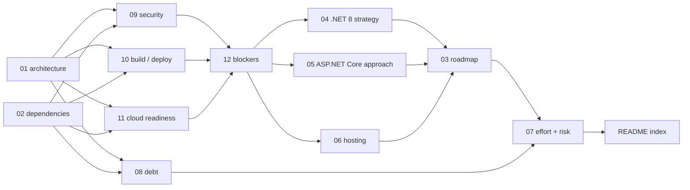

# MvcMusicStore — Modernization Assessment

**An evidence-based assessment of the MvcMusicStore repository and a plan for migrating it to .NET 8, ASP.NET Core and Azure.**

This directory holds thirteen documents: twelve numbered deliverables and this index. Nothing here changes the application. This is the assessment and the plan, written to be read and approved *before* any implementation begins.

> ## ⛔ APPROVAL GATE — THIS IS A PROPOSAL, NOT AN AUTHORIZATION
>
> **No implementation work begins — not one line of application code, not one repository file changed, not one Azure resource created — until this assessment and the modernization plan are approved in writing.**
>
> A reader who takes any document in this directory as a green light to start has misread it. The deliverables *specify* the work; approval *authorizes* it. Those are two different events, and only the first has happened.

---

## 1. The approval gate

### 1.1 The two directives behind it

Two inputs impose the gate, arrived at independently, agreeing on the same thing. Both are quoted exactly.

| Source | Directive, verbatim |
| --- | --- |
| The user's prompt | *"Do not make code changes initially."* |
| The project's attached environment setup instructions (Environment 1) | *"Do not modify code until assessment and modernization plan are approved."* |

Because two independent inputs agree, the gate is treated as absolute rather than advisory — including for the defects this assessment found. Section 2.3 states what that meant in practice.

### 1.2 Where the gate is enforced, and why it appears twice

The gate is carried in two places by design, and this is the one deliberate exception to the no-restatement convention of section 7:

- **[03](03-modernization-roadmap.md) §2 owns it as a workstream precondition** — every workstream in the roadmap sits behind it, and the roadmap is the document most likely to be mistaken for a schedule that has already started.
- **This index restates it as the reader's entry point**, because a reader who arrives at a thirteen-document set and starts reading needs the gate before anything else, not after.

[03](03-modernization-roadmap.md) §2.3 draws the line the whole assessment depends on: the prohibition is on **changing** the repository, not on **planning** a change. Refusing to specify the work would have failed the request as surely as starting it would have breached the gate.

---

## 2. What this assessment did, and did not, do

### 2.1 Thirteen files created; nothing modified

The single write this work performed is this `docs/modernization/` tree. No existing file was edited, added to, renamed or deleted — no `.cs`, `.cshtml`, `.csproj`, `.sln`, `.config`, `.sql`, `.js`, `.css`, `.mdf` or `.ldf`. No package was added, upgraded or removed in any manifest. No Azure resource was provisioned.

That is a claim about the delivered state, and it has to be stated alongside what the assessment actually did to the working tree. **Unqualified restore and build operations were run** against this checkout while the deliverables were being written, and they wrote gitignored trees into it: package payload under `packages/`, compiler output under `bin/` and `obj/`. Those operations are working-tree history, and whether any of them is *evidence* is [10](10-build-and-deployment-requirements.md) §1.4's to state rather than this index's: an output directory records that a tool ran, never what it concluded, so which run was recorded field by field and which left only a directory behind is settled there and not here. Every build requirement, outcome and status is that deliverable's, **the migration source's included**: what that status is, and what it leaves open, are recorded there and are deliberately not repeated here, per section 3.2. Every one of the trees was removed once the assessment had finished with it, and that removal is a statement about a moment rather than a durable property of this checkout: keeping it true is a **standing rule** on whoever commits this assessment, stated in that deliverable's §1.4, rather than a discharged act this index can report on their behalf. None was ever tracked and no manifest changed to produce them, but they were real files on disk, and **bare `git status --porcelain` cannot see them** — the `bin` and `obj` trees are matched by `[Bb]in/` and `[Oo]bj/` [.gitignore:1-2] whatever the host, and the two nested `packages` trees by `Packages/` [.gitignore:33], which reaches those lowercase directories only because `core.ignorecase` is `true` on this checkout, so on a case-sensitive host nothing would have ignored them at all ([04](04-dotnet8-migration-strategy.md) §A.6 owns that analysis). On the host where the runs happened the rules did match, so porcelain and a tracked-file diff alike reported a clean tree while those trees sat there. Porcelain alone therefore cannot be the acceptance check.

The acceptance check is four commands that must hold together, and what follows is **stated as the results the check must produce, not as results this index observed**. The standing rule they enforce, and the per-tree record of what the runs left behind, are [10](10-build-and-deployment-requirements.md) §1.4's:

- `git status --porcelain` — **must report no output**: nothing tracked is modified and nothing untracked is present.
- `git status --porcelain --ignored` — **must report no output**: it is the one of the four that reports the ignored trees at all, and the one the other three are blind to.
- `git clean -ndX` — **must report no output**: no ignored file remains for it to propose removing.
- `git diff --name-status ea2552d6eda7c20e9477a512e5c615665618cf35..HEAD` — **must report exactly thirteen `A` rows**, every one of them a file under `docs/modernization/`: no `M` row, no `D` row, no path outside this directory. The left side is the immutable pre-assessment revision, the last commit before this assessment began; the right side is named `HEAD` rather than a hash **because a document cannot cite the commit that creates it**, so no hash is invented for it and the reader resolves `HEAD` on the delivered checkout.

The four do not divide evenly, and the split is the whole of what this index claims for them. **Bare `git status --porcelain` and the tracked diff are the tracked pair**, and together they carry the binary criterion the no-modification constraint turns on; the diff's result is a property of the commit range rather than of anyone's working tree, so it is settled independently of any run. **`git status --porcelain --ignored` and `git clean -ndX` are the ignored-aware pair**, and what they report is ignored content, so both will legitimately be non-empty in any checkout where a build or a restore has run since — including one whose run belongs to concurrent work rather than to this assessment. Their empty result is therefore the pre-commit hygiene condition owned by whoever commits this assessment, not a claim this index makes about the moment a reader happens to run them. The standing rule that requires the tree cleared after any run performed in place — which is what makes that pair empty at the moment of commit — is [10](10-build-and-deployment-requirements.md) §1.4's.

The last command is pinned at one end and not the other, and that is deliberate. Its **start** is the full hash `ea2552d6eda7c20e9477a512e5c615665618cf35`, the last commit before this engagement, so the baseline cannot drift. Its **end** is `HEAD` because **no document can contain the hash of the commit that adds it** — that hash exists only once the commit does, which is after these thirteen files reach final content, so any literal printed here would name an earlier commit and describe a range that leaves this work out. A reader who wants both ends pinned runs `git rev-parse HEAD` on their own checkout and substitutes the result. **Doing so changes none of the four expected values**: thirteen rows, thirteen `A` rows, nothing that is not an `A`, and nothing outside `docs/modernization/`.

### 2.2 Specified is not created

Deliverables [03](03-modernization-roadmap.md) through [06](06-azure-hosting-recommendations.md) name the artifacts a later, approved implementation phase will create — a composition root, application settings files, an SDK pin, a container manifest, a CI pipeline definition, a test project, an operator provisioning tool. **Every one of them is specified content, not a created file.** Where a deliverable gives a target path, that path is a destination in a plan, not a location on disk.

That none of them exists is a claim about the whole repository, so it carries its command rather than a citation, per section 3.2: `git ls-files | grep -Ei '(^|/)(program\.cs|appsettings.*\.json|global\.json|dockerfile|libman\.json|.*tests?\.csproj)$|^\.github/|^tools/|azure-pipelines'` returns nothing. Each deliverable that names a target artifact carries the same kind of evidence for it where it names it.

### 2.3 Documented is not repaired

The assessment found real defects. Under the gate, every one of them is **documented, not fixed**. Naming a defect is an as-is claim, so each is named here with its evidence and its owner, and its substance is left to the owner:

- **The plaintext administrator credential**, shipped as the `DefaultAdminPassword` application setting in two editions [src/MVC5/MvcMusicStore/Web.config:17] and [src/MVC4/MvcMusicStore/Web.config:26]. The setting is named; the value is deliberately not reproduced. Owned by [09](09-security-assessment.md).
- **MVC 4's broken build configuration** — a NuGet targets import carrying no `Condition`, whose `$(SolutionDir)` does not resolve to the edition's committed `.nuget` folder [src/MVC4/MvcMusicStore/MvcMusicStore.csproj:360], and 24 package `HintPath` entries pointing outside the committed package payload, counted by `grep -c '<HintPath>\.\.\\packages\\' src/MVC4/MvcMusicStore/MvcMusicStore.csproj`, which returns `24`. Owned by [10](10-build-and-deployment-requirements.md).
- **The MVC 5 framework-version mismatch** between the `compilation` and `httpRuntime` target frameworks in a single configuration file [src/MVC5/MvcMusicStore/Web.config:33-34]. Owned by [12](12-migration-blockers.md), which states what the runtime quirks mode changes.
- **The partial anti-forgery coverage.** Which controller validates and which state-changing actions do not is [09](09-security-assessment.md)'s finding to state, and the index does not restate it.
- **The state-changing `GET`** — `AddToCart` is declared with no verb attribute and mutates, reading the album, writing the cart and calling `SaveChanges` [src/MVC5/MvcMusicStore/Controllers/ShoppingCartController.cs:33-46]. Owned by [09](09-security-assessment.md); the verb change the port makes, and the bookmarkable URL it costs, belong to [05](05-aspnet-core-migration-approach.md).

Remediation sits with the owner in every case — [09](09-security-assessment.md) for the security findings, [10](10-build-and-deployment-requirements.md) for the build defects, [08](08-technical-debt-register.md) for the debt register, [12](12-migration-blockers.md) for the constructs with no successor. Repairing them is implementation work, and implementation work is behind the gate.

This is worth stating plainly because the temptation runs the other way: a defect found is a defect one wants to fix. Fixing it here would have broken the user's central constraint to save a later commit.

---

## 3. Authoring contract

### 3.1 No user rules were provided

`review_rules` returns exactly **"No user rules provided."** — verified directly during this work. There is therefore no project rule to name, summarize or cite, and no file forced into scope by one. Any reader can confirm this independently through `review_rules`, which remains the source of full rule text and returns the same empty result here.

Their absence was **not** treated as licence to lower the bar, and no rule was invented to fill the gap. The standards actually applied are enterprise-standard documentation and assessment practice plus the assessment's own explicit contracts, which are stated in section 8 so a reader can check the work against them rather than take it on trust.

### 3.2 What this index is, and is not

**This is an index, not a summary.** It tells you *where* a fact is settled. It does not restate the fact.

That is a deliberate constraint, not brevity. Every figure, version, decision or risk restated here would be a second copy that can drift out of step with its owner — and a reader who finds the same decision stated two different ways cannot tell which is current. So this document introduces no new facts and repeats no owned ones. Every statement in it is one of exactly four things:

- **A pointer.** It names the deliverable that settles a fact and says what the reader will find there, without asserting the fact's content.
- **A structural claim about this document set, or about the inputs it answers to** — thirteen documents, fourteen requirements, six environment goals, the two verbatim directives, the absence of user rules and of attachments, the dependency graph, the ownership table, the reading paths.
- **A claim about this work's own footprint, or about the repository taken as a whole** — what this work wrote and what it did not (section 2.1; section 2.2 adds only that the target artifacts named in the plans were not created, and points at the deliverables that own them), and the absence of any centralized design system in the repository (section 8). These belong to no other deliverable, and the two that range over the whole tree — section 2.1's repository state and section 8's absence — each carry the command that reproduces them, per section 8's evidence rule.
- **A named as-is defect, with its evidence and its owner.** This is the fourth category rather than an exception to the first three, because the gate turns on the difference between documenting a defect and repairing one, and section 2.3 has to name what was found in order to record that it was left alone. So each defect there is named with an inline citation or a reproducing command of its own and the deliverable that owns it — naming a defect *is* an as-is claim, which is why it carries evidence — and, where naming the specifics would itself be a restatement, with the owner alone and no specifics at all. What each defect means, how severe it is, and what it costs are the owner's in every case and are stated nowhere here.

The only numbers here are therefore structural, commanded, or a citation's own locator, and the distinction the whole convention rests on is narrow: *"[10](10-build-and-deployment-requirements.md) records the migration source's build status"* is a pointer; *"the migration source does not build"*, and equally any statement of what that status turned out to be, is a restatement, and no sentence of that kind appears in this file.

Where an as-is claim does appear anywhere in this set, it carries an inline citation of the form `[<path>:<locator>]` placed where the claim is made, so it can be checked against the repository. Section 8 states the evidence rules in full.

---

## 4. Requirement coverage

### 4.1 Why fourteen requirements map onto thirteen files

The user named fourteen requirements — seven beginning "Analyze" and seven beginning "Produce". They are answered by thirteen files, and the arithmetic is not a shortfall:

- **Seven deliverables are outputs the user named directly** — the architecture overview, the dependency inventory, the modernization roadmap, the .NET 8 migration strategy, the ASP.NET Core migration approach, the Azure hosting recommendations, and the effort/risks/sequencing document.
- **Five are supporting assessment records** answering the "Analyze" dimensions that have no separately named output: technical debt, security, build and deployment, cloud readiness, and migration blockers. They exist because **a strategy cannot be written before the evidence behind it** — a roadmap with no debt register underneath it is an opinion.
- **The thirteenth is this index.**

Fourteen collapses to thirteen because **two Analyze/Produce pairs describe one body of work under two names**: architecture analysis and the architecture overview are the same work, answered by [01](01-architecture-overview.md); dependency analysis and the dependency inventory are the same work, answered by [02](02-dependency-inventory.md). Splitting either into two documents would have produced one document restating the other — exactly the drift section 3.2 exists to prevent.

### 4.2 The coverage map

| # | Requirement (user's words) | Deliverable | What it does with it |
| --- | --- | --- | --- |
| 1 | Analyze architecture and application structure | [`01-architecture-overview.md`](01-architecture-overview.md) | Startup composition, request pipeline, layering, domain model and the cart unit-of-work models, per edition |
| 2 | Analyze framework and package dependencies | [`02-dependency-inventory.md`](02-dependency-inventory.md) | Every pin with its registry and purpose, plus what NuGet does not resolve |
| 3 | Analyze technical debt | [`08-technical-debt-register.md`](08-technical-debt-register.md) | Duplication, dead scaffolding, committed binaries and absences, each with severity, remediation and owner |
| 4 | Analyze security concerns | [`09-security-assessment.md`](09-security-assessment.md) | Authentication, authorization, transport, secrets and data protection, per edition, with file-level evidence |
| 5 | Analyze build and deployment requirements | [`10-build-and-deployment-requirements.md`](10-build-and-deployment-requirements.md) | Per-edition toolchain, the build evidence it records per edition — including the migration source's own build status, which that deliverable states — and the database components needed to run |
| 6 | Analyze cloud readiness | [`11-cloud-readiness-assessment.md`](11-cloud-readiness-assessment.md) | Statefulness, configuration, persistence, transport and identity against Azure hosting constraints |
| 7 | Analyze migration blockers | [`12-migration-blockers.md`](12-migration-blockers.md) | Every construct with no successor, and every successor whose default behaviour differs |
| 8 | Produce architecture overview | [`01-architecture-overview.md`](01-architecture-overview.md) | Same document as #1 — one body of work, two names (section 4.1) |
| 9 | Produce dependency inventory | [`02-dependency-inventory.md`](02-dependency-inventory.md) | Same document as #2 — one body of work, two names (section 4.1) |
| 10 | Produce modernization roadmap | [`03-modernization-roadmap.md`](03-modernization-roadmap.md) | Ordered workstreams with entry and exit gates, all behind the approval gate |
| 11 | Produce .NET 8 migration strategy | [`04-dotnet8-migration-strategy.md`](04-dotnet8-migration-strategy.md) | Project-format, target-framework and dependency transition, with a per-package outcome |
| 12 | Produce ASP.NET Core migration approach | [`05-aspnet-core-migration-approach.md`](05-aspnet-core-migration-approach.md) | Pipeline, DI, configuration, Identity, EF Core and static assets, plus the cutover decision |
| 13 | Produce Azure App Service and Azure Container Apps recommendations | [`06-azure-hosting-recommendations.md`](06-azure-hosting-recommendations.md) | Primary, secondary and interim hosting targets with decision criteria and platform constraints |
| 14 | Produce estimated effort, risks, and sequencing | [`07-effort-risks-sequencing.md`](07-effort-risks-sequencing.md) | An effort model with stated units and bands, the risk register, and a dependency-ordered sequence |

### 4.3 The coverage standard

**A requirement answered in passing inside another document does not satisfy coverage. The named deliverable must carry it.**

That sentence is what makes the table above an acceptance criterion rather than a courtesy. A reviewer can verify all fourteen requirements were answered by walking these fourteen rows — following each link and confirming the deliverable carries that requirement as its subject, not as a remark. Coverage fails if a row's deliverable merely mentions the topic while the substance lives somewhere else.

---

## 5. The Environment 1 analysis goals

The project has an **attached environment** — labelled Environment 1 in its setup instructions — which states its own analysis goals alongside the build requirements. Those goals resolve too:

| Environment analysis goal | Answered by |
| --- | --- |
| Generate architecture documentation | [01](01-architecture-overview.md) |
| Inventory dependencies | [02](02-dependency-inventory.md) |
| Identify deprecated frameworks and libraries | [02](02-dependency-inventory.md) and [12](12-migration-blockers.md) |
| Assess cloud readiness | [11](11-cloud-readiness-assessment.md) |
| Recommend migration path to .NET 8 and Azure | [04](04-dotnet8-migration-strategy.md), [05](05-aspnet-core-migration-approach.md) and [06](06-azure-hosting-recommendations.md) |
| Estimate modernization effort | [07](07-effort-risks-sequencing.md) |

**These six are a subset of the user's fourteen requirements, not a parallel set.** Each maps onto a deliverable that already exists to answer a named requirement, **which is why no deliverable was added to satisfy them.** Adding a fourteenth file to answer a goal an existing file already answers would have created the duplication section 3.2 rules out.

One of the six does add an obligation the user's prompt states only implicitly. **"Identify deprecated frameworks and libraries" makes deprecation an explicit reporting obligation** rather than a matter of judgement — which is why [12](12-migration-blockers.md) names each construct with no successor instead of describing the general problem, why [02](02-dependency-inventory.md) records the version-risk posture of the pins rather than leaving age implicit, and why the deprecation of the migration tooling itself is recorded in [04](04-dotnet8-migration-strategy.md)'s tooling posture rather than passed over as an inconvenience.

---

## 6. How the documents depend on each other

### 6.1 The content-dependency graph



**The graph depicts *content* dependency and nothing else, and one relation in this set is of a different kind.** Section 7's ownership table carries one further relation the graph deliberately does not draw — its last row: the corpus Markdown line-length convention of section 10, which this index owns and each of the other twelve documents records as a single cross-reference. That is an ownership relation, not a content dependency — none of the twelve needed this index to exist before it could be written — so drawing it as an edge would assert a dependency that does not exist and would make the graph cyclic, contradicting the first sentence of section 6.2. Section 7 is where that relation is stated, and it is not restated here.

### 6.2 Reading the graph

The graph is acyclic, and each edge is a genuine content dependency — the target could not have been written before the source.

- **[01](01-architecture-overview.md) and [02](02-dependency-inventory.md) are the evidentiary foundations.** They describe what exists. Everything downstream rests on them.
- **The four assessments consume them** — [08](08-technical-debt-register.md), [09](09-security-assessment.md), [10](10-build-and-deployment-requirements.md) and [11](11-cloud-readiness-assessment.md) each read the foundations through one lens.
- **[12](12-migration-blockers.md) consolidates** the security, build and cloud-readiness findings into the blocker set.
- **The three strategies resolve those blockers** — [04](04-dotnet8-migration-strategy.md), [05](05-aspnet-core-migration-approach.md) and [06](06-azure-hosting-recommendations.md).
- **[03](03-modernization-roadmap.md) sequences the work** the three strategies define, into gated workstreams.
- **[07](07-effort-risks-sequencing.md) sizes and risks it**, estimating against the roadmap's decomposition.

Note that **[08](08-technical-debt-register.md) feeds effort rather than terminating the graph**: it is both an assessment of what exists and an input to estimation, which is why an arrow leaves it for [07](07-effort-risks-sequencing.md) and not only for [12](12-migration-blockers.md). And this index is last for a structural reason — it references all twelve, so it could only be written once they existed.

### 6.3 Two reading paths

Two kinds of reader arrive here, and reading thirteen documents in numeric order serves neither of them well.

**If you are approving this** — you need the decisions that require your sign-off:

1. The approval gate (section 1 above), so the nature of what you are approving is clear
2. [07](07-effort-risks-sequencing.md) — effort and risks: what it costs and what could go wrong
3. [03](03-modernization-roadmap.md) — the sequence and its gates: what happens in what order
4. [06](06-azure-hosting-recommendations.md) — hosting: the platform commitment and its constraints

**If you are implementing this** — you need grounding, then the obstacles, then the resolutions:

1. [01](01-architecture-overview.md) and [02](02-dependency-inventory.md) — what the application actually is
2. [12](12-migration-blockers.md) — the blocker set, grouped by failure mode: what breaks the build, and what compiles and then fails or behaves differently at runtime
3. [04](04-dotnet8-migration-strategy.md), [05](05-aspnet-core-migration-approach.md) and [06](06-azure-hosting-recommendations.md) — how each blocker is resolved
4. [03](03-modernization-roadmap.md) — the order to do it in, and the gate you must not start before

Readers with a narrower question — what the debt is, what the security posture is, whether it builds — should go straight to [08](08-technical-debt-register.md), [09](09-security-assessment.md) or [10](10-build-and-deployment-requirements.md); each stands on its own.

---

## 7. One fact, one owner

Every cross-cutting decision is stated in full in exactly **one** deliverable. Every other document cites that owner rather than restating it.

| Decision | Owner | Everyone else |
| --- | --- | --- |
| Target framework and SDK band | [**04**](04-dotnet8-migration-strategy.md) | cross-reference |
| Hosting target and deployment model | [**06**](06-azure-hosting-recommendations.md) | cross-reference |
| Cutover approach and its accepted losses | [**05**](05-aspnet-core-migration-approach.md) | cross-reference |
| Observability approach | [**06**](06-azure-hosting-recommendations.md) | cross-reference |
| The data-protection key store — where the key ring is persisted, and its rotation and isolation | [**06**](06-azure-hosting-recommendations.md#7-the-data-protection-key-ring-d3) | cross-reference |
| The deployment migration principal, and the separation of DDL from the runtime identity | [**06**](06-azure-hosting-recommendations.md#62-who-applies-ddl-and-with-what-identity--the-separation-is-the-point) | cross-reference |
| Per-edition build outcomes | [**10**](10-build-and-deployment-requirements.md) | cross-reference |
| Effort model | [**07**](07-effort-risks-sequencing.md) | cross-reference |
| Workstream decomposition | [**03**](03-modernization-roadmap.md) | cross-reference |
| .NET 8 support-window risk | [**07**](07-effort-risks-sequencing.md)'s risk register | cross-reference |
| Markdown line-length convention | [**this index**](#10-markdown-line-length-convention), section 10 | cross-reference |

**The convention this enforces:** a restatement in different words reads downstream as a second decision. So each decision is settled in one place and pointed at from everywhere else. **A reader who finds the same decision stated two different ways across these documents has found a defect, not a nuance** — and the owner column tells them which version governs.

This index is bound by the same rule, which is why the table above names owners and states none of the decisions the deliverables carry. Two things it does own, and the table's last row is one of them: the gate restated in section 1, for the reason section 1.2 gives, and the corpus Markdown line-length convention in section 10, which the other twelve documents cross-reference rather than restate.

---

## 8. Standards and conventions

How to check this work, briefly:

- **Repository evidence is primary.** Every as-is claim carries an inline `[<path>:<locator>]` citation, placed where the claim is made rather than collected in a list at the end. The path is repository-relative and resolves in this checkout. A citation pointing at a file that does not contain the claimed content is a defect; so is a claim about "the application" that holds in only one edition without saying so.
- **`<locator>` is not free-form, and this is the whole of its syntax.** A citation carrying no locator, or a locator in none of the forms below, is itself a defect — that gap is what lets an unverifiable citation pass review, so the forms are enumerated here rather than left to each document's habit. **Both halves are mandatory and each citation carries them itself: one complete repository-relative path *and* a locator, at every positive claim about the existing system.** A path with no locator does not satisfy this standard, and neither does a locator that leans on a path cited earlier — there is no inheritance, no continuation and no whole-file shorthand, because each of those makes a citation checkable only by reading around it. The one class of claim that has no locator is the class that has no line to point at — an absence, a count, or anything else ranging over the repository — and it carries its reproducing command *instead*, per the two rules below. These are the only forms this corpus uses:
  - `[path:12]` — a single line.
  - `[path:12-34]` — a line range, used when the construct spans lines and the whole span is the evidence.
  - `[path:12,18]` and `[path:12-13,17]` — **two or more discontiguous lines or ranges in one file**, comma-separated, used when a single claim rests on several separated lines of the same file and citing the span between them would sweep in text that is not evidence. It is one citation rather than several because the lines are one claim's evidence jointly; where they are separately citable claims, they are cited separately. Four citations in this corpus take this form, in [05](05-aspnet-core-migration-approach.md) and [06](06-azure-hosting-recommendations.md).
  - **There is no `[path]` form.** A claim about a file as a whole — that it exists, that it is absent, its size, that it is tracked, or that it is byte-identical to another file — is a claim no line range can carry, so it is not written as a bare citation either: it **names the path in inline code and carries the command that establishes it**, per the repository-wide rule below. An earlier form of this standard admitted `[path]` for exactly those cases; it is **withdrawn**, because a bare path is indistinguishable from a citation whose author omitted the locator, which is the one defect this whole enumeration exists to catch.
  - `[path:key/path]` — a configuration key path, where the claim is about a setting rather than a line, for example `[src/MVC5/MvcMusicStore/Web.config:configuration/appSettings]`.
  - `[path:§heading]` — a named heading, where the claim is about a section of a prose file rather than a line of it.
  - **There is no continuation or inheritance form either.** A run of citations against one file **repeats the full path every time**, however repetitive that reads. An earlier form of this standard allowed a later locator to inherit the nearest full path cited above it, bounded by two conditions a reader had to check by scanning upward; it is **withdrawn**, because a citation whose path is somewhere above it cannot be verified from the sentence it supports, which is the property the first bullet of this section requires of every citation.
  - `[path:evidence form and artifact size]` — **binary evidence**, where no line range exists. The locator states how the observation was made and how large the artifact is, in the shape `[path:first UTF-16LE byte offsets at any alignment 0x…, in an N-byte file]`, and it is **paired with the reproducing command** in the owning deliverable's reproducibility appendix. The command is what a reader re-runs and the offsets are what they compare against, so both are required and neither is sufficient alone. [09](09-security-assessment.md) §1.4 states this form for its own binary citations, and that deliverable carries the worked examples at the findings that make them; the values are that deliverable's, not this index's.
  - `[path:N bytes]` — **the size-only binary form**, for a claim about a binary artifact that is *about* its size or its presence at that size rather than about anything inside it. It is the shorter sibling of the form above: where that one is needed because the claim concerns content found at an offset, this one suffices because the artifact's magnitude *is* the claim, and stating an offset would imply an inspection the sentence never performed. It carries its reproducing command in the owning deliverable's appendix on the same terms. Sixteen citations take this form, in [02](02-dependency-inventory.md), [03](03-modernization-roadmap.md), [06](06-azure-hosting-recommendations.md), [07](07-effort-risks-sequencing.md), [08](08-technical-debt-register.md) and [12](12-migration-blockers.md), covering the committed restore client, the tutorial PDF, the committed database binaries, and the two tracked `Content/Site.css` files whose own path capitalisation — rather than anything inside them — is what those claims rest on. **It is not the withdrawn `[path]` form** — it carries a locator, which is the property that form lacked.
  - **A repository-wide count or an absence** carries its reproducing command *instead of* a locator, per the repository-wide-claims rule below. There is no line to point at, and inventing one would be worse than citing nothing.
  - **A claim about a table, a column or a figure inside another deliverable** cites the deliverable and its section — `[08 §5.4](08-technical-debt-register.md)` — and **never** a line number in a sibling document, because a sibling's line numbers move with every edit to it while its section numbers do not.
- **The Technical Specification is a secondary cross-reference only.** It may appear alongside a repository citation, never instead of one. Where the two disagree, **the repository governs**. Two such disagreements are documented rather than smoothed over, and each correction is made by the deliverable that owns the subject: specification §1.3's capability-coverage assertion, corrected by [01](01-architecture-overview.md), and specification §3.3's account of the configured NuGet package source, corrected by [02](02-dependency-inventory.md). Each owner states the repository evidence for its correction; this index states the standard and the owner, and neither the disagreement's substance nor its resolution is settled here.
- **Repository-wide claims carry their reproducing command.** A count or an absence has no single line to cite, so its evidence is the command that produces it, stated next to the claim and collected in each deliverable's reproducibility appendix. That is the stronger form of evidence, because you can re-run it.
- **No design system or Figma input applies.** No component library was specified for this work, no attachments were provided, and the repository has no centralized design system of its own — no token module, no theme configuration, no exported shared component set. That last claim ranges over the whole repository, so it carries its command rather than a citation, per the rule above: `git ls-files | grep -v '/packages/' | grep -Ei 'tailwind\.config|postcss\.config|theme\.(js|ts|json|scss)|tokens?\.(js|ts|json|scss)|design-tokens|\.storybook|package\.json'` returns nothing. This is stated so its absence is read as a finding about the inputs rather than as an omission in the output. Where the port unavoidably touches presentation, [05](05-aspnet-core-migration-approach.md) owns the view and static-asset transitions and [06](06-azure-hosting-recommendations.md) owns the supported browser matrix.
- **Two counting methods, never mixed.** [08](08-technical-debt-register.md) establishes the two line-counting methods this assessment uses, defines which of them a given kind of figure is measured by, and states the difference between them; [07](07-effort-risks-sequencing.md) honours the rule and names which method any figure it quotes was produced by. The methods are defined once, there, because a silent mix would put every derived estimate out — which is exactly why this index does not restate either definition.
- **Edition triage.** The three shipped editions are **not** treated identically by the migration plans, and — under section 2.1 — none of them is modified or deleted by this work. Which edition the plans take as their migration source, what becomes of the other two, and what each is nonetheless assessed for are settled by [03](03-modernization-roadmap.md), which owns the decision and its gating; the measured evidence behind the choice, and the bound on how far that evidence extends across the editions, are settled by [08](08-technical-debt-register.md). Neither the decision nor its evidence is restated or re-argued here.

---

## 9. The deliverable directory

Thirteen files. Filenames are exact.

| File | Subject |
| --- | --- |
| [`README.md`](README.md) | This index — the approval gate, requirement coverage, the dependency graph, reading paths and fact ownership |
| [`01-architecture-overview.md`](01-architecture-overview.md) | The as-is architecture: startup composition, request pipeline, layering, domain model, the parallel authentication stacks, and per-capability edition coverage |
| [`02-dependency-inventory.md`](02-dependency-inventory.md) | Every declared package pin with registry and purpose, the dependencies NuGet does not resolve, the committed restore client, and the restore-source correction |
| [`03-modernization-roadmap.md`](03-modernization-roadmap.md) | The approval gate as a precondition, and the work decomposed into dependency-ordered workstreams with interlocking entry and exit gates |
| [`04-dotnet8-migration-strategy.md`](04-dotnet8-migration-strategy.md) | The target framework and SDK band, the project-format transition, a per-package outcome for every pin, and the future application map |
| [`05-aspnet-core-migration-approach.md`](05-aspnet-core-migration-approach.md) | The composition root, DI and lifetimes, configuration, the schema and data migrations, authentication and anti-forgery policy, views and wire contracts, the cutover decision, and the test suite |
| [`06-azure-hosting-recommendations.md`](06-azure-hosting-recommendations.md) | Primary, secondary and interim hosting targets; data platform and DDL separation; the data-protection key ring; observability; transport, headers and the browser matrix; the cutover runbook |
| [`07-effort-risks-sequencing.md`](07-effort-risks-sequencing.md) | The effort model with its units, bands, assumptions and confidence; the risk register; and the dependency-ordered sequence |
| [`08-technical-debt-register.md`](08-technical-debt-register.md) | The two counting methods, measured duplication and sizing, and categorized code, data, operational, build and repository debt with severity, remediation and owner |
| [`09-security-assessment.md`](09-security-assessment.md) | Per-edition authentication and authorization posture, cross-edition findings, the controls that are present, and the consolidated finding register |
| [`10-build-and-deployment-requirements.md`](10-build-and-deployment-requirements.md) | What the prescribed build procedure could and could not deliver, the build evidence per edition and the open verification items it leaves — among them the migration source's build status — toolchain and hosting prerequisites, database components, permissions, and the absence of deployment automation |
| [`11-cloud-readiness-assessment.md`](11-cloud-readiness-assessment.md) | Readiness against Azure hosting constraints, each blocker paired with its target-state replacement, the favourable findings, and the consolidated control set |
| [`12-migration-blockers.md`](12-migration-blockers.md) | The blocker set grouped by failure mode — what breaks the build, and what compiles and then fails or behaves differently at runtime — the riskiest data operation with its evidence qualified, and the portability findings in the application's favour |

---

## 10. Markdown line-length convention

**This corpus does not enforce a fixed maximum line length.** A default-configured `markdownlint` run therefore reports `MD013` (`line-length`) against these documents. **That output is the expected consequence of the convention below, not a defect.** `MD013` is one of exactly **two** rule findings this corpus accepts; the second is `MD033` (`no-inline-html`), accepted for one construct only and recorded with its reason and its proof in section 10.1. Every other rule is a gate rather than a convention.

### 10.1 The convention

- **Prose is wrapped for reviewability, not to a column.** These documents were not authored to one shape: some are wrapped prose, some are one paragraph per line. **Each keeps the form it was authored in, and neither is converted to the other.** Reflowing the corpus to a column would rewrite every line of a set whose whole value is that each claim is individually citable and individually reviewable — a diff that touches everything and demonstrates nothing, across which no reviewer could see what actually changed.
- **Tables, fenced code blocks, inline `[<path>:<locator>]` citations and URLs are never broken to satisfy a column limit.** Breaking any of them changes what the document *means*, not merely how it looks: a wrapped table row stops being a table, a wrapped fence stops being runnable, and a wrapped citation stops resolving. Where one of these runs past any column a reader might prefer, the line stands as written.
- **`MD013` and `MD033` are the only two rules this corpus does not satisfy, and `MD033` is accepted for exactly one construct.** The corpus's only inline HTML is the empty anchor target `<a id="…"></a>`, which gives a stage, a step or a table row a stable link target that does not change when a heading's wording does — the one thing Markdown itself cannot express, and load-bearing, because inbound links across the thirteen documents resolve to those targets. Nothing else is accepted under `MD033`: no `<br>`, no formatting tag, no attribute on any other element. The claim is checkable, and section 10.2 carries the two commands that check it. What they establish is an **equality**, not a number — the element list under `MD033` comes back as `a` and nothing else, and the count of `MD033` findings equals the count of `<a id=` occurrences in the twelve deliverables — because the number of anchors grows as sections acquire link targets while the equality does not move. This index is outside that count for the reason section 10.2 states: its own mentions of the construct are illustrative and sit inside code spans, where the linter does not see inline HTML and a text search does.
- **A finding under any other rule is a defect, not a convention.** An unbalanced fence, a heading jump, a malformed table, a mis-indented list, a broken link fragment, spaces inside emphasis markers: each is fixed in the document that carries it, and this section excuses none of them. The two exemptions are a statement of policy, not a claim that every document currently satisfies every other rule; section 10.2 states the check that establishes that, and who runs it.
- **The convention is corpus-wide and it is stated here.** Each of the other twelve documents records a single cross-reference to this section rather than restating it, per the one-fact-one-owner rule in section 7.

It is recorded as prose rather than as a lint configuration file because the write boundary of this assessment is exactly the thirteen Markdown files section 2.1 accounts for, and a fourteenth file of any kind — a `markdownlint` configuration included — would breach it. A reader who wants their own tooling to agree with the convention disables the rule on the invocation instead of adding a file to the repository.

### 10.2 Reproducing it

```bash
# Default configuration — reports MD013 and MD033 against this corpus, by design
npx --yes markdownlint-cli2@0.23.2 "docs/modernization/*.md"

# The two accepted rules disabled — this is the run that must come back clean
npx --yes -p markdownlint-cli@0.49.1 markdownlint --disable MD013 MD033 -- docs/modernization

# Why MD033 is accepted: every finding under it is an empty anchor target.
# The element list and the anchor count must agree.
npx -p markdownlint-cli@0.49.1 markdownlint --disable MD013 -- docs/modernization \
  | grep MD033 | sed 's/.*Element: //;s/\]//' | sort | uniq -c
git grep -c '<a id=' -- 'docs/modernization/*.md' ':!docs/modernization/README.md' \
  | awk -F: '{s+=$2} END {print s}'

# A pipe block whose delimiter row is not adjacent to its header renders as literal
# text and markdownlint cannot see it, so this check is separate. Expect no output.
awk '
  /^[[:space:]]*(```|~~~)/ { fence = !fence; prev = ""; next }
  fence { next }
  {
    is_row = ($0 ~ /^[[:space:]]*\|/)
    if (is_row && prev == "") { hdr = FNR; expect = 1 }
    else if (expect) {
      if ($0 !~ /^[[:space:]]*\|?[[:space:]:|-]+$/) printf "%s:%d: table block has no delimiter row after its header\n", FILENAME, hdr
      expect = 0
    }
    prev = is_row ? "row" : ""
    if (!is_row) expect = 0
  }
' docs/modernization/*.md
```

Run with `markdownlint-cli` 0.49.1 and no configuration file present anywhere in the repository, the default-configured run over this directory reports line-length findings and inline-HTML findings and **nothing under any other rule**. The third and fourth commands are what make the second accepted rule auditable rather than asserted: the element list comes back as `a` alone, and its finding count equals the number of `<a id=` occurrences the fourth command totals — so every accepted `MD033` finding is an anchor target and not some other inline HTML that happens to lint the same way. **The fourth command excludes this index deliberately, and the exclusion is part of what makes the equality true rather than a convenience.** This file names the construct in order to document it, inside a code span above and inside the fenced block above that; a code span and a fenced block are not inline HTML, so the linter correctly reports nothing for them while a plain text search counts them. Excluding the one file whose mentions are illustrative rather than load-bearing is what leaves the two sides counting the same thing. **The second command is the gate.** When this corpus is clean it prints nothing; anything it prints is a defect in the document that carries it, to be fixed there rather than accommodated here. `markdownlint-cli2` wraps the same rule library with the same defaults, so the first command is the equivalent reproduction for a reader who has that tool instead.

**The first two commands are the convention's acceptance check, not a record of a past run, and the difference is deliberate.** Both selectors carry an **exact version**, so the pair is a fixed reproduction rather than whatever the registry happens to serve on the day it is run — an unpinned `npx` selector would float, and a floating tool cannot be the thing a stated expectation is held against. The version the convention is written against is `markdownlint-cli` **0.49.1**; `markdownlint-cli2` **0.23.2** is pinned alongside it because it wraps **the same rule library at the same version** — `markdownlint` 0.41.1 in both, which `npm view markdownlint-cli@0.49.1 dependencies` and `npm view markdownlint-cli2@0.23.2 dependencies` each report — which is what makes the first command an *equivalent* reproduction and not a second authority. Neither command reads a configuration file, because none exists anywhere in the repository, so both take the tool's own defaults. What the pair **must** produce is this: the first command reports `MD013` findings — expected, by design — and exits non-zero; the second reports **nothing** and exits `0`.

**Confirm the invocation actually reached the files, because a run that reached nothing looks exactly like a clean one.** Pass a directory, as the second command does, or a forward-slash glob, as the first does. A shell that does not expand the glob itself, or a glob written with backslashes — `docs\modernization\*.md` — matches nothing, and `markdownlint` then prints its **usage text and exits `0`**, which is indistinguishable from success in an exit-code check and easily skimmed past in output. The cheap positive control is the first command: it prints `Linting: 13 files` and must report `MD013` across **all thirteen** documents. If a run reports no findings *and* no `MD013` anywhere, read it as an invocation that never reached the corpus rather than as a corpus that passed.

Anything the second command reports is a **defect in the document that carries it**, to be fixed there. That holds for every rule in the tool's set without exception, including the ones easily overlooked — `MD060` (`table-column-style`) is in 0.49.1's rule set, and so are the table, list-indentation, blank-line, fence-language and inline-emphasis rules — so no finding is excused as a variant of the line-length convention.

**The `awk` scan that closes the block is not a `markdownlint` run, and it is separate because the linter cannot see what it checks.** A pipe-row block whose GFM delimiter row is not the line immediately after its header is not a *table* to the tool at all — it is paragraph text that happens to contain `|` characters — so every rule in the set passes while the block renders as literal pipe characters, and the gate above comes back clean on a document nobody can read. That makes the gate **necessary but not sufficient**, which is why the `awk` scan sits beside it: it walks the corpus outside fenced blocks and prints the header line of any pipe block whose delimiter row is missing or non-adjacent, including the case where the delimiter has been swallowed into a multi-line prose cell. **Its expected output is nothing.** Anything it does print is the malformed table section 10.1 already names as a defect, to be fixed in the document that carries it — and, like every command above it, it needs no configuration file and no committed script.

This index states the standard and does not certify a run against it. The check that counts is the one a reviewer performs on the checkout in front of them, immediately before the set is approved: run the pair, expect `MD013` from the first and silence from the second, and treat any other output as a document to repair rather than a convention to widen.

---

*Nothing in this directory authorizes implementation. See section 1.*
