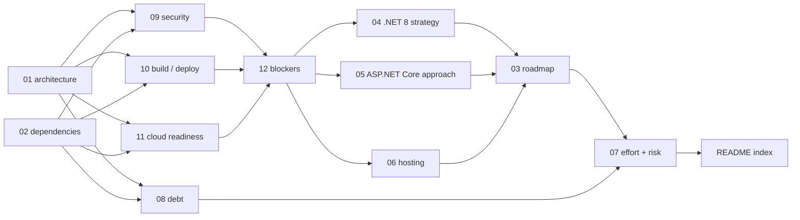

# MvcMusicStore — Modernization Assessment

**An evidence-based assessment of the MvcMusicStore repository and a plan for migrating it to .NET 8, ASP.NET Core and Azure.**

This directory holds thirteen documents: twelve numbered deliverables and this index. Nothing here changes the application. This is the assessment and the plan, written to be read and approved *before* any implementation begins.

> ## ⛔ APPROVAL GATE — THIS IS A PROPOSAL, NOT AN AUTHORIZATION
>
> **No implementation work begins — not one line of application code, not one repository file changed, not one Azure resource created — until this assessment and the modernization plan are approved in writing.**
>
> A reader who takes any document in this directory as a green light to start has misread it. The deliverables *specify* the work; approval *authorizes* it. Those are two different events, and only the first has happened.

---

## 1. The approval gate

### 1.1 The two directives behind it

Two inputs impose the gate, arrived at independently, agreeing on the same thing. Both are quoted exactly.

| Source | Directive, verbatim |
| --- | --- |
| The user's prompt | *"Do not make code changes initially."* |
| The project's attached environment setup instructions (Environment 1) | *"Do not modify code until assessment and modernization plan are approved."* |

Because two independent inputs agree, the gate is treated as absolute rather than advisory — including for the defects this assessment found. Section 2.3 states what that meant in practice.

### 1.2 Where the gate is enforced, and why it appears twice

The gate is carried in two places by design, and this is the one deliberate exception to the no-restatement convention of section 7:

- **[03](03-modernization-roadmap.md) §2 owns it as a workstream precondition** — every workstream in the roadmap sits behind it, and the roadmap is the document most likely to be mistaken for a schedule that has already started.
- **This index restates it as the reader's entry point**, because a reader who arrives at a thirteen-document set and starts reading needs the gate before anything else, not after.

[03](03-modernization-roadmap.md) §2.3 draws the line the whole assessment depends on: the prohibition is on **changing** the repository, not on **planning** a change. Refusing to specify the work would have failed the request as surely as starting it would have breached the gate.

---

## 2. What this assessment did, and did not, do

### 2.1 Thirteen files created; nothing modified

The single write this work performed is this `docs/modernization/` tree. No existing file was edited, added to, renamed or deleted — no `.cs`, `.cshtml`, `.csproj`, `.sln`, `.config`, `.sql`, `.js`, `.css`, `.mdf` or `.ldf`. No package was added, upgraded or removed in any manifest. No `packages/` payload was restored into the tree. No Azure resource was provisioned.

The acceptance check is mechanical, and each deliverable records that it was held to it: `git status --porcelain` shows only new files under `docs/modernization/` and nothing else.

### 2.2 Specified is not created

Deliverables [03](03-modernization-roadmap.md) through [06](06-azure-hosting-recommendations.md) name the artifacts a later, approved implementation phase will create — a composition root, application settings files, an SDK pin, a container manifest, a CI pipeline definition, a test project, an operator provisioning tool. **Every one of them is specified content, not a created file.** None exists in this repository, and this assessment did not create any of them. Where a deliverable gives a target path, that path is a destination in a plan, not a location on disk.

### 2.3 Documented is not repaired

The assessment found real defects. Under the gate, every one of them is **documented, not fixed**: the plaintext administrator credential, MVC 4's broken build configuration, the MVC 5 framework-version mismatch, the partial anti-forgery coverage and the state-changing `GET`. Each is recorded with its file location and its remediation in the deliverable that owns it — [09](09-security-assessment.md) for the security findings, [10](10-build-and-deployment-requirements.md) for the build defects, [08](08-technical-debt-register.md) for the debt register, [12](12-migration-blockers.md) for the constructs with no successor. Repairing them is implementation work, and implementation work is behind the gate.

This is worth stating plainly because the temptation runs the other way: a defect found is a defect one wants to fix. Fixing it here would have broken the user's central constraint to save a later commit.

---

## 3. Authoring contract

### 3.1 No user rules were provided

`review_rules` returns exactly **"No user rules provided."** — verified directly during this work. There is therefore no project rule to name, summarize or cite, and no file forced into scope by one. Any reader can confirm this independently through `review_rules`, which remains the source of full rule text and returns the same empty result here.

Their absence was **not** treated as licence to lower the bar, and no rule was invented to fill the gap. The standards actually applied are enterprise-standard documentation and assessment practice plus the assessment's own explicit contracts, which are stated in section 8 so a reader can check the work against them rather than take it on trust.

### 3.2 What this index is, and is not

**This is an index, not a summary.** It tells you *where* a fact is settled. It does not restate the fact.

That is a deliberate constraint, not brevity. Every figure, version, decision or risk restated here would be a second copy that can drift out of step with its owner — and a reader who finds the same decision stated two different ways cannot tell which is current. So this document introduces no new facts and repeats no owned ones: every statement in it is either a pointer to a deliverable or a structural claim about the document set itself. The only numbers you will find here are structural — thirteen documents, fourteen requirements, six environment goals.

Where an as-is claim does appear anywhere in this set, it carries an inline citation of the form `[<path>:<locator>]` placed where the claim is made, so it can be checked against the repository. Section 8 states the evidence rules in full.

---

## 4. Requirement coverage

### 4.1 Why fourteen requirements map onto thirteen files

The user named fourteen requirements — seven beginning "Analyze" and seven beginning "Produce". They are answered by thirteen files, and the arithmetic is not a shortfall:

- **Seven deliverables are outputs the user named directly** — the architecture overview, the dependency inventory, the modernization roadmap, the .NET 8 migration strategy, the ASP.NET Core migration approach, the Azure hosting recommendations, and the effort/risks/sequencing document.
- **Five are supporting assessment records** answering the "Analyze" dimensions that have no separately named output: technical debt, security, build and deployment, cloud readiness, and migration blockers. They exist because **a strategy cannot be written before the evidence behind it** — a roadmap with no debt register underneath it is an opinion.
- **The thirteenth is this index.**

Fourteen collapses to thirteen because **two Analyze/Produce pairs describe one body of work under two names**: architecture analysis and the architecture overview are the same work, answered by [01](01-architecture-overview.md); dependency analysis and the dependency inventory are the same work, answered by [02](02-dependency-inventory.md). Splitting either into two documents would have produced one document restating the other — exactly the drift section 3.2 exists to prevent.

### 4.2 The coverage map

| # | Requirement (user's words) | Deliverable | What it does with it |
| --- | --- | --- | --- |
| 1 | Analyze architecture and application structure | [`01-architecture-overview.md`](01-architecture-overview.md) | Startup composition, request pipeline, layering, domain model and the cart unit-of-work models, per edition |
| 2 | Analyze framework and package dependencies | [`02-dependency-inventory.md`](02-dependency-inventory.md) | Every pin with its registry and purpose, plus what NuGet does not resolve |
| 3 | Analyze technical debt | [`08-technical-debt-register.md`](08-technical-debt-register.md) | Duplication, dead scaffolding, committed binaries and absences, each with severity, remediation and owner |
| 4 | Analyze security concerns | [`09-security-assessment.md`](09-security-assessment.md) | Authentication, authorization, transport, secrets and data protection, per edition, with file-level evidence |
| 5 | Analyze build and deployment requirements | [`10-build-and-deployment-requirements.md`](10-build-and-deployment-requirements.md) | Per-edition toolchain, the verified build evidence, and the database components needed to run |
| 6 | Analyze cloud readiness | [`11-cloud-readiness-assessment.md`](11-cloud-readiness-assessment.md) | Statefulness, configuration, persistence, transport and identity against Azure hosting constraints |
| 7 | Analyze migration blockers | [`12-migration-blockers.md`](12-migration-blockers.md) | Every construct with no successor, and every successor whose default behaviour differs |
| 8 | Produce architecture overview | [`01-architecture-overview.md`](01-architecture-overview.md) | Same document as #1 — one body of work, two names (section 4.1) |
| 9 | Produce dependency inventory | [`02-dependency-inventory.md`](02-dependency-inventory.md) | Same document as #2 — one body of work, two names (section 4.1) |
| 10 | Produce modernization roadmap | [`03-modernization-roadmap.md`](03-modernization-roadmap.md) | Ordered workstreams with entry and exit gates, all behind the approval gate |
| 11 | Produce .NET 8 migration strategy | [`04-dotnet8-migration-strategy.md`](04-dotnet8-migration-strategy.md) | Project-format, target-framework and dependency transition, with a per-package outcome |
| 12 | Produce ASP.NET Core migration approach | [`05-aspnet-core-migration-approach.md`](05-aspnet-core-migration-approach.md) | Pipeline, DI, configuration, Identity, EF Core and static assets, plus the cutover decision |
| 13 | Produce Azure App Service and Azure Container Apps recommendations | [`06-azure-hosting-recommendations.md`](06-azure-hosting-recommendations.md) | Primary, secondary and interim hosting targets with decision criteria and platform constraints |
| 14 | Produce estimated effort, risks, and sequencing | [`07-effort-risks-sequencing.md`](07-effort-risks-sequencing.md) | An effort model with stated units and bands, the risk register, and a dependency-ordered sequence |

### 4.3 The coverage standard

**A requirement answered in passing inside another document does not satisfy coverage. The named deliverable must carry it.**

That sentence is what makes the table above an acceptance criterion rather than a courtesy. A reviewer can verify all fourteen requirements were answered by walking these fourteen rows — following each link and confirming the deliverable carries that requirement as its subject, not as a remark. Coverage fails if a row's deliverable merely mentions the topic while the substance lives somewhere else.

---

## 5. The Environment 1 analysis goals

The project has an **attached environment** — labelled Environment 1 in its setup instructions — which states its own analysis goals alongside the build requirements. Those goals resolve too:

| Environment analysis goal | Answered by |
| --- | --- |
| Generate architecture documentation | [01](01-architecture-overview.md) |
| Inventory dependencies | [02](02-dependency-inventory.md) |
| Identify deprecated frameworks and libraries | [02](02-dependency-inventory.md) and [12](12-migration-blockers.md) |
| Assess cloud readiness | [11](11-cloud-readiness-assessment.md) |
| Recommend migration path to .NET 8 and Azure | [04](04-dotnet8-migration-strategy.md), [05](05-aspnet-core-migration-approach.md) and [06](06-azure-hosting-recommendations.md) |
| Estimate modernization effort | [07](07-effort-risks-sequencing.md) |

**These six are a subset of the user's fourteen requirements, not a parallel set.** Each maps onto a deliverable that already exists to answer a named requirement, **which is why no deliverable was added to satisfy them.** Adding a fourteenth file to answer a goal an existing file already answers would have created the duplication section 3.2 rules out.

One of the six does add an obligation the user's prompt states only implicitly. **"Identify deprecated frameworks and libraries" makes deprecation an explicit reporting obligation** rather than a matter of judgement — which is why [12](12-migration-blockers.md) names each construct with no successor instead of describing the general problem, why [02](02-dependency-inventory.md) records the version-risk posture of the pins rather than leaving age implicit, and why the deprecation of the migration tooling itself is recorded in [04](04-dotnet8-migration-strategy.md)'s tooling posture rather than passed over as an inconvenience.

---

## 6. How the documents depend on each other

### 6.1 The content-dependency graph

### 6.2 Reading the graph

The graph is acyclic, and each edge is a genuine content dependency — the target could not have been written before the source.

- **[01](01-architecture-overview.md) and [02](02-dependency-inventory.md) are the evidentiary foundations.** They describe what exists. Everything downstream rests on them.
- **The four assessments consume them** — [08](08-technical-debt-register.md), [09](09-security-assessment.md), [10](10-build-and-deployment-requirements.md) and [11](11-cloud-readiness-assessment.md) each read the foundations through one lens.
- **[12](12-migration-blockers.md) consolidates** the security, build and cloud-readiness findings into the blocker set.
- **The three strategies resolve those blockers** — [04](04-dotnet8-migration-strategy.md), [05](05-aspnet-core-migration-approach.md) and [06](06-azure-hosting-recommendations.md).
- **[03](03-modernization-roadmap.md) sequences the work** the three strategies define, into gated workstreams.
- **[07](07-effort-risks-sequencing.md) sizes and risks it**, estimating against the roadmap's decomposition.

Note that **[08](08-technical-debt-register.md) feeds effort rather than terminating the graph**: it is both an assessment of what exists and an input to estimation, which is why an arrow leaves it for [07](07-effort-risks-sequencing.md) and not only for [12](12-migration-blockers.md). And this index is last for a structural reason — it references all twelve, so it could only be written once they existed.

### 6.3 Two reading paths

Two kinds of reader arrive here, and reading thirteen documents in numeric order serves neither of them well.

**If you are approving this** — you need the decisions that require your sign-off:

1. The approval gate (section 1 above), so the nature of what you are approving is clear
2. [07](07-effort-risks-sequencing.md) — effort and risks: what it costs and what could go wrong
3. [03](03-modernization-roadmap.md) — the sequence and its gates: what happens in what order
4. [06](06-azure-hosting-recommendations.md) — hosting: the platform commitment and its constraints

**If you are implementing this** — you need grounding, then the obstacles, then the resolutions:

1. [01](01-architecture-overview.md) and [02](02-dependency-inventory.md) — what the application actually is
2. [12](12-migration-blockers.md) — the blocker list, split into what fails at compile time and what fails silently
3. [04](04-dotnet8-migration-strategy.md), [05](05-aspnet-core-migration-approach.md) and [06](06-azure-hosting-recommendations.md) — how each blocker is resolved
4. [03](03-modernization-roadmap.md) — the order to do it in, and the gate you must not start before

Readers with a narrower question — what the debt is, what the security posture is, whether it builds — should go straight to [08](08-technical-debt-register.md), [09](09-security-assessment.md) or [10](10-build-and-deployment-requirements.md); each stands on its own.

---

## 7. One fact, one owner

Every cross-cutting decision is stated in full in exactly **one** deliverable. Every other document cites that owner rather than restating it.

| Decision | Owner | Everyone else |
| --- | --- | --- |
| Target framework and SDK band | [**04**](04-dotnet8-migration-strategy.md) | cross-reference |
| Hosting target and deployment model | [**06**](06-azure-hosting-recommendations.md) | cross-reference |
| Cutover approach and its accepted losses | [**05**](05-aspnet-core-migration-approach.md) | cross-reference |
| Observability approach | [**06**](06-azure-hosting-recommendations.md) | cross-reference |
| Per-edition build outcomes | [**10**](10-build-and-deployment-requirements.md) | cross-reference |
| Effort model | [**07**](07-effort-risks-sequencing.md) | cross-reference |
| Workstream decomposition | [**03**](03-modernization-roadmap.md) | cross-reference |
| .NET 8 support-window risk | [**07**](07-effort-risks-sequencing.md)'s risk register | cross-reference |

**The convention this enforces:** a restatement in different words reads downstream as a second decision. So each decision is settled in one place and pointed at from everywhere else. **A reader who finds the same decision stated two different ways across these documents has found a defect, not a nuance** — and the owner column tells them which version governs.

This index is bound by the same rule, which is why the table above names owners and states none of the decisions. The gate in section 1 is the single sanctioned exception, for the reason section 1.2 gives.

---

## 8. Standards and conventions

How to check this work, briefly:

- **Repository evidence is primary.** Every as-is claim carries an inline `[<path>:<locator>]` citation, placed where the claim is made rather than collected in a list at the end. The path is repository-relative and resolves in this checkout. A citation pointing at a file that does not contain the claimed content is a defect; so is a claim about "the application" that holds in only one edition without saying so.
- **The Technical Specification is a secondary cross-reference only.** It may appear alongside a repository citation, never instead of one. Where the two disagree, the repository governs — and two such disagreements are documented rather than smoothed over: **specification §1.3's blanket capability coverage**, which [01](01-architecture-overview.md) replaces with a per-capability edition matrix because the repository contradicts it in verifiable places, and **specification §3.3's claim that the v2 NuGet endpoint is the configured source**, which [02](02-dependency-inventory.md) corrects — the endpoint sits inside a commented example block, with no package source configured anywhere.
- **Repository-wide claims carry their reproducing command.** A count or an absence has no single line to cite, so its evidence is the command that produces it, stated next to the claim and collected in each deliverable's reproducibility appendix. That is the stronger form of evidence, because you can re-run it.
- **Two counting methods, never mixed.** Physical lines for duplication comparison; non-blank lines excluding `Properties/AssemblyInfo.cs` for effort sizing. [08](08-technical-debt-register.md) establishes the rule and [07](07-effort-risks-sequencing.md) honours it, naming which method any figure uses. The two differ enough that a silent mix would put every derived estimate out.
- **Edition triage.** The assessment treats MVC 5 as the sole migration source and retains MVC 4 and MVC 3 **assessed in full and read-only**, as historical references and the behavioural baseline. Neither is ported and neither is deleted. The decision and its gating belong to [03](03-modernization-roadmap.md); the measured equivalence that justifies it, and the bound on how far that equivalence extends, belong to [08](08-technical-debt-register.md). Neither is re-argued here.
- **No design system or Figma input applies.** No component library was specified for this work, no attachments were provided, and the repository has no centralized design system of its own — no token module, no theme configuration, no exported shared component set. That last claim ranges over the whole repository, so it carries its command rather than a citation, per the rule above: `git ls-files | grep -v '/packages/' | grep -Ei 'tailwind\.config|postcss\.config|theme\.(js|ts|json|scss)|tokens?\.(js|ts|json|scss)|design-tokens|\.storybook|package\.json'` returns nothing. This is stated so its absence is read as a finding about the inputs rather than as an omission in the output. Where the port unavoidably touches presentation, [05](05-aspnet-core-migration-approach.md) owns the view and static-asset transitions and [06](06-azure-hosting-recommendations.md) owns the supported browser matrix.

---

## 9. The deliverable directory

Thirteen files. Filenames are exact.

| File | Subject |
| --- | --- |
| [`README.md`](README.md) | This index — the approval gate, requirement coverage, the dependency graph, reading paths and fact ownership |
| [`01-architecture-overview.md`](01-architecture-overview.md) | The as-is architecture: startup composition, request pipeline, layering, domain model, the parallel authentication stacks, and per-capability edition coverage |
| [`02-dependency-inventory.md`](02-dependency-inventory.md) | Every declared package pin with registry and purpose, the dependencies NuGet does not resolve, the committed restore client, and the restore-source correction |
| [`03-modernization-roadmap.md`](03-modernization-roadmap.md) | The approval gate as a precondition, and the work decomposed into dependency-ordered workstreams with interlocking entry and exit gates |
| [`04-dotnet8-migration-strategy.md`](04-dotnet8-migration-strategy.md) | The target framework and SDK band, the project-format transition, a per-package outcome for every pin, and the future application map |
| [`05-aspnet-core-migration-approach.md`](05-aspnet-core-migration-approach.md) | The composition root, DI and lifetimes, configuration, the schema and data migrations, authentication and anti-forgery policy, views and wire contracts, the cutover decision, and the test suite |
| [`06-azure-hosting-recommendations.md`](06-azure-hosting-recommendations.md) | Primary, secondary and interim hosting targets; data platform and DDL separation; the data-protection key ring; observability; transport, headers and the browser matrix; the cutover runbook |
| [`07-effort-risks-sequencing.md`](07-effort-risks-sequencing.md) | The effort model with its units, bands, assumptions and confidence; the risk register; and the dependency-ordered sequence |
| [`08-technical-debt-register.md`](08-technical-debt-register.md) | The two counting methods, measured duplication and sizing, and categorized code, data, operational, build and repository debt with severity, remediation and owner |
| [`09-security-assessment.md`](09-security-assessment.md) | Per-edition authentication and authorization posture, cross-edition findings, the controls that are present, and the consolidated finding register |
| [`10-build-and-deployment-requirements.md`](10-build-and-deployment-requirements.md) | What the prescribed build procedure could and could not deliver, the verified build evidence per edition, toolchain and hosting prerequisites, database components, permissions, and the absence of deployment automation |
| [`11-cloud-readiness-assessment.md`](11-cloud-readiness-assessment.md) | Readiness against Azure hosting constraints, each blocker paired with its target-state replacement, the favourable findings, and the consolidated control set |
| [`12-migration-blockers.md`](12-migration-blockers.md) | Constructs with no successor that fail at compile time, successors whose defaults differ and fail silently, the riskiest data operation with its evidence qualified, and the portability findings in the application's favour |

---

*Nothing in this directory authorizes implementation. See section 1.*
